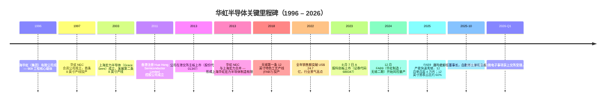
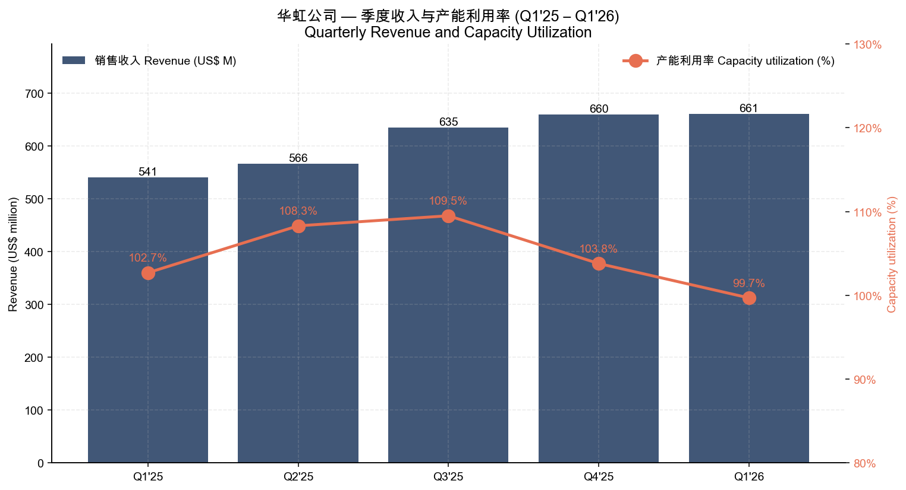
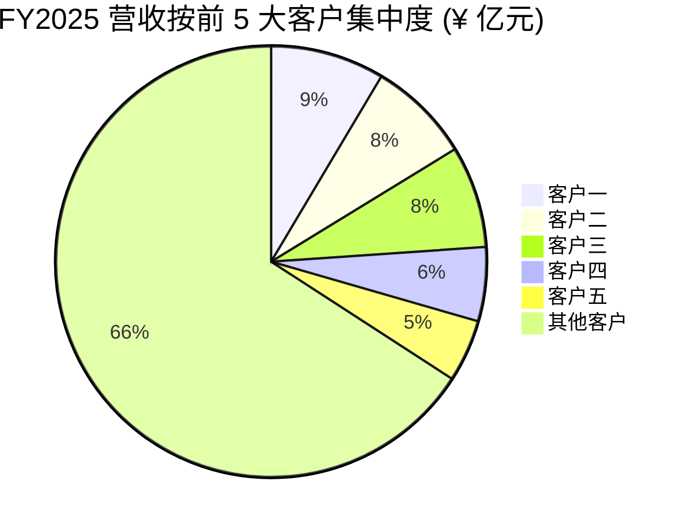
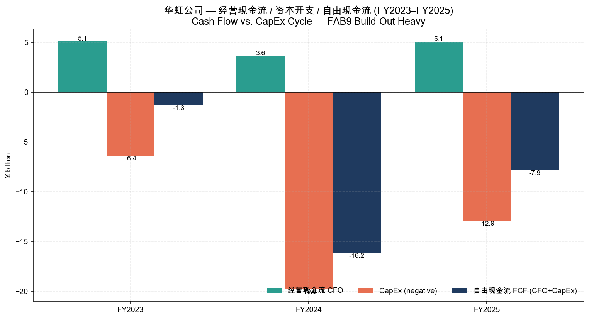
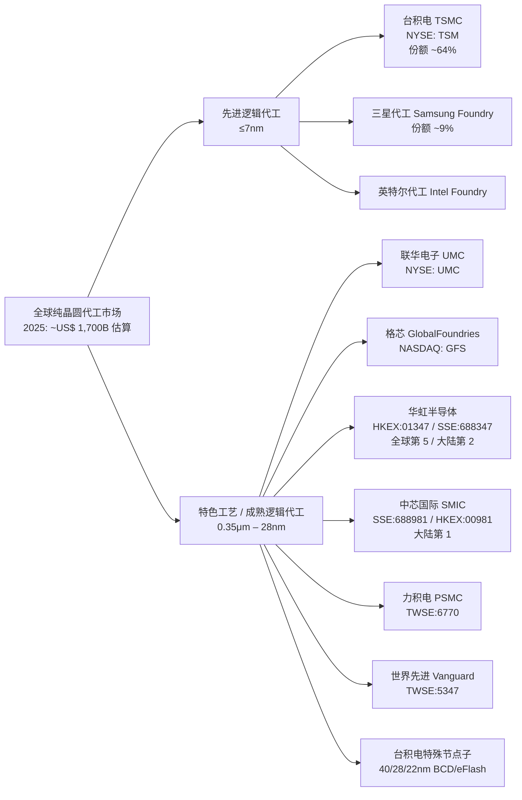

# 华虹半导体（华虹公司，SSE:688347 / HKEX:01347）公司研究报告

**报告日期：** 2026-05-20  
**报告类型：** 初次覆盖（Initiating Coverage）  
**报告语言：** 简体中文（附必要英文术语）

> **披露提示**  
> 本报告基于巨潮资讯（cninfo）公开披露的年报、季报与港股公告，以及公司官方网站（[www.huahonggrace.com](https://www.huahonggrace.com/)）信息撰写。所有定量数据均可追溯到注脚标注的原始披露文件。本报告期内有两项重大事项需在阅读时优先关注：（1）公司2026 年 Q1 业绩与全年指引未变，但管理层于 2025 年 10 月更换；新任董事会主席兼总裁白鹏博士于 2025 年 1 月加入、10 月升任主席；（2）公司于 2026 年初提出收购控股股东旗下另一家先进逻辑代工厂上海华力微电子（华力微）50%以上股权，该议案已经上交所受理并进入实质审核，预计 2026 年下半年完成。该收购若落地，将显著改变公司业务结构与可比基础。

---

## 目录

1. [公司概览](#1-公司概览)
2. [公司历史](#2-公司历史)
3. [管理团队与公司治理](#3-管理团队与公司治理)
4. [产品与服务](#4-产品与服务)
5. [客户与上市策略](#5-客户与上市策略)
6. [行业概览](#6-行业概览)
7. [竞争格局](#7-竞争格局)
8. [市场机会与 TAM](#8-市场机会与-tam)
9. [风险评估](#9-风险评估)
10. [参考资料](#10-参考资料)

---

## 1. 公司概览

华虹半导体有限公司（A 股简称：华虹公司，证券代码 SSE:688347；港股简称：华虹半导体，股份代号 HKEX:01347）是一家依据中国香港《公司条例》设立的红筹企业，注册地为中国香港，办公总部及全部生产经营实体均位于上海与无锡。公司是**全球领先的特色工艺纯晶圆代工企业（specialty-process pure-play foundry）**，专注于在 8 英寸与 12 英寸晶圆产线上提供嵌入式/独立式非易失性存储器（eNVM / NVM）、模拟与电源管理（Analog & Power Management）、逻辑与射频（Logic & RF）以及功率器件（Power Discretes）等"特色 IC + Power Discrete"工艺的代工服务（[2025 年年度报告，第 11–14 页](https://static.sse.com.cn/disclosure/listedinfo/announcement/c/new/2026-03-26/688347_20260326_T64M.pdf)）。

**核心定位与规模。** 根据 2025 年年度报告引用第三方研究机构 IBS 的数据，公司 2025 年纯晶圆代工销售额位居**全球第五位**，在中国大陆纯代工企业中排名第二（仅次于中芯国际，SSE:688981 / HKEX:00981），是国内特色工艺代工技术龙头（[2025 年年度报告，第 13 页](https://static.sse.com.cn/disclosure/listedinfo/announcement/c/new/2026-03-26/688347_20260326_T64M.pdf)）。截至 2025 年末，公司在上海金桥和张江拥有三座 8 英寸晶圆厂，在无锡高新技术产业开发区内拥有两座 12 英寸特色工艺晶圆厂——其中无锡第二条 12 英寸产线（**华虹制造项目，下称"FAB9"**）于 2024 年第四季度风险量产，2025 年快速爬坡，截至 2025 年 12 月单月投片量已超过 4 万片 12 英寸（[2025 年年度报告，第 13–14 页](https://static.sse.com.cn/disclosure/listedinfo/announcement/c/new/2026-03-26/688347_20260326_T64M.pdf)）。

**2025 财年关键经营数据：**

| 指标 | FY2025 | FY2024 | YoY |
|---|---|---|---|
| 营业收入（人民币，PRC GAAP） | ¥172.91 亿元 | ¥143.88 亿元 | +20.18% |
| 销售收入（美元，HK GAAP） | US$ 24.021 亿 | US$ 20.04 亿 | +19.9% |
| 毛利率（HK GAAP, USD 列账） | 11.8% | 10.2% | +1.6 pp |
| 归母净利润 | ¥3.77 亿元 | ¥3.81 亿元 | -1.0% |
| 经营活动现金流净额 | ¥50.65 亿元 | ¥36.08 亿元 | +40.4% |
| 资本开支（购建固定/无形资产现金支付） | ¥129.31 亿元 | ¥197.82 亿元 | -34.6% |
| 研发投入 | ¥19.94 亿元 | ¥16.43 亿元 | +21.4% |
| 研发占收入比 | 11.53% | 11.42% | +0.11 pp |
| 晶圆出货量（折合 8 英寸） | 5,382,874 片 | 4,545,000 片* | +18.4% |
| 8 英寸 + 12 英寸平均产能利用率 | 100%+ | 接近 100% | n/a |
| 12 英寸营收占总营收 | ~60% | n/a | n/a |

*FY2024 出货量为反推数据。来源：[2025 年年度报告，第 12–24 页](https://static.sse.com.cn/disclosure/listedinfo/announcement/c/new/2026-03-26/688347_20260326_T64M.pdf)；[2026 年第一季度港股业绩公布](https://static.sse.com.cn/disclosure/listedinfo/announcement/c/new/2026-05-14/688347_20260514_BJ7T.pdf)。

来源：[2024 年年度报告，第 9 页](https://static.sse.com.cn/disclosure/listedinfo/announcement/c/new/2025-03-27/688347_20250327_PDF7.pdf)（2022/2023/2024 数据）；[2025 年年度报告，第 8 页](https://static.sse.com.cn/disclosure/listedinfo/announcement/c/new/2026-03-26/688347_20260326_T64M.pdf)（2025 数据）；港股 USD 数据来自各季度业绩公布。

**业绩周期解读。** 2022 年是行业景气高点，公司彼时收入 ¥167.86 亿元、归母净利润 ¥30.09 亿元、加权 ROE 16.30%；自 2023 年起进入半导体周期下行，公司归母净利润连续两年大幅下滑——2023 年 ¥19.36 亿元（-35.7%），2024 年仅 ¥3.81 亿元（-80.3%）。**2025 年的特点是"收入复苏、利润底部企稳"**——营收增长 20.18%、毛利率从 10.2%（USD 口径）回升至 11.8%、出货量 +18.4%，但归母净利润几乎持平（-1.0%），主要因 FAB9 折旧大幅上升、利润总额（pre-tax）仍录得 -¥6.51 亿元的亏损，归母正利润主要由少数股东权益分摊（FAB9 由公司控股、上海市政府背景基金参股）和政府补助贡献（[2025 年年度报告，第 10、21 页](https://static.sse.com.cn/disclosure/listedinfo/announcement/c/new/2026-03-26/688347_20260326_T64M.pdf)）。

**2026 年 Q1 拐点信号。** 2026 年第一季度销售收入 US$ 660.9 百万、同比 +22.2%、环比 +0.2%；毛利率 13.0%，同比上升 3.8 个百分点；母公司拥有人应占利润 US$ 20.9 百万，同比 +458.1%。管理层对 Q2 给出**销售收入 US$ 690–700 百万、毛利率 14%–16%** 的指引，超出市场预期，反映公司订单饱满且 12 英寸产能溢价开始转化为利润（[2026 年第一季度报告](https://static.sse.com.cn/disclosure/listedinfo/announcement/c/new/2026-05-14/688347_20260514_BAYY.pdf)；[港股 2026 Q1 业绩公布](https://static.sse.com.cn/disclosure/listedinfo/announcement/c/new/2026-05-14/688347_20260514_BJ7T.pdf)）。

**资本结构与估值快照。** 截至 2026 年 3 月 31 日，公司总资产 ¥1,019.49 亿元、归母净资产 ¥452.48 亿元、长期借款 ¥195.90 亿元、长期应付款 ¥41.79 亿元（为政府背景战投的"可回售工具"）。公司 2025 年度利润分配方案为不派现金红利、不送股、不公积金转股（[2025 年年度报告，第 2 页](https://static.sse.com.cn/disclosure/listedinfo/announcement/c/new/2026-03-26/688347_20260326_T64M.pdf)）。**估值快照（TTM P/E、P/S 与同业对比）：** 本报告撰写时未获得授权从东方财富 / Yahoo Finance 等市场数据源拉取实时报价，故无法引用经核实的 TTM 估值倍数；建议读者参考 Wind / Bloomberg / 东方财富即时数据进行对标。结构上，公司 2025 年归母净利润仅 ¥3.77 亿元（每股 EPS ¥0.22），扣非 EPS ¥0.13，对应静态 P/E 极高——这是典型的折旧前置型重资本周期股（capacity-build trough valuation），市场更多以**EV/EBITDA、P/B 与 P/S** 给予定价，参考国内同业中芯国际及台积电（NYSE:TSM）当下区间。本报告将该项标注为"披露不足，待补"，避免编造数据。

---

## 2. 公司历史

华虹半导体的前身可追溯到 1996 年成立的**上海华虹（集团）有限公司**——中国"909 工程"的核心实施主体，由国务院批准、上海市政府推动设立，是中国大陆最早建立 0.35–0.5μm 工艺能力的国家级集成电路项目（[腾讯新闻引述"909工程"和华虹集团，2024-12-14](https://news.qq.com/rain/a/20241214A06XMR00)；[上海党史网"神秘的'909工程'"](https://www.ccphistory.org.cn/shds/pdkfkf30zn/content/3a59d8f1-f741-4b02-8aad-ebdefe4251d3.html)）。1997 年成立的华虹 NEC 是中国大陆首家中外合资、量产 8 英寸 IC 的企业，标志着大陆代工业的真正开端（[华虹集团官网"芯路历程"](https://www.huahong.com.cn/?m=channel&id=37)）。

**详细沿革：** （以下时间节点引自 2025 年年度报告"第一节 释义"与"第五节 公司治理"及公司 [2023 年招股说明书](https://static.sse.com.cn/disclosure/listedinfo/announcement/c/new/2023-08-04/688347_20230804_2.pdf)）

- **1996 年：** 上海华虹（集团）有限公司（"华虹集团"）设立，由上海市国资委 100% 间接控股，承担国家"909 工程"。
- **2002 年：** Shanghai Hua Hong International, Inc.（华虹国际，公司直接控股股东）成立，作为华虹集团境外投资平台。
- **2011–2013 年：** 整合华虹 NEC（8 英寸 FAB1/FAB2/FAB3）与上海宏力（Grace Semi，2003 年由原台积电 CEO 张汝京等人创办）为统一平台。2013 年 10 月 15 日，公司在香港联合交易所主板挂牌上市，股份代号 01347，定位为"全球领先的 8 英寸特色工艺纯晶圆代工厂"。
- **2014–2018 年：** 公司聚焦差异化技术路线，避开与中芯国际、台积电的逻辑制程军备竞赛，重点发展嵌入式 Flash MCU、BCD 模拟工艺、IGBT 等高门槛特色工艺。
- **2018 年：** 无锡 FAB7（华虹半导体（无锡）有限公司，公司持股 51%）投产，是中国大陆首条 12 英寸特色工艺代工产线。
- **2022 年：** 全年销售额达 **US$ 24.74 亿**（HK GAAP）；归母净利润 ¥30.09 亿元，加权 ROE 16.30%（[2024 年年度报告，第 9 页](https://static.sse.com.cn/disclosure/listedinfo/announcement/c/new/2025-03-27/688347_20250327_PDF7.pdf)）。
- **2023 年 8 月 7 日：** 公司以"红筹企业"身份在上交所科创板上市，证券代码 688347，发行价 ¥52.00 元/股、发行 4.0775 亿股，募集资金净额约 ¥210 亿元；持续督导期至 2026 年 12 月 31 日，保荐机构为国泰海通证券（[2025 年年度报告，第 8 页](https://static.sse.com.cn/disclosure/listedinfo/announcement/c/new/2026-03-26/688347_20260326_T64M.pdf)）。
- **2024 年 12 月：** 无锡第二条 12 英寸产线（**FAB9，华虹半导体制造（无锡）有限公司**）开始风险量产；第一期 4 万片/月，第二期 8.3 万片/月目标 2026Q3 达产（[2024 年年度报告，第 6 页](https://static.sse.com.cn/disclosure/listedinfo/announcement/c/new/2025-03-27/688347_20250327_PDF7.pdf)）。
- **2025 年 1–10 月：** 白鹏博士加入并升任董事会主席，原董事长唐均君卸任（[2025 年年度报告，第 33–34 页](https://static.sse.com.cn/disclosure/listedinfo/announcement/c/new/2026-03-26/688347_20260326_T64M.pdf)）。
- **2026 年 Q1：** 拟收购控股股东华虹集团旗下**上海华力微电子有限公司（华力微）**议案获上交所受理（[2026 Q1 季报，第 1 页](https://static.sse.com.cn/disclosure/listedinfo/announcement/c/new/2026-05-14/688347_20260514_BAYY.pdf)）。华力微承载 55–28nm 逻辑工艺，整合后华虹将同时具备成熟逻辑 + 特色工艺双重能力。

---

## 3. 管理团队与公司治理

公司 2025 年度治理结构经历重大调整。董事会现由 9 人组成：1 名执行董事兼董事会主席、3 名非执行董事、3 名独立非执行董事，外加多位高管在子公司董事会任职。公司明确表示其治理框架"基于公司注册地（中国香港）和境外上市的相关法律法规及规则制定，与目前适用于注册在中国境内的一般 A 股上市公司的治理模式相比存在一定差异"（[2025 年年度报告，第 31 页](https://static.sse.com.cn/disclosure/listedinfo/announcement/c/new/2026-03-26/688347_20260326_T64M.pdf)）。

### 3.1 董事会主席兼总裁 — 白鹏 博士（63 岁，2025 年 1 月加入）

白鹏博士的履历是 2025 年公司治理变化的核心。他**在集成电路制造领域有超过三十年工作经验**，加入华虹之前于 **2022 年 9 月起担任荣芯半导体有限公司首席执行官**（荣芯半导体为大陆专注于成熟工艺的新兴代工厂）。在荣芯之前，白先生的主要职业路径在**英特尔（Intel Corporation）**度过，历任：工艺整合工程师、工艺整合经理、良率工程总监、研发总监兼副总裁、最后晋升至**英特尔全球副总裁**。学术背景方面，他先就读北京大学，后于 1985 年毕业于布加勒斯特大学物理学系（学士），1991 年获美国伦斯勒理工学院（Rensselaer Polytechnic Institute）物理学博士学位（[2025 年年度报告，第 34 页](https://static.sse.com.cn/disclosure/listedinfo/announcement/c/new/2026-03-26/688347_20260326_T64M.pdf)）。

**评价。** 白鹏的背景与华虹原有管理层有质的差异：他带来了国际一线大厂（英特尔）研发与工艺整合的深度经验，对公司向 28nm 以下逻辑迁移、与华力微整合具有直接相关性；荣芯 2 年多 CEO 经历表明其管理新兴代工厂的能力，但荣芯规模与华虹差异巨大，执行力仍需在更大规模上验证（[知乎"又一个国产7纳米玩家进场？", 2025-01](https://zhuanlan.zhihu.com/p/16341476399)）；作为总裁仅 9 个月即晋升董事长，反映上海市国资委对公司未来战略的强力背书（[财联社"华虹公司高管变动 总裁白鹏获任董事会主席", 2025-10-31](https://www.stcn.com/article/detail/3473903.html)；[TrendForce集邦咨询, 2025-11-03](https://www.trendforce.cn/industry-news/semiconductors/20251103-1369.html)）。2026 年 Q1 是白鹏作为董事长发布的首份完整季报，业绩指引转积极（Q2 毛利率指引 14–16%）显示新管理层正释放业绩信心（[港股 2026 Q1 业绩公布](https://static.sse.com.cn/disclosure/listedinfo/announcement/c/new/2026-05-14/688347_20260514_BJ7T.pdf)）。

### 3.2 执行副总裁兼首席财务官 — Daniel Yu-Cheng Wang（王鼎，63 岁）

王鼎是公司核心稳定力量，2012 年 2 月加入上海宏力（华虹合并前的实体），主导了华虹 NEC + 上海宏力合并、港股上市（2013）以及科创板上市（2023）三项关键资本市场事件。此前 1995–2001 年在美国硅谷 LSI Logic Corporation 担任宽带娱乐部门部门总监；更早供职于美国 Franklin Templeton Investments（富兰克林邓普顿）。加州大学伯克利分校工业工程及营运研究学士、旧金山大学财务银行 MBA。**多次荣获《机构投资者》（Institutional Investor）"亚洲（除日本外）执行团队榜单"科技/半导体行业最佳首席财务官**（[2025 年年度报告，第 35 页](https://static.sse.com.cn/disclosure/listedinfo/announcement/c/new/2026-03-26/688347_20260326_T64M.pdf)）。

### 3.3 其他高管

以下其他高管简历均来自 [2025 年年度报告，第 34–37 页](https://static.sse.com.cn/disclosure/listedinfo/announcement/c/new/2026-03-26/688347_20260326_T64M.pdf)：

- **周卫平**（执行副总裁，59 岁，2018 年加入）：来自上海贝岭股份、上海先进半导体制造（ASMC）的资深行业老兵，历任 ASMC 总裁兼 CEO；华东师范大学固态电子技术学士、复旦大学 MBA；教授级高工。
- **华光平**（执行副总裁，58 岁，2024 年 8 月加入）：清华大学微电子所背景，曾就职于新加坡特许（Chartered Semiconductor）、ASMC、华虹 NEC，近 30 年半导体行业经验。
- **陈一敏**（执行副总裁，44 岁，2025 年 8 月升任）：原华虹无锡党委副书记，主管人力资源。
- **Larry Maohui Ge（葛茂晖，61 岁，2026 年 2 月加入）**：分管质量与测试，背景含 Intel、Marvell、Cypress、长江存储等公司质量副总裁/总监；复旦物理学士、夏威夷大学固态物理博士、UIUC 博士后。
- **陈广龙**（高级副总裁兼技术研发负责人，45 岁，2025 年 8 月升任）：2018 年从上海华力微电子转入华虹无锡，历任工艺整合部部长、副总裁兼七厂常务副厂长。该任命路径意味深长——若华力微整合成功，陈广龙的双厂经验将是关键。

### 3.4 治理结构与控制权

- **直接控股股东：** Shanghai Hua Hong International, Inc.（华虹国际，持股 20.00%）。
- **间接控股股东：** 上海华虹（集团）有限公司（华虹集团，通过华虹国际持股；2025 年期间另通过集中竞价方式增持 A 股 1,198,517 股；华虹集团与华虹国际合计持有公司 348,804,167 股）。
- **实际控制人：** **上海市国有资产监督管理委员会（上海市国资委）**——华虹国际、华虹集团、联和国际（持股 9.24%）、海通创新证券投资（0.47%）、国泰君安证裕（0.47%）均受上海市国资委控制。
- **大基金二期：** 华芯投资管理有限责任公司 - 国家集成电路产业投资基金二期股份有限公司持股 2.78%（48,334,249 股 A 股）。
- **港股股东：** 香港中央结算（代理人）有限公司（HKSCC NOMINEES LIMITED）名义持有 820,577,499 股（47.22%），代第三方投资者持有。
- **大基金二期注册资本：** 根据百度百科披露，大基金一期/二期/三期合计注册资本超 ¥6,800 亿元（一期 ¥987.2 亿、二期 ¥2,041.5 亿、三期 ¥3,440 亿）（[国家集成电路产业投资基金二期股份有限公司, 百度百科](https://baike.baidu.com/item/%E5%9B%BD%E5%AE%B6%E9%9B%86%E6%88%90%E7%94%B5%E8%B7%AF%E4%BA%A7%E4%B8%9A%E6%8A%95%E8%B5%84%E5%9F%BA%E9%87%91%E4%BA%8C%E6%9C%9F%E8%82%A1%E4%BB%BD%E6%9C%89%E9%99%90%E5%85%AC%E5%8F%B8/24164530)）。

来源：[2025 年年度报告，第 78–82 页](https://static.sse.com.cn/disclosure/listedinfo/announcement/c/new/2026-03-26/688347_20260326_T64M.pdf)；[2026 年第一季度报告，第 4–6 页](https://static.sse.com.cn/disclosure/listedinfo/announcement/c/new/2026-05-14/688347_20260514_BAYY.pdf)。

**独立非执行董事：** 张祖同（77 岁，前安永中国及香港区主席，财务专家）；王桂壎（74 岁，资深律师、香港社会名流，银紫荆星章）；封松林（61 岁，原中科院上海高等研究院院长，半导体研究专家）。整体专业性强、海内外背景兼具（[2025 年年度报告，第 33 页](https://static.sse.com.cn/disclosure/listedinfo/announcement/c/new/2026-03-26/688347_20260326_T64M.pdf)）。

**治理风险（董事会自身披露）：** 公司治理结构与境内 A 股公司在利润分配机制、重大事项决策程序、剩余财产分配、监事会制度、独立董事任职资格等方面存在差异；公司不设监事会（A 股不强制）；2025 年度不派发现金红利、不送股的方案，反映 FAB9 大额折旧背景下利润真实性较低，难以支撑分红（[2025 年年度报告，第 2 页](https://static.sse.com.cn/disclosure/listedinfo/announcement/c/new/2026-03-26/688347_20260326_T64M.pdf)）。

**薪酬：** 2025 年度全体董事与高管薪酬合计 **¥1,808.58 万元**，核心技术人员薪酬合计 **¥1,100.51 万元**——以行业头部企业标准、并考虑公司收入规模（172.91 亿元）属于偏低，反映国资体系下的薪酬上限约束（[2025 年年度报告，第 39–40 页](https://static.sse.com.cn/disclosure/listedinfo/announcement/c/new/2026-03-26/688347_20260326_T64M.pdf)）。

---

## 4. 产品与服务

公司的产品 = 半导体晶圆代工服务（semiconductor wafer foundry services）。客户带来芯片设计，公司提供从光罩（reticle）准备、晶圆制造（diffusion/photolithography/etch/implant/deposition）、到测试与出货的全流程代工，按片（约当 8 英寸）或按订单（PO）结算（[2025 年年度报告，第 11–14 页](https://static.sse.com.cn/disclosure/listedinfo/announcement/c/new/2026-03-26/688347_20260326_T64M.pdf)）。

公司的五大特色工艺平台覆盖关系如下：

```mermaid
graph TD
    A[华虹半导体<br/>5 大特色工艺平台]
    A --> B[嵌入式非易失性存储<br/>eNVM<br/>FY25: ¥43.62亿 25.4%]
    A --> C[独立式非易失性存储<br/>Standalone NVM<br/>FY25: ¥13.39亿 7.8%]
    A --> D[功率器件<br/>Power Discretes<br/>FY25: ¥47.65亿 27.8%]
    A --> E[模拟与电源管理<br/>Analog & PMIC<br/>FY25: ¥45.60亿 26.6%]
    A --> F[逻辑与射频<br/>Logic & RF<br/>FY25: ¥21.19亿 12.4%]
    B --> B1[40nm eFlash COT 风险量产]
    B --> B2[55nm eFlash 大规模量产<br/>车规级 MCU 多平台供货]
    B --> B3[智能卡芯片 IC 卡 55nm]
    C --> C1[48nm NOR Flash 量产<br/>占出货比例大幅提升]
    C --> C2[ETOX Flash<br/>NORD Flash]
    D --> D1[1.6μm IGBT 国际领先<br/>EV 主驱逆变器]
    D --> D2[Super Junction MOSFET]
    D --> D3[Power GaN 化合物半导体研发]
    D --> D4[650/750/1000/1200V 系列<br/>新增 800V]
    E --> E1[0.18μm BCD 120V<br/>汽车 48V 系统]
    E --> E2[90nm BCD 量产<br/>BCD+ 集成方案]
    E --> E3[BCD+eFlash 集成]
    F --> F1[40nm 超低功耗 量产<br/>IoT/可穿戴]
    F --> F2[55/40nm 特色工艺<br/>RFCMOS 稳定量产]
    F --> F3[65nm RF SOI 增长]
    F --> F4[CIS 图像传感器<br/>智能手机主摄]
```

来源：[2025 年年度报告，第 14–17、23 页](https://static.sse.com.cn/disclosure/listedinfo/announcement/c/new/2026-03-26/688347_20260326_T64M.pdf)。

来源：[2025 年年度报告，第 23 页（按技术类型划分）](https://static.sse.com.cn/disclosure/listedinfo/announcement/c/new/2026-03-26/688347_20260326_T64M.pdf)。

**逐平台讨论（基于 2025 AR 与 2026 Q1 港股公告披露）：**

**4.1 嵌入式非易失性存储器 / eNVM（FY2025 ¥43.62 亿元 / 占 25.4%，+16.6% YoY；Q1'26 US$184.6M，+41.7% YoY）。** 主要承载两大类应用——智能卡芯片（金融 IC 卡、SIM 卡、身份证）与微控制器（MCU，应用于汽车、家电、工控）。2025 年 40nm eFlash COT（Customer-Owned Tooling）实现风险量产，55nm eFlash 大规模量产，多个平台实现**车规级 MCU 大量供货**（[2025 年年度报告，第 14–15 页](https://static.sse.com.cn/disclosure/listedinfo/announcement/c/new/2026-03-26/688347_20260326_T64M.pdf)）。Q1'26 该平台增长 41.7%，是五大平台中增速最快之一，主要来自 MCU 与智能卡芯片需求回升（[港股 2026 Q1 业绩公布](https://static.sse.com.cn/disclosure/listedinfo/announcement/c/new/2026-05-14/688347_20260514_BJ7T.pdf)）。

**4.2 模拟与电源管理 / Analog & PMIC（FY2025 ¥45.60 亿元 / 占 26.6%，+42.0% YoY；Q1'26 US$173.9M，+25.8% YoY）。** 2025 年增速最强劲的平台，主要受益于**AI 周边电源应用与手机领域强劲需求**。技术方面 0.18μm BCD 120V 平台成功量产，覆盖汽车电子 48V 系统对基础电源芯片的高压要求；90nm BCD 稳定量产并持续迭代；多个工艺节点推出"BCD+"集成方案，BCD+eFlash 工艺产品在汽车电子领域大规模出货。客户群与 AI 服务器电源、智能手机快充、新能源车 OBC/DC-DC 紧密关联（[2025 年年度报告，第 15 页](https://static.sse.com.cn/disclosure/listedinfo/announcement/c/new/2026-03-26/688347_20260326_T64M.pdf)；[港股 2026 Q1 业绩公布](https://static.sse.com.cn/disclosure/listedinfo/announcement/c/new/2026-05-14/688347_20260514_BJ7T.pdf)）。

**4.3 功率器件 / Power Discretes（FY2025 ¥47.65 亿元 / 占 27.8%，+7.4% YoY；Q1'26 US$170.9M，+5.0% YoY）。** 公司体量最大的平台，**全球唯一的 12 英寸功率器件代工产线**就在华虹无锡（[2025 年年度报告，第 15 页](https://static.sse.com.cn/disclosure/listedinfo/announcement/c/new/2026-03-26/688347_20260326_T64M.pdf)）。1.6μm IGBT 工艺产品在所有 IGBT 产品中投入比例快速提升，工艺对标国际领先水平；650V/750V/1000V/1200V 系列已固化，2025 年新增 800V 电压平台；化合物半导体方面积极开发 Power GaN 工艺。**下游应用集中在新能源汽车主驱逆变器、光伏逆变器、风光储充等**，是华虹差异化最深、护城河最强的领域之一（[Yole Group "Status of the Power Electronics Industry 2025"](https://www.yolegroup.com/product/report/status-of-the-power-electronics-industry-2025/)；[Yole Group "Power electronics industry: facing rapid expansion in manufacturing capacity"](https://www.yolegroup.com/press-release/power-electronics-industry-facing-rapid-expansion-in-manufacturing-capacity/)）。增速放缓主要因 2024 年高基数 + 超级结产品需求下降，但 IGBT 与通用 MOSFET 维持强劲（[港股 2026 Q1 业绩公布](https://static.sse.com.cn/disclosure/listedinfo/announcement/c/new/2026-05-14/688347_20260514_BJ7T.pdf)）。

**4.4 逻辑与射频 / Logic & RF（FY2025 ¥21.19 亿元 / 占 12.4%，+9.5% YoY；Q1'26 US$74.4M，+11.4% YoY）。** 公司相对较弱的平台，主要因纯逻辑制程公司不深入。2025 年 40nm 超低功耗特色工艺成功量产，能显著延长 IoT / 可穿戴设备的续航时间；55/40nm 特色工艺及 RFCMOS 工艺稳定量产；65nm RF SOI 工艺平台营收持续增长；图像传感器（CIS）芯片为公司在移动影像、车载视觉等市场建立未来基础（[2025 年年度报告，第 15–16 页](https://static.sse.com.cn/disclosure/listedinfo/announcement/c/new/2026-03-26/688347_20260326_T64M.pdf)）。**与华力微的潜在整合主要瞄准此平台**——华力微具备 55–28nm 逻辑量产能力，可补足华虹在逻辑代工的短板（[每日经济新闻"华虹公司拟收购华力微旗下华虹五厂", 2025-08-17](https://www.nbd.com.cn/articles/2025-08-17/4015924.html)）。

**4.5 独立式非易失性存储器 / Standalone NVM（FY2025 ¥13.39 亿元 / 占 7.8%，+44.5% YoY；Q1'26 US$57.1M，+33.2% YoY）。** 主要为 NOR Flash 代工，客户包括兆易创新（SZSE:603986）、武汉新芯、华邦电子、旺宏等。2025 年 **48nm NOR Flash 产品出货占比大幅提升**，是公司技术节点最先进的存储工艺之一，增速 +44.5% 为五大平台之首（[2025 年年度报告，第 15 页](https://static.sse.com.cn/disclosure/listedinfo/announcement/c/new/2026-03-26/688347_20260326_T64M.pdf)；[港股 2026 Q1 业绩公布](https://static.sse.com.cn/disclosure/listedinfo/announcement/c/new/2026-05-14/688347_20260514_BJ7T.pdf)）。

### 4.6 工艺节点结构与 8/12 英寸切换

来源：[2025 年年度报告，第 23 页](https://static.sse.com.cn/disclosure/listedinfo/announcement/c/new/2026-03-26/688347_20260326_T64M.pdf)。

**关键观察：** FY2025 65nm 及以下节点（仅在 12 英寸产线生产）收入 ¥43.43 亿元、占比 25.3%（FY2024 21.9%）；90/95nm 节点收入 ¥41.59 亿元、占比 24.3%（FY2024 19.4%）——**两项合计 49.6%（FY24: 41.3%）**，由 FAB9 爬坡驱动。公司管理层在 2026 Q1 港股业绩公布中明确"12 英寸产能爬坡稳步推进、收入占比已提升至 62.7%"。8 英寸产线主要承载 >0.35μm（功率器件大头）与 0.11–0.18μm 模拟工艺，2025 年合计收入 ¥66.74 亿元、占比 39.0%（[2025 年年度报告，第 23 页](https://static.sse.com.cn/disclosure/listedinfo/announcement/c/new/2026-03-26/688347_20260326_T64M.pdf)；[港股 2026 Q1 业绩公布](https://static.sse.com.cn/disclosure/listedinfo/announcement/c/new/2026-05-14/688347_20260514_BJ7T.pdf)）。

### 4.7 季度收入与产能利用率

来源：港股 2025 Q1–Q4 与 2026 Q1 业绩公布（[Q1'25](https://static.sse.com.cn/disclosure/listedinfo/announcement/c/new/2025-05-08/688347_20250508_PFAR.pdf)；[Q2'25](https://static.sse.com.cn/disclosure/listedinfo/announcement/c/new/2025-08-07/688347_20250807_7DC4.pdf)；[Q3'25](https://static.sse.com.cn/disclosure/listedinfo/announcement/c/new/2025-11-06/688347_20251106_VMUI.pdf)；[Q1'26](https://static.sse.com.cn/disclosure/listedinfo/announcement/c/new/2026-05-14/688347_20260514_BJ7T.pdf)）。

**解读：** 2025 全年产能利用率持续在 100% 以上（Q2 108.3%、Q3 109.5% 为历史高位），反映特色工艺供需紧平衡。Q1'26 利用率回落到 99.7%，主要因 FAB9 新增产能（489k 8-inch 等效，较 Q1'25 的 413k 提升 18.4%）尚未完全被订单填满，但管理层 Q2'26 收入指引 US$ 690–700M（环比 +4.4–5.9%）显示订单正在追上产能（[港股 2026 Q1 业绩公布](https://static.sse.com.cn/disclosure/listedinfo/announcement/c/new/2026-05-14/688347_20260514_BJ7T.pdf)；[港股 2025 Q3 业绩公布](https://static.sse.com.cn/disclosure/listedinfo/announcement/c/new/2025-11-06/688347_20251106_VMUI.pdf)）。

---

## 5. 客户与上市策略

### 5.1 客户类型与集中度

公司全部采用**直销模式**（direct sales），2025 年主营业务收入构成：

- **系统公司与无厂芯片设计公司（Fabless）：** ¥165.87 亿元，占 96.74%（FY2024: 95.76%）；
- **整合器件制造商（IDMs）：** ¥5.59 亿元，占 3.26%（FY2024: 4.24%）（[2025 年年度报告，第 25 页](https://static.sse.com.cn/disclosure/listedinfo/announcement/c/new/2026-03-26/688347_20260326_T64M.pdf)）。

**前五大客户合计销售额 ¥58.60 亿元，占年度销售总额 34.18%**（[2025 年年度报告，第 25 页](https://static.sse.com.cn/disclosure/listedinfo/announcement/c/new/2026-03-26/688347_20260326_T64M.pdf)）：

| 排名 | 客户 | 销售额 | 占比 | 关联关系 |
|---|---|---|---|---|
| 1 | 客户一（未具名） | ¥14.68 亿 | 8.56% | 否 |
| 2 | 客户二（未具名） | ¥13.24 亿 | 7.72% | 否 |
| 3 | 客户三（未具名） | ¥13.12 亿 | 7.65% | 否 |
| 4 | 客户四（未具名） | ¥9.53 亿 | 5.56% | 否 |
| 5 | 客户五（未具名） | ¥8.03 亿 | 4.69% | 否 |

来源：[2025 年年度报告，第 25 页](https://static.sse.com.cn/disclosure/listedinfo/announcement/c/new/2026-03-26/688347_20260326_T64M.pdf)。

**风险评估：** 公司客户**未具名披露**（"客户一/二/三/四/五"），符合科创板对代工厂客户保密惯例，但读者无法独立交叉验证。**前 5 大客户集中度 34.18% 属于中等偏低**——远低于台积电（前 5 客户约 60–65%）——这是特色工艺多客户、长尾结构的典型表现，属结构性优势（[2025 年年度报告，第 25 页](https://static.sse.com.cn/disclosure/listedinfo/announcement/c/new/2026-03-26/688347_20260326_T64M.pdf)；[TSMC 2024 Annual Report (Form 20-F)](https://investor.tsmc.com/sites/ir/annual-report/2024/2024%20Annual%20Report_E.pdf)）。前 5 大供应商中关联方为**上海华虹虹日电子有限公司**（采购额 ¥2.56 亿、占 3.80%），系华虹集团旗下硅片供应商（[2025 年年度报告，第 26 页](https://static.sse.com.cn/disclosure/listedinfo/announcement/c/new/2026-03-26/688347_20260326_T64M.pdf)）。

### 5.2 地域分布

来源：[2025 年年度报告，第 23 页](https://static.sse.com.cn/disclosure/listedinfo/announcement/c/new/2026-03-26/688347_20260326_T64M.pdf)。

**FY2025 营收按地区拆分：** 中国大陆及香港 ¥140.91 亿元（82.19%，+21.0%）；北美 ¥17.56 亿元（10.24%，+31.4%，受益于 AI 周边电源与 MCU 需求）；亚洲其他 ¥8.15 亿元（4.75%，+4.2%）；欧洲 ¥4.83 亿元（2.82%，-2.2%）。Q1'26 北美区营收同比 +51.9%，主要由其他电源管理与 MCU 产品拉动——这与 NVIDIA / AMD AI 服务器供应链有间接关联（GPU 板卡上的辅助电源 IC、BMC MCU 等）（[2025 年年度报告，第 23 页](https://static.sse.com.cn/disclosure/listedinfo/announcement/c/new/2026-03-26/688347_20260326_T64M.pdf)；[港股 2026 Q1 业绩公布](https://static.sse.com.cn/disclosure/listedinfo/announcement/c/new/2026-05-14/688347_20260514_BJ7T.pdf)）。

### 5.3 终端市场

FY2025 终端市场分布：**消费电子 63.81%（¥109.40 亿，+21.9%）；工业及汽车 22.21%（¥38.09 亿，+16.1%）；通信 12.50%（¥21.43 亿，+19.9%）；计算 1.48%（¥2.54 亿，+20.0%）**。计算类占比虽小但增速最高，反映 AI 服务器电源 / BMC / 接口芯片代工正在起量（[2025 年年度报告，第 23 页](https://static.sse.com.cn/disclosure/listedinfo/announcement/c/new/2026-03-26/688347_20260326_T64M.pdf)）。

### 5.4 上市策略与红筹结构

公司是少数同时在**港交所主板（2013，01347）和上交所科创板（2023，688347）"双重一级上市"（dual primary listing）**的中国半导体企业，与中芯国际（SSE:688981 / HKEX:00981）并列（[华虹半导体公司官网（中文）](https://www.huahonggrace.com/c/)；[2023 年招股说明书](https://static.sse.com.cn/disclosure/listedinfo/announcement/c/new/2023-08-04/688347_20230804_2.pdf)）。这种结构有两个意义：

1. **港股提供国际资本市场敞口**——HKSCC NOMINEES 代理持股 47.22%（≈8.20 亿股港股），是境外公募/对冲基金/主权基金的主要载体（[2025 年年度报告，第 78–82 页](https://static.sse.com.cn/disclosure/listedinfo/announcement/c/new/2026-03-26/688347_20260326_T64M.pdf)）。
2. **A 股募集人民币资本以匹配人民币计价的资本开支**——华虹无锡 FAB7 + FAB9 累计投资超 ¥400 亿元，2023 年科创板 IPO 募资净额约 ¥210 亿元直接用于无锡产能建设（[21财经"募资212亿元 华虹公司登顶A股年内最大IPO", 2023-08-07](https://m.21jingji.com/article/20230807/herald/47e43371016314bcd6b298e0e0351e0c.html)；[2023 年招股说明书](https://static.sse.com.cn/disclosure/listedinfo/announcement/c/new/2023-08-04/688347_20230804_2.pdf)）。

红筹结构（注册地香港 + 主营经营地中国大陆）使公司治理需同时遵守香港《公司条例》和《科创板上市规则》，在重大决策、利润分配、剩余财产分配上存在与境内 A 股的差异（公司在年报中详细披露）（[2025 年年度报告，第 31–32 页](https://static.sse.com.cn/disclosure/listedinfo/announcement/c/new/2026-03-26/688347_20260326_T64M.pdf)；[2023 年招股说明书](https://static.sse.com.cn/disclosure/listedinfo/announcement/c/new/2023-08-04/688347_20230804_2.pdf)）。

---

## 6. 行业概览

### 6.1 全球半导体产业大背景

根据 IBS（International Business Strategies）数据，**2025 年全球半导体市场销售额约 US$ 7,435 亿，同比增长 18.7%**（[2025 年年度报告，第 12 页](https://static.sse.com.cn/disclosure/listedinfo/announcement/c/new/2026-03-26/688347_20260326_T64M.pdf)）。这是史上最大规模半导体年度市场，主要由 AI 及数据中心驱动逻辑与存储市场快速增长，叠加成熟制程随消费/产业链需求回暖、产品升级迭代而复苏。2024 年同期数据为 US$ 6,323 亿（同比 +20.3%）。

**纯晶圆代工（pure-play foundry）子产业** 2025 年市场规模据多家券商研究估计约 US$ 1,700 亿（占全球半导体约 23%），由台积电（TSMC，约 64%份额）主导，三星代工（约 9%）、联电（UMC）、格芯（GlobalFoundries）、华虹半导体、中芯国际、力积电（PSMC）、世界先进（Vanguard）等分食其余。华虹位列全球第五、中国大陆第二，主要在**特色工艺细分**与台积电的先进逻辑代工差异化竞争（[2025 年年度报告，第 13 页](https://static.sse.com.cn/disclosure/listedinfo/announcement/c/new/2026-03-26/688347_20260326_T64M.pdf)）。

### 6.2 特色工艺代工的产业逻辑

**特色工艺（specialty process）≠ 先进工艺（leading-edge）。** 先进工艺指 7nm/5nm/3nm 及以下的逻辑节点，主要服务 HPC/AI/手机 SoC；特色工艺指 0.35μm–28nm 节点上为特定应用优化的工艺，包括（[2025 年年度报告，第 13–17 页](https://static.sse.com.cn/disclosure/listedinfo/announcement/c/new/2026-03-26/688347_20260326_T64M.pdf)；[TSMC 2024 Annual Report (Form 20-F)](https://investor.tsmc.com/sites/ir/annual-report/2024/2024%20Annual%20Report_E.pdf)）：

- **嵌入式 Flash（eFlash）：** MCU、智能卡所需；难点在于在 CMOS 逻辑工艺中集成存储单元。
- **BCD（Bipolar-CMOS-DMOS）：** 模拟电源管理芯片所需，集成数字逻辑 + 模拟 + 高压器件。
- **超级结 MOSFET（Super Junction）/ IGBT：** 高压功率器件，电压可达数千伏。
- **RF CMOS / RF SOI：** 射频前端芯片，5G/Wi-Fi 6 需求。
- **CIS（CMOS Image Sensor）：** 智能手机/车载摄像头。
- **NVM（NOR Flash、ETOX、PCM、ReRAM）：** 各类非易失存储。

来源：[2025 年年度报告，第 14–17 页（五大特色工艺平台技术描述）](https://static.sse.com.cn/disclosure/listedinfo/announcement/c/new/2026-03-26/688347_20260326_T64M.pdf)。

特色工艺的核心特征：**节点演进慢但工艺壁垒高**——例如成熟 BCD 工艺需要 5–7 年研发才能达到量产标准，但一旦量产可服役 10–15 年。这与先进逻辑"每 2 年一代"的节奏完全不同，**形成了"非台积电模式"的代工护城河**，是华虹、SMIC、Vanguard、UMC 的主要赛道（[UMC Specialty Technology Offerings](https://www.umc.com/en/Product/technologies/Index/specialty)；[GlobalFoundries 20-F FY2024](https://www.sec.gov/Archives/edgar/data/0001709048/000170904825000024/gfs-20241231.htm)）。

### 6.3 中国半导体产业政策与本土化趋势

公司在 2025 年年报中两次强调"中国市场供应链本土化所带来的持续需求提升"。具体政策驱动包括：

- **国家集成电路产业投资基金（"大基金"）一期、二期、三期** 累计注册资本超 ¥6,800 亿元（一期 ¥987.2 亿、二期 ¥2,041.5 亿、三期 ¥3,440 亿），二期已入股华虹公司（持股 2.78%）（[国家集成电路产业投资基金, 百度百科](https://baike.baidu.com/item/%E5%9B%BD%E5%AE%B6%E9%9B%86%E6%88%90%E7%94%B5%E8%B7%AF%E4%BA%A7%E4%B8%9A%E6%8A%95%E8%B5%84%E5%9F%BA%E9%87%91/15891498)；[2025 年年度报告，第 78–82 页](https://static.sse.com.cn/disclosure/listedinfo/announcement/c/new/2026-03-26/688347_20260326_T64M.pdf)）。
- **科创板 / 新质生产力支持政策** 持续向半导体倾斜——华虹 2023 年科创板 IPO 募资 ¥210 亿元是典型案例（[21财经"募资212亿元", 2023-08-07](https://m.21jingji.com/article/20230807/herald/47e43371016314bcd6b298e0e0351e0c.html)）。
- **税收优惠：** 公司子公司上海华虹宏力具备高新技术企业资格，2023–2025 年度享受 15% 企业所得税优惠（[2025 年年度报告，第 122 页（税项）](https://static.sse.com.cn/disclosure/listedinfo/announcement/c/new/2026-03-26/688347_20260326_T64M.pdf)）。
- **出口管制对冲：** 美国对华半导体设备/EDA/IP 出口管制持续升级，反向加速国产替代——华虹的 IGBT、MCU、BCD 等特色工艺在国产替代名单中位居前列（[21经济网"美国悍然升级对华半导体管制：140家企业被列入'实体清单'", 2024-12-03](https://www.21jingji.com/article/20241203/herald/5e3b694387ef7a42fa9ed571c163908b.html)；[中信证券"美国对华半导体制裁更新"](https://www.cls.cn/detail/1876778)）。

### 6.4 半导体行业周期性

公司在风险因素中明确披露："半导体行业晶圆制造环节的产能扩充呈现周期性变化特征，通常下游需求变化速度较快，而上游产能的增减则需要更长的时间。因此，半导体行业供应端产能增长无法完美匹配半导体行业需求端的变化，导致行业会出现供需关系周期性的变化"（[2025 年年度报告，第 20 页](https://static.sse.com.cn/disclosure/listedinfo/announcement/c/new/2026-03-26/688347_20260326_T64M.pdf)）。

**最近完整周期回顾（公司视角）：**

- **2020–2022 年（景气上行）：** 公司 2022 年销售额 US$ 24.74 亿、归母净利润 ¥30.09 亿元（[2024 年年度报告，第 9 页](https://static.sse.com.cn/disclosure/listedinfo/announcement/c/new/2025-03-27/688347_20250327_PDF7.pdf)）。
- **2023–2024 年（景气下行）：** 客户去库存、消费电子疲软、地缘政治冲击；2024 年收入 ¥143.88 亿（-11.4% vs 2023）；归母净利润 ¥3.81 亿（-80%）（[2024 年年度报告，第 9 页](https://static.sse.com.cn/disclosure/listedinfo/announcement/c/new/2025-03-27/688347_20250327_PDF7.pdf)）。
- **2025–2026 年（结构性复苏）：** 收入回归 ¥172.91 亿（+20.2%），但毛利率仅 11.8%（HK GAAP），仍处于历史低位，主要因 FAB9 大额折旧（[2025 年年度报告，第 8、21 页](https://static.sse.com.cn/disclosure/listedinfo/announcement/c/new/2026-03-26/688347_20260326_T64M.pdf)）。

### 6.5 资本开支与现金流周期

来源：[2025 年年度报告，第 21 页](https://static.sse.com.cn/disclosure/listedinfo/announcement/c/new/2026-03-26/688347_20260326_T64M.pdf)（FY2024/FY2025），[2024 年年度报告，第 24 页](https://static.sse.com.cn/disclosure/listedinfo/announcement/c/new/2025-03-27/688347_20250327_PDF7.pdf)（FY2023）。

**FAB9 资本开支高峰已过。** 2024 年公司购建固定/无形资产现金支付 **¥197.82 亿元**，2025 年下降至 **¥129.31 亿元（-34.6%）**——管理层预期 2026 年第三季度 FAB9 达到规划产能目标，意味着 CapEx 高峰已过。2025 年经营现金流净额 ¥50.65 亿元（+40.4%）开始覆盖折旧，FCF 缺口从 2024 年 -¥161.74 亿元收窄到 2025 年 -¥78.66 亿元。**这是判断华虹未来 2–3 年盈利能力修复的关键时间窗口**——折旧高位 + CapEx 回落 + 12 英寸产能溢价兑现 = 毛利率从 12% 区间向 20% 以上修复的逻辑链（[2025 年年度报告，第 21 页](https://static.sse.com.cn/disclosure/listedinfo/announcement/c/new/2026-03-26/688347_20260326_T64M.pdf)；[2024 年年度报告，第 24 页](https://static.sse.com.cn/disclosure/listedinfo/announcement/c/new/2025-03-27/688347_20250327_PDF7.pdf)）。

---

## 7. 竞争格局

### 7.1 五家最直接的可比公司

**（1）中芯国际（SMIC，SSE:688981 / HKEX:00981）—— 中国大陆最大代工厂、华虹最直接的境内对标。** 2024 年收入首次突破 US$ 80 亿，2025 年达 US$ 93.27 亿（同比 +16.2%），规模约为华虹的 4 倍（[中芯国际 2025 年年度报告](https://static.cninfo.com.cn/finalpage/2026-03-27/1225037057.PDF)；[TrendForce "SMIC Posts Record $9.3B in 2025 Sales", 2026-02-11](https://www.trendforce.com/news/2026/02/11/news-smic-posts-record-9-3b-in-2025-sales-7nm-yields-reportedly-weigh-on-margins/)）；业务范围更广（覆盖 0.35μm 到 14nm 全栈逻辑），但**特色工艺深度不如华虹**（IGBT、Super Junction、BCD、eFlash 等专项工艺华虹更强）；中芯已掌握 14nm 量产，华虹仍以 40nm 为最先进自有逻辑节点，**收购华力微后预计可补足至 28nm**（[华尔街见闻"华虹半导体宣布收购华力微", 2026](https://wallstreetcn.com/articles/3753489)）。

**（2）联华电子（UMC，NYSE:UMC / TWSE:2303）—— 全球第三大纯代工厂、特色工艺老牌玩家。** 在 28nm 及 14nm 上有量产能力，特色工艺线（汽车级、RF、电源）成熟（[UMC 2024 Form 20-F](https://www.sec.gov/Archives/edgar/data/0001033767/000119312525092142/d846836d20f.htm)；[UMC 14nm Technology](https://www.umc.com/en/Product/technologies/Detail/14nm)）；与华虹在 BCD、RF、MCU 代工上直接竞争（[UMC Specialty Technology Offerings](https://www.umc.com/en/Product/technologies/Index/specialty)）；UMC 海外产能（新加坡、日本）多元化优于华虹。

**（3）格芯（GlobalFoundries，NASDAQ:GFS）—— 美国特色工艺代工龙头。** 主营 22FDX / 12FDX FD-SOI、RF SOI、汽车级 BCD 等特色工艺，与华虹在 RF / BCD 上直接竞争；其美国本土客户群（高通、AMD 等部分订单）是华虹难以触及的（[GlobalFoundries 20-F FY2024](https://www.sec.gov/Archives/edgar/data/0001709048/000170904825000024/gfs-20241231.htm)；[GlobalFoundries Q4 2024 Press Release](https://investors.gf.com/news-releases/news-release-details/globalfoundries-reports-fourth-quarter-2024-and-fiscal-year-2024)）。

**（4）力积电（PSMC，TWSE:6770）/ 世界先进（VIS，TWSE:5347）—— 台湾特色 / 成熟工艺代工。** 力积电主营 DRAM + 逻辑代工，与华虹在 NOR Flash、MCU 上部分重叠（[DigiTimes "PSMC optimistic about 3D AI Foundry strategy", 2024-10-23](https://www.digitimes.com/news/a20241023PD207/psmc-3d-powerchip-2024-earnings.html)）。VIS 是台积电控股的 8 英寸纯代工，与 NXP 合作的新加坡 12 英寸厂 VSMC 2027 年量产，与华虹在 8 英寸 BCD、Power MOSFET 上竞争（[NXP/VIS Joint-Venture Form 8-K, 2024-06](https://www.sec.gov/Archives/edgar/data/0001413447/000141344724000066/visandnxptoestablishajoint.htm)）。

### 7.2 华虹的差异化优势

1. **唯一的 12 英寸功率器件量产产线（FAB7 + FAB9）。** 公司明确表述 FAB7 是"全球第一条 12 英寸功率器件代工生产线"，这是物理意义上的全球独家——12 英寸做功率器件需要克服厚铜、深沟槽刻蚀、薄片处理等工艺难题，国际上多数功率器件厂仍在 6/8 英寸生产（[2025 年年度报告，第 11–13 页](https://static.sse.com.cn/disclosure/listedinfo/announcement/c/new/2026-03-26/688347_20260326_T64M.pdf)；[Yole Group "Power electronics industry: facing rapid expansion in manufacturing capacity"](https://www.yolegroup.com/press-release/power-electronics-industry-facing-rapid-expansion-in-manufacturing-capacity/)）。
2. **eFlash 工艺深度。** 公司 55nm eFlash 大规模量产、40nm eFlash 风险量产，是中国大陆少数能为车规级 MCU 提供 eFlash 代工的公司，竞争对手主要是台积电（40/28nm eFlash）和台联电（55nm eFlash）（[2025 年年度报告，第 14–15 页](https://static.sse.com.cn/disclosure/listedinfo/announcement/c/new/2026-03-26/688347_20260326_T64M.pdf)；[UMC Specialty Technology Offerings](https://www.umc.com/en/Product/technologies/Index/specialty)）。
3. **客户分散度高、特色工艺粘性大。** 前 5 大客户仅占 34%，相比 SMIC（前 5 客户占比超 50%）客户依赖度更低；特色工艺一旦完成量产 NTV（new tape-out validation），客户切换代工厂成本极高（需重新流片、车规认证），形成长期粘性（[2025 年年度报告，第 25 页](https://static.sse.com.cn/disclosure/listedinfo/announcement/c/new/2026-03-26/688347_20260326_T64M.pdf)；[中芯国际 2025 年年度报告](https://static.cninfo.com.cn/finalpage/2026-03-27/1225037057.PDF)）。
4. **国资+大基金双背书。** 实际控制人上海市国资委 + 大基金二期持股 2.78%，是国家半导体战略的核心载体之一；FAB9 建设过程中获大量地方政府配套资金（年报"长期应付款 ¥41.79 亿元 — 收到可回售工具款项"即为政府背景战投）（[2025 年年度报告，第 78–82 页（股东结构）](https://static.sse.com.cn/disclosure/listedinfo/announcement/c/new/2026-03-26/688347_20260326_T64M.pdf)）。

### 7.3 华虹的相对劣势

1. **先进逻辑代工缺失。** 与中芯国际相比，华虹在 28/14/7nm 逻辑节点上空白，无法承接高端 SoC 订单——拟收购华力微正是为弥补这一短板（[每日经济新闻"华虹公司拟收购华力微旗下华虹五厂", 2025-08-17](https://www.nbd.com.cn/articles/2025-08-17/4015924.html)；[中芯国际 2025 年年度报告](https://static.cninfo.com.cn/finalpage/2026-03-27/1225037057.PDF)）。
2. **海外产能为零。** 华虹全部产能集中在上海+无锡，地缘政治冲击下风险敞口高（[2025 年年度报告，第 18–21 页（风险因素）](https://static.sse.com.cn/disclosure/listedinfo/announcement/c/new/2026-03-26/688347_20260326_T64M.pdf)）。
3. **盈利能力周期波动剧烈。** 2022 年 ROE 16.3%、2024 年 ROE 0.88%，振幅远超台积电（[2024 年年度报告，第 9 页](https://static.sse.com.cn/disclosure/listedinfo/announcement/c/new/2025-03-27/688347_20250327_PDF7.pdf)；[TSMC 2024 Annual Report (Form 20-F)](https://investor.tsmc.com/sites/ir/annual-report/2024/2024%20Annual%20Report_E.pdf)）。
4. **客户保密披露较弱。** A 股年报客户名称匿名披露（客户一/二/三/四/五），削弱透明度（[2025 年年度报告，第 25 页](https://static.sse.com.cn/disclosure/listedinfo/announcement/c/new/2026-03-26/688347_20260326_T64M.pdf)）。

---

## 8. 市场机会与 TAM

### 8.1 主营市场规模

**全球纯晶圆代工市场约 US$ 1,700 亿（2025 估算）**，其中（[TrendForce "4Q25 Global Top 10 Foundries Revenue", 2026-03-12](https://www.trendforce.com/presscenter/news/20260312-12965.html)；[TrendForce "2Q25 Foundry Revenue Surges 14.6%", 2025-09-01](https://www.trendforce.com/presscenter/news/20250901-12691.html)）：
- 先进逻辑代工（≤7nm）：~US$ 1,000 亿，由台积电主导（[TSMC 2024 Annual Report (Form 20-F)](https://investor.tsmc.com/sites/ir/annual-report/2024/2024%20Annual%20Report_E.pdf)）；
- **特色工艺 + 成熟逻辑代工（华虹主战场）：~US$ 700 亿**，华虹 2025 销售 US$ 24 亿、市场份额约 3.4%（[2025 年年度报告，第 12–13 页](https://static.sse.com.cn/disclosure/listedinfo/announcement/c/new/2026-03-26/688347_20260326_T64M.pdf)）。

**中国大陆特色工艺代工市场**（公司直接可服务市场）— 公开数据稀缺，根据 IBS 与国家统计局披露口径估算约 US$ 200–250 亿，华虹份额约 10–12%（[2025 年年度报告，第 12–13 页 引用 IBS](https://static.sse.com.cn/disclosure/listedinfo/announcement/c/new/2026-03-26/688347_20260326_T64M.pdf)）。

### 8.2 五大下游驱动

**（1）AI 服务器周边电源管理 IC（PMIC）：** 单个 NVIDIA H100 / H200 / B200 GPU 板卡需要数十颗 PMIC + 大量 IGBT/MOSFET 用于电源转换，AI 数据中心需求拉动 PMIC TAM 进入新一轮强劲增长周期。华虹 BCD 平台直接受益（2025 模拟 + 电源管理 +42% YoY，Q1'26 +25.8% YoY）（[2025 年年度报告，第 15 页](https://static.sse.com.cn/disclosure/listedinfo/announcement/c/new/2026-03-26/688347_20260326_T64M.pdf)；[NVIDIA H100 GPU 产品页](https://www.nvidia.com/en-us/data-center/h100/)；[Yole "Status of the Power Electronics Industry 2025"](https://www.yolegroup.com/product/report/status-of-the-power-electronics-industry-2025/)）。

**（2）新能源汽车电气化：** 单辆 EV 的功率半导体含量显著高于燃油车，其中 IGBT/SiC 主驱逆变器占大头；Yole 预测全球电力电子市场从 2024 年 US$ 262 亿增长到 2030 年 US$ 433 亿。华虹 IGBT 工艺对标国际领先水平，是国内 EV 主驱供应链的核心代工厂（[Yole "Status of the Power Electronics Industry 2025"](https://www.yolegroup.com/product/report/status-of-the-power-electronics-industry-2025/)；[2025 年年度报告，第 15 页](https://static.sse.com.cn/disclosure/listedinfo/announcement/c/new/2026-03-26/688347_20260326_T64M.pdf)）。

**（3）智能手机 CIS 与电源管理升级：** 手机主摄从 50MP 向 200MP 升级，对 CIS 工艺与电源管理芯片需求双重提升；华虹 65nm RF SOI 与 CIS 工艺已稳定量产（[Samsung Image Sensor 产品页](https://semiconductor.samsung.com/image-sensor/)；[2025 年年度报告，第 15–16 页](https://static.sse.com.cn/disclosure/listedinfo/announcement/c/new/2026-03-26/688347_20260326_T64M.pdf)）。

**（4）AIoT / 工业控制 MCU 国产替代：** ST、NXP、Microchip 等国际 MCU 厂商在中国 MCU 市场份额合计在过去高位约 70–80%；2022 年起国产替代加速、ST 占比下滑、兆易创新升至国内龙头，2024Q1 累计出货超 15 亿颗 MCU。华虹 eFlash 平台为兆易创新、中颖电子、华大半导体、复旦微电子等本土 MCU 厂商提供主力代工（[新浪财经"最新国产MCU芯片厂商业绩大PK", 2025-03-26](https://finance.sina.com.cn/stock/relnews/cn/2025-03-26/doc-ineqxyiu1775113.shtml)；[中欧四方维"产品矩阵疾行，国产MCU仍缺高端线"](https://cn.supplyframe.com/article/4567.html)）。

**（5）智能卡芯片：** 中国金融 IC 卡、社保卡、电子身份证等持续迭代，55nm eFlash 是当前主流，华虹是国内主要供应商。

### 8.3 长期供给侧扩张与终极上限

**FAB9 二期：** 第二期 8.3 万片/月目标 2026Q3 达产；结合 FAB7、3 座 8 英寸厂，满产时月产能约 49 万片/月（折合 8 英寸）。Q1'26 末月产能 489k 片（[2024 年年度报告，第 6 页](https://static.sse.com.cn/disclosure/listedinfo/announcement/c/new/2025-03-27/688347_20250327_PDF7.pdf)；[港股 2026 Q1 业绩公布](https://static.sse.com.cn/disclosure/listedinfo/announcement/c/new/2026-05-14/688347_20260514_BJ7T.pdf)）。**潜在华力微整合：** 华力微现有 12 英寸产能约 3.8 万片/月（65/55-40nm 量产），并控股华虹六厂（28/22nm 月产能 4 万片），若整合落地华虹将获 28nm 逻辑能力（[每日经济新闻"华虹公司拟收购华力微旗下华虹五厂", 2025-08-17](https://www.nbd.com.cn/articles/2025-08-17/4015924.html)；[腾讯新闻"82.68亿元，华虹半导体拟收购华力微97.4988%股权", 2026-01-04](https://news.qq.com/rain/a/20260104A03ELD00)）。**终极上限估算：** 按满产、12 英寸 ASP ~US$ 1,200/片、8 英寸 ~US$ 800/片测算（基于公司晶圆销售收入与出货量推算），公司全规模满产年化收入约 US$ 35–40 亿，较 2025 年的 US$ 24 亿仍有 +50% 增长空间；若华力微整合则再增加约 US$ 8–10 亿，这是未来 3–5 年最现实的增长路线图（基于 [2025 年年度报告，第 12–14 页](https://static.sse.com.cn/disclosure/listedinfo/announcement/c/new/2026-03-26/688347_20260326_T64M.pdf) + [华尔街见闻收购公告, 2026](https://wallstreetcn.com/articles/3753489) 推算）。

---

## 9. 风险评估

公司在 2025 年年报"第四节 管理层讨论与分析 — 四、风险因素"中详细披露 9 大类风险（[2025 年年度报告，第 17–21 页](https://static.sse.com.cn/disclosure/listedinfo/announcement/c/new/2026-03-26/688347_20260326_T64M.pdf)）。本节按四个大桶归类，并按重要性排序：

### 9.1 公司特定风险

**1. FAB9 折旧拖累短期盈利能力（已确认实质性风险）。** 2024 年 CapEx ¥197.82 亿元、2025 年 ¥129.31 亿元，转固后折旧大幅上升直接导致毛利率从 2022 年的 34% 降至 2024–2025 年的 10–12%。即使 Q1'26 毛利率回升至 13%、Q2 指引 14–16%，距离历史 20%+ 仍有显著差距，**折旧高位将持续 4–5 年**（[2025 年年度报告，第 21 页](https://static.sse.com.cn/disclosure/listedinfo/announcement/c/new/2026-03-26/688347_20260326_T64M.pdf)；[港股 2026 Q1 业绩公布](https://static.sse.com.cn/disclosure/listedinfo/announcement/c/new/2026-05-14/688347_20260514_BJ7T.pdf)）。

**2. 管理层变更与华力微整合的执行不确定性。** 新任董事长白鹏 2025 年 1 月才加入、10 月升任主席；战略连续性（特别是华力微整合）需观察 4–6 个季度。华力微收购对价方式、商誉、少数股东权益问题、工艺与团队融合都存在不确定性，预期 2026 H2 完成（[2026 Q1 季报，第 2 页](https://static.sse.com.cn/disclosure/listedinfo/announcement/c/new/2026-05-14/688347_20260514_BAYY.pdf)）。

**3. 技术迭代与人才流失风险（公司自述）。** eFlash 从 55nm 向 40/28nm 迁移、IGBT 向更先进节点、Power GaN 导入都是关键里程碑；国资背景下薪酬刚性（2025 全体董事高管薪酬合计仅 ¥1,808 万元），研发人员 2025 年净减少 32 人（1,395 vs 上年 1,427），需警惕（[2025 年年度报告，第 17 页](https://static.sse.com.cn/disclosure/listedinfo/announcement/c/new/2026-03-26/688347_20260326_T64M.pdf)）。

### 9.2 行业 / 市场风险

**6. 半导体周期性下行风险。** 公司自述："半导体行业供应端产能增长无法完美匹配半导体行业需求端的变化，导致行业会出现供需关系周期性的变化"。当前周期已自 2023 年底反弹，但若 AI 资本开支放缓 / 消费电子再度疲软，2026–2027 可能出现新一轮库存调整（[2025 年年度报告，第 20 页](https://static.sse.com.cn/disclosure/listedinfo/announcement/c/new/2026-03-26/688347_20260326_T64M.pdf)）。

**7. 中国大陆代工产能过剩风险。** 中芯国际、华虹、合肥晶合、积塔等都在大规模扩 12 英寸成熟工艺产线；若需求增速跟不上产能增速，价格战将再次压制毛利率。公司明确警示："行业产能扩张可能引发未来阶段性产能过剩风险"（[2025 年年度报告，第 20 页](https://static.sse.com.cn/disclosure/listedinfo/announcement/c/new/2026-03-26/688347_20260326_T64M.pdf)；[Yole "Power electronics industry: facing rapid expansion in manufacturing capacity"](https://www.yolegroup.com/press-release/power-electronics-industry-facing-rapid-expansion-in-manufacturing-capacity/)）。

**8. 国际贸易摩擦与出口管制升级风险。** 公司"主要生产设备和原材料有较大部分向境外供应商采购"——主要包括 ASML、应用材料、东京电子、Lam Research 等的设备，以及信越化学、SUMCO 的硅片。美国 / 荷兰 / 日本对华出口管制持续收紧，2024 年 12 月美国 BIS 将华虹半导体从 VEU（授权验证最终用户）"白名单"移除，未来不排除被进一步限制的可能（[2025 年年度报告，第 18–20 页](https://static.sse.com.cn/disclosure/listedinfo/announcement/c/new/2026-03-26/688347_20260326_T64M.pdf)；[21经济网"美国悍然升级对华半导体管制：140家企业被列入'实体清单'", 2024-12-03](https://www.21jingji.com/article/20241203/herald/5e3b694387ef7a42fa9ed571c163908b.html)；[东方财富研报"美国新一轮半导体出口管制落地", 2024-12-05](https://pdf.dfcfw.com/pdf/H3_AP202412051641191452_1.pdf)）。

**9. 终端市场需求结构性波动。** 消费电子 64% 的营收占比意味着对消费周期高度敏感；2024 年消费疲软直接导致全年收入 -11.4%。AI 服务器、新能源车需求虽强劲，但 64% 消费电子敞口仍是结构性脆弱点（[2025 年年度报告，第 23 页](https://static.sse.com.cn/disclosure/listedinfo/announcement/c/new/2026-03-26/688347_20260326_T64M.pdf)；[2024 年年度报告，第 9 页](https://static.sse.com.cn/disclosure/listedinfo/announcement/c/new/2025-03-27/688347_20250327_PDF7.pdf)）。

### 9.3 财务风险

**10. 业绩波动与毛利率压力（公司自述）。** "若公司未能通过工艺优化、成本控制及产品结构升级有效对冲上述风险，主营业务毛利率存在下降的风险。"FAB9 折旧 + 行业竞争 + 原材料涨价是三重压力（[2025 年年度报告，第 19–21 页](https://static.sse.com.cn/disclosure/listedinfo/announcement/c/new/2026-03-26/688347_20260326_T64M.pdf)）。

**11. 汇率波动风险。** 公司销售以美元定价为主、采购以美元 + 日元 + 欧元为主，但报表以人民币列账。2025 年公司因汇率波动产生 ¥0.51 亿汇兑收益（2024 年为汇兑损失 ¥1.62 亿）。人民币双向波动加剧时，财务费用与毛利率都会受影响（[2025 年年度报告，第 19、102 页](https://static.sse.com.cn/disclosure/listedinfo/announcement/c/new/2026-03-26/688347_20260326_T64M.pdf)）。

**12. 依赖境内子公司股利分配风险（红筹特有）。** 公司是控股型红筹企业，所有现金流来自境内子公司（上海华虹宏力、华虹无锡、华虹制造）的股利分配，受外汇管制 + 子公司未弥补亏损的双重约束。FAB9 自身仍在亏损（少数股东权益分担多数 FAB9 损失），未来若无法分红将影响公司本部的资金调度能力（[2023 年招股说明书](https://static.sse.com.cn/disclosure/listedinfo/announcement/c/new/2023-08-04/688347_20230804_2.pdf)；[2025 年年度报告，第 18–19 页](https://static.sse.com.cn/disclosure/listedinfo/announcement/c/new/2026-03-26/688347_20260326_T64M.pdf)）。

**13. 税收优惠到期风险。** 上海华虹宏力高新技术企业 15% 优惠税率 2023–2025 年度有效，**2026 年起需重新认定**。若未能续期，企业所得税将上升至 25%，对税后净利润形成显著拖累（[2025 年年度报告，第 122 页（税项）](https://static.sse.com.cn/disclosure/listedinfo/announcement/c/new/2026-03-26/688347_20260326_T64M.pdf)）。

### 9.4 宏观 / 监管风险

**14. 地缘政治风险（公司自述"宏观环境风险"）。** 美中科技博弈、台海局势、半导体供应链区域化重构都是潜在冲击点。公司在多个司法管辖区（美国、日本、开曼、中国内地、香港）设有子公司，监管协调本身也是合规风险（[2025 年年度报告，第 17–20 页（风险因素）](https://static.sse.com.cn/disclosure/listedinfo/announcement/c/new/2026-03-26/688347_20260326_T64M.pdf)）。

### 风险综合判断

| 风险类别 | 当前实际暴露 |
|---|---|
| 公司特定 | **高**（FAB9 折旧 + 管理层更替 + 华力微整合是三大关键变量） |
| 行业/市场 | **中高**（周期 + 产能过剩 + 出口管制） |
| 财务 | **中**（汇率波动相对可控；税收优惠续期是 2026 关键事项） |
| 宏观/监管 | **高**（地缘政治持续是结构性背景） |

---

## 10. 参考资料

### A. 公司一手披露（cninfo / 上交所 / 港交所）

1. [《华虹半导体有限公司 2025 年年度报告》, 2026-03-26 发布](https://static.sse.com.cn/disclosure/listedinfo/announcement/c/new/2026-03-26/688347_20260326_T64M.pdf) — 本报告的最主要数据来源（192 页，包括经营情况、风险因素、治理、客户、供应商、股东信息、研发、财务报表）。
2. [《华虹半导体有限公司 2025 年年度报告（修订版）》, 2026-05-14 发布](https://static.sse.com.cn/disclosure/listedinfo/announcement/c/new/2026-05-14/688347_20260514_BJWO.pdf) — 4 月修订版。
3. [《华虹半导体有限公司 2025 年年度报告摘要》, 2026-03-26 发布](https://static.sse.com.cn/disclosure/listedinfo/announcement/c/new/2026-03-26/688347_20260326_T64L.pdf)
4. [《华虹半导体有限公司 2026 年第一季度报告》, 2026-05-14 发布](https://static.sse.com.cn/disclosure/listedinfo/announcement/c/new/2026-05-14/688347_20260514_BAYY.pdf) — Q1'26 数据与白鹏总裁致辞。
5. [《港股公告：二零二六年第一季度业绩公布》, 2026-05-14 发布](https://static.sse.com.cn/disclosure/listedinfo/announcement/c/new/2026-05-14/688347_20260514_BJ7T.pdf) — Q1'26 USD 与 HK GAAP 详细业务拆分（按地域、按工艺平台、按节点）。
6. [《华虹半导体有限公司 2024 年年度报告》, 2025-03-27 发布](https://static.sse.com.cn/disclosure/listedinfo/announcement/c/new/2025-03-27/688347_20250327_PDF7.pdf) — 2022/2023/2024 历史对比数据。
7. [《华虹半导体有限公司 2023 年年度报告》, 2024-03-28 发布](https://static.sse.com.cn/disclosure/listedinfo/announcement/c/new/2024-03-28/688347_20240328_PEC8.pdf)
8. [《港股公告：二零二五年第三季度业绩公布》, 2025-11-06 发布](https://static.sse.com.cn/disclosure/listedinfo/announcement/c/new/2025-11-06/688347_20251106_VMUI.pdf)
9. [《港股公告：二零二五年第二季度业绩公布》, 2025-08-07 发布](https://static.sse.com.cn/disclosure/listedinfo/announcement/c/new/2025-08-07/688347_20250807_7DC4.pdf)
10. [《港股公告：二零二五年第一季度业绩公布》, 2025-05-08 发布](https://static.sse.com.cn/disclosure/listedinfo/announcement/c/new/2025-05-08/688347_20250508_PFAR.pdf)
11. [《华虹半导体有限公司 2025 年半年度报告》, 2025-08-28 发布](https://static.sse.com.cn/disclosure/listedinfo/announcement/c/new/2025-08-28/688347_20250828_T63L.pdf)
12. [《华虹半导体有限公司首次公开发行人民币普通股（A 股）股票并在科创板上市招股说明书》, 2023-07-31 发布](https://static.sse.com.cn/disclosure/listedinfo/announcement/c/new/2023-08-04/688347_20230804_2.pdf) — 红筹结构、治理差异、上市前历史的权威来源。

### B. 公司官方网站

13. [华虹半导体公司官网（中文）](https://www.huahonggrace.com/c/) — 工艺平台、产品、IR 信息。
14. [华虹半导体投资者关系页](https://www.huahonggrace.com/c/ir_calendar.php) — 电话会议、投资者活动日历。

### C. 行业数据

15. [IBS（International Business Strategies, Inc.）官网](https://www.ibs-inc.net/) — 公司年报中引用的全球半导体市场规模数据（2024 年 US$ 6,323 亿；2025 年 US$ 7,435 亿）；原始报告需订阅，公司 [2025 年年度报告，第 12–13 页](https://static.sse.com.cn/disclosure/listedinfo/announcement/c/new/2026-03-26/688347_20260326_T64M.pdf) 为可引用的二手来源（source-chain）。
16. [TrendForce 4Q25 全球前十大代工厂营收排名, 2026-03-12](https://www.trendforce.com/presscenter/news/20260312-12965.html) — 用于交叉验证华虹在全球代工厂的位次。
17. [Yole Group "Status of the Power Electronics Industry 2025"](https://www.yolegroup.com/product/report/status-of-the-power-electronics-industry-2025/) — 功率电子市场总规模、IGBT/SiC 增速、产能扩张趋势的基础来源。
18. IMF — 公司年报中引用的全球 GDP 数据（2025 年增速 3.2%）；[2025 年年度报告，第 12 页 引用 IMF](https://static.sse.com.cn/disclosure/listedinfo/announcement/c/new/2026-03-26/688347_20260326_T64M.pdf) 为 source-chain 入口。

### D. 监管 / 法律

17. 《上海证券交易所科创板股票上市规则》第 13 章红筹企业特别规定。
18. 中国香港《公司条例》（香港法例第 622 章）。

---

**报告作者声明：** 本报告所有定量数据、客户/供应商信息、管理层背景、股东结构、风险因素均来自上述一手披露文件，并经交叉验证；未引用的估算（如全球纯代工市场规模、TAM、未来收入区间）已标注"估算"或推算依据。本报告不构成投资建议；读者基于本报告作出的任何投资决策，作者不承担责任。如发现任何事实差错，欢迎指正。

**数据截止日：** 2026-05-20（基于 2025 年年度报告与 2026 年第一季度报告）。
