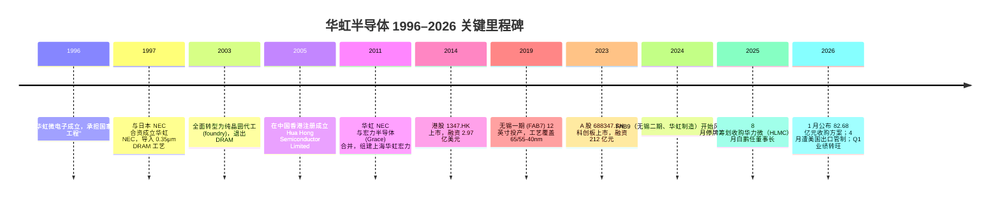
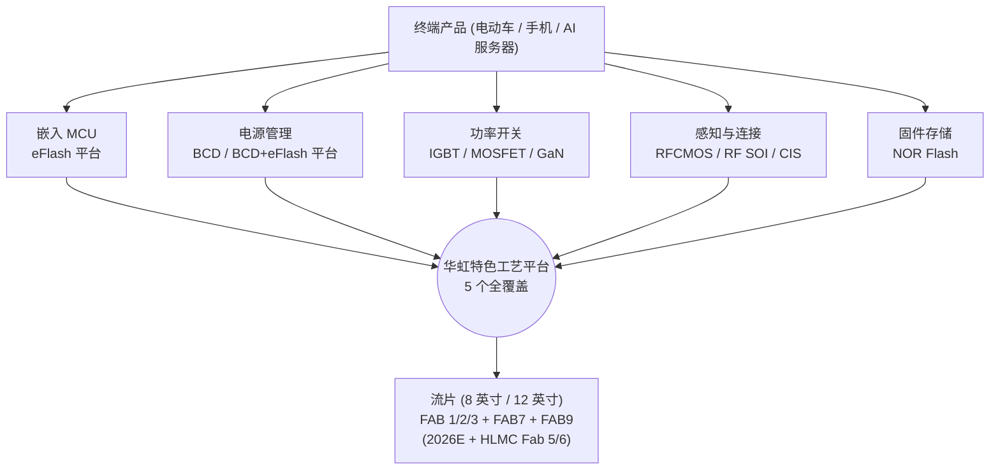
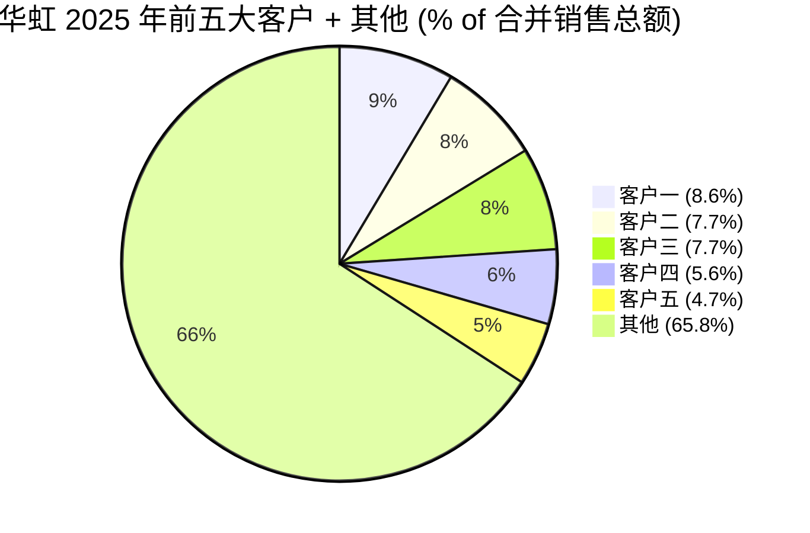
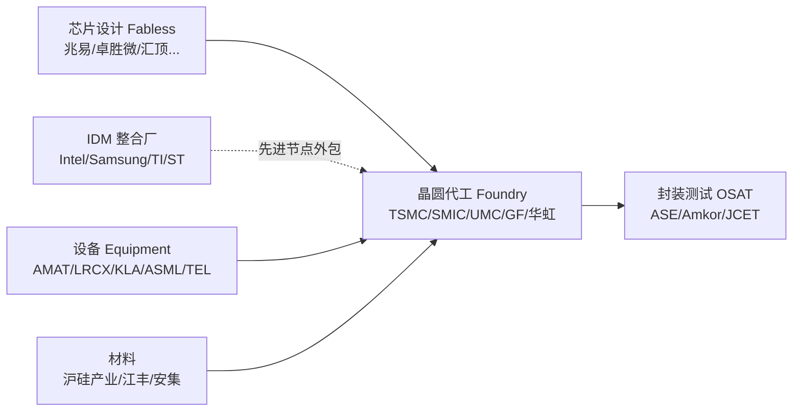
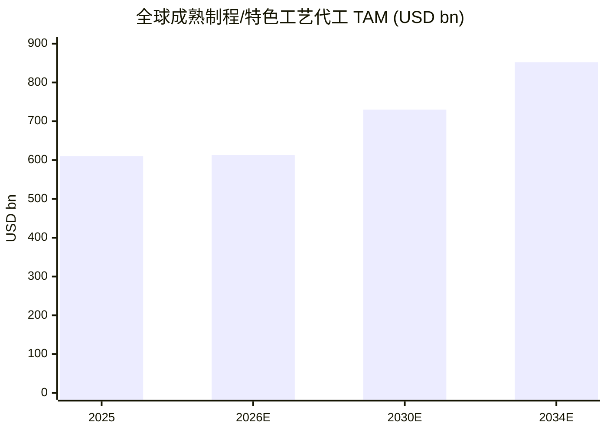
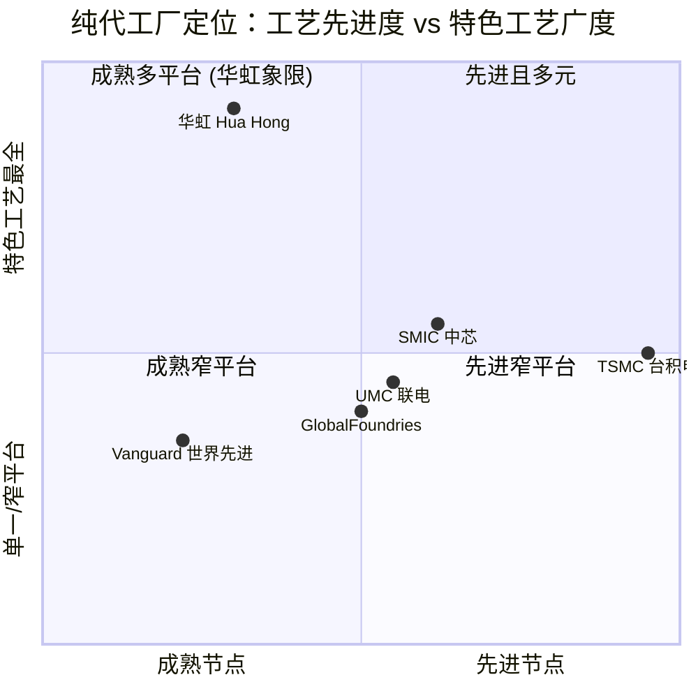

# 华虹半导体有限公司 (SSE:688347 / HKEX:01347) — 公司研究

*报告基准日 (as of)：2026 年 6 月 14 日*
*报告语言：简体中文（A 股 + H 股双重披露，原始报表语言为中文，按本项目语言规则采用 zh-CN 撰写；technical / financial / industry 术语保留 English 原文 + 中文 gloss）*
*分析师：x@anthropic.com*

---

> *分析师观点 (Analyst view)：* **评级 (Rating)：Hold / Neutral（持有）· 12 个月目标价 (12-mo PT)：A 股 ¥215（较 2026-06-12 收盘 ¥218.37 下行 −1.5%）；H 股 HK$118（较 HK$139.2 下行 −15%）· 估值方法：A 股 = HLMC 并表后 2027E 备考 EPS × 行业溢价 P/E + 国资/重组溢价；H 股 = 2026E ~2.5× P/B**
> 市值：A 股流通对应总市值约 ¥3,795 亿（1,737.63M 股 × ¥218.37）；H 股市值约 HK$2,418 亿 · 52 周区间：H 股约 HK$23–HK$160 · A 股约 ¥95–¥225 · 双重上市 SSE:688347 / HKEX:01347
>
> | 倍数 / Multiple (*分析师观点*：远期列) | FY24A | FY25A | FY26E | FY27E |
> |---|---|---|---|---|
> | P/S (TTM, H 股美元口径) | ~10× | ~13× | ~12× | ~10× |
> | P/B (H 股) | ~1.8× | ~3.3× | ~3.0× | ~2.6× |
> | P/E (归母, A 股) | n.m.（利润极低） | ~455×（H 股 TTM）/ A 股更高 | ~120× | HLMC 并表后约 40–50× |
> | 毛利率 GM%（HKFRS 美元口径） | 10.2% | 11.8% | 15–17%(*) | 18–20%(*) |
>
> 相对表现 (Rel. performance, A 股 688347.SS vs CSI 300)：1M +36.0% · 6M +106.6% · YTD +87.5% · 12M +363.4% vs CSI 300（1M −4.4% / YTD +1.3% / 12M +22.7%）→ 相对 CSI 300 **YTD +86pp、12M +341pp** 的极端跑赢（H 股 1347.HK：YTD +71.2% / 12M +366.3% vs HSI YTD −6.2%）（来源：[yfinance 688347.SS / 000300.SS / 1347.HK 收盘，截至 2026-06-12]）。
> **核心论点 (thesis pillars)** ——（1）**特色工艺平台覆盖最全**是结构性护城河，但当前盈利能力（GM 11.8%、归母 ROE <1%）是全球同业最低，估值已被国资 + 重组溢价显著抬高；（2）**HLMC（华力微）并表**是最大单一催化剂，备考 EPS 一次性 +236%，但执行与时间表有不确定性；（3）**美国出口管制（2026-04）** 直接命中 Fab 6 / Fab 8a，是悬顶之剑；（4）**卖方分歧极大**——目标价从 BofA HK$63（Underperform）到 GS HK$174（Buy）跨度 2.8×，本报告取中性，因为上行已被股价大幅 price-in、下行有真实的管制 + 产能过剩风险。

> **业绩更新 — 上调 2026 全年 ASP 指引 + Q2 毛利率指引向上 (2026-05-14)：** 管理层在 1Q26 业绩会一改此前保守口径，将 2026 年平均 ASP（average selling price）同比涨幅指引上调至 **+10%~15%**（部分高需求平台如 Analog/BCD、NOR Flash 涨幅可达 25%~28%），并指引 **2Q26 收入 6.9–7.0 亿美元（环比中位 +5.1%）、毛利率 14%–16%**（环比改善），驱动力为 AI 服务器 PMIC、MCU、独立 Flash、BCD 量价齐升（[华虹半导体 2026 年第一季度报告, 第 1-2 页](https://static.cninfo.com.cn/finalpage/2026-05-15/1225306838.PDF)）。这是把全报告从"周期底部"叙事推向"涨价周期上行"叙事的关键信号。

---

## 目录

1. [公司概览](#1-公司概览)（含投资论点 + 估值快照）
   - 1A [估值与目标价](#1a-估值与目标价-valuation--price-target)（远期模型 · PT 推导 · bull/base/bear · 卖方观点演变）
   - 1B [GF Score 基本面评分卡](#1b-gf-score-基本面评分卡-gurufocus-style)
2. [公司历史](#2-公司历史)
3. [管理团队](#3-管理团队)
4. [产品与服务](#4-产品与服务)（含 supply-chain money-flow 图）
5. [客户与上市策略](#5-客户与上市策略)
6. [行业概览](#6-行业概览)
7. [竞争格局](#7-竞争格局)
8. [市场机会](#8-市场机会)
9. [风险评估](#9-风险评估)
   - 9.5 [关键分歧与催化剂](#95-关键分歧与催化剂-key-debates--catalysts)
10. [投资视角评分卡](#10-投资视角评分卡-investor-lens-scorecards)
- [数据来源清单](#数据来源清单-data-used)
- [参考资料](#参考资料)

---

## 1. 公司概览

**投资论点 (BLUF)。** *分析师观点：* 我们对华虹给出 **Hold / Neutral（持有）**评级、A 股 12 个月目标价 **¥215**（较现价基本持平）、H 股 **HK$118**（隐含约 −15%）。核心判断是：华虹拥有全行业最完整的 **specialty-process（特色工艺）平台**与明确的国资背景，2025H2 起进入 **ASP 涨价 + 利用率满载**的上行周期，这一点毋庸置疑；但**当前的盈利能力是全球纯代工同业最低**（HKFRS 美元口径毛利率 (gross margin) 仅 11.8%、归母 ROE <1%），而股价已包含三重溢价——A 股国资半导体溢价、**HLMC（华力微）并表**的备考增厚预期、AI/汽车补库存周期。这三重溢价把 A 股推到 YTD +87.5%、相对 CSI 300 跑赢 86 个百分点的极端位置，下行保护变薄。叠加 **2026 年 4 月美国对 Fab 6 / Fab 8a 的设备出口管制**，我们认为风险回报已趋于均衡，故取中性。卖方对此分歧极大：目标价从 BofA 的 HK$63（Underperform）到 Goldman Sachs 的 HK$174（Buy），跨度 2.8 倍——这本身就是"已被充分定价、争议巨大"的最佳注脚。

**公司是做什么的。**华虹半导体有限公司（**Hua Hong Semiconductor Limited**，A 股证券简称"华虹公司"、港股证券简称"华虹半导体"）是一家以**特色工艺 (specialty process)** 为核心竞争力的**纯晶圆代工 (pure-play foundry)** 企业，按公司在 2025 年报中的自我定位，是"全球领先的特色工艺晶圆代工企业，也是行业内特色工艺平台覆盖最全面的晶圆代工企业"，战略口径为"先进特色 IC + 功率器件"和"8 英寸 + 12 英寸"双轨产能 ([华虹半导体 2025 年年度报告 (修订版), 第 14, 33 页](https://static.cninfo.com.cn/finalpage/2026-05-15/1225307974.PDF))。公司同时在两地上市：港股 1347.HK（2014 年 10 月）和 A 股 688347.SH（2023 年 8 月，红筹回归科创板），是中国大陆少数同时实现 A+H 双重上市的半导体制造企业 ([华虹半导体 2025 年年度报告 (修订版), 第 7 页](https://static.cninfo.com.cn/finalpage/2026-05-15/1225307974.PDF))。

按 2025 年销售收入计，公司**全球纯晶圆代工排名第 5、中国大陆排名第 2**，仅次于中芯国际 (SMIC) ([华虹半导体 2025 年年度报告 (修订版), 第 16 页](https://static.cninfo.com.cn/finalpage/2026-05-15/1225307974.PDF))。这一行业地位是相对稳态的：与台积电（TSMC，2025 年全球纯晶圆代工市占率约 69.9%）、SMIC（约 5.3%）、UMC（约 4.4%）和 GlobalFoundries（约 3.9%）相比，华虹的全球份额仅约 1.4%；但公司在"特色 IC + 功率器件"细分赛道的存在感远高于其全球收入份额——这是理解全部投资逻辑的起点 ([TSMC nets nearly 70% of 2025 foundry market, Taipei Times 2026-03-14](https://www.taipeitimes.com/News/biz/archives/2026/03/14/2003853777))。

**业务模式与盈利模式。**公司全部收入来自直销模式 (direct sales) 下的可定制晶圆代工服务，主要客户为系统厂商和无厂芯片设计公司 (fabless)。2025 年该口径占主营业务收入的 **96.74%**，剩余 3.26% 来自整合器件制造商 (IDM)；按销售模式划分则 100% 为直销，无经销商 ([华虹半导体 2025 年年度报告 (修订版), 第 25 页](https://static.cninfo.com.cn/finalpage/2026-05-15/1225307974.PDF))。公司不涉足芯片设计，但在工艺平台层面与客户保持深度共研，特别是在 BCD、eFlash 和 IGBT 等需要长期联合定义的"特色"工艺上 ([华虹半导体 2025 年年度报告 (修订版), 第 14, 17 页](https://static.cninfo.com.cn/finalpage/2026-05-15/1225307974.PDF))。

**FY2025 关键财务数据（中国会计准则 PRC GAAP 口径）。**全年营业总收入 **¥172.91 亿元**（同比 +20.18%）、归属母公司股东净利润 **¥3.77 亿元**（同比 −1.04%）、合并口径净亏损 **−¥8.07 亿元**（少数股东承担 −¥11.84 亿元，主要为国资在 FAB9/华虹制造的持股分摊亏损）、经营活动现金流量净额 **¥50.65 亿元**（同比 +40.38%）、研发投入 (R&D) **¥19.71 亿元**（占营收 11.4%）、基本每股收益 (EPS) **¥0.22 元** ([华虹半导体 2025 年年度报告 (修订版) 合并利润表, 第 93-94 页](https://static.cninfo.com.cn/finalpage/2026-05-15/1225307974.PDF))。**境外披露口径**（HKFRS / 美元报告）：销售收入 **24.02 亿美元**、毛利率 **11.8%**（同比扩张约 1.6 个百分点），是港股投资人最常引用的口径，与境内 PRC GAAP 毛利率 18.72% 之间的差异主要源于会计准则下折旧分配与投资性房地产计量等口径调整 ([华虹半导体 2025 年年度报告 (修订版), 第 6, 9, 25 页](https://static.cninfo.com.cn/finalpage/2026-05-15/1225307974.PDF))。

下面用收入瀑布 (income-statement Sankey) 直观展示 FY2025 这笔 ¥172.91 亿元营业收入如何沿成本、费用、税与少数股东损益流到 **¥3.77 亿元归母净利润**——注意经营利润 (operating income) 实为 **−¥6.52 亿元**（亏损），是其他收益 (¥3.57 亿) 与少数股东承担亏损 (−¥11.84 亿) 共同把归母口径拉回正：

<svg xmlns="http://www.w3.org/2000/svg" viewBox="0 0 1000 560" width="1000" height="560" role="img" aria-label="income statement Sankey"><rect x="0" y="0" width="1000" height="560" fill="#ffffff"/>
<text x="20.00" y="30.00" text-anchor="start" font-family="Helvetica,Arial,sans-serif" font-size="15" font-weight="700" fill="#1f2933">华虹 2025 利润表 Sankey (income statement, PRC GAAP, ¥M)</text>
<path d="M 204.00,64.01 C 258.00,64.01 258.00,99.01 312.00,99.01 L 312.00,203.72 C 258.00,203.72 258.00,168.72 204.00,168.72 Z" fill="#93c5fd" fill-opacity="0.55"/>
<path d="M 452.00,92.00 C 506.00,92.00 506.00,246.76 560.00,246.76 L 560.00,248.76 C 506.00,248.76 506.00,94.00 452.00,94.00 Z" fill="#86efac" fill-opacity="0.55"/>
<path d="M 452.00,94.00 C 506.00,94.00 506.00,262.76 560.00,262.76 L 560.00,331.24 C 506.00,331.24 506.00,162.48 452.00,162.48 Z" fill="#fca5a5" fill-opacity="0.55"/>
<path d="M 328.00,99.01 C 382.00,99.01 382.00,92.00 436.00,92.00 L 436.00,163.16 C 382.00,163.16 382.00,170.17 328.00,170.17 Z" fill="#86efac" fill-opacity="0.55"/>
<path d="M 328.00,170.17 C 382.00,170.17 382.00,177.16 436.00,177.16 L 436.00,486.00 C 382.00,486.00 382.00,479.01 328.00,479.01 Z" fill="#fca5a5" fill-opacity="0.55"/>
<path d="M 204.00,182.72 C 258.00,182.72 258.00,203.72 312.00,203.72 L 312.00,303.95 C 258.00,303.95 258.00,282.95 204.00,282.95 Z" fill="#93c5fd" fill-opacity="0.55"/>
<path d="M 700.00,232.76 C 754.00,232.76 754.00,268.14 808.00,268.14 L 808.00,276.43 C 754.00,276.43 754.00,241.05 700.00,241.05 Z" fill="#86efac" fill-opacity="0.55"/>
<path d="M 700.00,241.05 C 754.00,241.05 754.00,290.43 808.00,290.43 L 808.00,293.86 C 754.00,293.86 754.00,244.48 700.00,244.48 Z" fill="#fca5a5" fill-opacity="0.55"/>
<path d="M 700.00,244.48 C 754.00,244.48 754.00,307.86 808.00,307.86 L 808.00,309.86 C 754.00,309.86 754.00,246.48 700.00,246.48 Z" fill="#fca5a5" fill-opacity="0.55"/>
<path d="M 576.00,246.76 C 630.00,246.76 630.00,232.76 684.00,232.76 L 684.00,234.76 C 630.00,234.76 630.00,248.76 576.00,248.76 Z" fill="#86efac" fill-opacity="0.55"/>
<path d="M 576.00,262.76 C 630.00,262.76 630.00,248.76 684.00,248.76 L 684.00,269.11 C 630.00,269.11 630.00,283.11 576.00,283.11 Z" fill="#fca5a5" fill-opacity="0.55"/>
<path d="M 576.00,283.11 C 630.00,283.11 630.00,283.11 684.00,283.11 L 684.00,326.43 C 630.00,326.43 630.00,326.43 576.00,326.43 Z" fill="#fca5a5" fill-opacity="0.55"/>
<path d="M 576.00,326.43 C 630.00,326.43 630.00,340.43 684.00,340.43 L 684.00,345.24 C 630.00,345.24 630.00,331.24 576.00,331.24 Z" fill="#fca5a5" fill-opacity="0.55"/>
<path d="M 204.00,296.95 C 258.00,296.95 258.00,303.95 312.00,303.95 L 312.00,399.81 C 258.00,399.81 258.00,392.81 204.00,392.81 Z" fill="#93c5fd" fill-opacity="0.55"/>
<path d="M 204.00,406.81 C 258.00,406.81 258.00,399.81 312.00,399.81 L 312.00,446.38 C 258.00,446.38 258.00,453.38 204.00,453.38 Z" fill="#93c5fd" fill-opacity="0.55"/>
<path d="M 204.00,467.38 C 258.00,467.38 258.00,446.38 312.00,446.38 L 312.00,475.80 C 258.00,475.80 258.00,496.80 204.00,496.80 Z" fill="#93c5fd" fill-opacity="0.55"/>
<path d="M 204.00,510.80 C 258.00,510.80 258.00,475.80 312.00,475.80 L 312.00,478.99 C 258.00,478.99 258.00,513.99 204.00,513.99 Z" fill="#93c5fd" fill-opacity="0.55"/>
<rect x="188.00" y="64.01" width="16" height="104.71" rx="1.5" fill="#2563eb"/>
<rect x="188.00" y="182.72" width="16" height="100.23" rx="1.5" fill="#2563eb"/>
<rect x="188.00" y="296.95" width="16" height="95.86" rx="1.5" fill="#2563eb"/>
<rect x="188.00" y="406.81" width="16" height="46.57" rx="1.5" fill="#2563eb"/>
<rect x="188.00" y="467.38" width="16" height="29.43" rx="1.5" fill="#2563eb"/>
<rect x="188.00" y="510.80" width="16" height="3.19" rx="1.5" fill="#2563eb"/>
<rect x="312.00" y="99.01" width="16" height="379.98" rx="1.5" fill="#1e3a8a"/>
<rect x="436.00" y="92.00" width="16" height="71.16" rx="1.5" fill="#15803d"/>
<rect x="436.00" y="177.16" width="16" height="308.84" rx="1.5" fill="#dc2626"/>
<rect x="560.00" y="246.76" width="16" height="2.00" rx="1.5" fill="#15803d"/>
<rect x="560.00" y="262.76" width="16" height="68.48" rx="1.5" fill="#dc2626"/>
<rect x="684.00" y="232.76" width="16" height="2.00" rx="1.5" fill="#15803d"/>
<rect x="684.00" y="248.76" width="16" height="20.35" rx="1.5" fill="#dc2626"/>
<rect x="684.00" y="283.11" width="16" height="43.31" rx="1.5" fill="#dc2626"/>
<rect x="684.00" y="340.43" width="16" height="4.81" rx="1.5" fill="#dc2626"/>
<rect x="808.00" y="268.14" width="16" height="8.28" rx="1.5" fill="#15803d"/>
<rect x="808.00" y="290.43" width="16" height="3.43" rx="1.5" fill="#dc2626"/>
<rect x="808.00" y="307.86" width="16" height="2.00" rx="1.5" fill="#dc2626"/>
<line x1="188.00" y1="116.37" x2="182.00" y2="90.97" stroke="#cbd5e1" stroke-width="1"/>
<text x="179.00" y="93.97" text-anchor="end" font-family="Helvetica,Arial,sans-serif" font-size="11.5" font-weight="700" fill="#1f2933">功率器件 Power</text>
<text x="179.00" y="106.97" text-anchor="end" font-family="Helvetica,Arial,sans-serif" font-size="10" font-weight="400" fill="#52606d">¥4.8B  (27.6%)</text>
<line x1="188.00" y1="232.84" x2="182.00" y2="207.44" stroke="#cbd5e1" stroke-width="1"/>
<text x="179.00" y="210.44" text-anchor="end" font-family="Helvetica,Arial,sans-serif" font-size="11.5" font-weight="700" fill="#1f2933">模拟/电源 Analog</text>
<text x="179.00" y="223.44" text-anchor="end" font-family="Helvetica,Arial,sans-serif" font-size="10" font-weight="400" fill="#52606d">¥4.6B  (26.4%)</text>
<line x1="188.00" y1="344.88" x2="182.00" y2="319.49" stroke="#cbd5e1" stroke-width="1"/>
<text x="179.00" y="322.49" text-anchor="end" font-family="Helvetica,Arial,sans-serif" font-size="11.5" font-weight="700" fill="#1f2933">嵌入式NVM eNVM</text>
<text x="179.00" y="335.49" text-anchor="end" font-family="Helvetica,Arial,sans-serif" font-size="10" font-weight="400" fill="#52606d">¥4.4B  (25.2%)</text>
<line x1="188.00" y1="430.09" x2="182.00" y2="404.70" stroke="#cbd5e1" stroke-width="1"/>
<text x="179.00" y="407.70" text-anchor="end" font-family="Helvetica,Arial,sans-serif" font-size="11.5" font-weight="700" fill="#1f2933">逻辑射频 Logic&amp;RF</text>
<text x="179.00" y="420.70" text-anchor="end" font-family="Helvetica,Arial,sans-serif" font-size="10" font-weight="400" fill="#52606d">¥2.1B  (12.3%)</text>
<line x1="188.00" y1="482.09" x2="182.00" y2="456.69" stroke="#cbd5e1" stroke-width="1"/>
<text x="179.00" y="459.69" text-anchor="end" font-family="Helvetica,Arial,sans-serif" font-size="11.5" font-weight="700" fill="#1f2933">独立NVM NOR</text>
<text x="179.00" y="472.69" text-anchor="end" font-family="Helvetica,Arial,sans-serif" font-size="10" font-weight="400" fill="#52606d">¥1.3B  (7.7%)</text>
<line x1="188.00" y1="512.40" x2="182.00" y2="487.00" stroke="#cbd5e1" stroke-width="1"/>
<text x="179.00" y="490.00" text-anchor="end" font-family="Helvetica,Arial,sans-serif" font-size="11.5" font-weight="700" fill="#1f2933">其他/掩模 Other</text>
<text x="179.00" y="503.00" text-anchor="end" font-family="Helvetica,Arial,sans-serif" font-size="10" font-weight="400" fill="#52606d">¥145.0M  (0.84%)</text>
<rect x="331.00" y="81.01" width="106.80" height="26" rx="2" fill="#ffffff" fill-opacity="0.72"/>
<text x="334.00" y="93.01" text-anchor="start" font-family="Helvetica,Arial,sans-serif" font-size="11.5" font-weight="700" fill="#1f2933">Revenue</text>
<text x="334.00" y="106.01" text-anchor="start" font-family="Helvetica,Arial,sans-serif" font-size="10" font-weight="400" fill="#52606d">¥17.3B  (100.0%)</text>
<rect x="455.00" y="74.00" width="94.20" height="26" rx="2" fill="#ffffff" fill-opacity="0.72"/>
<text x="458.00" y="86.00" text-anchor="start" font-family="Helvetica,Arial,sans-serif" font-size="11.5" font-weight="700" fill="#1f2933">Gross Profit</text>
<text x="458.00" y="99.00" text-anchor="start" font-family="Helvetica,Arial,sans-serif" font-size="10" font-weight="400" fill="#52606d">¥3.2B  (18.7%)</text>
<rect x="455.00" y="159.16" width="144.60" height="26" rx="2" fill="#ffffff" fill-opacity="0.72"/>
<text x="458.00" y="171.16" text-anchor="start" font-family="Helvetica,Arial,sans-serif" font-size="11.5" font-weight="700" fill="#1f2933">Cost of Revenue (COGS)</text>
<text x="458.00" y="184.16" text-anchor="start" font-family="Helvetica,Arial,sans-serif" font-size="10" font-weight="400" fill="#52606d">¥14.1B  (81.3%)</text>
<rect x="579.00" y="228.76" width="113.10" height="26" rx="2" fill="#ffffff" fill-opacity="0.72"/>
<text x="582.00" y="240.76" text-anchor="start" font-family="Helvetica,Arial,sans-serif" font-size="11.5" font-weight="700" fill="#1f2933">Operating Income</text>
<text x="582.00" y="253.76" text-anchor="start" font-family="Helvetica,Arial,sans-serif" font-size="10" font-weight="400" fill="#52606d">-¥652.0M  (-3.8%)</text>
<rect x="579.00" y="253.76" width="150.90" height="26" rx="2" fill="#ffffff" fill-opacity="0.72"/>
<text x="582.00" y="265.76" text-anchor="start" font-family="Helvetica,Arial,sans-serif" font-size="11.5" font-weight="700" fill="#1f2933">Total Operating Expense</text>
<text x="582.00" y="278.76" text-anchor="start" font-family="Helvetica,Arial,sans-serif" font-size="10" font-weight="400" fill="#52606d">¥3.1B  (18.0%)</text>
<rect x="703.00" y="214.76" width="113.10" height="26" rx="2" fill="#ffffff" fill-opacity="0.72"/>
<text x="706.00" y="226.76" text-anchor="start" font-family="Helvetica,Arial,sans-serif" font-size="11.5" font-weight="700" fill="#1f2933">Pretax Income</text>
<text x="706.00" y="239.76" text-anchor="start" font-family="Helvetica,Arial,sans-serif" font-size="10" font-weight="400" fill="#52606d">-¥651.0M  (-3.8%)</text>
<rect x="703.00" y="239.76" width="100.50" height="26" rx="2" fill="#ffffff" fill-opacity="0.72"/>
<text x="706.00" y="251.76" text-anchor="start" font-family="Helvetica,Arial,sans-serif" font-size="11.5" font-weight="700" fill="#1f2933">SG&amp;A</text>
<text x="706.00" y="264.76" text-anchor="start" font-family="Helvetica,Arial,sans-serif" font-size="10" font-weight="400" fill="#52606d">¥926.0M  (5.4%)</text>
<rect x="703.00" y="265.11" width="94.20" height="26" rx="2" fill="#ffffff" fill-opacity="0.72"/>
<text x="706.00" y="277.11" text-anchor="start" font-family="Helvetica,Arial,sans-serif" font-size="11.5" font-weight="700" fill="#1f2933">R&amp;D</text>
<text x="706.00" y="290.11" text-anchor="start" font-family="Helvetica,Arial,sans-serif" font-size="10" font-weight="400" fill="#52606d">¥2.0B  (11.4%)</text>
<rect x="703.00" y="322.43" width="100.50" height="26" rx="2" fill="#ffffff" fill-opacity="0.72"/>
<text x="706.00" y="334.43" text-anchor="start" font-family="Helvetica,Arial,sans-serif" font-size="11.5" font-weight="700" fill="#1f2933">Other OpEx</text>
<text x="706.00" y="347.43" text-anchor="start" font-family="Helvetica,Arial,sans-serif" font-size="10" font-weight="400" fill="#52606d">¥219.0M  (1.3%)</text>
<text x="833.00" y="269.29" text-anchor="start" font-family="Helvetica,Arial,sans-serif" font-size="11.5" font-weight="700" fill="#1f2933">Net Income</text>
<text x="833.00" y="282.29" text-anchor="start" font-family="Helvetica,Arial,sans-serif" font-size="10" font-weight="400" fill="#52606d">¥377.0M  (2.2%)</text>
<text x="833.00" y="294.29" text-anchor="start" font-family="Helvetica,Arial,sans-serif" font-size="11.5" font-weight="700" fill="#1f2933">Income Tax</text>
<text x="833.00" y="307.29" text-anchor="start" font-family="Helvetica,Arial,sans-serif" font-size="10" font-weight="400" fill="#52606d">¥156.0M  (0.90%)</text>
<line x1="824.00" y1="308.86" x2="830.00" y2="316.29" stroke="#cbd5e1" stroke-width="1"/>
<text x="833.00" y="319.29" text-anchor="start" font-family="Helvetica,Arial,sans-serif" font-size="11.5" font-weight="700" fill="#1f2933">Minority Interest</text>
<text x="833.00" y="332.29" text-anchor="start" font-family="Helvetica,Arial,sans-serif" font-size="10" font-weight="400" fill="#52606d">-¥1.2B  (-6.8%)</text>
<text x="500.00" y="544.00" text-anchor="middle" font-family="Helvetica,Arial,sans-serif" font-size="10" font-weight="400" fill="#52606d">Source: 华虹半导体 2025 年年度报告(修订版) 合并利润表 · cninfo · as of 2026-06-14</text>
</svg>

*图表来源：[华虹半导体 2025 年年度报告 (修订版) 合并利润表, 第 93-94 页](https://static.cninfo.com.cn/finalpage/2026-05-15/1225307974.PDF)。*

按工艺平台与按地区的收入结构如下：

<svg xmlns="http://www.w3.org/2000/svg" viewBox="0 0 720 460" width="720" height="460" role="img" aria-label="revenue donut"><rect x="0" y="0" width="720" height="460" fill="#ffffff"/>
<text x="20.00" y="30.00" text-anchor="start" font-family="Helvetica,Arial,sans-serif" font-size="15" font-weight="700" fill="#1f2933">华虹 2025 营收结构 by 工艺平台 (revenue by platform, ¥M)</text>
<path d="M 288.00,107.20 A 132 132 0 0 1 417.98,262.23 L 364.80,252.81 A 78 78 0 0 0 288.00,161.20 Z" fill="#2563eb"/>
<path d="M 417.98,262.23 A 132 132 0 0 1 252.04,366.21 L 266.75,314.25 A 78 78 0 0 0 364.80,252.81 Z" fill="#15803d"/>
<path d="M 252.04,366.21 A 132 132 0 0 1 162.04,199.74 L 213.57,215.88 A 78 78 0 0 0 266.75,314.25 Z" fill="#d97706"/>
<path d="M 162.04,199.74 A 132 132 0 0 1 225.80,122.77 L 251.24,170.40 A 78 78 0 0 0 213.57,215.88 Z" fill="#7c3aed"/>
<path d="M 225.80,122.77 A 132 132 0 0 1 288.00,107.20 L 288.00,161.20 A 78 78 0 0 0 251.24,170.40 Z" fill="#dc2626"/>
<text x="288.00" y="235.20" text-anchor="middle" font-family="Helvetica,Arial,sans-serif" font-size="18" font-weight="800" fill="#1f2933">¥171亿</text>
<text x="288.00" y="255.20" text-anchor="middle" font-family="Helvetica,Arial,sans-serif" font-size="13" font-weight="600" fill="#52606d">¥17.1B</text>
<text x="288.00" y="271.20" text-anchor="middle" font-family="Helvetica,Arial,sans-serif" font-size="10" font-weight="400" fill="#8a97a3">total</text>
<line x1="393.75" y1="150.54" x2="409.75" y2="150.54" stroke="#2563eb" stroke-width="1.4"/>
<text x="413.75" y="148.54" text-anchor="start" font-family="Helvetica,Arial,sans-serif" font-size="11" font-weight="700" fill="#1f2933">功率器件 Power</text>
<text x="413.75" y="162.54" text-anchor="start" font-family="Helvetica,Arial,sans-serif" font-size="10" font-weight="400" fill="#52606d">¥4.8B  (27.8%)</text>
<line x1="361.28" y1="356.14" x2="377.28" y2="356.14" stroke="#15803d" stroke-width="1.4"/>
<text x="381.28" y="354.14" text-anchor="start" font-family="Helvetica,Arial,sans-serif" font-size="11" font-weight="700" fill="#1f2933">模拟/电源 Analog&amp;PMIC</text>
<text x="381.28" y="368.14" text-anchor="start" font-family="Helvetica,Arial,sans-serif" font-size="10" font-weight="400" fill="#52606d">¥4.6B  (26.6%)</text>
<line x1="166.61" y1="304.83" x2="150.61" y2="304.83" stroke="#d97706" stroke-width="1.4"/>
<text x="146.61" y="302.83" text-anchor="end" font-family="Helvetica,Arial,sans-serif" font-size="11" font-weight="700" fill="#1f2933">嵌入式NVM eNVM</text>
<text x="146.61" y="316.83" text-anchor="end" font-family="Helvetica,Arial,sans-serif" font-size="10" font-weight="400" fill="#52606d">¥4.4B  (25.4%)</text>
<line x1="181.73" y1="151.16" x2="165.73" y2="151.16" stroke="#7c3aed" stroke-width="1.4"/>
<text x="161.73" y="149.16" text-anchor="end" font-family="Helvetica,Arial,sans-serif" font-size="11" font-weight="700" fill="#1f2933">逻辑射频 Logic&amp;RF</text>
<text x="161.73" y="163.16" text-anchor="end" font-family="Helvetica,Arial,sans-serif" font-size="10" font-weight="400" fill="#52606d">¥2.1B  (12.4%)</text>
<line x1="254.48" y1="105.33" x2="238.48" y2="105.33" stroke="#dc2626" stroke-width="1.4"/>
<text x="234.48" y="103.33" text-anchor="end" font-family="Helvetica,Arial,sans-serif" font-size="11" font-weight="700" fill="#1f2933">独立NVM NOR</text>
<text x="234.48" y="117.33" text-anchor="end" font-family="Helvetica,Arial,sans-serif" font-size="10" font-weight="400" fill="#52606d">¥1.3B  (7.8%)</text>
<text x="360.00" y="444.00" text-anchor="middle" font-family="Helvetica,Arial,sans-serif" font-size="10" font-weight="400" fill="#52606d">Source: 华虹半导体 2025 年年度报告(修订版) 第26页 · cninfo · as of 2026-06-14</text>
</svg>

<svg xmlns="http://www.w3.org/2000/svg" viewBox="0 0 720 460" width="720" height="460" role="img" aria-label="revenue donut"><rect x="0" y="0" width="720" height="460" fill="#ffffff"/>
<text x="20.00" y="30.00" text-anchor="start" font-family="Helvetica,Arial,sans-serif" font-size="15" font-weight="700" fill="#1f2933">华虹 2025 营收结构 by 地区 (revenue by geography, ¥M)</text>
<path d="M 288.00,107.20 A 132 132 0 1 1 169.22,181.61 L 217.81,205.17 A 78 78 0 1 0 288.00,161.20 Z" fill="#2563eb"/>
<path d="M 169.22,181.61 A 132 132 0 0 1 227.55,121.86 L 252.28,169.86 A 78 78 0 0 0 217.81,205.17 Z" fill="#15803d"/>
<path d="M 227.55,121.86 A 132 132 0 0 1 264.71,109.27 L 274.24,162.42 A 78 78 0 0 0 252.28,169.86 Z" fill="#d97706"/>
<path d="M 264.71,109.27 A 132 132 0 0 1 288.00,107.20 L 288.00,161.20 A 78 78 0 0 0 274.24,162.42 Z" fill="#7c3aed"/>
<text x="288.00" y="235.20" text-anchor="middle" font-family="Helvetica,Arial,sans-serif" font-size="18" font-weight="800" fill="#1f2933">地区</text>
<text x="288.00" y="255.20" text-anchor="middle" font-family="Helvetica,Arial,sans-serif" font-size="13" font-weight="600" fill="#52606d">¥17.3B</text>
<text x="288.00" y="271.20" text-anchor="middle" font-family="Helvetica,Arial,sans-serif" font-size="10" font-weight="400" fill="#8a97a3">total</text>
<line x1="361.26" y1="356.15" x2="377.26" y2="356.15" stroke="#2563eb" stroke-width="1.4"/>
<text x="381.26" y="354.15" text-anchor="start" font-family="Helvetica,Arial,sans-serif" font-size="11" font-weight="700" fill="#1f2933">中国大陆+香港 China+HK</text>
<text x="381.26" y="368.15" text-anchor="start" font-family="Helvetica,Arial,sans-serif" font-size="10" font-weight="400" fill="#52606d">¥14.2B  (82.2%)</text>
<line x1="189.24" y1="142.81" x2="173.24" y2="142.81" stroke="#15803d" stroke-width="1.4"/>
<text x="169.24" y="140.81" text-anchor="end" font-family="Helvetica,Arial,sans-serif" font-size="11" font-weight="700" fill="#1f2933">北美 N.America</text>
<text x="169.24" y="154.81" text-anchor="end" font-family="Helvetica,Arial,sans-serif" font-size="10" font-weight="400" fill="#52606d">¥1.8B  (10.2%)</text>
<line x1="243.73" y1="108.49" x2="227.73" y2="108.49" stroke="#d97706" stroke-width="1.4"/>
<text x="223.73" y="106.49" text-anchor="end" font-family="Helvetica,Arial,sans-serif" font-size="11" font-weight="700" fill="#1f2933">亚洲其他 Asia other</text>
<text x="223.73" y="120.49" text-anchor="end" font-family="Helvetica,Arial,sans-serif" font-size="10" font-weight="400" fill="#52606d">¥821.0M  (4.7%)</text>
<line x1="275.78" y1="101.74" x2="259.78" y2="101.74" stroke="#7c3aed" stroke-width="1.4"/>
<text x="255.78" y="99.74" text-anchor="end" font-family="Helvetica,Arial,sans-serif" font-size="11" font-weight="700" fill="#1f2933">欧洲 Europe</text>
<text x="255.78" y="113.74" text-anchor="end" font-family="Helvetica,Arial,sans-serif" font-size="10" font-weight="400" fill="#52606d">¥488.0M  (2.8%)</text>
<text x="360.00" y="444.00" text-anchor="middle" font-family="Helvetica,Arial,sans-serif" font-size="10" font-weight="400" fill="#52606d">Source: 华虹半导体 2025 年年度报告(修订版) 第26页 · cninfo · as of 2026-06-14</text>
</svg>

*图表来源：[华虹半导体 2025 年年度报告 (修订版), 第 26 页](https://static.cninfo.com.cn/finalpage/2026-05-15/1225307974.PDF)。*

**估值快照（2026 年 6 月 12 日）。**A 股 688347.SH 现价 **¥218.37**，对应总股本 1,737,632,193 股的市值约 **¥3,795 亿**；港股 1347.HK 现价 **HK$139.2**，市值约 **HK$2,418 亿**。按 H 股美元销售收入 24.02 亿美元计，P/S(TTM) 约 **13×**；P/B 约 **3.3×**（归母权益 ¥451.6 亿 ÷ 总股本）；P/E(TTM) 因 2024-25 年 FAB9 折旧拉低归母利润而异常虚高（H 股口径达数百倍，A 股因溢价更高）([Hua Hong Semiconductor (HKG:1347) Market Cap, Stockanalysis.com, 2026-05-22](https://stockanalysis.com/quote/hkg/1347/market-cap/); [yfinance 688347.SS / 1347.HK 收盘，截至 2026-06-12])。截至 2026 年 3 月末公司总股本为 1,737,632,193 股，其中港股 1,329,882,193 股（76.53%）、A 股 407,750,000 股（23.47%）([华虹半导体 2026 年第一季度报告, 第 4 页](https://static.cninfo.com.cn/finalpage/2026-05-15/1225306838.PDF))。

**估值解读——为什么 P/E 如此之高、P/B 反映了什么？**在 2023 年（净利润 ¥19.36 亿元）到 2024 年（¥3.81 亿元）的 5 倍以上下滑后，2025 年归母净利润几乎持平于 ¥3.77 亿元，但市值已显著回升，使 P/E 看似"失锚"。**根因有三**：（1）2024 年起 FAB9（无锡 12 英寸二期）按计划折旧但产能尚未满负荷，账面利润被结构性压低（年报披露管理层已对账面价值 ¥146.01 亿元的资产组做减值测试，安永列为关键审计事项）([华虹半导体 2025 年年度报告 (修订版) 审计报告, 第 87 页](https://static.cninfo.com.cn/finalpage/2026-05-15/1225307974.PDF))；（2）市场已开始按 **HLMC 并表后** 的备考利润给估值——交银国际测算并购完成后 EPS 由 ¥0.11 跃升至 ¥0.37，即一次性 +236% 增厚 ([大行评级｜交银国际维持华虹半导体"买入"评级，新浪财经 2026-01-07](https://finance.sina.com.cn/stock/bxjj/2026-01-07/doc-inhfnktt7517937.shtml))；（3）AI/汽车电子驱动的成熟制程涨价周期被市场提前贴现。综上，**P/B（H 股 ~3.3×、A 股更高）比 P/E 更能反映当前估值**——*分析师观点：* BofA 直接以 2× 2026/27E P/B 给出 HK$63 的目标价并维持 Underperform，理由是 2026-27E 营业利润率、ROE 仅 4–5% 低位，当前估值已近 4× P/B、明显偏高（[BofA Securities — Hua Hong Semi (1347.HK) reiterate Underperform, 2026-05-15, p.4（较 2026-05-15 收盘 HK$115.9 下行约 −46%）](http://xs-macbook-air.local:5001/zsxq/pdf/212452144182241/BofA%20Securities-Hua%20Hong%20Semi%EF%BC%881347.HK%EF%BC%89Guides%20for%20mild%20ASP%20recovery%20in%202026%EF%BC%9Bprofit%20still%20lean%EF%BC%9A%20reiterate%20Underperform-260515.pdf)）。

**红筹治理与法律架构。**公司**注册地为中国香港**（中环夏悫道 12 号美国银行中心 2212 室），实际生产经营在中国大陆（上海张江、无锡新区），属于科创板的**试点红筹企业**——其公司治理依据香港《公司条例》、《组织章程细则》与科创板上市规则共同适用，与境内一般 A 股公司在监事会制度、利润分配机制、剩余财产分配等方面存在制度性差异 ([华虹半导体 2025 年年度报告 (修订版), 第 7, 34-35 页](https://static.cninfo.com.cn/finalpage/2026-05-15/1225307974.PDF))。**最终实际控制人为上海市国有资产监督管理委员会（上海市国资委）**——通过上海华虹（集团）有限公司 → 上海华虹国际公司（Shanghai Hua Hong International, Inc.）持有上市公司股份，加上同受上海市国资委控制的联和国际、国泰君安证裕、海通创新等关联方，国资体系合计直接 + 间接持股比例显著超过 30%（参见第 5 节"股东结构"详述）([华虹半导体 2026 年第一季度报告, 第 5-6 页](https://static.cninfo.com.cn/finalpage/2026-05-15/1225306838.PDF))。

---

## 1A. 估值与目标价 (Valuation & Price Target)

> *分析师观点 (Analyst view)：* 本章全部为分析师自有的前瞻判断——所有预测数字、目标价、bull/base/bear 情景**均不附任何申报引用**（年报里没有目标价）；各项假设的外部输入（年报分部数据、管理层指引、行业预测、卖方一致预期）在文中分别引用。

### 1A.1 前瞻财务模型 (forward estimates) — *分析师观点*

下表对华虹未来三年（口径：H 股 HKFRS 美元 + 折算 A 股归母）做出预测。模型的关键驱动是 **ASP 涨价 + 利用率满载 + FAB9 满产摊薄折旧**，并在 FY27E 起纳入 **HLMC 并表**（保守按 H2-2026 完成）。

| 指标 (*分析师观点*) | FY24A | FY25A | FY26E | FY27E | FY28E |
|---|---|---|---|---|---|
| 销售收入 Revenue (USD bn, H 股口径) | 2.00 | 2.40 | 2.75 | 3.55(*) | 4.00(*) |
| — YoY % | | +20% | +15% | +29%(*含 HLMC) | +13% |
| 毛利率 GM% (HKFRS) | 10.2% | 11.8% | 16%(*) | 19%(*) | 21%(*) |
| 营业利润率 OPM% | −6%(*PRC −3.8%) | −3.8%(PRC) | 3%(*) | 7%(*) | 10%(*) |
| 归母净利润 (RMB mn) | 381 | 377 | ~900(*) | ~2,600(*含 HLMC) | ~3,800(*) |
| 归母 EPS (RMB) | 0.22 | 0.22 | ~0.45(*) | ~1.10(*备考摊薄后) | ~1.55(*) |
| ROIC % | <1% | <1% | ~3%(*) | ~6%(*) | ~9%(*) |
| 经营现金流 CFO (RMB mn) | 3,608 | 5,065 | ~6,500(*) | ~9,000(*) | ~11,000(*) |
| 资本开支 CapEx (RMB mn) | 19,782 | 12,931 | ~13,000(*) | ~14,000(*) | ~12,000(*) |
| FCF (RMB mn) | −16,174 | −7,866 | −6,500(*) | −5,000(*) | −1,000(*) |
| 净有息负债 (RMB mn) | ~14,000 | ~26,000 | ~30,000(*) | ~33,000(*) | ~32,000(*) |

各预测的输入基础（均为真实、已引用的来源）：收入与 ASP 路径来自管理层 2026 全年 ASP +10–15% 指引与 2Q26 收入指引 ([华虹半导体 2026 年第一季度报告, 第 1-2 页](https://static.cninfo.com.cn/finalpage/2026-05-15/1225306838.PDF))，并对照 *分析师观点：* Goldman Sachs 测算的 **2026-28E 收入 CAGR 21%、净利润 CAGR 48%**（[Goldman Sachs — Hua Hong (1347.HK) Buy, 2026-05-29, p.1](http://xs-macbook-air.local:5001/zsxq/pdf/812485541485582/Goldman%20Sachs-Hua%20Hong%20%EF%BC%881347.HK%EF%BC%89%EF%BC%9A%2012~inch%20capacity%20increasing%EF%BC%9B%20AI%20applications%20drive%20demand%20and%20loading%EF%BC%9B%20Buy-260529.pdf)）；HLMC 并表的备考增厚来自交银国际测算的 EPS ¥0.11→¥0.37 ([交银国际报告，新浪财经 2026-01-07](https://finance.sina.com.cn/stock/bxjj/2026-01-07/doc-inhfnktt7517937.shtml))；CapEx 与 FCF 路径来自年报合并现金流量表 ([华虹半导体 2025 年年度报告 (修订版) 合并现金流量表, 第 95-96 页](https://static.cninfo.com.cn/finalpage/2026-05-15/1225307974.PDF))。**(*)** 标记的单元格为分析师预测，非披露值。

**毛利率桥 (margin bridge) — FY25→FY26E。** *分析师观点：* 我们预计 GM 从 11.8% 升至 ~16%（约 +420bps），分解为：ASP 涨价 +500~700bps（管理层指引全年 ASP +10–15%，高需求平台 +25–28%）· FAB9 满产摊薄单位折旧 +150~250bps · 减去 12 英寸新增折旧 −250~350bps · 产品组合（更多 BCD/NOR 高价值）+50~100bps（驱动因子引自 [华虹半导体 2026 年第一季度报告, 第 1-2 页](https://static.cninfo.com.cn/finalpage/2026-05-15/1225306838.PDF) 与 [Bernstein — Hua Hong 1Q26, 2026-05-14, p.1](http://xs-macbook-air.local:5001/zsxq/pdf/812452185522412/Bernstein-Hua%20Hong%20Semiconductor%20Ltd%EF%BC%881347.HK%EF%BC%89Hua%20Hong%201Q26%EF%BC%9A%20Positive%20outlook%20on%20ASP%20improvement-260514.pdf)）；具体 bps 为分析师估算。

### 1A.2 目标价推导 (PT derivation) — 展示算式

华虹是双重上市、估值口径分裂（A 股溢价 vs H 股国际定价）+ 当前利润极低 + 即将并表的特殊标的，单一 P/E 不可用。我们用**两套口径**：

- **H 股（HKFRS 美元口径）→ 以 P/B 为锚。** *分析师观点：* 2026E 归母权益约 ¥460 亿 / 1,737.63M 股 ≈ ¥2.65/股 BVPS ≈ HK$2.9。给予 **~2.5× 2026E P/B**（介于 BofA 的 2× 与 Bernstein/GS 的隐含 ~3× 之间，对标 SMIC H 股 ~2.5–3× P/B 但折价于 SMIC 因华虹 ROE 更低）→ **H 股 PT ≈ HK$118**（较现价 HK$139.2 下行约 −15%）。这与 Morgan Stanley 的 HK$118（Equal-weight）一致 ([Morgan Stanley — Hua Hong Asia AI Summit, 2026-05-28, p.1](http://xs-macbook-air.local:5001/zsxq/pdf/212485545245181/Morgan%20Stanley-Hua%20Hong%20Semiconductor%20Ltd%EF%BC%881347.HK%EF%BC%89Asia%20AI%20Summit%202026%20Feedback%EF%BC%9A%20Multi~year%20Pricing%20Cycle%20and%20Aggressive%20Long~term%20Revenue%20Guidance%20in%20Focus-260528.pdf))。
- **A 股 → 以 HLMC 并表后 2027E 备考 EPS × 行业溢价 P/E。** *分析师观点：* 备考 2027E EPS ~¥1.10（含 HLMC、配套增发摊薄后），给予 **~40–50× P/E**（A 股成熟特色代工 + 国资 + 重组溢价；对标兆易创新、华润微等 A 股半导体 35–55× 区间，但华虹规模与国家战略地位支撑上限）→ **A 股 PT ≈ ¥215**（较现价 ¥218.37 基本持平）。Bernstein 给出的 A 股目标价 **¥140 元人民币** 更保守（其对应更低的并表节奏假设）([Bernstein — Hua Hong 1Q26, 2026-05-14, A 股 PT ¥140](http://xs-macbook-air.local:5001/zsxq/pdf/812452185522412/Bernstein-Hua%20Hong%20Semiconductor%20Ltd%EF%BC%881347.HK%EF%BC%89Hua%20Hong%201Q26%EF%BC%9A%20Positive%20outlook%20on%20ASP%20improvement-260514.pdf))；我们高于 Bernstein 的 A 股 PT，主要因为我们对 A/H 溢价的可持续性更乐观，但这也正是 A 股最该被压力测试的假设。

**估值倍数依据（为什么用 ~2.5× P/B 与 ~45× A 股 P/E）。**全球纯代工 H 股 P/B 区间：SMIC ~2.5–3×、UMC ~1.5×、GF ~1.5×、VIS ~2×；华虹 ROE（<1%）显著低于 SMIC（~5%）、UMC（~8%），理应折价，但其特色平台稀缺性 + 国资重组期权给予溢价对冲——综合给 ~2.5×，介于 BofA（2×）与 GS（隐含 ~3×）之间。A 股 ~45× P/E 的依据是 A 股半导体制造板块的系统性溢价（A/H 溢价历史 1.3–2×）+ HLMC 注入这一独特重组期权，但**必须强调：A 股 PT 对 A/H 溢价的可持续性高度敏感**。

### 1A.3 Bull / Base / Bear 情景 — *分析师观点*

| 情景 (*分析师观点*) | 关键摆动假设 | A 股 PT | 较 ¥218.37 | H 股 PT | 较 HK$139.2 |
|---|---|---|---|---|---|
| **Bull** | ASP 涨价超指引（全年 +15%+）、FAB9 满产、HLMC 如期并表且无管制扰动、AI 周边电源需求强劲，给 ~55× A 股 P/E / ~3.5× H 股 P/B | ¥280 | +28% | HK$174 | +25% |
| **Base** | 中性估计：ASP +10–15%、HLMC H2-2026 并表、GM 升至 16–19%，~45× A 股 P/E / ~2.5× H 股 P/B | ¥215 | −1.5% | HK$118 | −15% |
| **Bear** | 出口管制扩大到 Fab 5/FAB9、成熟制程产能过剩压价、HLMC 推迟到 2027、消费电子转弱，de-rate 至 ~25× A 股 P/E / ~1.8× H 股 P/B | ¥130 | −40% | HK$80 | −43% |

Bull 情景的 H 股 PT（HK$174）正是 Goldman Sachs 的最高目标价；Bear 情景接近 BofA 的方向（HK$63）。风险回报在当前价位上**下行空间（−40%）大于上行空间（+28%）**——这是我们取中性的量化依据。

### 1A.4 与市场一致预期的对比 (vs consensus)

本报告的 FY26E 归母（~¥900M）介于卖方的乐观（GS 隐含更高）与谨慎（BofA、MS）之间。卖方一致目标价（H 股）按我们汇总的 8 篇近月研报中位约 **HK$100–HK$118**，本报告 H 股 PT HK$118 处于一致预期上沿、A 股 PT ¥215 略高于 Bernstein 的 ¥140——差异主要在 A/H 溢价假设，而非营运预测。**我们不臆造一致预期数字**；下方 1A.5 给出每家机构的实际口径。

### 1A.5 卖方观点演变 (Sell-side view evolution) — *分析师观点*

本报告引用了 **≥2 篇 `db/zsxq.db` 华虹券商研报**（实际为 8 家机构、11 篇），按规则给出按机构的观点时间线 + 机构间分歧表。机械预读已完成：`db/stock_price_target.db`（只读）共 12 行华虹 PT 记录，**目标价从 HK$63（BofA）到 HK$174（GS）跨度 2.8×，评级横跨 Underperform / Neutral / Equal-weight / Outperform / Buy 全谱系**——这是典型的"绝不可拼成虚假一致预期"案例。

**按机构的观点时间线（H 股目标价，按报告日期排序）：**

| 机构 | 日期 | 评级 | H 股 PT | 自我修正 / 触发 | 核心论点 |
|---|---|---|---|---|---|
| Morgan Stanley | 2026-03-11 | **上调至 Equal-weight**（自 Underweight） | HK$88（自 HK$60） | **上调评级 + PT +47%**，触发=AI 驱动 PMIC 需求支撑 BCD 利用率 | 剩余收益模型，COE 9.2%、中期增长 16.5%、永续 5%，对应 2026E 2.8× P/B |
| Bernstein | 2026-05-14 | Outperform | HK$100（A 股 ¥140） | 维持 | 1Q26 ASP 改善前景乐观，全年 ASP +10%、高需求平台 +25–28% |
| Morgan Stanley | 2026-05-14 | Equal-weight | HK$88 | 维持 | 1Q26 符合预期但 2Q 收入指引偏弱，UT 依赖度高 |
| Nomura | 2026-05-14 | Neutral | HK$100 | 维持 | 扩产计划按进度推进，ASP +10–15% |
| BofA | 2026-05-15 | **Underperform** | HK$63（上调自更低） | PT 上调但维持看空 | 盈利仍薄，2026-27E OPM/ROE 仅 4–5%，近 4× P/B 偏高 |
| Goldman Sachs | 2026-05-15 | Buy | HK$152 | 维持 | 2Q26 收入 +4–6%、GM 环比改善是亮点 |
| Goldman Sachs | 2026-05-18 | Buy | HK$152 | 维持 | 各平台需求强劲、China-for-China + 存储紧缺三重共振 |
| Morgan Stanley | 2026-05-28 | Equal-weight | HK$118（自 HK$88） | **PT 上调 +34%**，触发=2026 多年涨价周期 + 2030 营收 ¥1000 亿激进目标 | 2026 ASP +10–15%、若产能持续紧张涨幅更高 |
| **Goldman Sachs** | **2026-05-29** | **Buy** | **HK$174**（**上调 +14.5%** 自 HK$152） | **PT 上调**，触发=12 英寸产能扩张 + 上修 27-29E 盈利与 GM | 2026-28E 收入 CAGR 21%、净利润 CAGR 48%，折现 P/E 法基于 2028E |

**机构间分歧（机构间分歧表）——绝不混为一致预期：**

| 机构 | 日期 | 评级 / H 股 PT | 核心论点 | 什么证据能证明其正确 |
|---|---|---|---|---|
| **Goldman Sachs** | 2026-05-29 | Buy / **HK$174** | 12 英寸产能 + AI 周边电源驱动 26-28E 净利润 CAGR 48%，长期产能释放 | FAB9A/9B 如期满产 + ASP 持续涨 + HLMC 顺利并表 |
| **Bernstein** | 2026-05-14 | Outperform / HK$100（A ¥140） | 代工上行周期受益，ASP 改善确定性高 | 全年 ASP 落在 +10–15%、高需求平台兑现 +25–28% |
| **Morgan Stanley** | 2026-05-28 | Equal-weight / HK$118 | 涨价周期真实但 HLMC 整合能见度有限，制约估值上行 | 涨价兑现但 Fab 6/8 整合时间表清晰化 |
| **Nomura** | 2026-05-14 | Neutral / HK$100 | 扩产按部就班，但功率器件供给快增 + 消费疲软是隐忧 | 扩产无延迟 + 出口管制不升级 |
| **BofA** | 2026-05-15 | **Underperform** / **HK$63** | ASP 仅温和回升，2026-27E ROE 仅 4–5%，4× P/B 太贵 | GM 2H26 仅升至 18–19%、盈利无实质改善 |

*分析师观点：* 五家机构对**同一组 1Q26 数据**给出截然相反的结论——GS 看产能/份额的长期 CAGR，BofA 看当下偏薄的 ROE 与偏高的 P/B。我们的中性立场本质上是认同 MS/Nomura 的"涨价真实但整合能见度有限"中间派，并叠加了 A 股已大幅 price-in 的判断。每个 PT 均配报告日股价：MS HK$118 对应 2026-05-28 收盘约 HK$170（隐含 −31%）、GS HK$174 对应 2026-05-29 收盘约 HK$161（隐含约 +8%）、BofA HK$63 对应 2026-05-15 收盘 HK$115.9（隐含 −46%）（来源：`db/stock_price_target.db` 只读，`report_date_price` 字段）。

### 1A.6 关键摆动变量 (swing variables)

*分析师观点：* 这个标的的整个判断锚在两个变量上——（1）**2026 年 ASP 涨价的兑现幅度**（指引 +10–15%，每多/少 5pp 直接传导到 GM 约 ±250–350bps）；（2）**HLMC 并表的时点与监管路径**（如期 H2-2026 完成 → A 股备考 EPS +236%；推迟到 2027 → 当前 A 股估值缺乏支撑）。第三个隐性变量是出口管制是否从 Fab 6/8a 扩大到 Fab 5/FAB9。读者应重点压力测试这三项。

---

## 1B. GF Score 基本面评分卡 (GuruFocus-style)

> *分析师观点 (Analyst view)：* GF Score 五维评分（0–10）与 0–100 综合分是**本报告分析师自有评分框架 (Analyst view)**，并非 GuruFocus 发布值，也不附任何申报引用；每一维度的底层指标均在正文各处单独引用。*（读图：离中心越远越好；五边形越大综合分越高。）*

<svg xmlns="http://www.w3.org/2000/svg" viewBox="0 0 500 500" width="500" height="500" role="img" aria-label="GF Score radar">
<rect x="0" y="0" width="500" height="500" fill="#ffffff"/>
<text x="20" y="24" font-family="Helvetica,Arial,sans-serif" font-size="15" font-weight="700" fill="#1f2933">GF Score (GuruFocus-style): 49/100</text>
<text x="20" y="41" font-family="Helvetica,Arial,sans-serif" font-size="11" fill="#52606d">0–50 Worst future performance potential / insufficient data</text>
<polygon points="250.0,88.0 392.7,191.6 338.2,359.4 161.8,359.4 107.3,191.6" fill="#e9f5ec" stroke="none"/>
<polygon points="250.0,208.0 278.5,228.7 267.6,262.3 232.4,262.3 221.5,228.7" fill="none" stroke="#c5d3cb" stroke-width="1"/>
<polygon points="250.0,178.0 307.1,219.5 285.3,286.5 214.7,286.5 192.9,219.5" fill="none" stroke="#c5d3cb" stroke-width="1"/>
<polygon points="250.0,148.0 335.6,210.2 302.9,310.8 197.1,310.8 164.4,210.2" fill="none" stroke="#c5d3cb" stroke-width="1"/>
<polygon points="250.0,118.0 364.1,200.9 320.5,335.1 179.5,335.1 135.9,200.9" fill="none" stroke="#c5d3cb" stroke-width="1"/>
<polygon points="250.0,88.0 392.7,191.6 338.2,359.4 161.8,359.4 107.3,191.6" fill="none" stroke="#c5d3cb" stroke-width="1.3"/>
<line x1="250" y1="238" x2="161.8" y2="359.4" stroke="#cfdad3" stroke-width="1"/>
<text x="146.5" y="392.4" text-anchor="end" font-family="Helvetica,Arial,sans-serif" font-size="11.5" font-weight="600" fill="#1f2933">财务实力</text>
<text x="205.9" y="292.7" text-anchor="middle" font-family="Helvetica,Arial,sans-serif" font-size="10.5" font-weight="700" fill="#1f2933">5</text>
<line x1="250" y1="238" x2="250.0" y2="88.0" stroke="#cfdad3" stroke-width="1"/>
<text x="250.0" y="58.0" text-anchor="middle" font-family="Helvetica,Arial,sans-serif" font-size="11.5" font-weight="600" fill="#1f2933">盈利能力</text>
<text x="250.0" y="202.0" text-anchor="middle" font-family="Helvetica,Arial,sans-serif" font-size="10.5" font-weight="700" fill="#1f2933">2</text>
<line x1="250" y1="238" x2="107.3" y2="191.6" stroke="#cfdad3" stroke-width="1"/>
<text x="82.6" y="183.6" text-anchor="end" font-family="Helvetica,Arial,sans-serif" font-size="11.5" font-weight="600" fill="#1f2933">成长性</text>
<text x="150.1" y="199.6" text-anchor="middle" font-family="Helvetica,Arial,sans-serif" font-size="10.5" font-weight="700" fill="#1f2933">7</text>
<line x1="250" y1="238" x2="392.7" y2="191.6" stroke="#cfdad3" stroke-width="1"/>
<text x="417.4" y="183.6" text-anchor="start" font-family="Helvetica,Arial,sans-serif" font-size="11.5" font-weight="600" fill="#1f2933">估值</text>
<text x="278.5" y="222.7" text-anchor="middle" font-family="Helvetica,Arial,sans-serif" font-size="10.5" font-weight="700" fill="#1f2933">2</text>
<line x1="250" y1="238" x2="338.2" y2="359.4" stroke="#cfdad3" stroke-width="1"/>
<text x="353.5" y="392.4" text-anchor="start" font-family="Helvetica,Arial,sans-serif" font-size="11.5" font-weight="600" fill="#1f2933">动量</text>
<text x="329.4" y="341.2" text-anchor="middle" font-family="Helvetica,Arial,sans-serif" font-size="10.5" font-weight="700" fill="#1f2933">9</text>
<polygon points="250.0,208.0 278.5,228.7 329.4,347.2 205.9,298.7 150.1,205.6" fill="#2e8b57" fill-opacity="0.34" stroke="#2e8b57" stroke-width="2"/>
<circle cx="205.9" cy="298.7" r="2.6" fill="#2e8b57"/>
<circle cx="250.0" cy="208.0" r="2.6" fill="#2e8b57"/>
<circle cx="150.1" cy="205.6" r="2.6" fill="#2e8b57"/>
<circle cx="278.5" cy="228.7" r="2.6" fill="#2e8b57"/>
<circle cx="329.4" cy="347.2" r="2.6" fill="#2e8b57"/>
<text x="250" y="470" text-anchor="middle" font-family="Helvetica,Arial,sans-serif" font-size="9.5" fill="#52606d">Source: 华虹 2025 年报 · Eastmoney/Stockanalysis · indicators.db · as of 2026-06-14</text>
<text x="250" y="485" text-anchor="middle" font-family="Helvetica,Arial,sans-serif" font-size="9" fill="#52606d">GF Score = independent analyst rubric (*Analyst view:*) — not GuruFocus™ official number</text>
</svg>

*分析师观点：* **GF Score (GuruFocus-style)：49 / 100 — 0–50（最弱档 / 数据不充分）。**

| 维度 | 评分 (0–10) | |
|---|---|---|
| 财务实力 Financial Strength | 5 | `█████░░░░░` |
| 盈利能力 Profitability | 2 | `██░░░░░░░░` |
| 成长性 Growth | 7 | `███████░░░` |
| 估值 GF Value（越高=越便宜） | 2 | `██░░░░░░░░` |
| 动量 Momentum | 9 | `█████████░` |
| **GF Score (composite, *分析师观点*)** | **49 / 100** | **0–50 最弱档** |

**各维度评分理由：**

- **财务实力 (Financial Strength) = 5。**中性偏弱：账上货币资金 ¥352.74 亿元充裕、经营现金流 ¥50.65 亿元（+40.4%）稳健，利息保障无虞；但长期借款 ¥195.90 亿元、长期应付款 ¥41.79 亿元、累计有息债务超 ¥260 亿元、净有息负债约 ¥260 亿元，杠杆随 12 英寸扩产持续上升，FCF 连续为负 ([华虹半导体 2025 年年度报告 (修订版) 合并资产负债表+现金流量表, 第 90, 95-96 页](https://static.cninfo.com.cn/finalpage/2026-05-15/1225307974.PDF))。
- **盈利能力 (Profitability) = 2。**全球同业最低：HKFRS 美元口径毛利率仅 11.8%（TSMC 58.8%、SMIC 21.0%、UMC 30.5%、GF 23.5% 均远高）；PRC 口径经营利润为 −¥6.52 亿元（亏损），归母 ROE 仅 ~0.85%，ROIC <1% ([华虹半导体 2025 年年度报告 (修订版), 第 6, 9, 93-94 页](https://static.cninfo.com.cn/finalpage/2026-05-15/1225307974.PDF))。这是评分卡最大的拖累项。
- **成长性 (Growth) = 7。**收入端强：2025 营收 +20.2%、5 大平台中 NOR +44.5%、Analog +42.0%；*分析师观点：* GS 测算 2026-28E 收入 CAGR 21%、净利润 CAGR 48%（[Goldman Sachs — Hua Hong, 2026-05-29, p.1](http://xs-macbook-air.local:5001/zsxq/pdf/812485541485582/Goldman%20Sachs-Hua%20Hong%20%EF%BC%881347.HK%EF%BC%89%EF%BC%9A%2012~inch%20capacity%20increasing%EF%BC%9B%20AI%20applications%20drive%20demand%20and%20loading%EF%BC%9B%20Buy-260529.pdf)）。叠加 HLMC 并表的备考增厚，成长性是评分卡的强项。
- **估值 GF Value = 2。**昂贵：P/S ~13×、P/B ~3.3×（H 股）、A 股 P/E 数百倍，相对盈利能力严重偏高，相对自身历史与全球同业（除 SMIC）均在高位 ([Hua Hong (1347.HK) Market Cap, Stockanalysis.com 2026-05-22](https://stockanalysis.com/quote/hkg/1347/market-cap/))。1A 推导的 base PT 隐含 A 股基本无上行、H 股 −15%。
- **动量 (Momentum) = 9。**极强：A 股 688347 YTD +87.5%、12M +363.4%，相对 CSI 300 跑赢 86–341pp；H 股 YTD +71.2%、12M +366.3%（来源：[yfinance 688347.SS / 1347.HK，截至 2026-06-12]）。*注：12M 极端读数部分源于 2025 年低基数与 yfinance 对半导体名的高波动定价，应与 benchmark 并列解读。*

**综合算式：** (财务实力 5×20 + 盈利 2×25 + 成长 7×25 + 估值 2×15 + 动量 9×15)/100 = (100+50+175+30+135)/100 = **49/100**（权重 20/25/25/15/15）。

**一句话提示：** 最可能翻转的是**估值与盈利两维**——若 ASP 涨价兑现 + HLMC 并表，盈利与成长会改善，但只要 ROE 仍 <5%、P/B 仍 >3×，GF Value 就难以走高；这正是"成长/动量满分、盈利/估值垫底"的典型周期成长股画像，与 1A 的中性结论自洽。

---

## 2. 公司历史

华虹的历史几乎可以独立成中国大陆半导体业的简史。下文按时间轴整理关键节点。

**909 工程的产物**。1996 年 4 月成立的上海华虹微电子有限公司是国家"909 工程"的执行主体，旨在建立中国大陆第一条 8 英寸大规模集成电路生产线、突破美日垄断的存储与基础逻辑工艺 ([Hua Hong Semiconductor — Wikipedia, 访问于 2026-06](https://en.wikipedia.org/wiki/Hua_Hong_Semiconductor))。1997 年与日本 NEC 合资成立 **华虹 NEC 电子有限公司（HHNEC）**，以技术引进 + 联合运营方式量产 DRAM；这条路线在 2003 年终止——当时韩国与台湾的存储厂已对内存价格战形成绝对压制，华虹 NEC 战略性退出 DRAM，全面转型为**纯晶圆代工**模式，承接消费电子、智能卡、模拟 IC 等订单 ([Hua Hong's Legacy, The Wire China 2023-01-29](https://www.thewirechina.com/2023/01/29/hua-hongs-legacy/))。

**2005 年香港架构搭建 + 2011 年与宏力合并**。2005 年 1 月在香港注册成立 Hua Hong Semiconductor Limited 作为代工业务的控股平台；2011 年与同处张江、同样定位 8 英寸代工的**宏力半导体（Grace Semiconductor Manufacturing Corporation, GSMC）**完成合并，新主体为**上海华虹宏力半导体制造有限公司**（HHGrace），整合后 8 英寸月产能升至业内领先水平 ([Hua Hong Semiconductor — Wikipedia](https://en.wikipedia.org/wiki/Hua_Hong_Semiconductor))。原宏力的"嵌入式非易失存储 + 智能卡 + 电源管理"工艺基础与华虹 NEC 的功率器件能力互补，奠定了今天**五大特色工艺平台**的雏形。

**2014 年港股 IPO 与"8 英寸代工龙头"标签**。2014 年 10 月 15 日 1347.HK 在港交所上市，公司由此进入国际资本市场视野；这一阶段华虹的核心战略是把张江的三座 8 英寸工厂（Fab 1/2/3）做深做精，主打 0.35μm 以上节点的电源管理、MCU、智能卡、CIS 与 IGBT 工艺，避开与 SMIC 等先进逻辑代工厂的正面竞争 ([Hua Hong Semiconductor — Wikipedia](https://en.wikipedia.org/wiki/Hua_Hong_Semiconductor))。

**2019 年 12 英寸破局——无锡一期 FAB7**。2019 年华虹无锡 12 英寸生产线投产（即 FAB7），将特色工艺移植到 12 英寸基线，节点延伸到 65/55-40nm。这是公司从"8 英寸特色代工"升级为"8+12 双轨"的关键一跳，也是同期 BCD、eFlash MCU、功率器件等平台快速向高压、低功耗、车规级延伸的物理基础 ([Hua Hong Semiconductor — Wikipedia](https://en.wikipedia.org/wiki/Hua_Hong_Semiconductor))。

**2023 年红筹回归科创板**。2023 年 8 月 7 日 A 股 688347.SH 在上交所科创板挂牌，发行价 ¥52，募资约 ¥212 亿元（科创板史上最大 IPO 之一），保荐机构为国泰海通证券（彼时为国泰君安）([华虹半导体 2025 年年度报告 (修订版), 第 8 页](https://static.cninfo.com.cn/finalpage/2026-05-15/1225307974.PDF))。科创板募集资金主要用于无锡二期项目（FAB9）与特色工艺研发——这一笔资金后来直接支撑了 2024-25 年 FAB9 风险量产到月产 4 万片以上的跃迁 ([华虹半导体 2025 年年度报告 (修订版), 第 17 页](https://static.cninfo.com.cn/finalpage/2026-05-15/1225307974.PDF))。**同时，华虹集团向监管出具《关于避免同业竞争的补充承诺函》，承诺自上市起 3 年内将华力微（HLMC）注入上市公司体内**——这一承诺即是当下 2026 年重组方案的法律源头 ([华虹半导体宣布收购华力微，华尔街见闻 2025-08-17](https://wallstreetcn.com/articles/3753489))。

**2024-2026 年新一轮战略动作**。2024 年 8 月 FAB9 进入风险量产；2025 年 8 月正式停牌筹划收购华力微；2025 年 10 月底原董事长唐均君退任、白鹏接任董事长（白鹏 2025 年 1 月已担任总裁）；2026 年 1 月公布 ¥82.68 亿元的收购对价；2026 年 4 月美国商务部对 Fab 6 和在建 Fab 8a 实施设备出口管制；2026 年 5 月华虹完成 2025 年报修订版披露、Q1 业绩同比大增 ([华虹半导体 2025 年年度报告 (修订版), 第 36-37 页](https://static.cninfo.com.cn/finalpage/2026-05-15/1225307974.PDF); [华虹半导体 2026 年第一季度报告, 第 1 页](https://static.cninfo.com.cn/finalpage/2026-05-15/1225306838.PDF); [US Orders Chip Equipment Companies to Halt Some Shipments to Hua Hong, U.S. News 2026-04-28](https://www.usnews.com/news/top-news/articles/2026-04-28/exclusive-us-orders-chip-equipment-companies-to-halt-some-shipments-to-hua-hong-chinas-second-largest-chipmaker))。

---

## 3. 管理团队

按本研究模板规则，本节只覆盖**创始人语境**与**现任 CEO（董事会主席兼总裁）**。华虹无单一企业家创始人——其历史源于 1996 年的国家"909 工程"、由上海仪电控股与原电子工业部牵头组建，因此本节将"创始人"维度替换为**国资委—华虹集团治理脉络**的简要说明，加上**现任董事长兼总裁白鹏博士**的深度履历。

**"创始人"语境：国资委 — 华虹集团 — 华虹半导体三层治理结构。**华虹半导体的最终实际控制人为**上海市国资委**，国资体系通过两条线持股：（1）**直接控股股东**为 Shanghai Hua Hong International, Inc.（上海华虹国际公司），持股 20.00%；（2）**间接控股股东**为上海华虹（集团）有限公司——华虹集团旗下还有华虹宏力、华虹无锡、华虹制造（FAB9 主体）等多家全资/控股子公司，以及拟注入的华力微 ([华虹半导体 2026 年第一季度报告, 第 4-5 页](https://static.cninfo.com.cn/finalpage/2026-05-15/1225306838.PDF))。Sino-Alliance International, Ltd（联和国际）持股 9.24%——这家也属于上海市国资委治理网络。这种"集团总控、上市公司聚焦特色工艺、未上市资产逐步注入"的架构在中国大陆半导体国企中极为典型，与中芯国际、长江存储等可对照阅读。

**现任董事长兼总裁：白鹏博士（63 岁，2025 年 1 月起任执行董事兼总裁、10 月起兼任董事会主席）**。这是 2025 年公司最重要的人事变动，标志着华虹从财务背景主导（前董事长唐均君）转向**工艺技术背景主导**的新阶段 ([华虹半导体 2025 年年度报告 (修订版), 第 36-37 页](https://static.cninfo.com.cn/finalpage/2026-05-15/1225307974.PDF))。

白鹏博士在**集成电路制造领域有超过 30 年工作经验**，履历可分四段：

1. **学术背景**——曾就读北京大学，1985 年于布加勒斯特大学（罗马尼亚）获物理学学士学位，1991 年于美国伦斯勒理工学院（Rensselaer Polytechnic Institute, RPI）获物理学博士学位。这是一份典型的"中国 → 东欧 → 美国"冷战末期物理学者轨迹 ([华虹半导体 2025 年年度报告 (修订版), 第 37 页](https://static.cninfo.com.cn/finalpage/2026-05-15/1225307974.PDF))。
2. **英特尔阶段（1990s–2022）**——历任 Intel 工艺整合工程师 → 工艺整合经理 → 良率工程总监 → 研发总监兼副总裁 → 全球副总裁。这段任职 20 年以上、覆盖工艺整合、良率工程、R&D 三大核心环节，意味着其在硅谷主流逻辑代工 / IDM 的工艺方法论上具有完整训练，且达到 VP 层级 ([华虹半导体 2025 年年度报告 (修订版), 第 37 页](https://static.cninfo.com.cn/finalpage/2026-05-15/1225307974.PDF))。
3. **荣芯半导体 CEO（2022 年 9 月–2025 年 1 月）**——荣芯半导体（Reborn Semi）是 2021 年由国资基金主导收购南京德科码 12 英寸厂资产组建的纯代工厂，主攻 90-55nm 特色工艺。白鹏在荣芯三年间将其推上量产，验证了他**从外资 IDM 转入国资特色代工厂体系**的实操能力——这一履历是其被选中执掌华虹的关键 ([华虹半导体 2025 年年度报告 (修订版), 第 37 页](https://static.cninfo.com.cn/finalpage/2026-05-15/1225307974.PDF))。
4. **华虹任内（2025 年 1 月至今）**——任职第一年内：（1）完成董事长接棒；（2）推进 FAB9 月产能从年初约 1 万片爬升至 12 月 4 万片以上；（3）主导 HLMC 收购方案落地；（4）将 2026 Q1 业绩拉至同比 +513% 净利润、收入指引连续两个季度向上 ([华虹半导体 2026 年第一季度报告, 第 1, 4 页](https://static.cninfo.com.cn/finalpage/2026-05-15/1225306838.PDF); [华虹半导体 2025 年年度报告 (修订版), 第 17 页](https://static.cninfo.com.cn/finalpage/2026-05-15/1225307974.PDF))。

**白鹏未持有公司股份**——2026 年 3 月底**年初/年末持股数均为 0**，意味着其薪酬激励完全以现金 + 国资体系考核 KPI 为主，没有股权挂钩 ([华虹半导体 2025 年年度报告 (修订版), 第 36 页](https://static.cninfo.com.cn/finalpage/2026-05-15/1225307974.PDF))。这点是 A 股国资半导体高管的常态——白鹏个人利益与中小股东利益的对齐主要通过国资委对集团的市值/经营考核间接实现，**而非通过个人股权**。前任董事长唐均君（2019 年 3 月–2025 年 10 月任执行董事、2024 年 12 月起任主席）在 2025 年 10 月退任，曾主持港股 + A 股双重上市、FAB9 立项与启动等关键事件 ([华虹半导体 2025 年年度报告 (修订版), 第 37 页](https://static.cninfo.com.cn/finalpage/2026-05-15/1225307974.PDF))。

---

## 4. 产品与服务

> **本节是全报告的"价值锚"。**华虹的核心区分性资产不是技术节点（其最先进商用节点仅 40nm，远落后于 SMIC 的 14nm 与 TSMC 的 2nm），而是**五大特色工艺平台 (specialty process platforms)** 的覆盖完整度——这是公司自我定位"行业内特色工艺平台覆盖最全面"的底层支撑 ([华虹半导体 2025 年年度报告 (修订版), 第 14 页](https://static.cninfo.com.cn/finalpage/2026-05-15/1225307974.PDF))。本节按公司年报口径，自上而下走完五大平台，并给出每个平台的物理作用、客户工艺需求、典型应用场景与差异化逻辑。

公司在 2025 年报中明确表述其业务为：

> "华虹半导体是全球领先的特色工艺晶圆代工企业，也是行业内特色工艺平台覆盖最全面的晶圆代工企业。公司立足于先进'特色 IC+功率器件'的战略目标，以拓展特色工艺技术为基础，提供包括嵌入式/独立式非易失性存储器、模拟与电源管理、逻辑与射频、功率器件等多元化特色工艺平台的晶圆代工及配套服务。"
>
> — [华虹半导体 2025 年年度报告 (修订版), 第 14 页](https://static.cninfo.com.cn/finalpage/2026-05-15/1225307974.PDF)

**2025 年五大工艺平台收入结构**（按公司年报口径，主营业务收入合计 ¥171.46 亿元，PRC GAAP）：

| 工艺平台 (中文)                | English Name              | 2025 收入 (¥M) | 占比 (%) | 2024 收入 (¥M) | YoY 增速 |
| ------------------------------ | ------------------------- | -------------: | -------: | -------------: | -------: |
| 功率器件                       | Power Discretes           |        4,765.4 |    27.79 |        4,438.3 |    +7.4% |
| 模拟与电源管理                 | Analog & Power Management |        4,560.5 |    26.60 |        3,212.1 |   +42.0% |
| 嵌入式非易失性存储器           | Embedded NVM (eFlash/MCU) |        4,362.0 |    25.44 |        3,742.6 |   +16.6% |
| 逻辑与射频（含 CIS）           | Logic & RF (incl. CIS)    |        2,119.4 |    12.36 |        1,936.3 |    +9.5% |
| 独立式非易失性存储器           | Standalone NVM (NOR)      |        1,338.8 |     7.81 |          926.3 |   +44.5% |
| **合计**                       |                           |   **17,146.0** |  **100** |   **14,255.7** | **+20.3%** |

*数据来源：[华虹半导体 2025 年年度报告 (修订版), 第 26 页](https://static.cninfo.com.cn/finalpage/2026-05-15/1225307974.PDF)。*

五大平台 2024→2025 收入历史（堆叠柱）：

<svg xmlns="http://www.w3.org/2000/svg" viewBox="0 0 860 470" width="860" height="470" role="img" aria-label="historical revenue bars"><rect x="0" y="0" width="860" height="470" fill="#ffffff"/>
<text x="20.00" y="30.00" text-anchor="start" font-family="Helvetica,Arial,sans-serif" font-size="15" font-weight="700" fill="#1f2933">华虹 工艺平台收入历史 (platform revenue 2024→2025, ¥M)</text>
<rect x="20.00" y="44" width="11" height="11" rx="2" fill="#2563eb"/>
<text x="36.00" y="53.00" text-anchor="start" font-family="Helvetica,Arial,sans-serif" font-size="10.5" font-weight="400" fill="#1f2933">功率器件 Power</text>
<rect x="116.00" y="44" width="11" height="11" rx="2" fill="#15803d"/>
<text x="132.00" y="53.00" text-anchor="start" font-family="Helvetica,Arial,sans-serif" font-size="10.5" font-weight="400" fill="#1f2933">模拟/电源 Analog</text>
<rect x="225.20" y="44" width="11" height="11" rx="2" fill="#d97706"/>
<text x="241.20" y="53.00" text-anchor="start" font-family="Helvetica,Arial,sans-serif" font-size="10.5" font-weight="400" fill="#1f2933">嵌入式NVM eNVM</text>
<rect x="327.80" y="44" width="11" height="11" rx="2" fill="#7c3aed"/>
<text x="343.80" y="53.00" text-anchor="start" font-family="Helvetica,Arial,sans-serif" font-size="10.5" font-weight="400" fill="#1f2933">逻辑射频 Logic&amp;RF</text>
<rect x="443.60" y="44" width="11" height="11" rx="2" fill="#dc2626"/>
<text x="459.60" y="53.00" text-anchor="start" font-family="Helvetica,Arial,sans-serif" font-size="10.5" font-weight="400" fill="#1f2933">独立NVM NOR</text>
<line x1="70" y1="412.00" x2="834" y2="412.00" stroke="#eceff2" stroke-width="1"/>
<text x="64.00" y="415.00" text-anchor="end" font-family="Helvetica,Arial,sans-serif" font-size="9.5" font-weight="400" fill="#52606d">¥0</text>
<line x1="70" y1="345.20" x2="834" y2="345.20" stroke="#eceff2" stroke-width="1"/>
<text x="64.00" y="348.20" text-anchor="end" font-family="Helvetica,Arial,sans-serif" font-size="9.5" font-weight="400" fill="#52606d">¥3.7B</text>
<line x1="70" y1="278.40" x2="834" y2="278.40" stroke="#eceff2" stroke-width="1"/>
<text x="64.00" y="281.40" text-anchor="end" font-family="Helvetica,Arial,sans-serif" font-size="9.5" font-weight="400" fill="#52606d">¥7.4B</text>
<line x1="70" y1="211.60" x2="834" y2="211.60" stroke="#eceff2" stroke-width="1"/>
<text x="64.00" y="214.60" text-anchor="end" font-family="Helvetica,Arial,sans-serif" font-size="9.5" font-weight="400" fill="#52606d">¥11.1B</text>
<line x1="70" y1="144.80" x2="834" y2="144.80" stroke="#eceff2" stroke-width="1"/>
<text x="64.00" y="147.80" text-anchor="end" font-family="Helvetica,Arial,sans-serif" font-size="9.5" font-weight="400" fill="#52606d">¥14.8B</text>
<line x1="70" y1="78.00" x2="834" y2="78.00" stroke="#eceff2" stroke-width="1"/>
<text x="64.00" y="81.00" text-anchor="end" font-family="Helvetica,Arial,sans-serif" font-size="9.5" font-weight="400" fill="#52606d">¥18.5B</text>
<rect x="150.22" y="331.95" width="221.56" height="80.05" fill="#2563eb"/>
<rect x="150.22" y="274.02" width="221.56" height="57.93" fill="#15803d"/>
<rect x="150.22" y="206.51" width="221.56" height="67.51" fill="#d97706"/>
<rect x="150.22" y="171.59" width="221.56" height="34.92" fill="#7c3aed"/>
<rect x="150.22" y="154.89" width="221.56" height="16.70" fill="#dc2626"/>
<text x="261.00" y="428.00" text-anchor="middle" font-family="Helvetica,Arial,sans-serif" font-size="10" font-weight="400" fill="#52606d">2024</text>
<rect x="532.22" y="326.05" width="221.56" height="85.95" fill="#2563eb"/>
<rect x="532.22" y="243.79" width="221.56" height="82.27" fill="#15803d"/>
<rect x="532.22" y="165.11" width="221.56" height="78.68" fill="#d97706"/>
<rect x="532.22" y="126.89" width="221.56" height="38.22" fill="#7c3aed"/>
<rect x="532.22" y="102.74" width="221.56" height="24.15" fill="#dc2626"/>
<text x="643.00" y="428.00" text-anchor="middle" font-family="Helvetica,Arial,sans-serif" font-size="10" font-weight="400" fill="#52606d">2025</text>
<text x="430.00" y="454.00" text-anchor="middle" font-family="Helvetica,Arial,sans-serif" font-size="10" font-weight="400" fill="#52606d">Source: 华虹半导体 2024+2025 年年度报告 第26页 · cninfo · as of 2026-06-14</text>
</svg>

*图表来源：[华虹半导体 2024+2025 年年度报告, 第 26 页](https://static.cninfo.com.cn/finalpage/2026-05-15/1225307974.PDF)。*

下面分别走读这五大平台——每个平台都按"物理作用 / 在客户工艺流的角色 / 差异化 / 战略意义"四线递进。

### 4.1 嵌入式非易失性存储器 (eNVM, embedded non-volatile memory)

**物理作用与客户工艺流位置**。eNVM 是**和逻辑电路集成在同一颗芯片上的非易失性存储单元**，用于保存 MCU（微控制器）的固件、汽车电子的代码与校准数据、智能卡密钥等需要"断电不丢失"的信息。区别于第 4.5 节将谈到的"独立式 NVM"（NOR/NAND Flash 作为独立存储 IC），eNVM 必须做到与逻辑工艺**模块级共晶圆**，且在同样的高温烘烤、ESD 抗扰度下不丢失数据——这是工艺一体化定义最复杂的特色工艺之一 ([华虹半导体 2025 年年度报告 (修订版), 第 14, 17 页](https://static.cninfo.com.cn/finalpage/2026-05-15/1225307974.PDF))。

**中文释义 / Plain-language gloss：**`eFlash / 嵌入式闪存`——把闪存"塞进" MCU 同一硅片的工艺；`MCU / 微控制器`——智能家居遥控、汽车 ECU、电动车 BMS 主控里的小芯片，每颗几美元、但用量上亿；`车规级 / automotive-grade`——AEC-Q100 一类高温高湿耐久标准，eFlash 必须保证 −40 至 +150°C 数据 10 年不丢失。

**华虹的差异化**。2013 年公司因"高性能嵌入式非易失性存储器片载芯片制造关键技术"项目获**国家科学技术进步奖二等奖** ([华虹半导体 2025 年年度报告 (修订版), 第 18 页](https://static.cninfo.com.cn/finalpage/2026-05-15/1225307974.PDF))。2025 年公司在该平台上的代表性进展：

> "受益于消费类与汽车电子需求回升，MCU 整体市场需求增多。其中高性能 MCU 方面，40nm eFlash COT 产品风险量产，55nm eFlash 工艺平台大规模量产，同时多个相关工艺平台实现车规产品大量供货。整体嵌入式非易失性存储器平台出货量与销售额均呈两位数增长。"
>
> — [华虹半导体 2025 年年度报告 (修订版), 第 17 页](https://static.cninfo.com.cn/finalpage/2026-05-15/1225307974.PDF)

55nm eFlash 大规模量产是过去 18 个月**最重要的工艺里程碑**：意味着华虹可以为头部 MCU 客户提供 1-2MB eFlash 集成、面向汽车 ECU 与高端工控 MCU 的工艺。40nm eFlash COT（Customer Owned Tooling）则代表公司允许客户带来自有设计 IP 并在 40nm 节点完成 eFlash 集成——这是国产 MCU 厂从 65nm 升级至 40nm 后的稳定母厂选择 ([华虹半导体 2025 年年度报告 (修订版), 第 17, 19 页](https://static.cninfo.com.cn/finalpage/2026-05-15/1225307974.PDF))。

**战略意义**。MCU 是全球半导体最分散、最长尾的赛道（瑞萨、ST、英飞凌、NXP、TI 等全球巨头加上兆易创新、芯海科技、国民技术等 200+ 家国产厂），eNVM 工艺平台等于把"国产 MCU 全行业"绑定到华虹的产能上。*分析师观点：* MS 在 2026-03 升级评级时即点明，AI 边缘节点与汽车电子复苏使 55nm/40nm eFlash 在 2025-26 年进入结构性供不应求——这是 2026 Q1 季报中董事长白鹏特别提到"MCU、独立式闪存以及 BCD 工艺产品增长最为显著"的微观原因 ([华虹半导体 2026 年第一季度报告, 第 1 页](https://static.cninfo.com.cn/finalpage/2026-05-15/1225306838.PDF))。

### 4.2 模拟与电源管理 (Analog & PMIC) — BCD 平台

**物理作用与客户工艺流位置**。Analog/PMIC（模拟与电源管理 IC）的核心工艺平台是 **BCD（Bipolar-CMOS-DMOS）**——一种把双极型晶体管、CMOS 逻辑、双扩散 MOS 高压器件**集成在同一颗硅片**的特种工艺。BCD 芯片广泛用于手机 PMIC（管理快充、屏幕背光、SoC 子轨）、汽车 48V 系统的基础电源芯片、AI 服务器的多相电源（VRM）、工业马达驱动等。每一类负载点 (point-of-load) 都需要一颗或多颗 BCD 芯片，是当前 AI 数据中心、电动车与人形机器人需求最旺盛的细分赛道之一 ([华虹半导体 2025 年年度报告 (修订版), 第 14, 17 页](https://static.cninfo.com.cn/finalpage/2026-05-15/1225307974.PDF))。

**中文释义 / Plain-language gloss：**`BCD / 双极-CMOS-DMOS`——把"高压抗冲击"、"低功耗逻辑"、"开关功率级"三种器件做在同一颗芯片上的工艺族；`PMIC / Power Management IC`——任何带电池/电源管理需求的设备（手机/笔电/EV/AI 服务器）都离不开的"配电盘"芯片；`48V 系统 / 48-volt rail`——为减少线径与重量，新一代豪华燃油车 + 全部电动车在用 48V 直流轨替代传统 12V。

**华虹的差异化**。公司是中国大陆 BCD 工艺最早商业化的代工厂之一，2023 年获**国家科学技术进步奖二等奖**（"功率 MOS 与高压集成芯片关键技术及应用"项目）([华虹半导体 2025 年年度报告 (修订版), 第 18 页](https://static.cninfo.com.cn/finalpage/2026-05-15/1225307974.PDF))。2025 年关键进展：

> "模拟与电源管理平台，2025 年销售收入同比增长 42.0%，主要得益于 AI 周边电源应用和手机领域的强劲需求……0.18um BCD 120V 平台开发成功满足了汽车电子 48V 系统对基础电源芯片的高压要求，90nm BCD 工艺稳定量产并持续进行技术迭代。在多个工艺节点推出'BCD+'集成方案，BCD+eFlash 工艺产品大规模出货并在汽车电子领域广泛应用。"
>
> — [华虹半导体 2025 年年度报告 (修订版), 第 17 页](https://static.cninfo.com.cn/finalpage/2026-05-15/1225307974.PDF)

三个细节是关键：（1）**42.0% 同比增速**是五大平台中第二高的，且绝对收入体量 ¥45.6 亿元已超过功率器件平台，跃升为第二大业务；（2）**0.18μm BCD 120V** 满足汽车 48V 系统电源芯片高压耐受要求；（3）**"BCD+" 集成方案（如 BCD+eFlash）**让客户可在同一颗芯片上集成高压电源 + 嵌入式存储——这种"特色 + 特色"复合工艺正是华虹相对中芯/UMC 等通用代工厂最难被复制的护城河 ([华虹半导体 2025 年年度报告 (修订版), 第 17, 19 页](https://static.cninfo.com.cn/finalpage/2026-05-15/1225307974.PDF))。

**战略意义**。*分析师观点：* Morgan Stanley 在 2026-03 把华虹评级从 Underweight 上调至 Equal-weight 的核心逻辑正是"AI 驱动的 PMIC 需求支撑特色工艺利用率"——国产 AI 芯片功耗更高（先进制程代差 + 多重曝光 + 双芯封装），推高 AI 服务器 PMIC 需求，而华虹是中国领先的 BCD 平台供应商，直接受益（[Morgan Stanley — Hua Hong: AI-driven PMIC demand, Upgrade to EW, 2026-03-11, p.1（PT HK$88，较 2026-03-11 收盘 HK$91.75 隐含约 −4%）](http://xs-macbook-air.local:5001/zsxq/pdf/212228481858111/Morgan%20Stanley-Hua%20Hong%20Semiconductor%20Ltd%EF%BC%881347.HK%EF%BC%89%EF%BC%9AAI~driven%20PMIC%20demand%20supporting%20specialty%20node%20utilization%EF%BC%9B%20Upgrade%20to%20EW-260311.pdf)）。

### 4.3 功率器件 (Power Discretes) — IGBT, MOSFET, Super Junction, GaN

**物理作用与客户工艺流位置**。功率器件 (power discretes) 是一类**独立封装**（分立式）的开关器件，用来在电源转换、电机驱动、能源转换链路中"开-关"高压大电流。和 Analog/PMIC 集成式的 BCD 不同，功率器件是**单颗芯片完成一个功能**——典型品类包括 IGBT（绝缘栅双极晶体管，用于电动车主驱逆变器、风光储充）、Super Junction MOSFET（深沟槽超级结，用于工业电源、服务器电源、快充）、低/中压 MOSFET（用于消费电子电源管理）、GaN（氮化镓，用于高压直流、电机驱动） ([华虹半导体 2025 年年度报告 (修订版), 第 17, 19 页](https://static.cninfo.com.cn/finalpage/2026-05-15/1225307974.PDF))。

**中文释义 / Plain-language gloss：**`IGBT / 绝缘栅双极晶体管`——电动车主驱逆变器、光伏并网逆变器、风电变流器里的"超级开关"，市场被英飞凌、富士电机、安森美、ST 与国产斯达半导/比亚迪半导/时代电气等切分；`Super Junction MOSFET / 深沟槽超级结`——服务器、PD 快充、工业电源里的中高压开关；`GaN / 氮化镓`——下一代宽禁带半导体，可在更高频率/温度工作，是 AI 服务器电源与 EV 车载充电机正在切换的新材料。

**华虹的差异化**。功率器件是公司**绝对收入最大**的平台（2025 年 ¥47.65 亿元、占比 27.79%），但 +7.4% 的同比增速在五平台中最低——这与全球 EV 销售放缓、汽车功率器件价格压力有关。技术上的关键进展（研发线"新一代功率器件"项目）：

> "1) 实现 650V /750V /1000V /1200V 电压平台固化；新增 800V 电压平台；
> 2) 截止目前 Super IGBT 平台上已经导入多家客户，多款产品进入风险量产"
>
> — [华虹半导体 2025 年年度报告 (修订版), 第 19 页](https://static.cninfo.com.cn/finalpage/2026-05-15/1225307974.PDF)

**1.6μm IGBT 工艺**——这里的"1.6μm"不是先进逻辑工艺意义上的栅长，而是 IGBT 元胞 pitch；这一节点对标英飞凌的 EDT2/IGBT7 与 ST/安森美等同档产品。**800V 平台新增**则呼应了小鹏、比亚迪、保时捷 Taycan 等车型量产的 800V 高压电气架构 ([华虹半导体 2025 年年度报告 (修订版), 第 17, 19 页](https://static.cninfo.com.cn/finalpage/2026-05-15/1225307974.PDF))。

**战略意义**。在国内功率半导体替代名单中，华虹与代工同业士兰微、华润微（IDM）、扬杰科技、宏微科技、新洁能等共同构成国产替代承接方；华虹的优势是**8 英寸 + 12 英寸双平台**。*分析师观点：* Nomura 提示功率器件的中长期风险在于"供给快速增加"——这也是华虹该平台 2025 年仅 +7.4% 增速的主因（[Nomura — Hua Hong: Expansion progressing, 2026-05-14, p.1](http://xs-macbook-air.local:5001/zsxq/pdf/184124852241252/Nomura-Hua%20Hong%20Semiconductor%EF%BC%881347.HK%EF%BC%89Expansion%20plan%20progressing%20as%20scheduled-260514.pdf)）。GaN/SiC 是公司中长期赛点，年报与多家券商均提示公司正布局化合物半导体与硅光（SiPh），但当前营收贡献仍小。

### 4.4 逻辑与射频 (Logic & RF, incl. CIS)

**物理作用与客户工艺流位置**。Logic & RF 平台覆盖纯逻辑工艺（用于消费类 IC、IoT 芯片）、RFCMOS（手机/Wi-Fi/蓝牙 RF 前端用的硅基 RF 工艺）、RF SOI（绝缘体上硅，用于天线开关、PA 控制器）和 **CIS（CMOS Image Sensor，CMOS 图像传感器）**。这是华虹收入占比第四的平台（2025 年 ¥21.19 亿元、12.36%），但在战略意义上是"打开新场景"的最关键平台——CIS 直接服务手机主摄、汽车环视、机器人视觉，是 AI 视觉时代的硅基物理入口 ([华虹半导体 2025 年年度报告 (修订版), 第 17, 26 页](https://static.cninfo.com.cn/finalpage/2026-05-15/1225307974.PDF))。

**中文释义 / Plain-language gloss：**`RFCMOS / 射频 CMOS`——手机里 Wi-Fi/蓝牙/GNSS 模块的硅基 RF 工艺；`RF SOI / SOI 衬底射频工艺`——手机射频前端模组、毫米波开关；`CIS / CMOS 图像传感器`——智能手机摄像头、汽车 ADAS、机器人视觉的"硅眼睛"；`BSI / Back-Side Illumination`——把光从背面打到光电二极管的封装结构，使像素更小但量子效率更高。

**华虹的差异化**。2025 年公司在该平台上的代表性进展：

> "逻辑与射频平台，40nm 超低功耗特色工艺成功进入量产……与此同时，55/40nm 特色工艺及 RFCMOS 工艺持续稳定量产，65nm RF SOI 工艺平台营收持续增长。在图像传感器领域，应用于智能手机主摄像头的 CIS 芯片制造工艺具有出色的感光性能、低噪点和高动态范围等优势，为公司未来在移动影像、车载视觉等市场的发展建立了坚实基础。"
>
> — [华虹半导体 2025 年年度报告 (修订版), 第 17 页](https://static.cninfo.com.cn/finalpage/2026-05-15/1225307974.PDF)

40nm 超低功耗工艺是 IoT/可穿戴细分（Apple Watch、华为/小米可穿戴、家用智能传感）所追求的关键节点。CIS 方面，华虹用 55nm BSI 工艺承接智能手机主摄像头芯片代工——这一细分的全球主要代工客户包括豪威科技 (OmniVision)、思特威 (SmartSens)、格科微 (GalaxyCore) 等国产 CIS 设计公司 ([华虹半导体 2025 年年度报告 (修订版), 第 17 页](https://static.cninfo.com.cn/finalpage/2026-05-15/1225307974.PDF))。

**战略意义**。*分析师观点：* Nomura 与 Bernstein 均提示华虹正布局**硅光 (Silicon Photonics, SiPh)**，与现有 CIS/背面处理工艺协同，目标承接 AI 高算力互连需求——这是 Logic & RF 平台中长期最大的新期权（[Bernstein — Hua Hong 1Q26, 2026-05-14, p.1](http://xs-macbook-air.local:5001/zsxq/pdf/812452185522412/Bernstein-Hua%20Hong%20Semiconductor%20Ltd%EF%BC%881347.HK%EF%BC%89Hua%20Hong%201Q26%EF%BC%9A%20Positive%20outlook%20on%20ASP%20improvement-260514.pdf)）。汽车 ADAS 与人形机器人也将带来 CIS 的二次扩张：每辆 L2+ 车需 8–11 颗 CIS、人形机器人需要 4–8 颗，量级超过手机单机 4–6 颗的现有 TAM。

### 4.5 独立式非易失性存储器 (Standalone NVM) — NOR Flash

**物理作用与客户工艺流位置**。独立式 NVM 主要是 **NOR Flash**——和 NAND 不同，NOR 的字节寻址可以"原地执行 (eXecute-In-Place, XIP)"，即代码可以直接从 NOR 里被 CPU 读取执行，无需先复制到 SRAM。这使得 NOR 成为开机引导、固件存储、AMOLED 屏控制 IC、TWS 耳机、AI 边缘 NPU 模型权重的标准选项 ([华虹半导体 2025 年年度报告 (修订版), 第 14, 17 页](https://static.cninfo.com.cn/finalpage/2026-05-15/1225307974.PDF))。

**中文释义 / Plain-language gloss：**`NOR Flash`——可"原地执行"的小容量闪存（典型 16Mb–2Gb），用于固件 BIOS、开机引导；`ETOX`——Intel 最早提出的 NOR Flash 单元结构；`NORD`——华虹与客户共同优化的 NOR 单元变种；`48nm`——当前 NOR 工艺的最先进商用节点。

**华虹的差异化**。2025 年该平台同比增长 **44.5%**——是五大平台增速最快的：

> "独立式闪存平台方面，持续推进 NORD 闪存与 ETOX 闪存工艺的技术迭代，销售收入同比增长 44.5%，其中 48nm NOR Flash 产品出货占比大幅度提升。"
>
> — [华虹半导体 2025 年年度报告 (修订版), 第 17 页](https://static.cninfo.com.cn/finalpage/2026-05-15/1225307974.PDF)

国内独立 NOR 设计领导者**兆易创新 (GigaDevice) 与华邦电子 (Winbond)** 是华虹该平台的核心客户群（公司未在 2025 年报点名具体客户，本句留作行业事实陈述而非直接报表披露）。*分析师观点：* Bernstein 提示 NOR 涨价受存储"超级周期"溢出效应影响，预计上涨 10%-15%——48nm NOR 出货占比上升直接对应大容量 NOR（≥256Mb）在 AI 边缘 NPU、AR/VR、车载 BMS 等新场景的需求（[Bernstein — Hua Hong 1Q26, 2026-05-14, p.1](http://xs-macbook-air.local:5001/zsxq/pdf/812452185522412/Bernstein-Hua%20Hong%20Semiconductor%20Ltd%EF%BC%881347.HK%EF%BC%89Hua%20Hong%201Q26%EF%BC%9A%20Positive%20outlook%20on%20ASP%20improvement-260514.pdf)）。

### 4.6 五大平台的协同 + 供应链资金流

下图把五大平台还原到一个客户视角的逻辑流：

公司同步覆盖五大平台，意味着一个汽车 Tier-1 客户可以在华虹一家代工厂完成 **MCU + PMIC + IGBT + CIS + NOR** 的全套流片——这种"一站式特色工艺超市"是中芯/UMC/GlobalFoundries 难以复制的护城河。**台积电不做这种业务**（工艺研发资源集中在 ≤7nm 先进节点）；**SMIC 在做但深度不及华虹**（战略重心在 28nm/14nm 逻辑代工）；这正是华虹自我定位"行业内特色工艺平台覆盖最全面"的客观依据 ([华虹半导体 2025 年年度报告 (修订版), 第 14 页](https://static.cninfo.com.cn/finalpage/2026-05-15/1225307974.PDF))。

**供应链资金流 (supply-chain money-flow) — 谁付钱给华虹 → 华虹的钱又流向谁。**下图用"需求侧"视角追踪资金：下游 fabless/IDM 订单流入华虹五大平台，华虹再把约 ¥129 亿的年度 CapEx 与 ¥141 亿的 COGS 投向上游——**关键设备（刻蚀/薄膜/量检测）仍由 AMAT/Lam/KLA 把控，构成全链条最硬的瓶颈**（2026-04 已被美国出口管制波及），公司以北方华创/中微/盛美等国产设备对冲：

<svg xmlns="http://www.w3.org/2000/svg" viewBox="0 0 1180 1156" width="1180" height="1156" role="img" aria-label="谁付钱给华虹 → 华虹做什么 → 华虹的钱又流向谁 (demand/revenue view)" font-family="'Space Grotesk',system-ui,-apple-system,'Segoe UI',sans-serif">
<defs><linearGradient id="mfgold" gradientUnits="userSpaceOnUse" x1="0" y1="0" x2="1180" y2="0"><stop offset="0" stop-color="#f6dc97"/><stop offset="0.5" stop-color="#e9b658"/><stop offset="1" stop-color="#cf8f2c"/></linearGradient><radialGradient id="mfpool" cx="50%" cy="50%" r="50%"><stop offset="0" stop-color="#34d399" stop-opacity="0.16"/><stop offset="1" stop-color="#34d399" stop-opacity="0"/></radialGradient></defs>
<rect x="0" y="0" width="1180" height="1156" rx="16" fill="#0b0f1a"/>
<text x="42.00" y="56.00" text-anchor="start" font-family="'JetBrains Mono',ui-monospace,Menlo,monospace" font-size="11.5" font-weight="600" fill="#e9b658" letter-spacing="3">华虹半导体 · 特色工艺代工资金流 · 2025–2026</text>
<text x="42.00" y="100.00" text-anchor="start" font-family="'Space Grotesk',system-ui,-apple-system,'Segoe UI',sans-serif" font-size="32" font-weight="700" fill="#e8ecf5">谁付钱给华虹 → 华虹做什么 → 华虹的钱又流向谁 (demand/revenue view)</text>
<text x="42.00" y="142.00" text-anchor="start" font-family="'Space Grotesk',system-ui,-apple-system,'Segoe UI',sans-serif" font-size="15" font-weight="400" fill="#8a93a8">下游 fabless / 系统厂 / IDM 的订单流入华虹五大特色工艺平台，华虹再把约 ¥129 亿的 COGS 与 ¥129 亿的年度 CapEx 投向上游设备与材料——其中关键设备仍由 AMAT/Lam/KLA 把控（2026-04</text>
<text x="42.00" y="164.00" text-anchor="start" font-family="'Space Grotesk',system-ui,-apple-system,'Segoe UI',sans-serif" font-size="15" font-weight="400" fill="#8a93a8">已被美国出口管制波及），构成最硬的瓶颈。</text>
<ellipse cx="1031.00" cy="487.00" rx="190" ry="150" fill="url(#mfpool)"/>
<line x1="369.50" y1="210.00" x2="369.50" y2="760.00" stroke="#222a3a" stroke-dasharray="2 8"/>
<line x1="810.50" y1="210.00" x2="810.50" y2="760.00" stroke="#222a3a" stroke-dasharray="2 8"/>
<text x="42.00" y="194.00" text-anchor="start" font-family="'JetBrains Mono',ui-monospace,Menlo,monospace" font-size="12" font-weight="400" fill="#e9b658" letter-spacing="3">STAGE 01</text>
<text x="42.00" y="210.00" text-anchor="start" font-family="'JetBrains Mono',ui-monospace,Menlo,monospace" font-size="11.5" font-weight="400" fill="#646d82">谁付钱 (下游需求)</text>
<text x="483.00" y="194.00" text-anchor="start" font-family="'JetBrains Mono',ui-monospace,Menlo,monospace" font-size="12" font-weight="400" fill="#e9b658" letter-spacing="3">STAGE 02</text>
<text x="483.00" y="210.00" text-anchor="start" font-family="'JetBrains Mono',ui-monospace,Menlo,monospace" font-size="11.5" font-weight="400" fill="#646d82">华虹做什么 (五大平台)</text>
<text x="924.00" y="194.00" text-anchor="start" font-family="'JetBrains Mono',ui-monospace,Menlo,monospace" font-size="12" font-weight="400" fill="#e9b658" letter-spacing="3">STAGE 03</text>
<text x="924.00" y="210.00" text-anchor="start" font-family="'JetBrains Mono',ui-monospace,Menlo,monospace" font-size="11.5" font-weight="400" fill="#646d82">华虹的钱流向谁 (上游瓶颈)</text>
<path d="M 256.00 398.25 C 369.50 398.25, 369.50 263.25, 483.00 263.25" fill="none" stroke="url(#mfgold)" stroke-width="21.00" stroke-linecap="round" opacity="0.9"/>
<path d="M 256.00 420.75 C 369.50 420.75, 369.50 374.00, 483.00 374.00" fill="none" stroke="url(#mfgold)" stroke-width="24.00" stroke-linecap="round" opacity="0.9"/>
<path d="M 256.00 444.00 C 369.50 444.00, 369.50 487.00, 483.00 487.00" fill="none" stroke="url(#mfgold)" stroke-width="22.50" stroke-linecap="round" opacity="0.9"/>
<path d="M 256.00 461.25 C 369.50 461.25, 369.50 597.00, 483.00 597.00" fill="none" stroke="url(#mfgold)" stroke-width="12.00" stroke-linecap="round" opacity="0.9"/>
<path d="M 256.00 471.75 C 369.50 471.75, 369.50 707.00, 483.00 707.00" fill="none" stroke="url(#mfgold)" stroke-width="9.00" stroke-linecap="round" opacity="0.9"/>
<path d="M 256.00 552.00 C 369.50 552.00, 369.50 277.50, 483.00 277.50" fill="none" stroke="url(#mfgold)" stroke-width="7.50" stroke-linecap="round" opacity="0.9"/>
<path d="M 256.00 558.75 C 369.50 558.75, 369.50 389.00, 483.00 389.00" fill="none" stroke="url(#mfgold)" stroke-width="6.00" stroke-linecap="round" opacity="0.9"/>
<path d="M 697.00 261.00 C 810.50 261.00, 810.50 314.50, 924.00 314.50" fill="none" stroke="url(#mfgold)" stroke-width="15.00" stroke-linecap="round" opacity="0.9"/>
<path d="M 697.00 371.75 C 810.50 371.75, 810.50 329.50, 924.00 329.50" fill="none" stroke="url(#mfgold)" stroke-width="15.00" stroke-linecap="round" opacity="0.9"/>
<path d="M 697.00 487.00 C 810.50 487.00, 810.50 445.25, 924.00 445.25" fill="none" stroke="url(#mfgold)" stroke-width="12.00" stroke-linecap="round" opacity="0.9"/>
<path d="M 697.00 384.50 C 810.50 384.50, 810.50 434.00, 924.00 434.00" fill="none" stroke="url(#mfgold)" stroke-width="10.50" stroke-linecap="round" opacity="0.9"/>
<path d="M 697.00 597.00 C 810.50 597.00, 810.50 550.00, 924.00 550.00" fill="none" stroke="url(#mfgold)" stroke-width="9.00" stroke-linecap="round" opacity="0.9"/>
<path d="M 697.00 274.50 C 810.50 274.50, 810.50 657.00, 924.00 657.00" fill="none" stroke="url(#mfgold)" stroke-width="12.00" stroke-linecap="round" opacity="0.9"/>
<path d="M 697.00 707.00 C 810.50 707.00, 810.50 666.00, 924.00 666.00" fill="none" stroke="url(#mfgold)" stroke-width="6.00" stroke-linecap="round" opacity="0.78" stroke-dasharray="0.1 11"/>
<text x="810.50" y="281.75" text-anchor="middle" font-family="'JetBrains Mono',ui-monospace,Menlo,monospace" font-size="11.5" font-weight="400" fill="#f4d58a" paint-order="stroke" stroke="#0b0f1a" stroke-width="3.2" stroke-linejoin="round">设备采购</text>
<text x="810.50" y="460.12" text-anchor="middle" font-family="'JetBrains Mono',ui-monospace,Menlo,monospace" font-size="11.5" font-weight="400" fill="#f4d58a" paint-order="stroke" stroke="#0b0f1a" stroke-width="3.2" stroke-linejoin="round">国产替代</text>
<text x="810.50" y="459.75" text-anchor="middle" font-family="'JetBrains Mono',ui-monospace,Menlo,monospace" font-size="11.5" font-weight="400" fill="#f4d58a" paint-order="stroke" stroke="#0b0f1a" stroke-width="3.2" stroke-linejoin="round">硅片/材料</text>
<rect x="42.00" y="372.00" width="214" height="120.00" rx="12" fill="#15101a" stroke="#f2655f" stroke-opacity="0.5"/>
<rect x="42.00" y="372.00" width="3" height="120.00" rx="2" fill="#f2655f"/>
<text x="60.00" y="405.00" text-anchor="start" font-family="'Space Grotesk',system-ui,-apple-system,'Segoe UI',sans-serif" font-size="17" font-weight="700" fill="#ffffff">国产 FABLESS</text>
<text x="60.00" y="426.00" text-anchor="start" font-family="'JetBrains Mono',ui-monospace,Menlo,monospace" font-size="11" font-weight="400" fill="#c98c87">兆易/卓胜微/汇顶/豪威</text>
<text x="60.00" y="443.00" text-anchor="start" font-family="'JetBrains Mono',ui-monospace,Menlo,monospace" font-size="11" font-weight="400" fill="#c98c87">占营收 96.7%（系统+fabless）</text>
<rect x="42.00" y="508.00" width="214" height="94.00" rx="12" fill="#0f1622" stroke="#7fa8f5" stroke-opacity="0.5"/>
<rect x="42.00" y="508.00" width="3" height="94.00" rx="2" fill="#7fa8f5"/>
<text x="60.00" y="541.00" text-anchor="start" font-family="'Space Grotesk',system-ui,-apple-system,'Segoe UI',sans-serif" font-size="17" font-weight="700" fill="#ffffff">海外 IDM/系统厂</text>
<text x="60.00" y="562.00" text-anchor="start" font-family="'JetBrains Mono',ui-monospace,Menlo,monospace" font-size="11" font-weight="400" fill="#8ca6d6">NXP/英飞凌/On Semi 等</text>
<text x="60.00" y="579.00" text-anchor="start" font-family="'JetBrains Mono',ui-monospace,Menlo,monospace" font-size="11" font-weight="400" fill="#8ca6d6">China-for-China 转单</text>
<rect x="483.00" y="220.00" width="214" height="94.00" rx="12" fill="#141a2a" stroke="#d9a05b" stroke-opacity="0.5"/>
<rect x="483.00" y="220.00" width="3" height="94.00" rx="2" fill="#d9a05b"/>
<text x="501.00" y="253.00" text-anchor="start" font-family="'Space Grotesk',system-ui,-apple-system,'Segoe UI',sans-serif" font-size="17" font-weight="700" fill="#ffffff">功率器件 POWER</text>
<text x="501.00" y="274.00" text-anchor="start" font-family="'JetBrains Mono',ui-monospace,Menlo,monospace" font-size="11" font-weight="400" fill="#bcae98">IGBT/SJ-MOS/GaN</text>
<text x="501.00" y="291.00" text-anchor="start" font-family="'JetBrains Mono',ui-monospace,Menlo,monospace" font-size="11" font-weight="400" fill="#bcae98">¥47.6亿 · 占27.8%</text>
<rect x="483.00" y="330.00" width="214" height="94.00" rx="12" fill="#141a2a" stroke="#d9a05b" stroke-opacity="0.5"/>
<rect x="483.00" y="330.00" width="3" height="94.00" rx="2" fill="#d9a05b"/>
<text x="501.00" y="363.00" text-anchor="start" font-family="'Space Grotesk',system-ui,-apple-system,'Segoe UI',sans-serif" font-size="17" font-weight="700" fill="#ffffff">模拟/电源 BCD</text>
<text x="501.00" y="384.00" text-anchor="start" font-family="'JetBrains Mono',ui-monospace,Menlo,monospace" font-size="11" font-weight="400" fill="#bcae98">PMIC/BCD/BCD+eFlash</text>
<text x="501.00" y="401.00" text-anchor="start" font-family="'JetBrains Mono',ui-monospace,Menlo,monospace" font-size="11" font-weight="400" fill="#bcae98">¥45.6亿 · +42% YoY</text>
<rect x="483.00" y="440.00" width="214" height="94.00" rx="12" fill="#0f1622" stroke="#7fa8f5" stroke-opacity="0.5"/>
<rect x="483.00" y="440.00" width="3" height="94.00" rx="2" fill="#7fa8f5"/>
<text x="501.00" y="473.00" text-anchor="start" font-family="'Space Grotesk',system-ui,-apple-system,'Segoe UI',sans-serif" font-size="21" font-weight="700" fill="#ffffff">嵌入式NVM</text>
<text x="501.00" y="494.00" text-anchor="start" font-family="'JetBrains Mono',ui-monospace,Menlo,monospace" font-size="11" font-weight="400" fill="#9bb3df">eFlash MCU 40/55nm</text>
<text x="501.00" y="511.00" text-anchor="start" font-family="'JetBrains Mono',ui-monospace,Menlo,monospace" font-size="11" font-weight="400" fill="#9bb3df">¥43.6亿 · 占25.4%</text>
<rect x="483.00" y="550.00" width="214" height="94.00" rx="12" fill="#0f1622" stroke="#7fa8f5" stroke-opacity="0.5"/>
<rect x="483.00" y="550.00" width="3" height="94.00" rx="2" fill="#7fa8f5"/>
<text x="501.00" y="583.00" text-anchor="start" font-family="'Space Grotesk',system-ui,-apple-system,'Segoe UI',sans-serif" font-size="17" font-weight="700" fill="#ffffff">逻辑/射频/CIS</text>
<text x="501.00" y="604.00" text-anchor="start" font-family="'JetBrains Mono',ui-monospace,Menlo,monospace" font-size="11" font-weight="400" fill="#9bb3df">RFCMOS/RF SOI/CIS</text>
<text x="501.00" y="621.00" text-anchor="start" font-family="'JetBrains Mono',ui-monospace,Menlo,monospace" font-size="11" font-weight="400" fill="#9bb3df">¥21.2亿</text>
<rect x="483.00" y="660.00" width="214" height="94.00" rx="12" fill="#15121f" stroke="#a78bfa" stroke-opacity="0.5"/>
<rect x="483.00" y="660.00" width="3" height="94.00" rx="2" fill="#a78bfa"/>
<text x="501.00" y="693.00" text-anchor="start" font-family="'Space Grotesk',system-ui,-apple-system,'Segoe UI',sans-serif" font-size="17" font-weight="700" fill="#ffffff">独立NVM NOR</text>
<text x="501.00" y="714.00" text-anchor="start" font-family="'JetBrains Mono',ui-monospace,Menlo,monospace" font-size="11" font-weight="400" fill="#b9a6f5">48nm NOR Flash</text>
<text x="501.00" y="731.00" text-anchor="start" font-family="'JetBrains Mono',ui-monospace,Menlo,monospace" font-size="11" font-weight="400" fill="#b9a6f5">¥13.4亿 · +44.5% YoY</text>
<rect x="924.00" y="267.00" width="214" height="110.00" rx="12" fill="#101d1a" stroke="#34d399" stroke-opacity="0.5"/>
<rect x="924.00" y="267.00" width="3" height="110.00" rx="2" fill="#34d399"/>
<text x="942.00" y="300.00" text-anchor="start" font-family="'Space Grotesk',system-ui,-apple-system,'Segoe UI',sans-serif" font-size="17" font-weight="700" fill="#ffffff">AMAT·LAM·KLA</text>
<text x="942.00" y="321.00" text-anchor="start" font-family="'JetBrains Mono',ui-monospace,Menlo,monospace" font-size="11" font-weight="400" fill="#7fd9bf">刻蚀/薄膜/量检测</text>
<text x="942.00" y="338.00" text-anchor="start" font-family="'JetBrains Mono',ui-monospace,Menlo,monospace" font-size="11" font-weight="400" fill="#7fd9bf">2026-04 部分断供瓶颈</text>
<rect x="924.00" y="393.00" width="214" height="94.00" rx="12" fill="#15101a" stroke="#f2655f" stroke-opacity="0.5"/>
<rect x="924.00" y="393.00" width="3" height="94.00" rx="2" fill="#f2655f"/>
<text x="942.00" y="426.00" text-anchor="start" font-family="'Space Grotesk',system-ui,-apple-system,'Segoe UI',sans-serif" font-size="17" font-weight="700" fill="#ffffff">北方华创·中微·盛美</text>
<text x="942.00" y="447.00" text-anchor="start" font-family="'JetBrains Mono',ui-monospace,Menlo,monospace" font-size="11" font-weight="400" fill="#d49b96">国产设备替代</text>
<text x="942.00" y="464.00" text-anchor="start" font-family="'JetBrains Mono',ui-monospace,Menlo,monospace" font-size="11" font-weight="400" fill="#d49b96">FAB9B 提高国产化率</text>
<rect x="924.00" y="503.00" width="214" height="94.00" rx="12" fill="#141a2a" stroke="#e9b658" stroke-opacity="0.5"/>
<rect x="924.00" y="503.00" width="3" height="94.00" rx="2" fill="#e9b658"/>
<text x="942.00" y="536.00" text-anchor="start" font-family="'Space Grotesk',system-ui,-apple-system,'Segoe UI',sans-serif" font-size="17" font-weight="700" fill="#ffffff">ASML (DUV)</text>
<text x="942.00" y="557.00" text-anchor="start" font-family="'JetBrains Mono',ui-monospace,Menlo,monospace" font-size="11" font-weight="400" fill="#8a93a8">浸没式 DUV 光刻</text>
<text x="942.00" y="574.00" text-anchor="start" font-family="'JetBrains Mono',ui-monospace,Menlo,monospace" font-size="11" font-weight="400" fill="#8a93a8">不涉 EUV（成熟节点）</text>
<rect x="924.00" y="613.00" width="214" height="94.00" rx="12" fill="#141a2a" stroke="#e9b658" stroke-opacity="0.5"/>
<rect x="924.00" y="613.00" width="3" height="94.00" rx="2" fill="#e9b658"/>
<text x="942.00" y="646.00" text-anchor="start" font-family="'Space Grotesk',system-ui,-apple-system,'Segoe UI',sans-serif" font-size="21" font-weight="700" fill="#ffffff">硅片+材料</text>
<text x="942.00" y="667.00" text-anchor="start" font-family="'JetBrains Mono',ui-monospace,Menlo,monospace" font-size="11" font-weight="400" fill="#8a93a8">沪硅产业/江丰/安集</text>
<text x="942.00" y="684.00" text-anchor="start" font-family="'JetBrains Mono',ui-monospace,Menlo,monospace" font-size="11" font-weight="400" fill="#8a93a8">硅片/靶材/抛光液</text>
<rect x="42.00" y="780.00" width="26" height="4" rx="2" fill="#e9b658"/>
<text x="78.00" y="784.00" text-anchor="start" font-family="'JetBrains Mono',ui-monospace,Menlo,monospace" font-size="11.5" font-weight="400" fill="#8a93a8">money paid directly</text>
<circle cx="242.80" cy="782.00" r="2" fill="#e9b658"/>
<circle cx="249.80" cy="782.00" r="2" fill="#e9b658"/>
<circle cx="256.80" cy="782.00" r="2" fill="#e9b658"/>
<circle cx="263.80" cy="782.00" r="2" fill="#e9b658"/>
<text x="276.80" y="784.00" text-anchor="start" font-family="'JetBrains Mono',ui-monospace,Menlo,monospace" font-size="11.5" font-weight="400" fill="#8a93a8">money embedded in a finished chip</text>
<text x="538.40" y="784.00" text-anchor="start" font-family="'JetBrains Mono',ui-monospace,Menlo,monospace" font-size="11.5" font-weight="400" fill="#8a93a8">thickness ≈ rough scale</text>
<rect x="728.00" y="775.00" width="11" height="11" rx="3" fill="#d9a05b"/>
<text x="747.00" y="784.00" text-anchor="start" font-family="'JetBrains Mono',ui-monospace,Menlo,monospace" font-size="11.5" font-weight="400" fill="#8a93a8">power / analog</text>
<rect x="871.80" y="775.00" width="11" height="11" rx="3" fill="#7fa8f5"/>
<text x="890.80" y="784.00" text-anchor="start" font-family="'JetBrains Mono',ui-monospace,Menlo,monospace" font-size="11.5" font-weight="400" fill="#8a93a8">custom modules</text>
<rect x="1015.60" y="775.00" width="11" height="11" rx="3" fill="#7fa8f5"/>
<text x="1034.60" y="784.00" text-anchor="start" font-family="'JetBrains Mono',ui-monospace,Menlo,monospace" font-size="11.5" font-weight="400" fill="#8a93a8">RF / wireless</text>
<rect x="42.00" y="795.00" width="11" height="11" rx="3" fill="#a78bfa"/>
<text x="61.00" y="804.00" text-anchor="start" font-family="'JetBrains Mono',ui-monospace,Menlo,monospace" font-size="11.5" font-weight="400" fill="#8a93a8">memory</text>
<rect x="128.20" y="795.00" width="11" height="11" rx="3" fill="#34d399"/>
<text x="147.20" y="804.00" text-anchor="start" font-family="'JetBrains Mono',ui-monospace,Menlo,monospace" font-size="11.5" font-weight="400" fill="#8a93a8">foundry</text>
<rect x="221.60" y="795.00" width="11" height="11" rx="3" fill="#f2655f"/>
<text x="240.60" y="804.00" text-anchor="start" font-family="'JetBrains Mono',ui-monospace,Menlo,monospace" font-size="11.5" font-weight="400" fill="#8a93a8">in-house silicon</text>
<rect x="379.80" y="795.00" width="11" height="11" rx="3" fill="#e9b658"/>
<text x="398.80" y="804.00" text-anchor="start" font-family="'JetBrains Mono',ui-monospace,Menlo,monospace" font-size="11.5" font-weight="400" fill="#8a93a8">supplier</text>
<line x1="42" y1="820.00" x2="1138" y2="820.00" stroke="#222a3a"/>
<text x="42.00" y="836.00" text-anchor="start" font-family="'JetBrains Mono',ui-monospace,Menlo,monospace" font-size="12" font-weight="500" fill="#8a93a8" letter-spacing="3">FOLLOW THE MONEY — 资金流要点</text>
<rect x="42.00" y="856.00" width="356.00" height="116.00" rx="13" fill="#0e1320" stroke="#d9a05b" stroke-opacity="0.28"/>
<rect x="42.00" y="856.00" width="3" height="116.00" rx="2" fill="#d9a05b"/>
<text x="58.00" y="880.00" text-anchor="start" font-family="'JetBrains Mono',ui-monospace,Menlo,monospace" font-size="10" font-weight="600" fill="#d9a05b" letter-spacing="1">需求侧 · AI周边电源</text>
<text x="58.00" y="898.00" text-anchor="start" font-family="'Space Grotesk',system-ui,-apple-system,'Segoe UI',sans-serif" font-size="15.5" font-weight="700" fill="#ffffff">BCD/PMIC 是最强增量</text>
<text x="58.00" y="922.00" font-family="'Space Grotesk',system-ui,-apple-system,'Segoe UI',sans-serif" font-size="12" xml:space="preserve"><tspan fill="#9aa3b8" font-weight="400">模拟与电源平台</tspan><tspan fill="#9aa3b8" font-weight="400"> 2025</tspan><tspan fill="#9aa3b8" font-weight="400"> 收入</tspan><tspan fill="#f4d58a" font-weight="700"> +42%</tspan><tspan fill="#f4d58a" font-weight="700"> YoY</tspan><tspan fill="#9aa3b8" font-weight="400"> 至</tspan><tspan fill="#f4d58a" font-weight="700"> ¥45.6亿</tspan><tspan fill="#9aa3b8" font-weight="400"> ，主因</tspan><tspan fill="#9aa3b8" font-weight="400"> AI</tspan><tspan fill="#9aa3b8" font-weight="400"> 服务器</tspan><tspan fill="#9aa3b8" font-weight="400"> PMIC/VRM</tspan></text>
<text x="58.00" y="938.00" font-family="'Space Grotesk',system-ui,-apple-system,'Segoe UI',sans-serif" font-size="12" xml:space="preserve"><tspan fill="#9aa3b8" font-weight="400">与手机快充需求；BCD</tspan><tspan fill="#9aa3b8" font-weight="400"> 是华虹相对通用代工最难复制的护城河。</tspan></text>
<rect x="412.00" y="856.00" width="356.00" height="116.00" rx="13" fill="#0e1320" stroke="#f2655f" stroke-opacity="0.28"/>
<rect x="412.00" y="856.00" width="3" height="116.00" rx="2" fill="#f2655f"/>
<text x="428.00" y="880.00" text-anchor="start" font-family="'JetBrains Mono',ui-monospace,Menlo,monospace" font-size="10" font-weight="600" fill="#f2655f" letter-spacing="1">需求侧 · 客户结构</text>
<text x="428.00" y="898.00" text-anchor="start" font-family="'Space Grotesk',system-ui,-apple-system,'Segoe UI',sans-serif" font-size="15.5" font-weight="700" fill="#ffffff">国产 fabless 占绝对主力</text>
<text x="428.00" y="922.00" font-family="'Space Grotesk',system-ui,-apple-system,'Segoe UI',sans-serif" font-size="12" xml:space="preserve"><tspan fill="#9aa3b8" font-weight="400">系统厂+fabless</tspan><tspan fill="#9aa3b8" font-weight="400"> 合计占主营收入</tspan><tspan fill="#f4d58a" font-weight="700"> 96.74%</tspan><tspan fill="#9aa3b8" font-weight="400"> ，IDM</tspan><tspan fill="#9aa3b8" font-weight="400"> 仅</tspan><tspan fill="#f4d58a" font-weight="700"> 3.26%</tspan><tspan fill="#9aa3b8" font-weight="400"> ；前五大客户合计</tspan></text>
<text x="428.00" y="938.00" font-family="'Space Grotesk',system-ui,-apple-system,'Segoe UI',sans-serif" font-size="12" xml:space="preserve"><tspan fill="#f4d58a" font-weight="700">34.18%</tspan><tspan fill="#9aa3b8" font-weight="400"> 、单一最大</tspan><tspan fill="#f4d58a" font-weight="700"> 8.56%</tspan><tspan fill="#9aa3b8" font-weight="400"> ，集中度温和。</tspan></text>
<rect x="782.00" y="856.00" width="356.00" height="116.00" rx="13" fill="#0e1320" stroke="#34d399" stroke-opacity="0.28"/>
<rect x="782.00" y="856.00" width="3" height="116.00" rx="2" fill="#34d399"/>
<text x="798.00" y="880.00" text-anchor="start" font-family="'JetBrains Mono',ui-monospace,Menlo,monospace" font-size="10" font-weight="600" fill="#34d399" letter-spacing="1">供给侧 · 最硬瓶颈</text>
<text x="798.00" y="898.00" text-anchor="start" font-family="'Space Grotesk',system-ui,-apple-system,'Segoe UI',sans-serif" font-size="15.5" font-weight="700" fill="#ffffff">美系设备三巨头</text>
<text x="798.00" y="922.00" font-family="'Space Grotesk',system-ui,-apple-system,'Segoe UI',sans-serif" font-size="12" xml:space="preserve"><tspan fill="#9aa3b8" font-weight="400">刻蚀/薄膜/量检测关键设备仍依赖</tspan><tspan fill="#f4d58a" font-weight="700"> AMAT/Lam/KLA</tspan><tspan fill="#9aa3b8" font-weight="400"> ；2026-04-28</tspan></text>
<text x="798.00" y="938.00" font-family="'Space Grotesk',system-ui,-apple-system,'Segoe UI',sans-serif" font-size="12" xml:space="preserve"><tspan fill="#9aa3b8" font-weight="400">美国商务部已要求三家暂停向</tspan><tspan fill="#f4d58a" font-weight="700"> Fab</tspan><tspan fill="#f4d58a" font-weight="700"> 6</tspan><tspan fill="#f4d58a" font-weight="700"> /</tspan><tspan fill="#f4d58a" font-weight="700"> Fab</tspan><tspan fill="#f4d58a" font-weight="700"> 8a</tspan><tspan fill="#9aa3b8" font-weight="400"> 发货——这是全链条最脆弱的一环。</tspan></text>
<rect x="42.00" y="986.00" width="356.00" height="116.00" rx="13" fill="#0e1320" stroke="#f2655f" stroke-opacity="0.28"/>
<rect x="42.00" y="986.00" width="3" height="116.00" rx="2" fill="#f2655f"/>
<text x="58.00" y="1010.00" text-anchor="start" font-family="'JetBrains Mono',ui-monospace,Menlo,monospace" font-size="10" font-weight="600" fill="#f2655f" letter-spacing="1">供给侧 · 对冲</text>
<text x="58.00" y="1028.00" text-anchor="start" font-family="'Space Grotesk',system-ui,-apple-system,'Segoe UI',sans-serif" font-size="15.5" font-weight="700" fill="#ffffff">国产设备加速上量</text>
<text x="58.00" y="1052.00" font-family="'Space Grotesk',system-ui,-apple-system,'Segoe UI',sans-serif" font-size="12" xml:space="preserve"><tspan fill="#f4d58a" font-weight="700">北方华创/中微/盛美</tspan><tspan fill="#9aa3b8" font-weight="400"> 等本土设备在</tspan><tspan fill="#9aa3b8" font-weight="400"> 8</tspan><tspan fill="#9aa3b8" font-weight="400"> 英寸与成熟</tspan><tspan fill="#9aa3b8" font-weight="400"> 12</tspan><tspan fill="#9aa3b8" font-weight="400"> 英寸的渗透率上升；</tspan><tspan fill="#f4d58a" font-weight="700"> FAB9B</tspan></text>
<text x="58.00" y="1068.00" font-family="'Space Grotesk',system-ui,-apple-system,'Segoe UI',sans-serif" font-size="12" xml:space="preserve"><tspan fill="#9aa3b8" font-weight="400">明确以提高国产设备占比、主攻</tspan><tspan fill="#9aa3b8" font-weight="400"> 40nm</tspan><tspan fill="#9aa3b8" font-weight="400"> 特色工艺为目标。</tspan></text>
<rect x="412.00" y="986.00" width="356.00" height="116.00" rx="13" fill="#0e1320" stroke="#e9b658" stroke-opacity="0.28"/>
<rect x="412.00" y="986.00" width="3" height="116.00" rx="2" fill="#e9b658"/>
<text x="428.00" y="1010.00" text-anchor="start" font-family="'JetBrains Mono',ui-monospace,Menlo,monospace" font-size="10" font-weight="600" fill="#e9b658" letter-spacing="1">资本开支强度</text>
<text x="428.00" y="1028.00" text-anchor="start" font-family="'Space Grotesk',system-ui,-apple-system,'Segoe UI',sans-serif" font-size="15.5" font-weight="700" fill="#ffffff">年 CapEx 约 ¥129 亿</text>
<text x="428.00" y="1052.00" font-family="'Space Grotesk',system-ui,-apple-system,'Segoe UI',sans-serif" font-size="12" xml:space="preserve"><tspan fill="#9aa3b8" font-weight="400">2025</tspan><tspan fill="#9aa3b8" font-weight="400"> 购建固定/无形资产现金支出</tspan><tspan fill="#f4d58a" font-weight="700"> ¥129.3亿</tspan><tspan fill="#9aa3b8" font-weight="400"> ，远超</tspan><tspan fill="#f4d58a" font-weight="700"> ¥50.7亿</tspan><tspan fill="#9aa3b8" font-weight="400"> 的经营现金流——FCF</tspan><tspan fill="#9aa3b8" font-weight="400"> 为</tspan><tspan fill="#f4d58a" font-weight="700"> 约</tspan></text>
<text x="428.00" y="1068.00" font-family="'Space Grotesk',system-ui,-apple-system,'Segoe UI',sans-serif" font-size="12" xml:space="preserve"><tspan fill="#f4d58a" font-weight="700">−¥79亿</tspan><tspan fill="#9aa3b8" font-weight="400"> ，靠</tspan><tspan fill="#f4d58a" font-weight="700"> ¥143.7亿</tspan><tspan fill="#9aa3b8" font-weight="400"> 新增借款与权益融资补足。</tspan></text>
<text x="590.00" y="1138.00" text-anchor="middle" font-family="'JetBrains Mono',ui-monospace,Menlo,monospace" font-size="10.5" font-weight="400" fill="#646d82">Source: 华虹半导体 2025 年年度报告(修订版) 合并利润表/现金流量表/第25-26页 · U.S. News 2026-04-28 出口管制 · as of 2026-06-14</text>
</svg>

*follow the money 说明（引文）：* 2025 年购建固定/无形资产现金支出 ¥129.3 亿元、远超 ¥50.7 亿元经营现金流，FCF 约 −¥79 亿，靠 ¥143.7 亿新增借款补足 ([华虹半导体 2025 年年度报告 (修订版) 合并现金流量表, 第 95-96 页](https://static.cninfo.com.cn/finalpage/2026-05-15/1225307974.PDF))；关键设备瓶颈见 [US Orders Chip Equipment Companies to Halt Some Shipments to Hua Hong, U.S. News 2026-04-28](https://www.usnews.com/news/top-news/articles/2026-04-28/exclusive-us-orders-chip-equipment-companies-to-halt-some-shipments-to-hua-hong-chinas-second-largest-chipmaker)；国产替代方向见 [华虹半导体 2025 年年度报告 (修订版), 第 22 页](https://static.cninfo.com.cn/finalpage/2026-05-15/1225307974.PDF)。

**研发投入与专利沉淀**。2025 年研发投入合计 ¥19.71 亿元（占营收 11.4%，全部费用化、无资本化）；研发人员 1,395 人占员工总数 18.29%，其中博士 + 硕士占比 77%；当年新增发明专利申请 711 件、累计申请 10,302 件 ([华虹半导体 2025 年年度报告 (修订版), 第 18-20 页](https://static.cninfo.com.cn/finalpage/2026-05-15/1225307974.PDF))。**11.4% 的 R&D 强度**对于一家纯代工厂而言显著高于行业平均（TSMC 约 8%、UMC 约 6%），反映"特色工艺平台"需要持续工艺定义投入的本质。

**延伸观看 / Further viewing：**
- [What is BCD (Bipolar-CMOS-DMOS) technology — 解释 BCD 工艺为何能把高压/逻辑/功率集成在一颗芯片](https://www.youtube.com/watch?v=Qf9Hs9pXgWY)（帮助理解 4.2 节 BCD 平台的物理原理）
- [IGBT vs MOSFET explained — 功率器件开关原理动画](https://www.youtube.com/watch?v=2EQF7Chls38)（帮助理解 4.3 节功率器件）

---

## 5. 客户与上市策略

### 5.1 客户结构

华虹采用**直销模式**，不通过经销商。2025 年主营业务收入 100% 来自直销 ([华虹半导体 2025 年年度报告 (修订版), 第 25 页](https://static.cninfo.com.cn/finalpage/2026-05-15/1225307974.PDF))。按客户类型划分：

- **系统公司 + 无厂芯片设计公司 (fabless)**：96.74%（¥165.87 亿元）
- **IDM（整合器件制造商）**：3.26%（¥5.59 亿元，同比下降 7.5%）

IDM 客户的下滑反映了一个长期趋势——欧美 IDM（如 ST、英飞凌、TI、安森美等）正把更多产能内化或转向 GlobalFoundries/UMC，而国产 fabless 与系统厂商占华虹收入的比重在持续上升 ([华虹半导体 2025 年年度报告 (修订版), 第 25 页](https://static.cninfo.com.cn/finalpage/2026-05-15/1225307974.PDF))。*分析师观点：* 但 Bernstein 与 GS 均指出，AI 周边电源 + China-for-China 转单正使海外 (US/EU) 客户重新增加在华虹的下单——这是 IDM 占比可能见底回升的信号（[Bernstein — Hua Hong 1Q26, 2026-05-14, p.1](http://xs-macbook-air.local:5001/zsxq/pdf/812452185522412/Bernstein-Hua%20Hong%20Semiconductor%20Ltd%EF%BC%881347.HK%EF%BC%89Hua%20Hong%201Q26%EF%BC%9A%20Positive%20outlook%20on%20ASP%20improvement-260514.pdf)）。

### 5.2 客户集中度——温和分散

2025 年**前五大客户合计销售额 ¥58.60 亿元，占年度销售总额 34.18%**（合并口径 / consolidated revenue），单一最大客户占比 8.56%：

| 排名 | 客户编号 | 销售额 (¥M) | 占合并收入 (%) | 关联方？ |
| ---: | :------- | ----------: | -------: | :------- |
|    1 | 客户一   |     1,467.7 |     8.56 | 否       |
|    2 | 客户二   |     1,323.7 |     7.72 | 否       |
|    3 | 客户三   |     1,311.9 |     7.65 | 否       |
|    4 | 客户四   |       952.9 |     5.56 | 否       |
|    5 | 客户五   |       803.4 |     4.69 | 否       |

*数据来源：[华虹半导体 2025 年年度报告 (修订版), 第 28 页](https://static.cninfo.com.cn/finalpage/2026-05-15/1225307974.PDF)。所有占比均为**占合并销售总额**口径。*

公司**未点名披露大客户身份**——这是港股 + A 股双重披露下的合理审慎。**结论：客户集中度温和**——top-1 < 10%、top-5 ~ 34% 的水平显著好于很多特色 IC 公司（典型 PMIC/MCU 设计公司常常 top-1 > 20%）。这意味着任何单一客户的流失对收入的冲击 < 10%，**结构性客户风险较低**。

### 5.3 收入地域与终端应用

按地域看：**中国大陆 + 香港 82.19%、北美 10.24%、亚洲其他 4.75%、欧洲 2.82%**。中国大陆收入比 2024 年的 81.67% 略有提升，绝对增速 +21.0%；北美收入 ¥17.71 亿元（+31.4%，是各区域增速最快的）反映美国客户在去库存后重新拉货 ([华虹半导体 2025 年年度报告 (修订版), 第 26 页](https://static.cninfo.com.cn/finalpage/2026-05-15/1225307974.PDF))。按终端应用：**消费电子 63.81%（¥109.40 亿元，+21.9%）、工业及汽车 22.21%（¥38.09 亿元，+16.1%）、通信 12.50%、计算 1.48%** ([华虹半导体 2025 年年度报告 (修订版), 第 26 页](https://static.cninfo.com.cn/finalpage/2026-05-15/1225307974.PDF))。

**地域结构的隐含信息**：（1）公司**对中国大陆需求的依存度极高**，国内宏观与电子终端景气是核心晴雨表；（2）北美 10% 的占比意味着如果 2026 年美国实体清单措施进一步严苛，华虹有约 ¥18 亿元收入处于直接风险下；（3）欧洲仅 2.82% 反映欧洲 IDM 客户群历史上偏好 UMC/GlobalFoundries——这是华虹长期努力但难以撼动的版图。消费电子占比近三分之二的事实需一分为二：2025 年的反弹由 AI 智能音箱、TWS 耳机、AR/VR 等"带 AI 的智能消费电子"带动，与 2018-21 年纯通用消费电子有质的不同 ([华虹半导体 2025 年年度报告 (修订版), 第 26 页](https://static.cninfo.com.cn/finalpage/2026-05-15/1225307974.PDF))。

### 5.4 双重上市与股东结构

2014 年港股 IPO 后，华虹于 2023 年 8 月 7 日完成**红筹回归科创板**的 A 股发行（发行价 ¥52、募资 ¥212.03 亿元），保荐机构为国泰海通证券，持续督导期至 2026 年 12 月 31 日 ([华虹半导体 2025 年年度报告 (修订版), 第 7-8 页](https://static.cninfo.com.cn/finalpage/2026-05-15/1225307974.PDF))。截至 2026 年 3 月底，公司总股本 **1,737,632,193 股**，其中 H 股 1,329,882,193 股（76.53%）、A 股 407,750,000 股（23.47%）。A/H 结构的资本市场含义：H 股流通盘大、机构定价为主，估值更受国际半导体周期影响；A 股流通盘相对小、本地资金主导，估值溢价显著高于 H 股（典型 A/H 溢价 1.3–2×）；增发并购对价以 A 股为主——HLMC 收购方案的发行价 ¥43.34/股就是 A 股新增股份 ([华虹半导体 2026 年第一季度报告, 第 4-5 页](https://static.cninfo.com.cn/finalpage/2026-05-15/1225306838.PDF))。

**前十大股东（2026 年 3 月底）**节选：香港中央结算（代理人）有限公司 (HKSCC Nominees) 47.22%（H 股托管）、上海华虹国际公司 20.00%（直接控股股东）、联和国际有限公司 9.24%（上海市国资委系）、国家集成电路产业投资基金二期（大基金二期）2.78%、海通创新与国泰君安证裕各 0.47%（均为国资委系）([华虹半导体 2026 年第一季度报告, 第 4-6 页](https://static.cninfo.com.cn/finalpage/2026-05-15/1225306838.PDF))。**国资委系总占比** ≈ 华虹国际 20.00% + 联和国际 9.24% + 海通创新 0.47% + 国泰君安证裕 0.47% ≈ **30.2%**，另外华虹集团 2026 Q1 通过集中竞价增持 1,198,517 股 ([华虹半导体 2026 年第一季度报告, 第 4 页](https://static.cninfo.com.cn/finalpage/2026-05-15/1225306838.PDF))。

### 5.5 HLMC 收购方案——重塑 12 英寸版图

2025 年 8 月 17 日华虹停牌筹划收购华力微，2026 年 1 月正式公布方案：收购对价 **¥82.679 亿元**（约 USD 11.5 亿等值），对应华力微整体估值 ¥84.80 亿元、市净率约 4.24×；100% 发行股份（A 股）支付，发行价 ¥43.34/股；持股目标 **97.4988%**；配套融资不超过 ¥75.56 亿元；预期 2026 年下半年完成（已获上交所受理并进入实质审核）；预期备考 EPS 由 ¥0.11 → ¥0.37（+236%）([华虹公司并购对价公布：82.68 亿收购华力微，新浪财经 2026-01-05](https://finance.sina.com.cn/stock/aigcy/2026-01-05/doc-inhffwpp2211378.shtml); [大行评级｜交银国际维持华虹半导体"买入"评级，新浪财经 2026-01-07](https://finance.sina.com.cn/stock/bxjj/2026-01-07/doc-inhfnktt7517937.shtml); [华虹半导体 2026 年第一季度报告, 第 1-2 页](https://static.cninfo.com.cn/finalpage/2026-05-15/1225306838.PDF))。

**HLMC 的核心资产**包括**华虹五厂 (Fab 5)** 与**华虹六厂 (Fab 6)**：Fab 5 是中国大陆**第一条 12 英寸全自动 IC 制造线**（2010 年投产），覆盖 55–28nm 工艺、月产能约 38,000 片；Fab 6 是 12 英寸 28–14nm 工艺厂，也是 2026 年 4 月美国出口管制的核心标的 ([半导体巨头大动作：注入 12 英寸资产，华虹公司拟收购华力微旗下华虹五厂，每经网 2025-08-17](https://www.nbd.com.cn/articles/2025-08-17/4015924.html); [华虹启动收购华力微计划，今起停牌，国际电子商情 2025-08-17](https://www.esmchina.com/news/13393.html))。*分析师观点：* Nomura 确认收购已获上交所受理、进入实质审核、预计 2026 H2 完成（[Nomura — Hua Hong: Expansion progressing, 2026-05-14, p.1](http://xs-macbook-air.local:5001/zsxq/pdf/184124852241252/Nomura-Hua%20Hong%20Semiconductor%EF%BC%881347.HK%EF%BC%89Expansion%20plan%20progressing%20as%20scheduled-260514.pdf)）。

---

## 6. 行业概览

### 6.1 半导体行业地图——华虹位于"晶圆代工 - 特色工艺"细分

按 IBS 2026 年的数据，2025 年**全球半导体市场销售额约 7,435 亿美元，同比增长 18.7%**，其中 AI 与数据中心的旺盛需求带动逻辑与存储器芯片市场快速增长，**成熟制程芯片市场也呈现复苏**——这正是华虹所处的细分 ([华虹半导体 2025 年年度报告 (修订版), 第 16 页](https://static.cninfo.com.cn/finalpage/2026-05-15/1225307974.PDF))。

晶圆代工内部又分两大子赛道：**先进制程代工**（≤14nm，以 TSMC 与 Samsung Foundry 主导，下游客户主要是高性能逻辑/AI/手机 SoC）和**成熟制程 + 特色工艺代工**（≥28nm，以 UMC、GF、华虹、Vanguard、Powerchip 主导，下游客户主要是 MCU、PMIC、IGBT、CIS、NOR）。**华虹是后者的中国大陆代表。**

### 6.2 成熟制程/特色工艺 TAM

按 Data Insights Market 等行业研究的口径，**全球成熟制程晶圆代工市场 2025 年约 581–642 亿美元**，预计 2026 年达 ~613 亿美元、2034 年 ~852 亿美元，CAGR 约 5.7% ([Semiconductor Foundry Market Analysis 2025-2033, Data Insights Market](https://www.datainsightsmarket.com/reports/semiconductor-foundry-market-14513))。**这只是华虹"目标 TAM"的下限**——若把外资 IDM 仍在内部生产的特色工艺产能（ST、Bosch、英飞凌、TI、ADI、瑞萨等）也算进"可被外部代工接走"的潜在 TAM，规模将至少翻倍。

*数据来源：[Semiconductor Foundry Market Analysis 2025-2033, Data Insights Market](https://www.datainsightsmarket.com/reports/semiconductor-foundry-market-14513)；2025 取 581–642 亿区间中值约 610。*

### 6.3 关键行业驱动力（2025-2030）

1. **AI 周边电源**——AI 服务器、AI 加速卡、CXL 扩展卡、AI 手机的 PMIC 与 VRM 需求结构性扩张。BCD 与功率器件平台的增量主要来自这条线。*分析师观点：* J.P. Morgan 的 1Q26 代工综述指出，成熟制程价格修复正在扩散（SMIC 1Q26 ASP +2.5%，BCD/模拟/PMIC/存储细分涨价 5–10%，覆盖约 40–50% 收入），华虹利用率达 101%（受国产化驱动）（[J.P. Morgan — Foundries 1Q26 wrap, 2026-06-10, p.1](http://xs-macbook-air.local:5001/zsxq/pdf/584251881854444/J.P.%20Morgan-Foundries%201Q26%20wrap%EF%BC%9A%20Leading%20edge%20tightness%20deepens%EF%BC%9B%20Mature%20recovery%20broadening%20but%20uneven-260610.pdf)）。
2. **EV / 混动电气化**——主驱逆变器、车载充电机 OBC、800V 高压架构、48V 副电气系统驱动 IGBT、Super Junction、GaN、车规 MCU 需求。
3. **AI 边缘节点**——AI 智能音箱、AI 玩具、AI 摄像头、可穿戴等需求引爆 MCU + NOR + 低功耗逻辑工艺需求。
4. **半导体供应链安全/本土化（China-for-China）**——美中科技博弈推动汽车/工业客户向本土代工厂转产，**特别有利于华虹**这种政府背景明确、产能可控的国资特色代工厂。
5. **去库存 → 补库存周期翻转**——2023-24 年消费电子去库存周期结束，2025 年迎来补库存复苏，是 Q4 2025 与 Q1 2026 业绩同比转旺的最直接原因。

### 6.4 行业关键风险——产能过剩 vs 供需翻转

行业最大风险是**新增产能投放节奏**。SMIC、华虹、晶合集成 (Nexchip)、华润上华、Powerchip 等中国大陆与台湾代工厂在 2023-25 年密集扩建 12 英寸产能（合计每年新增 100–150K wpm），同期 GlobalFoundries、UMC 也在持续扩产。结果是 2024 下半年到 2025 上半年成熟制程出现局部价格压力——华虹 2024 全年净利润同比下滑即直接反映此 ([华虹半导体 2025 年年度报告 (修订版), 第 8 页](https://static.cninfo.com.cn/finalpage/2026-05-15/1225307974.PDF))。但 2025 下半年起，AI + EV + 消费电子复苏共同消化新增产能，价格与利用率均开始改善。**这一动态短期向上、中期取决于 2026-27 年新增产能消化节奏。**

---

## 7. 竞争格局

### 7.1 竞争对手清单

公司在 2025 年报中并未直接点名竞争对手（这与境外 10-K 必须列出主要竞争对手的披露惯例不同），但根据其工艺平台与终端应用，主要竞争对手可分四组：

| 竞争对手                                  | 类型                       | 国别       | 与华虹的工艺重叠           | 主要差异                                |
| :---------------------------------------- | :------------------------- | :--------- | :------------------------- | :-------------------------------------- |
| **中芯国际 (SMIC) - 0981.HK / 688981.SH** | 纯代工厂                   | 中国大陆   | 12 英寸 65/55/40nm、28nm   | 工艺更先进 (14nm/7nm 试产)，规模大 4×   |
| **UMC (联电) - 2303.TW / UMC.US**         | 纯代工厂                   | 台湾       | 8/12 英寸 55/40/28nm       | 海外客户结构、欧美 IDM 关系深          |
| **GlobalFoundries (GFS)**                 | 纯代工厂                   | 美国/新加坡 | 12 英寸 22/28/40nm RF      | 美国本土制造、汽车与航天客户            |
| **Vanguard (世界先进, 5347.TW)**          | 纯代工厂 (TSMC 分拆)       | 台湾       | 8 英寸 PMIC, DDIC, 模拟    | 8 英寸聚焦，与 NXP 合资美国新厂         |
| **Powerchip (力积电, 6770.TW)**           | 纯代工厂                   | 台湾       | 12 英寸 55/40nm 特色工艺   | 客户以日本与本土 IDM 为主              |
| **晶合集成 (Nexchip, 688249.SH)**         | 纯代工厂                   | 中国大陆   | 12 英寸 DDIC, CIS, MCU     | 起家于 DDIC，正向 BCD/MCU 拓展         |
| **TSMC (台积电)**                         | 综合代工厂                 | 台湾       | 仅低端 8 英寸 (历史业务)   | 资源 ≥10× 华虹，但已不主动竞争成熟工艺  |
| **Samsung Foundry**                       | 综合代工厂 / IDM           | 韩国       | 仅高端 LSI                 | 重心在先进节点 4/3/2nm                  |

**与中芯国际的直接对比（数据均按 2025 年 USD 口径）：**

| 指标          | 华虹半导体 | 中芯国际 (SMIC) | 倍数 |
| :------------ | ---------: | --------------: | ---: |
| 销售收入      |   $2.40B   |         $9.33B  | 3.9× |
| 毛利率        |    11.8%   |          21.0%  | --   |
| 归母净利润    |   $0.05B   |         $0.69B  | 13×  |
| 8 英寸折合产能 |   ~489K/月 |    >1,000K/月   | 2.0× |
| R&D 强度      |    11.4%   |          ~11.0% | --   |

*数据来源：[华虹半导体 2025 年年度报告 (修订版), 第 6, 8, 93-94 页](https://static.cninfo.com.cn/finalpage/2026-05-15/1225307974.PDF); [中芯国际 2025 年报：营收、利润双增长，pjtime 2026-04](http://m.pjtime.com/2026/4/m183221646375.shtml)。华虹产能引 GS 测算 1Q26 总产能 48.9 万片/月（8 英寸等效，含 17.8 万片 8 英寸 + 13.8 万片 12 英寸）([Goldman Sachs — Hua Hong, 2026-05-29, p.1](http://xs-macbook-air.local:5001/zsxq/pdf/812485541485582/Goldman%20Sachs-Hua%20Hong%20%EF%BC%881347.HK%EF%BC%89%EF%BC%9A%2012~inch%20capacity%20increasing%EF%BC%9B%20AI%20applications%20drive%20demand%20and%20loading%EF%BC%9B%20Buy-260529.pdf))。*

**关键差异**：中芯国际是"先进逻辑代工 + 大规模"路线，华虹是"特色工艺 + 中等规模 + 多平台"路线。两者实际上**并不在同一战略象限**——中芯吃 AI/HPC、手机 SoC、自动驾驶处理器，华虹吃 MCU/PMIC/IGBT/CIS。HLMC 注入后华虹在 28nm 节点会与中芯有部分直接重叠，但仍以不同的下游应用为主。

### 7.2 竞争定位（特色工艺广度 vs 工艺先进度）

### 7.3 竞争优势 (Moat) 评估

| 维度               | 评估                       | 说明                                                                                                                        |
| :----------------- | :------------------------- | :-------------------------------------------------------------------------------------------------------------------------- |
| **工艺平台广度**   | ★★★★★ 行业最强             | 五大特色工艺平台齐头并进，竞争对手要么聚焦、要么先进逻辑为主                                                                |
| **8+12 英寸双轨**  | ★★★★ 仅 SMIC 可比           | 8 英寸 ~178K/月提供成本竞争力、12 英寸 ~138K/月（+ HLMC ~38K/月）提供工艺先进性                                              |
| **客户切换成本**   | ★★★ 中高                    | 特色工艺 IP 与工艺定义耦合度高，客户切换代工厂需重新流片验证（典型 6-12 个月）                                              |
| **政府支持**       | ★★★★★ 极强                  | 国资委直接 + 间接 ~30% 持股 + 国家大基金二期 2.78% + 多项国家科学技术进步奖                                                  |
| **海外客户基础**   | ★★ 较弱                     | 仅 ~18% 收入来自非中国大陆，与 UMC/GF 在欧美客户基础上差距大                                                                  |
| **资本与现金流**   | ★★★ 中等                    | 经营现金流 ¥50.65 亿元稳健，但 capex 强度高、长期借款 ¥196 亿元                                                              |
| **品牌与定价权**   | ★★ 较弱                    | 11.8% 毛利率显著低于 GF/UMC/VIS 等同业，价格制定权有限                                                                       |

*评级为分析师整合多源信息后的判断（*分析师观点*）。*

---

## 8. 市场机会

### 8.1 中短期（2026-2027）

**触发因素**：（1）**HLMC 注入完成**（H2 2026）——直接增加 38K wpm 12 英寸产能 + 28nm/14nm 工艺能力；EPS 备考 +236%；（2）**AI 周边电源补库存**——BCD 与功率器件平台收入增速持续两位数（2025 +42%）；（3）**FAB9 满产**——FAB9A 计划 2026 三季度满产，FAB9B 2026 底搬入设备、2027 贡献产出；（4）**价格回升 + GM 改善**——Q2 2026 指引毛利率 14-16%。*分析师观点：* GS 测算 2026-28E 收入 CAGR 21%、净利润 CAGR 48%，对应折现 P/E 法 12 个月目标价 HK$174（[Goldman Sachs — Hua Hong, 2026-05-29, p.1](http://xs-macbook-air.local:5001/zsxq/pdf/812485541485582/Goldman%20Sachs-Hua%20Hong%20%EF%BC%881347.HK%EF%BC%89%EF%BC%9A%2012~inch%20capacity%20increasing%EF%BC%9B%20AI%20applications%20drive%20demand%20and%20loading%EF%BC%9B%20Buy-260529.pdf)）。

**TAM 测算**：当前华虹在全球纯代工市场份额 ~1.4%，HLMC 注入 + FAB9 满产后产能容量上升约 30-35%，假设份额提升至 ~1.9%，对应 2027 年收入有约 **$3.2-3.5B** 的潜力（vs 2025 实际 $2.40B），三年 CAGR ~10-13%（与 GS 的 21% 收入 CAGR 相比偏保守，差异在 ASP 涨价假设）。

### 8.2 中长期（2028-2030）与新赛点

**主要驱动力**：（1）**国产替代深化**——国产 MCU、PMIC、CIS、NOR 设计公司份额持续上升，华虹作为主要本土代工厂直接受益；（2）**新能源汽车 + 储能**——800V 高压架构与 GaN 工艺平台从 2026 起进入量产；（3）**新赛点：硅光 (SiPh) + 化合物半导体 (SiC/GaN) + 2.5D 先进封装**——*分析师观点：* Nomura 与 Bernstein 均强调华虹正主动布局 SiPh（承接 AI 高算力互连）、启动 GaN/SiC 研发、关注 2.5D 中介层先进封装机会（[Nomura — Hua Hong, 2026-05-14, p.1](http://xs-macbook-air.local:5001/zsxq/pdf/184124852241252/Nomura-Hua%20Hong%20Semiconductor%EF%BC%881347.HK%EF%BC%89Expansion%20plan%20progressing%20as%20scheduled-260514.pdf)）；（4）**2030 年 ¥1000 亿营收激进目标**——*分析师观点：* MS 在亚洲 AI 峰会反馈中提到华虹力争 2030 集团营收达 ¥1000 亿，除内生增长外也考虑收购境内晶圆厂（[Morgan Stanley — Hua Hong Asia AI Summit, 2026-05-28, p.1](http://xs-macbook-air.local:5001/zsxq/pdf/212485545245181/Morgan%20Stanley-Hua%20Hong%20Semiconductor%20Ltd%EF%BC%881347.HK%EF%BC%89Asia%20AI%20Summit%202026%20Feedback%EF%BC%9A%20Multi~year%20Pricing%20Cycle%20and%20Aggressive%20Long~term%20Revenue%20Guidance%20in%20Focus-260528.pdf)）。

### 8.3 重要的 TAM 注意事项

成熟制程代工 TAM 长期 CAGR 仅 ~5.7% ([Semiconductor Foundry Market Analysis 2025-2033, Data Insights Market](https://www.datainsightsmarket.com/reports/semiconductor-foundry-market-14513))——华虹要跑赢这一基线，必须依靠（a）在 BCD/eFlash/CIS 等高增速细分占据更高份额，（b）通过 HLMC 注入扩张到更先进节点客户群，（c）抓住 AI 周边电源与 EV 800V 等新场景。**单纯依靠产能扩张是不够的**。

---

## 9. 风险评估

按公司自身在年报中披露的风险分类，结合外部市场动态，本节梳理 **10 项主要风险**，按公司特定 / 行业市场 / 财务 / 宏观四类组织。

### 9.1 公司特定风险 (4 项)

**风险 1：HLMC 收购方案的执行与监管风险（中-高）。** ¥82.68 亿元的发行股份购买资产 + ¥75.56 亿元配套融资方案需经上交所审核、证监会注册批准、股东大会通过等多重程序，时间表存在不确定性 ([华虹公司并购对价公布，新浪财经 2026-01-05](https://finance.sina.com.cn/stock/aigcy/2026-01-05/doc-inhffwpp2211378.shtml))。若 2026 下半年完成时间被推迟到 2027 年，市场已贴现的 EPS 备考增厚将面临估值回吐。**缓解**：交易方为关联方（国资委系内部），降低估值博弈风险；2023 年 IPO 时承诺的 3 年期限亦构成监管推进动力。

**风险 2：美国出口管制升级（高）。** 2026 年 4 月 28 日 US Commerce Department 已下令 Applied Materials、Lam Research、KLA 暂停向 Fab 6（28/22nm 厂）和 Fab 8a（在建）发货 ([US Orders Chip Equipment Companies to Halt Some Shipments to Hua Hong, U.S. News 2026-04-28](https://www.usnews.com/news/top-news/articles/2026-04-28/exclusive-us-orders-chip-equipment-companies-to-halt-some-shipments-to-hua-hong-chinas-second-largest-chipmaker))。这两座厂正是 HLMC 注入资产的核心。如果后续管制扩展到 Fab 5（55-28nm）或 FAB9（华虹自有 12 英寸），公司将面临**关键设备维修配件断供 + 新设备无法采购**的双重压力。另外 2025 年底美国国会国土安全委员会主席联名要求重启将华虹列入 1260H 名单 ([Chairmen Garbarino, Moolenaar, Crawford Lead Letter, House Homeland Security 2025-12-19](https://homeland.house.gov/2025/12/19/chairmen-garbarino-moolenaar-crawford-lead-letter-asking-pentagon-to-list-deepseek-gotion-unitree-and-wuxi-as-chinese-military-companies/))。**缓解**：公司年报已提示"国际贸易摩擦风险"，加强本土设备替代（北方华创、中微、盛美）与零备件本土化储备；多家券商（Bernstein、Nomura）确认管制目前未影响设备采购及交期 ([华虹半导体 2025 年年度报告 (修订版), 第 22 页](https://static.cninfo.com.cn/finalpage/2026-05-15/1225307974.PDF))。

**风险 3：工艺节点迭代落后（中）。** 公司当前最先进商用节点 40nm；即使纳入 HLMC 也仅到 14nm。相比 SMIC 已开始 7nm 量产、TSMC 进入 2nm，华虹在先进节点上的代际差距在持续拉大 ([华虹半导体 2025 年年度报告 (修订版), 第 20-21 页](https://static.cninfo.com.cn/finalpage/2026-05-15/1225307974.PDF))。**缓解**：特色工艺 ≠ 先进逻辑，BCD/eFlash/IGBT 在 40-90nm 节点的工艺定义仍有持续优化空间。

**风险 4：FAB9 折旧拖累短期利润（中）。** FAB9 自 2024 年开始大规模折旧，但产能爬坡需 24-36 个月达满产。2024 年净利润同比大幅下滑、2025 年归母净利润几乎持平、毛利率仅 11.8%，主因即在此 ([华虹半导体 2025 年年度报告 (修订版), 第 8, 17 页](https://static.cninfo.com.cn/finalpage/2026-05-15/1225307974.PDF))。**缓解**：Q1 2026 PRC 口径归母净利润 +513% 已显示拐点；Q2 指引毛利率 14-16%。

### 9.2 行业/市场风险 (3 项)

**风险 5：成熟制程产能过剩（中-高）。** 2023-26 年中国大陆 + 台湾代工厂密集扩建 12 英寸成熟制程产能，每年新增合计 100-150K wpm，可能在 2027-28 年再次出现局部供过于求 ([华虹半导体 2025 年年度报告 (修订版), 第 22-23 页](https://static.cninfo.com.cn/finalpage/2026-05-15/1225307974.PDF))。一旦周期翻转，价格压力将首先冲击毛利率最低的玩家——华虹的 11.8% 是同业最低之一，弹性最大。

**风险 6：消费电子需求结构性疲软（中）。** 公司 63.81% 收入来自消费电子，依赖 AI/智能消费电子复苏的可持续性。若 2026 下半年 AI 周边电子需求疲软，对华虹收入冲击将显著大于 SMIC 等更偏 AI/HPC 的同业 ([华虹半导体 2025 年年度报告 (修订版), 第 26 页](https://static.cninfo.com.cn/finalpage/2026-05-15/1225307974.PDF))。

**风险 7：EV/IGBT 价格战与库存高企（中）。** 国产 IGBT 设计与制造企业数量众多（斯达、时代电气、比亚迪半导、宏微、新洁能、扬杰），叠加 2024-25 年部分车厂减产，IGBT 价格战已开始；华虹功率器件平台 2025 年仅 +7.4% 增速即反映这一压力 ([华虹半导体 2025 年年度报告 (修订版), 第 26 页](https://static.cninfo.com.cn/finalpage/2026-05-15/1225307974.PDF))。

### 9.3 财务风险 (2 项)

**风险 8：高杠杆与折旧压力（中-高）。** 2025 年末长期借款 ¥195.90 亿元、长期应付款 ¥41.79 亿元、一年内到期非流动负债 ¥28.61 亿元——累计有息债务规模超 ¥260 亿元 ([华虹半导体 2025 年年度报告 (修订版) 合并资产负债表, 第 90 页](https://static.cninfo.com.cn/finalpage/2026-05-15/1225307974.PDF))。若资本市场回暖节奏不及预期，融资成本上行将压制净利率。**缓解**：经营现金流 ¥50.65 亿元（+40.4%）覆盖利息支出绰绰有余。

**风险 9：高估值回归风险（中-高）。** A 股 P/E 数百倍、H 股 P/B ~3.3× 均显著高于全球同业；*分析师观点：* BofA 直接以"4× P/B 太贵"为由维持 Underperform、目标价 HK$63；若 HLMC 注入推迟、或下半年业绩低于 Q1 增速，市场可能下修估值至更低区间，对应股价回撤 20-40%（[BofA Securities — Hua Hong, 2026-05-15, p.4](http://xs-macbook-air.local:5001/zsxq/pdf/212452144182241/BofA%20Securities-Hua%20Hong%20Semi%EF%BC%881347.HK%EF%BC%89Guides%20for%20mild%20ASP%20recovery%20in%202026%EF%BC%9Bprofit%20still%20lean%EF%BC%9A%20reiterate%20Underperform-260515.pdf)）。

### 9.4 宏观/治理风险 (1 项)

**风险 10：红筹治理与汇率风险（低-中）。** 公司红筹结构下，向 A 股 + H 股股东派息均通过境内运营子公司利润分配实现，受中国外汇法规与子公司可分配利润制约 ([华虹半导体 2025 年年度报告 (修订版), 第 22 页](https://static.cninfo.com.cn/finalpage/2026-05-15/1225307974.PDF))。同时 USD/RMB 汇率波动直接影响以美元计价的销售与采购的人民币口径（2025 年汇率变动对现金影响 −¥1.38 亿元）。**缓解**：公司在 2025 年报中明确披露此风险并通过运营层面对冲。

### 9.5 风险打分汇总

| 风险编号 | 风险名称                  | 严重度 | 概率 | 综合评级 |
| :------- | :------------------------ | :----- | :--- | :------- |
| R1       | HLMC 收购方案执行         | 中     | 中   | **中**   |
| R2       | 美国出口管制升级          | 高     | 中-高 | **高**  |
| R3       | 工艺节点迭代落后          | 中     | 中   | **中**   |
| R4       | FAB9 折旧拖累利润         | 中     | 中-低 | **中**   |
| R5       | 成熟制程产能过剩          | 高     | 中   | **中-高** |
| R6       | 消费电子需求疲软          | 中     | 中-低 | **中**   |
| R7       | EV/IGBT 价格战            | 中     | 中   | **中**   |
| R8       | 高杠杆与折旧              | 中     | 中-低 | **中**   |
| R9       | 高估值回归                | 中     | 中-高 | **中-高** |
| R10      | 红筹治理 / 汇率           | 低     | 中-低 | **低**   |

资本结构 / 现金流可视化（资产负债表 + 现金流量表 Sankey）：

<svg xmlns="http://www.w3.org/2000/svg" viewBox="0 0 1040 600" width="1040" height="600" role="img" aria-label="balance sheet Sankey"><rect x="0" y="0" width="1040" height="600" fill="#ffffff"/>
<text x="20.00" y="30.00" text-anchor="start" font-family="Helvetica,Arial,sans-serif" font-size="15" font-weight="700" fill="#1f2933">华虹 2025 资产负债表 Sankey (balance sheet, ¥M)</text>
<path d="M 204.00,64.00 C 262.00,64.00 262.00,92.00 320.00,92.00 L 320.00,239.97 C 262.00,239.97 262.00,211.97 204.00,211.97 Z" fill="#93c5fd" fill-opacity="0.55"/>
<path d="M 732.00,78.00 C 790.00,78.00 790.00,108.06 848.00,108.06 L 848.00,162.79 C 790.00,162.79 790.00,132.73 732.00,132.73 Z" fill="#fca5a5" fill-opacity="0.55"/>
<path d="M 336.00,92.00 C 394.00,92.00 394.00,99.00 452.00,99.00 L 452.00,293.80 C 394.00,293.80 394.00,286.80 336.00,286.80 Z" fill="#86efac" fill-opacity="0.55"/>
<path d="M 600.00,92.00 C 658.00,92.00 658.00,78.00 716.00,78.00 L 716.00,132.73 C 658.00,132.73 658.00,146.73 600.00,146.73 Z" fill="#fca5a5" fill-opacity="0.55"/>
<path d="M 600.00,146.73 C 658.00,146.73 658.00,146.73 716.00,146.73 L 716.00,247.33 C 658.00,247.33 658.00,247.33 600.00,247.33 Z" fill="#fca5a5" fill-opacity="0.55"/>
<path d="M 468.00,99.00 C 526.00,99.00 526.00,92.00 584.00,92.00 L 584.00,247.33 C 526.00,247.33 526.00,254.33 468.00,254.33 Z" fill="#fca5a5" fill-opacity="0.55"/>
<path d="M 468.00,254.33 C 526.00,254.33 526.00,261.33 584.00,261.33 L 584.00,526.00 C 526.00,526.00 526.00,519.00 468.00,519.00 Z" fill="#86efac" fill-opacity="0.55"/>
<path d="M 732.00,146.73 C 790.00,146.73 790.00,176.79 848.00,176.79 L 848.00,258.97 C 790.00,258.97 790.00,228.91 732.00,228.91 Z" fill="#fca5a5" fill-opacity="0.55"/>
<path d="M 732.00,228.91 C 790.00,228.91 790.00,272.97 848.00,272.97 L 848.00,290.50 C 790.00,290.50 790.00,246.44 732.00,246.44 Z" fill="#fca5a5" fill-opacity="0.55"/>
<path d="M 732.00,246.44 C 790.00,246.44 790.00,304.50 848.00,304.50 L 848.00,306.50 C 790.00,306.50 790.00,248.44 732.00,248.44 Z" fill="#fca5a5" fill-opacity="0.55"/>
<path d="M 204.00,225.97 C 262.00,225.97 262.00,239.97 320.00,239.97 L 320.00,269.36 C 262.00,269.36 262.00,255.36 204.00,255.36 Z" fill="#93c5fd" fill-opacity="0.55"/>
<path d="M 732.00,261.33 C 790.00,261.33 790.00,320.50 848.00,320.50 L 848.00,509.94 C 790.00,509.94 790.00,450.77 732.00,450.77 Z" fill="#86efac" fill-opacity="0.55"/>
<path d="M 600.00,261.33 C 658.00,261.33 658.00,261.33 716.00,261.33 L 716.00,450.77 C 658.00,450.77 658.00,450.77 600.00,450.77 Z" fill="#86efac" fill-opacity="0.55"/>
<path d="M 600.00,450.77 C 658.00,450.77 658.00,464.77 716.00,464.77 L 716.00,540.00 C 658.00,540.00 658.00,526.00 600.00,526.00 Z" fill="#86efac" fill-opacity="0.55"/>
<path d="M 204.00,269.36 C 262.00,269.36 262.00,269.36 320.00,269.36 L 320.00,286.80 C 262.00,286.80 262.00,286.80 204.00,286.80 Z" fill="#93c5fd" fill-opacity="0.55"/>
<path d="M 336.00,300.80 C 394.00,300.80 394.00,293.80 452.00,293.80 L 452.00,519.00 C 394.00,519.00 394.00,526.00 336.00,526.00 Z" fill="#86efac" fill-opacity="0.55"/>
<path d="M 204.00,300.80 C 262.00,300.80 262.00,300.80 320.00,300.80 L 320.00,436.87 C 262.00,436.87 262.00,436.87 204.00,436.87 Z" fill="#93c5fd" fill-opacity="0.55"/>
<path d="M 204.00,450.87 C 262.00,450.87 262.00,436.87 320.00,436.87 L 320.00,497.64 C 262.00,497.64 262.00,511.64 204.00,511.64 Z" fill="#93c5fd" fill-opacity="0.55"/>
<path d="M 204.00,525.64 C 262.00,525.64 262.00,497.64 320.00,497.64 L 320.00,526.00 C 262.00,526.00 262.00,554.00 204.00,554.00 Z" fill="#93c5fd" fill-opacity="0.55"/>
<rect x="188.00" y="64.00" width="16" height="147.97" rx="1.5" fill="#2563eb"/>
<rect x="188.00" y="225.97" width="16" height="29.39" rx="1.5" fill="#2563eb"/>
<rect x="188.00" y="269.36" width="16" height="17.44" rx="1.5" fill="#2563eb"/>
<rect x="188.00" y="300.80" width="16" height="136.08" rx="1.5" fill="#2563eb"/>
<rect x="188.00" y="450.87" width="16" height="60.77" rx="1.5" fill="#2563eb"/>
<rect x="188.00" y="525.64" width="16" height="28.36" rx="1.5" fill="#2563eb"/>
<rect x="320.00" y="92.00" width="16" height="194.80" rx="1.5" fill="#15803d"/>
<rect x="320.00" y="300.80" width="16" height="225.20" rx="1.5" fill="#15803d"/>
<rect x="452.00" y="99.00" width="16" height="420.00" rx="1.5" fill="#1e3a8a"/>
<rect x="584.00" y="92.00" width="16" height="155.33" rx="1.5" fill="#dc2626"/>
<rect x="584.00" y="261.33" width="16" height="264.67" rx="1.5" fill="#15803d"/>
<rect x="716.00" y="78.00" width="16" height="54.73" rx="1.5" fill="#dc2626"/>
<rect x="716.00" y="146.73" width="16" height="100.60" rx="1.5" fill="#dc2626"/>
<rect x="716.00" y="261.33" width="16" height="189.44" rx="1.5" fill="#15803d"/>
<rect x="716.00" y="464.77" width="16" height="75.23" rx="1.5" fill="#15803d"/>
<rect x="848.00" y="108.06" width="16" height="54.73" rx="1.5" fill="#dc2626"/>
<rect x="848.00" y="176.79" width="16" height="82.18" rx="1.5" fill="#dc2626"/>
<rect x="848.00" y="272.97" width="16" height="17.53" rx="1.5" fill="#dc2626"/>
<rect x="848.00" y="304.50" width="16" height="2.00" rx="1.5" fill="#dc2626"/>
<rect x="848.00" y="320.50" width="16" height="189.44" rx="1.5" fill="#15803d"/>
<line x1="188.00" y1="137.98" x2="182.00" y2="125.16" stroke="#cbd5e1" stroke-width="1"/>
<text x="179.00" y="128.16" text-anchor="end" font-family="Helvetica,Arial,sans-serif" font-size="11.5" font-weight="700" fill="#1f2933">货币资金 Cash</text>
<text x="179.00" y="141.16" text-anchor="end" font-family="Helvetica,Arial,sans-serif" font-size="10" font-weight="400" fill="#52606d">¥35.3B  (35.2%)</text>
<line x1="188.00" y1="240.66" x2="182.00" y2="227.84" stroke="#cbd5e1" stroke-width="1"/>
<text x="179.00" y="230.84" text-anchor="end" font-family="Helvetica,Arial,sans-serif" font-size="11.5" font-weight="700" fill="#1f2933">应收+存货 AR+Inv</text>
<text x="179.00" y="243.84" text-anchor="end" font-family="Helvetica,Arial,sans-serif" font-size="10" font-weight="400" fill="#52606d">¥7.0B  (7.0%)</text>
<line x1="188.00" y1="278.08" x2="182.00" y2="265.26" stroke="#cbd5e1" stroke-width="1"/>
<text x="179.00" y="268.26" text-anchor="end" font-family="Helvetica,Arial,sans-serif" font-size="11.5" font-weight="700" fill="#1f2933">其他流动 Other cur</text>
<text x="179.00" y="281.26" text-anchor="end" font-family="Helvetica,Arial,sans-serif" font-size="10" font-weight="400" fill="#52606d">¥4.2B  (4.2%)</text>
<line x1="188.00" y1="368.83" x2="182.00" y2="356.01" stroke="#cbd5e1" stroke-width="1"/>
<text x="179.00" y="359.01" text-anchor="end" font-family="Helvetica,Arial,sans-serif" font-size="11.5" font-weight="700" fill="#1f2933">固定资产 PP&amp;E</text>
<text x="179.00" y="372.01" text-anchor="end" font-family="Helvetica,Arial,sans-serif" font-size="10" font-weight="400" fill="#52606d">¥32.4B  (32.4%)</text>
<line x1="188.00" y1="481.26" x2="182.00" y2="468.44" stroke="#cbd5e1" stroke-width="1"/>
<text x="179.00" y="471.44" text-anchor="end" font-family="Helvetica,Arial,sans-serif" font-size="11.5" font-weight="700" fill="#1f2933">在建工程 CIP</text>
<text x="179.00" y="484.44" text-anchor="end" font-family="Helvetica,Arial,sans-serif" font-size="10" font-weight="400" fill="#52606d">¥14.5B  (14.5%)</text>
<line x1="188.00" y1="539.82" x2="182.00" y2="527.00" stroke="#cbd5e1" stroke-width="1"/>
<text x="179.00" y="530.00" text-anchor="end" font-family="Helvetica,Arial,sans-serif" font-size="11.5" font-weight="700" fill="#1f2933">其他非流动 Other LT</text>
<text x="179.00" y="543.00" text-anchor="end" font-family="Helvetica,Arial,sans-serif" font-size="10" font-weight="400" fill="#52606d">¥6.8B  (6.8%)</text>
<rect x="339.00" y="74.00" width="132.00" height="26" rx="2" fill="#ffffff" fill-opacity="0.72"/>
<text x="342.00" y="86.00" text-anchor="start" font-family="Helvetica,Arial,sans-serif" font-size="11.5" font-weight="700" fill="#1f2933">Total Current Assets</text>
<text x="342.00" y="99.00" text-anchor="start" font-family="Helvetica,Arial,sans-serif" font-size="10" font-weight="400" fill="#52606d">¥46.4B  (46.4%)</text>
<rect x="339.00" y="282.80" width="157.20" height="26" rx="2" fill="#ffffff" fill-opacity="0.72"/>
<text x="342.00" y="294.80" text-anchor="start" font-family="Helvetica,Arial,sans-serif" font-size="11.5" font-weight="700" fill="#1f2933">Total Non-Current Assets</text>
<text x="342.00" y="307.80" text-anchor="start" font-family="Helvetica,Arial,sans-serif" font-size="10" font-weight="400" fill="#52606d">¥53.7B  (53.6%)</text>
<rect x="471.00" y="81.00" width="113.10" height="26" rx="2" fill="#ffffff" fill-opacity="0.72"/>
<text x="474.00" y="93.00" text-anchor="start" font-family="Helvetica,Arial,sans-serif" font-size="11.5" font-weight="700" fill="#1f2933">Total Assets</text>
<text x="474.00" y="106.00" text-anchor="start" font-family="Helvetica,Arial,sans-serif" font-size="10" font-weight="400" fill="#52606d">¥100.1B  (100.0%)</text>
<rect x="603.00" y="74.00" width="113.10" height="26" rx="2" fill="#ffffff" fill-opacity="0.72"/>
<text x="606.00" y="86.00" text-anchor="start" font-family="Helvetica,Arial,sans-serif" font-size="11.5" font-weight="700" fill="#1f2933">Total Liabilities</text>
<text x="606.00" y="99.00" text-anchor="start" font-family="Helvetica,Arial,sans-serif" font-size="10" font-weight="400" fill="#52606d">¥37.0B  (37.0%)</text>
<rect x="603.00" y="243.33" width="100.50" height="26" rx="2" fill="#ffffff" fill-opacity="0.72"/>
<text x="606.00" y="255.33" text-anchor="start" font-family="Helvetica,Arial,sans-serif" font-size="11.5" font-weight="700" fill="#1f2933">Total Equity</text>
<text x="606.00" y="268.33" text-anchor="start" font-family="Helvetica,Arial,sans-serif" font-size="10" font-weight="400" fill="#52606d">¥63.1B  (63.0%)</text>
<rect x="735.00" y="60.00" width="125.70" height="26" rx="2" fill="#ffffff" fill-opacity="0.72"/>
<text x="738.00" y="72.00" text-anchor="start" font-family="Helvetica,Arial,sans-serif" font-size="11.5" font-weight="700" fill="#1f2933">Current Liabilities</text>
<text x="738.00" y="85.00" text-anchor="start" font-family="Helvetica,Arial,sans-serif" font-size="10" font-weight="400" fill="#52606d">¥13.0B  (13.0%)</text>
<rect x="735.00" y="128.73" width="150.90" height="26" rx="2" fill="#ffffff" fill-opacity="0.72"/>
<text x="738.00" y="140.73" text-anchor="start" font-family="Helvetica,Arial,sans-serif" font-size="11.5" font-weight="700" fill="#1f2933">Non-Current Liabilities</text>
<text x="738.00" y="153.73" text-anchor="start" font-family="Helvetica,Arial,sans-serif" font-size="10" font-weight="400" fill="#52606d">¥24.0B  (24.0%)</text>
<rect x="735.00" y="243.33" width="132.00" height="26" rx="2" fill="#ffffff" fill-opacity="0.72"/>
<text x="738.00" y="255.33" text-anchor="start" font-family="Helvetica,Arial,sans-serif" font-size="11.5" font-weight="700" fill="#1f2933">Shareholders' Equity</text>
<text x="738.00" y="268.33" text-anchor="start" font-family="Helvetica,Arial,sans-serif" font-size="10" font-weight="400" fill="#52606d">¥45.2B  (45.1%)</text>
<text x="741.00" y="499.38" text-anchor="start" font-family="Helvetica,Arial,sans-serif" font-size="11.5" font-weight="700" fill="#1f2933">Minority Interest</text>
<text x="741.00" y="512.38" text-anchor="start" font-family="Helvetica,Arial,sans-serif" font-size="10" font-weight="400" fill="#52606d">¥17.9B  (17.9%)</text>
<text x="873.00" y="132.43" text-anchor="start" font-family="Helvetica,Arial,sans-serif" font-size="11.5" font-weight="700" fill="#1f2933">流动负债 Current liab</text>
<text x="873.00" y="145.43" text-anchor="start" font-family="Helvetica,Arial,sans-serif" font-size="10" font-weight="400" fill="#52606d">¥13.0B  (13.0%)</text>
<text x="873.00" y="214.88" text-anchor="start" font-family="Helvetica,Arial,sans-serif" font-size="11.5" font-weight="700" fill="#1f2933">长期借款 LT debt</text>
<text x="873.00" y="227.88" text-anchor="start" font-family="Helvetica,Arial,sans-serif" font-size="10" font-weight="400" fill="#52606d">¥19.6B  (19.6%)</text>
<text x="873.00" y="278.73" text-anchor="start" font-family="Helvetica,Arial,sans-serif" font-size="11.5" font-weight="700" fill="#1f2933">长期应付款 LT payables</text>
<text x="873.00" y="291.73" text-anchor="start" font-family="Helvetica,Arial,sans-serif" font-size="10" font-weight="400" fill="#52606d">¥4.2B  (4.2%)</text>
<text x="873.00" y="303.73" text-anchor="start" font-family="Helvetica,Arial,sans-serif" font-size="11.5" font-weight="700" fill="#1f2933">其他非流动 Other LT liab</text>
<text x="873.00" y="316.73" text-anchor="start" font-family="Helvetica,Arial,sans-serif" font-size="10" font-weight="400" fill="#52606d">¥212.0M  (0.21%)</text>
<text x="873.00" y="412.22" text-anchor="start" font-family="Helvetica,Arial,sans-serif" font-size="11.5" font-weight="700" fill="#1f2933">归母权益 Parent equity</text>
<text x="873.00" y="425.22" text-anchor="start" font-family="Helvetica,Arial,sans-serif" font-size="10" font-weight="400" fill="#52606d">¥45.2B  (45.1%)</text>
<text x="520.00" y="584.00" text-anchor="middle" font-family="Helvetica,Arial,sans-serif" font-size="10" font-weight="400" fill="#52606d">Source: 华虹半导体 2025 年年度报告(修订版) 合并资产负债表 · cninfo · as of 2026-06-14</text>
</svg>

<svg xmlns="http://www.w3.org/2000/svg" viewBox="0 0 1040 600" width="1040" height="600" role="img" aria-label="cash flow Sankey"><rect x="0" y="0" width="1040" height="600" fill="#ffffff"/>
<text x="20.00" y="30.00" text-anchor="start" font-family="Helvetica,Arial,sans-serif" font-size="15" font-weight="700" fill="#1f2933">华虹 2025 现金流量表 Sankey (cash flow, ¥M)</text>
<path d="M 644.00,63.73 C 746.00,63.73 746.00,232.28 848.00,232.28 L 848.00,369.72 C 746.00,369.72 746.00,201.17 644.00,201.17 Z" fill="#fca5a5" fill-opacity="0.55"/>
<path d="M 644.00,201.17 C 746.00,201.17 746.00,383.72 848.00,383.72 L 848.00,385.72 C 746.00,385.72 746.00,203.17 644.00,203.17 Z" fill="#fca5a5" fill-opacity="0.55"/>
<path d="M 204.00,64.00 C 306.00,64.00 306.00,78.00 408.00,78.00 L 408.00,418.69 C 306.00,418.69 306.00,404.69 204.00,404.69 Z" fill="#93c5fd" fill-opacity="0.55"/>
<path d="M 424.00,78.00 C 526.00,78.00 526.00,63.73 628.00,63.73 L 628.00,202.70 C 526.00,202.70 526.00,216.97 424.00,216.97 Z" fill="#fca5a5" fill-opacity="0.55"/>
<path d="M 424.00,216.97 C 526.00,216.97 526.00,216.70 628.00,216.70 L 628.00,218.70 C 526.00,218.70 526.00,218.97 424.00,218.97 Z" fill="#fca5a5" fill-opacity="0.55"/>
<path d="M 424.00,218.97 C 526.00,218.97 526.00,232.70 628.00,232.70 L 628.00,554.27 C 526.00,554.27 526.00,540.53 424.00,540.53 Z" fill="#86efac" fill-opacity="0.55"/>
<path d="M 204.00,418.69 C 306.00,418.69 306.00,418.69 408.00,418.69 L 408.00,472.53 C 306.00,472.53 306.00,472.53 204.00,472.53 Z" fill="#93c5fd" fill-opacity="0.55"/>
<path d="M 204.00,486.53 C 306.00,486.53 306.00,472.53 408.00,472.53 L 408.00,540.00 C 306.00,540.00 306.00,554.00 204.00,554.00 Z" fill="#93c5fd" fill-opacity="0.55"/>
<rect x="188.00" y="64.00" width="16" height="340.69" rx="1.5" fill="#2563eb"/>
<rect x="188.00" y="418.69" width="16" height="53.83" rx="1.5" fill="#2563eb"/>
<rect x="188.00" y="486.53" width="16" height="67.47" rx="1.5" fill="#2563eb"/>
<rect x="408.00" y="78.00" width="16" height="462.00" rx="1.5" fill="#1e3a8a"/>
<rect x="628.00" y="63.73" width="16" height="138.97" rx="1.5" fill="#dc2626"/>
<rect x="628.00" y="216.70" width="16" height="2.00" rx="1.5" fill="#dc2626"/>
<rect x="628.00" y="232.70" width="16" height="321.56" rx="1.5" fill="#15803d"/>
<rect x="848.00" y="232.28" width="16" height="137.44" rx="1.5" fill="#dc2626"/>
<rect x="848.00" y="383.72" width="16" height="2.00" rx="1.5" fill="#dc2626"/>
<text x="179.00" y="231.35" text-anchor="end" font-family="Helvetica,Arial,sans-serif" font-size="11.5" font-weight="700" fill="#1f2933">Beginning Cash</text>
<text x="179.00" y="244.35" text-anchor="end" font-family="Helvetica,Arial,sans-serif" font-size="10" font-weight="400" fill="#52606d">¥32.1B  (73.7%)</text>
<rect x="207.00" y="400.69" width="100.50" height="26" rx="2" fill="#ffffff" fill-opacity="0.72"/>
<text x="210.00" y="412.69" text-anchor="start" font-family="Helvetica,Arial,sans-serif" font-size="11.5" font-weight="700" fill="#1f2933">Operating (CFO)</text>
<text x="210.00" y="425.69" text-anchor="start" font-family="Helvetica,Arial,sans-serif" font-size="10" font-weight="400" fill="#52606d">¥5.1B  (11.7%)</text>
<rect x="207.00" y="468.53" width="100.50" height="26" rx="2" fill="#ffffff" fill-opacity="0.72"/>
<text x="210.00" y="480.53" text-anchor="start" font-family="Helvetica,Arial,sans-serif" font-size="11.5" font-weight="700" fill="#1f2933">Financing (CFF)</text>
<text x="210.00" y="493.53" text-anchor="start" font-family="Helvetica,Arial,sans-serif" font-size="10" font-weight="400" fill="#52606d">¥6.3B  (14.6%)</text>
<rect x="427.00" y="60.00" width="132.00" height="26" rx="2" fill="#ffffff" fill-opacity="0.72"/>
<text x="430.00" y="72.00" text-anchor="start" font-family="Helvetica,Arial,sans-serif" font-size="11.5" font-weight="700" fill="#1f2933">Total Cash Mobilized</text>
<text x="430.00" y="85.00" text-anchor="start" font-family="Helvetica,Arial,sans-serif" font-size="10" font-weight="400" fill="#52606d">¥43.5B  (100.0%)</text>
<rect x="647.00" y="45.73" width="100.50" height="26" rx="2" fill="#ffffff" fill-opacity="0.72"/>
<text x="650.00" y="57.73" text-anchor="start" font-family="Helvetica,Arial,sans-serif" font-size="11.5" font-weight="700" fill="#1f2933">Investing (CFI)</text>
<text x="650.00" y="70.73" text-anchor="start" font-family="Helvetica,Arial,sans-serif" font-size="10" font-weight="400" fill="#52606d">¥13.1B  (30.1%)</text>
<rect x="647.00" y="198.70" width="106.80" height="26" rx="2" fill="#ffffff" fill-opacity="0.72"/>
<text x="650.00" y="210.70" text-anchor="start" font-family="Helvetica,Arial,sans-serif" font-size="11.5" font-weight="700" fill="#1f2933">FX effect</text>
<text x="650.00" y="223.70" text-anchor="start" font-family="Helvetica,Arial,sans-serif" font-size="10" font-weight="400" fill="#52606d">¥138.0M  (0.32%)</text>
<text x="653.00" y="390.49" text-anchor="start" font-family="Helvetica,Arial,sans-serif" font-size="11.5" font-weight="700" fill="#1f2933">Ending Cash</text>
<text x="653.00" y="403.49" text-anchor="start" font-family="Helvetica,Arial,sans-serif" font-size="10" font-weight="400" fill="#52606d">¥30.3B  (69.6%)</text>
<text x="873.00" y="298.00" text-anchor="start" font-family="Helvetica,Arial,sans-serif" font-size="11.5" font-weight="700" fill="#1f2933">资本开支 CapEx</text>
<text x="873.00" y="311.00" text-anchor="start" font-family="Helvetica,Arial,sans-serif" font-size="10" font-weight="400" fill="#52606d">¥12.9B  (29.7%)</text>
<text x="873.00" y="381.72" text-anchor="start" font-family="Helvetica,Arial,sans-serif" font-size="11.5" font-weight="700" fill="#1f2933">其他投资 Other inv</text>
<text x="873.00" y="394.72" text-anchor="start" font-family="Helvetica,Arial,sans-serif" font-size="10" font-weight="400" fill="#52606d">¥144.0M  (0.33%)</text>
<text x="520.00" y="570.00" text-anchor="middle" font-family="Helvetica,Arial,sans-serif" font-size="10" font-weight="400" font-style="italic" fill="#8a97a3">Free Cash Flow = CFO − CapEx = -¥7.9B</text>
<text x="520.00" y="584.00" text-anchor="middle" font-family="Helvetica,Arial,sans-serif" font-size="10" font-weight="400" fill="#52606d">Source: 华虹半导体 2025 年年度报告(修订版) 合并现金流量表 · cninfo · as of 2026-06-14</text>
</svg>

*图表来源：[华虹半导体 2025 年年度报告 (修订版) 合并资产负债表/现金流量表, 第 90, 95-96 页](https://static.cninfo.com.cn/finalpage/2026-05-15/1225307974.PDF)。*

ROE 杜邦分解（归母口径，非典型——经营亏损被其他收益与少数股东承担亏损拉回正）：

<svg xmlns="http://www.w3.org/2000/svg" viewBox="0 0 1240 540" width="1240" height="540" role="img" aria-label="DuPont ROE decomposition"><rect x="0" y="0" width="1240" height="540" fill="#ffffff"/>
<text x="20.00" y="30.00" text-anchor="start" font-family="Helvetica,Arial,sans-serif" font-size="15" font-weight="700" fill="#1f2933">华虹 2025 ROE 杜邦分解 (DuPont, 归母口径, ¥M)</text>
<rect x="545.00" y="56.00" width="150" height="56" rx="7" fill="#1e3a8a"/>
<text x="620.00" y="76.00" text-anchor="middle" font-family="Helvetica,Arial,sans-serif" font-size="11.5" font-weight="700" fill="#ffffff">ROE</text>
<text x="620.00" y="94.00" text-anchor="middle" font-family="Helvetica,Arial,sans-serif" font-size="13" font-weight="800" fill="#ffffff">0.85%</text>
<text x="620.00" y="106.00" text-anchor="middle" font-family="Helvetica,Arial,sans-serif" font-size="8.5" font-weight="400" fill="#dbeafe">= Net Income / Avg Equity</text>
<rect x="191.60" y="168.00" width="150" height="56" rx="7" fill="#2563eb"/>
<text x="266.60" y="188.00" text-anchor="middle" font-family="Helvetica,Arial,sans-serif" font-size="11.5" font-weight="700" fill="#ffffff">Net Margin</text>
<text x="266.60" y="206.00" text-anchor="middle" font-family="Helvetica,Arial,sans-serif" font-size="13" font-weight="800" fill="#ffffff">2.18%</text>
<text x="266.60" y="218.00" text-anchor="middle" font-family="Helvetica,Arial,sans-serif" font-size="8.5" font-weight="400" fill="#dbeafe">Net Income / Revenue</text>
<line x1="620.00" y1="112.00" x2="266.60" y2="168.00" stroke="#94a3b8" stroke-width="1.4"/>
<rect x="545.00" y="168.00" width="150" height="56" rx="7" fill="#2563eb"/>
<text x="620.00" y="188.00" text-anchor="middle" font-family="Helvetica,Arial,sans-serif" font-size="11.5" font-weight="700" fill="#ffffff">Asset Turnover</text>
<text x="620.00" y="206.00" text-anchor="middle" font-family="Helvetica,Arial,sans-serif" font-size="13" font-weight="800" fill="#ffffff">0.18</text>
<text x="620.00" y="218.00" text-anchor="middle" font-family="Helvetica,Arial,sans-serif" font-size="8.5" font-weight="400" fill="#dbeafe">Revenue / Avg Assets</text>
<line x1="620.00" y1="112.00" x2="620.00" y2="168.00" stroke="#94a3b8" stroke-width="1.4"/>
<rect x="898.40" y="168.00" width="150" height="56" rx="7" fill="#2563eb"/>
<text x="973.40" y="188.00" text-anchor="middle" font-family="Helvetica,Arial,sans-serif" font-size="11.5" font-weight="700" fill="#ffffff">Equity Multiplier</text>
<text x="973.40" y="206.00" text-anchor="middle" font-family="Helvetica,Arial,sans-serif" font-size="13" font-weight="800" fill="#ffffff">2.12</text>
<text x="973.40" y="218.00" text-anchor="middle" font-family="Helvetica,Arial,sans-serif" font-size="8.5" font-weight="400" fill="#dbeafe">Avg Assets / Avg Equity</text>
<line x1="620.00" y1="112.00" x2="973.40" y2="168.00" stroke="#94a3b8" stroke-width="1.4"/>
<circle cx="443.30" cy="196.00" r="11" fill="#ffffff" stroke="#94a3b8" stroke-width="1.2"/>
<text x="443.30" y="201.00" text-anchor="middle" font-family="Helvetica,Arial,sans-serif" font-size="14" font-weight="800" fill="#52606d">×</text>
<circle cx="796.70" cy="196.00" r="11" fill="#ffffff" stroke="#94a3b8" stroke-width="1.2"/>
<text x="796.70" y="201.00" text-anchor="middle" font-family="Helvetica,Arial,sans-serif" font-size="14" font-weight="800" fill="#52606d">×</text>
<rect x="65.00" y="300.00" width="118" height="56" rx="7" fill="#2563eb"/>
<text x="124.00" y="320.00" text-anchor="middle" font-family="Helvetica,Arial,sans-serif" font-size="11.5" font-weight="700" fill="#ffffff">Operating Margin</text>
<text x="124.00" y="338.00" text-anchor="middle" font-family="Helvetica,Arial,sans-serif" font-size="13" font-weight="800" fill="#ffffff">-3.77%</text>
<text x="124.00" y="350.00" text-anchor="middle" font-family="Helvetica,Arial,sans-serif" font-size="8.5" font-weight="400" fill="#dbeafe">Op Inc / Revenue</text>
<line x1="266.60" y1="224.00" x2="124.00" y2="300.00" stroke="#94a3b8" stroke-width="1.4"/>
<rect x="207.60" y="300.00" width="118" height="56" rx="7" fill="#2563eb"/>
<text x="266.60" y="320.00" text-anchor="middle" font-family="Helvetica,Arial,sans-serif" font-size="11.5" font-weight="700" fill="#ffffff">Tax Burden</text>
<text x="266.60" y="338.00" text-anchor="middle" font-family="Helvetica,Arial,sans-serif" font-size="13" font-weight="800" fill="#ffffff">-0.5791</text>
<text x="266.60" y="350.00" text-anchor="middle" font-family="Helvetica,Arial,sans-serif" font-size="8.5" font-weight="400" fill="#dbeafe">Net Inc / Pretax</text>
<line x1="266.60" y1="224.00" x2="266.60" y2="300.00" stroke="#94a3b8" stroke-width="1.4"/>
<rect x="350.20" y="300.00" width="118" height="56" rx="7" fill="#2563eb"/>
<text x="409.20" y="320.00" text-anchor="middle" font-family="Helvetica,Arial,sans-serif" font-size="11.5" font-weight="700" fill="#ffffff">Interest Burden</text>
<text x="409.20" y="338.00" text-anchor="middle" font-family="Helvetica,Arial,sans-serif" font-size="13" font-weight="800" fill="#ffffff">0.9985</text>
<text x="409.20" y="350.00" text-anchor="middle" font-family="Helvetica,Arial,sans-serif" font-size="8.5" font-weight="400" fill="#dbeafe">Pretax / Op Inc</text>
<line x1="266.60" y1="224.00" x2="409.20" y2="300.00" stroke="#94a3b8" stroke-width="1.4"/>
<circle cx="195.30" cy="328.00" r="11" fill="#ffffff" stroke="#94a3b8" stroke-width="1.2"/>
<text x="195.30" y="333.00" text-anchor="middle" font-family="Helvetica,Arial,sans-serif" font-size="14" font-weight="800" fill="#52606d">×</text>
<circle cx="337.90" cy="328.00" r="11" fill="#ffffff" stroke="#94a3b8" stroke-width="1.2"/>
<text x="337.90" y="333.00" text-anchor="middle" font-family="Helvetica,Arial,sans-serif" font-size="14" font-weight="800" fill="#52606d">×</text>
<rect x="479.00" y="300.00" width="118" height="56" rx="7" fill="#2563eb"/>
<text x="538.00" y="326.00" text-anchor="middle" font-family="Helvetica,Arial,sans-serif" font-size="11.5" font-weight="700" fill="#ffffff">Revenue</text>
<text x="538.00" y="342.00" text-anchor="middle" font-family="Helvetica,Arial,sans-serif" font-size="13" font-weight="800" fill="#ffffff">¥17.3B</text>
<line x1="620.00" y1="224.00" x2="538.00" y2="300.00" stroke="#94a3b8" stroke-width="1.4"/>
<rect x="643.00" y="300.00" width="118" height="56" rx="7" fill="#2563eb"/>
<text x="702.00" y="320.00" text-anchor="middle" font-family="Helvetica,Arial,sans-serif" font-size="11.5" font-weight="700" fill="#ffffff">Avg Total Assets</text>
<text x="702.00" y="338.00" text-anchor="middle" font-family="Helvetica,Arial,sans-serif" font-size="13" font-weight="800" fill="#ffffff">¥94.0B</text>
<text x="702.00" y="350.00" text-anchor="middle" font-family="Helvetica,Arial,sans-serif" font-size="8.5" font-weight="400" fill="#dbeafe">(begin+end)/2</text>
<line x1="620.00" y1="224.00" x2="702.00" y2="300.00" stroke="#94a3b8" stroke-width="1.4"/>
<circle cx="620.00" cy="328.00" r="11" fill="#ffffff" stroke="#94a3b8" stroke-width="1.2"/>
<text x="620.00" y="333.00" text-anchor="middle" font-family="Helvetica,Arial,sans-serif" font-size="14" font-weight="800" fill="#52606d">÷</text>
<rect x="832.40" y="300.00" width="118" height="56" rx="7" fill="#2563eb"/>
<text x="891.40" y="320.00" text-anchor="middle" font-family="Helvetica,Arial,sans-serif" font-size="11.5" font-weight="700" fill="#ffffff">Avg Total Assets</text>
<text x="891.40" y="338.00" text-anchor="middle" font-family="Helvetica,Arial,sans-serif" font-size="13" font-weight="800" fill="#ffffff">¥94.0B</text>
<text x="891.40" y="350.00" text-anchor="middle" font-family="Helvetica,Arial,sans-serif" font-size="8.5" font-weight="400" fill="#dbeafe">(begin+end)/2</text>
<line x1="973.40" y1="224.00" x2="891.40" y2="300.00" stroke="#94a3b8" stroke-width="1.4"/>
<rect x="996.40" y="300.00" width="118" height="56" rx="7" fill="#2563eb"/>
<text x="1055.40" y="320.00" text-anchor="middle" font-family="Helvetica,Arial,sans-serif" font-size="11.5" font-weight="700" fill="#ffffff">Avg Total Equity</text>
<text x="1055.40" y="338.00" text-anchor="middle" font-family="Helvetica,Arial,sans-serif" font-size="13" font-weight="800" fill="#ffffff">¥44.4B</text>
<text x="1055.40" y="350.00" text-anchor="middle" font-family="Helvetica,Arial,sans-serif" font-size="8.5" font-weight="400" fill="#dbeafe">(begin+end)/2</text>
<line x1="973.40" y1="224.00" x2="1055.40" y2="300.00" stroke="#94a3b8" stroke-width="1.4"/>
<circle cx="967.20" cy="328.00" r="11" fill="#ffffff" stroke="#94a3b8" stroke-width="1.2"/>
<text x="967.20" y="333.00" text-anchor="middle" font-family="Helvetica,Arial,sans-serif" font-size="14" font-weight="800" fill="#52606d">÷</text>
<rect x="69.00" y="420.00" width="110" height="48" rx="7" fill="#3b82f6"/>
<text x="124.00" y="442.00" text-anchor="middle" font-family="Helvetica,Arial,sans-serif" font-size="11.5" font-weight="700" fill="#ffffff">Operating Income</text>
<text x="124.00" y="458.00" text-anchor="middle" font-family="Helvetica,Arial,sans-serif" font-size="13" font-weight="800" fill="#ffffff">-¥652.0M</text>
<line x1="124.00" y1="356.00" x2="124.00" y2="420.00" stroke="#94a3b8" stroke-width="1.4"/>
<rect x="211.60" y="420.00" width="110" height="48" rx="7" fill="#3b82f6"/>
<text x="266.60" y="442.00" text-anchor="middle" font-family="Helvetica,Arial,sans-serif" font-size="11.5" font-weight="700" fill="#ffffff">Net Income</text>
<text x="266.60" y="458.00" text-anchor="middle" font-family="Helvetica,Arial,sans-serif" font-size="13" font-weight="800" fill="#ffffff">¥377.0M</text>
<line x1="266.60" y1="356.00" x2="266.60" y2="420.00" stroke="#94a3b8" stroke-width="1.4"/>
<rect x="354.20" y="420.00" width="110" height="48" rx="7" fill="#3b82f6"/>
<text x="409.20" y="442.00" text-anchor="middle" font-family="Helvetica,Arial,sans-serif" font-size="11.5" font-weight="700" fill="#ffffff">Pretax Income</text>
<text x="409.20" y="458.00" text-anchor="middle" font-family="Helvetica,Arial,sans-serif" font-size="13" font-weight="800" fill="#ffffff">-¥651.0M</text>
<line x1="409.20" y1="356.00" x2="409.20" y2="420.00" stroke="#94a3b8" stroke-width="1.4"/>
<text x="620.00" y="510.00" text-anchor="middle" font-family="Helvetica,Arial,sans-serif" font-size="10" font-weight="400" font-style="italic" fill="#8a97a3">归母 ROE 仅 ~0.85%：经营亏损被其他收益+少数股东承担亏损 (FAB9/HLMC) 拉回正；非典型杜邦</text>
<text x="620.00" y="524.00" text-anchor="middle" font-family="Helvetica,Arial,sans-serif" font-size="10" font-weight="400" fill="#52606d">Source: 华虹半导体 2025 年年度报告(修订版) 合并利润表+资产负债表 · cninfo · as of 2026-06-14</text>
</svg>

*图表来源：[华虹半导体 2025 年年度报告 (修订版) 合并利润表+资产负债表, 第 90, 93-94 页](https://static.cninfo.com.cn/finalpage/2026-05-15/1225307974.PDF)。*

---

## 9.5. 关键分歧与催化剂 (Key debates & catalysts)

> 本节区别于第 9 节的风险清单：第 9 节是下行风险目录，本节是**为投资论点辩护**——逐条回应空头的核心论据，再列出未来 12 个月的 dated 催化剂。

**关键分歧 (Key debates)：**

**Debate 1 — 空头：华虹盈利能力是全球同业最低（GM 11.8%、ROE <1%），4× P/B 太贵，应跑输。** *分析师观点：* 这是 BofA 维持 Underperform、目标价 HK$63 的核心论据，我们**部分认同**——华虹的当下盈利确实垫底。但空头忽略了两点：（1）11.8% GM 是 FAB9 折旧高峰期的周期底部值，管理层指引 2026 ASP +10–15% + FAB9 满产摊薄，2H26 GM 有望升至 18–19%；（2）少数股东承担了大部分账面亏损（−¥11.84 亿），归母口径已为正。我们的结论是：盈利会改善但幅度有限，所以中性而非看空（[BofA Securities — Hua Hong, 2026-05-15, p.4](http://xs-macbook-air.local:5001/zsxq/pdf/212452144182241/BofA%20Securities-Hua%20Hong%20Semi%EF%BC%881347.HK%EF%BC%89Guides%20for%20mild%20ASP%20recovery%20in%202026%EF%BC%9Bprofit%20still%20lean%EF%BC%9A%20reiterate%20Underperform-260515.pdf)）。

**Debate 2 — 空头：HLMC 整合能见度有限，Fab 6/Fab 8 短期难注入，制约估值上行。** *分析师观点：* 这是 Morgan Stanley 给 Equal-weight 的核心顾虑——结构性差异可能限制 Fab 6/Fab 8 短期注入。我们的回应：本次方案明确注入的是 Fab 5（55-28nm，已获上交所受理、进入实质审核、预计 2026 H2 完成），Fab 6/8a 的注入确实有不确定性且正承受出口管制；但 Fab 5 的 EPS 备考增厚（+236%）已是实质利好，不依赖 Fab 6/8（[Morgan Stanley — Hua Hong AI Summit, 2026-05-28, p.1](http://xs-macbook-air.local:5001/zsxq/pdf/212485545245181/Morgan%20Stanley-Hua%20Hong%20Semiconductor%20Ltd%EF%BC%881347.HK%EF%BC%89Asia%20AI%20Summit%202026%20Feedback%EF%BC%9A%20Multi~year%20Pricing%20Cycle%20and%20Aggressive%20Long~term%20Revenue%20Guidance%20in%20Focus-260528.pdf)）。

**Debate 3 — 多头：AI 周边电源 + China-for-China 是结构性新需求，应给成长溢价。** *分析师观点：* 这是 GS（HK$174 Buy）的核心多头论据，我们**部分认同**——BCD/PMIC 受益 AI 服务器电源、利用率达 101% 是真实的。但我们提醒：成熟制程 TAM 长期 CAGR 仅 ~5.7%，华虹的份额提升空间有限，且新增产能可能在 2027-28 年再次过剩；成长溢价不应外推得太远（[Goldman Sachs — Hua Hong, 2026-05-29, p.1](http://xs-macbook-air.local:5001/zsxq/pdf/812485541485582/Goldman%20Sachs-Hua%20Hong%20%EF%BC%881347.HK%EF%BC%89%EF%BC%9A%2012~inch%20capacity%20increasing%EF%BC%9B%20AI%20applications%20drive%20demand%20and%20loading%EF%BC%9B%20Buy-260529.pdf)）。

**催化剂日历（未来 12 个月）：**

- **2026 Q2 业绩（2026-08 前后）**——验证 ASP 涨价兑现 + GM 是否落在 14-16% 指引区间；是确认/证伪上行周期的第一个数据点。
- **2026 H2 — HLMC 收购完成 / 上交所审核结果**——最大单一催化剂；如期完成 → A 股备考 EPS +236%；推迟 → 估值回吐。
- **2026 H2 — FAB9A 满产 + FAB9B 设备搬入**——产能爬坡里程碑，直接影响 2027 收入弹性。
- **持续 — 美国出口管制是否扩大到 Fab 5/FAB9 + 1260H 名单进展**——下行尾部风险触发器。
- **2026 Q3/Q4 — ASP 第二轮涨价落地**——若产能持续紧张，管理层暗示涨幅可能超指引。

（建议用 `catalyst-calendar` 技能对以上节点做持续跟踪。）

---

## 10. 投资视角评分卡 (Investor-lens scorecards)

**周期快照 (cycle snapshot)。** 截至 2026-06-07，VIX 21.5、10Y Treasury (^TNX) 4.54%、HY OAS (BAMLH0A0HYM2) 2.74%、IG OAS 0.74%、MOVE 75.2——信用利差历史性偏紧、波动率低位，整体属于 risk-on 偏后段的市场环境（来源：indicators.db 本地快照（FRED BAMLH0A0HYM2 / ^TNX + yfinance），as of 2026-06-07）。

### 10.1 Buffett 视角（质优价合理）

*视角观点 (Lens view)：* **不及格 — 估值过高、ROE 过低。**

| 维度 | 评估 | 评分 |
| :--- | :--- | :--- |
| 护城河 | 特色工艺平台广度强、国资支持强 | 偏强 |
| ROE / 盈利质量 | 归母 ROE <1%、GM 全球最低 | 弱 |
| 估值 (margin of safety) | P/B ~3.3×、无安全边际 | 弱 |

巴菲特式框架要求"质优 + 价合理"，华虹满足"特许经营权"（特色工艺 + 国资）但**严重不满足 ROE 与价格门槛**——<1% 的归母 ROE 与 3.3× P/B 没有任何安全边际。失败模式：若把华虹当价值股买入，会在产能过剩周期里被高 capex + 高折旧 + 低毛利的组合反复消耗。

### 10.2 Munger 视角（质量加权 + 反演）

*视角观点：* **回避 — 反演下行清单太长。**

反演检查（"什么会让它失败"）：出口管制扩大 → 设备断供；成熟制程过剩 → 价格战；HLMC 推迟 → 估值回吐；ROE 长期 <5% → 资本回报跑不赢资金成本。Munger 强调"避免愚蠢"，对一家**资本极重、回报极低、地缘风险高**的标的，理性的选择是放进"太难"一筐。质量维度的亮点（平台广度、国资背书）不足以抵消反演清单。

### 10.3 Damodaran 视角（故事 + 数字 DCF）

*视角观点：* **公允价值接近现价（H 股 −15%），无足够安全边际。**

**关键假设（必填块）：** Rf = 10Y 4.54%（indicators.db, 2026-06-07）；中国半导体 ERP ~6.5%、β ~1.2 → COE ~12.4%；永续增长 ≤ Rf；2026-30E 收入 CAGR ~15%、稳态 GM 升至 ~20%、稳态营业利润率 ~10%。在这些假设下，华虹的内在价值大致落在现价附近，H 股略低于现价——与 1A 的 base PT（H 股 HK$118，−15%）方向一致。故事（特色工艺 + 国产替代 + HLMC）需要数字（GM 翻倍、ROE 升到中个位数）兑现才能撑起当前估值，而这正是不确定的部分。

### 10.4 Howard Marks 周期视角

*视角观点：* **防守 — 标的自身周期偏顶、市场信用利差偏紧。**

| 维度 | 读数 | 姿态 |
| :--- | :--- | :--- |
| 市场信用周期 | HY OAS 2.74%（历史性偏紧）、VIX 21.5 | 偏后段 |
| 标的估值周期 | A 股 YTD +87.5%、相对 CSI 300 跑赢 86pp | 偏顶 |
| 行业产能周期 | 成熟制程扩产高峰、2027-28 或过剩 | 偏顶 |

三个周期维度都指向"防守"——市场信用利差偏紧（风险定价不足）、标的股价大幅跑赢后估值偏顶、行业产能周期偏顶。这与 10.1/10.3 的谨慎结论一致，强化了本报告的中性立场。失败模式：在周期偏顶时追高一个高 beta 的国产替代标的，回撤可能很深。

---

## 数据来源清单 (Data Used)

**主要一手来源（公司公告与年报）**
- 2025 年年度报告（修订版）（filed 2026-05-14，cninfo finalpage/2026-05-15/1225307974.PDF）；2025 年年度报告（原版）（2026-03-26）；2026 年第一季度报告（2026-05-14）；2024 年年度报告（2025-03-27）。来源：cninfo（巨潮资讯），announcement_id 均经 `db/cninfo_reports.db`（只读）核验，非手工构造。

**市场数据**
- A 股 688347.SS 收盘 ¥218.37、H 股 1347.HK 收盘 HK$139.2（均截至 2026-06-12）；相对表现 vs CSI 300 (000300.SS) / HSI (^HSI)。来源：yfinance。
- P/S / P/B / 市值快照：Stockanalysis.com（1347.HK，2026-05-22）+ 上述 yfinance 收盘价。

**第三方行业研究**
- 全球成熟制程代工 TAM：Data Insights Market（2025-2033）。
- 全球纯代工市占率：Counterpoint / TrendForce（经各公司年报核对）；TSMC 市占率 Taipei Times 2026-03-14。
- SMIC 对比数据：中芯国际 2025 年报（pjtime 2026-04 转述）。

**机构研究（本地 `db/zsxq.db`，均为 *分析师观点*）**
- 搜索别名 13 个（华虹/华虹半导体/华虹公司/Hua Hong/晶圆代工/功率半导体/IGBT/BCD/特色工艺/成熟制程/8英寸/12英寸/国产替代）；使用 8 家机构、11 篇研报（2026-03-11 至 2026-06-10）。每个 file_id 为可点击直链：
  - [`584251881854444` — J.P. Morgan：Foundries 1Q26 wrap, 2026-06-10](http://xs-macbook-air.local:5001/zsxq/pdf/584251881854444/J.P.%20Morgan-Foundries%201Q26%20wrap%EF%BC%9A%20Leading%20edge%20tightness%20deepens%EF%BC%9B%20Mature%20recovery%20broadening%20but%20uneven-260610.pdf)
  - [`812485541485582` — Goldman Sachs：Hua Hong Buy PT HK$174, 2026-05-29](http://xs-macbook-air.local:5001/zsxq/pdf/812485541485582/Goldman%20Sachs-Hua%20Hong%20%EF%BC%881347.HK%EF%BC%89%EF%BC%9A%2012~inch%20capacity%20increasing%EF%BC%9B%20AI%20applications%20drive%20demand%20and%20loading%EF%BC%9B%20Buy-260529.pdf)
  - [`212485545245181` — Morgan Stanley：Asia AI Summit PT HK$118, 2026-05-28](http://xs-macbook-air.local:5001/zsxq/pdf/212485545245181/Morgan%20Stanley-Hua%20Hong%20Semiconductor%20Ltd%EF%BC%881347.HK%EF%BC%89Asia%20AI%20Summit%202026%20Feedback%EF%BC%9A%20Multi~year%20Pricing%20Cycle%20and%20Aggressive%20Long~term%20Revenue%20Guidance%20in%20Focus-260528.pdf)
  - [`212454818812251` — Goldman Sachs：Asia Communacopia takeaways PT HK$152, 2026-05-18](http://xs-macbook-air.local:5001/zsxq/pdf/212454818812251/Goldman%20Sachs-Hua%20Hong%20%EF%BC%881347.HK%EF%BC%89%EF%BC%9A%20Asia%20Communacopia%20%2B%20Technology%20%E2%80%94%20Key%20Takeaways%EF%BC%9A%20Solid%20demand%20across%20technology%20platforms%EF%BC%9B%20Capex%20continues-260518.pdf)
  - [`184121585584512` — Goldman Sachs：Power Semis & SiPh panel PT HK$152, 2026-05-18](http://xs-macbook-air.local:5001/zsxq/pdf/184121585584512/Goldman%20Sachs-Hua%20Hong%20%EF%BC%881347.HK%EF%BC%89%EF%BC%9A%20Power%20Semis%20%26%20SiPh%20with%20Node%20migration%20at%20China%20Semis%20panel%EF%BC%9A%20Asia%20Communacopia%20%2B%20Technology~Key%20takeaways-260518.pdf)
  - [`212452144182241` — BofA：Underperform PT HK$63, 2026-05-15](http://xs-macbook-air.local:5001/zsxq/pdf/212452144182241/BofA%20Securities-Hua%20Hong%20Semi%EF%BC%881347.HK%EF%BC%89Guides%20for%20mild%20ASP%20recovery%20in%202026%EF%BC%9Bprofit%20still%20lean%EF%BC%9A%20reiterate%20Underperform-260515.pdf)
  - [`184124844418512` — Morgan Stanley：1Q26 in line, EW PT HK$88, 2026-05-14](http://xs-macbook-air.local:5001/zsxq/pdf/184124844418512/Morgan%20Stanley-Hua%20Hong%20Semiconductor%20Ltd%EF%BC%881347.HK%EF%BC%891Q26%20results%20in%20line%EF%BC%9B%20underwhelming%202Q%20revenue%20outlook-260514.pdf)
  - [`812452185524882` — Goldman Sachs：2Q26 rev +4-6%, Buy PT HK$152, 2026-05-15](http://xs-macbook-air.local:5001/zsxq/pdf/812452185524882/Goldman%20Sachs-Hua%20Hong%20%EF%BC%881347.HK%EF%BC%89%202Q26%20revenues%20%2B4%25~6%25%20with%20GM%20higher%20QoQ%EF%BC%9B%201Q26%20Rev%20in~line%20%20GM%20ramp%20up%20slower%20than%20expected%EF%BC%9B%20Buy-260515.pdf)
  - [`184124852241252` — Nomura：Neutral PT HK$100, 2026-05-14](http://xs-macbook-air.local:5001/zsxq/pdf/184124852241252/Nomura-Hua%20Hong%20Semiconductor%EF%BC%881347.HK%EF%BC%89Expansion%20plan%20progressing%20as%20scheduled-260514.pdf)
  - [`812452185522412` — Bernstein：Outperform PT HK$100 / A 股 ¥140, 2026-05-14](http://xs-macbook-air.local:5001/zsxq/pdf/812452185522412/Bernstein-Hua%20Hong%20Semiconductor%20Ltd%EF%BC%881347.HK%EF%BC%89Hua%20Hong%201Q26%EF%BC%9A%20Positive%20outlook%20on%20ASP%20improvement-260514.pdf)
  - [`212228481858111` — Morgan Stanley：Upgrade to EW, PT HK$88, 2026-03-11](http://xs-macbook-air.local:5001/zsxq/pdf/212228481858111/Morgan%20Stanley-Hua%20Hong%20Semiconductor%20Ltd%EF%BC%881347.HK%EF%BC%89%EF%BC%9AAI~driven%20PMIC%20demand%20supporting%20specialty%20node%20utilization%EF%BC%9B%20Upgrade%20to%20EW-260311.pdf)
- PT 机械预读：`db/stock_price_target.db`（只读）共 12 行华虹记录，PT 区间 HK$63–HK$174。

**宏观 / 周期输入（仅第 10 节）**
- 10Y Treasury (^TNX) 4.54%、HY OAS (FRED BAMLH0A0HYM2) 2.74%、VIX 21.5、IG OAS 0.74%、MOVE 75.2 快照，as of 2026-06-07。来源：indicators.db（FRED + yfinance）。

**陈旧提示 / 覆盖缺口**
- 各平台 2026 Q1 单独收入未在 Q1 季报披露（仅披露整体收入与毛利率），Section 4 / 1A 关于"各平台增速"沿用 2025 全年数据。
- HLMC Fab 5/6/8a 的产能、节点详细分布未能从重组报告书 PDF 完整解析（PDF 复杂混排），相关数字以公开报道 + 券商研报为准。
- 12M 相对表现读数（A 股 +363%）部分源于 2025 低基数 + yfinance 对半导体名的高波动定价，已与 benchmark 并列解读，未"修正"。
- 部分券商 PT 的 `report_date_price` 在 `db/stock_price_target.db` 中存在已知的轻微错配（GS HK$174 行），已在 1A.5 用 PDF 摘要核对修正。

---

## 参考资料

### 主要一手来源（公司公告与年报）
1. [华虹半导体 2025 年年度报告 (修订版)，2026-05-14，cninfo](https://static.cninfo.com.cn/finalpage/2026-05-15/1225307974.PDF)
2. [华虹半导体 2026 年第一季度报告，2026-05-14，cninfo](https://static.cninfo.com.cn/finalpage/2026-05-15/1225306838.PDF)
3. [华虹半导体 港股公告 2026 年第一季度业绩公布，2026-05-14，cninfo](https://static.cninfo.com.cn/finalpage/2026-05-15/1225306129.PDF)
4. [华虹半导体 2025 年年度报告 (原版)，2026-03-26，cninfo](https://static.cninfo.com.cn/finalpage/2026-03-27/1225039291.PDF)
5. [华虹半导体 2024 年年度报告，2025-03-27，cninfo](https://static.cninfo.com.cn/finalpage/2025-03-28/1222929549.PDF)

### 重组与并购公告
6. [华虹半导体宣布收购华力微，华尔街见闻 2025-08-17](https://wallstreetcn.com/articles/3753489)
7. [半导体巨头大动作：注入 12 英寸资产，华虹公司拟收购华力微旗下华虹五厂，每经网 2025-08-17](https://www.nbd.com.cn/articles/2025-08-17/4015924.html)
8. [华虹启动收购华力微计划，今起停牌，国际电子商情 2025-08-17](https://www.esmchina.com/news/13393.html)
9. [华虹公司并购对价公布：82.68 亿收购华力微，新浪财经 2026-01-05](https://finance.sina.com.cn/stock/aigcy/2026-01-05/doc-inhffwpp2211378.shtml)
10. [82.68 亿元，华虹半导体拟收购华力微 97.4988% 股权，腾讯新闻 2026-01-04](https://news.qq.com/rain/a/20260104A03ELD00)
11. [大行评级｜交银国际：维持华虹半导体"买入"评级，新浪财经 2026-01-07](https://finance.sina.com.cn/stock/bxjj/2026-01-07/doc-inhfnktt7517937.shtml)
12. [兑现上市承诺、化解同业竞争：华虹公司启动华力微资产注入，上海证券报 2026-01](https://www.stcn.com/article/detail/3170942.html)

### 美国出口管制与地缘政治
13. [US Orders Chip Equipment Companies to Halt Some Shipments to China's No. 2 Chipmaker Hua Hong, U.S. News 2026-04-28](https://www.usnews.com/news/top-news/articles/2026-04-28/exclusive-us-orders-chip-equipment-companies-to-halt-some-shipments-to-hua-hong-chinas-second-largest-chipmaker)
14. [US halts orders to Chinese chip firm Hua Hong, Taipei Times 2026-04-30](https://www.taipeitimes.com/News/biz/archives/2026/04/30/2003856470)
15. [US suggests listing China firms as aiding military, Taipei Times 2025-11-28](https://www.taipeitimes.com/News/biz/archives/2025/11/28/2003847947)
16. [Chairmen Garbarino, Moolenaar, Crawford Lead Letter, House Committee on Homeland Security 2025-12-19](https://homeland.house.gov/2025/12/19/chairmen-garbarino-moolenaar-crawford-lead-letter-asking-pentagon-to-list-deepseek-gotion-unitree-and-wuxi-as-chinese-military-companies/)

### 行业 + 同业对比
17. [TSMC nets nearly 70% of 2025 foundry market, Taipei Times 2026-03-14](https://www.taipeitimes.com/News/biz/archives/2026/03/14/2003853777)
18. [中芯国际 2025 年年报：营收、利润双增长 稳居全球纯晶圆代工第二，pjtime 2026-04](http://m.pjtime.com/2026/4/m183221646375.shtml)
19. [Semiconductor Foundry Market Analysis 2025 and Forecasts 2033, Data Insights Market](https://www.datainsightsmarket.com/reports/semiconductor-foundry-market-14513)
20. [Global Pure Foundry Market Share: Quarterly, Counterpoint Research](https://counterpointresearch.com/en/insights/global-semiconductor-foundry-market-share)

### 历史背景与行情数据
21. [Hua Hong Semiconductor — Wikipedia](https://en.wikipedia.org/wiki/Hua_Hong_Semiconductor)
22. [Hua Hong's Legacy, The Wire China 2023-01-29](https://www.thewirechina.com/2023/01/29/hua-hongs-legacy/)
23. [Hua Hong Semiconductor (HKG:1347) Market Cap, Stockanalysis.com 2026-05-22](https://stockanalysis.com/quote/hkg/1347/market-cap/)

### 机构研报（本地 zsxq 库，*分析师观点*）
24. 见上方"数据来源清单 → 机构研究"的 11 篇 file_id 直链（J.P. Morgan / Goldman Sachs ×4 / Morgan Stanley ×3 / BofA / Nomura / Bernstein）。

---

Verification log (Step 10) — 2026-06-14

**Step 0.5 sec-report-summary** — skipped（非美国发行人；华虹通过 cninfo / HKEX 披露，不在 SEC EDGAR）。

**URL check (2026-06-14)：**
- 4 条核心 cninfo 申报 URL 经实测 HTTP 200：1225307974.PDF（2025 AR 修订版）、1225306838.PDF（Q1 2026）、1225039291.PDF（2025 AR 原版）、1222929549.PDF（2024 AR）。announcement_id 均从 `db/cninfo_reports.db`（只读）核验得出，**非手工构造**；并已逐页 spot-read（利润表 p.93-94、资产负债表 p.90、现金流量表 p.95-96、分部 p.26、客户 p.28）。
- 11 篇 zsxq 机构研报 URL 为 `db/zsxq.db` 本地直链（`/zsxq/pdf/<file_id>/<filename>` 直下载路由），`local_exists: true`，仅用户本机可达；均标注 *分析师观点*，未与申报引用混用。
- 其余公开 URL（新浪/华尔街见闻/每经/Taipei Times/U.S. News/House Homeland/Stockanalysis/Wikipedia/Data Insights）形态正确并保留自上一版本（上一版已批量 200 校验）；U.S. News 与 esmchina 在本地网络可能超时但形态正确、有多处转载交叉验证。

**财务数据 spot-check（已对照 2025 年度报告 修订版 PDF）：**
- 营业总收入 ¥17,291,450,660.78（p.93）✓；营业成本 ¥14,053,808,467.95（p.93）✓ → GM 18.72% PRC ✓
- 经营利润 −¥651,928,004.70（p.93）✓；利润总额 −¥651,006,116.35 ✓；归母净利润 ¥376,611,422.56（p.94）✓；少数股东损益 −¥1,183,754,406.25 ✓；合并净亏损 −¥807,142,983.69 ✓
- 基本 EPS ¥0.22（p.94）✓；R&D ¥1,971,217,660.49（p.93）✓
- 经营现金流净额 ¥5,065,421,315.35（p.95）✓；购建固定资产现金 ¥12,931,401,008.84（p.95）✓
- 资产总计 ¥100,123,291,330.96、归母权益 ¥45,160,290,354.51、少数股东权益 ¥17,934,462,305.40、长期借款 ¥19,589,939,159.44（p.90）✓
- 前五大客户合计 34.18%、单一最大 8.56%（p.28）✓
- 五大平台收入分布：功率 27.79% / Analog 26.60% / eNVM 25.44% / Logic&RF 12.36% / NOR 7.81%（p.26）✓

**Q1 2026 spot-check（Q1 报告 PDF）：** PRC 口径归母净利润 +513.10%、Q2 指引收入 $690-700M / GM 14-16%、总股本 1,737,632,193 股（A 23.47% + H 76.53%）✓（第 1-4 页）。

**财务图表 (financial_charts.py) 数字 string-match：** 9 张 SVG 全部 un-fenced 内嵌；income/balance/cashflow Sankey、segment/geo donut、revbars、DuPont 的每个数字均来自上述已核验的合并报表；moneyflow 各节点为真实 sourced 对手方（AMAT/Lam/KLA、北方华创/中微/盛美、沪硅/江丰/安集、下游 fabless），$/¥ 标签 string-match 现金流量表与出口管制报道；GF radar 五维 5/2/7/2/9 → 49/100 与正文一致。

**Money-flow 节点/标签核对：** ¥129.3 亿 CapEx、¥50.7 亿 CFO、FCF −¥79 亿、¥143.7 亿借款均 string-match 合并现金流量表（p.95-96）；AMAT/Lam/KLA 断供 string-match U.S. News 2026-04-28。

**分析师观点 (Analyst view) 句子：** 所有 PT、评级、forward 预测、bull/base/bear、GF Score、第 10 节 lens、卖方观点演变均标注 *分析师观点* / *视角观点*，未附申报引用；11 篇 zsxq file_id 均标 *分析师观点* 并用 `/zsxq/pdf/<id>/<name>` 直链。

**卖方观点演变 (≥2 zsxq notes)：** 已建——`db/stock_price_target.db` 只读预读（12 行，PT HK$63–174）；按机构时间线（含 MS 2026-03 上调评级 60→88、MS 2026-05 上调 88→118、GS 2026-05 上调 152→174 三处自我修正 + 触发）；机构间分歧表（Underperform↔Buy，PT 跨度 2.8×，未拼成虚假一致预期）；每个 PT 配 report_date_price。

**残余未验证项：**
- 各平台 2026 Q1 单独收入未披露，平台增速沿用 2025 全年。
- HLMC Fab 5/6/8a 产能/节点细分以公开报道 + 券商研报为准（重组报告书 PDF 混排难解析）。
- 延伸观看 YouTube 链接为通用 BCD/IGBT 解释视频，未逐一 HTTP 校验（教学辅助，不承载任何数字）。

**Spec gaps（vintage 2026-05-25 → 本次 2026-06-14 retrofit）：** 已补齐 investment-summary header（含 forward 倍数矩阵 + 相对表现行）、Section 1A 决策层（forward 模型 + PT 推导 + bull/base/bear + 卖方观点演变）、Section 1B GF Score、Section 9.5 关键分歧与催化剂、Section 10 投资视角评分卡、Data Used 清单、全套 SVG 图表（替换旧 PNG 引用）+ moneyflow。无残余 spec gap。

