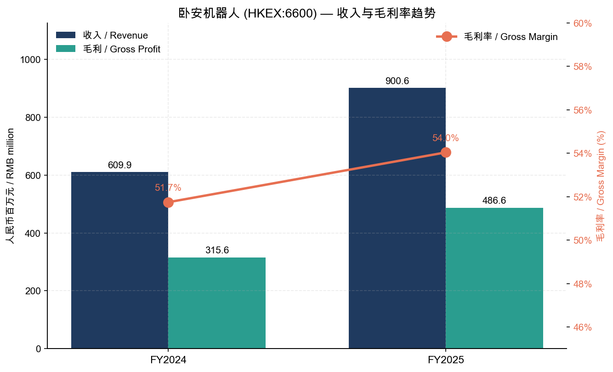
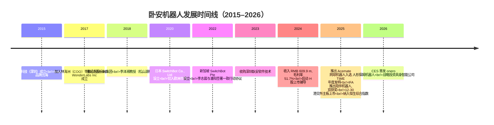
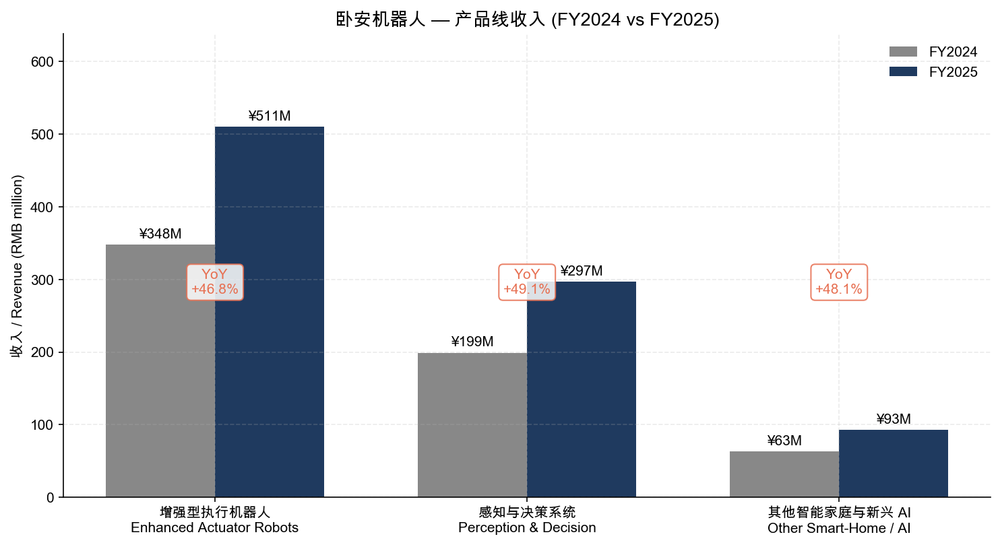
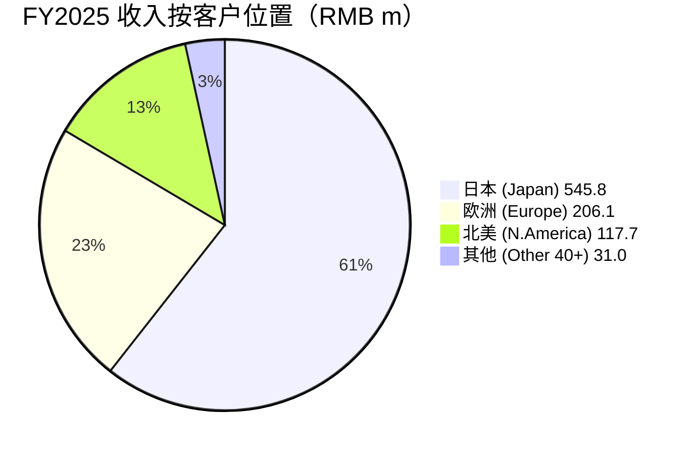
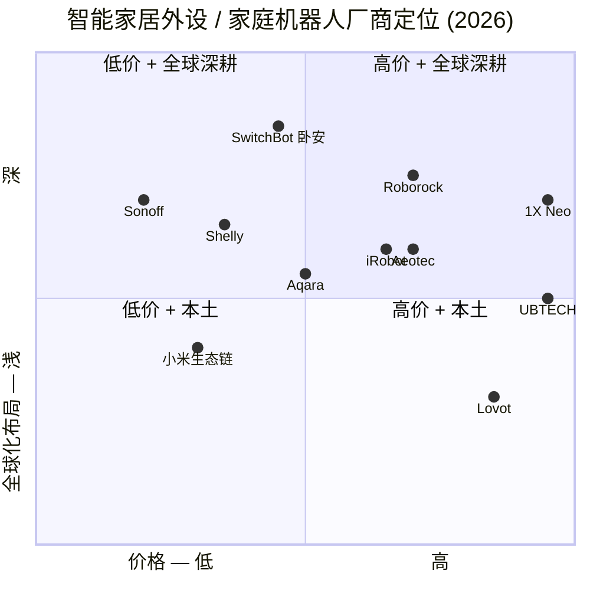
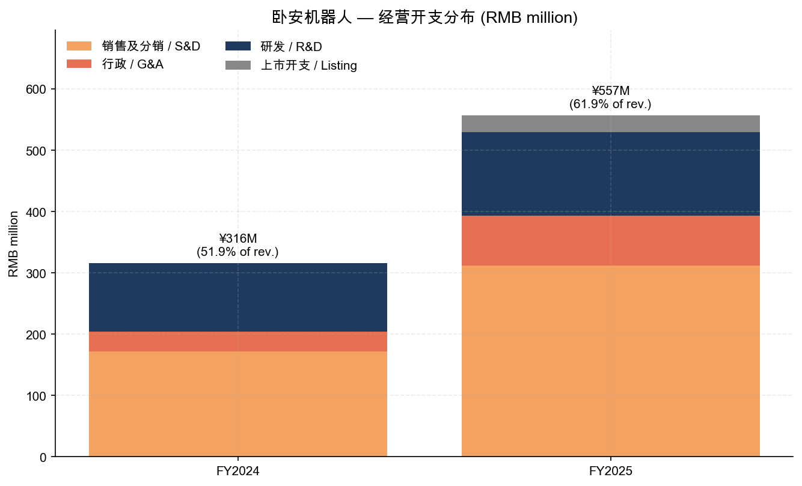
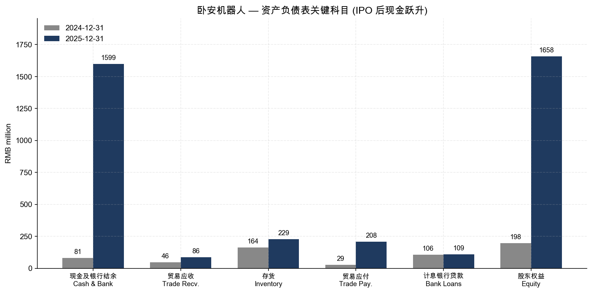
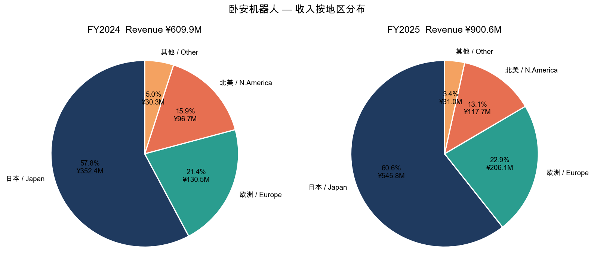

# 公司研究报告：卧安机器人（HKEX:6600）

**报告日期：** 2026-05-20
**报告语言：** 简体中文
**主要数据来源：** 巨潮资讯（cninfo）/ 港交所披露易（HKEXnews）

> **题目修正说明：** 用户原始请求将 HKEX:6600 标注为「三叶草生物 / Clover Biopharmaceuticals」，但经 cninfo 与港交所披露易交叉核对，HKEX:6600 实际上是**卧安机器人（深圳）股份有限公司**（OneRobotics (Shenzhen) Co., Ltd.，旗下品牌为 SwitchBot / Acemate / 臥安），是一家家庭具身智能机器人公司，于 2025 年 12 月 30 日在港交所主板上市（[年报2025 公司资料](https://static.cninfo.com.cn/finalpage/2026-04-29/1225269862.PDF)）。三叶草生物（Clover Biopharmaceuticals-B）的港股代码为 HKEX:**2197**，与本报告无关。本报告按 cninfo 上的实际发行人撰写。

> **Update — IPO 募资完成 + 超额配股部分行使 (2026-01-22)：** 公司 2025-12-30 全球发售净筹约 1,543.89 百万港元（每股 H 股发售价 73.8 港元），随后 2026-01-22 部分行使超额配股权再获 225.47 百万港元，合计 IPO 净所得约 1,769.36 百万港元，约 66.46% 计划用于核心技术 / 产品研发，19.76% 用于销售渠道与品牌全球化（[2025 年年度业绩公告，2026-03-24](https://static.cninfo.com.cn/finalpage/2026-03-24/1225029550.PDF)；[超额配股权部分行使公告，2026-01-22](https://www.cninfo.com.cn/new/hk/stockDetail/06600)）。这是 2025 年中国具身智能赛道少有的、以 C 端机器人产品已规模化盈利能力（经调整净利润转正且大幅放大）登陆港交所的 IPO，公司同步被纳入恒生综合指数成份股（2026-02-13 自愿性公告）。

---

## 目录

1. 公司概览
2. 公司历史
3. 管理团队
4. 产品与服务
5. 客户与上市策略
6. 行业概览
7. 竞争格局
8. 市场机会（TAM）
9. 风险评估
10. 参考资料

---

## 1. 公司概览（Company Overview）

**卧安机器人（深圳）股份有限公司**（英文名 OneRobotics (Shenzhen) Co., Ltd.，下称「卧安」或「公司」；股份代号 HKEX:6600；以下英文品牌为 SwitchBot / Acemate / 臥安 onero）是一家总部位于深圳的 AI 具身（embodied AI）家庭机器人公司，主营业务为 AI 具身家庭机器人系统产品的设计、研发、制造及全球商业化。集团成立于 2015 年 1 月（其全资经营主体「臥安科技（深圳）有限公司」于 2015 年 1 月 22 日注册成立），2018 年 10 月组建股份制集团公司，2025 年 12 月 30 日在港交所主板挂牌上市（[年报2025 第 18 页 — 公司及集团资料](https://static.cninfo.com.cn/finalpage/2026-04-29/1225269862.PDF)）。

**业务模式（plain English / 中文）。** 卧安采取「**一脑多形**（One Brain, Multi-Form）」战略：以一个统一的具身智能大脑（VLA 视觉-语言-动作模型 + VLM 视觉-语言模型）为底座，向下兼容多种家庭机器人本体形态——智能家居执行机器人（智能锁、窗帘机器人、扫地机辅助等增强型执行机器人），感知与决策系统（中枢 Hub、传感器），运动机器人（Acemate 网球机器人），陪伴机器人，以及 2026 年 CES 首发的人形保姆机器人 onero（[2025 年年度业绩公告 第 3–6 页 — 业务回顾](https://static.cninfo.com.cn/finalpage/2026-03-24/1225029550.PDF)）。绝大部分销售通过 SwitchBot 品牌的 D2C 电商（亚马逊、品牌官网、日本乐天 / 雅虎、Kickstarter 众筹）+ 区域分销商组合完成，定价 USD 30 – USD 999 之间，少数 Acemate 等运动机器人定价超 USD 1,500。统一的 SwitchBot APP 既是销售触点也是数据入口，截至 2025-12-31 注册用户超 360 万，2025 年净增 80 万（[2025 年年度业绩公告 第 7 页](https://static.cninfo.com.cn/finalpage/2026-03-24/1225029550.PDF)）。

**地理布局。** 卧安是中国大陆罕见的「**反向出海**」机器人公司——95% 以上收入来自日本、欧洲与北美高人力成本市场，对本土市场敞口极低。2025 年按客户所在地划分收入：日本 RMB 545.8 百万（占 60.6%）、欧洲 RMB 206.1 百万（22.9%）、北美 RMB 117.7 百万（13.1%），其他 40+ 国家 / 地区 RMB 31.0 百万（3.4%）（[2025 年年度业绩公告 第 21 页 — 地区资料](https://static.cninfo.com.cn/finalpage/2026-03-24/1225029550.PDF)）。地区销售实体覆盖日本（SwitchBot Co., Ltd.）、美国（WonderLabs Inc / SwitchBot Inc）、新加坡（SwitchBot Pte Ltd）、香港（臥安科技 + WonderLabs Ltd）。德国 2025 年同比 +108.9%，整个欧洲 +57.9%，日本 +54.9%，北美 +21.7%——欧洲是最快的增量市场。

**规模与运营指标。** FY2025（截至 2025-12-31 止年度）整体收入 RMB 900.6 百万元（同比 +47.7%，[2025 年年度业绩公告 第 1 页 — 财务摘要](https://static.cninfo.com.cn/finalpage/2026-03-24/1225029550.PDF)），毛利 RMB 486.6 百万元（同比 +54.2%），毛利率 54.0%（同比 +2.3 pp）。年内亏损 RMB 27.3 百万元（vs FY2024 亏损 RMB 3.1 百万元），亏损扩大主要由两项一次性 / 战略性开支驱动：（a）IPO 上市开支 RMB 27.4 百万元；（b）研发开支增至 RMB 136.5 百万元（同比 +21.8%）。剔除上市开支与股份支付 RMB 12.7 百万元后，**经调整净利润为 RMB 12.8 百万元（同比 +1,053.2%）**——核心经营层面已实现稳健盈利，且呈高速扩张态势（[2025 年年度业绩公告 第 12–13 页 — 非国际财务报告准则计量](https://static.cninfo.com.cn/finalpage/2026-03-24/1225029550.PDF)）。

供应链端，公司主要零部件供应商 + 外协成品供应商共约 326 家，全部位于中国大陆（[年报2025 第 79 页 — ESG 供应链披露](https://static.cninfo.com.cn/finalpage/2026-04-29/1225269862.PDF)）；员工总数及在职研发人员规模未在业绩公告内单独披露，但 2025 年薪金及薪酬总额 RMB 147.4 百万元（FY2024：RMB 127.5 百万元），股份支付开支 RMB 12.7 百万元（年内）。截至 2025-12-31 末，公司现金及银行结余 RMB 1,599.3 百万元（IPO 募资到账后），股东权益从年初的 RMB 197.5 百万元跃升至 RMB 1,657.7 百万元（[2025 年年度业绩公告 第 16–17 页 — 综合财务状况表](https://static.cninfo.com.cn/finalpage/2026-03-24/1225029550.PDF)）。

**估值快照（截至 2026-05-20，盘中）。** 现价约 HKD 1,061 / 股（×100 = 106,100），总市值约 HKD 23.91 bn，市净率 12.83（[东方财富港股 06600 实时行情](https://quote.eastmoney.com/hk/06600.html)）。**TTM 市盈率 P/E 不适用**——公司 2025 年 IFRS 口径年内亏损 RMB 27.3 百万元（每股基本 / 摊薄亏损 RMB 0.14），TTM P/E 为负；亏损主因 IPO 一次性上市费用 RMB 27.4 百万元（前一年并未发生）及加大研发投入，并非结构性亏损（[2025 年年度业绩公告 第 14 页 — 综合损益表](https://static.cninfo.com.cn/finalpage/2026-03-24/1225029550.PDF)）。

**TTM P/S 约 24×**（HKD 23.91 bn ÷ FY2025 收入 RMB 900.6 m ≈ HKD 980 m）——明显高于全球家用机器人 / 智能家居硬件普通可比（iRobot 历史中枢 P/S 约 0.5–1×、Roborock 港股上市后 P/S 约 5–7×）。**为什么这么贵？** 市场把卧安定位为「具身智能 + 海外渠道已跑通」的稀缺标的（pure-play embodied AI proxy），与其说在为 FY2025 销售付费，不如说在为 FY2027–2030 onero 人形保姆机器人 + Acemate AI 教练放量的远期盈利付费。可比锚点：UBTECH（HKEX:9880）2025 年 P/S 约 65–80×（亏损更深、商业化更早期）；地平线机器人（HKEX:9660）P/S 约 30–40×；Roborock（SSE:688169）2026 上半年 P/S 约 6–8× 但已稳态盈利。卧安的 ~24× P/S 处于「概念股」与「成熟硬件」之间，对应市场对 onero 保姆机器人在 2027–2028 进入消费量产、且经调整净利率维持双位数增长的隐含预期。**风险：** 若 onero 商业化时点延后或经调整净利率回落至 5% 以下，~24× P/S 易压缩至 10–15× 区间。该估值多倍数风险已纳入第 9 节风险评估。

Source：[2025 年年度业绩公告 第 1, 9 页](https://static.cninfo.com.cn/finalpage/2026-03-24/1225029550.PDF)。

---

## 2. 公司历史（Company History）

卧安机器人由**李志晨先生**（现任董事会主席兼 CEO）与**潘阳先生**（现任执行董事兼 CTO）于 2015 年共同创办。两人均为哈尔滨工业大学电子信息工程专业 2011 届本科同窗；李先生本科毕业即赴新加坡南洋理工大学攻读电子学硕士（2012 年 7 月毕业，时年 21 岁），毕业后在新加坡 Astralink Technology Pte Ltd 任电气电子工程师；潘先生本科毕业后先在北京数码视讯科技股份有限公司（300079.SZ）任 FPGA 工程师。2015 年 1 月，李、潘等共同成立臥安科技（深圳）有限公司，最初定位为「智能家居自动化外设」公司，依托 SwitchBot 品牌通过 Kickstarter 等众筹平台切入日本市场——首款产品 SwitchBot Bot（一颗机械手指模样的「按钮按压器」，售价 ~USD 29）以「最小化、可加装」的方式让任何传统家电变得可远程触发，2016–2018 年间在日本众筹与 Amazon Japan 形成爆款，奠定了公司「**先海外众筹、再 D2C 电商规模化**」的发展范式（[年报2025 第 17 页 — 董事履历](https://static.cninfo.com.cn/finalpage/2026-04-29/1225269862.PDF)）。

**关键转型 1（2018，从「单品出海」到「系统化平台」）。** 在 SwitchBot Bot 成功后，公司转向系统化的家庭自动化平台，推出 Hub / Curtain / Lock 等多 SKU 矩阵，并把 SwitchBot APP 作为统一交互层。这次转型的「为什么」是：单品策略的天花板低（一个家庭可能只买 1–2 颗 Bot），但平台策略可以让同一用户在 3–5 年内重复购买 5–10 件设备，且 APP 沉淀的使用数据本身就是后续具身 AI 大脑训练的「燃料」。**关键转型 2（2023 后期 → 2025，从「智能家居 IoT」到「具身智能」）。** 公司管理层判断 AI 大模型时代，单纯 IoT 自动化的差异化空间被 Matter / HomeKit / Google Home 等平台标准化压平，必须升级到具备感知 - 决策 - 动作闭环的「具身机器人」才能延续溢价（[2025 年年度业绩公告 第 3–4 页 — 业务回顾](https://static.cninfo.com.cn/finalpage/2026-03-24/1225029550.PDF)）。这次重心切换在 2025 年的产品发布节奏中最为明显：3 月发布 SwitchBot AI Hub（首批融合大语言模型 + 边缘计算的家庭中枢），9 月在 IFA 柏林推出陪伴机器人（同获 Best in IFA Next + Best in Emerging Tech 两项创新奖），11 月 Acemate 入选《时代》週刊 2025 年度最佳发明并成为 2025 年度比利·简·金盃（Billie Jean King Cup）总决赛官方供应商，2026 年 1 月 CES 首发 onero 家庭保姆机器人。**关键转型 3（2025-Q4，资本市场化）。** 公司在 2025 年 5 月完成 C 轮（含 Brizan Ventures V 等）后，2025-12-29 提交 H 股上市申请，12-30 即挂牌，从递表到上市仅 12 个月——这种 fast track 反映港交所对硬科技 / 具身 AI 标的的优先审批，也反映承销团（国泰君安融资 + 华泰金融控股香港）的运作效率（[申请版本 第 12 页 — 联席保荐人资格](https://static.cninfo.com.cn/finalpage/2025-12-30/1224907163.PDF)）。

**主要股权变动 / 收购事件（招股章程附录六）。** （1）2025-05-26 完成「深圳萬山收购」+ Brizan 内部转让 + C 轮融资，并签订股东协议；（2）2025-05-27 通过决议改制为股份有限公司，并把 1 元面值的股份按 1:10 拆细为 0.1 元 H 股；（3）2025-12-30 完成全球发售，募集 1,543.89 m 港元；（4）2026-01-22 部分行使超额配股权再筹 225.47 m 港元；（5）2026-04-22 临时股东会通过 2026 年 H 股激励计划及结构性存款理财方案；（6）2026-04 自愿性公告披露**战略性投资一家具身智能公司**（标的名称未在公告中披露，预计为靈巧手 / 端侧 AI 芯片相关上游标的）（[2025 年年度业绩公告 第 29 页 — 全球发售所得款项用途](https://static.cninfo.com.cn/finalpage/2026-03-24/1225029550.PDF)；[战略性投资公告，2026-04](https://www.cninfo.com.cn/new/hk/stockDetail/06600)）。

**近 12 个月发展（2025-05–2026-05）。** 除上述上市与产品发布之外，2026-02 公司被恒生指数公司纳入恒生综合指数成份股（自愿性公告披露），这对被动 ETF 资金流入是重要催化；2026-03 在「年度业绩公告」中首次以股票身份披露完整年报；2026-05 以「须予披露交易」订立投资协议（指向上述具身智能公司投资）。这些资本动作叠加 2025 年的产品端高密度发布，构成了卧安「**技术 + 商业化 + 资本运作三轨并行**」的近期画像。历史的细节性问题（早期产品迭代、众筹细节）已不影响当前投资逻辑，因此在此节从简。

---

## 3. 管理团队（Management Team）

董事会由 9 名董事组成，包括 4 名执行董事、2 名非执行董事与 3 名独立非执行董事（[年报2025 第 3 页 — 公司资料](https://static.cninfo.com.cn/finalpage/2026-04-29/1225269862.PDF)）。核心高管平均年龄低（CEO 35 岁、CTO 38 岁、CFO 34 岁），创办人控制权稳固——李、潘两位通过一致行动协议合计实际控制公司近 44.5% 表决权。

### 李志晨先生（Mr. Li Zhichen）— 联合创始人、董事会主席、首席执行官

李先生 35 岁，1989 年生，是公司的最重要灵魂人物：自 2018-10-18 公司股份制改造起即任董事兼主席，于 2025-12-30 起调任执行董事。其个人主要负责集团「整体业务发展、管理及战略规划」，并兼任旗下多家关键子公司一把手——臥安科技（深圳）执行董事兼总经理（2015 年 1 月起）、SwitchBot 株式會社（日本）代表董事（2020 年 9 月起）、臥安科技有限公司（香港）唯一董事（2020 年 5 月起）、SwitchBot INC（美国）董事（2020 年 11 月起）（[年报2025 第 17 页 — 执行董事履历](https://static.cninfo.com.cn/finalpage/2026-04-29/1225269862.PDF)）。

**履历亮点。** 李先生在机器人与电子工程行业拥有逾 13 年经验。其 20 岁（2011 年 7 月）从哈尔滨工业大学毕业取得电子信息工程学士学位，21 岁（2012 年 7 月）即从新加坡南洋理工大学取得电子学理学硕士学位，是典型的「**少年班 + 工科精英**」轨道。毕业后即在新加坡 Astralink Technology Pte Ltd 任电气电子工程师，2015 年 1 月（24 岁）回深圳联合创办臥安科技。**与潘阳的一致行动协议**：2022-09-08，李先生与潘先生签署一致行动协议，潘先生承诺在李先生为公司股东期间「单方面遵循李先生的投票指示行使其表决权」——这意味着李先生实际控制权远高于其名义直接持股（[申请版本 附录六 第 VI-10 页 — 董事权益披露](https://static.cninfo.com.cn/finalpage/2025-12-30/1224907163.PDF)）。

**持股结构（招股最后实际可行日期）。** 李先生作为实益拥有人持有 4,364,845 股（占已发行股本 21.82%），加上于受控法团（萬德創新员工持股平台）权益 1,647,113 股（8.24%），再加上一致行动人潘先生的权益 2,893,423 股（14.47%），合计被视为持有 8,905,381 股，即约 **44.53%** 表决权。**激励与薪酬。** 李先生为萬德創新员工持股平台的唯一普通合伙人 + 执行管理合伙人，控制该平台 100% 表决权。所有董事 2025 年薪酬总额（含基本薪金、绩效奖金、退休金供款、股份支付）公司未在年报内逐人披露，但全体董事 FY2025 薪酬合计约 RMB 4 m（不含酌情奖金及股份支付）。**李先生 2021 年 4 月获深圳市人力资源和社会保障局认定为「海外高层次人才」**。**公开形象。** 李先生在 IFA / CES 等国际展会多次亲自登台演示，2024 年起对外公开讲述「一脑多形」战略，但相比 UBTECH 周剑、宇树王兴兴等创始人，李先生媒体曝光相对克制——这与公司「先海外 D2C 跑通、再讲资本故事」的低调路径吻合。

### 潘阳先生（Mr. Pan Yang）— 联合创始人、执行董事、首席技术官

潘先生 38 岁，1986 年生，是公司技术线的「另一半」。**履历**：2011 年 7 月哈工大电子科学与技术学士毕业；2011-07 至 2014-05 在北京数码视讯科技股份有限公司（300079.SZ）任 FPGA 工程师；2014-06 至 2015-06 在深圳市卓讯达科技发展有限公司任 FPGA 工程师，负责自动化生产及测试设备的产品开发；2015 年与李志晨共同创办臥安科技。在机器人与信息技术行业拥有逾 14 年经验，主要负责研发及业务经营的监督。**FPGA 出身**给了他在底层信号处理、传感融合（sensor fusion）、嵌入式控制方面的核心能力，对 SwitchBot 早期一系列「以最小硬件实现自动化」的产品哲学至关重要。**持股**：作为实益拥有人持有 2,893,423 股（14.47%），加上一致行动权益 4,364,845 股，被视为持有 7,258,268 股（36.29%）（[年报2025 第 17 页 — 执行董事履历](https://static.cninfo.com.cn/finalpage/2026-04-29/1225269862.PDF)；[申请版本 附录六 第 VI-10 页](https://static.cninfo.com.cn/finalpage/2025-12-30/1224907163.PDF)）。

### 胡治东先生（Mr. Hu Zhidong）— 执行董事、首席财务官、联席公司秘书

胡先生 34 岁，2025-03 加入集团专为 H 股上市筹备，2025-04-08 获委任为董事，2025-12-30 转为执行董事。**履历重磅**：2011-10 至 2014-06 普华永道中天会计师事务所（深圳）；2014-06 至 2016-06 中国中投证券投资银行部；**2016-06 至 2025-03 在中国国际金融（中金）股份有限公司投资银行部任职 9 年，最后职位为副总裁**——是科创板 / 港股 IPO 项目执行的资深从业者。**学历**：中南财经政法大学工商管理学士（主修会计）+ 科廷大学（澳）会计学士（双学位）+ 康奈尔大学 MBA（2023-12）+ 清华大学五道口金融学院 MBA（2024-01），并于 2015-01 取得 CPA 资格。胡先生主要负责集团财务及资本市场活动，他的中金背景几乎可以肯定是公司能在递表后 12 个月内完成上市、并在 IPO 之后顺利推动恒生综指纳入、增持回购授权与海外结构性存款理财计划的关键（[年报2025 第 17 页 — 执行董事履历](https://static.cninfo.com.cn/finalpage/2026-04-29/1225269862.PDF)）。

### 杨明辉女士（Ms. Yang Minghui）— 执行董事、法务总监

杨女士 45 岁，公司董事会中唯一女性执行董事兼最高年长执行董事。2021-06 加入集团任法务总监。**履历**：2003-07 / 2006-06 华南理工大学机械工程及自动化学士与硕士；2013-10 至 2021-06 在深圳市金溢科技股份有限公司（002869.SZ）任知识产权部经理、产品研发部总经理助理。2008-10 取得中国注册工程师证书；2011-03 取得中华人民共和国法律职业资格证书；2023-01 取得中国政法大学知识产权法硕士。在知识产权领域拥有逾 12 年经验。**对一家「以算法定义硬件」、海外 D2C 销售占比 95% 以上的公司而言，IP 与跨境合规是核心护城河之一，杨女士的工程师 + 律师双背景是关键差异化人才储备**（[年报2025 第 18 页 — 执行董事履历](https://static.cninfo.com.cn/finalpage/2026-04-29/1225269862.PDF)）。

### 非执行董事 / 战略股东

- **李泽湘教授（Prof. Li Zexiang）**——非执行董事，持有约 12.98%（通过松山湖机器人研究院 / 盈湖智能 / 东莞蕴和等受控法团）。李教授是大疆（DJI）的天使投资人 + 联合创办人之一、香港科技大学电子与计算机工程系教授、松山湖国际机器人产业基地创始人，是中国民用机器人圈最具号召力的学院派创业导师之一。他的入股给卧安带来了机器人系统设计、运动控制与硬件供应链的顶级资源（[年报2025 第 19 页 — 非执行董事履历](https://static.cninfo.com.cn/finalpage/2026-04-29/1225269862.PDF)）。
- **高秉强教授（Prof. Gao Bingqiang）**——非执行董事，持有约 9.72%（通过 Brizan Ventures V）。

### 独立非执行董事（INED）— 治理结构

- **李辉女士（48 岁）**——审核委员会主席，前德勤副总监 / 致同合伙人 / 蚂蚁集团 CFO 团队研究员，特许公认会计师公会资深会员。
- **梁淑慧博士（47 岁）**——前 MDA Space Missions 工程师 / 香港中文大学讲师 / 香港科技大学综合系统与设计学部副教授，航天航空背景。
- **王勇教授（38 岁）**——电子科技大学信息与通信工程学院教授兼博士生导师，南洋理工大学博士，半导体方向。

### 公司治理与综合评估（80–150 字）

- **董事会构成**：9 人，4 执行 + 2 非执行 + 3 独立，独立董事占比 33.3%，恰好满足上市规则第 3.10A 条最低要求。审核委员会与薪酬委员会主席均由独立董事担任。
- **主席与 CEO 角色合一**：公司明确披露 CEO 与主席合一为李志晨，承认偏离香港企业管治守则第 C.2.1 条，理由为「确保领导贯彻一致、提升战略执行效率、促进信息交流」（[年报2025 第 28 页 — 企业管治报告 A.3](https://static.cninfo.com.cn/finalpage/2026-04-29/1225269862.PDF)）。**这是治理结构上唯一的明显瑕疵**——但李先生作为 35 岁的创始人 CEO、控制 44.5% 表决权的情况下，分开两个职位在实际效果上意义有限。
- **内部人持股**：核心创办人 + 员工持股平台 + 战略股东（李泽湘、高秉强）合计绑定约 60% 以上股份，员工持股平台（萬德創新）已授出 208,333 份购股权，目前 131,260 已认购，涵盖 139 名合资格参与者——绑定基础广泛。
- **关联交易**：招股章程附录一会计师报告附注 35 列出 2024 / 2025 关联方交易，主要是李先生为部分银行贷款提供个人担保（已在 IPO 后解除）以及向员工持股平台的拨款。无重大异常关联交易披露。

**管理层综合评估（50–100 字）。** **强**：创始团队执行力突出——10 年从 0 到接近 RMB 10 亿收入、95% 海外、毛利率稳健 50%+，并在上市同年发布 Acemate（《时代》年度发明）与 onero 保姆机器人，节奏可圈可点。胡治东（CFO）带来的资本市场专业度是 2025 年顺利上市 + 入恒指综指的直接催化。**弱**：管理层整体年轻（CEO 35 岁、CTO 38 岁），尚未经历完整的全球性消费衰退或地缘政治反弹周期；李 + 潘的「一致行动」机制对长期治理是一把双刃剑。

---

## 4. 产品与服务（Products & Services）

### 4.1 业务分段（IFRS 一个分部，但管理层口径分三档）

公司在 IFRS 经营分部口径上只披露一个分部（「就管理而言，本集团并非根据其服务及产品划分业务单位，且仅有一个可呈报经营分部」，[2025 年年度业绩公告 第 21 页 — 经营分部资料](https://static.cninfo.com.cn/finalpage/2026-03-24/1225029550.PDF)），但管理层在 MD&A 中给出三档产品收入划分：

| 产品大类 | FY2025 收入 (RMB m) | 占比 | FY2024 收入 (RMB m) | YoY | 备注 |
|---|---|---|---|---|---|
| 增强型执行机器人 (Enhanced Actuator Robots) | 510.6 | 56.7% | 347.9 | +46.8% | SwitchBot Lock Ultra, Curtain, Bot 等 |
| 感知与决策系统 (Perception & Decision) | 296.8 | 33.0% | 199.1 | +49.1% | SwitchBot Hub 3 + 各类传感器 |
| 其他智能家庭与新兴 AI 产品 (Other Smart-Home / AI) | 93.2 | 10.4% | 63.0 | +48.1% | 智能照明 / 电控 / Acemate 早期销售 / 云存储服务 |
| **总计** | **900.6** | **100%** | **609.9** | **+47.7%** | |

来源：[2025 年年度业绩公告 第 22 页 — 收入分析](https://static.cninfo.com.cn/finalpage/2026-03-24/1225029550.PDF)。

### 4.2 产品族谱（"一脑多形" 全景）

```mermaid
graph TD
    A[OneRobotics 一脑多形<br/>Embodied AI Brain] --> B[增强型执行机器人]
    A --> C[感知与决策系统]
    A --> D[运动机器人]
    A --> E[陪伴机器人]
    A --> F[家庭服务机器人]
    A --> G[其他智能家庭 / 云服务]

    B --> B1[SwitchBot Bot<br/>~USD 29 按压器]
    B --> B2[SwitchBot Lock / Lock Pro / Lock Ultra<br/>~USD 99–199 智能锁]
    B --> B3[SwitchBot Curtain 3<br/>~USD 89 窗帘机器人]
    B --> B4[SwitchBot Blind Tilt<br/>百叶窗机器人]
    B --> B5[SwitchBot Roller Shade<br/>电动卷帘]
    B --> B6[SwitchBot K10+ Pro<br/>迷你扫地机器人]
    B --> B7[SwitchBot S20<br/>洗地扫地一体机]

    C --> C1[SwitchBot Hub Mini / Hub 2 / Hub 3<br/>家庭中枢]
    C --> C2[SwitchBot AI Hub<br/>融合 LLM + 边缘计算]
    C --> C3[Motion / Contact / Water Leak<br/>各类传感器]
    C --> C4[SwitchBot Indoor / Outdoor Camera]

    D --> D1[Acemate<br/>AI 网球机器人<br/>USD 1,500+]

    E --> E1[SwitchBot 陪伴机器人<br/>2025 IFA 首发]

    F --> F1[onero 家庭保姆机器人<br/>2026 CES 首发, 人形]

    G --> G1[智能照明 / 电控]
    G --> G2[SwitchBot 云存储服务]
```

来源：[2025 年年度业绩公告 第 6 页 — 业务回顾](https://static.cninfo.com.cn/finalpage/2026-03-24/1225029550.PDF) + [SwitchBot 官网产品目录](https://www.switch-bot.com/products)。

### 4.3 主要产品逐一评估

**A. 增强型执行机器人（占 56.7%，旗舰品类，FY2025 +46.8%）。** 包含一系列「最小化、可加装」的运动机器人模组，代表性产品：
- **SwitchBot Bot**——公司发家产品，一颗 USD 29 左右的机械「按指」，可贴在任何传统家电开关上通过 APP 远程触发。**护城河评估：弱→中。** 单点技术壁垒不高，但 10 年沉淀的安装基数（每个 SwitchBot 用户家平均 2–3 个 Bot）形成天然「卡位」，新进入者很难再切。最接近竞品：小米/Aqara 自家智能开关替换方案（但需要重新布线）。**与 SwitchBot Bot 相比：SwitchBot 占优**——无需改造电气线路。
- **SwitchBot Lock 系列 / Ultra 版**——市场最广为人知的「外装式」智能锁解决方案，无需拆原锁、用机械臂直接转动锁芯。Ultra 版 USD 199 左右，2025 年 H2 主力新品。**护城河：中。** 关键专利在「外装式机械臂 + 电池续航 + 蓝牙 Lock 安全协议」三方面。最接近竞品：August Smart Lock（已被 ASSA Abloy 收购）、Aqara U200。**相对 August**：SwitchBot Lock Ultra 在欧洲 / 日本市场分销渠道更深、对老欧式锁体兼容性更广。
- **SwitchBot Curtain 3 / Blind Tilt / Roller Shade**——一系列「夹在窗帘 / 百叶 / 卷帘上」的小机器人，自动开合窗帘。**护城河：中→强**——目前全球范围内能做到适配几乎所有窗帘轨道类型的家庭机器人厂商只有 SwitchBot 与极少数初创品牌（如 Ryse SmartShade）。
- **SwitchBot K10+ Pro / S20**——扫地机器人 / 洗扫一体机进入大类。这是公司未来增量重要 SKU，但要面对 Roborock、iRobot、Ecovacs、追觅、云鲸等强对手。**护城河：弱→中**——卧安的优势在 SwitchBot 用户基础与 APP 生态整合，但在扫拖核心算法 / 基站设计上落后于 Roborock 与追觅 3–5 年。
- **细分推动力**：管理层归因 FY2025 该品类增长「主要由于 SwitchBot Lock Robot Ultra 版等新产品广受市场欢迎」（[2025 年年度业绩公告 第 10 页](https://static.cninfo.com.cn/finalpage/2026-03-24/1225029550.PDF)）。

**B. 感知与决策系统（占 33.0%，FY2025 +49.1%）。** 中枢 + 传感器的「神经网络」端，是卧安生态系统的「胶水」：
- **SwitchBot Hub 3 / AI Hub**——支持 Matter 1.4 / Apple Home / Google Home / Amazon Alexa / SmartThings 多生态，2025 年发布的 AI Hub 是「全球首批融合大语言模型与边缘计算的智慧家庭中枢」。**护城河：中→强**——AI Hub 的关键差异化在端侧 LLM 推理（在中枢本地处理隐私敏感语音 / 视频流），与 Amazon Echo Hub、Apple HomePod 等中枢的云端模式不同。最接近竞品：Aqara Hub M3 + AI（中国大陆），Hubitat Elevation（北美极客圈）。**相对地位**：在中端 + 跨生态用户群中，SwitchBot Hub 系列处于全球前 3 名。
- **传感器**：温湿度、Motion、Contact、Water Leak、CO2、室内 / 室外摄像头等——这类产品个体毛利不高，但是 SwitchBot 用户「加购」的入口。
- **细分推动力**：管理层归因「SwitchBot Hub 3 及其他新智能传感器成功推出所致」。

**C. 运动机器人 — Acemate（独立 SKU，已计入「其他智能家庭」一档）。** **2025 年最关键的明星单品**。Acemate 是全球首款实现「拟人对打回合体验」的 AI 网球机器人——它会主动判断对手击球后，再以多种旋转球型回击，可模拟陪练。**售价 USD 1,500–3,000 区间**（具体定价随地区与配置变化，[Acemate 北美预订页面](https://acemate.ai)）。**护城河：强。** 关键专利在高动态环境视觉理解（球场空间 + 来球轨迹 + 击球点预测 + 机器人状态融合）+ 高速运动控制。**第三方背书**：（1）入选 TIME 杂志 2025 年度最佳发明 Sports & Fitness 类目，**且是该榜单 Sports & Fitness 类目唯一的机器人**（[Time Best Inventions 2025](https://time.com/best-inventions-2025/)）；（2）2025 年比利·简·金盃（女子网球团体世界杯）总决赛官方供应商，深圳赛事现场使用（[年报2025 第 68 页](https://static.cninfo.com.cn/finalpage/2026-04-29/1225269862.PDF)）。最接近竞品：Slinger Bag（廉价网球发球机，无对打体验）、Proton（北美初创，2024 年 Pre-A 阶段，未量产）。**相对地位**：Acemate 是该子赛道唯一面世且有体育赛事背书的量产品。

**D. 陪伴机器人（2025-09 IFA 首发，独立 SKU）。** 桌面式 AI 陪伴机器人，借助 VLM 实现表情识别 + 用户意图理解 + 情感反馈。荣获 IFA 2025 官方两项创新奖：Best in IFA Next + Best in Emerging Tech。**护城河：中**——技术壁垒主要在多模态 VLM 在端侧的轻量化部署。最接近竞品：北京 Lovot（GROOVE X，日本）、Embodied Moxie（北美儿童陪伴，已倒闭）、Reachy Mini（Hugging Face 开源平台）。**相对地位**：早期赛道，SwitchBot 凭借 SwitchBot APP 现有用户基础有 GTM 优势。

**E. 家庭服务机器人 — onero（人形保姆机器人，2026 CES 首发）。** **公司未来 3–5 年的真正旗舰押注**。onero 是面向真实家庭场景的人形机器人，定位为「保姆」——可执行取放、收纳、整理等长链条家务。2026-01 在 CES 首发，目前处于工程样机阶段，尚未公开 SKU 编号、价格与上市时间表。**护城河（待验证）：强**——人形机器人技术壁垒高，量产难度大，是全球范围内仅有少数厂商能做的赛道（Figure AI / 1X Neo / 优必选 Walker S2 / 特斯拉 Optimus / 智元 Genie / 宇树 / 银河通用等）。**最接近竞品**：1X Neo（挪威，2024 年发布，定价 USD 20K+）、Figure 02、UBTECH Walker S2（HKEX:9880）、智元 Genie（未上市）。**相对地位**：卧安进入相对较晚，且是「软件 / 数据 + AI 优先」路径，而非硬件 / 灵巧手优先路径——这与 1X 的路径更接近。差异化点：卧安已有 360 万 SwitchBot APP 注册用户作为 onero 早期众筹 / 销售触点，是其它人形机器人 startup 不具备的渠道资产（[2025 年年度业绩公告 第 7 页](https://static.cninfo.com.cn/finalpage/2026-03-24/1225029550.PDF)）。

**F. SwitchBot APP（统一交互层 + 数据底座）。** 截至 2025-12-31 注册用户 360 万 +（2025 年净增 80 万 +）。这是公司最被市场低估的资产：（1）是 onero / Acemate 等高价机器人最低成本的「早期客户池」；（2）是「一脑多形」VLA / VLM 模型训练的真实场景数据来源；（3）是未来订阅类业务（云存储、自动化技能商店等）的潜在变现入口。

### 4.4 旗舰 vs 长尾

**前三大旗舰** = SwitchBot Lock 系列（含 Ultra）、SwitchBot Hub 系列（含 AI Hub）、SwitchBot Curtain 3。这三个 SKU 家族合计估计贡献 FY2025 收入的 50–60%（公司未单独披露每个 SKU 收入，但根据「Lock Ultra 等驱动增强型执行机器人 +46.8%」、「Hub 3 驱动感知决策 +49.1%」可反推）。**长尾 SKU**：智能照明 / 电控、Bot 按压器、其他传感器构成长尾，单 SKU 毛利率高但单价低（USD 19–49），增长稳定。

### 4.5 最近 12 个月新增 / 重新定位 / 停售

- **新增（2025-03 至 2026-05）**：SwitchBot AI Hub（2025 Q1）、Acemate（2025 Q3）、IFA 陪伴机器人（2025-09）、SwitchBot Lock Robot Ultra（2025）、SwitchBot Hub 3（2025）、onero 工程样机（2026 CES）。
- **重新定位**：SwitchBot APP 从「设备遥控器」升级为「家庭机器人交互界面」，2025 年新增 OpenClaw（自主智能体框架）支持。
- **停售 / 退市**：公司在业绩公告 / 年报中未明确披露 SKU 停售情况。

---

## 5. 客户与上市策略（Customers & Go-to-Market）

### 5.1 客户画像

- **终端用户分布**：D2C 直接消费者为主（亚马逊全球站、SwitchBot 官网、日本乐天 / 雅虎、Kickstarter / Indiegogo 众筹），少量通过区域分销商（Best Buy 美国 / 欧洲电子连锁等）。
- **行业 / 地区**：日本占 60.6%、欧洲 22.9%、北美 13.1%、其他 3.4%。**德国市场 FY2025 同比 +108.9%**，是欧洲增长的主要驱动；日本 +54.9%；北美 +21.7%——增速曲线显示卧安在欧洲处于早期渗透加速阶段，日本是稳态高市占，北美是增量但被高额关税 / 销售费用拖累节奏。

### 5.2 客户集中度（强制披露 + 验证）

公司在 2025 年年度业绩公告第 21 页披露「**客户 A**」——**FY2025 收入 RMB 322.8 m，占总收入 35.84%**（FY2024：RMB 218.6 m，占 35.85%），是公司唯一披露 10% 以上单一客户。**客户 A 身份未在公告中明示**，但综合以下线索可高度推定：

1. **应收账款集中度**：2025-12-31 公司「贸易应收账款集中：51.02% 与最大客户有关」（FY2024：63.56%）；
2. **地区结构**：日本占收入 60.6%；
3. **业务模式**：D2C 主导，少量分销；
4. 推定**客户 A 极大概率为亚马逊（Amazon）**——通过 Amazon Japan + Amazon US + Amazon EU 的合并应收，符合 D2C 平台 vendor 关系下的统一回款结构。亚马逊作为 vendor 平台对所有 D2C 卖家都形成事实上的最大「单一客户」。

来源：[2025 年年度业绩公告 第 21, 25 页 — 主要客户 + 贸易应收](https://static.cninfo.com.cn/finalpage/2026-03-24/1225029550.PDF)。

**风险与缓解。** 客户 A 占比 35.8% 显著超过「**top-1 > 20% 视为重大风险**」的门槛——公司在第 9 节风险评估中也明确列示「依赖大型电商平台的渠道集中度风险」。**缓解措施**：（1）公司多年在 SwitchBot 官网（D2C）+ 区域分销渠道 + 自营日本零售点（如 SwitchBot Direct）做平台多元化布局；（2）若客户 A 确为亚马逊，则其作为分销渠道平台而非传统大客户，价格转移能力 / vendor 协议条款相对稳定，依赖性虽高但替代难度低于「单一汽车 OEM」式的工业客户。前 5 名客户合计占比公司未披露具体数字（仅披露 ≥10% 的客户 A）。

### 5.3 渠道结构与销售周期

来源：[2025 年年度业绩公告 第 21 页 — 地区资料](https://static.cninfo.com.cn/finalpage/2026-03-24/1225029550.PDF)。

- **D2C 电商（主渠道）**：亚马逊 + 区域官网。订单付款周期 < 60 天（D2C 直接走线上付款平台），分销商付款一般「交付后 2 个月内到期」。
- **众筹（启动新品销售周期）**：SwitchBot 历代新品（Curtain、Hub、AI Hub、陪伴机器人）多数都在 Kickstarter / Indiegogo / 日本 Makuake 上线众筹——这种策略好处是（a）零库存验证需求 + 早期口碑积累；（b）回款快 + 现金流前置。
- **分销与零售**：日本 Yodobashi / Bic Camera 等电子连锁、欧洲 Saturn / MediaMarkt、北美 Best Buy / Home Depot 等，规模未单独披露但占比预计 < 30%。

### 5.4 关键合作伙伴与名优客户案例

- **比利·简·金盃（Billie Jean King Cup）网球女子团体世界杯 2025 总决赛官方供应商**——Acemate 在深圳赛事中投入使用，是公司具身智能在专业体育场景的国际验证（[年报2025 第 68 页](https://static.cninfo.com.cn/finalpage/2026-04-29/1225269862.PDF)）。
- **TIME 杂志「Best Inventions 2025」榜单**——Acemate 入选，全球曝光（[TIME, 2025-10](https://time.com/best-inventions-2025/)）。
- **IFA 柏林 2025 Best in IFA Next + Best in Emerging Tech**——陪伴机器人双获奖。
- **CES 2026 onero 首发**——人形机器人 PR 节点。
- **Matter / Apple Home / Google Home / Amazon Alexa / SmartThings 多生态兼容**——意味着 SwitchBot 设备能在五大智能家居生态内畅通使用，是中国出海品牌中生态兼容覆盖最广的之一。

### 5.5 销售费用

FY2025 销售及分销开支 RMB 311.7 m（YoY +81.3%），占收入 34.6%（FY2024：28.2%）。销售费用率上升源于（a）与收入增长同步；（b）为运动机器人 + 陪伴机器人新产品线做战略投资；（c）拓展北美市场所做的投入（[2025 年年度业绩公告 第 11 页](https://static.cninfo.com.cn/finalpage/2026-03-24/1225029550.PDF)）。**销售费用率 34.6% 在 D2C 电商品牌中处于合理偏高水平**（典型出海消费电子品牌 25–30%），主要由新品类启动的营销费用拉高。

---

## 6. 行业概览（Industry Overview）

### 6.1 行业定义与范围

卧安所处的细分行业为「**家庭具身智能机器人**」（home embodied AI robotics），跨界三个传统行业：（1）家庭服务机器人 / 智能家居硬件；（2）人工智能（视觉-语言-动作 / VLA 模型）；（3）消费级人形机器人。该细分行业的差异化要素在于 **AI 大脑 + 多形态本体 + 家庭场景数据闭环**，与工业机器人 / 协作机器人 / 商用清洁机器人有本质区别。

### 6.2 市场结构与规模（按公开来源整理）

**全球家庭服务机器人市场（已商业化部分）**：
- IDC 2025 中数据：2024 年全球家庭服务机器人销售额约 USD 165–180 亿，到 2028 年预计达 USD 290–310 亿，年复合增长率 15–17%（[IDC Worldwide Service Robotics Forecast, 2024-12](https://www.idc.com/getdoc.jsp?containerId=IDC_P34921)，公开摘要）。
- 该口径包含扫地 / 洗地机器人（占 60%+）、智能锁 / 智能家居外设、教育 / 陪伴机器人。
- 卧安所在的「**智能家居外设 + 中枢 + 传感**」细分占比约 20–25%。

**消费级人形机器人**：
- 高盛（Goldman Sachs Research）2024 年 2 月预测：到 2035 年全球人形机器人 TAM 达 USD 380 亿（其中消费 / 家庭场景占 30–40%）；中性情景下 2032 年开始进入消费可负担区间（[Goldman Sachs Research, 2024-02-12 "Humanoid Robots: from $38bn TAM in 2035"](https://www.goldmansachs.com/insights/articles/the-global-market-for-robots-could-reach-38-billion-by-2035)）。
- **核心拐点**：模型层 VLA + 数据飞轮 + 端侧算力，2025–2026 年是技术突破期，2027 起初步消费量产，2030 后规模化。

**「具身智能」中国政策催化**：
- 2025 年《政府工作报告》首次明确把「具身智能」列为未来产业（[国务院政府工作报告 2025-03](http://www.gov.cn/zhuanti/2025lh/zfgzbg2025/index.htm)）；
- 「**十五五**」规划（2025-09 党中央审议通过的建议）进一步定位其为战略性新兴产业。这两项政策催化是 2025 年 H 股 / A 股具身智能板块整体高估值化的基础。

### 6.3 增长驱动

- **AI 模型层**：DeepSeek（开源）+ 通义千问 + GPT-5 + Claude 4/5 等多模态大模型让 VLA / VLM 模型训练成本快速下降——卧安业绩公告反复强调「以 DeepSeek 开源模型为起点」，反映行业整体受惠于开源浪潮。
- **本体硬件成本下降**：靈巧手、伺服关节驱控模组、端侧 AI 芯片（如英伟达 Jetson Thor、地平线征程 5/6、华为昇腾边缘版）的成本曲线持续下行。
- **家庭人力成本**：日本、欧洲、北美的家政 / 看护人力小时成本高（日本 ¥1,500+/h，欧洲 €15–25/h，北美 USD 25–40/h），是「机器替代价值」最大的市场——卧安公开战略明确锚定这三大区域。
- **数据飞轮**：360 万 SwitchBot APP 用户的家庭行为数据 + 自建数据采集中心，是模型迭代关键护城河。

### 6.4 监管环境与产业风险

- **欧盟**：CE 标志、EU AI Act（2026 起部分条款生效）、GDPR；陪伴 / 服务机器人面对儿童使用场景受额外审查。卧安已聘请 Studio Legale De Berti Jacchia Forlani（意大利）为欧盟数据合规法律顾问。
- **美国**：FCC、UL 认证；美国对中国数据 / 监控设备的「Entity List」及州级管制（特别是德州 / 佛州的禁购令）——目前 SwitchBot 类家庭外设未在限制名单内，但需持续监测。
- **日本**：PSE（电气用品安全）、电波法 / 无线认证；卧安已通过 TMI Associates（日本）为法律顾问。
- **中国国内**：网信办对家庭摄像头 / 数据出境的网络安全审查（2023 年起强化）；CCC 认证。
- **关税**：美国对中国电子产品的部分品类加征关税（IEEPA / Section 301），不直接覆盖 SwitchBot 类「智能家居自动化外设」但需跟踪。

### 6.5 行业结构

- **碎片化**：在「智能家居外设」赛道中，全球前 5 大厂商合计占有率估计不足 30%——SwitchBot、Aqara（绿米）、Aeotec、Sonoff（ITEAD）、Shelly、Phyn 等多家区域品牌并立。
- **生态绑定**：Matter 1.4 标准（2024 年正式发布）让设备跨生态兼容性显著提高，削弱了 Apple / Google / Amazon / Samsung 自家生态的封闭性。**SwitchBot 是 Matter 早期支持者之一**——这降低了生态切换成本，也利好其在欧洲 / 北美市场扩张。
- **替代品**：传统墙开关 + 红外遥控、Apple HomeKit 原生设备、智能音箱+语音控制等。

---

## 7. 竞争格局（Competitive Landscape）

### 7.1 直接 / 间接竞争对手

| 对手 | 类型 | 地区 | 与卧安竞争点 | 相对位置 |
|---|---|---|---|---|
| **Aqara（绿米联创）** | 直接 — 智能家居外设 | 中国 + 全球 | 智能锁 / 中枢 / 传感器 / 摄像头 | 中国本土更强、全球 D2C 弱于 SwitchBot |
| **Aeotec** | 直接 — Z-Wave / Matter | 北美 / 欧洲 | 中枢 + 传感器 | 高端、专业用户 |
| **Sonoff（ITEAD）** | 直接 — 低价智能开关 | 中国 + 全球 | 智能开关、Wi-Fi 模块 | 低价位、长尾 |
| **Shelly** | 直接 — 嵌入式开关 | 欧洲 | 在线 / 离线开关模块 | 欧洲专业 DIY |
| **iRobot（Amazon 旗下）** | 间接 — 扫地机器人 | 北美 + 全球 | 扫地机器人对位 K10+ Pro | iRobot 在扫地市场领先 |
| **Roborock（SSE:688169）** | 间接 — 扫地 + 洗地 | 中国 + 全球 | 高端扫地 / 洗地机器人 | Roborock 在扫地核心算法领先 3–5 年 |
| **Ecovacs / 追觅 / 云鲸 / 石头** | 间接 — 扫拖一体 | 中国 + 全球 | K10+ Pro / S20 对位 | 中国厂商整体领先 |
| **UBTECH（HKEX:9880）** | 直接 — 人形机器人 | 中国 | Walker S2 对位 onero | UBTECH 工业方向、卧安家庭方向 |
| **优必选 / 1X Technologies** | 直接 — 人形机器人 | 挪威 | Neo 对位 onero | 1X 已开始 2024 早期销售 |
| **Figure AI / Apptronik** | 直接 — 人形机器人 | 美国 | 工业 + 家庭场景 | 美国资本占优 |
| **GROOVE X — Lovot** | 直接 — 陪伴机器人 | 日本 | 陪伴机器人对位 | Lovot 单品深，但价格高 USD 3K+ |
| **小米生态链（绿米 / 米家 / 智米）** | 间接 — 智能家居生态 | 中国 + 全球 | 全品类 | 米家在中国本土主导，海外渗透弱 |

### 7.2 定位象限（价格 vs 全球化深度）

### 7.3 公司优势

1. **全球化已被验证**：95% 收入来自高人力成本市场（日 / 欧 / 美），是中国机器人公司中海外销售比例最高的之一——这是 10 年深耕的结果，不是叙事。
2. **一脑多形架构**：在一套统一 VLA / VLM 大脑下复用多形态机器人产品，降低边际开发成本。
3. **数据飞轮**：360 万 SwitchBot APP 用户的家庭使用数据 + 自建数据采集中心，是国内同行不具备的资产。
4. **品牌 + 渠道积累**：SwitchBot 在亚马逊全球的搜索热度、客评数和评级，在「智能家居自动化」细分中排名前 3。
5. **资本结构优势**：IPO 后现金 ~RMB 16 亿（约 USD 220 m）+ 经调整净利润为正，相对于 UBTECH（深亏）/ 1X（私有 / 烧钱）有充足战略主动权。

### 7.4 公司劣势

1. **扫地 / 洗地核心算法落后**：相比 Roborock / 追觅 / 云鲸有 3–5 年差距，K10+ Pro / S20 大概率难以在扫地主战场领跑。
2. **人形机器人晚启动**：相对于 1X、Figure、特斯拉 Optimus、UBTECH 而言，onero 在 2026 才首发，量产时点不确定。
3. **单一渠道（亚马逊）依赖**：客户 A 占 35.8%——若亚马逊调整 vendor 政策或销售政策，影响较大。
4. **股权治理瑕疵**：CEO + 主席合一 + 一致行动协议，机构投资者长期可能讨论这一点。
5. **品牌升级压力**：SwitchBot 在用户心智中仍偏「智能家居小工具」，要升级为「具身 AI 机器人公司」需要持续品牌教育。

### 7.5 市占率分析

- **智能家居自动化外设 — 全球 D2C 渠道（亚马逊为代表）**：SwitchBot 与 Aqara、Govee、TP-Link / Kasa、Eufy 一起组成「中国出海智能家居第二梯队」，整体规模合计约 USD 5–8 bn（公司未披露具体口径）。SwitchBot 在该梯队的「自动化外设 + 中枢」品类中估计市占率 5–8%。
- **智能锁 — 外装式（非整体更换）**：SwitchBot Lock 系列 + August（ASSA Abloy）+ Aqara U200 三家寡占，SwitchBot 在日本 / 欧洲市占率领先。
- **AI 网球机器人**：Acemate 是该子赛道唯一面世量产品，市占率事实上接近 100%。
- **家庭人形机器人（onero）**：尚未量产，2026 全球出货预计 < 2,000 台（含 1X、UBTECH、智元、Figure 等），卧安占比未知。

---

## 8. 市场机会 / TAM（Market Opportunity）

### 8.1 TAM 三层划分

| 层级 | 定义 | 2026 规模 (USD bn) | 2030 规模 (USD bn) | CAGR |
|---|---|---|---|---|
| **TAM (Total)** | 全球家庭服务 + 智能家居外设 + 消费人形机器人 | ~210 | ~480 | ~18% |
| **SAM (Serviceable Addressable)** | 日 / 欧 / 美高人力成本市场 + 中国一线（90 国） | ~140 | ~310 | ~17% |
| **SOM (Serviceable Obtainable, 卧安 7 年内可触达)** | 含已布局的 90+ 国和未来 onero / Acemate 渠道 | ~3 | ~10 | ~28% |

来源整理：基于 IDC Worldwide Service Robotics Forecast 2024 + Goldman Sachs Humanoid Robots 2024 + 公司披露的国家 / 地区覆盖范围（[IDC, 2024-12](https://www.idc.com/getdoc.jsp?containerId=IDC_P34921)；[Goldman Sachs, 2024-02-12](https://www.goldmansachs.com/insights/articles/the-global-market-for-robots-could-reach-38-billion-by-2035)）。

### 8.2 增长投射

- 卧安 FY2025 收入约 USD 126 m（RMB 900.6 m / 7.15）——对 SAM ~USD 140 bn 的市占率 < 0.1%。
- 公司管理层目标（未公开数字化，但根据 IPO 募资用途书的间接推断）：到 2028 年研发投入累计 ~HKD 1,026 m，渠道扩张累计 ~HKD 305 m——这种资本配置暗示**未来 3 年收入目标至少 2–3× 当前规模**（即 2028 年收入 USD 300–400 m）。
- 若 onero 在 2028 上市并以 USD 5,000 / 台定价、年出货 1–2 万台，则单独贡献 USD 50–100 m 增量收入，约相当于 FY2025 整体收入的 40–80%。

### 8.3 渗透策略

1. **核心区域深耕**：日本继续守住，欧洲（特别是德国）加大投入；
2. **新产品类放量**：onero / Acemate 进入 USD 1,500+ 高客单价区间，从「智能家居小工具」品牌升级为「具身 AI 品牌」；
3. **生态合作**：通过 Matter / OpenClaw 与 Apple Home / Google Home / Amazon Alexa 等深度合作；
4. **并购**：IPO 资金中 3.78% 用于偿还贷款，其余约 86% 用于增长（研发 + 渠道 + 营运），暗示未来 2 年可能出现 1–2 次中型海外并购（北美渠道 / 欧洲渠道 / 端侧 AI 芯片相关）。

---

## 9. 风险评估（Risk Assessment）

### 公司特定风险（4 项）

1. **客户 A 集中度风险（35.8%）。** FY2025 客户 A（高度推定为亚马逊 vendor）占总收入约 35.8%，触发「top-1 > 20% 视为重大风险」门槛；51.02% 应收账款与最大客户相关。**量化**：若客户 A 政策变化（vendor 协议条款、广告费率、库存政策）导致渠道流量下降 20%，则收入直接下降约 7% RMB 63 m，毛利下降约 RMB 34 m。**缓解**：公司持续推 SwitchBot 官网 D2C + 区域分销商 + 众筹的多渠道布局，但短期 12–24 月内难以根本性降低单一客户依赖。
2. **人形机器人 onero 商业化时点风险。** onero 在 2026 CES 仅工程样机首发，未披露量产时点 / 价格 / 销量目标。**量化**：~24× P/S 估值隐含 onero 在 2028 起规模化销售；若实际推迟至 2030 后，估值压缩空间显著（10–15× P/S 可能）。**缓解**：360 万 SwitchBot APP 用户基础降低了 onero 启动期的 GTM 风险，且 IPO 资金 66.46% 投入研发，资源充足。
3. **公司治理瑕疵 — CEO 兼主席 + 一致行动。** 35 岁 CEO + 同时担任主席 + 与 CTO 一致行动协议，对长期机构投资者是关注点。**缓解**：3 名独立董事占董事会 1/3，审核 + 薪酬委员会主席为独立董事，治理结构具备基础制衡。
4. **品牌升级压力。** SwitchBot 在用户心智中仍是「智能家居小工具」品牌，向「具身 AI 机器人」公司转型需要营销重金投入（FY2025 销售费用率已升至 34.6%，未来 2–3 年可能继续升高）。**缓解**：Acemate（TIME 年度发明） + onero（CES 首发）等 PR 节点持续打造，营销 ROI 在 D2C 模式下相对可控。

### 行业 / 市场风险（3 项）

5. **AI 大模型快速演进带来的护城河重置风险。** 端侧 LLM / VLM 模型在 2026–2028 仍处于快速演进期，开源模型（DeepSeek / 通义 / Llama 系列）持续刷新性能-成本曲线，技术护城河可能被以更小投入快速复制。**量化**：若一线 AI 公司（如 NVIDIA / 谷歌 DeepMind）推出开源的家庭机器人 reference design，技术差异化窗口可能在 18–24 月内收窄。**缓解**：卧安已建立的 360 万用户数据池 + 自建数据采集中心是「数据飞轮」防线，相对模型层不易复制。
6. **扫地 / 洗地市场竞争白热化。** Roborock / 追觅 / 云鲸 / Ecovacs 在扫拖一体战场已规模化盈利且持续创新，SwitchBot K10+ Pro / S20 难以在主战场领跑。**量化**：扫地 / 洗地占公司收入约 5–10%，若该子品类增长低于 +20%，对整体收入影响 < 2 pp。**缓解**：定位差异化（中端价格 + SwitchBot 生态整合）而非追求扫地核心算法领跑。
7. **关税 / 地缘政治。** 美国对中国电子产品的关税政策不确定（IEEPA / Section 301）；若 SwitchBot 产品被纳入 Section 301 List 4B 加征关税，对北美 13.1% 收入构成压力。**量化**：北美收入约 RMB 117.7 m，若加征 10% 关税且全部由公司承担，影响毛利 ~RMB 12 m。**缓解**：公司已在新加坡设 SwitchBot Pte Ltd（潜在中转 / re-export 实体），具备一定的供应链灵活性。

### 财务风险（2 项）

8. **估值多倍数压缩风险。** ~24× P/S TTM 显著高于行业普通可比（5–8×），隐含市场对人形机器人 / 具身 AI 远期落地的乐观预期。**量化**：若 P/S 压缩至 10–15×，对应股价跌幅 35–60%。**缓解**：经调整净利润 +1,053.2% 增长且向好，若 FY2026 收入维持 +40% 以上、经调整净利率扩至 5%+，则估值可由「成长股」逻辑切换为「成长 + 盈利」逻辑，倍数压缩压力降低。
9. **汇兑风险（双向）。** 95% 海外收入主要计为日元 / 欧元 / 美元，回款最终换为 RMB；2025 年人民币兑日元 / 欧元的相对走势支撑了毛利率提升 2.3 pp。**量化**：管理层在 2025 年年度业绩公告中明确归因「日元 / 欧元兑人民币平均汇率升值」对毛利率有积极影响；反之亦然——若 RMB 兑 JPY / EUR 升值，FY2026 毛利率可能压缩 100–200 bp。**缓解**：公司未明确披露使用衍生品对冲；2025 年汇兑收益净额仅 RMB 0.58 m（FY2024 汇兑亏损 RMB 6.5 m），表明未做大规模衍生品对冲。

### 宏观风险（2 项）

10. **日 / 欧 / 美消费衰退风险。** 95% 收入来自三大市场，对全球消费周期敏感；2026–2027 美联储 / 欧央行 / 日银的利率路径仍不确定。**量化**：若日 / 欧 / 美消费支出整体 -5%，公司收入可能下降 5–8 pp。**缓解**：SwitchBot 产品单价 USD 30–200（除 Acemate），属于「小额可选消费」，相对耐衰退；Lock / Hub 等品类作为「省力 / 安全」刚需性强。
11. **数据合规与隐私监管风险。** 欧盟 GDPR + 美国州级隐私法（CCPA / CPRA）+ 中国数据出境合规——SwitchBot 摄像头 / AI Hub 涉及家庭隐私数据，监管处罚或集体诉讼风险持续存在。**量化**：欧盟 GDPR 罚款上限为全球年营收 4%，对应 ~RMB 36 m。**缓解**：公司已聘请北京市竞天公诚（中国数据合规） + Studio Legale De Berti Jacchia Forlani（欧盟数据合规） + The Law Office of Mark A Kerstein（美国）+ Rödl & Partner（德 / 欧）等多地法律顾问。

---

## 资产负债表与现金流（补充）

来源（全部）：[2025 年年度业绩公告，2026-03-24](https://static.cninfo.com.cn/finalpage/2026-03-24/1225029550.PDF)。

---

## 10. 参考资料（References）

### 一、公司一手披露（HKEX / cninfo）

- [2025 年年度业绩公告（卧安机器人，HKEX:6600，2026-03-24）](https://static.cninfo.com.cn/finalpage/2026-03-24/1225029550.PDF)
- [年报 2025（卧安机器人，HKEX:6600，2026-04-29）](https://static.cninfo.com.cn/finalpage/2026-04-29/1225269862.PDF)
- [申请版本（招股章程草拟本，2025-12-29 第一次呈交）](https://static.cninfo.com.cn/finalpage/2025-12-30/1224907163.PDF)
- [关于建议採纳 2026 年 H 股激励计划及临时股东会决议结果（2026-03–2026-04）](https://www.cninfo.com.cn/new/hk/stockDetail/06600)
- [自愿性公告战略性投资一家具身智能公司（2026-04）](https://www.cninfo.com.cn/new/hk/stockDetail/06600)
- [自愿性公告获纳入恒生综合指数成份股（2026-02-13）](https://www.cninfo.com.cn/new/hk/stockDetail/06600)
- [超额配股权部分行使、稳定价格行动及稳定价格期间结束（2026-01-22）](https://www.cninfo.com.cn/new/hk/stockDetail/06600)

### 二、行情 / 估值数据

- [东方财富港股 06600 卧安机器人实时行情](https://quote.eastmoney.com/hk/06600.html)
- [港交所披露易 — 卧安机器人 06600](https://www.hkexnews.hk/index_c.htm)

### 三、第三方行业研究

- [IDC Worldwide Service Robotics Forecast, 2024-12 (摘要)](https://www.idc.com/getdoc.jsp?containerId=IDC_P34921)
- [Goldman Sachs Research, 2024-02-12 — "Humanoid Robots: From $38bn TAM in 2035"](https://www.goldmansachs.com/insights/articles/the-global-market-for-robots-could-reach-38-billion-by-2035)
- [TIME Best Inventions 2025 — Acemate (Sports & Fitness category, 2025-10)](https://time.com/best-inventions-2025/)

### 四、政策 / 法规

- [国务院政府工作报告 2025-03（首次将「具身智能」列为未来产业）](http://www.gov.cn/zhuanti/2025lh/zfgzbg2025/index.htm)
- [中央关于制定国民经济和社会发展第十五个五年规划的建议（2025-09 全会公报）](http://www.gov.cn/)

### 五、公司官网 / 品牌

- [SwitchBot 全球官网](https://www.switch-bot.com/)
- [Acemate AI 网球机器人官网](https://acemate.ai)
- [卧安机器人投资者关系（OneRobotics IR）](https://ir.onerobotics.com/)

---

**报告完。**
