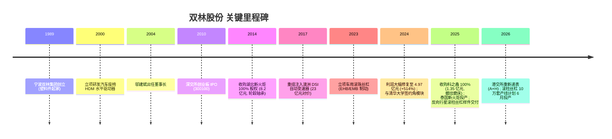
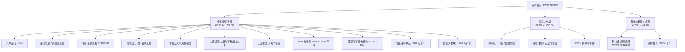
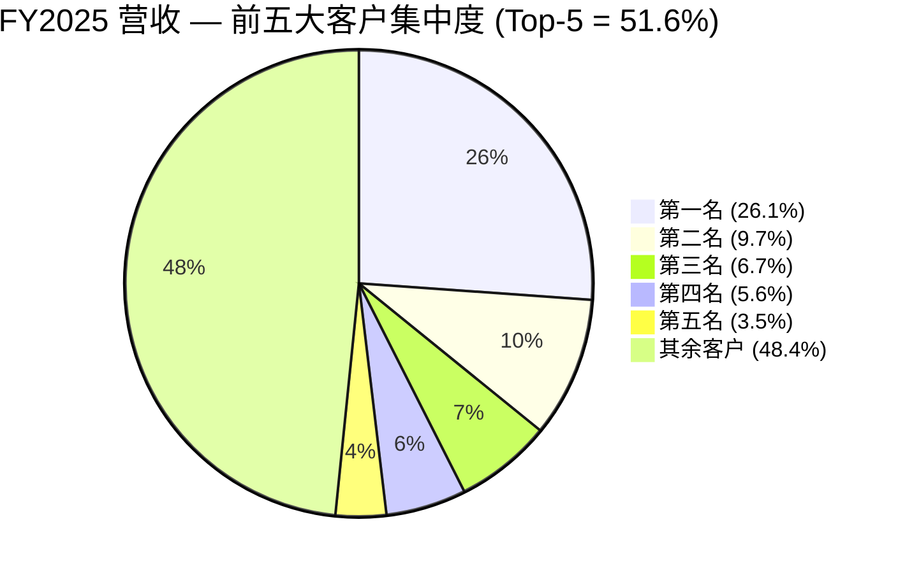
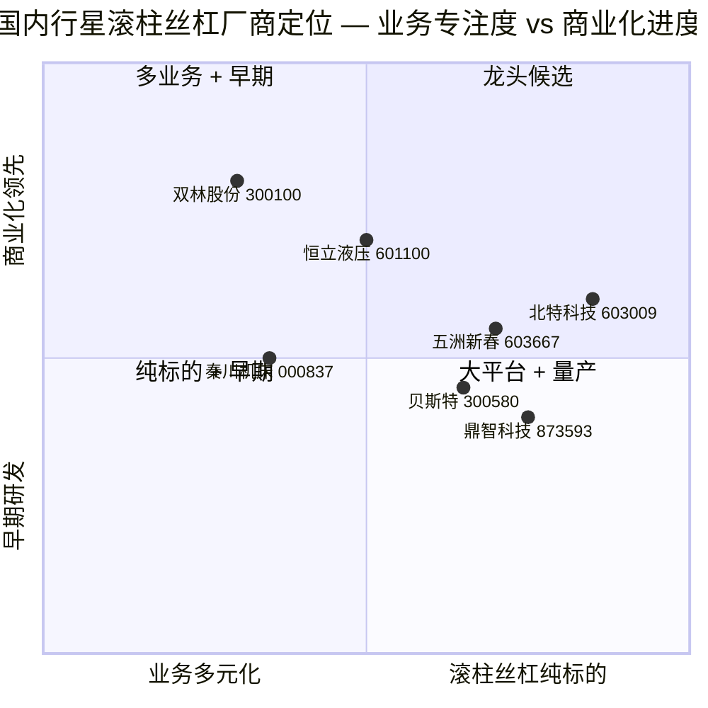

# 双林股份 (Shuanglin Co., Ltd., SZSE:300100) — 公司研究报告

**报告日期：** 2026-05-17
**报告语言：** 简体中文 (Simplified Chinese, per cninfo filing language)
**收盘价参考：** ~RMB 30 (2026-05-06) · 总股本 5.72 亿股 · 总市值约 ¥17.2 bn ([股票行情快报, 2026-05-06](https://stock.stockstar.com/RB2026050600039043.shtml))

---

## 目录 (Table of Contents)

1. 公司概览 (Company Overview)
2. 公司历史 (Company History)
3. 管理团队 (Management Team)
4. 产品与服务 (Products & Services)
5. 客户与销售策略 (Customers & Go-to-Market)
6. 行业概览 (Industry Overview)
7. 竞争格局 (Competitive Landscape)
8. 市场机会 (TAM / Market Opportunity)
9. 风险评估 (Risk Assessment)
10. 参考资料 (References)

---

## 1. 公司概览 (Company Overview)

双林股份有限公司（Shuanglin Co., Ltd., SZSE:300100，简称"双林股份"）是一家总部位于浙江宁波宁海县、办公地在上海青浦的汽车零部件与机器人零部件 (auto parts & robotics components) 一体化制造商。公司 2010 年 8 月登陆深交所创业板 (ChiNext)，控股股东为宁波双林集团股份有限公司（持股 44.43%），实际控制人为邬建斌家庭（邬建斌 90%、邬维静 5%、邬晓静 5%），合计直接与间接控制 48.9% 投票权 ([双林股份 2026 年第一季度报告, p. 3](https://disc.static.szse.cn/disc/disk03/finalpage/2026-04-28/))。公司在全球设有 37 家全资及控股子公司、8 家分公司，生产基地覆盖中国上海、宁波、芜湖、肇庆、重庆、柳州、青岛、襄阳、荆州、天津、沈阳，以及泰国和北美 ([双林股份 2025 年年度报告, 第 14 页](https://static.cninfo.com.cn/finalpage/2026-03-25/)).

**主营业务结构 (FY2025).** 公司报告期内将业务重新口径化为三大板块：
- **传动驱动智能 (Transmission / Drive / Intelligent components)：** ¥3,269.9m, 占营收 59.6%, 毛利率 23.88%。包括 HDM (汽车座椅水平驱动器 / horizontal drive module)、座椅电机、电动头枕执行器、车用滚珠丝杠 (auto ball screws)、人形机器人用反向式行星滚柱丝杠 (humanoid-robot reverse planetary roller screws)、新能源电驱动 (NEV e-drive)、轮毂轴承单元 (wheel hub bearing units)、智能角模块 (smart corner modules)。
- **汽车内外饰 (Auto interior/exterior trim)：** ¥1,946.1m, 占 35.5%, 毛利率 14.32%。保险杠、门板、立柱侧围、安全件、精密注塑件、PEEK 特种材料件等。
- **其他 (Other — 主要为科之鑫磨床与双林模具)：** ¥259.9m, 占 4.7%, 毛利率 31.87% ([双林股份 2025 年年度报告, 第 22 页](https://static.cninfo.com.cn/finalpage/2026-03-25/)).

**经营规模 (FY2025).** 营业收入 ¥5,483.7m（+11.67% YoY），归母净利润 ¥503.2m（+1.25%），扣非归母净利润 ¥446.0m（+36.63% — 显示核心经营盈利质量在加速改善），经营活动现金流净额 ¥781.4m（+16.44%），基本 EPS ¥0.89，加权平均 ROE 17.23%，研发投入 ¥220.3m（占营收 4.02%，+30.71% YoY） ([双林股份 2025 年年度报告, 第 11 页](https://static.cninfo.com.cn/finalpage/2026-03-25/)). 总资产 ¥7,022.8m, 归母净资产 ¥3,226.3m, 资产负债率约 54%。汽车零部件出货 3.68 亿件，HDM 单一产品 2025 年产销超 3,000 万件，已是国内汽车座椅 HDM 龙头 ([双林股份 2025 年年度报告, 第 14 页](https://static.cninfo.com.cn/finalpage/2026-03-25/)).

Source: [双林股份 2021–2025 年度报告 (cninfo)](https://www.cninfo.com.cn/new/disclosure/stock?stockCode=300100).

Source: [双林股份 2025 年年度报告, 第 22 页 — 分产品营业收入构成](https://static.cninfo.com.cn/finalpage/2026-03-25/).

**地域分布.** 国内收入 ¥4,997.1m (91.1%)、海外收入 ¥486.6m (8.9%) ([双林股份 2025 年年度报告, 第 22 页](https://static.cninfo.com.cn/finalpage/2026-03-25/))。海外占比偏低但正在升级——泰国新火炬工厂 2025 年 1 月正式量产第三代轮毂轴承单元，已交付国产新能源头部车企的泰国基地；同年 12 月，泰国电驱动三条产线达到量产条件，预计 2026 年 3 月小批量投产；北美则以本土化服务团队为主，配套北美新能源头部品牌 (Tesla) ([双林股份 2025 年年度报告, 第 21 页](https://static.cninfo.com.cn/finalpage/2026-03-25/)).

**估值快照 (Valuation Snapshot, 2026-05).** 按 2026-05-06 收盘价约 ¥29.30，总股本 571.98m 股，总市值约 ¥16.76 bn；2025 净利润 ¥503.2m → **TTM P/E ≈ 33–34×**；2025 营收 ¥5.48 bn → **TTM P/S ≈ 3.1×**；账面净资产 ¥3.23 bn → **P/B ≈ 5.2×** ([双林股份历史 PE 估值 — 亿牛网](https://eniu.com/gu/sz300100)；[股票行情快报, 2026-05-06](https://stock.stockstar.com/RB2026050600039043.shtml)). 同业对比：万向钱潮 (000559) ≈ 28×、拓普集团 (601689) ≈ 36×、恒立液压 (601100) ≈ 32×、贝斯特 (300580) ≈ 55×、五洲新春 (603667) ≈ 65×、北特科技 (603009) ≈ 80×（机器人丝杠纯标的）。**双林当前 PE 约 34× 接近主流汽车零部件 (auto parts) 平均水平的中性偏高位（行业中位数 ~30×），但显著低于纯机器人丝杠概念股的 55–80× 区间**，反映市场目前仍主要把双林当作 NEV 汽车零部件 (NEV auto parts) 公司定价，对其滚柱丝杠 (roller screw) 与角模块 (corner module) 业务的期权价值给予部分但非充分计入。3 年 PE 区间约 16.7×–91×（亿牛网, 2024 年最低 16.7×、2025 年最高 91×）——区间宽，反映股价过去两年随机器人主题大幅波动 ([双林股份历史 PE — 亿牛网](https://eniu.com/gu/sz300100)).

PE 偏高（接近行业中位偏高）但不极端的原因可归纳为：（a）扣非净利 +36.6% 增速远好于营收 +11.7%，说明结构改善正在被定价；（b）市场对滚柱丝杠 2026 年下半年量产投放的预期；（c）公司同步推进 A+H 双重上市，2026 年 3 月向港交所重新递表（中信、广发联席保荐）以拓展海外融资与机器人产能扩张资金来源 ([双林股份, 递交IPO招股书, 拟赴香港上市, 新浪财经, 2026-03-29](https://finance.sina.com.cn/cj/2026-03-29/doc-inhsrzha3593148.shtml)). 2026 年 Q1 业绩明显下滑（营收 -10.42%、归母 -47.01%、扣非 -39.11%）使估值消化压力上升——若全年趋势延续，TTM PE 将被动抬升至 50×+ 水平 ([双林股份 2026 年第一季度报告, p. 1](https://disc.static.szse.cn/disc/disk03/finalpage/2026-04-28/))。

---

## 2. 公司历史 (Company History)

公司前身可追溯至 1989 年宁波双林集团创立的塑料件作坊，邬氏家族企业起步。1990 年代末公司由塑料制品业务转型进入汽车零部件，2000 年立项研发汽车座椅水平驱动器 (HDM) — 这一产品后来成为公司最核心、最高市占率的"现金牛 + 技术名片"。2010 年 8 月，公司以"宁波双林汽车部件股份有限公司"名义登陆深交所创业板 (ChiNext)，募资主要用于扩张内外饰与精密注塑件产能。上市后公司通过控股股东双林集团孵化 + 上市公司并购的两步法陆续将轮毂轴承（湖北新火炬，2014 年）和自动变速器（澳洲 DSI，2017 年 23 亿元注入）整合进上市平台 ([双林股份收购大股东DSI资产, 经济观察网, 2017-10-19](http://m.eeo.com.cn/2017/1019/315018.shtml)). 2022–2023 年公司因变速器业务景气下滑、商誉减值等因素业绩低位徘徊（2022/2023 净利润均不到 1 亿元），但 2024 年起 HDM 在新能源车放量 + 轮毂轴承新能源车定点放量 + 出售部分非核心资产，归母净利润跃升至 ¥497m (+514% YoY) ([双林股份 2023 年年度报告, 第 8 页](https://www.cninfo.com.cn/new/disclosure/stock?stockCode=300100)).

Source: [双林股份历史信息汇编 — 走进双林](https://www.shuanglin.com/about/) ；[新股前瞻｜双林股份从 HDM 龙头到机器人新贵, 智通财经, 2025](https://m.zhitongcaijing.com/article/share.html?content_id=1350277)；[A股定增终止仅7天, 双林股份火速转战港股IPO, 新浪财经, 2025](https://cj.sina.com.cn/articles/view/5953190046/162d6789e06701uwsw?froms=ggmp).

**关键战略转向 (Strategic pivots).** 公司过去十年完成了三轮转型：（1）2010–2017 年通过并购实现"塑料件 + 内外饰 → 汽车精密功能件 + 动力总成"的纵向延伸；（2）2018–2022 年陷入变速器业务景气下行的整合期，期间澳洲 DSI 计提商誉减值、传统业务承压；（3）2023 年至今主动启动"汽车零部件 → 智能传动驱动解决方案"二次转型，明确将人形机器人核心部件 (reverse planetary roller screws, joint modules)、智能底盘角模块 (smart corner modules) 与低空飞行器电驱动 (eVTOL e-drive) 作为新增长曲线 ([双林股份 2025 年年度报告 — 致股东信, 第 2-4 页](https://static.cninfo.com.cn/finalpage/2026-03-25/)).

**关键收购 (列表).**
- 2014：以 8.2 亿元现金收购湖北新火炬 (Hubei New Torch) 100% 股权，获得汽车轮毂轴承单元业务（年产能 1,800 万套，为公司延伸至底盘类零部件的重要支点）。
- 2017：通过定向增发 + 现金组合对价 23 亿元（发行价 25.13 元/股）从控股股东双林集团手中收购双林投资 100%，间接获得澳洲 DSI 自动变速器资产 ([双林股份收购大股东DSI资产, 投中网, 2017-10-19](https://www.chinaventure.com.cn/cmsmodel/news/detail/320522.html)). 该项资产后续因变速器市场转向 CVT/DCT 而出现整合困难，2022–2023 年业绩承压。
- 2025 年 1 月：以 1.35 亿元自有资金 100% 收购无锡市科之鑫机械科技有限公司（数控螺纹磨床，内外螺纹精度可达 C3/C2 / P3/P2 级），打通行星滚柱丝杠 (roller screws) 设备端"卡脖子"环节 ([双林股份 2025 年年度报告, 第 30 页](https://static.cninfo.com.cn/finalpage/2026-03-25/)).

**近期发展 (Recent developments).** 2025 年公司完成以下重大事项：（1）反向式行星滚柱丝杠 (reverse planetary roller screws) 首批样件交付国内头部新势力车企的人形机器人项目（5 月开始、6 月完成）；试制线全年产 1,500 套，10 万套量产线计划 2026 年 6 月投产 ([双林股份人形机器人用反向式行星滚柱丝杠 — 泡财经, 2025](https://www.popcj.com/songta/3001002504513033))；（2）2025 年 5 月一度宣布拟定增募资 15 亿元投建滚柱丝杠等项目，但 7 天后终止 A 股定增，转战港股 IPO ([双林股份拟定增募资15亿, 经济参考报, 2025-05-31](https://www.jjckb.cn/20250531/14d0c3476eb54f48b0646e679c0b05bf/c.html))；（3）2025 年 8 月通过《市值管理制度》；（4）2026 年 3 月与清华大学、华控技术拟成立合资公司"浙江双林科技有限公司"专注分布式电驱动角模块 (distributed electric drive corner module)，首个 240 吨级纯电动角模块无人矿卡已完成工程样车，首批 100 台预计 2026 年上半年内蒙某露天矿山投运 ([双林股份 2025 年年度报告, 第 16 页](https://static.cninfo.com.cn/finalpage/2026-03-25/)).

---

## 3. 管理团队 (Management Team)

### 邬建斌 (Wu Jianbin) — 董事长兼总经理 (Chairman & CEO)

**最重要的人物——公司战略与转型的总策划。** 邬建斌生于 1980 年 9 月，浙江宁海籍，硕士学历，持有上海国家会计学院金融与财务管理 EMBA 与长江商学院 EMBA 双学位 ([双林股份董事长邬建斌简历, 中国平安, n.d.](https://zs.stock.pingan.com/gs/a16960.html))。2004 年 11 月、年仅 24 岁时即接任公司董事长——彼时公司仍是以塑料件 + 内外饰起家的家族企业，年营收规模不到 5 亿元；他在邬氏家族第二代中以"少帅"风格主导了过去 22 年公司战略走向。

**履历重点 (what he specifically delivered, not titles).** 邬建斌在董事长任上完成了公司三次转型：（1）**2000–2010 年期间主导 HDM 立项与产业化**——公司 HDM 业务从无到有，到 2025 年单一产品出货突破 3,000 万件，国内市占率 32.8%（第一）、全球市占率 15.1%（第二），客户覆盖佛瑞亚 (Faurecia)、李尔 (Lear)、安道拓 (Adient) 三大国际 Tier-1 与北美新能源头部品牌 ([研判2025! 中国汽车座椅水平驱动器 (HDM) — 智研咨询](https://www.chyxx.com/industry/1239987.html))；（2）**2010 年带领公司登陆深交所创业板**，募资支撑后续并购扩张；（3）**2014 / 2017 年两次大额并购**（湖北新火炬 8.2 亿、DSI 23 亿）实现了从单一座椅件向轮毂轴承 + 自动变速器的产品线扩张；（4）**2023 年至今主导"二次创业"**——主动布局人形机器人滚柱丝杠 + 智能角模块 + 低空电驱动三条新曲线，并以同源技术（HDM 内部正是丝杠+齿轮的精密传动结构）作为切入逻辑。

**所有权与对价.** 邬建斌直接持有 25.69m 股（占 4.49%），其中 19.27m 股为限售股；与邬维静、邬晓静 (其妹) 通过宁波双林集团及其上层公司宁波致远投资 (57.14%)、宁海宝来投资 (42.86%) 共同控制双林集团，进而控制上市公司 44.43% + 4.49% 合计约 48.9% 的表决权，签有《一致行动人协议》([双林股份 2026 年第一季度报告, p. 3-4](https://disc.static.szse.cn/disc/disk03/finalpage/2026-04-28/)). 这是典型的"创始家族多数控制 + 一致行动"结构，治理上利大于弊（决策快、战略长视角），但也意味着小股东对重大转型几乎没有否决能力。

**社会身份与公开形象.** 兼任宁波市人大代表、中国青年企业家协会理事、宁波企业家协会副会长。曾获"2008 宁波第七届优秀创业企业家"、"2010 新锐浙商海外拓展新锐奖"、"2011 品牌宁波年度人物"、"宁波十大甬商"、"2014 宁波市五一劳动奖章"、2022 年第六届"宁波慈善奖"个人捐赠奖 ([邬建斌 — 百度百科](https://baike.baidu.com/item/%E9%82%AC%E5%BB%BA%E6%96%8C/3432461))。在 2025 年致股东信中，他将公司定位为"全球领先的智能传动驱动解决方案提供商"，强调"技术信仰永不妥协" — 这与其工程师 + 财务双背景一致，文本中"反向式行星滚柱丝杠的产业化难题"、"中国成本实现全球性能"等措辞反映其对产业升级路径有清晰的工程视角 ([2025 年年度报告 — 致股东的一封信, 第 2-4 页](https://static.cninfo.com.cn/finalpage/2026-03-25/)).

### 武淮颖 — 主管会计工作负责人 (CFO 职能)

武淮颖目前担任公司主管会计工作负责人，与会计机构负责人田小平共同对财务报告真实性签署声明 ([2025 年年度报告 — 第一节, 第 5 页](https://static.cninfo.com.cn/finalpage/2026-03-25/))。公司在公开 IR 中较少披露 CFO 个人简历，但任内完成的关键资本运作包括：（1）2025 年 5 月一度推出 15 亿元定增方案，7 天内根据监管口径变化果断终止并转向港交所 ([A股定增终止仅7天, 双林股份火速转战港股 IPO, 新浪财经, 2025](https://cj.sina.com.cn/articles/view/5953190046/162d6789e06701uwsw?froms=ggmp))；（2）2025 年完成对科之鑫的 1.35 亿元并购，且系自有资金支付，未增加杠杆；（3）2026 年 3 月联合中信证券、广发证券递交港股招股书。CFO 团队在债务管理上偏保守：2025 年末短期借款 ¥565m（占总资产 8.05%）、长期借款已偿清至零、一年内到期非流动负债 ¥240m。整体债务结构在中游汽车零部件公司里属于稳健。

### 朱黎明 — 董事会秘书 (Board Secretary)

朱黎明任董事会秘书，常驻宁波宁海西店总部，是公司面向监管与投资者的主要对接人。2025 年公司共开展 3 次正式投资者关系活动 (2025-01/02/03)，内容覆盖滚柱丝杠产品优势、科之鑫核心竞争力、海外布局、半年度与三季度经营情况 ([2025 年年度报告 — 投资者关系活动登记, 第 31 页](https://static.cninfo.com.cn/finalpage/2026-03-25/)).

### 关键事业部高管

公司 2025 年组织架构进行了较大规模调整，**新增创新孵化中心、战略技术中心、战略拓展中心、战略投资中心、智慧中心五大专业部门**，强化战略引领和创新驱动能力，支撑公司从传统汽车零部件向智能装备解决方案提供商转型 ([2025 年年度报告, 第 21 页](https://static.cninfo.com.cn/finalpage/2026-03-25/)). 子公司层面，湖北双林轴承 (Hubei Shuanglin Bearings, 原湖北新火炬) 2025 年营收 ¥1,415.3m、净利润 ¥150.8m，是仅次于母公司的盈利支柱；山东双林新能源（电驱动）营收 ¥690.3m、净利润 ¥65.1m，是 NEV 动力业务的运营主体 ([2025 年年度报告, 第 30 页](https://static.cninfo.com.cn/finalpage/2026-03-25/)).

### 治理与股东结构 (Governance)

- **董事会构成：** 第七届董事会，独立董事比例符合创业板要求（≥1/3）。
- **内部人持股 (insider ownership)：** 控股股东双林集团 44.43% + 邬建斌个人 4.49% + 2025 年员工持股计划 0.35% ≈ **49.3%**，是高度集中型公司治理。
- **薪酬结构：** 公司 2025 年首次推出员工持股计划（2025 年员工持股计划，持股 1.997m 股），向核心管理层与技术骨干授予股权激励，与公司长期价值挂钩。
- **质押情况：** 控股股东双林集团质押 27.7m 股（占其持股 10.9%），比例可控，未构成爆仓风险 ([2026 年一季度报告, p. 3](https://disc.static.szse.cn/disc/disk03/finalpage/2026-04-28/)).
- **审计机构：** 北京德皓国际会计师事务所（特殊普通合伙），属境内中型所，过去两年签字会计师为陈剑锋、周孙吉 ([2025 年年度报告, 第 10 页](https://static.cninfo.com.cn/finalpage/2026-03-25/)).
- **关联交易：** 前五大客户中关联方销售额占比 0.00%，前五大供应商关联方采购占比 0.00%，本期未见显著关联交易 ([2025 年年度报告, 第 23 页](https://static.cninfo.com.cn/finalpage/2026-03-25/)).
- **市值管理制度：** 2025 年 8 月通过《市值管理制度》，并于 2025 年 1 月披露《质量回报双提升行动方案》。

### 管理层执行力综合评估 (Track-record synthesis)

邬建斌团队过去 22 年完成了三次成功度逐步上升的转型：第一次（HDM 产业化）跨越了 20 年成就国内第一 / 全球第二的市场地位；第二次（并购 DSI）整合效果不佳、商誉减值教训深刻；第三次（机器人/角模块/低空电驱）目前处于早期但路径清晰，**最大的"非负担"信号是 2025 年扣非净利润 +36.6% 增速明显高于营收 +11.7%——这意味着主业造血而不是依赖一次性收益**。但 2026 年 Q1 大幅下滑 (-47% 归母) 是首道压力测试。总体而言，团队工程出身、决策果断、家族控股稳定，是适合执行长周期产业升级的组合；主要缺口是高管层缺乏深度的国际化运营经验（澳洲 DSI 失败教训），泰国与北美的全球化扩张能否成功是未来 2–3 年的关键看点。

---

## 4. 产品与服务 (Products & Services)

公司产品矩阵覆盖汽车产业链的多个关键环节，且正主动向机器人 + 低空 + 智能底盘三个新方向横向扩张。下面按公司 2025 年报披露的板块顺序，**逐一枚举**所有重要产品线，并就每个材料化产品给出"竞争优势判定 + 护城河类型 + 最接近竞品对比"。

### 4.1 传动驱动智能 (Transmission / Drive / Intelligent)

**(1) 汽车座椅水平驱动器 (HDM, Horizontal Drive Module) — 现金牛 + 龙头标杆**
- **是什么：** 安装于汽车座椅滑轨内、用于电动座椅前后位置调节的精密传动部件，主要由蜗轮蜗杆齿轮 + 丝杆螺母螺纹组成。
- **目标客户：** 国际 Tier-1（佛瑞亚 Faurecia、李尔 Lear、安道拓 Adient）+ 国内主机厂（比亚迪 BYD、蔚来 NIO、理想 Li Auto、小鹏 XPeng、奇瑞 Chery、吉利 Geely、长城 GWM、长安 Changan、零跑 Leapmotor）+ 北美新能源头部品牌（即 Tesla）。
- **规模与定价：** 2025 年产销突破 3,000 万件，单件价值估算 ¥30–60 之间（HDM 板块大约 ¥1–1.5bn 收入），毛利率较好（结构件 + 精密齿轮组合，估计 30%+）。
- **竞争优势判定：✅ Yes（强护城河）。**
  - **护城河类型：** 规模 + 客户深度认证（Tier-1 多年合作）+ 工艺 know-how + 平台化设计能力 — 进入主机厂前装配套需要 2-3 年的 PPAP 认证周期，存在显著换供成本。
  - **证据：** 中国 HDM 市场 CR3 = 56.1%，**双林市占率 32.8% 居国内第一，全球第二（15.1%）** ([研判 2025 — 智研咨询](https://www.chyxx.com/industry/1239987.html))；2025 年获得佛瑞亚、联合汽车电子、采埃孚、五菱、博世等多项"最佳创新奖"、"最佳供货表现奖"等 ([2025 年年度报告, 第 20 页](https://static.cninfo.com.cn/finalpage/2026-03-25/)).
  - **最接近竞品：** 第二名亿迈 + 杭州新剑（两家合计约 20-25% 市占率），相比之下双林在产品广度（覆盖全部 Tier-1 + 国内全部主流车企）与北美客户认证上领先。

**(2) 汽车座椅电机 (Seat Motors)**
- **是什么：** 智能化座椅核心部件，包括水平滑轨电机、抬高电机、靠背调角电机等。
- **目标客户：** 佛瑞亚、安道拓、浙江天成等座椅厂商，应用于长城哈佛系列、上汽、奇瑞等。
- **状态：** 水平滑轨电机已在奇瑞、长安量产；丝杆抬高电机在上汽、东风投产；长行程滑轨有刷驱动电机已获国内两家新能源车企定点，2025 年小批量试产，2026 年大批量投产。
- **竞争优势判定：⚠️ 部分。** 起步晚于汽车电机国际巨头（博泽 Brose、德昌 Johnson Electric），但与 HDM 同源带来交叉销售优势。最接近竞品：博泽 + 德昌；双林位置：技术追赶、价格优势、依靠 HDM 客户关系切入。

**(3) 汽车座椅电动头枕执行器 (Electric Headrest Actuator)**
- **是什么：** 沿座椅靠背多维度弧度调节头枕的传动模组，传统直线调节头枕的升级方案。
- **目标客户：** 2025 年中标小鹏 XPeng、零跑 Leapmotor、岚图 Voyah，外加某国产豪华车型。
- **状态：** 新产品，2025 年正式量产开始。
- **竞争优势判定：⚠️ 部分。** 新兴细分市场（智能座椅趋势衍生），双林是国内最早完整方案商之一。最接近竞品：欧美博泽 / 江森自控；双林位置：率先卡位国内新势力车厂。

**(4) 汽车用滚珠丝杠 / EHB / EMB (Ball Screws for Brake & Steering)**
- **是什么：** 线控制动 EHB/EMB、线控转向用的精密滚珠丝杠轴承单元，是线控底盘 (steer-by-wire / brake-by-wire) 的核心传动件。
- **目标客户：** 已获辰致科技项目定点（EHB 小批量供货阶段）、比博斯特定点、利氪科技与伯特利样品验证中。EMB 制动产品已为国产新能源头部企业 + 3 家企业研发中。预计 2026 年量产。
- **竞争优势判定：⚠️ 部分。** 线控底盘是未来 3-5 年汽车零部件高速增长赛道，双林依托 HDM 同源工艺切入；但起步晚于伯特利 (Bethel)、博世 (Bosch)、采埃孚 (ZF) — 主要靠"国产替代 + 与本土 Tier-1 合作"路径破局。

**(5) 汽车方向盘自动折叠执行器**
- 与方向盘管柱龙头奥托立夫 (Autoliv) 联合开发，2024 年获得定点，2025 年完成实验验证并投自动产线一条。**竞争优势判定：✅ Yes（部分）** — 与全球管柱龙头独家合作开发，存在客户绑定护城河。

**(6) 汽车无人机舱夹紧器 (Vehicle Drone-Bay Clamp Actuator)**
- 国内最早的细分市场，2024 年中通过国产新能源头部车企量产认证，2025 年已搭载主力车型。传动效率较传统方案 +19%、噪声 <45 dB、耐久 2 万次循环。**竞争优势判定：✅ Yes** — 首发卡位 + 客户独占。

**(7) 人形机器人用反向式行星滚柱丝杠 (Humanoid-robot Reverse Planetary Roller Screws) — 公司当前最热概念**
- **是什么：** 人形机器人上下肢直线作动关节模组的核心传动元件，国产替代核心 "卡脖子" 部件。反向式 (reverse) 相比标准式行星滚柱丝杠具有更优的体积/承载比。
- **状态：** 2025 年实际年产 1,500 套；10 万套/年量产线规划 2026 年 6 月投产；与国内头部新势力车企合作开发人形机器人直线驱动关节模组，2025 年 6 月交付首批样品，**截至目前尚未获得正式定点** ([2025 年年度报告, 第 15 页](https://static.cninfo.com.cn/finalpage/2026-03-25/)).
- **竞争优势判定：⚠️ 部分（潜力大但未实证）。**
  - **护城河类型：** 工艺 know-how (HDM 同源) + 收购科之鑫 (Wuxi Kezhixin) 后实现"磨床设备 → 丝杠成品"全产业链自主可控，是国内目前少数能跑通设备端的玩家。
  - **证据：** 公司发布国产首款反向式行星滚柱丝杠 ([双林股份发布国产首款反向式行星滚柱丝杠, 证券时报, 2025](https://www.stcn.com/article/detail/1580971.html))；多家头部机器人公司送样验证；与一家国外丝杠头部企业达成多次合作并获取小批量订单。
  - **最接近竞品：** 国际 — 瑞士 GSA、Rollvis、SKF / Schaeffler；国内 — 北特科技 (603009, 投资 18.5 亿建昆山基地)、五洲新春 (603667, 已成立线控传动事业部)、贝斯特 (300580)、鼎智科技、恒立液压 (601100, 已进入特斯拉供应链测试)。**双林位置：第一梯队国内追赶者，商业化进度领先 (2025 已发布产品 + 2026 年量产线)，但与北特科技等"纯标的"相比业务多元、估值未充分反映**。

**(8) 人形机器人用关节模组 (Robot Joint Modules — 线性 / 旋转 / 灵巧手)**
- 全流程产品开发能力：核心部件（反向式行星滚柱丝杠、无框力矩电机、电机驱动器）均为自主研发。已为国内头部新势力车企定制开发，2025 年 6 月交付首批样品。已与多家机器人头部企业完成多批次样机交付。**竞争优势判定：⚠️ 部分** — 与禾川科技、绿的谐波等多家头部国产化玩家竞争，依靠 HDM + 磨床 + 滚柱丝杠的垂直整合切入。

**(9) NEV 电驱动 (New Energy Vehicle E-drive)**
- 平台覆盖 155/180/220 纯电平台 + 180/210 油冷与 270 混动平台。客户：五菱宏光 mini 三代/四代、一汽奔腾小马、奇瑞冰激凌、长安糯玉米（小型 EV），上汽通用五菱、奇瑞商用车、福田商用车（180 扁线）。**山东双林新能源 2025 年收入 ¥690m、净利 ¥65m** ([2025 年年度报告, 第 30 页](https://static.cninfo.com.cn/finalpage/2026-03-25/)). 220/270 平台 800V 油冷与某客户开发中，预计 2026 年量产。**竞争优势判定：⚠️ 部分** — 整体行业产能过剩，价格竞争激烈；双林靠平台化设计 + 五菱深度合作维持份额。最接近竞品：弗迪动力（BYD）、华为 DriveONE、汇川技术 (Inovance)、英搏尔。

**(10) 飞行器电驱产品 (eVTOL E-drive, 30-250 KW)**
- 100 KW + 230 KW 油冷产品方案进展迅猛，230 KW 集成化电推进系统已完成交付，100 KW 计划 2026 Q1 完成交付。**竞争优势判定：⚠️ 部分** — 与新能源 NEV 电驱共享平台技术，低空经济新蓝海，与某行业头部客户深度合作。最接近竞品：Joby (US)、亿航 (EHang)、磁谷科技。

**(11) 轮毂轴承单元 (Wheel Hub Bearings) — 第二盈利支柱**
- **是什么：** 湖北双林轴承（原湖北新火炬，2014 年收购）主营，国家级创新型企业，年产能 1,800 万套。
- **客户：** 东风日产、通用五菱、吉利、上汽大众、长安汽车；新能源车型已配套 BYD、NIO、长安、吉利、东风、赛力斯 (AITO)、长城、奇瑞、北汽；2025 年新增阿维塔、极氪、问界 M8、东风日产 N7（量产）、猛士、红旗、长安福特、小鹏 ([2025 年年度报告, 第 16 页](https://static.cninfo.com.cn/finalpage/2026-03-25/)).
- **规模与业绩：** **湖北双林轴承 2025 年营收 ¥1,415.3m、净利润 ¥150.8m**（净利率 10.7%）。
- **竞争优势判定：✅ Yes。**
  - **护城河：** 行业 know-how (国家级火炬计划重点项目)、量产规模、新能源客户广度。
  - **市占率：** 国内市场份额约 9% (双林新火炬), 排名第三，前两位为万向钱潮 (15%) 与人本轴承 (12%) ([2025 年中国车用轴承行业 — 智研咨询](https://www.chyxx.com/industry/1225289.html)).
  - **最接近竞品：** 万向钱潮 (000559)、人本轴承 (未上市)、襄阳轴承、长江轴承、兆丰股份；外资 — SKF / NSK / NTN / Schaeffler / JTEKT。双林位置：国内第三 + 新能源车型新订单加速，是国产替代主要受益者之一。

**(12) 智能角模块 (Smart Corner Modules) — 未来 5–10 年战略卡位**
- **是什么：** 集成驱动 + 转向 + 制动 + 悬架的轮端模组，自动驾驶车辆线控智能底盘的"终极方案"，被舍弗勒 Schaeffler、大陆 Continental 等国际巨头视为下一代底盘技术革新关键方向。
- **状态：** 2026 年 3 月与清华大学 + 华控技术拟成立合资浙江双林科技公司；首个落地项目 240 吨级纯电动角模块无人矿卡已完成工程样车验证，2026 上半年首批 100 台投放内蒙某露天矿山；无人重载 AGV 2026 年中上市。乘用车麦弗逊、双叉臂、多连杆三种悬架完成设计开发。
- **竞争优势判定：⚠️ 部分（长期看好但商业化早期）。** 角模块技术荣获日内瓦国际发明金奖，与清华大学的产学研合作具备稀缺性。最接近竞品：Schaeffler、ZF（轮毂集成驱动）、Hyundai Mobis（e-Corner Module）、长城精工（Pi 平台）；双林靠工程机械先行落地 + 学术背书破局。

### 4.2 汽车内外饰 (Auto Interior / Exterior — 现金流支柱但增长有限)

主营保险杠、门板、立柱侧围、高光饰板、冲辊压件、安全件、门基板、精密零部件、PEEK 特种材料注塑件、汽车安全气囊盖、点火线圈、传感器、域控制器等。**主要客户：** 上汽通用五菱、重庆长安、小鹏、上汽大众。**竞争优势判定：⚠️ 部分** — 这是传统业务现金流来源，毛利率 14.32% 偏低，行业竞争激烈，更多发挥规模 + 工艺协同价值。

### 4.3 其他 — 磨床设备 + 模具

**(1) 科之鑫 (Wuxi Kezhixin) 数控螺纹磨床 — 战略卡位**
- 2025 年 1 月收购 100%（1.35 亿元），二代机床（NSK-300 / YSK-300 / YSK-1500）2025 年 12 月开发完成，2026 年 6 月新厂房投产，二代机床产能将达 40 台/月。内螺纹精度可达 C3/C2 级、外螺纹 P3/P2 级；最大长径比 1:10。
- **竞争优势判定：✅ Yes（关键设备国产替代）。** 解决了国内行星滚柱丝杠生产"卡脖子"环节；不仅自用，2026 年起对外销售（汽车丝杠、机器人行星丝杠、机床精密丝杠客户已数家预约打样）。最接近竞品：德国 Reishauer、瑞士 Studer、日本 Mitsui Seiki；国内秦川机床 (000837)、湖南海捷。

**(2) 宁波双林模具 — 服务于内外饰业务**
- 年模具加工能力 1,000+ 套、检具 200+ 套，国家级高新技术企业。配套内外饰业务，独立外销规模有限。

### 4.4 旗舰 vs 长尾 (Flagship vs Long-tail)

**3 大旗舰：** （1）HDM — 现金牛 + 龙头标杆 (32.8% 国内 / 15.1% 全球 share)；（2）轮毂轴承 — 第二盈利支柱 (¥1.42bn 收入)；（3）NEV 电驱动 — 第三规模业务 (¥0.69bn 收入)。这三块预计共贡献约 50%+ 的营收与 70%+ 的利润。

**3 大未来曲线：** 反向行星滚柱丝杠 + 关节模组 (humanoid robot)、智能角模块 (smart corner module)、低空电驱动 (eVTOL e-drive) — 当前营收贡献微小（合计 <5%），但是估值溢价的核心来源。

**长尾：** 汽车内外饰、模具、座椅电机、头枕执行器等是规模收入但增长 +5–10% 区间。

### 4.5 近 12 个月产品发布与状态变化

- 2025-01：完成科之鑫并购，纵向延伸至磨床设备。
- 2025-04：反向式行星滚柱丝杠首批样件订单交付国内头部新势力车企人形机器人项目 ([新浪财经, 2025-04-21](https://finance.sina.com.cn/stock/stockzmt/2025-04-21/doc-inetxwtn8451159.shtml)).
- 2025 年内：HDM 出货突破 3,000 万件；多款座椅头枕执行器中标小鹏 / 零跑 / 岚图。
- 2025-12：科之鑫二代螺纹磨床开发完成；泰国电驱动三条产线达量产条件。
- 2026-03：与清华大学 + 华控技术拟成立合资公司"浙江双林科技"专注角模块；港交所 A+H 重新递表。

---

## 5. 客户与销售策略 (Customers & Go-to-Market)

### 5.1 客户结构

公司销售采取**直销模式**，客户主要分为两类：
1. **整车厂 OEM (Original Equipment Manufacturer)：** 比亚迪、蔚来、理想、小鹏、奇瑞、吉利、长城、长安、零跑、上汽通用五菱、大众、长安、日产、一汽、长城、福特、北京现代、东风、北汽，以及北美新能源头部品牌（Tesla 未明示但客户清单逻辑指向）。
2. **国际 Tier-1 供应商：** 佛瑞亚 Faurecia、联合汽车电子 UAES、博泽 Brose、奥托立夫 Autoliv、马勒 MAHLE、采埃孚 ZF、李尔 Lear、博格华纳 BorgWarner、安道拓 Adient、麦格纳 Magna、法雷奥 Valeo。

合同结构以**项目定点 (program-by-program)** 为主，单一项目通常配套车型生命周期 5–7 年，物流部门按周/月滚动计划与生产对接；部分客户要求预付款交货。客户分级 (credit grading) + 项目专项小组 (project task force) 是公司业务控制的核心。

### 5.2 客户集中度 (Customer Concentration) — **重要风险点**

2025 年公司**前五大客户合计销售额 ¥2,830.4m，占年度销售总额 51.61%**；其中**前 1 名客户销售额 ¥1,432.9m，占 26.13%**（公司未具名披露，但结合 HDM 业务体量与北美新能源头部品牌的高占比，市场普遍推测为 Tesla 或佛瑞亚 Faurecia）。前 5 客户中关联方销售额占比 0.00% ([2025 年年度报告, 第 23–24 页](https://static.cninfo.com.cn/finalpage/2026-03-25/)).

Source: [双林股份 2025 年年度报告, 第 23–24 页](https://static.cninfo.com.cn/finalpage/2026-03-25/).

**3 年趋势：** 公司 2023 年报披露的前五客户占比约 41%，2024 年约 47%，2025 年攀升至 51.6%——**前五集中度三年提升了 10 个百分点**，主因 HDM 在北美新能源头部品牌（Tesla）以及国内头部新势力车企 (NIO/Li Auto/XPeng) 的渗透率上升。**这是典型的"集中度上升 + 单一客户贡献变大"组合，按 SKILL 标准：top-1 > 20%、top-5 > 50%，已属 material（重大）风险**，需在 Section 9 重点列示。

**合同与议价权：** 公司是国际 Tier-1 与主机厂的核心 + 二级供应商，与终端定价端（主机厂）相比议价权较弱；近年新能源整车价格战压力向上游零部件传导，2026 年 Q1 营收 -10.4%、净利 -47% 部分反映客户降价压力 ([双林股份 2026 年第一季度报告, p. 1](https://disc.static.szse.cn/disc/disk03/finalpage/2026-04-28/))。是否有客户在内部建生产线（in-house）的风险：北美新能源头部品牌 (Tesla) 历史上有 in-source 倾向，但 HDM 这一精密小件属"高 know-how / 低单价"零部件，自建经济性较弱，短期内置入风险可控。

### 5.3 销售渠道与销售周期

直销为主、无经销商体系。销售周期：从客户初次需求 → PPAP (Production Part Approval Process) 全面认证 → 量产，典型周期为 18–36 个月。HDM 与汽车精密件已建立长期合作关系，新业务（滚柱丝杠、角模块）周期更长。

### 5.4 主要合作伙伴 (Strategic Partnerships)

- **清华大学 + 华控技术：** 角模块 (smart corner module) 联合研发；2026 年 3 月拟成立合资公司"浙江双林科技"。
- **奥托立夫 (Autoliv)：** 方向盘自动折叠执行器联合开发，已获得定点。
- **国内头部新势力车企（推测为蔚来或理想）：** 人形机器人直线驱动关节模组合作开发。
- **国外丝杠头部企业：** 滚珠丝杠与滚柱丝杠多次合作并获小批量订单（公司未具名披露）。

### 5.5 客户案例 (Named Wins)

- 北美新能源头部品牌 (Tesla)：HDM + 轮毂轴承量产配套
- 比亚迪、蔚来、理想、小鹏、奇瑞、吉利：HDM 多车型量产
- 问界 M8、东风日产 N7：轮毂轴承 2025 年量产
- 奥托立夫：方向盘自动折叠执行器定点
- 内蒙某露天矿山：240 吨级纯电动角模块矿卡首批 100 台 (2026 H1)

---

## 6. 行业概览 (Industry Overview)

### 6.1 行业定义与范围

公司处于"汽车零部件 + 智能装备零部件"交集，可拆解为以下子行业：
1. **传统汽车零部件 — 内外饰、座椅件、模具：** 已步入存量优化期，整体行业增速 +3–5%。
2. **新能源汽车关键零部件 — 电驱动、轮毂轴承、线控底盘：** 受新能源车渗透率提升驱动 +15–25% 增长。
3. **智能化执行器 — 滚珠丝杠、滚柱丝杠、角模块：** 受智能驾驶 + 线控底盘 + 人形机器人三重需求驱动，2025–2030 复合增速预计 30–50%。
4. **机器人零部件 — 行星滚柱丝杠、关节模组：** 早期高增长阶段，2024–2030 复合增速 100%+（基数极低）。
5. **低空经济 — eVTOL 电驱动：** 新生产业，2025–2030 复合增速 40-60% 预期。

### 6.2 市场规模与增长

**中国汽车产业 (整车 — 上游需求基础)：** 2025 年中国汽车产销 3,027 万辆 / 3,010.3 万辆，同比 +10.2% / +9.2%；其中**新能源汽车产销 1,662.6 万辆 / 1,649 万辆，同比 +29% / +28.2%**，渗透率突破 50% — 这是双林新能源相关产品（电驱动、新能源车型轮毂轴承）放量的核心驱动力 ([2025 年年度报告, 第 19 页](https://static.cninfo.com.cn/finalpage/2026-03-25/)).

**中国 HDM 市场：** 2020 年 ¥0.8bn → 2024 年 ¥1.4bn，CAGR 15.3% ([研判 2025 — 智研咨询](https://www.chyxx.com/industry/1239987.html))。预计 2025–2030 复合增速维持 12–15%，受新能源车智能座椅渗透率提升驱动。

**中国车用轴承市场：** 2024 年市场规模约 ¥1,221bn（包含全部车用轴承），其中乘用车轮毂轴承约 ¥120bn 量级。预计 2030 年 ¥1,800bn 量级，CAGR 6-7% ([2025 年中国车用轴承行业 — 智研咨询](https://www.chyxx.com/industry/1225289.html)).

**行星滚柱丝杠市场：** 2024 年中国市场规模约 ¥1.5–2bn（以汽车线控底盘 + 机床为主），随着人形机器人量产，2030 年预计跃升至 ¥30–50bn 量级（含汽车 + 机器人）。瑞士 GSA 2023 年在中国市场份额 52%，国产替代空间巨大 ([2023 年全球行星滚柱丝杠行业龙头企业分析 — 前瞻产业研究院](https://bg.qianzhan.com/report/detail/300/231027-40572ee6.html)).

### 6.3 主要增长驱动 (Key Growth Drivers)

1. **新能源车渗透率突破 50%：** 直接拉动 NEV 电驱动、轮毂轴承等增长。
2. **L2+ 智能驾驶普及与线控底盘需求：** EHB/EMB 线控制动 → 滚珠丝杠新增量；线控转向 → 滚珠丝杠 + 角模块；自动驾驶 L4 → 角模块成为终极方案。
3. **智能座舱：** 电动座椅 + 头枕 + 自动折叠方向盘等智能化件渗透率上升。
4. **人形机器人产业化：** 特斯拉 Optimus、Figure、宇树、智元、银河通用等 2025-2030 年规模上量将带动行星滚柱丝杠需求 1000 倍级增长。
5. **国产替代：** 在 HDM (双林是国内第一) + 滚柱丝杠 (瑞士 GSA 52% 份额需打破) + 高精度磨床（科之鑫已实现）三个层面同时推进。
6. **低空经济：** 2025 年起政策推动 eVTOL、物流无人机产业化，公司 30-250 KW 电驱动产品对应。
7. **政策支持：** 2025 年 9 月《汽车行业稳增长工作方案 (2025—2026)》、《汽车行业数字化转型实施方案》；2025 年 12 月《2026 年实施大规模设备更新和消费品以旧换新政策》([2025 年年度报告, 第 19 页](https://static.cninfo.com.cn/finalpage/2026-03-25/)).

### 6.4 行业周期性与监管环境

汽车零部件行业与宏观经济、汽车产业景气高度联动；新能源车补贴政策、关税政策（美国对进口汽车及零部件加征关税）会显著影响出口。行业进入壁垒：（1）主机厂 PPAP 认证 18-36 个月；（2）规模与精密制造 know-how；（3）研发投入与人才积累；（4）应用层创新（HDM、滚柱丝杠等需要长期产业经验）。

监管环境：国内符合 IATF16949 / ISO9001 / ISO14001 / ISO45001 等多项体系认证；出口美国需通过原产地认证（公司泰国新火炬工厂全系产品已获美国海关原产地认证及 e-Ruling 认证函）。

### 6.5 行业结构 (Fragmentation, Supplier/Buyer Power)

整体汽车零部件行业**高度分散** — 全国零部件企业上万家，但细分赛道（HDM、轮毂轴承）头部集中度较高（HDM CR3 = 56%、轮毂轴承 CR5 ~50%）。**买方议价权强** — 主机厂规模大、零部件可替代性较高，存在持续向上游传导降价压力。**供应商议价权弱-中** — 主要原材料为塑料粒子（PP、ABS、PA66）和钢材，价格波动影响成本控制。

---

## 7. 竞争格局 (Competitive Landscape)

### 7.1 主要竞争对手 (按产品线)

| 产品线 | 国内主要竞品 | 国际主要竞品 | 双林位置 |
|---|---|---|---|
| **HDM 水平驱动器** | 亿迈、杭州新剑 | 博泽 Brose、德昌 Johnson Electric | **国内第一 (32.8%)、全球第二 (15.1%)** ✅ |
| **轮毂轴承单元** | 万向钱潮 (000559)、人本轴承、襄阳轴承、长江轴承、兆丰股份 | SKF、NSK、NTN、Schaeffler、JTEKT、ILJIN | 国内第三 (9%) ⚠️ |
| **NEV 电驱动** | 弗迪动力 (BYD)、华为 DriveONE、汇川 (Inovance)、英搏尔 | Bosch、ZF、Magna | 中游 ⚠️ |
| **行星滚柱丝杠 (机器人/汽车)** | 北特科技 (603009)、五洲新春 (603667)、贝斯特 (300580)、鼎智科技 (873593)、恒立液压 (601100)、秦川机床 (000837)、南京工艺 | 瑞士 GSA、Rollvis、SKF、Schaeffler | 国内第一梯队 (首款反向式发布) ✅ |
| **智能角模块** | 长城精工 (Pi 平台)、地平线 + 主机厂自研 | Schaeffler、ZF、Hyundai Mobis、Continental | 早期布局 + 学术背书 ⚠️ |
| **方向盘自动折叠执行器** | 国内少数玩家 | 奥托立夫 (Autoliv) — 合作而非竞争 | 与奥托立夫联合定点 ✅ |
| **数控螺纹磨床** | 秦川机床 (000837)、湖南海捷 | 德国 Reishauer、瑞士 Studer、日本 Mitsui Seiki | 国产替代领跑 (科之鑫 C3/C2 级) ✅ |
| **汽车内外饰** | 拓普集团 (601689)、敏实集团 (425.HK)、岱美股份 (603730) | Magna、Lear、Faurecia | 中游 ⚠️ |

### 7.2 竞争定位框架 — 滚柱丝杠赛道

### 7.3 公司竞争优势 (Competitive Advantages)

1. **HDM 龙头地位与全球客户认证：** 国内第一 + 全球第二，覆盖三大国际 Tier-1 + 北美新能源头部品牌，是 20+ 年 PPAP 沉淀的结果，新进入者无法快速替代。
2. **滚柱丝杠工艺同源性：** HDM 与人形机器人反向式行星滚柱丝杠在精密齿轮 + 螺纹加工层面高度同源，使双林切入新赛道天然具有成本与 know-how 优势。
3. **垂直整合（设备 → 成品）：** 通过科之鑫将上游高精度螺纹磨床纳入体内，是国内少数能跑通"磨床 → 丝杠成品"全链的厂商，缓解设备采购成本与周期的"卡脖子"。
4. **多品类协同与平台化：** HDM、座椅电机、头枕执行器、丝杠、电驱动等共用客户资源与精密制造能力，单一客户多产品交叉销售。
5. **轮毂轴承的新能源车型放量：** 2025 年新增阿维塔、极氪、问界、东风日产 N7、猛士、红旗、长安福特、小鹏等多个新项目，是 2024-2026 业绩弹性的重要来源。
6. **学术合作（清华大学）+ 国家级研发平台：** 院士工作站、2 座博士后科研工作站、3 家高新研发中心、3 家 CNAS 实验室，与清华、东南大学合作；累计培养 14 名出站博士后。
7. **全球生产网络：** 国内 + 泰国 + 北美三地布局，能就近配套主机厂；2025 年泰国新火炬量产 + 电驱动产线建设是出海能力的关键验证。
8. **成本控制 + 精益生产：** 直接材料占总成本 76.86%，公司通过设计 + 工艺 + 自动化 + 平台生产 + 全员质量成本控制，毛利率从 2022 年 14.8% 提升至 2025 年 20.9%——3 年 +610bp，显著优于行业平均。

Source: 综合 [亿牛网双林股份估值](https://eniu.com/gu/sz300100) 及同业公司 2026-05 公开行情数据整理（近似值，月初定盘）。

### 7.4 竞争劣势与脆弱性 (Vulnerabilities)

1. **新业务（滚柱丝杠 + 关节模组 + 角模块）尚未获得正式定点：** 公司多次明确披露"截至目前上述产品尚未获得正式定点"——估值的核心溢价依赖于未来的客户突破，存在落空风险。
2. **客户集中度上升至 51.6%（前 5）、26.1%（top-1）：** 单一客户掉单或降价可能造成 5-15% 的营收冲击。
3. **国际化运营经验不足：** 澳洲 DSI 整合教训仍在；泰国与北美能否复制国内的成本与质量优势是不确定项。
4. **2026 年 Q1 业绩大幅下滑：** 营收 -10.4%、净利 -47%，反映客户降价 + 出口承压；若全年延续，估值消化压力大。
5. **PEG 不便宜：** 当前 PE ~34×、2025 净利仅 +1.25%（虽扣非 +36.6%），如果剔除非经常性收益，业绩增速并不能完全覆盖估值。
6. **澳洲 DSI 遗留问题与商誉风险：** 公司商誉同比上升 100%（主因收购科之鑫导致），但历史 DSI 项目相关商誉减值历史值得关注。

### 7.5 市场份额分析

- **HDM：** 双林 32.8%、亿迈 + 杭州新剑 ~23%、其他 ~44%（细分长尾）
- **轮毂轴承：** 万向钱潮 15%、人本轴承 12%、双林新火炬 9%、其余国产 24%+ 进口 ~40%
- **行星滚柱丝杠：** 瑞士 GSA 52%、其他国际 30%、国产合计 ~18%（双林、北特、五洲新春、贝斯特等正在做国产替代）

---

## 8. 市场机会 (TAM / Market Opportunity)

### 8.1 TAM 拆解 (Total Addressable Market — 三大业务方向)

**(1) 汽车零部件主业 TAM (2025–2030):**
- 中国汽车零部件市场约 ¥4–5 trillion (含整车 + 后市场，全球约 USD 2 trillion)；双林相关细分（HDM、轮毂轴承、电驱动、内外饰、丝杠等）合计约 ¥150-200 bn 量级，公司目前份额 ~3%，未来 5 年若主要细分均成第一梯队，份额提升至 5-8%，对应 ¥10-15bn 营收上限。

**(2) 人形机器人行星滚柱丝杠 TAM:**
- 2024 年全球需求约 1 万套 → 2030 年预计 600 万套（中性预测），按平均 ASP RMB 1,000-3,000 / 套，2030 年市场规模 RMB 60–180 亿元。如果双林市占率达 10-20%，对应 RMB 6-36 亿元收入潜力。

Source: 综合 [人形机器人行星滚柱丝杠 — 中泰证券, 2025](https://stcn.com/article/detail/1562897.html) 与 [天风汽车 2025 行业深度](https://finance.sina.com.cn/roll/2025-09-28/doc-infrzyri8871033.shtml) 的券商共识中值整理。

**(3) 智能角模块 TAM:**
- 全球乘用车线控底盘 (drive/steer/brake-by-wire) 渗透率 2025 ~3% → 2030 预计 15-20%，对应市场规模 USD 30-50bn；商用车 + 工程机械应用先行（如 240 吨纯电动矿卡）。**双林靠清华合作 + 商用先发卡位，若 2030 拿到 5% 全球份额，对应 RMB 100亿+ 收入空间。**

**(4) 低空经济 eVTOL 电驱动 TAM:**
- 2030 全球 eVTOL 市场预计 USD 10-20bn，对应电驱动子模块约 USD 1-2bn。双林 30-250 KW 系列产品对标主流轴向飞行平台需求。

### 8.2 SAM 与 SOM (Serviceable & Obtainable Market)

**SAM（可服务市场，2030）：** 综合 HDM ¥5bn + 轮毂轴承 ¥80bn + NEV 电驱动 ¥150bn + 滚柱丝杠 ¥30bn + 智能角模块 ¥50bn + eVTOL ¥10bn ≈ **RMB 325 bn**。

**SOM（实际可获市场，2030 5年内目标）：** 假设双林在 HDM 保持 25%、轮毂轴承 12%、NEV 电驱动 3%、滚柱丝杠 10%、角模块 3%、eVTOL 5%，对应营收上限约 **RMB 15-20 bn**（较 2025 ¥5.48bn 的 2.8-3.7 倍空间）。

### 8.3 渗透策略 (Penetration Strategy)

- **现有客户横向扩张：** 利用 HDM / 轮毂轴承现有 OEM + Tier-1 关系，向同客户推销座椅电机、头枕执行器、车用滚珠丝杠等新产品。
- **新业务"先送样、后定点"：** 滚柱丝杠 + 关节模组通过国内头部新势力车企的人形机器人项目锁定首批客户，再向其他机器人公司辐射。
- **设备业务对外开放：** 科之鑫二代磨床 2026 年起对外销售，扩大丝杠工艺影响力同时建立行业话语权。
- **泰国 + 北美海外配套：** 跟随北美新能源头部品牌 (Tesla) + 中国新能源车企 (BYD 等) 海外布局，建立本地化生产配套能力。
- **A+H 上市融资：** 通过港股募资支持机器人产能扩张与国际化布局，2026 年内若成功登陆港交所，将是公司全球化的重要里程碑。

---

## 9. 风险评估 (Risk Assessment)

### 公司特异性风险 (Company-Specific Risks)

**1. 客户集中度高且持续上升 — material 重大风险 (top-1 26.1% / top-5 51.6%)：**
2025 年前 5 大客户合计销售 ¥2.83bn 占营收 51.61%，前 1 大客户单一占 26.13%（即 ¥1.43bn 单客户营收）。3 年趋势显示前 5 集中度从 ~41% 升至 51.6%，反映对 HDM 头部客户（推测北美新能源头部品牌 Tesla 或佛瑞亚）依赖加深。如该客户启动 in-house 替代、转移订单或降价压价，可能造成 5-15% 营收冲击与 20%+ 净利冲击。**严重程度：高**。**缓释：** 多客户、多产品平台化策略 + 滚柱丝杠/角模块新业务可能带来新客户结构稀释。

**2. 新业务定点落空风险：**
人形机器人反向行星滚柱丝杠 + 关节模组 + 角模块虽样品交付与试制线投产顺利，但**截至 2025 年报披露日均尚未获得正式定点**。当前估值已隐含对这些新业务的乐观期权预期；如 2026-2027 客户大批量定点延迟、特斯拉 Optimus / 国产机器人量产节奏不及预期，估值面临系统性下调。**严重程度：高**。

**3. 2026 Q1 业绩急剧恶化 — 执行 + 周期复合风险：**
2026 年 Q1 营收 ¥1,152m 同比 -10.42%、归母 ¥84.5m 同比 -47.01%、扣非 -39.11%、经营现金流净额 ¥15.9m 同比 -88.19%。这意味着 2025 年 +37% 的扣非高基数效应反转 + 价格战传导加速。如全年延续，2026 年净利可能下滑至 ¥3-3.5 亿元区间，TTM PE 将被动抬升到 50×+ 估值。**严重程度：中-高**。

**4. 关键人物依赖 (邬建斌)：**
家族控制 48.9%，邬建斌兼任董事长 + 总经理 + 双林集团董事长，公司战略高度依赖个人远见。如出现健康或重大人事变动，转型路径可能停滞。**严重程度：中**。**缓释：** 2025 年组织调整新增 5 大专业部门 + 员工持股计划绑定核心团队。

**5. 商誉与历史遗留资产风险：**
公司 2025 年商誉同比上升 100%（主因收购科之鑫产生 ¥0.5-1 亿元商誉），叠加历史澳洲 DSI 项目（2017 年 23 亿对价收购）的整合困难教训，未来如新业务（科之鑫的磨床外销）进度不及预期，可能再次触发商誉减值。**严重程度：低-中**。

**6. 出口与国际化执行风险：**
泰国新火炬 2025 年量产、电驱动 2026 年小批量投产；北美本土化团队建设进行中。美国对进口汽车及零部件加征关税（公司 2025 年报明确提示）可能压缩出口毛利；泰国基地的本地化运营能力（管理人才、文化、合规）是未经充分验证的执行风险。**严重程度：中**。

### 行业 / 市场风险 (Industry / Market Risks)

**7. 整车价格战传导：**
2024-2026 年中国新能源汽车价格战白热化（比亚迪、特斯拉、小鹏多次降价），主机厂将降价压力 5-10% 向上游零部件传导。公司 2026 Q1 业绩下滑部分反映这一压力。**严重程度：高**。**缓释：** 滚柱丝杠等新业务相对定价权较强 + 出口业务（毛利率 30.14%）部分对冲。

**8. 滚柱丝杠赛道竞争加剧：**
北特科技投资 18.5 亿、五洲新春、贝斯特、鼎智科技、恒立液压、秦川机床、南京工艺等十数家国内厂商同步布局，赛道当前还是蓝海但 2027-2028 年存在产能过剩 + 价格战风险。**严重程度：中**。

**9. 人形机器人产业化节奏不及预期：**
特斯拉 Optimus 量产节奏（2026 年 1 万台 / 2027 年 10 万台目标）、国产机器人公司（宇树、智元、银河通用等）规模化时间表均存在不确定性。如行业整体延迟 1-2 年，公司滚柱丝杠产能利用率不足，2026-2027 年估值溢价消化压力大。**严重程度：高**。

**10. 技术路线变更风险：**
线控制动 EHB → EMB 演进路径、智能驾驶系统架构变化（端到端 vs 模块化）、机器人关节方案（行星滚柱丝杠 vs 谐波减速器 vs 直驱）等技术路线尚未完全收敛，公司投入可能存在押错赌注的风险。**严重程度：中**。

### 财务风险 (Financial Risks)

**11. 估值压力 — PE 已处于行业中位偏高：**
当前 TTM PE ~34× 处于汽车零部件行业中位偏高位（行业中位数 ~30×），3 年 PE 区间 16.7×–91×。**如 2026 业绩按 Q1 趋势全年下滑 30-40%，被动 PE 将上升至 50×+，远高于行业中位水平**。同时纯滚柱丝杠概念股（北特、五洲新春）的 55-80× 高估值反映"纯标的溢价"，但双林作为汽车零部件主业 + 机器人副业的组合，难以享受同等溢价。**严重程度：中-高**。**缓释：** A+H 上市可能吸引更多国际资金，扩展估值锚定基础。

**12. 应收账款与现金流压力：**
2025 年应收账款 ¥1.36bn 占总资产 19.35%（虽较 2024 年下降）；2026 Q1 经营现金流净额仅 ¥15.9m，同比 -88%。如下游车企支付周期延长或坏账增加，将进一步挤压营运资金。**严重程度：中**。

**13. 资本开支与融资需求：**
反向滚柱丝杠 10 万套量产线（2026 年 6 月投产）、泰国电驱动 3 条产线、科之鑫二代磨床新厂房等项目带来资本开支上行。2025 年 5 月一度推出 15 亿元定增后终止、转战港股 A+H 上市表明公司融资意愿强烈但 A 股渠道受阻。如港股 IPO 进展不顺，可能影响新产能落地节奏。**严重程度：中**。

### 宏观风险 (Macroeconomic Risks)

**14. 中美贸易摩擦与关税：**
2025 年报明确提示"美国近期加征关税的政策，可能导致公司出口成本上升或供应链重构压力增大"。北美新能源头部品牌（推测 Tesla）作为最大客户，受关税摩擦影响显著。**严重程度：高**。**缓释：** 泰国新火炬已取得美国海关原产地认证 + e-Ruling 认证函，是关税规避的重要工具。

**15. 原材料价格波动：**
公司主要原材料为塑料粒子（PP、ABS、PA66）和钢材，直接材料占成本 76.86%。原材料价格 +10% 大致对应毛利率 -7-8pp，对净利影响显著。**严重程度：中**。

**16. 汇率风险：**
公司海外营收占比 8.87%（¥486.6m），2026 Q1 财务费用同比 +69.19% 主要系汇率变动所致。人民币贬值有利于出口竞争力但增加进口设备成本（如部分高精度磨床），双向影响需对冲管理。**严重程度：低-中**。

---

## 10. 参考资料 (References)

### 一手资料 (Primary Sources — Company Filings)

- [双林股份 2025 年年度报告 (cninfo, 2026-03-25)](https://static.cninfo.com.cn/finalpage/2026-03-25/) — 核心数据来源
- [双林股份 2026 年第一季度报告 (cninfo, 2026-04-28)](https://disc.static.szse.cn/disc/disk03/finalpage/2026-04-28/)
- [双林股份 2024 年年度报告 (cninfo, 2025-04-15)](https://www.cninfo.com.cn/new/disclosure/stock?stockCode=300100)
- [双林股份 2023 年年度报告 (cninfo, 2024-04-18)](https://www.cninfo.com.cn/new/disclosure/stock?stockCode=300100)
- [双林股份公司官网 — 走进双林](https://www.shuanglin.com/about/)
- [双林股份港交所招股书递交公告 (2025-09-24 / 2026-03-26)](https://finance.sina.com.cn/cj/2026-03-29/doc-inhsrzha3593148.shtml)

### 二手研究与媒体 (Secondary Sources, 12 个月内)

- [研判 2025! 中国汽车座椅水平驱动器 (HDM) 进入壁垒、市场政策、产业链、销售额、竞争格局 — 智研咨询, 2025](https://www.chyxx.com/industry/1239987.html)
- [2025 年中国车用轴承行业相关政策、产销量、发展现状、重点企业 — 智研咨询, 2025-09](https://www.chyxx.com/industry/1225289.html)
- [研判 2025! 中国行星滚柱丝杠行业产业链、市场规模及重点企业 — 智研咨询, 2025](https://www.chyxx.com/industry/1225527.html)
- [2023 年全球行星滚柱丝杠行业龙头企业分析 — 瑞士 GSA 在中国市场份额高达 52% — 前瞻产业研究院, 2023-10](https://bg.qianzhan.com/report/detail/300/231027-40572ee6.html)
- [人形机器人行星滚柱丝杠大热, A 股龙头引领百亿投资布局 — 证券时报, 2025-03](https://stcn.com/article/detail/1562897.html)
- [双林股份发布国产首款反向式行星滚柱丝杠 — 证券时报, 2025](https://www.stcn.com/article/detail/1580971.html)
- [双林股份人形机器人用反向式行星滚柱丝杠第一批样件订单预计 4 月交付 — 泡财经, 2025](https://www.popcj.com/songta/3001002504513033)
- [双林股份人形机器人用反向式行星滚柱丝杠第一批样件订单预计 4 月交付 — 新浪财经, 2025-04-21](https://finance.sina.com.cn/stock/stockzmt/2025-04-21/doc-inetxwtn8451159.shtml)
- [双林股份 2025 上半年业绩稳健增长 — 界面新闻, 2025-08](https://www.jiemian.com/article/13278474.html)
- [双林股份拟定增募资 15 亿元投建滚柱丝杠等项目 — 经济参考报, 2025-05-31](https://www.jjckb.cn/20250531/14d0c3476eb54f48b0646e679c0b05bf/c.html)
- [A 股定增终止仅 7 天, 双林股份火速转战港股 IPO — 新浪财经, 2025](https://cj.sina.com.cn/articles/view/5953190046/162d6789e06701uwsw?froms=ggmp)
- [双林股份冲刺港股: 年营收 55 亿净利 5 亿 — 36 氪, 2025-10](https://www.36kr.com/p/3742093444153602)
- [市值 263 亿的「双林股份」冲刺 A+H 上市, 中国最大的汽车座位 HDM 供应商 — 新浪财经, 2025-09](https://finance.sina.com.cn/cj/2025-09-26/doc-infrvnmp6425614.shtml)
- [汽车零部件龙头「双林股份」递表港交所, A 股之后赴港"再上市"— 新浪财经, 2026-03-29](https://finance.sina.com.cn/cj/2026-03-29/doc-inhsrzha3593148.shtml)
- [双林股份: 300100 双林股份投资者关系管理信息 20251026 — 同花顺财经, 2025-10-26](http://m.10jqka.com.cn/sn/20251026/54607999.shtml)
- [华安证券 — 双林股份 (300100): 产品创新, 奇点已至 — 新浪财经, 2024-10-30](https://finance.sina.com.cn/roll/2024-10-30/doc-incuhrze1341038.shtml)
- [双林股份 (SZ300100) 股价行情 — 雪球](https://xueqiu.com/S/SZ300100)
- [双林股份历史 PE 估值 — 亿牛网](https://eniu.com/gu/sz300100)
- [股票行情快报: 双林股份 (300100) 5 月 6 日主力资金净买入 862.22 万元 — 证券之星, 2026-05-06](https://stock.stockstar.com/RB2026050600039043.shtml)
- [丝杠行业深度: 行星滚柱丝杠赋能汽车线控底盘 — 天风汽车研究所, 2025-09-28](https://finance.sina.com.cn/roll/2025-09-28/doc-infrzyri8871033.shtml)
- [双林股份董事长邬建斌简历 300100 — 中国平安](https://zs.stock.pingan.com/gs/a16960.html)
- [邬建斌 — 百度百科](https://baike.baidu.com/item/%E9%82%AC%E5%BB%BA%E6%96%8C/3432461)
- [双林股份收购大股东 DSI 资产 加码自动变速器业务 — 经济观察网, 2017-10-19](http://m.eeo.com.cn/2017/1019/315018.shtml)
- [双林股份收购大股东 DSI 资产 — 投中网, 2017-10-19](https://www.chinaventure.com.cn/cmsmodel/news/detail/320522.html)
- [新股前瞻｜双林股份从 HDM 龙头到机器人新贵 — 智通财经, 2025](https://m.zhitongcaijing.com/article/share.html?content_id=1350277)

### 图表数据来源 (Chart Data Sources)

- [双林股份 2021–2025 年度报告 (cninfo)](https://www.cninfo.com.cn/new/disclosure/stock?stockCode=300100) — 营收、毛利率、净利率、分部数据
- [亿牛网双林股份历史估值](https://eniu.com/gu/sz300100) — TTM PE 数据
- [天风汽车 2025 行业深度 — 行星滚柱丝杠赋能线控底盘](https://finance.sina.com.cn/roll/2025-09-28/doc-infrzyri8871033.shtml) + [证券时报 2025-03](https://stcn.com/article/detail/1562897.html) — TAM 预测

---

*报告完。本研究报告由 Claude (Anthropic) 基于公开披露资料独立编制，不构成投资建议。数据截至 2026-05-17。*
