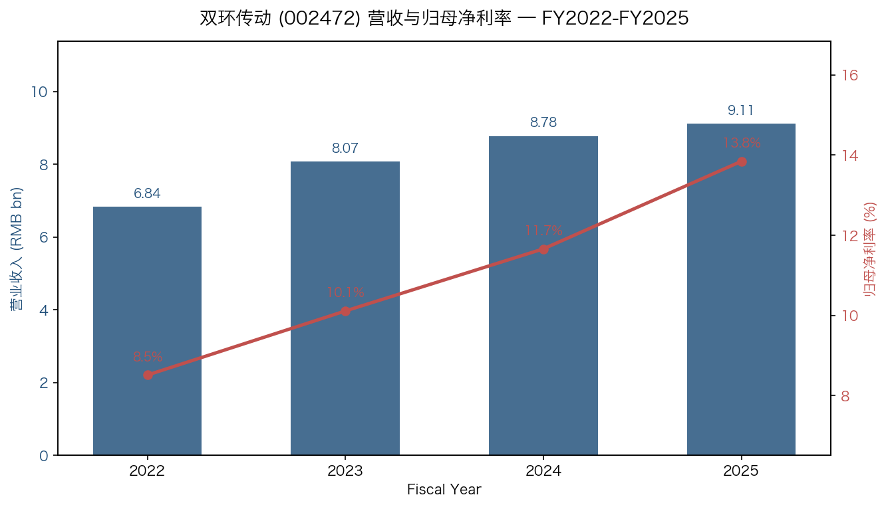
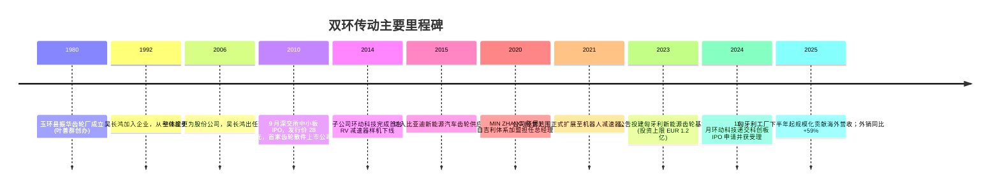
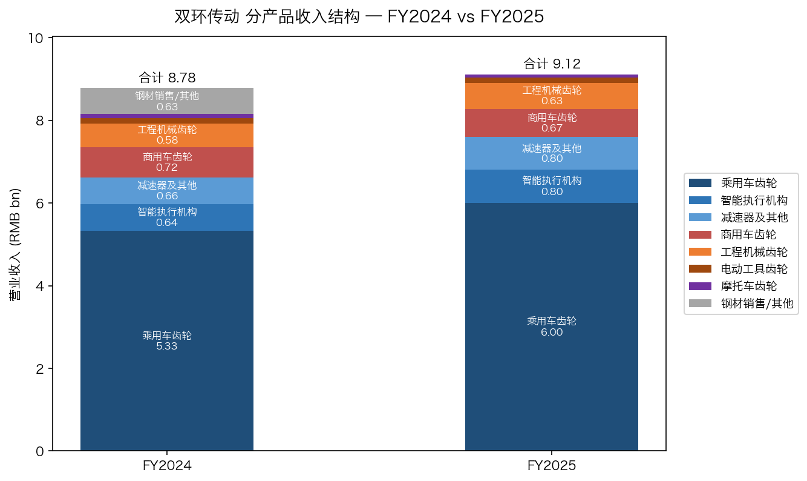
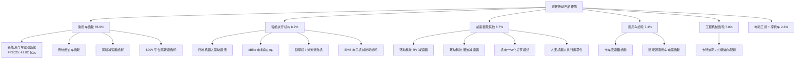
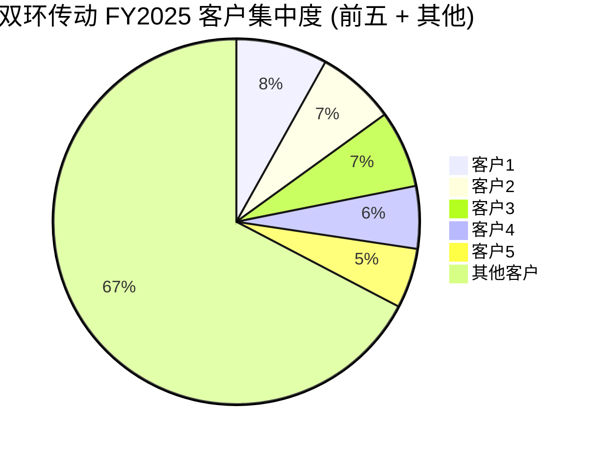
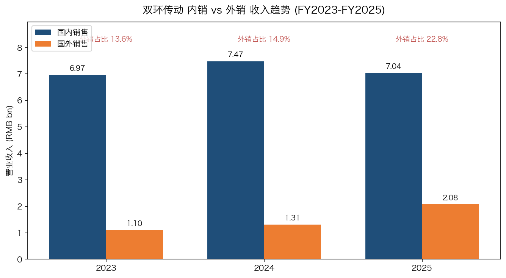
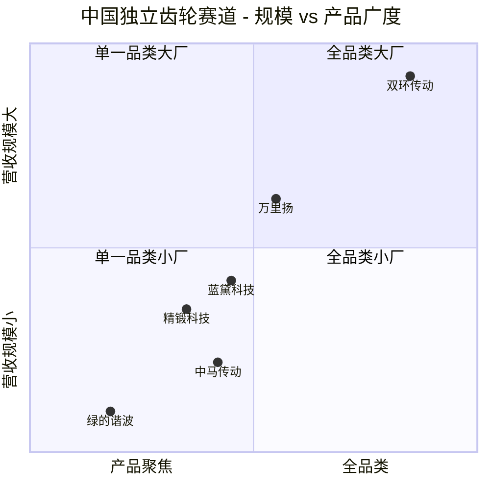
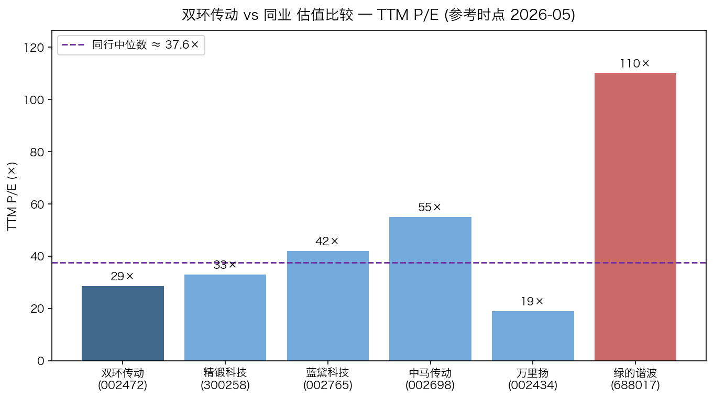

# 双环传动 (SZSE: 002472) 公司研究报告

**报告日期：** 2026-05-20
**报告语言：** 简体中文
**主要数据来源：** [2025 年年度报告](https://static.cninfo.com.cn/finalpage/2026-04-24/1225170753.PDF)，[2024 年年度报告](https://static.cninfo.com.cn/finalpage/2025-04-25/1223270055.PDF)，[2026 年一季度报告](https://static.cninfo.com.cn/finalpage/2026-04-24/1225170761.PDF)

---

## 目录

1. 公司概览 (Company Overview)
2. 公司历史 (Company History)
3. 管理团队 (Management Team)
4. 产品与服务 (Products & Services)
5. 客户与上市策略 (Customers & Go-to-Market)
6. 行业概览 (Industry Overview)
7. 竞争格局 (Competitive Landscape)
8. 市场机会 / TAM (Market Opportunity)
9. 风险评估 (Risk Assessment)
10. 参考资料 (References)

---

## 1. 公司概览 (Company Overview)

浙江双环传动机械股份有限公司（以下简称"双环传动"或"公司"，证券代码 002472.SZ）总部位于浙江玉环，办公地点已迁至杭州余杭区五常街道荆长大道 658-1 号 2 幢和合大厦，公司英文全称 Zhejiang Shuanghuan Driveline Co., Ltd.，法定代表人为吴长鸿先生（[2025 年年度报告，第 6 页](https://static.cninfo.com.cn/finalpage/2026-04-24/1225170753.PDF)）。公司是国内规模最大、精度等级最高的独立第三方精密齿轮供应商之一，主营机械传动齿轮及其相关零部件的研发、设计与制造，下游涵盖乘用车（特别是新能源汽车）电驱动系统、商用车变速箱与车桥、工程机械、摩托车、电动工具、智能家居（扫地机器人、电动助力车 eBike）、轨道交通、风电、智能执行机构（注塑齿轮 / 复合材料齿轮）以及工业机器人减速器 (RV / 谐波减速器) 等多个领域 ([2025 年年度报告, 第 10 页](https://static.cninfo.com.cn/finalpage/2026-04-24/1225170753.PDF))。

**盈利模式与商业模式。** 公司采用 "以销定产 + 安全库存" 的精益生产模式，核心生产工艺以自主自制为主，部分非核心加工外协；销售模式以直销为主，客户为国内外整车（整机）厂商和 Tier-1 零部件供应商 ([2025 年年度报告, 第 11 页](https://static.cninfo.com.cn/finalpage/2026-04-24/1225170753.PDF))。FY2025 公司实现营业收入 RMB 91.12 亿元（YoY +3.77%），归母净利润 RMB 12.62 亿元（YoY +23.21%），扣非归母净利润 RMB 12.04 亿元（YoY +20.32%），经营性净现金流 RMB 23.91 亿元（YoY +42.23%），加权平均 ROE 13.36%，每股收益 1.50 元 ([2025 年年度报告, 第 7 页](https://static.cninfo.com.cn/finalpage/2026-04-24/1225170753.PDF))。营收增长温和但盈利质量显著改善——主因高毛利的新能源汽车齿轮业务占比提升（FY2025 达 45.02%）、海外销售增速 +58.88%（FY2024 仅 +18.47%）以及钢材贸易低毛利业务的主动剥离 ([2025 年年度报告, 第 18 页](https://static.cninfo.com.cn/finalpage/2026-04-24/1225170753.PDF))。

**业务规模与地理布局。** 公司主要生产基地分布在浙江玉环（双环本部）、嘉兴（双环传动嘉兴精密制造，新能源齿轮主基地）、江苏（江苏双环齿轮）、重庆（双环传动重庆精密科技）、大连（大连环创精密制造）以及海外的匈牙利（双环传动匈牙利精密制造，规划投资不超过 EUR 1.2 亿，2025 年下半年起规模化贡献营收）([2025 年年度报告, 第 16、26 页](https://static.cninfo.com.cn/finalpage/2026-04-24/1225170753.PDF))。FY2025 末公司总资产 RMB 187.63 亿元（YoY +18.25%），归母净资产 RMB 100.18 亿元，固定资产 RMB 72.19 亿元，在建工程 RMB 21.82 亿元，研发人员 1,282 人（占比 14.27%），全员合计约 8,981 人（按员工持股 + 研发人员占比反推）([2025 年年度报告, 第 21、23 页](https://static.cninfo.com.cn/finalpage/2026-04-24/1225170753.PDF))。

**估值快照 (Valuation Snapshot)。** 截至 2026 年 4 月 30 日收盘价 RMB 39.27/股，总市值约 RMB 333.8 亿元；按 TTM 每股收益约 1.42 元测算，TTM P/E 约 28.6 倍，TTM P/S 约 3.66 倍（市值 / FY2025 营收 91.12 亿元），P/B 约 3.33 倍（市值 / FY2025 末归母净资产 100.18 亿元）([东方财富 002472 资讯, 2026-04-27](https://stock.stockstar.com/RB2026042700008764.shtml))。过去 52 周股价区间 RMB 26.12–53.50，振幅较大 ([Investing.com — 双环传动 002472](https://www.investing.com/equities/zj-sh-driveline-a))。

**估值对标。** 公司当前 P/E 28.6× 较 A 股零部件 / 齿轮赛道同行偏低：精锻科技 (300258) 约 33×、蓝黛科技 (002765) 约 42×、中马传动 (002698) 约 55×；纯减速器标的绿的谐波 (688017) 因纯赛道属性给到 100× 以上 ([未来智库 — 2025 年双环传动研究报告, 2025-02](https://www.vzkoo.com/read/202502057702eeb9fbd9164a17e3d0ef.html))。同时，公司高度对标的子公司浙江环动机器人关节科技股份有限公司（"环动科技"）已于 2024 年 11 月获上交所科创板 IPO 受理，分拆估值预期不低于 30 亿元 ([21 世纪经济报道, 2024-12-02](https://www.21jingji.com/article/20241202/herald/dd413f88cde3ba77a24c0126c378d221.html))。

**关于估值溢价的解读。** 双环传动 28.6× TTM P/E 高于纯传统燃油车齿轮厂商（如万里扬约 19×），低于纯机器人减速器厂商（绿的谐波 100× 以上）——市场对其的定价是 "传统乘用车齿轮 + 新能源齿轮 + 机器人减速器" 三段式估值的加权混合：核心齿轮主业按制造业 PEG 给到约 20–25×，环动科技按热门赛道给到 70–80× PE 暗含溢价。这一估值结构隐含的风险是：若环动科技 IPO 失败或减速器市占率回落，则公司应回归 20× 区间，存在约 30% 估值压缩空间 ([东方财富研究 — 双环传动系列点评二, 2024-03-04](https://pdf.dfcfw.com/pdf/H3_AP202403041625416008_1.pdf))。

**Source:** [2025 年年度报告, 第 7 页](https://static.cninfo.com.cn/finalpage/2026-04-24/1225170753.PDF), [2024 年年度报告, 第 7 页](https://static.cninfo.com.cn/finalpage/2025-04-25/1223270055.PDF)

> **Update — FY2025 全年业绩稳健增长 (2026-04-23)：** 公司发布的 [2025 年年度报告](https://static.cninfo.com.cn/finalpage/2026-04-24/1225170753.PDF) 显示，全年营业收入 RMB 91.12 亿元（YoY +3.77%），归母净利润 RMB 12.62 亿元（YoY +23.21%），扣非净利润 RMB 12.04 亿元（YoY +20.32%）。同日发布的 [2026 年一季度报告](https://static.cninfo.com.cn/finalpage/2026-04-24/1225170761.PDF) 显示一季度营收 RMB 20.95 亿元（YoY +1.49%），归母净利 RMB 2.84 亿元（YoY +2.93%），扣非净利同比 -4.04%。增长引擎仍是新能源汽车齿轮 + 智能执行机构 + 减速器 / 其他三条线；公司未在年报中给出 FY2026 具体业绩指引，但管理层在 "经营计划" 中提出 2026 年继续 "构建多元化产品矩阵 + 巩固全球新能源齿轮市占率 + 推进机器人减速器业务"。

---

## 2. 公司历史 (Company History)

**创业起源 (1980 年)。** 双环传动的前身是 1980 年由原玉环县振华齿轮厂衍生而来的家庭式齿轮工厂，由叶善群先生（现为公司实际控制人之一）创办。早期产品主要是低端摩托车与农机齿轮 ([齿轮头条 — 人物丨吴长鸿：要做世界第一的齿轮厂](http://www.geartoutiao.com/news/5300))。1992 年，吴长鸿先生（叶善群之大女婿，现公司董事长）以"准女婿"身份加入工厂，从生产一线起步。2005 年 8 月，叶善群淡出经营、吴长鸿出任浙江双环传动机械有限公司执行董事兼总经理；2006 年 6 月公司整体变更为股份公司，吴长鸿出任董事长至今 ([2025 年年度报告, 第 37 页](https://static.cninfo.com.cn/finalpage/2026-04-24/1225170753.PDF))。

**Source:** [2025 年年度报告, 第 6-7、37 页](https://static.cninfo.com.cn/finalpage/2026-04-24/1225170753.PDF), [台州日报保才专访, 吴长鸿（上）](https://tzapp.taizhou.com.cn/webDetails/news?id=3371273&tenantId=64), [21 世纪经济报道, 2024-12-02](https://www.21jingji.com/article/20241202/herald/dd413f88cde3ba77a24c0126c378d221.html)

**关键战略转折。** 公司自上市以来共经历了三次关键战略转型：

第一次是 2014–2016 年的 **从燃油车齿轮向新能源汽车齿轮的下游迁移**。彼时国内新能源汽车产业刚刚启动，公司主动布局电驱动系统齿轮（电机轴、减速器齿轮、差速器齿轮），并于 2015 年成为比亚迪新能源汽车量产平台供应商，2016 年进一步打入蔚来、零跑、博格华纳、采埃孚、舍弗勒等海内外整车与 Tier-1 客户 ([未来智库 — 双环传动研究报告, 2025-02](https://www.vzkoo.com/read/202502057702eeb9fbd9164a17e3d0ef.html))。

第二次是 2013–2018 年的 **横向扩张至机器人减速器领域**。2013 年 6 月，公司组建机械研究院核心团队布局 RV 减速器（工业机器人三大核心零部件之一，长期由日本纳博特斯克 Nabtesco 垄断），2014 年 3 月完成首台 RV 减速器样机；该研究院于 2018 年独立为浙江环动机器人关节科技股份有限公司（"环动科技"），即如今 RV 减速器国产替代龙头之一 ([环动科技发行保荐书 (广发证券), 2024-10](https://qxb-pdf-osscache.qixin.com/AnBaseinfo/c4d4c7e56f7467e89be33dc908c2c097.pdf))。

第三次是 2021–2025 年的 **全球化制造布局**。2023 年公司公告投建匈牙利新能源汽车齿轮基地，2025 年下半年开始投产，主要承接 Stellantis、舍弗勒、Punch Powertrain PSA 等欧洲 Tier-1 平台订单 ([2025 年年度报告, 第 16 页](https://static.cninfo.com.cn/finalpage/2026-04-24/1225170753.PDF), [世纪新能源网, 2024](https://www.ne21.com/news/show-194381.html))。FY2025 海外销售 RMB 20.75 亿元（YoY +58.88%），外销占比由 FY2023 的约 14% 提升至 FY2025 的 22.77%，是公司近五年最大的业务结构变化 ([2025 年年度报告, 第 18 页](https://static.cninfo.com.cn/finalpage/2026-04-24/1225170753.PDF))。

**重要收购与子公司设立。** 公司近年通过新设与收购完善产业链：(1) 收购三多乐（智能执行机构 / 注塑齿轮平台），强化扫地机器人、eBike、智能汽车驱动模组业务 ([2024 年年度报告, 第 17 页](https://static.cninfo.com.cn/finalpage/2025-04-25/1223270055.PDF))；(2) 2024 年 3 月新设浙江环动技术研发有限公司（100% 持股）作为研发投资主体；(3) 2025 年与北京金风慧能合资设立江苏慧环传动科技（持股 33%），布局风电齿轮箱制造与维修 ([2025 年年度报告, 第 25 页](https://static.cninfo.com.cn/finalpage/2026-04-24/1225170753.PDF))。

**最近 1–2 年关键事件 (2024–2026Q1)。** ① 2024 年 11 月 25 日，子公司环动科技分拆至科创板上市的 IPO 申请获上交所受理，本次拟募集资金 RMB 14.08 亿元 ([证券时报, 2024-12-02](https://www.stcn.com/article/detail/1427962.html))；② FY2025 公司前五大客户合计销售占比 32.68%，较 FY2024 的 34.00% 略降，客户结构持续多元化 ([2025 年年度报告, 第 20 页](https://static.cninfo.com.cn/finalpage/2026-04-24/1225170753.PDF))；③ 2025 年新能源汽车齿轮业务营收首次突破 RMB 41.02 亿元（YoY +21.72%），占公司总营收 45.02%，正式超越传统乘用车齿轮成为第一大业务板块；④ 公司分红预案：每 10 股派现金红利 RMB 2.80 元（含税），对应 FY2025 分红率约 18.8%。

---

## 3. 管理团队 (Management Team)

### 3.1 董事长 吴长鸿先生 (350 字深度)

**吴长鸿 (Wu Changhong)**，1969 年 12 月生，工商管理硕士、资深工程师，公司创始团队成员之一，现任董事长（2006-06 至今），同时兼任子公司双环传动嘉兴精密制造董事长、环动科技董事、双环传动国际有限公司董事 ([2025 年年度报告, 第 37 页](https://static.cninfo.com.cn/finalpage/2026-04-24/1225170753.PDF))。吴长鸿是浙江电子工业学校 1989 级无线电技术专业校友，1992 年以 "准女婿" 身份加入岳父叶善群的工厂（玉环县振华齿轮厂），从车间一线干起，先后历任技术员、车间主任、生产副总；2005 年 8 月起担任前身浙江双环传动机械有限公司执行董事兼总经理；2006 年股份制改造后出任董事长 ([台州日报保才专访 — 双环传动董事长吴长鸿（上），2023](https://tzapp.taizhou.com.cn/webDetails/news?id=3371273&tenantId=64))。

吴长鸿的核心 "战绩" 是 **将一家传统农机摩托车齿轮作坊改造为全球独立第三方齿轮龙头**：(1) 主导 2010 年深交所上市，使公司成为"国内首家齿轮散件上市公司"；(2) 在乘用车电动化趋势确认前 2–3 年（2014 年前后）即布局电驱动系统齿轮和 RV 减速器，最终在 2025 年看到收获——新能源齿轮已是公司第一大业务板块，环动科技国内 RV 减速器市占率 ~18.9%（2023 年），稳居国产第一 ([东方财富网, 2025-09-17](https://caifuhao.eastmoney.com/news/20250917132038493626580))；(3) 2023 年起主推 "齿轮制造业 + 机器人 + 全球化" 三线并举，并对外公开提出 "10 年内年产值 500 亿" 的战略目标 ([台州日报 — 吴长鸿（下）](https://tzapp.taizhou.com.cn/webDetails/news?id=3371274&tenantId=64))。

吴长鸿直接持有公司 5,996.90 万股（占总股本 7.06%），是公司单一最大自然人股东；与岳父叶善群（持股 3.13%）、连襟陈剑峰（持股 3.22%）、连襟蒋亦卿（持股 3.43%）、岳母陈菊花（一致行动人）共同构成公司实际控制人，合计持股约 21.5%。四人签署一致行动协议并通过玉环市创信投资有限公司（共同持股 55.56%）、玉环市亚兴投资有限公司（创信持股 84.17%）形成稳固控制 ([2025 年年度报告, 第 70 页](https://static.cninfo.com.cn/finalpage/2026-04-24/1225170753.PDF))。

吴长鸿的薪酬结构以股权 + 现金为主，2022 年股票期权激励计划深度参与，董事会任期至 2027 年 9 月 20 日，**预计在可见的未来 2–3 年内仍将担任董事长**。

### 3.2 总经理 MIN ZHANG (张民) — CEO / COO 角色 (200 字)

**MIN ZHANG (张民)**，1970 年 7 月生，德国国籍，硕士。2020 年 4 月加盟担任常务副总经理，同年 8 月升任总经理（CEO），2020 年 12 月起任董事 ([2025 年年度报告, 第 37 页](https://static.cninfo.com.cn/finalpage/2026-04-24/1225170753.PDF))。其职业履历堪称 "齿轮 + 变速箱跨国制造专家"：曾任德国斯图加特大学机床研究所切削技术组研究员，德国马勒 Mahle 滤清器系统工艺规划工程师，奥地利 TCM 国际刀具咨询与管理集团高级经理，大众汽车自动变速器（大连）有限公司生产部高级经理 / 总监，吉利汽车集团宁波上中下自动变速器有限公司（春晓 DCT 制造基地）总经理、吉利长兴自动变速器项目总监、吉利汽车动力总成制造副总经理。

张民兼任孙公司双环传动（匈牙利）精密制造有限公司执行董事——即匈牙利工厂的直接负责人；同时分管江苏双环齿轮（FY2025 营收 RMB 17.55 亿元、净利 2.31 亿元，是公司第二大利润中心）。其德国背景与吉利体系大众平台经验，是公司能够拿下 Stellantis、舍弗勒、采埃孚、Punch Powertrain PSA 等欧洲 Tier-1 项目并落地匈牙利基地的关键人才支撑。

### 3.3 CFO 王佩群女士 (180 字)

**王佩群 (Wang Peiqun)**，1973 年 11 月生，硕士，高级会计师，2017 年 6 月加入担任副总经理 / 财务总监至今，董事会任期至 2027 年 9 月 20 日 ([2025 年年度报告, 第 39 页](https://static.cninfo.com.cn/finalpage/2026-04-24/1225170753.PDF))。其早期履历有较完整的资本市场经验：曾任中国博奇 (日本东证 1412 上市) 浙江公司副总经理，浙江华策影视股份有限公司财务副总监，汉鼎宇佑集团有限公司财务总监及汉鼎宇佑互联网股份有限公司董事 / 执行总经理 / 财务总监。任职期间主导了公司 2021 年可转换债券发行、2022 年股票期权激励计划（已完成首次授予 + 预留授予共三个行权期）以及 2024–2025 年环动科技分拆 IPO 的财务架构搭建，是公司在资本运作端最关键的执行者。截至 FY2025 末持股 29.8 万股（已含历次期权行权）。

### 3.4 副总经理 张戎博士 (CTO 角色, 100 字)

**张戎 (Zhang Rong)**，1973 年 3 月生，美国绿卡，博士。曾任通用汽车 (GM) 研发中心高级研发工程师、麦肯锡（中国）咨询顾问、约翰迪尔（中国）全球小型收割机研发总监、精进电动 (Jing-Jin Electric) 战略总监 ([2025 年年度报告, 第 38 页](https://static.cninfo.com.cn/finalpage/2026-04-24/1225170753.PDF))。2024 年 9 月起任公司董事 / 副总经理，同时担任环研传动研究院（嘉兴）有限公司院长——即公司前沿研发体系的"一把手"，主管齿轮设计软件、AI 应用、试验验证、表面技术、精密成形等基础研究。张戎的引入正是公司"做宽一厘米、做深一公里"研发战略的人才保障。

### 3.5 治理与股权结构 (140 字)

公司董事会共 9 席，其中独立董事 3 席（周庆丰、师毅诚、陈宝，均为外部人士），独立性符合深交所主板要求 ([2025 年年度报告, 第 36 页](https://static.cninfo.com.cn/finalpage/2026-04-24/1225170753.PDF))。实际控制人吴长鸿 + 陈剑峰 + 蒋亦卿 + 陈菊花一致行动人合计持股约 16.84%，无单一绝对控股股东；高管股权激励较为充分（2022 年股票期权激励计划三个行权期已部分行权）。截至 2026Q1，香港中央结算（北向资金）持股 9.55%、华夏中证机器人 ETF 持股 2.20%、易方达国证机器人产业 ETF 持股 2.11%——主题型 ETF 已是公司前十大股东，从被动资金面看公司被市场打上"人形机器人 + 国产替代"双标签。FY2025 关联交易披露较干净，未发现重大关联方资金占用 ([2025 年年度报告, 第 71 页](https://static.cninfo.com.cn/finalpage/2026-04-24/1225170753.PDF))。

### 3.6 管理团队履约能力综述 (90 字)

总体而言，双环传动的管理团队呈现 "本土创始人 + 海外职业经理人 + 资本市场专家" 三元结构：吴长鸿提供战略定力（"深耕齿轮 40 年只做一件事"），MIN ZHANG / 张戎引入跨国制造与前沿研发经验，王佩群打通资本市场端口。从过去 5 年成绩看（FY2020–FY2025 营收 CAGR ~13%、归母净利 CAGR ~24%、新能源汽车业务从零到 45% 营收占比），这套搭配是行得通的；最大潜在变数是环动科技分拆上市后部分核心研发骨干（如张戎可能转向新设投资主体）是否会形成资源稀释。

---

## 4. 产品与服务 (Products & Services)

公司产品体系围绕"齿轮"展开，按下游应用与产品形态可归为五大类。FY2025 分产品营收结构如下表所示：

| 产品大类 | FY2025 营收 (RMB) | 占比 | YoY |
|---|---|---|---|
| 乘用车齿轮（含新能源） | 60.05 亿元 | 65.90% | +12.76% |
| 商用车齿轮 | 6.72 亿元 | 7.37% | -6.95% |
| 工程机械齿轮 | 6.33 亿元 | 6.95% | +9.17% |
| 摩托车齿轮 | 0.76 亿元 | 0.83% | -20.03% |
| 电动工具齿轮 | 1.34 亿元 | 1.47% | +3.61% |
| 智能执行机构（注塑齿轮） | 7.98 亿元 | 8.75% | +24.17% |
| 减速器及其他（含机器人 RV/谐波） | 7.95 亿元 | 8.73% | +21.18% |
| **合计** | **91.12 亿元** | **100%** | **+3.77%** |

**Source:** [2025 年年度报告, 第 18 页](https://static.cninfo.com.cn/finalpage/2026-04-24/1225170753.PDF)

**Source:** [2025 年年度报告, 第 18 页](https://static.cninfo.com.cn/finalpage/2026-04-24/1225170753.PDF), [2024 年年度报告, 第 19 页](https://static.cninfo.com.cn/finalpage/2025-04-25/1223270055.PDF)

### 4.1 旗舰业务一 — 新能源汽车齿轮 (Flagship #1)

公司 FY2025 新能源汽车齿轮业务实现营收 RMB 41.02 亿元（YoY +21.72%），占总营收 45.02%，已是公司第一大业务 ([2025 年年度报告, 第 16 页](https://static.cninfo.com.cn/finalpage/2026-04-24/1225170753.PDF))。产能方面，截至 FY2025 年末公司已建成年产 **770 万套新能源汽车驱动齿轮** 的产能，FY2025 产量 3,517 万件、销量 3,496 万件，单价 RMB 117/件 ([2025 年年度报告, 第 12 页](https://static.cninfo.com.cn/finalpage/2026-04-24/1225170753.PDF))。

**产品矩阵：** 涵盖电机轴、主减速齿轮、差速器齿轮、同轴减速器齿轮（行业技术升级主流方向）、800V 高压平台高转速齿轮、混动汽车双离合自动变速器薄壁齿轮等 ([2024 年年度报告, 第 21 页](https://static.cninfo.com.cn/finalpage/2025-04-25/1223270055.PDF))。

**竞争优势判定：是 (Strong moat)。** 公司在新能源齿轮领域同时具备三类壁垒：
- **技术 / 精度壁垒：** 齿轮精度达 GB/T 10095 4 级（行业头部），与蓝黛科技同档，但产品精度一致性显著优于竞品；公司是国内极少数能稳定批量供应电驱动 "三合一" 模块齿轮（电机、控制器、减速器一体化）的厂商之一 ([未来智库 — 双环传动研究报告, 2025-02](https://www.vzkoo.com/read/202502057702eeb9fbd9164a17e3d0ef.html))。
- **规模 / 产能壁垒：** 单一齿轮基地建设周期 18–24 个月、资金投入数十亿；公司提前 2–3 年布局并已建成 770 万套年产能，竞争对手追赶滞后。
- **客户绑定壁垒：** 已进入特斯拉（认证供应商）、比亚迪、丰田、大众、广汽、通用、福特、蔚来、采埃孚 ZF、日电产 Nidec、舍弗勒 Schaeffler、汇川、博格华纳 BorgWarner 等海内外整车与 Tier-1 客户体系 ([2025 年年度报告, 第 14 页](https://static.cninfo.com.cn/finalpage/2026-04-24/1225170753.PDF))。客户一旦完成 SOP 量产几乎不切换供应商，切换成本极高。

**对标 vs 蓝黛科技 / 精锻科技：** 双环传动新能源齿轮收入规模约为蓝黛科技 5–7 倍、精锻科技 3–4 倍 (按 FY2025 推算)，且海外平台项目（DT2 项目与 Punch Powertrain PSA 合作，总金额 RMB 35.54 亿元，截至 FY2025 末累计确认收入 8.12 亿元，履行进度 ~23%）是国内同行不具备的能力 ([2025 年年度报告, 第 19 页](https://static.cninfo.com.cn/finalpage/2026-04-24/1225170753.PDF))。

### 4.2 旗舰业务二 — 机器人减速器 (Flagship #2，通过环动科技)

环动科技是公司控股子公司（双环传动持股 61.29%），专注于工业机器人精密减速器（RV + 谐波）以及机电一体化关节模组。FY2022–FY2024H1 环动科技分别实现营业收入 RMB 1.69 亿 / 3.09 亿 / 1.34 亿元，净利润 5,017.83 万 / 7,626.29 万 / 2,553.95 万元 ([金灵 AI 行业研究](https://www.gilin.com.cn/news/24336-research))。

**市占率与竞争地位：**
- **RV 减速器国内市占率：** 2020 年 5.25% → 2023 年 **18.89%**，位居国产第一、整体市场第二（仅次于日本纳博特斯克 Nabtesco，其份额从 2020 年 54.8% 降至 2023 年 40.17%）([东方财富网, 2025-09-17](https://caifuhao.eastmoney.com/news/20250917132038493626580))。
- **谐波减速器：** 公司谐波减速器市占率约 2–4%（绿的谐波 ~30% 仍为龙头，但环动科技正快速突破）；国产谐波减速器整体自主化率已超 90% ([中华网科技 — 人形机器人减速机深度介绍, 2025-07-11](https://m.tech.china.com/digi/articles/20250711/202507111698002.html))。
- **人形机器人相关：** 公司产品已通过特斯拉认证，并与波士顿动力合作开发动态平衡系统；同时 RV / 谐波减速器 + 行星滚柱丝杠 + 空心杯电机已成体系化产品线 ([中华网科技, 2025-07-11](https://m.tech.china.com/digi/articles/20250711/202507111698002.html))。

**竞争优势判定：是 (Moderate moat)。** 在 RV 减速器领域具备显著技术 + 规模优势（已是国产第一）；但谐波减速器仍落后绿的谐波至少一个数量级；下游需求高度依赖人形机器人量产节奏的真实兑现，存在叙事溢价大于盈利兑现的风险。

**分拆 IPO 进展：** 2024 年 11 月 25 日获上交所科创板受理，拟募资 RMB 14.08 亿元，分别用于机器人精密减速机智能制造基地、研发中心、补充流动资金及偿还银行贷款 ([证券时报, 2024-12-02](https://www.stcn.com/article/detail/1427962.html))。环动科技分拆完成后仍并表，但其估值溢价（市场预期 30+ 亿元）将通过分部估值法显著提升上市公司价值。

### 4.3 主力业务三 — 智能执行机构（注塑齿轮 / 复合材料齿轮）

FY2025 营收 RMB 7.98 亿元（YoY +24.17%），是公司增长最快的业务板块之一 ([2025 年年度报告, 第 18 页](https://static.cninfo.com.cn/finalpage/2026-04-24/1225170753.PDF))。下游覆盖 (1) 国内扫地机器人头部厂商（按 IDC 数据，2025 年全球扫地机出货 2,412 万台，YoY +17.1%，公司已与前五大品牌中至少 3 家形成不同层次的合作）；(2) 电动助力车 eBike 驱动系统；(3) 智能汽车电子机械制动 (EMB) 齿轮；(4) 割草机 / 泳池清洗机等新兴智能家居场景。

**竞争优势判定：是 (Partial moat)。** 公司具备 "研发设计-精密模具-规模化量产" 全链条能力（环驱科技），但塑料齿轮赛道竞争对手众多（南方精工、佳力科技、信质集团等），主要差异化在客户结构和单车价值量提升空间（智能汽车 EMB 单车价值有望从燃油车制动器的 ~RMB 100 提升至 ~RMB 800–1,200）。

### 4.4 主力业务四 — 商用车与工程机械齿轮

商用车齿轮 FY2025 营收 RMB 6.72 亿元（YoY -6.95%），主要客户包括采埃孚 ZF、康明斯 Cummins、伊顿 Eaton、玉柴等核心零部件企业 ([2025 年年度报告, 第 14 页](https://static.cninfo.com.cn/finalpage/2026-04-24/1225170753.PDF))。FY2025 受国内重卡需求阶段性回调影响营收下滑，但公司正向新能源商用车转型。工程机械齿轮 FY2025 营收 RMB 6.33 亿元（YoY +9.17%），代表性客户是卡特彼勒 Caterpillar、约翰迪尔 John Deere——这是公司最稳定的现金流来源，全球工程机械 2025 年挖掘机需求 23.5 万台（YoY +17%）、装载机 12.8 万台（YoY +18.4%）。

**竞争优势判定：部分 (Partial moat)。** 该板块进入门槛主要是认证周期（与卡特、约翰迪尔合作超过 10 年）+ 海外大客户的供应链信任，毛利率结构稳定，但增长慢，定位为 "现金牛 + 客户口碑背书"。

### 4.5 其他业务 / 长尾产品

包括电动工具齿轮（FY2025 营收 1.34 亿元、YoY +3.61%）、摩托车齿轮（FY2025 营收 0.76 亿元、YoY -20%，正在收缩）。公司主动剥离了 FY2024 的钢材贸易业务（FY2024 营收 6.32 亿元、FY2025 已清零），这是 FY2025 营收增速看似只有 +3.77% 但主营业务实际同比 +12% 的关键原因。

### 4.6 最近 12 个月的产品发布与路线图

FY2025 公司重点研发项目（已披露）包括：(1) 超精密减速机非对称齿轴（B 样交付）；(2) 差速器总成低摩擦轻噪声装配技术（小批量量产）；(3) 电磁离合器齿轴（样品开发）；(4) 新型重载 RV 减速器（研发阶段，目标 "高刚性 + 长寿命 + 国产自主标准"）([2025 年年度报告, 第 21 页](https://static.cninfo.com.cn/finalpage/2026-04-24/1225170753.PDF))。FY2025 公司研发投入 RMB 4.91 亿元（YoY +7.56%），研发投入占营收 5.38%，研发人员 1,282 人。

---

## 5. 客户与上市策略 (Customers & Go-to-Market)

### 5.1 客户细分与名单

公司客户结构呈 **"四大块 + 国际化"** 特征：

| 业务线 | 代表性客户 (公开披露) |
|---|---|
| 乘用车（新能源主导） | 特斯拉、比亚迪、丰田、大众、广汽、通用、福特、蔚来、采埃孚 ZF、日电产 Nidec、舍弗勒 Schaeffler、汇川技术、博格华纳 BorgWarner、Stellantis、Punch Powertrain PSA |
| 商用车 | 采埃孚 ZF、康明斯 Cummins、伊顿 Eaton、玉柴 |
| 工程机械 | 卡特彼勒 Caterpillar、约翰迪尔 John Deere |
| 智能家居 / eBike | 国内扫地机前五大品牌中 3 家（具体未点名）、欧洲 eBike 头部品牌 |
| 机器人减速器 | 国内 60% + 工业机器人本体厂商（埃斯顿、新时达、汇川、广州数控等），人形机器人合作含特斯拉 Optimus 认证、波士顿动力 |

**Source:** [2025 年年度报告, 第 14 页](https://static.cninfo.com.cn/finalpage/2026-04-24/1225170753.PDF), [未来智库 — 双环传动研究报告, 2025-02](https://www.vzkoo.com/read/202502057702eeb9fbd9164a17e3d0ef.html), [东方财富 — 财富号文章, 2025-11-22](https://caifuhao.eastmoney.com/news/20251122174047722284070)

### 5.2 客户集中度 (Customer Concentration — Quantitative)

FY2025 前五大客户销售合计 RMB 29.78 亿元，占营收 **32.68%**；前五大客户中关联方销售额占比 0%。公司在年报中以"客户 1–客户 5"匿名披露 ([2025 年年度报告, 第 20 页](https://static.cninfo.com.cn/finalpage/2026-04-24/1225170753.PDF))：

| 客户排序 | FY2025 销售额 (RMB) | 占营收比例 | FY2024 同口径占比 |
|---|---|---|---|
| 客户 1 | 7.36 亿 | 8.08% | 9.33% |
| 客户 2 | 6.32 亿 | 6.94% | 8.96% |
| 客户 3 | 6.22 亿 | 6.83% | 6.49% |
| 客户 4 | 5.04 亿 | 5.53% | 5.82% |
| 客户 5 | 4.83 亿 | 5.30% | 3.40% |
| **前五合计** | **29.78 亿** | **32.68%** | **34.00%** |

**Source:** [2025 年年度报告, 第 20 页](https://static.cninfo.com.cn/finalpage/2026-04-24/1225170753.PDF), [2024 年年度报告, 第 21 页](https://static.cninfo.com.cn/finalpage/2025-04-25/1223270055.PDF)

**Source:** [2025 年年度报告, 第 20 页](https://static.cninfo.com.cn/finalpage/2026-04-24/1225170753.PDF)

**集中度判定：** 单一客户占比上限 8.08%（客户 1），前五合计 32.68%，**均低于 "10% 单一 / 50% 前五" 的高集中度警戒线**。集中度还在持续下降（FY2024 34.00% → FY2025 32.68%），与公司 "国内 + 海外" 双轮驱动战略一致。该集中度水平在 A 股汽车零部件行业中属于较健康水平（精锻科技前五约 50%、蓝黛科技前五约 60%）。

**合同结构：** 公司销售模式 100% 直销，但与战略客户多采用 **多年期 "项目协议 + 滚动订单" 模式**——例如 DT2 项目（与 Punch Powertrain PSA 签订，2021 年 10 月签约，总金额 RMB 35.54 亿元，2022Q4 SOP，2023 年起爬坡放量，截至 FY2025 末累计确认 RMB 8.12 亿元，回款 RMB 6.67 亿元）。这类项目协议通常覆盖某一车型平台的整个生命周期（5–7 年），切换成本极高 ([2025 年年度报告, 第 19 页](https://static.cninfo.com.cn/finalpage/2026-04-24/1225170753.PDF))。

### 5.3 分销渠道与销售周期

公司 **100% 直销**，目标客户为整车厂 (OEM) 与 Tier-1 一级零部件供应商；销售周期平均 18–36 个月（齿轮新项目从 RFQ → DV → PV → SOP 通常需要 1.5–3 年），公司收入与下游车型生命周期强绑定。FY2025 销售费用率仅 1.09%（销售费用 RMB 0.99 亿元 / 营收 91.12 亿元），是典型的 B 端项目制企业 ([2025 年年度报告, 第 21 页](https://static.cninfo.com.cn/finalpage/2026-04-24/1225170753.PDF))。

### 5.4 海外市场战略 (Globalization)

**Source:** [2025 年年度报告, 第 18 页](https://static.cninfo.com.cn/finalpage/2026-04-24/1225170753.PDF), [2024 年年度报告, 第 19 页](https://static.cninfo.com.cn/finalpage/2025-04-25/1223270055.PDF)

外销 FY2023 1.10 亿元 → FY2025 20.75 亿元（CAGR ~37%），外销占比从 ~14% 升至 22.77%。匈牙利工厂是欧洲市场的核心支点，主要承接 Stellantis、舍弗勒、Punch Powertrain PSA 等 Tier-1 平台订单，2025 年下半年起规模化贡献营收 ([2025 年年度报告, 第 16 页](https://static.cninfo.com.cn/finalpage/2026-04-24/1225170753.PDF), [让出海, 2024](https://letschuhai.com/e6a7d141))。在中美 / 欧贸易壁垒持续升级背景下，"中国研发 + 欧洲本地制造" 模式既能锁定关税豁免，也能利用匈牙利相对低廉的人工成本（约为德国 1/4–1/3）。

### 5.5 关键战略合作

(1) 与北京金风慧能成立江苏慧环传动（持股 33%）布局风电齿轮箱，切入主流商化阵风电齿轮；(2) 与多所高校（清华、浙大等）建立 "机械传动国家重点实验室——双环齿轮技术合作研究中心"；(3) "机械工业汽车齿轮工程技术研究中心" 落户公司，公司是中国汽车齿轮分会会长单位，深度参与国家级标准制定 ([2025 年年度报告, 第 15 页](https://static.cninfo.com.cn/finalpage/2026-04-24/1225170753.PDF))。

---

## 6. 行业概览 (Industry Overview)

### 6.1 行业定义与范畴

公司所属细分行业为 **机械传动齿轮制造业**（NAICS 333612 Speed Changer, Industrial High-Speed Drive, and Gear Manufacturing 对应中国《国民经济行业分类》 C3441 齿轮、传动和驱动部件制造业）。齿轮是几乎所有机械装备的核心传动部件，下游涵盖汽车、商用车、工程机械、农业机械、风电、轨道交通、电动工具、机器人、智能家居等几乎所有装备制造业领域 ([2025 年年度报告, 第 11 页](https://static.cninfo.com.cn/finalpage/2026-04-24/1225170753.PDF))。

按精度分类，齿轮可分为粗加工齿轮（5–8 级）、半精加工齿轮（4–6 级）、精密齿轮（≤4 级）；按材料分类，可分为金属齿轮（钢材为主）和注塑 / 复合材料齿轮（POM、PEEK、玻纤增强尼龙等）；按应用场景分类，可分为乘用车齿轮、商用车齿轮、工业机器人减速器齿轮、风电齿轮、家电齿轮等。

### 6.2 市场规模与增长率

**全球乘用车市场（公司最大下游）：** 2025 年全球乘用车销量 8,130 万辆（YoY +5%），其中新能源乘用车 2,271 万辆（YoY +27%），渗透率 23.5% ([OICA & SNE Research 数据，转引自 2025 年年度报告, 第 12 页](https://static.cninfo.com.cn/finalpage/2026-04-24/1225170753.PDF))。中国乘用车销量 3,010 万辆（YoY +9.2%），其中新能源 1,649 万辆（YoY +28.2%），渗透率 54%。

**中国齿轮行业市场规模：** 据智研咨询，2023 年中国齿轮行业市场规模 **RMB 3,460 亿元**，齿轮产量约 220 万吨，已形成从中低端向高精密升级的结构 ([智研咨询 — 2025 中国齿轮行业研判, 2025](https://www.chyxx.com/industry/1211894.html))。其中乘用车齿轮 + 商用车齿轮 + 工程机械齿轮三块合计约 65–70%，高精密齿轮（≤4 级）市场约 800–1,000 亿元。

**中国减速器市场：** 2018 年 RMB 1,114 亿元 → 2023 年 RMB 1,387 亿元（CAGR 3.7%）。其中工业机器人精密减速器（RV + 谐波）约 70–80 亿元规模，但增速最高（CAGR 15%+），人形机器人若爆发将带来 5–10 倍弹性 ([新浪财经 — 2025 中国减速器行业分析, 2025-03-25](https://finance.sina.com.cn/stock/relnews/hk/2025-03-25/doc-ineqvrau5990651.shtml))。

### 6.3 关键趋势与驱动因素

**驱动因素一：电动化对齿轮需求的结构性重塑。** 电驱动系统对齿轮的高转速（1.7–1.8 万 rpm，传统燃油车约 6,000–8,000 rpm）、低 NVH、紧凑化（800V 同轴减速器）的要求大幅提高，将原来由整车厂自制的齿轮业务推向"专业外包"模式。这是过去 10 年中国独立第三方齿轮厂商最大的结构性红利 ([2025 年年度报告, 第 12-13 页](https://static.cninfo.com.cn/finalpage/2026-04-24/1225170753.PDF))。

**驱动因素二：智能化对注塑 / 复合材料齿轮的拉动。** 智能座舱、自动驾驶、智能车锁、电动尾门、EMB 等系统对轻量化、低噪声、耐磨损的塑料齿轮需求激增；此类齿轮单车价值量从燃油车的约 RMB 80–150 提升至智能电动车的 RMB 400–800 ([2025 年年度报告, 第 27 页](https://static.cninfo.com.cn/finalpage/2026-04-24/1225170753.PDF))。

**驱动因素三：人形机器人对精密减速器的爆量需求。** 2025 年全球工业机器人新装机量 57.5 万台（YoY +6%），亚洲贡献主要增量；中国新装机量 31 万台（占全球 54%），国产化率 60%+，RV / 谐波减速器国产替代加速 ([2025 年年度报告, 第 14 页](https://static.cninfo.com.cn/finalpage/2026-04-24/1225170753.PDF))。人形机器人单台需要约 14–20 个减速器（特斯拉 Optimus 公开数据），按 2030 年 100 万台 / 年估算，新增 RV + 谐波减速器需求约 2,000 万台 / 年。

**驱动因素四：全球供应链区域化 + 中国汽车出口。** 中国整车出口 2025 年继续扩张，叠加美欧贸易壁垒，中国零部件商加速 "海外建厂" 模式（双环传动匈牙利、宁德时代匈牙利 / 西班牙、比亚迪匈牙利 / 巴西）。

### 6.4 监管环境

齿轮制造业本身监管较轻，行业标准主要为 GB/T 10095（圆柱齿轮精度制）、GB/T 11365（锥齿轮精度制）、ISO 1328 国际标准。公司是中国汽车齿轮分会会长单位，深度参与国家标准制定（公司"做制造者也是规则制定者"是中长期重要软实力）([2025 年年度报告, 第 14 页](https://static.cninfo.com.cn/finalpage/2026-04-24/1225170753.PDF))。

新能源汽车产业链方面，欧盟"反补贴关税"对中国电动车出口的边际压力，叠加美国 IRA 法案等贸易政策，可能推高公司海外业务的成本与不确定性。

### 6.5 行业结构 — 集中度、议价权、替代品

齿轮行业整体呈 **"碎片化 + 头部集中"** 双重结构：低端齿轮高度分散（中国齿轮规上企业超过 2,000 家），但高精密齿轮高度集中——国内独立第三方乘用车齿轮 CR4（双环传动、蓝黛科技、中马传动、精锻科技）约 70%+，海外高精密齿轮 CR3（德国 Stiebel、ZF 内部齿轮制造、日本 Aisin）约 60%+ ([未来智库, 2025-02](https://www.vzkoo.com/read/202502057702eeb9fbd9164a17e3d0ef.html))。

**供应商议价能力中低。** 主要原材料为钢材（占成本 50%+ ）和锻件，原料市场充分竞争，公司前五大供应商集中度 26.71%、单一最大供应商 13.62%（仍属中度依赖）([2025 年年度报告, 第 20 页](https://static.cninfo.com.cn/finalpage/2026-04-24/1225170753.PDF))。

**客户议价能力中高。** 整车厂是议价权最强的一方，但齿轮精度 + 认证周期形成了较高切换成本；公司前五客户集中度 32.68%，客户结构相对分散。

**替代品威胁低。** 短期内尚无替代齿轮的传动方案；中长期可能的威胁来自直驱电机（轮毂电机）和无减速器电驱动方案，但 NVH、扭矩密度、寿命三项指标短期都不达车规要求。

---

## 7. 竞争格局 (Competitive Landscape)

### 7.1 主要竞争对手分析

国内独立第三方乘用车齿轮赛道形成 "四强格局"：双环传动、蓝黛科技、中马传动、精锻科技；机器人减速器赛道还有绿的谐波、来福谐波、纳博特斯克（日本）、住友 SHI（日本）。

| 竞争对手 | 代码 | 主营定位 | FY2024 营收 (估) | 与公司差异 |
|---|---|---|---|---|
| **双环传动** | 002472.SZ | 全品类齿轮 + 机器人减速器 + 智能执行机构 | RMB 87.8 亿 | 规模最大、海外布局领先 |
| 精锻科技 | 300258.SZ | 精锻差速器锥齿轮 / 结合齿 | ~RMB 26 亿 | 锻造工艺有特色，但缺减速器 |
| 蓝黛科技 | 002765.SZ | 新能源齿轮 + 智能触控 | ~RMB 34 亿 | 触控显示业务占比较高，齿轮纯度低 |
| 中马传动 | 002698.SZ | 商用车 / 工程机械齿轮 | ~RMB 18 亿 | 商用车占比高，新能源转型滞后 |
| 万里扬 | 002434.SZ | 商用车变速箱 / 谐波减速器 | ~RMB 50 亿 | 变速箱总成业务为主 |
| **绿的谐波** | 688017.SH | 谐波减速器 | ~RMB 6 亿 | 谐波减速器市占率国内第一 (~30%) |
| Nabtesco (纳博特斯克) | 6268.JP | RV 减速器 | JPY 280 亿元齿轮 | 全球 RV 减速器市占率 40%+ |
| Aisin (爱信) | 7259.JP | 自动变速箱 + 齿轮 | JPY 4.7 兆 | 内部自配，不参与独立齿轮市场 |
| ZF Friedrichshafen | 未上市 | Tier-1 + 自制齿轮 | EUR 410 亿 | 既是大客户也是潜在自制竞争 |

**Source:** [未来智库 — 双环传动研究报告, 2025-02](https://www.vzkoo.com/read/202502057702eeb9fbd9164a17e3d0ef.html), [东方财富 — 机械设备深度报告, 2024-03-18](https://pdf.dfcfw.com/pdf/H3_AP202403191627111620_1.pdf)

### 7.2 竞争定位框架

### 7.3 同业估值对比

**Source:** [东方财富研报数据库, 2026-05](https://emweb.eastmoney.com/PC_HSF10/OperationsRequired/Index?type=web&code=sz002472), [未来智库 — 双环传动研究报告, 2025-02](https://www.vzkoo.com/read/202502057702eeb9fbd9164a17e3d0ef.html)

### 7.4 公司核心竞争优势

公司在 2025 年年度报告中将自身核心竞争力归纳为五点 ([2025 年年度报告, 第 14-16 页](https://static.cninfo.com.cn/finalpage/2026-04-24/1225170753.PDF))：

1. **优质客户资源与合作关系：** 已进入特斯拉、丰田、大众、比亚迪、广汽、通用、福特、蔚来、采埃孚、日电产、舍弗勒、汇川、博格华纳、卡特彼勒、约翰迪尔等全球头部供应链——这是 30 年累计的"信任资产"，对手要复制至少需要 10–15 年。
2. **工艺技术与品质升级：** 拥有齿轮硬齿面磨齿、硬车、渗碳淬火、预修正、检测、夹具设计制造等多项核心工艺，齿轮精度稳定达 GB/T 10095 4 级（行业头部）。
3. **产能规模与精密制造：** 五大基地（玉环 + 嘉兴 + 江苏 + 重庆 + 大连 + 匈牙利）+ 国际一流大型齿轮制造设备 + 设备二次开发能力，FY2025 末固定资产 RMB 72.19 亿元，新进入者难以复制。
4. **基础研究 + 新技术开发 + 市场转化：** 环研传动研究院 + 国家 CNAS 认证实验室 + 国家级博士后工作站，研发投入占营收 5.38%，远高于行业平均 ~2%。
5. **绩效系统保障管理增效：** 精益化管理 + 数字化工具 + MES 系统 + 智能制造平台，已实现关键工序 SPC 实时监测、CPK 持续达标、出厂合格率 100%。

### 7.5 竞争弱点与脆弱性

(1) **产品单一化风险：** 齿轮 + 减速器属同心多元化，但仍高度依赖 "汽车 + 机器人"两个赛道，若同时下行无对冲；
(2) **海外大客户依赖：** 客户 1 (8.08%)、客户 2 (6.94%) 估计与特斯拉、Stellantis / Punch Powertrain 等海外大客户高度相关，受地缘政治影响较大；
(3) **机器人减速器赛道叙事溢价：** 环动科技市占率 ~18% 但 FY2024H1 净利润仅 0.26 亿元，盈利兑现节奏可能慢于市场预期；
(4) **匈牙利工厂投产爬坡风险：** 海外重资产投资 EUR 1.2 亿，欧洲能源 + 人工成本管控、本地工会等不确定性较高。

### 7.6 市场份额分析

**乘用车齿轮（独立第三方）：** 公司国内独立乘用车齿轮市占率约 30–35%（按 FY2024 营收估算），是国内单一最大独立齿轮厂商。

**新能源汽车驱动齿轮（全球）：** 公司新能源汽车齿轮 FY2025 营收 RMB 41.02 亿元，按全球新能源乘用车 2,271 万辆 × 单车配套价值 RMB 800–1,200 估算总市场约 RMB 200–250 亿元，公司全球市占率约 16–20%——**接近全球最大独立新能源齿轮供应商** ([2025 年年度报告, 第 16 页](https://static.cninfo.com.cn/finalpage/2026-04-24/1225170753.PDF))。

**工业机器人 RV 减速器（中国市场）：** 环动科技 2023 年市占率 18.89%（国产第一、整体第二），仅次于纳博特斯克 40.17% ([东方财富网, 2025-09-17](https://caifuhao.eastmoney.com/news/20250917132038493626580))。

---

## 8. 市场机会 / TAM (Market Opportunity)

### 8.1 TAM 总测算

按公司业务结构与下游分布，构建 **三层 TAM 模型** (2026–2030 视角)：

**① 全球乘用车齿轮 TAM (按单车价值法)：**
- 全球乘用车销量 2030E 约 9,500 万辆（CAGR 3.0%）
- 其中新能源乘用车 2030E 约 5,700 万辆 (渗透率 60%)
- 单车齿轮价值：燃油车 ~RMB 600 / 新能源车 ~RMB 1,100 (含同轴减速器升级)
- 2030E 全球乘用车齿轮 TAM ≈ (3,800 万 × 600) + (5,700 万 × 1,100) ≈ **RMB 855 亿元** (含同轴减速器、800V 平台高转速齿轮带来的溢价空间)

**② 全球机器人精密减速器 TAM：**
- 工业机器人减速器 2030E ≈ RMB 200 亿元 (按 2023 年 70 亿元 × CAGR 18%)
- 人形机器人减速器 2030E ≈ RMB 400–800 亿元 (100 万台 / 年 × 单台 14–20 个减速器 × 均价 RMB 300–500)
- 合计 2030E 全球精密减速器 TAM ≈ **RMB 600–1,000 亿元**

**③ 全球智能执行机构（注塑齿轮）TAM：**
- 扫地机器人 + eBike + 智能汽车 EMB + 智能家居等综合，按全球年出货量与单车 / 单机价值反算，2030E ≈ **RMB 300–400 亿元**

**TAM 合计 (2030E)：** 约 **RMB 1,800–2,300 亿元**，是当前公司营收（FY2025 91 亿元）的 20–25 倍。

### 8.2 SAM (公司可触达市场)

SAM = TAM × 公司可承接精度档次 × 可服务地域。

- 乘用车齿轮 SAM：公司精度 4 级 + 主要面向独立第三方外包市场 + 涵盖燃油 / 新能源 / 混动全平台，SAM 比例约为 TAM 的 40%（即整车厂自制部分剔除）≈ **RMB 340 亿元 (2030E)**。
- 机器人减速器 SAM：公司专注 RV + 谐波 + 关节模组，SAM 约为 TAM 的 60%（含工业 + 部分人形机器人）≈ **RMB 360–600 亿元 (2030E)**。
- 智能执行机构 SAM：SAM 约为 TAM 的 30% ≈ **RMB 100 亿元 (2030E)**。
- **SAM 合计 (2030E) ≈ RMB 800–1,000 亿元**

### 8.3 SOM (公司可获取份额)

按公司当前各业务市占率与 2030 年合理扩张路径估算：
- 乘用车齿轮 SOM：从 FY2025 ~RMB 60 亿元 → 2030E **~RMB 120–140 亿元** (CAGR 15%)
- 机器人减速器 SOM：从 FY2025 ~RMB 8 亿元 → 2030E **~RMB 35–60 亿元** (CAGR 35%+)
- 智能执行机构 SOM：从 FY2025 ~RMB 8 亿元 → 2030E **~RMB 25–35 亿元** (CAGR 25%)
- **SOM 合计 (2030E) ≈ RMB 180–240 亿元** (营收对应吴长鸿提出的 "500 亿目标" 完成度约 40–50%；500 亿目标的实现需要并购或新业务突破)

### 8.4 渗透与拓展策略

公司 FY2026 经营计划中提出三条拓展路径 ([2025 年年度报告, 第 29 页](https://static.cninfo.com.cn/finalpage/2026-04-24/1225170753.PDF))：

1. **国内：** 抢抓齿轮业务外包加速机遇，提升新能源汽车单车齿轮配套价值，持续提高全球新能源汽车齿轮市占率；针对混动 / 高端电动平台优先对接行业标杆客户。
2. **欧洲：** 加速拓展，重点介入头部车企与 Tier-1 的新能源转型；深化与国际电驱动系统厂商战略合作。
3. **新业务：** 推进环动科技分拆 IPO；EMB 齿轮 / 智能驱动模组拓展智能汽车场景；与北京金风慧能合作切入风电齿轮箱。

### 8.5 主要驱动假设的脆弱性

TAM 的兑现高度依赖三个变量：(1) 新能源车渗透率确实在 2030 年达到 60%（当前全球 23.5%）；(2) 人形机器人在 2030 年达到 100 万台 / 年（当前 < 1 万台）；(3) 中国零部件商在欧洲市场不被强制关税阻断。如果任一假设打 5–7 折，公司 2030 年营收可能停留在 RMB 130–150 亿元，对应当前估值有 20–30% 下行空间。

---

## 9. 风险评估 (Risk Assessment)

### 9.1 公司特定风险 (Company-Specific Risks)

**风险 1：环动科技分拆 IPO 受挫风险（高）。** 环动科技已于 2024 年 11 月获科创板受理，但 "新国九条" 后科创板分拆审核明显趋严，且环动科技 FY2024H1 净利润 0.26 亿元、估值预期 30+ 亿元（对应 P/E > 70×），存在审核不通过或上市后破发风险。若 IPO 失败，公司股价中"机器人估值溢价"部分（保守估 15–20%）将被压缩 ([21 世纪经济报道, 2024-12-02](https://www.21jingji.com/article/20241202/herald/dd413f88cde3ba77a24c0126c378d221.html))。**缓释：** 即便 IPO 失败，环动科技 RV 减速器市占率与盈利能力仍属真实业务。

**风险 2：匈牙利工厂爬坡 / 投资回报不及预期（中-高）。** EUR 1.2 亿投资规模较大，欧洲能源成本（仍高于 2022 年俄乌战争前 30–40%）、本地工会、订单兑现节奏均存在不确定性。FY2025 海外销售 YoY +58.88% 已计入部分预期，若 2026–2027 年外销增速低于 30%，则市场预期落空。**缓释：** 公司已绑定 Stellantis、舍弗勒、Punch Powertrain PSA 等长期项目订单，DT2 单一项目剩余订单已达 RMB 27 亿元。

**风险 3：海外大客户地缘政治依赖（中）。** 客户 1 (8.08%) 与客户 2 (6.94%) 估计含特斯拉等美国客户。若中美贸易冲突升级（如对中国汽车零部件加征关税或限制供应），公司海外业务受冲击。**缓释：** 匈牙利工厂为欧洲订单"去中国化"的对冲；公司同时拥有比亚迪、广汽等国内大客户分散风险。

**风险 4：核心研发人员流失风险（中）。** 副总经理 / 环研传动研究院院长张戎博士、总经理 MIN ZHANG 均为外聘高管；环动科技核心团队若在 IPO 后部分人员套现离职，可能影响减速器业务的研发持续性。**缓释：** 公司 2022 年股票期权激励计划覆盖了主要核心人员，行权期间锁定至 2026 年中。

**风险 5：实控人家族治理与一致行动协议变化风险（低-中）。** 公司实际控制人为吴长鸿、陈剑峰、蒋亦卿三位连襟 + 岳母陈菊花的家族结构，董事 / 副总经理蒋亦卿于 2025 年 12 月辞任董事职务（继续担任副总经理），是家族治理结构的边际变化；若四人一致行动协议未来变化，可能影响公司战略稳定性 ([2025 年年度报告, 第 70 页](https://static.cninfo.com.cn/finalpage/2026-04-24/1225170753.PDF))。**缓释：** 一致行动协议短期内无解除迹象，且高管 / 董事任期至 2027 年。

### 9.2 行业 / 市场风险 (Industry / Market Risks)

**风险 6：新能源汽车需求增速回落（中-高）。** 公司 FY2025 第一大业务（45.02%）为新能源汽车齿轮，若全球新能源乘用车增速从 2025 年 +27% 降至 2027 年 +10%，公司主业增长承压。2026Q1 公司营收 YoY 仅 +1.49%、扣非净利 YoY -4.04% 已是早期警告 ([2026 年一季度报告, 第 2 页](https://static.cninfo.com.cn/finalpage/2026-04-24/1225170761.PDF))。

**风险 7：人形机器人量产节奏不及叙事预期（高）。** 当前公司在 RV / 谐波减速器领域的估值溢价隐含 2026–2028 年人形机器人爆发。若特斯拉 Optimus、Figure、宇树等头部厂商量产计划推迟，公司机器人业务估值压缩可能达 30–50%。**缓释：** 即便人形机器人爆发推迟，工业机器人减速器市场仍维持 ~15% 复合增速。

**风险 8：上游钢材价格波动（中）。** 直接材料占公司营业成本 54.66%（FY2025），钢材价格大幅波动将影响毛利率。FY2025 公司单一最大供应商占采购 13.62%，存在一定供应链集中度，但仍处可控范围 ([2025 年年度报告, 第 20 页](https://static.cninfo.com.cn/finalpage/2026-04-24/1225170753.PDF))。

**风险 9：行业产能投放过剩（中）。** 国内蓝黛科技、中马传动、精锻科技等同行均在扩产新能源齿轮；若 2027 年前新能源车齿轮产能集中投放，可能引发价格战压制毛利率。

### 9.3 财务风险 (Financial Risks)

**风险 10：短期借款大幅增加 + 财务费用上升（中）。** FY2025 末短期借款 RMB 31.22 亿元（占总资产 16.64%，比年初 19.83 亿增加 57%）；2026Q1 财务费用 YoY +107.64%，主要因借款利息及汇兑损失增加 ([2026 年一季度报告, 第 3 页](https://static.cninfo.com.cn/finalpage/2026-04-24/1225170761.PDF))。匈牙利项目 + 嘉兴产能扩张 + 环动科技分拆筹备资金需求是债务上升主要原因。**缓释：** 公司归母净资产 RMB 100 亿+，资产负债率 ~47%，仍处可控范围；经营性现金流 FY2025 高达 RMB 23.91 亿元（YoY +42.23%），覆盖能力良好。

**风险 11：估值溢价压缩风险（中）。** 公司当前 TTM P/E 28.6× 介于纯传统齿轮（19×）与纯机器人减速器（100×+）之间，如果机器人叙事消退或环动科技分拆失败，估值有 20–30% 压缩空间。

### 9.4 宏观风险 (Macroeconomic Risks)

**风险 12：人民币汇率波动（低-中）。** 公司海外销售 FY2025 占比 22.77% 且持续提升；同时匈牙利工厂的本地货币（HUF）+ EUR 计价负债形成汇兑暴露，2026Q1 汇兑损失已开始体现。**缓释：** 公司开始适度使用衍生品对冲；外销结算可能逐步增加 USD / EUR 留存比例对冲。

**风险 13：欧盟 / 美国贸易政策变化（中）。** 欧盟对中国电动车反补贴关税扩展至零部件 / 美国 IRA 法案等可能对公司海外业务造成关税成本上升或市场准入限制。**缓释：** 匈牙利本地生产、欧盟境内规避欧盟外关税。

---

## 10. 参考资料 (References)

### 主要披露文件

- [浙江双环传动机械股份有限公司 2025 年年度报告](https://static.cninfo.com.cn/finalpage/2026-04-24/1225170753.PDF) — 巨潮资讯, 2026-04-23
- [浙江双环传动机械股份有限公司 2024 年年度报告](https://static.cninfo.com.cn/finalpage/2025-04-25/1223270055.PDF) — 巨潮资讯, 2025-04-24
- [浙江双环传动机械股份有限公司 2026 年第一季度报告](https://static.cninfo.com.cn/finalpage/2026-04-24/1225170761.PDF) — 巨潮资讯, 2026-04-23
- [浙江双环传动机械股份有限公司 2025 年半年度报告](https://static.cninfo.com.cn/finalpage/2025-08-27/1224577440.PDF) — 巨潮资讯, 2025-08-26
- [浙江双环传动机械股份有限公司 2025 年三季度报告](https://static.cninfo.com.cn/finalpage/2025-10-29/1224754181.PDF) — 巨潮资讯, 2025-10-28

### 环动科技分拆相关

- [广发证券股份有限公司关于浙江双环传动机械股份有限公司分拆所属子公司浙江环动机器人关节科技股份有限公司至上海证券交易所科创板上市的预案 (摘要)](https://file.finance.qq.com/finance/hs/pdf/2024/03/04/1219220824.PDF), 2024-03
- [广发证券股份有限公司关于浙江环动机器人关节科技股份有限公司首次公开发行股票并在科创板上市之发行保荐书](https://qxb-pdf-osscache.qixin.com/AnBaseinfo/c4d4c7e56f7467e89be33dc908c2c097.pdf), 2024-10
- [环动科技闯关科创板 IPO，深耕高精密减速器行业](https://www.stcn.com/article/detail/1427962.html) — 证券时报, 2024-12-02
- [双环传动分拆环动科技闯关科创板，逆风中探索"人形"未来](https://www.21jingji.com/article/20241202/herald/dd413f88cde3ba77a24c0126c378d221.html) — 21 世纪经济报道, 2024-12-02

### 行业研究与第三方观点

- [2025 年双环传动研究报告：传动齿轮领先者，机器人减速器开拓新空间](https://www.vzkoo.com/read/202502057702eeb9fbd9164a17e3d0ef.html) — 未来智库, 2025-02
- [东方财富研究 — 双环传动 (002472.SZ) 系列点评二](https://pdf.dfcfw.com/pdf/H3_AP202403041625416008_1.pdf), 2024-03-04
- [东方财富研究 — 机械设备 / 减速器深度报告](https://pdf.dfcfw.com/pdf/H3_AP202403191627111620_1.pdf), 2024-03-18
- [研判 2025！中国齿轮行业产业链图谱、发展现状](https://www.chyxx.com/industry/1211894.html) — 智研咨询, 2025
- [2025 年中国减速器行业产业链图谱、市场规模、重点企业及未来前景分析](https://finance.sina.com.cn/stock/relnews/hk/2025-03-25/doc-ineqvrau5990651.shtml) — 新浪财经 / 智研咨询, 2025-03-25
- [人形机器人赛道之减速机的深度介绍](https://m.tech.china.com/digi/articles/20250711/202507111698002.html) — 中华网科技, 2025-07-11
- [双环传动：机器人减速器稳居内企首位，RV 减速器市占率 18%](https://caifuhao.eastmoney.com/news/20250917132038493626580) — 东方财富网, 2025-09-17

### 创始人与公司历史

- [人物丨吴长鸿：要做世界第一的齿轮厂](http://www.geartoutiao.com/news/5300) — 齿轮头条
- [保才专访丨双环传动董事长吴长鸿（上）：43 年，只做一件事！](https://tzapp.taizhou.com.cn/webDetails/news?id=3371273&tenantId=64) — 台州日报, 2023
- [保才专访丨双环传动董事长吴长鸿（下）：10 年内，实现年产值 500 亿！](https://tzapp.taizhou.com.cn/webDetails/news?id=3371274&tenantId=64) — 台州日报, 2023
- [从齿轮小厂到 500 亿产值目标！双环传动如何玩转全球高端制造？](https://caifuhao.eastmoney.com/news/20251122174047722284070) — 东方财富网, 2025-11-22

### 估值与行情数据

- [双环传动 (002472) 操盘必读](https://emweb.eastmoney.com/PC_HSF10/OperationsRequired/Index?type=web&code=sz002472) — 东方财富 F10, 2026
- [双环传动 (sz002472) 行情走势](https://stcn.com/quotes/index/sz002472.html) — 证券时报
- [双环传动 (002472) 股价 / 估值](https://www.lixinger.com/equity/company/detail/sz/002472/2472) — 理杏仁
- [双环传动 (002472) 股票最新价格行情](https://www.investing.com/equities/zj-sh-driveline-a) — Investing.com
- [双环传动 (002472) 4 月 24 日主力资金净卖出 8045.48 万元](https://stock.stockstar.com/RB2026042700008764.shtml) — 证券之星, 2026-04-27

### 匈牙利出海与全球化

- [盘点出海法国、匈牙利、塞尔维亚的中国新能源势力](https://letschuhai.com/e6a7d141) — 让出海
- [欧洲小国变身锂电一哥，匈牙利缘何成中企投资热土](https://www.ne21.com/news/show-194381.html) — 世纪新能源网

### 图表数据来源
- 营收 & 净利率趋势图 (charts/shuanghuan_revenue_margin.png) — Source: 2025 / 2024 年度报告
- 分产品收入结构图 (charts/shuanghuan_segment_mix.png) — Source: 2025 / 2024 年度报告
- 同业 PE 比较图 (charts/shuanghuan_peer_valuation.png) — Source: 东方财富 F10 / 未来智库研究报告
- 内销 vs 外销 (charts/shuanghuan_overseas_ratio.png) — Source: 2025 / 2024 年度报告

---

*报告免责声明：本报告仅供投资研究学习与参考，不构成投资建议。所有定量数据均来自公开披露文件或第三方数据库；定性判断为研究分析观点，可能与市场共识或公司公告口径存在差异。投资决策请以最新官方披露和专业投顾建议为准。*
