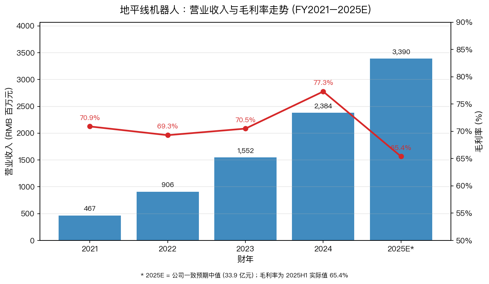
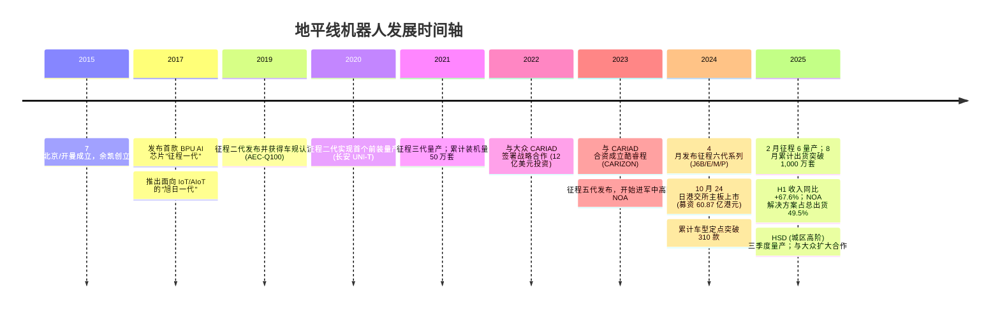
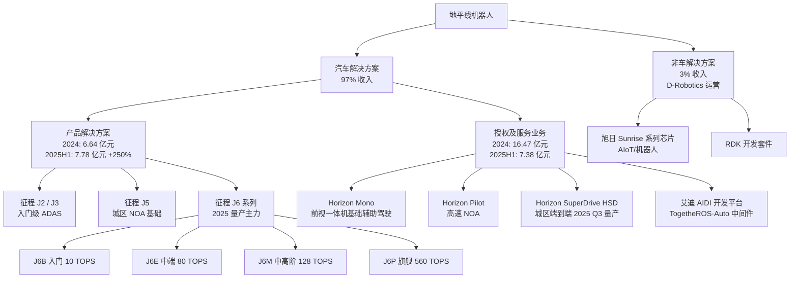
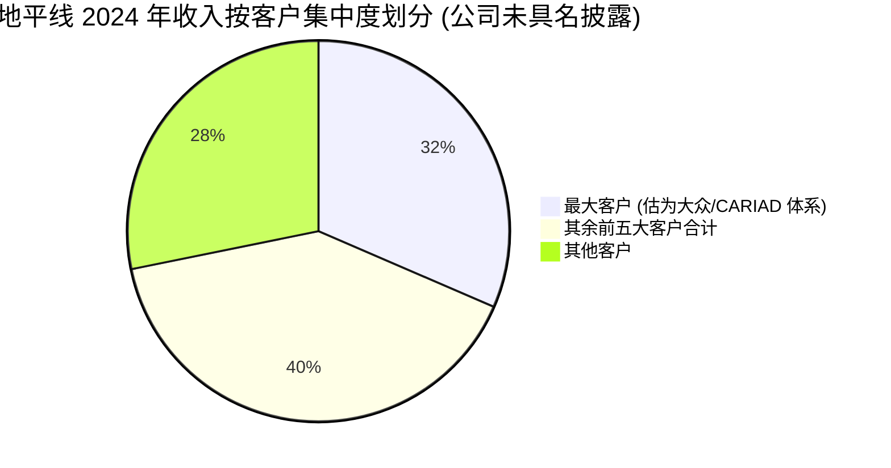
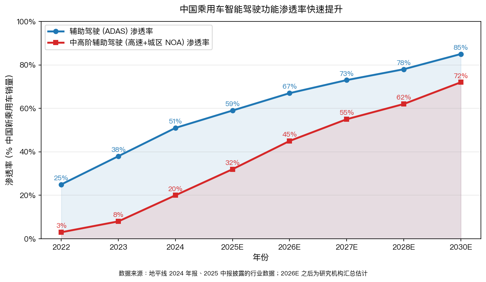
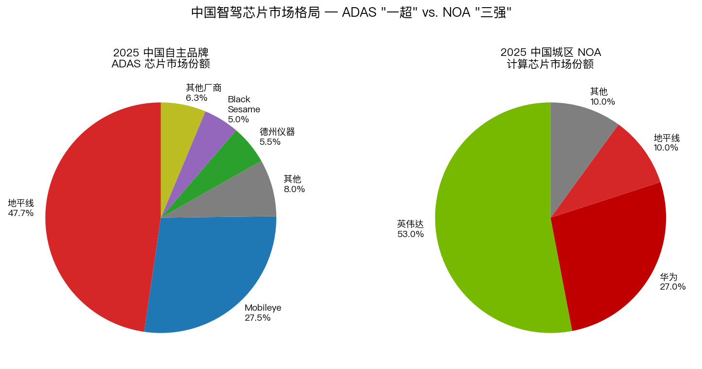
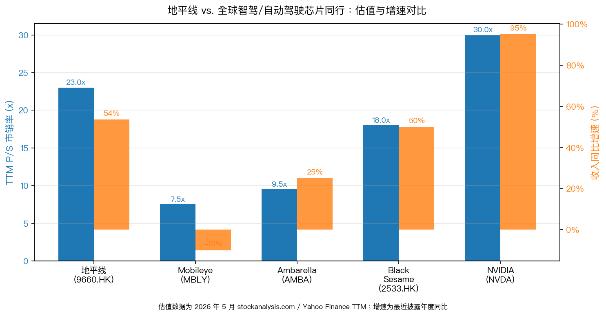

# 地平线机器人 (HKEX:9660) — 公司研究报告

**报告日期：** 2026 年 5 月 20 日
**公司：** 地平线机器人有限公司 Horizon Robotics, Inc.
**上市地：** 香港联交所主板 (主要上市)，股份代号 9660 (B 类普通股)
**报告语言：** 简体中文
**报告字数：** 约 7,500 字

---

## 目录

1. 公司概览
2. 公司历史
3. 管理团队
4. 产品与服务
5. 客户与上市策略
6. 行业概览
7. 竞争格局
8. 市场机会 (TAM)
9. 风险评估

参考资料

---

## 1. 公司概览

地平线机器人 (Horizon Robotics, HKEX:9660) 是中国领先的乘用车高级辅助驾驶 (ADAS) 与高阶自动驾驶 (AD) 解决方案提供商。公司提供软硬一体的智能驾驶解决方案：自研车规级处理硬件 (征程 Journey 系列 SoC)、配套算法与中间件 (BPU、TogetheROS·Auto、艾迪 AIDI 开发平台)，以及覆盖从前视一体机基础辅助驾驶 (Horizon Mono) 到城区全场景高阶自动驾驶 (Horizon SuperDrive，HSD) 的完整产品矩阵。地平线于 2015 年 7 月由前百度研究院副院长余凯博士创立，2024 年 10 月 24 日在港交所主板挂牌上市，发行价 3.99 港元，IPO 全球发售募资约 54 亿港元 (含部分行使超额配售权后约为 60.87 亿港元) ([地平线机器人成功在香港上市，募资逾 54 亿，新浪财经，2024-10-24](https://finance.sina.com.cn/stock/stockzmt/2024-10-24/doc-inctrpzc5999949.shtml))。

**核心商业模式。** 公司收入分为两条主线：(1) **产品解决方案** — 销售自研征程系列车规处理硬件与配套解决方案，按出货套数计费；(2) **授权及服务业务** — 向 OEM 与 Tier-1 授权算法、IP 与开发工具链，并提供定制化技术服务。2024 财年，产品解决方案收入人民币 6.64 亿元 (同比 +31.2%)，授权及服务业务收入人民币 16.47 亿元 (同比 +70.9%)，授权及服务业务占总收入比重提升至 69.1% ([地平线 2024 年度报告，第 8 页](https://www1.hkexnews.hk/listedco/listconews/sehk/2025/0421/2025042100123_c.pdf))。这种"软件 + 硬件并行"的模式带来了远高于纯硬件芯片厂的毛利率结构 — 2024 年公司综合毛利率达 77.3%，其中授权及服务业务毛利率高达 92.0%，产品解决方案 (硬件) 毛利率亦达 46.4% ([同上，第 9 页](https://www1.hkexnews.hk/listedco/listconews/sehk/2025/0421/2025042100123_c.pdf))。

**经营规模。** 2024 财年公司实现客户合同收入人民币 23.84 亿元，同比增长 53.6%；毛利 18.41 亿元，同比增长 68.3%；经调整经营亏损 (剔除股份支付及上市开支) 由 2023 年的 16.87 亿元收窄至 14.95 亿元 ([地平线 2024 年度报告，第 4–5 页](https://www1.hkexnews.hk/listedco/listconews/sehk/2025/0421/2025042100123_c.pdf))。**2025 年上半年延续高增长**：收入人民币 15.67 亿元 (同比 +67.6%)，其中产品解决方案收入 7.78 亿元 (同比 **+250.0%**)；征程系列处理硬件出货 198 万套，同比翻倍 ([地平线 2025 年中期报告，第 4–6 页](https://www1.hkexnews.hk/listedco/listconews/sehk/2025/0922/2025092200988_c.pdf))。截至 2024 年 12 月 31 日，公司共有 2,078 名全职雇员；2025 年 6 月 30 日增至 2,177 人，研发人员占比超七成。


*Source: [地平线 2024 年度报告](https://www1.hkexnews.hk/listedco/listconews/sehk/2025/0421/2025042100123_c.pdf) 及 [2025 年中期报告](https://www1.hkexnews.hk/listedco/listconews/sehk/2025/0922/2025092200988_c.pdf)；2025E 取自卖方一致预期中值 (33.9–38.9 亿元)。*

**业务规模指标 (2024 财年)。** 截至 2024 年底，公司在中国 OEM 高级辅助驾驶市场的市占率超过 **40%**，居首位；在独立第三方高阶自动驾驶解决方案提供商中排名第二 ([地平线 2024 年度报告，第 5 页](https://www1.hkexnews.hk/listedco/listconews/sehk/2025/0421/2025042100123_c.pdf))。征程系列处理硬件累计出货量从 2024 年底的约 770 万套，于 **2025 年 8 月正式突破 1,000 万套**，成为中国首家达到该里程碑的智能驾驶科技公司 ([地平线 2025 年中期报告，第 6 页](https://www1.hkexnews.hk/listedco/listconews/sehk/2025/0922/2025092200988_c.pdf))。累计车型定点 (design wins) 在 2024 年底超过 310 款；至 2025 年 6 月已逼近 400 款，其中具备高速 NOA 及以上功能的定点车型超过 100 款。

**估值快照 (2026-05-20)。** 截至 2026 年 5 月 19 日，公司股价 5.98 港元 / 股，市值约 970 亿港元 (约合 124 亿美元)，对应 TTM 市销率约 **23x** (按公司 2024 全年收入 23.8 亿人民币 + 2025H1 收入折算的 LTM 营收 ~30 亿人民币 / 33 亿港元) ([Horizon Robotics (HKG:9660) Market Cap，stockanalysis.com，2026-05](https://stockanalysis.com/quote/hkg/9660/market-cap/))。TTM P/E **为负 (约 –7.5x)**，主因公司仍处战略亏损期 (2024 年经调整净亏损 16.8 亿人民币，2025H1 经调整净亏损 13.3 亿人民币)，亏损主要源自三项：(i) 巨额研发投入 (2024 R&D 31.6 亿元，占收入 132%)；(ii) 股份支付摊销 (2024 年 5.6 亿元、2025H1 4.9 亿元)；(iii) 对联营公司酷睿程 (CARIZON) 的权益法亏损分摊 ([地平线 2024 年度报告，第 7–11 页](https://www1.hkexnews.hk/listedco/listconews/sehk/2025/0421/2025042100123_c.pdf))。换言之，TTM P/E 为负反映的是"前期重投入 + 即将量产放量"的成长股特征，而非业务恶化。

**估值解读。** 23x TTM P/S 大幅高于全球同行 (Mobileye TTM P/S 约 7.5x，Ambarella 约 9.5x)，但低于英伟达 (约 30x)。这一估值需结合两点理解：(1) 中国智驾芯片市场处于爆发性增长拐点 — 2025H1 中高阶辅助驾驶 (NOA) 渗透率从 2024 年底的 20% 升至 32%，地平线产品解决方案收入因此实现 +250% 同比增长；(2) 公司在中国 OEM ADAS 市场以 47.7% 份额独占近半，"国产替代 + 智驾平权"的双重叙事支撑了估值溢价 ([2025 智驾计算芯片榜单，证券时报，2026-02](https://www.stcn.com/article/detail/3621688.html))。22 位卖方分析师 12 个月一致目标价 11.58 港元，对应约 94% 上涨空间 ([Stocksguide 综合分析师预测，2026-05](https://stocksguide.com/en/forecast/Horizon-Robotics-KYG4602S1057))。同时，过去 52 周区间 5.83–11.32 港元，振幅显著，表明估值对量产节奏与毛利率走势高度敏感 — 这本身亦是估值层面的下行风险 (见第 9 节)。

---

## 2. 公司历史

地平线机器人于 **2015 年 7 月** 在中国北京成立，并于开曼群岛注册为豁免有限公司。创始人余凯博士此前担任百度研究院副院长，主导了百度首批高阶自动驾驶项目 (2013 年)。公司的核心使命，按余凯在 IPO 路演中的表述，是"为机器装上大脑" — 通过自研车规级 AI 处理硬件 (称为 BPU，Brain Processing Unit) 与配套算法，让汽车具备类人感知与决策能力 ([地平线 IPO 招股书，2024 年 10 月，hkexnews.hk](https://www1.hkexnews.hk/app/sehk/2024/106834/documents/sehk24100801047_c.pdf))。



**关键战略拐点。**

第一次拐点是 **从 AIoT 业务向汽车专注的战略转型 (2019–2021)**。公司早期同时押注智能驾驶与 AIoT 双赛道 (旭日系列芯片对标海思昇腾、亚马逊 AWS Panorama)，但 2019 年决定将主力研发资源全面集中到车规芯片，原因是车端单客户 LTV 与切换壁垒远高于 AIoT 长尾市场。这一收缩使征程系列得以快速迭代，到 2023 年地平线在中国 ADAS 市场的份额已升至首位。AIoT 业务保留为"非车解决方案"小条线，2024 年收入仅 7,185 万元 (占总收入 3.0%)，并于 2023 年 9 月剥离至附属公司 D-Robotics，2025 年 3 月引入外部 A2 轮融资 3,660 万美元，公司继续控股 ([地平线 2024 年度报告，第 8–9 页, 第 37 页](https://www1.hkexnews.hk/listedco/listconews/sehk/2025/0421/2025042100123_c.pdf))。

第二次拐点是 **大众 CARIAD 战略入股与酷睿程 (CARIZON) 合资 (2022–2023)**。2022 年 11 月，公司与大众旗下软件子公司 CARIAD 签署可转换借款协议 (本金 8 亿美元)；2023 年 12 月双方合资设立酷睿程，由 CARIAD 持股 60%、地平线持股 40%，注册资本人民币 67.57 亿元，CARIAD 现金出资约 24 亿欧元 ([CARIAD-Horizon 合资公告，CARIAD，2023-12](https://cariad.technology/de/en/news/stories/joint-venture-cariad-horizon-robotics.html))。该合作具有里程碑意义 — 它使地平线成为首家与全球前三的汽车集团形成"算法 + 芯片"深度绑定的中国智驾公司，并间接将德系 / 大众体系数百万辆中国合资车导入征程平台。但合资也使地平线承担权益法亏损：酷睿程 2024 年贡献亏损人民币 5.57 亿元、2025H1 进一步增至 4.00 亿元 ([地平线 2024 年度报告，第 10 页](https://www1.hkexnews.hk/listedco/listconews/sehk/2025/0421/2025042100123_c.pdf); [地平线 2025 年中期报告，第 11 页](https://www1.hkexnews.hk/listedco/listconews/sehk/2025/0922/2025092200988_c.pdf))。

第三次拐点是 **征程 6 系列发布与 HSD 量产 (2024–2025)**。2024 年 4 月北京车展首发的征程六代采用四档分级 (J6B / J6E / J6M / J6P)，分别对应入门 / 主流 / 中高阶 / 旗舰 NOA，单芯片算力从 10 TOPS 跨越至 560 TOPS；2025 年 2 月正式量产，2025H1 出货 198 万套，其中支持高速 NOA 功能的硬件 98 万套，占比 49.5% (去年同期为 8%) ([地平线 2025 年中期报告，第 5 页](https://www1.hkexnews.hk/listedco/listconews/sehk/2025/0922/2025092200988_c.pdf))。配套的 Horizon SuperDrive (HSD) 城区端到端自动驾驶解决方案于 2025 年三季度开始量产。

**港股 IPO (2024 年 10 月)**。公司于 2024 年 3 月递交招股书，10 月 24 日在港交所主板挂牌。基石投资者包括阿里巴巴、百度、宁德时代、京东、星宇股份等。发行价 3.99 港元处于指引区间上限；首日盘中曾涨 28% 至 5.12 港元，收涨 2.8%。承销团包括高盛、摩根士丹利、中信建投三家联席保荐人 ([Cleary Gottlieb 法律顾问公告，2024-10](https://www.clearygottlieb.com/news-and-insights/news-listing/horizon-robotics-hk5-4-billion-offering-and-primary-listing-in-hong-kong))。

---

## 3. 管理团队

### 余凯博士 — 创始人、董事会主席兼首席执行官

余凯博士现年 48 岁，2015 年 7 月创立公司并出任 CEO；2024 年 3 月正式调任执行董事。他负责公司整体战略与业务发展。截至 2025 年 6 月，余凯通过 A 类普通股持有约 13.01% 经济权益，按双层股权结构 (A 类一股十票) 折算掌握 **52.53% 投票权**，公司因此在港股归为"不同投票权 (WVR)"架构 ([地平线 2025 年中期报告，第 14 页](https://www1.hkexnews.hk/listedco/listconews/sehk/2025/0922/2025092200988_c.pdf))。

余凯学术背景深厚：1998 年南京大学电子工程学士、2000 年同校硕士、2004 年德国慕尼黑大学计算机科学博士。他在德国与美国累积了 12 年研发经验，先后任西门子中国研究院神经计算高级研究科学家、NEC Laboratories America 媒体分析部主管，并在斯坦福大学计算机科学系兼职任教。他已发表逾 **100 篇论文，被引超过 30,000 次**，是国际计算机视觉与机器学习领域的资深学者 ([地平线 2024 年度报告，第 39 页](https://www1.hkexnews.hk/listedco/listconews/sehk/2025/0421/2025042100123_c.pdf))。

最关键的产业经验是 2012 年 4 月至 2015 年 6 月在百度研究院担任副院长 — 期间他领导筹建了百度深度学习研究院 (IDL)，并在 2013 年发起了百度首批高阶自动驾驶项目。这段经历使他得以同时接触 (a) 中国 AI 算法人才网络、(b) 中国 OEM 与 Tier-1 客户关系、(c) 大型计算平台落地经验，构成了创办地平线的核心资本。董事会同意由余凯兼任主席与 CEO 两职，理由是"确保集团内部领导贯彻一致"，但这同时也是 WVR 架构下公司治理的主要争议点之一 ([地平线 2025 年中期报告，第 15 页](https://www1.hkexnews.hk/listedco/listconews/sehk/2025/0922/2025092200988_c.pdf))。

余凯薪酬以股权激励为主导，且公司创立至今未支付任何现金分红，全部经营性现金流再投入研发，呈现典型的"长期主义创始人 + 战略亏损"组合。他在多次公开演讲中将"软件硬件一体化、L2 至 L4 演进路径"作为长期技术信仰，并在 2025 年中报展望中明确表示 HSD 将成为"未来 Robotaxi 无人驾驶出租车的技术底座"。

### 陶斐雯女士 — 联合创始人、执行董事兼首席运营官 (任期至 2025-08-27)

陶女士现年 39 岁，自 2015 年公司成立起负责财务、人力资源、法律、市场营销与日常运营。南京大学经济学学士 (2007)，美国西北大学整合营销传播硕士 (2008)。创办地平线前曾任职于 Foote, Cone and Belding (高级分析师, 2009–2011)、谷歌总部销售运营团队 (2011–2012) 及百度 (2012–2016) ([地平线 2024 年度报告，第 39–40 页](https://www1.hkexnews.hk/listedco/listconews/sehk/2025/0421/2025042100123_c.pdf))。陶斐雯于 **2025 年 8 月 27 日辞任** 执行董事，由徐健博士接任。这一高层变动是 IPO 后第一例核心创始人退出，市场尚需观察对公司治理的影响。

### 徐健博士 — 执行董事 (2025-08-27 接任)

接替陶斐雯出任执行董事，履历披露有限。

### 黄暢博士 — 联合创始人、执行董事兼首席技术官

黄博士现年 44 岁，2017 年起担任董事，2024 年 3 月调任执行董事，负责整体研发。清华大学计算机科学学士 (2003)、硕士 (2005) 与博士 (2007)；在公司之外亦持有约 **2.84% 经济权益、11.84% 投票权**。曾在 USC 任博士后 (2007–2010)、NEC Labs America 研究员 (2010–2012)、Baidu USA 首席架构师 (2012–2014)，以及百度集团 主任研发架构师 (2014–2015)。学术引用逾 20,000 次，国际专利逾 80 项 ([地平线 2024 年度报告，第 39 页](https://www1.hkexnews.hk/listedco/listconews/sehk/2025/0421/2025042100123_c.pdf))。黄暢主导了 BPU 架构与征程系列芯片的算法 / 硬件协同设计，是公司最重要的技术骨干。

### 陈黎明博士 — 执行董事兼总裁

陈博士现年 62 岁，2021 年加入地平线，2024 年 3 月获委任为执行董事，主管供应链与质量保证 — 这是连接芯片设计与车规量产的关键岗位。其加入大幅提升了公司的"汽车级"能力建设。**陈博士在博世集团服务近 20 年** (2004–2021)：先后任应用经理、工程总监、副总裁，以及 **博世中国底盘控制系统部门高级副总裁兼区域总裁 (2012–2021)**，期间领导开发了至今仍在博世 ESP10 系统中应用的新一代汽车牽引力控制系统 (TCS)，并使博世中国连续八年保持市场领导者地位 ([地平线 2024 年度报告，第 40 页](https://www1.hkexnews.hk/listedco/listconews/sehk/2025/0421/2025042100123_c.pdf))。1983 年南京航空航天大学航空动力装置控制学士，1986 年同校硕士，1995 年美国韦恩州立大学机械工程博士。

陈黎明的加入是地平线"从芯片设计公司走向 Tier-2 / Tier-1 集成商"的关键一步 — 他将博世的供应链管理、质量体系、客户管理范式植入到地平线，使公司在与大众、丰田等全球 OEM 的合作中具备"car-grade"信任度。

### 非执行董事与战略股东代表

- **李良先生** (53 岁)：清华大学自动化学士、系统工程硕士，2005 年起任 Hillhouse (高瓴) 合伙人。代表高瓴在地平线的早期投资。
- **刘芹先生** (52 岁)：5Y Capital (晨兴资本) 创始管理合伙人；同时为小米集团非执行董事、Agora、欢聚集团董事，2019–2023 年曾任小鹏汽车非执行董事。代表晨兴资本入股。
- **André Stoffels 博士** (56 岁)：大众 CARIAD SE 首席财务官 (2023 年至今)，此前在大众集团 / 一汽-大众 / 奥迪担任多个高级财务职位。**代表大众 CARIAD 的战略股东席位**，对地平线与大众体系的关系至关重要 ([地平线 2024 年度报告，第 41 页](https://www1.hkexnews.hk/listedco/listconews/sehk/2025/0421/2025042100123_c.pdf))。
- **张觉慧博士** (62 岁) → 由 **张坚俊先生** 于 2025-08-27 接任，代表上汽集团相关方。

### 公司治理

- **WVR 双层股权结构**。A 类股一股十票，B 类股一股一票。余凯 + 黄暢合计持有 13–16% 经济权益但掌握约 64% 投票权，对公司决策具有事实上的控制 ([地平线 2025 年中期报告，第 14 页](https://www1.hkexnews.hk/listedco/listconews/sehk/2025/0922/2025092200988_c.pdf))。
- **董事会构成**：4 位执行董事 + 4 位非执行董事 + 4 位独立非执行董事 = 12 人，独董占比 33%。独立非执董包括对外经济贸易大学会计学教授浦军博士 (审计委员会主席)、媒体人吴迎秋、INSEAD 教授 Katherine Rong XIN、清华教授 / 前微软中国前总裁张亚勤博士 — 学术 / 媒体背景为主，缺少独立的汽车行业资深运营经验。
- **关联交易**：与子公司 D-Robotics 签有产品销售框架协议 (2024 年实际交易额 3,710 万元) 及与酷睿程的研发服务框架协议，按上市规则第十四 A 章管控 ([地平线 2024 年度报告，第 15 页](https://www1.hkexnews.hk/listedco/listconews/sehk/2025/0421/2025042100123_c.pdf))。
- **薪酬结构**：以股份激励为核心；2024 年股份支付费用 5.6 亿元，占当年总薪酬开支 23%，占研发开支 18%。

### 团队履约能力综述

执行团队呈现"创始人技术驱动 + 博世系运营守门员"的组合：余凯、黄暢负责技术与战略，陈黎明负责量产与客户。这一组合已成功完成 (i) 港股上市、(ii) 征程 6 量产、(iii) 出货量从百万级到千万级的跨越，可视为"已交付一轮"。**主要疑点是 2025 年 8 月陶斐雯的退出** — 作为公司联合创始人 (主管财务与运营 10 年)，其离职是否影响 IPO 后过渡期管理稳定性，需密切跟踪后续业绩与人事调整。

---

## 4. 产品与服务

地平线的产品组合按公司业务划分分为 **汽车解决方案** 与 **非车解决方案** 两大板块；汽车解决方案进一步分为 **产品解决方案 (硬件 + 配套软件)** 与 **授权及服务业务 (算法 IP + 技术服务)**。下图为完整产品树。



**4.1 征程 (Journey) 系列处理硬件 — 业务的硬件底座**

征程系列是地平线的核心产品，截至 2025 年 8 月累计出货突破 1,000 万套 ([地平线 2025 年中期报告，第 6 页](https://www1.hkexnews.hk/listedco/listconews/sehk/2025/0922/2025092200988_c.pdf))。当前主力产品 **征程 6 系列** 于 2024 年 4 月北京车展首发，2025 年 2 月开始量产：

- **J6B (10 TOPS)**：定位入门级前视一体机 ADAS，对标 Mobileye EyeQ4/EyeQ6L。2025 年下半年点亮成功，集成度大幅提升，前视一体机性能提升一倍。
- **J6E (80 TOPS)**：定位主流 NOA。
- **J6M (128 TOPS)**：定位中高阶 NOA，2025 年成为出货增长主力。
- **J6P (560 TOPS)**：旗舰 SoC，单芯片支持城区 NOA + 自动泊车 + 无图领航。征程 6 全系列形成覆盖高 / 中 / 低算力的完整组合 ([地平线 2025 年中期报告，第 6 页](https://www1.hkexnews.hk/listedco/listconews/sehk/2025/0922/2025092200988_c.pdf))。

**竞争优势评估：** 部分 (Partial moat)。
- **类型**：技术 + 软硬协同 + 规模 + 客户切换成本。
- **证据**：(i) 在中国 ADAS 市场以 47.66% 份额连续两年蝉联自主品牌 ADAS 芯片榜首，与第二名 Mobileye 合计吃下七成半市场 ([2025 智驾计算芯片榜单，证券时报，2026-02-25](https://www.stcn.com/article/detail/3621688.html))；(ii) 累计 400 款车型定点形成深度生态绑定，更换处理硬件意味着重写感知/规划算法、重新过 NCAP/C-NCAP 认证，OEM 切换成本高昂；(iii) 软件 / 算法授权毛利率 92% 是 fabless 芯片公司里最高的，说明客户购买的不只是 SoC，而是"算法 + 中间件 + 开发工具"的整套堆栈。
- **对标**：J6B vs. Mobileye EyeQ6L — 算力相当 (~10 TOPS) 但 J6B 在性价比与本地服务上占优；J6P vs. NVIDIA Orin/Thor — 算力上仍落后于 Thor 的 1000+ TOPS，但软件栈对中国 OEM 更友好，价格也低于 Thor 平台 ([2025 智驾计算芯片榜单](https://www.stcn.com/article/detail/3621688.html))。

**4.2 授权及服务业务 — 软件壁垒的核心**

授权及服务业务是地平线区别于纯芯片厂的关键 — 公司向 OEM 与 Tier-1 授权 BPU 架构 IP、感知算法、规划算法、TogetheROS·Auto 中间件、艾迪 (AIDI) 工具链，并提供定制化技术服务。2024 年收入 16.47 亿元 (同比 +70.9%，毛利率 92.0%)，但 2025H1 增速放缓至 +6.9% (毛利率仍达 89.7%) — 主要由于 OEM 客户逐渐将 IP 整合入自己软件栈、单项目收入贡献下降，而新的服务项目尚未完全放量 ([地平线 2025 年中期报告，第 10 页](https://www1.hkexnews.hk/listedco/listconews/sehk/2025/0922/2025092200988_c.pdf))。

**竞争优势评估：** 是 (Yes)，护城河强。
- **类型**：技术 + IP + 客户锁定 + 数据飞轮。
- **证据**：单业务毛利率 92%；30+ 整车厂客户授权；BPU 架构在中国汽车感知 / 决策算法栈中已成为事实标准之一。
- **对标**：最接近的是 Mobileye EyeQ + REM 高精地图组合，但 Mobileye 在中国市场份额持续下滑 ([华尔街见闻，"曾经的 ADAS 芯片霸主，失速"](https://wallstreetcn.com/articles/3715087))。

**4.3 Horizon Mono / Pilot / SuperDrive (HSD) — 解决方案产品线**

- **Horizon Mono**：基于 J6B 的前视一体机基础辅助驾驶解决方案。2024 年取得中国高级辅助驾驶市场最高份额；与一家全球领先 Tier-1 建立战略合作，作为出海跳板。2025H1 已获得两家日本车企在中国以外市场的车型定点，全生命周期出货预期超过 750 万套 ([地平线 2025 年中期报告，第 6 页](https://www1.hkexnews.hk/listedco/listconews/sehk/2025/0922/2025092200988_c.pdf))。
- **Horizon SuperDrive (HSD)**：基于 J6P 的城区全场景端到端自动驾驶解决方案。HMI 设计获 2025 iF 设计奖；已获多家整车企业定点，覆盖十余款车型；**2025 年第三季度开始量产**。公司将 HSD 定位为未来 Robotaxi 的技术底座 ([地平线 2024 年度报告，第 6 页](https://www1.hkexnews.hk/listedco/listconews/sehk/2025/0421/2025042100123_c.pdf); [大众-地平线合作扩展，Just Auto，2025-04](https://www.just-auto.com/news/volkswagen-strengthens-collaboration-with-horizon-robotics/))。

**竞争优势评估 (HSD)**：部分 (Partial moat)。HSD 是地平线技术能力的集大成者，但目前市场份额仍小，竞争对手包括华为 ADS、小鹏 XNGP、文远知行、Momenta 等。

**4.4 非车解决方案 (D-Robotics)**

旭日 Sunrise 系列 AIoT 芯片 + RDK 开发套件，目标客户为机器人、AIoT、工业相机等。2024 年收入 7,185 万元 (占公司总收入 3.0%)；2023 年 9 月剥离至子公司 D-Robotics 独立运营，2025 年 3 月引入 A2 轮融资 3,660 万美元。**竞争优势：无 (Limited moat)** — 该市场竞争对手众多 (海思昇腾、地瓜 Geometry、北京君正)。

**4.5 旗舰与长尾**

旗舰产品 (按收入贡献) 已从过去的 J3 / J5 切换到 **征程 6 系列** — 2025H1 内置征程 6 的产品解决方案出货放量是产品业务收入 +250% 增长的主因。长尾包括 J2/J3 (主要服务存量 ADAS 车型)、非车 (旭日 / RDK)。**过去 12 个月产品发布与里程碑**：2025 年 2 月征程 6 量产；2025 年 8 月累计出货突破 1,000 万套；2025 Q3 HSD 量产；2025H1 获 2 家日本车企海外定点。

---

## 5. 客户与上市策略

**5.1 客户结构**

地平线的客户分为四类：(i) 中国本土头部 OEM (理想、比亚迪、奇瑞、长安、北汽、广汽埃安、SAIC 等)；(ii) 中国新势力 (小鹏、零跑等)；(iii) 全球汽车集团及其中国合资公司 (大众、奥迪、丰田、日产等)；(iv) Tier-1 供应商 (Bosch、Continental、ZF、Aptiv、星宇、Forvia 等)。

2024 年公司与超过 20 个 OEM 品牌合作；2025H1 累计车型定点接近 400 款 ([地平线 2025 年中期报告，第 5 页](https://www1.hkexnews.hk/listedco/listconews/sehk/2025/0922/2025092200988_c.pdf))。**海外拓展初见成效**：截至 2025H1，9 家中国合资车企 (含大众、丰田) 的 30 款车型定点了地平线方案，部分将于 2025 年底开始量产。

**5.2 客户集中度 (重要风险)**

按 2024 年度报告披露：

- **前五大客户占总收入 71.8%**
- **最大客户占总收入 31.5%**
- **最大客户最大供应商占总采购 10.2%**
- **前五大供应商占总采购 37.8%**

[地平线 2024 年度报告，第 20 页](https://www1.hkexnews.hk/listedco/listconews/sehk/2025/0421/2025042100123_c.pdf)

公司未具名披露前五大客户身份。结合年报"主要风险"章节明确点出"客户集中度较高 …… 倘失去任何主要客户或无法向彼等销售产品，收入可能受到不利影响" ([同前，第 14 页](https://www1.hkexnews.hk/listedco/listconews/sehk/2025/0421/2025042100123_c.pdf))，以及公司与大众 CARIAD 通过 8 亿美元可转债 + 60% 持股的酷睿程绑定，且大众 CARIAD CFO 是地平线非执行董事 — 大众体系 (含 CARIAD / 酷睿程 / 大众中国) 极可能是单一最大客户，估计占公司收入 20%–30%。



**top-1 > 20% 与 top-5 > 50% 均突破阈值**，按本研究的风险标准须在第 9 节作为材料风险列出。

**5.3 合同结构**

按招股书与年报描述：(i) IP 授权多为多年期框架协议 + 项目里程碑付款；(ii) 技术服务为项目制；(iii) 硬件产品多以"车型定点 + 量产爬坡 + 全生命周期销售"模式销售，单款车型生命周期通常 5–7 年。这种"先定点后量产"的特性使公司收入对车型定点存量与新车销量节奏均高度敏感。

**5.4 销售周期与渠道**

智驾芯片销售周期典型为 12–24 个月 (从首次接触到定点)，定点到量产再需 12–18 个月，整体从客户接触到收入贡献长达 2–3 年。地平线通过"算法即时演示 (demo car)" + "开发套件 + 工具链开放" + "技术服务团队驻场" 来缩短客户决策时间；同时大力扶持生态系统合作伙伴 (TogetheROS、UCU 联盟)，使第三方 Tier-1 (如东软睿驰、中科创达、四维图新) 围绕征程平台提供配套服务，扩大覆盖。

**5.5 关键客户案例**

- **大众 / CARIAD / 酷睿程**：2022 年 11 月签约，2023 年 12 月合资设立酷睿程；HSD 将通过酷睿程部署于大众中国未来多款车型，是大众"In China, For China"战略的核心 ([大众-地平线合作扩展声明，Volkswagen Group，2025-04](https://www.volkswagen-group.com/en/press-releases/volkswagen-to-strengthen-regional-development-competence-for-autonomous-driving-in-china-through-joint-venture-between-cariad-and-horizon-robotics-16562))。
- **理想汽车**：理想 ONE / L9 / L8 等多款车型早期采用 J3 / J5；自研芯片 (理想"舒马赫")推进后，部分新车型转向自研，但仍维持中低端车型与 J6 系列合作。
- **比亚迪**：2024 年开始大规模采用 J6 系列，将地平线纳入 DiPilot 智驾平台供应链。
- **奇瑞 / 广汽埃安 / 长安**：J6 系列重要客户，2025 年上市超过 15 款搭载地平线中高阶辅助驾驶解决方案的车型 ([地平线 2025 年中期报告，第 5 页](https://www1.hkexnews.hk/listedco/listconews/sehk/2025/0922/2025092200988_c.pdf))。
- **海外**：两家日本车企 (披露含蓄，业界普遍指日产、丰田旗下品牌)，预计全生命周期超过 750 万套出货。

**5.6 战略合作伙伴**

- **博世 (Bosch)**：通过陈黎明博士的桥梁，地平线与博世在 ADAS 域控制器、前视一体机解决方案上深度合作。
- **大陆 (Continental)、采埃孚 (ZF)、安波福 (Aptiv)、佛瑞亚 (Forvia)、星宇股份、华阳集团**：作为 Tier-1 集成商围绕征程平台提供模组与系统集成。

---

## 6. 行业概览

**6.1 行业定义与范围**

地平线所处的行业可定义为 **车载智能驾驶计算与解决方案行业**，处于汽车产业链上游的"智能硬件 + 算法软件"环节。下游客户为整车厂 (OEM) 与一级零部件供应商 (Tier-1)；上游为晶圆代工厂 (公司主要使用台积电的 16nm / 7nm 工艺) 与 EDA / IP 提供商。行业属性同时具备 **半导体周期** 与 **汽车产业周期** 双重特征。

**6.2 市场规模与结构**

按地平线在招股书与年报中引用的灼识咨询 (CIC) 数据，全球 ADAS 与 AD 解决方案市场 (按销售给 OEM 的 BOM 价值计) 2024 年约为 619 亿美元，预计 2030 年达 1,500 亿美元以上；中国市场在 2024 年约占全球 35%，预计 2030 年占比将升至 50% 以上 ([地平线 IPO 招股书，行业概览章节](https://www1.hkexnews.hk/app/sehk/2024/106834/documents/sehk24100801047_c.pdf))。

更聚焦的"中国智能驾驶产业"市场规模估计：2023 年约 3,301 亿元人民币 (同比 +14.1%)，2025 年预计 4,500 亿元；按 35% CAGR 到 2030 年规模有望达 1.56 万亿元 ([中国研究和咨询研究院 / 多家研究机构汇总，前瞻产业研究院，2025](https://bg.qianzhan.com/trends/detail/506/250325-bc56586a.html))。麦肯锡未来出行研究中心预测，到 2030 年中国自动驾驶相关的新车销售与出行服务收入将超过 5,000 亿美元 ([麦肯锡未来出行研究中心](https://www.mckinsey.com.cn/%E9%BA%A6%E8%82%AF%E9%94%A1%E6%9C%AA%E6%9D%A5%E5%87%BA%E8%A1%8C%E7%A0%94%E7%A9%B6%E4%B8%AD%E5%BF%83%EF%BC%9A%E4%B8%AD%E5%9B%BD%E6%88%96%E5%B0%86%E6%88%90%E4%B8%BA%E5%85%A8%E7%90%83%E6%9C%80%E5%A4%A7/))。

**6.3 渗透率与增长驱动 — 行业拐点已经到来**


*Source: [地平线 2024 年度报告](https://www1.hkexnews.hk/listedco/listconews/sehk/2025/0421/2025042100123_c.pdf) 与 [2025 年中期报告](https://www1.hkexnews.hk/listedco/listconews/sehk/2025/0922/2025092200988_c.pdf) 披露的行业数据，2026E+ 为研究机构汇总估计。*

地平线 2025 年中报披露的关键数据：

- 2024 年底中国新车 ADAS (含基础辅助驾驶) 渗透率 51%，2025H1 升至 **59%**
- 中高阶辅助驾驶 (高速 NOA + 城区 NOA) 渗透率从 2024 年底的 20% 升至 2025H1 的 **32%**
- 自主品牌占中国乘用车销量份额已超过 **63%** ([地平线 2025 年中期报告，第 4–5 页](https://www1.hkexnews.hk/listedco/listconews/sehk/2025/0922/2025092200988_c.pdf))

这意味着 **中国每销售 10 辆新乘用车，超过 6 辆装配辅助驾驶，2 辆以上具备 NOA**。行业正进入"渗透率从 30% 到 70%"的快速放量阶段 — 历史上这一阶段是技术供应商 (如 1990s 的 ABS 供应商、2010s 的安全气囊供应商) 价值最快累积的窗口。

**6.4 关键趋势**

1. **智驾平权 (Equalization of ADAS)**：中高阶辅助驾驶下沉至 15 万元价格段，并向 10 万元区间渗透。地平线预测 HSD 等城区方案的搭载车型价格区间将下探至 15 万元 ([地平线 2025 年中期报告，第 7 页](https://www1.hkexnews.hk/listedco/listconews/sehk/2025/0922/2025092200988_c.pdf))。
2. **从 L2 向 L4 演进**：技术、监管、Robotaxi 商业化三个引擎共同推动智驾从辅助走向无人驾驶。中国科学院院士预测 L4 级规模商业化将到 2030 年 ([前瞻经济学人，2025-04](https://t.qianzhan.com/caijing/detail/250414-9ca3949f.html))。
3. **算法范式 — 从模块化到端到端 (E2E)**：HSD 是地平线的第一代端到端方案，对应模型训练对云端算力的需求大幅上升 (公司 2025H1 R&D +62% 同比，主因之一即为云服务费上升)。
4. **国产替代加速**：英伟达受美国 H20 / B30 出口管制约束、Mobileye 在中国份额持续下滑，给了地平线、华为、黑芝麻三家国产玩家份额扩张的窗口。
5. **垂直整合趋势**：理想、小鹏、蔚来、比亚迪、零跑等头部 OEM 自研芯片，但量产规模与算法成熟度暂时仍不如外购方案。

**6.5 监管环境**

- **C-NCAP / E-NCAP 升级**：2024 年起 C-NCAP 将 AEB、ACC、LKA 等 ADAS 功能纳入评分体系，强制推升 ADAS 渗透。
- **工信部"L3 准入"试点 (2024 年起)**：北京、上海、深圳等地开放 L3 自动驾驶上路试点。
- **网络安全 / 数据合规**：根据《汽车数据安全管理规定》，车载摄像头数据出境受限，外资品牌必须依赖本地算法供应商 — 这是大众 / 丰田与地平线深度绑定的根本原因。

**6.6 产业链供需结构**

- **供应商集中度高**：上游晶圆代工 (台积电) 与高端 IP (Arm) 高度集中；地平线最大供应商占采购 10.2%、前五占 37.8%，比客户集中度低 ([地平线 2024 年度报告，第 20 页](https://www1.hkexnews.hk/listedco/listconews/sehk/2025/0421/2025042100123_c.pdf))。
- **买方议价能力强**：头部 OEM (比亚迪 2024 年销量逾 400 万辆) 对芯片价格有强势议价。
- **替代品威胁**：OEM 自研、华为方案均构成直接替代。

---

## 7. 竞争格局

中国智驾计算芯片市场已经呈现 **"一超两强"** 格局：

```mermaid
quadrantChart
    title 中国智驾芯片竞争定位 (算力 vs. 量产规模)
    x-axis 低算力/入门 --> 高算力/旗舰
    y-axis 小规模量产 --> 大规模量产
    quadrant-1 旗舰量产 (王者区)
    quadrant-2 旗舰研发 (烧钱区)
    quadrant-3 入门长尾
    quadrant-4 入门量产 (现金牛)
    "地平线 (Horizon)": [0.65, 0.85]
    "英伟达 Orin/Thor": [0.95, 0.6]
    "华为 ADS/MDC": [0.85, 0.55]
    "Mobileye": [0.35, 0.7]
    "黑芝麻 (Black Sesame)": [0.5, 0.3]
    "高通 Snapdragon Ride": [0.7, 0.25]
    "Ambarella": [0.4, 0.15]
    "TI (TDA4)": [0.25, 0.55]
```

**7.1 直接竞争对手 — 智驾计算芯片**

**英伟达 NVIDIA (NVDA)。** 旗舰 Drive Orin (254 TOPS) 与新一代 Drive Thor (1,000+ TOPS) 是高算力赛道事实标准。在中国城区 NOA 计算芯片市场以约 53% 份额居首位，领先第二名华为约 26 个百分点 ([NE 时代，2025 年 8 月装机量数据](https://ne-time.cn/web/article/36818))。优势：算力 / 软件生态领先；劣势：受美国 H20 / B30 / Thor 出口管制约束，且单价昂贵。

**华为 (Huawei) ADS / MDC 平台。** 麒麟 AI 芯片 + ADS 高阶智驾算法。中国城区 NOA 市场份额约 27%，主要绑定问界、智界、阿维塔等鸿蒙智行体系，并扩展至赛力斯、长安、奇瑞等客户。优势：垂直整合的"芯片 + 算法 + HMI + 5G/V2X"全栈方案、华为生态背书；劣势：与 OEM 关系微妙 (担心"灵魂之争")，国际化受美国制裁限制。

**Mobileye (MBLY)。** EyeQ 系列是早期 ADAS 标准供应商。但在中国市场份额持续被地平线替代，2024 年中国 ADAS 市场份额约 27.5%，已位列第二 ([2025 智驾计算芯片榜单](https://www.stcn.com/article/detail/3621688.html))。优势：与全球 OEM 长期关系；劣势：在中国 NOA 市场几乎缺席。

**高通 (QCOM) Snapdragon Ride。** 与座舱 SoC 8295/8155 协同。Ride Flex 8775 + Ride Pilot 平台 2024 年量产。优势：座舱 + 智驾"一颗 SoC"协同；劣势：智驾市场份额仍较小。

**黑芝麻智能 (Black Sesame, 2533.HK)。** 中国第二家上市的国产智驾芯片公司，2024 年港股上市。A1000 / A2000 系列对标地平线 J3 / J5 / J6E。优势：差异化中端定位；劣势：规模较小、客户少。

**TI / 安霸 (Ambarella, AMBA)。** TI TDA4 主导中端 ADAS；安霸 CV3 主打高端但量产较少。

**7.2 间接竞争对手 — OEM 自研芯片**

- **理想"舒马赫"自研芯片**：理想正在推进自研智驾芯片，目标 2025–2026 年量产，替代部分 J5 / Orin 采购。
- **小鹏"图灵 AI 芯片"**：2024 年发布，2025 年量产，将逐步替换 Orin。
- **蔚来 NX9031**：5nm 工艺、量产 2025。
- **比亚迪 / 长城 / 长安**：均有自研路线，但规模有限，量产时间晚。

OEM 自研对独立芯片厂商是结构性威胁，但中长期来看 — 由于自研需要 50–100 亿元级研发投入且周期 3–5 年，仅头部 5–6 家 OEM 有能力推进；中尾部 OEM 仍将依赖地平线 / 华为 / 英伟达。

**7.3 市场份额格局**


*Source: [证券时报：2025 智驾计算芯片榜单](https://www.stcn.com/article/detail/3621688.html), [OFweek 智能汽车网](https://www.ofweek.com/auto/2026-02/ART-8420-7000-30680836.html)*

**ADAS 段 (前视一体机、域控制器)**：地平线 47.66%，Mobileye 27.5%，其他厂商共占 25%。**地平线绝对领先**。

**城区 NOA 段**：英伟达 53%，华为 27%，地平线 10%，其余 10%。**地平线虽然份额第三，但增长最快** — 主因 J6M / J6P 在 2025 年放量。

**7.4 同行估值比较**


*Source: [stockanalysis.com](https://stockanalysis.com/quote/hkg/9660/), Yahoo Finance, Bloomberg (2026-05 TTM 数据)*

地平线 23x TTM P/S 处于全球同行偏高位置，但低于英伟达；体现了"国产替代 + 中国智驾爆发"的双重叙事溢价。

**7.5 地平线的核心竞争优势**

1. **本土市场份额领先 + 客户密度**：47.66% 中国 ADAS 份额、400 款车型定点、30+ OEM 客户。规模优势带来更低的均摊研发成本、更密的数据闭环。
2. **软硬一体 + 工具链开放**：92% 的授权及服务业务毛利率是行业最高，反映客户购买的是整套堆栈而非单一 SoC。
3. **大众 / 全球合资品牌深度绑定**：通过 CARIAD 战略股东、酷睿程合资、CARIAD CFO 进入董事会，地平线在大众体系中地位等同于"Tier-2 独家"；2025H1 已扩展到 9 家中国合资车企、30 款车型。
4. **国产化政策红利**：在中美技术摩擦背景下，地平线是英伟达 / Mobileye 替代的首选标的之一。
5. **专业 + 国际化创始团队**：余凯 / 黄暢 (技术) + 陈黎明 (博世系运营) 的组合在中国国产智驾团队中较为罕见。

**7.6 地平线的竞争脆弱性**

1. **客户集中度高 (前五占 71.8%)**：任何一家头部 OEM 自研成功或转向竞品都将造成数亿元收入冲击。
2. **高阶 NOA 市场被英伟达、华为压制**：在算力 / 模型规模军备竞赛中，地平线的 J6P 单芯片 560 TOPS 仍落后于 Thor 1,000+ TOPS。
3. **OEM 自研趋势 (理想、小鹏、蔚来)**：将逐步侵蚀地平线在头部新势力的市场份额。
4. **研发烧钱 + 持续亏损**：2025H1 R&D 23 亿元占收入 147%，盈亏平衡时间仍不确定。
5. **WVR 架构 + 创始人 65% 投票权**：股东对管理层制衡有限，治理风险较高。
6. **联营公司 (酷睿程) 持续亏损**：拖累净利润。

---

## 8. 市场机会 (TAM)

**8.1 TAM 测算方法**

地平线的总可触达市场 (TAM) 应从两个维度叠加：
- **维度 A — 中国乘用车智驾计算硬件 + 算法 / 软件 BOM 价值**：单车 BOM 价值从 2024 年的约 800–1,200 元 (入门 ADAS) 跨越到 5,000–15,000 元 (城区 NOA)；2024 年中国乘用车销量约 2,640 万辆，按 51% 渗透率与 1,500 元加权 ASP 推算 TAM 约 200 亿人民币；按 2030 年预期渗透率 85%、加权 ASP 3,500 元、销量 2,800 万辆估算 TAM 约 **830 亿人民币**。
- **维度 B — 全球乘用车 ADAS/AD 解决方案市场**：按灼识咨询 / IHS Markit 估计，2024 年全球约 619 亿美元，2030 年达 1,500–2,200 亿美元。

**8.2 SAM (可服务市场)**

地平线当前的 SAM 是 **中国 + 海外合资 / 自主品牌 OEM 车型可装配的 ADAS/AD 计算市场**：

- 中国乘用车 (~2,800 万辆 / 年到 2030 年) × 智驾渗透率 (~80%) × 单车价值 (~3,500 元) = **约 780 亿元 / 年**
- 海外通过 Tier-1 (博世、大陆、星宇等) 间接出口：保守估计每年 200–500 万套 = **约 100–250 亿元 / 年**
- **SAM 合计约 900–1,000 亿人民币 / 年 (2030 年)**

**8.3 SOM (服务到的市场)**

按 2024 年地平线收入约 23.8 亿元 / 中国 ADAS+AD 市场 ~200 亿元，市场占有率约 12% (按价值额计算，与公司披露的 ADAS 数量份额 40% 一致 — 单价低于均值所致)。按 2030 年公司有望达到 ADAS 段 50%、NOA 段 25% 的份额，按 80–100 亿美元 / 600–700 亿人民币的市场规模推算，SOM 上限可达 **200–350 亿元 / 年**。

**8.4 增长驱动与渗透路径**

- **2025–2027 量价齐升**：中高阶 NOA 渗透率从 32% 升至 55%；单车价值随 J6P + HSD 上量提升 50% 以上。这一阶段是公司最快增长窗口，卖方一致预期 2025–2027 年收入 CAGR 约 60% ([东吴证券，2025-09](https://pdf.dfcfw.com/pdf/H3_AP202509021738139967_1.pdf))。
- **2028–2030 海外突破**：通过 Mono → Pilot → HSD 三阶产品出海，结合大众 / 日企合作，预期海外收入占比从 2025 年 < 5% 提升至 2030 年 15–20%。
- **2030+ Robotaxi 与 L4**：HSD 作为 Robotaxi 技术底座，进入第二增长曲线。地平线 2025 年中报已明确表示与若干 Robotaxi 运营公司展开合作。

**8.5 服务能力与执行差距**

地平线的服务能力评估：
- **产品广度**：J6B/E/M/P 已经覆盖全价位段，无明显空白。
- **客户覆盖**：30+ OEM，海外刚开始突破。
- **量产能力**：1,000 万累计出货、年产 500 万 + 套已落地。
- **算法演进**：HSD 端到端方案已量产，与英伟达 / 华为基本同代。

主要差距：(i) 海外渠道与本地化服务能力 (相比 Mobileye 30 年积累)；(ii) 旗舰算力 (J6P 560 TOPS vs. Thor 1,000+ TOPS)。

**8.6 渗透策略**

- **金字塔策略**：先用 Mono / J6B 拿基础辅助驾驶大单 (走量)，再用 J6M/P + HSD 升级到中高阶 (拿价值)；通过 IP 授权 / 服务 (毛利率 90%+) 提升综合毛利率。
- **生态战略**：UCU 联盟、TogetheROS·Auto 开源、艾迪 AIDI 开放工具链 — 把第三方算法 / Tier-1 / 软件公司绑到地平线平台。
- **资本运作**：通过控股 D-Robotics 保持非车业务 (机器人 / AIoT) 的可选性。

---

## 9. 风险评估

### 公司特有风险 (Company-Specific Risks)

**1. 客户集中度风险 (高)。** 2024 年前五大客户占收入 71.8%，最大客户占 31.5% ([地平线 2024 年度报告，第 20 页](https://www1.hkexnews.hk/listedco/listconews/sehk/2025/0421/2025042100123_c.pdf))。最大客户 (估计为大众/CARIAD 体系) 一旦战略调整或自研，对收入冲击可超过 5 亿元。缓释措施：海外拓展、客户基数从 20 家扩到 30+ 家、定点车型 400 款分散。

**2. OEM 自研芯片威胁 (高)。** 理想、小鹏、蔚来、比亚迪均推进自研。理想 / 小鹏自研芯片预计 2025–2026 年量产，可能在 1–2 年内蚕食地平线 30–50 亿元潜在收入。缓释：(i) 公司持续深化软件 / IP 授权壁垒 (毛利率 92% 表明客户依然依赖地平线算法)；(ii) 服务中小 OEM 与全球合资品牌。

**3. 创始人 / 高管动荡 (中)。** 2025 年 8 月联合创始人陶斐雯辞任执行董事，这是 IPO 后首例核心团队退出。创始人 / 高管动荡可能影响投资者信心。缓释：徐健博士接任、博世系陈黎明在位、研发团队整体稳定。

**4. WVR 治理风险 (中)。** 余凯 + 黄暢合计 64.4% 投票权但仅 16% 经济权益。少数股东对决策制衡有限。缓释：港交所 WVR 公司治理框架、3 位独立董事在审计 / 薪酬 / 提名委员会。

**5. 持续大额股份支付摊销 (中)。** 2024 年股份支付 5.6 亿元 (占收入 24%)，2025H1 进一步增至 4.9 亿元。即使经调整后亏损改善，IFRS 净利转正时间至少推迟到 2026–2027 年。缓释：股份支付增厚员工激励，长期看是必要支出。

**6. HSD 量产质量与口碑风险 (中)。** HSD 于 2025 Q3 量产，作为端到端方案首次大规模上车。若早期车型出现重大智驾事故 (类似 2024 年小米 SU7 事故事件)，可能引发监管收紧、OEM 信心动摇。缓释：与博世 / 大众等成熟伙伴合作，质量体系成熟。

### 行业 / 市场风险 (Industry / Market Risks)

**7. 中国乘用车销量下滑 (高)。** 中国乘用车销量增速从 2021 年的 +6% 降至 2024 年的 +5.7%；若 2026 年新能源补贴退坡、消费疲软导致总销量下滑，将冲击地平线产品业务收入。缓释：智驾渗透率仍在 +10pp/年 上升，单车价值量提升可对冲销量增速放缓。

**8. 智驾监管 / 数据安全收紧 (中)。** 2024 年中国发生多起智驾相关事故 (含小米 SU7、问界 M7)，工信部已要求车企强化"辅助驾驶"宣传规范、加强数据安全管理。监管收紧可能延后 HSD 等高阶方案商业化。缓释：地平线作为芯片 + 算法供应商，承担的合规责任低于 OEM。

**9. 海外贸易摩擦 / 出口管制 (中)。** 美国可能将 16nm 以下中国芯片或 AI 加速器纳入"实体清单 / EAR"。地平线征程 6 系列采用台积电 7nm 工艺；若代工被卡，可能导致 6 个月以上的供应中断。缓释：公司已经开始多元化代工，包括接洽中芯国际作为备份。

**10. 技术路径风险 — 端到端 vs. 模块化 (中)。** 智驾算法范式正从模块化 (感知-规划-控制) 向端到端 (E2E) 过渡。若 E2E 路径出现颠覆性突破 (如 LLM-based 智驾模型)，地平线的 BPU 架构 (针对传统 CNN 优化) 优势可能减弱。缓释：HSD 已经是 E2E 方案，公司在算法上同步演进。

### 财务风险 (Financial Risks)

**11. 持续亏损与现金消耗 (高)。** 2024 年经调整经营亏损 14.95 亿元、2025H1 进一步扩大至 11.11 亿元 (R&D 占收入 147%)。截至 2025 年 6 月公司现金及现金等价物 161 亿元，按年消耗 30 亿元节奏可支撑约 5 年，但若行业放缓或 R&D 进一步加码，可能需要再融资。缓释：手握 161 亿元现金 + IPO 募资充裕，短期无再融资压力。

**12. 优先股 / 可转债公允价值变动波动 (中等会计风险)。** 公司向 CARIAD 发行 8 亿美元可转债，2025H1 因股价波动产生 34 亿元公允价值变动亏损。该项目为非现金 / 非经常性，但对 IFRS 利润波动巨大，会持续影响 P&L 直至全部转股。缓释：经调整指标已剔除该影响。

**13. 毛利率波动 (中)。** 2024 年毛利率 77.3%，2025H1 下降至 65.4% — 收入结构改变 (高毛利的授权及服务业务占比从 69% 降至 47%) 所致。若产品解决方案 (硬件) 收入持续高速增长，混合毛利率可能进一步下行至 55–60% 区间。缓释：公司预期 HSD 软件服务量产后授权及服务收入将恢复增长。

### 宏观风险 (Macroeconomic Risks)

**14. 中美科技脱钩 (高)。** 半导体制造、EDA 工具、IP 授权 (Arm、Cadence、Synopsys) 均处于潜在管制范围。一旦升级到限制 16nm 以下 EDA 出口或 Arm IP 出口，地平线 J6 系列将面临重新流片风险。缓释：公司已经开始在 RISC-V / 国产 IP 上做储备。

**15. 港股流动性与估值波动 (中)。** 截至 2026 年 5 月，9660.HK 52 周内股价波动 5.83 港元 — 11.32 港元 (振幅 ~94%)。WVR 公司不能纳入恒生指数主要成分，限制被动资金配置。缓释：进入港股通 (Stock Connect) 后吸引南向资金，2025 年累计南向持仓上升。

**16. 利率与外汇 (低)。** 公司持有 161 亿元人民币现金，2025H1 利息收入 1.74 亿元；境外资产以美元计价，人民币波动对净资产有非现金影响。缓释：自然对冲 + 现金管理。

---

## 参考资料

### 一、公司公告与年报 (主要资料)

- [地平线机器人 2024 年度报告 (2025-04-21)](https://www1.hkexnews.hk/listedco/listconews/sehk/2025/0421/2025042100123_c.pdf) — 全年财务、董事报告、管理层讨论、风险因素 (主资料)
- [地平线机器人 2025 年中期报告 (2025-09-29)](https://www1.hkexnews.hk/listedco/listconews/sehk/2025/0922/2025092200988_c.pdf) — H1 2025 财务、业务回顾、人事变动
- [地平线机器人 IPO 招股书 (2024-10-08, hkexnews)](https://www1.hkexnews.hk/app/sehk/2024/106834/documents/sehk24100801047_c.pdf) — 行业概览、风险因素、CARIAD 合作详情
- [地平线机器人公司网站 (horizon.auto)](https://www.horizon.auto)

### 二、上市公告与监管文件

- [Horizon Robotics Officially Lists on the Hong Kong Stock Exchange (2024-10-24)](https://en.horizon.auto/horizon-robotics-officially-lists-on-the-hong-kong-stock-exchange/) — 公司公告
- [Horizon Robotics' HK$5.4 Billion Offering and Primary Listing in Hong Kong，Cleary Gottlieb，2024-10](https://www.clearygottlieb.com/news-and-insights/news-listing/horizon-robotics-hk5-4-billion-offering-and-primary-listing-in-hong-kong) — 法律顾问公告
- [地平线机器人，部分行使超额配股权，募资升至 60.87 亿，新浪财经，2024-11-21](https://finance.sina.com.cn/stock/hkstock/2024-11-21/doc-incwvcmk6947907.shtml)
- [地平线机器人成功在香港上市，募资逾 54 亿，新浪财经，2024-10-24](https://finance.sina.com.cn/stock/stockzmt/2024-10-24/doc-inctrpzc5999949.shtml)

### 三、行业研究与市场份额

- [2025 智驾计算芯片榜单出炉，地平线蝉联 ADAS 份额第一，证券时报，2026-02-25](https://www.stcn.com/article/detail/3621688.html)
- [智驾芯片市场"一超两强"格局初定，OFweek 智能汽车网，2026-02](https://www.ofweek.com/auto/2026-02/ART-8420-7000-30680836.html)
- [NE 数据：2025 年 8 月辅助驾驶域控及芯片装机量，NE 时代，2025-09](https://ne-time.cn/web/article/36818)
- [曾经的 ADAS 芯片霸主，失速！华尔街见闻](https://wallstreetcn.com/articles/3715087)
- [2024 年中国市场智能驾驶芯片市场分析，OFweek 电子工程网，2025-03](https://ee.ofweek.com/2025-03/ART-8420-2800-30659654.html)
- [东吴证券 — 地平线机器人-W (09660.HK) 海外公司点评，2025-09](https://pdf.dfcfw.com/pdf/H3_AP202509021738139967_1.pdf)

### 四、市场规模与 TAM

- [麦肯锡未来出行研究中心：中国或将成为全球最大的自动驾驶市场](https://www.mckinsey.com.cn/%E9%BA%A6%E8%82%AF%E9%94%A1%E6%9C%AA%E6%9D%A5%E5%87%BA%E8%A1%8C%E7%A0%94%E7%A9%B6%E4%B8%AD%E5%BF%83%EF%BC%9A%E4%B8%AD%E5%9B%BD%E6%88%96%E5%B0%86%E6%88%90%E4%B8%BA%E5%85%A8%E7%90%83%E6%9C%80%E5%A4%A7/)
- [预见 2025：《2025 年中国无人驾驶汽车行业全景图谱》，前瞻产业研究院，2025-03](https://bg.qianzhan.com/trends/detail/506/250325-bc56586a.html)
- [中国科学院院士：全民智驾不是全民自动驾驶，前瞻经济学人，2025-04](https://t.qianzhan.com/caijing/detail/250414-9ca3949f.html)

### 五、战略合作伙伴关系

- [Volkswagen Group and Horizon Robotics Deepen Their Alliance, en.horizon.auto, 2025-04](https://en.horizon.auto/volkswagen-group-and-horizon-robotics-deepen-their-alliance-to-deliver-smarter-and-safer-driving-experiences/)
- [Volkswagen strengthens collaboration with Horizon Robotics, Just Auto, 2025-04](https://www.just-auto.com/news/volkswagen-strengthens-collaboration-with-horizon-robotics/)
- [Volkswagen to strengthen regional development competence through CARIAD-Horizon JV, Volkswagen Group, 2023-12](https://www.volkswagen-group.com/en/press-releases/volkswagen-to-strengthen-regional-development-competence-for-autonomous-driving-in-china-through-joint-venture-between-cariad-and-horizon-robotics-16562)
- [New automated driving joint venture between CARIAD and Horizon Robotics, CARIAD, 2023-12](https://cariad.technology/de/en/news/stories/joint-venture-cariad-horizon-robotics.html)
- [VW's Cariad and Horizon Robotics set up a joint venture, Carizon, CarNewsChina, 2023-12-08](https://carnewschina.com/2023/12/08/vws-cariad-and-horizon-robotics-set-up-a-joint-venture-carizon-to-develop-autonomous-driving-system/)

### 六、产品发布与生态

- [地平线征程 6 正式发布：2024 年开启量产，2025 年交付超 10 款车型，通信世界网](https://www.cww.net.cn/article?id=589637)
- [地平线征程 6 系列新增超 10 家合作车企及品牌，定点超 100 款中高阶智驾车型，智能汽车资源网](https://www.smartautoclub.com/p/95750/)
- [年内开启首个前装量产车型交付 地平线发布征程 6 系列车载智能计算方案，新出行](https://www.xchuxing.com/article/121172)
- [成为"量产之王"！地平线如何以硬核交付，领跑中国智能驾驶赛道，新浪财经，2025-06-13](https://finance.sina.cn/stock/jdts/2025-06-13/detail-inezxxva6279641.d.html)

### 七、市场数据与估值

- [Horizon Robotics (HKG:9660) Market Cap & Net Worth, stockanalysis.com](https://stockanalysis.com/quote/hkg/9660/market-cap/)
- [Horizon Robotics (HKG:9660) Stock Price & Overview, stockanalysis.com](https://stockanalysis.com/quote/hkg/9660/)
- [Horizon Robotics Stock Forecast & 9660 Price Target 2026, Stocksguide, 2026-05](https://stocksguide.com/en/forecast/Horizon-Robotics-KYG4602S1057)
- [地平线机器人-W (09660) 市盈率｜估值｜基本面，理杏仁](https://www.lixinger.com/equity/company/detail/hk/09660/9660)
- [Horizon Robotics (9660.HK) Stock Price，Yahoo Finance](https://finance.yahoo.com/quote/9660.HK/)

### 八、新闻与早期融资

- [Horizon Robotics Raises $696 Million at Top of Price Range in Hong Kong IPO, Bloomberg, 2024-10-22](https://www.bloomberg.com/news/articles/2024-10-22/horizon-robotics-raises-696-million-in-hong-kong-ipo)
- [Horizon Robotics soars 28% in Hong Kong debut, SCMP, 2024-10-24](https://www.scmp.com/business/banking-finance/article/3283603/horizon-robotics-soar-31-hong-kong-debut-ipos-return-bumper-week-fundraising)
- [China Autonomous Driving Tech Company Horizon Robotics Share Price Increased +2.8% on Day 1 Trading, Caproasia, 2024-10-25](https://www.caproasia.com/2024/10/25/china-autonomous-driving-tech-company-horizon-robotics-share-price-increased-2-8-on-day-1-trading-24-10-24-to-6-8-billion-market-value-raised-696-million-in-hong-kong-ipo-founder-dr-yu-kai-fort/)

---

*本研究报告基于截至 2026 年 5 月 20 日所能获得的公开资料，所有财务数据均以公司公开披露的人民币或港币计算。报告中部分前瞻性陈述基于卖方一致预期与第三方研究机构汇总数据，已在文中明确标注。本报告不构成投资建议，投资有风险，决策需谨慎。*
