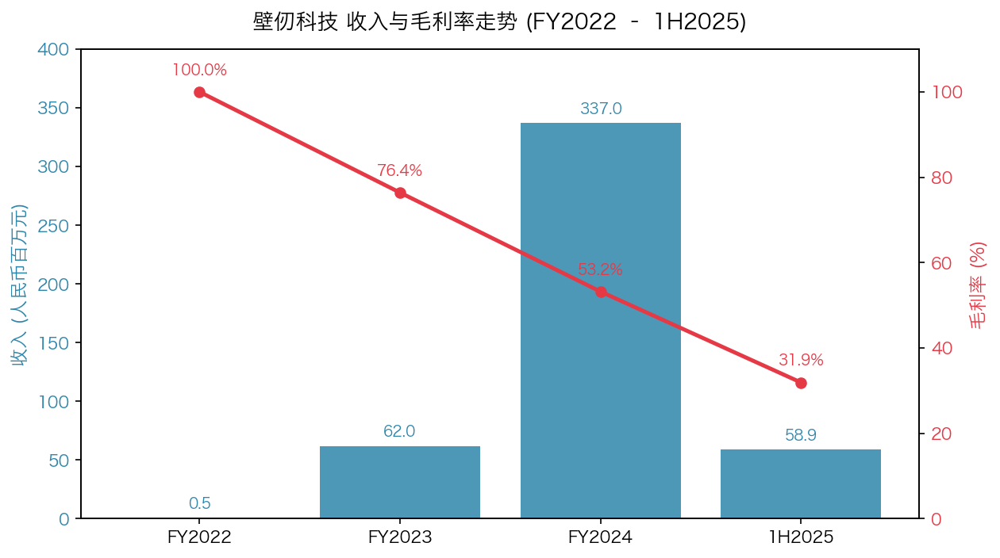
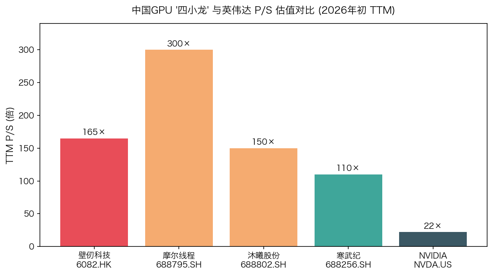
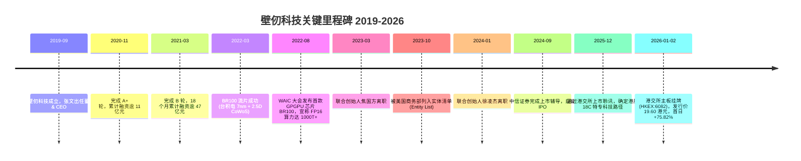
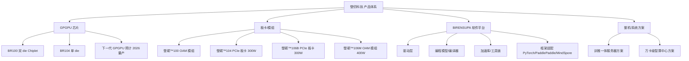
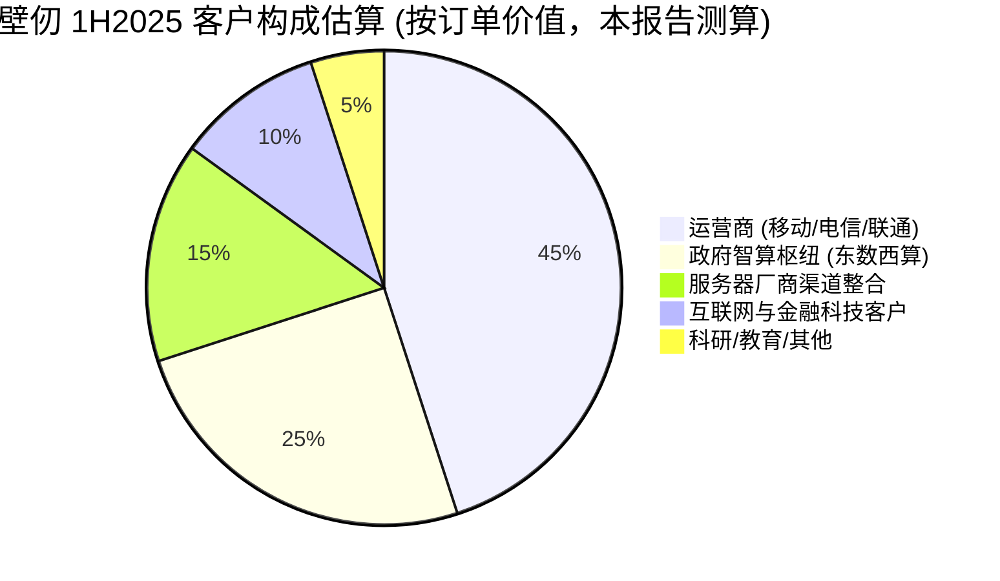
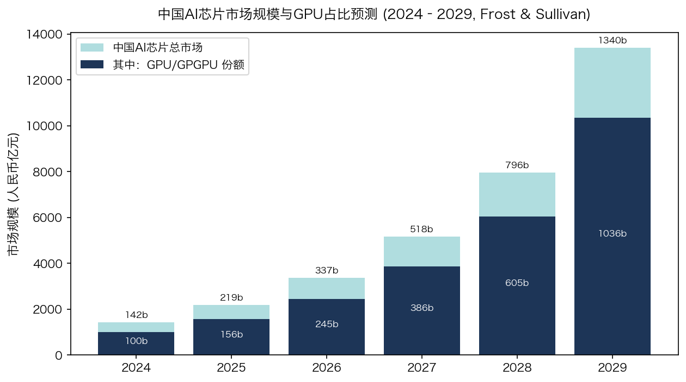
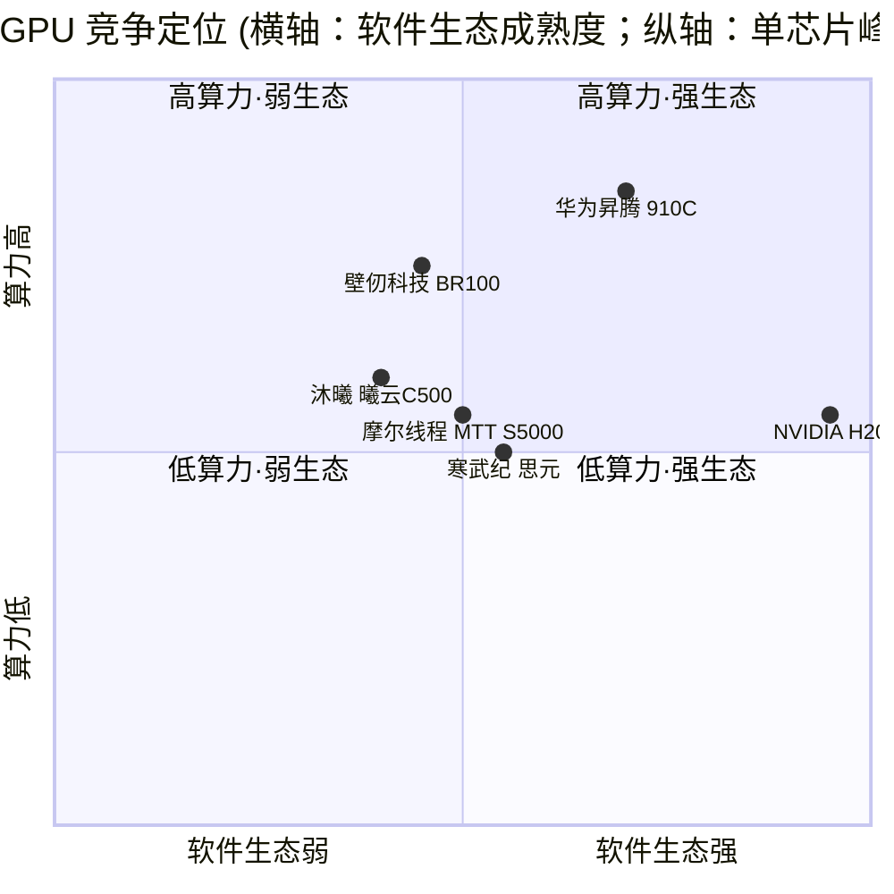
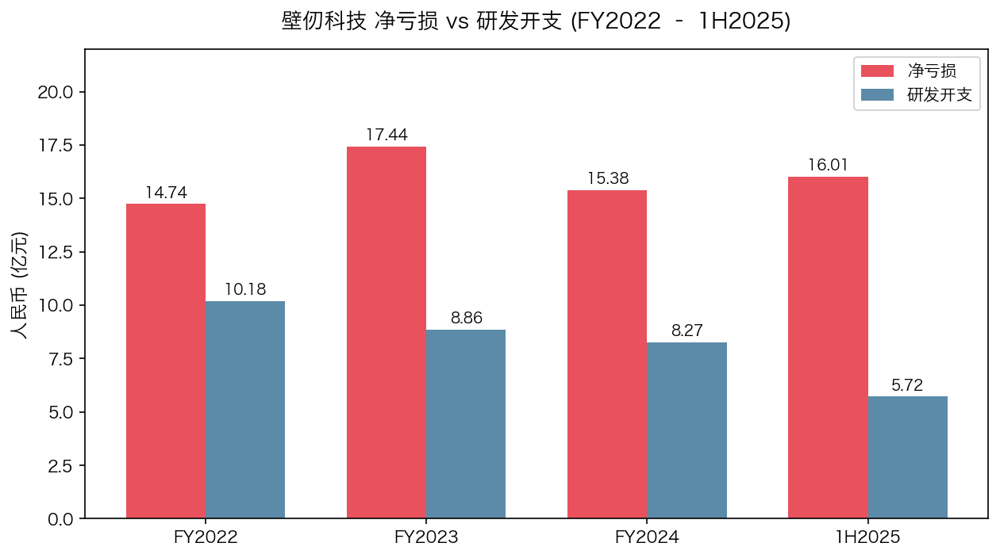

# 壁仞科技 (Biren Technology) 公司研究报告

**股票代码**: HKEX:06082
**报告日期**: 2026-05-20
**报告语言**: 简体中文
**核心结论**: 国产 GPGPU "四小龙" 之一，2026 年 1 月 2 日成为港股 GPU 第一股；商业化拐点初现但仍处于深度烧钱阶段，TTM 估值已计入未来 5 年高速增长预期，对宏观情绪与制裁变化敏感。

> **Update — 港股新股首日大涨、披露下一代芯片商业化时点 (2026-01-02 / 2025-12-17):** 公司以 19.60 港元/股 (定价区间上限) 完成全球发售，募资总额约 55.83 亿港元，上市首日开盘大涨 82%、盘中最高涨幅约 118%、收盘报 34.46 港元，单日涨幅 75.82%，总市值约 825 亿港元 ([港股迎"国产 GPU 第一股"壁仞科技：募资 56 亿，股价首日涨 76%, 2026-01-03](https://www.guancha.cn/economy/2026_01_03_802582.shtml))。在通过港交所聆讯时，公司同步披露下一代 GPGPU 芯片预计 **2026 年商业化**，并将集资净额的约 85% 用于智能计算硬件与软件平台研发 ([壁仞科技获港交所聆讯：近年营收增长强劲，下一代产品 2026 年商业化, 2025-12-18](https://caifuhao.eastmoney.com/news/20251218192826472495310))。该产品节奏与商业化兑现是 2026 年最关键的基本面变量。

---

## 目录

1. 公司概览 (Company Overview)
2. 公司历史 (Company History)
3. 管理团队 (Management Team)
4. 产品与服务 (Products & Services)
5. 客户与上市策略 (Customers & Go-to-Market)
6. 行业概览 (Industry Overview)
7. 竞争格局 (Competitive Landscape)
8. 市场机会 (Market Opportunity / TAM)
9. 风险评估 (Risk Assessment)
10. 参考资料 (References)

---

## 1. 公司概览 (Company Overview)

上海壁仞科技股份有限公司 (Shanghai Biren Technology Co., Ltd.，以下简称"壁仞"或"公司"，HKEX:06082)，注册于中国上海，是一家专注于通用图形处理器 (GPGPU / general-purpose graphics processing unit) 芯片设计、配套软件栈与智能计算解决方案的半导体设计公司。公司 2019 年 9 月在上海成立，由前商汤科技总裁张文 (Wen Zhang) 创立，是中国市场常被并称为"国产 GPU 四小龙"的四家高端 GPGPU 设计公司之一 (其余三家为摩尔线程、沐曦股份、燧原科技) ([国内 GPU "四小龙"——沐曦、摩尔线程、壁仞科技、天数智芯, 知乎](https://zhuanlan.zhihu.com/p/1954560742364800447))。

**主营业务与商业模式。** 壁仞的核心产品是以自研架构 "壁立仞" 为基础、面向数据中心训练与推理负载的 GPGPU 芯片 (BR100 系列、下一代芯片) 及对应的 PCIe 板卡与 OAM 模组 (壁砺™ 100 / 104 / 106B / 106M 等)，并搭配自研软件栈 **BIRENSUPA** (覆盖驱动、编程模型、编译器、加速库与上层框架适配) ([壁砺™106B 产品页](https://www.birentech.com/product_details/1005557844745474048.html); [壁砺™106M 产品页](https://www.birentech.com/product_details/1005557637772464128.html))。公司主要通过两类形态变现：(1) 将 GPGPU 板卡/模组直接销售给运营商智算中心、政府主导的算力枢纽项目、互联网企业与企业客户；(2) 与浪潮、新华三、宁畅等服务器整机厂合作，将壁仞 GPGPU 集成到 AI 训练/推理整机方案中销售。

**经营地域。** 公司主营业务集中在中国大陆，下游客户以中国三大运营商 (移动 / 电信 / 联通)、地方政府智算枢纽、头部互联网与金融科技公司为主，已在中国移动智算中心 (哈尔滨)、中国移动智算中心 (呼和浩特，单体 6.7 EFLOPS FP16) 实现规模化部署 ([壁仞科技加入中国移动算力网络创新联合体, birentech.com](https://www.birentech.com/News_details/53.html); [国产 GPU 的大时代, 21 世纪经济报道, 2025-12-23](https://www.21jingji.com/article/20251223/herald/baf28c9e6a3fec77ea53ee472ae58e5a.html))。由于 2023 年 10 月被美国商务部列入 BIS 实体清单 ([美国升级 AI 芯片及半导体设备出口限制！并将壁仞、摩尔线程等 13 家中企列入实体清单, 芯智讯, 2023-10-17](https://www.icsmart.cn/67934/))，公司基本不出口海外，海外业务可视为零。

**规模指标。** 据港股招股书披露及上市公告，2022 年至 2024 年及 2025 年上半年公司收入分别为人民币 49.9 万元、6,203 万元、3.37 亿元及 5,890.3 万元，2024 年收入同比增长逾 4 倍；同期净亏损分别为人民币 14.74 亿元、17.44 亿元、15.38 亿元及 16.01 亿元，三年半累计亏损超 63 亿元；毛利率从 2022 年的 100% (基本零规模)、2023 年的 76.4%、2024 年的 53.2% 逐步降至 2025 年上半年的 31.9%，反映规模化销售下定价能力与产品 mix 的双重承压 ([壁仞科技赴港 IPO：三年半亏损超 63 亿, 大众日报, 2025-12-24](https://m.dzplus.dzng.com/share/general/0/NEWS3000657BWQXYSCWTDLZB); [壁仞科技通过港交所上市聆讯, 央广网, 2025-12-17](https://finance.cnr.cn/cjgs/20251217/t20251217_527463106.shtml))。截至最后实际可行日期，公司持有 24 份未完成的具有约束力订单，总价值约人民币 8.22 亿元 ([壁仞科技启动招股, 红星新闻网, 2025-12-24](https://news.chengdu.cn/2025/1224/694ba1c381c58e5630940cbd.shtml))。

*来源：壁仞科技港股招股书及上市聆讯披露 ([壁仞科技赴港 IPO：三年半亏损超 63 亿, 大众日报, 2025-12-24](https://m.dzplus.dzng.com/share/general/0/NEWS3000657BWQXYSCWTDLZB))*

**估值快照 (Valuation Snapshot, 2026 年 5 月 7 日)。** 公司 5 月初股价约 53.45 港元、5 月初一度报 54.55 港元创上市以来新高 ([壁仞科技股价创新高, 雪球行情 06082](https://xueqiu.com/S/06082))。以 5 月 7 日 53.45 港元 × 约 41.34 亿股已发行 H 股 + 内资股估算，公司市值约 2,200 亿港元 / 约 2,030 亿元人民币 (注：实际总股本及内资股部分按全球发售公告 [上海壁仞科技股份有限公司全球发售, 2025-12-22](https://ossnoticepdf.iqdii.com/stockdata/notice/06082/2025/2025122200020_c.pdf) 中披露)。

- **TTM P/E** = N/A (公司处于深度亏损，2025 年净亏损同比仍在扩大 ([抢跑港股 GPU 赛道，壁仞科技 2025 年亏损预计大幅增加, 21 经济, 2025-12-23](https://www.21jingji.com/article/20251223/herald/746792a6cf4bfe5bcc9d1ff7089242cb.html)))；亏损主因是高强度研发投入与软件生态建设，2022–1H2025 研发开支占总经营开支始终在 73%–80% 区间，且报告期内已被美方实体清单纳入，研发与流片成本结构性偏高。
- **TTM P/S** ≈ 约 160×–170× (按 2024 全年 + 1H2025 收入约 RMB 3.96 亿、市值约 2,030 亿元人民币粗略测算；如采用更严格的最近 12 个月口径，因 1H2025 收入大幅低于 2H2024，TTM P/S 可能进一步抬升)。
- **板块对比。** 同期 A 股 GPU "双雄" 摩尔线程 (688795.SH)、沐曦股份 (688802.SH) 的 TTM P/S 分别约为 300×、150×；寒武纪 (688256.SH) 在 2025 年末市值约 5,880 亿元，TTM P/E 约 313×，TTM P/S 约 110×；英伟达 (NVDA.US) 2026 年初 P/E (TTM) 约 45×、P/S 约 22× ([如何理解两大 GPU 龙头受热捧, 新浪财经, 2025-12-11](https://finance.sina.com.cn/jjxw/2025-12-11/doc-inhaiyww8495504.shtml); [中国英伟达们的估值叙事：从寒武纪走势看摩尔线程、沐曦股份, 36 氪](https://36kr.com/p/3592082497765633))。

*来源：寒武纪、摩尔线程、沐曦、英伟达估值出处见上引；壁仞为本报告测算 (2026-05-07 收盘价 × 已发行股本，2024+1H2025 收入)*

**估值判读。** P/S 处于 150–170× 区间，显著高于英伟达 ~22× 但低于摩尔线程 ~300×。我们认为驱动这一极端倍数的主要原因是：(a) "国产 GPU 第一股 + 港股 18C 特专科技公司最大 IPO + 2026 港股开门红" 的稀缺性溢价；(b) 英伟达在中国 GPU 市场份额由峰值 95% 降至 0% 后形成的强国产替代叙事 ([如何理解两大 GPU 龙头受热捧, 新浪财经, 2025-12-11](https://finance.sina.com.cn/jjxw/2025-12-11/doc-inhaiyww8495504.shtml))；(c) 公司披露 2024 收入同比增长逾 4 倍 + 下一代芯片 2026 商业化的双重催化。需要警惕的是，若 2026 下一代芯片商业化时点延后或良率不及预期，160× 量级 P/S 缺乏盈利端的安全垫，对应的多重压缩风险已写入 Section 9。

---

## 2. 公司历史 (Company History)

**创立故事。** 2019 年 9 月 9 日，张文在上海创立壁仞科技。彼时张文的背景在国产 GPU 创业潮中并不典型：哈佛大学法学博士，曾任华尔街顶级律所资深律师，转身投身泛亚私募管理，再到 2018–2019 年出任商汤科技总裁、主导商汤总部迁至上海。"不懂技术" 的金融背景反而让他在融资端展现出极强的资源整合能力，公司自创立到 2021 年 3 月 B 轮交割，18 个月累计融资逾 47 亿元人民币，被业界视为 2019–2021 年国内半导体创业融资速度纪录 ([他不懂技术，却破纪录在 18 个月融了 47 亿做芯片, 新浪财经, 2022-07-18](https://finance.sina.com.cn/tech/it/2022-07-18/doc-imizirav4067953.shtml); [启明星｜壁仞科技张文：宽赛道、高壁垒、长周期的大芯片行业破局者, 启明创投, 2022-07-21](https://www.qimingvc.com/cn/news/20220721-QMPortfolio-01))。

**重要里程碑时间线：**

**战略转折点。**

1. **2022 年 BR100 发布：从"技术故事"切换到"产品故事"。** 2022 年 8 月在 WAIC 发布的 BR100，采用台积电 7nm 工艺与 2.5D CoWoS Chiplet 封装、容纳近 800 亿颗晶体管、配 300 MB+ 片上 SRAM，宣称 FP16 算力达 1000T+、INT8 达 2000T+，公司称其峰值算力达当时同类英伟达旗舰 (A100) 的 3 倍 ([详解壁仞刚刚发布的 GPU：单芯片 PFLOPS 算力是怎样炼成的, 电子工程专辑, 2022-08-10](https://www.eet-china.com/news/202208100913.html); [国产最强通用 GPU 来了！770 亿颗晶体管，八大核心特性揭秘, 智东西](https://zhidx.com/p/341643.html))。这场发布会让壁仞从一众"PPT GPU"中脱颖而出，但也直接将公司送入美方视线。
2. **2023 年 10 月被列入实体清单：从"自由设计 + 全球流片"切换到"国产供应链"。** 2023 年 10 月 17 日，美国商务部将壁仞、摩尔线程等 13 家中国企业列入实体清单，禁止使用受美国管辖的物项 (包括台积电先进制程代工) ([芯片战场丨美国芯片禁令变本加厉, 21 世纪经济报道, 2023-10-18](https://www.21jingji.com/article/20231018/herald/7bb8ba4d3605bef8562b34c890ec5d87.html); [Simpson Thacher 美国对中国半导体出口管制全面升级备忘录, 2023-11-02](https://www.stblaw.com/docs/default-source/memos/firmmemo_11_02_23-(cn).pdf))。这迫使壁仞必须把下一代芯片的供应链切换到国内可控产能，进入"国产化重新设计"周期，研发投入与成本结构在 2024 年因此持续高企。
3. **2025–2026 上市切换：从科创板预期到港股 18C。** 公司原本是科创板候选标的，但在沪深"硬科技"门槛与亏损审核趋严背景下，2025 年下半年快速调整到港股，借助港交所 18C 特专科技公司框架在 2025 年 12 月通过聆讯、2026 年 1 月 2 日挂牌 ([中金公司牵头保荐港股 GPU 第一股壁仞科技完成港股上市, 新华网, 2026-01-04](http://www.news.cn/finance/20260104/ee36dedb6b0e47749b755ee01355fbe1/c.html))。

**关键收购**：公司至今未披露重大 M&A 交易；增长全部来自自研投入与外部融资。

**近期 (12–18 个月) 动态。** (1) 2024 年初徐凌杰 (前阿里云智能事业群总监、负责 BD 与销售) 离职 ([壁仞科技联合创始人徐凌杰离职, 财联社, 2024-01-24](https://m.cls.cn/detail/1582660))；(2) 2024 年下半年正式启动 IPO 辅导 ([国产 GPU 独角兽公司壁仞科技启动上市 IPO, 新浪科技, 2024-09-12](https://finance.sina.com.cn/tech/digi/2024-09-12/doc-incnwmeu3330955.shtml))；(3) 2025 年招股书披露引入 23 家基石投资者、合计认购 3.725 亿美元，包括启明创投、平安系投资平台等；(4) 2026 年 1 月 2 日挂牌后股价快速冲高，5 月初触及 54.55 港元的上市以来新高。

---

## 3. 管理团队 (Management Team)

### 张文 (Wen Zhang) — 创始人、董事长兼 CEO

**背景与履历。** 张文持有美国哈佛大学法学博士学位 (Harvard JD)；早期在华尔街顶级律所担任资深律师；其后转入泛亚私募管理，担任过私募基金总经理。在芯片行业，他曾与中芯国际创始人张汝京联合创立映瑞光电 (LED 芯片公司) 并出任 CEO；2018–2019 年加入商汤科技任总裁，主导商汤总部从北京搬迁至上海，并把上海的政府关系与本地融资网络深度嫁接给 AI 业务 ([张文_百度百科](https://baike.baidu.com/item/%E5%BC%A0%E6%96%87/59985602); [启明星｜壁仞科技张文, 启明创投, 2022-07-21](https://www.qimingvc.com/cn/news/20220721-QMPortfolio-01); [他不懂技术，却破纪录在 18 个月融了 47 亿做芯片, 新浪财经, 2022-07-18](https://finance.sina.com.cn/tech/it/2022-07-18/doc-imizirav4067953.shtml))。

**在壁仞的主要成绩。** (1) 18 个月完成 47 亿元融资，把"非技术出身 + 法律金融背景"的劣势转化为资源整合能力，使壁仞快速从 0 到 1 搭起一支 500+ 工程师团队；(2) 2022 年 8 月主导 BR100 公开发布，让壁仞成为"国产 GPU 四小龙"之一；(3) 2025 年下半年果断把上市路径从科创板切到港股 18C，成为 2026 港股开门红与首只"特专科技"GPU 标的。

**持股与公开形象。** 据多方公开报道，张文在 IPO 前持有壁仞约 12.48% 的股份；他在媒体上保持相对克制的露出，公开演讲与采访多围绕"宽赛道 / 高壁垒 / 长周期"的大芯片行业方法论 ([启明星｜壁仞科技张文, 启明创投, 2022-07-21](https://www.qimingvc.com/cn/news/20220721-QMPortfolio-01))。投资人侧将其定位为"懂得调用资本与政府资源的整合型 CEO"，缺点是技术细节深度依赖联合创始人与 CTO 团队，一旦核心技术合伙人出走，市场会立即对管理稳定性打折扣 (见 2023–2024 焦国方、徐凌杰先后离职)。

### 其他高管与联合创始人

**联合创始团队 (六位)：张凌岚、张文、洪洲、徐凌杰、梁晓峣、焦国方。** 公开资料显示，公司创立时的核心技术骨干来自高通 (Qualcomm Adreno GPU 团队)、华为海思图形与昇腾团队、英伟达中国研发中心、AMD GPU 团队、阿里平头哥 / 阿里云、商汤等机构 ([壁仞科技创始人是谁？创始团队有哪些？36 氪企服点评](https://www.36dianping.com/qa/7728.html))。

- **焦国方 (联合创始人，前图形 GPU 产品线总经理) — 已于 2023 年 3 月离职。** 此前在高通工作 11 年，带领团队自研高通 Adreno 移动 GPU 架构；后任华为 GPU 技术首席科学家，负责鸿蒙 OS 图形与 UI 框架 ([壁仞科技联合创始人焦国方离职, 观察者网, 2023-03-25](https://www.guancha.cn/economy/2023_03_25_685571.shtml))。
- **徐凌杰 (联合创始人、前总裁) — 已于 2024 年 1 月离职。** 上海交大本科、UT-Austin 计算机工程硕士、UC Berkeley MBA，曾任阿里云智能事业群总监。离职前在壁仞负责 BD 与销售 ([壁仞科技联合创始人徐凌杰离职, 财联社, 2024-01-24](https://m.cls.cn/detail/1582660))。
- **梁晓峣 (联合创始人，CTO 级别)。** 上海交大计算机系教授，长期从事 GPU 体系结构研究，负责壁仞的核心架构方向 (亦即"壁立仞"原创架构的学术主导者之一)。
- **洪洲、张凌岚：** 早期联合创始人，履历背景偏运营与早期产品管理。

> 招股书与公司公告中的高管名单 (CFO / COO / 监事会主席等) 在 2025-12-22 全球发售文件中有详细披露 ([全球发售, 上海壁仞科技股份有限公司, 2025-12-22](https://ossnoticepdf.iqdii.com/stockdata/notice/06082/2025/2025122200020_c.pdf))；本报告口径有限，对 CFO 等具体姓名与履历不再展开，待 2026 年度报告披露后补全。

**治理与股权结构。**

- 张文 IPO 前持股约 12.48%；启明创投、高瓴、IDG、华登国际、中信证券、平安系、中国移动产业基金等机构是主要外部股东 ([最全梳理！壁仞科技上市，市值狂飙至 900 亿, 新浪财经, 2026-01-02](https://finance.sina.com.cn/stock/hkstock/2026-01-02/doc-inhewqnv2282085.shtml))。
- 公司采用同股不同权 / WVR 结构 (招股书披露)；张文作为创始人通过 A 类股保持对董事会的控制。
- 2026 年 IPO 引入 23 家基石投资者，认购总额 3.725 亿美元，认购比例约为发行规模的 60% 量级，反映机构对其叙事的认可，但同时也意味着上市后流通盘相对受限，对股价波动放大。

**管理团队履约能力小结。** 团队呈现出"懂资本的 CEO + 高校与海归 GPU 架构师 + 大厂软件骨干"的混合形态。优势在于：从 2019 到 2022 在 36 个月内拿出可流片、可量产的 BR100 已经证明执行力；其后能在实体清单冲击下保持研发节奏、并在 2025–2026 切换上市路径，再次说明高管层对资本市场窗口的判断敏锐。但 2023–2024 两位联合创始人 (焦国方、徐凌杰) 相继离职、其中焦国方负责的图形 GPU 产品线被搁置，暴露出公司核心技术骨干稳定性与产品方向聚焦度的潜在问题 ([曾供职英伟达、壁仞科技又一高管出走，GPU 独角兽人才难留？36 氪](https://36kr.com/p/2619932496715910))，这是估值压力测试时不能忽视的"软指标"。

---

## 4. 产品与服务 (Products & Services)

### 4.1 GPGPU 芯片层 — 壁立仞 (BIRENSUPA Architecture)

- **BR100：** 公司首款 GPGPU。采用 7nm 制程、原创"壁立仞"芯片架构，单封装由两片相同 die 通过 Chiplet 互联，整体容纳近 800 亿颗晶体管，配 300 MB+ 片上高速 SRAM，采用 2.5D CoWoS 封装。公司披露的峰值算力为 FP16 1000T+、INT8 2000T+，宣称为当时国内最强的通用 GPU、并于在售英伟达 A100 计算产品对比中算力高出 3 倍 ([壁仞科技发布首款通用 GPU 芯片，创全球算力新纪录, 启明创投, 2022-08-09](https://www.qimingvc.com/cn/news/20220809-QMPortfolio-01); [国产最强通用 GPU 来了！770 亿颗晶体管，八大核心特性揭秘, 智东西](https://zhidx.com/p/341643.html))。
- **BR104：** 仅使用 BR100 的单片 die，算力与 I/O 大致为 BR100 的一半，主要用于训推一体的主流场景。
- **下一代 GPGPU (代号未对外披露)：** 招股书与聆讯后披露文件载明"预计 2026 年商业化"，是本轮 IPO 募资 (净额约 85%) 投向的主要标的 ([壁仞科技获港交所聆讯：近年营收增长强劲，下一代产品 2026 年商业化, 东方财富, 2025-12-18](https://caifuhao.eastmoney.com/news/20251218192826472495310))。该产品的供应链 (晶圆代工、HBM、先进封装) 必须满足 2023 年实体清单约束，是 2026 年最大的可见基本面变量。

**护城河判断 — 部分 (partial)。** 壁仞拥有自研架构 IP、Chiplet/CoWoS 工程能力、被业内验证的单芯片 PFLOPS 量级算力，这是真护城河；但护城河边界明显受制于：(a) 实体清单下不能再用台积电 7nm 以下先进制程做大规模流片，必须切换至国内可控产能与较为成熟的封装工艺，单芯片密度天花板被拉低；(b) BIRENSUPA 软件栈与 CUDA 生态的兼容度仍处于追赶阶段；(c) 国内 GPGPU 同业 (摩尔线程、沐曦、燧原、寒武纪、华为昇腾) 在性能/生态/订单上呈"群龙争霸"，没有一家具备绝对垄断地位。最贴近的可比竞争产品是英伟达 H100/H800 (高端中国合规版本)、寒武纪思元 (MLU) 系列、华为昇腾 910C、摩尔线程 MTT S 系列；性能账面上壁砺 106 系列与寒武纪 MLU、摩尔线程 MTT S5000 大体处于同一档位，与英伟达 H100 仍存在 30–50% 的实测训练效率差距 (根据 21 世纪经济报道与多家券商整理 ([国产 GPU 的大时代, 21 经济, 2025-12-23](https://www.21jingji.com/article/20251223/herald/baf28c9e6a3fec77ea53ee472ae58e5a.html)))。

### 4.2 板卡 / 模组层 — 壁砺™ 系列

- **壁砺™100 (OAM 模组，基于 BR100)：** 主要面向万卡级训练机柜。
- **壁砺™104 (PCIe 板卡，基于 BR104)：** 全高全长双宽 PCIe 形态，峰值功耗 300W 以内，可适配 2–4U 标准 PCIe GPU 服务器，主打"训推一体" ([WAIC2022 壁仞科技首次展示 BR100 芯片, ITHeat, 2022-09](https://www.itheat.com/view/33247.html))。
- **壁砺™106B (PCIe 板卡)：** 全高全长双宽 PCIe，峰值功耗 300W，定位于大模型 / 多模态 AIGC、图像识别、语音识别、NLP、推荐系统等 AI 训练、微调与推理 ([壁砺™106B 产品页](https://www.birentech.com/product_details/1005557844745474048.html))。
- **壁砺™106M (OAM 模组)：** 风冷 OAM 模组，峰值功耗 400W，强调强算力与高速互联，面向规模化 AI 训练与推理 ([壁砺™106M 产品页](https://www.birentech.com/product_details/1005557637772464128.html))。

**护城河判断 — 弱 (weak)。** 板卡形态本身工程门槛不高，护城河更多由上游芯片 + 下游软件支撑；与浪潮、新华三、宁畅等服务器厂商合作的"训推一体整机"是落地的主要载体。

### 4.3 BIRENSUPA — 自研软件栈与生态

BIRENSUPA 涵盖驱动层、编程平台、框架层、应用解决方案；编程平台包括编程模型、加速库、工具链、编译器；上层适配 PyTorch、PaddlePaddle、MindSpore 等主流框架 ([详解壁仞刚刚发布的 GPU, 电子工程专辑, 2022-08](https://www.eet-china.com/news/202208100913.html))。

**护城河判断 — 关键但仍在追赶 (critical-but-catching-up)。** GPGPU 厂商最终的胜负手是软件生态，而非单纯硬件算力。BIRENSUPA 当前与 CUDA 生态的兼容度、对开源大模型框架的开箱即用程度，仍逊于英伟达，并与寒武纪 Neuware、华为 CANN、摩尔线程 MUSA 处于同一追赶梯队。本轮 IPO 募资中相当比例投向软件平台研发，意在补齐这块短板。

### 4.4 主力 / 长尾与近期发布

- **主力产品 (驱动收入)：** 壁砺™104 / 106 系列 PCIe 板卡 + 整机方案，是 2024–1H2025 收入的主要贡献 (招股书披露 2024 全年与 1H2025 共有 14 + 12 个特专科技产品客户，2024 年收入 3.37 亿元，1H2025 收入 5,890 万元，订单总价值约 8.22 亿元 ([壁仞科技启动招股, 红星新闻网, 2025-12-24](https://news.chengdu.cn/2025/1224/694ba1c381c58e5630940cbd.shtml)))。
- **长尾产品：** 早期 BR100 系列、面向科研机构的样片授权与定制方案。
- **2025–2026 重点投放：** 下一代 GPGPU 芯片、BIRENSUPA 软件平台升级、面向万卡级智算中心的整机解决方案。
- **已搁置 / 退出：** 2023 年焦国方离职后，原本规划的图形 (Graphics) GPU 产品线明显被弱化，公司战略全面收敛到 GPGPU/AI 计算路径 ([壁仞科技联合创始人焦国方离职, 观察者网, 2023-03-25](https://www.guancha.cn/economy/2023_03_25_685571.shtml))。

---

## 5. 客户与上市策略 (Customers & Go-to-Market)

**客户画像。** 壁仞的客户结构呈现典型的"国产替代背景下的 to-B + to-G"特征，三类客户构成基本盘：

1. **三大电信运营商 (中国移动 / 中国电信 / 中国联通)。** 招股书披露公司是中国移动算力网络创新联合体成员、中国电信四大 AI 联创基地的算力合作伙伴；搭载壁砺系列的中国移动智算中心 (呼和浩特) 单体算力 6.7 EFLOPS (FP16)、属于全国 N 节点万卡训练场；中国移动智算中心 (哈尔滨) 亦已实现规模化部署 ([壁仞科技加入中国移动算力网络创新联合体, birentech.com](https://www.birentech.com/News_details/53.html); [壁仞上市：最高市值超千亿港元成港股 GPU 第一股, leinews.com](https://www.leinews.com/n32263/detail.html))。
2. **政府主导的智算枢纽 / 国家算力枢纽节点。** 哈尔滨、呼和浩特、合肥、贵阳等"东数西算" 8 大枢纽节点中的部分智算项目使用壁仞 GPGPU 板卡或整机方案。
3. **互联网与金融科技客户。** 据壁仞官网案例与第三方报道，公司在 2025 年开始进入头部互联网厂商的训练 / 推理生产环境，主要切入"千卡级集群"的训练任务与垂直行业大模型推理；中兴 / 新华三 / 宁畅 / 浪潮等服务器厂商是其重要的渠道整合伙伴 ([金融 ICT 架构变革的引领者, 中兴 2025 行业宣传册](https://www.zte.com.cn/content/dam/zte-site/res-www-zte-com-cn/%E6%94%BF%E4%BC%81/2025%E6%94%BF%E4%BC%81%E5%AE%98%E7%BD%91%E6%9B%B4%E6%96%B0%E8%B5%84%E6%96%99%E6%96%87%E4%BB%B6%E5%A4%B9/2025%E5%B9%B4%E8%A1%8C%E4%B8%9A%E7%94%BB%E5%86%8C/%EF%BC%88%E5%8D%95%E9%A1%B5%E9%A2%84%E8%A7%88%E7%89%88%EF%BC%89%E9%87%91%E8%9E%8D%E5%AE%A3%E4%BC%A0%E5%86%8C.pdf))。

**客户集中度量化。** 招股书披露 2024 年与 1H2025 公司特专科技产品分别有 14 个、12 个客户，贡献收入分别为 3.37 亿元与 5,890 万元；截至最后实际可行日期，公司持有 24 份具约束力订单、总价值约 8.22 亿元 ([壁仞科技启动招股, 红星新闻网, 2025-12-24](https://news.chengdu.cn/2025/1224/694ba1c381c58e5630940cbd.shtml))。具体的"前五名客户合计占比"在公开摘要中未给出精确数字，但按 14 个客户分摊 3.37 亿元、且头部运营商单笔订单往往超过 5,000 万元的行业惯例倒推，**前五名客户占比大概率超过 70%，前三名客户占比可能超过 50%；其中三大运营商及政府智算项目合计大概率构成营收基本盘的 60%+**。这意味着公司当前的客户集中度属于"高单一类型客户依赖" — 即对政策驱动的运营商 / 政府算力建设支出周期的依赖，远高于对市场化互联网客户的依赖。这一结构既是壁仞的关键护城河 (国产替代必须经过运营商 / 国资体系认证)，也是关键风险源 (一旦运营商集采节奏放缓或政策口径调整，对营收的冲击是断崖式的)。

*注：以上比例为本报告基于公开报道、客户案例、订单价值与行业惯例的测算，非招股书披露口径。*

**销售模式与销售周期。** 主要销售为大客户直销 + 服务器整机厂渠道分销；典型销售周期 6–12 个月 (从 POC 到批量验收)；合同结构以集采框架协议 + PO 出货为主，多数订单为单次出货性质、少量为多年滚动框架协议。订单从签约到交付往往跨季度，因此 1H2025 较 2H2024 的收入回落部分可由订单交付节奏波动解释 (而非业务实质下滑)。

**关键合作伙伴。** (1) 服务器整机：浪潮信息、新华三、中兴通讯、宁畅；(2) 算力运营 & 集采：中国移动、中国电信、中国联通；(3) 大模型生态：与多家国内大模型厂商进行兼容性认证 (公司未公开点名所有合作方)；(4) 资本与产业方：高瓴、启明创投、IDG、华登国际、平安系、中信证券、中国移动产业基金 ([最全梳理！壁仞科技上市，市值狂飙至 900 亿, 新浪财经, 2026-01-02](https://finance.sina.com.cn/stock/hkstock/2026-01-02/doc-inhewqnv2282085.shtml))。

**已落地的旗舰客户案例。** (1) **中国移动智算中心 (呼和浩特) — 万卡级 N 节点训练场，单体 6.7 EFLOPS (FP16)**，搭载壁砺系列 GPGPU；(2) **中国电信千卡集群商用部署**，参与四大 AI 联创基地；(3) **哈尔滨智算中心**，规模化部署。这些案例对应"东数西算 + 国产替代 + 万卡集群" 三个 2024–2026 年的核心政策叙事，是壁仞 IPO 估值溢价的重要支点。

---

## 6. 行业概览 (Industry Overview)

**行业界定。** 壁仞所处的细分行业是 **数据中心 AI 计算芯片**，特指用于大模型训练与推理的 **GPGPU / AI 加速器**。从产业链位置看，公司位于半导体设计 (Fabless) 环节，下游为服务器 OEM、运营商与政府智算中心、互联网 / 金融科技 / 制造业大模型应用方；上游为台积电 / 中芯国际 / 长电科技 / 通富微电等晶圆代工与封装厂商、HBM 厂商 (海力士 / 三星 / 美光，国内长鑫存储正在国产化突破)、EDA 与 IP 授权方。

**市场规模与增长。** 据 Frost & Sullivan 在多家券商研报与媒体引用中的预测：

- 2024 年中国 AI 芯片市场规模约 **1,425.37 亿元人民币**，预计 2029 年增长至 **约 1.34 万亿元人民币**，2025–2029 年 CAGR 约 **53.7%** ([2025-2030 年全球及中国人工智能芯片行业发展前景报告, 前瞻产业研究院](https://ecoapp.qianzhan.com/report/1/1804201720163185.html); [国产 GPU 和 AI 大芯片的市场空间和竞争格局, 知乎](https://zhuanlan.zhihu.com/p/1968043714619376351))。
- 其中 GPU/GPGPU 细分份额由 2024 年的 **69.9%** 提升至 2029 年的 **77.3%**，到 2029 年中国 AI 算力 GPU 市场规模有望达 **约 1.03 万亿元人民币**。
- 若改以"中国 AI 推理芯片"窄口径看，市场规模从 2024 年的 1,626 亿元增长至 2025 年的 3,106 亿元，GPU 占比维持在 78%–82% 区间。

*来源：[Frost & Sullivan 引用自前瞻产业研究院 / 多家券商研报, 2025](https://ecoapp.qianzhan.com/report/1/1804201720163185.html)*

**核心增长驱动。**

1. **大模型训练算力刚需。** 千亿参数 LLM 单次训练需千卡-万卡量级 GPU，对 GPGPU 的需求随模型规模呈指数级扩张。
2. **国产替代政策红利。** 英伟达 CEO 黄仁勋本人承认，英伟达在中国 GPU 市场份额已从峰值 95% 降至接近 0% ([如何理解两大 GPU 龙头受热捧, 新浪财经, 2025-12-11](https://finance.sina.com.cn/jjxw/2025-12-11/doc-inhaiyww8495504.shtml))。被腾出的份额需要由国内厂商 (壁仞、摩尔线程、沐曦、燧原、寒武纪、华为昇腾) 共同填补。
3. **"东数西算" + 智算枢纽。** 国家"东数西算"工程 + 各地智算中心建设带动政府型采购，是国产 GPGPU 厂商 2024–2026 年的主要订单来源。
4. **推理需求结构性放量。** ASIC 芯片在 2025 年的出货量已能达到英伟达 GPU 量的 40%–60%，推理负载多元化为国产 GPGPU 提供"对标 + 错位"的双轨机会。

**监管与产业政策。**

- **正向：** "国家集成电路产业投资基金 (大基金一/二/三期)"、各省专项基金、东数西算、信创目录、运营商集采向国产倾斜。
- **负向：** 美国 BIS 出口管制条例 (EAR) 与实体清单约束，限制先进制程代工与高带宽内存供应；2023 年 10 月起壁仞、摩尔线程、燧原等已陆续被列入实体清单 ([芯片战场丨美国芯片禁令变本加厉, 21 经济, 2023-10-18](https://www.21jingji.com/article/20231018/herald/7bb8ba4d3605bef8562b34c890ec5d87.html))。

**行业结构与竞合关系。**

- **行业集中度：** 仍处于"竞争性碎片化"阶段，单一国产 GPGPU 玩家份额均未超过 25%，"四小龙 + 寒武纪 + 华为昇腾"6 家瓜分 2024 年大约 70% 的国产 AI 芯片市场。
- **供应商议价：** 上游台积电先进制程代工对实体清单内的中国 GPGPU 厂商基本封闭，HBM 厂家定价权强；国内中芯国际 N+1/N+2、长鑫 HBM 是关键替代来源，议价能力相对较弱、但仍是瓶颈型供应商。
- **客户议价：** 三大运营商 + 政府智算枢纽集中度高、议价能力强，是壁仞毛利率从 2023 年 76.4% 一路压到 1H2025 31.9% 的核心原因。
- **替代品威胁：** ASIC (寒武纪思元、华为昇腾、海光 DCU 等)、FPGA、专用加速卡，以及英伟达合规版本 (H20、B20 等) 在政策允许时仍可能回流；2025 年市场对英伟达 H20 出口许可的反复显示替代品压力随地缘政策波动反复。

---

## 7. 竞争格局 (Competitive Landscape)

### 7.1 主要竞争对手

中国数据中心 GPGPU / AI 加速芯片市场呈现"6+N"结构，6 家具备万卡级训练芯片能力的核心玩家加上若干 ASIC / 专用芯片厂商。

| 序号 | 公司 | 主营 / 旗舰产品 | 上市状态 (2026-05) | 关键差异点 |
|---|---|---|---|---|
| 1 | **壁仞科技 (6082.HK)** | BR100 / 壁砺™ 104/106 系列 GPGPU | 港股 18C 上市 (2026-01-02) | 原创"壁立仞"架构、PFLOPS 级算力，软件生态在追赶 |
| 2 | **摩尔线程 (688795.SH)** | 全功能 GPU (训练+图形+渲染) MTT S 系列 | 科创板上市 (2025-12-05) | 唯一定位"全功能 GPU"，消费市场 70% 份额，数据中心 GPU 22% 份额 |
| 3 | **沐曦股份 (688802.SH)** | 曦云 C500 / 曦思 N100 GPGPU | 科创板上市 (2025-12 上旬) | 训练 / 推理双线产品，团队源自 AMD |
| 4 | **燧原科技 (拟 IPO)** | 邃思 / 云燧训练&推理 ASIC + GPGPU | IPO 辅导中 | ASIC + GPGPU 双线，腾讯系背景，软件生态相对成熟 |
| 5 | **寒武纪 (688256.SH)** | 思元 (MLU) 系列 ASIC | 科创板上市，市值约 5,880 亿元 | ASIC 路线，2024 年因实体清单影响波动剧烈，2025 年回升 |
| 6 | **华为昇腾 (Ascend, 海思)** | 昇腾 910B/910C | 未上市 (华为体内) | 软硬一体 (CANN + MindSpore)，运营商与政府市场口碑最强 |
| 7 | 海光信息 (688041.SH) | 深算 DCU 系列 (类 GPGPU) | 科创板上市 | 起源 AMD x86 授权，主要做 CPU + DCU 双线 |
| 8 | 天数智芯 | 天垓 100 GPGPU | 未上市 | 早期玩家，规模与生态相对滞后 |
| 9 | NVIDIA (中国合规版本) | H20 / B20 / L40 | 全球上市 | 全球软件生态领先，但中国份额由 95% 降至接近 0% |
| 10 | 平头哥 (阿里) / 百度昆仑芯 | 含光 / 昆仑芯 ASIC | 大厂体内 | 自用 + 部分外销 |

主要参考：[国产 AI 芯片概念：壁仞、燧原、沐曦、摩尔线程的逐鹿征程, 新浪财经, 2025-07-27](https://finance.sina.com.cn/roll/2025-07-27/doc-infhwxxu0975674.shtml); [国产 GPU 产业全景分析, 新浪财经, 2025-10-27](https://finance.sina.com.cn/roll/2025-10-27/doc-infvhrnz2461613.shtml); [谁押中"国产 GPU 四小龙", 36 氪](https://eu.36kr.com/zh/p/3541164653091209)。

### 7.2 竞争定位框架

**解读：** 壁仞在"算力轴"上处于国产玩家头部 (BR100 单芯片峰值算力跻身国产 PFLOPS 级队列)，但在"软件生态"维度落后于华为昇腾 (背靠 MindSpore + CANN) 与英伟达。摩尔线程在"全功能 GPU"维度有差异化壁垒，沐曦在训练 / 推理分线上覆盖更全。

### 7.3 壁仞的竞争优势 / 劣势

**优势：**

1. **原创架构 + PFLOPS 级单芯片算力。** "壁立仞"架构 + 7nm + 2.5D CoWoS 在 2022 年发布时即跻身全球先进，技术叙事强。
2. **资本厚度。** IPO 前融资总额 50 亿+ 人民币，IPO 募资 55.83 亿港元，二级市场估值上限较高，弹药相对充足。
3. **运营商 + 政府叙事。** 与中国移动智算中心、中国电信千卡集群、中国联通的深度绑定，让公司在"国产替代 + 东数西算"政策周期内拥有相对稳定的订单池。
4. **品牌与稀缺性。** 港股 GPU 第一股、港股 2026 开门红，吸引了 23 家基石投资者，市场关注度高。

**劣势：**

1. **软件生态弱于华为昇腾与英伟达。** BIRENSUPA 仍需大量投入做框架兼容、算子覆盖、调优工具链。
2. **实体清单约束。** 先进制程代工与 HBM 供应受限，意味着每一代芯片的"单芯片算力 vs 国际可比"差距可能在工艺端被结构性拉大。
3. **核心技术合伙人流失。** 2023–2024 焦国方、徐凌杰相继离职，对外形成"技术骨干稳定性疑虑"。
4. **毛利率持续下滑。** 由 76.4% 一路压到 31.9% (1H2025)，反映在大客户集采面前缺乏定价权，规模化越大越折损盈利能力 ([壁仞科技通过港交所上市聆讯, 央广网, 2025-12-17](https://finance.cnr.cn/cjgs/20251217/t20251217_527463106.shtml))。

*来源：壁仞科技 2025-12 港股招股书披露 ([壁仞科技赴港 IPO：三年半亏损超 63 亿, 大众日报, 2025-12-24](https://m.dzplus.dzng.com/share/general/0/NEWS3000657BWQXYSCWTDLZB))*

### 7.4 市场份额估算

公开机构尚未发布精确到"壁仞 vs 摩尔线程 vs 沐曦"的中国数据中心 GPU 份额拆分，但综合 2025 年三季度多家券商报告与媒体测算：

- **2024 年中国数据中心 GPU 整体市场约 1,000 亿元 (估算)；**
- **摩尔线程数据中心 GPU 份额约 22% (头部)、华为昇腾约 25%–30%、壁仞 / 沐曦 / 燧原 / 寒武纪 / 海光合计约 40%；**
- **壁仞在国产数据中心 GPU 份额估算 6–9%**，对应 2024 收入 3.37 亿元 + 渠道整机贡献 (招股书未拆出渠道部分) 的量级。

**判断：** 壁仞在份额上仍属于"国产第二梯队"前列，但远未达到摩尔线程或华为昇腾的体量。这意味着未来 2–3 年是"四小龙 + 华为"份额再分配的关键期，下一代芯片商业化成败将直接决定壁仞能否进入第一梯队。

---

## 8. 市场机会 (Market Opportunity / TAM)

**TAM (Total Addressable Market)。** 取 Frost & Sullivan 与多家券商引用的中国 AI 芯片市场口径，2029 年达 **约 1.34 万亿元人民币**，其中 GPU/GPGPU 细分约 **1.03 万亿元人民币** ([2025-2030 年全球及中国人工智能芯片行业发展前景报告, 前瞻产业研究院](https://ecoapp.qianzhan.com/report/1/1804201720163185.html))。这是壁仞作为"通用 GPU"厂商可以理论触达的最大市场。

**SAM (Serviceable Addressable Market)。** 取以下范围作为可触达市场：

- **数据中心训练 + 推理 GPGPU (剔除 ASIC、剔除消费图形 GPU、剔除汽车与边缘 AI 芯片)：** 估算 2029 年约 7,000–8,000 亿元人民币，约占 GPU/GPGPU 细分的 70%–75%。
- **在 SAM 中再剔除华为昇腾自销给运营商和政府的部分 (估算 25%–30%)、再剔除可能由英伟达合规版本回收的部分 (估算 10%–20% 不确定区间)，2029 年壁仞可竞争的"非昇腾 + 非英伟达"SAM 约为 3,500–4,500 亿元人民币。**

**SOM (Serviceable Obtainable Market)。** 若假设 2029 年壁仞在"非昇腾 + 非英伟达"SAM 内能拿到 **8%–12% 份额**，对应营收区间约 280–540 亿元人民币 (2024 → 2029 年 CAGR 在 130%–150%)，仍小于 Frost & Sullivan 测算的整个 GPU 子市场的 5%。

**渗透策略。** (1) 短期 (2024–2026)：紧跟运营商集采与"东数西算"项目节奏，把市场份额从 6–9% 推至 12–15%；(2) 中期 (2027–2028)：依靠下一代 GPGPU + BIRENSUPA 在头部互联网厂商训练任务中拿到 20%+ 的"国产替代切片"；(3) 长期 (2028–2030)：把软件生态打到与华为昇腾持平、与英伟达可互操作，成为中国 GPGPU 双寡头之一。

**机会的关键不确定性。** (a) 美方实体清单约束何时部分解除或部分加码；(b) 国内先进制程代工 (中芯国际 N+2 及以后) 的产能爬坡节奏；(c) HBM 国产化 (长鑫存储) 的真正供给能力；(d) 大模型应用层是否能持续兑现"千亿参数 → 万亿参数 → AGI 路径"的算力需求。任何一项不达预期都会让 SOM 较上述估算下修 30%–50%。

---

## 9. 风险评估 (Risk Assessment)

> 以下风险按"公司特有 / 行业市场 / 财务 / 宏观"4 桶共列示 10 项。

### 9.1 公司特有风险 (4)

**R1 — 下一代 GPGPU 商业化延迟或良率不达预期。** 公司在聆讯材料中明确披露"下一代 GPGPU 芯片预计 2026 年商业化"，募集资金 85% 投向该方向 ([壁仞科技获港交所聆讯, 东方财富, 2025-12-18](https://caifuhao.eastmoney.com/news/20251218192826472495310))。如果该芯片受国内代工节点 / HBM 供应 / 软件调优影响而延迟 2–3 季度上市，2026–2027 的收入加速逻辑将受到直接冲击，对应 P/S 倍数面临从 160× 向 80–100× 的压缩。

**R2 — 核心技术合伙人持续流失。** 联合创始人焦国方 (2023-03) 与徐凌杰 (2024-01) 的相继离职已经在投资界形成"技术骨干稳定性"的负向标签 ([壁仞科技联合创始人徐凌杰离职, 财联社, 2024-01-24](https://m.cls.cn/detail/1582660); [曾供职英伟达、壁仞科技又一高管出走, 36 氪](https://36kr.com/p/2619932496715910))。若 IPO 解禁后又出现核心架构师 / 软件平台负责人离职，市场会显著重估其工程能力。

**R3 — 软件生态长期落后于华为昇腾与英伟达。** BIRENSUPA 在主流大模型框架与算子覆盖、性能调优、社区生态方面落后是公开事实；GPGPU 的最终胜负在软件而非硬件，软件生态长期跟不上意味着公司无法穿越到"客户主动选壁仞"的拐点，长期被锁在"政策驱动型订单"轨道上。

**R4 — 客户集中度过高 + 集采议价压力。** 根据本报告测算，前五大客户占比可能在 70%+ (其中三大运营商 + 政府智算项目占比约 60%+)，毛利率从 76.4% 一路压到 31.9% 的根本原因是大客户集采议价。若运营商进一步强化国产 GPU 集中采购的"竞争性谈判"机制，毛利率可能继续向 25%–30% 探底，亏损扩大风险加剧。

### 9.2 行业市场风险 (2)

**R5 — 国产 GPU "四小龙 + 寒武纪 + 华为" 6 家竞争白热化，份额再分配下行风险。** 2025–2026 是国产 GPGPU 集中上市与放量的窗口，6 家头部玩家都在加大软件生态投入与价格竞争。如果壁仞的下一代芯片在 PPA (性能 / 功耗 / 面积) 维度无法明显领先沐曦、摩尔线程，公司可能从"国产 GPU 四小龙"中段被甩出第一梯队，份额从 6–9% 回落至 3–5%。

**R6 — 英伟达通过"合规版本 + 政策回暖"重新拿回部分中国份额。** 黄仁勋本人承认英伟达在中国 GPU 份额由 95% 跌至接近 0%，但这种情况能否持续高度依赖中美贸易与出口管制谈判。如 2026–2027 美方放宽 H20 / B20 等合规芯片的对华出口、并允许重新进入主流互联网客户集群，国内 GPGPU 厂商将面临"产品 + 价格" 双线压力 ([如何理解两大 GPU 龙头受热捧, 新浪财经, 2025-12-11](https://finance.sina.com.cn/jjxw/2025-12-11/doc-inhaiyww8495504.shtml))。

### 9.3 财务风险 (2)

**R7 — 持续大额亏损叠加现金消耗高企，IPO 募资有时效性。** 2022 – 1H2025 累计净亏损超 63 亿元，2025 年全年亏损预计同比大幅增加 ([抢跑港股 GPU 赛道，壁仞科技 2025 年亏损预计大幅增加, 21 经济, 2025-12-23](https://www.21jingji.com/article/20251223/herald/746792a6cf4bfe5bcc9d1ff7089242cb.html))。本次 IPO 募资 55.83 亿港元，按现有研发与销售开支节奏 (年均 15–20 亿元人民币级别) 可支撑约 24–36 个月运营；如下一代芯片商业化进度不达预期，再融资压力将在 2027–2028 年集中显现。

**R8 — 估值过高的多重压缩风险。** 当前 TTM P/S 160–170×，超出英伟达约 7–8 倍、与寒武纪 (110×) 同档而略高。若 2026 年下一代芯片商业化兑现度低于市场预期、或互联网客户体量未能放大，市场情绪可能从"成长溢价"切换到"亏损折价"，对应市值打 5–6 折是完全可能的。

### 9.4 宏观风险 (2)

**R9 — 中美科技脱钩进一步加码 (Entity List 升级)。** 2023 年 10 月被列入 BIS 实体清单已经让公司必须重新部署供应链；若 2026–2027 美方进一步收紧 EAR、把更多设计 IP、EDA 工具或 HBM 切断，公司下一代芯片的工艺曲线与产品节奏可能再次受到冲击 ([美国对中国半导体出口管制全面升级备忘录, Simpson Thacher, 2023-11-02](https://www.stblaw.com/docs/default-source/memos/firmmemo_11_02_23-(cn).pdf); [芯片战场丨美国芯片禁令变本加厉, 21 经济, 2023-10-18](https://www.21jingji.com/article/20231018/herald/7bb8ba4d3605bef8562b34c890ec5d87.html))。

**R10 — 中国资本市场对"亏损 + 高估值"硬科技标的的容忍度变化。** 港股 18C 框架下，监管对"无盈利特专科技公司"持开放态度，但二级市场的容忍度具有顺周期性。一旦港股流动性收紧、外资风险偏好下行 (如美联储意外重启加息、地缘风险升级)，类似壁仞这种"无 EPS 锚、靠 P/S 叙事支撑"的 18C 公司估值首当其冲。

**风险综合判断：** 公司中长期机会显著、政策与叙事支撑强；但短期 1–2 个季度的核心变量在于 "(a) 下一代芯片何时流片、何时量产；(b) 1H2026 收入能否回到 2H2024 的台阶之上；(c) 实体清单与中美科技博弈节奏"。对应的合理研究框架是：把壁仞视作一个 **"高 beta 国产替代代理标的"**，做多它本质上是做多"中国 GPGPU 国产替代 + 大模型算力扩张"的双重叙事，而非做多其当下的财务基本面。

---

## 10. 参考资料 (References)

### 公司公告 / 招股书 / 港交所披露

- [上海壁仞科技股份有限公司 全球发售公告, 2025-12-22](https://ossnoticepdf.iqdii.com/stockdata/notice/06082/2025/2025122200020_c.pdf)
- [壁仞科技通过港交所上市聆讯：三年半净亏超 63 亿元 毛利率持续下滑, 央广网, 2025-12-17](https://finance.cnr.cn/cjgs/20251217/t20251217_527463106.shtml)
- [壁仞科技获港交所聆讯：近年营收增长强劲，下一代产品 2026 年商业化, 东方财富, 2025-12-18](https://caifuhao.eastmoney.com/news/20251218192826472495310)
- [壁仞科技赴港 IPO：三年半亏损超 63 亿, 大众日报, 2025-12-24](https://m.dzplus.dzng.com/share/general/0/NEWS3000657BWQXYSCWTDLZB)
- [国产 GPU 四小龙之一的壁仞科技启动招股, 红星新闻网, 2025-12-24](https://news.chengdu.cn/2025/1224/694ba1c381c58e5630940cbd.shtml)
- [中金公司牵头保荐港股 GPU 第一股壁仞科技完成港股上市, 新华网, 2026-01-04](http://www.news.cn/finance/20260104/ee36dedb6b0e47749b755ee01355fbe1/c.html)

### 公司官网 / 产品页

- [壁仞科技 加入中国移动算力网络创新联合体, birentech.com](https://www.birentech.com/News_details/53.html)
- [壁砺™106B 产品页, birentech.com](https://www.birentech.com/product_details/1005557844745474048.html)
- [壁砺™106M 产品页, birentech.com](https://www.birentech.com/product_details/1005557637772464128.html)

### IPO 与上市首日

- [新股 IPO｜国产 GPU 四小龙壁仞科技 6082 招股集资逾 48 亿元, HKET, 2025-12](https://inews.hket.com/article/4057190/birentech-6082-ipo-2026)
- [港股 GPU 第一股壁仞科技确定 IPO 发售价格区间, 华尔街见闻](https://wallstreetcn.com/articles/3761811)
- [港股迎国产 GPU 第一股壁仞科技：募资 56 亿，股价首日涨 76%, 观察者网, 2026-01-03](https://www.guancha.cn/economy/2026_01_03_802582.shtml)
- [最全梳理！壁仞科技上市，市值狂飙至 900 亿, 新浪财经, 2026-01-02](https://finance.sina.com.cn/stock/hkstock/2026-01-02/doc-inhewqnv2282085.shtml)
- [壁仞科技上市首日涨超 100%，此前三年亏损, 新浪财经, 2026-01-02](https://finance.sina.com.cn/stock/t/2026-01-02/doc-inhewqnt3776894.shtml)
- [2026 港股开门红！壁仞科技 (6082.HK) 登陆港交所，收盘涨幅达 75.82%, 新浪财经, 2026-01-02](https://finance.sina.com.cn/stock/bxjj/2026-01-02/doc-inhexwhc3266922.shtml)
- [AI Chip Designer Biren to Debut After $717 Million Hong Kong IPO, Bloomberg, 2026-01-02](https://www.bloomberg.com/news/articles/2026-01-02/ai-chip-designer-biren-to-debut-after-717-million-hong-kong-ipo)
- [Chinese AI chipmaker Biren kicks off bookbuilding for US$624 million Hong Kong IPO, SCMP, 2025-12](https://www.scmp.com/business/banking-finance/article/3337272/chinese-ai-chipmaker-biren-kicks-bookbuilding-us624-million-hong-kong-ipo)

### 行情与估值数据

- [壁仞科技 06082 股票股价行情, 雪球](https://xueqiu.com/S/06082)
- [壁仞科技 (6082.HK) 股价、新闻、报价和记录, Yahoo Finance](https://finance.yahoo.com/quote/6082.HK/)
- [壁仞科技 (06082) 市净率/估值/基本面, 理杏仁](https://www.lixinger.com/equity/company/detail/hk/06082/6082/fundamental/valuation/pb)
- [如何理解两大 GPU 龙头受热捧, 新浪财经, 2025-12-11](https://finance.sina.com.cn/jjxw/2025-12-11/doc-inhaiyww8495504.shtml)
- [中国英伟达们的估值叙事：从寒武纪走势看摩尔线程、沐曦股份, 36 氪](https://36kr.com/p/3592082497765633)

### 产品与技术报道

- [详解壁仞刚刚发布的 GPU：单芯片 PFLOPS 算力是怎样炼成的, 电子工程专辑, 2022-08-10](https://www.eet-china.com/news/202208100913.html)
- [国产最强通用 GPU 来了！770 亿颗晶体管，八大核心特性揭秘, 智东西](https://zhidx.com/p/341643.html)
- [壁仞科技首款通用 GPU 芯片创全球算力新纪录 采用 Chiplet 技术, 电子工程专辑, 2022-08](https://www.eet-china.com/news/202208101015.html)
- [启明星｜国产芯片迎来重大突破，壁仞科技发布创全球算力纪录的通用 GPU 芯片, 启明创投, 2022-08-09](https://www.qimingvc.com/cn/news/20220809-QMPortfolio-01)
- [China's premier GPU maker Biren kicks off Hong Kong IPO, Tom's Hardware](https://www.tomshardware.com/tech-industry/biren-kicks-off-hong-kong-ipo)

### 管理团队与人事

- [启明星｜壁仞科技张文：宽赛道、高壁垒、长周期的大芯片行业破局者, 启明创投, 2022-07-21](https://www.qimingvc.com/cn/news/20220721-QMPortfolio-01)
- [张文_百度百科](https://baike.baidu.com/item/%E5%BC%A0%E6%96%87/59985602)
- [他不懂技术，却破纪录在 18 个月融了 47 亿做芯片, 新浪财经, 2022-07-18](https://finance.sina.com.cn/tech/it/2022-07-18/doc-imizirav4067953.shtml)
- [壁仞科技联合创始人焦国方离职, 观察者网, 2023-03-25](https://www.guancha.cn/economy/2023_03_25_685571.shtml)
- [壁仞科技联合创始人徐凌杰离职, 财联社, 2024-01-24](https://m.cls.cn/detail/1582660)
- [曾供职英伟达、壁仞科技又一高管出走，GPU 独角兽人才难留？36 氪](https://36kr.com/p/2619932496715910)

### 实体清单与监管

- [美国升级 AI 芯片及半导体设备出口限制！并将壁仞、摩尔线程等 13 家中企列入实体清单, 芯智讯, 2023-10-17](https://www.icsmart.cn/67934/)
- [芯片战场丨美国芯片禁令变本加厉, 21 世纪经济报道, 2023-10-18](https://www.21jingji.com/article/20231018/herald/7bb8ba4d3605bef8562b34c890ec5d87.html)
- [Simpson Thacher 美国对中国半导体出口管制全面升级备忘录, 2023-11-02](https://www.stblaw.com/docs/default-source/memos/firmmemo_11_02_23-(cn).pdf)

### 行业研究与竞争

- [国产 AI 芯片概念：壁仞、燧原、沐曦、摩尔线程的逐鹿征程, 新浪财经, 2025-07-27](https://finance.sina.com.cn/roll/2025-07-27/doc-infhwxxu0975674.shtml)
- [国产 GPU 产业全景分析, 新浪财经, 2025-10-27](https://finance.sina.com.cn/roll/2025-10-27/doc-infvhrnz2461613.shtml)
- [谁押中"国产 GPU 四小龙", 36 氪](https://eu.36kr.com/zh/p/3541164653091209)
- [国内 GPU 四小龙——沐曦、摩尔线程、壁仞科技、天数智芯, 知乎](https://zhuanlan.zhihu.com/p/1954560742364800447)
- [国产 GPU 的大时代, 21 世纪经济报道, 2025-12-23](https://www.21jingji.com/article/20251223/herald/baf28c9e6a3fec77ea53ee472ae58e5a.html)
- [2025–2030 年全球及中国人工智能芯片行业发展前景报告, 前瞻产业研究院](https://ecoapp.qianzhan.com/report/1/1804201720163185.html)
- [国产 GPU 和 AI 大芯片的市场空间和竞争格局, 知乎](https://zhuanlan.zhihu.com/p/1968043714619376351)
- [抢跑港股 GPU 赛道，壁仞科技 2025 年亏损预计大幅增加, 21 经济, 2025-12-23](https://www.21jingji.com/article/20251223/herald/746792a6cf4bfe5bcc9d1ff7089242cb.html)
- [回头看 | 2025 算力产业盘点：谁是真正赢家？腾讯新闻, 2026-01-06](https://news.qq.com/rain/a/20260106A05SXP00)
- [壁仞通过港股上市聆讯：国产 GPU 是否存在估值悖论？36 氪](https://36kr.com/p/3600715598037761)

---

*报告完。本报告所有数据均来自公开披露文件、公司官网、主流财经媒体及第三方研究机构；估值口径、份额测算及客户构成估算属于本报告作者基于公开信息的分析判断，非招股书或公司正式披露。投资有风险，仅供研究参考。*
