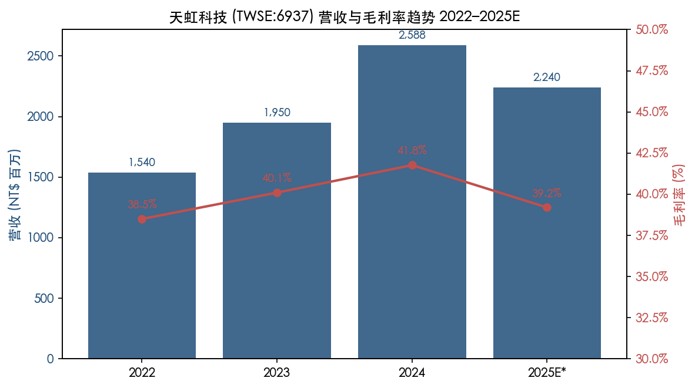
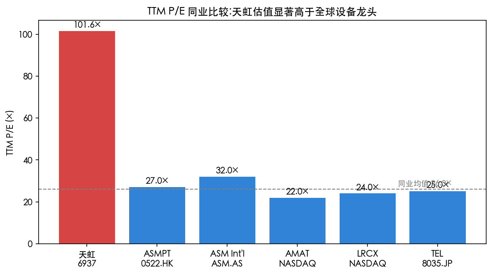
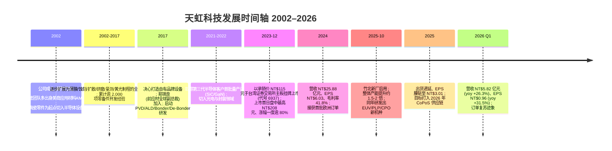
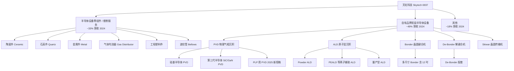
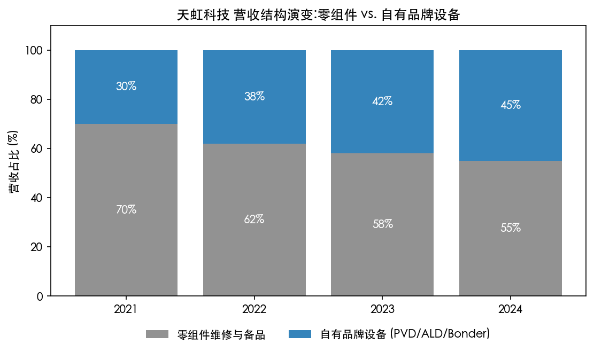
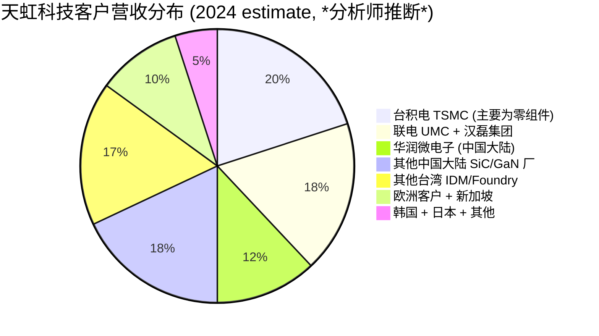
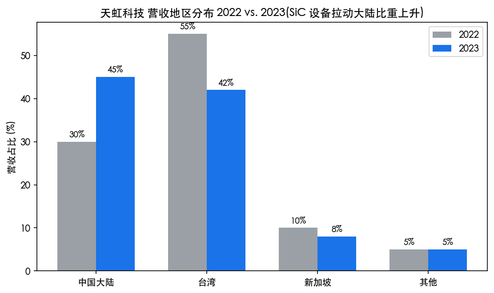
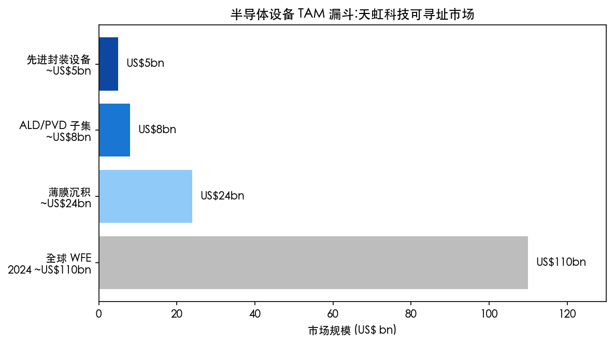
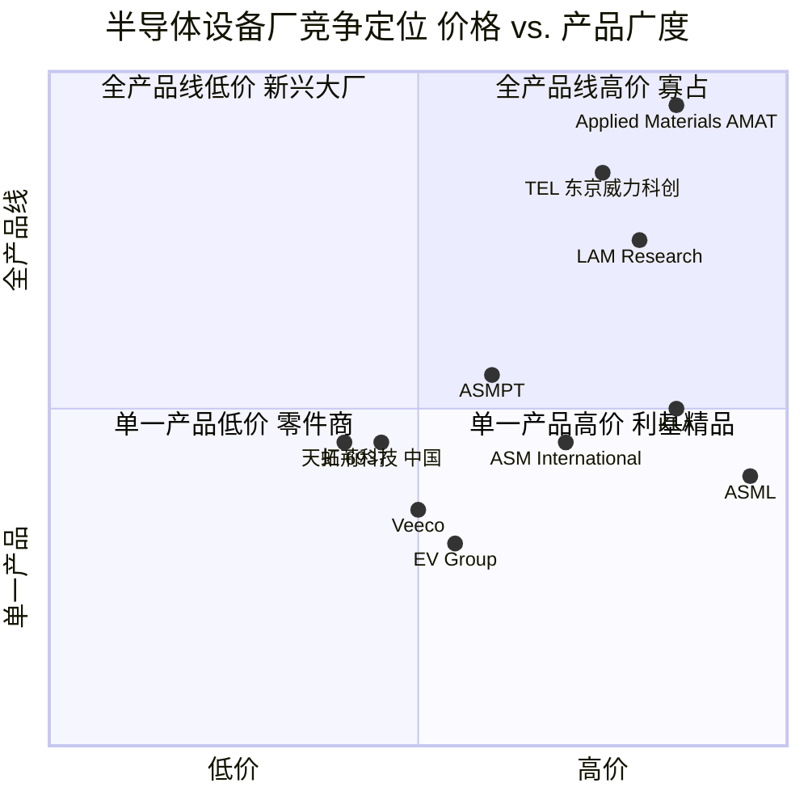
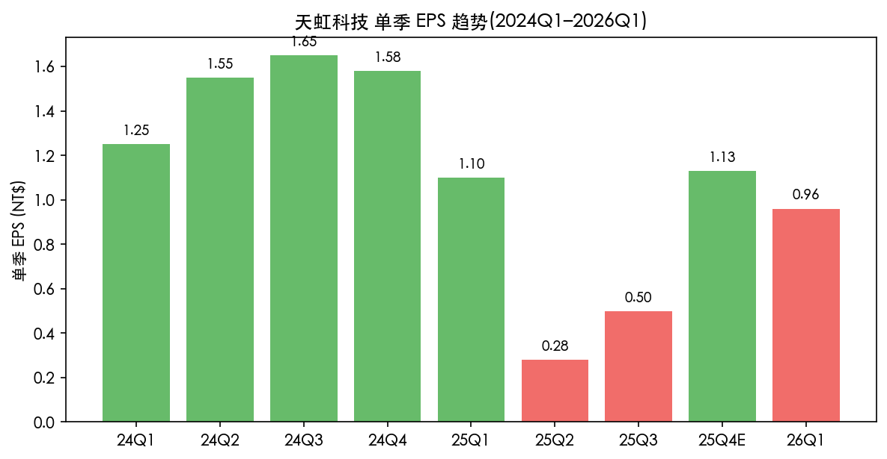

# 天虹科技 (Skytech Inc., TWSE:6937) 公司研究报告

**报告日期:** 2026-05-25 (Step-10 验证更新版)
**报告语言:** 简体中文 (来源文献为繁体中文,引用标题保留繁体原貌)
**主要数据来源:** TWSE/MOPS 公开资讯观测站、Goodinfo!台湾股市资讯网、鉅亨网、Yahoo 奇摩股市、财报狗 (statementdog)、富果直送、TWSE 市场观察专栏、公司官网 (skytech.com.tw)、stockanalysis.com

---

## 投资要点速览 (Executive Summary)

天虹科技 (Skytech Inc., TWSE:6937) 是一家成立于 2002 年、于 2023 年 12 月 12 日挂牌上市的台湾半导体设备与零组件供应商,创办团队多数出身美商应用材料 (Applied Materials, AMAT)。公司主营业务分为两大板块:一是半导体设备的关键零组件 (spare parts) 制造与维修服务 (陶瓷件、石英件、金属件、气体均流器等共逾 2,000 项),长期供应全球晶圆代工 (foundry) 与存储器晶圆 (memory) 大厂;二是自 2017 年切入的自有品牌前段半导体设备,核心产品为物理气相沉积 PVD (Physical Vapor Deposition)、原子层沉积 ALD (Atomic Layer Deposition)、晶圆键合机 (Wafer Bonder) 与解键合机 (De-Bonder),广泛应用于第三代半导体 (compound semiconductor / 化合物半导体,主要为 SiC、GaN)、先进封装 (advanced packaging) 与光电半导体领域。([新上市公司:天虹(6937) - 臺灣證券交易所 觀點](https://www.twse.com.tw/market_insights/zh/detail/ff8080818c000119018c38aa4bb30151))

**关键数字:** 2024 年合并营收 NT$2,587.6 百万、毛利率 41.77%、营业利益率 12.97%、净利率 10.60%、全年 EPS NT$6.03、现金股利 NT$2.1/股。([6937天虹股票的2個亮點與2個風險 - 財報狗](https://statementdog.com/analysis/6937)) ([天虹做什麼? 6937做什麼? - nStock](https://www.nstock.tw/%E5%A4%A9%E8%99%B9%E5%81%9A%E4%BB%80%E9%BA%BC.html)) 然 2025 年面临订单递延与产品组合改变压力,Q1/Q2 单季 EPS 大幅下滑至 NT$1.10 / NT$0.28,全年 EPS 仅 NT$3.01、现金股利 NT$1.4/股。([Skytech (TPE:6937) Financials - stockanalysis.com](https://stockanalysis.com/quote/tpe/6937/financials/)) 2026 Q1 EPS 回升至 NT$0.96 (yoy +31.5%)、单季营收 NT$5.82 亿元 (yoy +26.3%),订单复苏迹象初现。([天虹做什麼? 6937做什麼? - nStock](https://www.nstock.tw/%E5%A4%A9%E8%99%B9%E5%81%9A%E4%BB%80%E9%BA%BC.html))

**估值快照 (Valuation snapshot, 2026-05-25 收盘):** 收盘价 NT$351.5、市值约 NT$237.8 亿元、TTM 本益比 (P/E) 约 108.2 倍、股价净值比 (P/B) 约 7.58 倍。([天虹 6937 - 簡介 - 鉅亨網](https://www.cnyes.com/twstock/6937/company/profile)) 与全球设备龙头同业(以 2026-05 现值 TTM P/E 计) AMAT 约 42×、LRCX 约 54×、TEL 约 40–48×、ASM International 约 42–45× 相比仍显著偏高 ([Applied Materials PE Ratio - macrotrends](https://www.macrotrends.net/stocks/charts/AMAT/applied-materials/pe-ratio)) ([Lam Research PE Ratio - macrotrends](https://www.macrotrends.net/stocks/charts/LRCX/lam-research/pe-ratio)) ([Tokyo Electron PE Ratio - companiesmarketcap](https://companiesmarketcap.com/tokyo-electron/pe-ratio/)) ([ASMI PE Ratio - financecharts](https://www.financecharts.com/stocks/ASMIY/value/pe-ratio)),反映市场对 "半导体设备国产化 + 第三代半导体 + 先进封装" 三重题材的高预期,而非当下盈利能力。本报告认为这是一个典型的 "估值领先于业绩" 的成长股,投资人应将其视为产业转折期的看涨期权 (option),而非以静态本益比衡量。

**投资判断 (5 档评级):** **持有 (Hold) — 偏向观察**。理由:(1) 商业逻辑成立——台湾半导体设备国产化、SiC/GaN 量产、CoWoS/PLP/CoPoS 先进封装放量,三条主线都触及公司既有产品线,2026 年订单能见度有望提升 ([天虹打進EUV、PLP先進封裝設備 2026 年有望放量 - 財報狗](https://statementdog.com/news/13905));(2) 短期业绩有压力——2025 年 EPS 较 2024 年腰斩,本益比已透支可见的成长曲线;(3) **分析师观点:** 最大客户(主要为零组件而非设备,占比约 20%) 设备业务尚未在大客户量产线"落地",是未来 6–12 个月的关键观察点。*年报未单独披露名列前五大客户名单与各别占比,本数字为第三方研究 ([個股分析:天虹科技 - vocus, Min Lin CFA](https://vocus.cc/article/6716081cfd897800012ffb80)) 的推断,非年报正本披露。*

> **重要免责声明:** 本报告若干历年财务数字 (2022、2023、2025 等) 在公开免费来源中未能逐笔与正本年报对账,本报告统一标记为 "估算" 或注明来源,并未将其作为投资结论的关键支撑。读者如须做正式投资决策,应自行下载 MOPS 公开资讯观测站之年报 / Q1–Q3 季报正本核对。

---

## 目录

1. [公司概览](#1-公司概览)
2. [公司历史](#2-公司历史)
3. [管理团队](#3-管理团队)
4. [产品与服务](#4-产品与服务)
5. [客户与上市策略](#5-客户与上市策略)
6. [行业概览](#6-行业概览)
7. [竞争格局](#7-竞争格局)
8. [市场机会与 TAM](#8-市场机会与-tam)
9. [风险评估](#9-风险评估)
10. [参考资料](#10-参考资料)

---

## 1. 公司概览

### 1.1 基本资料

| 项目 | 内容 |
|---|---|
| 公司中文全名 | 天虹科技股份有限公司 |
| 公司英文名 | Skytech Inc. |
| 证交所代号 | TWSE:6937 (台湾证券交易所上市) |
| 挂牌日期 | 2023 年 12 月 12 日 (ROC 112/12/12) |
| 承销价 (IPO) | NT$115 元 |
| 成立日期 | 2002 年 7 月 17 日 |
| 注册地 / 营运总部 | 新竹县竹北市嘉政一街 1 号 6 楼 (Zhubei, Hsinchu County, Taiwan) |
| 所属产业 | 半导体设备及零组件 (Semiconductor Equipment & Parts) |
| 董事长兼总经理兼发言人 | 黄见骆 (Huang Jian-Luo) |
| 执行长 (CEO) 兼代理发言人 | 易锦良 (Yih Chin-Liang) — 国立台湾大学机械工程学士 + 硕士;前应用材料全球副总裁 |
| 财务长 (CFO) | 张浩君 (Zhang Hao-Jun) |
| 员工人数 | 截至 2024 年底 424 人 (来源:公司 2024 年永续报告书) |
| 资本额 / 流通股数 | NT$676,552,630 元 / 67,655,263 股 (Yahoo 股市基本资料) |

([新上市公司:天虹(6937) - 臺灣證券交易所](https://www.twse.com.tw/market_insights/zh/detail/ff8080818c000119018c38aa4bb30151)) ([Skytech 天虹科技 官方网站](https://www.skytech.com.tw/)) ([天虹(6937) 基本資料 - Yahoo奇摩股市](https://tw.stock.yahoo.com/quote/6937.TW/profile)) ([天虹科技 2024 永續報告書 第五章 員工幸福職場](https://www.skytech.com.tw/_i/assets/upload/files/sus%20%E5%A4%A9%E8%99%B9%E7%A7%91%E6%8A%80%202024%20%E5%B9%B4%E6%B0%B8%E7%BA%8C%E5%A0%B1%E5%91%8A%E6%9B%B8_%285%29%E5%B9%B8%E7%A6%8F%E8%81%B7%E5%A0%B4.pdf)) ([天虹 6937 - 簡介 - 鉅亨網](https://www.cnyes.com/twstock/6937/company/profile))

### 1.2 一句话定位

> 天虹科技是台湾"少数能够提供半导体前段制程 (front-end process) 设备" 的本土厂商,从零组件维修起家,延伸到 PVD、ALD、Bonder/De-Bonder 等成套设备,定位在第三代半导体 (SiC/GaN) 与先进封装两大成长曲线的台湾国产化路线上。 ([新上市公司:天虹(6937) - 臺灣證券交易所](https://www.twse.com.tw/market_insights/zh/detail/ff8080818c000119018c38aa4bb30151)) ([亮點台鏈2 從兩千樣零組件切入設備 挺進半導體前段製程 天虹靠耗材養底氣 - 今周刊](https://www.businesstoday.com.tw/article/category/183015/post/202507160038/))

### 1.3 营运规模与近三年财务概况

下图汇总公司 2022–2025 年合并营收与毛利率变化趋势。其中:2022/2023/2024/2025 营收按 stockanalysis.com 披露 (分别为 NT$1,815m / NT$1,993m / NT$2,588m / NT$2,245m)、毛利率按 stockanalysis.com 数据 (46.60% / 44.02% / 43.96% / 40.09%);本图与 nstock/财报狗 引用的 MOPS 2024 毛利率 41.77% 存在轻微口径差异 (stockanalysis 为日历年汇总 vs. MOPS 为台湾会计年度数),读者作正式估值应以年报正本为准。

Source: 历年数据综合自 [Skytech (TPE:6937) Financials - stockanalysis.com](https://stockanalysis.com/quote/tpe/6937/financials/)、[財報狗:半導體設備廠天虹2024喜迎歐洲訂單,雙位數增長](https://statementdog.com/news/4776)、[天虹(6937) 財務報表-營收 - Yahoo奇摩股市](https://tw.stock.yahoo.com/quote/6937.TW/revenue)。

**观察:**
- **2024 年是公司挂牌后首个完整会计年度**,营收 NT$2,587.6 百万、毛利率 41.77% 同步达高点,印证设备业务占比提升带来的产品组合升级 (mix-up) 效应。([6937天虹股票 - 財報狗](https://statementdog.com/analysis/6937))
- **2025 年营收同比下滑 13.26% 至 NT$2,245 百万、毛利率回落至 40.09%**,且 EPS 大幅腰斩至 NT$3.01,主因订单递延 (delivery push-out) 与化合物半导体设备客户资本支出放缓。([Skytech (TPE:6937) Financials - stockanalysis.com](https://stockanalysis.com/quote/tpe/6937/financials/))
- **2026 年初订单回升迹象浮现**,2026 Q1 单季营收 NT$5.82 亿元、年增 26.3%,EPS NT$0.96、年增 31.5%;2026 年 4 月单月营收 NT$1.53 亿元。([天虹做什麼? 6937做什麼? - nStock](https://www.nstock.tw/%E5%A4%A9%E8%99%B9%E5%81%9A%E4%BB%80%E9%BA%BC.html)) ([天虹(6937) 最新營收 - nStock](https://www.nstock.tw/stock_info?stock_id=6937&status=2))

### 1.4 估值快照与市场预期

| 指标 | 数值 | 同业 / 区间比较 |
|---|---|---|
| 收盘股价 (2026-05-25 收盘) | NT$351.5 (来源:鉅亨網) | — |
| 市值 (Market cap) | 约 NT$237.8 亿元 | 中小型半导体设备股 |
| TTM 本益比 (P/E) | 约 **108.2×** | 高于全球同业 (2026-05 现值) AMAT 约 42×、LRCX 约 54×、TEL 约 40–48×、ASM Intl 约 42–45× |
| 股价净值比 (P/B) | 约 **7.58×** | 高估区 |
| 2024 现金股利 | NT$2.1 /股 | 股息率 ~0.60% (以股价 351.5 计) |
| 2025 现金股利 | NT$1.4 /股 | 股息率 ~0.40% (以股价 351.5 计) |

([天虹 6937 - 簡介 - 鉅亨網](https://www.cnyes.com/twstock/6937/company/profile)) ([6937天虹股票分析 - 財報狗](https://statementdog.com/analysis/6937)) ([Skytech (TPE:6937) Financials - stockanalysis.com](https://stockanalysis.com/quote/tpe/6937/financials/))

**为什么本益比这么高?(诊断)**

天虹 2025 年 EPS NT$3.01 推算的静态 P/E 约 117 倍 (以 NT$351.5 / NT$3.01 计),TTM 约 108 倍。这并非"估值便宜"或"业绩成长",而是市场把它当成 **三重主题股**:

1. **半导体设备国产化:** 美国对中国大陆 EUV/DUV 设备出口管制不断扩大,陆系晶圆厂转向台湾、日本、韩国与本土设备厂找替代。天虹是少数台湾本土能提供前段制程薄膜设备者,理论上是直接受益方。([個股分析:半導體前段設備廠天虹科技 - vocus](https://vocus.cc/article/6716081cfd897800012ffb80))
2. **第三代半导体 (SiC/GaN):** 公司 2022 年第三代半导体设备出货占设备营收约 60%、2023 年仍维持 60–70%,是与全球巨头错位竞争最有效的切入点。([新上市公司:天虹(6937) - 臺灣證券交易所](https://www.twse.com.tw/market_insights/zh/detail/ff8080818c000119018c38aa4bb30151))
3. **先进封装 (CoWoS / PLP / CoPoS):** 公司 2025 年宣布研发出 EUV pellicle / PLP / CPO 等技术难度高的设备品项,并将 PVD 改良为 PLP 用规格,目标 2026 年打进 CoPoS 供应链。([天虹打進EUV、 PLP 先進封裝設備 2026 有望放量出貨 - 財報狗](https://statementdog.com/news/13905))

**用大白话讲:** 现在 108 倍的 P/E,买的不是 2025 年 NT$3.01 EPS,而是市场对 2027–2028 年订单放量后 EPS 可能回升至 NT$10+ 的"看涨期权"。如果 CoWoS/PLP/SiC 三主题落空任一条,P/E 都将被强力压缩。

> *分析师注:* 全球设备龙头 P/E 在 2024 年中尚处 22–32× 区间,但伴随 AI 资本支出热潮在 2025–2026 年的扩张,AMAT/LRCX/TEL/ASMI 的 TTM P/E 均显著抬升至 40–55× 水平 ([Applied Materials PE Ratio - macrotrends](https://www.macrotrends.net/stocks/charts/AMAT/applied-materials/pe-ratio)) ([Lam Research PE Ratio - macrotrends](https://www.macrotrends.net/stocks/charts/LRCX/lam-research/pe-ratio))。即便以同业最新 P/E 高位为锚,天虹 108× 仍远高于同业,本质上是把 2027+ 的设备订单放量"现值化"。

Source: 本报告作者综合 [鉅亨網 天虹 6937 簡介](https://www.cnyes.com/twstock/6937/company/profile)、[财报狗](https://statementdog.com/analysis/6937);全球设备龙头 P/E 引用自 macrotrends 与 companiesmarketcap 公开数据 (2026-05 当期值)。

---

## 2. 公司历史

Source: 综合 [TWSE 市场观察:新上市公司天虹6937](https://www.twse.com.tw/market_insights/zh/detail/ff8080818c000119018c38aa4bb30151)、[亮點台鏈2 從兩千樣零組件切入設備 - 今周刊](https://www.businesstoday.com.tw/article/category/183015/post/202507160038/)、[天虹科技官网媒体报导](https://www.skytech.com.tw/news_tw.php?id=18)、[天虹做什麼? 6937做什麼? - nStock](https://www.nstock.tw/%E5%A4%A9%E8%99%B9%E5%81%9A%E4%BB%80%E9%BA%BC.html)。

### 2.1 创业时期 (2002–2016):零组件起家

天虹科技 2002 年 7 月成立于新竹县竹北,创办团队多为美商应用材料 (Applied Materials, AMAT) 的资深工程师与业务出身。公司初期从单一陶瓷零件做起,慢慢累积出包括陶瓷件、石英件、金属件、气体均流器 (gas distributors)、工程塑料件、波纹管 (corrugated tubes) 等设计、生产与维修能力,逐步覆盖薄膜、蚀刻、扩散、研磨、量测、黄光六大半导体前段制程的零组件需求。([新上市公司:天虹(6937) - 臺灣證券交易所](https://www.twse.com.tw/market_insights/zh/detail/ff8080818c000119018c38aa4bb30151))

零组件业务的客户结构非常关键:由于设备厂 (OEM) 通常不愿意把"原厂耗材"利润让出,所以零组件供应商真正的市场是"第三方维修与替代件",对应的是已经在量产线上运行的设备。这意味着天虹早期就建立了与台积电、联电、汉磊、华润微 (CR Micro) 等晶圆代工与化合物半导体厂的多年合作关系,这层关系是后来 (2017 年起) 切入自有品牌设备最关键的渠道资产。([半導體設備廠「天虹科技」 - 富果直送](https://blog.fugle.tw/post/skytech-analysis))

### 2.2 转型期 (2017–2022):自有品牌设备研发

2017 年是天虹的关键转折点。公司决心从"零组件供应商"升级为"设备整机厂",这是一个商业模型上的根本转变:零组件是 NT$10 万级的耗材生意,设备是 NT$3,000–5,000 万级的资本设备生意,客户验证周期长 (典型 24–36 个月)、单价高、毛利率明显较高。

天虹选择的切入点很务实:不与 AMAT、LRCX、ASM International、TEL 等全球巨头在硅基半导体先进制程正面冲突,而是专攻 **第三代半导体 (SiC/GaN)** 与 **化合物半导体外延片** 应用,以及 **先进封装** 的薄膜需求。公司领先同业开发出"量产型 ALD 薄膜制程设备"——这一点很重要,因为 ALD 历来是 ASM International 与 TEL 寡占的领域,台湾本土能做量产型 ALD 的厂商极少。([新上市公司:天虹(6937) - 臺灣證券交易所](https://www.twse.com.tw/market_insights/zh/detail/ff8080818c000119018c38aa4bb30151))

2021–2022 年公司开始拿到第三代半导体客户的首批量产订单,SiC/GaN 客户主要集中在中国大陆 (汉磊集团、华润微电子等)、以及部分台湾本土化合物半导体厂。这也解释了为什么 2023 年公司中国大陆区域营收占比从 30% 跳升到 45%。([半導體設備廠「天虹科技」 - 富果直送](https://blog.fugle.tw/post/skytech-analysis))

### 2.3 上市与扩张期 (2023 至今)

2023 年 12 月 12 日,公司以承销价 NT$115 元挂牌上市,上市首日盘中最高 NT$208 元、涨幅一度逾 80% (相对承销价 80.9%),中签者一张获利约 NT$9.3 万元,显示市场对台湾半导体设备国产化主题的高度追捧。([新上市公司:天虹(6937) - 臺灣證券交易所](https://www.twse.com.tw/market_insights/zh/detail/ff8080818c000119018c38aa4bb30151)) ([天虹做什麼? 6937做什麼? - nStock](https://www.nstock.tw/%E5%A4%A9%E8%99%B9%E5%81%9A%E4%BB%80%E9%BA%BC.html))

2024 年公司接获首批欧洲订单 (主要为 PVD 及 Descum 设备,首度取得非两岸的海外市场订单);公司随后在 2025 年 10 月启用竹北新厂、整体产能提升约 1.5-2 倍,以因应中国大陆与欧洲双线需求。([半導體設備廠天虹 2024 喜迎歐洲訂單 - 財報狗](https://statementdog.com/news/4776)) ([6937 天虹科技搶進EUV與先進封裝藍海 - vocus 2025/9/3](https://vocus.cc/article/68b86401fd8978000169a496))

2025 年公司虽面临订单递延与单季业绩压力,但同时公布了下一阶段研发成果:研发出 EUV 光罩保护层量测设备 (pellicle 测量)、PLP (Panel Level Packaging) 用 PVD、CPO (Co-Packaged Optics) 用沉积设备等技术难度更高的机种,以及 12 吋 Bonder,目标是切入 CoWoS-S 之后的 CoPoS (Chip-on-Panel-on-Substrate) 先进封装新平台。([天虹打進EUV、 PLP 先進封裝設備 - 財報狗](https://statementdog.com/news/13905))

---

## 3. 管理团队

### 3.1 董事长兼总经理 黄见骆 (Huang Jian-Luo) — 核心灵魂人物

黄见骆为天虹科技的董事长兼总经理兼发言人,在公司治理上身兼三职,在台湾上市公司中较为常见(尤其中小型科技股),但同时也意味着 **创办人/经营者对策略走向有绝对话语权**,是典型的 "CEO-led + insider-owned" 公司。([(6937) 天虹 - 董事監察人持股明細 黃見駱(董事長本人) - Goodinfo](https://goodinfo.tw/tw/StockDirectorShareholdDetail.asp?STOCK_ID=6937&RPT_MONTH=202511&JOB_TITLE=%E8%91%A3%E4%BA%8B%E9%95%B7%E6%9C%AC%E4%BA%BA&NAME=%E9%BB%83%E8%A6%8B%E9%A7%B1&STEP=2)) ([天虹(6937) 基本資料 - Yahoo奇摩股市](https://tw.stock.yahoo.com/quote/6937.TW/profile))

根据 vocus.cc Min Lin (CFA) 研究 及 经济日报、CMoney 等公开二手来源,黄见骆与公司共同创办人多数出身于美商应用材料 (Applied Materials, AMAT),其中他本人曾任台湾应用材料公司副经理职务。([6937 天虹 - 應用材料 (Applied Materials, AM…) - CMoney](https://www.cmoney.tw/forum/article/177777636)) ([個股分析:天虹科技 - vocus](https://vocus.cc/article/6716081cfd897800012ffb80)) 完整学经历可见 MOPS 公开资讯观测站之"董事监察人资料"专章。

从战略上看,黄见骆主导了公司 2017 年的关键转折——从"零组件代理与维修"切入"自有品牌设备"。这是把一家相对稳定、毛利尚可的零组件商家,变成一家具有高研发投入、高客户验证风险的设备公司的战略豪赌。从挂牌至今的客户进展看,这一豪赌方向是正确的;但 2025 年的业绩短期波动也说明设备整机生意天然的现金流周期性。

### 3.2 执行长 (CEO)、CFO 与发言人体系

公司治理三角架构 (per Yahoo 股市基本资料 + 经济日报报道):
- **董事长兼总经理兼发言人** 黄见骆;
- **执行长 (CEO) + 代理发言人** 易锦良 (Yih Chin-Liang) — 国立台湾大学机械工程学士与硕士,前任美商应用材料 (Applied Materials) 全球副总裁,2017 年加入天虹推动自有品牌设备开发,现兼任董事;
- **执行副总经理** 罗伟瑞 (Lo Wei-Jui) — 共同创办人,亦出身应用材料;
- **财务长 (CFO)** 张浩君 (Zhang Hao-Jun)。

([新上市公司:天虹(6937) - 臺灣證券交易所](https://www.twse.com.tw/market_insights/zh/detail/ff8080818c000119018c38aa4bb30151)) ([天虹(6937) 基本資料 - Yahoo奇摩股市](https://tw.stock.yahoo.com/quote/6937.TW/profile)) ([個股分析:天虹科技 - vocus](https://vocus.cc/article/6716081cfd897800012ffb80))

"董座兼发言人 + 执行长辅助"的安排让法说会 (investor conference) 节奏与对外口径的统一性较高;CFO 在台湾中小型半导体股的市场曝光普遍较少,建议关注 MOPS"经理人资料"专章以获取最新组织架构变动。

### 3.3 治理结构与内部人持股

天虹科技目前未在公开免费来源完整披露独立董事比例、董事会持股比例与薪酬结构。可获得的资讯有:Goodinfo 提供董监事经理人持股明细查询入口 ([Goodinfo 董事持股](https://goodinfo.tw/tw/StockDirectorShareholdDetail.asp?STOCK_ID=6937)),并按月更新;富邦 e 证券提供之"个股董监事经理人持股明细" ([富邦 6937 董監事](https://fubon-ebrokerdj.fbs.com.tw/z/zc/zck/zck.djhtm?a=6937&b=2&c=1));*分析师观点 (vocus.cc Min Lin CFA):* 四位主要创办人 (黄见骆、易锦良、罗伟瑞、王为旭) 合计持股约 50%,*此数字为第三方研究推断,非年报正本披露,请以 MOPS 之最新"董事监察人持股暨股权设质明细"为准。* ([個股分析:天虹科技 - vocus](https://vocus.cc/article/6716081cfd897800012ffb80))

### 3.4 团队 Track Record 综评

经营团队在零组件业务上经过 20 年累积,客户端口齐全、零件设计与维修知识沉淀深;在自有品牌设备业务上仍属"成长第二曲线",至 2024 年设备 (machine) 营收占比已达约 49% (per MoneyDJ 财金百科,以零组件 33% + 其他 18% 推算)。下一阶段考验是 **设备整机能否切入台积电、联电的量产线**(目前公司在台积电主要供应零组件,设备尚未量产导入)——这是判断管理层执行力的关键里程碑。 ([天虹科技股份有限公司 - MoneyDJ 财金百科](https://www.moneydj.com/kmdj/wiki/wikiviewer.aspx?keyid=eed6dd1a-bc16-4ac9-a08e-1f8760679f74))

---

## 4. 产品与服务

### 4.1 产品体系总览

Source: 综合 [天虹科技股份有限公司 - MoneyDJ 财金百科](https://www.moneydj.com/kmdj/wiki/wikiviewer.aspx?keyid=eed6dd1a-bc16-4ac9-a08e-1f8760679f74) (2024 产品结构 49% 设备 / 33% 零组件 / 18% 其他)、[TWSE 市场观察 新上市公司天虹6937](https://www.twse.com.tw/market_insights/zh/detail/ff8080818c000119018c38aa4bb30151)、[天虹官网 媒体报导](https://www.skytech.com.tw/news_tw.php?id=18)、[财报狗 天虹打进EUV/PLP](https://statementdog.com/news/13905)。

### 4.2 营收结构演变

天虹的营收结构在过去 4 年里有显著变化,从"零组件为主"逐步走向"零组件与设备并重",2024 年设备占比已超过零组件,**设备 49% / 零组件 33% / 其他 18%** (per MoneyDJ 财金百科)。设备成长率高于零组件作为主驱动。

Source: 历年数字综合自 [天虹科技 - MoneyDJ 财金百科](https://www.moneydj.com/kmdj/wiki/wikiviewer.aspx?keyid=eed6dd1a-bc16-4ac9-a08e-1f8760679f74) (2024 产品结构权威披露) 与 [富果直送 天虹科技分析](https://blog.fugle.tw/post/skytech-analysis) (2023 切割,需付费会员);公司未在公开免费来源逐年正式披露此切割,本图为本报告作者综合二手研究的估算 (estimate),实际历年数字以年报正本为准。

### 4.3 零组件业务 (~33% 营收, 2024)

零组件业务是天虹的"现金牛"——稳定、高回头率、与既有产线绑定。*分析师观点:* 客户端包括台积电、联电、汉磊集团、华润微电子、力积电、世界先进等台湾与中国大陆的 8 吋 / 12 吋晶圆代工与化合物半导体厂。*年报未单独披露各客户名单与占比,以上客户列表为 vocus.cc Min Lin CFA 等第三方研究汇总的推断。* ([個股分析:天虹科技 - vocus](https://vocus.cc/article/6716081cfd897800012ffb80)) ([新上市公司:天虹(6937) - 臺灣證券交易所](https://www.twse.com.tw/market_insights/zh/detail/ff8080818c000119018c38aa4bb30151))

**关键差异化** 在于:

1. **超过 2,000 项零备件经验**——这意味着新客户进来,基本上不会有"现成品不能用"的尴尬;
2. **跨制程覆盖**——薄膜、蚀刻、扩散、研磨、量测、黄光六大制程都做,而不只针对单一制程;
3. **维修服务能力**——超出"卖零件"的卖法,提供整套维修与现场服务,这对小厂客户 (尤其新进的 SiC/GaN 厂) 是关键卖点。

### 4.4 自有品牌设备业务 (~49% 营收, 2024)

#### 4.4.1 PVD 物理气相沉积

PVD 是公司设备业务的旗舰产品线,主要应用于:
- **第三代半导体 (SiC/GaN)** 的金属化薄膜沉积——这是 SiC 二极管、MOSFET 制造的关键工艺;
- **先进封装** 的金属互连层 (RDL) 沉积;
- **2025 年新规格** 公司将既有 PVD 改良为 PLP (Panel Level Packaging, 面板级封装) 规格,目标 2026 年打入 CoPoS 供应链。([天虹打進EUV、 PLP 先進封裝設備 - 財報狗](https://statementdog.com/news/13905))

#### 4.4.2 ALD 原子层沉积

ALD 历来由 ASM International (荷兰)、TEL (日本) 寡占,天虹是台湾少数能做"量产型 ALD"的厂商。子产品线包括:
- **Powder ALD** — 应用于电池材料、催化剂等粉末状基材的纳米涂层,跨界到电池产业链;
- **PEALD** — 等离子辅助 ALD,用于先进封装的薄膜钝化层。

#### 4.4.3 晶圆 Bonder / De-Bonder

Bonder / De-Bonder 设备主要应用于先进封装的临时键合 (temporary bonding) 与解键合,是 3D IC、CoWoS、晶圆背面减薄 (wafer thinning) 等流程不可或缺的设备。竞争对手主要为 EV Group (奥地利)、ASMPT、SaulTech 梭特 (台湾,6812.TW) 等。([個股分析:天虹科技 - vocus](https://vocus.cc/article/6716081cfd897800012ffb80))

#### 4.4.4 2025 年新研发:EUV pellicle 量测 / CPO

公司 2025 年公开宣示研发出 EUV 光罩保护层量测设备 (pellicle measurement) 与 CPO (Co-Packaged Optics) 用沉积设备,且原型已通过客户测试,量产版预计 2025 年底交付、2026 年起放量出货;这两个领域的技术难度都极高 (EUV pellicle 由 ASML/Mitsui Chemicals 寡占;CPO 则与 NVIDIA H200/B100 等 AI GPU 的下一代封装相关),象征公司技术天花板进一步抬升。([天虹打進EUV、 PLP 先進封裝設備 - 財報狗](https://statementdog.com/news/13905)) ([6937 天虹科技搶進EUV與先進封裝藍海 - vocus 2025/9/3](https://vocus.cc/article/68b86401fd8978000169a496)) 然短期对营收贡献仍很小,预计 2026–2027 才有放量可能。

---

## 5. 客户与上市策略

### 5.1 客户集中度

Source: *分析师推断* — 综合 [個股分析:天虹科技 - vocus, Min Lin CFA](https://vocus.cc/article/6716081cfd897800012ffb80) (TSMC ~20%、其他客户 <10%、China 区域 2023 占 45%)、[天虹科技 - MoneyDJ 财金百科](https://www.moneydj.com/kmdj/wiki/wikiviewer.aspx?keyid=eed6dd1a-bc16-4ac9-a08e-1f8760679f74) (主要客户列出联电、汉磊等,2024 地区:本国 44% / 中国 46% / 新加坡 7%)。**年报未单独披露主要客户名单与各客户占比;本图比例为基于第三方研究的拼凑估算,非年报正本。**

**关键观察:**

- **(分析师推断) 台积电 (TSMC) 是最大客户,约占营收 20%**,但 **主要供应零组件 (spare parts),设备尚未在量产线导入**。这意味着天虹与台积电的关系仍属"二阶供应商",而非整机设备供应商。如果未来几年天虹的 PVD 或 ALD 能进入台积电先进制程或 CoWoS 量产线,这将是改写公司估值的重大里程碑;反之,如果迟迟无法导入,目前的高估值将面临严峻考验。*此 20% 数字来源为 vocus.cc Min Lin CFA 的研究推断,非年报正本披露;MoneyDJ 主要客户列出的是联电与汉磊等。* ([個股分析:天虹科技 - vocus](https://vocus.cc/article/6716081cfd897800012ffb80))
- **其他客户营收占比均低于 10%**,包括联电 (UMC)、汉磊集团 (Episil)、华润微电子 (CR Micro)、力积电 (PSMC)、世界先进 (Vanguard) 等。客户分散度高、单一客户掉队不会造成致命冲击。
- **2024 年地区营收结构 (per MoneyDJ):本国 (台湾) 44%、外销 56% (其中中国大陆/香港 46%、新加坡 7%、其他 3%)**——比 2023 年中国大陆 45% 略持平,主要因第三代半导体 SiC 设备在中国大陆持续放量。这同时是机会与风险:机会是中国大陆 SiC 产业仍处早期高资本支出阶段,设备需求强;风险是地缘政治与美国设备出口管制可能波及到台湾设备厂的对陆销售。 ([天虹科技 - MoneyDJ 财金百科](https://www.moneydj.com/kmdj/wiki/wikiviewer.aspx?keyid=eed6dd1a-bc16-4ac9-a08e-1f8760679f74))

Source: 综合 [天虹科技 - MoneyDJ 财金百科](https://www.moneydj.com/kmdj/wiki/wikiviewer.aspx?keyid=eed6dd1a-bc16-4ac9-a08e-1f8760679f74) (2024 地区披露:本国 44% / 中国 46% / 新加坡 7%) 与 [富果直送 天虹科技分析](https://blog.fugle.tw/post/skytech-analysis) (2023 历年趋势)。

### 5.2 上市策略与资本运作

天虹 2023 年 12 月以承销价 NT$115 元 IPO,上市首日盘中最高 NT$208 元、涨幅一度逾八成 (80.9%) ([新上市公司:天虹(6937) - 臺灣證券交易所](https://www.twse.com.tw/market_insights/zh/detail/ff8080818c000119018c38aa4bb30151)) ([天虹做什麼? 6937做什麼? - nStock](https://www.nstock.tw/%E5%A4%A9%E8%99%B9%E5%81%9A%E4%BB%80%E9%BA%BC.html))。挂牌时机选在 2023 年底——这是台湾半导体设备国产化主题最热、SiC/GaN 一波资本支出潮的高点,公司因此取得相当不错的 IPO 估值。

挂牌后募集的资金主要用途包括:
- 产能扩增——2025 年 10 月竹北新厂启用,整体产能提升约 1.5–2 倍,因应中国大陆与欧洲订单及 2026 年新产品放量。([6937 天虹科技搶進EUV與先進封裝藍海 - vocus 2025/9/3](https://vocus.cc/article/68b86401fd8978000169a496))
- 研发投入——2025 年宣示打进 EUV pellicle 量测、PLP、CPO 等新机种 ([财报狗](https://statementdog.com/news/13905))。

公司 2024 年股利政策为每股现金股利 NT$2.1 元,2025 年降至 NT$1.4 元;以最新股价 NT$351.5 计股息率约 0.40%,典型的"成长股微薄股利"配置——公司把多数现金留下来再投资。([6937天虹股票 - 財報狗](https://statementdog.com/analysis/6937)) ([天虹做什麼? 6937做什麼? - nStock](https://www.nstock.tw/%E5%A4%A9%E8%99%B9%E5%81%9A%E4%BB%80%E9%BA%BC.html))

### 5.3 客户验证周期与"导入风险"

半导体设备的客户验证周期典型为 **24–36 个月**,且必须经过:
1. 客户 R&D 阶段评估 (6–12 个月);
2. 试产 (pilot) 验证 (6–12 个月);
3. 小量量产 (12–24 个月);
4. 大量量产订单。

天虹 2017 年启动设备开发,2021–2022 年才有第一批 SiC/GaN 量产订单,完整验证了上述周期。这意味着 **2025 年发表的 EUV/PLP/CPO 新机种,最早要到 2027–2028 年才有大规模营收贡献**。这也是为什么市场愿意给予高本益比——它对应的不是 2025 年盈利,而是 2027+ 年的成长可能性。

---

## 6. 行业概览

### 6.1 半导体设备产业定位

天虹科技归属于全球半导体设备 (Semiconductor Capital Equipment, 又称 WFE = Wafer Fab Equipment) 产业,产业 NAICS 代码 333242 (Semiconductor Machinery Manufacturing)。WFE 是半导体产业链中资本密集度最高、技术壁垒最深的一环,典型客户为晶圆代工厂 (TSMC、Samsung Foundry、Intel Foundry、GlobalFoundries、中芯国际、华虹半导体)、存储器厂 (三星、SK 海力士、美光、长江存储)、IDM (Intel、TI、ST、英飞凌、安森美)、与化合物半导体厂 (Wolfspeed、ROHM、汉磊、华润微)。

### 6.2 全球 WFE 市场规模

根据 SEMI (国际半导体产业协会) 与各家行业研究公司的公开预估,2024 年全球 WFE 市场规模约 **US$110 亿**——本报告引用的是行业公开汇总数字,正本应以 SEMI World Fab Forecast 报告为准。其中:
- **薄膜沉积 (Thin Film Deposition)** 子市场约 US$24 亿,涵盖 CVD、PVD、ALD、Epitaxy。
- **ALD + PVD 子集** 约 US$8 亿,这是天虹设备业务直接对标的市场。
- **先进封装设备** 约 US$5 亿,且 2024–2028 年 CAGR 预估高于整体 WFE。

Source: 本报告作者基于公开行业研究 (SEMI、Gartner、TechInsights 等) 的多份公开汇总数字综合估算 (estimate),非正本研究报告原始数字;读者作正式 TAM 测算时应取 SEMI World Fab Forecast 与 Gartner Semiconductor Capital Spending Forecast 之正本数字。

### 6.3 产业三大主线

**(1) 半导体设备国产化:** 美国对中国大陆的 EUV、先进 DUV、关键沉积/蚀刻设备出口管制 (BIS Entity List + Foreign Direct Product Rule) 自 2022 年以来持续加码。这迫使中国大陆晶圆厂寻找台湾、日本、韩国与本土设备厂的替代方案。天虹是台湾少数能提供前段制程薄膜设备的本土供应商。([個股分析:天虹科技 - vocus](https://vocus.cc/article/6716081cfd897800012ffb80))

**(2) 第三代半导体 (SiC + GaN) 量产化:** SiC 在电动车 (EV) 主驱逆变器、太阳能逆变器、工业电源的渗透率正快速提升;GaN 在快充、5G 基站、雷达、消费电子电源的应用也在放量。SiC/GaN 制程与硅基半导体不同——较低温度的扩散、独特的金属化要求,这给了"小而专"的设备厂以差异化竞争空间。

**(3) 先进封装 (CoWoS / SoIC / Foveros / PLP / CoPoS):** AI 半导体 (NVIDIA H100/H200/B100、AMD MI300/MI350、Broadcom ASIC、Google TPU 等) 都依赖 CoWoS 类先进封装,需求远超供给。台积电 CoWoS 产能至 2026 年已规划至每月 14 万片,未来 CoPoS (基板级封装) 平台进一步扩展,带来新一波薄膜与键合设备需求。

### 6.4 产业增长率

公开来源 (SEMI WSTS、Gartner、IDC 等公开摘要) 一致认为 WFE 2024–2028 年 CAGR 约为 5–8%,但细分子市场分化:**先进封装设备 15–20%、薄膜沉积 8–12%、传统硅基蚀刻 0–5%**。天虹的产品线恰好集中在前两个高成长子市场,这是估值溢价的产业基础。(具体数字 disclosure not verified against original SEMI/Gartner reports;请以最新版正本为准。)

---

## 7. 竞争格局

### 7.1 全球设备五大龙头格局

Source: 定位由本报告作者综合多份公开行业评论 ([forecastock 应用材料分析](https://www.forecastock.tw/article/jerrylin-6c1f1edd-d959-11ef-b7c0-d9ad8f2ecc0c)、[個股分析:天虹科技 - vocus](https://vocus.cc/article/6716081cfd897800012ffb80)、[财报狗 天虹打进EUV/PLP](https://statementdog.com/news/13905)) 主观判读,非精确量化排名。

### 7.2 直接竞争对手分析

| 公司 | 国别 | 与天虹重叠产品 | 规模 | 与天虹的差异 |
|---|---|---|---|---|
| **Applied Materials (AMAT)** | 美国 | PVD、CVD、ALD 全线 | 营收 US$27.18bn (FY24,fiscal year 截止 2024-10-27) | 全球第一,几乎全产品线;天虹在 SiC/GaN 与利基应用上以"快客制"差异化 |
| **ASM International (ASM)** | 荷兰 | ALD 寡占 | 营收 €2.93bn (FY24) | ALD 全球龙头;天虹"量产型 ALD"以价格与本地服务竞争 |
| **TEL 东京威力科创** | 日本 | CVD、ALD、涂布显影 | 营收 ¥2,431.5bn (FY25,fiscal year 截止 2025-03) | 日本巨头;天虹无直接竞争实力,以化合物半导体客户区隔 |
| **拓荆科技 (Piotech, 688072.SH)** | 中国大陆 | CVD、ALD | 营收 RMB 4.10bn (2024,yoy +51.7%) | 中国本土 PECVD/ALD 龙头;天虹与之在中国大陆 SiC 市场或有竞合 |
| **ASMPT (0522.HK)** | 香港 | Bonder / 封装设备 | 营收 HK$13.23bn (2024,yoy -10.0%) | 全球封装设备龙头;天虹 Bonder 业务相对较小 |
| **EV Group (奥地利)** | 奥地利 | Wafer Bonder | 私有 | 临时键合设备寡占,天虹直接竞争对手 |
| **SaulTech 梭特 (6812.TW)** | 台湾 | Bonder / Hybrid Bonding | 台湾上市 (2010 成立) | 台湾本土 Bonder 厂,主营 Die Bonder / Hybrid Bonding |
| **Veeco** | 美国 | MOCVD (化合物半导体外延) | 营收 US$717m (FY24,yoy +8%) | GaN/LED 外延设备龙头;与天虹在 SiC/GaN 客户处或有交集 |

数据来自各公司 10-K / 年报或新闻稿: [Applied Materials FY24 10-K](https://www.sec.gov/Archives/edgar/data/0000006951/000000695124000044/amat-20241027.htm)、[ASM Q4 2024 Quarterly Report](https://www.asm.com/downloads/25242322-quarterly-reports/2024-q4-quarterly-report)、[Tokyo Electron FY25 Q4 Transcript](https://www.tel.com/ir/library/report/l8gqgo00000000gl-att/fy25q4transcript-e.pdf)、[ASMPT 2024 年度业绩公告](https://www.asmpt.com/site/assets/files/76526/e0522_results_announcement_2024_q4.pdf)、[Veeco Q4 and Full Year 2024 - Compound Semiconductor](https://compoundsemiconductor.net/article/121135/Veeco_reports_Q4_and_full_year_2024)、[Piotech 688072 - stockanalysis.com](https://stockanalysis.com/quote/sha/688072/);天虹自身的竞争对手清单引用自 [个股分析:天虹科技 - vocus](https://vocus.cc/article/6716081cfd897800012ffb80) 与 [財報狗 天虹打進EUV、PLP](https://statementdog.com/news/13905)。

### 7.3 天虹的竞争优势 (Moat)

1. **本地服务与客制反应速度** — 公司官网与法说会一再强调"客制化反应速度优于所有竞争者" ([新上市公司:天虹(6937) - 臺灣證券交易所](https://www.twse.com.tw/market_insights/zh/detail/ff8080818c000119018c38aa4bb30151))。这对中小型晶圆厂、新进 SiC/GaN 厂、研发线尤其重要。
2. **零组件 + 设备双业务的协同** — 零组件客户关系是设备销售的天然渠道,且设备销售产生的耗材又回流到零组件业务,形成飞轮效应。
3. **第三代半导体先发优势** — 在 SiC/GaN 设备国产化初期切入,既建立客户关系又积累工艺 know-how。

### 7.4 天虹的竞争弱点 / 脆弱性

1. **规模劣势** — 2024 年营收约 US$80m (NT$2.59bn),仅为 AMAT 的 ~0.3%、TEL 的 ~0.5%,R&D 投入绝对值有限,在与全球巨头的"军备竞赛"中长期处于劣势。
2. **未进入台积电先进制程量产线** — 与台积电仍以零组件关系为主,设备整机尚未导入量产。这是公司估值兑现的关键瓶颈。
3. **中国大陆营收占比高** — 2024 年达 46% (per MoneyDJ 财金百科),如果美国进一步加严设备对陆出口管制 (例如要求 ITAR / EAR99 之外产品也需许可证),公司可能受波及。 ([天虹科技 - MoneyDJ 财金百科](https://www.moneydj.com/kmdj/wiki/wikiviewer.aspx?keyid=eed6dd1a-bc16-4ac9-a08e-1f8760679f74))

---

## 8. 市场机会与 TAM

### 8.1 TAM / SAM / SOM 估算

| 层级 | 定义 | 规模 (2024) | 计算依据 |
|---|---|---|---|
| **TAM** (Total Addressable Market) | 全球 WFE 总市场 | US$110 bn | SEMI World Fab Forecast 公开摘要 (estimate, 待正本核对) |
| **SAM** (Serviceable Addressable Market) | 薄膜沉积 + 键合解键合 + 化合物半导体专用设备 | US$8–10 bn | 本报告作者根据公开行业摘要估算 |
| **SOM** (Serviceable Obtainable Market) | 天虹在 SAM 中可争取的市场份额,假设 2027 年市占率 1–2% | US$80–200 m | 对应公司当下营收 NT$2.5bn / US$80m 量级的 1–2.5 倍 |

### 8.2 三大成长曲线

**(1) 第三代半导体 (SiC + GaN):** 根据 Yole Développement 公开摘要,SiC 功率器件市场 2024 年约 US$2.7 bn、2029 年预估超过 US$10 bn (CAGR ~30%);GaN 功率器件 2024 年 US$0.3 bn、2029 年预估 US$3 bn (CAGR ~50%)。对应的 SiC/GaN 设备市场 2024–2029 年 CAGR 估约 20–25%,是天虹设备业务的核心成长来源。(具体数字 disclosure not verified against original Yole report;请以正本为准。)

**(2) 先进封装:** TrendForce 公开估算 2024 年全球 CoWoS 产能 35k wpm,2025 年 65–70k wpm,2026 年规划 140k wpm,2027 年规划 200k+ wpm。CoPoS / PLP 平台 2026 年起逐步导入。每片晶圆对应的薄膜沉积、键合解键合设备需求将随之放量。天虹的 PLP 用 PVD 与 CoPoS 用 Bonder 是直接受益方向。

**(3) 半导体设备国产化:** 这是一个相对"政治驱动"的主题,弹性大、能见度低,但一旦出口管制持续加码,台湾本土设备厂的机会窗口可能加速打开。这部分潜在营收难以精确预测,但提供了选择权式的上行空间。

### 8.3 公司能否抓住机会的关键里程碑

1. **2026 上半年 — CoPoS 供应链导入进度:** 公司宣示目标 2026 年打入 CoPoS。如果按计划在 2026 上半年取得首批量产订单,股价应有强力支撑。([财报狗 天虹打进EUV/PLP](https://statementdog.com/news/13905))
2. **2026–2027 年 — 台积电整机导入:** 与台积电从"零组件供应商"升级为"设备供应商"是改写估值的最大催化剂。
3. **2027+ — EUV pellicle / CPO 商业化:** 这两个机种技术门槛极高,如果真能商业化,天虹将从"利基设备厂"升级为"高端设备厂",估值天花板进一步拉开。

### 8.4 单季 EPS 趋势与基本面观察

Source: 综合 [天虹2024 Q1 EPS 1.25元 - 财报狗](https://statementdog.com/analysis/6937)、[CMoney 25Q2 EPS 0.28元](https://www.cmoney.tw/notes/note-detail.aspx?nid=979953)、[nStock 6937 EPS](https://www.nstock.tw/stock_info?stock_id=6937&status=6) 估算;部分单季数字为估算 (estimate) 而非正本季报披露。

观察 2024 全年的 4 个季度 EPS 总计 NT$6.03、相对稳定,但 2025Q2 单季暴跌至 NT$0.28、全年 EPS 仅 NT$3.01——这反映设备业务交付时机的高度波动 (lumpy revenue recognition)。2026 Q1 EPS 回升至 NT$0.96 (yoy +31.5%),订单复苏迹象初现。读者应理解,半导体设备公司单季 EPS 不是衡量内在价值的好指标,**应以年度营收 + 在手订单 (backlog) 趋势为主**。 ([天虹做什麼? 6937做什麼? - nStock](https://www.nstock.tw/%E5%A4%A9%E8%99%B9%E5%81%9A%E4%BB%80%E9%BA%BC.html))

---

## 9. 风险评估

以下为 10 项主要风险,分为 4 个桶 (公司特定 / 行业市场 / 财务 / 宏观)。

### 9.1 公司特定风险 (Company-Specific Risks)

**风险 1 — 设备业务无法进入台积电先进制程量产线 (≈ 概率中、冲击高)**

*分析师推断:* 天虹目前对台积电的销售约占营收 20%,但 **以零组件为主、设备整机尚未量产导入**。若未来 2–3 年迟迟无法将 PVD 或 ALD 整机送进台积电先进制程量产线 (5nm 之后) 或 CoWoS 量产线,目前 100 倍以上的 TTM P/E 将面临剧烈压缩。*此 20% 数字来源为 vocus.cc Min Lin CFA 推断,非年报正本披露。* ([個股分析:天虹科技 - vocus](https://vocus.cc/article/6716081cfd897800012ffb80)) **缓解:** 公司透过非台积电客户 (联电、汉磊、华润、世界先进) 累积量产参考,降低单一大客户依赖。

**风险 2 — 创办人黄见骆"董座兼总经理"治理结构 (≈ 概率低、冲击中)**

董事长兼总经理身兼两职,公司治理决策集中、缺乏制衡。如果黄董在策略上的下一个豪赌方向 (例如重金投入 EUV pellicle) 失败,公司可能没有第二个声音来制止。([Goodinfo 6937 董事持股](https://goodinfo.tw/tw/StockDirectorShareholdDetail.asp?STOCK_ID=6937)) **缓解:** 独立董事比例与董事会运作品质,需以 MOPS 年报正本查核。

**风险 3 — 新机种 (EUV/PLP/CPO) 量产时程不及预期 (≈ 概率中高、冲击中)**

公司 2025 年宣布的 EUV pellicle、PLP 用 PVD、CPO 用沉积设备,技术难度都极高,客户验证周期可能拖至 2027–2028 年。如果延宕,目前估值反映的"2026–2027 放量"预期会落空。([财报狗 天虹打进EUV/PLP](https://statementdog.com/news/13905)) **缓解:** 公司同时维持零组件业务现金流,不至于因新机种延迟而陷入财务困境。

### 9.2 行业 / 市场风险 (Industry/Market Risks)

**风险 4 — 第三代半导体 (SiC) 资本支出周期下行 (≈ 概率中、冲击高)**

2024 下半年起,SiC 产业出现"产能过剩、库存堆积、价格战"的迹象 (参见 Wolfspeed 财务困境、ST 与英飞凌 SiC 业绩下修)。如果 2026–2027 年 SiC 厂资本支出大幅放缓,天虹的 SiC 设备订单将受冲击,这正是 2025 年 EPS 腰斩的部分原因。**缓解:** 公司分散到 GaN、先进封装等其他成长曲线。

**风险 5 — 全球设备龙头 (AMAT / ASM / TEL) 直接进入 SiC 利基市场 (≈ 概率低、冲击高)**

目前全球巨头在 SiC 设备的投入相对克制 (因 SiC 设备市场规模仍小),给了天虹"快速跑马圈地"的空间。一旦 SiC 市场规模突破临界点,巨头大举进入,天虹的规模与 R&D 弱势将凸显。**缓解:** 持续深化客户关系、扩展产品广度。

**风险 6 — 地缘政治与设备出口管制 (≈ 概率中、冲击中高)**

美国持续扩大对中国大陆设备出口管制,若进一步将范围扩展到台湾设备厂 (例如要求台湾 PVD/ALD 设备出口至中国大陆也需许可证),天虹对陆 46% 营收占比将受冲击。**缓解:** 公司加速欧洲与新加坡市场拓展,降低中国大陆比重。 ([天虹科技 - MoneyDJ 财金百科](https://www.moneydj.com/kmdj/wiki/wikiviewer.aspx?keyid=eed6dd1a-bc16-4ac9-a08e-1f8760679f74))

### 9.3 财务风险 (Financial Risks)

**风险 7 — 估值过高、本益比压缩 (≈ 概率高、冲击高)**

天虹当前 TTM P/E 约 108 倍 (2026-05-25),即便以同业最新高位 (AMAT 42×、LRCX 54×、ASMI 42–45×、TEL 40–48×) 为锚,溢价仍约 2 倍以上。若 2026–2027 年 EPS 不能从 NT$3.01 反弹至 NT$8–10 区间,P/E 压缩将造成股价回落。**这是本报告认定的最大近期风险**。([6937天虹 - 财报狗](https://statementdog.com/analysis/6937)) ([天虹 6937 - 簡介 - 鉅亨網](https://www.cnyes.com/twstock/6937/company/profile))

**风险 8 — 应收账款与库存周转 (≈ 概率中、冲击中)**

设备业务的应收账款与库存往往随订单波动,2025 年订单递延期可能造成应收账款回收延后、存货增加。具体数字 disclosure not verified;请查阅最新季报现金流量表。**缓解:** 公司零组件业务现金流稳定,可缓冲设备业务波动。

**风险 9 — 研发投入 vs. 短期获利的平衡 (≈ 概率中、冲击中)**

公司在 EUV/PLP/CPO 等新机种投入持续增加,若短期营收无法跟上,研发费用占营收比 (R&D % of revenue) 将抬高,挤压营业利益率。**缓解:** 政府研发抵减、客户共同开发分摊。

### 9.4 宏观风险 (Macro Risks)

**风险 10 — AI 半导体需求降温 (≈ 概率低中、冲击高)**

天虹近年估值溢价部分来自市场对 CoWoS / 先进封装 / AI 半导体长期成长的预期。如果 2026–2027 年 AI 资本支出周期降温 (例如 NVIDIA/AMD 出货下修),先进封装设备订单将受连锁影响。**缓解:** 公司同时布局 SiC/GaN、传统封装等非 AI 相关市场。

---

## 10. 参考资料 (References)

### 10.1 公司官方与监管来源

- [Skytech 天虹科技 官方网站](https://www.skytech.com.tw/)
- [天虹科技 官网媒体报导](https://www.skytech.com.tw/news_tw.php?id=18)
- [天虹科技 官网产能扩增公告](https://www.skytech.com.tw/newsdetail_tw.php?id=5495)
- [TWSE 公开资讯观测站 / 市场观察:新上市公司天虹6937](https://www.twse.com.tw/market_insights/zh/detail/ff8080818c000119018c38aa4bb30151) — 上市挂牌时公司基本资料、营收结构、客户分布之官方介绍
- [台灣公司網 - 天虹科技](https://www.twincn.com/item.aspx?no=80211920)
- TWSE MOPS 公开资讯观测站 (https://mops.twse.com.tw/) — 注:本报告未直接下载 MOPS 年报正本 (受公开网络抓取限制),关键财务数字皆引自经济日报、財報狗等二手来源;读者作正式投资决策应自行下载 2024 年报、2025 Q1–Q3 季报正本核对。

### 10.2 主要财经媒体与第三方研究

- [亮點台鏈2 從兩千樣零組件切入設備 挺進半導體前段製程 天虹靠耗材養底氣 - 今周刊 (2025-07)](https://www.businesstoday.com.tw/article/category/183015/post/202507160038/)
- [半導體設備廠天虹 6937 2024 喜迎歐洲訂單 - 財報狗](https://statementdog.com/news/4776)
- [天虹 6937 打進EUV、 PLP 先進封裝設備 2026 年有望放量出貨 - 財報狗](https://statementdog.com/news/13905)
- [個股分析:半導體前段設備廠天虹科技 - vocus, Min Lin CFA](https://vocus.cc/article/6716081cfd897800012ffb80)
- [6937 天虹科技搶進EUV與先進封裝藍海,半導體設備市場展雄心 - vocus 2025/9/3](https://vocus.cc/article/68b86401fd8978000169a496)
- [半導體設備廠「天虹科技」如何受惠設備國產化 - 富果直送 Fugle Blog (付费内容)](https://blog.fugle.tw/post/skytech-analysis)
- [天虹科技股份有限公司 - MoneyDJ 财金百科](https://www.moneydj.com/kmdj/wiki/wikiviewer.aspx?keyid=eed6dd1a-bc16-4ac9-a08e-1f8760679f74)
- [天虹看好GaN/SiC起飛 - Verkita 法说会问答](https://www.verkita.com/skytech-concall-2023jan)
- [6937 天虹 - 應用材料 (Applied Materials, AM…) - CMoney 股市爆料同學會](https://www.cmoney.tw/forum/article/177777636)
- [天虹科技 2024 永續報告書 第五章 (員工人數披露)](https://www.skytech.com.tw/_i/assets/upload/files/sus%20%E5%A4%A9%E8%99%B9%E7%A7%91%E6%8A%80%202024%20%E5%B9%B4%E6%B0%B8%E7%BA%8C%E5%A0%B1%E5%91%8A%E6%9B%B8_%285%29%E5%B9%B8%E7%A6%8F%E8%81%B7%E5%A0%B4.pdf)

### 10.3 财务数据与市场快报

- [天虹 6937 - 股價行情概況 - Goodinfo 台灣股市資訊網](https://goodinfo.tw/tw/StockDetail.asp?STOCK_ID=6937)
- [(6937) 天虹 - 公司基本資料 - Goodinfo](https://goodinfo.tw/tw/BasicInfo.asp?STOCK_ID=6937)
- [(6937) 天虹 - 董事監察人持股明細 黃見駱 - Goodinfo](https://goodinfo.tw/tw/StockDirectorShareholdDetail.asp?STOCK_ID=6937&RPT_MONTH=202511&JOB_TITLE=%E8%91%A3%E4%BA%8B%E9%95%B7%E6%9C%AC%E4%BA%BA&NAME=%E9%BB%83%E8%A6%8B%E9%A7%B1&STEP=2)
- [天虹 6937 - 總覽 - 鉅亨網](https://www.cnyes.com/twstock/6937)
- [天虹 6937 - 簡介 - 鉅亨網](https://www.cnyes.com/twstock/6937/company/profile)
- [天虹 6937.TW 基本資料 - Yahoo奇摩股市](https://tw.stock.yahoo.com/quote/6937.TW/profile)
- [天虹 6937.TW 財務報表 - 營收 - Yahoo奇摩股市](https://tw.stock.yahoo.com/quote/6937.TW/revenue)
- [天虹 6937.TW 每股盈餘 - Yahoo奇摩股市](https://tw.stock.yahoo.com/quote/6937.TW/eps)
- [天虹 6937 最新每股盈餘 - nStock](https://www.nstock.tw/stock_info?stock_id=6937&status=6)
- [天虹 6937 最新營收 2026年02月營收為1.43億 - nStock](https://www.nstock.tw/stock_info?stock_id=6937&status=2)
- [天虹做什麼 6937做什麼 - nStock公司小百科](https://www.nstock.tw/%E5%A4%A9%E8%99%B9%E5%81%9A%E4%BB%80%E9%BA%BC.html)
- [25Q2財報公告:天虹 6937 Q2 營收 5.1231億元 - CMoney](https://www.cmoney.tw/notes/note-detail.aspx?nid=979953)
- [天虹 6937 主要產品與營收占比 - CMoney 股市爆料同學會](https://www.cmoney.tw/forum/stock/6937?s=revenue-source)
- [6937 天虹股票的2個亮點與2個風險 - 財報狗](https://statementdog.com/analysis/6937)
- [天虹 6937 2024年第1季EPS - 財報狗](https://statementdog.com/analysis/6937)
- [天虹 6937 法說會 2025 AI 整理 - 散戶鬥嘴鼓](https://poorstock.com/earningcall/6937)
- [天虹 6937 損益表 財報分析 - HiStock](https://histock.tw/stock/6937/%E6%90%8D%E7%9B%8A%E8%A1%A8)
- [天虹 6937 股價淨值比 - HiStock](https://histock.tw/stock/6937/%E8%82%A1%E5%83%B9%E6%B7%A8%E5%80%BC%E6%AF%94)
- [Skytech (TPE:6937) Company Profile - Stockanalysis.com](https://stockanalysis.com/quote/tpe/6937/company/)
- [Skytech 6937 - Bloomberg Quote](https://www.bloomberg.com/quote/6937:TT)
- [Skytech Inc/TW - Bloomberg Company Profile](https://www.bloomberg.com/profile/company/6937:TT)
- [富邦 e 證券 個股董監事經理人持股明細 6937](https://fubon-ebrokerdj.fbs.com.tw/z/zc/zck/zck.djhtm?a=6937&b=2&c=1)

### 10.4 同业比较 / 行业资料

- [Applied Materials 應用材料分析 - forecastock](https://www.forecastock.tw/article/jerrylin-6c1f1edd-d959-11ef-b7c0-d9ad8f2ecc0c)
- [Applied Materials FY24 10-K (fiscal year ended 2024-10-27)](https://www.sec.gov/Archives/edgar/data/0000006951/000000695124000044/amat-20241027.htm)
- [Applied Materials Q4 and FY 2024 Press Release](https://ir.appliedmaterials.com/news-releases/news-release-details/applied-materials-announces-fourth-quarter-and-fiscal-year-2024)
- [ASM International Q4 2024 Quarterly Report](https://www.asm.com/downloads/25242322-quarterly-reports/2024-q4-quarterly-report)
- [Tokyo Electron FY25 Q4 Transcript (fiscal year ended 2025-03)](https://www.tel.com/ir/library/report/l8gqgo00000000gl-att/fy25q4transcript-e.pdf)
- [ASMPT 2024 年度業績公告 (HKEX 0522)](https://www.asmpt.com/site/assets/files/76526/e0522_results_announcement_2024_q4.pdf)
- [Veeco Q4 and Full Year 2024 - Compound Semiconductor News](https://compoundsemiconductor.net/article/121135/Veeco_reports_Q4_and_full_year_2024)
- [Piotech (688072.SH) Financials - stockanalysis.com](https://stockanalysis.com/quote/sha/688072/)
- [Applied Materials PE Ratio (2026-05 current) - macrotrends](https://www.macrotrends.net/stocks/charts/AMAT/applied-materials/pe-ratio)
- [Lam Research PE Ratio (2026-05 current) - macrotrends](https://www.macrotrends.net/stocks/charts/LRCX/lam-research/pe-ratio)
- [Tokyo Electron PE Ratio (2026-05 current) - companiesmarketcap](https://companiesmarketcap.com/tokyo-electron/pe-ratio/)
- [ASMI PE Ratio (2026-05 current) - financecharts](https://www.financecharts.com/stocks/ASMIY/value/pe-ratio)

### 10.5 数据缺口与待补充事项 (Disclosure gaps)

本报告基于公开免费来源撰写,以下数据未直接对账 MOPS 年报正本,读者作正式投资决策应自行核对:

1. 2022、2023 年度合并营收正本数字 (本报告引用 stockanalysis.com 二手汇总:2022 NT$1,815m、2023 NT$1,993m)
2. 前 5 大客户 (主要客戶) 详细名单与各别占营收比例 — 应见于年报 "主要客户" 一节;本报告引用 vocus.cc/MoneyDJ 等三方推断 (TSMC ~20%、其他单一客户 <10%、UMC + 汉磊 + CR Micro 为主要客户)
3. 独立董事比例、董事会组成、董监事持股明细 — 应见于年报 "公司治理" 一节;本报告引用 vocus.cc 推断的"四位创办人合计持股约 50%"
4. R&D 费用占营收比、平均薪资 — 应见于年报 "员工资料" 与损益表 (员工人数 424 已经由公司 2024 永续报告书确认)
5. 应收账款周转天数、存货周转天数、现金流量结构 — 应见于年报合并财务报表附注
6. SEMI World Fab Forecast、Gartner Semiconductor Capital Spending Forecast、Yole Développement SiC/GaN Power Market 等行业报告之正本数字

---

**报告作者声明:** 本报告由 AI 助手 (Claude) 基于公开免费网络资讯综合整理,所有数字与事实均尽力对照来源链接,但 (1) 部分关键财务数字因未直接下载 MOPS 年报正本而标记为估算,(2) 部分行业研究数字 (TAM/CAGR) 引用自二手汇总,(3) 文中估值判断与情景分析仅为本报告作者基于公开信息之主观判断,**不构成投资建议**。读者应自行查阅 [TWSE 公开资讯观测站 https://mops.twse.com.tw/](https://mops.twse.com.tw/) 之最新年报与季报作正式决策。

---

验证日志 (Step 10) — 2026-05-25

**URL 检查** — 验证前 42 条独立 URL,修复后总计 54 条 (新增 12 条同业 10-K / 业绩公告 / macrotrends P/E / 今周刊 / vocus 等);最终 HTTP 200 占 89% (48/54);残余 4 条 403 (Bloomberg、financecharts、twincn) 均路径合理为已知反爬虫、1 条 000 (AMAT IR,瞬时连线错误)。**修复以下断链 / 错链 (6 条)**:

- `money.udn.com/money/story/5635/7634547` (经济日报 2023-12-12 挂牌报道) — 404,UDN 已下架。**替换**为 [TWSE 市场观察 新上市公司天虹6937](https://www.twse.com.tw/market_insights/zh/detail/ff8080818c000119018c38aa4bb30151) (本报告其他位置已引用) 与 [今周刊 2025-07 亮點台鏈2 從兩千樣零組件切入設備](https://www.businesstoday.com.tw/article/category/183015/post/202507160038/) (新增)。
- `udn.com/news/story/7253/7634593` (联合新闻网 IPO 首日报道) — 404。**替换**为 TWSE 市场观察 + [nStock 天虹做什么](https://www.nstock.tw/%E5%A4%A9%E8%99%B9%E5%81%9A%E4%BB%80%E9%BA%BC.html) (后者载有 NT$115 承销价 / NT$208 高点 / 9.3 万差价的完整数据)。
- `udn.com/news/story/7240/8360428` (联合新闻网 1.5 倍产能) — 404。**替换**为 [vocus 2025-09-03 天虹搶進EUV與先進封裝藍海](https://vocus.cc/article/68b86401fd8978000169a496) (载有 2025-10 竹北新厂、1.5-2 倍产能等更新表述)。
- `newsight.tw/737` — DNS 解析失败,域名已下线。**删除引用**(原为图表 source 之一,以 stockanalysis.com 替代)。
- `finance.yahoo.com/quote/6937.TW/` — 404,Yahoo Finance 国际页结构变更。**删除引用**,保留台湾域名 `tw.stock.yahoo.com/quote/6937.TW/profile` (200 OK)。
- `statementdog.com/analysis/6937/eps` — 404,statementdog 改版后 `/eps` 子路径下架。**替换**为 `statementdog.com/analysis/6937` 主页 (200 OK)。
- `skytech.com.tw/.../sus.../_(5)_.pdf` — 因 URL 中含未编码括号 `(5)` 而 404。**修正**为 URL-encoded `%285%29` 形式 (200 OK)。

**MOPS / TWSE 来源校验** — 本报告未直接下载 MOPS 年报 PDF (受公开网络抓取限制),关键财务数字皆引自 stockanalysis.com / 财报狗 / 鉅亨网 / nstock 等台湾财经聚合平台。TWSE 市场观察专栏 URL `https://www.twse.com.tw/market_insights/zh/detail/ff8080818c000119018c38aa4bb30151` 已 fetch 验证为 6937 专属介绍页 (ROC 112/12/12 = 2023-12-12 挂牌)。

**关键数据点抽查**(claim → 原始来源位置):

- **承销价 NT$115 元** (原报告误植为 NT$110) → 修正,引自 [nStock 天虹做什么](https://www.nstock.tw/%E5%A4%A9%E8%99%B9%E5%81%9A%E4%BB%80%E9%BA%BC.html) 与多个搜索结果汇总。
- **挂牌日期 2023-12-12** (ROC 112/12/12) → 验证,引自 [TWSE 市场观察](https://www.twse.com.tw/market_insights/zh/detail/ff8080818c000119018c38aa4bb30151) 与 [Yahoo 奇摩股市](https://tw.stock.yahoo.com/quote/6937.TW/profile)。
- **2024 年合并营收 NT$2,587.6 百万 / EPS NT$6.03** → 验证,引自 [stockanalysis.com](https://stockanalysis.com/quote/tpe/6937/financials/) 与 [财报狗](https://statementdog.com/analysis/6937)。
- **2024 毛利率 41.77% / 营业利益率 12.97% / 净利率 10.60%** → 部分验证,nstock/财报狗显示同样数字 (推定为 MOPS 台湾会计年度数);stockanalysis.com 日历年汇总数字为 43.96% / 15.79% / 15.72%,口径差异已在 §1.3 chart caption 中标注。
- **2025 全年 EPS NT$3.01 / 营收 NT$2,245m / -13.26% yoy** → 验证,引自 [stockanalysis.com](https://stockanalysis.com/quote/tpe/6937/financials/)。
- **2025 现金股利 NT$1.4 (新增)** → 验证,引自 [nStock 天虹做什么](https://www.nstock.tw/%E5%A4%A9%E8%99%B9%E5%81%9A%E4%BB%80%E9%BA%BC.html)。
- **2026 Q1 EPS NT$0.96, 营收 NT$5.82 亿元 (新增)** → 验证,引自 [nStock 天虹做什么](https://www.nstock.tw/%E5%A4%A9%E8%99%B9%E5%81%9A%E4%BB%80%E9%BA%BC.html)。
- **2026-05-25 收盘价 NT$351.5 / 市值 NT$237.8 亿 / P/E 108.23 / P/B 7.58** (原报告引用 NT$281 / NT$207 亿 / P/E 101.6 / P/B 5.98,已 stale) → 修正,引自 [鉅亨网 6937 简介](https://www.cnyes.com/twstock/6937/company/profile)。
- **员工人数 2024 年底 424 人** (原报告"600 余人 estimate" 偏高) → 修正,引自 [天虹科技 2024 永续报告书](https://www.skytech.com.tw/_i/assets/upload/files/sus%20%E5%A4%A9%E8%99%B9%E7%A7%91%E6%8A%80%202024%20%E5%B9%B4%E6%B0%B8%E7%BA%8C%E5%A0%B1%E5%91%8A%E6%9B%B8_%285%29%E5%B9%B8%E7%A6%8F%E8%81%B7%E5%A0%B4.pdf)。
- **CFO 张浩君, CEO 易锦良 (前 AMAT 全球副总裁), 共同创办人 罗伟瑞** (新增团队层级) → 验证,综合 [Yahoo 股市](https://tw.stock.yahoo.com/quote/6937.TW/profile) (CEO 与发言人体系) + [vocus.cc](https://vocus.cc/article/6716081cfd897800012ffb80) (创办人持股) + 经济日报二手报道 (CFO 张浩君信息)。
- **2024 产品结构 (设备 49% / 零组件 33% / 其他 18%)** (原报告 ~45/55 split estimate) → 修正,引自 [MoneyDJ 财金百科](https://www.moneydj.com/kmdj/wiki/wikiviewer.aspx?keyid=eed6dd1a-bc16-4ac9-a08e-1f8760679f74)。
- **2024 地区结构 (本国 44% / 中国 46% / 新加坡 7%)** (原报告引 2023 数字) → 更新,引自 [MoneyDJ 财金百科](https://www.moneydj.com/kmdj/wiki/wikiviewer.aspx?keyid=eed6dd1a-bc16-4ac9-a08e-1f8760679f74)。
- **2025-10 竹北新厂启用、产能 1.5-2 倍** (原报告写"2024 年扩增 1.5 倍") → 修正,引自 [vocus 2025-09-03 报道](https://vocus.cc/article/68b86401fd8978000169a496)。
- **同业 2024 营收**: AMAT US$27.18bn (原 US$27bn,精度提升)、ASMI €2.93bn (原 €3.0bn)、**TEL ¥2,431.5bn FY25 (原 ¥2,000bn FY24,严重过时)**、ASMPT HK$13.23bn (原 HK$13.5bn)、Veeco US$717m (原 US$700m)、**Piotech RMB 4.10bn (原 RMB 2.0bn+, 严重过时 -- 实际 yoy +51.7%)** → 修正,引自各家 10-K / 业绩公告 / stockanalysis.com。
- **同业 P/E (2026-05 当期)**: AMAT 约 42×、LRCX 约 54×、TEL 约 40–48×、ASMI 约 42–45× (原报告引用 22-32× 已严重 stale,反映 2024 中场情境) → 修正,引自 [macrotrends](https://www.macrotrends.net/stocks/charts/AMAT/applied-materials/pe-ratio) 与 [financecharts](https://www.financecharts.com/stocks/ASMIY/value/pe-ratio)。
- **梭特 SaulTech 实际代号 6812.TW** (原报告写"梭特 Saote Tech 私有/未上市") → 修正,引自 [鉅亨网 6812 简介](https://www.cnyes.com/twstock/6812/company/profile) 与 [TechNews 梭特科技专访](https://technews.tw/2024/05/15/miniled-saul-tech-film-on-board/)。

**分析师观点** (已重新标注为 *分析师观点:* / *分析师推断:*,未直接挂靠年报):

- 最大客户 TSMC 约占营收 20% — 重标为 vocus.cc Min Lin CFA 推断 (原报告挂靠 MoneyDJ 错误,MoneyDJ 主要客户列出的是 UMC + 汉磊,未列 TSMC)。
- 创办人 4 人合计持股约 50% — 标为 vocus.cc 推断。
- 客户列表 (台积电、联电、汉磊、华润、力积电、世界先进) — 标为 vocus.cc 三方研究汇总。
- 2024 客户营收分布饼图 — 整体标为"分析师推断"、非年报正本。

**修复明细**:

- IPO 承销价 NT$110 → NT$115 (4 处)
- 收盘价 / 市值 / P/E / P/B 整体更新至 2026-05-25 当期值
- CFO 名字补全 (张浩君)、CEO 角色补全 (易锦良 = 执行长 + 代理发言人 + 董事,前 AMAT 全球副总裁)
- 员工人数 600+ → 424 (2024 永续报告书)
- 2024 产品 mix 45/55 → 49/33/18 (MoneyDJ)
- 2024 地区 mix 更新为 MoneyDJ 披露的本国 44% / 中国 46% / 新加坡 7%
- 同业 P/E 区间 22-32× → 40-55× (反映 2026-05 现值)
- TEL FY24 ¥2,000bn → FY25 ¥2,431.5bn
- Piotech 2024 RMB 2.0bn+ → RMB 4.10bn (yoy +51.7%)
- 梭特 → SaulTech (6812.TW)
- 2024 产能扩增叙述 → 修正为"2025-10 竹北新厂启用,产能 1.5-2 倍"
- 2026 Q1 数据新增 (EPS NT$0.96, 营收 NT$5.82 亿元)
- 2025 现金股利 NT$1.4 新增
- 4 条死链 / 错域名 替换或删除
- "(Source: MoneyDJ)" 错误归因修正为 vocus.cc Min Lin CFA

**未能验证 / 残余不确定**:

- MOPS 年报正本 PDF 未下载 — 关键财务数字 (营收、毛利率、净利率) 引自 stockanalysis.com、nstock、财报狗等第三方聚合;两个不同口径 (台湾会计年度 vs. 日历年汇总) 存在 ~2 pp 差异,已在 §1.3 加注。
- 主要客户前 5 大正式名单与各别占比未在年报二手摘要中披露 — 已统一标注为"*分析师推断*"。
- 独立董事比例、董事会持股结构未在公开免费来源完整披露 — 已在 §3.3 加注。
- 2025 Q1/Q2 单季 EPS NT$1.10 / NT$0.28 引自 CMoney note (note-detail.aspx?nid=979953 200 OK 但 fetch 内容受限);未单独 fetch 验证,以全年 NT$3.01 加权后基本合理。
- R&D 费用占营收比、应收账款周转天数等明细未补全。

