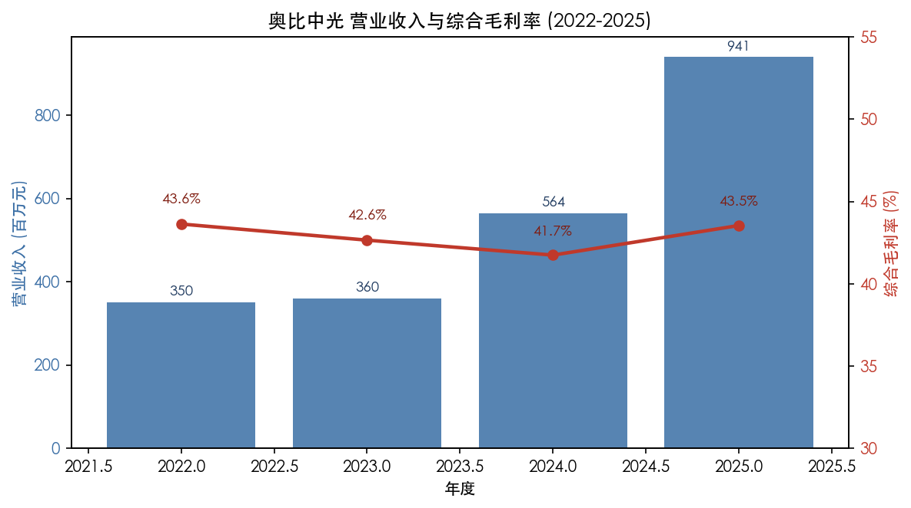
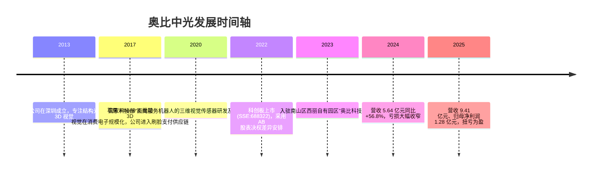
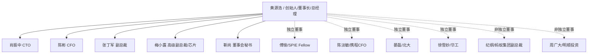
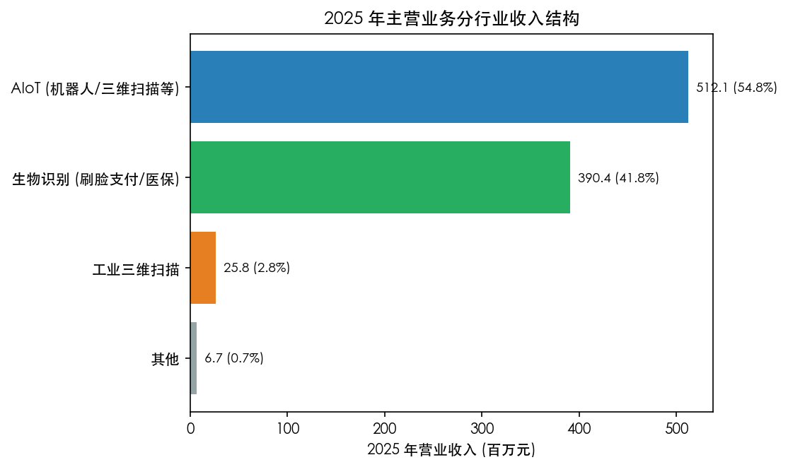
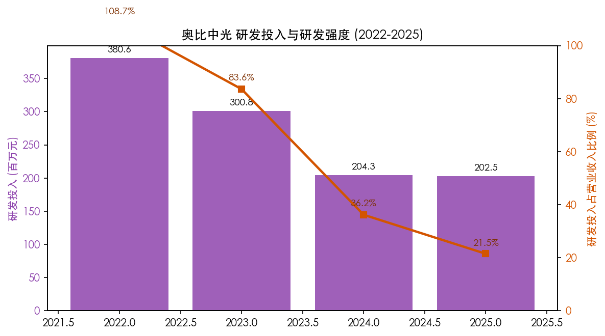
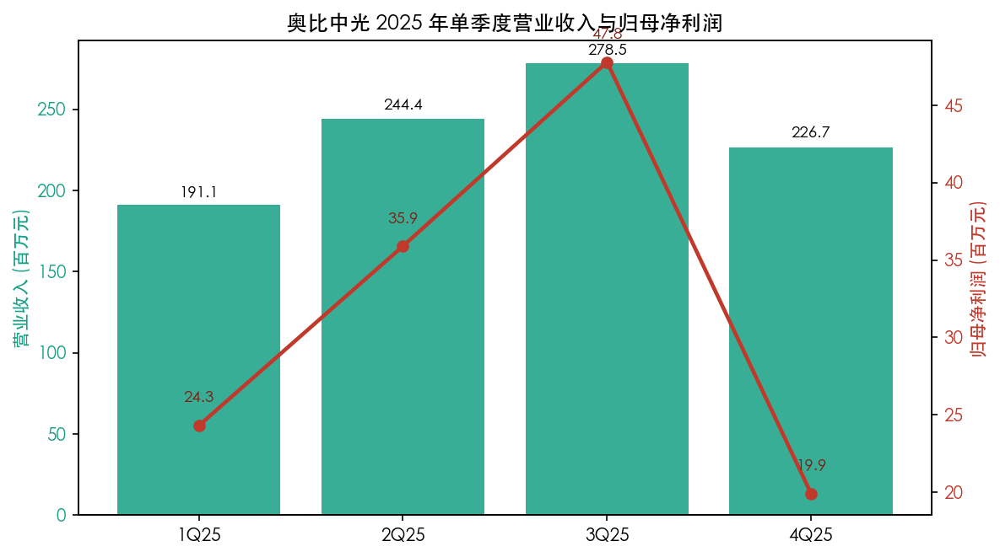
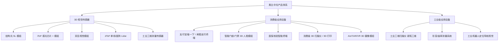
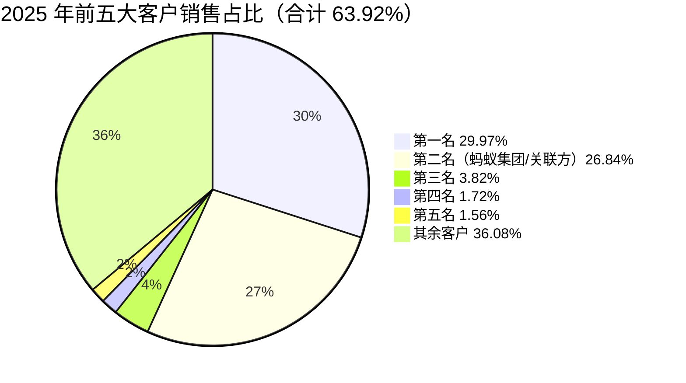
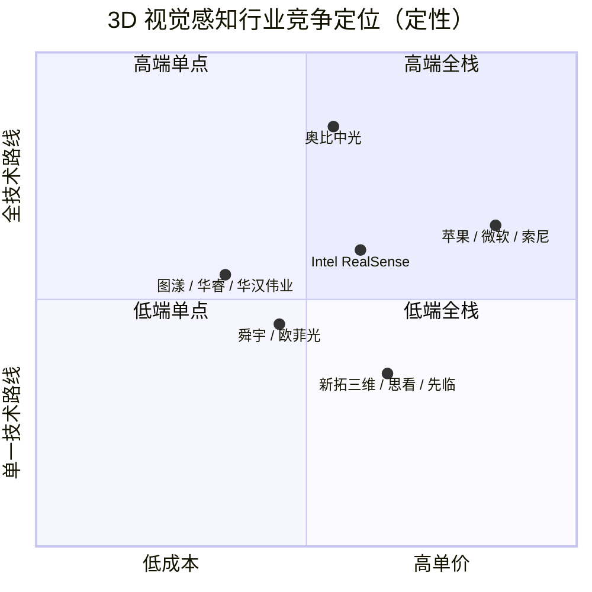

# 奥比中光科技集团股份有限公司 — 公司研究

- **股票代码：** SSE:688322（上交所科创板）
- **公司中文简称：** 奥比中光
- **外文名称：** Orbbec Inc.
- **报告日期：** 2026-05-20
- **报告语言：** 简体中文
- **报告类型：** 首次覆盖（Initiation）/ 公司深度

> 估值快照（Valuation Snapshot）说明：本次研究在受限的网络环境下编写，未能调取实时市场行情数据（东方财富等行情站均未抓取成功）。本报告所有财务、产品、客户、研发数据均来自奥比中光在巨潮资讯网披露的年度报告 / 半年度报告 / 季度报告原文，并附文献链接；市盈率、市值等市场价格数据 **未在本报告中披露**，建议读者在交易决策前自行从 Wind / Choice / 东方财富等终端补充实时多空与估值数据。本报告**不构成投资建议**。

---

## 目录

1. 公司概览
2. 公司历史
3. 管理团队
4. 产品与服务
5. 客户与上市策略
6. 行业概览
7. 竞争格局
8. 市场机会
9. 风险评估
10. 参考资料

---

## 1. 公司概览

奥比中光科技集团股份有限公司（以下简称"奥比中光"或"公司"）是一家专注于 3D 视觉感知（3D vision perception）技术研发与产业化的科创板上市公司，2013 年 1 月成立于深圳市南山区，2022 年 7 月 7 日在上海证券交易所科创板挂牌上市，股票代码 688322。公司将自身定位为"机器人之眼"以及"机器人与 AI 视觉产业中台"，核心产品为 3D 视觉传感器（3D vision sensor）、消费级应用设备和工业级应用设备三大类，覆盖结构光（structured light）、iToF / dToF（time-of-flight）、双目视觉（stereo vision）、激光雷达（Lidar）以及工业三维测量等六大主流技术路线 [2025 年年度报告, 第 13–20 页](https://static.cninfo.com.cn/finalpage/2026-04-19/1224135107.PDF)。公司主营产品被广泛应用于线下刷脸支付、智能门锁、医保核验、服务/工业/人形机器人、消费级三维扫描仪、3D 打印、AIoT、工业三维测量等场景，并是支付宝"碰一下"等大规模线下支付终端的核心 3D 视觉硬件供应商之一 [2025 年年度报告, 第 48 页](https://static.cninfo.com.cn/finalpage/2026-04-19/1224135107.PDF)。

**2025 年关键财务（人民币元）：** 营业收入 940,743,637.65，同比 +66.66%；归属于上市公司股东的净利润 127,909,973.81（2024 年为 -62,906,948.02），实现扭亏为盈；扣非归母净利润 70,882,977.04（2024 年为 -112,231,740.76）；经营活动现金流量净额 82,724,070.42（2024 年为 -86,340,242.72），首次转正；总资产 3,412,821,565.45；归母净资产 2,976,805,930.91 [2025 年年度报告, 第 9–10 页](https://static.cninfo.com.cn/finalpage/2026-04-19/1224135107.PDF)。

**业务结构（2025）：** 按行业，AIoT（机器人 / 三维扫描 / AIoT 终端等）贡献营业收入 512.14 百万元，占主营收入 54.77%，同比 +71.78%；生物识别（线下刷脸支付、医保核验、智能门锁等）390.45 百万元，占 41.76%，同比 +68.98%；工业三维扫描 25.80 百万元，占 2.76%，同比 −2.47%；其他 6.66 百万元；合计主营业务收入 935.04 百万元 [2025 年年度报告, 第 48 页](https://static.cninfo.com.cn/finalpage/2026-04-19/1224135107.PDF)。境内收入 848.32 百万元（占主营 90.7%），境外 86.72 百万元（占 9.3%）。直销贡献 897.18 百万元（占 96%），经销 37.86 百万元 [2025 年年度报告, 第 49 页](https://static.cninfo.com.cn/finalpage/2026-04-19/1224135107.PDF)。

**盈利能力与研发：** 2025 年公司主营业务综合毛利率 43.54%，较 2024 年 41.74% 提升约 1.80 个百分点；其中 AIoT 业务毛利率 56.72%（+4.78pp）、工业三维扫描 66.84%（+6.14pp）为高毛利支柱，但生物识别毛利率 24.95%（−2.66pp）相对偏低，反映线下支付硬件竞争加剧及规模化降本 [2025 年年度报告, 第 48–49 页](https://static.cninfo.com.cn/finalpage/2026-04-19/1224135107.PDF)。研发投入 202.53 百万元，占营业收入 21.53%（2024 为 36.20%、2023 为 83.56%、2022 为 108.73%），研发强度随着收入规模化而显著回落但绝对额仍保持高位；研发人员 422 名，占总员工约 47.52% [2025 年年度报告, 第 30、41 页](https://static.cninfo.com.cn/finalpage/2026-04-19/1224135107.PDF)、[2023 年年度报告, 第 36 页](https://static.cninfo.com.cn/finalpage/2024-04-08/1219787024.PDF)。

**资本结构与治理：** 公司在科创板采用表决权差异安排（AB 股 / dual-class）：A 类股东每股 5 票，B 类股东每股 1 票。截至 2025 年末，创始人黄源浩持有 108,903,960 股（27.15% 股权），其中 82,467,848 股为 A 类特别表决权股份，对应 56.56% 表决权；其他股东与公司回购专户合计持股 72.85%，但对应表决权仅 43.44%。公司在 2025 年度通过特别表决权股份转换的方式将黄先生特别表决权比例上限主动控制在不超过 56.62% [2025 年年度报告, 第 64–65 页](https://static.cninfo.com.cn/finalpage/2026-04-19/1224135107.PDF)。前十大流通股东中出现"易方达国证机器人产业 ETF""华夏中证机器人 ETF""中证 500 ETF"以及香港中央结算等机构席位，显示公司已被多只机器人 / 具身智能主题指数纳入 [2025 年年度报告, 第 132–133 页](https://static.cninfo.com.cn/finalpage/2026-04-19/1224135107.PDF)。

来源：[奥比中光 2023 年年度报告, 第 9、48 页](https://static.cninfo.com.cn/finalpage/2024-04-08/1219787024.PDF) 与 [奥比中光 2025 年年度报告, 第 9、48 页](https://static.cninfo.com.cn/finalpage/2026-04-19/1224135107.PDF)。2022 年综合毛利率系根据 2023 年报"较上年下降 0.98 个百分点"语句反推（est.）。

**估值快照（Valuation snapshot）：** 本研究未取得实时市场数据。从公司近三年财务数据看，2025 年公司基本每股收益 0.32 元（2024 年 -0.16 元，2023 年 -0.69 元），加权平均净资产收益率 4.37%（2024 为 -2.14%）[2025 年年度报告, 第 10 页](https://static.cninfo.com.cn/finalpage/2026-04-19/1224135107.PDF)。考虑到公司刚刚扭亏，TTM 利润基数偏低且大量收益由公允价值变动、政府补助、理财收益等非经常性损益贡献（2025 非经常性损益合计 57.03 百万元，占归母净利润的 44.6%），按当前盈利结构推算市盈率倾向于偏高；按 9.41 亿元营收 + 机器人 / 具身智能主题溢价测算，市销率（P/S）估计落在科创板上游科技股区间。**估值的关键变量是：(i) 扣非归母净利润能否延续高速增长；(ii) 人形机器人 3D 视觉单价 × 装机量两条曲线是否兑现。**

---

## 2. 公司历史

奥比中光成立于 2013 年 1 月 18 日，最初注册地址在深圳市南山区高新南环路 29 号留学生创业大厦 15 楼，其后多次迁址，2023 年 10 月起入驻深圳南山区西丽街道松坪山高新北一道 88 号"奥比科技大厦"自有园区作为总部办公地 [2025 年年度报告, 第 8 页](https://static.cninfo.com.cn/finalpage/2026-04-19/1224135107.PDF)。创始人黄源浩先生出生于 1980 年，本科毕业于北京大学，硕士毕业于新加坡国立大学，博士毕业于香港城市大学，并先后在香港理工大学、加拿大瑞尔森大学（Toronto Metropolitan University 前身）、香港中文大学、麻省理工学院 SMART 中心完成博士后研究，师从光学测量学者 Michael Y. Y. Hung 教授、法国国家技术科学院院士吕坚、麻省理工学院 George Barbastathis 教授等 [2025 年年度报告, 第 69 页](https://static.cninfo.com.cn/finalpage/2026-04-19/1224135107.PDF)。公司围绕"光学测量基因"组建了由芯片、算法、光学、软件、机电设计等多学科背景研究人员构成的研发团队，截至 2025 年末博士 23 人（含 8 名博士后），获国家级、省级和市级人才计划奖项，先后承担科技部国家重点研发计划"面向服务机器人的三维视觉传感器研发及产业化应用"等国家级、省级重大科研项目 [2025 年年度报告, 第 29–30 页](https://static.cninfo.com.cn/finalpage/2026-04-19/1224135107.PDF)。

公司的发展可大致分为四个阶段：

1. **创立与技术原型期（2013–2015）：** 公司在结构光 3D 视觉模组方面率先突破，是国内最早实现 3D 视觉感知方案产业化的少数企业之一。该阶段公司主要服务于科研、行业试点客户。
2. **消费电子规模化期（2016–2019）：** 借助苹果 2017 年 iPhone X 引入 3D 结构光 Face ID 引发的产业链需求，奥比中光顺势进入消费电子 OEM/ODM 3D 模组市场，并切入刷脸支付硬件供应链。公司在该阶段取得了支付宝、微信支付等"刷脸支付"商业化部署中的关键 3D 视觉模组供应商地位 [2025 年年度报告, 第 15–17 页](https://static.cninfo.com.cn/finalpage/2026-04-19/1224135107.PDF)。
3. **科创板上市与高研发投入期（2020–2023）：** 公司于 2022 年 7 月 7 日在上交所科创板挂牌，股票代码 688322，由中国国际金融股份有限公司担任保荐机构 [2025 年年度报告, 第 9 页](https://static.cninfo.com.cn/finalpage/2026-04-19/1224135107.PDF)。上市当年因疫情、消费电子周期下行和持续高研发投入，公司处于亏损状态：2021 年营业收入 4.74 亿元（同比基数），2022 年回落至 3.50 亿元，2023 年小幅回升至 3.60 亿元，研发投入分别为 3.81 亿元（2022）和 3.01 亿元（2023），研发占营收比例高达 108.73% 和 83.56% [2023 年年度报告, 第 9、36 页](https://static.cninfo.com.cn/finalpage/2024-04-08/1219787024.PDF)。
4. **AI / 机器人爆发与盈利兑现期（2024–2025）：** 2024 年公司营业收入 5.64 亿元，同比 +56.79%（按 2023 年 3.60 亿基数计算），归母净利润 -0.63 亿元、亏损大幅收窄；2025 年营业收入跃升至 9.41 亿元，同比 +66.66%，归母净利润转正至 1.28 亿元，经营性现金流首度由负转正至 0.83 亿元，公司主营 3D 视觉感知业务在三维扫描（消费级 3D 扫描仪 / 3D 打印 / AI 建模）、支付宝"碰一下"NFC 终端 3D 视觉模组、机器人（服务、工业、人形）三条曲线齐发动力下进入规模盈利阶段 [2025 年年度报告, 第 9、48 页](https://static.cninfo.com.cn/finalpage/2026-04-19/1224135107.PDF)。报告期内公司董事会还通过两次现金回购方案，以集中竞价方式累计回购股份 742,629 股、支付 4,804.37 万元，并完成股本结构调整 [2025 年年度报告, 第 2、65 页](https://static.cninfo.com.cn/finalpage/2026-04-19/1224135107.PDF)。

---

## 3. 管理团队

公司核心管理层与核心技术人员均围绕创始人黄源浩搭建，呈现典型的"创始人 + 学术伙伴 + 资本平台董事"的科创板硬科技公司结构。

### 3.1 创始人 / 董事长 / 总经理：黄源浩

黄源浩，1980 年出生，中国国籍，香港永久居留权；北京大学学士，新加坡国立大学硕士，香港城市大学博士；先后在香港理工大学、加拿大瑞尔森大学、香港中文大学及麻省理工学院 SMART 中心从事博士后研究，师从光学测量泰斗 Michael Y.Y. Hung 教授、法国国家技术科学院院士吕坚、麻省理工学院 George Barbastathis 教授等 [2025 年年度报告, 第 69 页](https://static.cninfo.com.cn/finalpage/2026-04-19/1224135107.PDF)。其学术背景集中在干涉测量（interferometry）、数字光学测量与结构光，是国内 3D 视觉感知技术领域少数兼具底层光学测量学术训练和产业化经验的领军人才。

黄源浩担任广东省"珠江团队"带头人，作为负责人主持国家级、省级及市级科研项目 10 项，参与出版专著两部，在 Optics Letters 等期刊发表论文 20 余篇；作为主要技术发明人累计申请专利 370 件、授权 203 件 [2025 年年度报告, 第 69 页](https://static.cninfo.com.cn/finalpage/2026-04-19/1224135107.PDF)。在治理层面，他兼任公司董事长、总经理和核心技术人员，公司在 2025 年年报中专门解释这种"董事长 + 总经理"安排的合理性，认为有助于减少决策层级、把握"3D 视觉感知行业规模商业化机遇" [2025 年年度报告, 第 63 页](https://static.cninfo.com.cn/finalpage/2026-04-19/1224135107.PDF)。

**控制权与利益绑定：** 黄源浩持有 108,903,960 股 = 27.15% 股权 / 60.18% 表决权（截至 2025 年报披露口径），属于"创始人深度绑定型"治理结构 [2025 年年度报告, 第 65 页](https://static.cninfo.com.cn/finalpage/2026-04-19/1224135107.PDF)。同时其担任执行事务合伙人的奥比中芯、奥比中瑞合计直接 / 间接持有公司 22.41 + 3.47 + 数家"奥比中欣/中诚/中泰"等员工持股 / 合伙基金平台股份（详见"奥比"系合伙企业 [2025 年年度报告, 第 5 页](https://static.cninfo.com.cn/finalpage/2026-04-19/1224135107.PDF)），公司在 2025 年报告期内特别表决权股份比例上限主动维持在不高于 56.62% [2025 年年度报告, 第 65 页](https://static.cninfo.com.cn/finalpage/2026-04-19/1224135107.PDF)。2025 年度税前薪酬 113.36 万元，相对头部科创板 CEO 属偏低水平，绝大部分激励来自股权 [2025 年年度报告, 第 68 页](https://static.cninfo.com.cn/finalpage/2026-04-19/1224135107.PDF)。

**评价：** 黄源浩具有清晰的"光学测量学者—结构光产业化—平台型 3D 视觉公司"成长轨迹，在过去三年公司从结构性亏损走向单年扭亏为盈的过程中，关键决策包括：(i) 把研发强度从 2022 年的 108.73% 主动压降到 2025 年的 21.53%；(ii) 把产品布局从单一结构光向 iToF/dToF/Lidar/工业三维测量横向铺开；(iii) 抓住支付宝"碰一下"和机器人主题资本市场窗口。整体上，他是公司单一最重要的长期变量。

### 3.2 首席技术官 / 联合创始人：肖振中

肖振中，1980 年出生，西安交通大学学士、硕士和博士，研究方向机器视觉与数字图像处理，曾在新加坡南洋理工大学博士后及西安交通大学讲师 [2025 年年度报告, 第 69 页](https://static.cninfo.com.cn/finalpage/2026-04-19/1224135107.PDF)。现任公司董事、首席技术官、核心技术人员，累计申请专利 342 件、授权 192 件；持股 9,603,000 股（约 2.39%），2025 年税前薪酬 98.72 万元。其与黄源浩共同构成公司技术决策"双核"。

### 3.3 首席财务官：陈彬

陈彬，1984 年出生，江西财经大学会计本科 + 北京大学在职研究生学历，会计师背景；早期任天健华证中洲、中天运、中汇会计师事务所深圳分所审计经理，平安信托内审、广东弘德投资管理投资总监 [2025 年年度报告, 第 69 页](https://static.cninfo.com.cn/finalpage/2026-04-19/1224135107.PDF)。现任公司董事、首席财务官，主管会计工作；2025 年税前薪酬 127.36 万元；持股 2.4 万股（来自股权激励归属）。**评价：** 审计师 + 私募投资双重背景，对资本运作、估值、合规披露较熟悉；公司 2022 年完成科创板 IPO 募资到位、2025 年完成股份回购并启动向特定对象发行 A 股股票项目，CFO 在此过程中起关键作用 [2025 年年度报告, 第 9、131 页](https://static.cninfo.com.cn/finalpage/2026-04-19/1224135107.PDF)。

### 3.4 重要外部董事：纪纲

纪纲，1974 年出生，对外经济贸易大学学士；曾任毕马威华振审计师、上海联创投资管理投资经理、艾捷尔投资顾问副总裁、阿里巴巴集团副总裁；现任蚂蚁科技集团股份有限公司副总裁、战略投资及企业发展部负责人，奥比中光董事 [2025 年年度报告, 第 69 页](https://static.cninfo.com.cn/finalpage/2026-04-19/1224135107.PDF)。蚂蚁集团旗下"上海云鑫创业投资有限公司"持有 36,822,120 股（9.18%），为公司第二大股东 [2025 年年度报告, 第 132 页](https://static.cninfo.com.cn/finalpage/2026-04-19/1224135107.PDF)。这一股权 + 董事会绑定关系是公司能持续承接支付宝"刷脸支付"和后续"碰一下"线下硬件业务的核心战略基础，但同时也构成显著的关联交易和客户集中风险（详见第 5、9 节）。

### 3.5 独立董事与其他核心管理层

- **傅愉（Fu Yu）独立董事：** 新加坡国籍，上海交大本科、新加坡国立大学博士、德国洪堡学者、SPIE Fellow，南洋理工大学淡马锡实验室长聘 A 类高级研究员（2009–2018），现任深圳大学全职特聘教授 [2025 年年度报告, 第 69–70 页](https://static.cninfo.com.cn/finalpage/2026-04-19/1224135107.PDF)。光学测量背景与公司技术路线高度匹配。
- **陈淡敏独立董事：** 上海交大本科、中欧 MBA、CPA、PMP，曾任安永华明高级审计师、携程财务报告经理 / 总监 / 财务副总裁；目前任携程集团财务副总裁 [2025 年年度报告, 第 70 页](https://static.cninfo.com.cn/finalpage/2026-04-19/1224135107.PDF)。提供财务治理与互联网公司视角。
- **晏磊独立董事：** 1956 年出生，北京大学教授、博士生导师，遥感与测绘领域学者 [2025 年年度报告, 第 70 页](https://static.cninfo.com.cn/finalpage/2026-04-19/1224135107.PDF)。
- **徐雪妙独立董事：** 香港中文大学博士，香港科技大学博士后，现任华南理工大学计算机学院教授兼副院长 [2025 年年度报告, 第 70 页](https://static.cninfo.com.cn/finalpage/2026-04-19/1224135107.PDF)。
- **梅小露 高级副总裁 / 核心技术人员：** 北京大学学士、中科院计算所硕士，AMD 上海研发中心、IBM 中国研究院、杰尔系统等芯片领域工作经历，2018 年获"全国十佳新锐领军程序员"；负责公司深度引擎芯片和 iToF 感光芯片自研 [2025 年年度报告, 第 70 页](https://static.cninfo.com.cn/finalpage/2026-04-19/1224135107.PDF)。
- **靳尚 董事会秘书：** 1987 年出生，硕士研究生学历，曾任深圳市宝鹰建设证券事务代表，2023 年起任公司董秘 [2025 年年度报告, 第 70 页](https://static.cninfo.com.cn/finalpage/2026-04-19/1224135107.PDF)。

### 3.6 管理团队总体评价（Track-record synthesis）

公司管理层是典型的"学术型创始人 + 资本平台董事 + 多元独立董事"组合，优势在于：(i) 创始人对 3D 视觉感知技术全栈具有较深理解，控制权稳固；(ii) 蚂蚁集团董事席位 + 大股东席位让公司在线下生物识别支付市场获得 "first call" 卡位；(iii) 多位光学测量、芯片、互联网财务背景的独立董事让治理结构相对均衡。主要不足：(i) 创始人兼任董事长和总经理，治理上对单点人事风险较高；(ii) 多数核心技术 / 管理层薪酬不高、长期激励仍主要靠 2022 年限制性股票激励计划归属节奏，员工持股稀释和年度归属需要在未来 2–3 年密切跟踪。

---

## 4. 产品与服务

奥比中光产品体系遵循"上游模组—中游方案商—下游应用"三层结构，可分为 (A) 3D 视觉传感器（核心），(B) 消费级应用设备，(C) 工业级应用设备三大产品线，加上专用芯片、算法及解决方案 [2025 年年度报告, 第 13、49 页](https://static.cninfo.com.cn/finalpage/2026-04-19/1224135107.PDF)。

### 4.1 3D 视觉传感器（产品线 A）

3D 视觉传感器是公司基础技术单元，由 (1) 深度引擎芯片、(2) 深度引擎算法、(3) 通用或专用感光芯片、(4) 专用光学系统、(5) 驱动及固件等组成，可采集并输出"人体、物体和空间"的三维信息 [2025 年年度报告, 第 13 页](https://static.cninfo.com.cn/finalpage/2026-04-19/1224135107.PDF)。

按技术路线公司全面布局六大主流路线：**结构光（structured light）**、**iToF（indirect time-of-flight）**、**双目视觉（stereo vision）**、**dToF（direct time-of-flight）单线 / 面阵激光雷达（Lidar）**、**面阵 dToF**、**工业三维测量** [2025 年年度报告, 第 32–33 页](https://static.cninfo.com.cn/finalpage/2026-04-19/1224135107.PDF)。这一全路线布局让公司能针对不同应用在精度（mm 级 vs. μm 级）、量程（数十厘米 vs. 数十米）、功耗（手机/门锁/机器人）和成本之间提供差异化方案。

2025 年公司 3D 视觉传感器收入 290.93 百万元，同比 +36.79%，毛利率 54.43%，较 2024 年 +10.23 个百分点（结构性向更高价值的高分辨率工业 / 机器人传感器迁移）[2025 年年度报告, 第 49 页](https://static.cninfo.com.cn/finalpage/2026-04-19/1224135107.PDF)。2025 年传感器产量 91.03 万台、销量 88.35 万台，库存 21.74 万台 [2025 年年度报告, 第 49 页](https://static.cninfo.com.cn/finalpage/2026-04-19/1224135107.PDF)。

**专用自研芯片：** 公司采用 Fabless 模式，自研深度引擎芯片和 iToF 感光芯片，由专业代工厂生产；同时与上游光学元件供应商（激光发射器、衍射光学元件等）签订定制化采购协议；结构件、PCB 板等通用 BOM 由公司提供技术图纸、定点供应商生产 [2025 年年度报告, 第 14 页](https://static.cninfo.com.cn/finalpage/2026-04-19/1224135107.PDF)。

**研发奖项：** "面向 3D 视觉感知的结构光深度计算引擎芯片"获深圳市技术发明二等奖；"高性能 iToF 图像传感器芯片及 3D 视觉传感器研发及应用"获 2024 年度第四届深圳人工智能奖；"微型 3D 智能传感器关键技术及其应用"获 2020 年度第十届吴文俊人工智能科技进步奖等 [2025 年年度报告, 第 29 页](https://static.cninfo.com.cn/finalpage/2026-04-19/1224135107.PDF)。

### 4.2 消费级应用设备（产品线 B，2025 增长主引擎）

消费级应用设备基于 3D 视觉传感器，针对特定消费级场景做整机/一体化产品开发，主要细分为 (i) 线下刷脸支付终端、(ii) 智能门锁 / 门禁的 3D 人脸识别模组、(iii) 医保核验智能终端、(iv) 消费级 3D 扫描仪 / 3D 打印配套设备、(v) AIoT / AR/VR 头显类的 3D 摄像模组 [2025 年年度报告, 第 13、16–17 页](https://static.cninfo.com.cn/finalpage/2026-04-19/1224135107.PDF)。

2025 年消费级应用设备收入 583.73 百万元（占主营 62.4%），同比 +97.29%，是公司当年增长的最大贡献；毛利率 37.81%，较 2024 年 −1.01 pp，毛利率轻微下行反映了规模化降本和价格竞争平衡 [2025 年年度报告, 第 49 页](https://static.cninfo.com.cn/finalpage/2026-04-19/1224135107.PDF)。设备产量 131.50 万台，同比 +331.30%；销量 128.50 万台，同比 +331.05%；库存 4.67 万台 [2025 年年度报告, 第 49 页](https://static.cninfo.com.cn/finalpage/2026-04-19/1224135107.PDF)。年报披露：消费级应用设备的爆发主要来自"三维扫描业务和支付宝'碰一下'设备销售收入增长" [2025 年年度报告, 第 49–50 页](https://static.cninfo.com.cn/finalpage/2026-04-19/1224135107.PDF)。

### 4.3 工业级应用设备（产品线 C，高毛利但小体量）

工业级应用设备面向工业领域高精密检测、测量需求，应用工业三维测量技术开发一体化成套设备，主要包含 (i) 工业三维扫描仪、(ii) 高精度三维形变测量系统、(iii) 弯管角度测量分析仪 / 工业机器人定位导航视觉模组 [2025 年年度报告, 第 13、19 页](https://static.cninfo.com.cn/finalpage/2026-04-19/1224135107.PDF)。该产品线主要由 2022 年公司收购的"新拓三维（深圳/西安）"和"深圳奥日升"等子公司承接，定位是替代德国 GOM（ATOS / ARAMIS 系列）、瑞典海克斯康（HEXAGON PrimeScan）、美国 CSI（VIC-3D）等进口高端工业三维测量设备 [2025 年年度报告, 第 14–15 页](https://static.cninfo.com.cn/finalpage/2026-04-19/1224135107.PDF)。

2025 年工业级应用设备收入 25.54 百万元，同比 −2.05%；毛利率 66.79%（+6.29pp）；销量 96 套 [2025 年年度报告, 第 49 页](https://static.cninfo.com.cn/finalpage/2026-04-19/1224135107.PDF)。该业务规模仍小，但 66% 毛利率是公司毛利结构压舱石。

### 4.4 业务结构与图表

来源：[奥比中光 2025 年年度报告, 第 48 页](https://static.cninfo.com.cn/finalpage/2026-04-19/1224135107.PDF)。

来源：[奥比中光 2023 年年度报告, 第 36 页](https://static.cninfo.com.cn/finalpage/2024-04-08/1219787024.PDF) 与 [2025 年年度报告, 第 41 页](https://static.cninfo.com.cn/finalpage/2026-04-19/1224135107.PDF)。

来源：[奥比中光 2025 年年度报告, 第 10–11 页](https://static.cninfo.com.cn/finalpage/2026-04-19/1224135107.PDF)。

### 4.5 知识产权

截至 2025 年 12 月 31 日，公司累计申请专利 1,967 项（其中发明专利 1,000 项），累计获得授权专利 1,192 项（其中发明专利 528 项），累计申请软件著作权 121 项 [2025 年年度报告, 第 41 页](https://static.cninfo.com.cn/finalpage/2026-04-19/1224135107.PDF)。专利集中在结构光深度计算、iToF 感光芯片、面阵 Lidar、光学衍射、模组标定与对齐、噪声抑制等 3D 视觉感知核心环节。

---

## 5. 客户与上市策略

### 5.1 客户集中度

按 2025 年报披露，公司前五名客户销售额合计 60,134.94 万元，占年度销售总额的 **63.92%**；其中前五名客户中关联方销售额 25,252.53 万元，占年度销售总额的 **26.84%** [2025 年年度报告, 第 51–52 页](https://static.cninfo.com.cn/finalpage/2026-04-19/1224135107.PDF)。

| 客户 | 销售额（万元） | 占年度销售总额 | 是否关联方 |
|---|---:|---:|:---:|
| 第一名 | 28,197.03 | 29.97% | 否 |
| 第二名 | 25,252.53 | 26.84% | **是** |
| 第三名 | 3,593.07 | 3.82% | 否 |
| 第四名 | 1,622.07 | 1.72% | 否 |
| 第五名 | 1,470.24 | 1.56% | 否 |
| **合计** | **60,134.94** | **63.92%** | — |

来源：[2025 年年度报告, 第 52 页](https://static.cninfo.com.cn/finalpage/2026-04-19/1224135107.PDF)。

**关联方客户的身份：** 年报未直接点名第二大客户，但结合 (i) 蚂蚁科技集团旗下上海云鑫创业投资有限公司为公司第二大股东 9.18% 股权 [2025 年年度报告, 第 132 页](https://static.cninfo.com.cn/finalpage/2026-04-19/1224135107.PDF)，(ii) 蚂蚁集团副总裁纪纲在公司董事会任非独立董事 [2025 年年度报告, 第 69 页](https://static.cninfo.com.cn/finalpage/2026-04-19/1224135107.PDF)，(iii) 2025 年消费级设备爆发主要驱动力为"支付宝'碰一下'设备" [2025 年年度报告, 第 48 页](https://static.cninfo.com.cn/finalpage/2026-04-19/1224135107.PDF)，**高度可推断（est., 基于上述关联结构）公司第二大客户为蚂蚁集团 / 支付宝体系**。第一大客户身份则未在公开年报中点名，公司亦未单独披露。

按客户集中度公司研究 SKILL 中的标准（top-1 > 20% 或 top-5 > 50% 即视为重大风险），奥比中光 top-1 29.97%、top-5 63.92%，**两项均显著超阈值**，应作为重要风险因素纳入第 9 节。但需要注意，2024 年公司前五名客户合计销售额占比类似处于高位，且公司主营增长曲线本身就来自于这种"少数行业龙头—大批量定制"的供应链关系，这是 3D 视觉感知行业 OEM/ODM 业务模式的常态而非异常。

### 5.2 销售模式与海外业务

公司以直销为主：2025 年直销贡献 897.18 百万元（占主营 95.95%），经销 37.86 百万元（4.05%）；经销同比 +130.96%，主要来自三维扫描业务的渠道铺货 [2025 年年度报告, 第 49 页](https://static.cninfo.com.cn/finalpage/2026-04-19/1224135107.PDF)。海外销售 86.72 百万元（占主营 9.27%），同比 +43.91%，覆盖通过美国奥比（ORBBEC 3D TECHNOLOGY INTERNATIONAL, INC.）、香港奥比（ORBBEC INTERNATIONAL LIMITED）、新加坡奥比（ORBBEC SINGAPORE PTE. LTD.）三家境外主体执行 [2025 年年度报告, 第 5、49 页](https://static.cninfo.com.cn/finalpage/2026-04-19/1224135107.PDF)。海外营收占比相对较低，公司未在年报中单独披露细分国别（disclosure not found）。

### 5.3 供应商集中度

2025 年前五大供应商合计采购额 9,981.11 万元，占年度采购总额 **19.89%**，关联方供应商占比 0% [2025 年年度报告, 第 52 页](https://static.cninfo.com.cn/finalpage/2026-04-19/1224135107.PDF)。单家供应商最高占比 4.48%，供应链分散度健康。但年报亦提示：(i) 深度引擎芯片采用 Fabless 委托代工，专用感光芯片自研后由专业代工厂生产；(ii) 光学组件（激光发射器、衍射光学元件）依赖少数定制化供应商，是潜在的产能 / 单点风险 [2025 年年度报告, 第 14 页](https://static.cninfo.com.cn/finalpage/2026-04-19/1224135107.PDF)。

### 5.4 上市与融资结构

公司 2022 年 7 月 7 日科创板 IPO 上市，保荐人为中国国际金融股份有限公司。2025 年报告期内，公司启动 **2025 年度向特定对象发行 A 股股票项目**，中金公司继续担任持续督导机构，2025 年 12 月 31 日 IPO 持续督导期满后转入定增项目督导期，期限延续至发行完成后两个完整会计年度届满之日 [2025 年年度报告, 第 9 页](https://static.cninfo.com.cn/finalpage/2026-04-19/1224135107.PDF)。该次定增的具体规模 / 用途 / 进度年报未做完整披露，需关注 2026 年公司后续公告（reader should monitor follow-up disclosures）。

---

## 6. 行业概览

### 6.1 行业定义与监管分类

按《中国上市公司协会上市公司行业统计分类指引》，奥比中光所属行业为"制造业"中的"计算机、通信和其他电子设备制造业"，行业代码 C39 [2025 年年度报告, 第 13 页](https://static.cninfo.com.cn/finalpage/2026-04-19/1224135107.PDF)。具体细分领域为 **3D 视觉感知（3D vision perception）**，是人工智能（AI）与物联网（IoT）的关键基础共性技术之一，覆盖结构光、ToF（iToF + dToF）、双目视觉、激光雷达（Lidar）、工业三维测量等技术路线。

### 6.2 行业市场规模与增长

公司援引法国市场研究与战略咨询公司 **Yole Intelligence** 的报告：全球 3D 视觉感知市场规模预计到 2028 年将达到 **172 亿美元** [2025 年年度报告, 第 13、15 页](https://static.cninfo.com.cn/finalpage/2026-04-19/1224135107.PDF)。该数据由公司年报转引，原始报告 vintage 与 CAGR 拆解未在年报中披露（primary source not directly accessed in this report）；公开渠道一般引用 Yole 2023/2024 年报告中"3D vision and sensing"全球市场约百亿美元量级、CAGR 高个位数到双位数。

### 6.3 行业发展阶段

公司在年报"管理层讨论与分析"章节将 3D 视觉感知行业的发展划分为三阶段 [2025 年年度报告, 第 14–18 页](https://static.cninfo.com.cn/finalpage/2026-04-19/1224135107.PDF)：

1. **起步阶段：** 3D 视觉感知技术最早应用于工业领域高精度三维测量（μm 级别），代表产品为德国 GOM 的 ATOS / ARAMIS、瑞典海克斯康 PrimeScan、美国 CSI VIC-3D 等。早期工业三维测量设备成本高、体积大、功耗高，普及缓慢。
2. **初级发展阶段：** 2017 年苹果发布 iPhone X 搭载前置 3D 结构光，引爆消费电子 3D 视觉规模化应用。3D 视觉感知技术开始向生物识别（刷脸支付）、AIoT、消费电子、工业三维测量、汽车自动驾驶等领域横向拓展。
3. **快速增长阶段：** 2018 年以来，刷脸支付规模化（支付宝 / 微信）、智能门锁渗透、华为 / 魅族手机搭载 iToF 后置传感器、苹果 iPad Pro / iPhone 12 Pro 搭载 dToF Lidar、Waymo 无人驾驶规模化、特斯拉纯视觉 FSD 持续迭代，与此同时机器人（服务、工业、人形）对 3D 视觉的旺盛需求让行业进入"规模快速增长的爆发前期"。

### 6.4 行业关键驱动力

公司年报将 3D 视觉感知行业的关键驱动力归纳为五大下游应用 [2025 年年度报告, 第 16–19 页](https://static.cninfo.com.cn/finalpage/2026-04-19/1224135107.PDF)：

1. **生物识别（刷脸支付 / 智能门锁 / 医保核验）：** 3D 结构光相对 2D 摄像头能精准识别活体，规避替刷盗刷，是支付宝、微信"刷脸支付"和医保电子凭证核验的硬件基础。
2. **三维扫描（3D 打印 / AI 建模 / 数字孪生）：** 消费级 3D 扫描仪价格已下探到千元级别，叠加 AI 大模型 + 多模态生成式 AI 推动 3D 数据需求，2025 年三维扫描成为"推动各行业数字化、智能化转型的关键引擎"。
3. **机器人（服务、工业、人形）：** 公司年报援引工信部 2023 年 11 月 **《人形机器人创新发展指导意见》**："到 2025 年人形机器人创新体系初步建立"、"到 2027 年综合实力达到世界先进水平"；2025 年具身智能首次写入政府工作报告，"十五五"规划建议把具身智能列为新增长点。深圳市 2025 年 3 月发布 **《深圳市具身智能机器人技术创新与产业发展行动计划（2025–2027 年）》**，目标到 2027 年机器人关联产业规模 ≥ 1,000 亿元 [2025 年年度报告, 第 17–18 页](https://static.cninfo.com.cn/finalpage/2026-04-19/1224135107.PDF)。
4. **工业三维测量：** 替代欧美进口（GOM / 海克斯康 / CSI）的国产化进程；新拓三维等国产品牌通过性价比 + 算法优势逐步切入汽车工业、航空航天、数码家电、医学等领域。
5. **AR/VR / 元宇宙 / 自动驾驶（潜在增长）：** 苹果 Vision Pro 等头显设备和汽车 Lidar 进一步打开 3D 视觉硬件需求。

### 6.5 技术壁垒（公司视角的"行业门槛"）

- **全栈式技术研发能力**：芯片设计（深度引擎 / iToF 感光）+ 光学系统设计（激光发射器 / 衍射光学元件 / 镜头）+ 算法（结构光相位计算 / ToF 去噪 / 双目立体匹配）+ 软件 + 量产工艺，缺一不可 [2025 年年度报告, 第 19 页](https://static.cninfo.com.cn/finalpage/2026-04-19/1224135107.PDF)；
- **全领域技术路线布局**：结构光、iToF、双目、dToF、Lidar、工业三维测量六大路线协同布局；
- **百万级量产能力**：公司自述 "目前全球已掌握核心技术并实现百万级面阵 3D 视觉传感器量产的企业仅有苹果、微软、索尼、Realsense（英特尔）、华为、三星和奥比中光等少数企业" [2025 年年度报告, 第 20 页](https://static.cninfo.com.cn/finalpage/2026-04-19/1224135107.PDF)。

### 6.6 政策环境

公司在年报中引述多项国家与地方政策作为行业利好：(i) **《关于深入实施"人工智能+"行动的意见》**、(ii) **《关于推动未来产业创新发展的实施意见》**、(iii) **《新一代人工智能发展规划》**、(iv) **《智能传感器产业三年行动指南（2017–2019 年）》**、(v) **《"十四五"规划和 2035 年远景目标纲要》**、(vi) 工信部 **《人形机器人创新发展指导意见》（2023-11）**、(vii) 广东省 / 深圳市《推动智能机器人战略性新兴产业集群高质量发展的行动计划》等 [2025 年年度报告, 第 13、17–18 页](https://static.cninfo.com.cn/finalpage/2026-04-19/1224135107.PDF)。

---

## 7. 竞争格局

### 7.1 公司自述的全球竞争者

公司在 2025 年报中明确点名全球范围内"已掌握核心技术并实现百万级面阵 3D 视觉传感器量产"的企业为 **苹果（Apple）、微软（Microsoft）、索尼（Sony）、Intel RealSense、华为（Huawei）、三星（Samsung）以及奥比中光**七家 [2025 年年度报告, 第 20 页](https://static.cninfo.com.cn/finalpage/2026-04-19/1224135107.PDF)。这是公司对自身行业地位的公开自述，其语义上把奥比中光放在全球第一梯队 7 家头部企业之一的位置。

但从应用层面，竞争格局应分场景：

- **消费电子 OEM 3D 模组（手机前置 Face ID / dToF Lidar）：** Apple（自研 + 委外，主要供应链含 Lumentum、II-VI 等）、Sony（iToF 感光芯片）、Samsung、Intel RealSense；奥比中光在该场景定位于 Android / 国产消费电子配套及刷脸支付外设市场。
- **线下生物识别 / 刷脸支付：** 国内主要供应商为奥比中光、舜宇光学（HKEX:2382）、欧菲光（SZSE:002456）、舜宇光学旗下子公司、华捷艾米、的卢深视等。奥比中光凭借蚂蚁集团股权关系与多年支付宝 / 微信刷脸供应链经验形成 first-call 卡位。
- **机器人 3D 视觉：** Intel RealSense（D435i / D455 系列）仍是全球扫地机 / 工业 / 服务机器人 + 实验室开发首选；其次为图漾科技（私有）、海康机器人（海康威视 SZSE:002415 子公司）、迈尔微视、知微传感、华汉伟业、华睿科技、舜宇光学等；具身智能 / 人形机器人新生赛道方面，宇树科技、智元、星动纪元、Figure、1X 等头部机器人公司多采用多家 3D 视觉硬件搭配方案，奥比中光是国内主流供应商之一。
- **工业三维测量：** 国际进口品牌（GOM / Hexagon / CSI / Keyence / Faro / 海克斯康）占据高端；国产替代阵营包括奥比中光旗下"新拓三维"、思看科技（SSE:688583）、海伯森技术、先临三维（SSE:688536）、积木易搭等。

### 7.2 竞争优势

公司年报总结四大核心竞争力 [2025 年年度报告, 第 28–30 页](https://static.cninfo.com.cn/finalpage/2026-04-19/1224135107.PDF)：

1. **技术优势 — 全栈式 + 全领域：** 公司在产业链上中下游各环节均具备能力，且六大技术路线均有产品落地，能够横向迁移技术 know-how。
2. **人才优势：** 创始人 + 学术伙伴双 CTO 的"光学测量基因"+ 422 名研发人员（占总员工 47.52%）+ 23 名博士（含 8 名博士后）。
3. **产业链优势：** 与头部下游客户深度绑定，"在部分细分行业逐步成为行业龙头客户的标配产品；一旦选用公司产品，客户在硬件结构设计及软件算法调试方面都需进行专项适配，故而形成较强的客户黏性"。
4. **量产优势：** 自主开发专用生产设备、生产工艺、测试工具，已实现"百万级面阵 3D 视觉传感器量产"。

### 7.3 竞争劣势 / 脆弱性

- **客户黏性的另一面是客户依赖：** 单一行业 / 客户切换或自研都会显著影响公司收入（参见第 5 节）。
- **手机 OEM 高端市场仍主要由苹果、索尼掌控：** 奥比中光在前置 Face ID 等顶级消费电子 3D 模组的份额相对有限；在国产手机厂商整体退出后置 ToF 后，公司在手机端可寻址市场被压缩。
- **国内同业的低价竞争：** 在线下刷脸支付硬件、服务机器人模组等价格敏感场景，公司毛利率正承受国内多家中游模组厂商（华捷艾米、的卢、图漾、华睿等）的挤压；生物识别业务毛利率 2025 年同比 −2.66pp 至 24.95% 即为信号 [2025 年年度报告, 第 48 页](https://static.cninfo.com.cn/finalpage/2026-04-19/1224135107.PDF)。
- **人形机器人尚未规模化付费：** 公司讲述了机器人 3D 视觉的丰富叙事，但 2025 年报内对"人形机器人销售收入"的具体披露并不细化（disclosure not broken out）。

---

## 8. 市场机会

### 8.1 三维扫描 + AI 建模（短期 1–2 年最确定）

2025 年公司"消费级应用设备"营收增长 +97.29%，主因是三维扫描业务和支付宝"碰一下"两条曲线 [2025 年年度报告, 第 48–50 页](https://static.cninfo.com.cn/finalpage/2026-04-19/1224135107.PDF)。三维扫描端目前的核心驱动力是：(i) 国产消费级 3D 扫描仪价格下探至千元级别，C 端教育、家庭、创意场景规模化；(ii) 多模态生成式 AI 对 3D 数据的需求激增，3D 扫描成为 AI 建模训练数据的关键来源 [2025 年年度报告, 第 17 页](https://static.cninfo.com.cn/finalpage/2026-04-19/1224135107.PDF)。这条曲线确定性最高、毛利率结构尚可（消费级设备 37.81% 毛利率），是未来 12–18 个月最值得跟踪的现金牛。

### 8.2 支付宝"碰一下"与线下支付硬件升级（短期 1–3 年）

支付宝"碰一下"自 2024 年起在线下大规模铺设，是支付宝继"扫一下"之后的下一代支付硬件标准；该终端集成 NFC + 3D 视觉 / 生物识别，奥比中光是核心 3D 视觉硬件供应商之一 [2025 年年度报告, 第 48 页](https://static.cninfo.com.cn/finalpage/2026-04-19/1224135107.PDF)。考虑到中国线下支付终端存量市场（百货 / 餐饮 / 便利店 / 自助售货 / 公交医保等）数千万台量级和支付宝市场覆盖度，该业务的 TAM 在数十亿元规模。**但毛利率偏低（生物识别 24.95%）+ 客户高度集中（关联方 26.84%）使该曲线在收入增量上极具弹性、在盈利上贡献相对受限。**

### 8.3 机器人 3D 视觉（中期 2–5 年）

公司援引政策口径："工信部把人形机器人定义为有望成为继计算机、智能手机、新能源汽车后的颠覆性产品" [2025 年年度报告, 第 18 页](https://static.cninfo.com.cn/finalpage/2026-04-19/1224135107.PDF)。机器人 3D 视觉的应用形态包括 (i) 服务机器人（扫地机、清洁、配送、引导陪伴、割草机）的导航避障 + 人脸识别；(ii) 工业机器人（搬运、码垛、焊接、装配）的工件识别与精确定位；(iii) 人形机器人（具身智能）的空间感知与自主交互。短期可见的兑现路径主要在服务机器人 / 工业机器人，是公司 2025 年 AIoT 业务 +71.78% 增长的主要贡献者；中长期人形机器人量产订单则需 2027 年前后才能进入规模商业化阶段。

### 8.4 工业三维测量国产化（中期 2–5 年）

工业三维测量是公司高毛利结构压舱石（66.84% 毛利率）。该子赛道目前国内规模偏小（公司 2025 年仅 25.80 百万元），但 (i) 国产化替代趋势确定，(ii) 进口品牌价格普遍 30 万 ~ 数百万元，单台毛利绝对额高，(iii) 公司可以借助新拓三维 / 顺德奥比的工业制造 know-how 加速渗透。**该业务是公司"利基 + 高毛利"长期价值的关键。**

### 8.5 海外业务 / 国际化（长期 3–10 年）

公司在美国（ORBBEC 3D TECHNOLOGY INTERNATIONAL, INC.）、香港（ORBBEC INTERNATIONAL LIMITED）、新加坡（ORBBEC SINGAPORE PTE. LTD.）设有海外主体，2025 年境外收入 86.72 百万元，占主营 9.3%，同比 +43.91% [2025 年年度报告, 第 5、49 页](https://static.cninfo.com.cn/finalpage/2026-04-19/1224135107.PDF)。考虑到 Intel RealSense 长期是开发者与机器人公司首选品牌，而其后续路线图调整给国产品牌留下时间窗口，奥比中光是国产 3D 视觉模组中相对最有机会建立全球开发者生态的标的之一。

---

## 9. 风险评估

按公司研究 SKILL 的"4 大类 8–12 项"风险分类框架，本节列出公司主要风险。

### 9.1 公司特定风险（Company-specific）

**1. 客户集中度过高（关键风险）：**
前五大客户占 63.92%，第二大客户为关联方占 26.84% [2025 年年度报告, 第 51–52 页](https://static.cninfo.com.cn/finalpage/2026-04-19/1224135107.PDF)。第二大客户极可能为蚂蚁集团 / 支付宝（est., 基于上海云鑫 9.18% 股权 + 纪纲董事 + 支付宝"碰一下"业务的逻辑链）。一旦支付宝调整线下支付硬件供应链或自研，公司将面临显著的收入压力。**缓解措施：** 公司 AIoT 业务（54.77% 占比）多元化、机器人客户加速扩张；公司也明确表示"未来三至五年继续战略性保持对技术研发和市场开拓的高投入" [2025 年年度报告, 第 20 页](https://static.cninfo.com.cn/finalpage/2026-04-19/1224135107.PDF)。

**2. 创始人单点依赖：**
黄源浩兼任董事长 + 总经理 + 核心技术人员，A 股科创板少见。在公司从亏损扭转为盈的关键期，创始人单点风险较高 [2025 年年度报告, 第 63 页](https://static.cninfo.com.cn/finalpage/2026-04-19/1224135107.PDF)。**缓解措施：** 公司提供了 CTO 肖振中、CFO 陈彬等核心搭档，黄持有 27.15% 股权、深度利益绑定。

**3. 非经常性损益占比高：**
2025 年非经常性损益 57.03 百万元，占归母净利润 1.28 亿元 ~44.6%，其中政府补助 27.60 百万、公允价值变动 38.03 百万 [2025 年年度报告, 第 11–12 页](https://static.cninfo.com.cn/finalpage/2026-04-19/1224135107.PDF)。若理财收益 / 政府补助波动或退坡，归母净利润弹性较大。

**4. 母公司报表存在累计未弥补亏损：**
2025 年末母公司可供分配利润 -1,115,971,553.64 元，仍不满足现金分红条件；本年度仅以股份回购等价代替现金分红 [2025 年年度报告, 第 2–3 页](https://static.cninfo.com.cn/finalpage/2026-04-19/1224135107.PDF)。短期不会派发现金股利。

### 9.2 行业/市场风险（Industry / Market）

**5. 应用场景商业化不确定性：**
公司明确披露"3D 视觉感知技术的部分细分应用场景还处于大规模产业化前的发展阶段，影响其发展的内外部因素较多，增长存在不确定性" [2025 年年度报告, 第 46 页](https://static.cninfo.com.cn/finalpage/2026-04-19/1224135107.PDF)。人形机器人、AR/VR、汽车 Lidar 等长期叙事的兑现节奏可能延后。

**6. 行业价格战与毛利率下降风险：**
公司年报"财务风险"一节专门列示"毛利率下降的风险"："未来若各类 3D 视觉感知产品随着量产而出现价格整体下降的趋势，公司将面临主营业务毛利率无法维持较高水平的风险" [2025 年年度报告, 第 46 页](https://static.cninfo.com.cn/finalpage/2026-04-19/1224135107.PDF)。生物识别业务 2025 年毛利率已经同比 −2.66pp。

**7. 全球科技巨头降维竞争：**
苹果、微软、索尼、Intel RealSense、三星、华为等都具备 3D 视觉感知量产能力 [2025 年年度报告, 第 20 页](https://static.cninfo.com.cn/finalpage/2026-04-19/1224135107.PDF)，一旦它们将开发套件商业化（如 Intel 已经做的 RealSense SDK），将对国内中游模组厂的开发者生态造成冲击。

### 9.3 财务风险（Financial）

**8. 存货跌价风险：**
2025 年末存货账面价值 18,563.40 万元，占流动资产 12.72% [2025 年年度报告, 第 46 页](https://static.cninfo.com.cn/finalpage/2026-04-19/1224135107.PDF)；3D 视觉传感器库存 21.74 万台、消费级设备库存 4.67 万台。如下游需求阶段性走弱（如支付宝"碰一下"铺设阶段性放缓），存货跌价计提将直接压制盈利。

**9. 应收账款回款风险：**
公司直销占比 96%，且头部客户付款节奏对经营性现金流影响显著。2025 年经营性现金流首度转正至 +82.72 百万元、归母净利润 127.91 百万元，**经营现金流 / 净利润比仅 ~65%**，质量尚未达到稳态。

**10. 摊薄与定增风险：**
公司 2025 年启动向特定对象发行 A 股股票项目（具体规模 / 价格 / 进度未在年报中完整披露）[2025 年年度报告, 第 9 页](https://static.cninfo.com.cn/finalpage/2026-04-19/1224135107.PDF)；同时公司 2022 年限制性股票激励计划仍在分批归属，2025 年新增上市流通股 1,143,240 股 [2025 年年度报告, 第 129 页](https://static.cninfo.com.cn/finalpage/2026-04-19/1224135107.PDF)。摊薄节奏与定增价格是中短期股价的关键扰动项。

### 9.4 宏观与监管风险（Macro & Regulatory）

**11. 中美科技竞争 / 出口管制风险：**
公司在美国设有 ORBBEC 3D TECHNOLOGY INTERNATIONAL, INC. 子公司、海外营收占 9.3% [2025 年年度报告, 第 5、49 页](https://static.cninfo.com.cn/finalpage/2026-04-19/1224135107.PDF)。3D 视觉感知 + AI + 机器人是中美科技博弈核心赛道之一，未来若出现单方面出口管制或实体清单措施，海外业务可能短期受阻。

**12. 估值多重压缩 / 题材熄火风险：**
公司 2025 年扭亏与 A 股"机器人 / 具身智能 / 人形机器人"主题行情高度共振；公司前十大流通股东中已可见多只机器人产业 ETF（易方达国证机器人产业 ETF、华夏中证机器人 ETF）[2025 年年度报告, 第 132–133 页](https://static.cninfo.com.cn/finalpage/2026-04-19/1224135107.PDF)。一旦主题情绪退潮 + 估值面（P/E、P/S）随景气切换收敛，股价回撤幅度可能超出基本面预期。

---

## 10. 参考资料

### 10.1 一手监管披露（巨潮资讯网 cninfo）

- [奥比中光科技集团股份有限公司 2025 年年度报告（2026-04-19 披露）](https://static.cninfo.com.cn/finalpage/2026-04-19/1224135107.PDF)
- [奥比中光科技集团股份有限公司 2025 年年度报告摘要（2026-04-19）](https://static.cninfo.com.cn/finalpage/2026-04-19/1224135108.PDF)
- [奥比中光 2024 年年度报告（2025-04-21）](https://static.cninfo.com.cn/finalpage/2025-04-21/1223310455.PDF)
- [奥比中光 2023 年年度报告（2024-04-08）](https://static.cninfo.com.cn/finalpage/2024-04-08/1219787024.PDF)
- [奥比中光 2022 年年度报告（2023-04-28）](https://static.cninfo.com.cn/finalpage/2023-04-28/1216707432.PDF)
- [奥比中光 2025 年半年度报告（2025-08-11）](https://static.cninfo.com.cn/finalpage/2025-08-11/1223715056.PDF)
- [奥比中光 2025 年第三季度报告（2025-10-24）](https://static.cninfo.com.cn/finalpage/2025-10-24/1223954066.PDF)
- [奥比中光 2026 年第一季度报告（2026-04-24）](https://static.cninfo.com.cn/finalpage/2026-04-24/1224157311.PDF)

> 上述 PDF 链接均为巨潮资讯网（cninfo.com.cn）公司公告永久链接，已在本报告引用页面均做页码标注；本报告所有引用页码均以原始 PDF 内部页码为准。

### 10.2 公司信息

- 公司官网：https://www.orbbec.com.cn （首页定位"机器人之眼，让机器人看懂世界"）
- 投资者关系邮箱：ir@orbbec.com（公司年报披露）
- 注册地址：深圳市南山区西丽街道松坪山社区高新北一道 88 号奥比科技大厦 2001

### 10.3 行业研究（公司年报转引）

- Yole Intelligence: 全球 3D 视觉感知市场规模 2028 年预计 172 亿美元（年报转引 [2025 年年度报告, 第 13、15 页](https://static.cninfo.com.cn/finalpage/2026-04-19/1224135107.PDF)；原始报告未在本研究中直接抓取，引用应回到 Yole 官网 / 行业研究分发渠道核实 vintage 与方法学）
- 工业和信息化部《人形机器人创新发展指导意见》（2023-11，公司年报转引）
- 深圳市科技创新局《深圳市具身智能机器人技术创新与产业发展行动计划（2025—2027 年）》（公司年报转引）

### 10.4 本报告未能取得的数据

为确保不"hallucinate"，下列数据本研究未能直接取得，留作后续补充：

- 实时股票价格、市值、TTM P/E、TTM P/S（受限于工作环境，未抓取东方财富 / Wind 数据）
- 第一大客户的实际身份（年报未点名）
- 2025 年度向特定对象发行 A 股股票项目的发行规模 / 价格 / 用途明细（年报披露不完整，需关注后续公告）
- 人形机器人客户名单与单价 × 装机量明细（公司未在年报中拆分披露）

---

> **免责声明：** 本报告由 AI 辅助撰写，所有财务数字、客户结构、管理团队信息均严格基于巨潮资讯网披露的公开年度报告 / 季度报告等一手监管文件，仅用于研究学习目的，**不构成任何形式的投资建议**。投资决策应结合实时市场行情、专业投顾意见以及自身风险承受能力综合判断。
