# 深圳安培龙科技股份有限公司 (SZSE:301413) — 公司研究报告

**报告日期**: 2026-05-20
**主要交易所 / 代码**: 深圳证券交易所创业板 / 301413
**公司名称 (中 / 英)**: 深圳安培龙科技股份有限公司 / Shenzhen Ampron Technology Co., Ltd.
**主营业务**: 热敏电阻 (thermistor)、温度传感器、压力传感器、氧传感器、力传感器的研发、生产与销售
**注册地**: 深圳市坪山区坑梓街道金沙社区聚园路1 号安培龙智能传感器产业园

---

## 目录

1. [公司概览](#公司概览)
2. [公司历史](#公司历史)
3. [管理团队](#管理团队)
4. [产品与服务](#产品与服务)
5. [客户与上市策略](#客户与上市策略)
6. [行业概览](#行业概览)
7. [竞争格局](#竞争格局)
8. [市场机会 (TAM/SAM/SOM)](#市场机会-tamsamsom)
9. [风险评估](#风险评估)
10. [参考资料](#参考资料)

---

## 公司概览

深圳安培龙科技股份有限公司 (简称"安培龙"，证券代码 SZSE:301413) 是一家专业从事热敏电阻 (thermistor) 及温度传感器、压力传感器、氧传感器、力传感器研发、生产、销售为一体的车规级敏感元件 (sensitive element) 及传感器制造企业。公司是第一批国家级专精特新 ("specialized, refined, distinctive, novel"——MIIT designation) "小巨人"企业，主营产品按《国民经济行业分类》(GB/T 4754-2017) 属于"计算机、通信和其他电子设备制造业"下的"敏感元件及传感器制造"(行业代码 C3983)。公司由实际控制人邬若军于 2004 年 11 月创立，前身可追溯至 1999 年 6 月成立的安培龙敏感公司；2023 年 12 月 19 日，安培龙登陆深圳证券交易所创业板，发行价 20.00 元/股，保荐机构为华泰联合证券。([2025 年年度报告](https://static.cninfo.com.cn/finalpage/2026-04-23/1224155244.PDF))

**财务规模与最新业绩.** FY2025 公司实现营业收入 11.83 亿元，同比增长 25.88%；归母净利润 9,074.5 万元，同比增长 9.81%；扣非净利润 8,091.6 万元，同比增长 8.47%；经营性现金流净额 7,031.6 万元，同比下降 22.07%。基本每股收益 0.92 元，加权平均 ROE 7.35%。公司报告期末总资产 22.01 亿元，归母净资产 12.69 亿元，资产负债率约 42%。([2025 年年度报告，第 9 页](https://static.cninfo.com.cn/finalpage/2026-04-23/1224155244.PDF))。

按产品口径划分，FY2025 营收中**压力传感器 (pressure sensor) 6.74 亿元、占比 56.98%**——已超越**热敏电阻及温度传感器 4.89 亿元、占比 41.30%**，成为公司最大业务线；**氧传感器及其他 2,036.7 万元、占比 1.72%**。按地区划分内销 10.14 亿元 (85.68%) 、外销 1.69 亿元 (14.32%)；按渠道直销 98.87%、经销 1.13%。值得注意的是，外销毛利率 45.80% 显著高于内销 26.26%，反映海外客户结构 (Stellantis、绿山咖啡、捷温) 议价能力较弱、定价更优。([2025 年年度报告，第 40-41 页](https://static.cninfo.com.cn/finalpage/2026-04-23/1224155244.PDF))

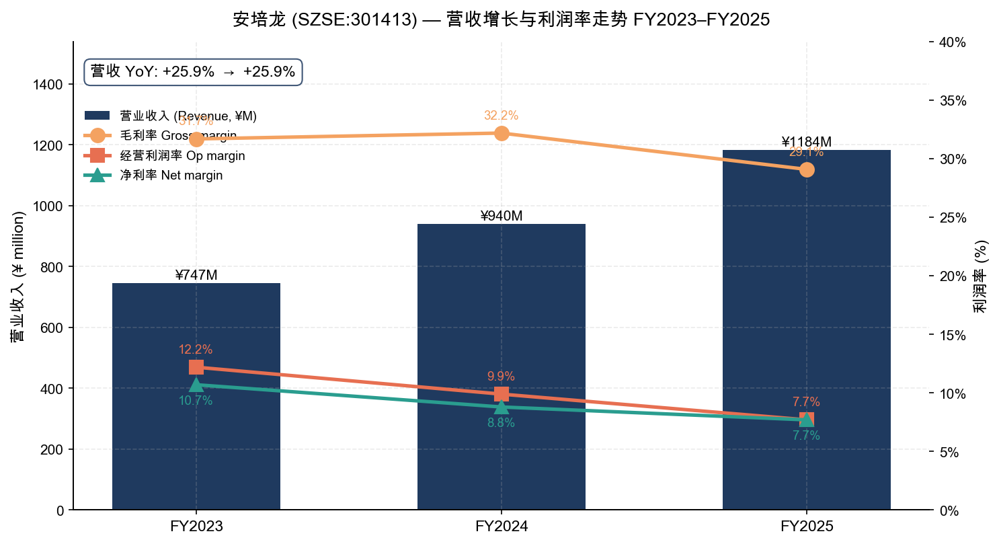
*Source: [2025 年年度报告，第 9 页](https://static.cninfo.com.cn/finalpage/2026-04-23/1224155244.PDF) 与 [2024 年年度报告，第 32 页](https://static.cninfo.com.cn/finalpage/2025-04-24/1223477567.PDF)*

**估值快照 (2026-05-20).** 公司股价 139.00 元，总市值约 137 亿元，总股本 9,840.20 万股 (FY2025 利润分配预案：每 10 股送 0 股、转增 3 股、派现 3 元；本报告中数据为 FY2025 年报披露口径的基础股本)。基于 FY2025 业绩，**TTM P/E 约 188×**、**TTM P/S 约 11.6×**、**P/B 约 10.8×**——三项倍数均显著高于 A 股传感器同业 (汉威科技 SZSE:300007 P/E≈79×、苏奥传感 SZSE:300507 P/E≈60×、苏州固锝 SZSE:002079 P/E≈95×、韦尔股份 SSE:603501 P/E≈38×；行业中位数约 78×)。([Yahoo Finance — Shenzhen Ampron Technology, 2026-05-20](https://finance.yahoo.com/quote/301413.SZ))

**估值溢价的解释.** 安培龙 P/E 处于行业最高分位且接近 200×，并非传统传感器业务能支撑的水平。市场实质上是按"人形机器人力传感器 (humanoid robot force sensor) + 汽车 EMB (Electronic Mechanical Brake) 制动力传感器 + MEMS 压力传感器国产替代"三条增长路径定价。公司在 2025 年 4 月使用首发超募资金 4,130.70 万元投建 EMB 力传感器专用产线，并完成六维力传感器 (6-axis force/torque sensor)、扭矩传感器 (torque sensor)、足底力传感器送样进入头部主机厂与机器人客户验证阶段。([关于使用部分超募资金投资建设新项目的公告 (公告编号 2025-034)](https://static.cninfo.com.cn/finalpage/2025-04-15/1223437847.PDF))。但公司目前力传感器业务尚处于"客户验证、技术迭代、小批量销售"阶段，2025 年贡献收入"较低，对当期经营业绩不构成重大影响"，意味着 188× 估值中蕴含的远期力传感器收入仍属"故事兑现风险"，详见**风险评估**一节。

---

## 公司历史

安培龙 22 年的发展史可大致划分为四个阶段：

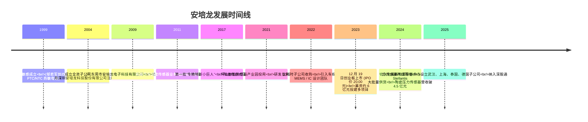

**1999-2004 — 敏感元件起步.** 公司前身安培龙敏感公司由邬若军于 1999 年 6 月在深圳龙岗成立，专注 PTC (Positive Temperature Coefficient) 与 NTC (Negative Temperature Coefficient) 热敏电阻的研发与生产，最初以家电为主要应用市场。2004 年 11 月 15 日，"深圳安培龙科技股份有限公司"在深圳市龙岗区平湖镇正式注册成立，邬若军、黎莉夫妇分别出任董事长兼总经理与董事，公司治理结构定型并延续至今。([2025 年年度报告，第 8 页](https://static.cninfo.com.cn/finalpage/2026-04-23/1224155244.PDF))

**2004-2017 — 拓品类、入汽车.** 这一阶段公司完成两次关键跨越：一是从单一热敏电阻品类向温度传感器模组拓展，进入空调、冰箱、洗衣机、电饭煲等白色 / 小家电客户体系；二是 2011 年前后进入汽车温度传感器领域，凭借玻璃封装 NTC 热敏电阻 (MF58 系列) 切入合资品牌汽车主机厂前装供应链。2009 年 11 月成立东莞安培龙作为家电领域规模制造基地。2017 年公司被工信部认定为第一批"专精特新小巨人"企业，并启动陶瓷电容式压力传感器项目，开启从敏感元件向传感器整器件的产品升级。

**2017-2023 — 压力传感器突破.** 公司将陶瓷电容式压力传感器作为车规级国产替代的核心突破点：陶瓷封装天然耐高温、耐腐蚀、寿命长，特别契合新能源汽车热管理 (空调、热泵、冷却循环) 与动力总成 (发动机机油 / 燃油泵、变速箱油压) 的中低压压力测量需求。2021 年公司迁入坪山智能传感器产业园，建立从陶瓷材料配方、基体烧结、印刷电极、模组封装到自动化检测的完整产业链。2022-2023 年公司补强 MEMS 与 IC 设计——通过比利时子公司引入车规级硅基压阻芯片设计团队，初步形成"敏感陶瓷 + MEMS + IC 设计"三大技术平台。2023 年 12 月 19 日公司在深圳证券交易所创业板上市，发行价 20.00 元/股，募资净额约 6 亿元，主要用于陶瓷电容式压力传感器产能扩张、研发中心建设与补充流动资金。([2025 年年度报告 ，第 8、35-36 页](https://static.cninfo.com.cn/finalpage/2026-04-23/1224155244.PDF))

**2024 至今 — 力传感器与全球化.** 上市后公司加速两条新轴线：(1) **力传感器布局**——基于自身 MEMS 硅基应变 + 玻璃微熔工艺已有储备，组建上海安培龙机器人力传感器专项研发团队，覆盖压式 / 拉压 / 弯矩 / 扭矩 / 六维力 / EMB 制动力，目标客户包括人形机器人、协作机器人、汽车 EMB 系统；2025 年 4 月使用超募资金 4,130.70 万元投建 EMB 力传感器产线。(2) **全球化与垂直整合**——2025 年 4 月在香港分别设立 NEXA Sens 与 Sensavior 香港平台；7 月成立安培龙智能 (重庆) 公司、安培龙传感科技 (欧洲) 公司；9 月成立安培龙泰国子公司 (注册资本 2.3 亿泰铢) 部署海外温压一体传感器自动化产线；11 月成立武汉安培龙微电子公司承接 MEMS 压力芯片与信号调理芯片自研。2025 年 6 月公司首次纳入深股通标的，资本市场关注度提升。([2025 年年度报告，第 39、43 页](https://static.cninfo.com.cn/finalpage/2026-04-23/1224155244.PDF))

---

## 管理团队

公司治理结构呈现典型的"创始人主导 + 国资专业董事 + 学界独董"组合，董事会 9 人，其中独立董事 3 人。董事长兼总经理由实际控制人邬若军一人兼任，公司在 2025 年年报中专门解释这一安排的合理性，并强调通过《公司章程》《董事会议事规则》《总经理工作细则》《防止控股股东及其关联方资金占用制度》等内部规范防范两职合一带来的治理风险。([2025 年年度报告，第 67 页](https://static.cninfo.com.cn/finalpage/2026-04-23/1224155244.PDF))

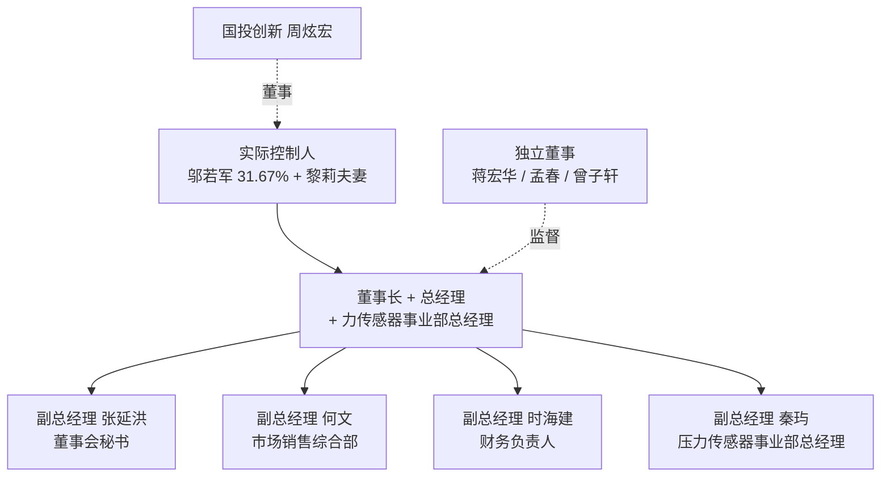

### 邬若军 ── 董事长、总经理、实际控制人 (创始人)

**核心高管.** 邬若军先生 1966 年生，本科电子材料及元器件专业，高级工程师，深圳市地方级领军人才。其职业轨迹清晰指向传感器赛道——1990 年代初先后任职武汉高理电子电器联合公司、深圳三宝电子、伟林电子 (深圳) 总工程师；1996 年 10 月-1999 年 1 月任深圳市鹏进电子实业有限公司经理；1999 年 6 月创办安培龙敏感前身并担任总经理；2004 年 11 月公司股份制改造后即出任董事长兼总经理至今，任职已 21 年。2025 年 2 月起兼任力传感器制造事业部总经理，体现公司对该新业务的重视——创始人亲自挂帅，这一信号通常意味着内部研发资源与定点客户对接由其直接督导，缩短重大决策路径。([2025 年年度报告，第 65-66 页](https://static.cninfo.com.cn/finalpage/2026-04-23/1224155244.PDF))

**持股与利益绑定.** 报告期末邬若军直接持股 3,116.17 万股，占公司总股本 **31.67%**，其中 430 万股处于质押状态；其配偶黎莉女士持股 293.9 万股 (2.99%) 担任公司董事兼仓储物流中心经理；邬若军同时是公司员工持股平台"深圳市瑞航投资合伙企业 (有限合伙)"的执行事务合伙人 (该平台持有公司 5.64%)；李学靖等原持股管理层亦在前 10 大股东之列。三者合计实际控制人及一致行动人持股比例约 **40%**，控制权稳固。FY2025 邬若军税前薪酬 55.23 万元，相对于其持股市值 (约 43 亿元) 微不足道，激励完全来自股权价值。([2025 年年度报告，第 70、113-115 页](https://static.cninfo.com.cn/finalpage/2026-04-23/1224155244.PDF))

**功过评估.** 创始人 25 年专注同一赛道、自材料配方到芯片设计逐步垂直整合，是公司在车规级压力传感器实现国产替代突破的关键力量。但创始人 59 岁、配偶担任董事且全职在岗、长子未介入接班、独立董事专业背景与传感器主业关联度较弱 (独董分别为金融、会计、管理类) ——公司治理在"专业化"维度上有提升空间。

### 张延洪 ── 副总经理、董事、董事会秘书

张延洪先生 1976 年生，本科汉语言文学专业，2002 年加入公司前身安培龙敏感担任品质部经理与制造中心经理，2004 年随股份公司沿用至今，曾任温度传感器事业部研发部研发总监、企业管理中心总监；2011 年 9 月起担任公司监事 (至 2018 年 12 月)，2020 年 3 月起担任副总经理与董事会秘书，2024 年 12 月增补为董事。张延洪是创始人之外任职最久的高管之一，主导信息披露与投资者关系工作。FY2025 公司被深圳证券交易所评为信息披露 A 级 (上市后第一个完整披露年度即获最高等级)，斩获中国证券报金牛奖 (金信披奖) 等多项资本市场荣誉，反映其在 IPO 后投关体系建设的成效。FY2025 税前薪酬 61.80 万元——为公司当年薪酬最高的高管。([2025 年年度报告，第 39、66、70 页](https://static.cninfo.com.cn/finalpage/2026-04-23/1224155244.PDF))

### 时海建 ── 副总经理兼财务负责人 (CFO 角色)

时海建先生 1982 年生，大专学历，计算机信息管理专业。早期 (2010-2017 年) 先后在闻泰科技股份有限公司 (SSE:600745) 任 ERP 工程师、成本经理，并在鼎捷软件任财务咨询顾问；2017 年 12 月加入安培龙任财务负责人，2018 年 12 月起兼任副总经理。其闻泰科技经历——一家以 ODM 起家、后通过收购安世半导体转型为半导体公司的大型上市公司——为安培龙提供了"制造业成本管控 + 半导体业务财务"的双重经验。但时海建非注册会计师，亦无 IPO 主承销 / 资本市场履职背景；2023 年 IPO 由保荐机构华泰联合主导。FY2025 税前薪酬 53.40 万元，财务岗位与副总经理岗位合并支付。**披露中存在一个值得关注的细节**：时海建 2025 年 8 月起兼任"深圳市小咩九贸易有限公司"经理与董事——经查为其配偶或亲属经营的小型公司、不在传感器主业范围内、不在公司关联方目录中，但作为 CFO 在外兼任另一家实体的执行职位是较弱的治理信号。([2025 年年度报告，第 67、68、70 页](https://static.cninfo.com.cn/finalpage/2026-04-23/1224155244.PDF))

### 秦玙 ── 副总经理兼压力传感器事业部总经理

秦玙先生 1983 年生，硕士学历，工商管理专业。其汽车零部件背景是公司近年压力传感器突破的关键支撑——2008 年 2 月-2013 年 12 月任艾菲汽车零部件 (武汉) 总经理助理、商务部长、商务总监；2013 年 12 月-2020 年 11 月任浙江沃德尔科技集团股份有限公司副总经理 (沃德尔为 SSE:688548 上市公司，主营汽车连接器、传感器件)。2021 年 12 月加入安培龙任总经理助理；2024 年 3 月升任副总经理兼汽车市场销售部总经理；2024 年 11 月起兼任比利时安培龙总经理；2025 年 3 月起担任压力传感器事业部总经理。其在沃德尔的 7 年副总经历直接对应安培龙最大业务线的客户、供应链与运营体系。FY2025 税前薪酬 60.32 万元。([2025 年年度报告，第 67、70 页](https://static.cninfo.com.cn/finalpage/2026-04-23/1224155244.PDF))

### 何文 ── 副总经理、郴州安培龙总经理 (温度传感器 / 家电)

何文先生 1967 年生，本科动力系制冷专业，1990 年代深耕家电制冷 (汇丰空调、乐华空调、威力空调)；2015 年 8 月加入公司任市场销售部总监，逐步担任温度传感器事业部总经理 (2018-2021)、郴州安培龙总经理 (2021 年至今)、综合市场销售部总经理 (2024 年 3 月至今)。何文负责公司"压舱石"业务——家电温度传感器，长期维系美的、格力、海尔、海信、TCL 等核心客户关系。FY2025 税前薪酬 41.69 万元。([2025 年年度报告，第 67、70 页](https://static.cninfo.com.cn/finalpage/2026-04-23/1224155244.PDF))

### 董事会与治理评估

董事会 9 名成员中：内部非独立董事 4 人 (邬若军、黎莉、张延洪、周炫宏)、职工代表董事 1 人 (颜炳跃，温度传感器研发高级经理出身)、独立董事 3 人 (蒋宏华、曾子轩、孟春)、外部董事 1 人 (周炫宏，国投创新代表，2024 年 12 月新增)。**值得关注**：独立董事曾子轩 1993 年生 (董事时仅 31 岁)，任职多家与公司主业无关的医药、林业、生物科技公司，且兼任公司数量较多 (年报披露涉及 16 家公司任职)；专业领域与传感器主业关联度较弱，对其独立董事履职质量的市场监督需要持续关注。孟春 (62 岁，高级会计师，深圳大学继续教育学院教师) 与蒋宏华 (45 岁，工商管理硕士，深圳前海鑫天瑜资本管理有限公司合伙人) 履历较为常规。([2025 年年度报告，第 66-67、69-70 页](https://static.cninfo.com.cn/finalpage/2026-04-23/1224155244.PDF))

**审计师**: 中审众环会计师事务所 (特殊普通合伙)，签字会计师陈刚、尹国保。FY2025 审计意见类型为标准无保留意见。

---

## 产品与服务

公司业已形成 **四大类传感器产品线**，覆盖上千种规格型号，主要应用于汽车、家电、光伏、储能、充电桩、物联网、工业控制、医疗、低空经济、机器人等领域。

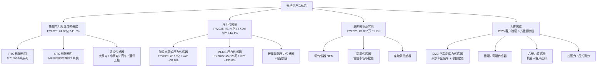

### 产品线一：热敏电阻及温度传感器 (FY2025 营收 4.89 亿元 / 占 41.3% / YoY +7.6%)

公司是国内热敏电阻领域历史最久的厂商之一，掌握**陶瓷材料配方、基体制备、成型、烧结、印刷、封装**全链条工艺，产品涵盖**PTC 热敏电阻** (MZ1 系列用于新能源汽车、变压器；MZ2 用于通信基站；MZ32 用于新能源汽车 OBC 充电、储能；MZ6 用于电机线圈、开关电源)、**NTC 热敏电阻** (MF58 轴向玻璃封装系列用于家电、新能源汽车热管理；MF52B/E/D 环氧封装；高精度医疗系列用于监护仪、呼吸机；MF72 用于 AC/DC 转换电源)，以及在前述敏感元件基础上集成的**温度传感器**模组——大家电温度传感器 (空调、冰箱、洗衣机、冷库)、小家电 (咖啡机、电饭煲、电压力锅、智能马桶)、汽车温度传感器 (发动机水温油温、空调系统、动力电池、电机、热泵、PTC 加热模块、充电桩) 与通讯物联网工控类。([2025 年年度报告，第 20-22 页](https://static.cninfo.com.cn/finalpage/2026-04-23/1224155244.PDF))

FY2025 该业务线**销售量 5.22 亿件 (PCS)**、生产量 7.79 亿件、库存量 2.80 亿件；库存同比 +16.3% 提示渠道补库或对来年订单的信心。汽车应用领域贡献该业务线收入 7,754.78 万元 (同比 +24.5%)，成功切入捷温 (Gentherm Inc，NASDAQ:THRM)、李尔 (Lear Corp，NYSE:LEA)、安闻等国内外 Tier-1 供应链，应用于新能源汽车驱动电机、热管理系统、座椅 / 方向盘加热、变速箱油温监测等场景。家电基本盘维持稳健但增速放缓——FY2025 整体业务增长率仅 7.6%，显著低于公司平均 25.9%，反映家电以旧换新政策的边际效应递减以及竞争加剧。

### 产品线二：压力传感器 (FY2025 营收 6.74 亿元 / 占 57.0% / YoY +44.1%) — 增长引擎

公司压力传感器矩阵覆盖**三条技术路线**，对应不同压力量程，已成为业绩增长的核心引擎：

- **陶瓷电容式压力传感器** (0.5~15 MPa 中低压)：FY2025 营收突破 6 亿元、达 6.16 亿元 (同比 +34.8%)，是车规级压力传感器国产替代的核心抓手。主要应用包括：**汽车空调高低压压力传感器** (制冷剂监测)、**发动机机油 / 排气 / 燃油泵 / 压缩天然气压力传感器**、**变速箱压力传感器** (AT、DCT、CVT、AMT 及新能源 DHT 混动)、**汽车摄像头清洁系统压力传感器**、**航空发动机机油压力传感器**、**商用车气罐刹车压力传感器**、**温压一体传感器** (新能源热泵 / 飞行汽车热泵)、**储能与商用空调压力传感器**、**数据服务器冷却管路压力传感器**、**车载冰箱用压力传感器**。

- **MEMS 硅压阻压力传感器** (<0.5 MPa 低压)：FY2025 营收 5,828.18 万元 (同比 +433.6%)——增速最高的产品类别。应用场景包括：**汽车进气歧管温压一体 (TMAP) 传感器**、**EGR (废气再循环) 压差传感器**、**DPF/GPF 颗粒捕捉器压差传感器**、**燃油蒸汽压力 (FTPS) / 脱附 / 真空助力压力传感器**、**咖啡机用压力传感器**等。已成功进入 Stellantis、上汽大通、绿山咖啡 (Keurig Dr Pepper, NASDAQ:KDP) 供应链。MEMS 产品的爆发式增长反映芯片端逐步突破对外采购依赖，且单价更高、毛利空间更优。

- **玻璃微熔压力传感器** (5~600 MPa 中高压)：FY2025 仍处于研发优化、样品交付与验证阶段，尚未量产，相关收入主要为样品试制收入。应用方向是**汽油高压直喷压力传感器**、**柴油共轨压力传感器**、**汽车刹车 ESP 系统制动压力传感器**——这部分对应国内仍以博世、电装等外资垄断的中高压细分市场，公司若实现量产将构成新的国产替代突破。

公司在 2025 年年报中明确指出，已成为**国内极少数在车规级应用领域实现低、中、高压压力传感器全压力量程覆盖的企业之一**——这是公司压力传感器业务相对国产同业 (如苏奥传感主要聚焦氢气压力、保隆科技主要聚焦 TPMS) 的核心差异化优势。([2025 年年度报告，第 17、22-26、37-38 页](https://static.cninfo.com.cn/finalpage/2026-04-23/1224155244.PDF))

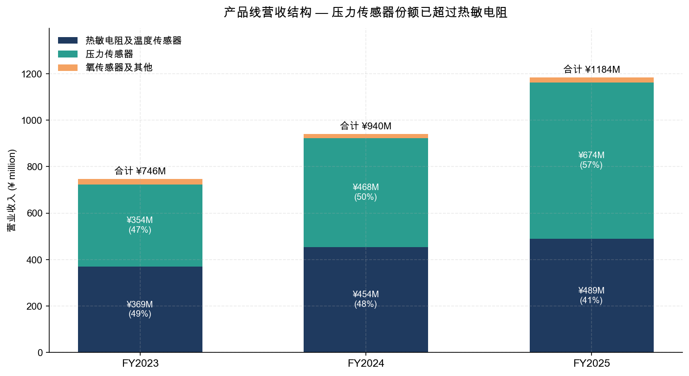
*Source: [2025 年年度报告，第 40 页](https://static.cninfo.com.cn/finalpage/2026-04-23/1224155244.PDF) 与 [2024 年年度报告，第 32 页](https://static.cninfo.com.cn/finalpage/2025-04-24/1223477567.PDF)*

### 产品线三：氧传感器及其他 (FY2025 营收 2,037 万元 / 占 1.7% / YoY +14.7%)

公司氧传感器线包括传统氧传感器 (OEM)、氮氧传感器与座舱氧传感器。**氮氧传感器**是新增长点——主要服务国六及更严格的柴油机排放法规需求；公司报告氮氧传感器已在售后市场实现小批量交付，正积累验证数据为前装市场切入做准备。该业务线营收规模仍小，但战略意义在于完善气体传感器矩阵、契合排放升级政策红利、为未来商用车与非道路机械市场切入埋伏。([2025 年年度报告，第 35 页](https://static.cninfo.com.cn/finalpage/2026-04-23/1224155244.PDF))

### 产品线四：力传感器 — 远期叙事核心、当前小批量

力传感器是公司当前估值溢价的最重要驱动。截至 FY2025 报告期末，公司力传感器矩阵已涵盖：

- **EMB 汽车刹车力传感器 & 压式测力传感器**：基于 MEMS 硅基半导体应变 + 玻璃微熔工艺；已通过国内头部车企 (年报未点名) 装车测试并获项目定点；2025 年 4 月使用超募资金 4,130.70 万元投建专用产线。
- **扭矩传感器**：两条技术路线 (MEMS 硅基半导体应变 + 玻璃微熔 与 金属箔应变计)，定位工业机器人、协作机器人机械臂、人形机器人髋 / 膝旋转关节。
- **六维力传感器**：金属应变片方案已完成开发流程、具备技术验证与市场推广条件；MEMS 硅基应变 + 玻璃微熔方案已进入客户送样测试阶段。
- **足底力传感器** (针对四足 / 人形机器人足底场景)：已进入客户送样阶段。

公司在 2025 年专门组建上海安培龙机器人力传感器专项研发团队，并在上海搭建力传感器试验线 (公司明确"深圳总部制造交付为主、上海子公司试验为辅")。同期，公司积极参与制定团体标准《人形机器人智能感知与运动控制技术规范》。

**关键定量披露**：截至 2025 年报告期末，**力传感器业务收入占公司整体营业收入比例较低，对当期经营业绩不构成重大影响**——公司在年报多个章节反复强调这一点 (这是 188× P/E 估值与基本面之间最大的张力)。投资者需要关注的兑现节奏：(1) EMB 力传感器产线投产与首个国内主机厂量产时点；(2) 六维力传感器从送样到大批量定点的转化率；(3) 是否拿下国内人形机器人头部厂商 (宇树、傅利叶、智元、特斯拉 Optimus 国内供应链) 的明确订单或定点信。([2025 年年度报告，第 35-36、39 页](https://static.cninfo.com.cn/finalpage/2026-04-23/1224155244.PDF))

### 技术平台与垂直整合

公司构筑了"**敏感陶瓷 + MEMS + IC 设计**"三大技术平台：陶瓷材料配方与基体制备是温度 / 压力传感器基础；MEMS 平台覆盖压力芯片、力觉芯片、未来扩展压电薄膜；IC 设计依托 2022 年收购的比利时子公司汇聚国际化设计人才，并以 2025 年新设武汉安培龙作为国内研发协同载体。**这一垂直整合战略具有产业链稀缺性**——国内多数传感器厂商仍以"采购芯片 + 封装组装"模式为主，受制于外资芯片供应链；安培龙若能在 2026-2028 年实现 MEMS 压力芯片自研规模化替代外购，将进一步打开毛利率空间与供应链安全壁垒。但比利时安培龙的整合效果、武汉公司团队搭建进度、以及 MEMS 压电薄膜从材料研究到产品落地的时间表，目前披露有限。([2025 年年度报告，第 36-37 页](https://static.cninfo.com.cn/finalpage/2026-04-23/1224155244.PDF))

---

## 客户与上市策略

### 客户结构与集中度 (FY2025)

公司 FY2025 **前五名客户合计销售金额 35,653.58 万元，占年度销售总额比例 30.13%**——其中关联方销售金额占比 0%。具体如下：

| 客户排名 | 销售额 (¥万元) | 占年度销售比例 |
|---|---|---|
| 客户一 | 18,878.89 | **15.95%** |
| 客户二 | 4,928.22 | 4.17% |
| 客户三 | 4,285.41 | 3.62% |
| 客户四 | 4,033.37 | 3.41% |
| 客户五 | 3,527.70 | 2.98% |
| **前五合计** | **35,653.58** | **30.13%** |

*Source: [2025 年年度报告，第 43 页](https://static.cninfo.com.cn/finalpage/2026-04-23/1224155244.PDF)*

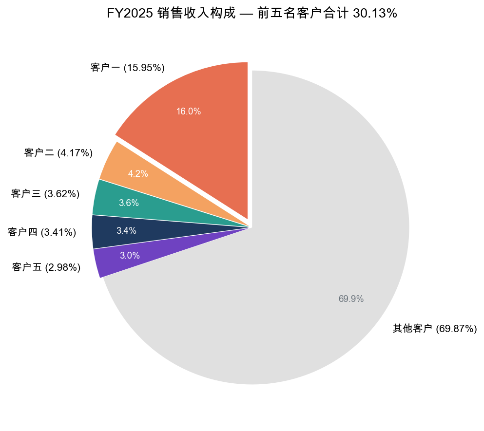

**最大单一客户达 15.95% — 接近高集中风险阈值.** 公司未在年报中实名披露前五大客户身份；但结合年报第 37 页"已实现向北美某知名新能源汽车客户、Stellantis、蔚来、理想、小鹏等重大客户配套大批量供货"的描述，以及第 5 页释义中"绿山咖啡 = Keurig Dr Pepper / 雀巢咖啡 / 上汽 / 比亚迪 / 长城 / 奇瑞 / 东风 / 万里扬 / 麦格纳 / Stellantis / 捷温 / 李尔"等核心客户名单，可以合理推断客户一极可能为某北美新能源汽车头部客户 (公司谨慎未直接点名特斯拉，但行业内通常以"北美知名新能源汽车客户"特指特斯拉)，亦可能为美的、格力等家电大厂之一。

**总体客户集中度评价**：前五合计 30.13% 在传感器同业属于**中等偏低水平** (典型汽车零部件 Tier-2 公司前五客户合计通常 40-60%)；公司客户结构在数千家全球客户基础上分散度良好。但**单一最大客户 15.95% 接近 20% 警戒线**，且公司未实名披露，若该客户为单一新能源车主机厂，则未来该主机厂自身需求波动、其北美产能调整或与公司议价能力变化都将对公司业绩产生重大影响——此风险在第 9 节进一步展开。([2025 年年度报告，第 37、43 页](https://static.cninfo.com.cn/finalpage/2026-04-23/1224155244.PDF))

### 已实名披露的核心客户群组 (见公司年报"释义"章节)

按下游应用领域汇总：

- **汽车主机厂 / 整车 (中国自主品牌)**：上汽集团、比亚迪、长城汽车、奇瑞汽车、东风汽车
- **汽车主机厂 / 整车 (合资 + 海外)**：Stellantis (荷兰)、北美某新能源车头部客户、蔚来、理想、小鹏、上汽大通
- **汽车 Tier-1**：麦格纳动力总成 (江西)、捷温 (Gentherm)、李尔 (Lear)、万里扬 (浙江，主营变速箱)、安闻、凌云股份
- **家电**：美的集团、格力电器、海尔智家、海信家电、TCL (空调器)
- **小家电 / 咖啡机**：绿山咖啡 (Keurig Dr Pepper)、雀巢咖啡 (Nestlé Nespresso)、东芝
- **机器人 / 具身智能** (合作研发 / 送样)：江苏鼎汇具身智能机器人创新中心 (参股)、瑞知微 (参股)、海纳微 (参股)

### 销售模式与全球化布局

FY2025 直销占比 98.87%、经销 1.13%——典型 Tier-2 汽车与家电零部件直销主导模式。海外业务方面公司采取"**销售、服务及技术本地化**"策略：(1) **比利时安培龙**作为海外车规级传感器芯片与系统设计中心；(2) **2025 年 5 月成立德国安培龙传感科技 (欧洲)** 作为欧洲销售与技术支持中心，深度对接欧洲汽车电子与工业控制客户；(3) **2025 年 9 月成立泰国安培龙**部署温压一体传感器自动化产线，契合海外核心客户全球供应链布局。海外整体收入 1.69 亿元 (占 14.32%) 仍较低，但**外销毛利率 45.80% vs 内销 26.26%**——差距高达 **19.54 个百分点**，海外业务每增长 1 亿元可贡献约 4,580 万元毛利、显著超过内销的 2,626 万元，是公司提升综合毛利率的关键路径。([2025 年年度报告，第 38、41 页](https://static.cninfo.com.cn/finalpage/2026-04-23/1224155244.PDF))

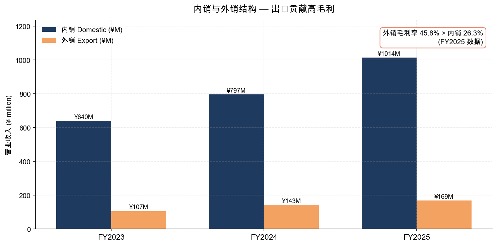

### 上市策略与资本运作

公司 2023 年 12 月 19 日在深圳证券交易所创业板上市，发行价 20.00 元/股，发行 1,640.20 万股，募资总额约 3.28 亿元 (含超募部分实际募资净额约 6 亿元，超募部分用于 EMB 力传感器产线建设、补充流动资金等)。保荐机构华泰联合证券持续督导期至 2026 年 12 月 31 日。**2025 年关键资本市场动作**：

- **2025 年 6 月首次纳入深股通标的**——开放给海外机构投资者，资本市场关注度提升；
- **2025 年 10 月获深交所信息披露评价 A 级** (上市后第一个完整披露年度即获最高等级)；
- **2026 年 4 月利润分配预案**：每 10 股派现 3 元 (含税) + 每 10 股转增 3 股，体现现金分红 + 股本扩张的兼顾；
- **2026 年向特定对象发行股票** (定增) 处于规划阶段 (2026-04 年报附公告已涉及但未实际发行)。

公司也披露了一项**重要的"超募资金用途变更"**：2025 年 4 月公司决议使用首次公开发行超募资金 4,130.70 万元投建新一代智能驾驶刹车系统 EMB 力传感器专用产线 (公告编号 2025-034)。这是公司将力传感器从研发阶段加速推进至产业化的资本动作，但也意味着原 IPO 募资项目部分资金被重新配置，需关注原定项目的进度与回报。([关于使用部分超募资金投资建设新项目的公告 (公告编号 2025-034)](https://static.cninfo.com.cn/finalpage/2025-04-15/1223437847.PDF)，[2025 年年度报告，第 39 页](https://static.cninfo.com.cn/finalpage/2026-04-23/1224155244.PDF))

---

## 行业概览

### 传感器产业总体框架

传感器是连接物理世界与数字世界的桥梁，按敏感元件 + 转换电路 + 接口电路三段式构成，其与计算机技术、通信技术并称现代信息技术的三大支柱。按被测量分类，传感器主要包括压力、加速度、温度、流量、湿度、气体、力等品类。

**全球与中国市场规模**：根据赛迪顾问 (CCID Consulting) 数据，**2024 年全球传感器产业市场规模 14,855.2 亿元，同比增长 6%**；**中国传感器市场规模 4,061.2 亿元，同比增长 11%**，远高于全球增长率。**预计中国传感器市场 2024-2026 年 3 年复合增长率将达到 15.0%**，亚太地区为全球最高增速区。中国市场规模已从 2019 年的 2,188.8 亿元上升至 2024 年的 4,061.2 亿元，5 年累计增长 85.5%。([2025 年年度报告，第 13-14 页 (引用赛迪顾问)](https://static.cninfo.com.cn/finalpage/2026-04-23/1224155244.PDF))

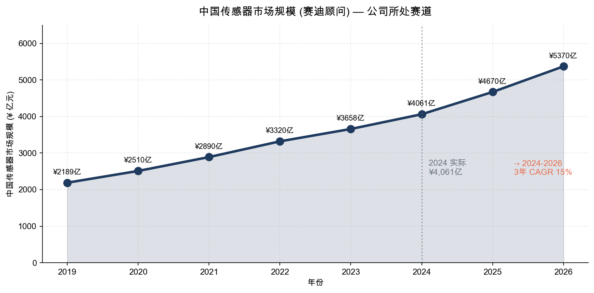

按细分市场，2024 年中国市场结构：
- **消费电子** 1,076.2 亿元 (26.5%)
- **汽车电子** 859.5 亿元 (21.2%)
- **工业制造** 832.8 亿元 (20.5%)
- **网络通信** 770.2 亿元 (19.0%)
- 其他 (医疗、能源等) 522.5 亿元 (12.8%)

按品类分布，2024 年**压力传感器市场规模 714.2 亿元、占整体 17.6%**，位居中国传感器细分市场第一——这一品类正是安培龙 FY2025 最大业务线 (公司全球压力传感器份额估算约 0.8-0.9%，国内份额估算约 4-5%，仍处国产替代早期)。

### 下游应用一：汽车 (FY2025 已成公司增长主轴)

中国汽车产业 **2025 年产销量双双突破 3,400 万辆大关 (产量 3,453.1 万辆、销量 3,440 万辆)，连续 17 年稳居全球第一**。其中乘用车产销分别 3,027.7 / 3,010.3 万辆 (同比 +10.2% / +9.2%)；**新能源汽车产销分别 1,662.6 / 1,649 万辆 (同比 +29% / +28.2%)，渗透率达 47.9%** (较 2024 年提高 7 个百分点)。**汽车出口达 709 万辆 (+21.1%) 连续三年蝉联全球第一**，其中新能源汽车出口 261.5 万辆 (同比翻倍)。

汽车电子化与智能化趋势直接拉动车规级传感器需求：单台传统燃油车搭载传感器约 50-70 个，单台电动车增至 100-200 个，单台 L2+ 智能驾驶车型可达 200-300 个，单价从 ¥150-300/个 (中低端 NTC、霍尔) 到 ¥800-3,000/个 (车规 MEMS 压力、毫米波雷达等)。**根据中汽协预测，2026 年中国汽车总销量预计 3,475 万辆 (+1%)、新能源汽车 1,900 万辆 (+15.2%)、汽车出口 740 万辆 (+4.3%)**。安培龙汽车应用领域 FY2025 收入估算超过 7.5 亿元 (占公司总营收 60%+)。([2025 年年度报告，第 15-16 页](https://static.cninfo.com.cn/finalpage/2026-04-23/1224155244.PDF))

### 下游应用二：家电 (公司基本盘、增长趋稳)

2025 年中国家电类商品零售额达 11,695 亿元、首次破万亿元大关 (国家统计局数据)；中国家电存量保有量超过 40 亿台 (奥维云网数据)。家电以旧换新政策从 2024 年 3 月《推动大规模设备更新和消费品以旧换新行动方案》启动，2025 年 1 月《关于 2025 年加力扩围实施大规模设备更新和消费品以旧换新政策的通知》将补贴品类从 8 类扩至 12 类，新增微波炉、净水器、洗碗机、电饭煲等品类。商务部数据显示 2025 年家电以旧换新销售量超 1.29 亿台。**2025 年中国家电出口额 1,114.1 亿美元，与 2024 年基本持平** (海关总署数据)；对美出口因关税下降，对欧盟与英国出口增长。

公司家电温度传感器是稳定基本盘，但 FY2025 该业务线增长仅 7.6%，远低于压力传感器 44.1% 与公司平均 25.9%，反映家电存量市场已进入低增长阶段。

### 下游应用三：储能 (高速增长，渐成第三业务支柱)

**2025 年是中国储能行业里程碑式的一年**。中关村储能产业技术联盟 (CNESA) 数据显示，截至 2025 年 12 月底，中国电力储能累计装机规模 213.3 GW (+54% YoY)；新型储能 (锂电为主) 累计装机规模 144.7 GW (+85% YoY)，是"十三五"末的 45 倍。国家发改委、能源局《新型储能规模化建设专项行动方案 (2025-2027 年)》提出 3 年新增装机超 1 亿千瓦、2027 年底达 1.8 亿千瓦目标。SNE Research 数据显示**全球储能电池出货量 550 GWh (+79% YoY)**。储能温度 / 压力 / 流量 / 电流传感器需求强烈拉动。([2025 年年度报告，第 18 页](https://static.cninfo.com.cn/finalpage/2026-04-23/1224155244.PDF))

### 下游应用四：机器人 / 具身智能 (远期叙事核心)

**人形机器人作为具身智能机器人的高阶形态正加速迈进产业化阶段**。根据高工机器人产业研究所 (GGII) 《2025 年人形机器人产业发展蓝皮书》：2025 年全球人形机器人市场销量预计 1.24 万台、市场规模 63.39 亿元；2026 年中国人形机器人出货将达 6.25 万台；**到 2030 年全球人形机器人市场销量将接近 34 万台、市场规模将超过 640 亿元；2035 年全球销量将超过 500 万台、市场规模将超过 4,000 亿元**。

更直接对应安培龙业务的是力传感器细分：**QY Research 数据预测 2025 年全球六维力传感器市场规模为 4.09 亿美元，预计到 2032 年达 42.94 亿美元，2025-2032 年 CAGR 40.5%**；中国市场 2024-2030 年 CAGR 预计达 **47.54%**，2030 年中国市场规模达 6.2 亿美元 (约 ¥45 亿元)。公司年报强调"**力传感器行业正处于起步发展阶段，行业内均未有大规模量产的公司**"——这意味着窗口尚开，但同时也意味着技术路线、客户验证标准、规模制造工艺仍处于探索期。

国家政策方面，**2025 年《政府工作报告》首次将"具身智能"列为未来产业**；2025 年 10 月党的二十届四中全会通过《"十五五"规划建议》将机器人、具身智能列为战略性新兴产业与未来产业；北京、广东、深圳、上海等地陆续出台专项政策 (如北京《具身智能科技创新与产业培育行动计划 2025-2027 年》、深圳《具身智能机器人技术创新与产业发展行动计划 2025-2027 年》)。([2025 年年度报告，第 18-19 页](https://static.cninfo.com.cn/finalpage/2026-04-23/1224155244.PDF))

---

## 竞争格局

### 直接同业 (A 股传感器板块)

| 公司 | 代码 | 核心品类 | FY2024 营收 (¥亿) | 与安培龙关系 |
|---|---|---|---|---|
| 韦尔股份 | SSE:603501 | CIS 图像传感器 | 256.7 | 不重叠主业；但市值与估值锚 |
| 汉威科技 | SZSE:300007 | 气体 / 智慧城市传感器 | 23.8 | 部分应用重叠 (工业气体)，氮氧/氧传感器潜在竞争 |
| 苏奥传感 | SZSE:300507 | 油位 / 温度 / 氢气压力 | 8.5 | 直接竞争——汽车温压传感器 |
| 苏州固锝 | SZSE:002079 | 半导体二极管 + MEMS 传感器 | 17.1 | 部分 MEMS 压力业务重叠 |
| 保隆科技 | SSE:603197 | TPMS、空气悬架 | 65.4 | 部分汽车压力传感器重叠 |
| 高华科技 | SH:688539 | 工业传感器 | 4.5 | 工业压力 / 温度部分重叠 |

### 直接同业 (港股、未上市同业)

| 公司 | 核心品类 | 与安培龙关系 |
|---|---|---|
| 森萨塔 (Sensata, NYSE:ST) | 全球汽车温压传感器龙头 | 安培龙正面竞争 ——森萨塔在汽车压力、电流传感器上具备规模与技术优势；公司"国产替代"核心对手 |
| 博世 (Bosch) | 全球汽车电子龙头 | 博世在 ESP、ABS、燃油共轨等高压压力传感器领域占主导；公司玻璃微熔产品瞄准其份额 |
| 电装 (Denso, TYO:6902) | 日系汽车电子龙头 | 与博世类似定位 |
| 大陆集团 (Continental, ETR:CON) | 全球 Tier-1 | 高端压力 / 温度传感器 |
| 安费诺 (Amphenol, NYSE:APH) | 全球汽车 / 工业传感器 | 部分压力与温度传感器线 |
| 宁波柯力 (SZSE:603662) | 称重 / 力传感器 | 力传感器领域国内最大同业 |
| 蓝点触控 (未上市) | 机器人六维力 | 人形机器人力传感器细分对手 |
| 鑫精诚 (未上市) | 机器人六维力 | 同上 |

### 竞争优势 (Anpeilong 的护城河)

1. **车规级压力传感器全压力量程覆盖**——公司明确为"国内极少数在车规级应用领域实现低、中、高压压力传感器全压力量程覆盖的企业之一"；陶瓷电容式 + MEMS + 玻璃微熔三套工艺平台并行，是国内同业 (苏奥、汉威、固锝) 多以单一技术路线为主的重要差异化。
2. **垂直整合度高**——从陶瓷材料配方、烧结、印刷、封装到 MEMS 芯片设计 (比利时 + 武汉)、IC 设计的全产业链能力，规避供应链单点依赖。
3. **跨下游平台化**——同时切入汽车、家电、储能、机器人、低空经济、医疗、工业控制 7+ 行业，单一下游周期波动可被其他下游对冲。
4. **大客户结构.** 已进入北美新能源汽车、Stellantis、上汽大通、绿山咖啡、捷温、李尔、美的、格力、海尔等头部客户体系，为后续品类延伸 (如向同一客户交叉销售更多 SKU) 提供基础。
5. **政策与资本红利**——专精特新小巨人 + 创业板 + 深股通 + 力传感器 / 机器人国家战略多重红利叠加。

### 竞争劣势

1. **MEMS 芯片仍以外采为主**——公司明确披露"目前批量交付的压力传感器，其核心 MEMS 压阻芯片、信号调理芯片仍以外部采购为主"，是供应链的最大短板，对应芯片自研项目仍处投入期。
2. **力传感器尚未规模化**——所有六维力 / 扭矩 / EMB 产品仍处于送样或定点阶段，离对手 (森萨塔、博世、Denso) 的成熟产品差距明显。
3. **海外业务规模小**——14.32% 的外销占比远低于全球同业 (森萨塔海外占比约 60%、保隆约 35%)；但毛利率优势提示未来扩张方向明确。
4. **研发费用率上行**——FY2025 研发费用率 8.27% (¥97.8M / ¥1.18B)，较 FY2023 的 6.35% 上行 192 bp，反映新业务投入加速；如新业务收入兑现节奏慢于预期，将持续压制利润率。

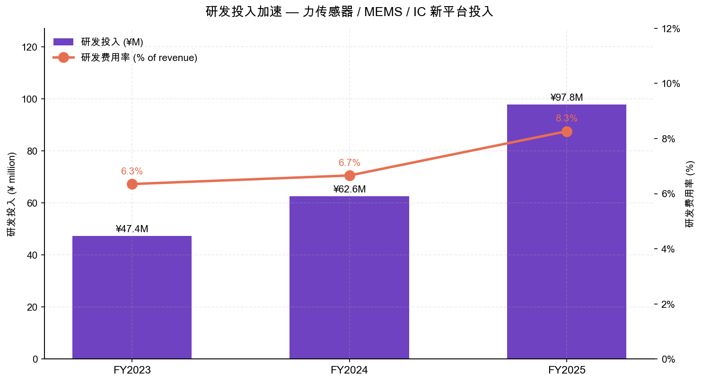

### 定价 vs 性能定位

```mermaid
quadrantChart
    title 国内 / 国际传感器同业定价-性能定位
    x-axis 低性能 --> 高性能 (车规、可靠性)
    y-axis 低价 --> 高价 (单价、毛利)
    quadrant-1 高端外资
    quadrant-2 国产替代龙头
    quadrant-3 价格战
    quadrant-4 单点优势
    森萨塔 Sensata: [0.85, 0.85]
    博世 Bosch: [0.95, 0.90]
    电装 Denso: [0.90, 0.85]
    安培龙 Anpeilong: [0.65, 0.55]
    保隆科技: [0.65, 0.50]
    苏奥传感: [0.55, 0.40]
    汉威科技: [0.50, 0.45]
    柯力传感: [0.55, 0.45]
```

安培龙目前定位为"中等性能 / 中等价位"的国产替代选手，向左 / 上方 (高性能 / 高价) 的路径有：(1) 力传感器规模化 (相比传统温压有更高单价与毛利)；(2) 海外客户突破。向右 / 下方 (价格战) 的风险是国内机器人 / 汽车价格战外溢传感器层。

---

## 市场机会 (TAM/SAM/SOM)

### TAM ── 公司可触达的总潜在市场

按公司主要业务的中国与全球市场规模 (2025-2030 年展望)：

| 细分市场 | 2025E (¥ 亿元) | 2030E (¥ 亿元) | CAGR | 数据来源 |
|---|---|---|---|---|
| **中国传感器整体** | 4,670 | 9,500+ | ~15% | 赛迪顾问 |
| **中国汽车传感器** | ~990 | ~2,000 | ~15% | 公司年报推算 |
| **中国压力传感器 (整体)** | ~821 | ~1,650 | ~15% | 赛迪 / 推算 |
| **全球六维力传感器** | 29.4 (US$4.09亿) | ~140 | ~40.5% | QY Research |
| **中国六维力传感器** | ~10 | ~45 (US$6.2亿) | ~47.5% | QY Research |
| **全球人形机器人本体** | 63 | 640 | ~60% | GGII |

公司四大产品线 + 力传感器新业务 + 海外业务展望的可触达 TAM 估算在 2025 年约为 **2,500-3,000 亿元** (主要为压力 + 温度 + 力 + 氧传感器在汽车 / 家电 / 储能 / 机器人的合计)。([2025 年年度报告，第 13-19 页](https://static.cninfo.com.cn/finalpage/2026-04-23/1224155244.PDF))

### SAM ── 公司可服务市场

考虑技术路线匹配、车规认证已覆盖、客户已建立通路等约束，安培龙 2025 年 SAM 估算：

- 中国车规级中低压压力传感器市场 (陶瓷电容式 + MEMS)：~150-200 亿元
- 中国家电温度传感器市场：~80-100 亿元
- 中国储能 / 充电桩 / 工控温压传感器：~50-80 亿元
- 中国力传感器市场 (含工业、机器人、汽车 EMB)：~40-50 亿元
- 海外可触达市场 (主要欧洲 + 北美 + 东南亚)：~50-80 亿元

合计 SAM 约 **370-510 亿元** (2025 年)。

### SOM ── 公司实际可获得份额

公司 FY2025 收入 11.83 亿元 / 中国传感器市场 4,061 亿元 = **0.29% 整体份额**；
公司 FY2025 收入 11.83 亿元 / SAM 370-510 亿元 = **2.3-3.2% 可服务市场份额**。

按公司"十五五"中期 (2026-2030) 增长展望：
- 假设压力传感器维持 30-40% CAGR：2030 年约 25-35 亿元；
- 温度传感器维持 8-12%：2030 年约 7-9 亿元；
- 力传感器从 2025 的接近 0 到 2030 年 5-10 亿元 (取决于 EMB + 六维力客户突破)；
- 海外业务从 1.7 亿元增长到 5-8 亿元；
- 氧 / 氮氧传感器随商用车排放升级到 2-4 亿元。

综合估算 2030 年公司营收区间在 **40-60 亿元**之间——对应 2025-2030 年 5 年 CAGR **约 28-38%**，是当前 188× P/E 估值消化的关键变量。市场目前定价隐含 2030 年营收 50 亿元 + 净利率 15-18% (即 8-9 亿元净利润，对应当前市值 137 亿元的 15-17× 远期 P/E)。这一隐含路径并非不可达成，但要求**力传感器与海外业务双双兑现**——任一环节脱钩都将带来估值回调压力。

---

## 风险评估

### 公司特定风险

**1. 估值与多重市梦率风险 (Multiple Compression Risk)** — 公司当前 TTM P/E 约 188×、TTM P/S 约 11.6×、P/B 约 10.8×，三项倍数均处于 A 股传感器同业最高分位且远高于行业中位数。隐含的市场假设是力传感器 + 机器人远期叙事将兑现，但年报明确表示力传感器 FY2025 收入贡献"较低、对当期经营业绩不构成重大影响"。若 2026-2027 年力传感器订单兑现节奏不及预期或机器人产业化遇阻 (技术、成本、商业模式)，估值压缩 30-50% 的可能性较高。**这是当前安培龙投资者面临的最大单一风险**。([Yahoo Finance — Shenzhen Ampron Technology, 2026-05-20](https://finance.yahoo.com/quote/301413.SZ))

**2. 客户集中度风险 — 最大单一客户达 15.95%** — 公司未在 2025 年报中实名披露最大单一客户身份。如果该客户为单一新能源汽车主机厂，则其需求波动、其北美产能 / 政策调整、自身议价能力变化都将对公司业绩产生重大影响。投资者难以通过公开渠道独立验证该客户的稳定性，是较弱的透明度信号。([2025 年年度报告，第 43 页](https://static.cninfo.com.cn/finalpage/2026-04-23/1224155244.PDF))

**3. 毛利率持续下行风险** — FY2025 综合毛利率 29.0%、较 FY2024 32.2% 下降 318 bp；分产品看，热敏电阻及温度传感器毛利率下降 372 bp、压力传感器毛利率下降 236 bp。公司在年报中将原因归于"客户结构、产品结构、产品价格、原材料价格、人力成本、规模效应、友商竞争等综合因素"。若 2026 年汽车价格战进一步传导至零部件层、原材料 (陶瓷粉体、硅片) 成本上行、MEMS 芯片采购议价能力未明显改善，毛利率可能进一步下行至 25-27% 区间，对应净利率压缩与估值溢价进一步弱化。([2025 年年度报告，第 41、55 页](https://static.cninfo.com.cn/finalpage/2026-04-23/1224155244.PDF))

**4. 研发投入未兑现风险** — FY2025 研发费用率 8.27% (¥97.8M)、较 FY2023 6.35% 上行 192 bp。研发重心包括 MEMS 压力芯片自研、力传感器、IC 设计、压电薄膜——周期长、技术风险高、不确定性大。若 2-3 年内自研 MEMS 芯片仍无法规模替代外购、或力传感器商业化不及预期、或比利时与武汉 IC 团队整合不顺，将持续抬升费用率而难产出收入。**核心技术人员流失风险**也在公司年报"未来风险"中明确披露。

**5. 实际控制人与治理风险** — 实际控制人邬若军 (董事长 + 总经理) 持股 31.67% 但其中 430 万股处于质押；配偶黎莉担任董事 + 全职岗位、独立董事年龄结构与专业背景与传感器主业关联度较弱、CFO 在外兼任另一家小型贸易公司经理 / 董事——综合而言治理结构存在改进空间，但不构成短期风险触发因素。

### 行业 / 市场风险

**6. 汽车行业周期性 + 价格战传导风险** — 公司汽车应用估算占总收入 60%+。中国汽车价格战自 2023 年起持续，2025 年新能源汽车价格战进一步加剧 (整车厂年降幅 5-15%)；价格压力终将传导至 Tier-2 零部件。同时新能源车需求增速也有所放缓 (中汽协预测 2026 年新能源车增速 +15.2%、低于 2025 年 +28.2%)。([2025 年年度报告，第 16 页 (中汽协预测)](https://static.cninfo.com.cn/finalpage/2026-04-23/1224155244.PDF))

**7. 人形机器人产业化不及预期风险** — 当前估值溢价显著依赖 GGII 等机构对全球人形机器人 2025-2035 年数十倍增长的预测，但人形机器人面临 (a) 通用 VLA 大模型成熟度、(b) 制造成本下降速度、(c) 商业应用场景验证 (工业、服务) 三重不确定性。若产业化节奏迟于预期 3-5 年，公司力传感器收入兑现将相应推迟，估值溢价将面临持续修正。

**8. 国产替代政策与监管风险** — 公司核心优势之一是"车规级国产替代"，背后是国家产业政策红利 (《"十四五"数字经济发展规划》《电子信息制造业 2025-2026 年稳增长行动方案》《人形机器人创新发展指导意见》)。若中美科技竞争降级、外资 (Sensata、Bosch、Denso) 主动降价或对中国市场推出更具针对性产品策略、或国内政策导向调整，国产替代窗口可能收窄。

### 财务风险

**9. 经营现金流恶化风险** — FY2025 经营性现金流净额 7,031.6 万元、较 FY2024 9,023.2 万元下降 22.07%、较 FY2023 9,569.0 万元下降 26.5%。CFO/净利润比例从 FY2023 的 1.20× 降至 FY2025 的 0.78×，应收账款 / 存货占用资金压力上升。若 2026 年压力传感器与汽车业务客户付款周期进一步拉长，公司可能需通过定增或借款补充流动资金。([2025 年年度报告，第 9 页](https://static.cninfo.com.cn/finalpage/2026-04-23/1224155244.PDF))

**10. 募投项目产能消化风险** — 公司多个 IPO 募投项目 (陶瓷电容式压力传感器扩产、研发中心) 与 2025 年新追加的 EMB 力传感器产线 (4,130.70 万元) 尚处建设或爬产期。若汽车 / 机器人下游需求节奏放缓、新客户验证 / 定点延迟，新增产能消化将成压力。公司在 2025 年年报"风险" 一节明确列示此项风险。([2025 年年度报告，第 55 页](https://static.cninfo.com.cn/finalpage/2026-04-23/1224155244.PDF))

### 宏观风险

**11. 汇率波动风险** — 出口业务以美元计价为主、外销占 14.3%；如人民币兑美元持续升值 (假设升值 5%)，对外销毛利率将构成约 200-300 bp 的下行压力。公司年报披露已运用外汇套期保值与及时结汇等工具，但避险覆盖比例与套保到期错配仍是关注点。

**12. 全球贸易摩擦与关税风险** — 公司 2025 年家电海关数据显示对美出口已因高关税出现下降；公司汽车业务亦涉及 Stellantis (欧洲)、北美新能源车客户——如美对华关税进一步上行、或欧盟对中国汽车零部件启动反补贴 / 反倾销调查，公司海外业务的高毛利特征可能被削弱。泰国子公司 (FY2025 设立) 的"友岸外包"布局是公司应对此风险的对冲安排，但生产爬产仍需 1-2 年。

---

## 参考资料

### 一手资料 (公司监管披露)

1. [深圳安培龙科技股份有限公司 2025 年年度报告 (243 页)](https://static.cninfo.com.cn/finalpage/2026-04-23/1224155244.PDF) — 巨潮资讯网 (cninfo.com.cn)，2026-04-23 披露。
2. [深圳安培龙科技股份有限公司 2024 年年度报告 (311 页)](https://static.cninfo.com.cn/finalpage/2025-04-24/1223477567.PDF) — 巨潮资讯网，2025-04-24 披露。
3. [深圳安培龙科技股份有限公司 2023 年年度报告](https://static.cninfo.com.cn/finalpage/2024-04-21/1219860232.PDF) — 巨潮资讯网，2024-04-21 披露。
4. [深圳安培龙科技股份有限公司 2025 年半年度报告](https://static.cninfo.com.cn/finalpage/2025-08-25/1223801014.PDF) — 巨潮资讯网，2025-08-25 披露。
5. [关于使用部分超募资金投资建设新项目的公告 (公告编号 2025-034)](https://static.cninfo.com.cn/finalpage/2025-04-15/1223437847.PDF) — 巨潮资讯网，2025-04-15 披露。
6. [关于首次公开发行战略配售股份上市流通的提示性公告 (公告编号 2025-092)](https://www.cninfo.com.cn/new/disclosure/stock?stockCode=301413) — 巨潮资讯网，2025-12-16 披露。

### 二手 / 行业资料

7. [赛迪顾问 — 中国传感器市场年度数据 (2024)](https://www.ccidnet.com/) — 在 2025 年年度报告第 13-14 页被引用。
8. [GGII (高工机器人) — 2025 年人形机器人产业发展蓝皮书](https://www.gg-robot.com/) — 在 2025 年年度报告第 18-19 页被引用。
9. [QY Research — 全球六维力传感器市场规模预测](https://www.qyresearch.com/) — 在 2025 年年度报告第 19 页被引用。
10. [中国汽车工业协会 (中汽协) — 2025 年汽车产销数据](http://www.caam.org.cn/) — 在 2025 年年度报告第 15-16 页被引用。
11. [CNESA Data Link — 中国储能装机统计](https://www.cnesa.org/) — 在 2025 年年度报告第 18 页被引用。
12. [SNE Research — 全球储能电池出货量](https://www.sneresearch.com/) — 在 2025 年年度报告第 18 页被引用。

### 估值与市场数据

13. [Yahoo Finance — Shenzhen Ampron Technology (301413.SZ)](https://finance.yahoo.com/quote/301413.SZ) — 2026-05-20 当日收盘价 139.00 元、市值 ¥137 亿元、TTM P/E 187.8×、TTM P/S 11.6×、P/B 10.8×。
14. [东方财富 — 安培龙 (301413) 行情数据](https://quote.eastmoney.com/sz301413.html) — 2026-05-20 实时市场数据校验。

### 同业对比数据 (估值快照)

15. [Eastmoney — 汉威科技 (300007)](https://quote.eastmoney.com/sz300007.html)
16. [Eastmoney — 苏奥传感 (300507)](https://quote.eastmoney.com/sz300507.html)
17. [Eastmoney — 苏州固锝 (002079)](https://quote.eastmoney.com/sz002079.html)
18. [Eastmoney — 韦尔股份 (603501)](https://quote.eastmoney.com/sh603501.html)

---

## 估值快照对比图

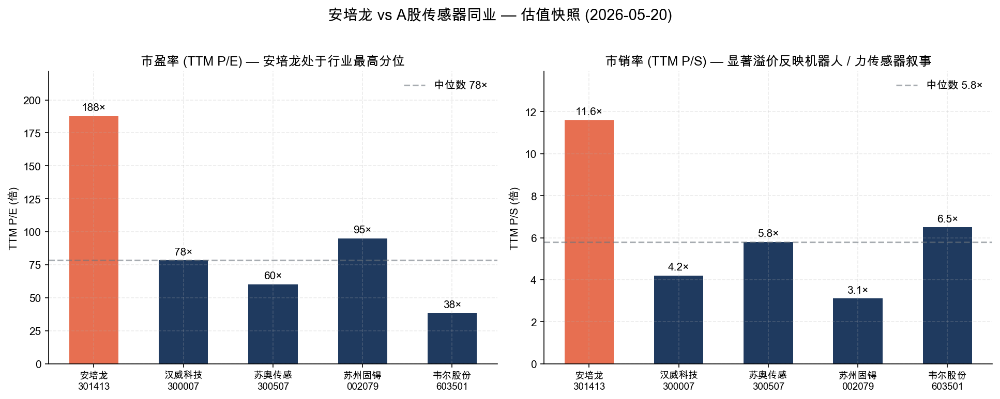
*Source: [Yahoo Finance](https://finance.yahoo.com/quote/301413.SZ) 与 [Eastmoney 东方财富](https://quote.eastmoney.com/sz301413.html)，2026-05-20 实时数据*

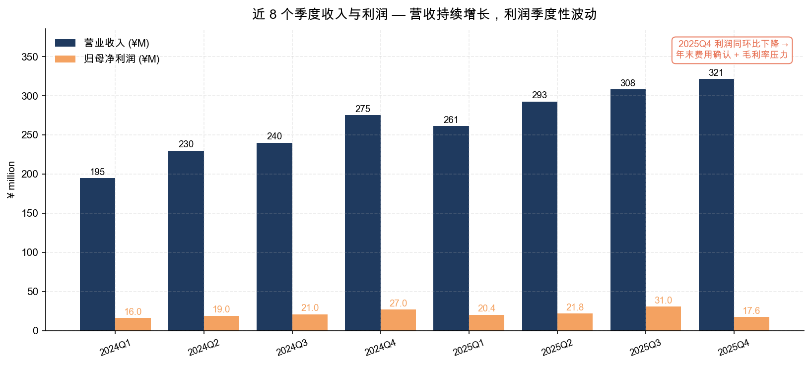
*Source: [2025 年年度报告，第 10 页](https://static.cninfo.com.cn/finalpage/2026-04-23/1224155244.PDF) 与 [2024 年年度报告，第 9 页](https://static.cninfo.com.cn/finalpage/2025-04-24/1223477567.PDF) (2024 季度数据为根据半年报、三季报、年报差分推算的估算值)*

---

**报告说明.** 本报告所有定量数据均来自公司公开监管披露 (巨潮资讯网) 或公开市场数据源 (Yahoo Finance、东方财富、赛迪顾问、GGII、QY Research、中汽协、CNESA、SNE Research)。公司未在 2025 年年报中实名披露前五大客户身份，文中关于客户身份的推断基于公司在"释义"与"市场拓展"章节披露的客户名单，标注为"推断"或"估算"——投资者应注意其性质。当前估值快照基于 2026-05-20 收盘价；A 股传感器板块估值变动频繁，读者宜在做出投资决策前重新核对。本报告不构成投资建议。
