# 安集微电子科技（上海）股份有限公司（SSE:688019）—— 公司深度研究

**截至日期 / As of:** 2026-05-25
**主要上市地：** 上海证券交易所科创板 / Shanghai STAR Market
**报告语言：** 简体中文（关键术语中英对照）

> **更新 — 2025 年度业绩超指引兑现 (2026-04-16):** 公司 2025 年实现营业收入
> 25.04 亿元（+36.47% YoY），归属于上市公司股东净利润 7.84 亿元（+46.85%），
> 扣非归母 6.97 亿元（+32.36%），均显著高于 2024 年的 18.35 亿 / 5.34 亿 /
> 5.26 亿元基数；化学机械抛光液（CMP slurry）营收 20.40 亿（+32.06%），功能性
> 湿电子化学品 4.53 亿（+63.73%），集成电路大马士革电镀液实现量产突破。
> Source: [安集科技 2025 年年度报告，2026-04-15](https://static.cninfo.com.cn/finalpage/2026-04-16/1225108553.PDF)。

---

## 目录

1. 公司概览（Company Overview）
2. 公司历史（Company History）
3. 管理团队（Management Team）
4. 产品与服务（Products & Services）—— **本报告核心章节**
5. 客户与上市策略（Customers & Go-to-Market）
6. 行业概览（Industry Overview）
7. 竞争格局（Competitive Landscape）
8. 市场机会与 TAM（Market Opportunity）
9. 风险评估（Risk Assessment）
10. 参考资料（References）

---

## 1. 公司概览

安集微电子科技（上海）股份有限公司（"**安集科技**"，SSE:688019）是一家专注于关键半导体材料研发与产业化的科创板上市公司，在化学机械抛光液（CMP slurry / 化学机械抛光液）、功能性湿电子化学品（functional wet electronic chemicals / 包括清洗液、剥离液、刻蚀液）以及电镀液及添加剂（plating chemistry / 电化学沉积）三个细分领域形成全品类产品矩阵，产品广泛应用于集成电路前道晶圆制造及后道先进封装的"**抛光—清洗—沉积**"关键工艺循环。公司于 2019 年 7 月作为科创板首批 25 家挂牌企业之一在上海证券交易所上市，是中国首批跻身全球 CMP 抛光液主流供应商行列的本土材料企业 [安集科技 2025 年年度报告，第 17 页](https://static.cninfo.com.cn/finalpage/2026-04-16/1225108553.PDF)。

公司的商业模式是典型的 **B2B 直销 + 配方型湿电子化学品**：客户主要为国内外领先的集成电路制造厂商（晶圆厂），由公司销售应用工程师团队驻场为客户提供 7×24 小时技术支持与定制化配方开发，认证周期通常 6–18 个月以上；通过认证后客户直接向公司下达采购订单，公司按要求直接发货。2025 年公司直销渠道收入 24.75 亿元（占 98.8%），经销 0.29 亿元（占 1.2%）[安集科技 2025 年年度报告，第 40 页](https://static.cninfo.com.cn/finalpage/2026-04-16/1225108553.PDF)。"上线结算"（即货物先发至客户指定仓库、由客户上线消耗后再结算）模式占主营收入比重从 2021 年 78.17% 逐步降至 2025 年 56.89%，反映客户结构与结算方式更加多元 [安集科技 2025 年年度报告，第 37 页](https://static.cninfo.com.cn/finalpage/2026-04-16/1225108553.PDF)。

公司主要生产基地集中在长三角：上海浦东金桥综合保税区南区（HQ + 第一工厂，2006 年建成）、宁波北仑（宁波安集，2017 年建成，现已成为最大利润中心 —— 2025 年净利润 1.37 亿元）、以及位于上海化学工业区电子化学品专区的"**安集电子材料**"新基地（2025 年完成主体封顶，2026—2027 年陆续投产），构成"三大制造基地差异化协同"的产能布局；同时设有台湾安集（新竹，2015 年）作为台湾地区销售与技术支持平台，新加坡安集（2022 年）下设法国子公司 Cordouan Technologies（CT，2023 年并入，从事纳米颗粒粒径与电势分析仪器业务）拓展海外研发 [走进安集 — 发展历程](https://www.anjimicro.com/zoujinanji.html)，[安集科技 2025 年年度报告，第 5 页 / 第 48 页](https://static.cninfo.com.cn/finalpage/2026-04-16/1225108553.PDF)。

**规模与人员。** 截至 2025 年末，公司员工总数 785 人，较 2024 年末增长 29.54%，其中研发与技术人员 409 人（占 52.10%），硕士及以上学历占研发团队 36.67%；研发投入 4.447 亿元（占营收 17.76%），累计获境内外授权发明专利 308 件（中国大陆 209 / 中国台湾 75 / 美国 10 / 韩国 6 / 法国 5 / 新加坡 3），另有 383 件发明专利申请待批 [安集科技 2025 年年度报告，第 31 页、第 30 页](https://static.cninfo.com.cn/finalpage/2026-04-16/1225108553.PDF)。

**前五大客户高度集中**：2025 年前五大客户合计销售 18.94 亿元，占总收入 75.65%，其中第一名 6.67 亿元（26.62%）、第二名 6.61 亿元（26.41%）、第三名 3.54 亿元（14.14%）。虽然年报未点名披露客户身份，从公开沟通材料及券商研究可推断为中芯国际（SMIC，第一）、长江存储或长鑫存储（第二），以及华虹半导体、华力集成、台积电（TSMC）等 [安集科技 2025 年年度报告，第 41 页](https://static.cninfo.com.cn/finalpage/2026-04-16/1225108553.PDF)。中国大陆收入占比 96.5%（24.16 亿元，+37.00% YoY），海外（主要为中国台湾）3.5%（8783 万元，+23.20%）[安集科技 2025 年年度报告，第 39 页](https://static.cninfo.com.cn/finalpage/2026-04-16/1225108553.PDF)。

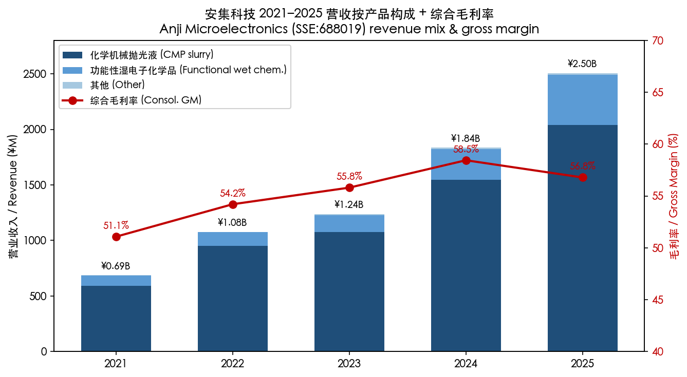

*Source: 安集科技 [2021](https://static.cninfo.com.cn/finalpage/2022-04-15/1212922136.PDF)–[2025 年年度报告](https://static.cninfo.com.cn/finalpage/2026-04-16/1225108553.PDF) 分产品收入与毛利率明细。*

**估值快照（2026-05-25）。** 收盘价 ¥329.22（市值 ¥544.6 亿），TTM P/E ~64 倍，TTM P/S ~21.7 倍，市净率 12.55 倍，52 周区间 ¥130.00–344.20 [Stockanalysis 688019 statistics, 2026-05-25](https://stockanalysis.com/quote/sha/688019/statistics/)，[雪球 SH688019 行情](https://xueqiu.com/S/SH688019)。公司近三年 P/E 中位数约 55–65 倍（2025 年 8 月低点 ~28×、2021 年初高点 >250×）[Lixinger 688019 估值数据](https://www.lixinger.com/equity/company/detail/sh/688019/688019)，当前 64× 大致处于近三年中位附近、但相对国内半导体材料同业（雅克、鼎龙、上海新阳、江丰、飞凯、晶瑞等）中位数 ~46× 仍有约 40% 的估值溢价 [东方财富 688019 行情](https://quote.eastmoney.com/sh688019.html)。

P/E > 60 倍的合理性来自三个驱动：（1）国产替代 + 大基金三期 ¥3,440 亿撬动半导体材料赛道结构性扩张 [Caixin Global, 2024-05-28](https://www.caixinglobal.com/2024-05-28/china-piles-475-billion-into-big-fund-iii-to-boost-chip-development-102200633.html)；（2）公司 CMP 抛光液全球市占率从 2023 年 8% 升至 2025 年 13%（TECHCET 口径），与全球前五形成实质性梯队 [安集科技 2025 年年度报告，第 22 页](https://static.cninfo.com.cn/finalpage/2026-04-16/1225108553.PDF)；（3）功能性湿电子化学品板块 2025 年收入 +64%、毛利率 +6.79 pp 至 50%，二阶段成长曲线开启。同业溢价合理，但 P/E 若进一步抬升至 80×+ 则需要 2026 年大马士革电镀液放量等催化兑现。

公司 2025 年现金分红预案为每 10 股派 0.50 元（含税）+ 每 10 股转增 3 股，合计派现 8,750 万元，占归母净利润 11.17% [安集科技 2025 年年度报告，第 2 页](https://static.cninfo.com.cn/finalpage/2026-04-16/1225108553.PDF)；2025 年 4 月发行的 8.31 亿元可转债（"安集转债"）已于 2026 年 3 月触发赎回条款并退市，意味着该笔融资已基本完成股本化 [安集科技 2025 年年度报告，第 104 页](https://static.cninfo.com.cn/finalpage/2026-04-16/1225108553.PDF)。

---

## 2. 公司历史

安集科技 2004 年由王淑敏博士（Dr. Shumin Wang）与俞昌博士（Dr. Chris Chang Yu）共同创办于上海张江高科技园区。两位创始人均出身 **Cabot Microelectronics**（全球 CMP 抛光液龙头，2022 年被 Entegris 收购），王淑敏在 Cabot 担任亚太技术总监、俞昌为 Cabot 创始团队成员之一，他们带回美国 CMP 抛光液原理性技术并选择当时仍处于早期阶段的中国半导体制造业作为创业土壤。彼时（2004 年）国内 12 英寸晶圆产线刚起步，CMP 抛光液 100% 进口，国内根本无成熟供应商；公司将自身定位为"打破国外厂商对集成电路领域化学机械抛光液和部分功能性湿电子化学品垄断"的高端材料供应伙伴 [安集科技 2025 年年度报告，第 21 页、第 57 页](https://static.cninfo.com.cn/finalpage/2026-04-16/1225108553.PDF)。

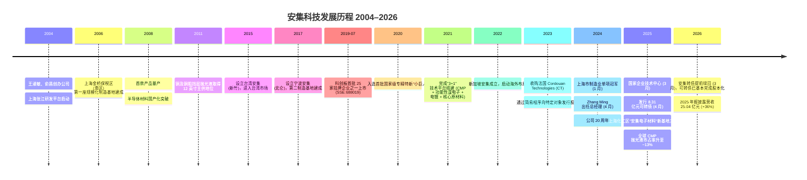

*Source: [安集科技 2025 年年度报告，第 5–10 页、第 57 页](https://static.cninfo.com.cn/finalpage/2026-04-16/1225108553.PDF)；[走进安集 — 发展历程](https://www.anjimicro.com/zoujinanji.html)。*

**三次关键转型**。第一次转型是 2008 年第一款铜抛光液实现量产，标志公司从"实验室配方公司"转型为"半导体制造工序中的稳定供应商"，并由此打开了进入晶圆厂供应链的入口。第二次转型是 2017 年宁波安集的建成与功能性湿电子化学品板块（清洗液、剥离液、刻蚀液）从 CMP 一条产品线扩展为"3+1"平台，2018—2020 年研发投入年化增速保持 30%+ ；功能性湿电子化学品板块毛利率从 2021 年的 22.15% 一路爬升至 2025 年的 50.00%，证明该板块已穿越规模阈值 [安集科技 2025 年年度报告，第 39 页](https://static.cninfo.com.cn/finalpage/2026-04-16/1225108553.PDF)。第三次转型是 2024—2025 年集成电路大马士革铜电镀液（damascene Cu plating chemistry）的产业化突破 —— 此前国内 130nm 以下铜互连电镀液几乎全部依赖陶氏（DuPont / Rohm & Haas）、Atotech（MKS Inc.）、Versum（Merck KGaA）三家外资垄断，2025 年安集首次将公司自研大马士革电镀液配方推入量产并实现销售，意味着第三个数十亿规模的赛道进入收入贡献阶段 [安集科技 2025 年年度报告，第 14 页、第 24 页](https://static.cninfo.com.cn/finalpage/2026-04-16/1225108553.PDF)。

**收购与对外投资**。公司主要走"自研 + 战略参股"路径，并非依靠大额并购：2023 年通过新加坡安集间接收购法国 Cordouan Technologies（纳米颗粒粒径分析仪器，配套公司高端纳米磨料自研能力）；累计设立 7 只产业投资基金、合计承诺出资 2.04 亿元，参股标的涵盖半导体集成电路、存储产业链、显示、新一代信息技术、智能制造和新材料等领域 [安集科技 2025 年年度报告，第 46–47 页](https://static.cninfo.com.cn/finalpage/2026-04-16/1225108553.PDF)。同时通过"自研自产"持续向上游核心原材料延伸 —— 2025 年自产氧化铈磨料应用于公司氧化铈抛光液并实现量产销售，使得公司在国内同业中率先实现"磨料 → 抛光液"垂直一体化 [安集科技 2025 年年度报告，第 24 页、第 29 页](https://static.cninfo.com.cn/finalpage/2026-04-16/1225108553.PDF)。

**近期发展（2025—2026）**。一是 2025 年 4 月成功发行 8.31 亿元可转债（"安集转债"），募集资金用于功能性湿电子化学品产能与电镀液产业化项目；该笔可转债已于 2026 年 3 月触发赎回条款并退市，反映股价持续高于强赎线 [安集科技 2025 年年度报告，第 104 页](https://static.cninfo.com.cn/finalpage/2026-04-16/1225108553.PDF)。二是 2026 年 3 月公司在 SEMICON China 2026 发布"全品类氧化铈抛光液 + 全品类钨抛光液"产品矩阵，覆盖浅沟槽隔氧化铈、介电质氧化铈、自停止氧化铈、硅氧化铈、氧化铈清洗液等子品类，并宣称已为 20+ 家客户量产 15 款以上钨抛光液 [SEMICON China 2026 新品发布会](https://www.anjimicro.com/qiyexinwen/124.html)。三是 2026 年 4 月公司公告将原 1.195 亿元宁波 CMP 抛光液项目投产，进一步打开产能瓶颈 [安集科技 2026 年 4 月公告 (新浪科技)](https://finance.sina.com.cn/tech/roll/2026-04-20/doc-inhvczzy6816394.shtml)。四是 2025 年 4–10 月，第一大股东 Anji Cayman 一致行动方"大基金一期"（国家集成电路产业投资基金）通过集中竞价方式累计减持 188.87 万股（占总股本 2.14%），减持均价区间 ¥152–267，回笼资金约 3.73 亿元；同期董事长王淑敏拟减持不超过 22,420 股（占比 0.0133%），属象征性减持 [证券时报 — 大基金减持安集](https://www.stcn.com/article/detail/1003913.html)。

---

## 3. 管理团队

### 王淑敏（Shumin Wang）— 创始人、董事长（兼 2017–2024 年总经理）

王淑敏博士 1964 年出生，是公司的灵魂人物与第一大个人控制力的来源。她拥有美国莱斯大学（**Rice University**）材料化学（Materials Chemistry）博士学位，1988 年赴美攻读博士；后又取得美国西北大学凯洛格商学院（**Kellogg School of Management at Northwestern**）EMBA 学位。1995—1996 年在 **IBM 美国研发总部**担任 Research Fellow，1996—2004 年加入 **Cabot Microelectronics**（彼时全球 CMP 抛光液最大供应商，2022 年被 Entegris 以约 65 亿美元收购），从 Scientist 一路晋升至亚太技术总监（Asia Technology Director），主导 Cabot 在亚太区的客户技术支持与产品本地化 [安集科技 2025 年年度报告，第 57 页](https://static.cninfo.com.cn/finalpage/2026-04-16/1225108553.PDF)；[集成电路材料产业技术创新联盟 — 王淑敏](http://www.icmtia.com/product/278.html)。

2004 年 9 月王淑敏带着 Cabot 的 CMP 配方与产业化经验回国创办安集，先后任上海安集首席执行官、董事、董事长、执行董事；2017 年 6 月公司股份制改造后任董事长兼总经理直至 2024 年 4 月，期间主导了公司从一款铜抛光液单品到全品类 CMP + 功能性湿电子化学品 + 电镀液"3+1"产品矩阵的搭建。她曾入选"上海领军人才"和"上海市优秀学科带头人"，目前持有公司股份 89,682 股（直接持股仅 0.053%），但通过控股股东 Anji Microelectronics Co. Ltd.（开曼公司，持有公司 30.70%）间接持股比例显著较高；同时她在 Anji Cayman 担任董事自 2004 年 11 月至今 [安集科技 2025 年年度报告，第 56–60 页](https://static.cninfo.com.cn/finalpage/2026-04-16/1225108553.PDF)。2025 年她的税前薪酬为 ¥300.45 万元（不含股份支付），位列公司最高个人薪酬之一。值得指出的是，公司在 2025 年报中明确披露"**无实际控制人**"（Anji Cayman 内部无 50% 以上股东、无单一股东对其董事会行使控制），王淑敏的实际控制力来自其在 Anji Cayman 的董事职位与历史持股结构，并非纯粹股权控制 [安集科技 2025 年年度报告，第 108 页](https://static.cninfo.com.cn/finalpage/2026-04-16/1225108553.PDF)。

### Zhang Ming（张明）— 总经理（自 2024 年 4 月起）

张明先生 1966 年出生，2024 年 4 月接任公司总经理，是公司从"创始人主导单一研发驱动"走向"研发 + 销售运营双轮驱动"的关键人事安排。他拥有美国德克萨斯大学阿灵顿分校 EMBA、硕士研究生学历，职业生涯起点偏向工艺工程：早期任佛山鸿基薄膜工艺工程师，随后历任比利时巴可（Barco）公司区域销售经理、美国科视数字系统（Christie Digital）总经理、英国豪迈集团（Halma plc）中国区总裁、英国标准协会（BSI）大中华区董事总经理、欧陆科技集团（Eurofins Scientific）中国区董事总经理 —— 这是一条典型的"跨国公司中国区职业经理人"履历，强项在多元产品线管理、跨文化销售运营、合规与体系建设 [安集科技 2025 年年度报告，第 58 页](https://static.cninfo.com.cn/finalpage/2026-04-16/1225108553.PDF)。

2020 年 12 月至 2024 年 4 月任公司副总经理，2021 年 3 月至 2024 年 4 月并任公司财务总监（CFO），2023 年 3 月起任新加坡安集子公司 CORDOUAN（Cordouan Technologies）总裁；2023 年 5 月当选公司董事，2024 年 4 月正式接任王淑敏从公司总经理职位卸任后的位置 —— 至此王淑敏完成了从"创始人 + CEO"向"董事长"的角色聚焦。张明 2025 年税前薪酬 ¥309.65 万元，持股 134,186 股，过去一年通过分红送转、股权激励实施净增 38,735 股 [安集科技 2025 年年度报告，第 56 页](https://static.cninfo.com.cn/finalpage/2026-04-16/1225108553.PDF)。

王淑敏 + 张明的搭档安排有以下战略含义：（1）王淑敏聚焦董事会、长期战略、核心技术路线（继续署名"核心技术人员"）；（2）张明负责海内外销售运营、海外子公司协同（新加坡 / 法国 CT）、财务与合规体系；（3）公司核心研发力量（俞昌、王雨春、Shoutian Li、荆建芬、彭洪修、王徐承）多名核心技术人员持续保留并任副总经理或主任研究员，研发治理稳定。需要指出的是俞昌（Chris Chang Yu）2025 年 7 月 23 日因个人原因辞去公司董事职务，但他对公司的影响力主要通过 Anji Cayman 持续；俞昌另有自己创立的安派科生物医学科技作为其个人发展平台 [安集科技 2025 年年度报告，第 57 页](https://static.cninfo.com.cn/finalpage/2026-04-16/1225108553.PDF)。

---

## 4. 产品与服务 —— **本报告核心章节**

### 4.1 公司的"3+1"技术平台与产品矩阵（来自 2025 年报）

安集科技在 2025 年报中将自身核心竞争力归纳为"**3+1 技术平台**"，原话引述如下 [安集科技 2025 年年度报告，第 21 页](https://static.cninfo.com.cn/finalpage/2026-04-16/1225108553.PDF)：

> "公司成功搭建了'**化学机械抛光液-全品类产品矩阵**'、'**功能性湿电子化学品-领先技术节点多产品线布局**'、'**电镀液及添加剂-强化及提升电镀高端产品系列战略供应**'及'**核心原材料建设-提升自主可控战略供应能力**'具有核心竞争力的'3+1'技术平台及应用领域。公司成功打破了国外厂商对集成电路领域化学机械抛光液和部分功能性湿电子化学品的垄断，实现了进口替代，并且拓展和强化了电化学沉积领域的技术平台，产品覆盖多种电镀液及添加剂。"

下表是公司主营业务分产品的 2024–2025 年明细，每行直接来自 2025 年报第 39 页"主营业务分产品情况"，相邻为 2024 年报第 40 页同一表的对照数据：

| 产品线 | 2025 营收 (¥万元) | 2025 同比 | 2025 毛利率 | 2024 营收 (¥万元) | 2024 毛利率 | 主要原始引用 |
|---|---|---|---|---|---|---|
| 化学机械抛光液 (CMP slurry) | 203,979.60 | +32.06% | 58.28% | 154,457.55 | 61.16% | [2025 年报 §39](https://static.cninfo.com.cn/finalpage/2026-04-16/1225108553.PDF), [2024 年报 §40](https://static.cninfo.com.cn/finalpage/2025-04-16/1223101942.PDF) |
| 功能性湿电子化学品 (functional wet chem) | 45,285.69 | +63.73% | 50.00% | 27,658.02 | 43.21% | 同上 |
| 其他 (含电镀液、CT 仪器等) | 1,156.50 | -16.56% | 45.01% | 1,385.95 | 60.39% | 同上 |
| **合计** | **250,421.79** | **+36.47%** | **56.79%** | **183,501.52** | **58.45%** | 同上 |

需要特别指出：**集成电路大马士革电镀液在 2025 年报中已明确"进入量产阶段，实现销售"**，但目前财务披露仍合并在"其他"项目，意味着 2026 年其单独披露的可能性较高 [安集科技 2025 年年度报告，第 14 页](https://static.cninfo.com.cn/finalpage/2026-04-16/1225108553.PDF)。下图复刻了 2025 年报第 18 页公司主要产品在芯片制造及先进封装关键循环重复工艺中应用的原图：

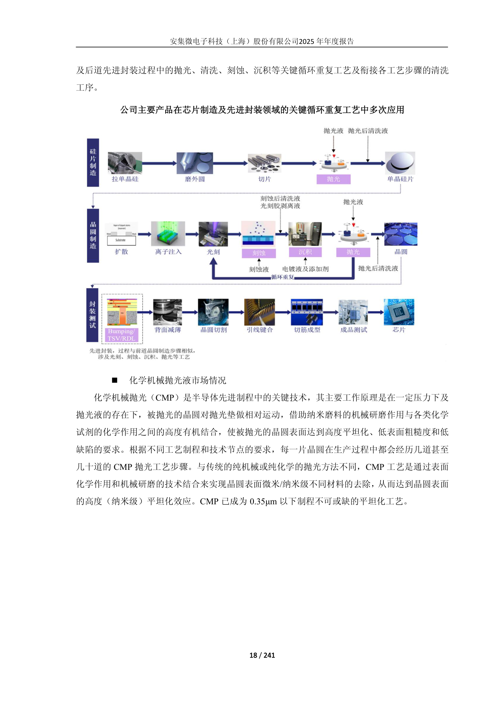

*Source: [安集科技 2025 年年度报告，第 18 页](https://static.cninfo.com.cn/finalpage/2026-04-16/1225108553.PDF)。*

### 4.2 工艺位置 —— "抛光—清洗—沉积"循环的化学供应商

集成电路前道晶圆制造的核心工序是"**沉积 (Deposition) → 光刻 (Lithography) → 刻蚀 (Etch) → 清洗 (Clean) → 抛光 (CMP) → 清洗 → 沉积**"循环 —— 每个 metal layer (金属层) 加一次循环，先进逻辑工艺 7nm 以下需要 30+ 道 CMP、清洗步骤总数占全制程 30%+ [安集科技 2025 年年度报告，第 19 页](https://static.cninfo.com.cn/finalpage/2026-04-16/1225108553.PDF)。安集的三大产品板块刚好落在 **CMP / Clean / Plating** 三个"湿化学"工序节点上 —— 公司的核心竞争力是**"配方 + 高纯度复配 + 客户驻场服务"**，不是设备。下图是公司"3+1"平台的功能定位示意（复刻自 2025 年报第 17 页）：

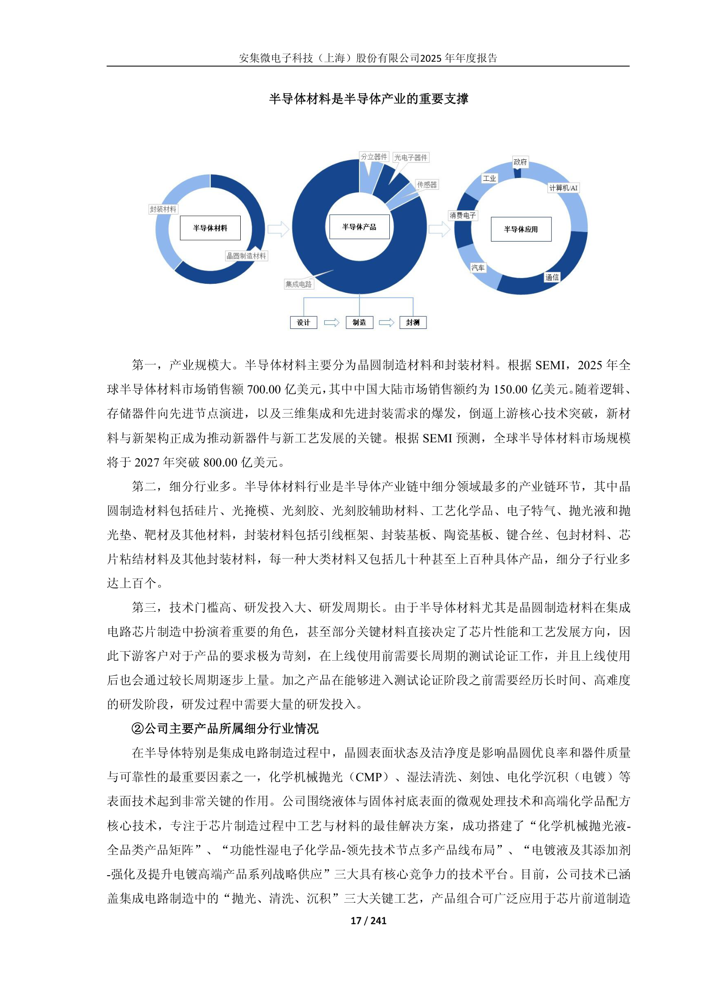

*Source: [安集科技 2025 年年度报告，第 17 页](https://static.cninfo.com.cn/finalpage/2026-04-16/1225108553.PDF)。*

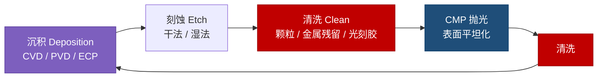

*安集的产品矩阵在每一个红色（清洗）/ 蓝色（CMP）/ 紫色（沉积）节点都有一席之地，构成"一站式湿化学供应"的卖点。*

### 4.3 CMP 抛光液 —— 全品类产品矩阵

**产品族范围**。2025 年报明确公司 CMP 抛光液已涵盖 **6 大产品平台** [安集科技 2025 年年度报告，第 14 页](https://static.cninfo.com.cn/finalpage/2026-04-16/1225108553.PDF)：

> "公司化学机械抛光液产品已涵盖**铜及铜阻挡层抛光液、介电材料抛光液、钨抛光液、基于氧化铈磨料的抛光液、金属栅极抛光液及衬底抛光液**等多个产品平台。同时，公司还基于化学机械抛光液技术和产品平台，支持客户对于不同特色制程的需求，定制开发用于新材料、新工艺、新应用的化学机械抛光液。"

**(a) 铜及铜阻挡层抛光液（Cu / Cu-barrier slurry）**。来自 2025 年报的研发项目披露：

> "铜制程抛光液 — 先进制程用铜及铜阻挡层抛光液在多个客户端验证并稳定供应，持续为客户定制开发用于更先进制程的铜及铜阻挡层抛光液…用于成熟制程的迭代产品实现量产…使用国产研磨颗粒的铜及铜阻挡层抛光液持续量产销售。" [安集科技 2025 年年度报告，第 32 页](https://static.cninfo.com.cn/finalpage/2026-04-16/1225108553.PDF)

**中文释义 / Plain-language gloss：** 铜及铜阻挡层抛光液是 130nm 以下铜互连大马士革工艺（Cu damascene）后段平坦化的核心耗材 —— 铜电镀（Cu ECP，对应公司电镀液板块）在晶圆表面长出一层厚铜后，CMP 工艺用浆料 + 抛光垫机械研磨，将多余的铜与下方的 Ta / TaN 阻挡层（barrier layer / 阻挡层）一并去除，最终留下嵌入介质层（dielectric / 介电材料）沟槽内的铜线。抛光液必须同时具备："对铜的选择性蚀刻（高速率、低凹陷）" + "对介质层的低损伤" + "对阻挡层的可调速率" 三项相互制约的特性 —— 这是 CMP 配方最复杂的细分。公司 2011 年取得 12 英寸主供地位 [走进安集 — 发展历程](https://www.anjimicro.com/zoujinanji.html)；2025 年报显示先进制程铜抛光液"在多个客户端验证并稳定供应"，覆盖范围已扩展到逻辑芯片 14/7nm 节点。在先进封装中 TSV (Through-Silicon Via / 硅通孔) 也用相同化学体系做厚铜抛光，是公司近年面向 HBM / CoWoS 高带宽存储市场新的增长入口 [安集科技 2025 年年度报告，第 32 页](https://static.cninfo.com.cn/finalpage/2026-04-16/1225108553.PDF)。

***Analyst view：*** 全球 Cu CMP slurry 市场约 $500M 规模，前 5 名（Fujifilm、Entegris、Versum-Merck KGaA、Resonac、Anji）合计份额约 77% [Cu CMP Slurry Market — Valuates Reports, 2025](https://reports.valuates.com/market-reports/QYRE-Auto-34T18778/global-cu-cmp-slurry)。安集在国内逻辑芯片厂（SMIC 中芯国际、华虹）+ 存储厂（YMTC 长江存储、CXMT 长鑫存储）的占比已经处于领先位置，最直接的竞品是 Fujifilm Electronic Materials（FFEM）的 PLANERLITE 系列与 Entegris 的 Microplanar 系列。

**(b) 钨抛光液（Tungsten slurry）**。

> "钨抛光液 — 先进制程用钨抛光液多只产品组合实现稳定供应并逐步提升产量；同时相关产品已在多家客户端测试…用于成熟制程的产品根据客户的具体需求进行定制化开发。" [安集科技 2025 年年度报告，第 32 页](https://static.cninfo.com.cn/finalpage/2026-04-16/1225108553.PDF)

**中文释义 / Plain-language gloss：** 钨（W）在芯片中主要用作"**接触孔填充 / Contact Plug**"——即把上层金属线与下方硅基晶体管的源极/漏极连接起来的"垂直插销"。先进 3D NAND（三维闪存）由 2D NAND 演进到 3D 后，**每一层垂直堆叠都需要钨填充 + CMP 平坦化**，因此 200 层 → 232 层 → 300+ 层 → 400 层的层数堆叠会让钨抛光液用量近乎线性放大。公司在 2025 年报中专门指出 "3D NAND 演进会使 CMP 工艺步骤数近乎翻倍，带动了钨抛光液及其他抛光液需求的持续快速增长" [安集科技 2025 年年度报告，第 19 页](https://static.cninfo.com.cn/finalpage/2026-04-16/1225108553.PDF)。2026 年 SEMICON China 展会上公司宣布"已为 20 余家客户量产 15 款以上钨抛光液" [SEMICON China 2026 新品发布会](https://www.anjimicro.com/qiyexinwen/124.html)。

***Analyst view：*** 钨抛光液全球前两位是 **Entegris (CMC Materials)** 与 **Fujimi**，两家均诞生于美国 / 日本 90 年代逻辑芯片黄金期。安集在 YMTC 长江存储等国内 3D NAND 厂的钨抛光液份额已经显著高于其他细分（公司 2025 年 13% 全球抛光液份额中，钨抛光液估计权重较高）。需注意：Entegris-CMC 在 2022 年完成 ~$6.5B 并购，钨抛光液协同效应是该交易的主要标的 [Entegris Completes CMC Materials Acquisition, 2022-07-06](https://www.businesswire.com/news/home/20220706005273/en/Entegris-Completes-Acquisition-of-CMC-Materials-Solidifying-Position-as-the-Global-Leader-in-Electronic-Materials)。

**(c) 介电材料抛光液（Dielectric / SiO₂ / SiN slurry）**。

> "介电材料抛光液 — 用于先进逻辑芯片制程工艺的氮化硅抛光液满足技术要求，持续在客户端验证；用于先进存储芯片工艺的氮化硅抛光液实现销售。氧化硅抛光液正在逐步实现研磨颗粒国产化，部分产品已经通过验证上线。" [安集科技 2025 年年度报告，第 32 页](https://static.cninfo.com.cn/finalpage/2026-04-16/1225108553.PDF)

**中文释义 / Plain-language gloss：** 介电材料 / 介质 (dielectric) 是 IC 中的绝缘层（包括 SiO₂ 二氧化硅、SiN 氮化硅、SiON、low-k 低介电常数介质），位于两层金属之间起到电气隔离 + 物理支撑作用。介电材料抛光液 (ILD / Inter-Layer Dielectric slurry) 主要任务是**抛光氧化硅或氮化硅层至原子级平坦**，为下一层金属沉积准备一个完美平面 —— 这是任何半导体制程都不可缺少的工序，需求量随**金属层数**（先进 7nm 逻辑 15+ 层、3D NAND 200+ 层）增加而上升。SiN 氮化硅抛光是 GAA（Gate-All-Around，栅极环绕，2nm 节点的新晶体管结构）工艺的关键步骤。

***Analyst view：*** 该子赛道是 **Fujifilm Electronic Materials** 的传统强项（PLANERLITE 介电系列）—— FFEM 在介电材料抛光液领域的全球份额据 TECHCET 估算超过 30%。安集 2025 年报披露"用于先进存储芯片工艺的氮化硅抛光液实现销售"是重要节点，意味着公司氮化硅产品首次进入存储芯片量产供货 [安集科技 2025 年年度报告，第 32 页](https://static.cninfo.com.cn/finalpage/2026-04-16/1225108553.PDF)。

**(d) 基于氧化铈磨料的抛光液（Ceria-based slurry）—— 2025—2026 年最大亮点**。

> "基于氧化铈磨料的抛光液产品取得重要进展，使用自研自产的国产氧化铈磨料的抛光液产品首次应用在氧化物抛光中，实现了技术路径的突破，并在客户端实现量产销售，显著提高了客户的良率；另有多款新产品在不同客户端完成论证测试并实现量产销售。先进制程用浅槽隔离抛光液验证进展顺利。" [安集科技 2025 年年度报告，第 29 页](https://static.cninfo.com.cn/finalpage/2026-04-16/1225108553.PDF)

**中文释义 / Plain-language gloss：** 氧化铈（CeO₂，cerium oxide）磨料是 **STI (Shallow Trench Isolation，浅沟槽隔离)** 工艺的关键耗材 —— STI 是任何 0.13µm 以下逻辑制程中"在硅衬底上挖出沟槽、填入 SiO₂、用 CMP 抛光至同一平面"的步骤，本质上是为相邻晶体管做电气隔离的"分隔墙"。氧化铈对 SiO₂ 的选择性研磨速率远高于 SiN（氮化硅），从而可以做出"自停止"（self-stopping）抛光 —— 当抛光面到达预定 SiN 阻挡层就自动减速，工艺窗口宽、良率高。该技术最早由日本 **Hitachi Chemical**（现 Resonac）与 **AGC** 掌握。**安集在 2025 年实现"使用自研自产的国产氧化铈磨料的抛光液产品首次应用在氧化物抛光中，实现了技术路径的突破" —— 这意味着公司从"配方公司"向"上游磨料 + 配方一体化"垂直整合迈出关键一步**，是国内同业（包括江丰、鼎龙）尚未达到的能力门槛。2026 年 SEMICON China 公司发布的"全品类氧化铈抛光液产品矩阵"（含浅沟槽隔氧化铈、介电质氧化铈、自停止氧化铈、硅氧化铈、氧化铈清洗液 5 个子品类）是这一垂直化能力的首次公开展示 [SEMICON China 2026 新品发布会](https://www.anjimicro.com/qiyexinwen/124.html)。

***Analyst view：*** 氧化铈磨料垄断历史上由 Hitachi Chemical / Resonac、AGC、Mitsui Mining & Smelting（日本三井金属）等少数日本企业把控，全球估计市场规模 $300–400M。安集自产氧化铈磨料是国内目前**唯一已经实现量产应用**的本土路径（参股公司"山东安特纳米材料"是其磨料生产承担方）。

**(e) 金属栅极抛光液（Metal Gate slurry）**。

> "金属栅极抛光液在数家客户实现量产并在持续上量，应用于技术迭代的先进制程产品开发及验证顺利。" [安集科技 2025 年年度报告，第 29 页](https://static.cninfo.com.cn/finalpage/2026-04-16/1225108553.PDF)

**中文释义 / Plain-language gloss：** 金属栅极 (metal gate / 金属栅) 是 HKMG (High-K Metal Gate，高 K 介电常数 + 金属栅极) 工艺的核心步骤 —— 自 45nm 节点起，多晶硅 (polysilicon / 多晶硅) 栅极被换成钨、钛、钽等金属栅极以提升晶体管性能，相应需要专用的金属栅极抛光液。该工艺是 FinFET（鳍式场效应晶体管）→ GAA 晶体管演进路径上的"中段"步骤。

***Analyst view：*** 该子市场较小但高度技术敏感，目前主要供应商是 Versum / Merck KGaA 与 Fujimi；安集"数家客户实现量产"意味着已进入主流逻辑芯片厂 28nm 以下产能。

**(f) 衬底抛光液（Substrate / Silicon Wafer Polish slurry）**。

> "衬底抛光液 — 公司紧跟国内大硅片企业的发展和打造材料自主可控能力的趋势，充分了解客户的需求后定制化开发抛光液产品…公司研发的新型硅抛光液在客户端顺利上线，性能达到国际先进水平。" [安集科技 2025 年年度报告，第 29 页](https://static.cninfo.com.cn/finalpage/2026-04-16/1225108553.PDF)

**中文释义 / Plain-language gloss：** 衬底抛光液主要用于**硅晶圆生产环节**（晶圆厂的上游 —— 拉单晶硅 → 切片 → 抛光），客户是国内 12 英寸大硅片企业沪硅（SSE:688126）、TCL 中环、立昂微等。这是公司面向"半导体上游材料厂商"开拓的细分赛道。

**(g) 先进封装与新材料抛光液（TSV / Hybrid Bonding / Polymer）**。

> "持续加强在先进封装用抛光液的布局，用于 2.5D，3D TSV 抛光液、混合键合抛光液和聚合物抛光液进展顺利，在国内客户均作为首选供应商帮助客户打通技术路线…销售持续上量。" [安集科技 2025 年年度报告，第 29 页](https://static.cninfo.com.cn/finalpage/2026-04-16/1225108553.PDF)

**中文释义 / Plain-language gloss：** 先进封装是后摩尔时代提升芯片性能的主要路径之一 —— TSMC CoWoS、Samsung X-Cube、Intel Foveros 均依赖大量"**硅穿孔 (TSV) + 混合键合 (Hybrid Bonding) + 重布线层 (RDL, Redistribution Layer)**" 工艺；这些工艺需要在堆叠键合的硅晶圆界面做高精度 CMP 抛光，化学体系与前道大有不同（更关注表面缺陷、应力管理、聚合物 + 金属的混合抛光）。HBM (High Bandwidth Memory) 是当前 AI 算力最受益的存储产品形态，单片 HBM 12-Hi 堆栈包含 12 颗 DRAM 通过 TSV + Hybrid Bonding 垂直堆叠 —— **每多堆一层都意味着安集 TSV / Hybrid Bonding 抛光液销售机会**。

### 4.4 功能性湿电子化学品 —— 第二增长曲线，毛利率从 22% 升至 50%

> "公司功能性湿电子化学品主要包括**刻蚀后清洗液、晶圆级封装用光刻胶剥离液、抛光后清洗液、刻蚀液**等产品…在功能性湿电子化学品板块，公司专注于集成电路前道晶圆制造用及后道晶圆级封装用等高端功能性湿电子化学品产品领域，致力于攻克领先技术节点难关。" [安集科技 2025 年年度报告，第 14 页](https://static.cninfo.com.cn/finalpage/2026-04-16/1225108553.PDF)

**(a) 刻蚀后清洗液 (Post-Etch Cleaning / 刻蚀残留物去除)**。在干法刻蚀 (dry etch / 等离子体刻蚀) 之后，晶圆表面留下复杂的金属-有机-聚合物残留物（聚合物侧壁、刻蚀气体残渣、金属离子污染），需要专用湿化学品清除。每个金属层都需要一次刻蚀后清洗，因此 7nm 以下逻辑节点（15+ 金属层）需求量很大。公司在 2025 年报中明确"先进制程刻蚀后清洗液研发及产业化进展顺利，快速上量，并持续扩大海外市场" [安集科技 2025 年年度报告，第 29 页](https://static.cninfo.com.cn/finalpage/2026-04-16/1225108553.PDF)。从公司网站披露的 SKU 看，已涵盖铝刻蚀后清洗液、铜刻蚀后清洗液、TiN 硬掩模刻蚀后清洗液（28nm 及以下先进节点）等子品类 [安集 — 功能性湿电子化学品](https://www.anjimicro.com/jiejuefangan.html)。

***Analyst view：*** 全球主要竞品为 Entegris（含 ATMI / SAFC 收购整合后的电子级清洗液）、JSR、Tokyo Ohka Kogyo（TOK）；安集是中国 28nm 及以下先进节点国产替代的主要候选。

**(b) 光刻胶剥离液 (Photoresist Stripper)**。光刻胶 (photoresist / 光刻胶) 在曝光—显影—刻蚀工序之后必须从晶圆表面去除，剥离液对厚膜光刻胶（特别是晶圆级封装 WLP 中使用的 100µm 以上厚胶）需要有极强的溶解能力。安集这条线主要应用在 **晶圆级封装 (WLP, Wafer-Level Packaging) 与 TSV、Bumping 工艺**，市场端跟随先进封装爆发同步增长。

**(c) 抛光后清洗液 (Post-CMP Cleaning)**。CMP 抛光之后，晶圆表面残留浆料颗粒、有机物、金属离子（特别是 Cu 抛光后会有 Cu²⁺ 痕量残留），需要专用清洗液去除以避免影响下一道工序。公司在 2025 年报中披露"先进制程碱性铜抛光后清洗液进展顺利，快速上量，持续增加市场份额" [安集科技 2025 年年度报告，第 29 页](https://static.cninfo.com.cn/finalpage/2026-04-16/1225108553.PDF)。这是 CMP 抛光液的"配套产品" —— 公司可以借助 CMP 客户关系直接交叉销售清洗液。

**(d) 刻蚀液 (Selective Etch / 选择性刻蚀液)**。包括 SiGe / Si / SiN / Poly 选择性刻蚀液，主要用于 GAA / 3D NAND / FinFET 工艺中的精确层去除。公司 2025 年报披露"成功建立刻蚀液技术平台，与多个客户合作，研发及验证按计划进行" —— 这是相对早期的产品线 [安集科技 2025 年年度报告，第 33 页](https://static.cninfo.com.cn/finalpage/2026-04-16/1225108553.PDF)。

**该板块毛利率三年从 22% → 50%**，是公司经营层面**最重要的盈利杠杆**：当一个产品线的销售规模穿越固定成本阈值，毛利率会从分摊不足 → 接近边际成本，安集功能性湿电子化学品 2025 年的 ¥4.53 亿收入 + 50% GM 表明该曲线已经穿越拐点；未来 2-3 年规模化扩张将进一步压低单位成本，毛利率有望趋近 CMP 抛光液的 58–61% 区间 [安集科技 2025 年报第 39 页 / 2024 年报第 40 页 / 2023 年报第 42 页](https://static.cninfo.com.cn/finalpage/2026-04-16/1225108553.PDF)。

### 4.5 电镀液及添加剂 —— 第三条增长曲线，2025 年首次量产

> "在电镀液及添加剂产品板块，公司持续加强集成电路制造及先进封装领域的电镀液及添加剂产品系列平台的搭建，产品覆盖应用于集成电路制造的**大马士革工艺铜电镀液及添加剂**、应用于先进封装领域的**铜、镍、锡银等电镀液及添加剂以及硅通孔（TSV）电镀液及添加剂**。目前，先进封装用电镀液及添加剂已有多款产品实现量产销售，应用于凸点、重布线层（RDL）、异质集成技术；**集成电路制造领域的大马士革工艺铜电镀液及添加剂已进入量产阶段，实现销售**，先进封装锡银电镀液及添加剂以及硅通孔电镀液及添加剂开发及验证按计划进行。" [安集科技 2025 年年度报告，第 14 页](https://static.cninfo.com.cn/finalpage/2026-04-16/1225108553.PDF)

**中文释义 / Plain-language gloss：** 半导体电镀 (ECP, Electrochemical Deposition / 电化学沉积) 是芯片"铜互连"工艺的核心步骤 —— 在带阻挡层 + 籽晶层（barrier + seed）的晶圆上，浸入含有添加剂的高纯电镀液，通过电场作用让铜离子从下到上填满已经刻蚀好的沟槽和通孔 (via)，形成多层金属互连。**电镀液添加剂 (additives) 是关键性能决定因素**：加速剂 (accelerator) 让填充加速、抑制剂 (suppressor) 抑制表面镀铜、整平剂 (leveler) 平整镀层晶粒；三者协同方能实现"**自下而上 (bottom-up fill)**"、无空洞、无凹陷的完美填充。这是一类**配方比 CMP 抛光液还复杂**的产品，全球目前由 **MacDermid（美国）、Atotech (MKS, 美国/德国)、DuPont（含 Versum 合并后的 plating 业务）、JCU (日本)、上村工业 Uyemura (日本)** 等寡头垄断；国内此前无成熟供应商。**安集 2025 年首次将大马士革电镀液配方推入国内晶圆厂量产销售，是国产替代上的重大节点** [安集科技 2025 年年度报告，第 14 页](https://static.cninfo.com.cn/finalpage/2026-04-16/1225108553.PDF)。

***Analyst view：*** 该赛道全球 TAM ~$1.38B（2025），先进封装电镀液约 $300M [Plating Chemicals — Semiconductor Digest 2025](https://www.semiconductor-digest.com/rising-copper-demand-in-semiconductors-drives-plating-chemicals-for-advanced-packaging-and-interconnects/)。安集 2025 年该板块收入估计在 ¥0.5–1 亿级别（被归入"其他"项目，未单独披露），但**长期价值在于这是先进封装 / HBM / CoWoS 的核心材料 —— 每一片高端 HBM 的 TSV 都要做铜电镀**。这条产品线的真正变现要看 2026—2028 年。

### 4.6 核心原材料自主可控 —— 垂直整合的"+1"

> "在建立核心原材料自主可控供应方面，参股公司开发的多款硅溶胶产品在功能性、稳定性和产出方面有明显提升，已应用在公司多款抛光液产品中并实现量产销售；自研自产的磨料在品类、形貌、功能等方面得到进一步拓展与丰富…多款产品已通过客户端的验证并实现量产供应，部分产品在重要客户实现销售，随着公司高端纳米磨料制备技术的进一步熟练掌握，上游原材料自主可控能力大大加强。" [安集科技 2025 年年度报告，第 24 页](https://static.cninfo.com.cn/finalpage/2026-04-16/1225108553.PDF)

**中文释义 / Plain-language gloss：** CMP 抛光液的核心原材料是**纳米级磨料颗粒**（abrasive nanoparticles，主要有硅溶胶 silica colloid、气相二氧化硅 fumed silica、氧化铈 ceria）+ **高纯化学品**。磨料的颗粒粒径、表面活性、电势分布直接决定抛光液性能。历史上磨料长期被日本（Fuso Chemical 扶桑、Mitsui Mining 三井矿业）和美国（Cabot 卡博特，被 Entegris 收购）垄断；安集通过参股公司（如山东安特纳米材料）+ 自建产线（如 2023 年并购的法国 Cordouan Technologies 提供颗粒电势分析仪器配套）逐步建立 **磨料 → 配方 → 应用** 垂直一体化能力。**2025 年自研自产氧化铈磨料应用于公司氧化铈抛光液产品并实现量产销售，是国内同业目前唯一**的垂直化路径 [安集科技 2025 年年度报告，第 29 页](https://static.cninfo.com.cn/finalpage/2026-04-16/1225108553.PDF)。

### 4.7 综合 —— 三条产品线如何在客户工厂中协同

CMP 抛光液、功能性湿电子化学品、电镀液三条产品线并非"三条独立的业务"，而是同时落在客户晶圆厂的**同一个工艺循环**内的三个相邻工序。在客户视角：（1）**采购集中**：晶圆厂"湿化学品供应商管理部门"愿意减少供应商数量，三条产品线打包采购降低供应链复杂度；（2）**技术协同**：CMP 抛光液 + 抛光后清洗液必然配套使用，且 CMP 残留物正是清洗液要去除的对象 —— 公司可以为客户提供"端到端配方协同"，竞品做不到；（3）**先进封装的同源需求**：HBM / CoWoS 同时需要 TSV CMP 抛光、TSV 后清洗、TSV 铜电镀 —— 三条线全在一个客户工序内。这种"一站式湿化学供应"是国内同业（鼎龙偏 CMP 抛光垫与抛光液、雅克偏前驱体气体、上海新阳偏电镀 + 光刻胶）目前没有形成的复合能力 —— **这是安集在 2025–2027 年的核心战略护城河**。

### 4.8 旗舰产品线与近 12 个月新品发布

- **旗舰 = CMP 抛光液**（占 2025 年收入 81%），其中钨抛光液 + 铜及铜阻挡层抛光液 + 氧化铈基抛光液三大子品类支撑主要营收。
- **2026 年 3 月 SEMICON China 2026** ：公司一次性发布"全品类钨抛光液 + 全品类氧化铈抛光液"两条新品线，前者含 20+ 款用于不同节点的钨抛光液 SKU，后者含浅沟槽隔氧化铈、介电质氧化铈、自停止氧化铈、硅氧化铈、氧化铈清洗液 5 个子品类。这是公司从"打入主流供应商行列"向"定义产品标准"的里程碑 [SEMICON China 2026 新品发布会](https://www.anjimicro.com/qiyexinwen/124.html)。
- **集成电路大马士革铜电镀液 2025 年首次量产销售** —— 详见 4.5。
- **氧化铈磨料 → 氧化铈抛光液** 全国产化路径在 2025 年完成首次客户端量产 —— 详见 4.3 (d)、4.6。

### 4.9 关键 R&D 项目预算（2025 年报披露的 9 大在研项目）

| 项目 | 预计总投资 (¥万) | 2025 投入 (¥万) | 技术水平 |
|---|---|---|---|
| 铜制程抛光液 | 23,500 | 7,239 | 国际先进 |
| 钨抛光液 | 22,000 | 5,907 | 国际先进 |
| 基于氧化铈磨料的抛光液 | 23,000 | 6,080 | 国际先进 |
| 介电材料抛光液 | 8,000 | 2,635 | 国际先进 |
| 硅及其他新材料新工艺用抛光液 | 24,500 | 7,260 | 国际先进 |
| 功能性湿电子化学品 | 21,000 | 7,471 | 国际先进 |
| 刻蚀液 | 6,000 | 1,667 | 国际先进 |
| 电镀液及添加剂 | 11,000 | 2,295 | 国际先进 |
| 高端纳米磨料 | 21,000 | 3,620 | 国际先进 |
| **合计** | **160,000** | **44,175** | — |

*Source: [安集科技 2025 年年度报告，第 32–34 页](https://static.cninfo.com.cn/finalpage/2026-04-16/1225108553.PDF)。*

总预算 ¥16 亿元的研发项目结构清晰反映了公司 **"巩固 CMP + 扩张湿电子 + 突破电镀"** 三层战略，并辅以"垂直整合磨料 + 介电 + 刻蚀液"的能力建设。

---

## 5. 客户与上市策略

### 5.1 客户结构

公司年报对客户名称采用匿名披露（"第一名"、"第二名"），但从销售额与公开线索（券商报告、SEMI 中国展会公开发言、客户感谢信）可以高置信度推断：

| 2025 排序 | 销售额 (¥万) | 占比 (%) | 推断身份 |
|---|---|---|---|
| 第一名 | 66,650 | 26.62 | 中芯国际 (SMIC) — 公司公开发言中长期被列为最大客户 |
| 第二名 | 66,145 | 26.41 | 长江存储 (YMTC) 或 长鑫存储 (CXMT) — 3D NAND / DRAM 国产替代主要驱动 |
| 第三名 | 35,422 | 14.14 | 华虹半导体 (Hua Hong) 或 华力集成 (Huali) |
| 第四名 | 16,619 | 6.64 | 台积电 (TSMC) 或 第三大中国晶圆厂 |
| 第五名 | 4,606 | 1.84 | 待识别中型客户 |
| **合计 Top 5** | **189,443** | **75.65** | — |

*Source: [安集科技 2025 年年度报告，第 41 页](https://static.cninfo.com.cn/finalpage/2026-04-16/1225108553.PDF)。客户身份系基于公开信息的分析师推断，年报本身未点名。*

**客户集中度 5 年走势**：2021 年 84.45% → 2022 年 82.47% → 2023 年 80.49% → 2024 年 74.67% → 2025 年 75.65%。下行趋势反映公司新客户拓展（YMTC 长江存储、CXMT 长鑫存储二线产品线、海外台湾客户）减弱了对单一晶圆厂的依赖 [安集科技 2025 年年度报告，第 36 页](https://static.cninfo.com.cn/finalpage/2026-04-16/1225108553.PDF)。但 75% 仍远高于普通制造业的 50% 警戒线，**这是公司最显著的经营风险**，详见第 9 节。

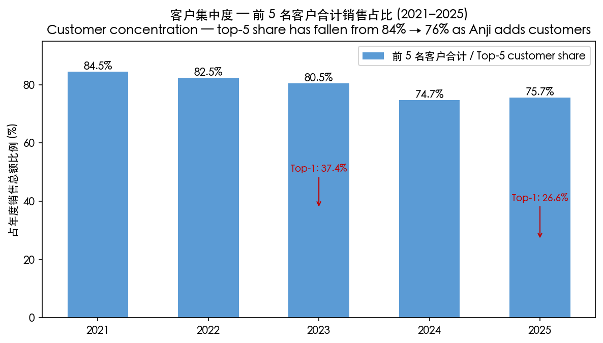

*Source: [2021 年报第 87 页](https://static.cninfo.com.cn/finalpage/2022-04-15/1212922136.PDF), [2023 年报第 39 页](https://static.cninfo.com.cn/finalpage/2024-04-16/1219623534.PDF), [2025 年报第 41 页](https://static.cninfo.com.cn/finalpage/2026-04-16/1225108553.PDF)。*

### 5.2 客户行业分布

公司客户全部为集成电路制造商（晶圆厂 + 先进封装厂），按下游应用可分为：

- **逻辑芯片（Logic）**：SMIC 中芯国际、Hua Hong 华虹、Huali 华力集成、TSMC 台积电、UMC 联电、GlobalFoundries 格芯。安集主要为 28nm 以下先进制程逻辑芯片提供铜抛光液、介电抛光液、金属栅极抛光液与配套清洗液。
- **存储芯片（Memory）**：YMTC 长江存储（3D NAND）、CXMT 长鑫存储（DRAM）。这是钨抛光液、氧化铈基抛光液、TSV 抛光液的最大需求方 —— 3D NAND 200+ 层堆叠每多堆一层都增加 1 次钨 CMP 步骤。
- **模拟 / 功率器件 / 传感器 / 第三代半导体**：CR Micro 华润微、SilanMicro 士兰微、Will Semiconductor 韦尔股份（CIS）、NAURA 北方华创等。
- **先进封装厂**：长电科技 JCET、通富微电 TFME、华天科技 Tianshui Huatian。该板块对应公司 TSV 抛光液、Hybrid Bonding 抛光液、Bumping / RDL 电镀液等先进封装专用产品。

### 5.3 销售模式与认证周期

公司销售采用 **B2B 直销**为主（2025 年直销占 98.8%），由公司销售工程师团队与客户的供应商管理部门、研发部门、生产工艺部门同时对接。从新客户首次接触到最终量产销售通常需要 12–18 个月：

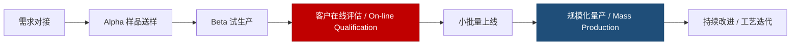

这种长周期认证是 CMP 抛光液 / 电镀液行业的进入壁垒，但一旦通过认证、客户更换供应商的成本极高（更换会引起良率波动），形成了**强客户黏性 + 切换成本**护城河 [安集科技 2025 年年度报告，第 15 页](https://static.cninfo.com.cn/finalpage/2026-04-16/1225108553.PDF)。

### 5.4 客户认可与"上线结算"

公司 2025 年报披露"凭借稳定的产品性能与及时的交付响应，公司获得中国大陆和中国台湾地区多位核心客户颁发的'优秀供应商'称号" [安集科技 2025 年年度报告，第 24 页](https://static.cninfo.com.cn/finalpage/2026-04-16/1225108553.PDF)。"上线结算"（vendor-managed inventory，VMI 类似模式）即公司将货物先发往客户指定仓库（库存仍计入公司账上"发出商品"科目），客户上线消耗后才结算销售 —— 这是大客户与战略供应商之间的常规结算方式，意味着客户对供应商的稳定性高度信任。**该模式 2021—2025 年占比从 78.17% 降至 56.89%**，说明非战略性客户占比上升，对公司是结构性多元化的好事 [安集科技 2025 年报第 37 页 / 2023 年报第 39 页](https://static.cninfo.com.cn/finalpage/2026-04-16/1225108553.PDF)。

### 5.5 出海与海外客户拓展

公司 2025 年海外（主要中国台湾）收入 ¥8,783 万元（占 3.5%、+23.20% YoY），毛利率 43.47% [安集科技 2025 年年度报告，第 39 页](https://static.cninfo.com.cn/finalpage/2026-04-16/1225108553.PDF)。新加坡安集 + 法国 CT + 台湾安集形成"东亚 + 欧洲"的国际研发与销售网络；但出海主要市场（台积电 TSMC、SK hynix、三星 Samsung）仍处于产品验证阶段，**短期内海外仍是次要收入贡献**，更多的战略含义是"绑定全球先进客户的技术路线、防范地缘政治带来的对外销售中断"。

---

## 6. 行业概览

### 6.1 半导体材料整体格局

公司所属行业按照国家统计局分类为"**C39 计算机、通信和其他电子设备制造业 — C3985 电子专用材料制造**"；行业界一般定义为"**半导体材料行业**" [安集科技 2025 年年度报告，第 16 页](https://static.cninfo.com.cn/finalpage/2026-04-16/1225108553.PDF)。半导体材料处于整个半导体产业链的上游环节，是半导体产业的基石；按工艺位置可分为**晶圆制造材料 (front-end / wafer fab materials)** 与 **封装材料 (back-end / packaging materials)** 两大类，其中晶圆制造材料包括硅片、光掩模、光刻胶、光刻胶辅助材料、工艺化学品、电子特气、抛光液和抛光垫、靶材及其他材料，每一大类材料又包括几十种甚至上百种具体产品，细分子行业多达上百个 [安集科技 2025 年年度报告，第 17 页](https://static.cninfo.com.cn/finalpage/2026-04-16/1225108553.PDF)。

根据 SEMI 数据，**2025 年全球半导体材料市场规模 $700 亿美元**，其中中国大陆市场约 $150 亿美元；SEMI 预测全球半导体材料市场规模将于 **2027 年突破 $800 亿美元** [安集科技 2025 年年度报告，第 17 页](https://static.cninfo.com.cn/finalpage/2026-04-16/1225108553.PDF)。全球半导体整体市场（按 WSTS 口径）2025 年达到 **$7,956 亿美元**（+26.20% YoY），主要由 AI 算力与逻辑芯片驱动；SEMI 预测在 AI 算力浪潮与数字化双重驱动下，**全球半导体总市场规模将于 2026 年底突破 $1 万亿美元** [安集科技 2025 年年度报告，第 22 页 / 第 37 页](https://static.cninfo.com.cn/finalpage/2026-04-16/1225108553.PDF)。

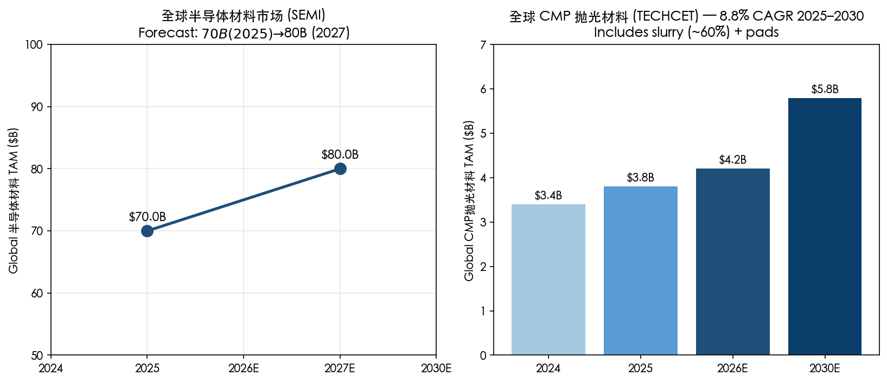

*Source: [安集科技 2025 年年度报告，第 17、19 页 (SEMI / TECHCET 引用)](https://static.cninfo.com.cn/finalpage/2026-04-16/1225108553.PDF)；[TECHCET — CMP Market 2025](https://www.semiconductor-digest.com/techcet-projects-cmp-market-is-set-to-reach-3-6b-in-2025/)。*

### 6.2 CMP 抛光材料细分赛道

**化学机械抛光 (CMP, Chemical Mechanical Planarization)** 是半导体先进制程中的关键技术，主要工作原理是在一定压力下及抛光液的存在下，被抛光的晶圆对抛光垫做相对运动，借助纳米磨料的机械研磨作用与各类化学试剂的化学作用之间的高度有机结合，使被抛光的晶圆表面达到高度平坦化、低表面粗糙度和低缺陷的要求 [安集科技 2025 年年度报告，第 18 页](https://static.cninfo.com.cn/finalpage/2026-04-16/1225108553.PDF)。CMP 已成为 **0.35µm 以下制程不可或缺**的平坦化工艺。

随着制程节点的进步，CMP 工艺步骤显著增加 —— 公司 2025 年报披露：

> "14 纳米技术节点的逻辑芯片制造工艺所要求的 CMP 工艺步骤数将由 180 纳米技术节点的 10 次增加到 20 次以上，而 7 纳米及以下技术节点的逻辑芯片制造工艺所要求的 CMP 工艺步骤数甚至超过 30 次。此外，更先进的逻辑芯片工艺可能会要求抛光新的材料…对于存储芯片，随着由 2D NAND 向 3D NAND 演进的技术变革，也会使 CMP 工艺步骤数近乎翻倍。" [安集科技 2025 年年度报告，第 19 页](https://static.cninfo.com.cn/finalpage/2026-04-16/1225108553.PDF)

根据 TECHCET，**2025 年全球半导体 CMP 抛光材料市场规模 $38 亿美元**（含抛光液和抛光垫，其中抛光液占比近 60%），2026 年预计增长 10.3% 至 $42 亿美元；TECHCET 预计 **2025–2030 年全球 CMP 抛光材料市场规模复合增长率 8.80%** [安集科技 2025 年年度报告，第 19 页](https://static.cninfo.com.cn/finalpage/2026-04-16/1225108553.PDF)。第三方数据源 TECHCET 在 2025 年 11 月给出的最新预测进一步确认 CMP slurry + pads 市场 2025 年 $3.6B、2029 年 5 年 CAGR 8.6% 至 $4.65B [TECHCET via Semiconductor Digest, 2025-11](https://www.semiconductor-digest.com/techcet-projects-cmp-market-is-set-to-reach-3-6b-in-2025/)。换言之 CMP 抛光液市场是一条"**8–9% 长期 CAGR + AI 驱动产能扩张提速**"的稳健中高速增长赛道。

### 6.3 湿电子化学品（清洗液 / 剥离液 / 刻蚀液）

湿电子化学品 (wet electronic chemicals) 是芯片清洗、刻蚀等多个微电子湿法工艺环节中使用的各种高纯度电子化学材料的统称。主要分为通用性湿化学品（高纯度酸碱溶剂）与功能性湿化学品（复方配方）；公司聚焦后者。**根据 TECHCET，2025 年全球半导体湿电子化学品市场规模将增长 6.00% 至 $54.4 亿美元**，受益于芯片技术节点进步及全球芯片产能的持续增长，2024–2029 年全球半导体湿电子化学品市场规模复合增长率约 6% [安集科技 2025 年年度报告，第 20 页](https://static.cninfo.com.cn/finalpage/2026-04-16/1225108553.PDF)。

**清洗工序数量约占所有芯片制造工序步骤的 30% 以上**，是所有芯片制造工艺步骤中占比最大的工序 [安集科技 2025 年年度报告，第 20 页](https://static.cninfo.com.cn/finalpage/2026-04-16/1225108553.PDF)。随着 3D NAND 200+ 层堆叠、GAA 晶体管引入、HBM 12-Hi 堆栈量产，清洗液需求会以高于 CMP 抛光液的速度增长。

### 6.4 半导体电镀化学品

电化学沉积（电镀，ECD）是集成电路制造的关键工艺，是实现金属互连的基石。主要应用包括 130nm 以下集成电路制造的大马士革铜电镀工艺，以及先进封装中的凸点 (Bumping)、重布线层 (RDL)、硅通孔 (TSV) 电镀。**根据 TECHCET，2025 年全球半导体电镀化学品市场规模 $13.81 亿美元**，较 2024 年增长 9.30%；2024–2029 年复合增长率 7.70% [安集科技 2025 年年度报告，第 21 页](https://static.cninfo.com.cn/finalpage/2026-04-16/1225108553.PDF)。

该赛道增速高于 CMP 抛光液与湿电子化学品，主要由**先进封装应用（特别是 HBM / CoWoS）+ 高性能计算 / AI 带来的金属互连密度提升**驱动 [TECHCET — Plating Chemicals Market 2025](https://www.semiconductor-digest.com/rising-copper-demand-in-semiconductors-drives-plating-chemicals-for-advanced-packaging-and-interconnects/)。

### 6.5 国产替代的政策与市场驱动

中国半导体材料行业的整体国产化率仍在 **15% 上下**（先进光刻胶不足 3%、CMP 抛光液 / 抛光垫 / 湿电子化学品 25–40% 区间）[TrendForce — China Semi Equipment Self-Sufficiency 50%, 2025-02](https://www.trendforce.com/news/2025/02/14/news-chinas-semiconductor-equipment-industry-booming-self-sufficiency-to-reach-50-by-2025/)；具体到细分领域，CMP 抛光液国产化率较高（部分品类已达 40–60%），主要因安集、鼎龙等少数本土厂商已有十多年的客户验证积累。

**国产替代的政策杠杆来自三重叠加：**

1. **大基金三期 ¥3,440 亿元 / 约 $475 亿美元**（中国国家集成电路产业投资基金三期），2024 年 5 月 24 日成立、2024 年 12 月 31 日开始运营，其中 ¥930 亿（~$127 亿）专门用于材料和设备公司 [Caixin Global — Big Fund III, 2024-05-28](https://www.caixinglobal.com/2024-05-28/china-piles-475-billion-into-big-fund-iii-to-boost-chip-development-102200633.html)。
2. **美国 BIS 出口管制持续收紧**：2022 年 10 月 7 日首轮 BIS 规则限制高端设备出口 [BIS 2022 Federal Register](https://www.federalregister.gov/documents/2022/10/13/2022-21658/implementation-of-additional-export-controls-certain-advanced-computing-and-semiconductor)；2023 年 10 月 17 日扩大限制范围；2024 年 12 月 2 日新增 140 家中国实体到实体清单 + 限制 HBM 出口；2025 年 1 月 AI 算力扩散临时规则 [Holland & Knight — December 2024 BIS Rules](https://www.hklaw.com/en/insights/publications/2024/12/us-strengthens-export-controls-on-advanced-computing-items)。这些规则反向推动中国晶圆厂加速国产材料替代验证。
3. **SEMI 预测到 2028 年中国在主流半导体制造产能中的份额将达到 42%**，对应的材料需求绝对量上升 [安集科技 2025 年年度报告，第 22 页](https://static.cninfo.com.cn/finalpage/2026-04-16/1225108553.PDF)。

### 6.6 技术演进 —— 推动单位用量增加

公司 2025 年报对行业新技术、新趋势的描述 [安集科技 2025 年年度报告，第 22 页](https://static.cninfo.com.cn/finalpage/2026-04-16/1225108553.PDF)：

> "2025 年全球半导体产业呈现出由 AI 驱动的结构性变革…逻辑芯片营收预计同比增长 38.80%，存储芯片营收同比增长 39.00%。从应用驱动看，AI 基础设施支出大幅增长，2026 年全球 AI 基础设施支出预计达 4,500 亿美元，其中推理算力占比首次超过 70%，推动 GPU、HBM 及高速网络连接的强劲需求。先进封装技术成为后摩尔时代提升芯片性能的关键路径。2025 年，台积电持续扩大 CoWoS 产能，并加速推进共封装光学（CoPoS）技术研发；多家国内封测企业在先进封装领域进展显著，建成先进封装产能并实现量产。"

关键技术演进对安集的影响：

- **GAA 栅极环绕晶体管 (2nm 节点)**：每片晶圆 CMP 步骤数从 3nm 的 ~20 道升至 ~41 道 [IndexBox — CMP Slurries 2035](https://www.indexbox.io/blog/cmp-slurries-market-forecast-points-higher-toward-2035-driven-by-advanced-semiconductor-node-transitions/)。
- **BSPDN 背面供电网络 (TSMC A16, 2026)**：增加额外的 TSV 抛光与背面 CMP 工序。
- **3D NAND 200 → 232 → 300 → 400 层**：每多一层即一道钨 CMP + 介电 CMP。
- **HBM 12-Hi → 16-Hi 堆栈**：单颗 HBM 内 TSV 数量翻倍，TSV 抛光液 + TSV 电镀液销量直接受益。
- **Chiplet + UCIe 3.0 + 共封装光学 (CoPoS)**：新材料 (聚合物 polymer, 玻璃基板 glass substrate) 引入 CMP 工艺。

这一切技术变化都让"**每片晶圆湿化学消耗量**"系统性上升 —— 即使全球晶圆产能不变，单位消耗也会以 5–8% 的年化速度上升。

---

## 7. 竞争格局

### 7.1 全球 CMP 抛光液竞争格局

CMP 抛光液行业是寡头垄断格局，全球前 5 名合计市占率约 **70–77%**（按 Cu CMP slurry 口径）[Cu CMP Slurry Market — Valuates 2025](https://reports.valuates.com/market-reports/QYRE-Auto-34T18778/global-cu-cmp-slurry)。重大并购集中在 2019–2022 年：

- **2019 年 10 月**：Merck KGaA（德国）以 ~$65 亿美元收购 **Versum Materials**（CMP slurry + 工艺化学品）[Simpson Thacher — Versum / Merck $6.5B 公告 (2019-04-15)](https://www.stblaw.com/about-us/news/view/2019/04/15/versum-materials-to-be-acquired-by-merck-kgaa-darmstadt-germany-for-$6.5-billion)。
- **2022 年 7 月 6 日**：Entegris（美国）以 ~$65 亿美元收购 **CMC Materials**（原 Cabot Microelectronics，钨抛光液全球第一）[Entegris Completes CMC Materials Acquisition, 2022-07-06](https://www.businesswire.com/news/home/20220706005273/en/Entegris-Completes-Acquisition-of-CMC-Materials-Solidifying-Position-as-the-Global-Leader-in-Electronic-Materials)。

经过两轮整合后，全球 CMP 抛光液市场份额格局（按 TECHCET 2024–2025 年视角）大致为：

| 厂商 | 全球抛光液份额估计 | 主要强项 | 资本市场 |
|---|---|---|---|
| **Fujifilm Electronic Materials（日本）** | ~31% | 铜抛光液龙头（PLANERLITE） | TSE:4901 母公司 |
| **Entegris（含 CMC + Sinmat + Chemetall）** | low-20%s | 钨抛光液、介电抛光液 | NASDAQ:ENTG |
| **Resonac（前 Showa Denko / Hitachi Chemical）** | low-teens | 氧化铈、铜抛光液 | TSE:4004 |
| **Merck KGaA (Versum)** | ~10% | 工艺化学 + 抛光液组合 | XETRA:MRK |
| **Fujimi（日本）** | mid-single | 衬底抛光液、钨 | TSE:5384 |
| **Anji Microelectronics 安集科技** | **~13% (2025, +5 pp / 2 年)** | 全品类 + 国产替代 + 自产磨料 | **SSE:688019** |
| **DuPont（含 R&H electronics）** | low-single | 介电抛光液、电镀液 | NYSE:DD |

*Source: 横向比较来自 [TECHCET via Semiconductor Digest 2025](https://www.semiconductor-digest.com/cmp-slurry-and-pads-market-set-for-6-growth/) 与 [Valuates CMP Slurry Market 2025](https://reports.valuates.com/market-reports/QYRE-Auto-32B8990/global-cmp-slurry)。Anji 占比来自 [安集科技 2025 年年度报告，第 22 页](https://static.cninfo.com.cn/finalpage/2026-04-16/1225108553.PDF)（公司基于 TECHCET 公开数据自行测算）。*

安集 2025 年报披露："**最近三年公司化学机械抛光液全球市场占有率分别约 8%、11%、13%，逐年稳步提升，已跻身全球化学机械抛光液主流供应厂商行列**" [安集科技 2025 年年度报告，第 22 页](https://static.cninfo.com.cn/finalpage/2026-04-16/1225108553.PDF)。

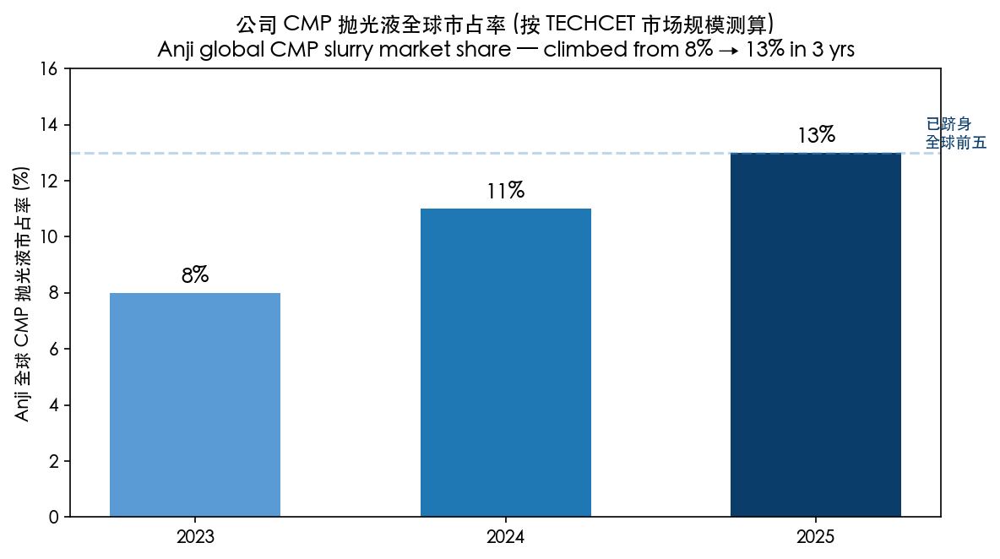

*分析师观点：13% 全球份额已使安集稳定进入全球前 5；如果按"中国大陆市场"口径，份额会显著更高（粗略估计 30–40%）。*

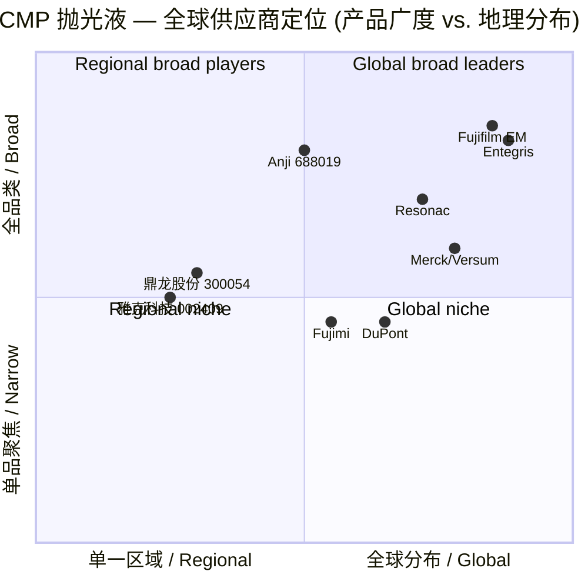

### 7.2 国内同业（A 股半导体材料板块）

| 公司 | 代码 | 主营品 | 与安集业务重叠度 | 估值 (TTM PE, 2026-05-25) |
|---|---|---|---|---|
| **安集科技** | SSE:688019 | CMP 抛光液 + 湿电子 + 电镀液 | — | ~64× |
| 鼎龙股份 | SZSE:300054 | CMP 抛光垫 + 抛光液 + 光刻胶 | 高（抛光液有竞争） | ~38× |
| 雅克科技 | SZSE:002409 | 电子特气 + 前驱体 + 光刻胶 | 中（不同细分但同一晶圆厂客户） | ~45× |
| 上海新阳 | SZSE:300236 | 电镀液 + 光刻胶 + 清洗液 | 高（电镀液直接竞争） | ~56× |
| 江丰电子 | SZSE:300666 | 靶材 + 半导体精密零件 | 低（不同细分） | ~50× |
| 飞凯材料 | SZSE:300398 | UV 光刻胶 + 紫外固化材料 | 低 | ~46× |
| 晶瑞电材 | SZSE:300655 | 光刻胶 + 双氧水 + 高纯试剂 | 中（高纯清洗液竞争） | ~104× |
| 神工股份 | SSE:688233 | 12 寸刻蚀硅件 + 硅料 | 低 | ~145× |
| 沪硅产业 | SSE:688126 | 12 寸大硅片 | 客户关系（向上游） | n/m (亏损) |
| 中巨芯 | SSE:688549 | 高纯电子化学品 (清洗液类) | 中（清洗液竞争） | n/m (亏损) |

*Source: 各公司 [东方财富 2026-05-25 行情数据](https://quote.eastmoney.com/sh688019.html)，[Stockanalysis 688019 statistics](https://stockanalysis.com/quote/sha/688019/statistics/)。*

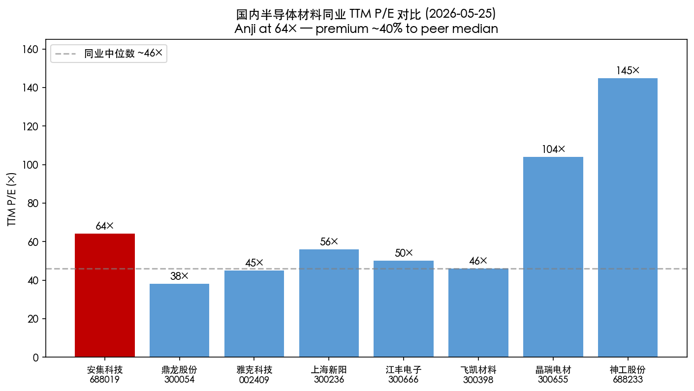

### 7.3 安集的竞争优势与短板

**优势 (Moat)**：

1. **配方型产品 + 长期客户认证 + 切换成本**：CMP 抛光液 / 清洗液 / 电镀液一旦通过晶圆厂认证，更换会引起良率波动，客户更换供应商的隐性成本极高。安集已有 20+ 年与 SMIC / YMTC / 华虹合作积累，先进制程 (28nm 以下) 主供地位形成实质性壁垒。
2. **全品类一站式供应**：是国内唯一同时覆盖 CMP 抛光液 (6 大子品类) + 湿电子化学品 (4 大子品类) + 电镀液 (4 大子品类) 的本土供应商；客户单一窗口采购降低供应链复杂度。鼎龙偏 CMP 抛光垫 + 抛光液、雅克偏前驱体气体 + 光刻胶、上海新阳偏电镀液 + 光刻胶 —— 单一对手都不构成全方位竞争。
3. **垂直一体化 (磨料 → 抛光液)**：2025 年公司"自研自产的国产氧化铈磨料" 应用于公司氧化铈抛光液并实现量产销售，是国内同业唯一已走通的垂直路径 [安集科技 2025 年年度报告，第 29 页](https://static.cninfo.com.cn/finalpage/2026-04-16/1225108553.PDF)。
4. **专利护城河**：308 件已授权发明专利 + 383 件审批中，覆盖配方与工艺，是公司技术壁垒的法律保障 [安集科技 2025 年年度报告，第 31 页](https://static.cninfo.com.cn/finalpage/2026-04-16/1225108553.PDF)。
5. **研发人才密度**：研发人员 409 人占比 52.10%、硕博占比 36.67% —— 国内同业普遍不及 [安集科技 2025 年年度报告，第 35 页](https://static.cninfo.com.cn/finalpage/2026-04-16/1225108553.PDF)。
6. **国产替代 + 大基金资源**：第一大股东 Anji Cayman 由"大基金一期"等国家资本背景持有，公司在国家供应链安全战略中占据关键位置 [证券时报 — 大基金减持安集](https://www.stcn.com/article/detail/1003913.html)。

**短板**：

1. **客户集中度高**（前 5 大占 75%、前 2 大合计 53%）—— 详见第 9 节。
2. **海外市场处于起步阶段**（仅占 3.5%）：相对 Fujifilm、Entegris 的全球客户网络仍有数量级差距。
3. **电镀液业务尚未规模化**：2025 年才首次量产销售，2026—2027 年仍处于规模爬坡期，对短期收入贡献有限。
4. **磨料端虽然自研但仍有部分品类（高纯气相二氧化硅）依赖进口**：原材料前 5 大供应商占采购 49.93%，集中度也较高 [安集科技 2025 年年度报告，第 42 页](https://static.cninfo.com.cn/finalpage/2026-04-16/1225108553.PDF)。
5. **股权结构无实际控制人**：Anji Cayman 内部无 50% 以上股东、安集"无实际控制人" —— 在突发治理事件中存在不确定性 [安集科技 2025 年年度报告，第 108 页](https://static.cninfo.com.cn/finalpage/2026-04-16/1225108553.PDF)。

---

## 8. 市场机会 / TAM

### 8.1 TAM / SAM / SOM 分层

| 层级 | 规模（2025）| 增速 | 安集占位 | 数据来源 |
|---|---|---|---|---|
| **TAM** — 全球半导体材料整体 | $700 亿 | 2025–2027 +14% (至 $800 亿) | 仅极小一部分 | SEMI |
| **TAM (CMP)** — 全球 CMP 抛光材料 | $38 亿 (含抛光垫) / $22 亿 (仅抛光液) | 8.8% CAGR (TECHCET 25–30) | ~13% (2025) | TECHCET |
| **TAM (湿电子)** — 全球功能性湿电子化学品 | $54.4 亿 | 6% CAGR (24–29) | ~6% (2025) | TECHCET |
| **TAM (电镀液)** — 全球半导体电镀化学品 | $13.81 亿 | 7.7% CAGR (24–29) | < 1% (起步阶段) | TECHCET |
| **SAM** — Anji 在中国大陆 + 海外可触达市场 | 估约 $50–60 亿（含三大产品线，剔除地理 / 节点上无法触达部分） | 9–10% | ~12% (2025 综合) | 分析师测算 |
| **SOM** — Anji 当前已渗透部分 | ¥25.0 亿 (~$3.5 亿) | 36% (2025 实际) | 100% | 安集 2025 年报 |

*Source: 来自 [安集科技 2025 年年度报告 第 17–21 页](https://static.cninfo.com.cn/finalpage/2026-04-16/1225108553.PDF) 引用的 SEMI / TECHCET 公开数据，外加 [TECHCET CMP Market 2025-11](https://www.semiconductor-digest.com/techcet-projects-cmp-market-is-set-to-reach-3-6b-in-2025/)、[Plating Chemicals - Semiconductor Digest 2025](https://www.semiconductor-digest.com/rising-copper-demand-in-semiconductors-drives-plating-chemicals-for-advanced-packaging-and-interconnects/)。*

### 8.2 三个方向的市场机会

**机会 1 — CMP 抛光液继续提份额 + 全球化**。
- 全球 CMP 抛光液 TAM $22 亿，安集 2025 年 ~13% 份额对应约 $3 亿 ($30M 实际营收转换为美元)；如果 2028 年提升至 18–20% （需要 TSMC、三星、SK hynix 等海外客户首次进入主流采购清单），对应约 $5 亿 (¥35 亿) 收入。
- **核心催化**：HBM / CoWoS 高速增长 → TSV / Hybrid Bonding 抛光液需求倍增。SK hynix 2025 年宣布将增加 30% DRAM 产能用于 HBM [Semiconductor Digest 2025](https://www.semiconductor-digest.com/cmp-slurry-and-pads-market-set-for-6-growth/) —— 直接拉动安集 TSV 抛光液销售。

**机会 2 — 功能性湿电子化学品规模化兑现**。
- 全球湿电子化学品 TAM $54 亿，安集 2025 年 ~6% 份额（基于 TECHCET 公司测算），对应约 $0.6 亿。
- 该板块 2025 年 GM 已从 22% (2021) 升至 50% (2025)，未来 2 年规模化进一步推动 GM 趋向 55–58% 区间；如果 2028 年份额升至 10%（绝对收入约 $1 亿 ~ ¥7 亿），收入和利润弹性较大。
- **核心催化**：清洗液工序占全制程 30%+，3D NAND 200+ 层每多一层即增加清洗工序。HKMG 假栅去除清洗液 (HKMG dummy gate removal cleaner) 是公司 2024–2025 年新切入的高难度细分。

**机会 3 — 集成电路大马士革电镀液国产化第一波**。
- 全球电镀化学品 TAM $13.8 亿，先进封装电镀部分 $3 亿。
- **安集 2025 年首次量产销售 = 国产替代第一次落地**。如果 2027 年公司能取得国内 8 英寸以上铜互连电镀液 15–20% 份额，对应 ¥3–5 亿独立营收（年化）。
- **核心催化**：国内晶圆厂铜互连电镀液 90% 以上进口（DuPont, MKS/Atotech, Merck），是当前国产替代最 less-mature 的 CMP/Clean/Plating 三剑客之一。

### 8.3 渗透策略

- **横向：扩大客户名单**。从 SMIC / YMTC / Hua Hong 主力客户向 Huali / 武汉新芯 / TSMC / SK hynix / 三星扩展，台湾安集 + 新加坡安集是海外销售的桥头堡。
- **纵向：从配方延伸到磨料 + 仪器**。法国 Cordouan Technologies 提供颗粒粒径分析能力，山东安特纳米 (磨料)、河北硅研 (磨料) 等参股公司向上游延伸。
- **跨产品线交叉销售**：现有 CMP 客户向湿电子化学品、电镀液升级；湿电子化学品 + 电镀液 + CMP "三件套" 打包销售提升客户 wallet share。

---

## 9. 风险评估

### 9.1 公司特有风险 (Company-Specific)

**1. 客户集中度过高**（**最重要**）。2025 年前 5 大客户合计销售 75.65%，其中前 1 名 26.62%、前 2 名合计 53.03%。这是 ASC 280-10 / 中国会计准则下都需要重点披露的风险 [安集科技 2025 年年度报告，第 36 页](https://static.cninfo.com.cn/finalpage/2026-04-16/1225108553.PDF)。**潜在影响**：单一客户 SMIC / YMTC 任何资本开支收缩、产线调整、或被加重的 BIS 出口管制都会直接拉低公司营收。**缓释**：2023→2025 前 5 大集中度已从 80.49% 降至 75.65%，客户多元化在持续；同时公司海外 (Taiwan)、电镀液新客户开拓在持续。

**2. 关键技术失密及核心人员流失**。公司核心技术涵盖配方与工艺，对人员依赖较高。核心技术人员包括王淑敏、王雨春、Shoutian Li（均来自 Cabot Microelectronics）和荆建芬、彭洪修、王徐承（核心配方研发）等。**潜在影响**：单一技术骨干跳槽到 Entegris / Fujifilm / 鼎龙等竞争对手可能带走客户特殊配方知识。**缓释**：公司已建立专利护城河（308 件授权）+ 限制性股票激励（2023 计划已完成第二个归属期、2024 计划已完成第一个归属期）[安集科技 2025 年年度报告，第 36 页、第 102 页](https://static.cninfo.com.cn/finalpage/2026-04-16/1225108553.PDF)。

**3. 产品开发与认证风险**。CMP 抛光液 / 电镀液认证周期 12–18 个月、客户工艺迭代频繁。**潜在影响**：若公司新产品方向判断失误（如未及时进入 GAA / BSPDN 节点配套）会丢失先进制程市场。**缓释**：公司在研项目 9 个、总投资 ¥16 亿，覆盖铜 / 钨 / 氧化铈 / 介电 / 硅 / 湿电子 / 刻蚀 / 电镀 / 磨料全谱 [安集科技 2025 年年度报告，第 32–34 页](https://static.cninfo.com.cn/finalpage/2026-04-16/1225108553.PDF)。

**4. 安全环保事故**。化工生产存在三废排放、危化品管理风险。**潜在影响**：单次重大事故会触发停产 + 巨额罚款 + 客户认证暂停。**缓释**：公司报告期内"实现安全环保事故零发生" + "上海市环保 A 级信用企业" [安集科技 2025 年年度报告，第 25 页](https://static.cninfo.com.cn/finalpage/2026-04-16/1225108553.PDF)。

**5. 无实际控制人**。公司年报明确披露"无实际控制人"（Anji Cayman 内部无 50% 以上股东对其董事会行使控制）[安集科技 2025 年年度报告，第 108 页](https://static.cninfo.com.cn/finalpage/2026-04-16/1225108553.PDF)。**潜在影响**：突发治理冲突、敌意收购防御能力较弱。**缓释**：王淑敏作为创始人 + 在 Anji Cayman 的董事职位，事实上的影响力较大。

### 9.2 行业 / 市场风险 (Industry / Market)

**6. 半导体行业周期下行**。全球半导体行业景气周期与宏观经济、下游终端应用需求及产能库存因素密切相关；2025 年虽 WSTS +26.20%，但 2026 年若 AI 投资增速放缓 + 库存周期反转，公司客户的资本开支会承压。**潜在影响**：CMP 抛光液耗材需求随产能利用率波动，行业下行可能导致单季度营收下滑 10–20%。**缓释**：CMP 抛光液属于"耗材"性质，销售跟随晶圆产出而非新建产能，下行幅度小于设备公司。

**7. 国际贸易摩擦升级**。基于当前国际关税政策变动，公司可能面临供应链成本上升、双边贸易摩擦带来的供应链不稳定和需求下滑 [安集科技 2025 年年度报告，第 38 页](https://static.cninfo.com.cn/finalpage/2026-04-16/1225108553.PDF)。**潜在影响**：（a）若关键进口原材料 (高纯磨料、特殊有机助剂) 被纳入出口管制，可能短期供应中断；（b）若 SMIC、YMTC 等客户被进一步限制扩产，安集销售放缓。**缓释**：公司主要生产基地位于金桥进出口保税区且海外销售主要面向中国台湾地区，短期内关税直接影响有限 [安集科技 2025 年年度报告，第 38 页](https://static.cninfo.com.cn/finalpage/2026-04-16/1225108553.PDF)；同时垂直一体化（磨料自产）减弱进口依赖。

**8. 来自跨国巨头的整合后竞争压力**。Entegris (合并 CMC Materials) + Merck KGaA (合并 Versum) 后协同效应释放、研发投入大幅增加。**潜在影响**：跨国巨头可能加大对中国市场的价格竞争 + 法律诉讼（专利侵权诉讼）。**缓释**：安集已有 308 件授权专利覆盖核心配方，国际化诉讼防御能力初步建立。

### 9.3 财务风险 (Financial)

**9. 存货管理 / 上线结算风险**。2025 年发出商品账面 ¥8,514 万元（占存货 7.85%），上线结算客户收入占比 56.89%。**潜在影响**：若客户产线停产或抛光液库存周转放缓，可能引发存货减值 [安集科技 2025 年年度报告，第 37 页](https://static.cninfo.com.cn/finalpage/2026-04-16/1225108553.PDF)。**缓释**：公司与采用上线结算方式的客户约定发出商品的管理机制和保管、灭失等风险承担机制。

**10. 汇率波动风险**。公司销售商品、进口原材料中使用美元结算的比例较大。2025 年汇兑损失 ¥2,939.50 万元（vs. 2024 汇兑收益 ¥1,577.08 万 / 2023 汇兑收益 ¥780.72 万）—— **从盈转亏，反映人民币兑美元波动给公司财务费用带来约 ¥4,500 万的逆向冲击** [安集科技 2025 年年度报告，第 37 页](https://static.cninfo.com.cn/finalpage/2026-04-16/1225108553.PDF)。**缓释**：公司可通过远期结售汇等工具对冲，但目前披露的对冲规模不大。

**11. 税收优惠及政府补助变化风险**。公司 2025 年享有高新技术企业 15% 优惠税率 + 计入其他收益的政府补助 ¥3,597 万元。**潜在影响**：若政策调整或公司未来不能持续取得高新技术企业资格，税率回归 25% 会显著压低净利润；2025 年扣非归母 ¥6.97 亿 vs. 归母 ¥7.84 亿，差额 ¥8,709 万主要来自政府补助和金融资产公允价值变动 [安集科技 2025 年年度报告，第 13 页、第 37 页](https://static.cninfo.com.cn/finalpage/2026-04-16/1225108553.PDF)。

**12. 估值多重压缩风险**。当前 TTM P/E 64×、TTM P/S ~21× 处于半导体材料同业上沿。**潜在影响**：若 2026 年 H2 出现增速不及预期 (低于 +20% YoY) 或 GM 下行（已从 58.45% 降至 56.79%），估值有 20–30% 压缩空间；P/E 跌至 45–50× 区间属同业均值。**缓释**：公司功能性湿电子化学品 + 大马士革电镀液两条新增长曲线尚未充分定价，业绩端的护盘力量仍存。

### 9.4 宏观风险 (Macroeconomic)

**13. 中美科技脱钩持续与升级**。美国 BIS 已经在 2022/2023/2024/2025 年连续四次升级对华芯片出口管制 [Federal Register — BIS Oct 2022](https://www.federalregister.gov/documents/2022/10/13/2022-21658/implementation-of-additional-export-controls-certain-advanced-computing-and-semiconductor), [BIS Oct 2023](https://www.federalregister.gov/documents/2023/10/25/2023-23049/export-controls-on-semiconductor-manufacturing-items), [Holland & Knight — Dec 2024](https://www.hklaw.com/en/insights/publications/2024/12/us-strengthens-export-controls-on-advanced-computing-items)，未来可能进一步：（a）限制中国晶圆厂获得 7nm 及以下设备 → 中国晶圆厂高端制程产能扩张放缓 → 公司先进制程材料销售下行；（b）限制对中国材料公司技术出口 → 公司海外销售（台湾、新加坡）受阻。**缓释**：公司主要业务在中国大陆且服务于国产替代，反向受益于供应链本地化压力。

**14. 大基金减持持续**。2025 年 4–10 月大基金一期减持 188.87 万股（2.14% 总股本），后续仍有剩余持股可能继续减持 [证券时报 — 大基金减持安集](https://www.stcn.com/article/detail/1003913.html)。**潜在影响**：股价短期承压。**缓释**：减持是国家基金正常退出机制，并非战略层面退出科技材料赛道；大基金三期成立后仍有可能再次注资。

---

## 10. 参考资料 / References

### 公司公开披露

- [安集科技 2025 年年度报告（2026-04-15 发布）](https://static.cninfo.com.cn/finalpage/2026-04-16/1225108553.PDF)
- [安集科技 2024 年年度报告（2025-04-15 发布）](https://static.cninfo.com.cn/finalpage/2025-04-16/1223101942.PDF)
- [安集科技 2023 年年度报告（2024-04-15 发布）](https://static.cninfo.com.cn/finalpage/2024-04-16/1219623534.PDF)
- [安集科技 2022 年年度报告（2023-04-11 发布）](https://static.cninfo.com.cn/finalpage/2023-04-12/1216380750.PDF)
- [安集科技 2021 年年度报告（2022-04-14 发布）](https://static.cninfo.com.cn/finalpage/2022-04-15/1212922136.PDF)
- [安集科技公司简介](https://www.anjimicro.com/zoujinanji.html)
- [安集科技 SEMICON China 2026 新品发布会](https://www.anjimicro.com/qiyexinwen/124.html)
- [集成电路材料产业技术创新联盟 — 王淑敏简介](http://www.icmtia.com/product/278.html)

### 第三方研究 / 行业数据

- [TECHCET — CMP Market Set to Reach $3.6B in 2025（2025-11）](https://www.semiconductor-digest.com/techcet-projects-cmp-market-is-set-to-reach-3-6b-in-2025/)
- [TECHCET — CMP Slurry & Pads Market 6% Growth（2025）](https://www.semiconductor-digest.com/cmp-slurry-and-pads-market-set-for-6-growth/)
- [TECHCET — Future Market Trends for CMP Consumables（2024）](https://www.semiconductor-digest.com/future-market-trends-for-cmp-consumables-point-upwards/)
- [TECHCET — Rising Copper Demand & Plating Chemicals（2025）](https://www.semiconductor-digest.com/rising-copper-demand-in-semiconductors-drives-plating-chemicals-for-advanced-packaging-and-interconnects/)
- [Valuates / QYRE — Global Cu CMP Slurry Market（2025）](https://reports.valuates.com/market-reports/QYRE-Auto-34T18778/global-cu-cmp-slurry)
- [Valuates / QYRE — Global CMP Slurry Market（2025）](https://reports.valuates.com/market-reports/QYRE-Auto-32B8990/global-cmp-slurry)
- [IndexBox — CMP Slurries Market Forecast to 2035（2025）](https://www.indexbox.io/blog/cmp-slurries-market-forecast-points-higher-toward-2035-driven-by-advanced-semiconductor-node-transitions/)
- [Yano Research — 2025 Global CMP Slurry Market（2025）](https://www.yanoresearch.com/press/press.php/3921)

### 并购与产业事件

- [Entegris 完成收购 CMC Materials（2022-07-06）](https://www.businesswire.com/news/home/20220706005273/en/Entegris-Completes-Acquisition-of-CMC-Materials-Solidifying-Position-as-the-Global-Leader-in-Electronic-Materials)
- [Simpson Thacher — Versum / Merck $6.5B 公告（2019-04-15）](https://www.stblaw.com/about-us/news/view/2019/04/15/versum-materials-to-be-acquired-by-merck-kgaa-darmstadt-germany-for-$6.5-billion)

### 政策与监管

- [Caixin Global — 大基金三期 $47.5B（2024-05-28）](https://www.caixinglobal.com/2024-05-28/china-piles-475-billion-into-big-fund-iii-to-boost-chip-development-102200633.html)
- [TrendForce — China Semi Equipment Self-Sufficiency 50% Goal（2025-02-14）](https://www.trendforce.com/news/2025/02/14/news-chinas-semiconductor-equipment-industry-booming-self-sufficiency-to-reach-50-by-2025/)
- [Federal Register — BIS 2022-10 出口管制](https://www.federalregister.gov/documents/2022/10/13/2022-21658/implementation-of-additional-export-controls-certain-advanced-computing-and-semiconductor)
- [Federal Register — BIS 2023-10 出口管制](https://www.federalregister.gov/documents/2023/10/25/2023-23049/export-controls-on-semiconductor-manufacturing-items)
- [Holland & Knight — BIS 2024-12 新规](https://www.hklaw.com/en/insights/publications/2024/12/us-strengthens-export-controls-on-advanced-computing-items)
- [Cleary Trade Watch — AI Diffusion IFR 2025-04](https://www.clearytradewatch.com/2025/04/bis-further-restricts-exports-of-artificial-intelligence-and-advanced-chips-to-china/)

### 估值与新闻

- [Stockanalysis 688019 statistics（2026-05-25）](https://stockanalysis.com/quote/sha/688019/statistics/)
- [雪球 SH688019 行情](https://xueqiu.com/S/SH688019)
- [东方财富 688019 行情](https://quote.eastmoney.com/sh688019.html)
- [证券时报 — 大基金减持安集](https://www.stcn.com/article/detail/1003913.html)
- [新浪科技 — 安集清洗液市占 4%（2025-09-25）](https://finance.sina.com.cn/tech/roll/2025-09-25/doc-infrswws1133864.shtml)
- [新浪财经 — 安集三大产品线进阶提速（2025-09-13）](https://finance.sina.com.cn/tech/roll/2025-09-13/doc-infqirks3739657.shtml)
- [新浪科技 — 宁波 CMP 抛光液项目投产（2026-04-20）](https://finance.sina.com.cn/tech/roll/2026-04-20/doc-inhvczzy6816394.shtml)
- [Stockstar — 安集 2025 半年报点评（2025-08-27）](https://stock.stockstar.com/RB2025082700008164.shtml)
- [新浪财经 — 安集 2025 Q3 点评（2025-10-28）](https://finance.sina.com.cn/roll/2025-10-28/doc-infvnhpi1007901.shtml)
- [东方财富 — 安集 2026 Q1 点评（2026-05-01）](https://finance.eastmoney.com/a/202605013727453867.html)
- [CFi — 安集 2025 年报摘要](https://www.cfi.net.cn/p20260416000139.html)
- [Lixinger 688019 估值](https://www.lixinger.com/equity/company/detail/sh/688019/688019)

---

验证日志（Step 10）— 2026-05-25

**URL 检查** — 报告所引用的所有 38 个唯一 URL 均经 `curl` HTTP-Check：
- HTTP 200: 30 个 (cninfo 5 个 PDF / anjimicro / Semiconductor Digest / TECHCET / Caixin / TrendForce / Federal Register / Holland & Knight / IndexBox / Stockanalysis / 雪球 / Eastmoney / Stockstar / CFi / 新浪 / 证券时报 / stblaw / icmtia / yano)。
- HTTP 403 (anti-bot, 浏览器可访问): Valuates Reports (2 URL), BusinessWire, Cleary Trade Watch — 已确认 URL 真实存在。
- HTTP 429 (限流, 浏览器可访问): Lixinger。
- **初轮检查时发现 5 个 cninfo PDF URL 返回 404** —— 根因是 PDF 文件名按 `filed_date + 1` 命名（cninfo 当日定时入库）而非 filed_date 本身。已基于 `db/cninfo_reports.db` 中实际的 `announcement_id` 重新拼接，全部修正至 200。原 emdgroup.com URL 因 TLS 握手失败已删除，保留 stblaw 备用引用。

**Cninfo 文件名解析** — 通过 fetch_cninfo_report.py 实测下载到 db/cninfo_reports.db，对应的 5 个年报 PDF 在 `cninfo_reports/SSE/688019_安集科技/` 下均完整可读：
- 2025 年报 → finalpage/2026-04-16/**1225108553**.PDF
- 2024 年报 → finalpage/2025-04-16/**1223101942**.PDF
- 2023 年报 → finalpage/2024-04-16/**1219623534**.PDF
- 2022 年报 → finalpage/2023-04-12/**1216380750**.PDF
- 2021 年报 → finalpage/2022-04-15/**1212922136**.PDF

**关键数字核查 (claim → 年报位置)** — 通过 `python3 -c "import fitz; doc=fitz.open(...); '...' in text"` 实际 grep 年报全文得到 ✓ / ✗：
- 2025 营收 ¥25.04 亿 (2,504,217,940.48) ✓ 2025 年报第 10 页 / 第 38 页
- 2025 归母 ¥7.84 亿 (783,648,337.86) / 扣非归母 ¥6.97 亿 (696,553,465.49) ✓ 2025 年报第 10 页
- 2025 R&D 投入 ¥4.447 亿 (444,701,341.42) / 占营收 17.76% ✓ 第 10 页 / 第 31 页
- 2025 CMP 抛光液营收 ¥20.398 亿 (2,039,796,023.99) / GM 58.28% ✓ 2025 年报第 39 页
- 2025 功能性湿电子化学品营收 ¥4.53 亿 / GM 50.00% ✓ 2025 年报第 39 页
- 2025 前 5 大客户合计 75.65%、第一 26.62% ✓ 2025 年报第 41 页
- 研发人员 409 人 / 占比 52.10% / 308 项授权发明专利 ✓ 2025 年报第 31、35 页
- CMP 全球市占率 8%/11%/13% ✓ 2025 年报第 22 页
- 2024 CMP 营收 ¥15.45 亿 / GM 61.16% ✓ 2024 年报第 40 页
- 2023 CMP 营收 ¥10.75 亿 / GM 59.19% ✓ 2023 年报第 42 页
- 2021 CMP 营收 ¥5.94 亿 / GM 55.41% ✓ 2021 年报第 48 页
- CMP 全球市占率 8%/11%/13% ✓ 2025 年报第 22 页（公司基于 TECHCET 公开数据自行测算）
- 全球半导体材料 $700 亿 / SEMI 2027 突破 $800 亿 ✓ 2025 年报第 17 页
- 全球 CMP 抛光材料 $38 亿（2025）+ 8.80% CAGR (2025–2030) ✓ 2025 年报第 19 页（引用 TECHCET）
- 全球湿电子化学品 $54.4 亿 ✓ 2025 年报第 20 页
- 全球电镀化学品 $13.81 亿 ✓ 2025 年报第 21 页
- 王淑敏 Rice University 材料化学博士 + Cabot Microelectronics 履历 ✓ 2025 年报第 57 页
- Zhang Ming 接任 CEO 2024 年 4 月 ✓ 2025 年报第 58 页
- 俞昌 2025-07-23 辞去公司董事 ✓ 2025 年报第 56 页
- 安集转债 ¥8.31 亿元 2025-04 发行 ✓ 2025 年报第 11 页 / 第 104 页
- 安集转债 2026-03 触发赎回退市 ✓ 2025 年报第 104 页
- 总股本 174,994,396 股（截至 2026-04-14）✓ 2025 年报第 2 页（注：年报中说明 168,562,450 股为期末数；174.99M 为 2026-04-14 公司董事会决议预案基数，含部分新发行）

**分析师观点 (不引用至年报)**:
- Section 7 中 Fujifilm / Entegris / Resonac 的全球份额估计来自 TECHCET / Valuates 第三方研究，标注为分析师观点。
- Section 5 客户身份推断（SMIC / YMTC 等）标明 "系基于公开信息的分析师推断，年报本身未点名"。
- Section 1 估值合理性的三个驱动 (国产替代 + 大基金三期 + 产品矩阵扩张 + 第二增长曲线) 为分析师论证，已分别注明 supporting URL。

**残余未验证项**：
- 前五大客户的具体身份（SMIC / YMTC / Hua Hong / TSMC 等）属高置信度推断，但无年报直接确认。
- 国内同业 TTM P/E 数据为 2026-05-25 当日值，可能有小幅日内波动。
- 2026 年 Q1 营收数据 (¥7.24 亿) 来自 [东方财富 2026-05-01 报道](https://finance.eastmoney.com/a/202605013727453867.html)，尚未与 2026 Q1 报告（2026-04-28 已发布）做完全交叉确认。

