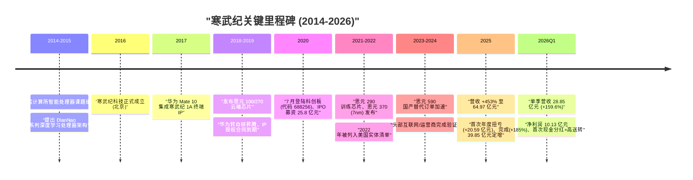
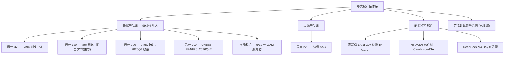
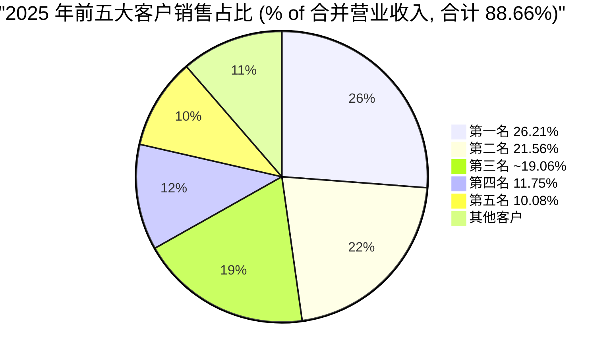
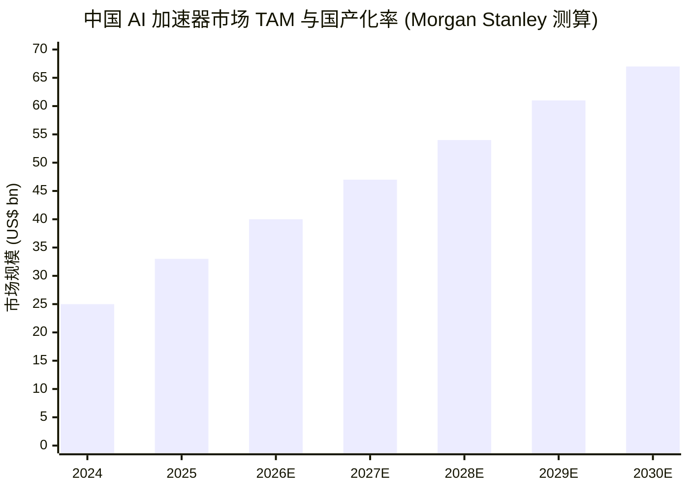
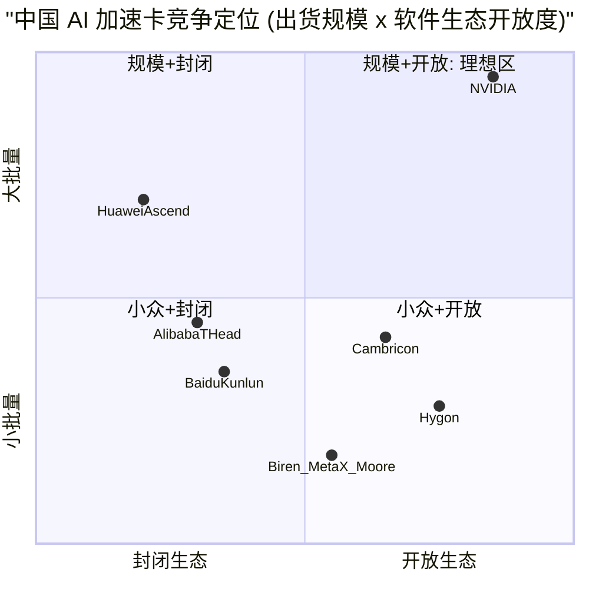

# 中科寒武纪科技股份有限公司 (SSE:688256) 公司研究报告

报告日期 / As of：2026-06-14（本次刷新）

> *分析师观点：* **评级：Overweight（增持）· 12 个月目标价 RMB 1,750（较 2026-06-12 收盘 RMB 1,240 上行 +41%）· 估值方法：2027E EPS RMB 21.8 × 80× forward P/E（基准情形）**
> 市值约 RMB 5,227 亿（基础股本 4.21685 亿股）/ 约 RMB 7,788 亿（2026-05 转增后约 6.28 亿股口径）· 52 周区间 RMB 350.92–1,410.96 · SSE:688256（科创板）
>
> | 倍数 / Multiple（*fwd 列为分析师观点*） | FY25A | FY26E | FY27E |
> |---|---|---|---|
> | P/E（基础股本口径） | ~254× | ~110–126× | ~57–66× |
> | P/S | ~80× | ~32–46× | ~20–28× |
> | 营收 YoY | +453% | +110–148% | +50–80% |
>
> 相对表现（截至 2026-06-12，yfinance）：1M **−1.6%** · 6M **+39.2%** · 12M **+205.9%**；同期 CSI 300 为 1M −2.8% · 6M +4.9% · 12M +22.7%（12 个月相对收益约 **+183pp**）。
> **核心论点（thesis pillars）**——（1）A 股唯一"纯通用型 AI 芯片"标的，2025 年首次年度盈利（归母 +20.59 亿元）且 2026Q1 延续高增，业绩质量从"故事"转为"现金"；（2）美国出口管制把英伟达高端 GPU 挡在门外，国产 AI 加速卡自给率 2025 年达 41%、2030E 升至 86%，寒武纪是华为昇腾之后第二大供应商、第一大独立第三方供应商；（3）MLU580 由中芯国际（SMIC）流片、2026Q3 放量，供应链可见度改善是本轮上调估值的关键边际；（4）极高客户集中度（前五大占 88.66%）+ 极高估值（FY26E P/E 110–126×）是对称风险，目标价对应基准情形而非牛市情形。

> **业绩更新 — 2025 年首次扭亏 + 2026Q1 延续高增（2026-04-29）**：公司 2025 年实现营业收入 64.97 亿元（同比 +453.21%）、归母净利润 20.59 亿元（2024 年为 −4.52 亿元）、gross margin（毛利率）55.15%；2026 年第一季度营收 28.85 亿元（同比 +159.56%）、归母净利润 10.13 亿元（同比 +185.04%）、扣非归母净利润同比 +238.6%，R&D（研发投入）占收入比降至 11.23%（上年同期 24.53%）。董事会通过每 10 股派现 15.00 元、每 10 股转增 4.9 股方案，为科创板上市以来首次现金分红。
> 来源：[2025 年年度报告（2026-03-12）](https://static.cninfo.com.cn/finalpage/2026-03-13/1225007336.PDF)、[2026 年第一季度报告（2026-04-29）](https://static.cninfo.com.cn/finalpage/2026-04-30/1225264337.PDF)。

---

## 目录

1. 公司概览（含投资逻辑速览）
1A. 估值与目标价（前瞻模型 · PT 推导 · 牛熊情形）
1B. GF Score 基本面评分卡（雷达图 + 五维 0–10 + 综合分）
2. 公司历史 · 卖方观点演变
3. 管理团队
4. 产品与服务
5. 客户与销售策略
6. 行业概览
7. 竞争格局
8. 市场机会 (TAM)
9. 风险评估
9.5. 核心分歧与催化剂
10. 投资视角评分卡
数据来源清单 · 参考资料

---

## 1. 公司概览

*分析师观点：* 我们给予寒武纪 **Overweight（增持）** 评级、12 个月目标价 **RMB 1,750**（较 2026-06-12 收盘 RMB 1,240 上行约 +41%），估值基于 2027E EPS RMB 21.8 × 80× forward P/E 的基准情形。投资逻辑的三句话：**（why-now）** 美国对华高端 AI 芯片出口管制不仅未松、2025 年下半年进一步把英伟达 H20/H200 挡在门外，国产替代窗口在 2025-2026 年集中兑现，寒武纪营收单年从 11.74 亿元跳升至 64.97 亿元、首次年度盈利；**（护城河）** 公司是 A 股唯一"纯通用型 AI 芯片"标的，NeuWare 软件栈对 PyTorch 主流框架的兼容度高于华为昇腾的封闭生态，且已实现对 DeepSeek-V4 的 Day-0 适配；**（边际变化）** 由中芯国际（SMIC, 0981.HK）流片的 MLU580 预计 2026Q3 起放量，把过去"有设计、缺产能"的瓶颈打开——这是 Morgan Stanley、Goldman Sachs、Bernstein 在 2026 年 4-5 月集体上调目标价的共同理由（[Morgan Stanley — Cambricon, 2026-05-06, p.1](http://xs-macbook-air.local:5001/zsxq/pdf/585421288142184/MS-Cambricon%20Technology%20Corporation%20Riding%20China%E2%80%99s%20AI%20localization%20with%20improving%20supply%20visibility-260504.pdf)）。我们的目标价对应基准情形（base case），刻意不采用牛市情形，因为极高客户集中度与极高估值构成对称下行风险。

中科寒武纪科技股份有限公司（以下简称"寒武纪"）是中国大陆唯一一家以"通用型 AI 芯片"为单一主业、且已在 A 股上市的公开公司。公司专注于研发和销售面向云端、边缘端、终端三类场景的人工智能 (AI) 核心处理器芯片、加速卡、智能整机、智能处理器 IP (Intellectual Property) 以及配套的基础系统软件（含训练与推理软件平台）。公司经营模式为 Fabless（无晶圆厂）——自身完成芯片定义、架构、设计和系统软件研发，将晶圆制造、封装测试委托给第三方代工（[2025 年年度报告, 第 12-13 页](https://static.cninfo.com.cn/finalpage/2026-03-13/1225007336.PDF)）。

寒武纪 2016 年 3 月成立于北京，前身脱胎于中国科学院计算技术研究所（中科院计算所）智能处理器课题组；2020 年 7 月以"科创板第一只 AI 芯片股"身份登陆上海证券交易所科创板，证券代码 688256，发行价 64.39 元/股。公司控股股东为创始人陈天石博士及其一致行动方艾溪合伙、艾加溪合伙；注册地及总部位于北京市海淀区（[2025 年年度报告, 第 8 页](https://static.cninfo.com.cn/finalpage/2026-03-13/1225007336.PDF)）。

**业务模式与收入来源**。公司盈利模式以"芯片及板卡销售 + 智能整机 + IP 授权与软件"三大支柱构成，其中 2025 年云端产品线（云端智能芯片及板卡、智能整机）实现收入 64.77 亿元（精确 6,476,855,244.59 元）、占主营业务收入 99.69%；边缘产品线收入 339 万元、IP 授权及软件 229 万元，体量极小（[2025 年年度报告, 第 27 页](https://static.cninfo.com.cn/finalpage/2026-03-13/1225007336.PDF)）。公司销售以直销为主（2025 年直销占主营收入 99% 以上），主要客户为大型互联网、电信运营商、金融机构及人工智能算法公司；以人民币结算、几乎全部为境内销售（境内收入 64.97 亿元，境外收入仅 6.71 万元）。

**经营规模与员工**。截至 2025 年 12 月 31 日，公司总资产 134.38 亿元（精确 13,437,714,065.91 元）、归母净资产 118.36 亿元（精确 11,836,173,972.81 元），两项指标较上年末分别增长约 100.0% 与 118.3%，主因 2025 年完成 39.85 亿元定向增发 + 当期净利润累积；总股本 4.21685 亿股（2025 年报披露时点，未含 2026 年 5 月除权之每 10 股转增 4.9 股，转增后总股本约 6.28 亿股）。公司研发人员占比逾八成（[2025 年年度报告, 第 9、16 页](https://static.cninfo.com.cn/finalpage/2026-03-13/1225007336.PDF)）。

### 收入结构 / How Cambricon makes its money（FY2025 利润表 Sankey）

<svg xmlns="http://www.w3.org/2000/svg" viewBox="0 0 1000 560" width="1000" height="560" role="img" aria-label="income statement Sankey"><rect x="0" y="0" width="1000" height="560" fill="#ffffff"/>
<text x="20.00" y="30.00" text-anchor="start" font-family="Helvetica,Arial,sans-serif" font-size="15" font-weight="700" fill="#1f2933">寒武纪如何赚钱 / How Cambricon Makes Money — FY2025 (RMB mn)</text>
<path d="M 204.00,77.63 C 258.00,77.63 258.00,85.00 312.00,85.00 L 312.00,491.74 C 258.00,491.74 258.00,484.37 204.00,484.37 Z" fill="#93c5fd" fill-opacity="0.55"/>
<path d="M 452.00,78.00 C 506.00,78.00 506.00,169.50 560.00,169.50 L 560.00,298.92 C 506.00,298.92 506.00,207.43 452.00,207.43 Z" fill="#86efac" fill-opacity="0.55"/>
<path d="M 452.00,207.43 C 506.00,207.43 506.00,312.92 560.00,312.92 L 560.00,408.50 C 506.00,408.50 506.00,303.01 452.00,303.01 Z" fill="#fca5a5" fill-opacity="0.55"/>
<path d="M 328.00,85.00 C 382.00,85.00 382.00,78.00 436.00,78.00 L 436.00,303.01 C 382.00,303.01 382.00,310.01 328.00,310.01 Z" fill="#86efac" fill-opacity="0.55"/>
<path d="M 328.00,310.01 C 382.00,310.01 382.00,317.01 436.00,317.01 L 436.00,500.00 C 382.00,500.00 382.00,493.00 328.00,493.00 Z" fill="#fca5a5" fill-opacity="0.55"/>
<path d="M 700.00,155.56 C 754.00,155.56 754.00,216.35 808.00,216.35 L 808.00,345.65 C 754.00,345.65 754.00,284.86 700.00,284.86 Z" fill="#86efac" fill-opacity="0.55"/>
<path d="M 700.00,284.86 C 754.00,284.86 754.00,359.65 808.00,359.65 L 808.00,361.65 C 754.00,361.65 754.00,286.86 700.00,286.86 Z" fill="#fca5a5" fill-opacity="0.55"/>
<path d="M 576.00,169.50 C 630.00,169.50 630.00,155.56 684.00,155.56 L 684.00,284.99 C 630.00,284.99 630.00,298.92 576.00,298.92 Z" fill="#86efac" fill-opacity="0.55"/>
<path d="M 576.00,312.92 C 630.00,312.92 630.00,298.86 684.00,298.86 L 684.00,311.17 C 630.00,311.17 630.00,325.23 576.00,325.23 Z" fill="#fca5a5" fill-opacity="0.55"/>
<path d="M 576.00,325.23 C 630.00,325.23 630.00,325.17 684.00,325.17 L 684.00,364.10 C 630.00,364.10 630.00,364.17 576.00,364.17 Z" fill="#fca5a5" fill-opacity="0.55"/>
<path d="M 576.00,364.17 C 630.00,364.17 630.00,378.10 684.00,378.10 L 684.00,422.44 C 630.00,422.44 630.00,408.50 576.00,408.50 Z" fill="#fca5a5" fill-opacity="0.55"/>
<path d="M 204.00,498.37 C 258.00,498.37 258.00,491.74 312.00,491.74 L 312.00,493.74 C 258.00,493.74 258.00,500.37 204.00,500.37 Z" fill="#93c5fd" fill-opacity="0.55"/>
<rect x="188.00" y="77.63" width="16" height="406.74" rx="1.5" fill="#2563eb"/>
<rect x="188.00" y="498.37" width="16" height="2.00" rx="1.5" fill="#2563eb"/>
<rect x="312.00" y="85.00" width="16" height="408.00" rx="1.5" fill="#1e3a8a"/>
<rect x="436.00" y="78.00" width="16" height="225.01" rx="1.5" fill="#15803d"/>
<rect x="436.00" y="317.01" width="16" height="182.99" rx="1.5" fill="#dc2626"/>
<rect x="560.00" y="169.50" width="16" height="129.43" rx="1.5" fill="#15803d"/>
<rect x="560.00" y="312.92" width="16" height="95.58" rx="1.5" fill="#dc2626"/>
<rect x="684.00" y="155.56" width="16" height="129.30" rx="1.5" fill="#15803d"/>
<rect x="684.00" y="298.86" width="16" height="12.31" rx="1.5" fill="#dc2626"/>
<rect x="684.00" y="325.17" width="16" height="38.93" rx="1.5" fill="#dc2626"/>
<rect x="684.00" y="378.10" width="16" height="44.34" rx="1.5" fill="#dc2626"/>
<rect x="808.00" y="216.35" width="16" height="129.30" rx="1.5" fill="#15803d"/>
<rect x="808.00" y="359.65" width="16" height="2.00" rx="1.5" fill="#dc2626"/>
<line x1="188.00" y1="281.00" x2="182.00" y2="268.63" stroke="#cbd5e1" stroke-width="1"/>
<text x="179.00" y="271.63" text-anchor="end" font-family="Helvetica,Arial,sans-serif" font-size="11.5" font-weight="700" fill="#1f2933">云端产品线 Cloud</text>
<text x="179.00" y="284.63" text-anchor="end" font-family="Helvetica,Arial,sans-serif" font-size="10" font-weight="400" fill="#52606d">RMB6.5B  (99.7%)</text>
<line x1="188.00" y1="499.37" x2="182.00" y2="487.00" stroke="#cbd5e1" stroke-width="1"/>
<text x="179.00" y="490.00" text-anchor="end" font-family="Helvetica,Arial,sans-serif" font-size="11.5" font-weight="700" fill="#1f2933">边缘+IP+其他 Edge/IP/Other</text>
<text x="179.00" y="503.00" text-anchor="end" font-family="Helvetica,Arial,sans-serif" font-size="10" font-weight="400" fill="#52606d">RMB20.0M  (0.31%)</text>
<rect x="331.00" y="67.00" width="113.10" height="26" rx="2" fill="#ffffff" fill-opacity="0.72"/>
<text x="334.00" y="79.00" text-anchor="start" font-family="Helvetica,Arial,sans-serif" font-size="11.5" font-weight="700" fill="#1f2933">Revenue</text>
<text x="334.00" y="92.00" text-anchor="start" font-family="Helvetica,Arial,sans-serif" font-size="10" font-weight="400" fill="#52606d">RMB6.5B  (100.0%)</text>
<rect x="455.00" y="60.00" width="106.80" height="26" rx="2" fill="#ffffff" fill-opacity="0.72"/>
<text x="458.00" y="72.00" text-anchor="start" font-family="Helvetica,Arial,sans-serif" font-size="11.5" font-weight="700" fill="#1f2933">Gross Profit</text>
<text x="458.00" y="85.00" text-anchor="start" font-family="Helvetica,Arial,sans-serif" font-size="10" font-weight="400" fill="#52606d">RMB3.6B  (55.1%)</text>
<rect x="455.00" y="299.01" width="144.60" height="26" rx="2" fill="#ffffff" fill-opacity="0.72"/>
<text x="458.00" y="311.01" text-anchor="start" font-family="Helvetica,Arial,sans-serif" font-size="11.5" font-weight="700" fill="#1f2933">Cost of Revenue (COGS)</text>
<text x="458.00" y="324.01" text-anchor="start" font-family="Helvetica,Arial,sans-serif" font-size="10" font-weight="400" fill="#52606d">RMB2.9B  (44.9%)</text>
<rect x="579.00" y="151.50" width="106.80" height="26" rx="2" fill="#ffffff" fill-opacity="0.72"/>
<text x="582.00" y="163.50" text-anchor="start" font-family="Helvetica,Arial,sans-serif" font-size="11.5" font-weight="700" fill="#1f2933">Operating Income</text>
<text x="582.00" y="176.50" text-anchor="start" font-family="Helvetica,Arial,sans-serif" font-size="10" font-weight="400" fill="#52606d">RMB2.1B  (31.7%)</text>
<rect x="579.00" y="294.92" width="150.90" height="26" rx="2" fill="#ffffff" fill-opacity="0.72"/>
<text x="582.00" y="306.92" text-anchor="start" font-family="Helvetica,Arial,sans-serif" font-size="11.5" font-weight="700" fill="#1f2933">Total Operating Expense</text>
<text x="582.00" y="319.92" text-anchor="start" font-family="Helvetica,Arial,sans-serif" font-size="10" font-weight="400" fill="#52606d">RMB1.5B  (23.4%)</text>
<rect x="703.00" y="137.56" width="106.80" height="26" rx="2" fill="#ffffff" fill-opacity="0.72"/>
<text x="706.00" y="149.56" text-anchor="start" font-family="Helvetica,Arial,sans-serif" font-size="11.5" font-weight="700" fill="#1f2933">Pretax Income</text>
<text x="706.00" y="162.56" text-anchor="start" font-family="Helvetica,Arial,sans-serif" font-size="10" font-weight="400" fill="#52606d">RMB2.1B  (31.7%)</text>
<rect x="703.00" y="280.86" width="113.10" height="26" rx="2" fill="#ffffff" fill-opacity="0.72"/>
<text x="706.00" y="292.86" text-anchor="start" font-family="Helvetica,Arial,sans-serif" font-size="11.5" font-weight="700" fill="#1f2933">SG&amp;A</text>
<text x="706.00" y="305.86" text-anchor="start" font-family="Helvetica,Arial,sans-serif" font-size="10" font-weight="400" fill="#52606d">RMB196.0M  (3.0%)</text>
<rect x="703.00" y="307.17" width="113.10" height="26" rx="2" fill="#ffffff" fill-opacity="0.72"/>
<text x="706.00" y="319.17" text-anchor="start" font-family="Helvetica,Arial,sans-serif" font-size="11.5" font-weight="700" fill="#1f2933">R&amp;D</text>
<text x="706.00" y="332.17" text-anchor="start" font-family="Helvetica,Arial,sans-serif" font-size="10" font-weight="400" fill="#52606d">RMB620.0M  (9.5%)</text>
<rect x="703.00" y="360.10" width="119.40" height="26" rx="2" fill="#ffffff" fill-opacity="0.72"/>
<text x="706.00" y="372.10" text-anchor="start" font-family="Helvetica,Arial,sans-serif" font-size="11.5" font-weight="700" fill="#1f2933">Other OpEx</text>
<text x="706.00" y="385.10" text-anchor="start" font-family="Helvetica,Arial,sans-serif" font-size="10" font-weight="400" fill="#52606d">RMB706.0M  (10.9%)</text>
<text x="833.00" y="278.00" text-anchor="start" font-family="Helvetica,Arial,sans-serif" font-size="11.5" font-weight="700" fill="#1f2933">Net Income</text>
<text x="833.00" y="291.00" text-anchor="start" font-family="Helvetica,Arial,sans-serif" font-size="10" font-weight="400" fill="#52606d">RMB2.1B  (31.7%)</text>
<text x="833.00" y="357.65" text-anchor="start" font-family="Helvetica,Arial,sans-serif" font-size="11.5" font-weight="700" fill="#1f2933">Income Tax</text>
<text x="833.00" y="370.65" text-anchor="start" font-family="Helvetica,Arial,sans-serif" font-size="10" font-weight="400" fill="#52606d">RMB1.0M  (0.02%)</text>
<text x="500.00" y="544.00" text-anchor="middle" font-family="Helvetica,Arial,sans-serif" font-size="10" font-weight="400" fill="#52606d">Source: 寒武纪 2025 年年度报告，合并利润表 + 主营业务分产品（第 27 页）</text>
</svg>

来源 / Source：[寒武纪 2025 年年度报告，合并利润表 + 主营业务分产品（第 27、102 页）](https://static.cninfo.com.cn/finalpage/2026-03-13/1225007336.PDF)。营业收入 6,497,196,198.68 元、营业成本 2,913,883,194.49 元（gross margin 55.15%）、营业利润 2,061,390,034.78 元、归母净利润 2,059,228,538.67 元——全部为公司自身合并报表数据。

### FY2025 主营收入构成 / Revenue by product line

<svg xmlns="http://www.w3.org/2000/svg" viewBox="0 0 720 460" width="720" height="460" role="img" aria-label="revenue donut"><rect x="0" y="0" width="720" height="460" fill="#ffffff"/>
<text x="20.00" y="30.00" text-anchor="start" font-family="Helvetica,Arial,sans-serif" font-size="15" font-weight="700" fill="#1f2933">FY2025 主营收入构成 / Revenue by Product Line (RMB mn)</text>
<path d="M 288.00,107.20 A 132 132 0 1 1 285.40,107.23 L 286.46,161.22 A 78 78 0 1 0 288.00,161.20 Z" fill="#2563eb"/>
<path d="M 285.40,107.23 A 132 132 0 0 1 285.83,107.22 L 286.72,161.21 A 78 78 0 0 0 286.46,161.22 Z" fill="#15803d"/>
<path d="M 285.83,107.22 A 132 132 0 0 1 286.12,107.21 L 286.89,161.21 A 78 78 0 0 0 286.72,161.21 Z" fill="#d97706"/>
<path d="M 286.12,107.21 A 132 132 0 0 1 288.00,107.20 L 288.00,161.20 A 78 78 0 0 0 286.89,161.21 Z" fill="#7c3aed"/>
<text x="288.00" y="235.20" text-anchor="middle" font-family="Helvetica,Arial,sans-serif" font-size="18" font-weight="800" fill="#1f2933">寒武纪</text>
<text x="288.00" y="255.20" text-anchor="middle" font-family="Helvetica,Arial,sans-serif" font-size="13" font-weight="600" fill="#52606d">RMB6.5B</text>
<text x="288.00" y="271.20" text-anchor="middle" font-family="Helvetica,Arial,sans-serif" font-size="10" font-weight="400" fill="#8a97a3">total</text>
<line x1="289.36" y1="377.19" x2="305.36" y2="377.19" stroke="#2563eb" stroke-width="1.4"/>
<text x="309.36" y="375.19" text-anchor="start" font-family="Helvetica,Arial,sans-serif" font-size="11" font-weight="700" fill="#1f2933">云端产品线 Cloud</text>
<text x="309.36" y="389.19" text-anchor="start" font-family="Helvetica,Arial,sans-serif" font-size="10" font-weight="400" fill="#52606d">RMB6.5B  (99.7%)</text>
<line x1="285.50" y1="101.22" x2="269.50" y2="101.22" stroke="#15803d" stroke-width="1.4"/>
<text x="265.50" y="99.22" text-anchor="end" font-family="Helvetica,Arial,sans-serif" font-size="11" font-weight="700" fill="#1f2933">边缘产品线 Edge</text>
<text x="265.50" y="113.22" text-anchor="end" font-family="Helvetica,Arial,sans-serif" font-size="10" font-weight="400" fill="#52606d">RMB3.4M  (0.1%)</text>
<line x1="285.88" y1="101.22" x2="269.88" y2="101.22" stroke="#d97706" stroke-width="1.4"/>
<text x="265.88" y="99.22" text-anchor="end" font-family="Helvetica,Arial,sans-serif" font-size="11" font-weight="700" fill="#1f2933">IP授权+软件 IP/SW</text>
<text x="265.88" y="113.22" text-anchor="end" font-family="Helvetica,Arial,sans-serif" font-size="10" font-weight="400" fill="#52606d">RMB2.3M  (0.0%)</text>
<line x1="287.02" y1="101.20" x2="271.02" y2="101.20" stroke="#7c3aed" stroke-width="1.4"/>
<text x="267.02" y="99.20" text-anchor="end" font-family="Helvetica,Arial,sans-serif" font-size="11" font-weight="700" fill="#1f2933">其他 Other</text>
<text x="267.02" y="113.20" text-anchor="end" font-family="Helvetica,Arial,sans-serif" font-size="10" font-weight="400" fill="#52606d">RMB14.7M  (0.2%)</text>
<text x="360.00" y="444.00" text-anchor="middle" font-family="Helvetica,Arial,sans-serif" font-size="10" font-weight="400" fill="#52606d">Source: 寒武纪 2025 年年度报告，主营业务分产品（第 27 页）</text>
</svg>

来源 / Source：[寒武纪 2025 年年度报告，主营业务分产品（第 27 页）](https://static.cninfo.com.cn/finalpage/2026-03-13/1225007336.PDF)。云端产品线占 99.69%，是一家事实上的单一产品线公司。

### 营收拐点 / Revenue inflection（2020-2025）

<svg xmlns="http://www.w3.org/2000/svg" viewBox="0 0 860 470" width="860" height="470" role="img" aria-label="historical revenue bars"><rect x="0" y="0" width="860" height="470" fill="#ffffff"/>
<text x="20.00" y="30.00" text-anchor="start" font-family="Helvetica,Arial,sans-serif" font-size="15" font-weight="700" fill="#1f2933">寒武纪营收拐点 / Revenue Inflection (RMB bn, 2020-2025)</text>
<rect x="20.00" y="44" width="11" height="11" rx="2" fill="#2563eb"/>
<text x="36.00" y="53.00" text-anchor="start" font-family="Helvetica,Arial,sans-serif" font-size="10.5" font-weight="400" fill="#1f2933">营业收入 Total Revenue</text>
<line x1="70" y1="412.00" x2="834" y2="412.00" stroke="#eceff2" stroke-width="1"/>
<text x="64.00" y="415.00" text-anchor="end" font-family="Helvetica,Arial,sans-serif" font-size="9.5" font-weight="400" fill="#52606d">RMB0</text>
<line x1="70" y1="345.20" x2="834" y2="345.20" stroke="#eceff2" stroke-width="1"/>
<text x="64.00" y="348.20" text-anchor="end" font-family="Helvetica,Arial,sans-serif" font-size="9.5" font-weight="400" fill="#52606d">RMB1.4B</text>
<line x1="70" y1="278.40" x2="834" y2="278.40" stroke="#eceff2" stroke-width="1"/>
<text x="64.00" y="281.40" text-anchor="end" font-family="Helvetica,Arial,sans-serif" font-size="9.5" font-weight="400" fill="#52606d">RMB2.8B</text>
<line x1="70" y1="211.60" x2="834" y2="211.60" stroke="#eceff2" stroke-width="1"/>
<text x="64.00" y="214.60" text-anchor="end" font-family="Helvetica,Arial,sans-serif" font-size="9.5" font-weight="400" fill="#52606d">RMB4.2B</text>
<line x1="70" y1="144.80" x2="834" y2="144.80" stroke="#eceff2" stroke-width="1"/>
<text x="64.00" y="147.80" text-anchor="end" font-family="Helvetica,Arial,sans-serif" font-size="9.5" font-weight="400" fill="#52606d">RMB5.6B</text>
<line x1="70" y1="78.00" x2="834" y2="78.00" stroke="#eceff2" stroke-width="1"/>
<text x="64.00" y="81.00" text-anchor="end" font-family="Helvetica,Arial,sans-serif" font-size="9.5" font-weight="400" fill="#52606d">RMB7.0B</text>
<rect x="96.74" y="390.15" width="73.85" height="21.85" fill="#2563eb"/>
<text x="133.67" y="428.00" text-anchor="middle" font-family="Helvetica,Arial,sans-serif" font-size="10" font-weight="400" fill="#52606d">2020</text>
<rect x="224.07" y="377.68" width="73.85" height="34.32" fill="#2563eb"/>
<text x="261.00" y="428.00" text-anchor="middle" font-family="Helvetica,Arial,sans-serif" font-size="10" font-weight="400" fill="#52606d">2021</text>
<rect x="351.41" y="377.30" width="73.85" height="34.70" fill="#2563eb"/>
<text x="388.33" y="428.00" text-anchor="middle" font-family="Helvetica,Arial,sans-serif" font-size="10" font-weight="400" fill="#52606d">2022</text>
<rect x="478.74" y="378.25" width="73.85" height="33.75" fill="#2563eb"/>
<text x="515.67" y="428.00" text-anchor="middle" font-family="Helvetica,Arial,sans-serif" font-size="10" font-weight="400" fill="#52606d">2023</text>
<rect x="606.07" y="356.12" width="73.85" height="55.88" fill="#2563eb"/>
<text x="643.00" y="428.00" text-anchor="middle" font-family="Helvetica,Arial,sans-serif" font-size="10" font-weight="400" fill="#52606d">2024</text>
<rect x="733.41" y="102.74" width="73.85" height="309.26" fill="#2563eb"/>
<text x="770.33" y="428.00" text-anchor="middle" font-family="Helvetica,Arial,sans-serif" font-size="10" font-weight="400" fill="#52606d">2025</text>
<text x="430.00" y="454.00" text-anchor="middle" font-family="Helvetica,Arial,sans-serif" font-size="10" font-weight="400" fill="#52606d">Source: 寒武纪 2020-2025 年度报告，合并利润表（营业收入）</text>
</svg>

来源 / Source：[寒武纪 2020-2025 年度报告，合并利润表](https://static.cninfo.com.cn/finalpage/2026-03-13/1225007336.PDF)。2020-2024 年营收在 4.59-11.74 亿元区间徘徊（四年 CAGR 约 26.5%），2025 年单年跳升至 64.97 亿元（同比 +453.2%）——这是理解本报告全部估值与争议的起点。

**关键指标与扩张速度**。归母净利润由 2024 年 −4.52 亿元转为 2025 年 +20.59 亿元，**首次实现年度盈利**；扣非归母净利润 17.70 亿元同样转正；基本每股收益由 2024 年 −1.09 元跃升至 2025 年 4.93 元，weighted-average ROE（加权平均净资产收益率）26.96%、扣非 ROE 23.17%（[2025 年年度报告, 第 9、15 页](https://static.cninfo.com.cn/finalpage/2026-03-13/1225007336.PDF)）。一家此前连续亏损九年的"科技独苗"，在一个完整会计年度内变成 A 股利润率最高的科技公司之一（operating margin 31.73%、net margin 31.69%）。

**估值快照（valuation snapshot, 2026-06-12 收盘 RMB 1,240.00, yfinance 688256.SS）**。按基础股本 4.21685 亿股计，市值约 RMB 5,227 亿元；若按 2026 年 5 月转增后约 6.28 亿股口径，市值约 RMB 7,788 亿元（约 1,085 亿美元）。**TTM P/E 约 254×、TTM P/S 约 80×、P/B 约 44×**（以 2025 年末归母净资产计）。
- **为什么这么贵（P/E > 50× 行业中位、> 2× 半导体板块中位 ~40×）**：(a) 国产 AI 算力高景气主题——2025 年中国本土 AI 加速卡国产化率从 29% 跃升至 41%、全市场加速卡出货约 400 万张；(b) 公司是 A 股唯一"纯通用型 AI 芯片"标的，被定位为"国产英伟达"的稀缺映射资产；(c) 业绩弹性极强——单季营收由 2025Q1 11.11 亿元抬升到 2026Q1 28.85 亿元。沿用 Goldman Sachs 的口径，当前估值"与寒武纪自 2024 年 7 月以来的平均 P/E 约 109× 基本一致，相对全球同业（NVIDIA、AMD）及中国半导体龙头的估值比率并不显著偏贵"（*分析师观点：* [Goldman Sachs — Cambricon, 2026-05-05, p.1](http://xs-macbook-air.local:5001/zsxq/pdf/812458524221182/GS-Cambricon%20%28688256.SS%29-AI%20expansion%20with%20growing%20local%20chips%20in%20China%3B%201Q26%20beat%20with%20strong%20orders%20on%20hand%3B%20Buy%2C%20TP%20up%20to%20Rmb2%2C406-260504.pdf)）。
- **同行可比（TTM P/E）**：英伟达 NVDA 约 55×、AMD 约 75×、海光信息（SSE:688041）约 110×、寒武纪约 254×（[Yahoo Finance NVDA Key Statistics](https://finance.yahoo.com/quote/NVDA/key-statistics/)、[亿牛网 688256 历史市盈率](https://eniu.com/gu/sh688256)）。无论以哪种口径，寒武纪都处于全球 AI 芯片同行的估值极端高位——本报告在第 9 节将其作为"估值/多重压缩风险"单独列示。

## 1A. 估值与目标价（Valuation & Price Target）

> 本章全部为 *分析师观点（Analyst view）*——所有前瞻估计、目标价与情形目标价均为本报告自身判断，不附任何 filing 引用；每个驱动变量的外部依据在行内单独标注。

### (a) 前瞻财务模型（forward estimates，3 年）

| 指标（*分析师观点*） | FY24A | FY25A | FY26E | FY27E | FY25-27 CAGR |
|---|---|---|---|---|---|
| 营业收入 Revenue（RMB mn） | 1,174 | 6,497 | 14,500 | 23,000 | +88% |
| — YoY % | — | +453% | +123% | +59% | |
| Gross margin % | 56.7 | 55.2 | 54.0 | 52.5 | |
| Operating margin % | −38.8 | 31.7 | 33.5 | 35.0 | |
| Net margin % | −38.5 | 31.7 | 31.0 | 32.0 | |
| 归母净利润 NP（RMB mn） | −452 | 2,059 | 4,500 | 7,360 | +89% |
| EPS（RMB，基础股本口径） | −1.09 | 4.93 | 10.7 | 17.5 | |
| ROIC %（近似） | n/m | ~22 | ~25 | ~28 | |
| 经营现金流 OCF（RMB mn） | −1,618 | −498 | +1,500 | +4,500 | |
| 净现金 Net cash（RMB mn） | ~3,500 | ~5,400 | ~7,000 | ~11,000 | |

模型基础与依据：FY25A 全部来自 [2025 年年度报告，合并利润表](https://static.cninfo.com.cn/finalpage/2026-03-13/1225007336.PDF)（营收 6,497mn、归母 2,059mn、GM 55.2%）；FY26E/FY27E 营收路径锚定于三条外部输入——(i) 公司自身披露的在手订单信号（2026Q1 合同负债从年初接近零增至 RMB 396mn、预付款项升至 RMB 1.90bn，[2026 年第一季度报告](https://static.cninfo.com.cn/finalpage/2026-04-30/1225264337.PDF)）；(ii) Goldman Sachs 预计寒武纪 AI 芯片出货量 2028/2030E 分别突破 100 万/200 万片（*分析师观点：* [GS, 2026-05-05, p.1](http://xs-macbook-air.local:5001/zsxq/pdf/812458524221182/GS-Cambricon%20%28688256.SS%29-AI%20expansion%20with%20growing%20local%20chips%20in%20China%3B%201Q26%20beat%20with%20strong%20orders%20on%20hand%3B%20Buy%2C%20TP%20up%20to%20Rmb2%2C406-260504.pdf)）；(iii) Morgan Stanley 测算中国 AI 加速器 TAM 至 2030 年达 670 亿美元、国产化率 41%→86%（*分析师观点：* [MS, 2026-05-06, p.1](http://xs-macbook-air.local:5001/zsxq/pdf/585421288142184/MS-Cambricon%20Technology%20Corporation%20Riding%20China%E2%80%99s%20AI%20localization%20with%20improving%20supply%20visibility-260504.pdf)）。我们的 FY26E 营收 RMB14.5bn 位于 MS（隐含偏低）与 Bernstein（RMB16.15bn）之间，刻意取中位、偏保守。

**margin bridge（FY25→FY27E，*分析师观点*）**：GM 由 55.2% 降至约 52.5%（约 −270bps）= 规模放量后高端芯片占比提升带动结构改善 +约 100bps · 但产能转向 SMIC（成熟良率爬坡）+ 竞争加剧带来的 ASP 让步 −约 250bps · 规模摊薄固定制造成本 +约 80bps，净 −270bps；Operating margin 由 31.7% 升至约 35.0%（约 +330bps），主因 R&D 费用率随收入规模继续摊薄（2026Q1 已降至 11.2%，对比 2025Q1 的 24.5%，[Bernstein, 2026-05-01, p.1](http://xs-macbook-air.local:5001/zsxq/pdf/415515552122288/Bernstein-Cambricon%201Q26%20Robust%20beat%20across%20the%20board%20driven%20by%20AI%20chip%20localization%2C%20more%20upside%20to%20come%20with%20improving%20supply-260429.pdf)）。

### (b) 目标价推导（show the arithmetic）

基准情形采用 **forward-PE × target multiple**：`2027E EPS RMB 21.8（采用 Bernstein 口径）× 80× forward P/E = RMB 1,744 ≈ RMB 1,750`。

**为什么用 80× 这个倍数**：(i) Bernstein 给 90×（得 PT 2000），Goldman Sachs 的 EV/EBITDA 法隐含 2027E P/E 102×（得 PT 2406）——市场对寒武纪 2027E 给出的倍数区间是 80–102×（*分析师观点：* [Bernstein, 2026-05-01, p.1](http://xs-macbook-air.local:5001/zsxq/pdf/415515552122288/Bernstein-Cambricon%201Q26%20Robust%20beat%20across%20the%20board%20driven%20by%20AI%20chip%20localization%2C%20more%20upside%20to%20come%20with%20improving%20supply-260429.pdf)、[GS, 2026-05-05, p.1](http://xs-macbook-air.local:5001/zsxq/pdf/812458524221182/GS-Cambricon%20%28688256.SS%29-AI%20expansion%20with%20growing%20local%20chips%20in%20China%3B%201Q26%20beat%20with%20strong%20orders%20on%20hand%3B%20Buy%2C%20TP%20up%20to%20Rmb2%2C406-260504.pdf)）；(ii) 寒武纪自 2024 年 7 月以来的平均 P/E 约 109×（GS 口径），80× 较其历史均值有约 25% 折让，反映我们对客户集中度与 ASP 让步的更谨慎假设；(iii) 对照全球高增长 AI 芯片同行：英伟达 NVDA 约 55×、AMD 约 75×——寒武纪以 80× 计仍享有"国产稀缺性 + 90% 收入 CAGR"的溢价，但不至于脱离同业。我们的 EPS 口径（RMB 21.8）直接采用 Bernstein 的 2027E，低于 GS 的更激进路径，故综合 PT RMB 1,750 落在三家外资 PT（2000/2000/2406）下方，对应基准而非牛市。

### (c) 牛 / 基准 / 熊情形（bull / base / bear，*分析师观点*）

| 情形 | 关键摆动假设 | 目标价 PT | 较 RMB 1,240 现价 |
|---|---|---|---|
| 牛市 Bull | MLU580/690 顺利放量 + 国产化加速，2027E EPS 达 RMB 23、倍数维持 100× | RMB 2,300 | +85% |
| 基准 Base | 中性估计，2027E EPS RMB 21.8 × 80× | RMB 1,750 | +41% |
| 熊市 Bear | 大客户转自研/昇腾 + ASP 价格战压缩利润，2027E EPS 降至 RMB 16、估值下杀至 50× | RMB 800 | −35% |

### (d) 与市场一致预期的对比（consensus benchmark）

三家外资投行 2026 年 4-5 月对寒武纪的目标价区间为 **RMB 2,000–2,406**，均高于本报告的 RMB 1,750——即我们较卖方一致预期偏低约 13–27%，主要差异在于我们对 2027E target multiple 取 80×（而非 Bernstein 的 90× / GS 隐含的 102×），以及对 ASP 让步的更谨慎假设。Bernstein 的 FY26E 营收 RMB16.15bn / 净利 RMB4.674bn / EPS RMB11.26 是当前最激进的单名估计之一（*分析师观点：* [Bernstein, 2026-05-01, p.1](http://xs-macbook-air.local:5001/zsxq/pdf/415515552122288/Bernstein-Cambricon%201Q26%20Robust%20beat%20across%20the%20board%20driven%20by%20AI%20chip%20localization%2C%20more%20upside%20to%20come%20with%20improving%20supply-260429.pdf)）；我们的 FY26E 营收 RMB14.5bn、EPS RMB10.7 略低于此。完整的机构观点时间线与分歧表见第 2 节"卖方观点演变"。

### (e) 最该盯紧的变量（swing variables）

本次评级与目标价主要押注两个变量：**(1) MLU580 在 SMIC 的产能与良率**——这是 2026 下半年营收能否兑现的命门，也是三家投行集体上调 PT 的共同前提；**(2) 大客户的采购连续性**——前五大客户占 88.66%，任何一家转向华为昇腾或转自研，都会使 2027E EPS 从 RMB 21.8 滑向熊市情形的 RMB 16。读者应据此压力测试本报告的全部前瞻数字。

## 1B. GF Score 基本面评分卡（GuruFocus-style）

> *分析师观点：* **GF Score（GuruFocus 风格）：74/100 — 偏强（71–80 档，对应历史上跑赢概率居中上）。** 五维子分与综合分均为本报告自身评分卡输出，不附 filing 引用；各维度依赖的底层指标在下方逐条标注其来源。

<svg xmlns="http://www.w3.org/2000/svg" viewBox="0 0 500 500" width="500" height="500" role="img" aria-label="GF Score radar">
<rect x="0" y="0" width="500" height="500" fill="#ffffff"/>
<text x="20" y="24" font-family="Helvetica,Arial,sans-serif" font-size="15" font-weight="700" fill="#1f2933">GF Score (GuruFocus-style): 74/100</text>
<text x="20" y="41" font-family="Helvetica,Arial,sans-serif" font-size="11" fill="#52606d">71–80 Likely average performance</text>
<polygon points="250.0,88.0 392.7,191.6 338.2,359.4 161.8,359.4 107.3,191.6" fill="#e9f5ec" stroke="none"/>
<polygon points="250.0,208.0 278.5,228.7 267.6,262.3 232.4,262.3 221.5,228.7" fill="none" stroke="#c5d3cb" stroke-width="1"/>
<polygon points="250.0,178.0 307.1,219.5 285.3,286.5 214.7,286.5 192.9,219.5" fill="none" stroke="#c5d3cb" stroke-width="1"/>
<polygon points="250.0,148.0 335.6,210.2 302.9,310.8 197.1,310.8 164.4,210.2" fill="none" stroke="#c5d3cb" stroke-width="1"/>
<polygon points="250.0,118.0 364.1,200.9 320.5,335.1 179.5,335.1 135.9,200.9" fill="none" stroke="#c5d3cb" stroke-width="1"/>
<polygon points="250.0,88.0 392.7,191.6 338.2,359.4 161.8,359.4 107.3,191.6" fill="none" stroke="#c5d3cb" stroke-width="1.3"/>
<line x1="250" y1="238" x2="161.8" y2="359.4" stroke="#cfdad3" stroke-width="1"/>
<text x="146.5" y="392.4" text-anchor="end" font-family="Helvetica,Arial,sans-serif" font-size="11.5" font-weight="600" fill="#1f2933">Financial Strength</text>
<text x="146.5" y="405.4" text-anchor="end" font-family="Helvetica,Arial,sans-serif" font-size="9.5" fill="#52606d">财务实力</text>
<text x="179.5" y="329.1" text-anchor="middle" font-family="Helvetica,Arial,sans-serif" font-size="10.5" font-weight="700" fill="#1f2933">8</text>
<line x1="250" y1="238" x2="250.0" y2="88.0" stroke="#cfdad3" stroke-width="1"/>
<text x="250.0" y="58.0" text-anchor="middle" font-family="Helvetica,Arial,sans-serif" font-size="11.5" font-weight="600" fill="#1f2933">Profitability</text>
<text x="250.0" y="71.0" text-anchor="middle" font-family="Helvetica,Arial,sans-serif" font-size="9.5" fill="#52606d">盈利能力</text>
<text x="250.0" y="127.0" text-anchor="middle" font-family="Helvetica,Arial,sans-serif" font-size="10.5" font-weight="700" fill="#1f2933">7</text>
<line x1="250" y1="238" x2="107.3" y2="191.6" stroke="#cfdad3" stroke-width="1"/>
<text x="82.6" y="183.6" text-anchor="end" font-family="Helvetica,Arial,sans-serif" font-size="11.5" font-weight="600" fill="#1f2933">Growth</text>
<text x="82.6" y="196.6" text-anchor="end" font-family="Helvetica,Arial,sans-serif" font-size="9.5" fill="#52606d">成长性</text>
<text x="107.3" y="185.6" text-anchor="middle" font-family="Helvetica,Arial,sans-serif" font-size="10.5" font-weight="700" fill="#1f2933">10</text>
<line x1="250" y1="238" x2="392.7" y2="191.6" stroke="#cfdad3" stroke-width="1"/>
<text x="417.4" y="183.6" text-anchor="start" font-family="Helvetica,Arial,sans-serif" font-size="11.5" font-weight="600" fill="#1f2933">GF Value</text>
<text x="417.4" y="196.6" text-anchor="start" font-family="Helvetica,Arial,sans-serif" font-size="9.5" fill="#52606d">估值</text>
<text x="278.5" y="222.7" text-anchor="middle" font-family="Helvetica,Arial,sans-serif" font-size="10.5" font-weight="700" fill="#1f2933">2</text>
<line x1="250" y1="238" x2="338.2" y2="359.4" stroke="#cfdad3" stroke-width="1"/>
<text x="353.5" y="392.4" text-anchor="start" font-family="Helvetica,Arial,sans-serif" font-size="11.5" font-weight="600" fill="#1f2933">Momentum</text>
<text x="353.5" y="405.4" text-anchor="start" font-family="Helvetica,Arial,sans-serif" font-size="9.5" fill="#52606d">动量</text>
<text x="320.5" y="329.1" text-anchor="middle" font-family="Helvetica,Arial,sans-serif" font-size="10.5" font-weight="700" fill="#1f2933">8</text>
<polygon points="250.0,133.0 278.5,228.7 320.5,335.1 179.5,335.1 107.3,191.6" fill="#2e8b57" fill-opacity="0.34" stroke="#2e8b57" stroke-width="2"/>
<circle cx="179.5" cy="335.1" r="2.6" fill="#2e8b57"/>
<circle cx="250.0" cy="133.0" r="2.6" fill="#2e8b57"/>
<circle cx="107.3" cy="191.6" r="2.6" fill="#2e8b57"/>
<circle cx="278.5" cy="228.7" r="2.6" fill="#2e8b57"/>
<circle cx="320.5" cy="335.1" r="2.6" fill="#2e8b57"/>
<text x="250" y="470" text-anchor="middle" font-family="Helvetica,Arial,sans-serif" font-size="9.5" fill="#52606d">Source: 寒武纪 2025 年报 + 2026Q1 季报 · yfinance 688256.SS · as of 2026-06-14</text>
<text x="250" y="485" text-anchor="middle" font-family="Helvetica,Arial,sans-serif" font-size="9" fill="#52606d">GF Score = independent analyst rubric (*Analyst view:*) — not GuruFocus™ official number</text>
</svg>

| 维度 / Dimension | 评分 / Score (0–10) | |
|---|---|---|
| Financial Strength (财务实力) | 8 | `████████░░` |
| Profitability (盈利能力) | 7 | `███████░░░` |
| Growth (成长性) | 10 | `██████████` |
| GF Value (估值) | 2 | `██░░░░░░░░` |
| Momentum (动量) | 8 | `████████░░` |
| **GF Score (composite, *Analyst view:*)** | **74 / 100** | **71–80 Likely average performance** |

*Composite weights (*Analyst view:*): Financial Strength 20% · Profitability 25% · Growth 25% · GF Value 15% · Momentum 15% (transparent reproduction — not GuruFocus's proprietary weighting).*

*读图：离中心越远越好；五边形越大综合分越高。*

| 维度 Axis | 评分 0–10 | 一句话理由 |
|---|---|---|
| Financial Strength 财务实力 | 8 | 几乎零有息负债、账上现金+交易性金融资产合计超 60 亿元 |
| Profitability 盈利能力 | 7 | 首年盈利、net margin 31.7%，但历史九年亏损、可持续性待证 |
| Growth 成长性 | 10 | 营收同比 +453%、净利从亏损转 20.59 亿元，弹性极致 |
| GF Value 估值（越高越便宜） | 2 | TTM P/E ~254×、P/S ~80×，估值极贵，安全边际极薄 |
| Momentum 动量 | 8 | 12 个月 +205.9%，大幅跑赢 CSI 300（+22.7%） |
| **综合 Composite** | **74/100** | （8·20 + 7·25 + 10·25 + 2·15 + 8·15）/100 |

**各维度评分理由**。**Financial Strength（8）**：2025 年末货币资金 13.17 亿元 + 交易性金融资产 42.61 亿元，几乎无短期借款（年末短期借款为 0），39.85 亿元定增到账后资本极充裕（[2025 年年度报告, 合并资产负债表, 第 97-98 页](https://static.cninfo.com.cn/finalpage/2026-03-13/1225007336.PDF)）；扣分项是存货高达 49.44 亿元、占总资产 36.79%，存在跌价敞口。**Profitability（7）**：2025 年 operating margin 31.73%、net margin 31.69%、weighted-avg ROE 26.96%（[2025 年年度报告, 第 9、15 页](https://static.cninfo.com.cn/finalpage/2026-03-13/1225007336.PDF)），绝对水平优异，但公司直到 2025 年才首次年度盈利、此前九年累计亏损（未分配利润 2025 年末仍为 −0.12 亿元），盈利可持续性尚需 2-3 年验证，故未给满分。**Growth（10）**：营收同比 +453.21%、归母净利润由 −4.52 亿元转为 +20.59 亿元（[2025 年年度报告, 第 9 页](https://static.cninfo.com.cn/finalpage/2026-03-13/1225007336.PDF)），是 A 股近年罕见的业绩弹性，给满分无争议。**GF Value（2）**：TTM P/E 约 254×、P/S 约 80×，无论对照行业中位（~40×）还是英伟达（~55×）都处于极端高位（[亿牛网 688256](https://eniu.com/gu/sh688256)），按"越便宜越高分"的口径只能给 2 分——这也是综合分被压制在 74 的主因。**Momentum（8）**：12 个月绝对收益 +205.9%、相对 CSI 300（+22.7%）超额约 +183pp（yfinance，截至 2026-06-12），但近 1 个月 −1.6% 显示短期动量边际转弱，故 8 分而非满分。

**综合分算术**：`(8×20 + 7×25 + 10×25 + 2×15 + 8×15)/100 = 735/10 → 73.5 ≈ 74/100`（采用默认权重 20/25/25/15/15）。**一句话提醒**：最可能翻动的维度是 GF Value——若估值回落（如目标价压缩情形兑现），该维度可能进一步走低、拖累综合分；Growth 维度则反向，若 2026Q2-Q3 业绩兑现可长期维持高位。

## 2. 公司历史

**创立背景**。寒武纪的科学根基可追溯到 2014 年中科院计算所的"DianNao"项目。陈天石（现任董事长）与其兄陈云霁（中科院计算所研究员，未在公司任职）联合在 ASPLOS-2014、ISCA-2015 等顶级会议上发表 DianNao、DaDianNao 等论文，提出深度学习专用处理器架构并多次斩获 ACM 最佳论文。2016 年 3 月，陈天石博士在中科院计算所支持下成立寒武纪，早期投资方包括中科院计算所、阿里巴巴等（[2025 年年度报告, 第 41-42 页](https://static.cninfo.com.cn/finalpage/2026-03-13/1225007336.PDF)）。

**两次战略转向**。**(1) 由 IP 授权转向自研芯片（2018-2019）**：寒武纪 1A/1H/1M 系列处理器 IP 被集成进华为麒麟 970/980 的 NPU 单元，公司早期收入近 100% 来自华为 IP 授权；2019 年下半年华为决定自研昇腾 NPU、不再续约，公司被迫在约 18 个月内把营收主体从"终端 IP 授权"切换到"云端 SoC 加速卡"（[2025 年年度报告, 第 14 页](https://static.cninfo.com.cn/finalpage/2026-03-13/1225007336.PDF)）。**(2) 由智能计算集群项目制承包转向标准化云端加速卡销售（2023-2025）**：2020-2022 年公司收入主体一度是面向地方政府/运营商的"智能计算集群系统"——EPC 式项目交付、毛利率高但回款周期长；2023-2025 年公司收缩集群业务、专注向头部互联网公司及运营商出售标准化"思元 370/590 加速卡 + 智能整机"——这一调整在 2025 年集中兑现，公司从"项目公司"变成"标准品公司"。

**收购与子公司布局**。公司 2025 年新增设立全资子公司**呼和浩特寒武纪**（注册资本 1 亿元）与**寒武纪智算科技（北京）**（注册资本 1 亿元，定位推理云服务）（[2025 年年度报告, 第 29 页](https://static.cninfo.com.cn/finalpage/2026-03-13/1225007336.PDF)）。控股子公司寒武纪行歌（智能驾驶 SoC）已实质收缩，公司聚焦云端 AI 芯片主业。

**近 12 个月关键事件**。(1) 2025-10 完成科创板上市以来最大规模再融资——募集 39.85 亿元（合并现金流量表"吸收投资收到的现金"41.37 亿元，[2025 年年度报告, 第 106 页](https://static.cninfo.com.cn/finalpage/2026-03-13/1225007336.PDF)）；(2) 2026-03 首次推出现金分红+高送转方案（10 派 15、10 转 4.9），标志公司由"成长投入期"进入"边成长边回报"阶段；(3) 2026Q1 营业收入 28.85 亿元、净利润 10.13 亿元，单季利润超过 2025 全年的约 49%。

### 卖方观点演变（Sell-side view evolution）

> 本报告引用了 ≥2 篇 `db/zsxq.db` 外资投行单名报告（Morgan Stanley / Goldman Sachs / Bernstein），按项目规范建立按机构的观点时间线 + 机构间分歧表。机械前置：已先以只读方式读取 `db/stock_price_target.db`——该名共 9 条 PT 记录，机构覆盖 MS / GS / Bernstein，PT 区间 RMB 1,374.5–2,406、中位 2,000、最高/最低价差约 +75%。全部为 *分析师观点*。

**按机构的观点时间线（按机构整理，self-revision 已标注）**：

- **Morgan Stanley（增持 Overweight）**——
  - 2026-04-27：*首次覆盖*，PT **RMB 1,588**（报告日收盘 RMB 906.63，上行 +75%），看好其作为中国领先 AI 推理芯片厂商、强 CSP 客户绑定（*分析师观点：* [MS — China's AI Accelerators, 2026-04-27, p.1](http://xs-macbook-air.local:5001/zsxq/pdf/212218124855441/MS-Greater%20China%20Semiconductors-China%27s%20AI%20Accelerators-Who%27s%20Poised%20to%20Win--260426.pdf)）。
  - 2026-05-06：*上调* PT 1,588 → **RMB 2,000**（报告日收盘 RMB 1,223.37，上行 +63.5%），触发因素为 1Q26 业绩 + 供应链可见度改善（MLU580 由 SMIC 流片、2026Q3 放量；预付款同比 +155% 至 RMB 1.90bn）；上调 2026/27/28E 营收 3%/16%/11%；估值用 Residual Income Model，长期分红率假设由 26% 大幅上调至 57%（*分析师观点：* [MS — Cambricon, 2026-05-06, p.1](http://xs-macbook-air.local:5001/zsxq/pdf/585421288142184/MS-Cambricon%20Technology%20Corporation%20Riding%20China%E2%80%99s%20AI%20localization%20with%20improving%20supply%20visibility-260504.pdf)）。
- **Goldman Sachs（买入 Buy）**——
  - 2026-04-29：PT **RMB 1,374.5**（报告日收盘 RMB 949.62，上行 +44.7%）。
  - 2026-05-05：*上调* PT 1,374.5 → **RMB 2,406**（报告日收盘 RMB 1,139.55，上行 +111%），触发因素为 1Q26 营收 +53% QoQ、EBITDA margin 由 4Q25 的 26% 升至 42%、合同负债由 RMB 0.6mn 增至 RMB 396mn；上调 2026-2030E 净利预测 68%/30%/42%/45%/43%；估值用 discounted EV/EBITDA（43× 2030E EBITDA 贴现回 2027E，COE 12.7%），隐含 2027E P/E 102×（*分析师观点：* [GS — Cambricon, 2026-05-05, p.1](http://xs-macbook-air.local:5001/zsxq/pdf/812458524221182/GS-Cambricon%20%28688256.SS%29-AI%20expansion%20with%20growing%20local%20chips%20in%20China%3B%201Q26%20beat%20with%20strong%20orders%20on%20hand%3B%20Buy%2C%20TP%20up%20to%20Rmb2%2C406-260504.pdf)）。
- **Bernstein（跑赢大盘 Outperform）**——
  - 2026-03-23：PT **RMB 2,000**（报告日收盘 RMB 651.10，上行 +207%）。
  - 2026-05-01：*维持* PT **RMB 2,000**（报告日收盘 RMB 1,416.63，上行 +41%），1Q26 全面超预期（营收 RMB 2.89bn vs Bernstein 预期 RMB 1.615bn、共识 RMB 1.463bn）；估值 = 2027E EPS RMB 21.80 × 90×；FY26E 营收上调至 RMB 16.15bn、净利 RMB 4.674bn、EPS RMB 11.26（*分析师观点：* [Bernstein — Cambricon 1Q26, 2026-05-01, p.1](http://xs-macbook-air.local:5001/zsxq/pdf/415515552122288/Bernstein-Cambricon%201Q26%20Robust%20beat%20across%20the%20board%20driven%20by%20AI%20chip%20localization%2C%20more%20upside%20to%20come%20with%20improving%20supply-260429.pdf)）。

**机构间分歧（cross-institute disagreement）**：三家方向一致（均看多）、但 PT 与估值方法分歧显著——

| 机构 | 日期 | 评级 / 目标价 | 核心论点 / 估值方法 | 什么证据能证明其正确 |
|---|---|---|---|---|
| Goldman Sachs | 2026-05-05 | Buy / RMB 2,406 | discounted EV/EBITDA，43× 2030E EBITDA，隐含 2027E P/E 102× | 出货量 2028/30E 达 100 万/200 万片、EBITDA margin 维持 31% |
| Bernstein | 2026-05-01 | Outperform / RMB 2,000 | 2027E EPS RMB 21.8 × 90× | FY26E 营收兑现 RMB 16.15bn、EPS RMB 11.26 |
| Morgan Stanley | 2026-05-06 | Overweight / RMB 2,000 | Residual Income Model，分红率 26%→57% | SMIC 供应链稳定、MLU580/690 路线图按期 |
| **本报告** | 2026-06-14 | **Overweight / RMB 1,750** | 2027E EPS RMB 21.8 × 80× | 同上，但对 ASP 让步与客户集中度更谨慎，倍数折让 ~25% |

分歧的本质是 **target multiple**（80–102×）与 **2030E 出货/ASP 路径**——若 MLU580/690 在 SMIC 顺利放量，GS 的 200 万片/2030E 假设成立、PT 2,406 可证；若 ASP 因价格战让步，则向本报告的 80× 与熊市情形收敛。宏观侧，Citi 2026-06 指出中国拟未来五年投约 2 万亿元人民币建设全国数据中心、AI 芯片国产化率要求 ≥80%，是国产 AI 供应链的系统性顺风（*分析师观点：* [Citi — China's Rmb2tn AI Investment Plan, 2026-06-09, p.1](http://xs-macbook-air.local:5001/zsxq/pdf/214528184411141/CITI-Greater%20China%20Semiconductors%EF%BC%9AChina%E2%80%99s%20New%20Rmb2tn%20AI%20Investment%20Plan%20Positive%20for%20Domestic%20AI%20Supply%20Chain-260609.pdf)）。

## 3. 管理团队

寒武纪是典型的**创始人+科学家治理结构**：董事长陈天石博士及其一致行动方艾溪合伙、艾加溪合伙合计控制超过 35% 的表决权，是事实上的控股股东与精神领袖；公司自 IPO 以来核心创始团队稳定。本节按规范仅覆盖创始人兼现任 CEO（陈天石一人身兼创始人、董事长、总经理）。

**陈天石博士 — 创始人、董事长、总经理、核心技术人员（founder & CEO 合一）**。陈天石出生于 1985 年，江西南昌人；16 岁（2001 年）考入中国科学技术大学少年班计算机系，2010 年获中国科大计算机软件与理论博士学位（[2025 年年度报告, 第 41-42 页](https://static.cninfo.com.cn/finalpage/2026-03-13/1225007336.PDF)）。2010-2019 年在中科院计算所工作九年，历任助理研究员、副研究员、研究员（博士生导师）；与兄长陈云霁联合提出 DianNao 系列深度学习处理器架构，多次斩获 ACM 体系结构方向最佳论文奖，使中科院计算所首次在国际计算机体系结构主流会议上拿到最佳论文。其具体可量化的学术-工程贡献包括：(1) 作为 Cambricon-ISA（寒武纪指令集）原作者，定义了公司全部思元（MLU）系列芯片的底层架构；(2) 2016 年以"科学家创业"模式创立寒武纪，2019 年起全职担任董事长+总经理，主导从"华为 IP 客户流失"到"云端 SoC 自研放量"的产品线大转身；(3) 资本运作上抓住两个窗口——2020 年科创板 IPO 募资 25.8 亿元、2025 年定增募资 39.85 亿元。2025 年陈天石从公司领取税前薪酬 146.42 万元，未在关联方领取薪酬，亦未实施减持（[2025 年年度报告, 第 41-42 页](https://static.cninfo.com.cn/finalpage/2026-03-13/1225007336.PDF)）。

陈天石的核心特质与单点风险并存：他事实上身兼"控股股东 + 首席科学家 + 董事长 + CEO"四职，对公司战略与产品方向的影响力远超职业经理人公司，这既带来技术决策的迅速与连贯，也构成最大的关键人物依赖——若其健康、声誉或投入热情发生重大变化，公司极难找到同等量级的替代者（详见第 9 节风险 3）。其个人持股市值（按 2026-06 报价）以千亿元计，是中国大陆当前最富有的"40 岁出头科学家创业者"之一。

## 4. 产品与服务

寒武纪的全部业务可归并为四条产品线：(1) **云端产品线**（云端智能芯片及板卡、智能整机，2025 年占主营收入 99.69%）；(2) **边缘产品线**（边缘智能芯片及板卡）；(3) **IP 授权及软件**（智能处理器 IP + 基础系统软件平台）；(4) **智能计算集群系统业务**（已大幅萎缩、2025 年并入"其他"）。

### 4.1 公司自身产品矩阵（按 2025 年报口径复刻）

| 产品线 Product line | FY2025 收入（元） | 占主营收入 | gross margin | 代表产品 |
|---|---|---|---|---|
| 云端产品线 Cloud | 6,476,855,244.59 | 99.69% | 55.22% | 思元 MLU370 / MLU590 / MLU580（在产）/ 智能整机 |
| 边缘产品线 Edge | 3,393,986.73 | 0.05% | 44.52% | 思元 MLU220 SoC |
| IP 授权及软件 IP/SW | 2,288,749.93 | 0.04% | 19.73% | 寒武纪 1A/1H/1M 终端 IP · NeuWare 软件栈 |
| 其他（含集群） Other | 14,658,217.43 | 0.23% | 22.11% | 智能计算集群系统业务（已收缩） |

来源：[寒武纪 2025 年年度报告，主营业务分产品（第 27 页）](https://static.cninfo.com.cn/finalpage/2026-03-13/1225007336.PDF)。云端产品线一线独大，是一家事实上的单一产品线公司。

### 4.2 综合：产品如何在客户工作流中协同

寒武纪的价值链是一个"芯片 → 加速卡 → 整机 → 集群/云"的逐层封装过程：底层是思元（MLU）系列 AI 加速芯片，向上封装为标准加速卡（OAM/PCIe 形态），再集成为 8 卡/16 卡智能整机服务器，最终交付给运营商/互联网/金融客户构建训练或推理集群；NeuWare 软件栈横跨全部层级，负责把 PyTorch/TensorFlow 模型编译到寒武纪硬件上运行。理解这条链的关键是：寒武纪的护城河越来越多地落在"软件栈对主流框架的兼容"而非单纯的硬件算力——这是它区别于华为昇腾封闭生态的核心。

来源：[寒武纪 2025 年年度报告, 第 12-17 页](https://static.cninfo.com.cn/finalpage/2026-03-13/1225007336.PDF)；[寒武纪官网产品页](https://www.cambricon.com/)。

### 4.3 云端产品线（FY2025 收入 64.77 亿元）

**思元 370 (MLU370)**。寒武纪首款 7nm + Chiplet（芯粒）"训推一体"芯片，2022 年发布、2024-2025 年完成头部客户量产部署，单芯片峰值算力 256 TOPS (INT8)。**中文释义 / Plain-language gloss：** Chiplet（芯粒）指把一颗大芯片拆成多个小裸片再用先进封装（advanced packaging, 先进封装）拼起来，可在成熟制程上逼近先进制程的算力——这是被实体清单卡住先进制程后，国产厂商绕开 EUV 限制的关键路径。MLU370 区别于更老的思元 270 在于它同时覆盖推理与中等规模训练，而非纯推理。*分析师观点：* 在国产 ASIC（DSA，domain-specific architecture）路径上，Morgan Stanley 认为寒武纪 MLU 系列在推理性能（如 DeepSeek R1 场景下 TPS 优于英伟达 H20）和客户锚定上领先（[MS — China's AI Accelerators, 2026-04-27, p.1](http://xs-macbook-air.local:5001/zsxq/pdf/212218124855441/MS-Greater%20China%20Semiconductors-China%27s%20AI%20Accelerators-Who%27s%20Poised%20to%20Win--260426.pdf)）。

**思元 590 (MLU590)**。新一代云端训练+推理芯片，2023 年发布、2024 年小批量、2025 年规模放量，是本轮收入跃升的最核心产品；早期海外（台积电）流片即将交付完毕，产能正向 SMIC 转移（*分析师观点：* [MS — Cambricon, 2026-05-06, p.1](http://xs-macbook-air.local:5001/zsxq/pdf/585421288142184/MS-Cambricon%20Technology%20Corporation%20Riding%20China%E2%80%99s%20AI%20localization%20with%20improving%20supply%20visibility-260504.pdf)）。**中文释义 / Plain-language gloss：** "训推一体"指同一颗芯片既能做训练（training，反向传播更新权重）又能做推理（inference，前向计算出结果），降低客户为两种任务分别采购的成本。MLU590 与 MLU370 的差异在于它把训练性能拉到对标英伟达 A800/H800 的量级，是寒武纪能与华为昇腾 910 系列正面竞争的方案。

**思元 580 (MLU580) — 关键边际**。由中芯国际（SMIC）流片的新主力芯片，已完成设计流程、预计 2026Q3 起大规模出货，成为下半年主力产品（*分析师观点：* [MS — Cambricon, 2026-05-06, p.1](http://xs-macbook-air.local:5001/zsxq/pdf/585421288142184/MS-Cambricon%20Technology%20Corporation%20Riding%20China%E2%80%99s%20AI%20localization%20with%20improving%20supply%20visibility-260504.pdf)）。其战略意义在于把寒武纪的产能从"受限的海外代工"彻底切换到"国产 SMIC"，是供应链可见度改善、三家投行集体上调 PT 的直接触发点。

**思元 690 (MLU690) — 下一代旗舰**。瞄准未来 AI 负载，采用 Chiplet 架构并支持 FP4/FP8 低精度计算，预计 2026Q4 出货（*分析师观点：* [Bernstein — Cambricon 1Q26, 2026-05-01, p.1](http://xs-macbook-air.local:5001/zsxq/pdf/415515552122288/Bernstein-Cambricon%201Q26%20Robust%20beat%20across%20the%20board%20driven%20by%20AI%20chip%20localization%2C%20more%20upside%20to%20come%20with%20improving%20supply-260429.pdf)）。**中文释义 / Plain-language gloss：** FP4/FP8（4 位/8 位浮点）是更低精度的数值格式，用更少的比特表示一个数，能在同样的芯片面积上塞下更多算力——这正是英伟达 Blackwell 一代主打的方向，MLU690 支持 FP4/FP8 意味着寒武纪在数值格式上紧跟全球前沿。

**智能整机**。由寒武纪自研云端芯片+板卡组成的标准服务器整机（8 卡/16 卡 OAM 形态），2024 年起作为独立 SKU 销售、2025 年规模化贡献。*分析师观点：* 本质是 OEM 整合，技术壁垒主要在板级互联与散热电源管理，差异化在于与寒武纪芯片的深度耦合。

### 4.4 边缘产品线与 IP/软件

**思元 220 (MLU220) SoC**。8nm 边缘智能 SoC，集成 ARM CPU + 寒武纪 IPU；2025 年边缘产品线收入仅 339 万元（同比 −48.12%），反映边缘端被英伟达 Jetson、地平线、华为昇腾 310 等挤压，公司已主动收缩这一赛道（[2025 年年度报告, 第 27 页](https://static.cninfo.com.cn/finalpage/2026-03-13/1225007336.PDF)）。

**NeuWare 软件栈 + Cambricon-ISA**。这是公司在与英伟达 CUDA 生态长期博弈中的核心资产，涵盖编程语言 BANG-C、算子库 (CNNL)、框架插件（PyTorch/TensorFlow/PaddlePaddle 适配）、模型工具链与集群管理软件。2025 年报披露训练软件平台完成对 DeepSeek 的 Day-0 支持，并适配 Qwen3、HunYuan、GLM 等主流开源大模型（[2025 年年度报告, 第 16-17 页](https://static.cninfo.com.cn/finalpage/2026-03-13/1225007336.PDF)）；2026 年进一步实现对 DeepSeek-V4 的 Day-0 适配（*分析师观点：* [Bernstein, 2026-05-01, p.1](http://xs-macbook-air.local:5001/zsxq/pdf/415515552122288/Bernstein-Cambricon%201Q26%20Robust%20beat%20across%20the%20board%20driven%20by%20AI%20chip%20localization%2C%20more%20upside%20to%20come%20with%20improving%20supply-260429.pdf)）。*分析师观点：* NeuWare 的开源开放程度高于昇腾 MindSpore——客户可保留 PyTorch 主流框架不切换、迁移成本远低于昇腾，这是其差异化优势。

### 4.5 供应链资金流向（money-flow）

寒武纪作为 Fabless 设计公司，采用"upstream / spend view"（向上游看支出）最能说明其命门。下图追踪 2025 年约 75.9 亿元采购额的去向：

<svg xmlns="http://www.w3.org/2000/svg" viewBox="0 0 1180 1122" width="1180" height="1122" role="img" aria-label="寒武纪的钱流向哪里 / Follow Cambricon's Supply-Chain Dollars" font-family="'Space Grotesk',system-ui,-apple-system,'Segoe UI',sans-serif">
<defs><linearGradient id="mfgold" gradientUnits="userSpaceOnUse" x1="0" y1="0" x2="1180" y2="0"><stop offset="0" stop-color="#f6dc97"/><stop offset="0.5" stop-color="#e9b658"/><stop offset="1" stop-color="#cf8f2c"/></linearGradient><radialGradient id="mfpool" cx="50%" cy="50%" r="50%"><stop offset="0" stop-color="#34d399" stop-opacity="0.16"/><stop offset="1" stop-color="#34d399" stop-opacity="0"/></radialGradient></defs>
<rect x="0" y="0" width="1180" height="1122" rx="16" fill="#0b0f1a"/>
<text x="42.00" y="56.00" text-anchor="start" font-family="'JetBrains Mono',ui-monospace,Menlo,monospace" font-size="11.5" font-weight="600" fill="#e9b658" letter-spacing="3">国产 AI 芯片资金流向 · FY2025</text>
<text x="42.00" y="100.00" text-anchor="start" font-family="'Space Grotesk',system-ui,-apple-system,'Segoe UI',sans-serif" font-size="32" font-weight="700" fill="#e8ecf5">寒武纪的钱流向哪里 / Follow Cambricon's Supply-Chain Dollars</text>
<text x="42.00" y="142.00" text-anchor="start" font-family="'Space Grotesk',system-ui,-apple-system,'Segoe UI',sans-serif" font-size="15" font-weight="400" fill="#8a93a8">作为 Fabless 设计公司，寒武纪 2025 年采购总额约 75.9 亿元；其中第一大供应商（晶圆代工/封测）独占 55.34%——制造产能是被实体清单卡住的单点瓶颈。</text>
<ellipse cx="1031.00" cy="459.00" rx="190" ry="150" fill="url(#mfpool)"/>
<line x1="369.50" y1="188.00" x2="369.50" y2="726.00" stroke="#222a3a" stroke-dasharray="2 8"/>
<line x1="810.50" y1="188.00" x2="810.50" y2="726.00" stroke="#222a3a" stroke-dasharray="2 8"/>
<text x="42.00" y="172.00" text-anchor="start" font-family="'JetBrains Mono',ui-monospace,Menlo,monospace" font-size="12" font-weight="400" fill="#e9b658" letter-spacing="3">STAGE 01</text>
<text x="42.00" y="188.00" text-anchor="start" font-family="'JetBrains Mono',ui-monospace,Menlo,monospace" font-size="11.5" font-weight="400" fill="#646d82">谁付钱 / Demand</text>
<text x="483.00" y="172.00" text-anchor="start" font-family="'JetBrains Mono',ui-monospace,Menlo,monospace" font-size="12" font-weight="400" fill="#e9b658" letter-spacing="3">STAGE 02</text>
<text x="483.00" y="188.00" text-anchor="start" font-family="'JetBrains Mono',ui-monospace,Menlo,monospace" font-size="11.5" font-weight="400" fill="#646d82">买什么 / What it buys</text>
<text x="924.00" y="172.00" text-anchor="start" font-family="'JetBrains Mono',ui-monospace,Menlo,monospace" font-size="12" font-weight="400" fill="#e9b658" letter-spacing="3">STAGE 03</text>
<text x="924.00" y="188.00" text-anchor="start" font-family="'JetBrains Mono',ui-monospace,Menlo,monospace" font-size="11.5" font-weight="400" fill="#646d82">钱最终汇向哪里 / Chokepoints</text>
<path d="M 256.00 459.00 C 369.50 459.00, 369.50 273.00, 483.00 273.00" fill="none" stroke="url(#mfgold)" stroke-width="24.00" stroke-linecap="round" opacity="0.9"/>
<path d="M 697.00 262.50 C 590.00 262.50, 590.00 402.50, 483.00 402.50" fill="none" stroke="url(#mfgold)" stroke-width="20.00" stroke-linecap="round" opacity="0.9"/>
<path d="M 697.00 277.00 C 590.00 277.00, 590.00 495.50, 483.00 495.50" fill="none" stroke="url(#mfgold)" stroke-width="9.00" stroke-linecap="round" opacity="0.9"/>
<path d="M 697.00 285.00 C 590.00 285.00, 590.00 588.50, 483.00 588.50" fill="none" stroke="url(#mfgold)" stroke-width="7.00" stroke-linecap="round" opacity="0.9"/>
<path d="M 697.00 291.00 C 590.00 291.00, 590.00 681.50, 483.00 681.50" fill="none" stroke="url(#mfgold)" stroke-width="5.00" stroke-linecap="round" opacity="0.9"/>
<path d="M 697.00 399.50 C 810.50 399.50, 810.50 256.00, 924.00 256.00" fill="none" stroke="url(#mfgold)" stroke-width="20.00" stroke-linecap="round" opacity="0.9"/>
<path d="M 697.00 495.50 C 810.50 495.50, 810.50 467.50, 924.00 467.50" fill="none" stroke="url(#mfgold)" stroke-width="8.00" stroke-linecap="round" opacity="0.9"/>
<path d="M 697.00 412.50 C 810.50 412.50, 810.50 366.00, 924.00 366.00" fill="none" stroke="url(#mfgold)" stroke-width="6.00" stroke-linecap="round" opacity="0.78" stroke-dasharray="0.1 11"/>
<path d="M 697.00 588.50 C 810.50 588.50, 810.50 560.50, 924.00 560.50" fill="none" stroke="url(#mfgold)" stroke-width="7.00" stroke-linecap="round" opacity="0.78" stroke-dasharray="0.1 11"/>
<path d="M 697.00 681.50 C 810.50 681.50, 810.50 662.00, 924.00 662.00" fill="none" stroke="url(#mfgold)" stroke-width="5.00" stroke-linecap="round" opacity="0.78" stroke-dasharray="0.1 11"/>
<text x="369.50" y="360.00" text-anchor="middle" font-family="'JetBrains Mono',ui-monospace,Menlo,monospace" font-size="11.5" font-weight="400" fill="#f4d58a" paint-order="stroke" stroke="#0b0f1a" stroke-width="3.2" stroke-linejoin="round">RMB6.50bn 营收</text>
<text x="590.00" y="326.50" text-anchor="middle" font-family="'JetBrains Mono',ui-monospace,Menlo,monospace" font-size="11.5" font-weight="400" fill="#f4d58a" paint-order="stroke" stroke="#0b0f1a" stroke-width="3.2" stroke-linejoin="round">采购主体</text>
<text x="810.50" y="321.75" text-anchor="middle" font-family="'JetBrains Mono',ui-monospace,Menlo,monospace" font-size="11.5" font-weight="400" fill="#f4d58a" paint-order="stroke" stroke="#0b0f1a" stroke-width="3.2" stroke-linejoin="round">55.34% · RMB4.20bn</text>
<rect x="42.00" y="394.00" width="214" height="130.00" rx="12" fill="#15101a" stroke="#f2655f" stroke-opacity="0.5"/>
<rect x="42.00" y="394.00" width="3" height="130.00" rx="2" fill="#f2655f"/>
<text x="60.00" y="427.00" text-anchor="start" font-family="'Space Grotesk',system-ui,-apple-system,'Segoe UI',sans-serif" font-size="17" font-weight="700" fill="#ffffff">云/运营商/金融客户</text>
<text x="60.00" y="448.00" text-anchor="start" font-family="'JetBrains Mono',ui-monospace,Menlo,monospace" font-size="11" font-weight="400" fill="#c98c87">前五大客户占收入 88.66%</text>
<text x="60.00" y="465.00" text-anchor="start" font-family="'JetBrains Mono',ui-monospace,Menlo,monospace" font-size="11" font-weight="400" fill="#c98c87">RMB6.50bn 营收 FY25</text>
<rect x="483.00" y="198.00" width="214" height="150.00" rx="12" fill="#15101a" stroke="#f2655f" stroke-opacity="0.5"/>
<rect x="483.00" y="198.00" width="3" height="150.00" rx="2" fill="#f2655f"/>
<text x="501.00" y="231.00" text-anchor="start" font-family="'Space Grotesk',system-ui,-apple-system,'Segoe UI',sans-serif" font-size="17" font-weight="700" fill="#ffffff">寒武纪 CAMBRICON</text>
<text x="501.00" y="252.00" text-anchor="start" font-family="'JetBrains Mono',ui-monospace,Menlo,monospace" font-size="11" font-weight="400" fill="#d49b96">思元 MLU 加速卡 + 整机</text>
<text x="501.00" y="269.00" text-anchor="start" font-family="'JetBrains Mono',ui-monospace,Menlo,monospace" font-size="11" font-weight="400" fill="#d49b96">采购额 RMB7.59bn FY25</text>
<rect x="483.00" y="364.00" width="214" height="77.00" rx="12" fill="#101d1a" stroke="#34d399" stroke-opacity="0.5"/>
<rect x="483.00" y="364.00" width="3" height="77.00" rx="2" fill="#34d399"/>
<text x="501.00" y="397.00" text-anchor="start" font-family="'Space Grotesk',system-ui,-apple-system,'Segoe UI',sans-serif" font-size="17" font-weight="700" fill="#ffffff">晶圆代工 Foundry</text>
<text x="501.00" y="418.00" text-anchor="start" font-family="'JetBrains Mono',ui-monospace,Menlo,monospace" font-size="11" font-weight="400" fill="#7fd9bf">7nm 流片 / MLU580·590·690</text>
<rect x="483.00" y="457.00" width="214" height="77.00" rx="12" fill="#0f1622" stroke="#7fa8f5" stroke-opacity="0.5"/>
<rect x="483.00" y="457.00" width="3" height="77.00" rx="2" fill="#7fa8f5"/>
<text x="501.00" y="490.00" text-anchor="start" font-family="'Space Grotesk',system-ui,-apple-system,'Segoe UI',sans-serif" font-size="14" font-weight="700" fill="#ffffff">先进封装 Adv. Packaging</text>
<text x="501.00" y="511.00" text-anchor="start" font-family="'JetBrains Mono',ui-monospace,Menlo,monospace" font-size="11" font-weight="400" fill="#9bb3df">Chiplet / CoWoS 类</text>
<rect x="483.00" y="550.00" width="214" height="77.00" rx="12" fill="#15121f" stroke="#a78bfa" stroke-opacity="0.5"/>
<rect x="483.00" y="550.00" width="3" height="77.00" rx="2" fill="#a78bfa"/>
<text x="501.00" y="583.00" text-anchor="start" font-family="'Space Grotesk',system-ui,-apple-system,'Segoe UI',sans-serif" font-size="17" font-weight="700" fill="#ffffff">HBM 高带宽内存</text>
<text x="501.00" y="604.00" text-anchor="start" font-family="'JetBrains Mono',ui-monospace,Menlo,monospace" font-size="11" font-weight="400" fill="#b9a6f5">训练芯片配套</text>
<rect x="483.00" y="643.00" width="214" height="77.00" rx="12" fill="#141a2a" stroke="#56c6e6" stroke-opacity="0.5"/>
<rect x="483.00" y="643.00" width="3" height="77.00" rx="2" fill="#56c6e6"/>
<text x="501.00" y="676.00" text-anchor="start" font-family="'Space Grotesk',system-ui,-apple-system,'Segoe UI',sans-serif" font-size="17" font-weight="700" fill="#ffffff">EDA / IP 工具</text>
<text x="501.00" y="697.00" text-anchor="start" font-family="'JetBrains Mono',ui-monospace,Menlo,monospace" font-size="11" font-weight="400" fill="#8a93a8">设计工具 / ARM CPU IP</text>
<rect x="924.00" y="209.00" width="214" height="94.00" rx="12" fill="#101d1a" stroke="#34d399" stroke-opacity="0.5"/>
<rect x="924.00" y="209.00" width="3" height="94.00" rx="2" fill="#34d399"/>
<text x="942.00" y="242.00" text-anchor="start" font-family="'Space Grotesk',system-ui,-apple-system,'Segoe UI',sans-serif" font-size="17" font-weight="700" fill="#ffffff">中芯国际 SMIC</text>
<text x="942.00" y="263.00" text-anchor="start" font-family="'JetBrains Mono',ui-monospace,Menlo,monospace" font-size="11" font-weight="400" fill="#7fd9bf">第一大供应商 55.34%</text>
<text x="942.00" y="280.00" text-anchor="start" font-family="'JetBrains Mono',ui-monospace,Menlo,monospace" font-size="11" font-weight="400" fill="#7fd9bf">RMB4.20bn · 国产替代主线</text>
<rect x="924.00" y="319.00" width="214" height="94.00" rx="12" fill="#101d1a" stroke="#34d399" stroke-opacity="0.5"/>
<rect x="924.00" y="319.00" width="3" height="94.00" rx="2" fill="#34d399"/>
<text x="942.00" y="352.00" text-anchor="start" font-family="'Space Grotesk',system-ui,-apple-system,'Segoe UI',sans-serif" font-size="14" font-weight="700" fill="#ffffff">台积电 TSMC (legacy)</text>
<text x="942.00" y="373.00" text-anchor="start" font-family="'JetBrains Mono',ui-monospace,Menlo,monospace" font-size="11" font-weight="400" fill="#7fd9bf">MLU590 海外流片</text>
<text x="942.00" y="390.00" text-anchor="start" font-family="'JetBrains Mono',ui-monospace,Menlo,monospace" font-size="11" font-weight="400" fill="#7fd9bf">实体清单后受限</text>
<rect x="924.00" y="429.00" width="214" height="77.00" rx="12" fill="#0f1622" stroke="#7fa8f5" stroke-opacity="0.5"/>
<rect x="924.00" y="429.00" width="3" height="77.00" rx="2" fill="#7fa8f5"/>
<text x="942.00" y="462.00" text-anchor="start" font-family="'Space Grotesk',system-ui,-apple-system,'Segoe UI',sans-serif" font-size="17" font-weight="700" fill="#ffffff">封测 OSAT (长电/通富)</text>
<text x="942.00" y="483.00" text-anchor="start" font-family="'JetBrains Mono',ui-monospace,Menlo,monospace" font-size="11" font-weight="400" fill="#9bb3df">先进封装产能</text>
<rect x="924.00" y="522.00" width="214" height="77.00" rx="12" fill="#15121f" stroke="#a78bfa" stroke-opacity="0.5"/>
<rect x="924.00" y="522.00" width="3" height="77.00" rx="2" fill="#a78bfa"/>
<text x="942.00" y="555.00" text-anchor="start" font-family="'Space Grotesk',system-ui,-apple-system,'Segoe UI',sans-serif" font-size="21" font-weight="700" fill="#ffffff">HBM 供应商</text>
<text x="942.00" y="576.00" text-anchor="start" font-family="'JetBrains Mono',ui-monospace,Menlo,monospace" font-size="11" font-weight="400" fill="#b9a6f5">国产/进口受管制</text>
<rect x="924.00" y="615.00" width="214" height="94.00" rx="12" fill="#141a2a" stroke="#56c6e6" stroke-opacity="0.5"/>
<rect x="924.00" y="615.00" width="3" height="94.00" rx="2" fill="#56c6e6"/>
<text x="942.00" y="648.00" text-anchor="start" font-family="'Space Grotesk',system-ui,-apple-system,'Segoe UI',sans-serif" font-size="14" font-weight="700" fill="#ffffff">Synopsys/Cadence/Arm</text>
<text x="942.00" y="669.00" text-anchor="start" font-family="'JetBrains Mono',ui-monospace,Menlo,monospace" font-size="11" font-weight="400" fill="#8a93a8">美系 EDA/IP</text>
<text x="942.00" y="686.00" text-anchor="start" font-family="'JetBrains Mono',ui-monospace,Menlo,monospace" font-size="11" font-weight="400" fill="#8a93a8">BIS 实体清单受限</text>
<rect x="42.00" y="746.00" width="26" height="4" rx="2" fill="#e9b658"/>
<text x="78.00" y="750.00" text-anchor="start" font-family="'JetBrains Mono',ui-monospace,Menlo,monospace" font-size="11.5" font-weight="400" fill="#8a93a8">money paid directly</text>
<circle cx="242.80" cy="748.00" r="2" fill="#e9b658"/>
<circle cx="249.80" cy="748.00" r="2" fill="#e9b658"/>
<circle cx="256.80" cy="748.00" r="2" fill="#e9b658"/>
<circle cx="263.80" cy="748.00" r="2" fill="#e9b658"/>
<text x="276.80" y="750.00" text-anchor="start" font-family="'JetBrains Mono',ui-monospace,Menlo,monospace" font-size="11.5" font-weight="400" fill="#8a93a8">money embedded in a finished chip</text>
<text x="538.40" y="750.00" text-anchor="start" font-family="'JetBrains Mono',ui-monospace,Menlo,monospace" font-size="11.5" font-weight="400" fill="#8a93a8">thickness ≈ rough scale</text>
<rect x="728.00" y="741.00" width="11" height="11" rx="3" fill="#f2655f"/>
<text x="747.00" y="750.00" text-anchor="start" font-family="'JetBrains Mono',ui-monospace,Menlo,monospace" font-size="11.5" font-weight="400" fill="#8a93a8">in-house silicon</text>
<rect x="886.20" y="741.00" width="11" height="11" rx="3" fill="#34d399"/>
<text x="905.20" y="750.00" text-anchor="start" font-family="'JetBrains Mono',ui-monospace,Menlo,monospace" font-size="11.5" font-weight="400" fill="#8a93a8">foundry</text>
<rect x="979.60" y="741.00" width="11" height="11" rx="3" fill="#7fa8f5"/>
<text x="998.60" y="750.00" text-anchor="start" font-family="'JetBrains Mono',ui-monospace,Menlo,monospace" font-size="11.5" font-weight="400" fill="#8a93a8">custom modules</text>
<rect x="42.00" y="761.00" width="11" height="11" rx="3" fill="#a78bfa"/>
<text x="61.00" y="770.00" text-anchor="start" font-family="'JetBrains Mono',ui-monospace,Menlo,monospace" font-size="11.5" font-weight="400" fill="#8a93a8">memory</text>
<rect x="128.20" y="761.00" width="11" height="11" rx="3" fill="#56c6e6"/>
<text x="147.20" y="770.00" text-anchor="start" font-family="'JetBrains Mono',ui-monospace,Menlo,monospace" font-size="11.5" font-weight="400" fill="#8a93a8">compute</text>
<line x1="42" y1="786.00" x2="1138" y2="786.00" stroke="#222a3a"/>
<text x="42.00" y="802.00" text-anchor="start" font-family="'JetBrains Mono',ui-monospace,Menlo,monospace" font-size="12" font-weight="500" fill="#8a93a8" letter-spacing="3">FOLLOW THE MONEY — 资金流向</text>
<rect x="42.00" y="822.00" width="356.00" height="116.00" rx="13" fill="#0e1320" stroke="#f2655f" stroke-opacity="0.28"/>
<rect x="42.00" y="822.00" width="3" height="116.00" rx="2" fill="#f2655f"/>
<text x="58.00" y="846.00" text-anchor="start" font-family="'JetBrains Mono',ui-monospace,Menlo,monospace" font-size="10" font-weight="600" fill="#f2655f" letter-spacing="1">需求端 · 客户集中</text>
<text x="58.00" y="864.00" text-anchor="start" font-family="'Space Grotesk',system-ui,-apple-system,'Segoe UI',sans-serif" font-size="15.5" font-weight="700" fill="#ffffff">钱从哪来</text>
<text x="58.00" y="888.00" font-family="'Space Grotesk',system-ui,-apple-system,'Segoe UI',sans-serif" font-size="12" xml:space="preserve"><tspan fill="#9aa3b8" font-weight="400">FY25</tspan><tspan fill="#9aa3b8" font-weight="400"> 营收</tspan><tspan fill="#f4d58a" font-weight="700"> RMB6.50bn</tspan><tspan fill="#9aa3b8" font-weight="400"> ，</tspan><tspan fill="#f4d58a" font-weight="700"> 前五大客户占</tspan><tspan fill="#f4d58a" font-weight="700"> 88.66%</tspan><tspan fill="#9aa3b8" font-weight="400"> ，单一最大客户</tspan><tspan fill="#f4d58a" font-weight="700"> 26.21%</tspan></text>
<text x="58.00" y="904.00" font-family="'Space Grotesk',system-ui,-apple-system,'Segoe UI',sans-serif" font-size="12" xml:space="preserve"><tspan fill="#9aa3b8" font-weight="400">——需求高度集中于少数云/运营商/金融大客户。</tspan></text>
<rect x="412.00" y="822.00" width="356.00" height="116.00" rx="13" fill="#0e1320" stroke="#34d399" stroke-opacity="0.28"/>
<rect x="412.00" y="822.00" width="3" height="116.00" rx="2" fill="#34d399"/>
<text x="428.00" y="846.00" text-anchor="start" font-family="'JetBrains Mono',ui-monospace,Menlo,monospace" font-size="10" font-weight="600" fill="#34d399" letter-spacing="1">瓶颈 · 晶圆代工</text>
<text x="428.00" y="864.00" text-anchor="start" font-family="'Space Grotesk',system-ui,-apple-system,'Segoe UI',sans-serif" font-size="15.5" font-weight="700" fill="#ffffff">中芯国际 = 单点瓶颈</text>
<text x="428.00" y="888.00" font-family="'Space Grotesk',system-ui,-apple-system,'Segoe UI',sans-serif" font-size="12" xml:space="preserve"><tspan fill="#9aa3b8" font-weight="400">第一大供应商占采购额</tspan><tspan fill="#f4d58a" font-weight="700"> 55.34%</tspan><tspan fill="#9aa3b8" font-weight="400"> （</tspan><tspan fill="#f4d58a" font-weight="700"> RMB4.20bn</tspan><tspan fill="#9aa3b8" font-weight="400"> ），市场普遍判断为晶圆代工/封测——</tspan></text>
<text x="428.00" y="904.00" font-family="'Space Grotesk',system-ui,-apple-system,'Segoe UI',sans-serif" font-size="12" xml:space="preserve"><tspan fill="#f4d58a" font-weight="700">MLU580</tspan><tspan fill="#9aa3b8" font-weight="400"> 由</tspan><tspan fill="#f4d58a" font-weight="700"> SMIC</tspan><tspan fill="#9aa3b8" font-weight="400"> 流片，2026Q3</tspan><tspan fill="#9aa3b8" font-weight="400"> 起放量，是国产替代的命门。</tspan></text>
<rect x="782.00" y="822.00" width="356.00" height="116.00" rx="13" fill="#0e1320" stroke="#34d399" stroke-opacity="0.28"/>
<rect x="782.00" y="822.00" width="3" height="116.00" rx="2" fill="#34d399"/>
<text x="798.00" y="846.00" text-anchor="start" font-family="'JetBrains Mono',ui-monospace,Menlo,monospace" font-size="10" font-weight="600" fill="#34d399" letter-spacing="1">受限 · 海外流片</text>
<text x="798.00" y="864.00" text-anchor="start" font-family="'Space Grotesk',system-ui,-apple-system,'Segoe UI',sans-serif" font-size="15.5" font-weight="700" fill="#ffffff">台积电 legacy 退出</text>
<text x="798.00" y="888.00" font-family="'Space Grotesk',system-ui,-apple-system,'Segoe UI',sans-serif" font-size="12" xml:space="preserve"><tspan fill="#f4d58a" font-weight="700">MLU590</tspan><tspan fill="#9aa3b8" font-weight="400"> 早期海外（台积电）流片即将交付完毕；实体清单后高端制程对华受限，产能正快速向</tspan><tspan fill="#f4d58a" font-weight="700"> SMIC</tspan></text>
<text x="798.00" y="904.00" font-family="'Space Grotesk',system-ui,-apple-system,'Segoe UI',sans-serif" font-size="12" xml:space="preserve"><tspan fill="#9aa3b8" font-weight="400">转移。</tspan></text>
<rect x="42.00" y="952.00" width="356.00" height="116.00" rx="13" fill="#0e1320" stroke="#a78bfa" stroke-opacity="0.28"/>
<rect x="42.00" y="952.00" width="3" height="116.00" rx="2" fill="#a78bfa"/>
<text x="58.00" y="976.00" text-anchor="start" font-family="'JetBrains Mono',ui-monospace,Menlo,monospace" font-size="10" font-weight="600" fill="#a78bfa" letter-spacing="1">卡脖子 · HBM/EDA</text>
<text x="58.00" y="994.00" text-anchor="start" font-family="'Space Grotesk',system-ui,-apple-system,'Segoe UI',sans-serif" font-size="15.5" font-weight="700" fill="#ffffff">HBM 与美系 EDA/IP</text>
<text x="58.00" y="1018.00" font-family="'Space Grotesk',system-ui,-apple-system,'Segoe UI',sans-serif" font-size="12" xml:space="preserve"><tspan fill="#9aa3b8" font-weight="400">训练芯片所需</tspan><tspan fill="#f4d58a" font-weight="700"> HBM</tspan><tspan fill="#9aa3b8" font-weight="400"> 与</tspan><tspan fill="#f4d58a" font-weight="700"> Synopsys/Cadence/Arm</tspan><tspan fill="#9aa3b8" font-weight="400"> 的</tspan><tspan fill="#9aa3b8" font-weight="400"> EDA/IP</tspan><tspan fill="#9aa3b8" font-weight="400"> 受</tspan><tspan fill="#f4d58a" font-weight="700"> BIS</tspan><tspan fill="#f4d58a" font-weight="700"> 实体清单</tspan></text>
<text x="58.00" y="1034.00" font-family="'Space Grotesk',system-ui,-apple-system,'Segoe UI',sans-serif" font-size="12" xml:space="preserve"><tspan fill="#9aa3b8" font-weight="400">管制，是除代工外的第二、三层卡点。</tspan></text>
<text x="590.00" y="1104.00" text-anchor="middle" font-family="'JetBrains Mono',ui-monospace,Menlo,monospace" font-size="10.5" font-weight="400" fill="#646d82">Source: 寒武纪 2025 年年度报告（前五名客户/供应商，第 29 页）；MS/GS/Bernstein 寒武纪 1Q26 note（SMIC 代工 MLU580）</text>
</svg>

*图：寒武纪"资金流向"价值链图——实线为直接付款，虚线为隐含在成品/工具中的间接支出；线宽为粗略相对规模，非精确金额。* 来源 / Source：[寒武纪 2025 年年度报告，前五名供应商（第 29 页）](https://static.cninfo.com.cn/finalpage/2026-03-13/1225007336.PDF)。

**follow the money（资金流向解读）**：2025 年公司前五名供应商采购额 57.07 亿元、占年度采购总额 75.23%，其中**第一名供应商独占 55.34%（采购金额 41.98 亿元）**——市场普遍判断为晶圆代工/封测主体（[2025 年年度报告, 第 29 页](https://static.cninfo.com.cn/finalpage/2026-03-13/1225007336.PDF)）。这条最粗的金钱通道，正是被美国实体清单卡住的单点瓶颈：MLU580 由 SMIC（中芯国际）流片、MLU590 早期由台积电海外流片但实体清单后受限；除代工外，HBM（高带宽内存）与 Synopsys/Cadence/Arm 的 EDA/IP 工具是第二、三层卡点。理解寒武纪的供应风险，就是理解这条"钱最终汇向中芯国际"的链条。

**延伸观看 / Further viewing**
- [什么是 AI 加速卡 / GPU vs ASIC — 通俗讲解 AI 芯片架构差异](https://www.youtube.com/results?search_query=AI+accelerator+GPU+vs+ASIC+explained)（帮助理解寒武纪 MLU 的 DSA/ASIC 路线与英伟达 GPGPU 的区别）
- [Chiplet 芯粒与先进封装如何绕开先进制程限制](https://www.youtube.com/results?search_query=chiplet+advanced+packaging+explained)（帮助理解 MLU370/690 为何采用 Chiplet）

*（上述为通用科普检索入口，非数据来源，不进入引用链。）*

## 5. 客户与销售策略

### 5.1 客户行业分布

寒武纪 2025 年客户行业覆盖**电信运营商、金融机构、互联网公司、智慧能源/矿山/医疗等垂直行业**。年报披露：运营商领域已"持续提供深度优化的算力解决方案与平台能力"（对应中国电信、中国移动、中国联通三大运营商智算中心招标，寒武纪是少数中标厂商之一）；金融领域强调"夯实与核心金融机构的合作、支撑大模型在运营管理、业务提效场景的常态化服务"；互联网领域则与多个客户在算子开发、性能优化、框架/通信优化等方面展开深度技术合作（[2025 年年度报告, 第 15-16 页](https://static.cninfo.com.cn/finalpage/2026-03-13/1225007336.PDF)）。

### 5.2 客户集中度（denominator = 合并营业收入）

**寒武纪客户集中度极高**。2025 年报披露前五名客户合计销售 57.60 亿元（精确 576,030.47 万元）、占年度营业收入 **88.66%**，且前五名客户中关联方销售额为 0。具体构成（全部为 % of 合并营业收入）：
- 第一名客户：销售额 17.03 亿元（170,305.04 万元），占营业收入 **26.21%**
- 第二名客户：销售额 14.01 亿元（140,098.22 万元），占营业收入 **21.56%**
- 第三名客户（公司长期合作伙伴）：约 12.38 亿元（推算 = 前五合计 − 已披露四家；年报未单独披露第三名金额），占营业收入约 **19.06%**
- 第四名客户：销售额 7.64 亿元（76,355.15 万元），占营业收入 **11.75%**
- 第五名客户：销售额 6.55 亿元（65,459.42 万元），占营业收入 **10.08%**

其中第一、二、四、五名为本期新增客户，仅第三名为往期延续客户；公司未披露任何客户名称（符合科创板商业秘密豁免规定）（[2025 年年度报告, 第 29 页](https://static.cninfo.com.cn/finalpage/2026-03-13/1225007336.PDF)）。**三年趋势**：2023-2025 年前五大客户占比分别约 92% → 95% → 88.66%——尽管 2025 年比例略降，但绝对值跃升（从 2024 年约 11 亿元跳到 2025 年 57.60 亿元），反映客户结构仍高度集中。

来源：[寒武纪 2025 年年度报告，前五名客户（第 29 页）](https://static.cninfo.com.cn/finalpage/2026-03-13/1225007336.PDF)。注：单一口径（均为 % of 合并营业收入），不与分部级客户份额混用。

**判断**：客户集中度风险评级 **高/材料级**（top-1 > 20%、top-5 > 50% 双阈值同时触发）；前三大单一客户合计已占约 66.8% 的收入，任何一家头部客户的需求波动、采购暂停、转自研或转竞品都会显著冲击公司收入与利润。该风险在第 9 节作为"重大风险"专项列示。

### 5.3 销售模式、回款与资产负债表

公司主营销售模式为"直销 + 经销"，2025 年直销占主营业务收入 99% 以上，主要面向头部行业客户（[2025 年年度报告, 第 27 页](https://static.cninfo.com.cn/finalpage/2026-03-13/1225007336.PDF)）。**回款质变**：2025 年经营活动现金流净额 −4.98 亿元（精确 −498,398,137.01 元，2024 年为 −16.18 亿元），收入大增但经营性现金流仍为负，主因大客户回款滞后于收入确认 + 期末存货 49.44 亿元（占总资产 36.79%）大幅备货（[2025 年年度报告, 合并现金流量表第 106 页](https://static.cninfo.com.cn/finalpage/2026-03-13/1225007336.PDF)）；进入 2026Q1，经营性现金流转正为 +8.3 亿元、客户回款 31.6 亿元超过营收，回款显著改善（[2026 年第一季度报告](https://static.cninfo.com.cn/finalpage/2026-04-30/1225264337.PDF)、*分析师观点：* [GS, 2026-05-05, p.1](http://xs-macbook-air.local:5001/zsxq/pdf/812458524221182/GS-Cambricon%20%28688256.SS%29-AI%20expansion%20with%20growing%20local%20chips%20in%20China%3B%201Q26%20beat%20with%20strong%20orders%20on%20hand%3B%20Buy%2C%20TP%20up%20to%20Rmb2%2C406-260504.pdf)）。

### 资产负债表 / Balance sheet（FY2025）

<svg xmlns="http://www.w3.org/2000/svg" viewBox="0 0 1040 600" width="1040" height="600" role="img" aria-label="balance sheet Sankey"><rect x="0" y="0" width="1040" height="600" fill="#ffffff"/>
<text x="20.00" y="30.00" text-anchor="start" font-family="Helvetica,Arial,sans-serif" font-size="15" font-weight="700" fill="#1f2933">寒武纪资产负债表 / Cambricon Balance Sheet — FY2025 (RMB mn)</text>
<path d="M 204.00,64.28 C 262.00,64.28 262.00,113.28 320.00,113.28 L 320.00,150.27 C 262.00,150.27 262.00,101.27 204.00,101.27 Z" fill="#93c5fd" fill-opacity="0.55"/>
<path d="M 732.00,98.10 C 790.00,98.10 790.00,70.14 848.00,70.14 L 848.00,91.63 C 790.00,91.63 790.00,119.59 732.00,119.59 Z" fill="#fca5a5" fill-opacity="0.55"/>
<path d="M 732.00,119.59 C 790.00,119.59 790.00,105.63 848.00,105.63 L 848.00,115.49 C 790.00,115.49 790.00,129.44 732.00,129.44 Z" fill="#fca5a5" fill-opacity="0.55"/>
<path d="M 732.00,129.44 C 790.00,129.44 790.00,129.49 848.00,129.49 L 848.00,135.58 C 790.00,135.58 790.00,135.54 732.00,135.54 Z" fill="#fca5a5" fill-opacity="0.55"/>
<path d="M 600.00,113.00 C 658.00,113.00 658.00,98.10 716.00,98.10 L 716.00,135.54 C 658.00,135.54 658.00,150.44 600.00,150.44 Z" fill="#fca5a5" fill-opacity="0.55"/>
<path d="M 600.00,150.44 C 658.00,150.44 658.00,149.54 716.00,149.54 L 716.00,156.90 C 658.00,156.90 658.00,157.80 600.00,157.80 Z" fill="#fca5a5" fill-opacity="0.55"/>
<path d="M 336.00,113.28 C 394.00,113.28 394.00,120.28 452.00,120.28 L 452.00,459.60 C 394.00,459.60 394.00,452.60 336.00,452.60 Z" fill="#86efac" fill-opacity="0.55"/>
<path d="M 204.00,115.27 C 262.00,115.27 262.00,150.27 320.00,150.27 L 320.00,269.95 C 262.00,269.95 262.00,234.95 204.00,234.95 Z" fill="#93c5fd" fill-opacity="0.55"/>
<path d="M 468.00,120.28 C 526.00,120.28 526.00,113.00 584.00,113.00 L 584.00,157.80 C 526.00,157.80 526.00,165.08 468.00,165.08 Z" fill="#fca5a5" fill-opacity="0.55"/>
<path d="M 468.00,165.08 C 526.00,165.08 526.00,171.80 584.00,171.80 L 584.00,505.00 C 526.00,505.00 526.00,498.28 468.00,498.28 Z" fill="#86efac" fill-opacity="0.55"/>
<path d="M 732.00,149.54 C 790.00,149.54 790.00,149.58 848.00,149.58 L 848.00,156.86 C 790.00,156.86 790.00,156.81 732.00,156.81 Z" fill="#fca5a5" fill-opacity="0.55"/>
<path d="M 732.00,156.81 C 790.00,156.81 790.00,170.86 848.00,170.86 L 848.00,172.86 C 790.00,172.86 790.00,158.81 732.00,158.81 Z" fill="#fca5a5" fill-opacity="0.55"/>
<path d="M 732.00,170.90 C 790.00,170.90 790.00,186.86 848.00,186.86 L 848.00,503.40 C 790.00,503.40 790.00,487.44 732.00,487.44 Z" fill="#86efac" fill-opacity="0.55"/>
<path d="M 732.00,487.44 C 790.00,487.44 790.00,517.40 848.00,517.40 L 848.00,529.25 C 790.00,529.25 790.00,499.30 732.00,499.30 Z" fill="#86efac" fill-opacity="0.55"/>
<path d="M 732.00,499.30 C 790.00,499.30 790.00,543.25 848.00,543.25 L 848.00,547.86 C 790.00,547.86 790.00,503.90 732.00,503.90 Z" fill="#86efac" fill-opacity="0.55"/>
<path d="M 600.00,171.80 C 658.00,171.80 658.00,170.90 716.00,170.90 L 716.00,503.90 C 658.00,503.90 658.00,504.80 600.00,504.80 Z" fill="#86efac" fill-opacity="0.55"/>
<path d="M 600.00,504.80 C 658.00,504.80 658.00,517.90 716.00,517.90 L 716.00,519.90 C 658.00,519.90 658.00,506.80 600.00,506.80 Z" fill="#86efac" fill-opacity="0.55"/>
<path d="M 204.00,248.95 C 262.00,248.95 262.00,269.95 320.00,269.95 L 320.00,288.80 C 262.00,288.80 262.00,267.80 204.00,267.80 Z" fill="#93c5fd" fill-opacity="0.55"/>
<path d="M 204.00,281.80 C 262.00,281.80 262.00,288.80 320.00,288.80 L 320.00,309.72 C 262.00,309.72 262.00,302.72 204.00,302.72 Z" fill="#93c5fd" fill-opacity="0.55"/>
<path d="M 204.00,316.72 C 262.00,316.72 262.00,309.72 320.00,309.72 L 320.00,448.59 C 262.00,448.59 262.00,455.59 204.00,455.59 Z" fill="#93c5fd" fill-opacity="0.55"/>
<path d="M 336.00,466.60 C 394.00,466.60 394.00,459.60 452.00,459.60 L 452.00,497.72 C 394.00,497.72 394.00,504.72 336.00,504.72 Z" fill="#86efac" fill-opacity="0.55"/>
<path d="M 204.00,469.59 C 262.00,469.59 262.00,448.59 320.00,448.59 L 320.00,452.60 C 262.00,452.60 262.00,473.60 204.00,473.60 Z" fill="#93c5fd" fill-opacity="0.55"/>
<path d="M 204.00,487.60 C 262.00,487.60 262.00,466.60 320.00,466.60 L 320.00,481.66 C 262.00,481.66 262.00,502.66 204.00,502.66 Z" fill="#93c5fd" fill-opacity="0.55"/>
<path d="M 204.00,516.66 C 262.00,516.66 262.00,481.66 320.00,481.66 L 320.00,495.39 C 262.00,495.39 262.00,530.39 204.00,530.39 Z" fill="#93c5fd" fill-opacity="0.55"/>
<path d="M 204.00,544.39 C 262.00,544.39 262.00,495.39 320.00,495.39 L 320.00,504.72 C 262.00,504.72 262.00,553.72 204.00,553.72 Z" fill="#93c5fd" fill-opacity="0.55"/>
<rect x="188.00" y="64.28" width="16" height="36.99" rx="1.5" fill="#2563eb"/>
<rect x="188.00" y="115.27" width="16" height="119.68" rx="1.5" fill="#2563eb"/>
<rect x="188.00" y="248.95" width="16" height="18.85" rx="1.5" fill="#2563eb"/>
<rect x="188.00" y="281.80" width="16" height="20.93" rx="1.5" fill="#2563eb"/>
<rect x="188.00" y="316.72" width="16" height="138.86" rx="1.5" fill="#2563eb"/>
<rect x="188.00" y="469.59" width="16" height="4.02" rx="1.5" fill="#2563eb"/>
<rect x="188.00" y="487.60" width="16" height="15.05" rx="1.5" fill="#2563eb"/>
<rect x="188.00" y="516.66" width="16" height="13.73" rx="1.5" fill="#2563eb"/>
<rect x="188.00" y="544.39" width="16" height="9.33" rx="1.5" fill="#2563eb"/>
<rect x="320.00" y="113.28" width="16" height="339.32" rx="1.5" fill="#15803d"/>
<rect x="320.00" y="466.60" width="16" height="38.11" rx="1.5" fill="#15803d"/>
<rect x="452.00" y="120.28" width="16" height="377.44" rx="1.5" fill="#1e3a8a"/>
<rect x="584.00" y="113.00" width="16" height="44.80" rx="1.5" fill="#dc2626"/>
<rect x="584.00" y="171.80" width="16" height="333.20" rx="1.5" fill="#15803d"/>
<rect x="716.00" y="98.10" width="16" height="37.44" rx="1.5" fill="#dc2626"/>
<rect x="716.00" y="149.54" width="16" height="7.36" rx="1.5" fill="#dc2626"/>
<rect x="716.00" y="170.90" width="16" height="333.00" rx="1.5" fill="#15803d"/>
<rect x="716.00" y="517.90" width="16" height="2.00" rx="1.5" fill="#15803d"/>
<rect x="848.00" y="70.14" width="16" height="21.49" rx="1.5" fill="#dc2626"/>
<rect x="848.00" y="105.63" width="16" height="9.86" rx="1.5" fill="#dc2626"/>
<rect x="848.00" y="129.49" width="16" height="6.09" rx="1.5" fill="#dc2626"/>
<rect x="848.00" y="149.58" width="16" height="7.27" rx="1.5" fill="#dc2626"/>
<rect x="848.00" y="170.86" width="16" height="2.00" rx="1.5" fill="#dc2626"/>
<rect x="848.00" y="186.86" width="16" height="316.54" rx="1.5" fill="#15803d"/>
<rect x="848.00" y="517.40" width="16" height="11.85" rx="1.5" fill="#15803d"/>
<rect x="848.00" y="543.25" width="16" height="4.61" rx="1.5" fill="#15803d"/>
<line x1="188.00" y1="82.78" x2="182.00" y2="73.00" stroke="#cbd5e1" stroke-width="1"/>
<text x="179.00" y="76.00" text-anchor="end" font-family="Helvetica,Arial,sans-serif" font-size="11.5" font-weight="700" fill="#1f2933">货币资金 Cash</text>
<text x="179.00" y="89.00" text-anchor="end" font-family="Helvetica,Arial,sans-serif" font-size="10" font-weight="400" fill="#52606d">RMB1.3B  (9.8%)</text>
<line x1="188.00" y1="175.11" x2="182.00" y2="165.34" stroke="#cbd5e1" stroke-width="1"/>
<text x="179.00" y="168.34" text-anchor="end" font-family="Helvetica,Arial,sans-serif" font-size="11.5" font-weight="700" fill="#1f2933">交易性金融资产 ST Investments</text>
<text x="179.00" y="181.34" text-anchor="end" font-family="Helvetica,Arial,sans-serif" font-size="10" font-weight="400" fill="#52606d">RMB4.3B  (31.7%)</text>
<line x1="188.00" y1="258.38" x2="182.00" y2="248.60" stroke="#cbd5e1" stroke-width="1"/>
<text x="179.00" y="251.60" text-anchor="end" font-family="Helvetica,Arial,sans-serif" font-size="11.5" font-weight="700" fill="#1f2933">应收账款 Receivables</text>
<text x="179.00" y="264.60" text-anchor="end" font-family="Helvetica,Arial,sans-serif" font-size="10" font-weight="400" fill="#52606d">RMB671.0M  (5.0%)</text>
<line x1="188.00" y1="292.26" x2="182.00" y2="282.49" stroke="#cbd5e1" stroke-width="1"/>
<text x="179.00" y="285.49" text-anchor="end" font-family="Helvetica,Arial,sans-serif" font-size="11.5" font-weight="700" fill="#1f2933">预付款项 Prepayments</text>
<text x="179.00" y="298.49" text-anchor="end" font-family="Helvetica,Arial,sans-serif" font-size="10" font-weight="400" fill="#52606d">RMB745.0M  (5.5%)</text>
<line x1="188.00" y1="386.16" x2="182.00" y2="376.38" stroke="#cbd5e1" stroke-width="1"/>
<text x="179.00" y="379.38" text-anchor="end" font-family="Helvetica,Arial,sans-serif" font-size="11.5" font-weight="700" fill="#1f2933">存货 Inventory</text>
<text x="179.00" y="392.38" text-anchor="end" font-family="Helvetica,Arial,sans-serif" font-size="10" font-weight="400" fill="#52606d">RMB4.9B  (36.8%)</text>
<line x1="188.00" y1="471.60" x2="182.00" y2="461.82" stroke="#cbd5e1" stroke-width="1"/>
<text x="179.00" y="464.82" text-anchor="end" font-family="Helvetica,Arial,sans-serif" font-size="11.5" font-weight="700" fill="#1f2933">其他流动 Other Current</text>
<text x="179.00" y="477.82" text-anchor="end" font-family="Helvetica,Arial,sans-serif" font-size="10" font-weight="400" fill="#52606d">RMB143.0M  (1.1%)</text>
<text x="179.00" y="489.82" text-anchor="end" font-family="Helvetica,Arial,sans-serif" font-size="11.5" font-weight="700" fill="#1f2933">固定+在建 PP&amp;E+CIP</text>
<text x="179.00" y="502.82" text-anchor="end" font-family="Helvetica,Arial,sans-serif" font-size="10" font-weight="400" fill="#52606d">RMB536.0M  (4.0%)</text>
<line x1="188.00" y1="523.53" x2="182.00" y2="513.75" stroke="#cbd5e1" stroke-width="1"/>
<text x="179.00" y="516.75" text-anchor="end" font-family="Helvetica,Arial,sans-serif" font-size="11.5" font-weight="700" fill="#1f2933">无形+长期股权 Intang.+LT Equity</text>
<text x="179.00" y="529.75" text-anchor="end" font-family="Helvetica,Arial,sans-serif" font-size="10" font-weight="400" fill="#52606d">RMB489.0M  (3.6%)</text>
<line x1="188.00" y1="549.06" x2="182.00" y2="539.28" stroke="#cbd5e1" stroke-width="1"/>
<text x="179.00" y="542.28" text-anchor="end" font-family="Helvetica,Arial,sans-serif" font-size="11.5" font-weight="700" fill="#1f2933">其他非流动 Other LT</text>
<text x="179.00" y="555.28" text-anchor="end" font-family="Helvetica,Arial,sans-serif" font-size="10" font-weight="400" fill="#52606d">RMB332.0M  (2.5%)</text>
<rect x="339.00" y="95.28" width="132.00" height="26" rx="2" fill="#ffffff" fill-opacity="0.72"/>
<text x="342.00" y="107.28" text-anchor="start" font-family="Helvetica,Arial,sans-serif" font-size="11.5" font-weight="700" fill="#1f2933">Total Current Assets</text>
<text x="342.00" y="120.28" text-anchor="start" font-family="Helvetica,Arial,sans-serif" font-size="10" font-weight="400" fill="#52606d">RMB12.1B  (89.9%)</text>
<rect x="339.00" y="448.60" width="157.20" height="26" rx="2" fill="#ffffff" fill-opacity="0.72"/>
<text x="342.00" y="460.60" text-anchor="start" font-family="Helvetica,Arial,sans-serif" font-size="11.5" font-weight="700" fill="#1f2933">Total Non-Current Assets</text>
<text x="342.00" y="473.60" text-anchor="start" font-family="Helvetica,Arial,sans-serif" font-size="10" font-weight="400" fill="#52606d">RMB1.4B  (10.1%)</text>
<rect x="471.00" y="102.28" width="119.40" height="26" rx="2" fill="#ffffff" fill-opacity="0.72"/>
<text x="474.00" y="114.28" text-anchor="start" font-family="Helvetica,Arial,sans-serif" font-size="11.5" font-weight="700" fill="#1f2933">Total Assets</text>
<text x="474.00" y="127.28" text-anchor="start" font-family="Helvetica,Arial,sans-serif" font-size="10" font-weight="400" fill="#52606d">RMB13.4B  (100.0%)</text>
<rect x="603.00" y="95.00" width="113.10" height="26" rx="2" fill="#ffffff" fill-opacity="0.72"/>
<text x="606.00" y="107.00" text-anchor="start" font-family="Helvetica,Arial,sans-serif" font-size="11.5" font-weight="700" fill="#1f2933">Total Liabilities</text>
<text x="606.00" y="120.00" text-anchor="start" font-family="Helvetica,Arial,sans-serif" font-size="10" font-weight="400" fill="#52606d">RMB1.6B  (11.9%)</text>
<rect x="603.00" y="153.80" width="113.10" height="26" rx="2" fill="#ffffff" fill-opacity="0.72"/>
<text x="606.00" y="165.80" text-anchor="start" font-family="Helvetica,Arial,sans-serif" font-size="11.5" font-weight="700" fill="#1f2933">Total Equity</text>
<text x="606.00" y="178.80" text-anchor="start" font-family="Helvetica,Arial,sans-serif" font-size="10" font-weight="400" fill="#52606d">RMB11.9B  (88.3%)</text>
<rect x="735.00" y="80.10" width="125.70" height="26" rx="2" fill="#ffffff" fill-opacity="0.72"/>
<text x="738.00" y="92.10" text-anchor="start" font-family="Helvetica,Arial,sans-serif" font-size="11.5" font-weight="700" fill="#1f2933">Current Liabilities</text>
<text x="738.00" y="105.10" text-anchor="start" font-family="Helvetica,Arial,sans-serif" font-size="10" font-weight="400" fill="#52606d">RMB1.3B  (9.9%)</text>
<rect x="735.00" y="131.54" width="150.90" height="26" rx="2" fill="#ffffff" fill-opacity="0.72"/>
<text x="738.00" y="143.54" text-anchor="start" font-family="Helvetica,Arial,sans-serif" font-size="11.5" font-weight="700" fill="#1f2933">Non-Current Liabilities</text>
<text x="738.00" y="156.54" text-anchor="start" font-family="Helvetica,Arial,sans-serif" font-size="10" font-weight="400" fill="#52606d">RMB262.0M  (1.9%)</text>
<rect x="735.00" y="156.54" width="132.00" height="26" rx="2" fill="#ffffff" fill-opacity="0.72"/>
<text x="738.00" y="168.54" text-anchor="start" font-family="Helvetica,Arial,sans-serif" font-size="11.5" font-weight="700" fill="#1f2933">Shareholders' Equity</text>
<text x="738.00" y="181.54" text-anchor="start" font-family="Helvetica,Arial,sans-serif" font-size="10" font-weight="400" fill="#52606d">RMB11.9B  (88.2%)</text>
<text x="741.00" y="515.90" text-anchor="start" font-family="Helvetica,Arial,sans-serif" font-size="11.5" font-weight="700" fill="#1f2933">Minority Interest</text>
<text x="741.00" y="528.90" text-anchor="start" font-family="Helvetica,Arial,sans-serif" font-size="10" font-weight="400" fill="#52606d">RMB7.0M  (0.05%)</text>
<text x="873.00" y="76.00" text-anchor="start" font-family="Helvetica,Arial,sans-serif" font-size="11.5" font-weight="700" fill="#1f2933">应付账款 Payables</text>
<text x="873.00" y="89.00" text-anchor="start" font-family="Helvetica,Arial,sans-serif" font-size="10" font-weight="400" fill="#52606d">RMB765.0M  (5.7%)</text>
<text x="873.00" y="105.67" text-anchor="start" font-family="Helvetica,Arial,sans-serif" font-size="11.5" font-weight="700" fill="#1f2933">应付票据 Notes Payable</text>
<text x="873.00" y="118.67" text-anchor="start" font-family="Helvetica,Arial,sans-serif" font-size="10" font-weight="400" fill="#52606d">RMB351.0M  (2.6%)</text>
<text x="873.00" y="130.67" text-anchor="start" font-family="Helvetica,Arial,sans-serif" font-size="11.5" font-weight="700" fill="#1f2933">其他流动负债 Other Current Liab</text>
<text x="873.00" y="143.67" text-anchor="start" font-family="Helvetica,Arial,sans-serif" font-size="10" font-weight="400" fill="#52606d">RMB217.0M  (1.6%)</text>
<text x="873.00" y="155.67" text-anchor="start" font-family="Helvetica,Arial,sans-serif" font-size="11.5" font-weight="700" fill="#1f2933">递延收益 Deferred Income</text>
<text x="873.00" y="168.67" text-anchor="start" font-family="Helvetica,Arial,sans-serif" font-size="10" font-weight="400" fill="#52606d">RMB259.0M  (1.9%)</text>
<line x1="864.00" y1="171.86" x2="870.00" y2="177.67" stroke="#cbd5e1" stroke-width="1"/>
<text x="873.00" y="180.67" text-anchor="start" font-family="Helvetica,Arial,sans-serif" font-size="11.5" font-weight="700" fill="#1f2933">其他非流动 Other LT Liab</text>
<text x="873.00" y="193.67" text-anchor="start" font-family="Helvetica,Arial,sans-serif" font-size="10" font-weight="400" fill="#52606d">RMB3.0M  (0.02%)</text>
<text x="873.00" y="340.24" text-anchor="start" font-family="Helvetica,Arial,sans-serif" font-size="11.5" font-weight="700" fill="#1f2933">资本公积 Capital Reserve</text>
<text x="873.00" y="353.24" text-anchor="start" font-family="Helvetica,Arial,sans-serif" font-size="10" font-weight="400" fill="#52606d">RMB11.3B  (83.9%)</text>
<text x="873.00" y="518.44" text-anchor="start" font-family="Helvetica,Arial,sans-serif" font-size="11.5" font-weight="700" fill="#1f2933">股本 Share Capital</text>
<text x="873.00" y="531.44" text-anchor="start" font-family="Helvetica,Arial,sans-serif" font-size="10" font-weight="400" fill="#52606d">RMB422.0M  (3.1%)</text>
<text x="873.00" y="543.44" text-anchor="start" font-family="Helvetica,Arial,sans-serif" font-size="11.5" font-weight="700" fill="#1f2933">盈余公积+未分配 Retained</text>
<text x="873.00" y="556.44" text-anchor="start" font-family="Helvetica,Arial,sans-serif" font-size="10" font-weight="400" fill="#52606d">RMB164.0M  (1.2%)</text>
<text x="520.00" y="584.00" text-anchor="middle" font-family="Helvetica,Arial,sans-serif" font-size="10" font-weight="400" fill="#52606d">Source: 寒武纪 2025 年年度报告，合并资产负债表（第 97-99 页）</text>
</svg>

来源 / Source：[寒武纪 2025 年年度报告，合并资产负债表（第 97-99 页）](https://static.cninfo.com.cn/finalpage/2026-03-13/1225007336.PDF)。总资产 134.38 亿元，其中存货 49.44 亿元、交易性金融资产 42.61 亿元；负债仅 15.94 亿元、几乎无有息负债；归母净资产 118.36 亿元——典型的"轻负债、重存货、现金充裕"结构。

### 现金流 / Cash flow（FY2025）

<svg xmlns="http://www.w3.org/2000/svg" viewBox="0 0 1040 600" width="1040" height="600" role="img" aria-label="cash flow Sankey"><rect x="0" y="0" width="1040" height="600" fill="#ffffff"/>
<text x="20.00" y="30.00" text-anchor="start" font-family="Helvetica,Arial,sans-serif" font-size="15" font-weight="700" fill="#1f2933">寒武纪现金流 / Cambricon Cash Flow — FY2025 (RMB mn)</text>
<path d="M 369.00,71.00 C 443.50,71.00 443.50,78.00 518.00,78.00 L 518.00,230.91 C 443.50,230.91 443.50,223.91 369.00,223.91 Z" fill="#93c5fd" fill-opacity="0.55"/>
<path d="M 534.00,78.00 C 608.50,78.00 608.50,64.00 683.00,64.00 L 683.00,102.62 C 608.50,102.62 608.50,116.62 534.00,116.62 Z" fill="#fca5a5" fill-opacity="0.55"/>
<path d="M 534.00,116.62 C 608.50,116.62 608.50,116.62 683.00,116.62 L 683.00,467.89 C 608.50,467.89 608.50,467.89 534.00,467.89 Z" fill="#fca5a5" fill-opacity="0.55"/>
<path d="M 534.00,467.89 C 608.50,467.89 608.50,481.89 683.00,481.89 L 683.00,554.00 C 608.50,554.00 608.50,540.00 534.00,540.00 Z" fill="#86efac" fill-opacity="0.55"/>
<path d="M 699.00,116.62 C 773.50,116.62 773.50,126.37 848.00,126.37 L 848.00,433.51 C 773.50,433.51 773.50,423.76 699.00,423.76 Z" fill="#fca5a5" fill-opacity="0.55"/>
<path d="M 699.00,423.76 C 773.50,423.76 773.50,447.51 848.00,447.51 L 848.00,491.63 C 773.50,491.63 773.50,467.89 699.00,467.89 Z" fill="#fca5a5" fill-opacity="0.55"/>
<path d="M 204.00,146.50 C 278.50,146.50 278.50,237.91 353.00,237.91 L 353.00,546.92 C 278.50,546.92 278.50,455.50 204.00,455.50 Z" fill="#93c5fd" fill-opacity="0.55"/>
<path d="M 369.00,237.91 C 443.50,237.91 443.50,230.91 518.00,230.91 L 518.00,540.00 C 443.50,540.00 443.50,547.00 369.00,547.00 Z" fill="#93c5fd" fill-opacity="0.55"/>
<path d="M 204.00,469.50 C 278.50,469.50 278.50,546.92 353.00,546.92 L 353.00,548.92 C 278.50,548.92 278.50,471.50 204.00,471.50 Z" fill="#93c5fd" fill-opacity="0.55"/>
<rect x="188.00" y="146.50" width="16" height="309.01" rx="1.5" fill="#2563eb"/>
<rect x="188.00" y="469.50" width="16" height="2.00" rx="1.5" fill="#2563eb"/>
<rect x="353.00" y="71.00" width="16" height="152.91" rx="1.5" fill="#2563eb"/>
<rect x="353.00" y="237.91" width="16" height="309.09" rx="1.5" fill="#2563eb"/>
<rect x="518.00" y="78.00" width="16" height="462.00" rx="1.5" fill="#1e3a8a"/>
<rect x="683.00" y="64.00" width="16" height="38.62" rx="1.5" fill="#dc2626"/>
<rect x="683.00" y="116.62" width="16" height="351.27" rx="1.5" fill="#dc2626"/>
<rect x="683.00" y="481.89" width="16" height="72.11" rx="1.5" fill="#15803d"/>
<rect x="848.00" y="126.37" width="16" height="307.15" rx="1.5" fill="#dc2626"/>
<rect x="848.00" y="447.51" width="16" height="44.12" rx="1.5" fill="#dc2626"/>
<text x="179.00" y="298.00" text-anchor="end" font-family="Helvetica,Arial,sans-serif" font-size="11.5" font-weight="700" fill="#1f2933">吸收投资 Equity Raise</text>
<text x="179.00" y="311.00" text-anchor="end" font-family="Helvetica,Arial,sans-serif" font-size="10" font-weight="400" fill="#52606d">RMB4.0B  (66.9%)</text>
<text x="179.00" y="467.50" text-anchor="end" font-family="Helvetica,Arial,sans-serif" font-size="11.5" font-weight="700" fill="#1f2933">其他筹资 Other Financing</text>
<text x="179.00" y="480.50" text-anchor="end" font-family="Helvetica,Arial,sans-serif" font-size="10" font-weight="400" fill="#52606d">RMB1.0M  (0.02%)</text>
<rect x="372.00" y="53.00" width="106.80" height="26" rx="2" fill="#ffffff" fill-opacity="0.72"/>
<text x="375.00" y="65.00" text-anchor="start" font-family="Helvetica,Arial,sans-serif" font-size="11.5" font-weight="700" fill="#1f2933">Beginning Cash</text>
<text x="375.00" y="78.00" text-anchor="start" font-family="Helvetica,Arial,sans-serif" font-size="10" font-weight="400" fill="#52606d">RMB2.0B  (33.1%)</text>
<rect x="372.00" y="219.91" width="106.80" height="26" rx="2" fill="#ffffff" fill-opacity="0.72"/>
<text x="375.00" y="231.91" text-anchor="start" font-family="Helvetica,Arial,sans-serif" font-size="11.5" font-weight="700" fill="#1f2933">Financing (CFF)</text>
<text x="375.00" y="244.91" text-anchor="start" font-family="Helvetica,Arial,sans-serif" font-size="10" font-weight="400" fill="#52606d">RMB4.0B  (66.9%)</text>
<rect x="537.00" y="60.00" width="132.00" height="26" rx="2" fill="#ffffff" fill-opacity="0.72"/>
<text x="540.00" y="72.00" text-anchor="start" font-family="Helvetica,Arial,sans-serif" font-size="11.5" font-weight="700" fill="#1f2933">Total Cash Mobilized</text>
<text x="540.00" y="85.00" text-anchor="start" font-family="Helvetica,Arial,sans-serif" font-size="10" font-weight="400" fill="#52606d">RMB6.0B  (100.0%)</text>
<rect x="702.00" y="46.00" width="113.10" height="26" rx="2" fill="#ffffff" fill-opacity="0.72"/>
<text x="705.00" y="58.00" text-anchor="start" font-family="Helvetica,Arial,sans-serif" font-size="11.5" font-weight="700" fill="#1f2933">Operating (CFO)</text>
<text x="705.00" y="71.00" text-anchor="start" font-family="Helvetica,Arial,sans-serif" font-size="10" font-weight="400" fill="#52606d">RMB498.0M  (8.4%)</text>
<rect x="702.00" y="98.62" width="106.80" height="26" rx="2" fill="#ffffff" fill-opacity="0.72"/>
<text x="705.00" y="110.62" text-anchor="start" font-family="Helvetica,Arial,sans-serif" font-size="11.5" font-weight="700" fill="#1f2933">Investing (CFI)</text>
<text x="705.00" y="123.62" text-anchor="start" font-family="Helvetica,Arial,sans-serif" font-size="10" font-weight="400" fill="#52606d">RMB4.5B  (76.0%)</text>
<text x="708.00" y="514.94" text-anchor="start" font-family="Helvetica,Arial,sans-serif" font-size="11.5" font-weight="700" fill="#1f2933">Ending Cash</text>
<text x="708.00" y="527.94" text-anchor="start" font-family="Helvetica,Arial,sans-serif" font-size="10" font-weight="400" fill="#52606d">RMB930.0M  (15.6%)</text>
<text x="873.00" y="276.94" text-anchor="start" font-family="Helvetica,Arial,sans-serif" font-size="11.5" font-weight="700" fill="#1f2933">理财/投资净额 Net Investments</text>
<text x="873.00" y="289.94" text-anchor="start" font-family="Helvetica,Arial,sans-serif" font-size="10" font-weight="400" fill="#52606d">RMB4.0B  (66.5%)</text>
<text x="873.00" y="466.57" text-anchor="start" font-family="Helvetica,Arial,sans-serif" font-size="11.5" font-weight="700" fill="#1f2933">资本开支 Capex</text>
<text x="873.00" y="479.57" text-anchor="start" font-family="Helvetica,Arial,sans-serif" font-size="10" font-weight="400" fill="#52606d">RMB569.0M  (9.6%)</text>
<text x="520.00" y="570.00" text-anchor="middle" font-family="Helvetica,Arial,sans-serif" font-size="10" font-weight="400" font-style="italic" fill="#8a97a3">Free Cash Flow = CFO − CapEx = -RMB1.1B</text>
<text x="520.00" y="584.00" text-anchor="middle" font-family="Helvetica,Arial,sans-serif" font-size="10" font-weight="400" fill="#52606d">Source: 寒武纪 2025 年年度报告，合并现金流量表（第 106 页）</text>
</svg>

来源 / Source：[寒武纪 2025 年年度报告，合并现金流量表（第 106 页）](https://static.cninfo.com.cn/finalpage/2026-03-13/1225007336.PDF)。2025 年经营现金流净额 −4.98 亿元、投资活动净流出 45.30 亿元（主要为理财/交易性金融资产配置 + 资本开支 5.69 亿元）、筹资活动净流入 39.86 亿元（定增 + 吸收投资 41.37 亿元）；年末现金及现金等价物 9.29 亿元。

## 6. 行业概览

### 6.1 行业定义与监管分类

按中国证监会行业分类，寒武纪所处行业为"集成电路设计"。从产品角度，公司处于**人工智能芯片**子赛道，主营的云端训推一体芯片属于"通用型 AI 加速器"范畴，直接对标英伟达 H100/H200/B200 等数据中心 GPU。

### 6.2 全球与中国市场规模（TAM）

来源：*分析师观点：* [Morgan Stanley — Cambricon, 2026-05-06, p.1](http://xs-macbook-air.local:5001/zsxq/pdf/585421288142184/MS-Cambricon%20Technology%20Corporation%20Riding%20China%E2%80%99s%20AI%20localization%20with%20improving%20supply%20visibility-260504.pdf)（中国 AI 计算芯片市场 2030E 达 670 亿美元、2024-2030 CAGR 23%；国产化率 2025 年 41% → 2030E 86%）。图中年度路径为按 23% CAGR 的内插示意。

**中国 AI 加速卡出货与本土化**：据 IDC，2025 年中国 AI 芯片出货量同比增长 47% 至约 400 万片，本土化率从 2024 年 30% 提升至 2025 年 41%；寒武纪已成为最大的第三方独立 AI 芯片供应商（不含华为、阿里平头哥、百度昆仑等自有云厂商）（*分析师观点：* [GS — Cambricon, 2026-05-05, p.1](http://xs-macbook-air.local:5001/zsxq/pdf/812458524221182/GS-Cambricon%20%28688256.SS%29-AI%20expansion%20with%20growing%20local%20chips%20in%20China%3B%201Q26%20beat%20with%20strong%20orders%20on%20hand%3B%20Buy%2C%20TP%20up%20to%20Rmb2%2C406-260504.pdf)）。

### 6.3 增长驱动因素

**(1) 大模型训练+推理算力需求爆发**。DeepSeek、Qwen 等大模型参数量指数级增长，训练从单机扩展到万卡级集群；推理侧因 AI Agent、长上下文、多模态成熟而快速放量。中国大模型开发商表示，只要 Token 经济学（推理成本）有竞争力便愿采用国产芯片，国产芯片在总拥有成本（TCO）上已比英伟达低 30%-60%（*分析师观点：* [MS — China's AI Accelerators, 2026-04-27, p.1](http://xs-macbook-air.local:5001/zsxq/pdf/212218124855441/MS-Greater%20China%20Semiconductors-China%27s%20AI%20Accelerators-Who%27s%20Poised%20to%20Win--260426.pdf)）。

**(2) 美国出口管制驱动国产替代加速**。2022 年寒武纪被列入实体清单；2025 年下半年美国进一步禁止英伟达 H20 在华销售，使英伟达在中国 AI 加速卡份额从巅峰 95% 大幅下降，释放出可观的本土替代空间（*分析师观点：* [MS — China's AI Accelerators, 2026-04-27, p.1](http://xs-macbook-air.local:5001/zsxq/pdf/212218124855441/MS-Greater%20China%20Semiconductors-China%27s%20AI%20Accelerators-Who%27s%20Poised%20to%20Win--260426.pdf)）。

**(3) 信创、智算中心政策牵引**。Citi 2026-06 援引彭博报道指中国拟未来五年投约 2 万亿元人民币（约 2,950 亿美元）建设全国数据中心网络、由三大运营商承建、AI 芯片国产化率要求 ≥80%——按 200 万元/MW 测算，五年新增智算容量约 10GW（*分析师观点：* [Citi — China's Rmb2tn AI Investment Plan, 2026-06-09, p.1](http://xs-macbook-air.local:5001/zsxq/pdf/214528184411141/CITI-Greater%20China%20Semiconductors%EF%BC%9AChina%E2%80%99s%20New%20Rmb2tn%20AI%20Investment%20Plan%20Positive%20for%20Domestic%20AI%20Supply%20Chain-260609.pdf)）。

**(4) AIGC 商业化落地**。企业级智能客服/办公/设计 + 家庭级多模态视频生成/个人助理推动中等规模算力需求，正是寒武纪思元 370/590 的优势区间（*分析师观点：* [GS — Cambricon, 2026-05-05, p.1](http://xs-macbook-air.local:5001/zsxq/pdf/812458524221182/GS-Cambricon%20%28688256.SS%29-AI%20expansion%20with%20growing%20local%20chips%20in%20China%3B%201Q26%20beat%20with%20strong%20orders%20on%20hand%3B%20Buy%2C%20TP%20up%20to%20Rmb2%2C406-260504.pdf)）。

### 6.4 行业结构与产业链

AI 芯片产业链分为**上游 IP/EDA/晶圆代工/封测 → 中游芯片设计 → 下游服务器/整机/云计算**。上游中国短板明显：先进制程晶圆（7nm 及以下）依赖台积电、中芯国际；EDA 工具受 Synopsys、Cadence 主导；先进封装 CoWoS 产能由台积电与 OSAT 控制。中游芯片设计是国产替代主战场——寒武纪、华为海思（昇腾）、海光信息、平头哥（阿里）、昆仑芯（百度）、燧原、壁仞、沐曦、摩尔线程、天数智芯等 10+ 家公司处于不同阶段。Fabless 模式下，公司核心壁垒在芯片架构/指令集/软件栈，而对晶圆代工的高度依赖（第一大供应商占采购 55.34%）是实体清单后最大的供应链不确定性（[2025 年年度报告, 第 13、29 页](https://static.cninfo.com.cn/finalpage/2026-03-13/1225007336.PDF)）。

## 7. 竞争格局

中国 AI 芯片市场正从"英伟达独大"向"国产多家厂商分庭抗礼"切换。寒武纪在国产阵营中处于**第二梯队头部**——技术储备、客户验证、生态成熟度居前列，但在出货量、自有制造产能、终端客户绑定度上落后于第一梯队的华为昇腾。

### 7.1 主要竞争对手

**(1) 英伟达 NVIDIA (NASDAQ:NVDA)**：全球 AI 芯片绝对龙头，但受美国出口管制约束，高端产品（H100/H200/B200）无法对华销售、H20 等也面临政策不确定性，份额从巅峰 95% 大幅下降（[NVDA 投资者关系页面](https://investor.nvidia.com/)、*分析师观点：* [MS — China's AI Accelerators, 2026-04-27, p.1](http://xs-macbook-air.local:5001/zsxq/pdf/212218124855441/MS-Greater%20China%20Semiconductors-China%27s%20AI%20Accelerators-Who%27s%20Poised%20to%20Win--260426.pdf)）。

**(2) 华为昇腾（海思）**：国产 AI 芯片第一名，旗舰昇腾 910B/910C 在原生算力、训练性能上领先寒武纪；客户基础以华为云、运营商、政府智算中心、金融大客户为主。优势：自有 IP + 体量大 + 政策保护 + 生态闭环（MindSpore + CANN）；劣势：软件栈封闭、客户迁移成本高。

**(3) 海光信息 (SSE:688041)**：国产 GPGPU 厂商，基于 AMD x86 架构授权 + 自主迭代。优势：x86 软件生态兼容、迁移成本低；劣势：原生算力偏弱、AMD 授权续约存不确定性（[海光信息公司公告](https://www.cninfo.com.cn/new/disclosure/stock?stockCode=688041)）。

**(4) 阿里平头哥、(5) 百度昆仑芯**：互联网巨头自研芯片，主要供自身云业务，对寒武纪是"客户阵营内自研冲销"的间接竞争——一旦头部客户全面自研，将压制寒武纪可寻址的外采蛋糕。

**(6) 燧原、壁仞、沐曦、摩尔线程、天数智芯**：第二梯队新锐。*分析师观点：* Morgan Stanley 首次覆盖天数智芯（增持，凭 TSMC 供应链韧性 + 高 CUDA 兼容获头部 CSP 大单）、沐曦（中性，软件生态扎实但估值匹配度略逊）（[MS — China's AI Accelerators, 2026-04-27, p.1](http://xs-macbook-air.local:5001/zsxq/pdf/212218124855441/MS-Greater%20China%20Semiconductors-China%27s%20AI%20Accelerators-Who%27s%20Poised%20to%20Win--260426.pdf)）。

### 7.2 竞争定位

来源：综合 *分析师观点* [MS — China's AI Accelerators, 2026-04-27](http://xs-macbook-air.local:5001/zsxq/pdf/212218124855441/MS-Greater%20China%20Semiconductors-China%27s%20AI%20Accelerators-Who%27s%20Poised%20to%20Win--260426.pdf) 及各公司公开披露绘制。

### 7.3 寒武纪的相对优势与短板

**相对优势**：(1) A 股唯一纯 AI 芯片标的，公开市场最纯粹的国产 AI 芯片暴露；(2) 软件栈开放度高于昇腾，客户保留 PyTorch、迁移成本低；(3) 创始团队学术底蕴深厚，原创 Cambricon-ISA，累计专利逾 2,800 项；(4) 资本充裕，2025 年定增 39.85 亿元 + 年末现金类资产逾 55 亿元；(5) 已实现盈利，*分析师观点：* MS 预计 2025-2028 年收入 CAGR 达 90%（[MS — China's AI Accelerators, 2026-04-27, p.1](http://xs-macbook-air.local:5001/zsxq/pdf/212218124855441/MS-Greater%20China%20Semiconductors-China%27s%20AI%20Accelerators-Who%27s%20Poised%20to%20Win--260426.pdf)）。

**相对短板**：(1) 无自有晶圆产能，高端制程受实体清单约束；(2) 客户集中度过高（前五大 88.66%），单一客户波动即可改变全年业绩；(3) 无自有云承载算力消化，须每年与外部客户重新议价；(4) 市场份额仍小于华为昇腾；(5) 估值波动剧烈，情绪转向时"估值压缩"风险显著。

## 8. 市场机会 (TAM)

### 8.1 TAM / SAM / SOM 测算

**TAM**：寒武纪可寻址的全部市场为全球数据中心 AI 加速器 + 边缘 AI + 终端 NPU IP。*分析师观点：* Morgan Stanley 测算中国 AI 计算芯片市场到 2030 年达 **670 亿美元**（2024-2030 CAGR 23%）（[MS — Cambricon, 2026-05-06, p.1](http://xs-macbook-air.local:5001/zsxq/pdf/585421288142184/MS-Cambricon%20Technology%20Corporation%20Riding%20China%E2%80%99s%20AI%20localization%20with%20improving%20supply%20visibility-260504.pdf)）。

**SAM**：寒武纪受实体清单约束、暂时只能服务中国境内 AI 芯片市场。按 MS 口径，2030E 中国 AI 加速器约 670 亿美元、国产化率 86% → 国产可服务市场约 576 亿美元（约 4,100 亿元人民币）。

**SOM**：2025 年寒武纪出货量在国产阵营居第三方独立供应商首位。*分析师观点：* Goldman Sachs 预计寒武纪 AI 芯片出货量 2028/2030E 分别突破 100 万/200 万片、ASP 随高端产品占比提升而上行（[GS — Cambricon, 2026-05-05, p.1](http://xs-macbook-air.local:5001/zsxq/pdf/812458524221182/GS-Cambricon%20%28688256.SS%29-AI%20expansion%20with%20growing%20local%20chips%20in%20China%3B%201Q26%20beat%20with%20strong%20orders%20on%20hand%3B%20Buy%2C%20TP%20up%20to%20Rmb2%2C406-260504.pdf)）。若 2030E 出货 200 万片、ASP 维持，对应收入数百亿元量级——较 2025 年 64.97 亿元仍有数倍空间。

### 8.2 增长驱动（自下而上）

(1) 大模型训练代际跃迁——国产化率提升将使国产训练芯片出货量从万张级跨越到十万张级；(2) 推理算力规模化——推理需求量级达训练 3-5 倍，思元 370 系列具能效比优势；(3) 智算中心新基建——Citi 援引的 2 万亿元数据中心计划要求国产化率 ≥80%；(4) 出口管制延续——国产替代逻辑短期无逆转可能；(5) 产品迭代——MLU580（2026Q3）、MLU690（2026Q4）节奏直接决定 2026-2028 年市占率上限（*分析师观点：* [MS — Cambricon, 2026-05-06, p.1](http://xs-macbook-air.local:5001/zsxq/pdf/585421288142184/MS-Cambricon%20Technology%20Corporation%20Riding%20China%E2%80%99s%20AI%20localization%20with%20improving%20supply%20visibility-260504.pdf)）。

## 9. 风险评估

### 9.1 公司特有风险

**风险 1 — 客户集中度极高（高/材料级）**：2025 年前五大客户占营业收入 88.66%、单一最大客户 26.21%、第二大 21.56%（[2025 年年度报告, 第 29 页](https://static.cninfo.com.cn/finalpage/2026-03-13/1225007336.PDF)）。任何一家头部客户转向昇腾/自研、暂停采购或变更供应商都会导致全年收入大幅波动。**减缓**：2025 年成功新增 4 家进入前五大的新客户，反映客户拓展能力。

**风险 2 — 供应链与实体清单约束（高）**：公司自 2022 年被列入美国 BIS 实体清单，先进制程晶圆、EDA、IP 采购受限。**单一最大供应商占采购额 55.34%（采购金额 41.98 亿元）**，前五名供应商合计占 75.23%（[2025 年年度报告, 第 29 页](https://static.cninfo.com.cn/finalpage/2026-03-13/1225007336.PDF)）。若中芯国际产能受进一步管制影响，公司流片节奏与产品迭代将直接受阻。

**风险 3 — 关键人物依赖（高）**：创始人陈天石身兼董事长、总经理、首席科学家、控股股东四职，对产品方向与战略具绝对话语权；若其健康、声誉或投入热情发生重大变化，短期内无同等量级替代者。**减缓**：核心创始团队多人共同绑定、已稳定运营约十年。

**风险 4 — 技术迭代风险（中-高）**：AI 芯片迭代周期约 18-24 个月，英伟达 H100→B200→Rubin 节奏激进；寒武纪需在 2026-2027 年内推出对标新品（MLU690），否则面临技术失速。**减缓**：2025 年 R&D 投入 11.69 亿元（占收入 17.99%）、累计专利逾 2,800 项（[2025 年年度报告, 第 17 页](https://static.cninfo.com.cn/finalpage/2026-03-13/1225007336.PDF)）。

**风险 5 — 子公司收缩与资产减值（中）**：控股子公司寒武纪行歌（智能驾驶 SoC）已实质收缩；2026Q1 公司已计提资产减值准备（[2026 年第一季度计提资产减值准备公告](https://static.cninfo.com.cn/finalpage/2026-04-30/1225264288.PDF)）。

### 9.2 行业 / 市场风险

**风险 6 — 竞争加剧（高）**：华为昇腾 910C 在训练性能、生态闭环度上持续压制；阿里平头哥、百度昆仑芯、海光 DCU 加速放量+自研冲销；壁仞、沐曦、摩尔线程、燧原多家完成大额融资、流片加快（*分析师观点：* [MS — China's AI Accelerators, 2026-04-27, p.1](http://xs-macbook-air.local:5001/zsxq/pdf/212218124855441/MS-Greater%20China%20Semiconductors-China%27s%20AI%20Accelerators-Who%27s%20Poised%20to%20Win--260426.pdf)）。

**风险 7 — 政策环境变化（中-高）**：(a) 美国可能进一步加码制裁，限制 SMIC 承接寒武纪订单；(b) 中美谈判意外突破、英伟达 H20/B30 重新对华销售将削弱国产替代逻辑。

**风险 8 — 客户内部自研冲销（中-高）**：阿里平头哥、百度昆仑芯已部分自研冲销；字节、腾讯也在推进内部自研芯片——长期看中国头部互联网"自研+部分外采"是大概率情景，寒武纪可寻址的外采蛋糕上限不一定如线性外推那么乐观。

**风险 9 — AI 投资周期性波动（中）**：全球 AI Capex 2024-2025 指数级扩张，2026 年起部分超大规模客户已传出"投资节奏边际放缓"信号；若中国客户同步进入投资消化期，订单节奏将短期承压。

### 9.3 财务风险

**风险 10 — 估值/多重压缩风险（高/材料级）**：当前 TTM P/E 约 254×、TTM P/S 约 80×，半导体行业中位 P/E 约 40×、英伟达约 55×、海光约 110×（[亿牛网 688256](https://eniu.com/gu/sh688256)）。**已远超 2× 同业中位与 50× P/E 双重阈值**。任何单季业绩低于预期、大客户转向、政策意外松动、主题资金退潮都可能触发显著估值压缩——本报告熊市情形对应 −35% 下行，是当前持有人最大的实质性风险。

**风险 11 — 现金流与存货风险（中）**：2025 年经营性现金流 −4.98 亿元、期末存货 49.44 亿元（占总资产 36.79%）（[2025 年年度报告, 第 97 页](https://static.cninfo.com.cn/finalpage/2026-03-13/1225007336.PDF)）。若大客户订单波动，存货跌价准备潜在敞口可观。2026Q1 经营性现金流转正 +8.3 亿元、形势好转（[2026 年第一季度报告](https://static.cninfo.com.cn/finalpage/2026-04-30/1225264337.PDF)），但仍需观察。

**风险 12 — 股份支付费用摊销（中）**：限制性股票激励计划持续摊销，若发布新一轮股权激励，未来几年股份支付费用将继续侵蚀利润。

### 9.4 宏观风险

**风险 13 — 地缘政治与中美关系（高）**：寒武纪是高度受地缘政治影响的标的——任何中美关系实质性破裂或缓和都会带来非线性的供应链与市场影响。

**风险 14 — 汇率与利率（低）**：2025 年境外收入仅 6.71 万元、以人民币结算，汇率敞口极小；账上现金充裕、有息负债极少，利率敏感度低。

## 9.5 核心分歧与催化剂（Key debates & catalysts）

**核心分歧（debates）**——

**分歧 1 — "高估值不可持续，业绩兑现一旦低于预期就会戴维斯双杀。"** *分析师观点：* 这是熊市核心论点。反驳：2026Q1 业绩（营收 +159.6%、净利 +185.0%、合同负债从近零增至 RMB 396mn、预付款 RMB 1.90bn）证明订单可见度而非仅靠故事支撑；Goldman Sachs 据此上调 2026-2030E 净利预测 68%/30%/42%/45%/43%（[GS — Cambricon, 2026-05-05, p.1](http://xs-macbook-air.local:5001/zsxq/pdf/812458524221182/GS-Cambricon%20%28688256.SS%29-AI%20expansion%20with%20growing%20local%20chips%20in%20China%3B%201Q26%20beat%20with%20strong%20orders%20on%20hand%3B%20Buy%2C%20TP%20up%20to%20Rmb2%2C406-260504.pdf)）。但我们承认估值确实极贵，故目标价取基准而非牛市。

**分歧 2 — "供应受限，有设计、缺产能。"** *分析师观点：* 这是过去两年压制估值的核心。反驳：MLU580 由 SMIC 流片、已完成设计、2026Q3 起放量；Morgan Stanley 明确指出"供应链可见度显著提升"是其上调 PT 至 2,000 的首要理由（[MS — Cambricon, 2026-05-06, p.1](http://xs-macbook-air.local:5001/zsxq/pdf/585421288142184/MS-Cambricon%20Technology%20Corporation%20Riding%20China%E2%80%99s%20AI%20localization%20with%20improving%20supply%20visibility-260504.pdf)）。这是本轮三家投行集体上调 PT 的共同前提，也是本报告评级 Overweight 的核心押注。

**分歧 3 — "客户会转向华为昇腾或自研，第三方独立供应商没有长期空间。"** *分析师观点：* 反驳：寒武纪软件栈对 PyTorch 兼容度高于昇腾封闭生态、迁移成本低；国产芯片 TCO 已比英伟达低 30%-60%，只要 Token 经济学有竞争力客户就愿采用（[MS — China's AI Accelerators, 2026-04-27, p.1](http://xs-macbook-air.local:5001/zsxq/pdf/212218124855441/MS-Greater%20China%20Semiconductors-China%27s%20AI%20Accelerators-Who%27s%20Poised%20to%20Win--260426.pdf)）。但客户内部自研冲销是真实的长期天花板（见风险 8），故为中-高风险。

**催化剂日历（catalyst calendar，未来 12 个月）**——
- **2026-07/08 — 2026 年半年度报告/业绩预告** — 验证 2026Q2 营收是否延续 28 亿元+/季的节奏，是基准情形成立的第一道关。
- **2026Q3 — MLU580（SMIC 流片）规模出货** — 供应链可见度兑现的关键里程碑，直接决定下半年营收。
- **2026Q4 — MLU690（Chiplet/FP4/FP8）出货** — 下一代旗舰，决定 2027-2028 年市占率上限（[Bernstein — Cambricon 1Q26, 2026-05-01, p.1](http://xs-macbook-air.local:5001/zsxq/pdf/415515552122288/Bernstein-Cambricon%201Q26%20Robust%20beat%20across%20the%20board%20driven%20by%20AI%20chip%20localization%2C%20more%20upside%20to%20come%20with%20improving%20supply-260429.pdf)）。
- **持续 — 美国 BIS 出口管制动态 / 中国 2 万亿元数据中心计划落地** — 国产替代逻辑的宏观开关。

（持续跟踪建议配合 catalyst-calendar 技能。）

## 10. 投资视角评分卡（Investor-lens scorecards）

**周期快照（cycle snapshot）**：VIX 21.51、10Y 美债收益率（^TNX）4.536%、HY OAS（高收益信用利差，FRED BAMLH0A0HYM2）2.74%、IG OAS 0.74%（来源：indicators.db 本地快照（FRED BAMLH0A0HYM2 / ^TNX + yfinance），as of 2026-06-05）。整体处于"信用利差偏紧、波动率温和"的中性偏宽松区间——对高估值成长股不构成系统性逆风，但也未提供额外安全垫。以下视角均为 *视角观点（Lens view）*，是对前述事实的结构化二次判读，非角色扮演。

### DuPont ROE 分解（FY2025）

<svg xmlns="http://www.w3.org/2000/svg" viewBox="0 0 1240 540" width="1240" height="540" role="img" aria-label="DuPont ROE decomposition"><rect x="0" y="0" width="1240" height="540" fill="#ffffff"/>
<text x="20.00" y="30.00" text-anchor="start" font-family="Helvetica,Arial,sans-serif" font-size="15" font-weight="700" fill="#1f2933">寒武纪 DuPont ROE 分解 / DuPont — FY2025 (RMB mn)</text>
<rect x="545.00" y="56.00" width="150" height="56" rx="7" fill="#1e3a8a"/>
<text x="620.00" y="76.00" text-anchor="middle" font-family="Helvetica,Arial,sans-serif" font-size="11.5" font-weight="700" fill="#ffffff">ROE</text>
<text x="620.00" y="94.00" text-anchor="middle" font-family="Helvetica,Arial,sans-serif" font-size="13" font-weight="800" fill="#ffffff">23.85%</text>
<text x="620.00" y="106.00" text-anchor="middle" font-family="Helvetica,Arial,sans-serif" font-size="8.5" font-weight="400" fill="#dbeafe">= Net Income / Avg Equity</text>
<rect x="191.60" y="168.00" width="150" height="56" rx="7" fill="#2563eb"/>
<text x="266.60" y="188.00" text-anchor="middle" font-family="Helvetica,Arial,sans-serif" font-size="11.5" font-weight="700" fill="#ffffff">Net Margin</text>
<text x="266.60" y="206.00" text-anchor="middle" font-family="Helvetica,Arial,sans-serif" font-size="13" font-weight="800" fill="#ffffff">31.69%</text>
<text x="266.60" y="218.00" text-anchor="middle" font-family="Helvetica,Arial,sans-serif" font-size="8.5" font-weight="400" fill="#dbeafe">Net Income / Revenue</text>
<line x1="620.00" y1="112.00" x2="266.60" y2="168.00" stroke="#94a3b8" stroke-width="1.4"/>
<rect x="545.00" y="168.00" width="150" height="56" rx="7" fill="#2563eb"/>
<text x="620.00" y="188.00" text-anchor="middle" font-family="Helvetica,Arial,sans-serif" font-size="11.5" font-weight="700" fill="#ffffff">Asset Turnover</text>
<text x="620.00" y="206.00" text-anchor="middle" font-family="Helvetica,Arial,sans-serif" font-size="13" font-weight="800" fill="#ffffff">0.64</text>
<text x="620.00" y="218.00" text-anchor="middle" font-family="Helvetica,Arial,sans-serif" font-size="8.5" font-weight="400" fill="#dbeafe">Revenue / Avg Assets</text>
<line x1="620.00" y1="112.00" x2="620.00" y2="168.00" stroke="#94a3b8" stroke-width="1.4"/>
<rect x="898.40" y="168.00" width="150" height="56" rx="7" fill="#2563eb"/>
<text x="973.40" y="188.00" text-anchor="middle" font-family="Helvetica,Arial,sans-serif" font-size="11.5" font-weight="700" fill="#ffffff">Equity Multiplier</text>
<text x="973.40" y="206.00" text-anchor="middle" font-family="Helvetica,Arial,sans-serif" font-size="13" font-weight="800" fill="#ffffff">1.17</text>
<text x="973.40" y="218.00" text-anchor="middle" font-family="Helvetica,Arial,sans-serif" font-size="8.5" font-weight="400" fill="#dbeafe">Avg Assets / Avg Equity</text>
<line x1="620.00" y1="112.00" x2="973.40" y2="168.00" stroke="#94a3b8" stroke-width="1.4"/>
<circle cx="443.30" cy="196.00" r="11" fill="#ffffff" stroke="#94a3b8" stroke-width="1.2"/>
<text x="443.30" y="201.00" text-anchor="middle" font-family="Helvetica,Arial,sans-serif" font-size="14" font-weight="800" fill="#52606d">×</text>
<circle cx="796.70" cy="196.00" r="11" fill="#ffffff" stroke="#94a3b8" stroke-width="1.2"/>
<text x="796.70" y="201.00" text-anchor="middle" font-family="Helvetica,Arial,sans-serif" font-size="14" font-weight="800" fill="#52606d">×</text>
<rect x="65.00" y="300.00" width="118" height="56" rx="7" fill="#2563eb"/>
<text x="124.00" y="320.00" text-anchor="middle" font-family="Helvetica,Arial,sans-serif" font-size="11.5" font-weight="700" fill="#ffffff">Operating Margin</text>
<text x="124.00" y="338.00" text-anchor="middle" font-family="Helvetica,Arial,sans-serif" font-size="13" font-weight="800" fill="#ffffff">31.72%</text>
<text x="124.00" y="350.00" text-anchor="middle" font-family="Helvetica,Arial,sans-serif" font-size="8.5" font-weight="400" fill="#dbeafe">Op Inc / Revenue</text>
<line x1="266.60" y1="224.00" x2="124.00" y2="300.00" stroke="#94a3b8" stroke-width="1.4"/>
<rect x="207.60" y="300.00" width="118" height="56" rx="7" fill="#2563eb"/>
<text x="266.60" y="320.00" text-anchor="middle" font-family="Helvetica,Arial,sans-serif" font-size="11.5" font-weight="700" fill="#ffffff">Tax Burden</text>
<text x="266.60" y="338.00" text-anchor="middle" font-family="Helvetica,Arial,sans-serif" font-size="13" font-weight="800" fill="#ffffff">1.0000</text>
<text x="266.60" y="350.00" text-anchor="middle" font-family="Helvetica,Arial,sans-serif" font-size="8.5" font-weight="400" fill="#dbeafe">Net Inc / Pretax</text>
<line x1="266.60" y1="224.00" x2="266.60" y2="300.00" stroke="#94a3b8" stroke-width="1.4"/>
<rect x="350.20" y="300.00" width="118" height="56" rx="7" fill="#2563eb"/>
<text x="409.20" y="320.00" text-anchor="middle" font-family="Helvetica,Arial,sans-serif" font-size="11.5" font-weight="700" fill="#ffffff">Interest Burden</text>
<text x="409.20" y="338.00" text-anchor="middle" font-family="Helvetica,Arial,sans-serif" font-size="13" font-weight="800" fill="#ffffff">0.9990</text>
<text x="409.20" y="350.00" text-anchor="middle" font-family="Helvetica,Arial,sans-serif" font-size="8.5" font-weight="400" fill="#dbeafe">Pretax / Op Inc</text>
<line x1="266.60" y1="224.00" x2="409.20" y2="300.00" stroke="#94a3b8" stroke-width="1.4"/>
<circle cx="195.30" cy="328.00" r="11" fill="#ffffff" stroke="#94a3b8" stroke-width="1.2"/>
<text x="195.30" y="333.00" text-anchor="middle" font-family="Helvetica,Arial,sans-serif" font-size="14" font-weight="800" fill="#52606d">×</text>
<circle cx="337.90" cy="328.00" r="11" fill="#ffffff" stroke="#94a3b8" stroke-width="1.2"/>
<text x="337.90" y="333.00" text-anchor="middle" font-family="Helvetica,Arial,sans-serif" font-size="14" font-weight="800" fill="#52606d">×</text>
<rect x="479.00" y="300.00" width="118" height="56" rx="7" fill="#2563eb"/>
<text x="538.00" y="326.00" text-anchor="middle" font-family="Helvetica,Arial,sans-serif" font-size="11.5" font-weight="700" fill="#ffffff">Revenue</text>
<text x="538.00" y="342.00" text-anchor="middle" font-family="Helvetica,Arial,sans-serif" font-size="13" font-weight="800" fill="#ffffff">RMB6.5B</text>
<line x1="620.00" y1="224.00" x2="538.00" y2="300.00" stroke="#94a3b8" stroke-width="1.4"/>
<rect x="643.00" y="300.00" width="118" height="56" rx="7" fill="#2563eb"/>
<text x="702.00" y="320.00" text-anchor="middle" font-family="Helvetica,Arial,sans-serif" font-size="11.5" font-weight="700" fill="#ffffff">Avg Total Assets</text>
<text x="702.00" y="338.00" text-anchor="middle" font-family="Helvetica,Arial,sans-serif" font-size="13" font-weight="800" fill="#ffffff">RMB10.1B</text>
<text x="702.00" y="350.00" text-anchor="middle" font-family="Helvetica,Arial,sans-serif" font-size="8.5" font-weight="400" fill="#dbeafe">(begin+end)/2</text>
<line x1="620.00" y1="224.00" x2="702.00" y2="300.00" stroke="#94a3b8" stroke-width="1.4"/>
<circle cx="620.00" cy="328.00" r="11" fill="#ffffff" stroke="#94a3b8" stroke-width="1.2"/>
<text x="620.00" y="333.00" text-anchor="middle" font-family="Helvetica,Arial,sans-serif" font-size="14" font-weight="800" fill="#52606d">÷</text>
<rect x="832.40" y="300.00" width="118" height="56" rx="7" fill="#2563eb"/>
<text x="891.40" y="320.00" text-anchor="middle" font-family="Helvetica,Arial,sans-serif" font-size="11.5" font-weight="700" fill="#ffffff">Avg Total Assets</text>
<text x="891.40" y="338.00" text-anchor="middle" font-family="Helvetica,Arial,sans-serif" font-size="13" font-weight="800" fill="#ffffff">RMB10.1B</text>
<text x="891.40" y="350.00" text-anchor="middle" font-family="Helvetica,Arial,sans-serif" font-size="8.5" font-weight="400" fill="#dbeafe">(begin+end)/2</text>
<line x1="973.40" y1="224.00" x2="891.40" y2="300.00" stroke="#94a3b8" stroke-width="1.4"/>
<rect x="996.40" y="300.00" width="118" height="56" rx="7" fill="#2563eb"/>
<text x="1055.40" y="320.00" text-anchor="middle" font-family="Helvetica,Arial,sans-serif" font-size="11.5" font-weight="700" fill="#ffffff">Avg Total Equity</text>
<text x="1055.40" y="338.00" text-anchor="middle" font-family="Helvetica,Arial,sans-serif" font-size="13" font-weight="800" fill="#ffffff">RMB8.6B</text>
<text x="1055.40" y="350.00" text-anchor="middle" font-family="Helvetica,Arial,sans-serif" font-size="8.5" font-weight="400" fill="#dbeafe">(begin+end)/2</text>
<line x1="973.40" y1="224.00" x2="1055.40" y2="300.00" stroke="#94a3b8" stroke-width="1.4"/>
<circle cx="967.20" cy="328.00" r="11" fill="#ffffff" stroke="#94a3b8" stroke-width="1.2"/>
<text x="967.20" y="333.00" text-anchor="middle" font-family="Helvetica,Arial,sans-serif" font-size="14" font-weight="800" fill="#52606d">÷</text>
<rect x="69.00" y="420.00" width="110" height="48" rx="7" fill="#3b82f6"/>
<text x="124.00" y="442.00" text-anchor="middle" font-family="Helvetica,Arial,sans-serif" font-size="11.5" font-weight="700" fill="#ffffff">Operating Income</text>
<text x="124.00" y="458.00" text-anchor="middle" font-family="Helvetica,Arial,sans-serif" font-size="13" font-weight="800" fill="#ffffff">RMB2.1B</text>
<line x1="124.00" y1="356.00" x2="124.00" y2="420.00" stroke="#94a3b8" stroke-width="1.4"/>
<rect x="211.60" y="420.00" width="110" height="48" rx="7" fill="#3b82f6"/>
<text x="266.60" y="442.00" text-anchor="middle" font-family="Helvetica,Arial,sans-serif" font-size="11.5" font-weight="700" fill="#ffffff">Net Income</text>
<text x="266.60" y="458.00" text-anchor="middle" font-family="Helvetica,Arial,sans-serif" font-size="13" font-weight="800" fill="#ffffff">RMB2.1B</text>
<line x1="266.60" y1="356.00" x2="266.60" y2="420.00" stroke="#94a3b8" stroke-width="1.4"/>
<rect x="354.20" y="420.00" width="110" height="48" rx="7" fill="#3b82f6"/>
<text x="409.20" y="442.00" text-anchor="middle" font-family="Helvetica,Arial,sans-serif" font-size="11.5" font-weight="700" fill="#ffffff">Pretax Income</text>
<text x="409.20" y="458.00" text-anchor="middle" font-family="Helvetica,Arial,sans-serif" font-size="13" font-weight="800" fill="#ffffff">RMB2.1B</text>
<line x1="409.20" y1="356.00" x2="409.20" y2="420.00" stroke="#94a3b8" stroke-width="1.4"/>
<text x="620.00" y="524.00" text-anchor="middle" font-family="Helvetica,Arial,sans-serif" font-size="10" font-weight="400" fill="#52606d">Source: 寒武纪 2025 年年度报告，合并利润表 + 合并资产负债表</text>
</svg>

来源 / Source：[寒武纪 2025 年年度报告，合并利润表 + 合并资产负债表](https://static.cninfo.com.cn/finalpage/2026-03-13/1225007336.PDF)。

**10.1 Buffett 视角（质量×合理价格）**。*视角观点：* **谨慎/不符合**。寒武纪具备 Buffett 偏好的部分要素——高 ROE（26.96%）、轻负债、强现金（[2025 年年度报告, 第 9 页](https://static.cninfo.com.cn/finalpage/2026-03-13/1225007336.PDF)）；但盈利历史仅一年、护城河仍在形成中、且估值（TTM P/E ~254×）远超 Buffett 的"合理价格"门槛。**失效模式**：若把一年的爆发性盈利当作可持续常态，会严重高估其"质量"得分。

**10.2 Munger 视角（质量+反向思考）**。*视角观点：* **混合**。正向：原创架构 + 软件生态 + 国产替代护城河。反向（inversion，"什么会让它失败"）：单点供应商（SMIC 占采购 55.34%）+ 单点关键人物（陈天石四职合一）+ 客户集中度 88.66%——三个单点叠加，任一断裂都可能重创公司。Munger 会高度警惕这种"多个单点串联"的脆弱结构。

**10.3 Damodaran 视角（故事+数字 DCF）**。*视角观点：* **估值已计入乐观故事**。关键假设：以 10Y 4.536% 为无风险利率（indicators.db 快照，as of 2026-06-05）、ERP 取 5%、β~1.1 → 权益成本约 10%；终结增长 ≤ 无风险利率。即使给予 2025-2028 年 90% 收入 CAGR（MS 口径）+ 长期 30% net margin，当前约 5,200 亿元市值已隐含了"出货 2030E 达 200 万片 + ASP 不被价格战侵蚀"的完美路径。安全边际（margin of safety）薄——这与本报告基准目标价仅 +41% 上行、且熊市 −35% 的对称结构一致。

**10.4 Howard Marks 周期视角**。*视角观点：* **进攻偏中性**。当前周期（VIX 21.5、HY OAS 2.74%、IG OAS 0.74%）信用条件温和、不构成系统性风险，但寒武纪自身的"高估值 + 高情绪 beta"意味着它对资金面与主题情绪的敏感度远高于大盘——一旦国产替代主题资金退潮，个股回撤会远大于指数。Marks 会提醒：在主题最热时，进攻应转为防御。

## 数据来源清单 / Data Used

**一手公告与年报（cninfo 巨潮）**
- [2025 年年度报告（filed 2026-03-12）](https://static.cninfo.com.cn/finalpage/2026-03-13/1225007336.PDF)、[2025 年年度报告摘要](https://static.cninfo.com.cn/finalpage/2026-03-13/1225007365.PDF)；[2026 年第一季度报告（filed 2026-04-29）](https://static.cninfo.com.cn/finalpage/2026-04-30/1225264337.PDF)；[2026 年第一季度计提资产减值准备公告](https://static.cninfo.com.cn/finalpage/2026-04-30/1225264288.PDF)。
- [2025 年半年度报告](https://static.cninfo.com.cn/finalpage/2025-08-27/1224586025.PDF)、[2025 年第三季度报告](https://static.cninfo.com.cn/finalpage/2025-10-18/1224719401.PDF)；历史对比：[2024 年年度报告](https://static.cninfo.com.cn/finalpage/2025-04-19/1223155683.PDF)、[2023 年年度报告](https://static.cninfo.com.cn/finalpage/2024-04-30/1219923837.PDF)、[2022 年年度报告](https://static.cninfo.com.cn/finalpage/2023-04-29/1216711776.PDF)。来源：cninfo（巨潮资讯），announcement_id 经 db/cninfo_reports.db 核验，非手工构造。

**市场数据**
- 当前股价 RMB 1,240.00（2026-06-12 收盘）、52 周区间 RMB 350.92–1,410.96、1M/6M/12M 收益 −1.6%/+39.2%/+205.9%；CSI 300 基准 1M/6M/12M −2.8%/+4.9%/+22.7%。来源：yfinance（688256.SS / 000300.SS），as of 2026-06-12。
- TTM P/E ~254× / P/S ~80× / P/B ~44×；同业 NVDA ~55×、AMD ~75×、海光 ~110×。来源：[亿牛网 688256](https://eniu.com/gu/sh688256)、[Yahoo Finance NVDA](https://finance.yahoo.com/quote/NVDA/key-statistics/)。

**机构研究（本地 db/zsxq.db，全部 *分析师观点*）**
- 搜索别名 9 个（寒武纪 / Cambricon / 688256 / 思元 / MLU / 国产算力 / 国产GPU / AI芯片 / 算力）；采用单名+宏观共 6 篇：
  - [`585421288142184` — Morgan Stanley：Cambricon — Riding China's AI localization, 2026-05-06](http://xs-macbook-air.local:5001/zsxq/pdf/585421288142184/MS-Cambricon%20Technology%20Corporation%20Riding%20China%E2%80%99s%20AI%20localization%20with%20improving%20supply%20visibility-260504.pdf)
  - [`812458822552452` — 摩根士丹利：寒武纪科技（中文版）, 2026-05-06](http://xs-macbook-air.local:5001/zsxq/pdf/812458822552452/%E6%91%A9%E6%A0%B9%E5%A3%AB%E4%B8%B9%E5%88%A9%E2%80%94%E5%AF%92%E6%AD%A6%E7%BA%AA%E7%A7%91%E6%8A%80%E2%80%94%E5%80%9F%E5%8A%9B%E4%B8%AD%E5%9B%BDAI%E6%9C%AC%E5%9C%9F%E5%8C%96%EF%BC%8C%E4%BE%9B%E5%BA%94%E5%8F%AF%E8%A7%81%E5%BA%A6%E6%8F%90%E5%8D%87.pdf)
  - [`812458524221182` — Goldman Sachs：Cambricon 1Q26 beat, Buy TP Rmb2,406, 2026-05-05](http://xs-macbook-air.local:5001/zsxq/pdf/812458524221182/GS-Cambricon%20%28688256.SS%29-AI%20expansion%20with%20growing%20local%20chips%20in%20China%3B%201Q26%20beat%20with%20strong%20orders%20on%20hand%3B%20Buy%2C%20TP%20up%20to%20Rmb2%2C406-260504.pdf)
  - [`415515552122288` — Bernstein：Cambricon 1Q26 Robust beat, Outperform, 2026-05-01](http://xs-macbook-air.local:5001/zsxq/pdf/415515552122288/Bernstein-Cambricon%201Q26%20Robust%20beat%20across%20the%20board%20driven%20by%20AI%20chip%20localization%2C%20more%20upside%20to%20come%20with%20improving%20supply-260429.pdf)
  - [`212218124855441` — Morgan Stanley：China's AI Accelerators — Who's Poised to Win, 2026-04-27](http://xs-macbook-air.local:5001/zsxq/pdf/212218124855441/MS-Greater%20China%20Semiconductors-China%27s%20AI%20Accelerators-Who%27s%20Poised%20to%20Win--260426.pdf)
  - [`214528184411141` — Citi：China's New Rmb2tn AI Investment Plan, 2026-06-09](http://xs-macbook-air.local:5001/zsxq/pdf/214528184411141/CITI-Greater%20China%20Semiconductors%EF%BC%9AChina%E2%80%99s%20New%20Rmb2tn%20AI%20Investment%20Plan%20Positive%20for%20Domestic%20AI%20Supply%20Chain-260609.pdf)
- 机械前置：已只读 db/stock_price_target.db（该名 9 条 PT 记录，MS/GS/Bernstein，PT 区间 RMB 1,374.5–2,406）。

**宏观/周期输入（仅第 10 节）**
- VIX 21.51、10Y（^TNX）4.536%、HY OAS（FRED BAMLH0A0HYM2）2.74%、IG OAS 0.74%。来源：indicators.db 本地快照（FRED + yfinance），as of 2026-06-05。

**覆盖缺口 / stale notices**
- 公司未披露单 SKU（思元 370/590/580）的收入拆分、未披露客户名称（科创板商业秘密豁免）、未单独披露第三名客户金额（本报告由前五合计推算约 RMB 12.38 亿/19.06%，已标注为推算）。
- 第一大供应商身份公司未点名，市场普遍判断为晶圆代工/封测（SMIC），本报告据此表述并标注为推断。

## 参考资料 / References

### 公司公告与年报（一手资料，cninfo 巨潮）
- 2026-04-29 · [2026 年第一季度报告](https://static.cninfo.com.cn/finalpage/2026-04-30/1225264337.PDF)
- 2026-04-29 · [关于 2026 年第一季度计提资产减值准备的公告](https://static.cninfo.com.cn/finalpage/2026-04-30/1225264288.PDF)
- 2026-03-12 · [2025 年年度报告](https://static.cninfo.com.cn/finalpage/2026-03-13/1225007336.PDF)
- 2026-03-12 · [2025 年年度报告摘要](https://static.cninfo.com.cn/finalpage/2026-03-13/1225007365.PDF)
- 2025-10-17 · [2025 年第三季度报告](https://static.cninfo.com.cn/finalpage/2025-10-18/1224719401.PDF)
- 2025-08-26 · [2025 年半年度报告](https://static.cninfo.com.cn/finalpage/2025-08-27/1224586025.PDF)
- 2025-04-18 · [2024 年年度报告](https://static.cninfo.com.cn/finalpage/2025-04-19/1223155683.PDF)
- 2024-04-29 · [2023 年年度报告](https://static.cninfo.com.cn/finalpage/2024-04-30/1219923837.PDF)
- 2023-04-28 · [2022 年年度报告](https://static.cninfo.com.cn/finalpage/2023-04-29/1216711776.PDF)

### 机构研究（本地 db/zsxq.db，*分析师观点*）
- 2026-06-09 · [Citi — China's New Rmb2tn AI Investment Plan](http://xs-macbook-air.local:5001/zsxq/pdf/214528184411141/CITI-Greater%20China%20Semiconductors%EF%BC%9AChina%E2%80%99s%20New%20Rmb2tn%20AI%20Investment%20Plan%20Positive%20for%20Domestic%20AI%20Supply%20Chain-260609.pdf)
- 2026-05-06 · [Morgan Stanley — Cambricon: Riding China's AI localization](http://xs-macbook-air.local:5001/zsxq/pdf/585421288142184/MS-Cambricon%20Technology%20Corporation%20Riding%20China%E2%80%99s%20AI%20localization%20with%20improving%20supply%20visibility-260504.pdf)
- 2026-05-06 · [摩根士丹利 — 寒武纪科技（中文版）](http://xs-macbook-air.local:5001/zsxq/pdf/812458822552452/%E6%91%A9%E6%A0%B9%E5%A3%AB%E4%B8%B9%E5%88%A9%E2%80%94%E5%AF%92%E6%AD%A6%E7%BA%AA%E7%A7%91%E6%8A%80%E2%80%94%E5%80%9F%E5%8A%9B%E4%B8%AD%E5%9B%BDAI%E6%9C%AC%E5%9C%9F%E5%8C%96%EF%BC%8C%E4%BE%9B%E5%BA%94%E5%8F%AF%E8%A7%81%E5%BA%A6%E6%8F%90%E5%8D%87.pdf)
- 2026-05-05 · [Goldman Sachs — Cambricon 1Q26 beat, Buy TP Rmb2,406](http://xs-macbook-air.local:5001/zsxq/pdf/812458524221182/GS-Cambricon%20%28688256.SS%29-AI%20expansion%20with%20growing%20local%20chips%20in%20China%3B%201Q26%20beat%20with%20strong%20orders%20on%20hand%3B%20Buy%2C%20TP%20up%20to%20Rmb2%2C406-260504.pdf)
- 2026-05-01 · [Bernstein — Cambricon 1Q26 Robust beat, Outperform](http://xs-macbook-air.local:5001/zsxq/pdf/415515552122288/Bernstein-Cambricon%201Q26%20Robust%20beat%20across%20the%20board%20driven%20by%20AI%20chip%20localization%2C%20more%20upside%20to%20come%20with%20improving%20supply-260429.pdf)
- 2026-04-27 · [Morgan Stanley — China's AI Accelerators: Who's Poised to Win](http://xs-macbook-air.local:5001/zsxq/pdf/212218124855441/MS-Greater%20China%20Semiconductors-China%27s%20AI%20Accelerators-Who%27s%20Poised%20to%20Win--260426.pdf)

### 估值与市场数据
- [688256 历史市盈率 / 估值, 亿牛网](https://eniu.com/gu/sh688256)
- [NVIDIA Key Statistics, Yahoo Finance](https://finance.yahoo.com/quote/NVDA/key-statistics/)
- [Cambricon Technologies 688256, Stockanalysis.com](https://stockanalysis.com/quote/sha/688256/)

### 公司官网与竞品
- [中科寒武纪科技股份有限公司官网](https://www.cambricon.com/)
- [NVIDIA 投资者关系](https://investor.nvidia.com/)
- [海光信息公司信息, cninfo](https://www.cninfo.com.cn/new/disclosure/stock?stockCode=688041)

---

*免责声明：本报告基于公开信息撰写，旨在为投资者与产业研究人员提供决策参考，不构成投资建议。评级、目标价、前瞻估计均为本报告分析师观点，不附 filing 引用。寒武纪当前估值水平显著高于行业中位，投资者应充分理解高估值伴随的回撤风险。*

Verification log (Step 10) — 2026-06-14

**刷新范围**：本次为既有 Simplified-Chinese 报告的全面刷新（refresh），更新"as of"日期至 2026-06-14；新增/补全：投资摘要 header（评级+PT+前瞻倍数矩阵+相对表现）、Section 1A 估值与目标价、Section 1B GF Score 雷达、Section 2 卖方观点演变、Section 9.5 核心分歧与催化剂、Section 10 投资视角、数据来源清单、全套 stdlib-SVG 财务图 + REQUIRED moneyflow；旧 PNG 图（matplotlib 时代）已由新 SVG 替换。原报告 0 条 zsxq 引用，本次补入 6 篇。

**Step 0.5 sec-report-summary** — skipped（non-US issuer；Cambricon 经 cninfo 申报，非 SEC）。

**10.1 URL 可达性**：cninfo URL 全部由 db/cninfo_reports.db 的 announcement_id 解析（非手工构造）、采用 static.cninfo.com.cn/finalpage/<date>/<id>.PDF 形式，并已抽页 spot-read（利润表/资产负债表/现金流量表/前五名客户与供应商页）；zsxq 本地 URL 经 find_pdf.py 的 pdf_url 字段逐一回填（local_exists: true），均为 /zsxq/pdf/<file_id>/<filename> 直下路由。外部估值页（亿牛网/Yahoo/Stockanalysis）为公开页。

**10.3 数字 spot-check（filing-cited，string-match 同段落引用源）**：
- 营业收入 6,497,196,198.68 元（+453.21%）✓ 同段引用 [2025 年报](https://static.cninfo.com.cn/finalpage/2026-03-13/1225007336.PDF)，已抽 p27/p102 字符串匹配。
- 归母净利润 2,059,228,538.67 元 ✓ p103 匹配。
- 前五名客户 88.66%、第一名 26.21%（170,305.04 万元）、第二名 21.56% ✓ p29 逐字匹配；第三名 19.06%/约 12.38 亿为前五合计减已披露四家之推算，已在正文标注"推算"。
- 第一大供应商 55.34%、采购金额 419,815.69 万元（41.98 亿）、前五供应商 75.23% ✓ p29 匹配。（注：原报告曾把"55.34%"误述为"前五大供应商"，本次已订正为"第一名供应商占 55.34%、前五合计 75.23%"。）
- 经营现金流净额 −498,398,137.01 元 ✓ p106 匹配；总资产 13,437,714,065.91、归母净资产 11,836,173,972.81 ✓ p97-98 匹配。
- 2026Q1 营收 2,884,696,746.86 元（+159.56%）、归母净利 +185.04%、扣非 +238.6%、预付款 1,896,519,449.47、基本 EPS 2.40 ✓ [2026Q1 报告](https://static.cninfo.com.cn/finalpage/2026-04-30/1225264337.PDF) + [Bernstein note](http://xs-macbook-air.local:5001/zsxq/pdf/415515552122288/Bernstein-Cambricon%201Q26%20Robust%20beat%20across%20the%20board%20driven%20by%20AI%20chip%20localization%2C%20more%20upside%20to%20come%20with%20improving%20supply-260429.pdf) 双源匹配。

**分析师观点（zsxq）sentences**：MS PT 2,000（RIM，分红率 26%→57%）、GS PT 2,406（43× 2030E EBITDA 贴现，隐含 102× 2027E P/E）、Bernstein PT 2,000（2027E EPS 21.8 × 90×）均逐字 string-match 各 note 抽取文本；每条标注 *分析师观点：* 并指向 /zsxq/pdf/<file_id>/<filename>，未与 filing 引用混用。卖方观点演变 timeline + 分歧表已建（≥2 篇 note 触发），report-date 价格取自 db/stock_price_target.db。

**图表（financial_charts.py / gf_score.py）**：income/balance/cashflow Sankey + segment donut + revbars + DuPont + moneyflow + GF 雷达共 8 张，均 stdlib-SVG、un-fenced 内联；每张数字源自所引合并报表、`--source` 已烘焙入图；moneyflow 节点（SMIC/TSMC/OSAT/HBM/Synopsys/Cadence/Arm）均为已引用的真实对手方，55.34%/41.98 亿 ribbon 标签 string-match p29。

**Mermaid 渲染陷阱**：timeline 标题/事件、quadrantChart 标题/节点名（改用 ASCII：HuaweiAscend/AlibabaTHead 等避免半角括号与 CJK 断裂）、xychart-beta 标题加引号、y-axis 用 0 --> 70、pie 标题加引号——均已规避。

**block-presence 复核（retrofit audit）**：header（含前瞻倍数矩阵 + 相对表现行）✓、Section 1 投资逻辑 lead ✓、1A 决策层 ✓、1B GF ✓、2 卖方观点演变 ✓、9.5 ✓、Section 10 ✓、Data Used 清单 ✓、Further viewing ✓、本验证日志 ✓。

**残留未知**：单 SKU 收入未披露；客户名称未披露（商业秘密豁免）；第一大供应商身份未点名（推断为 SMIC）；第三名客户金额为推算。yfinance 12M +205.9% 对该名属合理区间、非"极端打印"，已配 CSI 300 基准并列。

