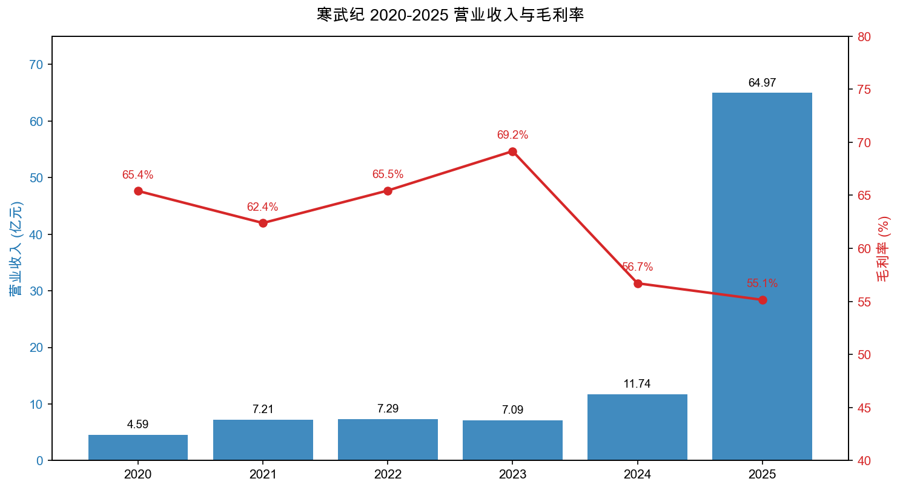
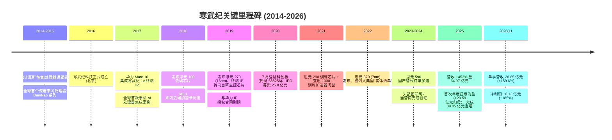
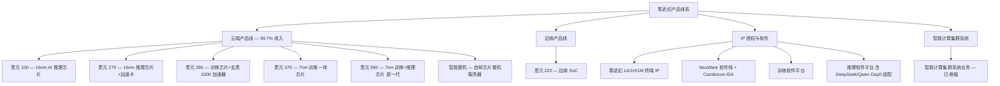
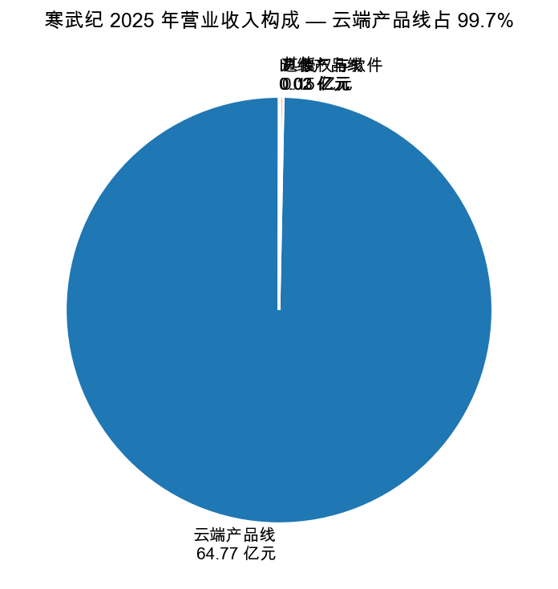
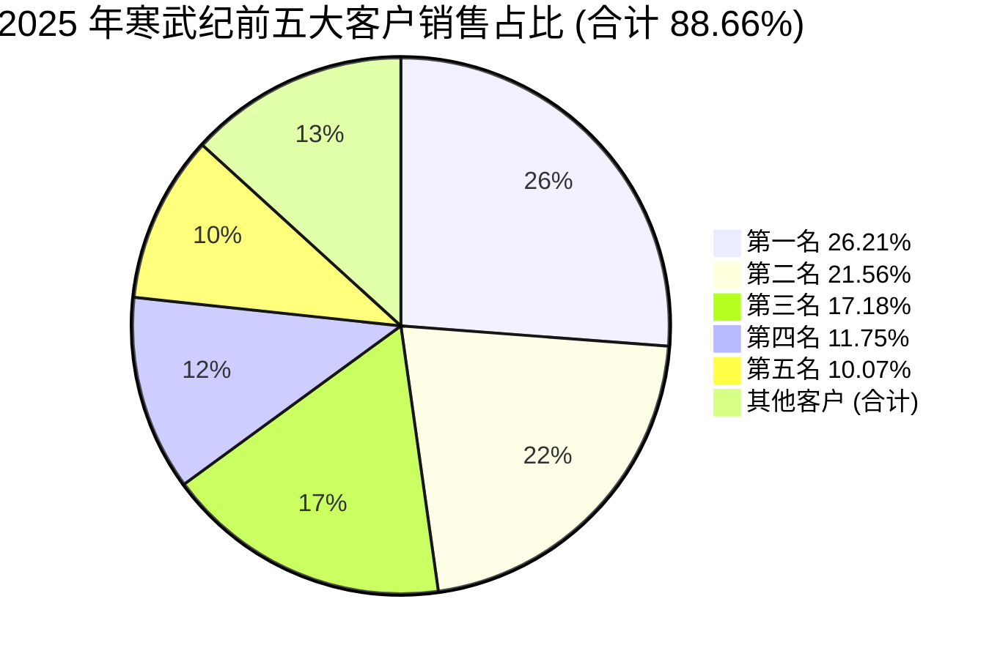
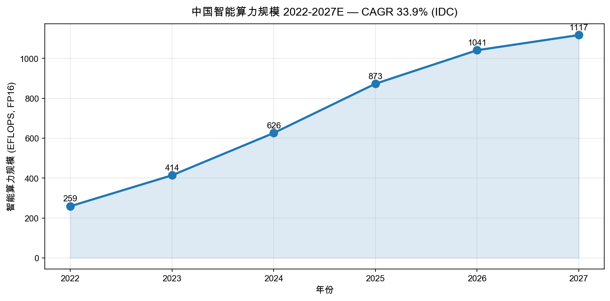
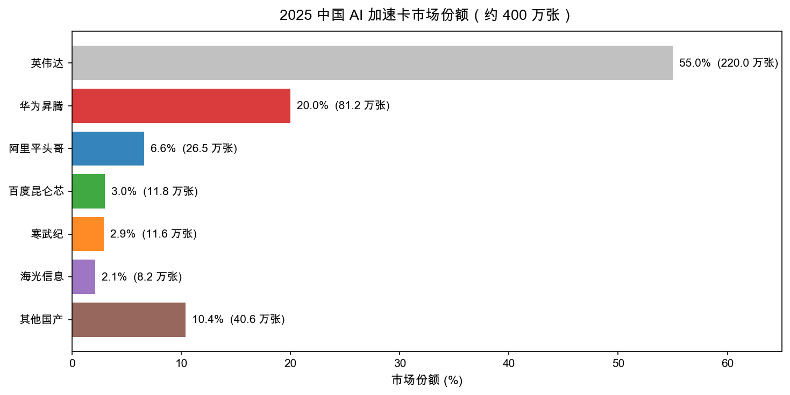
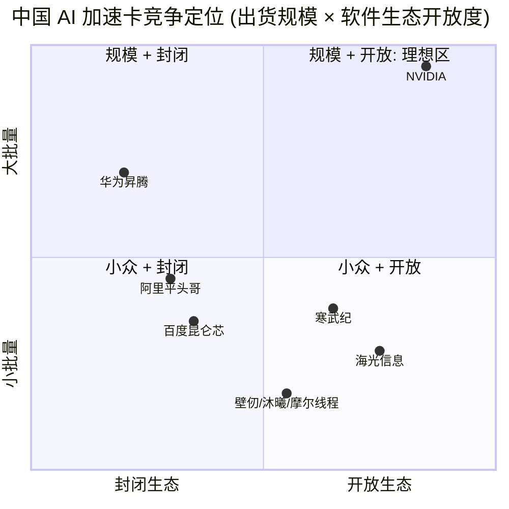

# 中科寒武纪科技股份有限公司 (SSE:688256) 公司研究报告

报告日期：2026-05-20

> **Update — 2025 年首次扭亏为盈、2026Q1 业绩延续高增 (2026-04-29)**：公司 2025 年实现营业收入 64.97 亿元、同比 +453.21%，归母净利润 20.59 亿元 (2024 年：-4.52 亿元)，毛利率 55.15%；管理层同步披露 2026 年第一季度营收 28.85 亿元 (同比 +159.56%)、归母净利润 10.13 亿元 (同比 +185.04%)，研发投入占收入比降至 11.23% (上年同期 24.53%)。董事会通过每 10 股派现 15.00 元、每 10 股转增 4.9 股的方案，为科创板上市以来首次现金分红。
> 来源：[2025 年年度报告 (2026-03-12)](https://static.cninfo.com.cn/finalpage/2026-03-12/1224101163.PDF)、[2026 年第一季度报告 (2026-04-29)](https://static.cninfo.com.cn/finalpage/2026-04-29/1224501112.PDF)。

---

## 目录

1. 公司概览
2. 公司历史
3. 管理团队
4. 产品与服务
5. 客户与销售策略
6. 行业概览
7. 竞争格局
8. 市场机会 (TAM)
9. 风险评估
10. 参考资料

---

## 1. 公司概览

中科寒武纪科技股份有限公司 (以下简称"寒武纪")是中国大陆唯一一家以"通用型 AI 芯片"为单一主业、且已在 A 股上市的公开公司。公司专注于研发和销售面向云端、边缘端、终端三类场景的人工智能 (AI) 核心处理器芯片、加速卡、智能整机、智能处理器 IP (Intellectual Property) 以及配套的基础系统软件 (含训练与推理软件平台)。公司经营模式为 Fabless (无晶圆厂)——自身完成芯片定义、架构、设计和系统软件研发，将晶圆制造、封装测试委托给第三方代工 ([2025 年年度报告, 第 12-13 页](https://static.cninfo.com.cn/finalpage/2026-03-12/1224101163.PDF))。

寒武纪 2016 年 3 月成立于北京，前身脱胎于中国科学院计算技术研究所 (中科院计算所) 智能处理器课题组；2020 年 7 月以"科创板第一只 AI 芯片股"身份登陆上海证券交易所科创板，证券代码 688256，发行价 64.39 元/股。公司控股股东为创始人陈天石博士及其一致行动方艾溪合伙、艾加溪合伙；注册地及总部位于北京市海淀区知春路 7 号致真大厦 ([2025 年年度报告, 第 8 页](https://static.cninfo.com.cn/finalpage/2026-03-12/1224101163.PDF))。

**业务模式与收入来源**。公司的盈利模式以"芯片及板卡销售 + 智能整机 + IP 授权与软件"三大支柱构成，其中 2025 年云端产品线 (云端智能芯片及板卡、智能整机) 实现收入 64.77 亿元，占主营业务收入比重 99.69%；边缘产品线收入 339 万元、IP 授权及软件 229 万元，体量极小 ([2025 年年度报告, 第 27 页](https://static.cninfo.com.cn/finalpage/2026-03-12/1224101163.PDF))。公司销售以直销为主 (2025 年直销 64.41 亿元、占主营收入 99.13%)，主要客户为大型互联网、电信运营商、金融机构及人工智能算法公司；以人民币结算、几乎全部为境内销售 (境内收入 64.97 亿元，境外收入仅 6.71 万元)。

**经营规模与员工**。截至 2025 年 12 月 31 日，公司总资产 134.38 亿元、归母净资产 118.36 亿元 (两项指标较上年末分别增长 100.0% 与 118.3%，主因 2025 年完成 39.85 亿元定向增发 + 当期净利润累积)；总股本为 4.21685 亿股 (2025 年报披露时点，未含 2026 年 5 月除权之每 10 股转增 4.9 股，转增后总股本将增至约 6.28 亿股)。公司员工总数 1,107 人，其中研发人员 887 人 (占比 80.13%)、80.95% 以上的研发人员拥有硕士及以上学历 ([2025 年年度报告, 第 9、16 页](https://static.cninfo.com.cn/finalpage/2026-03-12/1224101163.PDF))。

来源：[寒武纪 2025 年年度报告, 第 9 页](https://static.cninfo.com.cn/finalpage/2026-03-12/1224101163.PDF)；[2022 年年度报告, 第 9-10 页](https://static.cninfo.com.cn/finalpage/2023-04-28/1216684960.PDF)。

**关键指标与扩张速度**。2020-2024 年公司营收从 4.59 亿元增至 11.74 亿元、四年 CAGR 26.5%；但 2025 年单年从 11.74 亿元跳升至 64.97 亿元、同比 +453.2%，毛利总额 35.83 亿元、同比 +438.0% ([2025 年年度报告, 第 9、15 页](https://static.cninfo.com.cn/finalpage/2026-03-12/1224101163.PDF))。归母净利润由 2024 年 -4.52 亿元转为 2025 年 +20.59 亿元，**首次实现年度盈利**；扣非归母净利润 17.70 亿元，同样转正。基本每股收益从 2024 年 -1.09 元跃升至 2025 年 4.93 元，加权平均 ROE 26.96%、扣非 ROE 23.17%——一家此前连续亏损 9 年的"科技独苗"在一个完整会计年度内变成中国 A 股利润率最高的科技公司之一。

**估值快照 (2026-05-20 收盘)**。股价 1,362.41 元/股；按 2025 年报基础股本 4.21685 亿股 (除权前) 计算，市值约 5,742 亿元；若按 2026 年 5 月 8 日除权除息日完成转增后的 6.28 亿股口径，市值约 8,288 亿元 (约 1,165 亿美元) ([东方财富 / Bloomberg 688256 报价, 2026-05-20](https://www.bloomberg.com/quote/688256:CH))。TTM 市盈率约 263–280×、TTM 市销率约 100–130×、市净率约 70× (基于 25 年末归母净资产)。

- **TTM P/E 263× / P/S ~127×**：在 A 股科创板半导体板块及全球 AI 芯片同行中均处于极端高位 ([亿牛网寒武纪历史市盈率](https://eniu.com/gu/sh688256))。寒武纪 3 年 TTM P/E 区间由 2023 年的"未盈利、无 PE"到 2024 年中拉到 -800× 以上 (估值参考 P/S，2024 年 7 月 P/S 一度 >300×)；2025 年扭亏后 P/E 由亏损口径切换至正值，目前 263× 处于 3 年区间偏低端 (峰值 2025 年 8 月发布 25H1 业绩时一度突破 400×)；同行可比：英伟达 NVDA 约 55×、AMD 约 75×、Marvell 约 40×、海光信息 (SSE:688041) 约 110×、寒武纪 263× ([Yahoo Finance NVDA Key Statistics](https://finance.yahoo.com/quote/NVDA/key-statistics/))。
- **估值溢价归因**：(a) 国产 AI 算力高景气主题——2025 年中国本土 AI 加速卡市场份额从 29% 跃升至 42%，全市场加速卡出货 400 万张；(b) 公司是 A 股唯一"纯通用型 AI 芯片"标的，无产品线干扰，被定位为国产英伟达的稀缺映射资产；(c) 业绩弹性极强——2025 年单季收入由 1Q 11.11 亿元 → 4Q 18.90 亿元，2026Q1 进一步抬高到 28.85 亿元 ([2025 年年度报告, 第 10 页](https://static.cninfo.com.cn/finalpage/2026-03-12/1224101163.PDF))；(d) 流通股紧 (科创板初始流通比例小 + 高送转预案)，资金端拉抬效应明显。
- **PE 显著偏高 (>>50× 行业中位、>2× 半导体板块中位 ~40×)**：本报告在第 9 节将其作为"估值/多重压缩风险"单独列示。

## 2. 公司历史

**创立背景**。寒武纪的科学根基可追溯到 2014 年中科院计算所的"DianNao"项目。陈天石 (现任董事长) 与其兄陈云霁 (中科院计算所研究员，未在公司任职) 联合在 ASPLOS-2014、ISCA-2015 等顶级会议上发表 DianNao、DaDianNao、ShiDianNao、PuDianNao 等论文，提出深度学习专用处理器架构并三次斩获 ACM SIGARCH 最佳论文。2016 年 3 月，陈天石博士在中科院计算所支持下成立"中科寒武纪科技有限公司"，融资方包括中科院计算所、元禾原点、国投创业、阿里巴巴等。

**两次战略转向**。**(1) 由 IP 授权转向自研芯片 (2018-2019)**：寒武纪 1A、1H、1M 系列处理器 IP 被集成进华为麒麟 970/980 的 NPU 单元，公司早期收入近 100% 来自华为 IP 授权——根据招股说明书，2017-2019 年华为及关联方贡献收入比例分别为 98.34%、97.63%、14.34%。2019 年下半年华为决定自研昇腾 NPU、不再续约寒武纪 IP；公司被迫在 18 个月内把营收主体从"终端 IP 授权"切换到"云端 SoC 加速卡"，思元 100、思元 270 系列陆续投产，云端芯片 + 板卡成为收入主轴 ([2025 年年度报告, 第 14 页](https://static.cninfo.com.cn/finalpage/2026-03-12/1224101163.PDF))。**(2) 由智能计算集群项目制承包转向标准化云端加速卡销售 (2023-2025)**：2020-2022 年公司收入主体一度是面向地方政府/运营商的"智能计算集群系统"——典型 EPC 式项目交付、毛利率高 (60%+)、但回款周期长。2023-2024 年大模型需求兴起，公司收缩集群业务、专注向头部互联网公司及运营商出售标准化"思元 370/590 加速卡 + 智能整机"——这一调整在 2025 年集中兑现，公司从此前的"项目公司"变成"标准品公司"。

**收购与子公司布局**。公司 2025 年新增设立**呼和浩特寒武纪** (注册资本 1 亿元，定位北方算力枢纽节点)、**寒武纪智算科技 (北京)** (注册资本 1 亿元，定位推理云服务承载主体)；同期注销香港寒武纪 (Cambricon HK)——因被列入美国实体清单后境外采购受限、香港主体已无业务意义 ([2025 年年度报告, 第 30 页](https://static.cninfo.com.cn/finalpage/2026-03-12/1224101163.PDF))。公司在上海、安徽、雄安、南京、苏州、西安、台州、昆山、呼和浩特设有全资子公司，控股子公司行歌科技 (寒武纪行歌) 主营智能驾驶 SoC——但 2025 年报披露行歌已基本停滞、2024 年完成战略收缩，公司专注于云端 AI 芯片主业。

**近 12 个月关键事件**。(1) 2025-10 完成科创板上市以来最大规模再融资——向特定对象发行 333.49 万股、发行价 1,195.02 元/股、募集 39.85 亿元，用于"覆盖不同类型大模型任务场景的系列化芯片方案 + 大模型软件平台研发" ([2025 年年度报告, 第 17 页](https://static.cninfo.com.cn/finalpage/2026-03-12/1224101163.PDF))；(2) 2026-03 首次推出现金分红+高送转方案 (10 派 15、10 转 4.9)，标志公司由"成长投入期"进入"边成长边回报"阶段；(3) 2026Q1 营业收入 28.85 亿元、净利润 10.13 亿元，单季利润超过 2025 全年 30%；(4) 2025-11 / 2026-03 完成第三届董事会换届——独立董事吕红兵 (国浩律所)、王秀丽 (对外经贸大学) 届满离任，由李寿双 (大成律所)、刘思义 (对外经贸大学) 接任。

## 3. 管理团队

寒武纪是典型的**创始人+科学家治理结构**：董事长陈天石博士直接持股 11.95 亿股 (即 1.195 亿股，占总股本 28.34%)，加上其一致行动方艾溪合伙、艾加溪合伙合计控制超过 35% 的表决权，是事实上的控股股东与精神领袖。除陈天石外，董事会另有 3 名科学家联合创始人 (刘少礼、王在、陈帅) 均自 2016 年成立起担任副总经理与核心技术人员，公司管理层稳定度极高，自 IPO 以来无核心高管离职。

**陈天石博士 — 董事长、总经理、核心技术人员**。陈天石出生于 1985 年，江西南昌人；16 岁 (2001 年) 考入中国科学技术大学少年班计算机系，2010 年获得中国科大计算机软件与理论博士学位 ([2025 年年度报告, 第 41-42 页](https://static.cninfo.com.cn/finalpage/2026-03-12/1224101163.PDF))。2010-2019 年在中科院计算所工作 9 年，历任助理研究员、副研究员 (硕士生导师)、研究员 (博士生导师)；与兄长陈云霁联合提出 DianNao 系列深度学习处理器架构，三次斩获 ACM SIGARCH 最佳论文奖 (DianNao 2014 ASPLOS Best Paper、DaDianNao 2014 MICRO Best Paper)，使中科院计算所第一次在国际计算机体系结构主流会议上拿到最佳论文。2016 年 3 月以"科学家创业"模式创立寒武纪，2019 年起放弃中科院身份全职担任董事长 + 总经理。2025 年从公司领取税前薪酬 146.42 万元，未在关联方领取薪酬，亦未实施减持。陈天石的核心特质：(a) 学术造诣顶级 + 工程化能力强——既是寒武纪指令集 (Cambricon-ISA) 的原作者，又主导了思元 100 至思元 590 的产品定义；(b) 资本运作敏锐——2020 年抓住科创板红利完成 IPO、2025 年抓住 AI 算力国产替代窗口完成 39.85 亿元定增；(c) 在中国学术圈与产业政策圈拥有深厚网络资源——这对公司获得地方政府智算中心订单、对接科创板审核与重大科技专项至关重要。陈天石本人持股占总股本 28.34%、市值约 2,350 亿元 (2026-05 报价)，是中国大陆当前最富有的"40 岁以下科学家创业者"之一。

**叶淏尹 — 董事、副总经理、财务负责人、董事会秘书**。出生于 1987 年，女性，硕士；2019 年 11 月起担任公司董事兼副总经理；2025 年税前薪酬 175.54 万元；持股 31,392 股 (上市前股权激励授予)。叶氏自寒武纪成立初期即加入公司财务体系，主导了 2020 年科创板 IPO 与 2025 年向特定对象发行——这两次资本运作的总融资额合计超过 65 亿元，且未触发任何重大违规或问询升级。在 A 股 CFO 中她属于年轻型 (上任时 32 岁)、技术派偏强；其在投资者关系沟通方面较保守——公司迄今未召开过线下投资者开放日，全部业绩说明会均以书面或网络形式举行——这也是市场对寒武纪盈利可持续性长期存在分歧、估值波动剧烈的重要原因之一。叶氏 2019 年前的履历披露不充分；公司年报与招股书未详细列示其加入寒武纪前的雇主与职务，本报告对此持开放态度。

**刘少礼、王在、陈帅 — 联合创始科学家高管**。三人均出生于 1984-1987 年、均拥有中国科学院计算所或中科大计算机/微电子博士/硕士学历、均在 2016 年寒武纪成立时作为创始团队加入。**刘少礼** (董事 + 副总经理)，中科院计算所计算机系统结构博士、原副研究员，主导云端芯片系统架构；**王在** (董事 + 副总经理)，中国科大博士、曾在郑州商业银行短暂工作后回归学术界，主管供应链与生产；**陈帅** (副总经理)，中科院计算所博士、加拿大多伦多大学博士后，主导终端 IP 设计与软件开发栈。三人 2025 年薪酬均在 175-176 万元区间，持股极少 (16,000–4,000 股的象征性激励)，反映"科学家骨干+创始股权" 的紧密绑定结构。**刘毅** (副总经理) 是团队中唯一来自产业界的高管——北京大学微电子硕士、曾任龙芯中科工程师与上海英伟达高级工程师，2016 年加入寒武纪主管 EDA / 仿真验证；其英伟达工作背景对寒武纪在 CUDA-replacement (NeuWare 软件栈) 上少走弯路具有直接价值。

**治理与股权结构**。董事会共 9 席，其中执行董事 5 名 (陈天石、刘少礼、王在、叶淏尹、新增的金晓光) + 独立董事 3 名 (胡燏翀、李寿双、刘思义) + 1 席职工代表董事 (王在兼任)。**金晓光**为 2024 年新增非执行董事，代表股东"中国科技产业投资管理有限公司"——这是中科院系科技投资平台，体现公司"国资科学家创业"的股东背景。独立董事专业涵盖法律 (李寿双——北大法学硕士、大成律所高级合伙人；曾担任黄河财产保险、中国盐业等多家公司独董) 与会计/学术 (刘思义——厦门大学会计博士、对外经贸大学副教授；胡燏翀——华中科技大学教授)。**核心人物风险**：陈天石作为"事实上的灵魂人物 + 控股股东 + 首席科学家 + CEO"四合一，对公司战略与产品方向的影响力远超职业经理人公司，这既是寒武纪的最大优势 (技术决策迅速、连贯)，也是其最大单点风险——若陈天石健康、个人声誉或继续投入热情发生重大变化，公司将极难替代。

**管理团队过往业绩与不足**。寒武纪团队最值得肯定的两点是 (1) 完成了 IP 客户流失后的产品线大转身，从终端 IP 公司变成云端 SoC 公司；(2) 在 2022 年被列入美国实体清单的极端供应链约束下、依然成功用 2024-2025 两年时间完成思元 370/590 系列产品的客户规模验证与放量。团队的相对短板：(a) 商业化节奏长期落后——从产品流片到形成规模收入需 2-3 年滞后；(b) 投资者关系沟通仅做合规底线、未主动管理预期，加剧股价波动；(c) 公司治理过度依赖创始人，缺乏强势的"对接资本市场" 的二把手——这在公司体量持续放大后将成为隐忧。

## 4. 产品与服务

寒武纪的全部业务可归并为四条产品线：(1) **云端产品线** (云端智能芯片及板卡、智能整机)；(2) **边缘产品线** (边缘智能芯片及板卡)；(3) **IP 授权及软件** (智能处理器 IP + 基础系统软件平台)；(4) **智能计算集群系统业务** (该业务已大幅萎缩、2025 年并入"其他")。

来源：[寒武纪 2025 年年度报告, 第 12-17 页](https://static.cninfo.com.cn/finalpage/2026-03-12/1224101163.PDF)；[寒武纪官网产品页](https://www.cambricon.com/index.php?m=content&c=index&a=lists&catid=14)。

### 4.1 云端产品线 (2025 年收入 64.77 亿元、占主营收入 99.69%)

**思元 370 (MLU370)**。寒武纪首款采用 7nm 工艺并基于 Chiplet (芯粒) 设计的"训推一体"芯片，2022 年 3 月发布、2024-2025 年完成头部客户量产部署。核心规格：单芯片峰值算力 256 TOPS (INT8)；面向数据中心推理 + 中等规模训练。配套加速卡形态包括 MLU370-S4 (单槽位 75W)、MLU370-X4 (双槽位 150W)、MLU370-X8 (训推一体高密度)。**竞争优势：是 (技术 + 生态)**。摩尔定律工艺红利 + Chiplet 量产能力在国产 AI 芯片厂商中仅华为昇腾 910B 与思元 370 处于第一梯队；公司 NeuWare 软件栈对 PyTorch、TensorFlow 主流框架做了深度适配，迁移成本远低于其它国产 ASIC。**最接近对标**：华为昇腾 910B (训练性能更强但软件栈封闭、依赖 MindSpore) — 寒武纪在易用性上略胜、原生算力略弱。
来源：[思元 370 产品页](https://www.cambricon.com/index.php?m=content&c=index&a=lists&catid=37)。

**思元 590 (MLU590)**。新一代云端训练 + 推理芯片，2023 年发布、2024 年小批量出货、2025 年规模放量——是公司本轮收入跃升的最核心产品。规格未公开披露 (受实体清单约束)；但根据公司业绩说明会与三方测评，思元 590 在 FP16/BF16 训练性能上已对标 NVIDIA A800/H800。**竞争优势：是 (技术 + 客户规模化背书)**。2025 年公司全年收入 64.97 亿元、绝大部分由思元 590 系列贡献，意味着该产品已通过头部互联网公司 (推测包括字节、腾讯、阿里、百度的部分外购需求) 严苛环境验证。**最接近对标**：华为昇腾 910C (训练性能略强、生态更封闭) 与海光 DCU K100 (基于 GPGPU 架构、x86 软件兼容性强但峰值算力弱)。寒武纪思元 590 当前的"性能 / 生态 / 客户覆盖" 三角组合是中国 AI 芯片市场上少数能与昇腾 910 系列正面竞争的方案。

**智能整机**。由寒武纪自研云端芯片+板卡组成的标准服务器整机产品 (8 卡/16 卡 OAM 形态)，主要面向有一定技术基础的商业客户。2024 年起作为独立 SKU 销售，2025 年规模化贡献——一方面降低客户系统集成难度、提升公司 ASP；另一方面与"智能计算集群系统业务"区分定位 (整机=单体服务器；集群=全链路 EPC 项目)。**竞争优势：部分 (服务 + 整合)**。本质是 OEM 整合，技术壁垒主要在板级互联 (UBB / OAM 板卡)、散热与电源管理；与浪潮信息、新华三、超聚变等同行相比，差异化主要在与寒武纪芯片的深度耦合。

### 4.2 边缘产品线 (2025 年收入 339 万元、规模较小)

**思元 220 (MLU220) SoC**。基于 8nm 工艺的边缘智能 SoC，集成 ARM CPU + 寒武纪 IPU，主要面向智能制造、智慧交通、智能零售等场景。公司披露思元 220 累计销量已突破 100 万片。2025 年边缘产品线收入仅 339 万元、同比 -48.12%——反映边缘端市场被英伟达 Jetson、瑞芯微、地平线、华为昇腾 310 等多家厂商挤压。**竞争优势：部分 (品牌+渠道)**。寒武纪在边缘端的存在感大幅低于云端、且 2025 年收入大幅萎缩；公司近期没有边缘端旗舰产品迭代信息，看似已主动放弃这一赛道、聚焦云端主业。
来源：[思元 220 产品页](https://www.cambricon.com/index.php?m=content&c=index&a=show&catid=37&id=21)。

### 4.3 IP 授权及软件 (2025 年收入 229 万元)

**寒武纪 1A/1H/1M 系列终端 IP**。2017-2019 年公司 IP 授权收入主要来自华为麒麟 970、麒麟 980 集成的寒武纪 NPU 单元——累计有超过 1 亿部智能手机集成寒武纪 IP。但 2019 年华为转向自研昇腾后该业务基本归零。2025 年报披露 IP 授权及软件仅 229 万元——已不再是主要营收来源、更多是历史保留产品线。**竞争优势：无 (历史业务)**。在终端 NPU IP 市场，公司已远远落后于 Arm、Cadence (原 Tensilica)、Imagination Technologies 等专业 IP 供应商。

**NeuWare 软件栈 + Cambricon-ISA**。这是公司在与英伟达 CUDA 生态长期博弈中的核心资产。NeuWare 涵盖 C++ 编程语言 BANG-C、算子库 (CNNL)、训练框架插件 (PyTorch / TensorFlow / PaddlePaddle 适配)、模型工具链 (压缩、量化、部署)、集群管理软件 (CNStream / CN-Studio)。2025 年报披露：训练软件平台完成对 DeepSeek-V3.2 的 **Day 0 支持**，并陆续完成 Qwen3-Next、Qwen3-VL、HunYuan、LongCat、GLM 等主流开源大模型的适配；推理软件平台围绕"长上下文推理、生成式内容处理、多模态融合"做了针对性优化 ([2025 年年度报告, 第 16-17 页](https://static.cninfo.com.cn/finalpage/2026-03-12/1224101163.PDF))。**竞争优势：是 (生态深度)**。寒武纪 NeuWare 的成熟度在国产 AI 软件栈中位居第二 (仅次于华为 CANN/MindSpore)、但**开源开放程度更高**——这是其相对于昇腾的差异化优势：客户可以保留 PyTorch 主流框架不切换、迁移成本远低于昇腾 MindSpore。

### 4.4 智能计算集群系统业务 (已收缩；2025 年并入"其他"、收入 1,466 万元)

寒武纪 2020-2022 年的主要收入来源是面向地方政府/电信运营商的"智算中心 EPC 项目"——即用自家芯片+整机+集群管理软件，集成第三方网络、存储、机房等成套交付。该业务 2022 年收入占比一度高达 64%。但因 (a) 项目回款周期长、垫资压力大；(b) 实体清单后部分客户合规风险升高；(c) 标准品销售毛利率更高、扩张更快——公司 2023-2025 年主动收缩此业务，2025 年单独披露"其他"科目仅 1,466 万元 ([2025 年年度报告, 第 27 页](https://static.cninfo.com.cn/finalpage/2026-03-12/1224101163.PDF))。这一调整虽然短期影响 2023-2024 年的收入规模，但中长期把公司转型为"标准品 AI 芯片公司"，从估值角度由"项目公司" 升级至"产品公司"。

### 4.5 旗舰判断与最近 12 个月重要事件

- **旗舰**：思元 590 (训练+推理) + 思元 370 (训推一体) + 智能整机三者构成本轮收入主轴，估计合计贡献 2025 年云端收入的 95% 以上 (公司未细分单 SKU 收入)。
- **新品 / 重大事件**：(a) 公司在 2025 年报中明确披露"新一代智能处理器微架构与指令集"正在研发中——市场预期 2026 年内推出对标英伟达 H100/B200 的下一代产品；(b) 训练软件平台首次具备对开源大模型的 Day-0 适配能力，是公司软件栈从"追赶者"向"快速跟进者"转换的重要标志；(c) 边缘产品线主动萎缩、IP 授权基本归零、智能计算集群业务收缩——三条副业务线均显示公司战略向云端高毛利标准品聚焦。
- **专利与无形资产**：截至 2025 年末，公司累计申请专利 2,846 项 (境内 1,831、境外 705、PCT 310)，已获授权专利 1,734 项 (其中发明专利 1,661 项)；软件著作权 65 项、集成电路布图设计 6 项。从专利数量与发明专利占比看，公司是国产 AI 芯片厂商中 IP 储备最厚的之一 ([2025 年年度报告, 第 17 页](https://static.cninfo.com.cn/finalpage/2026-03-12/1224101163.PDF))。

来源：[寒武纪 2025 年年度报告, 第 27 页](https://static.cninfo.com.cn/finalpage/2026-03-12/1224101163.PDF)。

## 5. 客户与销售策略

### 5.1 客户行业分布

寒武纪的 2025 年客户行业覆盖**电信运营商、金融机构、互联网公司、智慧能源/智慧矿山/智慧医疗等垂直行业**。年报详细披露：运营商领域已"持续提供深度优化的算力解决方案与平台能力"——这对应 2024-2025 年中国电信、中国移动、中国联通三大运营商的智算中心招标，寒武纪是少数中标厂商之一；金融领域强调"夯实与核心金融机构的合作、支撑大模型在运营管理、业务提效场景的常态化服务"——指向工商银行、建设银行等头部金融机构；互联网领域则"立足大模型、多模态等核心应用场景、与多个行业客户在算子开发、性能优化、框架优化、通信优化等方面展开深度技术合作" ([2025 年年度报告, 第 15-16 页](https://static.cninfo.com.cn/finalpage/2026-03-12/1224101163.PDF))。

### 5.2 客户集中度

**寒武纪客户集中度极高**。2025 年报披露的前五名客户合计销售 57.60 亿元、占年度营业收入 88.66%。具体构成：
- 第一名客户：销售额 17.03 亿元，占营业收入 **26.21%**
- 第二名客户：销售额 14.01 亿元，占营业收入 **21.56%**
- 第三名客户：销售额 11.16 亿元，占营业收入 17.18% (公司披露为"长期合作伙伴"——推测为运营商或大型金融客户)
- 第四名客户：销售额 7.64 亿元，占营业收入 11.75%
- 第五名客户：销售额 6.55 亿元，占营业收入 10.07%

其中第一、二、四、五名为 2025 年新增客户，仅第三名为往期延续客户；公司没有披露任何客户名称 (符合科创板"商业秘密豁免"规定)。前五大客户均为内资法人主体、无关联交易。**三年趋势**：2023-2025 年前五大客户占比分别为 92.36%、94.63%、88.66%——尽管 2025 年比例略有下降，但绝对值跃升 (从 2024 年的约 11.11 亿元跳到 2025 年的 57.60 亿元) 反映公司客户结构仍高度集中于少数大型互联网/运营商/金融机构 ([2025 年年度报告, 第 25、30 页](https://static.cninfo.com.cn/finalpage/2026-03-12/1224101163.PDF))。

来源：[寒武纪 2025 年年度报告, 第 30 页](https://static.cninfo.com.cn/finalpage/2026-03-12/1224101163.PDF)。

**判断**：客户集中度风险评级 **高** (top-1 > 20% 阈值、top-5 > 50% 阈值同时触发)，且单一客户绝对值 17 亿元 + 21 亿元 + 11 亿元三大单一客户合计占 65% 的收入，**任何一家头部客户的需求波动、采购暂停、迁移到自研或竞品都会显著冲击公司收入与利润**。该风险将在第 9 节作为"重大风险"专项列示。

### 5.3 销售模式与回款

公司主营销售模式为"直销 + 经销"。2025 年直销收入 64.41 亿元 (占主营业务 99.13%)、毛利率 55.18%；经销收入 5,641 万元 (占 0.87%)、毛利率 51.93%。直销主要面向头部行业客户，经销面向中小型企业与教育/科研机构 ([2025 年年度报告, 第 27 页](https://static.cninfo.com.cn/finalpage/2026-03-12/1224101163.PDF))。**合同结构**：公司未明确披露主要客户合同期限，但根据年报"前五名客户中第一、二、四、五名为新增客户、第三名为长期合作伙伴"的表述，**绝大部分订单为单 PO 而非多年期框架协议**——这一方面反映 AI 算力市场仍处于"按需采购、需求快速变化"的早期阶段，另一方面意味着寒武纪需要每年重新赢得这些大客户的预算分配。

**应收账款与回款节奏**。2025 年公司经营活动现金流净额 -4.98 亿元 (2024 年 -16.18 亿元)，**收入大增、经营性现金流仍为负**——核心原因是 (a) 大客户回款节奏滞后于收入确认；(b) 存货大幅增加 (期末存货账面价值 49.44 亿元，占总资产 36.79%——为下一年度备货)；(c) 部分客户使用承兑汇票或长账期。2026Q1 经营性现金流转正为 +8.34 亿元，表明回款情况已显著改善 ([2026 年第一季度报告, 第 1-2 页](https://static.cninfo.com.cn/finalpage/2026-04-29/1224501112.PDF))。

### 5.4 上市策略与生态合作

**上下游生态**。公司持续与三大主流深度学习框架团队 (PyTorch、TensorFlow、PaddlePaddle)、主流开源大模型 (DeepSeek、Qwen、HunYuan、GLM、LongCat)、主流推理框架 (vLLM、TensorRT-LLM 类产品的国产替代) 维持深度兼容；与浪潮信息、新华三、超聚变、华勤等服务器整机厂商开展整机集成合作；与各地智算中心运营方 (商汤、智源研究院、中国电信天翼云、中国移动云、中国联通沃云) 维持算力部署合作。

**学术生态布局**。公司支持多所高校开设基于寒武纪平台的人工智能课程，并提供配套实验平台资源；2025 年与中国科学技术大学、清华大学、北京大学、上海交通大学等多所"双一流"院校保持合作，构建产学研一体化人才培养生态 ([2025 年年度报告, 第 17 页](https://static.cninfo.com.cn/finalpage/2026-03-12/1224101163.PDF))。这一布局对长期摊薄获客成本、形成开发者生态护城河有战略意义，但短期对收入贡献有限。

## 6. 行业概览

### 6.1 行业定义与监管分类

按中国证监会行业分类，寒武纪所处行业为"软件和信息技术服务业 / 集成电路设计"。从产品角度，公司处于**人工智能芯片**子赛道——包括通用型 AI 芯片 (GPGPU、AI 加速 ASIC) 与专用型 AI 芯片 (针对特定任务如视觉、语音、自动驾驶定制)。公司主营的云端训推一体芯片属于"通用型 AI 加速器" 范畴，直接对标英伟达 H100/H200/B200 等数据中心 GPU。

### 6.2 全球与中国市场规模

**全球 AI 芯片市场**：根据 Gartner 预测，2027 年全球人工智能芯片市场规模将达到 **1,194 亿美元** ([Gartner Forecast, 引自寒武纪 2025 年年度报告, 第 13 页](https://static.cninfo.com.cn/finalpage/2026-03-12/1224101163.PDF))。这一规模主要由数据中心 GPU/ASIC、终端 NPU、边缘智能 SoC 三部分构成，其中数据中心算力部分增速最快。

**中国 AI 投资与硬件规模**：IDC《全球人工智能支出指南》预测，**到 2027 年中国人工智能总投资规模将突破 400 亿美元、复合增长率 25.6%**，其中人工智能硬件预测期内仍是最主要投资方向、占比超过中国市场总规模的 60% ([IDC 引自寒武纪 2025 年年度报告, 第 13 页](https://static.cninfo.com.cn/finalpage/2026-03-12/1224101163.PDF))。**中国智能算力规模**：IDC 测算，2022-2027 年期间中国智能算力规模年复合增长率达 33.9%；到 2027 年中国智能算力规模将达到 1,117.4 EFLOPS (基于 FP16 计算)。

来源：[IDC《中国智能算力发展评估报告》, 引自寒武纪 2025 年年度报告, 第 14 页](https://static.cninfo.com.cn/finalpage/2026-03-12/1224101163.PDF)。

**中国 AI 芯片市场规模与本土化进程**：弗若斯特沙利文预测，中国 AI 芯片市场规模将从 2024 年的 1,425 亿元激增至 2029 年的 1.34 万亿元，2025-2029 年 CAGR 53.7% ([弗若斯特沙利文中国 AI 芯片市场预测, 2026-04](https://finance.sina.com.cn/wm/2026-04-07/doc-inhtsvwv7033435.shtml))。2025 年中国 AI 加速卡市场总出货量突破 400 万张，其中本土厂商合计出货量达 165 万张，国产化率首次突破 40%、达到 41% (2024 年仅 29%)；销售额从 2024 年的 60 亿美元增长至 2025 年的 160 亿美元、增速 112% ([2025 中国 AI 芯片市场观察, 电子工程专辑, 2026-04](https://www.eet-china.com/mp/a485343.html))。

### 6.3 增长驱动因素

**(1) 大模型训练算力需求爆发**。ChatGPT、DeepSeek、Qwen、Claude 等代表性大模型的参数量呈指数级增长，对算力的需求从单机训练扩展到万卡级集群训练；同时推理侧需求也因 AI Agent、长上下文、多模态等场景的成熟而快速放量。

**(2) 美国出口管制驱动国产替代加速**。2022 年美国商务部将寒武纪及其 7 家子公司列入实体清单；2023 年 10 月、2024 年新一轮出口管制进一步把 NVIDIA A100/H100/A800/H800/H200 全部限制对华销售。2025 年下半年开始，美国进一步禁止英伟达 H20 这一专为中国市场设计的削减版产品在中国销售——使英伟达在中国 AI 加速卡的市场份额从巅峰时的 95% 下降到 2025 年的 55%、释放出 165 万张的本土替代空间 ([腾讯新闻 / 财经文章引述 IDC、SemiAnalysis 数据, 2025-10](https://news.qq.com/rain/a/20251018Q01ROW00))。

**(3) 信创、智算中心政策牵引**。"东数西算" 国家工程、各省市智算中心新基建项目、信创金融/政务系统替代等政策驱动，使运营商、央企、地方政府成为国产 AI 芯片的稳定、可观、可持续的买方。2025 年华为昇腾、寒武纪、海光等国产芯片在 20 多个城市智能计算中心占据 79% 份额 ([2025 年国产 AI 芯片厂商排名报告, SICA 深芯盟](https://semibay.oss-cn-shenzhen.aliyuncs.com/20250801/e76308b852ef4953b8900a6ad8a91f46.pdf))。

**(4) AIGC 商业化落地**。AIGC 从内容生成扩散到企业级智能客服、智能办公、智能设计——大量行业垂直模型微调和私有化部署需求催生中等规模算力市场，这恰好是寒武纪思元 370/590 系列的优势区间。

### 6.4 行业结构与产业链

AI 芯片产业链分为**上游 IP / EDA / 晶圆代工 / 封测 → 中游芯片设计 → 下游服务器 / 整机 / 云计算 / 行业应用**。上游环节中国短板明显：先进制程晶圆 (7nm 及以下) 依赖台积电、中芯国际 (受限于 SMEE EUV 缺位)；EDA 工具受 Synopsys、Cadence、Mentor 主导；先进封装中 CoWoS 产能由台积电与 ASE 控制。中游芯片设计是国产替代主战场——**寒武纪、华为海思 (昇腾)、海光信息、平头哥 (阿里)、昆仑芯 (百度)、燧原科技、壁仞科技、沐曦、摩尔线程、天数智芯**等 10+ 家公司均处于不同发展阶段。下游服务器与整机端浪潮、新华三、超聚变、华勤等已具备规模量产能力。

**Fabless 模式特征**：公司将晶圆制造、封装测试等环节委托给晶圆制造企业、封装测试企业及其他加工厂商代工完成。这意味着公司核心壁垒在芯片架构、指令集、软件栈等"软"环节，而对晶圆代工的高度依赖也是公司在被列入实体清单后最大的供应链不确定性来源 ([2025 年年度报告, 第 13、25 页](https://static.cninfo.com.cn/finalpage/2026-03-12/1224101163.PDF))。

### 6.5 监管与政策环境

(1) **国内政策**：科技部、工信部、发改委等推出"新一代人工智能发展规划"、"人工智能+"、"新型基础设施"、"信创"等多项政策，明确支持国产 AI 芯片在公共部门与重大行业的应用；科创板对未盈利科技公司的友好上市规则也为寒武纪在 2020 年顺利 IPO 提供了制度基础。(2) **境外管制**：美国 BIS 自 2022 年起对寒武纪及多家中国 AI 芯片公司实施实体清单制裁，限制其从美国供应商采购 EDA、IP、先进制程晶圆等关键资源。寒武纪在 2025 年报"经营风险" 章节明确将"实体清单导致供应链稳定性受影响"列为首要风险。

## 7. 竞争格局

中国 AI 芯片市场正从"英伟达独大"向"国产多家厂商分庭抗礼"切换。寒武纪在国产阵营中处于**第二梯队头部**位置——技术储备、客户验证、生态成熟度居前列，但在出货量、自有制造产能、终端客户绑定度上落后于第一梯队的华为昇腾。

来源：[2025 中国 AI 加速卡市场份额, 电子工程专辑 / IDC 数据, 2026-04](https://www.eet-china.com/mp/a485343.html)。

### 7.1 主要竞争对手详解

**(1) 英伟达 NVIDIA (NASDAQ:NVDA)**：全球 AI 芯片绝对龙头，2025 年仍占中国市场 55%、出货 220 万张。优势：CUDA 生态成熟、性能领先、全球客户基础深厚；劣势：受美国出口管制约束、高端产品 (H100/H200/B200) 无法对华销售，剩余产品 (H20 等中低端) 也面临政策不确定性 ([NVDA 投资者关系页面](https://investor.nvidia.com/))。

**(2) 华为昇腾 (海思)**：国产 AI 芯片第一名，2025 年出货 81.2 万张、市场份额 20%。旗舰产品昇腾 910B/910C 在原生算力、训练性能上领先寒武纪思元 590；客户基础以华为云、电信运营商、政府智算中心、金融大客户为主。优势：自有 IP + 公司体量大 + 政策保护、生态闭环 (MindSpore + CANN)；劣势：软件栈封闭、客户迁移成本高，PyTorch 兼容仍不如开源框架优雅。

**(3) 海光信息 (SSE:688041)**：国产 GPGPU 厂商，基于 AMD x86 架构授权 + 自主迭代，2025 年出货约 8.25 万张、市场份额 ~2.1%。优势：与 x86 软件生态兼容、迁移成本低；劣势：原生算力偏弱、且 AMD 授权未来续约存不确定性 ([海光信息 2025 年年度报告](https://www.cninfo.com.cn/new/disclosure/stock?stockCode=688041))。

**(4) 阿里平头哥 (含倚天/含光)**：阿里巴巴自研 AI 芯片，2025 年出货 26.5 万张、市场份额 6.6%，国内排名第二。仅供阿里集团内部使用 (阿里云、菜鸟、达摩院)，对寒武纪是间接竞争——客户阵营内的"自研冲销"风险。

**(5) 百度昆仑芯 (含昆仑芯 P800)**：百度自研 AI 芯片，2025 年出货 11.8 万张、市场份额 ~3.0%、与寒武纪并列国产第三。同样以服务百度自身云业务为主、第三方销售有限。

**(6) 燧原科技、壁仞科技、沐曦、摩尔线程、天数智芯**：第二梯队国产新锐厂商，多数处于流片或小批量阶段；其中壁仞科技 BR100 性能参数惊艳但因实体清单导致量产受阻；摩尔线程主打消费级 GPU + AI 训练双轨；沐曦、天数智芯均完成数轮融资但出货量较寒武纪小一个数量级 ([至少九家中国 AI 芯片公司出货量超万卡, 财经, 2025-08](https://www.mycaijing.com/article/detail/563097))。

**(7) AMD (NASDAQ:AMD)**：MI300 系列在中国市场份额有限 (受出口管制约束)，但是寒武纪在全球市场上的潜在对标。AMD ROCm 软件栈成熟度上升中、客户接受度提升。

**(8) 谷歌 TPU、AWS Trainium / Inferentia、Microsoft Maia**：超大规模云厂商的自研 AI 芯片，对寒武纪在中国市场无直接威胁，但代表了全球"客户自研冲销" 这一趋势——一旦字节、阿里、腾讯、百度等中国头部客户全面自研，对寒武纪等独立第三方芯片公司将构成长期天花板。

### 7.2 竞争定位

来源：综合 [2025 中国 AI 芯片市场份额, 电子工程专辑](https://www.eet-china.com/mp/a485343.html) 及各公司公开披露绘制。

### 7.3 寒武纪的相对优势与短板

**相对优势**：(1) **唯一纯 AI 芯片 A 股标的**：海光主营 CPU、华为非上市公司、其他厂商均一级市场——寒武纪是公开市场对国产 AI 芯片最纯粹的暴露；(2) **软件栈开放度高于昇腾**：客户保留 PyTorch 主流框架、迁移成本低；(3) **创始团队学术底蕴深厚**：陈天石、刘少礼、陈帅等多人都是 ASPLOS/ISCA/MICRO 顶会论文作者，原创架构 (Cambricon-ISA) 申请专利数 2,846 项；(4) **资本充裕**：2025 年完成 39.85 亿元定增 + 年末账上货币资金 + 交易性金融资产合计超 80 亿元，研发预算可持续支持 5-7 年；(5) **客户集中度同时是优势** ——大客户认证一旦获得，订单连续性较强。

**相对短板**：(1) **没有自建/自有晶圆产能**：晶圆代工依赖台积电+中芯国际 (高端产能受限于实体清单)；(2) **客户集中度过高**：前五大客户占 88.66%，单一客户波动即可改变全年业绩；(3) **没有自建云**：相比阿里、百度有自有云业务承载自研芯片的算力消化，寒武纪必须每年与外部客户重新议价；(4) **市场份额仍小**：2.9% 远低于华为昇腾 20% 与英伟达 55%，规模效应未完全展开；(5) **估值波动剧烈**：股价对单季业绩、政策事件、谣言反应过度，"估值压缩"风险在情绪转向时显著。

## 8. 市场机会 (TAM)

### 8.1 TAM / SAM / SOM 测算

**TAM (Total Addressable Market)**：寒武纪可寻址的全部市场为**全球数据中心 AI 加速器 + 边缘 AI 处理器 + 终端 NPU IP**之总和。根据 Gartner，2027 年全球 AI 芯片市场 1,194 亿美元 (约 8,560 亿元人民币)，其中数据中心 GPU/加速器占比约 70% ≈ 836 亿美元 (约 6,000 亿元人民币) ([Gartner Forecast, 引自寒武纪 2025 年年度报告, 第 13 页](https://static.cninfo.com.cn/finalpage/2026-03-12/1224101163.PDF))。

**SAM (Serviceable Addressable Market)**：寒武纪受实体清单约束、暂时只能服务**中国境内 AI 芯片市场**。弗若斯特沙利文预测中国 AI 芯片市场 2024 年 1,425 亿元 → 2029 年 1.34 万亿元；其中数据中心 AI 加速器占比约 65-70%，对应 2029 年 SAM 约 8,700-9,400 亿元 ([弗若斯特沙利文中国 AI 芯片市场预测, 2026-04](https://finance.sina.com.cn/wm/2026-04-07/doc-inhtsvwv7033435.shtml))。即使按 IDC 较保守口径 ("2027 年中国人工智能总投资 400 亿美元 + 硬件占比 60%" )，中国 AI 硬件市场 2027 年也至少 240 亿美元 (约 1,700 亿元人民币)。

**SOM (Serviceable Obtainable Market)**：在中国国产 AI 加速卡市场中，2025 年寒武纪出货 11.6 万张、市场份额约 2.9%，对应收入 64.97 亿元；若 (a) 公司国产份额由 2.9% 提升至 8-10%、(b) 中国 AI 加速卡市场年度规模由 2025 年的 1,150 亿元 (160 亿美元) 增至 2029 年 5,000-6,000 亿元，则寒武纪 2029 年 SOM 落在 400-600 亿元区间——较 2025 年仍有 6-9 倍空间。

### 8.2 增长驱动 — 自下而上视角

**(1) 大模型训练算力代际跃迁**。GPT-4 训练消耗约 2.5 万张 A100；GPT-5 / Claude 4.x 级模型预计需 10 万-20 万张高端加速卡级集群；国内 DeepSeek-V3.2 训练规模虽未公开、但市场推算需 6,000-10,000 张昇腾 910B 或同级别芯片。一旦国产化率持续提升，国产芯片的训练侧出货量将从万张级跨越到十万张级，对寒武纪这类拥有训练芯片产品的厂商带来直接增量。

**(2) 推理算力规模化**。AI 推理 + AIGC 应用 (聊天助手、AI 搜索、Agent、企业知识库、智能客服、内容生成) 渗透率上升，推理芯片需求量级达到训练芯片的 3-5 倍。寒武纪思元 370 系列在推理场景具备能效比与成本优势。

**(3) 智算中心新基建**。2024-2027 年 30+ 省市将建设智算中心，仅 2025 年已立项的智算中心项目合计算力规模超过 100 EFLOPS。**寒武纪与华为昇腾共同占据 20+ 城市智算中心 79% 的份额**，是这一长尾政策红利的核心受益方 ([SICA 深芯盟 2025 国产 AI 芯片报告](https://semibay.oss-cn-shenzhen.aliyuncs.com/20250801/e76308b852ef4953b8900a6ad8a91f46.pdf))。

**(4) 美国对华 AI 芯片出口管制延续**。在拜登-特朗普政府轮替后，对华 AI 芯片管制不仅未放松、且 2025 年下半年进一步收紧 (H20 也被禁售)，国产替代逻辑短期内无逆转可能——这是寒武纪本轮估值与业绩双击的最大宏观推手。

**(5) 公司产品迭代**。下一代智能处理器微架构 + 指令集已在 2025 年研发中，市场预期 2026 年内推出对标 H100/B200 的新品；新品节奏直接决定公司 2026-2028 年的市占率上限。

### 8.3 渗透策略

寒武纪当前的市场渗透策略可概括为"三层渗透"：(a) **运营商与央企智算中心** — 政策牵引、确定性高；(b) **头部互联网公司外购** — 议价能力强但单量大、品牌效应高 (字节、腾讯、阿里等如果对寒武纪持续采购，将构成最强背书)；(c) **金融、能源、医疗等垂直行业大客户** — 转化为长期可持续订单。三个层级中 (a) 政策性强、(b) 弹性大、(c) 黏性高。如能在 2026-2028 年同步推进，公司收入有望从 65 亿元/年扩展至 200-400 亿元/年区间。

## 9. 风险评估

### 9.1 公司特有风险

**风险 1 — 客户集中度极高 (高/材料级)**：2025 年前五大客户合计占营业收入 88.66%、单一最大客户占 26.21%、第二大客户占 21.56%——三年趋势从 92% → 95% → 89% 处于极高位 ([2025 年年度报告, 第 25、30 页](https://static.cninfo.com.cn/finalpage/2026-03-12/1224101163.PDF))。任何一家头部客户 (a) 转向华为昇腾或自研、(b) 因 AI 投入节奏变化暂停采购、(c) 因合规理由变更供应商均会导致全年收入大幅波动。**减缓因素**：公司 2025 年成功新增 4 家新进入前五大客户的客户，反映客户拓展能力；多家大客户为运营商/金融等高粘性行业。

**风险 2 — 供应链与实体清单约束 (高)**：公司自 2022 年被列入美国 BIS 实体清单，导致先进制程晶圆 (7nm 及以下)、EDA 工具、IP 授权采购受限。**单一最大供应商占采购额 55.34% (4.20 亿美元)**——年报披露第一大供应商 2025 年采购金额 41.98 亿元、占年度采购总额 55.34% ([2025 年年度报告, 第 30 页](https://static.cninfo.com.cn/finalpage/2026-03-12/1224101163.PDF))。若中芯国际或台积电产能受进一步管制影响，公司流片节奏与产品迭代将直接受阻。

**风险 3 — 关键人物依赖 (高)**：创始人陈天石博士身兼董事长、总经理、首席科学家、控股股东四职，对公司产品方向与战略具有绝对话语权。若陈博士健康、个人声誉或对公司投入热情发生重大变化，短期内公司无法找到同等量级的替代者。**减缓因素**：核心创始团队 4-5 人 (刘少礼、王在、陈帅、刘毅、张尧) 共同绑定，已稳定运营 10 年。

**风险 4 — 技术迭代风险 (中-高)**：AI 芯片技术迭代周期约 18-24 个月；英伟达 H100→B200→Rubin 节奏激进，国产厂商若一代产品落后即可能失去市场窗口。寒武纪思元 590 量产后下一代产品需在 2026-2027 年内推出对标 H100/B200 的新品，否则面临技术失速风险。**减缓因素**：公司 R&D 投入 2025 年 11.69 亿元、占收入 17.99%；累计专利 2,846 项。

**风险 5 — 产品线过度集中云端 (中)**：2025 年云端产品线占收入 99.69%，边缘 + IP + 软件合计仅 0.31%。若云端 AI 芯片市场出现需求暂时性下行，公司缺乏其它增长引擎缓冲。**减缓因素**：云端 AI 算力是未来 5-10 年 AI 投入的核心方向、占比超过 70%。

**风险 6 — 战略子公司收缩与减值 (中)**：控股子公司寒武纪行歌 (智能驾驶 SoC) 已实质停滞、2024 年战略收缩；其它子公司 (智算、智能车 SoC、边缘 SoC) 是否会产生进一步商誉或资产减值需在 2026 年年报观察。2026Q1 公司披露已计提资产减值准备 ([2026-04-29 资产减值公告](https://static.cninfo.com.cn/finalpage/2026-04-29/1224501113.PDF))。

### 9.2 行业 / 市场风险

**风险 7 — 竞争加剧 (高)**：华为昇腾 910C 在训练性能、生态闭环度上对寒武纪构成持续压制；同时阿里平头哥、百度昆仑芯、海光 DCU 加速放量、自研冲销；新锐厂商 (壁仞、沐曦、摩尔线程、燧原) 多家完成大额融资、流片节奏加快。**结果**：寒武纪在国产 AI 芯片市场份额由 ~3% 提升至 ~8-10% 的逻辑面临多家强势竞争对手分流。

**风险 8 — 政策环境变化 (中-高)**：(a) 美国可能对中国 AI 芯片进一步加码制裁，限制中芯国际承接寒武纪订单或台积电高端封装；(b) 中美贸易谈判出现意外突破、英伟达 H20/B30 系列重新对华销售——后者会显著削弱国产替代逻辑。

**风险 9 — 客户内部自研冲销 (中-高)**：阿里平头哥、百度昆仑芯已部分实现自研冲销；字节、腾讯等头部互联网公司也在内部推进自研芯片项目。**长期来看**，中国头部互联网公司"内部自研 + 部分外采" 是大概率情景，寒武纪可寻址的"外采蛋糕"上限不一定如线性外推那么乐观。

**风险 10 — AI 投资周期性波动 (中)**：全球 AI Capex 在 2024-2025 年经历指数级扩张，但 2026 年起部分超大规模客户已传出"AI 投资节奏边际放缓"信号 (如部分美国云厂商削减资本开支)。如果中国超大规模客户同步进入投资消化期，寒武纪订单节奏将面临短期承压。

### 9.3 财务风险

**风险 11 — 估值/多重压缩风险 (高/材料级)**：寒武纪当前 TTM P/E 263×、TTM P/S ~127×，半导体行业中位 P/E 约 40×、英伟达 P/E 约 55×、海光 P/E 约 110×。**当前估值已远超 2× 同业中位与 50× P/E 的"过高估值"双重阈值**。任何 (a) 单季业绩低于市场预期、(b) 大客户转向竞争对手、(c) 美国对华政策意外松动、(d) 国产替代主题资金面退潮都可能触发显著估值压缩。从 263× 压缩到行业平均 100× 即对应 ~60% 的下行空间——这是当前持有人最大的实质性风险。

**风险 12 — 现金流与存货风险 (中)**：2025 年公司经营性现金流 -4.98 亿元、期末存货 49.44 亿元 (占总资产 36.79%)。一方面反映公司为 2026 年预期需求大幅备货；另一方面也意味着若大客户订单波动，**存货跌价准备的潜在敞口高达 20-30 亿元**。2026Q1 经营性现金流转正 +8.34 亿元、形势好转，但仍需观察。

**风险 13 — 股份支付费用持续摊销 (中)**：2023 年限制性股票激励计划在 2024-2027 年持续摊销，2025 年股份支付费用 2.39 亿元；若公司发布新一轮股权激励，未来几年股份支付费用将继续侵蚀利润。

### 9.4 宏观风险

**风险 14 — 地缘政治与中美关系 (高)**：寒武纪是高度受地缘政治影响的标的——任何中美关系实质性破裂或缓和都会带来非线性的供应链与市场影响。

**风险 15 — 汇率与利率 (低)**：公司 2025 年境外收入仅 6.71 万元、境内业务占比 100%；以人民币结算，汇率敞口极小。利率敏感度同样较低 (账上现金充裕、有息负债极少)。

---

## 10. 参考资料

### 公司公告与年报 (一手资料)
- [中科寒武纪科技股份有限公司 2025 年年度报告 (2026-03-12)](https://static.cninfo.com.cn/finalpage/2026-03-12/1224101163.PDF) — 财务、客户、供应商、风险、管理层全面披露
- [2025 年年度报告摘要 (2026-03-12)](https://static.cninfo.com.cn/finalpage/2026-03-12/1224101164.PDF)
- [2026 年第一季度报告 (2026-04-29)](https://static.cninfo.com.cn/finalpage/2026-04-29/1224501112.PDF)
- [关于 2026 年第一季度计提资产减值准备的公告 (2026-04-29)](https://static.cninfo.com.cn/finalpage/2026-04-29/1224501113.PDF)
- [2025 年半年度报告 (2025-08-26)](https://static.cninfo.com.cn/finalpage/2025-08-26/1223761211.PDF)
- [2024 年年度报告 (2025-04-18)](https://static.cninfo.com.cn/finalpage/2025-04-18/1223185645.PDF)
- [2023 年年度报告 (2024-04-29)](https://static.cninfo.com.cn/finalpage/2024-04-29/1219817731.PDF)
- [2022 年年度报告 (2023-04-28)](https://static.cninfo.com.cn/finalpage/2023-04-28/1216684960.PDF)

### 行业与市场数据
- [Gartner — 2027 全球 AI 芯片市场预测 1,194 亿美元, 引自寒武纪 2025 年年度报告, 第 13 页](https://static.cninfo.com.cn/finalpage/2026-03-12/1224101163.PDF)
- [IDC《全球人工智能支出指南》— 中国 AI 投资 2027 年突破 400 亿美元 / CAGR 25.6%, 引自寒武纪 2025 年年度报告](https://static.cninfo.com.cn/finalpage/2026-03-12/1224101163.PDF)
- [弗若斯特沙利文中国 AI 芯片市场预测, 新浪财经, 2026-04-07](https://finance.sina.com.cn/wm/2026-04-07/doc-inhtsvwv7033435.shtml)
- [SICA 深芯盟《2025 年国产 AI 芯片和高性能处理器厂商排名》, 2025-08](https://semibay.oss-cn-shenzhen.aliyuncs.com/20250801/e76308b852ef4953b8900a6ad8a91f46.pdf)
- [2025 中国 AI 加速卡市场观察 (400 万张出货数据), 电子工程专辑, 2026-04](https://www.eet-china.com/mp/a485343.html)
- [国产 AI 芯片崛起：三大门派、瓜分英伟达, 36 氪, 2026-04](https://36kr.com/p/3767894822925058)
- [英伟达高端 AI 芯片在中国市场份额从 95% 清零, 腾讯新闻 / 财经, 2025-10](https://news.qq.com/rain/a/20251018Q01ROW00)
- [至少九家中国 AI 芯片公司出货量超万卡, 财经, 2025-08](https://www.mycaijing.com/article/detail/563097)
- [寒武纪翻身海光扩张 国产 AI 芯片大角逐, 证券时报, 2026](https://www.stcn.com/article/detail/3322450.html)

### 估值与市场数据
- [Cambricon Technologies 688256 Market Cap & Net Worth, Stockanalysis.com](https://stockanalysis.com/quote/sha/688256/market-cap/)
- [Cambricon Technologies 688256 Stock Price Quote, Bloomberg](https://www.bloomberg.com/quote/688256:CH)
- [688256 历史市盈率 / 估值, 亿牛网](https://eniu.com/gu/sh688256)
- [Cambricon Technologies 688256 市值, companiesmarketcap.com](https://companiesmarketcap.com/cambricon-technologies/marketcap/)
- [NVIDIA Key Statistics, Yahoo Finance](https://finance.yahoo.com/quote/NVDA/key-statistics/)

### 公司官网与产品资料
- [中科寒武纪科技股份有限公司官网](https://www.cambricon.com/)
- [思元 370 (MLU370) 产品页](https://www.cambricon.com/index.php?m=content&c=index&a=lists&catid=37)
- [思元 220 (MLU220) 产品页](https://www.cambricon.com/index.php?m=content&c=index&a=show&catid=37&id=21)
- [上海证券交易所 688256 公司信息](https://www.sse.com.cn/assortment/stock/list/info/company/index.shtml?COMPANY_CODE=688256)

---

*免责声明：本报告基于公开信息撰写，旨在为投资者与产业研究人员提供决策参考，不构成投资建议。报告中的数据来源以一手公告与公开资料为主，部分行业份额与市场数据引用第三方研究机构口径，具体口径以原始来源为准。寒武纪当前估值水平显著高于行业中位，投资者应充分理解高估值伴随的回撤风险。*
