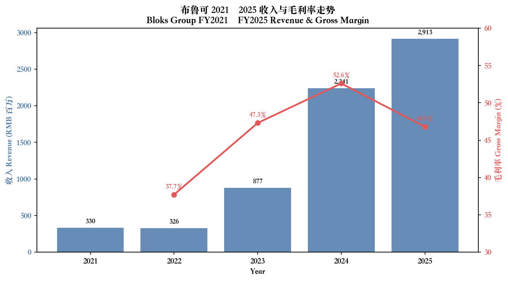
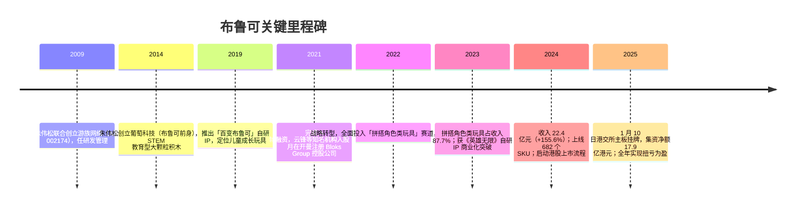
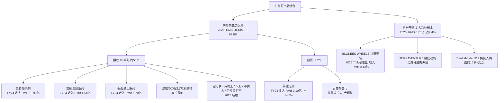
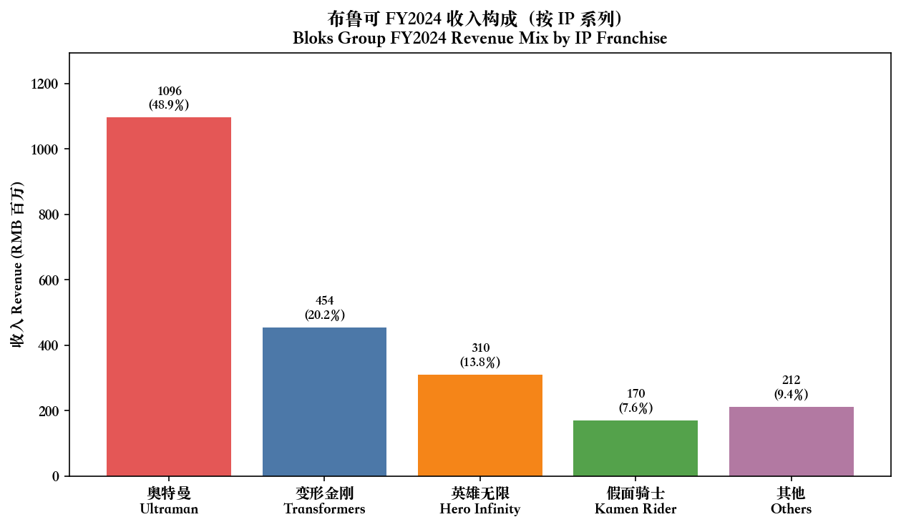
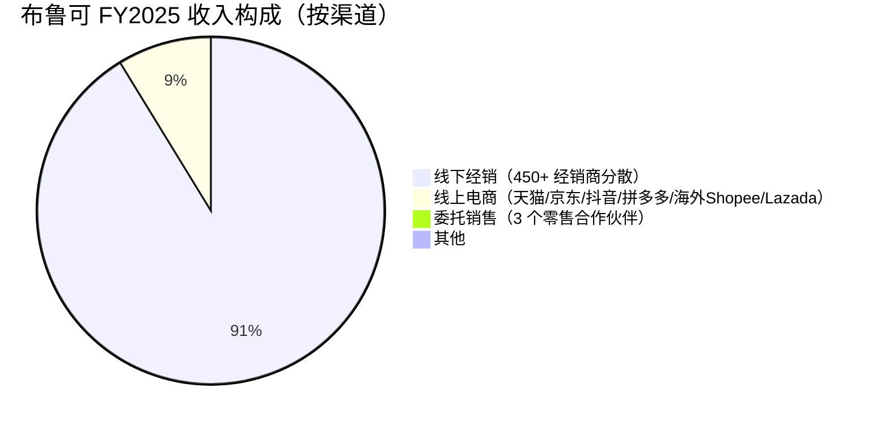
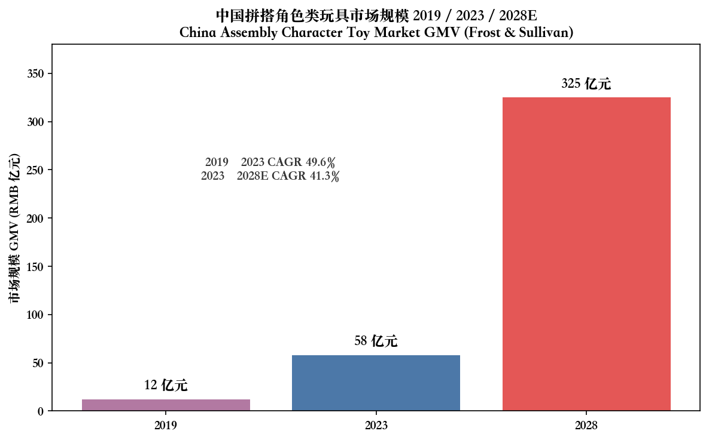
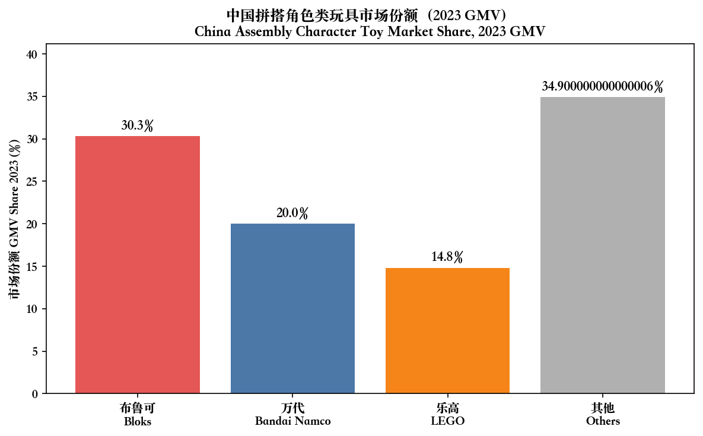
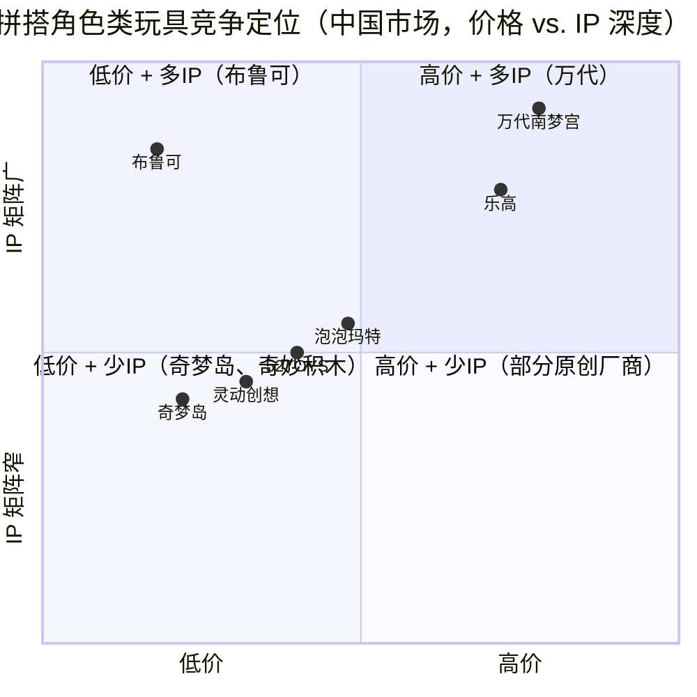
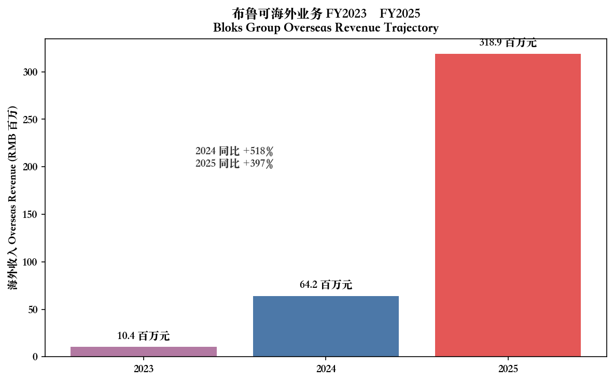
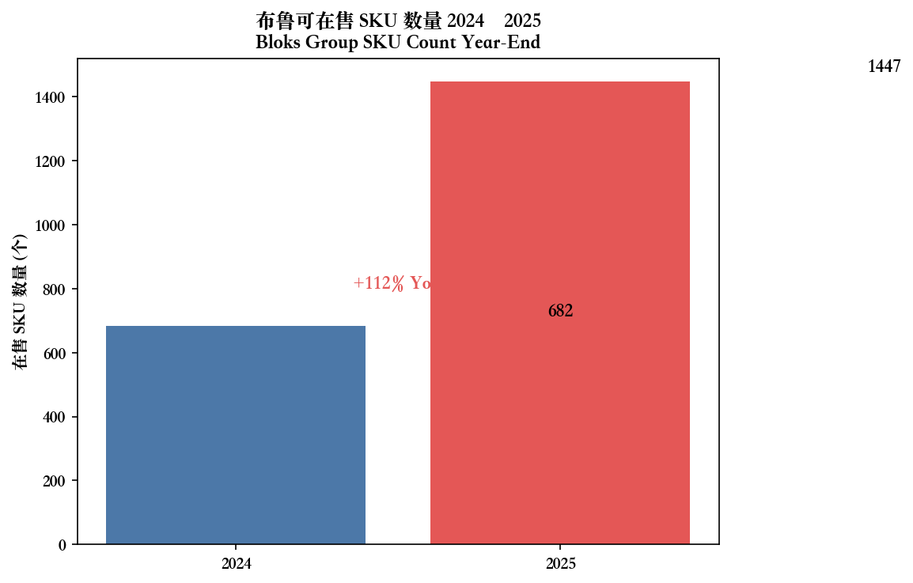

# 布魯可集團（Bloks Group, HKEX:0325）公司研究报告

**报告日期：** 2026-05-20
**主分析对象：** 布魯可集團有限公司（Bloks Group Limited）
**股票代碼：** 0325.HK（港交所主板，2025 年 1 月 10 日上市）
**报告语言：** 简体中文

> **关于 ticker 的更正说明：** 用户输入指出布鲁可对应 `HKEX:2590`，但经在 cninfo 与 HKEXnews 双向核验，`HKEX:2590` 对应「极智嘉-W」(Geek+，移动机器人公司)；**布鲁可（Bloks Group）真实代码为 `HKEX:0325`**（[2024 年度業績公告封面](https://www1.hkexnews.hk/listedco/listconews/sehk/2025/0321/2025032101646_c.pdf)）。本报告依据真实代码 0325 撰写。

> **Update — FY2025 业绩首次实现扭亏为盈（2026-03-13 公告）：** 公司公布 2025 年全年收入 **RMB 2,913.3 百万**（同比 +30.0%），股东应占净利润由 2024 年亏损 RMB 398.0 百万转为 **盈利 RMB 633.7 百万**；经调整年度利润 RMB 674.9 百万，同比 +15.5%；经调整净利润率 23.2%，较 2024 年 26.1% 下降 2.9 个百分点。管理层将利润率收窄归因于（i）9.9 元超值价位 SKU 占比提升（贡献收入 5.4 亿元、销量 1.22 亿件，占总销量 47.8%）摊薄毛利率，及（ii）模具与新品研发资本性开支折旧前置。海外收入由 2024 年 RMB 64.2 百万跃增 396.6% 至 **RMB 318.9 百万**，是 2026 年增长换挡的核心驱动。Source: [2025 年度業績公告, 2026-03-13](https://www.hkexnews.hk/listedco/listconews/sehk/2026/0313/2026031301543.pdf)。

---

## 目录

1. 公司概览
2. 公司历史
3. 管理团队
4. 产品与服务
5. 客户与上市策略
6. 行业概览
7. 竞争格局
8. 市场机会（TAM）
9. 风险评估
10. 参考资料

---

## 1. 公司概览

布魯可集團有限公司（以下簡稱「布鲁可」）是一家總部位於上海的拼搭角色類玩具（assembly character toys）设计、研发与销售公司，2025 年 1 月 10 日於港交所主板以发行价 60.35 港元/股完成 IPO，全球發售淨集資约 17.9 亿港元（[2025 年度業績公告, p. 33](https://www.hkexnews.hk/listedco/listconews/sehk/2026/0313/2026031301543.pdf)）。公司业务定位是「中国版乐高+万代」的混合体：以拼装机制承载授权 IP 角色，再以远低于乐高/万代海外品牌的价格（核心 SKU 售价 9.9–39.9 元人民币）抢占下沉市场，并在 2025 年加速向海外扩张。

**业务模式（如何赚钱）：** 公司的拼搭角色类玩具基于自研的「布鲁可体系」（Bloks System，受 500+ 项专利保护）实现部件标准化、产品体系自洽、消费者生态闭环（[2024 年度業績公告, 第 19–20 頁](https://www1.hkexnews.hk/listedco/listconews/sehk/2025/0321/2025032101646_c.pdf)）。盈利核心在三方面：
- **大规模 SKU + IP 矩阵驱动销量**：2024 年末 SKU 数 682 个；2025 年末跳增至 1,447 个，全年新推出 913 个 SKU；商业化 IP 数从 2024 年 19 个增至 2025 年 29 个，授权 IP 矩阵约 50 个（含奥特曼、变形金刚、漫威、宝可梦、星球大战、哈利波特、海贼王等）（[2025 年度業績公告, p. 23](https://www.hkexnews.hk/listedco/listconews/sehk/2026/0313/2026031301543.pdf)；[2024 年度業績公告, 第 21 頁](https://www1.hkexnews.hk/listedco/listconews/sehk/2025/0321/2025032101646_c.pdf)）。
- **经销主导的轻资产线下渠道**：2024 年线下经销收入 RMB 20.6 亿，占总收入 92.1%；2025 年线下经销收入升至 RMB 26.4 亿，仍占 90.5%（[2024 年度業績公告, 第 25 頁](https://www1.hkexnews.hk/listedco/listconews/sehk/2025/0321/2025032101646_c.pdf)；[2025 年度業績公告, p. 28](https://www.hkexnews.hk/listedco/listconews/sehk/2026/0313/2026031301543.pdf)）。截至 2024H1 已签约约 511 家经销商，覆盖逾 15 万个线下网点、一二线城市全覆盖及 80% 以上三线及以下市场（[36氪 / 远瞻慧库, 2025-06-06](https://www.baogaobox.com/insights/250605000011394.html)）。
- **代工生产、研发与 IP 自掌**：自有员工聚焦设计/研发/质控，生产依赖合作工厂；2024 年末员工 709 人（其中研发 472 人），2025 年末扩至 935 人（研发 618 人）（[2024 年度業績公告, 第 36 頁](https://www1.hkexnews.hk/listedco/listconews/sehk/2025/0321/2025032101646_c.pdf)；[2025 年度業績公告, p. 33](https://www.hkexnews.hk/listedco/listconews/sehk/2026/0313/2026031301543.pdf)）。

**经营地理：** 2025 年中国大陆收入 RMB 25.9 亿（占比 89.1%），海外收入 RMB 3.19 亿（占比 10.9%）。其中亚洲（不含中国）RMB 1.33 亿、美洲 RMB 1.50 亿、其他 RMB 0.37 亿；美国与印度尼西亚为海外贡献最大的两国（[2025 年度業績公告, p. 9, p. 24](https://www.hkexnews.hk/listedco/listconews/sehk/2026/0313/2026031301543.pdf)）。

**规模指标（FY2025）：** 收入 RMB 29.13 亿、毛利 RMB 13.64 亿（毛利率 46.8%）、归母净利 RMB 6.34 亿、经调整净利 RMB 6.75 亿、经调整净利率 23.2%、研发开支 RMB 2.64 亿（占收入 9.1%）、销售拼搭角色类玩具 2.50 亿件、9.9 元价位段销量 1.22 亿件、年末现金及定期存款 RMB 29.08 亿、员工 935 人（[2025 年度業績公告, p. 1, p. 12, p. 28, p. 33](https://www.hkexnews.hk/listedco/listconews/sehk/2026/0313/2026031301543.pdf)）。FY2024 数据：收入 RMB 22.41 亿、毛利率 52.6%、归母净亏损 RMB 4.01 亿、经调整净利 RMB 5.85 亿（[2024 年度業績公告, 第 1 頁](https://www1.hkexnews.hk/listedco/listconews/sehk/2025/0321/2025032101646_c.pdf)）。

Source: [布鲁可 IPO 招股章程](https://www1.hkexnews.hk/listedco/listconews/sehk/2024/1231/2024123100132_c.pdf)（2021–2023 收入），[2024 年度業績公告, 第 1 頁](https://www1.hkexnews.hk/listedco/listconews/sehk/2025/0321/2025032101646_c.pdf) 及 [2025 年度業績公告, p. 1](https://www.hkexnews.hk/listedco/listconews/sehk/2026/0313/2026031301543.pdf)。

**估值快照（截至 2026-05-20 前后数据）：**
- 收盘价：HK$67.50；总市值：约 HK$167.8 亿（约 USD 21.5 亿）（[Yahoo Finance HKG:0325 Key Statistics](https://finance.yahoo.com/quote/0325.HK/key-statistics/)）。
- **TTM P/E ≈ 23×**（基于 2025 年 EPS RMB 2.58 × 1.09 HKD/RMB ≈ HK$2.81，对应 HK$67.50/2.81 ≈ 24×；与第三方统计的 22.96× 接近）（[Yahoo Finance](https://finance.yahoo.com/quote/0325.HK/key-statistics/)）。
- **TTM P/S ≈ 5.3×**（市值 HKD 167.8 亿 ÷ 2025 营收 RMB 29.13 亿 × 1.09 = HKD 31.7 亿 → 167.8/31.7 ≈ 5.3×）。
- 自 2025-01-10 上市以来交易区间约 HK$60.35（发行价）至 HK$160+（2025 年中峰值），2026 年 5 月回落至 HK$67.50；3 月 13 日公布 2025 年报后股价单日跌幅一度超过 10%，反映市场对毛利率压缩与利润率换挡的担忧（[36氪：业绩失速的布鲁可，难成下一个泡泡玛特, 2026-03-18](https://36kr.com/p/3519698551528329)；[新浪财经：玩具潮玩越来越卷了吗？布鲁可、奇梦岛等进入攻坚战, 2026-03-18](https://finance.sina.com.cn/wm/2026-03-18/doc-inhrmpqp9253329.shtml)）。
- **同业对比（A 股/港股潮玩 IP 公司，TTM P/E）：** 泡泡玛特 9992.HK 约 40–50×（高增长溢价）、卡游 2440.HK 估值类似、52TOYS 进入 IPO 程序、奇梦岛尚未上市。乐高（私有）、万代南梦宫 7832.JP TTM P/E 约 22×（成熟玩具/动漫综合体）。布鲁可的 23× P/E 处于成熟玩具公司与高速潮玩股之间，反映了「高 30% 营收增长 + 利润率短期承压」的混合属性（[同花顺/西部证券, 2026-03](https://wap.hibor.com.cn/repinfodetail_5032666.html)；[Bamboo Works, 2025](https://thebambooworks.com/ultraman-lifts-bloks-group-to-new-heights-in-first-post-iposo-report/)）。
- **估值解读：** 当前估值并非「极高 P/E + 无盈利路径」型风险，但若 2026 年再次出现毛利率下降（管理层指引继续加大海外营销 + AI 研发 + 新品类模具）、且海外尚未跑出第二个奥特曼级别 IP，则 P/E 与 P/S 仍有压缩空间。本报告将估值风险纳入 Section 9。

## 2. 公司历史

布鲁可的「拼搭+IP」打法并非自上而下的战略规划，而是创始人朱伟松从教育玩具切入儿童市场十年后的二次转型。

**成立背景：** 2014 年朱伟松（80 后绍兴新昌人，上海交大本科）从游族网络（A 股 002174，他是 2009 年的联合创始人之一）功成身退、套现约 10 亿元后，于上海创立「葡萄科技」，定位是用科技产品陪伴儿童成长，主打 STEM 教育型大颗粒积木玩具与亲子互动 App（[新浪科技：朱伟松带领布鲁可敲钟, 2025-01-10](https://finance.sina.com.cn/tech/csj/2025-01-10/doc-ineentrv6092466.shtml)；[21世纪经济报道, 2024-05-31](https://m.21jingji.com/article/20240531/herald/2231b10798c5721c4b0f0a9658787004_zaker.html)）。「葡萄」寓意串联起小朋友的世界，是后续「布鲁可」品牌的前身。

**关键战略转向（2022 年）：** 2020–2021 年间，葡萄科技/布鲁可的核心产品仍是面向 0–6 岁儿童的大颗粒积木玩具，2022 年公司发现：（1）国内大颗粒积木市场被乐高 Duplo 与启蒙等品牌挤压，毛利率低、复购弱；（2）6–16 岁男孩对「IP 角色 + 玩具拼搭」的需求被万代、乐高、灵动创想等品牌部分满足但价格门槛高（万代 SHF / 乐高小颗粒动辄 200–800 元一盒）。公司决定将产能、研发与渠道全面转向「拼搭角色类玩具」，并率先拿下奥特曼大陆区域的非独家拼搭授权（[澎湃新闻：80 后朱伟松携布鲁可冲刺上市, 2024](https://m.thepaper.cn/newsDetail_forward_27580498)；[36氪：80后创始人朱伟松, 2024](https://36kr.com/p/2799961438903171)）。

**转向后效果（2023–2024）：** 2023 年拼搭角色类玩具收入占比已升至 87.7%、积木玩具占比降至 12.1%；2024 年拼搭角色类玩具收入占比进一步攀升至 98.2%（[2024 年度業績公告, 第 24 頁](https://www1.hkexnews.hk/listedco/listconews/sehk/2025/0321/2025032101646_c.pdf)）。同期总收入从 2022 年 RMB 3.26 亿跳升至 2024 年 RMB 22.41 亿，三年 CAGR 约 162%。

**主要融资历程：**
- 天使轮（2014–2017 年间）：6.27 百万股优先股，账面价值 RMB 216.4 百万元（2024 年报披露的 2024-01-01 数值）（[2024 年度業績公告, 第 15 頁](https://www1.hkexnews.hk/listedco/listconews/sehk/2025/0321/2025032101646_c.pdf)）。
- Pre-A 轮：13.16 百万股优先股，账面价值 RMB 505.6 百万元。
- A 轮：25.92 百万股优先股，账面价值 RMB 1,126 百万元；2024 年 4 月公司以 RMB 183 百万元终结涉及 5.77 百万股 A 轮的认股权证协议，与海南云锋拓源现金结算（[2024 年度業績公告, 第 15 頁](https://www1.hkexnews.hk/listedco/listconews/sehk/2025/0321/2025032101646_c.pdf)）。所有优先股于 2025-01-10 上市后按 1:1 自动转换为普通股。

**2025 年新进展：** （i）线下规模扩张至 1,447 SKU；（ii）启动 BLOKEES 海外社区 App（覆盖亚太 12 国家/地区）；（iii）11 月推出「BLOKEES WHEELS」拼搭车辆玩具新品类，2025 年贡献 RMB 43.1 百万收入（5.7 百万件）；（iv）回购库存股 70.41 万股，总对价 HK$65.4 百万（2025 年首次回购）（[2025 年度業績公告, p. 20, p. 22, p. 28](https://www.hkexnews.hk/listedco/listconews/sehk/2026/0313/2026031301543.pdf)）。

## 3. 管理团队

布鲁可的治理结构高度「founder-CEO 集中」，朱伟松同时担任董事长与首席执行官，2025 年报亦坦承偏离《企业管治守则》第 C.2.1 条，公司董事会以「创始人作用不可替代」为由维持现状（[2024 年度業績公告, 第 32–33 頁](https://www1.hkexnews.hk/listedco/listconews/sehk/2025/0321/2025032101646_c.pdf)）。

**朱伟松（Mr. ZHU Weisong）——创始人、董事长、执行董事兼首席执行官（约 280 字）**

朱伟松 1982 年出生于浙江绍兴新昌，2005 年前后毕业于上海交通大学工商管理专业。2009 年与林奇等共同创立游族网络（深交所 002174），负责研发管理与产品体系建设，参与了《大皇帝》《少年三国志》等手游产品的研发组织，是游族 2014 年借壳上市背后的核心技术团队成员之一。2014 年他从游族网络功成身退，套现资金估算约 10 亿元人民币（[21世纪经济报道, 2024-05-31](https://m.21jingji.com/article/20240531/herald/2231b10798c5721c4b0f0a9658787004_zaker.html)）。同年在上海创立葡萄科技（布鲁可前身），秉持「科技陪伴成长」理念，初期主打儿童成长型 STEM 大颗粒积木与亲子互动产品。2022 年他作出公司迄今最重要的一次战略转向——放弃低毛利的教育积木赛道，全面押注拼搭角色类玩具与 IP 授权矩阵。这一决策的依据是他对 0–16 岁男孩消费心理与中国玩具供应链能力的双重认知：万代/乐高的高定价为下沉市场预留巨大缝隙。2025 年 1 月布鲁可在港交所主板挂牌当日股价较发行价飙升 82% 至 109.6 港元，朱伟松通过其控制的离岸结构持有公司约 51% 的投票权（招股章程披露的控股结构，[新浪财经, 2025-01-10](https://finance.sina.com.cn/stock/hkstock/hkzmt/2025-01-10/doc-ineenauc6326863.shtml)），账面身家一度超过 200 亿人民币。其薪酬结构中 2024 年的股份激励一次性确认达 RMB 359.3 百万，是当年行政费用从 RMB 49 百万跳增至 RMB 465 百万的最主要驱动项（[2024 年度業績公告, 第 27 頁](https://www1.hkexnews.hk/listedco/listconews/sehk/2025/0321/2025032101646_c.pdf)）。朱伟松在 2025 年报中明确表示 2026 年策略重心是「全人群、全价位、全球消费者」的三全增长引擎，以及对 AI 工具的全面整合（[2025 年度業績公告, p. 21, p. 27](https://www.hkexnews.hk/listedco/listconews/sehk/2026/0313/2026031301543.pdf)）。

**盛晓峰（Mr. SHENG Xiaofeng）——执行董事（兼任 CFO/COO 职能）**

盛晓峰为布鲁可执行董事（[2024 年度業績公告, 第 35 頁](https://www1.hkexnews.hk/listedco/listconews/sehk/2025/0321/2025032101646_c.pdf)），公司公开披露中未单列 CFO/COO 头衔。根据 IPO 招股章程，盛晓峰负责供应链管理、生产及部分财务事务，是朱伟松的早期合伙人。布鲁可在 2024 年承担 RMB 33.4 百万一次性上市开支、推动可转换可赎回优先股转股并完成全球發售（招股价 HK$60.35、超额配股全数行使、淨集资 HK$17.9 亿），由盛晓峰协同保荐人高盛与华泰国际完成。2025 年布鲁可首次启动 70.41 万股库存股回购、并将上市集资的 25% 投资于自有规模化工厂，反映了从「轻代工」向「重资产+模具自给」的转型，是其作为非典型 CFO 的关键议程（[2025 年度業績公告, p. 20, p. 33–34](https://www.hkexnews.hk/listedco/listconews/sehk/2026/0313/2026031301543.pdf)）。公司目前未公开委任独立 CFO，市场对其财务专业纵深的关注度较高，是 2026 年治理观察焦点之一。

**研发与 IP 团队负责人（约 110 字）：** 公司在 2024–2025 年报中未实名披露研发 VP/CTO 与 IP 商务总监级别人物，但年报披露 2025 年末研发人员 618 人（占员工总数 935 人的 66.1%），并强调与万代南梦宫、孩之宝、迪士尼/漫威、东映等 IP 持有方的非独家授权矩阵管理由专门团队负责（[2025 年度業績公告, p. 33](https://www.hkexnews.hk/listedco/listconews/sehk/2026/0313/2026031301543.pdf)）。研发深度无单一明星人物，更多是团队化模具与设计能力。

**治理与董事会构成（约 130 字）：** 截至 2025-03-21 公告日，董事会由 7 人组成：执行董事 2 人（朱伟松、盛晓峰）、非执行董事 2 人（常凯斯、陈瑞，均代表云锋等机构股东）、独立非执行董事 3 人（高平阳、黄蓉、尚健）（[2024 年度業績公告, 第 35 頁](https://www1.hkexnews.hk/listedco/listconews/sehk/2025/0321/2025032101646_c.pdf)）。独立董事占比 3/7 符合港交所主板《上市规则》最低门槛（不少于 1/3）但未达到「过半数」更高标准。公司目前坦承偏离《企业管治守则》C.2.1（董事长/CEO 分离）与 D.1.2（每月业绩简报），承诺定期审阅但短期内不调整。2024 年股份激励一次性确认 RMB 407.3 百万股份薪酬开支，是 IPO 前对管理层与核心研发的捆绑式留任安排（[2024 年度業績公告, 第 11 頁](https://www1.hkexnews.hk/listedco/listconews/sehk/2025/0321/2025032101646_c.pdf)）。

**管理层 track record 综合判断（约 75 字）：** 朱伟松具备完整的「从 0 到 1 创业 + 二次创业上市」记录，2014 年套现后的赛道选择（先 STEM 教育，再拼搭 IP）展现出对儿童玩具市场结构性洞察力，但他高度集中的权力结构与目前 CFO/独立董事比例偏低的治理瑕疵在公司迈向 RMB 50 亿+ 收入体量后将成为持续观察项。

## 4. 产品与服务

布鲁可的产品体系围绕「拼搭角色类玩具」单一核心品类展开，并在 2025 年 11 月新增「拼搭车辆玩具」(BLOKEES WHEELS) 子品类。下图按公司披露口径汇总产品矩阵：

**拼搭角色类玩具（核心产品，约占 98% 收入）：**

- **奥特曼系列（光之巨人，万代/圆谷授权）**：FY2024 收入 RMB 1,095.8 百万、占总收入 48.9%（公司最大单一 IP）；2024 年同比销量近翻倍（[2024 年度業績公告, 第 20 頁](https://www1.hkexnews.hk/listedco/listconews/sehk/2025/0321/2025032101646_c.pdf)；[Bamboo Works, 2025](https://thebambooworks.com/ultraman-lifts-bloks-group-to-new-heights-in-first-post-iposo-report/)）。**竞争优势：是 / 部分。** 在 9.9–39.9 元价位段对万代日本原厂奥特曼软胶人偶/SHF 形成绝对错位（万代同型号售价 200–600 元）；但授权为非独家，万代南梦宫可向其他 OEM 同时授权或自营拼搭线（万代 EG/RG 高达系列已在尝试拼搭+角色化）。**最接近竞品：万代 EG Ultraman 拼装系列、灵动创想奥特曼变身器**——布鲁可在「价格 + 角色塑形精细度」组合上领先，但在动漫衍生「联动深度」上落后于万代日本原厂。
- **变形金刚系列（孩之宝/Hasbro 授权）**：FY2024 收入 RMB 453.7 百万、占 20.2%；2024 年末推出 9.9 元《变形金刚星辰版》极致拼性价比 SKU（[2024 年度業績公告, 第 20 頁](https://www1.hkexnews.hk/listedco/listconews/sehk/2025/0321/2025032101646_c.pdf)）。**竞争优势：是。** 孩之宝原厂 Studio Series 价格 200–800 元，布鲁可同造型拼搭版 9.9–69.9 元，价格优势接近 10 倍；销量 2024 年同比大增（公司未单独披露百分比）。**最接近竞品：孩之宝 Transformers Smash Changers / Studio Series**——布鲁可在「价格×SKU 数量」综合性能领先。
- **英雄无限（自研 IP，中国传统文化主题）**：FY2024 收入 RMB 309.9 百万、占 14.0%，由 2023 年的 7.3% 大幅提升（[2024 年度業績公告, 第 20 頁](https://www1.hkexnews.hk/listedco/listconews/sehk/2025/0321/2025032101646_c.pdf)）。**竞争优势：是。** 这是布鲁可唯一一个自研 IP 跑出商业化规模的案例，验证了「拼搭+原创角色」模式的可行性，且零授权费、可永续拓展。**最接近竞品：万代 Saint Cloth Myth 圣斗士、bandai-namco S.H.Figuarts 仿东方武侠**——英雄无限以原创武将形象 + 9.9–29.9 元价位错位竞争。**这是公司估值溢价的核心证据点之一**，是判断公司能否摆脱「授权依赖」的关键变量。
- **假面骑士系列（东映/万代授权）**：FY2024 收入 RMB 170.0 百万、占 7.6%（[2024 年度業績公告, 第 20 頁](https://www1.hkexnews.hk/listedco/listconews/sehk/2025/0321/2025032101646_c.pdf)）。**竞争优势：部分。** 假面骑士在中国市场的核心粉丝群偏成人男性向，对拼搭还原度的需求高于平价化需求，因此面对万代日本 RKF/SHF 原厂存在更直接的竞争。
- **2025 年新增 IP 与产品系列：** 小黄人（环球影业授权，2025 上半年商业化）、酷洛米（三丽鸥）、名侦探柯南、超级战队、机动奥特曼系列、DC 超人/蝙蝠侠、哈利波特、星球大战、宝可梦、海贼王、火影忍者、漫威无限传奇、芝麻街等。商业化 IP 数从 2024 年 19 个增至 2025 年 29 个（[2025 年度業績公告, p. 22–23](https://www.hkexnews.hk/listedco/listconews/sehk/2026/0313/2026031301543.pdf)；[36氪 / 远瞻慧库：2025 年布鲁可企业分析](https://www.baogaobox.com/insights/250605000011394.html)）。

**新拓展子品类：**

- **BLOKEES WHEELS 拼搭车辆玩具（2025 年 11 月推出）**：基于布鲁可体系延伸到车辆品类，结合「易拼搭+易改装」玩法，整合 IP 资源（含合作汽车文化主题），自研高密度新材料；2025 年贡献收入 RMB 43.1 百万、销量 5.7 百万件（[2025 年度業績公告, p. 22, p. 28](https://www.hkexnews.hk/listedco/listconews/sehk/2026/0313/2026031301543.pdf)）。**竞争优势：部分。** 在中国国内对标乐高 Speed Champions（200–600 元价位）、孩之宝 Hot Wheels（30–150 元），布鲁可定价 9.9–49.9 元、SKU 上量速度更快；但 Hot Wheels 的全球分销与品牌沉淀短期内难以撼动。**最接近竞品：Hot Wheels、Tomica**——布鲁可优势在拼搭可玩性 + 多 IP 主题。
- **TERRAVENTURE 拼搭动物（2025 年）**：「骨-皮-纹」(Bone-Skin-Feature) 系统还原恐龙等动物形态。**竞争优势：部分。** 国内拼搭动物市场较分散，乐高 Jurassic World 价位偏高，布鲁可定位中端。**最接近竞品：乐高 Jurassic World 系列、Schleich 仿真动物**。
- **DaaLaMode 1/12 换装人偶（2025 年）**：面向 16 岁+ 受众，可与布鲁可模块化人偶 + 标准化关节接口 + 织物服装结合（[2025 年度業績公告, p. 22](https://www.hkexnews.hk/listedco/listconews/sehk/2026/0313/2026031301543.pdf)）。**竞争优势：是 / 部分。** 与万代 S.H.Figuarts、Hot Toys 1/6 高端可动人偶错位（万代 1/12 SHF 250–800 元，布鲁可 50–150 元）；但服装与脸雕细节预计仍落后于专业手办。**最接近竞品：万代 SHFiguarts、Pinky:st、Pop Mart 收藏型角色**。

**长尾 / 退出产品（积木玩具）：** FY2024 大颗粒积木收入 RMB 39.4 百万（同比 -62.9%），FY2025 拼搭车辆+积木合计收入 RMB 69.8 百万——大颗粒积木被战略性收缩（[2024 年度業績公告, 第 24 頁](https://www1.hkexnews.hk/listedco/listconews/sehk/2025/0321/2025032101646_c.pdf)；[2025 年度業績公告, p. 28](https://www.hkexnews.hk/listedco/listconews/sehk/2026/0313/2026031301543.pdf)）。

Source: [2024 年度業績公告, 第 20 頁](https://www1.hkexnews.hk/listedco/listconews/sehk/2025/0321/2025032101646_c.pdf)。

**旗舰判断：** 1）**奥特曼**（48.9% 收入占比）——绝对旗舰，2025 年仍是营收支柱，但单一 IP 集中度高、授权续约风险居首；2）**变形金刚**——第二大引擎，孩之宝授权 + 9.9 元星辰版超值价位段；3）**英雄无限**——自研 IP 试金石，验证可永续性。

**最近 12 个月新品 / 重定位：** 2024 年 12 月推出《变形金刚星辰版》9.9 元价位段，2025 年 11 月推出 BLOKEES WHEELS、2025 年内新增 913 个 SKU、推出 BLOKEES 海外社区 App（覆盖亚太 12 国家/地区）（[2025 年度業績公告, p. 23–25](https://www.hkexnews.hk/listedco/listconews/sehk/2026/0313/2026031301543.pdf)）。

**SKU 年龄段结构（2025 年末）：** 158 个 SKU 面向 6 岁以下儿童（同比 +19.7%）、1,002 个 SKU 面向 6–16 岁（同比 +93.1%、占总收入 81.1%）、287 个 SKU 面向 16 岁以上（同比 +825.8%、收入占比由 11.4% 升至 16.7%），显示成人收藏向拼搭 IP 是 2026 年最重要的二次曲线（[2025 年度業績公告, p. 23](https://www.hkexnews.hk/listedco/listconews/sehk/2026/0313/2026031301543.pdf)）。

## 5. 客户与上市策略

**客户细分：** 布鲁可的最终消费者结构包含三层：
- **6–16 岁男孩**（核心层，占 SKU 数 69.2%、收入 81.1%）——奥特曼、变形金刚、假面骑士、火影、海贼王主力人群；
- **6 岁以下儿童**（成长型 + 浅拼搭层，占 SKU 11%、收入约 2.2%）——百变布鲁可、9.9 元变形金刚星辰版；
- **16 岁以上 / 成人收藏**（占 SKU 19.8%、收入 16.7%）——英雄无限、DaaLaMode 1/12、漫威/DC 限定版（[2025 年度業績公告, p. 23](https://www.hkexnews.hk/listedco/listconews/sehk/2026/0313/2026031301543.pdf)）。

**客户集中度（来自年报"主要客户资料"披露）：** 公司明确披露 **2024 与 2025 两个财年均没有单一客户收入超过总收入 10% 的门槛**（[2024 年度業績公告, 第 9 頁](https://www1.hkexnews.hk/listedco/listconews/sehk/2025/0321/2025032101646_c.pdf)；[2025 年度業績公告, p. 9](https://www.hkexnews.hk/listedco/listconews/sehk/2026/0313/2026031301543.pdf)）。这是布鲁可经销网络高度分散化（450+ 家经销商）的直接体现。但需注意：（a）公司未在年度业绩公告口径中按 5%/10%/前五名等更细颗粒披露 ；（b）招股章程对 IPO 前轨道记录期(2021–2023H1)曾披露前五大客户合计占比，但 2024 年报已不再披露该数。**经销商集中度可被视为低风险，但仍需在 2025 年完整年报披露文档中追踪。**

**线下分销网络：** 截至 2024H1 已签约 511 家经销商（2021 年仅 40 家），覆盖逾 15 万个线下网点；一二线城市全覆盖，三线及以下城市覆盖率超 80%（[远瞻慧库, 2025-06-06](https://www.baogaobox.com/insights/250605000011394.html)；[新浪财经/光大海外, 2025-04-21](https://finance.sina.com.cn/stock/hkstock/hkzmt/2025-04-21/doc-inetxsms4979524.shtml)）。**经销合同结构：** 公司在 2024 年报中披露贸易应收款项主要赋予「记录良好且流动性优良的若干经销商」1–3 个月信用期，2025 年延长至 1–4 个月（[2025 年度業績公告, p. 32](https://www.hkexnews.hk/listedco/listconews/sehk/2026/0313/2026031301543.pdf)）。

**线上渠道：** 通过天猫、京东、抖音、拼多多、抖音、自营微信小程序「布鲁可积木人 CLUB」、海外 Shopee/Lazada/TikTok 等多平台运营。2025 年线上收入 RMB 252.7 百万（同比 +62.3%，高于整体收入增长），占比由 6.9% 升至 8.7%（[2025 年度業績公告, p. 24](https://www.hkexnews.hk/listedco/listconews/sehk/2026/0313/2026031301543.pdf)）。

**销售周期 / 模式：** 拼搭角色类玩具属于快速消费品 / 二次元收藏品混合属性，零售周转 1–3 个月，新品上架后 1–2 个月达到销售峰值，长尾经典 IP（奥特曼、变形金刚）持续在售。经销商通常预付款 + 1–4 个月信用混合。

**关键合作 / IP 授权伙伴：** 万代南梦宫（奥特曼、假面骑士、机动奥特曼、超级战队）、孩之宝（变形金刚）、迪士尼/漫威（漫威无限传奇、蜘蛛侠夥伴神奇版）、华纳兄弟（DC 超人、蝙蝠侠、哈利波特）、东映、卢卡斯影业（星球大战）、宝可梦公司、东映动画、集英社（海贼王、火影忍者）、环球影业（小黄人）、三丽鸥（酷洛米）（[2024 年度業績公告, 第 21 頁](https://www1.hkexnews.hk/listedco/listconews/sehk/2025/0321/2025032101646_c.pdf)；[远瞻慧库, 2025-06-06](https://www.baogaobox.com/insights/250605000011394.html)）。

**消费者社区与营销（go-to-market 核心壁垒）：** 公司构建「BFC」（布鲁可积木人创作者）二创社区——在天猫、京东、微信、抖音、微博、小红书、哔哩哔哩等平台累积超过 1100 万粉丝；2025 年 BFC 二创大赛吸引近 60,000 人参与、近 130,000 件作品，并启动「百城千店」线下活动覆盖 100+ 城市、120,000+ 参与者（[2025 年度業績公告, p. 25](https://www.hkexnews.hk/listedco/listconews/sehk/2026/0313/2026031301543.pdf)；[新浪财经/光大海外, 2025-04-21](https://finance.sina.com.cn/stock/hkstock/hkzmt/2025-04-21/doc-inetxsms4979524.shtml)）。**这是公司难以被 SKU/价格直接复制的最深护城河之一。**

**已披露的渠道伙伴案例：** 2024 年 7 月与上海徐汇美罗城合办第 25 届「欢乐暑期在美罗城」儿童活动，定向投放蜘蛛侠夥伴神奇版与漫威英雄群星版（[2024 年度業績公告, 第 22 頁](https://www1.hkexnews.hk/listedco/listconews/sehk/2025/0321/2025032101646_c.pdf)）；2024 年 10 月参展中国玩具博览会、12 月参展新加坡动漫展首发芝麻街系列、2025 年参展 Wonder Festival Shanghai、CTE China Toy Expo、Toy Fair New York、纽伦堡 Spielwarenmesse、印尼国际玩具展。

## 6. 行业概览

**行业定义与范围：** 布鲁可所属的核心赛道是 **拼搭角色类玩具 (Assembly Character Toys)**——一种结合传统角色玩具（人偶/手办）与小颗粒积木拼搭机制的杂交品类，由弗若斯特沙利文（Frost & Sullivan）和灼识咨询（China Insights Consultancy）作为细分定义独立统计。其上层归类为**潮玩/IP 玩具行业**（含盲盒、手办、玩偶、卡牌等），与中国玩具协会的传统玩具统计口径有差异。

**全球市场规模：** 弗若斯特沙利文数据，全球拼搭角色类玩具市场规模由 2019 年 RMB 132 亿元增长至 2023 年 RMB 278 亿元，预计 2023–2028 年 CAGR 29.0%、2028 年达 RMB 996 亿元（[西部证券/三个皮匠报告, 2025-03](https://www.sgpjbg.com/hyshuju/cffdb8d64e36b6e595bbd3267b167071.html)；[小牛行研, 2025-04](https://www.hangyan.co/charts/3616969361790600611)）。

**中国市场规模：** 拼搭角色类玩具是拼搭玩具中增速最快的细分赛道。市场规模由 2019 年 RMB 12 亿元增长至 2023 年 RMB 58 亿元（CAGR 49.6%），预计 2028 年达 RMB 325 亿元（CAGR 41.3%）（[弗若斯特沙利文 via 三个皮匠报告, 2025-03](https://www.sgpjbg.com/hyshuju/cffdb8d64e36b6e595bbd3267b167071.html)；[中信证券：中国拼搭玩具市场前景广阔, 2025-03-01](https://finance.sina.com.cn/stock/hkstock/ggscyd/2025-03-01/doc-inencxhk8827959.shtml)）。

Source: [弗若斯特沙利文，引自三个皮匠报告 2025-03](https://www.sgpjbg.com/hyshuju/cffdb8d64e36b6e595bbd3267b167071.html) 与 [中信证券 / 新浪财经, 2025-03-01](https://finance.sina.com.cn/stock/hkstock/ggscyd/2025-03-01/doc-inencxhk8827959.shtml)。

**增长驱动：**
1. **IP 经济与情绪消费爆发**：2025 年中国 IP 玩具市场千亿级跃迁，泡泡玛特、卡游、布鲁可等品牌崛起（[知乎：2025 年中国 IP 玩具行业报告](https://zhuanlan.zhihu.com/p/1921895998021677727)；[知乎：Labubu 狂飙带动中国潮玩市场千亿级跃迁](https://zhuanlan.zhihu.com/p/1935696431496290898)）。
2. **拼搭机制渗透率提升**：拼搭玩具在全球玩具市场的渗透率持续上升，从中国市场看，拼搭角色类玩具占整个角色玩具市场的份额仍处于早期（[小牛行研, 2025-01](https://www.hangyan.co/charts/3550800770376926479)）。
3. **下沉市场消费升级**：9.9–39.9 元价位段为三四线城市和小学生群体提供了能负担的「拥有 IP」体验，是布鲁可从 2023 至 2024 收入暴增的最主要驱动。
4. **成人收藏向二次元拓展**：2025 年成人收藏向 SKU 同比 +825.8%、收入占比 16.7%，与万代日本 SHF/Hot Toys 的高端手办形成错位下沉。

**主要趋势：**
- **IP 矩阵化：** 头部玩家从单一 IP 向 30–50 个 IP 的矩阵化扩张；
- **全球化：** 中国玩具品牌出海加速，泡泡玛特、布鲁可、卡游均把 2025–2027 年定为海外加速期；
- **AI 赋能研发：** 公司在 2025 年报中明确表示 2026 年将「全面利用 AI 工具」赋能产品开发、原创 IP 创作（[2025 年度業績公告, p. 27](https://www.hkexnews.hk/listedco/listconews/sehk/2026/0313/2026031301543.pdf)）；
- **盲盒/盲拆机制融合：** 拼搭角色玩具与盲盒/盲拆体验逐步融合，提升复购。

**监管环境：**
1. **玩具安全：** 中国 GB6675-2014、美国 ASTM F963、欧盟 EN71——布鲁可披露其产品符合所有上述标准（[2024 年度業績公告, 第 22–23 頁](https://www1.hkexnews.hk/listedco/listconews/sehk/2025/0321/2025032101646_c.pdf)）。
2. **盲盒未成年人销售：** 中国国家市场监督管理总局 2023 年《盲盒经营行为规范指引》对 8 岁以下盲盒销售、概率公示等做了限制，对布鲁可旗下盲拆向 SKU 形成一定合规约束。
3. **IP 授权与知识产权：** 布鲁可在 2023H2 起遭遇大规模假冒侵权，2024 年 4 月协同公安端掉广东 6 个假冒窝点、2024 年 11 月在河南南阳/浙江东阳市场监管局协助下进行行政执法（[2024 年度業績公告, 第 22–23 頁](https://www1.hkexnews.hk/listedco/listconews/sehk/2025/0321/2025032101646_c.pdf)）；2025 年进一步立法+技术+渠道三端打假，全年立案 15 起、获 7 份整改通知和 3 份行政处罚决定（[2025 年度業績公告, p. 26](https://www.hkexnews.hk/listedco/listconews/sehk/2026/0313/2026031301543.pdf)）。
4. **跨境数据 / 出海合规：** 海外业务扩张至美国、东南亚等地，需遵守目的地国玩具安全、CPC（美国 Children's Product Certificate）、CE（欧盟）等认证。

**行业结构：**
- **集中度：** 全球市场前三（万代 39.5% + 乐高 35.9% + 布鲁可 6.3%）合计约 82%，CR3 高度集中；中国市场前三（布鲁可 30.3% + 万代 20.0% + 乐高 14.8%）合计 65.1%，仍处于本土玩家逐步替代海外品牌的过程（[同花顺/西部证券 + 灼识咨询, 2025](https://www.sgpjbg.com/hyshuju/cffdb8d64e36b6e595bbd3267b167071.html)）。
- **进入壁垒：** （a）IP 授权矩阵（万代/孩之宝/华纳/迪士尼对新进入者授信门槛高）；（b）模具与小颗粒拼搭精度的供应链能力；（c）「BFC」式二创社区与 1100 万+ 全平台粉丝沉淀；（d）经销商网络与下沉市场触达。
- **供应商议价权：** 公司主要依赖代工模式与合作工厂，2024 年贸易应付款项及应付票据 RMB 5.67 亿、付款期 3–7 个月（[2024 年度業績公告, 第 29–30 頁](https://www1.hkexnews.hk/listedco/listconews/sehk/2025/0321/2025032101646_c.pdf)），对供应商议价能力较强但 IPO 募投正在向「自有规模化工厂」迁移。
- **买方议价权：** 经销商集中度低（450+ 家），单一买方议价能力弱；线下网点 15 万个，零售端高度碎片化。
- **替代品：** 万代 SHFiguarts、Hot Toys、乐高、孩之宝原厂、泡泡玛特盲盒、卡游卡牌、奇梦岛拼搭都可视为不同程度的替代。

## 7. 竞争格局

布鲁可所处的拼搭角色类玩具市场在全球和中国呈现完全不同的竞争格局：全球由海外巨头主导，中国由本土崛起的布鲁可领先。

**中国市场竞争格局：**

Source: [灼识咨询/弗若斯特沙利文，引自西部证券与 36氪报告，2025](https://www.sgpjbg.com/hyshuju/cffdb8d64e36b6e595bbd3267b167071.html)。

**主要竞争对手详解：**

1. **万代南梦宫 (Bandai Namco, TYO:7832)**——日本玩具/动漫综合体。全球拼搭角色市场份额 39.5%（[西部证券, 2025](https://www.sgpjbg.com/hyshuju/cffdb8d64e36b6e595bbd3267b167071.html)）、中国市场 20.0%。核心产品 EG/RG/MG 系列高达（Gunpla）、SHFiguarts 假面骑士/奥特曼可动手办、奥特曼软胶人偶。**差异化：** 原厂 IP 拥有者，授权深度无与伦比；价格 100–800 元，目标人群 12 岁以上和成人收藏家。**与布鲁可的关系：** 同时是布鲁可奥特曼/假面骑士/超级战队的授权方与竞品方——这一双重身份是布鲁可最大的结构性风险，万代任何决定收紧授权或自营拼搭新品的动作都将冲击布鲁可。
2. **乐高 (LEGO, 私有公司)**——丹麦玩具巨头。全球拼搭角色市场份额 35.9%、中国 14.8%。乐高 2024 年中国区营收估算约 RMB 100+ 亿。**差异化：** 颗粒标准化与模块化护城河无人能及；IP 授权矩阵涵盖星球大战、哈利波特、漫威、DC、迪士尼公主、Minecraft；价位 200–2,000 元。**与布鲁可的关系：** 价格段错位明显，乐高几乎不直接竞争 9.9–39.9 元价位段；但乐高若推出「Duplo Mini」或下沉子品牌将形成挑战。
3. **泡泡玛特 (Pop Mart, 9992.HK)**——中国潮玩第一股。2025 年中国 IP 玩具市场份额 11.5%（含盲盒/手办全口径，非拼搭专项）（[知乎：2025 年中国 IP 玩具行业报告](https://zhuanlan.zhihu.com/p/1921895998021677727)）。**差异化：** 盲盒 + 自研 IP（Molly、SKULLPANDA、Labubu）；目标人群 18–35 岁女性为主。**与布鲁可的关系：** 间接竞品而非直接竞品，二者目标人群（男 vs. 女、6–16 岁 vs. 18–35 岁）差异明显，但都在抢中国情绪消费的「年轻人购买力」。市场常把二者并列引用，2026 年 3 月布鲁可财报披露毛利率压缩后被质疑「难成下一个泡泡玛特」（[36氪, 2026-03-18](https://36kr.com/p/3519698551528329)）。
4. **灵动创想 (Lingdong Chuangxiang, 非上市)**——奥特曼变身器、假面骑士道具与玩具的中国头部厂商。**差异化：** 与万代南梦宫合作深度高、奥特曼周边非拼搭品类（如变身器、声光武器）的中国市场领先者。**与布鲁可的关系：** 在奥特曼 IP 的不同子品类共生 + 部分重叠。
5. **奇妙积木 / 奇梦岛 (Qimeng / Qmengisle)**——拼搭角色赛道的本土新进入者。**差异化：** 与布鲁可同价位段、同 IP 矩阵打法，2025 年密集扩 SKU，是布鲁可在中国市场最直接的「同位面」竞争者。2026 年 3 月被新浪/36氪报道为「拼搭角色玩具进入攻坚战」核心玩家之一（[新浪财经, 2026-03-18](https://finance.sina.com.cn/wm/2026-03-18/doc-inhrmpqp9253329.shtml)）。
6. **52TOYS (拟 IPO)**——拼搭/手办/盲盒多元品类，2025 年启动 IPO（[新浪财经, 2025-06-15](https://finance.sina.com.cn/roll/2025-06-15/doc-infacvcm8780402.shtml)）。**差异化：** 多品类布局、IP 矩阵约 30 个；与布鲁可在角色玩具有一定重叠。
7. **TOP TOY (名创优品旗下)**——名创优品孵化的潮玩品牌，已于 2024 年传出分拆上市可能（[新浪财经, 2025-03-21](https://finance.sina.com.cn/jjxw/2025-03-21/doc-ineqkkkx7125742.shtml)）。**差异化：** 名创优品的全球渠道（5,000+ 门店）赋能。**与布鲁可的关系：** 渠道竞争 + 部分品类重叠。
8. **卡游 (Kayou, 2440.HK)**——以集换式卡牌（奥特曼、火影、奥特曼卡牌等）为主，2024 年 IPO。**差异化：** 卡牌品类 + 同样的 IP（奥特曼/火影/海贼王）但形态不同。
9. **美泰 (Mattel, NASDAQ:MAT)**——芭比娃娃、风火轮（Hot Wheels）、UNO 卡牌全球巨头。中国 IP 玩具市场份额 2–3.3%。**差异化：** 自有 IP（芭比）+ 经典传统玩具品类。**与布鲁可的关系：** 风火轮与 BLOKEES WHEELS 在拼搭车辆赛道直接竞争。
10. **孩之宝 (Hasbro, NASDAQ:HAS)**——变形金刚、特种部队、龙与地下城等 IP 持有方。**与布鲁可的关系：** 同时是授权方与下游竞品（孩之宝 Studio Series、Smash Changers 等变形金刚拼搭线）。

**布鲁可竞争优势综合判断：**

**核心优势：**
1. **价格 × IP 数量的复合优势**：9.9–39.9 元价位段 × 50 个授权 IP × 1,447 个 SKU 的组合在中国市场无第二家可比。
2. **下沉市场渠道深度**：450+ 经销商、15 万+ 网点、80% 的三线及以下城市覆盖。
3. **二创社区与 1100 万粉丝**：BFC 二创大赛 + 抖音/小红书内容驱动营销，复购弹性显著高于一次性销售型产品。
4. **拼搭+IP 还原的专利组合**：截至 2024 年末 514 项国内授权专利 + 75 项国内发明专利 + 24 项海外授权专利；2025 年末"近 550 项"专利。

**竞争劣势：**
1. **核心 IP 高度依赖单一授权方（万代）**：奥特曼+假面骑士+超级战队均归属万代，万代在 2024 年报中占布鲁可收入约 56–60%（估算）。授权续约或独占权变化是单点失效风险。
2. **海外品牌力尚未跑通**：2025 年海外收入 RMB 3.19 亿，占总收入 10.9%，对比泡泡玛特 2024 年海外收入约 30%，布鲁可全球化进度仍处早期。
3. **毛利率下行**：2025 年毛利率 46.8%，较 2024 年 52.6% 下降 5.8pct，主要因 9.9 元价位段占比提升和新品模具折旧前置。
4. **治理瑕疵**：董事长/CEO 合一、独立董事比例 3/7、未单独委任 CFO。

## 8. 市场机会（TAM）

**TAM 测算（拼搭角色类玩具）：**
- **中国 TAM 2023：** RMB 58 亿元（弗若斯特沙利文）；
- **中国 2028E：** RMB 325 亿元，CAGR 41.3%；
- **全球 TAM 2023：** RMB 278 亿元；
- **全球 2028E：** RMB 996 亿元，CAGR 29.0%（[弗若斯特沙利文 via 三个皮匠报告, 2025-03](https://www.sgpjbg.com/hyshuju/cffdb8d64e36b6e595bbd3267b167071.html)；[西部证券：搭拼类角色玩具行业深度报告](https://www.fxbaogao.com/detail/4763916)）。

**布鲁可 SAM（可服务市场）：** 公司主要面向中国 + 东南亚 + 北美三个地理板块。SAM 估算：
- 中国拼搭角色类玩具市场 RMB 325 亿元（2028E）的全部；
- 东南亚拼搭玩具市场约 USD 5–8 亿（约 RMB 35–55 亿元，估算）；
- 北美拼搭角色类玩具市场约 USD 15–20 亿（约 RMB 110–150 亿元，估算，受乐高、孩之宝挤压）。
- 合计 2028E SAM ≈ **RMB 470–530 亿元**。

**布鲁可 SOM（可获取份额）测算：**
- 中国市场：当前 30.3% 份额，2028 年假设维持 28–35%（考虑奇梦岛/奇妙积木等竞争稀释），即 RMB 91–114 亿元；
- 海外市场：2025 年海外收入 RMB 3.19 亿、同比 +397%；假设 2026–2028 三年保持 80%/60%/45% 的增长，2028 年海外收入约 RMB 12–18 亿元；
- **合计 2028E 收入潜力 RMB 103–132 亿元**（即对应 2025 年 RMB 29.1 亿的 3.5–4.5 倍空间）。

Source: [2024 年度業績公告, 第 25 頁](https://www1.hkexnews.hk/listedco/listconews/sehk/2025/0321/2025032101646_c.pdf) 和 [2025 年度業績公告, p. 9, p. 24](https://www.hkexnews.hk/listedco/listconews/sehk/2026/0313/2026031301543.pdf)。

**渗透路径与策略：**
1. **中国市场二次曲线**：成人收藏向 SKU（16+ 岁占收入 16.7%，2025 同比 +825.8%）；
2. **东南亚加速**：印度尼西亚、马来西亚、新加坡、泰国子公司已运营；2025 年东南亚已建 BLOKEES App 覆盖 12 国/地区；
3. **北美突破**：2025 年美洲收入 RMB 1.50 亿（同比 +804%），美国成为海外贡献最大单一市场（与印尼并列）（[2025 年度業績公告, p. 24](https://www.hkexnews.hk/listedco/listconews/sehk/2026/0313/2026031301543.pdf)）；
4. **欧洲布局**：2025 年首次参展德国纽伦堡 Spielwarenmesse 玩具展，2026 年计划加速欧洲渠道。

Source: [2024 年度業績公告, 第 20 頁](https://www1.hkexnews.hk/listedco/listconews/sehk/2025/0321/2025032101646_c.pdf) 与 [2025 年度業績公告, p. 23](https://www.hkexnews.hk/listedco/listconews/sehk/2026/0313/2026031301543.pdf)。

**关键不确定性：**
- 海外消费者是否接受中国设计 + 日系 IP 的拼搭组合；
- 万代/孩之宝/迪士尼是否会在海外市场限制授权范围；
- AI 工具能否如管理层期望的那样加速新 IP 开发与降本。

## 9. 风险评估

布鲁可面临 10 项主要风险，分布在公司、行业、财务、宏观四大维度。

**【公司特定风险】**

1. **核心 IP 授权方（万代）双重身份风险（评级：高）。** 奥特曼+假面骑士+超级战队三大 IP 全部归属万代南梦宫，估算合计贡献 2024 年收入 56–60%。万代既是授权方又是直接竞品，若 2026–2028 年间因业绩竞争收紧授权（提高分成比例、收回独家权、推出自营拼搭低价线），布鲁可的核心收入流将受冲击。**缓释：** 公司 2025 年商业化 IP 由 19 个扩至 29 个、自研 IP 英雄无限收入占比 14%（2024 年口径，2025 年预计持平至略升），是分散单点 IP 风险的关键证据。

2. **创始人/CEO 高度集中 + 治理瑕疵（评级：中）。** 朱伟松同时担任董事长 + CEO + 最大股东（约 51% 投票权），无独立 CFO，独立董事 3/7。一旦其退出或受意外事件影响，公司应急治理能力存疑。**缓释：** 公司董事会定期审阅治理架构，2026 年是否分离董事长/CEO 是关键观察。

3. **毛利率持续下行（评级：高）。** 2024 → 2025 毛利率从 52.6% 降至 46.8%（-5.8pct），9.9 元价位段销量 1.22 亿件、占总销量 47.8% 但收入仅 RMB 5.4 亿、占总收入 18.6%，结构性摊薄毛利率；同时模具/海外营销投入前置。若 2026 年继续下滑至 40% 以下，将冲击经调整净利率与估值（[2025 年度業績公告, p. 1, p. 28–29](https://www.hkexnews.hk/listedco/listconews/sehk/2026/0313/2026031301543.pdf)；[东吴证券：2025 年报点评](https://www.fxbaogao.com/detail/5309996)）。**缓释：** 16+ 岁向高单价 SKU 占比快速提升、规模经济、自有工厂 2027 年投产。

4. **海外业务执行风险（评级：中）。** 2025 年海外收入 RMB 3.19 亿、同比 +397%，但绝对值仅 USD 4400 万左右；北美渠道与品牌沉淀仍属早期，本地 IP 接受度未经长周期验证，且美国《儿童产品认证 CPC》、欧盟 EN71+CE 等合规成本高。**缓释：** 公司在 IPO 募资中划拨 20% 用于海外销售/营销 + 10% 海外/本地工厂资本支出。

5. **IPR 侵权与假冒产品（评级：中）。** 2023H2 起市场出现大规模假冒布鲁可产品；2024 年 4 月协同广东公安、2024 年 11 月协同河南/浙江市场监督机关查处 6+ 假冒窝点；2025 年立案 15 起。**风险量化：** 公司未披露假冒产品对 2024–2025 收入的具体影响，但年报多次承认对品牌声誉构成损害。**缓释：** 长效法律+技术+渠道三端打假体系、官方认证小程序。

**【行业 / 市场风险】**

6. **拼搭角色赛道红海化（评级：中）。** 奇梦岛、奇妙积木、TOP TOY、52TOYS 等新进入者密集出现，价格战风险显著上升。2026 年 3 月新浪/36氪报道行业进入「攻坚战」（[新浪财经, 2026-03-18](https://finance.sina.com.cn/wm/2026-03-18/doc-inhrmpqp9253329.shtml)）。**缓释：** 布鲁可 30.3% 市占率为中国第一、双倍于第二名万代；BFC 二创社区与经销商网络是难以快速复制的护城河。

7. **儿童玩具监管与盲盒新规（评级：低-中）。** 中国市监总局对盲盒经营行为、儿童玩具安全的监管持续加强；海外目的地国玩具安全（CPSIA、EN71）认证成本高。**缓释：** 公司全产品线已合规 GB6675-2014、ASTM F963、EN71。

**【财务风险】**

8. **应收账款与存货周转天数上升（评级：中）。** 贸易应收款项从 2024 年末 RMB 112.0 百万跳增至 2025 年末 RMB 270.2 百万（+141%），存货周转天数由 64 天升至 75 天（[2025 年度業績公告, p. 32](https://www.hkexnews.hk/listedco/listconews/sehk/2026/0313/2026031301543.pdf)）。反映对经销商授信扩大、海外新市场回款周期长。**缓释：** 公司年末现金 + 定期存款合计 RMB 29.08 亿（含 USD 1.54 亿）、流动性极强。

9. **估值压缩风险（评级：中）。** 当前 TTM P/E ≈ 23×、P/S ≈ 5.3×，在玩具公司中处于偏高水位；若 2026 年毛利率继续下行 + 海外增速不及预期，估值仍有 20–30% 下行空间。市场已在 2026 年 3 月 13 日年报发布后给出短期负反馈，中银国际目标价从前期上修区间下调至 HK$79.3、维持「买入」评级（[中银国际研报, 新浪财经, 2026-03-17](https://finance.sina.cn/hkstock/ggpj/2026-03-17/detail-inhrhttr8182221.d.html)）。

**【宏观风险】**

10. **中美关税与地缘风险（评级：中-高）。** 布鲁可 2025 年海外收入 49% 来自美洲（RMB 1.50 亿），生产基地全在中国大陆。若中美贸易摩擦升级、美国对中国玩具加征关税（或贸易管制升级），将直接挤压海外毛利率。**缓释：** 公司在 IPO 募资中预留海外/本地工厂资本支出（2027 年前投产），具备产能转移弹性；2025 年报披露 USD 现金余额 RMB 15.4 亿，是天然对冲。

11. **人民币汇率波动（评级：低）。** 海外收入以 USD/SGD/IDR/EUR 等结算，2025 年汇兑亏损净额 RMB 4.45 百万。**缓释：** 公司未使用复杂衍生工具，但持有 RMB 1.54 亿美元现金作为天然对冲（[2025 年度業績公告, p. 16, p. 33](https://www.hkexnews.hk/listedco/listconews/sehk/2026/0313/2026031301543.pdf)）。

12. **儿童人口下行（评级：低-中）。** 中国 2023–2025 年新生儿数持续低于 1,000 万、玩具核心年龄段（6–16 岁）人口未来 5 年缓慢萎缩；但成人收藏向（16+ 岁）市场扩张可在中期内对冲。**缓释：** 公司 2025 年 16+ 岁 SKU 同比 +825.8%，是面向人口结构变化的预防性布局。

---

## 10. 参考资料

### 主要 SEC/HKEXnews 一手披露

- [Bloks Group Limited (布魯可集團有限公司) 2024 年度業績公告（中文）, 2025-03-21](https://www1.hkexnews.hk/listedco/listconews/sehk/2025/0321/2025032101646_c.pdf)
- [Bloks Group Limited 2024 Annual Results Announcement (English), 2025-03-21](https://www1.hkexnews.hk/listedco/listconews/sehk/2025/0321/2025032101645.pdf)
- [Bloks Group Limited 2025 Annual Results Announcement, 2026-03-13](https://www.hkexnews.hk/listedco/listconews/sehk/2026/0313/2026031301543.pdf)
- [Bloks Group Limited Global Offering / Final Offer Price Announcement, 2025-01-09](https://www1.hkexnews.hk/listedco/listconews/sehk/2025/0109/2025010900829.pdf)
- [Bloks Group Limited IPO 招股章程, 2024-12-31](https://www1.hkexnews.hk/listedco/listconews/sehk/2024/1231/2024123100132_c.pdf)
- [Bloks Group Limited 公告之中文版本 2025 年报附加披露, 2025-03-21](https://www1.hkexnews.hk/listedco/listconews/sehk/2025/0321/2025032101646_c.pdf)

### 行业研究与第三方数据

- [西部证券：拼搭类角色玩具行业深度报告——积木重构生态，IP 点亮星火, 2025](https://www.fxbaogao.com/detail/4763916)
- [东吴证券：布鲁可 2025 年报点评——新品放量叠加出海提速，利润率短期承压, 2026-03](https://www.fxbaogao.com/detail/5309996)
- [西部证券：布鲁可 2025 年年报点评——承上启下，增长换挡, 2026-03](https://wap.hibor.com.cn/repinfodetail_5032666.html)
- [国海证券：布鲁可首次覆盖报告——拼搭角色玩具龙头，用户象限拓展可期, 2025-06](https://pdf.dfcfw.com/pdf/H3_AP202506191693860417_1.pdf)
- [第一上海证券：布鲁可（0325）首发报告 买入, 2025-05-14](https://pdf.dfcfw.com/pdf/H3_AP202505151673236979_1.pdf)
- [光大海外/新浪财经：布鲁可（0325.HK）首次覆盖报告, 2025-04-21](https://finance.sina.com.cn/stock/hkstock/hkzmt/2025-04-21/doc-inetxsms4979524.shtml)
- [中信证券：中国拼搭玩具市场前景广阔，关注三大突围主线, 2025-03-01](https://finance.sina.com.cn/stock/hkstock/ggscyd/2025-03-01/doc-inencxhk8827959.shtml)
- [灼识咨询 / 弗若斯特沙利文：中国拼搭角色类玩具市场规模 2019/2023/2028E（引自三个皮匠报告）, 2025-03](https://www.sgpjbg.com/hyshuju/cffdb8d64e36b6e595bbd3267b167071.html)
- [小牛行研：全球拼搭角色类玩具市场规模 GMV 及渗透率, 2025-04](https://www.hangyan.co/charts/3616969361790600611)

### 新闻 / 财经报道

- [新浪科技：朱伟松带领布鲁可敲钟——靠奥特曼和变形金刚 IP 上市，身价百亿, 2025-01-10](https://finance.sina.com.cn/tech/csj/2025-01-10/doc-ineentrv6092466.shtml)
- [新浪财经：布鲁可正式登陆港交所——市值超 252 亿港元，深耕 10 年把拼搭玩具做到全球前三, 2025-01-10](https://finance.sina.com.cn/stock/hkstock/hkzmt/2025-01-10/doc-ineenauc6326863.shtml)
- [新浪财经：绍兴老板套现 10 亿后再创业，又拿下一个 IPO（布鲁可）, 2025-01-10](https://finance.sina.com.cn/roll/2025-01-10/doc-ineenauf5779682.shtml)
- [新浪财经：朱伟松二次创业"玩"出 238 亿 IPO，布鲁可手握约 50 个 IP 半年营收 10 亿, 2025-01-13](https://finance.sina.com.cn/roll/2025-01-13/doc-ineeutxc2305398.shtml)
- [21 世纪经济报道：上海老板卖积木，赚到 40 亿身家, 2024-05-31](https://m.21jingji.com/article/20240531/herald/2231b10798c5721c4b0f0a9658787004_zaker.html)
- [澎湃新闻：80 后朱伟松携布鲁可冲刺上市，对赌协议压顶，身家曾超张一鸣, 2024](https://m.thepaper.cn/newsDetail_forward_27580498)
- [36氪：80 后创始人朱伟松携布鲁可冲刺上市，对赌协议压顶, 2024](https://36kr.com/p/2799961438903171)
- [Bamboo Works：Ultraman lifts Bloks Group to new heights in first post-IPO report, 2025](https://thebambooworks.com/ultraman-lifts-bloks-group-to-new-heights-in-first-post-iposo-report/)
- [新浪财经：布鲁可上市后首份财报——同比扭亏为盈，四大 IP 收入占比超八成（2025 中报）, 2025-08](https://cj.sina.com.cn/articles/view/2587691232/9a3d08e002001i94w)
- [南都/36氪：布鲁可半年报——实现扭亏为盈，海外销量同比增长近 9 倍, 2025-08-23](https://m.mp.oeeee.com/oe/BAAFRD0000202508231115362.html)
- [36氪：布鲁可半年收入 13.4 亿，前四大 IP 占 11.1 亿，股价暴跌 17%, 2025-08](https://36kr.com/p/3439008592792960)
- [36氪：业绩失速的布鲁可，难成下一个泡泡玛特, 2026-03-18](https://36kr.com/p/3519698551528329)
- [新浪财经：玩具潮玩越来越卷了吗？布鲁可、奇梦岛等进入攻坚战, 2026-03-18](https://finance.sina.com.cn/wm/2026-03-18/doc-inhrmpqp9253329.shtml)
- [新浪财经：中银国际予布鲁可"买入"评级，目标价降至 79.3 港元, 2026-03-17](https://finance.sina.cn/hkstock/ggpj/2026-03-17/detail-inhrhttr8182221.d.html)
- [华尔街见闻：营收狂飙 155%，仍亏损 4 亿——揭秘"中国乐高"布鲁可的冰火两重天, 2025-03-24](https://wallstreetcn.com/articles/3743738)
- [华尔街见闻：又一只潮玩黑马？花旗首次覆盖看好"中国版乐高"布鲁可, 2025](https://wallstreetcn.com/articles/3751870)
- [腾讯新闻：布鲁可全球化布局观察——海外收入暴增 518%，拼搭玩具撬动北美市场, 2025-03-28](https://news.qq.com/rain/a/20250328A01H7E00)

### 公司官网与社区

- [布鲁可集团官网（中文）](https://www.blokees.com.cn/)
- [Bloks Group 投资者关系页](https://www.alphaspread.com/security/hkex/325/investor-relations)

### 市场数据

- [Yahoo Finance — Bloks Group Limited (0325.HK) Key Statistics & Valuation Measures](https://finance.yahoo.com/quote/0325.HK/key-statistics/)
- [Stockanalysis.com — Bloks Group (HKG:0325) Stock Price & Overview](https://stockanalysis.com/quote/hkg/0325/)
- [Simply Wall St — Bloks Group (SEHK:325) Profitability Turn Reinforces Bullish Narrative After 2H 2025 Earnings, 2026](https://simplywall.st/stocks/hk/consumer-durables/hkg-325/bloks-group-shares/news/bloks-group-sehk325-profitability-turn-reinforces-bullish-na)

### 行业洞察（远瞻慧库 / 知乎专栏）

- [远瞻慧库：2025 年布鲁可集团分析——国产模型玩具龙头如何以 30.3% 市占率领跑拼搭角色市场, 2025-06-05](https://www.baogaobox.com/insights/250605000011394.html)
- [远瞻慧库：2025 年布鲁可企业分析——中国拼搭角色类玩具市场 30.3% 份额的龙头崛起之路, 2025-06-06](https://www.baogaobox.com/insights/250606000011471.html)
- [远瞻慧库：2025 年布鲁可企业分析——全球拼搭角色类玩具市场渗透率将达 18.4%, 2025-03-31](https://www.baogaobox.com/insights/250331000009015.html)
- [知乎：2025 年中国 IP 玩具行业报告——优质 IP 涌现，情绪经济爆发；乐高、泡泡玛特、布鲁可等成行业第一梯队](https://zhuanlan.zhihu.com/p/1921895998021677727)
- [知乎：Labubu 狂飙带动中国潮玩市场千亿级跃迁——泡泡玛特、卡游、布鲁可等品牌崛起](https://zhuanlan.zhihu.com/p/1935696431496290898)
