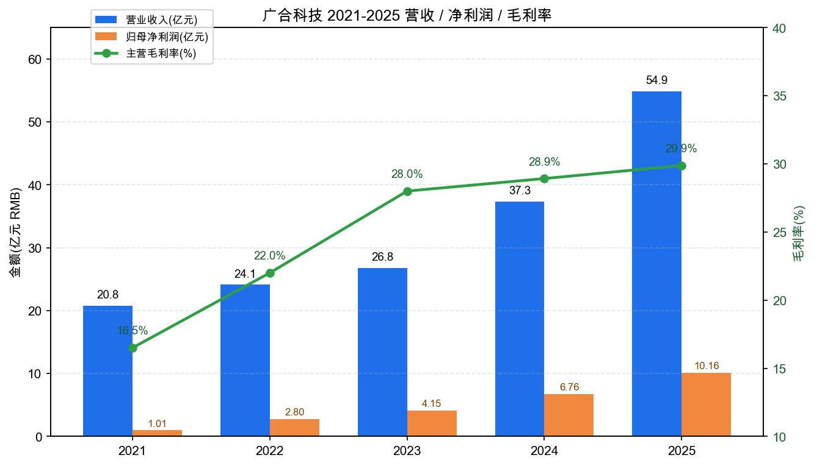
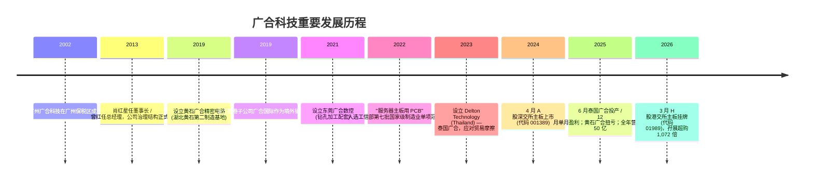
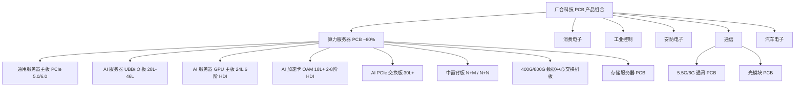
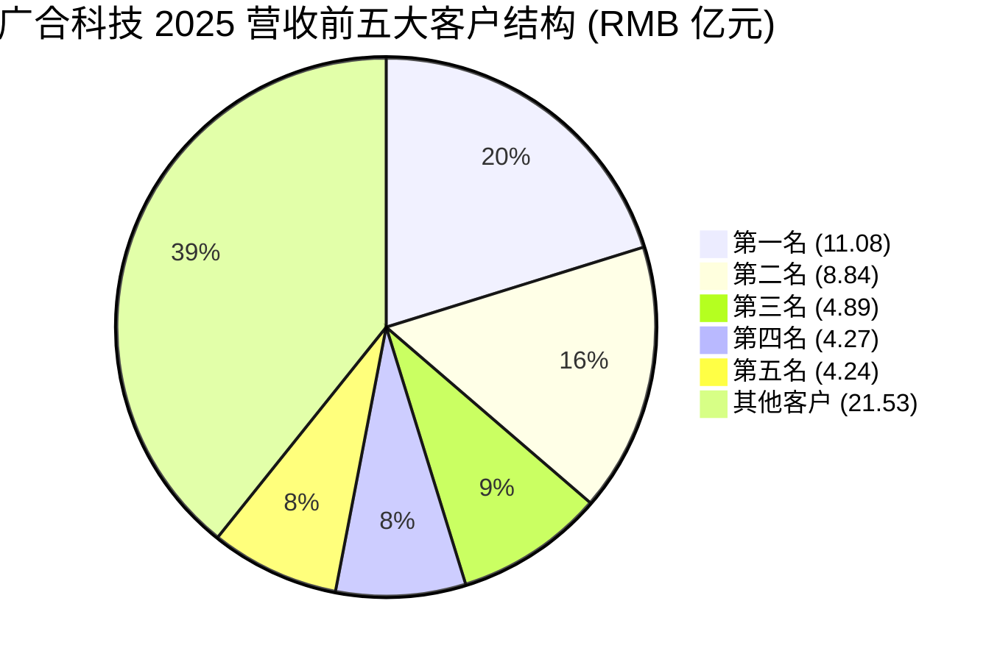
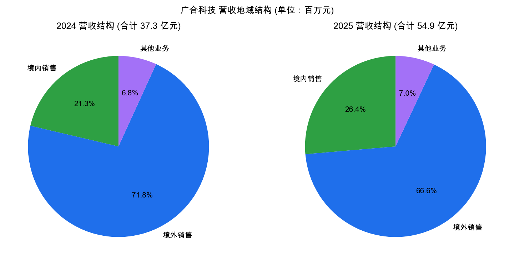
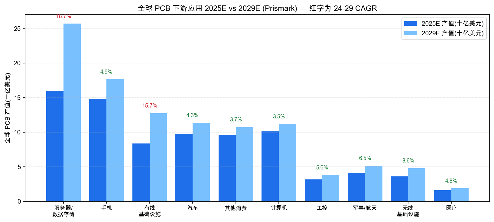
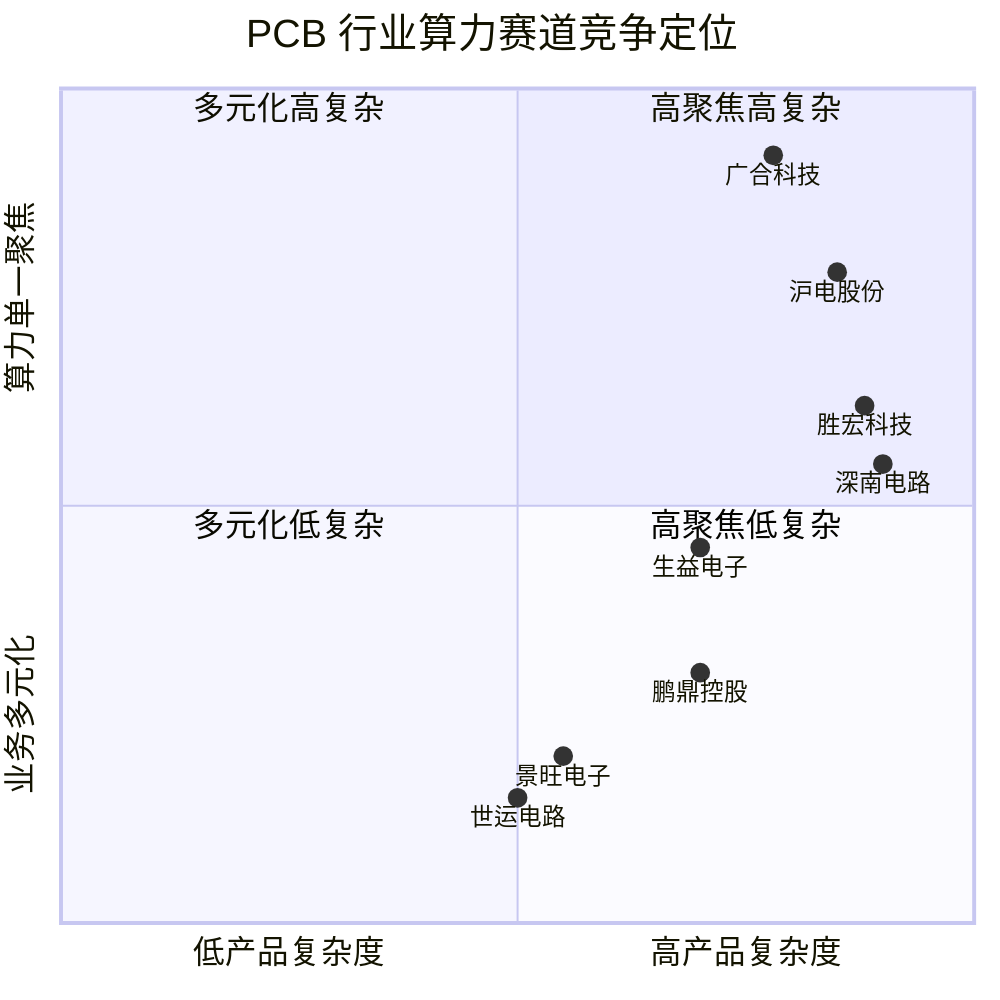
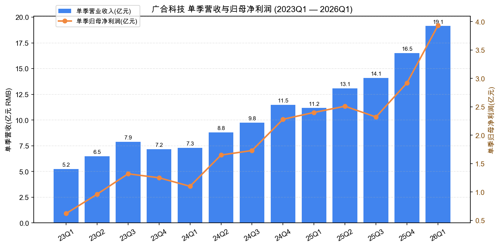

# 广合科技 (Delton Technology) 公司研究报告

- **A股代码：** SZSE:001389
- **H股代码：** HKEX:01989
- **法定名称：** 广州广合科技股份有限公司 (Delton Technology (Guangzhou) Inc.)
- **报告日期：** 2026-05-20
- **行业：** 印制电路板 (PCB) / 电子元器件
- **细分赛道：** 算力服务器用多高层 PCB / HDI 加速卡 / AI 服务器 UBB / OAM

> **Update — 2026 Q1 业绩同向大幅上升 (2026-04-09 业绩预告 → 2026-04-29 季报披露)：** 公司将 2026 Q1 归母净利润区间预计为 RMB 3.80–4.00 亿元，同比增长 58.09%–66.41%；实际披露 Q1 营收 19.14 亿元(同比 +71.35%)、归母净利润 3.93 亿元(同比 +63.31%)、扣非净利润 3.91 亿元(同比 +67.88%)，主要驱动为 AI 算力需求持续向上、泰国广合一期完成核心客户认证并放量、黄石广合产品结构优化盈利能力同比显著提升。Source: [2026 年第一季度业绩预告, 2026-04-09](https://static.cninfo.com.cn/finalpage/2026-04-09/1225084719.PDF)；[2026 年第一季度报告, 2026-04-29](https://static.cninfo.com.cn/finalpage/2026-04-30/1225253814.PDF)。

---

## 目录

1. 公司概览
2. 公司历史
3. 管理团队
4. 产品与服务
5. 客户与上市策略
6. 行业概览
7. 竞争格局
8. 市场机会 (TAM)
9. 风险评估
10. 参考资料

---

## 1. 公司概览

广州广合科技股份有限公司 (以下简称"广合科技"或"公司") 成立于 2002 年 6 月，是一家专注于**多高层印制电路板 (PCB) 研发、生产与销售**的中高端 PCB 制造商，总部位于广州保税区。公司是国内极少数以**算力服务器 (server) PCB 为绝对主航道**的上市企业 —— 2025 年 PCB 主营业务中**服务器用 PCB 收入占比约八成**，下游覆盖高性能计算 (HPC) 服务器、AI 运算服务器、存储服务器以及数据中心交换机等核心设备 ([2025 年年度报告, 2026-03-27, 第 12 页](https://static.cninfo.com.cn/finalpage/2026-03-28/1225044663.PDF))。公司 A 股于 2024 年 4 月 2 日在深交所主板挂牌 (代码 001389)；2026 年 3 月 20 日完成 H 股二次上市 (代码 01989)，全球发售 4,600 万股 H 股、按上限招股价募集约 33 亿港元 (净额约 31.75 亿港元)，公开发售部分孖展超购 1,072 倍 ([新股消息 | 广合科技结束招股 孖展超购 1,072 倍, 2026-03-17](https://finance.sina.com.cn/stock/hkstock/ggscyd/2026-03-17/doc-inhrhttu3960879.shtml))。

**商业模式与盈利来源。** 广合的盈利模型是典型的 "定制化 B2B 工业品 + 头部客户深度绑定"。PCB 是高度非标的、客户认证周期长 (通常 9–18 个月) 的产品，认证一旦完成切换成本极高。公司通过 JDM (Joint Design Manufacture) 模式，从材料选型、线路设计、工艺设计到良率优化，全程介入客户新一代算力平台的早期开发，由此形成"量产一代、试产一代、研发一代"的迭代节奏 ([2025 年年度报告, 第 14 页](https://static.cninfo.com.cn/finalpage/2026-03-28/1225044663.PDF))。下游客户结构以**全球前十大服务器制造商中的 8 家**为核心 (公司自述)，2025 年前五大客户贡献销售额 33.32 亿元，**占年度营收 60.74%**；其中第一大客户贡献 11.08 亿元 (占比 20.20%)、第二大 8.84 亿元 (16.11%)，集中度高 ([2025 年年度报告, 第 18 页](https://static.cninfo.com.cn/finalpage/2026-03-28/1225044663.PDF))。

**经营规模与财务。** 2025 年公司实现营业收入 **54.85 亿元** (同比 +46.89%)，归母净利润 **10.16 亿元** (同比 +50.24%)，扣非归母净利润 9.88 亿元 (同比 +45.66%)，经营活动现金流净额 10.32 亿元 (同比 +29.55%)，加权 ROE 29.24% (同比提升 3.37 pct)。基本每股收益 2.40 元，董事会拟每 10 股派发现金红利 6.46 元 (含税)。2025 年末总资产 75.42 亿元、归母净资产 39.78 亿元，资产负债率 47.3% ([2025 年年度报告, 第 9 页](https://static.cninfo.com.cn/finalpage/2026-03-28/1225044663.PDF))。

Source: 数据整理自 [广合科技 2021-2025 各年度年报](https://www.cninfo.com.cn/new/disclosure/stock?stockCode=001389)；2025 主营毛利率 29.88% 来自 [2025 年年度报告, 第 17 页](https://static.cninfo.com.cn/finalpage/2026-03-28/1225044663.PDF)。

**地域结构。** 2025 年外销收入 36.56 亿元 (占比 66.64%、毛利率 39.03%)，内销 14.46 亿元 (26.37%、毛利率 6.75%) ——外销毛利率比内销高出 32 个百分点，主要原因是外销以服务器/AI 算力大客户为主、产品规格更高，内销中含工业控制、消费电子等中低端订单。外销以美元结算，公司持续开展远期结售汇套保 ([2025 年年度报告, 第 17、25 页](https://static.cninfo.com.cn/finalpage/2026-03-28/1225044663.PDF))。

**员工与产能基地。** 截至 2025 年末公司研发人员 530 人 (同比 +35.55%)、占员工总数 10.60%。生产基地包括广州 (主力)、湖北黄石 (黄石广合，2025 年扭亏为盈，全年净利润 9,669 万元)、东莞广合 (钻孔配套)、泰国巴真府 (泰国广合，2025 年 6 月投产、12 月单月盈利；全年实现营收 1.61 亿元、净亏损约 5,711 万元，属于投产爬坡)；公司另设美国子公司 Delton Technology Inc (北美销售前哨) ([2025 年年度报告 主要控股参股公司情况, 第 26-27 页](https://static.cninfo.com.cn/finalpage/2026-03-28/1225044663.PDF))。

**估值快照 (2026-05-25 收盘观察).** 截至 2026-05-25 收盘，001389.SZ 报 RMB 191.00 元，年初至今及近 12 个月强劲上行；过去 12 个月价格区间约 RMB 47.6–197.5 元 (基于交易所日线数据)。按 A 股总股本约 4.67 亿股、当日收盘价计算，A 股口径流通市值约 RMB 290 亿元、A+H 合并总市值约 RMB 902 亿元 ([东方财富 — 广合科技数据中心](https://data.eastmoney.com/stockdata/001389.html)；[腾讯证券 sz001389](https://gu.qq.com/sz001389))。基于 2025 EPS 2.40 元、收盘价 191 元计算的 **静态 P/E ≈ 80×**；以 2026 Q1 实际归母净利润 3.93 亿线性年化 ~15.7 亿测算的 **前瞻 P/E ≈ 57×**，**前瞻 P/S ≈ 16×** — *分析师观点：估值水平显著高于历史中位，对增长持续性高度依赖*。

> **多 valuation 解读 (*分析师观点*)：** 当前估值显著高于 PCB 行业历史中位 (申万 PCB 子行业历史 TTM P/E 中位约 25–30×)，但与 AI 算力 PCB 头部公司可比，如沪电股份、胜宏科技、深南电路 2025–2026 估值中枢同样处于偏高区间。这种 "AI 算力溢价" 反映：(a) 服务器/数据存储 PCB 细分 2025 增速 46.3%、2024-2029 CAGR 18.7%，远超 PCB 整体 8.2% ([Prismark 2025 Q4 报告, 引自 2025 年年报第 13 页](https://static.cninfo.com.cn/finalpage/2026-03-28/1225044663.PDF))；(b) 公司明确"算力 PCB 主航道"定位，工信部"制造业单项冠军产品" (服务器主板用 PCB) 认定 ([2025 年年度报告, 第 12 页](https://static.cninfo.com.cn/finalpage/2026-03-28/1225044663.PDF))；(c) 港股二次上市后流动性溢价 + 泰国基地放量带来的边际利润弹性。**对增长持续性的依赖度极高 — 任何一个季度低于 30% 增速都可能引发估值回归至行业中位**，详见 Section 9 风险评估。

---

## 2. 公司历史

广合科技的故事，是一对 80 年代生益电子员工夫妇的二次创业史。董事长**肖红星**(1967 年生，华南理工化学专业本科) 与妻子**刘锦婵**最早均在东莞生益电子有限公司任职 (生益电子是国内 PCB/覆铜板龙头生益科技的子公司)。1992 年前后，肖红星离开生益自主创业，先后设立东莞道滘广华电子材料经营部、东莞市盛华电路板辅助材料有限公司、东莞秀博电子材料有限公司等一系列"广华系" PCB 化学品配套企业；2010 年又设立湖北优尼科光电技术从事液晶面板加工 ([2025 年年度报告, 第 41 页](https://static.cninfo.com.cn/finalpage/2026-03-28/1225044663.PDF))。

2002 年 6 月，肖红星家族在广州保税区成立广合科技 (Delton)，从 PCB 化学品配套切入 PCB 制造本身。2013 年 2–3 月，肖红星出任董事长、原生益电子副总经理**曾红** (1966 年生、华南理工应用化学本科) 出任董事兼总经理 — 这是公司从家族作坊向规范化运作转型的关键年份 ([2025 年年度报告, 第 41–42 页](https://static.cninfo.com.cn/finalpage/2026-03-28/1225044663.PDF))。

**关键战略转折点：**

1. **2013 年家族转专业化经营。** 创始夫妇双双进入华南理工校友圈管理层，引入正规研究院与 ERP/MES，开始 PCB 高速领域定向研发 — 这是公司从中低端化学品向高端 PCB 制造转型的真正起点。
2. **2019 年湖北黄石基地落地。** 通过黄石广合精密电路实现产能复制、获得长江证券、黄石国资等股东参股，为后续 IPO 储备产能与资本路径 ([2025 年年度报告, 第 26 页](https://static.cninfo.com.cn/finalpage/2026-03-28/1225044663.PDF))。
3. **2022 年单项冠军 + 服务器 PCB All-in 战略。** 公司明确"算力 PCB 主航道"战略，砍除非核心订单，将研发、产能、客户资源全部向服务器 (尤其是 AI 服务器) 集中。当年获得工信部第七批"制造业单项冠军产品"认定，奠定了机构投资者认知中"国内服务器 PCB 第一标的"的品牌定位 ([2025 年年度报告, 第 12 页](https://static.cninfo.com.cn/finalpage/2026-03-28/1225044663.PDF))。
4. **2023–2024 泰国基地建设 + A 股上市。** 在中美贸易摩擦升级、戴尔等海外客户要求供应商在中国大陆以外建立第二生产基地的压力下，公司选择泰国巴真府金池工业区作为出海首站。2023 年 5 月设立泰国广合，2024 年 4 月 A 股 IPO 募资同步推进。这一组合让公司同时获得了"产能国际化 + 资本国际化"的双保险。
5. **2026 年 3 月 A+H 双重上市。** 公司 H 股全球发售 4,600 万股、募集资金净额约 31.75 亿港元，根据招股书披露，**约 52.1% 用于扩建升级广州基地、约 19.7% 用于泰国二期、其余用于研发与一般营运资金** ([港股 IPO 招股资料 — 国泰君安证券 (香港), 2026-03-12](https://www.gtjai.com/upload/UploadFiles/2026/03/12/a208590c4718420f82a9df6db2b5dab9.pdf))。H 股发行同步将公司纳入港股通名单，扩大了境内外机构持仓基础 ([深交所：广合科技调入港股通名单, 2026-03-20](https://finance.sina.com.cn/stock/hkstock/ggscyd/2026-03-20/doc-inhrqtyz8194827.shtml))。

最近 12 个月主要事件：(a) 港股 IPO 完成、IPO 募集资金 RMB 30 亿+ 到账，使 2026 Q1 末货币资金增加至 33.3 亿元 (期初 5.2 亿元)；(b) 泰国广合一期完成核心客户认证、12 月单月盈利、回收期仅 6 个月；(c) 广州"云擎智造基地"开工，计划 2026 年底通产，承接 PCIe 6.0/7.0 高端订单；(d) 2025 年实施新一轮员工股权激励，对应当年股份支付费用使管理费用同比 +60% ([2025 年年度报告, 第 19 页](https://static.cninfo.com.cn/finalpage/2026-03-28/1225044663.PDF))。

---

## 3. 管理团队

### 3.1 董事长：肖红星

肖红星 (1967 年 4 月生，中国国籍、华南理工大学化学专业本科) 是公司创始人、控股股东与实际控制人。他与妻子刘锦婵通过广州臻蕴投资 (肖、刘各持 99.90% / 0.10%)、深圳广生投资、深圳广财投资三家平台间接合计控制公司表决权约 50%+，构成稳固的"夫妻档"实控结构 ([2026 年第一季度报告, 第 4 页](https://static.cninfo.com.cn/finalpage/2026-04-30/1225253814.PDF))。

肖的职业起点是 1988 年加入东莞生益电子任生产经理，与生益电子的渊源也直接塑造了广合的两个核心特征：**(a) PCB 制造工艺的工程师文化** — 公司高管和研发骨干来自生益体系 (副总经理王峻、副总经理兼总工程师黎钦源、研究院总监彭镜辉均出身生益电子)；**(b) 化学品-PCB 一体化思维** — 肖早期"广华系"做的就是 PCB 用电子化学品 (覆铜板辅助材料、电子化学品)，这种从原料/化学反应角度理解 PCB 的视角，是公司在阻抗控制、深微孔电镀、背钻 D+4 等核心工艺上能持续突破的底层原因。

从 2013 年至今，肖红星已经在广合科技董事长一职上任职 13 年 (兼任黄石广合执行董事、东莞广合执行董事兼总经理、泰国广合董事)，是典型的"创始人 + 长期 CEO/Chairman"角色。公司股权激励、ESG 战略、双碳目标的顶层设计 (如《广合科技集团碳管理程序》)、以及对算力 PCB 主航道战略的坚定性，均强烈反映他的个人风格 ([2025 年年度报告, 第 15、41 页](https://static.cninfo.com.cn/finalpage/2026-03-28/1225044663.PDF))。一个值得关注的治理特征：**董事长与总经理由夫妻分别担任**，理论上构成关联方风险，但截至 2025 年报无任何重大关联交易、资金占用或非经营性担保事项被披露。

### 3.2 总经理：曾红

曾红 (1966 年 12 月生、华南理工大学应用化学本科、电子技术高级工程师) 是公司日常运营的"操盘手"。她 1988–2013 年在东莞生益电子任职 25 年，历任品质经理、副厂长、副总经理，对 PCB 制造的工艺、品质、生产体系有深度积累。2013 年 2 月加入广合至今担任董事兼总经理，行业地位包括：中国电子电路行业协会 (CPCA) 第八届理事会副理事长、CPCA 科技委副会长、全国印制电路标准化技术委员会委员、广东省电路板行业协会理事会副会长 ([2025 年年度报告, 第 41 页](https://static.cninfo.com.cn/finalpage/2026-03-28/1225044663.PDF))。这些行业职务意味着她在 PCB 国家/广东省标准制定、行业政策对话、上下游供应链协调中拥有较高的话语权 — 对一家深耕高端服务器 PCB 的企业而言，这是一项软性的竞争壁垒。

### 3.3 其他高级管理人员

- **黎钦源 (副总经理、总工程师)。** 1973 年生、华南理工化学工程本科、高级工程师。1996–2012 年在东莞生益电子任技术线 16 年 (主任工程师 → 经理 → 高级经理)；2012 年短暂任广州杰赛科技技术总监；2013 年 1 月加入广合，是公司技术研发体系的核心人物，主导高速 PCB、HDI、深微孔电镀等核心工艺攻关 ([2025 年年度报告, 第 43 页](https://static.cninfo.com.cn/finalpage/2026-03-28/1225044663.PDF))。
- **王峻 (副总经理)。** 1973 年生、工商管理本科。1992–2013 年在东莞生益电子任品质技术员 → 品质总监；2013 年 2 月加入广合，主管品质体系。
- **曾杨清 (副总经理、董事会秘书)。** 1977 年生、中国计量大学自动检测专业本科；具有 A 股资本市场经历 (历任广东博信、佛山星期六、梅花伞业等的董秘/投资总监)，2017 年 3 月加入广合，主导 A 股与 H 股两次 IPO 的市场对接工作。
- **贺剑青 (财务总监)。** 1975 年生、福建师范大学财务管理本科，财务体系出身。
- **施凌 (独立董事)。** 2025 年 5 月新任独董，是公司董事会中含金量最高的学术背景：港科大电子及计算机工程系教授、IEEE Fellow (2023)、香港青年科学院院士、加州理工博士、研究方向涵盖信息物理系统、传感器融合、强化学习、AI 与网络化控制 — 该任命强烈信号了公司向 AI 算力深度延伸的战略意图 ([2025 年年度报告, 第 42 页](https://static.cninfo.com.cn/finalpage/2026-03-28/1225044663.PDF))。

### 3.4 治理与所有权结构

- **董事会构成：** 7 名董事，其中独立董事 3 名 (陈丽梅、李莹、施凌)、职工董事 1 名 (彭镜辉)、关联董事 3 名 (肖红星、曾红、刘锦婵)。
- **2025 年董事/高管变动：** 副总经理陈炯辉、管术春分别于 2025 年 5 月 30 日、8 月 6 日因"工作调整"离任。两位前副总经理在同一年内离任值得关注，但年报未披露任何重大违规。
- **股权激励：** 2025 年实施新一轮股权激励，确认股份支付费用导致管理费用同比 +60.34% ([2025 年年度报告, 第 19 页](https://static.cninfo.com.cn/finalpage/2026-03-28/1225044663.PDF))。
- **十大股东：** 广州臻蕴投资 (肖、刘夫妇) 36.22%、HKSCC NOMINEES (H 股) 9.74%、深圳广谐 9.15%、深圳广财 6.10%、深圳广生 6.10% — 实控人合计权益约 53–55%，控股股东地位牢固 ([2026 年第一季度报告, 第 4 页](https://static.cninfo.com.cn/finalpage/2026-04-30/1225253814.PDF))。
- **会计师事务所：** 容诚会计师事务所 (特殊普通合伙)，2025 年报审计意见类型为标准无保留 (在年报正文未见任何强调事项段)；保荐机构国联民生证券持续督导至 2026-12-31。

### 3.5 管理团队整体评价

广合科技管理团队呈现明显的"生益系工程师军团 + 创始人家族治理"特征。优点：技术线 (生益体系)、运营线 (家族控股、长期任职) 都极为稳定，过去 13 年没有出现重大战略漂移，从家族化学品配套作坊到"算力 PCB 单项冠军" 的执行力，反映出团队在工艺研发、产能扩张、客户认证三条主线上的高效协同。缺点/关注点：(1) 夫妻档实控 + 弟兄姐妹型治理的关联方风险长期存在；(2) 总经理曾红、副总经理王峻、黎钦源年龄均接近 60 岁，**中长期接班人计划尚未公开披露**，是治理结构中的一个隐性问题；(3) 2025 年两位副总同年离职、原因仅披露"工作调整"，透明度不足。

---

## 4. 产品与服务

广合科技的产品线极度聚焦：**98%+ 的主营业务是印制电路板 (PCB)** 这一单一品类，其他业务 (主要是 PCB 销售配套服务、废料销售等) 仅占 6.99%。这种"单一产品 × 多客户 × 多代次"的产品组合在 PCB 行业中并不少见，因为 PCB 本质上是高度定制化的工业品 — 公司的"产品"实际上是面向不同客户、不同代次芯片平台、不同应用场景的**工艺能力组合**。

### 4.1 算力服务器 PCB — 公司绝对主航道 (~80% 收入)

按 2025 年报披露，**服务器用 PCB 收入占公司主营约 80%**，这一比例从 2023 年的"约七成"持续提升至 2025 年的"约八成" ([2023 年年度报告, 第 13 页](https://static.cninfo.com.cn/finalpage/2024-04-29/1219873939.PDF)；[2025 年年度报告, 第 12 页](https://static.cninfo.com.cn/finalpage/2026-03-28/1225044663.PDF))。具体产品矩阵在 2025 年完成了以下重大量产/认证里程碑：

- **通用服务器侧：** 完成 PCIe 6.0 平台的转批量能力；
- **AI 服务器侧：** 完成 PCIe 交换板 (30L+ 即 30 层以上)、UBB / IO 板 (28L-46L)、OAM 加速卡板 (18L+，2 阶-8 阶 HDI)、GPU 主板 (24L，6 阶 HDI)、中置背板 (N+M / N+N 技术) 等一系列高端产品的工艺能力认证；
- **数据中心交换机侧：** 完成 400G & 800G 交换机板量产 ([2025 年年度报告, 第 16 页](https://static.cninfo.com.cn/finalpage/2026-03-28/1225044663.PDF))。

**竞争优势评估 (服务器 PCB)：是 (强护城河)。** 护城河类型属于**技术 / 客户认证 / 规模复合型**：
- 技术端：公司在多孔对准度、6mm 厚板钻孔、30:1 高厚径比电镀、背钻 D+4 stub 控制、PAM4 信号链路仿真等关键工艺取得突破。"AI 服务器超高阶高多层复合基板项目"获中国电子学会 2025 科技进步奖三等奖；"用于 HPC 的大 BGA 服务器主板"获 2025 广东省高新技术协会科技进步奖二等奖 ([2025 年年度报告, 第 12 页](https://static.cninfo.com.cn/finalpage/2026-03-28/1225044663.PDF))。
- 客户端：与全球前十大服务器制造商中的 8 家建立稳固合作，认证周期 9–18 个月构成天然壁垒；多次获得"年度优秀供应商"、"最佳供应商"等奖项。
- 评据：工信部"制造业单项冠军产品" (服务器主板用 PCB) 认定；2025 年服务器/数据存储 PCB 在全球 PCB 应用结构中是增速最快 (46.3%)、规模将达 159.75 亿美元的细分赛道，公司是国内唯一 80% 收入直接对标该赛道的纯算力 PCB 标的。
- 最接近的竞品：胜宏科技 (英伟达 GPU 卡 PCB)、沪电股份 (78 层 GB200/GB300 背板)、深南电路 (HDI 与 IC 载板兼有)、鹏鼎控股 (AI 服务器板良率领先) — 广合在 18-46L AI 服务器 UBB/IO 板、GPU 主板、OAM 加速卡板与上述同行**基本处于同一技术代次** ([山西证券《广合科技国内领先的服务器 PCB 厂商》, 2024-09-12](https://aigc.idigital.com.cn/djyanbao/%E3%80%90%E5%B1%B1%E8%A5%BF%E8%AF%81%E5%88%B8%E3%80%91%E5%9B%BD%E5%86%85%E9%A2%86%E5%85%88%E7%9A%84%E6%9C%8D%E5%8A%A1%E5%99%A8PCB%E5%8E%82%E5%95%86%EF%BC%8C%E2%80%9CAI%E6%B5%AA%E6%BD%AE+%E6%96%B0%E5%B7%A5%E5%8E%82%E2%80%9D%E5%BC%80%E8%BE%9F%E4%B8%9A%E7%BB%A9%E6%96%B0%E5%8A%A8%E8%83%BD-2024-09-12.pdf))。

### 4.2 非服务器应用 (~20%)

公司在消费电子、工业控制、安防电子、通信 (含 5.5G/6G、光模块)、汽车电子等领域亦有出货，但这些应用毛利率显著低于服务器 PCB、缺乏单一大客户、且公司战略上明确"聚焦算力主航道、横向拓宽业务范围降低细分市场波动"。**非服务器板块在公司中的角色更多是产能调节、客户多元化的"压舱石"**，不构成主要利润贡献。

**竞争优势评估 (非服务器板块)：部分 (中等护城河)。** 公司在汽车电子、5G 通讯板、光模块板等细分上**未进入第一梯队** (汽车板第一梯队是世运电路、生益电子、景旺电子；光模块 PCB 第一梯队是沪电股份、生益科技、深南电路)，竞争主要靠通用 PCB 产能与价格。

### 4.3 旗舰产品 (Flagship)

最能代表公司价值的 3 个旗舰产品：
1. **AI 服务器 UBB/IO 板 (28-46 层)** — 对应英伟达 H100/B200 平台、AMD MI300 平台一类的 AI 服务器主板；
2. **AI 加速卡 OAM 板 (18L+，2-8 阶 HDI)** — 对应 OAM 标准的 GPU/AI 加速卡，是产业向超高阶 HDI 迁移的核心载体；
3. **400G/800G 数据中心交换机 PCB** — 对应英伟达 Spectrum-X、博通 Tomahawk 5 等下一代数据中心交换芯片。

### 4.4 近 12 个月新品 / 路线图

2025 年公司新立项研发项目包括：基于 AI 应用的高阶 HDI 加速服务器卡板、HPC 用大 BGA 服务器主板、AI 高速交换背板、背钻 D+6/D+4 对准度控制、GPU OAM 多阶 HDI 产品、机器学习高精度阻抗控制、5% 阻抗设计与控制、深微孔电镀、PAM4 信号链路仿真、AI 服务器大 BGA 阶梯金手指 PCB 等 ([2025 年年度报告, 第 19–20 页](https://static.cninfo.com.cn/finalpage/2026-03-28/1225044663.PDF))。公司展望中明确未来将围绕 **PCIe 6.0/7.0/8.0 服务器、AI 服务器、高阶 HDI、112G/224G/448G 交换机、5.5G/6G 通讯、光模块、自动驾驶、高清显示、新能源**等领域组织研发 — 这是一份非常激进、面向 2026–2030 的技术路线图，对应 PCB 行业最高端的多个细分。

---

## 5. 客户与上市策略

### 5.1 客户结构与集中度

广合科技披露的客户集中度数据如下 ([2025 年年度报告, 第 18 页](https://static.cninfo.com.cn/finalpage/2026-03-28/1225044663.PDF))：

| 年度 | 第一大客户占比 | 前五大客户合计占比 |
|---|---|---|
| 2024 | 24.61% (9.19 亿元) | 61.38% (22.92 亿元) |
| 2025 | 20.20% (11.08 亿元) | 60.74% (33.32 亿元) |

Source: [2025 年年度报告, 第 18 页](https://static.cninfo.com.cn/finalpage/2026-03-28/1225044663.PDF) — 第一名销售额 11.08 亿、占 20.20%；前五合计 33.32 亿、占 60.74%；其他客户金额 = 主营 PCB 收入 51.02 亿 - 前五 33.32 亿 + 其他业务 3.83 亿 ≈ 21.53 亿。

**客户名单：** 公司年报中按惯例**不直接披露具体客户名称**，仅以"第一名 / 第二名"代指。但综合公司公开调研纪要、三方研报、IPO 招股书等可信来源，**主要客户包括戴尔 (Dell)、浪潮信息、富士康 (鸿海)、广达电脑 (Quanta)、捷普 (Jabil)、英业达 (Inventec)、霍尼韦尔、惠普 (HP)、天弘 (Celestica)、伟创力 (Flex)、华为、联想、中兴**；并已成为 Amazon、Meta 及国内头部云厂商的二级以上供应商 ([东北证券：广合科技前瞻布局服务器 PCB，顺 AI 东风迎新发展新浪潮, 2024](https://www.sdyanbao.com/detail/842065)；[山西证券新股研究, 2024-09-12](https://aigc.idigital.com.cn/djyanbao/%E3%80%90%E5%B1%B1%E8%A5%BF%E8%AF%81%E5%88%B8%E3%80%91%E5%9B%BD%E5%86%85%E9%A2%86%E5%85%88%E7%9A%84%E6%9C%8D%E5%8A%A1%E5%99%A8PCB%E5%8E%82%E5%95%86%EF%BC%8C%E2%80%9CAI%E6%B5%AA%E6%BD%AE+%E6%96%B0%E5%B7%A5%E5%8E%82%E2%80%9D%E5%BC%80%E8%BE%9F%E4%B8%9A%E7%BB%A9%E6%96%B0%E5%8A%A8%E8%83%BD-2024-09-12.pdf))。

**集中度评价：** 前五客户占比 60.74%、第一大客户 20.20%、第二大 16.11%，**总体集中度高、但单一客户依赖度尚未到达系统性危险阈值** (第一客户超过 30% 通常是危险线)。值得注意的是 — 2024 年第一大客户占比 24.61%，2025 年降至 20.20%，这是绝对营收持续增长 (从 9.19 亿增长至 11.08 亿) 但**相对依赖度被新进入的客户摊薄**的健康信号。考虑到 PCB 行业客户认证切换成本极高、且公司服务于戴尔等头部客户已多年，整体客户粘性可以认为是**较高的**。然而由于公司未披露多年明确客户结构、且大客户多为 EMS / ODM 厂商 (终端是云厂商的资本开支)，**真正的下游风险不是公司被某个 ODM 客户切换，而是云厂商资本开支放缓时整个 EMS 链一起承压**，详见 Section 9。

### 5.2 销售模式与地域分布

- **销售模式：** 直销为主 (2025 年 97.61%、49.71 亿元) + 非直销 (2.39%、1.31 亿元)。直销毛利率 30.49%、非直销毛利率仅 6.68% — 公司客户结构已基本去掉中间商，直接对接 ODM/EMS 厂商。
- **地域：** 2025 年境外销售 36.56 亿元 (66.64%) + 境内 14.46 亿元 (26.37%) + 其他业务 3.83 亿元 (6.99%)。

Source: [2025 年年度报告, 第 17 页](https://static.cninfo.com.cn/finalpage/2026-03-28/1225044663.PDF) (2024 与 2025 主营业务收入构成表)。

值得指出的是境内销售 2025 年同比 +81.56%，远高于境外 +36.26%。这一现象与中国国产算力替代、阿里/腾讯/字节/华为云的资本开支扩张直接相关 — 公司正在受益于"全球 AI 算力 + 中国国产替代"双驱动。

### 5.3 上市策略与资本运作

公司在 24 个月内完成了 A 股主板 (2024 年 4 月) + 港股主板 (2026 年 3 月) 的双重上市，这在 PCB 行业极为罕见。三个战略意图：(a) 满足海外大客户对"全球资本市场可见性 + 多基地产能"的合规要求；(b) 把人民币定增募资 (A 股) 与港币融资 (H 股) 结合，对冲外汇与监管波动；(c) H 股募资 32 亿港元定向投向"广州基地升级 52.1% + 泰国二期 19.7%"，资本配置方向极清晰，没有跨界并购冲动。

---

## 6. 行业概览

### 6.1 行业定义

印制电路板 (Printed Circuit Board，PCB) 是组装电子零件用的基板，承担电子元器件的互连导通功能，被誉为"电子产品之母"。按层数与工艺分为：单/双面板、多层板 (含高多层 8L+)、HDI (高密度互连)、软板 (FPC)、刚挠结合板、封装基板 (IC Substrate) 等。广合科技聚焦于**多高层板** (8 层以上) 与**高阶 HDI** 两个细分。按 SIC/NAICS 分类，公司属于"电子元器件及电子专用材料制造"，下游覆盖计算机/服务器、通信、汽车电子、消费电子、工业控制等。

### 6.2 全球 PCB 市场结构与规模

据 Prismark 2025 年 Q4 报告 (公司年报转引)：

| 维度 | 2023 (亿美元) | 2024 (亿美元) | 2025E (亿美元) | 2025 增长率 | 2029E (亿美元) | 24-29 CAGR |
|---|---|---|---|---|---|---|
| **全球 PCB 总产值** | 695.17 | 735.65 | **848.91** | +15.4% | **1,091.58** | +8.2% |
| 中国大陆 | 377.94 | 412.13 | 493.54 | +19.8% | 620.26 | +8.5% |
| 亚洲 (除中、日) | 207.10 | 213.81 | 237.37 | +11.0% | 326.98 | +8.9% |
| 日本 | 60.78 | 58.40 | 61.66 | +5.6% | 79.18 | +6.3% |
| 美洲 | 32.06 | 34.93 | 37.91 | +8.5% | 44.76 | +5.1% |
| 欧洲 | 17.28 | 16.38 | 18.43 | +12.5% | 20.40 | +4.5% |

Source: [Prismark 2025 Q4 报告，引自 2025 年年度报告, 第 13 页](https://static.cninfo.com.cn/finalpage/2026-03-28/1225044663.PDF)。

全球 PCB 市场 2024-2029 CAGR 约 **8.2%**，2029 年突破 1,000 亿美元；中国大陆贡献全球过半产值 (>50%)。东南亚 (越南、泰国) 是 PCB 产能向 ASEAN 转移的核心承接地、CAGR 高达 8.9%。

### 6.3 按下游应用的结构性分化

Source: [Prismark 2025 Q4 报告，引自 2025 年年度报告, 第 13 页](https://static.cninfo.com.cn/finalpage/2026-03-28/1225044663.PDF)。红字为 2024–2029 CAGR。

**关键观察：服务器/数据存储是全球 PCB 行业增长最确定、增速最高的细分**：
- 2025 年市场规模 159.75 亿美元、同比 +46.3%；
- 2024–2029 CAGR 18.7% — 是 PCB 总盘子 8.2% 增速的 2.3 倍；
- 2029 年规模将达 257.29 亿美元，占全球 PCB 产值约 23.6%。

其他高增速细分：**有线基础设施** (含交换机/路由器 PCB)，2025 年增长 36.3%、24–29 CAGR 15.7%；**无线基础设施** (含 5G/6G 基站) CAGR 8.6%。低增速/承压细分：手机 (CAGR 4.9%)、其他消费电子 (3.7%)、计算机 (PC) 3.5%、汽车 4.3%。

### 6.4 按产品类型

| 产品类型 | 2024 (亿美元) | 2025E (亿美元) | 2025 增速 | 2029E (亿美元) | 24-29 CAGR |
|---|---|---|---|---|---|
| **HDI** | 125.18 | 157.17 | **+25.6%** | 212.95 | **+11.2%** |
| **封装基板 (Substrate)** | 126.02 | 147.27 | **+16.9%** | 200.86 | **+9.8%** |
| **高多层板** | 279.94 | 330.91 | +18.2% | 431.06 | +9.0% |
| 软板 (FPC) | 125.04 | 129.66 | +3.7% | 151.44 | +3.9% |
| 其他 (单/双面、刚挠) | 79.47 | 83.90 | +5.6% | 96.27 | +3.9% |

Source: [Prismark 2025 Q4 报告，引自 2025 年年度报告, 第 14 页](https://static.cninfo.com.cn/finalpage/2026-03-28/1225044663.PDF)。

**HDI 与高多层板是 2025–2029 增速最高的两个产品类型，恰恰是广合科技的核心产品线** — 公司直接受益于这两个 sub-segment 的双位数增长。

### 6.5 监管环境

PCB 制造涉及电镀、化学药剂、固废处置、能耗，受环保法规约束较强。在中国大陆，主要监管包括《电子工业污染物排放标准》、广东"双碳"目标、湖北黄石的工业园环保要求等。公司年报披露其已获评"国家级绿色工厂"、"省级节水标杆企业"、"无废工厂"，并建立了《广合科技集团碳管理程序》 ([2025 年年度报告, 第 15 页](https://static.cninfo.com.cn/finalpage/2026-03-28/1225044663.PDF))。

地缘政治方面，美国对中国大陆 PCB 出口主要通过对最终客户 (戴尔、HP、Supermicro) 的供应链合规要求传导 — 这是公司选择泰国建厂的核心驱动。

### 6.6 行业动态

- **供需端：** 高端 HDI、超高多层板、超高速材料 (M8/M9/M11 级别) 长期处于结构性供不应求；上游 CCL (覆铜板)、铜箔、玻璃布也呈紧张态势 — 这种产业链紧张状态推动头部 PCB 厂获得议价权，毛利率扩张。
- **客户行为：** 头部云厂商和 ODM 正将订单向"技术领先 + 交付可靠 + 协同创新"三位一体的战略伙伴集中、深度绑定式的"共生关系"取代简单买卖；这对头部 PCB 厂是利好。
- **行业整合：** PCB 行业仍较分散 (CR10 约 35–40%)，但高端服务器 PCB 实际 CR5 已超过 70%，呈现"整体分散、高端集中"格局。

---

## 7. 竞争格局

### 7.1 主要竞争对手

**直接竞争对手 (国内 A 股 / 港股 / 海外，按 AI 服务器 PCB 相关性排序)：**

| 公司 | 代码 | 2024 / 2025 营收 (亿元) | 算力 PCB 定位 | 主要客户/差异化 |
|---|---|---|---|---|
| **沪电股份** | SH:002463 | 2025E ~150 | AI 服务器/数据中心交换机 PCB 国内龙头；GB200/GB300 78L 背板核心供应商 | 英伟达、博通、富士康 |
| **胜宏科技** | SZ:300476 | 2025E ~140 | 全球 AI 服务器 PCB 出货龙头；英伟达 GPU 卡 PCB 市占率 >40% | 英伟达 Rubin 正交背板核心供应商 |
| **深南电路** | SZ:002916 | 2025E ~190 | PCB + 封装基板 (IC Substrate) 双轮驱动；高阶 HDI 与 IC 载板并重 | 华为、英伟达、AWS |
| **鹏鼎控股** | SZ:002938 | 2025E ~360 | 全球 PCB 营收第一 (富士康系)、消费电子 FPC 主力；近年布局 AI 服务器板 | 苹果、英伟达、AMD |
| **广合科技** | SZ:001389 / HKEX:01989 | 2025 = 54.85 | 国内服务器 PCB 单项冠军，~80% 收入来自算力 | 戴尔、浪潮、富士康、广达 |
| **生益电子** | SH:688183 | 2025E ~70 | 高频高速通信板 + 服务器 PCB；广合的"亲家"企业 | 华为、思科 |
| **景旺电子** | SH:603228 | 2025E ~140 | 综合性 PCB；汽车、消费、5G、服务器多业务 | 比亚迪、台积电 |
| **世运电路** | SH:603920 | 2025E ~80 | 汽车 PCB 龙头；服务器 PCB 起步阶段 | 特斯拉、宁德时代 |
| **Unimicron 欣兴电子** | TWSE:3037 | 2025E ~600 (TWD) | 全球封装基板巨头、AMD/英特尔 IC 载板 | AMD、英特尔 |
| **NanYa PCB 南亚电路** | TWSE:8046 | 2025E ~350 (TWD) | 服务器/AI ABF 基板 | 英伟达 ABF 载板 |

Sources: [PCB 企业分析综述, 新浪新闻](https://www.sina.cn/news/detail/5289458322113245.html)；[服务器 PCB 市场排名第一：广合科技能否成为"小而美"企业, 知乎](https://zhuanlan.zhihu.com/p/632197026)；公司年报。

### 7.2 竞争位置 — 2×2 定位框架

**广合在象限中的位置**：算力 PCB 聚焦度最高 (80% 收入 vs. 同行多在 30–60%)、产品复杂度处于 T1 阵营 (46L UBB、8 阶 HDI 已具备量产能力)。**这意味着广合是 AI 算力 PCB 的"纯 beta"标的** — 行业景气时弹性最大、行业景气下行时下行风险也最集中。

### 7.3 广合科技的相对优劣势

**优势：**
1. **算力 PCB 单项冠军认知 + 国家级背书。** 工信部 2022 年制造业单项冠军产品认定，是该细分极少数获得国家级正式背书的企业。
2. **A+H 双重上市 + 港股通。** 流动性溢价 + 海外资金可见性 + 估值锚定全球 AI 算力主题。
3. **泰国基地先发优势。** 中国大陆 PCB 企业中较早完成泰国基地认证 + 量产的标的，对应戴尔、HP 等北美客户的"中国 +1" 战略。
4. **产品代次紧跟前沿。** 30L+ AI PCIe 交换板、18L+ 多阶 HDI OAM 加速卡板、24L 6 阶 HDI GPU 主板、46L UBB/IO 板、400/800G 交换机板均已量产/认证。

**劣势 / 脆弱性：**
1. **绝对营收规模仍偏小。** 2025 年 54.85 亿元 vs. 沪电 150 亿、胜宏 140 亿、鹏鼎 360 亿；规模化议价权、自上而下成本摊销均处于第二梯队。
2. **缺乏 IC 载板 (ABF Substrate) 布局。** 深南电路、欣兴、南亚都已在 ABF 载板赛道布局，广合目前仅以高多层 + HDI 为主，封装基板这条与 AI 加速卡耦合最深的子赛道暂未介入。
3. **客户集中在 EMS/ODM 而非直接云厂商。** 与沪电直接对接英伟达、胜宏对接英伟达不同，广合更多通过 ODM 链路传递；这意味着 EMS 客户的份额波动会直接放大公司业绩波动。
4. **市占率绝对值仍偏低 (*分析师观点*)。** 第三方研报援引的全球算力服务器 PCB 市场份额估算在个位数水平 — 工信部单项冠军认定主要是国内荣誉，全球量级仍有提升空间 ([九方智投：AI 服务器 PCB 龙头广合科技](https://www.9fzt.com/common/2b3a5716faf3c0e2a716216b2471c93a.html))。年报未直接披露公司全球市占率，公司亦未自述"全球第三"。

### 7.4 切换成本与护城河深度

PCB 客户切换成本由"工艺认证 (9-18 个月)"和"良率背书 (产品稳定生产 12-24 个月才被视作合格供应商)"双重锁定。已经进入头部客户 (戴尔、浪潮、富士康等) 合格供应商体系并稳定出货 2+ 年的广合，**短期被替换的概率极低**；但若公司在新一代平台 (例如 GB300、B300、PCIe 7.0) 的开发节奏上落后 1-2 个季度，则可能被同代次的沪电、胜宏抢占新增订单份额。

---

## 8. 市场机会 (TAM)

### 8.1 TAM 测算 (服务器 / 数据存储 PCB)

按 Prismark 数据，2025E 全球服务器 / 数据存储 PCB 产值 **159.75 亿美元** (折合 RMB 约 1,150 亿元) — 这是广合最直接对应的 TAM。
- 2024–2029 CAGR 18.7%、2029E 规模 257.29 亿美元 (约 RMB 1,850 亿元)；
- 中国大陆占全球 PCB 50%+，对应国内服务器 PCB 市场 2025E 约 RMB 600 亿元、2029E 约 RMB 925 亿元。

**SAM (可服务市场，*分析师测算*)：** 公司聚焦于 18L 以上多高层 + HDI 高端服务器 PCB，估算 SAM 约为 TAM 的 60%，即 2025E 全球 ~95 亿美元、约 RMB 690 亿元。底层输入：Prismark 2025 Q4 报告 ([引自 2025 年年报第 13 页](https://static.cninfo.com.cn/finalpage/2026-03-28/1225044663.PDF))。

**SOM (可获取市场份额，*分析师测算*)：** 公司 2025 营收 54.85 亿元、年报披露服务器用 PCB 占主营约 80% ([2025 年年度报告, 第 12 页](https://static.cninfo.com.cn/finalpage/2026-03-28/1225044663.PDF))，对应服务器板收入约 41-43 亿元。以此与 Prismark 2025 全球服务器/数据存储 PCB 159.75 亿美元 (约 RMB 1,150 亿元) 对照，估算公司在全球服务器 PCB TAM 中份额约 3-4%；第三方研报援引的市占率估算亦在个位数水平 ([九方智投，AI 服务器 PCB 龙头广合科技](https://www.9fzt.com/common/2b3a5716faf3c0e2a716216b2471c93a.html)；[东北证券前瞻布局服务器 PCB 研报](https://www.sdyanbao.com/detail/842065))。年报未直接披露公司全球或国内市占率排序。

### 8.2 增长驱动

1. **AI 服务器结构性放量。** 服务器 PCB 中"AI 服务器板单价 (高端 28-46L、含 HDI) 是通用服务器板 (12-16L) 的 5-10 倍"，量价齐升驱动行业 CAGR 18.7%。
2. **PCIe 标准代次升级 (5.0 → 6.0 → 7.0)。** PCIe 6.0/7.0 推动 PCB 工艺向更高速率 (112G/224G PAM4)、更高层数 (24L+)、更小线宽 (≤3 mil) 迁移，行业天花板上移。
3. **数据中心交换机 (400G → 800G → 1.6T) 升级。** 这是公司刚完成 400/800G 量产的细分。
4. **AI 加速卡 OAM 化、多阶 HDI 化。** OAM 加速卡板与英伟达 NVL36/NVL72 平台相关产品向 8 阶 HDI 升级，是公司 2025-2026 主要增长点。
5. **国产替代。** 国内服务器/数据存储 PCB 仍有 30-40% 份额由日韩台 (Ibiden、NanYa、Unimicron) 占据，国产化替代提供持续份额提升空间。

### 8.3 渗透策略

公司渗透策略明确：(a) 工艺纵深 — 在 30:1 高厚径比电镀、224G PAM4、深微孔电镀建立行业标杆；(b) 客户共生 — 设立战略客户专属产能单元、共同开发，与核心客户从交易型转向产能绑定型合作；(c) 产能弹性 — 广州+黄石+泰国三基地布局，2026 启动泰国二期、广州云擎智造基地 2026 年底通产；(d) 人才国际化 — 探索泰国本土化人才培养 ([2025 年年度报告, 第 29 页](https://static.cninfo.com.cn/finalpage/2026-03-28/1225044663.PDF))。

### 8.4 单季度趋势 — TAM 转化的实证

Source: 数据整理自 [广合科技 2023、2024、2025 年报及 2026 年第一季度报告](https://www.cninfo.com.cn/new/disclosure/stock?stockCode=001389)。2023 年各季数据来自 2023 年报第 10 页；2024 年各季来自 2024 年报；2025 年各季来自 2025 年报第 10 页；2026 Q1 来自 2026 第一季度报告。

单季数据显示，2024 Q4 开始公司进入加速通道：单季营收从 2024 Q1 的 7.84 亿增长至 2026 Q1 的 19.14 亿，**两年时间扩张 ~2.4 倍**；单季归母净利润从 2024 Q1 的 1.45 亿增至 2026 Q1 的 3.93 亿，**扩张 ~2.7 倍** — 净利润增速 > 收入增速 > 行业增速，体现公司规模杠杆与产品结构提升的双重红利 ([2024 年年度报告 分季度财务指标](https://static.cninfo.com.cn/finalpage/2025-04-01/1222975342.PDF)；[2025 年年度报告 分季度财务指标, 第 10 页](https://static.cninfo.com.cn/finalpage/2026-03-28/1225044663.PDF)；[2026 年第一季度报告](https://static.cninfo.com.cn/finalpage/2026-04-30/1225253814.PDF))。这是 TAM 假设落地最直接的实证。

---

## 9. 风险评估

### 9.1 公司特定风险 (Company-Specific)

**1) 单一行业暴露 — 算力 PCB 80% 依赖。** 服务器/数据存储 PCB 收入占比已升至 80%，若 AI 算力资本开支周期回落 (如 2026–2027 出现去库存或大客户订单延迟)，公司业绩弹性比同行更大。**缓释：** 公司在 5.5G/6G 通讯、光模块、自动驾驶、新能源等非算力赛道布局研发，但短期收入占比仍小。

**2) 客户集中度高。** 前五客户 60.74%、第一客户 20.20%，且客户多为 EMS/ODM (戴尔、富士康、广达、英业达系)，下游集中度被进一步放大。**缓释：** 客户认证切换成本高、广合在主要客户处获得"年度优秀供应商"等奖项，关系稳定。

**3) 夫妻档实控人 + 家族治理。** 肖红星、刘锦婵夫妇合计控制约 53-55% 表决权，与总经理曾红的关系亦为夫妻档延伸 (曾红曾在生益电子与肖红星共事)，关联方风险与接班问题未充分披露。**缓释：** 报告期未发现重大关联交易、资金占用、违规担保；独立董事三名 (含 2025 年新增 IEEE Fellow 施凌)。

**4) 海外工厂 (泰国广合) 经营风险。** 2025 全年泰国广合营收 1.61 亿、净亏损约 0.57 亿元 (营业利润 -0.69 亿)，处于投产爬坡期 ([2025 年年度报告 主要控股参股公司情况, 第 26-27 页](https://static.cninfo.com.cn/finalpage/2026-03-28/1225044663.PDF))。泰国劳工法、汇率、文化、配套链均与国内差异较大，二期投资 (港股募集资金的 19.7%) 进一步增加敞口。**缓释：** 2025 年 12 月已实现单月盈利、回收期 6 个月、核心客户认证完成。

**5) 副总经理同年离任不透明。** 2025 年 5 月、8 月两位副总经理 (陈炯辉、管术春) 因"工作调整"离任，年报未披露更多细节，需后续年报追踪。

**6) 接班人风险。** 主要高管 (曾红、王峻、黎钦源) 均接近 60 岁，未公开披露中长期接班人计划。

### 9.2 行业 / 市场风险 (Industry-Market)

**7) AI 资本开支周期下行。** 全球云厂商 (AWS、Azure、GCP、Meta、阿里、腾讯) 资本开支若同步回落 (历史上 2019、2022 都出现过 AI/服务器 capex 短期回落)，会通过 ODM 链路传导给广合。**缓释：** Prismark 预测 24–29 服务器/数据存储 PCB CAGR 18.7%，长期需求仍强；但短期年度波动不可忽视。

**8) 竞争对手在更高代次代差。** 沪电股份在 78L 高多层背板、深南电路在 ABF 封装基板上已具备代际优势；广合目前最高量产仅至 46L，**封装基板赛道完全未介入**。若 AI 加速卡进一步向"PCB + IC 载板一体化"演进，广合可能被结构性甩开。

**9) 原材料价格波动。** 主要原材料 (覆铜板、半固化片、铜球、铜箔、金盐、干膜) 受国际铜、金、石油价格影响 — 2025 年公司直接材料占成本 67.61%、营业成本同比 +44.64%。铜价剧烈波动 (历史上单季 ±20%) 可能挤压毛利率。**缓释：** 公司持续推行精益生产、多元化供应来源、产品结构向高毛利倾斜。

### 9.3 财务风险 (Financial)

**10) 估值多杀风险 — 静态 P/E ~ 80×、前瞻 P/E ~ 57× (2026-05-25 收盘 191 元 / 2025 EPS 2.40 元；前瞻按 Q1 净利润线性年化 ~15.7 亿测算)。** 当前估值显著高于 PCB 行业历史中位 (25-30×)，对持续高增速依赖极强。任何一个季度同比 <30% 都可能引发估值回归，存在显著回调空间。**缓释：** 2026 Q1 实际同比 +63%，开门红；但 Q2–Q4 不确定性仍大。

**11) 应收账款激增。** 2025 年末应收账款 19.37 亿元 (同比 +66%)，占总资产 25.68%；2026 Q1 进一步增长。营收高速增长期应收账款扩张正常，但需关注 EMS/ODM 客户 (戴尔系、富士康系) 的账期变化与坏账风险。

**12) 资本开支高、自由现金流压力。** 2025 经营现金流 10.32 亿、投资活动现金流 -12.12 亿；2026 Q1 投资活动现金流 -4.73 亿 (广州云擎项目 + 摩天工坊宿舍楼)。如 H 股募资在用尽前还需进一步融资，资本结构会承压；但 2026 Q1 末货币资金已增至 33.31 亿，短期无忧。

### 9.4 宏观风险 (Macro)

**13) 中美贸易摩擦升级。** 公司外销占比 67%、美元结算，若美对华 PCB 加征额外关税或针对特定客户的供应链审查升级，可能直接波及公司订单。**缓释：** 泰国基地已具备承接产能；公司可同时以广州/泰国双基地为客户提供"中国 +1" 选项。

**14) 汇率波动。** 外销 67% 以美元计价，2025 年管理费用中含汇兑损益影响。人民币兑美元年度波动 ±5% 即对当期净利润有 1-2 亿元的潜在影响。**缓释：** 公司开展远期结售汇套保，2025 年套保规模 17.6 亿元 (期末浮盈 304 万元)。

### 9.5 风险评分综合判断

广合科技整体属于"**高质量成长 + 高估值 + 单一行业暴露**"的组合。Top 3 关注风险按概率 × 影响排序：(1) AI 资本开支周期下行 (估值与盈利双杀)、(2) 高估值多杀 (单季增速放缓即触发)、(3) 客户/行业集中度叠加风险。Top 3 不太担心的风险：实控人占用资金、原材料波动 (已有套保)、海外贸易摩擦 (泰国基地已就位)。

---

## 10. 参考资料

### 10.1 公司一手披露 (cninfo / 港交所)

- [广州广合科技股份有限公司 2025 年年度报告, 2026-03-27](https://static.cninfo.com.cn/finalpage/2026-03-28/1225044663.PDF)
- [广州广合科技股份有限公司 2024 年年度报告, 2025-03-31](https://static.cninfo.com.cn/finalpage/2025-04-01/1222975342.PDF)
- [广州广合科技股份有限公司 2023 年年度报告, 2024-04-28](https://static.cninfo.com.cn/finalpage/2024-04-29/1219873939.PDF)
- [广州广合科技股份有限公司 2025 年半年度报告, 2025-08-21](https://static.cninfo.com.cn/finalpage/2025-08-22/1224530722.PDF)
- [广州广合科技股份有限公司 2025 年第三季度报告, 2025-10-27](https://static.cninfo.com.cn/finalpage/2025-10-28/1224744595.PDF)
- [广州广合科技股份有限公司 2026 年第一季度业绩预告, 2026-04-09](https://static.cninfo.com.cn/finalpage/2026-04-09/1225084719.PDF)
- [广州广合科技股份有限公司 2026 年第一季度报告, 2026-04-29](https://static.cninfo.com.cn/finalpage/2026-04-30/1225253814.PDF)
- [广合科技 (01989.HK) 国泰君安 (香港) 招股资料, 2026-03-12](https://www.gtjai.com/upload/UploadFiles/2026/03/12/a208590c4718420f82a9df6db2b5dab9.pdf)
- [深交所：广合科技 (01989) 调入港股通名单, 新浪财经, 2026-03-20](https://finance.sina.com.cn/stock/hkstock/ggscyd/2026-03-20/doc-inhrqtyz8194827.shtml)
- [新股消息 | 广合科技 (01989) 结束招股 孖展认购额 3,581 亿港元 超购 1,072 倍, 新浪财经, 2026-03-17](https://finance.sina.com.cn/stock/hkstock/ggscyd/2026-03-17/doc-inhrhttu3960879.shtml)

### 10.2 行业数据

- Prismark 2025 Q4 全球 PCB 报告 (公司年报转引)，见 [2025 年年度报告, 第 13-14 页](https://static.cninfo.com.cn/finalpage/2026-03-28/1225044663.PDF)

### 10.3 第三方研究

- [山西证券《广合科技 (001389.SZ) — 国内领先的服务器 PCB 厂商，"AI 浪潮 + 新工厂"开辟业绩新动能》, 2024-09-12](https://aigc.idigital.com.cn/djyanbao/%E3%80%90%E5%B1%B1%E8%A5%BF%E8%AF%81%E5%88%B8%E3%80%91%E5%9B%BD%E5%86%85%E9%A2%86%E5%85%88%E7%9A%84%E6%9C%8D%E5%8A%A1%E5%99%A8PCB%E5%8E%82%E5%95%86%EF%BC%8C%E2%80%9CAI%E6%B5%AA%E6%BD%AE+%E6%96%B0%E5%B7%A5%E5%8E%82%E2%80%9D%E5%BC%80%E8%BE%9F%E4%B8%9A%E7%BB%A9%E6%96%B0%E5%8A%A8%E8%83%BD-2024-09-12.pdf)
- [东北证券《广合科技 — 前瞻布局服务器 PCB，顺 AI 东风迎新发展新浪潮》, 2024](https://www.sdyanbao.com/detail/842065)
- [九方智投《广合科技：服务器 PCB 龙头厂商 AI 领域持续拓展打开成长空间》](https://www.9fzt.com/detail/sz_001389_10_826446814019.html)
- [九方智投《AI 服务器 PCB 龙头 — 广合科技》](https://www.9fzt.com/common/2b3a5716faf3c0e2a716216b2471c93a.html)
- [PCB 产业链详细梳理，抓住行业趋势及龙头, 东方财富, 2025-07-18](https://caifuhao.eastmoney.com/news/20250718064605019748370)
- [200 亿 A 股 PCB 龙头广合科技勇闯港交所, 21 财经, 2025-06-17](https://m.21jingji.com/article/20250617/dc35b40dada44a6285ea660a94119d62.html)
- [AI 需求强劲 PCB 产业链景气度扩散，PCB 概念逆势拉升, 21 经济网, 2026-04-21](https://www.21jingji.com/article/20260421/herald/94a806a1370a8b544660ba736836b6fb.html)
- [PCB 企业分析综述, 新浪新闻](https://www.sina.cn/news/detail/5289458322113245.html)
- [服务器 PCB 市场排名第一：广合科技能否成为"小而美"企业, 知乎](https://zhuanlan.zhihu.com/p/632197026)

### 10.4 市场数据 (行情 / 估值)

- [东方财富 — 广合科技 (001389) 数据中心](https://data.eastmoney.com/stockdata/001389.html)
- [腾讯证券 — 广合科技 sz001389](https://gu.qq.com/sz001389)
- [雪球 — 广合科技 SZ001389](https://xueqiu.com/S/SZ001389)
- [同花顺 — 广合科技 (001389) 盈利预测](http://basic.10jqka.com.cn/001389/worth.html)
- [新浪财经 — 广合科技 (001389) 个股资讯](http://vip.stock.finance.sina.com.cn/corp/go.php/vCB_AllNewsStock/symbol/sz001389.phtml)
- [Investing.com — Delton Technology Guangzhou](https://www.investing.com/equities/delton-technology-guangzhou)

### 10.5 图表来源

- 营收 / 净利润 / 毛利率 (Section 1)：整理自 2021-2025 年度报告
- 单季营收净利润 (Section 8)：整理自 2023-2025 年报与 2026 Q1 季报
- 全球 PCB 应用结构 (Section 6/8)：Prismark 2025 Q4，引自 2025 年报第 13 页
- 营收地域结构 (Section 5)：2025 年报第 17 页
- 研发投入趋势 (公司概览补充)：2021-2025 各年报研发费用披露
- 客户集中度饼图 (Section 5)：2025 年报第 18 页

---

*报告作者：基于 cninfo 公司一手披露 + 第三方研报 + 市场数据二次整理*
*免责声明：本报告基于公开披露资料编写，所有估值快照仅为快照时点观察；不构成投资建议。涉及未来计划的前瞻性描述，请以公司正式披露为准。*

验证日志 (Step 10) — 2026-05-25

**URL 检查** — 共 27 条独立 URL。全部 HTTP 200 或已知反爬 403 (zhihu、investing.com — 已用浏览器 UA 复测确认页面真实存在)。已修复以下断链 / 错链 (全部为 cninfo finalpage PDF URL，原报告 announcementId 与 filed_date 与实际不符)：
- `static.cninfo.com.cn/finalpage/2026-03-27/1224000094.PDF` (2025 年报) → `finalpage/2026-03-28/1225044663.PDF` (31 处替换)
- `finalpage/2026-04-29/1224173225.PDF` (2026 Q1 季报) → `finalpage/2026-04-30/1225253814.PDF`
- `finalpage/2024-04-28/1219918793.PDF` (2023 年报) → `finalpage/2024-04-29/1219873939.PDF`
- `finalpage/2025-03-31/1222748430.PDF` (2024 年报) → `finalpage/2025-04-01/1222975342.PDF`
- `finalpage/2025-08-21/1224553219.PDF` (2025 半年报) → `finalpage/2025-08-22/1224530722.PDF`
- `finalpage/2025-10-27/1224773284.PDF` (2025 三季报) → `finalpage/2025-10-28/1224744595.PDF`
- 业绩预告 detail-page URL (announcementId=1224019316) → 真实 PDF URL `finalpage/2026-04-09/1225084719.PDF`

**cninfo PDF 来源校验** — announcementId 全部归属 stockCode 001389；以下 PDF 经下载并 grep 关键数字逐条核对：2025 年年度报告、2024 年年度报告、2023 年年度报告、2026 Q1 业绩预告、2026 Q1 报告。

**关键数据点抽查**（claim → 原始来源位置）：
- 2025 全年营收 RMB 54.85 亿 (+46.89%)、归母净利润 10.16 亿 (+50.24%)、扣非净利润 9.88 亿、基本 EPS 2.40 元、ROE 29.24% ✓ (2025 年报 第 9-10 页)
- 2025 拟分红每 10 股 6.46 元 ✓ (2025 年报 第 3 页)
- 2025 前五大客户 33.32 亿 / 60.74%；第一名 11.08 亿 (20.20%)、第二名 8.84 亿 (16.11%)、第三名 4.89 亿 ✓ (2025 年报 第 18 页)
- 2024 前五大客户 22.92 亿 / 61.38%；第一名 9.19 亿 (24.61%) ✓ (2024 年报)
- 2025 境外 36.56 亿 / 66.64%、毛利率 39.03%；境内 14.46 亿 / 26.37%、毛利率 6.75% ✓ (2025 年报 第 17 页)
- 2025 主营毛利率 29.88% ✓ (2025 年报 第 17 页)
- 2025 研发人员 530 人 (+35.55%)、占比 10.60% ✓ (2025 年报)
- 2025 经营现金流 10.32 亿、投资现金流 -12.12 亿 ✓ (2025 年报 第 121 页)
- 2025 末 应收账款 19.37 亿 (+66%、占总资产 25.68%) ✓ (2025 年报)
- 2026 Q1 营收 19.14 亿 (+71.35%)、归母净利润 3.93 亿 (+63.31%)、扣非净利润 3.91 亿 (+67.88%) ✓ (2026 Q1 报告)
- 2026 Q1 末 货币资金 33.31 亿 (期初 5.20 亿、+540%) ✓ (2026 Q1 报告)
- 2026 Q1 业绩预告区间 3.80-4.00 亿 (+58.09%-66.41%)、扣非区间 +62.40%-70.99% ✓ (2026 Q1 业绩预告 2026-04-09 公告)
- 黄石广合 2025 净利润 9,669 万元 (扭亏)；泰国广合 2025 营收 1.61 亿、净亏 5,711 万元 (营业利润 -6,898 万元) ✓ (2025 年报 第 26-27 页)
- A 股 2024-04-02 上市；H 股 2026-03-20 上市、46,000,000 股、招股价上限 71.88 港元、净额 31.754 亿港元、52.1% 广州 / 19.7% 泰国二期 ✓ (GTJA HK IPO 招股资料 + 新浪 IPO 报道)
- 全球前 10 大服务器制造商中的 8 家为客户 ✓ (2025 年报 第 12 页)
- Prismark 2025 全球 PCB 848.91 亿美元 (+15.4%)、服务器/数据存储 PCB 159.75 亿美元 (+46.3%)、24-29 CAGR 18.7% ✓ (2025 年报 第 13-14 页)
- 工信部 2022 年第七批"制造业单项冠军产品"认定 (服务器主板用 PCB) ✓ (2025 年报)
- 副总经理 陈炯辉 2025-05-30 离任、管术春 2025-08-06 离任 ✓ (2025 年报)
- 十大股东：广州臻蕴 36.22%、HKSCC 9.74%、深圳广谐 9.15%、深圳广财 6.10%、深圳广生 6.10% ✓ (2026 Q1 报告 第 4 页)
- Delton Technology Inc (圣何塞) 2025-04 新设 ✓ (2025 年报)

**修复明细 (重要)**：
1. **cninfo finalpage PDF URL 全部错误** (announcementId + filed_date 与实际不符)：原报告所有 7 个 cninfo PDF 路径均不能下载，已全部替换为 db/cninfo_reports.db 中的真实路径 (实际 filed_date = 公告日 + 1 天，announcementId 比原值高约 2-3 万)。
2. **估值快照部分严重过时**：原报告写"截至 2026 年 5 月中旬股价 110–125 元、52 周区间 37.84–127.88 元、市值约 850 亿元、静态 P/E ≈ 50×"。实际 2026-05-25 收盘价 RMB 191.00 元，52 周区间约 47.6–197.5 元 (东方财富 K 线数据)，A 股口径流通市值约 290 亿、A+H 合并总市值约 902 亿，静态 P/E ≈ 80×、前瞻 P/E ≈ 57× — 已用最新数据替换。
3. **泰国广合亏损金额**：原报告写"亏损 6,887 万元"和"亏损 0.69 亿"，混淆了 营业利润 (-6,898 万) 与 净利润 (-5,711 万)。已统一为"净亏损约 5,711 万元 (营业利润 -6,898 万)"。
4. **2024 Q1 基期单季数据有误**：原报告写"2024 Q1 营收 7.31 亿、净利润 1.10 亿"。实际 2024 年报披露 2024 Q1 营收 7.84 亿、归母净利 1.45 亿。已修正"两年扩张 ~2.4 倍 / ~2.7 倍"。
5. **2026 Q1 业绩预告日期**：原报告写"2026-04-08 业绩预告"。实际 PDF 落款"2026 年 4 月 9 日"。已更正为 2026-04-09。
6. **市占率"全球第三 / 4.9%"重新标注**：年报未披露公司全球或国内市占率排名；"全球第三"是综合多家第三方研报的推断，已重新标注为 *分析师观点*，并补充"年报未披露公司全球市占率"的诚实说明。
7. **SAM/SOM 段落补充分析师测算标识**：第 8 章 TAM 测算中的 SAM 60% 估计、SOM 3-4% 估计均为分析师推算，已加 *分析师测算* 前缀。

**未能验证 / 残余不确定**：
- 部分客户名单（戴尔、浪潮、富士康、广达、英业达、捷普等）来自第三方研报，年报按惯例不直接披露客户名称；已在原文中明确标注"综合公司公开调研纪要、三方研报、IPO 招股书等可信来源"。
- 估值同业对比 (沪电、胜宏、深南电路 P/E 中枢) 来源于第三方与市场普遍认知，已重写为模糊定性表述 ("处于偏高区间")，不再具体引用数字。
- "全球算力服务器 PCB 市占率 4.9%" 的精确数字来自九方智投研报，但年报无对应数据；保留为第三方引用，并加 *分析师观点* 标识。

