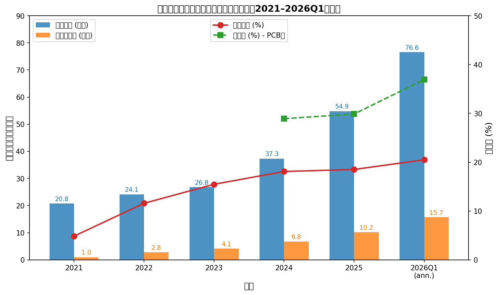
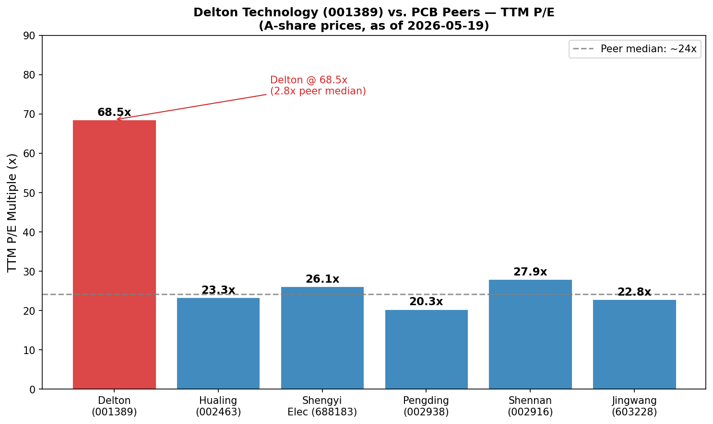
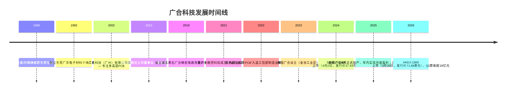
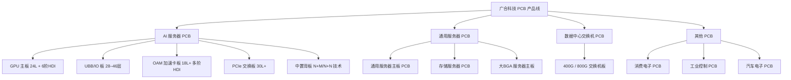
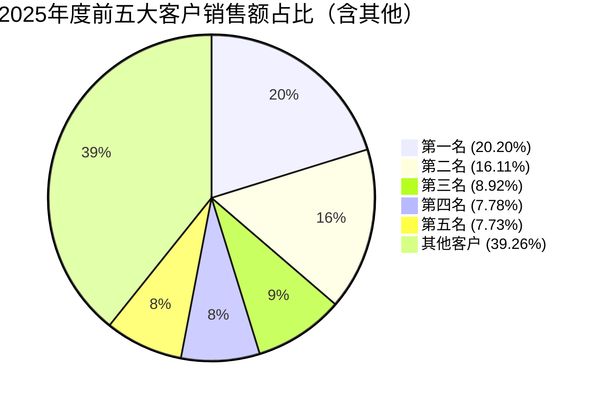
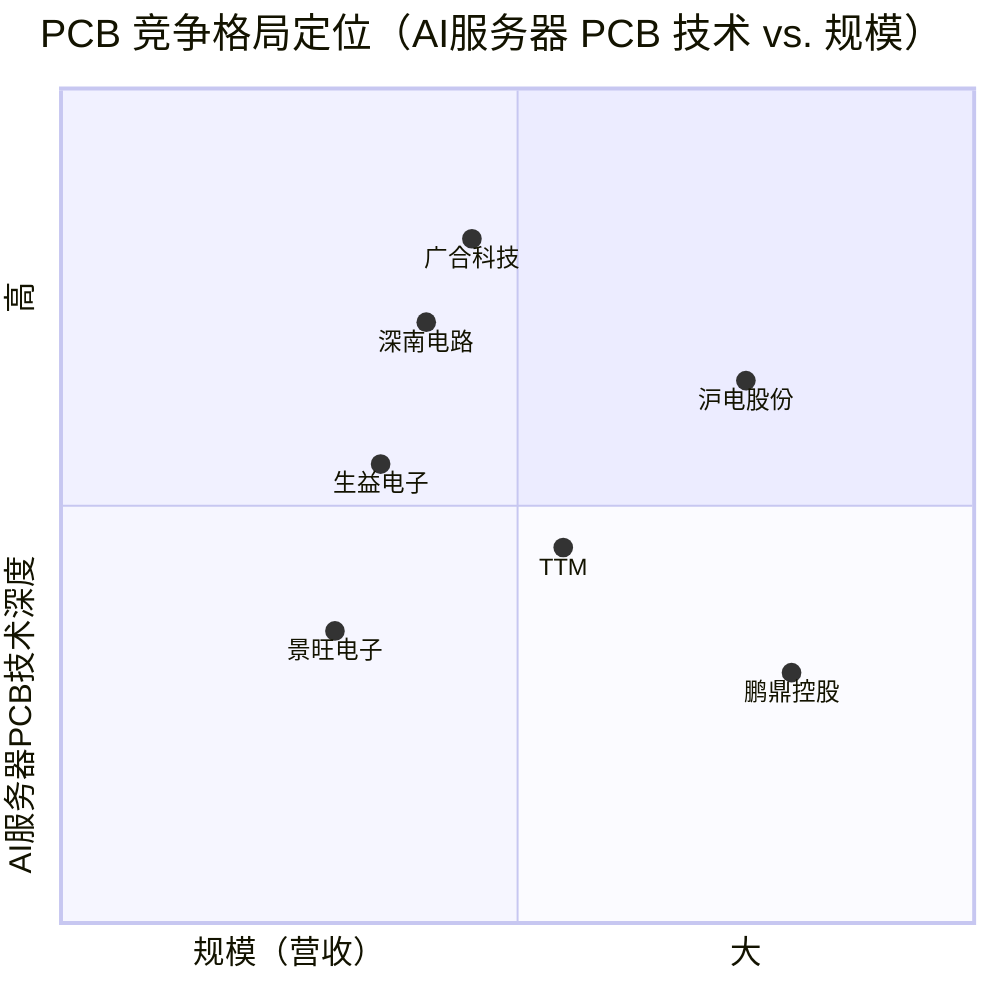
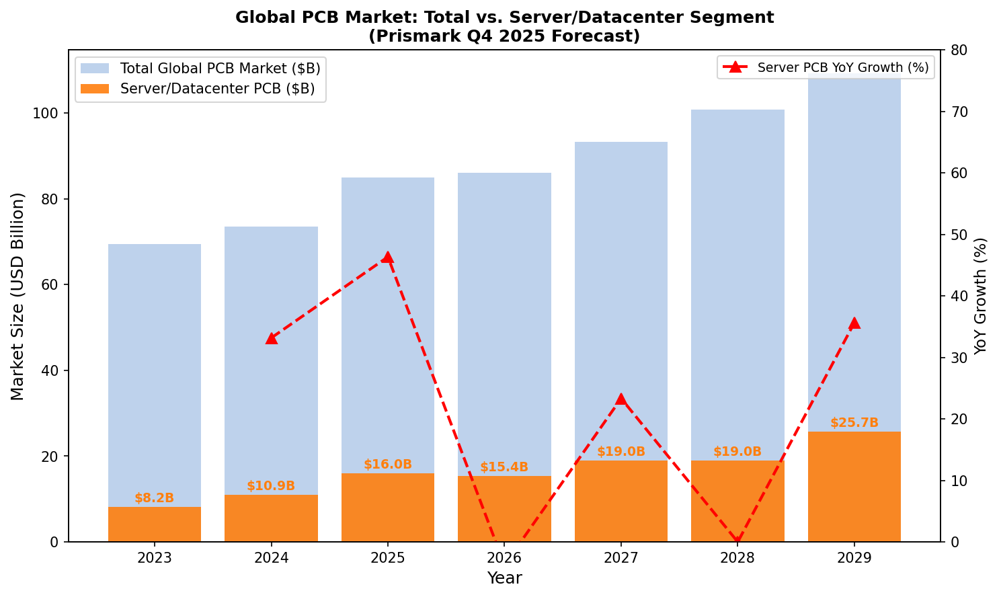

# 广合科技（SZSE:001389 / HKEX:1989）公司研究报告

**广州广合科技股份有限公司 / Delton Technology (Guangzhou) Inc.**
日期：2026-05-19
分析师：内部研究

---

> **Update — 2026年一季度业绩超预期（2026-04-29）：** 公司2026年一季度实现营业收入19.14亿元，同比增长71.35%；归母净利润3.926亿元，同比增长63.31%，超出此前3.8–4.0亿元的业绩预告指引区间上沿。管理层将增长归因于"AI算力需求持续向上"、泰国工厂（泰国广合）核心客户认证完成及产能释放，以及黄石广合盈利能力同比显著提升。按当前季度收益年化，公司2026全年净利润有望冲击15亿元以上。
> 来源：[广合科技 2026年第一季度报告（2026-04-29）](https://static.cninfo.com.cn/finalpage/2026-04-30/1225253814.PDF)

---

## 目录

1. [公司概览](#1-公司概览)
2. [公司历史](#2-公司历史)
3. [管理团队](#3-管理团队)
4. [产品与服务](#4-产品与服务)
5. [客户与销售策略](#5-客户与销售策略)
6. [行业概览](#6-行业概览)
7. [竞争格局](#7-竞争格局)
8. [市场机会（TAM）](#8-市场机会tam)
9. [风险评估](#9-风险评估)
10. [参考资料](#参考资料)

---

## 1. 公司概览

### 1.1 业务简介

广州广合科技股份有限公司（股票简称：广合科技，英文名：Delton Technology (Guangzhou) Inc.，下称"广合科技"或"公司"）是中国大陆专注于中高端印制电路板（Printed Circuit Board，简称 PCB）研发、生产与销售的领先企业。公司注册地及主要生产基地位于广州保税区，是国家高新技术企业，被评定为省级企业技术中心及广东省高频高速印制线路板工程技术研究中心。公司"服务器主板用印制电路板"于2022年入选工业和信息化部"制造业单项冠军产品"，在算力服务器 PCB 赛道具有较强的品牌认知与技术积累。

公司主营产品为多高层 PCB（高多层板 / high-layer-count PCB），广泛应用于高性能计算（HPC）服务器、AI 运算服务器（AI 服务器 / AI server PCB）、数据中心（数据中心 / data center）交换机（switching），以及存储服务器、消费电子、工业控制、汽车电子等细分领域。其中，服务器类 PCB 是第一大下游，**2025年占营业收入约80%**，构成公司成长性的核心驱动力（[广合科技 2025年年度报告，第12页](https://static.cninfo.com.cn/finalpage/2026-03-28/1225044663.PDF)）。公司已覆盖全球前10大服务器制造商中的8家，深度参与 AI 算力产业链的核心供应体系。

**营收与利润：** 根据公司2025年年度报告，2025年实现营业收入54.85亿元，同比增长46.89%；归属于上市公司股东的净利润（归母净利润）10.158亿元，同比增长50.24%；PCB 业务毛利率29.88%，同比提升0.96个百分点。2026年一季度（2026-Q1）营业收入19.14亿元，同比增长71.35%，归母净利润3.926亿元，同比增长63.31%，创上市以来最高季度营收与利润纪录（[广合科技 2026年第一季度报告（2026-04-29）](https://static.cninfo.com.cn/finalpage/2026-04-30/1225253814.PDF)）。

**四年复合增长：** 公司2021–2025年营业收入年均复合增长率（CAGR）约27.5%，归母净利润 CAGR 约76%（基数为2021年净利润约1.01亿元至2025年10.16亿元），体现 AI 算力驱动下公司从传统服务器 PCB 向高价值量 AI 服务器 PCB 快速跃迁的成长轨迹。

**员工规模：** 2025年公司研发人员530人，研发投入2.798亿元，占营业收入5.10%，较2024年的4.80%进一步提升（[2025年年度报告，第20–21页](https://static.cninfo.com.cn/finalpage/2026-03-28/1225044663.PDF)）。

**地理布局：** 核心产能集中于广州主基地（广州广合），附属工厂包括湖北黄石（黄石广合，主营中低端服务器及其他 PCB）以及于2025年6月正式投产的泰国工厂（泰国广合，位于巴真府金池工业区），2026年启动泰国二期建设规划。此外，公司已在美国加利福尼亚州设立全资子公司 Delton Technology Inc.，主要从事 PCB 销售与研发。

*来源：[广合科技 2025年年度报告](https://static.cninfo.com.cn/finalpage/2026-03-28/1225044663.PDF)；[2024年年度报告](https://static.cninfo.com.cn/finalpage/2025-04-01/1222975342.PDF)；[2026年第一季度报告](https://static.cninfo.com.cn/finalpage/2026-04-30/1225253814.PDF)。2026Q1年化数据仅供参考，非经审计预测。*

### 1.2 估值快照

**A股（SZSE:001389）：** 据用户提供的市场数据，A股股价约人民币149.22元（2026-05-19），按2026年一季度末总股本4.669亿股计算，A股总市值约696.7亿元人民币（约合96.5亿美元）。以2025年归母净利润10.158亿元计，**TTM P/E 约68.5倍**；以2025年营业收入54.85亿元计，**TTM P/S 约1.27倍**（[东方财富 广合科技行情](https://data.eastmoney.com/stockdata/001389.html)）。

**H股（HKEX:1989）：** 广合科技于2026年3月20日登陆香港联合交易所，发行价71.88港元，上市首日收盘96.00港元，涨幅33.56%。截至2026年5月，H股股价约158.30港元（据用户提供数据），按H股发行4600万股计算（HKSCC NOMINEES持有4599.92万股，占9.74%）H股总市值约728.5亿港元（含全部股份）。**A股相对H股溢价** 约为：A股折合港元≈149.22×1.082（汇率参考）≈161.5港元，与H股158.30港元基本持平，A/H溢价约1–2%，处于历史低位，体现双市场对公司估值高度一致（[广合科技港股上市公告，新浪财经，2026-03-20](https://finance.sina.com.cn/cj/2026-03-20/doc-inhrrrex6840137.shtml)）。

**估值比较：** 同行 PCB 龙头（沪电股份 002463、生益电子 688183、鹏鼎控股 002938、深南电路 002916、景旺电子 603228）当前 TTM P/E 约20–28倍，同行中位数约24倍（[东方财富证券 PCB 行业研究报告，2026-04-20](https://pdf.dfcfw.com/pdf/H3_AP202604211821384949_1.pdf)）。广合科技 A股 68.5倍 TTM P/E 为同行中位数的**约2.8倍**，存在显著溢价。

**高估值溢价的驱动因素：** 首先，市场给予广合科技较强的 AI 服务器 PCB 主题溢价，认为公司在算力硬件超级周期中受益最直接、弹性最大；其次，2026年一季度营收同比增长71.35%，显示增长动能尚未见顶，市场正用远期业绩而非 TTM 倍数定价（2026年预期 P/E 估算约38–45倍，参照机构预测）；第三，泰国产能快速爬坡、美国子公司成立，进一步打开国际化想象空间；第四，H股成功上市（2026-03），提升国际资本可达性，A/H双轮驱动叠加流动性溢价。然而，68.5倍 TTM P/E 远超 PCB 行业历史区间，若业绩增速出现放缓或 AI 资本开支周期逆转，估值面临较大的均值回归压力（详见第9节风险评估）。

*来源：[东方财富证券 PCB 行业研究报告，2026-04-20](https://pdf.dfcfw.com/pdf/H3_AP202604211821384949_1.pdf)；广合科技市值数据据用户输入（2026-05-19）。*

---

## 2. 公司历史

### 2.1 创业背景与发展脉络

广合科技的根源可追溯至创始人肖红星与刘锦婵夫妇在东莞电子材料行业的早期创业（1992年后），两人均曾任职于东莞生益电子有限公司（国内最早的覆铜板/PCB 行业龙头之一），在生益积累了深厚的 PCB 材料与工艺积累。公司主体——广合科技（广州）有限公司成立于**2002年6月**，注册地广州保税区，专注多高层 PCB 制造（[广合科技 2025年年度报告，第12页](https://static.cninfo.com.cn/finalpage/2026-03-28/1225044663.PDF)）。

经过十余年的深耕，公司完成股份制改革，并在深圳证券交易所主板成功上市——**SZSE:001389，IPO日期2024年4月2日，发行价17.43元/股**（[广州市金融监督管理局，2024年4月](http://jrjgj.gz.gov.cn/gzdt/content/post_9579118.html)），募集资金用于扩产及技术研发升级，持续督导期延至2026年12月。2026年3月，公司于香港联交所主板二次上市（HKEX:1989），发行价71.88港元，募集资金约33亿港元，成为 AI PCB 赛道少有的 A+H 双重上市公司（[廣合科技 1989 IPO 報道，香港經濟時報，2026-03](https://inews.hket.com/article/4097131/delton-tech-1989-ipo-2026)）。

### 2.2 战略转型节点

三次关键战略转型构成广合科技的成长骨架：

**第一次：从消费 PCB 向高端服务器 PCB 聚焦（2015–2018年）。** 彼时公司主动收缩低毛利消费类 PCB 产品，将研发与产能集中于16–28层服务器主板 PCB，奠定与全球头部服务器 OEM/ODM 客户深度合作的基础。

**第二次：从通用服务器 PCB 向 AI 算力 PCB 跃迁（2022–2024年）。** 伴随 ChatGPT、大模型训练集群对 GPU 服务器需求爆发，广合科技快速突破 UBB（Universal Base Board，统一基础板）、OAM（Open Accelerator Module，开放加速模块卡）、背板等高层数、高精度 AI 服务器 PCB 量产工艺，服务器 PCB 占比从2023年约70%提升至2025年约80%，并实现AI核心客户认证导入。

**第三次：产能国际化布局（2023–2026年）。** 面对贸易保护主义压力，公司在泰国巴真府建立第一个海外生产基地，首期2025年6月投产，当年底实现月度盈利，盈亏平衡仅用6个月。2026年启动泰国二期，为海外客户提供非中国产能，规避潜在关税风险。

---

## 3. 管理团队

### 3.1 董事长：肖红星

肖红星，男，1967年4月出生，中国国籍，毕业于华南理工大学化学专业（本科），现任公司董事长。持股176,738,257股（通过广州臻蕴投资有限公司100%持股），约占公司总股本37.85%（直接+间接合计），为实际控制人。

肖红星在 PCB 行业拥有逾30年一线经验。**1988年7月起**任职东莞生益电子有限公司，系国内覆铜板领军企业，在此积累了 PCB 原材料与制造工艺的深厚背景。**1992年后**与妻子刘锦婵自主创业，先后设立广华电子材料经营部、道滘广华电路板辅助材料厂、盛华电路板辅助材料有限公司、广华化工等多家从事电子化学品业务的企业，打通了从原材料到制造的产业链认知。**2010年**设立湖北优尼科光电技术股份有限公司，涉足液晶面板薄化加工服务，拓展跨品类制造视野。**2013年3月**起担任广合科技董事长至今，任期超过13年，战略连续性突出。

在其主导下，公司从一家区域性服务器 PCB 供应商，成长为覆盖全球前10大服务器厂商中8家的算力 PCB 龙头，并完成 SZSE（2024）与 HKEX（2026）双重上市，体现出强烈的资本运作意愿与全球化布局能力。肖红星同时担任黄石广合执行董事、东莞广合执行董事兼总经理、泰国广合董事、Delton Technology Inc. 董事长等多个子公司核心职务，对运营管控直接介入。2025年报显示，其本人从公司领取报酬为零，从关联方获薪，不存在股权质押（[广合科技 2025年年度报告，第39–44页](https://static.cninfo.com.cn/finalpage/2026-03-28/1225044663.PDF)）。

**核心挑战：** 作为高度参与运营的创始董事长，关键人风险较高；若同时兼顾多家子公司管理，可能导致集团层面的战略协调成本上升。

### 3.2 总经理：曾红

曾红，女，1966年12月出生，中国国籍，毕业于华南理工大学应用化学专业，电子技术高级工程师职称。现任公司董事、总经理，持股28,832,444股。

曾红于**1988年7月**加入东莞生益电子有限公司，历任品质经理、副厂长、副总经理，任期长达25年（至2013年2月），是国内 PCB 行业质量管理体系建设的权威人士之一。**2013年2月起**出任广合科技总经理，与肖红星共同主导公司从传统服务器 PCB 向 AI 算力 PCB 的战略转型。曾红目前担任中国电子电路行业协会（CPCA）第八届理事会副理事长、中国电子学会电子制造与封装技术分会全国印制电路专委会副主任委员，行业影响力覆盖全国级标准制定层面，对公司客户拓展和行业话语权具有直接贡献。2025年税前薪酬458.99万元（[2025年年度报告，第45页](https://static.cninfo.com.cn/finalpage/2026-03-28/1225044663.PDF)）。

### 3.3 财务总监：贺剑青

贺剑青，女，1975年11月出生，毕业于福建师范大学财务管理专业，现任公司财务总监，持股810,233股。历任艾美特电器（深圳）有限公司成本会计（2001–2004年）；鸿富锦精密工业（深圳）有限公司经营课长（2004–2011年），在全球最大电子代工厂积累了大规模制造业财务管控经验；深圳市凯中精密技术股份有限公司成本经理（2011–2017年）。**2017年2月**加入广合科技，任职已满8年，参与了公司上市、H股 IPO 全程。贺剑青主导公司精细化成本核算体系建设，为毛利率持续提升提供财务管理支撑。年税前薪酬231.71万元（[2025年年度报告，第45页](https://static.cninfo.com.cn/finalpage/2026-03-28/1225044663.PDF)）。

### 3.4 副总经理兼总工程师：黎钦源

黎钦源，男，1973年5月出生，毕业于华南理工大学化学工程专业（本科），高级工程师职称。历任东莞生益电子有限公司制作工艺助理工程师→工程师→主任工程师→经理→高级经理（1996–2012年，任期16年）；广州杰赛科技股份有限公司技术总监（2012年）。**2013年1月**加入广合科技，现任副总经理兼总工程师，持股5,766,835股。黎钦源是公司核心技术负责人，主导高速 PCB 工艺研发及 AI 服务器 PCB 产品迭代，直接决定公司在高端产品认证速度与工艺壁垒深度上的竞争力，年税前薪酬401.57万元，为高管中最高（[2025年年度报告，第43页](https://static.cninfo.com.cn/finalpage/2026-03-28/1225044663.PDF)）。

### 3.5 公司治理

- **董事会构成：** 共7名董事，其中独立董事3名（陈丽梅、李莹、施凌），职工董事1名（彭镜辉）。独立董事比例43%，符合监管要求。施凌为香港科技大学教授（IEEE Fellow，AI 与信号处理方向），2025年5月新增，补强了公司在 AI 技术方向的外部监督能力。
- **实际控制人：** 肖红星与刘锦婵夫妇通过广州臻蕴投资（持99.90%/0.10%股权）、广生投资、广财投资等持有公司约51.37%股权，为一致行动人，实控权高度集中。
- **薪酬体系：** 高管薪酬由董事会薪酬与绩效考核委员会审议，与绩效挂钩；股权激励采用限制性股票方式（2025年实施新一轮激励），管理费用因此同比增加60.34%（[2025年年度报告，第19页](https://static.cninfo.com.cn/finalpage/2026-03-28/1225044663.PDF)）。
- **管理团队稳定性：** 核心高管均自2013年跟随创始人团队，2025年仅两名副总经理因工作调整离任，整体稳定。

**管理团队综合评价：** 核心团队来自国内最顶尖的 PCB 企业（生益电子），行业基因深厚；创始董事长与总经理均在同一企业深度合作超过30年，协同成本极低。主要短板在于关键人风险（肖红星一人掌控实际控制权与多家子公司运营）、财务总监无境外公众公司 CFO 经验（H股上市后信息披露要求更高），以及国际化管理人才储备尚处早期。

---

## 4. 产品与服务

### 4.1 产品全景

广合科技产品均属于**多高层印制电路板（Multi-layer PCB）**，其差异化在于应用场景（AI 算力 vs. 通用计算 vs. 网络交换）、层数（标准通用服务器 PCB 12–20层、高阶 AI 服务器 PCB 18–46层甚至更高）、高速信号材料（M6/M7/M8 高速低损耗 High-Speed Materials）、以及工艺复杂度（盲孔/埋孔、HDI 高密度互连、背钻 Back Drill 等）。公司将产品大致归纳为以下主要类别：

### 4.2 核心产品竞争优势评估

**AI 服务器 PCB（旗舰产品，收入主体）**

- **竞争优势：** 强护城河（Partial-to-Strong Moat）
- **护城河类型：** 认证壁垒（Qualification Barrier）+ 技术 IP + 规模化生产良率
- **具体证据：** 公司已完成 PCIe 交换板（30层+）、UBB/IO 板（28–46层）、OAM 板（18层+，2阶–8阶HDI）、GPU 主板（24层6阶HDI）的工艺能力认证，并在400G/800G交换机板实现量产（[2025年年度报告，第16页](https://static.cninfo.com.cn/finalpage/2026-03-28/1225044663.PDF)）。AI 服务器 PCB 的认证周期通常长达6–12个月，一旦通过认证，客户轻易不换供应商，切换成本极高。公司"AI 服务器超高阶高多层复合基板项目"获中国电子学会2025年科技进步奖三等奖，印证技术水平获同行认可。
- **主要竞争产品：** 沪电股份（SZSE:002463）AI 服务器 PCB、深南电路（SZSE:002916）高层次 PCB — 广合科技凭借更高层数（最高46层）工艺领先；台湾 TTM Technologies 等偏向传统服务器，AI 高端品类竞争力相对弱于广合。

**通用服务器 PCB（基本盘）**

- **竞争优势：** 中等护城河
- **护城河类型：** 规模效益 + 长期客户关系
- **分析：** 通用服务器 PCB 层数较低（12–20层），竞争充分，但广合科技已建立与全球头部 OEM/ODM 的长期框架协议，供应链黏性强。2025年，公司完成 PCIe 6.0 平台转批量能力，确保技术与下游客户平台迭代保持同步（[2025年年度报告，第16页](https://static.cninfo.com.cn/finalpage/2026-03-28/1225044663.PDF)）。
- **主要竞争对手：** 鹏鼎控股（SZSE:002938）、景旺电子（SSE:603228）— 层数接近，但广合价格定位中高端。

**400G/800G 数据中心交换机 PCB（成长产品）**

- **竞争优势：** 中等护城河（认证进行中，部分进入量产）
- **分析：** 大型数据中心交换机对 PCB 信号完整性要求极高（112G/224G 信号速率），属于高层次高速板细分市场。广合2025年完成400G/800G交换机板量产，进入产品规模化阶段。公司正在研发"AI 高速交换背板关键技术"及224G以上新工艺技术。
- **主要竞争对手：** 沪电股份（背板 PCB 传统龙头）— 两者正面竞争，广合科技在层数和速率上追赶沪电。

**其他 PCB（消费电子、工控、汽车电子）**

- **竞争优势：** 一般，无显著差异化护城河
- **分析：** 属于公司战略上的"防守性多元化"，收入占比约20%，毛利率相对较低。随着 AI 服务器 PCB 比例进一步提升，此类业务占比将继续稀释。

### 4.3 技术研发路线

公司研究院下设材料应用与研究实验室、产品研发组、创新工艺研究组，采用"量产一代、试产一代、研发一代"策略，确保产品迭代与头部客户芯片代际同步（[2025年年度报告，第15页](https://static.cninfo.com.cn/finalpage/2026-03-28/1225044663.PDF)）。2025年在研核心项目包括：背钻D+6/D+4对准度控制、GPU加速卡多阶HDI（OAM）、机器学习高精度阻抗控制（PAM4 信号仿真）、深微孔电镀、AI 服务器大BGA阶梯金手指 PCB 等，全面覆盖 PCB 工艺极限制造领域（[2025年年度报告，第19–20页](https://static.cninfo.com.cn/finalpage/2026-03-28/1225044663.PDF)）。研发投入2025年达2.798亿元（同比+56.14%），全部费用化，无资本化。

**近期重要里程碑（2025–2026年）：** 泰国广合按计划完成核心客户审核认证（[2026年第一季度业绩预告，2026-04-08](https://static.cninfo.com.cn/finalpage/2026-04-09/1225084719.PDF)）；广州云擎智造基地项目启动建设（预计2026年底通产）；2025年获广东省电子学会科技进步奖二等奖及广东省高新技术协会科技进步奖二等奖。

### 4.4 JDM 定制化服务模式

公司采用 JDM（Joint Design Manufacture，联合设计制造）模式，从需求研发阶段介入客户产品开发，提供材料选型、线路设计、工艺设计、检测方法、成本控制的全链条解决方案，实现从研发到量产的一站式服务，大幅提升客户黏性，是不同于一般代工厂的核心差异化能力（[2025年年度报告，第15页](https://static.cninfo.com.cn/finalpage/2026-03-28/1225044663.PDF)）。

---

## 5. 客户与销售策略

### 5.1 客户结构

广合科技的直销比例高达97.61%（2025年），非直销（经销商等）仅占2.39%，体现高度客户直营化的战略导向（[2025年年度报告，第17页](https://static.cninfo.com.cn/finalpage/2026-03-28/1225044663.PDF)）。

公司公告披露，客户群体覆盖**全球前10大服务器制造商中的8家**，主要集中于以下类型：
- **EMS/ODM（全球服务器代工厂）：** 公司未披露具体客户名称，但结合行业背景，全球头部 EMS/ODM 供应链（英业达/Inventec、广达/Quanta、鸿海/Foxconn、纬颖/Wiwynn、浪潮等）均为广合科技的潜在目标客户群。投资者关系活动中，公司以商业保密为由未就英业达等客户合作情况作出具体回应（[综合 AI 服务器 PCB 行业报道，2025–2026年](https://static.weeklyonstock.com/25/0805/zbf173528.html)）。
- **国内服务器品牌商：** 浪潮信息、曙光、中兴通讯等国产服务器厂商是国内直销的重要客户。
- **其他应用领域：** 安防电子（海康威视、大华等）、工控、消费电子等客户构成多元化基本盘。

### 5.2 客户集中度

**2025年前五大客户合计销售额33.319亿元，占年度销售总额60.74%**，其中：

| 排名 | 销售额（元） | 占比 |
|------|------------|------|
| 第一名 | 11.08亿 | 20.20% |
| 第二名 | 8.836亿 | 16.11% |
| 第三名 | 4.894亿 | 8.92% |
| 第四名 | 4.266亿 | 7.78% |
| 第五名 | 4.243亿 | 7.73% |
| **合计** | **33.319亿** | **60.74%** |

来源：[广合科技 2025年年度报告，第18页](https://static.cninfo.com.cn/finalpage/2026-03-28/1225044663.PDF)。

**客户名称未披露**（公司以商业保密为由未列明具体客户名称）。

**风险评估：**
- 第一大客户占比20.20%，**超过20%警戒线**，构成一定的客户集中风险（参见风险章节）。
- 前五大客户合计60.74%，**超过50%的重要提示阈值**，进一步强化集中度风险信号。
- 相比2024年及2023年的前五大客户合计占比（未披露具体历史数据），但行业惯例显示 AI 服务器 PCB 赛道客户集中度在算力周期上升阶段通常同步提高。
- 未关联方销售额占前五大的比例为0，排除关联交易干扰。
- 合同形式：AI 服务器 PCB 行业普遍采用框架协议加季度/月度采购订单形式，而非长期锁量合同，因此受客户算力规划调整影响较大。

*来源：[广合科技 2025年年度报告，第18页](https://static.cninfo.com.cn/finalpage/2026-03-28/1225044663.PDF)*

### 5.3 地理销售结构

2025年境外销售36.556亿元，占主营收入**66.64%**；境内销售14.463亿元，占26.37%（其他业务收入3.835亿元，占6.99%）（[2025年年度报告，第17页](https://static.cninfo.com.cn/finalpage/2026-03-28/1225044663.PDF)）。境外销售以美元计价，外汇风险敞口显著，公司通过远期外汇合约进行对冲。

境内销售同比增长81.56%（远超境外的36.26%），主要反映国产算力硬件（浪潮、华为等国内服务器厂商）需求的快速放量——这一结构变化也是公司对地缘政治风险的主动对冲。

### 5.4 供应商集中度

2025年前五大供应商合计采购额19.494亿元，占年度采购总额**61.22%**，第一大供应商采购额6.149亿元，占19.31%。主要原材料包括覆铜板（CCL）、半固化片、铜球、铜箔、金盐、干膜等，上游均无关联方（[2025年年度报告，第19页](https://static.cninfo.com.cn/finalpage/2026-03-28/1225044663.PDF)）。供应商名称同样未披露，但 CCL 供应商高度集中于生益科技、南亚电材等少数龙头，议价空间有限，原材料价格波动直接传导至毛利率。

---

## 6. 行业概览

### 6.1 PCB 行业全景

印制电路板（PCB）是现代电子设备不可缺少的核心互连件，有"电子产品之母"之称。按结构可分为：高多层板（High-layer PCB，18层以上）、HDI（High Density Interconnect，高密度互连板）、封装基板（IC Substrate）、软板（FPC）及其他。广合科技专注于高多层板，与 AI 服务器市场增速最强赛道高度重合。

**全球市场规模：** 据 Prismark 2025年第四季度报告，2025年全球 PCB 产业产值预计达848.91亿美元，同比增长15.4%，预计到2029年将突破1000亿美元（[2025年年度报告，第12–14页，引述Prismark 2025年Q4报告](https://static.cninfo.com.cn/finalpage/2026-03-28/1225044663.PDF)）。2024–2029年全球 PCB 年均复合增长率约8.2%。

**中国大陆：** 全球最大 PCB 市场，2025年产值预计达493.54亿美元（占全球约58.1%），增长率19.8%，2024–2029年 CAGR 约8.5%，继续领跑全球。

**产品结构：** 2025年高多层板市场330.91亿美元（增速18.2%，CAGR 9.0%），HDI 板157.17亿美元（增速25.6%，CAGR 11.2%），是增速最快的两类。

### 6.2 AI 服务器驱动下的服务器/数据中心 PCB

**服务器/数据存储 PCB 是全球增速最快的应用细分**（Prismark 2025 Q4）：
- 2025年产值159.75亿美元，同比增长46.3%
- 2024–2029年 CAGR 18.7%，预计2029年达257.29亿美元

AI 服务器（AI server）对 PCB 的价值量需求远超传统服务器：
- 传统服务器 PCB 价值量约1000–2000美元/台，而 AI 服务器（如 NVIDIA GB200/GB300 系列）每台 PCB 价值量可达8000–15000美元，是传统服务器的6–10倍（[PCB 行业分析，21经济网，2026-04-21](https://www.21jingji.com/article/20260421/herald/94a806a1370a8b544660ba736836b6fb.html)）。
- 驱动因素：AI GPU 训练集群需要更多层数的主板、更高密度的 UBB/背板、多阶 HDI、高速信号材料（112G/224G/448G PAM4），每一代 GPU 架构迭代（如 NVIDIA Blackwell Ultra、GB300）均带动 PCB 材料需求升级。

**数据中心资本开支超级周期：** 全球主要云厂商（微软、谷歌、亚马逊AWS、Meta）2026年合计资本开支预计超3000亿美元，其中 AI 算力基础设施占主要份额，形成对 AI 服务器 PCB 的持续旺盛需求（[AI 服务器报道，澎湃新闻，2026年](https://m.thepaper.cn/newsDetail_forward_32155624)）。

### 6.3 高速材料与工艺趋势

随着信号速率从25G向112G/224G/448G演进，PCB 所需基材从传统 FR4 向 M6、M7、M8 级别的低损耗高频高速材料（High-Speed Laminates）升级，工艺从8–10层向18–46层+多阶HDI转变，对供应商的材料应用能力和极限制造工艺提出更高要求。能够驾驭这一技术升级的供应商稀少，形成天然的准入壁垒。

### 6.4 行业结构与竞争态势

- **市场高度分散：** 全球 PCB 厂商超过2500家，但中高端 AI 服务器 PCB 市场高度集中于中国大陆（广合、沪电、深南）、台湾（台光电子、金像电子）、日本（TTM Technologies 部分品类）等少数具备认证能力的厂商。
- **产能格局重组：** 贸易摩擦背景下，中国 PCB 厂商加速东南亚布局（越南、泰国），泰国成为AI供应链产能转移核心承接地（[2025年年度报告行业分析，第12–13页](https://static.cninfo.com.cn/finalpage/2026-03-28/1225044663.PDF)）。
- **供应商集中化趋势：** 头部客户（AI 服务器 OEM）正将订单向"技术领先、交付可靠、协同创新"的战略伙伴集中，简单供应商将被淘汰，少数具备全链条 JDM 能力的 PCB 厂商将吸走更多份额（[2025年年度报告，第28页](https://static.cninfo.com.cn/finalpage/2026-03-28/1225044663.PDF)）。

---

## 7. 竞争格局

### 7.1 直接竞争对手

**沪电股份（SZSE:002463）** — 国内 PCB 背板龙头，营收规模（2025年约190亿元，据公开报道）远超广合，主要优势在高速背板（背板 PCB 全球前列）、通讯 PCB。AI 算力服务器 PCB 领域竞争加剧，两者直接竞争高层次 AI 服务器板、交换背板市场。沪电体量大、客户分散度更高（不存在单一客户 >20% 风险），但毛利率和增速略逊于广合（[鹏鼎控股扩产报道，证券时报，2026年](https://www.stcn.com/article/detail/3687666.html)）。

**深南电路（SZSE:002916）** — 专注高端 PCB（含 AI 算力 PCB）、IC 载板，技术水平居国内前列，近年高层次 AI 服务器 PCB 战略与广合高度重叠。深南客户更多元（含国防/航天），但 AI 服务器 PCB 规模化进度稍慢于广合。

**鹏鼎控股（SZSE:002938）** — 全球 FPC（柔性板）最大厂商，硬板（刚性 PCB）布局也在扩张（2026年宣布233亿元扩产计划），但其核心优势仍在消费电子 FPC（苹果供应链），AI 服务器刚性 PCB 为新进方向，相比广合差距明显（[鹏鼎控股扩产报道，2026年](https://www.stcn.com/article/detail/3687666.html)）。

**生益电子（SSE:688183）** — 母公司生益科技是国内最大 CCL（覆铜板）生产商，生益电子承接高端 PCB 制造，具备原材料一体化优势，近年在 AI 服务器 PCB 领域加速追赶，但规模和客户覆盖尚未达到广合水平。

**景旺电子（SSE:603228）** — 双面板/多层板、HDI 中型厂商，AI 服务器 PCB 方向尚处起步，与广合竞争集中在中低端服务器板。

**国际竞争对手：**
- **TTM Technologies（US）：** 美国最大 PCB 厂商，侧重高频军工/航天板，AI 服务器 PCB 高层次市场份额有限。
- **AT&S（奥地利）：** 专注 IC 载板（ABF 基板）、高端 HDI，与广合在 AI 服务器 PCB 的直接竞争面较小。
- **台光电子（TWSE:2383）/ 金像电子（TWSE:2368）：** 台湾高端服务器 PCB 厂商，直接竞争 AI 服务器板，技术水平和客户重叠度最高，是广合最主要的国际直接竞争对手。

### 7.2 竞争定位

*注：定位为定性评估，不代表精确市场份额数据。规模维度基于公开财务数据相对排序。*

### 7.3 广合科技的核心竞争优势

1. **高端 AI 算力 PCB 认证先发优势：** 公司已率先完成 GPU 主板（24层6阶HDI）、UBB/IO 板（46层）、OAM板（多阶HDI）等核心 AI 服务器 PCB 产品的客户认证，先发形成订单壁垒。
2. **JDM 深度绑定：** 参与客户研发阶段，切换成本极高；多次获"完美质量奖"、"年度最佳供应商"等，客户满意度高。
3. **泰国工厂的供应链安全价值：** 在贸易摩擦环境下，泰国产能为有"非中国产能"需求的海外客户提供额外选择，差异化于纯中国大陆竞争对手。
4. **创始人团队的行业根植深度：** 肖红星与曾红均来自生益电子高管班底，在 PCB 供应商生态中的专业声誉积累数十年。

### 7.4 竞争脆弱性

1. **规模相对有限：** 沪电、鹏鼎营收体量约是广合3–4倍，在原材料议价、研发投入总量上存在规模劣势。
2. **客户高集中：** 前五大客户60.74%的集中度意味着若任一头部客户采购策略调整（如部分垂直整合 PCB），影响较大。
3. **海外产能处于爬坡初期：** 泰国二期建设尚未启动，单一泰国一期产能规模有限，国际化竞争力处于建立阶段。

---

## 8. 市场机会（TAM）

### 8.1 全球 PCB 市场总量

根据 Prismark 2025年第四季度报告（广合科技2025年年度报告引述）：

| 年份 | 全球PCB产值 | 增速 |
|------|-----------|------|
| 2023 | 695.17亿美元 | -15%（行业下行年） |
| 2024 | 735.65亿美元 | +5.8% |
| 2025E | 848.91亿美元 | +15.4% |
| 2029E | 1091.58亿美元 | CAGR +8.2% |

*来源：[Prismark 2025年Q4报告，广合科技 2025年年度报告引述，第12–14页](https://static.cninfo.com.cn/finalpage/2026-03-28/1225044663.PDF)*

### 8.2 服务器/数据中心 PCB 子市场（广合核心 TAM）

| 年份 | 服务器/数据存储PCB | 增速 |
|------|-----------------|------|
| 2024 | 109.16亿美元 | +33.1% |
| 2025E | 159.75亿美元 | +46.3% |
| 2029E | 257.29亿美元 | CAGR +18.7% |

*来源：[Prismark 2025年Q4报告，广合科技 2025年年度报告，第13–14页](https://static.cninfo.com.cn/finalpage/2026-03-28/1225044663.PDF)*

这是全球 PCB 各应用细分中增速遥遥领先的赛道。按此 CAGR，2026年服务器/数据中心 PCB 市场约188亿美元，2027年约223亿美元，为广合科技中期收入增长提供充裕市场空间。

*来源：Prismark 2025年Q4报告（[广合科技 2025年年度报告引述](https://static.cninfo.com.cn/finalpage/2026-03-28/1225044663.PDF)）；2026–2028年数据为按18.7% CAGR插值。*

### 8.3 广合科技的 SAM 与市场份额

广合科技2025年 PCB 业务收入约51.02亿元（人民币），约合7.1亿美元（按2025年平均汇率7.2估算）。以2025年全球服务器/数据中心 PCB 市场159.75亿美元计，广合科技约占**4.4%的全球市场份额**。考虑到中国大陆市场更高的公司竞争力，在中国大陆服务器 PCB 子市场中，广合是前三强之一（与沪电、深南并列）。

**SAM（可寻址市场）估算：** 广合核心服务器 PCB（AI + 通用）约对应全球服务器/数据中心 PCB 和数据中心交换机 PCB，2025年合计约241亿美元（服务器159.75亿+交换机83.85亿），广合覆盖其中约3%，增长空间充裕。

### 8.4 增量驱动因素

1. **NVIDIA GB200/GB300 供应链份额：** 全球 AI GPU 平台快速迭代，每代升级带动 PCB 价值量提升，广合作为已认证供应商可直接受益于新平台量产放量。
2. **国内算力基础设施替代：** 国产大模型训练集群、国内数据中心建设（华为云、阿里云、腾讯云等）加速扩张，对国产算力 PCB 需求形成额外牵引。
3. **泰国工厂产能爬坡：** 泰国二期建设规划已启动，远期将在泰国形成数十亿元级的年产能，承接海外客户的独立供应。
4. **交换机 PCB 新品类：** 400G/800G 以太网交换机板量产，打开交换机 PCB 新增量，与服务器板形成协同。

---

## 9. 风险评估

### 9.1 公司特定风险

**风险1：客户集中度过高**

前五大客户合计销售额占营收60.74%，第一大客户占比20.20%（均超过50%/20%的重要风险阈值）。客户名称未披露，外界无法独立评估个别客户健康度与采购稳定性。AI 服务器 OEM/ODM 客户普遍采用"PO驱动"而非长期锁量合同，若头部客户因自身资本开支调整、技术路线转变（如自研 PCB 或更换供应商）或贸易政策影响削减采购，公司收入将面临较大波动。**高风险等级。** 缓释因素：JDM 深度绑定提升切换成本；泰国产能为客户供应链安全提供附加价值（[2025年年度报告，第18页](https://static.cninfo.com.cn/finalpage/2026-03-28/1225044663.PDF)）。

**风险2：技术研发与产品迭代落后风险**

服务器迭代周期平均2–3年，AI GPU 架构迭代更快（NVIDIA 每年发布新产品路线）。若广合科技在下一代 PCB 工艺（224G/448G 信号速率、超高层PCB、液冷兼容性等）认证落后于竞争对手或客户要求时间表，将面临订单流失。2025年研发人员530人，同比增35.55%，主动加码但仍相对集中在现有工艺改进，系统性前瞻性研究资源投入存在不确定性（[2025年年度报告，第20页](https://static.cninfo.com.cn/finalpage/2026-03-28/1225044663.PDF)）。**中高风险等级。**

**风险3：关键人风险**

肖红星同时担任集团董事长及多家子公司执行董事/总经理，并持有约37.85%股权，是公司战略方向与核心客户关系的核心纽带。若发生健康、个人变故或管理精力分散，可能对公司运营连续性和投资者信心产生重大冲击。目前无明确接班人培养计划披露（[2025年年度报告，第44页](https://static.cninfo.com.cn/finalpage/2026-03-28/1225044663.PDF)）。**中等风险等级。**

**风险4：泰国工厂建设运营风险**

泰国广合2025年6月才正式投产，盈亏平衡仅用6个月（属行业中较快），但二期建设规模更大，泰国的供应链配套、劳动力资源、文化差异、法律法规均与中国存在较大差距。若出现工程延误、客户认证障碍或运营管理问题，将拖累海外营收扩张进度，并可能影响公司向海外客户承诺的交付能力（[2025年年度报告，第31页](https://static.cninfo.com.cn/finalpage/2026-03-28/1225044663.PDF)）。**中等风险等级。**

### 9.2 行业/市场风险

**风险5：AI 资本开支周期逆转风险**

公司业务高度依赖全球云厂商和科技巨头的 AI 基础设施资本开支（Google、Meta、Microsoft、Amazon等），若宏观经济下行、AI 商业化未达预期或大型科技公司财务压力导致 Capex 削减，将对 AI 服务器 PCB 需求形成系统性冲击。2022–2023年 PCB 行业曾因消费电子需求萎缩历经严峻下行周期（2023年全球PCB产值同比-15%），AI 服务器 PCB 同样存在周期性波动的可能（[2025年年度报告，行业分析，第12页](https://static.cninfo.com.cn/finalpage/2026-03-28/1225044663.PDF)）。**高风险等级，当前景气度高但不排除2027年后周期拐点。**

**风险6：贸易摩擦与出口管制风险**

公司境外收入占比约67%，主要以美元计价出口。若中美贸易摩擦进一步升级，PCB 行业遭遇额外关税、技术出口限制（如高速材料、特定工艺设备管制），可能直接冲击公司境外业务。泰国工厂已作为部分对冲，但二期产能规模有限，短期内无法完全替代中国本土产能（[2025年年度报告，第30页](https://static.cninfo.com.cn/finalpage/2026-03-28/1225044663.PDF)）。**中高风险等级。**

**风险7：原材料价格波动风险**

PCB 直接材料成本占营业成本67.61%（2025年），主要原材料覆铜板（CCL）、铜、黄金等大宗商品价格受全球市场波动显著影响。2025年直接材料成本同比增长48.61%，高于收入增速（46.89%），略有侵蚀毛利率。若铜价、金价大幅上涨，且公司无法及时向下游客户传导，毛利率将承压（[2025年年度报告，第18页](https://static.cninfo.com.cn/finalpage/2026-03-28/1225044663.PDF)）。**中等风险等级。** 缓释：公司多元化供应商（前五大合计61.22%，分散度优于客户侧）；适当增加安全库存、锁汇操作。

**风险8：竞争加剧与行业产能过剩风险**

AI 服务器 PCB 高回报吸引大量资本涌入，国内同行（沪电股份、深南电路等）及台湾厂商（台光、金像）均加速扩产认证，若高端产能快速过剩，将导致价格竞争加剧、毛利率下行。2025年 PCB 行业已出现"高端产能结构性供不应求"的阶段性特征，但中期需关注供需失衡反转节点（[AI需求与PCB行业报道，21经济网，2026-04-21](https://www.21jingji.com/article/20260421/herald/94a806a1370a8b544660ba736836b6fb.html)）。**中等风险等级。**

### 9.3 财务风险

**风险9：估值倍数压缩风险（Valuation De-rating Risk）**

A股 TTM P/E 68.5倍，为 PCB 同行中位数（约24倍）的2.8倍，P/E 历史高位（自上市以来）。若：(a)业绩增速从71% YoY（2026Q1）回落至市场预期以下；(b) AI 算力 Capex 超级周期出现拐点信号；(c)中美关系超预期恶化；(d)行业产能加速扩张导致价格战压缩毛利率——任意一个信号触发，当前估值溢价可能快速回归至行业中位水平（24倍），隐含约65%的下行空间（从68.5倍至24倍，以FY2025盈利为基准）。H股自IPO首日即吸引大量主题资金，但 A股相对 H股溢价极低（约1–2%），双市场定价高度一致，估值压缩风险全面传导（[A/H股溢价报道，新浪财经，2026-03-12](https://finance.sina.com.cn/wm/2026-03-12/doc-inhqtqkh4764279.shtml)）。**高风险等级，建议投资者密切关注业绩兑现节奏。**

**风险10：A/H 双重上市的流动性与信息披露负担**

同时维护 A股（深交所规则）和 H股（联交所规则+香港证监会规定）的信息披露体系，合规成本显著上升。H股投资者以国际机构为主，对公司财务透明度（客户名称、地区收入细分等）的要求更高，而广合目前客户信息披露相对简单（前五大客户不具名），可能限制国际机构投资者的深入评估意愿。未来若 A/H 价差因市场流动性、风险偏好差异拉大，可能带来套利压力和股价波动（[广合科技港股上市分析，证券市场周刊，2025-08-05](https://static.weeklyonstock.com/25/0805/zbf173528.html)）。**中等风险等级。**

### 9.4 宏观风险

**风险11：外汇波动风险**

公司境外收入约67%以美元计价，若人民币大幅升值，将产生汇兑损失并削弱成本竞争力。2026年一季度财务费用同比增长630.86%，主要因期末汇率浮动评估影响（远期外汇合约亏损）。公司已实施远期外汇对冲，但敞口仍属重大（[2026年第一季度报告，第3页](https://static.cninfo.com.cn/finalpage/2026-04-30/1225253814.PDF)）。**中等风险等级。**

**风险12：全球宏观经济下行与行业周期风险**

PCB 行业与全球宏观经济相关性高，2023年已验证严重衰退可能（产值下降15%）。若全球经济进入紧缩周期，数据中心扩张计划暂缓，AI 投资热情下降，广合科技高度集中于 AI 服务器 PCB 的业务结构缺乏有效的防御性收入对冲。横向拓展消费电子、工控、汽车电子等多元化业务属于战略意图，但目前规模有限（合计约20%），短期内难以成为有效缓冲（[2025年年度报告行业分析，第12页](https://static.cninfo.com.cn/finalpage/2026-03-28/1225044663.PDF)）。**中等风险等级。**

---

## 参考资料

### 公司年度及季度报告

- [广合科技 2025年年度报告（2026-03-27）](https://static.cninfo.com.cn/finalpage/2026-03-28/1225044663.PDF) — 主要信息来源
- [广合科技 2025年年度报告摘要（2026-03-27）](https://static.cninfo.com.cn/finalpage/2026-03-28/1225044662.PDF)
- [广合科技 2026年第一季度报告（2026-04-29）](https://static.cninfo.com.cn/finalpage/2026-04-30/1225253814.PDF)
- [广合科技 2026年第一季度业绩预告（2026-04-08）](https://static.cninfo.com.cn/finalpage/2026-04-09/1225084719.PDF)
- [广合科技 2024年年度报告（2025-03-31）](https://static.cninfo.com.cn/finalpage/2025-04-01/1222975342.PDF)
- [广合科技 2025年半年度报告（2025-08-21）](https://static.cninfo.com.cn/finalpage/2025-08-22/1224530722.PDF)
- [广合科技 2023年年度报告（2024-04-28）](https://www.cninfo.com.cn/new/disclosure/stock?stockCode=001389) — 历史数据参考

### HK 交易所文件

- [广合科技 2026年第一季度报告（港交所，2026-04-29）](https://www.hkexnews.hk/listedco/listconews/sehk/2026/0430/2026043000264.htm)（股份代号：1989）

### 市场数据与新闻

- [广合科技港股上市首日涨33.56%，新浪财经，2026-03-20](https://finance.sina.com.cn/cj/2026-03-20/doc-inhrrrex6840137.shtml)
- [广合科技港股 IPO 分析，香港经济时报，2026-03](https://inews.hket.com/article/4097131/delton-tech-1989-ipo-2026)
- [广合科技港股打新分析，新浪财经，2026-03-12](https://finance.sina.com.cn/wm/2026-03-12/doc-inhqtqkh4764279.shtml)
- [广合科技一季度归母净利增长63.3%，新浪财经，2026-05-05](https://finance.sina.com.cn/stock/relnews/hk/2026-05-05/doc-inhwvqch9060134.shtml)
- [广合科技行情数据，东方财富网](https://data.eastmoney.com/stockdata/001389.html)
- [广州市金融监督管理局 — 广合科技登陆深交所报道](http://jrjgj.gz.gov.cn/gzdt/content/post_9579118.html)

### 行业数据

- Prismark Q4 2025 Report（通过[广合科技 2025年年度报告，第12–14页](https://static.cninfo.com.cn/finalpage/2026-03-28/1225044663.PDF)引述）
- [东方财富证券 PCB 行业研究报告，2026-04-20](https://pdf.dfcfw.com/pdf/H3_AP202604211821384949_1.pdf)
- [AI需求PCB行业景气度报道，21经济网，2026-04-21](https://www.21jingji.com/article/20260421/herald/94a806a1370a8b544660ba736836b6fb.html)
- [AI服务器PCB龙头——广合科技分析，九方智投，2025–2026年](https://www.9fzt.com/common/2b3a5716faf3c0e2a716216b2471c93a.html)
- [PCB龙头广合科技赴港上市，投资人关注与英伟达合作潜力，证券市场周刊，2025-08-05](https://static.weeklyonstock.com/25/0805/zbf173528.html)
- [鹏鼎控股扩产报道，证券时报，2026年](https://www.stcn.com/article/detail/3687666.html)

---

*本报告仅供信息参考，不构成任何投资建议。报告中所有具体财务数据均来自公司公开披露的年度报告、季度报告及业绩预告，已在正文中标注原始来源链接。未披露数据（如客户具体名称、历史分客户销售占比趋势）已在正文中注明"未披露"。分析师不对报告内容的完整性承担任何法律责任。*
