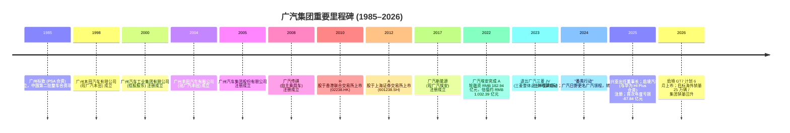
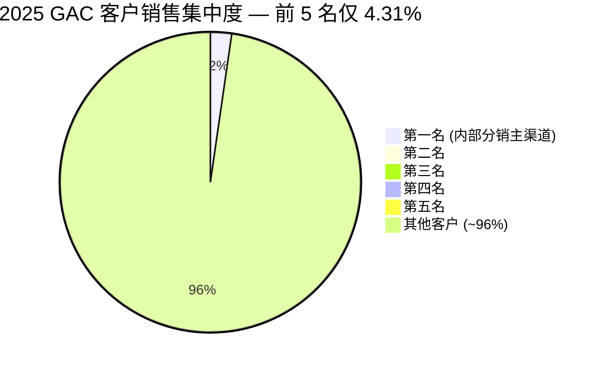

# 广州汽车集团股份有限公司 (GAC Group) 公司研究报告

**股票代码：** A股 SSE:601238 / H股 HKEX:02238
**报告日期：** 2026-05-17
**报告币种：** 人民币 (RMB)，特殊标注除外

---

> **Update — 2025 全年首次亏损，业绩拐点信号初现 (2026-03-27)：** 公司 2025 全年实现营业收入 RMB 956.62 亿元（YoY -10.43%），归母净利润 -RMB 87.84 亿元，是自 2006 年以来近 20 年首次出现年度亏损；其中扣非归母净利润 -RMB 98.63 亿元，加权 ROE -8.01%；经营性现金流由上年同期净流入 RMB 109.19 亿元转为净流出 RMB 150.26 亿元（变动 -RMB 259.45 亿元）。董事会决定 2025 年度不分红、不送转。管理层在董事长致辞中明确进入"战时状态"，提出"稳合资、强自主、拓生态"三大战略与"打赢用户需求、产品价值、服务体验三大战役"，目标 2026 年实现"业绩回升"、海外销量目标 25 万辆 / 翻倍 ([广汽集团 2025 年年度报告，第 2、7–9 页](http://www.cninfo.com.cn/new/disclosure/stock?stockCode=601238))。2026 年一季度营收 RMB 202.29 亿元 (+1.76%)、亏损环比明显收窄至 RMB 6.56 亿元，自主品牌销量 16.62 万辆 (+42% YoY)，海外销量 4.22 万辆 (+86%)，初步显现转型起效 ([新浪财经，2026-04-29](https://finance.sina.com.cn/jjxw/2026-04-29/doc-inhweskv0819387.shtml))。

---

## 目录

1. 公司概览
2. 公司历史
3. 管理团队
4. 产品与服务
5. 客户与上市策略
6. 行业概览
7. 竞争格局
8. 市场机会 (TAM)
9. 风险评估
10. 参考资料

---

## 1. 公司概览

广州汽车集团股份有限公司（"广汽集团"、"广汽"、"公司"），是一家总部位于广州市番禺区、隶属于广州市国资委体系的大型综合性汽车集团，**A 股 2012 年 3 月在上交所上市（601238）、H 股 2010 年 8 月在香港联交所上市（02238），是国内少数实现"A+H"两地上市的国有汽车集团之一**。公司业务涵盖整车研发与制造、零部件、商贸与出行（含 Robotaxi）、能源生态（动力电池、储能、充换电）、国际化、投资与金融七大板块，构成完整的汽车产业链闭环 ([广汽集团 2025 年年度报告，第 17 页](http://www.cninfo.com.cn/new/disclosure/stock?stockCode=601238))。

**主要收入与利润来源。** 广汽是典型的"合资+自主"双轮驱动型车企。整车制造业 2025 年贡献营业收入 RMB 690.10 亿元，占主营收入约 71%；商贸服务 RMB 186.70 亿元 (19%)、金融及其他 RMB 50.61 亿元 (5%)、零部件 RMB 38.01 亿元 (4%)。但**重要的是，合资公司广汽本田、广汽丰田按权益法核算，其投资收益（而非营业收入）才是历年集团利润的主要来源**；2025 年公司投资收益 RMB 32.67 亿元，较 2024 年 RMB 73.19 亿元下降 55.36%，主要因合资销量下滑、广汽本田推进新能源转型计提产线减值及人员优化 ([广汽集团 2025 年年度报告，第 26 页](http://www.cninfo.com.cn/new/disclosure/stock?stockCode=601238))。这一会计结构使得集团报表营收主要反映自主品牌（传祺、埃安）与商贸业务，而集团利润高度依赖合资 JV——一旦合资盈利能力削弱，集团极易陷入亏损。

**经营地理分布。** 总部及绝大部分产能位于广州（番禺、增城、从化、花都等基地），并在杭州、宜昌等地设有自主品牌生产基地；摩托车产能位于广州（五羊本田）；海外已布局 5 座 KD 工厂，AION V 已于奥地利工厂量产 ([广汽集团 2025 年年度报告，第 23 页](http://www.cninfo.com.cn/new/disclosure/stock?stockCode=601238))。2025 年自主品牌海外终端销量约 12.5 万辆，覆盖全球 87 个国家和地区、630 个销售服务网点，YoY +48%；境外营业收入 RMB 170.22 亿元（+44.99% YoY），是 2025 年报中唯一同比正增长的地区维度。

**规模与体量。** 2025 年集团合并报表汽车产销分别为 174.44 万辆和 172.15 万辆（YoY -8.98% / -14.06%），其中自主品牌 60.92 万辆（YoY -22.83%）；合资公司方面，广汽丰田 75.6 万辆（+2.44%）、广汽本田约 35.2 万辆（约 -25%）；摩托车合资公司五羊本田销量约 64 万辆（含出口超 15 万辆）。截至 2025 年底，公司拥有 A 股 73.84 亿股、H 股 28.13 亿股，合计 101.97 亿股；归母净资产 RMB 1,052.32 亿元，总资产 RMB 2,149.43 亿元，全员（含合资）规模约 9 万人左右（合资公司按股比计入），是中国南方最大的汽车产业链平台之一 ([广汽集团 2025 年年度报告，第 11 页](http://www.cninfo.com.cn/new/disclosure/stock?stockCode=601238))。

**核心经营指标 (FY2025 vs FY2024)：**

| 指标 | 2025 | 2024 | YoY |
|---|---:|---:|---:|
| 营业收入 | 956.62 亿元 | 1,067.98 亿元 | -10.43% |
| 营业成本及税金 | 992.43 亿元 | 1,036.27 亿元 | -4.24% |
| 集团毛利率 | **-2.80%** | 3.85% | -6.65 pp |
| 销售费用 | 58.91 亿元 | 54.17 亿元 | +8.75% |
| 研发费用（费用化） | 16.39 亿元 | 18.12 亿元 | -9.55% |
| 研发投入合计 | **77.07 亿元** (8.0% of rev) | n/a | 资本化率 85.05% |
| 投资收益（JV/联营） | 32.67 亿元 | 73.19 亿元 | -55.36% |
| 利润总额 | -120.60 亿元 | -7.27 亿元 | n/m |
| **归母净利润** | **-87.84 亿元** | 8.24 亿元 | **n/m (亏损)** |
| 扣非归母净利润 | -98.63 亿元 | -43.51 亿元 | -126.67% |
| 经营性现金流净额 | -150.26 亿元 | +109.19 亿元 | -237.61% |
| 加权 ROE | -8.01% | 0.71% | -8.72 pp |
| 基本 EPS | -0.85 元 | 0.08 元 | n/m |

数据来源：[广汽集团 2025 年年度报告，第 11、25–30 页](http://www.cninfo.com.cn/new/disclosure/stock?stockCode=601238)。

值得特别关注的是**两个隐藏信号**：一是 2024 年扣非净利已为 -43.51 亿元（虽然报表净利还是正），说明合资分红与一次性投资收益（如祺出行、巨湾技研估值溢价）已经在掩盖主业的失血；二是经营性现金流由正转负、单年绝对差额 RMB 259 亿元——是过去十年级别的最大经营资金缺口，公司被迫提高筹资（2025 年筹资净现金流 +55.15 亿元，含 12 月发行 RMB 20 亿 1.8% 三年期绿色科技创新债券）来填补缺口 ([广汽集团 2025 年年度报告，第 26、84 页](http://www.cninfo.com.cn/new/disclosure/stock?stockCode=601238))。


*Source: [广汽集团 2021–2025 年年度报告](http://www.cninfo.com.cn/new/disclosure/stock?stockCode=601238)（合并口径，PRC GAAP，亿元 RMB）*

**估值快照（截至 2026-05-17）。** A 股 601238 收盘价约 RMB 6.6/股（2026 年 4–5 月区间内），总市值约 RMB 672 亿元；H 股 02238 收盘价 HKD 2.68/股、52 周区间 HKD 2.58–4.38 ([亿牛网 601238 估值](https://eniu.com/gu/sh601238); [新浪财经 02238 行情](http://stock.finance.sina.com.cn/hkstock/quotes/02238.html))。

- **TTM P/E：负值 (-18.65×)** — 反映 2025 亏损 -87.84 亿元；TTM EPS 约 -0.40 元，亏损源自 (1) 自主品牌销量大幅下滑导致毛利率由 +3.85% 降至 -2.80%，(2) 合资 JV 投资收益腰斩，(3) 无形资产 / 存货 / 产线减值集中计提，(4) 销售费用加大 8.75%。这是**周期性 + 转型期叠加的亏损**，而非结构性衰退——一季度 2026 已收窄至 -6.56 亿元、Q4 销量已连续 3 季环比改善，市场已开始预期 2026–2027 减亏并扭亏。
- **P/B：0.61×** — 显著低于 1.0 倍账面价值，且远低于历史均值；意味着市场将广汽 RMB 1,052 亿元的合并净资产打了约四折，价格已计入"合资 JV 净资产持续减值 + 自主品牌产能闲置（埃安产能利用率约 46%）"的预期 ([界面新闻，2026-04-08](https://m.jiemian.com/article/14180150.html))。
- **P/S：0.67×** — 在 A 股头部车企中处于低位（比亚迪 P/S 约 1.4–1.7×、长城 0.8–1.0×、上汽 0.3–0.4×），与上汽的"国资合资困境"估值带相近，反映市场对其转型成功概率的折价。
- **历史区间：** 2023 年 P/E 区间 13.7–23.8×（盈利期）；2024–2025 因利润大幅波动 P/E 失真，但 P/B 从 2022 年约 1.0–1.2× 持续下行至当前 0.61×，**已位于近十年估值最底部区间** ([亿牛网历史估值](https://eniu.com/gu/sh601238))。
- **同业对比：** 比亚迪（SZSE:002594）2025 净利 +RMB 326 亿元、Forward P/E 约 17–19×；吉利（HKEX:0175）净利 +169 亿元、P/E 约 9–11×；长城（SHA:601633）99 亿元、P/E 约 10–12×；上汽集团（SHA:600104）101 亿元、P/E 约 10–13×，但同样面临合资塌方；GAC 因亏损 P/E 失效，市场实际使用 EV/Sales 和 P/B 进行估值，**估值映射的是"国有合资困境组合 + 看涨期权属性（启境/华为合作 + 海外）"** ([Tiger Brokers 整理，2026](https://www.itiger.com/news/1148162121))。

估值结论：**当前 A/H 股价已隐含相当悲观的预期，提供下行有限、上行依赖转型证据的非对称风险回报**。但破局时间窗有限——若 2026 年仍无法实现归母净利润扭亏、或启境 GT7 上市不达预期，则 P/B < 0.6× 的估值带可能继续向下打开（参考 2018 年福田汽车、2020 年东风集团 H 股）。

---

## 2. 公司历史

广汽集团的历史可以追溯到 1985 年。当时广州市与法国 PSA 集团合资成立"广州标致汽车有限公司"，是中国改革开放后第一批中外整车合资项目之一；但因产品老化和市场失误，1997 年该合资项目以本田技研工业 + 广汽接盘告终，由此开启了**与本田、丰田两大日系巨头深度绑定**的合资黄金二十年。从 2000 年广州汽车工业集团有限公司成立、到 2005 年广汽集团（股份公司前身）注册，到 2010 年 H 股、2012 年 A 股先后上市，广汽用十年时间从一家区域性 SOE 跃升为中国南方最大的汽车产业平台。



**两次具有"决定方向"意义的战略转型。**

**第一次转型——自主品牌的诞生（2008–2017）。** 与上汽、一汽、东风等老牌国资车企不同，广汽在 2008 年金融危机后较晚才下决心走自主路线，由曾庆洪、冯兴亚等管理层主导成立"广汽乘用车有限公司"（即后来的广汽传祺），首款车型 GA5 于 2010 年下线。这一决策的**为什么**很关键：当时广汽董事会判断仅靠合资分红难以构建技术护城河、且日系合资份额到 2020 年代必然受到中国品牌冲击；2017 年又分立出"广汽新能源"（2020 年更名广汽埃安），瞄准纯电赛道。这一前瞻判断在 2018–2022 年得到验证——传祺 GS8、埃安 AION S/Y 一度成为中国 SUV 和纯电细分销量明星，2022 年集团整体销量首次突破 240 万辆，达到历史峰值。

**第二次转型——"番禺行动"（2024–2027）。** 2024 年 11 月，公司正式启动为期三年的"番禺行动"重大变革，将集团总部从广州珠江新城 CBD 迁回番禺生产基地，提出"听得见炮火的经营型总部"、"刀刃向内推进管理变革"、"研产供销财一体化"等原则 ([广汽集团 2025 年年度报告，第 7 页](http://www.cninfo.com.cn/new/disclosure/stock?stockCode=601238); [新浪财经，2025-09-09](https://finance.sina.com.cn/roll/2025-09-09/doc-infpvyaw0732361.shtml))。**为什么**：2023–2024 年自主品牌（尤其埃安）出现产能严重过剩、产品定位失效（埃安此前严重依赖网约车 B 端订单、C 端品牌力不足）、合资份额持续下滑（日系在华整体由 2020 年 ~24% 降至 2024 年 ~13%）三重压力，原有"投资型集团总部+合资公司自主经营"的轻型管控模式已无法应对系统性挑战，必须从结构上回归到一线作战。改革内容包括组建传祺 BU、昊铂埃安 BU 两个事业单元，全面导入华为系咨询输入的 DSTE / IPD / IPMS 方法论，建立 NPS（净推荐值）为牵引的营销体系，以及与华为、宁德时代、腾讯、京东等深度战略合作。

**关键收购 / 战略合资动作：**
- **2017** 收购合肥昌河汽车部分技术资产用于传祺产线扩张
- **2022** 主导广汽埃安混改增资扩股，引入诚通基金、南网能创等 53 家战投，融资 RMB 182.94 亿元，原计划 2023 年科创板分拆上市但因新能源板块行情转弱搁置 ([Wind / 公司公告整理](http://www.cninfo.com.cn/new/disclosure/stock?stockCode=601238))
- **2023** 与三菱协议解除广汽三菱 JV 合作，三菱品牌退出中国，相关工厂腾挪给广汽埃安
- **2024** 与日野解除合作，原广汽日野更名"广汽领程"，由共同控制实体转为控股子公司，定位新能源商用车
- **2025-03** 与华为基于"HI Plus"模式合作成立**启境智能汽车科技（广州）有限公司**，广汽 71.43% + 广汽埃安 28.57%（合计 100%），华为 800 人团队常驻广州合署办公；首款车型 GT7 猎装轿跑 2026-06 上市 ([TMTPost 启境合作报道，2025](https://en.tmtpost.com/post/7701917))
- **2025** 与宁德时代深化"巧克力换电"合作，成为首家全生态合作车企；与京东联合推出 AION UT super；牵头实施"汽车芯片国产化攻关"，首款 100% 国产芯片车型昊铂 GT 攀登版量产
- **2025-12** 发行人民币 20 亿元三年期"绿色科技创新债券"（票面利率 1.8%），用于充电桩 / 智能化研发

**近 24 个月发展概览。** 2025 年的"番禺行动"主要表现为：① 高管全面调整（冯兴亚 2025-02 接任董事长、閤先庆 2025-11 任总经理、原副总经理郑衡 / 郁俊年内离任、空降陈家才负责国际业务）；② 自主品牌产品矩阵全面焕新（传祺向往 S7/S9/M8 乾崑、埃安 UT/i60、昊铂 HL，全部为电动化 / 智能化新品）；③ 合资侧广汽丰田现地研发的铂智 3X 全年销量超 8 万辆、首款进入丰田全球销售体系的现地车型；④ 海外市场加速（出口 +48%、布局 5 座 KD 工厂、AION V 奥地利量产），是 2025 年报中**少数同比正增长且增速可观的板块**。

---

## 3. 管理团队

广汽的管理团队结构反映了"国资委—集团—合资公司"的三层治理体系。董事长承担党委书记职务，由广州市国资委通过控股股东广汽工业集团提名，绝大多数高管来自集团内部体系化培养，**薪酬水平受国资监管框架制约，绝对水平显著低于市场化新势力**（2025 年全体董事+高管薪酬合计 RMB 1,338.35 万元，董事长冯兴亚 2025 年税前年薪仅 RMB 93.93 万元，且绩效部分按 15–30% 比例延期至任期满后兑现 [广汽集团 2025 年年度报告，第 50、54 页](http://www.cninfo.com.cn/new/disclosure/stock?stockCode=601238)）。这一治理结构既保证了执行力的稳定性，也限制了在与新势力（吉利、小米、蔚小理）人才争夺中的灵活性。

### 冯兴亚 (Feng Xingya) — 党委书记、董事长（约 360 字）

**1965 年出生，男，工商管理硕士，2025 年 2 月正式接任董事长，是广汽集团少有的"既懂合资、又懂自主、又懂海外"的全能型一把手。** 他 2004 年 12 月加入广汽体系，最初担任广汽丰田汽车有限公司销售部副部长（彼时广汽丰田正在建厂阶段），其后历任副总经理、执行副总经理、董事，是**广汽丰田从零到 60 万辆销量这一过程的核心销售操盘手**——这一段履历至关重要，因为它解释了为什么他在 2025 年报中反复强调"渠道下沉"、"轻量化代理模式"、"NPS 牵引营销改革"等具体的销售端操作，而非泛泛的"战略口号"。

2008 年 7 月至 2016 年 11 月任广汽集团副总经理，分管自主品牌创建与海外业务；2016 年 11 月至 2025 年 11 月任公司总经理（任期 9 年，跨越了广汽自主品牌从巅峰到回调的完整周期）；2025 年 2 月接替原董事长曾庆洪 ([新浪财经，2025-09-09](https://finance.sina.com.cn/roll/2025-09-09/doc-infpvyaw0732361.shtml))。同时兼任广汽工业集团（控股股东）董事长、广东省汽车行业协会会长、第十四届全国人大代表 ([广汽集团 2025 年年度报告，第 50 页](http://www.cninfo.com.cn/new/disclosure/stock?stockCode=601238))。

**持股与公开形象：** 截至 2025 年底持有公司 60.39 万股 A 股（含限制性股票），按市价折合约 RMB 400 万元，作为国企领导持股比例显然不具备"founder skin in the game"属性。但他公开表态非常鲜明——2025 年中以"战时状态"、"再造新广汽"、"刀刃向内"等强语言风格定调改革，并亲自率队拜访华为余承东推进启境合作 ([腾讯新闻，2025-03 启境合作官宣](https://news.qq.com/rain/a/20260506A06I8Y00))。在 2026 年 1 月的全国人大调研中，他罕见公开承认"广汽自主品牌错过了 2022–2024 年新势力黄金窗口"，并提出三大反思：决策链路太长、对一线声音传导不畅、产品定义没有用户视角。**与曾庆洪时代的"稳健保守"风格形成明显反差**——这种"敢于公开认错 + 高强度变革执行"，是观察广汽 2026–2027 能否扭转局面的最重要的一个观察变量。

### 閤先庆 (He Xianqing) — 总经理（约 175 字）

**1973 年出生，男，大学本科，2025 年 11 月 16 日接任公司总经理，2026 年 1 月增补为董事**，兼任广汽丰田董事长、广汽埃安董事长、启境汽车董事长、广汽国际董事，掌管了集团**最重要的销量大户（广丰）、最纠结的转型主体（埃安）、最关键的成长期权（启境）**三大业务平台 ([广汽集团 2025 年年度报告，第 48、50 页](http://www.cninfo.com.cn/new/disclosure/stock?stockCode=601238))。此前历任广汽商贸董事长 / 总经理（管渠道与二手车），广汽本田副总经理 / 销售本部本部长（管合资销售），属于典型的"销售端老兵+合资经验丰富"组合。其上任本身就传递两个信号：① 集团核心问题是销售而非研发，② 启境的成败被定为"一把手工程"。

### 王丹 (Wang Dan) — 总会计师 / 财务负责人（约 170 字）

**女性高管，EMBA、高级会计师、非执业 CPA。** 1999 年 3 月加入广汽体系，**自 2005 年起担任公司财务负责人和财务部长，至今已逾 20 年**——是广汽体系内任期最长、最熟悉公司资本运作的核心高管之一。曾任广汽传祺监事会主席、广汽埃安监事会主席、广悦资产董事长、广汽汇理汽金董事长、广汽集团副总经理 ([广汽集团 2025 年年度报告，第 51 页](http://www.cninfo.com.cn/new/disclosure/stock?stockCode=601238))。在 2025 年大亏的背景下，其领导的财务体系完成了大规模减值计提（无形资产、存货、合资股权）、12 月成功发行绿色科技创新债券 RMB 20 亿元（票面 1.8%，反映国企信用溢价仍稳健）、维持公司流动比率 1.14×、速动比率 0.95×，处于"刚刚承压但未失控"的财务安全区间。2025 年薪酬未单独披露（按集团高管平均估算约 RMB 100–130 万元）。

### 高锐 (Gao Rui) — 常务副总经理 / 战略发展与合作本部本部长（约 110 字）

兼任广汽本田董事长、五羊本田董事长、优湃能源 / 广汽能源董事长、广州宸祺出行（如祺出行运营主体）董事长。是**集团内主管合资公司与新业务（出行、能源生态）的二把手**，曾任骏威汽车有限公司总经理、广汽集团（香港）有限公司董事长。在合资品牌全面承压、新业务有待证明商业模式的当下，其岗位职能权重显著上升。

### 陈家才 (Chen Jiachao) — 副总经理 / 广汽国际董事长（约 105 字）

**罕见的外部空降高管，2025 年加入广汽**，此前在赛力斯（SERES）任海外 BU 轮值总裁、集团 EMT 成员，更早任职奇瑞汽车捷途国际公司总经理、奇瑞商用车国际公司总经理 ([广汽集团 2025 年年度报告，第 51 页](http://www.cninfo.com.cn/new/disclosure/stock?stockCode=601238))。**他的加入是对广汽海外业务能力的关键补强**——奇瑞 2024 年出口 113 万辆、连续 22 年中国乘用车出口第一，陈在其中长期负责拉美 / 中东 / 非洲渠道建设；将其经验迁移至广汽海外 12.5 万 → 25 万辆的爆发期，是 2026 年海外目标能否达成的关键变量。

### 治理结构与独立性（约 130 字）

董事会由 12 名董事组成，其中 4 名独立董事（赵福全 / 肖胜方 / 王克勤 / 宋铁波），均将于 2026 年 5 月任期届满 6 年，公司已启动换届；独立董事在战略 / 审计 / 薪酬 / 提名委员会均占主导。**控股股东广汽工业集团合计持股 54.02%**（A 股 5.21 亿股 70.52% + 通过港股通及子公司持 H 股 3.01 亿股 10.71%）；前 10 大流通股东多为广州市国资体系下平台公司（广州工业投资、广州汇垠天粤、广州产业投资），机构持股集中、流通筹码相对稳定 ([广汽集团 2025 年年度报告，第 86 页](http://www.cninfo.com.cn/new/disclosure/stock?stockCode=601238))。关联交易主要是与合资公司之间的零部件、产销代收代付，由独立董事委员会审核。无重大违规、无重大诉讼披露。

### 管理团队履职记录与差距判断（约 95 字）

冯兴亚 + 閤先庆组合的整体可信度评级为**中性偏正**：① 二人均有合资+自主+海外多板块经验，但**没有任何一人有过"将一家陷入巨亏的车企扭亏为盈"的成功先例**；② 番禺行动在 2025 下半年已显现初步成效（连续 3 季销量环比正增长、Q1 2026 减亏明显），但仍未证伪"国企管理体制能不能真正"对标新势力快速迭代"这一根本疑问；③ 真正的考核点在 2026 年——若全年仍无法扭亏 + 启境 GT7 上市不达 6 万辆 / 年节奏，则市场对管理层将进入"耐心耗尽"阶段。

---

## 4. 产品与服务

广汽集团的产品矩阵覆盖**乘用车（自主 + 合资）、摩托车、商用车、汽车零部件、汽车金融与保险、移动出行（Robotaxi）、能源生态（电池 + 充电 + 储能）** 全产业链。乘用车业务包括 12 个系列轿车、25 个系列 SUV 和 6 个系列 MPV，依托四大整车实体（广汽传祺、广汽埃安、广汽本田、广汽丰田）和新成立的启境汽车 ([广汽集团 2025 年年度报告，第 17 页](http://www.cninfo.com.cn/new/disclosure/stock?stockCode=601238))。

```mermaid
graph TD
    GAC[广汽集团 GAC Group<br/>SSE:601238 / HKEX:2238]
    GAC --> Auto[整车业务]
    GAC --> Parts[零部件 / 广汽部件]
    GAC --> Energy[能源生态]
    GAC --> Trade[商贸与出行]
    GAC --> Fin[投资与金融]
    GAC --> Intl[国际化 / 广汽国际]

    Auto --> Self[自主品牌]
    Auto --> JV[合资品牌]
    Auto --> CV[商用车 / 广汽领程]
    Auto --> Moto[摩托车 / 五羊本田]

    Self --> Trumpchi[广汽传祺 Trumpchi<br/>SUV GS3/GS4/GS8, 轿车 GA, MPV M8, 向往 S7/S9/M8 乾崑]
    Self --> AION[广汽埃安 AION<br/>S Plus, Y Plus, V, UT 2025-02, i60 2025-11]
    Self --> Hyptec[昊铂 Hyptec / Haobo<br/>HT, GT, SSR 超跑, HL 2025-04, A800 2026]
    Self --> Qijing[启境 Qijing<br/>GAC 71% + 埃安 29% / 华为 HI Plus<br/>GT7 猎装轿跑 2026-06]

    JV --> GACH[广汽本田<br/>雅阁, CR-V, 皓影, P7 EV 2025-04]
    JV --> GACT[广汽丰田<br/>凯美瑞, 赛那, 汉兰达, 铂智 3X 2025-03, 铂智 7 2026]

    Energy --> Yinpai[因湃电池 / GAC Battery]
    Energy --> Youpai[优湃能源 / 储能与售电]
    Energy --> GACEN[广汽能源 / 充电运营 1,900 站 23k 终端]
    Energy --> Times[时代广汽 / 与 CATL 合资动力电池]

    Trade --> GACS[广汽商贸 / 14.6 万辆销售]
    Trade --> Onji[如祺出行 / Robotaxi]
    Trade --> Dasheng[大圣科技 / 二手车]

    Fin --> Insurance[众诚保险]
    Fin --> FinCo[广汽财务公司]
    Fin --> Capital[广汽资本]
    Fin --> Huili[广汽汇理汽金 / 零售贷款渗透率 ~16%]
```



### 4.1 自主品牌乘用车

**广汽传祺 Trumpchi。** 2008 年成立，是广汽自主品牌的"老大哥"。**2025 年销量 31.92 万辆（YoY -23.02%）**，主要产品包括 SUV（GS3/GS4/GS8 经典系列）、轿车 GA 系列、MPV M6/M8 系列，以及 2025 年集中推出的"**向往系列**"全新智能新能源矩阵：
- **传祺向往 S7（2025-03 上市）：** 精英家庭中大型 SUV，CLTC 综合续航 1,150km，搭载高通 8295P 芯片、27 寸 HUD、17.3 寸吸顶屏，插混/增程双模 ([广汽集团 2025 年年度报告，第 21 页](http://www.cninfo.com.cn/new/disclosure/stock?stockCode=601238))。
- **传祺向往 S9 乾崑（2025-09 上市）：** "大家庭智能旗舰 SUV"，全系搭载华为乾崑 ADS 4.0、192 线激光雷达 + 3 个 4D 毫米波雷达、鸿蒙座舱 HarmonySpace 5；双电机四驱 368kW，宁德时代 44.5 kWh 骁遥增混电池，CLTC 纯电 252km / 综合 1,200km+，支持 3C 超快充。
- **传祺向往 M8 乾崑（2025-05 上市）：** 传祺华为联合创新计划首款落地产品，旗舰 MPV，二排双零重力座椅，WLTC 综合续航 1,177km。

**核心竞争力评估（向往系列）：** 部分有优势 (partial moat) — 优势来自华为全栈智能化授权（这是其他二线自主品牌难以复制的）；劣势是传祺品牌力本身较弱（在 30 万元+ 价位与理想 L8、问界 M7/M9 直接竞争）、向往 S9 上市初期月销仅 3,000–5,000 台（远低于问界 M9 同期 1.5 万+/月）。

**广汽埃安 AION（含昊铂 Hyptec 子品牌）。** 2017 年成立，曾是中国第二大纯电品牌（仅次于比亚迪），**2022 年销量 27.12 万辆、2023 年峰值 48 万辆，但 2024 年 37.49 万、2025 年仅 29.01 万辆（YoY -22.62%）**。
- 主力车型：AION S Plus（A 级轿车）、AION Y Plus（A0 级 SUV）、AION V（紧凑 SUV，已出口奥地利）
- **2025 新品：**
  - **AION UT（2025-02 上市）：** 国民小车，2,750mm 轴距、100kW 夸克电机，配 14.6+8.8 双屏；
  - **AION i60（2025-11 上市）：** 大五座 SUV，增程版 CLTC 纯电 210km / 综合 1,240km，1.5L 增程器油电转化率 3.73 kWh/L，馈电油耗 5.5L/100km。
  - **AION UT super（2025 改款）：** 与京东、宁德时代联合打造"国民好车"，主打"巧克力换电"全生态。
- **昊铂 (Hyptec) 高端子品牌：**
  - 昊铂 HL（2025-04，家庭智能新豪华 SUV，5,126mm 车长，3,088mm 轴距，5/6 座可选）
  - 昊铂 GT 攀登版（**首款 100% 国产芯片的智能新能源车型**，里程碑式样品）
  - 昊铂 SSR（2024 量产的国产电动超跑）
  - 昊铂 A800（2026 上市新品）

**核心竞争力评估：** AION 主品牌的 moat 已明显被侵蚀 — 早期"网约车王者"的形象成为 C 端最大障碍（参考 [界面新闻，2026-04-08](https://m.jiemian.com/article/14180150.html) 的分析："出行市场建立的品牌形象限制了私人消费者购买意愿"）；昊铂仍处于"打品牌"的烧钱阶段，竞品包括蔚来 ET7/ES8、小鹏 G9/X9、问界 M7/M9，差异化优势有限。Aion 产能利用率已降至 ~46%，固定成本摊销激增 ([界面新闻，2026-04-08](https://m.jiemian.com/article/14180150.html))，结构性产能压力是 2025 巨亏的重要来源。

**启境汽车 Qijing — 与华为的"HI Plus"高端品牌（2025-03 成立）。** 这是广汽 2026 年最重要的产品期权。
- 股权：广汽集团 71.43% + 广汽埃安 28.57% = 100% 广汽体系
- 合作模式：华为乾崑主导的"**HI Plus**"——比"HI"（华为提供智能化方案）更深、比"鸿蒙智行"（华为全权运营）更轻，华为 800 人团队常驻广州合署办公，引入华为 IPD/IPMS 流程 ([网易科技，2026](https://www.163.com/dy/article/KOAAS93H054752XB.html))
- **首款车型 启境 GT7：** 智能猎装轿跑（shooting brake），首发搭载华为新一代 896 线双光路图像级激光雷达（量产最高线数）、华为乾崑 L3 级辅助驾驶、HarmonySpace 鸿蒙座舱、XMC 数字引擎底盘（五维运动矢量控制）；2026-03 北京车展首秀盲订、6 月上市、7 月开始交付 ([新浪汽车，2026-04-26](https://auto.sina.cn/news/2026-04-26/detail-inhvvuxw9619043.d.html))
- 目标价位段：30 万元+ 智能新能源猎装 / 轿跑细分

**核心竞争力评估：** 启境是广汽**最强的看涨期权 (call option)**，但也是争议最大的产品。乐观情景下，华为"乾崑+HI Plus"为广汽提供了一个完全绕过自主智能化短板的捷径，参考问界 M7（与赛力斯）2024 年销量约 27 万辆的成功路径，若启境能复制 50% 的成功（年销 12–15 万辆，单车价 30 万），则可贡献约 RMB 400 亿元收入和合理利润；悲观情景下，则参考享界 S9（与北汽）首年销量仅约 1.5 万辆的失败案例 ([界面新闻，2026-04-08](https://m.jiemian.com/article/14180150.html)）——"华为赋能本身在快速普遍化，差异化优势正在被稀释"。

### 4.2 合资品牌乘用车（投资收益主要来源）

**广汽丰田 (GAC Toyota)。** 2004 年成立 (公司 + 丰田汽车 + 丰田汽车（中国）50:50:50 三方合资)，是 2025 年**唯一同比正增长的乘用车业务**（销量 75.6 万辆 +2.44%）；其中节能与新能源车型销量约 47 万辆（+27.27%），占比 62.2%。明星产品凯美瑞 / 汉兰达 / 赛那持续位居细分市场前列。
- **铂智 3X（2025-03 上市）：** 广汽丰田**中国现地研发团队主导开发的首款战略车型**，全年销量超 8 万辆，**首款进入丰田全球销售体系的现地研发车型** ([广汽集团 2025 年年度报告，第 22 页](http://www.cninfo.com.cn/new/disclosure/stock?stockCode=601238))；搭载激光雷达 + Momenta 5.0 + OrinX 芯片，CLTC 续航 430/520/610km 三档。
- **铂智 7（2026 上市）：** 中大型 SUV，广州车展亮相后备受关注；2026 凯美瑞、汉兰达、赛那全系搭载智能座舱和 Toyota Pilot 驾驶辅助。

**广汽本田 (GAC Honda)。** 1998 年成立，**2025 年销量 35.2 万辆（YoY -25.22%），是广汽最大业绩拖累项**。新品 P7（2025-04 上市）基于本田云驰智能高效纯电 W 架构，但销量平平。2025 年加快推进新能源转型，为产线调整优化计提减值 + 进行人员优化（直接拖累集团投资收益），与 Momenta 合作智能化方案。2025 年 8 月起连续 5 个月环比正增长，但绝对水平仍远低于历史均值。

**核心竞争力评估：** 合资 JV 的 moat 高度脆弱 — 丰田 / 本田的全球品牌、燃油车口碑、混动技术仍是中国 SUV/MPV 市场的"基本盘 (default option)"，但纯电产品力明显落后比亚迪/吉利银河/特斯拉，**2025–2027 的关键看丰田 / 本田能否把"中国研发 + 中国速度"做实**——铂智 3X 是积极信号，但样本仍单一。

### 4.3 商用车 / 摩托车 / 零部件 / 其他

- **广汽领程**（原广汽日野，2024 转为控股子公司）：新能源重卡 T9（2025 下线）/ 新能源轻卡 / 客车，全年销量 4,321 台（+300%，基数低）。
- **五羊本田**（摩托车）：2025 销量约 64 万辆，含出口超 15 万辆，2025 年投放 14 款新品。
- **广汽部件**：座椅、电驱、电控、变速器等零部件，**体系外（即非广汽体系）收入同比 +17%**，新增 15 款产品首次配套外部车企，是逆市增长的小亮点。
- **能源生态：** 因湃电池全年动力电池产销超 15 万台套；广汽能源累计建成充电站 1,900+ 座、终端 23,000+ 个（车企中前列）、打造全国最大规模 V2G 示范场景。
- **如祺出行（Robotaxi）：** 2025 年订单总量超 2 亿单（+86%），Robotaxi 实现"广州—深圳—横琴"三地联动运营，累计安全试运营里程 ~600 万公里 ([如祺出行运营披露 / 2025](https://news.qq.com/rain/a/20250723A09DU400))。
- **投资与金融：** 广汽汇理汽金零售渗透率 ~16%、零售合同 25 万单；众诚保险新能源车险保费 +17.2%。

### 4.4 旗舰产品 vs 长尾 / 近 12 个月动作

**旗舰：** 销量结构上，广汽丰田凯美瑞 + 汉兰达 + 赛那合计约占集团整车收入的 35–40%，是真正的"现金牛"；自主侧的"现金牛"在 2025 年首次缺位（传祺 GS8 + 埃安 AION Y 均失去爆款地位），向往 S7/S9/M8 仍在爬坡。**未来期权：** 启境 GT7（2026-06）、昊铂 A800、埃安 N60、传祺向往 S5（待发布）。

**近 12 个月产品节奏（2025-05 至 2026-05）：**
- 上市：AION i60、传祺向往 S9 乾崑、昊铂 HL、广汽丰田铂智 3X、广汽本田 P7、传祺向往 M8 乾崑
- 退出 / 减配：广汽埃安多款老款车型停产；广汽本田部分燃油 SUV 减产
- 即将发布：启境 GT7（2026-06）、广汽丰田铂智 7、广汽本田下一代纯电 / 增程产品

---

## 5. 客户与上市策略

### 客户构成

广汽属于典型的**面向 C 端消费者 (B2C) 为主、辅以 B 端机构 (车队 / 网约车 / 海外经销商)** 的 OEM 商业模式。其客户分两层：

**第一层 — 终端消费者（个人 + 家庭）。** 这是占据销量绝大多数的真正客户，通过约 2,100 家覆盖全国 31 个省 / 市 / 自治区和直辖市的 4S 经销店触达 ([广汽集团 2025 年年度报告，第 18 页](http://www.cninfo.com.cn/new/disclosure/stock?stockCode=601238))。地理分布上，公司一直在华南市场（广东、广西、福建、海南）份额最高（华南乘用车份额约 8–10%），华东 / 华北 / 西南为次要市场。

**第二层 — 财务报表"前 5 大客户"（实际是分销渠道）。** 据 2025 年报披露，**前 5 名销售客户合计销售额 RMB 41.23 亿元，仅占年度销售总额 4.31%**；其中第一名客户销售额 RMB 21.29 亿元（2.23%），第二至第五名分别为 6.68 / 6.23 / 3.72 / 3.31 亿元 ([广汽集团 2025 年年度报告，第 29 页](http://www.cninfo.com.cn/new/disclosure/stock?stockCode=601238))。前 5 名中合营、联营企业销售额 RMB 37.92 亿元（3.96%）——意味着集团内部交易（如向广汽商贸、向合资公司输送零部件）是"前 5 大客户"中绝对主体。



**结论：客户集中度极低 — 这本身是优势 (no key-account dependency) 而非风险。** 公司不存在单一客户超过 10% 的依赖，前 5 大客户中除内部关联外的真正外部客户合计不到 1%。这是 OEM 商业模式的常态——汽车销售本质是"经销 + 零售"网络业务，而非 toB 主供应链业务。**因此 Section 9 的风险评估中无须将客户集中度作为独立风险。**

**供应商集中度（反向看更重要）：** 前 5 名供应商采购额 RMB 164.65 亿元（占采购总额 16.99%），其中第一名 RMB 68.72 亿元（7.09%）、第二名 42.93 亿元（4.43%）；前 5 名中合营、联营企业采购额 RMB 142.54 亿元（14.70%）——意味着**绝大多数关键采购来自合资 / 联营关联方**（例如：因湃电池、时代广汽、广丰发动机），这是国资集团内的"产融循环"特征，**也是一旦合资关系破裂或体系内供应商调整产能可能产生减值的潜在风险点**。

### 渠道结构与销售策略

- **传统 4S 经销网络：** 2,100+ 家覆盖全国 31 个省级行政区。2025 年公司开始推进"轻量化代理模式 + 多品牌融合"，预计 2026 上半年建成 600 家广汽综合销售服务中心（multi-brand showroom），加快低线市场拓展。
- **数字化营销与新渠道：** 与京东深度合作（"AION UT super 国民好车"为标志性产品），推出"AION × JD"线上购车 + 线下交付一体化体验；通过抖音 / 小红书 / B 站布局短视频 + 直播营销，但内容产能仍弱于新势力。
- **NPS（净推荐值）牵引转型：** 番禺行动核心 KPI 之一，目标是把"渠道导向"转为"用户体验导向"。
- **海外渠道：** 自主品牌海外销售网点 630 个（2025 新增 280+ 个），覆盖 87 个国家；以泰国 / 巴西 / 欧洲为核心发力市场；布局 5 座海外 KD 工厂（AION V 已在奥地利量产）；2026 提出"千网计划"。
- **To B 出行市场：** 通过启境 GT7 + 如祺出行 + 与滴滴的合资公司"广州安滴科技"切入 Robotaxi 量产；与滴滴自动驾驶合作开发首款 L4 车型 ([新能源汽车国家大数据联盟](https://www.ndanev.com/2024/04/08/广汽埃安与滴滴自动驾驶合资公司获批-2025年推出首款/))。

### 战略合作伙伴（"产业朋友圈"）

- **华为：** 启境品牌（HI Plus 模式）+ 传祺向往系列（华为乾崑授权）+ 昊铂 GT 攀登版（鸿蒙座舱）。是广汽 2026 转型的最重要战略变量。
- **宁德时代：** 巧克力换电全生态合作（首家车企）、AION UT super 联合定义、动力电池长期供应。
- **腾讯：** 智能座舱与车联网。
- **京东：** 线上零售 + 售后服务渠道。
- **Momenta：** 广汽本田智能化解决方案合作。
- **滴滴 / 如祺出行：** Robotaxi 量产与运营。
- **丰田 / 本田：** 50:50 合资 JV 长期合作。

### 客户案例

公开披露的 B 端单一案例较少（因 C 端为主）。但启境 GT7 北京车展首秀盲订订单已超 2 万 + 单（来源：网络公开整理）、铂智 3X 上市 9 个月销量超 8 万辆 + 进入丰田全球体系，均可作为产品端验证。

---

## 6. 行业概览

### 行业定义与中国市场规模

**汽车制造业（NAICS 3361/3362/3363）** 是全球最大的离散制造业之一。在中国，**2025 年国内汽车产销分别达 3,453.1 万辆和 3,440 万辆（YoY +10.4% / +9.4%），连续 17 年稳居全球第一**，连续三年保持 3,000 万辆以上规模 ([广汽集团 2025 年年度报告，第 19 页](http://www.cninfo.com.cn/new/disclosure/stock?stockCode=601238)，原始数据来源 中国汽车工业协会)。其中：
- **乘用车：** 产销 3,027 / 3,010.3 万辆（+10.2% / +9.2%）。**中国品牌乘用车销量 2,093.6 万辆（+16.5%），占乘用车销量比例已接近 70%，较 2024 年提升 4.3 pp**——这是合资品牌（含广汽本田/丰田）面临的最直接结构性压力。
- **商用车：** 产销 426.1 / 429.6 万辆（+12% / +10.9%）。
- **新能源汽车（NEV，含 BEV + PHEV + REEV）：** **产销 1,662.6 / 1,649 万辆（+29% / +28.2%）**，连续 11 年全球第一；NEV 占新车销量 47.9%（+7 pp），**国内 NEV 销量占国内汽车销量比例已突破 50%**。
- **汽车出口：** 709.8 万辆（+21.1%），中国成全球第一大汽车出口国（2023 年首次超越日本）。


*Source: 中国汽车工业协会 CAAM (cited in [广汽集团 2025 年年度报告，第 19 页](http://www.cninfo.com.cn/new/disclosure/stock?stockCode=601238))；GAC NEV 占比按各年年报披露与作者整理。*

广汽集团在这张图中的**致命差距**清晰可见：2022 年公司 NEV 销量占比 19.4% 与全国 25.6% 接近；但 2023 年后全国渗透率持续上升到 47.9%，广汽自身却**因埃安销量见顶回落、合资 NEV 转型迟缓，NEV 占比反而从 27.3% 倒退至 25.2%——这是广汽 2024–2025 业绩塌方的根本结构性原因**。

### 行业关键趋势 (Industry trends)

1. **新能源全面替代加速 (Electrification)。** 国内 NEV 渗透率突破 50% 是分水岭事件——意味着合资燃油车的市场空间被大规模压缩；PHEV / REEV 增速明显快于纯 BEV（消费者对里程焦虑仍是主要顾虑），增程式 (range-extended EV) 受到比亚迪、理想、问界、广汽（"星源增程"平台）等普遍布局。
2. **价格战常态化与利润率压缩 (Price war / margin compression)。** 国家统计局披露 2025 年汽车制造业出厂价格指数 YoY -2.8%，汽车行业利润率持续低于下游工业企业平均水平 ([广汽集团 2025 年年度报告，第 42 页](http://www.cninfo.com.cn/new/disclosure/stock?stockCode=601238))。比亚迪、零跑、小鹏先后在 2024–2025 多次启动新一轮价格战。
3. **智能化竞争白热化 (Intelligent driving / smart cockpit)。** L2/L2+ 已成为标配，L3 商业化进入冲刺期（广汽获得广州市 L3 级特定场景自动驾驶路测牌照，是全国率先获批最高时速 120 km/h 的 L3 测试牌照车企）；智能座舱大模型化、整车 OTA 升级频率成为差异化竞争点（广汽 2025 全年 OTA 升级 68 次、新增和优化功能 700 项）。
4. **出口爆发 (Export boom)。** 2025 年中国汽车出口 709.8 万辆，YoY +21.1%；中国汽车品牌出口正从"贴牌 / KD 散件"走向"品牌出海 + 本地化生产"；广汽 2025 海外销量 +48%，2026 一季度出口 +86%，2026 一至四月出口 +133.9% ([新浪财经，2026-05-07](https://finance.sina.com.cn/jjxw/2026-05-07/doc-inhwyyvv3079533.shtml))。
5. **生态合作模式重构 (Ecosystem partnerships)。** 华为 + 多家车企（赛力斯 / 北汽 / 江淮 / 奇瑞 / 广汽）的合作模式已经成为传统车企对抗新势力的标准操作；广汽与华为 / 宁德时代 / 滴滴 / 京东的多边合作即为典型样本。


*Source: [广汽集团 2025 年年度报告，第 8、23 页](http://www.cninfo.com.cn/new/disclosure/stock?stockCode=601238) + [新浪财经 2026-05-07 出口数据](https://finance.sina.com.cn/jjxw/2026-05-07/doc-inhwyyvv3079533.shtml)*

### 监管环境 (Regulatory environment)

- **新能源车购置税新政（2026 年 1 月起）：** 中国对 NEV 实施减半（非全免）征收车辆购置税，并对插混 / 增程纯电续航和能耗标准进一步加严（要求 PHEV/REEV 纯电续航至少 80km，能耗低于阈值）。广汽部分老款车型可能不满足，存在产品切换 / 库存压力 ([广汽集团 2025 年年度报告，第 43 页](http://www.cninfo.com.cn/new/disclosure/stock?stockCode=601238))。
- **双积分政策：** CAFC（企业平均燃料消耗）和 NEV 积分政策持续收紧，合资品牌购买积分成本上升。
- **数据安全 / 网络安全：** 智能网联车数据出境、个人信息保护 (PIPL) 监管趋严；广汽与华为合作高频涉及车云数据，合规成本上升。
- **欧盟反补贴关税：** 2024 年起对中国 EV 加征 17–35% 反补贴关税，比亚迪 / 上汽 / 吉利受影响显著；广汽通过 KD 工厂（奥地利 AION V）部分规避，但若关税扩展至 KD 散件则风险加大。
- **国资监管：** 公司高管薪酬、考核、退出受广州市国资委《监管企业负责人高质量发展经营业绩考核办法》约束，绩效薪酬延期 15–30%、5 年内可追索 ([广汽集团 2025 年年度报告，第 54 页](http://www.cninfo.com.cn/new/disclosure/stock?stockCode=601238))。

### 行业结构 (Industry dynamics)

- **集中度：** 中国乘用车 CR5 约 48–52%（2025 年）—— BYD 单家约 18%、上汽 / 一汽 / 吉利 / 长安各 8–13%、广汽位列第 6–8 位。**与海外成熟市场（美 / 欧 / 日 CR5 通常 60–75%）相比，中国市场仍处于"过度分化"状态**——意味着接下来 3–5 年将出现明显的整合（合资退出、新势力出清）。
- **进入壁垒：** 传统准入壁垒（资质 + 资本 + 渠道）已大幅降低，新进入者（小米、华为系、零跑、蔚小理）已经证明能在 3–5 年内做到百万辆级；但**软实力壁垒（品牌、智能化、用户运营）持续抬高**。
- **供应商议价权：** 上游电池（CATL / 比亚迪）/ 芯片（高通 / 英伟达 / 华为 / Mobileye）/ 钢铝（宝钢 / 中铝）议价权强；汽车厂商对 Tier-1 供应商议价权回升（产能过剩、价格战传导）。
- **替代品：** 公共交通 / 共享出行 / Robotaxi 长期是潜在替代；短期影响有限。

---

## 7. 竞争格局

### 主要竞争对手 (5–10 家)

```mermaid
quadrantChart
    title 中国主要乘用车企业 2025 — 销量规模 vs 盈利能力
    x-axis 低销量 --> 高销量
    y-axis 低盈利 --> 高盈利
    quadrant-1 高销量高盈利
    quadrant-2 低销量高盈利
    quadrant-3 低销量低盈利
    quadrant-4 高销量低盈利
    比亚迪 BYD: [0.95, 0.95]
    吉利 Geely: [0.78, 0.72]
    奇瑞 Chery: [0.72, 0.75]
    长城 GWM: [0.45, 0.62]
    上汽 SAIC: [0.85, 0.45]
    长安 Changan: [0.78, 0.35]
    一汽 FAW: [0.82, 0.40]
    广汽 GAC: [0.55, 0.05]
    赛力斯 (问界): [0.40, 0.55]
    小米 Xiaomi: [0.25, 0.30]
    理想 LiAuto: [0.45, 0.48]
```

**直接竞争对手 — 头部传统车企：**

1. **比亚迪 (BYD, SZSE:002594 / HKEX:1211)。** 2025 销量 460 万辆、营收 RMB 8,040 亿元、归母净利 RMB 326 亿元、研发投入 RMB 634 亿元 ([Tiger Brokers, 2026](https://www.itiger.com/news/1148162121); [carnewschina.com, 2025-07-16](https://carnewschina.com/2025/07/16/chinas-top-earning-automakers-byd-leads-geely-second-four-brands-surpass-teslas-gross-margin/))。**绝对领跑者 (clear leader)** — 垂直一体化（电池/电机/电控/IGBT 全自研）、覆盖 5 万元（海鸥）到 100 万元（仰望 U8）全价位段、全球最大 NEV 销量。对广汽是最直接的替代威胁，尤其在 10–25 万元 NEV 价位段。
2. **吉利汽车 (Geely, HKEX:0175)。** 2025 销量 302 万辆、净利 169 亿元，旗下品牌包括吉利 / 极氪 (Zeekr) / 领克 (Lynk&Co) / 银河 (Galaxy) / 几何，是中国本土"多品牌矩阵"最成熟的车企。SEA 浩瀚架构 / Flyme Auto 智能座舱已成体系。
3. **奇瑞 (Chery，私有未上市)。** 2025 销量 283 万辆、净利 190 亿元、连续 22 年中国乘用车出口第一 (2025 出口约 130 万辆)，**对广汽国际化业务是最直接的竞争对手**。
4. **长安汽车 (Changan, SHA:000625)。** 2025 销量 292 万辆，央企背景，与华为合作"阿维塔"高端品牌，最近更名为辰致汽车科技集团 (其董事会成员周开荃也是广汽董事，体现央企间董事兼任的网络)。
5. **上汽集团 (SAIC, SHA:600104)。** 2025 销量 451 万辆、净利 101 亿元，**与广汽情况最相似**——合资板块（上汽大众、上汽通用）大幅萎缩，自主（上汽乘用车、智己、飞凡）销量不及预期；股价 P/B 长期低于 1，市场给的"国资合资困境"折价基本相同。
6. **长城汽车 (GWM, SHA:601633 / HKEX:2333)。** 2025 销量 130 万辆、净利 99 亿元，主打 SUV (哈弗 / 坦克 / 魏牌) 和皮卡，**虽销量不大但盈利能力强（净利率约 4.9%）**，差异化定位明确。
7. **一汽集团 / 东风集团 (HKEX:0489)。** 央企双雄，与广汽国资背景相似，分别绑定大众 / 丰田 / 本田 / 标致雪铁龙等海外品牌；都面临合资塌方的共同问题。

**直接竞争对手 — 新势力与跨界进入者：**

8. **理想汽车 (Li Auto, HKEX:2015 / NASDAQ:LI)。** 2025 销量约 50 万辆，REEV / 增程式市场领导者，是广汽传祺向往 S9（增程）/ 昊铂 HL（增程）的直接竞品。
9. **小鹏汽车 (XPeng, HKEX:9868 / NYSE:XPEV) + 蔚来 (NIO, NYSE:NIO) + 零跑 (Leapmotor, HKEX:9863)。** 新势力第二梯队，在 15–30 万元 智能 EV 价位段对昊铂 / 启境形成直接竞争。
10. **小米汽车 (Xiaomi, HKEX:1810)。** SU7 / SU7 Ultra / YU7 — 2025 销量约 25 万辆，**在 25–50 万元 智能轿车 / 跨界领域是启境 GT7 最直接、最危险的竞品**（消费者重叠、华为 vs 小米生态的直接对抗）。
11. **赛力斯 (SERES, SHA:601127, 问界系列)。** 与华为 "鸿蒙智行 (HIMA)" 全栈合作，问界 M7/M8/M9 系列已年化销量 40 万辆+，是华为车 BU 体系内最成熟的合作样本——**广汽启境的"理想参照系"**。
12. **特斯拉 (Tesla, NASDAQ:TSLA)。** Model 3/Y 在中国年化销量约 70 万辆，对广汽埃安、昊铂、启境的高端 EV 战略形成持续压力。


*Source: 2025 年报 / 媒体汇总 ([Tiger Brokers, 2026](https://www.itiger.com/news/1148162121); [carnewschina.com, 2025](https://carnewschina.com/2025/07/16/chinas-top-earning-automakers-byd-leads-geely-second-four-brands-surpass-teslas-gross-margin/)；广汽数据见 2025 年报)*

### 广汽的竞争优势

1. **完整产业链布局：** 七大业务板块全产业链覆盖（这是少数几家具备此规模的中国 OEM 之一）；
2. **合资 JV 现金牛属性（虽减弱但仍存）：** 广汽丰田 + 广汽本田在燃油车 / 混动技术、品牌力、海外网络方面短期不可被自主品牌完全替代；
3. **国资信用 + 融资能力：** 国资委 54% 控股，融资成本极低（2025 年 12 月绿色债券票面利率仅 1.8%）；
4. **华南区位 + 本地市场份额：** 广州 / 大湾区是中国最大 NEV 消费市场之一；
5. **与华为 / 宁德时代 / 滴滴的"超级生态"：** 同时整合了智能化（华为）、动力电池（宁德）、出行 (滴滴 / 如祺) 三大上游核心生态；
6. **海外突破势头：** 2025 +48%、2026 一季度 +86%、4 月 +133.9%，是少数"重新讲述出海故事"的传统国资车企；
7. **广汽埃安灯塔工厂（WEF 评选）：** 智能制造与数字化制造的全球最高水平，是工厂端 moat。

### 广汽的竞争脆弱性

1. **自主品牌 NEV 错失关键窗口：** 埃安从 2023 巅峰 48 万辆塌方至 2025 年 29 万辆，品牌定位"网约车"标签难以快速洗去；
2. **合资 JV 持续承压：** 广汽本田 -25% YoY 是结构性下行，而非周期性扰动；
3. **国企薪酬 + 治理速度劣势：** 与小米、新势力的人才争夺中处于明显下风；
4. **智能化技术自研短板：** 与比亚迪、华为、特斯拉相比，自研智能化全栈能力较弱，启境合作本质是"借华为的脑"；
5. **产能利用率低 + 减值压力：** 埃安产能利用率 ~46%，2025 已计提大额无形资产 / 存货减值，但若 2026 仍未明显改善则可能进一步减值；
6. **合资 JV 销量结构调整成本高：** 广汽本田 2025 进行人员优化，体现 JV 一旦转型则需承担"日方+中方"双重重组成本。

### 市场份额分析

广汽 2025 年中国乘用车市场份额约 **2.0%（172 万辆 / 8,640 万辆国内总销量；自主 + 合资合并口径）**，较 2022 年峰值 ~2.8% 下降约 0.8 pp。在中国整车厂中位列第 6–8 名（按销量），但**按归母净利润排名跌至第 10 名之外**（首次进入亏损区间）。

---

## 8. 市场机会 (TAM)

### 中国乘用车总市场规模

**TAM (Total Addressable Market)：** 2025 年中国乘用车销量 3,010.3 万辆，按平均车价 RMB 17 万元计算，对应零售市场规模约 **RMB 5.1 万亿元 (~USD 700 bn)**；其中 NEV 1,649 万辆 × 平均 RMB 18 万元 = **RMB 2.97 万亿元 (~USD 410 bn)** 是结构性增长子集 ([中国汽车工业协会 2025 数据 (引自广汽集团 2025 年报第 19 页)](http://www.cninfo.com.cn/new/disclosure/stock?stockCode=601238))。

**长期 TAM 展望：** 国务院《新能源汽车产业发展规划（2021–2035）》目标 2035 年 NEV 占新销量 50% 以上；以中国汽车工业协会的中性预测路径，2030 年中国乘用车销量约 3,300–3,500 万辆、NEV 占比 65–75%，对应 NEV 市场规模 **RMB 4.5–5.2 万亿元**；2035 年规模有望突破 RMB 6 万亿元。

### SAM (Serviceable Addressable Market)

**SAM 1 — 国内 + 自主品牌 NEV 市场（广汽埃安 + 昊铂 + 启境 + 传祺新能源）：** 2025 约 2.97 万亿元，5 年 CAGR 约 12–15%，2030 SAM ~RMB 5 万亿元。
**SAM 2 — 国内 + 合资品牌 (混动 + 部分纯电)：** 广汽丰田 + 广汽本田的可触达市场，2025 约 RMB 1.2 万亿元（合资品牌乘用车 ~30% 市场份额 × 总市场）；预计未来 5 年下降至 ~RMB 0.8–1.0 万亿元（合资份额持续下降）。
**SAM 3 — 海外乘用车出口：** 2025 中国汽车出口 709.8 万辆 (~USD 100 bn 出口总额)，中性预测 2030 年 1,200–1,500 万辆（CAGR ~12–15%），对应 USD 180–230 bn 海外 TAM。
**SAM 4 — Robotaxi / 移动出行：** 中国 Robotaxi 商业化进入早期，预计 2030 年市场规模 RMB 1,000 亿元 +（广汽通过如祺出行 + 与滴滴合资公司布局）。

### SOM (Serviceable Obtainable Market) — 广汽现实可获得份额

- **国内 NEV：** 当前份额约 2.6%（43 万辆 / 1,649 万辆），若启境成功 + 埃安转型见效，2027 目标恢复至 ~4–5%（对应年销 75–100 万辆 NEV），对应营收增量约 RMB 700 亿元。
- **国内合资：** 当前约 ~7–8%（合资品牌部分）；2027 维持 ~5–6% 是相对现实的目标。
- **海外出口：** 2025 海外 12.5 万辆（约占中国汽车出口的 1.8%），2026 集团目标 25 万辆 / 翻倍，2030 可期 60–80 万辆，对应海外营收 RMB 700–1,000 亿元（按平均出口单价 ~USD 18k 估算）。
- **Robotaxi / 出行：** 广汽 + 如祺 + 滴滴合资如能在 2027 实现 1,000 台 Robotaxi 量产 + 商业化运营，5 年累计可贡献 RMB 50–100 亿元收入。

### 渗透策略

公司在 2025 年报中明确提出 "**ONE GAC 2.0**" 全球化战略，"千网计划"（海外网络规模），"一国一策"差异化方案，To B 智慧出行解决方案 (主攻东南亚 / 中东网约车队订单)，以泰国 / 巴西 / 欧洲 / 中东为核心市场。集团预计 2026 年挑战海外销量 25 万辆，2030 年挑战 100 万辆。**但需注意：欧盟关税 + 美国 IRA 排他性限制，使得"海外 100 万辆"目标比 2020 年代初规划要更艰难，需要更多 KD 工厂、本地化生产、与当地经销商深度合作**。

**SOM 综合判断：** 如转型成功，广汽 2030 年集团营收可恢复至 RMB 2,000–2,500 亿元（约为 2022 年峰值的 1.6–2.0×），归母净利润恢复至 RMB 80–120 亿元；如启境失败 + 海外受挫，则可能长期被锁死在 RMB 1,000 亿元以下营收 + 微利甚至再次亏损的状态。

---

## 9. 风险评估

广汽当前所处的转型阶段意味着风险密集，按公司特定 / 行业市场 / 财务 / 宏观四类划分如下。

### 公司特定风险 (Company-specific risks)

**1. 自主品牌新能源转型失败风险（最重要风险）。** 埃安销量从 2023 年 48 万辆塌方至 2025 年 29 万辆，传祺 -23%、整体自主 -22.83%；若 2026 仍未恢复明显增长（管理层目标自主 +20% YoY 至 ~75 万辆），则可能引发又一轮无形资产 / 产能减值，亏损扩大至 RMB 100 亿元以上。**缓释项：** 番禺行动已显成效，Q1 2026 自主 +42%、4 月 NEV +57%。

**2. 启境 (Qijing) 上市不及预期风险。** GT7 6 月上市，若首年销量不足 3–5 万辆 (参考享界 S9 1.5 万辆失败案例)，则华为合作"高端品牌期权"价值将大幅缩水，启境对集团 30 万元+ 价位段的占位失败 ([界面新闻，2026-04-08](https://m.jiemian.com/article/14180150.html))。**缓释项：** 华为体系内成功样本 (问界系列年化 40 万辆) 存在；广汽提供制造与渠道，华为提供智能化与品牌势能，分工较清晰。

**3. 合资 JV 持续塌方风险。** 广汽本田 2025 销量 -25.22%，已经进行人员优化与产线减值；若广汽丰田因纯电产品力不足在 2026–2027 也出现 -10% 以上的销量下行，则集团投资收益（2025: 32.67 亿元）可能进一步腰斩至 RMB 10–15 亿元，集团净利可能持续承压。**缓释项：** 广汽丰田铂智 3X 现地研发成功 + 节能新能源占比已 62.2%。

**4. 国企治理 / 人才流失风险。** 国资委薪酬框架下，高管全员年度税前薪酬不足 RMB 130 万元，且绩效部分延期 15–30%；难以从市场化新势力 (小米 / 蔚小理 / 鸿蒙智行) 挖到顶尖产品 / 智能化 / 营销人才。

**5. 关键供应商集中度 (上游)。** 前 5 大供应商占采购 16.99%、单一最大供应商 7.09%；其中合营 / 联营企业占 14.70% (因湃电池 / 时代广汽等)。这是广汽体系内"产融循环"的特征，但若合资关系变化，相关合营企业可能整体出现产能闲置与减值。

**6. Aion 产能利用率过低 + 减值压力 (~46%)。** 单车固定成本增加 >40%，2025 已计提大额减值。若 2026 仍未明显改善 (例如埃安销量回升至 40 万辆+)，则有大概率追加减值 [界面新闻分析](https://m.jiemian.com/article/14180150.html)。

### 行业 / 市场风险 (Industry / market risks)

**7. 价格战白热化与利润率塌陷。** 2025 汽车制造业出厂价格 YoY -2.8%，行业利润率持续低于工业平均；比亚迪、零跑、小鹏多次降价已逼迫整个 NEV 行业进入"以价换量"模式。**缓释项：** 监管层 (工信部) 2025 多次"反内卷"窗口指导。

**8. 新势力跨界压力 (小米 / 华为系)。** 小米 SU7/YU7 已建立用户粘性、华为问界系列年化 40 万辆、零跑 5 万元+ 价位段强劲 (2025 年销量约 45 万辆 +180% YoY)。

**9. 行业产能严重过剩 (industry overcapacity)。** 2025 中国乘用车产能利用率约 60–65%，远低于健康水平 80%；2027 前预计有 5–10 家车企退出市场。广汽虽然不会被出清，但产能闲置 + 资产减值压力长期存在。

### 财务风险 (Financial risks)

**10. 经营现金流转负 + 自由现金流持续承压。** 2025 经营性现金流净流出 RMB 150.26 亿元，与上年净流入 109.19 亿元相比单年绝对差额 RMB 259 亿元；筹资活动现金流入 RMB 55.15 亿元 (含发行绿色债 RMB 20 亿元) 部分填补缺口。流动比率从 2024 年 1.24× 降至 1.14×，速动比率 0.95× — 仍处于警戒线之上，但容错空间持续收窄。**缓释项：** 国资信用极强，融资渠道畅通；广汽汇理汽金、广汽财务公司提供集团内部循环融资。

**11. 投资收益持续下滑风险。** 2025 投资收益 RMB 32.67 亿元 (-55%)，2024 还包含如祺出行 / 巨湾技研股权出售 + 估值溢价的一次性收益；若 2026 合资 JV 持续下行，投资收益可能进一步下行至 RMB 15–20 亿元。

**12. 减值集中爆发风险。** 2025 已计提无形资产 / 存货 / 投资减值；若 2026 销量仍不及预期，可能需追加计提，进一步扩大账面亏损 (虽不影响现金流但影响 ROE 与股价)。

### 宏观风险 (Macroeconomic risks)

**13. 地缘政治与贸易保护主义。** 欧盟对中国 EV 17–35% 反补贴关税、美国 IRA 排他性限制、东南亚 / 中东部分国家关税壁垒上升。广汽出口目标 2026 年 25 万辆中欧洲 / 拉美 / 东南亚分别面临差异化政治风险。

**14. 上游原材料 / 关键部件价格波动。** 2025 碳酸锂 (lithium carbonate) / 铜 / 铝 / 铑 (rhodium) / 存储芯片等关键品类价格大幅波动；广汽虽通过自主品牌采购体系整合 + 集中采购规模化 + 优化供应商结构降本，但难以完全覆盖成本压力 ([广汽集团 2025 年年度报告，第 42 页](http://www.cninfo.com.cn/new/disclosure/stock?stockCode=601238))。

**15. 行业政策调整 (购置税新政)。** 2026 年 1 月开始 NEV 购置税减半、技术门槛加严，若广汽部分车型不达标可能丧失补贴资格，库存压力上升。

---

## 10. 参考资料

### 公司公告与年报 (Primary — Company Filings)

- [广汽集团 2025 年年度报告 (2026-03-27 披露, 271 页)](http://www.cninfo.com.cn/new/disclosure/stock?stockCode=601238) — 主要数据源，全部财务数据与战略表述
- [广汽集团 2025 年年度报告摘要 (2026-03-27)](http://www.cninfo.com.cn/new/disclosure/stock?stockCode=601238)
- [广汽集团 2024 年年度报告 (2025-03-28)](http://www.cninfo.com.cn/new/disclosure/stock?stockCode=601238)
- [广汽集团 2023 年年度报告 (2024-03-28)](http://www.cninfo.com.cn/new/disclosure/stock?stockCode=601238)
- [广汽集团 2022 / 2021 / 2020 年年度报告 (cninfo 历年披露)](http://www.cninfo.com.cn/new/disclosure/stock?stockCode=601238)
- [广汽集团 2025 年半年度报告 (2025-08-29)](http://www.cninfo.com.cn/new/disclosure/stock?stockCode=601238)
- [广汽集团 2025 年第三季度报告 (2025-10-24)](http://www.cninfo.com.cn/new/disclosure/stock?stockCode=601238)
- [广汽集团 2026 年第一季度报告 (2026-04-29)](http://www.cninfo.com.cn/new/disclosure/stock?stockCode=601238)
- [广汽集团 H 股海外监管公告 (HKEX:02238)](https://www.hkexnews.hk)
- [广汽集团官方网站 GAC Group](https://www.gac.com.cn)
- [广汽埃安官方网站 AION](https://www.gacaion.com)
- [广汽传祺官方网站 Trumpchi](https://www.gac-trumpchi.com)

### 行业数据 (Industry Data)

- 中国汽车工业协会 (CAAM) 2025 年度数据 (引自广汽集团 2025 年报第 19 页)
- 中国汽车流通协会乘用车市场信息联席分会 (引自广汽集团 2025 年报第 22 页)
- [国家统计局：2025 年汽车制造业出厂价格指数](http://www.stats.gov.cn)

### 行情与估值 (Market Data — 截至 2026-05-17)

- [亿牛网 广汽集团 601238 历史估值 PE/PB/PS](https://eniu.com/gu/sh601238)
- [同花顺 F10 — 广汽集团 601238 基本面](https://basic.10jqka.com.cn/601238/)
- [新浪财经 — 广汽集团 H 股 02238 行情](http://stock.finance.sina.com.cn/hkstock/quotes/02238.html)
- [东方财富 — 广汽集团 601238 行情与公告](https://data.eastmoney.com/notices/stock/601238.html)

### 同业对标 (Peer Comparison)

- [Tiger Brokers: China's Auto Giants 2025 Report — BYD Leads in Four Key Metrics, 2026](https://www.itiger.com/news/1148162121)
- [carnewschina.com: China's Top-earning Automakers 2025, 2025-07-16](https://carnewschina.com/2025/07/16/chinas-top-earning-automakers-byd-leads-geely-second-four-brands-surpass-teslas-gross-margin/)
- [carnewschina.com: Overachievers and Underperformers 2025, 2026-01-01](https://carnewschina.com/2026/01/01/overachievers-and-underperformers-chinese-car-manufacturers-2025-sales-results-revealed/)
- [GoodCarBadCar: Three Chinese Automakers Break Into Global Top 10 for 2025, 2026](https://www.goodcarbadcar.net/three-chinese-automakers-break-into-global-top-10-for-2025-and-nissan-pays-the-price/)

### 媒体与第三方分析 (News / Third-party Analysis — 最近 12 个月)

- [澎湃新闻：近 20 年首亏 90 亿元，广汽陷转型阵痛, 2026](https://m.thepaper.cn/newsDetail_forward_32526641)
- [新浪财经：亏损 80 亿，广汽到了转型关键期, 2026-02-04](https://finance.sina.com.cn/jjxw/2026-02-04/doc-inhkseni3598731.shtml)
- [新浪财经：广汽集团转型阵痛罕见预亏 80 亿到 90 亿 冯兴亚再提"三大战役", 2026-02-02](https://finance.sina.com.cn/roll/2026-02-02/doc-inhkkqui7562202.shtml)
- [界面新闻：亏了近 90 亿元的广汽集团等待拯救，但启境难成救命稻草, 2026-04-08](https://m.jiemian.com/article/14180150.html)
- [新浪财经：广汽集团半年亏 25 亿，冯兴亚临危受命难挽颓势, 2025-09-09](https://finance.sina.com.cn/roll/2025-09-09/doc-infpvyaw0732361.shtml)
- [新浪财经：亏损创新高 广汽集团高层频现"人事地震", 2025-12-31](https://finance.sina.com.cn/stock/relnews/hk/2025-12-31/doc-inhervyw3779502.shtml)
- [新浪财经：广汽集团一季度营业总收入 202.29 亿元，同比增长 1.76%, 2026-04-29](https://finance.sina.com.cn/jjxw/2026-04-29/doc-inhweskv0819387.shtml)
- [新浪财经：广汽集团前 4 月汽车出口量增长 133.9%, 2026-05-07](https://finance.sina.com.cn/jjxw/2026-05-07/doc-inhwyyvv3079533.shtml)
- [证券时报：广汽集团 4 月汽车销量同比增长 3.88% 出口保持高增长, 2026-05-06](https://www.stcn.com/article/detail/3896280.html)
- [腾讯新闻：广汽集团 4 月汽车销量 12.1 万辆，同比增长 3.88%, 2026-05-06](https://news.qq.com/rain/a/20260506A06I8Y00)
- [TMTPost: Huawei and GAC Join Forces to Launch Premium EV Brand 'Qijing', 2025](https://en.tmtpost.com/post/7701917)
- [autonews.gasgoo.com: GAC's "Strategy of Offense and Defense" — 2 Million Sales Target for 2026, 2026](https://autonews.gasgoo.com/articles/news/gacs-strategy-of-offense-and-defense-as-it-targets-2-million-sales-in-2026-2029100080705929217)
- [autonews.gasgoo.com: GAC's 9 Billion Yuan Gamble — What Future Was Bought Behind the Losses, 2026](https://autonews.gasgoo.com/articles/news/gacs-9-billion-yuan-gamble-what-future-was-bought-behind-the-losses-2019431296214728704)
- [autonews.gasgoo.com: GAC and Huawei Appoint Veteran Executive to Lead New Qijing EV Brand, 2025](https://autonews.gasgoo.com/new_energy/70039172.html)
- [36kr Europe: Can GAC Group Make a Comeback After a Nearly 2.6 Billion Yuan Net Loss in Half a Year?, 2025](https://eu.36kr.com/en/p/3447879457330566)
- [新浪汽车：启境 GT7 搭载华为顶级技术 6 月上市即交付, 2026-04-26](https://auto.sina.cn/news/2026-04-26/detail-inhvvuxw9619043.d.html)
- [网易科技：启境 GT7 正式发布，广汽与华为以 "HI Plus" 模式共建高端新能源品牌, 2026](https://www.163.com/dy/article/KOAAS93H054752XB.html)
- [腾讯新闻：如祺出行发布 "Robotaxi+" 战略, 2025-07-23](https://news.qq.com/rain/a/20250723A09DU400)
- [新能源汽车国家大数据联盟：广汽埃安与滴滴自动驾驶合资公司获批，2025 年推出首款商业化 L4 车型, 2024](https://www.ndanev.com/2024/04/08/广汽埃安与滴滴自动驾驶合资公司获批-2025年推出首款/)

### 图表数据来源 (Chart Sources)

- 图 1 (5 年财务趋势) — 广汽集团 2021–2025 年年度报告 (合并口径，PRC GAAP)
- 图 2 (分品牌销量) — 广汽集团 2021–2025 年度报告 / 月度产销快报
- 图 3 (NEV 渗透率对比) — CAAM + 广汽各年年报披露
- 图 4 (海外销量) — 广汽集团 2025 年报第 8/23 页 + [新浪财经 2026-05-07](https://finance.sina.com.cn/jjxw/2026-05-07/doc-inhwyyvv3079533.shtml)
- 图 5 (同业对标) — Tiger Brokers / carnewschina.com 整理 + 各家年报

---

*本报告由 Claude (Anthropic) 基于公开披露的财务报告、行业研究与媒体报道独立编写，仅供研究学习之用，不构成任何投资建议。截止日期：2026-05-17。*
