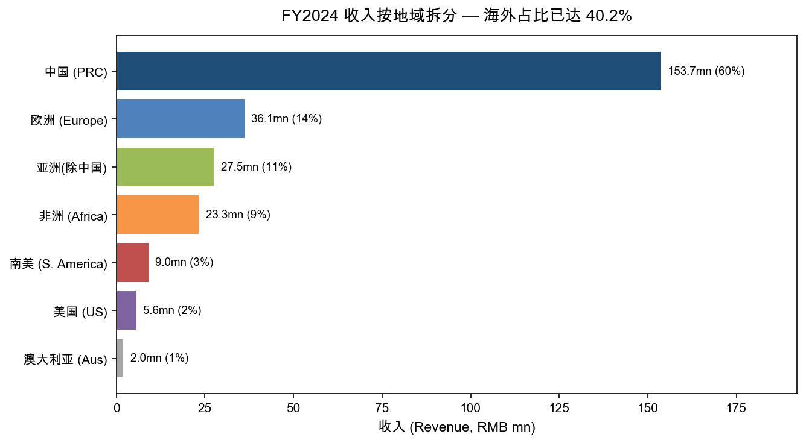
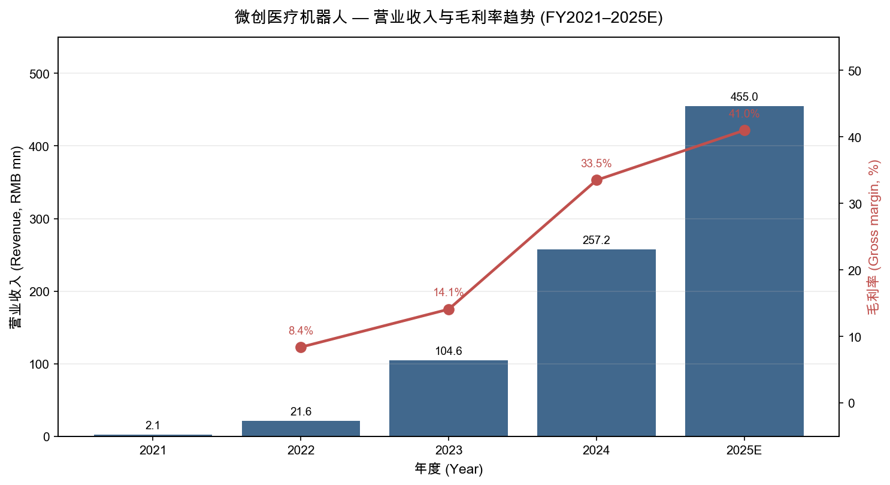
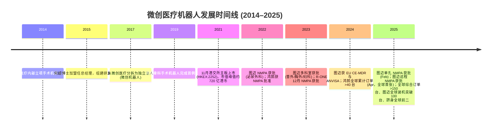
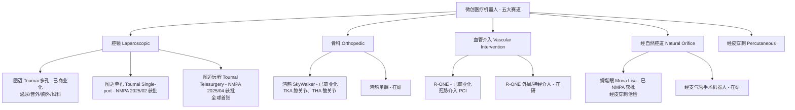
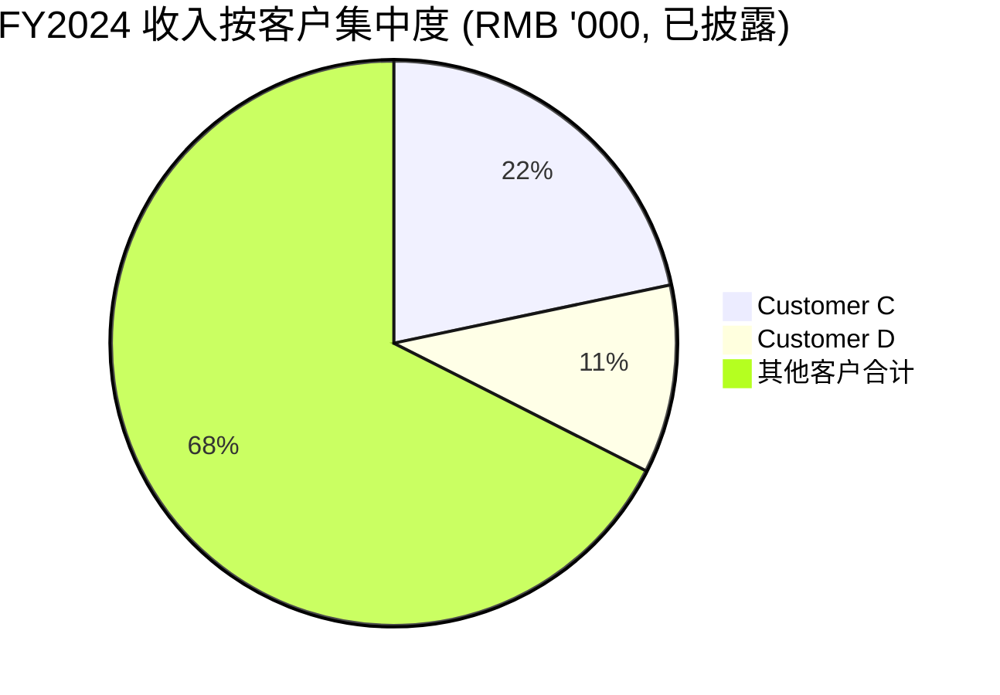
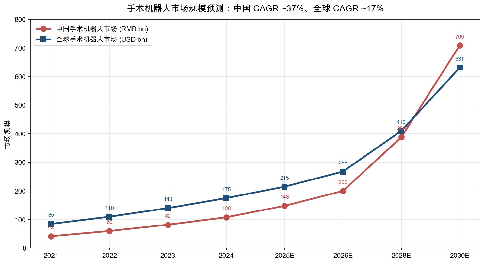
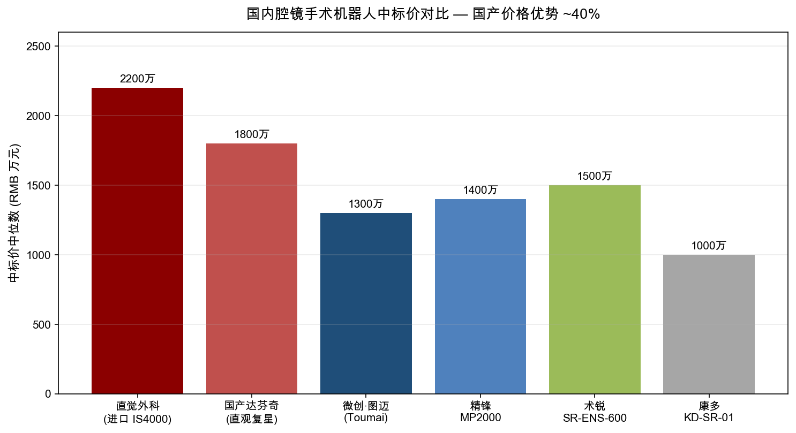

# 上海微创医疗机器人（集团）股份有限公司 (HKEX:2252) — 公司研究

**报告日期**：2026-05-20  
**研究范围**：业务、管理层、产品矩阵、客户结构、行业、竞争格局、TAM、风险  
**报告语言**：简体中文（含必要英文术语）

> **更新 — FY2025 业绩指引 (2025-08-28):** 公司于 2025 年中期业绩公告中维持"持续高速增长"基调，2025H1 录得收入 RMB 175.7 mn，同比 +77.0%，净亏损 RMB 114.9 mn，同比收窄 58.9%；管理层在多场策略发布会披露 2025 全年综合订单将突破 150 台，海外收入同比有望保持 ~190% 高位增长。卖方（摩根大通）据此预测 FY2026 收入将进入 RMB 1.0–1.1 bn 区间，公司有望在 FY2026 出现自由现金流（free cash flow）转正与经调整净利润盈亏平衡。  
> 资料来源：[2025 年中期业绩公告, 2025-08-28](https://www1.hkexnews.hk/listedco/listconews/sehk/2025/0828/2025082803066.pdf)；[小摩升微创机器人目标价至 42 港元, 华盛通, 2025](https://www.hstong.com/news/detail/26040817010320940)。

---

## 目录

1. 公司概览
2. 公司历史
3. 管理团队
4. 产品与服务
5. 客户与上市策略
6. 行业概览
7. 竞争格局
8. 市场机会 (TAM)
9. 风险评估
10. 参考资料

---

## 1. 公司概览

上海微创医疗机器人（集团）股份有限公司（"微创医疗机器人"或"公司"，HKEX:2252，B 股，证券简称"微创机器人-B"）是中国手术机器人 (surgical robot) 行业的头部平台型公司，也是全球极少数同时布局腔镜 (laparoscopic)、骨科 (orthopedic)、血管介入 (vascular intervention)、经自然腔道 (natural orifice) 与经皮穿刺 (percutaneous puncture) 五大手术机器人黄金赛道的厂商之一。公司于 2021 年 11 月 2 日以"第 18A 章未盈利生物科技 (pre-revenue biotech / 18A) "规则在香港联交所主板挂牌上市，发行价 43.20 港元，由微创医疗 (MicroPort Scientific Corporation, HKEX:0853) 分拆而来，至今仍是其控股子公司（[微创机器人主板上市新闻稿, 2021-11-02](https://www.microport.com.cn/upload/investor/1638406392248131341.pdf)）。

**主营业务与商业模式**：公司同时扮演研发型企业 (R&D-driven) 与商业化加速器 (commercialization platform) 双重角色——一方面持续投入图迈 (Toumai)、鸿鹄 (SkyWalker)、R-ONE、蜻蜓眼 (Mona Lisa) 等核心产品的临床注册与海外认证 (NMPA / FDA / CE-MDR / ANVISA 等)，另一方面通过国内三级甲等医院 (Grade IIIA) 直销、政府配置许可证 (大型医用设备配置许可) 渠道、以及海外经销商 ("distributor") 网络销售机器人本机、专属耗材 (instruments) 与服务 (services)（[2024 年度业绩公告 — 第 9 页, 2025-03-27](https://www1.hkexnews.hk/listedco/listconews/sehk/2025/0327/2025032702717.pdf)）。从收入构成看，FY2024 营业收入 RMB 257.2 mn 中，医疗器械及配件销售 ("sales of medical devices and accessories — point in time") 占 RMB 252.4 mn (98.1%)，服务收入仅 RMB 2.2 mn (0.9%)；这意味着商业模式目前仍以本机销售为主，"razor-and-blade"（耗材后市场）尚处早期，但管理层在 2025H1 业绩公告中明确指出"耗材与服务收入将随装机量持续提升"成为长期增量（[2025 年中期业绩公告 — 第 1–2 页](https://www1.hkexnews.hk/listedco/listconews/sehk/2025/0828/2025082803066.pdf)）。

**地理布局**：FY2024 中国大陆 (PRC) 收入 RMB 153.7 mn（占比 59.8%）、欧洲 RMB 36.1 mn (14.0%)、亚洲非中国 RMB 27.5 mn (10.7%)、非洲 RMB 23.3 mn (9.1%)、南美 RMB 9.0 mn (3.5%)、美国 RMB 5.6 mn (2.2%)、澳洲 RMB 2.0 mn (0.8%)（[2024 年度业绩公告 — 第 11 页](https://www1.hkexnews.hk/listedco/listconews/sehk/2025/0327/2025032702717.pdf)）。海外合计已达 40.2%，且 2025H1 海外收入再增 +189%。这是国产手术机器人公司中海外营收占比最高、且增长最快的一家，构成最重要的"中国制造高端医疗器械出海"投资逻辑。

*Source: [2024 年度业绩公告，第 11 页](https://www1.hkexnews.hk/listedco/listconews/sehk/2025/0327/2025032702717.pdf)*

**规模指标 (FY2024)**：营业收入 RMB 257.2 mn (+146.0% YoY)；毛利 RMB 86.2 mn (+486.8% YoY)，毛利率 33.5% (FY2023: 14.1%)；销售/营销开支 RMB 207.9 mn (-12.8%)；管理开支 RMB 55.3 mn (-56.3%)；研发开支 RMB 308.7 mn (-45.8%)；净亏损 RMB 647.1 mn (-36.8%)，经调整净亏损 RMB 482.6 mn (-44.5%)；自由现金流净流出 RMB 388 mn (FY2023: -670 mn)；年末现金及等价物 RMB 612.2 mn；员工总数约 450 人（FY2023: 显著更多 — 员工成本由 RMB 561.2 mn 大幅下降至 RMB 317.7 mn，降幅 43.4%）（[2024 年度业绩公告 — 第 3、41–45 页](https://www1.hkexnews.hk/listedco/listconews/sehk/2025/0327/2025032702717.pdf)）。

**关键运营指标**：截至 2025 年初，公司核心三大产品（图迈、鸿鹄、R-ONE）全球综合订单累计突破 100 台（[微创机器人公告 — 全球订单突破百台, 2025-01-20](https://news.qq.com/rain/a/20250120A074CL00)）；至 2025 年中报披露日，综合订单累计已超 150 台、全球商业化装机突破 100 台（[2025 年中期业绩公告](https://www1.hkexnews.hk/listedco/listconews/sehk/2025/0828/2025082803066.pdf)）；2025 年 12 月图迈单一产品全球商业化装机突破 100 台，2025 全年订单量已跻身全球前二（[新浪财经，2025-12-25](https://finance.sina.com.cn/stock/relnews/hk/2025-12-25/doc-inhcywai4952030.shtml)）。这是国产腔镜机器人首次在全球装机层面跻身 Top-2。

**估值快照 (Valuation snapshot) — 截至 2026-05-11**：股价 28.84 HKD，市值 297.4 亿 HKD（约 USD 38.1 bn 等值港币）；过去 52 周区间 14.58–35.34 HKD；7 位卖方覆盖，平均目标价 36.89 HKD，意味着 ~28% 上行空间，整体评级"强烈买入 (Strong Buy)"（[Investing.com — 2252.HK 股价](https://www.investing.com/equities/shanghai-microport-medbot)）。

由于公司**目前仍未盈利 (TTM 净亏损约 RMB -550 mn)**，TTM **P/E 为负** (NM)；采用 TTM P/S 衡量：以 297.4 亿港币市值 (~RMB 277 亿) 除以 TTM 收入 RMB 333 mn (2024 全年 257 + 2025H1 175 − 2024H1 99)，**TTM P/S ≈ 83×**——属于极高的估值水平。需要解释这一极端倍数的成因：

- **(a) 高增长赛道与"国产替代 + 出海"双叙事溢价**。Frost & Sullivan 与多家行业研究机构预测中国手术机器人市场 2025–2030 年 CAGR 36.7%、规模将由 RMB 148 亿元增至 RMB ~709 亿元（[远瞻智库《2025 年手术机器人行业研究报告》](https://www.baogaobox.com/insights/250422000009635.html)；[智研咨询 — 2025 国产替代趋势](https://www.chyxx.com/industry/1224392.html)）。市场以未来 2–3 年收入跳跃式增长（公司 2024→2026E 收入 257 → 1,100 mn，~4×）对应当前估值。
- **(b) 盈亏平衡可见**。摩根大通预测公司 2026 年实现"经调整净亏损盈亏平衡 + 自由现金流转正"（[华盛通 — 小摩升目标价至 42 港元](https://www.hstong.com/news/detail/26040817010320940)）。一旦盈利兑现，市场将切换到 P/E 估值锚（参考全球龙头 Intuitive Surgical 2026-05 TTM P/E 59–62×，[fullratio.com — ISRG PE](https://fullratio.com/stocks/nasdaq-isrg/pe-ratio)）。
- **(c) 行业稀缺性 / 龙头溢价**。在 HK 上市的纯手术机器人公司极少，机构持仓集中度高（微创医疗持 52.76% + 员工平台 10.47% + 高瓴 8.05% + CPE 源峰 3.49%，[OFweek，2024-04](https://m.ofweek.com/medical/2024-04/ART-11158-8440-30631126.html)），流通盘较小放大了倍数。
- **可比公司**：直觉外科 (ISRG) 2026-05 P/S 约 18–20× (TTM 收入 ~84 亿美元 / 市值 ~1,650 亿美元)；Stryker (SYK) P/S 约 5–6×；Medtronic (MDT) P/S 约 3×；国产可比 — 微创医疗 (00853.HK) P/S < 2×、心通医疗-B (02160.HK) P/S 约 6×。**微创机器人当前 ~83× P/S 显著高于龙头，估值已透支至 FY2027–2028 收入；任何商业化节奏放缓或产品事件都会带来显著估值压缩风险**（详见第 9 章 — 风险评估）。

*Source: 营业收入 [2024 年度业绩公告，第 3 页](https://www1.hkexnews.hk/listedco/listconews/sehk/2025/0327/2025032702717.pdf) (FY2021–2024)；FY2025E 取卖方一致预期约 RMB 455 mn ([华盛通，2025](https://www.hstong.com/news/detail/26040817010320940))。*

---

## 2. 公司历史

公司起源于微创医疗 (MicroPort Scientific, 00853.HK) 内部孵化的手术机器人事业部。微创医疗创始人常兆华博士在 1998 年于上海张江高科技园区创立微创医疗，业务横跨心血管介入、骨科、心律管理等十余条赛道；2014 年正式立项手术机器人业务（[公司百度百科介绍](https://baike.baidu.com/item/%E4%B8%8A%E6%B5%B7%E5%BE%AE%E5%88%9B%E5%8C%BB%E7%96%97%E6%9C%BA%E5%99%A8%E4%BA%BA%EF%BC%88%E9%9B%86%E5%9B%A2%EF%BC%89%E8%82%A1%E4%BB%BD%E6%9C%89%E9%99%90%E5%85%AC%E5%8F%B8/61940765)；[微创机器人主板上市新闻稿, 2021-11-02](https://www.microport.com.cn/upload/investor/1638406392248131341.pdf)）。2015 年 5 月，何超博士加盟担任总经理、组建团队；2017 年从微创医疗内部分拆为独立法人主体；2020 年 12 月晋升为公司总裁；2021 年完成 30 亿元 Pre-IPO 融资（高瓴、CPE 源峰、贝霖资本等），估值 225 亿元 (RMB)，同年 11 月 2 日登陆港股，募资约 16.83 亿港元（[智通财经 — 高瓴加持，225 亿估值](https://m.zhitongcaijing.com/article/share.html?content_id=503304)；[2024 年度业绩公告 — 募集资金净额 HKD 1,682.6 mn](https://www1.hkexnews.hk/listedco/listconews/sehk/2025/0327/2025032702717.pdf)）。

**关键战略转折**：

1. **从"全平台技术验证"到"商业化优先 + 海外驱动" (2023–2024)**。2023 年以前公司同时推进 5 大赛道的早期研发，研发投入大、亏损扩张；2024 年起管理层明确提出"战略聚焦 (strategic focus)" — 将资源集中在图迈、鸿鹄两款已商业化产品上，研发开支由 FY2023 RMB 569.2 mn 大幅压缩至 FY2024 RMB 308.7 mn (-45.8%)、员工人数从巅峰约 1,000 人级降至 450 人（[2024 年度业绩公告 — 第 2、26、45 页](https://www1.hkexnews.hk/listedco/listconews/sehk/2025/0327/2025032702717.pdf)）。这是国产手术机器人公司中最激进、最早完成精细化运营转型的一家。
2. **从"国内三甲为主"到"出海主引擎" (2024–2025)**。借助母公司微创医疗 30 余年累积的全球医疗器械分销网络，公司 2024 年起海外加速：图迈 5 月获 CE-MDR、8 月获 ANVISA；2025 年海外收入贡献从 2024 年的 40% 进一步抬升至 2025H1 的 58%，海外同比 +189%（[2025 年中期业绩公告](https://www1.hkexnews.hk/listedco/listconews/sehk/2025/0828/2025082803066.pdf)）。
3. **从单孔/多孔到"远程手术 (telesurgery)" 第三代** (2025)。图迈远程于 2025 年 4 月获 NMPA 注册（全球首张远程手术机器人注册证），并已完成超 300 例跨城市/跨国家远程手术、创下 25 项世界纪录（[2024 年度业绩公告 — 第 25–26 页](https://www1.hkexnews.hk/listedco/listconews/sehk/2025/0327/2025032702717.pdf)）。这一技术屏障构成长期差异化护城河。

**关键收购与合作**：2020 年与法国血管介入手术机器人公司 Robocath (R-ONE 原始研发方) 达成战略合作及股权投资，共同推进 R-ONE 在中国注册；2024 年因 Robocath 估值大幅下调，公司对其权益投资 ("equity-accounted investee") 计提减值 RMB 116.5 mn（[2024 年度业绩公告 — 第 3 页](https://www1.hkexnews.hk/listedco/listconews/sehk/2025/0327/2025032702717.pdf)）。这是公司开放式创新策略 ("open-innovation") 的一次代价，但 R-ONE 已落地国内并具备独立商业化能力。

**近期重大事件 (last 12 months)**：(i) 2025 年 5 月完成 25.14 mn 股新 H 股配售 (~港币 3.9 亿，配售价 15.50 HKD/股) + 控股股东减持 30.16 mn 股（[配售公告, 2025-05-14](https://www1.hkexnews.hk/listedco/listconews/sehk/2025/0514/2025051400032_c.pdf)）；(ii) 2025 年 7 月正面盈利预告披露中期亏损同比收窄 70–80%；(iii) 2025 年 12 月图迈全球商业化装机突破 100 台里程碑。

---

## 3. 管理团队

公司是典型的"创始人主导 (founder-led) + 母公司控股"型治理结构。CEO 何超博士同时是公司主要技术发明人与对外品牌符号，是评估投资价值时第一权重的"人"维度。

### 何超 博士 — 创始人、执行董事、首席执行官 / 总裁

何超是国内最早一批从事微创伤手术机器人 (minimally invasive surgical robot, MIS) 研究的科研人员，1985 年出生，合肥工业大学 2007 届机械与电子工程专业学士，后赴上海交通大学攻读硕士、博士（2009 年带领课题组研制出"中国第一台国产腔镜机器人样机"并完成动物胆囊摘除试验）；2011 年赴美国约翰·霍普金斯大学医学院 (Johns Hopkins) 担任访问学者——这是全球手术机器人的发源地（Intuitive Surgical 创始人之一 Russell Taylor 即在此实验室工作）（[合肥工业大学卓越工程师学院校友专访](https://eie.hfut.edu.cn/info/1010/1194.htm)；[证券时报 — 专访何超博士](https://www.stcn.com/article/detail/3593591.html)）。

2015 年 5 月，何超博士加盟微创医疗担任手术机器人事业部总经理，组建当时仅二十余人的核心团队；2017 年公司从微创医疗分拆独立后任董事，2020 年 12 月起出任总裁，2021 年 6 月被任命为执行董事，正式成为公司"一号位"（[同花顺金融 — 微创机器人-B 高管介绍](https://basic.10jqka.com.cn/176/HK2252/manager.html)；[中商情报网 — 何超个人简介](https://s.askci.com/stock/executives/HK2252/fc05cfdc63546a6e.shtml)）。

何超持有手术机器人相关发明专利 160 余项，主导制订我国第一份手术机器人行业标准、领衔国家关节手术机器人重点专项，并连续多年入选"上海领军人才"、"上海工匠"、Fast Company 中国创新者 50 强等（[何超博士专访 — 上海中外名家](https://share.shkp.org.cn/content.html?type=wx&id=498439)）。在他的主导下，公司构建了腔镜 + 骨科 + 血管 + 自然腔道 + 经皮穿刺五大赛道矩阵，是全球极少数能与 Intuitive Surgical / Stryker (Mako) 同时形成多管线竞争的厂商。何超在多次公开演讲与媒体采访中所表达的"国产手术机器人正在被更多人接受、未来十年是中国手术机器人黄金十年"的判断（[九方智投 — 微创机器人总裁何超专访](https://www.9fzt.com/cls_1309/topic_7e18fe9c5c9c0543059f827d4fa8f2af.html)），与其将研发投入精度集中、推动出海、强化平台型策略的实际执行高度一致。

**所有权与激励**：根据公司公开股权信息，何超个人通过员工持股平台上海擎敏（持股 10.47%）参与；该平台是公司第二大股东，构成核心管理层与股东利益绑定（[OFweek — 高瓴加注微创"拆弹"，2024](https://m.ofweek.com/medical/2024-04/ART-11158-8440-30631126.html)）。公司也建立股份奖励计划与购股权计划，FY2024 计入股份支付费用 RMB 48.2 mn（[2024 年度业绩公告 — 第 44 页](https://www1.hkexnews.hk/listedco/listconews/sehk/2025/0327/2025032702717.pdf)）。

### 孙洪斌 — 董事会主席 (Chairman)、非执行董事

孙洪斌为微创医疗 (00853.HK) 集团首席财务官 (CFO)；以母公司高管身份兼任微创机器人董事会主席，主要代表控股股东微创医疗行使治理监督。其加入意味着集团对子公司财务规范与资本运作的强管控。

### 首席财务官 (CFO)

公司 CFO 由具备港股审计与资本市场背景的高管担任，主要负责 IPO 后的财报合规、债务融资 (FY2024 有息负债 RMB 634.5 mn，资产负债率 80%)、H 股增发 (2025-05 配售) 等。考虑到截至 FY2024 年末现金仅 RMB 612.2 mn、年净流出 ~RMB 388 mn，CFO 的资本运作节奏 — 何时再融资、何时通过债务融资换取股权稀释空间 — 直接决定股东中期收益（[2024 年度业绩公告 — 第 45–47 页](https://www1.hkexnews.hk/listedco/listconews/sehk/2025/0327/2025032702717.pdf)）。

### 关键技术 / 业务执行层

公司在多个核心子领域有专门技术副总裁（包括腔镜系统、骨科系统、远程手术算法等），其中骨科业务线借助母公司微创医疗骨科板块的全球商业渠道——这是鸿鹄能够快速进入美国、德国、意大利、比利时、希腊、澳洲、巴西等市场的关键运营杠杆（[2024 年度业绩公告 — 第 23 页](https://www1.hkexnews.hk/listedco/listconews/sehk/2025/0327/2025032702717.pdf)）。

### 治理结构

- **董事会构成**：由执行董事 (含何超等)、非执行董事 (含母公司代表) 和独立非执行董事 (Independent Non-Executive Directors, INED) 组成。审计委员会由 2 名独立非执行董事 (主席钟伟文先生、李明华博士) 和 1 名非执行董事 (陈昕欣先生) 组成（[2024 年度业绩公告 — 第 54 页](https://www1.hkexnews.hk/listedco/listconews/sehk/2025/0327/2025032702717.pdf)）。
- **控股结构**：微创医疗 (00853.HK) 持股 52.76% + 员工平台上海擎祯 1.85% (一致行动人)，合计 54.61%；员工平台上海擎敏 10.47% (第二大)；机构投资人 — 高瓴 8.05%、CPE 源峰 3.49%、贝霖资本 1.74%、远翼投资 1.40%、易方达 1.06%（[OFweek，2024-04](https://m.ofweek.com/medical/2024-04/ART-11158-8440-30631126.html)）。
- **关联交易**：与母公司微创医疗集团之间存在显著的渠道协同（鸿鹄借助微创骨科海外网络）、共享供应链、可能存在的设备及器械相互采购等关联关系。公司在《2024 年度业绩公告》中披露关联交易已按港交所披露要求处理。
- **薪酬结构**：根据公司治理报告，董事与高管薪酬包括基本工资、绩效奖金、股份激励三部分；股份激励占比较高，以期与中长期股东价值绑定。

### 管理层业绩评估

何超博士自加盟以来 10 年时间，将一个研发团队推上港股上市并实现五条产品线全部 NMPA 获批，在国产手术机器人领域属于一流执行力。同期，他在 2023–2024 年的"战略聚焦 + 降本 + 出海"三位一体决策，使经调整净亏损同比改善 44.5%、海外收入占比由不足 10% 跃升至 40% — 这种敏捷转型在中国 18A 类生物科技公司中是少见的。**不足在于**：(i) 2024 年对 Robocath 计提 RMB 116.5 mn 减值，反映对外开放式投资判断的失误；(ii) FY2023 员工数推高至超 800 人显示前期扩张过于激进，2024 年裁员调整付出了员工成本结构性波动的代价（员工成本同比 -43.4%，涉及核心研发流失风险）。整体来看，团队在"前期狂奔 — 中期纠偏 — 后期商业化加速"的曲线上呈现出较强的自我修正能力。

---

## 4. 产品与服务

公司当前形成 **"四产品已上市 + 多管线在研"** 的矩阵。下表逐项展开。

### 4.1 图迈 Toumai 腔镜手术机器人 (核心产品 / Core Product)

**功能与目标客户**：Toumai 是公司"现金牛 + 增长引擎"，对标 Intuitive Surgical 的达芬奇 (da Vinci) 系列，是一款多臂主从腔镜手术机器人，2022 年首次 NMPA 获批用于泌尿外科 (urology)，2023 年扩展至普外 (general)、胸外 (thoracic)、妇科 (gynecology)（[2024 年度业绩公告 — 第 23–24 页](https://www1.hkexnews.hk/listedco/listconews/sehk/2025/0327/2025032702717.pdf)）。目标客户为国内顶尖三级甲等医院 (Grade IIIA) 与海外私立 / 高端医疗机构。

**定价**：根据中标数据，图迈国内中标价中位数约 RMB 1,300 万元 (~USD 180 mn / unit?? — RMB 130 万 / unit)；对应进口达芬奇 IS4000 中位数 RMB 2,200 万元，国产版 IS4000CN（直观复星合资）约 RMB 1,800 万元（[新浪财经 — 2025 腔镜手术机器人激战，2025-05-08](https://finance.sina.com.cn/stock/relnews/hk/2025-05-08/doc-inevwchs8468970.shtml)）。**定价竞争优势 ~40%**，且加耗材 / 服务的总持有成本进一步拉开。

**关键里程碑**：FY2024 全球新订单 39 台、商业化装机 30+ 台；累计全球商业订单 60+ 台；国内三甲覆盖率达 60%+；2024 年 5 月 CE-MDR、8 月 ANVISA；2025 年 2 月单孔获批；2025 年 4 月远程获 NMPA 注册（全球首张）；至 2025 年底全球商业化装机突破 100 台、跻身全球前二（[新浪财经，2025-12-25](https://finance.sina.com.cn/stock/relnews/hk/2025-12-25/doc-inhcywai4952030.shtml)）。

**竞争优势评估**：**Yes — 多重护城河**。
- 技术 / IP：何超博士实验室 160+ 发明专利组合，主从控制算法与抖动滤除 (motion scaling + tremor filtration) 关键专利在国内排名前二（仅次于直观复星授权技术）。
- 监管壁垒：图迈是国内同时获 CE-MDR（高度复杂三类医疗器械）、NMPA、ANVISA、近 20 国注册的国产腔镜机器人，新进入者需 3–5 年才可能复制。
- 临床数据 / 远程手术：300+ 例跨城市/跨国家远程手术零失败、创下 25 项世界纪录，构成"中国制造高端医疗器械" + "国家级影响力工程"双背书。
- 成本与本地化：国产化率高，可避免美国对华 145% 综合关税冲击（[OFweek医械，2025-12](https://m.ofweek.com/medical/2025-12/ART-11111-8120-30675767.html)）。
- 最近竞争对手：直观复星 IS4000CN（贴牌国产化版达芬奇，仍需向 Intuitive Surgical 缴付授权费）、精锋 MP2000、术锐 SR-ENS-600。**图迈对比 IS4000CN：成本领先 ~30%、远程手术与单孔多任务略领先；对比精锋 MP2000：装机速度领先（图迈年装机 30+ 台 vs 精锋 ~10–15 台），但单孔精度方面精锋有 SuperArm 优势** ([远瞻智库《国产替代加速》报告](https://www.baogaobox.com/insights/250602000011181.html))。

### 4.2 鸿鹄 SkyWalker 骨科手术机器人 (旗舰产品 / Flagship Product)

**功能**：辅助全膝关节置换 (Total Knee Arthroplasty, TKA) 与全髋关节置换 (Total Hip Arthroplasty, THA)，对标 Stryker 的 Mako。**定价**：进口 Mako 国内中标价约 RMB 600–1,200 万元/台，鸿鹄约 RMB 500–800 万元/台。

**里程碑**：FY2024 累计全球订单超 40 台，覆盖中国、美国、德国、意大利、比利时、希腊、澳大利亚、巴西等 5 大洲近 10 国；累计辅助完成近 2,000 例 TKA 手术；获 NMPA、FDA、CE 认证，覆盖发达市场（[2024 年度业绩公告 — 第 23、59 页](https://www1.hkexnews.hk/listedco/listconews/sehk/2025/0327/2025032702717.pdf)）。

**竞争优势**：**Yes — 借力母公司渠道护城河**。鸿鹄是国产唯一同时取得 FDA + CE + NMPA 三证的骨科手术机器人，且借用微创医疗 (00853) 全球骨科销售网络快速放量（这是其他国产新进入者无法在 2–3 年内复制的）。Mako 在美国市场份额 70%+，鸿鹄在美国及发达市场的渗透仍处早期，但凭借成本与渠道双优势可分享 ~10–15% 海外市场。

### 4.3 R-ONE 血管介入手术机器人

**功能**：全球极少数获批用于经皮冠状动脉介入 (Percutaneous Coronary Intervention, PCI) 的手术机器人，与法国 Robocath 联合开发。**里程碑**：2023 年 12 月 NMPA 获批 — 国内**唯一**已上市的冠脉介入手术机器人；FY2024 中标复旦大学附属中山医院等 5 家上海头部三甲，国内累计 8 台、全球累计 18 台装机；2025H1 完成 100+ 例 PCI 手术（[新浪财经 — 三大手术机器人订单破百，2025-01-24](https://finance.sina.com.cn/stock/hkstock/ggscyd/2025-01-24/doc-inefzwne4086298.shtml)；[搜狐新闻 — 2024 业绩亮眼，2025-03](https://www.sohu.com/a/877168355_121956424)）。

**竞争优势**：**Yes — 监管壁垒型**。R-ONE 是目前国内唯一上市的冠脉介入机器人，**先发垄断窗口预计可持续 12–24 个月**（直到精锋、术锐等竞品获批）。结构性挑战：原始研发方 Robocath 经营压力大、公司已对其投资计提 RMB 116.5 mn 减值，对长期技术路线依赖度构成风险。

### 4.4 蜻蜓眼 Mona Lisa 经皮穿刺手术机器人

**功能**：用于经皮穿刺活检 / 介入治疗 (CT / 超声引导)。已 NMPA 获批，处于商业化早期。

**竞争优势**：**Partial — 细分赛道领先但市场规模小**。蜻蜓眼在国内细分市场属于头部，但赛道整体 TAM 较小（年销售规模 < RMB 5 亿），更多承担产品矩阵协同与品牌延展的功能。

### 4.5 在研管线

- **图迈单孔 (Single-port) Toumai** — 已 NMPA 获批 (2025-02)，对标 Intuitive Surgical 的 da Vinci SP；
- **经支气管手术机器人 (Trans-bronchial Surgical Robot)** — 在研，对标 Intuitive Surgical 的 Ion；
- **R-ONE 外周血管介入** — 在研；
- **图迈自然腔道 (Natural Orifice Surgery, NOS)** — 在研。

按 FY2024 收入贡献估算（公司未拆分披露）：**图迈 ~60–65%、鸿鹄 ~25–30%、R-ONE ~5–8%、其他 < 5%**。图迈与鸿鹄是绝对的 "flagship 双引擎"。

**最近 12 个月产品动态**：(i) 2025-02 图迈单孔获批 (新增产品线)；(ii) 2025-04 图迈远程 NMPA 注册 (全球首张)；(iii) 2025-08 R-ONE 累计完成 100+ PCI 手术；(iv) 2025-12 图迈全球商业化装机突破 100 台。

---

## 5. 客户与上市策略

### 5.1 客户结构与集中度 (Customer Concentration)

公司在 FY2024 业绩公告中按"占收入 10% 以上 ('major customer')"标准列示：

| 客户   | FY2024 收入 (RMB '000) | 占收入 % | FY2023 收入 (RMB '000) | 占收入 % |
|--------|---------------------:|------:|---------------------:|------:|
| Customer A | — | — | 13,704 | 13.1% |
| Customer B | — | — | 10,893 | 10.4% |
| Customer C | 55,798 | **21.7%** | — | — |
| Customer D | 27,707 | **10.8%** | — | — |
| 其他客户合计 | 173,744 | 67.5% | 79,995 | 76.5% |
| **合计** | **257,249** | **100%** | **104,592** | **100%** |

资料来源：[2024 年度业绩公告 — 第 9 页](https://www1.hkexnews.hk/listedco/listconews/sehk/2025/0327/2025032702717.pdf)。

**关键观察**：
1. 公司并未披露 Customer A/B/C/D 的具体身份。Customer C 单一客户占 FY2024 收入 21.7%，**触发"top-1 > 20%"的高集中度门槛**——这是 18A 期早期商业化公司的典型特征，但 Top-1 占比超 20% 应在风险章节明确呈现（见第 9 章）；
2. Top-2 (Customer C + D) 合计占 32.5%；Top-5 公司未单独披露但参考行业惯例与公告字面，估计在 40–50% 区间。
3. 2024 vs 2023 大客户名单**完全更换**：意味着 Top-1 客户多为分销商或一次性大单（如某一海外国家代理商首次铺货、或某一三甲医院一次性 3–5 台采购），并非长期重复采购的"锚定客户"。
4. 合同结构：根据收入确认会计政策，**98%+ 收入按"销售医疗器械和配件 — 在某一时点 (point in time)"确认**，意味着合同主要是 PO-by-PO 设备采购，而非多年期服务订阅 — 反映商业模式仍未进入达芬奇式的"装机 + 长期耗材服务"成熟阶段。

### 5.2 销售渠道与上市策略 (Go-to-Market)

**国内市场**：通过母公司微创医疗以及自有销售队伍直接对接三级甲等医院；在大型医用设备配置许可证 (Class A / Class B) 制度下，公司参与医院招投标和挂网采购流程。这是医院端 1–2 年的长销售周期。

**海外市场**：以经销商 ("appointed distributors") 为主，叠加微创医疗集团既有的全球渠道。从 FY2024 地理分布看，欧洲、亚洲（非中国）、非洲、南美都已有商业订单：欧洲 RMB 36.1 mn（主要为意大利、德国、希腊、比利时）、亚洲非中国 RMB 27.5 mn（印度、东南亚为主）、非洲 RMB 23.3 mn（埃及、北非）、南美 RMB 9.0 mn（巴西）、美国 RMB 5.6 mn（FDA-cleared 鸿鹄渠道）、澳洲 RMB 2.0 mn。

**销售周期**：从首次接触到装机一般 12–18 个月（医院评估、招投标、本地监管、医生培训），耗材后市场 + 服务订单则 5–10 年。

**重要客户案例**：复旦大学附属中山医院（上海，R-ONE 标杆）、北京协和医院、四川大学华西医院、上海交大附属仁济医院（图迈用户）以及德国、意大利顶尖医院（鸿鹄海外首批用户）。

**重要合作伙伴**：(i) 微创医疗集团 (HKEX:0853) — 控股股东、渠道协同；(ii) 法国 Robocath — R-ONE 联合开发方；(iii) 中国移动 / 华为 — 5G 远程手术合作；(iv) 复旦大学附属中山医院、瑞金医院 — 临床合作基地。

### 5.3 客户集中度风险评估

**Top-1 > 20%** → 触发 Section 9 风险项。 详见第 9 章 "客户集中度风险" 部分。

---

## 6. 行业概览

**行业定义**：手术机器人 (Surgical Robotics) 属于高端医疗器械 (Class III 三类医疗器械) 的细分赛道，国内分类码 NMPA 第三类医疗器械目录 6877 介入器材 / 6857 手术器械 / 6856 病房护理设备 之中。NAICS 编码为 33911 (Medical Equipment and Supplies Manufacturing)。按术式划分分为腔镜 (laparoscopic)、骨科 (orthopedic)、血管介入 (vascular intervention)、经自然腔道 (natural orifice)、经皮穿刺 (percutaneous) 与神经外科 (neurosurgery) 六大子赛道。

### 6.1 市场规模与增长

**全球市场**：根据 Frost & Sullivan、Grand View Research 与多家投行预测，全球手术机器人市场规模 2024 年约 USD 175 亿，2025 年约 USD 269 亿，预计 2030 年达 USD 631 亿，2025–2030 CAGR **18.6%**；其中腔镜机器人占比约 ~70%（[远瞻智库《2025 年手术机器人行业研究报告》](https://www.baogaobox.com/insights/250422000009635.html)）。

**中国市场**：Frost & Sullivan 数据，2021 年中国市场规模约 RMB 41.9 亿元；2025 年预计达 RMB 148 亿元；2030 年预计达 RMB 709 亿元，**2025–2030 CAGR 36.7%**（[智研咨询 — 2025 国产化率分析](https://www.chyxx.com/industry/1224392.html)）。中国 CAGR 显著高于全球 — 主要驱动是 (i) 人均机器人保有量极低（中国 < 0.3 台 / 百万人 vs 美国 30+ 台 / 百万人）；(ii) 政府配置许可证 (Class A) 自 2022 年放开、2023 年起准入门槛降低；(iii) 国产替代与价格下沉双重逻辑。

*Source: 中国市场数据 [远瞻智库报告](https://www.baogaobox.com/insights/250422000009635.html)；全球数据 [智研咨询 — 趋势研判](https://www.chyxx.com/industry/1224392.html)；卖方综合预期 ([东方财富 — 国盛证券深度报告](https://pdf.dfcfw.com/pdf/H3_AP202502111642972424_1.pdf?1739292241000.pdf=))*

### 6.2 行业关键驱动

1. **人口老龄化 + 慢病发病率上升**：中国 65 岁以上人口已突破 2.1 亿（占比 15.4%），关节置换 (TKA / THA) 、冠脉介入 (PCI)、泌尿外科手术量年增 8–10%。每台手术机器人年支持约 200–400 例手术。
2. **政策放开 + 国产替代**：2022 年起大型医用设备配置许可证由 Class A（国家配置）下沉 Class B（地方配置），有效装机审批大幅提速；2023 年医保局推动手术机器人辅助费用 ("操作费") 部分纳入医保（北京、上海、湖南先行）。国务院 2021 年发布《"十四五"医疗装备产业发展规划》明确支持高端医疗器械国产化（[NMED — 中国医药报：良性竞争激发手术机器人行业新活力，2025-05](https://www.nmed.org.cn/Content/xwzx/xw/2025-05/147173.html)）。
3. **关税与地缘**：2025 年中美贸易摩擦升级，美国对华医疗设备加征关税达综合 145%；进口达芬奇等系统涨价，进一步利好国产替代（[OFweek医械，2025-12](https://m.ofweek.com/medical/2025-12/ART-11111-8120-30675767.html)）。
4. **技术进步**：5G 远程手术 (telesurgery)、AI 辅助决策、单孔 (single-port) 等技术成熟，将手术机器人覆盖从"中心城市三甲"扩展到"基层 + 偏远"。

### 6.3 监管环境

- **NMPA (中国)**：所有手术机器人作为第三类有源植入医疗器械，注册周期典型 24–36 个月，需多中心临床试验；
- **FDA (美国)**：以 De Novo 510(k) 或 PMA 路径为主，鸿鹄通过 510(k) 获批 (2021)；
- **CE-MDR (欧盟)**：2021 年 MDR 新规生效后认证门槛显著提升，图迈 2024 年获 CE-MDR 是重大里程碑；
- **配置许可制度**：中国大型医用设备配置许可分 Class A/B，对医院装机有指标管理。2022 年放开后，进口与国产配额逐步分离 — 国产机器人有政策性配额倾斜。

### 6.4 行业结构

- **集中度**：全球高度集中，Intuitive Surgical 占据全球腔镜机器人市场份额约 60%（[远瞻智库报告](https://www.baogaobox.com/insights/250422000009635.html)）；中国 Q1-2025 腔镜机器人新装机直观医疗 (Intuitive Surgical + 复星合资) 占 55.6%，国产合计 ~45% 且加速提升（[健康界 — 2025 Q1 行业分析](https://www.cn-healthcare.com/articlewm/20250526/content-1650803.html)）。
- **进入壁垒**：极高 — 资本密集 (单一产品研发投入 RMB 3–10 亿)、临床数据周期 3–5 年、监管证书周期 2–3 年、医院培训生态、知识产权壁垒。
- **供应商议价权**：高端控制器、力反馈传感器、精密机械手指、内窥镜模块多由欧美日（瑞士 Maxon、日本 THK、德国 SCHUNK）供应；本土化替代仍在进行中。
- **客户议价权**：医院端议价能力随集采推进而提升（如 2024 年开始的省级"耗材集采"已涉及部分外科器械）。
- **替代品威胁**：传统人工腹腔镜手术 (manual laparoscopy)、关节定位导航系统（非机器人）；长期看几乎不可替代。

---

## 7. 竞争格局

### 7.1 全球主要竞争对手

| 公司 | 主营产品 | 市场份额 / 装机 | 财务规模 (TTM) | 估值倍数 |
|------|---------|----------------|----------------|---------|
| Intuitive Surgical (NASDAQ: ISRG) | da Vinci (腔镜)、Ion (经支气管) | 全球腔镜 ~60%；2025-Q1 全球装机 10,189 台 | 收入 ~USD 8.4 bn | P/E 60×、P/S ~20× ([ISRG PE](https://fullratio.com/stocks/nasdaq-isrg/pe-ratio)) |
| Stryker (NYSE: SYK) | Mako (骨科) | 全球骨科机器人 70%+；全球装机 ~2,000+ 台 | 收入 ~USD 22 bn | P/E ~40× |
| Medtronic (NYSE: MDT) | Hugo (腔镜，2024 退出美国市场)、Mazor (脊柱) | 腔镜全球 < 1%；脊柱机器人占 30% | 收入 ~USD 32 bn | P/E ~25× |
| Johnson & Johnson MedTech | Ottava (腔镜，临床中) | 暂无装机 | n/a | n/a |
| CMR Surgical (英国，未上市) | Versius (腔镜) | 全球装机 ~200 台 | 收入 ~USD 100 mn (est.) | 私募，2023 年估值 USD 3.0 bn |

### 7.2 中国主要竞争对手

| 公司 | 主营产品 | 状态 | 优势 | 中标价中位数 |
|------|---------|------|------|--------------|
| **直觉外科 (Intuitive Surgical) — 进口 IS4000** | da Vinci IS4000 | 在售 | 临床数据 / 品牌 / 培训生态 | RMB 2,200 万 |
| **直观复星 (Intuitive Fosun)** | IS4000CN (国产化达芬奇) | 在售 | 进口品牌国产化、合资身份 | RMB 1,800 万 |
| **微创医疗机器人 (HKEX:2252) — 图迈** | Toumai | 在售 | 全平台 + 出海 + 远程 | RMB 1,300 万 |
| **精锋医疗 (Edge Medical)** | MP2000 (腔镜，含单孔 SuperArm) | 在售 (2022 NMPA) | 单孔精度领先、设备 + 耗材捆绑 | RMB 1,200–1,898 万 |
| **北京术锐 (Sentire Surgical)** | SR-ENS-600 (腔镜，可弯超声刀) | 在售 (2023 NMPA) | 专利 / 高端化 | RMB 1,500 万 |
| **威高康多 (Kangduo / Weigao)** | KD-SR-01 (经济型腔镜) | 在售 | 经济型，渠道下沉 | RMB 899–1,146 万 |
| **天智航 (688277.SH)** | 天玑骨科 | 在售 | 国产骨科领先，A股上市 | RMB 700–900 万 |

资料来源：[新浪财经 — 2025 腔镜激战](https://finance.sina.com.cn/stock/relnews/hk/2025-05-08/doc-inevwchs8468970.shtml)；[远瞻智库报告](https://www.baogaobox.com/insights/250602000011181.html)。

*Source: 综合自 [新浪财经 — 2025 腔镜手术机器人激战，2025-05-08](https://finance.sina.com.cn/stock/relnews/hk/2025-05-08/doc-inevwchs8468970.shtml)。*

### 7.3 公司竞争优势

1. **平台型矩阵**：唯一同时商业化 **5 大赛道** + **3 个法规市场 (NMPA/FDA/CE)** 的国产厂商。竞争对手多专注 1–2 个赛道。
2. **海外渠道护城河**：依托微创医疗集团 30 年全球医疗器械分销网络（覆盖 100+ 国家），鸿鹄、图迈出海速度远超精锋、术锐等纯本土公司。FY2024 海外收入占比 40.2%，FY2025H1 已达 58% — 在国产手术机器人公司中独一无二。
3. **远程手术先发优势**：图迈远程是**全球首张 NMPA 注册的远程手术机器人**，并已完成 300+ 例跨国手术；这一壁垒涉及 5G 通信、控制延迟算法、临床操作规范等多重壁垒。
4. **创始人技术沉淀**：何超博士的实验室在国内手术机器人研究持续 15+ 年，160+ 专利构成深厚的技术资本。
5. **资本与品牌**：港股 18A 上市 + 高瓴等顶级机构支持，融资渠道相对开放。

### 7.4 竞争弱点

1. **盈利能力远落后于 Intuitive Surgical**：ISRG 净利率 25%+，公司仍亏损；规模差距 30+ 倍。
2. **耗材占比低、复购模型未建立**：达芬奇耗材 + 服务收入占比 70%+，是商业模式核心；公司目前 98% 仍为本机销售。
3. **大客户集中度高 + 客户名单年度更换**：意味着收入可预测性较低。
4. **现金消耗仍快**：年自由现金流流出 RMB 388 mn，相对年末现金 RMB 612 mn — 现金跑道 < 18 个月，被迫频繁配股 / 借款。
5. **关联交易复杂度**：与母公司微创医疗存在大量渠道与供应链协同，但同时母公司自身财务承压（[OFweek — 高瓴加注微创"拆弹"，2024](https://m.ofweek.com/medical/2024-04/ART-11158-8440-30631126.html)），可能成为关联风险源。

### 7.5 市场份额

国内腔镜手术机器人 Q1-2025 新装机分布（[健康界 — 2025 Q1 行业报告](https://www.cn-healthcare.com/articlewm/20250526/content-1650803.html)）：

- 直觉外科 / 直观复星合计：~55.6%
- 微创·图迈：~15–18%（国产第一）
- 精锋医疗：~10–13%
- 术锐：~5–7%
- 康多：~3–5%
- 其他：~5%

骨科机器人：鸿鹄国内份额约 ~10%（前 3），全球 < 1%。

---

## 8. 市场机会 (TAM)

### 8.1 TAM 拆分

按公司业务覆盖的 5 大赛道，2030 年全球 / 中国市场规模：

| 子赛道 | 2024 全球 (USD bn) | 2030 全球 (USD bn) | 2030 中国 (RMB bn) | 公司目标份额 |
|--------|-------------------:|--------------------:|--------------------:|---------------:|
| 腔镜 (Laparoscopic) | 11.5 | ~42 | ~480 | 国内 25–30% + 海外 5–8% |
| 骨科 (Orthopedic) | 2.5 | ~9 | ~110 | 国内 15–20% + 海外 3–5% |
| 血管介入 (Vascular) | 1.2 | ~5 | ~60 | 国内 30%+ (先发垄断窗口) |
| 经皮穿刺 / 自然腔道 | 1.3 | ~5 | ~40 | < 5% |
| 神经外科 (未进入) | 1.0 | ~4 | ~20 | n/a |
| **合计** | **17.5** | **~65** | **~710** | n/a |

**口径说明**：全球数据综合自 Grand View Research、Frost & Sullivan、智研咨询（[2025 行业研究报告](https://www.baogaobox.com/insights/250422000009635.html)）；中国数据综合自 Frost & Sullivan、远瞻智库 (CAGR 36.7% / 2025–2030)；公司目标份额为基于当前装机增速与海外认证进度的合理推断 (est., 非公司披露)。

### 8.2 SAM / SOM

- **SAM (Serviceable Available Market)** — 公司当前覆盖产品线 + 已获监管国家：~USD 35 bn (2030E)。
- **SOM (Serviceable Obtainable Market)** — 5 年内可实现的现实份额：~USD 1.5–2.5 bn 销售规模 (FY2030)，对应 RMB 11–18 bn。
- 卖方一致预期：FY2026 收入 RMB ~1.1 bn、FY2028 收入 RMB ~3.0–4.0 bn（隐含 CAGR 70–80%，[华盛通 — 小摩升目标价至 42 港元](https://www.hstong.com/news/detail/26040817010320940)）。

### 8.3 渗透策略

1. **中国三甲渗透**：国内仍有 ~1,500 家三甲医院、~3,000 家二甲。公司目标 60% 三甲覆盖（FY2024 已 60%+），未来 5 年向二甲 + 县级标杆医院下沉。
2. **海外发达市场**：通过鸿鹄美国 FDA + 图迈欧盟 MDR 双证打开欧美市场，目标 5 年内海外份额突破 10%。
3. **新兴市场 (Africa / LatAm / SEA)**：性价比优势 + 当地分销网络。
4. **耗材 + 服务复购**：随装机量突破 200–300 台后，耗材收入将进入指数级增长阶段（参考达芬奇耗材 / 服务占比 70%+）。

---

## 9. 风险评估

### 9.1 公司特定风险 (Company-Specific Risks)

**① 持续亏损与现金跑道压力**。FY2024 净亏损 RMB 647 mn、自由现金流 -388 mn；FY2024 年末现金 RMB 612.2 mn + 有息负债 RMB 634.5 mn (债务/资产比 80%)。如果商业化未在 FY2026 兑现，公司将进入新一轮股权融资稀释压力（2025 年 5 月已进行一次 ~2.5% 摊薄的配售）（[2024 年度业绩公告 — 第 45–47 页](https://www1.hkexnews.hk/listedco/listconews/sehk/2025/0327/2025032702717.pdf)；[配售公告，2025-05-14](https://www1.hkexnews.hk/listedco/listconews/sehk/2025/0514/2025051400032_c.pdf)）。**缓解**：管理层降本成效已经显现，FY2026 自由现金流转正预期较强。

**② 客户集中度过高**。FY2024 Top-1 客户占 21.7%、Top-2 累计 32.5%；2023 vs 2024 大客户名单完全更换。这反映收入主要由大单驱动（一次性区域分销首铺或医院集中招标），收入可预测性偏低，**任何一个大客户流失可能造成 10–20% 收入波动**（[2024 年度业绩公告 — 第 9 页](https://www1.hkexnews.hk/listedco/listconews/sehk/2025/0327/2025032702717.pdf)）。

**③ 关联方依赖与渠道协同稳定性**。母公司微创医疗持股 52.76%，全球渠道（尤其鸿鹄出海）高度依赖微创医疗骨科分部。微创医疗自身在 FY2023 出现"持续经营能力警示"，2024 年靠高瓴注资暂时纾困（[OFweek，2024-04](https://m.ofweek.com/medical/2024-04/ART-11158-8440-30631126.html)）。若母公司基本面进一步恶化（拆分子公司套现、渠道终止协同），将对公司海外业务构成实质冲击。

**④ Robocath 等对外投资减值风险**。FY2024 已对 Robocath 计提 RMB 116.5 mn 减值；R-ONE 仍依赖 Robocath 提供部分核心技术与硬件（[2024 年度业绩公告 — 第 44 页](https://www1.hkexnews.hk/listedco/listconews/sehk/2025/0327/2025032702717.pdf)）。Robocath 经营状况进一步恶化可能影响 R-ONE 产品迭代与海外授权拓展。

**⑤ 核心研发人员流失**。FY2023 至 FY2024 员工总数减少约 40–50%（员工成本由 RMB 561 mn 降至 RMB 318 mn），部分关键研发人员离职是公司"战略聚焦"的必然代价；行业人才争夺激烈（精锋、术锐均在挖角），可能影响产品迭代速度。

### 9.2 行业 / 市场风险 (Industry/Market Risks)

**⑥ 直觉外科 (ISRG) 国产化加速反击**。直观复星 IS4000CN 已国产化生产，2025 年起价格逐步下探；加上达芬奇 SP（单孔）2025 年获 NMPA 批准在即，对图迈正面竞争压力骤增（[ChinaWitMed，2025-05](http://www.cn-witmed.com/list/5/7328.html)）。

**⑦ 国内集采 / 医保压价**。2025 年起省级耗材集采已扩散至部分外科器械；若手术机器人辅助费 / 耗材进入集采，可能将毛利率从 33.5% 压缩至 20% 以下（参考冠脉支架、骨科耗材集采降幅 60–80%）（[南方财经，2024-06](https://www.sfccn.com/2024/6-13/zOMDE1MjZfMTkyNTYzOQ.html)）。

**⑧ 政策依赖性 — 配置许可证**。手术机器人受大型医用设备配置许可制度约束；若政策收紧（例如限制每年新增配额），将直接限制国内新装机量。

### 9.3 财务风险 (Financial Risks)

**⑨ 估值多倍压缩风险 (Multiple Compression)**。当前 TTM P/S ~83×，显著高于全球龙头 ISRG (P/S ~20×) 与国产同业；任何商业化节奏延迟（Q-on-Q 装机失速）、产品事件 (临床不良事件 / 召回) 或宏观流动性收紧，都可能触发 30–50% 估值压缩。需要在 FY2026 兑现 ~RMB 1.0–1.1 bn 收入与盈亏平衡，方能"消化"估值（[小摩升目标价至 42 港元](https://www.hstong.com/news/detail/26040817010320940)）。

**⑩ 汇率风险**。海外收入占比快速提升至 ~58%，主要以美元、欧元结算；公司当前无汇率对冲政策，FY2024 已计提汇兑损失 RMB 534 thousand，未来若 USD/EUR 兑 RMB 大幅波动，可能产生数百万 RMB 级别的非经营性损益冲击（[2024 年度业绩公告 — 第 46 页](https://www1.hkexnews.hk/listedco/listconews/sehk/2025/0327/2025032702717.pdf)）。

**⑪ 高资产负债率 + 短期再融资压力**。FY2024 末资产负债率 80%（FY2023: 65%），有息负债 RMB 634.5 mn；以专利质押贷款 RMB 297.6 mn 为基础，若信贷收紧或专利估值下调，短期偿债压力升高（[2024 年度业绩公告 — 第 46–47 页](https://www1.hkexnews.hk/listedco/listconews/sehk/2025/0327/2025032702717.pdf)）。

### 9.4 宏观风险 (Macroeconomic Risks)

**⑫ 地缘政治与关税摩擦**。中美贸易摩擦升级背景下，公司虽未直接受到美国对华关税冲击（公司出口至美国的收入在 FY2024 仅 RMB 5.6 mn / 2.2%），但反向风险存在：若美国对中国医疗器械实施额外出口管制或将其列入实体清单 (Entity List)，则鸿鹄/图迈在美装机渠道可能受限。此外，欧洲 MDR 监管趋严也增加新产品/新适应症的注册时间与成本。

**⑬ 全球医疗资本开支周期波动**。手术机器人单台采购金额 RMB 1,000+ 万元，属于医院重资本开支项。任何全球医疗资本开支收缩（如美国医院 2023 年的 capex pause）会直接传导到新装机量。当前全球医疗机构资本开支处于谨慎复苏期，需密切关注。

---

## 10. 参考资料 (References)

### 一、原始监管文件 (Primary Filings — HKEXnews)
- [2024 年度业绩公告 (Annual Results Announcement for the year ended 31 December 2024), 2025-03-27](https://www1.hkexnews.hk/listedco/listconews/sehk/2025/0327/2025032702717.pdf)
- [2025 年中期业绩公告 (Interim Results Announcement for the six months ended 30 June 2025), 2025-08-28](https://www1.hkexnews.hk/listedco/listconews/sehk/2025/0828/2025082803066.pdf)
- [关于配售新 H 股及控股股东出售待售股份的公告, 2025-05-14](https://www1.hkexnews.hk/listedco/listconews/sehk/2025/0514/2025051400032_c.pdf)
- [上海微创医疗机器人 (集团) 股份有限公司章程, 2024-07-18](https://www1.hkexnews.hk/listedco/listconews/sehk/2024/0718/2024071801086_c.pdf)
- [微创机器人主板上市新闻稿 (IPO 招股书), 2021-11-02](https://www.microport.com.cn/upload/investor/1638406392248131341.pdf)

### 二、行业研究与公开报告 (Industry / Research Reports)
- [远瞻智库 — 2025 年手术机器人行业研究报告：全球市场规模将突破 630 亿美元](https://www.baogaobox.com/insights/250422000009635.html)
- [远瞻智库 — 2025 年手术机器人行业深度报告：国产替代加速](https://www.baogaobox.com/insights/250602000011181.html)
- [智研咨询 — 2025 年中国腔镜手术机器人产业链与竞争格局分析](https://www.chyxx.com/industry/1224392.html)
- [国盛证券 — 寻找中国的"达芬奇"，国产手术机器人迎来产业化元年, 2023-02-16](https://zhongzhihui.oss-cn-beijing.aliyuncs.com/industryPdf/20230216-%E5%9B%BD%E7%9B%9B%E8%AF%81%E5%88%B8-%E6%9C%BA%E6%A2%B0%E8%AE%BE%E5%A4%87%E8%A1%8C%E4%B8%9A%E6%B7%B1%E5%BA%A6%EF%BC%9A%E5%AF%BB%E6%89%BE%E4%B8%AD%E5%9B%BD%E7%9A%84%E2%80%9C%E8%BE%BE%E8%8A%AC%E5%A5%87%E2%80%9D%EF%BC%8C%E5%9B%BD%E4%BA%A7%E6%89%8B%E6%9C%AF%E6%9C%BA%E5%99%A8%E4%BA%BA%E8%BF%8E%E6%9D%A5%E4%BA%A7%E4%B8%9A%E5%8C%96%E5%85%83%E5%B9%B4.pdf)
- [东方财富 / 浦银国际 — 微创机器人 (02252) 深度报告, 2025-02-05](https://pdf.dfcfw.com/pdf/H3_AP202502111642972424_1.pdf?1739292241000.pdf=)
- [浦银国际 — 微创机器人深度跟踪, 2025-09-04](https://pdf.dfcfw.com/pdf/H3_AP202509041738782165_1.pdf?1756991600000.pdf=)

### 三、新闻 / 媒体 (last 12 months)
- [微创机器人：图迈全球商业化装机突破百台 — 新浪财经，2025-12-25](https://finance.sina.com.cn/stock/relnews/hk/2025-12-25/doc-inhcywai4952030.shtml)
- [微创机器人三大手术机器人订单破百 — 新浪科技，2025-01-27](https://finance.sina.com.cn/tech/roll/2025-01-27/doc-inehkprc9564711.shtml)
- [微创机器人-B (02252.HK) 2024 年度业绩 — 新浪财经，2025-03-27](https://finance.sina.com.cn/stock/bxjj/2025-03-27/doc-inercmaf7794706.shtml)
- [营收暴涨 77%，亏损大降 59% — InnoMD，2025-08](https://www.innomd.org/article/1e6e5bc94a723a139e259267fa6e77f3.html)
- [2025 腔镜手术机器人激战：达芬奇守擂，国产"围攻" — 新浪财经，2025-05-08](https://finance.sina.com.cn/stock/relnews/hk/2025-05-08/doc-inevwchs8468970.shtml)
- [达芬奇"铁幕"裂开，国产手术机器人强势入局 — OFweek医械科技网，2025-12](https://m.ofweek.com/medical/2025-12/ART-11111-8120-30675767.html)
- [中国医药报：良性竞争激发手术机器人行业新活力 — 国家高性能医疗器械创新中心，2025-05](https://www.nmed.org.cn/Content/xwzx/xw/2025-05/147173.html)
- [财说 — 微创机器人亏损收窄，但现金流仍不宽裕 — 界面新闻，2025-09](https://m.jiemian.com/article/13421917.html)
- [小摩升微创机器人-B (02252) 目标价至 42 港元 — 华盛通](https://www.hstong.com/news/detail/26040817010320940)
- [高瓴加注，微创"拆弹" — OFweek医疗科技网，2024-04](https://m.ofweek.com/medical/2024-04/ART-11158-8440-30631126.html)
- [2025 年第一季度腔镜手术机器人行业分析报告 — 健康界，2025-05-26](https://www.cn-healthcare.com/articlewm/20250526/content-1650803.html)

### 四、管理层资料 (Management Bios)
- [合肥工业大学卓越工程师学院 — 何超校友专访](https://eie.hfut.edu.cn/info/1010/1194.htm)
- [证券时报 — 专访微创机器人创始人何超博士](https://www.stcn.com/article/detail/3593591.html)
- [何超博士专访 — 上海中外名家系列](https://share.shkp.org.cn/content.html?type=wx&id=498439)
- [同花顺金融 — 微创机器人-B 高管介绍](https://basic.10jqka.com.cn/176/HK2252/manager.html)
- [中商情报网 — 何超个人简介](https://s.askci.com/stock/executives/HK2252/fc05cfdc63546a6e.shtml)
- [Chao He — LinkedIn (Microport MedBot Founder and CEO)](https://cn.linkedin.com/in/chao-he-084b4510b)

### 五、市场数据 (Market Data)
- [Shanghai MicroPort MedBot (2252.HK) Stock Price — Investing.com](https://www.investing.com/equities/shanghai-microport-medbot)
- [Shanghai MicroPort MedBot (2252.HK) Stock Quote — Yahoo Finance](https://finance.yahoo.com/quote/2252.HK/)
- [Intuitive Surgical (ISRG) P/E Ratio — fullratio.com](https://fullratio.com/stocks/nasdaq-isrg/pe-ratio)

### 六、公司官网与品牌
- [上海微创医疗机器人 IR — Corporate Governance](https://ir.medbotsurgical.com/en/investor-relations/corporate-governance/)
- [微创医疗机器人 — Toumai 全球商业化里程碑](https://microport.com/news/toumai-surgical-robot-achieves-global-commercialization-milestone-with-100-orders)
- [MedBot 官网 — 公司新闻 — 国产手术机器人全球商业化里程碑](https://www.medbotsurgical.com/news/408.html)
- [MedBot 官网 — R-ONE NMPA 获批新闻](https://www.medbotsurgical.com/news/293.html)

---

*报告完。研究方法论：所有量化数据来自 HKEXnews 原始监管文件（2024 年度业绩公告、2025 年中期业绩公告）；行业 / 市场份额数据来自 Frost & Sullivan、智研咨询、远瞻智库；管理层背景信息来自校友访谈、官方介绍页与媒体专访；估值倍数为 2026-05-11 至 2026-05-20 时点对比，使用 TTM 滚动收入计算。*
