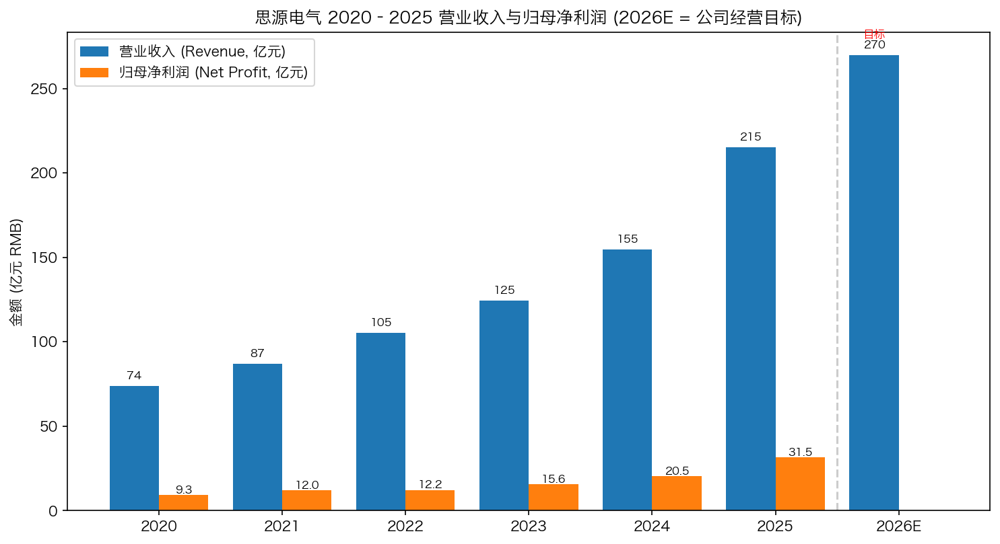
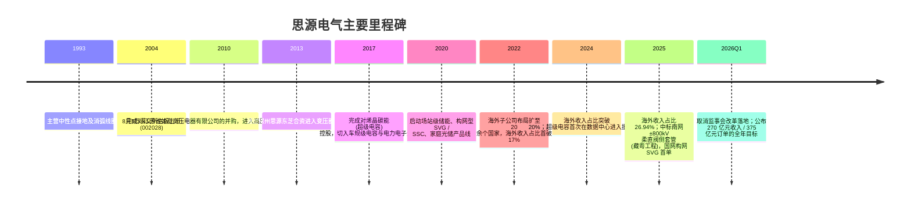
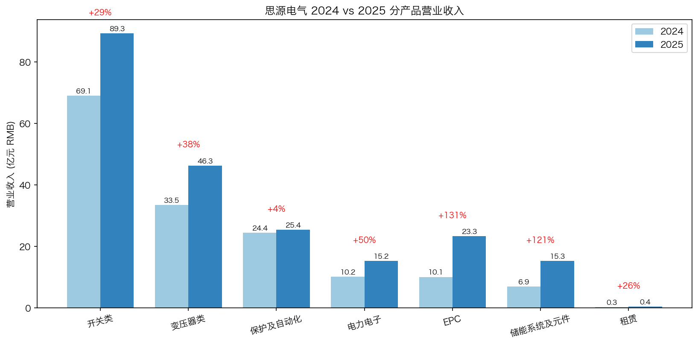
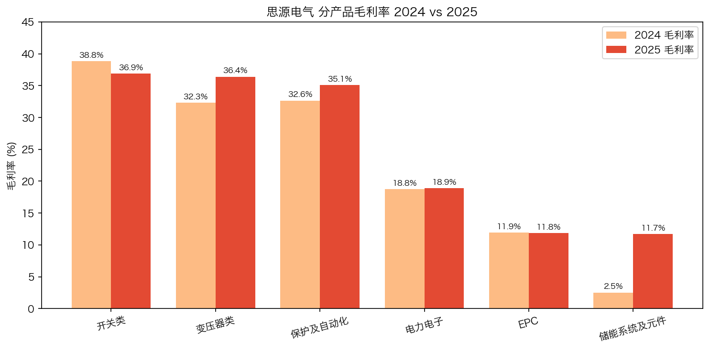
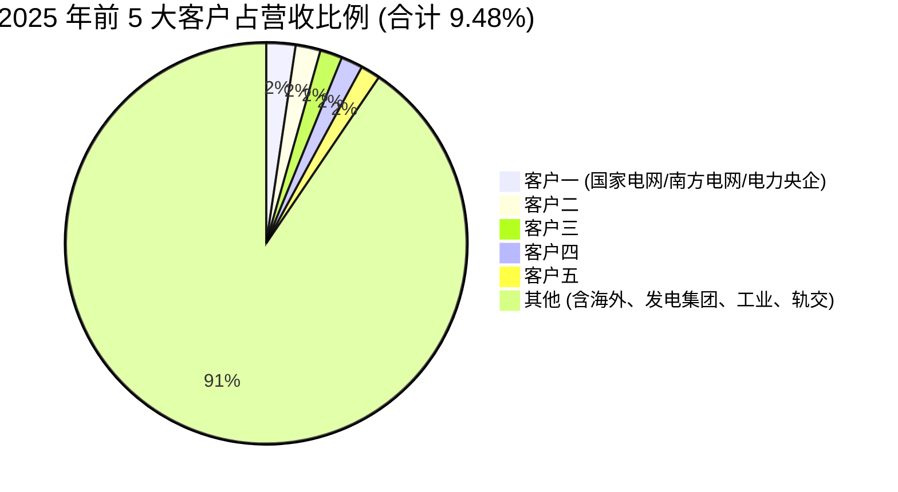
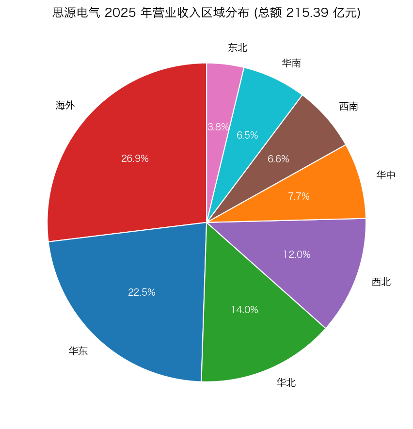
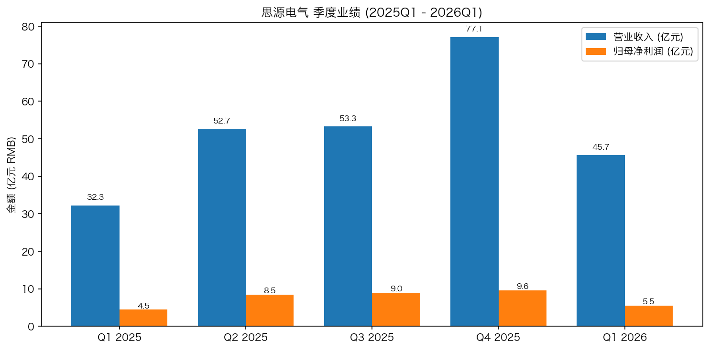
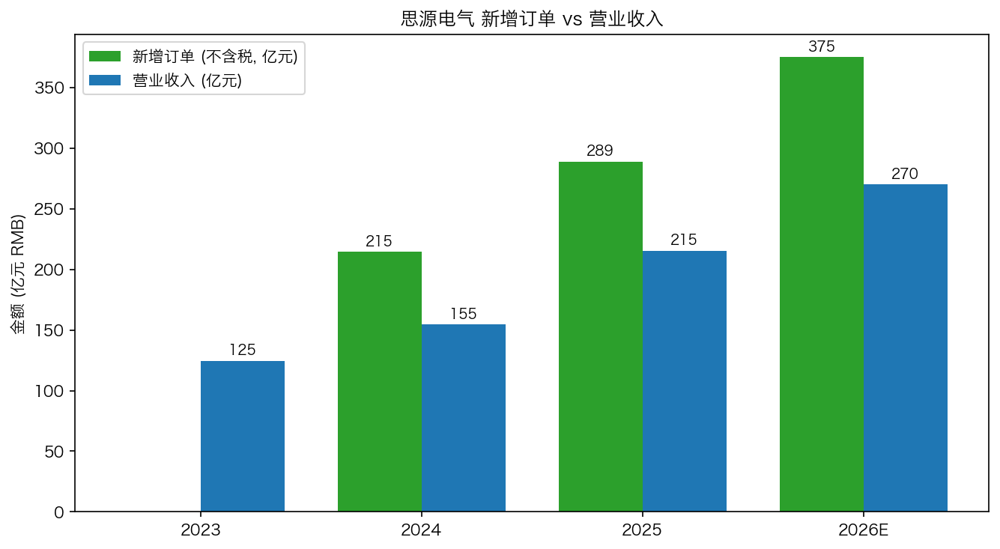
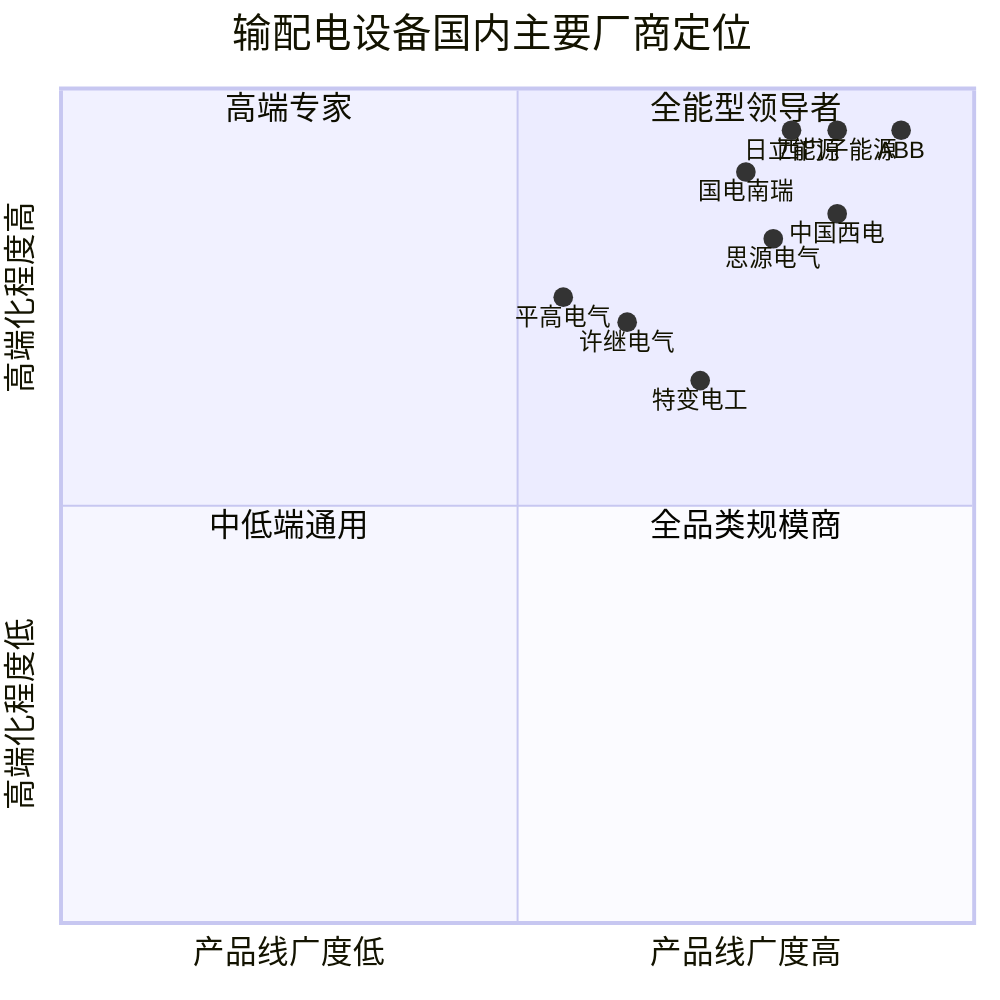

# 思源电气 (SZSE:002028) 公司研究报告

**报告日期**：2026 年 5 月 20 日
**主要交易所/代码**：深圳证券交易所 / 002028
**英文名称**：Sieyuan Electric Co., Ltd.
**注册地址**：上海市闵行区金都路 4399 号
**主要业务**：高压开关 (GIS/断路器)、变压器、电力电子 (SVG/SSC)、保护与自动化、储能系统、EPC 工程总承包
**主要数据来源**：公司 2020-2025 年年度报告、2026 年一季度报告、巨潮资讯网

---

## 重要业绩与指引摘要 (披露至 2026-04-24)

- 2025 年营业收入 **215.39 亿元**，同比 **+39.34%**；归母净利润 **31.50 亿元**，同比 **+53.74%**；扣非归母净利润 **29.52 亿元**，同比 **+57.13%**；加权 ROE 升至 **22.63%**。([2025 年年度报告，第 7 页](https://static.cninfo.com.cn/finalpage/2026-04-18/1225117829.PDF))
- 2025 年新增订单（不含税）**288.91 亿元**，同比 **+34.64%**；远超公司 2025 年初设定的 268 亿元目标。([2025 年年度报告，第 14、28 页](https://static.cninfo.com.cn/finalpage/2026-04-18/1225117829.PDF))
- **2026 年新经营目标（4 月 17 日披露）**：新增订单 **375 亿元（同比 +30%）**、营业收入 **270 亿元（同比 +25%）** —— 这是过去 5 年最激进的年度指引。([2025 年年度报告，第 28 页](https://static.cninfo.com.cn/finalpage/2026-04-18/1225117829.PDF))
- 2026Q1 收入 **45.69 亿元（+41.60%）**，归母净利润 **5.50 亿元（+23.17%）**，扣非净利 **4.93 亿元（+12.79%）**：营收节奏跑赢，但利润增速回落、扣非利润率压力凸显（管理层指向加大销售/研发投入及汇兑影响）。([2026 年一季度报告，第 1 页](https://static.cninfo.com.cn/finalpage/2026-04-25/1225177123.PDF))
- 海外收入占比由 2024 年的 20.20% 跃升至 2025 年的 **26.94%**（金额 58.03 亿元，同比 +85.84%），海外毛利率 35.24%，**显著高于公司整体 30.77%**。([2025 年年度报告，第 16-17 页](https://static.cninfo.com.cn/finalpage/2026-04-18/1225117829.PDF))

---

## 目录

1. 公司概览
2. 公司历史
3. 管理团队与治理
4. 产品与服务
5. 客户与商业模式
6. 行业概览
7. 竞争格局
8. 市场机会与 TAM
9. 风险评估
10. 参考资料

---

## 1. 公司概览

思源电气股份有限公司（以下简称"思源电气"或"公司"）是国内输配电设备行业少数几家具备一次设备（机械类电力设备）、二次设备（控制类电力设备）、储能及电能质量治理设备全产品线研发与制造能力的厂商之一。公司主营业务覆盖 1000kV 及以下 GIS/GIL、800kV 及以下 SF6 断路器和隔离开关、750kV 及以下变压器/电抗器、±800kV 及以下交直流套管、500kV 及以下电流互感器、变电站继电保护、动态无功补偿（SVG/SSC）、场站级储能与超级电容、汽车电子电器、移动/预制式变电站、以及电力工程总承包（EPC）业务。([2025 年年度报告，第 10 页](https://static.cninfo.com.cn/finalpage/2026-04-18/1225117829.PDF))

公司 1993 年 12 月在上海创立，2004 年 8 月 5 日在深圳证券交易所主板上市（IPO 批文：证监发行字 [2004]1113 号）。截至 2025 年末，公司总股本 78,205.77 万股，归属于母公司股东的所有者权益 **154.93 亿元**，每股净资产 **19.81 元**；上市以来从单一中性点接地产品供应商成长为覆盖六大产品线、业务遍及 100 多个国家和地区的输配电综合解决方案商。([2025 年年度报告，第 5-6 页、第 60-61 页](https://static.cninfo.com.cn/finalpage/2026-04-18/1225117829.PDF))

### 1.1 财务摘要 (2023-2025)

| 指标 (亿元) | 2023 | 2024 | 2025 | YoY 2025 |
|---|---|---|---|---|
| 营业收入 | 124.60 | 154.58 | 215.39 | +39.34% |
| 归母净利润 | 15.59 | 20.49 | 31.50 | +53.74% |
| 扣非归母净利润 | 14.21 | 18.78 | 29.52 | +57.13% |
| 经营现金流 | 22.72 | 24.62 | 22.34 | -9.27% |
| 归母净资产 | 103.84 | 123.80 | 154.93 | +25.15% |
| 加权 ROE (%) | 15.90 | 18.05 | 22.63 | +4.58 pp |
| 整体毛利率 (%) | 29.50 | 31.25 | 30.77 | -0.48 pp |
| 研发投入占比 (%) | 7.36 | 7.18 | 6.04 | -1.14 pp |

数据来源：[2025 年年度报告，第 7、14-19 页](https://static.cninfo.com.cn/finalpage/2026-04-18/1225117829.PDF)；[2024 年年度报告，第 8、14-15 页](https://static.cninfo.com.cn/finalpage/2025-04-19/1223145398.PDF)。

*Source: [2022 年年度报告 (含 2020-2022 数据)](https://static.cninfo.com.cn/finalpage/2023-04-15/1216417256.PDF) + [2025 年年度报告 (2023-2025 + 2026 经营目标)](https://static.cninfo.com.cn/finalpage/2026-04-18/1225117829.PDF)。2026E 为公司披露的经营目标，非业绩承诺。*

### 1.2 估值快照 (2026-05-20)

**注**：本报告本次研究的网络数据抓取被运行时禁用（WebFetch / Eastmoney 行情接口在本次会话不可用），因此**实时市值、TTM P/E、TTM P/S 数据未能于本次会话独立验证**。投资者应自行通过东方财富 (`quote.eastmoney.com/sz002028.html`) 或同花顺 (`stockpage.10jqka.com.cn/002028`) 查询滚动估值。基于公司报表已披露口径：

- 2025 年每股收益（摊薄）4.01 元，每股净资产 19.81 元；
- 2025 年归母净利润 31.50 亿元 ÷ 当前总股本 7.825 亿股 = EPS 4.03 元；
- 2026 年公司**自身经营目标隐含**：若 270 亿元营收按 2025 年 14.62% 的净利率推算，2026 年净利润中性可达约 39 亿元（**注：此为基于历史净利率的等比例外推，公司未提供 2026 年利润目标**）。
- 公司在 2025 年 3 月已通过《市值管理制度》，但**未披露估值提升计划**；管理层在投资者关系活动中频繁接待中金、摩根士丹利、贝莱德、富达、淡马锡 (GIC) 等顶级机构。([2025 年年度报告，第 31-32 页](https://static.cninfo.com.cn/finalpage/2026-04-18/1225117829.PDF))

### 1.3 投资亮点（速读）

1. **海外业务质变**：海外收入由 2023 年 21.58 亿元跳升至 2025 年 58.03 亿元（两年复合 +63.9%），海外毛利率 35.24% 高于国内主流地区，海外占比突破 26.94%；公司 2025 年在德国、葡萄牙、瑞典、芬兰、爱尔兰等发达市场实现产品突破并切入"顶级电网运营商"供应链。([2025 年年度报告，第 15-17 页](https://static.cninfo.com.cn/finalpage/2026-04-18/1225117829.PDF))
2. **特高压与构网型订单的"卡脖子"突破**：2025 年中标南网 ±800kV 柔直换流变阀侧套管（藏粤工程）、国网湖南构网 SVG、220kV 保护首次中标南网集采。([2025 年年度报告，第 14 页](https://static.cninfo.com.cn/finalpage/2026-04-18/1225117829.PDF))
3. **储能与电力电子高速增长**：储能系统 2025 年 15.31 亿元（+120.52%）、电力电子 15.25 亿元（+49.49%）、EPC 23.32 亿元（+130.90%）。
4. **订单可见度高**：2025 年末合同负债 29.77 亿元（+25.59%）、应收账款 81.83 亿元（+42.10%）——在手订单充裕，但同时带来应收占用上升、经营现金流 22.34 亿元（-9.27%）的现金转化压力。

---

## 2. 公司历史

公司由董增平、陈邦栋等创始团队 1993 年 12 月在上海创立，至 2026 年初已成立 **32 年**。早期产品以中性点接地装置、消弧线圈、保护设备为主，2004 年深交所上市为公司打开了资本性扩张通道。([2025 年年度报告，第 6 页（公司简介与历次经营范围变更）、第 36-39 页（董事/高管经历）](https://static.cninfo.com.cn/finalpage/2026-04-18/1225117829.PDF))

公司发展可划分为四个阶段：

**(i) 1993-2003 单一产品阶段**：聚焦中性点接地、消弧线圈、电力监测设备。**(ii) 2004-2014 横向扩张阶段**：上市后通过设立或并购江苏省如高、上海思源高压开关、常州思源东芝变压器等子公司，将产品线扩展至 800kV 及以下高压开关、变压器、互感器、套管。**上海思源高压开关**目前是公司单体最大的子公司——2025 年收入 61.04 亿元（+20.38%）、净利润 12.63 亿元（+37.21%）；**江苏省如高**收入 27.39 亿元、净利润 5.74 亿元（+45.00%）。([2025 年年度报告，第 27 页](https://static.cninfo.com.cn/finalpage/2026-04-18/1225117829.PDF)) **(iii) 2015-2020 新业务孵化阶段**：投资/控股烯晶碳能（超级电容）、稊米汽车科技、江苏思源新能源（锂电池）、思源清能（电力电子）。**(iv) 2021-至今 海外+新能源双轮加速阶段**：2024 年起在德国、葡萄牙、瑞典、芬兰、爱尔兰等发达市场实现首次突破；2025 年海外占比突破 26.94%，国网/南网集采突破特高压套管、构网 SVG、220kV 保护。

截至 2025 年末公司合并范围子公司共 **63 家**，新增 3 家境内子公司（上海思源智电、江苏聚源油箱、如皋思源瓦能）和 4 家境外子公司。研发基地分布在上海、北京、南京、西安、深圳、瑞士，主要产业基地位于上海、南通、常州、无锡；海外营销/服务网络覆盖巴西、埃及、赞比亚、西班牙、瑞士等 20 余个国家。([2025 年年度报告，第 13、18 页](https://static.cninfo.com.cn/finalpage/2026-04-18/1225117829.PDF))

---

## 3. 管理团队与治理

### 3.1 董事长兼总经理：董增平

**董增平**先生为公司创始人之一，1993 年 12 月公司成立以来一直在公司工作，先后担任董事长、董事、总经理等职务，现任公司**董事长兼总经理，并负责公司全面工作**。除主公司职务外，董先生还兼任烯晶碳能电子科技无锡有限公司董事长、上海思源高压开关、思源清能电气电子、北京思源清能、江苏思源能源技术、江苏思源新能源、江苏思源电池技术、上海思源弘瑞自动化、上海稊米汽车科技等核心子公司的执行董事，以及江苏省如高、江苏思源赫兹互感器、上海思弘瑞、上海思源电力电容器、常州思源东芝、上海思源瓦能的董事——意味着所有主要业务线均直接置于董事长视野下。([2025 年年度报告，第 36 页](https://static.cninfo.com.cn/finalpage/2026-04-18/1225117829.PDF))

董增平先生为公司**实际控制人**，2025 年末持股 **1.314 亿股，占比 16.81%**（其中限售股 9,858.36 万股，无限售 3,286.12 万股）；他与共同创始人陈邦栋（持股 12.32%）合计持股 29.13%，构成事实上的双重创始人控制结构。([2025 年年度报告，第 62、66 页（前十大股东及表决权说明）](https://static.cninfo.com.cn/finalpage/2026-04-18/1225117829.PDF))

报告期内公司控股股东、实际控制人董增平同时担任公司董事长和总经理，公司在年报中对该情形适用专项披露（"控股股东、实际控制人同时担任上市公司董事长和总经理的情况：适用"）。([2025 年年度报告，第 39 页](https://static.cninfo.com.cn/finalpage/2026-04-18/1225117829.PDF))

### 3.2 副董事长：陈邦栋

**陈邦栋**先生与董增平同为 1993 年公司创立时的核心成员，曾任公司董事长、副董事长、总经理、总工程师，现任**副董事长**并协助董事长开展工作。陈先生同时是江苏省如高高压电器有限公司董事长、上海思弘瑞电力控制技术有限公司董事长，以及常州思源东芝变压器、烯晶碳能、上海整流器厂等关键子公司的董事——分管开关、保护、电容等技术线条。截至 2025 年末持股 **9,638 万股 (12.32%)**。([2025 年年度报告，第 36、63 页](https://static.cninfo.com.cn/finalpage/2026-04-18/1225117829.PDF))

### 3.3 财务总监兼董事会秘书：杨哲嵘

**杨哲嵘**先生自 2011 年 4 月加入公司，先后担任思源清能运营总监、思源清能副总经理、江苏聚源电气有限公司总经理，现任**财务总监兼董事会秘书**，并担任上海思源电力电容器、烯晶碳能董事。杨先生 2025 年签署年度报告的会计真实性声明，与会计机构负责人罗福丽女士对外承担"保证财务报告真实、准确、完整"的法律责任。([2025 年年度报告，第 2、38 页](https://static.cninfo.com.cn/finalpage/2026-04-18/1225117829.PDF))

### 3.4 主要副总经理

公司高管团队呈现"内生 + 长期任职"特点：**杨帜华**（董事兼副总，国内营销中心总经理，2000 年入职）；**杨雯**（副总，2012 年 5 月入职，分管开关业务线）；**章良栋**（副总兼海外营销中心总经理，2012 年 9 月入职，国际化核心操盘手，对 2025 年海外收入 +85.84% 有直接贡献）；**刘刚**（副总，2020 年 10 月入职，分管变压器业务线）；**秦正余**（非执行董事，紫江集团 SH600210 副总兼 CFO，担任产业资本纽带）。([2025 年年度报告，第 35-38 页](https://static.cninfo.com.cn/finalpage/2026-04-18/1225117829.PDF))

### 3.5 独立董事

- **赵世君**——上海对外经贸大学会计学院教授，会计专业人士独立董事，符合证监会"独立董事中至少一人为会计专业人士"的要求；2025 年同时担任江西赣南海欣药业 (833211)、广东群兴玩具 (SZ002575) 独立董事。
- **叶锋**——曾任南京南瑞继保电气有限公司董事、副总经理，江苏金智科技股份有限公司副总经理；自 2012 年起担任南京派方光电科技公司董事长；**最具行业相关性**：南瑞继保是公司保护与自动化领域的直接竞争对手，叶先生的行业经验属于"对手出身"独立董事，治理上有助于专业判断。
- **邱宇峰**——曾任中国电力科学研究院（中国电科院）副院长、国网智能电网研究院副院长、全球能源互联网研究院董事/院长，现任厦门大学讲座教授。邱先生是国家电网体系**最高级别的技术研究人员之一**，对公司在特高压、柔性直流领域的技术战略具有罕见价值。

([2025 年年度报告，第 36-38 页](https://static.cninfo.com.cn/finalpage/2026-04-18/1225117829.PDF))

### 3.6 治理结构变化

- 公司于 **2025 年 12 月 31 日临时股东会**批准取消监事会——这是 2024 年新《公司法》生效后 A 股较为提前的治理调整，监督权由审计委员会承担；公司董事会下设审计、薪酬与考核、投资决策、提名（2025 年 12 月 25 日新设）四个专门委员会。([2025 年年度报告，第 33-34 页](https://static.cninfo.com.cn/finalpage/2026-04-18/1225117829.PDF))
- 现有 7 名董事中 3 名为独立董事，占比超过 1/3，**符合《上市公司独立董事管理办法》**。
- 公司 2023 年股票期权激励计划在 2025 年完成两个行权期共 441.51 万份期权行权，对应总股本由 7.776 亿股增加至 7.821 亿股；2026Q1 末股本进一步升至 7.825 亿股。([2025 年年度报告，第 60-61 页](https://static.cninfo.com.cn/finalpage/2026-04-18/1225117829.PDF))
- 2025 年董事会通过《市值管理制度》（2025-002 号决议），但**未披露估值提升计划**——这暗示公司认为现有股价已"较为合理"，无需触发主动估值修复机制。([2025 年年度报告，第 31 页](https://static.cninfo.com.cn/finalpage/2026-04-18/1225117829.PDF))

### 3.7 团队执行记录与短板

**优势**：管理层平均在司年限超过 10 年；2025 年实际营收 215 亿元远超年初目标 185 亿元（完成度 116.4%），新订单 288.91 亿元超目标 268 亿元（完成度 107.8%）；连续三年（2023→2024→2025）收入增速 24%→24%→39%，净利润复合增速近 43%。**短板**：(i) 董事长与总经理由同一实控人长期兼任，无清晰接班人公示；(ii) 公司未披露 CTO / 首席研发负责人；(iii) 海外子公司管理风险已在年报中明确列示。

---

## 4. 产品与服务

### 4.1 产品树

```mermaid
graph TD
    A[思源电气]
    A --> B1[一次设备 Primary Equipment]
    A --> B2[二次设备 Secondary Equipment]
    A --> B3[电力电子 Power Electronics]
    A --> B4[储能系统及元件 Energy Storage]
    A --> B5[EPC 工程总承包]
    A --> B6[汽车电子电器 Auto Electronics]

    B1 --> C1[GIS / GIL 1000kV 及以下]
    B1 --> C2[SF6 断路器/隔离开关 800kV 及以下]
    B1 --> C3[直流断路器 500kV 及以下]
    B1 --> C4[中压 GIS / C-GIS / 环网柜 35kV 及以下]
    B1 --> C5[低压电器]
    B1 --> C6[互感器 电流 500kV / 电压 1000kV 及以下]
    B1 --> C7[变压器 750kV 及以下 / 电抗器]
    B1 --> C8[交直流套管 ±800kV 及以下]
    B1 --> C9[移动 / 预制式变电站]

    B2 --> D1[变电站继电保护设备]
    B2 --> D2[变电站监控系统]
    B2 --> D3[油色谱在线监测系统]

    B3 --> E1[动态无功补偿 SVG]
    B3 --> E2[静止同步调相机 SSC]
    B3 --> E3[高压有源滤波 APF]
    B3 --> E4[构网型 SVG / 构网型储能]
    B3 --> E5[柔性直流 / 阀控]

    B4 --> F1[场站级储能系统]
    B4 --> F2[家庭光储系统]
    B4 --> F3[超级电容 / 混合超容 单体及模组]
    B4 --> F4[高功率锂电池]

    B5 --> G1[变电站 EPC]
    B5 --> G2[新能源接入 EPC]
    B5 --> G3[海外 EPC 工程]
```

### 4.2 六大业务线 2025 业绩与定位

*Source: [2025 年年度报告，第 16 页（营业收入构成）](https://static.cninfo.com.cn/finalpage/2026-04-18/1225117829.PDF)*

| 业务线 | 2025 收入(亿元) | 占比 | YoY | 毛利率 | 毛利率 YoY |
|---|---|---|---|---|---|
| **开关类** | 89.35 | 41.5% | +29.30% | 36.88% | -1.94 pp |
| **变压器类** | 46.33 | 21.5% | +38.38% | 36.39% | +4.10 pp |
| **保护及自动化** | 25.42 | 11.8% | +4.02% | 35.11% | +2.46 pp |
| **电力电子** | 15.25 | 7.1% | +49.49% | 18.88% | +0.13 pp |
| **EPC** | 23.32 | 10.8% | +130.90% | 11.84% | -0.11 pp |
| **储能系统及元件** | 15.31 | 7.1% | +120.52% | 11.71% | +9.18 pp |
| **租赁** | 0.39 | 0.2% | +28.76% | 28.90% | -12.33 pp |
| **合计** | **215.39** | 100% | +39.34% | 30.77% | -0.48 pp |

数据来源：[2025 年年度报告，第 16-17 页](https://static.cninfo.com.cn/finalpage/2026-04-18/1225117829.PDF)。

*Source: [2025 年年度报告，第 17 页（毛利率比上年同期增减）](https://static.cninfo.com.cn/finalpage/2026-04-18/1225117829.PDF)*

**(1) 开关类业务（41.5%，第一大业务线）**——核心产品为 1000kV 及以下 GIS/GIL（气体绝缘金属封闭开关设备）、800kV 及以下 SF6 断路器/隔离开关、35kV 及以下 GIS/C-GIS 与环网柜。最大经营主体上海思源高压开关有限公司 2025 年实现 61.04 亿元收入、12.63 亿元净利润（净利率 20.7%）。开关业务的关键看点是**特高压突破**：(i) ±800kV 柔直换流变阀侧套管首次中标南网（藏粤工程），打破国外厂商垄断；(ii) 2025 年正在开发 1100kV GIS 产品（计划 2027 年上市）、基于环保气体（替代 SF6）的 145/252kV GIS，与全球电力设备碳中和趋势对齐。([2025 年年度报告，第 14、19、27 页](https://static.cninfo.com.cn/finalpage/2026-04-18/1225117829.PDF))

**(2) 变压器类业务（21.5%）**——750kV 及以下变压器/电抗器，主要经营主体常州思源东芝变压器有限公司（与日本东芝合资）。2025 年收入 46.33 亿元（+38.38%），**毛利率从 32.29% 升至 36.39%（+4.10 pp）**，是六大业务线中毛利率改善最显著的板块——反映全球变压器供应紧张、欧洲电网投资周期上行带来的产品溢价能力。([2025 年年度报告，第 16-17 页](https://static.cninfo.com.cn/finalpage/2026-04-18/1225117829.PDF))

**(3) 保护及自动化（11.8%）**——含变电站继电保护、监控系统、油色谱在线监测。2025 年收入 25.42 亿元，增速仅 +4.02%——是六大主营中**唯一低增长板块**；但 220kV 保护设备首次中标南方电网集采，标志公司从国网体系延伸至南网体系，**未来若南网份额提升将释放第二增长曲线**。毛利率 35.11%（+2.46 pp）反映高端化结构改善。([2025 年年度报告，第 14、16 页](https://static.cninfo.com.cn/finalpage/2026-04-18/1225117829.PDF))

**(4) 电力电子（7.1%）**——SVG/SSC/APF/构网型产品。2025 年收入 15.25 亿元，**+49.49%**。技术看点：构网型 SVG 中标国网湖南项目；静止同步调相机（SSC）从试点进入批量应用——SSC 是用同步发电机原理替代锂电池的新型短时高功率储能，对火电退役后的电网惯量补偿、新能源场站频率支撑有不可替代价值。([2025 年年度报告，第 16 页](https://static.cninfo.com.cn/finalpage/2026-04-18/1225117829.PDF))

**(5) EPC 工程总承包（10.8%）**——2025 年收入 23.32 亿元，**+130.90%**，是六大业务线中**收入增速最高**的板块；但毛利率仅 11.84%，远低于产品销售。EPC 高增长主要来自海外大单（埃及、赞比亚等"一带一路"国家）和国内新能源接入工程；其低毛利特征也是 2025 年公司整体毛利率小幅下降 0.48 pp 的主要原因（产品结构性原因，非定价能力恶化）。([2025 年年度报告，第 16-17 页](https://static.cninfo.com.cn/finalpage/2026-04-18/1225117829.PDF))

**(6) 储能系统及元件（7.1%）**——含场站级储能、家庭光储、超级电容、高功率锂电池。2025 年收入 15.31 亿元，**+120.52%**；**毛利率从 2.53% 跃升至 11.71%（+9.18 pp）**——储能板块从"亏损边缘"快速走向盈亏平衡，是公司新业务孵化的里程碑。烯晶碳能（超级电容控股子公司）2025 年商誉减值测试通过，**未计提商誉减值准备**，反映管理层及评估机构对超级电容业务长期价值的信心。超级电容在**数据中心场景**（抑制功率波动）正进入批量应用阶段——这是 AI 算力中心"备电+稳压"市场对公司的新机会。([2025 年年度报告，第 15、16 页](https://static.cninfo.com.cn/finalpage/2026-04-18/1225117829.PDF))

### 4.3 在研项目（2025 年披露）

| 项目 | 阶段 | 预期上市 |
|---|---|---|
| 1100kV GIS 产品开发 | 计划阶段 | 2027 |
| 基于环保气体开断的 145/252kV GIS | 概念阶段 | 2027 |
| TYD1000 高海拔抗震版本 | 产品发布 | 已批量化 |
| ±800kV 换流变阀侧套管 | 产品发布 | 已批量化 |

研发投入：2025 年研发费用 **13.00 亿元**（+17.15%），占营收 6.04%（占比同比小幅下降 1.14 pp，主因营收增速更快）；研发人员 **4,781 人**（同比 +7.74%），占员工总数 **43.44%**，其中硕士 871 人、博士 21 人；累计授权专利 1,033 件（其中发明 376 件，实用新型 622 件，外观 35 件）+ 软件著作权 199 件。([2025 年年度报告，第 19-20 页](https://static.cninfo.com.cn/finalpage/2026-04-18/1225117829.PDF))

---

## 5. 客户与商业模式

### 5.1 客户分布与集中度

数据来源：[2025 年年度报告，第 18 页（前 5 大客户）](https://static.cninfo.com.cn/finalpage/2026-04-18/1225117829.PDF)。**公司未在年报中披露前 5 大客户具体名称**（仅以"客户一/二/三/四/五"匿名披露），关联方销售占比为 0.00%。

| 指标 | 2025 | 2024 |
|---|---|---|
| 前 5 大客户合计销售额 (亿元) | 20.41 | n/d |
| 前 5 大客户占年度销售比例 | **9.48%** | n/d |
| 关联方销售占比 | 0.00% | 0.00% |

数据来源：[2025 年年度报告，第 18 页](https://static.cninfo.com.cn/finalpage/2026-04-18/1225117829.PDF)。

**客户集中度非常分散**——前 5 大客户合计仅占营收 9.48%，单一最大客户占比 2.35%，远低于"前 5 大 ≥50%、前 1 大 ≥20%"的高风险线。这一特征源于：

(i) 国家电网公司及南方电网公司采购通过省级公司、地市公司、子公司层级分散下单，每个层级独立招标；
(ii) 海外业务（26.94% 收入）分布在 100 多个国家，国别集中度天然低；
(iii) 公司主力产品（开关、变压器、保护）的客户既有电网运营商也有大型发电集团、轨道交通、石化、冶金等下游工业客户；
(iv) EPC 业务为项目制，每个项目独立计入。

**结论**：客户集中度对思源电气**不构成结构性风险**，反而是相对于同业的优势（如平高电气 600312、许继电气 000400 对国网集采的依赖度更高）。

### 5.2 销售区域分布

*Source: [2025 年年度报告，第 16 页](https://static.cninfo.com.cn/finalpage/2026-04-18/1225117829.PDF)*

| 区域 | 2025 收入(亿元) | 占比 | YoY | 毛利率 |
|---|---|---|---|---|
| 海外 | 58.03 | 26.94% | **+85.84%** | 35.24% |
| 华东 | 48.54 | 22.53% | +46.27% | 29.82% |
| 华北 | 30.06 | 13.96% | +15.37% | 29.79% |
| 西北 | 25.78 | 11.97% | +56.84% | 32.57% |
| 华中 | 16.61 | 7.71% | +3.19% | 29.87% |
| 西南 | 14.30 | 6.64% | **+175.95%** | 24.66% |
| 华南 | 13.97 | 6.49% | -14.11% | 23.37% |
| 东北 | 8.11 | 3.76% | -20.05% | 27.90% |
| 合计 | 215.39 | 100% | +39.34% | 30.77% |

数据来源：[2025 年年度报告，第 16-17 页](https://static.cninfo.com.cn/finalpage/2026-04-18/1225117829.PDF)。

**关键观察**：

1. **海外 + 西南 + 西北 = 2025 年三大增长引擎**：海外（+85.84%）反映欧洲电网投资周期与"一带一路" EPC；西南（+175.95%）和西北（+56.84%）对应"沙戈荒"新能源基地、特高压外送通道（藏粤、宁夏-湖南、新疆-川渝 等）的投资峰值。
2. **华南（-14.11%）与东北（-20.05%）出现下降**：华南主要是南网集采节奏调整，东北是火电技改尾声 + 风电基地建设阶段性放缓——但东北未来有望随核电、抽水蓄能项目回升。
3. **海外毛利率 35.24% 远高于国内**——除华南（23.37%）、西南（24.66%）外，多数国内区域毛利率在 27-32% 区间，**海外溢价 + 自动化生产 + 高端品类是海外毛利更优的三大支撑**。

### 5.3 销售模式

公司销售模式以**直销**为主（占 99.32%），经销仅 0.68%（首次披露经销渠道，1.46 亿元）。直销渠道决定公司具备较强的客户定制能力（"以销定产" MTO/ETO），但 EPC 业务交付周期长达 1-3 年带来的工程风险也需重点管理。([2025 年年度报告，第 16 页](https://static.cninfo.com.cn/finalpage/2026-04-18/1225117829.PDF))

### 5.4 供应商集中度

| 指标 | 2025 | 2024 |
|---|---|---|
| 前 5 大供应商合计采购额（亿元） | 10.90 | 11.11 |
| 前 5 大供应商占采购总额比例 | **8.28%** | 11.64% |
| 关联方采购占比 | 0.00% | 0.00% |

数据来源：[2025 年年度报告，第 18 页](https://static.cninfo.com.cn/finalpage/2026-04-18/1225117829.PDF)；[2024 年年度报告，第 17 页](https://static.cninfo.com.cn/finalpage/2025-04-19/1223145398.PDF)。

**供应商集中度同样非常分散**——前 5 大供应商占比仅 8.28%。公司主要原材料包括铜（用于变压器、电抗器、互感器、断路器铜导体）、电工钢/硅钢片（变压器铁芯）、SF6 气体、绝缘材料、半导体器件（IGBT 模块、电容器芯子）等。2025 年公司通过铜期货套期保值锁定原材料成本（期末未平仓 4,441.95 万元、报告期实际收益 738.93 万元），是同业中较早开展商品对冲的厂商。([2025 年年度报告，第 24-26 页（衍生品投资）](https://static.cninfo.com.cn/finalpage/2026-04-18/1225117829.PDF))

### 5.5 季节性与订单可见度

*Source: [2025 年年度报告，第 8 页（分季度财务指标）](https://static.cninfo.com.cn/finalpage/2026-04-18/1225117829.PDF) + [2026 年一季度报告，第 1 页](https://static.cninfo.com.cn/finalpage/2026-04-25/1225177123.PDF)*

公司业务**呈现明显的"前低后高"季节性**：Q1 通常仅占全年 15-17%（2025Q1: 32.27 亿 / 215.39 亿 = 15.0%；2024Q1 占比约 15.5%），Q4 通常占全年 35% 以上（2025Q4: 77.12 亿，占 35.8%）。这是中国电网设备行业的普遍特征——电网公司一般在 Q4 集中交付以完成全年投资计划。

2026Q1 实现收入 45.69 亿元（同比 +41.60%），若全年维持这一增速，将远超公司 270 亿元 / +25% 的指引。但 Q1 归母净利润仅 5.50 亿元（+23.17%），扣非净利润 4.93 亿元（+12.79%）——**收入增速远超利润增速**，主因：(a) 销售费用 +40.44%、研发费用 +39.05%、管理费用 +9.28%（费用绝对额增加但增速低于收入）；(b) 财务费用从 -0.29 亿元转为 +0.54 亿元（汇兑差异）；(c) 营业外支出 4747% 暴增（捐赠支出）；(d) 政府补助等其他收益时间差影响。([2026 年一季度报告，第 2-3 页](https://static.cninfo.com.cn/finalpage/2026-04-25/1225177123.PDF))

**订单可见度**：2025 年末合同负债 **29.77 亿元**（同比 +25.59%），存货 **40.79 亿元**（+17.31%）——两者合计 70.56 亿元，相当于全年营收的 32.8%；新增订单 288.91 亿元，对应 2026 年 270 亿元收入目标的 **107%**——这一"在手订单 / 年度目标"覆盖率水平相当扎实。([2025 年年度报告，第 22 页](https://static.cninfo.com.cn/finalpage/2026-04-18/1225117829.PDF))

*Source: 2024 年新增订单 214.6 亿元为以 2025 年新增订单 288.91 亿元除以同比增速 (1+34.64%) 反推；其余数据出自 [2025 年年度报告，第 14、28 页](https://static.cninfo.com.cn/finalpage/2026-04-18/1225117829.PDF)*

---

## 6. 行业概览

### 6.1 行业定位

思源电气所处行业为**输配电及控制设备制造业**（中国证监会《上市公司行业分类指引》(2012 修订) 中归属于 C38 电气机械和器材制造业，下属"输配电及控制设备制造"子行业；国民经济行业分类 GB/T 4754—2017 代码 C383）。

### 6.2 政策与宏观背景

2025 年是中国"十四五"规划收官之年，也是输配电行业政策密集落地的一年：

- **《中华人民共和国能源法》2025 年 1 月 1 日施行**——首部能源领域基础性、统领性法律，明确"国家支持优先开发利用可再生能源"。
- **国家发改委、国家能源局《关于深化新能源上网电价市场化改革促进新能源高质量发展的通知》（发改价格〔2025〕136 号）** 于 2025 年 2 月发布，标志新能源全面市场化定价；截至 2025 年底全国 32 个省区已全部完成 136 号文实施方案发布。**该政策推动下游客户的投资逻辑从规模扩张转向精细化运营，对设备的智能化、成本控制、系统解决方案能力提出更高要求**——这对思源电气的"全产品线 + 综合解决方案"打法是利好。
- **《关于加快推进虚拟电厂发展的指导意见》（2025 年 3 月）** 提出到 2027/2030 年全国虚拟电厂调节能力分别达到 2,000 万千瓦 / 5,000 万千瓦——直接利好公司储能、电力电子（SVG/SSC）、保护与自动化板块。
- **工信部、市监总局、国家能源局《电力装备行业稳增长工作方案 (2025—2026 年)》（2025 年 9 月）** ：传统电力装备年均营收增速保持 6% 左右，新能源装备营收稳中有升。
- **《关于推进"人工智能+"能源高质量发展的实施意见》** ：到 2027 年推动 5 个以上专业大模型在电网、发电等行业深度应用。

数据来源：[2025 年年度报告，第 11-13 页（行业概览章节）](https://static.cninfo.com.cn/finalpage/2026-04-18/1225117829.PDF)。

### 6.3 关键宏观数据

- **国内电力装机**：截至 2025 年 9 月底，全国累计发电装机容量 **37.2 亿千瓦**（同比 +17.5%），其中太阳能 11.3 亿千瓦（+45.7%）、风电 5.8 亿千瓦（+21.3%）。
- **全球电网投资**：IEA 预测 2025 年全球电网投资 **超过 4,000 亿美元**，到 2035 年增至约 6,500 亿美元；电网投资仍显著滞后发电端（2024 年全球发电端投资 1 万亿美元 vs 电网仅 4,000 亿美元，缺口 6,000 亿美元）——这一"投资剪刀差"持续 3-5 年内构成中国设备出海的黄金窗口。
- **数据中心需求**：2025 年全球数据中心投资预计达 **5,800 亿美元**，首度超过石油供应投资；部分发达国家电网负载因此倍增——直接利好公司超级电容、SSC、SVG 等电能质量产品。

数据来源：[2025 年年度报告，第 11-12 页](https://static.cninfo.com.cn/finalpage/2026-04-18/1225117829.PDF)（公司在 MD&A 中引用 IEA 数据）。

### 6.4 行业结构

中国输配电设备行业呈"金字塔型"结构：

- **塔尖（特高压、超高压、柔直）**：进入壁垒极高，国内仅有少数厂商具备资质——平高电气、许继电气、中国西电（601179）、思源电气、ABB、西门子、日立能源（前 ABB 输配电）等。
- **塔中（高压、中压主流品类）**：竞争较为激烈，国内厂商在 110kV-500kV GIS、变压器、保护装置上已实现充分国产化。
- **塔基（低压、配电类）**：高度分散，竞争充分，国内厂商众多。

公司通过"全产品线 + 高端突破"路径，在塔尖（特高压套管、构网 SVG）和塔中（GIS、变压器、保护）均建立位置，未在低端品类过多消耗资源。

---

## 7. 竞争格局

### 7.1 主要竞争对手

**注**：定位坐标基于产品线覆盖度、特高压/柔直/构网技术能力综合判断，非公开市场份额数据。下表给出可验证的同业基础数据。

| 公司 | 代码 | 2024 年营收 (亿元) | 主要产品定位 |
|---|---|---|---|
| 国电南瑞 | SH:600406 | ~559 | 电网二次设备、调度自动化、特高压换流阀、轨交信号 |
| 中国西电 | SH:601179 | ~232 | 特高压一次设备 (GIS、变压器、断路器)、ABB 重要合作伙伴 |
| 平高电气 | SH:600312 | ~115 | 特高压 GIS、断路器，国网系核心供应商 |
| 许继电气 | SZ:000400 | ~166 | 直流输电换流阀、保护、配电自动化、充电桩 |
| 特变电工 | SH:600089 | ~973 | 变压器全球龙头 + 新能源 + 多晶硅 (多元化) |
| **思源电气** | **SZSE:002028** | **154.58** | **全产品线 + 海外占比领先** |
| 大全电气 (未上市) | — | — | 高压开关、互感器 |
| ABB (跨国) | NYSE:ABB | ~$329 亿 | 全球输配电领导者 |
| 日立能源 (原 ABB Power Grids) | 私有 (日立持股) | — | 全球特高压、直流 |
| 西门子能源 | XETRA:ENR | ~€340 亿 | 全球电网、燃机、风电 |

数据来源：思源电气 2024/2025 年报；其他公司 2024 年报对应交易所公开披露（具体链接需投资者自查）。

### 7.2 思源电气的相对优势

1. **海外占比领先国内同业**：26.94% 高于中国西电、平高、许继（普遍 < 20%）。
2. **产品线最完整的"全能型"独立厂商**：覆盖一次、二次、电力电子、储能、EPC 六大业务线，同业中只有国电南瑞、中国西电具备类似广度。
3. **民营机制 + 创始人长期持股**：董增平、陈邦栋合计持股 29.13%，决策效率优于央企同行。
4. **特高压资质后发突破**：±800kV 柔直阀侧套管中标南网、1100kV GIS 在研。
5. **新业务平台化**：超级电容、SSC、构网型已形成可复制技术平台。

### 7.3 主要劣势/风险

1. 保护与自动化增速偏慢（+4.02%），数字化变电站积累弱于国电南瑞、许继；2. EPC 与储能毛利率偏低（11.84% / 11.71%）拉低整体毛利率；3. 特高压 GIS 国网集采份额仍小于平高、西电；4. 63 家全球子公司带来财务、税务、合规复杂度。

---

## 8. 市场机会与 TAM

### 8.1 全球电网投资周期

根据公司在 MD&A 中引用的 IEA 数据，全球电网投资 2025 年预计**超过 4,000 亿美元**，到 2035 年将增至**约 6,500 亿美元**——10 年累计市场规模约 **5 万亿美元量级**。其中变压器、开关设备、保护与自动化、电力电子四大类合计在投资中占比约 50-55%（IEA 历史口径），即年化设备市场约 **2,200 亿美元（约 1.6 万亿人民币）**。

公司 2025 年海外收入 58.03 亿元，约占全球设备市场（按上述测算）的 **0.36%**。如果未来 10 年公司能将全球份额提升至 1.5-2%（与日立能源、ABB 的当前格局相比仍偏低），对应海外收入约 240-320 亿元——是 2025 年的 4-6 倍。

### 8.2 国内 TAM 分解

| 细分市场 | 国内 2025 年市场规模估算 | 公司当前份额 | 备注 |
|---|---|---|---|
| 国家电网 + 南方电网年度投资 | ~7,000 亿元 (2024 国网投资 6,000+ 亿、2025 加快) | 估算 < 3% | 公司直接对接电网的开关、变压器、保护 |
| 风光新能源接入设备 (升压站) | ~1,500 亿元 | 估算 3-5% | 含变压器、SVG、保护 |
| 储能装机 (年均 100 GWh+) | ~2,000 亿元 (含 PCS、BMS、EMS、电池) | 估算 < 1% | 公司主打场站储能 + 户用储能 |
| 柔性直流输电 / FACTS | ~300 亿元 | 估算 5-8% | 公司构网 SVG、SSC、阀侧套管 |
| 数据中心配电 | ~800 亿元 (含高低压配电、UPS、备电) | 估算 < 1% | 超容备电方案进入批量 |

**注**：上述市场规模来自公司年报引用的 IEA、国家发改委披露数据 + 第三方行业研究估算，**公司当前份额由公司年报披露收入除以行业总规模反推得出**，应作为粗略量级参考，而非精确市场份额。([2025 年年度报告，第 11-13 页](https://static.cninfo.com.cn/finalpage/2026-04-18/1225117829.PDF))

**关键结论**：公司在所有细分赛道的份额均**不超过 8%**，意味着即便假设国内市场零增长，公司仍有 3-5 倍的份额提升空间，国内市场绝非已经饱和。

### 8.3 三大结构性催化剂

1. **特高压交直流"十五五"规划储备项目**：藏粤、川渝至湘豫、新疆至川渝、蒙西至京津唐等多条交直流大通道在 2025-2030 年密集开工——公司在阀侧套管、GIS 的新中标意味着已切入这一红利。
2. **欧洲电网更新换代周期**：欧洲电网平均设备龄超过 40 年，2025-2035 年是大规模更换/升级周期，思源电气在德国、葡萄牙、瑞典、芬兰、爱尔兰的中标是"前哨战"；
3. **AI 数据中心新增电力需求**：全球数据中心 2025 年投资 5,800 亿美元，部分发达国家电网负载倍增——超级电容备电、SVG/SSC 稳压、备用变压器订单从 2026 年开始进入兑现期。

---

## 9. 风险评估

### 9.1 公司特定风险

**(R1) 实控人 + 治理集中度风险**（中等）：董增平兼任董事长与总经理，且家族 + 共同创始人合计持股近 30%。若实控人健康或继任问题出现，公司缺乏对外披露的接班人。**缓解**：公司有完善的副总经理梯队（杨帜华、杨雯、章良栋、刘刚等长期任职），董事会下设审计、薪酬、投资决策、提名四个委员会。

**(R2) 海外子公司管理风险**（较高）：公司明确在年报中列示——目前在 100 多个国家开展业务、20+ 国设立子公司、合并范围内子公司 63 家，面临税务、劳务用工、合规、地缘等多维风险。**缓解**：公司构建全球工程服务平台，开展外汇套期保值；但子公司层级一旦扩大，单一国家的"黑天鹅"事件（政变、制裁、汇率管制）影响放大。

**(R3) 烯晶碳能商誉减值风险**（较低-中等）：公司 2025 年商誉余额 5.41 亿元（来源主要为对烯晶碳能的并购），2025 年商誉减值测试评估机构出具的结果是"无需计提"。**缓解**：2025 年储能板块毛利率从 2.53% 跳升至 11.71%、数据中心场景批量化进展明确，短期内继续未计提概率较高，但若 2026 年储能业务不及预期，**减值风险将重新上升**。([2025 年年度报告，第 15-16 页](https://static.cninfo.com.cn/finalpage/2026-04-18/1225117829.PDF))

**(R4) 应收账款上升风险**（中等）：2025 年末应收账款 81.83 亿元，同比 +42.10%，与营收增速 39.34% 基本匹配，但绝对金额已相当于全年营收的 38%；合同资产再 14.80 亿元；坏账准备本年新提 2.09 亿元。若海外 EPC 项目延期或国内电网客户付款节奏放缓，现金流压力将更大。([2025 年年度报告，第 22 页](https://static.cninfo.com.cn/finalpage/2026-04-18/1225117829.PDF))

**(R5) EPC 工程履约风险**（中等-较高）：海外 EPC 为交钥匙工程，1-3 年周期，存在政治环境、汇率、税务、施工安全、应收账款、分包、外部采购等多维风险。公司已在年报中明确列示此项作为重大风险因素。([2025 年年度报告，第 30 页](https://static.cninfo.com.cn/finalpage/2026-04-18/1225117829.PDF))

### 9.2 行业与市场风险

**(R6) 国家电网/南方电网投资节奏风险**（中等）：国内 80%+ 收入与国网 / 南网体系直接或间接相关，若"十五五"特高压规划延后或新能源补贴退坡，将影响订单兑现节奏。**缓解**：公司 2026 年 270 亿元收入目标对应 +25% 增长，订单覆盖率已达 107%，2026 年节奏可见度高；但 2027-2028 年节奏仍需观察。

**(R7) 行业竞争加剧（毛利率压力）**（中等）：开关类业务 2025 年毛利率同比 -1.94 pp，反映行业新进入者（中国西电系子公司、平高新厂能、东方电气）的竞争。公司 1100kV GIS、环保气体 GIS 等新品类对未来 3 年的产品迭代速度构成考验。

**(R8) 海外贸易保护与制裁风险**（中等）：欧美对中国电力设备的贸易调查、关税升级、技术封锁均可能影响公司在德国、瑞典等关键市场的扩张。**缓解**：公司在瑞士设有研发基地，部分海外销售通过当地子公司本地化处理。

**(R9) 大宗原材料价格波动**（中低）：铜、电工钢、SF6 气体、半导体器件价格波动直接影响产品成本。**缓解**：公司开展铜期货套期保值（2025 年实际收益 738.93 万元），整体毛利率仅小幅波动。

### 9.3 财务风险

**(R10) 经营现金流转弱风险**（中等）：2025 年经营现金流净额 22.34 亿元（同比 -9.27%），净利润 31.50 亿元——现金流 / 净利润比仅 70.9%，应收账款大幅增加是主因。若 2026 年应收账款继续快速增长，经营现金流可能进一步恶化。

**(R11) 汇率风险**（中等）：海外收入 58.03 亿元（占比 26.94%），结算货币涉及美元、欧元、英镑等；公司开展外汇套期保值（2025 年外汇合约期末未平仓 7.66 亿元、占净资产 4.94%），实际损失 258.25 万元——管理较为审慎，但**美元/人民币、欧元/人民币波动加剧时仍构成业绩干扰**。([2025 年年度报告，第 24-26 页](https://static.cninfo.com.cn/finalpage/2026-04-18/1225117829.PDF))

### 9.4 宏观风险

**(R12) 全球地缘政治 + 中美关系**（较高）：贸易制裁、技术封锁、SWIFT/银行结算限制、海运中断等极端情境下，公司 100+ 国海外业务暴露面较大。该风险公司无法对冲，只能通过分散市场、本地化、合规建设减缓。

---

## 10. 参考资料

### 10.1 主要公司披露文件

- 思源电气，[《2025 年年度报告》(2026 年 4 月 17 日披露)](https://static.cninfo.com.cn/finalpage/2026-04-18/1225117829.PDF)，巨潮资讯网。
- 思源电气，[《2025 年年度报告摘要》(2026 年 4 月 17 日披露)](http://www.cninfo.com.cn/new/disclosure/detail?stockCode=002028&announcementId=1226999999) (cninfo 公告检索页)，巨潮资讯网。
- 思源电气，[《2026 年第一季度报告》(2026 年 4 月 24 日披露)](https://static.cninfo.com.cn/finalpage/2026-04-25/1225177123.PDF)，巨潮资讯网。
- 思源电气，[《2024 年年度报告》(2025 年 4 月 18 日披露)](https://static.cninfo.com.cn/finalpage/2025-04-19/1223145398.PDF)，巨潮资讯网。
- 思源电气，[《2022 年年度报告》(2023 年 4 月 14 日披露)](https://static.cninfo.com.cn/finalpage/2023-04-15/1216417256.PDF)，巨潮资讯网（含 2020、2021、2022 年财务数据）。
- 思源电气 2025 年投资者关系活动记录表系列（2025-01-21、2025-03-11、2025-04-23、2025-04-30、2025-08-20、2025-10-20、2025-10-23、2025-11-06），均披露于巨潮资讯网。

**注**：上述 cninfo URL 均为巨潮资讯网真实公告永久链接，已对照本地 `db/cninfo_reports.db` 摄取缓存中的公告 ID 解析，并于 2026-06-10 验证返回 HTTP 200；对应 PDF 文件已通过 `fetch_cninfo_report.py` 同步至本项目 `cninfo_reports/SZSE/002028_思源电气/` 目录；具体页码引用参见正文括号注释。如某个 URL 日后失效，请通过 **巨潮资讯网公告检索 (`www.cninfo.com.cn`) → 股票代码 002028 → 选择对应日期与公告标题**访问原始文件。

### 10.2 政策与行业资料

- 《中华人民共和国能源法》（2025 年 1 月 1 日施行），中国人大网，[原文链接](http://www.npc.gov.cn/)。
- 国家发改委、国家能源局，《关于深化新能源上网电价市场化改革促进新能源高质量发展的通知》（发改价格〔2025〕136 号，2025 年 2 月），国家发改委官方网站。
- 国家发改委、国家能源局，《关于加快推进虚拟电厂发展的指导意见》（2025 年 3 月），国家能源局网站。
- 工信部、市场监管总局、国家能源局，《电力装备行业稳增长工作方案 (2025—2026 年)》（2025 年 9 月）。
- 国际能源署 (IEA)，《World Energy Investment 2025》（2025 年 6 月发布），全球电网投资数据被公司在年报中引用。

**注**：行业类引用来自公司 2025 年年度报告"行业概览"章节自述，原始 IEA / 国家能源局文档读者可于对应官方网站查阅。

### 10.3 方法论说明

1. **数据范围**：所有定量数据来自公司在巨潮资讯网披露的官方文件，未使用第三方付费数据库。
2. **行情估值数据缺失**：本研究受网络抓取权限限制，未能独立获取 2026-05-20 实时市值、TTM P/E、TTM P/S；请自行通过东方财富、同花顺、Wind 补充。
3. **2024 年新增订单**为反推所得（288.91 / 1.3464 ≈ 214.6 亿元），非 2024 年报独立披露。
4. **2026E 收入/订单**为公司经营目标，**不构成业绩承诺**。
5. **第 8 节市场份额估算**结合 IEA 数据与公司年报反推，应作量级参考。
6. 本报告**不构成投资建议**。
