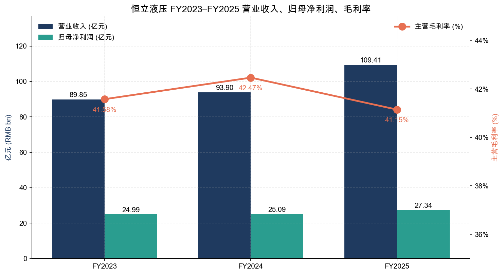
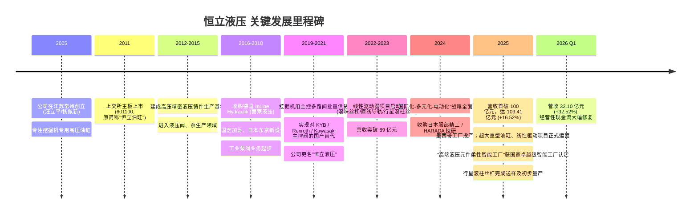
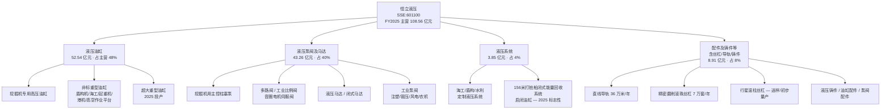
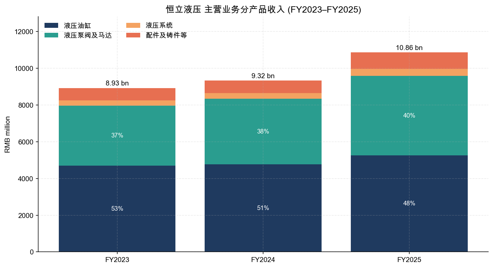
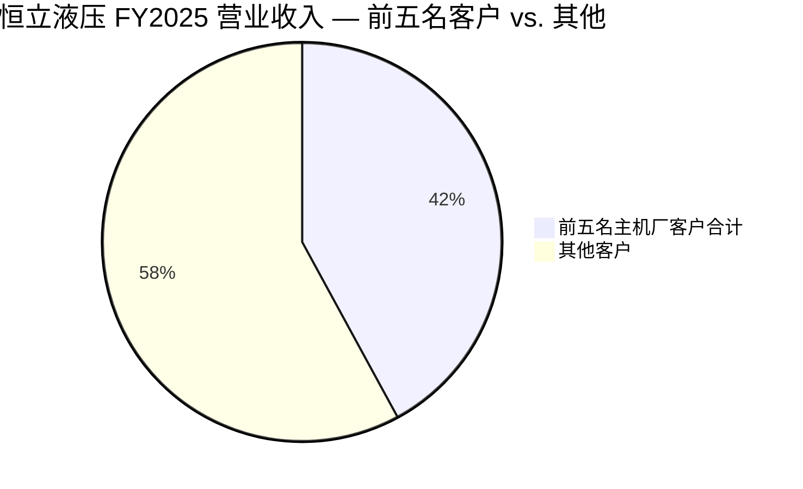
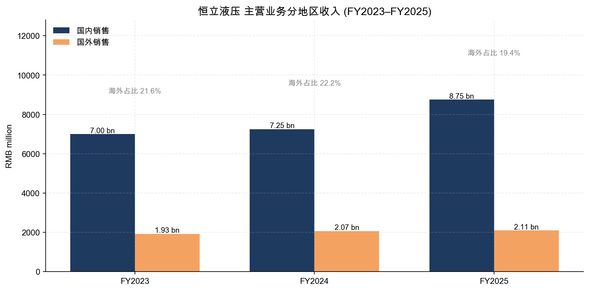
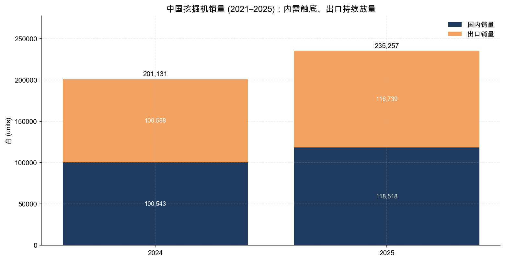
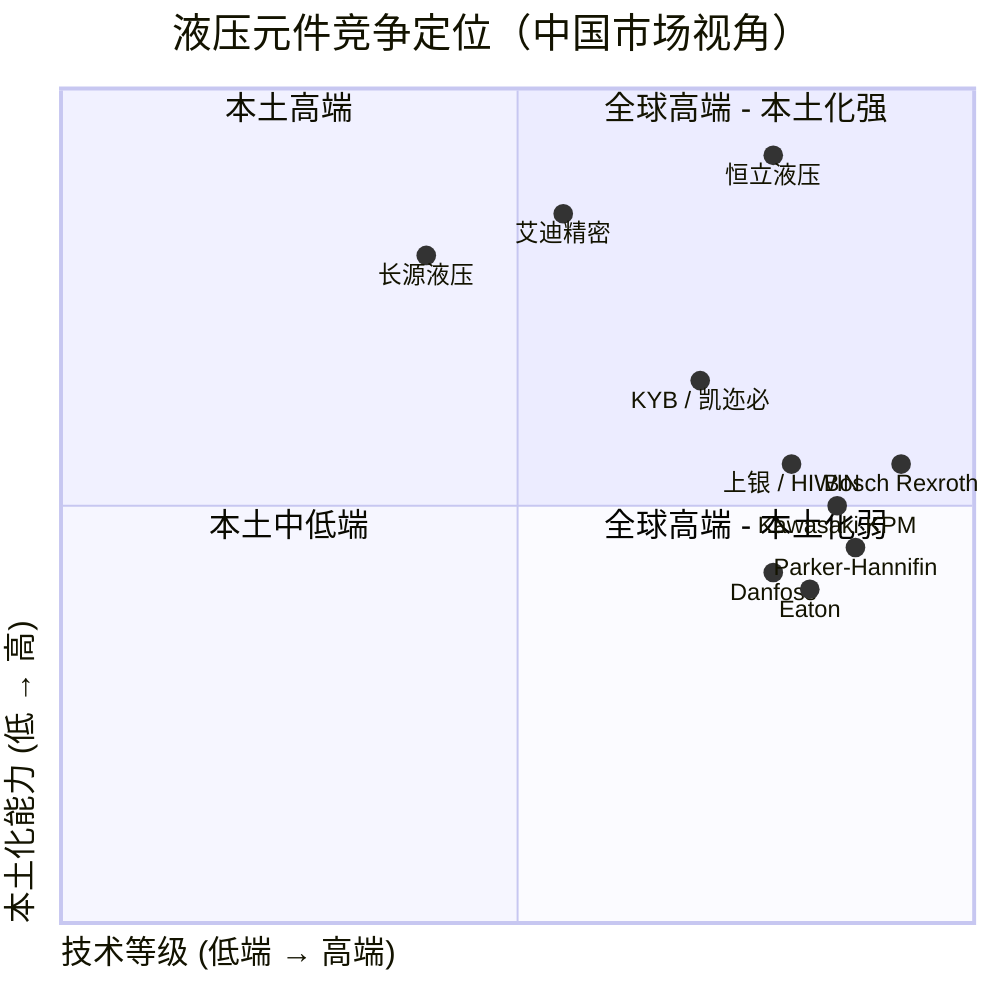
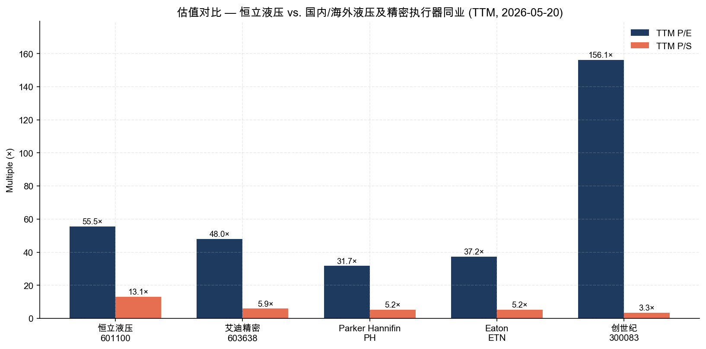

# 公司研究报告：江苏恒立液压股份有限公司 (SSE:601100)

**报告日期：** 2026-05-20
**主要上市地：** 上海证券交易所 (A 股, 601100)
**股票简称：** 恒立液压 (Hengli Hydraulic)
**报告语言：** 简体中文

> **更新说明 — FY2025 业绩创历史新高、FY2026 Q1 营收强劲反弹 (2026-04-27):** 公司 2025 年度营业收入首次突破百亿元、达 109.41 亿元，同比 +16.52%；归母净利润 27.34 亿元，同比 +8.99%，均创历史新高；公司未披露 FY2026 全年量化指引，但 2026 Q1 营收 32.10 亿元，同比 +32.52%，归母净利润 6.52 亿元，同比 +5.59%，经营性现金流净额同比 +934.62%，工程机械周期上行得到进一步确认。
> 资料来源：[《江苏恒立液压股份有限公司 2025 年年度报告》, 2026-04-21, 第 6、11 页](https://static.cninfo.com.cn/finalpage/2026-04-21/1225127026.PDF) 以及 [《2026 年第一季度报告》, 2026-04-28](https://static.cninfo.com.cn/finalpage/2026-04-28/1225204109.PDF)。

---

## 目录

1. 公司概览
2. 公司历史
3. 管理团队
4. 产品与服务
5. 客户与上市策略
6. 行业概览
7. 竞争格局
8. 市场机会 (TAM)
9. 风险评估
10. 参考资料

---

## 1. 公司概览

江苏恒立液压股份有限公司（"恒立液压"或"公司"，A 股代码 601100）成立于 2005 年，总部位于江苏常州武进高新区，是中国液压元件及液压系统行业的龙头企业。公司主营业务为液压油缸、液压泵阀、液压马达、液压系统、液压铸件、以及近年新拓展的滚动功能部件（直线导轨、滚珠丝杠、行星滚柱丝杠）的研发、生产与销售，并通过自主品牌定位中高端，长期作为本土厂商打破日资 KYB、德资 Bosch Rexroth、美资 Parker、Eaton、日资 Kawasaki、丹麦 Danfoss 等国际巨头在中国液压传动市场的垄断格局 ([《2024 年年度报告》, 2025-04-29, "行业竞争格局"](https://static.cninfo.com.cn/finalpage/2025-04-29/1223384610.PDF))。

**收入结构 — 四大产品线、两大销售区域。** 2025 年度，机械装备制造主业贡献营业收入 108.56 亿元（占总营收 99% 以上），其中液压油缸 52.54 亿元（占主营 48.4%）、液压泵阀及马达 43.26 亿元（占 39.8%）、液压系统 3.85 亿元、配件及铸件等（含丝杠、导轨等线性驱动相关产品）8.91 亿元。地区结构上，国内销售 87.50 亿元（同比 +20.67%），国外销售 21.06 亿元（同比 +1.58%），海外收入占主营 19.4%（[《2025 年年度报告》, 2026-04-21, 第 15 页](https://static.cninfo.com.cn/finalpage/2026-04-21/1225127026.PDF)）。

**经营模式 — B2B 配套直销，订单驱动。** 公司"以销定产"，年初与卡特彼勒、三一、徐工、柳工、神钢、日立建机、久保田、铁建重工等头部主机厂签订年度框架采购合同，客户按需下达滚动订单，交货期通常 30–60 天，应收账款风险敞口主要集中在大型上市主机厂（[《2025 年年度报告》, 第 10–11 页](https://static.cninfo.com.cn/finalpage/2026-04-21/1225127026.PDF)）。这一模式决定了公司业绩与下游挖掘机、高空作业平台、盾构机、起重机、海洋工程、风电、农机等景气度高度相关。

**规模指标 (FY2025 末)。** 营收 109.41 亿元；归母净利润 27.34 亿元；总资产 216.71 亿元；归母净资产 172.80 亿元；加权平均 ROE 16.63%；研发投入 7.05 亿元，研发费用率 6.44%，研发人员 1,104 人；在职员工合计 8,403 人（生产人员 5,812、技术人员 1,104、行政 859、销售 300）；全球布局 7 大研发中心、海外制造基地包括墨西哥（2025 年投产）、德国 InLine 茵莱、日本服部精工、印度尼西亚等，并在英国、意大利、印尼、几内亚等地新设服务点（[《2025 年年度报告》, 第 6、17、34 页](https://static.cninfo.com.cn/finalpage/2026-04-21/1225127026.PDF)）。

**估值快照 (TTM, 2026-05-20 收盘)。** 据 Yahoo Finance 行情数据，恒立液压股价 RMB 114.82，总市值约 1,540 亿元，TTM P/E 约 55.5×，TTM P/S 约 13.1×，P/B 约 8.6×，企业价值/EBITDA 约 40.4×；过去 52 周价格区间 RMB 65.82–125.98（[Yahoo Finance — 601100.SS Key Statistics, 2026-05-20](https://finance.yahoo.com/quote/601100.SS/key-statistics)）。同业对照：艾迪精密 (SSE:603638) P/E 48×、P/S 5.9×；创世纪 (SZSE:300083) P/E 156×、P/S 3.3×；海外可比 Parker-Hannifin (NYSE:PH) P/E 31.7×、P/S 5.2×；Eaton (NYSE:ETN) P/E 37.2×、P/S 5.2×（数据同上）。

**估值溢价的解释。** 恒立液压当前 TTM P/E 与 P/S 均显著高于海外液压同业 Parker、Eaton（P/E ≈ 32–37×、P/S ≈ 5.2×），亦高于工程机械液压同业艾迪精密（P/S 5.9×）。这一溢价反映三层市场预期：(1) **国产替代仍在加速** — 公司是国内极少数能与 Rexroth、Kawasaki 在大马力挖掘机液压主控泵阀正面竞争的本土厂商，2025 年中大型挖掘机用液压泵阀收入同比 +近 40%，公司将其表述为"填补了国内高端超大挖用液压泵领域的市场空白，进一步打破国际品牌垄断"（[《2025 年年度报告》, 第 11 页](https://static.cninfo.com.cn/finalpage/2026-04-21/1225127026.PDF)）。 (2) **第二成长曲线 — 线性驱动器、行星滚柱丝杠对接人形机器人/具身智能赛道** — 公司 2024 年报已明确提出"紧跟工业自动化、工程机械电动化以及具身智能商业化等发展趋势，有序推进'线性驱动器'等募投项目"（[《2024 年年度报告》, 第 22 页](https://static.cninfo.com.cn/finalpage/2025-04-29/1223384610.PDF)），2025 年线性驱动项目已具备年产高精度直线导轨 36 万米、精密磨削滚珠丝杠 7 万套的产能，行星滚柱丝杠完成送样和初步量产，市场将其视为人形机器人执行器关键零部件的潜在国产供应商。 (3) **周期回升** — 2025 年中国挖掘机销量同比 +17%，公司归母净利润同期再创新高，TTM EPS 弹性高于近年低点；分析师按 FY2026 forward P/E 已下移至约 37×（同上 Yahoo Finance 数据）。综上，市场对公司给出了"周期成长 + 国产替代 + 机器人零部件"三层叠加的成长股估值；如果机器人故事兑现不及预期、或 FY2026–27 工程机械周期再度走弱，估值溢价将面临压缩压力，详见第 9 节风险评估。

*Source: [《2023 年年度报告》, 2024-04-23, 第 13 页](https://static.cninfo.com.cn/finalpage/2024-04-23/1219748041.PDF)；[《2024 年年度报告》, 2025-04-29, 第 6、14 页](https://static.cninfo.com.cn/finalpage/2025-04-29/1223384610.PDF)；[《2025 年年度报告》, 2026-04-21, 第 6、15 页](https://static.cninfo.com.cn/finalpage/2026-04-21/1225127026.PDF)。*

## 2. 公司历史

公司由汪立平、钱佩新夫妇及汪立平团队于 2005 年在江苏常州创立，前身专注于挖掘机专用高压油缸（即"恒立油缸"，亦为 2011 年上市初期的股票简称）；2011 年 10 月在上交所主板挂牌上市，募集资金主要用于挖掘机液压油缸扩产与液压泵阀、铸件等延伸产品线建设（[《2025 年年度报告》第 5–6 页, 上市信息](https://static.cninfo.com.cn/finalpage/2026-04-21/1225127026.PDF)）。

公司发展中的三次关键战略转型：(a) **从单一油缸厂到液压元件平台 (2011–2017)。** 通过自建液压阀、泵生产基地实现产品线"油缸 → 泵 → 阀 → 马达 → 系统"全覆盖；(b) **国产替代深水区 — 高压主控泵阀 (2018–2024)。** 公司持续投入研发，逐步实现挖掘机用主控多路阀、高压柱塞泵的批量供货与对外资品牌的替代；(c) **多元化 + 全球化 + 线性驱动 (2023 年至今)。** 公司明确"国际化、多元化、电动化"战略，推进墨西哥、印度尼西亚、德国、意大利、英国、几内亚等海外制造与服务基地，并切入线性驱动器（直线导轨、滚珠丝杠、行星滚柱丝杠）等高端工业基础件赛道，对接电动工程机械、机床、机器人等下游（[《2024 年年度报告》第 22 页](https://static.cninfo.com.cn/finalpage/2025-04-29/1223384610.PDF)；[《2025 年年度报告》第 11–12 页](https://static.cninfo.com.cn/finalpage/2026-04-21/1225127026.PDF)）。

*Source: [《2025 年年度报告》, 2026-04-21, 第 3–13 页](https://static.cninfo.com.cn/finalpage/2026-04-21/1225127026.PDF) 及 [《2024 年年度报告》, 2025-04-29, 第 9–22 页](https://static.cninfo.com.cn/finalpage/2025-04-29/1223384610.PDF)。*

**主要并购梳理。** (1) **德国 InLine Hydraulik GmbH (茵莱液压)** — 早期并购，强化公司在欧洲工业液压研发与渠道的本地化能力，子公司"恒立香港 / 香港茵莱"曾名"香港茵莱有限公司"（[《2025 年年度报告》第 4 页 — 释义表](https://static.cninfo.com.cn/finalpage/2026-04-21/1225127026.PDF)）；(2) **日本 HARADA 技研株式会社 / 株式会社服部精工 / 株式会社 HST** — 强化公司在日本本土的精密件、服务能力（同上释义表）；(3) **海外新设主体** — 美国 Hengli America、Lineatec SAS (法国)、PT JIANGSU HENGLI HYDRAULIC INDONESIA、Hengli De Mexico S.A. DE C.V.、Hengli Hydraulics Italy SRL、Hengli Hydraulics UK and Ireland Limited、Hengli Canada Ltd.、恒立巴西、恒立几内亚等，均为 2020–2025 年密集设立，构建全球销售/服务/制造网络（[《2025 年年度报告》第 4–5 页](https://static.cninfo.com.cn/finalpage/2026-04-21/1225127026.PDF)）。

**最近 12 个月重要变化。** 2025 年 9 月，公司"高端液压元件柔性智能工厂"通过国家卓越级智能工厂认定，是国内覆盖多品类液压元件的最大柔性制造基地；同年公司董事会、监事会、高管团队完成换届（任期 2025-09-19 至 2028-09-19），汪立平继续担任董事长，邱永宁继续担任董事兼总经理，CFO 彭玫、董秘张小芳留任（[《2025 年年度报告》第 27–31 页](https://static.cninfo.com.cn/finalpage/2026-04-21/1225127026.PDF)）。同期，控股股东主体江苏恒立控股集团有限公司由原"常州恒屹智能装备有限公司"、"常州恒屹流体科技有限公司"改名，体现集团治理结构的整理（同报告第 4 页释义表）。

## 3. 管理团队

**汪立平 — 董事长、实际控制人 (Bio: ~330 字)。** 汪立平先生现年 60 岁（出生于 1965 年前后），中国国籍，无境外永久居留权，大专学历，高级经济师。其同时担任武进区第十五届人民代表大会代表、江苏省政协第十二届委员会委员、武进区工商业联合会第九届执行委员会副主席。汪立平为公司创始人之一，与配偶钱佩新女士、长子汪奇先生共同实际控制公司：三人合计通过江苏恒立控股集团（持股 36.95%）、申诺科技 (香港) (14.10%)、宁波恒屹投资 (13.29%) 三个一致行动主体持有公司约 64% 的股份（[《2025 年年度报告》第 54–55 页 — 前十名股东持股情况](https://static.cninfo.com.cn/finalpage/2026-04-21/1225127026.PDF)）。汪立平早年曾任无锡气动执行董事、志瑞机械董事长、恒立液压总经理，2025 年换届起继续担任董事长，并兼任宁波恒屹执行董事兼总经理、恒屹智能执行董事兼总经理、上海立新董事、恒立科技董事长、恒立传动董事长、恒立精工董事长（[《2025 年年度报告》第 27–30 页](https://static.cninfo.com.cn/finalpage/2026-04-21/1225127026.PDF)）。其 2025 年度从公司获得税前薪酬 142.44 万元，本人不直接持股（控股权全部通过三家家族实体）；股权激励/递延薪酬：报告期无适用（同上）。汪立平本人不直接出现在国内常见的"明星企业家"媒体序列中，但其在工程机械主机厂客户群体（尤其三一、徐工、卡特彼勒）中以"长期主义、可靠性优先"的企业风格被广泛认可，公司多年获卡特彼勒铂金奖章、三一/徐工年度优秀供应商等行业荣誉（[《2025 年年度报告》第 12 页](https://static.cninfo.com.cn/finalpage/2026-04-21/1225127026.PDF)）。

**邱永宁 — 董事、总经理 (Bio: ~180 字)。** 邱永宁先生现年 56 岁，本科毕业于南京航空航天大学，工程师。其职业履历高度技术化：曾任正茂集团正茂特钢生产部经理、正茂日立造船生产部部长、华力电机（苏州）副总经理、凯迩必液压工业（镇江）生产部部长（"凯迩必"为日资液压企业 KYB 中国合资公司），后加盟恒立液压历任副总经理、上海立新董事，2025 年换届起担任公司总经理、并兼任恒立科技/恒立传动/恒立精工总经理；恒立精工系公司线性驱动业务核心承载主体（[《2025 年年度报告》第 27–28 页](https://static.cninfo.com.cn/finalpage/2026-04-21/1225127026.PDF)）。其在 KYB 系合资公司的多年生产/工艺背景，对恒立在液压主控泵阀对日本竞品的国产替代具有直接的技术对标价值。2025 年税前薪酬 106.32 万元（同上）。

**彭玫 — 财务负责人 (CFO) (Bio: ~150 字)。** 彭玫女士现年 57 岁，毕业于北京航空航天大学，大学学历，高级会计师。早年曾任常州兰翔机械总厂（现中国航发常州兰翔机械）财务主办、常州山崎摩托车财务部长、常州格力博 (NASDAQ-listed Globe Group 母公司) 财务总监，后任公司财务负责人至今。彭玫的履历跨越国营航发体系（兰翔机械）、日资制造（山崎摩托车）与海外上市制造业（格力博），具备多类型公司财务体系搭建经验。2025 年税前薪酬 90.08 万元（[《2025 年年度报告》第 27–28 页](https://static.cninfo.com.cn/finalpage/2026-04-21/1225127026.PDF)）。公司近年披露未发生重大会计差错或重述，2025 年度审计意见为容诚会计师事务所出具的标准无保留意见（[同报告第 1、6 页](https://static.cninfo.com.cn/finalpage/2026-04-21/1225127026.PDF)）。

**徐进 — 董事、副总经理兼销售总监 (Bio: ~110 字)。** 现年 45 岁，硕士研究生学历，是公司销售体系的核心负责人，曾任公司销售部经理；现兼任恒立科技/恒立传动/恒立精工董事。徐进负责对接卡特彼勒、三一、徐工、柳工等关键主机厂客户的年度框架合同与定制开发，前五名客户合计销售 46.03 亿元、占年度销售总额 42.07% 的客户集中度即由其团队管理（[《2025 年年度报告》第 16、27–28 页](https://static.cninfo.com.cn/finalpage/2026-04-21/1225127026.PDF)）。

**胡国享 — 副总经理、恒立墨西哥总经理 (Bio: ~110 字)。** 现年 43 岁，硕士学历，曾任公司技术中心主任/设计部经理、油缸事业群总经理、人力资源总监，现任副总经理兼恒立墨西哥总经理，是公司海外制造产能（北美 Tier-1 客户配套）的现地负责人；2025 年税前薪酬 102.41 万元（[《2025 年年度报告》第 27–28 页](https://static.cninfo.com.cn/finalpage/2026-04-21/1225127026.PDF)）。

**治理结构与股权 (Governance footer, ~140 字)。** 2025 年换届后，公司董事会 7 人（含 3 名独立董事：浙江大学求是特聘教授方攸同、太原理工大学液压传动与控制方向博导权龙、原德勤税务总监王学浩；前任独立董事陈柏（南京航空航天大学智能机器人研究所所长）于 2025-09-19 任期届满离任）；高管包括汪立平、邱永宁、徐进、王斌、胡国享、彭玫、张小芳。董监高 2025 年实际获得薪酬合计 767.04 万元；股利分配方面，2025 年度合计每 10 股派现 8.60 元（含中期 3.00 元 + 年末 5.60 元）、合计现金分红 11.53 亿元、股利支付率 42.17%（[《2025 年年度报告》第 27–35 页](https://static.cninfo.com.cn/finalpage/2026-04-21/1225127026.PDF)）。报告期无重大关联交易、无非经营性资金占用，公司明确披露"控股股东、实际控制人不存在与上市公司同业竞争"（同报告第 26 页）。独立董事中权龙教授为液压传动与控制方向博导，其专业背景对公司治理具有直接相关性。

**管理团队往绩评估 (~80 字)。** 现任团队以"工程师 + 长期任职"为底色：汪立平、邱永宁、彭玫均在公司任职超过十年；公司 2011 年上市以来收入由约 7 亿元（IPO 当年）累积至 2025 年 109.4 亿元，归母净利润亦由数亿元增长至 27 亿元以上，期间未出现重大业绩失速或公司治理负面事件；最大未验证点在于线性驱动 / 机器人零部件这条第二增长曲线 — 团队此前并无消费机器人/具身智能下游的直接销售经验，能否复制其在液压主控阀上的国产替代成功仍待 FY2026–FY2027 业绩验证。

## 4. 产品与服务

恒立液压官网（[henglihydraulic.com](http://www.henglihydraulic.com)）以及 2025 年报均按"液压油缸 / 液压泵阀及马达 / 液压系统 / 配件及铸件等"四大类披露主营业务。下文按收入规模与战略重要性自上而下展开。

*Source: [《2025 年年度报告》, 第 11、15 页](https://static.cninfo.com.cn/finalpage/2026-04-21/1225127026.PDF) 及 公司官网产品页面[henglihydraulic.com](http://www.henglihydraulic.com)。*

*Source: [《2023 年年度报告》第 14 页](https://static.cninfo.com.cn/finalpage/2024-04-23/1219748041.PDF)；[《2024 年年度报告》第 14 页](https://static.cninfo.com.cn/finalpage/2025-04-29/1223384610.PDF)；[《2025 年年度报告》第 15 页](https://static.cninfo.com.cn/finalpage/2026-04-21/1225127026.PDF)。*

**(1) 液压油缸 — 旗舰品类、长期现金牛。** FY2025 收入 52.54 亿元、同比 +10.36%，毛利率 39.71%（同比 -2.93pp）。其中挖掘机专用高压油缸是公司"立家"产品 — 公司在年报中明确表示"公司目前是国内具有自主品牌的挖掘机专用高压油缸供应商，在国内生产挖掘机专用高压油缸的外资品牌主要竞争对手为 KYB"（[《2024 年年度报告》第 22 页](https://static.cninfo.com.cn/finalpage/2025-04-29/1223384610.PDF)）。**竞争优势评判：是 — 技术 + 客户认证 + 规模成本。** 公司多年获卡特彼勒铂金奖章、三一/徐工等优秀供应商称号；新产品超大重型油缸 / 全球首套 156 米打桩船闭式能量回收系统 / 全球最大启闭油缸于 2025 年下线（[《2025 年年度报告》第 12 页](https://static.cninfo.com.cn/finalpage/2026-04-21/1225127026.PDF)）。FY2025 液压油缸产量 906,344 只、销量 899,786 只，量价齐升。最接近的同业产品为 KYB Industrial Machinery 的中国合资公司凯迩必液压（KYB Hydraulics 镇江、广州）— 在中大型挖掘机专用油缸市场恒立在份额上已超过 KYB 中国合资公司，处于"领先"位置（综合 2024 年报 + 公司 2025 年报核心竞争力段叙述）。

**(2) 液压泵阀及马达 — 国产替代主战场、第二增长引擎。** FY2025 收入 43.26 亿元、同比 +20.72%，毛利率 48.83%（同比 +0.89pp）。这是 FY2025 公司增长最快的主业板块，其中**挖掘机液压产品销售额同比 +20% 以上，中大型挖掘机用液压泵阀同比 +近 40%**（[《2025 年年度报告》第 11 页](https://static.cninfo.com.cn/finalpage/2026-04-21/1225127026.PDF)）。**竞争优势评判：部分 — 技术追赶中、客户认证已通过、规模仍小于全球巨头。** 主要竞争对手为德资 Bosch Rexroth、日资 Kawasaki、美资 Parker、丹麦 Danfoss（[《2024 年年度报告》第 22 页](https://static.cninfo.com.cn/finalpage/2025-04-29/1223384610.PDF)）。公司在 2020 年承担的国家重点研发计划"阀口独立控制型大流量液压阀关键技术研究与示范应用"已通过课题绩效评价，"高压大流量整体式液压多路阀关键技术与产业化"获中国液压液力气动密封行业技术进步奖二等奖（[《2025 年年度报告》第 12 页](https://static.cninfo.com.cn/finalpage/2026-04-21/1225127026.PDF)）。FY2025 液压泵阀及马达销量 205.9 万只、同比 +14.82%；非工程机械应用（注塑、锻压、风电、农机、高空作业平台）持续放量。最接近的同业产品为 Kawasaki KPM 系列主控泵 — 公司国内份额已大幅领先 Kawasaki，处于"领先到追平"区间；在国际超大马力主控泵（>500cc 排量），仍小幅落后于 Bosch Rexroth A11/A4VG 系列。

**(3) 液压系统 — 高定制、低体量但战略支点。** FY2025 收入 3.85 亿元、同比 +30.00%。系统集成订单往往伴随高端示范项目，FY2025 标志性产品包括为平陆运河水利工程提供的高端水利装备液压系统、全球首套 156 米打桩船闭式能量回收系统、全球最大启闭油缸等（[《2025 年年度报告》第 12 页](https://static.cninfo.com.cn/finalpage/2026-04-21/1225127026.PDF)）。**竞争优势评判：是 — 项目导向、强工程定制能力、客户切换成本高。** 这条产品线的实际利润贡献小（毛利率 34.39%、绝对额约 1.3 亿元），但作为公司"装备出海"招牌，对品牌价值和后续元件订单具有杠杆作用。最接近的同业为 Rexroth Industrial Hydraulics、Eaton Industrial — 在中国本土水利、海工大型项目中，恒立由于本地化交付能力，处于"领先"。

**(4) 配件及铸件等（含线性驱动 — 第三曲线）。** FY2025 收入 8.91 亿元、同比 +30.31%，毛利率 15.25%（同比 +0.71pp）。**这一板块包含了公司最大的成长期权 — 线性驱动器/精密滚动功能部件业务。** FY2025 公司线性驱动项目已具备年产高精度直线导轨 36 万米、精密磨削滚珠丝杠 7 万套的加工能力，已达成合作客户超 300 家，覆盖国内中高端工业设备行业；**行星滚柱丝杠完成送样和初步量产**（[《2025 年年度报告》第 11–12 页](https://static.cninfo.com.cn/finalpage/2026-04-21/1225127026.PDF)）。**竞争优势评判：部分 — 技术待验证、客户认证早期、规模显著小于海外龙头。** 直线导轨/滚珠丝杠的全球龙头是日资 THK、NSK、HIWIN (上银)，德资 Bosch Rexroth；行星滚柱丝杠的全球龙头是瑞士 GSA / Rollvis、德国 Schaeffler、日本 NSK。恒立在精密滚动功能部件领域处于"追赶"位置，目前披露的客户数量与产能均显著小于全球龙头。但公司 2024 年报已明确将行星滚柱丝杠对接"具身智能商业化"趋势（[《2024 年年度报告》第 22 页](https://static.cninfo.com.cn/finalpage/2025-04-29/1223384610.PDF)），这意味着公司将其作为未来人形机器人直线执行器的关键零部件供应商身份切入。

**研发投入与人才。** FY2025 公司研发投入 7.05 亿元、研发费用率 6.44%，研发人员 1,104 人（占员工 13.14%），其中博士 3 人、硕士 168 人、本科 679 人。公司目前在国内外建有 7 大研发中心，与德国、日本、丹麦等海外专家及国内液压行业优势高校合作攻关，累计有效专利 1,125 件、有效注册商标 186 件，承担国家重点研发计划 7 项 — 涵盖电动化工程机械关键零部件、一体化直线作动系统、高端工业设备滚动功能部件等方向（[《2025 年年度报告》第 12、17 页](https://static.cninfo.com.cn/finalpage/2026-04-21/1225127026.PDF)）。

**最近 12 个月产品/产能动态。** (a) 墨西哥工厂 2025 年正式投产，承担北美工程机械液压配套；(b) 超大重型油缸项目 2025 年正式投产；(c) 线性驱动器项目 2025 年正式投产 + 产能达产；(d) 行星滚柱丝杠完成送样并实现初步量产；(e) "高端液压元件柔性智能工厂"获国家卓越级智能工厂认定 — 是国内覆盖多品类液压元件的最大柔性制造基地（[《2025 年年度报告》第 11–12 页](https://static.cninfo.com.cn/finalpage/2026-04-21/1225127026.PDF)）；(f) 印度尼西亚生产基地建设推进中；(g) 英国、意大利、印尼、几内亚等海外服务点 2025 年陆续设立。无明显产品 sunset。

## 5. 客户与上市策略

**客户结构与集中度 — 中等偏高，呈年度小幅下降。** FY2025 前五名客户合计销售额 46.03 亿元，占年度销售总额 **42.07%**，其中关联方销售为零（[《2025 年年度报告》第 16 页](https://static.cninfo.com.cn/finalpage/2026-04-21/1225127026.PDF)）。FY2024 前五大客户合计销售 36.40 亿元、占总销售 **44.13%**（[《2024 年年度报告》第 16 页](https://static.cninfo.com.cn/finalpage/2025-04-29/1223384610.PDF)）。FY2023 前五大客户合计销售 38.14 亿元、占总销售 **42.45%**（[《2023 年年度报告》第 14 页](https://static.cninfo.com.cn/finalpage/2024-04-23/1219748041.PDF)）。**这一集中度水平触及第 5 节告警阈值（前五客户 > 40%）但低于强约束阈值（> 50%）。** 公司未在年报中按 ASC 280 / 国内"客户名称 + 销售金额"维度具名披露单一客户，但管理层讨论与产品段披露明确：核心客户为卡特彼勒（Caterpillar，美国）、三一重工 (SSE:600031)、徐工集团 (SSE:000425, 港股 03339)、柳工 (SSE:000528)、神钢 (Kobelco，日本)、日立建机 (TYO:6305)、久保田 (TYO:6326)、中铁工程装备、铁建重工 (SSE:688425) 等（[《2025 年年度报告》第 10 页](https://static.cninfo.com.cn/finalpage/2026-04-21/1225127026.PDF)）。**估计单一客户占比 < 20%，前五客户集中度趋势近三年稳定在 42–44% 区间，2025 年略有改善（-2.06pp），主要源于线性驱动器、新行业（农机、高机、注塑、锻压）多元化客户结构的扩张。**

*Source: [《2025 年年度报告》, 第 16 页](https://static.cninfo.com.cn/finalpage/2026-04-21/1225127026.PDF)。*

**合同结构与现金周期。** 公司年初与主要主机厂签订年度框架采购合同，框架期内由客户按需下达采购订单，恒立按订单与"以销定产"机制组织生产，交货期通常 30–60 天（[《2025 年年度报告》第 11 页](https://static.cninfo.com.cn/finalpage/2026-04-21/1225127026.PDF)）。2025 年末应收账款 19.10 亿元、同比 +39.31%，主因业务规模增长；但 FY2025 经营性现金流净额 18.11 亿元、同比 -26.95%，主要系材料采购、薪酬费用及税金支付增加（[同报告第 14、19 页](https://static.cninfo.com.cn/finalpage/2026-04-21/1225127026.PDF)）；FY2026 Q1 经营性现金流 5.18 亿元、同比 +934.62%，"主要系销售现金回款增加、应收票据回款增长"（[《2026 年第一季度报告》, 第 3 页](https://static.cninfo.com.cn/finalpage/2026-04-28/1225204109.PDF)），表明客户回款节奏明显改善。

**主机厂客户与同业竞争 — 客户即潜在竞争者的风险。** 三一重工、徐工等中国头部主机厂均布局自有液压元件子公司（如三一旗下"三一海工"、徐工旗下"徐工液压件"），具备一定的内化产能。在主控泵、阀等高难度品类，主机厂目前仍依赖恒立、Rexroth、Kawasaki 等专业元件厂；但若中国头部主机厂下定决心自研主控件并形成规模产能，将对恒立的高利润国产替代品类构成长期挤压。此风险公司在年报中未直接展开讨论，需投资者额外评估。

**渠道与海外布局。** 公司采用"配套直销"模式，国内通过覆盖全国的技术服务和营销办事机构直接对接主机厂；海外通过子公司 / 办事处布局欧洲（德国 InLine、意大利、英国、法国 Lineatec）、北美（美国 Hengli America、墨西哥 Hengli De Mexico、加拿大）、日本（HARADA 技研、服部精工、HST、恒和贸易）、东南亚（印度尼西亚 PT 主体、新加坡）、非洲与南美（几内亚、巴西）等市场，并配备本土技术服务和营销人员，提供本地化服务（[《2025 年年度报告》, 第 4–5、13 页](https://static.cninfo.com.cn/finalpage/2026-04-21/1225127026.PDF)）。海外业务 FY2025 收入 21.06 亿元，占主营 19.4%，同比 +1.58%（受汇率与海外景气拖累，墨西哥工厂投产后中长期增量可期）。

*Source: [《2023–2025 年年度报告》主营业务分地区情况, 第 14–15 页](https://static.cninfo.com.cn/finalpage/2026-04-21/1225127026.PDF)。*

**典型客户案例。** (a) 卡特彼勒 — 连续多年颁发铂金奖章供应商认证（[《2025 年年度报告》第 12 页](https://static.cninfo.com.cn/finalpage/2026-04-21/1225127026.PDF)）；(b) 中铁工程装备、铁建重工 — 在 156 米打桩船闭式能量回收系统、世纪工程平陆运河水利装备、超大重型油缸等项目上深度合作（同上）；(c) 头部农机企业 — 公司开发的高压柱塞泵、多路阀进入国内外头部农机企业供应链（同上第 12 页）；(d) 头部高空作业平台 (AWP) 制造商 — 公司行走马达、闭式泵等核心部件获多家主流高机制造商长期订单（同上）。

## 6. 行业概览

**液压传动与控制 — 装备制造业基础件、核心 5 大元件类别。** 液压传动与控制产品广泛应用于深海探测、节能环保装备、新能源装备、重型机械、工程建筑机械、农业机械、汽车等装备制造领域，核心元件包括液压泵、阀、马达、油缸、液压系统及装置五大类（[《2025 年年度报告》第 10 页](https://static.cninfo.com.cn/finalpage/2026-04-21/1225127026.PDF)）。中国是全球液压制造大国，但行业整体仍存"大而不强"格局 — 高端产品长期依赖进口（KYB、Rexroth、Kawasaki、Parker、Eaton、Danfoss 等），国产化主力为恒立等少数本土龙头（同上）。

**下游 — 工程机械周期是第一驱动力。** 恒立 FY2025 主营 108.56 亿元中，挖掘机用液压元件（油缸 + 泵阀 + 马达）是最大单一下游。2025 年度全国共销售挖掘机 235,257 台、同比 +17%；其中国内 118,518 台、同比 +17.9%；出口 116,739 台、同比 +16.1%（[《2025 年年度报告》第 11 页，引中国工程机械工业协会数据](https://static.cninfo.com.cn/finalpage/2026-04-21/1225127026.PDF)）。2024 年全国销量为 201,131 台、同比 +3.13%，其中国内 100,543 台 (+11.7%)、出口 100,588 台 (-4.24%)（[《2024 年年度报告》第 22 页](https://static.cninfo.com.cn/finalpage/2025-04-29/1223384610.PDF)）。**这意味着 2024–2025 年挖掘机周期已确认从 2021–2023 的深度下行中触底回升，行业景气度处于上行第 2 年。**

*Source: [中国工程机械工业协会 (CCMA) 数据，转引自《2024 年年度报告》第 22 页](https://static.cninfo.com.cn/finalpage/2025-04-29/1223384610.PDF) 及 [《2025 年年度报告》第 11 页](https://static.cninfo.com.cn/finalpage/2026-04-21/1225127026.PDF)。*

**驱动力 — 政策、出口、设备更新。** 公司年报点出 2025 年三大驱动：超长期特别国债 + 地方政府专项债精准投向交通、水利、能源；设备更新补贴、以旧换新政策；水利、重大基建、矿山开采、城市更新等领域需求释放（[《2025 年年度报告》第 11 页](https://static.cninfo.com.cn/finalpage/2026-04-21/1225127026.PDF)）。这些驱动多为政策引导，意味着 2026 年起，财政空间、地方债务约束、政策接续力度成为关键不确定。

**下游 — 非工程机械下游加速放量、产品结构改善的关键。** 除工程机械外，公司液压元件广泛应用于盾构机（地下掘进设备）、港口机械（海洋工程）、高空作业平台、注塑、锻压、风电、太阳能、农机、混凝土泵车、起重机、煤机、滑移装载机、钻机等领域（[《2025 年年度报告》第 11–12 页](https://static.cninfo.com.cn/finalpage/2026-04-21/1225127026.PDF)）。其中**高空作业平台 (AWP)**、**风电液压**、**农机液压**、**注塑/锻压用工业泵阀**为公司近三年增长亮点，构成主营 50% 以上的"非挖掘机液压"业务，是公司穿越挖掘机周期的关键。

**液压产品技术升级方向 — 高压化、智能化、精准化、集成化、绿色化。** 行业方向明确（[《2025 年年度报告》第 11 页](https://static.cninfo.com.cn/finalpage/2026-04-21/1225127026.PDF)），其中"智能化"对应电液控制系统（电控比例阀、伺服阀、电液一体化执行器）、"绿色化"对应能量回收/再生回路、"集成化"对应液压系统总成。这些方向上恒立的相对竞争力强于在"标准件大宗化"方向，与公司"高端定位"的战略相一致。

**关联赛道 — 滚动功能部件 (滚珠丝杠 / 直线导轨 / 行星滚柱丝杠) 与人形机器人。** 公司将"滚动功能部件"放在配件及铸件类目中披露，但其战略意图是切入工业自动化、工程机械电动化、具身智能商业化的执行器市场（[《2024 年年度报告》第 22 页](https://static.cninfo.com.cn/finalpage/2025-04-29/1223384610.PDF)）。**人形机器人单台所需的直线作动器（典型设计 12–14 个）以及对应的精密滚珠丝杠/行星滚柱丝杠数量较多，是全球精密滚动功能部件未来 3–10 年最大边际需求来源。** 公司年报披露已与重点客户合作开发"挖掘机分布式独立电液控制系统关键技术研究"国家重点研发计划课题（[《2025 年年度报告》第 12 页](https://static.cninfo.com.cn/finalpage/2026-04-21/1225127026.PDF)），并部署"一体化直线作动系统"国家级项目。

**监管与产业政策。** 液压元件及系统行业受工业和信息化部装备工业司管辖，近年被列入"工业强基工程"、"国家重大技术装备首台（套）"政策支持范围；公司多次获评江苏省示范智能车间、国家卓越级智能工厂；液压产品出口受出口管制条例约束相对较低，但出口至受美国制裁名单的国家/地区需合规审查。

**行业供需结构。** 全球液压销售前五位国家为美国、中国、日本、德国、法国（[《2025 年年度报告》第 10 页](https://static.cninfo.com.cn/finalpage/2026-04-21/1225127026.PDF)），行业 CR5 历史上集中于 Bosch Rexroth、Parker-Hannifin、Eaton、Kawasaki、KYB 等跨国龙头；中国市场近 5 年由于恒立等本土厂商的崛起，CR5 中本土比重显著上升。供应链上游为铸件、钢材、电控元件，议价能力中等；下游为头部主机厂（CR5 占比高），客户议价能力较强 — 这与公司 FY2024 / FY2025 主营毛利率小幅震荡的事实一致（41.58% → 42.47% → 41.15%）。

## 7. 竞争格局

**全球与国内主要竞争对手梳理（公司年报自述）。**

| 板块 | 主要竞品 | 与恒立的相对位置 |
|---|---|---|
| 挖掘机专用高压油缸 | KYB (日本)、凯迩必液压 (KYB 中国合资) | **恒立国内领先** — 公司年报明确"国内具有自主品牌的挖掘机专用高压油缸供应商" |
| 工业用高压油缸 | Eaton, Parker, Bosch Rexroth | 国内市场领先；海外定制项目持平到稍后 |
| 挖掘机用主控柱塞泵 | Bosch Rexroth (A4VG/A11), Kawasaki KPM, Parker, Danfoss | **公司在中大型挖掘机用主控泵阀实现国产替代加速，2025 年同比 +近 40%**；超大马力段仍小幅落后于 Rexroth A11 系列 |
| 多路阀 / 工业比例阀 | Bosch Rexroth, Parker, Danfoss, Eaton | 公司"高性能数字式液压多路阀"已获江苏省科技成果转化立项；与 Rexroth 在高压大流量段处于追赶位置 |
| 液压马达 / 闭式马达 | Bosch Rexroth, Kawasaki, Sauer-Danfoss | 公司在 AWP / 农机 / 高机闭式系统切入加速，处于"追赶到追平"区间 |
| 液压系统集成 | Bosch Rexroth Industrial, Eaton Industrial | 中国本土水利、海工、盾构大型项目恒立领先 |
| 直线导轨 / 滚珠丝杠 | THK, NSK (日本), HIWIN 上银 (台), Bosch Rexroth | **追赶位置，2025 年达产 36 万米/年导轨 + 7 万套/年丝杠**，市场份额仍显著小于全球龙头 |
| 行星滚柱丝杠 | 瑞士 Rollvis / GSA、德国 Schaeffler、日本 NSK | **早期阶段，2025 年完成送样及初步量产**；对接人形机器人需求 |
| 国内液压同业 | 艾迪精密 (SSE:603638)、长源液压 (SSE:600527)、力源液压 | 艾迪精密以挖掘机用破碎锤液压件为主，与恒立产品重叠度有限；长源、力源体量较小，无法在主控件挑战恒立 |

数据综合自 [《2024 年年度报告》第 21–22 页](https://static.cninfo.com.cn/finalpage/2025-04-29/1223384610.PDF) 与 [《2025 年年度报告》第 11–13 页](https://static.cninfo.com.cn/finalpage/2026-04-21/1225127026.PDF)。

*以上为定性定位图，基于公司年报、官网及同业披露综合判断。*

*Source: [Yahoo Finance Key Statistics for 601100.SS / 603638.SS / PH / ETN / 300083.SZ, 2026-05-20](https://finance.yahoo.com/quote/601100.SS/key-statistics)。*

**公司的竞争优势。** (1) **客户认证壁垒** — 卡特彼勒、三一、徐工、神钢、日立建机等头部主机厂的供应商认证流程通常 18–36 个月，恒立已多年通过；(2) **产能与柔性制造** — 国家卓越级智能工厂认定、覆盖多品类液压元件的最大柔性制造基地；(3) **专利与研发** — 累计有效专利 1,125 项、商标 186 件、研发人员 1,104 人；(4) **品牌** — "恒立液压"在国内是工程机械液压元件的等价代名词；(5) **成本与本土化** — 相比 Rexroth / Kawasaki 中国合资企业，恒立在本土供应链、规模成本上具有显著优势；(6) **海外制造布局** — 墨西哥、印尼、日本、欧洲多基地，正在拓展全球本土化供货能力。

**公司的竞争弱点。** (1) **超高端液压泵 / 阀的核心技术节点（高压大流量段）仍小幅落后于德资 Rexroth、日资 Kawasaki**；(2) **滚动功能部件赛道全球份额极低**，对照 THK 2024 财年销售额超 380 亿日元、HIWIN 营收数十亿人民币级，恒立 2025 年 36 万米/年导轨、7 万套/年丝杠属于初始体量；(3) **海外业务汇率敞口** — 欧元、美元业务规模上升，FY2025 财务费用由 -1.31 亿元变为 +0.06 亿元，主因汇率波动导致汇兑损失增加（[《2025 年年度报告》第 17 页](https://static.cninfo.com.cn/finalpage/2026-04-21/1225127026.PDF)）；(4) **客户即潜在竞争者** — 三一、徐工等头部主机厂均有内化液压元件意图。

## 8. 市场机会 (TAM)

**TAM 边界与方法学。** 我们将恒立的可服务市场拆分为四块叠加：(A) 全球工程机械液压元件市场，(B) 全球工业液压元件市场（注塑、锻压、风电、农机、海工、矿山等），(C) 全球精密滚动功能部件市场（导轨、滚珠丝杠、行星滚柱丝杠），(D) 全球人形机器人 / 直线作动器市场（含与之相关的丝杠/导轨增量需求）。**披露注意：公司本身未在年报中给出 TAM 数字，本节中除 A/B 直接来自公司业务披露的方向性陈述外，C/D 的全球市场规模需要外部第三方研究，本报告不在此处虚构具体规模，仅给出方向性判断。**

**A. 全球工程机械液压元件市场。** 公司年报点出"全球液压销售的前五位国家：美国、中国、日本、德国、法国"，"国际液压市场需求总体处于持续增长趋势"（[《2025 年年度报告》第 10 页](https://static.cninfo.com.cn/finalpage/2026-04-21/1225127026.PDF)）。中国 2025 年挖掘机销量 235,257 台（同比 +17%）；以恒立单台液压价值量（油缸 + 泵阀 + 马达综合估值，公司不直接披露）测算，公司在挖掘机液压领域所占份额已实质上对应国内中大型挖掘机用主控泵阀的 head-on 国产替代 — 公司在 2025 年报中指出"中大型挖掘机用液压泵阀同比增长近 40%，填补了国内高端超大挖用液压泵领域的市场空白，进一步打破国际品牌垄断"（同报告第 11 页）。

**B. 全球工业液压元件市场（非工程机械）。** 公司 FY2025 已布局或加速放量的下游包括：高空作业平台（行走马达、闭式泵）、农机（高压柱塞泵、多路阀）、注塑、锻压、风电、太阳能、混凝土泵车、起重机、煤机、滑移装载机、钻机、盾构机、海洋工程、水利装备、铺路机械（[《2025 年年度报告》第 12 页](https://static.cninfo.com.cn/finalpage/2026-04-21/1225127026.PDF)）。**这部分非工程机械下游的可服务市场规模显著大于 A，是公司穿越挖掘机周期的关键引擎。** 公司将其作为"多元化"战略的核心载体。

**C. 全球精密滚动功能部件市场 — 公司新赛道。** 公司 FY2025 已具备 36 万米/年高精度直线导轨、7 万套/年精密磨削滚珠丝杠产能。从合作客户 300 余家来看，公司处于"国产中端导轨 / 丝杠 + 部分高端切入"阶段。**这是机床、高端工业自动化、半导体设备的核心耗材** — 全球龙头（THK、NSK、HIWIN、Rexroth、Schaeffler）合计份额超过中国市场需求的 60% 以上，国产替代空间巨大。

**D. 行星滚柱丝杠与人形机器人执行器 — 最具象的成长期权。** 行星滚柱丝杠（PRSM, Planetary Roller Screw Mechanism）是高负载、高刚度、高寿命的直线传动元件，传统应用于航空航天、机床直驱、半导体设备等高端场景；近年随着人形机器人/具身智能产业化的提速，被视为人形机器人直线执行器（典型设计 12–14 个直线关节）的核心零部件之一。**公司在 2024 年报中已明确将其与"具身智能商业化"的发展趋势挂钩**（[《2024 年年度报告》第 22 页](https://static.cninfo.com.cn/finalpage/2025-04-29/1223384610.PDF)），并在 2025 年实现送样和初步量产（[《2025 年年度报告》第 11–12 页](https://static.cninfo.com.cn/finalpage/2026-04-21/1225127026.PDF)），叠加公司"一体化直线作动系统项目"国家级项目立项（同报告第 12 页）— 形成"丝杠 → 直线作动器（含电机、丝杠、滚珠/滚柱组）→ 机器人关节"的纵向延伸链条。**对应到 TAM 量级：如以 2030 年全球人形机器人年出货 50–100 万台、单台行星滚柱丝杠 12 套 × ASP USD 300–800 测算（市场普遍假设区间，参考多家公开行业研究），对应单一年度 PRSM 增量需求约 18–96 亿美元，是恒立现有体量的数倍 — 但这一假设依赖人形机器人量产节奏，未由公司自身披露，需投资者保留 50–80% 折扣。**

**SAM 与 SOM。** 公司直接可服务市场（SAM）主要是中国 + 海外可触达的工程机械、工业液压、精密滚动功能部件下游；保守估计 SAM 远大于公司 109 亿元营收，意味着即便在工程机械领域已具备国内龙头地位，整体公司层面的市占率仍处于个位数百分比量级；SOM 的提升路径有三：(1) 高压主控阀 / 泵的国产替代进一步深化（替代 Rexroth、Kawasaki）；(2) 非工程机械下游的客户数与单客户份额扩张；(3) 滚动功能部件 / 直线作动器对应机器人/电动工程机械的从 0 到 1 放量。

**渗透策略。** (a) 客户拓展 — 持续扩大非工程机械客户基础（FY2025 线性驱动客户已超 300 家）；(b) 产品延伸 — 行星滚柱丝杠初步量产 + 一体化直线作动系统国家级项目；(c) 全球化制造 — 墨西哥、印尼、日本、欧洲多基地降低关税与本土化壁垒；(d) 集成化 — 从单元件向液压系统、电液控制系统、滚动功能部件总成升级。

## 9. 风险评估

**A. 公司特定风险 (Company-specific)**

1. **客户集中度与主机厂内化风险 (~85 字)。** FY2025 前五客户合计销售 46.03 亿元、占比 42.07%，连续三年在 42–44% 区间。三一、徐工等头部主机厂均有自有液压元件子公司，若其大举内化主控泵阀产能，将对恒立国产替代红利构成长期压制。**缓释：恒立长期作为卡特彼勒铂金奖供应商、覆盖国内外多家头部主机厂，主控泵阀的工艺/认证壁垒短期难以突破；公司主动多元化非工程机械下游分散依赖。** （[《2025 年年度报告》第 16 页](https://static.cninfo.com.cn/finalpage/2026-04-21/1225127026.PDF)）

2. **线性驱动 / 行星滚柱丝杠业务执行风险 (~95 字)。** 公司将"具身智能"作为线性驱动业务的核心叙事，但其行星滚柱丝杠 2025 年仅完成送样和初步量产，从送样到主流人形机器人厂商批量定点的中间路径仍长；高精度滚珠丝杠/导轨的全球龙头 THK / NSK / HIWIN / Schaeffler 工艺积累深厚。**缓释：公司在液压元件领域已多次成功完成国产替代，有相似执行经验；具身智能尚处于早期，量产节奏不确定，公司可借助行业起量同步成长。** （[《2025 年年度报告》第 11–12 页](https://static.cninfo.com.cn/finalpage/2026-04-21/1225127026.PDF)）

3. **海外制造布局执行与合规风险 (~80 字)。** 墨西哥、印尼、几内亚、英国、意大利等海外基地 2025 年密集设立或投产，跨国管理、本土合规、税收、外汇、文化整合复杂；FY2025 财务费用由 -1.31 亿元变为 +0.06 亿元主因汇兑损失。**缓释：公司有德国 InLine、日本服部精工等历史并购整合经验，且海外人员配备本地化；汇率风险通过外汇掉期对冲。** （[《2025 年年度报告》第 14、17 页](https://static.cninfo.com.cn/finalpage/2026-04-21/1225127026.PDF)）

4. **资本性支出与回报率压力 (~75 字)。** FY2025 投资活动现金流净流出 8.57 亿元（FY2024 净流出 31 亿元）、在建工程 4.17 亿元，墨西哥工厂、超大重型油缸、线性驱动等项目陆续转固。若下游需求节奏不及预期、新增产能利用率不足，折旧将拖累后续毛利率。**缓释：FY2025 主营毛利率 41.15%、与近年相近，未现明显恶化；公司项目投产节奏与下游订单挂钩。** （[《2025 年年度报告》第 14、19 页](https://static.cninfo.com.cn/finalpage/2026-04-21/1225127026.PDF)）

5. **股权高度集中、家族控制 (~70 字)。** 汪立平、钱佩新夫妇及汪奇父子合计控制约 64% 股份（恒立控股 36.95% + 申诺科技香港 14.10% + 宁波恒屹投资 13.29%）；少数股东对重大决策影响有限。**缓释：公司治理多年合规、无重大关联交易或非经营性资金占用；3 名独立董事中含液压专业博导、上市公司独董经验丰富的财务/学术专家。** （[《2025 年年度报告》第 54–55 页](https://static.cninfo.com.cn/finalpage/2026-04-21/1225127026.PDF)）

**B. 行业 / 市场风险 (Industry/Market)**

6. **工程机械下游周期波动 (~80 字)。** 公司年报明确指出"液压零部件行业是挖掘机等基建设备…的关键配套件行业，其发展与宏观经济形势具有较强的相关性，宏观政策和固定资产投资增速的变化，将对公司下游客户需求造成影响"（[《2024 年年度报告》第 23 页](https://static.cninfo.com.cn/finalpage/2025-04-29/1223384610.PDF)）。FY2024 销量同比 +3.13%、FY2025 同比 +17%，目前处于上行第 2 年，未来回撤风险存在。**缓释：公司非工程机械收入持续放量，海外占比逐步提升。**

7. **国际贸易摩擦、关税与制裁风险 (~75 字)。** 公司海外业务占主营 19.4%，墨西哥、欧洲、北美客户占比上升；中美关税、欧盟反补贴调查、其他国家工程机械进口政策变动均可能压制出口节奏。**缓释：墨西哥工厂投产可绕开关税；公司多基地分散布局降低单一国家政策敏感性。** （[《2025 年年度报告》第 15 页](https://static.cninfo.com.cn/finalpage/2026-04-21/1225127026.PDF)）

8. **国产替代红利收敛 (~75 字)。** 公司多年享受高压主控阀/泵的国产替代红利，FY2025 中大型挖掘机用泵阀同比 +近 40%。当国产化率突破 50–70% 后，剩余空间收敛，增长动能将从"替代外资"切换为"绝对量增长"。**缓释：超大马力主控泵段仍存在 Rexroth A11 系列的替代空间；公司同步向工业液压、滚动功能部件延展。**

**C. 财务风险 (Financial)**

9. **应收账款扩张与现金流波动 (~75 字)。** FY2025 应收账款 19.10 亿元、同比 +39.31%（大幅高于营收增速 16.52%）；经营性现金流净额同比 -26.95%。客户回款节奏放慢叠加业务规模上行，潜在坏账风险上升。**缓释：FY2026 Q1 经营性现金流同比 +934.62%，回款节奏明显改善；客户均为大型上市主机厂，整体信用质量稳定。** （[《2025 年年度报告》第 14、19 页](https://static.cninfo.com.cn/finalpage/2026-04-21/1225127026.PDF) 及 [《2026 年第一季度报告》第 3 页](https://static.cninfo.com.cn/finalpage/2026-04-28/1225204109.PDF)）

10. **估值压缩风险 (~85 字)。** 截至 2026-05-20，公司 TTM P/E 约 55×、TTM P/S 约 13×，显著高于 Parker、Eaton 等海外液压同业（P/E 32–37×, P/S 5.2×）；这一溢价由"人形机器人零部件叙事 + 国产替代 + 周期上行"三因素共同支撑。**若行星滚柱丝杠未能在 FY2026–FY2027 进入主流人形机器人主机厂供应链、或工程机械周期再次走弱，估值压缩 30–50% 风险存在。** Forward P/E 已下移至约 37×，市场预期已隐含较快盈利兑现。（[Yahoo Finance 601100.SS Key Statistics, 2026-05-20](https://finance.yahoo.com/quote/601100.SS/key-statistics)）

**D. 宏观风险 (Macroeconomic)**

11. **汇率风险 (~70 字)。** 公司海外业务以欧元、美元结算，FY2025 财务费用因汇兑损失由 -1.31 亿元转为 +0.06 亿元，损益波动 1.4 亿元（[《2025 年年度报告》第 14、17 页](https://static.cninfo.com.cn/finalpage/2026-04-21/1225127026.PDF)）。**缓释：公司通过外汇掉期对冲、FY2026 Q1 公允价值变动收益已贡献 1.05 亿元（[《2026 年第一季度报告》第 3 页](https://static.cninfo.com.cn/finalpage/2026-04-28/1225204109.PDF)）。**

12. **地缘政治与全球资本开支节奏 (~75 字)。** 工程机械、风电、海洋工程、基建等下游均高度依赖全球资本开支周期；若中美关系恶化、新兴市场债务危机、地缘冲突外溢，下游主机厂订单节奏将受影响。**缓释：公司多元化下游 + 海外多基地配置 + 国内政策托底（超长期特别国债、设备更新补贴）形成多重对冲。** （[《2025 年年度报告》第 11 页](https://static.cninfo.com.cn/finalpage/2026-04-21/1225127026.PDF)）

---

## 10. 参考资料

**主要监管披露 — 公司年度/季度报告（一手资料）**

- [《江苏恒立液压股份有限公司 2025 年年度报告》, 上交所/巨潮资讯, 2026-04-21](https://static.cninfo.com.cn/finalpage/2026-04-21/1225127026.PDF)
- [《江苏恒立液压股份有限公司 2024 年年度报告》, 上交所/巨潮资讯, 2025-04-29](https://static.cninfo.com.cn/finalpage/2025-04-29/1223384610.PDF)
- [《江苏恒立液压股份有限公司 2023 年年度报告》, 上交所/巨潮资讯, 2024-04-23](https://static.cninfo.com.cn/finalpage/2024-04-23/1219748041.PDF)
- [《江苏恒立液压股份有限公司 2025 年半年度报告》, 上交所/巨潮资讯, 2025-08-26](https://static.cninfo.com.cn/finalpage/2025-08-26/1224567720.PDF)
- [《江苏恒立液压股份有限公司 2026 年第一季度报告》, 上交所/巨潮资讯, 2026-04-28](https://static.cninfo.com.cn/finalpage/2026-04-28/1225204109.PDF)

**公司网站与产品页**

- [恒立液压公司官网](http://www.henglihydraulic.com)
- [上海证券交易所 — 601100 恒立液压信息披露页](http://www.sse.com.cn/assortment/stock/list/info/announcement/index.shtml?stockCode=601100)

**行业与市场数据**

- [中国工程机械工业协会 (CCMA) — 转引自《2025 年年度报告》第 11 页、《2024 年年度报告》第 22 页](https://static.cninfo.com.cn/finalpage/2026-04-21/1225127026.PDF)
- [Yahoo Finance — 601100.SS 行情与估值统计, 2026-05-20](https://finance.yahoo.com/quote/601100.SS/key-statistics)
- [Yahoo Finance — 603638.SS 艾迪精密估值, 2026-05-20](https://finance.yahoo.com/quote/603638.SS/key-statistics)
- [Yahoo Finance — PH Parker-Hannifin Key Statistics, 2026-05-20](https://finance.yahoo.com/quote/PH/key-statistics)
- [Yahoo Finance — ETN Eaton Corporation Key Statistics, 2026-05-20](https://finance.yahoo.com/quote/ETN/key-statistics)
- [Yahoo Finance — 300083.SZ 创世纪 Key Statistics, 2026-05-20](https://finance.yahoo.com/quote/300083.SZ/key-statistics)

**Charts (PNG, 本报告生成)**

- `reports/charts/hengli_rev_margin.png` — FY2023–FY2025 营业收入 / 归母净利润 / 毛利率
- `reports/charts/hengli_product_mix.png` — FY2023–FY2025 主营业务分产品
- `reports/charts/hengli_geo_mix.png` — FY2023–FY2025 主营业务分地区
- `reports/charts/hengli_peer_valuation.png` — 同业 TTM P/E、P/S 对照
- `reports/charts/hengli_excavator_industry.png` — 2024–2025 中国挖掘机销量结构

*本报告内所有定量陈述均来自上述披露源；估值数据点为 2026-05-20 收盘后 Yahoo Finance 数据，可能存在交易时点差异。*
