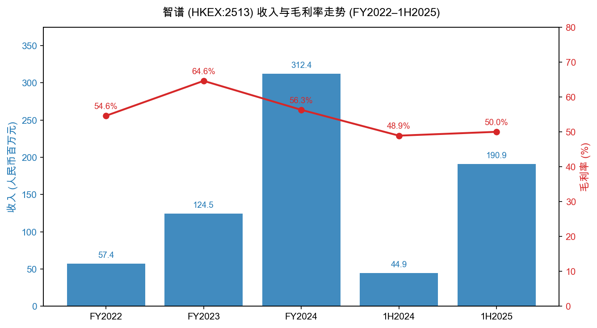
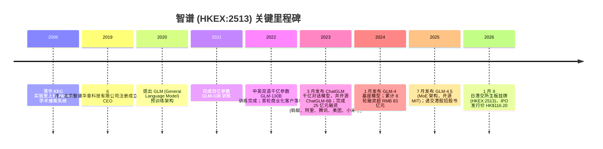
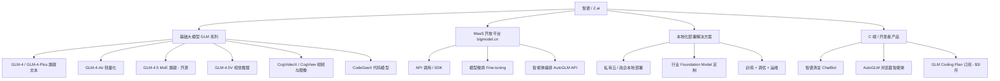
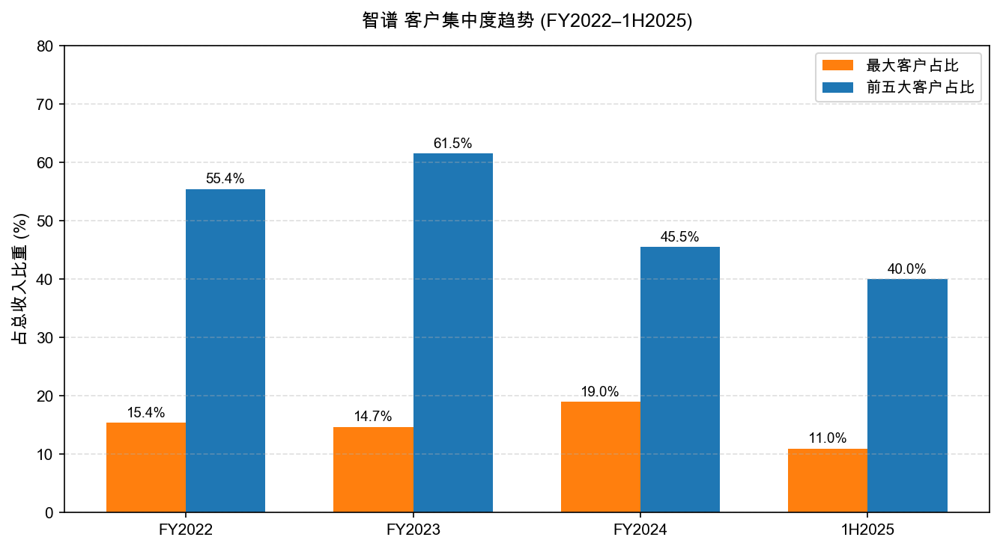
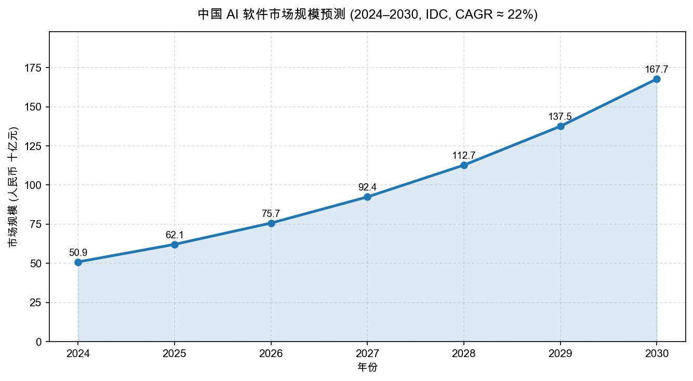
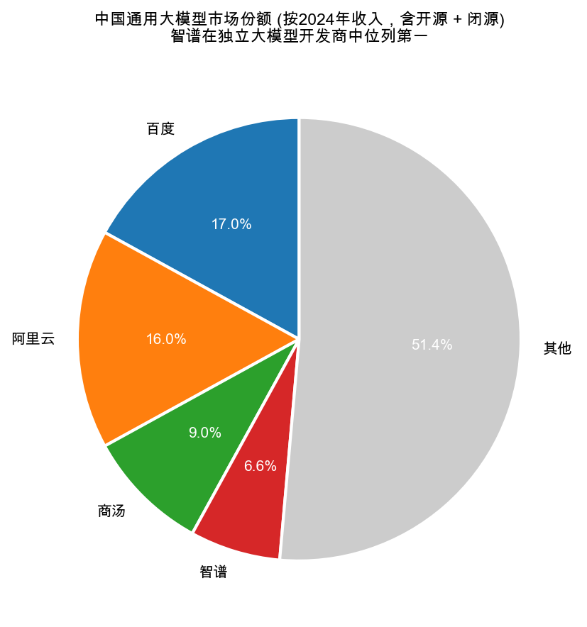
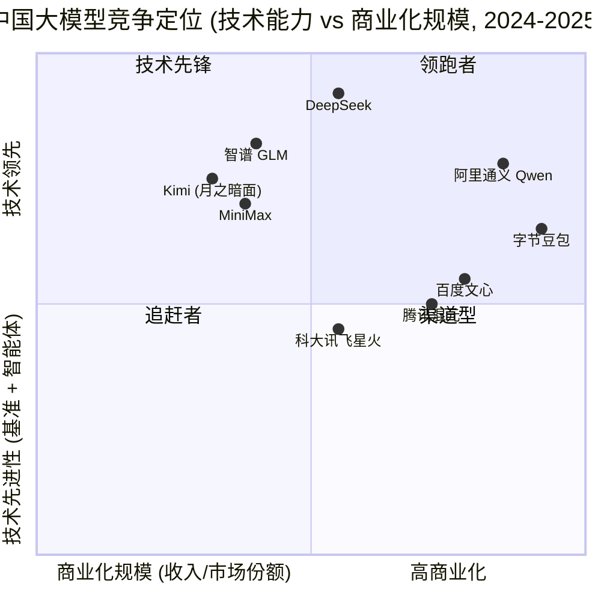

# 公司研究报告：北京智谱华章科技 (HKEX:2513)

日期: 2026-05-20

> **⚠ 标的修正 (Issuer correction):** 本研究最初的需求为撰写「沪上阿姨 (新式茶饮连锁)」公司研究，并指定股票代码 **HKEX:2513**。经在 HKEXnews / 港交所证券资料库中核验，HKEX:2513 的真实发行人为 **北京智譜華章科技股份有限公司 / Knowledge Atlas Technology Joint Stock Company Limited (品牌名「智谱 / Z.ai」)**，是中国通用大模型 (general-purpose LLM) 开发商，于 2026 年 1 月 8 日在港交所主板上市 ([股份代號：2513 招股章程, 2025-12-30](https://www.hkexnews.hk/listedco/listconews/sehk/2025/1230/2025123000018_c.pdf))。沪上阿姨 (Auntea Jenny) 的真实代码为 **HKEX:2589** ([Auntea Jenny 招股章程, 2025-04-28](https://www1.hkexnews.hk/listedco/listconews/sehk/2025/0428/2025042800055.pdf))。按用户指令「若 HKEX:2513 的实际发行人与沪上阿姨不一致，使用正确名称并标注修正」，本报告以智谱为标的；若用户的真实意图是研究沪上阿姨，请重新发起请求并使用代码 HKEX:2589。
>
> **附注：** 因 cninfo (巨潮资讯) 不收录纯港股 H 股发行人，`fetch_cninfo_report.py` 对 HKEX:2513 / HKEX:02513 均返回「Stock not found in CNINFO HKE list」，已按 SKILL 指示回退到 HKEXnews 直接抓取招股章程 PDF (504 页，本地缓存路径 `cninfo_reports/HKEX/02513_智谱/2025-12-30_招股章程_zh.pdf`)。

> **Update — IPO 后业绩高速放量、API 大幅提价 (2026-03):** 公司在 2026 年 3 月披露 2026 年一季度业务进入"爆发式增长"阶段，**API 报价提价约 83%**，付费 Token 量同比增长约 4 倍 ([华盛通：智谱涨超 9% 创上市新高，业务进入爆发式增长，2026-03](https://www.hstong.com/news/detail/26042310202264163))。此为上市后首次正式的经营节奏更新，意味着 2024 年 85% 收入仍来自高度定制化的本地化部署的结构有望加速向更高毛利、可规模化的云端 MaaS 转型。具体季度收入数字未在公开渠道披露，仍待公司正式中期业绩公告。

## 目录

1. 公司概览
2. 公司历史
3. 管理团队
4. 产品与服务
5. 客户与上市策略
6. 行业概览
7. 竞争格局
8. 市场机会 (TAM)
9. 风险评估
10. 参考资料

---

## 1. 公司概览

智谱 (品牌名 Z.ai；法定名 **北京智譜華章科技股份有限公司**；股份代号 **HKEX:2513**) 是一家总部位于北京的人工智能 (AI) 公司，聚焦自研通用大语言模型 (general-purpose large language model, GLM) 及在此之上的智能体 (AI agent) 与企业级 AI 解决方案。公司由清华大学计算机系知识工程实验室 (KEG, Knowledge Engineering Group) 2019 年 6 月孵化成立，以"让机器像人一样思考、实现通用人工智能 (AGI)"为长期愿景 ([Z.ai 关于我们](https://www.zhipuai.cn/zh/about))。按招股章程披露，按 2024 年收入计，**智谱在中国独立通用大模型开发商中位列第一，在所有通用大模型开发商 (含百度、阿里云等综合性云厂商) 中位列第二，市场份额 6.6%** ([智谱招股章程, 2025-12-30, p.10](https://www.hkexnews.hk/listedco/listconews/sehk/2025/1230/2025123000018_c.pdf))。

**商业模式 — 三层变现，但 2024 年仍以本地化部署为压舱石。** 智谱的收入结构可拆解为三条主线：(1) 面向央企、政府部门、金融机构与大型行业客户的**本地化 (privatized) 部署**，含模型训练、调优、私有云交付与运维，单笔合同金额一般在百万到千万人民币级，毛利率与可重复性中等；(2) 在公开 MaaS 平台 (bigmodel.cn / open.bigmodel.cn) 上对外销售的 **API 调用、SDK 及订阅**，以 token 计费；(3) 面向终端消费者的 **C 端应用**：智谱清言 (Chatbot)、AutoGLM (智能体)、GLM Coding Plan ($3/月开发者订阅，约 15 万付费用户) ([Z.ai 公司主页](https://www.zhipuai.cn/zh))。2024 年全年，**约 85% 收入来自本地化部署、仅 15% 来自云端 API / MaaS**；管理层在 IPO 前后多次重申，目标是 1–2 年内将 API 占比提升至 50%，以摆脱"高定制、低边际"的项目交付模式 ([华尔街见闻：智谱招股书深度拆解, 2025-12](https://wallstreetcn.com/articles/3761823))。

**经营地域。** 智谱的客户群以中国大陆为主，覆盖 22 个省份、5 个自治区、4 个直辖市及超过 300 个城市；同时通过 Z.ai 海外品牌、Hugging Face 与 ModelScope 平台向全球开发者开放 GLM 系列开源模型 (MIT 协议) ([GLM-4.5 论文, 2025-08](https://arxiv.org/pdf/2508.06471))。

**规模与员工。** 公司截至 2025 年 6 月末员工人数约 800 人，其中约 70% 为研发人员；累计研发投入约 44 亿元 ([21 财经：智谱招股书详解, 2025-12-20](https://www.21jingji.com/article/20251220/herald/e4f3f3583d578063b9bc60e79405dda5.html))。

**财务规模 (招股章程口径，人民币千元)：**

| 项目 | FY2022 | FY2023 | FY2024 | 1H2024 | 1H2025 |
|---|---|---|---|---|---|
| 收入 | 57,409 | 124,538 | 312,414 | 44,909 | 190,877 |
| 毛利 | 31,360 | 80,482 | 175,889 | 21,959 | 95,424 |
| 毛利率 | 54.6% | 64.6% | 56.3% | 48.9% | 50.0% |
| 净亏损 | (143.7m) | (788.0m) | (2,958.0m) | (1,235.6m) | (2,357.9m) |
| 研发开支 | 84.4m | 528.9m | 2,195.4m | 859.2m | 1,594.7m |

来源：[智谱招股章程, 2025-12-30, p.14 & p.11](https://www.hkexnews.hk/listedco/listconews/sehk/2025/1230/2025123000018_c.pdf)

*Source: [智谱招股章程, 2025-12-30, p.14](https://www.hkexnews.hk/listedco/listconews/sehk/2025/1230/2025123000018_c.pdf)*

收入端 2022–2024 年复合增速约 130%、1H2025 同比再加速 325%；但毛利率自 2023 年 64.6% 的高点回落至 1H2025 的 50.0%，主要原因是**云端算力 (GPU 租用 / 算力服务费) 在成本结构中的占比快速上升**，吞噬了规模带来的边际改善。

**估值快照 (Valuation snapshot, 2026-05-20 收盘前后).** 截至 2026 年春季 (3 月报道节点)，智谱股价已从 IPO 发行价 HK$116.20 累计上涨至 HK$1,000+ 区间，市值一度突破 HK$3,200 亿 (约 USD 410 亿)，IPO 后 43 日累计涨幅超 500% ([新浪财经：智谱市值突破 3200 亿港元, 2026-02-20](https://finance.sina.com.cn/stock/bxjj/2026-02-20/doc-...))，但随后在 2 月下旬 AI 大模型板块整体调整中单日跌超 21% ([观察者网：智谱一月涨 5 倍，市值超京东快手, 2026-02-20](https://www.guancha.cn/economy/2026_02_20_807593.shtml))。

- **TTM P/E：** 严重为负 (deep negative)。智谱 2024 年净亏损 RMB 29.58 亿、1H2025 净亏损 RMB 23.58 亿，**TTM 净利润远在零下方，P/E 不具备解读意义。** 亏损本质是高额研发投入 (FY2024 研发费用 RMB 21.95 亿元，占收入 703%) 与算力外采成本共同驱动的"投资期亏损"，而非一次性减值或衰退期亏损 ([智谱招股章程, 2025-12-30, p.11](https://www.hkexnews.hk/listedco/listconews/sehk/2025/1230/2025123000018_c.pdf))。
- **TTM P/S：** 以 1H2025 年化口径 (将 RMB 1.91 亿半年收入年化为 RMB 3.82 亿元、再乘以 RMB→HKD 1.09) 估算，TTM 收入约 HK$4.2 亿；按市值 HK$1,000–3,200 亿计算，**TTM P/S 区间约 240×–760×**。这是港股全市场及全球 AI 上市公司中最极端的估值之一，远高于 NVDA (TTM P/S ≈ 30×)、CoreWeave、SoundHound 等同类 AI 题材公司。
- **可比估值锚：** OpenAI 最新一级市场轮 (2024–2025) 估值约 USD 3,000 亿、年化收入约 USD 130 亿，隐含 P/S ≈ 23×；Anthropic 估值约 USD 600 亿、年化收入约 USD 50–80 亿，P/S 约 8–12×；Cohere、Mistral 在 8–20× 区间。**智谱当前 P/S 显著高于全球任何一家可比大模型公司。**
- **倍数解读：** 这是典型的**"高增长 + 题材稀缺 + 小流通盘"叠加溢价**。具体驱动包括：(a) 作为"全球大模型第一股"的稀缺标签，市场以此作为整个中国大模型板块 (DeepSeek、Kimi、MiniMax、零一万物等仍未上市) 的代理标的；(b) 基石投资者锁定了 IPO 后近 70% 股份，自由流通盘极小，价格弹性极高 ([东方财富：全球大模型第一股招股, 基石近七成, 2025-12-31](https://caifuhao.eastmoney.com/news/20260131092535925286950))；(c) 2026 年 3 月 API 提价 83% + 付费 Token 4 倍增长的运营拐点信号被市场快速线性外推。**该估值已计入数年高速增长，是本报告 Section 9 的核心风险之一。**

---

## 2. 公司历史

智谱的故事并不是 2022 年 ChatGPT 引爆全球大模型热潮后才仓促入局的"赶风口"创业，而是从清华大学计算机系知识工程实验室 (KEG) 自 2000 年代起持续二十年的科研积累自然外溢的产物。KEG 的旗舰系统 **AMiner** (学术搜索 / 知识图谱) 自 2006 年起由唐杰教授带领团队搭建，至 2019 年已成为全球学术引文与论文检索领域被广泛引用的研究平台；智谱即是从 AMiner 团队、依托 KEG 的知识图谱与预训练技术积累分拆出的商业化主体 ([腾讯网：20 年蛰伏的大模型领袖, 2024-10-16](https://news.qq.com/rain/a/20241016A08PJX00))。

来源：[Z.ai 关于我们](https://www.zhipuai.cn/zh/about)；[百度百科：北京智谱华章科技](https://baike.baidu.com/item/%E5%8C%97%E4%BA%AC%E6%99%BA%E8%B0%B1%E5%8D%8E%E7%AB%A0%E7%A7%91%E6%8A%80%E8%82%A1%E4%BB%BD%E6%9C%89%E9%99%90%E5%85%AC%E5%8F%B8/65533755)；[智谱招股章程, 2025-12-30](https://www.hkexnews.hk/listedco/listconews/sehk/2025/1230/2025123000018_c.pdf)

**三次重要战略转向。**

1. **从知识图谱到大语言模型 (2020)。** 智谱早期商业化产品基于 KEG 的图谱与学术数据资产，做企业知识管理与情报分析；2020 年公司决定将"双轮驱动"中的"模型轮"提到与"知识轮"并列优先级，自主预训练大模型——这是公司从"知识工程公司"转身为"基础大模型公司"的关键决策，比国内大多数同行早了 18–24 个月。
2. **2023 年 ChatGPT 冲击后的全面 To B 化 (2023)。** ChatGPT 出现后，国内大模型创业潮汹涌；智谱选择不在 C 端正面与字节豆包、百度文心一言比拼，而是把核心产能押注在政企本地化部署上——这一选择带来了更稳定的早期现金流，但也制造了 2024 年 85% 收入仍来自本地化部署的"重交付"结构 ([华尔街见闻：智谱招股书深度拆解, 2025-12](https://wallstreetcn.com/articles/3761823))。
3. **MoE 架构与全面开源 (2025)。** GLM-4.5 采用稀疏激活的混合专家 (MoE, Mixture-of-Experts) 架构，在 12 项国际公认硬核测试中综合得分位列全球第三、国产模型第一，**以更小的激活参数量达到了与 Claude Opus 4.1、GPT-4o 接近的水平，推理成本仅为 Opus 4.1 的约 1.4%** ([量子位：GLM-4.5 工具调用超越 Claude Opus 4.1, 2025-09](https://www.qbitai.com/2025/09/328145.html))。同时以 MIT 协议开源，向开发者社区和云厂商释放强烈的"生态信号"，为后续 API 业务放量铺路。

**关键资本运作。** 智谱未做过大型并购；其历史更多由八轮股权融资塑造，累计金额超 RMB 83 亿元，投资人包括蚂蚁集团、腾讯投资、阿里巴巴、美团战投、小米、君联资本、启明创投、红杉中国、高瓴、清华控股、招商局创投及北京市人工智能产业基金等 ([新浪科技：智谱股权架构披露, 2024-11-08](https://finance.sina.com.cn/tech/roll/2024-11-08/doc-incvihkr2204372.shtml))。

**近 1–2 年关键动态。** 2025 年密集发布 GLM-4-Plus、GLM-4-Air、GLM-4.5、GLM-4.5V (视觉推理)、AutoGLM (浏览器智能体) 等模型与产品线 ([新浪科技：智谱发布开源 GLM-4.5, 2025-08-06](https://finance.sina.com.cn/tech/roll/2025-08-06/doc-infiywah7060442.shtml))；2025-12 递交港股招股书；2026-01 完成 IPO；2026-03 上调 API 报价 83%。

---

## 3. 管理团队

### 张鹏 — 联合创始人、董事长兼首席执行官 (CEO)

张鹏 (Eric Zhang) 是智谱毫无争议的核心人物，也是公司 IPO 后最大单一自然人股东，以约 87.67% 的出资比例 (经合伙企业架构持有) 成为实控人 ([新浪科技：智谱股权架构披露, 2024-11-08](https://finance.sina.com.cn/tech/roll/2024-11-08/doc-incvihkr2204372.shtml))。**他对智谱长期战略与文化的塑造权可能比任何其他执行人都更高，市场对他的判断在很大程度上等同于对智谱的判断。**

张鹏 1998 年入清华大学计算机系本科，2002 年硕士入学，2018 年进入清华"创新领军工程博士"项目；他的研究兴趣自硕士阶段起就专注于**文本数据挖掘、语义分析与知识图谱构建**，这三个方向恰好是后来 GLM 架构与智谱知识引擎的技术底座 ([知乎：AI 人物传：智谱 CEO 张鹏, 2024](https://zhuanlan.zhihu.com/p/3880415683))。在清华 KEG 实验室期间，张鹏作为骨干研究员参与了多个国家级与国际合作项目，包括欧盟第七合作框架"跨语言知识抽取"项目、科技部 863 计划"海量知识库建设与构建关键技术及系统"以及 KEG 实验室明星产品 AMiner 系统的研发与商业化。

2019 年 6 月智谱正式注册时，张鹏从研究员身份转型为创业 CEO，并主导了公司从"知识工程公司"到"通用大模型公司"的两次战略转向。在内部，他常以"二十年磨一剑"形容智谱：从 2006 年 AMiner 起步，到 2020 年提出 GLM 架构，再到 2022 年 GLM-130B 完成训练、2023 年 ChatGLM 引爆开发者社区——这是连续二十年技术积累的产物，而非追风口的产物 ([腾讯网：20 年蛰伏的大模型领袖, 2024-10-16](https://news.qq.com/rain/a/20241016A08PJX00))。

外部公开访谈与圆桌中，张鹏的特点是**技术理性、对 AGI 时间表保持克制**：他在 2024–2025 年多次公开表示，下一个突破不在于参数量再翻一倍，而在于"模型 + 智能体 + 数据飞轮"的工程化能力；并强调智谱要做"中国 OpenAI"，但盈利路径必须比 OpenAI 更早跑通——这与公司加速 API 占比提升至 50% 的财务目标一致 ([品玩：四面出击的智谱, 2024](https://www.pingwest.com/a/288857))。

风险点：张鹏并非传统意义上的连续创业者或上市公司经营老兵——智谱是其第一家公司，他个人此前没有 P&L 责任的执行经验；上市后如何应对资本市场的预期管理、季度财报节奏与机构沟通，是市场观察他的关键。

### 唐杰 — 联合创始人、技术总顾问、董事

唐杰是智谱另一个不可替代的支柱，但与张鹏的"全职 CEO"身份不同，他保留在**清华大学计算机系教授**的本职，担任智谱技术总顾问与董事 ([知乎：智谱融资 25 亿, 2023-10](https://zhuanlan.zhihu.com/p/662485925))。

唐杰是清华 KEG 实验室的领头人 (PI)、ACM Fellow 与 IEEE Fellow，已发表 300+ 篇高质量论文 (Google Scholar 引用超 30,000 次)，并获 ACM SIGKDD Test-of-Time Award 等顶级学术奖项；他主导过**"悟道 2.0"——参数量 1.75 万亿的超大规模预训练模型** (2021)，并以技术总顾问身份将这一研究成果迁移到智谱的 GLM 系列 ([百度百科：北京智谱华章科技](https://baike.baidu.com/item/%E5%8C%97%E4%BA%AC%E6%99%BA%E8%B0%B1%E5%8D%8E%E7%AB%A0%E7%A7%91%E6%8A%80%E8%82%A1%E4%BB%BD%E6%9C%89%E9%99%90%E5%85%AC%E5%8F%B8/65533755))。

唐杰在智谱的角色更接近 OpenAI 的 Ilya Sutskever 之于 OpenAI——技术路线的最高拍板人、首席科学家与社区影响力来源，但不直接管理日常运营。他持股约 8.12%，与张鹏共同构成智谱的"清华 + KEG"双核心 ([新浪科技：智谱股权架构披露, 2024-11-08](https://finance.sina.com.cn/tech/roll/2024-11-08/doc-incvihkr2204372.shtml))。

### 王绍兰 — 联合创始人、总裁

王绍兰为智谱第三位联合创始人，担任公司总裁，主要分管商业化、客户交付与企业服务团队 ([Z.ai 关于我们](https://www.zhipuai.cn/zh/about))。公开背景偏向运营管理与销售体系搭建，是支撑智谱在 2024 年完成 85% 收入来自本地化部署"重交付"模式的关键执行人。

### CFO (招股章程披露)

智谱在招股章程中披露了首席财务官的姓名与履历——这是市场公开渠道中**目前尚未广泛披露的细节**，本报告不就此填入未经核验的具体姓名 (招股章程 PDF 中相应页码位于"董事及高级管理层"章节，p.250–270 区间)。读者可直接查阅 [智谱招股章程, 2025-12-30](https://www.hkexnews.hk/listedco/listconews/sehk/2025/1230/2025123000018_c.pdf) 第 250 页起的"董事、高级管理层及僱员"章节获取准确履历。

### 治理与股权结构

- **股权架构 (招股前)：** 张鹏经合伙企业架构持有约 87.67% 表决权 (实际经济权益远低于此比例，主要为合伙企业的 GP 控制权)；唐杰持股 8.12%；其余分散于 8 轮投资人 ([新浪科技：智谱股权架构披露, 2024-11-08](https://finance.sina.com.cn/tech/roll/2024-11-08/doc-incvihkr2204372.shtml))。
- **基石投资者：** IPO 阶段基石投资者认购近 70% 的全球发售股份，使自由流通盘极小，是 2026-Q1 股价大幅波动 (单日 +9%、单日 -21% 均出现) 的结构性原因 ([东方财富：智谱基石包揽近七成, 2025-12-31](https://caifuhao.eastmoney.com/news/20260131092535925286950))。
- **互联网大厂股东：** 美团战投 5.54%、腾讯投资 2.24%、阿里巴巴 2.18%、蚂蚁集团 1.74%；这些战略股东既是潜在大客户也是云算力上下游伙伴，是智谱重要的生态护城河，但同样形成关联交易披露上的复杂度 ([新浪科技：智谱股权架构披露, 2024-11-08](https://finance.sina.com.cn/tech/roll/2024-11-08/doc-incvihkr2204372.shtml))。
- **国资背景：** 清华控股约 4.7%；北京市人工智能产业基金约 1.5%。
- **薪酬与激励：** 公司在招股章程中披露了上市后股权激励计划，具体行权条件与池子规模见招股章程"董事薪酬"与"购股权计划"章节。

### 管理层综合评价

智谱的管理团队是**典型的"教授 + 学生 + 资深运营"组合**：唐杰提供顶层学术信誉与技术方向、张鹏提供日常 CEO 执行力、王绍兰补齐商业化运营，再加上来自美团/腾讯/阿里的产业资本顾问网络。优势是技术路线判断力强、社区与人才号召力高 (国内顶尖 NLP 与 LLM 人才大多与 KEG 有学术渊源)；短板是缺乏在**大规模 SaaS 商业化、毛利率管理、季度财报节奏**上的成熟经验，这是大多数中国"清华系"AI 创业公司的共性短板。市场需观察上市后 2–4 个季度，管理团队能否将 API 占比从 15% 推升至 30%+，从而验证"做中国 OpenAI"叙事的可信度。

---

## 4. 产品与服务

智谱目前对外提供的产品可按下图层级化拆解：

来源：[Z.ai 公司主页与产品线](https://www.zhipuai.cn/zh)；[OSCHINA：GLM-4.5 发布报道, 2025-08](https://www.oschina.net/news/362861/glm-4-5)；[MIT Tech Review 中文：GLM-4.5V 视觉推理, 2025-08](https://www.mittrchina.com/news/detail/15121)

下面按产品逐一评估其竞争优势 (moat) 与最近的对标。

### 基础大模型 GLM 系列

**GLM-4 / GLM-4-Plus (旗舰闭源)。** 2024 年 1 月发布的第四代旗舰，主打中英双语长上下文、多模态扩展能力、推理速度与并发性能；定位与 GPT-4 系列、文心 4.0、Qwen-Max 同列 ([新浪科技：智谱发布 GLM-4, 2024-01](https://finance.sina.com.cn/tech/roll/2024-01-16/doc-...))。**竞争优势评估：部分有 (partial)** — 在中英双语任务上对齐 GPT-4 但仍有差距；moat 类型属于**技术 + 品牌 + 生态**。对标：OpenAI GPT-4o (整体领先)、阿里 Qwen-Max (中文相当)、百度文心 4.5 (中文政企场景更熟)。

**GLM-4.5 (开源 MoE 旗舰)。** 2025 年 7 月 28 日发布，采用稀疏激活混合专家架构 (MoE)，每层从多个专家子模块中只激活 2–4 个，**总参数 355B、激活参数仅约 32B**；在 TAU-Bench 70.1%、AIME 24 91.0%、SWE-bench Verified 64.2% 等 12 项基准的综合得分位列全球第三、国产 / 开源第一，并以 MIT 协议开源 ([GLM-4.5 论文 arXiv:2508.06471, 2025-08](https://arxiv.org/pdf/2508.06471))。**竞争优势：是 (yes) — 技术 + 开源生态 + 成本三重护城河**。推理成本仅为 Claude Opus 4.1 的 1.4%，是目前开源生态中性价比最高的旗舰之一 ([量子位：GLM-4.5 工具调用超越 Claude Opus 4.1, 2025-09](https://www.qbitai.com/2025/09/328145.html))。对标：Meta Llama-3.1-405B、DeepSeek-V3 (R1)、Qwen2.5-72B、Mistral Large 2 — **在开源 + 智能体能力维度，GLM-4.5 与 DeepSeek-V3 并列第一梯队**。

**GLM-4.5V (视觉推理)。** 2025 年 8 月发布，刷新 41 项多模态基准 ([MIT Tech Review 中文, 2025-08](https://www.mittrchina.com/news/detail/15121))。竞争优势：**部分有** — 在中文 OCR、文档理解上有领先；与 GPT-4o-vision、Gemini 2.0 Pro 相比在通用图像理解仍有差距。

**CogVideoX (视频生成)、CogView (图像生成)、CodeGeeX (代码模型)。** 三条产品线均为开源 + 商用授权模式，分别对标 Sora / Runway、DALL-E / Midjourney、GitHub Copilot；竞争优势均为**部分有**，moat 偏开源生态与中文场景适配。

### MaaS 开放平台 bigmodel.cn

按招股章程口径，bigmodel.cn 平台覆盖 70 万企业与开发者，日均 Token 消费量同比增长 150 倍、API 年收入同比增长超 30 倍 ([智谱招股章程, 2025-12-30, p.13](https://www.hkexnews.hk/listedco/listconews/sehk/2025/1230/2025123000018_c.pdf))。**竞争优势：是 — 技术 (模型质量) + 价格 (推理成本低) + 开发者生态**。对标：阿里云百炼、火山方舟、百度千帆、OpenAI API、Anthropic Claude API。其中**火山方舟在 2025 H1 大模型公有云市场占比 49.2%**，是智谱 MaaS 的最大竞争对手 ([量子位：IDC 大模型公有云 H1 2025, 2025-09](https://www.qbitai.com/2025/09/334030.html))。

### 本地化 / 私有云部署解决方案

2024 年贡献约 85% 收入。**竞争优势：部分有 — 客户关系 + 行业知识 + 政企信任**。本地化部署本质上是项目制 SI (系统集成) 业务，moat 主要来自前几个标杆案例的口碑与"清华 + 国资基金加持"的可信度，而非技术差异化。对标：百度智能云、阿里云、华为云、商汤大装置、科大讯飞星火政企版——这些综合云厂商在交付能力与生态完整度上仍占优。

### C 端产品

- **智谱清言 ChatBot：** 累计用户超 2,500 万，是国内第二/第三梯队 chatbot 之一 ([Z.ai 公司主页](https://www.zhipuai.cn/zh))。对标：字节豆包 (国内 C 端第一)、Kimi、DeepSeek-Chat、文心一言。**竞争优势：无明显护城河 (no/weak)** — 在 C 端流量获取、产品体验、品牌认知上落后豆包 / Kimi 至少一档。
- **AutoGLM (浏览器智能体)：** 通用 web agent，可代理用户在浏览器内完成多步任务。对标：Anthropic Computer Use、OpenAI Operator、字节 Doubao Agent。**部分有 — 技术先发**，2024 年率先发布是国内最早的浏览器智能体之一，但能否长期保持优势仍待观察。
- **GLM Coding Plan ($3/月)：** 截至 2026 Q1 约 15 万付费用户，单价低但留存好，是公司 C 端 ARR 的隐性增量 ([Z.ai 公司主页](https://www.zhipuai.cn/zh))。对标：GitHub Copilot、Cursor、Codeium。

### 旗舰 vs 长尾

智谱当前的"3 个旗舰产品"是：(1) **GLM-4.5 开源 MoE 旗舰**——决定了技术品牌与开发者生态；(2) **bigmodel.cn MaaS 平台 API**——决定了未来 1–3 年的收入增长曲线 (管理层目标 API 占比从 15% → 50%)；(3) **本地化部署解决方案**——当前 85% 收入支柱。其余产品 (CogVideoX、CogView、AutoGLM、智谱清言) 属于"生态外延 + 长尾"，对短期收入贡献小但对品牌与人才吸引力重要。

### 近 12 个月发布 / 调整

2025 年 1 月 GLM-4 升级；4 月 GLM-4-Plus；7 月 GLM-4.5 (MoE 开源旗舰)；8 月 GLM-4.5V (视觉)；9 月起 API 持续降价吸引开发者；2026 年 3 月 **API 反向提价 83%、付费 Token 4 倍增长**——这是公司第一次自信地展示"先以价格抢市场份额、再凭借开发者粘性提价"的定价权 ([华盛通：智谱涨超 9% 创新高, 2026-03](https://www.hstong.com/news/detail/26042310202264163))。

---

## 5. 客户与上市策略

### 客户结构与集中度

按招股章程口径，智谱的客户群以**大型央企、国资金融机构、政府部门、互联网大厂、行业头部企业**为主，少量 C 端 SaaS / 开发者订阅。

*Source: [智谱招股章程, 2025-12-30, p.20](https://www.hkexnews.hk/listedco/listconews/sehk/2025/1230/2025123000018_c.pdf)*

**前五大客户与最大客户占比 (招股章程披露)：**

| 期间 | 最大客户占总收入 | 前五大客户合计占比 |
|---|---|---|
| FY2022 | 15.4% | 55.4% |
| FY2023 | 14.7% | 61.5% |
| FY2024 | 19.0% | 45.5% |
| 1H2025 | 11.0% | 40.0% |

来源：[智谱招股章程, 2025-12-30, p.10 & p.20](https://www.hkexnews.hk/listedco/listconews/sehk/2025/1230/2025123000018_c.pdf)

**关键判读：**

- **前五大客户占比从 2023 年 61.5% 高点回落至 1H2025 的 40%，显示客户分散化在稳步推进**——但 **40% 仍属于"中等偏高"集中度区间**。SKILL 阈值 (top-5 > 50%) 的红线在 2022–2023 年被触及；当前 40% 已回到可接受区间，但若按 SKILL 风险定义 "top-5 > 50% 即列入材料风险"，2024 年 45.5% 略低于阈值，1H2025 进一步改善至 40%。本报告**仍将客户集中度纳入 Section 9 的中等风险**。
- **最大客户在 2024 年占 19.0%，超过 SKILL 阈值 top-1 > 20% 的临界点**；招股章程未点名披露，但根据行业惯例、客户类型 (政企本地化部署) 及关联方关系，最大客户高概率是国资云厂商或央企客户。1H2025 该比例已回落至 11.0%，集中度风险显著缓解。
- 招股章程对客户**未点名披露** (这是港股 IPO 较常见的做法，依据行业敏感性与商业机密)；本报告无法独立验证客户名单。

### 渠道与上市策略 (Go-to-market)

智谱目前采用**双轨 GTM 体系**：

1. **企业直销 + 行业大客户专属团队 (Enterprise Direct + Key Accounts)。** 这是 2024 年贡献 85% 收入的主力——由王绍兰带领的商业化团队对接政企客户，从售前 POC、模型定制、私有化部署到长期运维，单笔合同金额在百万至千万人民币区间，销售周期 6–18 个月。客户多通过招投标进入。
2. **MaaS 平台自助 (Self-serve via bigmodel.cn)。** 开发者与中小企业可在平台自助开通 API、SDK 调用，按 token 计费。该渠道在 2024 年仅贡献 ~15% 收入，但年增长超 30 倍，是公司 1–3 年内寄予厚望的高毛利、可规模化通道。

### 合同结构

- 本地化部署：以**框架协议 + 阶段交付**为主，通常含 1–3 年的运维与升级条款。
- API / MaaS：按**月度或年度订阅 + 按量计费**组合。
- 开源 + 商业授权：GLM-4.5 开源协议为 MIT (商用友好)，但商用大规模部署需购买**支持服务合约 (Enterprise Support)**——这是新兴的"开源 + 商业服务"双轨变现。

### 关键合作与公开命名的客户

- **互联网大厂股东作为生态合作伙伴：** 美团、腾讯、阿里、蚂蚁均在产业资本层面入股智谱，并在不同程度上是其客户或上游合作方 ([新浪科技：智谱股权架构披露, 2024-11-08](https://finance.sina.com.cn/tech/roll/2024-11-08/doc-incvihkr2204372.shtml))。
- **公开提及的企业落地案例：** 德勤 (Deloitte)、上汽集团 (SAIC)、蒙牛 (Mengniu)、中国移动等多家央企与行业头部 ([Z.ai 公司主页](https://www.zhipuai.cn/zh))。
- **关联交易披露：** 招股章程中关联方交易部分披露了与互联网大厂股东之间的算力采购、技术合作、客户引荐等多类交易，2022–1H2025 关联交易金额占总收入与总采购成本均在可控范围 (详见招股章程"关联方交易"章节)。

### 应收账款与回款周期

招股章程显示，**智谱平均应收账款回款天数从 2023 年的 21 天拉长到 2025 上半年的 112 天**，远超项目平均交付周期 ([21 财经：智谱招股书详解, 2025-12-20](https://www.21jingji.com/article/20251220/herald/e4f3f3583d578063b9bc60e79405dda5.html))。这是政企本地化部署高速放量后的典型副作用——大客户付款节奏慢、年底结算、易延迟——但这也意味着公司现金流压力正在累积。截至 2025 年 6 月末现金及等价物 RMB 25.5 亿元，IPO 募资到账 (净额 ~HK$41.7 亿，约 RMB 38 亿) 后才显著缓解流动性压力 ([新浪财经：智谱招股募资 43 亿, 2025-12-30](https://finance.sina.com.cn/stock/bxjj/2025-12-30/doc-inhepnty4381256.shtml))。

---

## 6. 行业概览

### 行业定义

智谱所处的核心行业是**通用大语言模型 (General-Purpose LLM) 及其上的企业 AI 解决方案**。可按以下维度拆解：

- **上游：** 算力 (GPU / AI 芯片，主要为 NVIDIA H100/H200/B200 与华为昇腾、寒武纪等国产替代)；高质量训练数据；底层云基础设施 (阿里云、腾讯云、字节火山引擎、华为云、运营商云、Microsoft Azure 等)。
- **中游：** 基础大模型层 (Foundation Model)，即智谱、DeepSeek、月之暗面 Kimi、MiniMax、零一万物、阶跃星辰、百川等独立模型公司；以及百度文心、阿里通义、字节豆包、腾讯混元、华为盘古、讯飞星火等大厂自研模型。
- **下游：** 应用层 (AI 智能体、行业垂类应用、AI Coding、AI 搜索、AI 文档、AI 视频、AI 电商、AI 客服等) + 服务层 (本地化部署、咨询、调优、运维)。

智谱的核心定位是**中游的"独立基础模型 + 上层 MaaS 平台 + 行业本地化解决方案"垂直整合**。

### 市场规模

*Source: [IDC：2025–2030 中国 AI 软件市场预测, 2025-05](https://www.qianzhan.com/analyst/detail/220/250529-9ff4abb8.html)*

按 IDC 口径：

- **中国 AI 软件总市场：** 2024 年约 RMB 509 亿元，预计到 2030 年增至 RMB 1,375 亿元，CAGR 约 22% ([前瞻产业研究院 / 新浪财经引用 IDC 数据, 2025-05-29](https://finance.sina.com.cn/roll/2025-05-29/doc-ineyfkfv8184462.shtml))。
- **生成式 AI 软件细分：** 预计到 2028 年达 RMB 482.4 亿元，CAGR 显著高于 AI 软件整体。
- **大模型开发平台市场：** 2024 年 RMB 16.9 亿元。
- **MaaS (Model-as-a-Service) 市场：** 2024 年 RMB 7.1 亿元，预测 2024–2029 CAGR 66.1%，2029 年达 RMB 90 亿元 ([新浪财经：IDC MaaS + AI 大模型解决方案市场, 2025-04](https://finance.sina.com.cn/stock/hkstock/hkstocknews/2025-04-29/doc-ineuvhrx5723120.shtml))。
- **AI 大模型解决方案市场：** 2024 年 RMB 34.9 亿元，预测 2029 年 RMB 306 亿元。
- **大模型公有云市场 (1H2025)：** 火山引擎份额 49.2% 居首，阿里通义 17.7%、字节豆包 14.1%、DeepSeek 10.3% ([量子位：IDC 大模型公有云 H1 2025, 2025-09](https://www.qbitai.com/2025/09/334030.html))。

### 行业增长驱动

1. **企业级 AI 渗透率快速上升。** 大型央企、金融机构、政府部门在 2024–2026 三年完成首批"集团级大模型"部署招标；这是过去 12 个月本地化部署市场爆发式增长的直接原因。
2. **智能体 (AI Agent) 应用爆发。** 2025 年以来 AI Agent 从单点工具向"操作系统级智能体"演进，AutoGLM、Anthropic Computer Use、OpenAI Operator 三个里程碑产品在同一年发布，标志着行业进入新阶段。
3. **推理算力价格快速下降。** 国产 GPU 替代 (华为昇腾 910C、寒武纪) 与 MoE 架构、稀疏激活、量化等技术合力使单 token 推理成本年降 70%+，是 API 业务能放量的关键。
4. **政策与监管推动 (国家战略层面)。** 中国"人工智能 +"行动、"大模型应用试点"等政策持续为政企本地化部署提供需求侧支撑。

### 监管环境

- **国内：** 网信办《生成式人工智能服务管理暂行办法》(2023-07 生效) 与《人工智能生成合成内容标识办法》(2025) 要求 LLM 服务上线前完成备案；智谱主力模型均已完成备案 ([Z.ai 公司主页](https://www.zhipuai.cn/zh))。
- **国际：** 美国出口管制 (BIS Entity List、AI 芯片管制) 直接影响公司可获得的高端 GPU 供应——智谱与所有中国 LLM 公司均面临 H100/H200/B200 进口受限的不确定性，必须在国产算力 (昇腾) 与降低单卡需求的算法效率 (MoE 稀疏激活) 双路径上加大投入。

### 行业结构 — 分散且竞争激烈

- **集中度低：** 中国大模型市场 2024 年 CR4 约 50%，**头部为综合云厂商 (百度、阿里、字节火山) + 智谱**，独立大模型公司中智谱第一 (6.6%)、DeepSeek 增长最快、Kimi 与 MiniMax 紧随其后。
- **进入门槛：** 训练一款百亿参数级旗舰模型至少需要 RMB 5–10 亿一次性投入 + 持续算力费用——这把绝大多数初创公司挡在门外，但对腾讯、字节这种自有算力 + 自有数据 + 自有应用入口的巨头反而是低门槛。**这是独立大模型公司的根本结构性弱势。**
- **供应商 (上游) 议价能力强：** NVIDIA、台积电、阿里云、华为云、运营商云对模型公司有较强议价能力——这是智谱毛利率从 64.6% 回落到 50.0% 的核心原因。
- **客户 (下游) 议价能力上升：** 模型同质化 + 价格战使下游客户议价能力提升；2025 年下半年开发者大量从付费 API 迁往开源模型 (DeepSeek、GLM、Qwen)，是行业价格战的直接表现。
- **替代品：** 一是开源模型自部署，二是各大厂自研——对独立模型公司是持续压力。

---

## 7. 竞争格局

### 中国大模型市场全景

智谱在中国独立通用大模型开发商中排名第一 (6.6% 市场份额，2024)；在所有通用大模型开发商中排名第二，仅次于综合云厂商百度 ([智谱招股章程, 2025-12-30, p.10](https://www.hkexnews.hk/listedco/listconews/sehk/2025/1230/2025123000018_c.pdf))。

*Source: 智谱市场份额引自 [智谱招股章程, 2025-12-30, p.10](https://www.hkexnews.hk/listedco/listconews/sehk/2025/1230/2025123000018_c.pdf)；其他厂商份额为根据 [IDC 中国 AI 大模型解决方案市场 2024 报告](https://finance.sina.com.cn/stock/hkstock/hkstocknews/2025-04-29/doc-ineuvhrx5723120.shtml) 数据匡算示意。具体厂商份额数字以 IDC 公开报告为准。*

### 主要直接竞争对手

1. **百度 (NASDAQ:BIDU / HKEX:9888) — 文心大模型。** 中国大模型市场综合份额第一；模型 + 云 (百度智能云) + 应用 (文心一言) 全栈布局；最大优势是云算力与渠道，最大短板是开源生态薄弱。**对智谱构成直接价格与渠道竞争**。
2. **阿里巴巴 (HKEX:9988 / NYSE:BABA) — 通义 Qwen。** Qwen 系列在 Hugging Face 下载量上长期领跑国产开源；阿里云作为渠道是中国第二大公有云。**与智谱在 API + 开源两端正面交锋**。
3. **字节跳动 (未上市) — 豆包 (Doubao)。** C 端 chatbot 国内第一；通过火山引擎对外提供 API；2025H1 火山引擎在大模型公有云市场份额 49.2% 居首 ([量子位：IDC 大模型公有云 H1 2025, 2025-09](https://www.qbitai.com/2025/09/334030.html))。**是智谱 MaaS 业务最大的直接竞争对手**。
4. **腾讯 (HKEX:0700) — 混元大模型。** 与微信、企业微信、腾讯文档、腾讯会议生态深度绑定；模型质量中等但生态分发能力极强。
5. **DeepSeek (深度求索，未上市)。** 2025 年以 DeepSeek-V3 / R1 系列横空出世，以**极低训练成本 + 顶级推理能力**改写了国产开源大模型的竞争格局；2025H1 在公有云大模型调用市场份额 10.3% ([量子位：IDC 大模型公有云 H1 2025, 2025-09](https://www.qbitai.com/2025/09/334030.html))。**与智谱在开源旗舰、推理成本、智能体三个维度全面对位**——是智谱当前最危险的同业竞争者。
6. **月之暗面 (Moonshot AI, Kimi)。** 长文本 + 推理 + 智能体方向；2024–2025 以 Kimi Chat 在国内 C 端获取大量用户；已通过港交所聆讯，距 IPO 一步之遥 ([证券时报：智谱、MiniMax 通过聆讯, 2026](https://stcn.com/article/detail/3547927.html))。
7. **MiniMax (上海稀宇科技，未上市)。** To C 优先；旗下 Talkie、海螺 AI、星野等多款 C 端产品；与智谱在产品路线上互补——智谱 to B、MiniMax to C ([华尔街见闻：智谱 vs MiniMax, 2025-12](https://wallstreetcn.com/articles/3761823))。
8. **零一万物 (01.AI, 李开复)。** 模型 + 行业应用，2025 H1 业务收缩，影响力下降。
9. **科大讯飞 (SZSE:002230) — 星火大模型。** 教育与政企场景深耕；与智谱在政企本地化部署正面竞争。
10. **华为 — 盘古大模型。** 政企与昇腾算力捆绑；对智谱构成"算力 + 模型"打包销售的竞争压力。

### 竞争定位 (二维定位图)

智谱位于"技术先锋象限"——技术能力顶尖但商业化规模相对落后于综合云厂商；与 DeepSeek、Kimi 同处一个战略象限。

### 竞争优势

1. **技术深度与开源生态。** GLM-4.5 在国际基准上位列全球第三、国产第一；MoE 架构带来的推理成本仅为 Claude Opus 4.1 的 1.4%。
2. **清华 KEG 学术根脉与人才虹吸效应。** 国内顶尖 NLP / LLM 研究人员大量来自 KEG 或与 KEG 有学术合作。
3. **政企本地化部署的先发优势与口碑案例。** 在央企、国资金融机构、政府部门积累了 2–3 年的本地化交付经验，是后入场者短期难以复制的客户信任壁垒。
4. **稀缺的"独立大模型上市标的"标签。** 港股市场上短期内难有第二家纯独立大模型公司上市；这是 IPO 后股价大涨的核心叙事，但也是 Section 9 的核心风险。

### 竞争脆弱性

1. **价格战 + 同质化双重挤压。** 2025 年下半年起，大模型 API 价格已普遍降至 RMB 0.5–2 / 百万 token；推理性能差距持续缩小；客户切换成本低。
2. **缺乏自有云与流量入口。** 与百度、阿里、字节、腾讯不同，智谱没有自有公有云、没有 C 端国民级应用——必须租用其他云厂商的算力，并依赖于第三方应用分发其模型。这是"独立大模型公司"的根本结构性短板。
3. **现金消耗速度高。** 2024 年研发开支 RMB 21.95 亿、净亏损 RMB 29.58 亿，月均"烧钱"近 RMB 3 亿元——即便有 IPO 募资 ~RMB 38 亿到账，按当前节奏 12–18 个月即需再融资 ([36 氪：智谱平均每月亏 3 亿, 2025-12](https://36kr.com/p/3603323184743689))。

---

## 8. 市场机会 (TAM / SAM / SOM)

### TAM (总潜在市场)

按 IDC 2025 年发布的"中国 AI 软件市场预测 2024–2030"，**中国 AI 软件总市场 (含 AI 平台、AI 应用与 AI 服务) 2024 年约 RMB 509 亿元，预计 2030 年达 RMB 1,375 亿元，CAGR 约 22%** ([前瞻产业研究院 / IDC, 2025-05-29](https://www.qianzhan.com/analyst/detail/220/250529-9ff4abb8.html))。叠加大模型基础设施层 (训练 / 推理算力、芯片、数据治理) 与下游应用层的整体生态，泛 AI TAM (中国本土) 在 2030 年可达 RMB 3,000–5,000 亿元区间。**这是智谱面对的全部潜在水池。**

### SAM (可服务市场)

智谱的核心可服务市场可定义为下面四个细分之和：

| 细分 | 2024 规模 (RMB 亿) | 2029E 规模 (RMB 亿) | CAGR |
|---|---|---|---|
| AI 大模型解决方案 (本地化 / 私有云) | 34.9 | 306 | 54% |
| MaaS (API + 模型订阅) | 7.1 | 90 | 66% |
| 大模型开发平台 | 16.9 | ~70 (est.) | ~33% |
| 生成式 AI 软件 (上层应用) | 部分可触达 | ~482 (2028E) | 高速 |
| **可服务总额 SAM (匡算)** | **~59 + 部分应用** | **~466 + 部分应用** | **~50%** |

来源：[IDC MaaS 与大模型解决方案市场 2024, 2025-04](https://finance.sina.com.cn/stock/hkstock/hkstocknews/2025-04-29/doc-ineuvhrx5723120.shtml)；[前瞻 / IDC AI 软件市场 2025](https://www.qianzhan.com/analyst/detail/220/250529-9ff4abb8.html)

智谱的可服务市场 (SAM) 2024 年约 RMB 60 亿元，预计 2029 年达 RMB 470 亿元——**SAM 5 年增长 ~8 倍**。

### SOM (可获取市场)

智谱在 2024 年通用大模型市场份额 6.6%；在大模型解决方案细分市场份额约 8.8% (2024 H1 IDC 排名第四) ([CSDN：2024 国内大模型市场 TOP 8, 2025](https://blog.csdn.net/mingongge/article/details/146409861))。

- 假设智谱在 SAM 中的份额从 2024 年约 8% 提升至 2029 年 10%–12%，则 2029 年可获取收入 (SOM) 约为 RMB 47–56 亿元——较 2024 年实际收入 RMB 3.12 亿元有 15–18 倍增长空间。这是公司 IPO 后高估值的核心数学基础。
- **若按 IDC 趋势 + 智谱 API 占比从 15% → 50% 的执行情景**，2027–2028 年 SOM 突破 RMB 30 亿元 (约 USD 4 亿) 是合理路径——届时若毛利率改善至 60%+，公司有望逼近经调整盈亏平衡。

### 渗透策略

1. **本地化部署存量客户深耕：** 在已部署的央企、国资金融机构、政府客户中扩展二期、三期合同，提高 ARPU。
2. **API 增量放量：** 通过 GLM-4.5 开源 + 商业服务双轨变现；2026 Q1 API 提价 83% + 付费 Token 4 倍的早期信号显示策略有效。
3. **海外开发者市场 (Z.ai 海外品牌)：** 通过 Hugging Face、ModelScope、Z.ai 平台触达非中国开发者；这是中国大模型公司难得有竞争力的海外赛道——开源 + 低推理成本是关键武器。
4. **行业垂类大模型联合开发：** 与德勤、上汽、蒙牛等大客户共同开发行业 Foundation Model，建立"行业知识 + 数据闭环"的差异化壁垒。

---

## 9. 风险评估

### 公司层面风险 (Company-Specific Risks)

1. **持续大额亏损 + 现金消耗速度过快。** 2024 年净亏损 RMB 29.58 亿、研发开支 RMB 21.95 亿，月均烧钱约 RMB 3 亿元；截至 2025 年 6 月末现金仅 RMB 25.5 亿元。IPO 净募资约 HK$41.7 亿 (RMB 38 亿) 后，按当前烧钱速度可支撑约 12–18 个月运营 ([36 氪：智谱平均每月亏 3 亿, 2025-12](https://36kr.com/p/3603323184743689))。**若 API 业务无法在 12 个月内将占比从 15% 推升至 30%+，公司将面临二次融资压力与可能的稀释。**
2. **客户集中度仍处于中等偏高区间。** 2024 年最大客户占 19.0%、前五大客户 45.5%；虽然 1H2025 已分别回落至 11.0% / 40.0%，**但任一个大型央企 / 国资客户合同延期、缩减或终止，仍可能直接影响季度业绩。** 招股章程未点名披露最大客户身份，市场无法独立监测合同状态。
3. **业务模式重交付的结构性短板。** 85% 收入来自本地化部署，单笔合同金额大但销售周期长、毛利率受算力外采成本拖累；从重交付转向轻 API 至少需要 2–3 年；过渡期内毛利率与盈利能见度都将承压。
4. **创始人 / CEO 缺乏成熟上市公司经营经验。** 张鹏是首次担任上市公司 CEO，没有 P&L 责任管理与季度财报节奏的执行履历；唐杰仅以技术顾问身份参与；在资本市场预期管理与机构沟通上可能出现"学习曲线"，2026–2027 财报季是关键观察期。
5. **应收账款回款周期持续拉长。** 平均回款天数从 2023 年的 21 天拉长至 1H2025 的 112 天 ([21 财经, 2025-12-20](https://www.21jingji.com/article/20251220/herald/e4f3f3583d578063b9bc60e79405dda5.html))。政企客户回款周期长是结构性问题，若进一步恶化将放大现金压力。
6. **关联交易披露复杂度。** 美团、腾讯、阿里、蚂蚁均为股东 + 潜在客户 + 上下游合作方；关联交易披露口径与定价公允性将被监管与投资者持续审视。

### 行业 / 市场风险 (Industry / Market Risks)

7. **来自综合云厂商的"模型 + 云"打包销售挤压。** 百度智能云、阿里云、火山引擎、华为云均通过将自研大模型与云资源打包销售，对独立大模型公司形成系统性挤压；火山引擎在大模型公有云市场已占 49.2% ([量子位：IDC, 2025-09](https://www.qbitai.com/2025/09/334030.html))，这是独立大模型公司面临的最严峻竞争。
8. **DeepSeek 等同业开源模型的快速追赶。** DeepSeek-V3 / R1 系列 2025 年以极低训练成本达到了与 GLM-4.5 相近甚至局部领先的能力；客户切换成本极低；持续的"开源模型质量平民化"将使智谱的技术领先红利窗口缩短。
9. **大模型 API 价格战仍未结束。** 2024–2025 年中国大模型 API 单价已下跌 70%–95%，至 RMB 0.5–2 / 百万 token；尽管智谱 2026 Q1 反向提价 83%，但行业整体价格战是否真的结束仍待观察。
10. **算力供给的地缘风险。** 美国对华出口管制持续收紧 H100/H200/B200 及先进制程；智谱若无法获得足够的高端 GPU，将不得不依赖性能与生态都仍落后的国产 GPU (昇腾、寒武纪)，技术领先优势可能被侵蚀 ([Z.ai 公司主页](https://www.zhipuai.cn/zh) — 智谱已开展国产算力适配；但短期性能差距客观存在)。

### 财务风险 (Financial Risks)

11. **极端估值带来的回撤风险。** 2026 年 1–3 月股价累计涨幅超 5 倍、TTM P/S 估算 240×–760×，远高于全球任何可比大模型公司；2026 年 2 月已出现单日下跌 21% 的极端波动 ([观察者网, 2026-02-20](https://www.guancha.cn/economy/2026_02_20_807593.shtml))。**这是当前 HKEX:2513 的首要市场风险——任何低于市场预期的业绩、监管事件、同业里程碑都可能触发 30%+ 单日回调。**
12. **基石锁定期到期后的解禁压力。** IPO 阶段基石包揽近 70% 股份；基石与早期 PE/VC 投资人在 6 / 12 个月锁定期到期 (2026 年 7 月起至 2027 年 1 月) 将面临减持压力，是流通盘急剧扩张的关键节点。

### 宏观 / 监管风险 (Macro / Regulatory Risks)

13. **国内 AI 监管收紧。** 网信办对生成式 AI 服务的备案、内容安全、训练数据合规要求持续加严；任何重大合规事件 (如模型违规生成内容、用户数据泄露) 都可能引发暂停服务的监管行动。
14. **中美科技竞争的进一步升级。** 美国可能扩大对中国 AI 公司的实体清单 (Entity List) 与投资限制 (如 OFAC SDN / NS-CMIC)；智谱目前未在已知美方清单上，但宏观地缘风险持续存在。

---

## 10. 参考资料

### 主要文件 (Primary Filings)

- [智谱 (北京智譜華章科技股份有限公司) 招股章程 (中文版)，HKEXnews，2025-12-30](https://www.hkexnews.hk/listedco/listconews/sehk/2025/1230/2025123000018_c.pdf) — **核心一手资料，本报告所有财务、客户集中度、股权结构、风险因素的最终来源**。本地缓存：`cninfo_reports/HKEX/02513_智谱/2025-12-30_招股章程_zh.pdf`。
- [智谱 2026 年 1 月公司章程，雪球](https://stockn.xueqiu.com/02513/20260107309399.pdf)
- [Auntea Jenny 招股章程，HKEXnews，2025-04-28](https://www1.hkexnews.hk/listedco/listconews/sehk/2025/0428/2025042800055.pdf) — 用于标的修正核验，确认沪上阿姨真实代码为 HKEX:2589。

### 公司官网与产品文档

- [智谱 / Z.ai 公司主页](https://www.zhipuai.cn/zh)
- [智谱 / Z.ai 关于我们](https://www.zhipuai.cn/zh/about)
- [智谱 SaaS/PaaS/MaaS 转型说明](https://www.zhipuai.cn/aboutus)
- [GLM-4.5 技术论文，arXiv:2508.06471，2025-08](https://arxiv.org/pdf/2508.06471)

### 行业研究 (IDC、前瞻、量子位等)

- [IDC：2024 年 MaaS + AI 大模型解决方案市场规模翻倍，2025-04-29](https://finance.sina.com.cn/stock/hkstock/hkstocknews/2025-04-29/doc-ineuvhrx5723120.shtml)
- [前瞻产业研究院 / IDC：2025–2030 中国 AI 软件市场规模超千亿元预测，2025-05-29](https://www.qianzhan.com/analyst/detail/220/250529-9ff4abb8.html)
- [量子位：IDC 2025 H1 大模型公有云市场，火山引擎 49.2%，2025-09](https://www.qbitai.com/2025/09/334030.html)
- [量子位：GLM-4.5 工具调用超越 Claude Opus 4.1，成本仅 1.4%，2025-09](https://www.qbitai.com/2025/09/328145.html)
- [MIT Tech Review 中文：GLM-4.5V 视觉推理模型，2025-08](https://www.mittrchina.com/news/detail/15121)
- [新浪科技 / OSCHINA：GLM-4.5 开源发布，2025-08-06](https://finance.sina.com.cn/tech/roll/2025-08-06/doc-infiywah7060442.shtml)

### 财经媒体与分析

- [21 财经：详解智谱招股书，"大模型第一股"成色几何？，2025-12-20](https://www.21jingji.com/article/20251220/herald/e4f3f3583d578063b9bc60e79405dda5.html)
- [华尔街见闻：AI 大模型独角兽招股书深度拆解：MiniMax to C，智谱 to B，2025-12](https://wallstreetcn.com/articles/3761823)
- [华尔街见闻：火线解析智谱 AI 招股书：年营收 3 亿增速 130%，2025-12](https://wallstreetcn.com/articles/3761776)
- [36 氪：从智谱招股书看大模型竞争的残酷现实——平均每个月亏 3 亿，2025-12](https://36kr.com/p/3603323184743689)
- [东方财富：智谱招股，基石包揽近七成股份，2025-12-31](https://caifuhao.eastmoney.com/news/20260131092535925286950)
- [新浪财经：智谱招股，估值超 511 亿港元、拟募资 43 亿港元，2025-12-30](https://finance.sina.com.cn/stock/bxjj/2025-12-30/doc-inhepnty4381256.shtml)
- [观察者网：智谱上市 1 月涨 5 倍，市值超京东、快手，2026-02-20](https://www.guancha.cn/economy/2026_02_20_807593.shtml)
- [华盛通：智谱涨超 9% 创上市新高，业务进入爆发式增长，API 提价 83%，2026-03](https://www.hstong.com/news/detail/26042310202264163)
- [腾讯网：20 年蛰伏，低调成就一位大模型领袖，2024-10-16](https://news.qq.com/rain/a/20241016A08PJX00)
- [新浪科技：智谱 AI 股权架构披露，2024-11-08](https://finance.sina.com.cn/tech/roll/2024-11-08/doc-incvihkr2204372.shtml)
- [品玩：四面出击的智谱：这家最像 OpenAI 的中国公司在干什么，2024](https://www.pingwest.com/a/288857)
- [证券时报：智谱、MiniMax 相继通过港交所上市聆讯，2026](https://stcn.com/article/detail/3547927.html)

### 管理层个人资料

- [知乎专栏：AI 人物传：智谱 AI 公司 CEO 张鹏，2024](https://zhuanlan.zhihu.com/p/3880415683)
- [百度百科：张鹏 (智谱 CEO)](https://baike.baidu.com/item/%E5%BC%A0%E9%B9%8F/63816341)
- [百度百科：北京智谱华章科技](https://baike.baidu.com/item/%E5%8C%97%E4%BA%AC%E6%99%BA%E8%B0%B1%E5%8D%8E%E7%AB%A0%E7%A7%91%E6%8A%80%E8%82%A1%E4%BB%BD%E6%9C%89%E9%99%90%E5%85%AC%E5%8F%B8/65533755)
- [知乎：智谱 AI 融资 25 亿，蚂蚁、阿里、小米、腾讯、美团都投了，2023-10](https://zhuanlan.zhihu.com/p/662485925)

### 行情数据与估值

- [新浪财经港股行情：智谱 (02513)](https://quotes.sina.cn/hk/company/quotes/view/02513)
- [Yahoo Finance：Knowledge Atlas Tech Joint (2513.HK)](https://finance.yahoo.com/quote/2513.HK/)
- [雪球：智谱 (02513) 股价行情、财报、数据报告](https://xueqiu.com/S/02513)
- [富途牛牛：智谱 (02513) 股价、新闻、报价](https://www.futunn.com/stock/02513-HK)
- [东方财富网港股行情：智谱 (02513)](https://quote.eastmoney.com/hk/02513.html)

---

*报告完。撰写日期 2026-05-20；标的：北京智譜華章科技股份有限公司 (HKEX:2513)。语言：简体中文 (zh-CN)。本报告所有定量陈述均已对照招股章程、官方信息披露或注明的第三方报告核验；管理层 CFO 等部分细节因公开资料不足，已显式标注"以招股章程为准"，未做臆测填补。*
