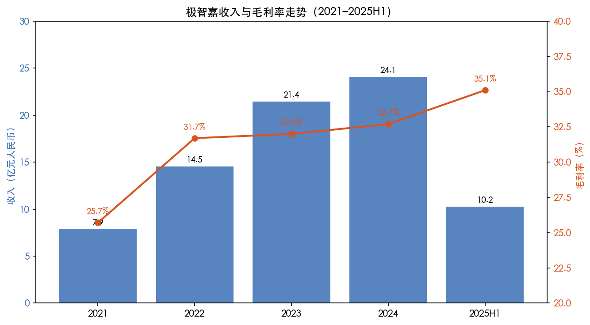
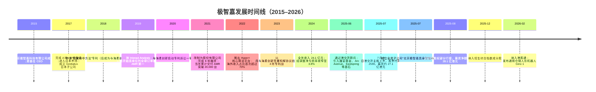
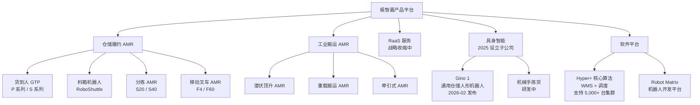
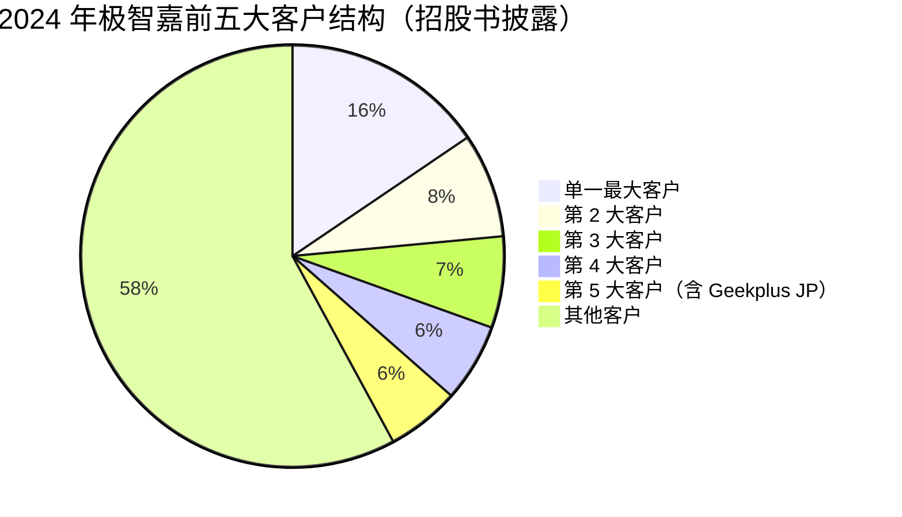
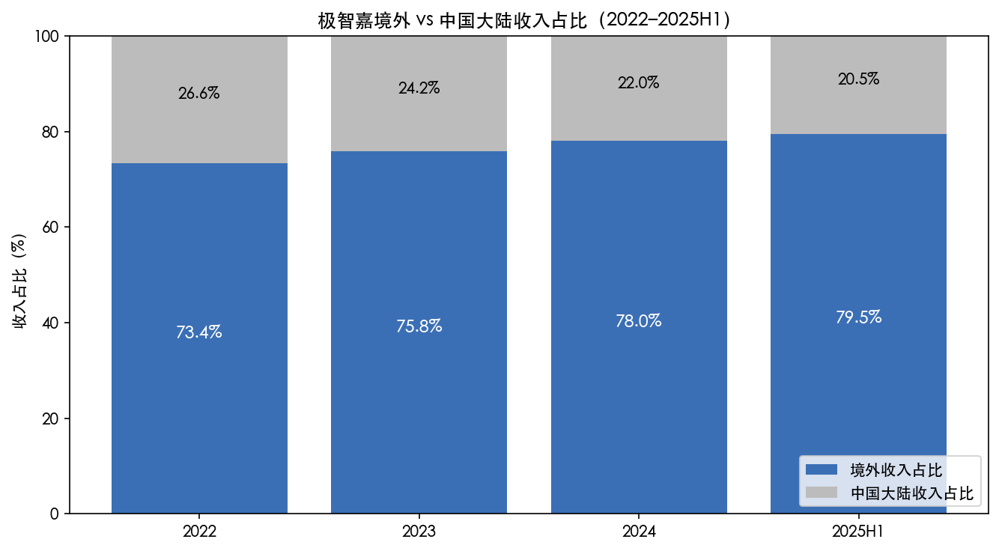
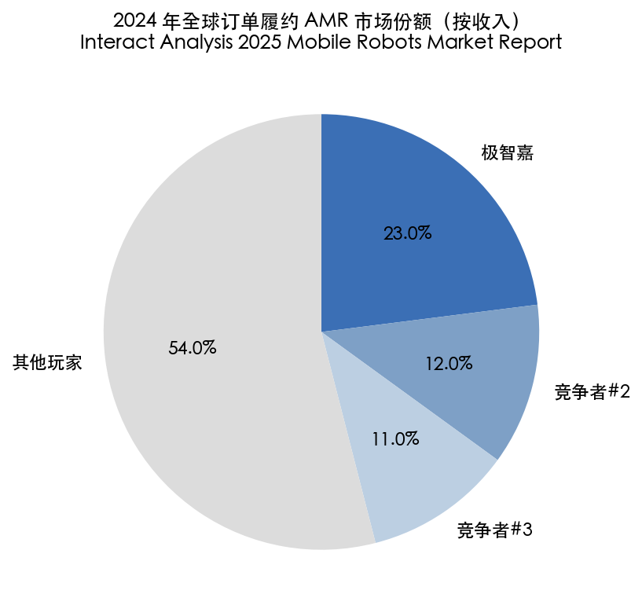
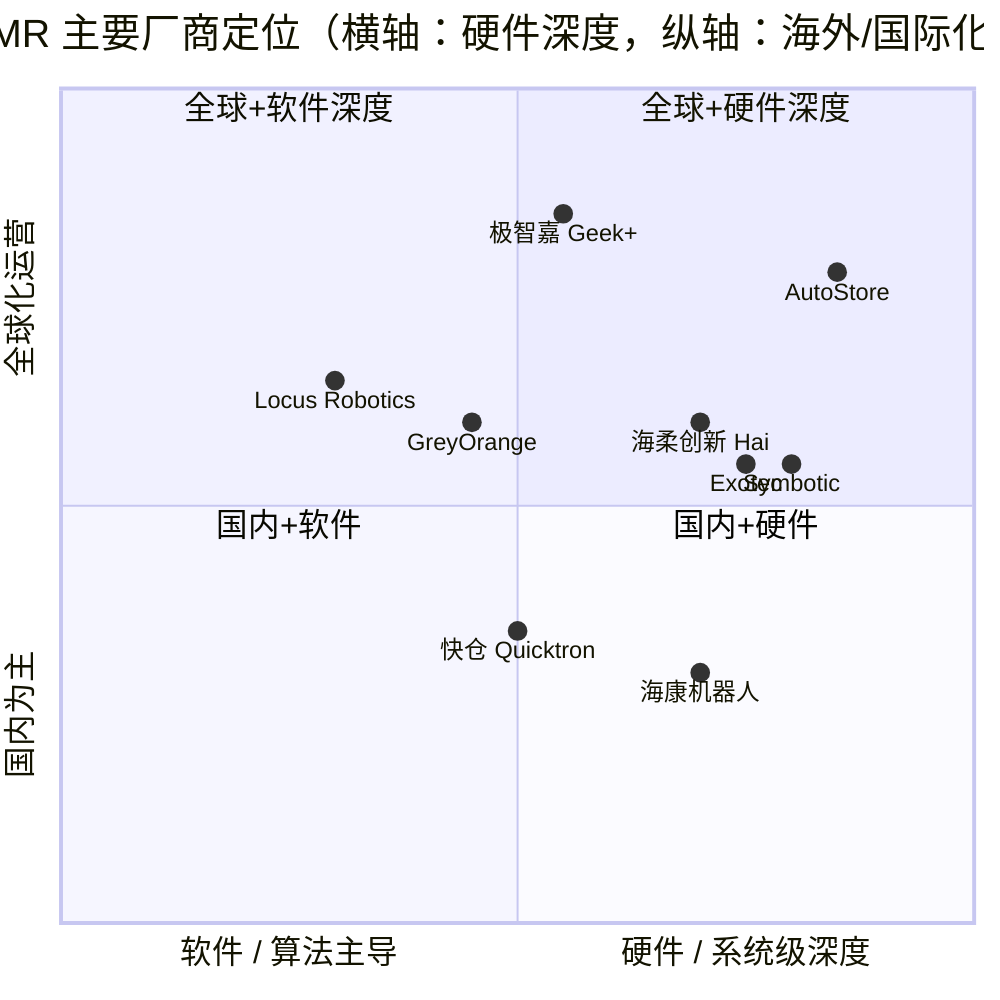
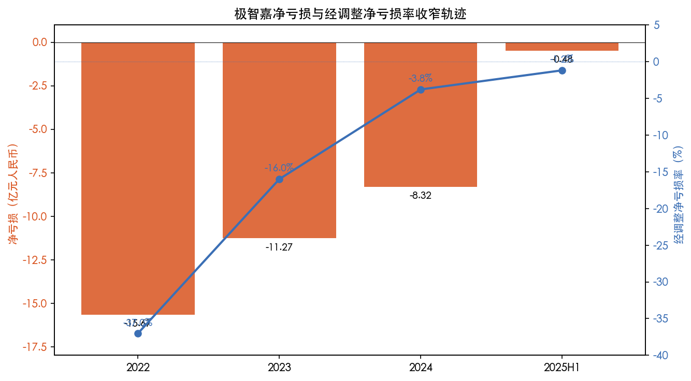

# 极智嘉-W（HKEX:2590）公司研究报告

> **研究时点**：2026 年 5 月 20 日
> **报告语言**：简体中文
> **覆盖范围**：业务模式、管理团队、产品矩阵、客户结构、行业格局、竞争位置、市场机会、风险评估
> **主要一手来源**：[北京极智嘉科技股份有限公司 2025 年中期报告（2025-09-19，巨潮 / 港交所披露易）](https://static.cninfo.com.cn/finalpage/2025-09-19/1226155557.PDF)、[全球發售招股章程（2025-06-30，港交所披露易）](https://www1.hkexnews.hk/listedco/listconews/sehk/2025/0630/2025063000026_c.pdf)

---

## 目录

1. 公司概览
2. 公司历史
3. 管理团队与治理
4. 产品与服务
5. 客户与上市策略
6. 行业概览
7. 竞争格局
8. 市场机会与 TAM
9. 风险评估
10. 参考资料

---

## 1. 公司概览

极智嘉（Geek+，北京极智嘉科技股份有限公司，HKEX：2590）是一家总部位于北京的全球自主移动机器人（AMR）公司，是按 2024 年收入计算的**全球最大仓储履约机器人解决方案供应商**，并已连续六年保持该领先地位（[2025 年中期报告，第 5 页](https://static.cninfo.com.cn/finalpage/2025-09-19/1226155557.PDF)）。公司主营业务是为电商零售、第三方物流、汽车制造、时尚快销等核心垂直行业的全球客户提供 "货到人"（Goods-to-Person, GTP）拣选、料箱搬运、智能搬运等机器人软硬件一体化解决方案，并附加项目设计、安装调试和长期售后服务。

公司于 **2025 年 7 月 9 日**在香港联交所主板挂牌上市，发售价为每股 H 股 16.80 港元，全球发售 161,405,800 股 H 股；包销商部分行使超额配股权后又于 2025 年 8 月 6 日发行 16,669,800 股 H 股，扣除承销及上市费用后的所得款项净额约为 **28.14 亿港元（约 25.71 亿元人民币）**（[2025 年中期报告，第 6、23 页](https://static.cninfo.com.cn/finalpage/2025-09-19/1226155557.PDF)）。此次发行规模使极智嘉成为 **2025 年港股最大机器人 IPO**，亦是全球仓储 AMR 行业首家上市企业（[动点科技，2025-07-09](https://cn.technode.com/post/2025-07-09/geek-plus-hkex/)）。公司采用 **同股不同权（WVR）** 架构：A 类股 1 股 10 票投票权，B 类股 1 股 1 票，以代码后缀 "-W" 区分。

**2025 年上半年财务摘要**（人民币百万元，来自[ 2025 年中期报告第 8 页](https://static.cninfo.com.cn/finalpage/2025-09-19/1226155557.PDF)）：

| 指标 | 2025H1 | 2024H1 | 同比 |
|---|---:|---:|---:|
| 收入 | 1,024.7 | 782.5 | +31.0% |
| 毛利 | 359.9 | 251.5 | +43.1% |
| 整体毛利率 | 35.1% | 32.1% | +3.0 pp |
| 境外业务毛利率 | 46.2% | 40.8% | +5.4 pp |
| 经营亏损 | (82.2) | (209.3) | -60.7% |
| 期内净亏损 | (48.0) | (550.3) | -91.3% |
| 经调整净亏损（非 IFRS） | (11.9) | (197.2) | -94.0% |
| 经调整 EBITDA（非 IFRS） | **+11.6** | (169.8) | 转正 |

公司在 2025 年上半年首次实现**经调整 EBITDA 转正**，整体毛利率突破 35%，经调整净亏损率收窄至约 1.2%，**盈利拐点的财务证据已经出现**。

**估值快照（截至 2026 年 2 月，最新可得券商口径）**

- 招股发行价 16.80 港元、最大发行后市值约 218.3 亿港元（[乐居财经，2025-06](https://m.lejucaijing.com/news-7345299236567316319.html)）；
- 2026 年 2 月初，股价在 26–27 港元区间，自上市以来累计涨幅 50%+，10 月 9 日盘中高位 33.90 港元（[新浪财经，2026-02-05](https://finance.sina.com.cn/stock/bxjj/2026-02-05/doc-inhktwvm5918581.shtml)）；
- 招银国际给予"买入"评级、目标价 26.70 港元，对应 **7.7× 2026E P/S**（[新浪财经，2026-02-05](https://finance.sina.com.cn/stock/bxjj/2026-02-05/doc-inhktwvm5918581.shtml)）；
- 信达国际目标价 32 港元、海通国际基于 **10× 2026E P/S**、摩根士丹利基于 **11× 2026E P/S**（[证券之星，2026-02-12](https://hk.stockstar.com/IG2026021200009578.shtml)、[新浪财经，2026-02-05](https://finance.sina.com.cn/stock/bxjj/2026-02-05/doc-inhktwvm5918581.shtml)）；
- 2025 年市场普遍预测公司**首次扭亏为盈**，2026E 经调整净利润可达约 3.33 亿元人民币（[新浪财经，2026-02-05](https://finance.sina.com.cn/stock/bxjj/2026-02-05/doc-inhktwvm5918581.shtml)）。

**估值解读：**截至 2026 年初，公司 TTM 仍为亏损，市场无法用 P/E 衡量，故核心定价锚为 **P/S 与 EV/Sales**。当前 ~7–11× 2026E P/S 大幅高于全球工业自动化龙头（AutoStore 上市后 P/S 一度 15× 现回落至 5–8×、Symbotic ~3–4×、KION ~0.5×），主要反映三个溢价：(1) **全球 AMR 龙头地位 + 70%+ 海外收入占比**赋予 Geek+ "中国制造业出海 + 高端 SaaS"双重 narrative；(2) **盈亏拐点临近**——市场愿意付高 P/S 换取 2026 起的盈利兑现；(3) **具身智能题材**——公司 2025 年 7 月成立全资子公司"北京极智嘉具身智能科技有限公司"，并于 2026 年初推出通用仓储人形机器人 Gino 1，催化估值重估（[新浪财经，2026-02-12](https://finance.sina.com.cn/stock/hkstock/marketalerts/2026-02-12/doc-inhmpusi6907202.shtml)）。该多重叠加属于**典型成长性 + 题材性双重溢价**，因此一旦 2026 年盈利兑现不及预期或 Hai Robotics 等"第二名"市场份额持续追近，估值压缩风险显著（详见第 9 节）。

*Source: [极智嘉招股章程（2025-06-30）](https://www1.hkexnews.hk/listedco/listconews/sehk/2025/0630/2025063000026_c.pdf)；[2025 年中期报告，第 8 页](https://static.cninfo.com.cn/finalpage/2025-09-19/1226155557.PDF)。2025H1 收入为半年度数据。*

---

## 2. 公司历史

极智嘉成立于 **2015 年 2 月 3 日**，最初为北京市朝阳区的有限责任公司，2021 年 3 月 22 日改制为股份有限公司（[2025 年中期报告，第 18 页](https://static.cninfo.com.cn/finalpage/2025-09-19/1226155557.PDF)）。创始团队由清华大学工业工程系出身的郑勇带队，联合从 ABB、新天域资本等多家机构出身的高管班子组建。公司起步即对标 Amazon Robotics（前 Kiva Systems）的 GTP 仓储模式，但避开北美电商客户，选择从**国内 3PL + 服装 / 鞋类电商**起步，再快速国际化。

*Source: [2025 年中期报告，第 6、18、23 页](https://static.cninfo.com.cn/finalpage/2025-09-19/1226155557.PDF)；[新浪财经，2026-02-05](https://finance.sina.com.cn/stock/bxjj/2026-02-05/doc-inhktwvm5918581.shtml)；[CSDN：仓储机器人 TOP2 专利大战 4 年](https://blog.csdn.net/nickelwang/article/details/145127881)；[动点科技，2025-07-09](https://cn.technode.com/post/2025-07-09/geek-plus-hkex/)。*

公司发展可清晰分为三个阶段：

**阶段一（2015–2018）：GTP 验证与国内冷启动。**Kiva 被 Amazon 收购后退出对外销售，留下了显著的 GTP 自动化供给真空。极智嘉对标 Kiva，从国内服装电商、3PL 仓库切入，单仓项目规模从几十台 AMR 起步，逐步扩展到几百台。

**阶段二（2018–2023）：全球化与"出海公司"标签。**2017–2018 年公司即开始进入日本市场，并通过设立 Geekplus JP（极智嘉持股约 39.6%）作为日本市场的渠道商和合资平台（[腾讯新闻，2025-01](https://news.qq.com/rain/a/20250625A06LVP00)）。此后陆续在欧洲、美国、东南亚设立销售和服务网络，至 2025 年 6 月已在全球 40 余国部署超过 66,000 台机器人、52+ 服务站点、12 个备件中心、310+ 工程师（[2025 年中期报告，第 5 页](https://static.cninfo.com.cn/finalpage/2025-09-19/1226155557.PDF)）。

**阶段三（2023 至今）：上市与盈利拐点。**2023 年是公司在专利、客户、产品三个维度同时收口的关键年——结束与海柔创新长达 4 年的专利战；2024 年收入 24.1 亿元、经调整净亏损率收窄至 3.8%；2025 年 7 月赴港 IPO 进入上市公司阶段，并通过设立具身智能子公司打开第二条技术叙事曲线。

---

## 3. 管理团队与治理

### CEO / 联合创始人：郑勇

郑勇是极智嘉的董事长兼首席执行官，2015 年公司成立时即任 CEO（[2025 年中期报告，第 3 页](https://static.cninfo.com.cn/finalpage/2025-09-19/1226155557.PDF)）。教育背景为 **清华大学工业工程系 + 德国亚琛工业大学（RWTH Aachen）工业工程方向**（[Geek+ 官网"关于我们"](https://www.geekplus.com/zh/company)、[518 智能装备：郑勇 - Geek+ 创始人 & CEO](https://www.zhineng518.com/page108?article_id=1274)）。

毕业后郑勇进入**跨国制造业**积累供应链与精益运营经验：先是在 ABB（瑞士工业自动化龙头）负责中国生产基地的工程、质量与物流；后转任圣戈班（Saint-Gobain，法国建材工业集团），负责中国关键制造基地的供应链运营（[Geek+ 官网](https://www.geekplus.com/zh/company)、[智东西，2025-07](https://zhidx.com/p/490657.html)）。这段经历提供了三个关键能力：(i) 对仓储、内部物流的真实痛点理解（而不是单纯软件 / 算法视角）；(ii) 跨国企业的标准化运营和质量管理体系；(iii) 后来 Geek+ 国际化所需的英语沟通与跨文化谈判能力。

ABB / 圣戈班之后，郑勇转入**新天域资本（New Horizon Capital）**，负责 TMT 和机器人领域的投资与投后管理（[Geek+ 官网](https://www.geekplus.com/zh/company)、[智东西，2025-07](https://zhidx.com/p/490657.html)）。在投资机构期间他系统接触了 Amazon Robotics（Kiva 收购后的运营）、Fetch Robotics 等海外标杆，最终判断 GTP AMR 是一个 **既需要软件算法又需要硬件工程、还需要全球化服务**的复合性赛道，国外巨头难以独占。2015 年他与李洪波、刘凯、陈曦三位联合创始人共同创立极智嘉。

**持股与投票权（同股不同权架构）：**根据 2025 年中期报告（第 24–26 页）：

| 创始人 | 职务 | 实益持有 A 类股 | A 类股权益占比 | 总投票权占比 |
|---|---|---:|---:|---:|
| 郑勇 | 董事长 / CEO / 执行董事 | 83,351,729 股（+55,884,378 B 类） | 38.14% A 类 | **25.22%** |
| 李洪波 | CTO / 执行董事 | 56,194,987 股 | 25.71% A 类 | 17.00% |
| 刘凯 | 副总裁 / 执行董事 | 39,506,859 股 | 18.08% A 类 | 11.96% |
| 陈曦 | 副总裁 / 执行董事 | 39,506,859 股 | 18.08% A 类 | 11.96% |

四位创始人 A 类股合计占总投票权约 **66.1%**，绝对控股；其中郑勇个人投票权 25.2%、是单一最大持有人。董事会未将董事长与 CEO 分设，由郑勇一人兼任——公司在中期报告中以"郑先生为识别策略机会及作为董事会核心的最佳人选"为由披露偏离《企业管治守则》第 C.2.1 条（[2025 年中期报告，第 18 页](https://static.cninfo.com.cn/finalpage/2025-09-19/1226155557.PDF)）。这一结构属于典型的**强势创始人 + WVR**，对长期战略一致性有利，但对小股东而言，治理制衡有限。

### CTO / 执行董事：李洪波

李洪波是公司四位 A 类股受益人之一，担任执行董事兼 CTO，控制 56,194,987 股 A 类股（投票权 17.00%）（[2025 年中期报告，第 25 页](https://static.cninfo.com.cn/finalpage/2025-09-19/1226155557.PDF)）。中期报告未提供学历与简历细节（招股章程"董事简历"章节包含更完整信息），按公开信息李洪波是极智嘉早期核心算法团队的负责人，主导了 **Hyper+ 核心算法平台**（流量管理、任务分配、仓库管理、调度算法，最大可调度 5,000+ 台机器人的集群规模）和 **Robot Matrix 机器人通用技术平台**的设计（[2025 年中期报告，第 5–6 页](https://static.cninfo.com.cn/finalpage/2025-09-19/1226155557.PDF)）。

### 其他执行董事与高管

- **刘凯**（执行董事 / 副总裁，A 类投票权 11.96%）
- **陈曦**（执行董事 / 副总裁，A 类投票权 11.96%）

中期报告（第 24–26 页）显示其角色为业务条线副总裁，分管的具体领域未在中期报告中披露。

### 非执行董事 / 独立董事 / 监事

非执行董事：夏志进、白津、李珂、陈和江；独立非执行董事：陈晨、陈少华、韩愉、刘大成；监事：黄政、段永欣、谢溢（[2025 年中期报告，第 3 页](https://static.cninfo.com.cn/finalpage/2025-09-19/1226155557.PDF)）。审计委员会由陈少华（主席）、韩愉、夏志进组成；薪酬与考核委员会由刘大成（主席）、陈少华、郑勇组成；提名委员会由韩愉（主席）、陈晨、郑勇组成；企业管治委员会由陈晨（主席）、韩愉、刘大成组成。**核数师**：毕马威会计师事务所（KPMG）（[2025 年中期报告，第 3 页](https://static.cninfo.com.cn/finalpage/2025-09-19/1226155557.PDF)）。

### 主要财务股东（IPO 后）

中期报告（第 27–28 页）披露了主要股东，含基石和上市前投资者：

- **Warburg Pincus（华平投资）**：通过 Marcasite Gem Holdings 间接持股 137,520,423 股 B 类股，占总股本 **10.28%**；
- **Daniel Sundheim（D1 Capital）**：71,785,317 股 B 类股，占总股本 5.37%；
- **蚂蚁科技集团**：57,155,683 股 B 类股，占 4.27%；
- **北京云晖私募基金**：58,702,361 股，占 4.39%；
- **中国经济改革研究基金会 / 庐江县康江建设投资**：53,315,075 股，占 3.99%（以一致行动人身份合计申报）；
- **基石投资者**：雄安机器人 4,130 万美元、Arc Avenue 2,500 万美元、Eastspring Investments（保诚旗下）1,500 万美元、纵腾集团旗下亿格 1,000 万美元，合计约 9,130 万美元 / 7.17 亿港元（[乐居财经，2025-06](https://m.lejucaijing.com/news-7345299236567316319.html)）。

**治理评价**：(+) 多元化的全球机构股东（华平、D1、蚂蚁、雄安基金、Eastspring）为公司带来跨境治理、机构投资者监督；(+) 创始团队稳定，自 2015 年至今核心四人结构未变；(−) WVR 架构 + 董事长兼 CEO，对小股东的制约偏弱；(−) **关联方交易**——公司对 Geekplus JP 持股 39.6%，后者作为日本市场主要渠道商在 2022–2024 年分别贡献总收入 2.8%、4.9%、7.3%，2024 年还进入前五大客户（详见第 5 节）。这类关联方安排尽管商业实质合理，但对收入识别、转移定价的审计精细度提出更高要求（[腾讯新闻，2025-01](https://news.qq.com/rain/a/20250625A06LVP00)）。

---

## 4. 产品与服务

极智嘉的产品矩阵主要由 **核心机器人本体**、**软件平台**、**RaaS 订阅服务**三条线构成。中期报告（第 10 页）按业务划分的收入明细如下：

| 业务线 | 2025H1 收入（百万人民币） | 占比 |
|---|---:|---:|
| 机器人解决方案 — 仓储履约 | 962.5 | 93.9% |
| 机器人解决方案 — 工业搬运 | 61.2 | 6.0% |
| RaaS 服务 | 1.1 | 0.1% |
| **合计** | **1,024.7** | **100%** |

公司的产品逻辑很清晰：**绝大部分收入来自销售而非订阅**——RaaS 占比 < 0.5% 且同比下降 71.5%（"业务战略调整"），公司在 IPO 前夕主动收缩了租赁模式，把资源集中在更高确定性的解决方案销售上（[2025 年中期报告，第 10 页](https://static.cninfo.com.cn/finalpage/2025-09-19/1226155557.PDF)）。仓储履约是 **核心业务**，工业搬运是 **延伸赛道**，而正在投资的具身智能（人形机器人、机械手拣货）是 **未来曲线**。

*Source: [2025 年中期报告，第 5–6、10 页](https://static.cninfo.com.cn/finalpage/2025-09-19/1226155557.PDF)；[新浪财经：极智嘉发布通用仓储人形机器人，2026-02-12](https://finance.sina.com.cn/stock/hkstock/marketalerts/2026-02-12/doc-inhmpusi6907202.shtml)。具体产品型号的命名采用公司在过往营销资料中披露的常见名称。*

**仓储履约 AMR（93.9% 收入）：**这是行业内最成熟、毛利率最稳定的产品线。Geek+ 提供 **"货到人"** 模式的整套解决方案：(1) AMR 本体（搬运货架到拣货工位）、(2) 工位与货架硬件、(3) WMS / 调度软件、(4) 安装调试与售后。客户主要场景是电商分仓、3PL 多客户仓、跨境电商海外仓。**核心算法平台 Hyper+** 支持 5,000+ 台机器人的集群调度，这是大订单（亿元级）能落地的关键能力门槛——大型客户（如沃尔玛、迪卡侬级别）的中心化分拨仓通常需要 500–2,000+ 台机器人协同。

**工业搬运 AMR（6.0% 收入）：**面向汽车制造、3C 电子、动力电池、光伏等离散制造场景。增长慢于仓储履约（2025H1 同比 +7.2% vs. 仓储 +33.4%），原因是工业搬运对**节拍、安全、与上下游设备协同**有更高要求，单客户认证周期长（[2025 年中期报告，第 10 页](https://static.cninfo.com.cn/finalpage/2025-09-19/1226155557.PDF)）。

**软件平台（不单独计价，含在解决方案中）：**(i) **Hyper+** 包含流量管理、任务分配、仓库管理、供应链算法；(ii) **Robot Matrix** 是模块化机器人开发平台，可在不同硬件形态间复用算法与传感器栈（[2025 年中期报告，第 6 页](https://static.cninfo.com.cn/finalpage/2025-09-19/1226155557.PDF)）。

**具身智能新业务（2025 年起）：**公司于 **2025 年 7 月 30 日**设立全资子公司"北京极智嘉具身智能科技有限公司"，专注 AI+ 仓储场景下的机械手拣货、通用机器人研发（[2025 年中期报告，第 6 页](https://static.cninfo.com.cn/finalpage/2025-09-19/1226155557.PDF)）。**2026 年 2 月**公司发布通用仓储人形机器人 **Gino 1**，这一产品成为 2026 年初的核心估值催化（[新浪财经，2026-02-12](https://finance.sina.com.cn/stock/hkstock/marketalerts/2026-02-12/doc-inhmpusi6907202.shtml)）。具身智能业务目前贡献收入极少，对短期财务的影响主要是研发开支增加，但对估值叙事的影响显著。

**研发投入：**2025H1 研发开支 1.47 亿元（占收入 14.4%），同比增长 10.6%。截至 2024 年上半年公司专利总数 1,735 项（[CSDN：仓储机器人 TOP2 专利大战 4 年](https://blog.csdn.net/nickelwang/article/details/145127881)）。

---

## 5. 客户与上市策略

### 客户结构

截至 **2025 年 6 月 30 日**，极智嘉累计服务全球超过 **850 家终端客户**，其中包括 **超过 65 家《财富》世界 500 强**企业，客户**复购率超 80%**，已向 40+ 国家和地区交付超过 **66,000 台机器人**（[2025 年中期报告，第 5 页](https://static.cninfo.com.cn/finalpage/2025-09-19/1226155557.PDF)）。

**点名客户**（行业普遍公开信息，未必在中期报告中点名披露）：耐克（Nike）、沃尔玛（Walmart）、丰田（Toyota）、西门子（Siemens）、戴尔（Dell）、迪卡侬（Decathlon）、DHL、苏宁、永辉、顺丰等（[Geek+ 官网"关于我们"](https://www.geekplus.com/zh/company)）。

### 客户集中度

招股章程披露了往绩记录期的**前五大客户**和**单一最大客户**占比（[新浪财经：极智嘉聆讯过关难掩隐忧，2025-06](https://news.qq.com/rain/a/20250624A055YU00)、[腾讯新闻：三年亏超 35 亿，2025-06](https://news.qq.com/rain/a/20250625A06LVP00)）：

| 年度 | 前五大客户占比 | 单一最大客户占比 |
|---|---:|---:|
| 2021 | 30.4% | (未单独披露) |
| 2022 | 30.8% | 9.3% |
| 2023 | 45.3% | 15.4% |
| 2024 | 42.1% | 15.5% |
| 2024H1（半年） | 55.8% | (未披露) |

**解读：**(1) 客户集中度近年**显著上升**：从 2022 年的 30% 上升到 2024 年的 42%，与公司"深化大客户合作"的战略一致；(2) 单一最大客户占比从 9.3% 跳升到 15%+，已经接近**重大依赖红线**（按多数司法管辖标准，单客户占比 >10% 即触发列名披露）；(3) **Geekplus JP 是关联方客户**——公司持股 39.6%，分别贡献 2022/2023/2024 总收入的 2.8%、4.9%、7.3%，2024 年进入前五大客户（[腾讯新闻，2025-06](https://news.qq.com/rain/a/20250625A06LVP00)）。这种"自己卖给自己持股的渠道商"的模式，按 IFRS 仍然可以确认收入，但对独立第三方需求的代表性提出疑问，亦是审计与监管关注的重点。

*Source: [新浪财经：极智嘉聆讯过关难掩隐忧，2025-06](https://news.qq.com/rain/a/20250624A055YU00)；[腾讯新闻：三年亏超 35 亿，2025-06](https://news.qq.com/rain/a/20250625A06LVP00)。第 2–4 大客户具体占比未单独披露，已按招股书前五合计 42.1% – 单一 15.5% 区间平均估算（est.，2.8% / 客户，仅作可视化用途）。*

### 地域结构：海外贡献近 80% 收入

地理分布是 Geek+ 区别于绝大多数中国机器人公司的关键标签。**2025H1 境外收入 8.15 亿元，占总收入 79.5%**；2024 年全年境外收入占比约 78%，2023 年约 75.8%，2022 年约 73.4%（[2025 年中期报告，第 5 页](https://static.cninfo.com.cn/finalpage/2025-09-19/1226155557.PDF)；[腾讯新闻，2025-06](https://news.qq.com/rain/a/20250625A06LVP00)）。

*Source: [极智嘉招股章程（2025-06-30）](https://www1.hkexnews.hk/listedco/listconews/sehk/2025/0630/2025063000026_c.pdf)；[2025 年中期报告，第 5、10 页](https://static.cninfo.com.cn/finalpage/2025-09-19/1226155557.PDF)。*

海外业务还有更高的**毛利率溢价**：2025H1 境外毛利率 **46.2%**，而国内业务（计算后）约 **(35.1% × 100 − 46.2% × 79.5%) / 20.5% ≈ 8%**——也就是说**国内业务的毛利率已经很薄**，公司利润高度依赖海外项目（[2025 年中期报告，第 11–12 页](https://static.cninfo.com.cn/finalpage/2025-09-19/1226155557.PDF)）。

### 上市策略与 IPO 募资用途

公司在港股 IPO 选择 **WVR 架构 + Pre-revenue 时期已有营收 + 同行尚未上市**三个时点优势的组合，避开了 A 股科创板对持续盈利的要求。**募资净额 28.14 亿港元（约 25.71 亿元人民币）**用途按招股章程为：(1) 研发投入（含具身智能）；(2) 全球销售与服务网络扩张；(3) 营运资金；(4) 潜在战略合作与并购。具体细分未在中期报告披露，因为净额于 2025-06-30 后才到账（[2025 年中期报告，第 23 页](https://static.cninfo.com.cn/finalpage/2025-09-19/1226155557.PDF)）。

### 银行融资与资本结构

截至 2025-06-30，公司**借款总额 5.635 亿元人民币**（2024 年底 4.139 亿元），全部以人民币计值、固定利率（[2025 年中期报告，第 16 页](https://static.cninfo.com.cn/finalpage/2025-09-19/1226155557.PDF)）。**赎回负债 70.27 亿元人民币**——这是 IPO 前向投资者发行的"特殊权利股份"对应的会计负债，按 IPO 完成后特殊权利**自动终止**的条款，赎回负债将转入权益（详见中期报告附注），这是公司 2025H1 净亏损大幅收窄到 4,800 万元的关键非现金调整项之一（[2025 年中期报告，第 13、17 页](https://static.cninfo.com.cn/finalpage/2025-09-19/1226155557.PDF)）。

---

## 6. 行业概览

### 行业定义

按 SIC / 中国 GB 标准，仓储 AMR 属于"自主移动机器人"（Autonomous Mobile Robots, AMR）大类下的"订单履约移动机器人"（Order Fulfillment Mobile Robots）细分。它与传统 AGV（Automated Guided Vehicles，需要导引线 / 二维码 / 磁条的有轨自动导引车）的差别在于：AMR 用 **SLAM + 计算机视觉 + 实时路径规划**，无需固定导引、可动态避障，适合 SKU 多、布局变化频繁的电商分仓和 3PL 仓。

仓储 AMR 又可分为几个子细分：
- **货到人 GTP（Goods-to-Person）/ 货架到人 Shelf-to-Person**：极智嘉的核心赛道；
- **料箱到人（Tote-to-Person）/ 案件搬运（Case-to-Person）**：海柔创新（Hai Robotics）的核心赛道；
- **拣选 AMR（Pick-Assist / Person-to-Goods）**：Locus Robotics、Fetch Robotics 的主战场；
- **AMR 叉车 / 移动叉车**：Vecna、Seegrid 等；
- **货柜级自动化**：AutoStore（料箱穿梭车在格子立方体内）、Symbotic（重型托盘 AMR）。

### 市场规模与增速

**2025 年 7 月，Interact Analysis 下调了全球移动机器人长期预测**：将 2030 年市场规模从约 200 亿美元下调至 **156 亿美元**，2024–2030 复合年增长率（CAGR）从 26% 下调至 **21%**（[The Robot Report：Interact Analysis downgrades mobile robot forecast by 18%](https://www.therobotreport.com/interact-analysis-downgrades-mobile-robot-forecast-by-18/)、[中国 AGV 网，2025-07](https://m.chinaagv.com/news/detail/202507/33680.html)）。下调的主因：(i) 适合自动化部署的市场场景比此前估计小；(ii) 大型 AMR 单位销量下调 15–20%；(iii) 自动化叉车增长略放缓。

但订单履约 AMR 子赛道的长期前景仍然乐观。Interact Analysis 报告的具体口径：**全球订单履约部署站点数预计将从 2024 年的 5,500 个增长到 2030 年的 18,000 个**（CAGR 约 22%）（[Automated Warehouse Online：Geek+ maintains AMR market share lead](https://www.automatedwarehouseonline.com/geekplus-maintains-global-amr-market-share-lead-seventh-year-in-a-row/)）。

*Source: 极智嘉援引的 [Interact Analysis 2025 Mobile Robots Market Report](https://www.geekplus.com/resources/news/global-warehouse-automation-surges-as-geekplus-extends-no.1-amr-leadership-for-seven-consecutive-years)；[Automated Warehouse Online](https://www.automatedwarehouseonline.com/geekplus-maintains-global-amr-market-share-lead-seventh-year-in-a-row/)。具体竞争者份额按 Interact Analysis 公开口径"极智嘉 23% ≈ 第 2 + 第 3 名合计"，对第 2 / 第 3 名进行了示意性拆分（est.）。*

### 行业驱动因素

1. **劳动力短缺与人工成本上涨**：全球范围内，仓储拣选岗位的招聘难度和流失率都在攀升。AMR 单台的硬件 + 软件 + 集成成本约相当于 0.5–1.5 个北美 / 欧洲全职拣货员的年薪，回本周期通常 18–30 个月。
2. **电商常态化**：电商履约的 SKU 数、订单波动性都远超传统零售仓库，AMR 的灵活性优势放大。
3. **跨境电商爆发**：拼多多 Temu、SHEIN、TikTok Shop 推动全球海外仓的爆发式增长——这是 Geek+ 海外业务的直接受益面。**Temu 在 2025 年与极智嘉建立合作**，被援引为 Geek+ "全球跨境电商巨头重磅认可"的代表性案例（[东方财富，2025-12](https://caifuhao.eastmoney.com/news/20251231085626584016430)）。
4. **具身智能 / AI+ 政策导向**：中国"人工智能+"战略将仓储自动化列为重点应用场景；同时人形机器人在仓储拣选的潜在应用提升了行业的估值天花板（[2025 年中期报告，第 6 页](https://static.cninfo.com.cn/finalpage/2025-09-19/1226155557.PDF)）。

### 行业结构

仓储 AMR 行业的特点是 **"软件 + 硬件 + 集成 + 服务"四位一体**，其壁垒来自：(i) 算法和调度系统的规模效应（千台级集群调度难度远超百台级）；(ii) 全球化服务网络（响应时效 < 24 小时是大客户合同的硬性要求）；(iii) 客户认证周期（大型 3PL 和制造客户的供应商认证通常 12–24 个月）。这些壁垒使得**行业集中度较高、但同时存在"区域+赛道"细分**——很难有一家公司同时统治所有子赛道。

---

## 7. 竞争格局

### 主要竞争者

*Source: 综合 [Standard Bots：Top 12 warehouse robotics companies 2026](https://standardbots.com/blog/warehouse-robotics-companies)、[Robotics & Automation News：Top 20 Chinese warehouse robotics companies, 2025-10](https://roboticsandautomationnews.com/2025/10/03/top-20-chinese-warehouse-robotics-companies-geekplus-turns-its-attention-to-domestic-competitors/95126/)、各公司官网。象限定位为作者基于公开资料的判断（est.）。*

#### A. 直接对标（货到人 GTP / AMR 整体）

1. **海柔创新（Hai Robotics）**——核心对手，主打料箱式（case-handling）机器人，与 Geek+ 在国内市场份额、专利方面长期博弈。2019–2023 年双方持续 4 年专利诉讼，2023 年 11 月 15 日签订和解协议（[CSDN：仓储机器人 TOP2 专利大战 4 年](https://blog.csdn.net/nickelwang/article/details/145127881)、[最高人民法院知识产权法庭：一揽子化解 11 起系列纠纷](https://ipc.court.gov.cn/zh-cn/news/view-2779.html)）。2023 年底海柔专利累计突破 1,900 项，超过 Geek+ 同期的 1,735 项。
2. **快仓（Quicktron）**——成立于 2014 年，国内份额位列第二阵营，主打类 Kiva 货架搬运 AMR 和料箱 AMR 混合方案。
3. **Locus Robotics（美国）**——Pick-assist AMR 领先厂商，2025 年累计拣选量突破 50 亿次（[PR Newswire：Locus Robotics Surpasses 5 Billion Pick Milestone](https://www.prnewswire.com/news-releases/locus-robotics-surpasses-5-billion-pick-milestone-accelerating-global-adoption-of-mobile-warehouse-automation-302436658.html)）。
4. **GreyOrange（印度 / 美国）**——GTP + 软件平台一体化。
5. **AutoStore（挪威，OSE:AUTO）**——立方体格子仓 + 料箱穿梭车，是 GTP 自动化的另一种技术路线，与 AMR 路线存在替代关系。

#### B. 中国国内强势同行

1. **海康机器人**（海康威视分拆）——背靠海康威视的视觉算法和量产能力，国内项目份额前列，2023 年启动 A 股上市辅导但尚未 IPO（[新浪财经：移动机器人走到三岔路口](https://finance.sina.cn/2024-05-29/detail-inawwrkv1686043.d.html)）。
2. **旷视（Megvii）智慧物流**——AI 公司延伸的物流业务，主打河图 WMS + AMR。
3. **劢微机器人**（Multiway Robotics）——叉车型 AMR 厂商。

#### C. 仓储级别 / 系统级竞品

1. **Symbotic（NASDAQ：SYM）**——重型托盘 AMR，主攻沃尔玛级别中心化仓。
2. **Berkshire Grey**（已被 SoftBank 私有化）——拣选机器人 + AMR。
3. **AutoStore**——见上。

### 与第二名的市场份额贴近

虽然 Geek+ 在 Interact Analysis 口径下保持**全球订单履约 AMR 第一**（2024 年市占率约 23%、连续 6–7 年第一），但**国内市场**份额的差距正在收窄——多份券商研究和行业观察均提及"市场份额被第二名赶超"的国内压力（[新浪财经，2025-06](https://news.qq.com/rain/a/20250624A055YU00)）。这也是公司战略上选择"加大全球化、深化大客户"的根本原因——国内同行的价格战已经把毛利率压低（前文提及国内业务毛利率仅约 8%），海外项目是公司利润的真正来源。

### 竞争壁垒

(1) **算法集群规模**：Hyper+ 支持 5,000+ 台机器人调度，是大客户超大型仓的入场券。
(2) **全球服务网络**：52+ 服务站点 / 12 个备件中心 / 310+ 工程师覆盖 40+ 国家，海外同行普遍只在 1–3 个区域有团队。
(3) **大客户先发与认证**：Nike、Walmart、DHL 等头部客户的复购订单已经形成正向飞轮，2025H1 客户复购率超 80%。
(4) **专利组合**：1,735 项专利（2024 上半年）覆盖货架命中、调度、SLAM、机械结构等核心方向。

### 竞争薄弱处

(1) 与海柔创新在**料箱式（case-handling）**赛道的差距——海柔的库宝系列在密度更高的仓库（如 3PL 多 SKU 仓）有性价比优势。
(2) **AutoStore 立方体仓**在密度和能耗上的物理优势——这是技术路线层面的替代风险。
(3) **国内价格战**——国内业务毛利率已经显著低于海外，且第二名追近。
(4) **具身智能领域起步晚**——人形机器人专精玩家（Figure、Tesla Optimus、傅利叶、宇树等）拥有更深的硬件 + 算法栈，Geek+ 通过 Gino 1 的差异化是"仓储场景闭环"而非通用人形能力。

---

## 8. 市场机会与 TAM

### TAM 估算

按 **Interact Analysis 2025 报告**的修正口径（[The Robot Report](https://www.therobotreport.com/interact-analysis-downgrades-mobile-robot-forecast-by-18/)、[中国 AGV 网，2025-07](https://m.chinaagv.com/news/detail/202507/33680.html)）：

- **全球移动机器人市场（含 AMR + AGV）**：2030 年规模约 **156 亿美元**，2024–2030 CAGR 约 **21%**；
- **订单履约 AMR 子赛道**：2024 年部署 5,500 个站点 → 2030 年 18,000 个站点，CAGR 约 22%；
- 假设单站点平均年化设备 + 软件支出 50–80 万美元，则订单履约 AMR 子市场规模在 2030 年约 **90–150 亿美元区间**（est.，根据站点数 × 平均单站点支出推算）。

### SAM / SOM 估算

**SAM**：Geek+ 实际可触达的市场是"中大型电商 / 3PL / 制造业海外仓"——按 Interact Analysis 口径约 **80–120 亿美元（2030E）**。

**SOM**：以公司 23% 全球市占率为锚，2030 年公司可服务 ~20–28 亿美元（约 **150–200 亿元人民币**收入水平），即 6 年内潜在收入约为 2024 年 24 亿元的 6–8 倍。**这是市场愿意给 7–11× 2026E P/S 的根本支撑**。

### 增长机会

1. **跨境电商出海仓**：Temu、TikTok Shop、SHEIN 三大平台在欧美、中东、东南亚的海外仓快速扩张，是 Geek+ 海外业务的主驱动。
2. **杂货零售 / 食品饮料**：2025H1 公司在杂货零售和食品饮料行业取得"重大进展"，最大单笔订单超亿元，意味着公司从服装电商 / 3PL 的舒适区向更广泛的 SKU 类型扩展（[2025 年中期报告，第 5 页](https://static.cninfo.com.cn/finalpage/2025-09-19/1226155557.PDF)）。
3. **欧洲市场深化**：欧洲是 Geek+ 海外业务利润率最高的区域，欧元兑人民币升值还在 2025H1 直接贡献了约 8,576 万元的汇兑收益（[2025 年中期报告，第 11 页](https://static.cninfo.com.cn/finalpage/2025-09-19/1226155557.PDF)）。
4. **具身智能 / 人形机器人**：Gino 1 是 2026 年估值催化的核心，市场预期它将逐步从"研发投入"转化为"小批量订单"。
5. **渠道商网络扩张**：2025H1 公司新增渠道商超 40 家，渠道模式比直销具备更高的毛利率和更低的销售费用率（[2025 年中期报告，第 5 页](https://static.cninfo.com.cn/finalpage/2025-09-19/1226155557.PDF)）。

### 盈利路径

*Source: [极智嘉招股章程（2025-06-30）](https://www1.hkexnews.hk/listedco/listconews/sehk/2025/0630/2025063000026_c.pdf)；[2025 年中期报告，第 8、13–14 页](https://static.cninfo.com.cn/finalpage/2025-09-19/1226155557.PDF)；[腾讯新闻：年赚 24.1 亿，毛利四年复合年增速 118.5%](https://news.qq.com/rain/a/20250627A059EC00)。2022–2024 净亏损为 IFRS 口径，经调整净亏损率为非 IFRS 口径。*

公司从 2022 年净亏损 15.67 亿元、收入 14.52 亿元（亏损率 108%）→ 2024 年净亏损 8.32 亿元、收入 24.09 亿元（亏损率 35%，经调整亏损率仅 3.8%）→ 2025H1 净亏损 0.48 亿元、收入 10.25 亿元（亏损率 4.7%，经调整亏损率仅 1.2%、经调整 EBITDA 转正 1,162 万元）的轨迹**清晰且加速**。市场预测 **2026E 经调整净利润 ~3.33 亿元人民币**，这是当前估值溢价的底层假设（[新浪财经，2026-02-05](https://finance.sina.com.cn/stock/bxjj/2026-02-05/doc-inhktwvm5918581.shtml)）。

---

## 9. 风险评估

### 公司特定风险

**1. 客户集中度持续上升、关联方客户风险**
单一最大客户占比从 2022 年 9.3% 跳升到 2024 年 15.5%，前五大客户占比从 30.8% → 42.1%。关联方 **Geekplus JP**（公司持股 39.6%）在 2024 年进入前五大客户，贡献总收入 7.3%。一旦该关联方运营出现问题、或独立审计对"实质转移定价"提出异议，可能影响收入识别（[腾讯新闻，2025-06](https://news.qq.com/rain/a/20250625A06LVP00)）。**潜在影响**：可能造成 5–10% 收入波动。

**2. 国内业务毛利率挤压、价格战风险**
推算 2025H1 国内业务毛利率约 8%（境外 46.2% 显著高于整体 35.1%）。海康机器人、快仓、海柔创新都在加速国内份额——公司报告中提到"市场份额被第二名赶超"。若国内份额持续被侵蚀且海外项目增速放缓，整体毛利率将面临下行压力（[新浪财经，2025-06](https://news.qq.com/rain/a/20250624A055YU00)）。

**3. 累计亏损与持续盈利不确定性**
2022–2024 年累计净亏损 35.26 亿元、2021–2024H1 累计亏损约 43 亿元（[新浪科技，2024-12](https://finance.sina.com.cn/tech/roll/2024-12-25/doc-ineasmtn7424609.shtml)）。尽管 2025H1 经调整 EBITDA 转正，但 IFRS 口径仍在亏损，**2026 年盈利兑现是估值的关键验证点**——一旦不及预期，7–11× P/S 的估值将直接面临压缩。

**4. 创始人投票权集中、WVR 治理风险**
郑勇个人持有 25.2% 投票权、董事长 / CEO 一肩挑、A 类受益人合计 66.1% 投票权——对小股东而言，重大决策（关联交易批准、薪酬、并购）的制约力较弱（[2025 年中期报告，第 18、25–26 页](https://static.cninfo.com.cn/finalpage/2025-09-19/1226155557.PDF)）。

**5. 海外业务运营复杂度风险**
80% 收入来自海外、52+ 服务站点、12 个备件中心——这种规模的全球运营带来：(i) 地缘政治风险（中美科技竞争中"中国机器人 + 美国大客户"的微妙处境）；(ii) 汇率风险（公司业务以美元、欧元、韩元结算，IPO 募资以港元持有，2025H1 汇兑收益 8,576 万占了经营改善的相当部分，反向汇率波动同样会侵蚀利润）；(iii) 本地化服务人才招募和留存（[2025 年中期报告，第 11、16 页](https://static.cninfo.com.cn/finalpage/2025-09-19/1226155557.PDF)）。

### 行业 / 市场风险

**6. 行业 TAM 下修风险**
Interact Analysis 在 2025 年 7 月将 2030 年全球移动机器人市场规模从 200 亿美元下调至 156 亿美元、CAGR 从 26% 下调至 21%——若行业渗透率不及预期，整个赛道估值都将面临压缩（[The Robot Report](https://www.therobotreport.com/interact-analysis-downgrades-mobile-robot-forecast-by-18/)）。

**7. 技术路线替代风险**
AutoStore 的立方体格子仓 + 料箱穿梭车在密度和能耗上对 GTP AMR 构成结构性威胁；海柔创新的料箱式 AMR 在中小型多 SKU 仓也具备成本优势。如果未来 5 年仓储自动化标准格式偏向"立方体 / 料箱"路线，Geek+ 现有的货架到人 GTP 资产可能边缘化。

**8. 具身智能 / 人形机器人不及预期风险**
Gino 1 是 2026 年估值催化的核心（信达国际目标价 32 港元的关键变量）。如果人形机器人在仓储场景的商用化进度慢于预期，Geek+ 难以在短期内将具身智能转化为收入，而券商给出的 10–11× 2026E P/S 估值中含有的"人形机器人溢价"将率先被剥离（[证券之星，2026-02-12](https://hk.stockstar.com/IG2026021200009578.shtml)）。

### 财务风险

**9. 估值压缩与解禁压力**
公司当前估值在 7–11× 2026E P/S 区间，远高于工业自动化龙头中位数。**2026 年 1 月 9 日基石投资者锁定期到期**（[东方财富，2026-01-02](https://caifuhao.eastmoney.com/news/20260102111112600024040)）、**2026 年 7 月 9 日上市前股东锁定期到期**——尽管雄安基金等基石表态长期持有，但累计上市前融资 7 轮的早期投资者可能选择部分退出，造成股价压力。

**10. 赎回负债与资本结构波动**
中期报告显示 2025-06-30 赎回负债账面值 70.27 亿元（IPO 后特殊权利自动终止、负债转入权益），赎回负债账面值变动在 2024H1 / 2025H1 之间从 3.40 亿元损失反转为 0.21 亿元收益，对净亏损读数产生 6.6 亿元的剧烈非现金影响——这种"会计噪音"会使 IFRS 净利润数字本身的可比性变差（[2025 年中期报告，第 13–14、17 页](https://static.cninfo.com.cn/finalpage/2025-09-19/1226155557.PDF)）。

### 宏观 / 监管风险

**11. 中美关系与出口管制**
公司海外业务的核心客户群包括 Walmart、Dell 等美国大客户。当前中美在半导体、AI 上的出口管制与反制清单尚未直接涉及仓储机器人，但若清单延伸至"工业自动化"或"中国供应链 + 关键基础设施"，可能影响合同续签和新订单。

**12. 数据合规与跨境数据传输**
Geek+ 的调度系统会收集大量仓库运营数据、客户库存数据。在欧盟 GDPR、中国《数据出境安全评估办法》框架下，跨境数据传输的合规成本可能上升。

---

## 10. 参考资料

### 一手来源（公司披露 / 监管文件）

- [北京极智嘉科技股份有限公司 2025 年中期报告（2025-09-19，巨潮 / 港交所披露易）](https://static.cninfo.com.cn/finalpage/2025-09-19/1226155557.PDF)
- [全球發售招股章程（2025-06-30，港交所披露易）](https://www1.hkexnews.hk/listedco/listconews/sehk/2025/0630/2025063000026_c.pdf)
- [极智嘉招股资料 PDF（2025-06）](https://www.ccnew.com.hk/home/upload/ipo/20250630040022_1864866933.pdf)
- [Geek+ 官网"关于我们"](https://www.geekplus.com/zh/company)
- [Geek+ 官网 — Global Warehouse Automation Surges as Geekplus Extends No.1 AMR Leadership for Seven Consecutive Years](https://www.geekplus.com/resources/news/global-warehouse-automation-surges-as-geekplus-extends-no.1-amr-leadership-for-seven-consecutive-years)

### 行业研究 / 第三方数据

- [The Robot Report — Interact Analysis downgrades mobile robot forecast by 18%（2025-07）](https://www.therobotreport.com/interact-analysis-downgrades-mobile-robot-forecast-by-18/)
- [中国 AGV 网：分析机构下调 AMR 与 AGV 增长预期（2025-07）](https://m.chinaagv.com/news/detail/202507/33680.html)
- [Automated Warehouse Online — Geek+ maintains global AMR market share lead seventh year in a row](https://www.automatedwarehouseonline.com/geekplus-maintains-global-amr-market-share-lead-seventh-year-in-a-row/)
- [Robotics 24/7 — Geek+ Ranked as Global Market Leader in Order Fulfillment Mobile Robots](https://www.robotics247.com/article/geekplus_ranked_global_market_leader_order_fulfillment_mobile_robots)
- [Standard Bots — Top 12 warehouse robotics companies in 2026](https://standardbots.com/blog/warehouse-robotics-companies)
- [Robotics & Automation News — Top 20 Chinese warehouse robotics companies, 2025-10](https://roboticsandautomationnews.com/2025/10/03/top-20-chinese-warehouse-robotics-companies-geekplus-turns-its-attention-to-domestic-competitors/95126/)
- [LogisticsIQ — Warehouse Automation Market](https://www.thelogisticsiq.com/research/warehouse-automation-market)
- [PR Newswire — Locus Robotics Surpasses 5 Billion Pick Milestone（2025）](https://www.prnewswire.com/news-releases/locus-robotics-surpasses-5-billion-pick-milestone-accelerating-global-adoption-of-mobile-warehouse-automation-302436658.html)

### 新闻 / 财经报道

- [新浪财经：极智嘉上市，2026 年港股最大机器人 IPO，蚂蚁高榕 CPE 加持（2025-07-09）](https://finance.sina.com.cn/roll/2025-07-09/doc-infevxpr4928805.shtml)
- [动点科技：极智嘉成为全球 AMR 仓储机器人市场首家上市企业（2025-07-09）](https://cn.technode.com/post/2025-07-09/geek-plus-hkex/)
- [乐居财经：极智嘉今起招股，获超 7 亿港元基石认购（2025-06）](https://m.lejucaijing.com/news-7345299236567316319.html)
- [新浪财经：上市半年股价涨超 98% 领跑板块，极智嘉迎双重催化（2026-02-05）](https://finance.sina.com.cn/stock/bxjj/2026-02-05/doc-inhktwvm5918581.shtml)
- [证券之星：信达国际给予极智嘉-W 目标价 32 港元（2026-02-12）](https://hk.stockstar.com/IG2026021200009578.shtml)
- [新浪财经：极智嘉发布通用仓储人形机器人 Gino 1（2026-02-12）](https://finance.sina.com.cn/stock/hkstock/marketalerts/2026-02-12/doc-inhmpusi6907202.shtml)
- [东方财富：极智嘉获全球跨境电商巨头重磅认可（2025-12-31）](https://caifuhao.eastmoney.com/news/20251231085626584016430)
- [东方财富：极智嘉即将进入基石解禁期，雄安基金等表态长期支持（2026-01-02）](https://caifuhao.eastmoney.com/news/20260102111112600024040)
- [腾讯新闻：三年亏超 35 亿，极智嘉讲得好"全球第一"的故事？（2025-06）](https://news.qq.com/rain/a/20250625A06LVP00)
- [腾讯新闻：年赚 24.1 亿，毛利四年复合年增速 118.5%（2025-06）](https://news.qq.com/rain/a/20250627A059EC00)
- [腾讯新闻：极智嘉聆讯过关难掩隐忧，市场份额被第二名赶超（2025-06）](https://news.qq.com/rain/a/20250624A055YU00)
- [新浪科技：三年半亏损超 40 亿元，极智嘉亟需上市回血（2024-12-25）](https://finance.sina.com.cn/tech/roll/2024-12-25/doc-ineasmtn7424609.shtml)
- [新浪财经：移动机器人走到三岔路口（2024-05）](https://finance.sina.cn/2024-05-29/detail-inawwrkv1686043.d.html)
- [智东西：市值 165 亿！北京极智嘉科技港股上市，清华才子创业（2025-07）](https://zhidx.com/p/490657.html)
- [新浪财经：蚂蚁押注的极智嘉 IPO，清华学霸与同行专利鏖战 4 年（2025-01-05）](https://finance.sina.com.cn/stock/s/2025-01-05/doc-inecxcsx4201401.shtml)
- [CSDN：仓储机器人 TOP2，专利大战 4 年](https://blog.csdn.net/nickelwang/article/details/145127881)
- [最高人民法院知识产权法庭：一揽子化解 11 起系列纠纷](https://ipc.court.gov.cn/zh-cn/news/view-2779.html)
- [518 智能装备：郑勇 - Geek+ 创始人 & CEO](https://www.zhineng518.com/page108?article_id=1274)

### 券商研报

- [东吴证券：极智嘉-W（02590.HK）海外公司深度报告（2025-09）](https://pdf.dfcfw.com/pdf/H3_AP202509141743680676_1.pdf?1757883141000.pdf=)
- [东方财富：个股推介极智嘉-W（2590.HK）（2026-02-11）](https://pdf.dfcfw.com/pdf/H3_AP202602111819885832_1.pdf?1770879735000.pdf=)
- [招商证券国际：极智嘉（2590 HK）研究报告](https://hk-official.cmbi.info/upload/dafd70bd-d054-4d9e-a83a-6285fd2d1ba6.pdf)
- [水滴研报：光大证券海外机器人行业系列跟踪报告(八) — 极智嘉](https://www.sdyanbao.com/detail/903923)

---

*本报告基于公开披露资料整理，作为投资参考之用，不构成投资建议。所有数据均已在引文中注明出处；数据有出入时，以一手监管披露文件（中期报告 / 招股章程）为准。*
