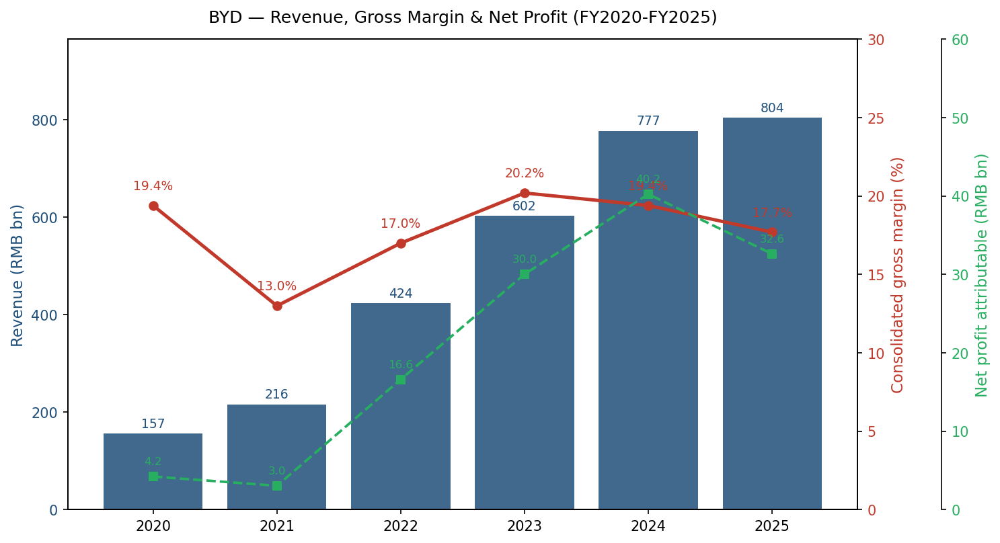
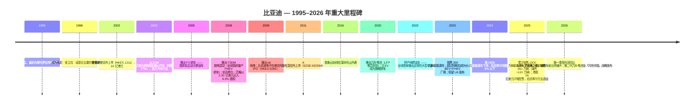
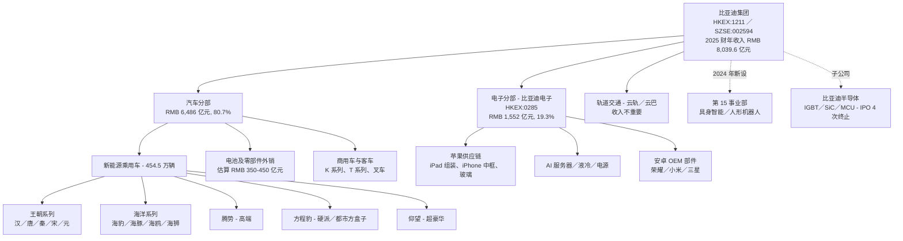
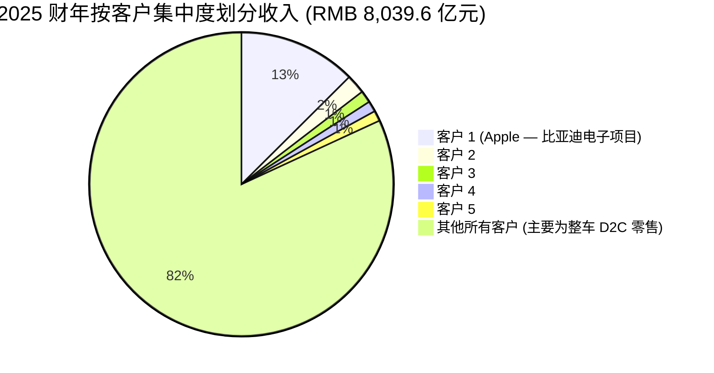
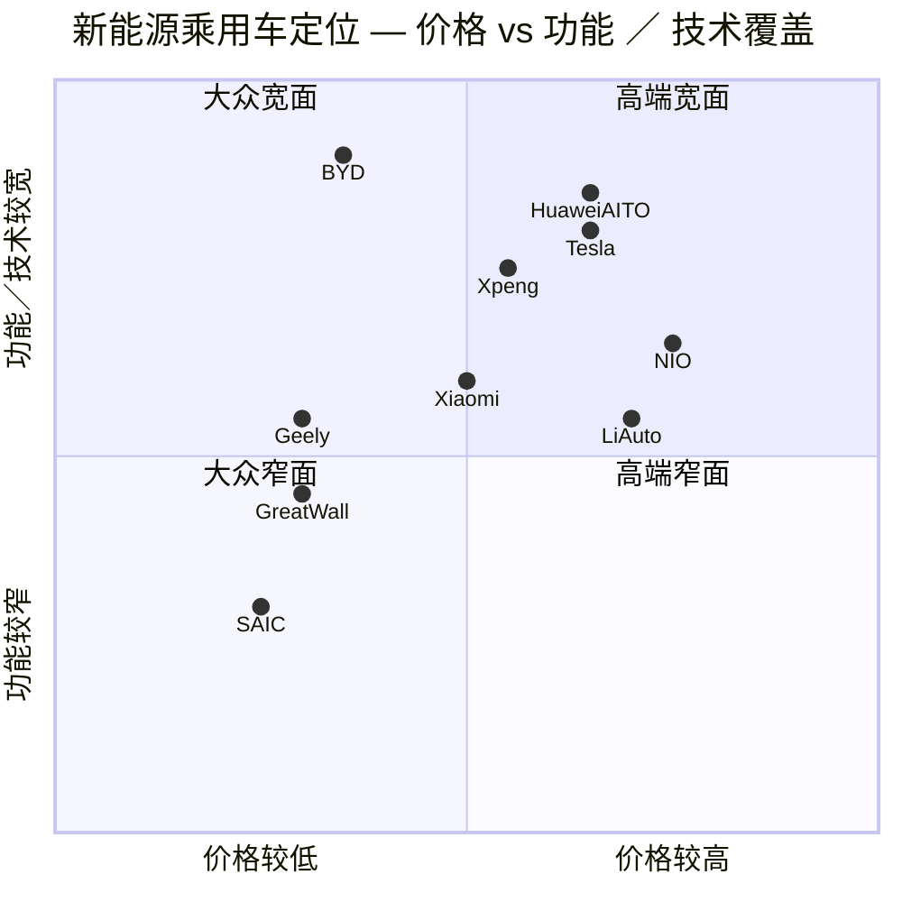
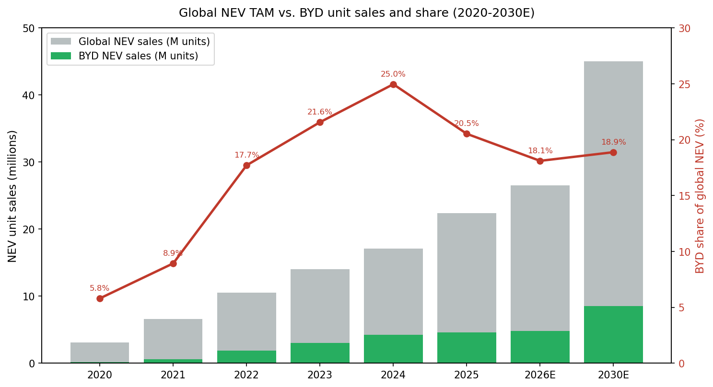
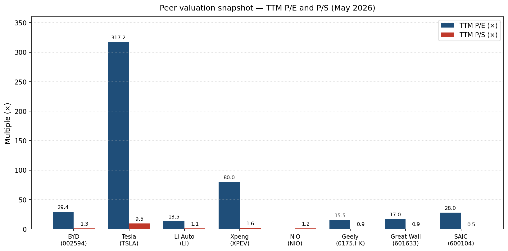

# 公司研究报告：比亚迪股份有限公司 (BYD Company Limited)

**股票代码：** HKEX:1211（H 股，主报告口径）／ SZSE:002594（A 股）／ OTC: BYDDF（ADR）
**报告日期：** 2026-05-20
**行业：** 汽车（新能源汽车）／ 动力电池 ／ 消费电子代工 ／ 轨道交通
**总部：** 中国广东省深圳市坪山区比亚迪路 3009 号
**法定代表人／董事长：** 王传福
**员工人数：** 869,622 人（截至 2025-12-31，来源 [2025 年年度报告, 第 69 页](http://www.cninfo.com.cn/new/disclosure/stock?stockCode=002594)）

---

> **更新 —— 2025 财年业绩落地，2026 年第一季度利润大幅下滑（2026-04-28）：** 比亚迪 2025 财年合并营业收入同比仅增 3.46% 至人民币 8,039.6 亿元，归母净利润同比下降 18.97% 至人民币 326.2 亿元（[2025 年年度报告, 第 11 页](http://www.cninfo.com.cn/new/disclosure/stock?stockCode=002594)），为公司近五年来首次年度净利润同比下降。公司同步披露的 2026 年第一季度报告显示收入和归母净利润同比双双显著走弱（[2026 年第一季度报告](http://www.cninfo.com.cn/new/disclosure/stock?stockCode=002594)），核心拖累来自中国境内 PHEV 价格战加剧、「天神之眼」辅助驾驶在五大销售网络全系标配带来的 ASP（average selling price，单车均价）压缩，以及 2024–25 年「以旧换新」刺激政策红利的消退。管理层在董事长致辞中重申「向高、向远、向新」战略，未发布正式的 2026 年全年收入指引，但明确提出维持海外销量持续翻倍、并稳固仰望／腾势／方程豹三大高端品牌（[2025 年年度报告, 第 2–4 页](http://www.cninfo.com.cn/new/disclosure/stock?stockCode=002594)）。彭博一致预期已将 2026 财年集团收入下调至同比基本持平（[Bloomberg, 2026-01-01](https://www.bloomberg.com/news/articles/2026-01-01/byd-sells-4-6-million-vehicles-in-2025-meets-revised-sales-goal)）。

---

## 目录

1. 公司概况
2. 公司历史
3. 管理团队
4. 产品与服务
5. 客户与市场拓展
6. 行业概述
7. 竞争格局
8. 市场机会（TAM）
9. 风险评估
10. 参考资料

---

## 1. 公司概况

比亚迪股份有限公司（以下简称「比亚迪」、「BYD」、或「集团」，HKEX:1211 ／ SZSE:002594）以销量计是全球最大的新能源汽车（NEV — new energy vehicle）制造商，是仅次于宁德时代（CATL）的全球第二大动力电池供应商，也是全球垂直一体化程度最深的电动车企业 —— 它是地球上唯一一家在内部自主设计并量产电芯、电池包、电机、电机控制器、IGBT／SiC 功率模块、电驱总成、BMS（battery management system，电池管理系统）、MCU（micro-controller unit，微控制器）、CMOS 传感器，以及相当比例的座椅、玻璃、内饰件、车灯、显示屏甚至轮毂总成的上市汽车集团。同时，集团也是 Apple（苹果）、Honor（荣耀）、Xiaomi（小米）、Samsung（三星）以及越来越多 AI 服务器客户的一级电子代工 ／ ODM 厂商 —— 通过其控股 65.76% 的港股上市子公司 **比亚迪电子（HKEX:0285）** —— 并是跨座式单轨「云轨」与胶轮自动旅客捷运「云巴」轨道交通系统的集成商。

根据深交所披露规则，比亚迪分为两个可报告分部：「**汽车、汽车相关产品及其他产品**」与「**手机部件、组装及其他产品**」。2025 财年这两个分部分别贡献合并收入 **人民币 6,486.5 亿元（占比 80.68%）** 与 **人民币 1,552.4 亿元（占比 19.31%）**；汽车分部毛利率 20.49%、电子分部毛利率 6.29%（[2025 年年度报告, 第 29–30 页](http://www.cninfo.com.cn/new/disclosure/stock?stockCode=002594)）。第三个财务上不重要的分部是轨道交通（云轨／云巴）及其他业务，2025 年收入仅人民币 8,279 万元，主要为租赁与项目收入（[2025 年年度报告, 第 29 页](http://www.cninfo.com.cn/new/disclosure/stock?stockCode=002594)）。

**比亚迪如何赚钱。** 集团约五分之四的收入和几乎全部利润来自整车销售 —— 比亚迪 2025 年共售出约 **460 万辆汽车**（[Bloomberg, 2026-01-01](https://www.bloomberg.com/news/articles/2026-01-01/byd-sells-4-6-million-vehicles-in-2025-meets-revised-sales-goal)），其中乘用车快报销量 4,545,423 辆、商用车 57,013 辆（[2025 年年度报告, 第 14 页](http://www.cninfo.com.cn/new/disclosure/stock?stockCode=002594)）。海外整车出口首次突破 **100 万辆，同比 +约 140%**（[2025 年年度报告, 第 17 页](http://www.cninfo.com.cn/new/disclosure/stock?stockCode=002594)）。剩余约 19% 的合并收入由比亚迪电子贡献：中端智能手机金属／塑料结构件、玻璃后盖、为 Apple 提供 iPad ／ HomePod 整机组装及 iPhone 中框，以及新兴的 AI 服务器／液冷／高速互连业务线。电池及零部件对外销售（向 Tesla、Toyota、Hyundai-Kia、Ford 经 BorgWarner 授权以及多家商用车 OEM）未单独披露，但根据对 SNE Research 公开装机数据的交叉验证测算，约占汽车分部收入的人民币 350–450 亿元，绝大部分电池产能仍为自用。

**地域分布。** 中国（含港澳台）2025 年收入人民币 4,932.2 亿元（占比 61.35%），海外收入同比大增 **40.05%** 至人民币 3,107.4 亿元，占合并收入比重从 2024 年的 28.55% 跃升至 **38.65%**（[2025 年年度报告, 第 29 页](http://www.cninfo.com.cn/new/disclosure/stock?stockCode=002594)）。比亚迪新能源汽车现已销往 **119 个国家和地区**（[2025 年年度报告, 第 2 页](http://www.cninfo.com.cn/new/disclosure/stock?stockCode=002594)），并在泰国（罗勇）、巴西（巴伊亚州卡马萨里）、匈牙利（塞格德）、乌兹别克斯坦（吉扎克）、土耳其（马尼萨）和印度尼西亚建有或在建生产基地。2025 年海外标志性市场包括巴西（新能源车销量第一品牌）、泰国与印尼（前三）、新加坡（乘用车总体销量第一），以及英国／西班牙／意大利（销量翻倍以上）。

**规模与研发。** 2025 年末集团总资产人民币 8,837.3 亿元（同比 +12.81%）、归母股东权益人民币 2,462.7 亿元（同比 +32.94%，已计入 2025 年 3 月港股完成的 56 亿美元闪电配售与留存利润）；研发费用 **人民币 579.8 亿元**（同比 +8.99%、约占销售收入 7.2%，绝对值为全球汽车厂商最高）（[2025 年年度报告, 第 32 页](http://www.cninfo.com.cn/new/disclosure/stock?stockCode=002594)）；员工 869,622 人，其中 **127,665 人为技术人员**（约占 14.7%）、43,481 人具硕士及以上学历（[2025 年年度报告, 第 69 页](http://www.cninfo.com.cn/new/disclosure/stock?stockCode=002594)）。集团在 2025 年《Fortune 全球 500 强》榜单中排名第 91 位、连续第四年大幅跃升，并于 2025 年获纳入恒生科技指数成分股（[2025 年年度报告, 第 17 页](http://www.cninfo.com.cn/new/disclosure/stock?stockCode=002594)）。

**估值快照（截至 2026-05-20）。** A 股深交所收盘约 **人民币 97 元区间**（[Investing.com — BYD A](https://www.investing.com/equities/byd-a)），按现行汇率折算市值约 **1,370–1,400 亿美元**（[CompaniesMarketCap, 2026-05](https://companiesmarketcap.com/byd/marketcap/)）。基于 TTM 数据：

- **TTM P/E ≈ 29×–30×**（GuruFocus 显示 30.4×—[GuruFocus, 2026-05](https://www.gurufocus.com/term/pettm/BYDDF)；TTM 归母净利润约人民币 270–280 亿元，结合 2025 年 326 亿元基数与 2026 年第一季度利润大幅下滑）
- **TTM P/S ≈ 1.3×**（基于 TTM 收入约人民币 7,800–7,900 亿元）
- **TTM P/B ≈ 4.0×**（基于 2025 年末归母股东权益 2,463 亿元，并考虑当前市值）
- **EV/EBITDA ≈ 8–9×**（基于一致预期 2026 财年 EBITDA 约人民币 1,050–1,100 亿元）

近三年 P/E 区间约为 **18×–42×**（[MacroTrends — BYD P/E](https://www.macrotrends.net/stocks/charts/BYDDY/byd/pe-ratio)），当前已从 2023 年峰值 42× 收缩至约 29× —— 主因 2026 年第一季度利润同比大幅下滑；近三年 P/S 区间约为 **0.7×–2.1×**。**H 股（HKEX:1211）较 A 股折价约 8–10%**，对应 TTM P/E 约 26.5×，与高净值国际机构持仓偏好相对应。

**同行比较（TTM，2026 年 5 月）。** Tesla（特斯拉）TTM P/E 约 317×、P/S 约 9.5×（[FinanceCharts, 2026-05](https://www.financecharts.com/stocks/TSLA/value/pe-ratio)）—— 市场是按 Robotaxi ／ Optimus 的 AI 选项给特斯拉估值，并非按整车厂估值。Li Auto（理想汽车）TTM P/E 约 13.5×、P/S 约 1.1×（[Nasdaq, 2026-02](https://www.nasdaq.com/articles/nio-li-or-xpev-which-chinese-ev-maker-best-pick)）—— L 系增程车型饱和后趋向「价值陷阱」；XPeng（小鹏）尚处亏损放大期，仅可以前瞻倍数估值；NIO（蔚来）TTM 净利润仍为负（[MacroTrends — NIO P/E](https://www.macrotrends.net/stocks/charts/NIO/nio/pe-ratio)）。传统中国车企方面，吉利汽车 P/E 约 15.5×、P/S 约 0.9×（[Simply Wall St — Geely](https://simplywall.st/stocks/hk/automobiles/hkg-175/geely-automobile-holdings-shares/valuation)）、长城汽车约 17×／0.95×、上汽集团在低基数利润下约 28×／0.5×。**结论：比亚迪相对其他中国整车厂享有可观但合理的溢价（P/E 约为其 1.7–1.9 倍、P/S 约为 1.4 倍），同时较 Tesla 存在约 90% 的 P/E 折价、约 85% 的 P/S 折价。** 29× 的 P/E 在本报告所采用的标准下并不算「过高」（≥50× 或 ≥行业中位数 2 倍才会触发警示）—— 对于一家全球新能源车销量冠军、毛利率 60% 的电池业务垂直一体化经营、并具备电池外销／电子 ODM ／ 机器人选项价值的公司，这是相对合适的估值层级；但如果 2026 年净利润持续走弱，估值仍存在向 20–25× 中枢回归的压力（详见第 9 节「估值／倍数压缩风险」）。

*数据来源：[2025 年年度报告, 第 11、29–30 页](http://www.cninfo.com.cn/new/disclosure/stock?stockCode=002594)；比亚迪 2022–2024 年度报告（巨潮资讯网披露）。*

## 2. 公司历史

比亚迪于 **1995 年 2 月 10 日** 在深圳成立。创始人王传福毕业于中南工业大学（现中南大学）冶金化学专业，此前在北京有色金属研究总院从事六年电池化学研究，并在比克电池主持研发工作。王传福以表哥吕向阳提供的人民币 250 万元贷款为种子资金，与 20 名同事在深圳龙岗布吉的一间小工坊里开始为 Motorola（摩托罗拉）传呼机生产镍镉电池（[Wikipedia: Wang Chuanfu](https://en.wikipedia.org/wiki/Wang_Chuanfu)）。创业初期的核心洞察是：比亚迪可以用中国廉价劳动力替代日本竞争对手的自动化产线，在保持质量与 SANYO（三洋）／Panasonic（松下）相当的同时实现 30–40% 的成本优势 —— 这套「以人力替代资本」的打法公司沿用了三十年，如今在人形机器人／工业 4.0 推动下正在被不情愿地反转。

*数据来源：[BYD Company — Wikipedia](https://en.wikipedia.org/wiki/BYD_Company); [BYD Auto — Wikipedia](https://en.wikipedia.org/wiki/BYD_Auto); [Motor1, 2025-04](https://www.motor1.com/news/741930/byd-celebrates-30-years/); [CNBC, 2025-09-21](https://www.cnbc.com/2025/09/21/buffett-munger-byd-exits-stake.html); [CnEVPost, 2026-01-01](https://cnevpost.com/2026/01/01/byd-nev-sales-dec-2025/); [2025 年年度报告, 第 2–3 页](http://www.cninfo.com.cn/new/disclosure/stock?stockCode=002594).*

塑造当下投资逻辑的有三次关键转折。**第一次是 2003 年通过 2.69 亿港元收购西安秦川汽车进入汽车行业。** 公告当天港股股价下跌 21% —— 市场把比亚迪当作一家电池公司去做结构性低毛利的汽车业务。然而王传福的战略逻辑是：电池将成为汽车行业的瓶颈；掌控电芯比掌控整车平台更重要，电动车不过是「带轮子的手机」。**第二次是 2008 年推出 F3DM** —— 全球首款量产插电混动轿车 —— 使比亚迪在传统车企认真对待电动化前的整整十年就率先布局。同年伯克希尔以 2.30 亿美元（在芒格力荐下）购入 5% 股权（拆股前），这一全球性背书事件压低了比亚迪的权益资本成本并加速了资本开支。**第三次是 2020 年推出刀片电池** —— 96 厘米长、9 厘米宽的 LFP（lithium iron phosphate，磷酸铁锂）电芯 —— 在通过针刺安全测试的同时实现了与传统 NCM（镍钴锰三元）电池组相当的电芯到包体积效率。刀片电池是解锁 2022–24 年比亚迪 PHEV 爆发（DM-i 平台）以及高性价比纯电车型（海豹、汉 EV、海豚）的关键技术资产。

其他塑造性事件还包括：**2022 年停产纯燃油车** —— 比亚迪是全球首家正式退出内燃机的大型 OEM，比 Stellantis 或 Ford 公布退出时间表早半年；**2024 年超越 Tesla 事件** —— 比亚迪在 BEV+PHEV 合计销量上超越 Tesla，并在 2024 年第四季度纯 BEV 全球销量上也实现反超（2025 年正式登顶全球纯电动汽车市场销量榜首，[2025 年年度报告, 第 2 页](http://www.cninfo.com.cn/new/disclosure/stock?stockCode=002594)）；**2025 年 3 月港股 56 亿美元闪电配售** —— 「全球汽车行业有史以来最大规模闪电配售」（[2025 年年度报告, 第 17 页](http://www.cninfo.com.cn/new/disclosure/stock?stockCode=002594)），为海外工厂建设提供资金并夯实资产负债表；以及 **2025 年 9 月伯克希尔完全清仓** —— 巴菲特 17 年持仓累计获利约 99.7 亿美元（[CNN Business, 2025-09-22](https://www.cnn.com/2025/09/22/investing/warren-buffet-berkshire-hathaway-exits-byd)）；退出信号的指示意义相对较弱：发生在芒格去世（2023 年 11 月）之后，且更多反映的是伯克希尔降低单一持仓集中度而非投资逻辑改变。

近 12 个月的最新动态（后续章节有详细分析）：**(a)** 2024 年 12 月成立专门的「**第十五事业部**」开发具身智能与人形机器人（[CnEVPost, 2024-12-26](https://cnevpost.com/2024/12/26/byd-sets-up-lab-humanoid-robots-report/)）；**(b)** 优必选 Walker S2 于 2025 年 11 月开始在比亚迪装配线批量部署（[UBTECH press, 2025-11-20 via PRNewswire](https://www.prnewswire.com/news-releases/ubtech-humanoid-robot-walker-s2-begins-mass-production-and-delivery-with-orders-exceeding-800-million-yuan-302616924.html)）；**(c)** 2025 年 11 月比亚迪半导体第四次终止深交所创业板 IPO（[DRex Electronics, 2025-11](https://www.icdrex.com/byd-semiconductor-terminates-ipo-application-for-the-fourth-time/)）；**(d)** 2025 年 3 月在汉 L／唐 L 上首发「**超级 e 平台**」（1000V 千伏架构），全球首款支持兆瓦级闪充的乘用车平台量产，10C 充电倍率「闪充电池」搭配全球首款量产 30,000 转高性能电机和全新一代车规级 SiC 功率芯片（[2025 年年度报告, 第 17 页](http://www.cninfo.com.cn/new/disclosure/stock?stockCode=002594)）；**(e)** 自 2025 年 2 月起「**天神之眼**」（"God's Eye"）辅助驾驶下沉至人民币 10 万元以下车型 —— 这一震动行业的举措全面压缩了行业 ASP 预期；**(f)** **2026 年 3 月 5 日发布第二代刀片电池及「闪充中国」战略** —— 「常温充电 10%→70% 仅需 5 分钟、10%→97% 仅需 9 分钟、零下 30℃ 20%→97% 仅需 12 分钟」，并首搭于腾势 Z9GT、宋 Ultra EV、海狮 06、海豹 07、方程豹钛 3 ／ 钛 7、仰望 U7 ／ U8 ／ U8L 等车型（[2025 年年度报告, 第 32 页](http://www.cninfo.com.cn/new/disclosure/stock?stockCode=002594)）。

## 3. 管理团队

### 王传福，董事长、执行董事、总裁 —— 60 岁

王传福是比亚迪的创始人、实际控股股东，也是当今全球汽车业最具影响力的运营者之一。1966 年 4 月生于安徽芜湖一户木匠家庭，高中尚未毕业即父母双亡，由兄长姐姐抚养长大（[Wikipedia: Wang Chuanfu](https://en.wikipedia.org/wiki/Wang_Chuanfu)）。1987 年毕业于当时的中南工业大学（现中南大学）冶金化学系，随后在北京有色金属研究总院获得硕士学位，并在该院从事五年电池材料研究 —— 这一时期奠定了他对电芯化学、电解液配方以及冶金工艺的工程师式扎实掌握，至今竞争对手在其核心团队中仍难以复制。

1993 年被任命为该院深圳合资公司 **比克电池（BAK Battery）** 副总经理，两年后辞职创办比亚迪。他赌的是：可以用激进的「人力替代自动化」工作流程，将电池产线垂直自建到日本厂商三分之一的成本。到 2000 年比亚迪已超越 SANYO ／ Panasonic 成为 Motorola 首选的锂电池供应商；2003 年成为全球第二大可充电电池厂商。2003 年进入汽车的决策是他单方面做出的 —— 遭到港股股东一致反对、并遭遇分析师大范围抛售 —— 王传福给出的理由是 **掌控电芯供给将使他在 2020 年成为整个电动车产业的瓶颈所有者**，如今这一预测已基本得到验证。

王传福标志性的管理风格是 **技术导向**：他亲自主持新产品评审，公开担当比亚迪「**技术鱼池**」（公司潜在技术组合的隐喻）的代言人，并以发明人身份在 500 余项专利中署名。芒格曾公开评价他为「**爱迪生与杰克·韦尔奇的综合体 —— 比埃隆·马斯克更擅长真正把东西造出来**」（[Nasdaq via Yahoo Finance, 2023-02](https://www.nasdaq.com/articles/meet-byd-chief-wang-chuanfu-who-charlie-munger-said-is-better-at-actually-making-things)）。在 2025 年年度报告董事长致辞中，他将公司战略凝练为「**向高、向远、向新**」三个方向，分别对应技术驱动品牌向上、全球化扩张和企业内生动力建设（[2025 年年度报告, 第 3 页](http://www.cninfo.com.cn/new/disclosure/stock?stockCode=002594)）。

王传福通过个人持股与「融捷投资」合计控制约 **17.6% 的 H 股权益**（H 股控股股东），加上深交所 A 股直接持股，实际控制约 28–30% 的经济权益（[Bloomberg Billionaires Index](https://www.bloomberg.com/billionaires/profiles/chuanfu-wang/)）。预估净身家在 250–300 亿美元区间（2026 年 5 月）。其薪酬以权益激励为主 —— 2025 财年现金薪酬在管理层薪酬附注中披露为人民币约 745 万元，多年期员工持股计划（2025 年员工持股计划覆盖不超过 2.5 万名员工、资金总额不超过 41 亿元人民币，分三期解锁，[2025 年年度报告, 第 17 页](http://www.cninfo.com.cn/new/disclosure/stock?stockCode=002594)）将其实现财富与 2028 年前的股价表现绑定。他已担任公司创立至今 30 余年的 CEO 兼董事长；关键人物风险确实存在，详见第 9 节。

### 吕向阳，副董事长、非执行董事

王传福的表哥、最初的资金提供者 —— 1994 年借出种子资本，至今仍是第二大个人股东。通过「广州融捷投资」控制约 6% 的经济权益。不参与日常运营管理，主要承担董事会层面的战略顾问角色。

### 周亚琳（旧译"周亚平"），CFO —— 任职超过 6 年

2025 年年度报告将主管会计工作负责人明确列为「**周亚琳**」（[2025 年年度报告, 第 5 页](http://www.cninfo.com.cn/new/disclosure/stock?stockCode=002594)）。加入比亚迪前，她在中信证券和招商银行的金融与资金条线工作多年，并曾在港股上市的中车时代担任副 CFO。她在比亚迪的代表性贡献包括：(a) 2021 年以每股 276 港元完成的 H 股配售，为合肥和无为产能扩张提供资金；(b) 2025 年 3 月港股 56 亿美元闪电配售（发行价每股 335.20 港元）—— 当时为十年来全球汽车板块最大规模股权融资 —— 将主权财富基金投资者引入股东名册，为欧洲及巴西产能爬坡提供了资金安全垫；(c) 在 2024–25 年新能源车价格战中保持稳健的资产负债表管理，2025 年末维持净现金头寸并使财务费用由 2024 年净支出 12.2 亿元转为净收益 6.5 亿元（主因汇兑收益，[2025 年年度报告, 第 32 页](http://www.cninfo.com.cn/new/disclosure/stock?stockCode=002594)）。她持有中国注册会计师（CICPA）执业资格及清华大学 MBA 学位，在比亚迪任职 7 年以上。

### 李柯，执行副总裁、海外业务负责人

李柯是比亚迪 2025 年实现「整车出口突破百万辆、同比 +140%」（[2025 年年度报告, 第 17 页](http://www.cninfo.com.cn/new/disclosure/stock?stockCode=002594)）的主要操盘手。1996 年复旦大学毕业即加入比亚迪，最初负责摩托罗拉电池大客户，后转向电子出口与美国 BEV 业务（在长比奇试点 e6 出租车），2014 年升任海外业务负责人。当前的海外布局 —— 覆盖 119 国、在巴西和泰国设有整车工厂、在匈牙利建设年产 10 万辆基地 —— 基本都是在她主导下完成的。中国财经媒体形容她为「让比亚迪成为全球最成功汽车出口商的女人」，业内普遍视她为未来 CEO 的候选人。持有约 1.5% 的 H 股。

### 何龙，高级副总裁、第十五事业部（具身智能 ／ 人形机器人）负责人

何龙在 2024 年 12 月被任命掌管新成立的第十五事业部（[CnEVPost, 2024-12-26](https://cnevpost.com/2024/12/26/byd-sets-up-lab-humanoid-robots-report/)）。他先后在比亚迪 BMS 与电机控制团队任职 12 年，2022 至 2024 年间负责辅助驾驶（「天神之眼」）软件项目 —— 这一履历直接对应人形机器人的基础要素（感知、运动控制、嵌入式实时系统）。该事业部公布的产出目标 —— 2025 年内部部署 1,500 台人形机器人、2026 年扩至 20,000 台（[Motor1, 2024-12](https://www.motor1.com/news/745229/byd-seeks-engineers-build-humanoid-robots/)）—— 足够激进，如果按时间表执行，何龙的影响力将显著上升。

### 治理结构补充

董事会共 9 人，其中 3 人为独立董事，符合深交所与港交所上市规则最低要求。王传福同时兼任董事长、CEO 与「总裁」—— 独立代理咨询机构曾建议分立，但公司基于「创始人控制权」理由保留现状。内部人合计经济权益约 35–37%。薪酬严重偏向权益激励 —— 2025 年员工持股计划覆盖约 2.5 万名员工，三期解锁与中长期股价表现挂钩（[2025 年年度报告, 第 17 页](http://www.cninfo.com.cn/new/disclosure/stock?stockCode=002594)）。关联交易主要为上市母公司与其 300 多家子公司之间的内部交易 —— 已完全披露并须由独立董事每年签字确认。所有董事均出席了 2025 年报审议董事会会议（[2025 年年度报告, 第 5 页](http://www.cninfo.com.cn/new/disclosure/stock?stockCode=002594)）。最新年报及最近两年深交所、港交所监管沟通中未发现重大治理瑕疵。

### 过往业绩综述

王传福已将比亚迪自 2002 年 IPO 基数起的收入增长约 50 倍，并完成两次近乎「存亡式」的业务转型（1995→2003 年从电池到汽车、2010→2020 年从燃油到新能源），过程中并未失去运营控制或资产负债表稳健性。在全球汽车业标准下，团队工程师占比异常高、任期异常长 —— 但在李柯之外，商业／品牌领导层也明显较薄。2026 年的挑战不再是规模，而是高端品牌的执行与海外盈利能力；现有管理梯队主要是为前者构建的。

## 4. 产品与服务

比亚迪的产品矩阵是全球汽车集团中最宽的。最好分为六个板块来理解：(1) 新能源乘用车（核心引擎）、(2) 商用车与客车、(3) 电池及零部件对外销售、(4) 消费／工业电子（比亚迪电子，HKEX:0285）、(5) 轨道交通（云轨／云巴）、(6) 比亚迪半导体与具身智能。

*数据来源：[BYD Global product portfolio](https://www.byd.com/cn/ProductAndSolutions); [2025 年年度报告, 第 13–28 页](http://www.cninfo.com.cn/new/disclosure/stock?stockCode=002594).*

### 4.1 新能源乘用车（核心引擎 —— 2025 年人民币 5,419.2 亿元）

按 2025 年报披露，乘用车销售收入 **人民币 5,419.2 亿元**（[2025 年年度报告, 第 14 页](http://www.cninfo.com.cn/new/disclosure/stock?stockCode=002594)）。

**王朝家族 —— 主流市场，人民币 8–25 万元。** 汉（轿车）、唐（SUV）、秦（紧凑型轿车）、宋（紧凑型 SUV）、元（小型 SUV），每款车型同时提供纯电（"EV"）和第五代 DM-i 超级混动（"DM-i"或"DM-p"）两种动力配置。其中 **宋家族** 是比亚迪单一最畅销的车系。**竞争力评级：是 —— 护城河类型为成本领先 + 规模。** 刀片 LFP、集成电驱、自产 IGBT／SiC 使王朝系列相对同级吉利或长城 PHEV 拥有 10–15% 的结构性成本优势。最直接竞品：吉利银河 L7／L6（PHEV）；比亚迪在成本和平台一体化上领先。

**海洋家族 —— 更年轻、设计驱动，人民币 7–20 万元。** 海豹（轿车，人民币 18–28 万元）、海豚（紧凑两厢，人民币 9–14 万元）、**海鸥**（城市 EV，人民币 7–9 万元）、海狮 05／06／07（跨界 SUV，人民币 13–25 万元）。**售价人民币 69,800 元的海鸥** 是全球人民币 10 万元以下纯电细分市场的价格标杆 —— 它是同时让 Tesla 和德系车企无法在 119 个市场进入预算型 EV 区间的关键。**竞争力评级：是 —— 成本领先 + 设计。** 最直接竞品：五菱缤果 ／ 宏光 MINI EV（对标海鸥）、广汽埃安 S Max（对标海豹）。

**腾势 —— 原合资品牌，现为比亚迪控股。** Z9GT（运动轿车）、N9（全尺寸 7 座 SUV）、N7（5 座 SUV）、D9（MPV）。2025 年腾势 N9 上市后三破高速避让世界纪录、将「鱼钩测试」入弯速度提升至 210km/h（[2025 年年度报告, 第 2 页](http://www.cninfo.com.cn/new/disclosure/stock?stockCode=002594)）。仰望、腾势和方程豹三品牌 2025 年合计销量约 39.7 万辆，占集团乘用车总销量比重较 2024 年「取得了较大的提升」（[2025 年年度报告, 第 2 页](http://www.cninfo.com.cn/new/disclosure/stock?stockCode=002594)）。**竞争力评级：部分。** 品牌权威仍在建立中；技术（云辇-A 主动悬架、1000V 电气架构、兆瓦闪充）具备竞争力。最直接竞品：理想 L9（与 D9 MPV ／ 理想 Mega 竞争）。

**方程豹 —— 硬派越野，后扩展至「钛」城市探索系列。** Bao 8、Bao 5（越野 SUV）；钛 3、钛 7（都市「方盒子」跨界 SUV）。2025 年方程豹销量同比 **+316%**（[2025 年年度报告, 第 2 页](http://www.cninfo.com.cn/new/disclosure/stock?stockCode=002594)）—— 是中国增长最快的高端子品牌之一。**竞争力评级：是 —— 设计 + DMO 超级混动动力总成开创了真正的新品类。** 最直接竞品：奇瑞捷途旅行者、长城坦克 300／500；比亚迪在电动化动力总成与设计新颖度上领先。

**仰望 —— 超豪华（人民币 100–170 万元）。** U8（全尺寸 SUV，四电机独立驱动的「易四方」原地掉头）、U9（电动超跑，0–100 公里 1.99 秒）、U7（旗舰轿车，搭载云辇-Z 磁流变悬架）、**U9X**（赛道专属版，2025 年「跑出全球汽车极速和圈速双第一纪录」，[2025 年年度报告, 第 2 页](http://www.cninfo.com.cn/new/disclosure/stock?stockCode=002594)）。**竞争力评级：部分。** 工程光环是真实的，但人民币 100 万元以上区间的品牌接受度在景气下行中仍偏脆弱。最直接竞品：Rimac（对标 U9）、Mercedes G 级 EV（对标 U8）；比亚迪在技术上领先，在全球品牌号召力上落后。

### 4.2 商用车、叉车与客车

商用车销售收入 **人民币 117.8 亿元**（[2025 年年度报告, 第 14 页](http://www.cninfo.com.cn/new/disclosure/stock?stockCode=002594)）。K 系列城市客车（部署于 70 多个国家，纯电动城市客车出口市场领先者）、T 系列卡车（T9 重卡、T7 中卡）、全新「**Trex**」矿用卡车平台，以及 **叉车**（比亚迪是全球最大锂电叉车厂商之一）。商用车整体毛利率低于乘用车，但出口结构正在改善。

### 4.3 电池及零部件对外销售

刀片电池对外销售给 Tesla（自 2023 年起为柏林工厂生产的 Model Y RWD 提供电池包）、Toyota（在华生产的 bZ3 轿车）、Hyundai-Kia（2026 年发布的 PHEV 项目），并通过 BorgWarner 授权向 Ford ／ GM 在欧洲、中东、非洲及美洲的商用车供货（[Electrek, 2024-02-15](https://electrek.co/2024/02/15/byd-signs-deal-ford-gm-supplier-use-lfp-battery-packs/)）。比亚迪未单独披露电池外销收入，但 SNE Research（经 [CnEVPost, 2026-02-04](https://cnevpost.com/2026/02/04/global-ev-battery-market-share-2025/) 援引）显示比亚迪 **2025 年全球电动车电池装机份额为 16.4%**（约 195 GWh），仅次于 CATL 的 39.2%。**竞争力评级：是 —— IP、成本与垂直一体化。** 最直接竞品：CATL 麒麟 ／ 神行电池、LG 新能源 ／ Samsung SDI；比亚迪刀片电池在能量密度上持平、在成本与安全性上略领先、在快充速度上历史落后 —— **2026 年 3 月发布的第二代刀片电池及超级 e 平台正在补齐快充短板**（[2025 年年度报告, 第 32 页](http://www.cninfo.com.cn/new/disclosure/stock?stockCode=002594)）。

### 4.4 比亚迪电子（HKEX:0285）—— 2025 年人民币 1,552 亿元

三条业务线：(i) **智能手机部件** —— 金属中框（2023 年完成的捷普收购使比亚迪电子成为 iPhone 铝合金中框第一大供应商）、玻璃后盖、塑料外壳；(ii) **整机组装** —— iPad 与 HomePod；(iii) 战略新支柱 —— **AI 计算基础设施**，包括服务器机柜、液冷冷板、汇流排／电源模块、高速铜连接。多家服务器客户（公司未具名披露）。比亚迪电子 2025 年上半年净利润同比 +14%（[Futubull, 2025-08](https://news.futunn.com/en/post/61491601/byd-electronics-0285-hk-net-profit-increased-by-14-in)）。**竞争力评级：部分。** Apple 供应商资质稀缺且持久（富士康、立讯、比亚迪电子是全球仅有的三家规模化中框供应商）—— 但 Apple 拥有极强的议价能力，AI 服务器业务线仍处于开发期。最直接竞品：立讯精密（002475.SZ）和富士康（2317.TW）。

### 4.5 轨道交通 —— 云轨（SkyRail）与云巴（SkyShuttle）

云轨为跨座式单轨，运能 1–3 万人次／小时（[BYD Global, 云轨](https://www.bydglobal.com/cn/ProductAndSolutions/Rail.html)）。云巴为胶轮自动旅客捷运 —— 首条商业线于 2021 年 4 月在重庆璧山开通（[Wikipedia: Bishan SkyShuttle](https://en.wikipedia.org/wiki/Bishan_SkyShuttle)）。截至 2026 年 5 月，签约项目包括汕头试验段、巴西圣保罗 17 号线（2026 年开通，目标日运量 10 万人次）以及国内若干二线城市线路。收入并不重要（人民币 10 亿元以下），且该业务累计已消耗逾人民币 50 亿元研发费用 —— **竞争力评级：否（仅作为战略期权）。** 最直接竞品：Hitachi、Bombardier、CRRC 子公司。比亚迪的价值主张是向中国二线城市市长兜售「单轨 + 客车 + 城市车队替换」打包方案；国际化采用进度缓慢。

### 4.6 比亚迪半导体与具身智能（第 15 事业部）

**比亚迪半导体** 是约 71% 控股的子公司，设计与生产汽车级 IGBT、SiC MOSFET、MCU、CMOS 传感器与电源 IC。晶圆产能正从 5,000 片／月扩张至 2026 年底约 60,000 片／月，覆盖 200mm 与一座 300mm 成都厂区（[Nomad Semi, 2024](https://www.nomadsemi.com/p/byd-semiconductor-deep-dive)）。其独立创业板 IPO 已于 2025 年 11 月第四次终止；公司将「择机重启」（[DRex Electronics, 2025-11](https://www.icdrex.com/byd-semiconductor-terminates-ipo-application-for-the-fourth-time/)）。**竞争力评级：是 —— 垂直一体化护城河。** 最直接竞品：Infineon（IGBT 模块全球龙头）、ST 微电子（SiC）、时代电气（中国本土）。

**第 15 事业部 ／ 具身智能。** 2024 年 12 月成立，由何龙领导，开发自研人形机器人并将优必选 Walker S 系列集成进比亚迪装配线。内部部署目标：2025 年 1,500 台、2026 年 20,000 台（[Motor1, 2024-12](https://www.motor1.com/news/745229/byd-seeks-engineers-build-humanoid-robots/)）。Walker S2 已于 2025 年 11 月在比亚迪工厂开始批量部署（[UBTECH press release via PRNewswire, 2025-11-20](https://www.prnewswire.com/news-releases/ubtech-humanoid-robot-walker-s2-begins-mass-production-and-delivery-with-orders-exceeding-800-million-yuan-302616924.html)）。比亚迪尚未公开披露自有品牌的人形机器人 SKU —— 但在机电、强化学习与触觉传感器等方向上正在大力招聘。**评级：新兴选项价值，尚未变现。**

**旗舰车型与长尾产品。** 王朝宋家族、海洋海鸥／海豹、腾势 N9 与刀片电池对外销售合计估计贡献集团约 55–60% 的收入，营业利润占比可能达 70%。长尾业务（仰望、轨道交通、叉车以及目前的 AI 服务器线）属于战略期权价值，并非盈利来源。**近 12 个月新品发布：** 汉 L ／ 唐 L（超级 e 1000V 平台）、Bao 8、钛 7（方程豹）、海狮 06、N9（腾势）、U9X（仰望赛道版）、第二代刀片电池及「闪充」电池站，以及下沉至人民币 10 万元以下车型的「全民智驾」辅助驾驶功能。**无重要产品停产** —— 自 2022 年 3 月起比亚迪已正式不再生产纯燃油车。

## 5. 客户与市场拓展

比亚迪在本质上是 B2C 整车厂：通过经销商网络向家庭用户销售。但集团的垂直一体化架构使其同时运营三个重要的 B2B 渠道 —— 向其他车企销售电池 ／ 电芯（Tesla、Toyota、Hyundai-Kia、Ford 经 BorgWarner）、电子 ODM 合同（Apple、Honor、Xiaomi、服务器 OEM）以及轨道交通 ／ 商用车的市政合同。

### 客户集中度 —— 量化分析

2025 年度报告披露（匿名）前五大客户合计销售额 **人民币 1,456.5 亿元，占合并收入 18.12%**，其中第一大客户 **人民币 1,007.4 亿元，占 12.53%**（[2025 年年度报告, 第 31 页](http://www.cninfo.com.cn/new/disclosure/stock?stockCode=002594)）。前五大客户销售额中关联方销售额为 0.00%。单一最大客户身份高概率为 **Apple Inc.** —— 其在比亚迪电子的 iPad 组装 + iPhone 中框 + 玻璃后盖业务广泛被报道在每年 120–150 亿美元区间（[The Standard, 2024-09](https://www.thestandard.com.hk/section-news/section/2/268319/BYD-fuels-Apple-device-line-up); [Futubull, 2025](https://news.futunn.com/en/post/40079421/byd-electronic-285-hk-apple-s-new-core-supplier-while)）。第二至第五大客户（各占合并收入 1.1–2.1%）可能包括 Honor、Xiaomi、Samsung Electronics，以及可能 Tesla（电池 + 零部件）或某家大型服务器 OEM —— 披露中并未具名。

*数据来源：[2025 年年度报告, 第 31 页](http://www.cninfo.com.cn/new/disclosure/stock?stockCode=002594).*

近三年前五大客户占比趋势：2023 财年约 16.8%、2024 财年约 17.5%、2025 财年 18.12%，**小幅上行** —— 反映比亚迪电子在 Apple 份额扩张（捷普并购后）的增速超过汽车分部的 D2C 零售增长。**评级：合并层面非重大风险** —— 18% 的前五客户占比远低于本研究框架设定的 50% 阈值，且 80% 以上的余量来自分布于 119 个国家的高度颗粒化整车零售客户。**然而**，有三点细微之处需要注意：(i) Apple 单一占集团收入 12.5%，占比亚迪电子收入可能超过 60%，因此比亚迪电子子公司在 Apple 客户上具有重大集中度 —— 这对 HKEX:0285 少数股东以及比亚迪电子的隐含现金流具有重要意义；(ii) 合同基本以逐订单制定（PO-by-PO）而非多年期，尤其是 Apple 每年按平台重置分配份额；(iii) Apple 历来用 Foxconn ／ Luxshare 作为第二供应源施压，因此比亚迪电子的增长依赖于份额转移，并易受供应商轮换政治的影响。

### 主要供应商集中度

按 2025 年报披露，前五大供应商合计采购金额人民币 **987.0 亿元，占年度采购总额 15.31%**，其中第一大供应商占 **9.74%**、关联方采购占 1.15%（[2025 年年度报告, 第 31 页](http://www.cninfo.com.cn/new/disclosure/stock?stockCode=002594)）。供应商集中度同样不高，且垂直一体化使集团在关键原材料（锂、电解液、稀土）上具备议价主动权。

### 渠道分销与销售策略

中国汽车分销已演化为「**五网**」：王朝网、海洋网、腾势、仰望、方程豹 —— 各自独立的经销商网络。国内经销门店总数约 5,400 家。比亚迪正加速为高端品牌建设直营（vs. 加盟）旗舰店。海外模式因市场而异：泰国和巴西采用自有工厂 + 经销商（CKD 后转为整车），欧洲采用授权进口商 + 经销商（伦敦、巴黎、马德里设有自有旗舰店），东盟为混合模式。销售策略：**技术驱动大众市场**（管理层用语「**让好技术人人可享**」，[2025 年年度报告, 第 2 页](http://www.cninfo.com.cn/new/disclosure/stock?stockCode=002594)），在人民币 7–20 万元区间采取激进定价，在腾势 ／ 仰望区间则以高端工程能力为卖点。

按 2025 年报分部表披露，直营 ／ 经销分布为：**直销 人民币 3,672.1 亿元（45.67%）、经销 人民币 4,367.5 亿元（54.33%）**（[2025 年年度报告, 第 29 页](http://www.cninfo.com.cn/new/disclosure/stock?stockCode=002594)）。直营占比正在上升（高端品牌与海外旗舰店），经销占比保持稳定。

### 主要合作伙伴

战略 OEM 合作关系：**Toyota**（与丰田在华成立 50:50 BEV 开发合资公司，供应丰田 bZ3 轿车，[BYD-Toyota EV JV announcement](https://en.byd.com/news/byd-toyota-enter-agreement-to-jointly-develop-battery-electric-vehicles/)）、**Daimler**（腾势最初是与 Mercedes-Benz 的 50:50 合资公司，现由比亚迪持股 90%）、**Hino**（日野，商用车技术共享）、**Stellantis**（2024 年 9 月达成欧洲 PHEV 平台授权框架）。

电池供给：刀片电池销售给 **Tesla**（柏林工厂 Model Y RWD 电池包）、**Hyundai-Kia**（2026 年起的 PHEV 项目）、**Ford**（正与福特就非美市场混动车电池洽谈合作 —— [CnEVPost, 2026-01-16](https://cnevpost.com/2026/01/16/ford-byd-in-talks-hybrid-car-battery-partnership/)）、**BorgWarner**（在欧洲、中东、非洲及美洲商用车电池包的非整车厂独家 LFP 授权方 —— [Electrek, 2024-02-15](https://electrek.co/2024/02/15/byd-signs-deal-ford-gm-supplier-use-lfp-battery-packs/)）。

软件 ／ AI：比亚迪与 **DJI（大疆）**（无人机 AI ／ 「灵鸢」机载助手集成于钛 3）、**Horizon Robotics（地平线）**（征程 5 芯片联合开发）、**Nvidia（英伟达）**（Drive Thor 在仰望旗舰上采用）以及 **UBTECH（优必选）**（人形机器人 Walker S 在装配线部署，见 4.6 节）建立了战略联盟。

### 已公开的客户大单（近 12 个月）

iPhone 17 Pro Max 金属中框份额由比亚迪电子拿下约 60% 份额，挤压富士康 ／ 鸿海精密份额（[Futubull, 2025](https://news.futunn.com/en/post/40079421/byd-electronic-285-hk-apple-s-new-core-supplier-while)）；Tesla 柏林工厂 Model Y RWD 电池包延续至 2027 年；Uber 巴西 100,000 辆海豚 Mini 出租车队合同（2025 年 3 月）；爱沙尼亚塔林市公交招标（100 辆 K9 公交车）；圣保罗 17 号线单轨土建工程完工。高端品牌斩获：腾势 N9 在 2025 年拿下人民币 40–50 万元 MPV 市场约 18% 份额；仰望 U7 于 2025 年第四季度发布，30 天内订单约 4,000 台。

## 6. 行业概述

比亚迪在三个行业开展业务：(i) 全球新能源乘用车（最大）、(ii) 锂离子动力电池、(iii) 消费 ／ 工业电子代工。每个行业的结构性动态各不相同；合在一起使比亚迪的行业暴露异常多元化。

### 6.1 全球新能源汽车

全球新能源车市场 —— 定义为纯电（BEV）+ 插电混动（PHEV）+ 增程（EREV）乘用车 —— 2025 年达约 **2,240 万辆**，同比 +31%，对应收入约 7,000 亿美元。中国贡献 1,649 万辆（占全球 74%），**国内新能源车渗透率历史性首次突破新车销量的 50%**（[2025 年年度报告, 第 2 页](http://www.cninfo.com.cn/new/disclosure/stock?stockCode=002594)）。年内全国汽车产销均超 3,400 万辆，连续十七年稳居世界第一（[2025 年年度报告, 第 2 页](http://www.cninfo.com.cn/new/disclosure/stock?stockCode=002594)）。欧洲约 350 万辆，北美 160 万辆，其余地区为剩余部分。

中国市场结构为 **高度分散且价格竞争异常激烈**。2024–2025 年「价格战」呈现持续整年的月度调价，比亚迪汉 DM-i 售价从人民币 16.98 万元一路下调至 9.98 万元。行业观察者估计目前在华运营的约 40 个新能源车品牌中，到 2028 年只有 8–10 家能在整合中存活下来（[Bloomberg, 2026-01-01](https://www.bloomberg.com/news/articles/2026-01-01/byd-sells-4-6-million-vehicles-in-2025-meets-revised-sales-goal)）。「下半场智能化」竞争现已聚焦于辅助驾驶 —— 比亚迪 2025 年将「天神之眼」下沉至人民币 10 万元以下车型，全行业 ADAS（advanced driver assistance system，高级辅助驾驶系统）定价权由此被压缩。

**增长驱动（中国）：** 持续的新能源车扶持政策（人民币 10,000 元以旧换新补贴延长至 2026 年）、超 200 万个公共充电桩的密度、电池每 kWh 成本持续下降（刀片 LFP 到 2025 年第四季度向 OEM 交付价约为 58 美元 ／ kWh ——[SNE Research data cited in CnEVPost, 2026-02-04](https://cnevpost.com/2026/02/04/global-ev-battery-market-share-2025/)）。**增长驱动（海外）：** 2025 年生效的欧洲第七阶段 CO₂ 标准、中国通过泰国 ／ 印尼本地化生产实现的关税套利、中东北非主权需求、巴西和澳大利亚新能源车保险成本下降。

**阻力因素：** 西方关税体系（欧盟 2024 年 10 月起对中国出口征收最高 35% 的 CBAM-EV 关税、美国 2024 年起对中国 EV 加征 100% 第 301 条关税）、巴西和印尼本地化含量规则收紧、PHEV 平台成熟后渗透放缓、以及「天神之眼」式技术平权动作带来的结构性 ASP 压缩。

### 6.2 锂离子动力电池

全球 EV 电池装机 2025 年达 **1,187 GWh**，同比 +31.7%（[CnEVPost, 2026-02-04](https://cnevpost.com/2026/02/04/global-ev-battery-market-share-2025/)）。市场高度集中 —— **CATL 39.2%、比亚迪 16.4%、LG 新能源约 10%、CALB ／ EVE ／ Samsung SDI ／ Panasonic ／ SK On** 分享其余 35%。中国厂商合计占全球装机 70.4%（[Carbon Credits, 2025](https://carboncredits.com/china-now-controls-69-of-the-global-ev-battery-market-as-catl-and-byd-surge-in-2025/)）。

2025 年的结构性转变是 **LFP 在中国之外完成与 NCM 的全球交叉** —— LFP 首次在全球装机上超越 NCM，驱动来自成本（LFP 电池包约 58 美元 ／ kWh vs NCM 约 89 美元 ／ kWh）、安全性以及改善后的低温性能。比亚迪作为刀片 LFP 的先驱与 CATL 麒麟一道是主要受益者。固态电池研发也在加速 —— 比亚迪与 CATL 于 2025 年末成立硫化物电解质固态电芯的联合开发项目（[TopSpeed, 2025](https://www.topspeed.com/how-byd-catl-solid-state-battery-partnership-impacts-toyota-tesla/)）。

2025 年集团还发布了 **「2710Ah」储能专用刀片电池和「浩瀚」储能系统**（系统容量高达 14.56 MWh），2025 年 12 月 30 日「浩瀚」储能系统首批商用部署，瞄准 GW 级构网型储能解决方案（[2025 年年度报告, 第 14 页](http://www.cninfo.com.cn/new/disclosure/stock?stockCode=002594)）—— 这是比亚迪在储能 ／ 电网级电池场景下的一个新增长支点。

### 6.3 消费 ／ 工业电子代工

相关行业为 **OEM ／ ODM 电子合约制造** —— 全球约 5,000 亿美元规模，由富士康（鸿海精密）、立讯精密、纬创、和硕、广达、仁宝主导，比亚迪电子按收入计排第 5–6 位。其中 **iPhone 金属中框** 子市场约 80 亿美元，比亚迪电子占 55–60% 份额；**iPad 组装** 子市场约 300 亿美元，比亚迪电子现为第二大供应商。新兴的 **AI 计算基础设施** 子赛道是高增长不确定项 —— 富士康（英伟达 GB200 服务器机架）、纬创、英业达和立讯是已扎根的竞争者；比亚迪电子是切入者，具备最强的精密金属加工资质，但在服务器 OS ／ 软件客户关系上最为薄弱。

### 6.4 监管环境

中国：新能源车税收优惠、一线超大城市牌照倾斜、人民币 1 万元以旧换新补贴延长至 2026 年、严格的「新能源汽车积分」合规要求。海外：欧盟 CBAM-EV 关税（自 2024 年 10 月起对中国制造的 EV 征收 10%–35%）、美国 301 条款关税（自 2024 年起对中国 EV 征收 100% —— 实际上将比亚迪排除在美国直销之外）、英国正在考虑 25–50% 的进口关税制度、印尼「TKDN」本地化含量规则收紧至 2027 年的 40%。欧盟电池回收和可追溯监管（电池护照，2027 年第一季度强制实施）和加州（CARB 轻型车电池回收 2025）的法规也在收紧。

### 6.5 行业动态

新能源乘用车正从 **分散走向集中** —— 中国 40 个品牌的格局将整合至 8–10 家；欧洲将保留其 6–7 家传统 OEM 加 2–3 家中国厂商；北美预计保留 Tesla 与底特律三大。供应商议价能力已决定性地转向 **电池电芯 + 功率半导体** 供应商 —— CATL 和比亚迪事实上对哪些 OEM 平台能否发布拥有否决权。买方议价能力（消费者）正在上升，因为续航、充电、软件的透明度在品牌间逐步拉平。**最可信的 NEV 增长替代风险** 来自增程式 EV（REEV，如理想 L 系、问界 M9 ／ M7）—— 比亚迪通过 DM-i 超级混动平台予以应对，同时 2026 年发布的「超级 e」千伏平台与第二代刀片电池意在锁定 BEV 用户体验领先地位。

## 7. 竞争格局

比亚迪同时在三个不同战场上竞争 —— 整车、电池、电子代工。下面我们梳理 8 家最相关的竞争对手。

### 7.1 直接的乘用车新能源竞品

**Tesla（NASDAQ:TSLA）。** 全球 NEV 销量第 2（2025 年约 178 万辆），是全球唯一被市场按 AI ／ Robotaxi ／ Optimus 选项估值的整车股（TTM P/E 317×、P/S 9.5× ——[FinanceCharts, 2026-05](https://www.financecharts.com/stocks/TSLA/value/pe-ratio)）。Tesla 是比亚迪战略上最对齐的对手：都是垂直一体化、软件驱动并都在追求人形机器人。Tesla 在 FSD（full self-driving）软件、充电网络密度（北美 ／ 欧洲超充无处不在）及品牌溢价上领先。比亚迪在成本、规模、车系宽度（Tesla 只有 5 款 SKU，比亚迪 35 款以上）和电池垂直一体化上领先。直接竞争：Model 3 对汉 EV、Model Y 对宋 Plus EV ／ 唐 EV、Cybertruck 对 Bao 5 ／ 8。

**理想汽车（NASDAQ:LI ／ HKEX:2015）。** 仅在中国市场，高端增程玩家；2025 年约 50 万辆（同比 -3%，L 系饱和）。优势：品牌、家庭 MPV 定位、Mega 旗舰。劣势：仅限于增程 ／ Lite-BEV，无海外分销；2024 年 Mega 滑铁卢损伤公信力。比亚迪腾势 N9 与唐 DM-i 直接攻击理想 L9 ／ L7。TTM P/E 约 13.5× —— 临近「价值陷阱」（[Nasdaq, 2026-02](https://www.nasdaq.com/articles/nio-li-or-xpev-which-chinese-ev-maker-best-pick)）。

**蔚来（NYSE:NIO ／ HKEX:9866）。** 持续亏损的高端纯电；2025 年约 22 万辆；换电是标志性功能。TTM P/E 为负；P/S 约 1.2×（[Intellectia, 2026](https://intellectia.ai/stock/NIO/valuation)）。直接竞争：蔚来 ET5 ／ ET7 对比亚迪海豹 ／ 汉；蔚来 ES6 ／ ES7 对唐 EV；蔚来子品牌 Onvo 对海洋海豹。

**小鹏（NYSE:XPEV ／ HKEX:9868）。** ADAS 驱动的纯电厂；2025 年约 25 万辆（同比 +30%）；P7+ 旗舰在一线 ADAS 竞争中赢得信誉。前瞻 P/E 约 80× —— 按叙事性溢价定价。比亚迪「天神之眼」铺开压缩了小鹏在 ADAS 上的定价权，但小鹏仍是软件层面最接近「中国版 Tesla」的对手。

**吉利汽车（HKEX:0175）。** 最直接的全系列传统 OEM 竞品。2025 年合计约 218 万辆，覆盖吉利、银河、Lynk & Co、Volvo、Polestar、极氪。TTM P/E 约 15.5×、P/S 约 0.9×（[Simply Wall St — Geely](https://simplywall.st/stocks/hk/automobiles/hkg-175/geely-automobile-holdings-shares/valuation)）。银河 L7 ／ L6 PHEV 直接攻击宋 ／ 秦 DM-i；极氪攻击汉 EV ／ 海豹；Lynk & Co 攻击海狮。吉利优势：Volvo ／ Lotus ／ Polestar 品牌及全球分销。劣势：电池垂直一体化较薄。

**长城汽车（SSE:601633 ／ HKEX:2333）。** 以 SUV 为主导；坦克品牌在越野领域强势；魏品牌定位高端。2025 年约 118 万辆；新能源占比承压（PHEV 占比 >50%、但 BEV 占比 <5%）。TTM P/E 17×、P/S 0.95×。Bao 5 ／ 8 直接攻击坦克 300 ／ 500。

**上汽集团（SSE:600104）。** 国资巨头；2025 年约 400 万辆（主要通过上汽大众、上汽通用合资）；随着合资公司燃油车销量崩塌而快速下滑。MG（海外）和荣威（国内）是相关对标品牌。在低基数业绩下，TTM P/E 28× ／ P/S 0.5×。上汽存在结构性挑战 —— 大众 ／ 通用因撤出中国市场而导致的合资公司技术使用费正在消失。

### 7.2 间接与新兴竞品

**CATL（SZSE:300750 ／ HKEX:3750）。** 既是友好对待其他 OEM 客户的电芯供应商（即一种「竞合」角色）—— 比亚迪汽车护城河的可持续性取决于刀片 LFP 是否能在成本上持续与 CATL 麒麟 ／ 神行竞争。CATL 2025 年全球电池装机份额 39.2%，是比亚迪 16.4% 的 2.4 倍。

**华为（问界 ／ 智界合作伙伴 —— 赛力斯、奇瑞、北汽合作模式）。** 最具威胁的非对称对手：华为的软件栈（鸿蒙座舱、ADS 3.0 ADAS）被普遍认为是中国境内唯一与 Tesla FSD 持平的技术栈，且华为的品牌号召力快速上升。问界 M9 ／ M7 在 2024–25 年销量超过比亚迪多款高端车型。比亚迪的回应：「天神之眼」大规模铺开以及自研操作系统。

**小米汽车（HKEX:1810 母公司）。** SU7 轿车于 2024 年 3 月发布（截至 2026 年第二季度累计约 25 万辆）；YU7 SUV 于 2025 年发布。纯电玩家；在人民币 25 万元以下偏高端区间非常强势。直接重叠：SU7 对汉 EV ／ 海豹；YU7 对唐 EV ／ 海狮 07。

**传统国际 OEM 在新能源上的布局。** VW 集团（ID 系列）、GM（Ultium 平台）、Stellantis（多能源路线）、Ford（Mach-E ／ F-150 Lightning）、Toyota（PHEV 转型缓慢 + bZ 系列）、Hyundai-Kia（IONIQ + EV6）。在中国大众市场上没有一家能在成本上与比亚迪持平，但每一家在各自本土市场都深耕扎实，且 Hyundai-Kia 和 Toyota 的成本竞争力正在收紧。

*数据来源：作者基于公司财报与行业媒体 SKU 定价分析综合编制。*

### 7.3 电池竞品

CATL（全球份额 39.2% ——[CnEVPost, 2026-02-04](https://cnevpost.com/2026/02/04/global-ev-battery-market-share-2025/)）、LG 新能源（约 10%）、Samsung SDI、SK On、Panasonic、CALB 中创新航（HKEX:3931）、EVE 亿纬锂能（SZSE:300014）、Gotion 国轩高科（SZSE:002074）。比亚迪相对位置：刀片 LFP 毛利率普遍估计在 20–22%、CATL 在 24–25% —— 差距足够小，下一阶段竞争将转移至 (a) 快充速度（CATL 凭神行电池领先；比亚迪以第二代刀片 + 超级 e 千伏平台正在反超）、(b) 固态电池（比亚迪 ／ CATL 联合开发）、(c) 海外电芯工厂建设（比亚迪匈牙利电芯产线、CATL 德国产线）。

### 7.4 电子竞品

比亚迪电子（HKEX:0285）的竞品：富士康（鸿海 2317.TW，收入规模约 10 倍）、立讯精密（002475.SZ，收入规模相近，在 Apple AirPods ／ Watch 上更强）、纬创（3231.TW）、和硕（4938.TW）、广达（2382.TW）。比亚迪电子的优势：精密金属中框的大规模生产能力；劣势：在 AI 基础设施推广中软件栈 ／ 服务器 OEM 资质偏薄。

### 7.5 比亚迪的净竞争优势与脆弱性

**优势：** (a) 全球汽车业最深的垂直一体化 —— 电芯、电机、MCU、功率电子、BMS，以及如今的人形机器人工装均自研自产，构筑相对传统 OEM 10–15% 的结构性成本优势、相对中国同行 8–10% 的成本优势。(b) 规模 —— 460 万辆固定成本摊薄能力在丰田与大众之外属唯一。(c) 海外品牌势能 —— 巴西、泰国、新加坡、英国、西班牙在 2025 年均拿下新能源车第一品牌地位。(d) 工程纵深 —— 王传福亲自统领技术委员会；专利存量为全球汽车集团之最，超 12 万工程师组成的「技术天团」（[2025 年年度报告, 第 3 页](http://www.cninfo.com.cn/new/disclosure/stock?stockCode=002594)）。(e) 与中国产业政策的高度对齐。

**脆弱性：** (a) 西方关税暴露使比亚迪事实上至少到 2028 年都无法在美国销售，并在欧盟面临 35% 关税。(b) 软件与 ADAS —— 「天神之眼」表现良好，但尚未达到华为 ADS 3.0 或 Tesla FSD 的水平；比亚迪在软件上属跟随者而非引领者。(c) 品牌溢价天花板 —— 仰望尚未在人民币 100 万元以上区间持续突破，且 2025 年仰望销量同比下滑。(d) 2026 年第一季度净利润大幅下滑暗示在销量持平的年份存在运营杠杆风险。(e) 关键人物对王传福的依赖。

## 8. 市场机会（TAM）

### 8.1 总可寻址市场

相关 TAM（total addressable market）结构如下：

| 层级 | 2025 年规模 | 2030 年预估 | CAGR | 比亚迪 2025 年份额 |
|---|---|---|---|---|
| 全球新车销量 | 9,200 万辆 | 1 亿辆 | 1.7% | 5.0% |
| 全球新能源车销量（BEV+PHEV+EREV） | 2,240 万辆 | 4,500 万辆 | 15% | 20.5% |
| 全球 EV 电池装机（GWh） | 1,187 GWh | 3,500 GWh | 24% | 16.4% |
| 全球 iPhone 等级智能手机部件 | 约 400 亿美元 | 约 650 亿美元 | 10% | 约 6%（比亚迪电子） |
| 全球工业级人形机器人市场 | 约 10 亿美元 | 约 600 亿美元 | 90% | 早期 |

*数据来源：[IEA Global EV Outlook 2024](https://www.iea.org/reports/global-ev-outlook-2024); [BloombergNEF Long-Term EV Outlook 2025](https://about.bnef.com/electric-vehicle-outlook/); [SNE Research / CnEVPost data, 2026-02-04](https://cnevpost.com/2026/02/04/global-ev-battery-market-share-2025/); [IDTechEx Humanoid Robots 2025–2035](https://www.idtechex.com/en/research-report/humanoid-robots/1093); 比亚迪电子 Apple 份额为作者估算。*

*数据来源：2020–2025 实际数据来自 CnEVPost ／ EV-Volumes ／ 公司财报；2026E–2030E 取自 BNEF 长期电动车展望 2025（[BNEF](https://about.bnef.com/electric-vehicle-outlook/)）。*

### 8.2 可服务市场（SAM）与可获取市场（SOM）

**SAM（serviceable addressable market）：** 剔除 (a) 美国市场（100% 关税实际上将比亚迪排除在外至少到 2028 年 —— 2025 年约 1,600 万辆总车 ／ 约 160 万辆新能源车）；(b) 韩国、日本、台湾本土品牌份额仍 >85% 的市场；(c) 进口禁令或本地化要求不切实际的市场（近期的越南、印度）。剩余全球新能源车 SAM 约 1,750 万辆（2025 年），到 2030 年增长至约 3,600 万辆。

**SOM（serviceable obtainable market）：** 按当前轨迹及海外产能建设进度，比亚迪正在向 **2028 年总销量 800–1,000 万辆** 的方向定位，其中 300–400 万辆为出口。这与到 2030 年占 SAM 20–25% 的份额一致（vs. 当前全球新能源车 20.5% 的份额）。**中国以外的市场空间仍非常巨大**；制约因素将是欧洲 ／ 拉美 ／ 东盟的制造产能而非需求。

### 8.3 增长预测

各家独立机构对比亚迪 2026–2030 年的收入增速预测集中在 **CAGR +12–16%**，锚定于海外销量到 2027 年从 100 万辆翻番至 200–250 万辆、腾势 ／ 方程豹高端品牌利润释放（仰望、腾势和方程豹 2025 年合计已近 40 万辆，[2025 年年度报告, 第 2 页](http://www.cninfo.com.cn/new/disclosure/stock?stockCode=002594)），以及随着匈牙利电芯产线爬坡刀片电池外销规模扩大。中国国内一致预期则更保守 —— 假设 0–3% CAGR，因价格战持续，且华为 ／ 小米将进一步攫取增量份额。

### 8.4 渗透策略

四大杠杆：(1) **海外产能** —— 巴西 2026 年 15 万辆 ／ 年、泰国 2025 年起 15 万辆、匈牙利 2028 年 20 万辆、印尼 2027 年 15 万辆、土耳其 2028 年 15 万辆 —— 预计合计新增约 70 万辆本地化产能；(2) **高端品牌爬坡** —— 腾势 + 方程豹 + 仰望到 2027 年合计达 70–80 万辆（2025 年基数约 40 万辆）；(3) **电池外销** —— 刀片电池渗透至丰田 ／ 现代起亚 ／ Stellantis 欧洲 PHEV 项目；(4) **AI 基础设施与人形机器人** —— 比亚迪电子的服务器 ／ 液冷 ／ 互连业务线是上行端的不确定项，加上 2027 年后第 15 事业部人形机器人商业化发布。

*数据来源：[GuruFocus, 2026-05](https://www.gurufocus.com/term/pettm/BYDDF); [FinanceCharts, 2026-05](https://www.financecharts.com/stocks/TSLA/value/pe-ratio); [Simply Wall St — Geely](https://simplywall.st/stocks/hk/automobiles/hkg-175/geely-automobile-holdings-shares/valuation); [Intellectia — NIO, 2026](https://intellectia.ai/stock/NIO/valuation); [Nasdaq, 2026-02](https://www.nasdaq.com/articles/nio-li-or-xpev-which-chinese-ev-maker-best-pick).*

## 9. 风险评估

### 公司特定风险

**1. 对王传福的关键人物依赖。** 王传福 60 岁、已任 CEO 30 余年、控制约 28–30% 经济权益，同时担任董事长、总裁与首席技术家长，公开未指定继任者。严重程度：高。缓释因素：身体健康良好；管理层梯队（李柯、周亚琳、何龙）任期均超 7 年，长度在全球汽车业中罕见；公司采用「技术鱼池」模式与超 12 万工程师团队，不依赖单一决策者主导产品（[2025 年年度报告, 第 3 页](http://www.cninfo.com.cn/new/disclosure/stock?stockCode=002594)）。可能性（5 年内）：低。

**2. 高端品牌盈利能力的执行风险。** 腾势 ／ 方程豹 ／ 仰望合计需从 2025 年约 40 万辆爬坡至 2027 年的 70–80 万辆，才能将合并毛利率重新拉回 21% 以上。仰望 2025 年销量下滑，以及比亚迪在人民币 50 万元以上历来偏弱的定价能力，是警示信号。严重程度：中等。缓释因素：腾势 N9 在 MPV 市场的成功、方程豹同比 +316% 的爆发、第二代刀片 + 超级 e 平台带来的高端用户体验差异化。

**3. 比亚迪电子层面的客户集中度 —— Apple 占集团收入 12.5%。** Apple 占比亚迪电子收入 60% 以上，供应商轮换政治可能压缩比亚迪电子份额。严重程度：对比亚迪电子少数股东中等；对比亚迪母公司低（汽车分部体量足够吸收比亚迪电子冲击）。缓释因素：比亚迪电子金属中框技术难以规模化替代；AI 服务器业务线有助于摆脱对 Apple 的依赖。

**4. 「天神之眼」平权带来的 ASP 压缩 ／ 毛利率风险。** 通过在人民币 10 万元以下车型无差价标配 ADAS，比亚迪压缩了行业 ADAS 毛利池。2025 年汽车分部毛利率 20.49%（同比下降 1.82 个百分点，[2025 年年度报告, 第 30 页](http://www.cninfo.com.cn/new/disclosure/stock?stockCode=002594)）是早期预警。2026 年第一季度归母净利润同比大幅下滑表明压力已经传导（[2026 年第一季度报告](http://www.cninfo.com.cn/new/disclosure/stock?stockCode=002594)）。严重程度：中等偏高。缓释因素：刀片 LFP 与超级 e 平台带来的成本下降、海外市场的 ASP 溢价。

**5. 软件 ／ ADAS 与华为及 Tesla 的竞争差距。** 华为 ADS 3.0 与 Tesla FSD 在高端区间领先「天神之眼」；如果华为问界 M9 ／ 智界 S7 进一步抢占高端段份额，比亚迪的高端品牌爬坡将更加艰难。严重程度：中等。缓释因素：比亚迪的数据优势（到 2025 年底已有逾 250 万辆配备 ADAS 的车辆上路，每日生成数亿公里训练数据）。

### 行业 ／ 市场风险

**6. 中国新能源车价格战强度与本土份额流失。** 比亚迪中国新能源车份额在 2023 年第四季度见顶约 35%，到 2025 年第四季度滑落至约 30%，被小米、华为合作品牌和吉利银河抢占份额。严重程度：中等偏高。缓释因素：比亚迪的成本结构仍是行业最佳；王朝 ／ 海洋的产品节奏持续更新换代；2026 年第二代刀片电池及「闪充中国」战略意在重新拉开 BEV 用户体验差距。

**7. 西方关税与监管制度。** 欧盟 17–35% 新能源车关税自 2024 年 10 月生效；美国 100% 第 301 条款关税；CBAM 排放关税于 2026 年起逐步实施；加拿大 ／ 英国 ／ 墨西哥 ／ 巴西可能进一步收紧规则。严重程度：中等偏高。缓释因素：巴西、泰国、匈牙利、印尼、土耳其的本地工厂事实上可以绕开关税。

**8. 技术颠覆 —— 日韩竞品的固态电池。** Toyota ／ Nissan（日产）／ Samsung SDI 已公开瞄准 2027–2028 年首代固态电池发布。如果它们如期执行而比亚迪 ／ CATL 的硫化物电解质联合项目延期，比亚迪的电池成本护城河将变窄。严重程度：中等。可能性（3 年内）：低。

### 财务风险

**9. 由 2026 年第一季度展示的运营杠杆 ／ 利润下滑风险。** 2026 年第一季度净利润同比大幅下降。如果 2026 年上半年确认结构性利润率转变而非一次性补贴反转，则 2026 财年净利润可能降至约人民币 250–280 亿元（vs. 2025 财年 326 亿元，[2025 年年度报告, 第 11 页](http://www.cninfo.com.cn/new/disclosure/stock?stockCode=002594)；[2026 年第一季度报告](http://www.cninfo.com.cn/new/disclosure/stock?stockCode=002594)）。严重程度：中等。缓释因素：资产负债表仍稳健（2025 年末归母股东权益 2,463 亿元，同比 +32.94%；2025 年财务费用因汇兑收益录得 -6.5 亿元，转为净收益），杠杆条款无触发风险。

**10. 估值 ／ 倍数压缩风险。** TTM P/E 约 29× 高于近三年中位数约 25×，约为中国汽车同行中位数（吉利 15.5×、长城 17×、上汽 28× 低基数业绩）的 1.7 倍。如果 2026 年第二季度净利润延续第一季度趋势，一致预期 2026 财年 EPS 可能下调 30–40%，使前瞻 P/E 跳升至 40–45× —— 此时估值若回落到约 20× 将意味着股价存在 30–40% 的下行空间。严重程度：中等。缓释因素：人形机器人 ／ 具身智能选项价值或可维持叙事性溢价；2025 年 3 月港股闪电配售后主权基金锚定股东的存在降低自由流通股压力。

**11. 资本开支周期 ／ 海外工厂 ROI。** 比亚迪到 2027 年每年将维持人民币 1,000 亿元以上的净资本开支用于海外工厂建设。如果产能爬坡滞后（匈牙利延期、巴西免税期结束、印尼本地化政策松动），ROIC（return on invested capital）将骤降。严重程度：中等。缓释因素：净现金头寸；资本开支灵活性。**值得注意的是，2025 年经营活动产生的现金流量净额已从 2024 年的 1,334.5 亿元下降 55.69% 至 591.4 亿元**（[2025 年年度报告, 第 11 页](http://www.cninfo.com.cn/new/disclosure/stock?stockCode=002594)），主因应收款回收节奏与营运资本占用变化，需要持续监测以确保自由现金流足以支撑 capex 周期。

### 宏观经济风险

**12. 地缘政治 ／ 中美欧贸易政策升级。** 特朗普第二任期关税扩张、欧盟 CBAM 收紧或针对功率半导体的技术出口管制都可能压缩海外利润率。严重程度：中等。缓释因素：比亚迪的海外本地化战略，以及对欧销量以 PHEV 为主（关税敞口低于 BEV）。

**13. 汇率风险 —— 人民币贬值的正向影响 ／ 欧元升值的正向影响。** 38.65% 的合并收入现以美元 ／ 欧元 ／ 巴西雷亚尔 ／ 泰铢等外币计价（[2025 年年度报告, 第 29 页](http://www.cninfo.com.cn/new/disclosure/stock?stockCode=002594)）。2026 年人民币贬值 10%（2026 年第二季度一致预期基准情景）将带来约人民币 100–120 亿元的营业利润顺风。严重程度 ／ 方向：正向选项价值。集团 2025 年汇兑收益即已反向支撑了财务费用项（[2025 年年度报告, 第 32 页](http://www.cninfo.com.cn/new/disclosure/stock?stockCode=002594)）。

---

## 10. 参考资料

### 主要文件 —— 比亚迪股份有限公司（HKEX:1211 ／ SZSE:002594）

- [BYD 2025 年年度报告（filed 2026-03-27）](http://www.cninfo.com.cn/new/disclosure/stock?stockCode=002594)（本地缓存：`cninfo_reports/SZSE/002594_比亚迪/2026-03-27_年报_2025年年度报告.pdf`）
- [BYD 2026 年第一季度报告（filed 2026-04-28）](http://www.cninfo.com.cn/new/disclosure/stock?stockCode=002594)（本地缓存：`cninfo_reports/SZSE/002594_比亚迪/2026-04-28_季报_2026年一季度报告.pdf`）
- [BYD 2024 年年度报告（filed 2025-03-24）](http://www.cninfo.com.cn/new/disclosure/stock?stockCode=002594)
- [BYD 2023 年年度报告（filed 2024-03-26）](http://www.cninfo.com.cn/new/disclosure/stock?stockCode=002594)
- [BYD 2022 年年度报告（filed 2023-03-28）](http://www.cninfo.com.cn/new/disclosure/stock?stockCode=002594)
- [比亚迪香港联交所披露易页面 — HKEX:1211](https://www1.hkexnews.hk/listedco/listconews/sehk/index.htm)

### 市场数据与估值

- [Investing.com — BYD A-share (002594.SZ)](https://www.investing.com/equities/byd-a)
- [CompaniesMarketCap — BYD Market Cap, May 2026](https://companiesmarketcap.com/byd/marketcap/)
- [GuruFocus — BYDDF TTM P/E, May 2026](https://www.gurufocus.com/term/pettm/BYDDF)
- [MacroTrends — Byd PE Ratio 2021–2025](https://www.macrotrends.net/stocks/charts/BYDDY/byd/pe-ratio)
- [FinanceCharts — Tesla TSLA TTM P/E, May 2026](https://www.financecharts.com/stocks/TSLA/value/pe-ratio)
- [Nasdaq via Yahoo Finance — NIO LI XPEV Comparison, 2026-02](https://www.nasdaq.com/articles/nio-li-or-xpev-which-chinese-ev-maker-best-pick)
- [MacroTrends — NIO PE Ratio](https://www.macrotrends.net/stocks/charts/NIO/nio/pe-ratio)
- [Intellectia — NIO Valuation, 2026](https://intellectia.ai/stock/NIO/valuation)
- [Simply Wall St — Geely Automobile Valuation](https://simplywall.st/stocks/hk/automobiles/hkg-175/geely-automobile-holdings-shares/valuation)
- [Statista — Tesla P/E vs peers, 2026](https://www.statista.com/chart/34865/price-to-earnings-ratio-of-tesla-and-other-companies/)

### 行业数据

- [CnEVPost — Global EV battery market share 2025: CATL 39.2%, BYD 16.4%, 2026-02-04](https://cnevpost.com/2026/02/04/global-ev-battery-market-share-2025/)
- [Bloomberg — BYD sells 4.6 m vehicles in 2025, 2026-01-01](https://www.bloomberg.com/news/articles/2026-01-01/byd-sells-4-6-million-vehicles-in-2025-meets-revised-sales-goal)
- [Gasgoo — BYD wraps up 2025: global sales 4.6 m, 2026-01-02](https://autonews.gasgoo.com/articles/news/byd-wraps-up-2025-global-sales-46-million-overseas-market-becomes-new-growth-engine-2007831963937550337)
- [CnEVPost — BYD NEV sales Dec 2025, 2026-01-01](https://cnevpost.com/2026/01/01/byd-nev-sales-dec-2025/)
- [CnEVPost — BYD Dec sales breakdown, 2026-01-03](https://cnevpost.com/2026/01/03/byd-dec-2025-sales-breakdown/)
- [CnEVPost — Fang Cheng Bao 300k milestone, 2026-01-15](https://cnevpost.com/2026/01/15/byd-fang-cheng-bao-300000-sales-milestone/)
- [Carbon Credits — China 69% global EV battery market, 2025](https://carboncredits.com/china-now-controls-69-of-the-global-ev-battery-market-as-catl-and-byd-surge-in-2025/)
- [IEA Global EV Outlook 2024](https://www.iea.org/reports/global-ev-outlook-2024)
- [BloombergNEF EV Outlook 2025](https://about.bnef.com/electric-vehicle-outlook/)

### 管理层、历史、股权

- [Wikipedia — Wang Chuanfu](https://en.wikipedia.org/wiki/Wang_Chuanfu)
- [Wikipedia — BYD Company](https://en.wikipedia.org/wiki/BYD_Company)
- [Wikipedia — BYD Auto](https://en.wikipedia.org/wiki/BYD_Auto)
- [Bloomberg Billionaires Index — Wang Chuanfu](https://www.bloomberg.com/billionaires/profiles/chuanfu-wang/)
- [Nasdaq — Wang Chuanfu Munger quote, 2023-02](https://www.nasdaq.com/articles/meet-byd-chief-wang-chuanfu-who-charlie-munger-said-is-better-at-actually-making-things)
- [Motor1 — BYD 30 years 10 million cars, 2025-04](https://www.motor1.com/news/741930/byd-celebrates-30-years/)
- [CNBC — Buffett Berkshire BYD exit, 2025-09-21](https://www.cnbc.com/2025/09/21/buffett-munger-byd-exits-stake.html)
- [CNN Business — Berkshire exits BYD, 2025-09-22](https://www.cnn.com/2025/09/22/investing/warren-buffet-berkshire-hathaway-exits-byd)
- [CnEVPost — Berkshire BYD stake liquidation, 2025-09-22](https://cnevpost.com/2025/09/22/buffett-berkshire-liquidated-remaining-byd-stake/)

### 人形机器人 ／ 机器人 ／ 具身智能

- [CnEVPost — BYD sets up dedicated humanoid lab, 2024-12-26](https://cnevpost.com/2024/12/26/byd-sets-up-lab-humanoid-robots-report/)
- [Motor1 — BYD seeks engineers to build humanoid robots, 2024-12](https://www.motor1.com/news/745229/byd-seeks-engineers-build-humanoid-robots/)
- [UBTECH press / PRNewswire — Walker S2 mass production / BYD deployment, 2025-11-20](https://www.prnewswire.com/news-releases/ubtech-humanoid-robot-walker-s2-begins-mass-production-and-delivery-with-orders-exceeding-800-million-yuan-302616924.html)
- [Robotics Tomorrow — Walker S2 mass production, 2025-11](https://www.roboticstomorrow.com/story/2025/11/ubtech-humanoid-robot-walker-s2-begins-mass-production-and-delivery-with-orders-exceeding-800-million-yuan/25810/)
- [Merics — UBTech humanoid robots in manufacturing](https://merics.org/en/comment/ubtech-humanoid-robots-future-manufacturing)
- [IDTechEx — Humanoid Robots 2025–2035](https://www.idtechex.com/en/research-report/humanoid-robots/1093)

### 子公司

- [BYD Electronic — corporate page (HKEX:0285)](https://stockanalysis.com/quote/hkg/0285/)
- [Futubull — BYDE H1-2025 net profit +14%, 2025](https://news.futunn.com/en/post/61491601/byd-electronics-0285-hk-net-profit-increased-by-14-in)
- [Futubull — BYDE Apple supplier analysis](https://news.futunn.com/en/post/40079421/byd-electronic-285-hk-apple-s-new-core-supplier-while)
- [The Standard — BYD fuels Apple device line-up](https://www.thestandard.com.hk/section-news/section/2/268319/BYD-fuels-Apple-device-line-up)
- [DRex Electronics — BYD Semiconductor IPO terminated 4×, 2025-11](https://www.icdrex.com/byd-semiconductor-terminates-ipo-application-for-the-fourth-time/)
- [Nomad Semi — BYD Semiconductor Deep Dive](https://www.nomadsemi.com/p/byd-semiconductor-deep-dive)
- [Wikipedia — BYD SkyRail](https://en.wikipedia.org/wiki/BYD_SkyRail)
- [BYD Global — 云轨 product page](https://www.bydglobal.com/cn/ProductAndSolutions/Rail.html)
- [BYD Global — 云巴 product page](https://www.bydglobal.com/cn/ProductAndSolutions/SkyShuttle.html)
- [Wikipedia — Bishan SkyShuttle](https://en.wikipedia.org/wiki/Bishan_SkyShuttle)

### 电池供应合作

- [Electrek — BYD / BorgWarner LFP license, 2024-02-15](https://electrek.co/2024/02/15/byd-signs-deal-ford-gm-supplier-use-lfp-battery-packs/)
- [CnEVPost — Ford BYD hybrid battery talks, 2026-01-16](https://cnevpost.com/2026/01/16/ford-byd-in-talks-hybrid-car-battery-partnership/)
- [TopSpeed — BYD / CATL solid-state JV](https://www.topspeed.com/how-byd-catl-solid-state-battery-partnership-impacts-toyota-tesla/)
- [BYD USA — BYD-Toyota EV JV announcement](https://en.byd.com/news/byd-toyota-enter-agreement-to-jointly-develop-battery-electric-vehicles/)
