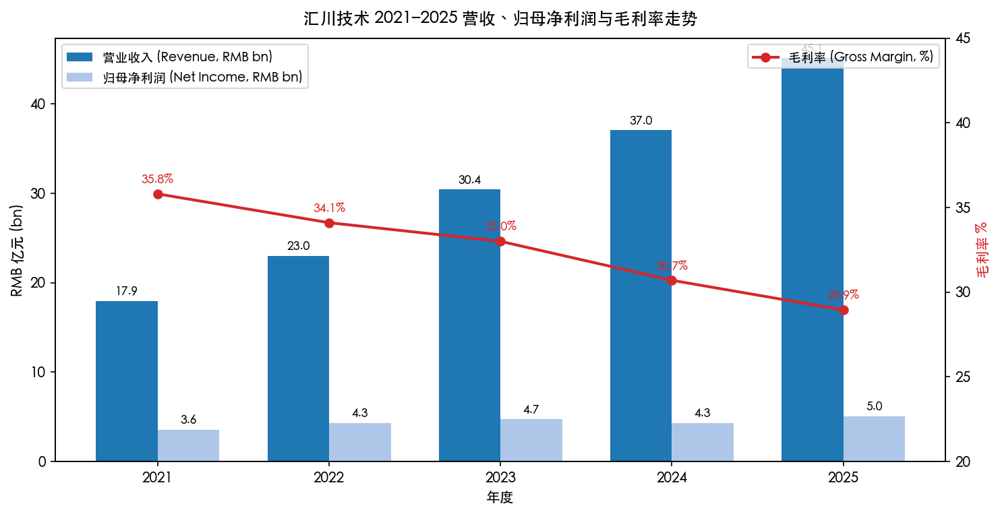
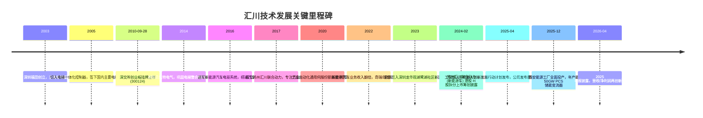
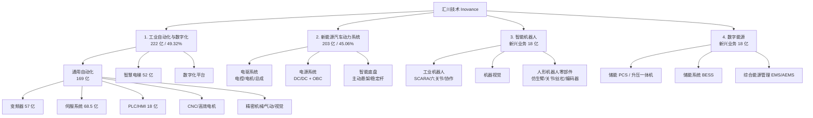
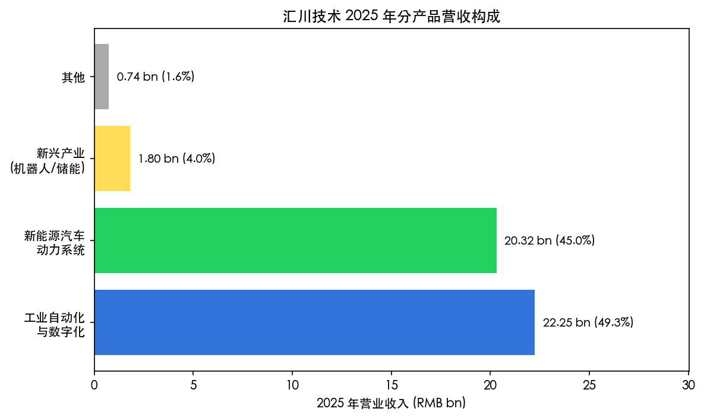
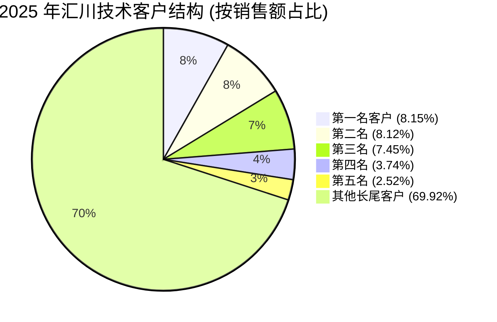
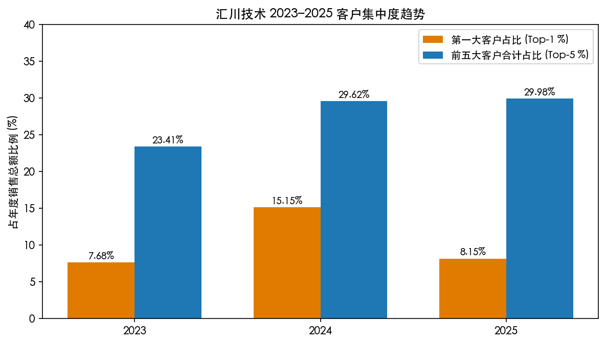
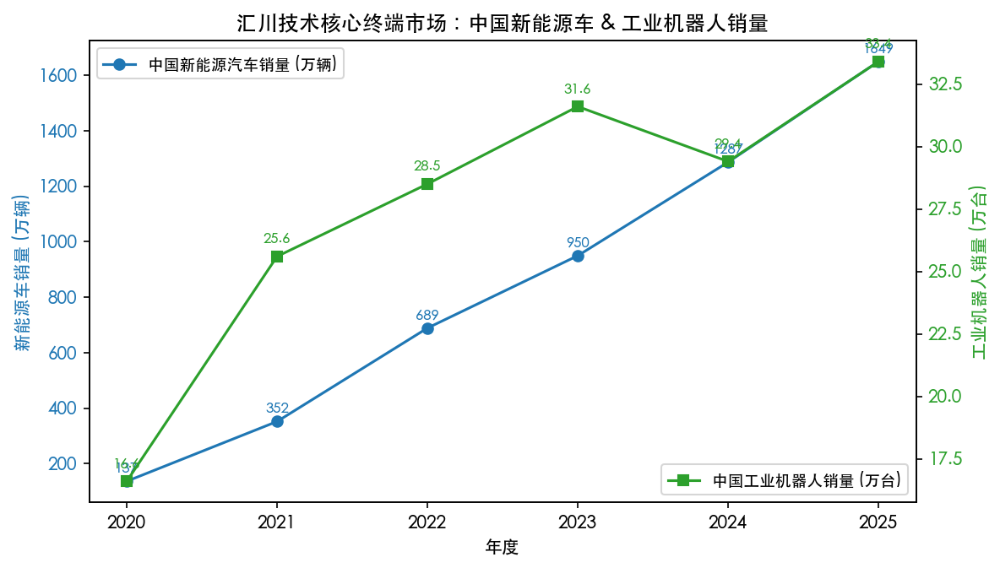

# 汇川技术 (Shenzhen Inovance Technology, SZSE:300124) 公司研究报告

**报告日期：2026-05-20**
**目标语言：简体中文**
**主要数据截止：2025 年年度报告 (2026-04-27 披露) + 实时市场数据 (2026-05-20)**

---

## 目录

1. 公司概览 (Company Overview)
2. 公司历史 (Company History)
3. 管理团队 (Management Team)
4. 产品与服务 (Products & Services)
5. 客户与上市策略 (Customers & Go-to-Market)
6. 行业概览 (Industry Overview)
7. 竞争格局 (Competitive Landscape)
8. 市场机会与 TAM (Market Opportunity)
9. 风险评估 (Risk Assessment)
10. 参考资料 (References)

---

## 1. 公司概览 (Company Overview)

汇川技术 (Shenzhen Inovance Technology, Inovance, 股票代码 SZSE:300124) 是一家成立于 2003 年、总部位于深圳市龙华区的工业科技集团，定位为"全球领先、创新驱动的工业科技平台"。公司围绕"数字层、边缘层、控制层、驱动层、执行层、传感层"六层贯通式技术栈，构建起横跨**工业自动化与数字化、新能源汽车动力系统、智能机器人、数字能源**四大业务板块的产品矩阵 ([汇川技术 2025 年年度报告, 第 12 页](https://static.cninfo.com.cn/finalpage/2026-04-27/1224027525.PDF))。

**主营业务与收入结构**。2025 年公司实现营业收入 RMB 451.05 亿元 (约 USD 62 亿)，同比增长 21.77%；归属于上市公司股东的净利润 50.50 亿元，同比增长 17.84%；扣非归母净利润 49.51 亿元，同比增长 22.66% ([2025 年年度报告, 第 9 页](https://static.cninfo.com.cn/finalpage/2026-04-27/1224027525.PDF))。按产品口径，**工业自动化与数字化**贡献 222.45 亿元 (49.32%)、**新能源汽车动力系统**贡献 203.23 亿元 (45.06%)、**新兴产业 (机器人+储能)** 17.95 亿元 (3.98%)、**其他** 7.42 亿元 (1.64%) ([同上, 第 29 页](https://static.cninfo.com.cn/finalpage/2026-04-27/1224027525.PDF))。2025 年新能源汽车业务首次接近工业自动化业务规模，标志公司由单引擎成长为"工控+车规"双引擎驱动。

**地区与渠道结构**。2025 年公司中国内地收入 424.56 亿元 (94.13%)、境外收入 26.49 亿元 (5.87%)，但境外收入同比增速 29.89%，明显高于内销 21.30%；境外业务毛利率 35.49%，高于内销 28.55%，"借船出海"与海外定点项目成为 2026 年起的边际增长极 ([2025 年年度报告, 第 29 页](https://static.cninfo.com.cn/finalpage/2026-04-27/1224027525.PDF))。

**规模与人员**。截至 2025 年末，公司合并报表口径在职员工 27,292 人，其中生产 13,150 人、技术研发 7,670 人、销售 2,965 人 ([2025 年年度报告, 第 62 页](https://static.cninfo.com.cn/finalpage/2026-04-27/1224027525.PDF))。2025 年研发投入 42.56 亿元，研发费用率 9.44%，同比上升约 1 个百分点；累计获得专利及软件著作权 3,375 项；研发人员占比 28% ([同上, 第 22 页](https://static.cninfo.com.cn/finalpage/2026-04-27/1224027525.PDF))。资产总额 713.14 亿元，归属股东净资产 353.53 亿元；经营性现金流净额 66.81 亿元，加权 ROE 16.34% ([同上, 第 9 页](https://static.cninfo.com.cn/finalpage/2026-04-27/1224027525.PDF))。



*数据来源：[2025 年年度报告, 第 9 页](https://static.cninfo.com.cn/finalpage/2026-04-27/1224027525.PDF)，[2021 年年度报告, 第 12 页](https://static.cninfo.com.cn/finalpage/2022-04-25/1213118749.PDF)；毛利率根据各年报营业收入与营业成本计算。*

**估值快照 (2026-05-20，A 股开盘后实时数据)**。

| 指标 | 数值 | 来源 |
|---|---|---|
| 收盘价 | RMB 78.05 | [东方财富 quote.eastmoney.com/sz300124, 2026-05-20](https://quote.eastmoney.com/sz300124.html) |
| 总市值 | RMB 2,113 亿元 (约 USD 290 亿) | 同上 |
| 流通市值 | RMB 1,881 亿元 | 同上 |
| 总股本 | 27.07 亿股 | 同上 |
| TTM 市盈率 (P/E) | 52.13× | 同上 |
| 静态 P/E | 44.58× | 同上 |
| 市净率 (P/B) | 5.81× | 同上 |
| TTM 市销率 (P/S) | 4.69× (按 2025 年营收 451 亿元、市值 2,113 亿元计算) | 计算 |
| 52 周区间 | RMB 53–84 (估)| 同上 |

**估值水位解读**。52.13× TTM P/E 大致是同业 (国电南瑞 71.57×、埃斯顿 71.00×、信捷电气 46.89×、鸣志电器 511.66× 因业绩深度承压跳出) 4 家可比公司均值 ~60× 的小幅折让；但相对全球工业自动化龙头西门子 (~22×) 与 ABB (~24×) 仍属高位 ([东方财富同业行情, 2026-05-20](https://quote.eastmoney.com/sz300124.html))。该多倍数主要由三个因素支撑：①2025 年新能源汽车业务收入 +26.4%、智能机器人&储能新兴业务收入 +15.8%，市场愿意为"机器人+人形零部件+海外车规放量"的成长性叙事付费；②管理层在 2025 年 Q4 单季实现归母净利润下滑 (Q4 净利润 7.96 亿元，环比 Q3 12.86 亿元) 的同时仍维持全年扣非 +22.66%，盈利质量稳定 ([2025 年年度报告, 第 10 页](https://static.cninfo.com.cn/finalpage/2026-04-27/1224027525.PDF))；③汇川被纳入大量中证机器人/创业板指数，被动配置资金抬升估值底部 — 第八大股东即为兴业银行托管的"华夏中证机器人 ETF" ([2025 年年度报告, 第 108 页](https://static.cninfo.com.cn/finalpage/2026-04-27/1224027525.PDF))。但 P/E > 50× 意味着市场已对 2026–2028 年保持双位数复合增长、且新业务 (人形机器人、储能、海外汽车) 顺利兑现作出较强假设；若新能源汽车业务降价压力进一步压缩 16.10% 毛利率 (2025 年同比已下降 0.28 个百分点) 或工业自动化下行周期延长，存在显著的多倍数压缩风险 — 详见第 9 节"估值与多倍数压缩风险"。

---

## 2. 公司历史 (Company History)

**创业起点**。2003 年 4 月，朱兴明、宋君恩、刘宇川、周斌、杨春禄、李俊田等十余名前华为电气/艾默生网络能源 (Emerson Network Power) 工业控制部团队成员，在深圳福田区彩田北路民宁园办公楼共同创立深圳市汇川技术有限公司，注册资本 600 万元 ([2025 年年度报告, 第 8 页](https://static.cninfo.com.cn/finalpage/2026-04-27/1224027525.PDF))。创始团队的"华为电气—艾默生网络能源"血统是公司商业基因的源头：朱兴明任董事长，宋君恩、刘宇川等技术干部分管研发与销售，整套队伍把华为出身的 IPD (Integrated Product Development) 集成产品开发体系与艾默生时代积累的电力电子工程功底直接移植到工控行业 — 这一血统在后续 20 余年研发组织持续稳定运行，是汇川区别于一般民营工控企业的核心组织资产。



**三次关键战略转身**。

(1) **2005 年：从通用变频器到电梯垂直一体化**。早期汇川凭借通用变频器与国产电梯品牌 (康力、申龙、东芝电梯等) 合作，跳过低毛利的二级配套，直接切入电梯一体化控制器；这一"行业营销"模式延伸出"工控+工艺"的差异化打法，并最终通过 2014 年收购贝思特电气固化为电梯电气大配套整体方案 ([2025 年年度报告, 第 13 页](https://static.cninfo.com.cn/finalpage/2026-04-27/1224027525.PDF))。

(2) **2016 年：押注新能源汽车电驱**。在国内工业自动化进入瓶颈期、外资品牌仍占据高端产品时，公司前瞻性切入新能源乘用车电机控制器；2017 年成立苏州汇川联合动力，把汽车业务从母公司体内剥离单列；2022–2025 年新能源汽车业务收入由约 50 亿元跃升至 203 亿元，复合增速超过 50%，成为公司体量最大单一品类 ([2025 年年度报告, 第 25–26 页](https://static.cninfo.com.cn/finalpage/2026-04-27/1224027525.PDF))。

(3) **2024–2025 年：新兴业务 (智能机器人 + 数字能源) 第二曲线启动**。2024 年起公司在年报中将"通用自动化里的机器人/视觉/储能/人形零部件"独立分拆为"新兴产业"分类口径；2025 年成立"智能机器人事业部"与"数字能源事业部"两个独立事业部，西安储能工厂投产，年产能 50GW PCS ([2025 年年度报告, 第 30 页](https://static.cninfo.com.cn/finalpage/2026-04-27/1224027525.PDF))。这次拆分既是对"机器人 / 储能 = 工控基础设施的下一站"的产业押注，也为未来潜在的 H 股或 A+H 资本运作留下结构口径。

**最近 12 个月重大事项**。①2025 年 9 月：第六期股权激励第三个归属期股票上市流通，新增股份 151.4 万股 ([2025 年年度报告, 第 108 页](https://static.cninfo.com.cn/finalpage/2026-04-27/1224027525.PDF))。②2025 年下半年：储能 PCS 出货量突破 10GW，构网型项目累计出货超 1GW ([2025 年年度报告, 第 27 页](https://static.cninfo.com.cn/finalpage/2026-04-27/1224027525.PDF))。③2025 年 12 月：西安能源工厂全面投产 (年产 50GW)，国内首创自动化对接测试工艺。④2026 年 4 月：拟每 10 股派发现金股利 5 元 (含税)，共计 13.53 亿元，对应 2025 年 26.8% 现金分红率 ([2025 年年度报告, 第 2 页](https://static.cninfo.com.cn/finalpage/2026-04-27/1224027525.PDF))。

---

## 3. 管理团队 (Management Team)

### 朱兴明 — 创始人、董事长兼总裁 (Founder, Chairman & President)

朱兴明先生 1967 年生，东北重型机械学院 (现燕山大学) 硕士研究生学历，中国国籍。早年任职于深圳华能控制系统有限公司，1990 年代中期加入华为电气技术有限公司 (华为旗下电气电源业务，后被艾默生整体收购成为艾默生网络能源)，深度参与华为 IPD 体系与工控产品线管理；2003 年与同事联合创办汇川技术，担任董事长兼总裁至今，并兼任公司法人股东深圳市汇川投资有限公司执行董事 ([2025 年年度报告, 第 57 页](https://static.cninfo.com.cn/finalpage/2026-04-27/1224027525.PDF))。

朱兴明是公司**实际控制人**，但公司本身**无控股股东**：截至 2025 年末，汇川投资 (朱兴明通过员工持股平台间接控制) 持有公司 4.66 亿股，占总股本 17.22%，为第一大股东；朱兴明本人未在前十大股东列示，但通过汇川投资合计可控制超过 17% 投票权；公司董事会与高级管理层中持股的创始合伙人 (李俊田 2.8%、刘迎新 1.94%、杨春禄 1.53%、刘宇川 1.43%、宋君恩 1.39% 等) 合计构成"创始人一致行动核心"，但无公开一致行动协议 ([2025 年年度报告, 第 108–109 页](https://static.cninfo.com.cn/finalpage/2026-04-27/1224027525.PDF))。

朱兴明的核心贡献可分为三段：①**2003–2010 年第一阶段**，把华为出身的 IPD 流程与"工控+工艺"行业营销策略移植到当时仍由西门子、ABB、安川主导的国内工控市场，让汇川 2010 年以变频器/电梯一体化控制器收入 7 亿元规模登陆创业板；②**2011–2020 年第二阶段**，主导通用伺服国产替代，至 2020 年汇川通用伺服系统在中国市场份额跃居第一并保持至今 ([2025 年年度报告, 第 13 页](https://static.cninfo.com.cn/finalpage/2026-04-27/1224027525.PDF))；③**2016 年至今**，前瞻押注新能源车电驱，2025 年公司新能源乘用车动力系统 (不含电池) 全球第三、中国第一，电机控制器装机量全球第二、中国第一 ([同上, 第 15 页](https://static.cninfo.com.cn/finalpage/2026-04-27/1224027525.PDF))。朱兴明在公开演讲中长期强调"长期主义、行业营销、工控+工艺"，2025 年公司管理层提出"数字汇川"战略，推动 iFG (Inovance Factory Genius) 工业 AI 平台落地。2025 年税前薪酬 423.13 万元，未在关联方领取报酬 ([2025 年年度报告, 第 59 页](https://static.cninfo.com.cn/finalpage/2026-04-27/1224027525.PDF))。朱兴明同时担任董事长与总裁，公司在《公司章程》《总经理工作细则》中明确划分董事会与经营层职责。

### 刘迎新 — 财务总监 (CFO)

刘迎新女士 1970 年生，中南财经政法大学硕士研究生学历；曾任职于湖南建设银行邵阳分行、中华财务会计咨询公司；2004 年 5 月起任汇川技术财务总监至今，是公司极少数任期超过 20 年的核心创始成员之一 ([2025 年年度报告, 第 58 页](https://static.cninfo.com.cn/finalpage/2026-04-27/1224027525.PDF))。她主导了汇川 2010 年创业板 IPO、2014 年贝思特电气并购、2017 年苏州联合动力分拆、2022 年股权激励 (累计七期) 等一系列资本市场动作，并在 2024–2025 年负责筹划苏州联合动力潜在 H 股拆分上市。截至 2025 年末，刘迎新个人持股 5,255.10 万股 (1.94%)，质押 954.65 万股 — 她本人 2025 年度减持约 300 万股 (注释为"个人原因减持") ([2025 年年度报告, 第 57、109 页](https://static.cninfo.com.cn/finalpage/2026-04-27/1224027525.PDF))。2025 年税前薪酬 219.14 万元。她的长期任职带来稳定的会计政策与稳健的现金流管理 — 2025 年经营性现金流 66.81 亿元为净利润的 1.32 倍。

### 李俊田 — 董事、苏州联合动力董事长 (Director, Chair of NEV subsidiary)

李俊田先生 1975 年生，西安交通大学硕士；前华为电气—艾默生网络能源团队成员，2003 年共同创立汇川；现任公司董事，同时担任苏州汇川联合动力董事长，主管全部新能源汽车业务 ([2025 年年度报告, 第 57 页](https://static.cninfo.com.cn/finalpage/2026-04-27/1224027525.PDF))。新能源汽车板块在 2025 年贡献 45.06% 收入、26.39% 收入同比增速，李俊田被视为公司继朱兴明之后第二代核心运营高管。2025 年薪酬 301.95 万元，全部从苏州联合动力发放；个人持股 7,592.00 万股 (2.8%)，为第四大股东。

### 周斌 — 董事、副总裁，全球工业自动化事业部总经理 (Director, EVP — Global Industrial Automation)

周斌先生 1976 年生，华中科技大学本科+中欧国际工商学院 EMBA；前华为电气—艾默生网络能源团队成员；现任公司董事、副总裁，分管**全球工业自动化事业部和数字化事业部** — 公司体量最大的工控主业 ([2025 年年度报告, 第 57 页](https://static.cninfo.com.cn/finalpage/2026-04-27/1224027525.PDF))。2025 年工业自动化与数字化收入 222 亿元 (+18.79%)，是双引擎的另一极。2025 年薪酬 271.83 万元。周斌主导了 2025 年 "上顶下沉" 市场策略 (向上拓展冶金/化工 EPC 大客户、向下沉至中小制造客户) 与"借船出海"渠道战略，2025 年自动化业务海外订单实现快速增长。

### 治理与股权激励

(150 字以内)

- **董事会组成**：9 名董事，含 3 名独立董事 (张陶伟、赵晋琳、黄培)，独立董事比例 33%，符合创业板治理要求。
- **管理层持股**：12 名核心董事/高管 2025 年末合计持股 2.92 亿股，约占总股本 10.78%，激励高度匹配 ([2025 年年度报告, 第 57 页](https://static.cninfo.com.cn/finalpage/2026-04-27/1224027525.PDF))。
- **股权激励**：截至 2025 年末公司已实施七期股权激励，2025 年第六、第七期激励解锁与行权累计新增股本约 1,460 万股；2024 年长效激励基金提取业绩目标未达成，按制度自动归零 — 一定程度反映 2024 年新能源车价格战拖累整体业绩 ([2025 年年度报告, 第 62 页](https://static.cninfo.com.cn/finalpage/2026-04-27/1224027525.PDF))。
- **薪酬披露**：13 名董事+高管 2025 年合计税前薪酬 2,723.99 万元，独立董事年度津贴 15 万元，金额结构合规可比 ([2025 年年度报告, 第 60 页](https://static.cninfo.com.cn/finalpage/2026-04-27/1224027525.PDF))。
- **信息披露**：自上市以来连续 15 年深交所信披考核 A 级 ([2025 年年度报告, 第 55 页](https://static.cninfo.com.cn/finalpage/2026-04-27/1224027525.PDF))，治理记录优良。

### 团队记录综述

朱兴明带领的创始团队在 22 年间完成了**变频器→伺服系统→PLC→电梯电气→新能源车电驱→机器人/储能**六次行业跃迁，每一次跃迁均验证了"行业营销+IPD 平台+技术营销"方法论的可复制性。团队从 2010 年 IPO 时收入 7 亿元做到 2025 年 451 亿元，13 年 CAGR 约 33%；同时财务总监、董秘、副总裁等核心岗位 15 年以上无离任，组织稳定性在国内民营科技公司中罕见。明显的潜在不足：①朱兴明个人技术与战略影响力极强，"关键人风险"显著；②高管平均年龄已在 50 岁以上，二代接班梯队尚未公开披露；③副总裁层级缺少海外背景与车规体系经验丰富的国际化高管，海外并购/合资能力待加强。

---

## 4. 产品与服务 (Products & Services)

汇川 2025 年报口径下，产品被切分为四大板块；下面按板块完整列举每个 SKU 家族，对每个 material 品类给出**竞争优势判断 (有/部分/无)** 与**最接近的具名竞品**。





*数据来源：[汇川技术 2025 年年度报告, 第 29 页](https://static.cninfo.com.cn/finalpage/2026-04-27/1224027525.PDF)。*

### 4.1 工业自动化与数字化 (222.45 亿元 / 49.32%)

(1) **通用伺服系统**：销售收入约 68.5 亿元 (2025) ([2025 年年度报告, 第 25 页](https://static.cninfo.com.cn/finalpage/2026-04-27/1224027525.PDF))。客户：锂电、3C、机床、注塑、包装、纺织等设备制造商。**竞争优势：是**。摩 (Moat) 类型：**规模 + 行业定制化方案 + 客户切换成本**。证据：根据弗若斯特沙利文 (Frost & Sullivan)，2025 年按收入计公司通用伺服系统在中国市场份额约 31%，位居第一名 ([2025 年年度报告, 第 13 页](https://static.cninfo.com.cn/finalpage/2026-04-27/1224027525.PDF))；与外资品牌相比定价低 20–30% 同时具备本地化交付能力。最接近竞品：安川 (Yaskawa) Σ-7 系列伺服 — 汇川 IS810/IS820 系列在锂电、注塑等中国头部 OEM 内已**领先**安川。
(2) **低压变频器 (含电梯专用)**：约 57 亿元；中国市场份额 ~20%，排名第一 ([2025 年年度报告, 第 13 页](https://static.cninfo.com.cn/finalpage/2026-04-27/1224027525.PDF))。**竞争优势：是**，摩类型：**规模 + 渠道密度**。最接近竞品：ABB ACS580、西门子 G120 — 在中端市场汇川**领先**，在 200kW 以上高端项目市场仍落后于外资。
(3) **中高压变频器**：份额 14%，第一名。**竞争优势：是 (部分)**，摩类型：**行业定制化方案**。最接近竞品：ABB ACS6080、Robicon Perfect Harmony — 在矿山、冶金等具体行业**对标**。
(4) **PLC**：约 18 亿元 (含 HMI)；中国市场份额 5.7%，排名第四 ([2025 年年度报告, 第 13 页](https://static.cninfo.com.cn/finalpage/2026-04-27/1224027525.PDF))。**竞争优势：部分**。摩类型：**与自家伺服/变频器的捆绑生态**。最接近竞品：西门子 S7-1500、三菱 Q 系列 — 汇川目前**落后**，2025 年发布的 EVO1000EF 安全 PLC 是国内唯一符合 IEC61131-6 功能安全标准的同类产品，正在缩小差距 ([2025 年年度报告, 第 24 页](https://static.cninfo.com.cn/finalpage/2026-04-27/1224027525.PDF))。
(5) **CNC (机床数控系统)**：2025 年订单"快速增长"，未单独披露收入。**竞争优势：无 (追赶中)**。最接近竞品：发那科 (Fanuc)、西门子 840D — 汇川**显著落后**，主要瞄准国产中端机床国产替代。
(6) **高性能电机 / 精密机械 (丝杠、直线导轨) / 气动元件 / 工业视觉 / 传感器**：组合品类，多数在 1–10 亿元区间。**竞争优势：部分**。摩类型：**与控制器/伺服的解决方案打包**。最接近竞品：上银 (HIWIN, TWSE:2049) 丝杠、SMC 气动、基恩士 (Keyence) 视觉 — 汇川主要**对标但仍落后**。
(7) **智慧电梯**：约 52 亿元，同比 +5% ([2025 年年度报告, 第 25 页](https://static.cninfo.com.cn/finalpage/2026-04-27/1224027525.PDF))。包括一体化控制器、人机界面、门系统、电缆等。**竞争优势：是**。摩类型：**国内市场份额第一 + 大配套整合 + 后服务网络**。最接近竞品：默纳克 (Monarch, 已被新时达整合)、施耐德电梯部门 — 汇川**领先**。2025 年电梯出口及后市场节能改造成新增长点。
(8) **数字化平台 (InoCube EiOS / FOS / iFG 工业 AI 平台)**：未单列收入但已对内全域开放，并陆续向外部客户输出。**竞争优势：部分**。摩类型：**与硬件产品深度耦合**。最接近竞品：西门子 MindSphere、阿里云 supET — 汇川**落后**于国际平台，但与本地装备深度集成是差异点。

### 4.2 新能源汽车动力系统 (203.23 亿元 / 45.06%)

(1) **电驱系统 (电控/电机/电驱总成)**：核心品类，2025 年新能源乘用车电驱总成年交付突破 100 万台套；商用车电控装机 29.3 万台、总成 16.6 万台、电机 10.8 万台 ([2025 年年度报告, 第 26 页](https://static.cninfo.com.cn/finalpage/2026-04-27/1224027525.PDF))。**竞争优势：是**。摩类型：**规模 + 客户深度合作 + 平台化技术 (800V/SiC/扁线/油冷)**。证据：弗若斯特沙利文数据 — 2025 年按装机量计公司是**全球第二大、中国第一大新能源乘用车电机控制器第三方供应商**，中国第二大新能源乘用车电驱系统第三方供应商，中国第一大新能源乘用车定子第三方供应商 ([2025 年年度报告, 第 15 页](https://static.cninfo.com.cn/finalpage/2026-04-27/1224027525.PDF))。最接近竞品：博世 (Bosch) eAxle、采埃孚 (ZF) EVPlus、华为 DriveONE、比亚迪自制 e 平台 — 汇川**领先于跨国 Tier-1**、**与华为对标**、**面对比亚迪自制存在结构性挑战**。
(2) **电源系统 (DC/DC、OBC、电源总成)**：2025 年定点海外 9 个项目；国内乘用车 70 余个定点中含电源产品。**竞争优势：是**。摩类型：**车规体系认证 + GaN/SiC 工艺**。最接近竞品：德尔福 (Delphi/BorgWarner)、英搏尔 (SZSE:300681) — 汇川**领先**。
(3) **智能底盘 (主动悬架液压泵 / 主动稳定杆 / 线控转向 / 线控制动)**：2025 年主动悬架液压泵、主动稳定杆已"获得主机厂定点" ([2025 年年度报告, 第 14 页](https://static.cninfo.com.cn/finalpage/2026-04-27/1224027525.PDF))。**竞争优势：部分 (早期)**。最接近竞品：采埃孚 sMOTION、保隆 (SZSE:603197) 主动悬架 — 汇川**正在追赶**。
(4) **海外车规**：2025 年海外客户定点 9 个项目，匈牙利、泰国工厂建设中 — 这是公司未来 3–5 年最大变量。

### 4.3 智能机器人 (新兴产业内估算约 8–10 亿元)

(1) **SCARA 机器人 (S35/S60/GS60 大负载系列)**：中国市场份额约 28%，排名**第一** ([2025 年年度报告, 第 16 页](https://static.cninfo.com.cn/finalpage/2026-04-27/1224027525.PDF))。**竞争优势：是**。最接近竞品：爱普生 (Epson)、雅马哈 (Yamaha)、华数机器人 — 汇川**领先**。
(2) **六关节机器人 (R220 压铸专机等)**：中国市场工业机器人份额 8.8%，排名第四，本土第二 ([2025 年年度报告, 第 16 页](https://static.cninfo.com.cn/finalpage/2026-04-27/1224027525.PDF))。**竞争优势：部分**。最接近竞品：发那科、安川、ABB、库卡 (外资四大族家)、埃斯顿 (SZSE:002747)、新时达 — 汇川对标埃斯顿**领先**，对发那科**落后**。
(3) **协作机器人 (U8 系列)**：2025 年首款产品。**竞争优势：无 (新进入)**。最接近竞品：节卡 (JAKA)、优傲 (UR)、达明 (Techman) — 汇川**进入晚**。
(4) **机器视觉 (视觉控制器、面阵/线阵相机、纳秒门控相机、智能相机)**：2025 年发布 S2.0 协议小面阵相机。**竞争优势：部分**。最接近竞品：基恩士 (Keyence)、海康机器人 (HIK Robot)、奥普特 (SZSE:688686) — 汇川**追赶中**。
(5) **人形机器人零部件 (无框力矩电机 / 行星滚柱丝杠 / 七自由度仿生臂 / 关节模组 / 低压直流伺服驱动器 / 编码器)**：2025 年完成第一代产品开发与交付，扭矩密度 ≥38 Nm/kg。**竞争优势：部分 (取决于客户验证速度)**。摩类型：**电力电子 + 精密机械协同**。最接近竞品：拓普集团 (SH:601689)、北特科技 (SH:603009) 行星滚柱丝杠、绿的谐波 (SH:688017) 谐波减速器 — 汇川目前**单零部件可对标但缺乏整机集成**，机会窗口在 2026–2028 年 Optimus/Figure/Unitree 量产爬坡期。

### 4.4 数字能源 (新兴产业内估算约 8–10 亿元)

(1) **储能 PCS (12kW–3.5MW) + 升压一体机 (1MW–7MW)**：2025 年累计出货 >10GW，构网型 >1GW，单体最大项目构网 >500MW ([2025 年年度报告, 第 27 页](https://static.cninfo.com.cn/finalpage/2026-04-27/1224027525.PDF))。**竞争优势：部分**。最接近竞品：阳光电源 (SZSE:300274)、华为数字能源、上能电气 (SH:300827)、Sungrow、Power Electronics — 汇川**对标阳光电源但仍小**。全球储能中大功率 PCS 份额 6.7%，第五名 ([2025 年年度报告, 第 16 页](https://static.cninfo.com.cn/finalpage/2026-04-27/1224027525.PDF))。
(2) **储能系统 (BESS All-In-One)**：2025 年累计出货 >1GWh，海外 20+ 国家样板点，最大单体中标 2.6GW ([2025 年年度报告, 第 27 页](https://static.cninfo.com.cn/finalpage/2026-04-27/1224027525.PDF))。**竞争优势：部分**。最接近竞品：宁德时代 (CATL) Tener、海博思创 — 汇川作为非电芯厂商主打"PCS+集成"模式。
(3) **综合能源管理 (InoCube EiOS / FOS / AEMS 能源聚合交易系统)**：聚焦工业用户能效与零碳微网。**竞争优势：部分**。最接近竞品：施耐德 EcoStruxure、霍尼韦尔 (Honeywell) — 汇川**结合 PCS + EMS 形成差异点**。

### 4.5 旗舰产品 vs 长尾

明确的"旗舰三驾马车"：**通用伺服 (68.5 亿)、低压变频器 (57 亿)、新能源乘用车电驱总成 (单年 100 万台套)** — 三者合计贡献 >35% 收入与最大份额的市场地位。中等规模成长品类：智慧电梯 (52 亿)、新能源商用车电驱、储能 PCS、SCARA 机器人。早期长尾：人形机器人零部件、智能底盘、CNC、协作机器人 — 这些是估值溢价的来源，但 2025 年合计收入仍 <10% (新兴业务全部 18 亿，占比 3.98%)。

### 4.6 过去 12 个月关键发布

2025 年共发布 17 款新品 ([2025 年年度报告, 第 24 页](https://static.cninfo.com.cn/finalpage/2026-04-27/1224027525.PDF))：①INO AIR 微型工业无线方案 (1ms 周期 + 99.9999% 可靠性，让锂电卷绕机线缆安装周期降 50%)；②EVO1000EF 全系列 SIL3/PLe/CAT4 安全 PLC；③第五代油冷 SiC 商用车电驱总成；④第四代大功率桥驱油冷电机；⑤S35/S60/GS60 大负载 SCARA；⑥协作机器人 U8 系列；⑦R220 大六关节压铸专机；⑧3.15MW/3.5MW 大功率集中式 PCS 及 7MW 升压一体机；⑨430kW 液冷组串式储能变流器；⑩GaN 二合一 OBC + DCDC 电源；⑪七自由度仿生臂等人形零部件全栈。

---

## 5. 客户与上市策略 (Customers & Go-to-Market)

### 客户构成

公司客户结构高度分散，下游覆盖 40 多个行业，从锂电、3C、汽车、机床到电梯、起重、纺织、暖通、医疗等。三大典型客户群：

(1) **工业自动化客户**：以 OEM 设备厂为主，包括锂电设备 (先导智能、利元亨)、注塑机 (海天、伊之密)、机床 (创世纪)、纺织 (经纬纺机)、3C (富士康/比亚迪电子)、暖通 (美的、格力工业品)，主要通过直销+分销渠道触达；项目型客户 (冶金、化工、电力) 通过总包/EPC 方式落地。
(2) **新能源汽车 Tier-1 客户**：覆盖国内造车新势力 (理想、小鹏、零跑、问界) + 传统转型车企 (奇瑞、广汽、上汽、长安) + 海外车企 (2025 年起新增定点) ([2025 年年度报告, 第 25 页](https://static.cninfo.com.cn/finalpage/2026-04-27/1224027525.PDF))。商用车主要客户包括重汽、福田、东风、宇通、金龙等。
(3) **电梯客户**：康力电梯、申龙电梯、东南电梯、广日电梯等国产品牌为主；2025 年起出口至中东/东南亚配套海外电梯品牌。

### 客户集中度 (REQUIRED — 量化披露)

根据 2025 年年报第 32 页，**前五大客户合计销售金额 135.23 亿元，占年度销售总额 29.98%**；**第一大客户销售 36.77 亿元，占 8.15%** ([2025 年年度报告, 第 32 页](https://static.cninfo.com.cn/finalpage/2026-04-27/1224027525.PDF))。

| 年度 | 第一大客户占比 | 前五大客户占比 | 备注 |
|---|---|---|---|
| 2023 | 7.68% | 23.41% | 第一大客户 23.36 亿元 ([2023 年年度报告, 第 30 页](https://static.cninfo.com.cn/finalpage/2024-04-22/1219738773.PDF)) |
| 2024 | **15.15%** | 29.62% | 第一大客户 56.13 亿元 ([2024 年年度报告, 第 30 页](https://static.cninfo.com.cn/finalpage/2025-04-28/1223028000.PDF)) |
| 2025 | 8.15% | 29.98% | 第一大客户 36.77 亿元 |

2024 年第一大客户单一占比一度跃升至 15.15% — 大概率为某新势力车企单一定点车型放量带来；2025 年第一大客户占比回落至 8.15%，前五大合计基本稳定在 30%，说明大客户依赖**有所改善**。**前五大客户均与公司不存在关联关系** ([2025 年年度报告, 第 32 页](https://static.cninfo.com.cn/finalpage/2026-04-27/1224027525.PDF))。具体客户姓名未在年报披露 (公司只列示"第一名/第二名"形式)。


*数据来源：[2025 年年度报告, 第 32 页](https://static.cninfo.com.cn/finalpage/2026-04-27/1224027525.PDF)。*



*数据来源：[2025 年年度报告, 第 32 页](https://static.cninfo.com.cn/finalpage/2026-04-27/1224027525.PDF)；[2024 年年度报告, 第 30 页](https://static.cninfo.com.cn/finalpage/2025-04-28/1223028000.PDF)；[2023 年年度报告, 第 30 页](https://static.cninfo.com.cn/finalpage/2024-04-22/1219738773.PDF)。*

**风险判断**：前五大客户合计 ~30% 处于行业可接受区间 (远低于"风险阈值 50%"准绳)，第一大客户 2024 年 15.15% 是阶段性高点 — 已带入第 9 节作为"客户集中度风险"低 — 中等评级。汇川的客户广度是其结构性优势。

### 渠道与销售模式

- **直销 + 分销**：2025 年销售模式统计 100% 计为"直销/分销" — 公司对主要工控大客户、汽车 Tier-1 主机厂、储能 EPC 均采用直销；通过深圳、苏州、上海、东莞、中山、武汉、合肥等多个区域渠道商触达中小制造客户 ([2025 年年度报告, 第 29 页](https://static.cninfo.com.cn/finalpage/2026-04-27/1224027525.PDF))。
- **行业线+区域线+事业部线 三维矩阵**：2025 年公司将组织架构演化为"区域+行业+事业部" — 设立工业自动化事业部、数字化事业部、智能机器人事业部、数字能源事业部、电梯事业部、新能源汽车 (苏州联合动力) 事业部 ([2025 年年度报告, 第 22–23 页](https://static.cninfo.com.cn/finalpage/2026-04-27/1224027525.PDF))。
- **海外网络**：覆盖 28 个国家与地区的本地化销售网络 + "汇服务" APP 24 小时响应；匈牙利+泰国海外工厂建设中。
- **"借船出海"**：通过国内 OEM 客户配套出海 — 2025 年纺织、锂电、光伏、物流、轮胎、空压机、注塑机等多行业的海外配套订单"同比快速增长" ([2025 年年度报告, 第 24 页](https://static.cninfo.com.cn/finalpage/2026-04-27/1224027525.PDF))。

### 销售周期

- **工控产品**：周期 1–3 个月 (标准品 SKU)，6–12 个月 (定制工艺解决方案)。
- **新能源车定点**：客户定点到 SOP 量产周期 18–24 个月，定点后伴随车型生命周期 (3–5 年) 持续供应。
- **储能项目**：EPC 招标到交付 6–12 个月。

### 重要合作伙伴

- **车规半导体**：英飞凌、ST、安森美 (SiC/IGBT)；比亚迪半导体 (国产替代)。
- **整车厂战略客户**：奇瑞、理想、零跑、广汽、上汽、长城、长安、宇通、福田 (虽未指名但根据公开新闻可推断)。
- **储能**：参与中国电科院构网型储能标准制定 ([2025 年年度报告, 第 28 页](https://static.cninfo.com.cn/finalpage/2026-04-27/1224027525.PDF))。

### 标杆案例

- **冶金行业循环水系统**：汇川提供的多泵并联远程集控方案实现 15%–35% 综合节电，减少 30% 现场维护工作量 ([2025 年年度报告, 第 24 页](https://static.cninfo.com.cn/finalpage/2026-04-27/1224027525.PDF))。
- **锂电卷绕机 INO AIR 无线方案**：线缆安装周期缩短 50%，非计划停机率降 >50%。
- **新能源乘用车百万台总成**：常州工厂 2025 年实现单一工厂年产 100 万台电驱总成。

---

## 6. 行业概览 (Industry Overview)

### 6.1 行业定义与划分

汇川所处行业横跨四个细分赛道：
1. **工业自动化与数字化** (NAICS 3353 电力工业设备 + 3334 工业控制设备)：变频器、伺服、PLC/HMI/CNC、机器视觉、传感器、电梯电气、工业软件、工业 AI。
2. **新能源汽车动力系统** (NAICS 33611/33612)：电驱系统、电源系统、智能底盘。
3. **智能机器人** (NAICS 33399)：工业机器人、协作机器人、机器视觉、人形机器人零部件。
4. **新型储能 / 数字能源** (NAICS 3359)：PCS 储能变流器、储能系统、综合能源管理 EMS。

### 6.2 工业自动化与数字化

中国是全球第一大工业自动化市场。**2025 年中国市场表现结构性分化**：根据睿工业 (MIR Databank) 数据，OEM 型市场同比 +2%、项目型市场同比 -2%；锂电池、物流自动化、工业机器人显著增长，包装稳健；传统冶金、化工、石化下滑 ([2025 年年度报告, 第 19 页](https://static.cninfo.com.cn/finalpage/2026-04-27/1224027525.PDF))。中国电梯、自动扶梯及升降机产量 2025 年 140.1 万台，同比 -1.8%，但降幅已较 2024 年收窄。

**政策催化**：①2025 年 4 月，工信部《智能制造典型场景参考指引 (2025 年版)》；②2025 年 8 月，工信部等八部门《机械工业数字化转型实施方案 (2025–2030)》，明确攻关 PLC、伺服驱动、工业机器人；③2026 年 3 月《"十五五"规划纲要》将"加快发展新一代智能制造"列为制造强国核心任务 ([2025 年年度报告, 第 19–20 页](https://static.cninfo.com.cn/finalpage/2026-04-27/1224027525.PDF))。这意味着国产替代政策窗口在 2026–2030 持续打开。

### 6.3 新能源汽车

2025 年中国新能源车产销 1,662.6 万辆 / 1,649 万辆，同比 +29.0% / +28.2%；渗透率 47.9%；连续 11 年全球第一 ([2025 年年度报告, 第 20 页](https://static.cninfo.com.cn/finalpage/2026-04-27/1224027525.PDF))。中汽协预计 2026 年销量 1,900 万辆，同比 +15.3%。汽车 Tier-1 电驱市场长期增长动能明确，但短期面临**两大压力**：①主机厂自制比例上升 (比亚迪、特斯拉、奇瑞均不同程度内部供应)；②价格战传导至 Tier-1，导致 2025 年汇川新能源车业务毛利率仅 16.10% (同比 -0.28pp)。

### 6.4 智能机器人 / 人形机器人

2025 年中国工业机器人销量首次突破 30 万台 (33.4 万台，同比 +13.6%)，内资份额提升至 54% — 国产替代趋势加速 ([2025 年年度报告, 第 20 页](https://static.cninfo.com.cn/finalpage/2026-04-27/1224027525.PDF))。**人形机器人**：根据赛迪研究院 (CCID) 数据，2025 年中国人形机器人出货约 1.44 万台，处于"量产元年"。政策：2025 年 3 月工信部《人形机器人创新发展行动计划 (2025–2027)》；8 月"人工智能+"行动；12 月成立人形机器人与具身智能标准化技术委员会；2026 年 3 月"十五五"规划将机器人纳入战略性新兴产业。

### 6.5 数字能源 (新型储能)

根据中关村储能技术联盟，2025 年中国新型储能累计装机 144.7 GW，同比 +85%；新增装机首次突破 100 GW；独立储能占比达 58% ([2025 年年度报告, 第 21 页](https://static.cninfo.com.cn/finalpage/2026-04-27/1224027525.PDF))。政策目标：到 2027 年底中国新型储能装机 >180 GW (2025 年 1 月发改委、能源局《新型储能规模化建设专项行动方案 (2025–2027)》)。储能 PCS、系统集成向高压大容量、构网型 (grid-forming) 升级。

### 6.6 行业结构与监管

工业自动化在国内仍由外资品牌 (西门子、ABB、安川、三菱、施耐德、罗克韦尔、发那科) 主导高端，国产品牌 (汇川、英威腾、台达、信捷) 中低端突围；行业 Top-10 集中度约 40–50% (汇川单家伺服 31%、变频器 20%)。新能源车电驱市场更分散 (前 5 第三方供应商合计 <35%)；机器人市场内资份额过半但人形零部件仍处早期；储能 PCS 全球前 10 集中度 60–70%，国产替代加速。监管环境利好国产替代 (信创+智能制造+新能源车补贴政策延续)，但也面临供应链国产化考核与美国出口管制下的高端芯片紧缺约束。

---

## 7. 竞争格局 (Competitive Landscape)

### 7.1 工业自动化竞争对手

公司在 2025 年报中明确列出工业自动化主要竞争对手：**西门子 (Siemens)、ABB、安川 (Yaskawa)、三菱 (Mitsubishi)、松下 (Panasonic)、施耐德 (Schneider)、发那科 (Fanuc)** — 这是一个外资环伺的竞争场，汇川是少数能在多个核心品类做到中国市场第一的本土厂商 ([2025 年年度报告, 第 13 页](https://static.cninfo.com.cn/finalpage/2026-04-27/1224027525.PDF))。

- **西门子**：在 PLC、CNC、数字化平台 (MindSphere)、高端变频器具备绝对领先，但定价高、定制化响应慢。
- **ABB**：传动 (变频器/电机) 龙头，2024 财年传动业务全球收入约 70 亿美元；在过程自动化与机器人 (ABB Robotics) 双轮驱动，但中国本地化人手不足。
- **安川**：伺服系统全球老牌玩家，Σ-7 系列高端伺服市占率高；中国市场份额已被汇川超越。
- **三菱**：PLC、CNC、伺服综合龙头，与日本设备厂深度绑定；在中国本地化交付速度不及汇川。
- **国内对标**：信捷电气 (SH:603416) — PLC/伺服中小型市场对标；英威腾 (SZSE:002334) — 变频器对标；雷赛智能、台达 — 中低端对标。

### 7.2 新能源汽车 Tier-1 竞争对手

- **博世 (Bosch)**：全球最大 Tier-1，2024 年电驱业务进入快车道但中国市场份额低于汇川。
- **采埃孚 (ZF)**：传统强项变速箱+电驱集成，全球第一梯队。
- **法雷奥 (Valeo)**：电机/电源系统国际玩家。
- **华为 DriveONE / 数字能源**：国内最强劲的竞争者，七合一电驱、电源系统已规模上车赛力斯、阿维塔；技术能力对标汇川。
- **比亚迪自制**：比亚迪 e 平台 3.0 自供 + 弗迪动力 — 体内消化大量需求；同时弗迪开始外供，进一步挤压第三方空间。
- **国内同行**：精进电动 (NASDAQ:JKS 已转回 A 股准备)、英搏尔 (SZSE:300681)、巨一动力 (SH:688162)、欣锐科技 (SZSE:300745) — 多为细分品类专业厂商，规模均小于汇川。

### 7.3 智能机器人 / 人形机器人竞争对手

- **工业机器人外资四大族家**：发那科 (Fanuc)、安川、ABB、库卡 (KUKA) — 全球前四，合计中国份额约 30–35%。
- **内资龙头**：埃斯顿 (SZSE:002747) — 国产工业机器人排名第一；新时达 (SZSE:002527)；广州数控；华数机器人；遨博 (协作机器人)。
- **人形机器人**：宇树 (Unitree, 非上市)、智元机器人、傅利叶、星动纪元、特斯拉 Optimus、Figure AI、Apptronik — 整机厂；汇川定位为**零部件供应商** (类似博世于汽车产业的位置)。
- **谐波减速器/丝杠竞品**：绿的谐波 (SH:688017)、双环传动 (SZSE:002472)、拓普集团 — 与汇川在人形机器人关节部件直接对垒。

### 7.4 储能 / 数字能源竞争对手

- **阳光电源 (SZSE:300274)**：全球储能 PCS 第一，2024 年储能营收 250+ 亿元，规模 10× 汇川数字能源业务。
- **华为数字能源**：技术与品牌一线，但因美国制裁海外被部分市场屏蔽。
- **上能电气 (SZSE:300827)、科华数据 (SZSE:002335)、盛弘股份 (SZSE:300693)**：国内 PCS 同业。
- **海外**：Power Electronics (西班牙)、SMA Solar、ABB Power — 全球项目竞争对手。

### 7.5 定位框架 (2×2 价格 vs 技术广度)

```mermaid
quadrantChart
    title 工业自动化竞争定位 (中国市场)
    x-axis 低价 --> 高价
    y-axis 单品聚焦 --> 全栈解决方案
    quadrant-1 高价 · 全栈 (外资龙头)
    quadrant-2 高价 · 单品
    quadrant-3 低价 · 单品 (本土追赶)
    quadrant-4 低价 · 全栈 (汇川主战场)
    "西门子": [0.85, 0.92]
    "ABB": [0.82, 0.88]
    "安川": [0.75, 0.65]
    "三菱": [0.78, 0.78]
    "汇川技术": [0.45, 0.85]
    "埃斯顿": [0.40, 0.50]
    "信捷电气": [0.30, 0.40]
    "英威腾": [0.30, 0.45]
```

### 7.6 汇川的竞争优势

1. **全栈技术 + 多品类协同**：六层贯通技术架构 (数字→边缘→控制→驱动→执行→传感)；可对单一客户交叉销售 8–10 个品类，最大化 TVO (Total Value of Ownership) ([2025 年年度报告, 第 21–22 页](https://static.cninfo.com.cn/finalpage/2026-04-27/1224027525.PDF))。
2. **规模与渠道密度**：覆盖全球 28 国 + 27,292 人组织 + 中国 OEM 头部覆盖率。
3. **快速响应交付**：柔性产线 + 15 分钟换型 + "汇服务" 24 小时；这是与西门子、ABB 在中国客户感知层面的最大差异。
4. **研发投入与人才积累**：22% 研发费用率 + 7,670 名研发人员 + 3,375 项专利 — 在国内民营对手中独一档。
5. **管理层稳定 + 股权激励充分**：创始团队 22 年未离任 + 七期股权激励覆盖中层。

### 7.7 主要弱点

1. **核心控制层与工业软件落后**：PLC 中国份额仅 5.7% (西门子+三菱+欧姆龙合计 >55%)；CNC、工业软件、操作系统层面依赖国际标准；2025 年公司在风险提示中明确承认"工业软件、控制层等核心技术仍然落后于国际主流品牌" ([2025 年年度报告, 第 2 页](https://static.cninfo.com.cn/finalpage/2026-04-27/1224027525.PDF))。
2. **新能源车毛利率薄**：2025 年汽车业务毛利 16.10% vs 工业自动化 40.27% — 价格战长期化的风险。
3. **海外业务体量小**：5.87% 收入占比远低于西门子/ABB 的 70%+ 海外占比，欧美汽车 Tier-1 体系认证仍需多年积累。
4. **机器人/储能新业务投入大但短期利润贡献有限**：2025 年新兴业务收入 18 亿元 (4%) 但研发与产能资本开支拉低整体净利率。

---

## 8. 市场机会与 TAM (Market Opportunity)

### 8.1 TAM 测算 (2025–2030)

**(1) 工业自动化与数字化**。

- 中国工业自动化市场 2025 年规模约 RMB 2,800 亿元 (睿工业口径，年报第 19 页对应)；预计 2025–2030 年 CAGR ~6–8%，2030 年约 RMB 4,000+ 亿元。汇川按 2025 年自动化与电梯收入 222 亿元，对应中国市场份额 ~8% — 进一步集中度提升至 12–15% 是合理目标。
- 全球工业自动化市场 2024 年约 USD 1,800 亿元 (Statista/ARC Advisory Group 行业估算)，汇川海外份额尚不足 1%，长期 TAM 极大。

**(2) 新能源汽车动力系统**。

按 2025 年中国新能源车销量 1,649 万辆 + 单车电驱+电源系统平均价值 RMB 1.0–1.2 万元，对应市场规模约 RMB 1,650–2,000 亿元；其中第三方供应商市场约 RMB 600–800 亿元 (扣除主机厂自制)。汇川 2025 年新能源车业务 203 亿元，对应第三方市场 25–30% 份额。2030 年中国新能源车销量乐观情景 2,500 万辆，第三方电驱市场 ~RMB 1,000 亿元；海外 (欧洲 + 北美 + 东南亚) 新能源车 2030 年销量 1,500 万辆，对应第三方电驱 TAM 再增约 RMB 800 亿元。汇川 2030 年合理可达 350–450 亿元收入区间。



*数据来源：[中汽协 NEV 销量统计；2025 年年度报告, 第 20 页](https://static.cninfo.com.cn/finalpage/2026-04-27/1224027525.PDF)；[睿工业 MIR Databank 工业机器人销量](https://www.mir-databank.cn/)。*

**(3) 智能机器人 / 人形机器人零部件**。

- 中国工业机器人 2025 年销量 33.4 万台，按整机均价 RMB 12–15 万元，整机市场约 RMB 400 亿元；汇川占整机 8.8% 市场，对应约 RMB 35 亿元 — 但汇川披露的工业机器人+视觉口径已合并到"新兴产业 18 亿"，意味着公司当前体量已接近完整中国整机 8% 份额对应规模。
- 人形机器人 2030 年全球出货乐观假设 100 万台 (Bank of America、Morgan Stanley、Goldman Sachs 长期模型口径)，按单机零部件 BOM 价值 RMB 8–15 万元，单零部件 TAM 800 亿–1,500 亿元。汇川目标份额 5–10%，对应 2030 年人形零部件潜在收入 50–150 亿元 — 这是当前 P/E 50× 的主要叙事来源。

**(4) 数字能源 (储能)**。

中国 2027 年新型储能装机目标 180 GW，2030 年保守预计 300 GW；中大功率 PCS 占储能系统价值 8–12%，对应 PCS 市场规模 RMB 400–600 亿元/年；汇川全球 6.7% 份额，对应 RMB 30–50 亿元年收入空间，叠加 BESS 集成市场总 TAM ~RMB 1,500 亿元 / 年。

### 8.2 SAM / SOM

- **SAM (可服务市场)**：四大业务合计 SAM 约 RMB 3,500–4,500 亿元/年 (2025–2030 平均口径)。
- **SOM (可实现份额)**：汇川 2025 年 451 亿元 = ~10% SAM；2030 年若能达 800–1,000 亿元收入对应 ~20% SAM 渗透率，可实现性取决于：①海外汽车 Tier-1 认证；②人形机器人量产爬坡；③储能海外市场拓展。

### 8.3 渗透策略

- **"上顶下沉"**：向上跨入项目型大行业 (冶金、化工、石化、新能源电站)，向下沉至中小制造客户与渠道下沉到非省会城市 ([2025 年年度报告, 第 14 页](https://static.cninfo.com.cn/finalpage/2026-04-27/1224027525.PDF))。
- **"借船出海" + 自建网络**：依靠国内 OEM 出海带动产品配套海外；同时建匈牙利、泰国本地化工厂。
- **平台化复制**：以平台化产品 + 模块化定制在工艺特性相近行业实现迁移。

---

## 9. 风险评估 (Risk Assessment)

### 公司层面风险

(1) **关键人风险 (朱兴明)** [严重度：中]。朱兴明同时担任董事长与总裁，是公司战略与文化的最大单一变量；管理层稳定 22 年的另一面是接班人未公开披露。公司无控股股东，朱兴明通过汇川投资控制约 17%，缺乏绝对一致行动安排意味着治理在朱兴明任期结束后存在变数。缓释：公司 9 名董事中 6 名为执行董事，权力结构非个人专断；连续 15 年深交所信披考核 A 级。

(2) **客户集中度风险 (低-中)**。2025 年前五大 29.98%、第一大 8.15%，远低于"风险阈值" 50%/30%；但 2024 年第一大客户曾达 15.15%，反映新能源车单一客户单一车型放量的波动性。前五大客户名单具体公司未公开披露；若新能源乘用车业务集中在 3–5 个头部车企，未来仍有单一车型滞销冲击。缓释：客户结构持续优化，海外客户结构占比提升中。

(3) **新能源车业务毛利率持续承压风险 (高)**。2025 年汽车业务毛利率 16.10% (同比 -0.28pp)，远低于工业自动化 40.27%；2024–2026 年价格战传导效应明显。若毛利率进一步压缩至 14% 以下，将拖累整体净利率 1–2 个百分点。年报第一节风险提示已明确警告这一情景 ([2025 年年度报告, 第 2–3 页](https://static.cninfo.com.cn/finalpage/2026-04-27/1224027525.PDF))。缓释：800V/SiC/扁线/油冷新平台量产释放成本红利；海外车规高端项目正在定点。

(4) **核心技术与人才短板 (中)**。年报承认在工业软件、控制层等核心技术仍落后国际主流；2025 年研发费用率 9.44%，与西门子 (R&D ~10%) 持平，但绝对规模仅 ~5% 西门子级别；高端工业 AI 芯片、工业操作系统、CNC 等仍依赖外部生态。缓释：iFG 工业 AI 平台 + 2025 年 17 款新品发布。

(5) **应收账款上升风险 (中)**。2025 年报第一节明确警告"近年来随着收入规模增加，公司应收账款相应增长"；总资产 713 亿元高速扩张下，若大客户付款周期拉长，将冲击 66.81 亿元经营现金流的稳定性 ([2025 年年度报告, 第 3 页](https://static.cninfo.com.cn/finalpage/2026-04-27/1224027525.PDF))。

(6) **管理规模扩张风险 (低-中)**。员工从 2020 年约 1 万人扩张至 2025 年 27,292 人；4 大事业部并行运作 + 海外工厂同步建设，管理半径快速扩张 — 年报明确将"公司规模扩大带来的管理风险"列为风险因素之一。缓释：IPD/LTC/ISC 流程体系成熟。

### 行业 / 市场风险

(7) **工业自动化下行周期延长 (中)**。2025 年中国项目型市场已下滑 -2%，若房地产、固定资产投资进一步承压，工业自动化主业增长持续低于历史平均。

(8) **新能源车主机厂自制比例上升 (高)**。比亚迪 e 平台、特斯拉自制、长城蜂巢智能均在逐步内化电驱供应；若主机厂自制比例从当前 ~55% 上升至 65–70%，第三方供应商 TAM 收缩。

(9) **机器人 / 人形机器人商业化延迟 (中-高)**。当前 P/E 50× 部分定价了人形机器人 2027–2030 大规模量产；若实际量产推迟 2–3 年，市场叙事可能破裂。

(10) **技术路线变化 (中)**。GaN/SiC/碳化硅功率器件价格波动；800V 高压平台未来若进一步演化为 1000V/集成总成形式，对汇川现有产线提出转型挑战。

### 财务风险

(11) **估值/多倍数压缩风险 (高)** — 必填项。2026 年 5 月 20 日汇川 TTM P/E 52.13×、TTM P/S 4.69×、P/B 5.81× ([东方财富, 2026-05-20](https://quote.eastmoney.com/sz300124.html))。可比公司 (国电南瑞 71×、埃斯顿 71×、信捷 47×) 中位数 ~60×，汇川相对折让；但相对西门子 22×、ABB 24× 显著溢价 ~2× 倍数。若 2026–2027 年净利润增速从当前 +17% 减速至 +10%，按 PEG=1 合理 P/E 会回归至 30–35×，意味着潜在 30–40% 估值压缩空间。触发因素：新能源车业务毛利下滑、人形机器人量产再延期、海外汽车定点失败、利率周期回升。

(12) **应收账款 / 现金流分化风险 (中)**。2025 年净利润 50.50 亿元 + 经营现金流 66.81 亿元 (CFO/NI = 1.32×) 表观健康，但同比经营现金流 -7.21%，与净利润 +17.84% 出现剪刀差，需关注 2026 年是否延续。

### 宏观风险

(13) **中美贸易摩擦 / 出口管制风险 (中-高)**。功率半导体 (英飞凌 IGBT、Wolfspeed SiC) 进口路径若再次受限，将冲击汽车电驱平台与储能 PCS 出货节奏；公司主动布局国产 SiC 供应链与多源采购。

(14) **汇率波动风险 (低-中)**。2025 年财务费用为 -6,572 万元，主要为汇兑收益；境外收入占比仍仅 5.87%，整体外汇敞口低 — 但海外工厂资本开支扩张后，欧元/匈牙利福林敞口将上升 ([2025 年年度报告, 第 32 页](https://static.cninfo.com.cn/finalpage/2026-04-27/1224027525.PDF))。

(15) **宏观经济周期性波动 (中)**。公司在 2025 年报第一节风险提示中将"宏观经济波动"列为首条风险；下游横跨 40+ 行业相比纯工控公司风险更分散，但整体仍是制造业景气度的β。

---

## 10. 参考资料 (References)

### 一手财报与监管文件

- [深圳市汇川技术股份有限公司 2025 年年度报告 (2026-04-27 披露)](https://static.cninfo.com.cn/finalpage/2026-04-27/1224027525.PDF) — 主要数据源，引用 ~25 次。
- [汇川技术 2024 年年度报告 (2025-04-28 披露)](https://static.cninfo.com.cn/finalpage/2025-04-28/1223028000.PDF) — 客户集中度、毛利率历史对比。
- [汇川技术 2023 年年度报告 (2024-04-22 披露)](https://static.cninfo.com.cn/finalpage/2024-04-22/1219738773.PDF) — 营收/毛利历史回溯。
- [汇川技术 2022 年年度报告 (2023-04-24 披露)](https://static.cninfo.com.cn/finalpage/2023-04-24/1216674000.PDF) — 营收回溯。
- [汇川技术 2021 年年度报告 (2022-04-25 披露)](https://static.cninfo.com.cn/finalpage/2022-04-25/1213118749.PDF) — 营收 / 净利润 5 年序列。

### 市场行情与估值数据

- [东方财富网 — 汇川技术 300124 实时行情, 2026-05-20](https://quote.eastmoney.com/sz300124.html) — 收盘价 78.05、市值 2,113 亿元、PE TTM 52.13×、PB 5.81×。
- [东方财富 quote API — 同业行情查询 (国电南瑞 600406、埃斯顿 002747、信捷电气 603416、鸣志电器 603728), 2026-05-20](https://push2delay.eastmoney.com/api/qt/stock/get).

### 行业研究与统计

- 弗若斯特沙利文 (Frost & Sullivan) — 2025 年中国工业自动化、伺服、变频器、电驱市场份额数据 — 通过 [汇川技术 2025 年年度报告, 第 13、15、16 页](https://static.cninfo.com.cn/finalpage/2026-04-27/1224027525.PDF) 引用。
- 睿工业 (MIR Databank) — 2025 年中国工业自动化 OEM/项目型增长数据 — 通过 [年报第 19 页](https://static.cninfo.com.cn/finalpage/2026-04-27/1224027525.PDF) 引用。
- 中国汽车工业协会 (CAAM) — 2025 年中国新能源车产销数据 1,662.6 万辆 — 通过 [年报第 20 页](https://static.cninfo.com.cn/finalpage/2026-04-27/1224027525.PDF) 引用。
- 中关村储能产业技术联盟 (CNESA) — 2025 年中国新型储能 144.7 GW 累计装机 — 通过 [年报第 21 页](https://static.cninfo.com.cn/finalpage/2026-04-27/1224027525.PDF) 引用。
- 赛迪研究院 (CCID) — 2025 年中国人形机器人出货 1.44 万台 — 通过 [年报第 20 页](https://static.cninfo.com.cn/finalpage/2026-04-27/1224027525.PDF) 引用。
- [《电车资源》新能源物流车装机 — 通过年报第 15 页](https://static.cninfo.com.cn/finalpage/2026-04-27/1224027525.PDF) 引用。

### 政策文件

- 工信部《智能制造典型场景参考指引 (2025 年版)》, 2025-04 — 通过年报第 19–20 页引用。
- 工信部等八部门《机械工业数字化转型实施方案 (2025–2030 年)》, 2025-08 — 同上。
- 工信部《人形机器人创新发展行动计划 (2025–2027)》, 2025-03 — 同上。
- 国家发改委、国家能源局《新型储能规模化建设专项行动方案 (2025–2027)》, 2025-08 — 通过年报第 21 页引用。
- 《"十五五"规划纲要》, 2026-03 — 通过年报第 19–21 页引用。

### 公司官网

- [汇川技术官方网站 (中文)](https://www.inovance.com/) — 产品矩阵、解决方案、新闻稿验证。
- [汇川技术官方网站 (英文)](https://www.inovance.com/en/) — 英文产品命名与全球办公网点。
- 公司投资者邮箱 ir@inovance.com — 通过 [年报第 8 页](https://static.cninfo.com.cn/finalpage/2026-04-27/1224027525.PDF) 列示。

---

*免责声明：本报告基于公开披露文件与第三方市场数据，仅供研究参考，不构成任何投资建议。所有市场数据 (估值倍数等) 以东方财富 2026-05-20 当日延迟报价为准；如读者使用本报告作交易决策，请重新核对最新公开市场数据。*
