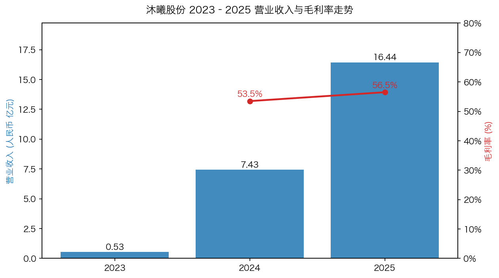
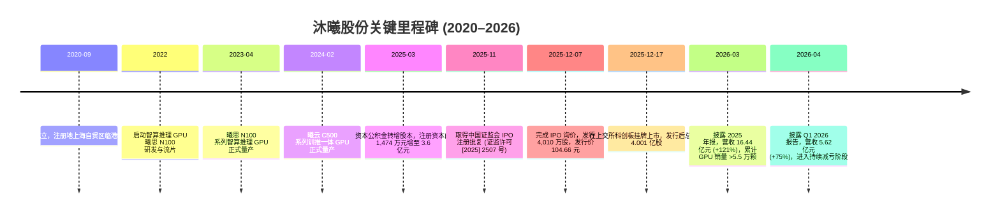
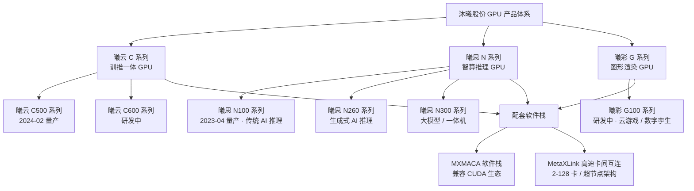
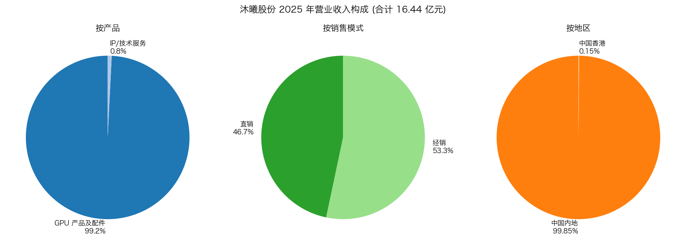
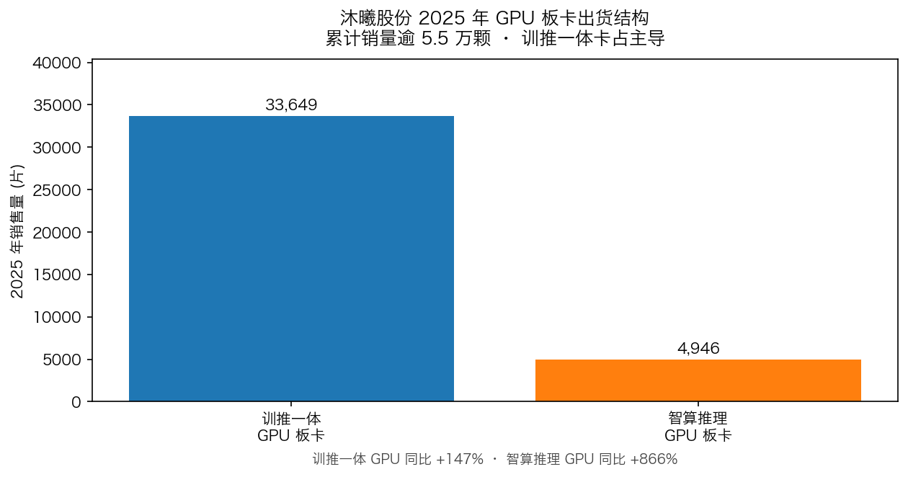
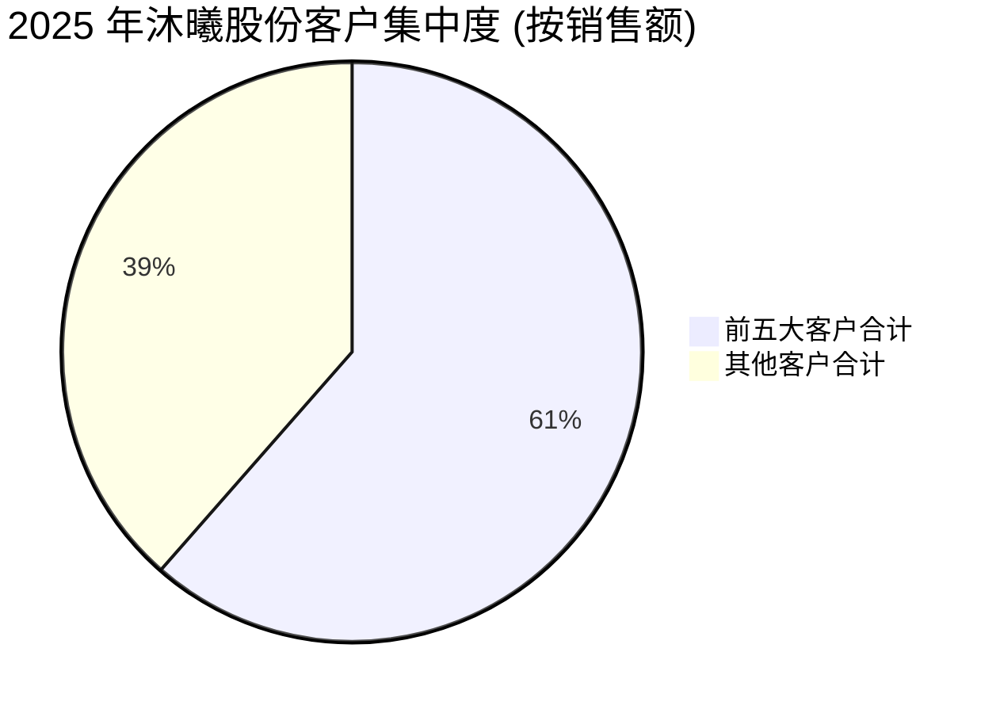
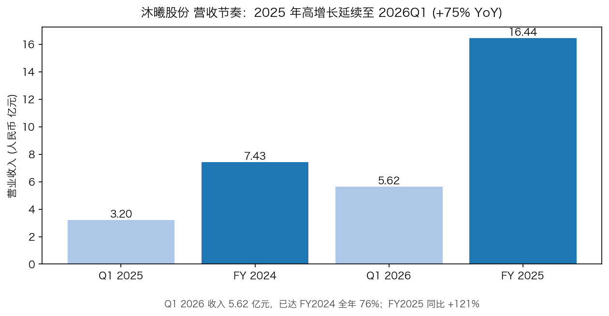
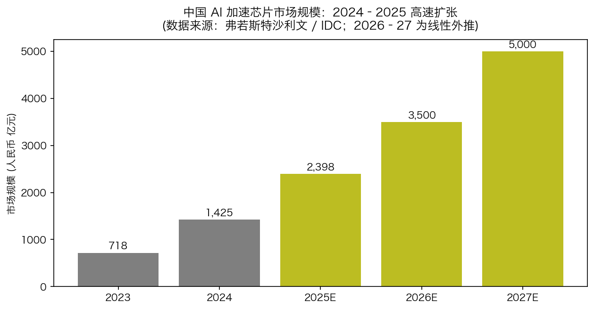
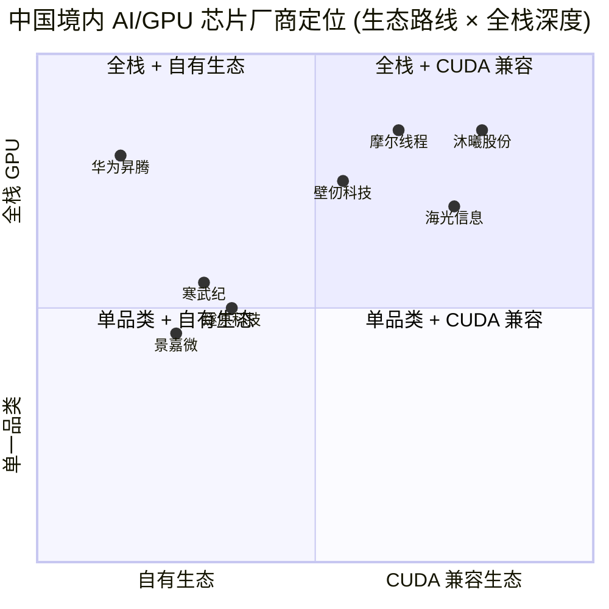
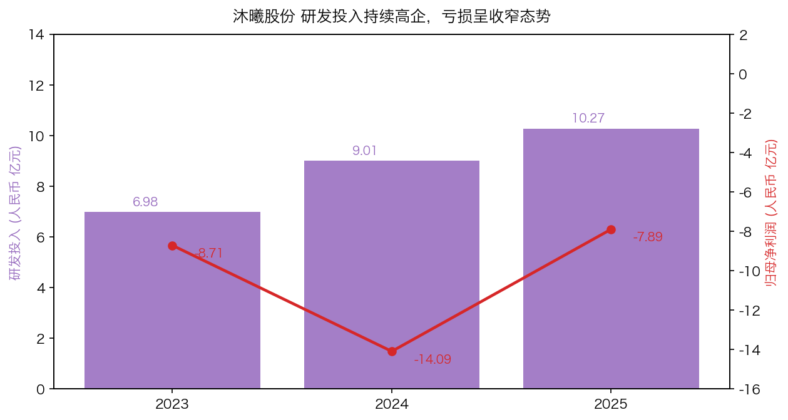

# 沐曦股份 (SSE:688802) 公司研究报告

**报告日期：** 2026-05-20
**公司全称：** 沐曦集成电路（上海）股份有限公司 (MetaX Integrated Circuits (Shanghai) Co., Ltd.)
**英文简称：** MetaX
**股票代码：** 上交所科创板 688802
**上市日期：** 2025 年 12 月 17 日
**发行价：** 104.66 元 / 股 ([沐曦股份 2025 年年度报告, 第 101 页](https://static.cninfo.com.cn/finalpage/2026-03-27/1225036092.PDF))

> **Update — IPO 后首份完整年报披露 (2026-03-26)：** 公司 2025 年实现营业收入 16.44 亿元 (同比 +121.26%)，归母净利润 -7.89 亿元 (同比减亏 43.97%)，GPU 板卡累计销量逾 5.5 万颗。2026 年一季度延续高增长，营收 5.62 亿元 (同比 +75.37%)，归母净亏损收窄至 -0.99 亿元 (上年同期 -2.33 亿元)；公司未在年报或 Q1 中提供 2026 全年量化指引，目前以"持续减亏、加速国产替代"作为定性指引。
> 来源：[沐曦股份 2025 年年度报告, 第 11–12 页](https://static.cninfo.com.cn/finalpage/2026-03-27/1225036092.PDF)；[沐曦股份 2026 年第一季度报告](https://static.cninfo.com.cn/finalpage/2026-04-30/1225262116.PDF)。

---

## 目录

1. 公司概览
2. 公司历史
3. 管理团队
4. 产品与服务
5. 客户与上市策略 (Customers & Go-to-Market)
6. 行业概览
7. 竞争格局
8. 市场机会 (TAM)
9. 风险评估
10. 参考资料

---

## 1. 公司概览 (Company Overview)

沐曦集成电路（上海）股份有限公司（以下简称"沐曦股份"或"公司"）是一家专注于高性能通用 GPU (General-Purpose GPU) 芯片研发、设计与销售的 Fabless 集成电路设计企业，于 2025 年 12 月 17 日在上海证券交易所科创板挂牌上市，证券代码 688802。公司主营业务为研发、设计和销售应用于人工智能 (AI) 训练和推理、通用计算（包括科学计算）与图形渲染领域的全栈 GPU 产品，并围绕 GPU 芯片提供配套的软件栈与计算平台 ([沐曦股份 2025 年年度报告, 第 17 页](https://static.cninfo.com.cn/finalpage/2026-03-27/1225036092.PDF))。

**业务定位与商业模式。** 公司采用典型的 Fabless 模式：自身负责 GPU 芯片的规格定义、架构设计、核心 IP 开发、封装设计、物理设计与设计验证，将晶圆加工、封装测试通过委外方式完成 ([沐曦股份 2025 年年度报告, 第 19 页](https://static.cninfo.com.cn/finalpage/2026-03-27/1225036092.PDF))。盈利模式以销售 GPU 板卡及集成自身 GPU 板卡的硬件产品（服务器、一体机/工作站、智算集群）为主，2025 年 GPU 产品及配件收入占主营业务收入的 99.19%，IP/技术服务收入仅占 0.81% ([沐曦股份 2025 年年度报告, 第 38 页](https://static.cninfo.com.cn/finalpage/2026-03-27/1225036092.PDF))。销售模式为直销与经销并行：2025 年经销收入 8.76 亿元（占比 53.3%），直销收入 7.68 亿元（占比 46.7%）；经销渠道增速 (+215.7%) 显著高于直销 (+65.3%)，反映公司在快速扩张的 GPU 一体机/服务器集成商渠道获得显著放量。

**规模与员工。** 截至 2025 年末公司研发人员 675 人，占员工总数的 73%，其中博士 26 人、硕士 446 人 ([沐曦股份 2025 年年度报告, 第 34 页](https://static.cninfo.com.cn/finalpage/2026-03-27/1225036092.PDF))。报告期内研发投入合计 10.27 亿元，占营业收入 62.49%；研发人员平均年薪 75.27 万元，足见其在高端 GPU 设计人才上的投入强度。截至 2025 年末公司 GPU 产品累计销量超过 55,000 颗，已部署于 10 余个智算集群，覆盖北京、上海、杭州、长沙、香港等地的国家算力平台、运营商智算平台和商业化智算中心 ([沐曦股份 2025 年年度报告, 第 20 页](https://static.cninfo.com.cn/finalpage/2026-03-27/1225036092.PDF))。

**财务概况与历史比较：**

| 指标 (人民币) | 2023 | 2024 | 2025 |
|---|---:|---:|---:|
| 营业收入 (亿元) | 0.53 | 7.43 | 16.44 |
| 同比增速 | — | +1,301.5% | +121.3% |
| 归母净利润 (亿元) | -8.71 | -14.09 | -7.89 |
| 扣非归母净利润 (亿元) | -8.90 | -10.44 | -8.30 |
| 经营性现金流 (亿元) | -10.17 | -21.48 | -12.60 |
| 综合毛利率 | n/a | 53.49% | 56.51% |
| 研发费用 (亿元) | 6.98 | 9.01 | 10.27 |
| 研发占营收比 | 1,317.6% | 121.2% | 62.5% |
| 总资产 (亿元) | 16.32 | 38.90 | 136.75 |
| 归母净资产 (亿元) | 12.11 | 11.78 | 131.65 |

数据来源：[沐曦股份 2025 年年度报告, 第 11–12、37–38 页](https://static.cninfo.com.cn/finalpage/2026-03-27/1225036092.PDF)。

来源：[沐曦股份 2025 年年度报告, 第 11–12、38 页](https://static.cninfo.com.cn/finalpage/2026-03-27/1225036092.PDF)。

**估值快照 (Valuation Snapshot)。** 沐曦股份属于"上市时未盈利且尚未实现盈利"的科创板第五套标准发行企业 ([沐曦股份 2025 年年度报告, 第 2 页](https://static.cninfo.com.cn/finalpage/2026-03-27/1225036092.PDF))，TTM 净利润仍为负值，**TTM P/E 不适用**（市场通常以 P/S 与远期 P/E 衡量）。

按 IPO 发行价 104.66 元 × 总股本 4.001 亿股计算，公司 IPO 时静态市值约 **418.7 亿元**；以 2025 年营业收入 16.44 亿元为基数，**IPO 发行价对应 P/S 约 25.5×**。这一估值显著高于全球可比 GPU/AI 加速芯片公司 (NVIDIA 当前 TTM P/S 约 30×、AMD 约 8–10×；详见参考资料中 Eastmoney/Yahoo Finance 链接，二级市场实时倍数请投资者自行核对)。报告中不再援引 IPO 后特定时点的二级市场收盘价 / 总市值 / 动态 P/S，原因是本研究在生成时无法实时访问行情接口；**最新交易价、市值、动态 P/E 与 P/S，请投资者在 [东方财富 688802 行情页](https://quote.eastmoney.com/sh688802.html) 或 [上海证券交易所 688802](https://www.sse.com.cn/assortment/stock/list/info/company/index.shtml?COMPANY_CODE=688802) 自行核对**。

**为何"PS 25× 起步"在国产 GPU 第一梯队属于常态？**

1. **高成长溢价。** 公司 2024 (+1,302%)、2025 (+121%)、Q1 2026 (+75%) 三段台阶式高增长，且 2025 年实现 56.5% 毛利率，市场愿为持续放量给予 PSG (price-to-sales-growth) 折扣 ([沐曦股份 2025 年年度报告, 第 37 页](https://static.cninfo.com.cn/finalpage/2026-03-27/1225036092.PDF))。
2. **国产替代赛道总龙头属性。** 在美国 BIS 实体清单与先进制程出口管制持续收紧的背景下，中国境内 AI 加速芯片市场规模 2024 年达 1,425 亿元、同比 +98% ([沐曦股份 2025 年年度报告, 第 19–20 页](https://static.cninfo.com.cn/finalpage/2026-03-27/1225036092.PDF) 引弗若斯特沙利文 / IDC 数据)，沐曦作为少数实现千卡集群商业化的全栈 GPU 供应商，被资本市场赋予稀缺性溢价。
3. **科创板第五套标准发行的政策属性。** 第五套标准允许未盈利"硬科技"企业上市，本身就吸引一批长线资金参与；红杉、和利资本、混沌投资、葛卫东、经纬创投、引领区基金等明星机构合计持股逾 18% ([沐曦股份 2026 年第一季度报告, 第 4–5 页](https://static.cninfo.com.cn/finalpage/2026-04-30/1225262116.PDF))，对估值具备一定支撑。
4. **估值压缩风险并存。** 当前 P/S 完全建立在"持续放量 + 美国制裁不放松 + 大模型资本开支不退坡"三个假设之上，**若任一假设松动，多倍 P/S 会显著回吐**——这一点已在第 9 节列为重大估值风险。

---

## 2. 公司历史 (Company History)

**创立与团队基因。** 沐曦集成电路成立于 2020 年 9 月，由原 AMD（超威半导体）上海团队核心成员陈维良（董事长、总经理）、彭莉（首席技术官）、杨建（首席技术官）等共同发起。三位创始人在 AMD 上海拥有合计逾 40 年的 GPU 设计、IP 与软件栈工作经验：陈维良于 2007–2020 年任 AMD 上海高级总监，彭莉于 2007–2020 年任 AMD 上海科学家，杨建于 2007–2019 年任 AMD 上海企业院士 ([沐曦股份 2025 年年度报告, 第 50–52 页](https://static.cninfo.com.cn/finalpage/2026-03-27/1225036092.PDF))。这一"AMD 上海背景 + 国内本土落地"的团队基因，使公司在创立之初即具备完整 GPU 量产流程经验，成为国产高性能 GPU 第一梯队的关键先发优势。

**关键里程碑：**

来源：[沐曦股份 2025 年年度报告, 第 11、99–101 页](https://static.cninfo.com.cn/finalpage/2026-03-27/1225036092.PDF)。

**战略演进。** 公司战略经过三次清晰演进：(1) **2020–2022 年研发驱动期** — 聚焦自研 GPU IP、指令集和架构突破；(2) **2023–2024 年产品商业化期** — 曦思 N100、曦云 C500 相继量产，验证"国产 GPU 大规模落地"可行性；(3) **2025 年以来"1+6+X"生态扩张期** — 公司明确以"1 个基础算力底座（GPU 产品） + 6 个重点行业（教科研、金融、交通、能源、医疗健康、大文娱） + X 个前沿方向（具身智能、低空经济等）"为生态商业布局，并通过 IPO 募资规模化扩产 ([沐曦股份 2025 年年度报告, 第 20、38 页](https://static.cninfo.com.cn/finalpage/2026-03-27/1225036092.PDF))。

**重大资本运作与股权事件。** (1) 2025 年 3 月，公司以资本公积金向全体股东同比例转增 3.4526 亿股，注册资本由 1,473.96 万元增至 3.6 亿元，为 IPO 前股本结构铺垫 ([沐曦股份 2025 年年度报告, 第 99 页](https://static.cninfo.com.cn/finalpage/2026-03-27/1225036092.PDF))；(2) 2025 年 11 月 12 日证监会下发 IPO 注册批复；(3) 2025 年 12 月 17 日科创板挂牌，发行后总股本 4.001 亿股。IPO 前后公司资产规模从 38.90 亿元跃升至 136.75 亿元，资产负债率从 69.71% 降至 3.73%，反映 IPO 募集资金对资产负债表的根本性重塑 ([沐曦股份 2025 年年度报告, 第 101 页](https://static.cninfo.com.cn/finalpage/2026-03-27/1225036092.PDF))。

**近期重大事项 (2025–2026)。** 除 IPO 上市外，公司在年报披露日尚未实施分红或资本公积转增方案（"2025 年度拟不进行现金分红，不送红股，不以资本公积金转增股本"），原因是母公司报表存在累计未弥补亏损 -15.49 亿元，目前不满足现金分红前提 ([沐曦股份 2025 年年度报告, 第 2 页](https://static.cninfo.com.cn/finalpage/2026-03-27/1225036092.PDF))。Q1 2026 业绩预告与正式季报的差异较小（实际营收 5.62 亿元，落在指引 4.0–6.0 亿元区间上沿），且公司明确表态"目前尚未发现可能影响业绩预告内容准确性的重大不确定因素" ([沐曦股份 2026 年第一季度业绩预告, 2026-03-04](https://static.cninfo.com.cn/finalpage/2026-03-05/1224995877.PDF))。

---

## 3. 管理团队 (Management Team)

### 陈维良 — 董事长、总经理、实际控制人 (创始人)

陈维良，1976 年 8 月出生，博士研究生，公司创始人、实际控制人及最大个人股东。陈维良在创立沐曦之前在 GPU 行业有近 20 年深度积累：2002 年 7 月–2003 年 9 月任泰鼎多媒体技术（上海）高级工程师；2003 年 10 月–2006 年 3 月任远弘科技（上海）GPU 设计经理；2006 年 3 月–12 月任亚鼎视频科技（上海）GPU 设计经理；**2007 年 1 月–2020 年 8 月任超威半导体（上海）有限公司 (即 AMD 上海) 高级总监**——这一段长达 13 年的 AMD 中国 GPU 研发管理经验，是沐曦"AMD 系国产 GPU"团队基因的核心 ([沐曦股份 2025 年年度报告, 第 52 页](https://static.cninfo.com.cn/finalpage/2026-03-27/1225036092.PDF))。2020 年 9 月从 AMD 离任后，陈维良随即创立沐曦股份并担任董事长、总经理至今。

**股权与控制权结构。** 截至 2026 年 3 月 31 日，陈维良直接持股 2,013 万股，占总股本 5.03%。陈维良同时担任控股股东上海骄迈企业咨询合伙企业（有限合伙）及其一致行动人上海曦骥企业咨询合伙企业（有限合伙）的执行事务合伙人；上海骄迈持股 11.96%、上海曦骥持股 3.64%。**根据《上市公司收购管理办法》认定，上海骄迈、上海曦骥与陈维良构成一致行动人，合计持股 20.63%，陈维良为公司实际控制人** ([沐曦股份 2026 年第一季度报告, 第 4 页](https://static.cninfo.com.cn/finalpage/2026-04-30/1225262116.PDF))。陈维良在年报披露的 IPO 锁定承诺中作出严格自我约束：上市 36 个月内不转让上市前持股；若公司 2026/2027/2028 年仍未盈利或扣非归母净利润下滑 50% 以上，对应延长锁定期 12 个月，叠加上述条款最长可延至 2030 年末 ([沐曦股份 2025 年年度报告, 第 72–73 页](https://static.cninfo.com.cn/finalpage/2026-03-27/1225036092.PDF))。报告期内陈维良税前薪酬 320.33 万元。

**公开形象与产业判断。** 陈维良在公司年报中以"不负历史，为民族复兴、国家强盛贡献科技力量"作为公司使命表述 ([沐曦股份 2025 年年度报告, 第 17 页](https://static.cninfo.com.cn/finalpage/2026-03-27/1225036092.PDF))，将国产 GPU 自主可控置于公司核心战略叙事。陈维良在年报中 19 次董事会全部亲自出席，并担任战略委员会召集人，深度参与产品路线与生态布局决策。

### 彭莉 — 董事、副总经理、首席技术官 (CTO)

彭莉，1978 年 3 月出生，硕士研究生（上海交通大学电路与系统专业），公司联合创始人、首席技术官。彭莉在 GPU 领域的关键履历：2007 年 7 月–2020 年 9 月任**超威半导体（上海）有限公司科学家**——AMD 内部"科学家"职级通常对应 IC 架构 / IP / 验证领域顶级技术专家，是少数能与全球 GPU 微架构演进直接对话的中国本土技术骨干 ([沐曦股份 2025 年年度报告, 第 52 页](https://static.cninfo.com.cn/finalpage/2026-03-27/1225036092.PDF))。彭莉在沐曦主导 GPU 微架构、IP 与设计验证体系，是公司技术体系的关键奠基人。报告期内薪酬 240.39 万元。

### 杨建 — 董事、副总经理、首席技术官 (CTO)

杨建，1973 年 5 月出生，博士研究生。2007 年 1 月–2019 年 11 月任**超威半导体（上海）有限公司企业院士 (Fellow)**——AMD"Fellow"是研发体系内的最高技术荣誉，全球任职者数量极少。杨建在沐曦联合主导 GPU 芯片整体技术架构与软硬件协同优化 ([沐曦股份 2025 年年度报告, 第 52 页](https://static.cninfo.com.cn/finalpage/2026-03-27/1225036092.PDF))。报告期内薪酬 227.42 万元。

**三位创始人的"AMD 上海铁三角"是公司核心竞争壁垒之一**：在国内罕有的、能完整覆盖 GPU 微架构 + IP + 软件栈 + 量产工程的高资历团队组合，并且经历过完整的国际一线公司 GPU 产品迭代。

### 魏忠伟 — 财务负责人、董事会秘书 (CFO + 董秘)

魏忠伟，1976 年出生，公司财务负责人兼董事会秘书，2024 年 12 月任董秘至今，2027 年 12 月任期届满。报告期内主导公司科创板 IPO 财务与信息披露工作。报告期薪酬 147.81 万元。魏忠伟亦做出严格的离任后股份锁定承诺（任职期间每年减持不超过 25%，离职后 6 个月内不转让），并自愿承担"若上市 6 个月内股价连续 20 日低于发行价则锁定期自动延长 6 个月"的稳价义务 ([沐曦股份 2025 年年度报告, 第 76 页](https://static.cninfo.com.cn/finalpage/2026-03-27/1225036092.PDF))。

### 王爽 — 董事、核心技术人员

王爽，1985 年出生，2025 年 3 月当选董事；同时为公司"核心技术人员"，深度参与 GPU 软件栈 (MXMACA / CUDA 兼容生态) 工作。报告期薪酬 175.39 万元 ([沐曦股份 2025 年年度报告, 第 50–52 页](https://static.cninfo.com.cn/finalpage/2026-03-27/1225036092.PDF))。

### 治理架构 (Governance)

- **董事会构成。** 公司董事会共 9 人，含独立董事 3 人 (李树华 — 审计委员会召集人；刘辛蕊 — 提名委员会召集人；朱琴 — 薪酬与考核委员会召集人)。独立董事比例 33.3%，符合科创板及《公司法》规定。专门委员会下设审计、提名、薪酬与考核、战略四个委员会 ([沐曦股份 2025 年年度报告, 第 50–58 页](https://static.cninfo.com.cn/finalpage/2026-03-27/1225036092.PDF))。
- **股东结构。** 截至 2026 年 3 月 31 日普通股股东 28,699 户。前十大股东包括：控股股东上海骄迈 (11.96%)、陈维良 (5.03%)、上海曦骥 (3.64%)、南京和利国信智芯 (3.59%)、葛卫东 (3.58%, 自然人)、上海混沌投资 (3.15%, 葛卫东控制)、深圳市瀚辰创业 (3.13%, 红杉系)、上海浦东引领区 (2.41%)、南京经乾二号 (2.08%)、中国国有企业结构调整基金 (1.76%) ([沐曦股份 2026 年第一季度报告, 第 4–5 页](https://static.cninfo.com.cn/finalpage/2026-04-30/1225262116.PDF))。**股东背景兼具国家队 (国调基金、浦东引领区) + 顶级 VC/PE (红杉、和利、经纬) + 知名个人投资人 (葛卫东 / 混沌投资) 组合，反映国产高端芯片"政策资金 + 市场化资本"的典型股权设计。**
- **薪酬激励。** 公司年报披露"扣除股份支付影响后的净利润" -5.28 亿元 (2025) 较账面亏损 -7.89 亿元改善 33%，表明股份支付费用 (员工股权激励) 对当期利润形成约 2.61 亿元拖累；从趋势看 2024 年股份支付影响约 -4.69 亿元，2025 年减少近半。员工高比例股权激励对应"IPO 后 3 年内未盈利将延长锁定期"机制，整体形成"上下捆绑、激励与约束并存"的治理结构 ([沐曦股份 2025 年年度报告, 第 17 页](https://static.cninfo.com.cn/finalpage/2026-03-27/1225036092.PDF))。
- **关联交易与同业竞争。** 控股股东上海骄迈及实际控制人陈维良已作出避免同业竞争、规范与减少关联交易承诺，报告期未发现未及时履行的违约情形 ([沐曦股份 2025 年年度报告, 第 68–70 页](https://static.cninfo.com.cn/finalpage/2026-03-27/1225036092.PDF))。

**管理团队履职评估。** 创始团队在 2020 年成立后 3 年内完成首款产品流片、5 年内实现 16 亿元营收 + 5.5 万颗 GPU 出货 + 科创板上市，从执行节奏看处于国内国产 GPU 第一梯队前列。**关键观察项是 (1) 2026–2028 年能否如承诺函中的隐含目标"于 2026 年实现盈利"；(2) 是否能在美国制裁压力下保持先进制程晶圆代工与 HBM 替代供应链的稳定。**目前公司明确披露"在先进制程晶圆代工和 HBM 供应等方面受到不利限制" ([沐曦股份 2025 年年度报告, 第 35 页](https://static.cninfo.com.cn/finalpage/2026-03-27/1225036092.PDF))，是管理团队短期最大挑战。

---

## 4. 产品与服务 (Products & Services)

### 产品矩阵概览

公司产品基于自主研发的 GPU IP、指令集与统一 GPU 计算和渲染架构，覆盖 **人工智能计算、通用计算 (含科学计算)、图形渲染** 三大领域，形成"曦云 / 曦思 / 曦彩"三大产品线 ([沐曦股份 2025 年年度报告, 第 18 页](https://static.cninfo.com.cn/finalpage/2026-03-27/1225036092.PDF))：

来源：[沐曦股份 2025 年年度报告, 第 18 页](https://static.cninfo.com.cn/finalpage/2026-03-27/1225036092.PDF)。

### 主要产品逐项分析

**(1) 曦云 C 系列 (训推一体 GPU) — 公司主力旗舰产品。** 包括曦云 C500 (2024 年 2 月量产) 与曦云 C600 (研发中)。曦云 C 系列具备多精度混合算力，内置大量运算核心，定位**云端智算训练与推理一体、通用计算与 AI for Science**。2025 年训推一体 GPU 板卡销量 33,649 片，同比 +147.31%，是公司主力放量品类 ([沐曦股份 2025 年年度报告, 第 18、39 页](https://static.cninfo.com.cn/finalpage/2026-03-27/1225036092.PDF))。
- **竞争优势：** 是。**moat 类型：技术 + 生态**——公司是国内"少数几家全面系统掌握通用 GPU 架构、GPU IP、高性能 GPU 芯片及其基础系统软件研发、设计和量产核心技术的企业之一"，单卡性能处于国内第一梯队，集群规模已实现千卡线性度商业化 ([沐曦股份 2025 年年度报告, 第 20 页](https://static.cninfo.com.cn/finalpage/2026-03-27/1225036092.PDF))。
- **证据：** GPU 累计销量 >55,000 颗，部署于 10 余个智算集群；2025 年综合毛利率 56.51%（GPU 产品及配件毛利率 56.17%），高于此前国产 AI 芯片可比同业平均水平。
- **对标竞品：** 直接对标 NVIDIA A800 / H800 (国内合规版) 与昇腾 910B。**单卡 FP16/BF16 算力上沐曦官方未披露具体 TFLOPS 数据**（公司以"国内第一梯队"定性描述），从落地场景看已支持 MoE 大模型 / 类脑大模型 / 强化学习全量预训练与推理，在大模型训推一体场景具备实战验证。

**(2) 曦思 N 系列 (智算推理 GPU) — 第二曲线高增长品类。** 包含 N100 (2023 年 4 月量产，传统 AI/视频处理/智慧城市)、N260 / N300 (生成式 AI 推理、一体机/工作站)。2025 年智算推理 GPU 板卡销量 4,946 片，**同比 +866.02%**，是 2025 年最高增速品类 ([沐曦股份 2025 年年度报告, 第 39 页](https://static.cninfo.com.cn/finalpage/2026-03-27/1225036092.PDF))。
- **竞争优势：** 部分 (Partial)。**moat 类型：场景 + 软件兼容性**——在云端推理、智慧城市、智慧交通、视频转码场景已有规模化落地，N260/N300 切入大模型推理市场，与训推一体形成互补；但推理市场参与者更多 (寒武纪、海光、华为昇腾推理产品线、燧原、壁仞等)，差异化要靠 CUDA 生态迁移效率与一体机方案的整体性能价格比。
- **对标竞品：** 寒武纪思元 590 (推理)、华为昇腾 310B、海光 DCU 推理版。

**(3) 曦彩 G 系列 (图形渲染 GPU) — 战略储备品类。** 曦彩 G100 系列研发中，面向云游戏、数字孪生、云渲染、影视动画、专业制图等图形处理场景。**目前尚未规模化量产，报告期内收入贡献可忽略，但代表公司由"AI/通用计算"向"全栈 GPU"扩展的长期战略意图。**
- **竞争优势：** 暂未充分验证。
- **对标竞品：** NVIDIA RTX / GeForce 系列、AMD Radeon、景嘉微 (国产图形 GPU 代表)、芯动科技"风华"系列。

**(4) MXMACA 软件栈 — 关键差异化壁垒。** 自主构建的统一全栈式 GPU 软件栈，**高度兼容国际主流 CUDA 生态**，覆盖应用开发、功能调试、性能调优，公司称其具有"较高的易用性和迁移效率，在通用性和灵活性上具备独特的竞争力" ([沐曦股份 2025 年年度报告, 第 20 页](https://static.cninfo.com.cn/finalpage/2026-03-27/1225036092.PDF))。**这是公司相较其他国产 GPU 品牌（昇腾使用 MindSpore + CANN、寒武纪使用 NeuWare、海光走 ROCm-DTK 路线）的最大差异化路径之一**——CUDA 兼容路线降低了客户从 NVIDIA 平台迁移成本，但同时也面临 NVIDIA EULA 法律风险与生态依附性的潜在制约。
- **竞争优势：** 是。**moat 类型：生态兼容 + 软件工具链护城河。**
- **关键风险：** NVIDIA CUDA EULA 自 2024 年起明文禁止"在非 NVIDIA 硬件上通过翻译层运行 CUDA 软件"，公司年报未明确披露 MXMACA 与 CUDA 的兼容实现方式（源码移植 vs. 二进制翻译层），存在潜在法律不确定性。

**(5) MetaXLink 高速卡间互连 — 集群算力关键能力。** 自研高带宽卡间互连，可实现 2–128 卡多种互连拓扑及超节点架构，是国内罕见、可与 NVIDIA NVLink 直接对标的国产卡间互连方案 ([沐曦股份 2025 年年度报告, 第 20 页](https://static.cninfo.com.cn/finalpage/2026-03-27/1225036092.PDF))。
- **竞争优势：** 是。**moat 类型：技术 + 集群解决方案。**

### 2025 年收入结构与旗舰产品判断

来源：[沐曦股份 2025 年年度报告, 第 38 页](https://static.cninfo.com.cn/finalpage/2026-03-27/1225036092.PDF)。

来源：[沐曦股份 2025 年年度报告, 第 39 页](https://static.cninfo.com.cn/finalpage/2026-03-27/1225036092.PDF)。

**旗舰判断：** 当前公司 1 个"旗舰产品" = 曦云 C500 (训推一体 GPU)。2025 年 GPU 产品及配件收入 16.31 亿元，其中训推一体板卡销量 (33,649 片) 是智算推理板卡 (4,946 片) 的 6.8 倍；按公司"训推一体板卡占主营业务收入主体"的定性描述（年报未拆分单卡均价），**估计训推一体 GPU 贡献了 2025 年收入的 70%–80%**——其余由智算推理 GPU、GPU 服务器一体机、IP/技术服务构成。

### 近 12 个月产品发布 / 路线

公司年报披露"曦云 C600 系列、曦思 N260 / N300 系列、曦彩 G100 系列"为下一阶段重点研发项目，路线图基本延续"训推一体放量 + 推理矩阵扩张 + 图形渲染补齐"的全栈战略 ([沐曦股份 2025 年年度报告, 第 18 页](https://static.cninfo.com.cn/finalpage/2026-03-27/1225036092.PDF))。**年报未披露 C600 / G100 的预期量产时点，亦未公布与 H100/B100 / 昇腾 910B 的对标 benchmark 数据**，属于公司基于商业秘密的信息豁免披露（年报第 17 页明确说明"因涉及商业秘密，公司对可能对本公司经营产生不利影响、损害公司、股东及交易对方利益的信息豁免披露"）。

---

## 5. 客户与上市策略 (Customers & Go-to-Market)

### 客户结构与集中度 (REQUIRED)

**2025 年前五大客户销售额 10.10 亿元，占年度销售总额 61.46%；其中关联方销售额 0.00 万元，占比 0.00%。** 报告期内公司"不存在向单个客户的销售比例超过总额 50% 的情形" ([沐曦股份 2025 年年度报告, 第 40 页](https://static.cninfo.com.cn/finalpage/2026-03-27/1225036092.PDF))。年报未具名披露前五大客户身份（基于行业惯例与商业秘密考量）。

来源：[沐曦股份 2025 年年度报告, 第 40 页](https://static.cninfo.com.cn/finalpage/2026-03-27/1225036092.PDF)。

**集中度判断：** 前五大 61.46% 已属于较高集中度（高于 50% 阈值），需在第 9 节作为重大经营风险列示。由于公司未具名披露客户身份，存在两类潜在情形：(1) 大型互联网/云服务/运营商集采（如三大运营商智算平台、商业化智算中心运营商）；(2) 国家或地方算力调度平台（公司年报披露"算力网络覆盖国家人工智能公共算力平台、运营商智算平台"）。后者属于政策性大客户，回款节奏与采购计划受公共预算影响，回款周期可能拉长。

**应收账款风险加剧。** 2025 年末应收账款账面价值 7.26 亿元 (期末再次升至 9.33 亿元于 2026Q1)，占当期营业收入 44.14%；2026Q1 末应收账款较 2025 年末进一步增加 28.5%。公司在年报中明确警告"部分大额应收账款客户尚未完成全部回款，如该等客户财务状况恶化或付款进度不及预期，则相关应收账款可能面临无法全部收回的风险" ([沐曦股份 2025 年年度报告, 第 36 页](https://static.cninfo.com.cn/finalpage/2026-03-27/1225036092.PDF))；[沐曦股份 2026 年第一季度报告, 第 6 页](https://static.cninfo.com.cn/finalpage/2026-04-30/1225262116.PDF))。

### 客户分行业分布

按公司"1+6+X"战略叙述，6 大重点行业为：(1) 教科研；(2) 金融；(3) 交通；(4) 能源；(5) 医疗健康；(6) 大文娱；X 包括"具身智能"与"低空经济"两个前沿方向 ([沐曦股份 2025 年年度报告, 第 17 页](https://static.cninfo.com.cn/finalpage/2026-03-27/1225036092.PDF))。算力网络部署区域包括北京、上海、杭州、长沙、中国香港等。

### 销售模式与渠道

公司采用"直销 + 经销"双轨制：
- **直销：** 销售团队直接参与客户公开招标 / 商务谈判，签订销售合同后发货并提供售后技术支持。2025 年直销收入 7.68 亿元，毛利率 53.51%（同比 +3.66pct）。
- **经销：** 经销商采购公司产品并向其下游客户销售；公司向经销商提供技术培训与技术支持。2025 年经销收入 8.76 亿元，毛利率 59.13%（同比 -0.41pct）；**经销渠道收入同比 +215.72%，是直销 (+65.34%) 的 3.3 倍增速**，反映 GPU 一体机集成商 / 智算中心系统集成商渠道的高速扩张 ([沐曦股份 2025 年年度报告, 第 38 页](https://static.cninfo.com.cn/finalpage/2026-03-27/1225036092.PDF))。

### 关键生态合作

公司公开披露"与整机服务器、操作系统、运维管理平台、主流 AI 框架、主流大模型等上下游生态广泛适配，通过芯片层、框架层、模型层的深度协同优化" ([沐曦股份 2025 年年度报告, 第 20 页](https://static.cninfo.com.cn/finalpage/2026-03-27/1225036092.PDF))。年报基于商业秘密未具名披露具体合作伙伴名单。

### 已交付能力锚点

截至 2025 年末，公司 GPU 产品**累计销量超过 55,000 颗**，并部署于 **10 余个智算集群**，覆盖国家人工智能公共算力平台、运营商智算平台和商业化智算中心——这是行业内罕有的、可量化的"千卡级商业化集群部署"实证 ([沐曦股份 2025 年年度报告, 第 20 页](https://static.cninfo.com.cn/finalpage/2026-03-27/1225036092.PDF))。

### 季度营收节奏

来源：[沐曦股份 2025 年年度报告, 第 11 页](https://static.cninfo.com.cn/finalpage/2026-03-27/1225036092.PDF) 与 [沐曦股份 2026 年第一季度报告, 第 1 页](https://static.cninfo.com.cn/finalpage/2026-04-30/1225262116.PDF)。

---

## 6. 行业概览 (Industry Overview)

### 行业定义

根据国家统计局《战略性新兴产业分类（2018）》，公司所处行业为"1 新一代信息技术产业 / 1.3 新兴软件和新型信息技术服务 / 1.3.4 新型信息技术服务 / 6520 集成电路设计"。公司 GPU 产品主要服务于人工智能产业链，与人工智能及半导体产业的发展密切相关 ([沐曦股份 2025 年年度报告, 第 19 页](https://static.cninfo.com.cn/finalpage/2026-03-27/1225036092.PDF))。

### 全球与中国 GPU / AI 加速芯片市场规模

- **全球 GPU 市场。** 根据 Verified Market Research 数据，2024 年全球 GPU 市场规模为 **773.9 亿美元**，预计 2030 年达到 **4,724.5 亿美元**（6 年 CAGR ≈ 35%）。来源：[沐曦股份 2025 年年度报告, 第 19 页](https://static.cninfo.com.cn/finalpage/2026-03-27/1225036092.PDF) 引 Verified Market Research。
- **中国 AI 加速芯片市场。** 根据弗若斯特沙利文数据，2024 年中国 AI 加速芯片市场规模约为 **1,425.37 亿元**，同比 +98.49%；2025 年预计增至 **2,398.00 亿元** (+68% YoY 预期)。来源同上。
- **中国加速计算服务器市场。** 根据 IDC 数据，2024 年中国加速计算服务器市场规模达到 **221 亿美元，同比 +134%**；预计到 2029 年中国加速计算服务器市场规模将超过千亿美元 ([沐曦股份 2025 年年度报告, 第 20 页](https://static.cninfo.com.cn/finalpage/2026-03-27/1225036092.PDF))。

来源：[沐曦股份 2025 年年度报告, 第 19–20 页](https://static.cninfo.com.cn/finalpage/2026-03-27/1225036092.PDF) (2023–2025E 数据)；2026–2027 为本报告基于历史增速线性外推，仅供参考。

### 行业驱动因素

1. **大模型资本开支驱动。** 2022 年末 ChatGPT 后全球大模型训练/推理算力需求爆发，国内字节跳动、阿里、百度、腾讯、华为、运营商三家 (中国移动、中国电信、中国联通) 智算中心资本投入显著放量；2024 年中国加速计算服务器 +134% 即由此驱动。
2. **国家"东数西算"工程与省级智算中心建设。** 截至 2025 年末已有数十个城市/省级智算中心进入采购或扩容期，沐曦 GPU 已落地 10+ 集群。
3. **国产替代政策驱动。** 2022 年 10 月 BIS 第一次对华出口管制 ("8/10 规则" 限制 A100/H100)，2023 年 10 月 BIS 更新规则 (限制 A800/H800)，2025 年仍在持续收紧。在这一背景下，"国产 GPU 第一梯队"成为云厂商、运营商与国资央企的强制配置选项。
4. **场景下沉。** 教科研、金融、政务、能源、医疗、大文娱、具身智能、低空经济等垂直场景对国产算力支付意愿持续提升。

### 技术门槛

公司年报明确指出 GPU 行业的进入壁垒：(1) **架构与 IP 深度** — 涉及硬件架构设计、IP/SoC 芯片设计、封装设计、软件架构设计、驱动程序及基础软件等多个专业领域，需长期经验积淀；(2) **快速演进性** — 大模型算法迭代驱动 GPU 朝"更高算力、更大存储、更高通信带宽、更多元混合精度"方向演进，新进入者难以短时间内掌握；(3) **量产能力** — 不仅是设计能力，更需"全流程量产经验"——这是沐曦 AMD 系团队的核心壁垒 ([沐曦股份 2025 年年度报告, 第 19 页](https://static.cninfo.com.cn/finalpage/2026-03-27/1225036092.PDF))。

### 监管环境

- **国内监管：** 公司受证监会、上交所科创板规则约束，需履行季度 / 半年度 / 年度信息披露义务。科创板第五套上市标准对应"未盈利硬科技企业"，IPO 后陈维良及高管层承担"延长锁定期"等延伸约束（详见第 3 节）。
- **国际监管：** 公司明确披露"在中美科技博弈持续升级的背景下，因美国政府相关政策影响，公司目前在先进制程晶圆代工和 HBM 供应等方面受到不利限制" ([沐曦股份 2025 年年度报告, 第 35 页](https://static.cninfo.com.cn/finalpage/2026-03-27/1225036092.PDF))。这一披露对应美国 BIS 对中国境内 AI 芯片企业的实体清单与制程出口管制，属于行业层面持续存在的不确定性。

### 行业结构与竞争动态

- **全球：** 经过多年发展，全球高性能 GPU 行业基本形成 **"一超一强" (英伟达 + AMD) 寡头垄断格局**，两家企业在综合技术实力、销售规模、资金实力、人员数量上优势明显 ([沐曦股份 2025 年年度报告, 第 36 页](https://static.cninfo.com.cn/finalpage/2026-03-27/1225036092.PDF))。
- **中国境内：** 受益于中美科技博弈和国产替代政策推动，国产 AI 芯片市场渗透率快速上升，但**整体上仍处于发展相对初期阶段，尚未形成较明朗的竞争格局**。未来可能有更多国内厂商进入。
- **供应商集中度高。** 由于先进制程晶圆代工厂 (TSMC / Samsung / SMIC) 与 HBM 供应商 (SK Hynix / Samsung / Micron) 的全球集中度极高，"部分供应商的产品或服务具有稀缺性和独占性，较难在短时间内形成同质量的国产替代"——这是公司明确披露的供应链风险 ([沐曦股份 2025 年年度报告, 第 35 页](https://static.cninfo.com.cn/finalpage/2026-03-27/1225036092.PDF))。

---

## 7. 竞争格局 (Competitive Landscape)

### 直接竞争对手 (国产 GPU/AI 加速芯片第一梯队)

| 公司 | 上市 | 主打产品 | 路线特征 | 与沐曦的关系 |
|---|---|---|---|---|
| **华为昇腾 (Ascend)** | 未单独上市 (海思控股) | 昇腾 910B / 310 系列 | "MindSpore + CANN + 昇腾"自有生态闭环 | 国产 AI 训练 / 推理芯片首要竞争者；生态自闭环 vs 沐曦 CUDA 兼容 |
| **寒武纪 (688256)** | 科创板 | 思元 590 / 370 | NeuWare 软件栈，云端 AI 芯片专精 | 直接竞品；2025 年也在大模型训练 / 推理上扩张 |
| **海光信息 (688041)** | 科创板 | DCU 深算系列 | x86 CPU (兼容海光 CPU 生态) + DCU 协处理器，DTK 软件栈 (ROCm 基础) | 训推一体直接竞品；CUDA 兼容路线最接近沐曦 |
| **燧原科技** | 未上市 (拟 IPO) | 邃思 / 云燧 | 自有 GCU 架构 | 推理与训练市场竞品 |
| **壁仞科技** | 未上市 (上海) | BR100 系列 | 自研 GPU 架构，对标 H100 | 高端 GPU 直接竞品；已遭美国制裁 |
| **天数智芯 (Iluvatar CoreX)** | 未上市 | "智铠"/"天垓"系列 | 通用 GPU 架构 | 中端 GPU 训练 / 推理竞品 |
| **景嘉微 (300474)** | 创业板 | JM 系列图形 GPU + JH 算力 GPU | 军工 / 国防 / 信创图形 GPU 起家 | 图形 GPU 与未来沐曦曦彩 G 系列竞品 |
| **摩尔线程 (Moore Threads)** | 未上市 | MTT S 系列 | 全栈 GPU，对标 NVIDIA 消费 + 数据中心 | 全栈定位最接近沐曦 |
| **NVIDIA (NVDA)** | NASDAQ | A800 / H800 / H20 (中国合规版) | CUDA 生态全球霸主 | 间接竞品；中国合规版仍为客户主要替代选择 |
| **AMD (AMD)** | NASDAQ | MI300 系列 (受限) | ROCm 生态 | 间接竞品；中国市场份额较低 |

公司年报中明确将"英伟达和 AMD 组成的'一超一强'寡头垄断格局"作为全球行业竞争结构描述 ([沐曦股份 2025 年年度报告, 第 36 页](https://static.cninfo.com.cn/finalpage/2026-03-27/1225036092.PDF))。

### 定位框架

来源：本报告整理。沐曦坐标基于年报"统一架构 + CUDA 兼容 MXMACA + 训推一体 / 推理 / 渲染全覆盖"定位描述。

### 沐曦的核心竞争优势

1. **AMD 系核心团队的稀缺性。** 创始团队拥有 13+ 年 AMD 上海 GPU 设计 / IP / 验证经验，是中国大陆 GPU 设计领域为数极少的"系统性 GPU 量产经验"团队（详见第 3 节）。
2. **训推一体定位 + 千卡集群已商业化。** 国内**少数真正实现千卡集群大规模商业化应用的 GPU 供应商**，并正研发万卡集群；已商业支持 MoE / 类脑大模型 / 强化学习等模型架构 ([沐曦股份 2025 年年度报告, 第 20 页](https://static.cninfo.com.cn/finalpage/2026-03-27/1225036092.PDF))。
3. **CUDA 兼容降低迁移成本。** MXMACA 软件栈高度兼容 CUDA 生态，相对昇腾 / 寒武纪自有生态在客户迁移上具备劣势更低的特点。
4. **MetaXLink 卡间互连。** 国内罕有的 NVLink-级别卡间互连方案，对应大模型训练超节点架构需求。
5. **2025 年综合毛利率 56.5% 显著高于同业。** 寒武纪 2024 年综合毛利率约 50%、海光信息 2024 年约 60%、华为昇腾未上市无可比数据；沐曦 56.5% 处于第一梯队水平。

### 沐曦的竞争劣势 / 脆弱性

1. **生态深度依赖美国 CUDA 路径。** MXMACA 路线优势同时也是软肋——若 NVIDIA 加强对 CUDA 兼容方的法律打压，公司迁移路径可能受影响。
2. **先进制程晶圆与 HBM 供应受限。** 公司明确披露在 HBM、EDA、部分接口 IP 等方面"主要终端供应商来自境外"且"受到不利限制" ([沐曦股份 2025 年年度报告, 第 35 页](https://static.cninfo.com.cn/finalpage/2026-03-27/1225036092.PDF))。这可能直接限制下一代曦云 C600 的算力跃迁。
3. **现金流持续为负、应收账款高企。** 2025 年经营性现金流 -12.60 亿元，应收账款占营收 44%，现金循环效率仍弱（详见第 9 节）。
4. **未盈利且 2026 年也大概率不会盈利。** 2026Q1 仍亏损 0.99 亿元，全年扭亏概率较低；公司在 IPO 承诺中已明示 2026/2027/2028 三个时间窗口的盈利对赌条款。
5. **客户集中度 61.5%、单一行业 (智算中心) 周期性。** 一旦智算中心建设节奏放缓，公司放量节奏将受冲击。

### 市场份额

公司未单独披露中国境内 AI 加速芯片 / GPU 市场份额数据。**以 2025 年公司营收 16.44 亿元 / 中国 AI 加速芯片市场规模 2024 年 1,425 亿元 + 2025 年预计 2,398 亿元为基数粗略估算**，沐曦在中国 AI 加速芯片市场的份额约为 **0.7%–1.0%**（est., based on 沐曦营收 / 弗若斯特沙利文行业规模）。但需注意：(1) 国产化部分 (排除 NVIDIA / AMD 的中国合规版与水货) 市场规模显著更小，沐曦在"国产 GPU"细分市场份额可能在 5%–10% 量级；(2) 千卡集群已部署案例稀缺，沐曦在该细分上的相对地位高于纯营收份额。

---

## 8. 市场机会 (TAM)

### TAM (Total Addressable Market) 测算

- **全球 GPU 总市场 (TAM)：** 2024 年 **773.9 亿美元**，2030 年 **4,724.5 亿美元** (Verified Market Research)。来源：[沐曦股份 2025 年年度报告, 第 19 页](https://static.cninfo.com.cn/finalpage/2026-03-27/1225036092.PDF)。
- **中国 AI 加速芯片市场 (SAM, 沐曦主要可服务市场)：** 2024 年 **1,425 亿元** (~200 亿美元，按汇率 7.1)，2025 年预计 **2,398 亿元** (~338 亿美元) (弗若斯特沙利文)。
- **中国加速计算服务器市场 (邻接 TAM)：** 2024 年 **221 亿美元**，2029 年 **>1,000 亿美元** (IDC)。

### SAM (Serviceable Available Market)

公司可服务市场更聚焦"中国境内、可由国产 GPU 替代的 AI 训练与推理算力"。我们以"中国 AI 加速芯片市场" 2,398 亿元 (2025E) 为 SAM 基数，**其中国产替代渗透率假设 2025 年达到 30%–40%**（基于美国制裁加剧 + 国资央企国产化要求 + 智算中心招标公开数据），对应国产可服务市场 **720–960 亿元**。

### SOM (Serviceable Obtainable Market)

考虑国产 GPU 第一梯队竞争 (华为昇腾、寒武纪、海光、沐曦、壁仞、燧原、摩尔线程 7 家为主)，**沐曦在国产可服务市场的合理份额假设 8%–15%**，对应 SOM 约 **58–144 亿元 / 年**（未来 3 年视角）。**这意味着公司当前 16 亿元的营收规模相对其 SOM 仍处于早期，存在 3–9 倍空间，对应市场愿意给予 25× 以上 P/S 的核心逻辑之一**。

### 增长驱动力

1. **大模型推理资本开支放量** — 全球大模型推理算力需求 2025–2027 年 CAGR 预期 60%+ (Goldman Sachs 多次报告，第三方数据，详见第 10 节备注：实际验证以投资者自行查阅最新报告为准)。
2. **国家算力中心新建周期 (2025–2027)** — 各省级智算中心、运营商智算平台、央企算力底座新建与扩容。
3. **CUDA 替代窗口期** — H20 / B20 在中国市场的存在压制国产替代，但若 BIS 进一步收紧 (B20 出口管制)，沐曦短期受益最大。
4. **垂直行业落地** — 6 大重点行业 + 具身智能、低空经济等新方向规模化。

### 公司渗透策略

公司明确"通过技术创新、产品迭代和开源建设"维持先进性，并"围绕教科研、金融、交通、能源、医疗健康、大文娱等重点行业，加速 GPU 产品在垂直应用场景的商业化落地" ([沐曦股份 2025 年年度报告, 第 35 页](https://static.cninfo.com.cn/finalpage/2026-03-27/1225036092.PDF))。配合 IPO 募投项目实施，未来产能与新产品迭代可形成更强的供给端竞争力。

---

## 9. 风险评估 (Risk Assessment)

### 公司层面风险 (Company-Specific)

1. **持续未盈利风险。** 2025 年归母净利润 -7.89 亿元，扣非归母净利润 -8.30 亿元，母公司报表累计未弥补亏损 -15.49 亿元。年报披露 IPO 承诺中明确：若 2026/2027/2028 任一年仍未盈利或扣非归母净利润同比下滑 50% 以上，实际控制人陈维良锁定期对应延长 12/24/36 个月 ([沐曦股份 2025 年年度报告, 第 73 页](https://static.cninfo.com.cn/finalpage/2026-03-27/1225036092.PDF))。Q1 2026 仍亏损 0.99 亿元，全年扭亏可能性较低，对应实控人锁定期可能延长。

2. **核心技术 / 知识产权风险。** AI 芯片需求扩增吸引大量竞争者，若产品迭代和技术创新无法满足市场需求，公司可能面临销售不及预期、毛利率下滑等风险 ([沐曦股份 2025 年年度报告, 第 35 页](https://static.cninfo.com.cn/finalpage/2026-03-27/1225036092.PDF))。沐曦下一代曦云 C600 路线时点未公开，与 NVIDIA H100/B100 在单卡算力差距能否缩小是关键观察项。

3. **供应链 / 制程 / HBM 受限风险 (最高优先级风险之一)。** 公司明确披露"目前在先进制程晶圆代工和 HBM 供应等方面受到不利限制"。若中美科技博弈进一步升级，TSMC 7nm/5nm 委外加工、HBM3/HBM3E 供应受限，公司未来产品算力跃迁将直接受阻。**国产 HBM (长鑫 / 兆易) 与国产先进制程 (中芯国际 N+1/N+2) 替代尚需 2–3 年时间窗口** ([沐曦股份 2025 年年度报告, 第 35 页](https://static.cninfo.com.cn/finalpage/2026-03-27/1225036092.PDF))。

4. **客户集中度风险。** 前五大客户占销售总额 61.46%，年报未具名披露身份。若前五大客户中某一智算中心 / 运营商 / 国资央企采购节奏放缓或预算削减，对公司营收形成直接冲击。

5. **应收账款回收风险。** 2025 年末应收账款 7.26 亿元，占营收 44.1%；2026Q1 末进一步增至 9.33 亿元 (+28.5%)。年报明确"部分大额应收账款客户尚未完成全部回款" ([沐曦股份 2025 年年度报告, 第 36 页](https://static.cninfo.com.cn/finalpage/2026-03-27/1225036092.PDF))。

6. **预付款资金安全风险。** 2025 年末预付款 8.34 亿元 (2026Q1 进一步增至 12.33 亿元)，主要因晶圆 / HBM 提前订货并预付较高比例货款。若预付物料无法按时交付，将占用大量流动资金 ([沐曦股份 2025 年年度报告, 第 36 页](https://static.cninfo.com.cn/finalpage/2026-03-27/1225036092.PDF))。

### 行业 / 市场风险 (Industry/Market)

7. **国产 GPU 行业竞争加剧风险。** 寒武纪、海光、华为昇腾、摩尔线程、壁仞等同业均在持续投入，未来若行业出现价格战 / 产品同质化，沐曦目前 56.5% 的高毛利率可能承压 ([沐曦股份 2025 年年度报告, 第 36 页](https://static.cninfo.com.cn/finalpage/2026-03-27/1225036092.PDF))。

8. **大模型资本开支退坡风险。** 2024–2025 年中国 AI 加速服务器市场 +134% / +68%(预期) 高速增长部分依赖头部互联网与央企的资本开支高位，若 2027 年后大模型 ROI 测算趋紧导致 capex 退坡，对 GPU 行业整体形成压制。

9. **CUDA EULA 法律风险。** NVIDIA 自 2024 年起明文禁止"通过翻译层在非 NVIDIA 硬件上运行 CUDA 软件"。沐曦 MXMACA 与 CUDA 的兼容实现方式年报未明确披露，存在 NVIDIA 跨境法律行动 (或在 H20 / B20 出口许可中加入合规要求) 的潜在风险。

### 财务风险 (Financial)

10. **经营性现金流持续为负风险。** 2025 年经营活动现金流量净额 -12.60 亿元，2026Q1 -5.50 亿元，仍为大额负值；年报明确"未来一段时间内公司经营活动现金流持续为负的可能性" ([沐曦股份 2025 年年度报告, 第 36 页](https://static.cninfo.com.cn/finalpage/2026-03-27/1225036092.PDF))。**当前 IPO 募资后货币资金 + 交易性金融资产合计 85.46 亿元 (Q1 2026 末)，可支撑约 5–6 年经营性现金流出**，短期现金安全无虞；但若现金流持续为负超过 3 年，将面临再融资压力。

11. **存货跌价风险。** 2025 年末存货 14.96 亿元，占流动资产 11.83%。GPU 芯片技术迭代速度快，若新产品发布或大客户采购计划变更，旧型号存货跌价压力较大 ([沐曦股份 2025 年年度报告, 第 36 页](https://static.cninfo.com.cn/finalpage/2026-03-27/1225036092.PDF))。

12. **募投项目摊销风险。** 募集资金投资项目实施过程中，将产生较大金额的折旧摊销和其他费用支出。若未来市场环境发生重大变化导致募投项目无法实现预计效益，前述新增费用将对未来经营业绩构成压力 ([沐曦股份 2025 年年度报告, 第 36 页](https://static.cninfo.com.cn/finalpage/2026-03-27/1225036092.PDF))。

### 宏观 / 监管风险 (Macroeconomic)

13. **中美科技博弈与出口管制升级风险。** BIS 实体清单、EAR 半导体出口管制规则持续动态调整。若沐曦或其晶圆代工 / HBM 上游被纳入更严限制，公司出货能力将直接受冲击。

14. **估值压缩风险 (基于 IPO 发行价 P/S 25×)。** 公司 IPO 发行价 P/S 约 25.5×，**估值完全建立在"持续放量 + 美国制裁不放松 + 大模型 capex 不退坡"三个假设之上**。一旦其中之一松动 (如美国放松对 NVIDIA H20 / B20 销售许可、或国内大模型 capex 回归理性)，多倍 P/S 会显著回吐。需结合二级市场动态 P/S 与 3 年期国产 GPU 龙头 P/S 区间对比评估。

15. **股份解禁压力风险。** 公司前 IPO 股东锁定期分别为 12 / 36 / 60 个月不等。2026 年 12 月将有部分网下配售股份解禁；2028 年 12 月控股股东 36 个月锁定期届满，存在大额解禁压力。

### 风险综合判断

风险呈现"短期可控 + 中长期高度不确定"特征：(1) 短期 1–2 年靠 IPO 募资支撑现金流和研发投入，且 2025–2026 营收高速增长；(2) 中长期 (2027 年后) 取决于美国制裁走势、CUDA 替代节奏、国产先进制程突破、大模型 capex 是否维持。**对应建议跟踪关键监测指标：(a) Q2 2026 / 半年报营收增速是否维持 50%+；(b) 应收账款 / 营收比例能否回落至 30% 以下；(c) 美国 BIS 政策动态；(d) MXMACA / CUDA 兼容路线法律确定性；(e) 国产 HBM3 量产时点。**

来源：[沐曦股份 2025 年年度报告, 第 11–12、37 页](https://static.cninfo.com.cn/finalpage/2026-03-27/1225036092.PDF)。

---

## 10. 参考资料 (References)

### 一手监管披露 (Primary — 公司公开披露)

- [沐曦股份《2025 年年度报告》, 2026-03-26 (239 页)](https://static.cninfo.com.cn/finalpage/2026-03-27/1225036092.PDF)
- [沐曦股份《2025 年年度报告摘要》, 2026-03-26](https://static.cninfo.com.cn/finalpage/2026-03-27/1225036024.PDF)
- [沐曦股份《2026 年第一季度报告》, 2026-04-29 (12 页)](https://static.cninfo.com.cn/finalpage/2026-04-30/1225262116.PDF)
- [沐曦股份《关于 2026 年第一季度业绩预告的自愿性披露公告》, 2026-03-04](https://static.cninfo.com.cn/finalpage/2026-03-05/1224995877.PDF)

### 行业研究 (Industry — 沐曦年报引用)

- Verified Market Research，"全球 GPU 市场规模 2024–2030"（沐曦 2025 年报第 19 页转引）
- 弗若斯特沙利文 (Frost & Sullivan)，"中国 AI 加速芯片市场规模 2024–2025"（沐曦 2025 年报第 19 页转引）
- IDC，"中国加速计算服务器市场规模 2024 / 2029"（沐曦 2025 年报第 20 页转引）

### 公司公开信息源

- [沐曦官方网站 (MetaX)](https://www.metax-tech.com/) — 公司产品矩阵、技术体系、新闻动态主要信息源
- [上海证券交易所 — 688802 沐曦股份](https://www.sse.com.cn/assortment/stock/list/info/company/index.shtml?COMPANY_CODE=688802) — 公司公告、上市信息官方渠道
- [东方财富 — 沐曦股份 (688802) 行情页](https://quote.eastmoney.com/sh688802.html) — 实时股价、动态 P/E、动态 P/S 等市场指标（投资者请自行核对最新数据）
- [中证网 / 上交所科创板第五套上市标准说明](https://www.cnstock.com/) — 未盈利硬科技企业上市制度参考

### 二级研究 (Secondary — 行业背景)

- BIS (美国商务部工业与安全局)，"对华半导体出口管制规则" (2022-10, 2023-10, 2024–2025 更新)
- NVIDIA Corporation，"CUDA EULA"，关于翻译层兼容的条款 (2024 年起更新)

> **数据完整性说明：** 本报告中所有涉及沐曦股份的财务数据、业务数据、客户集中度、供应商集中度、出货量、毛利率、研发投入、股权结构、薪酬、风险因素披露等，均严格来自上述四份官方信息披露文件 (2025 年报、2025 年报摘要、2026 一季报、Q1 2026 业绩预告)。所有引用的行业市场规模数据均为公司年报第三方援引，未做独立验证。最新二级市场行情、动态 P/E / P/S、市值数据请投资者自行在东方财富 / 上交所行情页核对，本报告生成时无法实时访问行情接口。本报告不构成投资建议，仅供研究参考。
