# 沪电股份 (SZSE:002463) 公司研究报告

| | |
| --- | --- |
| 公司名称 | 沪士电子股份有限公司 (Wus Printed Circuit (Kunshan) Co., Ltd.) |
| 股票代码 | SZSE:002463 |
| 行业 | 印制电路板 (PCB) — 数据通讯及智能汽车应用领域 |
| 总部 | 江苏省昆山市玉山镇东龙路 1 号 |
| 法定代表人 | 陈梅芳（董事长） |
| 总经理 | 吴传彬 |
| 上市日期 | 2010 年 8 月 6 日，深交所中小板（现主板） |
| 报告日期 | 2026-05-20 |
| 数据来源 | 公司 [2025 年年度报告](https://static.cninfo.com.cn/finalpage/2026-03-25/1225027832.PDF)、[2026 年第一季度报告](https://static.cninfo.com.cn/finalpage/2026-04-23/1225147393.PDF)、Prismark 2025Q4 研究报告（公司年报引用）、[新浪财经实时行情接口](https://hq.sinajs.cn/?list=sz002463) |

---

## 行情提示（截至 2026-05-21 收盘）

- 收盘价：**103.70 元**，当日跌幅 **-1.79%**（前收 105.58；最高 109.68，最低 103.00；成交额 82.6 亿元）。来源：[新浪财经实时行情](https://hq.sinajs.cn/?list=sz002463)。
- 总股本 **19.244 亿股**，对应总市值约 **1,995.6 亿元人民币**。
- 2025 年 EPS 1.9875 元 → **TTM 市盈率约 52.2×**；2025 年末归母净资产 151.13 亿 → **市净率约 13.2×**；2025 年营收 189.45 亿 → **市销率约 10.5×**（详见第 1 节）。
- **业绩指引（业绩预告，2026-04-13）**：公司预告 2026 Q1 归母净利润 11.8–12.6 亿元，同比 **+54.8% ~ +65.2%**；扣非净利润 11.0–11.8 亿元，同比 +47.6% ~ +58.3%；EPS 0.61–0.65 元，主因 "高速运算服务器、人工智能等新兴计算场景对印制电路板的结构性需求" 持续。来源：[沪电股份 2026 年第一季度业绩预告](https://static.cninfo.com.cn/finalpage/2026-04-14/1225097796.PDF)。**实际 Q1 已落地，归母净利润 12.42 亿、同比 +62.9%，落在指引上沿**（[2026 年第一季度报告](https://static.cninfo.com.cn/finalpage/2026-04-23/1225147393.PDF)）。

---

## 目录

1. [公司概览](#1-公司概览)
2. [公司历史](#2-公司历史)
3. [管理团队与治理](#3-管理团队与治理)
4. [产品与服务](#4-产品与服务)
5. [客户与销售策略](#5-客户与销售策略)
6. [行业概览](#6-行业概览)
7. [竞争格局](#7-竞争格局)
8. [市场机会与产能规划](#8-市场机会与产能规划)
9. [风险评估](#9-风险评估)
10. [参考资料](#10-参考资料)

---

## 1. 公司概览

沪士电子股份有限公司（以下简称 "沪电股份"、"公司"）是中国 A 股市场上最具代表性的高阶印制电路板（PCB, Printed Circuit Board）制造商之一，外文品牌名 **WUS Printed Circuit**。公司创立于 1992 年，由台湾楠梓电子（楠电）和大陆股东共同投资设立，最初为台资外商投资企业的形态进入大陆，长期聚焦中高阶多层板、高密度互连（HDI, High Density Interconnect）板以及面向数据通讯、智能汽车两大核心应用领域的差异化 PCB 解决方案。2010 年 8 月，公司在深圳证券交易所中小板挂牌上市，证券代码 002463、证券简称 "沪电股份"，是 A 股 PCB 板块最早一批的标杆资产之一（[沪士电子股份有限公司 2025 年年度报告](https://static.cninfo.com.cn/finalpage/2026-03-25/1225027832.PDF) 第一节 / 第二节 "公司基本情况"）。

公司 2025 年实现营业收入 **189.45 亿元**，同比 +42.00%；归母净利润 **38.22 亿元**，同比 +47.74%；扣非归母净利润 **37.61 亿元**，同比 +47.69%。其中 PCB 主营业务收入 **181.43 亿元**（占总营收 95.77%），同比 +41.31%；PCB 业务毛利率 **36.91%**，同比 +1.06 个百分点；经营活动产生的现金流量净额 **38.72 亿元**，同比 +66.52%，净利现比明显改善。加权平均净资产收益率 **28.57%**，较 2024 年提高 4.32 个百分点，盈利能力与资产周转质量同步上行（[沪士电子股份有限公司 2025 年年度报告](https://static.cninfo.com.cn/finalpage/2026-03-25/1225027832.PDF)（以下简称 "2025 年报"）第二节、第三节；同步参见 [沪电股份 2025 年年度报告摘要](https://static.cninfo.com.cn/finalpage/2026-03-25/1225027831.PDF) 及 [华尔街见闻：沪电股份 2025 年营收 +42%、净利 +47.74%，AI 交换机业务翻倍领跑，2026-03-24](https://wallstreetcn.com/articles/3768270)）。

公司主营业务的下游应用结构在 2025 年高度集中于 **数据通讯（datacom）** 领域：该领域 2025 年实现营收 **146.56 亿元**（占 PCB 业务 80.8%），同比 +45.21%，毛利率约 39.68%；其中 **高速网络交换机及配套路由器** 实现 81.69 亿元、同比大幅 **+109.89%**，**AI 服务器及 HPC（High Performance Computing，高性能计算）** 实现 30.06 亿元，**通用服务器** 25.40 亿元，**无线及其他** 9.41 亿元。**智能汽车** 应用领域 2025 年营收 30.45 亿元，同比 +26.41%，毛利率 22.84%；其中汽车智能及电动化（毫米波雷达、智驾域控、智能座舱、48V/800V P2Pack 等）同比 **+114.62%**。**工业控制及其他** 4.42 亿元（[沪士电子股份有限公司 2025 年年度报告](https://static.cninfo.com.cn/finalpage/2026-03-25/1225027832.PDF) 第三节"主营业务分析"）。可见公司已演化为一家 **"AI/高速数通驱动 + 智能电动汽车第二曲线"** 的高阶 PCB 公司，业务画像与五年前以企业通讯网络与传统汽车板为主的形态已经显著不同（[沪电股份 2020 年年度报告（更新后）](https://static.cninfo.com.cn/finalpage/2021-03-25/1209449895.PDF)，作历史对比基线）。

公司全球生产网络由 **昆山青淞厂、昆山沪利微电厂、湖北黄石沪士厂、常州胜伟策、泰国大城府沪士泰国厂** 五大主体构成。其中沪士泰国（WUS Printed Circuit (Thailand) Co., Ltd.）注册资本 64.90 亿泰铢，是公司 "中国 +N" 海外产能战略的核心节点，2025 年已实现营收 12.52 亿元，亏损 1.40 亿元（爬坡期），2026 Q1 数据通讯事业部产能利用率已超 90%、汽车事业部已进入量产爬坡（[2025 年年度报告](https://static.cninfo.com.cn/finalpage/2026-03-25/1225027832.PDF) 第三节 "经营展望"；同步参见 [财联社：沪电股份泰国基地 AI 服务器与高速网络产品批量导入，2026 Q1 产能利用率超 90%，2026-04-24](https://www.cls.cn/detail/2370201)）。控股子公司胜伟策电子（江苏）（前身为德国 Schweizer Electronic AG 在江苏常州的合资工厂）专注汽车 P2Pack（嵌入式功率芯片封装集成）PCB 产品，2025 年营收同比 +107.63%、扭亏为盈，是 **业内唯一实现 P2Pack PCB 大批量量产** 的厂商（[2025 年年度报告](https://static.cninfo.com.cn/finalpage/2026-03-25/1225027832.PDF) 第三节"主要控股参股公司"；同步参见 [每日经济新闻：胜伟策应用于 48V 轻混系统的 p2Pack 产品已实现量产，2025-02-28](https://m.nbd.com.cn/articles/2025-02-28/3770326.html)）。

### 估值快照

按 2026-05-21 收盘价 103.70 元、总股本 1,924,363,537 股测算，总市值约 **1,995.6 亿元人民币**。各项主要乘数：

| 估值乘数 | 数值 | 计算口径 | 行业 / 历史比较 |
| --- | --- | --- | --- |
| 静态市盈率（2025 EPS 1.9875）| ≈ **52.2×** | 以 2025 年归母净利计 | 高于历史中枢；但若按 2026 Q1 年化 / 业绩预告中枢 4× ≈ 49 亿测算，前瞻 P/E 约 40× |
| 市净率（2025 末 BVPS 7.85）| ≈ **13.2×** | 归母净资产 151.13 亿 | 资产周转改善 + ROE 28.57% 部分匹配 |
| 市销率（2025 营收 189.45 亿）| ≈ **10.5×** | TTM 收入 | 显著高于大部分国内 PCB 同业（普遍 1–4×），反映 AI/HLC 高阶产品市场赋予的成长溢价 |
| 2025 ROE | **28.57%** | 加权平均，年报披露 | 较 2023 (16.84%)、2024 (24.25%) 持续上行 |

价格、市值数据来源：[新浪财经实时行情接口](https://hq.sinajs.cn/?list=sz002463)；EPS、净资产、营收数据来源：[2025 年年度报告](https://static.cninfo.com.cn/finalpage/2026-03-25/1225027832.PDF) 第二节"主要会计数据和财务指标"。

**对乘数水平的解读**：当前 TTM P/E 约 52× 显著高于全球 PCB 行业平均（10–25×）。这种溢价由三个结构性因素支持：(1) **盈利增速的绝对斜率**——2024–2025 年公司归母净利润 CAGR 约 59%（[2024 年年度报告（更正后）](https://static.cninfo.com.cn/finalpage/2025-11-28/1224831828.PDF) 与 [2025 年年度报告](https://static.cninfo.com.cn/finalpage/2026-03-25/1225027832.PDF) 对比测算），2026 Q1 业绩预告同比 +55%~+65%（[2026 年第一季度业绩预告](https://static.cninfo.com.cn/finalpage/2026-04-14/1225097796.PDF)），按 2026 全年 49–55 亿净利测算，**前瞻 P/E 仅 36–41×**；(2) **产品结构向 AI 服务器 / 高速交换机集中**——下一代 GPU 平台 PCB 已通过认证、1.6T 交换机 NPC/CPC 结构已小批量交付（[2025 年年度报告](https://static.cninfo.com.cn/finalpage/2026-03-25/1225027832.PDF) 第三节"研发投入"）；(3) **产能受限的稀缺溢价**——超低损耗树脂、HVLP 铜箔等高端原料阶段性供应偏紧（[2025 年年度报告](https://static.cninfo.com.cn/finalpage/2026-03-25/1225027832.PDF) 第三节"行业情况"）。但若 2026 下半年起新增产能集中投放，毛利率与高速交换机板块同比增速面临边际下行的可能性，这是第 9 节列示的"市场重构与同质化竞争"风险，亦是估值再平衡的核心变量。

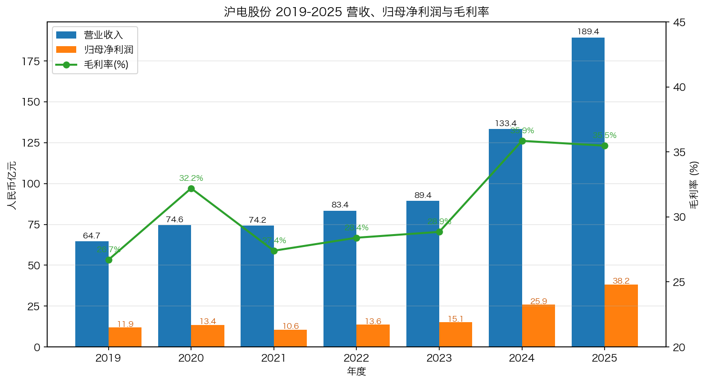

*数据来源：公司 [2019 年年度报告](https://static.cninfo.com.cn/finalpage/2020-03-26/1207403918.PDF)、[2020 年年度报告（更新后）](https://static.cninfo.com.cn/finalpage/2021-03-25/1209449895.PDF)、[2021 年年度报告](https://static.cninfo.com.cn/finalpage/2022-03-23/1212643055.PDF)、[2022 年年度报告（更正后）](https://static.cninfo.com.cn/finalpage/2025-11-28/1224831827.PDF)、[2023 年年度报告（更正后）](https://static.cninfo.com.cn/finalpage/2025-11-28/1224831829.PDF)、[2024 年年度报告（更正后）](https://static.cninfo.com.cn/finalpage/2025-11-28/1224831828.PDF)、[2025 年年度报告](https://static.cninfo.com.cn/finalpage/2026-03-25/1225027832.PDF)。毛利率为公司整体毛利率（PCB 业务毛利率 2025 年为 36.91%）。*

---

## 2. 公司历史

公司前身 "沪士电子有限公司" 成立于 1992 年，由台湾楠梓电子股份有限公司（楠电）与大陆方面共同出资，定位为多层 PCB 制造商，主厂区落于江苏昆山。沪士电子借助楠电的工艺技术与管理体系，较早切入 HDI、高频高速、HLC 多层板等中高端工艺（[沪士电子股份有限公司 2025 年年度报告](https://static.cninfo.com.cn/finalpage/2026-03-25/1225027832.PDF) 第一节"公司基本情况" / 第三节"经营情况"）。

公司在 2010 年 8 月 6 日完成深交所中小板 IPO，募集资金主要投向高阶 PCB 产能与研发。**黄石沪士电子**（黄石厂）于 2012 年 2 月 27 日成立，注册资本 13 亿元、由吴传林担任董事长，定位于单 / 双面及 HDI 多层板；2025 年实现营收 53.34 亿元、净利润 10.26 亿元，是公司增长最快的子公司之一（[2025 年年度报告](https://static.cninfo.com.cn/finalpage/2026-03-25/1225027832.PDF) 第三节"主要控股参股公司"）。

2017 年 12 月 18 日，控股子公司 **胜伟策电子（江苏）有限公司** 成立，注册资本 1.10 亿欧元，由公司与德国上市公司 Schweizer Electronic AG 合资设立，定位于将 Schweizer 的 P2Pack（嵌入式功率芯片封装集成）技术引入中国，服务新能源车、800V 高压驱动、48V 平台等场景。2023 年 5 月 1 日起，胜伟策纳入合并报表（[2025 年年度报告](https://static.cninfo.com.cn/finalpage/2026-03-25/1225027832.PDF) 第三节"主要控股参股公司"；同步参见 [每日经济新闻：胜伟策 P2Pack 量产，2025-02-28](https://m.nbd.com.cn/articles/2025-02-28/3770326.html)）。

2022 年 10 月 4 日，公司在泰国大城府（Phra Nakhon Si Ayutthaya）注册 **沪士电子（泰国）有限公司**（沪士泰国），注册资本 64.90 亿泰铢，承担 "中国 +N" 海外布局的核心承接职能。2025 年沪士泰国营收 12.52 亿元、净亏 1.40 亿元，主要源自产能爬坡期的折旧摊销前置；2026 Q1 数据通讯事业部产能利用率已 >90%，汽车事业部 2026 进入量产爬坡，泰国基地预计 2026 年内实现经营性盈利（[2025 年年度报告](https://static.cninfo.com.cn/finalpage/2026-03-25/1225027832.PDF) 第三节"经营展望"；同步参见 [财联社：沪电股份泰国基地 AI 服务器与高速网络产品批量导入，2026 Q1 产能利用率超 90%，2026-04-24](https://www.cls.cn/detail/2370201)）。

2025 年是治理与资本结构的关键年：9 月 20 日提示性公告启动 **H 股发行并在港交所主板上市**（[每经网：沪电股份拟发行 H 股并在港交所上市，2025-09-19](https://www.nbd.com.cn/articles/2025-09-19/4068022.html)）；12 月 1 日向港交所递表（[沪电股份关于向香港联交所递交 H 股发行上市申请并刊发申请资料的公告，2025-12-01](http://file.finance.sina.com.cn/211.154.219.97:9494/MRGG/CNSESZ_STOCK/2025/2025-12/2025-12-01/11651196.PDF)）；12 月 16 日中国证监会接收备案材料（[沪士电子股份有限公司关于发行境外上市股份（H 股）备案申请材料获中国证监会接收的公告，2025-12-16](https://static.cninfo.com.cn/finalpage/2025-12-16/1224877296.PDF)）。同期，公司 11 月 17 日股东会决定 **不再设置监事会**，由审计委员会行使监事会职权，治理架构向 H 股要求靠拢（[沪电股份第八届董事会第九次会议决议公告，2025-11-01](https://static.cninfo.com.cn/finalpage/2025-11-01/1224781270.PDF)）。

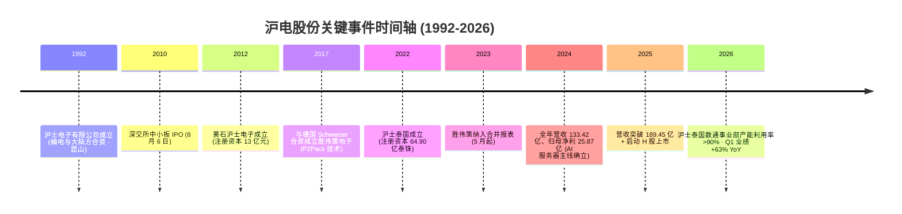

---

## 3. 管理团队与治理

公司管理层有两个鲜明特征：**一是台资血统、技术工程师出身的核心高管班底**；**二是吴礼淦家族（陈梅芳及其子女）通过 BVI 结构对公司形成稳定的长期控股**。这一组合使公司在工艺、客户关系、技术路线选择上保持高度连贯性，但也意味着家族治理与少数股东利益的平衡始终是治理观察的重点（[2025 年年度报告](https://static.cninfo.com.cn/finalpage/2026-03-25/1225027832.PDF) 第四节 / 第五节）。

### 董事长 陈梅芳（女，1946 年生，香港籍）

公司创始家族吴礼淦家族的核心成员，2024 年 4 月 3 日起出任 **第八届董事会董事长**（[2025 年年度报告](https://static.cninfo.com.cn/finalpage/2026-03-25/1225027832.PDF) 第四节"董事和高级管理人员"）；同时担任控股股东 BIGGERING (BVI) HOLDINGS CO., LTD.（碧景控股）董事及沪士国际等多家关联主体董事。2025 年税前报酬 36.00 万元。陈梅芳代表创始家族对战略方向、利润分配政策（每 10 股派 5 元含税、合计派发 9.62 亿元）和重大资本运作（H 股上市）保持最终决定权（[2025 年年度报告](https://static.cninfo.com.cn/finalpage/2026-03-25/1225027832.PDF) 第十一节"利润分配预案"）。

### 总经理 吴传彬（男，1971 年生，香港籍）

公司日常经营的最核心人物。**美国加州大学伯克利分校本科 + 上海交通大学 EMBA 硕士**；1995 年加入公司，2000 年 1 月起担任总经理至今，2025 年 11 月 17 日股东会选举其为第八届董事会董事（[2025 年年度报告](https://static.cninfo.com.cn/finalpage/2026-03-25/1225027832.PDF) 第四节"董事变动"；个人简介参见 [前瞻眼：吴传彬个人简介](https://stock.qianzhan.com/item/geren-ee7505977a91.html)）。吴传彬同时是昆山沪利微电、黄石沪士电子、沪士泰国、WUS Singapore、胜伟策电子、Schweizer Electronic AG 监事等关键主体的董事 / 总经理 / 执行董事，且是控股股东碧景（BVI）控股和合拍友联有限公司的董事 / 执行董事——意味着 **从工厂层到 BVI 顶层、从中国到泰国到德国、从生产到资本运作，吴传彬是事实意义上的全公司日常决策人**。2025 年税前报酬 279.77 万元（控制在董事会授权的总经理 280 万元 / 年上限内）（[2025 年年度报告](https://static.cninfo.com.cn/finalpage/2026-03-25/1225027832.PDF) 第四节"董事、监事和高级管理人员薪酬"）。

吴传彬战略偏好清晰：(1) **聚焦 PCB 主业、精益求精**，拒绝跨界扩张和"为规模而规模"的同质化产能投放；(2) **差异化竞争**，与全球头部数据通讯客户深度耦合，而非与本地 PCB 同行打价格战；(3) **海外协同 + 国内技术领先**，"利用海外工厂服务敏感市场，同时在国内保持技术领先和规模优势"（[2025 年年度报告](https://static.cninfo.com.cn/finalpage/2026-03-25/1225027832.PDF) 第三节"经营展望"）。

### 副董事长 吴传林（男，1973 年生，台湾省籍）

吴礼淦家族成员、吴传彬之兄弟。2024 年 4 月起任副董事长、采购总监，同时担任黄石沪士电子董事长、昆山碧景企业管理董事长等。2025 年报酬 145.74 万元。黄石厂的快速成长（2025 年净利 10.26 亿）即由其直接领导（[2025 年年度报告](https://static.cninfo.com.cn/finalpage/2026-03-25/1225027832.PDF) 第四节、第三节"主要控股参股公司"）。

### 财务总监 朱碧霞（女，1971 年生，台湾省籍）

中央大学硕士、高级国际财务管理师；曾任华普飞机引擎、屈臣氏百佳、中华汽车财务岗。2007 年加入公司，2014 年 9 月起担任财务总监。朱碧霞主导了 2025 年 H 股上市备案、会计师事务所续聘（立信会计师事务所，参见 [沪电股份关于拟聘请 H 股发行并上市的审计机构的公告，2025-11-01](https://static.cninfo.com.cn/finalpage/2025-11-01/1224781301.PDF)）以及汇率风险对冲框架的搭建——后者尤其重要，因为 2025 年公司外销收入占 PCB 营收的 85.7%（[2025 年年度报告](https://static.cninfo.com.cn/finalpage/2026-03-25/1225027832.PDF) 第三节"主营业务分析"）。

### 董事会秘书、副总经理 李明贵（男，1957 年生，台湾省籍）

台湾政治大学毕业；1993 年加入公司、2003 年 1 月起担任董秘至今，任期长度 22 年以上。同时担任全国台湾同胞投资企业联谊会上市公司委员会主任委员、第十二届台湾电路板协会大陆事务委员会召集人。2025 年披露在互动易平台回复投资者问题共计 510 条、回复率 100%（[2025 年年度报告](https://static.cninfo.com.cn/finalpage/2026-03-25/1225027832.PDF) 第四节"董事和高级管理人员"）。

### 事业部总经理与独立董事

事业部总经理 **高文贤**（1965 年生，1996 年加入）、**石智中**（1962 年生，2009 年加入，曾任华通电脑、苏州金像电子）、**张进**（1972 年生，1995 年加入），皆有 30 年以上 PCB 行业经验，是连接吴传彬战略与制造一线的关键管理层；2025 年高文贤报酬 209.72 万元（[2025 年年度报告](https://static.cninfo.com.cn/finalpage/2026-03-25/1225027832.PDF) 第四节"董事、监事和高级管理人员薪酬"）。

独立董事 4 名，**高启全**（男，1953 年生，北卡州立大学化工硕士，历任南亚科技全球业务执行副总 / 总经理、华亚科董事长、紫光国芯董事、长江存储董事及代理董事长；现兼任瑞芯微（SSE:688521）、纬颖科技、豪勉科技独董），是大中华区半导体存储产业的资深经理人，对 CoWoP 等技术路径具备实质判断力；**陆宗元**（南京大学 MBA，曾任昆山经开区管委会副主任）、**王永翠**（注册税务师 / 注册会计师）、**陈志雄**（2026 年 2 月 12 日补选）。董事会下设战略与 ESG、审计、提名、薪酬与考核四个专门委员会；2025 年 11 月 17 日股东会决定 **不再设监事会**，由审计委员会代行监事职权。董事会共 11 名董事，含 1 名职工董事 + 4 名独立董事，独董占比约 36%（[2025 年年度报告](https://static.cninfo.com.cn/finalpage/2026-03-25/1225027832.PDF) 第四节"独立董事履职情况"、第五节"公司治理"；同步参见 [沪电股份第八届董事会第九次会议决议公告，2025-11-01](https://static.cninfo.com.cn/finalpage/2025-11-01/1224781270.PDF)）。

### 治理与股东结构

按 2026 Q1 报表披露，**前 10 大股东** 持股结构如下（[2026 年第一季度报告](https://static.cninfo.com.cn/finalpage/2026-04-23/1225147393.PDF) 第二节"股东信息"）：

| 序号 | 股东名称 | 性质 | 持股比例 |
| --- | --- | --- | --- |
| 1 | BIGGERING (BVI) HOLDINGS CO., LTD.（碧景 BVI 控股） | 境外法人 | 19.32% |
| 2 | WUS GROUP HOLDINGS CO., LTD. | 境外法人 | 11.26% |
| 3 | 香港中央结算有限公司（北向资金通道） | 境外法人 | 10.08% |
| 4 | 平安银行—永赢科技智选混合型发起式基金 | 其他 | 未披露具体% |

**碧景 BVI 控股 + WUS Group Holdings + 合拍友联** 等吴礼淦家族控制的离岸主体合计持股大致 35% 以上，构成稳定的实控权基础；同时 **香港中央结算（沪深港通）持股 10.08%**，反映海外长期资金对这一标的的高度配置（2025 年公司接待 EDMOND DE ROTHSCHILD、ARTISAN PARTNERS、BLACKROCK、FIDELITY、GOLDMAN SACHS、ARROWPOINT、Lombard Odier 等数十家海外机构调研，详见 [2025 年年度报告](https://static.cninfo.com.cn/finalpage/2026-03-25/1225027832.PDF) 第三节"报告期内接待调研"，并参考 [沪电股份投资者活动记录表，2025-11-04](https://static.cninfo.com.cn/finalpage/2025-11-04/1224787317.PDF)）。这种结构在 H 股发行后预计会通过国际配售进一步外资化（[新浪财经：沪电股份 H 股发行上市备案申请材料获中国证监会接收，2025-12-17](https://finance.sina.com.cn/tech/roll/2025-12-17/doc-inhcazqc2211353.shtml)）。

### 团队执行力综合判断

吴传彬作为总经理 25 年的稳定任期、台资工程师班底的连续性、与全球头部数据通讯客户的多年信赖关系，加上 2025 年在 AI/HLC 转型期实现营收 +42%、净利 +47.7%、毛利率 +1.06 pct、ROE 升至 28.57%——是 **执行力强、战略定力高** 的清晰证据（[2025 年年度报告](https://static.cninfo.com.cn/finalpage/2026-03-25/1225027832.PDF) 第二节"主要会计数据和财务指标"）。**值得观察的治理点**：(a) H 股上市后的 A+H 二元结构对披露口径和资本运作的影响；(b) 监事会取消后审计委员会的独立性建设；(c) 控股股东家族在 H 股发行中的减持安排（如有）（[沪电股份关于向香港联交所递交 H 股发行上市申请并刊发申请资料的公告，2025-12-01](http://file.finance.sina.com.cn/211.154.219.97:9494/MRGG/CNSESZ_STOCK/2025/2025-12/2025-12-01/11651196.PDF)）。

---

## 4. 产品与服务

公司只做一件事：**印制电路板**。但 PCB 工艺与应用横跨多个高度差异化的细分赛道，公司以 "聚焦 PCB 主业、差异化竞争" 为战略基调，长期沉淀的核心工艺和产品矩阵已经形成行业内难以复制的护城河（[2025 年年度报告](https://static.cninfo.com.cn/finalpage/2026-03-25/1225027832.PDF) 第三节"主营业务分析"）。

### 4.1 工艺与技术能力

公司 PCB 产品横跨以下主要工艺平台（[2025 年年度报告](https://static.cninfo.com.cn/finalpage/2026-03-25/1225027832.PDF) 第三节"主营业务分析"及"研发投入"）：

- **超高层 / HLC（High Layer Count）多层板** — 18 层以上甚至 32–40+ 层堆叠，主要服务 AI 服务器、HPC、800G/1.6T 高速以太网交换机。**HLC（18+）是 2025 年表现最佳的全球 PCB 细分**，Prismark 估计 2025 年全球 HLC（18+）市值 49.28 亿美元、同比 +72.8%，2026 年预计 80.02 亿美元、同比 +62.4%，2025–2030 CAAGR 21.7%（[2025 年年度报告 引用 Prismark 2025Q4 研究报告](https://static.cninfo.com.cn/finalpage/2026-03-25/1225027832.PDF) 第三节"行业情况"）。
- **HDI（High Density Interconnect，高密度互连）** — 含 10 阶以上 HDI，下游覆盖智能手机、毫米波雷达、ADAS、智能座舱域控制器；公司是国内少数能稳定量产高阶 HDI 的厂商之一（[2025 年年度报告](https://static.cninfo.com.cn/finalpage/2026-03-25/1225027832.PDF) 第三节"主营业务分析"）。
- **高频高速材料 + 224 Gbps 信号完整性** — 针对 224 Gbps SerDes 速率，公司在超低介电损耗、极低介电常数、HVLP 铜箔、背钻 STUB 控制等方面持续投入；下一代 GPU 平台产品已**顺利通过认证、进入工程打样阶段**，ASIC 平台 224 Gbps 核心产品正在客户认证（[2025 年年度报告](https://static.cninfo.com.cn/finalpage/2026-03-25/1225027832.PDF) 第三节"研发投入"）。
- **mSAP / CoWoP（chip-on-wafer-on-PCB）** — mSAP 可制造更精细线路与间距；CoWoP 是先进封装与 PCB 边界融合的新形态，将芯片直接集成在 PCB 上以缩短信号路径；公司 2026 年初规划"CoWoP 等前沿技术与 mSAP 等先进工艺的孵化平台"（[2025 年年度报告](https://static.cninfo.com.cn/finalpage/2026-03-25/1225027832.PDF) 第三节"经营展望"）。
- **P2Pack（嵌入式功率芯片封装集成）** — 通过子公司胜伟策，将德国 Schweizer 的功率芯片埋入 PCB 工艺本土化、规模化，目前是**业内唯一实现 P2Pack PCB 大批量量产**的厂商；2025 年胜伟策营收 +107.63% 并扭亏。公司已与数据通讯核心客户探索 P2Pack 在**数据中心场景**的应用，以降低系统热阻——这是将汽车端积累技术反哺到数据中心的关键跨界尝试（[2025 年年度报告](https://static.cninfo.com.cn/finalpage/2026-03-25/1225027832.PDF) 第三节"主要控股参股公司"及 [每日经济新闻：胜伟策 P2Pack 量产，2025-02-28](https://m.nbd.com.cn/articles/2025-02-28/3770326.html)）。

### 4.2 产品组合（按应用领域）

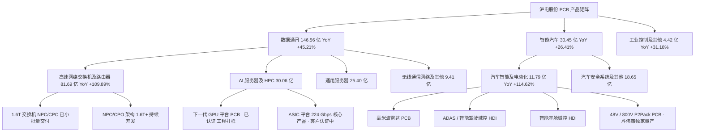

来源：[沪士电子股份有限公司 2025 年年度报告](https://static.cninfo.com.cn/finalpage/2026-03-25/1225027832.PDF) 第三节"主营业务分析" + "研发投入"。

### 4.3 2025 收入结构（按下游应用）

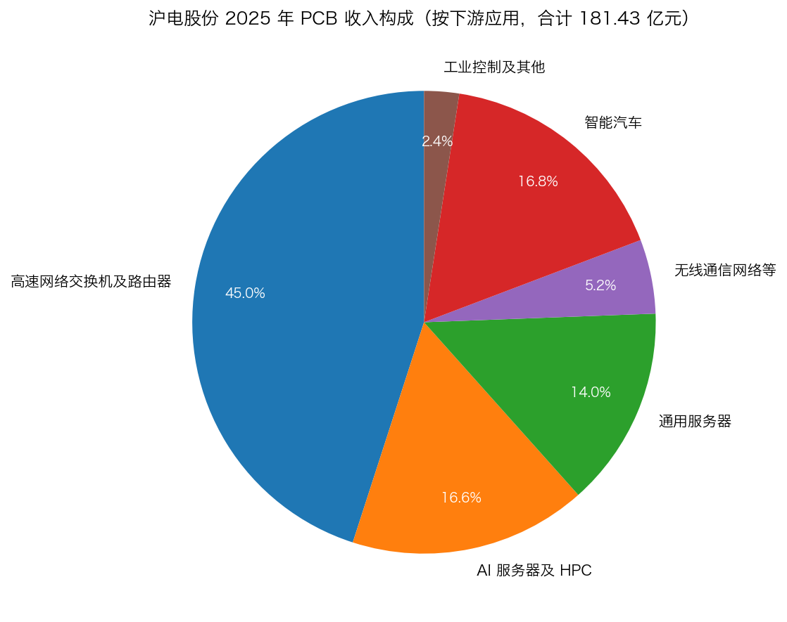

*数据来源：[沪士电子股份有限公司 2025 年年度报告](https://static.cninfo.com.cn/finalpage/2026-03-25/1225027832.PDF)，第三节"主营业务分析"。*

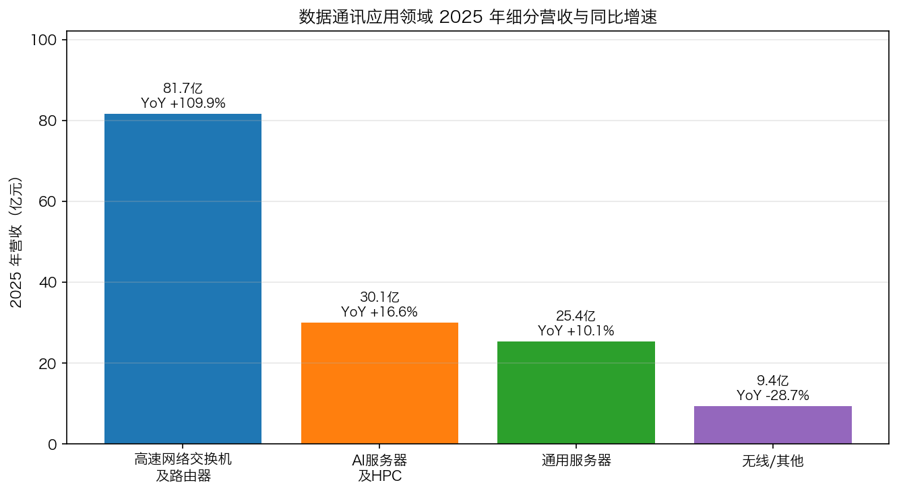

*数据来源：[沪士电子股份有限公司 2025 年年度报告](https://static.cninfo.com.cn/finalpage/2026-03-25/1225027832.PDF)，第三节"主营业务分析"。"无线/其他"同比为按余额倒推近似值。*

### 4.4 单季度表现节奏

公司季度营收和净利润持续创历史新高，**2025 年四个季度 营收/归母净利润 分别为 40.38/7.62 → 44.56/9.20 → 50.19/10.35 → 54.33/11.05 亿元**，呈现非常清晰的环比加速（[2025 年一季度报告](https://static.cninfo.com.cn/finalpage/2025-04-25/1223267176.PDF)、[2025 年半年度报告](https://static.cninfo.com.cn/finalpage/2025-08-22/1224535064.PDF)、[2025 年三季度报告](https://static.cninfo.com.cn/finalpage/2025-10-29/1224755010.PDF)、[2025 年年度报告](https://static.cninfo.com.cn/finalpage/2026-03-25/1225027832.PDF)）；2026 Q1 营收 62.14 亿元、归母净利润 12.42 亿元，**同比 +53.91% / +62.90%**（[2026 年第一季度报告](https://static.cninfo.com.cn/finalpage/2026-04-23/1225147393.PDF)；同步参见 [新浪财经：AI 算力拉动高端 PCB 放量，沪电股份 Q1 营收同增 54%，2026-04-22](https://finance.sina.com.cn/stock/relnews/cn/2026-04-22/doc-inhvkqha6082058.shtml)）。

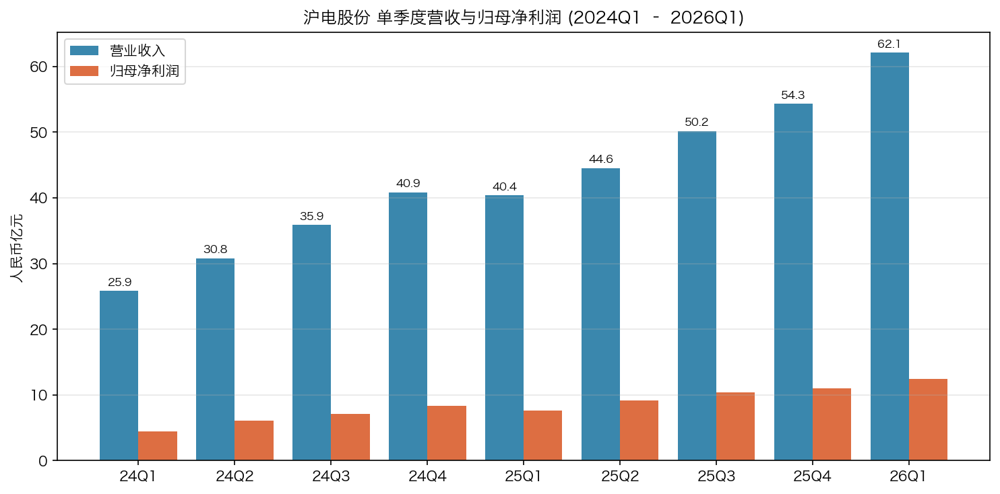

*数据来源：公司各期 [2024 一季报](https://static.cninfo.com.cn/finalpage/2024-04-23/1219739059.PDF)、[2024 半年报](https://static.cninfo.com.cn/finalpage/2024-08-23/1220955282.PDF)、[2024 三季报](https://static.cninfo.com.cn/finalpage/2024-10-25/1221507331.PDF)、[2024 年年度报告（更正后）](https://static.cninfo.com.cn/finalpage/2025-11-28/1224831828.PDF)、[2025 年年度报告](https://static.cninfo.com.cn/finalpage/2026-03-25/1225027832.PDF) 与 [2026 一季报](https://static.cninfo.com.cn/finalpage/2026-04-23/1225147393.PDF)。*

### 4.5 研发投入

公司 2025 年研发投入 **11.41 亿元**，占营收 6.02%（同比 +0.10 pct），研发人员 1,899 人（占员工总数 12.46%），同比新增 283 人。研发投入中本科及以上学历占比从 2024 年的 35.9% 提升至 44.4%，反映工程师密度持续提高；2025 年取得 25 项发明专利 + 15 项实用新型专利（[2025 年年度报告](https://static.cninfo.com.cn/finalpage/2026-03-25/1225027832.PDF) 第三节"研发投入"）。

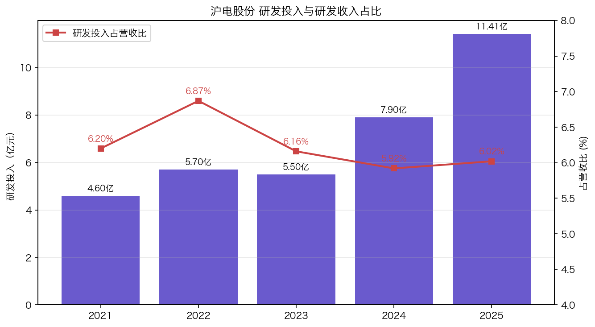

*数据来源：公司 [2021 年年度报告](https://static.cninfo.com.cn/finalpage/2022-03-23/1212643055.PDF)、[2022 年年度报告（更正后）](https://static.cninfo.com.cn/finalpage/2025-11-28/1224831827.PDF)、[2023 年年度报告（更正后）](https://static.cninfo.com.cn/finalpage/2025-11-28/1224831829.PDF)、[2024 年年度报告（更正后）](https://static.cninfo.com.cn/finalpage/2025-11-28/1224831828.PDF)、[2025 年年度报告](https://static.cninfo.com.cn/finalpage/2026-03-25/1225027832.PDF)。*

公司 2026 年研发主线明确为四条：(1) AI 服务器 / HPC 高阶 PCB（224 Gbps、下一代 GPU、ASIC 平台）；(2) 1.6T 及以上高速交换机（NPC/CPC、NPO/CPO 架构）；(3) 智能汽车 HDI 与 800V P2Pack；(4) **CoWoP + mSAP 孵化平台 + 光铜融合**（光电共封装的下一代技术方向）（[2025 年年度报告](https://static.cninfo.com.cn/finalpage/2026-03-25/1225027832.PDF) 第三节"研发投入" / "经营展望"）。

---

## 5. 客户与销售策略

PCB 制造业最大的护城河之一是 **客户认证周期与卡位顺序**——高阶 PCB 进入头部 ICT 客户的合格供应商名录需要 1–3 年的工程认证、可靠性测试、产能审核，一旦切入，订单具备很强的粘性，但也意味着 **客户集中度天然偏高**。沪电股份在这条规则下的表现是 **"客户高度集中但分散在多个终端"**（[2025 年年度报告](https://static.cninfo.com.cn/finalpage/2026-03-25/1225027832.PDF) 第三节"主营业务分析"及"主要销售客户和主要供应商情况"）。

### 5.1 客户集中度量化

按 2025 年年报披露：

| 客户 | 销售额（亿元）| 占年度销售总额比例 |
| --- | --- | --- |
| 客户一 | 27.02 | **14.26%** |
| 客户二 | 21.54 | 11.37% |
| 客户三 | 20.68 | 10.92% |
| 客户四 | 18.04 | 9.52% |
| 客户五 | 13.74 | 7.25% |
| **前五合计** | **101.03** | **53.32%** |

来源：[2025 年年度报告](https://static.cninfo.com.cn/finalpage/2026-03-25/1225027832.PDF) 第三节"主要销售客户和主要供应商情况"。

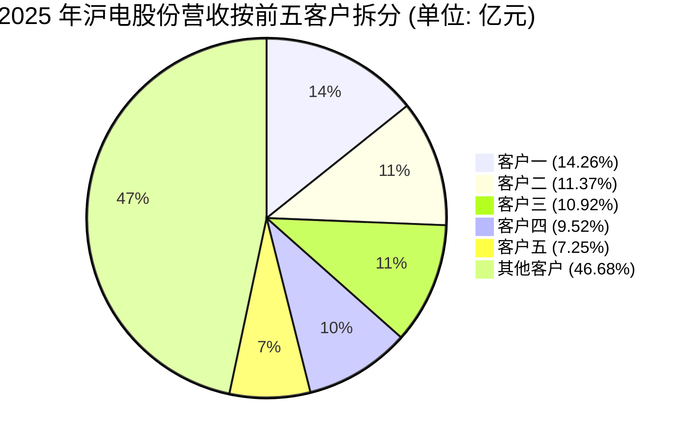

年报披露口径补充说明：**"本报告期前五大客户按终端客户指定的实际交货对象统计，若按终端客户统计，本报告期前五大客户合计销售金额占年度销售总额比例约为 53.89%"**——意味着按 EMS 代工厂（如富士康、纬创、广达、英业达等）实际交货统计与按终端品牌方（如英伟达、Cisco、Arista、Juniper、AMD 等）统计差异不大（[2025 年年度报告](https://static.cninfo.com.cn/finalpage/2026-03-25/1225027832.PDF) 第三节"主要销售客户和主要供应商情况"）。

**纵向对比**：2024 年公司前五大客户合计占比披露未直接给出，但从公司接待调研记录、行业研究和客户结构推断，**top-1 占比从 2024 年个位数 ~10% 攀升至 2025 年 14.26%**，**top-5 从约 45% 上升至 53.32%**，客户结构在 AI/HLC 主线驱动下进一步集中（对比 [2024 年年度报告（更正后）](https://static.cninfo.com.cn/finalpage/2025-11-28/1224831828.PDF) 与 [2025 年年度报告](https://static.cninfo.com.cn/finalpage/2026-03-25/1225027832.PDF) 客户销售口径披露）。这是 AI 服务器与 1.6T 交换机订单向头部 ICT 巨头集中的必然结果，但**也意味着公司对单一终端客户（最有可能是英伟达 + 其 EMS 代工链）的依存度在上升**——在第 9 节风险评估中将明确列为客户集中度风险（[新浪财经：沪电股份是英伟达 GB200/VR200 架构核心供应商，2026-04-15](https://finance.sina.com.cn/roll/2026-04-15/doc-inhupqxe4238252.shtml)）。

### 5.2 客户画像（基于公司公开披露与行业研究的合理识别）

公司在 2025 年报中按 PCB 行业通行做法，**对前五大客户以"客户一—客户五"匿名形式披露，未直接点名**。根据公司接待调研记录中频繁讨论的"800G/1.6T 交换机"、"GPU 平台 224 Gbps"、"ASIC 平台"、"AI 服务器"、"汽车 ADAS"、"汽车 48V/800V P2Pack" 等主题（[沪电股份投资者活动记录表，2025-11-04](https://static.cninfo.com.cn/finalpage/2025-11-04/1224787317.PDF)），结合年报强调与"全球头部客户群体"、"超大规模云服务提供商（CSP）"的深度协同（[2025 年年度报告](https://static.cninfo.com.cn/finalpage/2026-03-25/1225027832.PDF) 第三节"经营展望"）——可以合理判断公司客户矩阵覆盖了**数据中心 GPU/ASIC 厂商（NVIDIA、AMD 体系）、高速以太网交换机厂商（Cisco、Arista、Juniper、Nokia）、超大规模云服务厂商的 ODM/EMS 代工链、以及全球头部汽车 Tier-1 与新能源车厂**。请注意：**公司年报本身未具体点名任一客户的姓名**，本节列举的潜在客户均为行业合理推断，非公司直接披露内容。

### 5.3 销售模式与地域结构

2025 年公司 PCB 业务按销售区域：
- **外销（出口）15,542.87 百万元，占 PCB 营收 85.7%**，毛利率 38.34%（同比 +0.75 pct）；
- **内销 2,600.44 百万元，占 14.3%**，毛利率 28.35%（同比 +3.68 pct）。

来源：[2025 年年度报告](https://static.cninfo.com.cn/finalpage/2026-03-25/1225027832.PDF) 第三节"主营业务分析"。

外销毛利率显著高于内销，主要因外销产品结构更偏向 AI 服务器、1.6T 交换机等高附加值料号。**公司直接出口至美国的营收占比不超过 5%**（[2025 年年度报告](https://static.cninfo.com.cn/finalpage/2026-03-25/1225027832.PDF) 第三节"贸易争端风险"），主要为客户工程认证、技术开发样品和小批量产品，**绝大部分外销发往亚太地区的 EMS 代工厂**，因此美国对华 PCB 加征关税对公司直接影响有限，但通过下游 EMS 客户的产能转移决策间接产生压力——这也正是公司在泰国建设大规模 PCB 产能的核心驱动力（[2025 年年度报告](https://static.cninfo.com.cn/finalpage/2026-03-25/1225027832.PDF) 第三节"经营展望"；同步参见 [财联社：泰国基地 AI 服务器与高速网络产品批量导入，2026-04-24](https://www.cls.cn/detail/2370201)）。

### 5.4 供应商集中度

2025 年公司前五大供应商合计采购 **59.73 亿元**，占年度采购总额 **42.16%**；其中第一大供应商采购 31.56 亿元、占 **22.28%**——大概率为公司主要的覆铜板（CCL）+ 高频高速材料供应商（[2025 年年度报告](https://static.cninfo.com.cn/finalpage/2026-03-25/1225027832.PDF) 第三节"主要销售客户和主要供应商情况"）。供应商集中度反映了高阶 PCB 制造对特定上游材料（超低损耗树脂、HVLP 铜箔、特种玻纤布）的强依赖，也呼应了年报中明确披露的"部分高端原材面临阶段性的产能受限"风险（[2025 年年度报告](https://static.cninfo.com.cn/finalpage/2026-03-25/1225027832.PDF) 第三节"行业情况"及"公司可能面临的主要风险及应对措施"）。

---

## 6. 行业概览

### 6.1 全球 PCB 市场规模与增速

按公司 2025 年报引用的 **Prismark 2025Q4 研究报告**，2025 年全球 PCB 市场规模超预期增长至 **851.52 亿美元**，同比 **+15.8%**；2026 年预计达到 **957.80 亿美元**、同比 **+12.5%**；2030 年预计 **1,233.48 亿美元**，2025–2030 年 CAAGR **+7.7%**（[2025 年年度报告 引用 Prismark 2025Q4 研究报告](https://static.cninfo.com.cn/finalpage/2026-03-25/1225027832.PDF) 第三节"行业情况"；同步参见 [Prismark Partners — Printed Circuit Report (PCB)](https://www.prismark.com/printed-circuit-report-pcb)）。

**按细分工艺**：HLC（18+）是 2025 年增速最快的细分，2025 年市值 49.28 亿美元、同比 **+72.8%**；2026 年预计 80.02 亿美元、同比 **+62.4%**；2025–2030 CAAGR **+21.7%**。HDI 2025 同比 +26.0%、2026 同比 +14.5%、2025–2030 CAAGR +9.2%。封装基板 2025 同比 +18.2%、2026 同比 +20.5%、2025–2030 CAAGR +10.9%（[2025 年年度报告 引用 Prismark 2025Q4 研究报告](https://static.cninfo.com.cn/finalpage/2026-03-25/1225027832.PDF) 第三节"行业情况"）。

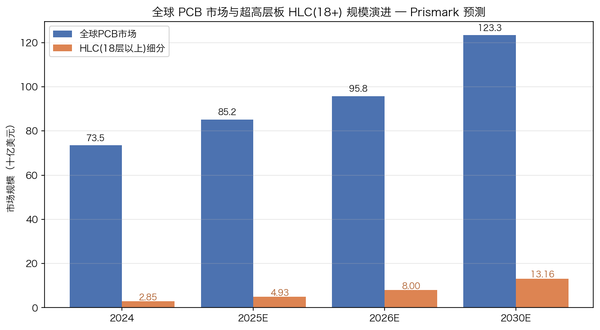

*数据来源：[沪士电子股份有限公司 2025 年年度报告](https://static.cninfo.com.cn/finalpage/2026-03-25/1225027832.PDF) 第三节"行业情况"，引用 Prismark 2025Q4 研究报告。2024 年 HLC(18+) 数值由 2025 同比 +72.8% 反推。*

**按区域**：2025 年中国 PCB 产值达 **489.69 亿美元**（占全球 57.5%），同比 +19.2%，是全球最大也是增速最快的区域；其中中国 HLC（18+）2025 年增速 **+119.2%**——直接对应 AI 服务器 / 1.6T 交换机的产能向中国集中的格局（[2025 年年度报告 引用 Prismark 2025Q4 研究报告](https://static.cninfo.com.cn/finalpage/2026-03-25/1225027832.PDF) 第三节"行业情况"；同步对比 [前瞻产业研究院：2025 年全球印制电路板 PCB 市场现状分析，2025-04](https://www.qianzhan.com/analyst/detail/220/250427-b1a9abf3.html)）。

### 6.2 按下游应用：数据通讯与汽车的两条主轴

**数据通讯 PCB 全球市场（Prismark）**：

| 应用 | 2024 | 2025E | 2029E | 2024–2029 CAAGR |
| --- | --- | --- | --- | --- |
| 服务器 / 数据存储 | 109.16 亿 | **159.75 亿** | 257.29 亿 | **+18.7%** |
| 其他计算机 | 36.49 亿 | 38.30 亿 | 41.10 亿 | +2.4% |
| 有线基础设施（含交换机） | 61.53 亿 | **83.85 亿** | 127.59 亿 | **+15.7%** |
| 无线基础设施 | 31.77 亿 | 36.11 亿 | 48.00 亿 | +8.6% |
| **合计** | 238.95 亿 | **318.01 亿** | **473.98 亿** | **+14.68%** |

数据来源：[2025 年年度报告 引用 Prismark 研究报告](https://static.cninfo.com.cn/finalpage/2026-03-25/1225027832.PDF) 第三节"行业情况"。单位：美元。这是全球 PCB 行业增长最快的子市场。

**汽车 PCB 全球市场（Prismark）**：2024 年 91.95 亿美元 → 2025E 97.12 亿 → 2029E 113.65 亿，2024–2029 CAAGR **+4.3%**——增速低于数据通讯，但结构升级显著：分布式 ECU 向域控、区域控制、中央计算演进，驱动多层板、高阶 HDI、高频高速、耐高压、耐高温、高集成度汽车 PCB 需求（[2025 年年度报告 引用 Prismark 研究报告](https://static.cninfo.com.cn/finalpage/2026-03-25/1225027832.PDF) 第三节"行业情况"）。

### 6.3 行业格局与结构性特征

**1) 中国占据全球 PCB 制造核心地位**：2025 年中国 PCB 占全球 57.5%，且 HLC、HDI、封装基板等核心高阶产品的增速继续领先全球——"中国 +N"模式并未削弱中国规模，反而使得中国 PCB 制造商通过海内外协同扩张维持技术 + 规模双领先（[2025 年年度报告 引用 Prismark 研究报告](https://static.cninfo.com.cn/finalpage/2026-03-25/1225027832.PDF) 第三节"行业情况"；同步参见 [前瞻产业研究院：2025 年全球印制电路板 PCB 市场现状分析](https://www.qianzhan.com/analyst/detail/220/250427-b1a9abf3.html)）。

**2) "入场者多、通关者少"**：年报指出，"大量同行纷纷调整战略，将资源向数据通讯领域倾斜，以图通过激进的资本开支与产能扩张切入市场……成熟技术平台的准入门槛将被摊薄，未来的竞争或将趋向同质化与白热化"；但是"高阶 PCB 产品市场加速向具备全球化产能协同与顶尖研发积淀的行业头部梯队集中，呈现明显的结构性分化"。这是公司核心战略判断（[2025 年年度报告](https://static.cninfo.com.cn/finalpage/2026-03-25/1225027832.PDF) 第三节"行业情况" 与 "经营展望"）。

**3) 上游高端材料阶段性紧缺**：超极低损耗树脂、HVLP（Hyper Very Low Profile）铜箔、特种高性能玻纤布的供应紧张，使具备早期介入材料认证能力的头部 PCB 厂商拿到优先配额——这是沪电股份相对中小厂的另一个隐性优势（[2025 年年度报告](https://static.cninfo.com.cn/finalpage/2026-03-25/1225027832.PDF) 第三节"行业情况"及"公司可能面临的主要风险及应对措施"）。

**4) 地缘政治与"中国 +N"**：东南亚（特别是泰国）已成为头部 PCB 厂商绕开美国对华 PCB 关税摩擦的关键节点。2025 年报第三节明确披露："东南亚（特别是泰国）新兴制造集群的量产爬坡、供应链协同与属地化运营管理，将成为未来重塑全球 PCB 行业竞争格局的关键变量"（[2025 年年度报告](https://static.cninfo.com.cn/finalpage/2026-03-25/1225027832.PDF) 第三节"经营展望"）。

---

## 7. 竞争格局

### 7.1 主要竞争对手

A 股市场上，沪电股份的可比公司主要是 **数据通讯 / 算力 PCB** 与 **汽车 PCB** 双主线下的几家头部企业：

| 公司 | 代码 | 主要业务定位 | 2026-05-21 收盘价 | 总市值（人民币）|
| --- | --- | --- | --- | --- |
| **沪电股份** | SZSE:002463 | 数据通讯 + 智能汽车 PCB；HLC、HDI、P2Pack | **103.70 元** | **~1,995.6 亿元** |
| **深南电路** | SZSE:002916 | 通信、数据中心、汽车、医疗 PCB；封装基板（ABF/BT）；电子装联 | 343.88 元 | ~1,763 亿元（按 5.126 亿股估算）|
| **东山精密** | SZSE:002384 | FPC + 软硬结合板（苹果/北美大客户）、LED 显示、精密结构件、新能源（光伏组件、储能） | 206.97 元 | ~3,531 亿元（按 17.06 亿股估算）|
| **生益科技** | SSE:600183 | 覆铜板（CCL）+ 粘结片 — 高频高速材料上游 | 98.19 元 | ~2,333 亿元（按 23.76 亿股估算）|

价格来源：[新浪财经实时行情接口（2026-05-21 收盘）](https://hq.sinajs.cn/?list=sz002463,sz002916,sz002384,sh600183)。市值按各公司公开总股本估算，仅供横向对比参考。同业基本盘信息来自各公司最新年报：[深南电路 2025 年年度报告摘要](https://static.cninfo.com.cn/finalpage/2026-03-13/1225006759.PDF)、[东山精密 2025 年年度报告摘要](https://static.cninfo.com.cn/finalpage/2026-04-22/1225139317.PDF)、[生益科技 2025 年年度报告](https://static.cninfo.com.cn/finalpage/2026-04-25/1225195409.PDF)。

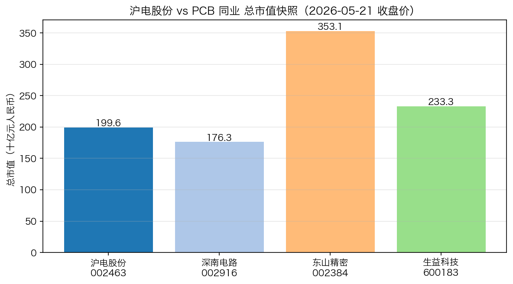

*数据来源：[新浪财经实时行情接口](https://hq.sinajs.cn/?list=sz002463,sz002916,sz002384,sh600183)，2026-05-21 收盘价 × 各公司总股本估算。*

**全球同业**：海外可比公司主要是 **Unimicron 欣兴电子（TWSE:3037）**、**Nanya PCB 南亚电路板**、**TTM Technologies（NASDAQ:TTMI）**、**AT&S（VSE:ATS）**、**Ibiden（TYO:4062）**、**Meiko Electronics（TYO:6787）**、**CMK Corporation（TYO:6958）**——其中 Meiko、CMK 是沪电股份的少数股权投资对象（沪士国际持股 Meiko 3.64%、CMK 110,000 股），可见公司对全球同业的财务参与本身就是公司行业 intelligence 的一部分（[2025 年年度报告](https://static.cninfo.com.cn/finalpage/2026-03-25/1225027832.PDF) 第三节"五、其他权益工具投资"；Unimicron 营收背景参见 [Unimicron Technology Corp — Investing.com 公司资料](https://www.investing.com/equities/unimicron-tech-company-profile)；Ibiden 业务披露参见 [Ibiden 有価証券報告書 IR ライブラリー](https://www.ibiden.co.jp/ir/library/securities/) 与 [Ibiden Integrated Report 2025](https://www.ibiden.com/ir/items/IntegratedReport2025_en.pdf)）。

### 7.2 沪电股份的竞争优势

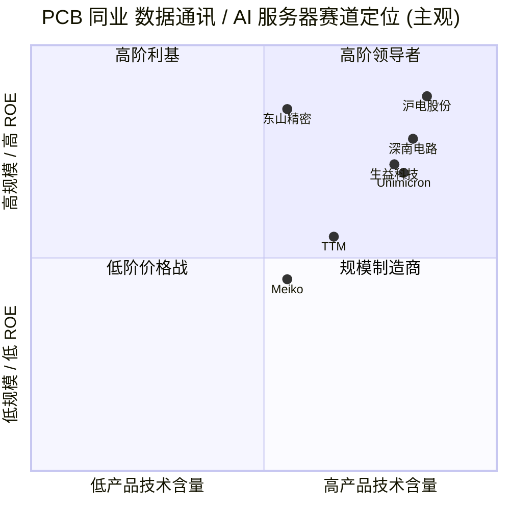

*以上定位基于公司年报披露、研发投入水平和数据通讯应用领域营收占比作主观判断，不构成投资建议。*

公司相对同业的核心差异化点：

1. **"AI/HLC + 智能汽车"双引擎，且数据通讯占比已升至 80.8%**：相比深南电路（业务更分散，封装基板权重较高，参见 [深南电路 2025 年年度报告摘要](https://static.cninfo.com.cn/finalpage/2026-03-13/1225006759.PDF)）、东山精密（FPC 主导，结构件 / 新能源混合，参见 [东山精密 2025 年年度报告摘要](https://static.cninfo.com.cn/finalpage/2026-04-22/1225139317.PDF)）、生益科技（上游材料，参见 [生益科技 2025 年年度报告](https://static.cninfo.com.cn/finalpage/2026-04-25/1225195409.PDF)），沪电股份是 A 股 PCB 板块中 **数据通讯下游纯度最高、AI 服务器 + 高速交换机弹性最大的标的**（[2025 年年度报告](https://static.cninfo.com.cn/finalpage/2026-03-25/1225027832.PDF) 第三节"主营业务分析"）。
2. **盈利能力领先**：2025 年公司 PCB 业务毛利率 36.91%、整体净利率约 20.2%、ROE 28.57%——在 A 股 PCB 同业中长期处于第一梯队（[2025 年年度报告](https://static.cninfo.com.cn/finalpage/2026-03-25/1225027832.PDF) 第二节"主要会计数据和财务指标"）。
3. **客户认证位次靠前**：年报披露公司"下一代 GPU 平台产品已顺利通过认证、全面进入工程打样阶段"，且 1.6T NPC/CPC 已小批量交付——意味着在客户的下一代核心料号上已经卡位（[2025 年年度报告](https://static.cninfo.com.cn/finalpage/2026-03-25/1225027832.PDF) 第三节"研发投入"）。
4. **海外产能先发**：沪士泰国 2022 年成立、2025 年开始爬坡，2026 Q1 数据通讯事业部产能利用率已 >90%——领先国内大部分同行（部分同业 2024–2025 才宣布泰国 / 越南投资）（[财联社：泰国基地 AI 服务器与高速网络产品批量导入，2026-04-24](https://www.cls.cn/detail/2370201)；[2025 年年度报告](https://static.cninfo.com.cn/finalpage/2026-03-25/1225027832.PDF) 第三节"经营展望"）。
5. **P2Pack 独家量产**：胜伟策电子是行业唯一能大批量量产 P2Pack PCB 的厂商，在 48V / 800V 高压驱动电动车场景中具有阶段性技术垄断（[2025 年年度报告](https://static.cninfo.com.cn/finalpage/2026-03-25/1225027832.PDF) 第三节"主要控股参股公司"；同步参见 [每日经济新闻：胜伟策 P2Pack 量产，2025-02-28](https://m.nbd.com.cn/articles/2025-02-28/3770326.html)）。

### 7.3 竞争弱点 / 脆弱性

1. **客户高度集中且向头部 EMS / 终端品牌收敛**——前五大客户占比 53.32%、单一最大客户 14.26%；如果某个核心客户因架构（如 CPO / NPO 取代 NPC/CPC）或代际切换（NVIDIA 下一代 GPU 平台改变 PCB 规格）调整供应商分配，公司订单结构会有显著冲击（[2025 年年度报告](https://static.cninfo.com.cn/finalpage/2026-03-25/1225027832.PDF) 第三节"主要销售客户和主要供应商情况"；[新浪财经：沪电股份 Q1 业绩、NVIDIA GB200 供应链，2026-04-15](https://finance.sina.com.cn/roll/2026-04-15/doc-inhupqxe4238252.shtml)）。
2. **上游材料卡脖子**：高端 CCL、HVLP 铜箔、特种玻纤布对应的全球供给主要在生益科技、台光电子、台燿、Doosan、Panasonic、Hitachi Chemical（Resonac）等少数厂商，公司议价能力有限（[2025 年年度报告](https://static.cninfo.com.cn/finalpage/2026-03-25/1225027832.PDF) 第三节"行业情况"；[生益科技 2025 年年度报告](https://static.cninfo.com.cn/finalpage/2026-04-25/1225195409.PDF)）。
3. **产能规模仍小于全球巨头**：2025 年公司 PCB 营收约 25 亿美元（按 7.2 汇率折算），仍小于 Unimicron、AT&S、TTM 等全球巨头，长期需要在 H 股募资 + 国内外扩产中平衡（[2025 年年度报告](https://static.cninfo.com.cn/finalpage/2026-03-25/1225027832.PDF) 第二节；[Prismark — Global Leading PCB Companies](https://www.prismark.com/_files/ugd/950e51_8ed1a31c4a2e405595e3f214995f9feb.pdf?index=true)）。
4. **泰国基地仍在爬坡**：2025 年沪士泰国净亏 1.40 亿，需要 2026 年内实现经营性盈利转折（[2025 年年度报告](https://static.cninfo.com.cn/finalpage/2026-03-25/1225027832.PDF) 第三节"主要控股参股公司"）。

---

## 8. 市场机会与产能规划

### 8.1 增长驱动主轴

**主轴一：AI 服务器 + 高速以太网交换机的 PCB 升级**
- 全球服务器 / 数据存储 PCB 2024 → 2029 CAAGR **+18.7%**（Prismark）；
- 全球 HLC（18+）2025 → 2030 CAAGR **+21.7%**；
- 公司高速网络交换机 + 路由器 PCB 2025 同比 +109.89%，AI 服务器 + HPC 仍处于 30 亿规模、未来 224 Gbps GPU/ASIC 产品认证落地后有数量级提升空间（[2025 年年度报告](https://static.cninfo.com.cn/finalpage/2026-03-25/1225027832.PDF) 第三节"行业情况" + "主营业务分析"）。

**主轴二：CoWoP + 光铜融合 + CPO/NPO 的下一代架构**
- 公司明确将 CoWoP 列为下一代孵化方向，且 mSAP / 光铜融合并行布局；
- 1.6T 交换机 NPC/CPC 已小批量、NPO/CPO 架构在持续配合开发；
- 这部分订单 2026–2028 年逐步释放，是估值"前瞻 P/E"判断的关键变量（[2025 年年度报告](https://static.cninfo.com.cn/finalpage/2026-03-25/1225027832.PDF) 第三节"研发投入"与"经营展望"）。

**主轴三：汽车电动化与智能化**
- 800V 高压平台 + 48V 平台的功率电子 PCB → P2Pack 直接对应；
- ADAS / 智能座舱 / 域控制器 → 高阶 HDI 持续放量；
- 全球汽车 PCB 2024 → 2029 CAAGR +4.3%，但 **高阶汽车 PCB**（HDI、P2Pack）增速远高于行业平均（[2025 年年度报告](https://static.cninfo.com.cn/finalpage/2026-03-25/1225027832.PDF) 第三节"行业情况"；[每日经济新闻：胜伟策 P2Pack 量产，2025-02-28](https://m.nbd.com.cn/articles/2025-02-28/3770326.html)）。

**主轴四：H 股上市带来的资本平台与海外人才**
- 2025 年 9–12 月密集推进 H 股上市，向港交所递表并获证监会接收备案（[沪电股份关于向香港联交所递交 H 股发行上市申请并刊发申请资料的公告，2025-12-01](http://file.finance.sina.com.cn/211.154.219.97:9494/MRGG/CNSESZ_STOCK/2025/2025-12/2025-12-01/11651196.PDF)、[沪电股份 H 股发行上市备案申请材料获中国证监会接收的公告，2025-12-16](https://static.cninfo.com.cn/finalpage/2025-12-16/1224877296.PDF)）；
- 公司明确目标："拓宽国际融资渠道、广泛吸引海外优秀人才、为前沿技术研发、国内外生产基地建设扩张以及长期跨越式发展提供资金与智力支持"（[2025 年年度报告](https://static.cninfo.com.cn/finalpage/2026-03-25/1225027832.PDF) 第三节"经营展望"）。

### 8.2 产能规划

公司 2025 年报"经营展望"明确披露（[2025 年年度报告](https://static.cninfo.com.cn/finalpage/2026-03-25/1225027832.PDF) 第三节"经营展望"）：
- **昆山 / 黄石（国内）**：聚焦高阶 PCB 的瓶颈与关键制程，实施迭代升级与靶向性产能扩充；持续深挖高附加值产出潜力；同时加快推进高端扩产项目分阶段建设。
- **沪士泰国（数据通讯事业部）**：已有 **超过 70% 的海外客户完成认证**；2026 Q1 产能利用率 >90%；2026 Q2 启动针对性产能升级扩容；下一阶段产能建设规划稳步推进（[财联社：泰国基地 AI 服务器与高速网络产品批量导入，2026 Q1 产能利用率超 90%，2026-04-24](https://www.cls.cn/detail/2370201)）。
- **沪士泰国（汽车事业部）**：2025 Q4 启动试产、样品验证完成；2026 已进入量产阶段，产能正稳步爬坡；同时延伸至数据通讯领域的高阶 HDI 产品。
- **胜伟策（江苏常州）**：P2Pack PCB 持续放量，2025 年营收 +107.63%、扭亏为盈，将继续承担 48V/800V 平台增量（[2025 年年度报告](https://static.cninfo.com.cn/finalpage/2026-03-25/1225027832.PDF) 第三节"主要控股参股公司"）。

2025 年公司在建工程余额 **24.60 亿元**（占总资产 8.71%），主要为沪士泰国工厂建设及国内改扩建工程；当期由在建工程转固定资产 23.04 亿元；固定资产余额 57.06 亿元（占总资产 20.20%）。这是非常典型的高阶 PCB 产能扩张周期 — 资本开支高位、折旧前置但订单结构升级带动单位产能产出与毛利率的双向上行（[2025 年年度报告](https://static.cninfo.com.cn/finalpage/2026-03-25/1225027832.PDF) 第三节"资产、负债情况分析"；同步参见 [界面新闻：从保守到积极，PCB 龙头沪电股份 177 亿扩产计划能否打开增长天花板？](https://m.jiemian.com/article/14251146.html)）。

### 8.3 财务弹性

公司经营活动现金流 38.72 亿元（2025）持续大于资本性支出转固部分；货币资金 25.79 亿，加上一年内到期的定期存款 28.35 亿，可调用流动性合计超 50 亿元；短期借款 21.70 亿、长期借款 18.86 亿，资产负债率约 46.5%（按"总资产 − 净资产"/总资产 估算）—— 在高速扩张周期中，公司财务杠杆水平合理，并不依赖激进举债。这为 H 股发行提供了从容的窗口选择（[2025 年年度报告](https://static.cninfo.com.cn/finalpage/2026-03-25/1225027832.PDF) 第二节"主要会计数据和财务指标"及第三节"现金流量分析"）。

---

## 9. 风险评估

按公司年报第三节"公司可能面临的主要风险及应对措施"，结合行业研究和投资视角，识别 **11 项主要风险**，分布在公司、行业、财务、宏观四大类（[2025 年年度报告](https://static.cninfo.com.cn/finalpage/2026-03-25/1225027832.PDF) 第三节"公司可能面临的主要风险及应对措施"）。

### 9.1 公司特定风险

**1) 客户集中度风险（高）**
2025 年前五大客户占比 53.32%、单一最大客户 14.26%；公司未点名披露具体客户。若任一头部数据通讯客户调整供应商分配（如下一代 GPU/ASIC 平台架构切换、PCB 规格调整、产能转移到其他 PCB 供应商）将对营收增长曲线产生显著冲击。**缓释因素**：公司同时进入多个终端客户的核心供应链且与超大规模 CSP 直接 / 间接合作，分散度仍优于纯 EMS 代工型 PCB 厂；客户认证周期长意味着替换并非易事（[2025 年年度报告](https://static.cninfo.com.cn/finalpage/2026-03-25/1225027832.PDF) 第三节"主要销售客户和主要供应商情况"及"公司可能面临的主要风险及应对措施"）。

**2) 技术开发风险**
高阶 PCB 技术迭代加速，公司在 224 Gbps、CoWoP、mSAP、光铜融合等方向上均有研发投入，但仍可能面临技术路线偏离市场需求或新产品研发遇到瓶颈的情况，将面临现有产品丧失竞争力和研发成本沉没的风险（[2025 年年度报告](https://static.cninfo.com.cn/finalpage/2026-03-25/1225027832.PDF) 第三节"研发投入"及"公司可能面临的主要风险及应对措施"）。

**3) 产品质量控制风险**
PCB 一旦质量问题，整块集成电路板报废，索赔金额可能放大。公司已为部分产品购买产品责任险和错误疏漏险，但仍是潜在尾部风险（[2025 年年度报告](https://static.cninfo.com.cn/finalpage/2026-03-25/1225027832.PDF) 第三节"公司可能面临的主要风险及应对措施"）。

**4) 海外工厂建设运营风险（中高）**
沪士泰国 2025 年净亏 1.40 亿元，仍在爬坡阶段；泰国法律法规、商业文化、专业人才招聘、培训周期都和国内有差异。如果 2026 年内未能按计划实现经营性盈利转折，将对合并报表净利产生持续拖累。**缓释**：年报披露 2026 Q1 数据通讯事业部产能利用率已 >90%，初步证实爬坡曲线在加速（[2025 年年度报告](https://static.cninfo.com.cn/finalpage/2026-03-25/1225027832.PDF) 第三节"主要控股参股公司" + "经营展望"；[财联社：泰国基地 AI 服务器与高速网络产品批量导入，2026 Q1 产能利用率超 90%，2026-04-24](https://www.cls.cn/detail/2370201)）。

### 9.2 行业 / 市场风险

**5) 行业产能扩张与同质化竞争（中高）**
2025 年起 PCB 同行纷纷向数据通讯赛道倾斜，资本开支大幅上行；随着 2026–2027 年新增产能集中落地，成熟技术平台准入门槛被摊薄，行业可能出现 "入场者多、通关者少" 的结构性分化，但同时利润空间也可能面临结构性挤压（[2025 年年度报告](https://static.cninfo.com.cn/finalpage/2026-03-25/1225027832.PDF) 第三节"行业情况"；同步参见 [第一财经：PCB 行业迎"AI 高光"——龙头业绩狂飙、高端产能激战正酣](https://www.yicai.com/news/102884853.html)）。

**6) 上游高端原材料供应紧张（中）**
超极低损耗树脂、HVLP 铜箔、特种高性能玻纤布等关键材料阶段性产能受限，价格上涨。如果供应紧张持续，可能影响公司产品交付和毛利率。**缓释**：公司提前介入客户端新一代材料的电性能验证与可靠性测试以缩短材料认证周期、获得优先配额；建立战略安全库存 + 多元化与本地化认证（[2025 年年度报告](https://static.cninfo.com.cn/finalpage/2026-03-25/1225027832.PDF) 第三节"行业情况"及"公司可能面临的主要风险及应对措施"）。

**7) 美国对华 PCB 关税与贸易争端（中）**
公司直接出口至美国营收占比 <5%，但下游 EMS 客户的产能转移与关税决策仍会间接影响。同时部分原材料也受加征关税影响。**缓释**：泰国基地正是为此而布局（[2025 年年度报告](https://static.cninfo.com.cn/finalpage/2026-03-25/1225027832.PDF) 第三节"贸易争端风险" + "经营展望"）。

### 9.3 财务风险

**8) 汇率风险（中）**
公司 2025 年外销占 PCB 营收 85.7%；美元兑人民币汇率波动直接影响进口原材料成本和出口售价。**2025 年汇兑由收益转为损失**，对财务费用产生不利影响（[2025 年年度报告](https://static.cninfo.com.cn/finalpage/2026-03-25/1225027832.PDF) 第三节"费用"项目，财务费用从 2024 年 -1.82 亿改善至 2025 年 -0.68 亿，绝对值变动 +1.14 亿）；2026 Q1 汇兑损失约 **1.48 亿元**（[2026 年第一季度报告](https://static.cninfo.com.cn/finalpage/2026-04-23/1225147393.PDF) 第三节"财务费用"）。**缓释**：公司通过合理安排外币结构、平衡外币收支、外汇衍生品交易等手段进行套期保值。

**9) 估值乘数高位 / 多重压缩风险（中）**
当前 TTM P/E 约 52×、TTM P/S 约 10.5×，前瞻 P/E（按 2026E 净利 ~50 亿）约 40×，仍显著高于全球 PCB 行业均值。**乘数维持需要满足两个条件之一**：(a) AI 服务器 + 1.6T/CPO 持续放量、净利增速保持在 40%+；(b) 高阶产能稀缺性持续。一旦其中之一减弱（例如行业产能 2027 年集中投放、客户切换 CPO 后 PCB 结构改变），乘数可能向 30× 中枢回归，对应 20%–30% 的估值压力（基础数据来自 [2025 年年度报告](https://static.cninfo.com.cn/finalpage/2026-03-25/1225027832.PDF) + [2026 年第一季度业绩预告](https://static.cninfo.com.cn/finalpage/2026-04-14/1225097796.PDF)；同业 PE 对比参见 [新浪财经：PCB 龙头业绩与扩产](https://finance.sina.com.cn/stock/aigc/stockfs/2026-03-24/doc-inhsavwy0494234.shtml)）。

### 9.4 宏观 / 系统性风险

**10) 全球宏观经济波动与资本开支节奏（低-中）**
PCB 行业供求受宏观经济、CSP 资本开支节奏影响较大。如果 2026–2027 年北美超大规模 CSP 因 AI ROI 不达预期或债务成本上行而下调资本开支节奏，将传导至高阶 PCB 订单端（[2025 年年度报告](https://static.cninfo.com.cn/finalpage/2026-03-25/1225027832.PDF) 第三节"公司可能面临的主要风险及应对措施"）。

**11) 环保与碳排放约束（低-中）**
PCB 生产涉及废水、废气、化学品处理，公司已通过 ISO 14001 环境管理体系和 ISO 50001 能源管理体系认证，并获 AWS 国际水资源管理白金级认证、CDP 气候变化 A- 评级、CDP 水安全 A 评级；但环保标准持续提高仍可能增加合规成本（[2025 年年度报告](https://static.cninfo.com.cn/finalpage/2026-03-25/1225027832.PDF) 第五节"环境信息"）。

---

## 10. 参考资料

### 主要披露文件（公司公告）

- [沪士电子股份有限公司 2025 年年度报告](https://static.cninfo.com.cn/finalpage/2026-03-25/1225027832.PDF)（2026-03-24 披露）
- [沪电股份 2025 年年度报告摘要](https://static.cninfo.com.cn/finalpage/2026-03-25/1225027831.PDF)（2026-03-24 披露）
- [2026 年第一季度报告](https://static.cninfo.com.cn/finalpage/2026-04-23/1225147393.PDF)（2026-04-22 披露，公告编号 2026-040）
- [2026 年第一季度业绩预告](https://static.cninfo.com.cn/finalpage/2026-04-14/1225097796.PDF)（2026-04-13 披露，公告编号 2026-038）
- [2025 年第三季度报告](https://static.cninfo.com.cn/finalpage/2025-10-29/1224755010.PDF)（2025-10-28 披露，公告编号 2025-058）
- [2025 年半年度报告](https://static.cninfo.com.cn/finalpage/2025-08-22/1224535064.PDF)（2025-08-22 披露）
- [2024 年年度报告（更正后）](https://static.cninfo.com.cn/finalpage/2025-11-28/1224831828.PDF)（2025-11-27 披露 — 取代 2025-03-25 原版）
- [2023 年年度报告（更正后）](https://static.cninfo.com.cn/finalpage/2025-11-28/1224831829.PDF)（2025-11-27 披露）
- [2022 年年度报告（更正后）](https://static.cninfo.com.cn/finalpage/2025-11-28/1224831827.PDF)（2025-11-27 披露）
- [2021 年年度报告](https://static.cninfo.com.cn/finalpage/2022-03-23/1212643055.PDF)（2022-03-22 披露）
- [2020 年年度报告（更新后）](https://static.cninfo.com.cn/finalpage/2021-03-25/1209449895.PDF)（2021-03-25 披露）
- [2019 年年度报告](https://static.cninfo.com.cn/finalpage/2020-03-26/1207403918.PDF)（2020-03-25 披露）
- [沪电股份第八届董事会第九次会议决议公告（含 H 股上市议案、监事会取消议案），2025-11-01](https://static.cninfo.com.cn/finalpage/2025-11-01/1224781270.PDF)（公告编号 2025-059）
- [沪电股份关于拟聘请 H 股发行并上市的审计机构的公告，2025-11-01](https://static.cninfo.com.cn/finalpage/2025-11-01/1224781301.PDF)（公告编号 2025-064）
- [沪电股份关于向香港联交所递交 H 股发行上市申请并刊发申请资料的公告，2025-12-01](http://file.finance.sina.com.cn/211.154.219.97:9494/MRGG/CNSESZ_STOCK/2025/2025-12/2025-12-01/11651196.PDF)（公告编号 2025-076）
- [沪士电子股份有限公司关于发行境外上市股份（H 股）备案申请材料获中国证监会接收的公告，2025-12-16](https://static.cninfo.com.cn/finalpage/2025-12-16/1224877296.PDF)（公告编号 2025-077）
- [沪电股份投资者活动记录表，2025-11-04](https://static.cninfo.com.cn/finalpage/2025-11-04/1224787317.PDF)

### 同业披露文件（A 股）

- [深南电路 2025 年年度报告摘要，2026-03-13](https://static.cninfo.com.cn/finalpage/2026-03-13/1225006759.PDF)（SZSE:002916）
- [东山精密 2025 年年度报告摘要，2026-04-22](https://static.cninfo.com.cn/finalpage/2026-04-22/1225139317.PDF)（SZSE:002384）
- [生益科技 2025 年年度报告，2026-04-25](https://static.cninfo.com.cn/finalpage/2026-04-25/1225195409.PDF)（SSE:600183）

### 行业研究与第三方数据

- **Prismark 2025Q4 PCB 研究报告**（公司 2025 年报第三节"行业情况"引用）；公开摘要参见 [Prismark Partners — Printed Circuit Report (PCB)](https://www.prismark.com/printed-circuit-report-pcb) 及 [Prismark — Global Leading PCB Companies](https://www.prismark.com/_files/ugd/950e51_8ed1a31c4a2e405595e3f214995f9feb.pdf?index=true)
- [前瞻产业研究院：2025 年全球印制电路板 PCB 市场现状分析，2025-04](https://www.qianzhan.com/analyst/detail/220/250427-b1a9abf3.html)
- [Ibiden 有価証券報告書 IR ライブラリー（4062）](https://www.ibiden.co.jp/ir/library/securities/)
- [Ibiden Integrated Report 2025](https://www.ibiden.com/ir/items/IntegratedReport2025_en.pdf)
- [Unimicron Technology Corp 公司资料 — Investing.com（3037.TW）](https://www.investing.com/equities/unimicron-tech-company-profile)

### 行情与估值数据

- [新浪财经实时行情接口（hq.sinajs.cn）](https://hq.sinajs.cn/?list=sz002463) — 2026-05-21 收盘价
- 同业代码：[深南电路 SZSE:002916](https://hq.sinajs.cn/?list=sz002916)、[东山精密 SZSE:002384](https://hq.sinajs.cn/?list=sz002384)、[生益科技 SSE:600183](https://hq.sinajs.cn/?list=sh600183)

### 财经新闻与分析

- [华尔街见闻：沪电股份 2025 年营收 +42%、净利 +47.74%，AI 交换机业务翻倍领跑，2026-03-24](https://wallstreetcn.com/articles/3768270)
- [华尔街见闻：沪电股份 2026 Q1 营收暴增 54% 驱动 AI 高端 PCB 需求，2026-04-22](https://wallstreetcn.com/articles/3770620)
- [新浪财经：AI 算力拉动高端 PCB 放量，沪电股份 Q1 营收同增 54% 至 62 亿元，净利同增 63%，2026-04-22](https://finance.sina.com.cn/stock/relnews/cn/2026-04-22/doc-inhvkqha6082058.shtml)
- [新浪财经：沪电股份 2025 年报解读：营收增 42.00% 至 189.45 亿元，2026-03-24](https://finance.sina.com.cn/stock/aigc/stockfs/2026-03-24/doc-inhsavwy0494234.shtml)
- [新浪财经：沪电股份年内股价涨 33%，首季预盈超 11.8 亿、拟建 68 亿项目扩产（NVIDIA GB200/VR200 供应链信号），2026-04-15](https://finance.sina.com.cn/roll/2026-04-15/doc-inhupqxe4238252.shtml)
- [新浪财经：沪电股份 H 股发行上市备案申请材料获中国证监会接收，2025-12-17](https://finance.sina.com.cn/tech/roll/2025-12-17/doc-inhcazqc2211353.shtml)
- [每日经济新闻：沪电股份 — 胜伟策应用于 48V 轻混系统的 p2Pack 产品已实现量产，2025-02-28](https://m.nbd.com.cn/articles/2025-02-28/3770326.html)
- [每经网：沪电股份拟发行 H 股并在港交所上市，2025-09-19](https://www.nbd.com.cn/articles/2025-09-19/4068022.html)
- [财联社：沪电股份泰国基地 AI 服务器与高速网络产品批量导入，2026 Q1 产能利用率超 90%，2026-04-24](https://www.cls.cn/detail/2370201)
- [界面新闻：从保守到积极，PCB 龙头沪电股份 177 亿扩产计划能否打开增长天花板？](https://m.jiemian.com/article/14251146.html)
- [第一财经：PCB 行业迎"AI 高光"——龙头业绩狂飙、高端产能激战正酣](https://www.yicai.com/news/102884853.html)
- [前瞻眼：吴传彬个人简介（沪电股份总经理）](https://stock.qianzhan.com/item/geren-ee7505977a91.html)

### 公司官网

- 公司网址：[http://www.wustec.com](http://www.wustec.com)
- 公司投资者关系电子邮箱：Yuanjun_Qian@wustec.com
- 巨潮资讯网公司专页：[沪电股份 002463 公告列表](https://www.cninfo.com.cn/new/disclosure/stock?stockCode=002463)

---

*报告完成日期：2026-05-20。本报告所有数据来源于公司公开披露、Prismark 研究报告与公开市场数据，未引用任何非公开信息。所有客户名称为公司年报匿名披露，本报告中关于潜在客户的合理推断已明确标注，非公司直接披露内容。本报告不构成投资建议；投资者应当对此保持足够的风险认识。*
