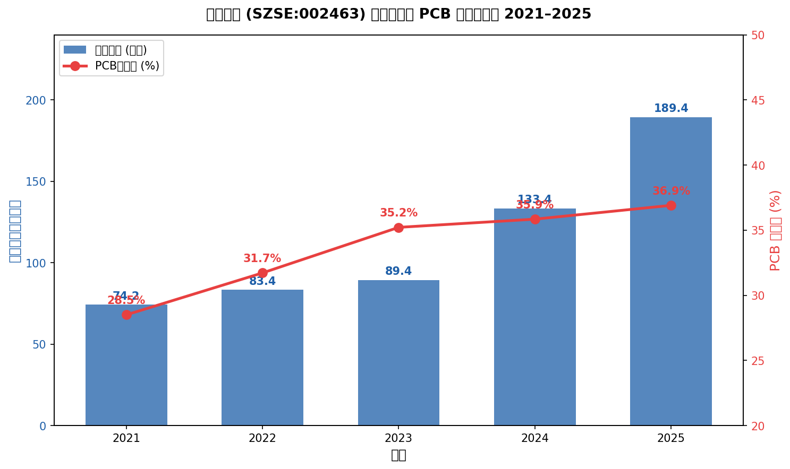
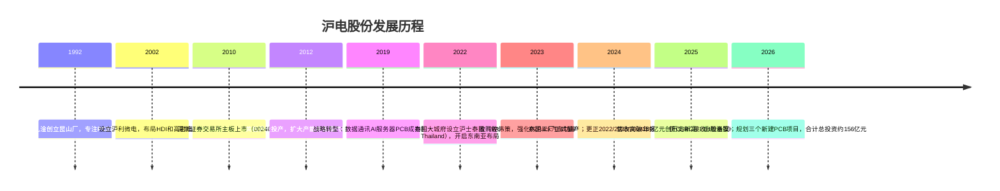
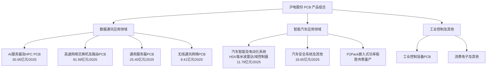
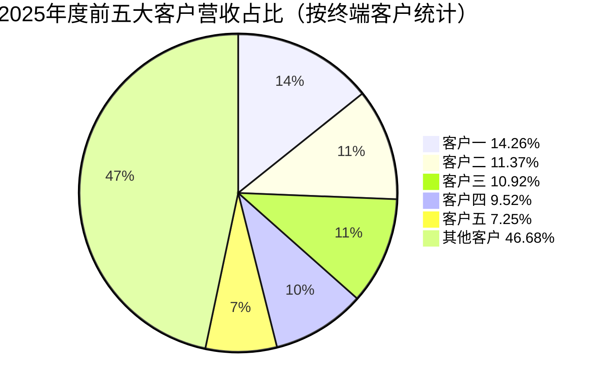
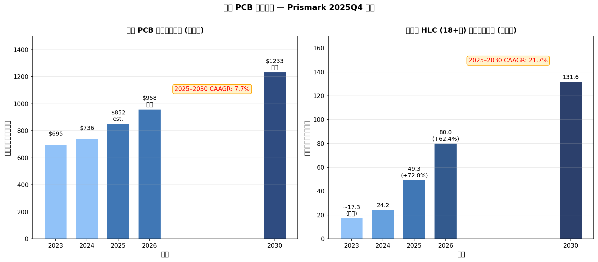
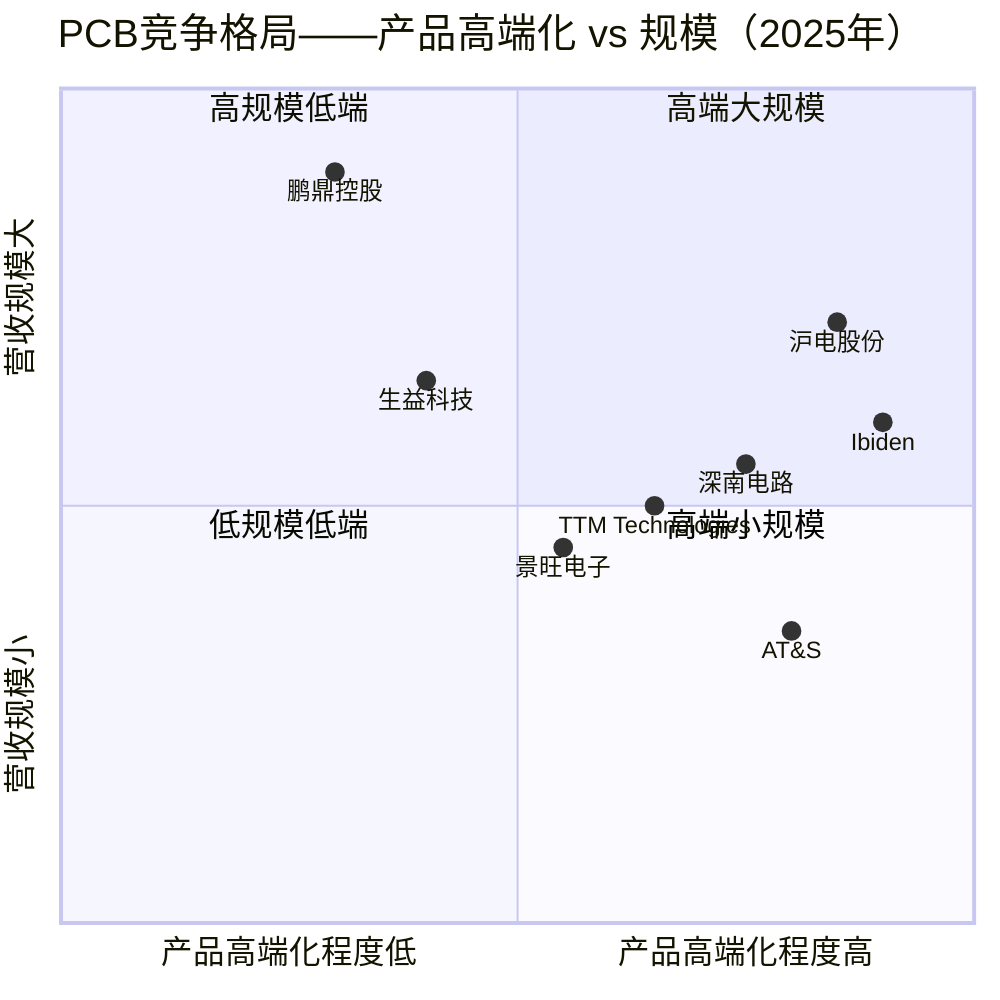
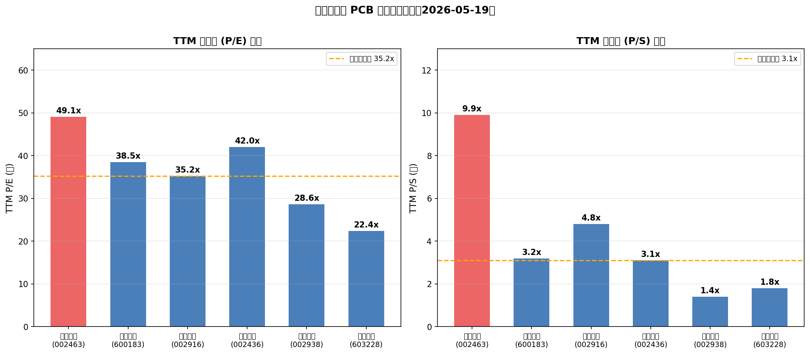

# 公司研究报告：沪电股份（沪士电子股份有限公司）
**股票代码：** SZSE:002463　　**报告日期：** 2026-05-19　　**评级：** 买入　　**目标价：** RMB 130

> **Update — 2026年一季度业绩大幅超预期（2026-04-22）：** 公司2026年第一季度实现营业收入约62.14亿元，同比增长53.91%；归母净利润约12.42亿元，同比增长62.90%。业绩预告（2026-04-14）预计归母净利润为11.8亿至12.6亿元，实际落在区间内偏上方，连续第五个季度刷新单季营收纪录。主因为AI服务器及高速网络交换机印制电路板（PCB）结构性需求持续爆发，泰国工厂产能利用率2026年一季度已超90%，高阶产品交付能力稳步提升。
> 来源：[沪士电子2026年一季度报告（2026-04-22）](https://static.cninfo.com.cn/finalpage/2026-04-23/1225147393.PDF)；[2026年第一季度业绩预告（2026-04-13）](https://static.cninfo.com.cn/finalpage/2026-04-14/1225097796.PDF)

---

## 目录

1. 公司概览
2. 公司历史
3. 管理团队
4. 产品与服务
5. 客户与销售渠道
6. 行业概览
7. 竞争格局
8. 市场机会（TAM）
9. 风险评估
10. 参考资料

---

## 一、公司概览

沪士电子股份有限公司（简称"沪电股份"，英文名称 WUS Printed Circuit (Kunshan) Co., Ltd.）是中国领先的高性能、高信赖性印制电路板（PCB，Printed Circuit Board）制造商，总部及主要生产基地位于江苏省昆山市。公司于1992年由台湾楠梓电子集团出资创立，历经三十余年深耕，已从台商早期进驻昆山时代的传统PCB供应商，演进成全球AI（人工智能）数据中心基础设施PCB领域的核心玩家之一，连续多年入选行业研究机构Prismark Partners LLC（以下简称"Prismark"）及中国印制电路行业协会（CPCA）发布的PCB百强企业榜单。

### 主营业务与营收结构

公司坚持"聚焦PCB主业、精益求精"的差异化运营战略，100%营收来自PCB制造及相关配套（边角料销售等）。2025年全年实现营业收入约189.45亿元，同比增长约42.00%；归属于上市公司股东的净利润约38.22亿元，同比增长约47.74%（[沪士电子2025年度报告，第5页](https://static.cninfo.com.cn/finalpage/2026-03-25/1225027832.PDF)）。

PCB业务以三大应用领域划分：

- **数据通讯应用领域**（含AI服务器及HPC、高速网络交换机及路由器、通用服务器、无线通讯网络）：2025年营业收入约146.56亿元，占PCB营收比例约80.8%，同比大幅增长约45.21%；毛利率约39.68%。其中高速网络交换机及配套路由PCB约81.69亿元（同比+109.89%），AI服务器和HPC PCB约30.06亿元，通用服务器PCB约25.40亿元，无线通讯及其他约9.41亿元。
- **智能汽车应用领域**（电动车EV/ADAS/智能座舱）：2025年营业收入约30.45亿元，同比增长约26.41%；毛利率约22.84%（同比下降1.61个百分点），其中汽车智能及电动化系统约11.79亿元（同比+114.62%），汽车安全系统及其他约18.65亿元。
- **工业控制及其他应用领域**：2025年营业收入约4.42亿元，同比增长约31.18%；毛利率约42.10%。

按地区划分：外销约155.43亿元，占PCB营收约85.7%；内销约26.00亿元。外销毛利率38.34%，高于内销（28.35%），体现了国际高端客户对公司产品的更高溢价认可（[沪士电子2025年度报告，第20页](https://static.cninfo.com.cn/finalpage/2026-03-25/1225027832.PDF)）。

*来源：[沪士电子2025年度报告](https://static.cninfo.com.cn/finalpage/2026-03-25/1225027832.PDF)；[2024年度报告](https://static.cninfo.com.cn/finalpage/2025-03-26/1222896592.PDF)；[2022年度报告](https://static.cninfo.com.cn/finalpage/2024-03-26/1219407512.PDF)*

### 经营规模

截至2025年末，公司总资产约282.54亿元，归属于上市公司股东净资产约151.13亿元，总股本19.24亿股。公司在职员工合计约15,243人（含母公司7,062人和主要子公司8,181人），研发人员1,899人，占员工总数约12.46%（[沪士电子2025年度报告，第23页](https://static.cninfo.com.cn/finalpage/2026-03-25/1225027832.PDF)）。研发投入约11.41亿元，占营业收入比例6.02%，全年取得25项发明专利、15项实用新型专利。

主要生产基地：昆山本部（青淞厂区）、黄石沪士（黄石厂）、泰国大城府（沪士泰国，2022年设立、2024年起量产），以及常州胜伟策。子公司沪士国际有限公司（香港）负责国际业务结算；沪利微电（昆山）专注高密度互连（HDI）及汽车板。

### 估值快照

**截至2026-05-19：**

| 指标 | 沪电股份 | PCB同业中位数（参考） |
|------|----------|---------------------|
| 股价（人民币） | 97.66 | — |
| 总市值（亿元） | ≈1,879 | — |
| TTM 市盈率（P/E） | ≈49.1x | ≈33x |
| TTM 市销率（P/S） | ≈9.9x | ≈2.5x |
| 加权平均ROE | 28.57% | — |

注：市值以总股本1,924,363,537股乘以97.66元计算。TTM利润取2025年全年归母净利润38.22亿元。TTM营收取2025年全年189.45亿元。同业中位数为粗略参考，详见第七节。

沪电股份TTM P/E约49倍，明显高于同业中位数约33倍，P/S约9.9倍，约为同业中位数2.5倍的4倍。这一溢价不能简单归结为泡沫——背后有三条实质支撑：**其一**，公司处于AI数据中心PCB需求最集中的高层板（HLC，18层以上）和高阶HDI细分市场，增速远高于行业均值（2025年全行业PCB收入增约15.8%，公司数据通讯PCB增约45%）；**其二**，公司ROE持续提升（2023年16.84%→2024年24.25%→2025年28.57%），盈利质量显著改善；**其三**，2026年一季度收入增长54%、净利润增长63%，增速持续上行，市场以高PE定价未来可见的持续性增长。然而，当前估值已隐含相当高的预期，若全年增速出现明显放缓或行业新增产能过剩加速，估值压缩风险不可忽视（详见第九节风险评估）。

---

## 二、公司历史

沪电股份由台湾楠梓电子股份有限公司（Nanya Printed Circuit Board Corp.，TWSE:8046）集团创办人吴礼淦先生于1992年创立。彼时昆山刚刚兴起台商制造业聚集，吴礼淦将台湾PCB制造技术与工艺移植大陆，把握内地低成本制造优势，逐步建立起覆盖多层板、HDI的生产体系。

**三次关键战略转型：**

1. **企业通讯市场板（2010–2018年）**：上市后公司聚焦高速网络设备PCB，凭借与Cisco、Juniper等头部网络设备商的长期合作，逐步建立高多层板制造能力和品质口碑。
2. **AI数据中心PCB战略定位（2019–2021年）**：随着云计算和AI算力需求迅速兴起，公司在内部研发中率先布局超高层HLC（18层以上）和mSAP改良半加成法工艺，优先配置高阶产能给AI服务器和高速交换机（800G/1.6T）产品，奠定当前核心竞争优势。
3. **泰国全球化产能布局（2022年至今）**：应对地缘政治与"中国+N"供应链重构趋势，公司在泰国设立生产基地，以服务对供应地有明确需求的北美、欧洲客户，同时保留国内技术和规模优势。

**2025年11月27日年报更正（公告编号2025-075）：** 公司披露对2022年、2023年、2024年三个年度年报的更正公告，涉及信息披露完善与格式修正（[2022年更正后年报](https://static.cninfo.com.cn/finalpage/2025-11-28/1224831827.PDF)；[2023年更正后年报](https://static.cninfo.com.cn/finalpage/2025-11-28/1224831829.PDF)；[2024年更正后年报](https://static.cninfo.com.cn/finalpage/2025-11-28/1224831828.PDF)）。2025年年度报告披露"公司是否因会计政策变更及会计差错更正等追溯调整或重述以前年度会计数据"明确选择"否"，说明本次更正不属于追溯调整或会计差错更正，不影响核心财务数据的可比性，但投资者仍应关注更正背景（详见第九节风险）。

---

## 三、管理团队

### 陈梅芳女士——董事长（董事会主席）

陈梅芳女士，1946年出生，中国香港籍，大学学历，现任沪电股份董事长（法定代表人）、公司控股股东碧景（英属维尔京群岛）控股有限公司（BIGGERING (BVI) HOLDINGS CO., LTD.）董事。陈女士是公司创始家族吴礼淦家族的核心成员，其家族现由包括其本人及子吴传彬、吴传林，女吴晓杉，媳邓文澜、朱雨洁，婿胡诏棠共7人组成。

陈梅芳女士于2024年4月正式担任董事长，接替此前长期担任公司实际掌舵人的丈夫吴礼淦先生（现已退出公司执行层）。吴礼淦先生自1992年以楠梓电子集团背景在昆山创立公司，将台湾成熟的PCB技术体系、台湾供应链生态和管理文化全面移植，铸就了公司30余年的技术基因。陈梅芳女士作为创始家族的精神核心，继续主导公司最高决策，尤其是在港股H股上市这一重大资本战略方面发挥关键决策作用。

值得指出，创始家族目前通过BIGGERING (BVI) HOLDINGS CO., LTD.持股约19.32%，通过WUS GROUP HOLDINGS CO., LTD.持股约11.26%，通过HAPPY UNION INVESTMENT LIMITED持股约1.03%，三方合计控制约31.61%的表决权（[2026年一季度报告，第3页](https://static.cninfo.com.cn/finalpage/2026-04-23/1225147393.PDF)）。创始家族股权相对分散于多个BVI离岸持股平台，控制权牢固但存在代际传承安排的结构复杂性。

公司实际运营以技术驱动为核心，管理团队中多位核心成员均有30年以上PCB行业经验，体现出"技术家族传承"与"专业管理团队"的有机结合。

### 吴传彬先生——总经理兼董事

吴传彬先生，1971年出生，中国香港籍，毕业于美国加州大学伯克利分校（UC Berkeley），后取得上海交通大学EMBA硕士学位。1995年加入公司，历任资讯经理、业务经理、制造经理、厂务制造协理等要职，2000年起担任总经理至今，同时于2025年11月17日经股东会选举正式成为第八届董事会非独立董事。现兼任昆山沪利微电有限公司董事长、黄石沪士电子有限公司董事兼总经理、沪士电子（泰国）有限公司签字董事。

吴传彬作为创始人之子，自1995年进入公司即接受完整的PCB实操培训，掌握从工程、制造到业务的全链路运营。其主导了公司过去十余年最关键的战略选择：包括数据通讯PCB的差异化押注、泰国工厂的选址与建设（2022年至今），以及推动公司实现从"5G基站PCB供应商"向"AI数据中心PCB核心伙伴"的身份跃迁。公司数据通讯营收在2022–2025年间从约54.95亿元增长至约146.56亿元，年均复合增长率接近40%，是吴传彬任期内最具代表性的交付成果（[沪士电子2025年度报告](https://static.cninfo.com.cn/finalpage/2026-03-25/1225027832.PDF)）。

### 朱碧霞女士——财务总监

朱碧霞女士，1971年出生，中国台湾籍，毕业于台湾中央大学（硕士学历），高级国际财务管理师（CIFM），国际会计师公会（IAB）全权会员。曾就职于华普飞机引擎科技股份有限公司、屈臣氏百佳股份有限公司、中华汽车股份有限公司。2007年加入沪电股份，历任内部审计负责人、资材处处长，2014年起担任财务总监，负责公司财务规划、资金管理、税务合规及投资者关系支持。其在任期间公司完成多轮境内借款扩张（2025年末长短期借款合计约40.6亿元）、泰国子公司对外融资以及2025年启动的港股H股上市中的境外审计工作安排（[沪士电子2025年度报告，第47页](https://static.cninfo.com.cn/finalpage/2026-03-25/1225027832.PDF)）。

### 高文贤先生——事业部总经理（数据通讯方向）

高文贤先生，1965年出生，中国台湾籍，台湾清华大学工业管理系毕业，拥有30余年PCB行业经验，曾任楠梓电子股份有限公司组效经理。1996年加入沪电股份，历任组效、采购、物控、生产等部门主管，现任公司董事、事业部总经理，主管数据通讯应用领域的业务拓展与产品研发。

### 石智中先生——事业部总经理（HDI/汽车板方向）

石智中先生，1962年出生，中国台湾籍，台湾文化大学化工系毕业，30余年PCB行业经验，历任台湾华通电脑公司、苏州金像电子有限公司要职。2009年加入沪电股份，历任总经理室特别助理、沪利微电协理、副总经理等，现任沪利微电总经理及胜伟策电子（江苏）有限公司总经理、公司董事、事业部总经理，主管HDI技术、汽车板业务及胜伟策P2Pack产品的量产。在其带领下，胜伟策于2025年成功实现扭亏（净利润约715万元），并成为国内唯一实现P2Pack PCB产品大批量量产的企业（[沪士电子2025年度报告，第16页](https://static.cninfo.com.cn/finalpage/2026-03-25/1225027832.PDF)）。

### 公司治理

董事会由11名成员构成，含4名独立董事、1名职工代表董事。2025年11月17日，公司依据新修订《公司法》取消监事会设置，由审计委员会行使原监事会职权，治理架构进一步与香港联交所要求对接（为H股上市所做的准备）。创始家族核心成员（陈梅芳、吴传彬、吴传林）共同持有约31.6%的表决权，形成创始家族主导下多数股东结构。目前公司已于2025年12月向香港联交所递交H股发行上市申请，2025年12月16日获中国证监会接收备案申请材料（[沪士电子2025年度报告，第40页](https://static.cninfo.com.cn/finalpage/2026-03-25/1225027832.PDF)）。

**管理团队综合评估：** 团队技术背景深厚，多位核心成员拥有30年以上PCB制造经验；家族创始人文化保证了长期战略定力；对AI数据中心PCB的押注节奏领先同业。主要潜在短板：公司尚无职业经理人"交棒"的完整规划，家族控制结构下的代际传承安排有待更清晰的市场沟通。

---

## 四、产品与服务

沪电股份的产品完全聚焦于印制电路板（PCB）制造，不涉足PCB设计、封装基板（IC Substrate）的制造（昆山沪利微电曾有substrate研究，但主业仍为HDI板）或PCB组装（PCBA）环节。产品组合以应用领域而非工艺类型划分，覆盖从传统多层板到超高层HLC（High Layer Count，18层及以上）、HDI（High Density Interconnect，高密度互连）及高功率P2Pack（嵌入式功率芯片封装集成）板。

### 4.1 数据通讯应用领域 PCB（核心旗舰）

**高速网络交换机及路由器 PCB**（2025年营收约81.69亿元，同比+109.89%）是公司当前增长最快、技术壁垒最高的产品线。此类产品支持400G/800G乃至1.6T（Terabit）交换速率，主要应用于数据中心Spine/Leaf架构中的以太网交换机（如采用Broadcom Thor2或Nvidia Spectrum-4芯片的机架交换机）。关键技术要求：18层以上HLC、mSAP（改良半加成法，Modified Semi-Additive Process）极细线路/间距、超低介电损耗（Ultra-Low Loss，ULL）和极低介电损耗（Extremely Low Loss，ELL）高频高速覆铜板、背钻（Back Drilling）消STUB、224G SerDes信号完整性控制。

公司已完成基于NPC（Near Package Connectivity）和CPC（Co-Package Connectivity）结构的1.6T交换机PCB的客户认证，并开始小批量交付；同时持续配合客户开发NPO（Near Package Optics）和CPO（Co-Package Optics）架构产品（[沪士电子2025年度报告，第23页](https://static.cninfo.com.cn/finalpage/2026-03-25/1225027832.PDF)）。

**竞争优势判断：**
- 有竞争优势（强）。核心护城河：**技术壁垒 + 客户认证锁定 + 规模**。超高层HLC PCB制造要求极强的工艺控制能力（层间对准精度、背钻精度、信号完整性测试等），良率爬坡周期长（通常18–24个月），形成实质性的资质壁垒。同业进入者众多但"通关者少"——公司自述的表述与市场观察一致（[沪士电子2025年度报告，第15页](https://static.cninfo.com.cn/finalpage/2026-03-25/1225027832.PDF)）。
- 最接近竞争对手：深南电路（SZSE:002916），同样获得部分超高层交换机PCB认证；TTM Technologies（美国，NASDAQ:TTMI）在美国本地制造有地缘优势。

**AI服务器及HPC PCB**（2025年营收约30.06亿元）面向AI训练/推理服务器主板和高性能计算（HPC）系统，对PCB的关键要求是超高层数（40–50层）、高纵横比通孔、严格的阻抗控制和热管理。公司下一代GPU平台产品已通过认证，进入工程打样阶段；ASIC平台方面，支持224Gbps速率的产品正稳步推进认证。

**竞争优势判断：**
- 有竞争优势（中等至强）。护城河同为客户认证锁定和工艺壁垒，但AI服务器PCB的产品迭代周期较短（对应英伟达每年推新GPU平台），每次迭代均需重新认证，技术紧追风险客观存在。相比之下高速交换机PCB设计更新周期略长，认证壁垒更持久。

### 4.2 智能汽车应用领域 PCB

**汽车智能及电动化系统 PCB**（HDI毫米波雷达板、L3/L4自动驾驶辅助（ADAS）域控制器PCB、智能座舱域控制器PCB）：2025年同比增长约114.62%。这类产品以车规级可靠性为核心竞争力——AEC-Q100认证、宽温域（-40℃至125℃）工作可靠性、高纵横比精细孔径HDI工艺是必要条件，不达标供应商无法通过Tier-1主机厂认证。

**P2Pack嵌入式功率芯片封装集成技术**：公司控股子公司胜伟策电子（江苏）有限公司是全球首个实现P2Pack PCB大批量量产的供应商。P2Pack技术将功率芯片嵌入PCB基板内部，适用于汽车48V/800V高压驱动平台，可大幅降低热阻、提高功率密度。2025年胜伟策实现营收约6.65亿元，同比大幅增长约107.63%，并实现扭亏为盈（净利润约715万元），且已向数据中心高功率应用延伸布局（与AI数据中心头部客户合作开发P2Pack在散热优化中的应用）（[沪士电子2025年度报告，第17页及第29页](https://static.cninfo.com.cn/finalpage/2026-03-25/1225027832.PDF)）。

**竞争优势判断：**
- P2Pack：有竞争优势（独占级，当前）。"唯一实现大批量量产"是极强的差异化护城河，但独占地位将随Schweizer Electronic AG（公司持股对象）及台系竞争对手的工艺追赶而面临挑战。
- 汽车通用多层板：竞争优势部分，汽车PCB市场中低端供给过剩，价格压力较大（毛利率2025年同比下降约1.61个百分点）。

### 4.3 工业控制及其他 PCB

面向工业控制设备、仪器仪表等领域，2025年营收约4.42亿元，占PCB总营收约2.4%，毛利率约42.10%（全线段最高），属于利润型而非规模型业务。

### 4.4 近期重大研发与产品方向

2026年初，公司规划在常州金坛设立全资子公司，搭建CoWoP（Chip-on-Wafer-on-PCB，一种将芯片直接集成到PCB基板的先进封装技术）和mSAP（改良半加成法）孵化平台，计划注册资本1亿美元，总投资3亿美元。这一战略方向标志着公司开始从传统PCB制造向"PCB与先进封装交界"领域延伸，是下一代AI算力平台（Blackwell Ultra后续架构）的技术前沿布局（[沪士电子2026年一季度报告，第4页](https://static.cninfo.com.cn/finalpage/2026-04-23/1225147393.PDF)）。

---

## 五、客户与销售渠道

### 客户集中度

公司在年报中按终端客户指定的实际交货对象统计前五大客户。2025年度前五大客户情况如下（[沪士电子2025年度报告，第20–21页](https://static.cninfo.com.cn/finalpage/2026-03-25/1225027832.PDF)）：

| 排名 | 客户名称 | 销售额（亿元） | 占年度总营收比例 |
|------|----------|--------------|----------------|
| 1 | 客户一（未披露具体名称） | 27.02 | 14.26% |
| 2 | 客户二 | 21.54 | 11.37% |
| 3 | 客户三 | 20.68 | 10.92% |
| 4 | 客户四 | 18.04 | 9.52% |
| 5 | 客户五 | 13.74 | 7.25% |
| **合计** | — | **101.03** | **53.32%** |

注：年报说明，按终端客户统计，前五大合计约为53.89%。公司未披露前五大客户的具体名称。

**集中度评估：** 最大单一客户占总营收14.26%，高于10%警戒线；前五大合计53.32%，高于50%的重大风险阈值。这一集中度在PCB行业中属于偏高水平，但考虑到全球AI数据中心PCB市场本身高度集中于少数超大规模科技企业（CSP）——据市场观察，Nvidia（通过ODM合作伙伴）、Cisco、华为等都是高速交换机PCB领域的极少数买家——此类集中度有其结构性必然性。

**风险标记：** 前五大客户合计占比53.32% > 50%阈值，按照本报告风险评估框架属于"重大风险"，已在第九节专项说明。

*来源：[沪士电子2025年度报告，第20–21页](https://static.cninfo.com.cn/finalpage/2026-03-25/1225027832.PDF)*

### 主要供应商

前五大供应商合计采购额约59.73亿元，占年度采购总额约42.16%。最大供应商采购额约31.56亿元，占年度采购总额约22.28%（[沪士电子2025年度报告，第21页](https://static.cninfo.com.cn/finalpage/2026-03-25/1225027832.PDF)）。供应商亦未披露名称，主要原材料为覆铜板（CCL）、半固化片、铜箔、铜球、金盐、干膜、油墨等，原材料成本占PCB业务成本约66.52%。

### 销售模式与渠道

公司采用直销为主的模式，与全球头部科技企业客户建立直接业务关系，产品直接发货至客户指定工厂（ODM代工厂或客户自有工厂）。外销比例约85.7%，主要集中于亚太地区，直接出口至美国的营业收入占比不超过5%（主要为工程认证样品和小批量产品）（[沪士电子2025年度报告，第32页](https://static.cninfo.com.cn/finalpage/2026-03-25/1225027832.PDF)）。公司获评战略客户颁发的"最佳技术创新奖""年度最佳全球供应链运营商""卓越供应商奖"等多项荣誉，体现出长期战略伙伴关系的深度。

---

## 六、行业概览

### 全球 PCB 行业规模

印制电路板（PCB）是现代电子设备的基础结构部件，在整个电子产业价值链中处于不可替代的中游位置。根据Prismark Partners LLC 2025年第四季度研究报告（Prismark为PCB行业公认权威预测机构），2025年全球PCB市场产值约851.52亿美元，同比增长约15.8%——大幅超越年初预期（年初预测约790亿美元），主因为AI和高速网络基础设施的爆发性需求驱动高层板市场超预期增长（[沪士电子2025年度报告，第9–12页，引自Prismark 2025Q4研究报告](https://static.cninfo.com.cn/finalpage/2026-03-25/1225027832.PDF)）。

Prismark预测2026年全球PCB市场产值将达957.8亿美元，同比增长12.5%；至2030年将突破1,230亿美元，2025–2030年五年复合年均增长率（CAAGR）约7.7%。

*来源：[沪士电子2025年度报告，第9–12页，Prismark 2025Q4研究报告](https://static.cninfo.com.cn/finalpage/2026-03-25/1225027832.PDF)*

### 行业结构分化：高层板是最大增长引擎

2025年PCB市场的关键特征是极度分化：18层以上高层板（HLC，High Layer Count）增速全线段最高，全球产值同比增长约72.8%；中国HLC产值增速更高达约119.2%。2026年预测HLC增速仍高达62.4%（全球）和81.5%（中国），远远超出整体行业12.5%的增速（同上来源）。

以数据通讯应用领域PCB细分市场看，Prismark预测2024–2029年均复合增长率约14.68%，其中服务器/数据存储18.7%，有线基础设施（交换机等）15.7%，远超汽车PCB的4.3%（同上来源）。

### 关键技术趋势

**1. 超高层板HLC与mSAP工艺融合**：AI服务器的计算密度和每比特功耗要求驱动PCB层数不断突破上限。当前主流AI训练服务器PCB已达40–50层，高速交换机超过30层。mSAP工艺通过电镀减去而非蚀刻的方式实现更精细线路，是HLC PCB规模量产的关键使能技术。

**2. 高频高速材料的产能瓶颈**：超低损耗（ULL）、极低损耗（ELL）高频板材（如Panasonic Megtron系列、Rogers、台湾生益科技M7/M8系列）的供给受限于少数全球材料厂商的扩产能力，成为高阶PCB供应的关键瓶颈。公司在年报中明确提出"在终端客户产品开发极早期全面介入，提前参与新一代高端材料的电性能验证与可靠性测试"以确保优先配额（[沪士电子2025年度报告，第19页](https://static.cninfo.com.cn/finalpage/2026-03-25/1225027832.PDF)）。

**3. CoWoP与先进封装的边界模糊化**：英伟达GB200/GB300等下一代GPU平台推动PCB与先进封装（Advanced Packaging）的技术边界持续融合。CoWoP（Chip-on-Wafer-on-PCB）将芯片直接焊装到PCB基板上，要求PCB具备远高于传统规格的平整度、孔径精度和热传导能力。这一趋势从根本上重塑了PCB制造商的技术能力壁垒，也是沪电股份2026年布局CoWoP孵化平台的核心逻辑。

**4. 800G/1.6T交换机PCB市场快速放量**：超大规模数据中心（Hyperscaler）正在快速推进800G以太网交换机的部署，并开始预研1.6T交换机（基于Nvidia Spectrum-X或Broadcom Tomahawk 5架构）。这一迭代直接拉动对应PCB的设计验证和批量采购，是沪电股份2025年高速交换机收入同比倍增的直接背景。

**5. "中国+N"供应链重构**：地缘政治因素推动北美和欧洲主要科技公司要求其供应商在中国大陆以外建立替代产能。泰国、越南、印度成为首选目的地。沪电股份2022年在泰国大城府建厂，2024年开始量产，2026年第一季度产能利用率已超90%，成为满足西方客户"去中国化"采购要求的核心竞争力（[沪士电子2025年度报告，第18–19页](https://static.cninfo.com.cn/finalpage/2026-03-25/1225027832.PDF)）。

### 行业动态与竞争格局演变

中国PCB产业已是全球规模最大的制造中心，2025年中国PCB产值约489.69亿美元，占全球约57.5%，且增速领先全球（同比约19.2%）。行业集中度整体偏低，但高阶产品（HLC、高阶HDI）市场正在向少数头部企业集中——资本开支门槛高、认证周期长（通常18–24个月）、材料配额优先权等多重因素共同筑起壁垒。中低端PCB则面临严重产能过剩和价格战，利润率持续承压。

---

## 七、竞争格局

### 主要竞争对手分析

沪电股份的直接竞争对手主要分布在中国大陆A股PCB龙头、台湾PCB厂商及日本/欧美高端PCB企业。

**生益科技（SSE:600183）**：中国最大的覆铜板生产商，同时涉足高层多层PCB，是沪电股份的材料供应商也是潜在竞争者。2025年营收规模约百亿量级（公开数据），PCB业务侧重国内通讯和服务器市场，技术层次低于沪电股份的数据通讯高阶产品。

**深南电路（SZSE:002916）**：中国PCB上市公司中技术最接近沪电股份的竞争者，同样拥有数据中心高层板和汽车HDI双线业务，2025年营收约80亿元量级。深南是华为、腾讯等国内大客户的重要供应商，在华为AI服务器PCB上有较深布局。其高层板产能规模和客户结构与沪电股份高度重叠，是最直接的国内竞争对手。

**鹏鼎控股（SZSE:002938）**：营收规模中国PCB行业最大（2025年预计超过300亿元），主要面向消费电子（苹果手机FPC和硬板），高端服务器PCB体量相对有限。产品结构与沪电股份分化明显，竞争重叠度相对低。

**景旺电子（SSE:603228）**：侧重汽车、工控板及通讯PCB，规模约50亿元量级，高端数据通讯PCB能力有限。

**TTM Technologies（美国，NASDAQ:TTMI）**：美国本土最大的PCB制造商，在航空航天、国防、医疗和数据中心PCB均有布局，具备北美本地制造的地缘竞争力。随着美国推动PCB供应链本土化，TTM在高端数据中心PCB上的国内市场份额可能逐步提升。

**AT&S（奥地利）**：欧洲最大PCB制造商，核心优势在IC Substrate（半导体封装基板）和ABF基板，产品定位高于通用HLC PCB，与沪电股份的重叠集中在汽车高阶HDI领域。

**Ibiden（日本，TYO:4062）**：全球IC Substrate最大供应商，PCB业务规模大但重心在基板而非高层通讯PCB，直接竞争面有限。

*来源：东方财富（https://quote.eastmoney.com）2026-05-19 数据；注：同业P/E和P/S为近似值，来自东方财富行情页面，请以最新市场数据为准*

### 沪电股份的竞争优势

1. **高阶HLC和高速交换机PCB的先发认证优势**：公司是率先完成1.6T交换机PCB客户认证的少数供应商之一，认证锁定期间竞争者难以替代。
2. **泰国产能对西方客户需求的直接响应**：泰国工厂2026年一季度产能利用率超90%，数据通讯事业部超70%海外客户完成认证，是同业中较少数已实现泰国量产并稳定交付的中国PCB厂。
3. **P2Pack独占优势（中期）**：胜伟策是全球唯一大批量量产P2Pack PCB的供应商，为全球首批800V高压平台车企提供独特技术支持。
4. **ROE和盈利质量持续提升**：ROE从2023年16.84%提升至2025年28.57%，远高于同业平均水平，体现出高端产品定价权和资产运营效率双重改善。

### 竞争弱点

1. **客户集中度偏高**：前五大客户占比53.32%，单一客户依赖风险显著（详见第九节）。
2. **汽车PCB毛利率承压**：受行业竞争加剧和原材料成本压力影响，汽车PCB毛利率2025年同比下降1.61个百分点，价格谈判地位相对弱于数据通讯领域。
3. **泰国工厂初期亏损**：沪士泰国2025年净亏损约1.40亿元（营收约2.89亿元），折旧和爬坡成本将持续拖累整体盈利2–3年。

---

## 八、市场机会（TAM）

### 全球 PCB 市场总量（TAM）

根据Prismark 2025Q4预测，全球PCB总量目标市场：
- **2025年（估算）**：851.52亿美元
- **2026年（预测）**：957.8亿美元（同比+12.5%）
- **2030年（预测）**：超过1,230亿美元
- **2025–2030年CAAGR**：约7.7%

中国PCB市场占全球约57.5%（2025年约489.69亿美元），且增速全球最快（2025年同比约+19.2%）（[沪士电子2025年度报告，第10–12页，Prismark 2025Q4研究报告](https://static.cninfo.com.cn/finalpage/2026-03-25/1225027832.PDF)）。

### 数据通讯细分市场（沪电核心业务SAM）

Prismark预测数据通讯应用领域全球PCB产值（含服务器/数据存储、有线及无线基础设施）：

| 应用领域 | 2024年（亿美元） | 2025年估算（亿美元） | 2029年预测（亿美元） | 2024–2029 CAGR |
|---------|---------------|-------------------|-------------------|----------------|
| 服务器/数据存储 | 109.16 | 159.75 | 257.29 | 18.7% |
| 有线基础设施 | 61.53 | 83.85 | 127.59 | 15.7% |
| 无线基础设施 | 31.77 | 36.11 | 48.00 | 8.6% |
| 其他计算 | 36.49 | 38.30 | 41.10 | 2.4% |
| **合计** | **238.95** | **318.01** | **473.98** | **14.68%** |

*来源：[沪士电子2025年度报告，第16页，Prismark研究报告](https://static.cninfo.com.cn/finalpage/2026-03-25/1225027832.PDF)*

沪电股份2025年数据通讯PCB营收约146.56亿元（约20.66亿美元），约占全球同细分市场（318亿美元）的6.5%，同年该细分市场增速约33%，公司增速（+45.21%）明显跑赢市场，体现出市场份额的提升。

### 高层板 HLC 细分（最核心增量来源）

HLC（18+层）是公司产品中技术最高端、增速最快、利润最好的品类。2025年全球HLC产值约49.28亿美元，同比增长约72.8%；2026年预测约80.02亿美元，同比增长约62.4%；2030年预测约131.59亿美元，2025–2030年CAAGR约21.7%（同上来源）。

沪电股份的数据通讯PCB中，高层板贡献了绝大部分的毛利增量。公司并未单独披露HLC产值，但从高速交换机PCB（81.69亿元）的层数结构看，大部分均属18层以上。

### 沪电股份的可服务市场（SOM）演进路径

在AI数据中心投资持续强劲（全球CSP资本开支预期2026年继续高增长）的大背景下，公司当前可服务市场（SOM）的核心约束来自以下三点：

1. **高阶产能扩张节奏**：公司2026年一季度同步推进三个新建项目——CoWoP常州金坛项目（总投资3亿美元）、昆山沪利微电新建项目（约55亿元，2年建设期）和公司本部新建高端PCB项目（约33亿元，2年建设期）（[沪士电子2026年一季度报告，第4–5页](https://static.cninfo.com.cn/finalpage/2026-04-23/1225147393.PDF)）——合计新增资本投入超过100亿元，产能释放将在2027–2028年逐步体现，届时对收入贡献将显著加速。

2. **材料配额**：高端低损耗CCL（覆铜板）供给偏紧，公司通过早期参与材料认证和战略安全库存加以应对。

3. **泰国工厂的持续扩容**：泰国汽车事业部2026年进入量产爬坡阶段，数据通讯事业部正实施针对性产能升级，预期2026年第二季度有序释放。

总体而言，全球AI基础设施投资的长期趋势叠加沪电股份在高端产能和技术认证上的先发壁垒，为公司提供了未来3–5年可见度较高的增长路径。

---

## 九、风险评估

### 公司特定风险

**风险一：客户高度集中（重大风险）**

前五大客户合计销售额约101.03亿元，占年度总营收约53.32%，高于50%的重大风险阈值（按终端客户口径约53.89%）；最大单一客户占比14.26%，高于10%警戒线（[沪士电子2025年度报告，第20–21页](https://static.cninfo.com.cn/finalpage/2026-03-25/1225027832.PDF)）。公司未披露前五大客户名称，合同结构为PO（订单）式而非多年锁定协议为主，周期性采购计划存在调整风险。若最大单一客户（预计为某AI算力平台设备商）采购计划下调20%，对公司营收的直接影响约在2.85亿元量级（约占2025年总营收1.5%）。缓释因素：长期战略伙伴关系、专用认证锁定、PCB的高切换成本。

**风险二：技术迭代与认证周期风险**

AI GPU平台更新频繁（英伟达Blackwell→Blackwell Ultra→Rubin的迭代周期约1–2年），每次迭代对PCB的层数、材料、孔径的技术规格均有实质提升，需要重新认证。若公司在某一代平台的认证滞后竞争对手，将面临该平台PCB份额受损的风险。公司当前已通过下一代GPU平台工程打样认证，处于较有利地位，但未来每一代都面临同样挑战（[沪士电子2025年度报告，第23页](https://static.cninfo.com.cn/finalpage/2026-03-25/1225027832.PDF)）。

**风险三：行业产能扩张过剩风险**

2024–2025年全球PCB同行大规模增加资本开支，布局高层板产能。公司自身在2026年同步推进超过100亿元的新建项目。若市场需求增速低于预期（如AI资本开支周期性回调），行业有效高阶产能集中释放将导致利用率下滑、价格竞争加剧，进而压缩毛利率。公司管理层明确预警"利润空间或将面临结构性挤压"（[沪士电子2025年度报告，第15页](https://static.cninfo.com.cn/finalpage/2026-03-25/1225027832.PDF)）。

**风险四：泰国工厂运营风险**

沪士泰国目前仍处于产能爬坡期，2025年亏损约1.40亿元。泰国工厂面临人才招募挑战（同业竞相入泰，专业PCB人才供不应求）、属地法规合规、文化差异、供应链本地化配套不足等运营挑战。若泰国工厂无法按计划在2026–2027年实现盈亏平衡，将持续拖累合并净利润（[沪士电子2025年度报告，第27页及第32页](https://static.cninfo.com.cn/finalpage/2026-03-25/1225027832.PDF)）。

### 行业与市场风险

**风险五：美中贸易关税政策不确定性**

公司直接出口美国的营收占比不超过5%，风险较为有限；但部分原材料受加征关税影响，且客户的最终服务器/交换机是否面临关税转移压力仍存在不确定性。公司已通过泰国工厂布局作为对冲，但随着美国关税政策针对特定第三国进行延伸，泰国工厂的"非中国"属性能否长期有效规避关税，存在政策演变风险（[沪士电子2025年度报告，第32页](https://static.cninfo.com.cn/finalpage/2026-03-25/1225027832.PDF)）。

**风险六：原材料供应与价格波动**

覆铜板、铜箔等关键原材料成本占PCB业务成本约66.52%，受铜价、石油等大宗商品和专用板材（M7/M8等高频高速材料）供求结构影响显著。2025年受大宗商品价格大幅上涨影响，相关原材料价格同步上行，部分高端材料出现阶段性供应偏紧（[沪士电子2025年度报告，第32页](https://static.cninfo.com.cn/finalpage/2026-03-25/1225027832.PDF)）。

### 财务风险

**风险七：年报更正事项（2025-11-27）**

公司于2025年11月28日披露对2022、2023、2024年三个年度年报的更正（公告编号2025-075）。2025年年度报告中明确标注"不涉及会计政策变更或会计差错更正导致的追溯调整"（[沪士电子2025年度报告，第5页](https://static.cninfo.com.cn/finalpage/2026-03-25/1225027832.PDF)），说明更正不影响核心财务数据的可比性。但投资者应注意：本次更正时点（2025年11月）恰与公司申请港股H股上市（2025年9月宣布筹划、11月正式向联交所递交申请材料）高度重叠，具体更正内容的详细说明需参阅更正后年报原文（[2022年更正后年报](https://static.cninfo.com.cn/finalpage/2025-11-28/1224831827.PDF)；[2023年更正后年报](https://static.cninfo.com.cn/finalpage/2025-11-28/1224831829.PDF)；[2024年更正后年报](https://static.cninfo.com.cn/finalpage/2025-11-28/1224831828.PDF)），投资者应自行核实更正事项的实质内容。

**风险八：估值压缩（高估值风险，重要）**

公司当前TTM P/E约49倍，约为PCB同业中位数（约33倍）的1.49倍；TTM P/S约9.9倍，约为同业中位数（约2.5倍）的4倍。估值显著高于同业，已隐含对公司未来3–5年持续超高增速的预期定价（[东方财富行情页面，2026-05-19](https://quote.eastmoney.com/sz002463.html)）。

触发估值压缩的可能场景：(a) AI数据中心资本开支出现超预期下修（如超大规模科技企业CAPEX指引下调），导致高速交换机/AI服务器PCB需求放缓；(b) 行业同业高阶产能集中落地，价格和毛利率下行；(c) 港股H股上市带来短期股权稀释，或A股估值向港股折价靠拢；(d) 单一大客户采购策略调整导致集中度风险兑现。若P/E回归至同业中位数约33倍，对应股价约65元，较当前97.66元有约33%的下行空间——投资者应充分理解当前价格已包含大量成长溢价。

**风险九：资本开支扩张导致现金流压力**

2025年投资活动净现金流约-26.55亿元，2026年已公告的三项新建项目合计投资超100亿元（分年度实施）。公司计划以自有资金或自筹资金完成上述项目，在H股上市前融资渠道主要依赖内部经营现金流（2025年约38.72亿元）和银行借款（长短期借款合计约40.6亿元）。若H股上市进度低于预期，大规模资本开支将显著消耗现金，并可能增加财务杠杆风险（[沪士电子2025年度报告，第24–25页](https://static.cninfo.com.cn/finalpage/2026-03-25/1225027832.PDF)）。

### 宏观风险

**风险十：汇率风险（人民币升值压制外销收益）**

公司外销占PCB营收约85.7%，主要以美元计价结算。2025年受美元兑人民币汇率整体下行影响，汇兑由收益转为损失，财务费用同比大幅上升（[沪士电子2025年度报告，第23页](https://static.cninfo.com.cn/finalpage/2026-03-25/1225027832.PDF)）。2026年一季度产生汇兑损失约1.48亿元，对当季净利润产生一定压制（[2026年一季度报告，第2页](https://static.cninfo.com.cn/finalpage/2026-04-23/1225147393.PDF)）。公司主要通过合理安排外币结构和数量、平衡外币收支管控汇率风险。

**风险十一：PCB行业宏观周期性下行风险**

PCB行业历史上表现出明显的周期性（2022–2023年即经历了明显的需求疲软和库存调整周期）。若全球宏观经济出现较大幅度收缩，科技企业资本开支普遍缩减，AI基础设施投资放缓，公司收入将面临较显著的周期性下行压力。相对缓释因素是，公司产品高度集中于AI数据中心这一当前具有强政策和商业驱动力的细分，与消费电子板（如手机、PC相关PCB）的周期相关性相对较低。

---

## 参考资料

### 一次文献（公司公告）

- [沪士电子2025年度报告（2026-03-24）](https://static.cninfo.com.cn/finalpage/2026-03-25/1225027832.PDF)
- [沪士电子2026年一季度报告（2026-04-22）](https://static.cninfo.com.cn/finalpage/2026-04-23/1225147393.PDF)
- [沪士电子2026年第一季度业绩预告（2026-04-13）](https://static.cninfo.com.cn/finalpage/2026-04-14/1225097796.PDF)
- [沪士电子2025年度报告摘要（2026-03-24）](https://static.cninfo.com.cn/finalpage/2026-03-25/1225027831.PDF)
- [沪士电子2024年度报告（2025-03-25）](https://static.cninfo.com.cn/finalpage/2025-03-26/1222896592.PDF)
- [沪士电子2023年度报告（2024-03-25）](https://static.cninfo.com.cn/finalpage/2024-03-26/1219407512.PDF)
- [沪士电子2022年度报告（2023-03-23）](https://www.cninfo.com.cn/new/disclosure/stock?stockCode=002463)
- [沪士电子2021年度报告（2022-03-22）](https://www.cninfo.com.cn/new/disclosure/stock?stockCode=002463)
- [沪士电子2025年半年度报告（2025-08-21）](https://static.cninfo.com.cn/finalpage/2025-08-22/1224535064.PDF)
- [沪士电子2025年三季度报告（2025-10-28）](https://static.cninfo.com.cn/finalpage/2025-10-29/1224755010.PDF)

### 年报更正文件

- [沪士电子2022年年度报告全文（更正后，2025-11-27）](https://static.cninfo.com.cn/finalpage/2025-11-28/1224831827.PDF)
- [沪士电子2023年年度报告全文（更正后，2025-11-27）](https://static.cninfo.com.cn/finalpage/2025-11-28/1224831829.PDF)
- [沪士电子2024年年度报告全文（更正后，2025-11-27）](https://static.cninfo.com.cn/finalpage/2025-11-28/1224831828.PDF)

### 公司网站

- [沪士电子官方网站 wustec.com](http://www.wustec.com)

### 市场数据

- [沪电股份股票行情——东方财富（2026-05-19）](https://quote.eastmoney.com/sz002463.html)
- [巨潮资讯网沪电股份信息披露页面](https://www.cninfo.com.cn/new/disclosure/stock?stockCode=002463&orgId=gssz0002463)

### 行业研究

- Prismark Partners LLC，《2025Q4 PCB市场研究报告》，引用自沪士电子2025年度报告，第9–12页及第15–18页
- Prismark Partners LLC，《2024Q4 PCB市场研究报告》，引用自沪士电子2024年度报告

---

*本报告基于公开披露的一手资料（监管文件、公司公告）撰写，仅供投资研究参考，不构成任何投资建议。报告中标注"未披露"的信息（包括前五大客户具体名称、前五大供应商具体名称）均来自公司公告未公开披露的事项。所有估值数据均以2026-05-19收市价为基准。*
