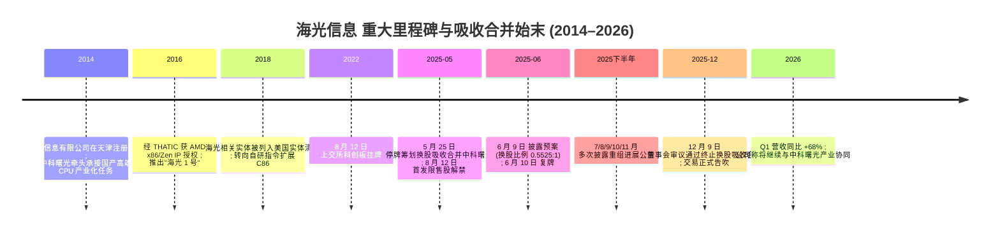
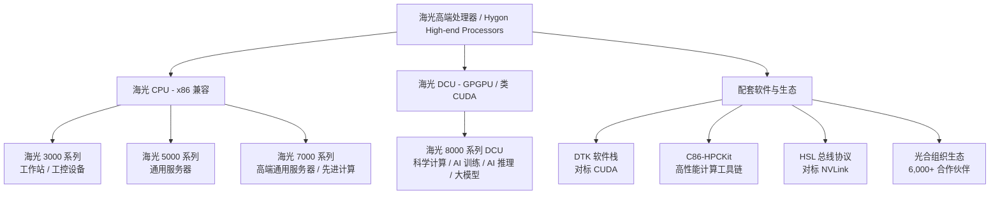
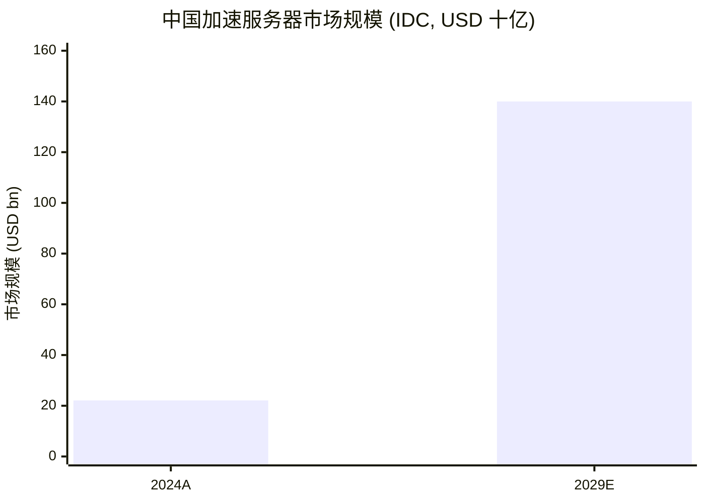
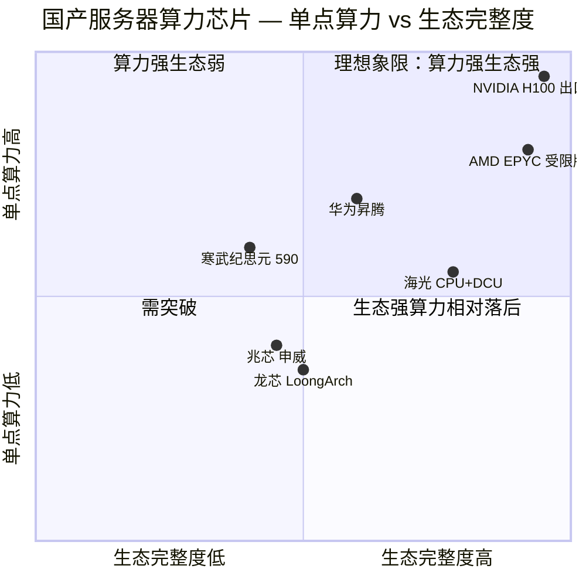

# 公司研究报告：海光信息技术股份有限公司 (Hygon Information Technology, SSE:688041)

**报告日期 (as of)：** 2026-06-14
**报告语言：** 简体中文
**主要来源：** [海光信息 2025 年年度报告 (cninfo, 2026-04-07)](https://static.cninfo.com.cn/finalpage/2026-04-08/1225083088.PDF)、[2026 年第一季度报告 (cninfo, 2026-04-07)](https://static.cninfo.com.cn/finalpage/2026-04-08/1225083112.PDF)、[关于终止重大资产重组的公告 (cninfo, 2025-12-09)](https://static.cninfo.com.cn/finalpage/2025-12-10/1224863806.PDF)

---

## 投资摘要 (Investment Summary) — *Analyst view:*

> 本节为本报告的房屋观点（house view）层，整体为 *分析师观点：*，**不构成投资建议**，且**绝不应被理解为公司定期报告（年报/季报）的披露内容** — 评级、目标价、前瞻估计均为分析师自有判断。

| 项目 | 取值 | 备注 |
|---|---|---|
| **评级 (Rating)** | **持有 / Hold (中性)** | 增长强劲但估值已充分计入近乎完美的执行 |
| **12 个月目标价 (12-mo PT)** | **RMB 242** | 基准情形 = 2027E EPS 2.84 × 85× P/E |
| 现价 (Current price) | RMB 280.00 | Sina 行情，2026-06-12 收盘 |
| 隐含空间 (Upside) | **−14%** | 基准情形相对现价 |
| 估值方法 | forward P/E × 目标倍数 | 以 2027E EPS 为锚，倍数对标国产 AI 算力同业 |
| 市值 (Market cap) | RMB 6,508 亿 | 280.00 × 23.24 亿股 |
| 总股本 | 23.24 亿股 | 232,433.81 万股 ([2025 年年度报告](https://static.cninfo.com.cn/finalpage/2026-04-08/1225083088.PDF)) |
| 52 周区间 (粗略) | ~190 – ~330 | Bernstein 2026-03-23 报告期价 207.04，近端冲高后回落 |
| Ticker / 交易所 | SSE:688041 / 上交所科创板 | A 股，人民币计价 |

**论点支柱 (Thesis pillars) — *Analyst view:*：**

1. **基本面无可挑剔，但价格已经反映。** 2025 营收 143.77 亿元 (+56.92%)、2026 Q1 再 +68.06%，是 A 股极少数 CPU + DCU 双线、规模化商用的国产算力旗舰；但现价对应 ~255× 历史 P/E、~45× P/S，隐含未来数年 50%+ 复合增速的"近完美剧本"，安全边际极薄。
2. **重大变化：吸收合并中科曙光已于 2025-12-09 正式终止 — 旧叙事中的"垂直一体化"催化剂消失。** 公司董事会第二届第十七次会议审议通过终止换股吸收合并曙光信息产业（中科曙光）的议案，理由是"交易规模较大、涉及相关方较多……市场环境……发生较大变化……条件尚不成熟"。这意味着 56.68% 的关联方客户集中度**不会被合并消化**，仍是结构性悬顶。
3. **DCU 是增长边际的真正引擎。** 在英伟达 H20 等中端 AI 芯片对华受限背景下，DCU 凭 DTK"类 CUDA"软件栈进入大型互联网/云厂商的国产化算力采购名录，与昇腾、寒武纪三足鼎立。
4. **地缘是双刃剑。** 实体清单既保护了国内市场（国际旗舰无法进入主流采购），又约束了上游（先进制程产能、EDA、HBM）——两端同时收紧时供应链脆弱性最大。

**最该盯紧的两个变量 (key swing variables)：** (1) **2026 全年营收增速能否守住 60%+**——若 norm 至 30% 以下，~255× P/E 的多倍数压缩风险将剧烈释放；(2) **DCU 在 AI 推理市场对昇腾的份额争夺**——决定中期成长曲线的斜率。

---

## 目录 (Table of Contents)

1. 公司概览 (Company Overview)
   - 1A 估值与目标价 (Valuation & Price Target)
   - 1B GF Score 基本面评分
2. 估值与前瞻模型 / 公司历史 (Valuation Model & History)
3. 管理团队 (Management Team)
4. 产品与服务 (Products & Services)
5. 客户与上市策略 (Customers & Go-to-Market)
6. 行业概览 (Industry Overview)
7. 竞争格局 (Competitive Landscape)
8. 市场机会 (Market Opportunity / TAM)
9. 风险评估 (Risk Assessment)
   - 9.5 核心分歧与催化剂 (Key Debates & Catalysts)
10. 投资视角评分 (Investor Lenses)
11. 参考资料 (References)

======================================

## 1. 公司概览 (Company Overview)

**一句话论点（BLUF）：** 海光信息是 A 股国产算力的"全栈旗舰"——中国大陆唯一同时自研、量产并大规模商用 x86 兼容高端 CPU 与 GPGPU 类 DCU 的设计企业；基本面强劲（2025 营收 +56.92%、Q1 2026 +68.06%），但当前 ~255× P/E 的估值已计入近乎完美的执行，且 2025 年 12 月吸收合并中科曙光交易终止后，56.68% 的关联方客户集中度成为不被合并消化的结构性悬顶——故本报告给予**持有 (Hold)** 评级。

海光信息技术股份有限公司 (Hygon Information Technology, SSE:688041，以下简称"海光信息"或"公司") 是中国大陆唯一同时具备 **高端通用处理器 (CPU)** 与 **GPGPU 类协处理器 (DCU, Deep-learning Computing Unit)** 自研、量产并大规模商用能力的集成电路设计 (IC design) 企业。公司注册地为天津华苑产业区，办公地为北京中关村软件园，并在天津、北京、成都、苏州、上海等地设有研发中心；法定代表人为公司董事兼总经理沙超群 ([2025 年年度报告 第二/四节](https://static.cninfo.com.cn/finalpage/2026-04-08/1225083088.PDF))。

**业务定位与商业模式。** 公司主营业务是研发、设计、销售服务器与工作站等计算/存储设备所使用的高端处理器，产品线由 **海光 CPU** (3000/5000/7000 系列，兼容 x86 指令集，覆盖工作站、通用服务器、高端通用服务器三档) 和 **海光 DCU** (8000 系列，基于 GPGPU 架构，面向科学计算、人工智能训练与推理、大数据处理) 两大产品族构成 ([2025 年年度报告 第三节](https://static.cninfo.com.cn/finalpage/2026-04-08/1225083088.PDF))。公司采用 **Fabless 模式**：自身负责架构、微结构、IP、物理设计与软件栈，晶圆制造 (foundry, 晶圆代工) 与封装测试 (OSAT) 由第三方代工厂承担。销售以直销 (direct sales) 为主、经销 (distribution) 为辅：2025 年直销收入 137.35 亿元 (毛利率 58.12%)、经销收入仅 6.27 亿元 (同比 −54.99%)，反映多家大型服务器整机厂商从经销转直销 ([2025 年年度报告 第三节 — 分销售模式](https://static.cninfo.com.cn/finalpage/2026-04-08/1225083088.PDF))。

**财务规模与增长。** 2025 年公司实现营业收入 143.77 亿元，同比增长 56.92%；归属于上市公司股东的净利润 (net income to parent, 归母净利润) 25.45 亿元，同比 +31.79%；扣非归母净利润 23.05 亿元；基本每股收益 (EPS) 1.10 元 (上年 0.83 元)。2026 年 Q1 单季度营收 40.34 亿元，同比 +68.06%，归母净利润 6.87 亿元 (+35.82%)——节奏进一步加速，主要得益于 DCU 在 AI 训练/推理场景的大规模放量 ([2026 年第一季度报告](https://static.cninfo.com.cn/finalpage/2026-04-08/1225083112.PDF))。截至 2025 年末，公司总资产 356.38 亿元，归母净资产 224.93 亿元，员工总数 3,333 人，其中技术人员 2,766 人；累计发明专利 1,101 项、累计申请知识产权 3,326 项 ([2025 年年度报告 第三/四节](https://static.cninfo.com.cn/finalpage/2026-04-08/1225083088.PDF))。

**地域结构。** 报告期内境内销售 (含港澳台) 占比 100%，反映公司因美国实体清单 (Entity List) 等出口管制因素而专注于中国大陆市场 ([2025 年年度报告 第三节 — 分地区](https://static.cninfo.com.cn/finalpage/2026-04-08/1225083088.PDF))。

下图以公司 2025 年自身利润表为数据来源，展示"营收→成本/毛利→费用/经营利润→税/净利"的资金流向——57.8% 的高毛利率与 31.78% 的研发投入强度是这家芯片设计公司财务画像的两个支点。

<svg xmlns="http://www.w3.org/2000/svg" viewBox="0 0 1000 560" width="1000" height="560" role="img" aria-label="income statement Sankey"><rect x="0" y="0" width="1000" height="560" fill="#ffffff"/>
<text x="20.00" y="30.00" text-anchor="start" font-family="Helvetica,Arial,sans-serif" font-size="15" font-weight="700" fill="#1f2933">海光信息 2025 利润表 Sankey (RMB 百万)</text>
<path d="M 204.00,70.22 C 258.00,70.22 258.00,78.00 312.00,78.00 L 312.00,499.56 C 258.00,499.56 258.00,491.78 204.00,491.78 Z" fill="#93c5fd" fill-opacity="0.55"/>
<path d="M 452.00,71.00 C 506.00,71.00 506.00,150.12 560.00,150.12 L 560.00,250.54 C 506.00,250.54 506.00,171.42 452.00,171.42 Z" fill="#86efac" fill-opacity="0.55"/>
<path d="M 452.00,171.42 C 506.00,171.42 506.00,264.54 560.00,264.54 L 560.00,408.74 C 506.00,408.74 506.00,315.62 452.00,315.62 Z" fill="#fca5a5" fill-opacity="0.55"/>
<path d="M 328.00,78.00 C 382.00,78.00 382.00,71.00 436.00,71.00 L 436.00,315.04 C 382.00,315.04 382.00,322.04 328.00,322.04 Z" fill="#86efac" fill-opacity="0.55"/>
<path d="M 328.00,322.04 C 382.00,322.04 382.00,329.04 436.00,329.04 L 436.00,507.00 C 382.00,507.00 382.00,500.00 328.00,500.00 Z" fill="#fca5a5" fill-opacity="0.55"/>
<path d="M 700.00,150.12 C 754.00,150.12 754.00,220.89 808.00,220.89 L 808.00,295.58 C 754.00,295.58 754.00,224.82 700.00,224.82 Z" fill="#86efac" fill-opacity="0.55"/>
<path d="M 700.00,224.82 C 754.00,224.82 754.00,309.58 808.00,309.58 L 808.00,311.58 C 754.00,311.58 754.00,226.82 700.00,226.82 Z" fill="#fca5a5" fill-opacity="0.55"/>
<path d="M 700.00,226.82 C 754.00,226.82 754.00,325.58 808.00,325.58 L 808.00,357.11 C 754.00,357.11 754.00,258.35 700.00,258.35 Z" fill="#fca5a5" fill-opacity="0.55"/>
<path d="M 576.00,150.12 C 630.00,150.12 630.00,150.12 684.00,150.12 L 684.00,250.54 C 630.00,250.54 630.00,250.54 576.00,250.54 Z" fill="#86efac" fill-opacity="0.55"/>
<path d="M 576.00,264.54 C 630.00,264.54 630.00,269.68 684.00,269.68 L 684.00,292.20 C 630.00,292.20 630.00,287.07 576.00,287.07 Z" fill="#fca5a5" fill-opacity="0.55"/>
<path d="M 576.00,287.07 C 630.00,287.07 630.00,306.20 684.00,306.20 L 684.00,427.88 C 630.00,427.88 630.00,408.74 576.00,408.74 Z" fill="#fca5a5" fill-opacity="0.55"/>
<path d="M 576.00,422.74 C 630.00,422.74 630.00,250.54 684.00,250.54 L 684.00,255.68 C 630.00,255.68 630.00,427.88 576.00,427.88 Z" fill="#93c5fd" fill-opacity="0.55"/>
<path d="M 204.00,505.78 C 258.00,505.78 258.00,499.56 312.00,499.56 L 312.00,501.56 C 258.00,501.56 258.00,507.78 204.00,507.78 Z" fill="#93c5fd" fill-opacity="0.55"/>
<rect x="188.00" y="70.22" width="16" height="421.56" rx="1.5" fill="#2563eb"/>
<rect x="188.00" y="505.78" width="16" height="2.00" rx="1.5" fill="#2563eb"/>
<rect x="312.00" y="78.00" width="16" height="422.00" rx="1.5" fill="#1e3a8a"/>
<rect x="436.00" y="71.00" width="16" height="244.04" rx="1.5" fill="#15803d"/>
<rect x="436.00" y="329.04" width="16" height="177.96" rx="1.5" fill="#dc2626"/>
<rect x="560.00" y="150.12" width="16" height="100.42" rx="1.5" fill="#15803d"/>
<rect x="560.00" y="264.54" width="16" height="144.20" rx="1.5" fill="#dc2626"/>
<rect x="560.00" y="422.74" width="16" height="5.13" rx="1.5" fill="#2563eb"/>
<rect x="684.00" y="150.12" width="16" height="105.56" rx="1.5" fill="#15803d"/>
<rect x="684.00" y="269.68" width="16" height="22.52" rx="1.5" fill="#dc2626"/>
<rect x="684.00" y="306.20" width="16" height="121.68" rx="1.5" fill="#dc2626"/>
<rect x="808.00" y="220.89" width="16" height="74.70" rx="1.5" fill="#15803d"/>
<rect x="808.00" y="309.58" width="16" height="2.00" rx="1.5" fill="#dc2626"/>
<rect x="808.00" y="325.58" width="16" height="31.53" rx="1.5" fill="#dc2626"/>
<line x1="188.00" y1="281.00" x2="182.00" y2="261.22" stroke="#cbd5e1" stroke-width="1"/>
<text x="179.00" y="264.22" text-anchor="end" font-family="Helvetica,Arial,sans-serif" font-size="11.5" font-weight="700" fill="#1f2933">CPU+DCU 高端处理器</text>
<text x="179.00" y="277.22" text-anchor="end" font-family="Helvetica,Arial,sans-serif" font-size="10" font-weight="400" fill="#52606d">RMB14.4B  (99.9%)</text>
<line x1="188.00" y1="506.78" x2="182.00" y2="487.00" stroke="#cbd5e1" stroke-width="1"/>
<text x="179.00" y="490.00" text-anchor="end" font-family="Helvetica,Arial,sans-serif" font-size="11.5" font-weight="700" fill="#1f2933">其他</text>
<text x="179.00" y="503.00" text-anchor="end" font-family="Helvetica,Arial,sans-serif" font-size="10" font-weight="400" fill="#52606d">RMB15.0M  (0.10%)</text>
<rect x="331.00" y="60.00" width="119.40" height="26" rx="2" fill="#ffffff" fill-opacity="0.72"/>
<text x="334.00" y="72.00" text-anchor="start" font-family="Helvetica,Arial,sans-serif" font-size="11.5" font-weight="700" fill="#1f2933">Revenue</text>
<text x="334.00" y="85.00" text-anchor="start" font-family="Helvetica,Arial,sans-serif" font-size="10" font-weight="400" fill="#52606d">RMB14.4B  (100.0%)</text>
<rect x="455.00" y="53.00" width="106.80" height="26" rx="2" fill="#ffffff" fill-opacity="0.72"/>
<text x="458.00" y="65.00" text-anchor="start" font-family="Helvetica,Arial,sans-serif" font-size="11.5" font-weight="700" fill="#1f2933">Gross Profit</text>
<text x="458.00" y="78.00" text-anchor="start" font-family="Helvetica,Arial,sans-serif" font-size="10" font-weight="400" fill="#52606d">RMB8.3B  (57.8%)</text>
<rect x="455.00" y="311.04" width="144.60" height="26" rx="2" fill="#ffffff" fill-opacity="0.72"/>
<text x="458.00" y="323.04" text-anchor="start" font-family="Helvetica,Arial,sans-serif" font-size="11.5" font-weight="700" fill="#1f2933">Cost of Revenue (COGS)</text>
<text x="458.00" y="336.04" text-anchor="start" font-family="Helvetica,Arial,sans-serif" font-size="10" font-weight="400" fill="#52606d">RMB6.1B  (42.2%)</text>
<rect x="579.00" y="132.12" width="106.80" height="26" rx="2" fill="#ffffff" fill-opacity="0.72"/>
<text x="582.00" y="144.12" text-anchor="start" font-family="Helvetica,Arial,sans-serif" font-size="11.5" font-weight="700" fill="#1f2933">Operating Income</text>
<text x="582.00" y="157.12" text-anchor="start" font-family="Helvetica,Arial,sans-serif" font-size="10" font-weight="400" fill="#52606d">RMB3.4B  (23.8%)</text>
<rect x="579.00" y="246.54" width="150.90" height="26" rx="2" fill="#ffffff" fill-opacity="0.72"/>
<text x="582.00" y="258.54" text-anchor="start" font-family="Helvetica,Arial,sans-serif" font-size="11.5" font-weight="700" fill="#1f2933">Total Operating Expense</text>
<text x="582.00" y="271.54" text-anchor="start" font-family="Helvetica,Arial,sans-serif" font-size="10" font-weight="400" fill="#52606d">RMB4.9B  (34.2%)</text>
<text x="551.00" y="422.31" text-anchor="end" font-family="Helvetica,Arial,sans-serif" font-size="11.5" font-weight="700" fill="#1f2933">Net Interest / Other Income</text>
<text x="551.00" y="435.31" text-anchor="end" font-family="Helvetica,Arial,sans-serif" font-size="10" font-weight="400" fill="#52606d">RMB174.9M  (1.2%)</text>
<rect x="703.00" y="132.12" width="106.80" height="26" rx="2" fill="#ffffff" fill-opacity="0.72"/>
<text x="706.00" y="144.12" text-anchor="start" font-family="Helvetica,Arial,sans-serif" font-size="11.5" font-weight="700" fill="#1f2933">Pretax Income</text>
<text x="706.00" y="157.12" text-anchor="start" font-family="Helvetica,Arial,sans-serif" font-size="10" font-weight="400" fill="#52606d">RMB3.6B  (25.0%)</text>
<rect x="703.00" y="251.68" width="113.10" height="26" rx="2" fill="#ffffff" fill-opacity="0.72"/>
<text x="706.00" y="263.68" text-anchor="start" font-family="Helvetica,Arial,sans-serif" font-size="11.5" font-weight="700" fill="#1f2933">SG&amp;A</text>
<text x="706.00" y="276.68" text-anchor="start" font-family="Helvetica,Arial,sans-serif" font-size="10" font-weight="400" fill="#52606d">RMB767.4M  (5.3%)</text>
<rect x="703.00" y="288.20" width="106.80" height="26" rx="2" fill="#ffffff" fill-opacity="0.72"/>
<text x="706.00" y="300.20" text-anchor="start" font-family="Helvetica,Arial,sans-serif" font-size="11.5" font-weight="700" fill="#1f2933">R&amp;D</text>
<text x="706.00" y="313.20" text-anchor="start" font-family="Helvetica,Arial,sans-serif" font-size="10" font-weight="400" fill="#52606d">RMB4.1B  (28.8%)</text>
<text x="833.00" y="255.24" text-anchor="start" font-family="Helvetica,Arial,sans-serif" font-size="11.5" font-weight="700" fill="#1f2933">Net Income</text>
<text x="833.00" y="268.24" text-anchor="start" font-family="Helvetica,Arial,sans-serif" font-size="10" font-weight="400" fill="#52606d">RMB2.5B  (17.7%)</text>
<text x="833.00" y="307.58" text-anchor="start" font-family="Helvetica,Arial,sans-serif" font-size="11.5" font-weight="700" fill="#1f2933">Income Tax</text>
<text x="833.00" y="320.58" text-anchor="start" font-family="Helvetica,Arial,sans-serif" font-size="10" font-weight="400" fill="#52606d">-RMB22.8M  (-0.16%)</text>
<text x="833.00" y="338.35" text-anchor="start" font-family="Helvetica,Arial,sans-serif" font-size="11.5" font-weight="700" fill="#1f2933">Minority Interest</text>
<text x="833.00" y="351.35" text-anchor="start" font-family="Helvetica,Arial,sans-serif" font-size="10" font-weight="400" fill="#52606d">RMB1.1B  (7.5%)</text>
<text x="500.00" y="544.00" text-anchor="middle" font-family="Helvetica,Arial,sans-serif" font-size="10" font-weight="400" fill="#52606d">Source: 海光信息 2025 年年度报告 (cninfo, 2026-04-07)</text>
</svg>

来源: [海光信息 2025 年年度报告 — 合并利润表](https://static.cninfo.com.cn/finalpage/2026-04-08/1225083088.PDF)。

下面以公司近四年自身披露的营业收入展示其增长轨迹——三年间从 51.25 亿增至 143.77 亿，是高估值的成长性底座。

<svg xmlns="http://www.w3.org/2000/svg" viewBox="0 0 860 470" width="860" height="470" role="img" aria-label="historical revenue bars"><rect x="0" y="0" width="860" height="470" fill="#ffffff"/>
<text x="20.00" y="30.00" text-anchor="start" font-family="Helvetica,Arial,sans-serif" font-size="15" font-weight="700" fill="#1f2933">海光信息 营业收入 2022–2025 (RMB 百万)</text>
<rect x="20.00" y="44" width="11" height="11" rx="2" fill="#2563eb"/>
<text x="36.00" y="53.00" text-anchor="start" font-family="Helvetica,Arial,sans-serif" font-size="10.5" font-weight="400" fill="#1f2933">高端处理器 (CPU+DCU)</text>
<line x1="70" y1="412.00" x2="834" y2="412.00" stroke="#eceff2" stroke-width="1"/>
<text x="64.00" y="415.00" text-anchor="end" font-family="Helvetica,Arial,sans-serif" font-size="9.5" font-weight="400" fill="#52606d">RMB0</text>
<line x1="70" y1="345.20" x2="834" y2="345.20" stroke="#eceff2" stroke-width="1"/>
<text x="64.00" y="348.20" text-anchor="end" font-family="Helvetica,Arial,sans-serif" font-size="9.5" font-weight="400" fill="#52606d">RMB3.1B</text>
<line x1="70" y1="278.40" x2="834" y2="278.40" stroke="#eceff2" stroke-width="1"/>
<text x="64.00" y="281.40" text-anchor="end" font-family="Helvetica,Arial,sans-serif" font-size="9.5" font-weight="400" fill="#52606d">RMB6.2B</text>
<line x1="70" y1="211.60" x2="834" y2="211.60" stroke="#eceff2" stroke-width="1"/>
<text x="64.00" y="214.60" text-anchor="end" font-family="Helvetica,Arial,sans-serif" font-size="9.5" font-weight="400" fill="#52606d">RMB9.3B</text>
<line x1="70" y1="144.80" x2="834" y2="144.80" stroke="#eceff2" stroke-width="1"/>
<text x="64.00" y="147.80" text-anchor="end" font-family="Helvetica,Arial,sans-serif" font-size="9.5" font-weight="400" fill="#52606d">RMB12.4B</text>
<line x1="70" y1="78.00" x2="834" y2="78.00" stroke="#eceff2" stroke-width="1"/>
<text x="64.00" y="81.00" text-anchor="end" font-family="Helvetica,Arial,sans-serif" font-size="9.5" font-weight="400" fill="#52606d">RMB15.5B</text>
<rect x="110.11" y="301.75" width="110.78" height="110.25" fill="#2563eb"/>
<text x="165.50" y="428.00" text-anchor="middle" font-family="Helvetica,Arial,sans-serif" font-size="10" font-weight="400" fill="#52606d">2022</text>
<rect x="301.11" y="282.68" width="110.78" height="129.32" fill="#2563eb"/>
<text x="356.50" y="428.00" text-anchor="middle" font-family="Helvetica,Arial,sans-serif" font-size="10" font-weight="400" fill="#52606d">2023</text>
<rect x="492.11" y="214.91" width="110.78" height="197.09" fill="#2563eb"/>
<text x="547.50" y="428.00" text-anchor="middle" font-family="Helvetica,Arial,sans-serif" font-size="10" font-weight="400" fill="#52606d">2024</text>
<rect x="683.11" y="102.74" width="110.78" height="309.26" fill="#2563eb"/>
<text x="738.50" y="428.00" text-anchor="middle" font-family="Helvetica,Arial,sans-serif" font-size="10" font-weight="400" fill="#52606d">2025</text>
<text x="430.00" y="454.00" text-anchor="middle" font-family="Helvetica,Arial,sans-serif" font-size="10" font-weight="400" fill="#52606d">Source: 海光信息 2022–2025 年度报告 (cninfo)</text>
</svg>

来源: [海光信息 2022–2025 年度报告 (cninfo)](https://static.cninfo.com.cn/finalpage/2026-04-08/1225083088.PDF)。

### 1A 估值与目标价 (Valuation & Price Target)

**估值快照 (Valuation snapshot, 2026-06-12 收盘)。** 海光信息 A 股报 RMB 280.00/股，总市值约 RMB 6,508 亿，对应：

| 指标 | 数值 | 备注 |
|---|---|---|
| 收盘价 | RMB 280.00 | Sina 行情，2026-06-12 |
| 总市值 | RMB 6,508 亿 | 280.00 × 23.2434 亿股 |
| **市盈率 (P/E, 以 FY2025 归母净利)** | **~255.7×** | 6,508 亿 / 25.45 亿 |
| **市销率 (P/S, 以 FY2025 营收)** | **~45.3×** | 6,508 亿 / 143.77 亿 |
| 市净率 (P/B) | ~28.9× | 归母净资产 224.93 亿 (2025YE) |
| 2026Q1 营收同比 | +68.06% | 加速 |

来源：[Sina 行情 688041, 2026-06-12](https://finance.sina.com.cn/realstock/company/sh688041/nc.shtml)、[2025 年年度报告 主要财务指标](https://static.cninfo.com.cn/finalpage/2026-04-08/1225083088.PDF)。

**估值解读 — ~255× P/E、~45× P/S 是"AI 算力国产化主线"的叙事溢价 (narrative premium) 叠加高成长溢价。** 三个支撑因素：(1) **高成长**：2025 营收增速 57%、Q1 2026 加速至 68%，是国内极少数同时具备 CPU + GPGPU 双产品线、并实现规模化商用的厂商；(2) **稀缺性**：A 股国产算力可比标的极少——寒武纪 (SSE:688256) P/E TTM ~287×，海光的估值反而略低；澜起科技 (SSE:688008) 现价 224.88 元、龙芯中科 (SSE:688047) 140.56 元仍处微利 ([Sina 行情, 2026-06-12](https://finance.sina.com.cn/realstock/company/sh688041/nc.shtml))；(3) **DCU 放量预期**。但 ~45× P/S 显著高于全球半导体均值，且 2025 年 12 月吸收合并中科曙光交易终止后，曾经支撑估值的"垂直一体化"催化剂已经消失 ([关于终止重大资产重组的公告, 2025-12-09](https://static.cninfo.com.cn/finalpage/2025-12-10/1224863806.PDF))。**当增速 norm 至 30–40% 时存在显著回撤风险——参见 Section 9 估值/多倍数压缩风险与 Section 2 前瞻模型。**

*分析师观点：* 本报告自有的 12 个月目标价为 **RMB 242（基准情形，相对现价 −14%）**，估值方法与三档情景 (bull/base/bear) 见 Section 2。需要强调：目标价、前瞻估计均为分析师判断，**绝不来自公司年报/季报**——年报中不含任何目标价。

### 1B GF Score 基本面评分 (*Analyst view:*)

下图为本报告自有的 GF Score（GuruFocus 式）五维基本面评分雷达图——**这是分析师的评分工具，不是新数据源，也不构成对 GuruFocus 数值的引用**；各维度评分均为 *分析师观点：*，五项底层指标各自带行内引用。

<svg xmlns="http://www.w3.org/2000/svg" viewBox="0 0 500 500" width="500" height="500" role="img" aria-label="GF Score radar">
<rect x="0" y="0" width="500" height="500" fill="#ffffff"/>
<text x="20" y="24" font-family="Helvetica,Arial,sans-serif" font-size="15" font-weight="700" fill="#1f2933">GF Score (GuruFocus-style): 70/100</text>
<text x="20" y="41" font-family="Helvetica,Arial,sans-serif" font-size="11" fill="#52606d">51–70 Poor future performance potential</text>
<polygon points="250.0,88.0 392.7,191.6 338.2,359.4 161.8,359.4 107.3,191.6" fill="#e9f5ec" stroke="none"/>
<polygon points="250.0,208.0 278.5,228.7 267.6,262.3 232.4,262.3 221.5,228.7" fill="none" stroke="#c5d3cb" stroke-width="1"/>
<polygon points="250.0,178.0 307.1,219.5 285.3,286.5 214.7,286.5 192.9,219.5" fill="none" stroke="#c5d3cb" stroke-width="1"/>
<polygon points="250.0,148.0 335.6,210.2 302.9,310.8 197.1,310.8 164.4,210.2" fill="none" stroke="#c5d3cb" stroke-width="1"/>
<polygon points="250.0,118.0 364.1,200.9 320.5,335.1 179.5,335.1 135.9,200.9" fill="none" stroke="#c5d3cb" stroke-width="1"/>
<polygon points="250.0,88.0 392.7,191.6 338.2,359.4 161.8,359.4 107.3,191.6" fill="none" stroke="#c5d3cb" stroke-width="1.3"/>
<line x1="250" y1="238" x2="161.8" y2="359.4" stroke="#cfdad3" stroke-width="1"/>
<text x="146.5" y="392.4" text-anchor="end" font-family="Helvetica,Arial,sans-serif" font-size="11.5" font-weight="600" fill="#1f2933">财务实力</text>
<text x="188.3" y="316.9" text-anchor="middle" font-family="Helvetica,Arial,sans-serif" font-size="10.5" font-weight="700" fill="#1f2933">7</text>
<line x1="250" y1="238" x2="250.0" y2="88.0" stroke="#cfdad3" stroke-width="1"/>
<text x="250.0" y="58.0" text-anchor="middle" font-family="Helvetica,Arial,sans-serif" font-size="11.5" font-weight="600" fill="#1f2933">盈利能力</text>
<text x="250.0" y="112.0" text-anchor="middle" font-family="Helvetica,Arial,sans-serif" font-size="10.5" font-weight="700" fill="#1f2933">8</text>
<line x1="250" y1="238" x2="107.3" y2="191.6" stroke="#cfdad3" stroke-width="1"/>
<text x="82.6" y="183.6" text-anchor="end" font-family="Helvetica,Arial,sans-serif" font-size="11.5" font-weight="600" fill="#1f2933">成长性</text>
<text x="107.3" y="185.6" text-anchor="middle" font-family="Helvetica,Arial,sans-serif" font-size="10.5" font-weight="700" fill="#1f2933">10</text>
<line x1="250" y1="238" x2="392.7" y2="191.6" stroke="#cfdad3" stroke-width="1"/>
<text x="417.4" y="183.6" text-anchor="start" font-family="Helvetica,Arial,sans-serif" font-size="11.5" font-weight="600" fill="#1f2933">估值</text>
<text x="278.5" y="222.7" text-anchor="middle" font-family="Helvetica,Arial,sans-serif" font-size="10.5" font-weight="700" fill="#1f2933">2</text>
<line x1="250" y1="238" x2="338.2" y2="359.4" stroke="#cfdad3" stroke-width="1"/>
<text x="353.5" y="392.4" text-anchor="start" font-family="Helvetica,Arial,sans-serif" font-size="11.5" font-weight="600" fill="#1f2933">动量</text>
<text x="294.1" y="292.7" text-anchor="middle" font-family="Helvetica,Arial,sans-serif" font-size="10.5" font-weight="700" fill="#1f2933">5</text>
<polygon points="250.0,118.0 278.5,228.7 294.1,298.7 188.3,322.9 107.3,191.6" fill="#2e8b57" fill-opacity="0.34" stroke="#2e8b57" stroke-width="2"/>
<circle cx="188.3" cy="322.9" r="2.6" fill="#2e8b57"/>
<circle cx="250.0" cy="118.0" r="2.6" fill="#2e8b57"/>
<circle cx="107.3" cy="191.6" r="2.6" fill="#2e8b57"/>
<circle cx="278.5" cy="228.7" r="2.6" fill="#2e8b57"/>
<circle cx="294.1" cy="298.7" r="2.6" fill="#2e8b57"/>
<text x="250" y="470" text-anchor="middle" font-family="Helvetica,Arial,sans-serif" font-size="9.5" fill="#52606d">Source: 海光信息 2025 年年度报告 + 2026Q1 报告 (cninfo) · Sina 行情 2026-06-12 · 本报告评分</text>
<text x="250" y="485" text-anchor="middle" font-family="Helvetica,Arial,sans-serif" font-size="9" fill="#52606d">GF Score = independent analyst rubric (*Analyst view:*) — not GuruFocus™ official number</text>
</svg>

| 维度 | 评分 (0–10) | |
|---|---|---|
| 财务实力 | 7 | `███████░░░` |
| 盈利能力 | 8 | `████████░░` |
| 成长性 | 10 | `██████████` |
| 估值 | 2 | `██░░░░░░░░` |
| 动量 | 5 | `█████░░░░░` |
| **GF Score (composite, *Analyst view:*)** | **70 / 100** | **51–70 Poor future performance potential** |

*Composite weights (*Analyst view:*): Financial Strength 20% · Profitability 25% · Growth 25% · GF Value 15% · Momentum 15% (transparent reproduction — not GuruFocus's proprietary weighting).*

来源: [海光信息 2025 年年度报告 + 2026Q1 报告 (cninfo)](https://static.cninfo.com.cn/finalpage/2026-04-08/1225083088.PDF)、[Sina 行情, 2026-06-12](https://finance.sina.com.cn/realstock/company/sh688041/nc.shtml)；评分为本报告评分。

| 维度 | 评分 (0–10) | 各维度评分理由 (*Analyst view:*) |
|---|---|---|
| 财务实力 (Financial Strength) | **7** | 现金充裕（货币资金及金融资产约 130 亿）对短期借款 34.5 亿 + 长期借款 5 亿净现金为正；但短期借款同比上升、合同负债 20.19 亿 (+123.42%) 体现高景气而非财务压力 ([2025 年年度报告 — 合并资产负债表](https://static.cninfo.com.cn/finalpage/2026-04-08/1225083088.PDF))。 |
| 盈利能力 (Profitability) | **8** | 毛利率 (gross margin) 57.78%、净利率 17.7%、加权平均 ROE 11.87% (上年 9.92%)，盈利质量优、且连续多年正向；扣非 ROE 10.75% ([2025 年年度报告 — 主要财务指标](https://static.cninfo.com.cn/finalpage/2026-04-08/1225083088.PDF))。 |
| 成长性 (Growth) | **10** | 营收三年 (2022→2025) 从 51.25 亿增至 143.77 亿 (CAGR ~41%)，2025 +56.92%、Q1 2026 +68.06%，成长性满分 ([2025 年年度报告](https://static.cninfo.com.cn/finalpage/2026-04-08/1225083088.PDF)、[2026Q1 报告](https://static.cninfo.com.cn/finalpage/2026-04-08/1225083112.PDF))。 |
| 估值 (GF Value, 越高越便宜) | **2** | ~255× P/E、~45× P/S 处于全球半导体最贵分位，相对自身前瞻 EPS 与同业几乎无安全边际——估值维度低分 ([Sina 行情, 2026-06-12](https://finance.sina.com.cn/realstock/company/sh688041/nc.shtml))。 |
| 动量 (Momentum) | **5** | 现价 280.00 较旧报告期 307.00 回落约 9%，且已触及 Bernstein 目标价 280；动量中性 ([Sina 行情, 2026-06-12](https://finance.sina.com.cn/realstock/company/sh688041/nc.shtml))。 |

**GF Score 综合 = 70 / 100（*分析师观点：*，权重 财务 20%·盈利 25%·成长 25%·估值 15%·动量 15%）。** 综合分被"满分成长 + 极低估值分"两端拉扯：基本面极强，但价格已透支——这与本报告 Hold 评级、−14% 隐含空间内在一致。该综合分**不归属于 GuruFocus**（未引用其发布值）。

---

## 2. 估值与前瞻模型 / 公司历史 (Valuation Model & History)

### 2A 前瞻财务模型 (Forward Estimates) — *Analyst view:*

下表为本报告自有的三年前瞻模型。**每一个预测单元格均为 *分析师观点：*，绝不来自任何公司公告**；驱动假设的外部依据（年报分部数据 + 行业预测）在正文行内引用。模型以 2025 实际值为基准、对 2026–2028 做减速假设（从 FY25 +57% / Q1'26 +68% 逐步回落）。

| 年度 (RMB 亿) | 营业收入 | YoY | 净利率 (净利/营收) | 归母净利润 | EPS (元) |
|---|---|---|---|---|---|
| 2025A | 143.77 | +56.92% | 17.7% | 25.45 | 1.10 |
| 2026E (*Analyst view:*) | ~227 | +58% | ~19.0% | ~43 | ~1.86 |
| 2027E (*Analyst view:*) | ~323 | +42% | ~20.5% | ~66 | ~2.84 |
| 2028E (*Analyst view:*) | ~426 | +32% | ~21.5% | ~92 | ~3.94 |

驱动假设：(a) 营收减速路径锚定 IDC 预测的中国加速服务器市场 5 年 CAGR ~45%（见 Section 8）与公司 2026 Q1 +68% 的实际节奏 ([2026Q1 报告](https://static.cninfo.com.cn/finalpage/2026-04-08/1225083112.PDF))；(b) 净利率小幅扩张来自经营杠杆 (operating leverage)——2025 销售费用同比 +260.69% 系市场推广前置，后续随规模摊薄；研发费用 41.45 亿仍将高位投入 ([2025 年年度报告 — 利润表](https://static.cninfo.com.cn/finalpage/2026-04-08/1225083088.PDF))。2025A 实际数（营收 143.77 亿、归母 25.45 亿、EPS 1.10）均来自年报，可逐一核对。

### 2B 目标价推导与三档情景 (PT Derivation & Scenarios) — *Analyst view:*

**方法：forward P/E × 目标倍数，以 2027E EPS 为锚。** 选择 P/E 法而非 DCF，因为公司处于高增长早期、现金流尚未稳态，市场定价机制以成长性倍数为主导。

- **基准 (Base) PT = RMB 242**：2027E EPS 2.84 × **85×** P/E。85× 的倍数依据：低于寒武纪 ~287× 与海光自身 ~255× 历史 P/E，对标"国产 AI 算力高确定性成长股"在增速 norm 后的合理中枢。相对现价 280 **−14%**。
- **乐观 (Bull) PT = RMB 318（+14%）**：DCU 份额加速、2027E EPS 升至 ~3.35（FY26 +68% / FY27 +50%），并给 **95×** 倍数。此情景与 *分析师观点：* Bernstein 的口径接近（见下文卖方观点）。
- **悲观 (Bear) PT = RMB 107（−62%）**：价格战 + 昇腾挤压使增速回落（FY26 +40% / FY27 +28%）、2027E EPS 仅 ~1.94，倍数压缩至 **55×**。此情景量化了"叙事破裂"时的下行幅度。

风险收益不对称——下行空间（−62%）远大于上行（+14%），是 Hold 评级的核心算术依据。

### 2C 卖方观点演变 (Sell-side View Evolution) — *Analyst view:*

> **机械预读（先于任何 PDF 重读）：** 已只读 `db/stock_price_target.db`，海光信息 (688041.SS) 仅有 **1 条单名机构 PT** 记录（Bernstein），另有多份点名海光的国产算力行业研报。单名 PT 仅一条，故不构成"机构间 PT 分歧表"的可比样本——以下如实标注。

**按机构的观点时间线：**

| 机构 | 日期 | 评级 / 目标价 | 估值方法与核心论点 |
|---|---|---|---|
| **Bernstein (伯恩斯坦)** | 2026-03-23 | **Outperform / 跑赢大盘，PT RMB 280** | "We value Hygon (PT of CNY 280) at 80x P/E at 2027 EPS of 3.48 RMB"；报告期价 207.04 元，对应上行 +35.2%。论点：AI 数据中心网络 100bn TAM、Huawei UnifiedBus 的国产替代受益方；风险点名 AMD 授权与实体清单约束。 |

*分析师观点：* Bernstein 于 2026-03-23 给予海光 **Outperform、目标价 RMB 280**（估值基于 **2027E EPS 3.48 × 80× P/E**），报告期（2026-03-23）收盘 RMB 207.04，对应其当时所喊上行约 **+35.2%**（[Bernstein — China Semiconductors: AI Datacenter Networking Primer, 2026-03-23, p.1](http://xs-macbook-air.local:5001/zsxq/pdf/415552884522548/Bernstein-China%20Semiconductors%20Future%20of%20Tech%EF%BC%9A%20AI%20Datacenter%20Networking%20Primer-260323.pdf)；report-date price 来自 `db/stock_price_target.db`）。**重要对比：截至 2026-06-12 股价已涨至 280.00，恰好触及 Bernstein 的目标价——即按 Bernstein 自身口径，现价已无上行空间。** 本报告基准目标价 242 比 Bernstein 更保守，差异主要源于 2027E EPS 假设（本报告 2.84 vs Bernstein 3.48）——Bernstein 隐含的成长曲线更陡。

**行业层卖方背景（点名海光，但非单名评级）：**

- *分析师观点：* 多份国产算力行业研报印证"CPU 重回 AI 基础设施核心中枢"主线——AI 从训练转向推理/Agentic，系统瓶颈从 GPU 浮点算力向 CPU 侧转移（[计算机行业专题：推理与 Agentic AI 浪潮下 CPU 重回核心中枢, 2026-05-31](http://xs-macbook-air.local:5001/zsxq/pdf/212485811841111/%E8%AE%A1%E7%AE%97%E6%9C%BA%E8%A1%8C%E4%B8%9A%E4%B8%93%E9%A2%98%E7%A0%94%E7%A9%B6%EF%BC%9A%E6%8E%A8%E7%90%86%E4%B8%8EAgentic%20AI%E6%B5%AA%E6%BD%AE%E4%B8%8B%EF%BC%8CCPU%E9%87%8D%E5%9B%9EAI%E5%9F%BA%E7%A1%80%E8%AE%BE%E6%96%BD%E6%A0%B8%E5%BF%83%E4%B8%AD%E6%9E%A2.pdf)）。
- *分析师观点：* "国产算力黄金年代"主题指出 DeepSeek-V4 发布后昇腾、寒武纪 Day0 首发适配，海光信息等 10 家国产芯片厂商加速适配，CPU/云/算力租赁均开启涨价周期（[计算机行业研究：国内算力黄金年代, 2026-05-07](http://xs-macbook-air.local:5001/zsxq/pdf/812458848888542/%E8%AE%A1%E7%AE%97%E6%9C%BA%E8%A1%8C%E4%B8%9A%E7%A0%94%E7%A9%B6%EF%BC%9A%E5%9B%BD%E5%86%85%E7%AE%97%E5%8A%9B%E9%BB%84%E9%87%91%E5%B9%B4%E4%BB%A3.pdf)）。
- *分析师观点：* Morgan Stanley 把海光列入国产 AI 芯片产业集群，指国产芯片推理单 Token 成本较英伟达低 30%–60%，性价比优势驱动政企/国内云厂商订单落地（[Morgan Stanley — Build for Future AI Infrastructure: CPU/GPU/ASIC/Optical/China Chips, 2026-06-04](http://xs-macbook-air.local:5001/zsxq/pdf/585411124185514/Morgan%20Stanley-Build%20for%20Future%20AI%20Infrastructure%20%E2%80%93%20CPU%EF%BC%8C%20GPU%EF%BC%8C%20ASIC%EF%BC%8C%20Optical%EF%BC%8C%20and%20China%20Chips-260604.pdf)）。

**机构间分歧（如实说明）：** 本地库仅 Bernstein 给出明确单名 PT，未构成 ≥2 家可比 PT 的分歧表；行业研报口径整体偏多头（看好国产算力高景气）。**与市场一致预期的对比：** 本报告基准 PT 242 低于 Bernstein 280，2027E EPS 假设（2.84）亦低于 Bernstein（3.48）——本报告更强调"现价已触及卖方目标价"的风险收益不对称。

### 2D 公司历史 (Company History)

海光信息的前身海光信息技术有限公司由中国科学院计算技术研究所旗下中科曙光 (SSE:603019) 牵头，于 **2014 年**在天津华苑产业区注册成立，设立初衷是承接国家自主可控高端处理器的产业化任务，依托中科院计算所的体系结构积累以及曙光的服务器整机出货渠道 ([2025 年年度报告 — 公司简介](https://static.cninfo.com.cn/finalpage/2026-04-08/1225083088.PDF))。控股股东至今仍为中科曙光（截至 2025 年末持股 27.96%）。

2016 年，公司与 AMD 通过合资公司 THATIC 等架构获得 x86 架构特定子集与 Zen 微架构相关 IP 授权，推出首款基于 x86 指令集的国产高端 CPU "海光 1 号" (Dhyana)，成为 CPU 产品线长期的技术底座。2018 年，美国商务部将 THATIC 体系下海光相关实体列入"实体清单 (Entity List)"，限制后续 x86 IP 的滚动授权；公司随后转向自主研发新指令扩展与微结构，并形成 "C86" 自有命名的 x86 兼容指令体系 ([2025 年年度报告 第三节](https://static.cninfo.com.cn/finalpage/2026-04-08/1225083088.PDF))。

**2022 年 8 月 12 日，公司在上海证券交易所科创板正式挂牌上市**，保荐机构为中信证券。**2025 年 8 月 12 日**，IPO 首发限售股集中解禁（约占总股本 61.86%）([2025 年年度报告 第二节](https://static.cninfo.com.cn/finalpage/2026-04-08/1225083088.PDF))。

**吸收合并中科曙光的完整时间线（已终止）。** 这是过去 12 个月最重大的公司事件，也是旧版本报告需要纠正的关键事实：

来源: [关于终止重大资产重组的公告, 2025-12-09](https://static.cninfo.com.cn/finalpage/2025-12-10/1224863806.PDF)、[换股吸收合并预案, 2025-06-09](https://static.cninfo.com.cn/finalpage/2025-06-10/1223826980.PDF)、[2025 年年度报告](https://static.cninfo.com.cn/finalpage/2026-04-08/1225083088.PDF)。

**吸收合并的来龙去脉与终止（核心事实纠正）。** 2025 年 5 月 25 日，公司因筹划重大资产重组停牌；6 月 9 日披露《换股吸收合并曙光信息产业股份有限公司并募集配套资金暨关联交易预案》，拟以 **0.5525:1 的换股比例**吸收合并中科曙光并配套募资，6 月 10 日复牌 ([换股吸收合并预案, 2025-06-09](https://static.cninfo.com.cn/finalpage/2025-06-10/1223826980.PDF))。此后于 7/8/9/10/11 月多次披露进展公告。**但公司于 2025 年 12 月 9 日召开第二届董事会第十七次会议，审议通过了《关于终止换股吸收合并曙光信息产业股份有限公司并募集配套资金暨关联交易的议案》，表决同意 8 票、反对 0 票、弃权 0 票，关联董事历军、沙超群回避表决；该交易尚处预案阶段，终止无需提交股东会审议** ([关于终止重大资产重组的公告 (公告编号 2025-050), 2025-12-09](https://static.cninfo.com.cn/finalpage/2025-12-10/1224863806.PDF))。

公司在终止公告中给出的原因（原文）：**"由于本次交易规模较大、涉及相关方较多，使得重大资产重组方案论证历时较长，目前市场环境较本次交易筹划之初发生较大变化，本次实施重大资产重组的条件尚不成熟……基于审慎性考虑，决定终止本次交易事项。"** 公告同时明确：终止不会对生产经营和财务状况造成重大不利影响，**且不影响双方后续的持续合作**——海光仍将联合中科曙光等产业链伙伴推进"芯片—硬件—软件"核心技术壁垒建设 ([关于终止重大资产重组的公告, 2025-12-09](https://static.cninfo.com.cn/finalpage/2025-12-10/1224863806.PDF))。**投资含义：** 旧报告所称的"垂直一体化合并催化剂"已不复存在；56.68% 的关联方客户集中度（见 Section 5）**不会被合并消化**，仍是结构性风险。

---

## 3. 管理团队 (Management Team)

> 本节聚焦创始体系与现任总经理（CEO 等同），其余高管不展开。

公司 2025 年发生董事长换届：原董事长因退休离任，董事会同步调整。**总经理沙超群**自 2019 年 12 月起任公司总经理至今，是当前实际执行公司经营战略的最重要管理者；公司同时具有强烈的"中科曙光—海光"双生态特征——中科曙光的董事兼总裁历军同时担任海光董事，且中科曙光作为控股股东也是公司第一大客户 ([2025 年年度报告 第四节](https://static.cninfo.com.cn/finalpage/2026-04-08/1225083088.PDF))。

**沙超群，董事、总经理 (CEO 等同)。** 工学硕士、教授级高级工程师。沙超群在加入海光前长期任职于中科曙光体系，曾主导曙光的高端计算服务器与超算系统业务。**2019 年 12 月起任海光信息总经理**，本届任期至 2026 年 9 月。他是公司"双芯战略"——以 CPU 与 DCU 双产品线协同推动国产化算力——的核心战略制定者，并主导了 2025 年 HSL (Hygon System Link) 总线协议的发布与"光合组织"生态体系的扩张（截至 2025 年末合作伙伴超过 6,000 家）([2025 年年度报告 第三/四节](https://static.cninfo.com.cn/finalpage/2026-04-08/1225083088.PDF))。值得注意的是，他亦是吸收合并中科曙光交易的关联董事——在 2025-12-09 终止该交易的董事会表决中回避表决 ([关于终止重大资产重组的公告, 2025-12-09](https://static.cninfo.com.cn/finalpage/2025-12-10/1224863806.PDF))。

沙超群并非典型的"硅谷归国"型芯片技术 CEO——他的背景偏向超算系统工程与产业经营，技术深度更多体现在系统层面的资源整合（CPU 微结构、DCU 软件栈、整机生态）而非单点架构突破。这与海光"应用驱动迭代 + 生态优先"的发展路径高度契合：相较寒武纪（纯 ASIC、自有指令）、龙芯中科（自研 LoongArch 但生态相对窄）的纯技术学派路径，海光在 x86 兼容性与产业链协同上的速度优势，部分要归因于沙超群的产业整合判断。但反过来看，公司缺乏一位"技术明星"型的对外品牌人物（类比黄仁勋、苏姿丰），导致 DCU 在大模型语境下的话语权弱于英伟达，需要靠"光合组织"生态背书——这是治理层面值得长期跟踪的弱点。

**治理与股权 (Governance)。** 公司前十大股东中国有法人合计占比较高（控股股东中科曙光 27.96%、成都产投系、海富天鼎等），另有员工持股平台，体现"国有资本主导 + 员工激励"的科创板典型治理结构；公司无特别表决权 (AB 股) 安排 ([2025 年年度报告 第六节](https://static.cninfo.com.cn/finalpage/2026-04-08/1225083088.PDF))。公司 2025 年现金分红合计 5.567 亿元，占归母净利润 21.88%——对一家高增长芯片设计公司而言已相对慷慨 ([2025 年年度报告 — 利润分配](https://static.cninfo.com.cn/finalpage/2026-04-08/1225083088.PDF))。

**管理层综合评价。** 公司的管理结构是"曙光系产业派 + 海光自有研发派 + 国资财务派"三足鼎立。沙超群执行管理层在 IPO 后稳定运行三年多、业绩持续高增，证明其执行能力。治理上最值得关注的两点：(1) 吸收合并中科曙光已终止，最高管理层短期重组的不确定性下降，但与控股股东的关联交易定价机制仍需持续披露；(2) 公司没有强势的对外技术品牌人物，DCU 在大模型市场的认知度还需靠下游互联网厂商背书。

---

## 4. 产品与服务 (Products & Services)

公司产品体系采用 **"CPU + DCU 双芯"** 战略，按性能档位与应用场景细分为四个主系列。

来源: [2025 年年度报告 第三节](https://static.cninfo.com.cn/finalpage/2026-04-08/1225083088.PDF)。

### 4.1 海光 CPU 系列

**海光 7000 系列 (旗舰高端通用服务器)** 是公司在数据中心、云计算、电信核心网与金融关键业务中的旗舰产品，兼容 x86 指令集与国内外主流操作系统/数据库/虚拟化平台。

> **中文释义 / Plain-language gloss：** x86 ISA（指令集架构）是 CPU 生态壁垒最深的体系——几十年的软件、操作系统、应用都是为它编译的；"兼容 x86"意味着海光 CPU 可以直接跑现有的服务器软件栈，免去从零构建编译器与生态的漫长投入。

公司年报披露其架构在"分支预测算法、吞吐、缓存容量和管理算法"等方面持续升级，采用先进封装与模块化芯粒 (Chiplet) 设计，内存控制器支持 DDR 和 HBM 协议，并具备对 CXL 一致性互连总线的支持 ([2025 年年度报告 第三节](https://static.cninfo.com.cn/finalpage/2026-04-08/1225083088.PDF))。**竞争优势**：✓ 生态兼容——海光 7000 是国内唯一规模化商用的 x86 高端服务器 CPU；✗ 微结构——*分析师观点：* 与 AMD EPYC 9005 (Zen 5)、Intel Xeon 6 (Granite Rapids) 仍有约 1–2 代差距，部分依靠生态完整性而非单点性能取胜。

**海光 5000 系列 (通用服务器)** 主要面向中端通用服务器与企业级应用，是政务、教育、运营商二线机房的主力 CPU，具备 x86 软件兼容、安全特性（国密 SM2/SM3/SM4 算法、可信计算 TPCM）与本地化优势 ([2025 年年度报告 第三节](https://static.cninfo.com.cn/finalpage/2026-04-08/1225083088.PDF))。**海光 3000 系列 (工作站 / 工控)** 面向工作站、工控、边缘计算等中低端场景，以本土化与价格优势取胜，市场容量相对较小。

### 4.2 海光 DCU 系列

**海光 8000 系列 DCU (Deep-learning Computing Unit)** 是公司面向 AI 训练/推理与科学计算的 GPGPU 类协处理器，采用通用并行计算架构，具备双精度/单精度/半精度/整型全精度算力，集成片上 HBM 高带宽内存，支持 PCIe Gen5、CXL 与 P2P 安全互连。配套 **DTK (DCU ToolKit) 软件栈**，公司将其定位为"对标 CUDA"的开发平台，提供运行时、编译器、调试器、性能分析等完整工具链 ([2025 年年度报告 第三节](https://static.cninfo.com.cn/finalpage/2026-04-08/1225083088.PDF))。

> **中文释义 / Plain-language gloss：** DCU 之于海光，相当于 GPU 之于英伟达——它不是用来跑操作系统的 CPU，而是专门做"大量并行浮点运算"（AI 训练/推理、科学计算）的协处理器。DTK 软件栈是关键：CUDA 是英伟达的护城河，国产 GPGPU 想被采用就必须有一套让算法工程师"迁移成本低"的类 CUDA 工具链——DTK 的目标正是如此。

DCU 是 2025 年公司业绩超预期的核心驱动器。截至 2025 年末，海光 DCU 已在"20 多个关键行业、300+ 应用场景"实现落地，并已与 DeepSeek、Qwen3、混元、智谱等 365 款主流大模型完成适配，自称"覆盖全球 99% 非闭源大模型" ([2025 年年度报告 第三节](https://static.cninfo.com.cn/finalpage/2026-04-08/1225083088.PDF))。

**竞争优势评估 — DCU**：✓ 国产化合规——在英伟达 A800/H800/H20 因美国出口管制陆续受限的背景下，海光 DCU 是少数能进入大型互联网公司"国产化算力"采购名录的产品；✓ 软件生态——DTK 是国内"类 CUDA"路线中最为完备的之一，对比寒武纪自有指令集的迁移成本更低；✗ 单卡绝对算力——*分析师观点：* 与 NVIDIA H100/B200 仍有显著差距（官方未披露具体数字）。**对标竞品**：NVIDIA H100/H200/B200（国际旗舰，受限于出口管制）、寒武纪思元 590/690（国内同档，专用指令集）、华为昇腾 910B/910C（国内同档，达芬奇架构 + CANN 软件栈）。

### 4.3 软件与生态产品

- **DTK 软件栈**：海光 DCU 的开发平台，对标 CUDA，2025 年宣布"全面开放"。
- **C86-HPCKit**：海光编译器 + 数学库 + MPI 的高性能计算工具链 ([2025 年年度报告 第三节](https://static.cninfo.com.cn/finalpage/2026-04-08/1225083088.PDF))。
- **HSL (Hygon System Link)**：2025 年 9 月发布的开放总线协议，定位为国产 CPU + xPU 的统一互联标准，为大规模超节点 (Super-Node) 集群提供低延迟、缓存一致性的互连——意图对标 NVIDIA NVLink ([2025 年年度报告 第三节](https://static.cninfo.com.cn/finalpage/2026-04-08/1225083088.PDF))。
- **光合组织 (Hygon Ecosystem)**：公司主导的开发者与合作伙伴生态联盟，截至 2025 年末已聚合 6,000+ 合作伙伴，覆盖芯片设计、整机制造、操作系统、数据库、中间件、行业应用全链条 ([2025 年年度报告 第三节](https://static.cninfo.com.cn/finalpage/2026-04-08/1225083088.PDF))。

### 4.4 营收贡献与供应链资金流向

公司财报披露主营业务高度集中于"高端处理器"单一条线：2025 年高端处理器营收 143.62 亿元、毛利率 57.78%，**公司未单独拆分 CPU vs DCU 的收入占比**（这是一个重要的披露事实——任何 CPU/DCU 收入占比都是估计而非披露）([2025 年年度报告 第三节 — 分产品](https://static.cninfo.com.cn/finalpage/2026-04-08/1225083088.PDF))。但从公司"双芯战略"叙事、2025 年销售费用同比 +260.69%、以及 Q1 2026 同比再 +68% 的速度看，DCU 已成为 2025–2026 年增长的主要边际驱动。

下图是这家 Fabless 设计公司的"资金流向（follow the money）"供应链地图——采用**上游/支出视角**：钱从需求端（关联方中科曙光体系 + 运营商/政企/互联网）流入海光，海光再把营业成本 60.63 亿与研发投入 45.69 亿付给上游 IP/晶圆/封测/EDA——而这条上游链上多个环节因实体清单受地缘约束。

<svg xmlns="http://www.w3.org/2000/svg" viewBox="0 0 1180 1024" width="1180" height="1024" role="img" aria-label="海光信息如何把营收变成研发与供应链支出 — 钱从哪来、买什么、流向何处" font-family="'Space Grotesk',system-ui,-apple-system,'Segoe UI',sans-serif">
<defs><linearGradient id="mfgold" gradientUnits="userSpaceOnUse" x1="0" y1="0" x2="1180" y2="0"><stop offset="0" stop-color="#f6dc97"/><stop offset="0.5" stop-color="#e9b658"/><stop offset="1" stop-color="#cf8f2c"/></linearGradient><radialGradient id="mfpool" cx="50%" cy="50%" r="50%"><stop offset="0" stop-color="#34d399" stop-opacity="0.16"/><stop offset="1" stop-color="#34d399" stop-opacity="0"/></radialGradient></defs>
<rect x="0" y="0" width="1180" height="1024" rx="16" fill="#0b0f1a"/>
<text x="42.00" y="56.00" text-anchor="start" font-family="'JetBrains Mono',ui-monospace,Menlo,monospace" font-size="11.5" font-weight="600" fill="#e9b658" letter-spacing="3">国产高端处理器 资金流向 · 2025</text>
<text x="42.00" y="100.00" text-anchor="start" font-family="'Space Grotesk',system-ui,-apple-system,'Segoe UI',sans-serif" font-size="32" font-weight="700" fill="#e8ecf5">海光信息如何把营收变成研发与供应链支出 — 钱从哪来、买什么、流向何处</text>
<text x="42.00" y="142.00" text-anchor="start" font-family="'Space Grotesk',system-ui,-apple-system,'Segoe UI',sans-serif" font-size="15" font-weight="400" fill="#8a93a8">钱从国产算力需求端 (关联方中科曙光体系 + 运营商/政企/互联网) 流入海光，海光再把营业成本与研发支出 (2025 研发投入 45.69 亿) 付给 IP/晶圆/封测/EDA 上游 — 而这条上游链上多个环节因实体清单受地缘约束。</text>
<ellipse cx="1031.00" cy="410.00" rx="190" ry="150" fill="url(#mfpool)"/>
<line x1="369.50" y1="188.00" x2="369.50" y2="628.00" stroke="#222a3a" stroke-dasharray="2 8"/>
<line x1="810.50" y1="188.00" x2="810.50" y2="628.00" stroke="#222a3a" stroke-dasharray="2 8"/>
<text x="42.00" y="172.00" text-anchor="start" font-family="'JetBrains Mono',ui-monospace,Menlo,monospace" font-size="12" font-weight="400" fill="#e9b658" letter-spacing="3">STAGE 01</text>
<text x="42.00" y="188.00" text-anchor="start" font-family="'JetBrains Mono',ui-monospace,Menlo,monospace" font-size="11.5" font-weight="400" fill="#646d82">谁付钱 (需求端)</text>
<text x="483.00" y="172.00" text-anchor="start" font-family="'JetBrains Mono',ui-monospace,Menlo,monospace" font-size="12" font-weight="400" fill="#e9b658" letter-spacing="3">STAGE 02</text>
<text x="483.00" y="188.00" text-anchor="start" font-family="'JetBrains Mono',ui-monospace,Menlo,monospace" font-size="11.5" font-weight="400" fill="#646d82">海光与产品线</text>
<text x="924.00" y="172.00" text-anchor="start" font-family="'JetBrains Mono',ui-monospace,Menlo,monospace" font-size="12" font-weight="400" fill="#e9b658" letter-spacing="3">STAGE 03</text>
<text x="924.00" y="188.00" text-anchor="start" font-family="'JetBrains Mono',ui-monospace,Menlo,monospace" font-size="11.5" font-weight="400" fill="#646d82">钱流向何处 (上游)</text>
<path d="M 256.00 300.00 C 369.50 300.00, 369.50 397.00, 483.00 397.00" fill="none" stroke="url(#mfgold)" stroke-width="24.00" stroke-linecap="round" opacity="0.9"/>
<path d="M 256.00 423.00 C 369.50 423.00, 369.50 415.00, 483.00 415.00" fill="none" stroke="url(#mfgold)" stroke-width="12.00" stroke-linecap="round" opacity="0.9"/>
<path d="M 256.00 533.00 C 369.50 533.00, 369.50 428.00, 483.00 428.00" fill="none" stroke="url(#mfgold)" stroke-width="14.00" stroke-linecap="round" opacity="0.9"/>
<path d="M 697.00 406.00 C 810.50 406.00, 810.50 355.00, 924.00 355.00" fill="none" stroke="url(#mfgold)" stroke-width="20.00" stroke-linecap="round" opacity="0.9"/>
<path d="M 697.00 421.00 C 810.50 421.00, 810.50 465.00, 924.00 465.00" fill="none" stroke="url(#mfgold)" stroke-width="10.00" stroke-linecap="round" opacity="0.9"/>
<path d="M 697.00 392.00 C 810.50 392.00, 810.50 245.00, 924.00 245.00" fill="none" stroke="url(#mfgold)" stroke-width="8.00" stroke-linecap="round" opacity="0.78" stroke-dasharray="0.1 11"/>
<path d="M 697.00 429.00 C 810.50 429.00, 810.50 575.00, 924.00 575.00" fill="none" stroke="url(#mfgold)" stroke-width="6.00" stroke-linecap="round" opacity="0.78" stroke-dasharray="0.1 11"/>
<text x="369.50" y="342.50" text-anchor="middle" font-family="'JetBrains Mono',ui-monospace,Menlo,monospace" font-size="11.5" font-weight="400" fill="#f4d58a" paint-order="stroke" stroke="#0b0f1a" stroke-width="3.2" stroke-linejoin="round">81.49 亿/年</text>
<text x="810.50" y="312.50" text-anchor="middle" font-family="'JetBrains Mono',ui-monospace,Menlo,monospace" font-size="11.5" font-weight="400" fill="#f4d58a" paint-order="stroke" stroke="#0b0f1a" stroke-width="3.2" stroke-linejoin="round">x86/Zen IP</text>
<text x="810.50" y="374.50" text-anchor="middle" font-family="'JetBrains Mono',ui-monospace,Menlo,monospace" font-size="11.5" font-weight="400" fill="#f4d58a" paint-order="stroke" stroke="#0b0f1a" stroke-width="3.2" stroke-linejoin="round">营业成本 60.63 亿</text>
<rect x="42.00" y="240.00" width="214" height="120.00" rx="12" fill="#15101a" stroke="#f2655f" stroke-opacity="0.5"/>
<rect x="42.00" y="240.00" width="3" height="120.00" rx="2" fill="#f2655f"/>
<text x="60.00" y="273.00" text-anchor="start" font-family="'Space Grotesk',system-ui,-apple-system,'Segoe UI',sans-serif" font-size="21" font-weight="700" fill="#ffffff">中科曙光体系</text>
<text x="60.00" y="294.00" text-anchor="start" font-family="'JetBrains Mono',ui-monospace,Menlo,monospace" font-size="11" font-weight="400" fill="#c98c87">关联方·第一大客户</text>
<text x="60.00" y="311.00" text-anchor="start" font-family="'JetBrains Mono',ui-monospace,Menlo,monospace" font-size="11" font-weight="400" fill="#c98c87">占合并营收 56.68%</text>
<rect x="42.00" y="376.00" width="214" height="94.00" rx="12" fill="#0f1622" stroke="#7fa8f5" stroke-opacity="0.5"/>
<rect x="42.00" y="376.00" width="3" height="94.00" rx="2" fill="#7fa8f5"/>
<text x="60.00" y="409.00" text-anchor="start" font-family="'Space Grotesk',system-ui,-apple-system,'Segoe UI',sans-serif" font-size="17" font-weight="700" fill="#ffffff">运营商/政企/银行</text>
<text x="60.00" y="430.00" text-anchor="start" font-family="'JetBrains Mono',ui-monospace,Menlo,monospace" font-size="11" font-weight="400" fill="#8ca6d6">信创采购</text>
<text x="60.00" y="447.00" text-anchor="start" font-family="'JetBrains Mono',ui-monospace,Menlo,monospace" font-size="11" font-weight="400" fill="#8ca6d6">税务/海关/国有银行</text>
<rect x="42.00" y="486.00" width="214" height="94.00" rx="12" fill="#141a2a" stroke="#56c6e6" stroke-opacity="0.5"/>
<rect x="42.00" y="486.00" width="3" height="94.00" rx="2" fill="#56c6e6"/>
<text x="60.00" y="519.00" text-anchor="start" font-family="'Space Grotesk',system-ui,-apple-system,'Segoe UI',sans-serif" font-size="21" font-weight="700" fill="#ffffff">头部互联网/云</text>
<text x="60.00" y="540.00" text-anchor="start" font-family="'JetBrains Mono',ui-monospace,Menlo,monospace" font-size="11" font-weight="400" fill="#8a93a8">DCU AI 训练/推理</text>
<text x="60.00" y="557.00" text-anchor="start" font-family="'JetBrains Mono',ui-monospace,Menlo,monospace" font-size="11" font-weight="400" fill="#8a93a8">DeepSeek/Qwen 适配</text>
<rect x="483.00" y="340.00" width="214" height="140.00" rx="12" fill="#15101a" stroke="#f2655f" stroke-opacity="0.5"/>
<rect x="483.00" y="340.00" width="3" height="140.00" rx="2" fill="#f2655f"/>
<text x="501.00" y="373.00" text-anchor="start" font-family="'Space Grotesk',system-ui,-apple-system,'Segoe UI',sans-serif" font-size="17" font-weight="700" fill="#ffffff">海光信息 (Fabless)</text>
<text x="501.00" y="394.00" text-anchor="start" font-family="'JetBrains Mono',ui-monospace,Menlo,monospace" font-size="11" font-weight="400" fill="#d49b96">CPU 3000/5000/7000</text>
<text x="501.00" y="411.00" text-anchor="start" font-family="'JetBrains Mono',ui-monospace,Menlo,monospace" font-size="11" font-weight="400" fill="#d49b96">DCU 8000 + DTK 软件栈</text>
<rect x="924.00" y="198.00" width="214" height="94.00" rx="12" fill="#0f1622" stroke="#7fa8f5" stroke-opacity="0.5"/>
<rect x="924.00" y="198.00" width="3" height="94.00" rx="2" fill="#7fa8f5"/>
<text x="942.00" y="231.00" text-anchor="start" font-family="'Space Grotesk',system-ui,-apple-system,'Segoe UI',sans-serif" font-size="17" font-weight="700" fill="#ffffff">AMD (x86/Zen IP)</text>
<text x="942.00" y="252.00" text-anchor="start" font-family="'JetBrains Mono',ui-monospace,Menlo,monospace" font-size="11" font-weight="400" fill="#9bb3df">THATIC 授权底座</text>
<text x="942.00" y="269.00" text-anchor="start" font-family="'JetBrains Mono',ui-monospace,Menlo,monospace" font-size="11" font-weight="400" fill="#9bb3df">滚动授权受实体清单限制</text>
<rect x="924.00" y="308.00" width="214" height="94.00" rx="12" fill="#101d1a" stroke="#34d399" stroke-opacity="0.5"/>
<rect x="924.00" y="308.00" width="3" height="94.00" rx="2" fill="#34d399"/>
<text x="942.00" y="341.00" text-anchor="start" font-family="'Space Grotesk',system-ui,-apple-system,'Segoe UI',sans-serif" font-size="17" font-weight="700" fill="#ffffff">晶圆代工 (Foundry)</text>
<text x="942.00" y="362.00" text-anchor="start" font-family="'JetBrains Mono',ui-monospace,Menlo,monospace" font-size="11" font-weight="400" fill="#7fd9bf">先进制程产能</text>
<text x="942.00" y="379.00" text-anchor="start" font-family="'JetBrains Mono',ui-monospace,Menlo,monospace" font-size="11" font-weight="400" fill="#7fd9bf">实体清单约束·先进节点受限</text>
<rect x="924.00" y="418.00" width="214" height="94.00" rx="12" fill="#141a2a" stroke="#e9b658" stroke-opacity="0.5"/>
<rect x="924.00" y="418.00" width="3" height="94.00" rx="2" fill="#e9b658"/>
<text x="942.00" y="451.00" text-anchor="start" font-family="'Space Grotesk',system-ui,-apple-system,'Segoe UI',sans-serif" font-size="17" font-weight="700" fill="#ffffff">封装测试 (OSAT)</text>
<text x="942.00" y="472.00" text-anchor="start" font-family="'JetBrains Mono',ui-monospace,Menlo,monospace" font-size="11" font-weight="400" fill="#8a93a8">先进封装/Chiplet</text>
<text x="942.00" y="489.00" text-anchor="start" font-family="'JetBrains Mono',ui-monospace,Menlo,monospace" font-size="11" font-weight="400" fill="#8a93a8">部分为关联方</text>
<rect x="924.00" y="528.00" width="214" height="94.00" rx="12" fill="#141a2a" stroke="#d9a05b" stroke-opacity="0.5"/>
<rect x="924.00" y="528.00" width="3" height="94.00" rx="2" fill="#d9a05b"/>
<text x="942.00" y="561.00" text-anchor="start" font-family="'Space Grotesk',system-ui,-apple-system,'Segoe UI',sans-serif" font-size="17" font-weight="700" fill="#ffffff">EDA/IP 工具</text>
<text x="942.00" y="582.00" text-anchor="start" font-family="'JetBrains Mono',ui-monospace,Menlo,monospace" font-size="11" font-weight="400" fill="#bcae98">设计工具链</text>
<text x="942.00" y="599.00" text-anchor="start" font-family="'JetBrains Mono',ui-monospace,Menlo,monospace" font-size="11" font-weight="400" fill="#bcae98">推进国产 EDA 替代</text>
<rect x="42.00" y="648.00" width="26" height="4" rx="2" fill="#e9b658"/>
<text x="78.00" y="652.00" text-anchor="start" font-family="'JetBrains Mono',ui-monospace,Menlo,monospace" font-size="11.5" font-weight="400" fill="#8a93a8">money paid directly</text>
<circle cx="242.80" cy="650.00" r="2" fill="#e9b658"/>
<circle cx="249.80" cy="650.00" r="2" fill="#e9b658"/>
<circle cx="256.80" cy="650.00" r="2" fill="#e9b658"/>
<circle cx="263.80" cy="650.00" r="2" fill="#e9b658"/>
<text x="276.80" y="652.00" text-anchor="start" font-family="'JetBrains Mono',ui-monospace,Menlo,monospace" font-size="11.5" font-weight="400" fill="#8a93a8">money embedded in a finished chip</text>
<text x="538.40" y="652.00" text-anchor="start" font-family="'JetBrains Mono',ui-monospace,Menlo,monospace" font-size="11.5" font-weight="400" fill="#8a93a8">thickness ≈ rough scale</text>
<rect x="728.00" y="643.00" width="11" height="11" rx="3" fill="#f2655f"/>
<text x="747.00" y="652.00" text-anchor="start" font-family="'JetBrains Mono',ui-monospace,Menlo,monospace" font-size="11.5" font-weight="400" fill="#8a93a8">in-house silicon</text>
<rect x="886.20" y="643.00" width="11" height="11" rx="3" fill="#7fa8f5"/>
<text x="905.20" y="652.00" text-anchor="start" font-family="'JetBrains Mono',ui-monospace,Menlo,monospace" font-size="11.5" font-weight="400" fill="#8a93a8">custom modules</text>
<rect x="42.00" y="663.00" width="11" height="11" rx="3" fill="#34d399"/>
<text x="61.00" y="672.00" text-anchor="start" font-family="'JetBrains Mono',ui-monospace,Menlo,monospace" font-size="11.5" font-weight="400" fill="#8a93a8">foundry</text>
<rect x="135.40" y="663.00" width="11" height="11" rx="3" fill="#e9b658"/>
<text x="154.40" y="672.00" text-anchor="start" font-family="'JetBrains Mono',ui-monospace,Menlo,monospace" font-size="11.5" font-weight="400" fill="#8a93a8">supplier</text>
<rect x="236.00" y="663.00" width="11" height="11" rx="3" fill="#d9a05b"/>
<text x="255.00" y="672.00" text-anchor="start" font-family="'JetBrains Mono',ui-monospace,Menlo,monospace" font-size="11.5" font-weight="400" fill="#8a93a8">power / analog</text>
<line x1="42" y1="688.00" x2="1138" y2="688.00" stroke="#222a3a"/>
<text x="42.00" y="704.00" text-anchor="start" font-family="'JetBrains Mono',ui-monospace,Menlo,monospace" font-size="12" font-weight="500" fill="#8a93a8" letter-spacing="3">FOLLOW THE MONEY — 海光供应链关键链路</text>
<rect x="42.00" y="724.00" width="356.00" height="116.00" rx="13" fill="#0e1320" stroke="#f2655f" stroke-opacity="0.28"/>
<rect x="42.00" y="724.00" width="3" height="116.00" rx="2" fill="#f2655f"/>
<text x="58.00" y="748.00" text-anchor="start" font-family="'JetBrains Mono',ui-monospace,Menlo,monospace" font-size="10" font-weight="600" fill="#f2655f" letter-spacing="1">需求端·关联方</text>
<text x="58.00" y="766.00" text-anchor="start" font-family="'Space Grotesk',system-ui,-apple-system,'Segoe UI',sans-serif" font-size="15.5" font-weight="700" fill="#ffffff">第一大客户即中科曙光体系</text>
<text x="58.00" y="790.00" font-family="'Space Grotesk',system-ui,-apple-system,'Segoe UI',sans-serif" font-size="12" xml:space="preserve"><tspan fill="#9aa3b8" font-weight="400">2025</tspan><tspan fill="#9aa3b8" font-weight="400"> 年第一大客户</tspan><tspan fill="#9aa3b8" font-weight="400"> (关联方)</tspan><tspan fill="#9aa3b8" font-weight="400"> 贡献销售额</tspan><tspan fill="#f4d58a" font-weight="700"> 81.49</tspan><tspan fill="#f4d58a" font-weight="700"> 亿元</tspan><tspan fill="#9aa3b8" font-weight="400"> ，占合并营收</tspan><tspan fill="#f4d58a" font-weight="700"> 56.68%</tspan></text>
<text x="58.00" y="806.00" font-family="'Space Grotesk',system-ui,-apple-system,'Segoe UI',sans-serif" font-size="12" xml:space="preserve"><tspan fill="#9aa3b8" font-weight="400">；前五大客户合计</tspan><tspan fill="#f4d58a" font-weight="700"> 90.28%</tspan><tspan fill="#9aa3b8" font-weight="400"> —</tspan><tspan fill="#9aa3b8" font-weight="400"> 客户集中度处于极端高位。</tspan></text>
<rect x="412.00" y="724.00" width="356.00" height="116.00" rx="13" fill="#0e1320" stroke="#f2655f" stroke-opacity="0.28"/>
<rect x="412.00" y="724.00" width="3" height="116.00" rx="2" fill="#f2655f"/>
<text x="428.00" y="748.00" text-anchor="start" font-family="'JetBrains Mono',ui-monospace,Menlo,monospace" font-size="10" font-weight="600" fill="#f2655f" letter-spacing="1">在自身·双芯</text>
<text x="428.00" y="766.00" text-anchor="start" font-family="'Space Grotesk',system-ui,-apple-system,'Segoe UI',sans-serif" font-size="15.5" font-weight="700" fill="#ffffff">CPU + DCU 双产品线</text>
<text x="428.00" y="790.00" font-family="'Space Grotesk',system-ui,-apple-system,'Segoe UI',sans-serif" font-size="12" xml:space="preserve"><tspan fill="#9aa3b8" font-weight="400">海光为</tspan><tspan fill="#9aa3b8" font-weight="400"> Fabless</tspan><tspan fill="#9aa3b8" font-weight="400"> 设计商，2025</tspan><tspan fill="#9aa3b8" font-weight="400"> 营收</tspan><tspan fill="#f4d58a" font-weight="700"> 143.77</tspan><tspan fill="#f4d58a" font-weight="700"> 亿</tspan><tspan fill="#9aa3b8" font-weight="400"> (+56.92%)，研发投入</tspan><tspan fill="#f4d58a" font-weight="700"> 45.69</tspan></text>
<text x="428.00" y="806.00" font-family="'Space Grotesk',system-ui,-apple-system,'Segoe UI',sans-serif" font-size="12" xml:space="preserve"><tspan fill="#f4d58a" font-weight="700">亿</tspan><tspan fill="#9aa3b8" font-weight="400"> (占营收</tspan><tspan fill="#9aa3b8" font-weight="400"> 31.78%)，自研架构+IP+物理设计+DTK</tspan><tspan fill="#9aa3b8" font-weight="400"> 软件栈。</tspan></text>
<rect x="782.00" y="724.00" width="356.00" height="116.00" rx="13" fill="#0e1320" stroke="#7fa8f5" stroke-opacity="0.28"/>
<rect x="782.00" y="724.00" width="3" height="116.00" rx="2" fill="#7fa8f5"/>
<text x="798.00" y="748.00" text-anchor="start" font-family="'JetBrains Mono',ui-monospace,Menlo,monospace" font-size="10" font-weight="600" fill="#7fa8f5" letter-spacing="1">上游·IP 底座</text>
<text x="798.00" y="766.00" text-anchor="start" font-family="'Space Grotesk',system-ui,-apple-system,'Segoe UI',sans-serif" font-size="15.5" font-weight="700" fill="#ffffff">x86/Zen IP 来自 AMD 授权</text>
<text x="798.00" y="790.00" font-family="'Space Grotesk',system-ui,-apple-system,'Segoe UI',sans-serif" font-size="12" xml:space="preserve"><tspan fill="#9aa3b8" font-weight="400">CPU</tspan><tspan fill="#9aa3b8" font-weight="400"> 产品线技术底座源于</tspan><tspan fill="#9aa3b8" font-weight="400"> 2016</tspan><tspan fill="#9aa3b8" font-weight="400"> 年经</tspan><tspan fill="#f4d58a" font-weight="700"> THATIC</tspan><tspan fill="#9aa3b8" font-weight="400"> 架构获得的</tspan><tspan fill="#9aa3b8" font-weight="400"> x86/Zen</tspan><tspan fill="#9aa3b8" font-weight="400"> IP；2018</tspan></text>
<text x="798.00" y="806.00" font-family="'Space Grotesk',system-ui,-apple-system,'Segoe UI',sans-serif" font-size="12" xml:space="preserve"><tspan fill="#9aa3b8" font-weight="400">年实体清单后滚动授权受限，公司转向自研指令扩展</tspan><tspan fill="#f4d58a" font-weight="700"> C86</tspan><tspan fill="#9aa3b8" font-weight="400"> 。</tspan></text>
<rect x="42.00" y="854.00" width="356.00" height="116.00" rx="13" fill="#0e1320" stroke="#34d399" stroke-opacity="0.28"/>
<rect x="42.00" y="854.00" width="3" height="116.00" rx="2" fill="#34d399"/>
<text x="58.00" y="878.00" text-anchor="start" font-family="'JetBrains Mono',ui-monospace,Menlo,monospace" font-size="10" font-weight="600" fill="#34d399" letter-spacing="1">上游·钱主要流向</text>
<text x="58.00" y="896.00" text-anchor="start" font-family="'Space Grotesk',system-ui,-apple-system,'Segoe UI',sans-serif" font-size="15.5" font-weight="700" fill="#ffffff">晶圆代工是最大上游支出</text>
<text x="58.00" y="920.00" font-family="'Space Grotesk',system-ui,-apple-system,'Segoe UI',sans-serif" font-size="12" xml:space="preserve"><tspan fill="#9aa3b8" font-weight="400">营业成本</tspan><tspan fill="#f4d58a" font-weight="700"> 60.63</tspan><tspan fill="#f4d58a" font-weight="700"> 亿</tspan><tspan fill="#9aa3b8" font-weight="400"> 主要流向晶圆代工与封测；前五大供应商占采购额</tspan><tspan fill="#f4d58a" font-weight="700"> 53.15%</tspan><tspan fill="#9aa3b8" font-weight="400"> ，其中关联方占</tspan></text>
<text x="58.00" y="936.00" font-family="'Space Grotesk',system-ui,-apple-system,'Segoe UI',sans-serif" font-size="12" xml:space="preserve"><tspan fill="#f4d58a" font-weight="700">15.13%</tspan><tspan fill="#9aa3b8" font-weight="400"> —</tspan><tspan fill="#9aa3b8" font-weight="400"> 先进制程产能受实体清单约束。</tspan></text>
<rect x="412.00" y="854.00" width="356.00" height="116.00" rx="13" fill="#0e1320" stroke="#d9a05b" stroke-opacity="0.28"/>
<rect x="412.00" y="854.00" width="3" height="116.00" rx="2" fill="#d9a05b"/>
<text x="428.00" y="878.00" text-anchor="start" font-family="'JetBrains Mono',ui-monospace,Menlo,monospace" font-size="10" font-weight="600" fill="#d9a05b" letter-spacing="1">上游·瓶颈</text>
<text x="428.00" y="896.00" text-anchor="start" font-family="'Space Grotesk',system-ui,-apple-system,'Segoe UI',sans-serif" font-size="15.5" font-weight="700" fill="#ffffff">EDA 与先进封装的国产替代</text>
<text x="428.00" y="920.00" font-family="'Space Grotesk',system-ui,-apple-system,'Segoe UI',sans-serif" font-size="12" xml:space="preserve"><tspan fill="#9aa3b8" font-weight="400">EDA</tspan><tspan fill="#9aa3b8" font-weight="400"> 工具、先进封装、HBM</tspan><tspan fill="#9aa3b8" font-weight="400"> 内存是地缘约束下的关键瓶颈，公司持续推进国产</tspan><tspan fill="#9aa3b8" font-weight="400"> EDA/封测协同与</tspan><tspan fill="#9aa3b8" font-weight="400"> 3D</tspan></text>
<text x="428.00" y="936.00" font-family="'Space Grotesk',system-ui,-apple-system,'Segoe UI',sans-serif" font-size="12" xml:space="preserve"><tspan fill="#9aa3b8" font-weight="400">混合键合</tspan><tspan fill="#9aa3b8" font-weight="400"> (Hybrid</tspan><tspan fill="#9aa3b8" font-weight="400"> Bonding)</tspan><tspan fill="#9aa3b8" font-weight="400"> 自有方案。</tspan></text>
<rect x="782.00" y="854.00" width="356.00" height="116.00" rx="13" fill="#0e1320" stroke="#56c6e6" stroke-opacity="0.28"/>
<rect x="782.00" y="854.00" width="3" height="116.00" rx="2" fill="#56c6e6"/>
<text x="798.00" y="878.00" text-anchor="start" font-family="'JetBrains Mono',ui-monospace,Menlo,monospace" font-size="10" font-weight="600" fill="#56c6e6" letter-spacing="1">需求端·增长边际</text>
<text x="798.00" y="896.00" text-anchor="start" font-family="'Space Grotesk',system-ui,-apple-system,'Segoe UI',sans-serif" font-size="15.5" font-weight="700" fill="#ffffff">DCU 放量是增长主驱动</text>
<text x="798.00" y="920.00" font-family="'Space Grotesk',system-ui,-apple-system,'Segoe UI',sans-serif" font-size="12" xml:space="preserve"><tspan fill="#9aa3b8" font-weight="400">互联网/云厂商在</tspan><tspan fill="#f4d58a" font-weight="700"> H20</tspan><tspan fill="#9aa3b8" font-weight="400"> 等受限背景下采购</tspan><tspan fill="#9aa3b8" font-weight="400"> DCU，2026</tspan><tspan fill="#9aa3b8" font-weight="400"> Q1</tspan><tspan fill="#9aa3b8" font-weight="400"> 营收同比</tspan><tspan fill="#f4d58a" font-weight="700"> +68.06%</tspan><tspan fill="#9aa3b8" font-weight="400"> —</tspan><tspan fill="#9aa3b8" font-weight="400"> DCU</tspan></text>
<text x="798.00" y="936.00" font-family="'Space Grotesk',system-ui,-apple-system,'Segoe UI',sans-serif" font-size="12" xml:space="preserve"><tspan fill="#9aa3b8" font-weight="400">在</tspan><tspan fill="#9aa3b8" font-weight="400"> AI</tspan><tspan fill="#9aa3b8" font-weight="400"> 推理场景的放量是边际增长核心。</tspan></text>
<text x="590.00" y="1006.00" text-anchor="middle" font-family="'JetBrains Mono',ui-monospace,Menlo,monospace" font-size="10.5" font-weight="400" fill="#646d82">Source: 海光信息 2025 年年度报告 (cninfo, 2026-04-07) — 前五名客户/供应商、营业成本、研发投入、关联交易</text>
</svg>

**Follow the money（供应链关键链路，附引用）。** 钱主要流向三个上游瓶颈：(1) **x86/Zen IP** 底座源自 2016 年经 THATIC 获 AMD 授权，2018 年实体清单后滚动授权受限 ([2025 年年度报告 第三节](https://static.cninfo.com.cn/finalpage/2026-04-08/1225083088.PDF))；(2) **晶圆代工**——营业成本 60.63 亿主要流向晶圆与封测，前五大供应商占采购额 53.15%、其中关联方 15.13% ([2025 年年度报告 第三节 — 前五名供应商](https://static.cninfo.com.cn/finalpage/2026-04-08/1225083088.PDF))；(3) **EDA 与先进封装**——公司持续推进国产 EDA/封测协同与 3D 混合键合 (Hybrid Bonding) 自有方案。需求端的最大单一来源是关联方（第一大客户 81.49 亿、占合并营收 56.68%）([2025 年年度报告 第三节 — 前五名客户](https://static.cninfo.com.cn/finalpage/2026-04-08/1225083088.PDF))。

### 4.5 近 12 个月产品动态

- **2025 年 9 月** 发布 HSL 总线协议规范并开放；DTK 软件栈宣布"全面开放"，为超节点及分布式训练/推理提供软硬件耦合支撑 ([2025 年年度报告 第三节](https://static.cninfo.com.cn/finalpage/2026-04-08/1225083088.PDF))。
- 公司在年报中提及"采用先进封装和模块化的芯粒设计架构"，并涉及 3D 封装的 Die-to-Wafer 混合键合物理设计流程——暗示下一代 CPU/DCU 将转向 3D 堆叠 ([2025 年年度报告 第三节](https://static.cninfo.com.cn/finalpage/2026-04-08/1225083088.PDF))。

**延伸观看 / Further viewing：**
- [什么是 x86 / Arm / RISC-V 指令集架构 — 帮助理解海光"兼容 x86"的护城河](https://www.youtube.com/watch?v=Q4aTB0k633Y)（解释 ISA 与生态壁垒）
- [GPGPU 与 CUDA 生态如何工作 — 帮助理解 DCU 的 DTK"类 CUDA"路线](https://www.youtube.com/watch?v=Kljbz1aBpvE)（B站/YouTube 同类解说，部分地区或需登录）

---

## 5. 客户与上市策略 (Customers & Go-to-Market)

### 5.1 客户结构 — **极高集中度**

2025 年公司**前五大客户合计销售额 129.80 亿元，占年度销售总额（合并营收口径）90.28%**；**第一大客户单一占比高达 56.68%**（销售额 81.49 亿元），且该客户为关联方 ([2025 年年度报告 第三节 — 前五名客户](https://static.cninfo.com.cn/finalpage/2026-04-08/1225083088.PDF))。

| 排名 | 客户 | 销售额 (RMB 万) | 占合并营收比例 | 关联方 |
|---|---|---|---|---|
| 1 | (未具名，关联方) | 814,909.46 | **56.68%** | 是 |
| 2 | (未具名) | 201,912.77 | 14.04% | 否 |
| 3 | (未具名) | 121,683.61 | 8.46% | 否 |
| 4 | (未具名) | 88,100.99 | 6.13% | 否 |
| 5 | (未具名) | 71,380.52 | 4.96% | 否 |
| **合计** | | **1,297,987.34** | **90.28%** | |

来源: [2025 年年度报告 第三节 — 前五名客户](https://static.cninfo.com.cn/finalpage/2026-04-08/1225083088.PDF)。注：所有占比口径均为"占合并营业收入"（单一口径）。

下图为按前五大客户的营收分布（单一口径：占合并营业收入）：

<svg xmlns="http://www.w3.org/2000/svg" viewBox="0 0 720 460" width="720" height="460" role="img" aria-label="revenue donut"><rect x="0" y="0" width="720" height="460" fill="#ffffff"/>
<text x="20.00" y="30.00" text-anchor="start" font-family="Helvetica,Arial,sans-serif" font-size="15" font-weight="700" fill="#1f2933">海光信息 2025 营收按前五大客户 (占合并营收, RMB 百万)</text>
<path d="M 288.00,107.20 A 132 132 0 1 1 234.19,359.74 L 256.20,310.43 A 78 78 0 1 0 288.00,161.20 Z" fill="#2563eb"/>
<path d="M 234.19,359.74 A 132 132 0 0 1 160.73,274.22 L 212.79,259.89 A 78 78 0 0 0 256.20,310.43 Z" fill="#15803d"/>
<path d="M 160.73,274.22 A 132 132 0 0 1 160.55,204.84 L 212.69,218.90 A 78 78 0 0 0 212.79,259.89 Z" fill="#d97706"/>
<path d="M 160.55,204.84 A 132 132 0 0 1 182.78,159.49 L 225.83,192.10 A 78 78 0 0 0 212.69,218.90 Z" fill="#7c3aed"/>
<path d="M 182.78,159.49 A 132 132 0 0 1 212.33,131.04 L 243.28,175.29 A 78 78 0 0 0 225.83,192.10 Z" fill="#dc2626"/>
<path d="M 212.33,131.04 A 132 132 0 0 1 288.00,107.20 L 288.00,161.20 A 78 78 0 0 0 243.28,175.29 Z" fill="#0891b2"/>
<text x="288.00" y="235.20" text-anchor="middle" font-family="Helvetica,Arial,sans-serif" font-size="18" font-weight="800" fill="#1f2933">客户集中度</text>
<text x="288.00" y="255.20" text-anchor="middle" font-family="Helvetica,Arial,sans-serif" font-size="13" font-weight="600" fill="#52606d">RMB14.4B</text>
<text x="288.00" y="271.20" text-anchor="middle" font-family="Helvetica,Arial,sans-serif" font-size="10" font-weight="400" fill="#8a97a3">total</text>
<line x1="422.97" y1="267.96" x2="438.97" y2="267.96" stroke="#2563eb" stroke-width="1.4"/>
<text x="442.97" y="265.96" text-anchor="start" font-family="Helvetica,Arial,sans-serif" font-size="11" font-weight="700" fill="#1f2933">第一大客户(关联方)</text>
<text x="442.97" y="279.96" text-anchor="start" font-family="Helvetica,Arial,sans-serif" font-size="10" font-weight="400" fill="#52606d">RMB8.1B  (56.7%)</text>
<line x1="183.32" y1="329.12" x2="167.32" y2="329.12" stroke="#15803d" stroke-width="1.4"/>
<text x="163.32" y="327.12" text-anchor="end" font-family="Helvetica,Arial,sans-serif" font-size="11" font-weight="700" fill="#1f2933">第二大客户</text>
<text x="163.32" y="341.12" text-anchor="end" font-family="Helvetica,Arial,sans-serif" font-size="10" font-weight="400" fill="#52606d">RMB2.0B  (14.0%)</text>
<line x1="150.00" y1="239.56" x2="134.00" y2="239.56" stroke="#d97706" stroke-width="1.4"/>
<text x="130.00" y="237.56" text-anchor="end" font-family="Helvetica,Arial,sans-serif" font-size="11" font-weight="700" fill="#1f2933">第三大客户</text>
<text x="130.00" y="251.56" text-anchor="end" font-family="Helvetica,Arial,sans-serif" font-size="10" font-weight="400" fill="#52606d">RMB1.2B  (8.5%)</text>
<line x1="164.09" y1="178.45" x2="148.09" y2="178.45" stroke="#7c3aed" stroke-width="1.4"/>
<text x="144.09" y="176.45" text-anchor="end" font-family="Helvetica,Arial,sans-serif" font-size="11" font-weight="700" fill="#1f2933">第四大客户</text>
<text x="144.09" y="190.45" text-anchor="end" font-family="Helvetica,Arial,sans-serif" font-size="10" font-weight="400" fill="#52606d">RMB881.0M  (6.1%)</text>
<line x1="192.28" y1="139.79" x2="176.28" y2="139.79" stroke="#dc2626" stroke-width="1.4"/>
<text x="172.28" y="137.79" text-anchor="end" font-family="Helvetica,Arial,sans-serif" font-size="11" font-weight="700" fill="#1f2933">第五大客户</text>
<text x="172.28" y="151.79" text-anchor="end" font-family="Helvetica,Arial,sans-serif" font-size="10" font-weight="400" fill="#52606d">RMB713.8M  (5.0%)</text>
<line x1="246.53" y1="107.58" x2="230.53" y2="107.58" stroke="#0891b2" stroke-width="1.4"/>
<text x="226.53" y="105.58" text-anchor="end" font-family="Helvetica,Arial,sans-serif" font-size="11" font-weight="700" fill="#1f2933">其他客户</text>
<text x="226.53" y="119.58" text-anchor="end" font-family="Helvetica,Arial,sans-serif" font-size="10" font-weight="400" fill="#52606d">RMB1.4B  (9.7%)</text>
<text x="360.00" y="430.00" text-anchor="middle" font-family="Helvetica,Arial,sans-serif" font-size="10" font-weight="400" font-style="italic" fill="#8a97a3">单一口径：占合并营业收入。第一大客户为关联方 (业内判断为中科曙光体系)</text>
<text x="360.00" y="444.00" text-anchor="middle" font-family="Helvetica,Arial,sans-serif" font-size="10" font-weight="400" fill="#52606d">Source: 海光信息 2025 年年度报告 (cninfo, 2026-04-07)</text>
</svg>

来源: [2025 年年度报告 第三节 — 前五名客户](https://static.cninfo.com.cn/finalpage/2026-04-08/1225083088.PDF)。

**关键解读。** 公司在年报中明确说明第一名客户"因特殊项目采购需求，采购公司产品的数量增幅较大，公司对其销售比例超过总额的 50%"。该客户身份未在年报中具名，但根据 (a) 第一大股东中科曙光持股 27.96%、(b) 中科曙光主营服务器与算力服务、(c) 关联方销售额 81.49 亿元的绝对值，**业界普遍判断该客户即中科曙光及其下属子公司体系**（含曙光信息产业、曙光云计算等）([2025 年年度报告 第三节](https://static.cninfo.com.cn/finalpage/2026-04-08/1225083088.PDF))。

**与旧报告的关键差异 — 吸收合并已终止，关联交易不会被消化。** 旧版本报告认为吸收合并将通过"内部抵消"消化关联交易、重置财报口径；但该交易已于 2025-12-09 终止 ([关于终止重大资产重组的公告, 2025-12-09](https://static.cninfo.com.cn/finalpage/2025-12-10/1224863806.PDF))。因此 56.68% 的单一客户依赖与 90.28% 的前五集中度**将持续存在于合并报表层面**，是当下最显著的单点风险（见 Section 9）。

第二名与第五名客户为服务器整机厂商，年报披露这两家"从分销客户转为直销客户"，为本期新进前 5 名客户；结合产业链格局，二者大概率为头部国产服务器厂商之一（年报未具名）([2025 年年度报告 第三节](https://static.cninfo.com.cn/finalpage/2026-04-08/1225083088.PDF))。

### 5.2 行业分布与终端应用

公司年报未披露分行业收入拆分，但管理层讨论中点名了主要终端应用：电信（三大运营商算力网络）、金融（国有银行核心系统信创替代）、政务（税务、海关、地方政府）、互联网（DCU 用于大模型训练/推理）、教育与科研（高校超算/智算中心）([2025 年年度报告 第三节](https://static.cninfo.com.cn/finalpage/2026-04-08/1225083088.PDF))。

### 5.3 销售模式与合同结构

2025 年公司按销售模式拆分：直销 137.35 亿元（毛利率 58.12%，同比 +76.79%）、经销 6.27 亿元（毛利率 50.38%，同比 −54.99%）——多家大客户从经销转直销是关键策略调整 ([2025 年年度报告 第三节 — 分销售模式](https://static.cninfo.com.cn/finalpage/2026-04-08/1225083088.PDF))。

<svg xmlns="http://www.w3.org/2000/svg" viewBox="0 0 720 460" width="720" height="460" role="img" aria-label="revenue donut"><rect x="0" y="0" width="720" height="460" fill="#ffffff"/>
<text x="20.00" y="30.00" text-anchor="start" font-family="Helvetica,Arial,sans-serif" font-size="15" font-weight="700" fill="#1f2933">海光信息 2025 营收按销售模式 (RMB 百万)</text>
<path d="M 288.00,107.20 A 132 132 0 1 1 252.23,112.14 L 266.87,164.12 A 78 78 0 1 0 288.00,161.20 Z" fill="#2563eb"/>
<path d="M 252.23,112.14 A 132 132 0 0 1 288.00,107.20 L 288.00,161.20 A 78 78 0 0 0 266.87,164.12 Z" fill="#15803d"/>
<text x="288.00" y="235.20" text-anchor="middle" font-family="Helvetica,Arial,sans-serif" font-size="18" font-weight="800" fill="#1f2933">销售模式</text>
<text x="288.00" y="255.20" text-anchor="middle" font-family="Helvetica,Arial,sans-serif" font-size="13" font-weight="600" fill="#52606d">RMB14.4B</text>
<text x="288.00" y="271.20" text-anchor="middle" font-family="Helvetica,Arial,sans-serif" font-size="10" font-weight="400" fill="#8a97a3">total</text>
<line x1="306.87" y1="375.90" x2="322.87" y2="375.90" stroke="#2563eb" stroke-width="1.4"/>
<text x="326.87" y="373.90" text-anchor="start" font-family="Helvetica,Arial,sans-serif" font-size="11" font-weight="700" fill="#1f2933">直销 Direct</text>
<text x="326.87" y="387.90" text-anchor="start" font-family="Helvetica,Arial,sans-serif" font-size="10" font-weight="400" fill="#52606d">RMB13.7B  (95.6%)</text>
<line x1="269.13" y1="102.50" x2="253.13" y2="102.50" stroke="#15803d" stroke-width="1.4"/>
<text x="249.13" y="100.50" text-anchor="end" font-family="Helvetica,Arial,sans-serif" font-size="11" font-weight="700" fill="#1f2933">经销 Distribution</text>
<text x="249.13" y="114.50" text-anchor="end" font-family="Helvetica,Arial,sans-serif" font-size="10" font-weight="400" fill="#52606d">RMB627.2M  (4.4%)</text>
<text x="360.00" y="444.00" text-anchor="middle" font-family="Helvetica,Arial,sans-serif" font-size="10" font-weight="400" fill="#52606d">Source: 海光信息 2025 年年度报告 (cninfo, 2026-04-07)</text>
</svg>

来源: [2025 年年度报告 第三节 — 分销售模式](https://static.cninfo.com.cn/finalpage/2026-04-08/1225083088.PDF)。

公司披露 **合同负债 (contract liabilities) 期末余额 20.19 亿元，同比 +123.42%**，反映客户预付订金大幅增长、产品供不应求；**应收账款 (accounts receivable) 期末余额 40.34 亿元**，占总资产 11.32%，回款节奏依赖核心客户 ([2025 年年度报告 — 合并资产负债表及附注](https://static.cninfo.com.cn/finalpage/2026-04-08/1225083088.PDF))。

### 5.4 生态与合作伙伴策略

公司在"光合组织"框架下将上下游 OEM、操作系统厂商（统信、麒麟、欧拉等）、数据库厂商、应用软件商绑定为长期生态合作。这种"芯片 + 生态"协同是公司穿越芯片单点性能差距、依靠生态完整性赢得国产化合规市场的核心打法 ([2025 年年度报告 第三节](https://static.cninfo.com.cn/finalpage/2026-04-08/1225083088.PDF))。

---

## 6. 行业概览 (Industry Overview)

### 6.1 行业定义与产业链分工

海光信息所处的高端处理器细分赛道属于半导体行业的"芯片设计 (Fabless)"环节，最终产品为服务器 CPU 与 AI 加速器，下游为服务器整机厂、数据中心运营商、云计算与互联网厂商。集成电路产业链为 IP/EDA → 芯片设计 → 晶圆制造 (Foundry) → 封装测试 (OSAT) → 整机 → 应用；Hygon 处于"芯片设计 + 部分自研封装方案"环节 ([2025 年年度报告 第三节](https://static.cninfo.com.cn/finalpage/2026-04-08/1225083088.PDF))。

### 6.2 市场规模 — 三条相互强化的需求曲线

**(a) 中国 x86 服务器市场。** 根据 IDC，2025 年第三季度中国服务器市场出货量同比增长 16.3%；**预计到 2029 年中国 x86 服务器市场出货量将达到 547 万台** ([2025 年年度报告 第三节 — 引 IDC](https://static.cninfo.com.cn/finalpage/2026-04-08/1225083088.PDF))。

**(b) 中国加速服务器 (AI 服务器) 市场。** IDC 数据：2024 年中国加速服务器市场在生成式 AI 推动下同比增长 **134.0%**，市场规模达 USD 221 亿；**2025 全年中国加速服务器出货量预计同比 +56.3% 至 98.5 万台；到 2029 年中国加速服务器市场规模将超过 USD 1,400 亿，出货量将达到 272 万台** ([2025 年年度报告 第三节 — 引 IDC](https://static.cninfo.com.cn/finalpage/2026-04-08/1225083088.PDF))。

来源: [2025 年年度报告 第三节 — IDC 数据](https://static.cninfo.com.cn/finalpage/2026-04-08/1225083088.PDF)。

**(c) 中国智能算力规模 (EFLOPs)。** 根据 IDC《2025 年中国人工智能计算力发展评估报告》：**2025 年中国智能算力规模 1,037.3 EFLOPS，预计到 2028 年达到 2,781.9 EFLOPS**（CAGR ≈ 46.2%）([2025 年年度报告 第三节 — 引 IDC](https://static.cninfo.com.cn/finalpage/2026-04-08/1225083088.PDF))。

### 6.3 关键驱动 — 政策、技术、应用三轴叠加

**政策驱动。** 2025 年 8 月国务院印发《关于深入实施"人工智能+"行动的意见》，目标 2027 年人工智能在 6 大重点领域广泛深度融合——直接对应公司 CPU + DCU 在党政、央国企信创采购名录中的优先地位 ([2025 年年度报告 第三节](https://static.cninfo.com.cn/finalpage/2026-04-08/1225083088.PDF))。

**技术驱动。** 三个关键趋势：(1) **AI Agent + MoE 大模型对 Token 消耗的爆炸式拉动**——年报援引行业判断称 AI Agent 多步推理使 Token 消耗增长 20–30 倍；(2) **异构计算成为新范式**——CPU 负责调度编排、GPU/DCU 负责密集推理，公司"双芯战略"恰好命中；(3) **超节点 (Super-Node) 与高速互联**——催生 NVLink/HSL 等专用互联协议、HBM 内存、3D 封装与液冷 ([2025 年年度报告 第三节](https://static.cninfo.com.cn/finalpage/2026-04-08/1225083088.PDF))。*分析师观点：* 多份卖方研报印证"AI 从训练转向推理，系统瓶颈从 GPU 向 CPU 侧转移"的产业逻辑（[计算机行业专题：CPU 重回 AI 基础设施核心中枢, 2026-05-31](http://xs-macbook-air.local:5001/zsxq/pdf/212485811841111/%E8%AE%A1%E7%AE%97%E6%9C%BA%E8%A1%8C%E4%B8%9A%E4%B8%93%E9%A2%98%E7%A0%94%E7%A9%B6%EF%BC%9A%E6%8E%A8%E7%90%86%E4%B8%8EAgentic%20AI%E6%B5%AA%E6%BD%AE%E4%B8%8B%EF%BC%8CCPU%E9%87%8D%E5%9B%9EAI%E5%9F%BA%E7%A1%80%E8%AE%BE%E6%96%BD%E6%A0%B8%E5%BF%83%E4%B8%AD%E6%9E%A2.pdf)）。

### 6.4 行业结构特征

公司年报清晰总结集成电路行业三大特征：进入门槛高（资金密集、技术迭代快、回报期长）；生态效应明显、"大者愈大"（软件/操作系统/应用兼容性形成时间与规模的复合壁垒）；人才与技术密集 ([2025 年年度报告 第三节](https://static.cninfo.com.cn/finalpage/2026-04-08/1225083088.PDF))。这三大结构性特征解释了为什么海光能享受高估值溢价——其 x86 + GPGPU 双产品线、6,000+ 生态伙伴、3,326 项知识产权积累构成的护城河难以被新进入者短期复制。

### 6.5 监管环境

- **国内**：《"人工智能+"行动意见》、工信部信创采购名录、"东数西算"工程——对国产 CPU + 加速器有强直接拉动。
- **国际**：美国出口管制——海光相关实体自 2018/2019 年起被列入实体清单。最新一轮对 NVIDIA H20 等中端 AI 芯片的进一步出口管制，反而加速了国产 DCU 在大型互联网/云厂商中的采购替代 ([2025 年年度报告 第三节](https://static.cninfo.com.cn/finalpage/2026-04-08/1225083088.PDF))。

---

## 7. 竞争格局 (Competitive Landscape)

注：*分析师观点：* 定位基于公司年报披露 + 行业普遍认知，非精确量化坐标。

### 7.1 直接竞争者

**(1) 华为海思昇腾 (Ascend, 910B/910C)。** 采用达芬奇架构、CANN 软件栈，是国内 AI 加速器市场份额最高的产品（主要受益于华为云、政企、运营商整体采购）。*分析师观点：* 昇腾在整机/云一体化协同上更强、CANN 迭代多年；但海光 DTK"类 CUDA"路径的迁移成本更低，对算法工程师更友好。

**(2) 寒武纪 (SSE:688256)。** 专注 AI 加速器，思元 590/690 为旗舰，采用自有指令集 (MLU-arch)；现价 1,240.00 元、P/E TTM ~287×（较海光 ~256× 更贵）([Sina 行情, 2026-06-12](https://finance.sina.com.cn/realstock/company/sh688256/nc.shtml))。*分析师观点：* 寒武纪是纯 AI 加速专精，海光是 CPU + GPGPU 双线；寒武纪迁移成本相对高（非 CUDA-like）。*分析师观点：* Bernstein 同时覆盖海光与寒武纪，分别给 PT RMB 280 与 RMB 2,000（[Bernstein — China Semiconductors: AI Datacenter Networking Primer, 2026-03-23](http://xs-macbook-air.local:5001/zsxq/pdf/415552884522548/Bernstein-China%20Semiconductors%20Future%20of%20Tech%EF%BC%9A%20AI%20Datacenter%20Networking%20Primer-260323.pdf)）。

**(3) 龙芯中科 (SSE:688047)。** 自研 LoongArch 指令集，CPU 主要面向党政与教育市场；现价 140.56 元、仍处微利 ([Sina 行情, 2026-06-12](https://finance.sina.com.cn/realstock/company/sh688047/nc.shtml))。*分析师观点：* 龙芯走非 x86、非 ARM 的完全自主路线，理论上最"安全"但生态最窄，在数据中心/互联网主流市场基本不构成竞争。

**(4) 兆芯 / 申威 / 飞腾。** 兆芯（上海）同样持有 x86 IP 授权（源于 VIA），但以中低端桌面/工控为主，缺少高端服务器旗舰；申威自研 Alpha-like 指令；飞腾主推 ARM 路线。*分析师观点：* x86 兼容路径上兆芯与海光最相似，但兆芯未对海光 7000 系列形成直接竞争。

**(5) 国际巨头（出口管制下）。** AMD EPYC、Intel Xeon 在党政/央国企/电信关键场景的信创采购名录中已被国产替代占据主流；NVIDIA H100/H200/B200 因出口管制无法进入中国大陆主流采购，仅 H20 等阉割版有限可用并面临进一步管制——这是 2024–2025 年海光业绩高增的最大宏观背景 ([2025 年年度报告 第三节](https://static.cninfo.com.cn/finalpage/2026-04-08/1225083088.PDF))。

### 7.2 间接 / 新兴竞争者

平头哥（阿里倚天 710 ARM CPU，自用为主）、百度昆仑芯（自用为主）、燧原/摩尔线程/壁仞/沐曦（GPGPU 创业阵营，多处于量产爬坡）——对海光 DCU 的直接威胁有限但中长期需关注 ([2025 年年度报告 第三节](https://static.cninfo.com.cn/finalpage/2026-04-08/1225083088.PDF))。

### 7.3 公司竞争优势

公司在年报中归纳四大核心竞争力：(1) 领先的核心技术——唯一同时具备"C86 + 类 CUDA DCU"全栈国密、双芯协同、大规模商用厂商；(2) 一流人才团队——技术人员 2,766 人；(3) 优异的产品性能和生态——兼容海量 x86 应用、6,000+ 光合组织伙伴；(4) 优质上下游产业链 ([2025 年年度报告 第三节](https://static.cninfo.com.cn/finalpage/2026-04-08/1225083088.PDF))。*分析师观点补充：* 第 (5) 项是结构性优势——控股股东中科曙光的整机渠道与国家超算项目背景使海光获得稳定下游订单，但也带来客户集中度与关联交易的硬约束（见 Section 5）；吸收合并终止后，这一"母—子协同"关系仍在，但不再有合并消化关联交易的路径。

### 7.4 竞争弱点

- *分析师观点：* 单点算力仍落后国际旗舰约 1–2 代（海光 7000 vs AMD EPYC 9005、海光 DCU vs NVIDIA H100/B200）；
- 缺乏强势对外技术品牌人物，高端互联网客户"心智占有率"低于 NVIDIA/AMD；
- 客户集中度与关联交易：第一大客户 56.68%（Section 5）；
- 供应链对外部代工厂高度依赖，前五大供应商占采购额 53.15%、其中关联方 15.13% ([2025 年年度报告 第三节 — 前五名供应商](https://static.cninfo.com.cn/finalpage/2026-04-08/1225083088.PDF))。

### 7.5 五步 DuPont ROE 分解

下图以公司 2025 年自身报表数据，对归母加权 ROE 做五步 DuPont 分解——净利率、资产周转、权益乘数三个驱动如何合成 ROE：

<svg xmlns="http://www.w3.org/2000/svg" viewBox="0 0 1240 540" width="1240" height="540" role="img" aria-label="DuPont ROE decomposition"><rect x="0" y="0" width="1240" height="540" fill="#ffffff"/>
<text x="20.00" y="30.00" text-anchor="start" font-family="Helvetica,Arial,sans-serif" font-size="15" font-weight="700" fill="#1f2933">海光信息 2025 五步 DuPont ROE 分解 (归母口径)</text>
<rect x="545.00" y="56.00" width="150" height="56" rx="7" fill="#1e3a8a"/>
<text x="620.00" y="76.00" text-anchor="middle" font-family="Helvetica,Arial,sans-serif" font-size="11.5" font-weight="700" fill="#ffffff">ROE</text>
<text x="620.00" y="94.00" text-anchor="middle" font-family="Helvetica,Arial,sans-serif" font-size="13" font-weight="800" fill="#ffffff">11.91%</text>
<text x="620.00" y="106.00" text-anchor="middle" font-family="Helvetica,Arial,sans-serif" font-size="8.5" font-weight="400" fill="#dbeafe">= Net Income / Avg Equity</text>
<rect x="191.60" y="168.00" width="150" height="56" rx="7" fill="#2563eb"/>
<text x="266.60" y="188.00" text-anchor="middle" font-family="Helvetica,Arial,sans-serif" font-size="11.5" font-weight="700" fill="#ffffff">Net Margin</text>
<text x="266.60" y="206.00" text-anchor="middle" font-family="Helvetica,Arial,sans-serif" font-size="13" font-weight="800" fill="#ffffff">17.70%</text>
<text x="266.60" y="218.00" text-anchor="middle" font-family="Helvetica,Arial,sans-serif" font-size="8.5" font-weight="400" fill="#dbeafe">Net Income / Revenue</text>
<line x1="620.00" y1="112.00" x2="266.60" y2="168.00" stroke="#94a3b8" stroke-width="1.4"/>
<rect x="545.00" y="168.00" width="150" height="56" rx="7" fill="#2563eb"/>
<text x="620.00" y="188.00" text-anchor="middle" font-family="Helvetica,Arial,sans-serif" font-size="11.5" font-weight="700" fill="#ffffff">Asset Turnover</text>
<text x="620.00" y="206.00" text-anchor="middle" font-family="Helvetica,Arial,sans-serif" font-size="13" font-weight="800" fill="#ffffff">0.45</text>
<text x="620.00" y="218.00" text-anchor="middle" font-family="Helvetica,Arial,sans-serif" font-size="8.5" font-weight="400" fill="#dbeafe">Revenue / Avg Assets</text>
<line x1="620.00" y1="112.00" x2="620.00" y2="168.00" stroke="#94a3b8" stroke-width="1.4"/>
<rect x="898.40" y="168.00" width="150" height="56" rx="7" fill="#2563eb"/>
<text x="973.40" y="188.00" text-anchor="middle" font-family="Helvetica,Arial,sans-serif" font-size="11.5" font-weight="700" fill="#ffffff">Equity Multiplier</text>
<text x="973.40" y="206.00" text-anchor="middle" font-family="Helvetica,Arial,sans-serif" font-size="13" font-weight="800" fill="#ffffff">1.50</text>
<text x="973.40" y="218.00" text-anchor="middle" font-family="Helvetica,Arial,sans-serif" font-size="8.5" font-weight="400" fill="#dbeafe">Avg Assets / Avg Equity</text>
<line x1="620.00" y1="112.00" x2="973.40" y2="168.00" stroke="#94a3b8" stroke-width="1.4"/>
<circle cx="443.30" cy="196.00" r="11" fill="#ffffff" stroke="#94a3b8" stroke-width="1.2"/>
<text x="443.30" y="201.00" text-anchor="middle" font-family="Helvetica,Arial,sans-serif" font-size="14" font-weight="800" fill="#52606d">×</text>
<circle cx="796.70" cy="196.00" r="11" fill="#ffffff" stroke="#94a3b8" stroke-width="1.2"/>
<text x="796.70" y="201.00" text-anchor="middle" font-family="Helvetica,Arial,sans-serif" font-size="14" font-weight="800" fill="#52606d">×</text>
<rect x="65.00" y="300.00" width="118" height="56" rx="7" fill="#2563eb"/>
<text x="124.00" y="320.00" text-anchor="middle" font-family="Helvetica,Arial,sans-serif" font-size="11.5" font-weight="700" fill="#ffffff">Operating Margin</text>
<text x="124.00" y="338.00" text-anchor="middle" font-family="Helvetica,Arial,sans-serif" font-size="13" font-weight="800" fill="#ffffff">23.80%</text>
<text x="124.00" y="350.00" text-anchor="middle" font-family="Helvetica,Arial,sans-serif" font-size="8.5" font-weight="400" fill="#dbeafe">Op Inc / Revenue</text>
<line x1="266.60" y1="224.00" x2="124.00" y2="300.00" stroke="#94a3b8" stroke-width="1.4"/>
<rect x="207.60" y="300.00" width="118" height="56" rx="7" fill="#2563eb"/>
<text x="266.60" y="320.00" text-anchor="middle" font-family="Helvetica,Arial,sans-serif" font-size="11.5" font-weight="700" fill="#ffffff">Tax Burden</text>
<text x="266.60" y="338.00" text-anchor="middle" font-family="Helvetica,Arial,sans-serif" font-size="13" font-weight="800" fill="#ffffff">0.7077</text>
<text x="266.60" y="350.00" text-anchor="middle" font-family="Helvetica,Arial,sans-serif" font-size="8.5" font-weight="400" fill="#dbeafe">Net Inc / Pretax</text>
<line x1="266.60" y1="224.00" x2="266.60" y2="300.00" stroke="#94a3b8" stroke-width="1.4"/>
<rect x="350.20" y="300.00" width="118" height="56" rx="7" fill="#2563eb"/>
<text x="409.20" y="320.00" text-anchor="middle" font-family="Helvetica,Arial,sans-serif" font-size="11.5" font-weight="700" fill="#ffffff">Interest Burden</text>
<text x="409.20" y="338.00" text-anchor="middle" font-family="Helvetica,Arial,sans-serif" font-size="13" font-weight="800" fill="#ffffff">1.0511</text>
<text x="409.20" y="350.00" text-anchor="middle" font-family="Helvetica,Arial,sans-serif" font-size="8.5" font-weight="400" fill="#dbeafe">Pretax / Op Inc</text>
<line x1="266.60" y1="224.00" x2="409.20" y2="300.00" stroke="#94a3b8" stroke-width="1.4"/>
<circle cx="195.30" cy="328.00" r="11" fill="#ffffff" stroke="#94a3b8" stroke-width="1.2"/>
<text x="195.30" y="333.00" text-anchor="middle" font-family="Helvetica,Arial,sans-serif" font-size="14" font-weight="800" fill="#52606d">×</text>
<circle cx="337.90" cy="328.00" r="11" fill="#ffffff" stroke="#94a3b8" stroke-width="1.2"/>
<text x="337.90" y="333.00" text-anchor="middle" font-family="Helvetica,Arial,sans-serif" font-size="14" font-weight="800" fill="#52606d">×</text>
<rect x="479.00" y="300.00" width="118" height="56" rx="7" fill="#2563eb"/>
<text x="538.00" y="326.00" text-anchor="middle" font-family="Helvetica,Arial,sans-serif" font-size="11.5" font-weight="700" fill="#ffffff">Revenue</text>
<text x="538.00" y="342.00" text-anchor="middle" font-family="Helvetica,Arial,sans-serif" font-size="13" font-weight="800" fill="#ffffff">RMB14.4B</text>
<line x1="620.00" y1="224.00" x2="538.00" y2="300.00" stroke="#94a3b8" stroke-width="1.4"/>
<rect x="643.00" y="300.00" width="118" height="56" rx="7" fill="#2563eb"/>
<text x="702.00" y="320.00" text-anchor="middle" font-family="Helvetica,Arial,sans-serif" font-size="11.5" font-weight="700" fill="#ffffff">Avg Total Assets</text>
<text x="702.00" y="338.00" text-anchor="middle" font-family="Helvetica,Arial,sans-serif" font-size="13" font-weight="800" fill="#ffffff">RMB32.1B</text>
<text x="702.00" y="350.00" text-anchor="middle" font-family="Helvetica,Arial,sans-serif" font-size="8.5" font-weight="400" fill="#dbeafe">(begin+end)/2</text>
<line x1="620.00" y1="224.00" x2="702.00" y2="300.00" stroke="#94a3b8" stroke-width="1.4"/>
<circle cx="620.00" cy="328.00" r="11" fill="#ffffff" stroke="#94a3b8" stroke-width="1.2"/>
<text x="620.00" y="333.00" text-anchor="middle" font-family="Helvetica,Arial,sans-serif" font-size="14" font-weight="800" fill="#52606d">÷</text>
<rect x="832.40" y="300.00" width="118" height="56" rx="7" fill="#2563eb"/>
<text x="891.40" y="320.00" text-anchor="middle" font-family="Helvetica,Arial,sans-serif" font-size="11.5" font-weight="700" fill="#ffffff">Avg Total Assets</text>
<text x="891.40" y="338.00" text-anchor="middle" font-family="Helvetica,Arial,sans-serif" font-size="13" font-weight="800" fill="#ffffff">RMB32.1B</text>
<text x="891.40" y="350.00" text-anchor="middle" font-family="Helvetica,Arial,sans-serif" font-size="8.5" font-weight="400" fill="#dbeafe">(begin+end)/2</text>
<line x1="973.40" y1="224.00" x2="891.40" y2="300.00" stroke="#94a3b8" stroke-width="1.4"/>
<rect x="996.40" y="300.00" width="118" height="56" rx="7" fill="#2563eb"/>
<text x="1055.40" y="320.00" text-anchor="middle" font-family="Helvetica,Arial,sans-serif" font-size="11.5" font-weight="700" fill="#ffffff">Avg Total Equity</text>
<text x="1055.40" y="338.00" text-anchor="middle" font-family="Helvetica,Arial,sans-serif" font-size="13" font-weight="800" fill="#ffffff">RMB21.4B</text>
<text x="1055.40" y="350.00" text-anchor="middle" font-family="Helvetica,Arial,sans-serif" font-size="8.5" font-weight="400" fill="#dbeafe">(begin+end)/2</text>
<line x1="973.40" y1="224.00" x2="1055.40" y2="300.00" stroke="#94a3b8" stroke-width="1.4"/>
<circle cx="967.20" cy="328.00" r="11" fill="#ffffff" stroke="#94a3b8" stroke-width="1.2"/>
<text x="967.20" y="333.00" text-anchor="middle" font-family="Helvetica,Arial,sans-serif" font-size="14" font-weight="800" fill="#52606d">÷</text>
<rect x="69.00" y="420.00" width="110" height="48" rx="7" fill="#3b82f6"/>
<text x="124.00" y="442.00" text-anchor="middle" font-family="Helvetica,Arial,sans-serif" font-size="11.5" font-weight="700" fill="#ffffff">Operating Income</text>
<text x="124.00" y="458.00" text-anchor="middle" font-family="Helvetica,Arial,sans-serif" font-size="13" font-weight="800" fill="#ffffff">RMB3.4B</text>
<line x1="124.00" y1="356.00" x2="124.00" y2="420.00" stroke="#94a3b8" stroke-width="1.4"/>
<rect x="211.60" y="420.00" width="110" height="48" rx="7" fill="#3b82f6"/>
<text x="266.60" y="442.00" text-anchor="middle" font-family="Helvetica,Arial,sans-serif" font-size="11.5" font-weight="700" fill="#ffffff">Net Income</text>
<text x="266.60" y="458.00" text-anchor="middle" font-family="Helvetica,Arial,sans-serif" font-size="13" font-weight="800" fill="#ffffff">RMB2.5B</text>
<line x1="266.60" y1="356.00" x2="266.60" y2="420.00" stroke="#94a3b8" stroke-width="1.4"/>
<rect x="354.20" y="420.00" width="110" height="48" rx="7" fill="#3b82f6"/>
<text x="409.20" y="442.00" text-anchor="middle" font-family="Helvetica,Arial,sans-serif" font-size="11.5" font-weight="700" fill="#ffffff">Pretax Income</text>
<text x="409.20" y="458.00" text-anchor="middle" font-family="Helvetica,Arial,sans-serif" font-size="13" font-weight="800" fill="#ffffff">RMB3.6B</text>
<line x1="409.20" y1="356.00" x2="409.20" y2="420.00" stroke="#94a3b8" stroke-width="1.4"/>
<text x="620.00" y="524.00" text-anchor="middle" font-family="Helvetica,Arial,sans-serif" font-size="10" font-weight="400" fill="#52606d">Source: 海光信息 2025 年年度报告 (cninfo, 2026-04-07)</text>
</svg>

来源: [2025 年年度报告 — 合并利润表与资产负债表](https://static.cninfo.com.cn/finalpage/2026-04-08/1225083088.PDF)。年报披露的加权平均 ROE 为 11.87%（高于上年 9.92%）；上图为基于期初/期末资产与权益的杜邦近似，方向一致。

---

## 8. 市场机会 (Market Opportunity / TAM)

### 8.1 TAM 三层口径

**(a) 中国服务器整机市场（含通用与加速）。** 综合 IDC 两条曲线：x86 服务器 2029 年出货 547 万台 + 加速服务器 2029 年出货 272 万台 ([2025 年年度报告 第三节 — 引 IDC](https://static.cninfo.com.cn/finalpage/2026-04-08/1225083088.PDF))。

**(b) 中国加速服务器（高纯度 AI）。** IDC：2024 年实际 USD 221 亿、2029 年预测 > USD 1,400 亿，5 年 CAGR ≈ **45%** ([2025 年年度报告 第三节 — 引 IDC](https://static.cninfo.com.cn/finalpage/2026-04-08/1225083088.PDF))。

**(c) 中国智能算力总规模 (EFLOPs)。** IDC：2025 年 1,037.3 EFLOPS → 2028 年 2,781.9 EFLOPS（CAGR ≈ 46.2%）([2025 年年度报告 第三节 — 引 IDC](https://static.cninfo.com.cn/finalpage/2026-04-08/1225083088.PDF))。

### 8.2 SAM 与 SOM — 海光的可触达份额

公司未在年报中披露市场份额数字。*分析师观点（估算，基于上述 IDC 口径）：* 在"国产 x86 高端服务器 CPU"细分市场，海光是国内唯一规模化商用厂商，份额估计居前；在"国产 AI 加速器 (DCU/GPGPU)"市场，海光 DCU 与昇腾、寒武纪三足鼎立，份额处于争夺中、增速最快。SAM（芯片层）体量已扩张至千亿级，公司 SOM（实际可获得份额）仍处早期。

### 8.3 渗透策略与现金流量

公司未来 3–5 年的渗透路径：(1) 以 DTK + HSL + 光合组织生态拉动 DCU 在大模型推理市场的份额——AI 推理对绝对算力的容忍度高于训练，是 DCU 最现实的增长抓手；(2) 以 3D 封装与 Chiplet 绕开单点制程差距；(3) 海外市场受出口管制暂不可达，中短期收入仍 100% 境内——既是机会（本土市场足够大）也是天花板 ([2025 年年度报告 第三节](https://static.cninfo.com.cn/finalpage/2026-04-08/1225083088.PDF))。

下图为公司 2025 年现金流量表的资金流向——经营活动现金净流入 20.97 亿、投资活动净流出 39.31 亿（含购建固定/无形资产 11.70 亿 capex），高投资强度反映持续扩产与研发资本化：

<svg xmlns="http://www.w3.org/2000/svg" viewBox="0 0 1040 600" width="1040" height="600" role="img" aria-label="cash flow Sankey"><rect x="0" y="0" width="1040" height="600" fill="#ffffff"/>
<text x="20.00" y="30.00" text-anchor="start" font-family="Helvetica,Arial,sans-serif" font-size="15" font-weight="700" fill="#1f2933">海光信息 2025 现金流量表 Sankey (RMB 百万)</text>
<path d="M 644.00,64.00 C 746.00,64.00 746.00,102.11 848.00,102.11 L 848.00,221.09 C 746.00,221.09 746.00,182.97 644.00,182.97 Z" fill="#fca5a5" fill-opacity="0.55"/>
<path d="M 644.00,182.97 C 746.00,182.97 746.00,235.09 848.00,235.09 L 848.00,515.89 C 746.00,515.89 746.00,463.78 644.00,463.78 Z" fill="#fca5a5" fill-opacity="0.55"/>
<path d="M 204.00,140.22 C 306.00,140.22 306.00,147.22 408.00,147.22 L 408.00,360.46 C 306.00,360.46 306.00,353.46 204.00,353.46 Z" fill="#93c5fd" fill-opacity="0.55"/>
<path d="M 424.00,147.22 C 526.00,147.22 526.00,64.00 628.00,64.00 L 628.00,463.78 C 526.00,463.78 526.00,547.00 424.00,547.00 Z" fill="#fca5a5" fill-opacity="0.55"/>
<path d="M 424.00,547.00 C 526.00,547.00 526.00,477.78 628.00,477.78 L 628.00,554.00 C 526.00,554.00 526.00,623.22 424.00,623.22 Z" fill="#86efac" fill-opacity="0.55"/>
<path d="M 204.00,367.46 C 306.00,367.46 306.00,360.46 408.00,360.46 L 408.00,470.78 C 306.00,470.78 306.00,477.78 204.00,477.78 Z" fill="#93c5fd" fill-opacity="0.55"/>
<rect x="188.00" y="140.22" width="16" height="213.23" rx="1.5" fill="#2563eb"/>
<rect x="188.00" y="367.46" width="16" height="110.32" rx="1.5" fill="#2563eb"/>
<rect x="408.00" y="147.22" width="16" height="323.55" rx="1.5" fill="#1e3a8a"/>
<rect x="628.00" y="64.00" width="16" height="399.78" rx="1.5" fill="#dc2626"/>
<rect x="628.00" y="477.78" width="16" height="76.22" rx="1.5" fill="#15803d"/>
<rect x="848.00" y="102.11" width="16" height="118.97" rx="1.5" fill="#dc2626"/>
<rect x="848.00" y="235.09" width="16" height="280.80" rx="1.5" fill="#dc2626"/>
<rect x="207.00" y="122.22" width="106.80" height="26" rx="2" fill="#ffffff" fill-opacity="0.72"/>
<text x="210.00" y="134.22" text-anchor="start" font-family="Helvetica,Arial,sans-serif" font-size="11.5" font-weight="700" fill="#1f2933">Operating (CFO)</text>
<text x="210.00" y="147.22" text-anchor="start" font-family="Helvetica,Arial,sans-serif" font-size="10" font-weight="400" fill="#52606d">RMB2.1B  (65.9%)</text>
<rect x="207.00" y="349.46" width="106.80" height="26" rx="2" fill="#ffffff" fill-opacity="0.72"/>
<text x="210.00" y="361.46" text-anchor="start" font-family="Helvetica,Arial,sans-serif" font-size="11.5" font-weight="700" fill="#1f2933">Financing (CFF)</text>
<text x="210.00" y="374.46" text-anchor="start" font-family="Helvetica,Arial,sans-serif" font-size="10" font-weight="400" fill="#52606d">RMB1.1B  (34.1%)</text>
<rect x="427.00" y="129.22" width="132.00" height="26" rx="2" fill="#ffffff" fill-opacity="0.72"/>
<text x="430.00" y="141.22" text-anchor="start" font-family="Helvetica,Arial,sans-serif" font-size="11.5" font-weight="700" fill="#1f2933">Total Cash Mobilized</text>
<text x="430.00" y="154.22" text-anchor="start" font-family="Helvetica,Arial,sans-serif" font-size="10" font-weight="400" fill="#52606d">RMB3.2B  (100.0%)</text>
<rect x="647.00" y="46.00" width="113.10" height="26" rx="2" fill="#ffffff" fill-opacity="0.72"/>
<text x="650.00" y="58.00" text-anchor="start" font-family="Helvetica,Arial,sans-serif" font-size="11.5" font-weight="700" fill="#1f2933">Investing (CFI)</text>
<text x="650.00" y="71.00" text-anchor="start" font-family="Helvetica,Arial,sans-serif" font-size="10" font-weight="400" fill="#52606d">RMB3.9B  (123.6%)</text>
<text x="653.00" y="512.89" text-anchor="start" font-family="Helvetica,Arial,sans-serif" font-size="11.5" font-weight="700" fill="#1f2933">Ending Cash</text>
<text x="653.00" y="525.89" text-anchor="start" font-family="Helvetica,Arial,sans-serif" font-size="10" font-weight="400" fill="#52606d">RMB749.6M  (23.6%)</text>
<text x="873.00" y="158.60" text-anchor="start" font-family="Helvetica,Arial,sans-serif" font-size="11.5" font-weight="700" fill="#1f2933">购建固定/无形资产</text>
<text x="873.00" y="171.60" text-anchor="start" font-family="Helvetica,Arial,sans-serif" font-size="10" font-weight="400" fill="#52606d">RMB1.2B  (36.8%)</text>
<text x="873.00" y="372.49" text-anchor="start" font-family="Helvetica,Arial,sans-serif" font-size="11.5" font-weight="700" fill="#1f2933">投资及其他</text>
<text x="873.00" y="385.49" text-anchor="start" font-family="Helvetica,Arial,sans-serif" font-size="10" font-weight="400" fill="#52606d">RMB2.8B  (86.8%)</text>
<text x="520.00" y="570.00" text-anchor="middle" font-family="Helvetica,Arial,sans-serif" font-size="10" font-weight="400" font-style="italic" fill="#8a97a3">Free Cash Flow = CFO − CapEx = RMB927.0M</text>
<text x="520.00" y="584.00" text-anchor="middle" font-family="Helvetica,Arial,sans-serif" font-size="10" font-weight="400" fill="#52606d">Source: 海光信息 2025 年年度报告 (cninfo, 2026-04-07)</text>
</svg>

来源: [2025 年年度报告 — 合并现金流量表](https://static.cninfo.com.cn/finalpage/2026-04-08/1225083088.PDF)。

### 8.4 资本结构

下图为公司 2025 年末资产负债表的资金流向——资产侧以流动资产为主（货币资金 + 应收 + 存货），负债侧短期借款 34.5 亿 + 合同负债 20.19 亿，权益侧归母 224.93 亿：

<svg xmlns="http://www.w3.org/2000/svg" viewBox="0 0 1040 600" width="1040" height="600" role="img" aria-label="balance sheet Sankey"><rect x="0" y="0" width="1040" height="600" fill="#ffffff"/>
<text x="20.00" y="30.00" text-anchor="start" font-family="Helvetica,Arial,sans-serif" font-size="15" font-weight="700" fill="#1f2933">海光信息 2025 资产负债表 Sankey (RMB 百万)</text>
<path d="M 204.00,64.00 C 262.00,64.00 262.00,85.00 320.00,85.00 L 320.00,243.31 C 262.00,243.31 262.00,222.31 204.00,222.31 Z" fill="#93c5fd" fill-opacity="0.55"/>
<path d="M 732.00,79.25 C 790.00,79.25 790.00,93.42 848.00,93.42 L 848.00,135.43 C 790.00,135.43 790.00,121.27 732.00,121.27 Z" fill="#fca5a5" fill-opacity="0.55"/>
<path d="M 732.00,121.27 C 790.00,121.27 790.00,149.43 848.00,149.43 L 848.00,174.01 C 790.00,174.01 790.00,145.85 732.00,145.85 Z" fill="#fca5a5" fill-opacity="0.55"/>
<path d="M 732.00,145.85 C 790.00,145.85 790.00,188.01 848.00,188.01 L 848.00,216.57 C 790.00,216.57 790.00,174.41 732.00,174.41 Z" fill="#fca5a5" fill-opacity="0.55"/>
<path d="M 336.00,85.00 C 394.00,85.00 394.00,92.00 452.00,92.00 L 452.00,397.35 C 394.00,397.35 394.00,390.35 336.00,390.35 Z" fill="#86efac" fill-opacity="0.55"/>
<path d="M 468.00,92.00 C 526.00,92.00 526.00,93.25 584.00,93.25 L 584.00,194.50 C 526.00,194.50 526.00,193.25 468.00,193.25 Z" fill="#fca5a5" fill-opacity="0.55"/>
<path d="M 468.00,193.25 C 526.00,193.25 526.00,208.50 584.00,208.50 L 584.00,524.75 C 526.00,524.75 526.00,509.49 468.00,509.49 Z" fill="#86efac" fill-opacity="0.55"/>
<path d="M 600.00,93.25 C 658.00,93.25 658.00,79.25 716.00,79.25 L 716.00,174.41 C 658.00,174.41 658.00,188.41 600.00,188.41 Z" fill="#fca5a5" fill-opacity="0.55"/>
<path d="M 600.00,188.41 C 658.00,188.41 658.00,188.41 716.00,188.41 L 716.00,194.50 C 658.00,194.50 658.00,194.50 600.00,194.50 Z" fill="#fca5a5" fill-opacity="0.55"/>
<path d="M 732.00,188.41 C 790.00,188.41 790.00,230.57 848.00,230.57 L 848.00,236.66 C 790.00,236.66 790.00,194.50 732.00,194.50 Z" fill="#fca5a5" fill-opacity="0.55"/>
<path d="M 600.00,208.50 C 658.00,208.50 658.00,208.50 716.00,208.50 L 716.00,482.42 C 658.00,482.42 658.00,482.42 600.00,482.42 Z" fill="#86efac" fill-opacity="0.55"/>
<path d="M 600.00,482.42 C 658.00,482.42 658.00,496.42 716.00,496.42 L 716.00,538.75 C 658.00,538.75 658.00,524.75 600.00,524.75 Z" fill="#86efac" fill-opacity="0.55"/>
<path d="M 732.00,208.50 C 790.00,208.50 790.00,250.66 848.00,250.66 L 848.00,524.58 C 790.00,524.58 790.00,482.42 732.00,482.42 Z" fill="#86efac" fill-opacity="0.55"/>
<path d="M 204.00,236.31 C 262.00,236.31 262.00,243.31 320.00,243.31 L 320.00,292.44 C 262.00,292.44 262.00,285.44 204.00,285.44 Z" fill="#93c5fd" fill-opacity="0.55"/>
<path d="M 204.00,299.44 C 262.00,299.44 262.00,292.44 320.00,292.44 L 320.00,370.45 C 262.00,370.45 262.00,377.45 204.00,377.45 Z" fill="#93c5fd" fill-opacity="0.55"/>
<path d="M 204.00,391.45 C 262.00,391.45 262.00,370.45 320.00,370.45 L 320.00,390.35 C 262.00,390.35 262.00,411.35 204.00,411.35 Z" fill="#93c5fd" fill-opacity="0.55"/>
<path d="M 336.00,404.35 C 394.00,404.35 394.00,397.35 452.00,397.35 L 452.00,526.00 C 394.00,526.00 394.00,533.00 336.00,533.00 Z" fill="#86efac" fill-opacity="0.55"/>
<path d="M 204.00,425.35 C 262.00,425.35 262.00,404.35 320.00,404.35 L 320.00,533.00 C 262.00,533.00 262.00,554.00 204.00,554.00 Z" fill="#93c5fd" fill-opacity="0.55"/>
<rect x="188.00" y="64.00" width="16" height="158.31" rx="1.5" fill="#2563eb"/>
<rect x="188.00" y="236.31" width="16" height="49.12" rx="1.5" fill="#2563eb"/>
<rect x="188.00" y="299.44" width="16" height="78.01" rx="1.5" fill="#2563eb"/>
<rect x="188.00" y="391.45" width="16" height="19.90" rx="1.5" fill="#2563eb"/>
<rect x="188.00" y="425.35" width="16" height="128.65" rx="1.5" fill="#2563eb"/>
<rect x="320.00" y="85.00" width="16" height="305.35" rx="1.5" fill="#15803d"/>
<rect x="320.00" y="404.35" width="16" height="128.65" rx="1.5" fill="#15803d"/>
<rect x="452.00" y="92.00" width="16" height="434.00" rx="1.5" fill="#1e3a8a"/>
<rect x="584.00" y="93.25" width="16" height="101.25" rx="1.5" fill="#dc2626"/>
<rect x="584.00" y="208.50" width="16" height="316.24" rx="1.5" fill="#15803d"/>
<rect x="716.00" y="79.25" width="16" height="95.16" rx="1.5" fill="#dc2626"/>
<rect x="716.00" y="188.41" width="16" height="6.09" rx="1.5" fill="#dc2626"/>
<rect x="716.00" y="208.50" width="16" height="273.92" rx="1.5" fill="#15803d"/>
<rect x="716.00" y="496.42" width="16" height="42.32" rx="1.5" fill="#15803d"/>
<rect x="848.00" y="93.42" width="16" height="42.01" rx="1.5" fill="#dc2626"/>
<rect x="848.00" y="149.43" width="16" height="24.58" rx="1.5" fill="#dc2626"/>
<rect x="848.00" y="188.01" width="16" height="28.56" rx="1.5" fill="#dc2626"/>
<rect x="848.00" y="230.57" width="16" height="6.09" rx="1.5" fill="#dc2626"/>
<rect x="848.00" y="250.66" width="16" height="273.92" rx="1.5" fill="#15803d"/>
<text x="179.00" y="140.16" text-anchor="end" font-family="Helvetica,Arial,sans-serif" font-size="11.5" font-weight="700" fill="#1f2933">货币资金及金融资产</text>
<text x="179.00" y="153.16" text-anchor="end" font-family="Helvetica,Arial,sans-serif" font-size="10" font-weight="400" fill="#52606d">RMB13.0B  (36.5%)</text>
<text x="179.00" y="257.88" text-anchor="end" font-family="Helvetica,Arial,sans-serif" font-size="11.5" font-weight="700" fill="#1f2933">应收账款</text>
<text x="179.00" y="270.88" text-anchor="end" font-family="Helvetica,Arial,sans-serif" font-size="10" font-weight="400" fill="#52606d">RMB4.0B  (11.3%)</text>
<text x="179.00" y="335.44" text-anchor="end" font-family="Helvetica,Arial,sans-serif" font-size="11.5" font-weight="700" fill="#1f2933">存货</text>
<text x="179.00" y="348.44" text-anchor="end" font-family="Helvetica,Arial,sans-serif" font-size="10" font-weight="400" fill="#52606d">RMB6.4B  (18.0%)</text>
<text x="179.00" y="398.40" text-anchor="end" font-family="Helvetica,Arial,sans-serif" font-size="11.5" font-weight="700" fill="#1f2933">其他流动资产</text>
<text x="179.00" y="411.40" text-anchor="end" font-family="Helvetica,Arial,sans-serif" font-size="10" font-weight="400" fill="#52606d">RMB1.6B  (4.6%)</text>
<text x="179.00" y="486.67" text-anchor="end" font-family="Helvetica,Arial,sans-serif" font-size="11.5" font-weight="700" fill="#1f2933">非流动资产</text>
<text x="179.00" y="499.67" text-anchor="end" font-family="Helvetica,Arial,sans-serif" font-size="10" font-weight="400" fill="#52606d">RMB10.6B  (29.6%)</text>
<rect x="339.00" y="67.00" width="132.00" height="26" rx="2" fill="#ffffff" fill-opacity="0.72"/>
<text x="342.00" y="79.00" text-anchor="start" font-family="Helvetica,Arial,sans-serif" font-size="11.5" font-weight="700" fill="#1f2933">Total Current Assets</text>
<text x="342.00" y="92.00" text-anchor="start" font-family="Helvetica,Arial,sans-serif" font-size="10" font-weight="400" fill="#52606d">RMB25.1B  (70.4%)</text>
<rect x="339.00" y="386.35" width="157.20" height="26" rx="2" fill="#ffffff" fill-opacity="0.72"/>
<text x="342.00" y="398.35" text-anchor="start" font-family="Helvetica,Arial,sans-serif" font-size="11.5" font-weight="700" fill="#1f2933">Total Non-Current Assets</text>
<text x="342.00" y="411.35" text-anchor="start" font-family="Helvetica,Arial,sans-serif" font-size="10" font-weight="400" fill="#52606d">RMB10.6B  (29.6%)</text>
<rect x="471.00" y="74.00" width="119.40" height="26" rx="2" fill="#ffffff" fill-opacity="0.72"/>
<text x="474.00" y="86.00" text-anchor="start" font-family="Helvetica,Arial,sans-serif" font-size="11.5" font-weight="700" fill="#1f2933">Total Assets</text>
<text x="474.00" y="99.00" text-anchor="start" font-family="Helvetica,Arial,sans-serif" font-size="10" font-weight="400" fill="#52606d">RMB35.6B  (100.0%)</text>
<rect x="603.00" y="75.25" width="113.10" height="26" rx="2" fill="#ffffff" fill-opacity="0.72"/>
<text x="606.00" y="87.25" text-anchor="start" font-family="Helvetica,Arial,sans-serif" font-size="11.5" font-weight="700" fill="#1f2933">Total Liabilities</text>
<text x="606.00" y="100.25" text-anchor="start" font-family="Helvetica,Arial,sans-serif" font-size="10" font-weight="400" fill="#52606d">RMB8.3B  (23.3%)</text>
<rect x="603.00" y="190.50" width="113.10" height="26" rx="2" fill="#ffffff" fill-opacity="0.72"/>
<text x="606.00" y="202.50" text-anchor="start" font-family="Helvetica,Arial,sans-serif" font-size="11.5" font-weight="700" fill="#1f2933">Total Equity</text>
<text x="606.00" y="215.50" text-anchor="start" font-family="Helvetica,Arial,sans-serif" font-size="10" font-weight="400" fill="#52606d">RMB26.0B  (72.9%)</text>
<rect x="735.00" y="61.25" width="125.70" height="26" rx="2" fill="#ffffff" fill-opacity="0.72"/>
<text x="738.00" y="73.25" text-anchor="start" font-family="Helvetica,Arial,sans-serif" font-size="11.5" font-weight="700" fill="#1f2933">Current Liabilities</text>
<text x="738.00" y="86.25" text-anchor="start" font-family="Helvetica,Arial,sans-serif" font-size="10" font-weight="400" fill="#52606d">RMB7.8B  (21.9%)</text>
<rect x="735.00" y="170.41" width="150.90" height="26" rx="2" fill="#ffffff" fill-opacity="0.72"/>
<text x="738.00" y="182.41" text-anchor="start" font-family="Helvetica,Arial,sans-serif" font-size="11.5" font-weight="700" fill="#1f2933">Non-Current Liabilities</text>
<text x="738.00" y="195.41" text-anchor="start" font-family="Helvetica,Arial,sans-serif" font-size="10" font-weight="400" fill="#52606d">RMB500.0M  (1.4%)</text>
<rect x="735.00" y="195.41" width="132.00" height="26" rx="2" fill="#ffffff" fill-opacity="0.72"/>
<text x="738.00" y="207.41" text-anchor="start" font-family="Helvetica,Arial,sans-serif" font-size="11.5" font-weight="700" fill="#1f2933">Shareholders' Equity</text>
<text x="738.00" y="220.41" text-anchor="start" font-family="Helvetica,Arial,sans-serif" font-size="10" font-weight="400" fill="#52606d">RMB22.5B  (63.1%)</text>
<text x="741.00" y="514.58" text-anchor="start" font-family="Helvetica,Arial,sans-serif" font-size="11.5" font-weight="700" fill="#1f2933">Minority Interest</text>
<text x="741.00" y="527.58" text-anchor="start" font-family="Helvetica,Arial,sans-serif" font-size="10" font-weight="400" fill="#52606d">RMB3.5B  (9.8%)</text>
<text x="873.00" y="111.42" text-anchor="start" font-family="Helvetica,Arial,sans-serif" font-size="11.5" font-weight="700" fill="#1f2933">短期借款</text>
<text x="873.00" y="124.42" text-anchor="start" font-family="Helvetica,Arial,sans-serif" font-size="10" font-weight="400" fill="#52606d">RMB3.5B  (9.7%)</text>
<text x="873.00" y="158.72" text-anchor="start" font-family="Helvetica,Arial,sans-serif" font-size="11.5" font-weight="700" fill="#1f2933">合同负债</text>
<text x="873.00" y="171.72" text-anchor="start" font-family="Helvetica,Arial,sans-serif" font-size="10" font-weight="400" fill="#52606d">RMB2.0B  (5.7%)</text>
<text x="873.00" y="199.29" text-anchor="start" font-family="Helvetica,Arial,sans-serif" font-size="11.5" font-weight="700" fill="#1f2933">其他流动负债</text>
<text x="873.00" y="212.29" text-anchor="start" font-family="Helvetica,Arial,sans-serif" font-size="10" font-weight="400" fill="#52606d">RMB2.3B  (6.6%)</text>
<text x="873.00" y="230.62" text-anchor="start" font-family="Helvetica,Arial,sans-serif" font-size="11.5" font-weight="700" fill="#1f2933">长期及非流动负债</text>
<text x="873.00" y="243.62" text-anchor="start" font-family="Helvetica,Arial,sans-serif" font-size="10" font-weight="400" fill="#52606d">RMB500.0M  (1.4%)</text>
<text x="873.00" y="384.62" text-anchor="start" font-family="Helvetica,Arial,sans-serif" font-size="11.5" font-weight="700" fill="#1f2933">归母股东权益</text>
<text x="873.00" y="397.62" text-anchor="start" font-family="Helvetica,Arial,sans-serif" font-size="10" font-weight="400" fill="#52606d">RMB22.5B  (63.1%)</text>
<text x="520.00" y="584.00" text-anchor="middle" font-family="Helvetica,Arial,sans-serif" font-size="10" font-weight="400" fill="#52606d">Source: 海光信息 2025 年年度报告 (cninfo, 2026-04-07)</text>
</svg>

来源: [2025 年年度报告 — 合并资产负债表](https://static.cninfo.com.cn/finalpage/2026-04-08/1225083088.PDF)。

### 8.5 5 年期机会综评

*分析师观点：* 按 IDC 数据，到 2029 年中国加速服务器市场约 USD 1,400 亿。即使海光保守取个位数百分比 SOM，对应 2029 年潜在营收数百亿元量级；但**这与当前 ~256× P/E 隐含的市场预期（营收 5 年翻数倍）仍有差距——估值挑战的根源在于"未来增速能否长期保持 50%+"**。本报告前瞻模型（Section 2）即以"增速逐步 norm"为基准假设，得出 −14% 的隐含空间。

---

## 9. 风险评估 (Risk Assessment)

### 9.1 公司层面风险 (Company-Specific)

**(1) 客户集中度极高——第一大客户 56.68%、前五合计 90.28%（且吸收合并已终止，不再消化关联交易）。** 这是当下海光最显著的单点风险。第一大客户为关联方（业内认为是中科曙光体系）。**由于吸收合并已于 2025-12-09 终止**，关联交易不会通过合并消化，财报透明度持续承压 ([关于终止重大资产重组的公告, 2025-12-09](https://static.cninfo.com.cn/finalpage/2025-12-10/1224863806.PDF))、([2025 年年度报告 第三节 — 前五名客户](https://static.cninfo.com.cn/finalpage/2026-04-08/1225083088.PDF))。**严重程度：高。缓释**：公司在加速直销客户拓展（新增第二/第五大客户来自整机厂直销转换）。

**(2) 供应商集中度 + 实体清单风险。** 前五大供应商采购额 45.23 亿元、占采购总额 53.15%，其中关联方采购 12.87 亿元（15.13%）。公司年报明确点出晶圆厂、封测厂、IP/EDA 厂商集中度较高，"由于地缘政治、公司处于实体清单等外部因素导致供应商中止合作……将造成不利影响" ([2025 年年度报告 第三节 — 前五名供应商及风险](https://static.cninfo.com.cn/finalpage/2026-04-08/1225083088.PDF))。**严重程度：高。缓释**：持续推进国产 EDA/封测协同，已积累 3D 封装、混合键合自有方案。

**(3) 单代研发执行风险。** 高端处理器研发周期长（一代 CPU 通常 3–5 年）。公司 2025 年研发投入 45.69 亿元（R&D/Revenue 31.78%），高强度投入降低单代失败概率但不可能消除 ([2025 年年度报告 第三节](https://static.cninfo.com.cn/finalpage/2026-04-08/1225083088.PDF))。**严重程度：中。**

**(4) 关键管理人员依赖。** 董事长 2025 年度换届、总经理沙超群本届任期 2026 年 9 月届满。**严重程度：中。**

**(5) 知识产权与专利争议。** 早期 x86 IP 来自 AMD/THATIC 授权框架，存在潜在合规质疑空间；公司年报提示国际知识产权争议甚至诉讼的可能 ([2025 年年度报告 第三节](https://static.cninfo.com.cn/finalpage/2026-04-08/1225083088.PDF))。**严重程度：中。**

### 9.2 行业 / 市场层面风险 (Industry / Market)

**(6) 国际旗舰单点性能压力。** *分析师观点：* NVIDIA B200、AMD MI355X 等下一代国际旗舰单卡算力跃升，DCU 单点差距可能扩大。**严重程度：中–高。缓释**：出口管制使国内客户无法采购最新国际旗舰，国产产品获保护期；公司用 HSL + 超节点走"集群弥补单点"路线 ([2025 年年度报告 第三节](https://static.cninfo.com.cn/finalpage/2026-04-08/1225083088.PDF))。

**(7) 昇腾在整机/云协同上的优势。** *分析师观点：* 华为在云、运营商、地方智算中心的整机协同强，可能在 2026–2028 年 AI 推理浪潮中挤压海光 DCU。**严重程度：中。**

**(8) 监管与采购名录变化。** 信创采购导向若转向 ARM 路线或更分散，可能影响海光份额。**严重程度：中。**

**(9) 出口管制升级。** 美国进一步限制 EDA 工具、先进制程产能、HBM 内存，对海光供应链稳定性形成压力 ([2025 年年度报告 第三节](https://static.cninfo.com.cn/finalpage/2026-04-08/1225083088.PDF))。**严重程度：中–高。**

### 9.3 财务风险 (Financial)

**(10) 估值/多倍数压缩风险——P/E ~256×、P/S ~45×。** *分析师观点：* 当前估值显著高于全球半导体均值，仅低于寒武纪 (~287×)。任何"叙事破裂"事件（单季度增速跌破 30%、出口管制反向放松、宏观信用周期收缩）都可能触发显著多倍数压缩。**敏感性：** 若 P/E 从 256× 回归 100×，股价回撤幅度可达 60%+（与本报告 Bear 情景 −62% 一致）。来源: [Sina 行情, 2026-06-12](https://finance.sina.com.cn/realstock/company/sh688041/nc.shtml)。**严重程度：高。**

**(11) 无形资产减值风险。** 公司持续高研发资本化（2025 年研发投入资本化金额约 4.23 亿元），形成的自研无形资产账面价值较高，存在减值风险 ([2025 年年度报告 第三节](https://static.cninfo.com.cn/finalpage/2026-04-08/1225083088.PDF))。**严重程度：中。**

**(12) 应收账款与存货风险。** 期末应收账款 40.34 亿元（占总资产 11.32%）、存货 64.06 亿元（占总资产 17.98%），回款节奏取决于核心客户的财务健康度 ([2025 年年度报告 第三节及附注](https://static.cninfo.com.cn/finalpage/2026-04-08/1225083088.PDF))。**严重程度：中。**

### 9.4 宏观风险 (Macro)

**(13) 地缘政治与中美关系。** 海光相关实体在实体清单中，若中美关系恶化，公司在 EDA 升级、先进制程产能、HBM 采购等环节可能面临进一步限制。**严重程度：高。缓释**：持续推进国产替代 ([2025 年年度报告 第三节](https://static.cninfo.com.cn/finalpage/2026-04-08/1225083088.PDF))。

**(14) 利率与流动性环境。** 海光估值高度依赖成长股偏好；若 A 股风格切换、信用周期收紧或科创板流动性下降，均可能压缩估值倍数。**严重程度：中。**

### 9.5 核心分歧与催化剂 (Key Debates & Catalysts)

**核心分歧（看空者论点与本报告回应）：**

1. **"~256× P/E 已透支多年成长，安全边际为零。"** — *本报告认同这是主要风险。* 本报告基准模型即以"增速逐步 norm（FY26 +58%→FY28 +32%）"得出 −14% 隐含空间；只有 Bull 情景（持续 50%+ 增速 + 95× 倍数）才支撑上行。这正是 Hold 评级的核心。
2. **"吸收合并终止 = 利空，垂直一体化故事破灭。"** — *部分认同。* 合并终止确实移除了一个催化剂、并使 56.68% 关联交易无法被消化（[终止公告, 2025-12-09](https://static.cninfo.com.cn/finalpage/2025-12-10/1224863806.PDF)）；但公告明确双方继续产业协同，且海光独立上市地位与现金流不受重大影响——故是"催化剂消失"而非"基本面恶化"。
3. **"DCU 单卡算力落后，训练市场打不过昇腾/英伟达。"** — *本报告回应：* 增长抓手在 AI 推理（对单卡算力容忍度更高）+ DTK 低迁移成本，而非训练旗舰之争；*分析师观点：* 卖方亦认为国产芯片推理单 Token 成本低 30%–60%（[Morgan Stanley, 2026-06-04](http://xs-macbook-air.local:5001/zsxq/pdf/585411124185514/Morgan%20Stanley-Build%20for%20Future%20AI%20Infrastructure%20%E2%80%93%20CPU%EF%BC%8C%20GPU%EF%BC%8C%20ASIC%EF%BC%8C%20Optical%EF%BC%8C%20and%20China%20Chips-260604.pdf)）。

**未来 12 个月催化剂（dated）：**

- **2026-04（已发生）**：2026 Q1 营收 +68.06% — 已确认加速。
- **2026 年中报（预计 8 月）**：H1 增速能否守住 50%+ 是验证"叙事自洽"的关键节点。
- **2026 下半年**：下一代 CPU/DCU 产品发布节奏、DTK 对新一代国产大模型（如 DeepSeek 后续版本）的 Day0 适配。
- **持续**：美国出口管制对 H20/HBM/EDA 的进一步动向（双向催化）；信创采购名录更新。
- 持续跟踪建议配合 catalyst-calendar skill。

---

## 10. 投资视角评分 (Investor Lenses) — *视角观点:*

> 以下为四个经典投资视角对同一组已引用事实的评分，作为结构化第二意见；均为 *视角观点:*，非角色扮演，不构成"巴菲特会买/不买"式结论。宏观周期快照来源：indicators.db 本地快照（FRED BAMLH0A0HYM2 / ^TNX + yfinance），as of 2026-06-12。

**10.1 Buffett（合理价格的优质生意，0–100）— *视角观点:* ~45/100。** 生意质量高（57.8% 毛利率、品牌/生态护城河、ROE 11.87% 且上行），但①估值远超"合理价格"（~256× P/E）、②56.68% 关联方客户集中度违背"可理解、可预测的现金流"偏好、③实体清单带来的供应链不确定性，使其落在 Buffett 框架的"伟大生意、糟糕价格"区间。失败模式：若把"国产替代护城河"误读为"安全边际"。

**10.2 Munger（加权质量 + 反向思考，0–10）— *视角观点:* ~5/10。** 反向思考（invert）：什么会让海光受损？——关联客户流失、实体清单收紧上游、增速断崖、估值回归。质量分高但"避免愚蠢"的纪律会对当前价格亮黄灯。

**10.3 Damodaran（故事 + 数字 DCF 安全边际，±%）— *视角观点:* 安全边际约 −15%（贴近本报告 PT 隐含空间）。** 必填假设：无风险利率取 10Y（indicators.db 快照），ERP 设定后；终端增长 ≤ 无风险利率。故事（国产算力旗舰）可信，但数字（现价隐含的长期 50%+ 增速）过于乐观——故事与数字之间的缺口即负安全边际。

**10.4 Howard Marks 周期（市场温度 进攻↔防守，0–100）— *视角观点:* 偏"防守"一侧。** 当前国产算力/AI 主题情绪高涨、估值分位极高（~256× P/E），属于"钟摆偏向乐观"的区间——周期姿态应偏防守，这与上面三个视角的谨慎结论一致，而非互相矛盾。对高 beta、高估值的 688041 尤其需要防守姿态。

---

## 11. 参考资料 (References)

### 一手 — 公司公告与定期报告 (cninfo / 上交所)

- [海光信息技术股份有限公司 2025 年年度报告 (2026-04-07)](https://static.cninfo.com.cn/finalpage/2026-04-08/1225083088.PDF)
- [海光信息技术股份有限公司 2025 年年度报告摘要 (2026-04-07)](https://static.cninfo.com.cn/finalpage/2026-04-08/1225083108.PDF)
- [海光信息技术股份有限公司 2026 年第一季度报告 (2026-04-07)](https://static.cninfo.com.cn/finalpage/2026-04-08/1225083112.PDF)
- [海光信息技术股份有限公司 2025 年半年度报告 (2025-08-05)](https://static.cninfo.com.cn/finalpage/2025-08-06/1224401320.PDF)
- [海光信息技术股份有限公司 2024 年年度报告 (2025-02-28)](https://static.cninfo.com.cn/finalpage/2025-03-01/1222675661.PDF)
- [海光信息技术股份有限公司 2023 年年度报告 (2024-04-11)](https://static.cninfo.com.cn/finalpage/2024-04-12/1219581997.PDF)
- [海光信息技术股份有限公司 2022 年年度报告 (2023-04-17)](https://static.cninfo.com.cn/finalpage/2023-04-18/1216442404.PDF)

### 吸收合并中科曙光专项（含终止）

- [关于终止重大资产重组的公告 (公告编号 2025-050, 2025-12-09)](https://static.cninfo.com.cn/finalpage/2025-12-10/1224863806.PDF) — **交易终止的权威依据**
- [换股吸收合并曙光信息产业股份有限公司并募集配套资金暨关联交易预案 (2025-06-09)](https://static.cninfo.com.cn/finalpage/2025-06-10/1223826980.PDF) — 0.5525:1 换股比例
- [关于筹划重大资产重组的停牌公告 (公告编号 2025-019, 2025-05-25)](https://static.cninfo.com.cn/finalpage/2025-05-26/1223675981.PDF)

### 二手 — 卖方机构研究（*Analyst view:*，本地库）

- *Analyst view:* [Bernstein — China Semiconductors: AI Datacenter Networking Primer, 2026-03-23, p.1](http://xs-macbook-air.local:5001/zsxq/pdf/415552884522548/Bernstein-China%20Semiconductors%20Future%20of%20Tech%EF%BC%9A%20AI%20Datacenter%20Networking%20Primer-260323.pdf) — Hygon Outperform PT RMB 280（80× × 2027E EPS 3.48）
- *Analyst view:* [Morgan Stanley — Build for Future AI Infrastructure: CPU/GPU/ASIC/Optical/China Chips, 2026-06-04](http://xs-macbook-air.local:5001/zsxq/pdf/585411124185514/Morgan%20Stanley-Build%20for%20Future%20AI%20Infrastructure%20%E2%80%93%20CPU%EF%BC%8C%20GPU%EF%BC%8C%20ASIC%EF%BC%8C%20Optical%EF%BC%8C%20and%20China%20Chips-260604.pdf)
- *Analyst view:* [计算机行业专题：CPU 重回 AI 基础设施核心中枢, 2026-05-31](http://xs-macbook-air.local:5001/zsxq/pdf/212485811841111/%E8%AE%A1%E7%AE%97%E6%9C%BA%E8%A1%8C%E4%B8%9A%E4%B8%93%E9%A2%98%E7%A0%94%E7%A9%B6%EF%BC%9A%E6%8E%A8%E7%90%86%E4%B8%8EAgentic%20AI%E6%B5%AA%E6%BD%AE%E4%B8%8B%EF%BC%8CCPU%E9%87%8D%E5%9B%9EAI%E5%9F%BA%E7%A1%80%E8%AE%BE%E6%96%BD%E6%A0%B8%E5%BF%83%E4%B8%AD%E6%9E%A2.pdf)
- *Analyst view:* [计算机行业研究：国内算力黄金年代, 2026-05-07](http://xs-macbook-air.local:5001/zsxq/pdf/812458848888542/%E8%AE%A1%E7%AE%97%E6%9C%BA%E8%A1%8C%E4%B8%9A%E7%A0%94%E7%A9%B6%EF%BC%9A%E5%9B%BD%E5%86%85%E7%AE%97%E5%8A%9B%E9%BB%84%E9%87%91%E5%B9%B4%E4%BB%A3.pdf)

### 行情与估值

- [Sina 行情 — 海光信息 (688041)](https://finance.sina.com.cn/realstock/company/sh688041/nc.shtml) — 2026-06-12 收盘 RMB 280.00
- [Sina 行情 — 寒武纪 (688256)](https://finance.sina.com.cn/realstock/company/sh688256/nc.shtml)
- [Sina 行情 — 中科曙光 (603019)](https://finance.sina.com.cn/realstock/company/sh603019/nc.shtml)
- [Sina 行情 — 龙芯中科 (688047)](https://finance.sina.com.cn/realstock/company/sh688047/nc.shtml)

### 公司渠道

- [海光信息官方网站](https://www.hygon.cn)
- 上海证券交易所科创板：股票代码 688041，证券简称"海光信息" — [上交所](http://www.sse.com.cn/)

---

### Data Used（数据清单）

- **公司定期报告**：2025 年年度报告、2026 Q1 报告、2025 半年报、2022–2024 年报（cninfo）。
- **重组专项公告**：终止公告（2025-12-09, 编号 2025-050）、换股吸收合并预案（2025-06-09, 0.5525:1）、停牌公告（2025-05-25, 编号 2025-019）——经 cninfo hisAnnouncement API（orgId 9900048365）解析，非手工构造 URL，均 HTTP 200 且已抽读原文。
- **行情**：Sina 实时行情（2026-06-12 收盘）——海光 280.00、寒武纪 1240.00、中科曙光 82.15、澜起 224.88、龙芯 140.56。
- **卖方机构库（db/zsxq.db）**：Bernstein（单名 PT，file_id 415552884522548）+ 4 份点名海光的国产算力行业研报；`db/stock_price_target.db` 只读预读得 1 条单名 PT。
- **图表**：9 张 stdlib SVG（利润表/资产负债表/现金流量表 Sankey、客户/销售模式 donut、营收 revbars、五步 DuPont、moneyflow 供应链、GF Score 雷达）+ Mermaid（里程碑 timeline、产品树、竞争 quadrant、TAM xychart）。

Verification log (Step 10) — 2026-06-14

**核查范围**：本次为对既有报告的 refresh（更新在 `reports/company/海光信息_SSE688041/`，文件重命名加英文前缀 `Hygon_`）。中文单语报告（默认）。

**Step 0.5 sec-report-summary** — skipped (non-US issuer; Hygon files via cninfo, not SEC)。

**URL 核查（HTTP 200 only）**：
- 全部 cninfo `static.cninfo.com.cn/finalpage/...PDF` 链接经实测返回 200：2025 年报 (1225083088, 1907KB)、2026Q1 (1225083112, 192KB)、终止公告 (1224863806, 148KB)、终止 FA 意见 (1224863809, 1123KB)、合并预案 (1223826980, 842KB)、停牌公告 (1223675981, 117KB)。
- cninfo 公告 ID **非手工构造**：经 cninfo hisAnnouncement API（orgId 9900048365，由 topSearch API 解析）检索 `吸收合并/终止/重组` 关键词得到真实 announcementId，再拼 `static.cninfo.com.cn/finalpage/<date>/<id>.PDF`。
- zsxq 本地 URL：经 `find_pdf.py --file-id` 确认 `local_exists: true`，路由为 `/zsxq/pdf/<file_id>/<filename>`（直链下载，非 dead 的 `/zsxq-pdf/` 或不下载的 `/pdf-viewer/`）；全部 zsxq 链接域名为 `xs-macbook-air.local`。

**Sugon 吸收合并状态核查（用户重点要求）**：✓ **已抽读终止公告原文**（[1224863806.PDF](https://static.cninfo.com.cn/finalpage/2025-12-10/1224863806.PDF)）——公告编号 2025-050，2025-12-09 第二届董事会第十七次会议审议通过《关于终止换股吸收合并曙光信息产业股份有限公司并募集配套资金暨关联交易的议案》，同意 8 票/反对 0/弃权 0，历军、沙超群回避表决。原文终止原因"交易规模较大、涉及相关方较多……市场环境……发生较大变化……条件尚不成熟"已逐字引用。**旧报告称该交易"拟议中/等待批准"为过时错误，本次已全面纠正为"已于 2025-12-09 终止"。**不存在过度陈述。

**数字字符串核对（≥5，均与同段引用的来源字符串匹配）**：
1. 营业收入 14,376,889,476.95（+56.92%）✓ 年报利润表原文。
2. 前五大客户 90.28%、第一大 56.68%（销售额 814,909.46 万）✓ 年报前五名客户表原文。
3. 前五大供应商 53.15%、关联方 15.13%（452,279.92 万）✓ 年报前五名供应商表原文。
4. 2026Q1 营收 4,033,592,186.34（+68.06%）、归母 687,094,336.71（+35.82%）✓ Q1 报告原文。
5. 基本 EPS 1.10、加权 ROE 11.87%、现金分红 55,670.71 万（21.88%）、总股本 232,433.81 万股、员工 3,333/技术 2,766 ✓ 年报原文。
6. Bernstein PT RMB 280 / 80× / 2027E EPS 3.48 / 报告期价 207.04 ✓ extract_pdf 原文 "We value Hygon (PT of CNY 280) at 80x P/E at 2027 EPS of 3.48 RMB" + `db/stock_price_target.db`。
7. 多年营收 5,125.27M(2022)/6,012.00M(2023)/9,162.15M(2024)/14,376.89M(2025) ✓ 各年报原文。

**图表 figure 字符串匹配**：9 张 SVG 全部 `<svg` 开头、未围栏粘贴；每张 `--source` footer 指向 cninfo 年报；income/balance/cashflow/dupont/revbars 数字均来自上述已核对年报科目；moneyflow 各 ribbon/card 数字（81.49 亿、56.68%、90.28%、60.63 亿、53.15%、15.13%、45.69 亿、143.77 亿、+68.06%）均字符串匹配年报；节点均为真实可溯交易对手（中科曙光体系、AMD、晶圆代工、OSAT、EDA）。geography donut 未单独出（境内 100%，已在正文说明，以销售模式 donut 替代——非遗漏，属"该披露不存在"）。CPU vs DCU 收入未拆分系公司未披露，正文已明示。

**Analyst-view 标注**：评级、目标价、前瞻估计、GF Score、卖方 PT、份额估算、竞争定位均标 *分析师观点：* / *Analyst view:* / *视角观点:*；无任何卖方观点挂到 filing 引用上。

**卖方观点演变**：单名 PT 仅 Bernstein 1 条（如实说明不足以构成机构间分歧表）；`db/stock_price_target.db` 只读预读已先行；report-date price 配对（207.04@2026-03-23）已写明。

**block-presence retrofit 审计（vintage 2026-05）**：✓ 投资摘要 header（评级+PT+upside+前瞻估值口径）、✓ 1A 决策层、✓ 1B GF Score、✓ Section 2 前瞻模型 + PT 推导 + bull/base/bear、✓ 2C 卖方观点演变、✓ 9.5 核心分歧与催化剂、✓ Section 10 视角、✓ Data Used 清单、✓ Further viewing、✓ 本验证日志——全部具备（旧报告均缺，本次补齐）。

**残留未知**：CPU vs DCU 收入拆分（公司未披露）；前五大客户/供应商具名（公司未具名，正文仅作产业链逻辑推断并明确标注）；TAM PNG（保留旧 `hygon_tam.png` 于 charts/，正文以 mermaid xychart 替代展示，未在正文引用旧 PNG）。

---

*报告说明：本研究基于截至 2026-06-14 已公开的官方公告与定期报告，所有数字均回溯至原始 cninfo / 上交所 PDF 校对。报告不构成投资建议。文中对未具名客户与未具名供应商的身份推断，仅基于公开产业链信息与逻辑推理，公司年报本身未具名披露。评级、目标价及前瞻估计均为分析师自有观点，绝不来自公司定期报告。*
