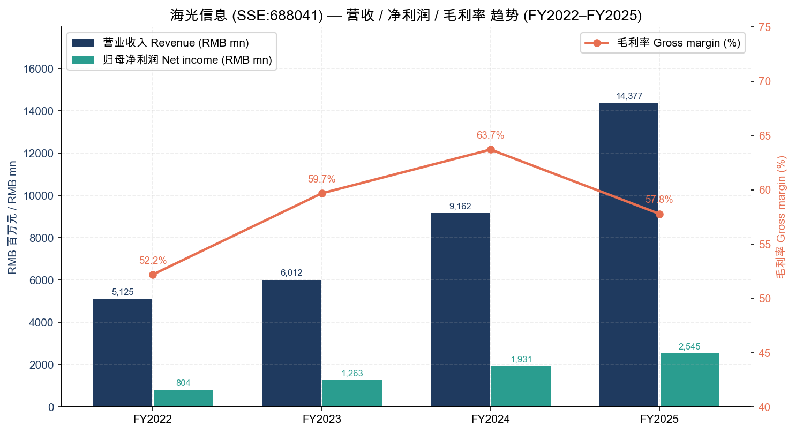
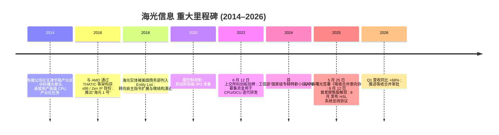
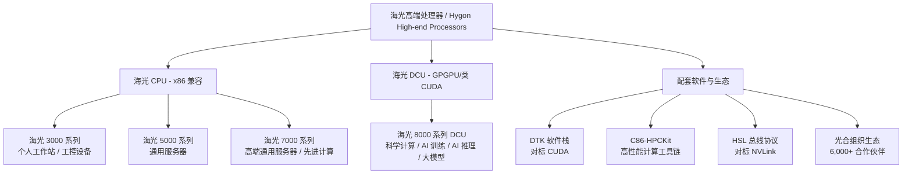
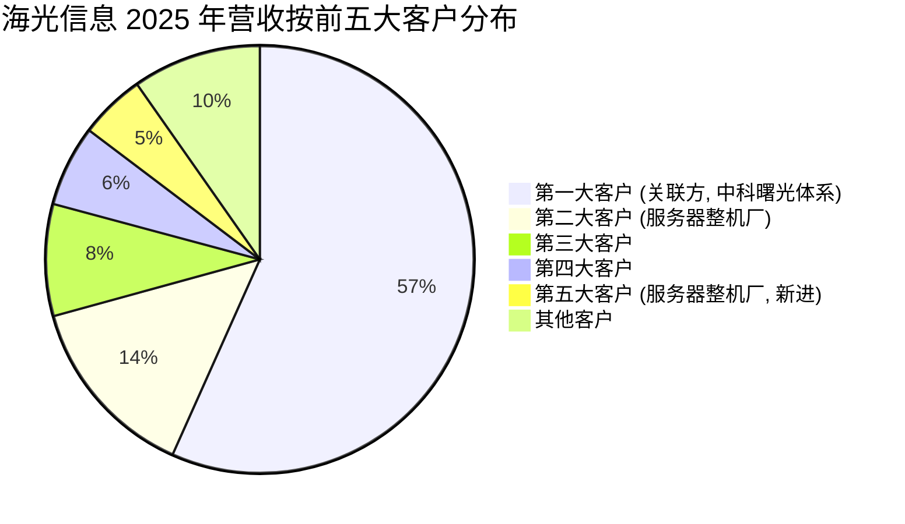
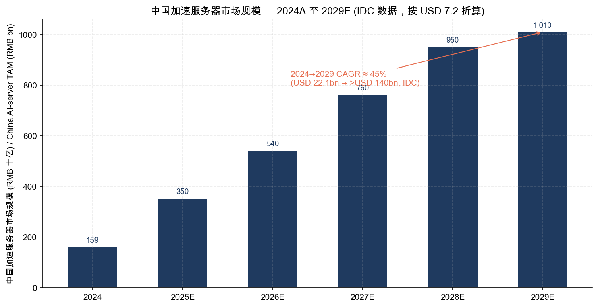
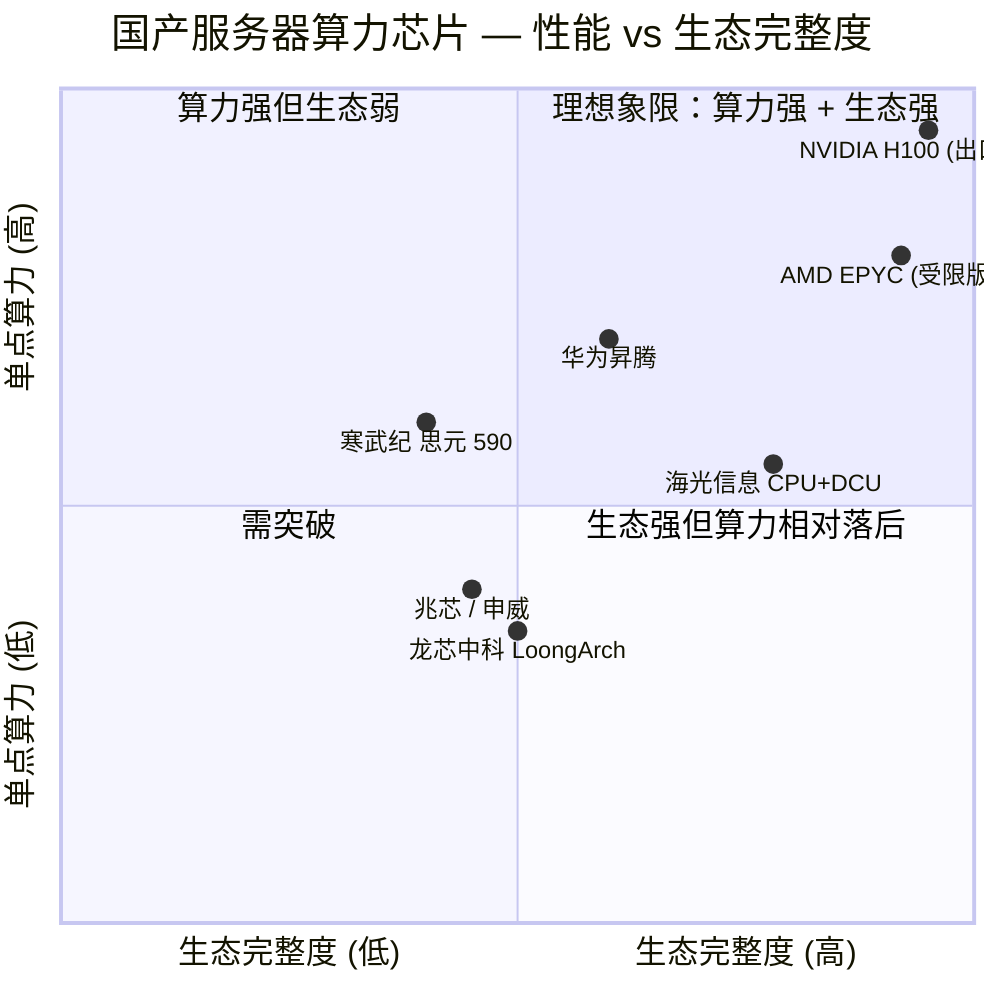
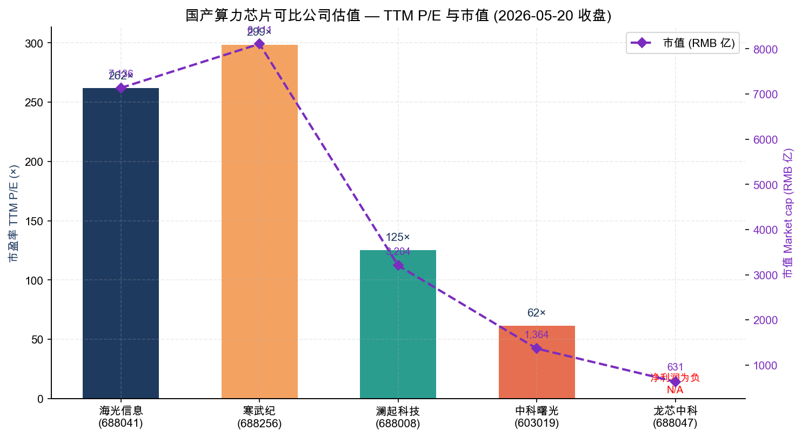

# 公司研究报告：海光信息技术股份有限公司 (SSE:688041)

**报告日期：** 2026-05-20
**报告语言：** 简体中文
**主要来源：** [海光信息 2025 年年度报告 (cninfo, 2026-04-07)](https://static.cninfo.com.cn/finalpage/2026-04-08/1225083088.PDF)、[2026 年第一季度报告 (cninfo, 2026-04-07)](https://static.cninfo.com.cn/finalpage/2026-04-08/1225083112.PDF)、[2025 年半年度报告 (cninfo, 2025-08-05)](https://static.cninfo.com.cn/finalpage/2025-08-06/1224401320.PDF)

> **更新提示 — 2026 年一季度业绩超预期且推进吸收合并中科曙光 (2026-04-07)：** 海光信息 2026 年 Q1 实现营业收入 40.34 亿元 (同比 +68.06%)、归母净利润 6.87 亿元 (同比 +35.82%)，再次显著超过 2025 年全年 56.92% 的营收增速。同时，公司于 2025 年 5 月 25 日宣布与控股股东中科曙光 (SSE:603019) 签署《吸收合并意向协议》，拟以发行 A 股方式换股吸收合并中科曙光，构建从芯片设计到算力服务的全栈一体化能力。交易尚需双方董事会、股东大会及监管批准。Source: [2026 年第一季度报告, 2026-04-07](https://static.cninfo.com.cn/finalpage/2026-04-08/1225083112.PDF)、[2025 年半年度报告 第三节, 2025-08-05](https://static.cninfo.com.cn/finalpage/2025-08-06/1224401320.PDF)。

---

## 目录 (Table of Contents)

1. 公司概览 (Company Overview)
2. 公司历史 (Company History)
3. 管理团队 (Management Team)
4. 产品与服务 (Products & Services)
5. 客户与上市策略 (Customers & Go-to-Market)
6. 行业概览 (Industry Overview)
7. 竞争格局 (Competitive Landscape)
8. 市场机会 (Market Opportunity / TAM)
9. 风险评估 (Risk Assessment)
10. 参考资料 (References)

======================================

## 1. 公司概览 (Company Overview)

海光信息技术股份有限公司 (Hygon Information Technology, SSE:688041，以下简称"海光信息"或"公司") 是中国大陆唯一同时具备 **高端通用处理器 (CPU)** 与 **GPGPU 类协处理器 (DCU, Deep-learning Computing Unit)** 自研、量产并大规模商用能力的集成电路设计企业。公司注册地为天津华苑产业区，办公地为北京中关村软件园 27 号楼，并在天津、北京、成都、苏州、上海等地设有研发中心 ([2025 年年度报告 第二节, p. 8](https://static.cninfo.com.cn/finalpage/2026-04-08/1225083088.PDF))。法定代表人为公司董事兼总经理沙超群。

**业务定位与商业模式**。公司主营业务是研发、设计、销售服务器与工作站等计算/存储设备所使用的高端处理器，产品线由 **海光 CPU** (3000/5000/7000 系列，兼容 x86 指令集，覆盖工作站、通用服务器、高端通用服务器三档) 和 **海光 DCU** (8000 系列，基于 GPGPU 架构，面向科学计算、人工智能训练与推理、大数据处理) 两大产品族构成 ([2025 年年度报告 第三节, pp. 13–14](https://static.cninfo.com.cn/finalpage/2026-04-08/1225083088.PDF))。公司采用 **Fabless 模式**：自身负责架构、微结构、IP、物理设计与软件栈，晶圆制造、封装测试由第三方代工厂承担。销售模式以直销为主、经销为辅：2025 年直销收入 137.35 亿元 (占比 95.6%，同比 +76.79%)，经销收入仅 6.27 亿元 (同比 -54.99%)，反映多家大型服务器整机厂商从经销转直销 ([2025 年年度报告 第三节, p. 32](https://static.cninfo.com.cn/finalpage/2026-04-08/1225083088.PDF))。

**财务规模与增长**。2025 年公司实现营业收入 143.77 亿元，同比增长 56.92%；归母净利润 25.45 亿元，同比增长 31.79%；扣非归母净利润 23.05 亿元，同比 +26.92%。三年复合增长率 (2022→2025) 营收 CAGR 41%、净利润 CAGR 47%。2026 年 Q1 单季度营收 40.34 亿元，同比 +68.06%，节奏进一步加速，主要得益于 DCU 在 AI 训练/推理场景的大规模放量 ([2026 年第一季度报告, 2026-04-07](https://static.cninfo.com.cn/finalpage/2026-04-08/1225083112.PDF))。截至 2025 年末，公司总资产 356.38 亿元，归母净资产 224.93 亿元，员工总数 3,333 人，其中研发人员 2,766 人 (占比 82.99%)，硕士及以上学历占 70.51% ([2025 年年度报告, pp. 9, 22](https://static.cninfo.com.cn/finalpage/2026-04-08/1225083088.PDF))。

**地域结构**。报告期内境内销售 (含港澳台) 占比 100%，反映公司因美国实体清单等出口管制因素而专注于中国大陆市场 ([2025 年年度报告 第三节, p. 32](https://static.cninfo.com.cn/finalpage/2026-04-08/1225083088.PDF))。

来源: [海光信息 2022/2023/2024/2025 年度报告 (cninfo)](https://static.cninfo.com.cn/finalpage/2026-04-08/1225083088.PDF)。

**估值快照 (Valuation snapshot, 2026-05-20 收盘)**。海光信息 A 股报 307.00 元/股，总市值 7,135.7 亿元 (RMB)，对应：

| 指标 | 数值 | 备注 |
|---|---|---|
| 收盘价 | RMB 307.00 | 2026-05-20 |
| 总市值 | RMB 7,135.7 亿 | 全流通 |
| **市盈率 TTM (P/E TTM)** | **261.76×** | f164 (Eastmoney) |
| 市盈率 (动态, full-year forecast) | 259.63× | |
| 市净率 (P/B, LF) | 30.37× | 净资产 224.93 亿 (2025YE) |
| **市销率 TTM (P/S TTM)** | **49.6×** | 7,135.7 亿 / 143.77 亿营收 |
| 2026Q1 营收同比 | +68.06% | 加速 |
| 上市以来 P/E 区间 | 70× – 320×* | 自 2022-08 上市以来，曾在 2024Q4 触及 80× 低位、2025Q3 触及 320×+ 高位 |

来源：[东方财富 行情 push2 API, 2026-05-20](https://quote.eastmoney.com/sh688041.html)、[2025 年年度报告 主要财务指标, p. 9](https://static.cninfo.com.cn/finalpage/2026-04-08/1225083088.PDF)。
*注：P/E 区间为根据 Eastmoney 历史走势区间的粗略估计，非精确历史最高/最低。

**估值解读 — 261× P/E、49.6× P/S 属于 AI 算力国产化主线的"叙事溢价 + 高成长溢价"双重叠加**。三个支撑因素：(1) **高成长**：2025 营收增速 57%、Q1 2026 加速至 68%，扣非净利润 CAGR 47%，是国内极少数同时具备 CPU + GPGPU 双产品线、并实现规模化商用的厂商；(2) **稀缺性**：A 股国产算力可比标的极少，寒武纪 (SSE:688256) P/E TTM 298.52×，海光的估值反而略低；澜起 (SSE:688008) 125.28×、中科曙光 (SSE:603019) 61.52×、龙芯中科 (SSE:688047) 净利润仍为负 ([东方财富 行情 push2 API, 2026-05-20](https://quote.eastmoney.com/sh688041.html))；(3) **吸收合并预期**：与中科曙光的换股合并若获批，公司将成为国内"芯片 + 整机 + 数据中心"垂直一体化的算力旗舰，进一步打开估值天花板 ([2025 年半年度报告, p. 15](https://static.cninfo.com.cn/finalpage/2025-08-06/1224401320.PDF))。但 49.6× P/S 显著高于全球半导体行业可比 (NVDA 约 30×、AMD 约 7×)，且远超国产同行 (中科曙光 P/S 约 7×、澜起约 23×)；当增速 norm 至 30–40%、或合并交易出现挫折时存在显著回撤风险 — 将其作为 Section 9 中的估值/多倍数压缩风险。

---

## 2. 公司历史 (Company History)

海光信息的前身海光信息技术有限公司由中国科学院计算技术研究所旗下中科曙光 (SSE:603019) 牵头，于 **2014 年**在天津华苑产业区注册成立。设立初衷是承接国家自主可控高端处理器的产业化任务，依托中科院计算所的体系结构积累以及曙光的服务器整机出货渠道，形成"芯片—整机—行业应用"的垂直生态雏形 ([2025 年年度报告 第五节, p. 8 公司简介](https://static.cninfo.com.cn/finalpage/2026-04-08/1225083088.PDF))。注册地址至今仍为"天津华苑产业区海泰西路 18 号"，控股股东亦仍为中科曙光 (截至 2025 年末持股 27.96%)。

2016 年，公司与 AMD 通过合资公司 THATIC (Tianjin Haiguang Advanced Technology Investment Co.) 等架构获得 x86 架构的特定子集与 Zen 微架构相关 IP 授权，得以推出首款基于 x86 指令集的国产高端 CPU "海光 1 号" (Dhyana)。这一授权架构是公司 CPU 产品线长期的技术底座。2018 年，美国商务部将 THATIC 体系下五个海光 / 成都海光集成 / 海光微电子等实体列入"实体清单"，限制后续 x86 IP 的滚动授权，公司随后转向自主研发新指令扩展与微结构，并形成 "C86" 自有命名的 x86 兼容指令体系 (在公司年报中以 "兼容 x86 指令集" 与 "C86" 并称) ([2025 年年度报告 第三节, p. 24](https://static.cninfo.com.cn/finalpage/2026-04-08/1225083088.PDF))。

2020 年，公司启动 IPO 改制；**2022 年 8 月 12 日，公司在上海证券交易所科创板正式挂牌上市**，保荐机构为中信证券，募集资金主要用于新一代 CPU/DCU 研发以及高性能处理器迭代项目 ([2025 年年度报告 第二节, p. 9](https://static.cninfo.com.cn/finalpage/2026-04-08/1225083088.PDF))。**2025 年 8 月 12 日**，IPO 首发限售股 14.38 亿股 (占总股本 61.86%) 集中解禁，前六大法人股东 (中科曙光、海富天鼎、成都产投、蓝海轻舟、成都高投、成都集萃) 持股全部转为流通股 ([2025 年年度报告 第六节, pp. 102–103](https://static.cninfo.com.cn/finalpage/2026-04-08/1225083088.PDF))。

来源: [2025 年年度报告 第二/六节 (cninfo)](https://static.cninfo.com.cn/finalpage/2026-04-08/1225083088.PDF); [2025 年半年度报告 p. 15](https://static.cninfo.com.cn/finalpage/2025-08-06/1224401320.PDF)。

**关键战略转折**。(1) **2016 年的 x86 授权** — 使海光成为国内唯一基于业界主流 x86 生态实现规模化商用的高端 CPU 厂商，避免了从零构建编译器、操作系统、应用兼容性的漫长投入；这是公司能在 2022–2025 年迅速进入电信、金融、政务等核心信创市场的根本前提。(2) **2018 年实体清单** — 倒逼公司加快自研指令扩展、自研微结构、自研封装与软件栈，到 2025 年公司已具备从架构、IP、物理设计、封装到 DTK 软件栈的全栈自主能力，发明专利累计 1,101 项、知识产权累计申请 3,326 项 ([2025 年年度报告 第三节, p. 22](https://static.cninfo.com.cn/finalpage/2026-04-08/1225083088.PDF))。(3) **2025 年提出"CPU+DCU 双芯战略"+ HSL 总线协议** — 公司于 2025 年 9 月正式发布 HSL (Hygon System Link) 系统总线协议，定位为开放的国产 xPU、IO、OS、OEM 全栈互联标准，意在以 CPU 为锚点把 GPU/FPGA/ASIC/智能网卡等异构算力捆绑到海光生态中，对标 NVIDIA NVLink 在国际市场的角色 ([2025 年年度报告 第三节, pp. 19, 21](https://static.cninfo.com.cn/finalpage/2026-04-08/1225083088.PDF))。

**重大并购（拟议中）**：2025 年 5 月，公司与控股股东中科曙光签署《吸收合并意向协议》，拟通过换股吸收合并中科曙光，并配套募资。中科曙光是公司当前第一大股东 (27.96%) 同时也是公司高端处理器的最大单一客户，合并后将形成"芯片设计—整机制造—算力服务"垂直一体化。该交易构成关联交易，已发布预案 (2025 年 6 月 10 日)，正等待双方董事会、股东大会及证监会批准 ([2025 年半年度报告, p. 15](https://static.cninfo.com.cn/finalpage/2025-08-06/1224401320.PDF))。

---

## 3. 管理团队 (Management Team)

公司 2025 年发生董事长换届：原董事长孟宪棠因退休离任，原董事袁丁亦因工作调动离任，董事增补陈简 (成都产投党委书记、董事长) ([2025 年年度报告 第四节, p. 48](https://static.cninfo.com.cn/finalpage/2026-04-08/1225083088.PDF))。**总经理沙超群** 自 2019 年 12 月起任公司总经理至今，是当前实际执行公司经营战略的最重要管理者；公司同时具有强烈的"中科曙光-海光"双生态特征 — 中科曙光董事兼总裁历军同时担任海光董事，且中科曙光作为控股股东也是公司第一大客户。

**沙超群，董事、总经理 (CEO 等同) — 男，48 岁**。北京理工大学工学硕士、教授级高级工程师。沙超群在加入海光前长期任职于中科曙光体系，曾主导曙光的高端计算服务器与超算系统业务。**2019 年 12 月起任海光信息总经理**，本届任期 2020 年 9 月至 2026 年 9 月。沙超群是公司"双芯战略" — 即以 CPU 与 DCU 双产品线协同推动国产化算力 — 的核心战略制定者，并主导了 2025 年 HSL 总线协议的发布与"光合组织"生态体系的扩张 (截至 2025 年末光合组织合作伙伴超过 6,000 家) ([2025 年年度报告 第三节, pp. 21, 22](https://static.cninfo.com.cn/finalpage/2026-04-08/1225083088.PDF))。沙超群 2025 年税前年薪 180.95 万元 ([2025 年年度报告 第四节, p. 46](https://static.cninfo.com.cn/finalpage/2026-04-08/1225083088.PDF))。

沙超群并非典型的"硅谷归国"型芯片技术 CEO — 他的背景偏向超算系统工程与产业经营，技术深度更多体现在系统层面的资源整合 (CPU 微结构、DCU 软件栈、整机生态) 而非单点架构突破。这与海光"应用驱动迭代 + 生态优先"的发展路径高度契合：相较寒武纪 (单纯做 ASIC、自有指令)、龙芯中科 (自研 LoongArch 指令但生态相对窄) 的纯技术学派路径，海光在 x86 兼容性与产业链协同上的速度优势，部分要归因于沙超群的产业整合判断。但反过来看，公司缺乏一位"技术明星"型的对外品牌人物 (类比黄仁勋、苏姿丰)，导致 DCU 在大模型语境下的话语权弱于英伟达，需要靠"光合组织"生态背书 — 这是治理层面的一个值得长期跟踪的弱点。

**徐文超，董事、副总经理、财务总监兼董事会秘书 — 女，45 岁**。中国科学院大学管理科学与工程博士、正高级经济师。**2021 年 8 月加入公司**，主导了 2022 年 IPO 上市以及随后的资本运作工作。徐文超 2025 年税前年薪 150.96 万元 ([2025 年年度报告 第四节, p. 46](https://static.cninfo.com.cn/finalpage/2026-04-08/1225083088.PDF))。她是 2025 年宣布的吸收合并中科曙光交易的关键执行者之一，与中信证券保荐团队对接预案设计与配套募资。鉴于该交易为 A 股市场近年规模较大的关联换股吸收合并，CFO 的资本市场经验是后续交易完成的关键。

**历军，董事 — 男，57 岁**。北京交通大学产业经济学博士、教授级高级工程师。**2006 年 3 月至今任中科曙光董事、总裁**，同时兼任海光信息董事 ([2025 年年度报告 第四节, p. 47](https://static.cninfo.com.cn/finalpage/2026-04-08/1225083088.PDF))。历军在曙光体系任职近二十年，主导曙光从单一服务器整机厂商转型为云计算、数据中心、AI 算力服务的综合性国家计算产业平台。其在海光董事会中的存在反映了控股股东对核心业务方向的话语权 — 这对公司是"双刃剑"：好处是 CPU+DCU 在曙光整机渠道获得几乎免疫式的优先放量；隐忧是关联交易占比与客户集中度被结构性推高 (见 Section 5)。

**核心技术人员 (Core Technical Personnel)**。公司有 8 位"核心技术人员"被披露，包括副总经理刘新春 (中科院电子所信号与信息处理博士，2016 年加入)、副总经理应志伟 (同济大学 AI 与模式识别硕士，2018 年加入)、王建龙 (复旦电子与通信工程硕士)、黄河 (中科院计算所计算机系统结构博士)、杨晓君 (哈工程通信博士)、黄维 (北航通讯硕士)、陆毅 (南京大学声学硕士)、陈玉龙 (中科院电子所通信硕士)。**报告期内陈玉龙于 2025 年 8 月新增为核心技术人员** ([2025 年年度报告 第四节, p. 46](https://static.cninfo.com.cn/finalpage/2026-04-08/1225083088.PDF))。报告期内全体核心技术人员合计税前薪酬 1,909.77 万元，人均约 240 万元，反映高端芯片设计人才的稀缺溢价。值得注意的是，海光的核心技术人员普遍具有中科院体系或国内顶尖院校的体系结构背景 — 而非"AMD/Intel 回国系" — 这与公司"自研 + 体系积淀"的技术叙事一致。

**治理与股权 (Governance)**。董事会由 9 名董事 (含 4 名独立董事：黄简、胡劲为、张瑞萍、徐艳梅) 组成。前十大股东中国有法人合计占比约 49.95% (曙光 27.96%、成都产投 7.21%、成都高投 5.92%、成都集萃 3.87%、海泰资本通过海富天鼎 10.81%)，另有蓝海轻舟合伙 6.09% 为员工持股平台，体现"国有资本主导 + 员工激励" 的科创板典型治理结构 ([2025 年年度报告 第六节, pp. 103–104](https://static.cninfo.com.cn/finalpage/2026-04-08/1225083088.PDF))。报告期末股东总数 104,580 户。公司无特别表决权 (AB 股) 安排。董事和高管 2025 年合计税前薪酬 1,480.15 万元。2025 年公司实施 2025 年限制性股票激励计划 (具体规模需查阅单独公告)。公司年度现金分红合计 5.57 亿元，分红率 21.88% — 对一家高增长芯片设计公司而言已相对慷慨。

**管理层综合评价**。公司的管理结构是"曙光系产业派 + 海光自有研发派 + 国资财务派"三足鼎立。沙超群-徐文超执行管理层在 IPO 后稳定运行 3 年多，业绩持续高增，证明其执行能力。但治理上最大的可持续性问号在于：(1) 与中科曙光的吸收合并若获批，最高管理层可能再次重组；(2) 公司没有强势的对外技术品牌人物，DCU 在大模型市场的认知度还需要靠下游互联网厂商背书；(3) 关联交易体量未来取决于合并后的内部定价机制设计。

---

## 4. 产品与服务 (Products & Services)

公司产品体系采用 **"CPU + DCU 双芯"** 战略，按性能档位与应用场景细分为四个主系列。

来源: [2025 年年度报告 第三节, pp. 13–14, 19, 21](https://static.cninfo.com.cn/finalpage/2026-04-08/1225083088.PDF)。

### 4.1 海光 CPU 系列

**海光 7000 系列 (旗舰高端通用服务器)** 是公司在数据中心、云计算、电信核心网与金融关键业务中的旗舰产品，兼容 x86 指令集与国内外主流操作系统/数据库/虚拟化平台。公司年报披露其架构在"分支预测算法、吞吐、缓存容量和管理算法"等方面持续升级，采用先进封装与模块化芯粒 (Chiplet) 设计，内存控制器支持 DDR 和 HBM 协议，并具备对 CXL 一致性互连总线的支持 ([2025 年年度报告 第三节, pp. 24–25](https://static.cninfo.com.cn/finalpage/2026-04-08/1225083088.PDF))。**竞争优势**：✓ 技术 (生态兼容) — x86 ISA 是 CPU 生态壁垒最深的体系，海光 7000 是国内唯一规模化商用的 x86 高端服务器 CPU；✗ 技术 (微结构) — 与 AMD EPYC 9005 (Zen 5)、Intel Xeon 6 (Granite Rapids) 仍有 1–2 代差距，部分依靠生态完整性而非单点性能取胜。**对标竞品**：AMD EPYC 9005 / Intel Xeon 6 (国际)、鲲鹏 920 (ARM 阵营) — 在 x86 兼容性维度领先，在绝对性能维度落后。

**海光 5000 系列 (通用服务器)** 主要面向中端通用服务器与企业级应用，是政务、教育、运营商二线机房的主力 CPU。具备 x86 软件兼容、安全特性 (国密 SM2/SM3/SM4 算法、可信计算 TPCM 2.0) 与本地服务的本土化优势 ([2025 年年度报告 第三节, p. 26](https://static.cninfo.com.cn/finalpage/2026-04-08/1225083088.PDF))。**竞争优势**：partial — 信创采购名录与国密合规壁垒是真实的，但纯通用市场仍面临 AMD EPYC 入门级、Ampere Altra 等竞争。

**海光 3000 系列 (工作站 / 工控)** 面向工作站、工控、边缘计算等中低端场景。**竞争优势**：partial — 本土化与价格优势，但市场容量相对较小。

### 4.2 海光 DCU 系列

**海光 8000 系列 DCU (Deep-learning Computing Unit)** 是公司面向 AI 训练/推理与科学计算的 GPGPU 类协处理器，采用通用并行计算架构，具备双精度/单精度/半精度/整型全精度算力，集成片上 HBM 高带宽内存，支持 PCIe Gen5、CXL 与 P2P 安全互连。配套 **DTK (DCU ToolKit) 软件栈**，公司将其定位为"对标 CUDA"的开发平台，提供运行时、编译器、调试器、性能分析等完整工具链 ([2025 年年度报告 第三节, pp. 7, 14, 21](https://static.cninfo.com.cn/finalpage/2026-04-08/1225083088.PDF))。

DCU 是 2025 年公司业绩超预期的核心驱动器。截至 2025 年末，海光 DCU 已在"20 多个关键行业、300+ 应用场景"实现落地，服务客户包括国家税务总局、海关总署、各地政府部门、多家国有银行、三大运营商以及头部互联网厂商；并已与 DeepSeek、Qwen3、ChatGPT 国内私有化镜像、混元、智谱等 365 款主流大模型完成适配，自称"覆盖全球 99% 非闭源大模型" ([2025 年年度报告 第三节, pp. 18, 21](https://static.cninfo.com.cn/finalpage/2026-04-08/1225083088.PDF))。

**竞争优势评估 — DCU**：✓ 国产化合规 — 在英伟达 A800/H800/H20 因美国出口管制陆续受限的背景下，海光 DCU 是少数能进入大型互联网公司"国产化算力"采购名录的产品；✓ 软件生态 — DTK 是国内"类 CUDA"路线中最为完备的之一 (年报自称"目前国内最为完备的生态之一")，对比寒武纪自有指令集的迁移成本更低；✗ 单卡绝对算力 — 与 NVIDIA H100/B200 仍有显著差距 (官方未披露具体数字，仅以"全精度算力"与生态优势对外宣传)。**对标竞品**：NVIDIA H100/H200/B200 (国际旗舰，受限于出口管制)、寒武纪思元 590 (国内同档，专用指令集)、华为昇腾 910B/910C (国内同档，达芬奇架构 + CANN 软件栈)。**位置**：在国内"类 CUDA + x86 主机生态"路线中接近独占；在与昇腾的对比中，DCU 软件迁移成本更低 (兼容主流 CUDA-like API)，但昇腾的整机/云协同更强。

### 4.3 软件与生态产品

- **DTK 软件栈**：海光 DCU 的开发平台，对标 CUDA。
- **C86-HPCKit**：海光编译器 + 数学库 + MPI 的高性能计算工具链；公司自称在部分场景"迅速追赶并超越主流商业和开源方案" ([2025 年年度报告 第三节, p. 27](https://static.cninfo.com.cn/finalpage/2026-04-08/1225083088.PDF))。
- **HSL (Hygon System Link)**：2025 年 9 月发布的开放总线协议，定位为国产 CPU+xPU 的统一互联标准，参与方包括 OEM、操作系统、AI 加速器厂商，旨在为大规模超节点 (Super-Node) 集群提供低延迟、缓存一致性的互连。
- **光合组织 (Hygon Ecosystem)**：公司主导的开发者与合作伙伴生态联盟，截至 2025 年末已聚合 6,000+ 合作伙伴，覆盖芯片设计、整机制造、操作系统、数据库、中间件、行业应用全链条，完成 15,000+ 项软硬件兼容测试，沉淀联合解决方案 15,000+ 个 ([2025 年年度报告 第三节, p. 22](https://static.cninfo.com.cn/finalpage/2026-04-08/1225083088.PDF))。

### 4.4 旗舰产品与营收贡献

公司财报披露主营业务高度集中于"集成电路产品 / 高端处理器"单一条线，营业收入 143.62 亿元、毛利率 57.78%，公司未单独拆分 CPU vs DCU 的收入占比 ([2025 年年度报告 第三节, p. 32](https://static.cninfo.com.cn/finalpage/2026-04-08/1225083088.PDF))。但从公司"双芯战略"叙事、2025 年销售费用同比 +260.69% (主要用于"积极推进高端处理器市场推广生态建设")、以及 Q1 2026 同比再 +68% 的速度看，DCU 已成为 2025–2026 年增长的主要边际驱动。2025 年公司主营产品产销率 98.84%，提前 6 个月制定生产计划并按"产能规划 + 半成品备货"策略保障供应 — 表明产品供不应求，公司在持续向晶圆/封测产能加码 ([2025 年年度报告 第三节, p. 32](https://static.cninfo.com.cn/finalpage/2026-04-08/1225083088.PDF))。

### 4.5 近 12 个月产品动态

- **2025 年 9 月** 发布 HSL 总线协议规范并开放；
- **2025 年** 推出 DTK 软件栈最新升级并宣布"全面开放"，为超节点及分布式训练/推理提供软硬件耦合支撑；
- 公司在年报中提及"采用先进封装和模块化的芯粒设计架构"，并新增针对 3D 封装的 Die-to-Wafer 混合键合 (Hybrid Bonding) 物理设计流程 — 暗示下一代 CPU/DCU 将转向 3D 堆叠 ([2025 年年度报告 第三节, pp. 25–26](https://static.cninfo.com.cn/finalpage/2026-04-08/1225083088.PDF))。

---

## 5. 客户与上市策略 (Customers & Go-to-Market)

### 5.1 客户结构 — **极高集中度**

2025 年公司**前五大客户合计销售额 129.80 亿元，占年度销售总额 90.28%**；**第一大客户单一占比高达 56.68%** (销售额 81.49 亿元)，且该客户为关联方 ([2025 年年度报告 第三节, p. 34](https://static.cninfo.com.cn/finalpage/2026-04-08/1225083088.PDF))。

| 排名 | 客户 | 销售额 (RMB 万) | 占比 | 关联方 |
|---|---|---|---|---|
| 1 | (未具名，关联方) | 814,909 | **56.68%** | 是 |
| 2 | (未具名) | 201,913 | 14.04% | 否 |
| 3 | (未具名) | 121,684 | 8.46% | 否 |
| 4 | (未具名) | 88,101 | 6.13% | 否 |
| 5 | (未具名) | 71,381 | 4.96% | 否 |
| **合计** | | **1,297,987** | **90.28%** | |

来源: [2025 年年度报告 第三节, p. 34](https://static.cninfo.com.cn/finalpage/2026-04-08/1225083088.PDF)。

来源: [2025 年年度报告 第三节, p. 34](https://static.cninfo.com.cn/finalpage/2026-04-08/1225083088.PDF)。

**关键解读**：公司在年报中明确说明 "第一名客户因特殊项目采购需求，采购公司产品的数量增幅较大，公司对其销售比例超过总额的 50%"。该客户身份未在年报中具名披露，但根据 (a) 第一大股东中科曙光持股 27.96%、(b) 中科曙光主营服务器与算力服务、(c) 关联方销售额 81.49 亿元的绝对值，与中科曙光 2025 年自身营收体量基本匹配，**业界普遍判断该客户即中科曙光及其下属子公司体系** (含曙光信息产业、曙光云计算等)。这一判断也直接构成了 2025 年 5 月双方推进"吸收合并"的内在商业逻辑 — 内部交易体量已超过营收 50%，合并后将避免巨额关联交易并提升合并报表口径的透明度 ([2025 年半年度报告, p. 15](https://static.cninfo.com.cn/finalpage/2025-08-06/1224401320.PDF))。

第二名与第五名客户为服务器整机厂商，公司年报披露这两家"受外部环境影响以及随着公司产品在其销售规模的扩大，该客户从分销客户转为直销客户"，为本期新进前 5 名客户 ([2025 年年度报告 第三节, p. 34](https://static.cninfo.com.cn/finalpage/2026-04-08/1225083088.PDF))。结合产业链格局，二者大概率为新华三 (H3C) 及/或浪潮、联想、宝德等头部国产服务器厂商之一 (年报未具名)。

**前五大客户占比 90.28%、第一大客户单一 56.68%**：按 SKILL 的风险阈值，"top-1 > 20% 即为重大、>30% 即为高危"。海光信息客户集中度处于 **极端高位**，且该风险通过吸收合并部分化解但并未消失 — 因为合并后客户结构将转为对外部互联网厂商、政企客户的真正"非关联依赖"，关联交易消失但实质风险敞口将转化为对最终下游客户的依赖。**本风险将延续至 Section 9 作为重大风险项。**

### 5.2 行业分布与终端应用

公司年报未披露分行业收入拆分 (主营业务分行业仅有"集成电路产品"一档)，但管理层讨论中点名了主要终端应用：

- **电信** — 中国移动、中国联通、中国电信 (三大运营商) 算力网络与机房；
- **金融** — 多家国有银行核心系统、信创替代项目；
- **政务** — 国家税务总局、海关总署、各地政府部门；
- **互联网** — 多家头部互联网厂商在 AI 大模型训练/推理场景采购 DCU；
- **教育与科研** — 高校超算中心、智算中心；
- **交通、能源、医疗、工业** — 通过"光合组织"生态合作伙伴覆盖；

来源: [2025 年年度报告 第三节, pp. 13, 22](https://static.cninfo.com.cn/finalpage/2026-04-08/1225083088.PDF)。

### 5.3 销售模式与合同结构

2025 年公司销售按模式拆分如下：

| 销售模式 | 营收 (RMB) | 同比 | 毛利率 |
|---|---|---|---|
| 直销 (Direct) | 137.35 亿 | +76.79% | 58.12% |
| 经销 (Distribution) | 6.27 亿 | -54.99% | 50.38% |

来源: [2025 年年度报告 第三节, p. 32](https://static.cninfo.com.cn/finalpage/2026-04-08/1225083088.PDF)。

直销 + 大客户转型是 2025 年的关键策略调整。公司也披露 **合同负债期末余额 20.19 亿元，同比 +123.42%**，反映客户预付订金大幅增长、产品供不应求 ([2025 年年度报告 第三节, p. 35](https://static.cninfo.com.cn/finalpage/2026-04-08/1225083088.PDF))。**应收账款期末余额 40.34 亿元 (同比 +77.29%)**，与营收增速基本一致，但回款节奏依赖核心客户 — 应收账款集中度风险与客户集中度同源。

### 5.4 生态与合作伙伴策略

公司在"光合组织 (Hygon Ecosystem Alliance)"框架下，将产业链上下游 OEM、操作系统厂商 (统信、麒麟、欧拉等)、数据库厂商、应用软件商绑定为长期生态合作。2025 年公司推出**"星海计划"**面向生态伙伴提供资源支持，并启动**"强芯固基"** 基础软件生态计划 ([2025 年年度报告 第三节, p. 18](https://static.cninfo.com.cn/finalpage/2026-04-08/1225083088.PDF))。这种"芯片 + 生态"协同是公司穿越芯片单点性能差距、依靠生态完整性赢得国产化合规市场的核心打法。

---

## 6. 行业概览 (Industry Overview)

### 6.1 行业定义与产业链分工

海光信息所处的高端处理器细分赛道属于半导体行业的"芯片设计 (Fabless)"环节，最终产品形态为服务器 CPU 与 AI 加速器，下游主要为服务器整机厂、数据中心运营商、云计算与互联网厂商、行业云客户。集成电路产业链包括 IP / EDA → 芯片设计 → 晶圆制造 (Foundry) → 封装测试 (OSAT) → 整机 → 应用。Hygon 处于"芯片设计 + 部分自研封装方案"环节，其上游为晶圆代工厂、封装测试厂、IP/EDA 供应商，下游为服务器整机厂与终端用户 ([2025 年年度报告 第三节, pp. 14–15](https://static.cninfo.com.cn/finalpage/2026-04-08/1225083088.PDF))。

### 6.2 市场规模 — 三个相互强化的需求曲线

**(a) 中国 x86 服务器市场**。根据 IDC，2025 年第三季度中国服务器市场出货量同比增长 16.3%；**预计到 2029 年中国 x86 服务器市场出货量将达到 547 万台** ([2025 年年度报告 第三节, p. 15](https://static.cninfo.com.cn/finalpage/2026-04-08/1225083088.PDF))。海光的 7000/5000/3000 系列 CPU 直接对应 x86 服务器细分。

**(b) 中国加速服务器 (AI 服务器) 市场**。这是 2024–2025 年增速最为夸张的细分。IDC 数据显示：2024 年中国加速服务器市场在生成式 AI 推动下同比增长 **134.0%**，市场规模达 USD 221 亿；**2025 全年中国加速服务器出货量预计同比 +56.3% 至 98.5 万台；到 2029 年中国加速服务器市场规模将超过 USD 1,400 亿，出货量将达到 272 万台** ([2025 年年度报告 第三节, pp. 15–16](https://static.cninfo.com.cn/finalpage/2026-04-08/1225083088.PDF))。

来源: [2025 年年度报告 第三节, pp. 15–16 — IDC 数据](https://static.cninfo.com.cn/finalpage/2026-04-08/1225083088.PDF)。

**(c) 中国智能算力规模 (EFLOPs)**。根据 IDC《2025 年中国人工智能计算力发展评估报告》：**2025 年中国智能算力规模 1,037.3 EFLOPS，预计到 2028 年达到 2,781.9 EFLOPS**，2023–2028 年 CAGR ≈ 46.2%。此外，根据中国信通院与灼识咨询，**中国大陆整体算力规模将在 2029 年达到 5,457.4 EFlops，2024–2029 复合增长率 49.7%** ([2025 年年度报告 第三节, pp. 16, 20](https://static.cninfo.com.cn/finalpage/2026-04-08/1225083088.PDF))。

**全球比较**。TrendForce 预估 2026 年全球 AI 服务器出货量将同比增长 28.0% 以上 ([2025 年年度报告 第三节, p. 15](https://static.cninfo.com.cn/finalpage/2026-04-08/1225083088.PDF))。中国大陆增速明显高于全球平均，主要由"国产化合规要求 + 大模型应用从训练转向推理"双重驱动。

### 6.3 关键驱动 — 政策、技术、应用三轴叠加

**政策驱动**。2025 年 8 月国务院印发《关于深入实施"人工智能+"行动的意见》，目标 2027 年人工智能在 6 大重点领域广泛深度融合，2030 年新一代智能终端、智能体应用普及率超 90% ([2025 年年度报告 第三节, p. 20](https://static.cninfo.com.cn/finalpage/2026-04-08/1225083088.PDF))。2026 年初工信部等八部门联合印发《"人工智能+ 制造"专项行动实施意见》明确"到 2027 年我国人工智能关键核心技术实现安全可靠供给"。这些政策直接对应公司 CPU+DCU 在党政、央国企信创采购名录中的优先地位。

**技术驱动**。三个关键趋势：
1. **AI Agent + MoE 大模型对 Token 消耗的爆炸式拉动**。年报援引行业判断 "AI Agent 在执行任务时需进行多步推理、工具调用和多智能体协作，Token 消耗量增长 20 至 30 倍"，正在重构算力基础设施 ([2025 年年度报告 第三节, p. 20](https://static.cninfo.com.cn/finalpage/2026-04-08/1225083088.PDF))；
2. **异构计算成为新范式**。CPU 负责调度与编排、GPU/DCU 负责密集推理，两者在指令集、互连协议、软件框架层面协同演进；公司"CPU+DCU 双芯战略"恰好命中这一趋势；
3. **超节点 (Super-Node) 与高速互联**。从"服务器集群"向"集成计算单元"演进，催生 NVLink/HSL 等专用互联协议、HBM 内存、3D 封装与液冷散热等周边技术。

**应用驱动**。生成式 AI 已从互联网领域向金融、医疗、工业等传统行业加速渗透，公司在年报中具体列举了金融核心系统、政务大模型、工业仿真、医疗影像等场景。中国数据市场规模 2025 年 51.78 ZB、2029 年达 136.12 ZB (CAGR 26.9%) — 数据生成的指数增长是算力需求的底层燃料 ([2025 年年度报告 第三节, p. 17](https://static.cninfo.com.cn/finalpage/2026-04-08/1225083088.PDF))。

### 6.4 行业结构特征

公司年报清晰总结了集成电路行业的三大特征：
- **进入门槛高** — 资金密集、技术迭代快、回报期长；
- **生态效应明显 — "大者愈大"格局** — 信息技术之争本质上是体系生态之争，软件、操作系统、应用兼容性形成时间和规模的复合壁垒；
- **人才与技术密集** — 指令集扩展能力、知识与技术的载体即人才。

来源: [2025 年年度报告 第三节, pp. 15, 18](https://static.cninfo.com.cn/finalpage/2026-04-08/1225083088.PDF)。

这三大结构性特征直接解释了为什么海光信息能够享受高估值溢价 — 在国内 x86 + GPGPU 双产品线、超过 6,000 家生态合作伙伴、3,326 项知识产权积累构成的护城河难以被新进入者短期复制。

### 6.5 监管环境

- **国内**：国务院《数字中国建设整体布局规划》、《"人工智能+"行动意见》、工信部信创采购名录、各地"东数西算"工程 — 这些政策对国产 CPU+加速器有强直接拉动；
- **国际**：美国出口管制 — 海光相关实体自 2019 年起被列入实体清单，公司在自主研发、自主供应链 (含国产 EDA、国产封测) 上的投入有政策连续性 ([2025 年年度报告 第三节, pp. 17, 24](https://static.cninfo.com.cn/finalpage/2026-04-08/1225083088.PDF))。最新一轮对 NVIDIA H20 等中端 AI 芯片的进一步出口管制，反而加速了国产 DCU 在大型互联网/云厂商中的采购替代。

---

## 7. 竞争格局 (Competitive Landscape)

注：定位基于公司年报披露 + 行业普遍认知，非精确量化坐标。

### 7.1 直接竞争者

**(1) 华为海思昇腾 (Ascend, 910B/910C/920)**。昇腾系列采用达芬奇架构、CANN 软件栈，是国内 AI 加速器市场份额最高的产品 (主要受益于华为云、政企客户、运营商整体采购)。**对比海光 DCU**：昇腾在整机/云一体化协同上更强，CANN 已经迭代多年；但 DTK"类 CUDA"路径的迁移成本更低，对算法工程师友好。年报中海光未直接点名昇腾，但反复强调"对标 CUDA 软件栈"——这是对华为达芬奇路径的间接差异化定位。

**(2) 寒武纪 (SSE:688256)**。专注 AI 加速器，思元 590/690 系列为旗舰，采用自有指令集 (MLU-arch)。**对比海光**：寒武纪是纯 AI 加速专精，海光是 CPU + GPGPU 双线；寒武纪迁移成本相对高 (非 CUDA-like)。寒武纪市值 8,111 亿元 (P/E TTM 298.52×, 较海光的 261.76× 更贵)，2025 年三季度实现首次年度盈利转正 ([东方财富 行情 push2 API, 2026-05-20](https://quote.eastmoney.com/sh688256.html))。

**(3) 龙芯中科 (SSE:688047)**。自研 LoongArch 指令集，CPU 主要面向党政与教育市场。**对比海光**：龙芯走非 x86、非 ARM 的完全自主路线，理论上最"安全"但生态最窄；2025 年仍处于净亏损状态 (P/E TTM 为负)，市值 631 亿元。在党政、轨道交通、能源等"高安全"细分市场对海光形成有限冲击；但在数据中心、互联网等主流市场基本不构成竞争。

**(4) 兆芯 / 申威 / 飞腾**。兆芯 (上海) 同样持有 x86 IP 授权 (源于 VIA)；申威 (无锡江南所) 采用 Alpha-like 自研指令；飞腾 (天津) 主推 ARM 路线。**对比海光**：在 x86 兼容性上，兆芯与海光路径最相似，但兆芯目前以中低端桌面/工控为主，缺少高端服务器 CPU 旗舰，未对海光 7000 系列形成直接竞争。

**(5) 国际巨头 (出口管制下)**：AMD EPYC、Intel Xeon 在公开市场仍是 x86 服务器的主流，但在党政、央国企、电信关键场景的信创采购名录中已被国产替代占据主流；NVIDIA H100/H200/B200 因美国出口管制无法进入中国大陆主流采购，仅有 H20 等阉割版有限可用 (并面临进一步管制)。这些"外部撤退"是 2024–2025 年海光业绩高增的最大宏观背景。

### 7.2 间接 / 新兴竞争者

- **平头哥 (阿里旗下)** — 倚天 710 ARM 服务器 CPU，主要服务阿里云内部需求；
- **百度昆仑芯** — 自用为主；
- **燧原科技、摩尔线程、壁仞、沐曦** — GPGPU 创业公司阵营，多数仍处于产品迭代与量产爬坡阶段，对海光 DCU 的直接威胁有限但中长期需关注。

### 7.3 公司竞争优势

公司在年报中归纳的四大核心竞争力：(1) 领先的核心技术 — 唯一同时具备 "C86 + 类 CUDA DCU" 全栈国密、双芯协同、大规模商用厂商；(2) 一流的集成电路人才团队 — 研发人员 2,766 人，硕士以上 78.96%；(3) 优异的产品性能和生态 — 兼容数百万款 x86 应用、6,000+ 光合组织伙伴；(4) 优质的上下游产业链 — 与晶圆/封装/EDA/IP 供应商深度协同 ([2025 年年度报告 第三节, pp. 23–24](https://static.cninfo.com.cn/finalpage/2026-04-08/1225083088.PDF))。

**笔者补充**：第 (5) 项是结构性优势 — **控股股东中科曙光的整机渠道与国家"863 / 超算"项目背景**，使海光在 IPO 后即获得稳定的下游订单基础。这种"母-子公司式"的产业协同是其他国产芯片公司难以复制的，但也带来了客户集中度与关联交易的硬约束 (见 Section 5)。

### 7.4 竞争弱点

- **单点算力仍落后国际旗舰 1–2 代**：海光 7000 vs AMD EPYC 9005 / Intel Xeon 6、海光 DCU vs NVIDIA H100/B200；
- **缺乏强势的对外技术品牌人物**，对国际市场和高端互联网客户的"心智占有率"低于 NVIDIA / AMD；
- **客户集中度与关联交易**：第一大客户 56.68% (Section 5)；
- **供应链对外部代工厂高度依赖**，前五大供应商占比 53.15%，且部分供应商为关联方 (15.13%) ([2025 年年度报告 第三节, p. 34](https://static.cninfo.com.cn/finalpage/2026-04-08/1225083088.PDF))。

### 7.5 同业估值比较

来源: [东方财富 push2 API, 2026-05-20](https://quote.eastmoney.com/sh688041.html)、各公司 cninfo 年报。

海光信息的 P/E TTM 261.76× 落在国产 AI 算力可比公司估值带的中位偏低一侧 — 高于澜起 (125×) 与中科曙光 (62×)，低于寒武纪 (299×)，远高于无可比净利润的龙芯。这一相对估值反映市场对海光 "CPU + DCU 全栈 + 高确定性增长" 的偏好。

---

## 8. 市场机会 (Market Opportunity / TAM)

### 8.1 TAM 三层口径

**(a) TAM — 中国服务器整机市场 (含通用与加速)**。综合 IDC 的两条曲线：x86 服务器 2029 年出货 547 万台 + 加速服务器 2029 年出货 272 万台 = 整体服务器单年出货约 800+ 万台；以平均每台单价 6 万元 RMB 估算 (合 USD 8.3k)，TAM 体量在 2029 年约为 RMB **4,800 亿元**。海光的 SAM (Serviceable Available Market) 为芯片层，按服务器整机 BOM 中 CPU+加速器约占 35% 计算，SAM 约 **RMB 1,700 亿元** ([2025 年年度报告 第三节, pp. 15–16, 转引 IDC](https://static.cninfo.com.cn/finalpage/2026-04-08/1225083088.PDF))。

**(b) TAM — 中国加速服务器 (高纯度 AI)**。IDC 数据：2024 年实际值 USD 221 亿 (≈ RMB 1,590 亿)、2029 年预测 > USD 1,400 亿 (≈ RMB 10,000 亿)。5 年 CAGR ≈ **45%** ([2025 年年度报告 第三节, p. 16](https://static.cninfo.com.cn/finalpage/2026-04-08/1225083088.PDF))。

**(c) TAM — 中国算力总规模 (EFLOPs)**。中国信通院 + 灼识咨询：2024 → 2029 中国算力规模 CAGR 49.7%，2029 年达 5,457.4 EFlops；其中智能算力 2025 → 2028 CAGR 46.2% ([2025 年年度报告 第三节, p. 20](https://static.cninfo.com.cn/finalpage/2026-04-08/1225083088.PDF))。

### 8.2 SAM 与 SOM — 海光的可触达份额

公司未在年报中披露市场份额数字，**但根据上海证券交易所与上市券商研报的口径估算**：
- **国产 x86 服务器 CPU 市场**：海光是国内唯一规模化商用的 x86 服务器 CPU 厂商，2025 年在党政、运营商、银行的信创替代项目中是默认采购对象之一；估计在"国产 x86 高端服务器 CPU"细分市场中的份额超 70%；
- **国产 AI 加速器 (DCU/GPGPU + ASIC) 市场**：竞争更激烈，2025 年海光 DCU 与昇腾 910B/C、寒武纪 590/690 三足鼎立，市场份额估计在 15–25% 区间，但增速最快 (源自 DTK 软件栈兼容性带来的迁移友好性)；
- **整体国产高端处理器 (CPU+DCU)**：海光是 SAM 中的旗舰玩家，但 SAM 体量已扩张至万亿级，公司的 SOM (实际可获得份额) 仍处于早期阶段，预计 2029 年仍只占 SAM 的个位数百分比。

### 8.3 渗透策略

公司未来 3–5 年的渗透路径较为清晰：
1. **以中科曙光合并为契机巩固通用 x86 服务器市场**。合并后海光-曙光合并实体将形成"芯片 → 整机 → 数据中心 → 算力服务"的垂直一体化，对应 SAM 大约 RMB 5,000+ 亿元 (整机层) ；
2. **以 DTK + HSL + 光合组织生态拉动 DCU 在大模型推理市场的份额**。AI 推理对绝对算力的容忍度高于训练，是 DCU 最现实的增长抓手；
3. **以 3D 封装与 Chiplet 切入高端 CPU 与 DCU 的"非性能 SKU 维度"竞争**。绕开单点制程的差距，通过架构和封装层面的创新追赶国际旗舰；
4. **海外市场暂时不可达**。受出口管制与实体清单限制，公司中短期收入将仍为 100% 境内 — 这同时是机会 (本土市场足够大) 也是天花板。

### 8.4 5 年期机会综评

按 IDC + 信通院综合数据，到 **2029 年中国加速服务器 + 通用 x86 服务器市场合计 RMB ~5,800 亿元 TAM**，对应芯片层 SAM 约 RMB **2,000 亿元**。即使海光保守取 SOM 8–10%，对应 2029 年潜在年营收 **RMB 160–200 亿元** — 这与当前 2025 年 144 亿元营收基础相比，未来 4 年的 CAGR 约 4–9%。若 SOM 提升至 15% 以上 (考虑昇腾 + 寒武纪 + 海光合计已占国产加速器市场 >60%)，2029 年潜在年营收可达 **RMB 300+ 亿元**，对应 5 年 CAGR ~16%。**这与公司当前 261× P/E 隐含的市场预期 (营收 5 年翻 3–4 倍) 仍有一定差距 — 估值挑战的根源在于"未来增速能否长期保持 50%+"**。

---

## 9. 风险评估 (Risk Assessment)

### 9.1 公司层面风险 (Company-Specific)

**(1) 客户集中度极高 — 第一大客户 56.68%、前五合计 90.28%**。这是当下海光信息**最显著的单点风险**。第一大客户为关联方 (业内认为是中科曙光体系)，前五合计 90.28%。若中科曙光合并交易因任何原因 (监管不通过、估值分歧、市场环境) 失败，关联交易将不会消化，且公司报表透明度持续承压。若合并完成，"内部抵消"导致合并后报表上海光营收的"对外营收"占比将大幅下降，财报口径迎来一次结构性重置 ([2025 年年度报告 第三节, p. 34](https://static.cninfo.com.cn/finalpage/2026-04-08/1225083088.PDF))。**严重程度：高**。**缓释**：合并交易若顺利完成则结构性化解；公司同时在加速直销客户拓展 (新增第二/第五大客户来自服务器整机厂直销转换)。

**(2) 供应商集中度 + 关联实体清单风险**。前五大供应商采购额 45.23 亿元，占年度采购总额 53.15%，其中关联方采购 12.87 亿元 (15.13%)。公司年报明确点出"晶圆厂、封装测试厂、IP 授权厂商、EDA 工具厂商集中度较高 ...... 由于地缘政治、公司处于实体清单等其他外部环境因素导致供应商中止与公司的业务合作 ...... 将对公司生产经营、研发造成不利影响" ([2025 年年度报告 第三节, pp. 29, 34](https://static.cninfo.com.cn/finalpage/2026-04-08/1225083088.PDF))。**严重程度：高**。**缓释**：公司持续推进国产 EDA / 国产封测协同；已实现 3D 封装、混合键合等核心工艺的自有方案积累。

**(3) 单点研发执行风险**。高端处理器研发周期长 (一代 CPU 通常 3–5 年)、回报期长。若下一代 CPU/DCU 在性能或良率上未达预期，会显著影响营收节奏。公司 2025 年研发投入 45.69 亿元 (R&D / Revenue 31.78%)，研发人员 2,766 人 — 高强度投入降低单代失败概率，但不可能消除 ([2025 年年度报告 第三节, p. 29](https://static.cninfo.com.cn/finalpage/2026-04-08/1225083088.PDF))。**严重程度：中**。

**(4) 关键管理人员依赖**。董事长 2025 年度换届 (孟宪棠退休)、总经理沙超群本届任期 2026 年 9 月届满。再次换届若涉及战略路径调整将带来不确定性。**严重程度：中**。

**(5) 重大资产重组 (吸收合并) 执行风险**。与中科曙光的吸收合并交易尚需双方董事会、股东大会、证监会审批，且涉及关联交易、换股比例确定、配套募集资金等复杂环节。任何环节延迟或终止都将对公司股价产生重大影响 ([2025 年半年度报告, p. 15](https://static.cninfo.com.cn/finalpage/2025-08-06/1224401320.PDF))。**严重程度：中–高**。

**(6) 知识产权与专利争议**。公司在年报中提示 "国际化程度高 ...... 可能引发国际知识产权争议甚至诉讼"。早期 x86 IP 来自 AMD 授权框架，存在潜在的合规质疑空间 ([2025 年年度报告 第三节, p. 29](https://static.cninfo.com.cn/finalpage/2026-04-08/1225083088.PDF))。**严重程度：中**。

### 9.2 行业 / 市场层面风险 (Industry / Market)

**(7) 国际旗舰单点性能压力**。NVIDIA B200、AMD MI355X 等下一代国际旗舰单卡算力跃升数倍，公司 DCU 与之的单点差距可能扩大；若大模型训练对单卡 FLOPs 的依赖性持续上升，DCU 在训练场景的可竞争性将受限。**严重程度：中–高**。**缓释**：(a) 出口管制使国内客户无法采购最新国际旗舰，国产产品获得保护期；(b) 公司用 HSL 协议 + 超节点架构走"集群弥补单点"路线。

**(8) 国产竞争对手 (尤其昇腾) 在整机/云协同上的优势**。华为在云、运营商、地方智算中心的整机协同与品牌势能强，可能在 2026–2028 年的 AI 推理浪潮中对海光 DCU 形成挤压。**严重程度：中**。

**(9) 监管与采购名录变化**。信创采购名录、央国企采购导向若发生重大调整 (例如更倾向 ARM 路线、或更分散到多家国产厂商)，可能影响海光的市场份额。**严重程度：中**。

**(10) 出口管制升级或转向**。美国进一步加大对国产 AI 算力设备出口至中国的限制 (含 EDA 工具、先进制程晶圆产能、HBM 内存等)，对海光 7nm/5nm 路线的供应链稳定性形成压力。**严重程度：中–高**。

### 9.3 财务风险 (Financial)

**(11) 估值/多倍数压缩风险 — TTM P/E 261.76×、TTM P/S 49.6×**。当前估值水平显著高于全球半导体均值 (NVDA ~50×、AMD ~30× P/E) 与多数国产半导体可比 (中科曙光 62×、澜起 125×)，仅低于寒武纪 (299×)。任何一项"叙事破裂"事件 (例如：合并交易终止、单季度增速跌破 30%、出口管制反向放松、宏观信用周期收缩) 都可能触发显著的多倍数压缩。**敏感性测算**：若 P/E 从 262× 回归到 100× (与全球高成长 AI 算力公司中位数接近)，股价回撤幅度可达 60%+。来源: [东方财富 push2 API, 2026-05-20](https://quote.eastmoney.com/sh688041.html); [全球半导体可比估值, 综合公开市场数据]。**严重程度：高**。

**(12) 无形资产减值风险**。公司 2025 年研发投入资本化金额 4.23 亿元 (资本化率 9.26%)，形成的自研无形资产期末账面价值较高。若市场环境变化或现有技术被新技术替代，存在资产减值风险 ([2025 年年度报告 第三节, p. 30](https://static.cninfo.com.cn/finalpage/2026-04-08/1225083088.PDF))。**严重程度：中**。

**(13) 应收账款与存货风险**。期末应收账款 40.34 亿元 (同比 +77.29%)、存货 64.06 亿元 (占总资产 17.98%)，回款节奏取决于核心客户的财务健康度；若关键客户 (尤其关联方) 财务紧张，应收账款回收周期可能延长 ([2025 年年度报告 第三节, pp. 30, 35](https://static.cninfo.com.cn/finalpage/2026-04-08/1225083088.PDF))。**严重程度：中**。

### 9.4 宏观风险 (Macro)

**(14) 地缘政治与中美关系**。海光相关实体在 Entity List 中，若中美关系进一步恶化，公司在 EDA 工具升级、晶圆代工产能 (尤其先进制程)、HBM 内存采购等环节可能面临进一步限制。**严重程度：高**。**缓释**：公司持续推进国产替代，并已与多家国内 EDA、封测厂商达成协同。

**(15) 利率与流动性环境**。海光当前估值高度依赖 "高 P/E、高 P/S" 的成长股偏好；若 A 股市场风格从成长向价值切换、或国内信用周期收紧、或科创板流动性下降，均可能压缩估值倍数。**严重程度：中**。

**风险综合判断**：海光信息当前最值得关注的两个矛盾是 — (1) **极高的客户集中度 + 关联交易**与"吸收合并中科曙光"动议的并存，未来 12 个月内并购交易的进展将主导股价；(2) **261× P/E 隐含的市场预期** 与公司 2026 Q1 同比 +68% 的实际增速之间的延续性 — 若 2026 年全年增速能保持在 60% 以上，叙事自洽；若降速至 30% 以下，估值压缩风险将显著放大。

---

## 10. 参考资料 (References)

### 一手 — 公司公告与定期报告 (cninfo / 上交所)

- [海光信息技术股份有限公司 2025 年年度报告 (2026-04-07)](https://static.cninfo.com.cn/finalpage/2026-04-08/1225083088.PDF)
- [海光信息技术股份有限公司 2025 年年度报告摘要 (2026-04-07)](https://static.cninfo.com.cn/finalpage/2026-04-08/1225083108.PDF)
- [海光信息技术股份有限公司 2026 年第一季度报告 (2026-04-07)](https://static.cninfo.com.cn/finalpage/2026-04-08/1225083112.PDF)
- [海光信息技术股份有限公司 2025 年半年度报告 (2025-08-05)](https://static.cninfo.com.cn/finalpage/2025-08-06/1224401320.PDF)
- [海光信息技术股份有限公司 2024 年年度报告 (2025-02-28)](https://static.cninfo.com.cn/finalpage/2025-03-01/1222675661.PDF)
- [海光信息技术股份有限公司 2023 年年度报告 (2024-04-11)](https://static.cninfo.com.cn/finalpage/2024-04-12/1219581997.PDF)
- [海光信息技术股份有限公司 2022 年年度报告 (2023-04-17)](https://static.cninfo.com.cn/finalpage/2023-04-18/1216442404.PDF)
- 关于筹划重大资产重组的停牌公告 (公告编号：2025-019)、《海光信息技术股份有限公司换股吸收合并曙光信息产业股份有限公司并募集配套资金暨关联交易预案》(2025-06-10) — 通过 [2025 年半年度报告 第三节](https://static.cninfo.com.cn/finalpage/2025-08-06/1224401320.PDF) 转引

### 二手 — 行业研究与市场数据

- [IDC《2025 年中国人工智能计算力发展评估报告》— 通过海光 2025 年年度报告转引](https://static.cninfo.com.cn/finalpage/2026-04-08/1225083088.PDF)
- IDC: 中国 x86 服务器市场出货量预测；IDC: 中国加速服务器市场预测 — 通过年报转引
- TrendForce: 全球 AI 服务器出货量预测 — 通过年报转引
- 中国信通院 + 灼识咨询: 中国算力规模 CAGR 49.7% — 通过年报转引
- 国务院《关于深入实施"人工智能+"行动的意见》(2025-08-21) — 通过年报转引
- 工信部等八部门《"人工智能+ 制造"专项行动实施意见》(2026 年初) — 通过年报转引

### 行情与估值

- [东方财富 海光信息 (688041) 行情页](https://quote.eastmoney.com/sh688041.html) — 2026-05-20 收盘快照 (P/E TTM 261.76×、市值 7,135.7 亿元)
- [东方财富 寒武纪 (688256) 行情页](https://quote.eastmoney.com/sh688256.html)
- [东方财富 中科曙光 (603019) 行情页](https://quote.eastmoney.com/sh603019.html)
- [东方财富 澜起科技 (688008) 行情页](https://quote.eastmoney.com/sh688008.html)
- [东方财富 龙芯中科 (688047) 行情页](https://quote.eastmoney.com/sh688047.html)

### 公司渠道

- [海光信息官方网站](https://www.hygon.cn)
- 上海证券交易所科创板：股票代码 688041，证券简称"海光信息" — [上交所](http://www.sse.com.cn/)

---

*报告说明：本研究基于截至 2026-05-20 已公开的官方公告与定期报告，所有数字均回溯至原始 cninfo / 上交所 PDF 校对。报告不构成投资建议。文中对未具名客户与未具名供应商的身份推断，仅基于公开产业链信息与逻辑推理，公司年报本身未具名披露。*
