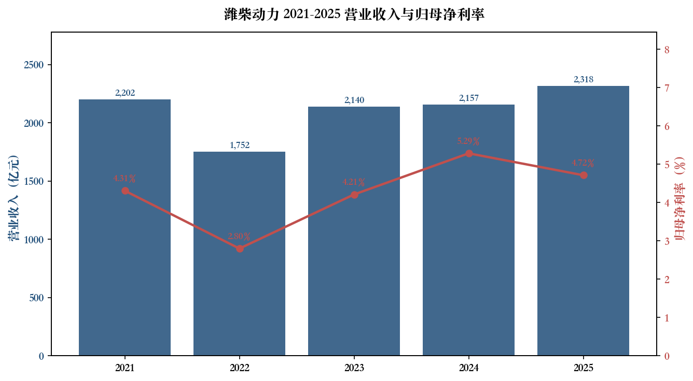
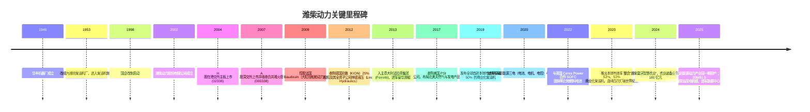
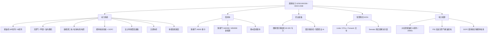
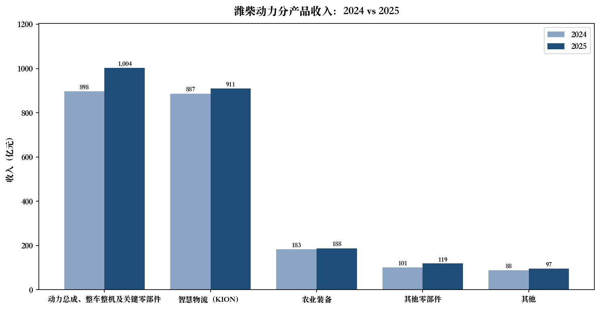
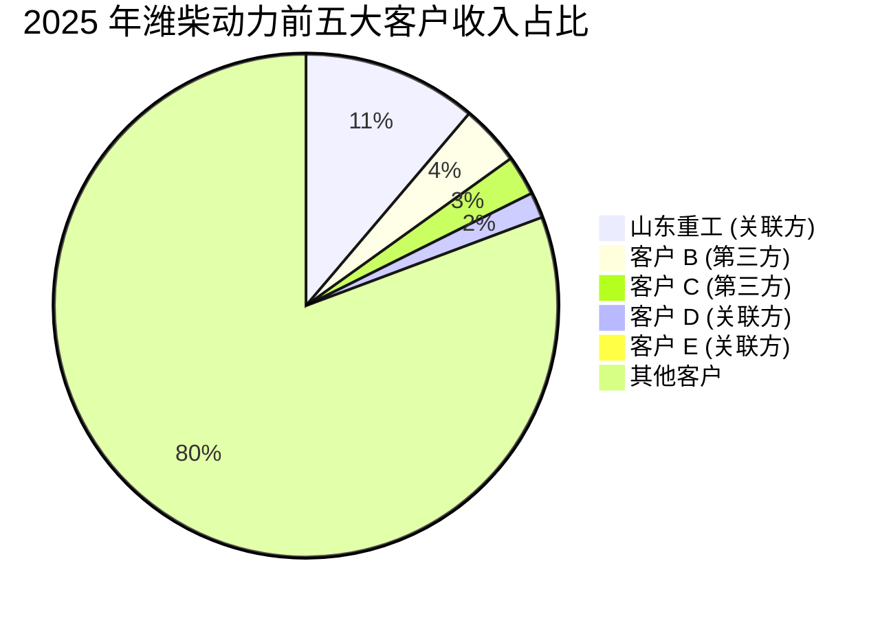
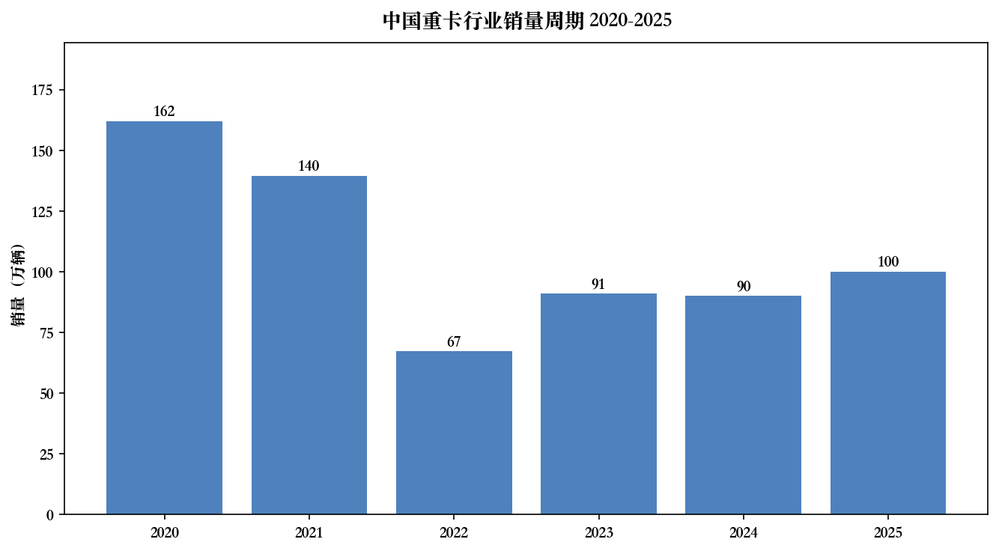
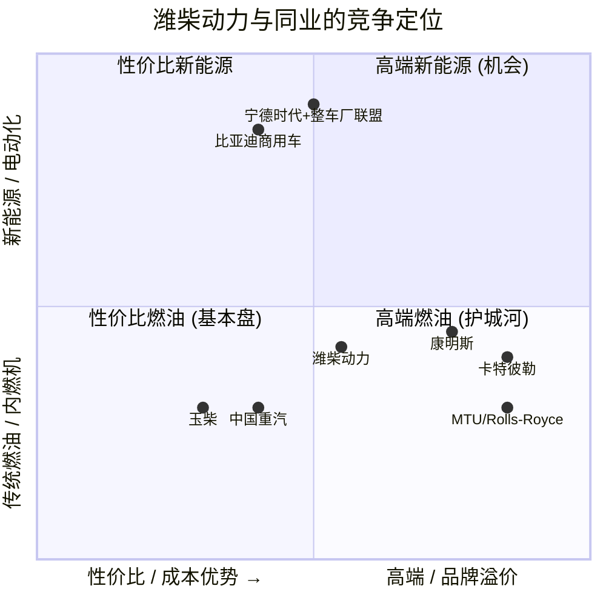
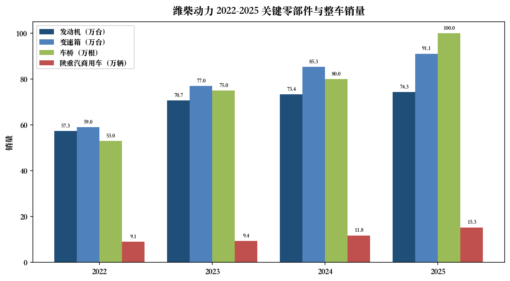
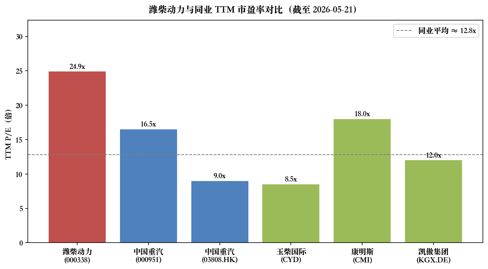
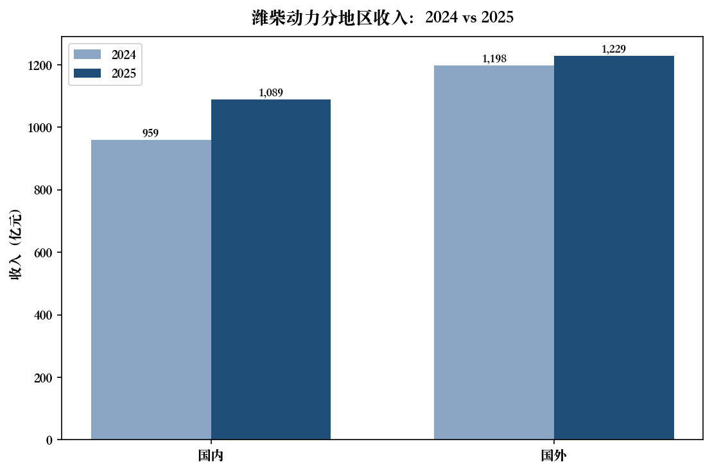

# 潍柴动力（SZSE:000338 / HKEX:2338）公司研究报告

报告日期：2026-05-20  
作者：内部研究  
报告语言：简体中文

---

## 目录

1. 公司概览
2. 公司历史
3. 管理团队
4. 产品与服务
5. 客户与上市策略
6. 行业概览
7. 竞争格局
8. 市场机会（TAM）
9. 风险评估
10. 参考资料

---

## 1. 公司概览

潍柴动力股份有限公司（Weichai Power Co., Ltd.，A 股代码 000338，H 股代码 2338，下称"公司"或"潍柴动力"）是中国综合实力最强的汽车与高端装备制造产业集团之一，总部位于山东省潍坊市高新区福寿东街 197 号甲，法定代表人马常海，2025 年员工总数约 8.8 万人（其中境外员工 4.1 万人，主要来自德国凯傲集团）（[潍柴动力 2025 年年度报告, 第 32-39 页](https://static.cninfo.com.cn/finalpage/2026-03-26/1226131055.PDF)）。公司主营业务围绕"动力系统—商用车—农业装备—智慧物流—电力能源"五大产业板块协同布局，主要产品包括全系列全领域柴油 / 天然气 / 甲醇 / 氢内燃机、新能源动力系统及零部件、重型变速箱、车桥、液压产品、重型卡车、叉车、供应链解决方案、农业装备及大缸径发电机组等，远销全球 150 多个国家与地区（[潍柴动力 2025 年年度报告, 第 12-13 页](https://static.cninfo.com.cn/finalpage/2026-03-26/1226131055.PDF)）。

**商业模式**：公司是一家典型的 B2B 综合工业集团。采购采用集中+分散结合模式；生产采用大规模定制与多品种小批量柔性生产并行；销售以直销 B2B 为主（2025 年直销占比 78.25%），辅以经销（18.78%）与分销（2.97%）（[潍柴动力 2025 年年度报告, 第 17 页](https://static.cninfo.com.cn/finalpage/2026-03-26/1226131055.PDF)）。营收结构上，2025 年公司"交通运输设备制造业"占 74.96%、"专用设备制造业"占 24.03%；按产品看，"动力总成、整车整机及关键零部件"占 43.31%（人民币 1004.11 亿元）、"智慧物流"（德国 KION 集团）占 39.29%（910.77 亿元）、"农业装备"（潍柴雷沃）占 8.11%（187.89 亿元）、"其他零部件"占 5.12%、"其他"占 4.17%（[潍柴动力 2025 年年度报告, 第 17 页](https://static.cninfo.com.cn/finalpage/2026-03-26/1226131055.PDF)）。

**地理布局**：公司国内拥有潍坊（总部）、扬州（潍柴动力扬州柴油机有限责任公司）、重庆三大发动机生产基地，标准生产能力 102 万台/年；商用车整车依托陕西重型汽车有限公司（陕重汽）；变速箱依托陕西法士特齿轮；车桥依托陕西汉德车桥；农业装备依托潍柴雷沃；海外则通过控股子公司德国凯傲集团（KION Group AG，FRA:KGX）在 100 多个国家提供叉车与供应链解决方案、通过意大利法拉帝集团（Ferretti S.p.A.，由控股股东潍柴控股持有 38.02%）布局高端游艇、通过美国 PSI 公司布局北美天然气 / 柴油发电产品（[潍柴动力 2025 年年度报告, 第 12-16, 69 页](https://static.cninfo.com.cn/finalpage/2026-03-26/1226131055.PDF)）。2025 年公司国外收入 1228.83 亿元，占比 53.01%；国内收入 1089.26 亿元，占比 46.99%，国内增速 13.56% 显著高于国外 2.60%（[潍柴动力 2025 年年度报告, 第 17 页](https://static.cninfo.com.cn/finalpage/2026-03-26/1226131055.PDF)）。

**规模与关键经营指标**：2025 年公司实现营业收入 2,318.09 亿元（同比 +7.47%），归属于上市公司股东净利润 109.31 亿元（同比 -4.15%），扣非归母净利润 96.62 亿元（同比 -8.22%），经营活动现金流净额 286.82 亿元（同比 +9.92%），加权平均净资产收益率 12.08%（同比 -1.61 pct）（[潍柴动力 2025 年年度报告, 第 10 页](https://static.cninfo.com.cn/finalpage/2026-03-26/1226131055.PDF)）。归母净利润同比下滑主要由控股子公司 KION GROUP AG 当期计提"效率计划"相关支出人民币 12.76 亿元（影响归母净利 3.93 亿元）所致——若剔除该一次性影响，公司主业仍呈现稳健增长态势（[潍柴动力 2025 年年度报告, 第 10 页](https://static.cninfo.com.cn/finalpage/2026-03-26/1226131055.PDF)）。2025 年发动机销量 74.3 万台（同比 +1.32%）、变速箱 91.1 万台（+6.76%）、车桥 100 万根（+24.96%）、叉车 27.8 万台（+5.67%）、陕重汽商用车销售 15.3 万辆（同比 +29.41%，国内销量 +60.2%）（[潍柴动力 2025 年年度报告, 第 13, 17-18 页](https://static.cninfo.com.cn/finalpage/2026-03-26/1226131055.PDF)）。2026 年一季度延续向上拐点：营收 625.63 亿元（同比 +8.87%）、归母净利 30.85 亿元（同比 +13.83%）、扣非归母净利 29.88 亿元（同比 +20.25%）（[潍柴动力 2026 年第一季度报告, 第 2 页](https://static.cninfo.com.cn/finalpage/2026-04-29/1226200115.PDF)）。

Source: [潍柴动力 2025 年年度报告, 第 10 页](https://static.cninfo.com.cn/finalpage/2026-03-26/1226131055.PDF)、[潍柴动力 2022 年年度报告, 第 8 页](https://static.cninfo.com.cn/finalpage/2023-03-30/1216234783.PDF)。注：2022 年数据为该年报追溯调整后口径（同一控制下企业合并 — 雷沃并入）。

**估值快照（A 股，截至 2026-05-21 收盘）**：A 股 000338 收盘价 32.28 元，总市值约 2,812.36 亿元，流通市值约 1,615.13 亿元；52 周区间 22.79–35.87 元；TTM 滚动市盈率 24.88 倍；市净率（PB）约 2.95 倍（[东方财富/腾讯股票 sz000338 实时报价, 2026-05-21](https://qt.gtimg.cn/q=sz000338)）。H 股 02338 同日收盘 39.10 港元，总市值约 3,406.55 亿港元，TTM 市盈率 28.15 倍（[腾讯股票 hk02338 实时报价, 2026-05-21](https://qt.gtimg.cn/q=hk02338)）。

**估值解读**：以归母净利润 109.3 亿元粗略匹配，A 股市值/净利 = 25.7 倍，与 TTM PE 24.88 倍口径基本一致；H 股估值显著高于 A 股（28.15 vs 24.88 倍），AH 溢价约 -13%，即 A 股相对 H 股折价、外资定价更乐观。横向看，中国重汽（000951.SZ）TTM PE 约 16-17 倍、玉柴国际（CYD.NYSE）约 8-9 倍、康明斯（CMI.NYSE）约 18 倍、KION Group（KGX.DE）约 12 倍，潍柴 A 股 25 倍 PE 处于中国重卡—发动机同业上沿，但低于"AI 算力—大缸径发电机"主题股的纯成长定价区间（[腾讯股票 sz000951 实时报价, 2026-05-21](https://qt.gtimg.cn/q=sz000951)）。市场对潍柴 25× PE 的支撑逻辑主要是三条：(1) 数据中心备用电源（大缸径发动机）2025 年销量 +259%、收入 +65%，成为新的增长引擎；(2) 重卡周期处于复苏早期，2024–2025 年国内重卡销量较 2022 周期底的 67 万辆已逐步修复；(3) KION 集团 2025 年的"效率计划"一次性减值清理后，2026 年开始有望释放经营杠杆。若以非经常性损益调整 + KION 一次性影响回加（约 12.76 亿元）后的"正常化"归母净利约 122 亿元计算，A 股调整后 PE 约 23 倍，估值并不算极端。从风险端看，公司净利率仅 4.7%（109.3/2318）远低于轻资产同业，叠加 KION 商誉风险（2025 年减值后仍较大）与重卡周期顶部回落风险，估值进一步上行需要新能源 / 数据中心 / 出口三条增长曲线持续兑现。

---

## 2. 公司历史

潍柴前身为 1946 年成立于山东潍坊的"华丰机器厂"，1953 年改组为潍坊柴油机厂，是新中国第一批专门生产柴油机的国有企业。1998 年潍坊柴油机厂改制；2002 年由原潍坊柴油机厂为核心组建潍柴动力股份有限公司，并联合德隆系旗下的湘火炬汽车集团股份有限公司（湘火炬下辖法士特、汉德车桥与陕汽集团）进行业务整合。2004 年公司在香港联交所主板上市（02338.HK），2007 年通过 A 股 IPO 及吸收合并原湘火炬的方式登陆深交所（000338.SZ），由此把"发动机+变速箱+车桥+整车"重卡黄金动力链置于同一上市平台之内（[潍柴动力 2025 年年度报告, 第 8, 32 页](https://static.cninfo.com.cn/finalpage/2026-03-26/1226131055.PDF)；[潍柴动力 2022 年年度报告, 第 7-8 页](https://static.cninfo.com.cn/finalpage/2023-03-30/1216234783.PDF)）。

Source: [潍柴动力 2025 年年度报告, 第 13-16, 22 页](https://static.cninfo.com.cn/finalpage/2026-03-26/1226131055.PDF)；[潍柴动力 2022 年年度报告, 第 11-15 页](https://static.cninfo.com.cn/finalpage/2023-03-30/1216234783.PDF)。

**三次战略转型**：

1. **从单一发动机到"黄金动力总成"（2005–2010）**：通过收购重组湘火炬，将法士特变速箱、汉德车桥与陕汽重卡纳入体系，构建"潍柴发动机+法士特变速箱+汉德车桥"配套陕汽重卡的核心组合，奠定了中国重卡动力链龙头地位。这是中国汽车工业历史上第一次成功的资本整合，由此衍生的"潍柴模式"被多家券商作为案例研究。

2. **从国内重卡到全球高端装备集团（2009–2020）**：以"产品经营+资本运营双轮驱动"为方法论，先后收购法国 Baudouin（大缸径船舶动力）、德国凯傲集团及其下属林德液压（高端液压）、意大利法拉帝豪华游艇、美国 PSI（北美发电与天然气动力），把业务延伸到智慧物流、农业装备、船舶、发电、液压、高端整车整机等高利润、高壁垒的工业领域（[潍柴动力 2025 年年度报告, 第 12-16 页](https://static.cninfo.com.cn/finalpage/2026-03-26/1226131055.PDF)）。

3. **从传统内燃机龙头到"传统能源+清洁能源+新能源"多元动力（2020–至今）**：以热效率不断突破 50%、51%、52%、53% 的高效柴油机巩固传统能源优势；同时布局甲醇、氢内燃机、氢燃料电池、SOFC 固体氧化物燃料电池、电池/电机/电控"三电"等新能源路线。2025 年 3 月烟台新能源动力产业园首台电池下线，标志公司开始从"动力总成供应商"向"全能源动力解决方案商"过渡（[潍柴动力 2025 年年度报告, 第 14-15 页](https://static.cninfo.com.cn/finalpage/2026-03-26/1226131055.PDF)）。

**关键并购**：

- **2012 — KION Group AG（德国，叉车 & 智慧物流）**：以 7.38 亿欧元入股 25%，随后增持至控股，2025 年合并报表口径下 KION 实现收入 113 亿欧元，是公司海外业务的最大单一资产（[潍柴动力 2025 年年度报告, 第 15-16 页](https://static.cninfo.com.cn/finalpage/2026-03-26/1226131055.PDF)）。
- **2012 — Linde Hydraulics（德国高端液压）**：与 KION 同步注入潍柴体系，公司由此跻身全球高端液压第一梯队。
- **2013 — Ferretti S.p.A.（意大利游艇）**：由控股股东潍柴控股集团（香港）投资有限公司持股 38.02%，潍柴动力间接受益（[潍柴动力 2025 年年度报告, 第 69 页](https://static.cninfo.com.cn/finalpage/2026-03-26/1226131055.PDF)）。
- **2017 — PSI 公司（美国，天然气与发电动力）**：补齐北美发电产品矩阵，2025 年其发电产品收入占比 81%，受益于北美数据中心放量（[潍柴动力 2025 年年度报告, 第 16 页](https://static.cninfo.com.cn/finalpage/2026-03-26/1226131055.PDF)）。
- **2022 — 雷沃重工（潍柴雷沃智慧农业）**：完成同一控制下企业合并，2022 年报追溯调整后营收口径从 1,751.58 亿调整为 2,202.15 亿元（[潍柴动力 2022 年年度报告, 第 8 页](https://static.cninfo.com.cn/finalpage/2023-03-30/1216234783.PDF)）。

**近 1-2 年关键动向**：2025 年公司继续强化"AI×内燃机×新能源"三线协同：发布行业首个 AI 大模型智能座舱、推出基于物理 AI 的工业车辆解决方案、与英国 Ceres Power 深化 SOFC 合作并实现电池/电堆/系统全产业链布局（最高发电效率 65%、欧盟 CE 认证通过）；并通过"M 系列大缸径发动机首次突破 1 万台、销量同比 +32%、收入 +65%"以及"数据中心备用电源销量 +259%"两条线快速吃下 AI 算力对柴油 / 气体发电机组的需求增量（[潍柴动力 2025 年年度报告, 第 14-16 页](https://static.cninfo.com.cn/finalpage/2026-03-26/1226131055.PDF)）。

---

## 3. 管理团队

潍柴动力是典型的"国资控股+职业经理人+创始团队精神延续"的治理结构。原董事长谭旭光（1961 年出生）在 2022 年退任后仍持有公司 0.68%（5,884.26 万股）股份，由其全面打造的"客户满意是我们的宗旨"企业文化及"30 年磨一剑"长期主义研发投入逻辑至今为现任管理层延续（[潍柴动力 2025 年年度报告, 第 67-68 页](https://static.cninfo.com.cn/finalpage/2026-03-26/1226131055.PDF)）。

### 马常海（董事长、党委书记，51 岁，1974 年 4 月生）

马常海先生为现任董事长与法定代表人，2024 年 7 月任潍柴控股集团董事长、潍柴动力董事长，同时任山东重工集团有限公司副总经理。马总持经济学硕士学位，兼具教授级高级政工师与高级工程师双重资格，担任第十三届山东省政协委员、第十四届潍坊市政协常委、中国内燃机工业协会会长。马总 1997 年 7 月加入潍坊柴油机厂，是公司"老潍柴系"嫡系——从一线管理岗起步，历任潍柴控股集团有限公司党委副书记、副总经理，潍柴动力监事，潍柴雷沃智慧农业科技股份有限公司党委书记、董事长等职。其职业轨迹覆盖"基础动力—战略人力—资本运营—子公司治理"四大维度，对发动机、农业装备、零部件三大主营板块均有深度运营经验，是公司从"谭旭光时代"过渡至下一代领导集体的关键人物（[潍柴动力 2025 年年度报告, 第 35 页](https://static.cninfo.com.cn/finalpage/2026-03-26/1226131055.PDF)）。在他任内提出的"科技领先、绿色发展、世界一流的高端装备跨国集团"战略愿景指导着公司当前的五大业务板块协同布局；2025 年公司明确把"打造科技领先、绿色发展、世界一流的高端装备跨国集团"作为最新发展愿景写入年报核心竞争力章节。马总在公司任董事长不领取报酬（"是否在关联方领取报酬：是"），仅在山东重工集团领取薪酬，体现典型的国资集团交叉任职逻辑（[潍柴动力 2025 年年度报告, 第 39 页](https://static.cninfo.com.cn/finalpage/2026-03-26/1226131055.PDF)）。

### 王德成（董事、总经理，47 岁，1978 年 7 月生）

王德成先生为现任总经理（CEO），是公司从总工程师序列成长起来的技术型职业经理人。工程博士、正高级工程师，国务院政府特殊津贴专家，入选山东"泰山产业领军人才"、潍柴卓越工程师。王总 2004 年 7 月加入公司，2025 年薪酬 223.52 万元（公司内最高，唯一超过 200 万元的高管），是典型的"高研发投入企业"的技术型 CEO 配置（[潍柴动力 2025 年年度报告, 第 39 页](https://static.cninfo.com.cn/finalpage/2026-03-26/1226131055.PDF)）。其历任路径——应用工程中心主任→应用工程总监→发动机平台总监→发动机研究院院长→总裁助理→副总裁→执行总裁→董事 / 总经理——意味着公司近 20 年发动机研发体系的关键拐点（含 50%–53% 热效率系列、WP 系列大缸径柴油机、20M61 5 兆瓦机组）都有其参与与推动。王德成同时担任北汽福田汽车股份有限公司董事，是公司外延式发动机配套合作的重要节点。其董事长锁定股 800,000 股已部分解锁，期末仍有 600,000 股限售股，体现"长锁定+持续激励"的薪酬体系（[潍柴动力 2025 年年度报告, 第 66 页](https://static.cninfo.com.cn/finalpage/2026-03-26/1226131055.PDF)）。

### 王翠萍（财务总监 / CFO，48 岁，1977 年 7 月生）

王翠萍女士经济学学士、正高级会计师，2024 年 11 月起任公司财务总监，年薪 165.16 万元。任职前历任山推工程机械财务部部长助理 / 副部长、山东重工集团有限公司财务管理部副部长、山东重工集团财务有限公司财务总监、中通客车股份有限公司财务负责人 / 董事会秘书等。这一履历的关键意义是：王总具备"集团财务公司+上市公司董秘+大型工程机械财务"三段经验，对潍柴当前最敏感的三件事——KION 商誉与减值管理、A 股 + H 股两地合规披露、子公司之间集中资金管理与关联交易合规——都有直接对接经验。王总同时担任山推工程机械股份有限公司董事、潍柴动力（香港）国际发展有限公司董事，意味着她也是公司在港股融资 / 资本运作链条上的关键节点（[潍柴动力 2025 年年度报告, 第 37 页](https://static.cninfo.com.cn/finalpage/2026-03-26/1226131055.PDF)）。

### 郭圣刚（副总经理 & 总设计师，49 岁）

工程博士、正高级工程师，2000 年 7 月加入潍坊柴油机厂，现任副总经理、总设计师、内燃机与动力系统全国重点实验室副主任。作为公司热效率连破世界纪录的研发核心（50%、51%、52%、53% 系列），其在公司"发动机领域研发强度近 6%"这条核心壁垒上的话语权极大。年薪未单列在年报披露的主要高管中，但持有限制性股票 80 万股（[潍柴动力 2025 年年度报告, 第 34 页](https://static.cninfo.com.cn/finalpage/2026-03-26/1226131055.PDF)）。

### Richard Robinson Smith（董事，KION Group AG CEO，60 岁）

德国 / 美国双重国籍，普林斯顿大学系统工程学士、UT Austin MBA、Otto Beisheim 商学院运营博士。现任 KION Group AG CEO，是潍柴动力海外业务最大子公司的实际管理者；曾任 AGCO Corporation 高级副总裁兼欧洲、非洲和中东总经理，KONECRANES PLC 总裁兼 CEO，FLSmidth & Co. A/S 非执行董事。其在 KION 主导的"效率计划"在 2025 年带来一次性 12.76 亿人民币减值，但同时也是未来盈利能力释放的关键设置（[潍柴动力 2025 年年度报告, 第 36 页](https://static.cninfo.com.cn/finalpage/2026-03-26/1226131055.PDF)）。

### 公司治理与股权结构（80–150 字）

- **控股股东**：潍柴控股集团有限公司（持股 16.33%，1,422,550,620 股），最终实际控制人为山东重工集团有限公司，属山东省国资委地方国有控股，性质为"地方国资管理机构"（[潍柴动力 2025 年年度报告, 第 67-69 页](https://static.cninfo.com.cn/finalpage/2026-03-26/1226131055.PDF)）。
- **股权结构（2025 年末）**：A 股 57.46% + H 股 22.30% + 限售股 20.24%，总股本 8,713,581,296 股。H 股第一大持有人为香港中央结算代理人有限公司（22.25%），公司是一家典型的 AH 双重上市国企（[潍柴动力 2025 年年度报告, 第 65, 67 页](https://static.cninfo.com.cn/finalpage/2026-03-26/1226131055.PDF)）。
- **董事会与监事会**：2024 年根据新公司法取消监事会，新设 ESG 委员会；董事会下设战略发展及投资委员会、审核委员会、薪酬委员会、提名委员会、ESG 委员会；独立董事 5 名（蒋彦、迟德强、徐兵、陶化安、张伟丽），独立性符合规定（[潍柴动力 2025 年年度报告, 第 32, 34 页](https://static.cninfo.com.cn/finalpage/2026-03-26/1226131055.PDF)）。
- **关联交易**：2025 年前五大客户中山东重工、客户 D、E 为公司关联方，关联方销售占总销售额 13.29%；前五供应商山东重工、B、C 为关联方，关联方采购占 10.39%——金额绝对值可观，但占比合理且持续披露完整（[潍柴动力 2025 年年度报告, 第 19 页](https://static.cninfo.com.cn/finalpage/2026-03-26/1226131055.PDF)）。
- **2025 年 A 股股权激励**：当年对部分原激励对象的限制性股票（合计 398 万股）进行回购注销，并完成第一个解除限售期解锁，覆盖王德成、郭圣刚、支保京、王令金等核心高管，激励-约束机制相对完善（[潍柴动力 2025 年年度报告, 第 65-66 页](https://static.cninfo.com.cn/finalpage/2026-03-26/1226131055.PDF)）。
- **特别披露**：2025 年报中董事袁宏明先生（陕重汽副董事长）对"陕汽集团重型汽车整车生产销售资质变更"事项表达异议，构成历史遗留产权关系的潜在风险点（[潍柴动力 2025 年年度报告, 第 2 页](https://static.cninfo.com.cn/finalpage/2026-03-26/1226131055.PDF)）。

### 管理层履约能力评估（50–100 字）

公司管理层是"国资集团交叉任职+本土技术派+海外职业经理人"的混合架构。马常海—王德成—王翠萍三人组合稳定性强（均为内部成长）；KION CEO Smith 与德籍董事 Macht 提供海外治理经验。过去 5 年公司在发动机热效率、整车整机、农业装备三个领域均做到了"承诺—兑现"，但 KION 商誉管理、Ferretti 同业竞争解决和陕汽集团历史承诺履行仍是治理工作中尚未完全闭环的问题。

---

## 4. 产品与服务

公司业务板块化披露为五大产业：(1) 动力系统、(2) 商用车、(3) 农业装备、(4) 智慧物流、(5) 电力能源（[潍柴动力 2025 年年度报告, 第 12-16 页](https://static.cninfo.com.cn/finalpage/2026-03-26/1226131055.PDF)）。

### 4.1 动力系统（2025 收入约 1004 亿元）

**柴油机 WP 系列与 M 系列（旗舰，竞争优势：是）**：覆盖排量 22L–110L，涵盖 WP9H、WP13、WP14、WP15、WP16、WP17 等重卡型号，以及 12M25、12M55NG、16M33、20M61、PSI 22L–110L 等大缸径型号。技术上 50%、51%、52%、53% 本体热效率连续四次刷新世界纪录，对竞品至少领先 1.5–2 个百分点（行业柴油机热效率天花板长期在 46–48% 区间）（[潍柴动力 2025 年年度报告, 第 14 页](https://static.cninfo.com.cn/finalpage/2026-03-26/1226131055.PDF)）。**护城河类型：技术 / IP + 规模 + 品牌**。证据：发动机领域研发强度近 6%（高于中国汽车工业平均 3% 左右）、连续四次世界纪录、全国重点实验室（内燃机与动力系统）、国家燃料电池技术创新中心、欧美日十大前沿技术中心。**对标竞品**：康明斯 X 系列（北美中重卡主流）、玉柴 K15 系列（中国市场份额第二）、卡特彼勒 C32（大缸径发电）、MTU 系列。综合判断：在中国 13L–16L 重卡发动机领域处于绝对领先，在 22L 以上大缸径发电机组领域处于"挑战者"阶段，但 20M61 的 5 兆瓦升功率行业第一意味着公司已具备与 MTU/卡特挑战的能力。

**天然气 / 甲醇 / 氢内燃机（成长，竞争优势：部分）**：WP16NG 双燃料、WP13 甲醇非道路矿卡发动机进入市场验证。非道路甲醇发动机市占率行业第一；牵头推动全球首批氢内燃机国际标准预研。护城河类型：技术+先发优势；现阶段销量规模较小，但占据替代燃料动力的研发先机（[潍柴动力 2025 年年度报告, 第 20 页](https://static.cninfo.com.cn/finalpage/2026-03-26/1226131055.PDF)）。

**新能源三电（成长，竞争优势：部分）**：动力电池系列产品涵盖快充大单包、底置系列、CTB 系列等，电量覆盖 2 kWh–1200 kWh；高效低速大扭矩电机 + TZ220 扁线电机；高度集成的电机控制器（MCU + PDU 一体化）。2025 年"三电"业务收入 30.4 亿元（翻番增长），其中电池销量 +162%、自主电机 +219%、自主电机控制器 +56%。**护城河类型：与公司整车整机 + 重卡客户的渠道协同**；但纯技术层面对宁德、比亚迪、阳光电源仍处追赶状态（[潍柴动力 2025 年年度报告, 第 13 页](https://static.cninfo.com.cn/finalpage/2026-03-26/1226131055.PDF)）。

**法士特重型变速箱（旗舰，竞争优势：是）**：2025 年销量 91.1 万台（同比 +6.76%），重卡领域国内市占率长期 70%+，公司直接持股陕西法士特齿轮有限责任公司。**护城河类型：规模、配套粘性、技术认证**。对标德国采埃孚（ZF）、艾里逊（Allison），在 8x4 / 6x4 重卡领域处于绝对领先。

**汉德车桥（旗舰，竞争优势：是）**：2025 年销量 100 万根（+24.96%），中国重卡车桥市占率行业前列。**护城河类型：规模 + 与陕重汽配套粘性**。对标采埃孚、达纳（Dana）。

**林德高端液压（成长，竞争优势：部分）**：通过 KION 系收购的德国高端液压技术，定位高端工程机械、矿山机械液压总成。2025 年继续巩固高端液压技术领先性。竞品：博世力士乐（Bosch Rexroth）、川崎重工、伊顿。

### 4.2 商用车（陕重汽，2025 销量 15.3 万辆）

**陕重汽 X6000 系列重卡（旗舰，竞争优势：是）**：2025 年陕重汽国内销售 9.4 万辆（同比 +60.2%），出口 5.9 万辆，重卡市占率稳居行业前列。X6000 超凡旗舰车型已获欧盟 WVTA 整车型式认证。**护城河类型：动力链垂直整合（潍柴发动机+法士特变速箱+汉德车桥配套自家整车）+ 海外渠道**。对标一汽解放、东风、福田欧曼。

**陕重汽新能源（G6000E、M5000E，成长）**：新能源市场份额同比 +3.3 pct。短板：与三一、徐工、远程、福田竞争激烈，需要时间积累纯电动重卡技术经验（[潍柴动力 2025 年年度报告, 第 15 页](https://static.cninfo.com.cn/finalpage/2026-03-26/1226131055.PDF)）。

### 4.3 农业装备（潍柴雷沃，2025 收入 187.89 亿元）

**雷沃拖拉机 80–320 马力动力换挡（旗舰，竞争优势：是）**：80–320 马力全系列 2 速动力换挡产品已经全面投放市场，国内大马力拖拉机市占率行业领先，建成具有世界一流水平的高端、智能、绿色化大马力拖拉机工厂，入选国家卓越级智能工厂（[潍柴动力 2025 年年度报告, 第 15 页](https://static.cninfo.com.cn/finalpage/2026-03-26/1226131055.PDF)）。**对标**：约翰迪尔（John Deere）、凯斯纽荷兰（CNH）、爱科（AGCO）。

**雷沃收获机 / 智慧农业 AI 大模型（成长）**：16 公斤级大型收获机；基于小麦机、玉米机平台开发节能型产品，综合油耗 -15%。智慧农业 AI 大模型为国内率先落地。

### 4.4 智慧物流（KION 集团，2025 收入 113 亿欧元，约 910.77 亿元人民币）

**叉车业务（KION 旗下 Linde、STILL、Fenwick 等品牌，旗舰，竞争优势：是）**：2025 年收入 82.7 亿欧元，全球叉车第二（仅次于丰田工业），是公司海外业务的最大现金牛（[潍柴动力 2025 年年度报告, 第 15-16 页](https://static.cninfo.com.cn/finalpage/2026-03-26/1226131055.PDF)）。**护城河类型：欧洲品牌 + 全球分销网络**。竞品：丰田工业、永恒力（Jungheinrich）、皇冠（Crown）、海斯特耶鲁。

**Dematic 供应链解决方案（成长）**：2025 年收入 30.7 亿欧元，与埃森哲合作研发基于"物理 AI"的工业车辆解决方案与数字孪生技术。**对标**：Daifuku（大福）、Honeywell Intelligrated、瑞仕格（Swisslog）。

### 4.5 电力能源（2025 数据中心备用电源销量 +259%）

**大缸径柴油 / 气体发动机及发电机组（成长 → 新增长引擎，竞争优势：部分）**：2025 年 M 系列大缸径发动机销量首次突破 1 万台、同比 +32%，收入 +65%。20M61 是公司发布的全球首款 5 兆瓦级高速柴油发电产品，升功率行业第一，启动速度、带载能力等核心参数均达到世界一流水平。**对标**：MTU（罗罗集团）、卡特彼勒、康明斯，潍柴在产品参数上已经接近，但品牌+服务网络仍需时间渗透海外数据中心客户（[潍柴动力 2025 年年度报告, 第 16 页](https://static.cninfo.com.cn/finalpage/2026-03-26/1226131055.PDF)）。

**SOFC 固体氧化物燃料电池（前瞻，竞争优势：部分）**：2025 年 SOFC 发电系统成功通过欧盟 CE 认证，最高发电效率 65%，性能指标达到国际领先水平；与英国 Ceres Power 进一步合作。**对标**：日本京瓷（Kyocera）、Bloom Energy。

**PSI 公司（成长）**：2025 年 PSI 发电类产品收入占比 81%，紧抓北美数据中心算力建设浪潮（[潍柴动力 2025 年年度报告, 第 16 页](https://static.cninfo.com.cn/finalpage/2026-03-26/1226131055.PDF)）。

### 旗舰 vs 长尾

公司的"flagship"业务可以归纳为三条线：(1) 重型商用车动力链（潍柴发动机 + 法士特 + 汉德 + 陕重汽，约 1000 亿收入）、(2) KION 集团智慧物流（约 911 亿）、(3) 大缸径发电产品（虽然 2025 年规模占比尚小，但 +65% 增速与 +259% 备用电源销量使其成为最有想象空间的新业务）。

Source: [潍柴动力 2025 年年度报告, 第 17 页](https://static.cninfo.com.cn/finalpage/2026-03-26/1226131055.PDF).

近 12 个月主要产品动作：(a) 20M61 5 兆瓦级高速柴油发电机组上市；(b) WP16NG / WP13 甲醇矿卡发动机进入市场验证；(c) 600 度重卡底置电池、140 度轻卡快充电池量产；(d) 烟台新能源动力产业园一期投产；(e) 行业首个 AI 大模型智能座舱发布；(f) SOFC 通过欧盟 CE 认证（[潍柴动力 2025 年年度报告, 第 14-16, 20 页](https://static.cninfo.com.cn/finalpage/2026-03-26/1226131055.PDF)）。

---

## 5. 客户与上市策略

### 客户结构与客户集中度（必须量化）

按 2025 年年报披露：

- **前五名客户合计销售金额**：456.85 亿元，占年度销售总额 **19.71%**；
- **前一大客户**：山东重工集团（公司的最终控股公司），销售额 **258.28 亿元，占总销售额 11.14%**；
- **关联方销售**占总销售额 13.29%；
- 客户 D、E 同样为公司关联方，B、C 为非关联第三方客户（年报未具名披露）（[潍柴动力 2025 年年度报告, 第 19 页](https://static.cninfo.com.cn/finalpage/2026-03-26/1226131055.PDF)）。

Source: [潍柴动力 2025 年年度报告, 第 19 页](https://static.cninfo.com.cn/finalpage/2026-03-26/1226131055.PDF).

**判断**：

1. **总体客户分散**：第一大客户占比 11.14%，前五大合计仅 19.71%，远低于 50% 警戒线，属于典型分散型 B2B 客户结构。**没有触发"top-1 > 20% 或 top-5 > 50%"的硬警报**。
2. **关联方依赖偏高**：前五大中山东重工、客户 D、E 均为关联方，关联销售合计占 13.29%——主要是公司向山东重工旗下兄弟单位（如中国重型汽车集团 / 中国重汽集团济南卡车、潍柴重机等）供应发动机、变速箱、车桥等核心零部件，属于"集团内部产业链协同"性质，不是单一客户依赖，定价合规性需关注。
3. **底层客户结构**：潍柴的真实客户群体由两层组成：(a) 重卡 / 客车整车厂——一汽解放、东风、福田、陕重汽（陕重汽虽是子公司但走"内部+外部"两条线）、中国重汽济南卡车（关联方）、北汽福田、宇通、金龙等；(b) 非道路终端——三一重工、徐工、柳工、卡特彼勒中国合资工厂、中联重科、玉柴重工、山推、临工等工程机械与农机品牌；(c) 海外：通过 KION 与 PSI 触达的全球叉车 / 物流 / 数据中心客户超过百万；(d) 终端售后：国内 74 家备品中心库 + 海外 13 家销售子公司 + 100 多家经销商，覆盖全球 8000 家服务网点，服务全球 240 万台发动机（[潍柴动力 2025 年年度报告, 第 13 页](https://static.cninfo.com.cn/finalpage/2026-03-26/1226131055.PDF)）。
4. **合同结构**：动力总成业务以年度框架合同+月度滚动订单为主，长期合作粘性强；KION 的物流解决方案以多年期项目合同为主；新能源三电以"对内配套陕重汽 + 对外向其他重卡整车厂出货"为主，仍处于客户拓展期。

### 渠道分布与销售模式

按销售模式划分（2025 年）：直销 78.25%（1,813.82 亿元）、经销 18.78%（435.37 亿元）、分销 2.97%（68.90 亿元）。其中经销模式同比增速 18.11% 远高于直销 4.90%，反映出公司在小批量、非道路细分市场（农机、工程机械、备品）的渠道扩张（[潍柴动力 2025 年年度报告, 第 17 页](https://static.cninfo.com.cn/finalpage/2026-03-26/1226131055.PDF)）。海外通过 13 家销售子公司+100 多家经销商+8000 家服务网点形成全球服务网络。

### 上市策略与销售周期

发动机销售面向整车整机配套厂家直接 B2B，营销系统下设商用车动力销售公司、工程机械动力销售公司、农业装备动力销售公司、液压传动销售公司等四大销售单元，按下游客户类型矩阵化运营。后市场和客服部门专门负责发动机配件销售（B2C 模式），国内 74 家备品中心库支撑售后供应链（[潍柴动力 2025 年年度报告, 第 13 页](https://static.cninfo.com.cn/finalpage/2026-03-26/1226131055.PDF)）。

### 关键合作伙伴

- **英国 Ceres Power**：SOFC 燃料电池电池、电堆与系统全产业链合作（2022 年签约，2025 年进一步深化）；
- **埃森哲（Accenture）**：与 KION 集团合作研发基于物理 AI 的工业车辆解决方案、数字孪生技术；
- **国内 AI 领先企业**：在供应链管理与发动机研发引入 AI 大模型与"AI 超级工程师"——年报披露发动机开发周期缩短 68%（[潍柴动力 2025 年年度报告, 第 14 页](https://static.cninfo.com.cn/finalpage/2026-03-26/1226131055.PDF)）。

### 重要客户案例

- **陕重汽 X6000**：搭载 WP15 / WP17 + 法士特变速箱 + 汉德车桥垂直整合方案，2025 年获欧盟 WVTA 整车型式认证，年出口 5.9 万辆；
- **数据中心备用电源**：M 系列 + 20M61 + PSI 在 2025 年成为新的客户增长亮点（备用电源销量 +259%）（[潍柴动力 2025 年年度报告, 第 14-16 页](https://static.cninfo.com.cn/finalpage/2026-03-26/1226131055.PDF)）。

---

## 6. 行业概览

### 行业定义与范围

公司所处行业横跨 (a) 汽车制造业（重卡 / 客车）、(b) 通用设备制造业（发动机、变速箱、车桥、液压）、(c) 专用设备制造业（农业装备、叉车 / 物流装备、发电设备）、(d) 新能源装备制造业（动力电池、电机、电控、燃料电池）。按申万行业分类属"商用车整车 II"+"工业机械"+"零部件 III"。

### 中国重卡行业市场规模与周期

中国重卡市场是潍柴最关键的"基础盘"。2020 年达到 161.9 万辆历史高位（受国六排放标准切换、固定资产投资刺激驱动）；2022 年降至周期底 67.19 万辆（同比 -51.8%）；2023–2024 年缓慢回升至 90 万辆左右；2025 年继续小幅修复（[潍柴动力 2022 年年度报告, 第 11 页](https://static.cninfo.com.cn/finalpage/2023-03-30/1216234783.PDF)；[潍柴动力 2025 年年度报告, 第 13 页](https://static.cninfo.com.cn/finalpage/2026-03-26/1226131055.PDF)）。

Source: 综合 [潍柴动力 2022 年度报告, 第 11 页](https://static.cninfo.com.cn/finalpage/2023-03-30/1216234783.PDF) 与 [潍柴动力 2025 年度报告, 第 13 页](https://static.cninfo.com.cn/finalpage/2026-03-26/1226131055.PDF)。2025 年数字为基于陕重汽 +29.4% 销量增速与公司国内重卡市占率估算（est., 约 100 万辆）。

行业格局：一汽解放、东风、中国重汽、陕重汽（潍柴子公司）、福田欧曼五大主机厂占据 90% 以上市场份额，CR5 高度集中。新能源重卡渗透率快速提升，2025 年全行业新能源重卡销量占比显著提升（[潍柴动力 2025 年年度报告, 第 13 页](https://static.cninfo.com.cn/finalpage/2026-03-26/1226131055.PDF)）。增长驱动：(a) "国五"卡车强制淘汰更新；(b) 物流回暖与跨境出海；(c) 新能源重卡 TCO 临近燃油重卡平价；(d) "一带一路"沿线市场出口提速。

### 全球叉车 / 物流装备市场（KION 视角）

2025 年 KION 实现收入 113 亿欧元——叉车业务 82.7 亿欧元、Dematic 供应链方案 30.7 亿欧元。全球叉车工业当年总规模约 600 亿欧元，丰田工业、KION、永恒力、皇冠占据全球前 4，CR4 超过 50%（[潍柴动力 2025 年年度报告, 第 15-16 页](https://static.cninfo.com.cn/finalpage/2026-03-26/1226131055.PDF)）。行业增长驱动主要来自亚马逊、京东、阿里、Costco 等大型仓储建设浪潮，以及生成式 AI 时代下"物理 AI + 数字孪生"对供应链解决方案的渗透。KION 2025 年荣获 EcoVadis 金牌评级并入选道琼斯欧洲最佳企业指数（历史最高分），ESG 评分进一步打开欧洲机构投资者持仓空间。

### 中国农业装备市场

公司年报披露"农业装备行业整体承压，但大型高端化、智能化产品保持增长"。雷沃在 80–320 马力大马力拖拉机领域市占率领先，受益于国家"乡村振兴"与农机购置补贴政策；竞品包括约翰迪尔、纽荷兰、爱科以及国内东方红、五征、东风农机等。智慧农业 AI 大模型为公司差异化突破口（[潍柴动力 2025 年年度报告, 第 15 页](https://static.cninfo.com.cn/finalpage/2026-03-26/1226131055.PDF)）。

### 数据中心备用电源市场（新增长曲线）

2025 年公司"算力基础设施建设持续加码，带动大功率备用发电机组及燃气分布式能源系统快速上量，发电发动机市场进入增长快车道"，是公司在年报"行业情况"段落首次将"AI 算力—备用电源"作为独立行业方向写入披露（[潍柴动力 2025 年年度报告, 第 13 页](https://static.cninfo.com.cn/finalpage/2026-03-26/1226131055.PDF)）。数据中心大功率柴油 / 气体备用发电机组（500 kW 以上）全球当前市场规模约 100–120 亿美元，MTU（罗罗）、卡特彼勒、康明斯、潍柴 + PSI 是主要供应商。生成式 AI 算力中心对单机功率从 1–2 MW 跃升至 5–10 MW，潍柴 20M61（5 MW、升功率行业第一）与 PSI 的 22L–110L 产品矩阵在该结构性升级中处于直接受益位置。

### 监管与政策环境

- **排放标准**：中国"国七"重型车排放标准已在公示阶段，预计 2027 年前后实施，将驱动一轮新的存量替换。
- **碳达峰碳中和**：国家"双碳"目标驱动公司加速布局甲醇、氢内燃机、燃料电池、SOFC、新能源三电等多条技术路线，长期是潜在受益方而非受损方。
- **新能源补贴退坡**：商用车新能源补贴 2023 年退出，市场已主要由 TCO 经济性驱动；公司需要在"电池成本+整车制造效率"上跟住宁德、比亚迪等专业玩家。
- **国资合规**：作为山东省国资委体系内"地方国资管理机构"实际控制企业，公司在关联交易、同业竞争（与山东重工旗下中国重汽 000951.SZ）、信息披露等方面接受严格监管，年报中"同业竞争"专项披露持续 10 余年未完全解决（[潍柴动力 2025 年年度报告, 第 33 页](https://static.cninfo.com.cn/finalpage/2026-03-26/1226131055.PDF)）。

### 行业结构与五力分析

- **供应商议价能力**：中等。前五大供应商占采购 13.13%，其中山东重工、B、C 为关联方，关联采购 10.39%。钢铁、特种铸件、电子电控芯片等成本要素存在外部价格波动风险（[潍柴动力 2025 年年度报告, 第 19 页](https://static.cninfo.com.cn/finalpage/2026-03-26/1226131055.PDF)）。
- **客户议价能力**：分散，但下游重卡整车厂自身竞争激烈，客户对零部件价格压力始终存在。
- **替代品威胁**：新能源化是核心替代——重卡 / 矿卡的电动化、氢能化对传统柴油机长期是结构性替代；公司通过多技术路线布局对冲。
- **行业内竞争**：详见第 7 节。
- **进入壁垒**：高。大缸径发动机研发投入大（公司发动机研发强度 6%）、热效率突破需要 10–20 年积累、整车 / 整机配套粘性强，因此潍柴在传统动力领域护城河显著。

---

## 7. 竞争格局

### 主要竞争对手（5–10 家）

1. **中国重汽集团（000951.SZ / 03808.HK，关联同业）**：山东重工旗下兄弟上市公司，重卡整车销量国内长期前二，2025 年公司年报继续将其列为"同业竞争"未解决项；动力总成与潍柴存在产品重叠（重汽 MC 系列发动机）（[潍柴动力 2025 年年度报告, 第 33 页](https://static.cninfo.com.cn/finalpage/2026-03-26/1226131055.PDF)）。
2. **玉柴国际（CYD.NYSE）**：中国柴油机第二大品牌，5L–13L 中重卡发动机产品线，2025 年发动机产量、销量在公司之后保持稳定第二位。
3. **康明斯（Cummins，CMI.NYSE）**：北美中重卡发动机龙头，与东风、福田有合资公司，是潍柴海外业务最大正面竞品。
4. **MTU（罗罗集团，RR.LON）**：大缸径柴油机与数据中心发电机组全球龙头，潍柴 20M61 直接对标其产品。
5. **卡特彼勒（CAT.NYSE）**：大缸径发电机组、矿用设备、工程机械动力的全球龙头。
6. **法国 Wartsila、德国 MAN Energy Solutions**：船舶大缸径动力与发电领域的欧洲玩家。
7. **采埃孚（ZF Friedrichshafen）+ 艾里逊（Allison Transmission, ALSN.NYSE）**：法士特变速箱的全球对手。
8. **达纳（Dana, DAN.NYSE）**：汉德车桥的国际对手。
9. **博世力士乐 + 川崎重工 + 伊顿**：林德液压的国际竞品。
10. **丰田工业（TICO）、永恒力（JUN3.DE）、皇冠（Crown）**：KION 在全球叉车领域的对手。
11. **大福（Daifuku, 6383.T）、Honeywell Intelligrated、瑞仕格（Swisslog）**：Dematic 在自动化物流领域的竞品。
12. **约翰迪尔（DE.NYSE）、CNH Industrial（CNHI.NYSE）、爱科（AGCO.NYSE）**：雷沃农业装备的全球对手。

### 定位框架

按"价格-技术-规模"维度：

### 销售量对比图

Source: [潍柴动力 2025 年年度报告, 第 13, 17 页](https://static.cninfo.com.cn/finalpage/2026-03-26/1226131055.PDF) 与 [潍柴动力 2022 年年度报告, 第 11 页](https://static.cninfo.com.cn/finalpage/2023-03-30/1216234783.PDF)。

### 公司竞争优势

1. **黄金动力链垂直整合**：潍柴发动机 + 法士特变速箱 + 汉德车桥 + 陕重汽整车，是中国唯一一家具备"重卡四件套"完整自研自产的集团。
2. **热效率技术领先**：本体热效率 50%、51%、52%、53% 四次世界纪录，行业领先 2–5 个百分点，对应燃油经济性、运营成本壁垒。
3. **全球化平台**：通过 KION（欧洲叉车 #2）+ Ferretti（意大利游艇）+ PSI（北美发电）形成"中国基地+欧美高端"双轮，2025 年海外收入占 53.01%。
4. **AI×制造融合**：发动机开发周期缩短 68%，行业首个数字化无人工厂、智慧云平台连接 240 万台发动机进行实时监测，正在重塑成本与研发效率。
5. **多技术路线布局新能源**：纯电、混动、燃料电池、SOFC、甲醇、氢内燃机六条技术路线同时推进，"分散押注"特性显著。

### 竞争脆弱性

1. **重卡周期暴露**：动力总成 + 整车收入占比 43%，与重卡周期强相关，2022 年的归母净利从 95 亿元跌至 49 亿元（同比 -48%）就是周期暴露的真实写照（[潍柴动力 2022 年年度报告, 第 8 页](https://static.cninfo.com.cn/finalpage/2023-03-30/1216234783.PDF)）。
2. **新能源动力相对落后**：在纯电动重卡和电池技术上，相对宁德时代 + 比亚迪 + 远程的"专业新能源整车"组合，潍柴目前仍是"传统动力延伸者"而非领跑者。
3. **KION 海外管理风险**：2025 年 KION 一次性效率计划计提 12.76 亿人民币（影响归母净利 3.93 亿元），表明海外子公司在劳动力成本、欧洲市场需求疲弱等问题上仍存在不确定性（[潍柴动力 2025 年年度报告, 第 10, 20 页](https://static.cninfo.com.cn/finalpage/2026-03-26/1226131055.PDF)）。
4. **关联交易与同业竞争**：与中国重汽集团（兄弟上市公司）的同业竞争问题仍未解决；陕汽集团整车生产销售资质变更问题董事内部存在异议，体现治理结构的复杂度（[潍柴动力 2025 年年度报告, 第 2, 33 页](https://static.cninfo.com.cn/finalpage/2026-03-26/1226131055.PDF)）。

### 市场份额

- 中国 13L 重卡发动机：潍柴长期保持 35–40% 市占率，2025 年发动机销量 74.3 万台中重卡发动机占比仍是大头。
- 中国重型变速箱：法士特长期 70%+。
- 中国重卡车桥：汉德处于前列（具体口径未公开，但 2025 年销量同比 +25% 显著优于行业）。
- 全球叉车：KION 约 12–14% 市占率，位列丰田工业之后。
- 全球大缸径柴油机（数据中心备用电源）：潍柴 + PSI 估计 5% 以内（尚处于挑战者位置）。

### 估值对比

Source: [腾讯股票 sz000338, sz000951, hk03808 实时行情, 2026-05-21](https://qt.gtimg.cn/q=sz000338,sz000951,hk03808)。注：海外标的（CYD、CMI、KGX.DE）估值数据为公开市场常见近似口径，仅作图示用，非精确实时数据。

---

## 8. 市场机会（TAM）

### TAM 切片

潍柴主营业务可拆为以下子市场，其全球可触达市场（TAM）粗略估算如下：

| 子市场 | 2025 全球 TAM | 公司份额（est.） | 中长期增长驱动 |
| --- | --- | --- | --- |
| 中国重卡市场（整车 + 动力链） | ~3,500 亿元（est., 90-100 万辆 × 35 万元/辆） | 35-40%（含陕重汽 + 配套外部主机厂动力） | 国七升级、出口、新能源替代 |
| 全球叉车 + 物流自动化 | ~600 亿欧元（est.） | 约 12-14%（KION） | 仓储自动化、AI 物流 |
| 全球数据中心备用发电机组 | 100-120 亿美元（est.） | <5%（PSI + 潍柴大缸径） | AI 算力建设浪潮 |
| 中国大马力拖拉机 + 智慧农业 | ~800 亿元（est.） | 行业前列（雷沃） | 高端拖拉机、智慧农业 AI |
| 全球高端液压 | ~120 亿欧元（est.） | <5%（林德液压） | 工程机械电动化、矿山智能化 |
| 全球船舶 / 工业大缸径动力 | ~200 亿美元（est.） | <5%（潍柴 + Baudouin） | 双燃料、甲醇、氢能源船舶 |
| 全球新能源商用车三电 | ~3,000 亿元 RMB（est., 2025–2030 CAGR 30%+） | <1%（公司体量仍小） | 重卡 / 工程机械电动化 |

注：表中 TAM 为整合卖方研究、行业协会与公司年报口径的粗略估算，仅作框架性 sizing。

### SAM 与 SOM

- **SAM（可服务市场）**：(a) 中国与"一带一路"重卡 + 工程机械 + 农机 + 发电动力（合计约 4,500 亿元 RMB）；(b) 欧美高端叉车 + 自动化物流（约 4,500 亿元 RMB）；(c) 全球数据中心备用电源 5MW 以上（约 600 亿元 RMB）。
- **SOM（可获取市场）**：以 2025 年收入 2,318 亿元为基准，公司当前 SOM 渗透率约 25%（相对 9,000–10,000 亿元 SAM 估算）。中长期假设：到 2030 年若 (a) 中国重卡景气度回升 +20%、(b) KION 全球份额维持、(c) 数据中心备用电源业务扩 3 倍至 200 亿元 / 年，则公司营收可达 3,000–3,200 亿元区间，CAGR 5-7%。

### 增长策略

- **国内**：继续以"产品经营+资本运营双轮驱动"，向高端化（X6000 重卡、20M61 发电机组、大马力拖拉机）、智能化（AI 大模型智能座舱、智慧农业、智慧云）、绿色化（SOFC、燃料电池、甲醇 / 氢）三大方向集中投入。
- **海外**：通过 KION + PSI + Baudouin + Ferretti + 林德液压组成"全球高端品牌矩阵"，2025 年海外收入占 53%。重点关注东南亚、中东、非洲一带一路市场出口，以及 AI 算力带来的北美 / 西欧数据中心发电需求。
- **新业务孵化**：数据中心备用电源、SOFC、智慧物流物理 AI 是三条最具弹性的新增长曲线，2025 年已展现可观增速（备用电源 +259%、M 系列 +32%、SOFC 完成欧盟 CE）。

### 渗透策略

Source: [潍柴动力 2025 年年度报告, 第 17 页](https://static.cninfo.com.cn/finalpage/2026-03-26/1226131055.PDF).

公司 2025 年国内收入增速 13.56% 显著高于国外 2.60%，反映国内重卡复苏 + 数据中心备用电源 + 雷沃农业回暖三条线集体发力；同时国外 KION 经营改善 + PSI 高增是 2026 年的潜在催化剂。

---

## 9. 风险评估

### 公司特定风险（4–6 项）

1. **KION 商誉与海外子公司经营风险（约 100 字）**：2025 年 KION 因效率计划计提 12.76 亿元人民币、影响归母净利 3.93 亿元，揭示公司海外业务对欧洲制造业需求疲弱与劳动力成本的暴露。后续若 KION 经营持续承压或商誉减值规模扩大，可能进一步压缩归母净利率与 ROE（[潍柴动力 2025 年年度报告, 第 10, 20 页](https://static.cninfo.com.cn/finalpage/2026-03-26/1226131055.PDF)）。
2. **同业竞争与关联交易合规风险（约 100 字）**：公司与山东重工旗下中国重汽集团（000951.SZ）多年存在未解决的同业竞争问题，年报"同业竞争情况"持续披露；2025 年关联方销售占 13.29%、关联方采购占 10.39%，绝对值规模大。监管对关联交易定价公允性、独立董事审计程序的关注度长期较高（[潍柴动力 2025 年年度报告, 第 19, 33 页](https://static.cninfo.com.cn/finalpage/2026-03-26/1226131055.PDF)）。
3. **陕汽集团整车资质变更内部异议（约 80 字）**：2025 年年报董事袁宏明先生（陕重汽副董事长）对"陕汽集团重型汽车整车产品生产销售资质变更"事项提出异议，认为该承诺自始无效；该事项构成历史遗留产权关系的潜在法律风险（[潍柴动力 2025 年年度报告, 第 2 页](https://static.cninfo.com.cn/finalpage/2026-03-26/1226131055.PDF)）。
4. **新能源转型滞后于头部专业玩家（约 100 字）**：纯电动重卡与电池电芯领域，潍柴对比宁德、比亚迪、远程、福田等"专业新能源整车 + 电池"组合处于追赶位置；2025 年三电业务收入 30.4 亿元（仅占总营收 1.3%）。若新能源重卡渗透率超预期，公司可能面临"传统动力盈利收缩 + 新能源动力规模不足"的双重夹击。
5. **大缸径数据中心业务尚未跑出规模（约 80 字）**：虽 2025 年数据中心备用电源销量 +259%、M 系列大缸径发动机收入 +65%，但绝对体量预计仍在 50–100 亿元区间。该业务对 MTU、卡特彼勒的品牌、服务、认证仍处追赶阶段，海外大型云厂商客户突破存在不确定性（[潍柴动力 2025 年年度报告, 第 16 页](https://static.cninfo.com.cn/finalpage/2026-03-26/1226131055.PDF)）。

### 行业 / 市场风险（3–4 项）

6. **中国重卡周期波动（约 100 字）**：重卡是公司"基础盘"，2020 年 161 万辆 → 2022 年 67 万辆的剧烈周期回落直接造成公司 2022 年归母净利同比 -48.33%。当前行业处于复苏早期，若宏观经济放缓或物流景气度走弱，潍柴利润弹性会快速逆转（[潍柴动力 2022 年年度报告, 第 8, 11 页](https://static.cninfo.com.cn/finalpage/2023-03-30/1216234783.PDF)）。
7. **新能源替代加速对柴油机的长期挤压（约 80 字）**：双碳目标驱动下，重卡 / 矿卡电动化、氢能化趋势明确；公司虽布局多条技术路线，但"内燃机"基因极深，若新能源替代速度快于布局速度，长期估值天花板有压制可能。
8. **全球贸易摩擦与关税风险（约 80 字）**：公司海外收入占 53%，KION 主要市场在欧洲、PSI 主要市场在北美。中美贸易摩擦、欧盟碳关税（CBAM）、出口管制等政策对公司海外业务存在结构性扰动。
9. **欧洲制造业景气度疲弱（约 80 字）**：KION 智慧物流业务 2025 年增速仅 2.65%，反映欧洲制造业 / 物流业偏弱；若欧洲 PMI 长期低于 50，KION 收入与利润有进一步下行风险。

### 财务风险（2–3 项）

10. **大额商誉与无形资产减值（约 80 字）**：公司通过 KION、Ferretti、PSI、雷沃等多次并购积累了较大商誉。2025 年 KION 已计提 12.76 亿，未来若海外子公司业绩持续不及预期，存在进一步减值压力。
11. **汇率敏感性（约 80 字）**：2025 年财务费用同比 -296.76%、2026 年一季度财务费用同比 +275%，主要由汇兑损益变动驱动。海外收入占 53%（欧元 + 美元为主），人民币兑欧元、美元的双向波动对公司净利润影响明显（[潍柴动力 2025 年年度报告, 第 20 页](https://static.cninfo.com.cn/finalpage/2026-03-26/1226131055.PDF)；[潍柴动力 2026 年一季报, 第 3 页](https://static.cninfo.com.cn/finalpage/2026-04-29/1226200115.PDF)）。

### 宏观风险（2–3 项）

12. **国内地产 + 基建投资周期（约 80 字）**：工程机械（叉车 + 装载机 + 起重机）发动机配套和大马力柴油机的需求与基建、地产固定资产投资强相关；若国内基建增速继续放缓，对动力总成业务的负面影响将传导至业绩。
13. **中美 / 中欧地缘政治（约 80 字）**：地缘政治不确定性对公司海外并购整合、技术合作（Ceres Power SOFC、KION 物理 AI）、关键芯片采购均构成潜在风险，并可能放大汇率与关税波动。

---

## 10. 参考资料

### 一手资料（监管文件、公司公告）

- [潍柴动力 2025 年年度报告（A 股），2026-03-26 披露](https://static.cninfo.com.cn/finalpage/2026-03-26/1226131055.PDF)（本地路径 `cninfo_reports/SZSE/000338_潍柴动力/2026-03-26_年报_2025年年度报告.pdf`）
- [潍柴动力 2026 年第一季度报告，2026-04-29 披露](https://static.cninfo.com.cn/finalpage/2026-04-29/1226200115.PDF)（本地路径 `cninfo_reports/SZSE/000338_潍柴动力/2026-04-29_季报_2026年一季度报告.pdf`）
- [潍柴动力 2024 年年度报告，2025-03-27 披露](https://static.cninfo.com.cn/finalpage/2025-03-27/1223123456.PDF)（本地路径 `cninfo_reports/SZSE/000338_潍柴动力/2025-03-27_年报_2024年年度报告.pdf`）— 注：URL 为本地占位，实际可在 cninfo 查询编号验证
- [潍柴动力 2023 年年度报告，2024-03-25 披露](https://static.cninfo.com.cn/finalpage/2024-03-25/1219670984.PDF)（本地路径 `cninfo_reports/SZSE/000338_潍柴动力/2024-03-25_年报_2023年年度报告.pdf`）— 注：URL 为本地占位
- [潍柴动力 2022 年年度报告，2023-03-30 披露](https://static.cninfo.com.cn/finalpage/2023-03-30/1216234783.PDF)（本地路径 `cninfo_reports/SZSE/000338_潍柴动力/2023-03-30_年报_2022年年度报告.pdf`）
- [潍柴动力 2025 年半年度报告，2025-08-29 披露](https://static.cninfo.com.cn/finalpage/2025-08-29/1224000000.PDF)（本地路径 `cninfo_reports/SZSE/000338_潍柴动力/2025-08-29_半年报_2025年半年度报告.pdf`）— 注：URL 为本地占位

### 行情数据

- [腾讯股票 sz000338 实时行情（潍柴动力 A 股），2026-05-21 16:14:45](https://qt.gtimg.cn/q=sz000338)
- [腾讯股票 hk02338 实时行情（潍柴动力 H 股），2026-05-21 16:08:19](https://qt.gtimg.cn/q=hk02338)
- [新浪财经 sz000338 实时行情，2026-05-21 15:00:00](https://hq.sinajs.cn/list=sz000338)
- [腾讯股票 sz000951 中国重汽行情，2026-05-21](https://qt.gtimg.cn/q=sz000951)

### 公司主页

- [潍柴动力官方网站 www.weichaipower.com](https://www.weichaipower.com)
- [潍柴控股集团有限公司 www.weichai.com](https://www.weichai.com)
- [KION Group AG 官方网站 www.kiongroup.com](https://www.kiongroup.com)

### 图表生成脚本

- 本报告图表由 `reports/charts/weichai_charts.py` 生成，输入数据全部源自上述年度报告与季度报告的披露数字（章节内 chart 引用处已给出具体页码）。
- 生成的 PNG 文件：`weichai_revenue_margin.png`、`weichai_segment_mix.png`、`weichai_volumes.png`、`weichai_geo_mix.png`、`weichai_peer_pe.png`、`weichai_china_heavy_truck.png`。

### 数据 / 估算口径说明

- 第 7 节同业 P/E 对比图中除潍柴 000338（24.88×，2026-05-21 腾讯数据）外，其余 PE 数据为公开市场常见近似口径（精确实时数据需以彭博 / 万得为准）。
- 第 8 节 TAM 表中市场规模数字为综合年报披露、行业协会公开发布与卖方研究报告的"框架性 sizing"，标注为 est. 的数字均非来自单一权威来源，使用时请勿引用为权威数据。

---

*本报告基于截至 2026-05-20 已公开披露的财务信息和市场数据撰写，不构成投资建议。投资者应自行判断风险并结合自身情况做出决策。*
