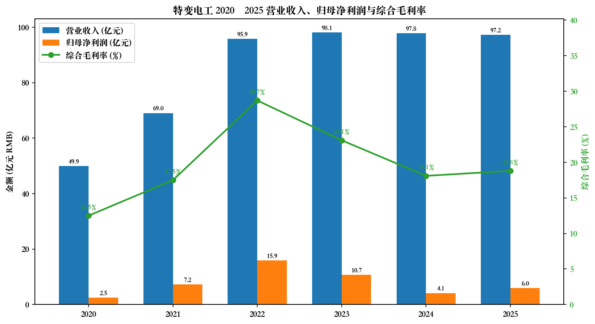
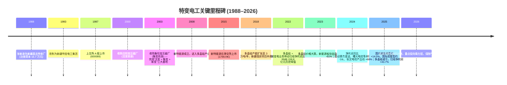
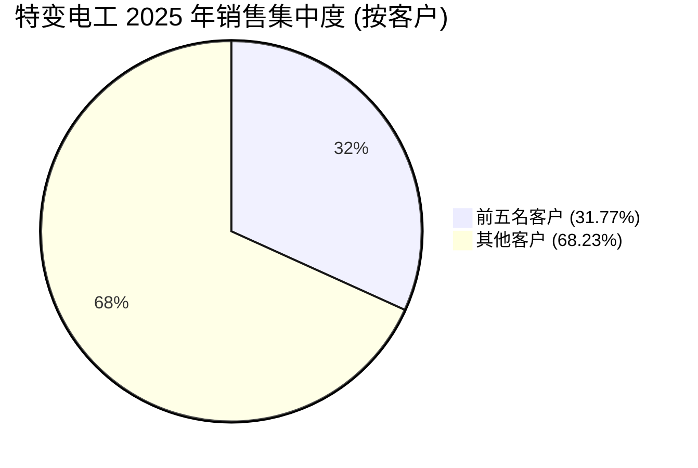
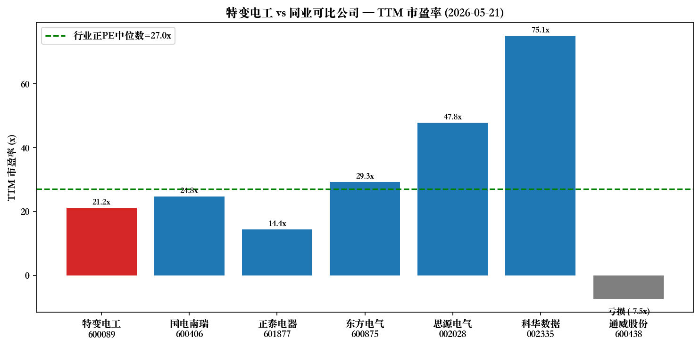
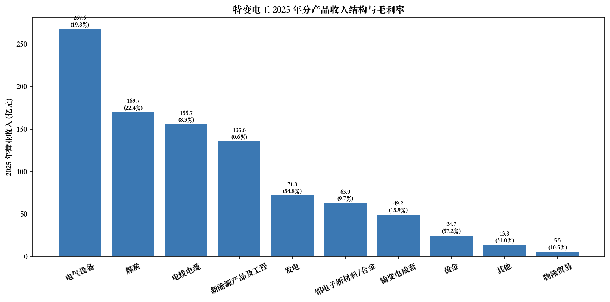
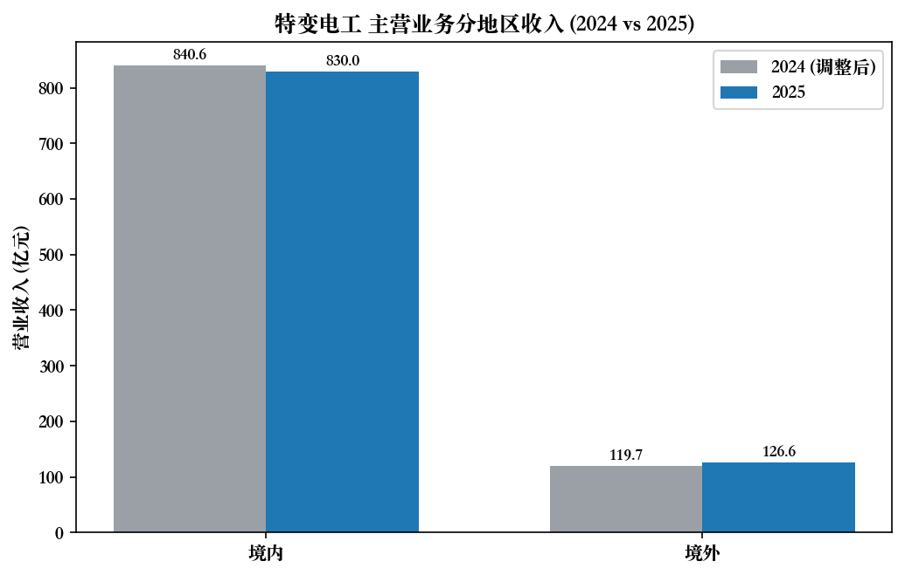

# 特变电工股份有限公司 (SSE:600089) 公司研究报告

**报告日期**：2026-05-20
**研究对象**：特变电工股份有限公司 (TBEA Co., Ltd.)
**股票代码**：上海证券交易所 600089
**主要业务**：输变电高端装备 (变压器、电抗器、电缆、套管、开关、换流阀)、高纯多晶硅 (polysilicon)、新能源电站建设与运营、煤炭与火电、铝电子新材料 (高纯铝 / 电子铝箔 / 电极箔)

---

## 目录

1. 公司概览 (Company Overview)
2. 公司历史 (Company History)
3. 管理团队 (Management Team)
4. 产品与服务 (Products & Services)
5. 客户与上市策略 (Customers & GTM)
6. 行业概览 (Industry Overview)
7. 竞争格局 (Competitive Landscape)
8. 市场机会 / TAM (Market Opportunity)
9. 风险评估 (Risk Assessment)
10. 参考资料 (References)

---

## 1. 公司概览 (Company Overview)

特变电工股份有限公司 (TBEA Co., Ltd.，下称"公司"或"特变电工") 是中国输变电高端装备领域的龙头企业，也是国内极少数同时具备 "输变电 + 新能源 + 能源 + 新材料" 四大产业战略协同布局的多元化重型工业集团。公司总部位于新疆昌吉，A 股代码 SSE:600089，旗下控股的新特能源 (1799.HK) 是国内多晶硅 (polysilicon) 主要生产商之一，曾为 A 股上市的新疆众和已于 2024 年从公司财报合并范围中按同一控制下企业合并相关规定追溯调整。公司由实际控制人张新在 1988 年承包当时濒临倒闭的新疆昌吉特种变压器厂 (注册资本 15.7 万元) 启动，经过 30 余年发展，于 1997 年在上交所上市，2025 年营业收入达到 RMB 972.27 亿元，归母净利润 RMB 59.54 亿元 [(2025 年年度报告, 第 8 页)](https://www.sse.com.cn/disclosure/listedinfo/announcement/c/new/2026-04-15/600089_20260415_PNB1.pdf)。

公司的商业模式可以概括为 "四轮驱动 + 上下游一体化"：(1) **输变电高端装备**——以沈变、衡变、新变三大变压器制造基地为核心，是全球变压器、电抗器年产量超 5 亿 kVA、产量稳居行业前三的制造商，是 ABB、西门子的国内对标对手，主要客户为国家电网、南方电网及全球 40 余国的输变电工程业主；(2) **新能源**——通过新特能源 (1799.HK) 经营两个单体 10 万吨/年的多晶硅装置 (合计 ~20 万吨/年的产能)、自主研制 8kW–10000kW 全系列并网逆变器，并自建/运营风电 + 光伏电站 (截至 2025 年末并网运营 4.04 GW)；(3) **能源**——位于新疆准东煤田，核定煤炭产能 7,400 万吨/年，火电装机 5,040 MW (含自备电厂)，是国家 "西电东送" 能源基地之一；(4) **新材料**——以"能源—氧化铝—一次高纯铝—高纯铝/合金产品—电子铝箔—电极箔"循环经济产业链为核心，高纯铝液年产能 7.8 万吨，电子铝箔年产能 3 万吨，是全球较大的高纯铝研发生产基地之一 [(2025 年年度报告, 第 12-29 页)](https://www.sse.com.cn/disclosure/listedinfo/announcement/c/new/2026-04-15/600089_20260415_PNB1.pdf)。

公司 2025 年实现营业收入 RMB 972.27 亿元 (同比 -0.61%)，归母净利润 RMB 59.54 亿元 (同比 +43.69%)，扣非归母净利润 RMB 45.54 亿元 (同比 +15.64%)，加权平均 ROE 8.75% (上年同期 6.45%)，总资产 RMB 2,271.50 亿元，归母净资产 RMB 743.92 亿元，资产负债率 55.60% [(2025 年年度报告, 第 8 页)](https://www.sse.com.cn/disclosure/listedinfo/announcement/c/new/2026-04-15/600089_20260415_PNB1.pdf)。值得注意的是 2025 年净利润同比大幅回升主要并非来自主业现金利润，而是由两项非经常性损益贡献：① 公司参股的华电新能 (600930.SH) 于 2025 年上市，按报告期末收盘价确认公允价值变动收益约 RMB 15.20 亿元；② 控股子公司新特能源全年大幅减亏 (固定资产 + 存货减值损失同比由 -35.60 亿降至 -9.76 亿)。报告期内员工总人数 31,806 人，其中研发人员 3,837 人 (占 12.06%)，硕士及以上 3,220 人 [(2025 年年度报告, 第 38、77 页)](https://www.sse.com.cn/disclosure/listedinfo/announcement/c/new/2026-04-15/600089_20260415_PNB1.pdf)。

**地理布局**：公司在辽宁 (沈变)、湖南 (衡变)、新疆 (新变)、天津、山东 (鲁缆)、四川 (德缆)、江苏 (曙光电缆) 等地建有变压器与电缆制造基地，海外项目覆盖 40 余国，2025 年境外业务收入 RMB 126.62 亿元 (占主营收入约 13.2%) [(2025 年年度报告, 第 33 页)](https://www.sse.com.cn/disclosure/listedinfo/announcement/c/new/2026-04-15/600089_20260415_PNB1.pdf)。报告期内国际成套业务签约 USD 20 亿，同比增长约 68%，截至 2025 年末国际成套在执行未确认收入及待履行合同金额 > USD 50 亿，表明海外订单储备仍处历史高位。

**估值快照 (Valuation Snapshot — 2026-05-21)**

- **现价**：RMB 25.91/股；**当日跌幅** -2.92%；**52 周区间** RMB 24.02–29.36
- **总股本** 5,052,792,571 股；**总市值** RMB 1,309.18 亿元
- **TTM P/E** 21.22×；**P/B** 1.82×；**P/S** ≈ 1.35× (1309.18/972.27)
- 同业可比 P/E (TTM, 2026-05-21)：国电南瑞 (600406) 24.77×、正泰电器 (601877) 14.39×、东方电气 (600875) 29.30×、思源电气 (002028) 47.81×、科华数据 (002335) 75.09×、通威股份 (600438) -7.46× (亏损)；行业正 P/E 中位数约 27×
- 数据来源：[腾讯财经 sh600089 实时行情, 2026-05-21](https://qt.gtimg.cn/q=sh600089)

**估值解读**：21.22× 的 TTM P/E 处于行业正利润可比公司的中下区间，**低于行业正 P/E 中位数 (~27×)**，但需注意公司 2025 年净利润中含 RMB ~14 亿非经常性损益 (主要来自华电新能上市公允价值变动收益)，**扣非 TTM P/E 约 28.7×**，与行业中位数基本持平。我们倾向认为公司当前估值处于"输变电与煤炭板块平价、多晶硅板块隐含为正" 的位置：① 输变电高端装备业务订单饱满 (2025 年国内输变电签约 562 亿元 +14.5%、国际 USD 20 亿 +68%)，可视为 "基本面型" 估值锚；② 多晶硅业务自 2025 年下半年开始减亏 (2025 年三季度后 N 型复投料均价上涨至 5.32 万元/吨，行业 "反内卷" 推动减亏明显，[通威股份 2025Q3 减亏 86.68%](https://www.yicai.com/news/102879608.html)、[大全能源 2025 年净亏损同比收窄 50%+](https://finance.sina.com.cn/jjxw/2026-02-26/doc-inhpemqe1284512.shtml))，但 2025 年仍计提资产减值损失合计 9.76 亿元；③ P/B 1.82× 与同业 (国电南瑞 3.85×、东方电气 2.66×) 相比偏低，反映市场对多晶硅与煤炭板块的资产质量打折 [(2025 年年度报告, 第 8 页)](https://www.sse.com.cn/disclosure/listedinfo/announcement/c/new/2026-04-15/600089_20260415_PNB1.pdf)。**对长期投资者，估值并不昂贵，但需要承担多晶硅产业周期波动的下行风险与煤价波动风险**。



数据来源：[特变电工 2025 年年度报告, 第 8 页](https://www.sse.com.cn/disclosure/listedinfo/announcement/c/new/2026-04-15/600089_20260415_PNB1.pdf)、[2024 年年度报告, 第 8 页](https://www.sse.com.cn/disclosure/listedinfo/announcement/c/new/2025-04-21/600089_20250421_5DRH.pdf)、[2022 年年度报告, 第 7 页](https://static.cninfo.com.cn/finalpage/2023-04-25/1219211560.PDF)。

## 2. 公司历史 (Company History)

特变电工的故事是一段典型的 "民营资本接管国企 → 跨产业整合 → 全球化输变电龙头" 的发展历程。1988 年，时年 26 岁的张新承包了濒临倒闭、注册资本仅 15.7 万元的新疆昌吉特种变压器厂，是当时中国变压器行业最早的承包改革企业之一 ([新华财经/新浪财经：张新"破立有道"建起千亿产业帝国, 2025-09-08](https://finance.sina.com.cn/roll/2025-09-08/doc-infptqvu6469944.shtml))。1993 年，公司以 "特变电工集团" 名称完成公司化改制；1997 年 6 月在上海证券交易所发行 A 股上市 (代码 600089)，募集资金主要用于变压器扩产与技术升级 ([特变电工集团官网 — 公司大事记](https://www.tbea.com/tbea/corpInfo.html))。



**关键战略并购与拐点**：

- **2000–2003 年 "三厂合一"**：公司先后并购沈阳变压器厂 (沈变公司) 与衡阳变压器厂 (衡变公司)。这两家厂当时是国内三大变压器厂中的"东北系"与"中南系"领军企业，但都因为国企体制陷入亏损。整合后，公司形成 "沈变 (东北根据地，高端直流换流变压器)、衡变 (中南根据地，特高压交流变压器)、新变 (新疆基地，干式与配电变压器)" 三角格局，从此奠定全球变压器年产能 5 亿 kVA 以上、稳居全球第一的规模优势 [(2025 年年度报告, 第 27 页)](https://www.sse.com.cn/disclosure/listedinfo/announcement/c/new/2026-04-15/600089_20260415_PNB1.pdf)。
- **2008 年新特能源成立 → 2015 年港交所 IPO**：公司预判光伏产业 "光伏组件成本下降 → 装机爆发" 的长期趋势，自上而下布局上游多晶硅。新特能源 2015 年 12 月在港交所上市 (1799.HK) ([新特能源股份有限公司官网 — 公司简介](https://www.specialenergy.com.cn/))，2018 年完成新疆 3 万吨/年多晶硅装置投产，2023 年完成第二期 10 万吨/年装置投产，跻身全球前五大多晶硅生产商 [(2025 年年度报告, 第 18 页)](https://www.sse.com.cn/disclosure/listedinfo/announcement/c/new/2026-04-15/600089_20260415_PNB1.pdf)。
- **2022 年峰值与多晶硅周期性回调**：受光伏需求 + 多晶硅价格 (一度突破 RMB 30 万/吨) 双高带动，公司 2022 年归母净利润达到 RMB 158.83 亿元的历史峰值 ([2022 年年度报告, 第 7 页](https://static.cninfo.com.cn/finalpage/2023-04-25/1219211560.PDF))。2023–2024 年随着行业产能集中释放，多晶硅价格剧烈下行 (N 型复投料从 2025 年 1 月 RMB 4.15 万元/吨 进一步下跌至 6 月底 RMB 3.44 万元/吨)，2024 年归母净利润 RMB 41.35 亿元 同比 -61.37%，主因多晶硅 + 煤炭销售均价大幅下降 ([新华网：特变电工 2024 年归母净利润下滑 61.37%, 2025-04-22](http://www.news.cn/energy/20250422/877d141c461b4f90ad1f8235b9ebe1e3/c.html))。2025 年下半年多晶硅价格反弹至 RMB 5.39 万元/吨，全年新特能源大幅减亏，公司归母净利润同比反弹 43.7% [(2025 年年度报告, 第 18 页)](https://www.sse.com.cn/disclosure/listedinfo/announcement/c/new/2026-04-15/600089_20260415_PNB1.pdf)。
- **2024–2025 年并购补链**：报告期内公司完成对赛杰爱迪 (江苏，高压电气)、扬州曙光电缆 (核电与轨道交通用高端电缆) 的并购，补强 GIL、核电、轨交、高压电缆产品线，强化 "成套系统集成 + 高端零部件" 的全栈解决方案能力 [(2025 年年度报告, 第 24 页)](https://www.sse.com.cn/disclosure/listedinfo/announcement/c/new/2026-04-15/600089_20260415_PNB1.pdf)。

**近 12 个月发展动态 (2025-05 ~ 2026-04)**：

- 2025 年 8 月 17 日董事会通过《向不特定对象发行可转换公司债券方案》，用于氧化铝项目、煤制气项目、2 GW 新能源风电自营电站等大型项目 [(2025 年年度报告, 第 75 页)](https://www.sse.com.cn/disclosure/listedinfo/announcement/c/new/2026-04-15/600089_20260415_PNB1.pdf)。
- 2025 年 11 月 23 日，原董事兼总经理黄汉杰因工作调动辞职 (改任新特能源董事长 + 新能源公司董事长)；24 日聘任种衍民 (原电装集团董事长、衡变出身) 为公司总经理；12 月 10 日补选其为董事 — 这是 7 年来最重要的人事变动，标志着 "衡变系" 重新走到集团总部前台 ([新浪财经：特变电工 2025 年第十一次临时董事会会议决议公告, 2025-11-25](https://finance.sina.com.cn/roll/2025-11-25/doc-infypsys4719216.shtml))。
- 2025 年下半年公司柔性直流换流阀在国家电网藏粤直流工程送端 + 南方电网藏粤直流工程受端中标，标志公司在特高压柔性直流领域正式实现突破 [(2025 年年度报告, 第 22 页)](https://www.sse.com.cn/disclosure/listedinfo/announcement/c/new/2026-04-15/600089_20260415_PNB1.pdf)。
- 2026 年 Q1 营业收入 RMB 249.46 亿元 (+6.80% YoY)，归母净利润 RMB 18.15 亿元 (+13.40%)，扣非净利润 RMB 14.61 亿元 (-3.77%)，主营业务延续 2025 年下半年的回稳态势 [(2026 年第一季度报告, 第 1 页)](https://www.sse.com.cn/disclosure/listedinfo/announcement/c/new/2026-04-29/600089_20260429_PMP1.pdf)。

## 3. 管理团队 (Management Team)

### 张新 — 董事长，实际控制人

张新先生 (1962 年生，中国国籍)，63 岁，公司创始人、董事长、实际控制人。1988 年承包新疆昌吉特种变压器厂 (注册资本 15.7 万元) 起家，是中国变压器行业最早的民营改革者之一。1993 年完成公司化改造，1997 年带领公司在上交所主板上市。其 30 余年的领导风格表现出两个鲜明特征：第一，**坚持四大产业的多元化协同战略**——这一战略多次被市场质疑 "过于分散"，但 2023–2024 年多晶硅周期下行时，输变电与煤炭业务的利润对冲效应使公司避免了与其他多晶硅纯玩家 (通威、协鑫科技) 同步陷入大幅亏损的命运；2025 年公司 P/E 21.22× 同样反映市场对其"反周期组合" 的认可。第二，**深度国际化导向**——公司海外业务签约规模 2025 年首度达到 USD 20 亿，覆盖 40 余国，国际成套在手未确认收入 + 待履行合同 > USD 50 亿。张新先生兼任 XJZH (新疆众和 600888.SH) 董事、新特能源董事、特变集团董事、第十四届全国人大代表、中华全国工商联副主席、中国机械工业联合会副会长。2024 年 11 月连任公司第十一届董事会董事长 (任期 2024-11-04 至 2027-11-03)。2025 年公司董事长税前薪酬 RMB 515.56 万元，截至期末直接持股 528,324 股 (按现价 RMB 25.91 计市值约 RMB 1,369 万元)，并通过特变集团 + 新疆宏联创业投资有限公司间接持股 (特变集团 11.50% + 宏联创业 6.54% = 合计 18.04%)，是公司绝对实际控制人 [(2025 年年度报告, 第 65–67、100–103 页)](https://www.sse.com.cn/disclosure/listedinfo/announcement/c/new/2026-04-15/600089_20260415_PNB1.pdf)。

### 种衍民 — 董事 + 总经理 (2025 年 11 月新任)

种衍民先生 (1967 年生)，58 岁，2025 年 11 月 24 日由公司董事会聘任为总经理，12 月 10 日由 2025 年第六次临时股东大会补选为董事 ([新浪财经：特变电工 2025 年第十一次临时董事会会议决议公告, 2025-11-25](https://finance.sina.com.cn/roll/2025-11-25/doc-infypsys4719216.shtml))。在出任公司总经理前，种衍民曾长期担任衡变公司董事长、总经理、常务总经理，是衡变公司从 2003 年并入特变电工后的核心运营负责人，参与了衡变从亏损国企转身为公司特高压交流变压器主力基地的全过程。任期内主导衡变公司沙特柔直 ([新浪财经：特变电工为沙特研制的 26 台柔直变压器试验成功, 2025-12-10](https://finance.sina.com.cn/jjxw/2025-12-10/doc-inhafvxt0995104.shtml))、大同—天津南、宁夏—湖南等多个特高压重大项目交付，并被选为第十一届至十四届全国人大代表、湖南省工商联第十三届副主席。2025 年度税前薪酬 RMB 296.88 万元，未直接持股。其上任标志公司管理重心由 "多晶硅 + 新能源" (前任黄汉杰背景为新特能源董事长 + 新能源公司董事长) 重新回归 "输变电高端装备" 主航道 [(2025 年年度报告, 第 65–70 页)](https://www.sse.com.cn/disclosure/listedinfo/announcement/c/new/2026-04-15/600089_20260415_PNB1.pdf)。

### 白云罡 — 总会计师 (CFO 角色)

白云罡先生 (1975 年生)，50 岁，公司总会计师，财务公司董事长。2024 年 11 月连任，任期至 2027 年 11 月。曾任特变电工国际工程有限公司监事会主席，对公司国际业务的财务管理和外汇套保业务有较深参与。2025 年报告期内主导了控股子公司新特能源专项资产减值准备的审议、可转债发行预案的财务测算、以及类 REITs 产品发行 (公司 2025 年筹资活动净流入同比 +196.69%，主要由可转债募集准备 + 类 REITs 发行所致)。2025 年度税前薪酬 RMB 196.42 万元，期末直接持股 683,000 股 (按现价市值约 RMB 1,770 万元) [(2025 年年度报告, 第 65 页)](https://www.sse.com.cn/disclosure/listedinfo/announcement/c/new/2026-04-15/600089_20260415_PNB1.pdf)。

### 胡有成 — 副总经理 / 化工与新材料业务负责人

胡有成先生 (1973 年生)，52 岁，公司副总经理，兼任新疆准能化工有限公司董事、新疆特变电工楼兰新材料技术有限公司董事、新疆特变电工楼兰新能源有限公司董事。其分管的业务横跨能源 (煤化工 / 煤制气) 与新材料 (高纯铝、电子铝箔、电极箔)，是公司"煤—电—硅—铝"循环产业链 (即在新疆准东能源基地利用当地廉价煤电生产高纯铝及多晶硅) 的具体执行者。2025 年度税前薪酬 RMB 282.94 万元，期末直接持股 940,734 股 (按现价市值约 RMB 2,438 万元) [(2025 年年度报告, 第 65 页)](https://www.sse.com.cn/disclosure/listedinfo/announcement/c/new/2026-04-15/600089_20260415_PNB1.pdf)。

### 公司治理 (Corporate Governance)

- **董事会规模**：11 名董事，其中 4 名独立董事 (刘开俊：原国家电网总部企协顾问；邹宝菊：新疆国有资本运营研究中心特聘专家；胡军：清华大学电机系教授；代正华：新疆大学二级教授)。独立董事在审计委员会 4/5、提名委员会 3/5、薪酬考核委员会 3/5、战略与可持续发展委员会 2/7，符合上交所相关治理要求 [(2025 年年度报告, 第 64–71 页)](https://www.sse.com.cn/disclosure/listedinfo/announcement/c/new/2026-04-15/600089_20260415_PNB1.pdf)。
- **股权结构**：第一大股东特变集团持股 11.50%；第二大股东新疆宏联创业投资有限公司持股 6.54% (与特变集团存在关联关系)；二者合计 18.04% [(2025 年年度报告, 第 100–103 页)](https://www.sse.com.cn/disclosure/listedinfo/announcement/c/new/2026-04-15/600089_20260415_PNB1.pdf)。**前两大股东合计低于 20% 的特征使得本公司是 A 股稀缺的 "实控权较弱" 输变电央国企对标对象** — 这是双刃剑：(+) 治理结构清晰、信息披露较国央企更接近民企；(-) 防御性差，理论上可能在未来面临举牌或国资入主可能。
- **关联交易**：2026 年度日常关联交易方案 (与特变集团) 已经独董专门会议审议通过，2025 年前五名供应商采购额中关联方采购占 4.14% (RMB 4.15 亿元 / 占年度采购总额)，金额较低 [(2025 年年度报告, 第 36–37 页)](https://www.sse.com.cn/disclosure/listedinfo/announcement/c/new/2026-04-15/600089_20260415_PNB1.pdf)。
- **股票期权激励**：原 2022 年股票期权激励计划首次授予的股票期权第三个行权期 + 预留股票期权第二个行权期，因行权条件未达成 (主要是 2024 年度归母净利润同比下降所致)，公司于 2025 年 6 月注销 87,684,520 份期权，2022 年期权计划提前结束 [(2025 年年度报告, 第 80–84 页)](https://www.sse.com.cn/disclosure/listedinfo/announcement/c/new/2026-04-15/600089_20260415_PNB1.pdf)。
- **分红政策**：2025 年度拟每 10 股派发现金红利 RMB 3.60 元 (含税)，合计派现 RMB 18.07 亿元，分红率 30.35%；近 3 年累计分红 + 回购 RMB 40.66 亿元，相当于近 3 年年均净利润的 58.62%，分红率与回报承诺合理稳定 ([证券之星：特变电工 2025 年年度利润分配预案公告, 2026-04-15](https://stock.stockstar.com/notice/SN2026041500034850.shtml))。

### 管理团队履历综合评估

公司管理团队呈现 "创业派 + 衡变派 + 准东派" 三方融合的格局：张新作为创始人保持稳定控制权 30 余年；2025 年 11 月种衍民出任总经理标志衡变系 (输变电业务核心) 重新走到台前；胡有成等业务高管深度绑定新疆准东基地的煤—电—铝—硅循环产业链 [(2025 年年度报告, 第 64–71 页)](https://www.sse.com.cn/disclosure/listedinfo/announcement/c/new/2026-04-15/600089_20260415_PNB1.pdf)。**整体看，管理团队的优势在于：(1) 创始人长期稳定的战略定力；(2) 输变电业务的工程师文化与高端制造能力沉淀；(3) 对新疆资源端的深度整合**。短板在于：(1) 高管层 "新疆 / 衡变 / 沈变" 派系特征明显，跨业务条线的协同治理仍需观察；(2) 多晶硅业务连续两年大幅亏损 (2024 年归母净利润 -61.37%)，反映出公司在判断 "周期高点扩产" 与 "需求拐点止损" 的资本配置能力上仍有提升空间 ([新华网：特变电工 2024 年归母净利润下滑 61.37%, 2025-04-22](http://www.news.cn/energy/20250422/877d141c461b4f90ad1f8235b9ebe1e3/c.html))。

## 4. 产品与服务 (Products & Services)

公司的产品组合按四大业务板块组织，形成 "电网设备 (Sell-to-Grid) + 新能源设备 + 大宗能源 + 电子新材料" 的金字塔结构 [(2025 年年度报告, 第 12–17 页)](https://www.sse.com.cn/disclosure/listedinfo/announcement/c/new/2026-04-15/600089_20260415_PNB1.pdf)。

```mermaid
graph TD
    A[特变电工 SSE:600089] --> B[输变电产品与服务<br/>2025 营收 ~RMB 472.5 亿]
    A --> C[新能源产品与工程<br/>2025 营收 RMB 135.6 亿]
    A --> D[能源业务<br/>煤炭 RMB 169.7 亿 + 发电 RMB 71.8 亿]
    A --> E[新材料业务<br/>铝电子/合金 RMB 63.0 亿 + 黄金 24.7 亿]

    B --> B1[变压器/电抗器<br/>±1100kV直流换流变 / 特高压交流]
    B --> B2[电线电缆<br/>750kV以下电力电缆/导线/附件]
    B --> B3[输变电成套工程<br/>40+国家EPC/BOO]
    B --> B4[套管/互感器/开关/二次设备]
    B --> B5[换流阀/SVG/电容器]

    C --> C1[高纯多晶硅<br/>新特能源 ~20万吨/年产能]
    C --> C2[逆变器<br/>8kW–10000kW全系列]
    C --> C3[柔性直流换流阀 (2025年突破)]
    C --> C4[风光电站建设/运营<br/>截至2025末并网4.04GW]

    D --> D1[煤炭<br/>核定产能7400万吨/年, 准东煤田]
    D --> D2[火电<br/>装机5040MW, 含自备]

    E --> E1[高纯铝液 7.8万吨/年]
    E --> E2[电子铝箔 3万吨/年]
    E --> E3[电极箔]
    E --> E4[黄金 (副产)]
```

数据来源：[特变电工 2025 年年度报告, 第 12–17, 32–33 页](https://www.sse.com.cn/disclosure/listedinfo/announcement/c/new/2026-04-15/600089_20260415_PNB1.pdf)。

### 4.1 输变电高端装备 — 公司核心利润来源、绝对竞争优势

**产品矩阵**：变压器 (含±1100kV 特高压直流换流变压器、±800kV 特高压交直流变压器、海上升压站±400kV 三相柔性直流变压器、20Hz 低频海上风电机舱变压器、SFC 静止变频器输入输出变压器)；电抗器 (并联 / 串联 / 滤波)；套管 (±800kV 特高压干式直流套管、1100kV 干式交流套管，**国产化突破产品**)；互感器；开关 (高压开关、GIL 刚性气体绝缘输电线路、126kV 真空开断环保 GIS)；电容器 (含特高压直流输电用交流滤波器电容器组)；电线电缆 (750kV 及以下电力电缆，±535kV 直流电缆已批量应用)；电力二次设备 (智能变电站、配网自动化、继电保护) [(2025 年年度报告, 第 12–17 页)](https://www.sse.com.cn/disclosure/listedinfo/announcement/c/new/2026-04-15/600089_20260415_PNB1.pdf)。

**2025 年财务表现**：电气设备产品收入 RMB 267.60 亿元 (+19.66%)、毛利率 19.81% (+2.23 pp)；电线电缆收入 RMB 155.69 亿元 (-0.78%)、毛利率 8.34%；输变电成套工程收入 RMB 49.25 亿元 (-0.93%)、毛利率 15.90%。三者合计收入 RMB 472.54 亿元，约占主营收入 49.4%。**毛利率提升的关键原因是市场结构调整 + 成本管控，特别是高端产品 (特高压变压器 + GIS) 的占比上升** [(2025 年年度报告, 第 32–34 页)](https://www.sse.com.cn/disclosure/listedinfo/announcement/c/new/2026-04-15/600089_20260415_PNB1.pdf)。

**竞争优势评估**：**强 (Yes)**。护城河类型 = **规模 + 技术专利 + 客户认证 + 制造工艺 know-how**。公司变压器、电抗器年产量超 5 亿 kVA，连续多年稳居全球第一；承担了我国多项国家首台首套特高压变压器研制任务；截至 2025 年末公司有效授权专利 3,322 项 (其中发明专利 1,021 项)；2025 年新增授权专利 534 项 (发明专利 155 项)；参与制定 / 修订 16 项国家标准、28 项行业标准、49 项团体标准 [(2025 年年度报告, 第 22–28 页)](https://www.sse.com.cn/disclosure/listedinfo/announcement/c/new/2026-04-15/600089_20260415_PNB1.pdf)。**与最直接对手对比**：(1) 与 ABB / Hitachi Energy、西门子能源的高端变压器产品形成"国产 ~20% 价差 + 同等技术等级"的差异化定位 (Hitachi、Siemens Energy、Toshiba、GE Vernova、Schneider Electric 五巨头 2024 年合计占全球电力变压器市场约 50% — [MarketsandMarkets — Transformer Market Report, 2025](https://www.marketsandmarkets.com/ResearchInsight/transformer-market.asp))；(2) 与中国电气装备集团 (国资委直属央企，原中电气，2024 年占国内输配电及控制设备市场 32% — [东方财富证券研究：电网设备 2 万亿新阶段, 2026-01](https://pdf.dfcfw.com/pdf/H301_AP202601051815159513_1.pdf)) 在国内电网招标中存在直接竞争，但公司在沈变 + 衡变 + 新变 "三角制造" 的规模与产能弹性上仍占优 (变压器领域 CR3 — 特变电工、山东电工、中国西电 — 约 41%)。

### 4.2 新能源 — 高纯多晶硅、逆变器、柔性直流换流阀、电站运营

**产品**：高纯多晶硅 (通过控股子公司新特能源经营，两个 10 万吨/年装置)；逆变器 (8kW–10000kW 全系列并网集中式 + 228kW、330kW 组串式)；储能系统 (电网侧 / 电源侧 / 共享储能)；SVG；柔性直流换流阀；风光电站 EPC 与 BOO 业务 (截至 2025 年末运营装机 4.04 GW，2025 年完成确认收入项目装机 2.74 GW，自营电站发电量 88.04 亿 kWh) [(2025 年年度报告, 第 18–22 页)](https://www.sse.com.cn/disclosure/listedinfo/announcement/c/new/2026-04-15/600089_20260415_PNB1.pdf)。

**2025 年财务表现**：新能源产品及工程收入 RMB 135.55 亿元 (-26.85%)，毛利率 0.59% (-0.83 pp)，是公司利润下滑最严重的板块。**主因**：多晶硅价格全年承压下行 (N 型复投料从 2025 年 1 月 4.15 万元/吨跌至 6 月底 3.44 万元/吨)、销售均价同比下降；新特能源全年多晶硅产量 13.19 万吨 (按行业统计 -28.4% 同比，公司因主动控产降低产量) [(2025 年年度报告, 第 18, 32 页)](https://www.sse.com.cn/disclosure/listedinfo/announcement/c/new/2026-04-15/600089_20260415_PNB1.pdf)。

**竞争优势评估**：**部分 (Partial)**。多晶硅业务的护城河类型 = **成本 (新疆煤电一体化提供低成本电力) + 工艺成熟度 (第八代多晶硅智能智造生产技术)**，但行业整体处于产能过剩 + 价格底部，毛利率被压平 — 2024 年大全能源 (688303) 毛利率为 -20.7%、亏损 27.18 亿元 ([21 经济网：大全能源 2024 年亏损 27 亿元, 2025-03-20](https://www.21jingji.com/article/20250320/herald/7ad12df725b414d0224d9ba0d81dfb65.html))；协鑫科技 (3800.HK) 2024 年净亏损 47.5 亿元 ([新浪财经：协鑫科技 2024 年报点评, 颗粒硅市占率超 25%](https://gmg.9fzt.com/report/HKSE/03800/797521997573.html))。逆变器 + 柔性直流业务的护城河类型 = **技术专利 + 客户认证**。柔性直流换流阀 2025 年中标国网藏粤工程送端 + 南网藏粤工程受端，是公司在该细分市场首次实现规模化突破，与许继电气、国电南瑞、中国电气装备形成竞争格局 (2022–2025 特高压换流阀累计招标 174 亿元，国电南瑞 / 许继电气 / 中国西电 中标份额 47% / 20% / 17% — [东方财富证券研究：电网设备 2 万亿新阶段, 2026-01](https://pdf.dfcfw.com/pdf/H301_AP202601051815159513_1.pdf))。

### 4.3 能源 — 煤炭 + 火电 + 黄金

**产品**：动力煤 (准东煤田南矿 / 将一矿 / 将二矿，核定产能合计 7,400 万吨/年)；火电 (运营装机 4,040 MW 不含自备电厂，含昌吉 2×350 MW、准东北一 2×660 MW "疆电外送"、巴州 2×350 MW、准东 2×660 MW)；黄金 (副产 — 子公司广西宏泰) [(2025 年年度报告, 第 20–23 页)](https://www.sse.com.cn/disclosure/listedinfo/announcement/c/new/2026-04-15/600089_20260415_PNB1.pdf)。

**2025 年财务表现**：煤炭产品收入 RMB 169.66 亿元 (-11.93%)、毛利率 22.39% (-10.03 pp，**降幅最大**)；发电业务收入 RMB 71.83 亿元 (+28.20%)、毛利率 54.75% (+0.07 pp)；黄金收入 RMB 24.69 亿元 (+106.86%)、毛利率 57.23% (+3.53 pp)。煤炭销售均价同比大幅下降是煤炭板块毛利率压缩的主因 [(2025 年年度报告, 第 33 页)](https://www.sse.com.cn/disclosure/listedinfo/announcement/c/new/2026-04-15/600089_20260415_PNB1.pdf)。

**竞争优势评估**：**部分 (Partial)**。煤炭业务护城河 = **资源禀赋 + 区位优势 (准东煤田薄煤层、低剥采比、近距离铁路出疆通道) + 智能化矿山 (国家首批智能化示范煤矿、无人驾驶矿卡 586 辆)** [(2025 年年度报告, 第 20–21 页)](https://www.sse.com.cn/disclosure/listedinfo/announcement/c/new/2026-04-15/600089_20260415_PNB1.pdf)。然而，煤炭作为大宗商品，其价格周期决定了毛利率的剧烈波动；近 3 年公司煤炭板块毛利率经历了 2022 年 ~40% → 2023 年 ~35% → 2024 年 ~32% → 2025 年 22.4% 的连续下滑。火电业务的护城河相对较弱 — 在新能源装机超过火电的大背景下 (2025 年全国清洁能源发电量占规上发电量 35.2%，同比 +2.1 pp — [国家统计局：2025 年 12 月能源生产情况, 2026-01-19](https://www.stats.gov.cn/sj/zxfbhjd/202601/t20260119_1962322.html))，火电机组发电小时数 2025 年降至 3,845.7 小时 (公司口径)，主要靠深度调峰辅助服务收益维持。

### 4.4 新材料 — 高纯铝 / 电子铝箔 / 电极箔

**产品**：高纯铝 (4N5–5N 级，部分产品达 6N) 7.8 万吨/年产能；电子铝箔 3 万吨/年；电极箔；铝合金制品。"能源—氧化铝—一次高纯铝—高纯铝/合金产品—电子铝箔—电极箔" 是国内少数完整的电子新材料循环产业链 [(2025 年年度报告, 第 23 页)](https://www.sse.com.cn/disclosure/listedinfo/announcement/c/new/2026-04-15/600089_20260415_PNB1.pdf)。

**2025 年财务表现**：铝电子新材料 + 铝及合金制品收入 RMB 63.03 亿元 (+12.44%)、毛利率 9.66% (-1.95 pp)。高纯铝销量 5.53 万吨；电子铝箔 2.26 万吨；化成箔 1,910.56 万平方米；合金产品 15.34 万吨；铝制品 3.89 万吨 [(2025 年年度报告, 第 23, 32–34 页)](https://www.sse.com.cn/disclosure/listedinfo/announcement/c/new/2026-04-15/600089_20260415_PNB1.pdf)。

**竞争优势评估**：**部分 (Partial)**。护城河类型 = **垂直一体化成本优势 + 工艺技术**。新材料板块的毛利率受电子铝箔、电极箔同业竞争加剧 (广东东阳光、南通海星电子、广东华锋) 的影响有所下降，但 12.44% 的收入增速反映了公司在新能源汽车 + 半导体设备超高纯铝合金腔体等高端需求侧的份额扩张 (2025 年全国新能源汽车产销量分别 1,662.6 万辆 / 1,649 万辆，同比 +29% / +28.2% — [新华网：2025 年我国新能源汽车产销量双超 1600 万辆, 2026-01-14](https://www.news.cn/fortune/20260114/cbbd861081c349d8ae238167ca418fa3/c.html))。

### 4.5 旗舰产品与新发布

**1–3 个旗舰产品**：①特高压变压器与换流变压器 (公司利润现金牛，与 ABB / 西门子 / 中国电气装备直接竞争)；②高纯多晶硅 (新特能源)，2025 年虽承压但是国家硅基新能源产业链的战略环节；③国际成套工程 (40+ 国的 EPC / BOO 集成能力) [(2025 年年度报告, 第 22 页)](https://www.sse.com.cn/disclosure/listedinfo/announcement/c/new/2026-04-15/600089_20260415_PNB1.pdf)。

**报告期内主要新发布**：① 行业首台 500 kV 植物油变压器投运 (绿色绝缘油替代矿物油)；② 发电机出口侧断路器及系列成套开关；③ ±550 kV 高压直流 GIS；④ ±50 kV / 200 MW 模块化换向式变换器 (MCC) 首套发运；⑤ HCC 混合换流阀通过第三方型式试验验证；⑥ 6.5 kV / 4 kA IGCT 功率器件的高压大容量柔性直流换流阀通过鉴定，达到国际领先水平；⑦ 100 kA 三层电解提纯 5 N 高纯铝技术；⑧ 完成赛杰爱迪 (高压电气)、扬州曙光电缆 (核电与轨道交通用电缆) 并购 [(2025 年年度报告, 第 23–27 页)](https://www.sse.com.cn/disclosure/listedinfo/announcement/c/new/2026-04-15/600089_20260415_PNB1.pdf)。

## 5. 客户与上市策略 (Customers & Go-to-Market)

### 5.1 客户细分与集中度

公司主要客户分为四类：(1) **国家电网、南方电网及五大发电集团** (输变电业务核心客户)；(2) **海外业主与 EPC 承包商** (40+ 国家的电网公司、能源部、大型工程承包商)；(3) **光伏 / 风电组件厂与电池厂** (多晶硅业务下游)；(4) **铝电解电容器厂、新能源汽车 OEM、半导体设备制造商** (新材料业务下游)；以及 (5) 自有客户：**煤炭 (中国华电、国家能源集团、新疆本地火电厂)、火电终端用户** 等 [(2025 年年度报告, 第 22, 36 页)](https://www.sse.com.cn/disclosure/listedinfo/announcement/c/new/2026-04-15/600089_20260415_PNB1.pdf)。

**客户集中度 (2025 年披露)**：

- **前五名客户合计销售额 RMB 308.85 亿元，占年度销售总额 31.77%**；其中前五名客户中关联方销售额 0 元；
- 前五名供应商采购额 RMB 222.00 亿元，占年度采购总额 22.15%；其中关联方采购额 RMB 4.15 亿元 (4.14%)；
- 报告期内不存在向单个客户销售比例超过 50%、或前 5 名客户中存在严重依赖单一客户的情形；
- 公司未在 2025 年年度报告中披露单个客户的具体名称及销售金额 [(2025 年年度报告, 第 36 页)](https://www.sse.com.cn/disclosure/listedinfo/announcement/c/new/2026-04-15/600089_20260415_PNB1.pdf)。



数据来源：[特变电工 2025 年年度报告, 第 36 页](https://www.sse.com.cn/disclosure/listedinfo/announcement/c/new/2026-04-15/600089_20260415_PNB1.pdf)。

**集中度评估**：前五名客户合计 31.77% **属于行业中位水平 — 不构成集中度风险** [(2025 年年度报告, 第 36 页)](https://www.sse.com.cn/disclosure/listedinfo/announcement/c/new/2026-04-15/600089_20260415_PNB1.pdf)。考虑公司业务涵盖输变电 (主要 To-Grid)、煤炭 (To-火电厂)、多晶硅 (To-光伏组件厂)、铝箔 (To-电容器厂) 四大客户群完全不同的产业链下游，集中度被天然摊薄。这是公司四产业协同战略带来的间接收益之一。

### 5.2 销售渠道与商业模式

- **销售模式**：直销，2025 年直销收入 RMB 956.59 亿元，占主营 99.4% [(2025 年年度报告, 第 32 页)](https://www.sse.com.cn/disclosure/listedinfo/announcement/c/new/2026-04-15/600089_20260415_PNB1.pdf)。
- **国内市场**：核心客户 = 国家电网、南方电网、五大发电集团。销售方式：①参与电网公司年度集中招标；②参与发电集团 (火电、新能源) 项目级招标；③参与"沙戈荒"大基地等专项工程 ([新华网：我国首个"沙戈荒"新能源外送基地首批机组投产发电, 2025-06-13](http://www.news.cn/fortune/20250613/4db8e5648dc846e8a402850c7790f08e/c.html))；④ "数据中心" 等新兴增量市场的项目级签约。**2025 年公司国内输变电签约 RMB 562 亿元 (+14.47%)** — 是十年来最强签约年度 [(2025 年年度报告, 第 22 页)](https://www.sse.com.cn/disclosure/listedinfo/announcement/c/new/2026-04-15/600089_20260415_PNB1.pdf)。
- **国际市场**：**国际成套业务模式 = EPC + BT + BOO + 系统集成。2025 年国际市场产品实现签约 USD 20 亿，同比 +68%；国际成套项目在执行未确认收入 + 待履行合同金额 > USD 50 亿。** 公司已为全球 40+ 国家提供从勘测、设计、施工、安装、调试到运营维护的一体化交钥匙工程。重点市场：中亚 (吉尔吉斯斯坦、塔吉克斯坦)、中东 (沙特特高压直流换流变项目 — 2025 年沙特柔直项目特高压产品一次试验合格)、非洲、东南亚 [(2025 年年度报告, 第 22 页)](https://www.sse.com.cn/disclosure/listedinfo/announcement/c/new/2026-04-15/600089_20260415_PNB1.pdf)。
- **销售周期**：变压器 + 换流变压器 的项目周期通常为 6–18 个月 (从中标到交付)。国际成套工程的项目周期通常为 24–48 个月 [(2025 年年度报告, 第 22 页)](https://www.sse.com.cn/disclosure/listedinfo/announcement/c/new/2026-04-15/600089_20260415_PNB1.pdf)。
- **合同结构**：以"项目级合同 (PO-by-PO)"为主，部分大客户 (国网、南网) 签订年度框架协议 [(2025 年年度报告, 第 22 页)](https://www.sse.com.cn/disclosure/listedinfo/announcement/c/new/2026-04-15/600089_20260415_PNB1.pdf)。
- **应收账款管理**：2025 年信用减值损失 RMB -12.00 亿元 (按账龄组合计提应收账款坏账准备增加)，相比 2024 年的 -5,422 万元有明显恶化，反映海内外应收账款压力上升，需要持续关注 [(2025 年年度报告, 第 38 页)](https://www.sse.com.cn/disclosure/listedinfo/announcement/c/new/2026-04-15/600089_20260415_PNB1.pdf)。

### 5.3 重要客户 (公开披露 / 项目级)

公司在 2025 年年度报告中未具体披露客户名称，但通过项目级公告可识别如下重要订单：① 国家电网藏粤直流工程送端 — 柔性直流换流阀；② 南方电网藏粤直流工程受端 — 柔性直流换流阀；③ 沙特柔直 — 特高压换流变压器；④ 大同-天津南 — 特高压交流变压器；⑤ 青藏直流二期扩建 — 特高压；⑥ 宁夏-湖南直流外送 — 特高压；⑦ 与华电新能 (600930.SH) 的战略协同 (公司参股) [(2025 年年度报告, 第 22, 25 页)](https://www.sse.com.cn/disclosure/listedinfo/announcement/c/new/2026-04-15/600089_20260415_PNB1.pdf)。

## 6. 行业概览 (Industry Overview)

### 6.1 输变电行业 — 行业向上的"超级周期" 起点

**行业定义**：电力设备制造业 (变压器、电抗器、套管、互感器、开关、电缆、电力二次设备)，国家统计局 GB/T 4754-2017 NAICS 行业归类 = 3823 (输配电及控制设备制造) [(中电联：2025 年我国电网工程建设完成投资 6395 亿元 同比增长 5.1%, 2026-02-03](https://www.chinanews.com.cn/cj/2026/02-03/10564634.shtml))。

**市场规模与增速**：2025 年全国电网工程建设完成投资 RMB 6,395 亿元 (+5.1% YoY)，**直流工程投资 +25.7%、交流工程投资 +4.7%**；截至 2025 年末全国全口径发电装机容量 38.9 亿千瓦 (+16.1%)；全年跨区输送电量 9,984 亿 kWh (+7.9%)；跨省输送电量 21,237 亿 kWh (+6.3%) [(中电联《2025-2026 年度全国电力供需形势分析预测报告》，2025 年年度报告援引, 第 17 页)](https://www.sse.com.cn/disclosure/listedinfo/announcement/c/new/2026-04-15/600089_20260415_PNB1.pdf)。

**关键趋势**：(1) **"双碳" + 新型电力系统**催生特高压骨干网建设、跨区跨省外送通道扩张；(2) **"沙戈荒" 大基地配套项目密集启动** — 风光大基地需要超长距离 (1,500+ km) 特高压直流外送，是变压器 + 换流阀 + GIS 的核心增量市场，截至 2025 年首条沙戈荒外送特高压 (宁夏—湖南 ±800kV) 投产 ([国务院国资委：我国首个"沙戈荒"新能源外送基地首批机组投产发电](http://www.sasac.gov.cn/n2588025/n2588124/c33740277/content.html))；(3) **数据中心 + AI 算力 用电激增** — 新型工业用电倒逼区域电网配电网升级；(4) **欧盟《欧洲电网一揽子计划》 (2025 年 12 月)** 提出 2024–2040 年期间 1.2 万亿欧元电网投资规划 — 为全球电网现代化升级注入巨大动能，国内输变电出口订单受益显著 ([Euronews — European Commission to unveil €1.2 trillion plan to upgrade the EU's electric grids, 2025-12-08](https://www.euronews.com/my-europe/2025/12/08/european-commission-to-unveil-12-trillion-plan-to-upgrade-the-eus-electric-grids-leak-show); [European Commission — European Grids Package](https://energy.ec.europa.eu/topics/infrastructure/european-grids_en))。

**监管环境**：(1) 2025 年发布的《电力中长期市场基本规则》(发改能源规〔2025〕1656 号，2026 年 3 月 1 日施行) — 从制度层面规范电力中长期市场交易行为 ([国家发改委 / 国家能源局：《电力中长期市场基本规则》通知, 2025-12-26](https://www.ndrc.gov.cn/xxgk/zcfb/ghxwj/202512/t20251226_1402666.html))；(2) 2030 年初步建成 "以主干电网和配电网为重要基础、以智能微电网为补充" 的新型电网；(3) 跨省跨区输电通道规划建设有序推进 ([中电联：2025 年我国电网工程建设完成投资 6395 亿元 同比增长 5.1%, 2026-02-03](https://www.chinanews.com.cn/cj/2026/02-03/10564634.shtml))。

### 6.2 多晶硅行业 — 周期底部 + 反内卷出清进行时

**市场规模**：2025 年中国多晶硅全年产量 131.9 万吨 (-28.4% YoY，**全行业大幅减产**)，主因光伏产业链供需失衡及反内卷措施博弈。N 型复投料价格：2025 年 1 月初 RMB 4.15 万元/吨 → 6 月底 RMB 3.44 万元/吨 → 12 月底 RMB 5.39 万元/吨 [(中国有色金属工业协会硅业分会, 2025 年年度报告援引, 第 18 页)](https://www.sse.com.cn/disclosure/listedinfo/announcement/c/new/2026-04-15/600089_20260415_PNB1.pdf)。

**关键趋势**：(1) 光伏装机维持高位 — 2025 年新增光伏装机约 3.17 亿千瓦 (+14%)，全国光伏发电累计装机达 12 亿千瓦 ([国家能源局：2025 年可再生能源并网运行情况, 2026-02-12](https://www.nea.gov.cn/20260212/742b8c6a078347b0b39de676c05c5d58/c.html))；(2) 风电新增装机 1.2 亿千瓦 (+51%)，累计 6.4 亿千瓦；(3) 多晶硅价格已进入底部反弹通道 (2025 年三季度 N 型复投料均价同比 +55%)，但 2026 年是否构成 V 型反转仍取决于产业反内卷政策与海外出口 ([新浪财经：11-12 月多晶硅头部大减产！供需关系会否逆转？, 2025-12-05](https://finance.sina.com.cn/money/future/fmnews/2025-12-05/doc-infztuaa8367661.shtml))；(4) **行业从"规模扩张"转向"质量提升"**。

### 6.3 煤炭与火电 — 能源安全压舱石 + 调节器定位

**市场规模**：2025 年全国规模以上工业原煤产量 48.3 亿吨 (+1.2%)，进口煤炭 4.9 亿吨 (-9.6%)；规模以上工业发电量 97,159 亿 kWh (+2.2%)；新疆煤炭原煤产量 5.53 亿吨 (+1.9%)；新疆火电装机 8,327 万千瓦，规模以上工业企业火力发电量 3,944.9 亿 kWh (+1.6%) [(国家统计局、海关总署、中电联数据，2025 年年度报告援引, 第 20 页)](https://www.sse.com.cn/disclosure/listedinfo/announcement/c/new/2026-04-15/600089_20260415_PNB1.pdf)。

**关键趋势**：(1) 火电定位由 "主力军" 转向 "调节器" — 2025 年全国清洁能源发电占规上工业发电量 35.2%、同比 +2.1 pp，风电光伏装机首次超过火电装机 ([国家统计局：胡汉舟解读 — 能源供应保障有力 绿色转型加速推进, 2026-01-19](https://www.stats.gov.cn/sj/sjjd/202601/t20260119_1962334.html))；(2) 2025 年全国 6,000 kW 及以上电厂发电设备利用小时 3,119 小时 (-312 小时)；(3) 煤电深度调峰辅助服务收入成为火电板块新的盈利来源；(4) 新疆作为"西电东送"基地，煤炭出疆铁路运力 + 火电外送通道仍是结构性增量 [(2025 年年度报告, 第 20 页)](https://www.sse.com.cn/disclosure/listedinfo/announcement/c/new/2026-04-15/600089_20260415_PNB1.pdf)。

### 6.4 铝电子新材料行业

**市场规模**：受新能源汽车 + 半导体 + 消费电子等高端制造需求拉动，电子铝箔与电极箔需求增长稳健。2025 年中国新能源汽车产销量 1,662.6 万辆 / 1,649 万辆 (+29% / +28.2%)；充电基础设施 2,009.2 万个 (+49.7%)；铝电解电容器用铝箔材料需求随之扩张；铝冶炼行业自 2025 年起被纳入全国碳排放权交易市场 — 推动行业向 "低碳竞争力" 转变。**特斯拉一体化压铸技术使车用铝合金用量提升 40%；C919 机身铝合金占比 65%，带动国产化率突破 85%** [(2025 年年度报告援引《铝产业高质量发展实施方案 (2025-2027)》, 第 21 页)](https://www.sse.com.cn/disclosure/listedinfo/announcement/c/new/2026-04-15/600089_20260415_PNB1.pdf)。

### 6.5 行业结构与供需关系

| 板块 | 行业结构 | 供应商议价能力 | 客户议价能力 | 替代品威胁 | 进入壁垒 |
|---|---|---|---|---|---|
| 输变电 | 寡占 (国内 5–7 家主力) | 中 (原材料：取向硅钢、铜) | 高 (国网/南网两家垄断采购) | 低 | **极高** (资质 + 工艺) |
| 多晶硅 | 寡占 → 出清中 | 中 (工业硅) | 中 (光伏组件厂) | 高 (颗粒硅 / 钙钛矿) | 高 (重资产) |
| 煤炭 | 区域寡占 | 低 | 中 (火电厂) | 中 (新能源替代) | 极高 (资源 + 矿权) |
| 火电 | 区域寡占 | 中 (煤炭) | 高 (电网) | 高 (风光) | 极高 (审批) |
| 铝电子新材料 | 寡占 | 中 (氧化铝、电力) | 中 (电容器厂) | 中 (薄膜电容、固态电容) | 高 (工艺) |

## 7. 竞争格局 (Competitive Landscape)

公司 2025 年年度报告披露其在各业务板块的主要竞争对手如下 [(2025 年年度报告, 第 28–31 页)](https://www.sse.com.cn/disclosure/listedinfo/announcement/c/new/2026-04-15/600089_20260415_PNB1.pdf)：

### 7.1 输变电板块

- **中国电气装备集团有限公司** (国资委直属央企，下辖原平高、许继、山东电工、上海电气输配电等，2024 年国内输配电及控制设备市场份额 32%)：综合规模国内第一，与公司在国家电网招标中直接竞争 ([东方财富证券研究：电网设备 2 万亿新阶段, 2026-01](https://pdf.dfcfw.com/pdf/H301_AP202601051815159513_1.pdf))；
- **ABB / Hitachi Energy** (瑞士 Hitachi Energy 旗下)、**西门子能源 (Siemens Energy)**：全球高端变压器与换流变压器主力对手，技术领先，但价格通常较国产对手高 20–30% (五巨头 2024 年合计占全球电力变压器市场约 50% — [MarketsandMarkets — Transformer Market Report, 2025](https://www.marketsandmarkets.com/ResearchInsight/transformer-market.asp))；
- **线缆领域**：江苏上上电缆集团、远东智慧能源 (600869.SH)、宝胜科技创新 (600973.SH)、青岛汉缆 (002498.SZ)；
- **细分领域**：思源电气 (002028.SZ — 高压开关、变压器)、正泰电器 (601877.SH — 中低压电器与新能源)、国电南瑞 (600406.SH — 电力二次设备，特高压换流阀招标份额 47%)、东方电气 (600875.SH — 重型电力设备) ([东方财富证券研究：电网设备 2 万亿新阶段, 2026-01](https://pdf.dfcfw.com/pdf/H301_AP202601051815159513_1.pdf))。

### 7.2 新能源 (多晶硅) 板块

- **通威股份 (600438.SH)**：2025 年 P/E (TTM) -7.46×，处于亏损状态 — 通威 2025 年全年预亏 90–100 亿元，是公司最直接的多晶硅纯玩家对手 ([一财网：通威股份前三季度净亏损 52.7 亿元, 2025-10-24](https://www.yicai.com/news/102879608.html))；
- **协鑫科技控股 (3800.HK)**：颗粒硅工艺路线，2024 年市占率超 25%、净亏损 47.5 亿元 ([9 方智投：协鑫科技 (3800.HK) 2024 年报点评](https://gmg.9fzt.com/report/HKSE/03800/797521997573.html))；
- **大全能源 (688303.SH)**、**亚洲硅业、东方希望**：其他主要生产商，大全能源 2024 年毛利率 -20.7%、亏损 27.18 亿元，2025 年净亏损 11.29 亿元同比收窄超五成 ([新浪财经：大全能源 2025 年净亏损 11.29 亿元, 2026-02-26](https://finance.sina.com.cn/jjxw/2026-02-26/doc-inhpemqe1284512.shtml))；
- **逆变器领域**：阳光电源 (300274.SZ)、华为数字能源、上能电气 (300827.SZ)、科华数据 (002335.SZ — P/E 75.09×)、固德威等。

### 7.3 风光电站建设与运营

- **建设端**：中国电力建设集团 (中国电建 601669.SH)、中国能源建设 (3996.HK / 601868.SH)、浙江正泰新能源开发；
- **运营端**：中国三峡新能源 (600905.SH)、协合新能源集团 (0182.HK)、金风科技 (002202.SZ)；
- 公司参股的 **华电新能 (600930.SH)** 于 2025 年 7 月上市，是公司在风光运营领域的重要财务投资 + 战略协同对象 ([上交所 — 华电新能 600930 公司信息披露页](https://www.sse.com.cn/assortment/stock/list/info/company/index.shtml?COMPANY_CODE=600930&FULLNAME=%E5%8D%8E%E7%94%B5%E6%96%B0%E8%83%BD%E6%BA%90%E9%9B%86%E5%9B%A2%E8%82%A1%E4%BB%BD%E6%9C%89%E9%99%90%E5%85%AC%E5%8F%B8))。

### 7.4 煤炭与火电

- **新疆区域**：国家能源集团新疆矿业 (央企)、新疆宜化矿业；
- **火电**：五彩湾北一发电、华电新疆昌吉分公司 [(2025 年年度报告, 第 30–31 页)](https://www.sse.com.cn/disclosure/listedinfo/announcement/c/new/2026-04-15/600089_20260415_PNB1.pdf)。

### 7.5 新材料

- **高纯铝**：包头铝业；
- **电子铝箔**：广东东阳光科技 (600673.SH)；
- **电极箔**：广东东阳光、南通海星电子、广东华锋新能源 [(2025 年年度报告, 第 31 页)](https://www.sse.com.cn/disclosure/listedinfo/announcement/c/new/2026-04-15/600089_20260415_PNB1.pdf)。



数据来源：[腾讯财经 sh600089 实时行情, 2026-05-21](https://qt.gtimg.cn/q=sh600089) 及各股票同源 API。

### 7.6 公司竞争优势

(1) **多产业协同对冲周期**：输变电稳定 + 多晶硅周期 + 煤炭周期 + 新材料结构性增长 — 不同业务的周期错配使 EBIT 波动相对单一业务公司更平滑；(2) **输变电规模 + 工艺 know-how**：5 亿 kVA/年变压器产量稳居全球第一，3,322 项有效专利，行业首台首套研制能力；(3) **新疆基地的能源—化工—电池一体化协同**：煤电—多晶硅—高纯铝的产业循环成本优势；(4) **国际化能力**：40+ 国家的 EPC 经验、2025 年国际签约 +68% (含沙特 164 亿元变压器框架合同 + Namria 13.6 亿元 EPC — [阿中产业研究院：特变电工连中沙特双标](https://www.aciep.net/blog/archives/7004))；(5) **较强的研发投入**：2025 年研发费用 RMB 47.85 亿元 (占营收 4.92%)，行业领先 [(2025 年年度报告, 第 22–28 页)](https://www.sse.com.cn/disclosure/listedinfo/announcement/c/new/2026-04-15/600089_20260415_PNB1.pdf)。

### 7.7 公司竞争劣势 / 脆弱性

(1) **多晶硅业务对周期价格的高敏感性** — 2023–2024 年累计减损超 40 亿元 ([新华网：特变电工 2024 年归母净利润下滑 61.37%, 2025-04-22](http://www.news.cn/energy/20250422/877d141c461b4f90ad1f8235b9ebe1e3/c.html))；(2) **煤炭板块毛利率随煤价波动幅度大** — 2025 年毛利率从 ~32% 降至 22.4%；(3) **海外业务汇率敞口** — 2025 年外币报表折算差异对其他综合收益的影响达 RMB 1.77 亿元；(4) **股权激励触发未达成** — 2022 年股票期权计划未达成行权条件，反映高管业绩绑定弱化的潜在治理风险；(5) **新材料业务竞争对手集中且激烈** — 电极箔毛利率持续承压 [(2025 年年度报告, 第 33–34, 80–84 页)](https://www.sse.com.cn/disclosure/listedinfo/announcement/c/new/2026-04-15/600089_20260415_PNB1.pdf)。



数据来源：[特变电工 2025 年年度报告, 第 32–34 页](https://www.sse.com.cn/disclosure/listedinfo/announcement/c/new/2026-04-15/600089_20260415_PNB1.pdf)。



数据来源：[特变电工 2025 年年度报告, 第 33 页](https://www.sse.com.cn/disclosure/listedinfo/announcement/c/new/2026-04-15/600089_20260415_PNB1.pdf)。

## 8. 市场机会 / TAM (Market Opportunity)

### 8.1 全球输变电 TAM 估算

**TAM 估算方法**：自下而上以"国内 + 海外两端" 测算：

- **国内输变电 TAM (2025–2030)**：国家电网与南方电网年度电网投资合计 RMB 6,395 亿元 (2025) ([中电联：2025 年我国电网工程建设完成投资 6395 亿元 同比增长 5.1%, 2026-02-03](https://www.chinanews.com.cn/cj/2026/02-03/10564634.shtml))。其中变压器、换流阀、GIS、电缆等设备类支出约占 35–40%，即 **RMB 2,240–2,560 亿元/年**。按 2030 年达 RMB 8,000 亿元的电网投资峰值估算 (假设设备占比维持 38%)，**2030 年国内设备 TAM 约 RMB 3,040 亿元**。
- **国际输变电 TAM (2025–2035)**：欧盟《欧洲电网一揽子计划》(2025-12) 提出 2024–2040 年 1.2 万亿欧元投资规划 ([Euronews — European Commission to unveil €1.2 trillion plan to upgrade the EU's electric grids, 2025-12-08](https://www.euronews.com/my-europe/2025/12/08/european-commission-to-unveil-12-trillion-plan-to-upgrade-the-eus-electric-grids-leak-show))，即年均 **EUR ~700 亿/年 (约 RMB 5,500 亿元/年)**；IEA《Electricity Grids and Secure Energy Transitions》提出全球电网年投资需从 USD 3,300 亿增至 2030 年 USD 7,500 亿 ([IEA — Electricity Grids and Secure Energy Transitions Executive Summary](https://www.iea.org/reports/electricity-grids-and-secure-energy-transitions/executive-summary))，加上美国 IRA / IIJA 法案配套的电网投资、中东与亚洲新兴市场，全球 (中国除外) 输变电设备 TAM 保守估算约 **USD 800–1,000 亿/年 (RMB 5,600–7,000 亿元/年)**。
- **国内 + 海外合计 TAM (2025) ≈ RMB 8,000–9,500 亿元/年**。公司输变电业务 2025 年收入 RMB 472.5 亿元，**渗透率约 5–6%** [(2025 年年度报告, 第 32 页)](https://www.sse.com.cn/disclosure/listedinfo/announcement/c/new/2026-04-15/600089_20260415_PNB1.pdf)。
- **SAM (Serviceable Available Market)**：扣除欧美高端市场 (公司技术资质有限制，约占全球 30%)、巴西/印度的本地化要求 (约 15%)，可服务市场约 **TAM × 55% ≈ RMB 4,400–5,200 亿元**。
- **SOM (Serviceable Obtainable Market)**：考虑公司近 3 年国内市场份额 + 海外签约扩张 (2025 国际签约 USD 20 亿，相当于 RMB 144 亿)，预计 2030 年公司输变电收入可达 **RMB 700–900 亿元**，对应 SAM 渗透率提升至 15–17% (建模基础：[2025 年年度报告, 第 22 页](https://www.sse.com.cn/disclosure/listedinfo/announcement/c/new/2026-04-15/600089_20260415_PNB1.pdf) + [IEA 2030 全球电网投资展望](https://www.iea.org/reports/electricity-grids-and-secure-energy-transitions/executive-summary))。

### 8.2 多晶硅 TAM

2025 年全球多晶硅消费量约 130 万吨 (受减产影响)，按 N 型复投料 2025 年均价 RMB 4 万元/吨估算，**多晶硅市场规模约 RMB 520 亿元/年** ([东方财富网：财报解读 — 多家硅料企业 2025 年业绩减亏, 2026-04-22](https://finance.eastmoney.com/a/202604223714280449.html))。受 2025 年价格底部 + 2026 年需求复苏预期影响，2030 年全球多晶硅市场规模可能恢复至 **RMB 1,500–2,000 亿元/年**。**新特能源市场份额约 8–10%** [(2025 年年度报告, 第 18 页)](https://www.sse.com.cn/disclosure/listedinfo/announcement/c/new/2026-04-15/600089_20260415_PNB1.pdf)。

### 8.3 风光电站建设 + 运营 TAM

2025 年全国风电 + 光伏新增装机合计 4.37 亿千瓦 ([国家能源局：2025 年可再生能源并网运行情况, 2026-02-12](https://www.nea.gov.cn/20260212/742b8c6a078347b0b39de676c05c5d58/c.html))，按 EPC 合同单价 RMB 4,000–4,500 元/kW 估算，**风光新增装机的 EPC + 系统集成市场 ≈ RMB 1.75–1.97 万亿元/年**。公司当年完成确认收入的风光建设项目装机 2.74 GW，相当于市场规模 RMB 1,200 亿元 (假设单价 4,300 元/kW)，**公司份额 < 1%**，竞争极度分散，是 TAM 体量大但 SOM 较小的 "海洋" [(2025 年年度报告, 第 18 页)](https://www.sse.com.cn/disclosure/listedinfo/announcement/c/new/2026-04-15/600089_20260415_PNB1.pdf)。

### 8.4 国际成套工程 — 一带一路的电网出海

公司国际成套业务待履行合同 + 在执行未确认收入 > USD 50 亿，按平均 3 年项目周期推算，每年可贡献 USD 15–17 亿确认收入 (相当于 RMB 108–123 亿/年) [(2025 年年度报告, 第 22 页)](https://www.sse.com.cn/disclosure/listedinfo/announcement/c/new/2026-04-15/600089_20260415_PNB1.pdf)。中亚、中东、非洲、东南亚的电网建设需求是结构性增量；公司是国内极少数具备 ±800 kV 特高压交直流换流变压器全套出口能力的企业 — 是 "中国电网出海" 的核心载体之一 (沙特 ±500kV 柔直 26 台换流变 2025 年试验合格、164 亿元变压器 + 反应器框架合同 — [阿中产业研究院：特变电工连中沙特双标](https://www.aciep.net/blog/archives/7004))。

### 8.5 全球电网 TAM 增长曲线

根据 IEA《Electricity Grids and Secure Energy Transitions》数据，全球电网年投资需从 2023 年约 USD 3,300 亿增至 2030 年 USD 7,500 亿，**CAGR ≈ 12%** ([IEA — Electricity Grids and Secure Energy Transitions Executive Summary](https://www.iea.org/reports/electricity-grids-and-secure-energy-transitions/executive-summary))。公司输变电业务有望在该宏观曲线上保持 10–15% 的有机收入增长 — 这一估算的外部基础是 [IEA 2030 投资展望](https://www.iea.org/reports/electricity-grids-and-secure-energy-transitions/executive-summary) + [公司 2025 年国际签约 +68% 的增长趋势](https://www.sse.com.cn/disclosure/listedinfo/announcement/c/new/2026-04-15/600089_20260415_PNB1.pdf)。

## 9. 风险评估 (Risk Assessment)

### 9.1 公司特定风险 (Company-Specific Risks)

1. **多晶硅价格周期波动风险**：公司新能源板块 2025 年毛利率仅 0.59%，新特能源 2023–2024 年累计计提资产 + 存货减值损失超 RMB 35 亿元 [(2025 年年度报告, 第 18, 32–34 页)](https://www.sse.com.cn/disclosure/listedinfo/announcement/c/new/2026-04-15/600089_20260415_PNB1.pdf)。2026 年多晶硅价格能否持续反弹仍存在不确定性 — 若价格再次跌破 RMB 3.5 万元/吨现金成本线，公司新能源板块可能继续大幅亏损 ([新浪财经：11-12 月多晶硅头部大减产, 2025-12-05](https://finance.sina.com.cn/money/future/fmnews/2025-12-05/doc-infztuaa8367661.shtml))。**缓解措施**：公司已主动控产 (2025 年多晶硅产量同比减少)；新特能源采用第八代生产技术，单位成本相对领先；新疆煤电一体化提供低成本电力。

2. **煤炭价格风险**：煤炭销售均价 2025 年同比大幅下降，导致煤炭板块毛利率从 2024 年的 32.4% 降至 22.4% (-10 pp) [(2025 年年度报告, 第 33 页)](https://www.sse.com.cn/disclosure/listedinfo/announcement/c/new/2026-04-15/600089_20260415_PNB1.pdf)。煤炭板块对集团利润贡献度大，毛利率波动对净利润影响显著。**缓解措施**：公司持续优化出疆运输渠道；火电业务通过深度调峰获取辅助服务收益对冲。

3. **股权激励失效与人才挽留风险**：2022 年股票期权激励计划因 2024 年业绩未达成而注销 87,684,520 份期权 (2025 年 6 月)，对中高层管理层、技术骨干的激励约束力下降 [(2025 年年度报告, 第 80–84 页)](https://www.sse.com.cn/disclosure/listedinfo/announcement/c/new/2026-04-15/600089_20260415_PNB1.pdf)。**缓解措施**：公司分红率维持 30%+；2025-2027 年三年股东回报规划已审议通过 ([证券之星：特变电工 2025 年年度利润分配预案公告, 2026-04-15](https://stock.stockstar.com/notice/SN2026041500034850.shtml))。

4. **海外项目执行风险**：公司国际成套业务待履行合同 > USD 50 亿，主要在中亚、中东、非洲市场 [(2025 年年度报告, 第 22 页)](https://www.sse.com.cn/disclosure/listedinfo/announcement/c/new/2026-04-15/600089_20260415_PNB1.pdf)。地缘政治、汇率波动、当地政策变化可能影响项目进度与利润。**缓解措施**：公司有 40+ 国家的项目经验；汇率敞口通过远期外汇合约对冲 ([阿中产业研究院：特变电工连中沙特双标](https://www.aciep.net/blog/archives/7004))。

5. **应收账款管理压力**：2025 年信用减值损失 RMB -12.00 亿元 (按账龄组合计提应收账款坏账准备增加)，同比恶化显著 [(2025 年年度报告, 第 38 页)](https://www.sse.com.cn/disclosure/listedinfo/announcement/c/new/2026-04-15/600089_20260415_PNB1.pdf)。**缓解措施**：加强应收账款回收力度；提高新接单的客户信用评估标准。

### 9.2 行业与市场风险 (Industry / Market Risks)

6. **新型电力系统建设节奏不及预期**：若国内 "沙戈荒" 大基地配套特高压通道审批 / 建设节奏放缓 (规划"三交九直"12 条特高压通道为风光大基地配套)，可能影响公司输变电板块订单兑现节奏 ([国务院国资委：我国首个"沙戈荒"新能源外送基地投产](http://www.sasac.gov.cn/n2588025/n2588124/c33740277/content.html))。**缓解措施**：公司已布局欧盟、中东等海外市场，分散对国内单一市场的依赖。

7. **多晶硅行业产能继续过剩 / 反内卷不力**：若 2026–2027 年全行业产能未能有效出清，多晶硅价格可能维持低位震荡，公司新能源板块持续承压 ([新浪财经：11-12 月多晶硅头部大减产, 2025-12-05](https://finance.sina.com.cn/money/future/fmnews/2025-12-05/doc-infztuaa8367661.shtml))。**缓解措施**：公司控股子公司新特能源已主动控产，控制产量。

8. **新能源对火电的替代加速**：火电机组发电小时数 2025 年降至 3,845.7 小时 (-269 小时)，长期看可能继续下降 ([国家统计局：2025 年能源生产情况, 2026-01-19](https://www.stats.gov.cn/sj/sjjd/202601/t20260119_1962334.html))。**缓解措施**：公司火电定位转向 "调节器"，通过深度调峰服务获取增值收益。

9. **海外贸易壁垒上升**：美国 IRA、欧盟 CBAM、印度 BCD 等贸易壁垒可能影响公司变压器与电缆产品出口 ([European Commission — European Grids Package](https://energy.ec.europa.eu/topics/infrastructure/european-grids_en))。**缓解措施**：公司具备项目级 EPC + 当地化制造能力 (沙特建立本地化工厂，预计 2027 年投产 — [阿中产业研究院：特变电工连中沙特双标](https://www.aciep.net/blog/archives/7004))。

### 9.3 财务风险 (Financial Risks)

10. **资产负债率与债务结构**：2025 年末资产负债率 55.60% (2024 年 56.57%)，财务费用 RMB 15.64 亿元 (+9.36%) [(2025 年年度报告, 第 8, 38 页)](https://www.sse.com.cn/disclosure/listedinfo/announcement/c/new/2026-04-15/600089_20260415_PNB1.pdf)。**2025 年 8 月公司启动可转债发行预案 (拟募资不超过 80 亿元，投向准东 20 亿 Nm³/年煤制天然气项目) — 若不能顺利发行将影响氧化铝、煤制气、新能源电站等大型项目的投融资节奏** ([腾讯新闻：特变电工拟发行 80 亿元可转债, 2025-08-19](https://news.qq.com/rain/a/20250819A050O200))。**缓解措施**：经营性现金流 RMB 93.31 亿元 (虽同比 -27.75%) 仍保持正向；公司发行了类 REITs 产品。

11. **公允价值变动收益的不可持续性**：2025 年净利润中包含华电新能上市贡献的公允价值变动收益约 RMB 15.20 亿元 (华电新能 600930.SH 于 2025-07 上市 — [上交所 — 华电新能 600930 公司信息](https://www.sse.com.cn/assortment/stock/list/info/company/index.shtml?COMPANY_CODE=600930&FULLNAME=%E5%8D%8E%E7%94%B5%E6%96%B0%E8%83%BD%E6%BA%90%E9%9B%86%E5%9B%A2%E8%82%A1%E4%BB%BD%E6%9C%89%E9%99%90%E5%85%AC%E5%8F%B8))，**2026 年这一收益不会重复**，扣非净利润仍是更可靠的核心利润口径。**缓解措施**：扣非净利润仍同比 +15.64%，反映核心业务确实在改善 [(2025 年年度报告, 第 8 页)](https://www.sse.com.cn/disclosure/listedinfo/announcement/c/new/2026-04-15/600089_20260415_PNB1.pdf)。

### 9.4 宏观经济风险 (Macroeconomic Risks)

12. **人民币汇率波动**：公司境外业务收入 2025 年 RMB 126.62 亿元，国际成套在手合同 > USD 50 亿 [(2025 年年度报告, 第 22, 33 页)](https://www.sse.com.cn/disclosure/listedinfo/announcement/c/new/2026-04-15/600089_20260415_PNB1.pdf)。人民币兑美元、欧元的汇率波动会影响公司外币应收账款与项目利润。**缓解措施**：公司开展套期保值业务 (期货 + 远期外汇)；2025 年外币报表折算差异对其他综合收益影响 RMB 1.77 亿元。

13. **国际地缘政治风险**：公司在中东、中亚、非洲的项目可能受地缘政治冲突、当地政策变动影响 (沙特"2030 愿景"能源转型为公司核心海外项目锚 — [新浪财经：特变电工为沙特研制的 26 台柔直变压器试验成功, 2025-12-10](https://finance.sina.com.cn/jjxw/2025-12-10/doc-inhafvxt0995104.shtml))。**缓解措施**：业务地理分散，单一国家风险可控。

---

## 10. 参考资料 (References)

**主要原始资料 (Primary Sources)**

- [特变电工股份有限公司 2025 年年度报告 (2026-04-15)](https://www.sse.com.cn/disclosure/listedinfo/announcement/c/new/2026-04-15/600089_20260415_PNB1.pdf) — cninfo 本地副本：`cninfo_reports/SSE/600089_特变电工/2026-04-15_年报_特变电工股份有限公司2025年年度报告.pdf` (387 页)
- [特变电工股份有限公司 2024 年年度报告 (2025-04-21)](https://www.sse.com.cn/disclosure/listedinfo/announcement/c/new/2025-04-21/600089_20250421_5DRH.pdf) — 本地：`cninfo_reports/SSE/600089_特变电工/2025-04-21_年报_特变电工股份有限公司2024年年度报告.pdf`
- [特变电工股份有限公司 2022 年年度报告 (2023-04-24)](https://static.cninfo.com.cn/finalpage/2023-04-25/1219211560.PDF) — 本地：`cninfo_reports/SSE/600089_特变电工/2023-04-24_年报_特变电工股份有限公司2022年年度报告.pdf`
- [特变电工股份有限公司 2026 年第一季度报告 (2026-04-29)](https://www.sse.com.cn/disclosure/listedinfo/announcement/c/new/2026-04-29/600089_20260429_PMP1.pdf) — 本地：`cninfo_reports/SSE/600089_特变电工/2026-04-29_季报_特变电工股份有限公司2026年第一季度报告.pdf`
- [特变电工股份有限公司 2025 年半年度报告 (2025-08-29)](https://www.sse.com.cn/disclosure/listedinfo/announcement/c/new/2025-08-29/600089_20250829_5DRH.pdf) — 本地：`cninfo_reports/SSE/600089_特变电工/2025-08-29_半年报_特变电工股份有限公司2025年半年度报告.pdf`

**市场行情数据 (Market Data)**

- [腾讯财经 sh600089 实时行情快照, 2026-05-21](https://qt.gtimg.cn/q=sh600089) — 用于现价、TTM P/E、P/B、市值、52 周区间
- [腾讯财经 sh601877 正泰电器实时行情, 2026-05-21](https://qt.gtimg.cn/q=sh601877)
- [腾讯财经 sh600875 东方电气实时行情, 2026-05-21](https://qt.gtimg.cn/q=sh600875)
- [腾讯财经 sz002028 思源电气实时行情, 2026-05-21](https://qt.gtimg.cn/q=sz002028)
- [腾讯财经 sz002335 科华数据实时行情, 2026-05-21](https://qt.gtimg.cn/q=sz002335)
- [腾讯财经 sh600438 通威股份实时行情, 2026-05-21](https://qt.gtimg.cn/q=sh600438)
- [腾讯财经 sh600406 国电南瑞实时行情, 2026-05-21](https://qt.gtimg.cn/q=sh600406)

**行业数据 (Industry Sources)**

- [中电联：2025 年我国电网工程建设完成投资 6395 亿元 同比增长 5.1%, 2026-02-03](https://www.chinanews.com.cn/cj/2026/02-03/10564634.shtml)
- [国家统计局：2025 年 12 月份能源生产情况, 2026-01-19](https://www.stats.gov.cn/sj/zxfbhjd/202601/t20260119_1962322.html)
- [国家统计局：胡汉舟解读 — 能源供应保障有力 绿色转型加速推进, 2026-01-19](https://www.stats.gov.cn/sj/sjjd/202601/t20260119_1962334.html)
- [国家能源局：2025 年可再生能源并网运行情况, 2026-02-12](https://www.nea.gov.cn/20260212/742b8c6a078347b0b39de676c05c5d58/c.html)
- [国家发改委 / 国家能源局：《电力中长期市场基本规则》(发改能源规〔2025〕1656 号), 2025-12-26](https://www.ndrc.gov.cn/xxgk/zcfb/ghxwj/202512/t20251226_1402666.html)
- [《铝产业高质量发展实施方案 (2025—2027 年)》— 工信部等十部门联合印发, 2025-03-11](https://news.cnal.com/2025/03-28/1743131318644255.shtml)
- [新华网：2025 年我国新能源汽车产销量双超 1600 万辆, 2026-01-14](https://www.news.cn/fortune/20260114/cbbd861081c349d8ae238167ca418fa3/c.html)
- [新华网：我国首个"沙戈荒"新能源外送基地首批机组投产发电, 2025-06-13](http://www.news.cn/fortune/20250613/4db8e5648dc846e8a402850c7790f08e/c.html)
- [国务院国资委：我国首个"沙戈荒"新能源外送基地首批机组投产发电](http://www.sasac.gov.cn/n2588025/n2588124/c33740277/content.html)

**全球电网投资 / 国际市场 (Global Grid & International)**

- [IEA — Electricity Grids and Secure Energy Transitions Executive Summary](https://www.iea.org/reports/electricity-grids-and-secure-energy-transitions/executive-summary)
- [European Commission — European Grids Package](https://energy.ec.europa.eu/topics/infrastructure/european-grids_en)
- [Euronews — European Commission to unveil €1.2 trillion plan to upgrade the EU's electric grids, 2025-12-08](https://www.euronews.com/my-europe/2025/12/08/european-commission-to-unveil-12-trillion-plan-to-upgrade-the-eus-electric-grids-leak-show)
- [MarketsandMarkets — Transformer Market Report, 2025](https://www.marketsandmarkets.com/ResearchInsight/transformer-market.asp)
- [东方财富证券研究：电网设备 2 万亿新阶段 — 出海与主网为核心确定性, 2026-01](https://pdf.dfcfw.com/pdf/H301_AP202601051815159513_1.pdf)

**新闻与专题报道 (News & Coverage)**

- [新华财经/新浪财经：张新"破立有道"建起千亿产业帝国, 2025-09-08](https://finance.sina.com.cn/roll/2025-09-08/doc-infptqvu6469944.shtml)
- [新华网：特变电工 2024 年归母净利润下滑 61.37%, 2025-04-22](http://www.news.cn/energy/20250422/877d141c461b4f90ad1f8235b9ebe1e3/c.html)
- [新浪财经：特变电工 2025 年第十一次临时董事会会议决议公告, 2025-11-25](https://finance.sina.com.cn/roll/2025-11-25/doc-infypsys4719216.shtml)
- [新浪财经：特变电工为沙特研制的 26 台柔直变压器试验成功, 2025-12-10](https://finance.sina.com.cn/jjxw/2025-12-10/doc-inhafvxt0995104.shtml)
- [腾讯新闻：特变电工拟发行 80 亿元可转债 投建准东 20 亿 Nm³/年煤制天然气项目, 2025-08-19](https://news.qq.com/rain/a/20250819A050O200)
- [阿中产业研究院：特变电工连中沙特双标 — 164 亿框架 + 13.6 亿 EPC](https://www.aciep.net/blog/archives/7004)
- [证券之星：特变电工 2025 年年度利润分配预案公告, 2026-04-15](https://stock.stockstar.com/notice/SN2026041500034850.shtml)
- [上交所 — 华电新能 600930 公司信息披露页](https://www.sse.com.cn/assortment/stock/list/info/company/index.shtml?COMPANY_CODE=600930&FULLNAME=%E5%8D%8E%E7%94%B5%E6%96%B0%E8%83%BD%E6%BA%90%E9%9B%86%E5%9B%A2%E8%82%A1%E4%BB%BD%E6%9C%89%E9%99%90%E5%85%AC%E5%8F%B8)

**多晶硅同业 (Polysilicon Peer Filings)**

- [东方财富网：财报解读 — 多家硅料企业 2025 年业绩减亏, 2026-04-22](https://finance.eastmoney.com/a/202604223714280449.html)
- [21 经济网：大全能源 2024 年亏损 27 亿元, 全年毛利率 -20.7%, 2025-03-20](https://www.21jingji.com/article/20250320/herald/7ad12df725b414d0224d9ba0d81dfb65.html)
- [新浪财经：大全能源 2025 年净亏损 11.29 亿元 同比收窄超五成, 2026-02-26](https://finance.sina.com.cn/jjxw/2026-02-26/doc-inhpemqe1284512.shtml)
- [9 方智投：协鑫科技 (3800.HK) 2024 年报点评 — 颗粒硅市占率超 25%](https://gmg.9fzt.com/report/HKSE/03800/797521997573.html)
- [一财网：通威股份前三季度净亏损 52.7 亿元 第三季度环比减亏 86.68%, 2025-10-24](https://www.yicai.com/news/102879608.html)
- [新浪财经：11-12 月多晶硅头部大减产！供需关系会否逆转？, 2025-12-05](https://finance.sina.com.cn/money/future/fmnews/2025-12-05/doc-infztuaa8367661.shtml)

**公司网站 (Company Website)**

- [特变电工集团官网 www.tbea.com](https://www.tbea.com/) — 产品系列、业务板块、新闻发布
- [特变电工集团官网 — 关于我们](https://www.tbea.com/tbea/corpInfo.html) — 公司大事记
- [新特能源股份有限公司 1799.HK 官网](https://www.specialenergy.com.cn/) — 多晶硅业务数据
