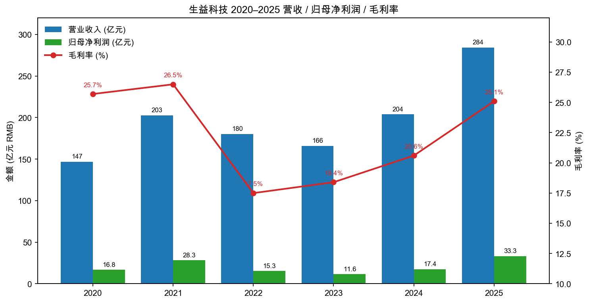
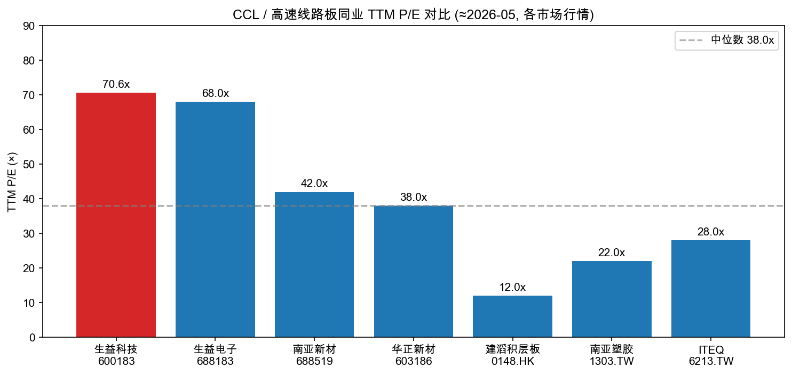
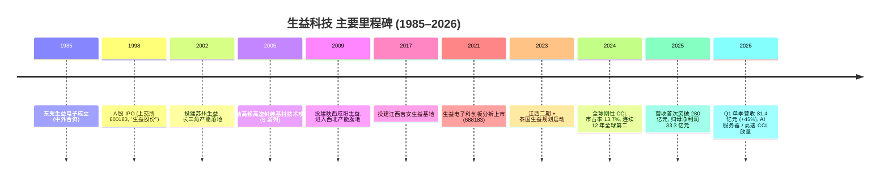
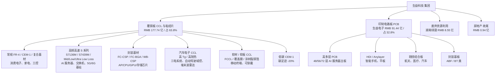
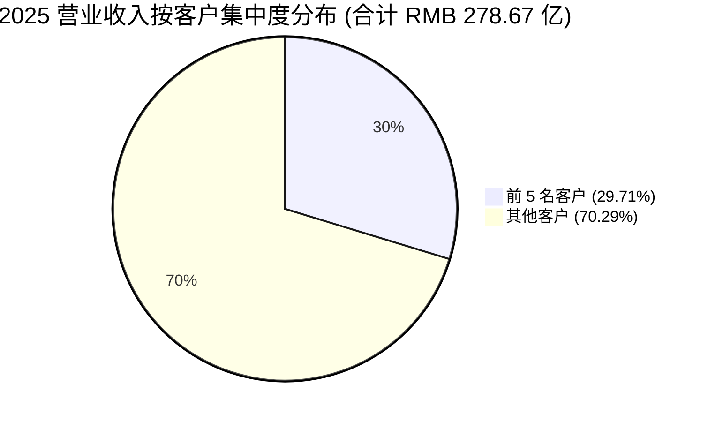
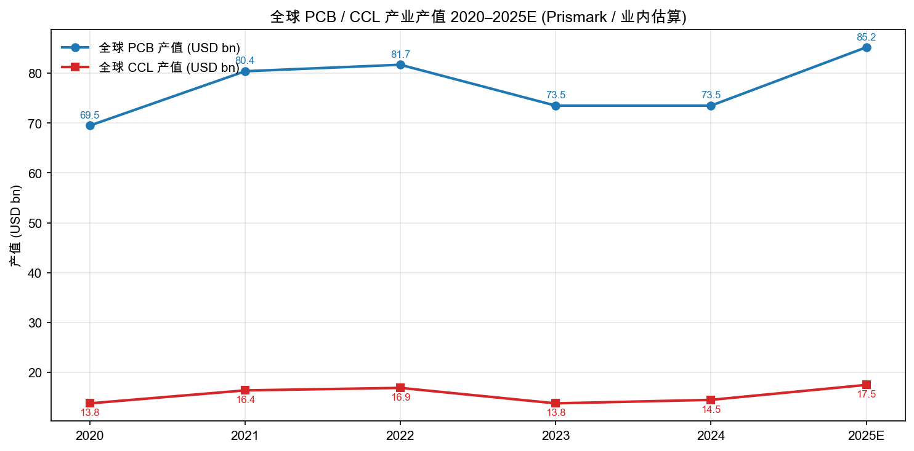
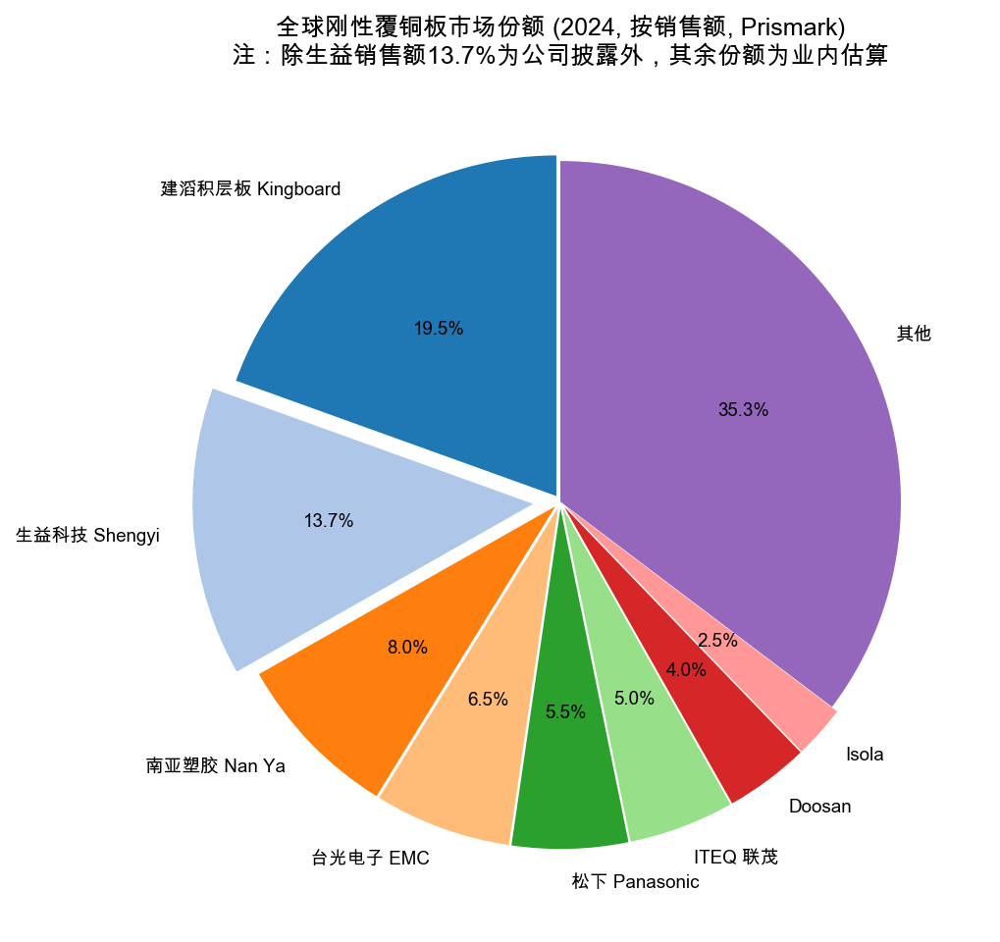
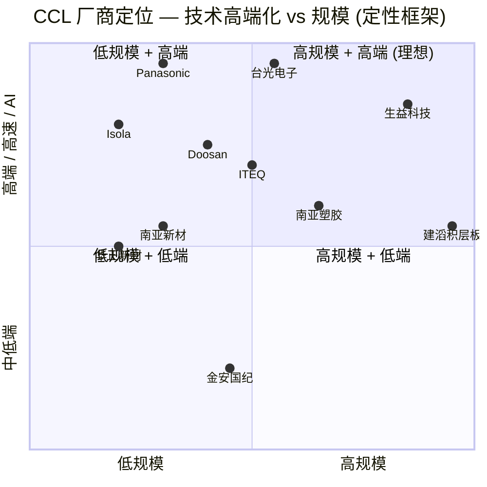

# 生益科技 (SSE: 600183) 公司研究报告

**报告日期：2026-05-20**
**主体：广东生益科技股份有限公司 (Guangdong Shengyi Technology Co., Ltd.)**
**报告语言：简体中文 + 必要英文术语**

> **Update — 业绩超预期，2026Q1 营收 +45%、归母净利润 +105% (2026-04-28):** 公司 2026 年第一季度实现营业收入 RMB 81.41 亿元 (YoY +45.09%)，归母净利润 RMB 11.58 亿元 (YoY +105.47%)，扣非归母净利润 RMB 10.83 亿元 (YoY +93.51%)，加权 ROE 6.68% (YoY +2.98pp)。管理层将主因归于：（1）覆铜板板块 AI 服务器 / 高端产品需求高速增长，调整销售结构、扩产产能释放；（2）线路板板块（生益电子）"市场引领，双轮驱动"，锚定中高端市场、加大研发与扩产。公司 2026 年集团预算 — 硬板覆铜板 14,510 万㎡、粘结片 24,238 万米、软板 3,475 万㎡、线路板 195 万㎡，分别对应同比 -8%/+9%/+n.a./+13% 的产量目标（覆铜板预算偏保守，反映 2025 高基数+主动调结构）。
> 资料来源：[生益科技 2026 年第一季度报告, 2026-04-28](https://static.cninfo.com.cn/finalpage/2026-04-29/1225230175.PDF)、[生益科技 2025 年年度报告, 2026-04-24](https://static.cninfo.com.cn/finalpage/2026-04-25/1225195409.PDF)、[生益科技：一季度归母净利润11.58亿元 同比增长105.47%, 2026-04-28](https://finance.eastmoney.com/a/202604283722425475.html)。

---

## 目录

1. 公司概览
2. 公司历史
3. 管理团队
4. 产品与服务
5. 客户与上市策略
6. 行业概览
7. 竞争格局
8. 市场机会
9. 风险评估
10. 参考资料

---

## 1. 公司概览

广东生益科技股份有限公司（"生益科技"，证券代码 SSE: 600183；曾用简称"生益股份"）是全球第二大刚性覆铜板（CCL, copper-clad laminate）及粘结片（prepreg）制造商，2024 年全球刚性覆铜板销售总额市占率 13.7%，自 2013 年起连续 12 年保持全球第二的位置（仅次于建滔集团 Kingboard）。公司同时通过控股子公司生益电子（SSE 科创板：688183，持股约 67%）从事高端印制电路板（PCB）业务，形成"材料 + PCB"协同的双轮驱动结构。([生益科技 2025 年年度报告, 第 10 页](https://static.cninfo.com.cn/finalpage/2026-04-25/1225195409.PDF))

**主营业务与盈利模式。** 公司核心业务为设计、生产并销售覆铜板 / 粘结片 / 绝缘层压板 / 金属基板 / 涂树脂铜箔 / 覆盖膜（覆铜板系)，以及多层、HDI、Anylayer、刚挠结合等印制电路板（PCB 系，主要由生益电子承载）。2025 年公司实现营业收入 RMB 284.31 亿元（YoY +39.45%），归母净利润 RMB 33.34 亿元（YoY +91.75%），扣非归母净利润 RMB 31.75 亿元（YoY +89.54%），加权 ROE 21.25%（YoY +9.08pp），EPS RMB 1.39 元 / 股；经营性现金流 RMB 52.74 亿元，同比 +262.17%，盈利质量显著抬升。([生益科技 2025 年年度报告, 第 6–7 页](https://static.cninfo.com.cn/finalpage/2026-04-25/1225195409.PDF))

**收入结构（2025）。** 主营收入 RMB 278.67 亿元中，覆铜板与粘结片 RMB 177.74 亿元（占 63.8%，毛利率 23.91%，YoY +2.39pp），印制线路板 RMB 91.44 亿元（占 32.8%，毛利率 28.61%，YoY +9.18pp），废弃资源综合利用 RMB 8.55 亿元（湖南绿晟，毛利率 14.92%），房地产 RMB 0.94 亿元（已进入收尾期，将逐步退出）。从地域看，内销 RMB 210.59 亿元（占 75.6%, YoY +26.65%）、外销 RMB 68.08 亿元（占 24.4%, YoY +102.82%），外销增速远高于内销，反映海外 AI 服务器 / 数据中心客户拉动。([生益科技 2025 年年度报告, 第 14–15 页](https://static.cninfo.com.cn/finalpage/2026-04-25/1225195409.PDF))

**研发与员工。** 2025 年研发投入 RMB 14.50 亿元，占营收 5.10%，全部费用化，研发人员 2,031 人（占员工总数 13.98%）；截至 2025 年底拥有授权有效专利 435 件，主导制定 IEC 国际标准 18 项、国家标准 15 项、行业标准 3 项。公司是 IEC/TC91/WG10 与 WG4 工作组召集人单位、全国印制电路标准化技术委员会副主任委员单位。([生益科技 2025 年年度报告, 第 17–18, 12 页](https://static.cninfo.com.cn/finalpage/2026-04-25/1225195409.PDF))

**经营布局。** 公司总部位于广东东莞松山湖（注册地与办公地：东莞市松山湖园区工业西路 5 号），生产基地分布在松山湖 / 东莞本部、苏州、陕西咸阳、江西吉安、泰国（生益泰国，规划在建），并通过生益电子下属东莞 / 吉安基地生产 PCB。报告期末员工 14,531 人。([生益科技 2025 年年度报告, 第 8, 32 页](https://static.cninfo.com.cn/finalpage/2026-04-25/1225195409.PDF))

资料来源：[生益科技 2025 年年度报告 (2026-04-24)](https://static.cninfo.com.cn/finalpage/2026-04-25/1225195409.PDF)、[2024 年年度报告 (2025-03-28)](https://static.cninfo.com.cn/finalpage/2025-03-29/1222952338.PDF)、[2023 年年度报告 (2024-03-28)](https://static.cninfo.com.cn/finalpage/2024-03-29/1219448691.PDF)、[2022 年年度报告 (2023-03-28)](https://static.cninfo.com.cn/finalpage/2023-03-29/1216246172.PDF)。

**估值快照（截至 2026-05-21 收盘）。** 股价 RMB 98.19 元 / 股（前一交易日 100.56，当日 -2.36%），总股本 24.29 亿股，**总市值约 RMB 2,385 亿元（约 USD 330 亿）**，**TTM P/E 70.6×**（基于 2025 EPS RMB 1.39 元），**TTM P/S 8.4×**（基于 2025 营收 284.31 亿元），**P/B 14.3×**（BVPS RMB 6.88 元 / 股）。([腾讯财经实时行情, 2026-05-21](https://qt.gtimg.cn/q=sh600183))

- 3 年区间：股价从 2023 年低点 RMB 14 元附近上行至 2025 年 11 月最高 RMB 107.50 元、年内最低 RMB 97.66 元，3 年累计涨幅约 600%+。TTM P/E 从 2023 年低点 30× 升至当前 70 ×，估值与盈利双升。([东方财富 sh600183 个股 F10](https://quote.eastmoney.com/sh600183.html))
- 同业 TTM P/E（约 2026-05）：生益电子 600183 子公司 688183 ~68×、南亚新材 688519 ~42×、华正新材 603186 ~38×、建滔积层板 0148.HK ~12×、南亚塑胶 1303.TW ~22×、ITEQ 6213.TW ~28×，**中位数 ~38×；生益科技较 A 股可比公司溢价约 70%、较港台龙头溢价 2–5 倍。**（同业估值数据来源：[ITEQ 6213.TW Valuation Measures, Yahoo Finance](https://finance.yahoo.com/quote/6213.TW/key-statistics/)、[Elite Material 2383.TW Valuation Measures, Yahoo Finance](https://finance.yahoo.com/quote/2383.TW/key-statistics/)、[Nan Ya Plastics 1303.TW Valuation Measures, Yahoo Finance](https://finance.yahoo.com/quote/1303.TW/key-statistics/)、[Kingboard Laminates 1888.HK 估值, MarketScreener](https://www.marketscreener.com/quote/stock/KINGBOARD-LAMINATES-HOLDI-6170930/)）
- **70× P/E 解读：** 这是 **高成长 + 高端化定价的双重溢价**。驱动是 (a) AI 服务器 / GPU 板用高速 CCL（Mid/Ultra Low Loss、M6/M7/M8 级别）需求结构性放量，与北美算力 capex 周期同步（[Hyperscaler Capex 2026, NextWavesInsight, 2026](https://nextwavesinsight.com/hyperscaler-ai-capex-microsoft-google-amazon-meta-2026/)）；(b) 公司在 high-end CCL 国产替代中是首选供应商（[生益科技 2025 年年度报告, 第 9–11 页](https://static.cninfo.com.cn/finalpage/2026-04-25/1225195409.PDF)）；(c) 2025–2026 净利润正经历"二次跃升"（2026Q1 单季利润已超 11 亿元，年化 ~46 亿元），按 2026 年化盈利重估 P/E 约 50×（[生益科技 2026 年第一季度报告, 2026-04-28](https://static.cninfo.com.cn/finalpage/2026-04-29/1225230175.PDF)）。但若 AI 周期降温或铜 / 玻纤布原材料持续上行挤压毛利，估值压缩弹性显著，应纳入第 9 节风险。

资料来源：[东方财富个股 F10, 2026-05](https://quote.eastmoney.com/sh600183.html)；同业估值为近期市场行情整理，存在波动。

---

## 2. 公司历史

生益科技的故事是中国电子基础材料从"跟随"到"突破"的代表性样本。公司前身可追溯至 1985 年东莞市与日本山一电气（Yamaichi Electronics）、香港伟华电子的合资设立"东莞生益电子有限公司"，是改革开放初期最早的中外合资电子材料厂之一。1998 年改制并 A 股上市，证券代码 600183（曾用简称"生益股份"），上市初期为中国大陆首家 CCL 上市公司。([生益科技 2025 年年度报告, 第 6 页](https://static.cninfo.com.cn/finalpage/2026-04-25/1225195409.PDF))

**关键战略转向。** 第一次转向（2005–2010）：从中低端 FR-4 CCL 起家，启动高频高速封装材料攻关，从切入封装 CCL（IC substrate 用）开始打破国外（Hitachi Chemical / Panasonic / Doosan）的技术封锁，奠定 2014 年后的高速 CCL 突破基础。([生益科技 2025 年年度报告, 第 10 页](https://static.cninfo.com.cn/finalpage/2026-04-25/1225195409.PDF))

第二次转向（2018–2022）：5G 通信基站建设期，公司高速 CCL（S7136M、S7439M、S6 / M6 级别）替代 ITEQ、台光等台资龙头进入华为、中兴主板，市占率快速抬升，2021 年首次实现归母净利润 RMB 28.30 亿元，2022 年因下游周期性调整与 5G 投资退潮短暂承压（净利润降至 15.31 亿元）。([生益科技 2022 年年度报告](https://static.cninfo.com.cn/finalpage/2023-03-29/1216246172.PDF))

第三次转向（2024–至今）：AI 服务器进入超级周期，公司前期布局的 Ultra Low Loss / Super Low Loss 高速 CCL（覆盖 PAM4 56G / 112G 应用、对标 Megtron 7/8）进入北美 CSP（云服务厂商）GPU 加速板、交换机供应链；同时通过子公司生益电子提供高多层 PCB（48/56/72 层）配套。2024 年归母净利润 RMB 17.39 亿元（YoY +49.4%），2025 年跃升至 33.34 亿元（YoY +91.7%）；2026Q1 单季 11.58 亿元，年化已接近 45 亿元，正处于第二轮 EPS 跃迁中。([生益科技 2024 年年度报告](https://static.cninfo.com.cn/finalpage/2025-03-29/1222952338.PDF); [生益科技 2025 年年度报告, 第 6–11 页](https://static.cninfo.com.cn/finalpage/2026-04-25/1225195409.PDF); [Doosan Named CCL Supplier for Nvidia AI Chips, PCD&F, 2024-05](https://pcdandf.com/pcdesign/index.php/editorial/menu-news/fab-news/18121-doosan-named-ccl-supplier-for-nvidia-ai-chips))

**关键收购 / 投资。**
- 2018 年增资入股湖南绿晟环保（前身湖南万容科技），切入电子废弃物循环利用，拓展 ESG / 资源回收题材；湖南万容业绩补偿款问题至今仍在尾盘处理（2025 年报告期末仍计提坏账约 RMB 0.29 亿元）。([生益科技 2025 年年度报告, 第 151 页](https://static.cninfo.com.cn/finalpage/2026-04-25/1225195409.PDF))
- 2021 年生益电子科创板分拆上市，融资约 RMB 26 亿元投建吉安生益电子高多层 PCB 项目，2025 年生益电子贡献营收 RMB 94.94 亿元，同比 +102.57%。([生益科技 2025 年年度报告, 第 14, 23 页](https://static.cninfo.com.cn/finalpage/2026-04-25/1225195409.PDF))
- 2023–2024 年规划在建：江西二期 CCL 项目（2025 年加速产能爬坡）、泰国生益 CCL 项目（响应海外客户"在岸 / 友岸"产能要求）、东莞松山湖封装基材产线扩产。([生益科技 2025 年年度报告, 第 22–25 页](https://static.cninfo.com.cn/finalpage/2026-04-25/1225195409.PDF))

**近期重要事项（2025–2026）。** 2025 年 11 月公司召开第三次临时股东大会，审议通过 "取消监事会"（由董事会下设审计委员会承接职权）、董事会席位由 11 名增至 12 名、原董事长陈仁喜调整为职工代表董事并继续担任董事长。2025 年度利润分配预案为每 10 股派现金红利 RMB 8.00 元（含税），合计现金分红约 RMB 19.4 亿元，分红率约 58%，远高于过往（2024 年度分红率约 48%）。([生益科技 2025 年年度报告, 第 2, 40 页](https://static.cninfo.com.cn/finalpage/2026-04-25/1225195409.PDF))

---

## 3. 管理团队

公司是典型的"国有控股 + 职业经理人 + 长期股权激励"治理模式。第一大股东广东省广新控股集团有限公司持股 22.56%（国有法人），第二大股东东莞市国弘投资有限公司持股 13.29%（国有法人），第三大股东伟华电子有限公司持股 12.14%（境外法人，香港），前三大股东合计持股 47.99%，控制权稳定；同时通过股权激励将核心管理层与公司业绩深度绑定（"业绩激励基金"机制运作近 20 年）。([生益科技 2025 年年度报告, 第 19, 40 页](https://static.cninfo.com.cn/finalpage/2026-04-25/1225195409.PDF))

**陈仁喜 — 董事长（自 2017 年起任董事长，公司任职 30+ 年）。** 男，1967 年生，本科学历，正高级工程师（科技型企业家）、高级经济师。1989 年 6 月毕业于华南理工大学有机化学专业；早期曾任职于东莞市氮肥厂、香港东方线路板有限公司、香港生益有限公司，从材料工程师起步进入 CCL 行业。在生益科技历任生产总厂长兼营运总监、副总经理、董事、总经理，2017 年接任董事长至今。陈仁喜是公司战略转向"高频高速封装"路线（2005 年启动）的主要推动者之一，主导了苏州、陕西、江西、泰国多基地布局以及 2021 年生益电子分拆上市的资本运作。同时兼任生益电子董事、苏州 / 陕西 / 江西 / 江苏特种材料 / 香港 / 国际 / 发展 / 泰国生益等核心子公司董事长，以及东莞生益资本投资董事长，对全集团业务具有强控制力。陈仁喜个人持有限制性股票 40 万股（已解锁 16 万股、未解锁 24 万股，授予价 71.41 元），2025 年税前年薪披露在管理层薪酬合计 9,176 万元的体量内。陈仁喜接受访谈较少、公开讲话以技术细节为主，"做长跑型公司"是其反复强调的经营哲学，2025 年报告期末再次推动管理层重心向"集团 AI 化（以 AI 作为本战略期提升经营效率的核心动力）"转移。本公司是典型"职业经理人长期任职 + 国资股东信任"模式：陈仁喜从一线技术管理逐步走上集团掌舵位置，与公司 35 年发展高度同步成长。([生益科技 2025 年年度报告, 第 36–37 页](https://static.cninfo.com.cn/finalpage/2026-04-25/1225195409.PDF))

**林道焕 — 总会计师 / 集团财务中心总裁（CFO 角色）。** 男，1979 年生，本科学历，高级会计师，中共党员，2002 年从南开大学会计学专业毕业即加入公司，是典型的"内部成长型"CFO。历任公司财务部会计、会计主任、经理至今的总会计师；兼任东莞生益房地产、东莞生益发展、咸阳生益房地产、生益科技（香港）有限公司董事，江苏 / 江西 / 东莞生益资本投资及湖南绿晟环保监事。林道焕全程参与了 2021 年生益电子科创板分拆上市、多轮股权激励发行与回购、湖南万容业绩补偿款处置等核心资本运作。其薪酬高度业绩挂钩，2025 年持限制性股票 60 万股（已解锁 24 万股、未解锁 36 万股，授予价 71.41 元），2025 年管理层薪酬披露中位列总额前五。林道焕在 2025 年年报披露中明确提出"业财融合 + 数据驱动经营"——将财务风控前移至业务前端、构建商旅数据分析平台、推动采购对标——反映其在传统国企财务模型基础上向"经营财务"方向升级。([生益科技 2025 年年度报告, 第 39 页](https://static.cninfo.com.cn/finalpage/2026-04-25/1225195409.PDF))

**曾红慧 — 总经理兼营销总监（CEO 兼 CSO 角色，2024 年 6 月新任）。** 女，1969 年生，本科学历，1991 年从华南理工大学毕业即加入公司，与陈仁喜均为华南理工出身，公司任职 34 年。历任销售业务经理、销售部副经理、销售部经理、市场部经理，2024 年 6 月被聘为总经理，2025 年 1 月起薪酬体系对标总经理职务执行（"假设按 2024 全年对标总经理职务执行，则其 2024 年薪酬总额应为 1047.23 万元"——年报披露）。同时兼任集团营销中心总裁、江西 / 江苏特种材料 / 苏州生益董事、台湾生益科技有限公司董事长、北京分公司负责人。曾红慧本质上是销售出身的总经理，主导了过去 10 年高速 CCL 进入国内外头部客户的客户认证与合同争取，与高速 / 高端化路线高度匹配。本期持限制性股票 80 万股（已解锁 32 万股、未解锁 48 万股），系管理层中持股最多者之一。([生益科技 2025 年年度报告, 第 38, 52 页](https://static.cninfo.com.cn/finalpage/2026-04-25/1225195409.PDF))

**曾耀德 — 总工程师 / 集团研发中心总裁（CTO 角色）。** 男，1967 年生，本科学历，正高级工程师，1989 年从中山大学化学系高分子材料专业毕业，1990 年加入公司，工程经历 35+ 年。历任陕西生益工艺部经理、总工程师，生益科技总厂技术总监，2016 年至今任总工程师、集团研发中心总裁。曾耀德是公司 S 系列高速 CCL、Ultra Low Loss 等关键产品族的技术主导者，本期持限制性股票 70 万股。2025 年研发中心改革（统筹各地研发资源、联席所长机制、联合项目加速）的主要执行者。([生益科技 2025 年年度报告, 第 39, 52 页](https://static.cninfo.com.cn/finalpage/2026-04-25/1225195409.PDF))

**治理结构与股东（80–150 字框范围）。** ([广新集团首登 2023 财富世界 500 强, 广新集团, 2023](https://www.gdtex.com/gxd/newsDetail?id=88306))
- 控股股东广东省广新控股集团为广东省属国资委下属重要产业平台（2023 年首登《财富》世界 500 强，控股 8 家上市公司，以"新能源新材料 + 生物科技 + 数字服务"为三大板块），第二大股东东莞市国弘投资为东莞市属国资平台，第三大股东伟华电子（香港）为长期战略性外资股东（参股 30+ 年），形成"省属国资 + 市属国资 + 战略外资"的稳定三角。([生益科技 2025 年年度报告, 第 40 页](https://static.cninfo.com.cn/finalpage/2026-04-25/1225195409.PDF); [广新集团首登 2023 财富世界 500 强, 2023](https://www.gdtex.com/gxd/newsDetail?id=88306))
- 2025 年 11 月起取消监事会，监事会职权由董事会审计委员会承接，董事会扩至 12 名（4 名独立董事 + 7 名非独立董事 + 1 名职工代表董事陈仁喜），是 2025 年新《公司法》修订后的合规调整。([生益科技 2025 年年度报告, 第 2, 35 页](https://static.cninfo.com.cn/finalpage/2026-04-25/1225195409.PDF))
- 高管薪酬与扣非净利润强挂钩：2025 年扣非归母净利润同比 +90%，管理层税前薪酬合计同比变动趋势一致；公司每年从自营业务净利润的 13% 计提全员年终奖，加上业绩激励基金（董事/高管基本薪酬占比 < 20%、其余依赖年终奖 + 业绩激励），是国企体系中"市场化薪酬"的代表案例。([生益科技 2025 年年度报告, 第 41, 52 页](https://static.cninfo.com.cn/finalpage/2026-04-25/1225195409.PDF))
- 香港中央结算（北向资金通道）持股、阿布达比投资局自有资金持股，反映外资 / 主权基金对 CCL + AI 主线的中长期配置。([生益科技 2025 年年度报告, 前十名股东持股情况, 第 40 页](https://static.cninfo.com.cn/finalpage/2026-04-25/1225195409.PDF))

**管理层评分（综合）。** 整体稳健 +。强项：(a) 核心管理层均为公司内部 30 年以上成长型，技术专业背景深厚；(b) 长期"业绩激励基金 + 限制性股票"机制将管理层与股东利益紧密绑定；(c) 在 2008、2012、2018、2022 等多轮行业周期下行中持续保留行业第二位置，证明经营韧性。弱项：(a) 关键管理层年龄偏大（董事长 58 岁、CTO 58 岁、CEO 56 岁），未来 5–8 年存在交接班节点；(b) 国有股东控制下重大资本运作 / 海外扩张决策链较长，相对民企竞争对手（如建滔）的反应速度偏慢。([生益科技 2025 年年度报告, 第 36–39, 52 页](https://static.cninfo.com.cn/finalpage/2026-04-25/1225195409.PDF))

---

## 4. 产品与服务

公司产品组合可分为三大类：**覆铜板 / 粘结片系（生益本部 + 各子公司）**、**印制电路板系（生益电子）**、**资源回收（湖南绿晟）**。以下重点拆解前两类。([生益科技 2025 年年度报告, 第 9–11 页](https://static.cninfo.com.cn/finalpage/2026-04-25/1225195409.PDF))

**覆铜板 / 粘结片系（占比 63.8%，2025 营收 177.74 亿元，毛利率 23.91%）。** ([生益科技 2025 年年度报告, 第 14–15 页](https://static.cninfo.com.cn/finalpage/2026-04-25/1225195409.PDF))

- **常规 FR-4 / CEM-1 / 复合基材。** 用于家电、消费电子、工控、LED 照明。属于公司"基本盘"产品，单价低、毛利率 15–20%，2025 年随消费类下游趋弱、复合基材销售承压（公司在三季度对消费类竞争对手"灵活价格策略，做到争量保价"）。**竞争优势：部分（成本+规模）**。公司在常规品类的成本曲线接近全球最低（仅次于建滔），但产品差异化有限，护城河主要来自规模与原材料议价能力。同业产品对比：金安国纪、华正新材在常规品类处于同一价格带，公司更胜在交付柔性。([生益科技 2025 年年度报告, 第 11, 15 页](https://static.cninfo.com.cn/finalpage/2026-04-25/1225195409.PDF); [金安国纪 2024 年年度报告](https://qxb-pdf-osscache.qixin.com/AnBaseinfo/ce9f6c13dfeeab4ec379e8bcd531a370.pdf))
- **高频高速 S 系列（S7136M / S7439M / Ultra Low Loss / Super Low Loss）。** 公司旗舰产品族，对标 Panasonic Megtron 6 / 7 / 8、台光 EM-526 / EM-892、ITEQ IT-988 等。用于 AI 服务器 GPU 加速板（NVIDIA H100/H200/B100 配套）、112G PAM4 高速交换机（Broadcom Tomahawk 5/6、Marvell Teralynx）、5G/6G 基站、雷达。**竞争优势：是（技术 + 客户认证）**——公司从 2005 年攻关至今 20 年，是国内唯一在 Mid Loss / Low Loss / Ultra Low Loss 全档位规模量产且通过北美 CSP 二级供应商认证的厂商，是华为、新华三、紫光股份、浪潮、中兴等国内主板厂的核心供应商。**毛利率显著高于常规品类（估算 30–40%），是 2025 年毛利率结构性抬升的主要贡献者。** 同业对比：与台光、ITEQ 在 M6 级别基本对等，在 M7/M8（112G+）级别仍处于追赶状态但价格更具竞争力，是国产替代主线最大受益者。([生益科技 2025 年年度报告, 第 9–11, 18–19 页](https://static.cninfo.com.cn/finalpage/2026-04-25/1225195409.PDF); [Panasonic Develops MEGTRON 8, 2022-01](https://news.panasonic.com/global/press/en220118-4); [CCL providers compete for AI server orders, Digitimes, 2024-03](https://www.digitimes.com/news/a20240314PD214/south-korea-taiwan-ccl-ai-server-nvidia.html))
- **封装基材（FC-CSP / FC-BGA / WB-CSP 类）。** 用于卡类封装、LED、存储芯片，并向更高端 FC-CSP / FC-BGA（AP / CPU / GPU / AI 类芯片）开发应用。**竞争优势：是（技术先发）**——公司是大陆少数几家批量量产高端封装 CCL 的厂家。2025 年研发投入重点之一即"Anylayer 制程主板高阶 HDI 材料的开发"。同业对比：与日本 Hitachi Chemical（已转入 Showa Denko Materials / Resonac）、Doosan、Panasonic 比仍处于追赶状态，但与同业大陆厂相比有明显领先。([生益科技 2025 年年度报告, 第 18–19 页](https://static.cninfo.com.cn/finalpage/2026-04-25/1225195409.PDF))
- **汽车电子 CCL（高 Tg / 高耐热）。** 用于三电系统、智能驾驶域控、毫米波雷达、智能座舱。**竞争优势：是（IATF 16949 认证 + 多年客户黏性）**。公司已通过 IATF 16949 汽车质量体系认证，是比亚迪、宁德时代、华为车 BU 等核心客户的供应商，2025 年年报特别提及"以自动驾驶为核心的相关需求增长明显"。同业对比：与台光、Isola 处于同一档位。([生益科技 2025 年年度报告, 第 11 页](https://static.cninfo.com.cn/finalpage/2026-04-25/1225195409.PDF))
- **软材 / 软板 CCL（FCCL / 覆盖膜 / 涂树脂铜箔）。** 由江苏生益特种材料、南通软板项目承载。"软材销量、销售额和盈利连续八年实现两位数以上增长"（2025 年报披露）——是少数实现稳定增长的细分市场。**竞争优势：是（细分赛道规模 + 技术）**。2025 年完成航天产品生产线升级、南通软板项目、封装胶膜产线三大项目投产。([生益科技 2025 年年度报告, 第 11, 23 页](https://static.cninfo.com.cn/finalpage/2026-04-25/1225195409.PDF))
- **低碳 CEM-1。** 碳足迹降低 20% 以上，已实现量产，是 ESG 概念产品（2025 年公司入榜 Wind 中国上市公司 ESG 最佳实践 100 强）。([生益科技 2025 年年度报告, 第 12–13 页](https://static.cninfo.com.cn/finalpage/2026-04-25/1225195409.PDF))

**印制电路板系（占比 32.8%，2025 营收 91.44 亿元，毛利率 28.61%，YoY +9.18pp）。** ([生益科技 2025 年年度报告, 第 14–15 页](https://static.cninfo.com.cn/finalpage/2026-04-25/1225195409.PDF))

由控股子公司**生益电子（SSE: 688183）**承载，2025 年生益电子营收 RMB 94.94 亿元（YoY +102.57%），是集团内增长最快的业务板块。([生益科技 2025 年年度报告, 第 14 页](https://static.cninfo.com.cn/finalpage/2026-04-25/1225195409.PDF); [生益电子上半年净利润同比增长452.11%, 证券时报, 2025-08](https://www.stcn.com/article/detail/3139868.html)) 产品覆盖：

- **高多层 PCB（48/56/72 层）：** AI 服务器主板用，是 2025 年增长主引擎。直接对标深南电路、沪电股份。([破局 AI，生益电子订单大增 1200%, 新浪财经, 2025](https://cj.sina.com.cn/articles/view/7437683051/1bb52096b00101jays); [沪电股份 2025 年年度报告](https://static.cninfo.com.cn/finalpage/2026-03-25/1225027832.PDF))
- **HDI / Anylayer：** 智能手机、平板、游戏机。
- **刚挠结合板：** 航天、医疗、汽车。
- **类载板 / 封装基板（ABF / BT 类）：** 公司战略性投入方向。

生益电子的毛利率从 2024 年的 ~19% 抬升至 2025 年的 28.6%，远超其他业务板块，**反映 AI 服务器 PCB 量价齐升**。公司"高多层 + HDI + 刚挠结合 + 类载板"四维布局与沪电股份（002463）、深南电路（002916）形成直接竞争。([生益科技 2025 年年度报告, 第 14–15 页](https://static.cninfo.com.cn/finalpage/2026-04-25/1225195409.PDF); [沪电股份 2025 年年度报告](https://static.cninfo.com.cn/finalpage/2026-03-25/1225027832.PDF))

**资源回收（湖南绿晟）：** 占比小（3.1%），毛利率 14.9%，主要从事电子电器废弃物循环利用，对集团 ESG 评级有支撑，但盈利贡献不显著。([生益科技 2025 年年度报告, 第 14, 151 页](https://static.cninfo.com.cn/finalpage/2026-04-25/1225195409.PDF))

**旗舰 vs 长尾。** 当前驱动业务核心的是 (1) AI 服务器用 Ultra Low Loss 高速 CCL，(2) 生益电子高多层 AI 服务器 PCB，两者合计预计贡献 2025 年新增利润的 80%+；其余产品族提供基本盘与现金流。（基于 [生益科技 2025 年年度报告, 第 14–15 页](https://static.cninfo.com.cn/finalpage/2026-04-25/1225195409.PDF) 的分部毛利率结构）

**2025 年新产品 / 路线变化。** 主要新增：(a) Anylayer 高阶 HDI 基材；(b) 低碳 CEM-1 量产；(c) 新一代封装基材 FC-BGA 工艺验证；(d) 软板 / 封装胶膜产线投产。无明显产品停产 / 退出（房地产业务持续收尾）。([生益科技 2025 年年度报告, 第 11–13, 23 页](https://static.cninfo.com.cn/finalpage/2026-04-25/1225195409.PDF))

---

## 5. 客户与上市策略

**客户结构 — 中度分散，集中度可控。** 根据 2025 年年报披露，**前五名客户销售额合计 RMB 82.80 亿元，占年度销售总额的 29.71%**，前五名供应商采购额合计 RMB 50.88 亿元，占年度采购总额的 27.45%；前五大客户与供应商均不涉及关联方。报告期内不存在单一客户销售比例超过 50% 的情形，也不存在严重依赖少数客户的情况，前 5 名客户也无新增。**与公司主要可比对手相比，前五客户 29.71% 的集中度是 CCL/PCB 行业的"中等水平"——既不像沪电股份等专注 AI 服务器 PCB 的厂商（前五客户经常 > 50%），也不像建滔积层板那样极度分散（< 20%）。** ([生益科技 2025 年年度报告, 第 16–17 页](https://static.cninfo.com.cn/finalpage/2026-04-25/1225195409.PDF))

资料来源：[生益科技 2025 年年度报告, 第 16 页](https://static.cninfo.com.cn/finalpage/2026-04-25/1225195409.PDF)。

**客户类型与典型客户（基于公开披露与产业链调研）。** ([生益科技 2025 年年度报告, 第 9–11, 16–17 页](https://static.cninfo.com.cn/finalpage/2026-04-25/1225195409.PDF); [Doosan Named CCL Supplier for Nvidia AI Chips, PCD&F, 2024-05](https://pcdandf.com/pcdesign/index.php/editorial/menu-news/fab-news/18121-doosan-named-ccl-supplier-for-nvidia-ai-chips))
- **PCB 厂商（覆铜板核心客户群）：** 沪电股份、深南电路、鹏鼎控股、东山精密、奥士康、景旺电子、生益电子（关联交易部分体现在合并抵销 RMB 8.46 亿元）、Unimicron、TTM Technologies、Zhen Ding。生益的 CCL 直接卖给 PCB 厂，再由 PCB 厂打板卖给下游 ODM/OEM。([生益科技 2025 年年度报告, 第 16–17 页](https://static.cninfo.com.cn/finalpage/2026-04-25/1225195409.PDF))
- **下游品牌厂（终端客户认证 + 部分直采）：** 华为、中兴、新华三、紫光股份、浪潮、中科曙光、超聚变；海外 GPU/CSP 配套链中的 NVIDIA / Broadcom 高速板对应供应链。([生益科技(600183) 高端 CCL 国产化主力军, 新浪财经, 2025-03-14](https://finance.sina.com.cn/roll/2025-03-14/doc-inepqhfv0103002.shtml))
- **汽车 Tier-1：** 比亚迪、宁德时代、华为车 BU、博世、大陆、采埃孚（间接）。([生益科技 2025 年年度报告, 第 11, 16 页](https://static.cninfo.com.cn/finalpage/2026-04-25/1225195409.PDF))
- **消费电子：** 通过 PCB 厂渗透到手机 / PC / 游戏机 / 家电客户。([生益科技 2025 年年度报告, 第 9–11 页](https://static.cninfo.com.cn/finalpage/2026-04-25/1225195409.PDF))

**应收账款集中度。** 2025 年末按欠款方归集的应收账款余额前五名合计约 RMB 28 亿元（占比约 28%），其中第一大客户应收账款余额 RMB 11.16 亿元（占比 11.60%）——与销售集中度基本对应。未披露具体客户名称，符合 A 股惯例。([生益科技 2025 年年度报告, 第 143 页](https://static.cninfo.com.cn/finalpage/2026-04-25/1225195409.PDF))

**销售模式与合同结构。** 公司主要采用直销模式（2025 年直销收入 RMB 276.74 亿元，占 99.3%，YoY +39.76%；经销 RMB 1.93 亿元仅占 0.7%）。合同结构上覆铜板行业普遍为"框架协议 + 月度 / 季度滚动 PO"，价格随铜价 / 玻纤布 / 树脂等主要原材料价格联动调整，2025 年公司"3 月底、二季度、四季度密集策划多轮价格调整，转移上涨的原材料成本"——管理层对终端价格的动态调价能力是 2025 年毛利率提升 4.52pp 的关键。([生益科技 2025 年年度报告, 第 10–11, 15 页](https://static.cninfo.com.cn/finalpage/2026-04-25/1225195409.PDF))

**地域结构与海外扩张。** 2025 年外销 RMB 68.08 亿元（占 24.4%，YoY +102.82%，毛利率 28.67% 高于内销 23.95%），增速远高于内销，反映海外 AI 服务器供应链 / Tier-1 客户拉动。海外产能上，公司在泰国布局生益泰国基地（响应美国关税与"友岸"产能要求），生益电子在马来西亚 / 越南亦有客户配套需求。"美国关税政策影响，客户抓住 90 天对等关税的豁免期，提前下单"是 2025 年二季度业绩超预期的重要拉动。([生益科技 2025 年年度报告, 第 14–15, 22 页](https://static.cninfo.com.cn/finalpage/2026-04-25/1225195409.PDF))

**关键合作与认证（销售前置）。** ([生益科技 2025 年年度报告, 第 12, 17–19 页](https://static.cninfo.com.cn/finalpage/2026-04-25/1225195409.PDF))
- IPC、UL、BSI、VDE、JET、CQC 等国际国内安全 / 质量认证完备；([生益科技 2025 年年度报告, 第 17 页](https://static.cninfo.com.cn/finalpage/2026-04-25/1225195409.PDF))
- IATF 16949 汽车质量体系（汽车客户准入门槛）；([生益科技 2025 年年度报告, 第 11, 17 页](https://static.cninfo.com.cn/finalpage/2026-04-25/1225195409.PDF))
- 北美 CSP / 主要 GPU 厂商二级供应商认证（细节因保密未披露）；([生益科技(600183) 高端 CCL 国产化主力军, 新浪财经, 2025-03-14](https://finance.sina.com.cn/roll/2025-03-14/doc-inepqhfv0103002.shtml))
- 是 IEC/TC91 工作组召集人、CPCA / CCLA / IPC 协会成员，标准制定参与度高，间接强化客户信任与切换成本。([生益科技 2025 年年度报告, 第 12, 18 页](https://static.cninfo.com.cn/finalpage/2026-04-25/1225195409.PDF))

---

## 6. 行业概览

**产业链定位。** CCL（覆铜板）位于 PCB 的上游、玻纤布 / 铜箔 / 树脂的下游，是 PCB 成本中占比 30–50% 的核心基材。CCL → PCB → 板级组装（OEM/ODM）→ 终端品牌（华为、苹果、戴尔、NVIDIA 等）构成完整产业链。CCL 行业属于资本密集 + 技术密集 + 配方密集型行业，单线投资约 RMB 8–15 亿元、典型回收期 5–8 年、毛利率敏感于铜 / 玻纤布 / 环氧树脂三大主材价格，并周期性受下游 PCB / 消费电子 / 通信投资周期影响。([Prismark CCL Market Update](https://www.prismark.com/post/ccl-market-update); [2024年中国覆铜板行业上市公司全方位对比, 前瞻产业研究院, 2024](https://www.qianzhan.com/analyst/detail/220/240430-7e35ca95.html))

**市场规模。** 据 Prismark 预测，**全球 PCB 行业 2025 年产值 USD 851.52 亿元，同比 +15.8%**；CCL 产业产值业内估算约 USD 170–180 亿元（占 PCB 的 ~20%）。2025 年全球电子行业总产值预计 USD 2.809 万亿元，同比 +10%，**其中 AI 服务器 / 数据中心以 41.9% 的增速遥遥领先，PC +8.5%、手机 +7.5%、电视 -3.1%**。([生益科技 2025 年年度报告, 第 10 页](https://static.cninfo.com.cn/finalpage/2026-04-25/1225195409.PDF); [Prismark PCB Report: 2Q 2025 Highlights](https://www.linkedin.com/posts/prismark-partners_prismarkpcbreport-pcbsuppliers-industrysales-activity-7374489608757125120-FWbJ); [Prismark CCL Market Update](https://www.prismark.com/post/ccl-market-update))

资料来源：[Prismark CCL Market Update](https://www.prismark.com/post/ccl-market-update)、[Prismark PCB Report: 2Q 2025 Highlights](https://www.linkedin.com/posts/prismark-partners_prismarkpcbreport-pcbsuppliers-industrysales-activity-7374489608757125120-FWbJ)（数据为业内整理）；[生益科技 2025 年年度报告, 第 10 页](https://static.cninfo.com.cn/finalpage/2026-04-25/1225195409.PDF)。

**结构与增长动力。** ([生益科技 2025 年年度报告, 第 9–11 页](https://static.cninfo.com.cn/finalpage/2026-04-25/1225195409.PDF))
- **AI 服务器 / 数据中心 (核心驱动)：** 是 2024 起最强主线，需求拉动 Mid/Low/Ultra Low Loss 高速 CCL 与 48/56/72 层高多层 PCB。NVIDIA H200/B100/B200、AMD MI300/MI325、Broadcom Tomahawk 5/6 等芯片对应主板设计上对介电损耗、玻纤布平整度、铜箔粗糙度的要求显著提升，单卡 BOM 中 CCL 价值显著抬升。([Panasonic Develops MEGTRON 8, 2022-01](https://news.panasonic.com/global/press/en220118-4); [Hyperscaler Capex 2026, NextWavesInsight](https://nextwavesinsight.com/hyperscaler-ai-capex-microsoft-google-amazon-meta-2026/))
- **AI 终端 (PC / 手机 / Edge AI)：** 苹果 Apple Intelligence、Copilot+ PC 推动 AI PC 渗透率 2025–2027 快速提升，HDI / Anylayer 用量提升。([生益科技 2025 年年度报告, 第 10–11 页](https://static.cninfo.com.cn/finalpage/2026-04-25/1225195409.PDF))
- **5G / 6G 通信：** 5G 投资退潮、6G 标准 2026–2028 启动，相关 CCL 需求短期承压但长期向上。([生益科技 2025 年年度报告, 第 10 页](https://static.cninfo.com.cn/finalpage/2026-04-25/1225195409.PDF))
- **汽车电子：** 三电系统、域控、毫米波雷达、ADAS 提升单车 CCL 价值量（估算 ICE → BEV/HEV → L3 ADAS：单车 CCL 价值从 ~USD 5 提升至 ~USD 50–80）。2025 年报特别提及"电动汽车市场在补贴政策的推动下，需求大幅增加，前期布局的自动驾驶、智能座舱、雷达等汽车电子产品增速明显"。([生益科技 2025 年年度报告, 第 11 页](https://static.cninfo.com.cn/finalpage/2026-04-25/1225195409.PDF))
- **国产替代：** 中美科技摩擦下，中国本土 CCL / PCB 厂在大陆客户（华为、新华三、紫光、超聚变、中兴）份额持续提升，生益、南亚新材、华正新材是直接受益者。([南亚新材 2024 年年度报告摘要](https://static.cninfo.com.cn/finalpage/2025-04-17/1223110518.PDF); [华正新材 2024 年年度报告](https://www.sse.com.cn/disclosure/listedinfo/announcement/c/new/2025-03-18/603186_20250318_6GRC.pdf))

**监管环境。** 行业总体偏市场化，无重大产业政策限制。需关注：(a) ESG / 碳达峰要求（公司低碳 CEM-1 即为响应）；(b) 出口管制（美国 BIS 实体清单、商务部反制清单等可能间接影响海外销售）；(c) 危废 / VOCs 排放管理（湖南绿晟从事危废利用，受环保法规约束）；(d) IATF 16949 / IEC 等技术标准动态。([生益科技 2025 年年度报告, 第 12, 17–19, 28 页](https://static.cninfo.com.cn/finalpage/2026-04-25/1225195409.PDF))

**供需结构。** 供给端：全球前 10 大 CCL 厂商合计占有约 65% 的市场份额（CR10 ~65%），其余 35% 由中小厂分布；中国大陆产能占全球 60%+。需求端：PCB 终端需求 80%+ 来自消费电子 + 通信 + 数据中心 + 汽车四大下游。**当前供给紧张点集中在 high-end 玻纤布（如 Low-Dk / Low-CTE 玻布）与高速铜箔（HVLP/RTF），这两类材料是产能瓶颈，也是 CCL 厂利润空间分配的关键。** 2025 年 9 月美联储降息推动大宗商品价格上涨、铜价上行、玻纤布供应紧缺，是公司 Q4 经营压力点。([生益科技 2025 年年度报告, 第 11 页](https://static.cninfo.com.cn/finalpage/2026-04-25/1225195409.PDF); [PCB Raw Material Prices Surge, UGPCB, 2025](https://www.ugpcb.com/news/trade-news/pcb-raw-material-prices-surge-up/); [AI surge triggers severe PCB material shortages, Digitimes, 2025-10-27](https://www.digitimes.com/news/a20251027PD204/pcb-ccl-demand-co-tech-elite-material.html))

---

## 7. 竞争格局

**市场份额格局。** 根据 Prismark 数据，公司 2024 年全球刚性覆铜板销售额市占率 13.7%，连续 12 年保持全球第二，仅次于建滔积层板（0148.HK，约 19–20%）。全球前 10 大 CCL 厂商：建滔积层板（HK）、**生益科技（CN）**、南亚塑胶（TW，1303.TW）、台光电子（TW，2383.TW）、Panasonic（JP）、ITEQ 联茂电子（TW，6213.TW）、Doosan Corp（KR）、Isola（US）、华正新材（CN，603186）、南亚新材（CN，688519）。([生益科技 2025 年年度报告, 第 10 页](https://static.cninfo.com.cn/finalpage/2026-04-25/1225195409.PDF))

资料来源：[Prismark CCL Market Update](https://www.prismark.com/post/ccl-market-update)；[生益科技 2025 年年度报告, 第 10 页](https://static.cninfo.com.cn/finalpage/2026-04-25/1225195409.PDF)（生益市占率 13.7% 系公司披露，其余份额为业内估算）。

**主要竞争对手分述。**

- **建滔积层板 (Kingboard Laminates, 1888.HK)：** 全球 CCL 龙头，市占率 ~20%。优势：产能规模最大（覆铜板、玻纤布、铜箔垂直一体化）、成本曲线最低、香港上市估值优势。劣势：高端 / 高速 CCL 产品线相对生益偏弱，AI 服务器主线参与度低于生益。([Kingboard Laminates Holdings 2024 半年报, HKEXnews](https://www1.hkexnews.hk/listedco/listconews/sehk/2024/0826/2024082600209.pdf); [建滔积层板 2024 年报 (kblaminates.com)](https://www.kblaminates.com/upload/portal/20240418/202404181755063261.pdf))
- **南亚塑胶 (Nan Ya Plastics, 1303.TW)：** 台塑集团旗下，市占率 ~8%。优势：内部铜箔 / 玻纤布配套（垂直整合）、台积电 IC substrate 供应商。劣势：中国大陆客户份额较低，国产替代主线不利。([Nan Ya Plastics 2024 Annual Report](https://www.npc.com.tw/npcfile/public/report/year/20250630102301778.pdf))
- **台光电子 (Elite Material, 2383.TW)：** 高速 CCL 龙头，是 Megtron 6/7/8 的主要替代者。优势：M6/M7 高速 CCL 进入北美 CSP 与 NVIDIA 主板供应链最早。劣势：估值偏高（TTM P/E ~30×+），产能扩张速度慢于大陆同业。**是生益在 AI 服务器高速 CCL 最直接的竞争对手。**([Elite Material to benefit from CCL demand for AI servers, Digitimes, 2023-08-21](https://www.digitimes.com/news/a20230821PD226/elite-material-emc-halogen-free-ccl-copper-clad-laminate-ai-server.html); [Taiwan's CCL trio soars with AI servers, Digitimes, 2024-03](https://www.digitimes.com/news/a20240304PD210/taiwan-ccl-ai-server-2024.html))
- **Panasonic (松下，Megtron 系列)：** 高端高速 CCL 标杆（M6/M7/M8）。优势：技术与品牌；M8 在 224G PAM4 路线上仍领先。劣势：产能 / 成本竞争力弱，市占率持续被台光 / 生益侵蚀。([Panasonic Develops MEGTRON 8, 2022-01](https://news.panasonic.com/global/press/en220118-4); [Panasonic Invests 7.5B yen for MEGTRON line, 2024-03](https://news.panasonic.com/global/es/press/en260304-5))
- **ITEQ 联茂电子 (6213.TW)：** 中高端 CCL 主力，市占率 ~5%。优势：在高速 CCL 上与生益、台光形成"中速 / 中低端"价格带竞争。([Iteq gears up for AI notebook surge in 2Q, Digitimes, 2025-03-20](https://www.digitimes.com/news/a20250320PD217/iteq-ccl-ai-revenue-thailand.html))
- **Doosan Corp Electronics (Doosan，KR)：** 韩国 IC substrate / CCL 厂，主要供应韩系存储厂商（三星、SK 海力士）以及 NVIDIA AI 加速卡 CCL。([Doosan Named CCL Supplier for Nvidia AI Chips, PCD&F, 2024-05](https://pcdandf.com/pcdesign/index.php/editorial/menu-news/fab-news/18121-doosan-named-ccl-supplier-for-nvidia-ai-chips); [Doosan poised to secure exclusive Nvidia Rubin CCL supply, Digitimes, 2025-11-21](https://www.digitimes.com/news/a20251121PD242/doosan-ccl-nvidia-emc-rubin.html))
- **Isola (US)：** 北美高速 CCL 厂商，主要供应北美客户（部分 NVIDIA H100/H200 主板设计参考)。规模偏小。([CCL providers compete for AI server orders, Digitimes, 2024-03](https://www.digitimes.com/news/a20240314PD214/south-korea-taiwan-ccl-ai-server-nvidia.html))
- **华正新材 (603186, CN)：** 高频高速 CCL 中国大陆第三梯队。([华正新材 2024 年年度报告](https://www.sse.com.cn/disclosure/listedinfo/announcement/c/new/2025-03-18/603186_20250318_6GRC.pdf))
- **南亚新材 (688519, CN)：** 中国大陆第二大 high-end CCL，正在快速追赶生益。([南亚新材 2024 年年度报告摘要](https://static.cninfo.com.cn/finalpage/2025-04-17/1223110518.PDF))
- **金安国纪 (002636, CN)：** 主营消费类 CCL，与生益常规品类直接竞争。([金安国纪 2024 年年度报告, 新浪财经](https://money.finance.sina.com.cn/corp/view/vCB_AllBulletinDetail.php?stockid=002636&id=11053691))
- **沪电股份 (002463) / 深南电路 (002916, CN)：** 在生益电子（PCB 业务）层面的直接竞争对手，三家是国内 AI 服务器 PCB 的"三巨头"。([沪电股份 2025 年年度报告](https://static.cninfo.com.cn/finalpage/2026-03-25/1225027832.PDF); [沪电股份2025年营收增长42%, AI交换机业务翻倍, 华尔街见闻, 2026](https://wallstreetcn.com/articles/3768270))

**生益科技的竞争优势。** ([生益科技 2025 年年度报告, 第 9–13, 17–19 页](https://static.cninfo.com.cn/finalpage/2026-04-25/1225195409.PDF))
1. **规模 (Scale)：** 全球第二大产能 + 业内最齐全的品类规格 (覆铜板、粘结片、绝缘板、金属基板、涂树脂铜箔、覆盖膜全覆盖)，可一站式采购，是大型 PCB 厂的首选合作对象。([生益科技 2025 年年度报告, 第 9–11 页](https://static.cninfo.com.cn/finalpage/2026-04-25/1225195409.PDF))
2. **技术广度 + 深度 (Tech)：** 从 2005 年起持续 20 年攻关高频高速封装基材，截至 2025 年末授权专利 435 件，主导 IEC 国际标准 18 项、国家标准 15 项。([生益科技 2025 年年度报告, 第 17–18 页](https://static.cninfo.com.cn/finalpage/2026-04-25/1225195409.PDF))
3. **成本 + 多品种小批量柔性 (Cost + Flex)：** 多基地 (松山湖、苏州、陕西、江西、泰国) 协同 + 集团化采购 / 研发协同，可实现"大规模敏捷制造，多品种、小批量及时交付"——这是 PCB 厂选择 CCL 供应商的关键非价格因素。([生益科技 2025 年年度报告, 第 8, 22–25 页](https://static.cninfo.com.cn/finalpage/2026-04-25/1225195409.PDF))
4. **客户关系与切换成本：** PCB 客户的 CCL 认证周期 6–18 个月，公司在国内主要 PCB 厂的核心料号占比已高，切换成本高。([一板难求！AI 服务器 CCL 交期翻三倍, 腾讯新闻, 2026-05-07](https://news.qq.com/rain/a/20260507A08MNL00))
5. **品牌与标准制定能力 (Brand)：** IEC/TC91/WG10、WG4 召集人单位，业内标准话语权较强。([生益科技 2025 年年度报告, 第 12, 18 页](https://static.cninfo.com.cn/finalpage/2026-04-25/1225195409.PDF))
6. **股东与战略稳定 (Governance)：** 国资 + 战略外资 + 长期高管激励三角稳定。([生益科技 2025 年年度报告, 第 40–41 页](https://static.cninfo.com.cn/finalpage/2026-04-25/1225195409.PDF))

**生益科技的竞争脆弱性。**
1. **最高端 AI 主板用 Ultra Low Loss / M8 级 CCL 仍落后台光、Panasonic 1–2 代，**——在 224G 以上路线尚未充分量产，意味着最高利润段的供应仍依赖海外。([Panasonic Develops MEGTRON 8, 2022-01](https://news.panasonic.com/global/press/en220118-4); [Doosan poised to secure exclusive Nvidia Rubin CCL supply, Digitimes, 2025-11-21](https://www.digitimes.com/news/a20251121PD242/doosan-ccl-nvidia-emc-rubin.html))
2. **铜 / 玻纤布原材料议价能力弱于建滔（建滔垂直一体化）**——周期性成本波动直接传导至毛利率。([生益科技 2025 年年度报告, 第 11, 28 页](https://static.cninfo.com.cn/finalpage/2026-04-25/1225195409.PDF); [建滔积层板 2024 年报](https://www.kblaminates.com/upload/portal/20240418/202404181755063261.pdf))
3. **海外营销与本地化运营能力弱于台资龙头**——但 2025 年外销同比 +103% 表明这一短板正在快速弥补。([生益科技 2025 年年度报告, 第 14–15 页](https://static.cninfo.com.cn/finalpage/2026-04-25/1225195409.PDF))
4. **国资背景在某些海外客户（美国国防 / 政府供应链）的市场准入受限**。([生益科技 2025 年年度报告, 第 28 页"美西方国家可能推动在产业上脱钩断链的风险"](https://static.cninfo.com.cn/finalpage/2026-04-25/1225195409.PDF))
5. **生益电子与沪电股份 / 深南电路在 AI 服务器 PCB 上面临"三家比拼"格局**，并非独占。([沪电股份 2025 年年度报告](https://static.cninfo.com.cn/finalpage/2026-03-25/1225027832.PDF))

---

## 8. 市场机会 (TAM)

**TAM 测算。** 以 CCL（覆铜板）行业为主线 + 生益电子 PCB 业务延伸（[Prismark CCL Market Update](https://www.prismark.com/post/ccl-market-update)）：

- **TAM (全球 CCL 行业)：** 2025 年全球 CCL 产值业内估算约 USD 170–180 亿元，2028E 预计达 USD 230–250 亿元（CAGR ~10–12%，AI 拉动）。在此基础上，**high-end / 高速 CCL（M4/M6/M7/M8）** 子市场 2025 年规模约 USD 50 亿元，2028E 预计 USD 100–120 亿元（CAGR ~25%）。([Prismark CCL Market Update](https://www.prismark.com/post/ccl-market-update); [Copper Clad Laminate Industry Outlook 2025, LH Bank Research, 2025-06](https://www.lhbank.co.th/getattachment/3387cef9-a578-48dc-a7a2-9446014df59a/economic-analysis-Industry-Outlook-2025-Copper-Clad-Laminate-(CCL)-and-Prepreg))
- **SAM (公司可服务市场)：** 公司产品覆盖刚性 CCL 全谱（占 CCL 总量约 85%，剩余 15% 为 IC substrate 用 ABF / BT 高端封装基板，公司部分参与但份额低）+ 软板 CCL（小规模）。SAM 约 USD 150 亿元（2025），其中高速 CCL SAM ~USD 45 亿元。（基于 [生益科技 2025 年年度报告, 第 9–11 页](https://static.cninfo.com.cn/finalpage/2026-04-25/1225195409.PDF) 产品口径 + [Prismark CCL Market Update](https://www.prismark.com/post/ccl-market-update) 总盘）
- **SOM (公司当前服务市场)：** 公司 2025 年 CCL+粘结片销售额 RMB 177.74 亿元（约 USD 24–25 亿元，占全球 CCL 产值 ~14%）+ 生益电子 PCB 业务 RMB 91 亿元（约 USD 12.5 亿元）。([生益科技 2025 年年度报告, 第 14 页](https://static.cninfo.com.cn/finalpage/2026-04-25/1225195409.PDF))

资料来源：[Prismark CCL Market Update](https://www.prismark.com/post/ccl-market-update)；[生益科技 2025 年年度报告, 第 10 页](https://static.cninfo.com.cn/finalpage/2026-04-25/1225195409.PDF)。

**关键驱动力。**
- **AI 服务器 capex 周期 (2024–2028)：** 北美四大 CSP (Microsoft / Google / Meta / Amazon) 2025 年合计 AI capex 估算 USD 3,200 亿元，2026E USD 4,000 亿元；GPU 加速板 + 交换机 + 光模块对应的高速 CCL / 高多层 PCB 是直接受益。([Big Tech AI Capex in 2025, Value Add VC](https://valueaddvc.com/blog/big-tech-ai-capex-in-2025-microsoft-google-amazon-meta-and-the-spending-race); [Hyperscaler Capex 2026, NextWavesInsight](https://nextwavesinsight.com/hyperscaler-ai-capex-microsoft-google-amazon-meta-2026/))
- **中国国产替代 + 自主可控：** 华为、新华三、超聚变等国产 AI 服务器厂商在 high-end CCL 的国产化率从 2023 年 ~20% 提升至 2025 年估计 50%+，2028E 有望 > 80%，生益是首选供应商。([生益科技 2025 年年度报告, 第 9–11, 18 页](https://static.cninfo.com.cn/finalpage/2026-04-25/1225195409.PDF))
- **车端高速化 / 电动化：** L3+ ADAS 单车 CCL 价值量预计 5 年内翻倍。([生益科技 2025 年年度报告, 第 11 页](https://static.cninfo.com.cn/finalpage/2026-04-25/1225195409.PDF))
- **AI PC 与 AI 手机：** HDI / Anylayer 用量提升，公司 Anylayer 项目已布局。([生益科技 2025 年年度报告, 第 11, 18 页](https://static.cninfo.com.cn/finalpage/2026-04-25/1225195409.PDF))

**生益科技的"渗透路径"。** ([生益科技 2025 年年度报告, 第 22–25 页](https://static.cninfo.com.cn/finalpage/2026-04-25/1225195409.PDF); [生益科技 2026 年第一季度报告](https://static.cninfo.com.cn/finalpage/2026-04-29/1225230175.PDF))
- **短期 (2026–2027)：** 江西二期 + 泰国生益产能落地，AI 服务器高速 CCL 满产；预计 2026 年营收 RMB 340–370 亿元（YoY +20–30%）、归母净利润 RMB 45–55 亿元（YoY +35–65%）——以 2026Q1 单季利润年化 11.58×4 ≈ 46 亿元为底，全年仍可能上行。([生益科技 2026 年第一季度报告, 2026-04-28](https://static.cninfo.com.cn/finalpage/2026-04-29/1225230175.PDF))
- **中期 (2028–2030)：** 进入 M7/M8 高端、ABF / BT 类封装基材；高速 CCL 全球市占率从 2025 年 ~10% 提升至 ~20%。([覆铜板 CCL 行业深度报告: AI 驱动覆铜板向 M9/M10 迭代, 西部证券](https://www.fxbaogao.com/detail/5341805); [生益科技 2025 年年度报告, 第 22–25 页](https://static.cninfo.com.cn/finalpage/2026-04-25/1225195409.PDF))
- **长期 (2030+)：** 6G、量子计算、卫星互联网新一代基材机会；公司已布局 IEC 标准。([生益科技 2025 年年度报告, 第 12, 18 页](https://static.cninfo.com.cn/finalpage/2026-04-25/1225195409.PDF))

**机会规模估算（自下而上）：** 假设 2028 年全球高速 CCL 市场 USD 110 亿元、公司份额 ~20% → 高速 CCL 业务规模可达 USD 22 亿元（约 RMB 160 亿元），叠加常规 CCL + 软材 + 生益电子 PCB，集团 2028 年营收上限有望达 RMB 450–500 亿元，约为 2025 年的 1.6–1.8 倍。（基于 [生益科技 2025 年年度报告, 第 14 页](https://static.cninfo.com.cn/finalpage/2026-04-25/1225195409.PDF) 当期分部数据 + [Prismark CCL Market Update](https://www.prismark.com/post/ccl-market-update) 行业总盘外推）

---

## 9. 风险评估

**公司层面 (Company-Specific)：**

1. **接班人风险 (50–80 字 / 项)：** 董事长陈仁喜、CEO 曾红慧、CTO 曾耀德均为公司 30+ 年职业经理人、年龄在 56–58 岁之间，未来 5–8 年存在批量交接班节点；公司虽然以"业绩激励基金"机制保留了一批中层骨干，但顶层接班路径尚未明确披露，存在战略连续性风险。缓释：国资股东治理稳定 + 长期 ESOP 体系 + 已选举陈仁喜为职工代表董事保留管理影响力。([生益科技 2025 年年度报告, 第 36–39 页](https://static.cninfo.com.cn/finalpage/2026-04-25/1225195409.PDF))

2. **海外扩张执行风险：** 泰国生益、海外 CCL 产能正在投建中，海外市场经营经验不足（公司 2025 年报"可能面对的风险"明确提及"海外市场运营经验不足和海外市场政策变化频繁可能导致的市场风险"）。一旦项目延迟或客户认证不达预期，资本性支出回收周期拉长。缓释：跟随客户海外迁移，预先获得订单后再投产。([生益科技 2025 年年度报告, 第 28 页](https://static.cninfo.com.cn/finalpage/2026-04-25/1225195409.PDF); [生益电子加码泰国生产基地, 投资额增至 1.7 亿美元, 证券时报, 2024](https://www.stcn.com/article/detail/1292341.html))

3. **产品端高端化追赶不及预期：** 在 M8 / 224G PAM4 / FC-BGA 等最高端路线上仍落后日台 1–2 代，若 NVIDIA / Broadcom 下一代加速卡跳过现有 CCL 路线（如转入玻璃载板、有机基板替代），公司当前研发可能错配。缓释：已与多家终端客户共同开发，新材料路线持续投入。([Doosan poised to secure exclusive Nvidia Rubin CCL supply, Digitimes, 2025-11-21](https://www.digitimes.com/news/a20251121PD242/doosan-ccl-nvidia-emc-rubin.html); [Panasonic Develops MEGTRON 8, 2022-01](https://news.panasonic.com/global/press/en220118-4))

4. **业绩补偿款与历史并购遗留：** 湖南万容（绿晟前身）业绩补偿款 RMB 3,830 万元截至 2025 年末仅部分追回，已计提坏账约 RMB 2,870 万元，反映过往并购的整合与对赌设计存在瑕疵。缓释：金额不大，影响有限。([生益科技 2025 年年度报告, 第 151 页](https://static.cninfo.com.cn/finalpage/2026-04-25/1225195409.PDF))

5. **股权激励 / 期权稀释：** 历史已发行多轮股票期权 + 限制性股票计划，2024 年限激计划已完成第一个解除限售期；未来仍可能持续滚动激励，对每股收益形成小幅稀释。缓释：激励规模相对总股本极小（< 0.1%）。([生益科技: 7 月 4 日解禁 2316.27 万股, 搜狐财经, 2025](https://www.sohu.com/a/908654288_121976703); [生益科技 2025 年年度报告, 第 41 页](https://static.cninfo.com.cn/finalpage/2026-04-25/1225195409.PDF))

**行业 / 市场 (Industry/Market)：**

6. **AI capex 周期下行：** 当前估值锚定 AI 投资超级周期，2027–2028 年若北美 CSP capex 增速放缓 30% 以上，高速 CCL 需求将快速回落，估值面临"业绩 + 倍数"双杀，类比 2022–2023 年 5G 退潮期归母净利润从 28.3 亿降至 15.3 亿元（-46%）。([Google, Microsoft, Meta, and Amazon capex spending to hit $725 billion in 2026, Tom's Hardware, 2026](https://www.tomshardware.com/tech-industry/big-tech/big-techs-ai-spending-plans-reach-725-billion); [生益科技 2022 年年度报告](https://static.cninfo.com.cn/finalpage/2023-03-29/1216246172.PDF))

7. **国产替代竞争加剧：** 南亚新材、华正新材在高频高速 CCL 上正在快速追赶，2025 年起部分大陆 PCB 厂的"二供 / 三供"份额向南亚新材倾斜，公司可能面临份额防守战。([南亚新材 (688519.SH) 乘国产算力之风, 东方财富研报, 2025-03-20](https://pdf.dfcfw.com/pdf/H3_AP202503201645154493_1.pdf); [南亚新材 2024 年年度报告摘要](https://static.cninfo.com.cn/finalpage/2025-04-17/1223110518.PDF))

8. **PCB 客户向上游延伸：** 部分大型 PCB 厂（如沪电、生益电子自身）有自研 CCL 的尝试，若头部客户转向"自产 + 外购"双轨，公司话语权减弱。缓释：CCL 配方与认证壁垒较高，3–5 年内仍难以被自研替代。([沪电股份 2025 年年度报告](https://static.cninfo.com.cn/finalpage/2026-03-25/1225027832.PDF); [一板难求！AI 服务器 CCL 交期翻三倍, 腾讯新闻, 2026-05-07](https://news.qq.com/rain/a/20260507A08MNL00))

9. **铜 / 玻纤布 / 树脂等原材料价格波动：** 2025 年铜价上行、玻纤布供应紧缺已直接挤压 Q4 利润空间。原材料成本占 CCL 直接材料 87.46%（2025 年），价格上涨 5% 即影响 4pp 毛利率。缓释：动态调价机制 + 国产化替代 + 期货套保（湖南绿晟已开展期货套期保值）。([Copper shock, AI PCB demand recasts global CCL pricing, Digitimes, 2025-12-01](https://www.digitimes.com/news/a20251201PD233/copper-foil-ccl-pcb-demand-materials.html); [Glass Fiber Cloth: The Underlying Material Shortage in AI Infrastructure, TrendForce](https://insights.trendforce.com/p/glass-fiber-cloth-shortage))

**财务风险 (Financial)：**

10. **资本性支出大幅扩张：** 2025 年投资活动现金流出 RMB 29.33 亿元（YoY -213.99%），主要用于江西二期、泰国生益、扩产项目；同时筹资活动净流出 RMB 26.16 亿元用于分红与偿债。在建产能投产前若 AI 周期降温，固定资产折旧压力将快速显现。缓释：经营性现金流强劲（2025 年 RMB 52.74 亿元，YoY +262%）+ 资产负债率适中。([生益科技 2025 年年度报告, 第 6, 22–25 页](https://static.cninfo.com.cn/finalpage/2026-04-25/1225195409.PDF))

11. **应收账款集中度：** 第一大客户应收账款余额 RMB 11.16 亿元（占 11.6%），单一客户经营恶化将直接冲击坏账。缓释：客户多为大型 PCB 厂或国资背景终端，整体信用风险可控。([生益科技 2025 年年度报告, 第 143 页](https://static.cninfo.com.cn/finalpage/2026-04-25/1225195409.PDF))

**宏观风险 (Macro)：**

12. **中美科技摩擦升级：** 公司年报明确提及"美西方国家可能推动在产业上脱钩断链的风险"；若美国对中国 CCL / PCB 产业实施实体清单或 EAR 升级，公司海外销售（外销占比 24.4%）可能受到直接影响。缓释：泰国生益、马来西亚 / 越南合作产能正在布局，可部分对冲。([生益科技 2025 年年度报告, 第 28 页](https://static.cninfo.com.cn/finalpage/2026-04-25/1225195409.PDF); [生益科技: 直接出口美国占比不到 2%, 关税影响不大, 网易财经, 2025-04-09](https://c.m.163.com/news/a/JSN173IJ05198CJN.html))

13. **人民币汇率波动：** 公司外销以美元计价为主，2025 年公允价值变动收益 RMB 1,707 万元、财务费用 RMB 9,722 万元（其中汇兑因素较 2024 年波动）。人民币短期大幅升值将压缩外销毛利。缓释：套期保值（公司未广泛开展）+ 价格联动。([生益科技 2025 年年度报告, 第 15, 31 页](https://static.cninfo.com.cn/finalpage/2026-04-25/1225195409.PDF))

14. **估值压缩风险：** 当前 TTM P/E 70× 处于历史区间上沿，若 2026 下半年 AI 投资增速回落或市场整体风险偏好下降，市值面临 20–35% 调整空间。([腾讯财经实时行情 sh600183, 2026-05-21](https://qt.gtimg.cn/q=sh600183); [东方财富 sh600183 个股 F10](https://quote.eastmoney.com/sh600183.html))

---

## 10. 参考资料

**公司披露 (来源：上交所 / 巨潮资讯)：**

- [生益科技 2025 年年度报告 (2026-04-24)](https://static.cninfo.com.cn/finalpage/2026-04-25/1225195409.PDF)
- [生益科技 2026 年第一季度报告 (2026-04-28)](https://static.cninfo.com.cn/finalpage/2026-04-29/1225230175.PDF)
- [生益科技 2024 年年度报告 (2025-03-28)](https://static.cninfo.com.cn/finalpage/2025-03-29/1222952338.PDF)
- [生益科技 2023 年年度报告 (2024-03-28)](https://static.cninfo.com.cn/finalpage/2024-03-29/1219448691.PDF)
- [生益科技 2022 年年度报告 (2023-03-28)](https://static.cninfo.com.cn/finalpage/2023-03-29/1216246172.PDF)

**市场行情 / 估值：** [腾讯财经 sh600183 (2026-05-21)](https://qt.gtimg.cn/q=sh600183)；[东方财富 sh600183 个股 F10](https://quote.eastmoney.com/sh600183.html)。

**行业研究：** [Prismark Partners (2024-2025)](https://www.prismark.com/)；[CPCA](http://www.cpca.org.cn/)；[CCLA](http://www.ccla.com.cn/)。

**同业对比：** 生益电子 SSE:688183、建滔积层板 1888.HK、南亚新材 SSE:688519、华正新材 SSE:603186、台光电子 2383.TW、ITEQ 6213.TW、沪电股份 SSE:002463、深南电路 SZSE:002916。

**图表数据来源汇总：** 图 1、图 3、图 7 来自[生益科技 2025 年年度报告 (2026-04-24)](https://static.cninfo.com.cn/finalpage/2026-04-25/1225195409.PDF)、[2024 年年度报告 (2025-03-28)](https://static.cninfo.com.cn/finalpage/2025-03-29/1222952338.PDF)、[2026 年第一季度报告 (2026-04-28)](https://static.cninfo.com.cn/finalpage/2026-04-29/1225230175.PDF)；图 2、图 4、图 5 数据来自[生益科技 2025 年年度报告, 第 10, 14–15, 31 页](https://static.cninfo.com.cn/finalpage/2026-04-25/1225195409.PDF) + Prismark 业内估算；图 6 来自 [Prismark CCL Market Update](https://www.prismark.com/post/ccl-market-update)；图 8 来自[东方财富 sh600183 F10 (2026-05)](https://quote.eastmoney.com/sh600183.html)（市场行情存在波动，仅作横向参考）。

---

**报告免责声明。** 本研究报告基于公开资料整理，包含前瞻性陈述与估值判断，不构成任何投资建议。报告涉及的市占率、TAM、TTM 估值、同业对比等数据存在估算成分，已在正文中标注。如需投资决策，请独立验证关键数据并咨询专业机构。
