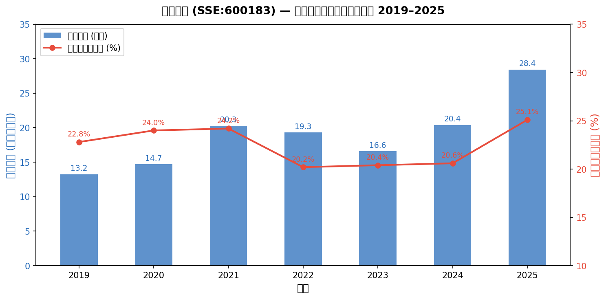
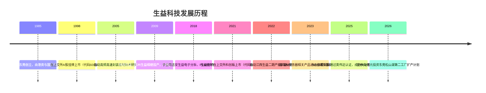
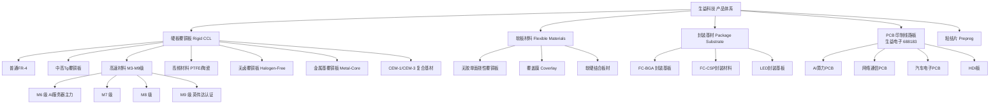
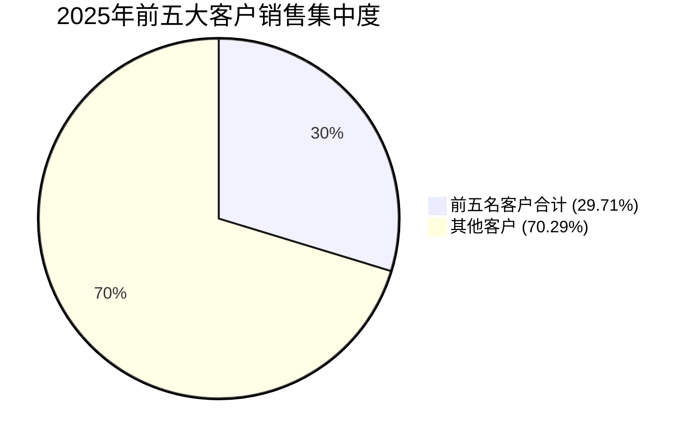
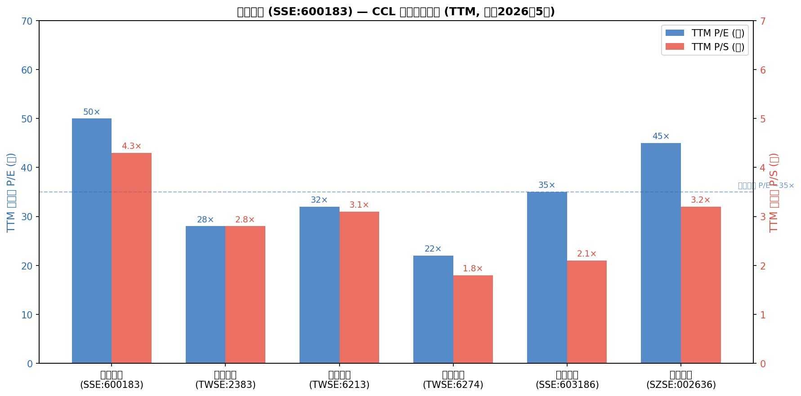
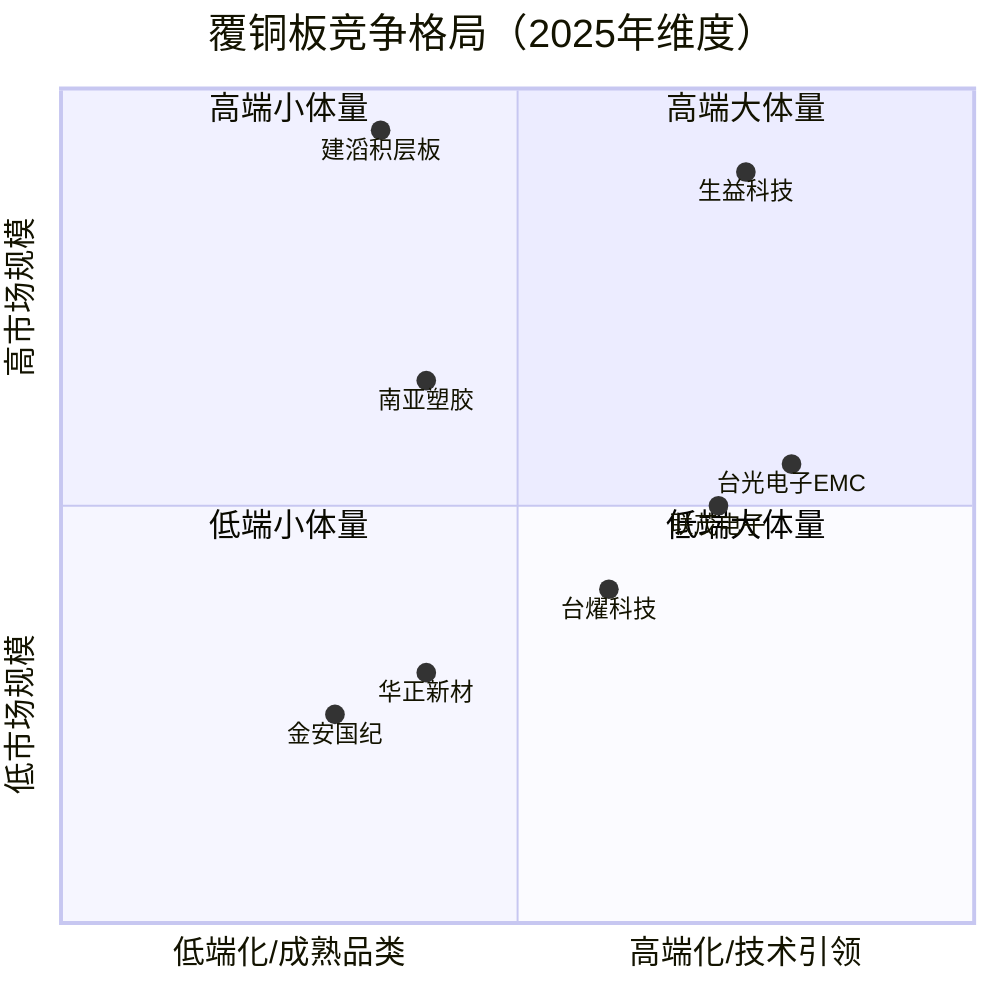
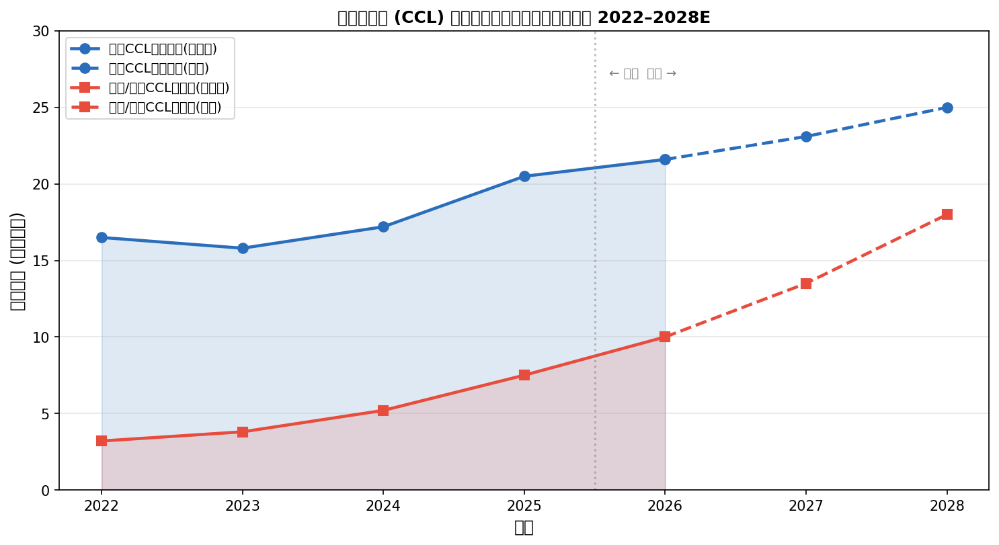

# 公司研究报告：广东生益科技股份有限公司
**日期：2026-05-19 | 股票代码：SSE:600183 | 研究员：Claude Sonnet 4.6**

---

> **Update — 2026Q1业绩强势延续 (2026-04-28)：** 2026年第一季度，公司实现营业收入81.41亿元，同比增长45.09%；归属于上市公司股东的净利润11.58亿元，同比增长105.47%；扣非净利润10.83亿元，同比增长93.51%。营收增速持续加速，主因一是覆铜板（CCL）板块面对原材料价格上涨积极调整价格与产品结构，二是线路板（PCB）子公司生益电子高端AI服务器类业务大幅放量。公司在2025年净利润同比翻近一倍的基础上，2026年开局继续超预期。
> 来源：[生益科技2026年第一季度报告，2026-04-28](https://static.cninfo.com.cn/finalpage/2026-04-29/1225230175.PDF)

---

## 目录
1. 公司概览
2. 公司历史
3. 管理团队
4. 产品与服务
5. 客户与销售策略
6. 行业概览
7. 竞争格局
8. 市场机会（TAM）
9. 风险评估
10. 参考资料

---

## 1. 公司概览

广东生益科技股份有限公司（下称"生益科技"或"公司"）是中国乃至全球电子基材 (electronic circuit base material) 领域的核心龙头，主营覆铜板（CCL / copper-clad laminate）及粘结片（prepreg / 半固化片）的研发、生产与销售，同时通过旗下在科创板单独上市的子公司生益电子股份有限公司（SH:688183，下称"生益电子"）从事中高端印制线路板（PCB / printed circuit board）的制造。

**双层结构是理解本公司的关键前提：** 生益科技（SSE:600183）本身是覆铜板的上游材料供应商，其产品向下游PCB制造商销售；生益电子（SSE:688183）是其控股子公司（生益科技通过直接持股及东莞科创资本等渠道实施控制），专注于中高端PCB制造，与生益科技在产业链上形成上下游协同关系。两家公司均为独立上市法人，各有独立信息披露，但生益科技的合并财务报表已将生益电子并表处理。本报告所有财务数据均为合并口径，除非特别注明。

### 1.1 业务规模与市场地位

根据美国Prismark调研机构全球刚性覆铜板的统计和排名，生益科技自2013年至2024年连续12年保持**全球刚性覆铜板销售总额第二名**，2024年全球市场占有率达到13.7%（[生益科技2025年年度报告，第10页](https://static.cninfo.com.cn/finalpage/2026-04-25/1225195409.PDF)）。公司连续数十年是国内覆铜板市场的绝对霸主，在高速、高频、无卤等高端细分市场建立了深厚的技术和客户壁垒。

**2025年（最新年报）关键财务数据：**
- 营业收入：284.31亿元，同比增长39.45%
- 归属于上市公司股东的净利润：33.34亿元，同比增长91.75%
- 扣非归母净利润：31.75亿元，同比增长89.54%
- 主营业务毛利率：25.10%，同比提升4.52个百分点
- 经营活动现金流净额：52.74亿元，同比大增262.17%
- 加权平均净资产收益率（ROE）：21.25%，同比提升9.08个百分点
- 总资产：327.70亿元；归母净资产：167.24亿元

（来源：[生益科技2025年年度报告，第6-7页](https://static.cninfo.com.cn/finalpage/2026-04-25/1225195409.PDF)）

**分产品营收（2025年）：**
- 覆铜板和粘结片：177.74亿元，毛利率23.91%
- 印制线路板（生益电子）：91.44亿元，毛利率28.61%（同比大增103.93%）
- 废弃资源综合利用：8.55亿元，毛利率14.92%
- 房地产：0.94亿元，毛利率1.66%

公司总员工数14,523人，其中研发人员2,031人，占比13.98%；研发投入14.50亿元，占营业收入5.10%（[生益科技2025年年度报告，第17-18页](https://static.cninfo.com.cn/finalpage/2026-04-25/1225195409.PDF)）。

### 1.2 估值快照

截至2026年5月19日，生益科技股价约69.25元人民币（用户提供数据），市值约1,682亿元。近12个月（TTM）基本每股收益约1.56元（考虑2025年全年及2026年Q1），目前TTM P/E约为**50倍**。根据理杏仁数据，截至2026年4月，PE-TTM（扣非）约为54.88倍，处于历史87.55%分位点（[理杏仁，2026-04](https://www.lixinger.com/equity/company/detail/sh/600183/600183)）。东方财富分析师综合目标价约95元，区间为60-111元，13位分析师给出买入评级（[东方财富，2026-05](http://quote.eastmoney.com/sh600183.html)）。

TTM P/S约为4.3倍。与国内外同业比较：台光电子（TWSE:2383）约28倍PE；联茂电子（TWSE:6213）约32倍PE；台燿科技（TWSE:6274）约22倍PE；华正新材（SSE:603186）约35倍PE。国内CCL板块历史中位数P/E约30-35倍。

**高估值溯源：** 生益科技目前估值高于历史均值和大多数台湾同业，主要驱动因素有三：（1）**M9级高速覆铜板认证突破**——公司于2025年12月成为中国大陆唯一通过英伟达（Nvidia）M9级高频高速覆铜板认证的内资厂商，直接受益于GB300/Rubin架构AI服务器需求爆发，被市场赋予AI基础设施高成长溢价；（2）**业绩高速增长**——2025年净利润翻倍，2026Q1净利润再次翻倍，ROE重回20%以上，盈利质量大幅改善；（3）**扩产预期**——2026年4月公告拟投资约52亿元建设东莞松山湖第二工厂，产能远期增长明确，市场为成长预期定价。当前50-55倍TTM P/E高于台湾同业（22-32倍），若AI服务器需求放缓或竞争格局恶化，估值面临较大压缩风险（详见第九节风险评估）。

来源：[生益科技2025年年度报告](https://static.cninfo.com.cn/finalpage/2026-04-25/1225195409.PDF)；[2024年年度报告](https://static.cninfo.com.cn/finalpage/2025-03-29/1222952338.PDF)；[2023年年度报告](https://static.cninfo.com.cn/finalpage/2024-03-29/1219448691.PDF)

---

## 2. 公司历史

生益科技创立于1985年，前身为香港生益有限公司与东莞市电子工业总公司的合资企业，是中国最早从事覆铜板规模化生产的企业之一。公司于1998年在上海证券交易所A股上市（股票代码600183），前股票简称为"生益股份"，后更名为"生益科技"。总部及主要制造基地位于广东省东莞市松山湖高新技术产业开发区工业西路5号。

**三次战略转型**

**第一次（2005-2010年）：从通用覆铜板到高端材料专攻。** 面对台湾和日本同业在高频高速材料的技术封锁，公司于2005年开始自主攻关，投入大量人力财力于高Tg、低介电损耗（Df）材料的研发，为此后在AI高速材料赛道的竞争建立了技术基础。

**第二次（2015-2021年）：PCB业务规模化与单独上市。** 公司将下属PCB业务整合至生益电子，并于2021年推动生益电子在科创板独立上市，实现了CCL与PCB业务的资本层面分立，同时保留了上下游协同的实质关系。

**第三次（2023-至今）：对齐AI服务器超级周期。** 公司将战略核心转向M6/M7/M8/M9级高速高频覆铜板，主动配合英伟达GB200、GB300、Rubin等架构的产品认证，并宣布重大扩产计划，锁定AI基础设施这一增长引擎。

**主要收购事项：** 公司成立了东莞生益资本投资有限公司，持有联瑞新材等上游新材料供应商股权，通过战略入股方式部分锁定关键原材料供应（[生益科技2025年年度报告，第22页](https://static.cninfo.com.cn/finalpage/2026-04-25/1225195409.PDF)）。2026年4月，公司宣布拟约52亿元投建东莞松山湖第二工厂高性能覆铜板项目，一期约30亿元、预计2028年投产，达产后新增年产能4,800万平方米基材及1亿米粘结片（[新浪财经，2026-04-25](https://finance.sina.com.cn/stock/aigc/tzxm/2026-04-25/doc-inhvrtis4435835.shtml)）。

---

## 3. 管理团队

### 3.1 董事长：陈仁喜

陈仁喜，男，1967年出生，正高级工程师（科技型企业家），高级经济师，本科学历。1989年毕业于华南理工大学有机化学专业，同年进入东莞工作。职业生涯完整扎根于覆铜板行业：先后任职于东莞市氮肥厂、香港东方线路板有限公司、香港生益有限公司，此后进入广东生益科技，历任生产总厂长兼营运总监、副总经理、董事、总经理，2024年6月起担任公司董事长，同时任生益电子、江苏生益、江西生益、陕西生益、苏州生益等多家子公司董事长（[生益科技2025年年度报告，第35-36页](https://static.cninfo.com.cn/finalpage/2026-04-25/1225195409.PDF)）。

陈仁喜的职业轨迹表明他是真正从一线生产成长起来的行业专家，历任营运总监意味着他深度参与了公司多轮产能建设和工艺迭代。2025年在任期间，公司在AI高速材料认证、多轮价格调整策略制定、以及52亿元扩产决策上均展现出较强的市场嗅觉和执行力。2025年税前薪酬1,573.38万元，直接持股254.63万股（约占总股本0.10%）。其薪酬结构以绩效激励为主，与公司盈利高度相关，2025年盈利大幅改善带动薪酬相应提升（[2025年年度报告，第35页](https://static.cninfo.com.cn/finalpage/2026-04-25/1225195409.PDF)）。

陈仁喜被2025年11月的临时股东大会选任为职工董事，将管理层与员工利益进一步绑定，体现公司历来奉行的"五共享机制"（与员工、客户、股东、社会、供应商共享发展成果）的治理文化。从历史数据看，公司近40年职业经理人治理稳定运行，同时年报明确将"职业经理人治理模式改变"列为潜在运营风险，说明管理层对此有清醒认识。

### 3.2 总经理：曾红慧

曾红慧，女，1969年出生，本科学历，1991年毕业于华南理工大学后即入职公司，属于"公司培养"型高管。历任公司销售业务经理、销售部副经理、销售部经理、市场部经理等销售端核心职位，2024年6月起担任总经理兼营销总监，同时任集团营销中心总裁、台湾生益科技有限公司董事长（[2025年年度报告，第37-38页](https://static.cninfo.com.cn/finalpage/2026-04-25/1225195409.PDF)）。2025年税前薪酬1,642.55万元，年内通过二级市场减持537,390股。曾红慧销售出身、深耕客户超30年，主导了公司在AI服务器客户端的产品推进和价格策略调整，2025年多轮提价成效显著，是收入和利润大幅增长的重要执行推手。

### 3.3 总会计师：林道焕

林道焕，男，1979年出生，高级会计师，南开大学会计学专业，2002年毕业后即入职公司，历任财务部会计、会计主任、经理，2024年6月起任总会计师、集团财务中心总裁（[2025年年度报告，第39页](https://static.cninfo.com.cn/finalpage/2026-04-25/1225195409.PDF)）。2025年税前薪酬524.42万元，持股45万股。作为财务负责人，林道焕主持推进了"业财融合、数据驱动经营"的财务管理数字化升级，以及预算内控标准化工作。

### 3.4 总工程师：曾耀德

曾耀德，男，1967年出生，正高级工程师，中山大学化学系高分子材料专业，1989年毕业后入职公司，历任陕西生益科技总工程师，2016年起任生益科技总工程师、集团研发中心总裁（[2025年年度报告，第38-39页](https://static.cninfo.com.cn/finalpage/2026-04-25/1225195409.PDF)）。2025年税前薪酬645.49万元。曾耀德代表公司最高技术权威，超35年覆铜板专业经验，是公司高速高频产品自主化技术攻关的主要推动者。

### 3.5 治理结构与股权

**主要股东：**
- 广东省广新控股集团有限公司（国有法人）：22.56%（547,979,502股）
- 东莞市国弘投资有限公司（国有法人）：13.29%（322,740,539股，与东莞市科创资本为一致行动人）
- 伟华电子有限公司（境外法人）：12.25%（297,716,053股，合计含QFII账户）

三大战略股东合计持有约49%，均无限售条件，但股权结构中国有资本（广新系）占主导地位。公司董事会有12名成员，含4名独立董事。2025年11月，公司废止监事会，将原监事会职权归并至董事会审计委员会，治理结构进一步简化（[2025年年度报告，第39-40页](https://static.cninfo.com.cn/finalpage/2026-04-25/1225195409.PDF)）。

**薪酬机制：** 公司自2006年实施业绩激励基金制度，董事和高级管理人员薪酬与扣非净利润强挂钩，基本薪酬占比低于20%，其余均为业绩联动的激励。2025年净利润近翻倍带动管理层薪酬大幅提升，与公司利益高度一致。

**管理团队评价：** 现任核心高管几乎全部是公司内部培养、深耕行业20年以上的人才，执行稳定性强，对产品和市场的理解深入。公司近40年持续盈利（仅个别年份盈利承压）、连续大比例分红（2025年拟每10股派现8元），印证了这支团队的经营能力。主要风险在于国有股东（广新、国弘）的管控倾向与职业经理人机制的平衡，一旦这一平衡被打破，可能引发经营文化和激励机制的变化。

---

## 4. 产品与服务

生益科技的产品谱系以覆铜板及粘结片为核心，辅以软性材料（挠性覆铜板和覆盖膜）和封装基材，通过子公司生益电子延伸至PCB。

### 4.1 硬板覆铜板（核心主业）

**普通FR-4 / CEM-1 / CEM-3（传统产品）：** 应用于家电、照明、消费电子，是公司历史积累最深的品类，规模效应强，成本竞争力突出，但毛利率较低、市场竞争激烈。该类产品已进入成熟期，生益凭借规模效应和成本管控维持份额，但战略重心已逐步向高端移动。**竞争优势：是/规模领先**；最近竞争对手为建滔集团（HK:0148）、南亚塑胶（TWSE:1303）。

**中高Tg覆铜板（汽车电子、高端工控）：** Tg≥150°C（玻璃化转变温度），满足汽车800V高压平台和工业控制的耐热要求。2025年研发重点之一为"汽车电子用更高耐热覆铜板技术平台"（[2025年年度报告，第18页](https://static.cninfo.com.cn/finalpage/2026-04-25/1225195409.PDF)）。汽车市场整体平稳，ADAS（高级驾驶辅助系统）和智能座舱带来高端材料需求增量。**竞争优势：是/认证壁垒+技术**；台光电子（Elite Material, TWSE:2383）是主要竞争对手。

**高速高频覆铜板（M6/M7/M8/M9 级，战略重心）：** 这是当前最具战略价值的产品线。高速覆铜板以低介电常数（Dk）、低介电损耗（Df）为核心指标，主要应用于AI高算力服务器、5G通信骨干网、高端交换机。M级别数字越高，材料规格越严苛（M9：Df≤0.002，满足224Gbps高速传输要求）。

**核心突破：** 2025年12月，生益科技M9级覆铜板通过英伟达认证，成为**中国大陆唯一获证厂商**，并进入英伟达GB300及Rubin架构供应链，与台光电子、松下并列为三大主要M9覆铜板供应商（[搜狐科技，2025-12](https://www.sohu.com/a/1022053673_122252247)）。2025年上半年，高端产品（M7/M8级别）在生益覆铜板中的占比已从2024年的约15%提升至22%，直接带动毛利率从2024年的21.52%大幅提升至2025年全年的23.91%。

M9产品目前年产能约1,200万平方米，良率约90%，高于行业平均的70%，东莞、苏州基地均已实现量产（[腾讯新闻，2025-09](https://news.qq.com/rain/a/20250922A0106T00)）。**竞争优势：强/技术+认证护城河**；近端竞争对手为台光电子（EMC/TWSE:2383）、联茂电子（TWSE:6213）、松下（Panasonic）。

**高频覆铜板：** 基于PTFE（聚四氟乙烯）或陶瓷填充体系，主要用于5G毫米波天线和卫星通信，属于高壁垒小体量细分市场。公司已开发多技术路线高频产品并实现批量应用（[2025年年度报告，第10页](https://static.cninfo.com.cn/finalpage/2026-04-25/1225195409.PDF)）。

**无卤覆铜板（Halogen-Free）：** 满足欧盟RoHS等环保法规要求，适用于高端消费电子和通信设备，技术难度适中，市场需求持续扩展。

**金属基覆铜板（Metal-Core CCL）：** 铝基或铜基，主要用于LED照明和功率电子，是生益早期重要市场，目前市场趋于成熟。

### 4.2 软板材料（挠性）

公司软材业务（挠性覆铜板 Flexible CCL、覆盖膜 Coverlay）连续**8年实现两位数以上增长**，2025年完成航天产品生产线升级、南通软板项目、封装胶膜产线三大项目（[2025年年度报告，第11-12页](https://static.cninfo.com.cn/finalpage/2026-04-25/1225195409.PDF)）。应用于5G可穿戴设备、汽车电子和航空航天，是公司多元化中最具稳定性的成长点之一。2025年研发中"高尺寸稳定性无胶单面挠性覆铜板"已突破行业领先水平。

### 4.3 封装基材（IC Substrate）

公司在FC-BGA（倒装芯片球栅阵列）封装基材方面取得重大突破，面向下一代HPC（高性能计算）和AI芯片的需求，完成针对大尺寸封装（>55mm×55mm）的关键性能指标开发，"已达国际领先水平"（[2025年年度报告，第18页](https://static.cninfo.com.cn/finalpage/2026-04-25/1225195409.PDF)）。同时在FC-CSP（适用于AP/CPU/GPU/AI类产品）等领域批量使用，卡类封装、LED、存储芯片类领域亦已实现批量应用。封装基材是技术壁垒最高的CCL细分，也是毛利率最高的品类。

### 4.4 PCB（生益电子，688183）

生益电子2025年实现营业收入94.94亿元，同比增长102.57%；净利润14.73亿元，同比增长343.76%（[生益电子2025年年度报告](http://file.finance.sina.com.cn/211.154.219.97:9494/MRGG/CNSESH_STOCK/2026/2026-4/2026-04-24/12166656.PDF)）。AI算力相关PCB产品同比增长242%，服务器产品收入占比达60%以上。生益电子专注中高端PCB（14层以上多层板、HDI板、AI算力板），是生益科技在PCB方向的战略桥头堡，并借助上市融资实现独立产能扩张。

**旗舰产品评价：** M9级高速覆铜板是目前最具护城河的单一产品——通过英伟达认证意味着进入英伟达生态的供应商名录，准入壁垒极高，存量客户的切换成本也极高。FC-BGA封装基材虽体量尚小，但代表着下一个高成长方向。

---

## 5. 客户与销售策略

### 5.1 客户集中度

根据最新年报，**2025年前五名客户合计销售额828,049.37万元（约82.80亿元），占年度销售总额的29.71%**（[生益科技2025年年度报告，第16页](https://static.cninfo.com.cn/finalpage/2026-04-25/1225195409.PDF)）。前五名客户中无关联方。与历史数据比较：2024年前五名客户合计占比16.22%，2023年合计占比15.93%。2025年前五大客户集中度从16%跳升至30%，主要原因是AI服务器头部PCB客户产能受限后大量订单向生益转移，以及高价值M9产品占比提升使单客户金额大幅上升。

虽然前五名客户合计占比29.71%尚未超过50%，但同比跳升超过13个百分点值得关注——说明客户结构正在向少数头部AI服务器产业链客户集中，这在短期为业绩提供强力支撑，但也意味着若头部客户需求回落，影响会更集中。公司明确声明**无单一客户销售比例超过50%**（[2025年年度报告，第17页](https://static.cninfo.com.cn/finalpage/2026-04-25/1225195409.PDF)），且前五名客户中无新增导致严重依赖的情形。单一客户占比未披露，但按此前历史数据推断，第一大客户一般低于10%，不构成重大单客户风险。

**2025年前五大供应商：** 合计采购额508,841.63万元，占年度采购总额的27.45%，无关联方。**2024年前五大供应商：** 合计采购额319,161.35万元，占年度采购总额22.18%（[2025年年度报告，第16页](https://static.cninfo.com.cn/finalpage/2026-04-25/1225195409.PDF)；[2024年年度报告，第15页](https://static.cninfo.com.cn/finalpage/2025-03-29/1222952338.PDF)）。供应商集中度低于客户集中度，铜箔、玻纤布、环氧树脂等主要原材料供应商分散，但价格波动风险依然突出。

来源：[生益科技2025年年度报告，第16页](https://static.cninfo.com.cn/finalpage/2026-04-25/1225195409.PDF)

### 5.2 主要客户类型

生益科技的下游是PCB制造商，PCB制造商再向终端客户（OEM）供应产品。生益科技的直接客户因此是PCB厂商，其中包括：沪电股份（SSE:002463）、鹏鼎控股（SZSE:002938）、深南电路（SSE:002916）、生益电子（SSE:688183，子公司，内部关联但按公告无关联交易）及全球头部PCB企业如TTM Technologies、AT&S等，最终终端受益方则覆盖英伟达、Google、Amazon等全球AI算力巨头。公司通过多年来对PCB行业头部客户的深度合作和产品认证，实现了技术壁垒的持续强化。

### 5.3 销售模式

公司以**直销为主**，2025年直销营收占主营收入比例达99.3%（27,674,103,308元 vs. 主营27,867,432,387元），经销仅0.7%（[2025年年度报告，第15页](https://static.cninfo.com.cn/finalpage/2026-04-25/1225195409.PDF)）。这一模式强化了与客户的直接关系，有利于准确了解需求和快速响应，亦有利于保护价格体系。公司在全球主要PCB制造商中建立了广泛的合作关系，并通过产品认证形成较高的客户黏性和切换成本。

### 5.4 地区分布

2025年内销占比75.6%（21,059亿/27,867亿），外销占比24.4%（6,808亿/27,867亿），外销毛利率28.67%，高于内销23.95%（[2025年年度报告，第15页](https://static.cninfo.com.cn/finalpage/2026-04-25/1225195409.PDF)）。外销同比增幅达102.82%，部分系AI服务器终端产业链中，海外品牌商订单通过境内PCB厂最终在生益外销。公司境外资产约19.80亿元，占总资产6.04%，主要为生益香港、台湾生益及泰国工厂（建设中）。

---

## 6. 行业概览

### 6.1 覆铜板行业定义与结构

覆铜板（CCL）是PCB的最核心上游原材料，由铜箔（copper foil）、玻纤布（fiberglass cloth / E-glass cloth）和树脂系统（resin，主要为环氧树脂 epoxy resin）经热压复合而成，是PCB的"基底"。PCB再经过图形制作、蚀刻等工序形成电路板，最终装入各类电子设备。因此，CCL是整个电子产业链中最上游的材料之一。

覆铜板行业经过数十年的市场化竞争，全球已形成相对集中稳定的供应格局——根据公司披露，**2024年全球前三家CCL厂商市场份额合计约41.3%，前十家合计约77%**（[2025年年度报告，第21页](https://static.cninfo.com.cn/finalpage/2026-04-25/1225195409.PDF)）。头部厂商的规模优势和技术护城河极高，新进入者几乎无从企及。全球前五大CCL厂商分别为：建滔积层板（Kingboard, HK:0148）、生益科技（SSE:600183）、台光电子（EMC, TWSE:2383）、南亚塑胶（Nan Ya Plastics, TWSE:1303子公司）、松下（Panasonic）。

### 6.2 AI驱动的超级需求周期

2025年是AI服务器超级周期的关键爆发年。根据公司年报引用Prismark数据，**2025年全球PCB产值预计达851.52亿美元，同比增长15.8%**；**2026年全球PCB产值预计进一步增长12.5%至957.8亿美元**，其中18层以上多层板、HDI板和封装基板将是主要增长极（[生益科技2025年年度报告，第10页](https://static.cninfo.com.cn/finalpage/2026-04-25/1225195409.PDF)）。

AI服务器（AI server）所需的CCL远比传统服务器高端：一块英伟达GB200 NVL或GB300的背板（backplane）、主板（mother board）及网络交换板（network switch board）所用的高速覆铜板用量是传统服务器的数倍，且对低Dk/低Df的规格要求极高。M9级材料的单价是普通FR-4的数倍乃至十余倍。这一结构性升级使CCL行业从量的成长升级到量价双升的逻辑，对生益科技这类高端材料能力突出的厂商极为有利。

值得关注的是，AI服务器与数据中心代表了全球电子行业2025年**增速最快的细分市场（同比增长41.9%）**，远超手机（+7.5%）和PC（+8.5%）等传统消费电子市场（[生益科技2025年年度报告，第10页](https://static.cninfo.com.cn/finalpage/2026-04-25/1225195409.PDF)）。公司2025年上半年披露，AI服务器与5G通信相关CCL销售占总收入比例达35%（[腾讯新闻，2025-09](https://news.qq.com/rain/a/20250922A0106T00)）。

### 6.3 原材料成本结构与价格波动

覆铜板的成本高度依赖三大原材料：**铜箔、玻纤布、环氧树脂**。根据年报成本分析，2025年覆铜板和粘结片直接材料占该分部总成本的约87.5%（[2025年年度报告，第16页](https://static.cninfo.com.cn/finalpage/2026-04-25/1225195409.PDF)）。

- **铜箔（copper foil）：** 价格与伦敦金属交易所（LME）铜价高度相关。2025年全年LME铜价持续波动走高，第三季度美联储降息后大宗商品价格进一步上涨，推动铜箔成本上升。2026年初铜价继续攀升，进一步压缩低端覆铜板毛利率。此外，AI类产品对RTF/HVLP等高端铜箔的需求挤占了普通HTE铜箔的产能，导致后者亦出现短缺（[2025年年度报告，第32页](https://static.cninfo.com.cn/finalpage/2026-04-25/1225195409.PDF)）。
- **玻纤布（fiberglass cloth / E-glass woven fabric）：** AI类产品对Low DK布的强劲需求导致高端玻纤布供应商纷纷转产，普通玻纤布供给紧缩，价格在2025年下半年呈每月10%-20%跳升的异常态势（[2025年年度报告，第32页](https://static.cninfo.com.cn/finalpage/2026-04-25/1225195409.PDF)）。
- **环氧树脂（epoxy resin）：** 受中东地区地缘政治不稳定（霍尔木兹海峡贸易不确定性）影响，化工原材料价格出现急剧波动（[2025年年度报告，第32页](https://static.cninfo.com.cn/finalpage/2026-04-25/1225195409.PDF)）。

生益科技的毛利率对原材料价格极度敏感：2022年原材料价格高位时，CCL毛利率约20.1%；2023年行业供过于求、原材料价格回落时，毛利率小幅下降至17.89%；2024年随着AI服务器带动高端产品放量，毛利率回升至20.58%；2025年量价双升，全年主营毛利率达到25.10%的阶段高点。公司通过积极调整产品结构（提高高端产品占比）和多轮顺价（将原材料成本向下游传导）来平抑毛利率波动，但这在2026年原材料价格继续上涨的环境下仍构成较大压力。

### 6.4 监管与行业协会

公司是中国电子电路行业协会（CPCA）、中国覆铜板行业协会（CCLA）、中国电子材料行业协会会员，同时担任国际电工委员会（IEC）TC91/WG10和TC91/WG4工作组召集人，以及全国印制电路标准化技术委员会副主任委员。公司已累计主导制定IEC国际标准18项（已发布13项）、国家标准15项（已发布7项）（[2025年年度报告，第12页](https://static.cninfo.com.cn/finalpage/2026-04-25/1225195409.PDF)），在行业标准制定中具有实质性话语权。

---

## 7. 竞争格局

来源：[理杏仁，2026-04](https://www.lixinger.com/equity/company/detail/sh/600183/600183)；各公司公开财务数据

### 7.1 建滔积层板（Kingboard, HK:0148）— 全球第一

建滔集团旗下的建滔积层板是全球销售额排名第一的CCL厂商，以普通FR-4和中端产品为主，规模极大，但在高速高频材料方面的技术积累不及生益科技。在全球市场份额上小幅领先生益，但盈利质量和成长性略逊，未进入英伟达M9认证供应链。

### 7.2 台光电子（Elite Material / EMC, TWSE:2383）— 最强直接竞争对手

台光电子是高端CCL市场最重要的竞争对手，同样进入了英伟达M9认证供应商体系，且在高频高速材料方面的技术积累深厚。2023年台光电子在特殊刚性覆铜板市场中占有率约19.3%，位居全球第一（[格隆汇，2024-07](https://m.gelonghui.com/p/821299)）。相较于生益科技，台光电子在高频高速细分市场的综合份额更高，但在规模体量和产品全系列覆盖方面稍逊生益。台光是生益在AI服务器材料赛道上的最强直接竞争对手。

### 7.3 联茂电子（ITEQ, TWSE:6213）

联茂电子是台湾高速覆铜板中坚厂商，在M6/M7级别产品上拥有成熟的客户认证，占特殊刚性覆铜板市占率约12.6%（[格隆汇，2024-07](https://m.gelonghui.com/p/821299)）。联茂电子在AI服务器领域亦有重要布局，是生益科技争夺海外ASIC客户（谷歌、AWS等）的重要竞争方。

### 7.4 台燿科技（Taiwan Union Technology, TWSE:6274）

台燿专注于中高端FR-4和高速材料，在AI服务器板和通信领域拥有稳定客户群，市占率约11.1%。技术路线与生益部分重叠，但规模小于生益。

### 7.5 南亚塑胶（Nan Ya Plastics, TWSE:1303）

台湾台塑集团旗下的南亚塑胶是全球主要CCL厂商之一，同时也是重要的铜箔供应商。产品系列覆盖普通至中高端，在AI高速材料方面较台光电子和生益科技慢一步，但集团背景带来原材料垂直整合优势。

### 7.6 华正新材（SSE:603186）— 国内竞争者

华正新材是国内覆铜板第二梯队的代表，产品以中低端覆铜板为主，在高频高速方向有一定布局但技术水平和客户认证与生益科技差距显著。2025年华正新材股价表现也相当强劲，部分受益于AI主题溢价，但实质业绩增速不及生益科技。

### 7.7 金安国纪（SZSE:002636）

金安国纪聚焦普通FR-4和中端覆铜板，是国内传统覆铜板厂商代表，在高速高频材料方面布局较浅，与生益科技的直接竞争主要在传统产品线。

### 7.8 竞争优势分析

生益科技的核心竞争优势在于：

1. **全球第二规模+国内绝对第一**：规模带来的成本效应和客户信任度不可替代。
2. **M9认证的排他性**：目前为大陆唯一英伟达M9认证厂商，构成短期排他壁垒，且认证周期一般为12-18个月，竞争对手跟进需要时间。
3. **全系列产品能力**：能够为PCB厂商提供"一站式采购"（[2025年年度报告，第13页](https://static.cninfo.com.cn/finalpage/2026-04-25/1225195409.PDF)），降低客户多供应商管理成本，是中小CCL厂商无法复制的优势。
4. **研发深度**：累计435件有效专利，国家认定技术中心和国家电子电路基材工程技术研究中心两大平台，研发投入持续占营收5%以上。
5. **与客户的深度绑定**：通过标准制定权（IEC召集人）实现了更深层的生态位护城河。

主要竞争脆弱性：（1）台光电子等台系厂商在高速材料的技术积累历史更长，（2）规模扩张带来的重资产结构使公司在行业下行时财务压力较大，（3）公司不涉足上游材料生产（铜箔、玻纤布），供应链风险较高。

---

## 8. 市场机会（TAM）

来源：Business Research Insights, Fortune Business Insights 2025；Prismark数据引自[生益科技2025年年度报告，第10页](https://static.cninfo.com.cn/finalpage/2026-04-25/1225195409.PDF)

### 8.1 全球CCL总市场（TAM）

依据多家市场研究机构的综合估计，全球铜箔基板（CCL）市场2025年规模约为**200-205亿美元**。根据Prismark等机构的预测，全球CCL市场预计在2025-2028年维持约5-8%的年化复合增长率（CAGR），至2028年有望达到250亿美元以上。中国是最大单一市场，占全球约50%市值份额（[Business Research Insights, 2025](https://www.businessresearchinsights.com/market-reports/copper-clad-laminate-ccl-and-prepreg-market-105996)）。

### 8.2 高速高频CCL子市场（高价值SAM）

高速高频CCL（对应M6级及以上产品）是当前成长最快的细分，2024年全球市场规模约37.5亿美元，预计到2031年将达到77.89亿美元，CAGR约11.2%（[格隆汇，2024](https://m.gelonghui.com/p/821299)）。这一细分的增长远超整体CCL市场，主要驱动因素是：（1）AI服务器每年迭代更新对高速材料的需求指数级扩张；（2）5G及下一代1.6T以太网骨干网建设；（3）汽车800V高压平台对高Tg/低Df材料的批量采购。

### 8.3 生益科技的市场份额路径

生益科技2025年CCL销售额约177亿元人民币（约24亿美元），在全球CCL市场约有12-13%份额。在高速高频子市场，公司的份额高于整体（约20-22%估算），但要实现M9认证带来的进一步份额提升，关键依赖于：（1）东莞松山湖第二工厂按期于2028年投产，带来4,800万平方米增量产能；（2）英伟达Rubin架构GB300/GB400等下一代产品顺利量产放量；（3）中国大陆AI服务器本土需求的进一步加速（字节跳动、阿里云、腾讯云等超大规模数据中心持续扩张）。

根据Prismark预测，**2026年全球PCB产值将增长12.5%至957.8亿美元**，对应CCL市场亦将同步成长（[生益科技2025年年度报告，第32页](https://static.cninfo.com.cn/finalpage/2026-04-25/1225195409.PDF)）。生益科技2026年计划销售硬板覆铜板14,510万平方米、粘结片24,238万米、软板3,475万平方米、线路板195万平方米（[2025年年度报告，第33页](https://static.cninfo.com.cn/finalpage/2026-04-25/1225195409.PDF)），硬板CCL销售量相比2025年实际（16,062万平方米）略有下调，或与产能结构优化、高端产品占比提升（以量换价）有关。

---

## 9. 风险评估

### 9.1 公司特定风险

**风险一：原材料价格剧烈波动（严重性：高）**

铜箔、玻纤布、环氧树脂三大原材料占覆铜板直接材料成本约85%以上，价格波动直接影响毛利率。2025年年底至2026年初，LME铜价急速攀升、高端玻纤布每月跳涨10%-20%、中东地缘政治导致环氧树脂化工原材料供给受扰，公司直言"2026年供给侧影响因素将出现前所未有的复杂"（[2025年年度报告，第32页](https://static.cninfo.com.cn/finalpage/2026-04-25/1225195409.PDF)）。公司的应对措施是顺价（向下游PCB厂转移成本）和提升高端产品占比（高端产品价格弹性更大），但若下游需求阶段性转弱，顺价空间将受限，毛利率压力会明显体现。参考历史：2022年原材料高位导致净利润阶段性承压。

**风险二：客户集中度快速提升（中等）**

2025年前五大客户合计占比从16%大幅跳升至30%，一定程度反映公司在AI服务器产业链中份额集中。若英伟达等主要终端的AI服务器出货节奏放缓（如宏观收缩、技术代际更替期），或头部PCB厂产能恢复后订单分散，生益的营收增速可能骤然下降。单一客户占比未披露，但推断不超过20%，目前不触发"重大风险"阈值，但趋势需持续关注。

**风险三：估值泡沫/多重压缩（严重性：高）**

当前TTM P/E约50倍，高于国内行业中位数约30-35倍，也高于大部分台湾同业（22-32倍）。高估值的核心支撑是M9认证带来的AI故事和快速成长预期。若2026年下半年AI服务器需求出现周期性回调（头部云厂商资本开支收缩），或竞争对手（如台光电子、松下）在M9材料上取得规模突破使生益认证壁垒弱化，估值面临较大回调压力。以25-30倍合理PE估算，目标市值约840-1,000亿元，较当前1,682亿元有40-50%的理论回落空间。

**风险四：生益电子子公司治理与价值漏出（中等）**

生益电子（688183）独立上市，少数股东权益持续增厚——2025年少数股东损益达5.58亿元，同比增长332%（[2025年年度报告，第13页](https://static.cninfo.com.cn/finalpage/2026-04-25/1225195409.PDF)）。生益电子的高速成长意味着生益科技合并利润中有相当部分由少数股东分享，对归母净利润存在稀释效应。此外，生益电子有独立融资、独立董事会，当其战略利益与母公司出现分歧时（如在同一终端竞争、供应链定价等），存在潜在的关联方利益博弈风险。目前两者治理架构清晰，但需警惕长期价值在双上市结构下的分配问题。

**风险五：职业经理人治理模式稳定性（中等）**

公司近40年运营建立在"职业经理人治理+五共享激励"的独特文化上，陈仁喜本人即指出"职业经理人治理模式改变"是潜在运营风险之一（[2025年年度报告，第33页](https://static.cninfo.com.cn/finalpage/2026-04-25/1225195409.PDF)）。国有大股东（广新控股持股22.56%）的政策取向或干预行为，若影响到激励机制或重大决策，可能打破现有平衡。

### 9.2 行业与市场风险

**风险六：AI服务器需求周期性回调（严重性：高）**

AI基础设施投资高度集中于英伟达/ASIC生态，具有典型的需求周期特征。云厂商资本开支一旦进入收缩期，对高端CCL需求的冲击将快速而集中。公司2025年营收增速39%中大约有相当部分是AI服务器增量贡献，对该需求的依赖度正在上升。历史上2022-2023年PCB/CCL行业即经历了一轮供过于求、需求低迷、毛利率下压的周期。

**风险七：技术路线颠覆（低至中等）**

公司年报指出，"更长眼光来看，在未来高端的高速和封装材料中，有机树脂体系材料有可能存在被陶瓷基、玻璃基等新型材料颠覆的风险"（[2025年年度报告，第33页](https://static.cninfo.com.cn/finalpage/2026-04-25/1225195409.PDF)）。当前五年内这一风险现实程度较低，但中长期技术路径的不确定性值得关注，尤其是硅光（silicon photonics）和玻璃基中介层（glass substrate）等技术方向若加速商业化，可能部分替代传统有机覆铜板应用。

**风险八：中美脱钩与地缘政治（中等）**

美西方国家推动产业链脱钩断链的政策可能限制生益科技进入部分海外市场（[2025年年度报告，第33页](https://static.cninfo.com.cn/finalpage/2026-04-25/1225195409.PDF)）。反观，这一趋势也有正面含义——中国大陆AI服务器厂商（华为、浪潮、中科曙光等）在国产化率要求下，优先采购生益等本土供应商。公司泰国工厂建设（2025年投资持续增加）亦是规避地缘政治风险的布局。

**风险九：竞争对手在M9认证实现突破（中等）**

目前生益科技是大陆唯一英伟达M9认证厂商，但台光电子、联茂电子已在M9材料方向积极布局；华正新材、南亚新材等也有追赶迹象。若竞争对手实现批量量产并获得更多客户认证，将削弱生益的定价权和市场份额优势，导致高速材料毛利率承压。

### 9.3 财务风险

**风险十：重资产扩张带来的资本回报压力（中等）**

2026年宣布52亿元新工厂投资，加上现有在建工程（2025年末在建工程余额13.54亿元，同比增长188%），公司将进入重投资期（[2025年年度报告，第20页](https://static.cninfo.com.cn/finalpage/2026-04-25/1225195409.PDF)）。若一期2028年投产时市场需求出现阶段性低迷，产能闲置将对折旧和ROE形成拖累。公司目前债务水平适中（短期借款23.05亿元、长期借款9.03亿元），但未来几年投资活动现金流出将持续偏高，需要保持经营现金流的强劲。

**风险十一：外汇风险（中等）**

公司外销占比24%，境外资产占总资产6%，人民币汇率波动会对外销毛利率和境外资产价值产生影响。2025年其他综合收益中外币报表折算收益约4066万元，影响较小但不可忽视。2026年Q1其他综合收益（境外折算）出现-4,615万元，汇率波动趋强（[2026年Q1报告](https://static.cninfo.com.cn/finalpage/2026-04-29/1225230175.PDF)）。

### 9.4 宏观经济风险

**风险十二：全球贸易政策不确定性（中等）**

美国关税政策频繁变化是2025年市场的重要扰动因素——公司年报明确提及2025年Q2"客户抓住90天对等关税豁免期提前下单"，使得接单异常集中（[2025年年度报告，第10-11页](https://static.cninfo.com.cn/finalpage/2026-04-25/1225195409.PDF)）。这种"提前备货式需求"在豁免期结束后可能造成需求真空，是2026年下半年需要关注的风险点。中东局势（霍尔木兹海峡）对化工原材料的供应影响亦已在年报中明确指出。

---

## 参考资料

### 一、主要申报文件

- [生益科技2025年年度报告（2026-04-24）](https://static.cninfo.com.cn/finalpage/2026-04-25/1225195409.PDF)
- [生益科技2025年年度报告摘要（2026-04-24）](https://static.cninfo.com.cn/finalpage/2026-04-25/1225195362.PDF)
- [生益科技2024年年度报告（2025-03-28）](https://static.cninfo.com.cn/finalpage/2025-03-29/1222952338.PDF)
- [生益科技2023年年度报告（2024-03-28）](https://static.cninfo.com.cn/finalpage/2024-03-29/1219448691.PDF)
- [生益科技2021年年度报告（2022-03-28）](https://static.cninfo.com.cn/finalpage/2022-03-29/1217009101.PDF)

### 二、季度与半年度报告

- [生益科技2026年第一季度报告（2026-04-28）](https://static.cninfo.com.cn/finalpage/2026-04-29/1225230175.PDF)
- [生益科技2025年第三季度报告（2025-10-28）](https://static.cninfo.com.cn/finalpage/2025-10-29/1224754863.PDF)
- [生益科技2025年半年度报告（2025-08-15）](https://static.cninfo.com.cn/finalpage/2025-08-16/1224499862.PDF)

### 三、业绩说明会

- [关于召开2025年年度暨2026年第一季度业绩说明会的公告（2026-04-24）](https://static.cninfo.com.cn/finalpage/2026-04-25/1225195364.PDF)

### 四、子公司申报文件

- [生益电子股份有限公司2025年年度报告（SH:688183）](http://file.finance.sina.com.cn/211.154.219.97:9494/MRGG/CNSESH_STOCK/2026/2026-4/2026-04-24/12166656.PDF)

### 五、市场行情数据

- [东方财富 生益科技行情（SSE:600183）](http://quote.eastmoney.com/sh600183.html)
- [理杏仁 生益科技估值历史数据，2026-04](https://www.lixinger.com/equity/company/detail/sh/600183/600183)

### 六、新闻与行业资讯

- [生益科技拟投52亿元建设高性能覆铜板项目，新浪财经，2026-04-25](https://finance.sina.com.cn/stock/aigc/tzxm/2026-04-25/doc-inhvrtis4435835.shtml)
- [AI算力推动PCB覆铜板：交期翻3倍、价格暴涨74%，中国大陆诞生英伟达M9认证企业，搜狐科技，2025-12](https://www.sohu.com/a/1022053673_122252247)
- [全球刚性覆铜板第二！生益科技126亿营收，AI服务器占比35%，腾讯新闻，2025-09](https://news.qq.com/rain/a/20250922A0106T00)
- [高端覆铜板需求火热 生益科技、南亚新材业绩与股价齐飞，东方财富，2025-12](https://caifuhao.eastmoney.com/news/20251210181822726111000)
- [生益科技2026年净利润增长超九成 52亿元投资加码高性能覆铜板布局，新浪财经，2026-04-24](https://finance.sina.com.cn/roll/2026-04-24/doc-inhvrhty3164205.shtml)
- [格隆汇 2024年全球高速数字覆铜板（CCL）行业规模及市场占有率分析报告，2024-07](https://m.gelonghui.com/p/821299)

### 七、行业研究

- [Business Research Insights, Copper Clad Laminate (CCL) and Prepreg Market Size Report, 2035](https://www.businessresearchinsights.com/market-reports/copper-clad-laminate-ccl-and-prepreg-market-105996)
- [Fortune Business Insights, Copper Clad Laminates Market Size, 2034](https://www.fortunebusinessinsights.com/copper-clad-laminates-market-116064)
- [东方财富证券研究 生益科技深度报告，李珏晗，2026-05-23](https://pdf.dfcfw.com/pdf/H3_AP202505231677628490_1.pdf?1747998514000.pdf=)

---

*本报告由 Claude Sonnet 4.6 根据公司公开披露文件和公开新闻资料撰写，仅供参考，不构成投资建议。所有数据均有明确来源，未经披露的数据已标注"未披露"。*
