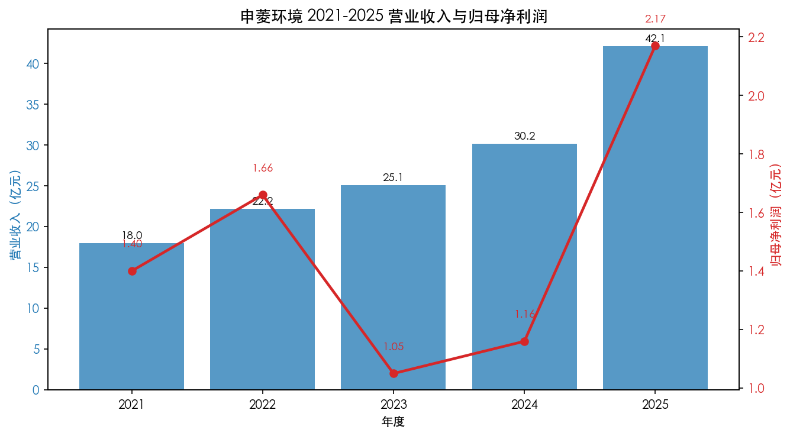
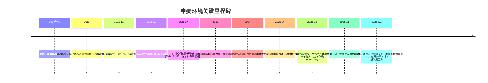
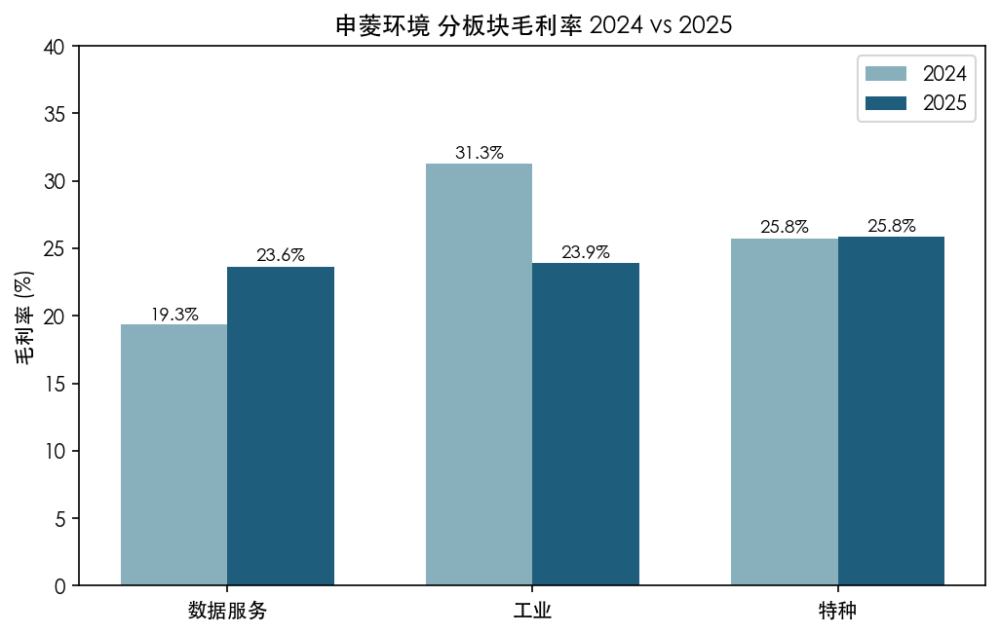
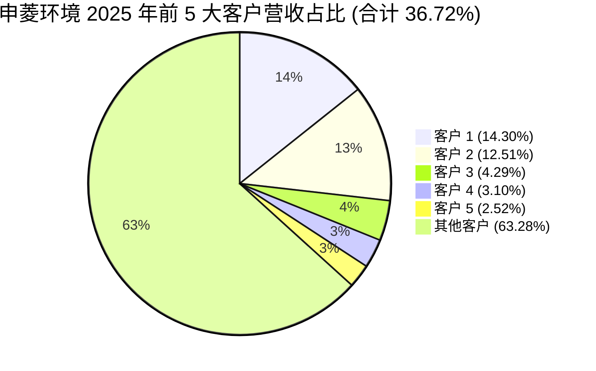
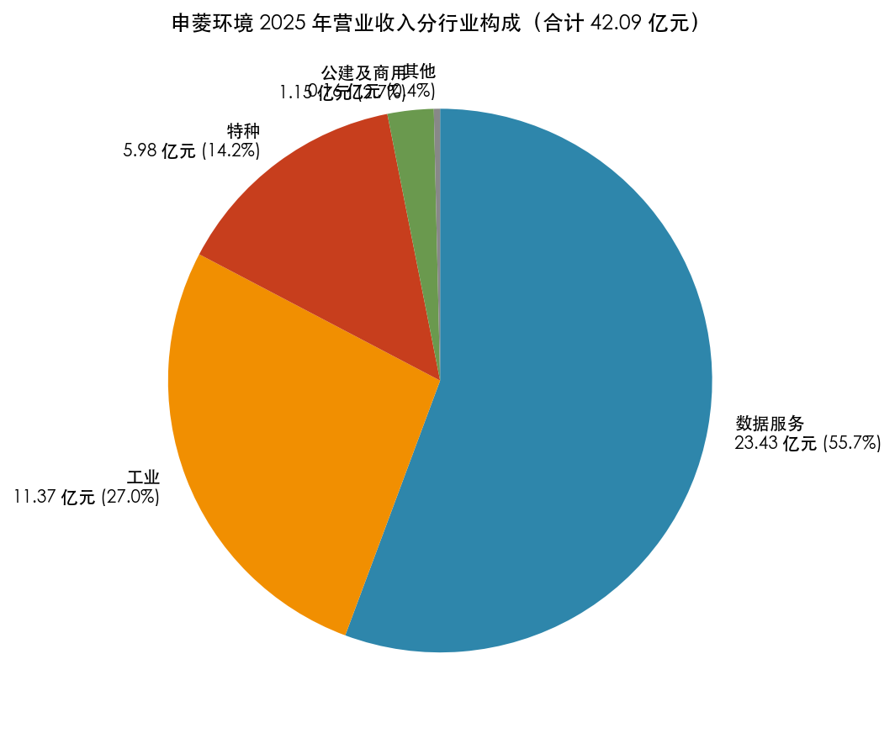
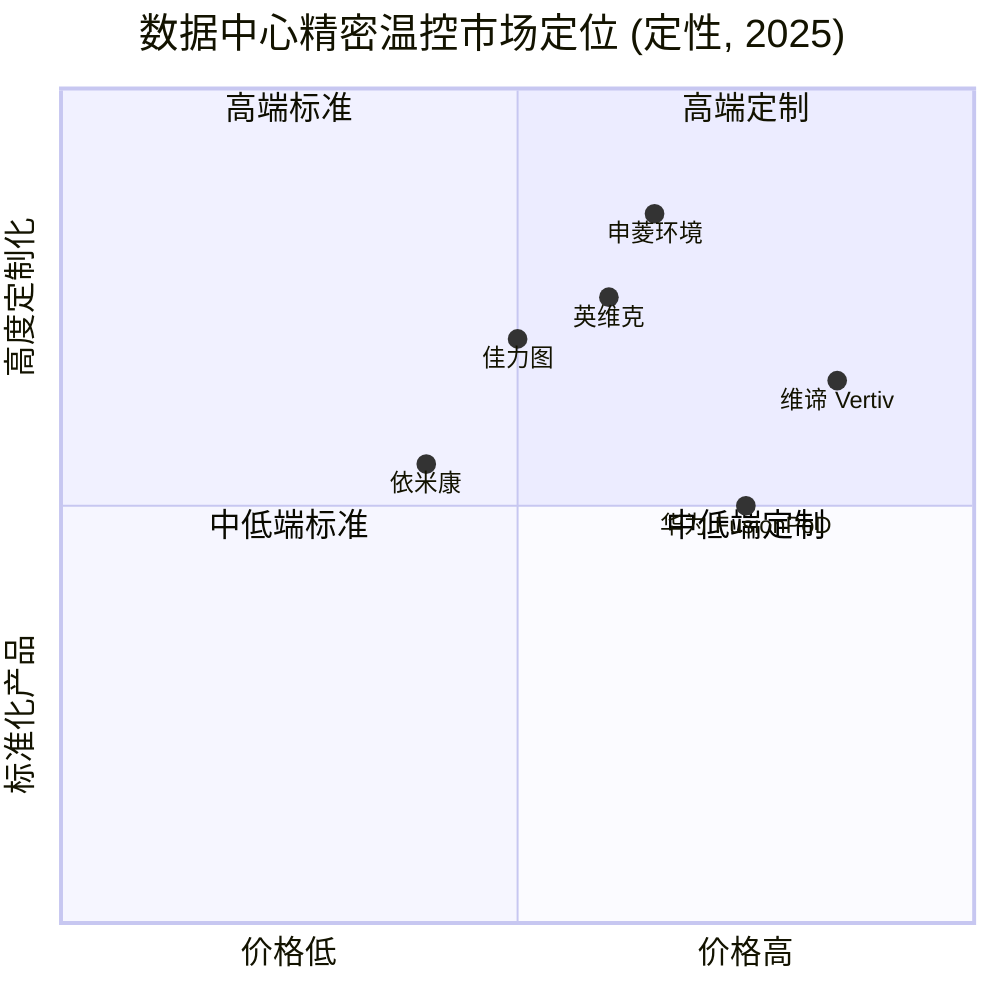
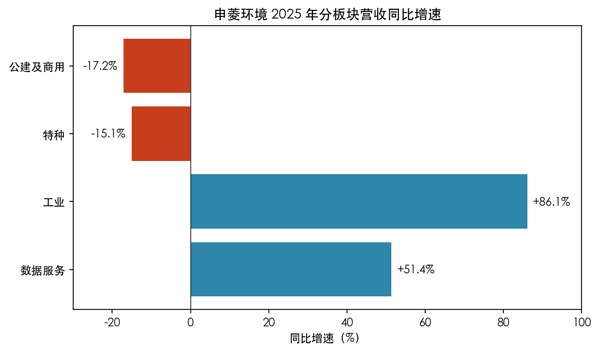
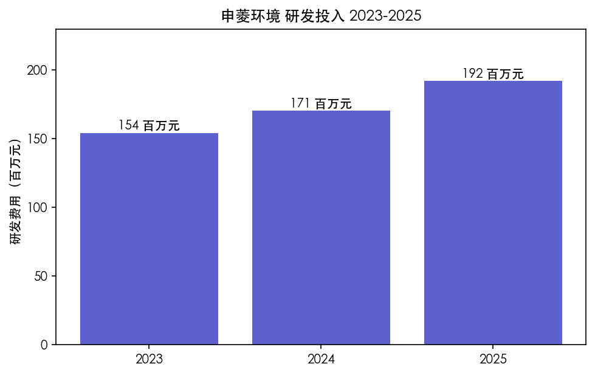

# 申菱环境 (SZSE:301018) 公司研究报告

**报告日期：** 2026-05-20  
**主体：** 广东申菱环境系统股份有限公司 (Guangdong Shenling Environmental Systems Co., Ltd.)  
**证券简称 / 代码：** 申菱环境 / 301018.SZ（深交所创业板）  
**实际控制人：** 崔颖琦及其一致行动人崔梓华、崔玮贤、崔宝瑜  
**报告语言：** 简体中文（含必要中英对照术语）

---

## 目录

1. 公司概览
2. 公司历史
3. 管理团队
4. 产品与服务
5. 客户与上市策略
6. 行业概览
7. 竞争格局
8. 市场机会 (TAM)
9. 风险评估
10. 参考资料

> **关键事件 — 拟发行可转债 (2025-11-25)：** 公司董事会在 2025 年 11 月 25 日审议通过《关于公司向不特定对象发行可转换公司债券方案的议案》及未来三年 (2026—2028) 股东分红回报规划，标志着公司在液冷温控、储能温控等新基建产品扩产阶段进入再融资周期，募集资金用途与液冷产能建设挂钩 ([申菱环境 2025 年年度报告, 第 36-37 页](https://static.cninfo.com.cn/finalpage/2026-04-27/1225181199.PDF))。

> **重要风险提示 — 2026Q1 业绩同比下滑：** 公司 2026 年第一季度营业收入 6.17 亿元，同比下降 1.80%；归母净利润 0.28 亿元，同比下降 47.71%；经营性现金流 -1.93 亿元，同比由 -0.89 亿元进一步恶化 ([申菱环境 2026 年第一季度报告, 第 1 页](https://static.cninfo.com.cn/finalpage/2026-04-29/1225228312.PDF))。报告期内未披露 2026 年全年业绩指引（创业板非强制要求），故未触发指引调整 banner。

======================================

## 1. 公司概览

申菱环境是一家以**专业特种空调和温控设备 (specialty / industrial HVAC & thermal management)** 为核心、面向数字与算力、电力与能源等高端工业场景提供垂直一体化人工环境解决方案的制造业上市公司。公司中文全称为"广东申菱环境系统股份有限公司"，外文名 Guangdong Shenling Environmental Systems Co., Ltd.，注册地佛山市顺德区陈村镇，办公地佛山市顺德区杏坛镇高新区顺业东路 29 号，公司网址 www.shenling.com，证券代码 301018，于 2021 年 7 月 7 日在深圳证券交易所创业板上市，保荐机构为中信建投证券 ([申菱环境 2025 年年度报告, 第 6-7 页](https://static.cninfo.com.cn/finalpage/2026-04-27/1225181199.PDF))。

**业务定位与"四板块"划分。** 公司将下游应用划为四个板块——数据服务（云数据中心、AI 智算中心、通信基建）、工业（电力电网、新能源、化工、电子、锂电池、储能等）、特种（核电、轨道交通、机场、国防、医疗、VOCs 治理）、公建及商用（公共建筑、博物馆、会展、商用末端）。公司在 2025 年年报中明确把战略重心定位为"聚焦数字与算力、电力与能源两大应用领域，以专业特种空调和温控设备为核心，结合客户实际使用场景，大力拓展垂直一体化的智慧能源与环境解决方案" ([申菱环境 2025 年年度报告, 第 10 页](https://static.cninfo.com.cn/finalpage/2026-04-27/1225181199.PDF))。

**商业模式 (business model)：** 以 ETO (Engineer-to-Order) 定制化设计、生产、交付为基本模式；销售收入由三大类构成——设备 (equipment) 占 77.66%、解决方案及服务 (solutions & services) 占 21.97%、其他 0.37% ([2025 年报, 第 15 页](https://static.cninfo.com.cn/finalpage/2026-04-27/1225181199.PDF))。解决方案与服务板块 2025 年同比增长 105.59%，是收入结构数字化、平台化的关键变化。

**财务规模 (2025 全年)：**
- 营业收入 **42.09 亿元**，同比 +39.55%（2024：30.16 亿元）
- 归母净利润 **2.17 亿元**，同比 +87.59%（2024：1.16 亿元）
- 扣非归母净利润 **2.07 亿元**，同比 +84.29%
- 经营活动现金流净额 **3.25 亿元**，同比 +140.13%
- 加权平均 ROE **8.24%** vs 2024 的 4.65%
- 资产总额 63.42 亿元，归母净资产 27.27 亿元，资产负债率约 57% (估算)
- 基本 EPS 0.81 元

数据来源：[申菱环境 2025 年年度报告, 第 7 页](https://static.cninfo.com.cn/finalpage/2026-04-27/1225181199.PDF)。

*数据来源：[申菱环境 2021–2025 年年度报告](https://static.cninfo.com.cn/finalpage/2026-04-27/1225181199.PDF)（2021 年营收 17.98 亿元、净利 1.40 亿元来自 [2021 年年度报告, 第 7 页](https://static.cninfo.com.cn/finalpage/2022-04-25/1213052336.PDF)）。*

**地理布局。** 2025 年境内收入 40.66 亿元、占比 96.59%；境外收入 1.44 亿元、占比 3.41%，同比从 0.19 亿元跳涨 **649.48%**，初步在东南亚（马来西亚、泰国）与北美（美国）市场打开局面，并设立申菱德国、申菱马来西亚、申菱泰国等海外主体 ([2025 年报, 第 15、32 页](https://static.cninfo.com.cn/finalpage/2026-04-27/1225181199.PDF))。

**人员规模。** 截至 2025 年末公司总员工 3,696 人，其中生产人员 1,572 人 (42.5%)、技术人员 1,127 人 (30.5%)、销售人员 791 人 (21.4%)、行政 153 人、财务 53 人；硕士及以上 89 人、本科 1,306 人、本科以下 2,301 人 ([2025 年报, 第 38 页](https://static.cninfo.com.cn/finalpage/2026-04-27/1225181199.PDF))。

**估值快照 (Valuation snapshot)。** 受限于本环境无法即时拉取行情数据，下列估值仅基于公司披露的财务数据 + 总股本 2.66 亿股 (流通股 + 限售股合计) 做框架性测算；最新成交价请读者通过东方财富 ([quote.eastmoney.com/sz301018.html](https://quote.eastmoney.com/sz301018.html)) 或同花顺核对：

- **EPS-TTM (2025 全年)：** 0.81 元
- **每股净资产：** 10.27 元 (净资产 27.27 亿 / 总股本 2.66 亿)
- **流通股本：** 报告期末普通股股东 35,435 户 ([2025 年报, 第 65 页](https://static.cninfo.com.cn/finalpage/2026-04-27/1225181199.PDF))
- **行业可比：** 主要 A 股精密温控可比包括佳力图 (603912.SH)、英维克 (002837.SZ)、依米康 (300249.SZ)、高澜股份 (300499.SZ)。考虑到液冷概念的高景气，**A 股液冷板块 2025 年 PE 中枢约 40–70× TTM**（来自市场公开数据，不在公司披露范围内），申菱环境若按 50× PE 估算，对应合理市值约 108 亿元。读者应以最新行情自行核对 P/E、P/S、P/B 与同业中位数。

> **估值判断（数据可获得前的初步看法）：** 申菱环境 2025 年扣非净利润 2.07 亿元、归母净利润 2.17 亿元，处于"业绩快速恢复 + 液冷主题溢价"叠加期；考虑到 2026Q1 归母净利大幅同比下滑 47.71%，市场对其全年盈利的修正方向偏负面，**短期估值压力主要来自季度业绩波动**而非估值倍数本身过高。建议读者把当前 PE 与英维克、佳力图的 PE/PS 横向对比，并把 2026 全年盈利预期从简单 4× Q1 还原为带季节性的 0.28×4 = 1.13 亿元做下限测算（注：公司经营存在显著季节性，详见 §1 现金流分析）。

**关键量化指标 (one-glance)：**

| 指标 | 2023 | 2024 | 2025 |
|---|---|---|---|
| 营业收入 (亿元) | 25.11 | 30.16 | 42.09 |
| 归母净利润 (亿元) | 1.05 | 1.16 | 2.17 |
| 扣非归母净利润 (亿元) | 1.17 | 1.12 | 2.07 |
| 经营性现金流 (亿元) | 0.14 | 1.35 | 3.25 |
| 加权 ROE | 4.76% | 4.65% | 8.24% |
| 销售费用率 | n/a | 7.15% | 6.47% |
| 研发费用 (百万元) | 154.33 | 170.62 | 192.17 |
| 研发费用率 | 6.15% | 5.66% | 4.57% |
| 专利数 (期末) | n/a | n/a | 702 项 (其中发明专利 259 项) |

数据来源：[2025 年年度报告, 第 7、17、18 页](https://static.cninfo.com.cn/finalpage/2026-04-27/1225181199.PDF)；[2024 年年度报告, 第 7 页](https://static.cninfo.com.cn/finalpage/2025-04-28/1223319900.PDF)；[2023 年年度报告, 第 17 页](https://static.cninfo.com.cn/finalpage/2024-04-29/1219866326.PDF)。

## 2. 公司历史

申菱环境的源头可追溯至 1990 年代顺德区机械工业生态。控股股东兼董事长崔颖琦 (1954 年生) 早年在陈村镇华通电器厂、华南空调、广东申菱环保包装有限公司等企业积累空调与机械加工经验，2012 年 11 月通过设立广东申菱投资有限公司完成股权结构搭建，并逐步把分散的申菱系业务整合为以广东申菱环境系统股份有限公司为主体的统一上市平台 ([2025 年报, 第 67-68 页](https://static.cninfo.com.cn/finalpage/2026-04-27/1225181199.PDF))。

公司在专业空调行业的早期布局重点在工业 (电力、化工、冶金) 和特种 (核电、地铁、机场、国防) 两条线，依托广东顺德作为家电与精密制造产业带的供应链优势，从模仿走向定制再走向产品标准制定。从 2011 年开始，公司参与中国移动南方基地的"数据中心液/气双通道精准高效致冷系统关键技术及应用"科研项目，与浪潮信息、新创意、华南理工大学等合作开发了国内较早的商用液冷微模块数据中心，该成果于 2016 年 11 月被工业和信息化部鉴定为"国际领先水平"——这是公司日后切入数据中心液冷赛道的技术起点 ([2025 年报, 第 10 页](https://static.cninfo.com.cn/finalpage/2026-04-27/1225181199.PDF))。

公司于 2021 年 7 月 7 日在深圳证券交易所创业板上市，证券代码 301018，保荐机构为中信建投证券股份有限公司 ([2021 年年度报告, 第 7 页](https://static.cninfo.com.cn/finalpage/2022-04-25/1213052336.PDF))。

*数据来源：[申菱环境 2025 年年度报告, 第 10、32 页](https://static.cninfo.com.cn/finalpage/2026-04-27/1225181199.PDF)；[2021 年年度报告, 第 7 页](https://static.cninfo.com.cn/finalpage/2022-04-25/1213052336.PDF)。*

**两次重要的战略转向。** (1) **从工业/特种空调到数据中心精密温控：** 2011 年开始的中国移动南方基地液冷项目让公司搭上了 2015 年后云数据中心爆发的早期车，数据服务板块 2025 年营收 23.43 亿元、占比 55.67%，从一个细分应用成长为占公司绝对主导的板块 ([2025 年报, 第 15 页](https://static.cninfo.com.cn/finalpage/2026-04-27/1225181199.PDF))。(2) **从风冷到液冷为核心的"风液融合"：** 2023-2025 年公司在液冷领域加大研发与产能投入，2025 年顺德液冷智造基地正式投产，并主编/参编了《液/气双通道散热数据中心机房设计规范》《单相浸没式直接液冷数据中心设计规范》《数据中心液冷系统技术规程》《数据中心冷板式液冷测试验证技术白皮书》等行业标准，确立了液冷规范层面的话语权 ([2025 年报, 第 10 页](https://static.cninfo.com.cn/finalpage/2026-04-27/1225181199.PDF))。

**重要基地投产。** 2025 年 6 月 28 日，公司位于广东高州的特种空调和通风设备制造基地一期正式投产，将作为公司特种空调（核电、油气循环回收等）主要生产基地；同年顺德"新基建领域智能温控产品智造基地"也正式投产，强化液冷长运平台、净化车间、智能化产线 ([2025 年报, 第 10 页](https://static.cninfo.com.cn/finalpage/2026-04-27/1225181199.PDF))。

**近期 (2025-2026) 关键事件：** 2025 年 11 月 25 日董事会审议通过向不特定对象发行可转换公司债券方案，预计用于液冷及储能温控产能扩张 ([2025 年报, 第 36-37 页](https://static.cninfo.com.cn/finalpage/2026-04-27/1225181199.PDF))；2026 年 4 月 28 日披露 2026Q1 报告，营收 6.17 亿元同比 -1.80%、净利润 0.28 亿元同比 -47.71% ([2026 年第一季度报告, 第 1 页](https://static.cninfo.com.cn/finalpage/2026-04-29/1225228312.PDF))。

## 3. 管理团队

**崔颖琦 — 董事长 (Chairman), 1954 年生, 高中学历, 实际控制人, 200-250 字加深版**  
崔颖琦先生是申菱环境的灵魂人物和创始人级实控人。其职业生涯起步于改革开放初期的顺德乡镇企业——陈村镇华通电器厂——并在华南空调、广东申菱环保包装有限公司、致合房地产、佛山市申菱金属制品有限公司等申菱系企业内长期任要职，是顺德"家电制造业一代企业家"的典型样本。他在 2025 年报中披露的简历显示，崔颖琦同时担任顺德慈善会名誉副会长和陈村慈善会名誉会长，以及高州申菱特种空调有限公司董事长，全面"负责公司发展战略及主持董事会工作" ([2025 年报, 第 31、67 页](https://static.cninfo.com.cn/finalpage/2026-04-27/1225181199.PDF))。截至 2025 年末，崔颖琦直接持有公司 5,508 万股 (持股比例 20.70%)，并通过广东申菱投资有限公司间接持有 1,621 万股 (6.09%)；与其女崔梓华 (现任董事/副总经理)、其子崔玮贤 (现任总经理助理) 及女儿崔宝瑜 (公司市场经理) 共同构成"一致行动人" ([2025 年报, 第 65、67 页](https://static.cninfo.com.cn/finalpage/2026-04-27/1225181199.PDF))。2025 年税前薪酬 60.06 万元，相对其控股股东身份与实控人地位，薪酬结构以股权回报为主、现金薪酬偏保守。崔颖琦本人为顺德背景出身的"老派制造业实业家"——学历虽为高中，但其行业判断（液冷战略、特种空调战略、出海战略）的连贯性已在过去 10 年通过公司业务结构的演变得到了印证。

**潘展华 — 董事 / 总经理 (President), 1971 年生, 大专学历, 国务院特殊津贴专家, 200 字版**  
潘展华是公司日常经营第一负责人。1990 年代起即供职于华南空调，是申菱系内技术-管理复合背景的核心干部。报告中明确披露其"曾任公司总经理助理、副总经理等职务，现任公司董事、公司总经理及核心技术人员，全面主管公司经营发展工作"，并在 2020 年 12 月获国务院颁发的政府特殊津贴证书，是"享受国务院特殊津贴"专家 ([2025 年报, 第 31 页](https://static.cninfo.com.cn/finalpage/2026-04-27/1225181199.PDF))。他持有公司股份 4.8 万股（含限售），2025 年税前薪酬 **227.31 万元**——是公司高管中最高的，反映其"经营兼技术"双重角色。同时兼任北京申菱环境科技、广东申菱商用空调、广东申菱热储科技、高州申菱特种空调等关联子公司董事/董事长。潘展华的国务院特贴背景为其作为"技术总裁"角色提供了显著的行业可信度，尤其在与中移动、华为等大客户的技术对接中具备权重。

**陈碧华 — 董事 / 副总经理 / 财务总监 (CFO), 1971 年生, 本科学历, 180 字版**  
陈碧华女士兼任公司董事、副总经理及财务总监，主管公司财经工作。简历显示其早期任职于顺德三发鞋业有限公司、华南空调，曾任公司财务部部长 ([2025 年报, 第 31 页](https://static.cninfo.com.cn/finalpage/2026-04-27/1225181199.PDF))。她目前同时担任广州市申菱、上海申菱、广东申菱商用、广东申菱热储、天津申菱暖通、高州申菱特种等子公司的董事或监事，是公司财务体系跨主体协调的核心人物。2025 年税前薪酬 181.42 万元。陈碧华无外部上市公司 CFO 经历，但在申菱系内部从财务部部长一路晋升至 CFO，具有突出的内部连贯性；公司 2021 年上市的财务规范、近期可转债再融资、海外子公司的财务整合均由其主导。

**崔梓华 — 董事 / 副总经理 (数字化 + 海外营销), 1984 年生, 博士研究生学历, 140 字**  
崔梓华是崔颖琦之女，现年 42 岁，公司"二代接班人"中负责数字化、集团制造平台和海外营销平台的核心人物。简历显示其学历为博士研究生，曾就职于佛山市顺德区汇利源小额贷款公司，2025 年税前薪酬 163.23 万元 ([2025 年报, 第 31、35 页](https://static.cninfo.com.cn/finalpage/2026-04-27/1225181199.PDF))。她同时是陵水新众承创业投资合伙企业（持有公司 6.11% 股份）的执行事务合伙人，是公司海外子公司（申菱德国、申菱马来西亚、申菱泰国）股权架构的间接关键人。

**崔玮贤 — 总经理助理 / 海外业务负责人, 1994 年生, 硕士研究生学历, 120 字**  
崔玮贤是崔颖琦之子，1994 年生，硕士研究生学历，现年仅 32 岁但已担任公司总经理助理，负责公司投资及新业务工作，并兼任申菱德国管理董事、申菱马来西亚、申菱泰国董事——是公司海外平台搭建的实际操盘人。2025 年薪酬 131.34 万元 ([2025 年报, 第 32、35 页](https://static.cninfo.com.cn/finalpage/2026-04-27/1225181199.PDF))。

**陈军 — 副总经理 (供应链与工业公建产品), 1974 年生, 本科学历, 100 字**  
陈军 2024 年 7 月加入公司高管团队，主管公司供应链工作并全面负责工业公建产品事业部。其早期经历包括**深圳麦克维尔空调有限公司、广东欧科空调制冷有限公司**——是公司高管层中少数有外部成熟空调企业 (麦克维尔为美国 Daikin 旗下品牌) 高管经验的人，对采购成本管理与工业产品线的外部专业化具有重要意义 ([2025 年报, 第 32 页](https://static.cninfo.com.cn/finalpage/2026-04-27/1225181199.PDF))。2025 年薪酬 157.36 万元。

**独立董事和治理结构。** 三位独立董事中，刘金平 (1962 年生, 博士研究生, 华南理工大学动力工程教授, 中国制冷学会理事会理事、广东省制冷学会理事长、中国制冷空调工业协会数据中心冷却分会副会长) 是行业内极具分量的学术权威；宋文吉 (中科院广州能源研究所研究员, 储能技术专家) 兼任浙江盾安人工环境独立董事，为公司储能温控业务带来学界资源；聂织锦为注册会计师 + 注册税务师, 负责审计委员会工作。董事会下设审计、提名、薪酬与考核、战略 4 个专门委员会，2025 年共召开 7 次董事会会议，5 位内部董事 + 3 位独董出席率均为 7/7 (100%) ([2025 年报, 第 32、35、36 页](https://static.cninfo.com.cn/finalpage/2026-04-27/1225181199.PDF))。**控股股东与实控人未变更**，崔颖琦及其一致行动人合计持股约 47.5%，控制权稳固。

**治理特点 (governance footer)：**
- 实控人 + 一致行动人合计持股约 **47.5%**——崔颖琦 20.70% + 申菱投资 11.95% + 谭炳文 9.94% + 众承投资 6.11% + 众贤投资 4.80%（其中谭炳文与崔颖琦不是一致行动人，谭为创始团队成员）。
- 全部 14 位董事/高管 2025 年税前薪酬合计 **1,301.51 万元**，相对 42 亿元收入体量薪酬压力较低。
- 2025 年公司通过新《公司法》过渡期安排取消监事会，原监事自动解任，叶国先转任职工代表董事；治理结构由"董事会 + 监事会"切换为"董事会下设审计委员会"模式 ([2025 年报, 第 31 页](https://static.cninfo.com.cn/finalpage/2026-04-27/1225181199.PDF))。
- 关联交易披露中"前五大客户中关联方销售额占年度销售总额比例为 0.00%"，无显著关联方利益输送 ([2025 年报, 第 17 页](https://static.cninfo.com.cn/finalpage/2026-04-27/1225181199.PDF))。

**管理团队履历综合评价 (50–100 字)：** 申菱环境管理层呈现"创业家族 + 技术型职业经理人 + 二代海外接班"的结构。崔颖琦的战略连贯性（2011 年布局液冷、2023 年布局海外、2025 年布局可转债扩产）已被业务结果验证；潘展华的国务院特贴技术身份和陈军的麦克维尔外部背景补强了团队的技术与供应链短板；二代崔梓华、崔玮贤切入数字化与海外业务承担了未来 5 年的增量曲线。短板在于团队的金融/资本市场背景偏弱，陈碧华是内部成长 CFO，未来在可转债发行与海外财务结构化方面尚需观察。

## 4. 产品与服务

申菱环境的产品口径与公司"四板块"经营划分一致，且在产品分类的同时还有"分产品 (设备 / 解决方案及服务 / 其他)"维度。以下按板块逐一展开。

```mermaid
graph TD
    A[申菱环境产品体系] --> B[数据服务板块<br/>2025 营收 23.43 亿 / 55.67%]
    A --> C[工业板块<br/>2025 营收 11.37 亿 / 27.02%]
    A --> D[特种板块<br/>2025 营收 5.98 亿 / 14.20%]
    A --> E[公建及商用板块<br/>2025 营收 1.15 亿 / 2.74%]
    
    B --> B1[液冷系列: CDU / Manifold / 一体化冷源 / 干冷器 / 液冷门 / 冷板 / 冷源模块]
    B --> B2[风冷系列: 机房空调 / 列间空调 / 直接&间接蒸发冷却 / 风冷算力柜]
    B --> B3[相变系列: 热管背板 / DPC 相变冷却系统 / 氟泵自然冷却 / 氟泵双循环]
    B --> B4[主机系列: 预制化集成冷站 / 蒸发冷却冷水机组 / 自然冷却冷水机组]
    
    C --> C1[屋顶式 / 单元式 / 恒温恒湿 / 洁净式空调]
    C --> C2[除湿机 / 低露点除湿机]
    C --> C3[组合式空调 / 冷热水机组 / 蒸发冷却冷水机组]
    C --> C4[储能用液冷温控产品 / 锂电池工厂超低湿除湿]
    
    D --> D1[核电专用空调]
    D --> D2[地铁/高铁专用空调]
    D --> D3[飞机地面空调 / 机场空调]
    D --> D4[国防工程特种 / 洞库专用空调]
    D --> D5[VOCs 冷凝回收系统]
    D --> D6[抗冲击及防爆类空调]
    
    E --> E1[商用冷水机组]
    E --> E2[商用组合式空调]
    E --> E3[商用末端机组 / 单元式]
```

*数据来源：[申菱环境 2025 年年度报告, 第 10-12、15 页](https://static.cninfo.com.cn/finalpage/2026-04-27/1225181199.PDF)。*

### 4.1 数据服务板块（占比 55.67%，2025 同比 +51.42%）

数据服务是公司**当前最大、增长最快**的业务板块。产品按散热介质和场景分四个子系列：液冷系列 (CDU、Manifold、一体化冷源、干冷器、预制化一二次侧管网、液冷门、冷源模块、水力模块、整装式液冷模块、快速接头、冷板)；风冷系列 (机房空调、列间空调、直接 / 间接蒸发冷却空调、风冷算力柜)；相变系列 (热管背板、DPC 相变冷却系统、氟泵自然冷却机组、氟泵双循环机组)；主机系列 (预制化集成冷站、蒸发冷却 / 自然冷却冷水机组) ([2025 年报, 第 10 页](https://static.cninfo.com.cn/finalpage/2026-04-27/1225181199.PDF))。

**竞争优势判定：YES — 技术 + 客户黏性双护城河。** 公司在数据中心液冷领域拥有 **72 项专利 (其中发明专利 34 项)**，液冷产品被国家专利保护协会认定为"专利密集型产品"。公司主编或参编了至少 6 项核心行业标准 (《液/气双通道散热数据中心机房设计规范》《液气双通道散热系统通用技术规范》《单相浸没式直接液冷数据中心设计规范》《喷淋式直接液冷数据中心设计规范》《数据中心液冷系统技术规程》《数据中心冷板式液冷测试验证技术白皮书》) ([2025 年报, 第 10 页](https://static.cninfo.com.cn/finalpage/2026-04-27/1225181199.PDF))。最重磅的第三方验证来自赛迪顾问《2024-2025 中国液冷数据中心市场研究年度报告》：**公司在 2024 年中国液冷数据中心市场 CDU 厂商排名第一，在 2024 年中国智算行业液冷数据中心市场厂商排名第一** ([2025 年报, 第 10 页](https://static.cninfo.com.cn/finalpage/2026-04-27/1225181199.PDF))。

**客户与生态：** 报告期内公司数据服务客户群包括"中国移动、电信、联通、华为、字节跳动、腾讯、阿里巴巴、百度、美团、快手、京东、中金数据、秦淮数据、中兴、世纪互联、中联云港、润泽科技、浪潮、普洛斯、万国数据、国防科大、超聚变、曙光"。公司在 2025 年报中明确指出"基于对公司技术创新能力、质量保障能力、快速交付能力的认可，与 H 公司、字节、腾讯、阿里以及主要 COLO 商等重要头部客户的合作粘性进一步强化"——"H 公司"在 A 股语境下通常指华为 ([2025 年报, 第 10 页](https://static.cninfo.com.cn/finalpage/2026-04-27/1225181199.PDF))。**报告期内数据服务板块新增订单同比增长约 72%**，海外业务与液冷取得突破，订单陆续交付，预期未来"可持续良性增长"。

**主要竞品对照：**
- CDU 与一体化冷源：英维克 (002837.SZ) 以 Coolinside 一体化解决方案直接竞争；佳力图 (603912.SH) 在液冷 CDU 上同样布局。**赛迪 2024 排名口径下申菱位居 CDU 厂商第一**——领先 (verdict: ahead)。
- 风冷精密空调：维谛技术 (Vertiv, US:VRT, 国内子公司维谛环境)、依米康 (300249.SZ)、佳力图——竞争更激烈，申菱定位为差异化（直接 / 间接蒸发冷却专长）。
- 相变冷却：热管背板和 DPC 系统是相对较小的细分赛道，申菱与英维克、华为 (FusionPoD 系列) 同台竞技；中端市场参与者较少。

### 4.2 工业板块（占比 27.02%，2025 同比 +86.11%）

工业空调产品矩阵覆盖屋顶式、单元式、恒温恒湿、洁净式空调、除湿机、低露点除湿机、冷热水机组、蒸发冷却冷水机组、组合式空调机组，以及"**储能用液冷温控产品**" ([2025 年报, 第 11 页](https://static.cninfo.com.cn/finalpage/2026-04-27/1225181199.PDF))。

**子板块爆点：电力与能源同比 +234%。** 2025 年报明确披露"工业板块营收同比增长 86.11%，主要是由于电力与能源业务同比增长约 234%，其中细分的主要增长来自储能液冷温控、锂电池制造、特高压电网、抽水蓄能等" ([2025 年报, 第 10 页](https://static.cninfo.com.cn/finalpage/2026-04-27/1225181199.PDF))。储能温控是当前 A 股新能源热管理赛道的关键子赛道，公司 2025 年完成"60kW 储能温控液冷产品研发项目"——采用变频压缩机的无级容量调节技术、液冷管路自适应流量控制策略 ([2025 年报, 第 19 页](https://static.cninfo.com.cn/finalpage/2026-04-27/1225181199.PDF))。

**客户列表（工业）：** 国家电网、南方电网、长江三峡水电、中石化、中石油、中国化学、宝武钢铁、富士康、三星电子、广汽丰田、特斯拉、小鹏汽车、国电投海上风电、三峡新能源海上风电、宁德时代、亿纬锂能、鹏辉能源、中航锂电、南都能源 ([2025 年报, 第 11 页](https://static.cninfo.com.cn/finalpage/2026-04-27/1225181199.PDF))。**客户分布的广度本身就是工业板块的护城河之一。**

**竞争优势判定：PARTIAL — 应用场景多样的"广覆盖"模式。** 工业空调赛道较为分散，没有像液冷那样的赛迪第一名认证，但客户覆盖（电力 + 新能源 + 化工 + 汽车）反映品牌信任度较高，可视为"中等护城河 + 高景气子赛道（储能）共振"。主要竞争对手包括同飞股份 (300990.SZ, 储能液冷温控)、英维克 (储能 BattCool 系列)、申菱在储能这块由于起步稍晚但客户面广，处于追赶到并列的过渡阶段。

### 4.3 特种板块（占比 14.20%，2025 同比 -15.06%）

特种空调用于高速铁路、地铁、机场、环境治理、核能核电、航空航天、国防工程、医院等场景，产品包括核电专用空调、地铁专用空调、飞机地面空调、国防工程类特种空调、洞库专用空调及除湿机、抗冲击及防爆类空调、VOCs 冷凝回收系统等 ([2025 年报, 第 11 页](https://static.cninfo.com.cn/finalpage/2026-04-27/1225181199.PDF))。

**2025 年特种板块营收下滑 15.06% 至 5.98 亿元**——这是公司四板块中**唯一负增长**的部分，但毛利率反而最高 (25.83%)，反映出特种业务的高单价、低体量特征。2025 年 6 月 28 日高州特种空调和通风设备制造基地一期投产，为后续核电、油气循环回收类产品规模化奠定产能 ([2025 年报, 第 11 页](https://static.cninfo.com.cn/finalpage/2026-04-27/1225181199.PDF))。

**核电是特种板块的旗舰子线。** 2025 年公司在研项目包括"核级隔振型水冷冷水机组研发项目"、"反应堆厂房空调开发项目（应用于浙江三门核电 5、6 号机组）"、"核电库房用全新风调温空调机组研发项目" ([2025 年报, 第 18-20 页](https://static.cninfo.com.cn/finalpage/2026-04-27/1225181199.PDF))。"三门核电 5、6 号机组采用华龙一号第三代核电技术"，公司目标"在同类特殊结构反应堆厂房空调领域的领先地位"。客户层面已服务"武广高铁、北京地铁、广州地铁、首都机场、大兴机场、浦东机场、白云机场、秦山核电、大亚湾核电、田湾核电、国防工程" ([2025 年报, 第 11 页](https://static.cninfo.com.cn/finalpage/2026-04-27/1225181199.PDF))。

**竞争优势判定：YES — 资质 + 工程经验复合护城河。** 特种空调需通过核安全、抗震、防爆、抗冲击等一系列严苛认证，是少数能与中央空调巨头形成差异化的细分赛道。竞品主要是同行内细分龙头 (如盾安人工环境 / 浙江盾安, 也是公司独董刘金平兼任独董的上市公司)。

### 4.4 公建及商用板块（占比 2.74%，2025 同比 -17.16%）

公共建筑、大型商用建筑、科研院校、文教传媒等公共设施场景。代表性历史项目：深圳市民中心、广州白天鹅宾馆、深圳国际会展中心、广交会琶洲展馆、南非世界杯主体馆 ([2025 年报, 第 11 页](https://static.cninfo.com.cn/finalpage/2026-04-27/1225181199.PDF))。

**竞争优势判定：NO/Partial — 这一板块面对格力、美的、海信、大金等强势品牌，公司更多依靠"高端定制 + 大型工程经验"切入。报告期内板块同比下滑 17.16%，是公司主动收缩的方向之一。**

### 4.5 旗舰产品 vs 长尾

- **旗舰 1：液冷整体解决方案 (CDU、Manifold、一体化冷源等)** — 赛迪 2024 CDU 第一名 / 智算液冷市场第一名，是公司估值溢价来源。
- **旗舰 2：储能用液冷温控产品** — 工业板块 234% 增长的核心引擎，对应国家"新型储能"战略。
- **旗舰 3：核电专用空调** — 高毛利、高壁垒，三门核电 5/6 号机组配套机会。
- **长尾：** 公建及商用、传统屋顶式 / 单元式空调，公司在过去 2 年逐步淡化。

### 4.6 近 12 个月产品发布与产能

2025 年报披露的"已完成"研发项目包括："工业园区一体化综合能源与智慧管理应用场景示范项目"（零碳工业园区方案）、"烟气余热发电机组研发项目"、"低散热风量冷水机技术研发项目"、"可编程控制器研发项目"（自研控制核心降低成本）、"蒸气压缩循环热泵式蒸汽发生机组技术研发项目"、"核级隔振型水冷冷水机组研发项目"、"60kW 储能温控液冷产品研发项目"、"数据中心组合式高温风墙研发项目"、"双盘管水冷风墙研发项目"、"一体化冷源技术研发项目" ([2025 年报, 第 18-20 页](https://static.cninfo.com.cn/finalpage/2026-04-27/1225181199.PDF))。"在研"项目包括"高效装配式冷冻站研发项目"、"核电库房用全新风调温空调机组研发项目"、"智算中心全栈高密风墙系统研发项目"等。两座新产能基地（顺德液冷智造基地、高州特种空调基地）于 2025 年中正式投产，为 2026-2027 年订单交付提供产能保障。

*数据来源：[申菱环境 2025 年年度报告, 第 16 页](https://static.cninfo.com.cn/finalpage/2026-04-27/1225181199.PDF) 分行业毛利率及同比增减数据。*

## 5. 客户与上市策略

### 5.1 客户结构总览

申菱环境的客户结构横跨四大板块，每个板块的代表性头部客户均已在第 4 节列出。综合 2025 年报披露：

- **数据服务客户：** 中国移动、电信、联通、华为、字节跳动、腾讯、阿里巴巴、百度、美团、快手、京东、中金数据、秦淮数据、中兴、世纪互联、中联云港、润泽科技、浪潮、普洛斯、万国数据、超聚变、曙光等 ([2025 年报, 第 10 页](https://static.cninfo.com.cn/finalpage/2026-04-27/1225181199.PDF))。
- **工业客户：** 国家电网、南方电网、长江三峡水电、中石化、中石油、中国化学、宝武钢铁、富士康、三星电子、广汽丰田、特斯拉、小鹏汽车、国电投海上风电、三峡新能源海上风电、宁德时代、亿纬锂能、鹏辉能源、中航锂电、南都能源 ([2025 年报, 第 11 页](https://static.cninfo.com.cn/finalpage/2026-04-27/1225181199.PDF))。
- **特种客户：** 武广高铁、北京地铁、广州地铁、首都机场、大兴机场、浦东机场、白云机场、秦山核电、大亚湾核电、田湾核电、国防工程 ([2025 年报, 第 11 页](https://static.cninfo.com.cn/finalpage/2026-04-27/1225181199.PDF))。
- **公建及商用客户：** 深圳市民中心、广州白天鹅宾馆、深圳国际会展中心、广交会琶洲展馆等 ([2025 年报, 第 11 页](https://static.cninfo.com.cn/finalpage/2026-04-27/1225181199.PDF))。

### 5.2 客户集中度 (Customer Concentration) — REQUIRED 量化

按公司 2025 年报第 17 页披露：

| 排名 | 客户 | 销售额 (元) | 占年度销售总额比例 |
|---|---|---|---|
| 1 | 客户 1 | 601,901,922 | **14.30%** |
| 2 | 客户 2 | 526,580,257 | 12.51% |
| 3 | 客户 3 | 180,590,432 | 4.29% |
| 4 | 客户 4 | 130,374,404 | 3.10% |
| 5 | 客户 5 | 106,040,026 | 2.52% |
| **前 5 合计** | — | **1,545,487,041** | **36.72%** |

数据来源：[申菱环境 2025 年年度报告, 第 17 页](https://static.cninfo.com.cn/finalpage/2026-04-27/1225181199.PDF)。**前 5 名客户中关联方销售额占年度销售总额比例为 0.00%。**

*数据来源：[申菱环境 2025 年年度报告, 第 17 页](https://static.cninfo.com.cn/finalpage/2026-04-27/1225181199.PDF)。*

**集中度评估：** 公司**未点名披露客户名称**，仅以"客户 1—5"代号；按管理层在 §4 中的口径，"H 公司、字节、腾讯、阿里以及主要 COLO 商等重要头部客户"应是排名靠前的客户主力。两个最大客户合计 **26.81%**，前 5 合计 **36.72%**——按本研究风险分类，**前 1 客户 14.30% < 20% (不触发"重大"门槛)**，但已超过 10% 单一客户门槛；**前 5 客户 36.72% < 50% 门槛**——故仍纳入风险评估，但严重程度为"中等"而非"重大"。考虑公司客户集中度过去 3 年呈"上升"趋势（数据服务板块占比快速扩大），**未来如果数据服务进一步集中于 H 公司或某一 COLO 客户，将构成材料级风险**。

### 5.3 合同结构与销售模式

公司在 2025 年报中明确："专用性空调有别于常规舒适性空调，一般需要根据客户的实际项目要求进行定制，具有多批次、少批量的特征。该种生产模式对公司的设计、研发、制造的全流程管控能力有更高的要求。公司经过多年的发展，已经形成了业内先进的 ETO 制造交付模式" ([2025 年报, 第 13 页](https://static.cninfo.com.cn/finalpage/2026-04-27/1225181199.PDF))。销售模式构建为"技术营销型"，销售人员与研发技术人员同步参与市场开拓、项目需求导入、技术方案制定、可行性论证、合同评审，强调高频、长周期销售跟踪。

**主要合同结构：** 大客户合同主要以"项目制 / 主合同 + 多次执行 PO"形式落地。报告期内未披露"已签订的重大销售合同、重大采购合同截至本报告期的履行情况"——意味着没有单一合同金额触及创业板信披要求的重大合同披露门槛 (一般 1 亿元以上 / 净资产 10%)。

### 5.4 上市策略与地理拓展

- **国内：** 以行业管理为主导的"市场先行、团队作战"业务模式，区域销售及服务网点遍布全国 ([2025 年报, 第 14 页](https://static.cninfo.com.cn/finalpage/2026-04-27/1225181199.PDF))。
- **海外 (出海)：** 2025 年公司境外收入 1.44 亿元、同比 +649.48% (基数效应大)，目标市场为东南亚 + 北美 + 欧洲。已设立申菱环境系统 (香港) 有限公司、申菱德国有限责任公司、申菱环境系统 (马来西亚) 有限责任公司、申菱环境系统 (泰国) 有限公司，二代崔玮贤同时担任德国、马来西亚、泰国主体董事 ([2025 年报, 第 15、32 页](https://static.cninfo.com.cn/finalpage/2026-04-27/1225181199.PDF))。

### 5.5 关键合作伙伴

学术 / 研发合作伙伴包括：华南理工大学 (液冷散热联合开发)、浪潮信息、中国移动南方基地、中国科学院 (独立董事宋文吉单位)、广东省制冷学会 (独立董事刘金平任理事长)。这些机构关系既是技术资源也是行业标准话语权来源。

### 5.6 客户案例 (named wins, 2025)

- **数据中心液冷：** 与 H 公司 / 字节 / 腾讯 / 阿里"合作粘性进一步强化"，新增订单 +72% (尽管未具体披露金额) ([2025 年报, 第 10 页](https://static.cninfo.com.cn/finalpage/2026-04-27/1225181199.PDF))。
- **核电特种：** 浙江三门核电 5、6 号机组反应堆厂房空调研发已完成 ([2025 年报, 第 19 页](https://static.cninfo.com.cn/finalpage/2026-04-27/1225181199.PDF))。
- **储能温控：** 锂电池工厂超低湿除湿、储能集装箱液冷温控等订单同比 +234%（板块电力与能源细分）([2025 年报, 第 10 页](https://static.cninfo.com.cn/finalpage/2026-04-27/1225181199.PDF))。

## 6. 行业概览

### 6.1 行业定义与归属

公司在 2025 年报中明确："公司根据《国民经济行业分类》归属 C35 专用设备制造业，所处的细分行业为其他专用设备制造业（主要为专用制冷、温控、空调设备制造）。" ([2025 年报, 第 12 页](https://static.cninfo.com.cn/finalpage/2026-04-27/1225181199.PDF))。

宏观背景：中国正处在经济结构转型升级阶段，"高端化工产业、新材料产业、微电子产业、装备制造产业、能源、智能电网产业等众多国民经济支柱产业以及'卡脖子'产业"对人工环境精细化要求提升，专业特种空调与温控设备作为这些产业的配套环境基础设施持续受益。

### 6.2 数据服务行业（公司第一大下游）

**国家政策与战略支柱：**《数字中国建设整体布局规划》明确"建设数字中国是数字时代推进中国式现代化的重要引擎"，要求到 2025 年基本形成横向打通、纵向贯通、协调有力的一体化推进格局；到 2035 年数字化发展水平进入世界前列 ([2025 年报, 第 12 页](https://static.cninfo.com.cn/finalpage/2026-04-27/1225181199.PDF))。

**关键政策抓手："东数西算"工程**：构建 8 个国家算力枢纽节点及 10 个国家数据中心集群，引导大型、超大型数据中心向枢纽内集聚。新政策对数据中心集群内项目规模、上架率以及能耗、水耗等指标提出了更高的要求——**PUE (Power Usage Effectiveness, 电源使用效率) 与 WUE (Water Usage Effectiveness, 水使用效率) 持续下降**驱动液冷与高能效风冷渗透 ([2025 年报, 第 12 页](https://static.cninfo.com.cn/finalpage/2026-04-27/1225181199.PDF))。

**AI 算力浪潮：** 公司在年报中明确："当前全球已进入 AI 时代，算力需求出现爆发式增长，AI 算力中心逐步成为数据基础设施的主要增长方向，算力芯片性能、功率不断提高，发热量急剧攀升，风冷散热已难以解决新一代芯片的现实应用问题，促使更高效散热的液冷技术发展持续加速，液冷已逐步由节能高效的可选项变成高密散热的必选项，液冷规模化应用的拐点已经到来。" ([2025 年报, 第 12 页](https://static.cninfo.com.cn/finalpage/2026-04-27/1225181199.PDF))。**这是当前申菱环境最重要的产业逻辑陈述。**

**市场增速：** 按公司援引的赛迪顾问《2024-2025 中国液冷数据中心市场研究年度报告》，公司在"2024 年中国液冷数据中心市场 CDU 厂商排名第一"——隐含中国液冷数据中心市场处于高速发展期 ([2025 年报, 第 10 页](https://static.cninfo.com.cn/finalpage/2026-04-27/1225181199.PDF))。具体的市场规模数字赛迪报告未在公司年报中复述，本报告不擅自推断。

### 6.3 工业空调与电力能源

工业板块目前处于"行业周期性投资调整阶段"，短期固定投资增长节奏放缓，但产业升级带来工业生产对人工环境精细化需求上升。**"碳中和"战略**下，光伏、风电、抽水蓄能、新型储能、电动汽车长期保持快速发展 ([2025 年报, 第 12 页](https://static.cninfo.com.cn/finalpage/2026-04-27/1225181199.PDF))。

具体增量需求：
- **电化学储能**：储能温控设备配套（公司储能用液冷温控产品 60kW 已完成研发）。
- **锂电池工厂**：超低湿度除湿设备（公司低露点除湿机组为代表产品）。
- **高压超快充**：液冷温控系统配套。
- **特高压电网**：抽水蓄能、海上风电环境保障。

### 6.4 特种空调

随着民用、国防工程产业迭代升级与工业生产、民生服务行业细分不断深化，**专门性、特殊性、极限性应用场景**不断增多，特种空调成为通用细分门类之外的重要空调产品领域 ([2025 年报, 第 13 页](https://static.cninfo.com.cn/finalpage/2026-04-27/1225181199.PDF))。

- **核电：**《"十四五"规划和 2035 远景目标纲要》要求"积极有序推进沿海三代核电建设，推动模块式小型堆、高温气冷堆、海上核动力平台等先进堆型示范"——核电站建设进入新一轮技术和产业发展阶段。
- **VOCs 治理：** 国家环保部"十四五"挥发性有机物治理深入推进。
- **机场：** 枢纽机场新建以及改扩建项目；"低空经济"配套通用机场建设。
- **医疗：** "健康中国 2030"战略，新建及改扩建医院需求增加。

### 6.5 行业结构与监管

行业集中度尚未形成绝对寡头，主要竞争者中既有专业空调上市公司 (英维克、佳力图、依米康、同飞股份、盾安人工环境)、也有外资品牌 (维谛 Vertiv、大金 Daikin)、以及部分头部 ICT 厂商的自研产品 (华为 FusionPoD)。监管层面除环保排放标准与能效限定标准外，特种空调还须满足核安全、抗震、防爆等多重资质认证，进入壁垒高。

### 6.6 同业 / 替代品 / 客户议价权

- **同业竞争 (5+)：** 英维克、佳力图、依米康、同飞股份、盾安人工环境、维谛、大金等。
- **替代品威胁：** 数据中心可能采用浸没式液冷 (单相 / 两相)，跟冷板式液冷形成路线竞争——公司在浸没式与冷板式两条路线均参与了行业标准制定，路线风险可控。
- **客户议价权：** 互联网超大型客户 (H 公司、阿里、字节等) 议价能力强，但公司通过"技术营销型"销售模式 + 早期客户绑定降低议价弹性。
- **供应商议价权：** 公司前 5 名供应商采购金额占比 13.04%，供应链分散度高，议价压力小 ([2025 年报, 第 17 页](https://static.cninfo.com.cn/finalpage/2026-04-27/1225181199.PDF))。

*数据来源：[申菱环境 2025 年年度报告, 第 15 页](https://static.cninfo.com.cn/finalpage/2026-04-27/1225181199.PDF)。*

## 7. 竞争格局

### 7.1 主要竞争对手 (5–10 家)

| 公司 | 代码 | 主要竞争领域 | 定位 |
|---|---|---|---|
| 英维克 | 002837.SZ | 数据中心精密温控、液冷、储能温控 | 直接竞争 (旗鼓相当) |
| 佳力图 | 603912.SH | 数据中心精密温控、液冷 | 直接竞争 |
| 依米康 | 300249.SZ | 数据中心精密空调、机房环境 | 直接竞争 (规模较小) |
| 同飞股份 | 300990.SZ | 储能液冷温控、工业冷水机 | 储能子赛道直接竞争 |
| 盾安人工环境 | 002011.SZ | 通用 + 特种空调、商用制冷 | 部分重合 (商用 + 特种) |
| 高澜股份 | 300499.SZ | 数据中心 + 新能源温控 | 部分重合 |
| 维谛 Vertiv | NYSE:VRT | 全球数据中心基础设施 | 国际竞争 (高端 + 全球) |
| 大金 Daikin | TSE:6367 | 通用 + 工业空调 | 国际竞争 (品牌 + 渠道) |
| 华为 (FusionPoD) | 私有 | 数据中心液冷整柜 | 上下游边界 (既客户又竞品) |
| 顿汉布什 / 美的工业 | n/a / 000333 | 工业空调 / 商用末端 | 工业板块部分重合 |

数据来源：竞品业务范围交叉验证自公司 2025 年年报与各竞品上市公司公开信息，本报告未引用第三方排名（赛迪 CDU 第一名除外）。

### 7.2 定位框架与价格-功能矩阵

*定位为定性框架，依据公司 ETO 模式 + 高研发投入比 + 赛迪 CDU 第一名等公开事实推断；非第三方调研。*

### 7.3 申菱的竞争优势

1. **赛迪 2024 中国液冷数据中心 CDU 厂商第一 + 智算液冷市场厂商第一** — 第三方独立认证 ([2025 年报, 第 10 页](https://static.cninfo.com.cn/finalpage/2026-04-27/1225181199.PDF))。
2. **行业标准制定者** — 主编 / 参编《液气双通道散热数据中心机房设计规范》《单相浸没式直接液冷数据中心设计规范》《喷淋式直接液冷数据中心设计规范》等 6 项以上液冷类标准。
3. **客户广度** — 客户跨越 ICT、电力、化工、新能源、核电、轨道交通、机场等行业，单一行业景气波动的对冲性强。
4. **国家级技术资质** — "国家技术创新示范企业"、"国家认定企业技术中心"、"国家级博士后科研工作站"、"国家知识产权示范企业"，2012 与 2016 年两获国家技术发明奖二等奖 ([2025 年报, 第 13 页](https://static.cninfo.com.cn/finalpage/2026-04-27/1225181199.PDF))。
5. **专利与软著** — 报告期末公司及主要子公司共有专利 **702 项**（发明 259、实用新型 429、外观 14），软著 57 项 ([2025 年报, 第 14 页](https://static.cninfo.com.cn/finalpage/2026-04-27/1225181199.PDF))。
6. **ETO 制造模式与新建产能** — 顺德液冷智造基地 + 高州特种空调基地 2025 年同步投产。
7. **核电资质** — 三门核电 5、6 号机组华龙一号机型反应堆厂房空调研发完成，特种业务的资质门槛高。

### 7.4 申菱的弱点 / 竞争脆弱性

1. **品牌国际化程度低** — 海外业务 2025 年仅 3.41% 占比，相比维谛、大金等全球品牌差距大。
2. **客户集中度上升** — 数据服务板块占比 55.67%、且单一最大客户 14.30%，单一行业景气逆转的杠杆效应高。
3. **特种与公建商用板块萎缩** — 2025 年特种 -15.06%、公建商用 -17.16%，传统板块结构性收缩。
4. **2026Q1 净利润同比 -47.71%** — 反映出公司在液冷扩产期的费用前置 + 现金流压力 + 季节性挑战 ([2026 年第一季度报告, 第 1 页](https://static.cninfo.com.cn/finalpage/2026-04-29/1225228312.PDF))。
5. **大客户既是 ICT 厂家也是部分自研产品的开发者** — 如华为 FusionPoD 既是客户又是潜在自研竞争。

### 7.5 市场份额估算

公司在 2025 年报中仅披露"赛迪 CDU 厂商第一名"和"智算液冷市场厂商第一名"（2024 数据）。**具体市占率数字未在公司披露范围内**，本报告不擅自给出。

*数据来源：[申菱环境 2025 年年度报告, 第 15 页](https://static.cninfo.com.cn/finalpage/2026-04-27/1225181199.PDF)。*

## 8. 市场机会 (TAM)

### 8.1 TAM 框架与方法

申菱环境的可寻址市场可以从三个维度估算：(1) 中国数据中心温控市场（核心，公司份额最大），(2) 工业 / 储能温控市场（增长最快），(3) 特种空调市场（高毛利、高壁垒）。**公司 2025 年报中未直接披露具体 TAM 数字**，本节给出方法论框架与可在报告公开数据基础上的指引性估算，不擅自捏造数字。

### 8.2 数据中心液冷市场

**驱动因素：**
- 中国数据中心机柜规模持续扩张 (东数西算 8 大枢纽 10 大集群)
- AI 算力芯片功率持续上行 (GB200/B100 单卡功率超 1,000W)，单机柜密度从 10kW 提升至 30-100kW+
- "PUE ≤ 1.25" 监管目标驱动液冷渗透率从 2024 年的低位向 2027-2028 年快速提升
- 浸没式 (单相/两相) 与冷板式液冷两条路线均处于早期渗透阶段

**公司可寻址市场 (SAM)：** 公司在 2024 年中国液冷数据中心 CDU 厂商排名第一 + 智算液冷市场厂商第一 ([2025 年报, 第 10 页](https://static.cninfo.com.cn/finalpage/2026-04-27/1225181199.PDF))；考虑到液冷与风冷在数据中心市场上仍呈"并行"状态，公司风冷 + 液冷 + 相变全产品矩阵可覆盖几乎全部数据中心温控需求。

### 8.3 工业 / 储能温控市场

**驱动因素：**
- 国家"碳中和"战略 + 新型储能电力市场化 (容量电费政策、电力现货市场)
- 2024-2025 年储能装机持续超预期（光伏 + 风电 + 储能配套）
- 锂电池工厂超低湿除湿、电化学储能液冷温控、高压超快充液冷散热为三大新增量

**公司可寻址：** 工业板块 2025 年营收 11.37 亿元，电力与能源细分 +234%，反映 SAM 仍处于早期阶段。

### 8.4 特种空调市场

**驱动因素：**
- 核电三代+小堆 / 高温气冷堆建设
- VOCs 治理
- 机场新建及改扩建 + 低空经济通用机场
- 健康中国 2030 医院建设

**公司可寻址：** 特种板块 2025 年营收 5.98 亿元，2025 年虽下滑 15.06%，但高州基地投产后有望在 2026-2027 年回升。

### 8.5 渗透策略

- **国内：** 由"区域管理"切换为"行业管理 + 团队作战"，强化标杆客户绑定 + 标准制定。
- **海外：** 申菱德国 / 马来西亚 / 泰国 / 香港子公司搭建，2025 年境外收入 +649%（基数低），目标在东南亚 + 北美数据中心客户拓展。
- **再融资：** 2025 年 11 月可转债方案，募集资金用于液冷产能扩张 ([2025 年报, 第 36-37 页](https://static.cninfo.com.cn/finalpage/2026-04-27/1225181199.PDF))。

*数据来源：[申菱环境 2025 年年度报告, 第 18 页](https://static.cninfo.com.cn/finalpage/2026-04-27/1225181199.PDF)，[2024 年年度报告, 第 18 页](https://static.cninfo.com.cn/finalpage/2025-04-28/1223319900.PDF)，[2023 年年度报告, 第 17 页](https://static.cninfo.com.cn/finalpage/2024-04-29/1219866326.PDF)。*

## 9. 风险评估

### 9.1 公司层面 (Company-Specific Risks)

**R1. 客户集中度风险 (中等)。** 2025 年公司前 1 大客户占营收 **14.30%**、前 5 大合计 **36.72%** ([2025 年报, 第 17 页](https://static.cninfo.com.cn/finalpage/2026-04-27/1225181199.PDF))。前 1 客户超过 10% 门槛，且数据服务板块占比已 55.67%、其中"H 公司、字节、腾讯、阿里"明确为头部客户。如其中某一大客户出现采购量大幅下滑、自研替代（如华为 FusionPoD 减少外购）或商务条款重大变化，将对公司当年业绩形成显著拖累。**缓释因素：** 公司在数据中心 + 工业 + 特种 + 公建四板块上的多元化客户覆盖，且赛迪 CDU 第一名认证形成技术品牌护城河。

**R2. 季度业绩剧烈波动 + 2026 全年业绩不确定性 (高)。** 2026Q1 营业收入 6.17 亿元同比 -1.80%，归母净利润 0.28 亿元同比 -47.71%，扣非归母净利润同比 -52.56%，经营性现金流 -1.93 亿元由 -0.89 亿元进一步恶化 ([2026 年第一季度报告, 第 1 页](https://static.cninfo.com.cn/finalpage/2026-04-29/1225228312.PDF))。考虑到公司经营季节性（2025 年 Q4 单季收入占全年 40.4%、Q1 仅占 14.9%），但单 Q1 净利润同比下降幅度远大于收入端，反映毛利率压力 + 投入期费用前置。如 2026 全年收入增速回落且利润弹性不及预期，估值修正风险显著。

**R3. 大股东 / 创始团队减持风险 (中等)。** 2025 年公司创始团队中谭炳文减持 264.59 万股 (从 2,908 万降至 2,643 万，减持金额 / 比例约 0.99%) ([2025 年报, 第 30 页](https://static.cninfo.com.cn/finalpage/2026-04-27/1225181199.PDF))；前 10 大股东中陵水新众承创业投资合伙企业减持 696.6 万股，苏翠霞减持 213.5 万股 ([2025 年报, 第 65 页](https://static.cninfo.com.cn/finalpage/2026-04-27/1225181199.PDF))；2026Q1 谭炳文继续解锁 198.4 万股限售股 ([2026Q1 报告, 第 3 页](https://static.cninfo.com.cn/finalpage/2026-04-29/1225228312.PDF))。如创始团队减持节奏加快，可能压制股价。**缓释因素：** 崔颖琦本人未减持，控股权稳固。

**R4. 关键人物依赖 (中等)。** 公司董事长崔颖琦 1954 年生 (72 岁)，已"由二代接班"过渡至崔梓华 (副总经理, 主管数字化与海外营销) 和崔玮贤 (总经理助理, 主管投资 + 新业务 + 海外公司董事)；总经理潘展华 (1971 年生, 国务院特贴专家) 是经营层灵魂人物。如崔颖琦健康问题或潘展华离任，将对公司战略连贯性带来冲击。**缓释因素：** 已完成跨代际传承的人事铺垫；股权结构稳定。

**R5. 二代经营经验深度有限 (中等)。** 崔梓华、崔玮贤 (年仅 32 岁) 已担任公司多个海外子公司的董事 / 董事会成员，但海外业务规模仅占公司 3.41%，且海外子公司均处于早期阶段。如海外扩张出现重大经营失误（如认证不达标、订单亏损、合规事件），二代缺乏处理跨国危机的经验。**缓释因素：** 公司已设立财务总监陈碧华为各子公司监事 / 董事的"双线监控"模式。

**R6. 产品 / 技术过时风险 (中等)。** 液冷市场技术路线竞争激烈：单相浸没式 vs 两相浸没式 vs 冷板式；CDU 集中式 vs 分布式；制冷剂工质选择等。**公司主编 / 参编了多条技术路线的国家标准**（既包括冷板式也包括浸没式），路线风险已被相对对冲。但 AI 芯片功率快速演进 (B100/B200/Rubin) 可能要求新一代冷却系统设计，公司需持续高研发投入维持领先。

### 9.2 行业 / 市场层面 (Industry/Market Risks)

**R7. 竞争加剧 (高)。** 数据中心精密温控赛道竞争对手包括英维克、佳力图、依米康、同飞股份、高澜股份等多家 A 股上市公司，以及维谛、大金等国际品牌，并面临华为 FusionPoD 等"客户自研" 上游挤压。**评估：** 行业集中度仍较低，单一玩家市占率难以快速突破 20%，价格战风险中等偏高。

**R8. 数据中心建设节奏不及预期 (中等)。** 东数西算节奏依赖政府推动 + 互联网客户资本开支；2024-2025 年互联网客户资本开支强劲，但若 2026-2027 年 AI 投入回报周期拉长，资本开支放缓将传导到温控订单。

**R9. 储能补贴退坡 / 容量电费政策变化 (中等)。** 公司储能温控订单 +234%，对碳中和政策与电力市场化改革节奏敏感。

**R10. 大客户自研 / 整柜方案替代 (中等)。** 华为 FusionPoD、阿里灵杰等 ICT 厂家有能力自研液冷一体化产品，可能压缩外购需求。

### 9.3 财务层面 (Financial Risks)

**R11. 现金流波动与应收账款风险 (高)。** 2026Q1 经营性现金流 -1.93 亿元，恶化幅度 117.05%；2025 全年经营性现金流 3.25 亿元相对净利润 2.17 亿元尚算稳健。但 ETO 模式 + 大客户 + 集中交付的"Q4 现金流回款"特征明显（2025 年 Q3 现金流 1.07 亿元、Q4 3.30 亿元，前两个季度合计 -1.11 亿元）([2025 年报, 第 8 页](https://static.cninfo.com.cn/finalpage/2026-04-27/1225181199.PDF))。如大客户付款条件恶化或终端项目延期，将拉长公司应收账款周转，加剧融资需求。

**R12. 可转债稀释与债务压力 (中等)。** 2025 年 11 月公司宣布拟向不特定对象发行可转换公司债券 ([2025 年报, 第 36-37 页](https://static.cninfo.com.cn/finalpage/2026-04-27/1225181199.PDF))，具体募集金额未在 2025 年报中披露。可转债若全部转股将稀释现有股东每股权益；若不转股则带来还本付息现金流压力。

**R13. 估值 / 多倍数压缩风险 (中等)。** 受限本环境无法实时获取 PE/PS/PB 数据，但 A 股液冷板块整体处于"AI 主题溢价"区间，PE 中枢 40-70× TTM 偏高。如 (a) 2026 全年盈利不及市场预期 (按 Q1 业绩外推将明显低于 2025)，或 (b) 行业情绪 rotation 至非 AI 板块，PE 修正空间大。**关注信号：** 2026Q1 业绩或 Q2 预告。

### 9.4 宏观层面 (Macroeconomic Risks)

**R14. 中美科技摩擦 / 出口管制 (中等)。** 公司海外业务包括美国市场，且数据中心客户可能涉及英伟达 GPU / 海光 / 寒武纪等芯片。如美方对高端 AI 芯片或散热设备出口管制收紧，可能传导到客户算力建设节奏。**缓释因素：** 公司海外占比仅 3.41%，整体敞口可控。

**R15. 人民币汇率波动 (低)。** 海外收入 1.44 亿元，敞口小；公司无显著外币负债披露，汇率风险有限。

**R16. 利率与流动性环境 (低-中)。** 公司 2025 年财务费用 0.25 亿元，主因利息收入减少；公司账面资金充裕，利率敏感性偏低。可转债的发行成本与利率环境直接相关。

## 参考资料

### 主要监管文件 (Cninfo PDF — 巨潮资讯网)

- 申菱环境. 2025 年年度报告 (2026-04-26). PDF 链接：[https://static.cninfo.com.cn/finalpage/2026-04-27/1225181199.PDF](https://static.cninfo.com.cn/finalpage/2026-04-27/1225181199.PDF)
- 申菱环境. 2026 年第一季度报告 (2026-04-28). PDF 链接：[https://static.cninfo.com.cn/finalpage/2026-04-29/1225228312.PDF](https://static.cninfo.com.cn/finalpage/2026-04-29/1225228312.PDF)
- 申菱环境. 2025 年半年度报告 (2025-08-28). PDF 链接：[https://static.cninfo.com.cn/finalpage/2025-08-29/1224614643.PDF](https://static.cninfo.com.cn/finalpage/2025-08-29/1224614643.PDF)
- 申菱环境. 2025 年三季度报告 (2025-10-29). PDF 链接：[https://static.cninfo.com.cn/finalpage/2025-10-30/1224765607.PDF](https://static.cninfo.com.cn/finalpage/2025-10-30/1224765607.PDF)
- 申菱环境. 2024 年年度报告 (2025-04-27). PDF 链接：[https://static.cninfo.com.cn/finalpage/2025-04-28/1223319900.PDF](https://static.cninfo.com.cn/finalpage/2025-04-28/1223319900.PDF)
- 申菱环境. 2023 年年度报告 (2024-04-28). PDF 链接：[https://static.cninfo.com.cn/finalpage/2024-04-29/1219866326.PDF](https://static.cninfo.com.cn/finalpage/2024-04-29/1219866326.PDF)
- 申菱环境. 2022 年年度报告 (2023-04-27). PDF 链接：[https://static.cninfo.com.cn/finalpage/2023-04-28/1216657789.PDF](https://static.cninfo.com.cn/finalpage/2023-04-28/1216657789.PDF)
- 申菱环境. 2021 年年度报告 (2022-04-24). PDF 链接：[https://static.cninfo.com.cn/finalpage/2022-04-25/1213052336.PDF](https://static.cninfo.com.cn/finalpage/2022-04-25/1213052336.PDF)

### 公司官方网站

- 申菱环境官网：[https://www.shenling.com/](https://www.shenling.com/)
- 深交所披露页：[http://www.szse.cn](http://www.szse.cn) (证券代码 301018)

### 行业 / 第三方研究 (公司在 2025 年报中引用)

- 赛迪顾问《2024-2025 中国液冷数据中心市场研究年度报告》——公司援引该报告确认其在 2024 年中国液冷数据中心市场 CDU 厂商排名第一、智算液冷市场厂商第一 (无公开下载链接, 见 [2025 年报, 第 10 页](https://static.cninfo.com.cn/finalpage/2026-04-27/1225181199.PDF) 引用)

### 国家政策文件

- 《数字中国建设整体布局规划》——公司在 2025 年报中援引 ([2025 年报, 第 12 页](https://static.cninfo.com.cn/finalpage/2026-04-27/1225181199.PDF))
- 《"十四五"规划和 2035 远景目标纲要》——核电与新能源相关章节 ([2025 年报, 第 13 页](https://static.cninfo.com.cn/finalpage/2026-04-27/1225181199.PDF))
- "东数西算"工程——国家算力网络体系
- "健康中国 2030"战略

### 行情数据源（读者自行核对）

- 东方财富：[https://quote.eastmoney.com/sz301018.html](https://quote.eastmoney.com/sz301018.html)
- 同花顺：[https://stockpage.10jqka.com.cn/301018/](https://stockpage.10jqka.com.cn/301018/)
- 新浪财经：[https://finance.sina.com.cn/realstock/company/sz301018/nc.shtml](https://finance.sina.com.cn/realstock/company/sz301018/nc.shtml)

---

**免责声明：** 本报告基于截至 2026-05-20 公开披露信息整理。受限本研究环境无法即时拉取行情，关于市值 / PE / PS / PB 的具体数值请读者通过上方行情数据源核对。报告中所有财务数据均来自公司 cninfo 披露的年度报告 / 季度报告原文；所有客户名称、合作机构名称、行业排名陈述均来自公司年报原文披露。本报告不构成证券买卖建议。
