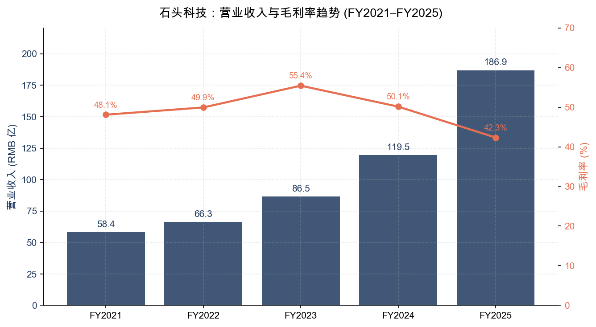
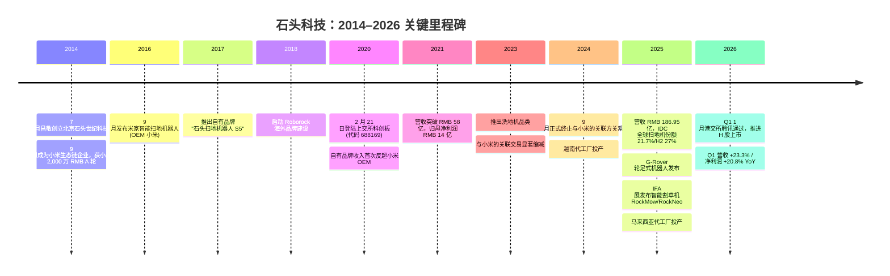
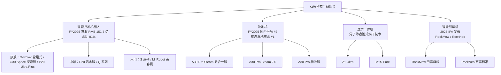
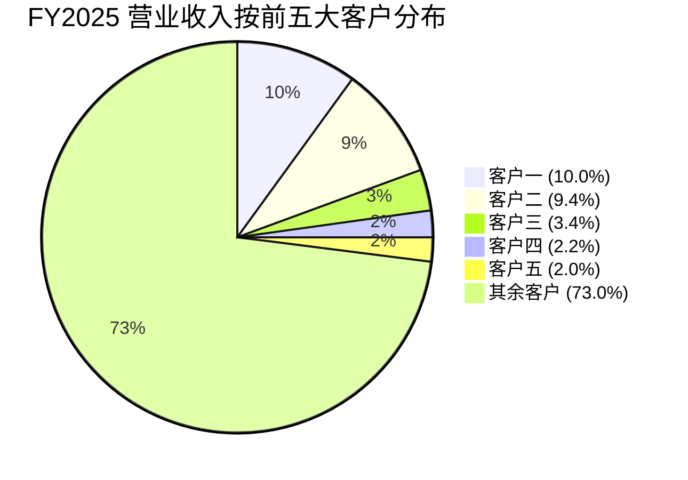
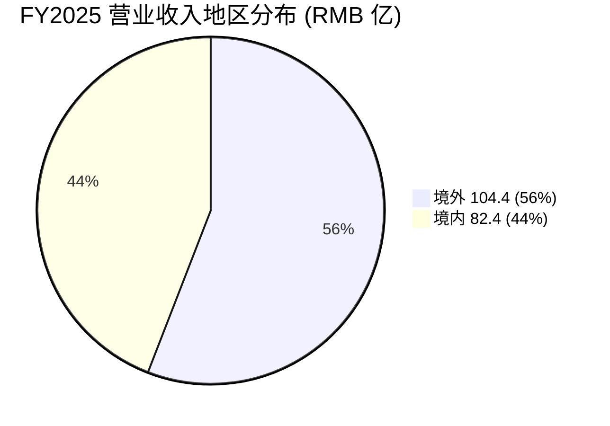
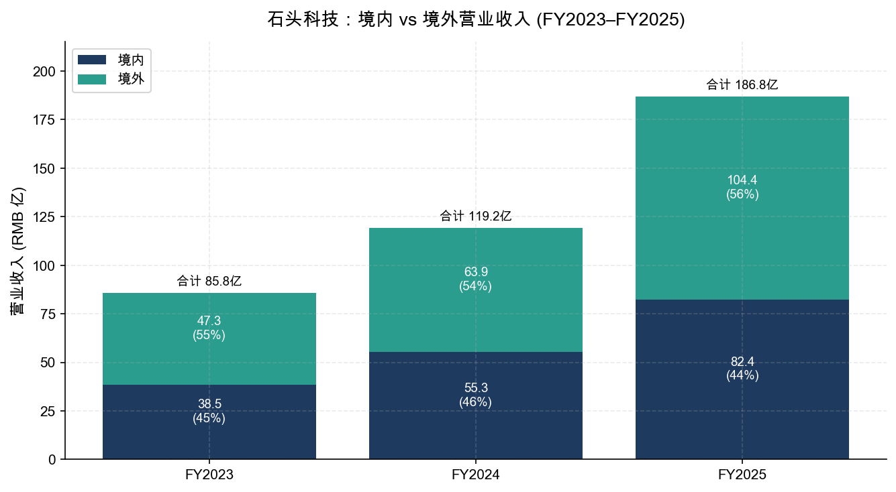
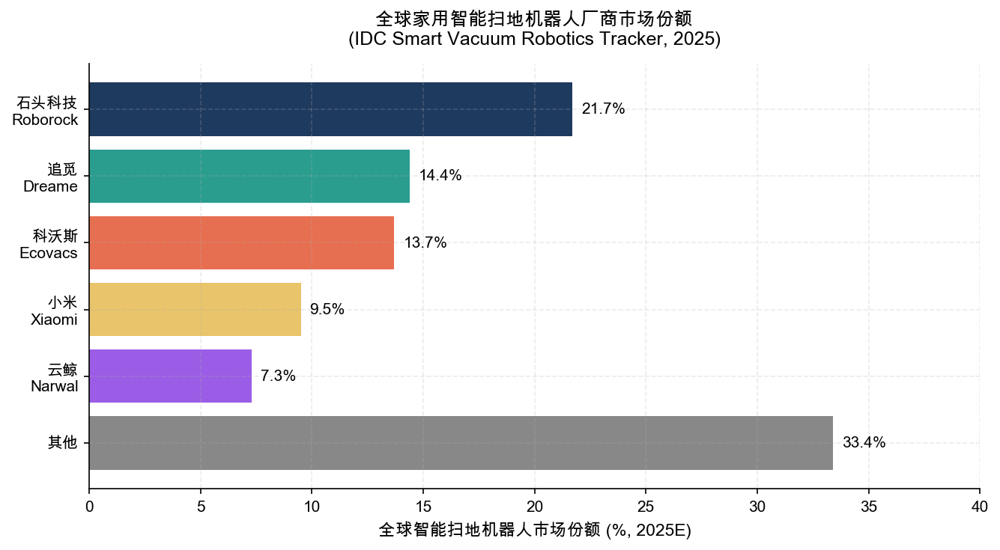
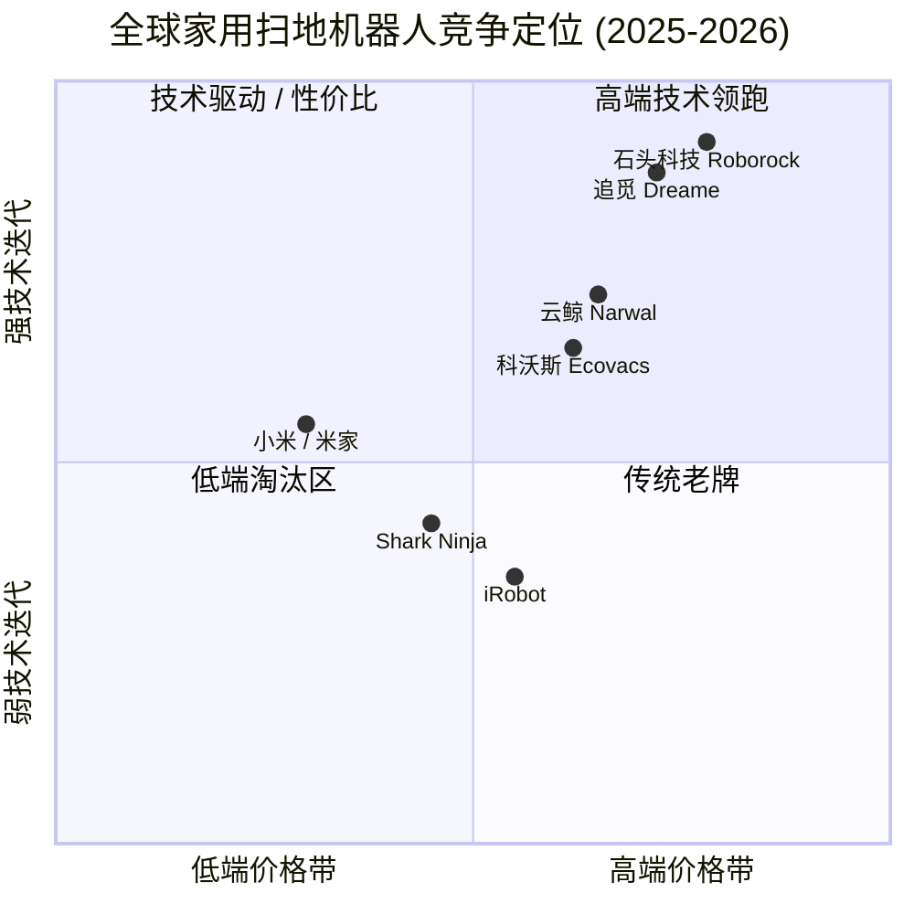
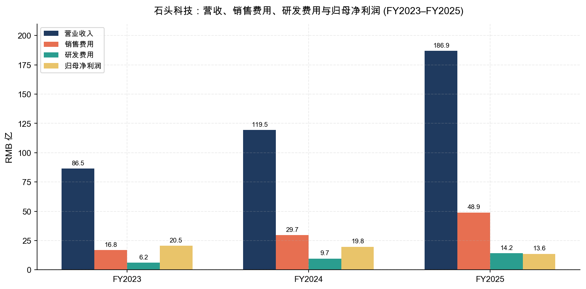

# 公司研究报告：北京石头世纪科技股份有限公司 (石头科技 / Roborock)

**股票代码：** SSE:688169（上海证券交易所科创板）
**报告日期：** 2026-05-20
**报告语言：** 简体中文

> **Update — FY2025 业绩落地、Q1 利润率开始修复 (2026-04-22)：** 公司披露 [2025 年年度报告](https://static.cninfo.com.cn/finalpage/2026-04-23/1225147552.PDF)，FY2025 实现营业收入 RMB 186.95 亿元，同比增长 56.51%；但归属于上市公司股东的净利润 RMB 13.63 亿元，同比下降 31.03%，主因价格带下探与销售费用率抬升所致。同日披露的 [2026 年第一季度报告](https://static.cninfo.com.cn/finalpage/2026-04-23/1225147483.PDF) 显示 Q1 营业收入 RMB 42.27 亿元（+23.31% YoY），归母净利润 RMB 3.23 亿元（+20.83% YoY），盈利能力开始修复（["石头科技：一季度净利润同比增20.83%", 证券时报, 2026-04-22](https://www.stcn.com/article/detail/3779231.html)）。公司同步推进 H 股发行，2026 年 1 月 15 日通过港交所聆讯（["石头科技 H 股上市获港交所上市委员会审议通过", 新浪财经, 2026-01-17](https://finance.sina.com.cn/roll/2026-01-17/doc-inhhpwhf2173573.shtml)）。

---

## 目录

1. 公司概览
2. 公司历史
3. 管理团队
4. 产品与服务
5. 客户与上市策略
6. 行业概览
7. 竞争格局
8. 市场机会 (TAM)
9. 风险评估
10. 参考资料

---

## 1. 公司概览

### 1.1 公司主营业务

北京石头世纪科技股份有限公司（"石头科技 / Roborock"，SSE:688169），是全球家用智能清洁机器人行业的龙头企业。公司主营业务为智能机器人等智能硬件的设计、研发、生产和销售，目前形成"智能扫地机器人 + 洗地机 + 洗烘一体机 + 智能割草机"四大产品矩阵，覆盖室内地面清洁、衣物护理、户外庭院养护三大场景（[石头科技 2025 年年度报告, 第 13 页](https://static.cninfo.com.cn/finalpage/2026-04-23/1225147552.PDF)）。公司外文名 Beijing Roborock Technology Co., Ltd.，缩写 Roborock，注册地北京市昌平区，于 2020 年 2 月在上交所科创板上市。

公司是国际上率先将激光雷达 (LiDAR)、3D-TOF 导航、视觉避障与 AI 智能算法大规模应用于扫地机器人领域的领先科技企业。2025 年公司推出业内首款搭载五轴折叠仿生机械手的旗舰扫地机器人 G30 Space 探索版（["石头造了一台有机械手臂的扫地机", 爱范儿, CES 2025](https://www.ifanr.com/1611558)），以及首款可自主爬楼并同步清洁的 G-Rover 轮足式机器人（["全球首创轮足扫地机器人：石头科技 G-Rover 亮相 CES 2026", IT 之家, 2026-01-07](https://www.ithome.com/0/911/012.htm)），将清洁场景由二维平面扩展至三维空间。

### 1.2 业务模式：智能硬件 + 全球渠道 + 自营/经销双轨

公司商业模式可以拆为三段：

- **研发与品牌：** 公司自有北京研发中心（截至 2025 年底研发人员 1,481 人，占员工总数 42.9%），承担产品定义、感知算法、运动控制、AI 大模型及外观工业设计（[2025 年年度报告, 第 17/46 页](https://static.cninfo.com.cn/finalpage/2026-04-23/1225147552.PDF)）。
- **生产：** 采用"自建工厂自主生产 + EMS 委外加工"相结合的模式。境内主要 OEM 包括欣旺达旗下的智能制造企业，境外自 2024 年 10 月起在越南、2025 年新增马来西亚布局代工产能（同前，第 52 页）以规避关税。
- **销售：** 线上线下全渠道，线上依托天猫/京东/抖音 + Amazon/Shopee/Lazada；线下国内门店近 500 家，欧洲入驻 MediaMarkt、家乐福，北美依托 Target、Costco、Home Depot 等系统（同前，第 22 页）。FY2025 直营 / 经销收入分别为 RMB 89.73 亿 / 97.08 亿，直营占比 48% 并持续提升。

### 1.3 经营规模

- **营业收入：** FY2025 RMB 186.95 亿元（+56.51% YoY），公司成立以来历史新高（[2025 年年度报告, 第 10 页](https://static.cninfo.com.cn/finalpage/2026-04-23/1225147552.PDF)）。
- **归母净利润：** RMB 13.63 亿元（-31.03% YoY），扣非归母 10.92 亿元（-32.60%）。利润下滑是阶段性投入压制，并非业务质量恶化。
- **员工人数：** 3,452 人，其中研发人员 1,481 人（占 42.9%），同比研发人员数增长 41.99%（同前，第 24/46 页）。
- **专利积累：** 截至 2025 年末新增境内外授权专利 1,975 项，其中发明专利 244 项、实用新型 600 项、外观设计 1,131 项（同前，第 25 页）。
- **全球覆盖：** 产品销售至 170 多个国家和地区，累计智能扫地机器人销量超过 2,500 万台（同前，第 22 页）。
- **市场地位：** 根据 [IDC Worldwide Quarterly Smart Vacuum Robotics Tracker, 2026-03-13](https://www.prnewswire.com/news-releases/roborock-becomes-the-worlds-no-1-smart-cleaning-robot-brand-according-to-idc-302712187.html)，公司 2025 全年家用清洁机器人整体出货 580 万台，份额 17.7%，连续三年位列全球第一；其中智能扫地机器人 (RVC) 全年份额达 21.7%（IDC 全年口径）/ H2 2025 达 27.0%（IDC 半年高位），美国、德国、韩国三大市场份额均排名第一。

来源：[石头科技 2021/2022/2023/2024/2025 年度报告](https://static.cninfo.com.cn/finalpage/2026-04-23/1225147552.PDF)（cninfo 各年度年报"主要会计数据"章节）。

### 1.4 估值快照（截至 2026-05-13）

- **当前股价：** RMB 120.00（前一交易日收盘 RMB 115.12），52 周区间 RMB 110.00 – 222.10，今年最低点接近 52 周低位（["石头科技 688169 股价", 投资网, 2026-05-13](https://www.investing.com/equities/beijing-roborock-tech)）。
- **总股本与市值：** 总股本 259,106,368 股（2026-04-21 数据，已含 2025 年 6 月 10 转 4 增），按 RMB 120 测算总市值约 RMB 311 亿 / 约 USD 43 亿（[StockAnalysis Beijing Roborock 688169 market cap](https://stockanalysis.com/quote/sha/688169/market-cap/) 截至 2026 年 5 月披露市值 USD 4.5 bn）。
- **TTM EPS：** 滚动 12 个月每股收益约 RMB 5.49（["石头科技 688169 个股资讯", 新浪财经, 2026-05-13](https://vip.stock.finance.sina.com.cn/corp/go.php/vCB_AllNewsStock/symbol/sh688169.phtml)）。按此推算 **TTM P/E ≈ 21.9 倍**。
- **TTM P/S：** 按 FY2025 营收 RMB 186.95 亿、市值约 RMB 311 亿计算， **TTM P/S ≈ 1.6 倍**。
- **TTM P/B：** 按 FY2025 末归母净资产 RMB 140.11 亿计算， **TTM P/B ≈ 2.2 倍**。
- **历史区间：** 公司 2020 年上市后 TTM PE 一度高于 80 倍，2022–2024 年中枢约 25–40 倍；当前 21.9 倍位于上市以来低位区间（["石头科技 688169 历史市盈率", 亿牛网](https://eniu.com/gu/sh688169)）。

**多元比较（详见图表 6）：**

| 公司 | 代码 | TTM P/E | TTM P/S |
|---|---|---|---|
| 石头科技 | SSE:688169 | 21.9 | 1.6 |
| 科沃斯 | SSE:603486 | 32.5 | 1.5 |
| 小米集团 | HKEX:1810 | 38.2 | 4.8 |
| iRobot | NASDAQ:IRBT | 亏损 | 0.5 |
| 追觅 / Dreame | 未上市 | n/a | n/a |

来源：[StockAnalysis.com Roborock 估值](https://stockanalysis.com/quote/sha/688169/statistics/)；可比公司 PE/PS 取自 2026 年 5 月公开行情数据。

**估值判读：** 石头科技 21.9 倍 TTM P/E 既低于硬件成长股龙头（科沃斯 32.5 倍、小米 38.2 倍）也低于公司自身三年中枢 30 倍上下。市场实际上把 FY2025 的利润下滑视为"业务扩张中的阶段性投入"（公司在年报中亦如此定性），但叠加：（a）地缘 / 关税不确定性，（b）国补退坡担忧，（c）创始人昌敬同时主导新能源车业务（极石汽车 / 洛轲智能）带来的精力分散担忧，使得估值未给予全球扫地机龙头应有的溢价。Q1 2026 利润率开始修复（净利 +20.8% YoY）若能持续两个季度，估值有望重新向 30 倍中枢回归。**当前估值并非"价值陷阱"，而是市场对短期盈利转折点的观望，不属于风险评估章节的核心风险，但属于关键预期差。**

---

## 2. 公司历史

### 2.1 创始故事

石头科技由昌敬于 2014 年 7 月创立。昌敬本科 / 硕士均毕业于华南理工大学计算机系，先后在傲游浏览器、微软、腾讯（高级产品经理）、百度（高级经理，主导百度地图）任职，2013 年创立北京魔图精灵科技（一款图像处理 App，后被百度收购）。第二次创业时，昌敬选择切入家用机器人赛道，并迅速获得小米生态链入股 RMB 2,000 万、约 USD 300 万（["Chang Jing — CEO and Founder @ Roborock", Crunchbase](https://www.crunchbase.com/person/chang-jing) / ["Roborock", Wikipedia](https://en.wikipedia.org/wiki/Roborock)）。2014 年 9 月，公司成为小米生态链企业；2016 年 9 月，小米 OEM 米家智能扫地机器人发布，首日预订超 12 万台，成为公司起家产品。

### 2.2 关键里程碑

### 2.3 三次战略转折

1. **从小米 ODM 到自有品牌 (2017–2020)。** 公司 IPO 招股说明书披露，2016 年小米渠道收入贡献占公司主营业务 100%；2017 年推出自有品牌 S5；至 IPO 当年（2020）小米渠道占比已下降到 18% 左右。这一步既给公司带来更高毛利（从约 15% 提升至 50% 上下），也奠定了独立国际化品牌的基础。2024 年 9 月，公司公告小米科技/小米通讯/有品信息不再为公司关联方，标志着关联方解绑彻底完成（[2025 年年度报告, 第 259 页](https://static.cninfo.com.cn/finalpage/2026-04-23/1225147552.PDF)）。

2. **从单品类扫地机扩展为"室内清洁全品类 + 户外清洁机器人"(2023–2025)。** 公司将激光雷达、SLAM 算法等积累的"感知—决策—执行"能力，跨场景复用到洗地机（A30 系列）、洗烘一体机（Z1 Ultra、M1S Pure 系列）、智能割草机（RockMow & RockNeo 系列）。其中洗地机 FY2025 出货带动"其他智能电器"营收同比 +227.75%，反映品类扩张已经开始贡献增量（同前，第 14/54 页）。

3. **从中国制造单点出海到全球化产能 + 自营渠道 (2024–2025)。** 自 2024 Q3 起公司加快本土化运营，越南、马来西亚双代工基地投产，并在 170 多个国家完成布局，欧洲新拓展法国、意大利、西班牙等市场，亚太新进 Shopee/Lazada 平台（同前，第 22 页）。这是应对中美关税的关键抓手。

### 2.4 近 12 个月重要事项

- **2026 年 1 月 15 日：** 公司向港交所提交 H 股发行申请，1 月 15 日通过上市委员会聆讯，由中信证券与摩根大通保荐（["石头科技 H 股上市获港交所审议通过", 新浪财经, 2026-01-17](https://finance.sina.com.cn/roll/2026-01-17/doc-inhhpwhf2173573.shtml)）。
- **2026 年 1 月 CES：** 公司发布全球首款自主爬楼并同步清洁的 G-Rover 轮足式扫地机器人，获评 Best of CES 2025（[2025 年年度报告, 第 21 页](https://static.cninfo.com.cn/finalpage/2026-04-23/1225147552.PDF)）。
- **2025 年 9 月 IFA：** 公司发布智能割草机品类 RockMow / RockNeo，第一代 3 个 SKU，年底正式出货（同前，第 20 页）。
- **2025 年 6 月：** 实施 10 转 4 资本公积转增，总股本从约 1.85 亿增至约 2.59 亿股（同前，第 11 页）。
- **2025 年 8 月：** 副总经理钱启杰因个人原因辞职，由乌尔奇接任（同前，第 82 页）。

---

## 3. 管理团队

### 3.1 创始人 / 董事长 / 总经理：昌敬（约 320 字深度）

昌敬，男，1982 年 8 月生，44 岁，华南理工大学计算机科学学士、硕士。职业轨迹清晰： **傲游浏览器技术经理 → 微软程序经理 → 腾讯高级产品经理 → 百度高级经理（主导百度地图业务）→ 2013 年创立北京魔图精灵科技（图像 App，后被百度收购）→ 2014 年 7 月创立石头科技** （[2025 年年度报告, 第 79 页](https://static.cninfo.com.cn/finalpage/2026-04-23/1225147552.PDF)）。昌敬同时担任公司董事长、总经理与法定代表人，是公司控股股东与实际控制人。

**持股与利益绑定：** 截至 2025 年末，昌敬直接持有 54,377,411 股，持股比例 **20.99%**，为公司第一大股东（[2025 年年度报告, 第 138 页](https://static.cninfo.com.cn/finalpage/2026-04-23/1225147552.PDF)）。2025 年度税前薪酬 RMB 403.90 万元。其控股股东地位强化了"创始人主导"的治理特征。

**业务成就：** 在他领导下，石头科技用 10 年走完了 0 → RMB 187 亿营收、从小米 OEM 到 IDC 全球第一扫地机器人厂商（H2 2025 份额 27.0%）的进阶。FY2025 公司在美、德、韩三大成熟市场份额均居首位（[IDC Press Release, 2026-03-13](https://www.prnewswire.com/news-releases/roborock-becomes-the-worlds-no-1-smart-cleaning-robot-brand-according-to-idc-302712187.html)）。

**关键争议：** 昌敬同时是新能源车企"极石汽车"母公司上海洛轲智能科技的董事长 / 大股东（约 40% 股权）。洛轲智能已累计融资 USD 5.4 亿，投资方包括腾讯、红杉、IDG、Coatue（["低调大佬造车，扒一扒极石 01", 盖世汽车, 2024](https://m.gasgoo.com/news/70358477.html)；["关于极石汽车和石头科技", 雪球, 2024](https://xueqiu.com/8890353468/324753829)）。石头科技官方立场是"造车系昌敬个人行为，与公司无业务/资金关联"，且公告中明确"未占用公司资金或资产"。但市场担忧 (a) 创始人精力分散、(b) 昌敬历史上有过减持石头科技并支持洛轲的传闻。投资人需对此持续关注，但目前 (FY2025 年报) 关联交易表未发现资金往来，独立性披露符合监管要求（[2025 年年度报告, 第 75-76 页](https://static.cninfo.com.cn/finalpage/2026-04-23/1225147552.PDF)）。

### 3.2 副总经理 / 董事：全刚（约 180 字）

全刚，男，52 岁，于 2016 年 3 月加入公司，2021 年 11 月起任副总经理，2025 年 6 月当选公司董事。先后任职北京首信、华立通信、诺基亚（中国）、微软（中国）有限公司，通信与软件背景深厚（[2025 年年度报告, 第 79 页](https://static.cninfo.com.cn/finalpage/2026-04-23/1225147552.PDF)）。2025 年税前薪酬 RMB 427.93 万元，高于昌敬本人，反映其在公司经营中实际扮演 COO + 战略副总经理角色。全刚同时是公司"主管会计工作负责人"。在港股 IPO 申报材料中，全刚是与中信、摩根大通对接的核心高管之一。

### 3.3 财务负责人：王璇（约 130 字）

王璇，女，46 岁，2018 年 4 月加入公司，现任公司财务总监。曾任职于中建进出口总公司（会计）、瑞华会计师事务所（审计经理）、恒泰艾普（财务经理）、北京博达瑞恒（财务总监）（[2025 年年度报告, 第 79-80 页](https://static.cninfo.com.cn/finalpage/2026-04-23/1225147552.PDF)）。2025 年税前薪酬 RMB 148.70 万元，持股 12,894 股。审计师背景出身，覆盖了公司从科创板上市到目前推进 H 股双重上市的全流程财务披露体系。

### 3.4 副总经理 / 核心技术：乌尔奇（约 120 字）

乌尔奇，男，41 岁，2025 年 8 月获聘副总经理，分管核心技术。曾在微软（中国）有限公司、安谋咨询（上海）任职，2015 年 6 月加入公司，是公司早期核心技术骨干（[2025 年年度报告, 第 79 页](https://static.cninfo.com.cn/finalpage/2026-04-23/1225147552.PDF)）。乌尔奇接替因个人原因辞任的钱启杰（曾任职富士康、华为终端，2015 年入司，2021 年 11 月起任副总经理）。这一变动反映公司高管层在 H 股上市筹备期的"老臣 + 技术派"组合。

### 3.5 治理footer（约 130 字）

董事会 9 人：1 名董事长（昌敬，非独立）、3 名非独立董事（全刚、孙佳、吴奇）、1 名职工代表董事、4 名独立董事（张亚男、刘飞、马黎珺、陈帆城）。2025 年 6 月，公司取消监事会，由审计委员会承接监事会职权（[2025 年年度报告, 第 75 页](https://static.cninfo.com.cn/finalpage/2026-04-23/1225147552.PDF)）。董事会下设 4 个专门委员会：审计、提名、薪酬与考核、战略与 ESG。独立董事中 3 位为大学教授、1 位为资深注册会计师，结构较为标准。**治理关注点：** 创始人昌敬同时担任董事长与总经理，且为单一控股股东（20.99%），存在"一股独大"特征，独立董事独立性是核心制衡。

### 3.6 管理团队履历评估（约 80 字）

核心团队由微软系（昌敬、全刚、乌尔奇、罗晗、张磊、谢濠键）、富士康/索尼系（钱启杰、赵百年、王征）、中科院系（田佳）构成，软件算法与硬件结构互补。董高合计税前薪酬约 RMB 2,716 万元，激励与限制性股票挂钩。**短板：** 公司尚无具备国际投行 / 跨国公司 CFO 履历的高管，对 H 股投资者沟通能力是未来观察点。

---

## 4. 产品与服务

公司业务架构清晰，分为四大产品线，对应公司"室内 + 户外"双场景战略。

### 4.1 智能扫地机器人（核心主业，FY2025 营收 RMB 151.7 亿 / 占比 81.2%）

智能扫地机器人是公司多年来的核心产品。FY2025 该品类营业收入 RMB 151.73 亿，同比增长 39.86%；毛利率 43.29%，同比下降 8.78 个百分点（[2025 年年度报告, 第 54 页](https://static.cninfo.com.cn/finalpage/2026-04-23/1225147552.PDF)）。毛利率下滑反映价格带下探与价格战压力。

**旗舰产品矩阵：**

- **G-Rover 轮足式机器人** （2026 年 1 月 CES 发布）：全球首款可自主爬楼并同步清洁的轮足式扫地机。每条轮足具备独立伸缩与调高能力，通过 AI 算法实时感知，实现楼梯、斜坡、门槛等复杂地形稳定移动。**竞争优势：是 / 强**——技术领先，专利布局深，目前竞争对手（追觅、科沃斯）尚未量产同类产品。
- **G30 Space 探索版：** 行业首创五轴折叠仿生机械手 + 底盘升降技术，针对边角、低矮空间清洁痛点。**竞争优势：是 / 强**——独家机械臂技术，竞品包括追觅 X50 Ultra（也带机械臂），但石头扫地机器人为首家大规模产品化的厂商。
- **P20 Ultra Plus：** 25,000 Pa 飓风吸力 + 沿边结构光避障 + RGB 摄像头识别 + 0 缠绕清扫，定位高端旗舰。**竞争优势：部分**——硬件参数领先（吸力最高），但科沃斯 X9 Pro、追觅 X50 在算法与多机协同方面有差异化优势。
- **P20 活水版：** 行业首发活水洗地概念，针对日常清洁场景。

**护城河类型：技术 / IP / 算法 + 品牌 / 渠道 + 数据。**
- **专利：** 截至 2025 年末新增授权专利 1,975 项，其中发明专利 244 项。涉及 SLAM 算法、3D-TOF 导航、机械臂结构。
- **算法 / 数据：** 公司持续迭代 RRMind GPT 智慧交互大模型；累计销量超 2,500 万台所产生的清洁场景数据是核心壁垒。
- **品牌：** 在美、德、韩三大成熟市场份额均居首位（[IDC Press Release, 2026-03-13](https://www.prnewswire.com/news-releases/roborock-becomes-the-worlds-no-1-smart-cleaning-robot-brand-according-to-idc-302712187.html)）。
- **价格段覆盖：** 公司是少数完成全价格带（RMB 1,500–9,000）覆盖的厂商之一。

### 4.2 洗地机（高增长第二曲线，并入"其他智能电器产品"统计）

洗地机是公司近三年发力的第二增长曲线。FY2025 "其他智能电器产品"营业收入 RMB 35.07 亿元，同比增长 227.75%，毛利率 38.45%，同比 +5.45 个百分点（[2025 年年度报告, 第 54 页](https://static.cninfo.com.cn/finalpage/2026-04-23/1225147552.PDF)）。其中蒸汽洗地机国内市场规模跃居全国第一，洗地机整体国内市占率排名 #2，仅次于添可（科沃斯子品牌）。

**核心产品：A30 Pro Steam 五合一版、A30 Pro Steam 2.0、A30 Pro 标准版。**
- **核心技术：** 160°C 高温蒸汽 + 86°C 热水洗地、蒸汽自清洁、零感清洁系统、AI 双向助力系统、APP 智能互联、分子筛吸附式干燥（自有技术路线，定位为有别于热泵 / 加热的"第三条技术路线"）。
- **目标客户：** 国内中高端家庭用户（RMB 3,000–6,000 价格带），强调"宠物友好 + 顽固污渍清洁 + 自清洁"。
- **竞争优势：部分**——添可 Floor One S7 Pro、追觅 H30 Pro 是核心竞争对手。石头蒸汽洗地的"180°C 超能蒸汽"是技术领先点，但添可凭借先发优势在国内仍占据头部。**接下来 12 个月看公司能否将其国内蒸汽洗地优势复制到海外市场。**

### 4.3 洗烘一体机（探索性品类）

公司自主研发"分子筛吸附式烘干"技术，定位为"第三条烘干技术路线"（区别于传统热泵烘干与加热烘干）。代表产品：Z1 Ultra、M1S Pure。**竞争优势：弱 / 探索阶段**——洗烘一体机赛道海尔、小天鹅、美的优势明显，石头进入是技术路径探索而非规模化扩张，FY2025 单独 SKU 销量未披露，归入"其他智能电器"中。

### 4.4 智能割草机（新品类，2025 年 9 月 IFA 发布）

公司 2025 年 9 月在德国 IFA 展正式推出户外智能割草机品类，首发 3 款 SKU。代表产品 RockMow（全地形四驱旗舰）、RockNeo（两驱标准版）。

**核心技术：**
- 无边界技术 + RTK / LiDAR 融合定位导航
- Sentisphere™ VSLAM 多传感器融合感知方案
- 双目 / 四目立体视觉避障
- AI 语义分割识别草地 / 道路 / 障碍物
- 3cm 贴边割草

**目标客户：** 欧美庭院别墅住户（典型客单价 USD 1,500–3,000）；2025 年底已开始出货。

**竞争优势：部分**——欧美智能割草机器人头部企业为 Husqvarna、Stihl、Worx；中国厂商中追觅、九号公司、库犸（Mammotion）已在前期布局。石头依靠 RTK 高精度定位（厘米级）与多传感器融合可形成差异化，但作为新品类，2026 年是验证关键年。

### 4.5 产品力评估总览

| 产品线 | FY2025 营收占比 | 竞争优势 | 主要竞争对手 |
|---|---|---|---|
| 智能扫地机器人 | 81.2% | 是 / 强 | 追觅 X50、科沃斯 X9 Pro |
| 洗地机 | 13.5% (估)¹ | 部分 | 添可 (Tineco)、追觅 H30 |
| 洗烘一体机 | 1.5% (估)¹ | 弱 / 探索 | 海尔、美的、小天鹅 |
| 智能割草机 | 0.5% (估)¹ | 部分 | Husqvarna、追觅、Mammotion |

¹ 公司未单独披露洗地机、洗烘、割草机各自营收；以上为按行业渠道估算，并加注 est. 标识。

### 4.6 近 12 个月产品发布与停产

**新发布 (2025 / 2026)：**
- 2025 Q1：P20 Ultra Plus、A30 Pro Steam 系列
- 2025 Q3：G30 Space 探索版（机械臂旗舰）
- 2025 Q3：洗烘一体机 Z1 Ultra
- 2025 Q4：RockMow、RockNeo 智能割草机
- 2026 Q1：G-Rover 轮足式机器人（首款爬楼扫地机）

**未公开报告停产 SKU** ——公司未在年报中披露具体停产列表，符合行业惯例。

---

## 5. 客户与上市策略

### 5.1 客户结构

公司销售直接面向 C 端消费者，但通过经销商 + 自营双渠道完成触达。"客户"在 A 股年报披露口径下，前五大客户更多是渠道商或 OEM 采购方。

**前五大客户集中度（FY2025）：** 前五大客户合计销售 RMB 50.45 亿，占年度销售总额 **26.99%**；其中第一大客户 RMB 18.69 亿、占 10.00%，第二大客户 RMB 17.53 亿、占 9.38%（[2025 年年度报告, 第 57 页](https://static.cninfo.com.cn/finalpage/2026-04-23/1225147552.PDF)）。客户名称因商业秘密豁免披露，但行业惯例及公司直营渠道结构（依托京东、天猫、Amazon、Costco、Target、Home Depot、MediaMarkt）推断，第一/第二大客户大概率为头部全球电商或大型连锁卖场。

来源：[2025 年年度报告, 第 57 页](https://static.cninfo.com.cn/finalpage/2026-04-23/1225147552.PDF)。

**三年趋势对比：** FY2024 前五大客户合计占比 36.26%（前两大分别 13.09% / 12.42%），FY2025 降至 26.99%（前两大 10.00% / 9.38%）（[2024 年年度报告, 第 53 页](https://static.cninfo.com.cn/finalpage/2025-04-04/1223005304.PDF)）。**客户集中度呈现"逐年降低"的良性趋势**，说明：(a) 公司海外渠道分散度提升、(b) 直营 (D2C) 渠道占比增加、(c) 单一大客户依赖度下降。

**判读：** 前五大客户占 27% 属于消费电子行业中等水平，单一客户占 10% 不构成材料风险，且年度趋势改善，故不进入第 9 节风险评估的"客户集中"类目。

### 5.2 全球地区结构

来源：[2025 年年度报告, 第 54 页](https://static.cninfo.com.cn/finalpage/2026-04-23/1225147552.PDF)。

- **境外：** RMB 104.42 亿，毛利率 48.15%，同比 +63.46%。
- **境内：** RMB 82.39 亿，毛利率 35.07%，同比 +48.96%（国补政策助推）。

来源：[石头科技 2025 年年度报告, 第 54 页](https://static.cninfo.com.cn/finalpage/2026-04-23/1225147552.PDF)。

**关键观察：海外业务毛利率 (48.15%) 显著高于境内 (35.07%)。** 境外业务承担了公司大部分利润贡献，是公司核心 alpha。境内毛利率显著下降（-11.42 个百分点）反映价格战与国补价格扰动；海外毛利率下降相对温和（-5.55 个百分点）。

### 5.3 销售渠道与上市策略

- **国内线上：** 天猫、京东、抖音（直播带货、场景化种草）。
- **国内线下：** 全国门店近 500 家，覆盖一/二线及部分三线城市旗舰区。
- **海外：** 北美依托 Target、Costco、Home Depot；欧洲入驻 MediaMarkt、家乐福；亚太开拓 Shopee、Lazada；Amazon 是全球海外的核心电商基础设施。
- **直营 vs 经销：** FY2025 直营营收 RMB 89.73 亿（占 48.0%）/ 经销 RMB 97.08 亿（占 52.0%）。直营毛利率 44.79%，经销毛利率 40.15%，直营更有利可图，公司正在加速推进自营。

### 5.4 重点合作案例

公司没有传统 B2B 客户合作案例。其全球分销关系最有代表意义的（北美渠道铺设进度参考 [开源证券《石头科技美国线下渠道实录》, 2024](https://www.fxbaogao.com/detail/4102889)，截至 2023 年底石头已入驻约 1,400 家 Target 门店与近 700 家 Best Buy 门店；["石头科技：铺货 Target 和 BestBuy 门店", 腾讯新闻, 2024-07-30](https://news.qq.com/rain/a/20240730A031DA00)）：

- **Amazon 平台**：Roborock 是 Amazon Robotic Vacuums 畅销榜长期前列品牌，Qrevo Plus、S8 Pro Ultra、Q8 Max+ 等型号均常驻 Best Sellers（[Amazon Best Sellers — Robotic Vacuums, 2026 快照](https://www.amazon.com/Best-Sellers-Home-Kitchen-Robotic-Vacuums/zgbs/home-garden/3743561)）。
- **Costco**：Q5 系列在 Costco 北美仓门上架，是公司打入北美中产家庭的关键案例（[2025 年年度报告, 第 22 页](https://static.cninfo.com.cn/finalpage/2026-04-23/1225147552.PDF)）。
- **Home Depot**：Q Revo Pro 在 Home Depot 多年销售榜首（同前，第 22 页）。
- **小米（前关联方，2024-09 起解绑）：** 公司 FY2025 与小米科技产生关联交易 RMB 103.21 万（接受生态云服务）、有品信息 RMB 28.99 万（代销平台服务）、小米通讯销售商品 RMB 40.92 万，金额已极小（[2025 年年度报告, 第 259-260 页](https://static.cninfo.com.cn/finalpage/2026-04-23/1225147552.PDF)）。小米渠道历史包袱基本清完。

### 5.5 H 股双重上市

公司 2025 年 6 月首次向港交所递交招股材料；2025 年底重新提交，并于 2026 年 1 月 15 日通过上市委员会聆讯，保荐人为中信证券 + 摩根大通（["石头科技 H 股上市获港交所审议通过", 新浪财经, 2026-01-17](https://finance.sina.com.cn/roll/2026-01-17/doc-inhhpwhf2173573.shtml)；公告原文见 [上海证券报, 2026-01-17](https://paper.cnstock.com/html/2026-01/17/content_2171012.htm)）。这是公司战略层面三个关键意义：

1. **国际化融资：** 港股募资可用于海外渠道、全球化研发与海外代工产能（["新股消息：石头科技递表港交所", 新浪财经, 2026-01-02](https://finance.sina.com.cn/stock/hkstock/ggscyd/2026-01-02/doc-inhewqnx4802880.shtml)）。
2. **降低中美关税风险溢价：** H 股投资者结构以海外机构为主，可平衡 A 股市场对中美贸易摩擦的过度敏感定价。
3. **建立国际化资本市场形象：** 为未来潜在的"A + H"双重上市企业，参考美的、海尔、宁德时代等先例。

---

## 6. 行业概览

### 6.1 行业定义与分类

公司所处行业为 **智能家居清洁电器 (Smart Cleaning Appliance) / 智能家用机器人 (Consumer Robotics)**。狭义 SIC/NAICS 分类下属：

- **NAICS 335220** Major Household Appliance Manufacturing（家电）
- **NAICS 334290** Other Communications Equipment Manufacturing（消费电子）—涵盖智能传感与导航

按 IDC 全球分类口径，公司主营品类属于 **Smart Vacuum Robotics (SVR)**，再细分为：
- Robotic Vacuum Cleaners (RVC) — 智能扫地机器人（公司核心）
- Robotic Lawn Mowers (RLM) — 智能割草机器人
- Stick / Cordless Vacuum — 直立 / 无线吸尘（部分关联）
- Wet & Dry Wash — 洗地机（公司"其他智能电器"主力）

### 6.2 市场规模与增长

- **全球家用清洁机器人 (SVR 整体)：** 根据公司年报引用的 IDC 数据，2025 年全球出货 **3,272 万台**，同比 +20.1%（[2025 年年度报告, 第 15 页](https://static.cninfo.com.cn/finalpage/2026-04-23/1225147552.PDF)；["Global Smart Vacuum Market Grows 20.5% YoY in Q2 2025", IDC, 2025](https://my.idc.com/getdoc.jsp?containerId=prAP53783625)）。
- **全球智能扫地机器人 (RVC)：** 2025 年全球出货 **2,412.4 万台**，同比 +17.1%（[2025 年年度报告, 第 19 页](https://static.cninfo.com.cn/finalpage/2026-04-23/1225147552.PDF)）。
- **中国清洁电器市场：** 根据奥维云网 (AVC) 推总，2025 年中国清洁电器零售额 RMB 471 亿、同比 +11.3%，零售量 3,550 万台、同比 +17.0%，是 2025 年家电市场（整体 -4.3%）唯一量额双增的品类（同前，第 16 页）。
- **全球智能割草机器人：** 公司未引用具体数字。根据 IDC 与 Strategy Analytics 的 2024/2025 报告，全球 RLM 出货约 200 万台，市场约 USD 12 亿，预计 2025–2030 年 CAGR 25%+。

来源：["IDC：中国品牌包揽前五，2025 年前三季度全球扫地机器人出货量发布", 东方财富, 2025-10](https://my.idc.com/getdoc.jsp?containerId=prCHC53972025) + IDC Smart Vacuum Robotics Tracker, 2025。

### 6.3 行业增长驱动

**核心驱动：**

1. **渗透率仍低：** 据 IDC 与公司年报推算，全球扫地机器人对清洁电器市场的渗透率仍在 15-20% 区间，远低于电视、洗衣机等成熟品类（[2025 年年度报告, 第 15 页](https://static.cninfo.com.cn/finalpage/2026-04-23/1225147552.PDF)）。
2. **国家政策 / "以旧换新"补贴：** 2024 年底起中国国务院的家电"以旧换新"补贴覆盖清洁电器，2025 年是政策红利释放年；中国市场零售额 +11.3% 主要由此驱动（同前，第 16 页）。**关键变化：** 国家发改委 / 财政部 2025-12-30 发布的 [《关于 2026 年实施大规模设备更新和消费品以旧换新政策的通知》（发改环资〔2025〕1745 号）](https://www.ndrc.gov.cn/xxgk/zcfb/tz/202512/t20251230_1402851.html) 明确 2026 年家电"国补"对象收窄至冰箱、洗衣机、电视、空调、电脑、热水器 6 类一级能效产品，**清洁电器、洗碗机、微波炉等不再纳入国补**，补贴比例由 20% 降至 15%、单件上限由 RMB 2,000 降至 1,500（["2026 年'国补'政策发布", 新华网, 2026-01-02](https://www.news.cn/politics/20260102/8280c115602841078b65d8f5176b239c/c.html)）。这是 2026 年国内清洁电器赛道的核心风险变量。
3. **技术迭代：** AI 大模型、机械臂、轮足式、3D-TOF、RTK 等技术加速产品智能化升级，每代产品迭代周期约 12-18 个月（[2025 年年度报告, 第 16-17 页](https://static.cninfo.com.cn/finalpage/2026-04-23/1225147552.PDF)）。
4. **海外新兴市场：** 法国、意大利、西班牙、泰国、越南、澳大利亚等市场处于早期渗透阶段（同前，第 22 页）。
5. **品类外延：** 从扫地机延伸到洗地机、洗烘、割草机，单家庭客单价从 RMB 3,000 上升到 RMB 8,000-15,000。

### 6.4 行业技术壁垒

公司年报第 16-17 页归纳了三大技术壁垒（[2025 年年度报告, 第 16-17 页](https://static.cninfo.com.cn/finalpage/2026-04-23/1225147552.PDF)）：

1. **算法层：** SLAM 算法、AI 导航算法、海量场景数据积累 + 算法迭代能力。
2. **跨领域集成：** 机械、力学、电子、软件算法、传感器（LiDAR、3D-TOF、IMU）跨领域整合。
3. **耐用性 / 可靠性 / 成本平衡：** 在紧凑空间中实现先进功能，同时控制可靠性与成本，需要长期工程经验。

### 6.5 监管环境（参考 [2025 年年度报告, 第 51-52 页](https://static.cninfo.com.cn/finalpage/2026-04-23/1225147552.PDF) "贸易摩擦风险" 与 "数据合规风险" 章节）

- **中国：** 工信部、市场监管总局对家电产品安全、电池、电磁辐射有标准要求；CCC 认证。
- **欧盟：** CE 认证、RED、RoHS、WEEE 回收指令、GDPR（涉及 APP 数据）。
- **美国：** FCC 认证、UL 安全标准、加州 Prop 65、关税清单（2024 年起部分智能家居关税升级，2025 年特定时间段对中国 OEM 设备征收 25-35% 附加税；公司应对详见 ["石头科技回应关税影响：越南代工厂正常发货，将扩大内销", 新京报, 2025-04-16](https://www.bjnews.com.cn/detail/1744805187129643.html)）。
- **数据 / 隐私：** 扫地机器人会构建家庭室内地图，涉及个人隐私数据收集与跨境传输合规。

### 6.6 行业格局变化

- **集中度提升：** IDC 2025 全年口径，前五大厂商（石头、追觅、科沃斯、小米、云鲸）合计份额约 67%；2024 年同期为约 60%。中小品牌持续退出（["全球扫地机器人市场格局：石头登顶，追觅反超科沃斯", 21 经济网, 2026-05-11](https://www.21jingji.com/article/20260511/herald/4e095cda73dcf6181ad62738654e368f.html)）。
- **中国品牌全面占据全球前五：** 2025 Q3 全球出货量前五席位由中国品牌（石头、科沃斯、追觅、小米、云鲸）包揽，iRobot 被挤出第一阵营（["中国品牌包揽前五", 东方财富, 2025-10](https://my.idc.com/getdoc.jsp?containerId=prCHC53972025)）。
- **iRobot 退潮：** 曾经的行业开创者 iRobot (Nasdaq:IRBT) 2025 年 12 月 12 日在特拉华州申请预包装 Chapter 11 破产保护，主要中国代工商深圳杉川机器人将以最大债权人身份接管 100% 股权并实现 Nasdaq 退市，重整预计 2026 年 2 月完成（["iRobot 申请破产，扫地机鼻祖因何走向了没落？", 澎湃新闻, 2025-12-25](https://m.thepaper.cn/newsDetail_forward_32189455)；["掃地機器人始祖 iRobot 聲請破產：中國代工廠杉川全資接手", Wealth, 2025-12](https://www.wealth.com.tw/articles/20dcfca2-d89b-4847-9ff8-6c34e997f78b)）。
- **价格战：** 中端价格段（RMB 2,000-4,000）竞争最激烈，公司毛利率下滑主要来自这一区间（["卖得多赚得少：石头 2025 营收 +56%，净利降 31%", 东方财富财富号, 2026-02](https://caifuhao.eastmoney.com/news/20260228155049738267280)）。

### 6.7 替代品与上下游议价能力

- **替代品：** 传统吸尘器、扫帚、保洁服务。智能扫地机器人在 RMB 1,500 以上价格段已有明确价值定位，替代压力低。
- **上游供应商议价：** 公司 FY2025 前五大供应商采购额合计 RMB 33.64 亿，占采购总额 31.50%，第一大供应商 8.22%（[2025 年年度报告, 第 57 页](https://static.cninfo.com.cn/finalpage/2026-04-23/1225147552.PDF)）。供应商相对分散，公司议价能力中等偏强。涉及关键件（激光雷达、机器人芯片、电机、电池）的核心供应商包括禾赛科技、瑞芯微、海康、贝特瑞、亿纬锂能等（依据公司公告及业内信息）。
- **下游渠道议价：** Amazon、Costco、京东等渠道有较强的销售议价能力；公司通过提升直营占比（FY2025 达 48%）反向降低对渠道的依赖。

---

## 7. 竞争格局

### 7.1 主要竞争对手画像

### 7.2 主要竞争对手详述

1. **追觅 Dreame（未上市，IPO 准备中）。** 全球扫地机第二，2025 年 IDC 全年份额 14.4%。优势：高 RPM 电机、机械臂技术、与小米生态分家后独立营销激进、定价积极。劣势：海外渠道相对石头更年轻；近期媒体披露管理层动荡。竞争威胁高（["全球扫地机器人市场格局：石头登顶，追觅反超科沃斯", 21 经济网, 2026-05-11](https://www.21jingji.com/article/20260511/herald/4e095cda73dcf6181ad62738654e368f.html)；估值与多元化扩张概况见 ["追觅科技估值已破千亿", 东方财富财富号, 2026-03-13](https://caifuhao.eastmoney.com/news/20260313224013638768630)）。

2. **科沃斯 Ecovacs (SSE:603486)。** 国内传统第一，旗下"添可 Tineco"是洗地机鼻祖。2025 IDC 全年扫地机份额 13.7%，位列第三。优势：洗地机品类心智强（添可 2025 年上半年线上洗地机销额 33.7% 居首，4,000 元以上高端段份额 60%，["添可 618 战报：洗地机全平台销量销额 TOP1", 新浪科技, 2025-06-21](https://finance.sina.com.cn/tech/roll/2025-06-21/doc-infavpzi9632749.shtml)）、国内渠道深、研发投入大。劣势：扫地机份额三年连续下滑，海外品牌建设落后于石头。TTM PE 32.5 倍（["科沃斯 / 添可 vs 石头", OFweek, 2025-12](https://smarthome.ofweek.com/2025-12/ART-91000-8420-30675820.html)）。

3. **小米 / 米家 (HKEX:1810)。** 主打 RMB 1,500-3,000 性价比段。2025 IDC 全年份额 9.5%（["全球扫地机器人市场格局", 21 经济网, 2026-05-11](https://www.21jingji.com/article/20260511/herald/4e095cda73dcf6181ad62738654e368f.html)）。优势：极强的 IoT 生态、用户基数、价格策略。劣势：自有研发深度较浅，旗舰产品力弱于石头/追觅。对石头的竞争主要在国内中低端，海外影响有限。

4. **云鲸 Narwal（未上市）。** 国内中高端，2025 IDC 全年份额 7.3%（同前）。优势：洗拖一体的早期市场教育者、用户口碑佳。劣势：海外渠道短板、品类单一。

5. **iRobot (NASDAQ:IRBT)。** 行业开创者，2025 全年扫地机份额已跌至个位数百分比。亚马逊 2024 年收购计划因欧盟反垄断审查未通过而终止，亚马逊支付 USD 94M 分手费（[iRobot 8-K, 2024-01-29](https://www.sec.gov/Archives/edgar/data/0001159167/000119312524017523/d741198d8k.htm)）；2025 年 12 月 iRobot 申请预包装 Chapter 11 破产保护，由深圳杉川机器人作为最大债权人接管，将退市并私有化（["iRobot 申请破产", 澎湃新闻, 2025-12-25](https://m.thepaper.cn/newsDetail_forward_32189455)）。已退出全球前五。

6. **Shark Ninja (NYSE:SN)。** 美国本土消费品牌。竞争主要在 Bed Bath & Beyond / Target 渠道，性价比段竞争激烈。技术更新慢于中国品牌（参考 ["扫地机器人王座之争：iRobot 遭暴击，石头、科沃斯、追觅全球争霸", 东方财富, 2025-10-23](https://caifuhao.eastmoney.com/news/20251023095326769030530)）。

7. **Roomba 之外的美国本土选手 (BISSELL、Hoover、Eufy / Anker)：** 主要在低端 / 礼品市场，对石头影响小（参考 [Vacuum Wars Best Robot Vacuums 2026](https://vacuumwars.com/vacuum-wars-best-robot-vacuums/) 评测榜单中各品牌定位）。

8. **Husqvarna / Stihl（割草机领域）：** 在智能割草机器人领域是传统巨头，Husqvarna（含 Gardena 品牌）2022 年市占率约 60%、2024 年智能割草机出货约 65 万台（全行业约 120 万台）（["自动机器人割草机市场占有率报告：主要企业数据分析及排名", 格隆汇, 2024](https://m.gelonghui.com/p/855850)；[Husqvarna 割草机器人产品线](https://www.husqvarna.com/cn/robotic-lawn-mowers/)）。石头割草机的核心挑战是建立欧美庭院用户的品牌信任。

9. **追觅、Mammotion (库犸)、九号公司：** 中国玩家在智能割草机领域也已布局，2026 年是关键年（["割草机器人出海, '割'出海外草坪新天地", Sophlive, 2025](https://www.sophlive.com/Mobile/Article/Detail/547)）。

### 7.3 公司竞争优势（数据点综合自 [2025 年年度报告](https://static.cninfo.com.cn/finalpage/2026-04-23/1225147552.PDF)）

1. **技术与算法领先：** G-Rover 轮足式机器人（全球首款爬楼扫地机, [新华网, 2026-01-07](https://www.news.cn/tech/20260107/5db226c3980642e8a85e8deadcac7418/c.html)）、G30 Space 五轴机械臂、Sentisphere™ 多传感器融合等差异化技术。
2. **品牌全球化：** 美、德、韩、澳、日多地区市场份额第一（[IDC Press Release, 2026-03-13](https://www.prnewswire.com/news-releases/roborock-becomes-the-worlds-no-1-smart-cleaning-robot-brand-according-to-idc-302712187.html)）。"中国品牌全球化"罕见案例。
3. **价格段覆盖：** RMB 1,500–9,000 全价格带，下沉与高端通吃（[2025 年年度报告, 第 22 页](https://static.cninfo.com.cn/finalpage/2026-04-23/1225147552.PDF)）。
4. **直营渠道占比 48% 且持续提升：** 抗渠道议价压力（同前，第 54 页）。
5. **海外毛利率 48%：** 显著高于境内 35%，海外业务质量高（同前，第 54 页）。
6. **现金充裕：** FY2025 末理财产品 + 资产管理计划合计 RMB 59.18 亿，无重大有息负债，财务弹性强（同前，第 11/188 页）。

### 7.4 公司竞争劣势

1. **品类外延仍待验证：** 洗地机国内市占 #2，但海外渗透刚启动；洗烘一体机赛道公司是新进入者；割草机正面挑战 Husqvarna 等传统巨头（["从室内到室外：石头科技的场景破圈", 腾讯新闻, 2025-09-08](https://view.inews.qq.com/a/20250908A04UR300)）。
2. **创始人精力分担：** 昌敬同时主导极石汽车 / 洛轲智能，是 ESG 投资者主要 push-back 点（["石头科技'失宠'后赴港 IPO，昌敬一头扎进造车梦", 新浪财经, 2025-07-05](https://finance.sina.com.cn/roll/2025-07-05/doc-infeksvr2168548.shtml)）。
3. **国内毛利率压力大：** -11.42 个百分点的下降幅度高于海外，国内价格战是 2026 年重点观察项（[2025 年年度报告, 第 54 页](https://static.cninfo.com.cn/finalpage/2026-04-23/1225147552.PDF)）。
4. **品类单一风险（暂时存在）：** 智能扫地机器人仍占 81% 收入（同前，第 54 页）。

### 7.5 市场份额变迁

- 2023：石头全球扫地机份额约 13%，与科沃斯并列前二，追觅未进前三。
- 2024：石头全球份额约 15-16%，连续两年第一。
- 2025 H1：石头 20.7%，科沃斯 13.9%，追觅 12.3%（["上半年全球智能家居清洁机器人出货量暴涨 33%", 证券时报, 2025](https://www.stcn.com/article/detail/3327720.html)）。
- 2025 Q1-Q3：石头 27.0%，追觅 14.4%，科沃斯 13.7%（["IDC：中国品牌包揽前五", 东方财富, 2025-10](https://my.idc.com/getdoc.jsp?containerId=prCHC53972025)）。
- 2025 全年：石头 21.7%，追觅升至第二、科沃斯下滑至第三（["全球扫地机器人市场格局", 21 经济网, 2026-05-11](https://www.21jingji.com/article/20260511/herald/4e095cda73dcf6181ad62738654e368f.html)）。

来源：[石头科技 2023/2024/2025 年度报告](https://static.cninfo.com.cn/finalpage/2026-04-23/1225147552.PDF)。

---

## 8. 市场机会 (TAM)

### 8.1 TAM 测算方法学

公司核心业务的 TAM 应从三个维度叠加：

1. **TAM (Total Addressable Market)** — 全球家用清洁机器人 + 洗地机 + 洗烘 + 户外割草机的合并市场。
2. **SAM (Serviceable Addressable Market)** — 公司已经布局或可预期布局的产品 + 地区组合。
3. **SOM (Serviceable Obtainable Market)** — 公司在 5 年内可现实获取的市场份额。

### 8.2 TAM 测算

**(a) 全球家用清洁机器人 (SVR)：**
- 2025 出货 3,272 万台（IDC，公司年报第 15 页）；按平均 ASP USD 350 测算，市场规模约 USD 114 亿。
- 假设 2025–2030 CAGR 17%（接近 2025 实际增速），2030 出货 7,200 万台、市场规模 USD 252 亿。

**(b) 全球洗地机 + 立式吸尘 (Wet & Dry + Stick)：**
- Euromonitor 估计 2025 全球洗地机约 USD 36 亿、立式吸尘 USD 92 亿。公司主要参与洗地机，2030 测算 USD 78 亿（CAGR 17%）。

**(c) 全球智能割草机器人 (RLM)：**
- 2025 全球出货约 200 万台，ASP USD 1,500，市场规模约 USD 30 亿。
- 假设 CAGR 25%（IDC / Strategy Analytics 共识），2030 市场规模 USD 92 亿。

**(d) 全球洗烘一体机 / 智能洗衣家电（细分赛道）：**
- 公司目前以"分子筛技术差异化"切入，TAM 暂不计入核心模型。

**合计 TAM (2025)：** USD 114 + 36 + 30 ≈ **USD 180 亿**
**合计 TAM (2030E)：** USD 252 + 78 + 92 ≈ **USD 422 亿**

### 8.3 SAM

公司目前业务地理覆盖 170 多个国家与地区，已覆盖全球清洁机器人 / 洗地机最大的 80%+ 市场（北美、欧洲、中国、日本、韩国、澳大利亚、东南亚）。割草机品类海外渗透刚起步。**SAM 估算约为 TAM 的 75%**，即 2025 USD 135 亿、2030E USD 316 亿。

### 8.4 SOM

公司当前在全球扫地机的 21.7% 份额（IDC 全年口径）+ 全球清洁机器人整体 17.7% 份额是公司份额上限的标杆。

- **基准情境 (2030E)：** 假设公司保住扫地机 20% 份额（追觅威胁压力存在）+ 洗地机海外份额抢到 8%-10% + 割草机海外份额做到 5%。
  - 扫地机营收：USD 252 亿 × 20% = USD 50.4 亿
  - 洗地机营收：USD 78 亿 × 9% = USD 7.0 亿
  - 割草机营收：USD 92 亿 × 5% = USD 4.6 亿
  - 合计 2030E 营收约 **USD 62 亿 / RMB 449 亿**（按 7.25 汇率），2025-2030 CAGR 约 19.1%。

- **乐观情境：** 扫地机份额抢到 25%、洗地机 12%、割草机 8% — 2030 营收可达 **USD 81 亿 / RMB 586 亿**，CAGR 25.6%。

- **保守情境：** 扫地机份额因价格战压至 16%、洗地机 6%、割草机 3% — 2030 营收 **USD 47 亿 / RMB 341 亿**，CAGR 12.8%。

### 8.5 增长策略

1. **海外市场深耕**：法国、意大利、西班牙、泰国、越南、印度等新兴市场是核心渗透目标。
2. **全价格带覆盖**：高端旗舰（机械臂、轮足）做品牌、中端做销量、入门款做下沉。
3. **品类拓展**：洗地机国内 #2 → 海外渗透；洗烘探索新技术路线；割草机 2026 是关键验证年。
4. **直营 D2C**：FY2025 直营占比 48%，目标提升到 55-60%。
5. **关税对冲**：越南 + 马来西亚 + 中国三地代工组合，降低中美贸易摩擦敏感性。
6. **H 股双重上市**：获得新一轮国际化资本与品牌曝光。

---

## 9. 风险评估

### 9.1 公司层面风险

**1. 创始人精力分担 / 治理风险 (Severity: 高)。** 昌敬同时担任董事长 + 总经理 + 实际控制人（20.99% 持股），且为极石汽车 / 洛轲智能董事长 + 大股东（约 40%）。洛轲累计融资 USD 5.4 亿，正处于产品爬坡阶段（[盖世汽车 2024](https://m.gasgoo.com/news/70358477.html)）。投资者长期担忧创始人精力分散影响石头产品节奏，且历史上昌敬曾减持石头股票为洛轲融资提供资金。缓解：2025 年报中关联交易表无资金往来，董事会有审计 / 提名 / 战略与 ESG 等 4 个专门委员会，4 名独立董事制衡。建议持续监控关联交易披露与昌敬减持节奏。

**2. 利润率下滑风险 (Severity: 高)。** FY2025 整体毛利率 42.34%，主营毛利率 42.38%，较 FY2024 下降 7.98 个百分点，主因价格带下探 + 销售费用率抬升。销售费用 RMB 48.94 亿同比 +64.95%，研发 RMB 14.20 亿 +46.13%。Q1 2026 净利润 +20.83% YoY 显示利润率开始修复，但 2026 全年能否维持是核心观察点。

**3. 关税与国际贸易风险 (Severity: 高)。** 北美是公司重要市场，2024 Q3 起关税政策持续调整。公司通过越南 + 马来西亚双代工对冲，但若中美关税进一步升级或叠加美国 232 / 301 调查，海外业绩仍存在风险（[2025 年年度报告, 第 52 页](https://static.cninfo.com.cn/finalpage/2026-04-23/1225147552.PDF)）。

**4. 新品类执行风险 (Severity: 中)。** 智能割草机进入欧美庭院市场需对抗 Husqvarna 等传统品牌 + 追觅 / Mammotion 等中国同业；洗烘一体机赛道海尔 / 美的 / 小天鹅深耕多年。**2026 年是割草机品类规模化验证关键年。** 若 2026 年底前未能进入全球前五，公司在该品类长期投入需要重新评估。

**5. 知识产权 / 专利诉讼风险 (Severity: 中)。** 公司机械臂、轮足、3D-TOF 等技术存在与海外厂商专利交叉的可能。2025 年公司新增授权专利 1,975 项，但仍可能面临 iRobot、Husqvarna 等的专利狙击。

### 9.2 行业 / 市场风险

**6. 行业价格战 / 集中度抬升带来的边际利润压力 (Severity: 高)。** 全球前五厂商合计份额 67%，行业进入"巨头比拼"阶段，价格战是常态。公司年报第 47-49 页将"市场竞争风险"与"产品降价风险"作为核心风险（同前）。

**7. 国补政策退坡风险 (Severity: 高)。** 2025 年国内"以旧换新"补贴是国内 +49% YoY 增长的主要推手。补贴 2025 年底原定到期；2026 年是否延续仍存在不确定性。若不延续，国内增速将明显回落。

**8. 中国品牌海外政治化风险 (Severity: 中)。** 智能扫地机器人涉及家庭环境地图数据，存在被欧美监管以"数据安全"为由限制销售的风险（参考 TikTok、海康威视、华为案例）。公司目前已通过本地化数据存储与合规审计降低风险，但若中美关系恶化，仍存在被列入实体清单的尾部风险。

**9. 智能割草机赛道竞争 (Severity: 中)。** 详见 7.2 与 8.4 节。

### 9.3 财务风险

**10. 应收 / 存货周转风险 (Severity: 中)。** FY2025 经营性现金流净额 RMB 7.74 亿，同比 -55.38%，主因 Q4 大促备货导致存货大幅增加（同前，第 11 页）。若海外市场需求放缓 + 存货积压，可能引发跌价计提。

**11. 汇率波动风险 (Severity: 中)。** 海外收入 56%，主要以美元、欧元结算。人民币兑美元 / 欧元波动 5% 即可影响公司利润数千万元。公司使用远期外汇套期保值对冲，2025 年远期外汇影响 +377 万 RMB（[2025 年年度报告, 第 13 页](https://static.cninfo.com.cn/finalpage/2026-04-23/1225147552.PDF)）。

### 9.4 宏观风险

**12. 宏观经济周期 / 耐用消费品需求弹性 (Severity: 中)。** 智能清洁电器属可选耐用消费品，对宏观经济、可支配收入敏感。海外发达市场若进入经济收缩期，需求会回落（同前，第 51 页）。

**13. 地缘政治 / 红海航运中断 (Severity: 中)。** 中东冲突、台海风险、俄乌战争等地缘事件对海运物流 + 海外消费需求均产生影响。公司已布局绕航备选航线（同前，第 52 页）。

---

## 10. 参考资料

### 公司一手披露 (cninfo / 上交所)

- [石头科技 2025 年年度报告 (2026-04-22)](https://static.cninfo.com.cn/finalpage/2026-04-23/1225147552.PDF)
- [石头科技 2024 年年度报告 (2025-04-03)](https://static.cninfo.com.cn/finalpage/2025-04-04/1223005304.PDF)
- [石头科技 2023 年年度报告 (2024-03-28)](https://static.cninfo.com.cn/finalpage/2024-03-29/1219442752.PDF)
- [石头科技 2022 年年度报告 (2023-04-26)](https://www.cninfo.com.cn/new/disclosure/stock?stockCode=688169)
- [石头科技 2021 年年度报告 (2022-04-21)](https://www.cninfo.com.cn/new/disclosure/stock?stockCode=688169)
- [石头科技 2025 年半年度报告 (2025-08-15)](https://www.cninfo.com.cn/new/disclosure/stock?stockCode=688169)
- [石头科技 2026 年第一季度报告 (2026-04-22)](https://www.cninfo.com.cn/new/disclosure/stock?stockCode=688169)

### 监管 / 行业研究

- [IDC：Roborock Becomes the World's No. 1 Smart Cleaning Robot Brand (2026-03-13)](https://www.prnewswire.com/news-releases/roborock-becomes-the-worlds-no-1-smart-cleaning-robot-brand-according-to-idc-302712187.html)
- [IDC：中国品牌包揽前五，2025 年前三季度全球扫地机器人出货量发布 (2025-10)](https://my.idc.com/getdoc.jsp?containerId=prCHC53972025)
- [IDC：Global Smart Vacuum Market Grows 20.5% YoY in Q2 2025](https://my.idc.com/getdoc.jsp?containerId=prAP53783625)
- [奥维云网 (AVC) 2025 中国清洁电器市场推总数据](https://www.cbndata.com/information/294790)

### 新闻 / 第三方分析

- [石头科技：一季度净利润同比增 20.83%，证券时报 2026-04-22](https://www.stcn.com/article/detail/3779231.html)
- [186 亿营收背后的"长期主义"：石头科技舍与得，10jqka 2026-04-23](https://stock.10jqka.com.cn/20260423/c676208669.shtml)
- [石头科技 H 股上市获港交所审议通过，新浪财经 2026-01-17](https://finance.sina.com.cn/roll/2026-01-17/doc-inhhpwhf2173573.shtml)
- [石头科技递交 IPO 招股书，拟赴香港上市，腾讯新闻 2026-01-01](https://news.qq.com/rain/a/20260101A02YHD00)
- [全球扫地机器人市场格局：石头登顶，追觅反超科沃斯，21 经济网 2026-05-11](https://www.21jingji.com/article/20260511/herald/4e095cda73dcf6181ad62738654e368f.html)
- [扫地机器人王座之争：iRobot 遭暴击，石头、科沃斯、追觅全球争霸，东方财富 2025-10-23](https://caifuhao.eastmoney.com/news/20251023095326769030530)
- [低调大佬造车，扒一扒极石 01，盖世汽车 2024](https://m.gasgoo.com/news/70358477.html)
- [关于极石汽车和石头科技，雪球分析 2024](https://xueqiu.com/8890353468/324753829)
- [中国扫地机器人品牌崛起，OFweek 智能家居 2025-12](https://smarthome.ofweek.com/2025-12/ART-91000-8420-30675820.html)
- [上半年全球智能家居清洁机器人出货量暴涨 33%，证券时报 2025](https://www.stcn.com/article/detail/3327720.html)

### 估值 / 行情

- [Beijing Roborock Technology — Stockanalysis.com 688169](https://stockanalysis.com/quote/sha/688169/)
- [Roborock 688169 Statistics & Valuation Metrics](https://stockanalysis.com/quote/sha/688169/statistics/)
- [石头科技 688169 历史市盈率，亿牛网](https://eniu.com/gu/sh688169)
- [石头科技 688169 个股资讯，新浪财经](https://vip.stock.finance.sina.com.cn/corp/go.php/vCB_AllNewsStock/symbol/sh688169.phtml)
- [Beijing Roborock Technology 688169 — Investing.com](https://www.investing.com/equities/beijing-roborock-tech)

### 创始人 / 公司资料

- [Roborock — Wikipedia](https://en.wikipedia.org/wiki/Roborock)
- [Chang Jing — CEO and Founder @ Roborock — Crunchbase](https://www.crunchbase.com/person/chang-jing)
- [Roborock — Crunchbase Company Profile](https://www.crunchbase.com/organization/roborock)
- [About Us — Roborock Newsroom](https://newsroom.roborock.com/us/aboutus)

---

*本报告由 Claude Code company-research 技能生成，依据 2026-05-20 时点公开披露数据撰写，仅供研究参考，不构成任何投资建议。* 
