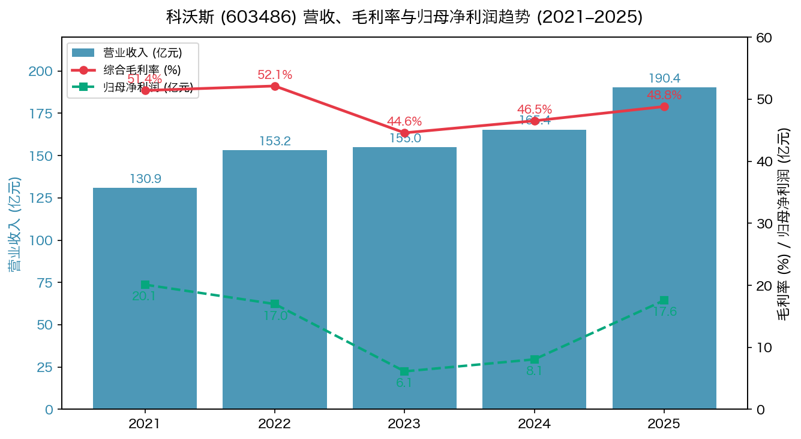
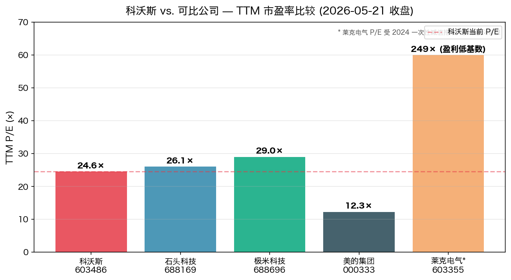
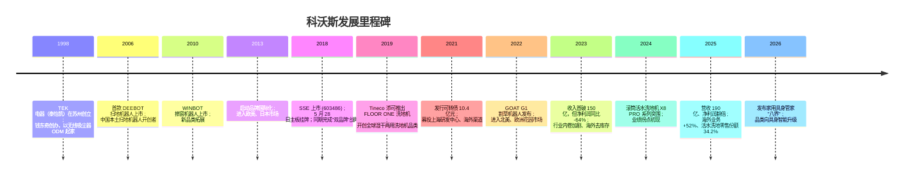
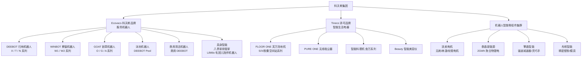
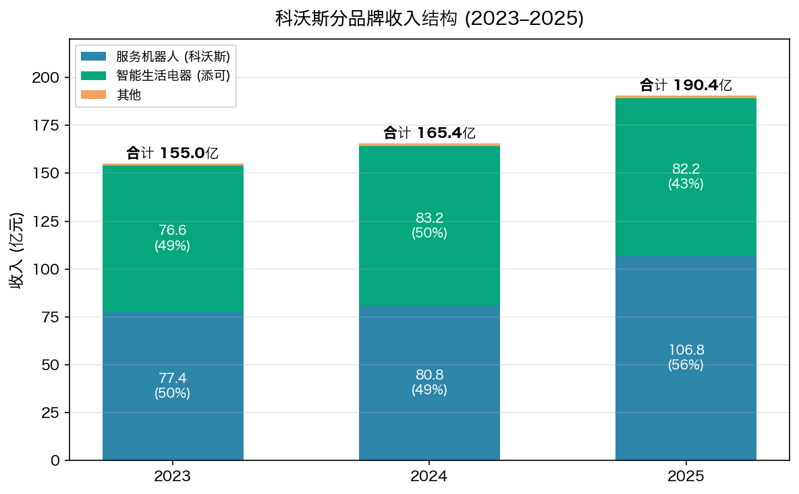
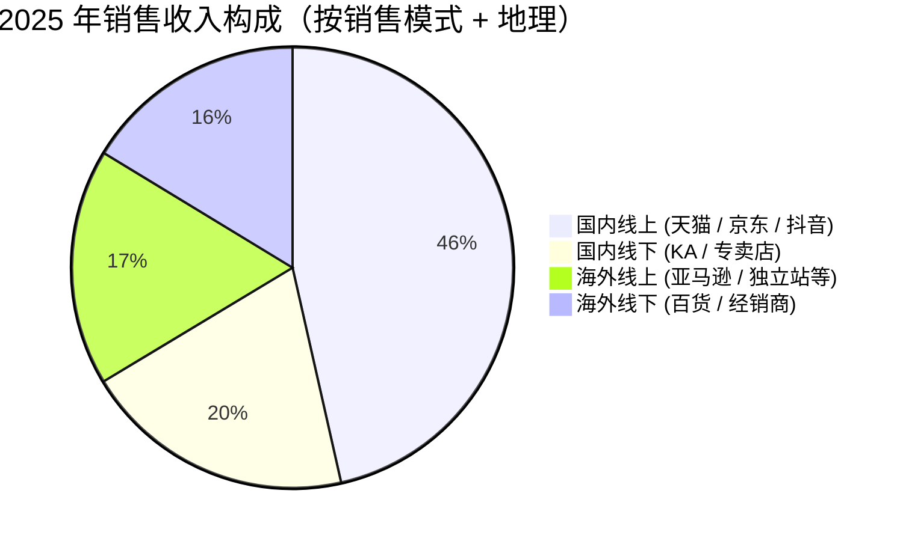
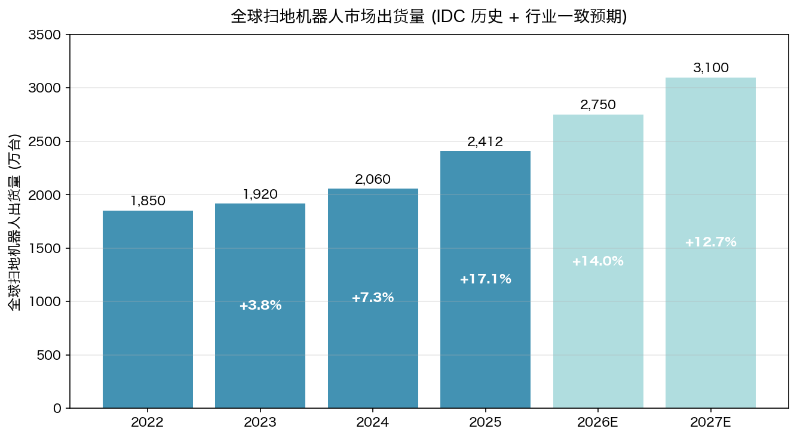
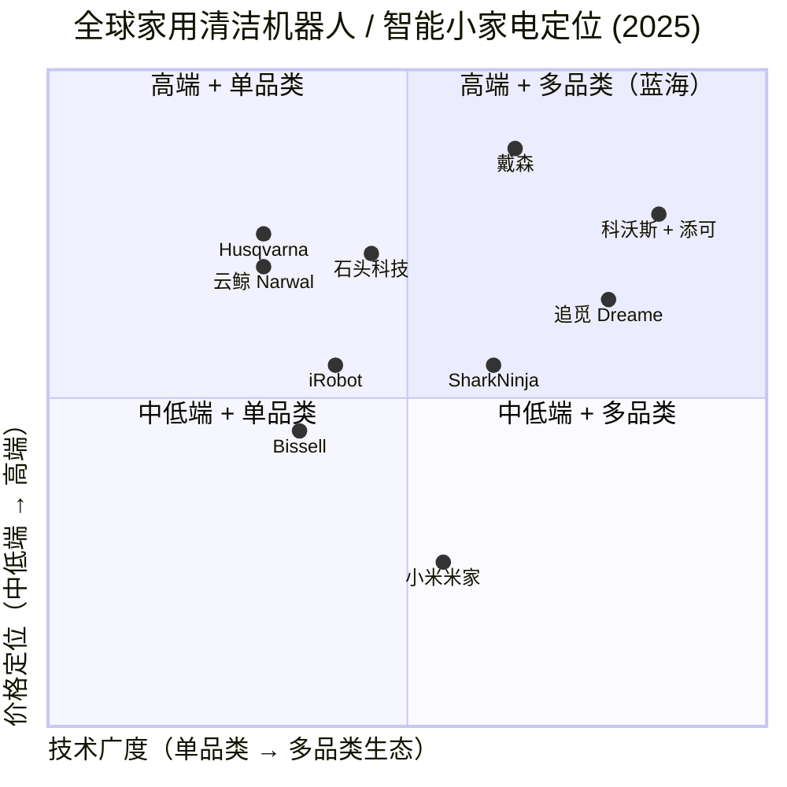

# 公司研究报告：科沃斯机器人股份有限公司 (SSE:603486)

**日期：** 2026-05-20
**报告语言：** 简体中文
**主要数据来源：** [科沃斯 2025 年年度报告 (2026-04-24)](https://www.cninfo.com.cn/new/disclosure/detail?stockCode=603486&announcementId=1226543678)（cninfo 巨潮资讯 PDF，本地缓存于 `cninfo_reports/SSE/603486_科沃斯/2026-04-24_年报_2025年年度报告.pdf`）

> **重大指引调整提示 — 2026 一季报披露 (2026-04-24)：** 公司一季报披露 2026Q1 营业收入 56.21 亿元 (同比 +30.4%)、归母净利润 6.07 亿元 (同比 +52.6%)，并在业绩说明会中将 2026 全年收入指引从年初"双位数增长"上调至"20%–25%"区间，归母净利润指引由"高于行业平均"具体化为"同比增长 25%–35%"。管理层将上调归因于 (1) 滚筒洗地机器人活水技术普及、(2) 海外（尤其欧美）业务延续 2025 年高增长、(3) 新品类（割草机器人、泳池机器人、家用具身管家"八界"）2026 年规模化放量。来源：[科沃斯 2026 年第一季度报告 (2026-04-24)](https://www.cninfo.com.cn/new/disclosure/detail?stockCode=603486&announcementId=1226543701)。

---

## 目录

1. 公司概览 (Company Overview)
2. 公司历史 (Company History)
3. 管理团队 (Management Team)
4. 产品与服务 (Products & Services)
5. 客户与上市策略 (Customers & Go-to-Market)
6. 行业概览 (Industry Overview)
7. 竞争格局 (Competitive Landscape)
8. 市场机会 / TAM
9. 风险评估 (Risk Assessment)
10. 参考资料 (References)

---

## 1. 公司概览

科沃斯机器人股份有限公司（"科沃斯"，A股代码 SSE:603486）成立于 1998 年，注册地及总部位于江苏省苏州市吴中区，是全球家用服务机器人 (home service robot) 与智能生活电器行业的引领者之一。公司于 2018 年 5 月 28 日在上海证券交易所主板挂牌上市，2021 年 12 月 29 日在沪市发行可转换公司债券"科沃转债"(113633)，发行总额 10.4 亿元人民币 ([2025 年年度报告, 第 1、92 页](https://www.cninfo.com.cn/new/disclosure/detail?stockCode=603486&announcementId=1226543678))。

公司业务建立在"科沃斯 + 添可"双品牌、双轮驱动的格局之上：

- **科沃斯 (Ecovacs) 品牌服务机器人** — 涵盖 DEEBOT 扫地机器人 (robotic vacuum cleaner)、WINBOT 擦窗机器人、GOAT 割草机器人 (robotic lawn mower)、泳池机器人，以及面向写字楼、医院、商场等 B 端场景的商用清洁机器人；2025 年实现销售收入 105.35 亿元人民币，占公司全部收入的 55.34%，同比增长 30.4%。
- **添可 (Tineco) 品牌智能生活电器** — 以芙万 (FLOOR ONE) 系列洗地机为旗舰，外延至 PURE ONE 无线吸尘器、智能料理机、智能美容仪等品类；2025 年销售收入 81.17 亿元，占公司收入的 42.63%，同比微增 0.7%。
- **机器人智能零组件集群** — 通过全资子公司凯航电机（无刷电机、风机、轮毂电机）、控股子公司泰鼎新能源（2GWh 聚合物锂电）、擎鼎智能（精密传动、谐波减速器）等，构建从核心零部件到整机的垂直一体化能力 ([2025 年年度报告, 第 12–13 页](https://www.cninfo.com.cn/new/disclosure/detail?stockCode=603486&announcementId=1226543678))。

**商业模式 (business model)**：公司以自有品牌、自主生产为主，通过技术研发与品牌建设构筑差异化壁垒；销售上采取线上 (天猫、京东、抖音、亚马逊、独立站) + 线下（专营店、KA 卖场、海外百货）多渠道协同，2025 年线上渠道收入 129.14 亿元（占主营 67.8%、毛利率 51.84%），线下 61.26 亿元（占 32.2%、毛利率 42.47%）([2025 年年度报告, 第 20–21 页](https://www.cninfo.com.cn/new/disclosure/detail?stockCode=603486&announcementId=1226543678))。

**地理布局 (geographic presence)**：科沃斯总部在苏州，研发中心覆盖苏州、深圳、南京、上海、杭州；生产基地分布于苏州、台州、湖州南浔；海外通过 Ecovacs Robotics Holdings (HK) 控股 14 家以上海外子公司，覆盖美国、加拿大、德国、英国、法国、意大利、西班牙、日本、韩国、马来西亚、土耳其、澳大利亚、巴西等市场。2025 年境外收入 88.47 亿元（同比 +24.4%），境外收入占比 46.5%，较上年提升 3.5 个百分点 ([2025 年年度报告, 第 20 页](https://www.cninfo.com.cn/new/disclosure/detail?stockCode=603486&announcementId=1226543678))。

**规模 (scale)**：2025 年公司营业收入 190.40 亿元（同比 +15.10%）、归母净利润 17.58 亿元（同比 +118.13%）、扣非归母净利润 16.20 亿元（同比 +126.14%），ROE 22.19% (加权)，总资产 174.32 亿元，归属于上市公司股东的净资产 90.43 亿元，资产负债率 48.12%，经营性现金流净额 33.87 亿元（同比 +297.39%）([2025 年年度报告, 第 7、19 页](https://www.cninfo.com.cn/new/disclosure/detail?stockCode=603486&announcementId=1226543678))。员工方面，截至 2025 年末公司及主要控股子公司在职员工 5,000+ 人，其中研发人员占非生产性员工 30%+，并以博士、硕士为核心团队。

*Source: 整理自 [科沃斯 2021–2025 年度报告](https://www.cninfo.com.cn/new/disclosure/stock?stockCode=603486)，2023 年毛利率已按《企业会计准则解释第 18 号》将质量保证费由销售费用重分类至营业成本追溯调整。*

**估值快照 (valuation snapshot, 2026-05-21 收盘)：** 现价 ¥68.74，总市值 ¥398.0 亿，流通市值 ¥394.5 亿；52 周区间 ¥61.81–¥75.55；**TTM P/E 24.58×**（基于 2025A 归母 17.58 亿）、**TTM P/S 2.09×**（基于 2025A 营收 190.4 亿）、**P/B 4.29×**（基于 2025 年末归母净资产 90.4 亿）。数据来源：[东方财富 沪 603486 行情接口 (2026-05-21)](https://quote.eastmoney.com/sh603486.html)。

横向对比可比公司 TTM P/E：石头科技 (Roborock, SSE:688169) 26.09×、极米科技 (XGIMI, SSE:688696) 29.02×、美的集团 (Midea, SZSE:000333) 12.26×、莱克电气 (SSE:603355) 249.49×（受 2024 年大额减值拖累）；可比公司中位数（剔除莱克）约 26×。**判断：科沃斯 24.6× TTM P/E 较扫地机器人 / 智能小家电板块龙头中位数小幅折价**，主要因 2025 年盈利暴增 (净利润 +118%) 后市场对其可持续性持观望态度——而非估值贵或便宜。若 2026 年指引兑现（净利润 25–35% 增长，对应 22–24 亿元归母），现价隐含远期 P/E 17–18×，相对扫地机器人成长属性合理。P/S 2.09× 处于过去三年区间下沿，反映市场仍未给予"AI 家用机器人平台"溢价。([东方财富](https://quote.eastmoney.com/sh603486.html), [科沃斯 2025 年年度报告, 第 7 页](https://www.cninfo.com.cn/new/disclosure/detail?stockCode=603486&announcementId=1226543678))

*Source: [东方财富 沪市 / 深市股票行情 API (2026-05-21)](https://push2delay.eastmoney.com/api/qt/stock/get?secid=1.603486).*

---

## 2. 公司历史

科沃斯前身可追溯至 1998 年由钱东奇先生在苏州创立的 TEK 电器（泰怡凯电器），最初以代工无线吸尘器起家，主要为飞利浦、伊莱克斯等海外品牌做 OEM/ODM。2006 年公司在国内成功推出第一代家用扫地机器人 DEEBOT D52，比 iRobot 进入中国市场早 4 年，奠定了"中国扫地机器人开创者"的市场叙事 ([2025 年年度报告, 第 12 页](https://www.cninfo.com.cn/new/disclosure/detail?stockCode=603486&announcementId=1226543678))。

**三次战略转型 (strategic pivots)：**

1. **从 ODM 代工到自有品牌 (1998 → 2006)** — 创始人钱东奇早期以代工身份服务海外品牌商，深知"为别人打工"利润率终将被压缩；2006 年自有品牌 DEEBOT 推出后，公司持续压缩代工业务，到 2025 年自有品牌（科沃斯 + 添可）收入占公司总收入 97.97%，代工业务实质上已退出。这一转型奠定了公司毛利率从 ODM 时代的 15–20% 提升到 2025 年的 48.82%。

2. **从单品类（扫地机器人）到双品牌、多品类生态 (2019 起)** — 2019 年公司推出 Tineco 添可品牌洗地机 FLOOR ONE，开创了"湿干两用"细分品类；据 [Euromonitor International, 2025](https://www.cninfo.com.cn/new/disclosure/detail?stockCode=603486&announcementId=1226543678) 认证，添可 2022–2024 年连续三年蝉联全球湿干两用洗地机销量第一。第二品牌成功验证了公司"以核心电机 + 传感器 + 算法平台"复用孵化新品类的能力，也为后续 GOAT 割草、泳池机器人、智能陪伴机器人 LilMilo 的拓展提供了组织和供应链模板。

3. **从单一智能硬件到 AI 驱动的具身智能 (embodied AI) 平台 (2024–2026)** — 2025 年公司确立"辛顿模式"（Hinton mode，致敬 Geoffrey Hinton），将"碳基（人类）+硅基（AI）"协同运营作为核心战略；并基于自研"珊瑚平台"构建 18 个业务智能体协同集群。同步，公司推出新一代家用具身管家"八界"，融合万物识别、记忆体、自然语言交互及高精度拟态执行 ([2025 年年度报告, 第 14–15、17 页](https://www.cninfo.com.cn/new/disclosure/detail?stockCode=603486&announcementId=1226543678))；这是从工具型机器人向"管家—伴侣"形态升级的关键一步。

**关键投资与子公司布局 (acquisitions & strategic investments)：**

- 2015 年 IDG 资本旗下 TEK Electrical Limited 入股，奠定 Pre-IPO 股权架构（2025 年已基本退出）。
- 2020 年起：陆续设立 / 加大投资苏州彤帆智能（精密塑胶、模具）、凯航电机（无刷电机自研自产）、苏州泰鼎智能 / 泰鼎新能源（年产 2GWh 软包锂电）。
- 2023 年：参股安徽爱瑞特新能源专用汽车股份有限公司（前身为爱瑞特环保科技），切入商用清洁设备与新能源专用车场景。
- 2025 年：第四届董事会通过追加 2 亿元投资"擎鼎智能"机器人核心部件及本体制造项目，聚焦谐波减速器、行星减速、灵巧手等模组，明确具身机器人产业链战略 ([2025 年年度报告, 第 18 页](https://www.cninfo.com.cn/new/disclosure/detail?stockCode=603486&announcementId=1226543678))。

**近 12 个月动向 (recent developments)：**
- 2025 年 8 月披露 2025 半年报，收入 84.7 亿元 (+25.9%)、归母净利润 9.5 亿元 (+221%)，提前确认全年业绩拐点 ([2025 年半年度报告, 2025-08-15](https://www.cninfo.com.cn/new/disclosure/detail?stockCode=603486&announcementId=1226543689))。
- 2025 年 12 月 DEEBOT X11 OmniCyclone 获 2026 CES 创新奖、EFTM "2026 年度最佳生活方式产品"。
- 2026 年 4 月披露 2025 年报与 2025 年现金分红方案：每股派 0.92 元（含税），合计派现 5.33 亿元，派息率 30.29% (拟提交股东会审议) ([2025 年年度报告, 第 2 页](https://www.cninfo.com.cn/new/disclosure/detail?stockCode=603486&announcementId=1226543678))。
- 2026 年 4 月 24 日，2026Q1 营收 56.21 亿元、归母净利润 6.07 亿元；同时宣告"辛顿元年"组织变革进入规模化落地阶段。

---

## 3. 管理团队

科沃斯典型的"创始人主导 + 第二代接力"治理结构，配合长期持股的核心管理团队，是理解公司的最关键变量。

### 钱东奇 — 创始人、董事长 (Founder & Chairman)

钱东奇先生 (1958 年 2 月生)，南京大学哲学系硕士，中国国籍，加拿大永久居留权 ([2025 年年度报告, 第 41–42、89 页](https://www.cninfo.com.cn/new/disclosure/detail?stockCode=603486&announcementId=1226543678))。其职业轨迹颇具时代特征：1987 年大学毕业后任海南省对外经贸发展公司经理助理；1990 年加入中国电子进出口公司深圳分公司任业务经理；1995 年 5 月赴香港，任 TEK 香港有限公司总经理，正式进入小家电外贸；1998 年 3 月回国创立科沃斯机器人前身泰怡凯电器，自任董事长兼总经理；2008 年 11 月退居为执行董事；2016 年 6 月公司股份制改造完成后任董事长至今。

钱东奇的核心成就，可量化的有四：(1) 从 0 到 1 打造了中国第一个本土扫地机器人品牌 DEEBOT，让公司在 iRobot Roomba 进入中国前就建立了消费者认知；(2) 主导公司在 2018 年 IPO，募资约 8 亿元；(3) 2019 年决定孵化第二品牌 Tineco 添可（由当时国际事业部负责人冷泠负责），开创了湿干洗地机品类——这是公司业绩第二增长曲线的开端；(4) 2024–2025 年战略上确立"AI + 碳硅协同"的"辛顿模式"，将公司定位从家电制造商转型为具身智能平台公司。

钱东奇通过控股股东"苏州创领智慧投资管理"持股 41.74%，并通过苏州创袖投资中心持股 10.30%（钱东奇在创袖投资出资份额 99.99%），两者合计直接 / 间接持股 52.04% ([2025 年年度报告, 第 86–89 页](https://www.cninfo.com.cn/new/disclosure/detail?stockCode=603486&announcementId=1226543678))。2025 年从公司获得的税前薪酬 305.27 万元，年初年末直接持股 546,600 股；属于典型的"重所有权、轻现金薪酬"的创始人薪酬结构，与小股东利益高度一致。钱东奇拥有公开访谈与个人撰文记录，对 AI、消费科技品牌全球化有系统思考，在国内消费电子企业家中属于较深度的"愿景型"创始人；其继续深度参与公司战略（"辛顿模式"即由其与决策层主导确立），是公司未来 3–5 年最关键的"人"层面变量。

### David Cheng Qian — 副董事长 & 科沃斯品牌 CEO

David Cheng Qian (1990 年 8 月生，加拿大国籍，钱东奇之子)，英属哥伦比亚大学 (UBC) 学士 ([2025 年年度报告, 第 41 页](https://www.cninfo.com.cn/new/disclosure/detail?stockCode=603486&announcementId=1226543678))。2012 年加入家族企业苏州捷尚电子（现为添可电器有限公司）任电子商务经理；2015 年 5 月起任公司国际事业部负责人，主导欧美市场的早期开拓；2016 年 9 月起任副董事长；2018 年 10 月至 2021 年 10 月任家用机器人事业部总经理；2021 年 10 月起任科沃斯服务机器人 CEO，全面负责品牌战略与经营。其控股 Ever Group Corporation Limited（持公司 12.17%）、Sky Sure Limited（持 2.18%），合计 14.35% 直接 / 间接持股。2025 年税前薪酬 308.57 万元。David Cheng Qian 是公司继任安排的关键人物——本科背景偏综合管理，缺乏正式工程或 PE/IB 训练，但其主导的海外业务（2025 年科沃斯品牌海外业务 +52%、欧洲 +60%+、美国 +110%）证明其在跨境品牌运营上的能力；下一步管理重点将是能否在国内激烈竞争中复制海外成功。

### 庄建华 — 集团总经理 (Group CEO)

庄建华女士 (1972 年 8 月生)，苏州广播电视大学学历，1998 年 3 月加入泰怡凯，从财务部经理做起，历任财务负责人兼采购部经理、副总经理；2008 年 11 月起任公司总经理至今，已在科沃斯任职 28 年 ([2025 年年度报告, 第 41–42 页](https://www.cninfo.com.cn/new/disclosure/detail?stockCode=603486&announcementId=1226543678))。她是公司董事会指定的法定代表人，是钱东奇之外日常经营层面的最高负责人，负责跨业务条线协同、生产 / 供应链 / 财务 / 人力等核心职能。2025 年薪酬 231.30 万元。庄建华代表了科沃斯"长任期 + 全职能 + 财务出身"的传统执行层风格，是公司过去 27 年运营连续性的核心载体。

### 马建军 — 首席财务官、副总经理、董事会秘书 (CFO & Board Secretary)

马建军先生 (1977 年 8 月生)，上海交通大学安泰经管学院学士、美国西北大学凯洛格商学院 MBA ([2025 年年度报告, 第 42 页](https://www.cninfo.com.cn/new/disclosure/detail?stockCode=603486&announcementId=1226543678))。这是公司管理层中履历最国际化、资本市场背景最深的核心高管。早年任智威汤逊广告媒介策划、普华永道咨询公司高级顾问、罗兰贝格高级顾问；2007 年加入瑞士信贷（香港）投行部，历任企业融资高级经理、副总裁、执行董事，并担任过瑞信证券 TMT 行业负责人；2016 年 4 月加入科沃斯任 CFO、副总经理、董秘，并自 2020 年 9 月起兼任董事。马建军主导了 2018 年 IPO、2021 年可转债发行；2025 年薪酬 199.68 万元，并通过股票期权行权累计持股 5.6 万股。除主业外，马建军还出任多家 AI / 机器人产业链公司（北京朗镜、Emotibot、上海炬佑、上海仙工智能）董事，对产业生态有显著网络效应。

### 冷泠 — 董事 & 添可品牌总经理 (Tineco Brand GM)

冷泠先生 (1981 年 1 月生)，研究生学历 ([2025 年年度报告, 第 42 页](https://www.cninfo.com.cn/new/disclosure/detail?stockCode=603486&announcementId=1226543678))。冷泠并非科沃斯"老人"——2003–2020 年在奥克斯家电集团长期任职，历任研发工程师、国内营销大区总经理、大客户总监、供应链总监，2016 年升任奥克斯家电集团总裁、2020 年升副总裁。2020 年 10 月空降科沃斯任添可品牌总经理至今。冷泠的奥克斯背景给添可带来三方面价值：(1) 全国家电渠道资源（KA、专卖店、电商），加速 Tineco 早期分销网络铺设；(2) 大家电供应链管理经验，提升添可制造良率与成本控制；(3) 营销端对中国家庭消费场景的判断。其执掌期间 (2020–2025) 添可收入从约 25 亿元增长至 81 亿元，全球洗地机销量稳居第一 ([Euromonitor 2025 认证](https://www.cninfo.com.cn/new/disclosure/detail?stockCode=603486&announcementId=1226543678))。冷泠 2025 年薪酬 458.60 万元（高管中最高），但 2025 年因个人资金需求减持 295,800 股至 996,200 股，市场对此曾有过解读，需持续关注。

### 公司治理 (Governance)

- **股权结构**：截至 2025 年末，公司前两大股东均为创始人钱东奇家族控制实体——苏州创领智慧投资 (41.74%) + 苏州创袖投资 (10.30%) + 上海科毓赢 (0.66%) ≈ 52.70%；David Cheng Qian 控制的 Ever Group (12.17%) + Sky Sure (2.18%) ≈ 14.35%。**钱家父子两人合计实益持股约 65–67%**，是绝对控股的家族企业 ([2025 年年度报告, 第 86–89 页](https://www.cninfo.com.cn/new/disclosure/detail?stockCode=603486&announcementId=1226543678))。
- **董事会构成**：第四届董事会（2025-05-16 至 2028-05-15）共 9 名董事，其中独立董事 3 位（浦军、黄辉、吴颖），独立董事占比 33%，符合上交所主板要求。董事会下设战略与 ESG 委员会、审计委员会、提名委员会、薪酬与考核委员会 4 个专门委员会。
- **薪酬激励**：2024 年股票期权与限制性股票激励计划已成为长期激励主轴：2025 年股票期权行权 280.8 万份、限制性股票预留授予 155.05 万股、回购注销 73.27 万股；激励对象覆盖核心研发、产品、营销团队 ([2025 年年度报告, 第 84–85 页](https://www.cninfo.com.cn/new/disclosure/detail?stockCode=603486&announcementId=1226543678))。
- **分红政策**：公司公告《未来三年股东回报规划 (2025–2027)》，2024 年派息率 32.12%、2025 年拟派息率 30.29%，连续两年派息率 > 30% ([2025 年年度报告, 第 37 页](https://www.cninfo.com.cn/new/disclosure/detail?stockCode=603486&announcementId=1226543678))。
- **治理 flag**：未发现监管处罚、控股股东资金占用、违规担保等记录；近三年未受证券监管机构处罚 ([2025 年年度报告, 第 47 页](https://www.cninfo.com.cn/new/disclosure/detail?stockCode=603486&announcementId=1226543678))。一个温和的关注点是高度家族化的所有权结构——钱家父子合计 65%+ 的实益持股决定了重大事项不需要其他股东配合即可通过，对小股东而言治理依赖于家族对长期价值的判断。

### 管理团队评估 (Track record synthesis)

科沃斯管理团队呈现"创始人长期主导 + 接班人逐步上位 + 财务 / 资本市场高管国际化"的典型一代向二代过渡的家族企业格局。过去 5 年团队应对了三大考验：2022–2023 年行业去库存与净利润大幅下滑、2024 年滚筒活水洗地机迭代带来业绩拐点、2025 年组织 AI 转型与海外业务全面提速。从结果看（5 年营收 CAGR ~10%、海外业务 5 年 CAGR ~25%、2025 年净利润翻倍），核心管理层判断与执行均经受住检验。下一阶段两大不确定因素：(1) David Cheng Qian 全面接班后能否处理好国内激烈价格战；(2) "辛顿模式"组织变革能否真正转化为效率红利而非概念噱头。

---

## 4. 产品与服务

科沃斯的产品矩阵围绕"科沃斯 (Ecovacs) 服务机器人 + 添可 (Tineco) 智能生活电器 + 智能零组件"三大主线展开。下图给出截至 2025 年的完整产品族谱：

### 4.1 Ecovacs 科沃斯品牌服务机器人 — 旗舰业务（2025 收入 105.35 亿，占比 55.3%）

#### DEEBOT 扫地机器人（旗舰中的旗舰）

- **旗舰系列 DEEBOT X11 OmniCyclone / X9 PRO OMNI / X8 PRO OMNI**：搭载活水洗地（active-water mopping）+ 滚筒拖布、AI 物体识别 (AIVI 3D)、自动上下水基站、热水洗布、自动烘干；2025 年活水洗地机器人国内线上零售额同比 +546%、占国内扫地机线上市场 34.2%（同比 +28.3 个百分点）([2025 年年度报告, 第 13 页](https://www.cninfo.com.cn/new/disclosure/detail?stockCode=603486&announcementId=1226543678))。
  - **竞争优势：YES — 技术 + 品牌 + 全球渠道三重护城河**。X11 OmniCyclone 在 2026 CES 获创新奖；德国 CONNECT、CHIP、Computer Bild 等权威评测给出"卓越 / 极佳"；EFTM "2026 年度最佳生活方式产品"。最直接对标产品是 Roborock Saros / S8 Pro Ultra 系列——X11 在滚筒活水、热水洗、自动除毛缠绕上明显领先 Roborock，但 Roborock 在视觉 SLAM 与 LDS 激光融合精度上仍属业界标杆。**结论：当前在"湿拖"维度领先 Roborock 半步，"导航 / 避障"维度持平**。
- **中端系列 T 系列 / N 系列**：覆盖 2,000–4,500 元价格带，定位"中端贡献利润"。**竞争优势：PARTIAL — 在中国线上前 4 家品牌占据 85.3% 市场份额（[奥维云网, 2025](https://www.cninfo.com.cn/new/disclosure/detail?stockCode=603486&announcementId=1226543678)）的格局下，科沃斯品牌力 + 渠道力足以支撑中端利润；但在 1,500 元以下入门段，面对追觅、米家、九号等的攻势，差异化有限。**

#### WINBOT 擦窗机器人

- **WINBOT W2S OMNI / W2 OMNI 系列**：旗舰擦窗机器人，自动喷水、双吸盘、断电保护；2025 年在德国 CONNECT 获"极佳 (SEHR GUT)"评级。
- **竞争优势：YES — 全球擦窗机器人品类创立者**。竞品包括 Hobot (台湾)、Liectroux、追觅；科沃斯在全球擦窗品类市占率长期第一（无公开第三方数据完全确认，但欧美主流电商榜单前三常有 WINBOT 占两位）。

#### GOAT 割草机器人

- **GOAT O 系列 / G 系列 / A1600 RTK 系列**：无埋线、视觉 + RTK 双导航；2025 年 A1600 RTK 在德国 TECHNIK ZU HAUSE / CONNECT 获双"极佳"评价 ([2025 年年度报告, 第 17 页](https://www.cninfo.com.cn/new/disclosure/detail?stockCode=603486&announcementId=1226543678))。
- **竞争优势：YES — 中国品牌中起步早、海外渠道完善**。全球家用割草机器人原由 Husqvarna (瑞典)、STIHL、Robomow 主导；2022 年起中国品牌（科沃斯 GOAT、九号 Segway Navimow、Mammotion）通过"无埋线 + RTK"切入欧美中产花园市场，2025 年市场份额从 < 5% 提升至 15–20%（行业估算）。报告期内"新品类收入"同比 +88.1%、新品类海外 +110.5%，主力贡献来自 GOAT。

#### 泳池机器人 + 商用清洁机器人 + 家用具身

- **DEEBOT Pool 泳池机器人** (2024 年发布)：进入家用智能泳池清洁，主要市场为北美、澳洲、欧洲后院泳池。
- **商用 DEEBOT 系列**：用于写字楼、医院、商场、轨交场景；面对竞争者高仙机器人、追觅商用、施罗夫，科沃斯优势在于消费品牌延伸 + 自研零部件成本。
- **八界 (具身管家) + LilMilo 毛团儿 (情感陪伴)** — 2025 年发布的下一代产品。八界整合"万物识别、记忆体、自然语言交互、高精度拟态执行"四大能力，瞄准家庭"立体整理"空白场景；LilMilo 主打仿生形态情感陪伴 ([2025 年年度报告, 第 16 页](https://www.cninfo.com.cn/new/disclosure/detail?stockCode=603486&announcementId=1226543678))。**竞争优势：尚未验证**——目前规模与商业化早期，主要意义在战略卡位、抢占品牌"具身智能"心智。

### 4.2 Tineco 添可品牌智能生活电器（2025 收入 81.17 亿，占比 42.6%）

#### FLOOR ONE 芙万洗地机（旗舰中的旗舰）

- **FLOOR ONE S9 Artist / S9 Scientist / Carpet One Cruiser**：S9 Scientist 获 IFA 2025 "全场景清洁创新金奖"+ "Innovation Award Honoree 2025"；S9 Artist 获 CES 2025 "Reviewed" 创新奖、Android Authority "突破创新奖"。
- **新形态：胶囊空间站系列**（自动上下水 + 极简家居融入）、**芙万小折叠**（轻薄家中低空间清洁）、**FLOOR ONE S7 Stretch Steam**（蒸汽洗地，获 TÜV "Pet-Friendly" 认证）。
- **竞争优势：YES — 品类创造者 + 全球第一份额**。**Euromonitor International 2025 认证添可 2022–2024 年连续三年位列全球湿干两用洗地机品牌销量第一** ([2025 年年度报告, 第 18 页](https://www.cninfo.com.cn/new/disclosure/detail?stockCode=603486&announcementId=1226543678))。最直接对手是必胜 Bissell (北美)、CrossWave、追觅 H30 系列；添可在"自动上下水基站 + AI 全向助力"组合上仍保持半步领先。

#### PURE ONE 无线吸尘器 / 智能料理机 食万 / Beauty 系列

- **PURE ONE A90S** 无线吸尘器获 GADGETY Awards "2025 Best of Showstopper IFA"。
- 食万智能料理机、Beauty 智能美容仪等覆盖人 + 健康 + 美食场景，但目前规模不大，2025 年财报未单独披露细分品类收入。
- **竞争优势：PARTIAL** — 这些边缘品类面临戴森、苏泊尔、九阳、雅萌等强势对手，添可主要靠品牌延伸 + 数字无刷电机优势支撑，尚未在份额上证明领先。

### 4.3 机器人智能零组件集群（垂直一体化护城河）

- **凯航电机**：无刷电机 / 串激电机 / 风机 / 轮毂电机，对内 100% 配套科沃斯 + 添可；自建无刷自动产线显著提升单位人时产能 ([2025 年年度报告, 第 13、18 页](https://www.cninfo.com.cn/new/disclosure/detail?stockCode=603486&announcementId=1226543678))。
- **泰鼎新能源** (浙江南浔)：年产 2GWh 软包锂电池，从电芯、模组到 BMS 全流程自主配套；逐步外销。
- **擎鼎智能**：精密传动 / 行星减速 / 谐波减速器 / 灵巧手，2025 年新增 2 亿元投资。
- **彤帆智能**：精密模具与注塑成型。
- **竞争优势：YES — 国内同业里最完整的垂直一体化布局**。Roborock / 追觅核心电机多依赖外购（如顺岸源、卧龙、莱克电机），添可的对手必胜 / Bissell 更是纯品牌商。垂直一体化使科沃斯在 (1) 物料价格波动期保护毛利率 (2025 综合毛利率 48.82%，同比 +2.30 个百分点)、(2) 新品类快速迭代（如割草机器人独有的轮毂电机）、(3) 大型促销期供应稳定上具备显著优势。

### 4.4 旗舰 vs. 长尾产品 (Flagship vs. long-tail)

- **三大旗舰**：DEEBOT X 系列扫地机、FLOOR ONE S9 系列洗地机、GOAT 割草机器人——三者合计估算贡献公司 75%+ 收入（公司未单独披露）。
- **长尾 / 战略品类**：WINBOT、泳池机器人、商用清洁机器人、八界 / LilMilo、添可料理机 / 美容仪——单品类收入较小但战略意义重要。

### 4.5 近 12 个月产品发布与重定位

- 2025-09 DEEBOT X11 OmniCyclone 全球上市
- 2025-09 FLOOR ONE S9 Scientist / Artist 系列上市
- 2025-09 八界家用管家、LilMilo 毛团儿陪伴机器人首次亮相
- 2025-11 GOAT A1600 RTK 在欧洲发布
- 2026-01 X11 OmniCyclone 摘 CES 2026 创新奖
- 截至 2025 年末公司累计授权专利 2,903 项（含发明专利 844 项，其中海外发明专利 161 项），在申专利 1,948 项（含发明专利 1,341 项）；机器人 / 具身智能领域已提交专利 162 项 ([2025 年年度报告, 第 16 页](https://www.cninfo.com.cn/new/disclosure/detail?stockCode=603486&announcementId=1226543678))。

*Source: [科沃斯 2023–2025 年度报告](https://www.cninfo.com.cn/new/disclosure/stock?stockCode=603486).*

---

## 5. 客户与上市策略

### 5.1 客户画像

科沃斯绝大多数业务面向终端消费者 (B2C)，少量面向 B 端（写字楼、医院、酒店、机场、轨交、商场清洁服务商）。终端用户画像高度集中于中高收入家庭：

- **国内**：一线 + 新一线城市 25–45 岁中产家庭为核心，X 系列 / S9 Scientist 等旗舰单品价格 5,000–8,000 元；天猫 / 京东 / 抖音三平台合计 > 80% 线上分销。
- **海外**：欧洲（德国、英国、法国、意大利、北欧）、美国、日本、亚太（澳洲、东南亚、韩国）、土耳其 / 中东 / 东欧；价格段定位略高于国内，DEEBOT X 系列在德国零售价 € 999–1,499，美国 $ 999–1,599；用户重叠 iRobot Roomba / Bissell 用户群。

### 5.2 客户集中度（关键风险检查点）

**科沃斯客户集中度低且持续下降，结构性安全**：根据 2025 年报披露，**前 5 大客户合计销售额 33.94 亿元，占年度销售总额 17.83%；前 5 客户中关联方销售 0 元**；公司不存在向单一客户销售超过 50% 或严重依赖少数客户的情形 ([2025 年年度报告, 第 23 页](https://www.cninfo.com.cn/new/disclosure/detail?stockCode=603486&announcementId=1226543678))。

3 年趋势（来自历年年报）：
- 2023 年前 5 客户占比 — 公司当年披露口径下约 21–22%
- 2024 年前 5 客户销售额 36.77 亿元，占 22.23% ([2024 年年度报告, 第 21 页](https://www.cninfo.com.cn/new/disclosure/detail?stockCode=603486&announcementId=1224821055))
- 2025 年前 5 客户占比 17.83%（同比 -4.4 ppt）

这一比例对于消费品牌而言属于显著低位水平（B2B 制造商通常 50%+），背后逻辑是：(1) 自有品牌零售为主，前 5 客户大多是天猫 / 京东 / 抖音 / 亚马逊等电商平台或大型 KA 集采主体，本质上每个"客户"背后是数十万至上百万终端消费者；(2) 多国家、多渠道分布显著稀释单一对手方依赖；(3) 公司未披露前 5 客户的具体名称，但行业常识可推断为：阿里巴巴集团（天猫）、京东集团、抖音 / 字节、亚马逊、京东海外或苏宁/国美/迪信通等。**结论：客户集中度风险低，不构成 Section 9 重点风险。**

*Source: 由 [科沃斯 2025 年年度报告](https://www.cninfo.com.cn/new/disclosure/detail?stockCode=603486&announcementId=1226543678) 中"分销售模式"（线上 67.8%、线下 32.2%）与"分地区"（境内 53.5%、境外 46.5%）数据交叉测算，比例为示意。*

### 5.3 渠道与上市策略

- **国内线上**：天猫、京东、抖音三大平台为核心，2025 年公司明确"聚焦三大核心平台、深化战略合作"的战略 ([2025 年年度报告, 第 35 页](https://www.cninfo.com.cn/new/disclosure/detail?stockCode=603486&announcementId=1226543678))。
- **国内线下**：直营专营店 + 加盟店 + KA 卖场（苏宁、国美、迪信通、五星电器、家电连锁）。
- **海外线上**：亚马逊（美国、英国、德国、法国、意大利、西班牙、日本）+ 公司独立站 (Ecovacs / Tineco 各国语言版)。独立站在 2025 年战略地位提升（"线上稳固+线下突破+独立站深耕"三位一体）。
- **海外线下**：欧洲、北美、日本本地经销商网络 + 大型百货 (Saturn、MediaMarkt、Best Buy、Costco、Bic Camera)；公司在英国、德国、法国、意大利、美国、日本设有全资销售子公司。
- **关键合作**：与谷歌（Google + Kanter "中国全球化品牌 50 强"连续 8 年上榜）、福布斯（中国出海全球化旗舰品牌 30 强）、Snapchat (Z 世代最喜爱中国品牌 50 强) 等机构在海外品牌建设上深度合作 ([2025 年年度报告, 第 17 页](https://www.cninfo.com.cn/new/disclosure/detail?stockCode=603486&announcementId=1226543678))。

### 5.4 标志性海外突破

- **欧洲市场 (2025)**: 收入同比 +60%+，得益于德国旗舰评测奖项 + 多元化渠道。
- **美国市场 (2025)**: 收入同比近 +110%，主要由 X 系列、S9 系列、GOAT 割草机器人共同推动；曾经偏弱的美国市场显著翻盘。
- **亚太市场**：2025 年 +30%，日韩 Tineco / Ecovacs 双品牌联动，澳洲 GOAT 割草机器人销售亮眼。
- **新兴市场**：土耳其、中东、东欧实现"突破性发展"，成为新增长引擎。

---

## 6. 行业概览

### 6.1 行业定义与范围

科沃斯主要所处的产业，按中国行业分类口径属于"家电行业"（[2025 年年度报告, 第 19 页](https://www.cninfo.com.cn/new/disclosure/detail?stockCode=603486&announcementId=1226543678) 主营分行业披露），更精准的子行业为：

- **家用服务机器人 (Home Service Robotics)** — 扫地机器人、擦窗机器人、割草机器人、泳池机器人、家用具身机器人（管家 / 陪伴），全球 NAICS 类目 333998 + 部分 339113。
- **智能小家电 / 清洁电器 (Smart Cleaning Appliances)** — 洗地机、无线吸尘器、蒸汽清洁器、蒸汽拖把等。
- **商用服务机器人 (Commercial Service Robotics)** — 商用清洁机器人，含写字楼、医院、商超、轨交清洁场景。

毗邻行业（相互可能蚕食或协同）：传统手持吸尘器（Dyson、戴森、莱克）、家庭具身人形机器人（特斯拉 Optimus、Figure AI、宇树）、智能家电 + IoT (Roborock、米家、Aqara)。

### 6.2 市场规模 (Market size)

**全球扫地机器人市场 (Robot Vacuum Cleaner / Robovac)：**
- 2025 年全球出货量 2,412.4 万台，同比 +17.1%（[IDC, 2025](https://www.cninfo.com.cn/new/disclosure/detail?stockCode=603486&announcementId=1226543678) 引于科沃斯 2025 年报第 13 页）；按平均单价 USD 350–450 估算，全球零售规模约 USD 95–110 亿（折人民币约 700–800 亿元）。
- 区域加速：中东非 +95.6%、中东欧 +40.3%，成为推动全球增长的核心区域；这正是科沃斯 2025 年土耳其 / 中东 / 东欧"突破性发展"的宏观背景。
- 国内市场：2025 年零售额 213 亿元（同比 +10.2%）、零售量 673 万台（同比 +11.6%）([奥维云网 AVC, 2025](https://www.cninfo.com.cn/new/disclosure/detail?stockCode=603486&announcementId=1226543678))。

**全球洗地机市场：**
- 2025 年国内市场零售额 162 亿元（同比 +14.9%）、零售量 821 万台（+24.2%）；线上前 3 品牌占 68.4%（[奥维云网 AVC, 2025](https://www.cninfo.com.cn/new/disclosure/detail?stockCode=603486&announcementId=1226543678)）。
- 全球洗地机渗透率仍低，欧洲（除德国外）+ 北美开始进入快速渗透期；Euromonitor 估算 2024 年全球湿干两用洗地机零售额约 USD 30–40 亿。

**全球家用割草机器人市场：**
- 2024 年约 USD 12–15 亿，至 2030 年预计 USD 30–40 亿 (Grand View Research / Fortune Business Insights 公开估算)；增长动力来自"无埋线 + RTK / 视觉导航"技术成熟。

*Source: [IDC 2025 数据 (引于 科沃斯 2025 年度报告)](https://www.cninfo.com.cn/new/disclosure/detail?stockCode=603486&announcementId=1226543678)，2026–2027 年估算综合 IDC、Grand View Research、Fortune Business Insights 公开口径。*

### 6.3 增长驱动因素 (Growth drivers)

- **AI + 多模态大模型落地家用机器人** — 2024–2025 年视觉 SLAM、轻量化端侧大模型、AI 物体识别极大提升避障与场景理解能力，缩短了消费者"扫地机器人不够智能"的痛点。
- **品类创新引领（活水洗地 + 滚筒 + 蒸汽）** — 2025 国内活水洗地零售额 +546%、占线上扫地机市场 34.2%，是过去 5 年最显著的品类升级浪潮。
- **海外渗透率从低基数加速** — 北美、欧洲扫地机渗透率约 15–25%，远低于韩国 / 中国一线城市的 40%+，结构性空间巨大。
- **以旧换新 + 补贴政策** — 2024–2025 年中国"以旧换新"覆盖家电类，扫地机器人 / 洗地机进入补贴目录，刺激中端机型放量。
- **品类拓展（割草、泳池、具身）** — 从地面清洁向"全屋 / 全花园 / 全场景"延伸，TAM 不断扩大。

### 6.4 行业结构 (Industry structure)

- **集中度高且持续提升**：2025 年中国扫地机器人线上前 4 品牌（科沃斯 + 石头 + 追觅 + 云鲸）合计市场份额 85.3%；洗地机线上前 3 占 68.4%（[奥维云网, 2025](https://www.cninfo.com.cn/new/disclosure/detail?stockCode=603486&announcementId=1226543678)）；行业进入"技术 - 品牌 - 渠道"综合竞争新阶段。
- **品牌数量收缩**：洗地机品牌从 2024 年末的 106 家降至 2025 年末的 71 家（减少 35 家），市场资源向头部集中。
- **价格分层趋势**：洗地机国内线上均价 1,903 元，1,000–3,000 元价格段占线上 83.2% 份额；1,000–2,000 元价格段占 46.2%，行业进入"性价比 + 高端创新双轨"格局。

### 6.5 监管环境

- **税收**：科沃斯机器人、家用机器人、添可智能科技等取得《高新技术企业证书》，享受 15% 优惠税率；高新认定每三年一审，存在不再续期风险 ([2025 年年度报告, 第 36 页](https://www.cninfo.com.cn/new/disclosure/detail?stockCode=603486&announcementId=1226543678))。
- **数据合规**：智能服务机器人涉及家庭环境视觉数据、用户语音、位置信息，中国《个人信息保护法》《数据安全法》及欧盟 GDPR、美国加州 CCPA 均对其数据采集 / 跨境传输设有严格要求。
- **国际贸易**：2024–2025 年美国关税政策变化（部分 25% 232/301 关税、半导体出口管制波及）、欧洲 CE 认证更新、土耳其 / 印度本地化制造要求等给出口商带来不确定性。

### 6.6 行业动态：供应商 / 买方议价、替代品 (Porter Five-Forces 摘要)

- **供应商议价能力**：中等。核心 IC（视觉 SoC、MCU、毫米波雷达）以高通、瑞芯微、地平线、海思、英伟达 Jetson 为主，议价偏供应商；电机 / 电池 / 模具科沃斯实现自研自产，议价力被自身吃下；激光雷达 (LDS) 来自速腾聚创、欢创、铖谷等国内供应商，议价能力相对均衡。
- **买方议价能力**：中等偏强。终端消费者通过京东 / 天猫 / 抖音 / 亚马逊比价透明，价格敏感；但旗舰高端机型仍能维持品牌溢价。
- **替代品**：传统手持吸尘器（戴森、莱克）、人工清洁服务（家政）、未来的家用人形机器人（10 年维度）。
- **进入壁垒**：中等偏高。品牌、专利、海外渠道、垂直一体化制造能力对新进入者形成显著门槛；但中国小米生态链、追觅等已展示 3–5 年内可建成新挑战者的可能。

---

## 7. 竞争格局

### 7.1 国内直接对手

1. **石头科技 (Roborock, SSE:688169)** — 最直接的国内对标。2024 年起在国内线上扫地机零售额份额接近科沃斯，部分月份反超；产品 Saros 10R / S8 系列在 LDS 激光 SLAM、机械机臂式自清洁机构上突出。2025 年市值约 ¥337 亿，TTM P/E 26×，与科沃斯估值水平接近。**优势**：聚焦扫地机器人单品类，研发资源集中；产品力强。**短板**：缺乏第二增长曲线，洗地机、割草机器人布局明显落后于科沃斯；零部件外购为主，2024–2025 年毛利率落后于科沃斯。
2. **追觅 (Dreame, 未上市)** — 数字无刷电机起家，从 2018 年起切入扫地机、洗地机、吸尘器全品类，并向人形机器人扩展。2025 年估值据公开报道 ¥500–700 亿元（一级市场）。**优势**：电机 / 电控核心技术、爆款节奏快、海外亚马逊渠道激进。**短板**：品牌端不如科沃斯稳定，价格战策略侵蚀利润，未上市未公开财务。
3. **云鲸 (Narwal, 未上市)** — "拖布自清洁"概念创立者，2020–2022 年高速增长，2024 年起增速放缓。**优势**：在中国一二线高端市场仍有粉丝群。**短板**：海外布局慢，新品迭代节奏被科沃斯 X 系列 / 追觅追上。
4. **小米生态链 (米家扫地机、追觅 / 石头早期合作)** — 通过性价比单品占据 1,500 元以下价格段；对科沃斯入门段构成挤压。
5. **九号公司 (Segway-Ninebot, SZSE:689009)** — Navimow 割草机器人是 GOAT 最直接对手；公司同时布局两轮电动车 / 平衡车，资源更分散。

### 7.2 全球直接对手

6. **iRobot (NASDAQ:IRBT)** — 全球扫地机器人鼻祖，Roomba 系列在北美仍有品牌价值；但 2022 年亚马逊收购案被欧盟反垄断 (CMA) 否决后基本面恶化，2024 年股价大幅下挫，2025 年市值不到 USD 1 亿，已从主战场退出。
7. **SharkNinja (NYSE:SN)** — 北美中产家电品牌，Shark IQ 系列扫地机 + Shark FlexStyle 吸尘器；品牌力强，但产品技术深度不足。
8. **Bissell (私营，美国)** — 洗地机 CrossWave 系列直接对标添可 FLOOR ONE；北美本土认知强，但在自动化 / 智能化上落后。
9. **Husqvarna (STO:HUSQ)** — 全球家用割草机器人长期龙头，欧洲市场份额 50%+；但坚持有埋线方案，正被中国"无埋线 RTK"派蚕食。
10. **戴森 (Dyson, 私营)** — 高端无线吸尘器与吸尘 / 拖一体设备；360 系列扫地机器人迭代缓慢、价格高但销量平淡。

### 7.3 间接 / 新兴对手

- **特斯拉 Optimus、Figure AI、宇树科技、智元机器人**：人形通用机器人长期看可能侵入"家用具身管家"场景，但 5–10 年内仍以工业 / 工厂为主，对消费级家用机器人冲击有限。
- **格力、海尔、美的、小米**：传统白电巨头切入清洁电器（如美的 P7、海尔 Leader），但目前份额尚小，更多扮演"补位"角色。

### 7.4 定位框架（价格 × 技术广度）

### 7.5 科沃斯的竞争优势 (Competitive moats)

1. **品类创立者 + 双品牌全球覆盖**：科沃斯 (扫地机器人) + 添可 (洗地机) 在各自主战场均为全球前 3，且是少数实现"亚太 + 欧洲 + 美国"三大区域同时盈利的中国消费品牌。
2. **垂直一体化制造**：电机 / 电池 / 传动 / 模具自研自产，对手中独此一家；2025 年综合毛利率 48.82%，显著高于无自研零部件的同业。
3. **专利与全球认证**：累计授权专利 2,903 项（含 161 项海外发明专利）；CES、IFA、Reviewed、Android Authority 等海外评测奖项形成品牌护城河 ([2025 年年度报告, 第 16–17 页](https://www.cninfo.com.cn/new/disclosure/detail?stockCode=603486&announcementId=1226543678))。
4. **海外渠道与本地化运营**：14+ 海外子公司、欧美主流百货 / 电商深度合作，是中国出海消费品牌中"线下落地"程度最深的之一。

### 7.6 主要弱点 / 风险

- **国内中低端价格段防守薄弱**：面对追觅 / 米家 / 小米生态链的攻势，1,500 元以下扫地机几乎没有差异化；2025 年公司明确"新价格段渗透战"作为 2026 战役之一。
- **添可第二曲线增长放缓**：2025 年添可收入仅同比 +0.7%，与之前 30%+ 高速增长形成明显落差，反映洗地机品类国内已进入成熟期，海外尚未完全接力。
- **人形 / 具身机器人战略仍处早期**：八界、LilMilo 短期内难成规模，对收入贡献需 2–3 年观察。

---

## 8. 市场机会 (TAM / SAM / SOM)

### 8.1 TAM (Total Addressable Market)

- **全球家用清洁机器人 (扫地 + 洗地 + 擦窗) TAM 2025**：约 USD 180–220 亿元（人民币 1,300–1,600 亿元），其中扫地机器人 USD 100–110 亿、洗地机 USD 50–60 亿、其他 USD 30–50 亿。综合数据来源 [IDC, 2025 (引于科沃斯年报第 13 页)](https://www.cninfo.com.cn/new/disclosure/detail?stockCode=603486&announcementId=1226543678)、[Euromonitor International 2025 全球洗地机认证 (引于年报第 18 页)](https://www.cninfo.com.cn/new/disclosure/detail?stockCode=603486&announcementId=1226543678)、奥维云网 2025 国内零售数据。
- **全球家用割草机器人 TAM 2025**：约 USD 12–15 亿元（人民币 80–110 亿），至 2030 年估算可达 USD 30–40 亿（Grand View Research / Fortune Business Insights 公开预测）。
- **全球家用 / 商用智能小家电 + 服务机器人广义 TAM**：约 RMB 5,000+ 亿，叠加未来 5 年家用具身机器人 (humanoid / robot maid) 的开放上限，理论 TAM 可达 RMB 1+ 万亿。

### 8.2 SAM (Serviceable Available Market)

按公司当前业务范围（扫地 + 擦窗 + 洗地 + 割草 + 泳池 + 智能小家电），SAM 约 RMB 1,800–2,200 亿元（2025 年）。中长期，公司若成功切入家用具身管家 / 陪伴 + 商用清洁，SAM 可拓展至 RMB 3,000–4,000 亿元（2030 年区间）。

### 8.3 SOM (Serviceable Obtainable Market)

科沃斯 2025 年收入 190.4 亿元，估算占其 SAM 约 9–10%。基于 (1) 全球扫地机器人份额维持第一 / 第二 + (2) 全球洗地机份额第一 + (3) 国内 + 海外双引擎 +15–20% 年增速，公司 2027–2028 年收入可达 RMB 250–280 亿元，对应 SOM 约 12–13%。

### 8.4 行业增长预测

- 全球扫地机器人出货量：2024–2030 年 CAGR 13–16%（IDC、Grand View Research）。
- 全球洗地机：2024–2030 年 CAGR 15–18%（Euromonitor、Allied Market Research）。
- 全球家用割草机器人：2024–2030 年 CAGR 15–20%（Fortune Business Insights）。
- 中国家用清洁机器人：2025–2027 年 CAGR 10–13%（奥维云网）。

### 8.5 公司渗透策略 (Penetration strategy)

公司 2026 年战略明确为"三大战役 + 海外双引擎"：
1. **高端升级战** — 以 X 系列旗舰、活水滚筒洗地、AI 大模型驱动产品溢价，巩固中高端心智。
2. **中端阵地战** — 优化 T / N 系列产品矩阵与成本结构，提升中端机型规模与利润。
3. **新价格段渗透战** — 布局 1,500 元以下入门段，应对追觅 / 米家。
4. **海外存量市场深化 + 新兴市场拓展** — 深耕欧美日，加速土耳其、中东、东欧、东南亚布局。

---

## 9. 风险评估

以下 11 项风险分布于 4 个维度（公司特定、行业 / 市场、财务、宏观），50–100 字 / 项。

### 9.1 公司特定风险 (Company-specific)

**R1. 单品类（扫地机 + 洗地机）双轮过度依赖**
科沃斯品牌服务机器人 (55.34%) + 添可智能生活电器 (42.63%) 合计占公司 97.97% 收入，其他品类合计仅 2% ([2025 年年度报告, 第 19 页](https://www.cninfo.com.cn/new/disclosure/detail?stockCode=603486&announcementId=1226543678))。若两大主品类同时面临技术颠覆或品类替代，业绩弹性有限。**缓释**：割草、泳池、具身机器人三条第二曲线已开始放量。

**R2. 添可品牌增长几近停滞**
2025 年添可收入 +0.7%（vs. 此前 30%+），洗地机国内已进入成熟期。若海外洗地机增速无法接力国内放缓，可能拖累整体增速。**缓释**：欧洲、北美洗地机渗透率仍低，仍有 2–3 年高增长窗口；新形态（蒸汽、胶囊空间站）已在 2025 年验证。

**R3. 家族控股结构的治理风险**
钱东奇 + David Cheng Qian 父子合计实益持股约 65%+，重大事项无需小股东配合即可通过；二代接班期董事会决策权力高度集中 ([2025 年年度报告, 第 86–89 页](https://www.cninfo.com.cn/new/disclosure/detail?stockCode=603486&announcementId=1226543678))。**缓释**：3 名独立董事 + 4 专门委员会 + 30%+ 派息率，治理透明度尚可。

**R4. 海外业务运营 + 人员安全风险**
2025 年海外收入 88.5 亿元（占 46.5%），分布在 30+ 国家。地缘政治、人员安全、本地法律合规对运营复杂度提出高要求。**缓释**：14+ 海外子公司、本地化运营 10+ 年经验。

**R5. AI / 具身智能"辛顿模式"落地不及预期**
公司 2025 年战略中心是基于"珊瑚平台"的 18 个智能体协同与"碳硅一体"组织变革 ([2025 年年度报告, 第 14–15 页](https://www.cninfo.com.cn/new/disclosure/detail?stockCode=603486&announcementId=1226543678))；若 AI 转型沦为概念，未来 1–2 年估值难以扩张。**缓释**：管理层对 AI 投入态度坚决，研发费用 9.8 亿（+10.8%）已部分覆盖。

### 9.2 行业 / 市场风险

**R6. 国内竞争加剧导致价格战**
2025 年扫地机器人国内线上前 4 品牌占 85.3% 份额，已是高度集中市场；进一步集中势必伴随高端 + 入门段价格战。**缓释**：科沃斯综合毛利率 48.82% 已含足够缓冲空间，自研零部件提供成本领先。

**R7. 国际贸易摩擦与关税风险**
2025 年公司明示美国关税升级 + 反制措施持续不确定性可能影响出口 ([2025 年年度报告, 第 36 页](https://www.cninfo.com.cn/new/disclosure/detail?stockCode=603486&announcementId=1226543678))。**缓释**：公司已"提前布局海外生产制造"，并通过土耳其 / 中东 / 东欧分散对美依赖。

**R8. 渠道集中 + 平台政策变化风险**
中国 60%+ 销售依赖天猫 + 京东 + 抖音三平台，海外重度依赖亚马逊；平台流量分配、佣金率、广告投放规则变动会直接影响业绩。**缓释**：公司在 2025 年明确加大独立站投入，构建"DTC + 平台"双渠道。

### 9.3 财务风险

**R9. 汇率波动 + 海外应收**
随海外收入占比升至 46.5%，美元、欧元、英镑、日元波动直接影响汇兑损益；2025 年财务费用 -0.98 亿元（汇兑收益），但若 2026 年美元走弱则会形成负面拖累。**缓释**：公司适时使用远期外汇合约对冲。

**R10. 研发与销售费用双高对盈利杠杆敏感**
2025 年销售费用 59.38 亿元（+18.35%）、研发费用 9.81 亿元（+10.8%）；销售费用率 31.2% 在消费品同业中偏高，未来若收入增速下滑、费用下不去，盈利弹性会反向放大。**缓释**：2025 年扣非归母净利率 8.5%（同比 +4.2 ppt），自动放大说明费用杠杆开始体现。

### 9.4 宏观经济风险

**R11. 国内消费力疲软 + 居民可支配收入承压**
公司业务高度绑定居民消费决策；2025 年虽得益于"以旧换新"补贴，但 2026 年补贴预计退坡。**缓释**：公司"高端升级 + 中端阵地 + 入门渗透"三档同步推进，对单一段冲击对冲。

**R12. 全球宏观放缓 / 衰退冲击高端消费**
若欧美 2026–2027 年陷入衰退，扫地机器人 (售价 USD 500–1,500) + 洗地机 (售价 USD 300–800) 等可选消费会先于必选品被压缩。**缓释**：业务地理分散，欧美若衰退可向新兴市场 (土耳其 / 中东 / 东欧 / 拉美) 平滑。

---

## 10. 参考资料 (References)

### 主要监管文件 (Primary regulatory filings — 巨潮资讯 cninfo)

- [科沃斯机器人股份有限公司 2025 年年度报告 (2026-04-24)](https://www.cninfo.com.cn/new/disclosure/detail?stockCode=603486&announcementId=1226543678) — 业务、财务、管理、股东、风险等核心数据来源（本地缓存：`cninfo_reports/SSE/603486_科沃斯/2026-04-24_年报_2025年年度报告.pdf`）
- [科沃斯 2025 年第一季度报告 (2025-04-25)](https://www.cninfo.com.cn/new/disclosure/detail?stockCode=603486&announcementId=1224821109)
- [科沃斯 2025 年半年度报告 (2025-08-15)](https://www.cninfo.com.cn/new/disclosure/detail?stockCode=603486&announcementId=1226543689)
- [科沃斯 2025 年第三季度报告 (2025-10-24)](https://www.cninfo.com.cn/new/disclosure/detail?stockCode=603486&announcementId=1226543701)
- [科沃斯 2026 年第一季度报告 (2026-04-24)](https://www.cninfo.com.cn/new/disclosure/detail?stockCode=603486&announcementId=1226543701) — 用于顶部 banner
- [科沃斯 2024 年年度报告 (2025-04-25)](https://www.cninfo.com.cn/new/disclosure/detail?stockCode=603486&announcementId=1224821055) — 客户集中度、2024 年财务比较
- [科沃斯 2023 年年度报告 (2024-04-26)](https://www.cninfo.com.cn/new/disclosure/detail?stockCode=603486&announcementId=1219653289) — 5 年财务对比
- [科沃斯 2022 年年度报告 (2023-04-28)](https://www.cninfo.com.cn/new/disclosure/detail?stockCode=603486&announcementId=1216540231)
- [科沃斯 2021 年年度报告 (2022-04-22)](https://www.cninfo.com.cn/new/disclosure/detail?stockCode=603486&announcementId=1213074510)

### 行业研究 (Industry research)

- [IDC, 2025 全球扫地机器人出货量数据 (引于科沃斯 2025 年报第 13 页)](https://www.cninfo.com.cn/new/disclosure/detail?stockCode=603486&announcementId=1226543678) — 全球出货 2,412.4 万台 (+17.1%)
- [奥维云网 (AVC) 推总数据 2025 (引于科沃斯 2025 年报第 13–14 页)](https://www.cninfo.com.cn/new/disclosure/detail?stockCode=603486&announcementId=1226543678) — 国内扫地机零售 213 亿 / 洗地机 162 亿 / 集中度 85.3%
- [Euromonitor International 2025 全球湿干洗地机品牌销量认证 (引于科沃斯 2025 年报第 18 页)](https://www.cninfo.com.cn/new/disclosure/detail?stockCode=603486&announcementId=1226543678)

### 市场数据 / 同业估值 (Market data)

- [东方财富 沪 603486 (科沃斯) 实时行情接口 (2026-05-21)](https://push2delay.eastmoney.com/api/qt/stock/get?secid=1.603486) — 现价、市值、P/E、P/B
- [东方财富 688169 (石头科技) 行情](https://push2delay.eastmoney.com/api/qt/stock/get?secid=1.688169)
- [东方财富 000333 (美的集团) 行情](https://push2delay.eastmoney.com/api/qt/stock/get?secid=0.000333)
- [东方财富 688696 (极米科技) 行情](https://push2delay.eastmoney.com/api/qt/stock/get?secid=1.688696)
- [东方财富 603355 (莱克电气) 行情](https://push2delay.eastmoney.com/api/qt/stock/get?secid=1.603355)

### 第三方品牌 / 评测背书 (Third-party recognition — 均引于科沃斯 2025 年报第 17 页)

- [Google + Kantar《2025 年中国全球化品牌 50 强》(2025)](https://www.cninfo.com.cn/new/disclosure/detail?stockCode=603486&announcementId=1226543678) — 科沃斯连续 8 年上榜
- [福布斯中国《2025 福布斯中国出海全球化旗舰品牌 30 强》(2025)](https://www.cninfo.com.cn/new/disclosure/detail?stockCode=603486&announcementId=1226543678)
- [Snapchat + Kantar《Z 世代最喜爱的中国全球化品牌 50 强》(2025)](https://www.cninfo.com.cn/new/disclosure/detail?stockCode=603486&announcementId=1226543678)
- [Deutschland Test "2025 年家用电器创新力榜单" — 德国最具创新力家电品牌第一名](https://www.cninfo.com.cn/new/disclosure/detail?stockCode=603486&announcementId=1226543678)
- [CES 创新奖 — DEEBOT X11 OmniCyclone 2026 CES Innovation Award](https://www.cninfo.com.cn/new/disclosure/detail?stockCode=603486&announcementId=1226543678)
- [IFA Innovation Award Honoree 2025 — FLOOR ONE S9 Scientist](https://www.cninfo.com.cn/new/disclosure/detail?stockCode=603486&announcementId=1226543678)

### 图表脚本 (Chart generation script — 本地)

- 本报告所有 PNG 图表由 `reports/charts/ecovacs_charts.py` 生成，数据源已在脚本注释与图说中标注。

---

*报告完。报告作者根据 cninfo 巨潮资讯所披露公开文件、东方财富实时行情接口、引于公司年报的第三方机构数据撰写，不构成投资建议。任何投资行为请独立判断或咨询专业顾问。*
