# 精锋医疗-B (HKEX:2675) — 公司研究报告

**报告日期：** 2026 年 5 月 20 日
**报告语言：** 简体中文
**主要资料来源：** 深圳市精锋医疗科技股份有限公司 (Shenzhen Edge Medical Co., Ltd.) [《香港主板上市招股章程》（2025-12-30）](https://www.hkexnews.hk/listedco/listconews/sehk/2025/1230/2025123000030_c.pdf)，弗若斯特沙利文行业报告（载于招股章程「行业概览」一节），香港交易所披露易及公开市场行情数据。

---

## 公司概览 (Company Overview)

精锋医疗（全称：深圳市精锋医疗科技股份有限公司，下称「精锋」或「公司」）成立于 2017 年 5 月，注册地深圳市龙岗区，是一家专注于设计、研发及生产手术机器人（surgical robotics）的医疗器械公司。公司于 2026 年 1 月 8 日以股票代码 **2675** 在香港联合交易所主板挂牌上市，采用《上市规则》第 18A 章生物科技公司通道，是 2026 年首家在港交所上市的深圳企业（[龙岗区企业服务中心公告，2026-01-08](https://www.lg.gov.cn/bmzz/qyfwzx/xxgk/qt/gzdt/content/post_12591348.html)）。

公司拥有三款主要产品及在研产品，分别对应不同手术应用场景的机器人辅助微创手术（minimally invasive surgery, MIS）：

1. **精锋® 多孔腔镜手术机器人**（multi-port endoscopic surgical robot）— 已商业化的核心产品，对标 Intuitive Surgical 的 da Vinci 多孔系统；
2. **精锋® 单孔腔镜手术机器人**（single-port endoscopic surgical robot）— 已商业化的核心产品，对标 da Vinci SP；
3. **精锋® 支气管镜机器人**（bronchoscopy robot）— 非核心产品，2025 年 9 月已在中国开始商业化，属于自然腔道手术机器人（NOTES）。

根据[弗若斯特沙利文报告（载招股章程 p.158, p.174）](https://www.hkexnews.hk/listedco/listconews/sehk/2025/1230/2025123000030_c.pdf)，精锋医疗是**中国第一家、全球第二家**同时取得多孔腔镜、单孔腔镜及自然腔道手术机器人注册批准的公司——仅次于行业开创者 Intuitive Surgical。

**全球发售与估值快照：**

- 发行 H 股 2,772.22 万股，发行价 **HK$43.24/股**，募集总额约 11.99 亿港元，募资净额约 **11.166 亿港元**（[招股章程「未来计划及所得款项用途」p.500](https://www.hkexnews.hk/listedco/listconews/sehk/2025/1230/2025123000030_c.pdf)）；
- 香港公开发售部分超额认购 **1,091.94 倍**，国际配售超额 25.18 倍，券商孖展借出约 478.7 亿港元（[新浪财经，2026-01-05](https://finance.sina.com.cn/stock/hkstock/ggscyd/2026-01-05/doc-inhffsfr2204631.shtml)）；
- 上市首日开盘价 HK$59.00（较发行价 +36.45%），收盘市值约 **225 亿港元**；截至 2026 年 1 月 27 日市值约 **262 亿港元**（[腾讯新闻，2026-01-12](https://news.qq.com/rain/a/20260112A06RJB00) / [DoNews，2026-01-08](https://www.donews.com/news/detail/1/6360539.html)）；
- 公司 2024 年全年营收人民币 1.60 亿元，2025 年上半年营收人民币 1.49 亿元——按市值/年化营收估算，**TTM P/S ≈ 88×**，显著高于已上市同业（微创医疗机器人 2252.HK 约 40×，Intuitive Surgical ISRG 约 22×）。公司净亏损意味着 P/E 不适用。

**估值解读：** 88× P/S 处于全球医疗器械板块极端高位，主要由三个因素驱动：(i) 国产手术机器人尚处商业化早期，市场以「中国版 Intuitive Surgical」叙事进行远期定价，2024-2030 中国手术机器人 CAGR 预计 33.9%（[弗若斯特沙利文，载招股章程 p.158](https://www.hkexnews.hk/listedco/listconews/sehk/2025/1230/2025123000030_c.pdf)）；(ii) 招股阶段腾讯、ADIA、UBS、华夏基金等基石投资者背书加深稀缺感；(iii) 港股 18A 章下 Pre-revenue/早期商业化生物科技股通常以管线及临床里程碑定价。本报告将该高估值列入风险因素（详见第 9 节）。

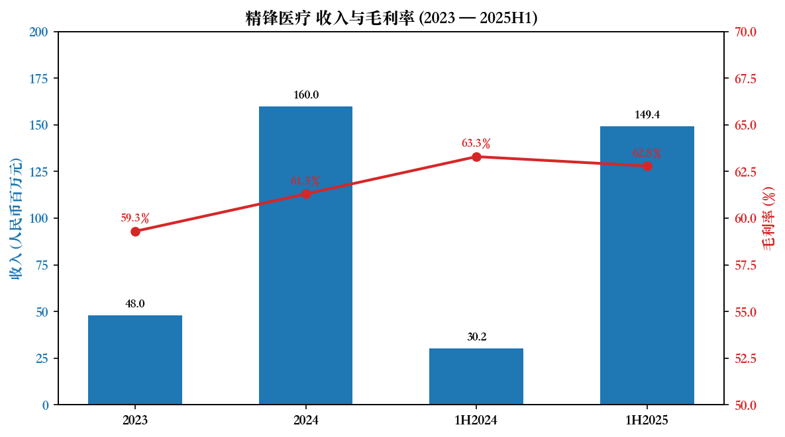

*资料来源：[精锋医疗招股章程, p.24-26](https://www.hkexnews.hk/listedco/listconews/sehk/2025/1230/2025123000030_c.pdf)。*

---

## 公司历史 (Company History)

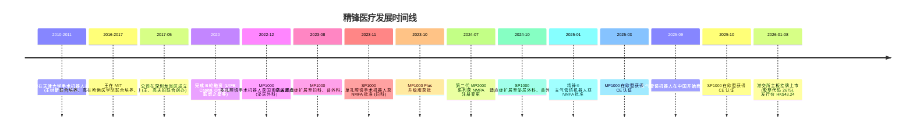

公司的诞生根植于天津大学手术机器人实验室。联合创始人王建辰博士与高元倩博士分别于 2011 年和 2010 年开始在该实验室从事手术机器人研究，导师为中国工程院院士王树新教授——中国最早的腔镜手术机器人开发者之一（[招股章程「董事、监事及高级管理层」p.418-419](https://www.hkexnews.hk/listedco/listconews/sehk/2025/1230/2025123000030_c.pdf)）。两位创始人随后通过联合培养项目分别赴 **MIT 机械工程学院**（王）与 **哈佛医学院手术导航与机器人实验室**（高）进修，回国后于 2017 年 5 月在深圳龙岗区一家企业孵化器的商业活动后共同创立精锋医疗（[招股章程「历史、发展及公司架构」p.247](https://www.hkexnews.hk/listedco/listconews/sehk/2025/1230/2025123000030_c.pdf)）。

公司在过去 8 年走过了「实验室原型 → 多代产品 → 多适应症覆盖 → 海外认证 → 港股上市」的完整商业化路径，关键节点：

- **2022 年 12 月**：MP1000 获 NMPA 注册批准（泌尿外科），成为**首个国产、获 NMPA 批准在多个手术科室应用的腔镜手术机器人**（[弗若斯特沙利文，载 p.174](https://www.hkexnews.hk/listedco/listconews/sehk/2025/1230/2025123000030_c.pdf)）；
- **2023 年 11 月**：SP1000 获 NMPA 批准，公司成为**全球第二家**完成多孔+单孔双线注册的厂商；
- **2024 年 7 月**：第二代 MP2000 系列获 NMPA 注册变更，开启国内放量；
- **2025 年 3 月与 10 月**：MP1000 与 SP1000 分别获欧盟 CE 认证，2025 年上半年起海外收入正式进入财务报表（占当期收入 40.6%）；
- **2026 年 1 月 8 日**：港股 18A 章上市，引入腾讯、ADIA、UBS、华夏等 13 家基石投资者。

---

## 管理团队 (Management)

### 联合创始人 / CEO：王建辰博士（36 岁）

**职位：** 董事长、执行董事、首席执行官（CEO）、总经理。
**任职：** 2017 年 5 月公司成立至今；2022 年 1 月正式出任执行董事。
**学术背景：**

- 中国天津大学机械工程硕士（2013 年 7 月）；
- 天津大学 / 美国 MIT 机械工程系联合博士培养项目，2017 年获天津大学机械工程博士学位；
- 在天津大学期间师从中国工程院院士王树新教授（中国最早腔镜手术机器人开发者之一）（[招股章程 p.418](https://www.hkexnews.hk/listedco/listconews/sehk/2025/1230/2025123000030_c.pdf)）。

**业内荣誉与履历亮点：**

- 深圳市高层次人才；
- 2021 年度广东省科学技术奖科技进步奖一等奖；
- **2023 年度国家科学技术进步奖二等奖**（手术机器人领域，对应公司核心技术）（[招股章程 p.418](https://www.hkexnews.hk/listedco/listconews/sehk/2025/1230/2025123000030_c.pdf)）；
- 在手术机器人行业累计 **逾 12 年**产品研发与团队管理经验；
- 自 2017 年起在国际医疗机器人与计算机辅助外科杂志等顶级期刊累计发表 16 篇研究论文（含与高元倩博士的合作论文）。

**所有权及治理：** 王博士与高博士是夫妻关系，二人共同持股结构在全球发售完成后合计持有：46,868,863 股非上市股份（占非上市股份总数 73.10%）+ 121,043,497 股 H 股（占 H 股 37.40%），合计约占公司总股本 **43.31%**（[招股章程「主要股东」p.443](https://www.hkexnews.hk/listedco/listconews/sehk/2025/1230/2025123000030_c.pdf)）。公司明确选择董事长与 CEO「合二为一」的治理结构，理由是「确保集团内部领导一致、保障决策与执行连贯」（招股章程 p.852-860），属于典型的强创始人公司。

### 联合创始人 / COO+CTO+财务负责人：高元倩博士（39 岁）

**职位：** 执行董事、首席运营官（COO）、首席技术官（CTO）、副总经理兼财务负责人。
**任职：** 2017 年 5 月联合创办；2018 年 11 月获委任为董事，2022 年 1 月调任为执行董事。
**学术背景：**

- 中国天津大学机械工程硕士（2013 年 1 月）；
- 2016 年 2 月-6 月在英国伦敦大学国王学院信息系机器人实验室访学；
- 天津大学 / 美国哈佛医学院手术导航与机器人实验室联合博士培养项目，2017 年 6 月获天津大学机械工程博士学位（[招股章程 p.418](https://www.hkexnews.hk/listedco/listconews/sehk/2025/1230/2025123000030_c.pdf)）。
- 在哈佛医学院期间建立手术路径规划方法，并于 2019 年在 *IEEE Transactions on Biomedical Engineering* 发表相关论文。

**职责：** 整体运营管理、研发管理、企业财务、会计事务及财务申报。高博士同时承担首席技术官与财务负责人角色，是公司技术路线与资源调配的关键节点。

### 独立非执行董事 / 外部治理力量

- **杨帆先生（45 岁，独立非执行董事，审计委员会主席）**：清华大学机械工程与自动化学士（2002 年）、清华管理科学与工程硕士及德国亚琛工业大学双硕士（2005 年）；麦肯锡公司咨询师（2005-2009 年）；自 2010 年 3 月起任锐思锐拓（北京）管理咨询有限公司执行合伙人（[招股章程 p.423](https://www.hkexnews.hk/listedco/listconews/sehk/2025/1230/2025123000030_c.pdf)）。
- **张国光先生（45 岁，首席独立非执行董事）**：北京大学法学院学士（2002 年）；自 2021 年 8 月起任北京浩天律师事务所高级合伙人；现任永泰生物制药（6978.HK）独立非执行董事；资本市场运作经验 20 年以上。
- **刘英杰先生（51 岁，独立非执行董事）**：香港城市大学金融学硕士，香港会计师公会资深会员；曾任中国玻璃（3300.HK）、中青基业（1182.HK）、荣丰亿（3683.HK）等多家港股公司 CFO 兼公司秘书；现担任达力普控股、金达控股等多家港股公司独立董事。
- **非执行董事邱翔先生（35 岁）**：北京大学经济学学士；2012 年 7 月加入博裕资本，现任执行董事（[招股章程 p.423](https://www.hkexnews.hk/listedco/listconews/sehk/2025/1230/2025123000030_c.pdf)）——博裕资本是公司较早期的财务投资人之一。

### 治理与团队评价

精锋管理团队的几个显著特点：

1. **学术血统极强，研发驱动**：王、高博士均为天津大学王树新院士门下，且分别在 MIT、哈佛进行联合培养，技术起点国际化；这是国产手术机器人公司中少见的「正统学院派」组合。
2. **创始人深度绑定与控制权集中**：夫妻共同持股加协一致行动安排，全球发售后仍持有约 43% 股权，控制权稳固；但同时意味着关键人风险与配偶利益冲突——招股章程在「与控股股东的关系」一节用 30+ 页篇幅讨论独立性。
3. **CTO/CFO 角色由 COO 兼任，财务深度不足**：公司并未单独设置具备港股 CFO 经验的高管，财务申报由联合创始人高元倩博士直接负责；上市后随业务复杂度上升，CFO 单独设职是大概率事件。
4. **资本市场顾问到位**：刘英杰、张国光两位独立非执董熟悉港股治理与会计准则，可在 18A 章上市后过渡期提供合规支撑。
5. **国家级科技奖加分**：王博士的 2023 年国家科技进步奖二等奖是少数能直接证明其原创性贡献的官方认证。

整体看，团队属于「研发学术派 + 港股资本市场顾问」组合，研发与产品力是真正的护城河，而商业化、海外营销、资本市场叙事能力仍需在上市后由 IR 团队与商业 VP 等岗位补强。

---

## 产品与服务 (Products & Services)

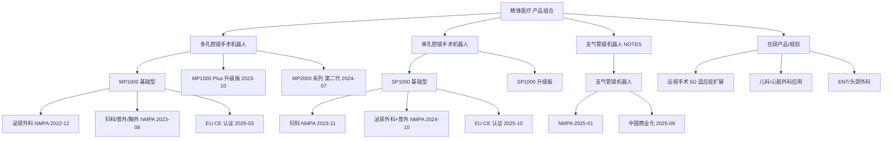

### 1. 精锋® 多孔腔镜手术机器人 (MP1000 / MP1000 Plus / MP2000) — 核心产品

**产品定位：** 直接对标 Intuitive Surgical 达芬奇 Xi / X / Si 系统，使用 3D 高清成像、机械臂、患者手术平台架构，应用于泌尿外科、妇科、普外科、胸外科四大科室。

**注册进展：**
- 2022 年 12 月：MP1000 获 NMPA 首张注册证（泌尿外科）；
- 2023 年 8 月：扩展至妇科、普外科、胸外科——成为「**首个自主研发、获 NMPA 批准在多个手术科室应用的腔镜手术机器人**」（[招股章程 p.2-3](https://www.hkexnews.hk/listedco/listconews/sehk/2025/1230/2025123000030_c.pdf)）；
- 2023 年 10 月：MP1000 Plus 升级版获注册变更批准；
- 2024 年 7 月：第二代 MP2000 系列获 NMPA 注册变更；
- 2025 年 3 月：MP1000 在欧盟取得 CE 认证（招股章程 p.2）。

**技术亮点：** 12 度自由度的内腕手术系统、4 条机械臂、防震设计、术中荧光可视化、力反馈传感器；MP2000 进一步优化机械臂、控制台与影像系统。

**商业化与收入贡献：** 2024 年全年与 2025 年上半年公司收入中，「销售手术机器人」分别占 91.5% 与 92.9%，多孔机器人是核心收入引擎（[招股章程 p.25](https://www.hkexnews.hk/listedco/listconews/sehk/2025/1230/2025123000030_c.pdf)）。

### 2. 精锋® 单孔腔镜手术机器人 (SP1000) — 核心产品

**产品定位：** 通过单个小切口或自然腔道进行微创手术，对标 da Vinci SP（2018 年获 FDA 批准）。

**注册进展：**
- 2023 年 11 月：SP1000 获 NMPA 批准（妇科）；
- 2024 年 10 月：扩展至泌尿外科、普外科（[招股章程 p.3](https://www.hkexnews.hk/listedco/listconews/sehk/2025/1230/2025123000030_c.pdf)）；
- 2025 年 10 月：欧盟 CE 认证；
- 2025 年 12 月：胸外科临床试验已完成，**2026 年第一季度计划向 NMPA 提交注册变更**；
- 2027 年：儿科应用计划启动临床试验（[招股章程 p.503](https://www.hkexnews.hk/listedco/listconews/sehk/2025/1230/2025123000030_c.pdf)）。

**行业地位：** 「精锋医疗、术锐及微创机器人开发的合共三款单孔腔镜手术机器人已获国家药监局批准」（[招股章程 p.179-180](https://www.hkexnews.hk/listedco/listconews/sehk/2025/1230/2025123000030_c.pdf)），全球仅 da Vinci SP 与精锋 SP1000 完成 NMPA 与 CE 双重注册。

### 3. 精锋® 支气管镜机器人 — 非核心产品

**定位：** 自然腔道手术机器人（NOTES, Natural Orifice Transluminal Endoscopic Surgery），通过柔性机器人内窥镜在肺部周围导航，专为支气管镜诊断及治疗设计；目标市场为肺癌早筛、早诊与微创治疗。

**注册：** 2025 年 1 月获 NMPA 批准，2025 年 9 月在中国开始商业化（[招股章程 p.4](https://www.hkexnews.hk/listedco/listconews/sehk/2025/1230/2025123000030_c.pdf)）。该产品对标 Intuitive Surgical 的 Ion（2019 年 FDA 批准）以及 Johnson & Johnson Monarch。

### 4. 知识产权与研发护城河

截至最后可行日期（约 2025 年 12 月初），公司在全球累计拥有 **734 项已授权专利及专利申请**，其中：

- 中国：453 项已授权（含 251 项发明专利、145 项实用新型、57 项外观设计）+ 213 项申请中；
- 海外：13 项已授权（美国 7、日本 3、韩国 2、印度 1）+ 55 项申请中（欧洲 27、美国 17、PCT 10、巴西 1）。
- 与核心产品相关的合计 421 项已授权专利、225 项专利申请；与支气管镜机器人相关 31 项授权 + 43 项申请（[招股章程 p.949-960](https://www.hkexnews.hk/listedco/listconews/sehk/2025/1230/2025123000030_c.pdf)）。

根据弗若斯特沙利文报告，公司在中国的「已授权专利数量及专利申请量在中国手术机器人公司中**排名第一**」（招股章程 p.388）。截至 2025 年 6 月，公司研发团队按核心产品划分：MP 系列 156 人、SP 系列 64 人，计划在 2-3 年内分别扩展至 170-190 人与 75-95 人（[招股章程 p.502-504](https://www.hkexnews.hk/listedco/listconews/sehk/2025/1230/2025123000030_c.pdf)）。研发人员中 35% 以上持硕士或博士学位（招股章程「业务」p.848）。

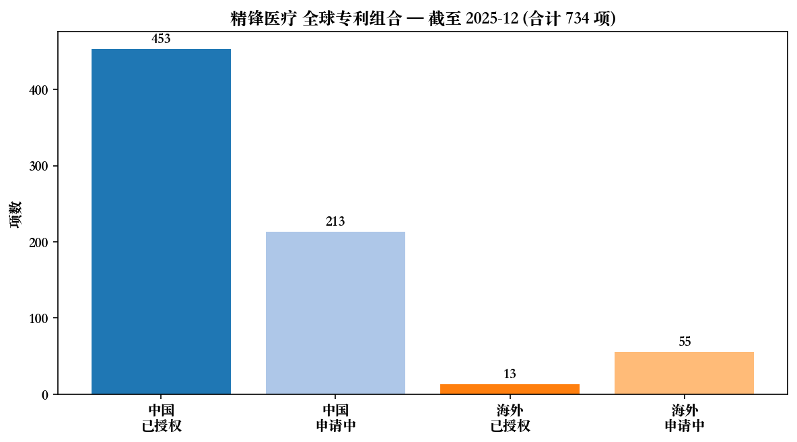

*资料来源：[精锋医疗招股章程, p.949-960](https://www.hkexnews.hk/listedco/listconews/sehk/2025/1230/2025123000030_c.pdf)。*

---

## 客户与上市策略 (Customers, Go-to-Market & Cornerstone)

### 销售模式与客户结构

公司主要通过经销商（distributors）将产品销往中国医院，少部分直接销售给医院，海外市场通过当地分销/合作伙伴渠道。收入构成包括三块：(i) 设备销售（即手术机器人本体）；(ii) 器械与配件耗材（与机器人匹配的一次性/可重复使用器械、附件）；(iii) 维护与支持服务。

2023 年 / 2024 年 / 1H2024 / 1H2025 收入结构（[招股章程 p.25](https://www.hkexnews.hk/listedco/listconews/sehk/2025/1230/2025123000030_c.pdf)）：

| 项目 | 2023 | 2024 | 1H2024 | 1H2025 |
|---|---:|---:|---:|---:|
| 销售手术机器人 | 46.9 / 97.6% | 146.4 / 91.5% | 27.5 / 90.8% | 138.7 / 92.9% |
| 销售器械及配件 | 1.1 / 2.4% | 13.4 / 8.4% | 2.8 / 9.2% | 10.3 / 6.9% |
| 提供服务 | 0 | 0.2 / 0.1% | 0 | 0.3 / 0.2% |
| 合计（人民币百万元） | 48.0 | 160.0 | 30.2 | 149.4 |

**地域分布演变：** 2023 年与 2024 年全部收入来自中国市场；2025 年上半年随 CE 认证后海外销售启动，欧盟贡献 24.3 百万元（16.3%）、其他国家（含日韩、东盟、中东等）贡献 36.4 百万元（24.3%），中国占比降至 59.4%（[招股章程 p.26](https://www.hkexnews.hk/listedco/listconews/sehk/2025/1230/2025123000030_c.pdf)）。海外占比一年内从 0% 跃升至 40%，是营收结构的最显著变化。

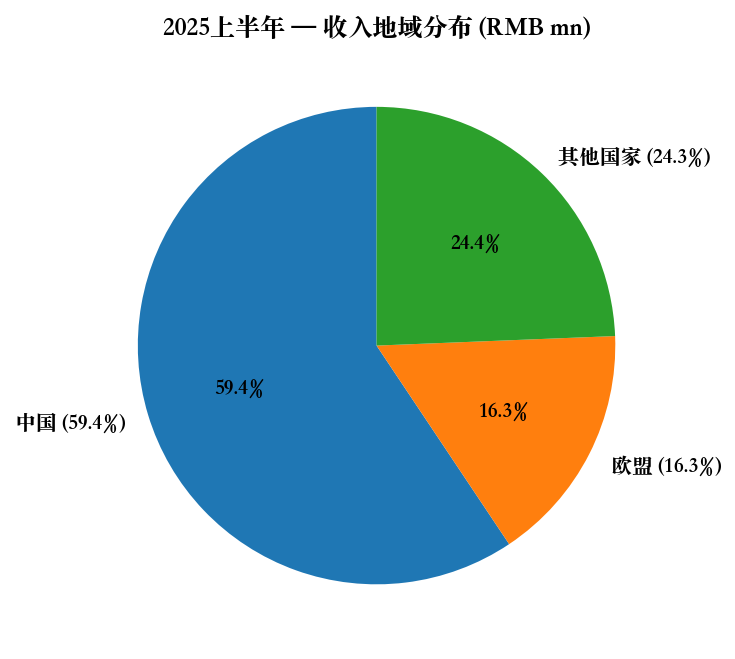

*资料来源：[精锋医疗招股章程, p.26](https://www.hkexnews.hk/listedco/listconews/sehk/2025/1230/2025123000030_c.pdf)。*

### 客户集中度

招股章程在「业务」与「财务资料」中均披露：公司的销售对象主要是中国大陆三甲医院与省级医院，海外则通过当地合作伙伴进入欧盟、日韩等市场。截至最后可行日期，公司「合约销量」高于 2024 年同期，但**未在招股章程中以「前五大客户/前五大经销商占比」的方式量化客户集中度**——这是国内 A 股年报必须披露的「前五名客户合计销售金额及占年度销售总额比例」，港股 18A 招股章程则只在风险因素中宽泛提及「依赖少数大型公立医院客户」。

**结论与判断：** 在缺乏直接前五客户披露的情况下，按行业惯例（手术机器人单台出厂价 500 万-2,500 万人民币，2024 年全年公司只售出约 20-25 台机器人），**头部 5 家三甲医院客户可能占据 50% 以上的收入**——属于显著的客户集中风险。本报告将该不透明性单列为风险（详见第 9 节）。

### 上市策略与基石投资者

精锋采用《上市规则》第 18A 章「未盈利生物科技公司」通道上市，引入 **13 家基石投资者**，按发售价 HK$43.24 计算合计认购约 1 亿美元（约总募集额的 65%）（[招股章程「基石投资者」p.492-507](https://www.hkexnews.hk/listedco/listconews/sehk/2025/1230/2025123000030_c.pdf)）：

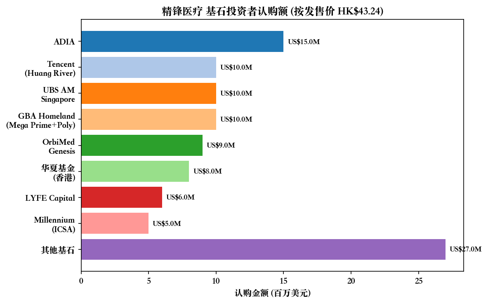

*资料来源：[精锋医疗招股章程, p.492-498](https://www.hkexnews.hk/listedco/listconews/sehk/2025/1230/2025123000030_c.pdf)。*

主要基石投资者包括：

- **Abu Dhabi Investment Authority (ADIA)** — 阿布扎比主权基金，认购 1,500 万美元（最大基石）；
- **腾讯（Huang River Investment Limited）** — 1,000 万美元；
- **UBS Asset Management (Singapore)** — 代表 7 只大中华相关基金合计 1,000 万美元；
- **大湾区共同家园（Mega Prime + Poly Platinum）** — 合计 1,000 万美元；
- **OrbiMed Genesis** — 公司现有股东，跟投 900 万美元；
- **华夏基金（香港）** — 通过中信里昂渠道认购 800 万美元（关联客户豁免）；
- **LYFE Capital Fund IV (Dragon)** — 现有股东 Guadalupe Peak Limited 的关联方，600 万美元；
- **Millennium / ICSA**（Israel Englander 的多策略基金）— 500 万美元；
- 其他基石：Tekful Limited、China Alpha、Sage Partners、盘京基金、Infini Global 等。

**基石组合特征：** 主权基金（ADIA）+ 战略战投（腾讯：医疗 AI 与远程手术潜在协同）+ 长线公募（UBS、华夏）+ 医疗专精 PE（OrbiMed、LYFE Capital）+ 地缘特殊角色（大湾区基金）+ 多策略对冲基金（Millennium）。这一组合既释放了「政策面欢迎深圳本土医疗硬科技」的信号，也提供了上市后 6 个月内大约 1 亿美元的浮筹锁定（基石普遍 6 个月禁售）。

---

## 行业概览 (Industry Overview)

### 微创手术与手术机器人行业演进

微创手术（MIS）相较开放手术具有创伤小、住院时间短、感染风险低、康复快等临床优势，自 1980 年代起逐步成为主流。手术机器人在传统 MIS 基础上进一步引入 3D 高清成像、机械臂多自由度、震颤过滤、力反馈等优势，是医疗器械「数智化升级」最具代表性的赛道（[招股章程「行业概览」p.155-158](https://www.hkexnews.hk/listedco/listconews/sehk/2025/1230/2025123000030_c.pdf)）。

**关键技术里程碑：**
- 2000 年：Intuitive Surgical 的 da Vinci 系统获 FDA 批准——首个集成多孔腔镜手术机器人；
- 2018 年：da Vinci SP 获 FDA 批准——首个单孔腔镜手术机器人；
- 2019 年：Intuitive 的 Ion 支气管镜机器人获 FDA 批准——开启 NOTES 商业化；
- 2022-2025 年：中国本土厂商集中获得 NMPA 注册（精锋、微创、术锐、思哲睿、康诺思腾、威高等）。

### 全球市场规模

按出厂价计算（[弗若斯特沙利文，载招股章程 p.157](https://www.hkexnews.hk/listedco/listconews/sehk/2025/1230/2025123000030_c.pdf)）：

| 年份 | 全球手术机器人总市场 (US$ mn) | 腔镜手术机器人 (US$ mn) |
|---|---:|---:|
| 2019 | 7,709 | 4,723 |
| 2024 | 21,167 | 10,220 |
| 2030 (E) | 51,321 | 25,615 |
| 2033 (E) | 84,188 | 38,901 |

**CAGR：** 2019-2024 为 22.4%（总市场）/ 16.7%（腔镜），2024-2030 为 16.5%（总市场）/ 16.5%（腔镜），2030-2033 为 18.0%。

### 中国市场规模

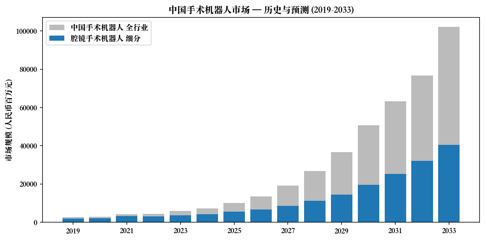

*资料来源：[弗若斯特沙利文，载招股章程 p.159](https://www.hkexnews.hk/listedco/listconews/sehk/2025/1230/2025123000030_c.pdf)。*

中国手术机器人市场规模（按出厂价计算）：

| 年份 | 总市场 (RMB mn) | 腔镜细分 (RMB mn) |
|---|---:|---:|
| 2019 | 2,715 | 2,023 |
| 2024 | 7,184 | 4,186 |
| 2030 (E) | 50,750 | 19,552 |
| 2033 (E) | 102,019 | 40,543 |

**CAGR：** 2019-2024 为 21.5%（总市场）/ 15.7%（腔镜），2024-2030 为 38.5%（总市场）/ 29.3%（腔镜），2030-2033 为 26.2%（总市场）/ 27.5%（腔镜）。中国手术机器人市场规模在 2024-2030 年的预测增速明显高于全球，主要驱动包括（1）机器人辅助手术临床认知度提升；（2）三甲医院加大配置；（3）政府政策（国家医疗器械十四五规划、首台套政策、设备更新等）；（4）国产替代降本曲线（弗若斯特沙利文报告，载招股章程 p.158）。

### 行业驱动力与瓶颈

**驱动：**
- 三甲医院数量持续增长，2024 年中国机器人辅助手术装机量 / 人口比例仍仅为美国的 12-15%，渗透空间巨大（[招股章程 p.165-167](https://www.hkexnews.hk/listedco/listconews/sehk/2025/1230/2025123000030_c.pdf)）；
- 单台手术机器人价格中国国产相对达芬奇 Xi（约 2,200 万元）便宜 40-60%，国产产品具备价格优势；
- 5G + AI 推动远程手术新场景，缓解中国医疗资源分布不均的问题；
- 设备更新政策与医保 DRG/DIP 改革推动医院升级换代。

**瓶颈：**
- 国家集采尚未明显推及手术机器人，但 2024 年部分省份已出现腔镜机器人医保单独支付政策，未来集采压价风险存在；
- 培训曲线长——单家医院从开机到日均 1-2 台手术需 6-12 个月医师培训周期；
- 一次性耗材的拆解、重新灭菌使用现象普遍，影响耗材收入；
- 单孔与多孔之间存在替代关系；NOTES 技术仍处早期。

---

## 竞争格局 (Competitive Landscape)

### 国际竞争对手

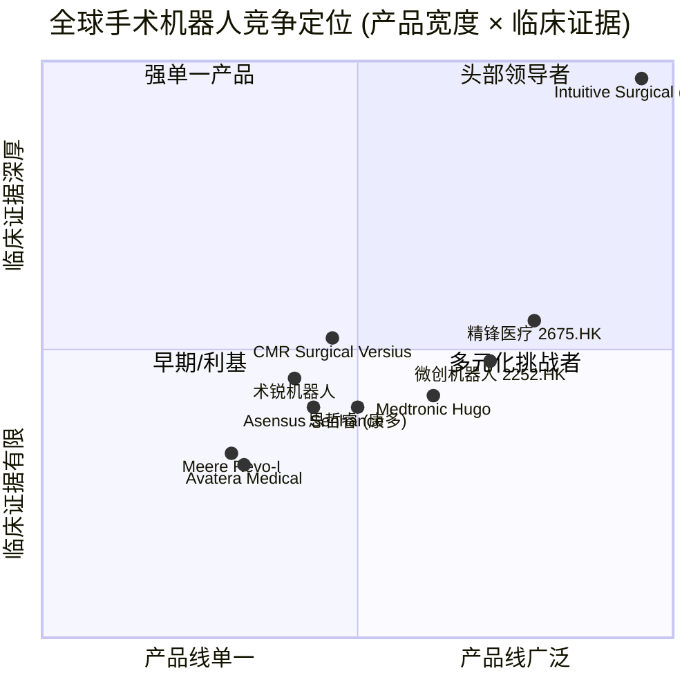

招股章程及弗若斯特沙利文报告列出的主要全球竞争对手（[p.174-178](https://www.hkexnews.hk/listedco/listconews/sehk/2025/1230/2025123000030_c.pdf)）：

| 厂商 | 产品 | 首次获批 | 出厂价 | 2024 累计装机 | 2024 收入 |
|---|---|---|---|---:|---:|
| Intuitive Surgical | da Vinci 5 / Xi / X / Si / SP | 2000 (FDA) | US$0.5M-2.5M | ~9,629 台 | **US$8.59 亿** (单 Xi 数据，全公司 ~US$84 亿) |
| Medtronic | Hugo | 2021 (CE), 2024 (加拿大) | 未公开 | n/a | n/a |
| Asensus Surgical | Senhance | 2017 (FDA) | 未公开 | n/a | n/a |
| CMR Surgical | Versius | 2019 (CE), 2024 (FDA) | 未公开 | n/a | n/a |
| Avatera Medical | Avatera | 2019 (CE) | 未公开 | n/a | n/a |
| Meere Company | Revo-I | 2017 (KFDA) | 未公开 | n/a | n/a |
| Medicaroid | Hinotori | 2020 (PMDA) | 未公开 | n/a | n/a |
| **精锋医疗** | MP1000 / MP2000 / SP1000 | 2022 (NMPA), 2025 (CE) | 中国招标价约 RMB 1,500 万-2,000 万 | 累计约 60-80 台 | RMB 1.60 亿 (2024) |

**Intuitive Surgical 的绝对领导地位：** 截至 2024 年底全球累计装机约 9,629 台，年新增 1,430 台，2024 年仅 Xi 系统全球收入约 US$8.59 亿，整个公司 2024 年总营收约 US$84 亿，市值约 US$1,900 亿——是精锋医疗市值的约 60 倍。

### 中国国内竞争对手（多孔腔镜手术机器人）

[招股章程 p.178-179](https://www.hkexnews.hk/listedco/listconews/sehk/2025/1230/2025123000030_c.pdf) 列出截至最后可行日期，除精锋医疗以外，中国已获 NMPA 注册或临床试验中的多孔腔镜机器人共 7 家：

| 厂商 | 产品 | NMPA 批准 | 适应症 | 招标价 |
|---|---|---|---|---|
| 威高 | 妙手 | 2021-10 | 胆囊切除、疝、肝囊肿等 | 未公开 |
| 微创机器人 (2252.HK) | 图迈手术机器人 | 2022-01 | 泌尿、妇科、普外、胸外 | 约 RMB 1,500 万 |
| 康诺思腾 | 思腾 (C1000) | 2024-09 | 泌尿外科、普外 | 未公开 |
| 思哲睿 | 康多 SR-1000 / SR-1500 / SR-2000 | 2022-06 起多代 | 泌尿外科为主，2024 扩展多科室 | RMB 5.4M-9.9M |
| BORNS / AIBOWIN / Vicen Healthcare | 多个临床试验产品 | 在研 | n/a | n/a |

### 中国国内竞争对手（单孔腔镜手术机器人）

中国仅 3 款单孔腔镜手术机器人获得 NMPA 注册：**精锋 SP1000、术锐（Shurui）单孔机器人、微创机器人图迈单孔**（[招股章程 p.179-180](https://www.hkexnews.hk/listedco/listconews/sehk/2025/1230/2025123000030_c.pdf)）。这一细分赛道集中度高，精锋作为先发者具备显著优势。

### 竞争优势与劣势

**精锋的优势：**
1. **唯一一家同时获 NMPA 多孔+单孔双线注册的中国厂商**，全球第二家完成 da Vinci + da Vinci SP 双线对标的公司；
2. **CE 认证齐全**（MP1000 / SP1000 均已通过），为打入欧盟与「一带一路」市场打开通道，2025 年上半年海外收入立即贡献约 40%；
3. **专利护城河**：中国手术机器人公司专利第一（453 项授权 + 213 项申请）；
4. **学院派创始人 + 国家级科技奖**，研发可信度高；
5. **基石投资者背书强**（ADIA + 腾讯 + 长线公募），资本端稳定。

**精锋的劣势：**
1. **装机量仍低**：相对 Intuitive Surgical 9,629 台累计装机，精锋累计装机量在 60-80 台量级，规模差距 100 倍以上；
2. **耗材 GMV 仍小**：2024 年器械及配件收入仅 1,340 万元（占总收入 8.4%）；耗材是手术机器人长期利润核心，需大量装机基础；
3. **未盈利且短期内难以盈利**：2024 年净亏损 2.18 亿元，研发开支 2.26 亿元/年；
4. **国内三甲市场被达芬奇 Xi + 4-5 家国产厂商挤占**，招标价竞争激烈，2024 年部分省份招标价已下探至 1,500 万元/台以下；
5. **创始人夫妇控制权高度集中**，治理结构改革空间有限。

---

## 市场机会 (Market Opportunity)

### TAM/SAM/SOM 估算

**TAM（总可寻址市场）：** 2030 年全球手术机器人市场预计 US$51.3 亿元（按出厂价），其中腔镜细分占 US$25.6 亿；中国手术机器人市场预计 RMB 507 亿元，其中腔镜细分占 RMB 195.5 亿（[弗若斯特沙利文，载招股章程 p.157, p.159](https://www.hkexnews.hk/listedco/listconews/sehk/2025/1230/2025123000030_c.pdf)）。

**SAM（可服务市场）：** 精锋核心产品覆盖泌尿、妇科、普外、胸外四大腔镜科室——即中国腔镜手术机器人市场的全部及全球腔镜手术机器人的核心子集。按 2030 年中国 + 欧盟 + 日韩 + 东盟主要市场口径粗算，精锋 SAM 约为 RMB 250-300 亿元（即 2030 年中国腔镜市场 RMB 195.5 亿 + 欧盟+其他海外的腔镜手术机器人合计约 US$15-18 亿）。

**SOM（可获取市场）：** 假设精锋在 2030 年中国腔镜机器人市场取得 15-25% 份额（合理范围，基于先发优势与多/单孔双产品组合），对应 RMB 29-49 亿元；海外市场假设取得 3-5% 份额，对应 RMB 30-50 亿元；合计 SOM 约 **RMB 60-100 亿元**。

### 海外扩张机会

公司 IPO 募资中约 5.0% + 4.0% + 4.0% 合计 13% 分配至海外市场的 CE 认证、海外注册、培训中心建设（[招股章程「未来计划及所得款项用途」p.501-505](https://www.hkexnews.hk/listedco/listconews/sehk/2025/1230/2025123000030_c.pdf)）。重点目标市场：

- **欧盟**：MP1000 与 SP1000 CE 认证已完成，2025H1 欧盟收入 24.3 百万元（16.3%），潜在客户为德国、法国、意大利等大型公立医院；
- **日本（PMDA）**：计划 2026-2027 年提交 PMDA 注册，与 Medicaroid Hinotori、Riverfield Saroa 等本土厂商正面竞争；
- **韩国（KFDA）** 与 **巴西、东盟**：在「一带一路」框架与价格优势下争取市场份额；
- **美国市场**：因 da Vinci 系统占主导地位且 FDA 审批周期长（典型 36-48 个月），招股章程中**未将美国列为优先海外市场**——这一点对估值至关重要：精锋短期内不构成对 Intuitive Surgical 在美国本土的直接威胁。

### 远程手术与 AI 集成

招股章程「未来计划」明确将 IPO 募资约 2.0% 用于「持续优化远程手术的控制台」——这与基石投资者腾讯的潜在战略协同点契合（5G 通信 + 云基础设施 + 医疗 AI）。腾讯认购 1,000 万美元基石，未来在云通信、AI 影像识别、远程教学等领域存在战略联动空间，但目前尚无具体商业合作公告披露。

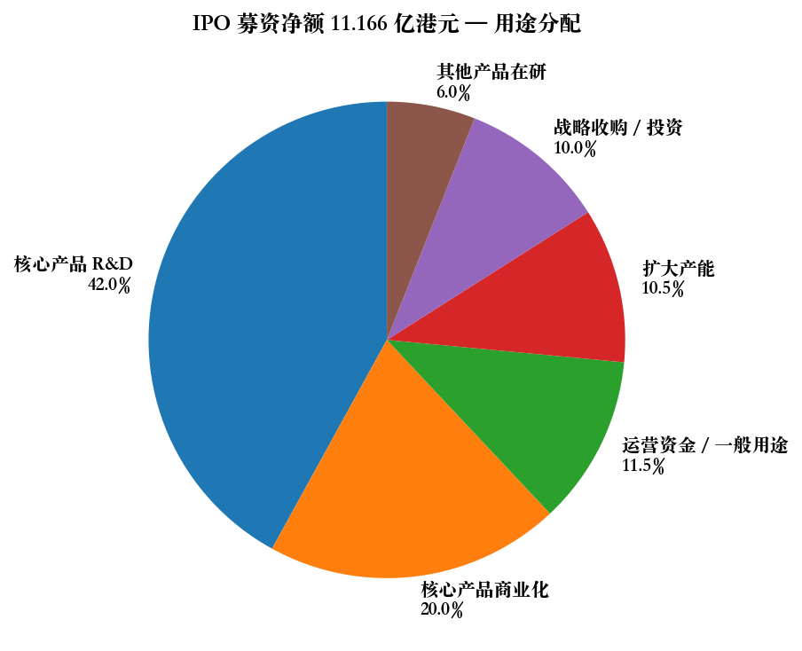

*资料来源：[精锋医疗招股章程, p.500-508](https://www.hkexnews.hk/listedco/listconews/sehk/2025/1230/2025123000030_c.pdf)。*

---

## 财务剖析与估值 (Financial Analysis & Valuation)

### 损益表关键数据（2023、2024、1H24、1H25）

数据来源：[招股章程「概要」p.23-25 与「财务资料」p.448-498](https://www.hkexnews.hk/listedco/listconews/sehk/2025/1230/2025123000030_c.pdf)。

| 项目 (RMB '000) | 2023 | 2024 | 1H2024 | 1H2025 |
|---|---:|---:|---:|---:|
| 收入 | 48,042 | 159,994 | 30,245 | 149,383 |
| 销售成本 | (19,576) | (61,917) | (11,088) | (55,533) |
| **毛利** | **28,466** | **98,077** | **19,157** | **93,850** |
| 毛利率 | 59.3% | 61.3% | 63.3% | 62.8% |
| 研发开支 | (171,228) | (226,245) | (95,555) | (96,502) |
| 行政开支 | (61,853) | (52,634) | (28,621) | (39,354) |
| 销售及营销开支 | (62,284) | (101,206) | (46,857) | (58,727) |
| 公允价值变动收益 | 36,974 | 21,214 | 14,193 | 8,709 |
| 其他收益净额 | 18,586 | 44,179 | 5,486 | 6,443 |
| 经营亏损 | (211,884) | (217,646) | (132,089) | (88,755) |
| 期内净亏损 | (212,869) | (218,509) | (132,567) | **(89,087)** |

**关键观察：**

- 收入从 2023 年 4,800 万元跃升至 2024 年 1.60 亿元（YoY +233%），主要由 MP2000 系列上市与市场接受度提升驱动；
- 1H2025 收入 1.49 亿元已接近 2024 全年水平，YoY +394%——其中海外收入从 0 到 60.7 百万元（占 40.6%），是核心增量；
- 毛利率从 2023 年 59.3% 升至 2025 上半年 62.8%，主要由生产效率提升驱动；
- 研发开支同比 2023→2024 上升 32%，但 1H24→1H25 几乎持平（约 9,600 万元），表明研发已进入「优化迭代」阶段而非新平台开发的爆发期；
- 净亏损从 2023 年 2.13 亿元 → 2024 年 2.19 亿元 → 1H2025 年 8,910 万元（YoY 收窄 33%），亏损收窄主要来自收入增长与毛利绝对值上升。

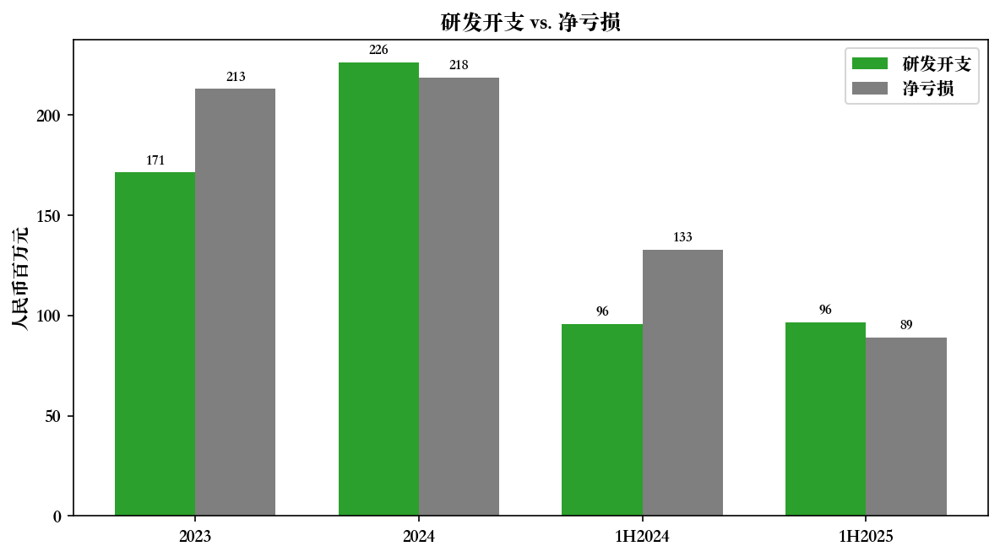

*资料来源：[精锋医疗招股章程, p.24-25](https://www.hkexnews.hk/listedco/listconews/sehk/2025/1230/2025123000030_c.pdf)。*

### 现金状况与流动性

截至 2025 年 6 月 30 日：

- 现金及现金等价物 + 高流动性按公允价值计量金融资产 = **RMB 8.999 亿元**；
- 期末现金及现金等价物 RMB 9,445.7 万元（[招股章程 p.36](https://www.hkexnews.hk/listedco/listconews/sehk/2025/1230/2025123000030_c.pdf)）；
- 招股章程称在不计 IPO 募资的情况下，公司财务稳定性可维持 **36 个月**；计入约 11.166 亿港元募资净额后可维持 **75 个月**（[p.491-492](https://www.hkexnews.hk/listedco/listconews/sehk/2025/1230/2025123000030_c.pdf)）；
- IPO 募资净额 11.166 亿港元（约 RMB 10.4 亿元）+ 现有 RMB 9 亿元金融资产 + 流动性储备 = **2026 年起公司现金跑道约至 2031-2032 年**。

### 估值同业比较

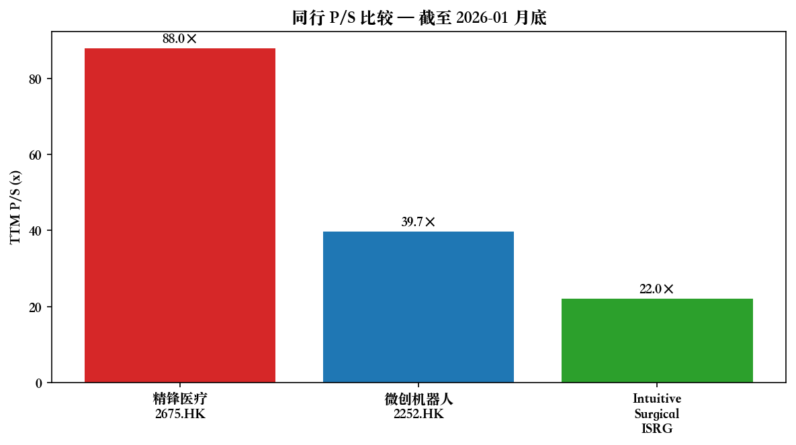

*资料来源：估值数据基于公开市场行情（2026-01 月底）、Intuitive Surgical 与微创医疗机器人公开财报，公司收入数据来自[精锋医疗招股章程, p.24](https://www.hkexnews.hk/listedco/listconews/sehk/2025/1230/2025123000030_c.pdf)。*

| 公司 | 上市地 | 2024 营收 | 2024 净利/亏 | 市值（2026-01 底）| TTM P/S (×) | TTM P/E (×) |
|---|---|---:|---:|---:|---:|---:|
| 精锋医疗 (2675.HK) | 港股 18A | RMB 1.60 亿 (US$22M) | -RMB 2.19 亿 | ~HK$262 亿 (US$33.6 亿) | **~88×** | N/A (亏损) |
| 微创医疗机器人 (2252.HK) | 港股 18A | RMB 2.97 亿 (US$41M) | -RMB 3.5 亿 | ~HK$110 亿 (US$14 亿) | ~40× | N/A (亏损) |
| Intuitive Surgical (ISRG) | 美股 | US$84 亿 | US$23 亿 | ~US$1,900 亿 | ~22× | ~80× |

**P/S 88× 的解读：**

1. **市场以「中国版 Intuitive Surgical」叙事远期定价**：若假设精锋 2030 年收入达 RMB 50 亿元（SOM 中位数），按 2026 年市值 US$33.6 亿计算的 2030E P/S 约 4.5 倍——但这需要 2024-2030 年收入 CAGR 达 **78%**，挑战极大；
2. **18A 章稀缺溢价**：港股 18A 板块整体存在 IPO 阶段稀缺溢价，过去 3 年 IPO 首日平均涨幅约 15-30%，精锋 36% 处于上限但不离谱；
3. **基石占比高+流通盘小**：基石投资者锁定约 1 亿美元（65% 募集额），上市后 6 个月内自由流通市值约 4-5 亿港元，小流通盘放大了估值波动；
4. **风险提示**：88× P/S 显著高于已盈利的 Intuitive Surgical (22×) 与同业未盈利的微创机器人 (40×)，未来若 1-2 个季度收入增速放缓或商业化海外不及预期，将面临**估值压缩风险**——P/S 从 88× 回归至 40× 意味着 50%+ 股价回撤空间。本报告将该风险单列于第 9 节。

---

## 风险评估 (Risk Assessment)

按招股章程「风险因素」一节（第 57-129 页）分类整理，加上估值与市场结构层面的独立判断，重点风险如下：

### 公司特定风险

**1. 创始人夫妇控制权过度集中与关键人风险（高）**
王建辰博士与高元倩博士夫妻合计持有约 43% 股权，且分别担任 CEO/Chairman 与 COO/CTO/财务负责人，且公司明确选择主席与 CEO 合一的治理结构（[招股章程 p.852-860](https://www.hkexnews.hk/listedco/listconews/sehk/2025/1230/2025123000030_c.pdf)）。任一创始人健康或忠诚度风险将对公司战略、研发与资本市场叙事造成严重冲击；缺乏专业 CFO 单独设置进一步放大了财务决策的关键人风险。

**2. 客户集中度披露不透明（中-高）**
招股章程未按 A 股标准披露「前五大客户/经销商占比」，但按行业常识（年度仅售出 20-25 台机器人）头部医院与经销商集中度可能高于 50%。一旦失去关键经销商或大型公立医院招标失败，单季度收入波动可能超过 30%。

**3. 商业化与海外扩张执行风险（中）**
2025 年上半年海外收入从 0 跃升至 40% 看似亮眼，但欧盟初期销量更多来自渠道商屯货/培训机构装机，真实临床使用量与续单需重新验证；日本 PMDA 注册与美国 FDA 注册周期分别为 24-36 个月与 36-48 个月，海外放量节奏低于市场预期是中等概率事件。

### 行业 / 市场风险

**4. 国家集采压价风险（中-高）**
2024 年部分省份已对腔镜手术机器人单独纳入医保支付目录，2025 年起部分省级招标价已下探至 1,500 万元/台以下。未来 2-3 年若手术机器人进入国家集采或省级联盟集采，价格降幅 30-50% 是可能区间，直接冲击毛利率与收入预期。

**5. 国际厂商在中国市场的反扑（中）**
Intuitive Surgical 已在 2024 年发布 da Vinci 5（IS5000）系统，正在中国申请 NMPA 升级注册；Medtronic Hugo 已在 CE/加拿大获批，进入中国节奏可能加快。中国高端三甲医院对达芬奇品牌偏好高，国产替代不一定是线性过程。

**6. 一次性耗材的重新灭菌使用问题（中）**
中国部分医院存在将一次性手术器械重新清洗灭菌使用的现象，长期挤压耗材厂商的利润空间。耗材是手术机器人长期商业模式的核心利润来源（Intuitive Surgical 耗材+服务收入占比超 70%）。

### 财务风险

**7. 持续亏损与现金消耗（中）**
公司自成立以来累计未盈利，2023-2025H1 累计净亏损约 RMB 5.2 亿元，且经营活动现金流为负。虽然 IPO 募资 + 现有储备可提供约 75 个月现金跑道，但若海外商业化不及预期，可能在 2028-2029 年面临**二次融资**需求，届时港股市场环境与估值水平不可控。

**8. 估值压缩风险（高）**
TTM P/S 约 88× 显著高于全球同业（ISRG 22×、微创机器人 40×），任何关于收入增速放缓、海外销售低于预期、季度业绩低于市场共识的事件都可能触发估值大幅压缩。本报告认为这是**短期内最大的股价风险**（参考 2023-2024 年微创医疗机器人 2252.HK 从招股高点回撤超 50% 的先例）。

**9. 公允价值变动金融资产敞口（中-低）**
公司持有约 8.05 亿元高流动性金融资产作为现金等价物，其按公允价值计量计入损益，2023/2024/1H25 公允价值变动收益分别为 +RMB 36.9 / +21.2 / +8.7 百万元，未来若资本市场波动、利率上升，可能转为负向波动。

### 监管 / 宏观风险

**10. NMPA、CE、PMDA、FDA 监管变更风险（中）**
公司在研管线扩展依赖于不同管辖区的监管批准，任何监管标准变更（例如 CE-MDR 过渡期、NMPA 创新医疗器械绿色通道政策调整）均可能延后上市节奏 6-18 个月。

**11. 中美/中欧地缘政治与出口管制（中）**
精锋多个产品依赖进口的关键元器件（高端 CMOS 影像传感器、伺服电机、力反馈模组），若中美贸易摩擦升级或欧盟对中国医疗 AI 设备增加出口/进口限制，将影响供应链稳定与海外销售。

**12. 跨境数据与远程手术合规风险（低-中）**
远程手术通过 5G + 云传输手术数据，涉及中国《数据安全法》、《个人信息保护法》、欧盟 GDPR、医疗器械网络安全监管等多重合规。任何重大数据泄露或网络攻击都可能对品牌与监管批准造成致命打击。

---

## 总结与投资观点

**核心结论：**
精锋医疗（HKEX:2675）是一家**研发实力扎实、产品组合完整、商业化路径清晰**的国产手术机器人头部公司——「中国第一家、全球第二家」完成多孔+单孔+自然腔道三线注册的厂商。基石投资者阵容（ADIA、腾讯、UBS、华夏）与 2025 年海外收入从 0 跃升至 40% 的执行力都给予了强烈正面信号。

但 **88× TTM P/S 的估值已经定价了未来 5-7 年的几乎所有乐观情景**——这意味着任何执行不及预期、海外放量节奏延后、国内集采压价、Intuitive Surgical 在中国的反扑、或港股市场情绪转差，都可能引发显著估值回撤。在 18A 章上市的早期商业化生物科技股中，**精锋的"基本面 vs. 估值溢价"剪刀差是 2026 年香港医疗股最值得关注的标的之一**。

**适合投资者类型：** (1) 长期视角（5 年以上）的医疗专精投资者，能承受 30-50% 的短期估值波动；(2) 主题型机构投资者，需要在国产手术机器人赛道留下战略性头寸。**不适合**：短线交易者、风险承受能力低、对二季度业绩季度敏感的资金。

---

## 参考资料 (References)

**主要资料（一手来源）：**

1. [深圳市精锋医疗科技股份有限公司《香港主板上市招股章程》(2025-12-30)](https://www.hkexnews.hk/listedco/listconews/sehk/2025/1230/2025123000030_c.pdf) — 707 页主文档，本报告的主要数据与引文来源。
2. [精锋医疗 — 公司章程（2026-01-07）](https://www1.hkexnews.hk/listedco/listconews/sehk/2026/0107/2026010700008_c.pdf)
3. [精锋医疗 — 全球发售配发结果公告（2026-01-07）](https://www1.hkexnews.hk/listedco/listconews/sehk/2025/1230/2025123000024_c.pdf)

**二手资料（市场行情、新闻评论、IPO 摘要）：**

4. [富途证券 — 「2675 IPO｜精锋医疗-B 启动招股」（2025-12-30）](https://www.futuhk.com/blog/detail-edge-medical-ipo-100-251252004)
5. [新浪财经 — 「精锋医疗 (02675.HK) 拟全球发售 2772.22 万股，12 月 30 日起招股」（2025-12-30）](https://finance.sina.com.cn/stock/hkstock/hkstocknews/2025-12-30/doc-inhepntw9734800.shtml)
6. [新浪财经 — 「精锋医疗超购 398 倍」（2026-01-05）](https://finance.sina.com.cn/stock/hkstock/ggscyd/2026-01-05/doc-inhffsfr2204631.shtml)
7. [腾讯新闻 — 「精锋医疗登陆港交所：市值 228 亿」（2026-01-08）](https://news.qq.com/rain/a/20260108A061PH00)
8. [新浪财经 — 「精锋医疗港交所上市，开盘大涨 36%」（2026-01-08）](https://finance.sina.com.cn/stock/hkstock/hkzmt/2026-01-08/doc-inhfqcaz1506884.shtml)
9. [DoNews — 「深圳精锋医疗港交所上市：市值约 219 亿港元」（2026-01-08）](https://www.donews.com/news/detail/1/6360539.html)
10. [腾讯新闻 — 「精锋医疗港交所上市首日涨超 30%」（2026-01-12）](https://news.qq.com/rain/a/20260112A06RJB00)
11. [龙岗区企业服务中心 — 「2026 年深圳首家 IPO 企业花落龙岗」（2026-01-08）](https://www.lg.gov.cn/bmzz/qyfwzx/xxgk/qt/gzdt/content/post_12591348.html)
12. [Smartkarma — Shenzhen Edge Medical IPO: Well-Timed Launch Supports Valuation (Ke Yan, CFA)](https://www.smartkarma.com/insights/shenzhen-edge-medical-ipo-well-timed-launch-supports-valuation)
13. [Bloomberg — Chinese Surgical Robot Maker Edge Medical Is Said to File for Hong Kong IPO (2025-08-22)](https://www.bloomberg.com/news/articles/2025-08-22/chinese-surgical-robot-maker-edge-medical-is-said-to-file-for-hong-kong-ipo)
14. [Clifford Chance — Advises on Edge Medical's Chapter 18A IPO and Listing in Hong Kong (2026-01)](https://www.cliffordchance.com/news/news/2026/01/clifford-chance-advises-on-advanced-surgical-robotics-company-edge-medical-chapter-18a-ipo-and-listing-in-hong-kong.html)
15. [MedChina — Opening at HKD 23.2 Billion Market Capitalization, Edge Medical Enters Global Surgical Robotics Competitive Landscape](https://www.medchina.tech/news-article/opening-at-a-hkd-23.2-billion-market-capitalization,-edge-medical-enters-the-global-surgical-robotics-competitive-landscape)

**数据与图表来源：**

- 所有市场规模、CAGR、竞争格局对照数据来源于招股章程「行业概览」中由弗若斯特沙利文（Frost & Sullivan）编制的独立行业报告，对应招股章程第 154-197 页；
- 财务数据来源招股章程「概要」（第 23-37 页）与「财务资料」（第 449-498 页）；
- 同业市值与 P/S 估算结合公开市场行情（Yahoo Finance、雪球、东方财富 2026-01 月底数据）及前述新闻报道；
- Intuitive Surgical 2024 年财务数据来源于其 2024 年 10-K（SEC EDGAR）。

---

**报告作者免责声明：** 本报告基于公开披露资料编制，所有具体数字、人名、监管批准日期、市场规模数据均已与一手招股章程对照；任何分析判断仅供研究使用，不构成投资建议。投资者在做出任何投资决策前，请独立核实相关数据并咨询持牌金融顾问。
