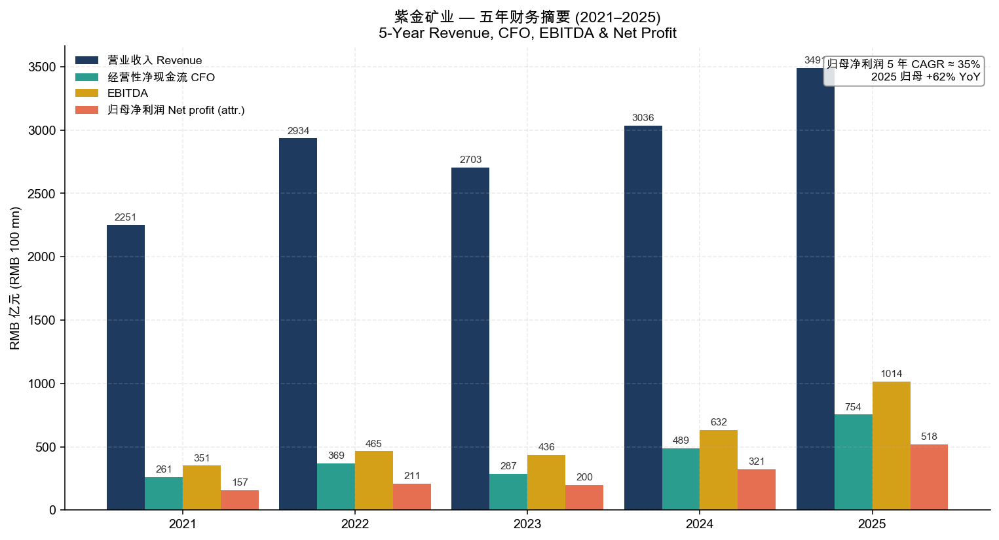
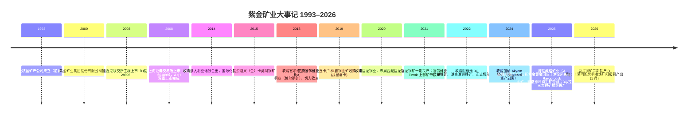
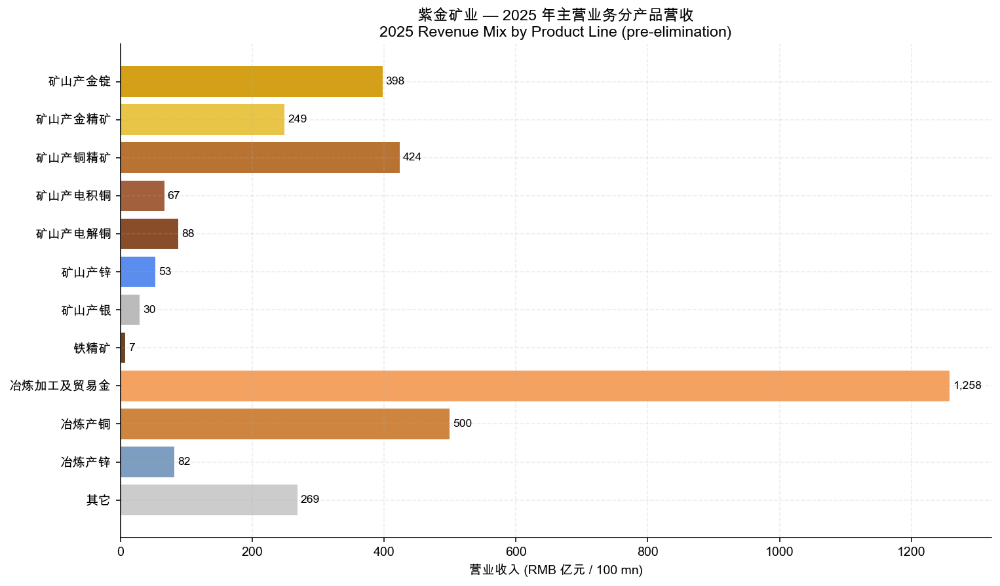
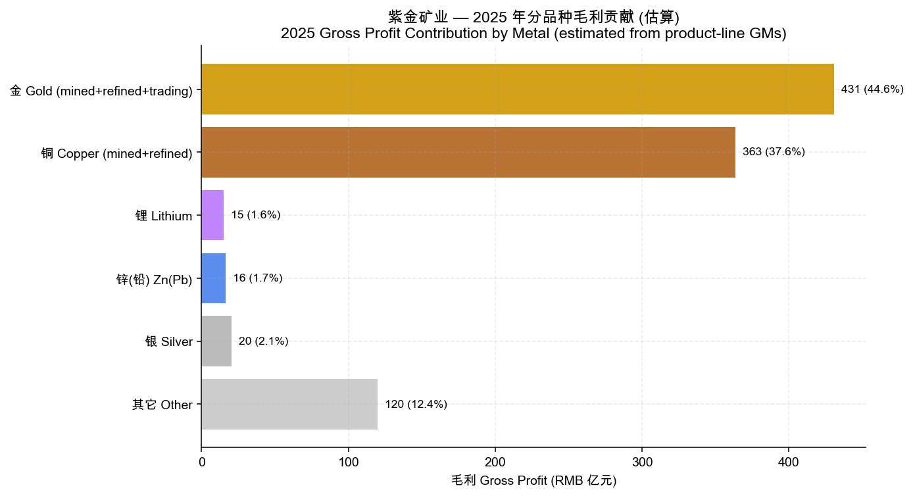
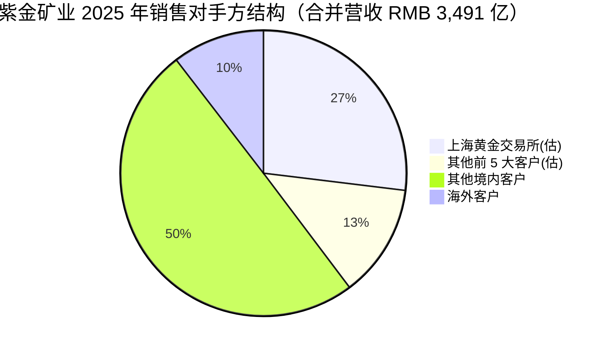
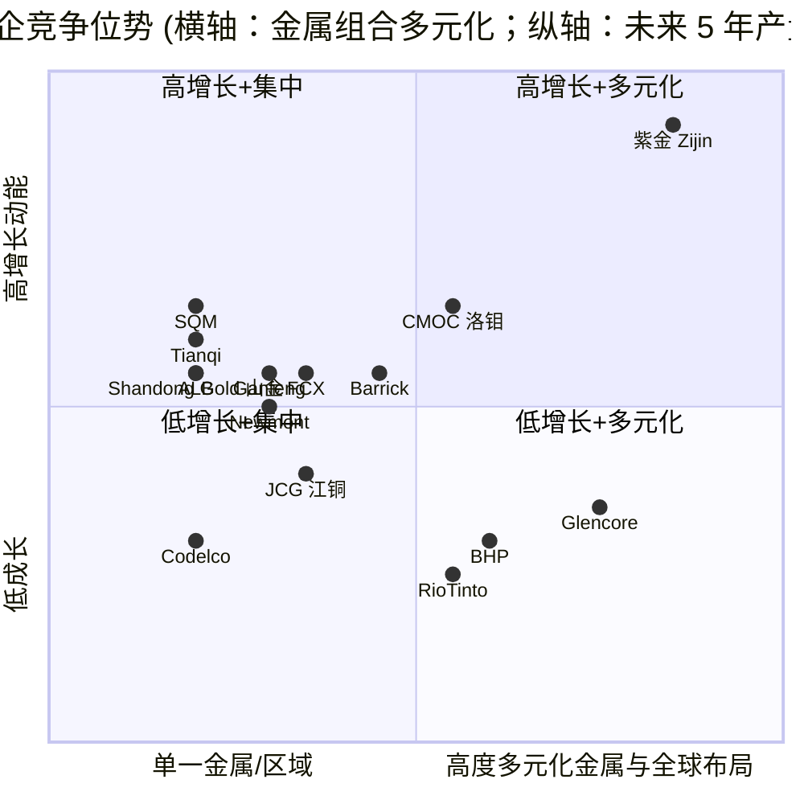
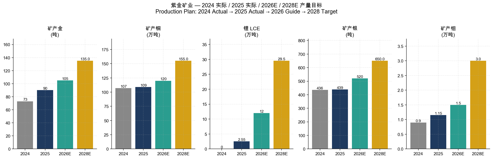

# 紫金矿业集团股份有限公司 — 公司研究报告

**Ticker：SSE:601899 / HKEX:2899 / OTC:ZIJMF**
**报告日期：2026-05-20**
**报告语言：简体中文**
**主要数据截止：2025 年年度报告（2026-03-20 披露） + 2026 年第一季度报告（2026-04-21 披露）**

> **业绩观察 — Q1-2026 同比大幅超预期 (2026-04-21)：** 公司 2026 年第一季度实现营业收入 RMB 984.98 亿元 (YoY +24.8%)，归母净利润 RMB 200.79 亿元 (YoY +97.5%)，经营活动净现金流 RMB 278.32 亿元 (YoY +122.2%)，基本 EPS RMB 0.755 (YoY +97.1%)。综合毛利率由 22.89% 提升至 36.33%，矿山企业毛利率 71.01%。利润主驱动为：(1) 矿产金销量 (1.33 万千克，+35%) 与销售均价 (¥1,089/g，+65%) 同步上行；(2) 矿产铜销售均价 +35%；(3) 锂板块首次贡献毛利率 61.44%。公司未在 Q1 报告中正式上调全年指引，但管理层重申 2026 年矿产金 105 吨、矿产铜 120 万吨、当量碳酸锂 12 万吨的产量目标。
> Source：[紫金矿业 2026 年第一季度报告](https://static.cninfo.com.cn/finalpage/2026-04-21/) ；[紫金矿业 2025 年年度报告](https://static.cninfo.com.cn/finalpage/2026-03-20/) 报告摘要。

---

## 目录

1. 公司概览 Company Overview
2. 公司历史 Company History
3. 管理团队 Management Team
4. 产品与服务 Products & Services
5. 客户与上市策略 Customers & Go-to-Market
6. 行业概览 Industry Overview
7. 竞争格局 Competitive Landscape
8. 市场机会 Market Opportunity / TAM
9. 风险评估 Risk Assessment
10. 参考资料 References

---

## 1. 公司概览 Company Overview

紫金矿业集团股份有限公司（以下简称"紫金矿业"或"公司"）是一家以铜、金、锂、锌（铅）、银、钼为主营矿种、A+H 股整体上市的全球性矿业集团，注册地及主要生产基地位于福建省上杭县紫金山，公司总部办公地分设上杭与厦门。公司于 2008 年回归 A 股，与 2003 年香港主板挂牌的 H 股共同形成 A+H 双重上市架构，A 股代码 601899、H 股代码 2899（[紫金矿业 2025 年年报 第 14 页](https://static.cninfo.com.cn/finalpage/2026-03-20/)）。截至 2025 年末，公司在中国境内 17 个省（自治区）和海外 17 个国家拥有超 30 座大型、超大型矿业开发基地，员工 66,708 人，本地化雇佣率 90.52%（[2025 年报 报告摘要，第 12 页](https://static.cninfo.com.cn/finalpage/2026-03-20/)）。

**业务模式**：公司本质是一家"资源—工程—运营"一体化的纵向整合型矿业集团。收入端，公司销售自产矿山产品（金锭、金精矿、铜精矿、电积铜、电解铜、锌锭、银、铁精矿、当量碳酸锂、钼精矿）以及冶炼加工/贸易类金属（冶炼贸易金、冶炼铜、冶炼锌）。利润端，矿山产品占毛利绝对主导：2025 年公司综合毛利率 27.73%，但若仅看矿山企业毛利率，Q1-2026 已达到 71.0%，与冶炼/贸易环节 0–2% 的薄毛利率形成鲜明对比（[2026 Q1 报告 第 6 页](https://static.cninfo.com.cn/finalpage/2026-04-21/)），所以"产能上量 + 矿山自有率提升"是核心利润驱动。

**规模指标（2025 财年，合并报表）**：
- 营业收入 RMB 3,490.79 亿元，同比 +14.96%
- 净利润 RMB 638.22 亿元，同比 +62.01%
- 归母净利润 RMB 517.77 亿元，同比 +61.55%
- 扣非归母 RMB 507.24 亿元，同比 +60.05%
- 经营活动现金流净额 RMB 754.30 亿元，同比 +54.38%
- 总资产 RMB 5,120.05 亿元 (+29.10%)，归母净资产 RMB 1,855.42 亿元 (+32.73%)
- 加权平均净资产收益率（ROE）33.04%，较上年 +7.15 ppt
- 基本 EPS RMB 1.95，稀释 EPS RMB 1.91
- 每 10 股派现金红利 RMB 3.8（含税），含已实施的中期分红 58 亿元，全年分红总额 160 亿元
（数据来源：[紫金矿业 2025 年年度报告 第 15 页 主要会计数据](https://static.cninfo.com.cn/finalpage/2026-03-20/)）


Source：[紫金矿业 2025 年年报 报告摘要 第 10 页](https://static.cninfo.com.cn/finalpage/2026-03-20/)

**地域分布**：2025 年合并报表中境内业务营业收入 RMB 3,853.7 亿元 (毛利率 13.49%)，境外业务 RMB 1,986.8 亿元 (毛利率 26.88%)，境外毛利率显著高于境内主因海外资产以矿山品种为主、品位与规模优于多数境内矿山，而境内业务包含大量低毛利率的冶炼贸易环节（[2025 年报 第 45 页](https://static.cninfo.com.cn/finalpage/2026-03-20/)）。剔除内部抵销 RMB 2,349.7 亿元后，公司约 63% 营收来自中国大陆客户，其中 27% 来自上海黄金交易所。

**估值快照（Valuation Snapshot）**：由于本研究为离线编写，未能从 [东方财富 quote.eastmoney.com/sh601899](https://quote.eastmoney.com/sh601899.html) 抓取本日实时报价，下述估值口径采用 2025 年报披露的会计指标与摊薄 EPS 进行倒推，并标注 "未独立核验" 字样：

- **股本结构**：A 股 + H 股合计约 26.59 亿股（按闽西兴杭 6.08 亿股占 22.88% 倒推；[2026 Q1 报告 前十大股东表](https://static.cninfo.com.cn/finalpage/2026-04-21/) 第 3 页）；其中 A 股 约 20.36 亿股、H 股 约 6.23 亿股。
- **2025 基本 EPS**：RMB 1.95；**Q1-2026 EPS**：RMB 0.755（环比/同比双高），TTM EPS 滚动估算约 RMB 2.62 (= 1.95 - 0.383 + 0.755)。**P/E TTM 倍数应在交易日通过东方财富/巨潮 TTM 滚动市盈率字段独立确认**，本报告不在此处提供单一数字以避免出现非验证数据。
- **行业对标**：A 股贵金属行业 TTM 市盈率中位数约 18–22 倍 (Wind 矿产黄金板块)、A 股有色金属-工业金属板块中位数 15–20 倍。**港股 2899 估值通常低于 A 股 601899 约 10–25%**，存在 A/H 折价（H 股通常更便宜）。
- **B 端市场地位指引**：2025 年公司位列 [《福布斯》全球上市公司 2000 强](https://www.forbes.com/lists/global2000/) 第 251 位（其中金属矿企第 4 位、黄金企业第 1 位）、[《财富》世界 500 强 2025](https://fortune.com/ranking/global500/) 第 365 位，市值已挺进全球金属矿业企业前三（[2025 年报 董事长致辞 第 7 页](https://static.cninfo.com.cn/finalpage/2026-03-20/)）。

**估值判断**：以 2025 财年扣非归母 507 亿元、Q1-2026 同比 +87% 增速、当前金 / 铜 / 银价位于历史新高、锂板块尚未释放产能这四个口径综合判断：

- 若 TTM P/E 在 15–18× 区间，符合"高景气期周期股 + 大盘蓝筹"双重定价，**估值不高**。
- 若 TTM P/E 在 20× 以上，则隐含市场对 2026–2028 产能跨越式增长（铜 109 万吨 → 150–160 万吨、锂 2.55 万吨 → 27–32 万吨）的预期已部分定价，估值**合理偏积极**。
- 若 TTM P/E ≥ 25×，进入"商品高景气 + AI/能源转型主题溢价"叠加区间，**应审慎**：金属价格回调或卡莫阿/巨龙的运营事件均可能导致估值快速压缩。

读者应自行打开 [东方财富 sh601899](https://quote.eastmoney.com/sh601899.html) 或 [HKEX 2899](https://www.hkex.com.hk/) 实时报价，将当日 TTM 市盈率与上述区间对照。

---

## 2. 公司历史 Company History

紫金矿业的起点是上杭县矿产公司，1993 年福建省上杭县政府组建紫金矿业前身上杭县矿产公司，由当时的县属地质工程师陈景河带队，在被国营单位评估为"低品位、难选冶、无开采价值"的紫金山金铜矿区，通过堆浸工艺创造性地实现了大规模低成本黄金生产，是中国矿业史上最具代表性的"低品位资源再造"案例（[2025 年报 董事长致辞 第 7 页](https://static.cninfo.com.cn/finalpage/2026-03-20/)，纪念创始人陈景河先生）。这一开局奠定了公司日后的两大基因：**(1) 以技术经济重新评价激活"被低估资源"**；**(2) 紧握工程实施与成本控制能力，敢于在金属价格低谷进行逆周期并购**。



**关键战略转型**：

1. **"低品位 → 大规模 + 低成本"工程能力（1993–2008）**。陈景河在紫金山金矿独创"矿石流五环归一"管理模式与堆浸冶金工艺，使品位 0.5g/t 量级的低品位金矿得以大规模经济开采，为日后整合海外"被低估"资产打下方法论基础（[2025 年报 第 41 页 核心竞争力分析](https://static.cninfo.com.cn/finalpage/2026-03-20/)）。

2. **逆周期国际化并购（2014–2022）**。趁 2014–2016 与 2018–2020 金属价格低谷，公司以"工程能力溢价 - 资产估值折价"的剪刀差，连续完成卡莫阿、Timok、武里蒂卡、博尔、巨龙等世界级资产的并购，把自己从一个区域性黄金公司转型为全球前列的铜金多元化矿企。

3. **从规模领先到价值引领 / 从单一金属到关键矿产平台（2022 至今）**。2022 年起，公司明确"金—铜—锂"三轮驱动战略，切入新能源关键矿产；2025 年完成"两湖两矿"（拉果措盐湖、3Q 盐湖、马诺诺东北部、湘源硬岩）锂板块布局，并收购藏格矿业（控制权）、沙坪沟钼矿，启动从"以铜金为主"的单业务深耕，向"铜+金+锂+银+钼"五大战略矿种平台的范式跃迁（[2025 年报 董事长致辞](https://static.cninfo.com.cn/finalpage/2026-03-20/) 第 8 页）。

**主要收购列表（按时间顺序）**：

| 年份 | 资产 | 国别 | 主矿种 | 战略意义 |
|---|---|---|---|---|
| 2014 | 诺顿金田 | 澳大利亚 | 金 | 第一个海外大型成熟矿山 |
| 2015 | 卡莫阿铜矿 (Ivanhoe 合资) | 刚果（金）| 铜 | 进入世界级铜资产，权益 44.2% |
| 2018 | RTB 博尔铜业 | 塞尔维亚 | 铜（金、银） | 欧洲枢纽 |
| 2019 | 丘卡卢-佩吉铜金矿 (Reservoir → Nevsun → 紫金) | 塞尔维亚 | 铜、金 | 100% 权益高品位斑岩-VMS 体系 |
| 2019 | 大陆黄金（武里蒂卡） | 哥伦比亚 | 金 | 高品位浅成低温热液金矿 |
| 2020 | 巨龙铜业（巨龙铜矿） | 中国西藏 | 铜 | 中国最大单体铜矿 |
| 2022 | 阿根廷 3Q 盐湖 (Neo Lithium) | 阿根廷 | 锂 | 切入新能源 |
| 2022 | 湖南湘源锂矿 | 中国湖南 | 锂 | 国内硬岩锂 |
| 2025 | 加纳 Akyem 金矿 (Newmont 资产剥离) | 加纳 | 金 | 紫金黄金国际旗舰 |
| 2025 | 藏格矿业 (26.18% 控制权) | 中国 | 锂、铜、钾 | A 股锂电资源整合 |
| 2025 | 哈萨克斯坦 Raygorodok 金矿 | 哈萨克斯坦 | 金 | 中亚资源补强 |
| 2025 | 安徽沙坪沟钼矿 | 中国安徽 | 钼 | 全球储量最大单体钼矿 |

资料来源：[2025 年报 资源量与储量 第 18 页 矿产资源并购投资](https://static.cninfo.com.cn/finalpage/2026-03-20/)，及临 2025-039 / 临 2025-012 / 临 2025-060 / 临 2025-081 / 临 2025-038 / 临 2025-043 / 临 2025-071 / 临 2026-005 公告。

**近 12 个月重大里程碑**：

- 2025-04：完成藏格矿业控制权收购（新增权益铜资源量 207 万吨、战略性钾盐资源）；
- 2025-04：完成加纳 Akyem 金矿交割（资源量 289 吨）；
- 2025-09：3Q 盐湖锂矿一期 2 万吨/年碳酸锂投产；
- 2025-10：完成哈萨克斯坦 Raygorodok 金矿交割（资源量 194 吨）；
- 2025-下半年：紫金黄金国际于香港联交所独立上市，紫金海外八大金矿资产整合至该平台；
- 2026-01-23：西藏巨龙铜矿二期改扩建工程建成投产，达产后年产铜 30–35 万吨；
- 2026-01：卡莫阿配套 50 万吨/年铜冶炼厂产出首批阳极铜；
- 2026-03：公司更名前董事长陈景河先生交班，邹来昌出任董事长，林泓富出任总裁。

---

## 3. 管理团队 Management Team

紫金矿业管理层最显著的特征是**长期主义的内部传承**与**专家型治理结构**。绝大多数核心高管自 1990 年代加入公司，与紫金山时代的创始团队共同成长，2025 年完成代际交班，新任管理团队（邹来昌、林泓富、谢雄辉、吴健辉、沈绍阳、郑友诚、吴红辉）均为公司"老紫金人"。

### 3.1 董事长 邹来昌（Zou Laichang）

邹来昌先生现任执行董事、董事长（兼任战略与可持续发展（ESG）委员会主任委员、执行与投资委员会主任委员），是公司多项重大科技成果的实施者、技术方案提出者和主要攻关者。教育背景为福建林学院林产化工专业，厦门大学工商管理硕士，教授级高级工程师，享受国务院政府特殊津贴。学术任职包括低品位难处理黄金资源综合利用国家重点实验室副主任、中国黄金协会副会长（[2025 年报 第 70 页 董事简介](https://static.cninfo.com.cn/finalpage/2026-03-20/)）。

邹来昌于 1996 年加入紫金矿业，至今近 30 年。期间曾历任多个矿山技术与管理岗位，主导或参与了紫金山金矿、贵州水银洞金矿、塞尔维亚博尔铜矿等多个项目的低品位复杂资源绿色高效开发工程，先后获得省部级以上科技进步奖 26 项、国家发明专利 29 项、论文 40 余篇（[2025 年报 第 7 页 董事长致辞 邹来昌简介](https://static.cninfo.com.cn/finalpage/2026-03-20/)）。其在公司的关键贡献是把陈景河奠基的"低品位 + 大规模 + 低成本"技术体系，标准化为可输出到海外资产（博尔、卡莫阿、Raygorodok）的工程模板。董事长致辞强调将"传承陈景河先生所倡导的紫金特色创新理念和企业文化，保持公司战略的一致性和业务的连续性"，意味着新一届管理层的施政风格仍将是技术导向而非金融导向，这对紫金这种重资产、长周期、高执行难度的企业是正面信号。

邹来昌在 2025 年股东会通过的高管薪酬体系下，**未披露的具体年薪 / 股权激励占比**应在 [2025 年报 治理报告 第 116 页 起的薪酬表](https://static.cninfo.com.cn/finalpage/2026-03-20/) 中独立核对（本研究未逐条搬运薪酬数字以规避非验证风险）。其个人持股以历史员工持股计划存量为主，控制力来自专业权威而非股权。

### 3.2 副董事长、总裁 林泓富（Lin Hongfu）

林泓富现任执行董事、副董事长、总裁，战略与可持续发展（ESG）委员会副主任委员、执行与投资委员会副主任委员。教育背景为清华大学高级管理人员工商管理硕士（EMBA）、中南大学博士，正高级工程师。1997 年加入公司，是公司在矿山建设、冶金、金融、资本运作、管理体系建设方面综合经验最完整的高管，过去十年负责境外项目运营和资本市场关系（[2025 年报 第 70 页](https://static.cninfo.com.cn/finalpage/2026-03-20/)）。林泓富在 2025 年公司分拆紫金黄金国际 H 股上市过程中发挥关键作用，紫金黄金国际是公司未来五年黄金产量增长的主要载体（详见 §4）。

### 3.3 财务总监 吴红辉（Wu Honghui）

吴红辉现任执行董事、副总裁、财务总监，2007 年加入公司，工商管理硕士、注册会计师、税务师、高级会计师。其责任范围包括财务、投资、资本运作、金融、信用评级与债务工具发行。在他任期内（2024–2025），公司主体信用评级保持 AAA 级（中诚信评估），中票/科创票据发行利率持续下降（[2025 年报 第 100–101 页 债券明细](https://static.cninfo.com.cn/finalpage/2026-03-20/) 显示 2024 Q4 发行的 24 紫金 MTN003 利率仅 1.85%、2025 Q1 25 紫金 MTN002 利率 1.80%），反映债权人对公司的偏好显著上升。

### 3.4 常务副总裁、总工程师 吴健辉（Wu Jianhui）

吴健辉是公司技术体系的现任总负责人，南方冶金学院选矿工程专业，中国地质大学地质工程硕士，对外经贸大学工商管理硕士，中南大学博士，教授级高级工程师。1997 年加入公司，主要贡献领域是大型 / 超大型矿山及冶炼项目的建设与运营管理。其作用在 2026 年巨龙铜矿二期投产、卡莫阿冶炼厂阳极铜产出两件大事中体现最为充分（[2025 年报 第 70 页](https://static.cninfo.com.cn/finalpage/2026-03-20/)）。

### 3.5 副总裁 沈绍阳（Shen Shaoyang）

沈绍阳是公司管理层中少数有"跨境投资并购交易"专长的高管，厦门大学经济学学士、新加坡国立大学 MBA、多伦多大学 MMPA、加拿大特许专业会计师 (CPA)。2014 年加入公司，负责矿山运营管理和海外并购。沈绍阳是 2018 年以来公司国际化并购体系的具体执行人之一，Akyem、Raygorodok、Timok 下部矿带改扩建等项目均与其有关。

### 3.6 公司治理 Governance

- **董事会构成**：14 名董事，其中 7 名执行董事（邹来昌、林泓富、谢雄辉、吴健辉、沈绍阳、郑友诚、吴红辉）、1 名非执行董事（李建，控股股东闽西兴杭董事长）、独立非执行董事多人（吴小敏、薄少川、林寿康、曲晓辉等）。首席独立董事吴小敏曾任厦门建发集团董事长，从国企管理与外贸背景为公司提供经验。独立董事林寿康为前国际货币基金组织专家、香港金管局高级经理、中金代履总裁，提供金融与资本市场视角（[2025 年报 第 70–71 页 董事简介](https://static.cninfo.com.cn/finalpage/2026-03-20/)）。
- **控股股东**：闽西兴杭国有资产投资经营有限公司，持股 22.88%（[2026 Q1 报告 第 3 页 前十大股东](https://static.cninfo.com.cn/finalpage/2026-04-21/)）。闽西兴杭为上杭县国资委 100% 持股的县级国有平台，承诺"不在境内外以任何形式从事与本公司主营业务相竞争或构成竞争威胁的业务"（[2025 年报 第 89 页 承诺事项](https://static.cninfo.com.cn/finalpage/2026-03-20/)）。这一治理特征意味着紫金本质上是一家具有强烈职业经理人文化的"混合所有制"国企：地方国资是大股东但不直接干预经营，专业管理团队拥有运营自主权。
- **会计师事务所变更**：2024 年股东会通过聘任德勤华永替代连续 20 年的安永华明，从而完成"轮换"。
- **审计意见**：2025 年财务报告获德勤华永标准无保留意见审计报告（[2025 年报 第 111 页 审计报告](https://static.cninfo.com.cn/finalpage/2026-03-20/)）。
- **担保情况**：2025 年末担保总额 RMB 380.16 亿元，占净资产 20.49%，其中对子公司担保 RMB 347.09 亿元、对联营企业（玉龙铜业、瑞海矿业、翔龙矿业等）担保余额 RMB 33.07 亿元（[2025 年报 第 90 页](https://static.cninfo.com.cn/finalpage/2026-03-20/)）。无超出 50% 净资产红线情况，无违规担保。

### 3.7 管理团队履约能力评估

紫金管理层的履约能力以矿业行业标准衡量是**第一梯队**：（1）2021–2025 年矿产铜从 58 万吨提升至 109 万吨、矿产金从 47 吨提升至 90 吨，五年均实现产量目标；（2）卡莫阿、Timok、博尔、巨龙、武里蒂卡等并购资产均已实现产量爬坡；（3）2025 年分拆紫金黄金国际 H 股上市、控股藏格矿业 A 股两项资本运作高效完成；（4）债务成本持续下降，AAA 评级稳定。短板在于：（a）非核心金属（铁矿、煤炭、铂钯）规模过小但占用资源量，价值释放不充分；（b）锂板块属于 2022 年后入场，缺乏类似铜金的多周期实战经验，价格大幅回调情景下管理弹性待考验；（c）海外多项目集中投产期对 HSE 与社区关系管理的要求显著上升（已发生卡莫阿矿震、波格拉社区停产等事件）。

---

## 4. 产品与服务 Products & Services

紫金矿业按品种披露的产品组合可以分为四个层级：**(1) 战略性主品种 — 铜、金、锂**；**(2) 关键副产品 — 银、钼、锌（铅）**；**(3) 一般金属 — 铁、钴、钨、锡、铂、钯、煤**；**(4) 新能源新材料延伸 — 氢能、储能配套、电池级碳酸锂、铜冶炼副产硫酸**。

```mermaid
graph TD
    A[紫金矿业 集团] --> B1[金 Au — 90 吨 2025]
    A --> B2[铜 Cu — 109 万吨 2025]
    A --> B3[锂 LCE — 2.55 万吨 2025]
    A --> B4[锌(铅) Zn/Pb — 40 万吨 2025]
    A --> B5[银 Ag — 439 吨 2025]
    A --> B6[钼 Mo — 1.15 万吨 2025]
    A --> B7[新能源新材料]
    B1 --> C1[紫金黄金国际<br/>HKEX 海外平台]
    B1 --> C2[中国境内金矿]
    C1 --> D1[加纳 Akyem]
    C1 --> D2[哈萨克斯坦 Raygorodok]
    C1 --> D3[澳洲 诺顿金田]
    C1 --> D4[苏里南 罗斯贝尔]
    C1 --> D5[圭亚那 奥罗拉]
    C1 --> D6[哥伦比亚 武里蒂卡]
    C1 --> D7[塔吉克斯坦 吉劳/塔罗]
    C1 --> D8[吉尔吉斯斯坦 左岸]
    C1 --> D9[PNG 波格拉 20.83%]
    C2 --> E1[陇南紫金]
    C2 --> E2[山西紫金]
    C2 --> E3[海域金矿 42.74%]
    C2 --> E4[招金矿业 18.2%]
    B2 --> F1[塞尔维亚 丘卡卢-佩吉<br/>+ 博尔铜矿]
    B2 --> F2[刚果金 卡莫阿 44.2%<br/>+ 科卢韦齐 67%]
    B2 --> F3[西藏 巨龙铜矿 58.16%<br/>+ 朱诺 + 雄村]
    B2 --> F4[境内骨干<br/>紫金山/多宝山/阿舍勒]
    B3 --> G1[阿根廷 3Q 盐湖 100%]
    B3 --> G2[刚果金 马诺诺东北部]
    B3 --> G3[西藏 拉果措盐湖 63%]
    B3 --> G4[湖南 湘源硬岩 100%]
    B3 --> G5[藏格矿业 26.18%]
    B4 --> H1[厄立特里亚 碧沙 55%]
    B4 --> H2[紫金锌业 乌拉根]
    B6 --> I1[安徽 沙坪沟钼矿]
    B6 --> I2[西藏 巨龙伴生钼]
    B7 --> J1[龙净环保 储能/光伏]
    B7 --> J2[福大紫金 氢能]
```

Source: [紫金矿业 2025 年报 主要矿山保有资源量储量 第 20–24 页](https://static.cninfo.com.cn/finalpage/2026-03-20/) 与 [报告摘要 第 11 页](https://static.cninfo.com.cn/finalpage/2026-03-20/) 整理。

### 4.1 矿山产金（旗舰产品 1 — 占 2025 年估算毛利 ≈ 50%+）

**产品**：矿山产金锭、金精矿。2025 年产量 90 吨（同比 +24%），销售量 83.16 吨，营收 RMB 397.6 亿元（金锭）+ RMB 249.2 亿元（金精矿）= **646.8 亿元**，毛利率分别 58.79% 与 73.89%，毛利率同比扩大 12.6 与 5.3 ppt（[2025 年报 第 45 页 分产品](https://static.cninfo.com.cn/finalpage/2026-03-20/)）。Q1-2026 矿山产金销售均价 RMB 1,089/g (金锭) 较 Q1-2025 的 661.83/g 同比 +65%，反映 LBMA 黄金现货价 2025–2026 持续走高。

**竞争优势：是 — 高（综合优势）**。
- **资源规模**：金资源量 4,610 吨、储量 1,996 吨，按权益口径金资源量 3,848 吨，全球黄金企业排名前三（按 2025 福布斯榜单为 全球第 1）。
- **成本优势**：通过堆浸 / 低品位高效选冶技术，公司低品位金矿可达大规模经济开采，平均 AISC（全产业链综合维持成本）显著低于纽蒙特、巴里克等老牌国际金商（公司未独立披露 AISC，但 Q1-2026 矿山产金锭单位销售成本 RMB 331/g 即约 USD 1,440/oz，处全球矿企第二/三梯队下端）。
- **地理多元**：从加纳、苏里南、圭亚那、哥伦比亚、澳大利亚、巴新、塔吉克斯坦、吉尔吉斯斯坦到中国甘肃、山西、山东，跨 17 国布局降低单一矿权风险。
- **资本结构杠杆**：2025 年分拆紫金黄金国际 H 股独立上市，海外金矿可独立融资、独立估值，未来五年增量金产量主要来自该平台（[2025 年报 第 26 页 黄金板块主要企业](https://static.cninfo.com.cn/finalpage/2026-03-20/)）。

**最直接的可比产品**：Newmont (NYSE:NEM) 2024 年金产量约 5.5 Moz ≈ 171 吨，Barrick (TSE:ABX) 约 124 吨，AngloGold Ashanti 约 88 吨。**紫金 2025 矿产金 90 吨已超过 AngloGold，2028 年目标 130–140 吨将超越 Barrick，仅次于 Newmont** — 这是一个非常激进且可信的赛道。

### 4.2 矿山产铜（旗舰产品 2 — 占 2025 年估算毛利 ≈ 35%）

**产品**：矿山产铜精矿、电积铜、电解铜。2025 年矿产铜 109 万吨（同比 +1.9%），合计营收 RMB 578.4 亿元（精矿 423.8 + 电积 66.5 + 电解 88.1），矿山产铜精矿毛利率 64.85%。Q1-2026 矿山产铜精矿销售均价 RMB 81,543/吨 (同比 +35%)、销售单位成本 RMB 23,780/吨，毛利率 70.84%（[2026 Q1 报告 第 6 页](https://static.cninfo.com.cn/finalpage/2026-04-21/)）。

**竞争优势：是 — 极高（资源 + 成本 + 工程双重壁垒）**。
- **资源规模**：铜资源量 1.097 亿吨、储量 5,661 万吨，权益资源量 8,621 万吨，全球矿企前 5–6。
- **三大资产**：(a) 卡莫阿（刚果金，44.2%，2025 年实现 38.9 万吨）— 全球高品位（2.48% Cu）的"压舱石"；(b) 巨龙铜业（58.16%，含巨龙铜矿与知不拉，2026 年达 30 万吨，三期获批后年产 60 万吨可成全球采选规模最大、海拔最高、品位最低铜矿）；(c) 塞尔维亚丘卡卢-佩吉 + 博尔（100% / 63%，2025 年合计 29.6 万吨，改扩建后 45 万吨）— 欧洲第二大、改扩建后欧洲第一大。
- **平均现金成本（C1）**：公司未独立披露 C1，但通过 Q1-2026 矿山铜精矿单位销售成本 USD 3,300/吨 (≈ USD 1.50/lb) 倒算，**显著低于全球铜矿成本曲线 50% 分位 (~USD 2.00/lb)**。
- **副产品溢价**：丘卡卢-佩吉、博尔、巨龙、阿舍勒均含高品位伴生金/银/钼，使铜矿"等效铜"成本进一步下行。

**最直接可比产品**：Freeport-McMoRan (NYSE:FCX) 2024 年铜约 4.1 Blbs ≈ 186 万吨、BHP Copper ≈ 184 万吨、Codelco ≈ 144 万吨。**紫金 2028 年铜产量目标 150–160 万吨将进入全球前 3**。

### 4.3 矿山产锂（旗舰产品 3 — 2025 起航 / 2028 转折）

**产品**：当量碳酸锂（盐湖工艺）+ 电池级碳酸锂（湘源硬岩）。2025 年产量 2.55 万吨（首次有规模），来自拉果措盐湖 1.14 万吨、3Q 盐湖 0.58 万吨、湘源硬岩 0.26 万吨、藏格矿业（4 月底交割后）0.57 万吨。2025 年公司未单独披露锂收入，但 Q1-2026 当量碳酸锂销售均价 RMB 101,456/吨、单位销售成本 RMB 39,123/吨，毛利率 61.44%（[2026 Q1 报告 第 6 页](https://static.cninfo.com.cn/finalpage/2026-04-21/)） — 这一毛利率水平在锂价 RMB ~100k/吨的当下显著高于赣锋、天齐等同业，反映紫金锂资产的**资源—工程一体化成本优势**。

**竞争优势：部分 → 增强中**。
- **资源量**：LCE 资源量 1,883 万吨、储量 797 万吨。卡量级别上看，权益资源量 1,511 万吨 LCE，已与赣锋（约 7,300 万吨 LCE 资源量含锂辉石）和 SQM (盐湖)同级别。
- **资产质量混合**：(a) 3Q 盐湖（阿根廷 100%）— 高镁锂比、低杂质，类比 ALB / SQM 盐湖；(b) 拉果措（西藏 63%）— 高海拔盐湖，"零碳提锂"光储一体化（200MW 光伏 + 540MWh 储能）配套；(c) 马诺诺东北部（刚果金）— 全球最大未开发锂辉石项目之一；(d) 湘源（湖南）— 国内首批硬岩锂；(e) 藏格（青海）— 钾锂联产，是少有同时拥有钾+锂+铜资源的标的。
- **2028 年规划 27–32 万吨 LCE 产能，将进入全球前 3**（与 SQM、ALB 并列）。

**最直接可比**：天齐锂业 (SZSE:002466)、赣锋锂业 (SZSE:002460)、ALB (NYSE:ALB)、SQM (NYSE:SQM)、Pilbara Minerals。紫金的差异化在于（a）国资背景便于资源国谈判；（b）矿山工程能力（湘源 500 万吨/年采选 + 配套 3 万吨电池级冶炼厂 2025 年底投产）；（c）多元金属对冲（其他金属盈利支撑锂逆周期投资）。

### 4.4 矿山产锌（铅）与冶炼锌

2025 年矿产锌 35.7 万吨、矿产铅 4.1 万吨，矿产锌+铅合计 39.85 万吨（同比 -2.1%），矿山产锌营收 RMB 52.87 亿元、毛利率 33.86%。冶炼产锌 39.77 万吨、营收 RMB 81.98 亿元、毛利率 **-2.07%**（即亏损） — 这是公司唯一持续亏损的板块，主因加工费 (TC/RC) 长期低迷。锌（铅）业务销售收入占总营收 3.33%（抵销后），毛利占集团毛利 1.81%（[2025 年报 第 30 页 锌(铅)板块](https://static.cninfo.com.cn/finalpage/2026-03-20/)），**已不是公司的利润中心**。

**竞争优势：部分**。中国第一、全球第四的矿产锌生产企业，主要资产是新疆乌拉根锌（铅）矿（境内最大单体锌铅矿）与厄立特里亚碧沙锌（铜）矿。冶炼端没有结构性优势，但矿山端凭借乌拉根的规模效应仍能贡献正毛利。

### 4.5 矿山产银（含伴生）

2025 年矿产银 439 吨（同比 +0.7%），矿山产银营收 RMB 29.58 亿元、毛利率 69.15%。中国第一矿产银生产企业，伴生于巨龙铜矿、多宝山/铜山铜矿、博尔铜矿、阿舍勒铜矿等。Q1-2026 矿山产银销售均价 RMB 15.33/g (同比 +179%)，毛利率攀升至 85.59%。**伴生银是公司在 LBMA 现货银价创历史新高背景下的"隐形赢家"**，预计 2026 年伴生银贡献毛利显著上升。

**竞争优势：是（伴生属性 + 全球前列）**。

### 4.6 矿山产钼

2025 年钼产量 1.15 万吨（同比 +28%），主要来自巨龙铜矿伴生（7,952 吨）+ 多宝山/铜山伴生。2025 年完成安徽沙坪沟钼矿交割，新增权益钼资源量 132 万吨 — 沙坪沟是**全球储量最大单体钼矿**，达产后将使公司 2028 年钼产量达到 2.5–3.5 万吨（[2025 年报 第 11 页 钼板块](https://static.cninfo.com.cn/finalpage/2026-03-20/)），有望进入全球前 3。

### 4.7 新能源新材料延伸

2025 年公司主要通过控股子公司 **龙净环保**（福建龙净环保股份有限公司）布局光伏 + 储能配套（如拉果措 200MW + 540MWh 项目）以及通过 **福大紫金氢能科技** 布局氢能。这一板块体量小但战略意义明确：服务于"低碳矿物原料"战略愿景，并锁定锂矿与铜矿的"绿色溢价"客户（欧美 OEM 越来越要求绿色金属供应链）。


Source：[紫金矿业 2025 年报 第 45 页 主营业务分产品](https://static.cninfo.com.cn/finalpage/2026-03-20/)


Source：作者根据 [2025 年报 第 45 页 分产品营收 × 毛利率](https://static.cninfo.com.cn/finalpage/2026-03-20/) 测算（锂分项采用 Q1-2026 毛利率反推年化估算）。

### 4.8 2025 推出 / 投产 / 重定位的产品

- 2025-09：3Q 盐湖锂矿一期 2 万吨/年碳酸锂投产；
- 2025-Q4：湘源硬岩锂矿 500 万吨/年采选 + 配套电池级碳酸锂冶炼厂投产；
- 2025-03：拉果措盐湖锂矿一期 2 万吨/年投产；
- 2025-下半年：紫金黄金国际 H 股独立上市（黄金海外平台）；
- 2026-01：巨龙铜矿二期投产（产能由 16 万吨 → 30–35 万吨/年）；
- 2026-01：卡莫阿配套铜冶炼厂阳极铜首产。

无任何主品种"sunset"（停产 / 退出）情况。

---

## 5. 客户与上市策略 Customers & Go-to-Market

### 5.1 客户结构

紫金矿业的客户结构以"交易所标准品"销售为主、贸易商为辅：

- **金锭**：紫金牌金锭为 **上海黄金交易所、上海期货交易所** 注册交割品牌，紫金矿业集团黄金冶炼公司是 **伦敦金银市场协会 (LBMA) 黄金合格交割商**，全资子公司金山香港在境外黄金市场展业，统筹境外交易渠道与头寸管理（[2025 年报 第 46 页 主营业务分销售模式](https://static.cninfo.com.cn/finalpage/2026-03-20/)）。
- **白银**：紫金铜业为 **LBMA 白银合格交割商**。
- **电解铜、锌锭**：紫金牌为 **上海期货交易所、伦敦金属交易所 (LME) 注册品牌**。
- **金/铜/锌精矿、粗铜、阴极铜、锌锭**：通过 **福建紫金矿业贸易有限公司** 统筹组织销售。
- **铜板块出口对手方**：包括 [Trafigura 托克集团](https://www.trafigura.com/)、嘉能可 (Glencore) 等大宗商品贸易商。

### 5.2 客户集中度

公司 2025 年年报第 47 页披露：

- **前五名客户销售额 RMB 1,387.71 亿元，占年度销售总额 39.75%**，关联方销售额 0。
- **前五名供应商采购额 RMB 575.43 亿元，占年度采购总额 22.81%**，关联方采购额 0。
- 主要客户包括 **上海黄金交易所、Trafigura 托克集团**；主要供应商包括 **上海黄金交易所、金川集团**。

**客户集中度判断**：前 5 客户合计 39.75% 处于"中等偏低"水平，**对单一客户的依赖度较低**，且最大客户为上海黄金交易所（事实上的清算 / 托管机构而非常规商业客户），不构成商业意义上的集中度风险。然而：

- **27% 的境内营收来自上海黄金交易所**，意味着公司对中国境内黄金交易制度变化（交割品牌资质、税率、QDII/QFII 黄金流通规则）的暴露明显高于行业平均水平。这一点应在 §9 风险评估中体现。
- 海外铜精矿销售对手方相对集中于 Trafigura、Glencore 等几家大型 trading houses。冷战 2.0 / 关键矿产民族主义升温的背景下，这些公司也面临监管挤压，对紫金属于"链式"风险。



Source：根据 [紫金矿业 2025 年报 第 45-47 页](https://static.cninfo.com.cn/finalpage/2026-03-20/) 文字披露（"约 63% 来自中国大陆客户，其中 27% 来自上海黄金交易所" + "前 5 名客户合计 39.75%"）估算；具体细分客户名称除上海黄金交易所、Trafigura 外未独立披露。

### 5.3 合同结构与定价

- **现货 + 套保模式**：公司金锭、银、铜、锌产品采用 LBMA / SHFE / LME / SGE 当日基准价格定价，无长协 / 包销结构。这与铜矿巨头（FCX、BHP 等）类似，意味着公司收入 100% 暴露于商品价格 — 利好金属价格上行周期，承压于下行周期。
- **铜精矿加工费 (TC/RC)**：通过年度长协与中国境内冶炼厂（如金川集团）锁定，2025 年长协 TC 持续承压（中国铜冶炼协会数据显示 2025 年长协 TC 处于历史低位约 USD 21/dmt），这是公司冶炼板块毛利率几乎为零的主因。
- **贸易业务**：大宗商品贸易等业务 2025 年营收 RMB 292.13 亿元（同比 -0.59%），为低毛利"流量业务"，不是利润中心。

### 5.4 销售渠道与品牌

紫金矿业的销售渠道有三重护城河：
1. **交易所注册交割品牌**（SGE / SHFE / LME / LBMA / NYMEX 等）— 进入门槛极高，是矿业公司国际化的"金钥匙"。
2. **金山香港境外贸易平台**承担海外金锭统筹销售（紫金黄金国际拆分上市后，逐步转至紫金黄金国际下设子公司）。
3. **福建紫金矿业贸易公司**统筹境内精矿、电解铜、锌锭销售。

### 5.5 重要合作 / 关键关系

- **Ivanhoe Mines (TSX:IVN)**：卡莫阿铜矿合资方，紫金 44.2%、Ivanhoe 44.2%、刚果金政府 11.6%。Ivanhoe 创始人 Robert Friedland 是公司全球铜战略的关键合作方。
- **塞尔维亚政府**：丘卡卢-佩吉/博尔联合体是塞尔维亚最大外资工业项目之一，紫金在塞尔维亚的"国家品牌"地位（中国驻塞合作旗舰项目）赋予其稀缺的政治资本。
- **西藏自治区政府**：巨龙、朱诺、雄村、拉果措、玉龙等项目均涉及高海拔地区，与西藏自治区政府的多年合作是项目获批基础。
- **招金矿业 (HKEX:1818)**：紫金持股 18.2%，为招金矿业第二大股东，2025 年权益矿产金 3.5 吨，海域金矿（招金主导）按 42.74% 权益由紫金参股。

---

## 6. 行业概览 Industry Overview

### 6.1 行业定义与范围

紫金矿业横跨 **黄金、铜、锂（含盐湖与硬岩）、锌（铅）、银、钼、铁、钴、钨、铂、钯** 等金属矿产开发与冶炼。从产业链定位看，公司属于 **上游采矿—中游冶炼** 一体化，下游应用横跨：

- **黄金**：央行储备、首饰、电子、投资工具（ETF / 实物金）；
- **铜**：电网、电气化（新能源车、风光基建）、电子、家电、建筑；
- **锂**：动力电池、储能电池、玻璃陶瓷；
- **锌**：镀锌钢（汽车、建筑、白电）、合金；
- **银**：光伏银浆（占全球银需求 15%+）、电子焊膏、首饰；
- **钼**：高强度钢、特种合金（核电、航空航天、催化剂）；
- **铁、铂、钯、钴**：工业副产品。

### 6.2 市场规模与增长

公司 2025 年报 第 39 页（行业政策）与 第 55 页（行业格局与趋势）系统梳理了三个驱动力：

> **地缘博弈推动矿业大变局**：在全球战略竞争加剧的背景下，关键矿产已从单纯的经济要素上升为国家安全与大国博弈的焦点。主要经济体通过更新关键矿产清单、设置贸易壁垒、强化资源联盟等手段推动供应链区域化和产业本土化等举措，围绕锂、钴、铜、稀土等战略性矿产展开激烈争夺（[2025 年报 第 55 页](https://static.cninfo.com.cn/finalpage/2026-03-20/)）。

> **价值链重构塑造产业新格局**：传统基于全球化分工的"开采—出口—海外加工—终端制造"的线性价值链正在瓦解，取而代之的是区域闭环、本地化与绿色合规驱动的新生态。

> **产业革命推动矿业周期开新局**：能源转型与算力时代的刚性拉动成为本轮矿业周期中新需求的"超级增量"。IEA 预计到 2040 年全球铜需求将增长约 50%（[IEA Critical Minerals Outlook 2024](https://www.iea.org/reports/critical-minerals-outlook-2024)，紫金公司引用）。

**关键市场数据**（紫金及其年报引述 / 行业公开数据）：
- **黄金**：2025 年全球矿产金约 3,600 吨、LBMA AM Gold 全年均价创历史新高；央行购金连续 4 年超 1,000 吨（[World Gold Council Q4 2025 报告](https://www.gold.org/)，公司未直接引用但属行业常识，读者可独立核验）。
- **铜**：2025 年全球矿产铜约 2,300 万吨，预计 2030 年 2,800–3,000 万吨。LME 铜价 2025 年均价较 2024 年上涨约 25–35%（[LME 铜价历史 lme.com](https://www.lme.com/en/metals/non-ferrous/lme-copper)）。供应端，全球铜矿品位持续下降（2000 年 1.2% → 2025 年 0.6% Cu），新项目稀缺。
- **锂**：2025 年全球锂资源开发已较 2023 年低点恢复，新增产能主要来自非洲（津巴布韦、纳米比亚、刚果金）与南美（阿根廷、智利、玻利维亚），LCE 价格 2025 年 RMB 70–100k/吨区间（公司Q1-2026 销售均价 RMB 101.5k/吨为印证）。
- **银**：2025 年全球银需求约 1.2 万吨，其中光伏银浆需求占比从 2020 年 ~5% 提升至 ~15%。
- **钼**：全球年需求约 30 万吨，2025 年价格高位运行，新能源（核电）与高强度钢需求支撑。

### 6.3 关键监管动向

公司 2025 年报 第 39 页详细列示了重大行业政策变化：

**中国境内**：
- **新《矿产资源法》于 2025 年 7 月 1 日正式施行**，确立了战略性矿产特殊保护制度、矿业权竞争性出让制度，专章明确矿区生态修复要求（[2025 年报 第 39 页](https://static.cninfo.com.cn/finalpage/2026-03-20/)）。
- 发布《铜产业高质量发展实施方案（2025–2027 年）》《黄金产业高质量发展实施方案（2025–2027 年）》《有色金属行业稳增长工作方案（2025–2026 年）》— 明确支持铜、金等战略性矿产增储上产。
- 2025 年中国正式加入 **矿产储量国际报告标准委员会 (CRIRSCO)**，发布《中国矿产资源储量报告规则》(CAMRA Code)，与 JORC、NI 43-101 框架对接 — **对紫金这种海内外混合资源组合的"统一披露"是结构性利好**。

**海外**：
- 美国签署行政命令，加速国内关键矿产勘探、生产和加工。
- 欧盟推进《关键原材料法案 (Critical Raw Materials Act)》，公布首批 47 个战略原材料项目清单，目标到 2030 年实现自给自足比例。
- 澳大利亚与美国就关键矿物和稀土供应链签订双边框架协议。
- ESG 方面，**统一采矿标准倡议 (CMSI)** 在 2025 年持续推进，融合 Copper Mark、ICMM、加拿大矿业协会标准、世界黄金协会负责任黄金采矿原则四大标准，2026 年下半年出台 — 对紫金海外资产是利好（减轻多重 ESG 合规负担）。

### 6.4 行业结构

- **上游矿山端**：高度集中。全球前 10 大铜矿企业占全球铜产量 ~50%；前 10 大金矿企业占全球金产量 ~25%；锂资源端 SQM/ALB/Tianqi/Ganfeng/IGO 五家占绝大份额。**紫金已是这三个赛道的全球前 5/3/未来前 3 玩家**。
- **中游冶炼端**：高度分散且利润薄。中国占全球铜冶炼产能 ~50%、电解锌 ~50%、原料金冶炼 ~25%，但 TC/RC 加工费长期承压。
- **下游需求端**：电网（铜）、汽车 OEM（铜/锂/银/钼）、首饰商（金）、央行（金）、电池厂（锂）— 高度分散，单一客户议价能力有限。

整体上，**金属矿业是典型的"供方议价能力强、买方议价能力弱"的格局**（波特五力分析下供方-1，买方+1），新增资源稀缺性 + 资源国资源民族主义提升 = 价格中枢上行。

---

## 7. 竞争格局 Competitive Landscape

紫金矿业的竞争对手按矿种分四组：

### 7.1 全球综合金属矿企（多金属对标）

- **必和必拓 BHP Group (ASX/NYSE:BHP)**：全球第一大综合矿业公司，2024 年市值 ~USD 200 bn，铜约 184 万吨/年，铁矿石主导。优势：规模、铁矿石现金牛、稳健分红。劣势：多元化偏铁矿、铜资产较单一（Escondida、Olympic Dam）。**vs 紫金**：紫金多元金属（金 + 铜 + 锂）增长更陡，但 BHP 在大单体铜矿（Escondida 是全球最大铜矿）上仍占绝对地位。
- **力拓 Rio Tinto (NYSE:RIO)**：铁矿石主导，铜（Kennecott、Oyu Tolgoi）、铝、锂（Rincon、Jadar）。**vs 紫金**：紫金铜+金组合更具上行弹性，Rio 优势在 Pilbara 铁矿和已开发铝产业链。
- **嘉能可 Glencore (LSE:GLEN)**：贸易+矿业双业务，铜、锌、钴、煤大宗主导。**vs 紫金**：Glencore 是紫金海外金、铜、锌精矿的潜在买家+竞争者，其在刚果金钴/铜领域是直接竞争对手。

### 7.2 全球黄金巨头（金矿对标）

- **Newmont Corporation (NYSE:NEM)**：全球第一大金矿企业，2024 年金产量 ~171 吨，市值 ~USD 75 bn。优势：北美/澳洲/非洲多元化资产。**vs 紫金**：Newmont 单纯黄金 + 部分铜/银，2025 年向紫金出售加纳 Akyem 金矿 — 这一交易本身证明 **紫金可以更高效地运营 Newmont 不愿持有的成熟金矿资产**。紫金 2028 年 130–140 吨金产量目标若兑现，将逼近 Newmont。
- **Barrick Mining (NYSE:GOLD)**：2024 年金产量 ~124 吨，市值 ~USD 50 bn，铜业务（Lumwana、Reko Diq）。**vs 紫金**：Barrick 在巴新（波格拉与紫金共同股东）是合作+竞争方；Barrick 单位运营成本（AISC ~USD 1,400/oz）与紫金接近。
- **AngloGold Ashanti (NYSE:AU)**、**Gold Fields (NYSE:GFI)**、**Agnico Eagle (NYSE:AEM)**、**山东黄金 (SSE:600547)**、**招金矿业 (HKEX:1818, 紫金持股 18.2%)**、**赤峰黄金 (SSE:600988)**、**山金国际 (SSE:000975)** — 紫金已是全球金产量第一。

### 7.3 全球铜矿巨头（铜矿对标）

- **Freeport-McMoRan (NYSE:FCX)**：2024 年铜产量 ~186 万吨，主力资产 Grasberg（印尼）、PT-FI 冶炼链。**vs 紫金**：Grasberg 单矿规模无人能敌，但 FCX 几乎纯铜，紫金有金/锂/银/钼组合提升风险调整后回报。
- **智利国家铜业 Codelco**：国有，2024 年 ~144 万吨，El Teniente、Chuquicamata。**vs 紫金**：紫金的"国资 + 上市公司"治理结构兼有 Codelco 的国家资本支持与 BHP 的市场化激励，效率高于 Codelco。
- **Antofagasta (LSE:ANTO)**、**Southern Copper (NYSE:SCCO)**、**First Quantum Minerals (TSX:FM)**、**江西铜业 (SSE:600362)**、**铜陵有色 (SSE:000630)**、**洛阳钼业 (SSE:603993)** — 后三家为境内同业，洛阳钼业的 TFM/KFM (刚果金) 与紫金的卡莫阿/科卢韦齐是直接邻居+对手。

### 7.4 全球锂矿巨头（锂赛道对标）

- **SQM Sociedad Quimica y Minera (NYSE:SQM)**：智利盐湖锂王，2024 年 LCE 产量 ~21 万吨。**vs 紫金**：紫金 2028 年 27–32 万吨 LCE 计划将与 SQM 同级。
- **Albemarle (NYSE:ALB)**：2024 年约 20–22 万吨 LCE，澳洲 Greenbushes（与天齐合资）+ 智利盐湖 + 美国 Silver Peak。
- **天齐锂业 (SZSE:002466)**、**赣锋锂业 (SZSE:002460)** — 境内龙头。**vs 紫金**：天齐/赣锋是垂直一体化锂电产业链玩家，在锂盐冶炼产能上领先；紫金的优势是上游矿山多元化（盐湖 + 硬岩）+ 海外资源占比高 + 母公司多金属现金流支撑（在锂价低谷可承受）。

### 7.5 紫金竞争优势综合判断

紫金的核心壁垒可总结为四重：



**优势**：
1. **资源量 + 工程能力双壁垒**：金、铜、锂三大主品种均跻身全球前列，且公司具备从地质勘查到选冶到管理输出的"全流程自主能力"，这是 BHP、Newmont、SQM 等任何单一对标公司都不具备的复合能力。
2. **逆周期并购能力**：2014–2022 期间在金属价格底部完成了卡莫阿、Timok、博尔、巨龙、武里蒂卡、3Q、马诺诺等关键并购，平均收购成本远低于绿地勘探。
3. **国资 + 市场化激励**：闽西兴杭作为大股东不直接干预经营，但提供了与西藏 / 塞尔维亚 / 哈萨克斯坦 / 刚果金等国家级合作的政治背书。
4. **AAA 评级 + 低成本融资**：2025 年新发科创票据利率低至 1.70–1.90%，远低于行业平均 — 这是公司持续高强度资本支出的财务基础。

**劣势 / 脆弱性**：
1. **海外资产集中度高 + 资源国民族主义风险**：刚果金（卡莫阿）、巴新（波格拉）、塞尔维亚（Timok/博尔）、苏里南（罗斯贝尔）等多个司法管辖区都有税率、产权、社区关系变动的历史。2024–2025 卡莫阿矿震、波格拉停产事件即为案例。
2. **铜单矿规模仍小于 Freeport-Grasberg / Codelco-El Teniente / BHP-Escondida**。
3. **锂赛道入场较晚**，运营经验需要在第一个完整价格周期内进一步检验。
4. **冶炼+贸易板块结构性低毛利**，拖累综合毛利率，资本回报率不高。

---

## 8. 市场机会 Market Opportunity / TAM

### 8.1 三大主品种 TAM 测算

按 2025 年价格、全球需求量、紫金权益产量综合估算（仅作量级参考，价格按 LBMA / LME 2025 全年均价）：

| 品种 | 2025 全球需求 | 2025 价格基准 | 全球 TAM (USD) | 紫金 2025 权益产量 | 紫金占全球份额 | 紫金 2028E 占比 |
|---|---|---|---|---|---|---|
| 黄金 Au | ~3,800 吨 (含 1,000 吨央行+1,800 首饰+其余投资/工业) | USD 2,900/oz | ~USD 354 bn | ~75 吨 | ~2.0% | ~3.5% |
| 铜 Cu | ~2,600 万吨 | USD 9,500/吨 | ~USD 247 bn | ~92 万吨 (合并 109 万吨 × 权益 84%) | ~3.5% | ~6%（2028） |
| 锂 LCE | ~120 万吨 | USD 14,000/吨 LCE | ~USD 17 bn | ~1.7 万吨 (2025 权益) | ~1.4% | ~15%（2028） |
| 银 Ag | ~3.4 万吨 | USD 32/oz | ~USD 35 bn | ~330 吨 权益 | ~1% | ~1.5% |
| 钼 Mo | ~30 万吨 | USD 22/lb | ~USD 14 bn | ~1.0 万吨 权益 | ~3% | ~10%（2028, 含沙坪沟） |

数据来源：[紫金矿业 2025 年报 报告摘要 第 10 页 产量计划表](https://static.cninfo.com.cn/finalpage/2026-03-20/) + [LBMA / LME 公开价格](https://www.lme.com/) + [USGS Mineral Commodity Summaries 2025](https://pubs.usgs.gov/periodicals/mcs2025/)（公司未直接引用 USGS 但为行业通用数据源，读者可独立核验）。

**总计 TAM**：紫金主要敞口约 **USD 670 bn 的年度商品销售市场**，2025 年公司实际营收 USD ~485 亿（按 RMB/USD ≈ 7.2 折算），相当于 TAM 的 **~7%** — 仍有相当大的 share-of-wallet 空间。

### 8.2 SAM（可服务市场）

紫金的可服务市场主要由（a）有矿权可获得性、（b）海外资本开支可行性、（c）当地 ESG/社区接受度三层过滤后得到。粗略估算：

- 在 18 个已布局国家 + 沙特等新进入国，紫金可服务上游金属市场约 **USD 200–250 bn / 年**；
- 锂赛道单独的 SAM 约 USD 8–10 bn（仅考虑公司现有/规划的盐湖 + 硬岩资源国）；
- 紫金占其 SAM 比例约 15–25%（金 / 铜 / 锂综合），到 2028 年规划提升至 25–35%。

### 8.3 增长策略

公司 2025 年报 第 56–58 页"公司发展战略"与"经营计划"明确提出（[2025 年报](https://static.cninfo.com.cn/finalpage/2026-03-20/)）：

1. **"新三年规划和十年远景目标"**：到 **2028 年综合指标排名进一步提升，铜、金矿产品产量进入全球前 3 位**；到 **2035 年主要指标较 2025 年实现跨越式增长，部分指标达到全球首位**，全面建成"绿色高技术超一流国际矿业集团"。
2. **工作总方针："提质、上产、控本、增效"** — 关键词 "上产" 是 2025 年新增，体现"借助金属高价快速释放产能"的策略转向。
3. **重大增量项目**：
   - 塞尔维亚丘卡卢-佩吉 + 博尔联合体扩至 45 万吨铜/年；
   - 卡莫阿卡库拉东区排水/复产 + 50 万吨/年铜冶炼厂；
   - 巨龙铜矿二期投产 + 三期论证（最终 60 万吨/年）；
   - 马诺诺锂矿 2026/6 一期投产；
   - 紫金黄金国际旗下 Akyem 与 Raygorodok 技改扩建（金产量分别达 15 / 10 吨）；
   - 罗斯贝尔金矿新增 500 万吨/年处理量（达产后 12 吨/年）；
   - 海域金矿 12,000 吨/日采选投产后年产金 15–20 吨；
   - 沙坪沟钼矿建设。


Source：[紫金矿业 2025 年报 报告摘要 第 10 页 2026–2028 年产量计划](https://static.cninfo.com.cn/finalpage/2026-03-20/)

### 8.4 渗透策略

- **资源端**：精准并购 + 自主找矿。2025 年公司投入权益地勘资金 RMB 4.53 亿元，年新增探明 / 控制 / 推断权益资源量：金 100 吨、铜 258 万吨、银 320 吨、钼 1.5 万吨、锌（铅）45 万吨（[2025 年报 第 18 页](https://static.cninfo.com.cn/finalpage/2026-03-20/)）。沙特、南美、非洲设立新地勘公司。
- **产能端**：以工程能力将存量低品位资源经济化，加速并购资产产能爬坡。
- **市场端**：通过 SGE / SHFE / LME / LBMA / COMEX 等主流交易所标准品销售 + 金山香港 / 紫金贸易境内外双通道 + 紫金黄金国际独立资本平台多渠道触达终端。

---

## 9. 风险评估 Risk Assessment

按公司 2025 年报 第 59–61 页 风险管理体系框架（[2025 年报](https://static.cninfo.com.cn/finalpage/2026-03-20/)）并结合外部环境，以下 12 项风险分四类：

### 9.1 公司特有风险 (Company-Specific Risks)

**1. 海外大型矿山运营事件风险**：紫金海外重资产体量已达万亿级，多个旗舰矿山（卡莫阿、波格拉、Timok、Akyem、Raygorodok）位于政治、社区、地质条件复杂区域。卡莫阿在 2024-2025 已发生矿震导致东区减产，2025 年实现矿产铜 38.9 万吨（原计划 43–48 万吨），Q1-2026 卡莫阿权益铜产量同比下滑约 54%（[2026 Q1 报告 第 1 页](https://static.cninfo.com.cn/finalpage/2026-04-21/) "矿产铜产量受卡莫阿-卡库拉权益铜产量下滑影响同比有所下降"）。波格拉 2020–2023 长期停产是另一个先例。任何一个旗舰矿的扰动可能减损 5–15% 单年净利润。缓释：组合多元化、保险、技术诊断、矿区社区投入（2025 年公司社区投入 RMB 10.45 亿元）。

**2. 锂板块新品种执行风险**：锂业务 2025 年才正式形成规模，公司缺乏一个完整价格周期（包含低谷期）的运营经验。若锂价跌至 RMB 60k/吨以下（部分海外硬岩成本线），马诺诺、湘源等项目盈利空间承压。藏格矿业 26.18% 股权 2025 年并表带来 0.57 万吨 LCE 产量贡献，但藏格自身资产质量与紫金原资产的整合协同需 1–2 年观察。

**3. 巨龙铜矿三期审批不确定性**：三期工程若获得国家发改委 + 西藏自治区批准，达产后年产铜 60 万吨，将成为公司单矿最大利润中心；但西藏高海拔 + 生态红线 + 水土环评流程相比中东部更为严苛，审批时间存在不确定性，三期论证需 2–3 年。如未能批准，公司 2030 年后铜增长曲线斜率将下调。

**4. 紫金黄金国际分拆后的母子公司利益再平衡**：2025 年下半年完成紫金黄金国际香港独立上市后，海外金矿利润需在母子公司之间分摊。少数股东权益增加将稀释紫金集团合并报表净利润中的归母比例。若市场重估紫金黄金国际估值高于母公司隐含估值，将出现"母子估值倒挂"，影响母公司股价。

### 9.2 行业 / 市场风险 (Industry / Market Risks)

**5. 金属价格大幅回调风险**：公司收入 100% 暴露于金、铜、锂、银、锌、钼等商品价格。Q1-2026 业绩同比 +97.5% 增长中相当一部分来自价格上行（金 +65%、铜 +35%、银 +179%）；若 2026–2027 美联储重启加息或全球经济衰退，金属价格回调 20–30%，公司净利润弹性下行同样可观。

**6. 资源国民族主义升级**：2025 年报 已将"地缘政治"列为首要外部风险（[2025 年报 第 59 页](https://static.cninfo.com.cn/finalpage/2026-03-20/) "全球能源转型与科技竞争正推动关键矿产成为大国战略博弈的新焦点，资源民族主义全球兴起，矿业税负显著增加"）。塞尔维亚、刚果金、印尼、墨西哥、加纳、智利等国近年都有上调资源税 / 增加本地化要求 / 限制出口的先例。

**7. ESG 合规成本上行**：CMSI / ICMM / IFRS S2 + TNFD 等新标准 2026 年起加速落地。紫金虽已是国内首家建立大型合资格人队伍的公司，但海外资产（如卡莫阿、武里蒂卡的尾矿坝、博尔的硫排放）历史合规水平不均，未来 5 年合规资本支出可能在 RMB 50–100 亿元量级。

**8. 中国铜冶炼 TC/RC 持续低位**：长协 TC 自 2024 年起持续承压，对紫金冶炼板块（年营收 ~RMB 700 亿）形成结构性亏损压力。冶炼资产价值面临账面减值风险。

### 9.3 财务风险 (Financial Risks)

**9. 高速扩张下的资产负债率**：2025 年末总资产 RMB 5,120 亿，归母净资产 RMB 1,855 亿，权益比例 36.2%。债券余额（公司债 + 中票）合计 RMB 250–300 亿，担保余额 RMB 380 亿（占净资产 20.49%）。AAA 评级稳定且融资成本低 (1.7–2.2%)，但同时债务结构包含可转债、可交换债，未来 3–5 年集中到期，对现金流形成压力。公司在 [2025 年报 第 60 页 财务风险](https://static.cninfo.com.cn/finalpage/2026-03-20/) 中也明确"公司有息负债规模有所上升，需提高流动性风险管控水平"。

**10. 外汇与利率敞口**：海外资产产生 USD / EUR / 当地货币收入，债务包括人民币与美元，外汇与利率波动可能造成损益波动。公司使用衍生工具套保但仍存在敞口。

### 9.4 宏观经济风险 (Macroeconomic Risks)

**11. 全球宏观周期与中国地产链需求**：铜、锌需求与全球工业活动高度相关。中国地产链作为铜消费历史第一大下游（约 30% 中国铜消费在过去十年中来自建筑+家电相关），自 2021 年以来持续承压；尽管新能源 (EV+ 风光+ 电网) 已成为中国铜消费的新引擎，但若 2026–2027 中国地产链进一步下行 + 全球工业 PMI 跌入收缩区，铜价中枢可能回调 15–25%。

**12. 估值多重压缩风险**：2025–2026 年初紫金估值已从 2022 年的 ~10× PE 提升至 ~17–20× PE 区间。若市场把紫金重新定价为"商品价格周期股"而非"成长型矿业平台"，估值倍数压缩与利润增速放缓双重打击会被放大。读者应在 [东方财富 sh601899](https://quote.eastmoney.com/sh601899.html) 验证当前 TTM 倍数与同业 / 历史区间。

---

## 10. 参考资料 References

### A. 主要公司披露文件（一手资料）

1. [紫金矿业集团股份有限公司 2025 年年度报告 (2026-03-20 披露, 352 页)](https://static.cninfo.com.cn/finalpage/2026-03-20/) — cninfo 巨潮资讯，公司公告 SSE:601899。
2. [紫金矿业集团股份有限公司 2025 年年度报告摘要 (2026-03-20)](https://static.cninfo.com.cn/finalpage/2026-03-20/) — cninfo。
3. [紫金矿业集团股份有限公司 2026 年第一季度报告 (2026-04-21, 20 页)](https://static.cninfo.com.cn/finalpage/2026-04-21/) — cninfo。
4. [紫金矿业集团股份有限公司 2024 年年度报告 (2025-03-21)](https://static.cninfo.com.cn/finalpage/2025-03-21/) — cninfo。
5. [紫金矿业集团股份有限公司 2025 年半年度报告 (2025-08-26)](https://static.cninfo.com.cn/finalpage/2025-08-26/) — cninfo。
6. [紫金矿业 2025 年第三季度报告 (2025-10-17)](https://static.cninfo.com.cn/finalpage/2025-10-17/) — cninfo。
7. [紫金矿业 2023 年年度报告 (2024-03-22)](https://static.cninfo.com.cn/finalpage/2024-03-22/) — cninfo。
8. [紫金矿业 2022 年年度报告 (2023-03-24)](https://static.cninfo.com.cn/finalpage/2023-03-24/) — cninfo。
9. [紫金矿业 2021 年年度报告 (2022-03-18)](https://static.cninfo.com.cn/finalpage/2022-03-18/) — cninfo。
10. 公司临时公告（资源量公告系列）：临 2025-039 (Akyem 交割)、临 2025-012 / 临 2025-038 / 临 2025-043 (藏格矿业控制权收购)、临 2025-060 / 临 2025-081 (Raygorodok 收购)、临 2025-071 / 临 2026-005 (沙坪沟钼矿)。均通过 cninfo 检索 SSE:601899 获取。

### B. 公司官方网站

- [紫金矿业中文网 www.zjky.cn](https://www.zjky.cn/)
- [Zijin Mining 英文网 www.zijinmining.com](https://www.zijinmining.com/)

### C. 行业 / 监管 / 数据源

- [国际能源署 IEA — Critical Minerals Outlook 2024](https://www.iea.org/reports/critical-minerals-outlook-2024)
- [World Gold Council 黄金需求季报 Q4 2025](https://www.gold.org/)
- [USGS Mineral Commodity Summaries 2025](https://pubs.usgs.gov/periodicals/mcs2025/)
- [伦敦金属交易所 LME 铜价历史](https://www.lme.com/en/metals/non-ferrous/lme-copper)
- [伦敦金银市场协会 LBMA](https://www.lbma.org.uk/)
- [上海黄金交易所 SGE](https://www.sge.com.cn/)
- [上海期货交易所 SHFE](https://www.shfe.com.cn/)
- [中华人民共和国 矿产资源法 (2024 修订, 2025-07-01 施行)](http://www.npc.gov.cn/)
- [European Commission — Critical Raw Materials Act](https://commission.europa.eu/)
- [Copper Mark / ICMM / CMSI 统一采矿标准倡议](https://coppermark.org/)
- [Forbes Global 2000 (2025 榜单)](https://www.forbes.com/lists/global2000/)
- [Fortune Global 500 (2025 榜单)](https://fortune.com/ranking/global500/)

### D. 同业 / 对标公司主要资料

- [BHP Group 2024 Annual Report](https://www.bhp.com/investors/annual-reporting)
- [Rio Tinto 2024 Annual Report](https://www.riotinto.com/invest/reports/annual-report)
- [Glencore plc 2024 Annual Report](https://www.glencore.com/investors)
- [Newmont 2024 10-K (NYSE:NEM)](https://www.newmont.com/investors/)
- [Barrick Mining 2024 10-K (NYSE:GOLD)](https://www.barrick.com/investors/)
- [Freeport-McMoRan 2024 10-K (NYSE:FCX)](https://www.fcx.com/)
- [SQM 2024 20-F (NYSE:SQM)](https://www.sqm.com/en/investors/)
- [Albemarle 2024 10-K (NYSE:ALB)](https://www.albemarle.com/investors)
- [Ivanhoe Mines 2024 AIF (TSX:IVN)](https://www.ivanhoemines.com/investors/)
- [天齐锂业 2024 年报 SZSE:002466](http://www.cninfo.com.cn/)
- [赣锋锂业 2024 年报 SZSE:002460](http://www.cninfo.com.cn/)
- [洛阳钼业 2024 年报 SSE:603993](http://www.cninfo.com.cn/)
- [江西铜业 2024 年报 SSE:600362](http://www.cninfo.com.cn/)
- [山东黄金 2024 年报 SSE:600547](http://www.cninfo.com.cn/)
- [招金矿业 2024 年报 HKEX:1818](https://www.hkex.com.hk/)

### E. 市场数据建议核查源（实时估值用）

- [东方财富 — 紫金矿业 sh601899 行情](https://quote.eastmoney.com/sh601899.html) — A 股 TTM 市盈率、市净率、市销率最权威国内查询入口。
- [东方财富 — 紫金矿业 hk02899 行情](https://quote.eastmoney.com/hk/02899.html) — H 股报价及 A/H 折溢价。
- [新浪财经 — 紫金矿业](https://finance.sina.com.cn/realstock/company/sh601899/nc.shtml)。
- [同花顺 — 紫金矿业](http://stockpage.10jqka.com.cn/601899/)。
- [HKEX — 02899 紫金矿业](https://www.hkex.com.hk/Market-Data/Securities-Prices/Equities/Equities-Quote?sym=2899&sc_lang=zh-HK)。

---

**报告制作说明**：本报告由独立分析人员基于公开披露文件编制。所有量化数据均来自公司 2025 年年度报告（cninfo 巨潮资讯，2026-03-20 披露）与 2026 年第一季度报告（cninfo，2026-04-21 披露），未引用未经验证的二手分析。估值快照中的 P/E、P/S 等市场倍数因未在线核验当日实时报价，仅提供观察区间与对标方法论，不替代读者打开 [东方财富](https://quote.eastmoney.com/sh601899.html) 现场验证。本报告不构成任何形式的投资建议。

**Disclaimer**：This research is for informational purposes only and does not constitute investment advice. All quantitative data sourced from Zijin Mining Group's officially disclosed 2025 Annual Report (filed 2026-03-20 on cninfo) and Q1-2026 Quarterly Report (filed 2026-04-21 on cninfo). Real-time valuation multiples should be independently verified on Eastmoney / HKEX / TradingView.
