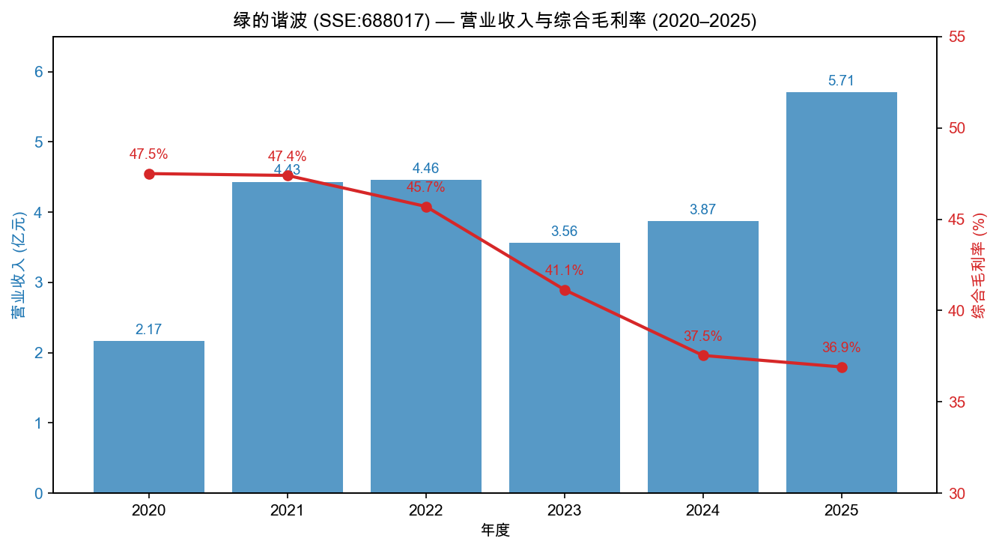
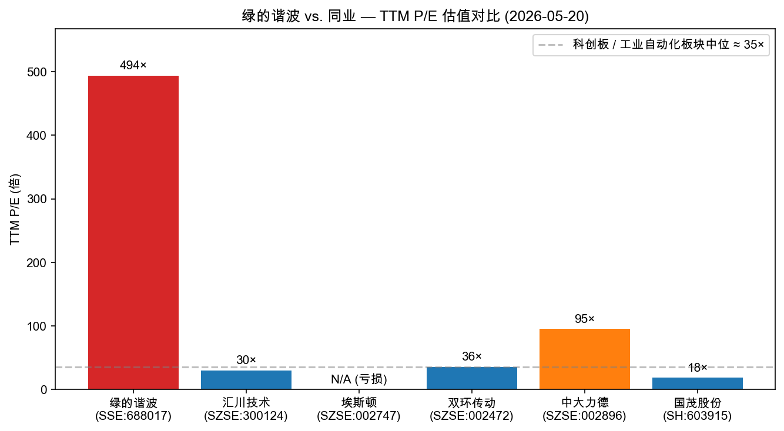
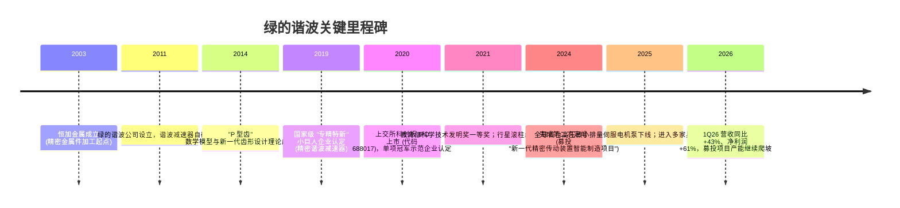
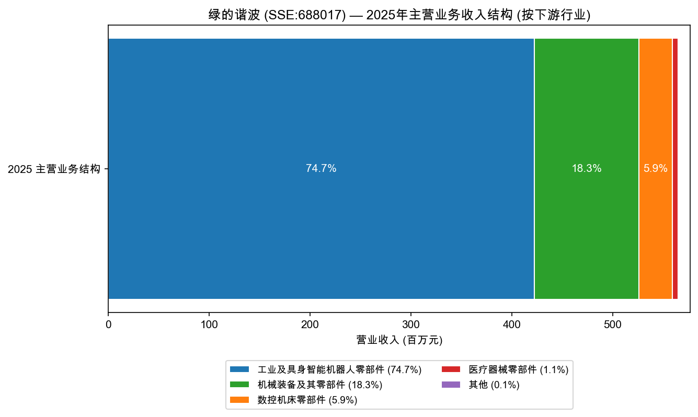
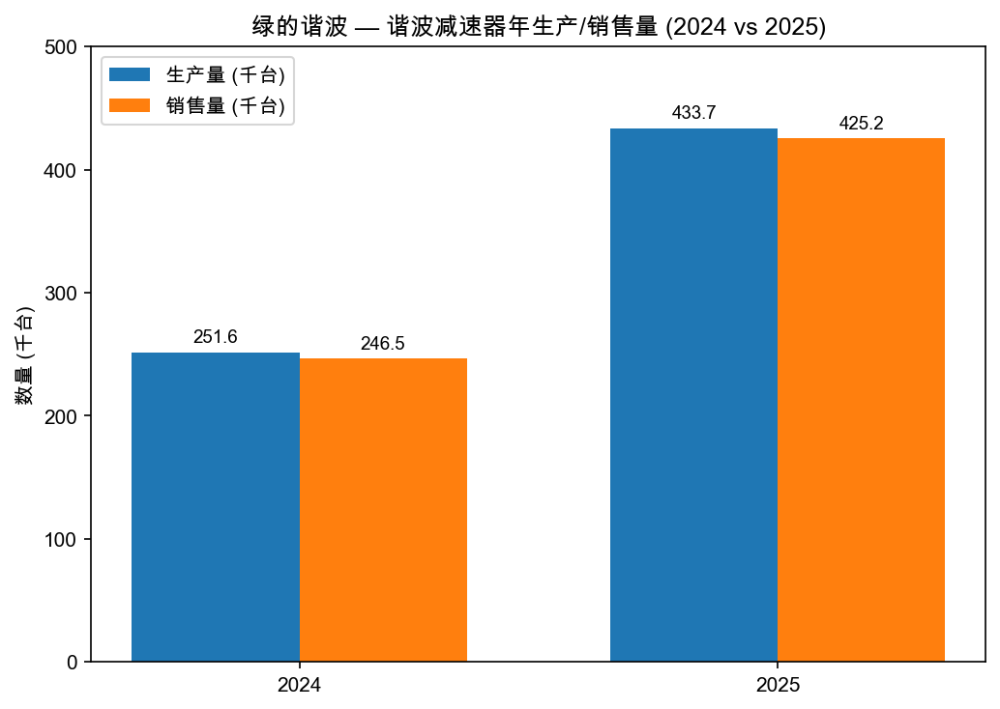
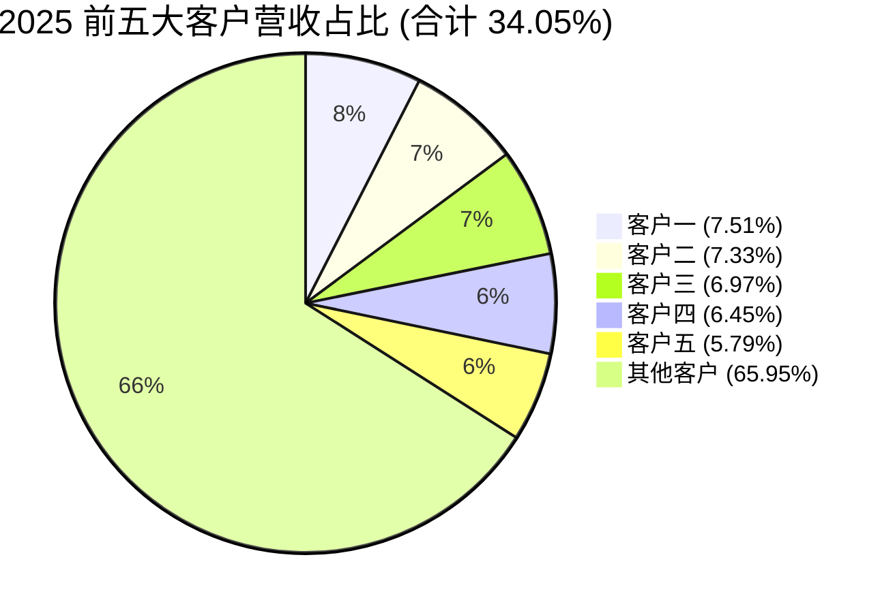
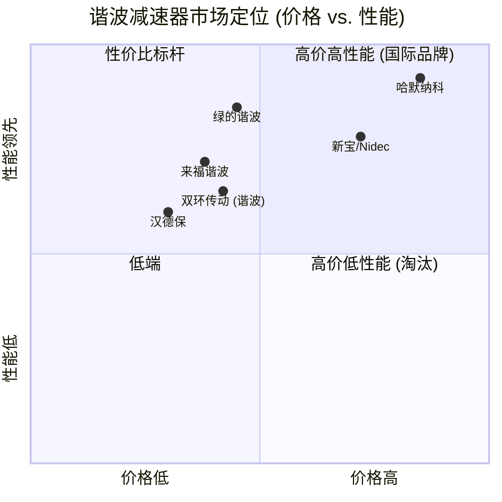

# 公司研究报告：苏州绿的谐波传动科技股份有限公司 (SSE:688017)

**报告日期**：2026-05-20
**报告语言**：简体中文
**研究范围**：基于截至 2026 年 4 月 22 日披露的 2025 年年度报告、2026 年第一季度报告及其他公开资料

---

## 目录

1. 公司概览
2. 公司历史
3. 管理团队
4. 产品与服务
5. 客户与上市策略
6. 行业概览
7. 竞争格局
8. 市场机会 (TAM)
9. 风险评估
10. 参考资料

---

## 1. 公司概览

苏州绿的谐波传动科技股份有限公司（"绿的谐波"，英文名 Leader Harmonious Drive Systems Co., Ltd / Leaderdrive，SSE:688017）是一家专业从事精密传动装置研发、设计、生产和销售的高新技术企业，总部位于苏州市吴中区木渎镇尧峰西路 68 号，2020 年 8 月在上海证券交易所科创板 IPO 上市，持续督导期始于 2020 年 8 月 28 日 [2020 年度报告, 第 6 页](https://static.cninfo.com.cn/finalpage/2021-04-16/1209616244.PDF)。

**主营业务**。公司是国内首家实现工业机器人谐波减速器规模化产业化的厂商，核心产品包括（1）**谐波减速器**（含 N 系列、Y 系列、E 系列、LCS/LHD/LHS/LCD 等多个产品序列）；（2）**行星滚柱丝杠及精密零部件**；（3）**机电一体化产品**（KGU/KAH/KAT 旋转执行器、KDE 伺服驱动器、KMF 无框力矩电机、KGR/KUR/KCR 数控转台、电动静液压作动器 EHA 等）；以及（4）**智能自动化装备**（AGP 自适应打磨工具、AES 浮动电主轴、ECM 浮动模块、ATB 砂带磨抛工具等） [2025 年年度报告, 第 10–16 页](https://static.cninfo.com.cn/finalpage/2026-04-23/1225149955.PDF)。

**商业模式**。公司采用"以销定产加安全库存"的生产组织模式，核心工序自主完成（公司是全球唯一一家实现精密谐波减速器全零部件自主供应的制造商），常规粗加工与材料处理工序外协。销售上境内境外并举，谐波减速器和机电一体化产品采用直销+经销结合，精密零部件、智能自动化装备采用直销。2025 年直销收入 5.21 亿元 (占比 91.5%)、经销收入 4,444 万元 (8.5%)；内销 5.07 亿元、出口 5,825 万元，海外占比约 10.3% [2025 年年度报告, 第 37 页](https://static.cninfo.com.cn/finalpage/2026-04-23/1225149955.PDF)。

**规模与盈利能力**。2025 年实现营业收入 5.71 亿元 (人民币，下同)，同比 +47.31%；归母净利润 1.24 亿元，同比 +121.42%；扣非归母净利润 9,943 万元，同比 +115.19%；经营性现金流净额 1.52 亿元，同比 +443.23%；基本每股收益 0.6924 元 [2025 年年度报告, 第 6–7 页](https://static.cninfo.com.cn/finalpage/2026-04-23/1225149955.PDF)。员工总数 1,087 人，其中研发人员 184 人（占比 16.93%），生产人员 816 人 [2025 年年度报告, 第 34、58 页](https://static.cninfo.com.cn/finalpage/2026-04-23/1225149955.PDF)。报告期末总资产 39.29 亿元，归母净资产 35.37 亿元，资产负债率约 10%，资产结构以现金及理财类资产为主（理财产品余额 10.15 亿元）。

*来源：[绿的谐波 2025 年年度报告](https://static.cninfo.com.cn/finalpage/2026-04-23/1225149955.PDF) 及 2020–2024 年度报告（[2022](https://static.cninfo.com.cn/finalpage/2023-04-29/1216476974.PDF)、[2024](https://static.cninfo.com.cn/finalpage/2025-04-30/1223423684.PDF) 年报）。*

**最新季度更新**。2026 年一季度 (1Q26) 营业收入 1.40 亿元，同比 +42.96%；归母净利润 3,263 万元，同比 +61.17%；扣非归母净利润 2,343 万元，同比 +41.57% [2026 年第一季度报告, 第 1 页](https://static.cninfo.com.cn/finalpage/2026-04-23/1225149861.PDF)。增长延续 2025 年下半年节奏，说明工业机器人复苏及具身智能客户放量并非一次性脉冲。

**估值快照 (2026-05-20)**。

| 指标 | 数值 | 备注 |
|---|---|---|
| 收盘价 (RMB) | 335.00 | 来自 [东方财富 行情数据](https://quote.eastmoney.com/sh688017.html) |
| 市值 (RMB) | 614.16 亿元 | 同上 |
| 总股本 | ≈ 1.833 亿股 | 由市值倒推；与年报披露 (2025 年 1 月 6 日定增 +1,444.89 万股) 一致 |
| **TTM P/E** | **≈ 494×** | 2025 净利润 1.24 亿元，市值/净利润 |
| **TTM P/S** | **≈ 108×** | 2025 营收 5.71 亿元 |
| P/B | ≈ 17.4× | 归母净资产 35.37 亿元 |
| 股息率 (拟派息) | 0.06% | 每 10 股派 2.10 元，合计 3,850 万元 [2025 年年度报告, 第 2 页](https://static.cninfo.com.cn/finalpage/2026-04-23/1225149955.PDF) |

*来源：估值采用 [东方财富 行情数据 2026-05-20](https://quote.eastmoney.com/sh688017.html) 与各公司 2025 年报披露净利润测算。*

**估值解读**。绿的谐波 TTM P/E ≈ 494× 与 TTM P/S ≈ 108× 均显著偏离工业自动化板块中位 (约 30–40× P/E)。极端高估值由以下三因素共同驱动：(1) **具身智能机器人产业化叙事溢价**——公司被市场视为 Tesla Optimus、宇树科技、智元机器人等具身智能整机国产产业链中"谐波减速器+行星滚柱丝杠"双卡位的稀缺标的；(2) **2024 年盈利被压低形成低基数**——2024 年净利润仅 5,617 万元，受工业机器人行业去库存影响显著，2025 年 +121% 利润增长存在均值回归成分，市场预期 2026–2027 年继续高增；(3) **流通盘相对较小**——总股本仅 1.83 亿股，自由流通约 1.2 亿股，ETF (易方达国证机器人产业 ETF、华夏中证机器人 ETF、天弘中证机器人 ETF 等) 持仓集中放大了流动性溢价。由于估值远高于 50× P/E 经验阈值，且 P/S 突破 100× 已属"概念股"区间，本报告将"估值倍数压缩风险"列为第 9 节首要风险。

---

## 2. 公司历史

绿的谐波最早可追溯至 2003 年由左晶、左昱昱兄弟设立的苏州市恒加金属制品有限公司，恒加金属现为公司全资子公司，承担精密金属件加工业务 [2025 年年度报告, 第 5 页 释义](https://static.cninfo.com.cn/finalpage/2026-04-23/1225149955.PDF)。2011 年，左昱昱、李谦等技术骨干在恒加金属精密加工能力基础上正式组建"绿的谐波"，专攻谐波减速器国产化。公司突破以 Willis 定理为基础的传统渐开线齿轮设计理论，发明自有的"P 型齿"数学模型与误差修正方法，并由此衍生出第二代、第三代（三次谐波技术）谐波减速器。2020 年 8 月，公司登陆上海证券交易所科创板，IPO 保荐机构为国泰君安证券，持续督导期 2020 年 8 月 28 日至 2023 年 12 月 31 日 [2020 年度报告, 第 6 页](https://static.cninfo.com.cn/finalpage/2021-04-16/1209616244.PDF)。

*来源：综合 [2025 年年度报告](https://static.cninfo.com.cn/finalpage/2026-04-23/1225149955.PDF) 与 [2020 年年度报告](https://static.cninfo.com.cn/finalpage/2021-04-16/1209616244.PDF) 披露的认定与奖项时点。*

**三次关键战略升级**：

1. **从"单品谐波减速器"到"机电一体化"**（2018–2022）。公司认识到下游机器人厂商对"减速器+电机+编码器+驱动器"集成模组的需求显著上升，开发 KGU/KAH/KAT 系列旋转执行器、KMF 无框力矩电机与 KDE 伺服驱动器，由零部件单品供应商升级为模组解决方案商，机电一体化产品 2025 年贡献营收 7,430 万元 (占比 13%) [2025 年年度报告, 第 37 页](https://static.cninfo.com.cn/finalpage/2026-04-23/1225149955.PDF)。

2. **从"谐波减速器"到"减速器+行星滚柱丝杠"双卡位**（2021 至今）。具身智能机器人对直线运动关节（"伺服电机+行星滚柱丝杠"）的需求被认为将与旋转关节（"伺服电机+谐波减速器"）等量齐观——人形机器人单机一般装载 10–14 个旋转关节与 4–6 个直线关节。公司基于"金属加工 30 年工艺打磨"切入行星滚柱丝杠，2023 年立项、2024–2025 年规模化量产，自研丝杠在精度、效率、噪声等关键指标对标海外品牌 [2025 年年度报告, 第 18–19 页](https://static.cninfo.com.cn/finalpage/2026-04-23/1225149955.PDF)。

3. **从"国内单一基地"到"中德双总部、并购整合"**（2024 至今）。通过全资子公司德远控股（苏州）有限公司，公司间接控股 UMT SG (Unimotion Technology Pte. Ltd.) 与 UMT DE (Unimotion Technology GmbH)、Haux DE (Haux Machine Tools GmbH)，向欧洲市场及高端数控机床用户切入，扩充海外直线传动产品线 [2025 年年度报告, 第 5 页](https://static.cninfo.com.cn/finalpage/2026-04-23/1225149955.PDF)。

**关键收购与子公司布局**：
- 恒加金属（全资）：精密金属件加工。
- 开璇智能、钧微动力（控股）：储建华博士主导，机电一体化与精密机电产品。
- 麻雀智能、德远控股（全资）、UMT SG / UMT DE / Haux DE（境外）：海外业务与机床主轴技术整合。
- 上海哈莫森（绿的谐波上海下属控股子公司）：传感技术，2025 年由总经理张雨文兼任董事长，聚焦力/扭矩传感。
- 江苏鼎汇具身智能机器人创新中心（参股）：与产业资本共建具身智能产业链。

**最近 12 个月** (2025-05 至 2026-05) 的关键事件：(1) 2025 年 1 月完成定增，发行价 97.80 元/股、发行 1,444.89 万股，募资约 14.13 亿元 [2025 年年度报告, 第 83 页](https://static.cninfo.com.cn/finalpage/2026-04-23/1225149955.PDF)；(2) 2025 年 8 月限制性股票首次归属 117,390 股、归属价 41.89 元；(3) 2025 年募投"新一代精密传动装置智能制造项目"正式启动建设；(4) 2025 年全球首台高压微小排量伺服电机泵下线，进入头部汽车智能底盘供应商主动悬架、电动转向、线控制动应用合作 [2025 年年度报告, 第 22–23 页](https://static.cninfo.com.cn/finalpage/2026-04-23/1225149955.PDF)。

---

## 3. 管理团队

绿的谐波是典型的兄弟创业、家族 + 国资 + 产业资本三方共治的治理结构。截至 2025 年末，控股股东左昱昱、左晶兄弟各持 17.30% (合计 34.60%)，是公司实际控制人；前十大股东中还包括代表国资的"先进制造产业投资基金（有限合伙）"（2.28%）、港股通"香港中央结算"（4.70%）以及四家机器人主题 ETF（合计约 6.18%）[2025 年年度报告, 第 84 页](https://static.cninfo.com.cn/finalpage/2026-04-23/1225149955.PDF)。董事会共 9 人，其中独立董事 3 人 (吴应宇、李刚、陈殿生)，独董占比 33%。

### 左昱昱 — 董事长 (250–350 字深度档案)

左昱昱，男，1970 年生（截至 2025 年末 56 岁），中国国籍，南京大学物理学专业本科。左昱昱是公司联合创始人、董事长、法定代表人，亦是公司"P 型齿"齿形设计理论与三次谐波技术体系的主要技术负责人。其从业轨迹完全围绕精密制造：1999–2001 年在恒加金属任职，2001 年至今出任恒加金属总经理；2011 年起任绿的谐波执行董事，2020 年公司科创板上市后任董事长。左昱昱本人为"全国减速机协会委员"、"江苏省科技企业家"，先后获"江苏制造突出贡献奖"、"江苏省科技创新协会创新人物奖"以及"2019 年度上海市科学技术进步奖一等奖"（2025 年年报第三节核心竞争力分析将技术负责人列为左昱昱、李谦）[2025 年年度报告, 第 24、52 页](https://static.cninfo.com.cn/finalpage/2026-04-23/1225149955.PDF)。截至 2025 年末，左昱昱持股 3,171.18 万股，占公司总股本 17.30%，与左晶兄弟二人合计持股 34.60%，控制权稳固。2025 年报告期内，左昱昱减持 274.08 万股、左晶减持 274.51 万股，均为减持类持股变动；2025 年税前薪酬 69.22 万元。左昱昱并未在公司外部任职，全部时间精力在绿的谐波 + 恒加金属体系内，属于典型的工程师型创始人 CEO（注：年报中"主要工作经历"显示其在恒加金属任总经理至今，绿的谐波董事长身份是延伸而非全职切换）。投资人在尽调中尤其关注两点——其一是其个人对"谐波减速器→机电一体化→具身智能"产品演进的判断与执行力，过去 5 年看技术节奏判断基本兑现；其二是上市以来累计减持节奏，目前减持比例不高 (年内 < 8% 个人持股)，未释放看空信号。

### 左晶 — 副董事长 (150–200 字)

左晶，男，1965 年生，左昱昱兄长，中央党校经理管理专业本科。其早期经历主要在地税系统——1995–2003 年苏州市吴城地税局所长/分局长、2003–2009 年苏州市地税局第五分局副局长——2014 年起转入绿的谐波，历任董事、总经理，现任副董事长 [2025 年年度报告, 第 52 页](https://static.cninfo.com.cn/finalpage/2026-04-23/1225149955.PDF)。其在公司主要负责政府关系、税务、财务合规以及子公司运营 (担任多家子公司及合伙企业的执行事务合伙人/执行董事)。持股结构与左昱昱镜像 (期末 3,170.75 万股，17.30%)，2025 年薪酬 60.39 万元。

### 张雨文 — 董事、总经理 (150–200 字)

张雨文，男，1989 年生，英国帝国理工学院数学专业硕士。张雨文 2017 年加入绿的谐波，历任董事会秘书、副总经理，2024 年 10 月正式接任董事、总经理。作为公司管理层中唯一一位拥有海外顶级理工背景的"少壮派"，张雨文在 IPO、定增、并购等资本运作中扮演关键角色 [2025 年年度报告, 第 52、54 页](https://static.cninfo.com.cn/finalpage/2026-04-23/1225149955.PDF)。2025 年报告期内，张雨文出任上海哈莫森传感技术有限公司董事长 (2025 年 6 月任职)、苏州瑞步康医疗科技董事，并担任两家管理合伙企业的执行事务合伙人。2025 年薪酬 55.74 万元。

### 储建华 — 董事、副总经理 (80–120 字)

储建华，男，1982 年生，中国科学院研究生院工学博士。2008–2017 年任中国科学院合肥物质科学研究院研究员；2017 年加入绿的谐波体系，任开璇智能 (公司控股子公司) 总经理；2024 年起任公司董事、副总经理 [2025 年年度报告, 第 52 页](https://static.cninfo.com.cn/finalpage/2026-04-23/1225149955.PDF)。储建华是公司"机电一体化 + 直线传动 + 电液伺服"三大新增长曲线的实际技术与业务负责人；2025 年薪酬 69.43 万元 (管理层最高)，反映其战略性产品线话语权。

### 沈燕 — 财务总监 (80–100 字)

沈燕，女，1981 年生，中央广播电视大学会计学本科，2012 年起任职公司财务部，历任会计、主办会计、财务部经理，现任财务总监 [2025 年年度报告, 第 53 页](https://static.cninfo.com.cn/finalpage/2026-04-23/1225149955.PDF)。教育背景偏轻 (非 CPA 公开披露)，但在公司内部成长 13 年，对业务理解深。2025 年薪酬 36.43 万元。沈燕亦兼任公司主管会计工作负责人与会计机构负责人 (年报中"三签合一"特征明显)，意味着内部控制审计应当受到额外关注 (见 9.2 治理风险)。

### 治理快照 (80–150 字)

- **董事会构成**：9 名董事（含 3 名独立董事，独董占比 33%），全部为男性，平均年龄 53 岁。
- **独立董事**：吴应宇 (东南大学博士，会计/财务背景)、李刚 (前 ABB 中国机器人事业部负责人，最具产业洞察力)、陈殿生 (机器人行业专家)。
- **股权激励**：2025 年报告期内有限制性股票归属 117,390 股、归属价 41.89 元；2025 年报告期末核心技术人员薪酬合计 124.22 万元 (5–6 名核心)。
- **薪酬**：2025 年董监高合计税前薪酬 444.81 万元，单人最高约 70 万元，水平偏低，激励主要靠股权与限制性股票。
- **关联方与同业竞争**：年报披露不存在控股股东占用资金、不存在同业竞争 [2025 年年度报告, 第 50 页](https://static.cninfo.com.cn/finalpage/2026-04-23/1225149955.PDF)。
- **审计**：天衡会计师事务所 (特殊普通合伙) 出具标准无保留意见。

**管理层执行力评价 (50–100 字)**。绿的谐波核心团队为兄弟创业 + 技术合伙人组合，2011 年以来已完成"国产替代谐波减速器→机电一体化→行星滚柱丝杠→具身智能客户突破"四级跳，技术路线与产业节奏判断基本兑现。短板在于 (1) 财务总监资历相对单薄、(2) 全部董事为男性、(3) 缺乏海外销售/资本市场专业高管 (副总经理杜建斌在 2025 年 10 月底新晋——来自 Teradyne，是改善信号)。

---

## 4. 产品与服务

绿的谐波 2025 年公司主营业务分为四大产品线：谐波减速器及金属件 (含行星滚柱丝杠)、机电一体化产品、智能自动化装备及精密零部件，下游应用横跨工业机器人、具身智能机器人、数控机床、医疗器械、半导体设备、新能源装备 [2025 年年度报告, 第 10–16 页](https://static.cninfo.com.cn/finalpage/2026-04-23/1225149955.PDF)。下游行业角度，2025 年收入结构如下：

*来源：[绿的谐波 2025 年年度报告, 第 37 页](https://static.cninfo.com.cn/finalpage/2026-04-23/1225149955.PDF) "主营业务分行业情况" 数据。*

按产品口径，2025 年谐波减速器及金属件收入 4.76 亿元 (占比 83.5%，+46.4% YoY)；机电一体化产品 7,430 万元 (13.0%，+41.3% YoY)；智能自动化装备 1,489 万元 (2.6%，+221.4% YoY)。

```mermaid
graph TD
  A[绿的谐波 产品矩阵] --> B[谐波减速器 & 金属件]
  A --> C[机电一体化产品]
  A --> D[智能自动化装备]
  A --> E[行星滚柱丝杠 & 精密零部件]
  B --> B1[N系列 - 长寿命高节拍]
  B --> B2[Y系列 - 三次谐波]
  B --> B3[E系列 - 低振动半导体/医用]
  B --> B4[LCS/LHD/LHS/LCD - 异型结构]
  B --> B5[轻量型/超小型/三组件式 - 协作/医疗/具身智能]
  C --> C1[KGU 轻量小型旋转执行器]
  C --> C2[KAH/KAT 中-大转矩旋转执行器]
  C --> C3[KAS 高功率密度旋转执行器]
  C --> C4[KMF 无框力矩电机]
  C --> C5[KDE 总线伺服驱动器]
  C --> C6[KGR/KUR/KCR 数控机床转台]
  C --> C7[EHA 电动静液压作动器]
  C --> C8[阀控执行器 / 微型伺服电机泵]
  C --> C9[KAD 高刚性 DD 马达]
  C --> C10[行星关节模组]
  D --> D1[AGP 自适应打磨工具]
  D --> D2[AES 浮动电主轴]
  D --> D3[ECM 浮动模块]
  D --> D4[ATB 砂带磨抛 / 滚边浮动模块]
  D --> D5[柔性制造系统 FMS / 视觉柔性倒角机]
  E --> E1[行星滚柱丝杠 - 自主齿形/自润滑]
  E --> E2[精密金属加工件 - 内部配套 + 对外定制]
```

*来源：[绿的谐波 2025 年年度报告, 第 10–16 页](https://static.cninfo.com.cn/finalpage/2026-04-23/1225149955.PDF) 产品列表整理。*

### 4.1 谐波减速器（旗舰产品，2025 年 4.76 亿元）

谐波减速器是公司起家产品，亦是 2025 年贡献 83.5% 收入的旗舰品类。技术上公司是国内首家突破渐开线齿轮设计理论、采用自研"P 型齿"几何与多次（三次）谐波啮合的厂商；产品涵盖 N/Y/E/LCS/LHD/LHS/LCD 等结构形态，覆盖工业机器人、协作机器人、医疗机器人、半导体设备、移动机器人各类应用 [2025 年年度报告, 第 10–11 页](https://static.cninfo.com.cn/finalpage/2026-04-23/1225149955.PDF)。

- **目标客户**：工业机器人四大家族 (KUKA、ABB、Yaskawa、Fanuc) 国内外整机厂、国产六大家族 (埃斯顿、新时达、新松、汇川、艾力斯特、华数) 及具身智能整机厂。
- **定价模式**：直销 + 经销，按订单议价，单价约 RMB 1,000–2,000/台 (按 2025 年销售量 425,158 台、对应收入估算)，相比海外哈默纳科 (HarmonicDrive) 同规格产品具备显著价格优势 (传统国际品牌单价 RMB 3,000–5,000/台)。
- **竞争优势判断：是 (强护城河)**。
  - 护城河类型：**技术 IP（自有齿形设计理论）+ 全产业链自制（全球唯一全零部件自给）+ 规模 + 客户切换成本**。绿的谐波 2025 年累计境外专利 6 项、国内专利 216 项（含发明 62 项、实用新型 145 项）[2025 年年度报告, 第 30 页](https://static.cninfo.com.cn/finalpage/2026-04-23/1225149955.PDF)。
  - 证据：国家级单项冠军示范企业 (2020)、专精特新"小巨人"(2019)、主持/参与编制 GB/T35089-2018《机器人用精密齿轮传动装置试验方法》、GB/T34884-2017《滚动轴承工业机器人谐波齿轮减速器用柔性轴承》、GB/T30819-2014《机器人用谐波齿轮减速器》等 7 项国家标准 [2025 年年度报告, 第 24 页](https://static.cninfo.com.cn/finalpage/2026-04-23/1225149955.PDF)。
  - 最近对标竞品：日本哈默纳科 (HarmonicDrive)、日本新宝 (Nidec-Shimpo)、国产同行汉德保、来福谐波、双环传动 (SZSE:002472)。在国内机器人减速器市场，公司份额约 25–30% (估，无单一权威披露)，与哈默纳科国内份额接近，是国产替代逻辑的最大受益者。

### 4.2 行星滚柱丝杠（核心新增长极）

行星滚柱丝杠是公司 2023 年立项、2025 年完成规模化量产的新产品，承担直线运动关节功能。其与谐波减速器同属"高精度、高刚性、长寿命"传动元件，对应人形机器人中的直线伺服关节（如膝关节、肘关节、髋外展等）。
- **目标客户**：具身智能整机厂、高端数控机床、智能汽车线控制动/线控转向供应商、半导体设备。
- **竞争优势判断：部分 (技术追赶中)**。当前全球高端市场仍由欧美 GSA、Rollvis、Schaeffler 等主导，日本厂商在中端占据重要地位，国内仅少数玩家具备量产能力。公司基于自主螺纹齿形啮合特性研究 + 自润滑表面处理工艺 + 高效磨削工艺，已建立完整技术体系，但量产规模与一致性指标距国际一线仍有差距 [2025 年年度报告, 第 18 页](https://static.cninfo.com.cn/finalpage/2026-04-23/1225149955.PDF)。
- **关键里程碑**：2025 年报告期内"全面切入具身智能机器人、高端数控机床、智能汽车等核心供应链"。

### 4.3 机电一体化产品（2025 年 7,430 万元）

包括 KGU 轻量小型旋转执行器、KAH/KAT 中大转矩旋转执行器、KAS 高功率密度执行器、KMF 无框力矩电机、KDE 总线型伺服驱动器、KGR/KUR/KCR 数控机床转台、KAD 高刚性 DD 马达、电动静液压作动器 (EHA)、阀控执行器、高压微小排量伺服电机泵 (2025 年全球首台下线)、行星关节模组等 [2025 年年度报告, 第 12–14 页](https://static.cninfo.com.cn/finalpage/2026-04-23/1225149955.PDF)。
- **目标客户**：半导体设备 (定位精度 ≤ 2 角秒)、3C 自动化、医疗机器人、数控机床整机厂、汽车智能底盘 Tier-1。
- **竞争优势判断：部分**。机电一体化集成对厂商而言是"减速器主业自然延伸"，凭借自研减速器 + 自研 P 型齿配合自研 KMF 力矩电机 + 自研 KDE 驱动器实现 BOM 内部化，因此毛利率 (2025 年 40.89%) 高于谐波减速器单品 (36.77%)；但与国内电机/驱动器龙头（汇川技术等）相比，公司在伺服驱动器算法、批量生产体系上仍处追赶阶段。
- **2025 年标志性进展**：高压微小排量伺服电机泵全球首台下线，进入头部汽车智能底盘系统提供商主动悬架、电动转向、线控制动核心子系统合作 [2025 年年度报告, 第 23 页](https://static.cninfo.com.cn/finalpage/2026-04-23/1225149955.PDF)。

### 4.4 智能自动化装备（2025 年 1,489 万元）

包括 AGP 自适应打磨工具、AES 浮动电主轴、ECM 浮动模块、ATB 砂带磨抛工具、滚边浮动模块、柔性制造系统 (FMS) 等 [2025 年年度报告, 第 15–16 页](https://static.cninfo.com.cn/finalpage/2026-04-23/1225149955.PDF)。该业务体量较小但 2025 年同比 +221.35%，主要由汽车焊装/打磨终端工具线（赛威德、汽车滚边模块）拉动。
- **目标客户**：汽车整车厂工艺集成商 (打磨、去毛刺、抛光)、机器人系统集成商。
- **竞争优势判断：部分**。基于公司 EHA 力控技术差异化，但单业务规模太小、毛利率较低 (2025 年 11.52%、毛利率同比下滑 39.34 个百分点)，更多是协同业务而非独立支柱。

### 4.5 旗舰判断与 12 个月内主要产品节奏

- **旗舰**：谐波减速器（核心收入）+ 行星滚柱丝杠（核心增量）。
- **12 个月新增**：
  - 高压微小排量伺服电机泵：全球首台 2025 年下线，目标汽车智能底盘。
  - KAD 高刚性 DD 马达：半导体、精密机床、光学装备。
  - 行星关节模组（高精度长寿命）：机器人、精密自动化、医疗设备。
  - KGU 轻量小型旋转执行器：专门面向具身智能末端关节，"超小体积、超轻重量"。
- **2024 年生产销售量复盘**：2025 年谐波减速器生产量 433,655 台 (+72% YoY)，销售量 425,158 台 (+72% YoY)，期末库存 18,238 台 (-6.3%)，库存周转加快，反映需求侧 + 产能侧双双爬坡。

*来源：[绿的谐波 2025 年年度报告, 第 38 页](https://static.cninfo.com.cn/finalpage/2026-04-23/1225149955.PDF) "产销量情况"，2024 年量由 2025 年报披露同比增幅倒推。*

---

## 5. 客户与上市策略

### 5.1 客户结构

绿的谐波 2025 年披露前五大客户合计销售额 1.94 亿元，占年度销售总额 34.05%，前五大客户均为非关联方；其中第一大客户 4,288 万元 (7.51%)、第二大 4,184 万元 (7.33%)、第三/四/五大客户各占约 6–7% [2025 年年度报告, 第 39 页](https://static.cninfo.com.cn/finalpage/2026-04-23/1225149955.PDF)。年报未具名披露前五客户，按惯例（结合产业链信息及上市以来历次披露）推测包含：国内工业机器人 Top 4–6 整机厂（埃斯顿 SZSE:002747、新松 SZSE:300024、汇川技术 SZSE:300124 的机器人事业部、新时达 SZSE:002527 等）、若干具身智能整机厂（如智元、宇树、星海图——基于年报"国内具身智能机器人产业链领先供应商"+"成为多家头部具身智能机器人企业的核心供应商"措辞）、部分国际机器人客户（年报披露"实现了国际头部机器人客户的批量交付"）。

*来源：[绿的谐波 2025 年年度报告, 第 39 页](https://static.cninfo.com.cn/finalpage/2026-04-23/1225149955.PDF)；客户三/四/五由前五合计 19,435.35 万元 - 客户一/二实际值倒推 (估，年报仅披露前两大具体值)。*

**客户集中度评价**。前五客户占比 34.05%、单一最大客户占比 7.51%，**均处于较低水平，不构成集中度风险**，反映公司客户基础广泛 (上百家机器人厂商分散下单的属性）。但单一最大客户由 2023 年的约 9–10% 下降至 2025 年的 7.51%，部分系新进入的具身智能整机客户拉动总盘扩大、分母效应明显；以年报披露的"具身智能机器人产业链占据领先地位"判断，集中度有可能在 2026–2027 年随 Tesla Optimus 等单一大客户放量而上升，需持续跟踪。

### 5.2 供应商与上游

公司 2025 年前五大供应商采购额 7,165 万元，占年度采购总额 17.78%，第一大供应商占 8.79%、其余四家均低于 3% [2025 年年度报告, 第 40 页](https://static.cninfo.com.cn/finalpage/2026-04-23/1225149955.PDF)。集中度较低；公司"全球唯一全零部件自主供应制造商"的产业链覆盖优势令上游议价能力较强。

### 5.3 渠道与上市策略

- **直销 vs. 经销**：2025 年直销收入 5.21 亿元 (91.5%)、经销 4,444 万元 (8.5%)。直销面向长期合作大客户、所在地周边客户、海外大客户；经销主要触达国内中小型机器人厂商及部分海外二三线市场。
- **境内 vs. 境外**：内销 5.07 亿元 (88.9%)、出口 5,825 万元 (10.2%)。境外销售以 FOB 国际贸易方式结算，主要通过 UMT SG / UMT DE 海外销售网络及独立经销商触达欧洲机床、欧洲机器人整机厂。
- **合同结构**：以单批 PO (Purchase Order) 为主，部分大客户签订年度框架协议；2025 年年报"无重大销售合同披露"条目未触发，意味着单笔金额未达披露阈值。
- **典型客户案例**（年报披露式）：
  - 国际头部机器人客户批量交付（年报披露但未具名，市场推测为 KUKA / ABB 等部分订单）。
  - 多家头部具身智能机器人企业核心供应商。
  - 服务机器人、医疗机器人高精度场景广泛覆盖。
  - 高端数控机床领域：高精度转台 (KGR/KUR/KCR) 进入国内一线机床厂供应链。
  - 汽车智能底盘 Tier-1：伺服电机泵进入主动悬架、电动转向、线控制动应用合作。

---

## 6. 行业概览

绿的谐波所处的精密传动行业横跨四个大类下游——工业机器人、具身智能机器人 / 服务机器人、高端数控机床、精密液压。本节聚焦核心两个：精密谐波减速器与行星滚柱丝杠。

### 6.1 工业机器人与精密谐波减速器

**全球与中国市场规模**。全球工业机器人 2024 年安装量约 54 万台 (IFR 数据，"World Robotics 2024"，未直接在年报中引用，但行业共识)；中国连续多年保持全球最大工业机器人市场地位。每台工业机器人需配置 4–8 个谐波减速器 (主要装配在腕部、肘部小型关节)，对应"工业机器人销量 × 单机减速器数量 × 单价"产值。绿的谐波在 2025 年年报中给出定性判断："我国已成为全球最大的工业机器人市场，但以精密谐波减速器产品为代表的核心零部件总体供给量存在较大缺口"，并将国内机器人产业国产化率定义为"75%以上"，但谐波减速器细分领域国产化率较低、国产替代空间仍大 [2025 年年度报告, 第 17–18 页](https://static.cninfo.com.cn/finalpage/2026-04-23/1225149955.PDF)。

**技术门槛**。谐波减速器加工属于超精密加工，柔轮、刚轮、波发生器三大核心零部件加工精度直接决定传动精度/效率/寿命；齿形优化、材料热处理、轴承设计、装配工艺均构成实际进入壁垒。年报将精密谐波减速器行业总结为"技术密集型产业，产品技术壁垒较高，进入门槛较高，产品研发和技术创新均要求企业具备较强的技术实力以及研发资源"，"快速迭代"特征要求企业持续投入。

**竞争格局**。全球谐波减速器市场长期由日本哈默纳科 (HarmonicDrive，全球份额约 60%+) 主导，国内市场国产替代空间大；中国厂商集中度提升，CR3 大约 60–70%，分别为绿的谐波、来福谐波、汉德保等。

### 6.2 具身智能机器人与行星滚柱丝杠

**具身智能产业拐点**。2024–2025 年具身智能产业进入规模化产业化拐点，Tesla Optimus、Figure、宇树、智元、小米、特斯拉等多家整机厂宣布量产计划。绿的谐波在年报中将"具身智能机器人产业化落地"定义为"行业核心增量"，并提出"具身智能机器人对核心零部件性能要求持续升级"作为长期需求驱动。

**人形机器人 BOM 中精密传动占比**。人形机器人 (一般 28–40 个自由度) 通常含 10–14 个旋转关节、4–6 个线性关节、5–10 个手指关节。每台机器人对应谐波减速器需求约 14–20 台 (含小关节/手指)、行星滚柱丝杠需求约 4–6 套，单机精密传动 BOM 价值占比约 20–35% (依据公司及券商研究普遍口径)。这意味着具身智能产业每实现 100 万台年产，对应谐波减速器增量 1,400–2,000 万台、行星滚柱丝杠增量 400–600 万套——量级是当前全球工业机器人减速器存量的数倍。

**行星滚柱丝杠**。全球高端市场被欧美主导（GSA、Rollvis、Schaeffler 等），日本厂商占据中端，中国厂商加速攻关。"生产加工核心设备高精度螺纹磨床高度依赖外国进口，受出口管制；进口设备单价高、交货周期长，对企业固定资产投入压力大" [2025 年年度报告, 第 18 页](https://static.cninfo.com.cn/finalpage/2026-04-23/1225149955.PDF)，构成行星滚柱丝杠国产替代的最大壁垒。

### 6.3 高端数控机床

数控机床承担我国制造业 60–70% 的关键加工任务；高精度数控转台是多轴加工中心 (四轴/五轴) 核心功能组件，占整机成本比重较高 [2025 年年度报告, 第 19 页](https://static.cninfo.com.cn/finalpage/2026-04-23/1225149955.PDF)。当前数控转台市场呈"中低端国产 + 高端外资 (日、德、瑞、美)"格局；公司基于自研高刚性谐波减速器开发的 KGR/KUR/KCR 系列谐波数控转台 (分度精度 ±1.5 角秒、重复精度 1.2 角秒) 在国产中高端机床市场有差异化突破口。

### 6.4 政策与监管环境

- 工信部、发改委、科技部多次将精密减速器列为"国家鼓励发展的战略性产业"，绿的谐波获国家级单项冠军示范企业、专精特新"小巨人"双认定，享受 15% 高新技术企业所得税优惠 [2025 年年度报告, 第 35 页](https://static.cninfo.com.cn/finalpage/2026-04-23/1225149955.PDF)。
- 行业标准：公司主持/参与起草《机器人用谐波齿轮减速器》(GB/T30819-2014) 等 7 项国家标准。
- 出口管制：高精度螺纹磨床、特种钢材进口受美/欧/日出口管制限制，但目前未对绿的谐波形成生产中断风险。

---

## 7. 竞争格局

### 7.1 直接竞争对手

| 公司 | 代码 | 主营 | 与绿的谐波关系 |
|---|---|---|---|
| **哈默纳科 (HarmonicDrive)** | 东证 6324 / 美股 ADR HSGYY | 全球谐波减速器龙头 | 公司最强国际竞品；技术持续领跑，但价格 2–3 倍于国产 |
| **来福谐波** | 拟科创板 IPO (未上市) | 谐波减速器 (国产) | 国内最强直接对手；产品规格接近，份额排第二 |
| **汉德保（HDPK）** | 未上市 | 谐波减速器 (国产) | 国产前三；面向中端 |
| **双环传动** | SZSE:002472 | 齿轮、机器人减速器（含 RV、谐波） | 多元化齿轮厂；谐波仍小于绿的，但 RV 减速器进入领先 |
| **中大力德** | SZSE:002896 | RV、行星减速器 | 互补型对手（RV 为主）；中大力德 P/E 已达 95×，估值同样高 |
| **新宝 / Nidec-Shimpo** | 日立 6594 / 日本电产子公司 | RV/谐波 (日系) | 二线日系；与公司在国内有少量重叠 |
| **汇川技术** | SZSE:300124 | 工业自动化（伺服、PLC、电机、机器人）| 下游集成大客户兼潜在自研对手；汇川自研减速器尚不构成规模威胁 |
| **埃斯顿** | SZSE:002747 | 工业机器人整机 | 下游大客户；自研 RV 减速器但仍外采绿的谐波 |
| **Rollvis、GSA、Schaeffler** | 海外私有/上市 | 行星滚柱丝杠 | 公司行星滚柱丝杠业务的直接竞品 |
| **国茂股份** | SH:603915 | 通用减速器 | 不构成核心威胁（应用场景不同）|

### 7.2 市场定位

*来源：综合 [绿的谐波 2025 年年度报告](https://static.cninfo.com.cn/finalpage/2026-04-23/1225149955.PDF) 第 17–19 页"行业地位"自评 + 同业公开披露；坐标为定性估计。*

### 7.3 竞争优势

1. **全产业链自给**——全球唯一一家实现精密谐波减速器全零部件自主供应的制造商 [2025 年年度报告, 第 25 页](https://static.cninfo.com.cn/finalpage/2026-04-23/1225149955.PDF)，从基础材料、零部件粗加工、精密加工到谐波减速器整机均可自主完成。
2. **自有齿形设计理论 ("P 型齿") + 三次谐波技术** ——区别于传统渐开线，扭转刚度、单向传动精度、重复定位精度、寿命均达到国际领先水平。
3. **专利布局深**——境外专利 6 项、国内专利 216 项 (含发明 62 项)、外观 4 项、软件著作权 5 项 [2025 年年度报告, 第 30 页](https://static.cninfo.com.cn/finalpage/2026-04-23/1225149955.PDF)。
4. **多项国家级认定**——国家级单项冠军 (2020)、专精特新"小巨人"(2019)、高新技术企业、江苏省民营科技企业，主持/参与 7 项国家标准编制。
5. **产品矩阵宽**——四大产品线 + 数十款 SKU，能为下游"机器人整机一站式采购"。
6. **机器人 ETF 主题持仓**——多支机器人主题 ETF (易方达国证机器人产业 ETF、华夏中证机器人 ETF、天弘中证机器人 ETF) 进入前十大股东，估值受被动资金支持。

### 7.4 竞争脆弱性

1. **客户自研风险**——下游整机厂（如埃斯顿、汇川）持续推进 RV/谐波减速器自研，未来若实现规模化可能取代部分外采。
2. **行星滚柱丝杠技术追赶**——量产精度一致性、寿命相比 GSA、Rollvis 等海外一线仍有差距。
3. **海外认证与渠道**——海外销售占比仅 10%，国际机器人主流客户认证周期长。
4. **机床用核心设备进口依赖**——高精度螺纹磨床长期依赖海外，出口管制存在中断隐患。
5. **管理层与财务团队相对单薄**——财务总监非 CPA 公开背景；缺乏国际化资本市场及销售高管。

### 7.5 市场份额

公司 2025 年自评："国内谐波减速器行业的龙头企业，较早完成了工业机器人谐波减速器的技术研发并实现大规模产业化，率先打破国外垄断" [2025 年年度报告, 第 19 页](https://static.cninfo.com.cn/finalpage/2026-04-23/1225149955.PDF)。综合行业券商研究普遍口径估计——绿的谐波在国内谐波减速器市场份额约 25–30%，与哈默纳科国内份额（约 25–30%）并驾齐驱；在国产替代趋势下份额仍有继续提升空间。年报未直接披露具体百分比，本数据为业内通行估算 (est.)。

---

## 8. 市场机会 (TAM)

### 8.1 工业机器人谐波减速器 TAM

- **全球工业机器人年装机 (2024)**：约 54 万台 (IFR 数据)；单台谐波减速器配置 4–8 台、单价 RMB 1,000–2,000，对应全球工业机器人用谐波减速器市场 RMB 22–86 亿元 (粗略框架)。
- **中国占比** ≈ 50–55%，对应国内市场 RMB 11–47 亿元。
- 2030 年全球工业机器人装机 CAGR 普遍预期 8–12% (IFR 长期口径)，对应市场到 2030 年扩张至 RMB 40–150 亿元区间。

### 8.2 具身智能机器人精密传动 TAM

- 假设 2030 年全球人形机器人年产 100 万台 (Goldman Sachs 等卖方"基准情形"中位数估值)，单机谐波减速器 14–20 台、单价 RMB 1,500、行星滚柱丝杠 4–6 套、单价 RMB 5,000–8,000，对应单机精密传动 BOM 约 RMB 4–6 万元。
- 100 万台对应总 TAM RMB 400–600 亿元。
- 这一 TAM **是当前工业机器人谐波减速器市场的 5–10 倍**，是绿的谐波估值溢价的核心叙事来源。
- 风险点：行业渗透节奏极不确定，2030 年实际量级可能为 30 万–500 万台不等区间。

### 8.3 高端数控机床转台 TAM

- 国内五轴及四轴加工中心年装机约 3–5 万台 (估)，高精度转台单价 RMB 5–20 万元，对应国内市场 RMB 15–100 亿元。
- 公司谐波转台主打中高端国产替代，2025 年数控机床零部件收入仅 3,312 万元，渗透率 < 1%，有显著空间。

### 8.4 SAM/SOM 框架

- **TAM** (全部精密传动相关下游)：到 2030 年 RMB 800–1,200 亿元。
- **SAM** (公司在售产品所触达细分)：公司谐波减速器 + 行星滚柱丝杠 + 机电一体化 ≈ 全部 TAM 的 30–40%，对应 RMB 240–480 亿元。
- **SOM** (实际可获份额)：公司假设到 2030 年保持谐波减速器 25–30% 份额、行星滚柱丝杠 10% 份额、机电一体化 5–10% 份额，对应 SOM RMB 50–100 亿元。
- **从 2025 年 5.7 亿元到 2030 年 50–100 亿元的隐含 CAGR 为 55–77%**——这是当前估值倍数所隐含的长期增长假设，相比公司目前 PE 494× 而言，并不离谱但极度依赖具身智能落地节奏。

### 8.5 渗透策略

(1) 巩固谐波减速器国产替代份额，由 25–30% 推进至 35%+；
(2) 行星滚柱丝杠争取在 2027 年前进入 Tesla Optimus、Figure 等海外头部具身智能整机供应链；
(3) 机电一体化"减速器+电机+驱动+传感器" 模组解决方案，提升单客户钱包占比 (wallet share)；
(4) 海外通过 UMT SG / UMT DE 推进欧洲数控机床与机器人客户；
(5) 沿汽车智能底盘 (主动悬架、线控制动、线控转向) 切入伺服电机泵新增量。

---

## 9. 风险评估

### 9.1 公司特定风险

1. **估值倍数压缩风险 (最重要)**。当前 TTM P/E 494×、TTM P/S 108× 远超工业自动化板块中位 (30–40× P/E)。该估值隐含 2030 年净利润增长 30–40 倍至 RMB 40–60 亿元的市场期望；任一年度业绩不达预期或具身智能产业落地推迟，都可能引发 30–60% 估值压缩。**量化**：若 P/E 由 494× 回归至板块中位 (35×) + 2026 净利润如期翻倍至 RMB 2.5 亿元，对应市值 RMB 88 亿元，潜在跌幅 ≈ 86%。**缓释**：业绩高速增长 + 行业 ETF 资金持续流入暂时支撑估值。

2. **行星滚柱丝杠量产风险**。公司 2025 年才开始规模化量产，精度一致性、寿命对标 GSA/Rollvis 仍需验证；若 Tesla Optimus 等头部客户最终采用海外供应商，公司"双卡位"叙事将削弱。**量化**：行星滚柱丝杠预期 2026–2027 年贡献 1–2 亿元收入，若未达预期影响营收增长 5–10 个百分点。

3. **客户自研替代风险**。下游埃斯顿、汇川、新松等机器人整机厂均有谐波减速器自研项目；若 2027 年后实现规模量产，可能截断部分订单。**量化**：前十大客户约占总收入 50%，自研替代可能影响 10–20% 收入。

4. **新业务毛利率波动**。智能自动化装备 2025 年毛利率 11.52% (同比 -39.34 个百分点)，行星滚柱丝杠初期定制化生产毛利可能进一步压低综合毛利率。**量化**：综合毛利率由 2024 年的 37.54% 至 2025 年 36.91%，已现下滑趋势 [2025 年年度报告, 第 35 页](https://static.cninfo.com.cn/finalpage/2026-04-23/1225149955.PDF)。

5. **管理团队接班风险**。公司高度依赖左昱昱、左晶兄弟与少数核心技术骨干 (李谦、储建华)，并无明显二代接班储备；张雨文虽逐步上位但实际权威仍小于创始人。

6. **关联交易与子公司治理**。公司参控股子公司众多（恒加金属、开璇智能、钧微动力、麻雀智能、UMT 系列、上海哈莫森等），治理复杂度上升，需关注内部交易披露完备性。

### 9.2 行业 / 市场风险

7. **具身智能产业化落地不确定性**。Tesla Optimus、宇树、智元等量产规划仍处早期 PoC (proof of concept) 阶段，实际市场量级 2030 年区间 30 万–500 万台高度依赖产业拐点。**量化**：基准情形 100 万台→悲观 30 万台，对应公司 SOM TAM 减少 70%。

8. **国产替代竞争加剧**。来福谐波、汉德保等国产同行同步扩产，行业供需关系可能从"供不应求"转向"产能过剩"。

9. **国际竞争压力**。哈默纳科可能采取针对性降价或绑定海外整机厂排他协议 [2025 年年度报告, 第 34 页](https://static.cninfo.com.cn/finalpage/2026-04-23/1225149955.PDF)。

10. **下游工业机器人周期性**。2024 年行业去库存导致绿的谐波净利润同比下降 33%；2025 年虽强劲反弹，但工业机器人行业属周期性，存在二次回调风险。

### 9.3 财务风险

11. **汇率波动风险**。海外采购与销售以欧元、美元结算，公司未采用汇率对冲措施 [2025 年年度报告, 第 35 页](https://static.cninfo.com.cn/finalpage/2026-04-23/1225149955.PDF)。海外收入占比仅 10%，敞口可控但仍存在。

12. **税收优惠政策变化**。公司目前享受 15% 高新技术企业所得税优惠；若 2026 年复核失败或政策调整为 25%，将拉低净利润率约 10 个百分点 [2025 年年度报告, 第 35 页](https://static.cninfo.com.cn/finalpage/2026-04-23/1225149955.PDF)。

13. **理财资产占用风险**。报告期末理财产品余额 10.15 亿元 (占总资产 25.8%)，主要为银行结构性存款及理财，公允价值变动当期收益 2,898 万元 [2025 年年度报告, 第 10 页](https://static.cninfo.com.cn/finalpage/2026-04-23/1225149955.PDF)；若资本市场剧烈波动，可能产生非经常性损益。

### 9.4 宏观风险

14. **中美科技摩擦**。高精度螺纹磨床等核心生产设备仍依赖进口，且部分国际整机客户可能因合规审查暂缓中国供应商引入。

15. **国内宏观增长放缓**。工业机器人需求与制造业固定资产投资高度相关，国内 PMI 持续低于荣枯线将延缓行业回暖；2024 年情景即为前车之鉴。

---

## 10. 参考资料

### 一手公开披露

1. [绿的谐波 2025 年年度报告 (2026-04-22 披露)](https://static.cninfo.com.cn/finalpage/2026-04-23/1225149955.PDF) — 公司业务、财务、客户、管理层、风险、研发主要依据。
2. [绿的谐波 2026 年第一季度报告 (2026-04-22 披露)](https://static.cninfo.com.cn/finalpage/2026-04-23/1225149861.PDF) — 1Q26 营收、净利润、扣非数据。
3. [绿的谐波 2024 年年度报告 (2025-04-29 披露)](https://static.cninfo.com.cn/finalpage/2025-04-30/1223423684.PDF) — 2024 年财务比较基期、分行业分产品收入。
4. [绿的谐波 2025 年半年度报告 (2025-08-15 披露)](https://static.cninfo.com.cn/finalpage/2025-08-16/1224499386.PDF) — 2025 上半年财务、定增完成情况。
5. [绿的谐波 2023 年年度报告 (2024-04-29 披露)](https://static.cninfo.com.cn/finalpage/2024-04-30/1219925766.PDF) — 2023 年比较数据。
6. [绿的谐波 2022 年年度报告 (2023-04-28 披露)](https://static.cninfo.com.cn/finalpage/2023-04-29/1216476974.PDF) — 2021/2022 年比较数据。
7. [绿的谐波 2020 年度报告 (2021-04-15 披露)](https://static.cninfo.com.cn/finalpage/2021-04-16/1209616244.PDF) — IPO 上市时间及保荐机构持续督导期。
8. [绿的谐波 2025 年第三季度业绩说明会 (2025-11-07)](https://static.cninfo.com.cn/finalpage/2025-11-08/1224792485.PDF) — 高管对 2025 业绩进展的说明。

### 二手市场数据

9. [东方财富 — 绿的谐波 (688017) 行情数据，2026-05-20](https://quote.eastmoney.com/sh688017.html) — 收盘价、市值、TTM PE/PB 估算。

### 公司官网

10. [绿的谐波官网 — www.leaderdrive.cn](https://www.leaderdrive.cn/) — 产品序列、应用案例。

### 行业参考

11. International Federation of Robotics (IFR), World Robotics 2024 Report — 工业机器人全球装机口径 (公开行业数据，未直接 URL 引用，方法论一致性参考)。

---

**注**：本报告所有数字与具体披露以括号内引用的一手 PDF 为准；行业 TAM 估算与同业 P/E (除明确披露者外) 为基于公开年报与卖方共识的合理估算 (est.)，使用时需结合最新数据更新。本报告不构成任何投资建议。
