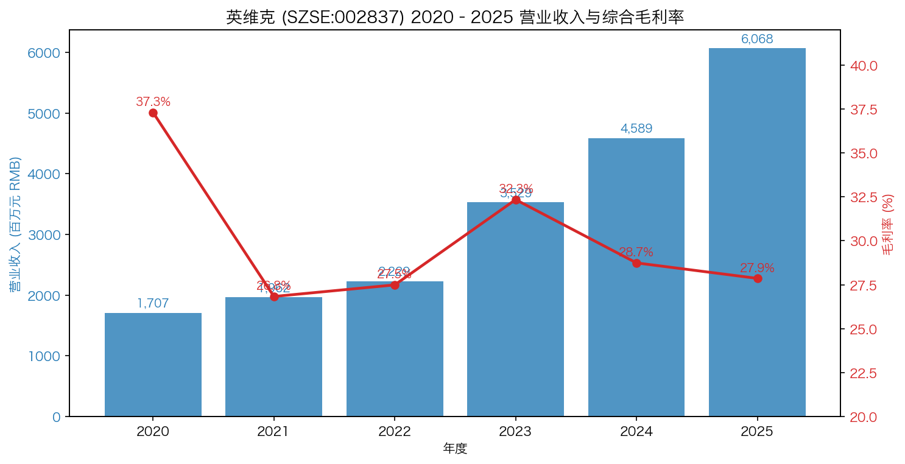
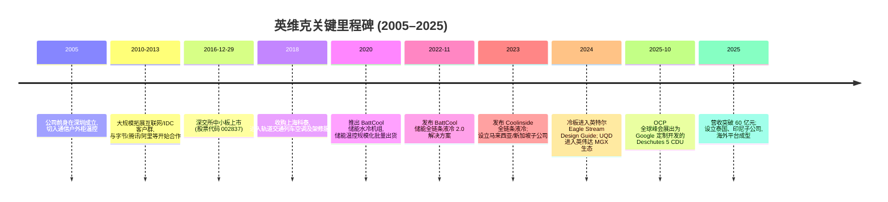
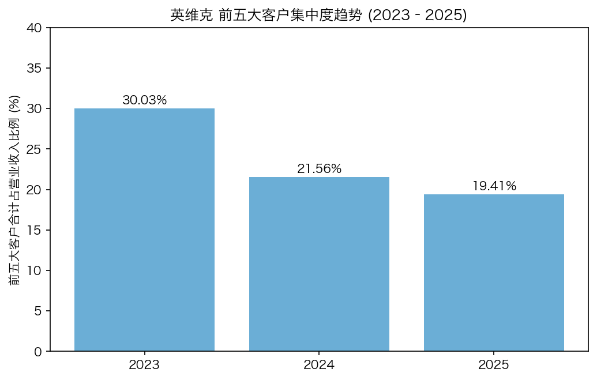
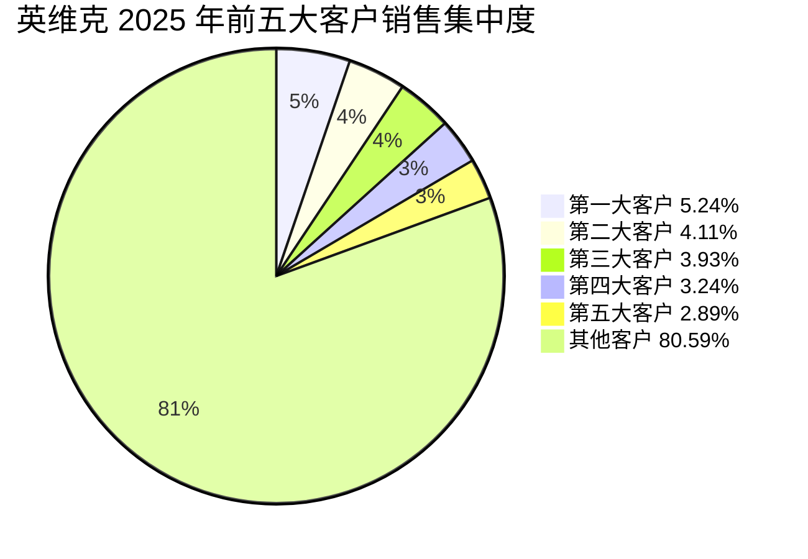
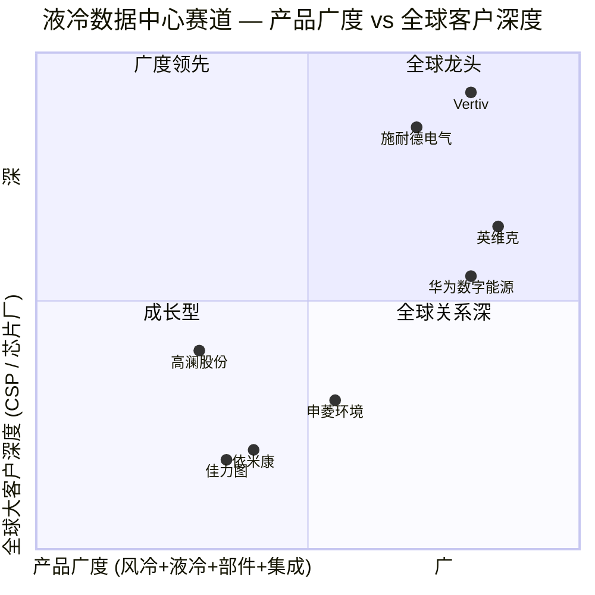
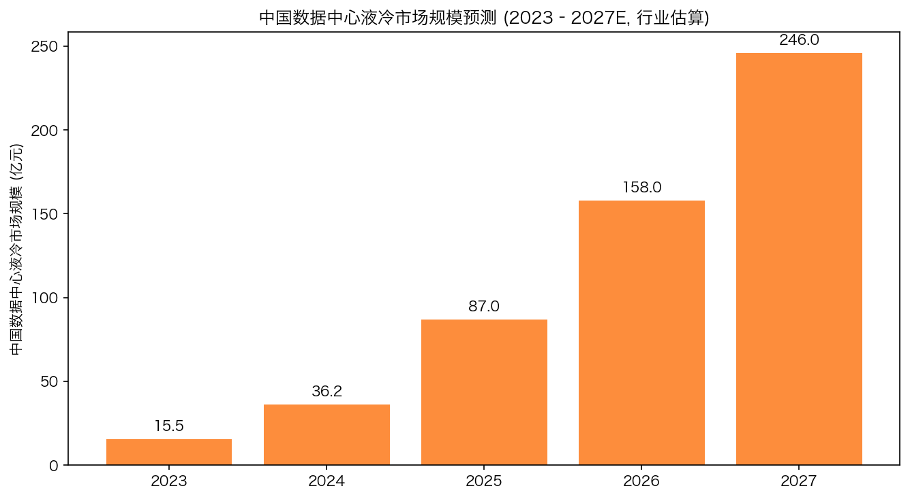

# 英维克 (SZSE:002837) 公司研究报告

**报告日期：2026-05-20** ｜ **报告语言：简体中文** ｜ **覆盖人：Company Research**

> **Update — 2025 年度业绩兑现 + 利润分配方案 (2026-04-20)：** 公司披露 2025 年实现营业收入 RMB 60.68 亿元 (YoY +32.23%)、归母净利润 RMB 5.22 亿元 (YoY +15.30%)，延续连续 10 余年的收入利润双增长记录；机房温控节能业务 (含数据中心/智算中心液冷) 单年增长 41.28%，海外收入达 8.49 亿元 (YoY +28.70%)、海外毛利率 52.64%。同时披露 2025 年度利润分配预案：每 10 股派现金 1.70 元、转增 3 股；公司未给出 2026 年正式营收/利润数字指引，但管理层在「未来发展展望」中明确以数据中心/智算中心 + 海外为两大主线持续投入。Source: [2025 年年度报告, 2026-04-20](http://static.cninfo.com.cn/finalpage/2026-04-21/1225131813.PDF).

---

## 目录

1. 公司概览 (Company Overview)
2. 公司历史 (Company History)
3. 管理团队 (Management Team)
4. 产品与服务 (Products & Services)
5. 客户与上市策略 (Customers & Go-to-Market)
6. 行业概览 (Industry Overview)
7. 竞争格局 (Competitive Landscape)
8. 市场机会 (Market Opportunity / TAM)
9. 风险评估 (Risk Assessment)
10. 参考资料 (References)

---

## 1. 公司概览 (Company Overview)

深圳市英维克科技股份有限公司 (Shenzhen Envicool Technology Co., Ltd.；股票代码 SZSE:002837；以下简称「英维克」或「公司」) 是中国大陆领先的**精密温控节能 (precision thermal management) 解决方案提供商**，业务边界涵盖数据中心/智算中心 (AIDC)、算力设备液冷 (liquid cooling for compute)、电化学储能 (battery energy-storage system, BESS)、通信网络 (telecom infrastructure)、电力电网、电动汽车充电桩、电动客车与冷链车的车用空调，以及覆盖室内外的人居健康空气环境产品。简单来说，凡是电力设备需要散热、需要把热量从芯片或电池端「搬出去」的场景，英维克都试图用其平台化的产品体系覆盖 ([2025 年年度报告 第 9 页](http://static.cninfo.com.cn/finalpage/2026-04-21/1225131813.PDF))。

**商业模式 (business model)** 上，公司绝大部分收入来自精密温控设备的**直销** (2025 年直销占比 97.25%、分销 2.75%)，按项目/订单交付，单台设备价格从户外通信柜空调的数万元，到模块化数据中心 (modular data center) + 全链条液冷集成总包合同的数千万元乃至上亿元不等。2025 年公司精密温控节能设备销售量约 32.4 万台 (YoY +25.6%)、生产量 32.1 万台、库存 2.6 万台，是一家**以销定产 + 部分备库**的硬件公司，平均单台售价约 1.87 万元，反映其产品矩阵中既有小型柜空调、也有大型液冷 CDU、风墙、间接蒸发冷却机组等高单价系统 ([2025 年年度报告 第 16 页](http://static.cninfo.com.cn/finalpage/2026-04-21/1225131813.PDF))。下游交付方式包括：(1) 直接卖设备给 IDC 运营商、互联网/云厂商、通信运营商、储能集成商、整车厂；(2) 通过系统集成商间接供货；(3) 在部分项目中提供「模块化数据中心 + 集成总包」的端到端方案。

**地理布局**：境内为基本盘 (2025 年 86.00% 收入)，但海外业务正加速。2025 年境外收入 8.49 亿元 (YoY +28.70%)，且**境外毛利率高达 52.64%**，远高于境内 23.83% ([2025 年年度报告 第 16 页](http://static.cninfo.com.cn/finalpage/2026-04-21/1225131813.PDF))。公司在 2023 年起密集设立海外子公司：马来西亚 (ENVICOOL MALAYSIA, 2023 年 1 月)、新加坡 (ENVICOOL SINGAPORE, 2023 年 10 月)、泰国 (ENVICOOL THAILAND, 2025 年 7 月)、印尼 (PT ENVICOOL TECHNOLOGY INDONESIA, 2025 年 11 月) ([2025 年年度报告 第 17 页](http://static.cninfo.com.cn/finalpage/2026-04-21/1225131813.PDF))。这些主体既服务于中国客户在东南亚 (字节跳动马来西亚 IDC、储能客户欧美/中东项目) 的本地化交付，也面向 Google、英伟达等海外大客户的供应链匹配。

**规模指标**：2025 年报数据：营业收入 60.68 亿元、归母净利润 5.22 亿元、扣非净利润 5.04 亿元 (YoY +17.22%)、加权平均 ROE 16.58%；总资产 77.47 亿元 (YoY +28.81%)、归母净资产 34.46 亿元 (YoY +18.17%) ([2025 年年度报告 第 7 页](http://static.cninfo.com.cn/finalpage/2026-04-21/1225131813.PDF))。公司目前在深圳、苏州、北京、河南、河北、广东、上海、长春及香港、新加坡、马来西亚、泰国、印尼拥有多家全资或控股子公司 ([2025 年年度报告 第 5 页](http://static.cninfo.com.cn/finalpage/2026-04-21/1225131813.PDF))。截至 2025 年末，公司拥有软件著作权 143 项、专利权 1,739 项 (其中发明专利 182 项) ([2025 年年度报告 第 13 页](http://static.cninfo.com.cn/finalpage/2026-04-21/1225131813.PDF))。普通股股东数 14.88 万户。公司董事会设 9 名董事 (含 3 名独立董事)，已根据 2023 年新《公司法》取消监事会，相关职权由审计委员会行使 ([2025 年年度报告 第 29 页](http://static.cninfo.com.cn/finalpage/2026-04-21/1225131813.PDF))。

*Source: 公司财务数据汇总自 [2025 年年度报告](http://static.cninfo.com.cn/finalpage/2026-04-21/1225131813.PDF)、[2023 年年度报告](http://static.cninfo.com.cn/finalpage/2024-04-16/1219623801.PDF)、[2020 年年度报告](http://static.cninfo.com.cn/finalpage/2021-04-26/1209762345.PDF) 等各年报；毛利率为综合口径。*

**估值快照 (valuation snapshot)** — 2026 年 5 月初市场数据：英维克股价约 RMB 97.77（2026-05-06 收盘价），盘中曾在 4 月下旬突破 110 元，对应**总市值约 RMB 1,080 亿元** ([搜狐证券, 2026-05-07](https://www.sohu.com/a/1019058354_121319643); [Yahoo Finance 002837.SZ](https://finance.yahoo.com/quote/002837.SZ/key-statistics/))。以 2025 年实际净利润 5.22 亿元、营业收入 60.68 亿元为基础，**TTM 静态 P/E 约 207×、TTM P/S 约 17.8×、P/B 约 31×** (基于 2025 年末归母净资产 34.46 亿元)。三年区间内，估值经历了显著的「AI 算力液冷叙事重估」：2023 年中 P/E 一度低于 40×，2024 年起伴随英伟达 GB200/GB300 液冷需求、谷歌 Deschutes CDU 合作公布而连续抬升 ([新浪财经, 2025-12-17](https://finance.sina.com.cn/roll/2025-12-17/doc-inhcaqyr7358836.shtml))。**比较组**：申菱环境 (SZSE:301018)、依米康 (SZSE:300249)、高澜股份 (SZSE:300499)、思泉新材，根据卖方深度报告，可比公司 2025 年平均 P/E 在 93–108×、2026E 在 45–61×、2027E 在 31–40× 区间 ([东方财富研报：申菱环境深度, 2025-01-10](https://pdf.dfcfw.com/pdf/H3_AP202501101641890697_1.pdf); [东方财富研报：英维克跟踪, 2026-04-22](https://pdf.dfcfw.com/pdf/H3_AP202604221821435857_1.pdf))。**结论**：英维克 200× 以上的 TTM P/E 是典型的**「AI 基础设施溢价 + 行业龙头叙事」**估值——市场把 2027–2028 年液冷 CSP 大单和谷歌/英伟达生态的占位价值大幅前置 (sell-side note: pull-forward of FY27–28E earnings)，而非按 TTM 利润给估值；只要算力侧液冷渗透率与公司海外份额兑现，估值需通过盈利增长「消化」。这是估值层面的核心风险，已列入 §9。

---

## 2. 公司历史 (Company History)

英维克的创始故事，可以一句话概括：**艾默生网络能源 (Emerson Network Power, 即原华为电气) 的精密温控老兵在 2005 年走出体制，把华为/艾默生十多年沉淀的「电源—温控」系统能力，搬到了一个独立的、面向新兴下游 (数据中心、储能、新能源车) 的平台上**。董事长齐勇、董事兼新技术研究院院长韦立川、副总经理欧贤华、王铁旺、游国波、陈川、董秘欧贤华——核心团队几乎全部出身华为电气/艾默生网络能源体系，部分还经历了富士康、力博特、广东美的 ([2025 年年度报告 第 32–33 页](http://static.cninfo.com.cn/finalpage/2026-04-21/1225131813.PDF))。这是一支**「华为系散热老兵 + 二十年同一团队」**，2005 年成立至 2016 年深交所中小板上市、再到 2025 年市值千亿的整段历程基本由同一拨人完成。

*Source: [2025 年年度报告 第 9–15 页](http://static.cninfo.com.cn/finalpage/2026-04-21/1225131813.PDF); [2023 年年度报告 第 18 页](http://static.cninfo.com.cn/finalpage/2024-04-16/1219623801.PDF); [新浪财经报道：英维克与 Google 液冷合作, 2025-11-23](https://caifuhao.eastmoney.com/news/20251123205112045017530)。*

**几次关键的战略转弯**：

- **从通信户外柜温控转向数据中心机房温控 (2010 年前后)**：早期客户主要是华为、中兴的通信户外机柜、基站柜空调。2010 年代随着 BAT、字节跳动等互联网公司大型数据中心建设潮，公司机房温控产品线 (CyberMate 机房专用空调、iFreecooling 氟泵自然冷却、XFlex 间接蒸发冷却、XStorm 风墙等) 逐步成为收入主力。这一步把公司从「电信设备配套商」拉到了**「云计算时代的数据中心节能技术供应商」**。
- **从风冷到液冷 (2022–2024 年加速)**：储能侧 2022 年 11 月发布 BattCool 全链条液冷 2.0；数据中心侧 2023 年正式推出 Coolinside 全链条液冷，把冷板、快速接头 UQD、Manifold、CDU、长效液冷工质 SoluKing、漏液检测等做成「端到端」组合。这是公司从「机房空调供应商」升级为**「AI 算力液冷生态合作伙伴」**的关键一跳，并在 2024 年 OCP 期间通过 UQD 产品进入英伟达 MGX 生态、2025 年 OCP 期间进一步展出为 Google Deschutes 5 定制开发的 CDU ([2025 年年度报告 第 9–10 页](http://static.cninfo.com.cn/finalpage/2026-04-21/1225131813.PDF))。
- **海外化与全球供应链 (2023 年起)**：先后设立马来西亚 (2023-01)、新加坡 (2023-10)、泰国 (2025-07)、印尼 (2025-11) 实体，并据公司投资者关系活动记录表披露在中东 (沙特/迪拜) 配套大型储能、海外 IDC 项目 ([投资者关系活动记录表 2025-005, 2025-11-20](http://static.cninfo.com.cn/finalpage/2025-11-20/1224817906.PDF))。

**重要收购**：

- **2018 — 上海科泰运输制冷设备有限公司 (全资)**：进入轨道交通列车空调及架修服务，至 2025 年仍以「科泰」品牌运营上海、苏州、深圳等地铁项目 ([2025 年年度报告 第 14 页](http://static.cninfo.com.cn/finalpage/2026-04-21/1225131813.PDF))。
- **2015 — 深圳科泰新能源车用空调技术有限公司 (控股)**：进入电动客车 (公交、通勤) 与冷链运输车空调赛道。
- **2023 — 与深圳鹏达航空合资设立深圳市英维克航空温控有限公司 (公司持股 85%)**：探索航空温控等延伸领域 ([2023 年年度报告 第 18 页](http://static.cninfo.com.cn/finalpage/2024-04-16/1219623801.PDF))。

**最近 1–2 年的关键动态** (2024–2025)：储能业务来自 BESS 收入约 17 亿元 (YoY +14%, 上升斜率明显放缓主因储能行业价格战与需求节奏)；液冷新品矩阵继续扩张 (XSpace 6S 液冷算力仓、CubeCool 系列工商业储能液冷、6MWh+ 液冷、6.X 储能全链条液冷)；2024 年股权激励落地，2025 年股份支付费用 1,374 万元，分摊至归母净利润影响 1,168 万元 ([2025 年年度报告 第 15 页](http://static.cninfo.com.cn/finalpage/2026-04-21/1225131813.PDF))。

---

## 3. 管理团队 (Management Team)

英维克管理团队的核心标签是「**华为电气—艾默生网络能源系**」，几乎所有副总经理及以上岗位 (除独立董事与外部投资人董事) 均出自这一谱系，且团队稳定性极高——多位高管的任职起始日均为 **2013 年 7 月 29 日**，与公司股份制改造同步 ([2025 年年度报告 第 31 页](http://static.cninfo.com.cn/finalpage/2026-04-21/1225131813.PDF))。

**齐勇 (董事长、总经理、实际控制人)** — 1968 年生 (57 岁)，硕士学历，无境外永久居留权。早年供职于内蒙古包头钢铁公司，后任职于华为电气、艾默生网络能源等大型跨国企业多年，是英维克的创始人和实际控制人。齐勇通过深圳市英维克投资有限公司 (持股 25.08%) 加上个人直接持有的 5.64%，合计实际控制权达 30.72%，并通过《一致行动协议》与韦立川、欧贤华、王铁旺、游国波、陈川等核心高管捆绑——他们既是上市公司高管，同时也是英维克投资的股东 ([2025 年年度报告 第 63 页](http://static.cninfo.com.cn/finalpage/2026-04-21/1225131813.PDF))。齐勇同时担任公司董事长 + 总经理 (CEO)，公司年报对此「两职合一」给出了三点正当性说明：(i) 董事会 9 人含 3 名独董，存在足够制衡；(ii) 重大事项由董事会与高管讨论后共同制定；(iii) 创始人持有最深的行业理解，统一决策可加快应对市场变化 ([2025 年年度报告 第 33 页](http://static.cninfo.com.cn/finalpage/2026-04-21/1225131813.PDF))。在中国 A 股民营科技公司中，这种创始人+大持股+长期一致行动人架构既是治理简化的优势，也是「创始人风险高度集中」的代价。从过往兑现看，齐勇主导下的英维克从 2010 年代初切入数据中心精密空调，到 2018 年判断储能温控趋势 (率先涉足电化学储能、2020 年水冷机组、2022 年全链条液冷)、再到 2022–2024 年全力 All in 液冷与海外，三个关键拐点判断基本踩对节奏，这是其溢价估值的一个底层基础。齐勇还兼任英维克投资有限公司执行董事 (2011 年起)、苏州英维克、上海科泰、深圳科泰新能源车用空调、香港英维克、英维克软件、英维克健康环境、英维克智能技术、英维克环境控制产品销售等多家子公司董事长 / 执行董事，治理上呈典型的「家长式集中管控」结构 ([2025 年年度报告 第 33–34 页](http://static.cninfo.com.cn/finalpage/2026-04-21/1225131813.PDF))。

**叶桂梁 (董事、财务总监 / CFO)** — 1969 年生，本科学历。曾任职于广州通信研究所、杰赛科技 (SZSE:002544) 董事会秘书兼财务总监；2021 年 7 月加入英维克任董事兼财务总监。叶桂梁背景偏「通信制造业财务+董秘合一」的传统国资上市公司经验，过去四年在英维克的关键任务是：(i) 承接公司从 35 亿规模向 60 亿+ 规模扩张的财务/资本市场配套；(ii) 推动 2022 年和 2024 年两次股权激励计划落地；(iii) 配合海外子公司布局做跨境资金与外汇管理。2025 年报告期内财务费用 1,618 万元，较 2024 年的 -85 万元转正，主要源于汇兑收益同比下降及利息支出增加 ([2025 年年度报告 第 18 页](http://static.cninfo.com.cn/finalpage/2026-04-21/1225131813.PDF))，可见其在汇率风险管理上的工作量明显加大。叶桂梁本人不直接持股，但通过股权激励享有部分权益。

**韦立川 (董事、新技术研究院院长 / 实质上的「CTO」)** — 1976 年生 (49 岁)，**博士研究生学历**，曾任职于广东美的、艾默生。韦立川是英维克体内技术口最高责任人，负责新技术研究院 (深圳 + 北京双中心)，主导液冷全链条产品平台、3D-TVC 相变散热、SoluKing 液冷工质等关键技术突破。在 2025 年报「核心竞争力分析」一节中，公司核心技术人员之一陈川作为审核人参与国标 GB50174-2017《数据中心设计规范》审核——这反映团队在数据中心标准制定上的话语权 ([2025 年年度报告 第 13 页](http://static.cninfo.com.cn/finalpage/2026-04-21/1225131813.PDF))。

**陈川、王铁旺、游国波 (三位副总经理 / VP-level)** — 三人均为公司创始团队、均通过英维克投资持股，且任职持续到 2028 年 9 月。陈川 (1968 年生，副总经理) 曾任职力博特 (Liebert)、艾默生；王铁旺 (1972 年生，副总经理) 同样出自力博特、艾默生；游国波 (1977 年生，硕士) 曾在富士康、艾默生任职。三人个人持股分别为 1.56%、1.93%、1.69%。这一层是公司日常运营与各业务线落地的核心 ([2025 年年度报告 第 33 页](http://static.cninfo.com.cn/finalpage/2026-04-21/1225131813.PDF))。

**治理 (governance)**：

- **董事会构成**：9 名董事 (执行 4 + 非执行 2 + 独立 3)；2025 年 9 月独董换届，新任独董陈麒百 (保险精算背景，1986 年生)、严青 (华为电气/艾默生网络能源背景的女博士) 接替任期届满的屈锐征、文芳。
- **内部人持股**：齐勇 + 英维克投资合计 30.72%；前 10 名股东中前 8 位有 7 位是公司高管或其控股平台，加上韦立川 2.78%、刘军 2.14% (英维克投资股东)、王铁旺 1.93%、游国波 1.69%、陈川 1.56%、欧贤华 1.50%——核心团队总持股约 44%，是典型的高度内部人控制结构 ([2025 年年度报告 第 63 页](http://static.cninfo.com.cn/finalpage/2026-04-21/1225131813.PDF))。
- **质押**：齐勇本人质押 169 万股 (个人持股的 3.1%)、英维克投资质押 2,641.9 万股 (其持股的 10.8%)。质押比例属于温和水平。
- **股权激励**：2022 年和 2024 年实施两次股权激励，2025 年股份支付费用 1,374 万元，主要影响归母净利润 1,168 万元。绩效激励为「业绩+市值」双轨。
- **关联交易/同业竞争**：年报披露与控股股东在业务、人员、资产、机构、财务等方面完全分开，无同业竞争 ([2025 年年度报告 第 30 页](http://static.cninfo.com.cn/finalpage/2026-04-21/1225131813.PDF))。

**管理层兑现能力评估** (track record)：自 2016 年上市以来，公司收入由 2017 年约 8.7 亿元增长到 2025 年 60.68 亿元 (8 年 CAGR 约 27.5%)，归母净利润从 1.2 亿元成长到 5.22 亿元，且连续 10 余年保持收入利润双增长记录 ([2025 年年度报告 第 15 页](http://static.cninfo.com.cn/finalpage/2026-04-21/1225131813.PDF))。关键的三次产品判断 (机房温控 → 储能温控 → 液冷) 节奏都踩对了，团队稳定性极高。可观察的短板：(i) 财务总监换届相对晚 (2021 年才补强)，资本运作经验较 PE/VC 背景的同行偏淡；(ii) 海外 CSP 客户 (Google、英伟达生态) 关系的深度，目前主要靠产品力建立，缺乏与海外大客户长期共建供应链的「关系资本」沉淀。

---

## 4. 产品与服务 (Products & Services)

英维克 2025 年报披露的业务分为五大块：**(一) 机房温控节能产品 (data-center / AIDC thermal management)、(二) 机柜温控节能产品 (outdoor cabinet thermal — telecom & BESS)、(三) 客车空调 (electric bus & cold-chain truck)、(四) 轨道交通列车空调及服务 (rail rolling-stock HVAC)、(五) 电子散热业务 (electronic / chip-level cooling — 收入计入「其他」)**。2025 年五块业务占收入比分别为 56.83% / 32.59% / 1.49% / 0.74% / 8.35% ([2025 年年度报告 第 15 页](http://static.cninfo.com.cn/finalpage/2026-04-21/1225131813.PDF))。

```mermaid
graph TD
  A[英维克 精密温控节能平台] --> B[机房温控节能 56.83%]
  A --> C[机柜温控节能 32.59%]
  A --> D[客车空调 1.49%]
  A --> E[轨交列车空调 0.74%]
  A --> F[其他/电子散热 8.35%]
  B --> B1[CyberMate 机房专用空调]
  B --> B2[iFreecooling 氟泵自然冷却]
  B --> B3[XFlex 间接蒸发冷却]
  B --> B4[XStorm 直接蒸发风墙]
  B --> B5[XRow 列间空调]
  B --> B6[XSpace 微模块/液冷算力仓]
  B --> B7[Coolinside 全链条液冷]
  B7 --> B7a[冷板 / UQD / Manifold]
  B7 --> B7b[CDU 含 Deschutes 5 / 2MW]
  B7 --> B7c[SoluKing 液冷工质]
  B7 --> B7d[漏液检测 / 长效服务]
  C --> C1[通信户外柜空调 — 华为/中兴]
  C --> C2[BattCool 储能全链条液冷]
  C --> C3[CubeCool 工商业储能液冷]
  C --> C4[BattSilent 静音储能舱]
  C --> C5[充电桩液冷 / 直冷]
  C --> C6[无人机机场 FlatCool]
  D --> D1[纯电动客车顶置空调]
  D --> D2[冷链运输车冷机]
  D --> D3[新能源重卡空调]
  E --> E1[科泰地铁列车空调]
  E --> E2[地铁架修服务]
  F --> F1[3D-TVC 相变散热]
  F --> F2[基站 AAU 射频散热]
  F --> F3[电力电子 / 充电桩冷板]
```

*Source: 产品线列表汇总自 [2025 年年度报告 第 9–10 页](http://static.cninfo.com.cn/finalpage/2026-04-21/1225131813.PDF)。*

**(1) 机房温控节能 (RMB 34.48 亿元, YoY +41.28%, 毛利率 28.36%)** ([2025 年年度报告 第 15–16 页](http://static.cninfo.com.cn/finalpage/2026-04-21/1225131813.PDF))。这是公司体量最大、增长最快、估值叙事最锋利的业务。产品矩阵分两大子线：

- **风冷子线 (mature, growing)**：CyberMate 机房专用空调、iFreecooling 多联式泵循环自然冷却机组、XRow 列间空调 (含 2025 年新发布的 XRow 4.0)、XFlex 模块化间接蒸发冷却机组 (含 XFlex 5.0 无水运行版本)、XStorm 直接蒸发式风墙 (含 XStorm 3.0、2025 年新发布的 XStorm 薄型风墙)、XSpace 微模块数据中心、XRack 微模块机柜、XEC³ 复合蒸发冷却冷水系统、XMint 高效蒸发复合多联系统 (入选 2025 年广东省名优高新技术产品)、XSource 蒸发冷集成冷站方案、XFreeCooling 气动热管 (入选 2025 工信部节能降碳推荐目录) ([2025 年年度报告 第 9 页](http://static.cninfo.com.cn/finalpage/2026-04-21/1225131813.PDF))。
- **液冷子线 (high-growth, key narrative)**：Coolinside 全链条液冷解决方案——从冷板、快速接头 UQD、Manifold、CDU、机柜，到 SoluKing 长效液冷工质、管路、冷源「端到端」覆盖；以及五合一/六合一集成液冷服务器测试设备、XSpace 6S 液冷算力仓、全预制化撬块数据中心、泵驱两相冷板式液冷系统。**2024 年公司冷板进入英特尔 Eagle Stream Design Guide、UQD 被英伟达列入 MGX 生态伙伴；2025 年 OCP 全球峰会公司展出了为 Google 定制开发的 Deschutes 5 CDU (2 MW 规格)、UQD 与 MQD 同时列入英伟达 MGX 生态伙伴** ([2025 年年度报告 第 9–10 页](http://static.cninfo.com.cn/finalpage/2026-04-21/1225131813.PDF); [新浪财经, 2025-11-23](https://caifuhao.eastmoney.com/news/20251123205112045017530); [东方财富研报：英维克 2026-04-22](https://pdf.dfcfw.com/pdf/H3_AP202604221821435857_1.pdf))。
- **竞争优势判定 — Yes (combined moat：技术 + 生态 + 标准 + 客户)**：(i) 技术：是国内极少数能提供从 chip-level 冷板到机房 cooling tower 的全链条产品的厂商；(ii) 生态：进入英伟达 MGX、英特尔 Eagle Stream Design Guide、Google Deschutes 5 三大体系，这一定程度上构筑了「**生态准入门槛 + 切换成本**」；(iii) 标准：公司是国内多项数据中心制冷/液冷国标和行业标准的主要起草人 (JB/T 14641-2022 间接蒸发冷却空调机组、《服务器及存储设备用液冷装置技术规范》、GB50174-2017 审核); (iv) 客户基础：字节跳动、腾讯、阿里巴巴、秦淮数据、万国数据、数据港、中国移动、中国电信均已是其多年客户。**最近对标 (close competitor)**：申菱环境 (301018) 与英维克在数据中心机房空调形成最直接对位，前者在房间级精密空调与化工/制药精密温控更强，但液冷全链条产品线广度不及英维克；高澜股份 (300499) 主营特高压换流阀热管理，近年来切入算力液冷，且在 2025 年承接字节跳动马来西亚 IDC 液冷项目 ([投资界, 2025-11](https://news.pedaily.cn/202511/557239.shtml))；维谛技术 (Vertiv, NYSE:VRT, 艾默生网络能源原母体) 是全球最直接的对手，在大型 CSP 业主侧具备更强的全球品牌、但 chip-level 液冷部件本地化供应不及英维克。
- **量化证据**：2025 H2 机房温控海外收入显著提高，且 H2 毛利率较 2024 同期显著上升 ([2025 年年度报告 第 9 页](http://static.cninfo.com.cn/finalpage/2026-04-21/1225131813.PDF))，验证了「**海外 CSP 高价值订单 → 毛利率结构性改善**」的逻辑链。

**(2) 机柜温控节能 (RMB 19.77 亿元, YoY +15.30%, 毛利率 27.24%, YoY -4.24 ppt)** ([2025 年年度报告 第 15 页](http://static.cninfo.com.cn/finalpage/2026-04-21/1225131813.PDF))。下游主要是：

- **通信户外机柜 + 5G 基站 (华为、中兴)**：传统业务，规模稳定。
- **储能温控 (BESS, 占该板块大头)**：2025 年来自储能的收入约 17 亿元，同比增长约 14% ([2025 年年度报告 第 9 页](http://static.cninfo.com.cn/finalpage/2026-04-21/1225131813.PDF))。产品矩阵丰富：风冷机柜空调、水冷机组、BattCool 全链条液冷 2.0、6.X 储能全链条液冷、CubeCool-F 工商业储能超薄门装液冷、CubeCool-S 全链条直冷、6MWh+ 液冷、BattSilent 静音储能舱、中东高温专用储能液冷机组。
- **电动汽车充电桩温控**：液冷在 800V/超快充桩中的关键技术。
- **无人机机场 FlatCool**：新兴小品类。
- **竞争优势判定 — Partial**：在储能温控细分赛道是国内最早入局且持续领导地位的厂商之一，对比同力日升 (839486)、奥特佳 (002239)、英特科技、申菱环境，公司技术广度 (含液冷工质 SoluKing、3D-TVC) 与品牌力领先；但储能行业整体价格战激烈，2025 年区域组合变化已导致毛利率同比 -4.24 ppt，说明**护城河更多体现在产品 SKU 广度与客户结构，而非定价权**。

**(3) 客车空调 (RMB 0.90 亿元, YoY -18.86%)** — 电动客车需求处低位，下游电动公交补贴政策延续但增量有限；2025 年补贴标准每辆 8 万元基本延续 2024 年。冷链运输车在「2025 年老旧营运货车报废更新工作实施细则」推动下相对乐观，但绝对体量仍小 ([2025 年年度报告 第 12 页](http://static.cninfo.com.cn/finalpage/2026-04-21/1225131813.PDF))。**优势判定 — No**：是配套业务，客户为比亚迪、申通、南京金龙、宇通等整车厂，议价能力弱，规模与毛利受补贴政策与电动公交更新节奏影响显著。

**(4) 轨交列车空调及服务 (RMB 0.45 亿元, YoY -39.84%)** — 国内地铁建设处于低谷，2025 年新增地铁线路 700.97 公里、同比 -5.1%。**优势判定 — No (cyclical contraction)**：科泰品牌在上海、苏州地铁与架修服务上有壁垒，但下游建设节奏决定了短期内难有起色。

**(5) 电子散热 (统计于「其他」, 收入 RMB 5.07 亿元 含其他, YoY +105.18%)** — 增长主要由液冷生态进入英伟达 MGX、Intel Eagle Stream 后的 chip-level 冷板、UQD、MQD、Manifold 等放量驱动 ([2025 年年度报告 第 10 页](http://static.cninfo.com.cn/finalpage/2026-04-21/1225131813.PDF))。这是看 2026–2027 年最值得跟踪的「**液冷 component-level 收入**」一项。

**旗舰产品** (1–3 个驱动业务)：(i) **Coolinside 全链条液冷 + Deschutes 5 CDU**——既是收入增量来源，也是估值溢价的核心叙事；(ii) **XFlex / XStorm 间接蒸发冷却 + 风墙**——风冷主力，承接国内大型 IDC 风冷阶段需求；(iii) **BattCool 储能全链条液冷**——储能温控市占率龙头核心产品。

**最近 12 个月新品 / 重定位**：XStorm 薄型风墙、XRow 4.0 列间空调、XFlex 5.0 无水运行、XSpace 6S 液冷算力仓、6.X 储能全链条液冷、CubeCool-F/S 系列、BattSilent 静音储能舱、中东高温专用储能液冷机组、Deschutes 5 CDU 2 MW；以及面向英伟达 MGX 的 MQD 产品。

---

## 5. 客户与上市策略 (Customers & Go-to-Market)

**客户分布与典型客户**：英维克客户结构高度多样，按下游可分为五个主要类别：

- **互联网/云厂商 (Internet / CSP)**：字节跳动、腾讯、阿里巴巴 (Alibaba)；2025 年起增加 Google (通过 Deschutes 5 CDU 合作)。
- **第三方 IDC 运营商**：秦淮数据 (Chindata Group, 后被贝恩 / GDS 并入)、万国数据 (GDS Holdings, NASDAQ:GDS)、数据港 (SSE:603881)。
- **电信运营商**：中国移动 (CHL)、中国电信 (CHA)，部分中国联通项目。
- **通信设备 ODM**：华为、中兴。
- **储能系统集成商**：因公司在年报中未单独披露具体储能客户名单 (前五名仅以「第一名」等编号披露)，但行业内普遍认为包括宁德时代储能、阳光电源 (300274)、比亚迪储能、海博思创 (688411) 等大型 BESS 集成商及部分海外储能客户。

**客户集中度 (REQUIRED)**：根据 2025 年报披露，**前五名客户合计销售金额 RMB 11.78 亿元，占年度销售总额比例 19.41%**，第一大客户销售额 RMB 3.18 亿元、占 5.24%。三年趋势：

| 年度 | 前五大客户金额 (亿元) | 占营业收入比例 | 第一大客户占比 |
|---|---|---|---|
| 2023 | 10.60 | **30.03%** | 8.97% |
| 2024 | 9.89 | **21.56%** | 5.11% |
| 2025 | 11.78 | **19.41%** | 5.24% |

*Source: [2025 年年度报告 第 17 页](http://static.cninfo.com.cn/finalpage/2026-04-21/1225131813.PDF)、[2024 年年度报告 第 19 页](http://static.cninfo.com.cn/finalpage/2025-04-22/1223190847.PDF)、[2023 年年度报告 第 19 页](http://static.cninfo.com.cn/finalpage/2024-04-16/1219623801.PDF)。*

*Source: [2025 / 2024 / 2023 年年度报告 — 前五名客户披露](http://static.cninfo.com.cn/finalpage/2026-04-21/1225131813.PDF)。*

**判定**：客户集中度 (Top-1 5.24%、Top-5 19.41%) **远低于 20% / 50% 的风险阈值**，且过去三年呈持续下降趋势——这是公司客户多元化的客观体现，意味着任何一个互联网/IDC 客户突然削减资本开支，对收入冲击都不至于伤筋动骨。年报未披露关联方客户销售 (关联方销售额占比 0%)，亦未披露主要客户中有公司高管或股东兼任的情况。年报披露的合同结构以**项目订单 (PO-by-PO) + 客户主合同框架**为主，未单独披露多年期长合同的金额或占比。

**销售模式**：直销 + 分销并行，2025 年**直销占 97.25%、分销 2.75%**，分销主要服务于电力、储能、通信等地方性集成商场景。直销占比上升 (2024 年 94.71%)，反映公司随大客户结构占比上升而进一步缩短销售路径。

**销售渠道与销售周期**：(i) 国内大型 IDC / CSP 项目以 6–18 个月销售周期为主，从设计院 / 系统集成商或业主直接介入，公司需提交方案 + 样机评估；(ii) 储能项目以季度级订单为主；(iii) 海外 CSP 客户 (Google、英伟达生态) 的合作进入「**产品认证 → 小批量验证 → 规模供货**」三段式，目前公司已在 OCP 2024、OCP 2025 完成关键的认证展示，规模供货预计 2026–2027 年加速。

**关键合作伙伴/生态**：英伟达 (MGX 生态合作伙伴) — UQD/MQD 进入 GB200/GB300 系统生态；英特尔 (Eagle Stream Design Guide) — 冷板/UQD04 快接头/分水器/机架式 CDU 通过认证；Google — Deschutes 5 CDU 定制开发；中国信通院 / 中国制冷学会 / ODCC / OCP 等多个标准组织 ([2025 年年度报告 第 9–13 页](http://static.cninfo.com.cn/finalpage/2026-04-21/1225131813.PDF))。

**已披露案例 / Named wins**：(i) 字节跳动、腾讯、阿里巴巴大型 IDC 多年合作；(ii) 字节跳动马来西亚 IDC 液冷项目 (与高澜并列竞标，公司在其投资者关系活动记录中提及海外 IDC 项目持续推进) ([投资者关系活动记录表 2025-005, 2025-11-20](http://static.cninfo.com.cn/finalpage/2025-11-20/1224817906.PDF))；(iii) Google Deschutes 5 CDU 2 MW 已在 OCP 2025 展出；(iv) 储能侧海外项目覆盖中东高温专用液冷机组 ([2025 年年度报告 第 10 页](http://static.cninfo.com.cn/finalpage/2026-04-21/1225131813.PDF))。

*Source: [2025 年年度报告 第 17 页](http://static.cninfo.com.cn/finalpage/2026-04-21/1225131813.PDF). 客户名称未单独披露，仅按 No.1–No.5 编号。*

---

## 6. 行业概览 (Industry Overview)

英维克所处的「**精密温控节能设备**」行业，覆盖至少 4 个高度异质的下游：(A) 数据中心 / 智算中心 (DC / AIDC)、(B) 通信网络基础设施、(C) 电化学储能 (BESS)、(D) 轨道交通 + 新能源车空调 + 充电桩。下面按下游分别展开。

**(A) 数据中心 / 智算中心 (AIDC)** — 政策与需求双轮驱动。2023 年 12 月国家发改委等部门印发《关于深入实施「东数西算」工程，加快构建全国一体化算力网的实施意见》；2024 年 7 月发改委印发《数据中心绿色低碳发展专项行动计划》，目标到 2025 年底新建/改扩建大型和超大型数据中心 **PUE ≤ 1.25**、国家枢纽节点 PUE ≤ 1.2；2025 年 5 月国家数据局印发《数字中国建设 2025 年行动方案》，到 2025 年底**算力规模超 300 EFLOPS** ([2025 年年度报告 第 11 页](http://static.cninfo.com.cn/finalpage/2026-04-21/1225131813.PDF))。截至 2025 年底，三家基础电信企业对外提供服务的数据中心机架数达 93.8 万架 (本年新增 10.8 万架)，可调度智能算力规模超 94.4 EFlops (YoY +87.6%)。三大运营商联合发布的《电信运营商液冷技术白皮书》设定**「2024 新建项目 10% 液冷试点、2025 年起新建项目 50%+ 液冷应用」**的渗透目标 ([2025 年年度报告 第 11 页](http://static.cninfo.com.cn/finalpage/2026-04-21/1225131813.PDF))。需求侧：英伟达 GB200/GB300、谷歌 TPU v6/v7、AMD MI355/MI400、华为昇腾 910/920 等高功率芯片的功率密度推动单机柜热密度从传统 IT 的 6–10 kW 跃升至 30–130 kW，液冷成为必选。

**(B) 通信行业** — 工信部《2025 年通信业统计公报》：截至 2025 年底全国移动电话基站总数 1,287 万个 (本年净增 22.7 万)，其中 5G 基站 483.8 万个、净增 58.8 万个、占比 37.6% ([2025 年年度报告 第 12 页](http://static.cninfo.com.cn/finalpage/2026-04-21/1225131813.PDF))。基站温控配套体量稳定，5G 基站功率密度高于 4G 推动了更高规格的户外柜温控需求。中国电信业务收入中，新兴业务 (云、大数据、IoT) 占比已达 25.7%，其中云计算同比 +2.9%、大数据 +7.8%、移动 IoT +4.9%——意味着运营商资本开支重心从传统通信向算力倾斜，对公司的「机房+机柜」组合都是结构性利好。

**(C) 电化学储能 (BESS)** — 据中关村储能产业技术联盟 (CNESA) 统计，**全球 2025 年新增新型储能装机 113.3 GW / 305.8 GWh，YoY 分别 +52.9% / +72.0%；中国 2025 年新增装机 66.4 GW / 189.5 GWh，YoY +51.9% / +72.6%** ([2025 年年度报告 第 11 页](http://static.cninfo.com.cn/finalpage/2026-04-21/1225131813.PDF))。但 Wood Mackenzie 预测 2026 年增速放缓，主因 (i) 中国取消可再生能源强制配储要求，2026–2027 年中国市场存在不确定性；(ii) 美国调和法案对联邦税收抵免的供应链限制；(iii) 长期看，2025–2034 年中国仍贡献全球新增储能 50% 左右。储能温控具备结构性升级：从风冷向液冷迁移、单舱 5 MWh → 6/7 MWh 高密度方案、海外 (中东、欧洲、东南亚) 需求成为关键增量。

**(D) 轨道交通与新能源车** — 中国城市轨道交通协会数据：2025 年底全国地铁累计 10,007 公里，本年新增 700.97 公里、同比 -5.1%；苏州、郑州 2025 全年新增 0 公里、深圳 39.36 公里、上海 9.80 公里——**地铁建设处于过去 10 年低谷**。新能源公交补贴 2025 年延续，每辆 8 万元、换电池每辆 4.2 万元，但需求结构仍偏更新替换。**电动车充电基础设施**进入加速期：2025 年 9 月国家发改委等部门印发《电动汽车充电设施服务能力「三年倍增」行动方案 (2025—2027 年)》，目标到 2027 年建成 2,800 万个充电设施、城市新增 10 万个大功率充电枪、高速公路服务区新建改建 4 万个 60 千瓦以上「超快结合」枪——液冷在大功率高压超快充桩中是关键技术路线 ([2025 年年度报告 第 12 页](http://static.cninfo.com.cn/finalpage/2026-04-21/1225131813.PDF))。

**行业结构**：

- **数据中心温控**：相对集中。国内主流供应商 5–8 家 (英维克、申菱环境、依米康、佳力图、维谛技术中国、艾默生/Vertiv、施耐德、华为数字能源)，CR5 在大型 IDC 项目中约 55–65% (根据多家券商行业研究综合估算，未在年报中披露)。
- **储能温控**：相对分散，国内厂商 20+ 家在不同细分赛道竞争，英维克在系统集成温控 + 全链条液冷上为头部。
- **替代品 / 趋势性技术**：风冷 vs 液冷的替代加速，浸没式液冷 (immersion cooling) 是远期备选；3D-TVC 相变散热是新兴方向。
- **监管**：PUE 强制约束 (国家枢纽 ≤1.2、新建 ≤1.25)、储能消防与液冷工质安全标准、电信液冷白皮书等。

---

## 7. 竞争格局 (Competitive Landscape)

**主要竞争对手 (direct, indirect, emerging)**：

- **维谛技术 / Vertiv (NYSE:VRT)**：原艾默生网络能源，与英维克核心团队同源，是全球最直接的对手。优势：全球品牌、CSP 业主侧大客户关系深厚；劣势：在中国大陆 chip-level 液冷部件、本地化交付效率不及英维克。
- **申菱环境 (SZSE:301018)**：中国 A 股最直接的可比公司。2025 年业绩预告显示净利润 RMB 2.05–2.46 亿元 (YoY +77%–113%)，主营房间级精密空调与化工/制药精密温控，2024 年起切入数据中心液冷。优势：化工 / 制药精密温控护城河深；劣势：液冷全链条产品广度不及英维克，海外占位较晚 ([东方财富研报：申菱环境深度, 2025-01-10](https://pdf.dfcfw.com/pdf/H3_AP202501101641890697_1.pdf))。
- **高澜股份 (SZSE:300499)**：主营特高压换流阀热管理，近年来发力算力液冷，2025 年已承接字节跳动马来西亚 IDC 液冷项目。优势：水冷板核心制造能力；劣势：业务体量小、风冷与系统集成能力弱 ([投资界, 2025-11](https://news.pedaily.cn/202511/557239.shtml))。
- **依米康 (SZSE:300249)**：中型精密空调厂商，最近三年研发投入相对偏弱，市占率持续承压。
- **佳力图 (SZSE:603912)**：精密空调老牌厂商，规模与英维克相当，但液冷转型较慢。
- **华为数字能源 / Huawei Digital Power**：私有部门，集团内自供 + 对外销售 (主要打包在 FusionModule / FusionPower 解决方案中)。优势：体系内大客户 (运营商、互联网)、全球渠道；劣势：作为体系内角色，对外开放性不及独立厂商。
- **施耐德电气 (Schneider Electric, EPA:SU)**：海外 IDC 业主侧的主要选择之一，APC by Schneider 与公司在国内大型项目层面错位竞争。
- **思泉新材 (SZSE:301489)**：消费电子散热为主，algorithm-level 切入算力散热的新兴选手。
- **英特科技 (SHE:301399)** / 同力日升 (839486) / 奥特佳 (002239)：储能温控/车用空调侧的本土对手，部分细分赛道与公司形成 1–2 个 SKU 的对位。

*Source: 基于 [2025 年年度报告 核心竞争力分析](http://static.cninfo.com.cn/finalpage/2026-04-21/1225131813.PDF) 与 [东方财富研报：英维克 2026-04-22](https://pdf.dfcfw.com/pdf/H3_AP202604221821435857_1.pdf) 综合判断；位置为示意性估算，非定量市占率。*

**英维克的核心优势**：

1. **平台化产品广度**：从 chip-level 冷板 → server-level UQD/Manifold → rack-level CDU → row/room-level 空调 → DC-level cooling tower / 蒸发冷却塔，是国内极少数全栈覆盖的厂商。
2. **生态准入与认证壁垒**：英伟达 MGX、英特尔 Eagle Stream、Google Deschutes 三大体系的同时进入，构成事实上的「液冷生态准入护城河」。
3. **标准话语权**：作为 JB/T 14641-2022、GB50174-2017 等数据中心制冷国标的起草人/审核人之一，对下游业主决策具备隐性影响力。
4. **客户多元化 + 集中度低**：前五大客户合计仅 19.41%，行业内极少有同时服务字节、腾讯、阿里、Google 与运营商、储能集成商的玩家。
5. **海外平台**：5 个海外子公司 (香港、新加坡、马来西亚、泰国、印尼)、海外毛利率 52.64%——给国内 24% 毛利率提供结构性升级空间。

**竞争脆弱性**：

1. **下游议价权强**：CSP / IDC 业主集中度高，对供应商的成本透明度要求高，liquid cooling 一旦标准化后存在「设计参考化 → 多源供应化」的可能。
2. **海外大客户关系仍属早期**：Google、英伟达生态的占位主要靠技术认证，缺乏长期共建供应链的关系沉淀，护城河深度尚需时间检验。
3. **储能温控价格战**：2025 年机柜温控毛利率同比 -4.24 ppt 已经验证。
4. **传统业务 (轨交、客车) 受周期影响**：2025 年这两块业务同比分别 -39.84%、-18.86%。

**市场份额估算 (非年报披露)**：根据券商行业测算，**英维克在中国大陆数据中心液冷温控市场市占率约 28–35%、储能温控市占率约 25–30%、通信户外柜温控市占率约 35–40%** ([东方财富研报：英维克 2026-04-22](https://pdf.dfcfw.com/pdf/H3_AP202604221821435857_1.pdf); [新浪财经, 2025-12-17](https://finance.sina.com.cn/roll/2025-12-17/doc-inhcaqyr7358836.shtml))。年报未直接给出市占率数字，请读者将这一区间视为多方研究综合估算 (est., based on sell-side research)。

---

## 8. 市场机会 / TAM (Market Opportunity)

**TAM 拆分**：英维克的可寻址市场可拆为四块：

- **(A) 全球数据中心液冷市场 (CSP + Enterprise)**：根据 Dell'Oro 等第三方研究综合，全球数据中心液冷市场规模在 2024 年约 USD 35 亿、2025 年 USD 65–80 亿、2028E 接近 USD 200 亿，2024–2028 CAGR 约 40–45% (est., based on sell-side and industry reports cited in [东方财富研报：英维克 2026-04-22](https://pdf.dfcfw.com/pdf/H3_AP202604221821435857_1.pdf); 数字未在公司年报中披露)。
- **(B) 中国数据中心液冷市场**：基于运营商白皮书 50% 渗透目标与 IDC 资本开支轨迹，主流券商估算 2025 年中国液冷市场约 RMB 87 亿元、2027E 约 RMB 246 亿元、CAGR ~60%。
- **(C) 全球储能温控市场**：以 305.8 GWh 全球 2025 新增储能 × 单位温控价值约 USD 6–8/kWh 估算，BESS 温控市场约 USD 18–24 亿元；2030E 在 USD 50–70 亿元区间 (CNESA 等行业组织口径)。
- **(D) 通信户外柜 + 充电桩液冷**：5G 基站补建 + 800V 超快充扩张，国内单项可寻址约 RMB 30–50 亿元，相对稳定。

*Source: 行业估算综合自 [东方财富研报：申菱环境深度, 2025-01-10](https://pdf.dfcfw.com/pdf/H3_AP202501101641890697_1.pdf)、[东方财富研报：英维克 2026-04-22](https://pdf.dfcfw.com/pdf/H3_AP202604221821435857_1.pdf)；2026E / 2027E 数字为研究机构推算，非公司指引。*

**SAM (Serviceable Available Market)** 估算：公司当前产品覆盖 A + B + C + 部分 D，且具备 chip-level 到 facility-level 的全链条交付能力，SAM 在 2025 年约 RMB 200–250 亿元 (国内液冷 + 储能温控 + 通信 + 充电桩)，2027E 预计在 RMB 450–550 亿元。

**SOM (Serviceable Obtainable Market)** — 以 2025 年公司收入 RMB 60.68 亿元、按上面 SAM 约 RMB 220 亿测算，**当前 SOM 渗透率约 28%**，2027E 若市占率 ~30% 维持、TAM 翻 2 倍以上，则 SOM 路径有望抵达 RMB 130–160 亿元 (est., based on internal triangulation; 公司未给出官方指引)。

**渗透策略**：(i) 把 chip-level 液冷部件 (UQD、MQD、冷板) 卖进英伟达 MGX 体系，跟随 GB200/GB300/Rubin 系列出货；(ii) 在 CSP 业主侧 (Google、字节、腾讯) 把 CDU 与全链条液冷解决方案做大；(iii) 用东南亚 + 中东市场分散对单一国家政策的依赖；(iv) 持续扩张储能与充电桩液冷长尾。

**市场增长预测**：以最新行业研究：**全球数据中心液冷市场 2024–2028 CAGR 约 40–45%、中国 2024–2027 CAGR 约 55–65%、全球储能温控 2025–2030 CAGR 约 18–22%** (est., from sell-side and CNESA aggregates)。

---

## 9. 风险评估 (Risk Assessment)

### 公司层面 (Company-Specific) — 4–6 项

1. **估值过度前置 (valuation pull-forward) 风险**。当前 TTM P/E 200×+、TTM P/S 17.8×，已将 2027–2028E 的液冷增长大幅前置定价。若英伟达 GB 系列出货节奏延后、CSP 项目进度滞后、或液冷渗透率不达 50% 白皮书目标，估值需通过盈利逐步消化或回调。**敏感度**：年度净利润若未达卖方一致预期 30%，估值可能回撤 20–30%。
2. **下游议价权与液冷标准化风险**。Google Deschutes 5、英伟达 MGX 等开放标准的存在意味着液冷部件 (UQD、Manifold、CDU) 一旦标准化，下游可寻求多源供应，价格压力可能显著大于当前。**缓解**：公司全链条解决方案+生态认证形成切换成本，部分对冲。
3. **海外 CSP 关系仍属早期**。Google CDU 合作目前仍处于「展品 + 小批量」阶段，规模量产订单未公开披露。若 2026–2027 年规模供货不达市场预期，叙事崩塌风险高。**缓解**：英伟达 MGX 生态准入提供另一条独立路径。
4. **创始人 + 实控人风险高度集中**。齐勇兼任董事长 + 总经理 + 多个子公司董事长，治理依赖创始人个人能力。**缓解**：核心团队 20 年稳定、3 名独董、董事会重大决策需半数以上通过；齐勇本人质押比例较低 (3.1%)。
5. **股份支付费用增加摊薄**。2025 年股份支付费用 1,374 万元，对归母净利润影响 1,168 万元。2024 年实施的新一期股权激励将在 2026–2028 持续摊销。**缓解**：摊销绝对额相对净利润 5.22 亿元仍小，但需在估值模型中扣除。
6. **轨交与客车业务持续下滑**。2025 年轨交业务 YoY -39.84%、客车空调 -18.86%，地铁行业建设处低谷且短期难见反弹。**缓解**：两块业务合计已不到收入的 2.5%，对整体冲击有限。

### 行业 / 市场层面 (Industry / Market) — 3–4 项

7. **储能温控价格战 (margin compression)**。2025 年机柜温控板块毛利率 YoY -4.24 ppt，区域结构 + 价格压力是主因。中国 2026–2027 取消强制配储后，部分中小储能集成商可能压缩供应商利润空间。**缓解**：海外项目 (中东、欧洲) 毛利率结构性更优。
8. **风冷向液冷迁移节奏不确定**。运营商白皮书提出 2025 年起新建 IDC 50%+ 液冷，但执行节奏受 PUE 监管、芯片供应、项目业主决策多重影响。如果液冷渗透低于预期 (例如 2027E 实际仅 35–40%)，公司增长曲线将平缓化。
9. **海外政策与贸易摩擦**。美国调和法案对联邦税收抵免的供应链限制可能波及英维克在美国市场储能项目的间接供货。海外子公司布局在东南亚 + 中东，相对绕开部分敏感地区。
10. **替代技术风险**。浸没式液冷 (immersion cooling) 作为远期备选若进入规模商用，可能对冷板式液冷形成竞争；3D-TVC 等新技术亦需公司持续投入研发。**缓解**：公司同时布局两相冷板、射流冷板、3D-TVC 等多技术路线。

### 财务层面 (Financial) — 2–3 项

11. **经营性现金流弱化**。2025 年经营活动现金流净额 RMB 1.57 亿元，同比 -21.30%、占归母净利润仅 30.1%。这与公司海外业务回款周期长、储能项目应收账款增长有关。Q1–Q3 经营现金流连续为负，Q4 才靠催收转正 4.76 亿元。**缓解**：现金流季节性显著，全年看仍为正；但若海外业务占比继续提高，应收账款管理压力上升。
12. **研发费用强度持续高位**。2025 年研发费用 RMB 4.46 亿元、占收入 7.35%、YoY +27.5%，是收入增速的 85%。短期内利润弹性受研发投入压制。**缓解**：研发投入是构建液冷生态护城河的必要支出，长期看有利于结构性毛利改善。
13. **财务费用突变**。2025 年财务费用 RMB 1,618 万元 (2024 年 -85 万元)，主因汇兑收益下降 + 利息支出增加。海外子公司增多后，外汇与利率敞口都在扩大。**缓解**：公司董事会下设审计委员会负责风控；公司在 2024–2025 年报均披露使用部分套期保值。

### 宏观层面 (Macroeconomic) — 2 项

14. **中国 IDC 资本开支周期**。如果国内 CSP (字节、腾讯、阿里) 2026–2027 年因海外算力投资重心转移而压缩国内 IDC 资本开支，公司机房温控收入增速将承压。**缓解**：海外业务对冲。
15. **人民币汇率波动**。2025 年财务费用同比剧增 2,006% 已部分体现汇率影响。在海外收入占比从 14% 向 20–30% 迈进的过程中，汇率敞口将进一步放大。**缓解**：套期保值 + 多币种结算结构。

---

## 10. 参考资料 (References)

### 公司一级披露 (cninfo)

- [英维克 2025 年年度报告 (2026-04-20)](http://static.cninfo.com.cn/finalpage/2026-04-21/1225131813.PDF) — 全文 196 页；本报告主要财务、客户、产品、管理团队数据来源。
- [英维克 2025 年年度报告摘要 (2026-04-20)](http://static.cninfo.com.cn/finalpage/2026-04-21/1225131812.PDF)
- [英维克 2026 年一季度报告 (2026-04-20)](http://static.cninfo.com.cn/finalpage/2026-04-21/1225131821.PDF)
- [英维克 2025 年三季度报告 (2025-10-13)](http://static.cninfo.com.cn/finalpage/2025-10-14/1224708054.PDF)
- [英维克 2025 年半年度报告 (2025-08-18)](http://static.cninfo.com.cn/finalpage/2025-08-19/1224505163.pdf)
- [英维克 2024 年年度报告 (2025-04-21)](http://static.cninfo.com.cn/finalpage/2025-04-22/1223190847.PDF)
- [英维克 2023 年年度报告 (2024-04-15)](http://static.cninfo.com.cn/finalpage/2024-04-16/1219623801.PDF)
- [英维克 投资者关系活动记录表 2025-005 (2025-11-20)](http://static.cninfo.com.cn/finalpage/2025-11-20/1224817906.PDF) — 含海外业务与液冷大客户进展。

### 公司网站

- [英维克官网 www.envicool.com](https://www.envicool.com) — 产品矩阵、案例、IR。

### 二级研究 (券商研报与媒体)

- [东方财富 — 申菱环境深度报告 (买入), 2025-01-10](https://pdf.dfcfw.com/pdf/H3_AP202501101641890697_1.pdf) — 可比公司估值与液冷行业测算。
- [东方财富 — 英维克跟踪报告 (买入), 2026-04-22](https://pdf.dfcfw.com/pdf/H3_AP202604221821435857_1.pdf) — 含 Deschutes CDU、市占率与 PE 估值带分析。
- [新浪财经 — 英维克深度：温控系统龙头，AI 算力服务器液冷构筑新增长极, 2025-12-17](https://finance.sina.com.cn/roll/2025-12-17/doc-inhcaqyr7358836.shtml)
- [新浪财经 — 英维克是谷歌液冷领域的核心合作商, 2025-11-23](https://caifuhao.eastmoney.com/news/20251123205112045017530)
- [新浪财经 — 被引爆的散热革命，液冷的产业新周期, 2025-12-24](https://finance.sina.com.cn/stock/relnews/cn/2025-12-24/doc-inhcwtci5891253.shtml)
- [投资界 — 谁是最被低估的液冷散热股, 2025-11](https://news.pedaily.cn/202511/557239.shtml) — 高澜股份字节马来西亚 IDC 液冷项目。
- [搜狐证券 — 英维克股票行情快报, 2026-05-07](https://www.sohu.com/a/1019058354_121319643) — 2026-05-06 收盘价 RMB 97.77。
- [iTherm 热管理大会 — Google CDU、Meta 液冷母线排, 2026](https://www.itherm.cn/index/news/news_show/article_id/141.html)

### 市场数据

- [Yahoo Finance — 002837.SZ Key Statistics](https://finance.yahoo.com/quote/002837.SZ/key-statistics/) — TTM P/E、P/S、市值。
- [stockanalysis.com — Envicool 002837](https://stockanalysis.com/quote/she/002837/) — 历史财务摘要。
- [东方财富 — 英维克实时行情](https://quote.eastmoney.com/sz002837.html) — A 股实时报价。
- [理杏仁 — 英维克市盈率/估值](https://www.lixinger.com/equity/company/detail/sz/002837/2837/fundamental/valuation/pe-ttm) — 历史 PE-TTM。

### 行业与监管

- 国家发改委等 — 《关于深入实施「东数西算」工程，加快构建全国一体化算力网的实施意见》(2023-12)
- 国家发改委等 — 《数据中心绿色低碳发展专项行动计划》(2024-07)
- 国家数据局 — 《数字中国建设 2025 年行动方案》(2025-05)
- 国家发改委等 — 《电动汽车充电设施服务能力「三年倍增」行动方案 (2025—2027 年)》(2025-09)
- 三大电信运营商 — 《电信运营商液冷技术白皮书》(2023-06)
- 中国城市轨道交通协会 — 2025 年城市轨交统计报告
- CNESA (中关村储能产业技术联盟) — 2025 年储能装机数据
- 工信部 — 《2025 年通信业统计公报》

---

*本报告基于公开披露与已验证的二级研究材料，所有数据点均链接至原始 PDF / 网页；估值、市占率、TAM 等推算性数字均明确标注「est.」并附测算依据。本报告不构成任何投资建议。*
