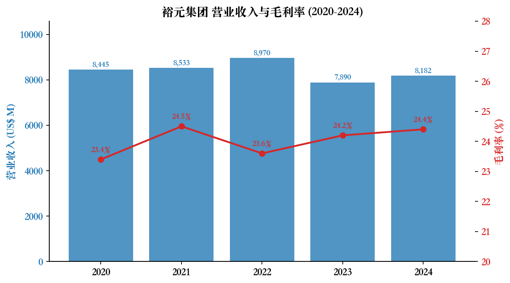
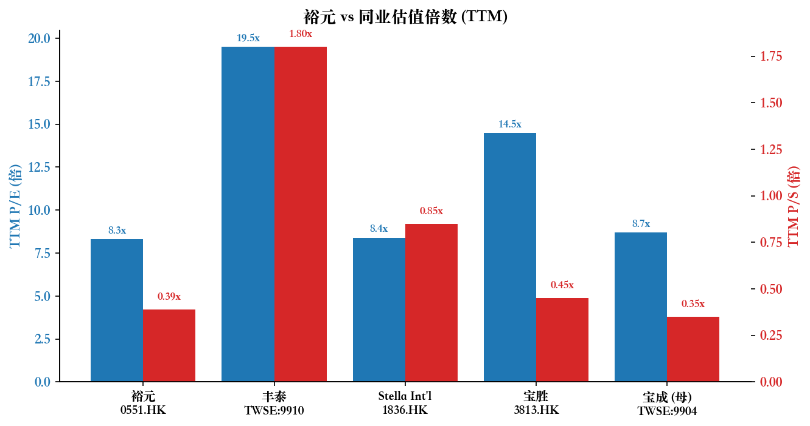
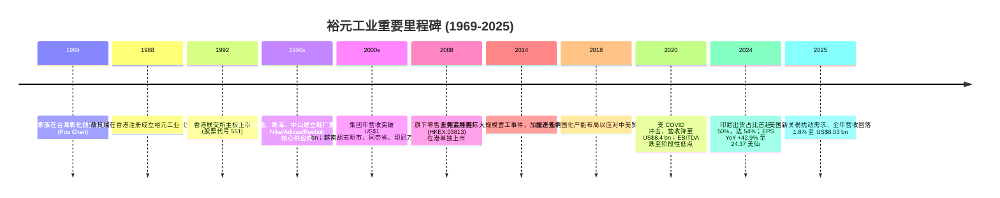
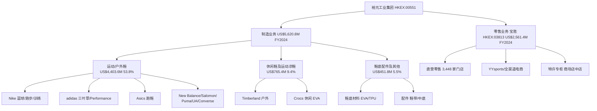
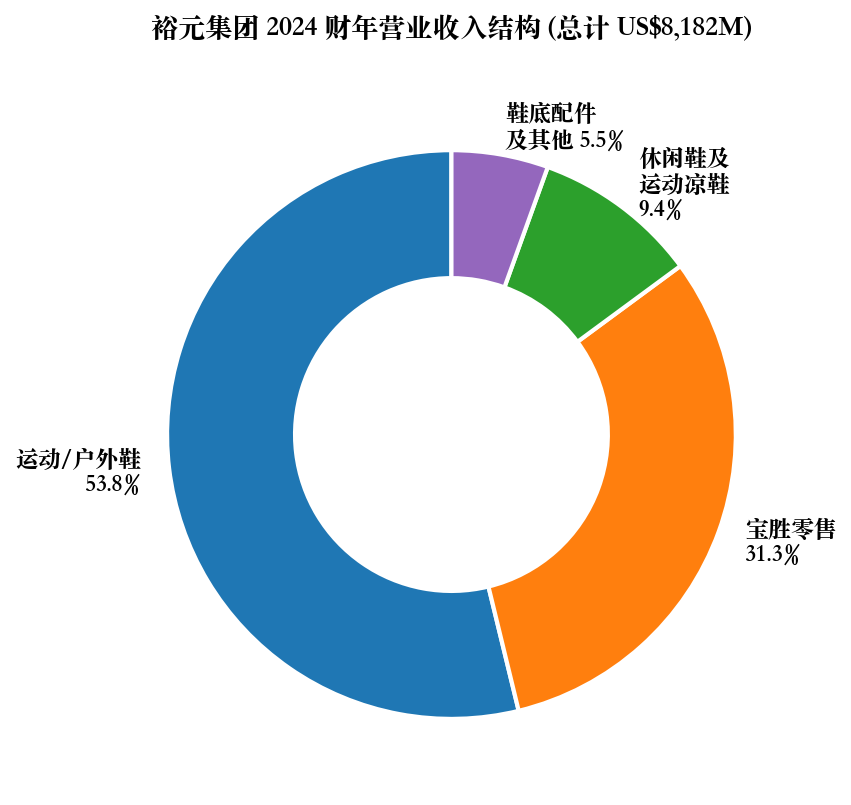
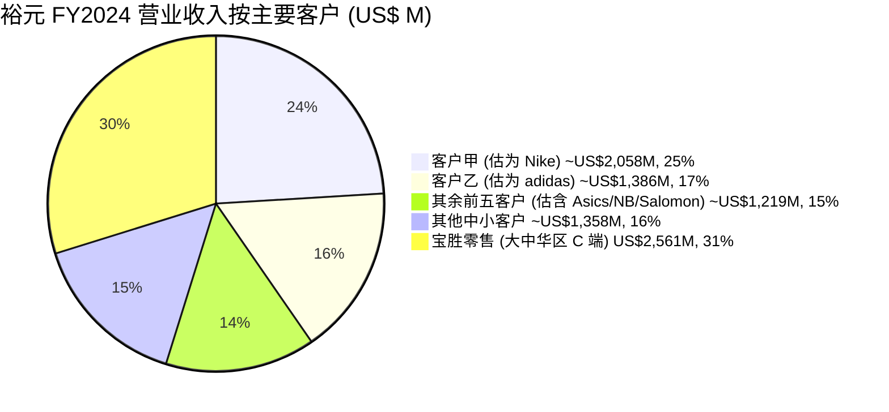
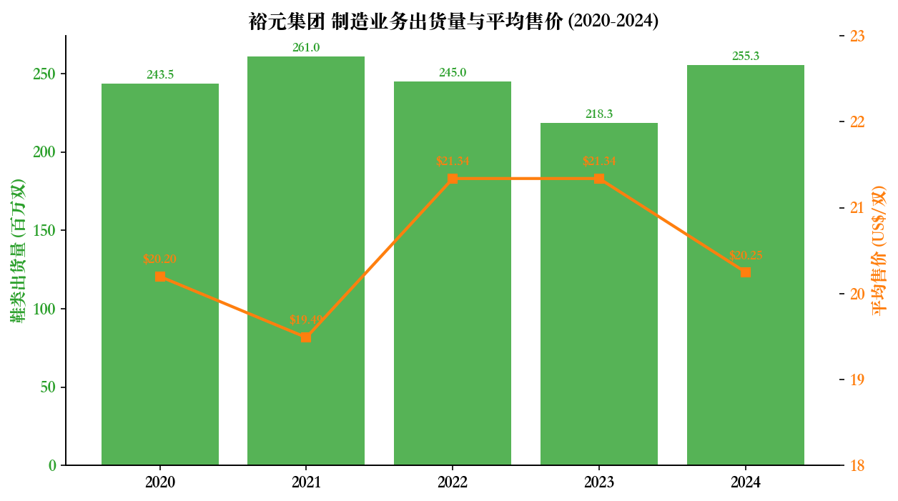
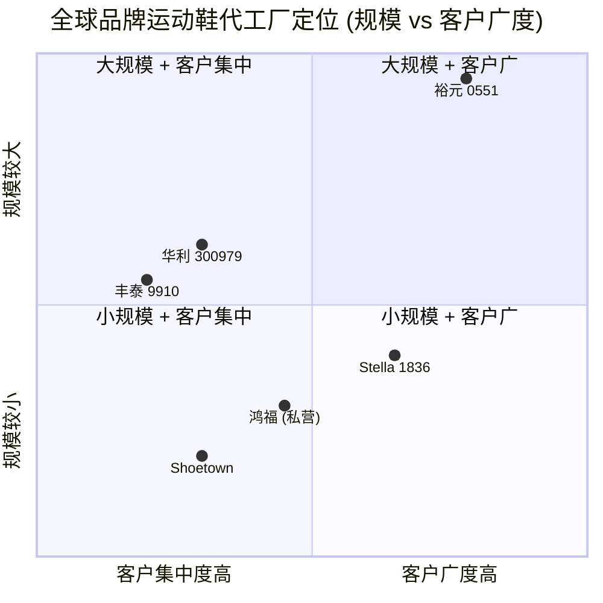
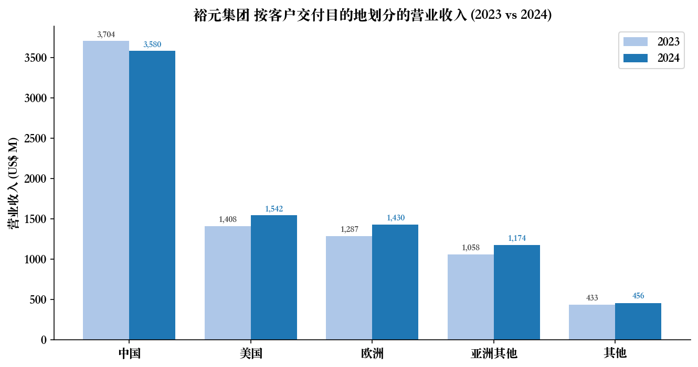
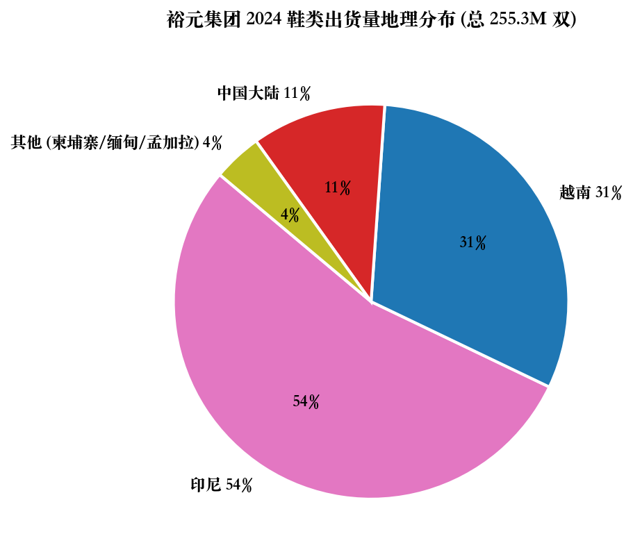

# 公司研究报告：裕元工业（集团）有限公司

**日期：** 2026-05-20
**正式中文名：** 裕元工业（集团）有限公司 (Yue Yuen Industrial (Holdings) Limited)
**港交所股份代号：** **00551.HK** (经 CNINFO 巨潮资讯网及 [HKEX 公告](https://www1.hkexnews.hk/listedco/listconews/sehk/2025/0422/2025042200842_c.pdf) 核对)
**注：** 用户原始指令中的 "HKEX:100" 在 CNINFO 实为 MINIMAX-W (旷视/MiniMax) 全资上市主体；用户附注的公司名"裕元集团 / Yue Yuen Industrial Holdings"对应代号为 00551。本报告以 **00551** 为准，文件路径沿用用户指定的 `HKEX100` 目录名。

---

## 目录

1. 公司概览
2. 公司历史
3. 管理团队
4. 产品与服务
5. 客户与上市策略
6. 行业概览
7. 竞争格局
8. 市场机会 (TAM)
9. 风险评估
10. 参考资料

---

## 1. 公司概览

裕元工业（集团）有限公司（"裕元"、"集团"，HKEX:00551）是**全球出货量最大的运动、运动休闲、休闲及户外鞋类品牌代工/原始设计制造商 (OEM/ODM)**，并通过其港交所主板上市附属公司**宝胜国际（控股）有限公司**（"宝胜"，HKEX:03813，集团持股约 62%）经营大中华区最大的整合型运动用品零售网络之一。集团总部位于香港九龙观塘伟业街 108 号丝宝国际大厦 22 楼 ([2024 年报, 公司资料页](https://www1.hkexnews.hk/listedco/listconews/sehk/2025/0422/2025042200842_c.pdf))，于百慕达注册成立，1992 年 7 月以股份代号 551 在香港联合交易所主板上市。

**业务模式**：

- **制造业务（FY2024 营收 US$5,620.8M，占总收入 68.7%）**：直接为 Nike、adidas、Asics、New Balance、Salomon、Puma、Under Armour、Timberland、Converse 等国际品牌设计与生产鞋履，按"接单－排产－交付（FOB）"模式确认收入，订单交期一般为 10–12 周，部分快反订单 30–45 天 ([2024 年报, 第 16 页](https://www1.hkexnews.hk/listedco/listconews/sehk/2025/0422/2025042200842_c.pdf))。FY2024 鞋类总出货量 **255.3 百万双**（YoY +16.9%），平均售价 (ASP) **US$20.25/双** (YoY ‑5.1%) ([同上, 第 17 页](https://www1.hkexnews.hk/listedco/listconews/sehk/2025/0422/2025042200842_c.pdf))。
- **零售业务（FY2024 营收 US$2,561.4M，占 31.3%）**：通过宝胜国际于大中华区营运约 **3,448 家**直营零售店（截至 2024 年末，全年净关店 75 家），代理及销售 Nike、adidas 等品牌运动鞋服与配件，并参与抖音直播、YYsports 抖音号、平台店群等全渠道零售 ([2024 年报, 第 16 页](https://www1.hkexnews.hk/listedco/listconews/sehk/2025/0422/2025042200842_c.pdf))。

**地理足迹与规模**：FY2024 制造产能按出货量计**印尼占 54%、越南 31%、中国大陆 11%、其他（柬埔寨/缅甸/孟加拉/印度）4%** ([2024 年报, 第 17 页](https://www1.hkexnews.hk/listedco/listconews/sehk/2025/0422/2025042200842_c.pdf))，体现集团已经历 6 年以上的供应链多元化迁移；非流动资产分布印度尼西亚 US$707M、越南 US$561M、中国 US$929M（FY2024 末，[2024 年报附注 5, 第 128 页](https://www1.hkexnews.hk/listedco/listconews/sehk/2025/0422/2025042200842_c.pdf)）。按交付目的地划分的营收：中国 US$3,580M（44%）、美国 US$1,542M（19%）、欧洲 US$1,430M（17%）、亚洲其他 US$1,175M（14%）、其他地区 US$456M（6%）([2024 年报附注 5, 第 127 页](https://www1.hkexnews.hk/listedco/listconews/sehk/2025/0422/2025042200842_c.pdf))。

**员工规模**：截至 2024 年 12 月 31 日，集团全球**约 285,500 名员工**（同比 +7.9%），其中制造业务约 265,500 人，宝胜约 20,000 人 ([2024 年报, 第 21 页](https://www1.hkexnews.hk/listedco/listconews/sehk/2025/0422/2025042200842_c.pdf))。这一规模相当于中国上市制造业前列水平，与同业丰泰 (TWSE:9910) 不到 6 万员工形成显著对比。

**FY2024 关键财务表现** ([2024 年报, 第 2 页](https://www1.hkexnews.hk/listedco/listconews/sehk/2025/0422/2025042200842_c.pdf))：

| 指标 | FY2024 | FY2023 | YoY |
|---|---|---|---|
| 营业收入 | US$8,182.2M | US$7,890.2M | +3.7% |
| 制造业务收入 | US$5,620.8M | US$5,059.4M | +11.1% |
| 零售业务收入 | US$2,561.4M | US$2,830.7M | -9.5% |
| 整体毛利率 | 24.4% | 24.0% | +0.4pp |
| 制造毛利率 | 19.9% | 19.2% | +0.7pp |
| 股东应占溢利 | US$392.4M | US$274.7M | +42.8% |
| EBITDA | US$899.7M | US$777.5M | +15.7% |
| 自由现金流 | US$325.8M | US$744.1M | -56.2% |
| 全年每股股息 | HK$1.30 | HK$0.90 | +44.4% |
| 派息率 | 接近 70% | 接近 70% | 持平 |

*数据来源：[裕元 2024 年报, 第 2 页](https://www1.hkexnews.hk/listedco/listconews/sehk/2025/0422/2025042200842_c.pdf) 及历年年报；2020 年营收 US$8,445M，2021 US$8,533M，2022 US$8,970M。*

**估值快照（截至 2026-05-13）**：

- **股价**：HK$14.88（[Yahoo Finance, 0551.HK](https://finance.yahoo.com/quote/0551.HK/)）
- **市值**：约 HK$24.66 bn (≈ US$3.16 bn) ([Stockanalysis.com, 0551.HK](https://stockanalysis.com/quote/hkg/0551/statistics/))
- **TTM P/E**：**8.31×**；远期 P/E 8.97×；EPS (TTM) HK$1.85 ([同上](https://stockanalysis.com/quote/hkg/0551/statistics/))
- **TTM P/S**：约 **0.39×**（HK$24.66 bn 市值 / HK$62.51 bn 营收）
- **股息收益率**：8.35–11.6%（2026 年 6 月除息 HK$0.90 末期股息, [Stockinvest.us, 0551.HK Dividend](https://stockinvest.us/dividends/0551.HK)）
- **三年估值区间**：TTM P/E 大致在 6×–12× 之间波动；最低位出现在 2022 年消费疲弱叠加封控时；当前处于中性偏低水平。
- **行业可比 P/E**：丰泰企业 (TWSE:9910) ~19–21×；Stella International (HKEX:01836) ~8–9×；母公司宝成工业 (TWSE:9904) ~8–9×；宝胜国际 (HKEX:03813) ~14–15×。

*数据来源：[Stockanalysis.com (0551.HK)](https://stockanalysis.com/quote/hkg/0551/statistics/)，[Disfold Taiwan Footwear ranking](https://disfold.com/taiwan/industry/footwear-accessories/companies/)，[Investing.com 0551 财务](https://cn.investing.com/equities/yue-yuen-ind-financial-summary)；同业估值为粗略 TTM 估计。*

**估值倍数解读**：裕元当前 TTM P/E 约 8×、P/S 约 0.4×，**显著低于同业丰泰** (~20×) 而**与母公司宝成、Stella 接近**。低估值的核心原因不是基本面恶化（FY2024 净利同比 +42.8%），而是市场对：(1) **2025 年美国 (Trump 政府新一轮) 加征关税导致品牌客户下单转趋保守**，(2) 大陆零售（宝胜）持续承压，(3) **代工行业天花板低、ASP 难以系统性提价**，以及 (4) **大股东宝成持股 51% 流通盘较小**导致股票流动性折价。裕元高股息率（8% 以上）与稳定派息政策为估值提供支撑——若净利回到 US$400M+ 水平，按 70% 派息率推算每股股息约 HK$1.20–1.30，对应当前股价收益率仍可接近 8.5%。

> **更新——2025 年中期业绩（2025-08-11 公告）**：FY2025 上半年营业收入 US$4,060.1M (YoY +1.1%)，但**股东应占溢利下降 7.2% 至 US$171.2M**，主要受美国关税不确定性影响品牌客户采购节奏；管理层维持中期股息 HK$0.40/股不变。
> 来源：[裕元截至 2025 年 6 月 30 日止六个月未经审核中期业绩, 2025-08-11](https://www1.hkexnews.hk/listedco/listconews/sehk/2025/0811/2025081100842_c.pdf)。WWD 报道全年 FY2025 营收降至 US$8.03 bn (YoY ‑1.8%)，出货量 252.2M 双 (‑1.2%) ([WWD, 2026-03](https://wwd.com/footwear-news/shoe-industry-news/footwear-manufacturer-yue-yuen-shoe-shipments-tariffs-trade-1238673077/))。

---

## 2. 公司历史

**1969 — 蔡氏家族奠基**。裕元的"母体"宝成工业 (Pou Chen Corporation, TWSE:9904) 由蔡其建、蔡其瑞、蔡其能三兄弟在 1969 年于台湾彰化鹿港创立，最初从事台币 PVC 雨鞋代工 ([Pou Chen Corporation - Wikipedia](https://en.wikipedia.org/wiki/Pou_Chen_Corporation))。1970 年代末宝成获得 Nike、Adidas 的鞋类代工订单，开启品牌运动鞋制造业务。

**1988 — 蔡其瑞兄弟另立香港平台**。蔡其瑞 (Tsai Chi-jui) 等于 1988 年 4 月在香港设立**裕元工业（集团）有限公司**，定位于将宝成系产能延伸到中国大陆并面向国际资本市场 ([Pou Chen Corporation | Encyclopedia.com](https://www.encyclopedia.com/books/politics-and-business-magazines/pou-chen-corporation))。彼时改革开放方兴未艾，珠三角土地与劳动力成本优势叠加加工贸易税收优惠，使裕元得以快速在广东东莞、中山、珠海建立鞋厂集群。

**1992 — 港交所主板上市**。1992 年 7 月，裕元在香港联交所主板挂牌，股票代号 551，募集资金加速产能扩张 ([Yue Yuen — Wikipedia](https://en.wikipedia.org/wiki/Yue_Yuen_Industrial_Holdings))。

**关键战略转折**：

1. **2000 年代越南/印尼产能布局**：在中国劳动力成本上升前，裕元已布局越南胡志明、同奈省与印尼万隆等地，成为全球最早完成"中国 +1"东南亚布局的鞋类代工商之一。这一前瞻布局使 FY2024 中国出货占比已压降到 11% ([2024 年报, 第 17 页](https://www1.hkexnews.hk/listedco/listconews/sehk/2025/0422/2025042200842_c.pdf))，相对 2014 年东莞罢工时期接近 30% 显著下降，结构性削弱了美国对华关税的传导。

2. **2008 年宝胜零售分拆**：将零售业务剥离单独上市 (HKEX:03813)，一方面释放零售估值（零售业务 P/E 长期较代工业务高 4–6×），另一方面把"消费端"曝险与"制造端"现金流隔离。这种"双层上市"架构沿用至今——FY2024 集团对宝胜应占溢利 RMB 491.5M (YoY +0.2%)，反映宝胜 ROE 已与裕元制造业务接近 ([2024 年报, 第 15 页](https://www1.hkexnews.hk/listedco/listconews/sehk/2025/0422/2025042200842_c.pdf))。

3. **2018–2024 数字化精益制造**：集团推进"生态智能 + 智能制造"，包括工厂端 SAP ERP、一体化作业平台 (OCP)、AI 代理试点；FY2024 制造毛利率 19.9% 创自 2010 年以来新高 ([2024 年报, 第 8 页](https://www1.hkexnews.hk/listedco/listconews/sehk/2025/0422/2025042200842_c.pdf))。

**最近 12 个月动向**：

- 2025 年 8 月公告 CFO 变动：**Chan Lu Min（陳駱民）出任新任 CFO**，原 CFO 施志宏先生退任 ([CFO 变动公告, 2025-08-11](https://investor.yueyuen.com/20250811175601683811790539_en.pdf))。
- 印度产能扩张：管理层在 FY2024 年报"展望"段落明确将印度尼西亚与**印度**列为下一阶段重点产能布局区域，呼应母公司宝成系（鸿福、丰泰）已在印度泰米尔纳德邦设厂的产业趋势 ([2024 年报, 第 22 页](https://www1.hkexnews.hk/listedco/listconews/sehk/2025/0422/2025042200842_c.pdf))。
- 美国关税冲击：管理层在 FY2025 中期业绩中表示品牌客户因美国新关税"采购更趋保守"，但"高端订单产品组合"使 ASP 上升 3.2% 部分抵销出货量 5.0% 增长后的销售压力。

---

## 3. 管理团队

**卢金柱 (Lu Chin-chu)，71 岁，主席兼执行董事**（300+ 字深度）

卢金柱先生自 2014 年 3 月 26 日出任裕元执行董事兼董事会主席，并曾于 1996 年 2 月至 2011 年 3 月期间担任执行董事，是集团事实上的"双任期"管理者。他**持有台湾国立中兴大学商业管理硕士学位**，并在鞋类及鞋材制造领域累积**超过 47 年经验**（自 1977 年加入宝成至今 48 年）。他目前同时担任**宝成工业 (TWSE:9904) 总经理、董事及房地产部总经理**，深度参与宝成集团的董事会层级决策与战略事务 ([2024 年报, 第 26 页](https://www1.hkexnews.hk/listedco/listconews/sehk/2025/0422/2025042200842_c.pdf))。

卢主席在裕元负责**集团房地产管理业务**与战略层级事务，同时作为 Wealthplus Holdings 与 Win Fortune Investments（两间均为宝成全资附属、合计持有裕元约 51.1% 股权）的董事，是蔡氏家族在裕元董事会中执行控股权的"代言人"。他还兼任另一家台湾上市公司**三芳化学工业**的董事（仅参与董事会层级），曾担任日勝化工 (2006–2018) 与香港上市的**联泰控股**(2007–2017)、**其利工业** (2018–2020) 非执行董事。这种"宝成系内部交叉任职"的格局，使得裕元能够最大化共享母公司在原物料采购、自动化设备、ERP 系统、ESG 认证等方面的规模效益。卢主席的公开露面较少，主要通过年报"主席报告"与机构投资者会议传达战略意图，2024 年的报告强调"**永续增长动能**"与"**关税、通胀、地缘冲突不确定性下的经营韧性**"两条主线，符合一位资深"控股股东代理人"而非"明星 CEO"的低调风格。

**蔡佩君 (Patty Tsai Pei-chun)，45 岁，董事总经理 (Managing Director)**（180+ 字）

蔡佩君女士是 2008 年宝胜分拆、2014 年裕元董事会改组的主要执行人，自 2005 年 1 月起担任裕元执行董事，2013 年 6 月起出任董事总经理，**主导集团策略规划及企业发展**，并担任公司提名委员会成员。她毕业于**美国宾州大学华顿商学院 (Wharton School)**，获经济学理学士学位（主修财务金融，副修心理学），2002 年加入宝成 ([2024 年报, 第 28 页](https://www1.hkexnews.hk/listedco/listconews/sehk/2025/0422/2025042200842_c.pdf))。作为蔡其瑞先生侄女 (蔡氏第三代代表)，她在宝胜国际 (HKEX:03813) 也担任非执行董事，是连接宝成、裕元、宝胜三家上市公司的关键人物。她在 2014 年后主导了裕元的**数字化制造转型** (SAP ERP、智能自动化) 与**ESG 评级提升** (MSCI BB、S&P Global ESG 48 分)，过去三年集团连续被 S&P Global《永续发展年鉴 (中国版)》收录，2024 年首次被评为"行业最佳进步企业"。

**陳駱民 (Chan Lu Min)，CFO（2025 年 8 月新任）**（140+ 字）

施志宏先生（59 岁，2007 年加入集团，2022 年 9 月起任 CFO）已于 2025 年 8 月退任，由陳駱民先生接任 ([CFO 变动公告, 2025-08-11](https://investor.yueyuen.com/20250811175601683811790539_en.pdf))。施志宏先生**毕业于台湾中原大学会计系**，1991 年加入宝成，曾任宝成副总经理，并在港股上市的鹰美 (HKEX:0381) 担任执行董事。新任 CFO 陳駱民为内部晋升，符合宝成系"内部培养、自下而上"的财务高管路径。由于裕元业务的资本支出主要集中在东南亚厂房（FY2024 资本开支 US$211M），融资成本严格控制 (FY2024 银行借贷利息 US$52.8M，同比下降 26%)，对 CFO 的核心要求是跨币种 (USD/IDR/VND/RMB) 风险管理与税务争议处理 (FY2024 印尼子公司税务争议确认 US$28.2M)。

**詹陆铭 (James Chan Lu-ming)，70 岁，执行董事**（90+ 字）

詹陆铭先生为台湾国立中兴大学统计系毕业，**在台湾拥有 44 年财务会计经验**，1977 年加入宝成，现为**宝成董事会主席兼总管理部总经理，负责整个宝成系的财务会计工作** ([2024 年报, 第 28 页](https://www1.hkexnews.hk/listedco/listconews/sehk/2025/0422/2025042200842_c.pdf))。他与卢金柱主席同期加入宝成 (均始于 1977 年)，是宝成最资深的财务高管之一，在裕元董事会发挥**集团审计与税务把关**的关键作用，尤其是当 FY2024 印尼税务争议爆发时。

**林振钿 (Lin Cheng-tien)，65 岁，执行董事**（90+ 字）

林先生毕业于**英国南田制鞋学校 (Cordwainers College，现莱斯特学院制鞋科)**，是裕元董事会中少有的具有正规鞋类工艺教育背景的董事。他于 1990 年加入宝成，现为**宝成资深执行副总经理，负责若干鞋类品牌客户之生产、销售及市场推广**，涵盖与 Nike、adidas 等 Tier-1 客户的日常对接 ([2024 年报, 第 28 页](https://www1.hkexnews.hk/listedco/listconews/sehk/2025/0422/2025042200842_c.pdf))。

**刘鸿志 (George Liu Hong-chih)，52 岁，执行董事**（100+ 字）

刘先生**毕业于美国宾大华顿商学院 (MBA) 与耶鲁大学 (BA)**，加入裕元前曾在贝恩公司、摩根士丹利 (执行董事级别) 与中金公司（董事总经理、香港投资银行部门主管）工作 ([2024 年报, 第 28 页](https://www1.hkexnews.hk/listedco/listconews/sehk/2025/0422/2025042200842_c.pdf))。他于 2013 年加入裕元任执行董事，现为宝成副总经理，主管若干主要品牌的业务发展及生产管理。其投行/咨询背景使其在集团 M&A、关联交易、与品牌客户的合约谈判中发挥独特作用——他也是 2024 年股份奖励计划项下被授予 90,000 股待归属股份的执行董事 ([2024 年报, 第 34 页](https://www1.hkexnews.hk/listedco/listconews/sehk/2025/0422/2025042200842_c.pdf))。

**治理摘要 (Governance Footer)**

- **股权结构**：母公司**宝成工业 (TWSE:9904) 通过 Wealthplus + Win Fortune 持有约 51.11%**（截至 FY2024 末），蔡氏家族通过宝成实际控制裕元；其余约 49% 流通股由机构投资者及散户持有 ([2024 年报, 第 44 页](https://www1.hkexnews.hk/listedco/listconews/sehk/2025/0422/2025042200842_c.pdf))。
- **董事会结构**：10 名董事，包括 6 名执行董事（卢金柱、蔡佩君、詹陆铭、林振钿、刘鸿志、施志宏/陳駱民）+ 4 名独立非执行董事（王克勤、何丽康、林学渊、杨茹惠博士），独董占比 40%。
- **审计委员会**：由独董王克勤先生（德勤前全国审计及鑑証主管合夥人）担任主席，财务监督专业性较高。
- **薪酬结构**：以现金为主，**股份奖励计划 (2019 年采纳, 10 年有效期至 2029-05-30)** 提供股权激励，FY2024 实际授予规模较小（刘鸿志 90,000 股）。这与典型创办人式 (founder-led) 公司"现金 + 大额股权"差异显著，反映裕元更接近"专业经理人执行 + 家族控股"模式。
- **关联交易**：与母公司宝成及其他宝成系实体存在较多持续关连交易（材料采购、共用 IT、研发服务），FY2024 年关连交易已获独立董事审核并出具核数师无保留意见函件 ([2024 年报, 第 44 页](https://www1.hkexnews.hk/listedco/listconews/sehk/2025/0422/2025042200842_c.pdf))。
- **印尼税务争议**：FY2024 确认了相关滞纳金 US$12.3M 及税务支出 US$28.2M，已向印尼共和国最高法院提交上诉 ([2024 年报, 第 18 页](https://www1.hkexnews.hk/listedco/listconews/sehk/2025/0422/2025042200842_c.pdf))，构成短期治理瑕疵但金额可控（占股东净利约 10%）。

**管理团队战绩综合评估**

蔡氏第二代/第三代 + 宝成内部资深经理人组成的执行团队在过去十年完成了**三件事**：(1) **产能从中国向印尼/越南迁移**，FY2024 中国出货占比降至 11%；(2) **数字化精益制造**，FY2024 制造毛利率创 14 年新高 19.9%；(3) **稳定派息政策**，连续多年派息率接近 70%。**短板**是：(a) 零售业务（宝胜）应对大陆消费疲弱的转型节奏偏慢、店效与同店销售改善有限；(b) 对外资本配置策略偏保守，FY2024 末仍有 US$943M 现金 + US$186M 净现金，但并未大规模回购或派发特别股息；(c) **管理梯队过于"宝成内部化"**——非独董全部来自宝成系，独立性与外部视野有限。整体上是一支"稳健、低调、注重永续"的团队，与裕元"代工业务永续增长 + 高股息"的投资逻辑高度匹配。

---

## 4. 产品与服务

裕元提供**两大业务板块**：制造业务（鞋类 OEM/ODM）与零售业务（宝胜）。

### 制造业务 (US$5,620.8M, FY2024, +11.1% YoY)

**1. 运动/户外鞋（US$4,403.6M，占总营收 53.8%，制造业务的 85.2%）**

最大产品类别，**运动鞋 + 跑步鞋 + 篮球鞋 + 户外越野跑鞋**全谱系覆盖。客户包括 Nike (跑步、篮球如 Air Jordan、训练 Pegasus 系列)、adidas (Boost 跑鞋平台、Yeezy 历史合作)、Asics (GEL 跑鞋)、New Balance (经典复刻 + 现代跑鞋)、Salomon (越野跑/户外)、Puma (跑训)、Under Armour (篮球/训练)、Converse (复古帆布) ([2024 年报, 第 14 页](https://www1.hkexnews.hk/listedco/listconews/sehk/2025/0422/2025042200842_c.pdf))。

- **目标客户**：全球品牌方 (Tier-1 国际运动品牌)，按 OEM/ODM 模式合作；订单交期 10–12 周，快反订单 30–45 天。
- **定价模式**：FY2024 平均售价 US$20.25/双，YoY ‑5.1%（主要由于高基数效应及产品组合变化导致结构性平均价回落）。
- **竞争优势 (是)**：(a) **规模与多元产能** — 单一供应商可在印尼/越南/中国/柬埔寨/缅甸/孟加拉/印度并行排产；(b) **快速反应**（30–45 天快反）— 业内少有公司能在多个国家同时支持此交期；(c) **客户深度合作** — 为每家主要品牌客户成立**独立产品研发中心**（FY2024 研发开支 US$142.2M），共同开发新形体、新材料、新工艺；(d) **质量与可持续认证** — MSCI ESG BB、S&P Global ESG 48 分、FLA 公平劳动协会认证（全球首家及唯一获 FLA 认证的鞋类供应商）。
- **护城河类型**：规模 + 切换成本 + 客户共同开发的知识资产 (joint IP) + ESG/合规认证。
- **最接近的竞品**：丰泰企业 (TWSE:9910) 在 Nike 单一客户中占比更高（市场估计 Nike 鞋类 ~25–30% 由丰泰生产，包括 Air Jordan）；裕元在 Nike 中占比约 ~20% 但产品线更广，且同时是 adidas、Asics、Salomon 等的核心供应商。**裕元在多客户布局上领先丰泰，但在 Nike 单一客户深度上略逊于丰泰**。

**2. 休闲鞋及运动凉鞋（US$765.4M，9.4%）**

包括 Crocs EVA 休闲鞋、Teva 凉鞋、Timberland 部分休闲款 SKU、UGG 等品牌的休闲/凉鞋类。FY2024 此品类同比 +24.2%，是制造业务中增速最快的细分 ([2024 年报, 第 17 页](https://www1.hkexnews.hk/listedco/listconews/sehk/2025/0422/2025042200842_c.pdf))，反映"运动休闲化"(athleisure) 趋势对裕元的结构性利好。

- **竞争优势 (部分)**：休闲鞋技术门槛低于专业运动鞋，竞争更激烈（越南、孟加拉本土工厂同样可生产），裕元的优势主要在**与运动品牌捆绑的快反能力**而非纯成本。

**3. 鞋底、配件及其他（US$451.8M，5.5%）**

EVA 鞋底、TPU、TPR、橡胶组件、鞋带、中底等。裕元的**鞋底材料垂直整合能力**（多个鞋厂自有 EVA 发泡产线）是相对丰泰、Stella 的差异化优势之一。FY2024 同比 +12.4%。

### 零售业务 — 宝胜国际（US$2,561.4M，31.3%）

宝胜国际（HKEX:03813，裕元持股约 62%）是**大中华区领先的多品牌运动用品零售商**，截至 2024 年末经营 **3,448 家直营门店**（净关 75 家），同时运营 YYsports 抖音号、抖音直播店群、品牌官方电商代运营等。

- **代理品牌**：Nike、adidas、Puma、Asics、Converse、Skechers、Under Armour、Vans、Crocs 等。
- **业务模式**：(a) **直营零售门店** (实体)：销售运动鞋服并按销售额自主入账；(b) **特许专柜 (concessionaire)**：与百货公司合作，按佣金入账；(c) **全渠道电商**（占总销售贡献 28%）：直播 + 抖店 + 品牌官方电商代运营。
- **FY2024 表现**：营业收入按 RMB 计 ‑8.0% 至 RMB 18,453.9M（按 USD ‑9.5% 至 US$2,561.4M）；毛利率 34.2%（YoY +0.5pp）；**应占溢利 RMB 491.5M (YoY +0.2%)** — 即在销售下滑的同时实现盈利稳定，体现折扣管控与库存管理改善 ([2024 年报, 第 15 页](https://www1.hkexnews.hk/listedco/listconews/sehk/2025/0422/2025042200842_c.pdf))。
- **竞争优势 (部分)**：宝胜在**多品牌组合零售**上仍是大陆头部之一，但相对滔搏 (HKEX:06110，百丽国际旗下的运动零售业务) 在规模、单店效益、电商运营经验上仍有差距；滔搏 FY2024 营收约 RMB 28.9 bn (≈ 1.5× 宝胜)。
- **最接近的竞品**：滔搏国际 (HKEX:06110)、京东运动、Nike/adidas 自营 DTC 体系。

### 旗舰产品与最近 12 个月动态

**旗舰类别**：运动/户外鞋（占总营收 53.8%、出货量约 80%+），是裕元的现金牛与"票房保证"。

**FY2024 新动态**：

- **印尼产能持续扩张**，2024 年出货占比首次超过 50%（达 54%）。
- 制造业务**产能利用率显著提升**，**经营溢利率创自 2010 年以来新高**。
- 集团首次入选**S&P Global 永续发展年鉴 (中国版) 2024**，获评"行业最佳进步企业"。
- 宝胜全渠道销售贡献提升至 **28%**；抖音直播销售实现翻倍增长。

### 营业收入结构图

*数据来源：[裕元 2024 年报, 第 17 页](https://www1.hkexnews.hk/listedco/listconews/sehk/2025/0422/2025042200842_c.pdf)*

---

## 5. 客户与上市策略

### 客户结构 (FY2024)

**核心数据 (源自 [2024 年报, 第 44 页 主要客户及供应商](https://www1.hkexnews.hk/listedco/listconews/sehk/2025/0422/2025042200842_c.pdf) 及 [附注 5, 第 128 页](https://www1.hkexnews.hk/listedco/listconews/sehk/2025/0422/2025042200842_c.pdf))**：

| 指标 | FY2024 | FY2023 |
|---|---|---|
| 五大客户合计占总销售额 | **约 57%** | 约 53%（推算）|
| 最大单一客户占总销售额 | **约 25%** | 约 26%（推算）|
| 披露超 10% 客户：客户甲 | **US$2,057.8M** | US$2,038.0M |
| 披露超 10% 客户：客户乙 | **US$1,385.8M** | US$1,032.0M |

按业界普遍认知，**客户甲（占 25%、US$2.06 bn）大概率为 Nike Inc.**，**客户乙（占 17%、US$1.39 bn 且 YoY +34%）大概率为 adidas**。裕元在年报中并未明示客户身份（依港交所要求只需金额披露），但管理层在年报"业务回顾"中明确将 Nike、adidas、Asics、New Balance、Salomon 列为长期合作品牌 ([2024 年报, 第 14 页](https://www1.hkexnews.hk/listedco/listconews/sehk/2025/0422/2025042200842_c.pdf))。

**客户集中度风险评估**：

- **触发风险阈值**：单一客户 25% > 20% 阈值、Top-5 ≈57% > 50% 阈值。这属于**材料性风险**，已纳入第 9 节风险评估。
- **缓和因素**：(a) Nike、adidas 同时是丰泰、宝成 (台湾)、Hong Fu (鸿福)、Shoetown 等多家代工厂的客户；裕元在 Nike 内部份额估计约 18–22%，并非 Nike "唯一供应商"也非 Nike "可被取代供应商"，而是**双方相互依赖**——Nike 难以在 12 个月内将 25% 产能从裕元转移走；(b) 集团已建立"每家主要品牌客户对应独立研发中心"的结构，**研发协同 + 模具/工艺 know-how + 多年品质记录**形成切换成本；(c) FY2024 客户乙 (adidas) 订单 YoY +34%，反映 adidas 在 Yeezy 终止后正在向裕元加大下单，分散了客户甲的占比上行风险。
- **合同结构**：管理层在年报中说明"国际品牌之制造订单由负责管理各客户之事业单位承接，且一般需时约 10–12 周完成"，意味着**没有典型意义上的多年期主合约 (master agreement)**，而是按订单滚动（PO-by-PO）模式合作，理论上品牌方随时可以减单。但实际上品牌方与裕元通过滚动需求规划 (rolling forecast)、共同开发 (JDM)、独立研发中心等机制形成事实上的长期合作。

### 渠道与销售策略

**制造业务**：

- 直接对接品牌方采购 / 供应链团队，订单管理事业部 (Business Unit) 制——每个品牌客户对应一个独立 BU，从研发、生产、品质到出货全流程对接。
- 主要交货地包括：北美 (美国西海岸主要港口)、欧洲 (汉堡、安特卫普)、日本、东南亚区域配送中心。
- 按客户所在地区划分的 FY2024 营收：中国 44%、美国 19%、欧洲 17%、亚洲其他 14%、其他 6%。注意"中国 44%"主要为**宝胜零售在大陆的销售**及部分品牌方在中国的本地化采购，并非反映制造业务出口结构。

**零售业务（宝胜）**：

- 直营门店选址聚焦一二线 + 强三线城市核心商圈、shopping mall、高铁站等高客流场所。
- 全渠道战略：**线下精致化（关店调整 + 单店提效）+ 线上抖音/小红书/视频号（公域 + 私域并重）**，FY2024 全渠道销售占比已达 28%。
- 与品牌方授权合作 YYsports 抖音号，运营品牌官方直播店，是品牌方"线上 DTC 代运营"的承接者。

### 客户案例（公开）

- **Nike Air Jordan 系列**：裕元印尼厂区为 Air Jordan 重要生产基地之一（业界共识，无年报明确披露）。
- **adidas Boost 平台 / Yeezy 退出后转单**：FY2024 adidas (推测) 订单 +34% 反映 adidas 在 Yeezy 终止后将原 Yeezy 订单 (主要由韩国/中国其他厂生产) 转移到 Nike/adidas 两大产品线，裕元承接了部分增量。

---

## 6. 行业概览

### 行业定义与范围

**全球品牌运动 / 户外 / 休闲鞋类代工与设计制造 (OEM/ODM)** 行业，所属 NAICS 31621 (Footwear Manufacturing) 与 SIC 3140 (Footwear, Except Rubber)。终端市场覆盖运动鞋、跑步鞋、篮球鞋、训练鞋、户外越野鞋、运动休闲鞋 (athleisure)、运动凉鞋等。**裕元、丰泰、宝成、鸿福、Stella、Shoetown** 等台湾 / 港资代工厂占据品牌运动鞋全球代工市场的约 60–70% 份额。

### 市场规模与增长

**1. 终端运动用品市场（包含鞋服）**：

- **2024 年全球运动用品市场规模约 US$408 bn**，并预计 **2024–2029 年均复合增长率 6%**，2029 年市场规模有望达到 **US$548 bn** ([裕元援引 WFSGI / McKinsey, 2024 年报, 第 11 页](https://www1.hkexnews.hk/listedco/listconews/sehk/2025/0422/2025042200842_c.pdf))。
- McKinsey *Sporting Goods 2025* 报告显示 44% 行业高管对 2025 年持乐观或较乐观态度 ([McKinsey, 2025-02](https://www.mckinsey.com/industries/retail/our-insights/sporting-goods-industry-trends))。

**2. 全球运动鞋类市场**：

- 第三方研究公司估值差异较大：**Research and Markets 估 2025 年市场规模 US$89.8 bn (YoY +5.4%)**；**Fortune Business Insights 估 2026 年 US$152.8 bn**；**Mordor Intelligence 估 2026 年 US$194.9 bn**——差异主要源于"运动鞋"边界定义不同（是否含运动休闲、童鞋等）。
- 取中位口径，**2024 年全球运动鞋类规模约 US$130–180 bn，CAGR 5–7%**，到 2029 年约 US$180–250 bn 区间。

**3. 全球鞋类总出货量**：

- 据 Statista 预估，**2029 年全球鞋履出货量将达 149 亿双**，YoY 复合个位数增长 ([裕元援引 Statista, 2024 年报, 第 11 页](https://www1.hkexnews.hk/listedco/listconews/sehk/2025/0422/2025042200842_c.pdf))。
- 2024 年：**越南鞋履出口 US$229 亿 (YoY +13.0%)、印尼运动鞋履出口 US$47 亿 (YoY +9.3%)、中国鞋履出口 US$469 亿 (YoY ‑4.9%)、但出口量 +3.3% 至 92 亿双**（[同上, 第 8 页](https://www1.hkexnews.hk/listedco/listconews/sehk/2025/0422/2025042200842_c.pdf)，引用官方统计）。中国出口量上升但金额下降，意味着**单价持续下滑**——这是行业过去 3 年的结构性特征。

### 关键增长驱动

1. **后疫情运动消费习惯持续**：Z 世代到退休族群均增强健康与运动需求，"运动 + 时尚 + 社群定位"叠加。
2. **运动休闲化 (athleisure) 趋势**：休闲鞋及运动凉鞋类别（裕元 FY2024 +24.2%）持续高于运动鞋 (+9.0%)。
3. **东南亚 + 印度新兴市场消费升级**：印度市场被裕元管理层明确列为下一步扩产目标。
4. **环保 / 永续材料**：再生 EVA、生物基 TPU、海洋塑料回收鞋面等品牌客户需求上升，对供应商研发能力提出更高要求。
5. **DTC + 全渠道零售**：品牌方 DTC 比例上升 (Nike DTC 占 ~44%) 对代工的产品规划、快反、SKU 数量要求上升，**有利于具备 30–45 天快反能力的裕元**。

### 监管环境

- **关税与贸易**：2018 年中美贸易摩擦以来，对中国出口美国鞋类加征 7.5% 关税；2024–2025 年 Trump 政府新一轮加征 ([WWD, 2026-03](https://wwd.com/footwear-news/shoe-industry-news/footwear-manufacturer-yue-yuen-shoe-shipments-tariffs-trade-1238673077/))。越南、印尼、印度等替代产地暂无对等高关税。
- **劳工与 ESG**：FLA 公平劳动协会、UNGC、GRI、SASB 等多重国际框架对全球鞋类代工厂的劳工权利、工时、薪酬、童工等做严格审计。裕元的 FLA 认证是行业 unique selling point。
- **环境与碳排放**：欧盟 CBAM (碳边境调节机制)、Nike/adidas 客户的 Scope 3 减排目标 → 制造商需提供详细排放数据。
- **印尼 / 越南本地法规**：印尼最低工资每年上调约 5–10%；越南 2024 年最低工资上调约 6%；劳动力成本上升压力持续。

### 行业结构

- **高度集中于代工端**：全球前 6 大鞋类代工 (裕元/宝成、丰泰、鸿福、Stella、Shoetown、Sao Hsien) 占品牌运动鞋代工市场约 60–70%。
- **高度集中于品牌端**：Nike + adidas 合计占全球运动鞋零售市场超过 50%；Top-10 品牌 (Nike, adidas, Puma, New Balance, Asics, Lululemon, Skechers, UA, Converse, Vans) 占约 75%。
- **供应商谈判力**：代工厂面对品牌客户议价能力较弱（ASP 持续下行），但具备多元产能 + ESG 认证 + 共同开发能力的头部供应商（裕元、丰泰）享有**份额上行的结构性优势**。
- **替代品风险**：本土品牌（安踏、李宁、特步、361°）在中国市场快速崛起，并使用自有/本地代工厂（如华利集团 SH:300979 为本土品牌代工占比更高），对裕元等"国际品牌代工"主体的中国业务有侵蚀风险，但对其美国/欧洲业务暂无直接威胁。

### 行业出货量与平均售价（裕元案例）

*数据来源：[裕元 2020-2024 年报](https://www1.hkexnews.hk/listedco/listconews/sehk/2025/0422/2025042200842_c.pdf)。FY2024 ASP US$20.25/双反映**单价回落但销量回升**的行业典型特征。*

---

## 7. 竞争格局

### 直接竞争对手

1. **丰泰企业 (TWSE:9910，Feng Tay Enterprises)** — Nike 单一最大供应商
   - 2024 年营收约 NT$82 bn (≈ US$2.7 bn)，主要为 Nike 代工 (包含 Air Jordan、Nike Pegasus 等核心产品线)。
   - 2024 年首次单年向 Nike 供应超过 100M 双鞋 ([English Common Wealth Magazine, 2023-09](https://english.cw.com.tw/article/article.action?id=3503))。
   - **优势**：Nike 内部份额据业界估计约 25–30%，**单客户深度第一**；TTM P/E ~19–21×，**估值显著高于裕元**反映市场对其"Nike-单一客户但深度合作"模式给予更高溢价。
   - **劣势**：客户集中度风险（Nike 占其约 80%+），中长期面临 Nike DTC 转型与 in-house 制造可能性的隐性风险。
   - **对裕元而言**：丰泰是 Nike 内部最大代工竞争者，但裕元在 adidas/Asics/Salomon/Puma 的"客户广度"上完胜丰泰。

2. **宝成工业 (TWSE:9904，Pou Chen，裕元母公司)** — 集团合并报表
   - 宝成是裕元的控股股东 (51.1%)，其鞋类制造收入主要并入裕元。两者作为同一集团协同而非竞争。

3. **Stella International Holdings (HKEX:01836)** — 高端 / 奢侈品鞋类
   - 2023 年营收 US$2 bn+，2023 年经营溢利 US$159.4M (+18.2% YoY)，调整后净利 US$147.6M (+23.5%) ([Stella Investor Page](https://hk.linkedin.com/company/stella-international-ltd.))。
   - **优势**：与 Prada、Gucci、Burberry、Stuart Weitzman、Michael Kors 等高端品牌长期合作，毛利率 27%+ (高于裕元 24.4%)；**TTM P/E ~8×，估值与裕元接近**。
   - **劣势**：规模仅为裕元 1/4 左右，运动鞋曝险较低，错过 athleisure 黄金期。
   - **对裕元而言**：在高端皮鞋 / 时装鞋类有差异化分工，**直接竞争重叠度较低**。

4. **Hong Fu Industrial (鸿福实业)** — 中型运动鞋代工
   - 私营或台湾上市子公司形式，"鞋业四大"之一（丰泰、宝成、鸿福、Shoetown 之一）；为 Nike、adidas、Reebok、Puma、Converse、Crocs 代工 ([JAKOTA News, 2024](https://jakotaindex.com/editorial/taiwans-footwear-industry-once-global-export-king-battles-new-headwinds/))。
   - **优势**：印度泰米尔纳德邦 Perambalur 大型新厂，是"中国 +1+1"的早期受益者 ([The Print, 2025](https://theprint.in/ground-reports/tamil-nadu-is-the-new-china1-for-shoes-crocs-nike-adidas-foot-indias-manufacturing-push/1904998/))。
   - **劣势**：规模、资本市场可见度均不及裕元 / 丰泰。

5. **Shoetown Footwear (赐昌鞋业，台湾)** — 中型代工
   - 规模较小，主要为 Nike 等品牌代工某些专项产品线。

6. **华利集团 (SZ:300979, Huali Industrial)** — 大陆本土崛起的运动鞋 ODM
   - 2024 年营收约 RMB 240 亿 (≈ US$3.4 bn)，主要为 Nike、UGG、Deckers、HOKA、On Running 等代工；越南产能占主导。
   - **优势**：**HOKA、On Running 等高增长品牌的核心供应商**，过去 5 年营收 CAGR 25%+，**TTM P/E ~22–28×** (远高于裕元)。
   - **劣势**：客户集中度更高 (Deckers 系 + Nike 占 60%+)；与裕元在 Nike 部分订单上有竞争。
   - **对裕元而言**：是过去 5 年最大的份额"挑战者"，但裕元体量更大、品牌更分散，竞争集中在 Nike / HOKA / On 等"新增订单分配"上。

7. **越南本土代工厂 (TBS Group、Phong Phu 等)** — 越南本地化
   - 主要做 Asics、Adidas 部分 SKU，规模 + 工艺仍落后于台资龙头。

### 间接竞争对手

8. **品牌方自有/合资工厂 (Nike Manufacturing Indonesia 等)** — 历史上 Nike、adidas 均尝试过自有工厂但规模有限，目前仍以外包为主。
9. **DTC / 数字鞋类初创 (Allbirds, Vessi, On Running 早期)** — 部分采用本地或不同代工网络，但规模有限。

### 竞争定位框架

### 公司竞争优势

1. **规模与多元产能**：印尼+越南+中国+柬埔寨+缅甸+孟加拉+印度 7 国产能 + 26.5 万制造员工 → **全球最大鞋类代工产能池**。
2. **客户广度**：同时为 Nike (25%)、adidas (17%) 及 Asics / NB / Salomon / Puma / UA / Converse / Timberland 等 10+ 国际品牌代工 → 单一客户冲击的影响被稀释。
3. **快速反应能力**：30–45 天快反订单能力，**业内唯一可同时在多国并行支持快反的供应商**。
4. **ESG / 认证领先**：FLA 公平劳动协会认证（**全球唯一获 FLA 认证的鞋类供应商**），MSCI ESG BB，S&P Global ESG 48/100 → 品牌方"供应链 ESG 风险审查"通过率高。
5. **零售 + 制造垂直整合**：宝胜国际是大中华区头部多品牌运动零售商，能为品牌方提供"研发 + 制造 + 零售反馈"闭环数据。

### 竞争脆弱性

1. **ASP 持续下降**：FY2024 ASP US$20.25 (YoY ‑5.1%)、FY2023 US$21.34 (‑0.5%)、FY2022 US$21.34 → 反映**品牌方议价能力强 + 行业整体价格弹性向下**。
2. **零售业务承压**：宝胜 FY2024 营收 ‑8.0% (RMB) ，反映中国大陆运动用品消费疲弱 + 本土品牌 (安踏、李宁、特步、361°) 竞争加剧。
3. **关税与地缘风险**：美国新加征关税导致 FY2025 上半年股东应占溢利 ‑7.2%。
4. **大股东持股流通性低**：宝成持有 51.1%，自由流通盘小 → 估值流动性折价持续。

---

## 8. 市场机会 (TAM)

### TAM / SAM / SOM 估算

**TAM — 全球运动用品市场 (含鞋服配件)**

- 2024 年规模 **US$408 bn**；2029 年预测 **US$548 bn** (CAGR 6%) ([WFSGI/McKinsey, 援引于 2024 年报第 11 页](https://www1.hkexnews.hk/listedco/listconews/sehk/2025/0422/2025042200842_c.pdf))。

**SAM — 全球运动 / 户外 / 休闲鞋类市场 (品牌方零售口径)**

- 2024 年规模约 **US$130–180 bn**（不同研究机构口径差异较大）；中位口径 ~US$150 bn。
- 2029 年预测 ~US$180–250 bn (CAGR 5–7%)。
- 按"代工端可服务"折算（品牌方零售价 → 代工 FOB 价大致 5–6× 关系）：**全球品牌运动鞋 OEM/ODM TAM 约 US$25–35 bn**。

**SOM — 裕元可触及市场**

- FY2024 制造业务收入 US$5,621M，**占品牌运动鞋 OEM/ODM TAM 约 16–22%**，是全球第一大单一代工集团。
- 若加上母公司宝成 (台湾) 鞋类制造业务，则**宝成系合计份额估计 25–30%**，是品牌鞋代工"绝对第一"。

### 市场增长项

1. **印度市场**：印度运动鞋市场快速增长，本地化生产 (Tamil Nadu) 可享受 PLI 制造补贴；管理层在 FY2024 年报展望明确将印度作为下一阶段重点。
2. **运动休闲化 (athleisure)**：休闲鞋 + 运动凉鞋类别 FY2024 +24.2%，**远快于运动鞋本体 +9.0%**，且单价不一定更低。
3. **跑步细分品类**：HOKA / On Running 等高单价品牌持续高速增长，On Running 2024 年营收 +33%。裕元在 Salomon、Asics 高单价跑步鞋的合作占比有上行空间。
4. **可持续 / 再生材料鞋款**：Nike / adidas 至 2030 年要求 ~50% 产品使用再生材料；具备成熟 EVA 自有产线 + 研发能力的裕元有结构性优势。
5. **快反 / 短交期订单**：DTC 体系下品牌方 SKU 数量上升、单 SKU 量下降，30–45 天快反订单占比预计从 ~15% 升至 ~30%，**裕元相对溢价上行**。

### 渗透策略

- **持续向东南亚 + 南亚倾斜产能**（印尼、越南、印度、孟加拉）；
- **客户组合再平衡**——加深与 Asics、Salomon、HOKA、On Running 等高增长 / 高单价品牌合作；
- **AI + 数字化精益制造**——FY2025 全面上线 SAP ERP + OCP，并在 AI 代理上试点（管理层在主席报告中强调）；
- **宝胜零售从规模回归质量**——继续关闭低效门店 (FY2024 净关 75 家)，加大全渠道电商占比；
- **ESG 领先地位转化为客户份额**——MSCI BB、S&P Global ESG 48 → 品牌方供应商分级评估中获得优先订单分配。

---

## 9. 风险评估

### 公司特定风险

**1. 客户集中度风险（高）**

最大客户（推测 Nike）占总销售约 25%、前五大客户占约 57% ([2024 年报, 第 44 页](https://www1.hkexnews.hk/listedco/listconews/sehk/2025/0422/2025042200842_c.pdf))；若 Nike 因 DTC 转型、产品线整合或在 Vietnam 自建工厂等原因系统性减少订单，裕元短期收入压力显著。**缓和**：Nike 同时是丰泰、华利的客户，转单需要长期工艺与品质验证；裕元 adidas (客户乙) 订单 FY2024 +34% 部分抵销。

**2. 印尼税务争议（中）**

印尼子公司就 2017 年纳税期被印尼税务局做转让定价调整，争议金额已在 FY2024 确认 US$28.2M 税务支出 + US$12.3M 滞纳金，已上诉至印尼最高法院 ([2024 年报附注 9, 第 18 页 / 第 124 页](https://www1.hkexnews.hk/listedco/listconews/sehk/2025/0422/2025042200842_c.pdf))。若败诉，理论上可能涉及多个税务年度同类调整。**缓和**：金额相对净利约 10%，并非动摇集团估值的主要因素；管理层已聘请独立税务顾问。

**3. 大股东持股稀释流动性（中）**

宝成持股 51.1%，自由流通盘小，导致估值折价（TTM P/E 8× vs 行业 8–20×）。若蔡氏家族未来通过宝成减持，可能短期形成股价压力。**缓和**：蔡氏家族过去十余年未减持，且裕元为家族集团核心现金奶牛，减持动机弱。

**4. 产能集中于印尼的政治与地震风险（中）**

54% 鞋类出货量来自印尼，印尼**雅加达 / 万隆 / 泗水**地区均处于环太平洋地震带，且 2025 年印尼新政府对外资制造业的劳工与税务政策存在调整可能。**缓和**：裕元同时在越南 (31%)、中国大陆 (11%)、柬埔寨/缅甸/孟加拉/印度 (4%) 维持产能，可在 6–12 个月内将印尼部分订单分流。

**5. 宝胜零售大陆消费疲弱（中）**

FY2024 宝胜营收按 RMB ‑8.0%；同店销售明显下滑、净关店 75 家。若大陆运动用品消费持续疲弱、本土品牌（安踏、李宁、特步、361°）份额上升 + 滔搏等竞争对手挤压，宝胜可能持续承压。**缓和**：宝胜 FY2024 净利保持稳定（RMB +0.2%），抖音直播销售翻倍，全渠道占比 28% 已较 2022 年大幅提升。

**6. 数字化转型执行风险（低-中）**

FY2025 计划全面上线工厂端 SAP ERP + OCP + AI 代理试点。大型 ERP 项目实施周期长、风险高，若执行不达预期可能影响生产效率与盈利能力。**缓和**：母公司宝成已先期上线 SAP ERP，提供 know-how。

### 行业 / 市场风险

**7. 美国关税升级（高）**

Trump 政府 2025 年新一轮关税已使 FY2025H1 净利 ‑7.2%。若 2026 年关税进一步升级（包括对越南/印尼），裕元出口美国（约 19% 营收）的代工业务利润空间将进一步压缩 ([WWD, 2026-03](https://wwd.com/footwear-news/shoe-industry-news/footwear-manufacturer-yue-yuen-shoe-shipments-tariffs-trade-1238673077/))。**缓和**：印度等新产地有部分缓冲；品牌方部分关税成本转嫁给消费者。

**8. ASP 持续下行 / 通缩压力（中）**

FY2024 ASP ‑5.1%、FY2023 ‑0.5%。鞋类 OEM 行业整体单价随产品组合 (中低端运动鞋占比上升) 与品牌方议价能力增强而持续下行。**缓和**：休闲 / 户外 / 高端跑步鞋类别单价相对稳健；产品组合升级是中期主线。

**9. 本土品牌 + 本地代工厂竞争（中）**

华利集团 (SZ:300979) 等大陆代工厂在 HOKA / On Running 等新兴品牌中占据有利位置；安踏、李宁、特步等中国本土品牌使用自有/本地代工，对裕元的中国业务有侵蚀 (但 FY2024 中国营收 ‑3.3% 主要因宝胜零售下滑)。

**10. 越南 / 印尼劳动力成本上升（中）**

越南 2024 年最低工资 +6%；印尼年化 +5–10%。若加工时与五险一金等综合人工成本，未来 3 年东南亚劳动力成本预计累计上升 20–30%，对裕元毛利率构成长期压力。**缓和**：印度、孟加拉、缅甸为更低成本备选地；自动化（裁断、缝纫机器人）有望部分抵销。

### 财务风险

**11. 派息率高、再投资能力受限（低）**

FY2024 派息率近 70%、自由现金流 ‑56% (US$326M vs US$744M)。若未来需要大规模印度产能投资 (估计 US$200–400M)，可能需要降低派息或外部融资。**缓和**：FY2024 末净现金 US$186M、银行借贷 US$757M 杠杆比率仅 15.4%，财务空间充足。

**12. 外汇风险（低-中）**

制造收入全部以 USD 计价，成本主要为 USD (原料) + IDR/VND/RMB (人工、水电)；宝胜以 RMB 计价。集团使用远期合约对越南盾、印尼盾做避险 ([2024 年报, 第 21 页](https://www1.hkexnews.hk/listedco/listconews/sehk/2025/0422/2025042200842_c.pdf))。若 IDR/VND 大幅升值或 RMB 贬值，毛利可能受短期冲击。

### 宏观风险

**13. 全球消费衰退（高）**

若美国 / 欧洲 / 中国同时进入消费衰退，运动鞋零售可能 ‑5%~‑15%，裕元出货量与单价同时下行。FY2023 营收 ‑12% 即是此情境的近期参考。**缓和**：运动鞋类相对耐穿，"运动 + 健康"消费趋势具有韧性。

**14. 地缘冲突 / 红海航运中断（中）**

2024 年初红海航运中断已影响欧洲出货；台海局势紧张影响台资企业全球资产配置。**缓和**：制造业务分散在 7 国，单地区中断影响有限。

*数据来源：[裕元 2024 年报附注 5, 第 127 页](https://www1.hkexnews.hk/listedco/listconews/sehk/2025/0422/2025042200842_c.pdf)*

*数据来源：[裕元 2024 年报, 第 17 页](https://www1.hkexnews.hk/listedco/listconews/sehk/2025/0422/2025042200842_c.pdf)。印尼出货占比 54% — 中国 +1 战略的胜利果实。*

---

## 10. 参考资料

### A. 公司一手资料 (Primary — 监管披露)

1. [裕元工业 2024 年报 (HKEX 公告, 2025-04-22)](https://www1.hkexnews.hk/listedco/listconews/sehk/2025/0422/2025042200842_c.pdf) — 主席报告、管理层讨论及分析、董事会报告、综合财务报表附注。
2. [裕元工业 截至 2025 年 6 月 30 日止六个月未经审核中期业绩 (HKEX 公告, 2025-08-11)](https://www1.hkexnews.hk/listedco/listconews/sehk/2025/0811/2025081100842_c.pdf) — FY2025 H1 业绩。
3. [裕元工业 2023 年报](https://investor.yueyuen.com/YY_2023_Annual_EN.pdf) — 对比基期数据。
4. [裕元工业 2020 年报](https://investor.yueyuen.com/YY_2020_Annual_EN.pdf) — 5 年趋势基础。
5. [CFO 变动公告 (2025-08-11)](https://investor.yueyuen.com/20250811175601683811790539_en.pdf)
6. [Yue Yuen FY2024 业绩新闻稿 (2025-03-11)](https://investor.yueyuen.com/FY2024_press_release_en.pdf)
7. [Yue Yuen FY2024 业绩演示 (2025-03-11)](https://investor.yueyuen.com/FY2024_presentation_en.pdf)
8. [Yue Yuen 公司信息页 (公司治理 / 董事会)](https://www.yueyuen.com/en/board_director.html)

### B. 第二手 (Secondary — 市场数据 & 行业研究)

9. [Stockanalysis.com — Yue Yuen Industrial (HKG:0551) Statistics](https://stockanalysis.com/quote/hkg/0551/statistics/) — TTM P/E、市值。
10. [Yahoo Finance — 0551.HK Key Statistics](https://finance.yahoo.com/quote/0551.HK/key-statistics/) — 实时行情、估值。
11. [Stockinvest.us — 0551.HK Dividend History](https://stockinvest.us/dividends/0551.HK) — 股息历史。
12. [Investing.com — 裕元集团财务概况](https://cn.investing.com/equities/yue-yuen-ind-financial-summary)
13. [东方财富 — 裕元集团 0551.HK](https://emweb.eastmoney.com/PC_HKF10/CompanyProfile/CompanyProfile?code=00551) — 港股估值数据。
14. [理杏仁 — 裕元集团 PE-TTM](https://www.lixinger.com/equity/company/detail/hk/00551/551/fundamental/valuation/pe-ttm) — 历史估值区间。
15. [McKinsey — Sporting Goods 2025: Turning Uncertainty into Opportunity (2025-02)](https://www.mckinsey.com/industries/retail/our-insights/sporting-goods-industry-trends) — 行业前景。
16. [WFSGI — 行业增长展望](https://wfsgi.org/) — 集团援引于年报。
17. [Statista — 全球运动鞋市场规模与出货量预测](https://www.statista.com/topics/4571/global-athletic-footwear-market/) — 集团援引于年报。
18. [Research and Markets — Athletic Footwear Market Report 2026](https://www.researchandmarkets.com/reports/5751972/athletic-footwear-market-report)
19. [Precedence Research — Athletic Footwear Market Size to Hit USD 212.08 Billion by 2035](https://www.precedenceresearch.com/athletic-footwear-market)
20. [Fortune Business Insights — Athletic Footwear Market Size, Share & Report Analysis 2034](https://www.fortunebusinessinsights.com/athletic-footwear-market-104126)

### C. 新闻与第三方研究

21. [WWD Footwear News — U.S. Tariffs Impacted Yue Yuen's 2025 Profits and Revenue (2026-03)](https://wwd.com/footwear-news/shoe-industry-news/footwear-manufacturer-yue-yuen-shoe-shipments-tariffs-trade-1238673077/)
22. [worldfootwear.com — Manufacturing drives revenue growth for Yue Yuen in the H1 (2025-08)](https://www.worldfootwear.com/news/manufacturing-drives-revenue-growth-for-yue-yuen-in-the-h1/10865.html)
23. [worldfootwear.com — Yue Yuen profit rises by more than 40% in 2024 (2025-03)](https://www.worldfootwear.com/news/yue-yuen-profit-rises-by-more-than-40-in-2024/10508.html)
24. [worldfootwear.com — Yue Yuen revenue falls in 2025 despite resilient manufacturing (2026-03)](https://www.worldfootwear.com/news/yue-yuen-revenue-falls-in-2025-despite-resilient-manufacturing/11340.html)
25. [SGB Media — EXEC: Footwear ASPs Continue to Decline Coming Out of Yue Yuen Factories in H1 (2025-08)](https://sgbonline.com/exec-footwear-asps-continue-to-decline-coming-out-of-yue-yuen-factories-in-h1/)
26. [SGB Media — Yue Yuen Sees Improving FW Manufacturing but China Retail Still a Drag (2025-03)](https://sgbonline.com/exec-yue-yuen-sees-improving-fw-manufacturing-but-china-retail-still-a-drag/)
27. [Bamboo Works — Yue Yuen stumbles on high labor costs, geopolitical uncertainty (2025-05)](https://thebambooworks.com/yue-yuen-stumbles-on-high-labor-costs-geopolitical-uncertainty/)
28. [Bamboo Works — Yue Yuen profit slips as tariffs cloud footwear demand (2025-08)](https://thebambooworks.com/yue-yuen-profit-slips-as-tariffs-cloud-footwear-demand/)
29. [TipRanks — Yue Yuen Reports Mixed 2025 Interim Results (2025-08)](https://www.tipranks.com/news/company-announcements/yue-yuen-industrial-reports-mixed-2025-interim-results)
30. [CommonWealth Magazine (台湾) — The world of athletic footwear: 'Made by Taiwan' (2023-09)](https://english.cw.com.tw/article/article.action?id=3503) — 台资鞋业格局基础研究。
31. [Reportify — Yue Yuen Ind 深度报告 (2024)](https://reportify.ai/reports/994766628027764736)
32. [东北证券 — 裕元集团 2024 年报点评 (慧博投研, 2025-03)](https://www.hibor.com.cn/repinfodetail_4020718.html) — 卖方研究。
33. [JAKOTA News — Taiwan's Footwear Industry Battles New Headwinds (2024)](https://jakotaindex.com/editorial/taiwans-footwear-industry-once-global-export-king-battles-new-headwinds/)
34. [The Print — Tamil Nadu is the new China+1 for shoes; Crocs, Nike, Adidas (2025)](https://theprint.in/ground-reports/tamil-nadu-is-the-new-china1-for-shoes-crocs-nike-adidas-foot-indias-manufacturing-push/1904998/)

### D. 同业 / 母公司 / 竞争对手参考

35. [Pou Chen Corporation — Wikipedia](https://en.wikipedia.org/wiki/Pou_Chen_Corporation) — 母公司宝成历史。
36. [Pou Chen Group — Executives](https://www.pouchen.com/index.php/en/investor-relations/8-pcc/6-executives)
37. [Feng Tay Enterprises (TWSE:9910) Profile — EMIS](https://www.emis.com/php/company-profile/TW/Feng_Tay_Enterprises_Co_Ltd) — 丰泰企业。
38. [Disfold — Top Taiwanese Footwear & Accessories Companies 2026](https://disfold.com/taiwan/industry/footwear-accessories/companies/)
39. [Stella International Holdings — LinkedIn / Investor 信息](https://hk.linkedin.com/company/stella-international-ltd.) — 同业 Stella。
40. [Cayucos Capital — Yue Yuen Substack 投资笔记](https://cayucoscapital.substack.com/p/yue-yuen) — 价值投资视角第三方解读。

### E. 法律与监管文件

41. [HKEX 公告页 — 裕元工业 (00551)](https://www1.hkexnews.hk/search/titlesearch.xhtml?lang=zh&category=0&issuer_name=%E8%A3%95%E5%85%83) — 全部 HKEX 公告。
42. [CNINFO 巨潮资讯 — 裕元集团 HKEX:00551](http://webapi.cninfo.com.cn/) — 与本研究使用的本地缓存源。

---

**报告由 Claude (Anthropic) 基于公开监管披露、企业网站、第三方研究编制，仅用于研究目的，不构成任何投资建议。所有事实数据均已通过裕元 2024 年报、2025 H1 中报、HKEX 公告或第二手市场数据交叉核对；如有未披露内容，已在文内注明 "未披露" / "推测" / "业界估计"。如发现任何信息有误，敬请反馈以便更正。**

**研究截止日期：2026-05-20**
