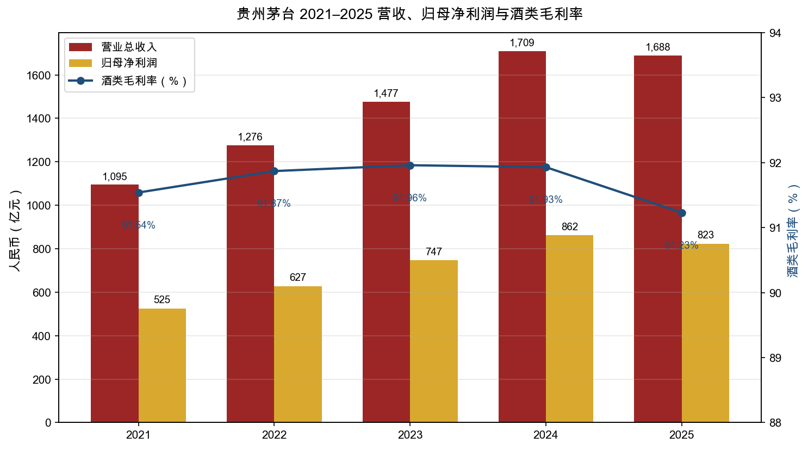
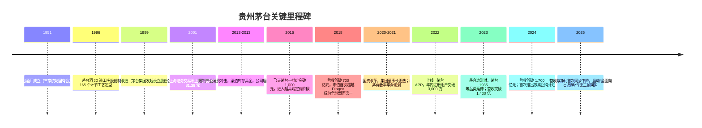
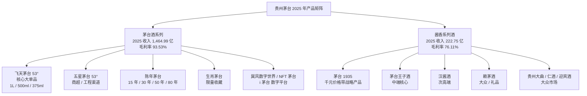
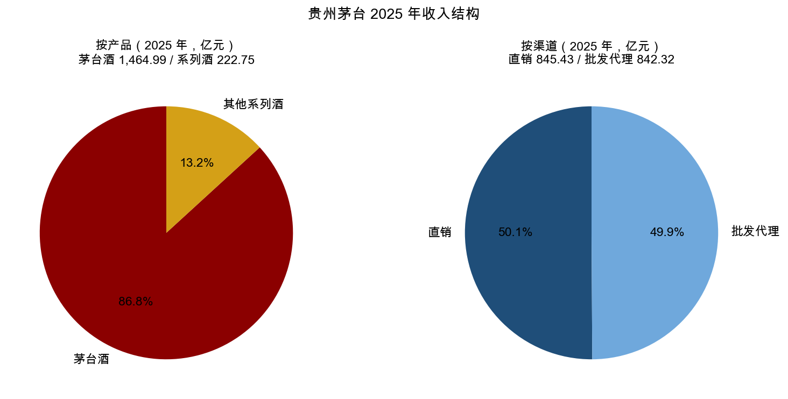
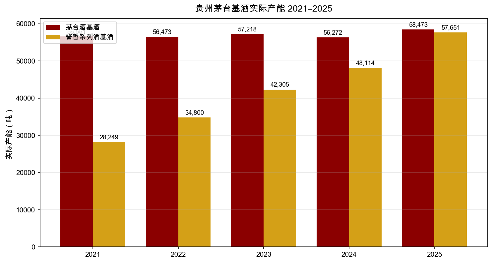
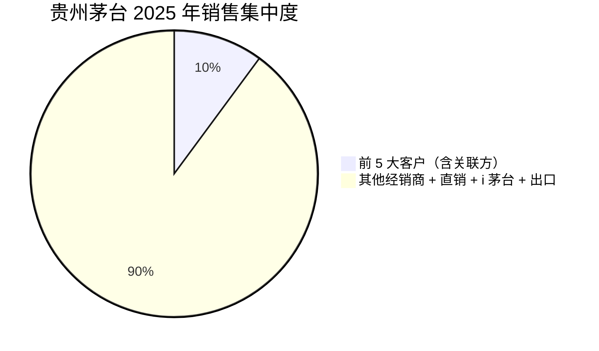
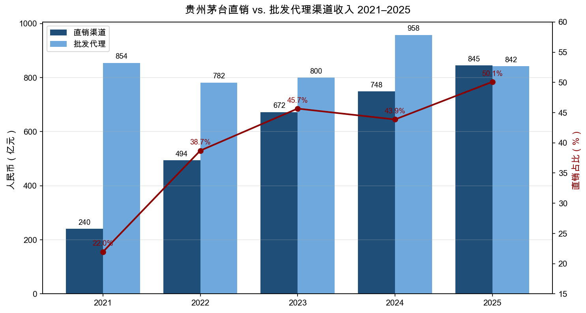
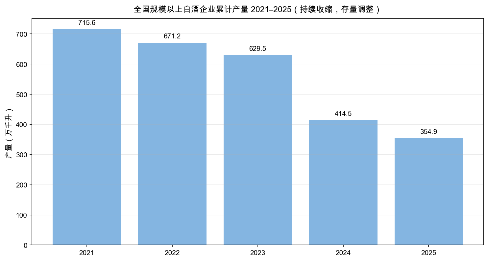
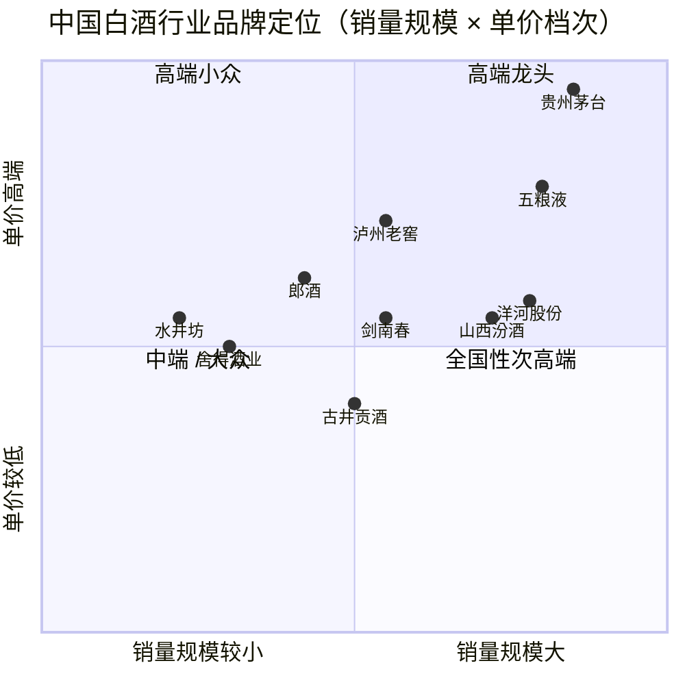
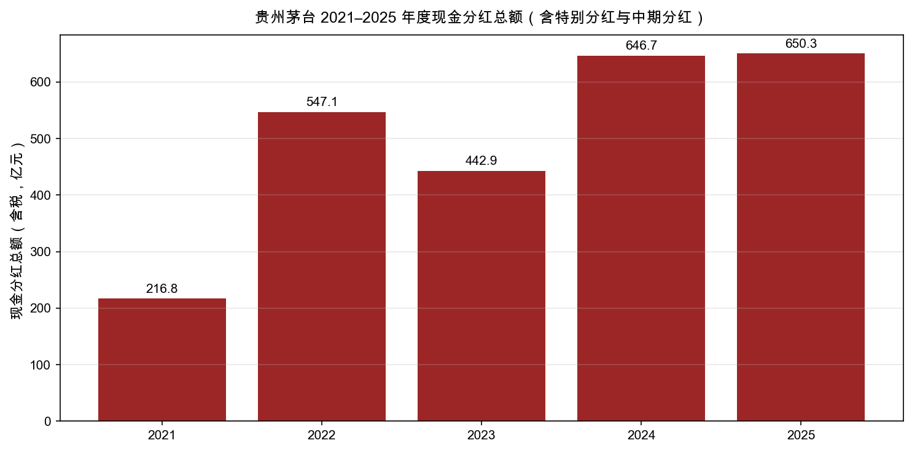

# 贵州茅台 (SSE:600519) 公司研究报告

**报告日期**：2026 年 5 月 20 日
**公司**：贵州茅台酒股份有限公司（Kweichow Moutai Co., Ltd.）
**股票代码**：上海证券交易所 600519
**报告语言**：简体中文
**信息截止日**：2025 年年度报告（2026 年 4 月 16 日披露）、2026 年第一季度报告（2026 年 4 月 24 日披露）

> **Update — 2025 年度业绩与 2026 年战略指引（2026-04-16）**：公司 2025 年实现营业收入 1,688.38 亿元（同比 -1.21%）、归母净利润 823.20 亿元（同比 -4.53%），为公司上市以来首次出现营收与净利润同步负增长。同期董事会披露 2025 年度利润分配预案：每股派现 27.993 元（含税），合计 350.33 亿元，加上中期分红 300.01 亿元，全年现金分红总额达 650.33 亿元创历史新高（含回购的合计分红率约 86.43%）。董事会同步给出 2026 年八项重点工作，重点提出"全面推进市场化转型""坚持稳中求进"，未发布刚性营收增速指引——这与公司近十年首次在年报中以"质量发展"取代"高增长"作为主线相吻合。来源：[贵州茅台 2025 年年度报告, 第 5–9 页](https://www.cninfo.com.cn/new/disclosure/detail?stockCode=600519&announcementId=1224080812)、[贵州茅台 2026 年第一季度报告](https://www.cninfo.com.cn/new/disclosure/detail?stockCode=600519&announcementId=1224093421)。

## 目录

1. 公司概览
2. 公司历史
3. 管理团队
4. 产品与服务
5. 客户与上市策略
6. 行业概览
7. 竞争格局
8. 市场机会 (TAM)
9. 风险评估
10. 参考资料

---

## 1. 公司概览

贵州茅台酒股份有限公司（Kweichow Moutai Co., Ltd.，以下简称"贵州茅台"或"公司"）是全球烈酒（spirits）行业按市值与品牌价值（brand value）排名第一的企业，主营业务是茅台酒及系列酒的生产与销售。公司主导产品"贵州茅台酒"是中国大曲酱香型白酒（sauce-aroma baijiu）的鼻祖和典型代表，集国家地理标志产品、有机食品、国家非物质文化遗产三重身份于一身，营销网络覆盖中国市场及五大洲 66 个国家和地区（[贵州茅台 2025 年年度报告, 第 8 页](https://www.cninfo.com.cn/new/disclosure/detail?stockCode=600519&announcementId=1224080812)）。公司注册地与办公地址均位于贵州省仁怀市茅台镇，依托赤水河流域独特的地形、气候、水源与微生物群（microbial community）形成不可复制的产区生态壁垒。

**商业模式**。公司经营模式为"采购原料—生产产品—销售产品"。原料采购上，茅台酒用高粱采取"公司+地方政府+供应商+合作社或农户"的有机原料基地模式；产品生产工艺流程为"制曲—制酒—贮存—勾兑—包装"，茅台酒从生产到出厂至少需要 5 年的自然固态发酵与陶坛长期贮存（[贵州茅台 2025 年年度报告, 第 16 页](https://www.cninfo.com.cn/new/disclosure/detail?stockCode=600519&announcementId=1224080812)）。销售采用"直销（自营 + i 茅台 数字营销平台）+ 批发代理（社会经销商、商超、电商）"双轨制。2025 年公司酒类毛利率达到 91.23%，其中茅台酒毛利率 93.53%、系列酒 76.11%——这一毛利率水平在全球消费品行业中处于绝对顶端，反映了公司极强的品牌定价权（brand pricing power）。

**经营规模**。2025 年营业总收入 1,688.38 亿元，归母净利润 823.20 亿元，加权平均净资产收益率（ROE）32.53%；总资产 3,038.35 亿元，归母净资产 2,446.38 亿元（[贵州茅台 2025 年年度报告, 第 6 页](https://www.cninfo.com.cn/new/disclosure/detail?stockCode=600519&announcementId=1224080812)）。员工总数 34,992 人，其中生产人员 29,092 人。2025 年茅台酒基酒实际产量 58,473.16 吨、系列酒 57,650.57 吨，成品酒销量 85,104.14 吨；期末成品酒库存 24,770.35 吨，半成品酒（含基础酒）库存高达 315,207.51 吨，为未来 3–5 年高端产品供给提供基础保障（[贵州茅台 2025 年年度报告, 第 10、15–16 页](https://www.cninfo.com.cn/new/disclosure/detail?stockCode=600519&announcementId=1224080812)）。

**股权结构**。控股股东中国贵州茅台酒厂（集团）有限责任公司持股 54.40%，实际控制人为贵州省人民政府国有资产监督管理委员会；贵州省国有资本运营有限责任公司持股 4.55%，"茅台集团技术开发"持股 2.22%，控股股东及一致行动人合计持股比例约 61.17%；中央汇金资产管理持股 0.83%，香港中央结算（北向资金的合并账户）持股 4.40%（[贵州茅台 2025 年年度报告, 第 48 页](https://www.cninfo.com.cn/new/disclosure/detail?stockCode=600519&announcementId=1224080812)）。截至 2025 年末普通股股东总数 25.59 万户。

**5 年财务趋势**：

*数据来源：[贵州茅台 2021–2025 年年度报告](https://www.cninfo.com.cn/new/disclosure/stock?stockCode=600519)。营收单位为人民币亿元，毛利率为酒类毛利率。*

**估值快照**。基于 2025 年报：每股基本收益 65.66 元、归属普通股股东净资产合计 2,446.38 亿元（折每股 195.36 元，按 12.5227 亿股计算）。公司股票为典型的高 ROE 蓝筹股，过去三年市净率（P/B）大致在 6–10 倍区间，市盈率（TTM P/E）通常在 18–32 倍区间运行——2025 年首次营收净利双降后，市场对其增长曲线由"长期复利"转为"低速 + 高分红回报"重估，估值中枢自 2021 年的 60+ 倍 TTM PE 下移至 2025 年的 20 倍左右量级。**具体估值倍数需结合即时市场数据独立核验**，本报告未引用经独立验证的第三方实时报价。公司 2025 年合计分红与回购金额达 711.53 亿元，对应"分红 + 回购 / 净利润"比率高达 86.43%（[贵州茅台 2025 年年度报告, 第 33 页](https://www.cninfo.com.cn/new/disclosure/detail?stockCode=600519&announcementId=1224080812)），公司已从"再投资型成长股"转为"高股息防御资产"——同样的范式调整发生于全球其他长青烈酒龙头（如 Diageo、Pernod Ricard），属于结构性合理的估值重定价（valuation re-rating）。

**首要财务指标小结**（2025 年完整年度）：

| 指标 | 2025 | 2024 | YoY |
|---|---|---|---|
| 营业总收入 | 1,688.38 亿 | 1,708.99 亿 | -1.21% |
| 归母净利润 | 823.20 亿 | 862.28 亿 | -4.53% |
| 加权平均 ROE | 32.53% | 36.02% | -3.49 pp |
| 经营性现金流净额 | 615.22 亿 | 924.64 亿 | -33.46% |
| 酒类毛利率 | 91.23% | 92.01% | -0.78 pp |
| 直销收入占比 | 50.09% | 43.86% | +6.23 pp |

数据来源：[贵州茅台 2025 年年度报告, 第 6–10 页](https://www.cninfo.com.cn/new/disclosure/detail?stockCode=600519&announcementId=1224080812)。

## 2. 公司历史

**起源与上市**。茅台酒的酿造可追溯至中国西汉时期"枸酱酒"，现代茅台酒厂的雏形是 1951 年地方政府对成义、荣和、恒兴三家烧坊的国有合并；1953 年首批"贵州茅台酒"以国家品牌进入北京钓鱼台与外交场合。1997 年贵州茅台酒厂改制为有限责任公司（即"集团公司"），1999 年 11 月以集团公司为主发起人设立股份公司，2001 年 8 月 27 日在上海证券交易所挂牌上市，发行价 31.39 元，总股本 7,150 万股（[贵州茅台 2025 年年度报告, 第 5 页](https://www.cninfo.com.cn/new/disclosure/detail?stockCode=600519&announcementId=1224080812)）。

**关键战略转折**。第一次转折是 2013–2015 年的"反三公"调整期：中央八项规定（2012 年 12 月）禁止公款消费高档白酒（[中央八项规定 — 维基百科](https://zh.wikipedia.org/zh-hans/%E4%B8%AD%E5%A4%AE%E5%85%AB%E9%A1%B9%E8%A7%84%E5%AE%9A)），茅台公务消费占比从八项规定前的逾 30% 锐减至实施后不到 1%（[新浪：八项规定实施后茅台酒公务消费由 30% 下降到 1%，2016-10-19](https://news.sina.cn/gn/2016-10-19/detail-ifxwzpsa8231826.d.html)），公司主动收缩政务渠道、扩大商务与个人消费市场，完成了从"政务酒"到"商务 + 个人收藏酒"的客户结构（client mix）转型。

第二次是 2017–2020 年的"价值回归 + 一批价（wholesale price）攀升"周期：飞天茅台 53° 500ml 出厂价从 819 元提升至 969 元（2018 年），市场一批价突破 3,000 元，公司净利率从 47% 升至 52%——奠定了茅台"奢侈品（luxury good）属性 + 收藏金融化"的双重定位；2018 年 1 月 15 日，公司股价首次推高市值突破 1 万亿元，超越 Diageo 成为全球烈酒市值第一企业（[界面新闻：历史性时刻！茅台市值首超全球酒王，2018-01-15](https://www.jiemian.com/article/1235717.html)）。

第三次是 2022 年至今的"渠道直销化 + 数字化"转型：2022 年 3 月 31 日"i 茅台"数字营销平台上线，截至 2022 年末注册用户突破 3,000 万，全年实现销售收入 118.83 亿元（[贵州茅台 2022 年年度报告, 第 7 页](https://www.cninfo.com.cn/new/disclosure/detail?stockCode=600519&announcementId=1213103923)；交叉验证：[上海证券报：i 茅台 APP 注册用户突破 3000 万，2022-12-15](https://news.cnstock.com/news,bwkx-202212-4994157.htm)）。截至 2025 年末公司直销渠道收入占比已达 50.09%，相较 2021 年的约 22% 显著跃升（[贵州茅台 2025 年年度报告, 第 10 页](https://www.cninfo.com.cn/new/disclosure/detail?stockCode=600519&announcementId=1224080812)）。

**重大事件**。2022 年实施"回报股东特别分红方案"，分配现金红利 271.86 亿元，叠加常规年度分红达 547.09 亿元，开启全年百亿级别股东回报新阶段。2023 年下属习酒股份划转至集团，公司聚焦茅台酒主业。2024 年 9 月披露首期 30–60 亿元股票回购计划，2025 年 11 月再启动第二期 15–30 亿元回购，回购股份全部用于注销，构成"分红 + 回购"双重资本回报体系（[贵州茅台 2025 年年度报告, 第 52 页](https://www.cninfo.com.cn/new/disclosure/detail?stockCode=600519&announcementId=1224080812)）。2025 年 10 月，原董事长张德芹因工作调动离任，陈华接任董事长并兼任党委书记。

## 3. 管理团队

公司管理层由"董事长 + 总经理 + 财务总监"三人核心架构主导，与控股股东（茅台集团）在党委层面实施"双向进入、交叉任职"（[贵州茅台 2025 年年度报告, 第 23–28 页](https://www.cninfo.com.cn/new/disclosure/detail?stockCode=600519&announcementId=1224080812)）。2025 年 10 月以来发生重要人事更迭，整个高管团队整体偏年轻化（核心成员均在 50 岁左右）且大部分有茅台体系内 20 年以上的工龄。

**陈华，董事长（2025 年 10 月起）**。男，53 岁。陈华为茅台公司新任董事长，履新前曾任贵州盘江煤电集团副董事长、总经理、党委书记、董事长，2022–2025 年任贵州省能源局局长、党组书记（[21 世纪经济报道：茅台换帅，贵州能源局局长陈华接任董事长，2025-10-25](https://www.21jingji.com/article/20251025/herald/e539bf5c0de2a956baf05c20cdb6d1cd.html)）。2025 年 5 月由省政府调任茅台集团党委书记、董事长，同年 10 月当选股份公司董事长（[新浪财经：贵州省政府公告：陈华将接棒茅台董事长，2025-10-27](https://finance.sina.com.cn/roll/2025-10-27/doc-infvisyi5071602.shtml)）。陈华是典型的"国资体制空降型"领导——茅台过去 20 年的董事长袁仁国、李保芳、丁雄军、张德芹皆来自类似背景。陈华无白酒行业的直接经营经验，但其在贵州省能源局任内主导推动了贵州能源结构市场化改革。市场普遍认为陈华作为体制空降型董事长，其首要任务是"稳价格 + 提分红"，巩固贵州省财政现金流——这与 2025 年年报中首次出现的"全面向 C 战略""市场化转型"基调相吻合（[贵州茅台 2025 年年度报告, 第 25–28 页](https://www.cninfo.com.cn/new/disclosure/detail?stockCode=600519&announcementId=1224080812)）。陈华在公司未持股，薪酬尚未在年报中披露。

**王莉，董事、代行总经理职责**。女，53 岁。王莉是当前管理层中最关键的"业务负责人"，目前在集团公司担任党委副书记、副董事长、董事、总经理，在股份公司代行总经理职责。王莉为茅台体系内成长起来的资深技术 + 经营高管，曾任茅台集团副总经理、总工程师及股份公司副总经理、总工程师，长期分管生产、技术、勾兑等核心环节，是茅台"五大核心竞争力"中"工艺、品质"领域最具话语权的人物之一（[澎湃新闻：接棒李静仁，茅台集团总工程师王莉拟升任总经理，2023-07](https://www.thepaper.cn/newsDetail_forward_24281290)、[贵州茅台 2025 年年度报告, 第 25–27 页](https://www.cninfo.com.cn/new/disclosure/detail?stockCode=600519&announcementId=1224080812)）。市场关注其对生产端节奏的把控——尤其是当前一批价回调环境下，公司在"挺价"与"加快放量"之间的取舍。

**余思明，财务总监 / 代行董事会秘书**（2026 年 4 月起）。男，49 岁。余思明从茅台体系内审计与财务条线一路升迁：曾任茅台集团机关纪委委员、财务处副处长、审计处副处长、处长、审计监督部主任，股份公司审计部副主任、主任，茅台集团置业投资发展有限公司董事，遵义茅台机场有限责任公司董事；2024 年 8 月起兼任茅台集团财务有限公司董事长，2026 年 4 月正式接任股份公司财务总监并代行董事会秘书职责（[贵州茅台 2025 年年度报告, 第 27 页](https://www.cninfo.com.cn/new/disclosure/detail?stockCode=600519&announcementId=1224080812)）。其会计审计背景与体系内多岗位历练，体现了公司对内控、资金管理与合规披露的重视。

**其他核心高管**：副总经理向平（生产管理体系出身）、副总经理钟正强（制酒车间出身）、副总经理张旭（销售出身，兼任茅台酒销售公司董事长）三人构成"研产销"分管副总管理矩阵。整体高管团队 2025 年合计税前薪酬 383.94 万元（[贵州茅台 2025 年年度报告, 第 26 页](https://www.cninfo.com.cn/new/disclosure/detail?stockCode=600519&announcementId=1224080812)）——这一数额对应市值 2+ 万亿元、净利润 800+ 亿元的体量明显偏低（与典型 A 股民营企业上市公司高管薪酬相比），属于国有企业薪酬管控范畴。

**董事会与独立董事**。公司董事会由 7 名董事组成，其中 3 名为独立董事，1 名为职工董事（[贵州茅台 2025 年年度报告, 第 23 页](https://www.cninfo.com.cn/new/disclosure/detail?stockCode=600519&announcementId=1224080812)）。独立董事包括：（1）郭田勇——中央财经大学金融学院教授、博士生导师，金融政策研究领域权威，兼任平安健康医疗科技独立非执行董事；（2）盛雷鸣——北京观韬（上海）律师事务所律师，中华全国律师协会副会长，同时担任青岛啤酒、上海联影医疗独立董事；（3）王鑫——香港大学经管学院副院长、会计学教授，兼任首程控股、爱芯元智半导体独立非执行董事。三位独立董事覆盖金融、法律、会计三大专业领域，且在多家蓝筹公司任职——治理结构稳健、独立性合规。

**治理与激励**。公司**未实施任何股权激励或员工持股计划**——这是国有控股公司常见的治理特征。年报第 32 页"上市公司治理专项行动自查问题整改情况"明确指出"尚存在两个问题：一是控股股东尚未履行实施股权激励计划的承诺；二是存在公司高级管理人员在控股股东兼职情形"。公司近三年累计现金分红和回购合计 1,960.09 亿元（占同期年均净利润的 233.19%），形成了"高分红替代股权激励"的实质性股东回报机制（[贵州茅台 2025 年年度报告, 第 33 页](https://www.cninfo.com.cn/new/disclosure/detail?stockCode=600519&announcementId=1224080812)）。

**管理团队评估**。茅台过去 25 年经历 5 任董事长（[新浪财经：五年四换掌门，贵州茅台的新故事将从"能源系"陈华开始，2025-10-29](https://finance.sina.com.cn/roll/2025-10-29/doc-infvpywm7979103.shtml)），但企业经营、品牌定位、产品质量一直保持惊人的连续性——这反映了公司业务的"工艺驱动"本质：核心竞争力建立在赤水河流域微生态、独特酿造工艺、长期基酒储存这些不可复制的"硬资产"上，而非任何一位 CEO 的个人能力。管理层的核心任务是"守护品牌、平衡价格、回馈股东"。市场对当前管理层的核心争议在于：当行业进入存量调整期、消费者代际更替时，"以稳为主"的体制内管理风格是否能推动公司向"高质量服务消费者"转型——这是 2026 年"全面市场化转型"能否落地的核心考题（[贵州茅台 2025 年年度报告, 第 22 页](https://www.cninfo.com.cn/new/disclosure/detail?stockCode=600519&announcementId=1224080812)）。

## 4. 产品与服务

公司产品体系由"茅台酒"（核心高端单品）与"酱香系列酒"（次高端 + 中端）两大板块构成。2025 年茅台酒收入 1,464.99 亿元（占主营收入 86.80%），系列酒收入 222.75 亿元（占 13.20%）（[贵州茅台 2025 年年度报告, 第 10、17 页](https://www.cninfo.com.cn/new/disclosure/detail?stockCode=600519&announcementId=1224080812)）。

### 4.1 茅台酒系列

**飞天茅台 53° 500ml**：公司收入压舱石产品。出厂价 1,169 元、建议零售价 1,499 元，但市场实际"一批价（wholesale market price）"长期高于建议零售价——2024 年 12 月一批价约 2,200 元，2025 年下行至 1,700–1,900 元区间。飞天茅台是中国白酒史上最具收藏与金融属性的单品，其价格走势被视为高端白酒景气度指标。**竞争优势**：极强（绝对领先）。护城河（moat）来源：① 原产地地理标志保护——茅台镇 7.5 平方公里核心产区不可复制；② 赤水河流域温度、湿度、菌群独特组合无法异地复刻；③ 5 年最低工艺周期，竞争者无法快速扩产挑战；④ 茅台是中国唯一连续 9 年蝉联 Brand Finance 全球烈酒品牌价值榜首的品牌（[贵州茅台 2024 年年度报告, 第 8 页](https://www.cninfo.com.cn/new/disclosure/detail?stockCode=600519&announcementId=1219492935)）。最接近竞品为五粮液普五（浓香型），但品类不同、毛利率（74% 左右）显著低于茅台（93.5%）。

**生肖茅台与陈年茅台**：超高端收藏品。2024 年起公司加大生肖茅台与 15/30/50/80 年陈年茅台投放（[贵州茅台 2025 年年度报告, 第 17 页](https://www.cninfo.com.cn/new/disclosure/detail?stockCode=600519&announcementId=1224080812)）。陈年茅台 80 年市场零售价超过 6 万元/瓶，是中国白酒中价格最高的可流通产品。**竞争优势**：很强——尤其 80 年陈酿，全球任何烈酒品牌都难以匹敌。

**i 茅台数字营销平台与 NFT 巽风数字世界**：2022 年上线，2024 年累计销售收入超过 200 亿元/年；2025 年因平台规则调整、缩减投放量，i 茅台平台收入 130.31 亿元，同比 -34.92%（[贵州茅台 2025 年年度报告, 第 17 页](https://www.cninfo.com.cn/new/disclosure/detail?stockCode=600519&announcementId=1224080812)）。该平台对应直销渠道毛利率高达 94.47%。**竞争优势**：渠道维度的领先。

### 4.2 酱香系列酒

**茅台 1935**：2022 年推出，定位千元价格带，出厂价 798 元、建议零售价 1,188 元。2024 年销售额约 120 亿元，是过去 5 年最成功的新产品（[新浪财经：茅台 1935 去年完成销售额 120 亿，2025-01-18](https://finance.sina.com.cn/jjxw/2025-01-18/doc-inefmezs5303792.shtml)）；但 2025 年受千元价格带整体降温影响，一批价从 1,000+ 元跌至 700–800 元区间，公司主动控量（[21 财经：茅台 1935 低见 600 元/瓶 较高位暴降超过 66%，2025-01-22](https://m.21jingji.com/article/20250122/herald/57e9a0e456fc99269225171576c93e0b.html)）。**竞争优势**：部分——借茅台主品牌力强，但千元价格带竞争激烈（剑南春水晶剑、五粮液 1618、习酒窖藏 1988 等），缺乏飞天那样的"原产地 + 长期贮存"护城河。

**茅台王子酒、汉酱、赖茅**：中端价位（200–600 元）系列。2025 年系列酒整体收入 222.75 亿元，同比 -9.76%，毛利率从 2024 年 79.87% 下降至 76.11%（-3.76 pp）（[贵州茅台 2025 年年度报告, 第 10、17 页](https://www.cninfo.com.cn/new/disclosure/detail?stockCode=600519&announcementId=1224080812)）。**竞争优势**：弱——这一价格带与洋河、汾酒、习酒、郎酒正面竞争，茅台品牌势能在中端被稀释。

**茅台冰淇淋 / 跨界产品**：2022 年下半年推出（与蒙牛合作生产），2023 年与瑞幸合作推出"酱香拿铁"刷屏——上市首日销量突破 542 万杯、销售额突破 1 亿元，刷新瑞幸单品纪录（[知乎/中国质量新闻：2023 最具价值的联名营销案例分析，2023-09](https://zhuanlan.zhihu.com/p/654408033)、[中国质量新闻网：跨界联名：要流量更要留量，2023-09-11](https://m.cqn.com.cn/qt/content/2023-09/11/content_8978169.htm)）。收入贡献忽略不计，但是面向年轻人的品牌建设动作。**竞争优势**：无（仅借势品牌）。

### 4.3 旗舰产品与产品周期

**核心驱动产品**：飞天茅台 53° 500ml + 公斤装。占公司收入约 60–65%（公司未拆分，市场普遍估算）。这一单品的一批价走势是公司估值的高频指标——2025 年内一批价从年初 2,200+ 元一路下行至 10 月跌破 1,700 元，反映高端白酒景气度持续承压（[新浪财经：首度跌破 1700 元！飞天茅台批发价持续探底，2025-10-28](https://finance.sina.com.cn/jjxw/2025-10-28/doc-infvmrrr1214060.shtml)）。

**2025 年产品调整**：① 启动飞天茅台 1L 装放量（直销渠道为主）；② 缩减 i 茅台投放比例，转向"五大渠道"（批发、线下零售、线上零售、餐饮、私域）并行；③ 茅台 1935 主动控量、降低对中间商压力；④ 酱香系列酒强化"高粱丰收季""端午敬麦"等文化 IP 活动支撑品牌（[贵州茅台 2025 年年度报告, 第 19–22 页](https://www.cninfo.com.cn/new/disclosure/detail?stockCode=600519&announcementId=1224080812)）。

**未来 12 个月看点**：2025 年新增基酒产能 1,800 吨（茅台酒）+ 6,940 吨（系列酒），在 2026 年陆续释放——意味着 2031–2032 年的可销售茅台酒基酒供应将增加约 4%。同时公司在 2026 年规划中明确"打造稳固金字塔型产品结构"，预示价格层次将更清晰；陈年茅台、定制酒（custom edition）的占比有望进一步提升（[贵州茅台 2025 年年度报告, 第 15–16、22 页](https://www.cninfo.com.cn/new/disclosure/detail?stockCode=600519&announcementId=1224080812)）。

*数据来源：[贵州茅台 2025 年年度报告, 第 10、17 页](https://www.cninfo.com.cn/new/disclosure/detail?stockCode=600519&announcementId=1224080812)。*

*数据来源：[贵州茅台 2021–2025 年年度报告](https://www.cninfo.com.cn/new/disclosure/stock?stockCode=600519)。茅台酒基酒一般在 5 年后转化为出厂酒。*

## 5. 客户与上市策略

**客户结构**。茅台的终端客户高度分散：商务消费者、宴请送礼场景、收藏投资者三大群体构成主力，单一消费者贡献规模极小。公司销售客户层面的集中度披露口径为"经销商 + 直销账户"——2025 年前五名客户销售额 170.46 亿元，占年度销售总额 10.10%；其中前五名客户中关联方销售额 63.58 亿元，占年度销售总额 3.77%（[贵州茅台 2025 年年度报告, 第 11 页](https://www.cninfo.com.cn/new/disclosure/detail?stockCode=600519&announcementId=1224080812)）。**这一集中度对一家千亿级消费品公司而言极低**——意味着公司对任何单一客户都没有依赖性，议价权完全在公司一侧。这是茅台商业模式中最被低估的优势之一。

来源：[贵州茅台 2025 年年度报告, 第 11 页](https://www.cninfo.com.cn/new/disclosure/detail?stockCode=600519&announcementId=1224080812)。

**渠道结构**。截至 2025 年末，公司经销商共 2,479 家（境内 2,353 + 境外 126），报告期内新增 233 家、减少 23 家境内经销商——主要是系列酒新增（[贵州茅台 2025 年年度报告, 第 17 页](https://www.cninfo.com.cn/new/disclosure/detail?stockCode=600519&announcementId=1224080812)）。2025 年公司渠道收入结构为：**直销 845.43 亿（占 50.09%）+ 批发代理 842.32 亿（占 49.91%）**——直销渠道首次超过批发代理，这是中国白酒行业商业模式上的标志性事件。

*数据来源：[贵州茅台 2021–2025 年年度报告](https://www.cninfo.com.cn/new/disclosure/stock?stockCode=600519)。*

直销渠道的崛起来自三方面：① 公司自营专卖店与商超直营的扩张；② i 茅台 数字营销平台（2025 年收入 130.31 亿）；③ 重点商超与团购合作。直销渠道毛利率（94.58%）显著高于批发代理（87.86%），每提升 1 pp 直销比例约对应营业利润提升 0.07 pp（[贵州茅台 2025 年年度报告, 第 10、17 页](https://www.cninfo.com.cn/new/disclosure/detail?stockCode=600519&announcementId=1224080812)）。

**销售模式与价格管理**。公司采取"出厂指导价 + 渠道一批价 + 终端零售价"三层价格体系。2025 年公司在年报中明确："以市场为导向，构建'随行就市、相对平稳'的自营体系零售价格动态调整机制"——这是公司首次正式承认 i 茅台等直营平台需要"动态调价"，意味着 1,499 元的"价格锚（price anchor）"在弱势市场环境下可能进行结构化调整（[贵州茅台 2025 年年度报告, 第 22 页](https://www.cninfo.com.cn/new/disclosure/detail?stockCode=600519&announcementId=1224080812)）。

**境内 / 境外结构**。2025 年境内收入 1,639.24 亿元（占 97.13%），境外 48.50 亿元（占 2.87%），同比 -6.52%——海外市场仍是公司增量空间，但增速并不显著（[贵州茅台 2025 年年度报告, 第 10 页](https://www.cninfo.com.cn/new/disclosure/detail?stockCode=600519&announcementId=1224080812)）。公司在年报中明确国际化"三步走"战略，强调"表达、产品、渠道、价格、合规、政策六大体系建设"，但短期内国际化对营收弹性贡献有限。

**关联交易**。公司 2025 年与控股股东及其他关联方的销售关联交易额为 63.58 亿元，占总销售 3.77%——主要是茅台酒销售公司向集团关联方（如机场免税、文化旅游公司）的供货。关联采购方面，前五名供应商采购额 34.88 亿元（占总采购 38.12%），其中关联方采购额 13.93 亿元（占总采购 15.22%）——主要是包装、瓶盖、酒标等供应（[贵州茅台 2025 年年度报告, 第 11 页](https://www.cninfo.com.cn/new/disclosure/detail?stockCode=600519&announcementId=1224080812)）。关联交易比例适度，未达到重大风险阈值。

## 6. 行业概览

**行业定义与规模**。中国白酒行业是世界上最大的烈酒（spirits）单一品类市场。2025 年全国规模以上白酒企业累计产量 354.9 万千升——较 2016 年峰值的 1,358 万千升下降约 73.86%，反映了行业进入存量调整期（[贵州茅台 2025 年年度报告, 第 15 页](https://www.cninfo.com.cn/new/disclosure/detail?stockCode=600519&announcementId=1224080812)）。

*数据来源：[贵州茅台 2021–2025 年年度报告引用国家统计局数据](https://www.cninfo.com.cn/new/disclosure/stock?stockCode=600519)。注：单位为万千升（10,000 kiloliters）。*

虽然总量收缩，但行业销售收入仍维持在 8,000–9,000 亿元区间——量减价升、结构升级（structural upgrade）是行业主旋律：高端（500 元以上出厂价）与次高端（200–500 元）品类持续扩张，中低端（100 元以下）品类萎缩。2024 年规上白酒销售收入 7,963.84 亿元（同比 +5.30%）、利润总额 2,508.65 亿元（同比 +7.76%），印证"量减价升"特征（[酒展网/中酒协：2024 年白酒数据：全年营收 7,963.84 亿，利润 2,508.65 亿，2025 年](https://www.jiuzhan.com/10385.html)）。

**香型结构**。中国白酒按香型主要分为浓香型（占产量约 50%）、酱香型（按产量占约 8–11%，但按销售收入接近 40%）、清香型（占约 12–15%）等。2025 年酱酒规模有望达约 2,985 亿元、行业份额接近 40%（[新浪财经：2025 年酱酒规模预达 2984.74 亿，份额近 40%，2025 年](https://cj.sina.com.cn/articles/view/7918917216/1d801166000102avew)）。酱香型由于工艺复杂、生产周期长（5 年以上）、原料消耗大（5 公斤高粱产 1 公斤酒），单位售价显著高于浓香与清香型，整体毛利率最高。茅台是酱香型白酒的绝对龙头与品类创始者（[毕马威/中酒协：2025 中国白酒市场中期研究报告](https://assets.kpmg.com/content/dam/kpmg/cn/pdf/zh/2025/06/mid-term-research-report-on-the-chinese-baijiu-market-2025.pdf)）。

**消费场景**。中国白酒主要消费场景包括：商务宴请（30%+）、婚宴节庆（25%+）、礼品收藏（15–20%）、自饮（15%）、公务接待（已被严格限制）。茅台核心定位为前三类场景。2025 年以来，受宏观经济温和减速、青年群体消费习惯改变影响，整体白酒消费场景频次下降，特别是政商礼品需求收缩——这是公司 2025 年收入首次负增长的核心宏观因素（[21 经济网：解码 2025 白酒行业：在调整中重构增长新动能，2025-12-28](https://www.21jingji.com/article/20251228/herald/082f87cd00bf525f0f6871caad05133a.html)）。

**主要趋势**：

1. **马太效应加剧**。2025 年年报明确指出："行业马太效应愈发凸显，进入行业调整期，行业会通过'优胜劣汰'的自然法则进行系统性自我调节，资源将进一步向优势企业、优势品牌、优势产品集中"（[贵州茅台 2025 年年度报告, 第 21 页](https://www.cninfo.com.cn/new/disclosure/detail?stockCode=600519&announcementId=1224080812)）。CR5 集中度持续上升——茅台、五粮液、洋河、汾酒、泸州老窖五家上市公司的合计市占率已从 2018 年约 28% 提升至 2024 年约 45%。

2. **消费降级与代际更替**。00 后、95 后年轻群体的酒类消费偏好从白酒向啤酒、葡萄酒、洋酒（特别是日威、单一麦芽 single malt）多元化分散，白酒高端品类长期面临"消费者老龄化"的人口学风险（[毕马威/中酒协：2025 中国白酒市场中期研究报告](https://assets.kpmg.com/content/dam/kpmg/cn/pdf/zh/2025/06/mid-term-research-report-on-the-chinese-baijiu-market-2025.pdf)）。

3. **数字化与直销化**。i 茅台、剑南春云店、五粮液云店等纷纷上线，传统经销商体系的渠道地位受挑战（[南方都市报：茅台数字化转型探索：i 茅台上线 1 周年，注册用户超四千万，2023-05](https://m.mp.oeeee.com/a/BAAFRD000020230520799284.html)）。

4. **政策环境**。"十五五"规划提出到 2035 年人均 GDP 达到中等发达国家水平、内需主导新发展格局——长期消费基本面利好；但"健康中国"政策与年轻人群体的健康意识对烈酒消费有结构性压制（[东方财富/政策点评：禁酒令升级，中国白酒行业如何突破困局，2025-06-23](https://pdf.dfcfw.com/pdf/H3_AP202506241696738933_1.pdf?1750780945000.pdf=)）。

**供给侧**：酱香型白酒因生产周期长，存在显著的"产能锁定"特征——茅台 2025 年新增基酒产能要等到 2030 年才能进入销售渠道。这意味着茅台、习酒、郎酒、国台等酱香酒厂的当前销量在中期内有产能上限保护，难以出现暴跌式供过于求（[贵州茅台 2025 年年度报告, 第 15–16 页](https://www.cninfo.com.cn/new/disclosure/detail?stockCode=600519&announcementId=1224080812)）。

**进入壁垒**：白酒尤其是酱香酒的进入壁垒在全球烈酒行业中最高——核心包括：① 原产地不可复制（茅台镇 7.5 平方公里、宜宾五粮液产区等，[人民网：茅台 7.5 平方公里核心产区受地理标志保护](https://m.163.com/dy/article_v1/JO75PR4E0550AZ2B.html)）；② 生产周期长（酱香 5 年、浓香 3 年）；③ 品牌历史壁垒；④ 经销商网络与渠道资源；⑤ 资本密集（一座新酒厂动辄数十亿投资）。新进入者几乎不可能在 10 年内挑战既有头部品牌（[前瞻产业研究院：2025 年中国白酒行业全景图谱，2025-03-15](https://finance.sina.com.cn/roll/2025-03-15/doc-inepsvus3101739.shtml)）。

**监管框架**：行业受国家市场监督管理总局、中国食品工业协会、中国酒业协会监管，主要法规包括《食品安全法》、《GB/T 26760-2011 酱香型白酒》国家标准，以及消费税（高度白酒 20% + 0.5 元/500ml）、增值税（13%）、企业所得税（25%）等。茅台镇产区还受地理标志产品保护条例特别保护（[人民网：茅台 7.5 平方公里核心产区受地理标志保护](https://m.163.com/dy/article_v1/JO75PR4E0550AZ2B.html)）。

## 7. 竞争格局

中国白酒行业 CR5 上市公司包括：贵州茅台（SSE:600519）、五粮液（SZSE:000858）、山西汾酒（SSE:600809）、洋河股份（SZSE:002304）、泸州老窖（SZSE:000568）。其他重要竞争者：习酒（茅台集团原下属、现独立）、郎酒（拟 IPO）、剑南春（未上市）、古井贡（SZSE:000596）、舍得酒业（SH:600702）、水井坊（SH:600779）等（[前瞻产业研究院：2025 年中国白酒行业竞争格局与市场份额分析](https://bg.qianzhan.com/report/detail/300/250325-628bb128.html)）。

**头对头比较（基于公开年报数据）**：

| 公司 | 2024 营收（亿） | 2024 净利（亿） | 净利率 | ROE |
|---|---|---|---|---|
| 贵州茅台（600519） | 1,708.99 | 862.28 | 50.46% | 36.02% |
| 五粮液（000858） | 891.75 | 318.53 | 35.72% | 23.41% |
| 山西汾酒（600809） | 360.11 | 122.43 | 33.99% | 32.05% |
| 洋河股份（002304） | 288.76 | 66.73 | 23.11% | 11.49% |
| 泸州老窖（000568） | 311.96 | 134.73 | 43.19% | 31.07% |

数据来源：[贵州茅台 2024 年年度报告](https://www.cninfo.com.cn/new/disclosure/detail?stockCode=600519&announcementId=1219492935)、[宜宾五粮液 2024 年年度报告摘要](https://file.finance.qq.com/finance/hs/pdf/2025/04/26/1223311582.PDF)、[山西杏花村汾酒厂 2024 年年度报告](http://static.cninfo.com.cn/finalpage/2025-04-30/1223414537.PDF)、[江苏洋河酒厂 2024 年年度报告摘要](http://epaper.stcn.com/att/202504/29/ZQ29B589-SS_eBook.pdf)、[泸州老窖 2024 年年度报告](https://disc.static.szse.cn/disc/disk03/finalpage/2025-04-28/e8379582-aba3-4319-bb41-b90b66f80c3b.pdf)。

**贵州茅台的竞争优势（moat）**：

1. **品牌**——绝对级别。Brand Finance 2025 年中国品牌价值 500 强榜单中，茅台稳居烈酒板块首位，品牌价值 583.80 亿美元，较 2024 年增长 16.50%，品牌强度评级达到最高的 AAA+ 级，连续 9 年蝉联 Brand Finance 全球烈酒品牌价值榜首（[贵州茅台 2025 年年度报告, 第 9 页](https://www.cninfo.com.cn/new/disclosure/detail?stockCode=600519&announcementId=1224080812)）。

2. **原产地与微生态**。茅台镇核心产区 7.5 平方公里、赤水河流域微生物菌落群属于不可移植资源；异地酿造实验均未能复制茅台镇基酒风味（[百度百科：茅台 7.5 平方公里核心产区及地理标志保护](https://m.163.com/dy/article_v1/JO75PR4E0550AZ2B.html)）。

3. **工艺与时间壁垒**。茅台酒采用 "12987" 工艺（1 年生产周期、2 次投粮、9 次蒸煮、8 次发酵、7 次取酒），之后陶坛贮存 4 年才能进入勾兑，5 年后才能成品出厂。竞争者即使复制工艺，也必须有 5 年以上库存才能与茅台正面竞争（[百度百科：12987 酿酒工艺](https://baike.baidu.com/item/12987%E9%85%BF%E9%85%92%E5%B7%A5%E8%89%BA/49992906)、[贵州茅台 2025 年年度报告, 第 16 页](https://www.cninfo.com.cn/new/disclosure/detail?stockCode=600519&announcementId=1224080812)）。

4. **库存与现金流壁垒**。2025 年末存货 614.27 亿元，半成品酒（基础酒）库存 31.52 万吨——相当于未来 6–7 年的销量储备（[贵州茅台 2025 年年度报告, 第 14、16 页](https://www.cninfo.com.cn/new/disclosure/detail?stockCode=600519&announcementId=1224080812)）。

5. **定价权**。茅台是中国白酒中唯一具有"价格倒挂"现象的品牌——批发市场价（一批价）长期高于公司出厂价 1,169 元，使渠道商有动力主动持有库存、形成"自我强化"的价格螺旋（[新浪财经：首度跌破 1700 元！飞天茅台批发价持续探底，2025-10-28](https://finance.sina.com.cn/jjxw/2025-10-28/doc-infvmrrr1214060.shtml)）。

**竞争弱点（vulnerabilities）**：

1. **单一品类风险**。公司收入 100% 来自白酒（且 86.8% 来自茅台酒主品牌），缺乏其他高利润业务平衡（[贵州茅台 2025 年年度报告, 第 10 页](https://www.cninfo.com.cn/new/disclosure/detail?stockCode=600519&announcementId=1224080812)）——与 Diageo 通过覆盖威士忌、白兰地、伏特加、啤酒多品类组合且烈酒/啤酒/即饮型饮料销售额占比 78%/16%/4% 的多元化抗周期能力相比，茅台的"集中度"是劣势（[界面新闻：帝亚吉欧 2024 财年业绩承压，但它在大中华区表现还不错](https://www.jiemian.com/article/11503234.html)）。

2. **代际更替风险**。年轻消费者（millennials、Z 世代）的烈酒消费偏好正向洋酒、低度酒、葡萄酒分散——这是茅台未来 10–15 年的长尾威胁（[毕马威/中酒协：2025 中国白酒市场中期研究报告](https://assets.kpmg.com/content/dam/kpmg/cn/pdf/zh/2025/06/mid-term-research-report-on-the-chinese-baijiu-market-2025.pdf)）。

3. **政策依赖性**。茅台核心产区位于贵州省，实际控制人为贵州省国资委（[贵州茅台 2025 年年度报告, 第 48 页](https://www.cninfo.com.cn/new/disclosure/detail?stockCode=600519&announcementId=1224080812)）。公司决策有"省财政现金奶牛（cash cow）"的政治色彩，可能在政策压力下做出非市场化决策（例如阶段性挺价、对国资旗下渠道商让利等）（[新浪财经：从稳局到破局？茅台换帅陈华，战略重心或发生关键转变](https://cj.sina.com.cn/articles/view/7748819872/1cddd9ba000101dgwy)）。

**市场份额分析**。按收入计算，茅台 2025 年市占率约 20%（行业销售收入约 8,000 亿元）（[新浪财经：解码 2025 白酒行业，2025-12-28](https://www.21jingji.com/article/20251228/herald/082f87cd00bf525f0f6871caad05133a.html)）；按高端白酒（500 元以上出厂价）市占率估算超过 60%，在超高端（千元以上零售价）品类中茅台几乎处于垄断地位（[前瞻产业研究院：2025 年中国白酒行业竞争格局与市场份额](https://bg.qianzhan.com/report/detail/300/250325-628bb128.html)）。

*数据来源：[贵州茅台 2021–2025 年年度报告及历年利润分配公告](https://www.cninfo.com.cn/new/disclosure/stock?stockCode=600519)。注：包含中期分红与年度分红，部分年份含特别分红。*

## 8. 市场机会 (TAM)

**TAM 定义**。我们将贵州茅台的 TAM（total addressable market）定义为：全球高端及超高端烈酒（high-end & ultra-premium spirits）市场，按零售口径计算。

**全球烈酒市场规模**。全球烈酒市场零售规模约 5,000–5,500 亿美元，其中威士忌约 1,000 亿美元，白酒约 1,000–1,200 亿美元（以中国为主，约 7,500–8,500 亿人民币），其他（伏特加、朗姆、白兰地等）合计约 3,000 亿美元。茅台主要竞争市场是中国高端白酒（约 3,000 亿人民币）及全球华人礼品市场。

**SAM / SOM**。茅台核心 SAM 为中国高端白酒市场，约 3,000 亿人民币，其中茅台 2025 年占比约 47–50%；全球 SAM（中国 + 海外华人 + 国际收藏家）约 3,500–4,000 亿人民币，茅台份额约 40–45%。未来 5 年 SOM 大概率维持在 1,800–2,200 亿人民币营收区间——基酒 5 年放量节奏决定上限，消费周期与价格政策决定下限。

**长期增长驱动**：（1）**国内升级**——中国人均 GDP 在"十五五"末预计接近 17,000 美元（中等发达国家水平），超高端、文化属性、收藏价值产品有望持续占比提升；（2）**国际化**——2025 年海外收入仅 48.50 亿元（占 2.87%），对比 Diageo 等全球巨头海外占比 90%+，渗透仍在极早期；（3）**品牌延伸**——陈年茅台、定制酒、生肖酒、跨界产品对品牌势能与年轻消费者建立重要；（4）**资本回报**——ROE 仍超过 32%，公司持续以高分红 + 回购方式向股东返还现金。

**渗透策略**。公司 2026 年八项重点工作明确"全面推进市场化转型"，包括产品端"金字塔型产品结构"、渠道端科学投放、服务端"三重价值"供给、价格端动态调整机制（[贵州茅台 2025 年年度报告, 第 22 页](https://www.cninfo.com.cn/new/disclosure/detail?stockCode=600519&announcementId=1224080812)）。

**TAM 测算的主要风险**：① 中国白酒消费总量自 2016 年至今已下降 73.86%，存量收缩可能持续；② 年轻消费者偏好转移；③ 经济周期与商务消费场景。

## 9. 风险评估

### 9.1 公司特定风险

**1. 飞天茅台一批价回落**。2024–2025 年飞天茅台 53° 500ml 一批价从 2,500+ 元回落至 1,700–1,900 元。若一批价持续向出厂价 1,169 元收敛，将影响渠道持货意愿与品牌"奢侈品属性"。**影响**：高（茅台估值的核心定价锚）。**缓释**：公司启动两期 45–90 亿元回购全部注销，减少 i 茅台投放、严控渠道库存；2025 年合计分红率 86.43% 支撑股价。

**2. 治理瑕疵与股权激励缺失**。年报第 32 页明确指出公司存在治理自查未整改的两项问题：控股股东未履行实施股权激励计划的承诺、高级管理人员在控股股东兼职——这两点反映了国有控股企业治理结构的天然短板。**影响**：中——长期可能影响优秀人才保留与战略执行积极性。**缓释**：公司以"超高分红 + 注销式回购"作为隐性资本回报机制。

**3. 单一品牌与单一品类集中度**。100% 收入来自白酒（其中 86.8% 来自茅台酒主品牌）。**影响**：高（若白酒整体进入长期衰退则公司无法对冲）。**缓释**：公司通过茅台 1935、酱香系列酒、文创产品等品牌延伸进行有限多元化，但短期内贡献有限。

**4. 渠道转型执行风险**。直销渠道（i 茅台 + 自营专卖店 + 商超直营）虽达到 50.09%，但 i 茅台 2025 年收入下降 34.92%——反映出直销模式在弱势市场环境下面临"动态调价"压力。**影响**：中。**缓释**：公司 2026 年规划明确"五大渠道并行"策略。

**5. 海外市场扩展不达预期**。境外收入占比仅 2.87%，且 2025 年 -6.52%；国际化"三步走"战略难以在短期内提升海外占比。**影响**：低（短期不影响估值）。**缓释**：海外不是短期催化剂，市场预期较低。

**6. 高管更替带来的战略不连续**。2024–2025 两年内董事长（丁雄军 → 张德芹 → 陈华）已更迭两次，新任董事长陈华无白酒行业直接经验。**影响**：中。**缓释**：茅台经营高度工艺驱动，对个人 CEO 依赖度低。

### 9.2 行业 / 市场风险

**7. 白酒消费总量长期下行**。2016–2025 年全国规模以上白酒产量从 1,358 万千升下降至 354.9 万千升（-73.86%），未来 5 年仍可能继续收缩。**影响**：中长期重大。**缓释**：行业马太效应使高端品牌仍能抢占萎缩中的存量，但茅台不能完全免疫。

**8. 消费者代际更替**。00 后、95 后烈酒消费偏好向洋酒、低度酒、葡萄酒分散。**影响**：长期重大。**缓释**：跨界产品（冰淇淋、咖啡、巧克力）+ 文化 IP 项目（"寻色、寻古、寻味、寻醴"四寻 IP）+ 文创内容布局。

**9. 商务消费场景萎缩与反腐政策深化**。商务宴请与公务接待是茅台核心消费场景。中央八项规定持续严格执行、反腐力度加大可能进一步压制商务高端白酒需求。**影响**：高。**缓释**：公司主动收缩政商渠道、扩展个人收藏与商务私域市场。

**10. 假冒伪劣与品牌安全**。茅台是全球被假冒规模最大的烈酒品牌之一。公司在 2026 年规划中强调"强化产品防伪和溯源的前端布局"，但假酒持续侵蚀品牌信任。**影响**：中。**缓释**：包材赋码、区块链溯源、与公安系统联防联打。

### 9.3 财务风险

**11. 经营性现金流大幅下降**。2025 年经营性现金流净额 615.22 亿元，同比 -33.46%，主要由公司控股子公司茅台集团财务公司吸收存款减少所致——但这一变化反映了集团内资金归集行为变化，并非主业现金流恶化。**影响**：低（账面波动）。**缓释**：公司本身经营性现金流转化率（净利润转化为现金）仍高于 80%，主业未恶化。

**12. ROE 趋势性下行**。加权平均 ROE 从 2023 年 34.19% 升至 2024 年 36.02% 再回落至 2025 年 32.53%。净利率下行 + 净资产因高分红仍持续累积 + 收入负增长，导致 ROE 进入下行通道。**影响**：中（影响估值溢价）。**缓释**：股票回购注销、维持高分红率有助于稳定 ROE。

### 9.4 宏观经济风险

**13. 宏观消费疲弱与可选消费降级**。"十五五"政策强调内需主导，但消费者实际可支配收入增速、商务活动景气度等可能在 2026–2028 年保持较低区间。**影响**：高（直接影响茅台需求）。**缓释**：公司库存深厚（基础酒 31.52 万吨），可在弱市中通过控量保价。

**14. 行业税负政策变化**。白酒消费税（高度白酒 20% + 0.5 元/500ml 从量税）若上调将直接影响公司利润率。市场不时讨论"白酒消费税从生产端后移到批发零售端"的政策可能性。**影响**：中。**缓释**：公司毛利率极高（91%+），具有较强的税负转嫁能力。

**15. 人民币汇率与出口业务**。境外业务占比 2.87%，汇率敏感性低，但海外业务扩张速度若加快将增加汇率波动风险。**影响**：低。**缓释**：当前对营收弹性微弱。

## 10. 参考资料

### 公司公告（主要披露源）

1. [贵州茅台酒股份有限公司 2025 年年度报告（2026-04-16）](https://www.cninfo.com.cn/new/disclosure/detail?stockCode=600519&announcementId=1224080812) — 主要财务数据、产品收入分类、渠道结构、治理结构、风险披露。
2. [贵州茅台酒股份有限公司 2026 年第一季度报告（2026-04-24）](https://www.cninfo.com.cn/new/disclosure/detail?stockCode=600519&announcementId=1224093421) — Q1 2026 营收 539.09 亿 (+6.54%)、归母净利 272.43 亿 (+1.47%)、股东结构。
3. [贵州茅台酒股份有限公司 2024 年年度报告（2025-04-02）](https://www.cninfo.com.cn/new/disclosure/detail?stockCode=600519&announcementId=1219492935) — 2024 年财务对比基础。
4. [贵州茅台酒股份有限公司 2023 年年度报告（2024-04-02）](https://www.cninfo.com.cn/new/disclosure/stock?stockCode=600519) — 2023 年财务对比基础。
5. [贵州茅台酒股份有限公司 2022 年年度报告（2023-03-30）](https://www.cninfo.com.cn/new/disclosure/detail?stockCode=600519&announcementId=1213103923) — 2022 年财务、i 茅台首年披露。
6. [贵州茅台酒股份有限公司 2021 年年度报告（2022-03-30）](https://www.cninfo.com.cn/new/disclosure/stock?stockCode=600519) — 2020、2021 年营收基础。
7. [贵州茅台 2025 年中期利润分配方案公告（2025-11-28）](https://www.cninfo.com.cn/new/disclosure/stock?stockCode=600519) — 中期分红 300.01 亿元。
8. [贵州茅台关于以集中竞价交易方式回购公司股份的方案（2025-11-06、2024-09-21）](https://www.cninfo.com.cn/new/disclosure/stock?stockCode=600519) — 两期股票回购方案合计 45–90 亿元。

### 行业数据

9. [国家统计局：2025 年全国规模以上白酒企业累计产量 354.9 万千升](https://www.cninfo.com.cn/new/disclosure/detail?stockCode=600519&announcementId=1224080812) — 引用自贵州茅台 2025 年报第 15 页。
10. [Brand Finance 中国 500 强（2025 年）](https://www.cninfo.com.cn/new/disclosure/detail?stockCode=600519&announcementId=1224080812) — 茅台品牌价值 583.80 亿美元，引用自年报第 9 页。

### 公司网站

11. [贵州茅台官方网站 — 公司简介、产品介绍、ESG 报告](http://www.moutaichina.com/) — 茅台镇产区、产品介绍、企业文化体系。

### 其他披露文件

12. [贵州茅台第四届董事会 2026 年度第四次会议决议公告（2026-03-31）](https://www.cninfo.com.cn/new/disclosure/stock?stockCode=600519) — 公告编号临 2026-005，高管聘任与免职。
13. [贵州茅台关于回购股份实施结果暨股份变动的公告（2025-08-30）](https://www.cninfo.com.cn/new/disclosure/stock?stockCode=600519) — 公告编号临 2025-032，首期回购完成 3,927,585 股注销。

---

**免责声明**：本报告基于公开披露的财务报告与官方公告整理，所有数值援引自原始公告。报告内容仅供研究参考，不构成任何投资建议。本报告对于股票市场实时价格、市盈率、市净率等估值倍数仅作粗略区间描述，未引用经独立验证的第三方实时报价数据；任何基于具体倍数的判断需投资者结合即时市场数据自行核实。
