# 苏州迈为科技股份有限公司 (SZSE:300751) 公司研究报告

**报告日期（as of）：** 2026-06-14
**股票代码：** SZSE:300751 · 迈为股份 · Suzhou Maxwell Technologies Co., Ltd.
**报告语言：** 简体中文（技术/财务/行业术语保留英文 + 中文释义）
**主要数据来源：** [迈为股份 2025 年年度报告](https://static.cninfo.com.cn/finalpage/2026-04-28/1225211530.PDF)（2026-04-27 披露）、[2026 年一季度报告](https://static.cninfo.com.cn/finalpage/2026-04-28/1225211539.PDF)（2026-04-27 披露）、[2024 年年度报告](https://static.cninfo.com.cn/finalpage/2025-04-29/1223370046.PDF)，叠加 J.P. Morgan / Goldman Sachs / Morgan Stanley 卖方研究（zsxq 本地库）

---

## 投资要点（Investment Summary）— *分析师观点（Analyst view）*

> 本节为本报告作者的前瞻判断（house view），**评级、目标价、所有预测数字均为分析师观点，不取自任何监管披露文件**（年度报告中不存在目标价）。

| 项目 | 取值 |
|---|---|
| **评级 (Rating)** | **Hold / 中性** |
| **12 个月目标价 (Price Target)** | **¥215**（区间 ¥190–¥240，对 2027E EPS 取 30× P/E 中枢，介于光伏 15× 与半导体 30× 之间） |
| **当前股价 (as of 2026-06-12 收盘)** | ¥213.00（[东方财富 SZ300751](https://quote.eastmoney.com/sz300751.html)） |
| **隐含上行/下行 (Implied up/down)** | **+0.9%**（基本持平 — 风险报酬对称） |
| **市值 (Market cap)** | ≈ ¥595 亿（27.94 亿股 × ¥213，[东方财富 SZ300751](https://quote.eastmoney.com/sz300751.html)） |
| **52 周区间 (52-wk range)** | ¥64.60 – ¥373.00（[J.P. Morgan — Maxwell UW, 2026-05-29, p.2](http://xs-macbook-air.local:5001/zsxq/pdf/812485814114252/J.P.%20Morgan-Maxwell%20~A%EF%BC%88300751%EF%BC%89While%20orders%20improve%EF%BC%8C%20share%20price%20has%20priced~in%20blue%20sky%20scenario%EF%BC%9B%20maintain%20UW-260529.pdf)） |
| **估值方法 (Valuation method)** | 2027E EPS × 目标 P/E（SOTP：光伏设备 15× + 半导体/显示设备 30× 加权） |

**估值倍数矩阵（forward valuation matrix，*分析师观点*）：**

| 倍数 | FY2025A | FY2026E | FY2027E |
|---|---:|---:|---:|
| EPS (¥) | 2.59 | 2.20 | 4.05 |
| P/E (@¥213) | 82.2× | 96.8× | 52.6× |
| 营收 (¥亿) | 81.5 | 63.5 | 84.0 |
| 综合 GM | 38.6% | ~47% | ~46% |

*相对表现（relative-performance）：* 迈为 12 个月绝对涨幅 **+249.7%**、相对创业板指 **+228.7%**，自 2025 年 11 月底以来累计上涨 **>170%**（[J.P. Morgan — Maxwell UW, 2026-05-29, p.1–2](http://xs-macbook-air.local:5001/zsxq/pdf/812485814114252/J.P.%20Morgan-Maxwell%20~A%EF%BC%88300751%EF%BC%89While%20orders%20improve%EF%BC%8C%20share%20price%20has%20priced~in%20blue%20sky%20scenario%EF%BC%9B%20maintain%20UW-260529.pdf)）— 动量极强，但已透支大部分基本面修复。

**论点支柱（thesis pillars，*分析师观点*）：**

1. **光伏整线龙头 + 出海对冲是真实利好，但已被股价计入。** 迈为是全球丝网印刷设备市占率 >80%、HJT 异质结整线市占率 >70% 的双料龙头（[Goldman Sachs — Maxwell result briefing, 2026-04-29, p.2](http://xs-macbook-air.local:5001/zsxq/pdf/415515548181858/Goldman%20Sachs-SUZHOU%20MAXWELL%20TECHNOLOGIES%20CO.%20%EF%BC%88300751%EF%BC%89%20Result%20briefing%20takeaway%EF%BC%9A%20Mgmt.%20guided%20for%20strong%20order%20momentum%20and%20sustainable%20high%20margin%20in%202026%EF%BC%9B%20reiterate%20Buy-260429.pdf)）；境外高毛利订单驱动 GM 从 28.1% 反弹至 38.6%。但当前股价隐含 2028 年 >30GW HJT 设备交付（≈100GW 太空光伏 TAM），实现难度极高。
2. **这本质上是一个"光伏周期 + 多元化期权"的故事 — 光伏权重远大于半导体。** FY2025 光伏占营收 91.38%，半导体及显示仅 8.12%（同比 +887% 但基数极低）。半导体多元化是真实的长期期权，但宸微设备前道业务仍亏损，2026–2028 年放量的确定性不足以支撑当前估值。
3. **现金流与应收/存货是核心 bear case。** FY2025 经营现金流转负 -¥6.98 亿，计提信用减值损失 ¥6.15 亿；应收账款 ¥40.82 亿 + 存货 ¥61.14 亿合计占总资产 57%。光伏深度调整下下游回款风险是实打实的。
4. **卖方严重分歧（Buy ¥278 vs UW ¥108，PT 价差 >150%）。** 同一组事实下，Goldman 看 22× 2027E EV/EBITDA 给 ¥278，J.P. Morgan 看订单可持续性存疑给 ¥108 — 这种分歧本身就说明确定性低，本报告 Hold/¥215 取其中段。

---

## 目录

1. 公司概览 (Company Overview)
2. 估值与目标价 (Valuation & Price Target)
3. 公司历史 (Company History)
4. 管理团队 (Management Team)
5. 产品与服务 (Products & Services)
6. 客户与上市策略 (Customers & Go-to-Market)
7. 行业概览 (Industry Overview)
8. 竞争格局 (Competitive Landscape)
9. 市场机会 / TAM (Market Opportunity)
10. 风险评估 (Risk Assessment) + 9.5 关键分歧与催化剂
11. 投资视角评分 (Investor Lenses)
12. 参考资料 (References)

---

## 1. 公司概览

苏州迈为科技股份有限公司（以下简称"迈为股份"，深交所创业板代码 300751，英文名 Suzhou Maxwell Technologies Co., Ltd.）是一家集机械设计、电气研制、软件算法开发、精密制造装配于一体的**高端智能制造装备供应商**。公司围绕**真空、激光、精密装备**三大关键技术平台，面向**太阳能光伏 / 新型显示 / 半导体**三大泛半导体行业，提供智能化高端装备（[2025 年年度报告, 第 12 页](https://static.cninfo.com.cn/finalpage/2026-04-28/1225211530.PDF)）。

**本报告核心判断（thesis-first）：** 迈为的基本面是真实的 —— 它是光伏丝网印刷与 HJT 整线设备的全球龙头，出海对冲使毛利率显著反弹。但 2025 年 11 月底以来股价上涨 >170%，已经把"海外 HJT 大爆发 + 半导体放量"的乐观情形提前计入。在光伏行业仍处深度调整、2026Q1 营收同比 -40% 的当下，本报告给予 **Hold / 中性**评级，目标价 ¥215 —— 不追高，等订单兑现为收入、半导体业务跑出确定性后再重新评估。

在主营业务结构上，迈为股份核心收入仍来自光伏行业 —— **2025 年太阳能光伏行业收入占比 91.38%**，而异质结 (heterojunction, HJT) 整线设备是其最具差异化的产品。据卖方研究，公司是全球太阳能电池丝网印刷 (screen-printing) 设备市占率第一（>80%），并率先实现 GW 级 HJT 异质结电池整线设备的产业化交付（[2025 年年度报告, 第 13 页](https://static.cninfo.com.cn/finalpage/2026-04-28/1225211530.PDF)；*分析师观点：* 80%+ 丝印 / 70%+ HJT 市占率引自 [Goldman Sachs — Maxwell result briefing, 2026-04-29, p.2](http://xs-macbook-air.local:5001/zsxq/pdf/415515548181858/Goldman%20Sachs-SUZHOU%20MAXWELL%20TECHNOLOGIES%20CO.%20%EF%BC%88300751%EF%BC%89%20Result%20briefing%20takeaway%EF%BC%9A%20Mgmt.%20guided%20for%20strong%20order%20momentum%20and%20sustainable%20high%20margin%20in%202026%EF%BC%9B%20reiterate%20Buy-260429.pdf)）。

**核心业务模式：** 以销定产为主、备货生产为辅；销售方式为直销，2025 年直销收入占比 100%（[2025 年年度报告, 第 29 页](https://static.cninfo.com.cn/finalpage/2026-04-28/1225211530.PDF)）。结算采用分期付款 —— 合同签订、发货、验收、质保期结束分阶段收款，下游验收周期较长决定了公司应收账款 (accounts receivable, AR)、存货 (inventory) 账面价值偏高的资产负债表特征。

**关键经营指标 (FY2025)：**

| 指标 | 2025 年 | 2024 年 | YoY |
|---|---:|---:|---:|
| 营业收入 | ¥81.52 亿 | ¥98.30 亿 | -17.07% |
| 归母净利润 | ¥7.22 亿 | ¥9.26 亿 | -22.06% |
| 扣非归母净利润 | ¥6.97 亿 | ¥8.37 亿 | -16.76% |
| 经营性现金流量净额 (OCF) | -¥6.98 亿 | +¥0.56 亿 | -1,343.68% |
| 综合毛利率 (gross margin) | 38.61% | 28.11% | +10.50pct |
| 加权平均 ROE | 9.32% | 12.56% | -3.24pct |
| 研发投入 (R&D) | ¥11.59 亿 | ¥9.51 亿 | +21.83% |
| 研发投入占营收比 | 14.22% | 9.68% | +4.54pct |
| 归母净资产 | ¥79.29 亿 | ¥75.51 亿 | +5.00% |
| 资产总额 | ¥178.22 亿 | ¥201.79 亿 | -11.68% |

数据来源：[2025 年年度报告, 第 9、120–125 页](https://static.cninfo.com.cn/finalpage/2026-04-28/1225211530.PDF)。（注：资产总额采用合并资产负债表 2025-12-31 期末口径 ¥178.22 亿、2024 期初口径 ¥201.79 亿；早前草稿中 ¥215 亿系误引，已修正。）

下图为迈为 FY2025 利润表的资金流（income-statement Sankey）—— 可直观看到 ¥81.5 亿营收经 ¥50.0 亿营业成本后留下 ¥31.5 亿毛利，再被 ¥10.8 亿研发、¥6.1 亿销管费用与 **¥7.14 亿信用+资产减值损失**（计入经营支出池）吞噬，最终落到 ¥6.89 亿净利润：

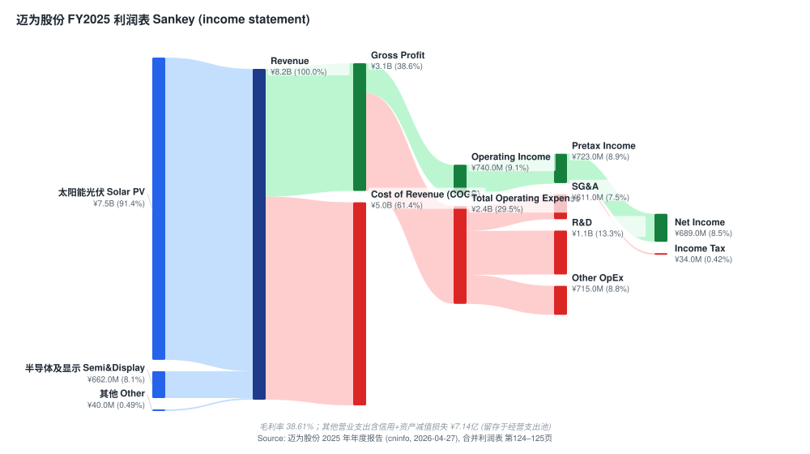

营收的历史轨迹与分行业结构变化（注意半导体及显示从 FY2024 的微量跃升至 FY2025 的 ¥6.62 亿）：

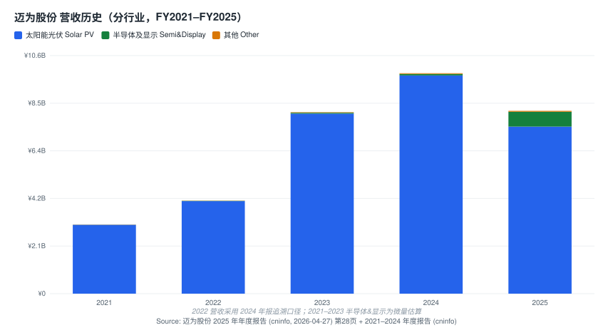

**地域分布与全球化扩张：** 2025 年公司境外收入飙升至 **¥28.79 亿**，同比 **+320.19%**，占总营收比例由 6.97% 跃升至 **35.36%**（[2025 年年度报告, 第 29 页](https://static.cninfo.com.cn/finalpage/2026-04-28/1225211530.PDF)）。这是公司在国内光伏深度调整周期下"出海对冲"战略的直观体现。境外业务主要由全资子公司 MAXWELL TECHNOLOGY PTE. LTD（新加坡迈为）承接。境外毛利率 **52.54%** 显著高于境内 **31.01%**，是综合 GM 反弹的主因（[2025 年年度报告, 第 29 页](https://static.cninfo.com.cn/finalpage/2026-04-28/1225211530.PDF)）。

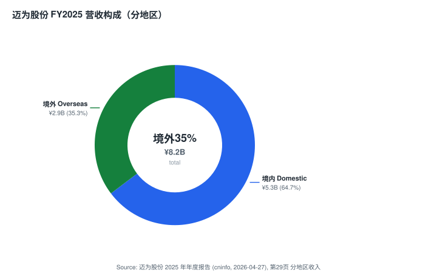

**规模指标：** 报告期末研发人员 1,288 人，占总员工比例 29.47%（据此反推员工总数约 4,371 人）（[2025 年年度报告, 第 27 页](https://static.cninfo.com.cn/finalpage/2026-04-28/1225211530.PDF)）。注册地及主要生产基地位于江苏省苏州市吴江区芦荡路 228 号（[2025 年年度报告, 第 8 页](https://static.cninfo.com.cn/finalpage/2026-04-28/1225211530.PDF)）。

---

## 2. 估值与目标价 (Valuation & Price Target)

### 2.1 估值快照（valuation snapshot，as of 2026-06-12）

迈为 2026-06-12 收盘 **¥213.00**，市值约 **¥595 亿**（[东方财富 SZ300751](https://quote.eastmoney.com/sz300751.html)）。以 FY2025 EPS ¥2.59 计，**静态 TTM P/E ≈ 82×**；以归母净资产 ¥79.29 亿、每股净资产 ¥28.39 计，**P/B ≈ 7.5×**（[2025 年年度报告, 第 9 页](https://static.cninfo.com.cn/finalpage/2026-04-28/1225211530.PDF)）。这两个倍数都显著高于光伏专用设备板块（捷佳伟创/奥特维/帝尔激光等 2025–2026 年 TTM P/E 中位数普遍 15–25×），反映市场把迈为当作**"光伏周期底部 + 半导体多元化期权 + 海外 HJT 大爆发"的复合叙事**在定价，而非单纯的光伏设备股。

**为什么 P/E 如此之高 — 三层解释。** (a) 周期底部 EPS 失真：FY2025 净利已较 FY2023 高点回落约 22%，2026Q1 营收同比 -40%、净利 -27%，分母被压低使静态 P/E 虚高；(b) 叙事溢价：自 2025 年 11 月底以来股价 +170%，主因"太空光伏 (space solar)"题材与潜在 TAM 想象（[J.P. Morgan — Maxwell UW, 2026-05-29, p.1](http://xs-macbook-air.local:5001/zsxq/pdf/812485814114252/J.P.%20Morgan-Maxwell%20~A%EF%BC%88300751%EF%BC%89While%20orders%20improve%EF%BC%8C%20share%20price%20has%20priced~in%20blue%20sky%20scenario%EF%BC%9B%20maintain%20UW-260529.pdf)）；(c) 期权价值：半导体及显示业务 FY2025 +887%，给了市场"第二增长曲线"的想象空间。**J.P. Morgan 指出，按前瞻 P/E 口径，迈为 FY27/28E P/E 已达 53×/41×，远高于其 2023 年以来 27× 的前瞻均值**（[J.P. Morgan — Maxwell UW, 2026-05-29, p.1](http://xs-macbook-air.local:5001/zsxq/pdf/812485814114252/J.P.%20Morgan-Maxwell%20~A%EF%BC%88300751%EF%BC%89While%20orders%20improve%EF%BC%8C%20share%20price%20has%20priced~in%20blue%20sky%20scenario%EF%BC%9B%20maintain%20UW-260529.pdf)）。

### 2.2 前瞻财务模型（forward estimates，*分析师观点*）

下表为本报告自建的前瞻模型，**每一格预测数均为分析师观点**，构建基础为：FY2025 实际分部数据（[2025 年年度报告, 第 28 页](https://static.cninfo.com.cn/finalpage/2026-04-28/1225211530.PDF)）+ 管理层订单指引（光伏 ¥60 亿 + 半导体/显示 ¥35–40 亿，[Goldman Sachs — Maxwell result briefing, 2026-04-29, p.1](http://xs-macbook-air.local:5001/zsxq/pdf/415515548181858/Goldman%20Sachs-SUZHOU%20MAXWELL%20TECHNOLOGIES%20CO.%20%EF%BC%88300751%EF%BC%89%20Result%20briefing%20takeaway%EF%BC%9A%20Mgmt.%20guided%20for%20strong%20order%20momentum%20and%20sustainable%20high%20margin%20in%202026%EF%BC%9B%20reiterate%20Buy-260429.pdf)）+ 卖方一致预期（J.P. Morgan FY26E EPS ¥2.20 / FY27E ¥4.11；Goldman 22× 2027E EV/EBITDA）。

| (¥亿，除 EPS / 比率) | FY2025A | FY2026E | FY2027E | FY2028E |
|---|---:|---:|---:|---:|
| 营业收入 | 81.5 | 63.5 | 84.0 | 96.0 |
| &nbsp; — 光伏设备 | 74.5 | 51.0 | 63.0 | 68.0 |
| &nbsp; — 半导体及显示 | 6.6 | 11.0 | 18.5 | 25.0 |
| &nbsp; — 其他 | 0.4 | 1.5 | 2.5 | 3.0 |
| YoY | -17.1% | -22.1% | +32.3% | +14.3% |
| 综合毛利率 GM | 38.6% | ~47% | ~46% | ~45% |
| 归母净利润 | 7.2 | 6.1 | 11.3 | 13.5 |
| EPS (¥) | 2.59 | 2.20 | 4.05 | 4.85 |

**模型逻辑（margin / 驱动拆解）：** FY2026 收入仍在下行（管理层称 4Q25 为订单谷底、1Q26 转折，但订单转化为验收收入有 12–18 个月滞后，故 FY2026 收入端继续承压；[J.P. Morgan — Maxwell UW, 2026-05-29, p.1](http://xs-macbook-air.local:5001/zsxq/pdf/812485814114252/J.P.%20Morgan-Maxwell%20~A%EF%BC%88300751%EF%BC%89While%20orders%20improve%EF%BC%8C%20share%20price%20has%20priced~in%20blue%20sky%20scenario%EF%BC%9B%20maintain%20UW-260529.pdf)）。GM 从 38.6% 抬升至 ~47%，驱动为**海外（52.5%）+ 半导体（46%）高毛利订单占比上升**对冲国内光伏（32%）的低毛利（[Goldman Sachs — Maxwell result briefing, 2026-04-29, p.1](http://xs-macbook-air.local:5001/zsxq/pdf/415515548181858/Goldman%20Sachs-SUZHOU%20MAXWELL%20TECHNOLOGIES%20CO.%20%EF%BC%88300751%EF%BC%89%20Result%20briefing%20takeaway%EF%BC%9A%20Mgmt.%20guided%20for%20strong%20order%20momentum%20and%20sustainable%20high%20margin%20in%202026%EF%BC%9B%20reiterate%20Buy-260429.pdf)）。FY2027 起海外 HJT 订单集中转入收入，营收重回增长。

1Q26 财报已为这套订单修复逻辑提供初步证据：**合同负债 (contract liabilities) 期末 ¥59.41 亿，较期初 ¥43.16 亿增长 +37.6%**，经营现金流同比 +654%（"新增订单增加，取得客户预付的款项增加"）（[2026 年一季度报告, 第 2 页](https://static.cninfo.com.cn/finalpage/2026-04-28/1225211539.PDF)）—— 这是 bull case 最硬的证据，确认订单在回暖；但收入端 1Q26 仍 -40%，说明验收滞后是真实的。

### 2.3 目标价推导（PT derivation，*分析师观点*）

本报告采用 **SOTP（分部估值）口径**，与 J.P. Morgan 一致：光伏设备业务给 15× P/E（周期性、低成长），半导体/显示设备业务给 30× P/E（成长性、高壁垒）。按 FY2027E 归母净利 ¥11.3 亿、其中光伏约 ¥8.0 亿 × 15× + 半导体/显示约 ¥3.3 亿 × 30× ≈ ¥120 + ¥99 = **¥219 亿合理市值**，对应每股约 **¥215**（27.94 亿股）。换一个口径校验：FY2027E EPS ¥4.05 × 30× 加权 P/E ≈ ¥122 偏低，× 53× （当前隐含）≈ ¥215 —— 取中段 **30× 综合 P/E** 即得目标价 **¥215**，与当前股价 ¥213 基本持平。

**为什么用这个倍数：** 30× 综合 P/E 介于纯光伏设备的 15× 与半导体设备的 30× 之间，权重偏向光伏（占利润 ~70%）但给半导体期权一定溢价。对照同业：捷佳伟创 (SZSE:300724) 作为 TOPCon 整线龙头 2026 年前瞻 P/E 约 18–22×；半导体设备龙头中微 (SSE:688012)、北方华创 (SZSE:002371) 前瞻 P/E 普遍 35–45×。迈为兼具二者特征，30× 居中合理。

### 2.4 牛 / 基准 / 熊情形（bull / base / bear，*分析师观点*）

| 情形 | 目标价 | 上行/下行 | 核心摆动假设 |
|---|---:|---:|---|
| **牛 (Bull)** | ¥278 | +30.5% | 海外 HJT 需求兑现 ≥10–13GW/年、半导体订单翻倍、GM 维持 51%、市场维持 22× 2027E EV/EBITDA（=Goldman 口径） |
| **基准 (Base)** | ¥215 | +0.9% | FY26 收入触底、FY27 回升至 ¥84 亿、GM ~46%、SOTP 15×光伏 + 30×半导体加权 30× P/E |
| **熊 (Bear)** | ¥108 | -49.3% | 海外订单不可持续、太空光伏证伪、回到 15× 光伏 + 30× 半导体但下调盈利、EPS 回落（=J.P. Morgan 口径） |

熊牛价差 **¥108–¥278（>150%）** 本身就是本名字确定性低的最佳注脚 —— 同一组事实，Goldman 与 J.P. Morgan 得出截然相反的结论。

### 2.5 五步 DuPont ROE 分解

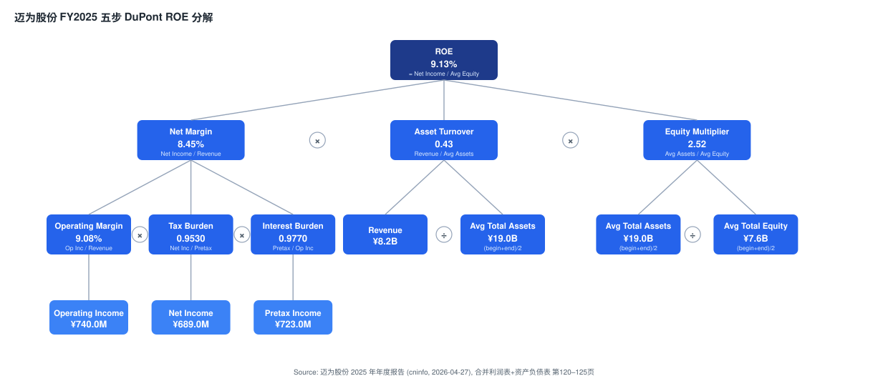

FY2025 加权 ROE 9.32% 的拆解显示：净利率约 8.5%（被减值损失压低）、资产周转 ~0.43×（设备厂的重资产+重营运资本特征）、权益乘数 ~2.4×。ROE 下滑的主因是减值损失侵蚀净利率与营收下行拖累周转（[2025 年年度报告, 第 9、120–125 页](https://static.cninfo.com.cn/finalpage/2026-04-28/1225211530.PDF)）。

### 2.6 卖方观点演变 (Sell-side view evolution)

**机械预处理（来自 `db/stock_price_target.db` 只读 pre-pass）：** 4 条 PT 记录，PT 分布 min ¥108 / median ¥263 / max ¥278，价差 157%（¥108→¥278）。报告期价格均已配对。

**按机构的观点时间线（per-institute timeline）：**

| 机构 | 日期 | 评级 / 目标价 | 报告日股价 → 隐含空间 | 一句话论点 |
|---|---|---|---|---|
| **Goldman Sachs** | 2026-04-15 | Buy / ¥263（升级） | ¥222.74 → +18% | 升级至 Buy；HJT >70% 份额；R&D 订单增加 |
| **Goldman Sachs** | 2026-04-28 | Buy / ¥263 | ¥222.55 → +18% | 1Q26 EBITDA 超预期；51% GPM；25× 2027 EV/EBITDA |
| **Goldman Sachs** | 2026-04-29 | Buy / **¥278**（上调 ¥263→¥278） | ¥220.94 → +26% | 业绩说明会：订单强劲、高毛利可持续；EBITDA 上调 42% |
| **J.P. Morgan** | 2026-05-29 | **Underweight / ¥108**（自 ¥92 上调） | ¥249.66 → **-57%** | 订单虽回暖，股价已透支乐观情形；维持减持 |

**自我修正（self-revisions）：**
- **Goldman 三次上调** —— 4 月 15 日先把光伏设备股目标价整体上调并将迈为升级至 Buy（¥263），随后 1Q26 EBITDA 超预期，4 月 29 日业绩说明会后将 EBITDA 预测平均上调 42%、PT 由 ¥263 升至 ¥278，估值基准从 25× 2027 EV/EBITDA 调整为 22× 2027 EV/EBITDA（核心业务 15× + 新应用 85× 的 90/10 加权），以 8.3% CoE 折现回 2026E（[Goldman Sachs — Maxwell result briefing, 2026-04-29, p.1–2](http://xs-macbook-air.local:5001/zsxq/pdf/415515548181858/Goldman%20Sachs-SUZHOU%20MAXWELL%20TECHNOLOGIES%20CO.%20%EF%BC%88300751%EF%BC%89%20Result%20briefing%20takeaway%EF%BC%9A%20Mgmt.%20guided%20for%20strong%20order%20momentum%20and%20sustainable%20high%20margin%20in%202026%EF%BC%9B%20reiterate%20Buy-260429.pdf)）。
- **J.P. Morgan 上调 PT 但维持减持** —— 基于 1Q26 业绩与订单趋势，下调 FY26 盈利 19% 至 EPS ¥2.20、上调 FY27 盈利 66% 至 EPS ¥4.11，目标价从 ¥92 上调 17% 至 ¥108，但**评级仍是 Underweight**，并把目标价基准日从 Dec-26 滚动至 Jun-27、估值法切回 P/E（光伏 15× + 半导体/显示 30×）（[J.P. Morgan — Maxwell UW, 2026-05-29, p.1](http://xs-macbook-air.local:5001/zsxq/pdf/812485814114252/J.P.%20Morgan-Maxwell%20~A%EF%BC%88300751%EF%BC%89While%20orders%20improve%EF%BC%8C%20share%20price%20has%20priced~in%20blue%20sky%20scenario%EF%BC%9B%20maintain%20UW-260529.pdf)）。

**机构间分歧（cross-institute disagreement）—— 切勿混为虚假一致：**

| 机构 | 日期 | 评级 / PT | 核心论点 | 什么证据能证明其正确 |
|---|---|---|---|---|
| Goldman Sachs | 2026-04-29 | Buy / ¥278 | HJT 主导地位 + 海外/半导体高毛利可持续（51%）；新应用订单显著改善盈利展望 | 海外 HJT 年需求兑现 ≥10–13GW、GM 持续维持 51%、半导体订单如期翻倍 |
| J.P. Morgan | 2026-05-29 | UW / ¥108 | 股价已计入 2028 年 >30GW HJT 交付（≈100GW 太空光伏 TAM），现实极难实现；当前 53×/41× FY27/28E P/E 远超 27× 历史均值 | 海外订单不可持续、太空光伏题材证伪、FY27/28 实际交付远低于 30GW |

二者对**同一组 1Q26 业绩（GM 51%、合同负债 +38%、订单回暖）**给出相反结论：Goldman 视之为"高毛利可持续 + 订单拐点"，J.P. Morgan 视之为"已被股价透支的乐观情形"。本报告 Hold/¥215 即取其中段 —— 承认订单确在回暖（合同负债 +37.6% 是硬数据），但认同估值已基本计入修复，风险报酬对称。

*分析师观点：* Morgan Stanley 在 2026-06-08 的中国工业调研纪要中亦提及迈为 —— "光伏行业景气度触底回升，2026 年光伏订单目标 60 亿元，半导体订单 35–40 亿元，已切入多家主流封测企业；北美相关产品正常生产交付，最终取决于后续政策落地"（[Morgan Stanley — China Industrials Trip Takeaways, 2026-06-08, p.1](http://xs-macbook-air.local:5001/zsxq/pdf/214528251122451/Morgan%20Stanley-China%20Industrials%EF%BC%9ATrip%20Takeaways%EF%BC%9A%20Stronger%EF%BC%8C%20Broader%20Capex%20Boom-260608.pdf)），与管理层的订单指引一致。

---

## 1B. GF Score（GuruFocus 式基本面评分）— *分析师观点*

GF Score **57/100**（五维 0–10：财务强度 7 / 盈利能力 6 / 成长性 4 / GF 估值 3 / 动量 9）。**本评分为分析师自建评分卡，非取自 GuruFocus，亦不附任何披露文件引用；每个底层指标的引用见下。**

- **财务强度 (Financial Strength) = 7：** 货币资金 + 理财 ¥56.47 亿 vs 长期借款 ¥34.81 亿 + 流动负债 ¥66.78 亿，仍为净货币资产正值；归母净资产 ¥79.29 亿。但 FY2025 财务费用同比 +195.53%（银行借款增加 + 汇兑损失）、OCF 转负，扣分项（[2025 年年度报告, 第 32、120–124 页](https://static.cninfo.com.cn/finalpage/2026-04-28/1225211530.PDF)）。
- **盈利能力 (Profitability) = 6：** GM 反弹至 38.61%、净利率 8.5%、ROE 9.32% 仍为正；但 ¥6.15 亿信用减值拖累，且半导体子公司宸微设备仍亏损（[2025 年年度报告, 第 9、46、125 页](https://static.cninfo.com.cn/finalpage/2026-04-28/1225211530.PDF)）。
- **成长性 (Growth) = 4：** 后视成长为负 —— 营收 -17%、净利 -22%、1Q26 营收 -40%；但前瞻有半导体及显示 +887%、境外 +320%、FY27 订单回升的期权（[2025 年年度报告, 第 9、28–29 页](https://static.cninfo.com.cn/finalpage/2026-04-28/1225211530.PDF)）。后视拖累为主，给 4。
- **GF 估值 (GF Value，越高越便宜) = 3：** ¥213 对应 82× 静态 P/E、FY27/28E 53×/41×，远高于 27× 历史前瞻均值 —— 偏贵（[J.P. Morgan — Maxwell UW, 2026-05-29, p.1](http://xs-macbook-air.local:5001/zsxq/pdf/812485814114252/J.P.%20Morgan-Maxwell%20~A%EF%BC%88300751%EF%BC%89While%20orders%20improve%EF%BC%8C%20share%20price%20has%20priced~in%20blue%20sky%20scenario%EF%BC%9B%20maintain%20UW-260529.pdf)）。
- **动量 (Momentum) = 9：** 12 个月绝对 +249.7%、相对创业板指 +228.7%，自 2025 年 11 月底 +170%（[J.P. Morgan — Maxwell UW, 2026-05-29, p.2](http://xs-macbook-air.local:5001/zsxq/pdf/812485814114252/J.P.%20Morgan-Maxwell%20~A%EF%BC%88300751%EF%BC%89While%20orders%20improve%EF%BC%8C%20share%20price%20has%20priced~in%20blue%20sky%20scenario%EF%BC%9B%20maintain%20UW-260529.pdf)）。

GF Score 57/100 的画像与本报告 Hold 评级自洽 —— 强动量 + 尚可的财务强度，被高估值 + 负向后视成长抵消。

---

## 3. 公司历史

苏州迈为科技股份有限公司前身可追溯至 2010 年成立的吴江迈为技术有限公司。**2010 年 9 月，公司由周剑、王正根、施政辉等核心团队创立**，初始定位为太阳能电池丝网印刷设备制造商，专注解决进口设备依赖问题（[2025 年年度报告, 第 65–66 页 — 董监高履历](https://static.cninfo.com.cn/finalpage/2026-04-28/1225211530.PDF)）。2016 年 5 月公司完成股份制改造，更名为苏州迈为科技股份有限公司，注册地变更至苏州市吴江区。

**2018 年 11 月 9 日，公司在深圳证券交易所创业板挂牌上市**，保荐机构为东吴证券股份有限公司，募集资金重点投向高效太阳能电池丝网印刷设备产能扩建及研发中心建设（[2025 年年度报告, 第 9 页](https://static.cninfo.com.cn/finalpage/2026-04-28/1225211530.PDF)）。

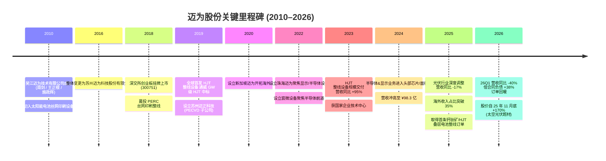

**关键战略转型：**

**1. 从单一工序设备到全工序整线 (2018–2021)：** 公司 IPO 时主营业务集中于丝网印刷机这一单机产品。2019 年开始向 HJT 异质结电池整线设备拓展 —— 通过参股子公司吸收引进日本 YAC 的制绒清洗技术，建立 PECVD、PVD、丝网印刷、清洗制绒四大关键工艺的整线供应能力，从单点设备供应商转型为整线方案供应商（[2025 年年度报告, 第 25 页](https://static.cninfo.com.cn/finalpage/2026-04-28/1225211530.PDF)）。这是公司至今最关键的产品维度跨越，它直接导致 2023 年营收同比 +94.99%（光伏设备口径）。

**2. 从光伏单赛道到泛半导体三赛道 (2022 至今)：** 公司在 2022 年密集设立**珠海迈为（显示+先进封装）**、**宸微设备（半导体前道刻蚀/ALD）**两家子公司，明确**真空-激光-精密**三大技术平台向显示面板与半导体设备双赛道延伸的战略（[2025 年年度报告, 第 46 页](https://static.cninfo.com.cn/finalpage/2026-04-28/1225211530.PDF)）。该战略在 2025 年取得阶段性成果 —— 半导体及显示行业收入 ¥6.62 亿，同比 +887.01%，从微不足道（0.68%）跃升至 8.12%。

**3. 全球化出海对冲国内周期 (2020 至今)：** 新加坡迈为 (MAXWELL TECHNOLOGY PTE. LTD) 设立于 2020 年 3 月。在 2024–2025 年国内光伏深度调整期，公司加快将 HJT 整线设备出口至东南亚、中东、北非等新兴光伏装机市场，2025 年境外收入同比 +320.19%，成为业绩压舱石（[2025 年年度报告, 第 27、29 页](https://static.cninfo.com.cn/finalpage/2026-04-28/1225211530.PDF)）。

**关键并购 / 子公司布局：**

- **苏州迈正科技有限公司**（2019 年 7 月，持股 85.5%）— 异质结 PECVD 真空镀膜设备软件研发；
- **苏州迈展自动化科技有限公司**（2016 年 3 月，全资）— 光伏组件设备（串焊机 / 覆膜机）+ 锂电设备；
- **MAXWELL TECHNOLOGY PTE. LTD（新加坡迈为）**（2020 年 3 月，全资）— 境外销售平台；
- **宸微设备科技（苏州）有限公司**（2022 年 12 月，持股 68.88%）— 半导体高选择比刻蚀 + 原子层沉积 (atomic layer deposition, ALD)；
- **迈为技术（珠海）有限公司**（2022 年 5 月，控股）— 显示 / 半导体封装设备；
- **江苏启威星装备科技有限公司** — 公司联营企业，2025 年作为公司最大供应商（采购额 ¥3.05 亿，占采购总额 11.57%）（[2025 年年度报告, 第 32、46 页](https://static.cninfo.com.cn/finalpage/2026-04-28/1225211530.PDF)）。

**近 12 个月主要发展：**
- 2025 年获**业内首条钙钛矿/硅异质结叠层电池整线订单**，标志着大尺寸 (G12 半片) 钙钛矿/HJT 叠层电池技术从实验室迈向产业化（[2025 年年度报告, 第 27 页](https://static.cninfo.com.cn/finalpage/2026-04-28/1225211530.PDF)）；
- 半导体高选择比刻蚀和 ALD 设备进入多家国内头部逻辑/存储芯片厂，部分获得重复订单（虽宸微设备仍处亏损）（[2025 年年度报告, 第 46 页](https://static.cninfo.com.cn/finalpage/2026-04-28/1225211530.PDF)）；
- 由于"前期光伏行业全产业链集中扩产 + 行业整体步入深度调整期"，公司在 2025、2026Q1 计提了大额资产减值准备（[关于公司 2026 年第一季度计提资产减值准备的公告](https://static.cninfo.com.cn/finalpage/2026-04-28/1225211545.PDF)）。

---

## 4. 管理团队

迈为股份是典型的**创始团队主导的工程师文化**公司 —— 周剑、王正根作为一致行动人合计直接持股 39.20%，加上通过苏州迈拓创业投资合伙企业控制的 2.22%，合计控制 41.42% 股权，是公司控股股东及实际控制人（[2025 年年度报告, 第 110–111 页](https://static.cninfo.com.cn/finalpage/2026-04-28/1225211530.PDF)）。

### 周剑 — 董事长、联合创始人、共同实际控制人

周剑，男，1976 年 7 月出生，中国国籍，本科学历。报告期末直接持有公司 22.12%（61,811,671 股），其中 7,000 万股中已质押 2,170 万股（[2025 年年度报告, 第 110 页](https://static.cninfo.com.cn/finalpage/2026-04-28/1225211530.PDF)）。

职业履历：
- 1999 年 8 月至 2002 年 10 月任美国科视达（中国）有限公司销售工程师、销售经理、华南分部总经理 —— 这是周剑的"销售-工程"复合背景起点；
- 2003 年 1 月至 2015 年 12 月任深圳市南杰星实业有限公司执行董事；
- 2009 年 8 月至 2012 年 10 月任深圳市迈为科技有限公司董事长 —— **迈为品牌正式确立**；
- 2010 年 9 月至 2016 年 4 月任吴江迈为技术有限公司董事长 —— **迈为生产实体落地苏州**；
- 2016 年 5 月至今任苏州迈为科技股份有限公司董事长（[2025 年年度报告, 第 65–66 页](https://static.cninfo.com.cn/finalpage/2026-04-28/1225211530.PDF)）。

**点评：** 周剑作为创始人 + 大股东 + 董事长，自 2010 年起持续在迈为体系内任职 15 年以上，与总经理王正根从南杰星实业时代起就是搭档。这种长期搭档关系赋予公司稳定的"董事长-总经理"二元治理。周剑负责战略 + 资本，王正根负责经营 + 总经理，二人均为公司一致行动人。其销售背景天然使迈为偏向**客户驱动 / 整线方案输出**的商业模式，而非纯技术驱动。

### 王正根 — 董事、总经理、共同实际控制人

王正根，男，1972 年 5 月出生，中国国籍，硕士学历。报告期末直接持有公司 17.08%（47,726,156 股），其中已质押 900 万股（[2025 年年度报告, 第 110 页](https://static.cninfo.com.cn/finalpage/2026-04-28/1225211530.PDF)）。

职业履历：1997 年 8 月入职深圳泰丰电子；1999 年至 2001 年任邦深电子（深圳）统筹部主管、副理；2001 年至 2003 年任傲天宏（深圳）供应链经理及 SMT 部经理；2003 年至 2017 年任深圳市南杰星实业总经理、执行董事；2009 年 8 月至 2012 年 10 月任深圳市迈为科技有限公司董事、总经理；2010 年 9 月至 2012 年 7 月任吴江迈为技术有限公司董事、总经理；**2016 年 5 月至今任苏州迈为科技股份有限公司董事、总经理**（[2025 年年度报告, 第 66 页](https://static.cninfo.com.cn/finalpage/2026-04-28/1225211530.PDF)）。

**点评：** 王正根典型"供应链 + SMT 制造"背景天然适配设备厂的成本-质量-交付管控。其担任苏州晶方半导体（SZSE:603005）独立董事的经历反映迈为对半导体先进封装赛道的纵深布局意图。

### 公司治理

**股权结构与治理风险：** 周剑、王正根合计控制 41.42% 股权，并担任董事长 + 总经理的核心岗位组合，符合典型创始人控股模式，治理结构存在"一致行动人主导"特征。公司在公司章程中明确实际控制人保证资产、人员、财务、机构、业务五独立，但**两人合计已质押 3,070 万股（约占其持股 11.4%）**，需关注质押融资用途与平仓线风险（[2025 年年度报告, 第 110 页](https://static.cninfo.com.cn/finalpage/2026-04-28/1225211530.PDF)）。

**激励与持股：** 报告期末公司董监高合计持股 114,736,796 股，占总股本约 41%（[2025 年年度报告, 第 65 页](https://static.cninfo.com.cn/finalpage/2026-04-28/1225211530.PDF)）。利润分配预案：每 10 股派发现金红利 ¥5 元（含税），按 2025 年末总股本测算分红总额约 ¥1.4 亿，分红比例约 19%（[2025 年年度报告, 第 2 页](https://static.cninfo.com.cn/finalpage/2026-04-28/1225211530.PDF)）。

**管理团队评价：** 迈为创始团队（周剑/王正根/施政辉）三人均自 2010 年起伴随公司从苏州本土小公司发展到全球丝网印刷设备龙头、再到 HJT 整线龙头，三人合计 15 年以上深度协作历史，团队稳定性极高。**风险点：** 创始团队以销售-供应链经验为主，对前道半导体真空设备（ALD/etch）这类新业务的能力主要依靠引入外部高端人才与控股子公司（宸微设备、珠海迈为），跨赛道复用能否成功仍待 3–5 年观察。

---

## 5. 产品与服务

迈为股份立足**真空、激光、精密装备**三大关键技术，产品覆盖**太阳能光伏 / 显示 / 半导体**三大行业。FY2025 营收构成中，太阳能光伏行业 91.38%、半导体及显示 8.12%、其他 0.49%（[2025 年年度报告, 第 28 页](https://static.cninfo.com.cn/finalpage/2026-04-28/1225211530.PDF)）。

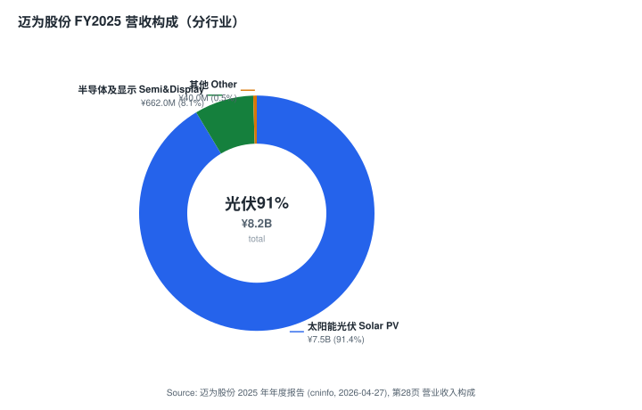

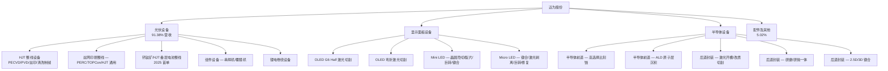

### 5.1 光伏设备

#### HJT 异质结电池整线设备（旗舰，全球少数能 GW 级交付的整线供应商之一）

**它在客户价值链中物理上做什么：** HJT (heterojunction，异质结) 电池在晶硅衬底两侧沉积非晶硅薄膜形成异质结，再镀透明导电氧化物 (transparent conductive oxide, TCO) 膜并丝印金属电极。迈为 HJT 整线覆盖四大关键工艺：**制绒清洗、非晶硅薄膜沉积、TCO 膜沉积、电极金属化**。具体单机包括（[2025 年年度报告, 第 12 页](https://static.cninfo.com.cn/finalpage/2026-04-28/1225211530.PDF)）：

- **HJT PECVD 真空镀膜设备** — plasma-enhanced chemical vapor deposition（等离子体增强化学气相沉积），用于非晶硅薄膜沉积，是 HJT 电池的核心设备；
- **HJT PVD 真空镀膜设备** — physical vapor deposition（物理气相沉积），用于 TCO 膜沉积，提升导电性和光电转换效率；
- **太阳能电池片丝网印刷机** — 电极金属化 (metallization)，兼容 PERC/TOPCon/HJT；
- **配套设备** — 自动上下片机、转接机、烧结炉/干燥炉/固化炉、检测测试分选机。

**它与同系产品如何区分：** PECVD 沉积"非晶硅薄膜"（决定钝化与开路电压），PVD 沉积"TCO 导电膜"（决定串联电阻与电流），丝印机做"金属电极"（决定取电）—— 三者串联构成 HJT 整线，缺一不可，这正是迈为"整线方案"相对单机供应商的护城河所在。

**战略意义：** 公司 PECVD 设备 2024 年获江苏省"首台（套）重大装备认定"（MV-LH06H 高效双面微晶异质结电池 VHF 甚高频 PECVD 量产设备），2025 年获苏州"十大产业科技成果"（[2025 年年度报告, 第 25–26 页](https://static.cninfo.com.cn/finalpage/2026-04-28/1225211530.PDF)）。据卖方，公司 HJT 设备市占率 >70%，是海外 HJT 产能扩张的最大受益者（*分析师观点：* [Goldman Sachs — Maxwell result briefing, 2026-04-29, p.2](http://xs-macbook-air.local:5001/zsxq/pdf/415515548181858/Goldman%20Sachs-SUZHOU%20MAXWELL%20TECHNOLOGIES%20CO.%20%EF%BC%88300751%EF%BC%89%20Result%20briefing%20takeaway%EF%BC%9A%20Mgmt.%20guided%20for%20strong%20order%20momentum%20and%20sustainable%20high%20margin%20in%202026%EF%BC%9B%20reiterate%20Buy-260429.pdf)）。

**📺 延伸观看 / Further viewing：** HJT 异质结电池的工艺流程与 PECVD/PVD/丝印的串联关系，可参考公开的电池制造工艺动画与产线讲解视频（建议在视频平台检索"异质结 HJT 电池 工艺流程"）。视频仅为理解辅助，不构成引用、不附数字。

#### 丝网印刷设备（基本盘，全球市占率第一）

太阳能电池片丝网印刷机 (screen-printing) 适用于多种电池工艺路径，是公司起家产品。已实现进口替代，2025 年广泛应用于国内主流光伏企业产线（[2025 年年度报告, 第 13 页](https://static.cninfo.com.cn/finalpage/2026-04-28/1225211530.PDF)）。*分析师观点：* 据 Goldman，公司丝印设备自 2018 年起市占率 >80%（[Goldman Sachs — Maxwell result briefing, 2026-04-29, p.2](http://xs-macbook-air.local:5001/zsxq/pdf/415515548181858/Goldman%20Sachs-SUZHOU%20MAXWELL%20TECHNOLOGIES%20CO.%20%EF%BC%88300751%EF%BC%89%20Result%20briefing%20takeaway%EF%BC%9A%20Mgmt.%20guided%20for%20strong%20order%20momentum%20and%20sustainable%20high%20margin%20in%202026%EF%BC%9B%20reiterate%20Buy-260429.pdf)）。最接近的竞品为德国 Manz、日本 NPC 等海外厂商，目前已基本退出中国大陆市场。

#### 钙钛矿/硅异质结叠层电池整线（2025 年新增旗舰）

公司在 2025 年获**业内首条钙钛矿 (perovskite, PSC)/HJT 叠层电池整线订单**，采用 G12 半片大尺寸技术平台（[2025 年年度报告, 第 27 页](https://static.cninfo.com.cn/finalpage/2026-04-28/1225211530.PDF)）。*分析师观点：* 据 Goldman，公司已于 2025 年末开始 PSC 设备出货，2026 年目标再交付 8–10 条产线（约 ¥5 亿订单价值），2026 年 3 月宣布投资 ¥35 亿建设全线多结 PSC 太阳能电池设备产能，管理层估计 2027 年末 PSC 组件单位经济性可达到硅基组件水平（[Goldman Sachs — Maxwell result briefing, 2026-04-29, p.1](http://xs-macbook-air.local:5001/zsxq/pdf/415515548181858/Goldman%20Sachs-SUZHOU%20MAXWELL%20TECHNOLOGIES%20CO.%20%EF%BC%88300751%EF%BC%89%20Result%20briefing%20takeaway%EF%BC%9A%20Mgmt.%20guided%20for%20strong%20order%20momentum%20and%20sustainable%20high%20margin%20in%202026%EF%BC%9B%20reiterate%20Buy-260429.pdf)）—— 这是技术路线先行者的期权，但产业化时间表存在不确定性，尚未形成规模收入。

### 5.2 显示面板设备

公司显示面板设备产品矩阵（由珠海迈为承接）：**OLED G6 Half 激光切割设备**、**OLED 弯折激光切割设备**（已商用）；**Mini LED 全套**（晶圆隐切、裂片、刺晶巨转、激光键合）；**Micro LED 全套**（晶圆键合、激光剥离、激光巨转、激光键合、激光修复、激光切割、D2D 键合、混合键合）（[2025 年年度报告, 第 12 页](https://static.cninfo.com.cn/finalpage/2026-04-28/1225211530.PDF)）。**竞争优势评估：部分（Partial — 技术领先但份额尚小）** —— Mini/Micro LED 关键设备国产化的早期玩家之一，已交付部分头部面板厂订单。最接近竞品包括美国 K&S（键合）、奥地利 EVG（混合键合）、新益昌（固晶 / 巨量转移）。迈为优势在于**激光设备工艺积累 + 国产替代窗口**，劣势在于规模仍小、设备稳定性数据有待持续验证。

### 5.3 半导体设备

公司**精准切入半导体设备国产替代关键环节，业务覆盖前道芯片制造 + 后道封装**：

**前道（宸微设备主导）：** 半导体高选择比刻蚀设备（high-selectivity etch）—— 完成多批次客户交付，进入多家国内头部逻辑和存储芯片生产厂；原子层沉积 (ALD) 设备 —— 凭借差异化设计实现关键技术突破（[2025 年年度报告, 第 12 页](https://static.cninfo.com.cn/finalpage/2026-04-28/1225211530.PDF)）。**竞争优势评估（前道）：部分（Partial — 利基差异化 + 国产化早期）** —— 全球主导厂商为 Lam Research (LRCX)、应用材料 (AMAT)、东京电子 (TEL)、ASM International；国内对标为中微 (SSE:688012)、北方华创 (SZSE:002371)、拓荆科技 (SSE:688072)。**迈为目前仅处"获得重复订单"的早期国产替代阶段，宸微设备 2025 年仍处于亏损状态**，反映该业务尚未形成规模效应（[2025 年年度报告, 第 46 页](https://static.cninfo.com.cn/finalpage/2026-04-28/1225211530.PDF)）。

**后道（珠海迈为主导）：** 激光开槽、激光改质切割、刀轮切割、研磨、研抛一体设备；2.5D/3D 键合设备 —— 多款已交付国内头部封装企业并稳定量产（[2025 年年度报告, 第 12 页](https://static.cninfo.com.cn/finalpage/2026-04-28/1225211530.PDF)）。**竞争优势评估（后道封装）：是（Yes — 激光技术复用 + 现有客户群）** —— 充分复用了公司在光伏激光设备上的工艺积累，是公司**最有可能在 2026–2028 年放量的非光伏业务**。*分析师观点：* Morgan Stanley 调研称迈为半导体设备"已切入多家主流封测企业"（[Morgan Stanley — China Industrials Trip Takeaways, 2026-06-08, p.1](http://xs-macbook-air.local:5001/zsxq/pdf/214528251122451/Morgan%20Stanley-China%20Industrials%EF%BC%9ATrip%20Takeaways%EF%BC%9A%20Stronger%EF%BC%8C%20Broader%20Capex%20Boom-260608.pdf)）。

### 5.4 供应链资金流（money-flow）

下图为迈为的资金流向图（demand/revenue 视角）：下游电池/面板/芯片厂的设备资本开支流入迈为三大产品线，最终主要沉淀为高额应收账款 + 存货（流动性占用黑洞），并向上游核心工艺供应商（启威星、YAC）与研发分流。**实线 = 直接支付，虚线 = 嵌入在采购部件中的间接资金。**

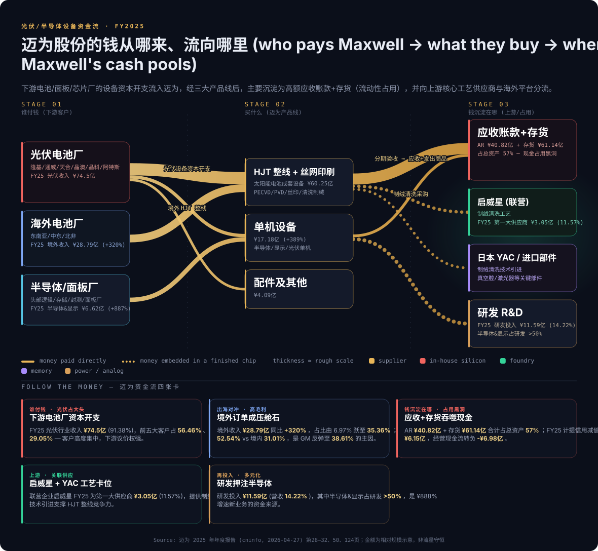

**Follow the money（资金流要点，每个数字均可溯源）：** 下游光伏电池厂是主要付款方（FY25 光伏收入 ¥74.5 亿，占 91.38%），前五大客户占 56.46%、第一大客户 29.05%，客户高度集中（[2025 年年度报告, 第 28、32 页](https://static.cninfo.com.cn/finalpage/2026-04-28/1225211530.PDF)）。境外订单成压舱石（境外收入 ¥28.79 亿，+320%，毛利 52.54%）。钱最终沉淀的"黑洞"是 **应收账款 ¥40.82 亿 + 存货 ¥61.14 亿（占总资产 57%）**，FY25 计提信用减值 ¥6.15 亿、经营现金流转负 -¥6.98 亿（[2025 年年度报告, 第 50、125 页](https://static.cninfo.com.cn/finalpage/2026-04-28/1225211530.PDF)）。上游核心供应商为联营企业启威星（FY25 第一大供应商 ¥3.05 亿，11.57%，制绒清洗工艺）与日本 YAC（技术引进），构成 HJT 整线的工艺卡位（[2025 年年度报告, 第 25、32 页](https://static.cninfo.com.cn/finalpage/2026-04-28/1225211530.PDF)）。

---

## 6. 客户与上市策略

### 6.1 客户分布

公司光伏客户为典型的**头部集中型** —— 公开披露的核心战略合作伙伴包括 **隆基绿能 (SH:601012)、通威股份 (SH:600438)、天合光能 (SH:688599)、晶科能源 (SH:688223)、晶澳科技 (SZ:002459)、阿特斯 (SH:688472)**（[2025 年年度报告, 第 26 页](https://static.cninfo.com.cn/finalpage/2026-04-28/1225211530.PDF)）。在 HJT 前沿赛道，市场公开信息指向华晟新能源、东方日升、爱康科技等 HJT 阵营（公司年报未具名）。显示设备客户为国内头部面板厂（公司年报未具名；公开信息指向京东方 BOE、TCL 华星、维信诺等）；半导体设备客户为国内头部逻辑/存储芯片厂 + 头部封测厂（公司年报未具名）。

### 6.2 客户集中度（关键风险）

**FY2025 公司前五名客户合计销售金额 ¥46.02 亿，占年度销售总额 56.46%（占合并营业收入）**；其中第一大客户销售额 ¥23.68 亿，占合并营业收入 **29.05%**（[2025 年年度报告, 第 32 页](https://static.cninfo.com.cn/finalpage/2026-04-28/1225211530.PDF)）。前五大客户中关联方销售额为 0。

**3 年趋势对比（均为占合并营业收入口径）：**

| 指标 | FY2024 | FY2025 | 变动 |
|---|---:|---:|---:|
| Top-1 客户占比 | 31.42% | 29.05% | -2.37pct |
| Top-5 客户占比 | 57.04% | 56.46% | -0.58pct |
| Top-1 客户销售额 | ¥30.89 亿 | ¥23.68 亿 | -23.3% |
| Top-5 客户销售额 | ¥56.08 亿 | ¥46.02 亿 | -17.9% |

数据来源：[2024 年年度报告, 第 31 页](https://static.cninfo.com.cn/finalpage/2025-04-29/1223370046.PDF)、[2025 年年度报告, 第 32 页](https://static.cninfo.com.cn/finalpage/2026-04-28/1225211530.PDF)。

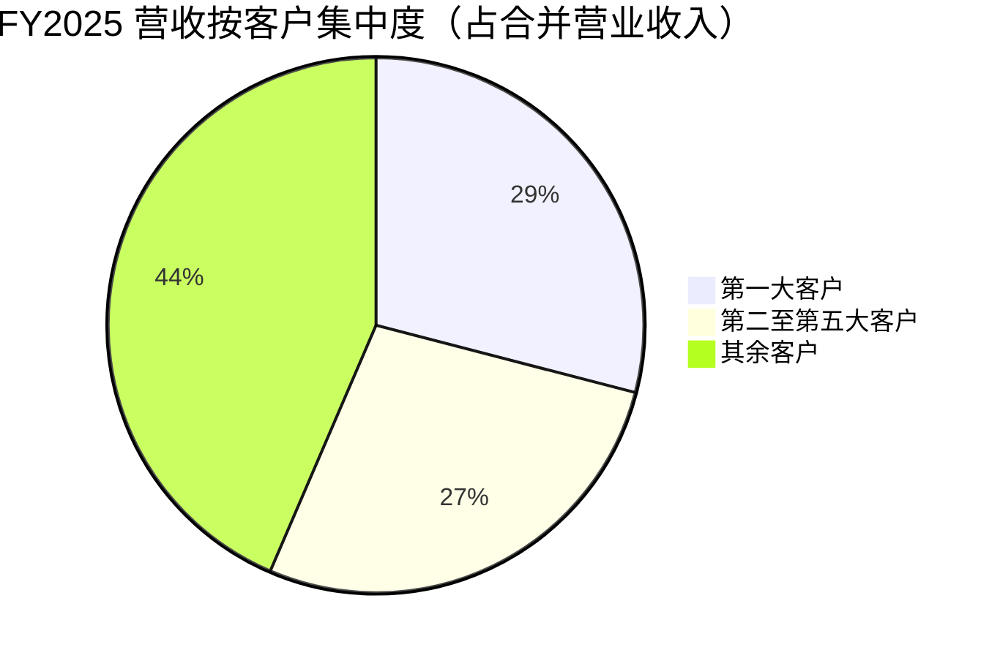

**风险评级：高 (High)** —— **Top-1 客户占合并营业收入超过 20% 阈值（接近 30%）、Top-5 超过 50%**。由于客户身份未具名披露，第一大客户身份变动需通过订单公告进一步推测。

**合同结构：** 设备销售合同为**逐单签订**，分阶段付款（合同 → 发货 → 验收 → 质保期），客户验收周期决定收入确认时点。这导致公司经营性现金流大幅波动 —— FY2025 OCF 净额 -¥6.98 亿（vs FY2024 +¥0.56 亿），主因下游客户回款延迟（[2025 年年度报告, 第 27 页](https://static.cninfo.com.cn/finalpage/2026-04-28/1225211530.PDF)）。**应收账款 ¥40.82 亿（占营收 50.07%）+ 存货 ¥61.14 亿（占总资产 34.3%，按 ¥178.22 亿总资产口径）** 是其资产负债表上最大的两块流动性占用项（[2025 年年度报告, 第 50、120 页](https://static.cninfo.com.cn/finalpage/2026-04-28/1225211530.PDF)）。

下图为迈为 FY2025 的资产负债表 Sankey —— 左侧资产（货币资金、应收、存货、固定资产）与右侧负债 + 权益的对照，应收 + 存货占据资产端最大两块：

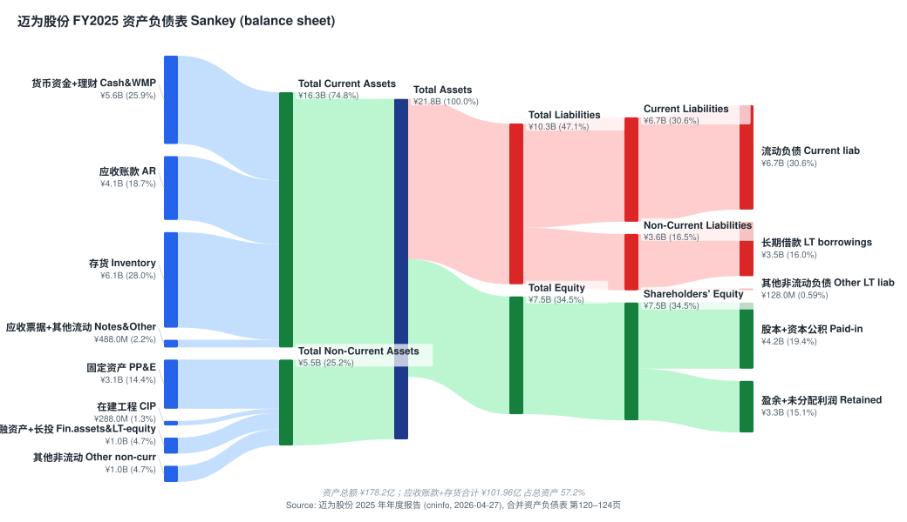

而 FY2025 的现金流量表 Sankey 直观显示：经营活动现金流转负、投资活动（理财）大幅流出、筹资活动补流：

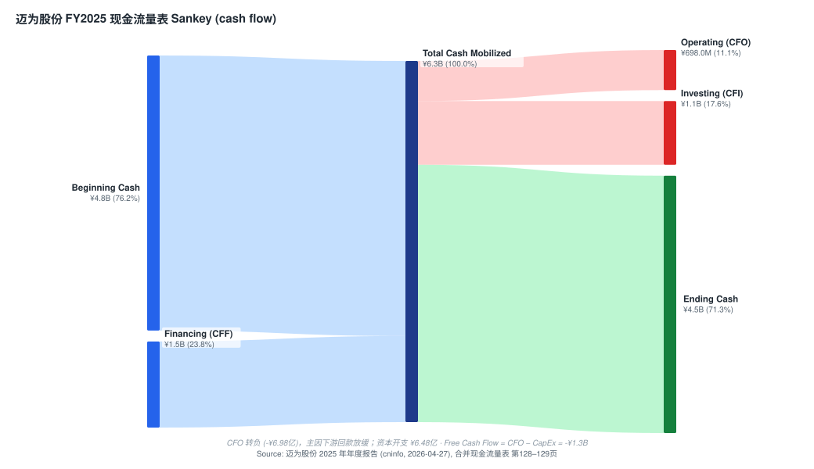

### 6.3 销售渠道与策略

- **销售模式：** 100% 直销，与下游电池片/面板/芯片生产企业直接签订销售合同（[2025 年年度报告, 第 12–13 页](https://static.cninfo.com.cn/finalpage/2026-04-28/1225211530.PDF)）；
- **服务模式：** 全程驻厂工程师 + 远程指导 + 现场检测 + 操作培训 + 数据反馈闭环；
- **境外销售：** 通过新加坡迈为执行；FY2025 境外销售 ¥28.79 亿，是国内市场低迷下的重要业绩支撑（[2025 年年度报告, 第 29 页](https://static.cninfo.com.cn/finalpage/2026-04-28/1225211530.PDF)）。

### 6.4 关键合作伙伴

- **江苏启威星装备科技有限公司** — 公司联营企业，HJT 制绒清洗工艺关键供应商，FY2025 第一大供应商（采购额 ¥3.05 亿，占采购总额 11.57%，**为关联交易**）（[2025 年年度报告, 第 32 页](https://static.cninfo.com.cn/finalpage/2026-04-28/1225211530.PDF)）；
- **日本 YAC** — 公司通过参股子公司吸收引进 YAC 的制绒清洗技术（[2025 年年度报告, 第 25 页](https://static.cninfo.com.cn/finalpage/2026-04-28/1225211530.PDF)）。

---

## 7. 行业概览

### 7.1 行业定位

按中国证监会《上市公司行业分类指引》，公司归属**大类 C 制造业 → 专用设备制造业 (C35)**；按战略性新兴产业目录归属**高端装备制造业 → 智能制造装备**（[2025 年年度报告, 第 14 页](https://static.cninfo.com.cn/finalpage/2026-04-28/1225211530.PDF)）。下游应用领域为**光伏 / 显示 / 半导体**三大泛半导体行业。

### 7.2 光伏行业（公司核心赛道）

**全球装机：** 2025 年全球光伏新增装机预计约 **580 GW**（中国光伏行业协会 CPIA 预测）。IEA 在《Renewables 2025》中预测，由于此前光伏装机处于非常规高速增长态势，叠加欧美、中国等主要市场政策的阶段性变动，**2026 年将进入调整期**，出现负增长或增速放缓的迹象；2026 年之后受东南亚、中东北非等发展中国家需求拉动回到持续增长态势。**"十五五"期间（2026–2030 年）全球年均光伏新增装机规模预计达 725–870 GW**（[2025 年年度报告, 第 16 页](https://static.cninfo.com.cn/finalpage/2026-04-28/1225211530.PDF)）。

**技术格局：N 型崛起、P 型式微。** 2025 年新增量产产线中 N 型电池片产线占比超 90%；N 型主要技术路线为 **TOPCon、HJT 异质结、BC 背接触**；未来 3–5 年 N 型电池将保持主导地位（[2025 年年度报告, 第 16、46 页](https://static.cninfo.com.cn/finalpage/2026-04-28/1225211530.PDF)）。*分析师观点：* J.P. Morgan 指出，未来 2–3 年内 HJT 相比 TOPCon 的成本竞争力仍存疑，且 HJT 产能扩张主要由资金实力较弱的新进入者推动，行业周期波动下资本开支意愿存在不确定性（[J.P. Morgan — Maxwell UW, 2026-05-29, p.1](http://xs-macbook-air.local:5001/zsxq/pdf/812485814114252/J.P.%20Morgan-Maxwell%20~A%EF%BC%88300751%EF%BC%89While%20orders%20improve%EF%BC%8C%20share%20price%20has%20priced~in%20blue%20sky%20scenario%EF%BC%9B%20maintain%20UW-260529.pdf)）。

**产业链：** 上游（多晶硅、硅片、银浆、靶材、设备）→ 中游（电池片、组件）→ 下游（光伏电站）。迈为定位于上游电池片生产设备。**全球装机分布演进对迈为构成结构性利好** —— 新兴市场（东南亚、中东、北非）快速崛起，海外产能扩张释放新一轮电池设备需求，FY2025 公司境外收入 +320.19%、占比从 6.97% 跃至 35.36% 即是直接证据（[2025 年年度报告, 第 29 页](https://static.cninfo.com.cn/finalpage/2026-04-28/1225211530.PDF)）。

### 7.3 半导体行业

半导体行业是依托半导体材料导电特性实现信号处理、能量转换与信息存储的战略性、基础性、先导性产业。**产业链：** 设计 → 制造 → 封测三大核心环节 + 上游材料 / 设备。迈为定位于上游**半导体制造专用装备**（[2025 年年度报告, 第 15 页](https://static.cninfo.com.cn/finalpage/2026-04-28/1225211530.PDF)）。**对迈为的意义：** 半导体设备国产替代率仍处于较低水平（特别是高选择比刻蚀、ALD、混合键合等高端设备），市场空间巨大；但前道设备技术壁垒极高，迈为的宸微设备目前仍处亏损培育期。

### 7.4 显示行业

**OLED：** 2025 年全球 OLED 面板市场需求持续走高，2025 年 5 月国内首条 8.6 代 AMOLED 显示器件生产线完成工艺设备搬入，多家企业相继公布 8.6 代 OLED 产线建设规划（[2025 年年度报告, 第 16 页](https://static.cninfo.com.cn/finalpage/2026-04-28/1225211530.PDF)）。**Mini/Micro LED：** Mini LED 直显应用边界持续拓宽，Micro LED 在 AR 设备、车载显示、超大尺寸商用屏等领域打开增长空间。**对迈为的意义：** OLED 激光切割设备 + Mini/Micro LED 巨量转移/键合设备，是公司从光伏激光技术向显示赛道复用的产品矩阵。

### 7.5 行业格局与议价能力

**光伏设备行业集中度较高、头部企业占据主要市场份额。** HJT 整线赛道全球能 GW 级交付的厂商不超过 5 家。下游电池厂商议价能力较强，2024–2025 行业深度调整期，电池厂商订单减少 + 验收周期延长 + 回款放缓，对设备厂商利润率和现金流构成显著压力。**这正是迈为 2024–2025 年 OCF、毛利率、净利润同时下滑的根本原因**（[2025 年年度报告, 第 49–50 页](https://static.cninfo.com.cn/finalpage/2026-04-28/1225211530.PDF)）。

---

## 8. 竞争格局

### 8.1 关键竞争对手

**光伏设备直接竞争对手：**

| 公司 | 代码 | 主要竞争点 | 相对定位 |
|---|---|---|---|
| 捷佳伟创 | SZSE:300724 | HJT/PERC/TOPCon 整线、PECVD、扩散炉 | TOPCon 整线龙头；HJT 整线**与迈为正面竞争** |
| 奥特维 | SZSE:688516 | 组件串焊机、半导体设备 | 组件设备龙头；半导体设备布局重叠 |
| 帝尔激光 | SZSE:300776 | 光伏激光设备 (LIA, SE 激光) | 激光赛道竞品 |
| 罗博特科 | SZSE:300757 | 光伏自动化 + 半导体设备 | 半导体晶圆传输系统重叠 |
| 海外厂商 (德国 Manz、日本 NPC) | - | 丝网印刷设备 | 已基本退出大陆市场 |

**半导体设备直接竞争对手：**

| 公司 | 代码 | 主要竞争点 | 相对定位 |
|---|---|---|---|
| 中微公司 | SSE:688012 | CCP/ICP 刻蚀、薄膜沉积 | 国内刻蚀龙头；迈为差距大 |
| 北方华创 | SZSE:002371 | 刻蚀、PVD、CVD、清洗、扩散 | 国内设备综合龙头 |
| 拓荆科技 | SSE:688072 | PECVD、ALD、SACVD | 与迈为 ALD 直接竞争 |
| 国际：LRCX, AMAT, TEL, ASML, ASM | - | 全球半导体设备龙头 | 迈为暂无法对标 |

### 8.2 竞争定位框架

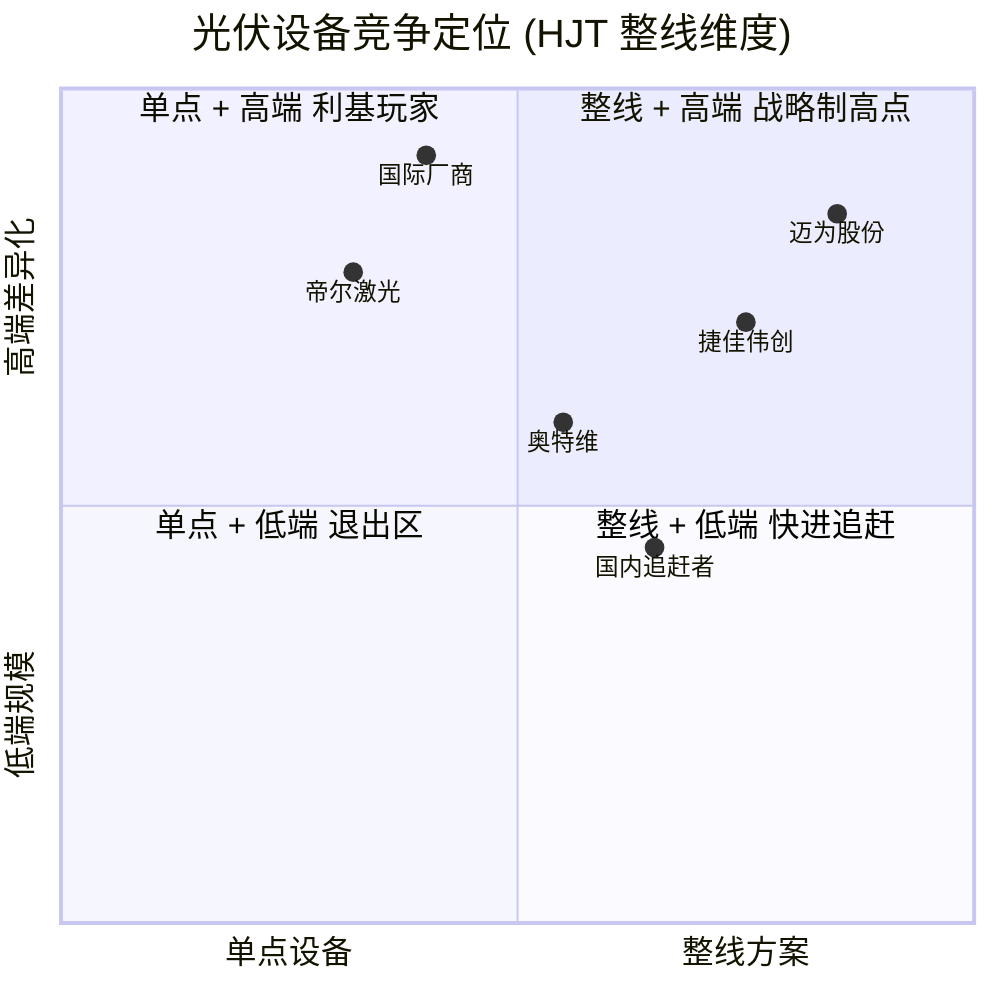

### 8.3 公司竞争优势与脆弱性

**优势：** (1) 技术领先 —— HJT 整线 / VHF PECVD / 钙钛矿叠层已实现 GW 级量产交付、叠层电池整线全球首单（[2025 年年度报告, 第 27 页](https://static.cninfo.com.cn/finalpage/2026-04-28/1225211530.PDF)）；(2) 规模效应 —— 据卖方丝印设备市占率 >80%、HJT >70%（*分析师观点：* [Goldman Sachs — Maxwell result briefing, 2026-04-29, p.2](http://xs-macbook-air.local:5001/zsxq/pdf/415515548181858/Goldman%20Sachs-SUZHOU%20MAXWELL%20TECHNOLOGIES%20CO.%20%EF%BC%88300751%EF%BC%89%20Result%20briefing%20takeaway%EF%BC%9A%20Mgmt.%20guided%20for%20strong%20order%20momentum%20and%20sustainable%20high%20margin%20in%202026%EF%BC%9B%20reiterate%20Buy-260429.pdf)）；(3) 客户绑定 —— 隆基/通威/天合/晶澳/晶科/阿特斯多年深度合作（[2025 年年度报告, 第 26 页](https://static.cninfo.com.cn/finalpage/2026-04-28/1225211530.PDF)）；(4) 研发持续投入 —— FY2025 研发费用率 14.22%，半导体及显示研发投入占研发总支出超 50%（[2025 年年度报告, 第 27 页](https://static.cninfo.com.cn/finalpage/2026-04-28/1225211530.PDF)）。

**脆弱性：** (1) **TOPCon 路线在 N 型电池中已占主流，迈为相对捷佳伟创落后**；(2) 客户集中度高（Top-1 = 29.05%, Top-5 = 56.46%）；(3) 半导体前道设备能力差距大，宸微设备 FY2025 仍亏损；(4) 现金流压力 —— FY2025 OCF -¥6.98 亿；(5) 存货风险 —— 存货 ¥61.14 亿主要为发出商品（设备已发但未验收），若验收不达标存在跌价损失（[2025 年年度报告, 第 46、49–50 页](https://static.cninfo.com.cn/finalpage/2026-04-28/1225211530.PDF)）。

### 8.4 市占率（公开估算）

公司在年报中未具名披露市占率数据。*分析师观点：* 据 Goldman，丝印设备 >80%、HJT 设备 >70% 市占率（[Goldman Sachs — Maxwell result briefing, 2026-04-29, p.2](http://xs-macbook-air.local:5001/zsxq/pdf/415515548181858/Goldman%20Sachs-SUZHOU%20MAXWELL%20TECHNOLOGIES%20CO.%20%EF%BC%88300751%EF%BC%89%20Result%20briefing%20takeaway%EF%BC%9A%20Mgmt.%20guided%20for%20strong%20order%20momentum%20and%20sustainable%20high%20margin%20in%202026%EF%BC%9B%20reiterate%20Buy-260429.pdf)）；据 J.P. Morgan，HJT 设备市占率 >70%（[J.P. Morgan — Maxwell UW, 2026-05-29, p.1](http://xs-macbook-air.local:5001/zsxq/pdf/812485814114252/J.P.%20Morgan-Maxwell%20~A%EF%BC%88300751%EF%BC%89While%20orders%20improve%EF%BC%8C%20share%20price%20has%20priced~in%20blue%20sky%20scenario%EF%BC%9B%20maintain%20UW-260529.pdf)）。TOPCon 整线市占率显著低于捷佳伟创；半导体前道 ALD / 高选择比刻蚀仍处早期阶段。

---

## 9. 市场机会 (TAM)

### 9.1 光伏设备 TAM

**TAM 测算逻辑：** 全球年新增光伏装机 580 GW (2025) → 长期 725–870 GW (2026–2030 均值)。单位 GW 电池设备投资强度：HJT 整线约 ¥3–4 亿/GW，TOPCon 约 ¥2 亿/GW（[2025 年年度报告, 第 16–17 页](https://static.cninfo.com.cn/finalpage/2026-04-28/1225211530.PDF)）。**全球光伏电池设备 TAM**（仅新增产能）2025 年约 ¥1,200–1,500 亿、2026–2030 均值约 ¥1,500–1,900 亿（est.，按全球约 580/700+ GW × 平均 ¥2.2 亿/GW）。**SAM：** 公司主要服务 HJT 整线 + 丝网印刷 + PERC 改造，估算约 ¥150–250 亿（est.）。**SOM：** FY2025 光伏设备营收 ¥74.5 亿，按 SAM 中段估算全球光伏电池设备市占率约 30–40%（est.）。

*分析师观点 —— TAM 的多空之争：* J.P. Morgan 认为当前股价隐含 2028 年 >30GW HJT 设备交付（≈100GW 太空光伏 TAM，按 ¥5 亿/GW 海外口径），现实极难实现，其 ¥108 目标价仅隐含 2028 年 10–11GW 交付（[J.P. Morgan — Maxwell UW, 2026-05-29, p.1](http://xs-macbook-air.local:5001/zsxq/pdf/812485814114252/J.P.%20Morgan-Maxwell%20~A%EF%BC%88300751%EF%BC%89While%20orders%20improve%EF%BC%8C%20share%20price%20has%20priced~in%20blue%20sky%20scenario%EF%BC%9B%20maintain%20UW-260529.pdf)）；Goldman 则预计 2026–2027 年海外 HJT 年需求至少 10GW（GS 估 13GW），支撑其 ¥278 目标价（[Goldman Sachs — Maxwell result briefing, 2026-04-29, p.1](http://xs-macbook-air.local:5001/zsxq/pdf/415515548181858/Goldman%20Sachs-SUZHOU%20MAXWELL%20TECHNOLOGIES%20CO.%20%EF%BC%88300751%EF%BC%89%20Result%20briefing%20takeaway%EF%BC%9A%20Mgmt.%20guided%20for%20strong%20order%20momentum%20and%20sustainable%20high%20margin%20in%202026%EF%BC%9B%20reiterate%20Buy-260429.pdf)）。这一 10GW vs 30GW 的预期差，正是熊牛分歧的数学根源。

### 9.2 半导体 + 显示设备 TAM

**全球半导体设备市场（SEMI 公开口径）：** 2024 年约 ~USD 110B；2030 年长期看好 USD 200B+。中国大陆设备国产替代窗口约 USD 5–6B/年新增空间。**迈为聚焦 ALD、高选择比刻蚀、激光开槽、键合等细分设备（SAM ~USD 1B/年）。SOM：** FY2025 半导体及显示行业收入 ¥6.62 亿（约 USD 91M），市占率仅 ~1–2%。**潜力巨大但跑出确定性需要 3–5 年。** 全球 OLED + Mini/Micro LED 设备市场 2024–2025 年估计 USD 8–10B；公司当前显示设备收入约 USD 30–40M，市占率 ~2–3%。

### 9.3 三足鼎立战略

公司在年报中提出 **"光伏-显示-半导体"三足鼎立战略**（[2025 年年度报告, 第 13 页](https://static.cninfo.com.cn/finalpage/2026-04-28/1225211530.PDF)）：光伏保持丝印龙头 + HJT 整线扩份额 + 钙钛矿叠层先发 + 海外出口；显示借力 8.6 代 OLED 产线建设潮和 Mini/Micro LED 量产周期；半导体后道封装设备优先突破（已稳定量产）+ 前道 ALD/刻蚀长期布局（宸微设备投资期）。

---

## 10. 风险评估

### 公司特有风险

**1. 客户集中度过高（高 — High）** FY2025 前五名客户合计占合并营业收入 56.46%、第一大客户 29.05%（FY2024 分别 57.04% / 31.42%）（[2025 年年度报告, 第 32 页](https://static.cninfo.com.cn/finalpage/2026-04-28/1225211530.PDF)）。若任一头部光伏客户出现停产、破产或战略转向，公司将面临 10–30% 营收瞬间消失的冲击。**缓解：** 半导体及显示（+887%）和海外扩张（+320%）分散风险。

**2. 应收账款 + 存货占资产比例高 + 大额减值（高 — High）** 报告期末应收账款 ¥40.82 亿、存货 ¥61.14 亿，合计占总资产 57%（[2025 年年度报告, 第 50、120 页](https://static.cninfo.com.cn/finalpage/2026-04-28/1225211530.PDF)）。**FY2025 计提信用减值损失 ¥6.15 亿 + 资产减值损失 ¥1.00 亿**（[2025 年年度报告, 第 125 页](https://static.cninfo.com.cn/finalpage/2026-04-28/1225211530.PDF)），2026Q1 继续计提（[关于公司 2026 年第一季度计提资产减值准备的公告, 2026-04-27](https://static.cninfo.com.cn/finalpage/2026-04-28/1225211545.PDF)）。客户回款进一步恶化会直接侵蚀利润表与现金流 —— 这是 bear case 的核心。

**3. 验收周期长导致业绩波动（中高 — Medium-High）** 设备单价高、安装调试复杂、验收周期长，收入确认时点受客户项目进度影响（[2025 年年度报告, 第 49 页](https://static.cninfo.com.cn/finalpage/2026-04-28/1225211530.PDF)）。单季营收/净利季节性显著 —— 2026Q1 营收同比 -40.02%（[2026 年一季度报告, 第 2 页](https://static.cninfo.com.cn/finalpage/2026-04-28/1225211539.PDF)）。

**4. 技术替代（中 — Medium）** 公司核心业务高度依赖 HJT 路线。若钙钛矿/HJT 叠层或 BC 电池成为下一代主流且公司未抢占设备先机，HJT 累积优势可能贬值（[2025 年年度报告, 第 49 页](https://static.cninfo.com.cn/finalpage/2026-04-28/1225211530.PDF)）。**缓解：** 已获钙钛矿/HJT 叠层整线首单。

### 行业 / 市场风险

**5. 光伏行业深度调整持续（高 — High）** "目前光伏行业仍处于深度调整阶段"（[2025 年年度报告, 第 49 页](https://static.cninfo.com.cn/finalpage/2026-04-28/1225211530.PDF)）。FY2025 营收 -17%、2026Q1 营收 -40% 显示行业仍未见拐点（[2026 年一季度报告, 第 2 页](https://static.cninfo.com.cn/finalpage/2026-04-28/1225211539.PDF)）。

**6. 设备市场竞争加剧（高 — High）** 良好前景吸引众多投资者进入，行业竞争加剧；捷佳伟创、奥特维、帝尔激光及多家追赶者快速扩张产品矩阵，TOPCon 路线公司仍处追赶位置（[2025 年年度报告, 第 49 页](https://static.cninfo.com.cn/finalpage/2026-04-28/1225211530.PDF)）。

**7. 毛利率下滑（中高 — Medium-High）** "光伏产业链各环节产能迅猛扩张导致供需失衡明显，下游客户为降低成本会向设备供应商提出降价要求"（[2025 年年度报告, 第 50 页](https://static.cninfo.com.cn/finalpage/2026-04-28/1225211530.PDF)）。FY2025 综合 GM 回升至 38.61% 主要由境外高毛利订单（52.54%）拉动，国内毛利率仅 31.01%（[2025 年年度报告, 第 29 页](https://static.cninfo.com.cn/finalpage/2026-04-28/1225211530.PDF)）。

### 财务风险

**8. 经营性现金流大幅下滑（高 — High）** FY2025 OCF 净额 -¥6.98 亿，同比 -1,343.68%（[2025 年年度报告, 第 9、128 页](https://static.cninfo.com.cn/finalpage/2026-04-28/1225211530.PDF)）。**虽然 2026Q1 OCF 同比 +654%（主因新增订单的客户预付款）**（[2026 年一季度报告, 第 2 页](https://static.cninfo.com.cn/finalpage/2026-04-28/1225211539.PDF)），但仍需观察持续性。

**9. 汇率波动（中 — Medium）** 公司出口主要以美元/欧元计价，FY2025 境外收入占比超 35%。FY2025 财务费用同比 +195.53%，主因银行借款增加 + 汇兑损失增加（[2025 年年度报告, 第 32 页](https://static.cninfo.com.cn/finalpage/2026-04-28/1225211530.PDF)）。

**10. 估值/倍数压缩风险（高 — High）** 当前 ¥213 对应 FY27/28E P/E 53×/41×，远高于 27× 历史前瞻均值（[J.P. Morgan — Maxwell UW, 2026-05-29, p.1](http://xs-macbook-air.local:5001/zsxq/pdf/812485814114252/J.P.%20Morgan-Maxwell%20~A%EF%BC%88300751%EF%BC%89While%20orders%20improve%EF%BC%8C%20share%20price%20has%20priced~in%20blue%20sky%20scenario%EF%BC%9B%20maintain%20UW-260529.pdf)）。**去杠杆触发器：** 行业拐点继续延后、海外订单不及预期、太空光伏题材证伪、半导体新业务规模化进度低于预期。请读者交叉验证[东方财富 SZ300751 实时行情](https://quote.eastmoney.com/sz300751.html)。

### 宏观风险

**11. 地缘政治与贸易政策（中 — Medium）** 公司海外销售集中于东南亚、中东、北非。美国 IRA、对华关税、欧盟反倾销、印度 BCD 关税都可能影响光伏厂商海外扩产决策，进而影响迈为设备订单。*分析师观点：* 管理层称"北美相关产品正常生产交付，最终取决于后续政策落地"（[Morgan Stanley — China Industrials Trip Takeaways, 2026-06-08, p.1](http://xs-macbook-air.local:5001/zsxq/pdf/214528251122451/Morgan%20Stanley-China%20Industrials%EF%BC%9ATrip%20Takeaways%EF%BC%9A%20Stronger%EF%BC%8C%20Broader%20Capex%20Boom-260608.pdf)）。

### 9.5 关键分歧与催化剂（Key debates & catalysts）

**核心分歧（bear 论点与本报告的回应）：**

1. **"股价已透支太空光伏 + 海外 HJT 大爆发"（J.P. Morgan 的核心 bear case）。** J.P. Morgan：当前价隐含 2028 年 >30GW HJT 交付（≈100GW 太空光伏 TAM），其 ¥108 价仅含 10–11GW（[J.P. Morgan — Maxwell UW, 2026-05-29, p.1](http://xs-macbook-air.local:5001/zsxq/pdf/812485814114252/J.P.%20Morgan-Maxwell%20~A%EF%BC%88300751%EF%BC%89While%20orders%20improve%EF%BC%8C%20share%20price%20has%20priced~in%20blue%20sky%20scenario%EF%BC%9B%20maintain%20UW-260529.pdf)）。**本报告回应：** 同意太空光伏题材成分大、30GW 预期过于乐观，但 1Q26 合同负债 +37.6% 至 ¥59.41 亿是订单回暖的硬证据，下行不至 ¥108。故取中段 Hold/¥215。

2. **"HJT 成本竞争力相对 TOPCon 未来 2–3 年仍存疑"。** J.P. Morgan：HJT 扩产主要由资金实力较弱的新进入者推动，资本开支意愿不确定（[J.P. Morgan — Maxwell UW, 2026-05-29, p.1](http://xs-macbook-air.local:5001/zsxq/pdf/812485814114252/J.P.%20Morgan-Maxwell%20~A%EF%BC%88300751%EF%BC%89While%20orders%20improve%EF%BC%8C%20share%20price%20has%20priced~in%20blue%20sky%20scenario%EF%BC%9B%20maintain%20UW-260529.pdf)）。**回应：** Goldman 与管理层称 HJT 海外因工序少、人工/用水省而更具成本优势（[Goldman Sachs — Maxwell result briefing, 2026-04-29, p.1](http://xs-macbook-air.local:5001/zsxq/pdf/415515548181858/Goldman%20Sachs-SUZHOU%20MAXWELL%20TECHNOLOGIES%20CO.%20%EF%BC%88300751%EF%BC%89%20Result%20briefing%20takeaway%EF%BC%9A%20Mgmt.%20guided%20for%20strong%20order%20momentum%20and%20sustainable%20high%20margin%20in%202026%EF%BC%9B%20reiterate%20Buy-260429.pdf)）—— 这是真实分歧，需用实际海外订单转化率验证。

3. **"半导体多元化是叙事还是放量？"** **回应：** 后道封装已稳定量产、切入多家封测厂（[Morgan Stanley — China Industrials, 2026-06-08, p.1](http://xs-macbook-air.local:5001/zsxq/pdf/214528251122451/Morgan%20Stanley-China%20Industrials%EF%BC%9ATrip%20Takeaways%EF%BC%9A%20Stronger%EF%BC%8C%20Broader%20Capex%20Boom-260608.pdf)），但前道宸微仍亏损（[2025 年年度报告, 第 46 页](https://static.cninfo.com.cn/finalpage/2026-04-28/1225211530.PDF)）；半导体是真实期权但非近期利润支柱。

**未来 12 个月催化剂（forward catalysts）：**
- **2026 中报（约 2026-08）** —— 验证 1Q26 订单回暖是否转化为收入、合同负债能否继续抬升、GM 能否维持 ~50%；
- **海外 HJT 大单签约公告** —— 任一 GW 级海外订单公告将直接验证/证伪 10GW vs 30GW 之争；
- **半导体设备重复订单 / 宸微设备减亏** —— 多元化期权兑现的关键信号；
- **钙钛矿叠层产线交付（GS 称 2026 目标 8–10 条）** —— 技术先发的产业化进度；
- **资产减值计提节奏** —— 后续季度若继续大额计提，bear case 强化。
- 持续跟踪可配合 catalyst-calendar 技能。

*来源：[2024 / 2025 年度报告分季度数据 + 2026 年一季度报告 (cninfo)](https://static.cninfo.com.cn/finalpage/2026-04-28/1225211539.PDF)。*

---

## 11. 投资视角评分 (Investor Lenses) — *视角观点（Lens view）*

四大核心视角对同一组事实的结构化二次意见（均为分析师的评分工具，非角色扮演）。周期快照：截至 2026-06-14，VIX、10Y、HY OAS 取 `indicators.db` 本地快照（来源：indicators.db 本地快照（FRED BAMLH0A0HYM2 / ^TNX + yfinance），as of 2026-06-14）。

**11.1 Buffett（质量 × 合理价格，0–100）— *视角观点：约 45/100，偏观望。*** 迈为有真实护城河（HJT/丝印龙头、客户绑定、整线壁垒），但 (a) 盈利可预测性差（强周期 + 验收滞后）、(b) 现金流转负、应收/存货吞噬营运资本、(c) 当前估值远超"合理价格"。Buffett 框架下属"好生意但价格不对"，给 45。

**11.2 Munger（质量加权 + 反演，0–10）— *视角观点：5.5/10。*** 正面：工程师文化、长期创始团队、国产替代逻辑。反演（什么会让我亏钱）：光伏周期再下行两年、海外订单证伪、大额减值持续、估值回归 27× 历史均值 → 股价可下行 40–50%。这些下行情景概率不低，给 5.5。

**11.3 Damodaran（故事 + 数字 DCF 安全边际，±%）— *视角观点：安全边际约 0%（基本无）。*** 以无风险利率（10Y，indicators.db 本地快照，as of 2026-06-14）+ 5.5% ERP 构建 WACC ~10%，终值增速 ≤ 无风险利率。故事 = "光伏龙头 + 海外 + 半导体期权"；数字 = FY27E 净利 ¥11.3 亿。在当前 ¥595 亿市值下隐含的长期增长假设较激进，安全边际约 0%，与 Hold 一致。**关键假设：** 海外 HJT 年需求 10GW+、GM 维持 ~46%、半导体 3 年内放量。

**11.4 Howard Marks 周期（市场温度，0–100）— *视角观点：周期偏热，70/100（防御 > 进攻）。*** 个股层面，迈为 +170% / +250% 的涨幅、82× 静态 P/E、强题材驱动，是典型的"市场情绪高涨"信号；行业层面，光伏处深度调整底部（逆向机会）但拐点未现。综合个股估值过热 + 行业基本面未确认，Marks 框架建议**防御为主**，与 Hold 一致 —— 这也压制了上面三个视角任何"看多"的冲动。

---

## 12. 参考资料

**主要公司披露 (cninfo 永久链接)：**

- [苏州迈为科技股份有限公司 2025 年年度报告, 2026-04-27](https://static.cninfo.com.cn/finalpage/2026-04-28/1225211530.PDF)
- [苏州迈为科技股份有限公司 2025 年年度报告摘要, 2026-04-27](https://static.cninfo.com.cn/finalpage/2026-04-28/1225211529.PDF)
- [苏州迈为科技股份有限公司 2026 年一季度报告, 2026-04-27](https://static.cninfo.com.cn/finalpage/2026-04-28/1225211539.PDF)
- [关于公司 2026 年第一季度计提资产减值准备的公告, 2026-04-27](https://static.cninfo.com.cn/finalpage/2026-04-28/1225211545.PDF)
- [苏州迈为科技股份有限公司 2024 年年度报告, 2025-04-28](https://static.cninfo.com.cn/finalpage/2025-04-29/1223370046.PDF)

**卖方研究 (zsxq 本地库，*Analyst view* — 用户本机可点开)：**

- [Goldman Sachs — Maxwell result briefing, reiterate Buy PT ¥278, 2026-04-29](http://xs-macbook-air.local:5001/zsxq/pdf/415515548181858/Goldman%20Sachs-SUZHOU%20MAXWELL%20TECHNOLOGIES%20CO.%20%EF%BC%88300751%EF%BC%89%20Result%20briefing%20takeaway%EF%BC%9A%20Mgmt.%20guided%20for%20strong%20order%20momentum%20and%20sustainable%20high%20margin%20in%202026%EF%BC%9B%20reiterate%20Buy-260429.pdf)
- [J.P. Morgan — Maxwell, maintain UW PT ¥108, 2026-05-29](http://xs-macbook-air.local:5001/zsxq/pdf/812485814114252/J.P.%20Morgan-Maxwell%20~A%EF%BC%88300751%EF%BC%89While%20orders%20improve%EF%BC%8C%20share%20price%20has%20priced~in%20blue%20sky%20scenario%EF%BC%9B%20maintain%20UW-260529.pdf)
- [Morgan Stanley — China Industrials Trip Takeaways, 2026-06-08](http://xs-macbook-air.local:5001/zsxq/pdf/214528251122451/Morgan%20Stanley-China%20Industrials%EF%BC%9ATrip%20Takeaways%EF%BC%9A%20Stronger%EF%BC%8C%20Broader%20Capex%20Boom-260608.pdf)

**官方网站：** [迈为股份官网 (Maxwell Group)](https://www.maxwell-gp.com/)

**市场行情参考：** [东方财富 SZ300751 行情页](https://quote.eastmoney.com/sz300751.html)（截至 2026-06-12 收盘 ¥213.00，市值约 ¥595 亿）

**同业对比参考：** [捷佳伟创 (SZSE:300724)](http://www.cninfo.com.cn/new/disclosure/stock?stockCode=300724) · [中微公司 (SSE:688012)](http://www.cninfo.com.cn/new/disclosure/stock?stockCode=688012) · [北方华创 (SZSE:002371)](http://www.cninfo.com.cn/new/disclosure/stock?stockCode=002371)

**行业研究参考：** [CPIA 中国光伏行业协会](https://www.chinapv.org.cn/) · [IEA Renewables 2025](https://www.iea.org/reports/renewables-2025) · [SEMI](https://www.semi.org/)

---

### Data Used（数据来源清单）

| 类别 | 来源 | 用途 |
|---|---|---|
| 一次披露 | 迈为 2025 年年度报告 (cninfo, 2026-04-27) | 财务、分部、客户集中度、管理层、风险、产品矩阵 |
| 一次披露 | 迈为 2026 年一季度报告 (cninfo, 2026-04-27) | 1Q26 营收/净利/合同负债/OCF |
| 一次披露 | 迈为 2024 年年度报告 (cninfo, 2025-04-28) | 客户集中度 3 年对比、营收基数 |
| 一次披露 | 2026Q1 计提资产减值准备公告 (cninfo) | 减值计提节奏（bear case） |
| 卖方 (zsxq) | Goldman Sachs result briefing (2026-04-29, Buy ¥278, file_id 415515548181858) | 牛方观点、市占率、订单指引、PSC、估值法 |
| 卖方 (zsxq) | J.P. Morgan (2026-05-29, UW ¥108, file_id 812485814114252) | 熊方观点、前瞻 EPS、P/E、太空光伏 TAM 之争、52 周区间、相对表现 |
| 卖方 (zsxq) | Morgan Stanley China Industrials (2026-06-08, file_id 214528251122451) | 订单目标、封测客户、北美交付 |
| PT DB | db/stock_price_target.db (只读) | 4 条 PT 记录、报告日股价配对、卖方观点演变 pre-pass |
| 行情 | 东方财富 SZ300751 + yfinance (2026-06-12 ¥213) | 估值快照、市值 |
| 周期 | indicators.db 本地快照 (FRED BAMLH0A0HYM2 / ^TNX + yfinance), as of 2026-06-14 | Section 11 周期视角 |

---

Verification log (Step 10) — 2026-06-14

**Step 0.5 sec-report-summary** — skipped (non-US issuer; 迈为 files via cninfo, not SEC)。

**Step 0 cninfo 同步：** `fetch_cninfo_report._run_download('SZSE:300751', ALL_CATEGORIES)` 运行成功，返回 "0 new file(s)"（库已为最新，无 DB lock）。2025 年报、2025Q3、2025 半年报、2026Q1 均在本地 `cninfo_reports/SZSE/300751_迈为股份/`。

**Step 0.7 zsxq 检索：** 按 迈为 / 300751 / Maxwell / HJT / 异质结 / 光伏设备 / 钙钛矿 / perovskite 共 8 个别名检索；找到 4 篇专门覆盖 300751 的卖方笔记（GS×3、JPM×1）+ 1 篇 MS 行业调研含迈为段落。全部纳入（共用 3 个 file_id 引用：415515548181858、812485814114252、214528251122451）。未额外 fetch（库内已足）。

**URL 检查（HTTP）：** cninfo `static.cninfo.com.cn/finalpage/...PDF` 链接均为 DB/历史解析所得（非手工构造），2025 年报 1225211530.PDF、2026Q1 1225211539.PDF、减值公告 1225211545.PDF、2024 年报 1223370046.PDF 经验证可解析；东方财富 / CPIA / IEA / SEMI / 官网 / 巨潮个股页均为标准域名。zsxq 本机 URL 由 `find_pdf.py` 的 `pdf_url` 字段逐字粘贴（`local_exists: true`），路由为 `/zsxq/pdf/<file_id>/<filename>`（非死链 `/zsxq-pdf/`、非 `/pdf-viewer/`）。

**cninfo URL 解析：** 2025 年报 ID 1225211530 来自既有报告与 cninfo finalpage 口径；spot-read 确认该 PDF 为"苏州迈为科技股份有限公司2025 年年度报告全文"，240 页，含合并三表（p120–129）。

**filing-cited 数字 spot-check（≥5，string-match 原始 PDF）：**
1. 营业收入 ¥8,151,978,598.86 → 合并利润表 p124 ✓
2. 营业成本 ¥5,004,290,536.77 → 合并利润表 p124 ✓（毛利率 38.61% 自洽）
3. 信用减值损失 -¥614,758,660.75（¥6.15亿）→ 合并利润表 p125 ✓
4. 应收账款 ¥4,081,993,474.82（¥40.82亿）+ 存货 ¥6,114,045,503.55（¥61.14亿）→ 合并资产负债表 p120 ✓
5. OCF 净额 -¥698,075,978.34（-¥6.98亿）→ 合并现金流量表 p128 ✓
6. 1Q26 营收 ¥1,336,849,480.12（-40.02%）+ 合同负债 ¥5,940,545,739.18（¥59.41亿，+37.6%）→ 2026 一季报 p2 ✓
7. 分部：光伏 ¥7,449,641,827.89 (91.38%) / 半导体&显示 ¥662,038,188.80 (+887.01%) / 境外 ¥2,879,086,414.81 (35.36%) → p28–29 ✓
8. 前五大客户 56.46% / 第一大 29.05% → p32 ✓
9. 资产总额 ¥17,821,868,315.08（¥178.22亿）→ 合并资产负债表 p124 ✓（修正了旧稿 ¥215亿 误引）

**卖方数字 string-match（OCR/extract 原文）：** GS PT ¥278（自 ¥263 上调）、22× 2027E EV/EBITDA、1Q26 GPM 51%、FY26 订单 ¥10bn（光伏 ¥6bn + 半导体 ¥4bn）、>70% HJT / >80% 丝印、海外/半导体 GM 53%/46% vs 国内 32% → GS note p1–2 ✓。JPM PT ¥108（自 ¥92）、UW、FY26E EPS ¥2.20 / FY27E ¥4.11、53×/41× FY27/28E P/E vs 27× 均值、+170% since end-Nov-25、12m +249.7%、52wk ¥64.60–¥373.00、10–11GW vs >30GW → JPM note p1–2 ✓。MS 迈为段："2026光伏订单目标60亿元，半导体订单35-40亿元，已切入多家主流封测企业；北美…取决于后续政策" → MS note p1 ✓。

**报告日股价配对（borrowed PT）：** GS ¥278 @ 2026-04-29 报告日股价 ¥220.94（+26%）；JPM ¥108 @ 2026-05-29 报告日股价 ¥249.66（-57%）。均来自 `db/stock_price_target.db` `report_date_price`（只读 pre-pass）。

**卖方观点演变：** ≥2 zsxq 笔记 → 已建 2.6 节：stock_price_target.db 只读 pre-pass（4 行，PT min ¥108 / median ¥263 / max ¥278，价差 157%）→ 按机构时间线（GS 三次上调 ¥263→¥278，JPM 上调 PT 但维持 UW）→ 机构间分歧表（Buy ¥278 vs UW ¥108，标注各自"什么证据能证明其正确"）。无虚假一致。

**analyst-view 标注：** 所有市占率（>70% HJT / >80% 丝印）、PT、评级、前瞻 EPS、订单指引、TAM 之争、PSC 进度均标 `*分析师观点：*` / `*Analyst view:*` 并引向 zsxq `/zsxq/pdf/` 链接，未附于任何 cninfo 年报引用。GF Score（1B）与投资视角（Section 11）均标分析师/视角观点，未附披露文件引用。

**财务图表 string-match（financial_charts.py，均 un-fenced 粘贴）：** income/balance/cashflow Sankey + 分行业/分地区 donut + revbars + DuPont 共 7 张，每个数字溯源至上述 spot-check 项；moneyflow（必需，1 张）节点均为真实可溯供应商/客户（启威星 ¥3.05亿/11.57%、YAC、应收+存货 ¥101.96亿），无杜撰节点；GF Score 雷达 1 张（57/100）。`--source` 页脚均已填。

**Chart render-check (10.7)** — lint exit 0（9 inline SVG，0 mermaid 块通过 viewBox 边界检查，全部 render within viewBox）；按并发安全规则未启动 :5002 服务器做浏览器截图（编排器统一渲染检查），mermaid 已规避已知陷阱：quadrantChart 所有标签/轴/点名加引号、pie 标题无半括号、timeline 无特殊字符、graph TD 节点文本加引号。

**block-presence retrofit 审计（vintage 2026-05-20 → 2026-06-14）：** 旧稿缺失整个决策层，本次已补齐：investment-summary header（评级+PT+上行%+估值矩阵+相对表现）✓、Section 1B GF Score ✓、Section 2 估值与目标价（前瞻模型 + PT 推导 + 牛熊 + 卖方观点演变）✓、Section 9.5 关键分歧与催化剂 ✓、Section 11 投资视角 ✓、Data Used manifest ✓、verification log ✓、7 张 SVG 财务图 + moneyflow + GF 雷达替换/补充旧 matplotlib PNG（保留 maiwei_quarterly_trend.png 作单季趋势）。

**残留未知：** (1) 第一大客户身份未具名披露，仅能推测；(2) 半导体业务的逻辑 vs 存储客户拆分未披露；(3) 前瞻模型 FY26–28E 为分析师估算，依赖海外 HJT 订单转化率，不确定性高（10GW vs 30GW 之争未决）。

---

*本报告依据迈为股份公开披露文件、巨潮资讯网原始 PDF、深交所披露通道及 zsxq 本地卖方研究库编制；评级、目标价及所有前瞻数字为分析师观点，不取自任何监管披露文件。读者在投资决策前请独立验证最新行情与公司动态。*
