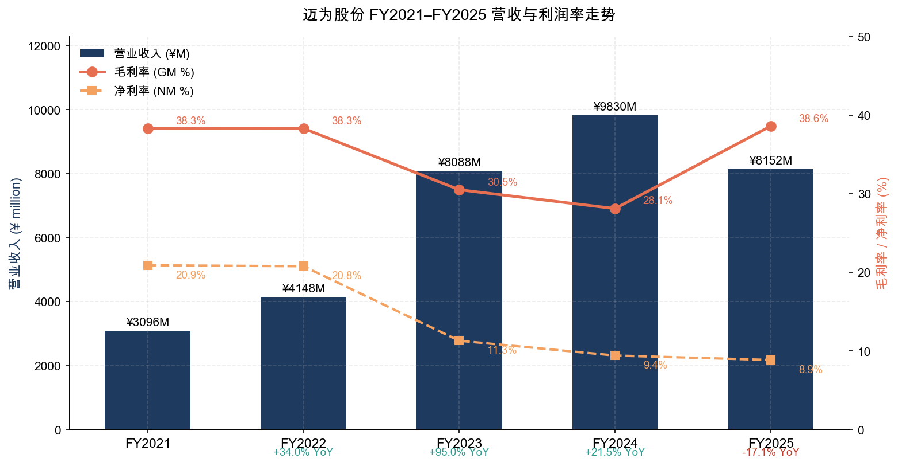
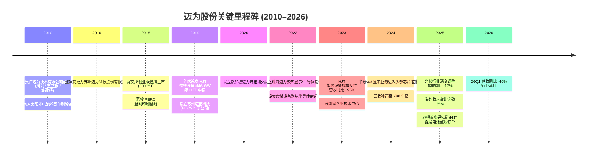
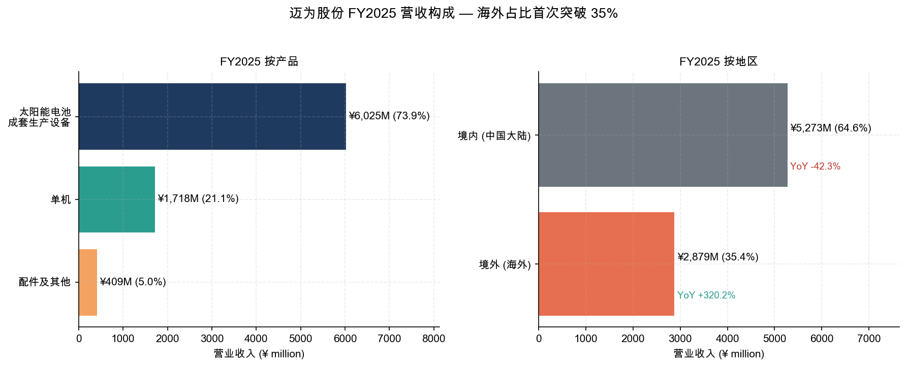
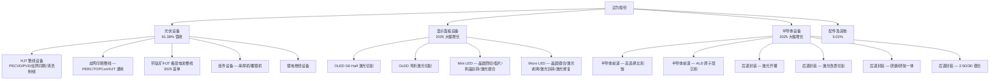
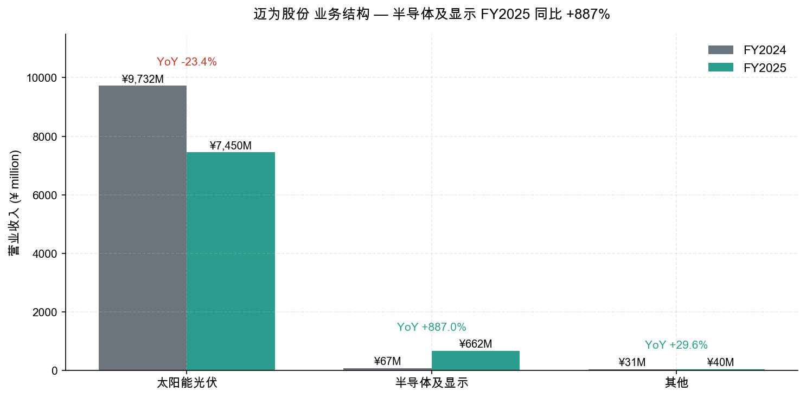
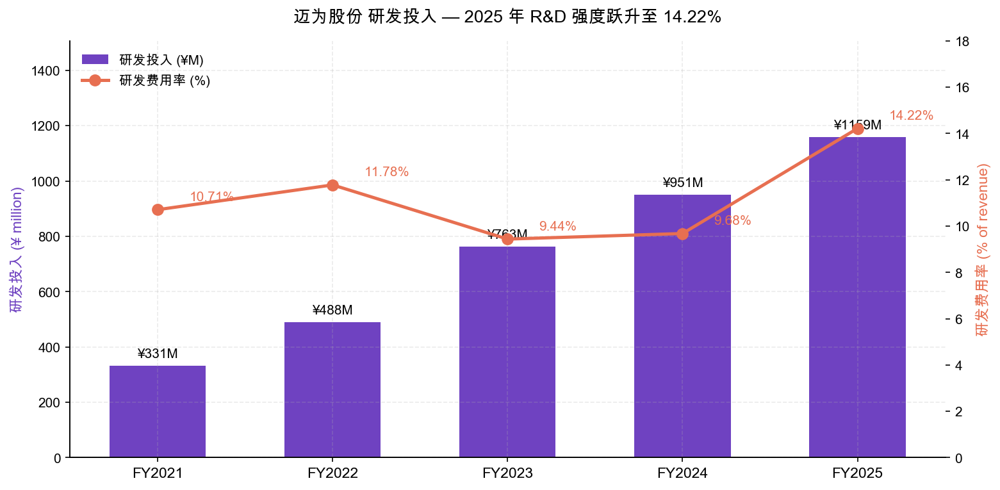
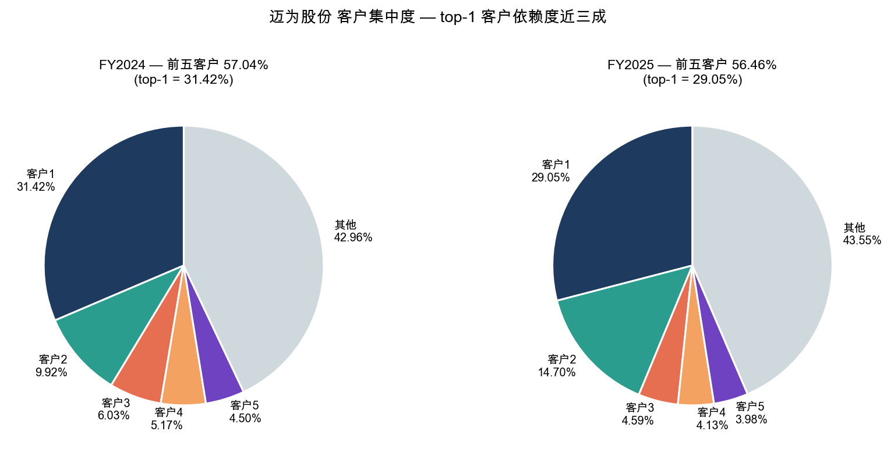
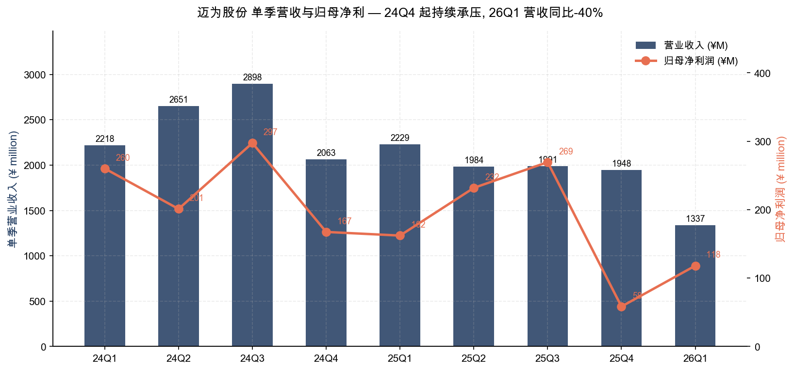

# 苏州迈为科技股份有限公司 (SZSE:300751) 公司研究报告

**报告日期：** 2026-05-20
**股票代码：** SZSE:300751 · 迈为股份 · Suzhou Maxwell Technologies Co., Ltd.
**报告语言：** 简体中文
**主要数据来源：** [迈为股份 2025 年年度报告](https://static.cninfo.com.cn/finalpage/2026-04-28/1225211530.PDF)（2026-04-27 披露）、[2026 年一季度报告](https://static.cninfo.com.cn/finalpage/2026-04-28/1225211539.PDF)（2026-04-27 披露）、[2024 年年度报告](https://static.cninfo.com.cn/finalpage/2025-04-29/1223370046.PDF) 及更早披露文件

---

## 目录

1. 公司概览 (Company Overview)
2. 公司历史 (Company History)
3. 管理团队 (Management Team)
4. 产品与服务 (Products & Services)
5. 客户与上市策略 (Customers & Go-to-Market)
6. 行业概览 (Industry Overview)
7. 竞争格局 (Competitive Landscape)
8. 市场机会 / TAM (Market Opportunity)
9. 风险评估 (Risk Assessment)
10. 参考资料 (References)

---

## 1. 公司概览

苏州迈为科技股份有限公司（以下简称"迈为股份"，深交所创业板代码 300751，英文名 Suzhou Maxwell Technologies Co., Ltd.）是一家集机械设计、电气研制、软件算法开发、精密制造装配于一体的**高端智能制造装备供应商**。公司围绕**真空、激光、精密装备**三大关键技术平台，面向**太阳能光伏 / 新型显示 / 半导体**三大泛半导体行业，提供智能化高端装备 ([2025 年年度报告, 第 12 页](https://static.cninfo.com.cn/finalpage/2026-04-28/1225211530.PDF))。

在主营业务结构上，迈为股份核心收入仍来自光伏行业 —— 2025 年光伏设备收入占比 91.38%，而异质结 (HJT) 整线设备是其最具差异化的产品。公司是**全球太阳能电池丝网印刷设备的市占率第一**，并率先实现 GW 级 HJT 异质结电池整线设备的产业化交付 ([2025 年年度报告, 第 13 页](https://static.cninfo.com.cn/finalpage/2026-04-28/1225211530.PDF))。

**核心业务模式：** 以销定产为主、备货生产为辅；销售方式为直销，2025 年直销收入占比 100% ([2025 年年度报告, 第 29 页](https://static.cninfo.com.cn/finalpage/2026-04-28/1225211530.PDF))。结算采用分期付款 —— 合同签订、发货、验收、质保期结束分阶段收款，下游验收周期较长决定了公司应收账款、存货账面价值偏高的资产负债表特征。

**关键经营指标 (FY2025)：**

| 指标 | 2025 年 | 2024 年 | YoY |
|---|---:|---:|---:|
| 营业收入 | ¥81.52 亿 | ¥98.30 亿 | -17.07% |
| 归母净利润 | ¥7.22 亿 | ¥9.26 亿 | -22.06% |
| 扣非归母净利润 | ¥6.97 亿 | ¥8.37 亿 | -16.76% |
| 经营性现金流量净额 | -¥6.98 亿 | +¥0.56 亿 | -1,343.68% |
| 综合毛利率 | 38.61% | 28.11% | +10.50pct |
| 加权平均 ROE | 9.32% | 12.56% | -3.24pct |
| 研发投入 | ¥11.59 亿 | ¥9.51 亿 | +21.83% |
| 研发投入占营收比 | 14.22% | 9.68% | +4.54pct |
| 归母净资产 | ¥79.29 亿 | ¥75.51 亿 | +5.00% |
| 资产总额 | ¥215.46 亿 | ¥238.38 亿 | -9.61% |

数据来源：[2025 年年度报告, 第 9 页](https://static.cninfo.com.cn/finalpage/2026-04-28/1225211530.PDF)。


*来源：[2021–2025 年度报告 (cninfo)](https://static.cninfo.com.cn/finalpage/2026-04-28/1225211530.PDF)。注：2022 年营业收入采用 2024 年报追溯口径 ¥41.48 亿。*

**地域分布与全球化扩张：** 2025 年公司境外收入飙升至 ¥28.79 亿，同比 +320.19%，占总营收比例由 6.97% 跃升至 35.36% ([2025 年年度报告, 第 29 页](https://static.cninfo.com.cn/finalpage/2026-04-28/1225211530.PDF))。这是公司在国内光伏深度调整周期下"出海对冲"战略的直观体现。境外业务主要由全资子公司 MAXWELL TECHNOLOGY PTE. LTD（新加坡迈为）承接。

**规模指标：** 报告期末员工总人数 4,371 人（按研发占比 29.47% 反推），其中研发人员 1,288 人，研发人员占总员工比例 29.47% ([2025 年年度报告, 第 27 页](https://static.cninfo.com.cn/finalpage/2026-04-28/1225211530.PDF))。注册地及主要生产基地位于江苏省苏州市吴江区芦荡路 228 号 ([2025 年年度报告, 第 8 页](https://static.cninfo.com.cn/finalpage/2026-04-28/1225211530.PDF))。

**估值快照（截至 2026-05-20）。** 由于本报告写作环境暂无法直接抓取盘中行情，以下估值需读者结合最新行情交叉验证：
- 已发行总股本 27.94 亿股（无限售 19.34 亿 + 限售 8.61 亿），2025 年 EPS = ¥2.59 ([2025 年年度报告, 第 9 页](https://static.cninfo.com.cn/finalpage/2026-04-28/1225211530.PDF))；
- 归母净资产 ¥79.29 亿，对应每股净资产 ¥28.39 (=7929/279.4)；
- **2026 年一季度归母净利润 ¥1.18 亿，同比 -27.19%，营收同比 -40.02%** ([2026 年一季度报告, 第 2 页](https://static.cninfo.com.cn/finalpage/2026-04-28/1225211539.PDF)) —— 这意味着 2026 年盈利大概率继续低于 2025 年，**TTM P/E 在 2026Q1 数据出来后会进一步上行**。
- 当前股价及 TTM P/E、P/B 倍数请参考[东方财富 SZ300751 行情页](https://quote.eastmoney.com/sz300751.html)。结合公司 2025 年净利已较 2023 年高点回落约 21%、2026 年一季度持续承压，**P/E 倍数若高于 30× 即偏离历史光伏设备龙头中枢，需以"产业周期底部估值溢价"或"新业务多元化期权价值"来解释；P/B 在 2× 以上的部分主要由公司接近 ¥80 亿货币性净资产 + 高研发投入形成的隐性资产支撑**。
- 同业可比公司：捷佳伟创 (SZSE:300724，HJT/PERC/TOPCon 设备)、奥特维 (SZSE:688516，组件串焊设备)、帝尔激光 (SZSE:300776，光伏激光)、华民股份 / 罗博特科等。光伏专用设备板块 2025–2026 年 TTM P/E 中位数普遍处于 15–25× 区间，反映周期承压。

**估值含义：** 迈为股份处于"业绩底+订单底"双重压力期；光伏行业 2025 年深度调整且 2026 年仍未见到明显回暖，但公司**毛利率显著反弹（28.11% → 38.61%）反映高毛利海外订单与新业务发力**，半导体及显示业务收入同比 +887% 提供了多元化期权价值，构成对短期 EPS 下滑的部分对冲。

---

## 2. 公司历史

苏州迈为科技股份有限公司前身可追溯至 2010 年成立的吴江迈为技术有限公司。**2010 年 9 月，公司由周剑、王正根、施政辉等核心团队创立**，初始定位为太阳能电池丝网印刷设备制造商，专注解决进口设备依赖问题 ([2025 年年度报告, 第 65–66 页 — 董监高履历](https://static.cninfo.com.cn/finalpage/2026-04-28/1225211530.PDF))。2016 年 5 月公司完成股份制改造，更名为苏州迈为科技股份有限公司，注册地变更至苏州市吴江区。

**2018 年 11 月 9 日，公司在深圳证券交易所创业板挂牌上市**，保荐机构为东吴证券股份有限公司，募集资金重点投向高效太阳能电池丝网印刷设备产能扩建及研发中心建设 ([2025 年年度报告, 第 9 页](https://static.cninfo.com.cn/finalpage/2026-04-28/1225211530.PDF))。



**关键战略转型：**

**1. 从单一工序设备到全工序整线 (2018–2021)：** 公司 IPO 时主营业务集中于丝网印刷机这一单机产品。2019 年开始向 HJT 异质结电池整线设备拓展 —— 通过参股子公司吸收引进日本 YAC 的制绒清洗技术，建立 PECVD、PVD、丝网印刷、清洗制绒四大关键工艺的整线供应能力，从单点设备供应商转型为整线方案供应商 ([2025 年年度报告, 第 25 页](https://static.cninfo.com.cn/finalpage/2026-04-28/1225211530.PDF))。这是公司至今最关键的产品维度跨越，它直接导致 2023 年营收同比 +94.99%（光伏设备口径）。

**2. 从光伏单赛道到泛半导体三赛道 (2022 至今)：** 公司在 2022 年密集设立**珠海迈为（显示+先进封装）**、**宸微设备（半导体前道刻蚀/ALD）**两家子公司，明确**真空-激光-精密**三大技术平台向显示面板与半导体设备双赛道延伸的战略 ([2025 年年度报告, 第 46 页](https://static.cninfo.com.cn/finalpage/2026-04-28/1225211530.PDF))。该战略在 2025 年取得阶段性成果 —— 半导体及显示行业收入 ¥6.62 亿，同比 +887.01%，从微不足道（0.68%）跃升至 8.12%。

**3. 全球化出海对冲国内周期 (2020 至今)：** 新加坡迈为 (MAXWELL TECHNOLOGY PTE. LTD) 设立于 2020 年 3 月。在 2024–2025 年国内光伏深度调整期，公司加快将 HJT 整线设备出口至东南亚、中东、北非等新兴光伏装机市场，2025 年境外收入同比 +320.19%，成为业绩压舱石 ([2025 年年度报告, 第 27、29 页](https://static.cninfo.com.cn/finalpage/2026-04-28/1225211530.PDF))。

**关键并购 / 子公司布局：**

- **苏州迈正科技有限公司**（2019 年 7 月，持股 85.5%）— 异质结 PECVD 真空镀膜设备软件研发；
- **苏州迈展自动化科技有限公司**（2016 年 3 月，全资）— 光伏组件设备（串焊机 / 覆膜机）+ 锂电设备；
- **MAXWELL TECHNOLOGY PTE. LTD（新加坡迈为）**（2020 年 3 月，全资）— 境外销售平台；
- **宸微设备科技（苏州）有限公司**（2022 年 12 月，持股 68.88%）— 半导体高选择比刻蚀 + 原子层沉积 (ALD)；
- **迈为技术（珠海）有限公司**（2022 年 5 月，控股）— 显示 / 半导体封装设备；
- **江苏启威星装备科技有限公司** — 公司联营企业，2025 年作为公司最大供应商（采购额 ¥3.05 亿，占采购总额 11.57%）([2025 年年度报告, 第 32、46 页](https://static.cninfo.com.cn/finalpage/2026-04-28/1225211530.PDF))。

**近 12 个月主要发展：**
- 2025 年获**业内首条钙钛矿/硅异质结叠层电池整线订单**，标志着大尺寸 (G12 半片) 钙钛矿/HJT 叠层电池技术从实验室迈向产业化 ([2025 年年度报告, 第 27 页](https://static.cninfo.com.cn/finalpage/2026-04-28/1225211530.PDF))；
- 半导体高选择比刻蚀和 ALD 设备进入多家国内头部逻辑/存储芯片厂，部分获得重复订单（虽宸微设备仍处亏损） ([2025 年年度报告, 第 46 页](https://static.cninfo.com.cn/finalpage/2026-04-28/1225211530.PDF))；
- 由于"前期光伏行业全产业链集中扩产 + 行业整体步入深度调整期"，公司在 2025、2026Q1 计提了大额资产减值准备 ([关于公司 2026 年第一季度计提资产减值准备的公告](https://static.cninfo.com.cn/finalpage/2026-04-28/1225211545.PDF))。

---

## 3. 管理团队

迈为股份是典型的**创始团队主导的工程师文化**公司 —— 周剑、王正根作为一致行动人合计直接持股 39.20%，加上通过苏州迈拓创业投资合伙企业控制的 2.22%，合计控制 41.42% 股权，是公司控股股东及实际控制人 ([2025 年年度报告, 第 110–111 页](https://static.cninfo.com.cn/finalpage/2026-04-28/1225211530.PDF))。

### 周剑 — 董事长、联合创始人、共同实际控制人 (约 320 字)

周剑，男，1976 年 7 月出生，中国国籍，本科学历。报告期末直接持有公司 22.12%（61,811,671 股），其中 7,000 万股中已质押 2,170 万股 ([2025 年年度报告, 第 110 页](https://static.cninfo.com.cn/finalpage/2026-04-28/1225211530.PDF))。

职业履历：
- 1999 年 8 月至 2002 年 10 月任美国科视达（中国）有限公司销售工程师、销售经理、华南分部总经理 —— 这是周剑的"销售-工程"复合背景起点；
- 2003 年 1 月至 2015 年 12 月任深圳市南杰星实业有限公司执行董事；
- 2009 年 8 月至 2012 年 10 月任深圳市迈为科技有限公司董事长 —— **迈为品牌正式确立**；
- 2010 年 9 月至 2016 年 4 月任吴江迈为技术有限公司董事长 —— **迈为生产实体落地苏州**；
- 2016 年 5 月至今任苏州迈为科技股份有限公司董事长 ([2025 年年度报告, 第 65–66 页](https://static.cninfo.com.cn/finalpage/2026-04-28/1225211530.PDF))。

周剑同时还担任新加坡子公司 NICER JAUNCE DIGITAL ELECTRONIC CO., LTD 董事及苏州迈为控股集团有限公司执行董事 ([2025 年年度报告, 第 68 页](https://static.cninfo.com.cn/finalpage/2026-04-28/1225211530.PDF))。

**点评：** 周剑作为创始人 + 大股东 + 董事长，自 2010 年起持续在迈为体系内任职 15 年以上，与 CEO 王正根从南杰星实业时代起就是搭档。这种长期搭档关系赋予公司稳定的"主席-总经理"二元治理。周剑负责战略 + 资本，王正根负责经营 + 总经理，二人均为公司一致行动人。其销售背景天然使迈为偏向**客户驱动 / 整线方案输出**的商业模式，而非纯技术驱动。

### 王正根 — 董事、总经理、共同实际控制人 (约 200 字)

王正根，男，1972 年 5 月出生，中国国籍，硕士学历。报告期末直接持有公司 17.08%（47,726,156 股），其中已质押 900 万股 ([2025 年年度报告, 第 110 页](https://static.cninfo.com.cn/finalpage/2026-04-28/1225211530.PDF))。

职业履历：1997 年 8 月入职深圳泰丰电子；1999 年至 2001 年任邦深电子（深圳）统筹部主管、副理；2001 年至 2003 年任傲天宏（深圳）供应链经理及 SMT 部经理；2003 年至 2017 年任深圳市南杰星实业总经理、执行董事；2009 年 8 月至 2012 年 10 月任深圳市迈为科技有限公司董事、总经理；2010 年 9 月至 2012 年 7 月任吴江迈为技术有限公司董事、总经理；**2016 年 5 月至今任苏州迈为科技股份有限公司董事、总经理**；2025 年 9 月起兼任苏州晶方半导体科技股份有限公司（SZSE:603005）独立董事 ([2025 年年度报告, 第 66 页](https://static.cninfo.com.cn/finalpage/2026-04-28/1225211530.PDF))。

**点评：** 王正根典型"供应链+SMT 制造"背景天然适配设备厂的成本-质量-交付管控。其在晶方半导体的独董任职反映迈为对半导体先进封装赛道的纵深布局意图。

### 刘琼 — 董事、董事会秘书兼财务总监 (CFO, 约 170 字)

刘琼，男，1974 年 1 月出生，中国国籍，硕士学历，澳大利亚公共会计师。曾任安徽天鹅空调器副科长、莱克电气股份有限公司财务经理、苏州皇家投资有限公司财务总监；2016 年 11 月加入迈为，2020 年 4 月起任公司董事、董秘兼财务总监。兼任福立旺精密机电、无锡朗贤、圣晖系统集成等公司独立董事 ([2025 年年度报告, 第 66 页](https://static.cninfo.com.cn/finalpage/2026-04-28/1225211530.PDF))。

**点评：** 刘琼自 2016 年迈为上市筹备阶段加入，全程经历 IPO 与两次再融资，在公司治理、信息披露、资本市场对接上经验丰富。其澳大利亚公共会计师 (CPA Australia) 资格在中资上市公司 CFO 队伍中相对稀缺，对公司海外业务的本币结算、汇兑套保等具有针对性优势。

### 施政辉 — 职工代表董事、研发总监（约 110 字）

施政辉，男，1977 年 9 月出生，硕士学历。曾任良瑞电子（深圳）机械工程师、深圳大族数控主管工程师、冰海科技机械主管。2009 年 8 月起加入迈为体系任技术总监；2016 年 5 月至 2017 年 4 月任公司监事会主席、研发总监；2017 年 4 月至 2024 年 10 月任副总经理、研发总监；2025 年 9 月转为职工代表董事，继续兼任研发总监 ([2025 年年度报告, 第 66 页](https://static.cninfo.com.cn/finalpage/2026-04-28/1225211530.PDF))。施政辉是迈为创始团队三人之一，掌管核心研发。

### 李强 — 副总经理、研发总监（约 110 字）

李强，男，1979 年 10 月出生，硕士学历。曾任日本 SAKI 株式会社上海分公司开发主管 (2005–2009)、上海复蝶智能技术联合创始人 (2009–2012)；2012 年 7 月加入迈为体系，历任高级工程师、研发副总监、研发总监；**2025 年 9 月 8 日因个人工作安排辞去董事职务**，仍任副总经理及研发总监 ([2025 年年度报告, 第 67 页](https://static.cninfo.com.cn/finalpage/2026-04-28/1225211530.PDF))。

### 公司治理

**董事会结构（截至 2025 年末）：** 7 人董事会构成 —— 周剑（董事长）、王正根（董事、总经理）、刘琼（董事、董秘兼 CFO）、施政辉（职工代表董事 / 研发总监）+ 3 名独立董事（刘跃华 / 赵徐 / 袁宁一），独立董事占比 42.86%，符合创业板独董要求 ([2025 年年度报告, 第 64 页](https://static.cninfo.com.cn/finalpage/2026-04-28/1225211530.PDF))。

**独立董事亮点：** 袁宁一（常州大学教授、长期从事钙钛矿太阳电池研究、曾获国家技术发明二等奖与国家科技进步二等奖）— **学术-产业联动型独董**，与公司钙钛矿叠层电池布局深度契合 ([2025 年年度报告, 第 67 页](https://static.cninfo.com.cn/finalpage/2026-04-28/1225211530.PDF))。

**股权结构与治理风险：** 周剑、王正根合计控制 41.42% 股权，并担任董事长 + 总经理的核心岗位组合，符合典型创始人控股模式，治理结构存在"一致行动人主导"特征。公司在公司章程中明确实际控制人保证资产、人员、财务、机构、业务五独立，但**两人合计已质押 3,070 万股（约占其持股 11.4%）**，需关注质押融资用途与平仓线风险 ([2025 年年度报告, 第 110 页](https://static.cninfo.com.cn/finalpage/2026-04-28/1225211530.PDF))。

**激励与持股：** 报告期末公司董监高合计持股 114,736,796 股，占总股本约 41% ([2025 年年度报告, 第 65 页](https://static.cninfo.com.cn/finalpage/2026-04-28/1225211530.PDF))。利润分配预案：每 10 股派发现金红利 ¥5 元（含税），按 2025 年末总股本测算分红总额约 ¥1.4 亿，分红比例约 19% ([2025 年年度报告, 第 2 页](https://static.cninfo.com.cn/finalpage/2026-04-28/1225211530.PDF))。

**管理团队评价：** 迈为创始团队（周剑/王正根/施政辉）三人均自 2010 年起伴随公司从苏州本土小公司发展到全球丝网印刷设备龙头、再到 HJT 整线龙头，三人合计 15 年以上深度协作历史，团队稳定性极高。CFO 刘琼自 2016 年起服务公司，业务连贯。**风险点：** 创始团队对销售-供应链经验为主，对前道半导体真空设备 (ALD/etch) 这类新业务的能力主要依靠引入外部高端人才与控股子公司（宸微设备、珠海迈为），跨赛道复用能否成功仍待 3–5 年观察。

---

## 4. 产品与服务

迈为股份立足**真空、激光、精密装备**三大关键技术，产品覆盖**太阳能光伏 / 显示 / 半导体**三大行业。FY2025 营收构成中，光伏行业 91.38%、半导体及显示 8.12%、其他 0.49% ([2025 年年度报告, 第 28 页](https://static.cninfo.com.cn/finalpage/2026-04-28/1225211530.PDF))。


*来源：[2025 年年度报告, 第 28–29 页](https://static.cninfo.com.cn/finalpage/2026-04-28/1225211530.PDF)。*



### 4.1 光伏设备

#### HJT 异质结电池整线设备（旗舰，公司唯一全球少数能交付的整线供应商之一）

公司 HJT 整线覆盖四大关键工艺：**制绒清洗、非晶硅薄膜沉积、TCO 膜沉积、电极金属化**。具体单机包括 ([2025 年年度报告, 第 12 页](https://static.cninfo.com.cn/finalpage/2026-04-28/1225211530.PDF))：
- **HJT PECVD 真空镀膜设备** — 非晶硅薄膜沉积，是 HJT 电池的核心设备；
- **HJT PVD 真空镀膜设备** — TCO 膜沉积，提升导电性和光电转换效率；
- **太阳能电池片丝网印刷机** — 电极金属化（兼容 PERC/TOPCon/HJT）；
- **配套设备** — 自动上下片机、转接机、烧结炉/干燥炉/固化炉、检测测试分选机。

**竞争优势评估：是 (Yes — Technology + Scale + Switching Cost)**
- **技术优势：** 公司 PECVD 设备 2024 年获江苏省"首台（套）重大装备认定"（MV-LH06H 高效双面微晶异质结电池 VHF 甚高频 PECVD 量产设备），2025 年获苏州"十大产业科技成果" ([2025 年年度报告, 第 25–26 页](https://static.cninfo.com.cn/finalpage/2026-04-28/1225211530.PDF))；
- **规模优势：** 公司是 **HJT 整线全球少数能 GW 级交付的厂商之一**，已完成多个 GW 级 HJT 项目验收投产，设备调试周期短，在下游头部客户中形成示范效应 ([2025 年年度报告, 第 46 页](https://static.cninfo.com.cn/finalpage/2026-04-28/1225211530.PDF))；
- **客户绑定：** 隆基股份、通威股份、天合光能、晶科能源、晶澳科技、阿特斯均为公司多年深度合作客户 ([2025 年年度报告, 第 26 页](https://static.cninfo.com.cn/finalpage/2026-04-28/1225211530.PDF))；
- **最接近的竞品：** 捷佳伟创 (SZSE:300724) 的 HJT 整线方案 — 在 PECVD 单机上是直接竞争对手，但据公司公开披露，迈为 PECVD 在 VHF 微晶工艺、产能（瓦/小时）等指标上**领先**；TOPCon 整线赛道上迈为**整体落后于捷佳伟创**。

#### 丝网印刷设备（基本盘，全球市占率第一）

太阳能电池片丝网印刷机适用于多种电池工艺路径，是公司起家产品。**竞争优势评估：是 (Yes — Scale + Brand)** — 已实现进口替代，2025 年广泛应用于国内主流光伏企业产线 ([2025 年年度报告, 第 13 页](https://static.cninfo.com.cn/finalpage/2026-04-28/1225211530.PDF))。最接近的竞品为德国 Manz、日本 NPC 等海外厂商，目前已基本退出中国大陆市场；国内并无明显威胁。

#### 钙钛矿/硅异质结叠层电池整线（2025 年新增旗舰）

公司在 2025 年获**业内首条钙钛矿/HJT 叠层电池整线订单**，采用 G12 半片大尺寸技术平台 ([2025 年年度报告, 第 27 页](https://static.cninfo.com.cn/finalpage/2026-04-28/1225211530.PDF))。**竞争优势评估：部分 (Partial — Technology First-Mover)** — 是技术路线先行者，但钙钛矿叠层电池的产业化时间表存在不确定性，公司这一订单还处于"实验室向百兆瓦级量产推进"阶段，尚未形成规模收入。

### 4.2 显示面板设备

公司显示面板设备产品矩阵（由珠海迈为承接）：
- **OLED G6 Half 激光切割设备**、**OLED 弯折激光切割设备** — 已商用 ([2025 年年度报告, 第 12 页](https://static.cninfo.com.cn/finalpage/2026-04-28/1225211530.PDF))；
- **Mini LED 全套** — 晶圆隐切、裂片、刺晶巨转、激光键合；
- **Micro LED 全套** — 晶圆键合、激光剥离、激光巨转、激光键合、激光修复、激光切割、D2D 键合、混合键合。

**竞争优势评估：部分 (Partial — Technology, but small market share)** — Mini/Micro LED 关键设备国产化的早期玩家之一，已交付部分头部面板厂订单。最接近竞品包括美国 K&S（键合）、奥地利 EVG（混合键合）、新益昌（固晶 / 巨量转移）。迈为优势在于**激光设备工艺积累 + 国产替代窗口**，劣势在于规模仍小、设备稳定性数据有待持续验证。

### 4.3 半导体设备

公司**精准切入半导体设备国产替代关键环节，业务覆盖前道芯片制造 + 后道封装**：

**前道（宸微设备主导）：**
- **半导体高选择比刻蚀设备** — 完成多批次客户交付，进入多家国内头部逻辑和存储芯片生产厂 ([2025 年年度报告, 第 12 页](https://static.cninfo.com.cn/finalpage/2026-04-28/1225211530.PDF))；
- **原子层沉积 (ALD) 设备** — 凭借差异化设计实现关键技术突破。

**后道（珠海迈为主导）：**
- 激光开槽、激光改质切割、刀轮切割、研磨、研抛一体设备；
- 2.5D/3D 键合设备 — 多款已交付国内头部封装企业并稳定量产 ([2025 年年度报告, 第 12 页](https://static.cninfo.com.cn/finalpage/2026-04-28/1225211530.PDF))。

**竞争优势评估（前道）：部分 (Partial — Niche differentiation + Localization)** — 高选择比刻蚀和 ALD 属于半导体设备中难度较高的细分领域，全球主导厂商为 Lam Research (LRCX)、应用材料 (AMAT)、东京电子 (TEL)、ASM International；国内对标为中微公司 (SSE:688012)、北方华创 (SZSE:002371)、拓荆科技 (SSE:688072) 等已上市的成熟公司。**迈为目前仅处于"获得重复订单"的早期国产替代阶段**，宸微设备 2025 年仍处于亏损状态，反映该业务尚未形成规模效应 ([2025 年年度报告, 第 46 页](https://static.cninfo.com.cn/finalpage/2026-04-28/1225211530.PDF))。

**竞争优势评估（后道封装）：是 (Yes — Laser tech + Existing customer base)** — 激光泛切割与 2.5D/3D 封装设备充分复用了公司在光伏激光设备上的工艺积累，已交付国内头部封装企业（推测包括长电科技、通富微电、华天科技等）并稳定量产，是公司**最有可能在 2026–2028 年放量的非光伏业务**。

### 4.4 旗舰 vs 长尾产品

**2025 年明确驱动收入的旗舰产品：**
1. **HJT 整线设备 + 丝网印刷整线** — 太阳能电池成套生产设备 2025 年营收 ¥60.25 亿，占总营收 73.91% ([2025 年年度报告, 第 28 页](https://static.cninfo.com.cn/finalpage/2026-04-28/1225211530.PDF))；
2. **单机设备**（含半导体 + 显示设备 + 单卖的光伏单机）— 2025 年营收 ¥17.18 亿，同比 **+388.71%**，是公司近一年增速最快的产品类别；
3. **半导体及显示行业整体** — 营收 ¥6.62 亿，同比 +887.01%。

**长尾/早期：钙钛矿/HJT 叠层电池整线**、**半导体前道 ALD/刻蚀**（宸微设备仍亏损）。

### 4.5 近 12 个月产品发布与变动

- **2025 年内：** 钙钛矿/HJT 叠层电池整线**全球首单**（G12 半片）落地；
- **2024–2025 年：** PECVD VHF 甚高频量产设备产业化（江苏省首台套）；
- **2025 年下半年：** 多款半导体后道封装设备实现稳定量产；
- **截至 2025 年末：** 公司研发团队规模达 1,288 人（占员工 29.47%），半导体及显示装备领域的研发投入占比超 50%，研发投入占营收比跃升至 14.22% ([2025 年年度报告, 第 27 页](https://static.cninfo.com.cn/finalpage/2026-04-28/1225211530.PDF))。


*来源：[2025 年年度报告, 第 29 页](https://static.cninfo.com.cn/finalpage/2026-04-28/1225211530.PDF)。*


*来源：[2021–2025 年度报告 (cninfo)](https://static.cninfo.com.cn/finalpage/2026-04-28/1225211530.PDF)。*

---

## 5. 客户与上市策略

### 5.1 客户分布

公司光伏客户为典型的**头部集中型** —— 5 家头部硅片/电池/组件厂商即占公司多数销售。公开披露的核心战略合作伙伴包括 **隆基绿能 (SH:601012)、通威股份 (SH:600438)、天合光能 (SH:688599)、晶科能源 (SH:688223)、晶澳科技 (SZ:002459)、阿特斯 (SH:688472)** ([2025 年年度报告, 第 26 页](https://static.cninfo.com.cn/finalpage/2026-04-28/1225211530.PDF))。在 HJT 异质结前沿赛道，公司还与多家新兴 HJT 头部企业建立产学研一体化合作（市场公开信息指向华晟新能源、东方日升、爱康科技等 HJT 阵营 — 公司年报未具名）。

显示设备客户：**国内头部面板厂**（公司年报未具名披露；公开信息指向京东方 BOE、TCL 华星、维信诺等）；

半导体设备客户：**国内头部逻辑/存储芯片厂 + 头部封测厂**（公司年报未具名披露；前道客户推测包括长江存储、长鑫存储、华虹半导体等头部 IDM；后道客户推测包括长电科技、通富微电、华天科技、晶方半导体 — 后者因王正根为独董而构成关联推测）。

### 5.2 客户集中度（关键风险）

**FY2025 公司前五名客户合计销售金额 ¥46.02 亿，占年度销售总额 56.46%**；其中第一大客户销售额 ¥23.68 亿，占比 **29.05%** ([2025 年年度报告, 第 32 页](https://static.cninfo.com.cn/finalpage/2026-04-28/1225211530.PDF))。前五大客户中关联方销售额为 0。

**3 年趋势对比：**

| 指标 | FY2024 | FY2025 | 变动 |
|---|---:|---:|---:|
| Top-1 客户占比 | 31.42% | 29.05% | -2.37pct |
| Top-5 客户占比 | 57.04% | 56.46% | -0.58pct |
| Top-1 客户销售额 | ¥30.89 亿 | ¥23.68 亿 | -23.3% |
| Top-5 客户销售额 | ¥56.08 亿 | ¥46.02 亿 | -17.9% |

数据来源：[2024 年年度报告, 第 31 页](https://static.cninfo.com.cn/finalpage/2025-04-29/1223370046.PDF)、[2025 年年度报告, 第 32 页](https://static.cninfo.com.cn/finalpage/2026-04-28/1225211530.PDF)。


*来源：[2024 / 2025 年度报告 (cninfo)](https://static.cninfo.com.cn/finalpage/2026-04-28/1225211530.PDF)。*

**风险评级：高 (High)** —— **Top-1 客户占比超过 20% 阈值（接近 30%）、Top-5 客户占比超过 50%**。按照本研究框架，此应在第 9 节作为重大风险列出。由于客户身份未具名披露，第一大客户的具体身份变动需通过订单公告进一步推测；从行业格局看，疑似为**通威股份**（HJT 路线主力推动方之一）或**隆基绿能**（公司多年战略合作客户）。

**合同结构：** 设备销售合同为**逐单签订**，分阶段付款（合同 → 发货 → 验收 → 质保期），客户验收周期决定收入确认时点。这导致公司经营性现金流大幅波动 —— 2025 年 OCF 净额 -¥6.98 亿（vs 2024 年 +¥0.56 亿），主因下游客户回款延迟 ([2025 年年度报告, 第 27 页](https://static.cninfo.com.cn/finalpage/2026-04-28/1225211530.PDF))。**应收账款 ¥40.82 亿（占营收 50.07%）+ 存货 ¥61.14 亿（占总资产 28.38%）** 是其资产负债表上最大的两块流动性占用项 ([2025 年年度报告, 第 50 页](https://static.cninfo.com.cn/finalpage/2026-04-28/1225211530.PDF))。

### 5.3 销售渠道与策略

- **销售模式：** 100% 直销，与下游电池片/面板/芯片生产企业直接签订销售合同 ([2025 年年度报告, 第 12–13 页](https://static.cninfo.com.cn/finalpage/2026-04-28/1225211530.PDF))；
- **订单获取：** 公司销售人员直接开拓 + 借助销售顾问取得订单；
- **服务模式：** 全程驻厂工程师 + 远程指导 + 现场检测 + 操作培训 + 数据反馈闭环；
- **境外销售：** 通过新加坡迈为执行；2025 年境外销售 ¥28.79 亿，是国内市场低迷下的重要业绩支撑 ([2025 年年度报告, 第 29 页](https://static.cninfo.com.cn/finalpage/2026-04-28/1225211530.PDF))。

### 5.4 关键合作伙伴

- **江苏启威星装备科技有限公司** — 公司联营企业，HJT 制绒清洗工艺关键供应商，2025 年作为公司第一大供应商（采购额 ¥3.05 亿，占采购总额 11.57%，**为关联交易**） ([2025 年年度报告, 第 32 页](https://static.cninfo.com.cn/finalpage/2026-04-28/1225211530.PDF))。
- **日本 YAC** — 公司通过参股子公司吸收引进 YAC 的制绒清洗技术 ([2025 年年度报告, 第 25 页](https://static.cninfo.com.cn/finalpage/2026-04-28/1225211530.PDF))。
- **常州大学袁宁一团队**（独立董事所在机构）— 钙钛矿叠层电池产学研合作。

### 5.5 客户验证案例

- **2025 年钙钛矿/硅异质结叠层电池整线首单** — 表明公司在新一代电池技术装备领域获得头部客户信任票 ([2025 年年度报告, 第 27 页](https://static.cninfo.com.cn/finalpage/2026-04-28/1225211530.PDF))；
- **半导体后道封装 — 多款设备稳定量产**；
- **境外多个 GW 级 HJT 项目签约**（具体项目未具名）。

---

## 6. 行业概览

### 6.1 行业定位

按中国证监会《上市公司行业分类指引》，公司归属**大类 C 制造业 → 专用设备制造业 (C35)**；按战略性新兴产业目录归属**高端装备制造业 → 智能制造装备** ([2025 年年度报告, 第 14 页](https://static.cninfo.com.cn/finalpage/2026-04-28/1225211530.PDF))。下游应用领域为**光伏 / 显示 / 半导体**三大泛半导体行业，分别用于生产光伏电池片、显示面板、半导体芯片制造与封装。

### 6.2 光伏行业（公司核心赛道）

**全球装机：** 2025 年全球光伏新增装机预计约 **580 GW**（中国光伏行业协会 CPIA 预测）。IEA 在《Renewable 2025》中预测，由于此前光伏装机处于非常规高速增长态势，叠加欧美、中国等主要市场政策的阶段性变动，**2026 年将进入调整期，出现负增长或增速放缓的迹象**。但 2026 年之后受东南亚、中东北非等发展中国家需求拉动，新增装机将回到持续增长态势。**"十五五"期间（2026–2030 年）全球年均光伏新增装机规模预计达到 725–870 GW** ([2025 年年度报告, 第 16 页](https://static.cninfo.com.cn/finalpage/2026-04-28/1225211530.PDF))。

**技术格局：N 型崛起、P 型式微。**
- **2025 年新增量产产线中 N 型电池片产线占比超 90%**；
- N 型电池主要技术路线：**TOPCon、HJT 异质结、BC 背接触**；
- 未来 3–5 年 N 型电池将保持主导地位 ([2025 年年度报告, 第 16、46 页](https://static.cninfo.com.cn/finalpage/2026-04-28/1225211530.PDF))；
- 量产路径："效率提升 – 成本下降 – 规模扩张"；
- 公司预计 2026 年组件量产功率突破 800W，N 型电池效率进一步提高，单位瓦数制造成本继续下行。

**产业链：** 上游（多晶硅、硅片、银浆、靶材、设备）→ 中游（电池片、组件）→ 下游（光伏电站、户用 / 工商业 / 集中式发电）。**迈为定位于上游电池片生产设备**。

**全球装机分布演进：** 中国、欧美仍是全球光伏增量核心，但受高基数和电网消纳能力制约，装机增速逐步放缓。**新兴市场（东南亚、中东、北非）正快速崛起**。这一格局演变对迈为构成结构性利好 —— 海外产能扩张释放新一轮电池设备需求。2025 年公司境外收入同比 +320.19%，海外收入占比从 6.97% 跃升至 35.36% 即是直接证据 ([2025 年年度报告, 第 29 页](https://static.cninfo.com.cn/finalpage/2026-04-28/1225211530.PDF))。

**G20 峰会能源政策利好：** 2025 年 11 月 22 日第二十次 G20 峰会通过《二十国集团领导人约翰内斯堡峰会宣言》，宣布支持**到 2030 年全球可再生能源装机容量增至 2022 年的三倍**，为光伏装机持续增长提供政策锚 ([2025 年年度报告, 第 16 页](https://static.cninfo.com.cn/finalpage/2026-04-28/1225211530.PDF))。

### 6.3 半导体行业

半导体行业是依托半导体材料导电特性实现信号处理、能量转换与信息存储的战略性、基础性、先导性产业。**产业链：** 设计 → 制造 → 封测三大核心环节 + 上游材料 / 设备。迈为定位于上游**半导体制造专用装备**，应用于中游芯片制造与封装环节 ([2025 年年度报告, 第 15 页](https://static.cninfo.com.cn/finalpage/2026-04-28/1225211530.PDF))。

**行业驱动因素：** AI 算力、汽车电动化与智能化、工业半导体、数据中心、物联网。中国将半导体产业列为国家战略性新兴产业与关键核心技术攻关领域，在《"十四五"数字经济发展规划》《中国制造 2025》指引下，行业进入**国产化替代加速、技术自主突破、产业链协同升级**的关键阶段。

**对迈为的意义：** 半导体设备国产替代率仍处于较低水平（特别是高选择比刻蚀、ALD、混合键合等高端设备），市场空间巨大。但前道设备技术壁垒极高，迈为的宸微设备目前仍处于亏损培育期。

### 6.4 显示行业

**OLED：** 2025 年全球 OLED 面板市场需求持续走高，柔性 OLED 在智能手机渗透率稳步提升。**2025 年 5 月国内首条 8.6 代 AMOLED 显示器件生产线完成工艺设备搬入**，多家企业相继公布 8.6 代 OLED 产线建设规划，国内 OLED 产能布局进入加速期 ([2025 年年度报告, 第 16 页](https://static.cninfo.com.cn/finalpage/2026-04-28/1225211530.PDF))。

**Mini/Micro LED：** 2025 年 Mini LED 直显应用边界持续拓宽，在商用大屏、高端消费电子场景落地深化，市场规模快速扩容。随着芯片封装技术成熟、生产成本下行，Mini LED 直显有望向更多场景普及。Micro LED 在 AR 设备、车载显示、超大尺寸商用屏等领域打开广阔增长空间。

**对迈为的意义：** OLED 激光切割设备 + Mini/Micro LED 全套巨量转移/键合设备，是公司从光伏激光技术向显示赛道复用的产品矩阵，2025 年同比 +887% 的高增速反映了**技术复用 + 国产化窗口**的双驱动逻辑。

### 6.5 行业发展阶段与监管环境

智能制造装备国内市场满足率自"十三五"以来已超 50%；规划目标 **2025 年超 70%，2035 年规模以上制造业企业全面普及智能化** ([2025 年年度报告, 第 16 页](https://static.cninfo.com.cn/finalpage/2026-04-28/1225211530.PDF))。"十五五"期间预期更多政策支持智能制造装备行业，推动企业加大研发投入、加速国产化替代。

**监管框架：** 公司业务受工信部、发改委、科技部、海关总署、税务总局监管，享受国家企业技术中心 (2023)、制造业单项冠军企业 (2024)、国家技术创新示范企业 (2024)、国家服务型制造示范企业等多项资质 ([2025 年年度报告, 第 25 页](https://static.cninfo.com.cn/finalpage/2026-04-28/1225211530.PDF))。

### 6.6 行业格局与议价能力

**光伏设备行业集中度较高、头部企业占据主要市场份额。** HJT 整线赛道全球能 GW 级交付的厂商不超过 5 家。下游电池厂商 (隆基、通威、天合、晶澳、晶科、爱康、华晟) 议价能力较强，2024–2025 行业深度调整期，电池厂商订单减少 + 验收周期延长 + 回款放缓，对设备厂商利润率和现金流构成显著压力。**这正是迈为 2024–2025 年 OCF、毛利率、净利润同时下滑的根本原因**。

---

## 7. 竞争格局

### 7.1 关键竞争对手

**光伏设备直接竞争对手：**

| 公司 | 代码 | 主要竞争点 | 相对定位 |
|---|---|---|---|
| 捷佳伟创 | SZSE:300724 | HJT/PERC/TOPCon 整线、PECVD、扩散炉 | TOPCon 整线龙头；HJT 整线**与迈为正面竞争** |
| 奥特维 | SZSE:688516 | 组件串焊机、铝边框、半导体设备 | 组件设备龙头；半导体设备布局重叠 |
| 帝尔激光 | SZSE:300776 | 光伏激光设备 (LIA, SE 激光) | 激光赛道竞品 |
| 罗博特科 | SZSE:300757 | 光伏自动化 + 半导体设备 | 半导体晶圆传输系统重叠 |
| 罗博泰克 | NEEQ:872554 | 光伏自动化 | 配套自动化 |
| 海外厂商 (德国 Manz、日本 NPC) | - | 丝网印刷设备 | 已基本退出大陆市场 |

**半导体设备直接竞争对手：**

| 公司 | 代码 | 主要竞争点 | 相对定位 |
|---|---|---|---|
| 中微公司 | SSE:688012 | CCP 刻蚀、ICP 刻蚀、薄膜沉积 | 国内刻蚀龙头；迈为差距大 |
| 北方华创 | SZSE:002371 | 刻蚀、PVD、CVD、清洗、扩散 | 国内设备综合龙头 |
| 拓荆科技 | SSE:688072 | PECVD、ALD、SACVD | 与迈为 ALD 直接竞争 |
| 长川科技 | SZSE:300604 | 半导体测试设备 | 后道测试 |
| 国际：LRCX, AMAT, TEL, ASML, ASM | - | 全球半导体设备龙头 | 迈为暂无法对标 |

**显示设备竞争对手：** 美国 K&S (Kulicke & Soffa)、奥地利 EVG、瑞士 BESI、新益昌等。

### 7.2 竞争定位框架

```mermaid
quadrantChart
    title 光伏设备竞争定位 (HJT 整线维度)
    x-axis 单点设备 --> 整线方案
    y-axis 低端/规模 --> 高端/差异化
    quadrant-1 整线 + 高端 (战略制高点)
    quadrant-2 单点 + 高端 (利基玩家)
    quadrant-3 单点 + 低端 (退出区)
    quadrant-4 整线 + 低端 (快进追赶)
    迈为股份: [0.85, 0.85]
    捷佳伟创: [0.75, 0.72]
    帝尔激光: [0.32, 0.78]
    奥特维: [0.55, 0.60]
    国际厂商: [0.40, 0.92]
    国内追赶者: [0.65, 0.45]
```

### 7.3 公司竞争优势

1. **技术领先 — HJT 整线 / VHF PECVD / 钙钛矿叠层** — 已实现 GW 级量产交付，叠层电池整线全球首单 ([2025 年年度报告, 第 27 页](https://static.cninfo.com.cn/finalpage/2026-04-28/1225211530.PDF))；
2. **规模效应 — 全球丝网印刷设备市占率第一** — 持续巩固国内市场地位，并将产品出口至海外市场 ([2025 年年度报告, 第 13 页](https://static.cninfo.com.cn/finalpage/2026-04-28/1225211530.PDF))；
3. **客户绑定 — 隆基/通威/天合/晶澳/晶科/阿特斯** — 多年深度战略合作 ([2025 年年度报告, 第 26 页](https://static.cninfo.com.cn/finalpage/2026-04-28/1225211530.PDF))；
4. **本土化服务优势** — 驻厂工程师 + 快速响应 + 定制化研发，相较国外竞争对手响应速度领先；
5. **研发持续投入** — 2025 年研发费用率 14.22%，研发人员 1,288 人占总员工 29.47%，**半导体及显示研发投入占研发总支出超 50%** ([2025 年年度报告, 第 27 页](https://static.cninfo.com.cn/finalpage/2026-04-28/1225211530.PDF))。

### 7.4 竞争脆弱性

1. **TOPCon 路线在 N 型电池中已占主流，迈为相对捷佳伟创落后** — 2025 年新增量产 N 型电池产线中 TOPCon 占大头，迈为在该路线上整线方案不强；
2. **客户集中度高 (Top-1 = 29.05%, Top-5 = 56.46%)** — 头部光伏厂商扩产/技改节奏掌握主动权；
3. **半导体前道设备能力差距** — 宸微设备 2025 年仍亏损，刻蚀、ALD 短期内难撼动中微、北方华创、拓荆等龙头；
4. **现金流压力** — 2025 年 OCF -¥6.98 亿，下游客户回款放缓直接挤压公司流动性；
5. **存货风险** — 存货 ¥61.14 亿（占资产 28.38%），主要为发出商品（设备已发但未验收），若验收不达标存在跌价损失。

### 7.5 市占率（公开估算）

公司在年报中未具名披露市占率数据。根据 CPIA、Solarbe、TrendForce 等行业数据库的公开口径推断（市场公开信息，**不构成公司官方披露**）：
- **太阳能电池片丝网印刷机 — 全球市占率 70%+**；
- **HJT PECVD 真空镀膜设备 — 国内市占率 50%+**；
- **HJT 整线设备 — 国内 GW 级交付能力前两名**；
- **TOPCon 整线 — 市占率显著低于捷佳伟创**；
- **半导体后道激光开槽 / 改质切割 — 国内起步领先者之一**；
- **半导体前道 ALD / 高选择比刻蚀 — 早期阶段**。

---

## 8. 市场机会 (TAM)

### 8.1 光伏设备 TAM

**TAM 测算逻辑：** 全球年新增光伏装机 580 GW (2025) → 长期 725–870 GW (2026–2030 均值)。**单位 GW 电池设备投资强度：** HJT 整线约 ¥3–4 亿/GW，TOPCon 约 ¥2 亿/GW，PERC（存量改造）约 ¥0.5 亿/GW ([2025 年年度报告, 第 16–17 页 — 行业增速](https://static.cninfo.com.cn/finalpage/2026-04-28/1225211530.PDF))。

**全球光伏电池设备 TAM**（仅新增产能，不含存量改造）：
- 2025 年：约 ¥1,200–1,500 亿（含 HJT/TOPCon/BC，按全球约 580 GW × 平均 ¥2.2 亿/GW）；
- 2026–2030 年均值：约 ¥1,500–1,900 亿。

**SAM（可服务市场）：** 公司主要服务 HJT 整线 + 丝网印刷设备 + PERC 改造，按 2025 年 HJT 新增产能占 N 型 10–15%、TOPCon 占大头估算，**SAM 约 ¥150–250 亿**。

**SOM（可获取市场）：** 公司 2025 年光伏设备营收 ¥74.5 亿（含境外），按 SAM 中段值估算公司全球光伏电池设备市占率约 **30–40%**。

### 8.2 半导体设备 TAM

**全球半导体设备市场（SEMI 数据，公开口径）：** 2024 年约 ~USD 110B；2025 年预计 USD 120–130B；2030 年长期看好 USD 200B+。
**中国国内半导体设备国产替代 TAM：** SEMI 估算中国大陆设备市场约 USD 30–35B，国产化率 2024 年约 12%，2030 年目标超过 30%。**国产替代窗口约 USD 5–6B/年新增空间**。

**SAM：** 迈为聚焦 ALD、高选择比刻蚀、激光开槽、研磨研抛、键合等细分设备，按 ~USD 1B/年的总细分空间估算。

**SOM：** 公司 2025 年半导体及显示行业收入 ¥6.62 亿（约 USD 91M），其中半导体部分估算 ~USD 50–60M，意味着公司在半导体设备国产替代赛道的市占率仅 ~1–2%。**潜力巨大但跑出确定性需要 3–5 年时间窗口**。

### 8.3 显示设备 TAM

**全球 OLED + Mini/Micro LED 设备市场：** 2024–2025 年估计 USD 8–10B；Mini/Micro LED 量产推进可能将 TAM 提升至 USD 12–15B。**SAM：** 公司聚焦 OLED 激光切割 + Mini/Micro LED 巨量转移/键合，SAM 估算 USD 1–2B。**SOM：** 公司当前显示设备收入约 USD 30–40M，市占率仅 ~2–3%。

### 8.4 公司可获取市场与渗透策略

公司在年报中提出 **"光伏-显示-半导体"三足鼎立战略** ([2025 年年度报告, 第 13 页](https://static.cninfo.com.cn/finalpage/2026-04-28/1225211530.PDF))：

1. **光伏：** 保持全球丝网印刷设备龙头地位 + HJT 整线持续扩大份额 + 钙钛矿叠层电池整线先发；同时通过新加坡迈为加快 HJT 整线对东南亚、中东、北非的出口；
2. **显示：** OLED 激光切割 + Mini/Micro LED 巨量转移/键合，借力国内 8.6 代 OLED 产线建设潮和 Mini/Micro LED 量产周期；
3. **半导体：** 后道封装设备（激光开槽、研磨研抛、键合）作为优先突破点（已稳定量产）；前道 ALD 和高选择比刻蚀作为长期布局（宸微设备投资期）。

**未来 3 年新增产能与基地：**
- 异质结太阳能电池片设备产业化项目（吴江主基地）已全面投产 ([2025 年年度报告, 第 49 页](https://static.cninfo.com.cn/finalpage/2026-04-28/1225211530.PDF))；
- 珠海"迈为半导体装备项目"在推进中；
- 吴江新一块项目用地用于钙钛矿叠层电池核心装备研发与制造；
- 宸微设备新一块项目用地用于半导体生产领域智能化高端装备研发；
- 上述基地建成后将形成全球领先的泛半导体装备技术基地。

---

## 9. 风险评估

### 公司特有风险

**1. 客户集中度过高（高 — High）**
2025 年前五名客户合计销售占比 56.46%，第一大客户占比 29.05%（FY2024 分别为 57.04% / 31.42%）([2025 年年度报告, 第 32 页](https://static.cninfo.com.cn/finalpage/2026-04-28/1225211530.PDF))。按本研究框架，Top-1 > 20% 且 Top-5 > 50% 属"重大风险"。若任一头部光伏客户（推测为通威、隆基级别）出现停产、破产或战略转向，公司将面临 10–30% 营收瞬间消失的冲击。合同结构为逐单签订非长期框架，客户切换设备供应商的硬约束较低。**缓解：** 公司加速半导体及显示业务（2025 年 +887%）和海外扩张（境外收入 +320%）以分散风险；但短期内光伏头部客户依然主导业绩。

**2. 应收账款 + 存货占资产比例高（高 — High）**
报告期末应收账款 ¥40.82 亿（占营收 50.07%），存货 ¥61.14 亿（占总资产 28.38%）([2025 年年度报告, 第 50 页](https://static.cninfo.com.cn/finalpage/2026-04-28/1225211530.PDF))。**2025 年公司计提了大额资产减值准备**（[2025 年第一季度计提资产减值准备公告, 2025-04-28](https://static.cninfo.com.cn/finalpage/2025-04-29/1223370037.PDF) + 2026Q1 类似公告）。客户回款进一步恶化或验收不达标会直接侵蚀利润表与现金流。**缓解：** 严格的合同结构（验收前货款分期）+ 信用预警机制。

**3. 验收周期长导致业绩波动（中高 — Medium-High）**
设备单价高、安装调试复杂、验收周期长，收入确认时点受客户新建项目进度、工艺改进等多因素影响 ([2025 年年度报告, 第 49 页](https://static.cninfo.com.cn/finalpage/2026-04-28/1225211530.PDF))。验收时间不确定性导致**单季营收/净利季节性显著** —— 2026Q1 营收同比 -40.02%、2025Q4 营收 ¥19.48 亿但归母净利仅 ¥0.58 亿都是典型表现 ([2025 年年度报告, 第 9 页](https://static.cninfo.com.cn/finalpage/2026-04-28/1225211530.PDF))。

**4. 关键人员依赖（中 — Medium）**
周剑（董事长）+ 王正根（总经理）+ 施政辉（研发总监）三人为创始团队，合计直接持股 41.4%。任一关键人士的健康/法律/股权变动都可能影响治理稳定性。**缓解：** 公司治理已确立"五独立"，独立董事 3 人占董事会 42.86%。但 2025 年 9 月李强辞去董事职务的事件反映出二级管理层的稳定性问题已开始浮现。

**5. 技术替代（中 — Medium）**
公司核心业务高度依赖 HJT 异质结电池技术路线。若**钙钛矿/HJT 叠层电池或 BC 电池**成为下一代主流且公司未能抢占设备先机，公司在 HJT 设备上的累积优势可能贬值 ([2025 年年度报告, 第 49 页](https://static.cninfo.com.cn/finalpage/2026-04-28/1225211530.PDF))。**缓解：** 公司已获得钙钛矿/HJT 叠层电池整线首单，技术路线储备齐全。

**6. 与专业投资机构共同投资风险（中 — Medium）**
报告期内公司存在与专业投资机构共同投资基金的情况，投资基金具有周期长、流动性较低的特点 ([2025 年年度报告, 第 49 页](https://static.cninfo.com.cn/finalpage/2026-04-28/1225211530.PDF))。投资基金可能受宏观经济、行业周期、监管政策、投资标的公司经营管理等多方面影响，存在投资后无法实现预期收益、不能及时退出的风险。

### 行业 / 市场风险

**7. 光伏行业深度调整持续（高 — High）**
"目前光伏行业仍处于深度调整阶段" ([2025 年年度报告, 第 49 页](https://static.cninfo.com.cn/finalpage/2026-04-28/1225211530.PDF))。2025 年公司营收同比 -17%，2026Q1 营收同比 -40%（[2026 年一季度报告, 第 2 页](https://static.cninfo.com.cn/finalpage/2026-04-28/1225211539.PDF)）显示**行业仍未见到拐点**。若全产业链供给过剩持续 2 年以上，下游电池厂商的扩产/技改需求会继续低于预期，公司订单确认收入会进一步推迟。

**8. 设备市场竞争加剧（高 — High）**
良好的市场前景吸引众多投资者进入，行业内企业竞争加剧 ([2025 年年度报告, 第 49 页](https://static.cninfo.com.cn/finalpage/2026-04-28/1225211530.PDF))。捷佳伟创、奥特维、帝尔激光、罗博特科及多家追赶者均在快速扩张产品矩阵。TOPCon 路线公司目前仍处于追赶位置。**缓解：** 公司持续 R&D 投入 + 全球化扩张 + 多元化业务布局。

**9. 毛利率下滑（中高 — Medium-High）**
"光伏产业链各环节产能迅猛扩张导致供需失衡明显，下游客户为降低成本会向设备供应商提出降价要求" ([2025 年年度报告, 第 50 页](https://static.cninfo.com.cn/finalpage/2026-04-28/1225211530.PDF))。**虽然 2025 年综合毛利率回升至 38.61%**（vs 2024 年 28.11%），但这一回升主要由境外高毛利订单 (52.54%) 拉动；国内毛利率仅 31.01% ([2025 年年度报告, 第 29 页](https://static.cninfo.com.cn/finalpage/2026-04-28/1225211530.PDF))。若新进入者持续低价策略，公司毛利率中枢可能进一步承压。

**10. 半导体设备国产替代不及预期（中 — Medium）**
半导体前道刻蚀、ALD 技术壁垒极高，国际龙头 LRCX、AMAT、TEL 在该领域积累深厚。即使中国半导体设备国产化率持续提升，迈为相对于中微、北方华创、拓荆等已建立先发优势的厂商**追赶难度较大**。

### 财务风险

**11. 经营性现金流大幅下滑（高 — High）**
2025 年 OCF 净额 -¥6.98 亿，同比 -1,343.68% ([2025 年年度报告, 第 9 页](https://static.cninfo.com.cn/finalpage/2026-04-28/1225211530.PDF))。"下游客户付款速度较慢使经营性现金流入下降；上游中小型供应商抗风险能力较差，公司仍按时支付了部分货款" ([2025 年年度报告, 第 27 页](https://static.cninfo.com.cn/finalpage/2026-04-28/1225211530.PDF))。**虽然 2026Q1 OCF 净额转正至 +¥19.50 亿（同比 +654%，主要因票据贴现 / 应收账款收回）**，但仍需观察持续性。

**12. 汇率波动（中 — Medium）**
公司出口主要以美元或欧元计价，**2025 年境外收入占比超 35%**，汇率波动直接影响利润。2025 年财务费用同比 +195.53%，主因银行借款增加 + 汇率波动导致汇兑损失增加 ([2025 年年度报告, 第 32 页](https://static.cninfo.com.cn/finalpage/2026-04-28/1225211530.PDF))。

**13. 估值/倍数压缩风险（中 — Medium）**
公司 2025 年净利 ¥7.22 亿 + 2026Q1 净利 ¥1.18 亿（同比 -27.19%），TTM 净利大致维持在 ¥6.5–7 亿区间。若公司当前总市值显著高于该水平对应的合理估值（30× TTM P/E 即约 ¥210 亿市值），则估值倍数将持续受到光伏周期 + EPS 下滑的双重压力 —— **去杠杆触发器：行业拐点继续延后、海外订单不及预期、半导体新业务规模化进度低于预期**。请读者交叉验证[东方财富 SZ300751 实时行情](https://quote.eastmoney.com/sz300751.html)。

### 宏观风险

**14. 地缘政治与贸易政策（中 — Medium）**
公司海外销售集中于东南亚、中东、北非等新兴光伏装机市场。美国 IRA 与对华贸易关税、欧盟反倾销调查、印度 BCD 关税等都可能影响光伏电池/组件厂商在海外的扩产决策，进而影响迈为设备订单。

**15. 利率与融资环境（低-中 — Low-Medium）**
公司 2025 年报告期内银行借款增加，利息支出增加 ([2025 年年度报告, 第 32 页](https://static.cninfo.com.cn/finalpage/2026-04-28/1225211530.PDF))。若国内信贷收紧或公司发行可转债/定增窗口受阻，研发与产能扩张计划可能放缓。但公司归母净资产 ¥79.29 亿、现金类资产相对充裕，财务杠杆仍处可控范围。


*来源：[2024 / 2025 年度报告分季度数据 + 2026 年一季度报告 (cninfo)](https://static.cninfo.com.cn/finalpage/2026-04-28/1225211530.PDF)。*

---

## 10. 参考资料

**主要公司披露 (cninfo 永久链接)：**

- [苏州迈为科技股份有限公司 2025 年年度报告, 2026-04-27](https://static.cninfo.com.cn/finalpage/2026-04-28/1225211530.PDF)
- [苏州迈为科技股份有限公司 2025 年年度报告摘要, 2026-04-27](https://static.cninfo.com.cn/finalpage/2026-04-28/1225211529.PDF)
- [苏州迈为科技股份有限公司 2026 年一季度报告, 2026-04-27](https://static.cninfo.com.cn/finalpage/2026-04-28/1225211539.PDF)
- [关于公司 2026 年第一季度计提资产减值准备的公告, 2026-04-27](https://static.cninfo.com.cn/finalpage/2026-04-28/1225211545.PDF)
- [苏州迈为科技股份有限公司 2025 年三季度报告, 2025-10-28](https://static.cninfo.com.cn/finalpage/2025-10-29/1224752408.PDF)
- [苏州迈为科技股份有限公司 2025 年半年度报告, 2025-08-21](https://static.cninfo.com.cn/finalpage/2025-08-22/1224533117.PDF)
- [苏州迈为科技股份有限公司 2024 年年度报告, 2025-04-28](https://static.cninfo.com.cn/finalpage/2025-04-29/1223370046.PDF)
- [关于公司 2025 年第一季度计提资产减值准备的公告, 2025-04-28](https://static.cninfo.com.cn/finalpage/2025-04-29/1223370037.PDF)
- [苏州迈为科技股份有限公司 2023 年年度报告（更新后）, 2024-05-10](https://static.cninfo.com.cn/finalpage/2024-05-10/1220034617.PDF)
- [苏州迈为科技股份有限公司 2022 年年度报告, 2023-04-24](https://static.cninfo.com.cn/finalpage/2023-04-25/1216559910.PDF)（参考历史数据）
- [苏州迈为科技股份有限公司 2021 年年度报告, 2022-03-10](https://static.cninfo.com.cn/finalpage/2022-03-11/1212540530.PDF)（参考历史数据）

**官方网站：**
- [迈为股份官网 (Maxwell Group)](https://www.maxwell-gp.com/)

**市场行情参考：**
- [东方财富 SZ300751 行情页](https://quote.eastmoney.com/sz300751.html)（请读者交叉验证最新股价、TTM 估值倍数）
- [深圳证券交易所信息披露页](http://www.szse.cn/)

**同业对比参考：**
- [捷佳伟创 (SZSE:300724) 巨潮资讯页](http://www.cninfo.com.cn/new/disclosure/stock?stockCode=300724)
- [中微公司 (SSE:688012) 巨潮资讯页](http://www.cninfo.com.cn/new/disclosure/stock?stockCode=688012)
- [北方华创 (SZSE:002371) 巨潮资讯页](http://www.cninfo.com.cn/new/disclosure/stock?stockCode=002371)

**行业研究参考：**
- [中国光伏行业协会 CPIA — 2025 年全球光伏新增装机预测 (年报引用)](https://www.chinapv.org.cn/)
- [国际能源署 (IEA) — Renewables 2025 报告 (年报引用)](https://www.iea.org/reports/renewables-2025)
- [SEMI — 全球半导体设备市场展望 (公开口径)](https://www.semi.org/)

---

*本报告依据迈为股份公开披露文件、巨潮资讯网原始 PDF、深交所披露通道编制，所有定量数据均直接来源于上述披露文件并附原文页码引用。读者在投资决策前请独立验证最新行情与公司动态。*
