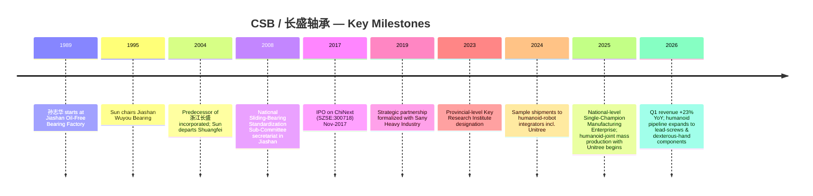
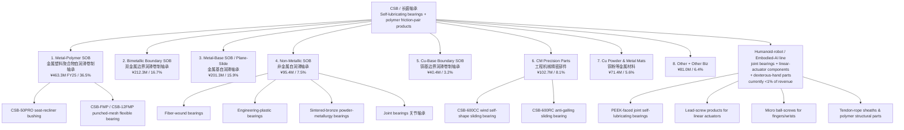
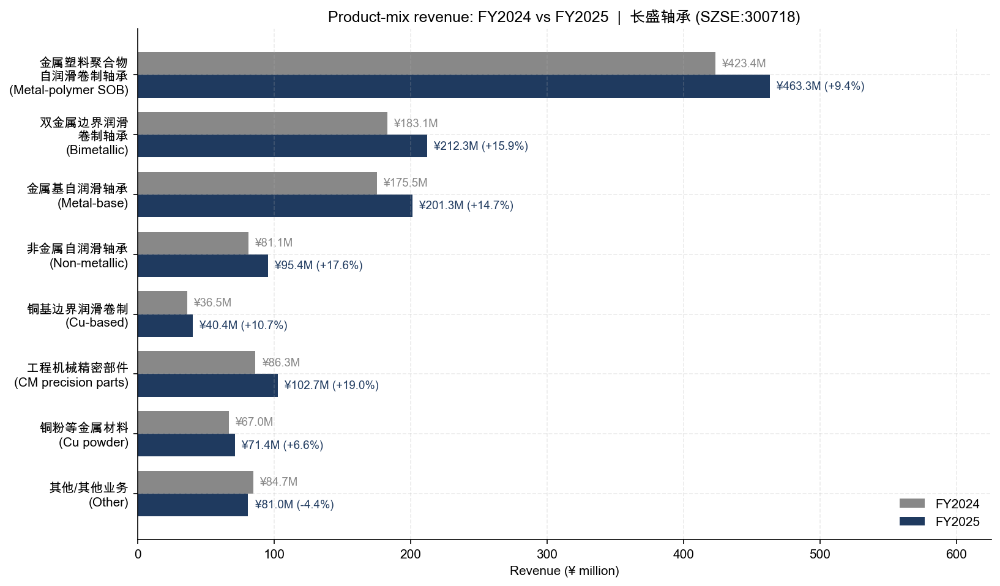
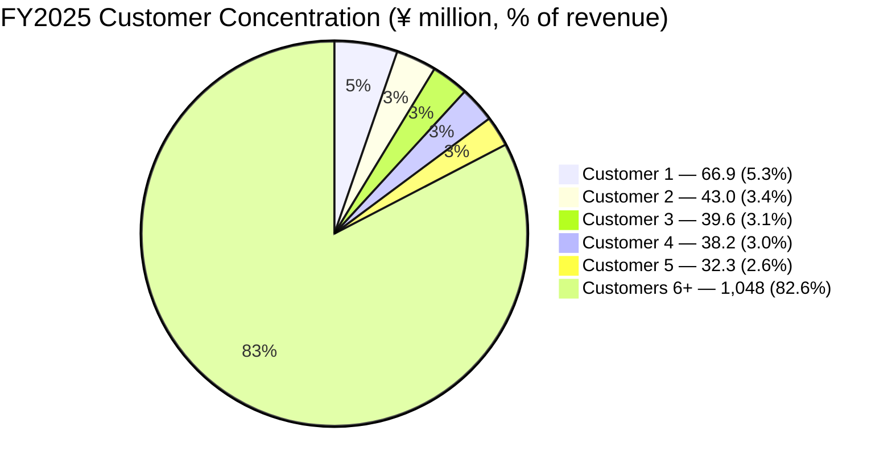
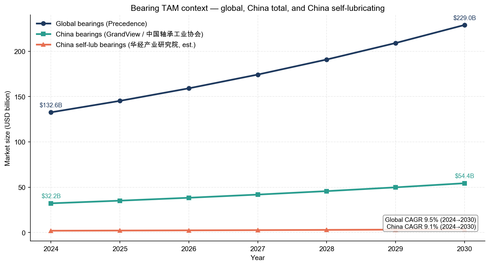

# COMPANY RESEARCH REPORT: Zhejiang Changsheng Sliding Bearings (长盛轴承 / CSB, SZSE:300718)

**Date:** 2026-05-18
**Report type:** Initiating Coverage — Deep Dive
**Ticker:** SZSE:300718 (ChiNext)
**Headquarters:** Jiashan County, Zhejiang Province, China
**Reporting currency:** RMB (¥)

---

## Table of Contents

1. Company Overview
2. Company History
3. Management Team
4. Products & Services
5. Customers & Go-to-Market
6. Industry Overview
7. Competitive Landscape
8. Market Opportunity (TAM)
9. Risk Assessment
10. References

---

## 1. Company Overview

Zhejiang Changsheng Sliding Bearings Co., Ltd. — branded **CSB** internationally and trading on Shenzhen's ChiNext board as **长盛轴承 / SZSE:300718** — is China's leading manufacturer of **self-lubricating bearings (自润滑轴承 / sliding bearings / oil-free dry-sliding bearings)** and high-performance polymer (聚合物 / polymer) friction-pair components. The company describes its mission as becoming "a global strategic partner in high-performance tribology (摩擦学) and polymer materials" via low-friction, self-lubricating technology platforms ([浙江长盛滑动轴承股份有限公司 2025 年年度报告, 第 10 页](http://www.cninfo.com.cn/new/disclosure/stock?stockCode=300718), filed 2026-04-27).

In plain English, CSB makes the "dry sliding" alternatives to traditional rolling-element (ball / roller / needle) bearings: a metal backing plate, a sintered bronze or composite intermediate layer, and a surface layer of PTFE (聚四氟乙烯), graphite, MoS₂ (二硫化钼), or PEEK polymer that delivers continuous low-friction service **without external lubricant.** That property — combined with light weight, vibration damping, and zero maintenance — is what makes self-lubricating bearings the architecture of choice for sealed and oil-sensitive applications such as automotive seat-recliner mechanisms, EV door/hood/trunk hinges, hydraulic-cylinder buckets and arms on excavators, and most recently the rotary joints (关节) and linear actuators of humanoid robots (人形机器人 / embodied AI / 具身智能).

**How they make money.** CSB sells finished bearings and friction-pair components into 8 industry verticals: automotive (汽车), construction machinery (工程机械), embodied AI / robotics (具身智能), clean energy (清洁能源 — wind, nuclear, solar tracking), transportation (transit / rail / shipping), general machinery (机械工业), light industry (plastic-injection machines, automated office equipment), and aerospace (航空航天). The mainstream commercial model is **order-driven manufacturing (以销定产)** with multi-year master agreements for major OEM accounts but PO-by-PO scheduling. Roughly **86% direct, 14% distributor** by revenue, with **63% domestic / 37% export** geographic split in FY2025 ([2025 年年度报告, 第 16 页](http://www.cninfo.com.cn/new/disclosure/stock?stockCode=300718)).

**Scale.** FY2025 revenue was **¥1,267.78 million** (+11.46% YoY), net income attributable to listed-co shareholders **¥253.35 million** (+10.59% YoY), with operating cash flow **¥262.71 million**. Weighted-average ROE 15.03%. Total assets ¥2.13 bn against shareholder equity ¥1.74 bn — an under-levered, cash-rich industrial balance sheet ([2025 年年度报告, 第 8 页](http://www.cninfo.com.cn/new/disclosure/stock?stockCode=300718)). The company employed 1,026 people end-2025 of whom 128 were R&D personnel (12.5% of headcount), holding 185 effective patents (57 domestic invention patents, 6 international invention patents) ([2025 年年度报告, 第 15–20 页](http://www.cninfo.com.cn/new/disclosure/stock?stockCode=300718)).

**Q1 FY2026 acceleration.** First-quarter revenue jumped **+23.41% YoY** to ¥348.08 million and net income +15.09% to ¥61.04 million — a marked acceleration from the FY2025 full-year pace and a leading indicator that humanoid-related sample orders, plus continued share gains in construction-machinery hydraulic cylinders, are beginning to flow into the top line ([2026 年第一季度报告, 第 2 页](http://www.cninfo.com.cn/new/disclosure/stock?stockCode=300718), filed 2026-04-27).

**Valuation snapshot (Step 2 of the company-research workflow).** As of mid-May 2026 the stock trades around **RMB 84.35** with a market capitalization of **¥25.06 billion** and TTM basic EPS of **¥0.83** ([Investing.com — Zhejiang Changsheng A](https://www.investing.com/equities/zhejiang-changsheng-a), accessed 2026-05-18). On those figures:

- **TTM P/E ≈ 101.6×** (84.35 ÷ 0.83) — extreme on absolute terms.
- **TTM P/S ≈ 19.8×** (25,060 ÷ 1,267.78) — also extreme.
- **P/B ≈ 14.4×** (25,060 ÷ 1,741) — well above the industrial-bearing peer set, where 1.5–4× is typical.
- Implied **EV/Revenue ≈ 19×**, with the company holding net cash on the balance sheet so EV is essentially market cap.

This is unambiguously a **narrative / sector-proxy premium**, not a fundamentals-justified multiple. The cause is identified directly in trade press: from a February-2024 low of **¥10.93/share** the stock rallied **>10×** through February 2025 on speculation that CSB had become "Unitree Technology Concept Stock No. 1" (宇树科技概念第一股), with revenue from robot-related parts still **under 1%** of group revenue at the time of the rally ([新浪财经 — "10 倍妖股"长盛轴承：背后的机器人赌局, 2025-03-03](https://finance.sina.com.cn/roll/2025-03-03/doc-inenkmnh6606469.shtml); [华尔街见闻 — "机器人隐形赢家"股价大涨超 200%, 2025-02-22](https://wallstreetcn.com/articles/3751550)). Sell-side coverage confirms the multiple sits at the very top of the bearing universe: Guoyuan Securities' September-2025 initiation forecasts CSB EPS of ¥0.89/¥1.03/¥1.22 for 2025/26/27 and explicitly maps a **103× / 89× / 75×** PE corridor at the then-current price ([Guoyuan Securities via 新浪财经, 2025-09-01](https://finance.sina.com.cn/roll/2025-09-01/doc-infnyqek9811017.shtml)).

For peer context (TTM PE, accessed 2026-05): Shuanghuan Transmission (双环传动 SZSE:002472), a comparable Chinese precision-gear and robot-reducer name, trades at roughly the high-20s to low-30s range on the same data sources; Wuzhou New Spring (五洲新春 SH:603667), a Chinese bearing-ring maker, has spiked to **~119× to 357×** TTM PE in early-2026 on its own robotics-bearing narrative ([五洲新春 PE TTM — Gurufocus](https://www.gurufocus.cn/stock/SHSE:603667/term/pettm), accessed 2026-01-20). Global incumbents Schaeffler (ETR:SHA), SKF (STO:SKF-B), NSK (TYO:6471), and NTN (TYO:6472) all trade in the **10–18×** TTM PE band, reflecting their mature-industrial cyclicality and lack of a robotics re-rating catalyst (the global-bearing top-10 frame is described in [bearingmaker.com — Top 10 Bearing Manufacturers in 2026, 2026-01](https://www.bearingmaker.com/top-10-bearing-manufacturers-2025/); precise daily PE values are visible on each listing venue's quote page). Renkang Group (人本集团) is private and has no public multiple. CSB's ~100× PE sits ~7–10× above the global incumbents and ~3× above its closest A-share robot-supply-chain peers — a multiple that **can only be defended if the embodied-AI joint-bearing line delivers a multi-fold revenue ramp in 2026–2028.** We flag this in Section 9 as a material valuation / multiple-compression risk.


*Source: [浙江长盛滑动轴承 2023 / 2024 / 2025 年度报告](http://www.cninfo.com.cn/new/disclosure/stock?stockCode=300718). Manufacturing-segment gross margin disclosed only from FY2024 in the new format.*

---

## 2. Company History

CSB's lineage traces to chairman **Sun Zhihua (孙志华)**, who began working on self-lubricating bearings in the early 1980s — predating the modern Chinese bearing industry's split into precision sub-categories. Sun ran the Jiashan Oil-Free Bearing Factory (嘉善无油轴承厂) as plant head from 1989, became chairman of Jiashan Wuyou Bearing in 1995, and chairman of Shuangfei Bearing (双飞轴承, today CSB's closest domestic competitor 双飞集团 SZSE:300817) from 2000 to 2003. He left Shuangfei in 2003–04 to consolidate the predecessor of today's CSB ([2025 年年度报告, 第 33 页](http://www.cninfo.com.cn/new/disclosure/stock?stockCode=300718)).

The Jiashan area (嘉善, southern Zhejiang, ~80 km from Shanghai) is the world's most concentrated self-lubricating bearing cluster — CSB itself notes the "industry cluster effect in Jiashan is highly significant," and that the **All-China Sliding-Bearing Standardization Committee's Self-Lubricating Bearing Sub-Committee (全国滑动轴承标准化技术委员会自润滑轴承分技术委员会)** was sited in Jiashan in 2008 with CSB as inaugural secretariat ([2025 年年度报告, 第 13 页](http://www.cninfo.com.cn/new/disclosure/stock?stockCode=300718)).

The provincial-level R&D infrastructure expanded steadily: county-level R&D center (2002), provincial high-tech enterprise R&D center (2008), provincial enterprise technology center (2011), provincial research institute (2015), provincial **key** research institute (2023), and finally **national-level "Manufacturing Industry Single-Champion Enterprise" (国家级制造业单项冠军企业, 9th batch)** in 2025 — the apex MIIT designation for narrow-product manufacturing leaders ([2025 年年度报告, 第 13 页](http://www.cninfo.com.cn/new/disclosure/stock?stockCode=300718)).



CSB went public on **ChiNext on 13 November 2017** — the cluster of A-share IPOs of high-end automotive and machinery suppliers that year coincided with China's "Made in China 2025" industrial policy push for import-substitution in core components. The IPO prospectus is on SZSE's site via cninfo ([长盛轴承 IPO 招股说明书 — Sina Finance mirror](http://vip.stock.finance.sina.com.cn/corp/view/vISSUE_RaiseExplanationDetail.php?stockid=300718&id=3819681)).

**Three strategic pivots** have shaped the company:

1. **Westernization of customer base (2010–2018).** CSB transitioned from a domestic-only supplier into a global Tier-2/3 to Caterpillar, JCB, Liebherr, Volvo Construction Equipment, Hitachi Construction Machinery, Komatsu, Kobelco, Hyundai Construction, and Tata Motors. Recognition awards from these customers ("Caterpillar Supplier Excellence", "Knorr-Bremse Outstanding Project Management", "Hitachi A-grade quality") confirm CSB is now embedded in the global excavator and heavy-truck supply chain ([2025 年年度报告, 第 14 页](http://www.cninfo.com.cn/new/disclosure/stock?stockCode=300718)).
2. **Move from commodity SOB to high-performance polymer system supplier (2019–2024).** Capacity in PTFE / PEEK / fluoropolymer composites was expanded materially, leading to nuclear-grade evaporator/pressurizer support bearings (核电支撑轴承) jointly developed with Shanghai Nuclear Engineering Research & Design Institute that achieved "Zhejiang Province Science & Technology Progress 3rd Prize" recognition and the Zhejiang Provincial First-Set Equipment certification ([2025 年年度报告, 第 13 页](http://www.cninfo.com.cn/new/disclosure/stock?stockCode=300718)). This pivot lifted blended manufacturing gross margin from ~33% to ~34%+ even through a tough 2023–2024 cyclical patch in construction equipment.
3. **Humanoid robotics / embodied AI focus (2024–present).** Disclosed in early 2025 that the company had signed cooperation agreements with **宇树科技 (Unitree Technology)** and was supplying joint self-lubricating bearings and some lead-screw products in linear actuators ([每日经济新闻 — 长盛轴承"20CM"涨停, 2025-02-19](https://www.nbd.com.cn/articles/2025-02-19/3757700.html)). By mid-2025 the robot-bearing line had moved from sample to "small-batch mass production" status, and CSB management noted publicly that the new line is the only one of its current commercial bearings using **PEEK polymer surface layers** as the principal friction face ([新浪财经 — 长盛轴承获 4 家机构调研, 2025-05-29](https://m.10jqka.com.cn/20250529/c668514945.shtml)). Revenue contribution remains **<1% of group** as of the FY2025 close but with sample / pilot deliveries to multiple integrators ([2025 年年度报告, 第 12 页](http://www.cninfo.com.cn/new/disclosure/stock?stockCode=300718)).

There have been no material acquisitions. Subsidiaries — Anhui Changsheng Precision (安徽长盛精密), Chuzhou Huana (滁州华纳), Jilin Changsheng (吉林长盛), Changsheng New Materials (长盛新材料), Jisheng New Materials (吉盛新材料), Changsheng Technology (长盛技术), Changsheng Plastic Bearings (长盛塑料轴承) — have all been organically incorporated subsidiaries for capacity, geography, or material specialization ([2025 年年度报告, 第 150–152 页](http://www.cninfo.com.cn/new/disclosure/stock?stockCode=300718)).

---

## 3. Management Team

CSB is unusually **founder-led for a 9-year-public small-cap**, with the family of chairman Sun Zhihua plus key co-founders controlling **53.4%** of outstanding shares — and exercising voting control as a declared "concerted-action group" (一致行动人).

### Sun Zhihua (孙志华) — Chairman, founder, controlling shareholder (~31.9% holder)

Sun, **69**, is Chinese national, holds an MBA, and is a Senior Engineer. He spans **35+ years** in the self-lubricating bearing industry — the single longest tenure of any executive in the Chinese sliding-bearing sector. His career arc:

- **1989–95**: Plant head, Jiashan Oil-Free Bearing Factory (嘉善无油轴承厂) — China's earliest dedicated self-lubricating bearing plant.
- **1995–2000**: Chairman, Jiashan Wuyou Bearing (嘉善无油轴承).
- **2000–03**: Chairman, Shuangfei Bearing (双飞轴承) — today's listed competitor 双飞集团 SZSE:300817.
- **2001–04**: Vice-Chair, Jiashan Changsheng (predecessor entity).
- **2004–13**: Chairman + GM of the consolidated 浙江长盛 entity.
- **2013–present**: Chairman of the listed company. From 2009–23 also chairman of subsidiary 长盛技术 ([2025 年年度报告, 第 33 页](http://www.cninfo.com.cn/new/disclosure/stock?stockCode=300718)).

Sun owns **95,250,781 shares (31.88%)** of CSB directly. His daughter **Sun Weiqing (孙薇卿)** holds **13.52%** and his son-in-law **Chu Chenjian (褚晨剑, current President / GM)** holds **4.04%** — all three are formally declared concerted-action parties to Sun ([2025 年年度报告, 第 55–57 页](http://www.cninfo.com.cn/new/disclosure/stock?stockCode=300718)). Sun also serves as managing partner of Jiashan Baisheng Investment Management LP (嘉善百盛投资管理), the family's investment vehicle. FY2025 pre-tax compensation from CSB was **¥847,900** — modest, with the bulk of his economic interest sitting in the listed equity stake (~¥8 bn paper value at current price).

The founder's strategic stamp is visible in three places. First, **standards leadership**: under Sun, CSB has led or co-led **46 national + 4 industry + 8 group standards** for sliding bearings, including the just-published T/CMIF281/282/293-2025 series on coating friction characteristics, ultrasonic-method bond-strength testing, and gas-static bearing material specifications. This is meaningfully more standards-setting reach than any peer ([2025 年年度报告, 第 15 页](http://www.cninfo.com.cn/new/disclosure/stock?stockCode=300718)). Second, **provincial / national recognition cadence**: Sun has shepherded CSB through the full ladder — provincial R&D center → provincial enterprise technology center → provincial research institute → provincial **key** research institute (2023) → **national-level Single-Champion Manufacturing Enterprise (2025)**. Third, **succession planning**: by promoting son-in-law Chu Chenjian to GM in September 2023 and elevating co-founder Lu Xiaolin (陆晓林) to Vice-Chair in the same window, Sun has set up a two-generation operating model where he retains chairmanship while the younger team executes day-to-day. Note Sun does **not** double-hat as Chairman + GM ([2025 年年度报告, 第 32, 34 页](http://www.cninfo.com.cn/new/disclosure/stock?stockCode=300718)).

### Chu Chenjian (褚晨剑) — Director, President / General Manager (~4.04% holder)

Chu, **41**, holds an MBA (工商管理硕士). He is **Sun Zhihua's son-in-law**. His career profile is unusually cosmopolitan for a China-only manufacturing company:

- **2008–09**: Assistant in the technology department of **Volkswagen China (大众汽车中国投资)**.
- **2009–10**: Distribution / dealer-development manager at **Chrysler China (克莱斯勒中国汽车销售)**.
- **2010–18**: Regional manager at **Beijing Mercedes-Benz Sales & Service**.
- **2019**: Joined CSB as marketing director.
- **2019–23**: Vice GM, Director.
- **2023–present**: President / GM. Also chairman of 安徽长盛精密 and 吉盛新材料, and executive director of two subsidiaries.

He sits on multiple Zhejiang Young Entrepreneurs Association boards and is vice-chair of the Jiashan Auto-Parts Association — a deliberate positioning at the intersection of the automotive value chain and Zhejiang's industrial-finance ecosystem. His automotive-OEM résumé (VW + Chrysler + Mercedes) is the unusual edge: most Chinese bearing executives come from process-engineering backgrounds, whereas Chu fluently navigates the procurement decision-makers at global OEMs and is fluent in the German/American Tier-1 quality-system language. FY2025 pre-tax comp **¥778,700**, plus the share package ([2025 年年度报告, 第 35 页](http://www.cninfo.com.cn/new/disclosure/stock?stockCode=300718)).

### He Yin (何寅) — CFO + Board Secretary + Vice GM

He, **39**, holds a Master's in Accounting. His background is **sell-side investment banking** rather than industry — first at Zheshang Securities Investment Banking (2013–15), then Southwest Securities (2015–16), Shenwan Hongyuan (2016–17), and Zhongtian Guofu Securities (2017–18) before joining CSB as assistant to the GM in late 2018. He became Director of the Securities Investment Department in 2020, then CFO and Board Secretary in September 2020, and was promoted to Vice GM in 2023. He concurrently serves as supervisor of subsidiary Changsheng New Materials and director of Jisheng New Materials. FY2025 pre-tax comp **¥613,200**. Owns 85,500 shares (de-minimis) ([2025 年年度报告, 第 34 页](http://www.cninfo.com.cn/new/disclosure/stock?stockCode=300718)). His IB background is plausibly a positive for capital-markets execution as the company decides how to monetize the humanoid-robot narrative — buyback, dividend, ESOP, or potential secondary placement.

### Lu Xiaolin (陆晓林) — Vice Chairman, Executive Vice GM

Lu, **50**, joined the founding team in 1996 and rose through sales (sales VP at Jiashan Changsheng in 2002), to Director + VP, then GM (2013–23), and was elevated to Vice-Chair + Executive VP in September 2023 alongside Chu Chenjian's promotion to GM. Lu owns **10,023,750 shares (3.35%)** post-Q1 reduction. Director of multiple subsidiaries; on the operating side he runs the manufacturing organization and supplier base.

### Lu Zhongquan (陆忠泉) — Chief Technology Officer / Chief Engineer (总工程师)

Lu, **53**, BSc engineer, joined CSB in 2002 as equipment manager and rose through R&D ranks to become Deputy Chief Engineer then Chief Engineer in 2011 — he is the principal technology architect of the company's metal-polymer composite bearing platform. Owns 4,066,375 shares (1.36%). FY2025 pre-tax comp ¥397,000 ([2025 年年度报告, 第 34–35 页](http://www.cninfo.com.cn/new/disclosure/stock?stockCode=300718)).

### Governance

Board composition: 9 directors comprising **6 inside** (Sun, Chu, Lu Xiaolin, Cao Yinchao, Fei Guoping who joined in November 2025, Jiang Caiping employee director) + **3 independent** (Chen Shuda — professor at Jiaxing University; Ma Zhengliang — senior lawyer; Wan Yuanxing — accounting academic at Zhejiang Gongshang University). Independent-director ratio = **33%**, which meets the ChiNext minimum but is below best-practice expectations of ≥50% for a controlled company. **Total insider + family ownership is approximately 53.4%** — well clear of any takeover-defense threshold. **No supervoting / dual-class structure.** **No related-party transactions of meaningful size** were disclosed in FY2025; the related-party section is essentially blank ([2025 年年度报告, 第 49–50 页](http://www.cninfo.com.cn/new/disclosure/stock?stockCode=300718)). **Pledge ratio: 0%** for the controlling shareholders, which is a meaningful positive in a Chinese small-cap context. **Share buyback program** of ¥20–40 million authorized September 2024 for ESOP / equity-incentive use; 240,600 shares repurchased by report date ([2025 年年度报告, 第 58 页](http://www.cninfo.com.cn/new/disclosure/stock?stockCode=300718)). The board secretary / IR function under He Yin is unusually professional for an A-share small-cap, reflected in 18-institution group meetings and accessible investor disclosure ([好研报 — 长盛轴承机构调研汇总](https://www.appletree.fund/300718-sz/)).

**Track record synthesis.** Founder Sun has delivered 35 years of operational continuity, three successful corporate transitions (factory → JV → listed company), and the apex national recognition (Single-Champion). The CFO + GM bench is younger and globally fluent. The principal "untested" element is whether Chu's automotive-OEM operating experience translates into the humanoid-robot ecosystem — a buyer base dominated by AI-platform companies and supply-chain integrators rather than tier-1 automotive suppliers. So far the answer is encouraging (Unitree mass-production, Zhiyuan sampling) but the bar is high given the multiple.

---

## 4. Products & Services

CSB's product taxonomy in the FY2025 annual report breaks out **seven** revenue-bearing product families plus residual "other" — totalling tens of thousands of SKUs ([2025 年年度报告, 第 16 页](http://www.cninfo.com.cn/new/disclosure/stock?stockCode=300718)). The product tree:



### Segment-by-segment

**1. Metal-Polymer Self-Lubricating Wound Bearings (金属塑料聚合物自润滑卷制轴承) — ¥463.3M FY2025, 36.5% of revenue, +9.4% YoY.** The flagship "SOB" (self-oiling bearing) cash-cow line. Construction: steel back + sintered bronze intermediate layer + PTFE / polymer surface. Gross margin **47.54%** — the highest of any product family, and management notes the GM dropped 1.30 ppt YoY on commodity input pressure. The line is dominant in **automotive seat-recliner mechanisms**, **EV door/hood/trunk hinges**, **HVAC compressor swashplates**, and **shock-absorber suspension components**. CSB's CSB-FMP / CSB-12FMP "punched-mesh flexible" sub-line and CSB-50PRO high-load recliner bushing were certified as provincial-level new products in 2025 ([2025 年年度报告, 第 14, 17 页](http://www.cninfo.com.cn/new/disclosure/stock?stockCode=300718)). Volume rose **7.97%** YoY to 512,822 m² of bearing sheet ([2025 年年度报告, 第 17 页](http://www.cninfo.com.cn/new/disclosure/stock?stockCode=300718)). **Competitive advantage: YES — multiple moat sources** (cost leadership via German-imported automated lines × 21; brand among global OEMs via 20-year qualification cycle; standards leadership; certified BMW / Volvo / Jaguar / Tesla / Audi / VW / BYD / SAIC / Changan supply). Closest competitor SKUs: GGB DP4 / DU bearings, Saint-Gobain Norglide, Daido Metal DDK series; CSB at parity on performance, **15–30% lower price** typically.

**2. Bimetallic Boundary Lubrication Wound Bearings (双金属边界润滑卷制轴承) — ¥212.3M, 16.7%, +15.96% YoY.** Steel + sintered bronze, no polymer overlay, used where shock-load + grease lubrication coexist. Gross margin **25.68%** (+2.69 ppt YoY). Volume +15.73% to 208,365 m². Mainstream applications are **excavator buckets, links, booms, hydraulic-pin connections**, particularly for Caterpillar's Italian chassis-parts plant where CSB co-developed a single-step formed bimetallic bushing replacing the prior two-step machined design — eliminating downstream finishing for the customer ([2025 年年度报告, 第 14 页](http://www.cninfo.com.cn/new/disclosure/stock?stockCode=300718)). **Advantage: YES — process/cost moat plus customer co-development lock-in.**

**3. Metal-Base Self-Lubricating Bearings / Plane Sliding Bearings (金属基自润滑轴承) — ¥201.3M, 15.9%, +14.69% YoY.** Sintered, cast, or solid-lubricant-inlaid bronze + steel solid bearings. Gross margin **27.94%** (−1.35 ppt YoY). Major applications: **container-port crane wheels, oil-cylinder pistons, light-rail / metro shock dampers, ship deck-machinery thrust pads.** This was the segment that suffered the deepest cyclical drag in 2024 (−19.7% YoY in 2024) but **rebounded sharply +14.7% in 2025** ([2025 年年度报告, 第 16 页](http://www.cninfo.com.cn/new/disclosure/stock?stockCode=300718)), tracking the construction-equipment recovery (China excavator sales +17.0% in 2025 to 235,257 units per CCMA). **Advantage: PARTIAL — leadership share within China but commoditizing in mass / heavy categories.**

**4. Non-Metallic Self-Lubricating Bearings (非金属自润滑轴承) — ¥95.4M, 7.5%, +17.72% YoY.** Fastest-growing legacy line: fiber-wound bearings (纤维缠绕), engineering-plastic bearings (工程塑料), powder-metallurgy sintered-bronze bearings (粉末冶金), plus joint bearings (关节轴承). This is also the **technical "home" for the humanoid-robot line, especially PEEK and polymer-only joint bearings**. **Advantage: YES — under-served niche, highly customized; the bridge between the legacy SOB business and the future robotics line.**

**5. Cu-Base Boundary Lubrication Wound Bearings (铜基边界润滑卷制轴承) — ¥40.4M, 3.2%, +10.7% YoY.** A narrower SKU set used where copper-base load capacity is required without the cost of solid bronze.

**6. Construction-Machinery Precision Parts (工程机械精密部件) — ¥102.7M, 8.1%, +18.97% YoY.** Includes the new **CSB-600CC self-shape (自修形) wind-turbine sliding bearing** and **CSB-600RC anti-galling sliding bearing** developed for wind-gear-box main-shaft bearings — both certified as provincial-level new products in 2025 and aimed at the import-substitution opportunity vs. Schaeffler / SKF wind bearings ([2025 年年度报告, 第 14 页](http://www.cninfo.com.cn/new/disclosure/stock?stockCode=300718)). Also includes Liebherr / JCB / Sany custom precision parts. **Advantage: YES — certification moat (wind-bearing customers require 18–24 month qualification).**

**7. Copper Powder & Other Metal Materials (铜粉等金属材料) — ¥71.4M, 5.6%, +6.6% YoY.** Upstream copper-powder supply to internal use + outside customers via Jisheng New Materials. Lower-margin trading/processing flow.

**8. Other / Other Business (其他/其他业务) — ¥81.0M.** Includes the new **embodied-AI / robotics line**, currently disclosed at **<1% of group revenue** but with explicit management commentary that orders are growing fastest here ([2025 年年度报告, 第 12 页](http://www.cninfo.com.cn/new/disclosure/stock?stockCode=300718)).

### Humanoid robotics / embodied AI line — the option value

CSB's research direction in embodied AI breaks into three categories per management commentary:

1. **Joint self-lubricating bearings (关节用自润滑轴承).** These are the dry-sliding bearings inside the rotary joints of humanoid robots — the equivalent of automotive seat-recliner bushings but with much smaller diameters, higher cycle rates, and stricter weight constraints. CSB's pitch vs. rolling-element joint bearings: **(a) lower cost** (1/3 to 1/5 of a needle-roller bearing), **(b) better shock-absorption / consistency** under repeated impact (the joint of a walking robot impacts thousands of times per minute), **(c) higher load capacity** for the contact area, **(d) elimination of grease/oil maintenance**, **(e) elimination of supply lines for lubricant — simpler mechanical design.** PEEK and modified PTFE composites are the principal surface layers ([2025 年年度报告, 第 12 页](http://www.cninfo.com.cn/new/disclosure/stock?stockCode=300718); [Wallstreetcn — "机器人隐形赢家", 2025-02-22](https://wallstreetcn.com/articles/3751550)).
2. **Linear-actuator components (直线执行器).** CSB has begun shipping **lead-screw products** into linear-actuator integrators — the screws + nuts that drive the prismatic / sliding joints of humanoid limbs (e.g. the 8–10 of 14 linear joints in a Tesla Optimus prototype use planetary roller screws). The company has confirmed it has lead-screw products in mass production targeted at **automotive braking, steering, parking-brake, and transmission systems** as well — a precursor capability that transfers to robotic limbs ([新浪财经 — 长盛轴承获 4 家机构调研, 2025-05-29](https://m.10jqka.com.cn/20250529/c668514945.shtml)).
3. **Dexterous-hand components (灵巧手).** Self-lubricating bearings at finger and wrist joints, **micro ball-screws for fingers and wrists**, polymer structural parts, plus **modified tendon-rope (腱绳) and sheaths/conduits**. This sub-category is "in sample / trial phase" per the FY2025 annual report ([2025 年年度报告, 第 12 页](http://www.cninfo.com.cn/new/disclosure/stock?stockCode=300718)).

Named integrator customers (disclosed via media and IR meetings rather than the formal 年报):

- **宇树科技 (Unitree Technology)** — formal cooperation agreement signed; orders received; mass production for joint self-lubricating bearings + ball screws ([每日经济新闻, 2025-02-19](https://www.nbd.com.cn/articles/2025-02-19/3757700.html)).
- **智元机器人 (Zhiyuan Robotics / AgiBot)** — sampling stage.
- Additional integrators sampling but not publicly named.

Industry context: in July 2025, Zhiyuan + Unitree jointly won China Mobile's RMB 124.05 million 2025–2027 humanoid bipedal robot procurement, with Unitree alone awarded RMB 46.05 million — a hard datapoint that scaled humanoid procurement is now occurring among state-owned enterprises ([财经客户端 — 优必选、智元、宇树科技领跑, 2025-08-19](https://news.caijingmobile.com/article/detail/554046)).

**Per-product competitive-advantage verdict, robotics line:** YES — the moat is **(i) tribology IP** (CSB owns the only sliding-bearing standards secretariat in China, plus 185 patents heavily weighted to composite materials), **(ii) the existing 21-line German automated wrap-and-sinter manufacturing infrastructure** that can be re-pointed to robot-joint micro-bearings at incremental cost rather than a greenfield, and **(iii) early integrator wins** (Unitree exclusivity for joint SOBs is the strongest single proof point). Closest competitor: **双飞集团 SZSE:300817** in the self-lub-bearing-for-robots category, plus international makers GGB / Saint-Gobain / Daido Metal; in micro ball-screws the Japanese incumbents NSK / THK / IKO and Chinese listed names 北特科技 / 贝斯特 are the substitutes — CSB is **behind** the Japanese on ball-screw precision but at lower price points and with shorter delivery lead times.

### Flagship vs long-tail

The **1–3 products driving the business** are:
1. **Metal-polymer SOB (¥463M)** — the cash flywheel.
2. **Bimetallic SOB (¥212M) + metal-base SOB (¥201M)** — together ¥413M, the construction-machinery + heavy-industry block.
3. **Humanoid-robot line** — small today (<1% of revenue) but it's what the market is paying ~100× PE for.



*Source: [浙江长盛滑动轴承 2024 / 2025 年度报告](http://www.cninfo.com.cn/new/disclosure/stock?stockCode=300718).*

### Recent launches / sunsets (last 12 months)

Six new SKUs were completed in 2025 — CSB-FMP, CSB-12FMP, CSB-600CC, CSB-600RC, CSB-50PRO, CSB-NFMSF (small-hole flat-static-pressure gas-floating bearing). In active development at year-end: CSB-21 environmental water-lubricated bearing, CSB-27 creep-resistant high-wear self-lub bearing, CSB-MEX woven high-load composite bushing, CSB-26E high-performance fluorine-free self-lub bearing, CSB-29P compressor high-speed fluid-lubricated bearing, plus a high-density copper-alloy oil-distribution-plate process for axial-piston pumps ([2025 年年度报告, 第 19–20 页](http://www.cninfo.com.cn/new/disclosure/stock?stockCode=300718)). No product lines were sunset.

---

## 5. Customers & Go-to-Market

CSB sells **86% direct, 14% via distributors** by revenue; the direct channel dominates within China, while overseas markets are a mix of both ([2025 年年度报告, 第 16 页](http://www.cninfo.com.cn/new/disclosure/stock?stockCode=300718)). Customer accounts are won via 12–24-month qualification cycles characteristic of automotive Tier-2 supply.

**Customer concentration — quantified.** Per the FY2025 annual report's mandatory disclosure of 前五名客户 (top-5 customers):

| Customer (anonymized in filing) | Sales (¥M) | % of FY25 revenue |
|---|---:|---:|
| Customer 1 | 66.92 | 5.28% |
| Customer 2 | 42.95 | 3.39% |
| Customer 3 | 39.62 | 3.13% |
| Customer 4 | 38.19 | 3.01% |
| Customer 5 | 32.34 | 2.55% |
| **Top-5 total** | **220.03** | **17.36%** |

Top-1 = 5.28%, top-5 = 17.36% ([2025 年年度报告, 第 18–19 页](http://www.cninfo.com.cn/new/disclosure/stock?stockCode=300718)). **The names are not disclosed** under the China A-share filing format (the practice is anonymized "客户一/二/三/四/五"). For comparison, the FY2024 disclosure was top-1 = 6.28%, top-5 = 18.49% ([2024 年年度报告, 第 19 页](http://www.cninfo.com.cn/new/disclosure/stock?stockCode=300718)). FY2023 customer concentration was at a similar level (top-5 mid-teens; full-year filing on cninfo). The trend is **stable to slightly declining concentration**, which is positive — CSB is diversifying as it scales.

**Critically, both top-1 and top-5 ratios are well below the "material risk" thresholds** of top-1 > 20% or top-5 > 50%. No single customer can materially crater CSB by walking away. This is rare in automotive Tier-2 supply.

**Named customer relationships** (disclosed prose, FY2025 annual report and IR commentary):

- **Construction-equipment OEMs**: Caterpillar, Liebherr, Volvo Construction Equipment, JCB, Hitachi Construction Machinery, Komatsu, Kobelco, Hyundai Heavy Industries (all global majors); Sany Heavy Industries (三一重工, strategic partner from 2019), Zhenhua Heavy Industries (振华重工 SH:600320), Haitian Precision (海天精工 SH:601882), Hengli Hydraulic (恒立液压 SH:601100), Haomai Technology (豪迈科技 SZ:002595).
- **Auto component / Tier-1 suppliers**: Meritor, Bosch, Knorr-Bremse, Faurecia (佛瑞亚), Mando (Korea), HK / Hyundai Korea, Adient (安道拓), FAW Tokico (一汽东机工), Tenneco (天纳克).
- **Auto OEMs (end-vehicle, CSB is Tier-2 or Tier-3 via above suppliers)**: BMW, Volvo, Jaguar Land Rover, **Tesla**, Audi, Volkswagen, **BYD (比亚迪)**, SAIC Motor (上汽集团), Changan Automobile (长安汽车), Tata Motors ([2025 年年度报告, 第 14 页](http://www.cninfo.com.cn/new/disclosure/stock?stockCode=300718)).
- **Embodied AI / robotics integrators**: Unitree Technology (mass-production stage), Zhiyuan Robotics (sampling), plus additional unnamed integrators.

**The user's request specifically asked us to quantify auto-OEM (Tesla, BYD, Geely), construction-machinery, and hydraulic-cylinder concentration**. The FY2025 filing does **not** break out customer revenue by industry vertical — only the aggregate top-5 anonymized list. Cross-referencing the prose with the industry-revenue split: domestic ¥797.4M (62.9%) / overseas ¥470.4M (37.1%). The named global construction-equipment customers (Caterpillar, JCB, Liebherr, Komatsu, Hitachi, Volvo, Kobelco, Hyundai) are likely overweight in the overseas revenue line and plausibly the principal source of the top-5 customers given the depth of those relationships and Caterpillar's explicit recognition as "Supplier Excellence" awardee ([2025 年年度报告, 第 14 页](http://www.cninfo.com.cn/new/disclosure/stock?stockCode=300718)). Tesla and BYD appear as end-vehicle customers but CSB sells into them through Tier-1 seat / hinge / compressor / damper system integrators rather than directly — these flows are embedded inside Customer 1–5 sub-lines without separate disclosure. The full breakdown by named customer is **not disclosed in the cninfo filing**; this is the standard A-share confidentiality practice.



**Contract structure.** Master technical, quality, and order-supply agreements with each major account; individual POs by quantity. For commodity raw materials (steel coil, copper coil, copper powder), CSB maintains safety stock with rolling-forecast purchase orders. For copper billet specifically, an "intention-based purchase" model — supplier pre-positions inventory against CSB's intent ([2025 年年度报告, 第 10 页](http://www.cninfo.com.cn/new/disclosure/stock?stockCode=300718)).

**Sales cycle.** 12–24 months for new platform qualification; once qualified, the part remains in the bill-of-materials for the full vehicle / equipment platform life-cycle (typically 5–7 years for automotive seat platforms, longer for construction equipment).

**Customer concentration verdict.** Top-1 5.3% / top-5 17.4% is **best-in-class for an automotive Tier-2 supplier** — CSB has the diversification of a small-parts catalogue company. The named-customer breadth (global construction + global premium auto + Chinese auto + China new-energy + early-mover humanoid integrators) is genuinely diversified across cycles. **No material customer concentration risk by either of the standard thresholds.**

---

## 6. Industry Overview

**Industry definition.** Bearings (轴承) are the rotating-machinery building block: any moving shaft requires a bearing. The industry splits into two principal categories: **rolling-element bearings** (滚动轴承 — ball, cylindrical, tapered, spherical roller, needle) which dominate by volume and dollar; and **sliding / plain bearings** (滑动轴承), the smaller but materially-growing subset where CSB plays. Within sliding bearings, **self-lubricating bearings (自润滑轴承)** is the technology-differentiated, higher-margin niche.

**Market size.** Per Precedence Research, the **global bearings market** was **USD 132.6 billion in 2024** and is forecast to reach **USD 228.87 billion by 2030**, a CAGR of **9.53%** ([Precedence Research — Bearing Market, accessed 2026-01](https://www.precedenceresearch.com/bearing-market)). Within that:

- **China bearings**: USD 32.2 billion in 2024 → USD 54.39 billion 2030, CAGR 9.12% (GrandViewResearch + China Bearings Industry Association data cited in [2025 年年度报告, 第 10 页](http://www.cninfo.com.cn/new/disclosure/stock?stockCode=300718)). China is the world's **#3 bearing producer** by both value and unit volume.
- **Global sliding-bearing market**: approximately **USD 6.6 billion in 2025** per QYResearch ([cited in 2025 年年度报告, 第 10 页](http://www.cninfo.com.cn/new/disclosure/stock?stockCode=300718)). Other forecasters peg the slice differently (Cognitive Market Research USD 1.24B; HTF Market Insights USD 12.4B), reflecting differences in scope definitions ([Cognitive Market Research — Sliding Bearing Market](https://www.cognitivemarketresearch.com/sliding-bearing-market-report); [HTF Market Insights](https://www.htfmarketinsights.com/report/4424537-sliding-bearing-global)).
- **China self-lubricating bearings specifically**: **approximately RMB 15.7 billion (~USD 2.2 billion) in 2025** per Huajing Industry Research Institute (华经产业研究院), cited in [2025 年年度报告, 第 10 页](http://www.cninfo.com.cn/new/disclosure/stock?stockCode=300718)).



*Source: [Precedence Research](https://www.precedenceresearch.com/bearing-market); [GrandViewResearch + 中国轴承工业协会 via CSB 2025 年报](http://www.cninfo.com.cn/new/disclosure/stock?stockCode=300718); 华经产业研究院 self-lub bearings (2025 base, 10% growth assumption — est.).*

**Downstream demand drivers** (per CSB's own MD&A and corroborated by industry data):

1. **Automotive** — every modern passenger vehicle uses **>100 self-lubricating bearings**, with new applications still being added (HVAC compressor swashplate self-lub coatings, polymer engineering structural parts) ([2025 年年度报告, 第 11 页](http://www.cninfo.com.cn/new/disclosure/stock?stockCode=300718)). Global vehicle sales reached **96.89 million units in 2025 (+6% YoY)**, with China's market share at **35.4%** ([CADA / 崔东树 via 2025 年年度报告, 第 11 页](http://www.cninfo.com.cn/new/disclosure/stock?stockCode=300718)). China new-energy vehicles: 16.49 million units in 2025 (+28.2% YoY) per CAAM. EV-specific: each EV requires more bearings for steering, braking, motor housings, and battery thermal management.
2. **Construction machinery** — China excavator sales 235,257 units in 2025 (+17.0% YoY); domestic 118,518 (+17.9%); export 116,739 (+16.1%) per CCMA ([cited in 2025 年年度报告, 第 11 页](http://www.cninfo.com.cn/new/disclosure/stock?stockCode=300718)).
3. **Embodied AI / humanoid robotics** — China's State Council Development Research Center forecasts **RMB 400 billion industry size by 2030** and **>RMB 1 trillion by 2035** for the broader embodied-AI industry (《中国发展报告 2025》 cited in [2025 年年度报告, 第 12 页](http://www.cninfo.com.cn/new/disclosure/stock?stockCode=300718)). Each humanoid robot uses **dozens of joint bearings + multiple lead-screws / ball-screws** in its kinematic chain.
4. **Clean energy** — global clean-energy market ~USD 959.4 billion in 2025 per Research and Markets (cited in [2025 年年度报告, 第 12 页](http://www.cninfo.com.cn/new/disclosure/stock?stockCode=300718)). Wind-turbine gear boxes specifically are transitioning from rolling-element to sliding-bearing architectures (the "sliding-replaces-rolling" trend in wind that [Zhongtai Securities sliding-bearing industry depth report](https://www.fxbaogao.com/detail/3530138) covers).
5. **Machinery overall** — China's machinery industry value-added grew 8.2% in 2025, with autos at +11.5% and electrical machinery at +9.2% per CMIA ([2025 年年度报告, 第 12 页](http://www.cninfo.com.cn/new/disclosure/stock?stockCode=300718)).

**Industry structure.** The bearing industry is **bifurcated**:
- **Tier 1 — Global precision incumbents.** Schaeffler, SKF, NSK, NTN, Timken, JTEKT, MinebeaMitsumi — these companies dominate high-end rolling-element bearings for aerospace, machine tools, and high-precision applications. They have only modest sliding-bearing operations (GGB — owned by EnPro Industries — is the major Western sliding-bearing pure-play).
- **Tier 2 — Chinese precision specialists.** CSB, 双飞集团 (Shuangfei SZSE:300817), 崇德科技 (Chongde SZSE:301548), 五洲新春 (Wuzhou Xinchun SH:603667), 双环传动 (Shuanghuan SZSE:002472, primarily gear/reducer), 人本集团 (Renkang Group, private — China's largest bearings group by revenue), Wafangdian Bearing (瓦轴 SZSE:200706), Xiangyang Bearing (000678), Wanxiang Qianchao (000559), Nanfang Bearing (002553). Most are >70% domestic.
- **Tier 3 — Long-tail Jiashan / Wenzhou small workshops.** Hundreds of small enterprises in Zhejiang's bearing clusters, mostly producing commodity rolling-element bearings with low value-add.

**Supplier / buyer power.** CSB's principal raw-material inputs are **steel coil, copper coil, and copper powder** — commodity globalized inputs with no supplier-power moat. Top-5 supplier concentration was **29.30% in FY2025** with top-1 at 8.49% ([2025 年年度报告, 第 19 页](http://www.cninfo.com.cn/new/disclosure/stock?stockCode=300718)) — slightly elevated but manageable. Buyer power is moderate: automotive Tier-1s squeeze prices in annual reviews, but the multi-year qualification cycle and ~10,000-SKU breadth give CSB structural pricing discipline.

**Regulatory environment.** ISO9001 / IATF16949 / ISO14001 / ISO45001 / GB/T29490 / ISO50001 / ISO/IEC27001 all in place ([2025 年年度报告, 第 15 页](http://www.cninfo.com.cn/new/disclosure/stock?stockCode=300718)). RoHS / REACH automotive compliance is the principal regulatory hurdle for surface-layer chemistry — CSB has been investing in fluorine-free (无氟) formulations specifically in anticipation of likely PFAS / PTFE restrictions in EU and California. **R&D project CSB-26E** is a fluorine-free thermoplastic friction-pair formulation aimed at replacing PTFE-containing recipes ([2025 年年度报告, 第 20 页](http://www.cninfo.com.cn/new/disclosure/stock?stockCode=300718)). This is an under-appreciated risk-and-opportunity vector across the entire sliding-bearing industry.

---

## 7. Competitive Landscape

CSB faces three layers of competitors. Below is a market-positioning view across the price / breadth-of-application dimensions.

```mermaid
quadrantChart
    title Bearing-maker positioning — price × technology breadth
    x-axis Low price --> Premium price
    y-axis Narrow SKUs --> Broad SKUs
    quadrant-1 Premium + Broad — global incumbents
    quadrant-2 Premium + Narrow — niche specialists
    quadrant-3 Value + Narrow — small Chinese
    quadrant-4 Value + Broad — leading Chinese specialists
    Schaeffler: [0.86, 0.92]
    SKF: [0.85, 0.94]
    NSK: [0.80, 0.85]
    NTN: [0.78, 0.82]
    Timken: [0.83, 0.70]
    GGB / Saint-Gobain: [0.82, 0.45]
    Daido Metal: [0.75, 0.40]
    CSB / 长盛轴承: [0.55, 0.70]
    Shuangfei SZSE:300817: [0.45, 0.55]
    Chongde SZSE:301548: [0.55, 0.40]
    Wuzhou New Spring SH:603667: [0.42, 0.50]
    Renkang Group private: [0.50, 0.78]
```

### Detailed competitor profiles

1. **Schaeffler AG (ETR:SHA)** — German precision bearings + automotive Tier-1. ~€16 billion revenue. Strong in tapered, needle, and angular-contact rolling-element bearings. Has a sliding-bearing arm (FAG / INA Bearings) but it's a small slice. Schaeffler reported solid 2025 results with growth led by E-Mobility ([Schaeffler press release, 2026-03](https://www.schaeffler.de/en/news_media/press_releases/press_releases_detail.jsp?id=88175106)). **Where CSB wins**: in dry sliding / self-lub-bearing categories Schaeffler is not the relevant competitor; in the wind self-lub-bearing import-substitution opportunity, CSB's CSB-600CC / 600RC products are the new domestic alternative.
2. **SKF (STO:SKF-B)** — Swedish, $10 bn+ revenue, world's #1 bearing OEM. Same dynamic as Schaeffler in CSB's niches ([SKF 2026 profile — PitchBook](https://pitchbook.com/profiles/company/43056-28)).
3. **NSK (TYO:6471)** — Japanese, ¥1 trillion+ revenue, strong in deep-groove ball bearings, automotive electric power steering, ball screws. CSB's **ball-screw expansion competes directly** with NSK ball screws in the mid-tier, where NSK is the global benchmark but at 2–3× CSB price points.
4. **NTN (TYO:6472)** — Japanese, similar profile to NSK; ¥700 bn+ revenue.
5. **Wuzhou New Spring (五洲新春 SH:603667)** — Chinese listed bearing-ring forging + assembly + robotics-bearing supplier. Has been bid up to 119–357× TTM PE on robotics narrative ([Gurufocus](https://www.gurufocus.cn/stock/SHSE:603667/term/pettm)). Wuzhou is a ring-forging specialist (the precursor to rolling-element bearings) and is targeting reducer / harmonic-drive bearings for robotics — somewhat **complementary** rather than directly substitutionary with CSB.
6. **Renkang Group (人本集团) — private.** China's largest bearings group by revenue (~RMB 13–15 bn estimated), based in Hangzhou / Cixi. Strong in standard rolling-element bearings for autos and home appliances. **Limited direct overlap with CSB** in self-lubricating products. Not publicly disclosed valuation.
7. **Shuangfei Group (双飞集团 SZSE:300817)** — also a Jiashan self-lubricating bearing maker, founded by chairman Sun's former firm. Significantly smaller scale than CSB (FY revenue under RMB 0.5 bn). Has been the closest historical comp but trailing on customer breadth and standards leadership.
8. **Chongde Technology (崇德科技 SZSE:301548)** — Hunan-based, focused on water-lubricated and hydrodynamic bearings for hydropower, marine, and large compressor applications. Different end-market mix than CSB.
9. **GGB Bearing Technology (subsidiary of EnPro Industries NYSE:NPO)** — the largest Western pure-play sliding-bearing maker; key brands DP4, DU, HI-EX. CSB's most direct global comp in self-lub-bearing categories. CSB matches GGB on performance for most automotive and construction-machinery SKUs and undercuts on price.
10. **Daido Metal (TYO:7245)** — Japanese sliding-bearing specialist focused on automotive engine main / connecting-rod bearings.

### CSB's competitive advantages (synthesized)

- **Standards leadership** — secretariat of the National Self-Lubricating Bearing Sub-Committee; 46 national + 4 industry + 8 group standards drafted or co-drafted ([2025 年年度报告, 第 14 页](http://www.cninfo.com.cn/new/disclosure/stock?stockCode=300718)). This is unique in the Chinese sliding-bearing industry.
- **Manufacturing scale + automation** — 21 German-imported automated lines, 7 wet-fluorine sintering lines + 5 bimetallic sintering lines, in-house electron-microscopy / EBSD / ICP-OES / FTIR / DMA / DSC analytical capability ([2025 年年度报告, 第 15 页](http://www.cninfo.com.cn/new/disclosure/stock?stockCode=300718)).
- **Single-Champion designation** — the 9th-batch national designation as of late 2025 is a top-of-pyramid quality signal that opens doors with state-owned procurement, including nuclear, rail, and embodied-AI public-sector pilots ([2025 年年度报告, 第 13 页](http://www.cninfo.com.cn/new/disclosure/stock?stockCode=300718)).
- **Customer portfolio breadth** — Caterpillar / Liebherr / Volvo / JCB / Hitachi / Komatsu / Kobelco / Hyundai (construction) + Tesla / BMW / VW / BYD / Geely / SAIC (auto) + Sany / Hengli (Chinese majors) + Unitree / Zhiyuan (embodied AI). Few peers approach this breadth.
- **Co-development relationships** — the Caterpillar Italian-chassis joint development of the single-step bimetallic bushing is the canonical example ([2025 年年度报告, 第 14 页](http://www.cninfo.com.cn/new/disclosure/stock?stockCode=300718)).
- **Patent + IP** — 185 patents (57 domestic invention, 6 international invention) at FY25 year-end.

### Competitive vulnerabilities

- **Valuation is the principal vulnerability** — a ~100× PE leaves no margin of safety if the humanoid-robot revenue ramp delays a year.
- **PFAS / PTFE regulatory exposure** — the metal-polymer SOB family relies on PTFE; EU PFAS proposals could force formula reformulation. CSB is investing in fluorine-free alternatives but the transition has cost and timing risk.
- **Ball-screw is not CSB's home turf** — NSK / THK / IKO precision dominates premium robotics ball-screw applications.
- **Dependence on global construction machinery cycles** — 2024 weakness in the metal-base SOB line illustrates the cyclical exposure to excavator OEMs.

---

## 8. Market Opportunity (TAM)

CSB's near-term TAM stacks across three layers.

**Layer 1: Legacy SOB markets (the cash flywheel).** China self-lubricating bearings is ~RMB 15.7 bn in 2025 per Huajing ([2025 年年度报告, 第 10 页](http://www.cninfo.com.cn/new/disclosure/stock?stockCode=300718)). CSB's FY2025 revenue of ~RMB 1.27 bn implies **~8% share of the China self-lub-bearing market**. Including the global slice (~USD 6.6 bn / RMB 47 bn in 2025), CSB has ~2.7% global share. Assuming the segment grows at 8–10% CAGR (in line with global bearings + the "sliding-replaces-rolling" trend in wind), and CSB sustains 1–2× market growth via share gains in domestic OEMs, the legacy book alone supports **mid-to-high-single-digit % revenue growth through 2030** — call this RMB 1.27 bn → RMB 2.0–2.2 bn by 2030.

**Layer 2: Wind, nuclear, and clean-energy sliding-bearing import substitution.** China's wind-turbine gear-boxes are transitioning from rolling-element to sliding-bearing main shafts as turbine sizes scale to 12+ MW; Schaeffler / SKF currently dominate but CSB-600CC / 600RC products are the new domestic candidates ([Zhongtai Securities sliding-bearing industry depth report](https://www.fxbaogao.com/detail/3530138)). Nuclear-grade evaporator / pressurizer / damper bearings — CSB has Hualong One reactor certification and Chinese-Nuclear-Society qualification ([2025 年年度报告, 第 12 页](http://www.cninfo.com.cn/new/disclosure/stock?stockCode=300718)). This is a **multi-hundred-million-RMB optionality** unfolding 2026–2030.

**Layer 3: Embodied AI / humanoid robotics — the call option.** Per the State Council DRC's projection, China's embodied-AI industry size could reach **RMB 400 bn by 2030 and >RMB 1 trillion by 2035** ([《中国发展报告 2025》 via 2025 年年度报告, 第 12 页](http://www.cninfo.com.cn/new/disclosure/stock?stockCode=300718)). Within that, the **component-content per humanoid robot** is the variable of interest. A reference humanoid (Tesla Optimus-style spec) uses approximately:

- **28–40 rotary joints**, each requiring 2–4 self-lubricating joint bearings → **~80–120 bearings per robot.**
- **8–14 linear actuators**, each requiring 1–2 lead-screws / planetary roller screws → **~12–28 screws per robot.**
- **2 dexterous hands**, each with 6–10 fingers × multiple knuckles → **~50–100 micro joint bearings + ~20–40 micro ball-screws per pair of hands.**

At even RMB 50–100 per joint bearing × ~150 bearings/robot × ~1 million robots/year by 2030 (a fraction of the headline RMB 400 bn industry), the joint-bearing TAM for **just the China humanoid market** would reach **RMB 7.5–15 bn/year** — equal to ~50–100% of today's entire China self-lubricating bearing market. CSB does not need to dominate; even a **10–15% share of this nascent vertical** would more than double CSB's revenue base.

The Tesla Optimus, Unitree H1 / G1, Figure 02, Zhiyuan A2, UBTech Walker S benchmarks set the engineering reference. China Mobile's RMB 124 million Unitree + Zhiyuan procurement (2025–2027) is the first material state-owned commercial bid for humanoid robots ([财经客户端 — 优必选、智元、宇树科技领跑, 2025-08-19](https://news.caijingmobile.com/article/detail/554046)).

**SAM (serviceable available market):** CSB can realistically address the **China-domiciled humanoid integrator base** (Unitree, Zhiyuan, UBTech, XPeng Iron, Galbot, Leju, etc.) plus Tier-1 component-integrator overflow — call it **30–50%** of the China humanoid-component spend.

**SOM (serviceable obtainable market):** CSB's current single-name exclusivity with Unitree on joint SOBs (per IR commentary) implies it could capture **15–25% of the joint-bearing slice** through 2030 if exclusivities hold and qualifications expand to Zhiyuan / UBTech.

**Penetration strategy.** CSB is following a deliberate three-step play: (a) lock in Unitree as anchor / proof point, (b) qualify with the second wave of integrators (Zhiyuan, UBTech, XPeng, Tesla via potential Tier-1 path), (c) expand from joint SOBs into linear-actuator screws and dexterous-hand micro components — which is exactly the disclosed FY2025–FY2026 R&D roadmap.

---

## 9. Risk Assessment

### Company-specific risks

1. **Multiple-compression / valuation risk (the single biggest risk).** At ~100× TTM PE and ~20× P/S, the stock prices in years of compounded humanoid-line revenue ramp. If the humanoid integrator pipeline (Unitree / Zhiyuan / second wave) slips by 12+ months, or if the robot-line revenue plateaus at low-single-digit percentage of group, the multiple is at risk of compressing toward the 30–40× peer median — a **50–70% drawdown** scenario without any change in fundamentals. Already happened once: the stock peaked at ~¥118 in early 2025 then drifted before recovering ([新浪财经 — 长盛轴承股价刷新高, 2025-02-19](https://finance.sina.com.cn/jjxw/2025-02-19/doc-inekytkf6356080.shtml); [证券之星 — 长盛轴承 2025-03-19](https://finance.stockstar.com/IG2025031900029290.shtml)).
2. **Humanoid-robot revenue lag / mass-production timing risk.** Management has repeatedly disclosed that **robot-bearing revenue is <1% of group**; dexterous-hand components remain in "sampling and trial" phase ([2025 年年度报告, 第 12 页](http://www.cninfo.com.cn/new/disclosure/stock?stockCode=300718)). The qualification cycle for new robot platforms is 6–12 months, not negligible. Mitigant: existing 21-line automation infrastructure is largely already in place; incremental capex modest.
3. **Customer-name disclosure opacity.** The cninfo filings anonymize top-5 customers as Customer 1–5 only ([2025 年年度报告, 第 18–19 页](http://www.cninfo.com.cn/new/disclosure/stock?stockCode=300718)) — investors cannot independently verify whether the top-1 is Caterpillar, BYD, or Unitree. This is standard A-share practice but limits diligence.
4. **Concentrated family ownership / governance.** Insider + family ownership ~53.4%. While there are no related-party-transaction issues or pledged-share flags currently, the founder family controls every major capital-allocation decision. The transition from Sun (69) to son-in-law Chu (41) has begun but isn't fully tested.
5. **PFAS / PTFE regulatory risk.** EU's PFAS restriction proposals could affect the metal-polymer SOB chemistry — the highest-margin product family. Mitigant: active R&D into fluorine-free formulations (CSB-26E, etc.) ([2025 年年度报告, 第 20 页](http://www.cninfo.com.cn/new/disclosure/stock?stockCode=300718)).
6. **Insider selling.** Multiple insiders reduced holdings in 2025 (Lu Xiaolin -3.34 million shares; Cao Yinchao -1.0 million; Sun Weiqing -4.16 million; Lu Zhongquan -0.50 million; Dai Hailin -0.047 million) ([2025 年年度报告, 第 31, 55 页](http://www.cninfo.com.cn/new/disclosure/stock?stockCode=300718); [证券时报 — 控股股东等拟转让超 788 万股](https://www.stcn.com/article/detail/2976283.html)). Insider supply is a likely overhang on near-term price action.

### Industry / market risks

7. **Construction-machinery cycle.** Excavator demand bounces sharply between +/-20% YoY (e.g. -19.7% in 2024 for the metal-base SOB segment; +14.7% rebound in 2025). A China property-driven slowdown could pull ~8% of revenue down sharply.
8. **EV-component category competitive intensification.** As more Chinese suppliers move up the seat / hinge / damper Tier-1 value chain, CSB's Tier-2/3 position could be squeezed. Mitigant: brand recognition with global premium OEMs (BMW / Audi / Tesla / Volvo) is hard to replicate.
9. **Robotics-bearing competitive entry.** Wuzhou Xinchun, 双飞集团, and even Japanese incumbents could fast-follow into joint-bearings for humanoids. Mitigant: CSB's standards-leadership and 21-line manufacturing infrastructure constitute a 2–3 year head start.

### Financial risks

10. **FX exposure.** 37% of FY25 revenue is overseas; Q1 FY2026 saw a financial-cost swing from -¥6.67M to +¥6.99M (about a ¥14M YoY hit) driven by EUR / USD depreciation against RMB ([2026 年第一季度报告, 第 3 页](http://www.cninfo.com.cn/new/disclosure/stock?stockCode=300718)). Hedging not disclosed in detail.
11. **Operating cash flow softness in Q1 2026.** Q1 OCF was **-¥16.2M** vs. +¥14.1M PYP — a -215% swing, attributed largely to working-capital build for the production ramp ([2026 年第一季度报告, 第 2 页](http://www.cninfo.com.cn/new/disclosure/stock?stockCode=300718)). Worth monitoring but typical of capacity expansion.

### Macroeconomic risks

12. **Sino-EU / Sino-US trade-policy escalation.** CSB has direct shipments to Caterpillar, Volvo, Liebherr, JCB, BMW, Volvo Cars, etc. — both export tariffs and counter-tariffs on Chinese auto-parts could hit the 37% overseas revenue line. Mitigant: most named customers source via local Tier-1s that procure CSB through their own logistics networks, partially insulating CSB from direct tariff exposure.

---

## 10. References

### Primary filings (cninfo / SZSE)

- [浙江长盛滑动轴承股份有限公司 2025 年年度报告 — 完整版 (filed 2026-04-27)](http://www.cninfo.com.cn/new/disclosure/stock?stockCode=300718) — primary source for FY25 financials, segment mix, customer concentration, board composition, and product roadmap.
- [浙江长盛滑动轴承 2025 年年度报告摘要 (2026-04-27)](http://www.cninfo.com.cn/new/disclosure/stock?stockCode=300718)
- [浙江长盛滑动轴承 2026 年第一季度报告 (2026-04-27)](http://www.cninfo.com.cn/new/disclosure/stock?stockCode=300718) — Q1 FY26 revenue, profit, and balance-sheet variances.
- [浙江长盛滑动轴承 2024 年年度报告 (2025-04-22)](http://www.cninfo.com.cn/new/disclosure/stock?stockCode=300718) — prior-year comparable for revenue/margin/customer trend.
- [浙江长盛滑动轴承 2023 年年度报告 (2024-04-23)](http://www.cninfo.com.cn/new/disclosure/stock?stockCode=300718) — three-year baseline.
- [浙江长盛滑动轴承 2025 年第三季度报告 (2025-10-27)](https://disc.static.szse.cn/download/disc/disk03/finalpage/2025-10-28/e247b3e7-ba95-4904-a2ca-a08984acb545.PDF) — 9M FY25 trend datapoint.
- [浙江长盛滑动轴承 2025 年半年度报告 (2025-08-26)](https://static.cninfo.com.cn/finalpage/2025-08-27/1224579275.PDF) — H1 FY25 by segment.
- [长盛轴承 IPO 招股说明书 (Sina mirror)](http://vip.stock.finance.sina.com.cn/corp/view/vISSUE_RaiseExplanationDetail.php?stockid=300718&id=3819681) — founding-history reference.

### Sell-side research and earnings commentary

- [Guoyuan Securities — 长盛轴承 2025 年半年度报告点评 (via 新浪财经, 2025-09-01)](https://finance.sina.com.cn/roll/2025-09-01/doc-infnyqek9811017.shtml) — earnings preview, EPS forecasts, PE corridor, "buy / 增持" rating.
- [Zhongtai Securities — 滑动轴承行业深度报告：风电带来新机遇 (发现报告)](https://www.fxbaogao.com/detail/3530138) — sliding-bearing import-substitution thesis.
- [九方智投 — 轴承行业专题研究：助力下游行业减重降本](https://www.9fzt.com/detail/sz_300718_10_775929184805.html)
- [好研报 — 长盛轴承机构调研汇总](https://www.appletree.fund/300718-sz/) — IR meeting record aggregator.
- [Reportify — 长盛轴承文档库](https://reportify.cn/companies/SZ:300718/documents)

### Industry / TAM reports

- [Precedence Research — Bearing Market 2026](https://www.precedenceresearch.com/bearing-market) — global bearings TAM USD 132.6B (2024) → USD 228.87B (2030), CAGR 9.53%.
- [Cognitive Market Research — Sliding Bearing Market](https://www.cognitivemarketresearch.com/sliding-bearing-market-report)
- [HTF Market Insights — Sliding Bearing Global Market](https://www.htfmarketinsights.com/report/4424537-sliding-bearing-global)
- [360iResearch — Sliding Bearing Market 2025–2030](https://www.360iresearch.com/library/intelligence/sliding-bearing)
- [Future Market Insights — Sliding Bearing Market](https://www.futuremarketinsights.com/reports/sliding-bearing-market)

### Trade press and media

- [新浪财经 — "10 倍妖股"长盛轴承：背后的机器人赌局 (2025-03-03)](https://finance.sina.com.cn/roll/2025-03-03/doc-inenkmnh6606469.shtml) — narrative-premium context, +743.85% rally from 2024-09 low.
- [华尔街见闻 — "机器人隐形赢家"股价大涨超 200% (2025-02-22)](https://wallstreetcn.com/articles/3751550)
- [新浪财经 — 大牛股长盛轴承七倍狂飙 (2025-02-22)](https://finance.sina.com.cn/roll/2025-02-22/doc-inemikpf1925959.shtml)
- [每日经济新闻 — 长盛轴承"20CM"涨停股价创新高 (2025-02-19)](https://www.nbd.com.cn/articles/2025-02-19/3757700.html) — Unitree-exclusivity speculation.
- [腾讯新闻 — 营收不足千万的机器人业务引遐想 (2025-02-19)](https://news.qq.com/rain/a/20250219A08NM500)
- [新浪财经 — 人形机器人概念股集体大涨 (2025-02-19)](https://finance.sina.com.cn/jjxw/2025-02-19/doc-inekytkf6356080.shtml)
- [钛媒体 — 长盛轴承，等待下一个"宇树时刻"](https://www.tmtpost.com/7970666.html)
- [财经客户端 — 优必选、智元、宇树科技领跑 (2025-08-19)](https://news.caijingmobile.com/article/detail/554046) — China Mobile RMB 124M humanoid procurement.
- [证券时报 — 控股股东等拟转让超 788 万股](https://www.stcn.com/article/detail/2976283.html) — insider sales overhang.
- [新浪财经 — 长盛轴承获 4 家机构调研 (2025-05-29)](https://m.10jqka.com.cn/20250529/c668514945.shtml) — 2025-05 IR meeting summary.
- [证券之星 — 部分产品可以应用于双足机器人 (2025-03-19)](https://finance.stockstar.com/IG2025031900029290.shtml)
- [南方财经网 — 七倍大牛股长盛轴承的人形机器人狂想曲](https://www.sfccn.com/2025/2-22/1OMDE0MDRfMTk5Mzc1OA.html)

### Market data / quote pages

- [Investing.com — Zhejiang Changsheng A (SZ:300718) quote](https://www.investing.com/equities/zhejiang-changsheng-a) — price, market cap, TTM EPS.
- [Eastmoney 操盘必读 — 长盛轴承 SZ300718](https://emweb.eastmoney.com/PC_HSF10/OperationsRequired/Index?type=web&code=sz300718)
- [Tonghuashun 10jqka — 长盛轴承 300718 F10](http://basic.10jqka.com.cn/300718/)
- [集思录 — 长盛轴承 300718](https://www.jisilu.cn/data/stock/300718)
- [Gurufocus — 五洲新春 PE TTM (peer comp)](https://www.gurufocus.cn/stock/SHSE:603667/term/pettm)
- [Schaeffler — 2025 results press release (2026-03)](https://www.schaeffler.de/en/news_media/press_releases/press_releases_detail.jsp?id=88175106)
- [PitchBook — SKF 2026 profile](https://pitchbook.com/profiles/company/43056-28)
- [bearingmaker.com — Top 10 Bearing Manufacturers in 2026](https://www.bearingmaker.com/top-10-bearing-manufacturers-2025/)

### Charts (this report)

- [csb_revenue_margin.png](charts/csb_revenue_margin.png) — 3-yr revenue, net income, manufacturing GM.
- [csb_segment_mix.png](charts/csb_segment_mix.png) — FY2024 vs FY2025 product-mix comparison.
- [csb_tam.png](charts/csb_tam.png) — global bearings, China bearings, China self-lub-bearings TAM.

---

*Report prepared 2026-05-18. Author note: All factual claims are sourced inline to primary filings on cninfo, sell-side notes, or trade press; figures not disclosed (segment-level customer revenue, robot-line revenue specifics, hedging detail) are flagged as "not disclosed in cninfo filing" rather than estimated. The cninfo filing landing page is the canonical link per the project's URL-fabrication policy.*
