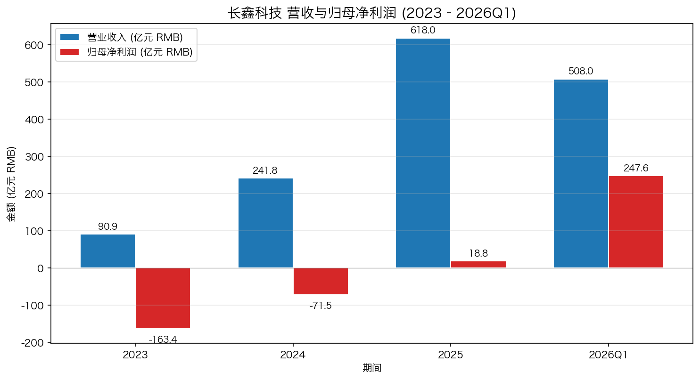
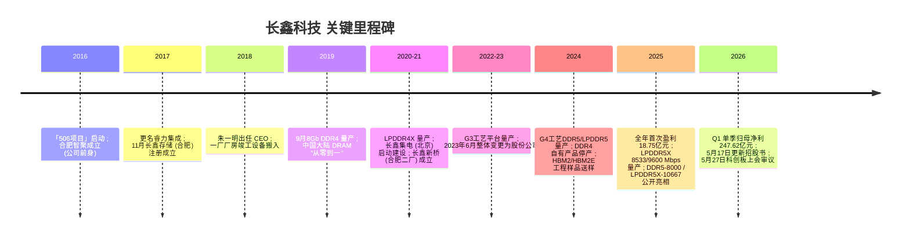
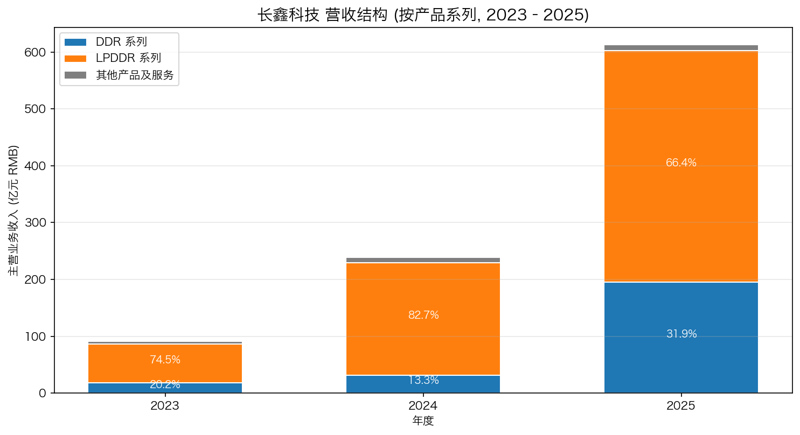
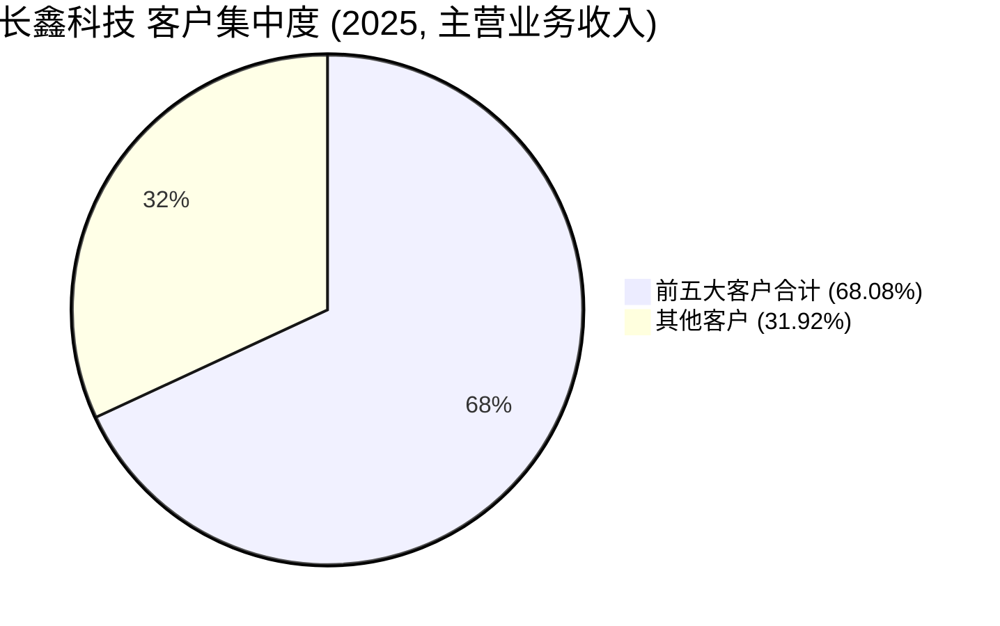
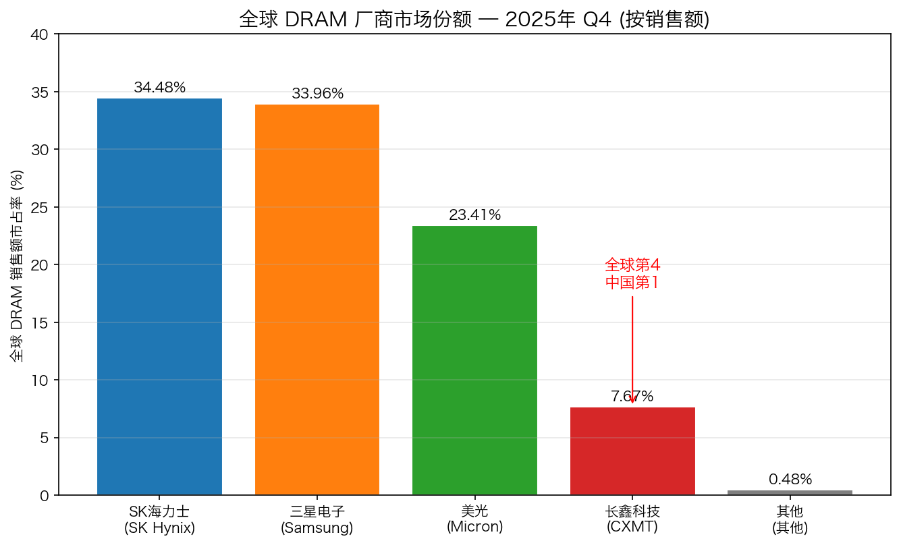

# 长鑫科技集团股份有限公司（长鑫存储 / CXMT Corporation）公司研究

**报告日期：** 2026年5月25日（招股说明书申报稿截至 2026年5月17日）

**披露口径：** 公司主体为「长鑫科技集团股份有限公司」（CXMT Corporation），其全资 / 控股子公司「长鑫存储技术有限公司」（CXMT，长鑫存储）系市场长期使用的品牌名。本报告所述「长鑫科技」或「长鑫存储」均指上市主体长鑫科技集团股份有限公司。

> **Update — 首次披露 2026 年上半年业绩预告（2026-05-17）:** 长鑫科技在更新的招股说明书中首次披露 2026 年 1–6 月业绩预告，预计营业收入 RMB 1,100–1,200 亿元（同比 +612.53% 至 +677.31%），归母净利润 RMB 500–570 亿元（同比 +2,244.03% 至 +2,544.19%）。这一指引将公司从 2025 年首次扭亏的 18.75 亿元归母净利润，一举抬升至上半年 500 亿元起，主要驱动为全球 DRAM 进入 AI 推动的「超级周期」、合约价自 2025 年下半年起持续大幅上涨、叠加公司 DDR5/LPDDR5/5X 产品结构持续优化。
> 来源：[长鑫科技 招股说明书 (申报稿) 第 29–30 页, 2026-05-17](https://static.sse.com.cn/stock/disclosure/announcement/c/202605/002170_20260517_MGLN.pdf)。

---

## 目录

1. 公司概览
2. 公司历史
3. 管理团队
4. 产品与服务
5. 客户与上市策略
6. 行业概览
7. 竞争格局
8. 市场机会
9. 风险评估
10. 参考资料

---

## 1. 公司概览

长鑫科技集团股份有限公司（CXMT Corporation，下称「长鑫科技」、「公司」）是中国大陆唯一一家具备通用型 DRAM（动态随机存取存储器 / Dynamic Random Access Memory）大规模量产能力的研发设计制造一体化（IDM）企业，注册资本 60.19 亿元、总部位于安徽省合肥市经济技术开发区空港工业园兴业大道 388 号，2016 年 6 月 13 日设立、2023 年 6 月 27 日整体变更为股份有限公司。公司业务由旗下「长鑫存储技术有限公司」（合肥）、「长鑫新桥存储技术有限公司」（合肥）和「长鑫集电（北京）存储技术有限公司」三大量产主体共同承担，三家子公司 2025 年末总资产合计占长鑫科技合并报表总资产规模超 88%（[长鑫科技 招股说明书 (申报稿) 第 59 页, 2026-05-17](https://static.sse.com.cn/stock/disclosure/announcement/c/202605/002170_20260517_MGLN.pdf)）。

长鑫科技的商业模式为典型的 IDM——从 DRAM 芯片设计、晶圆制造、芯片封装/测试到模组加工/测试，公司在内部完整承担前道生产链，仅将芯片封装环节及部分测试委外，模组加工/测试为自营与委外结合，IDM 模式保证了工艺平台、设计技术与产品形态的同步迭代。公司向下游通过经销与直销结合的渠道销售 DRAM 晶圆、芯片、模组三类产品方案；2025 年经销模式收入占主营业务收入 85.38%，直销占 14.62%，这一比例三年保持稳定（[长鑫科技 招股说明书 第 123、152 页, 2026-05-17](https://static.sse.com.cn/stock/disclosure/announcement/c/202605/002170_20260517_MGLN.pdf)）。

公司目前在合肥与北京共拥有三座 12 英寸 DRAM 晶圆厂，产能规模位居中国第一、全球第四：合肥经开区天柱山大道 388 号的长鑫存储（一厂）月产能约 11 万片，合肥新淮大道 2788 号的长鑫新桥（二厂）月产能约 8 万片，北京经济技术开发区经海三路 51 号的长鑫集电（北京厂）月产能约 7 万片，三厂叠加 2025 年底产能合计逼近月产 30 万片 12 英寸晶圆（[长鑫科技 招股说明书 第 156–157 页, 2026-05-17](https://static.sse.com.cn/stock/disclosure/announcement/c/202605/002170_20260517_MGLN.pdf)；[钛媒体, 2026-05-17](https://www.tmtpost.com/7992862.html)）。报告期内（2023–2025），公司晶圆产能利用率从 87.06% 攀升至 95.73%，按容量口径产销率分别为 99.45%、97.94%、90.67%，反映规模化产线接近满产，产销快速兑现（[长鑫科技 招股说明书 第 151 页, 2026-05-17](https://static.sse.com.cn/stock/disclosure/announcement/c/202605/002170_20260517_MGLN.pdf)）。

营收与盈利方面，公司在过去三年完成了「从亏损扩张到首次盈利」的转折。2023–2025 年营业收入分别为 90.87 亿元、241.78 亿元、617.99 亿元，复合增长率达 160.78%；归母净利润从 -163.40 亿元、-71.45 亿元收窄至 +18.75 亿元，2025 年首次实现年度盈利（[长鑫科技 招股说明书 第 27 页, 2026-05-17](https://static.sse.com.cn/stock/disclosure/announcement/c/202605/002170_20260517_MGLN.pdf)）。进入 2026 年，受 AI 算力需求拉动的 DRAM 行业「超级周期」（详见第 6 章）的助推，公司 Q1 单季营业收入 508 亿元（同比 +719.13%）、归母净利润 247.62 亿元（同比 +1,688.30%），单季利润已超过此前三年累计亏损（[长鑫科技 招股说明书 第 29 页, 2026-05-17](https://static.sse.com.cn/stock/disclosure/announcement/c/202605/002170_20260517_MGLN.pdf)）。截至 2026 年 3 月 31 日，公司总资产 3,881.66 亿元、归母净资产 817.24 亿元，资产负债率从 2023 年的 66.22% 降至 2026Q1 的约 51%。


*数据来源：[长鑫科技 招股说明书 第 27、29 页, 2026-05-17](https://static.sse.com.cn/stock/disclosure/announcement/c/202605/002170_20260517_MGLN.pdf)。*

公司是中国国家集成电路产业基金（俗称「大基金」）二期与合肥市国资体系合力扶持的代表性项目，五位 5% 以上股东合计持有 58.39% 的股份：清辉集电 21.67%（背后为芯睿投资 51.09% 与合肥长鑫集成 48.90%，最终穿透至合肥市国资委及国家大基金）、长鑫集成 11.71%（合肥市产业投资控股 100% 持股，合肥市国资委实控）、大基金二期 8.73%、合肥集鑫 8.37%、安徽省投 7.91%（[长鑫科技 招股说明书 第 77–80 页, 2026-05-17](https://static.sse.com.cn/stock/disclosure/announcement/c/202605/002170_20260517_MGLN.pdf)）。兆易创新（SSE:603986）持股约 0.95%，其董事长朱一明同时担任长鑫科技董事长（[长鑫科技 招股说明书 第 39 页, 2026-05-17](https://static.sse.com.cn/stock/disclosure/announcement/c/202605/002170_20260517_MGLN.pdf)）。员工总数 19,298 人（截至 2025 年 12 月 31 日），其中研发人员 6,259 人、占比 32.43%（[长鑫科技 招股说明书 第 115、165 页, 2026-05-17](https://static.sse.com.cn/stock/disclosure/announcement/c/202605/002170_20260517_MGLN.pdf)）。

**估值快照（一级市场口径，公司尚未上市）：** 长鑫科技选择科创板第四套上市标准——「预计市值不低于人民币 30 亿元，且最近一年营业收入不低于人民币 3 亿元」——拟公开发行不超过 1,062,225.9999 万股、占发行后总股本不低于 10%，由中金公司与中信建投联席保荐，募资 295 亿元（[长鑫科技 招股说明书 第 23–24、30 页, 2026-05-17](https://static.sse.com.cn/stock/disclosure/announcement/c/202605/002170_20260517_MGLN.pdf)）。市场预期估值在 RMB 3,000 亿元 至 USD 420 亿（约 RMB 3,000 亿）区间，对应 2025 年 P/E 约 160 倍、TTM P/E（剔除 2026Q1 暴利后）约 6–12 倍（按 2026 半年报指引中值 535 亿净利润年化）、2025 年 P/S 约 4.9 倍（[Douglas Research / Smartkarma, 2026-04](https://douglasresearch.substack.com/p/initial-thoughts-on-the-changxin)；[第一财经/财联社, 2026-04-23](https://www.cls.cn/detail/2078242)）。可比对照：SK 海力士 2025 P/E 约 8.2 倍、P/B 约 2.7 倍；三星电子 2025 P/E 约 14.8 倍；美光 (NASDAQ:MU) FY2025 P/E 约 15.7 倍——这些海外可比的多倍数均处于 DRAM 周期上行阶段的「相对低位」（[Stockanalysis.com — Micron 估值, 截至 2026-05](https://stockanalysis.com/stocks/mu/financials/)）。若长鑫科技 2026 年全年归母净利润落于市场预期的 1,100–1,400 亿元区间，3,000 亿元市值对应 2026E P/E 约 2.1–2.7 倍，**显著低于海外同业的 8–15 倍区间**——既可解读为「中国 DRAM 唯一标的的稀缺性溢价被弱化」，亦可解读为「市场对 2026 年下半年 DRAM 价格回调、HBM3 量产时点不确定的折扣」（[CXMT Gears Up Post-IPO — economy.ac, 2026-02](https://economy.ac/news/2026/02/202602288291)）。负 P/E 区间（2023–2024 累亏 234.85 亿）系产能爬坡阶段折旧摊销、研发投入大额计提与 DRAM 行业 2022–2023 年下行周期所致，2025 年同步周期复苏与规模效应释放后扭亏（[长鑫科技 招股说明书 第 27 页, 2026-05-17](https://static.sse.com.cn/stock/disclosure/announcement/c/202605/002170_20260517_MGLN.pdf)）。

## 2. 公司历史

长鑫科技的源起可回溯至 2016 年 5 月 6 日（俗称「506 项目」），其时兆易创新（SZSE 后改 SSE:603986）董事长朱一明与合肥市政府主要领导探讨在合肥布局存储器项目（[与非网 — 朱一明专访, 2025-08](https://www.eefocus.com/article/425237.html)）。2016 年 6 月 13 日合肥智聚集成电路有限公司（公司前身）由合肥才聚出资设立，注册资本 1,000 万元；2017 年 4 月 17 日更名为「睿力集成电路有限公司」（[长鑫科技 招股说明书 第 36–37 页, 2026-05-17](https://static.sse.com.cn/stock/disclosure/announcement/c/202605/002170_20260517_MGLN.pdf)）。彼时朱一明先生于 2018 年 7 月正式接任合肥长鑫与睿力集成 CEO（[chinaflashmarket, 2018-07](https://www.chinaflashmarket.com/News/2018-07/162342)）。2017 年 11 月 16 日 全资子公司「长鑫存储技术有限公司」在合肥经开区注册成立，承担合肥 12 英寸 DRAM 晶圆制造的主体（[长鑫科技 招股说明书 第 60 页, 2026-05-17](https://static.sse.com.cn/stock/disclosure/announcement/c/202605/002170_20260517_MGLN.pdf)）。2019 年 9 月公司推出自主设计生产的 8Gb DDR4 产品，实现中国大陆 DRAM 产业「从零到一」的突破（[长鑫科技 招股说明书 第 116 页, 2026-05-17](https://static.sse.com.cn/stock/disclosure/announcement/c/202605/002170_20260517_MGLN.pdf)）。


*来源：[长鑫科技 招股说明书 第 36–58 页, 2026-05-17](https://static.sse.com.cn/stock/disclosure/announcement/c/202605/002170_20260517_MGLN.pdf)；[长鑫存储 (中文维基), 截至 2026-05](https://zh.wikipedia.org/zh-cn/%E9%95%BF%E9%91%AB%E5%AD%98%E5%82%A8)；[Wccftech IC China 2025 — DDR5-8000 / LPDDR5X-10667 unveiling, 2025-11](https://wccftech.com/cxmt-debuts-domestically-produced-ddr5-memory-8000-mtps-lpddr5-10667-mtps/)。*

公司发展中有两次关键战略转折值得记录。**第一次是「跳代研发」（leapfrog R&D）战略的确立。** 2017–2019 年技术导入期，公司从 23.8nm（G1 工艺平台）切入 DRAM，量产 8Gb DDR4；其后跳过国内同行业历经的多次小幅迭代节点，直接在 18nm（G3 工艺平台）实现 LPDDR4X 量产，再以 17nm（G4 工艺平台）实现 DDR5/LPDDR5/5X 量产。这一「跳代」策略将公司与三星/SK 海力士/美光的工艺代差从 5+ 代缩窄至 1–2 代（[长鑫科技 招股说明书 第 124、148 页, 2026-05-17](https://static.sse.com.cn/stock/disclosure/announcement/c/202605/002170_20260517_MGLN.pdf)；[TechInsights — China Enters 2025 with Big Memory Breakthroughs, 2025-01](https://www.techinsights.com/blog/china-enters-2025-big-memory-breakthroughs)）。

**第二次是双地、三厂的产能布局。** 2020–2021 年公司启动北京 / 合肥双中心扩张：长鑫集电（北京，2020 年 7 月并表）由长鑫科技与北京亦庄国投各持 31.72%、大基金二期持 24.67% 共同建设；长鑫新桥（合肥，2021 年 1 月成立）由长鑫芯安、鑫益合升、大基金二期、合肥产投与长鑫科技分别持股 27.33% / 27.09% / 26.99% / 15.24% / 3.35%，公司通过一致行动协议合计掌握超过 2/3 表决权（[长鑫科技 招股说明书 第 60–65 页, 2026-05-17](https://static.sse.com.cn/stock/disclosure/announcement/c/202605/002170_20260517_MGLN.pdf)）。双地三厂架构的战略动因明确：1）合肥市国资 + 国家大基金共同分担前期百亿级资本开支；2）北京厂临近清华系晶圆工艺人才；3）地理分散降低单点供应风险，亦为后续上海 HBM 后道封装基地（计划 2026 年底建成）腾出选址空间（[Tom's Hardware — China 2026 HBM3 production, 2025-09](https://www.tomshardware.com/pc-components/dram/chinese-semiconductor-industry-gears-up-for-domestic-hbm3-production-by-the-end-of-2026-cxmt-to-produce-chips-while-naura-maxwell-and-u-preseason-design-tools-for-assembly)）。

2023 年 6 月 26–27 日，睿力集成基于德勤审计的截至 2023 年 3 月 31 日 670.63 亿元净资产，按 1:0.7997 比例折为股本，整体变更为「长鑫科技集团股份有限公司」，注册资本 536.33 亿元，发起人 49 名（[长鑫科技 招股说明书 第 38–40 页, 2026-05-17](https://static.sse.com.cn/stock/disclosure/announcement/c/202605/002170_20260517_MGLN.pdf)）。2025 年 12 月公司向上交所提交科创板预先审阅申请并被受理，2026 年 5 月 17 日更新申报稿、5 月 27 日上市审核委员会召开第 27 次会议审议公司首发事项（[第一财经/财联社, 2026-04-25](https://www.cls.cn/detail/2373552)；[财联社 上会日程, 2026-05-21](https://www.stcn.com/article/detail/3918707.html)）。

## 3. 管理团队

**朱一明先生（董事长，1972年7月生）—— 公司「灵魂人物」、长鑫科技与兆易创新两家千亿级半导体公司的共同董事长**

朱一明出生于江苏盐城，清华大学物理学学士与硕士、纽约州立大学石溪分校（SUNY Stony Brook）电气工程硕士。1997–1998 年于北京安美消防技术服务公司任职，2000–2004 年先后在 ipolicy Networks 与 Monolithic System Technologies 担任资深工程师与项目主管。2004 年于美国创办 GigaDevice Semiconductor Inc.，是其在半导体领域的首次创业（[百度百科 — 朱一明, 截至 2026-05](https://baike.baidu.com/item/%E6%9C%B1%E4%B8%80%E6%98%8E/8904184)；[21经济网 — 朱一明深度专访, 2026-01-04](https://www.21jingji.com/article/20260104/herald/67bbeabf0dd3a5bf0d973b49cd337caf.html)）。

2005 年 4 月朱一明回国创办北京兆易创新科技股份有限公司（兆易创新，SSE:603986），从串行 NOR Flash 起步，在 2013 年成为全球 NOR Flash 第三大、中国第一大供应商，2016 年 8 月 18 日兆易创新于上交所主板上市（[兆易创新 (SSE:603986) 上交所披露页](http://www.sse.com.cn/disclosure/listedinfo/announcement/?productId=603986)；[21经济网 — 朱一明深度专访, 2026-01-04](https://www.21jingji.com/article/20260104/herald/67bbeabf0dd3a5bf0d973b49cd337caf.html)）。2016 年朱一明与合肥市政府共同发起「506 项目」，2018 年 7 月正式出任合肥长鑫 / 睿力集成 CEO，主导公司从厂房落成、设备搬入、工艺平台搭建到 2019 年 9 月首款 8Gb DDR4 量产的全过程（[chinaflashmarket — 朱一明接任 CEO, 2018-07](https://www.chinaflashmarket.com/News/2018-07/162342)）。

朱一明现任长鑫科技董事长（2021 年 2 月至今）、兆易创新董事长（2005 年 4 月至今）。值得指出的是，朱一明于 2023 年 4 月卸任长鑫科技 CEO 与首席执行官职务（由曹堪宇接任），仅保留董事长一职，反映出经过 5 年技术导入、产线投产、产品量产后，他将日常经营移交专业经营团队的清晰分工思路（[长鑫科技 招股说明书 第 92–93 页, 2026-05-17](https://static.sse.com.cn/stock/disclosure/announcement/c/202605/002170_20260517_MGLN.pdf)）。朱一明持有新加坡永久居留权。在长鑫科技的持股方面，市场公开报道引述招股书相关段落显示朱一明直接 + 间接持股比例约为 2.68%，其对兆易创新（2025 年市值约 1,100 亿元）的持股是其个人净资产的主要来源（[腾讯新闻 — 长鑫科技 IPO，53岁董事长朱一明持股2.68%, 2026-01-05](https://news.qq.com/rain/a/20260105A01SNO00)）。

**曹堪宇先生（首席执行官 / 总裁，1971年生）—— 公司技术研发体系的总设计师**

曹堪宇毕业于清华大学应用物理系，获美国加州大学伯克利分校（UC Berkeley）博士学位，拥有 20 余年半导体行业经验。2002–2005 年先后任职于美国飞利浦半导体股份有限公司、美国 Hyperband comm. 公司；2005–2013 年先后创立北京昆天科微电子有限公司、北京凡达讯科技有限公司；2013–2017 年任 NoVoMem, Inc. NAND 闪存事业部总经理（[长鑫科技 招股说明书 第 93、167 页, 2026-05-17](https://static.sse.com.cn/stock/disclosure/announcement/c/202605/002170_20260517_MGLN.pdf)）。

2017 年 11 月加入公司后，曹堪宇先后任睿力集成执行副总裁、长鑫存储产品研发与技术研发执行副总裁、长鑫集电（北京）总经理；2021 年 6 月起任公司董事，2023 年 4 月起接任 CEO 与总裁。曹堪宇主导了公司研发战略与技术路线图制定，带领团队完成第三代（G3）和第四代（G4）自主工艺技术平台，实现 DDR4 / LPDDR4X、DDR5 / LPDDR5 / LPDDR5X 存储芯片从设计到量产的完整突破，填补了中国大陆相关产品与技术的空白。曹堪宇拥有多项授权发明专利、是国家科技部与工信部专家库成员，2023 年获评首届「国家卓越工程师」称号（[长鑫科技 招股说明书 第 167 页, 2026-05-17](https://static.sse.com.cn/stock/disclosure/announcement/c/202605/002170_20260517_MGLN.pdf)）。除曹堪宇外，技术线核心人员还包括李红文（产品设计中心负责人）、TAN TECK HONG / 陈德鸿（晶圆厂厂长 / 运营副总裁）、王丹（DRAM 核心器件研发）和唐衍哲（DDR 系列产品设计与前沿研究负责人）。

## 4. 产品与服务

> **本章是全报告最重要的章节。** 长鑫科技的产品组合既决定了它在全球 DRAM 市场的竞争位置，也是后续第 5–9 章（客户、行业、竞争、TAM、风险）所有讨论的事实底座。读完本章，读者应能用一句话回答：长鑫科技为什么对中国服务器 / 手机 / PC 厂商重要、为什么对三星 / SK 海力士 / 美光构成现实威胁、以及它的 DDR5 量产与 HBM 路线图为何决定 2026–2028 年的估值上行空间。

### 4.1 产品矩阵——基于招股说明书原表

下表是长鑫科技在《招股说明书 (申报稿)》第 117–119 页公开披露的产品矩阵原表（DRAM 芯片层面）。表中所有容量、速率、应用领域引述均直接来自招股书原文（[长鑫科技 招股说明书 第 117–120 页, 2026-05-17](https://static.sse.com.cn/stock/disclosure/announcement/c/202605/002170_20260517_MGLN.pdf)）：

| 产品系列 | 产品类型 | 容量规格 | 速率 (最高) | 位宽 | 主要应用领域 |
|---|---|---|---|---|---|
| DDR | DDR4 | 8Gb / 16Gb | 3,200 Mbps | 4 / 8 / 16 bit | 服务器、台式电脑、笔记本电脑、其他消费类产品（2024 年底起自有产品停产） |
| DDR | **DDR5** | 16Gb / 24Gb / 32Gb | **8,000 Mbps** | 4 / 8 / 16 bit | 服务器、台式电脑、笔记本电脑、其他消费类产品 |
| LPDDR | LPDDR4X | 8GB 以下 / 8GB / 12GB / 16GB | 4,266 Mbps | — | 手机、平板电脑、笔记本电脑、可穿戴 |
| LPDDR | **LPDDR5/5X** | 6GB / 8GB / 12GB / 16GB | **10,667 Mbps** | — | 中高端手机、笔记本电脑、AIoT |

模组层面，公司基于自有原厂芯片生产 RDIMM、MRDIMM、UDIMM/CUDIMM、SODIMM/CSODIMM、LPCAMM 等多种类型，速率上 DDR5 模组最高 8,000 Mbps、LPCAMM 基于 LPDDR5X、容量从 8GB 一路覆盖到 128GB——这一覆盖度与三星 / SK 海力士 / 美光对齐，与中国台湾的南亚科技形成显著差距（[长鑫科技 招股说明书 第 119–120 页, 2026-05-17](https://static.sse.com.cn/stock/disclosure/announcement/c/202605/002170_20260517_MGLN.pdf)）。

```mermaid
graph TD
    CXMT[长鑫科技 DRAM IDM]
    CXMT --> DDR[DDR 系列]
    CXMT --> LPDDR[LPDDR 系列]
    CXMT --> Module[DRAM 模组]
    CXMT --> Wafer[DRAM 晶圆 (少量直销)]
    DDR --> DDR4[DDR4 8/16Gb @3200Mbps - 已停产]
    DDR --> DDR5[DDR5 16/24/32Gb @8000Mbps]
    LPDDR --> LP4X[LPDDR4X 8-16GB @4266Mbps]
    LPDDR --> LP5[LPDDR5/5X 6-16GB @10667Mbps]
    Module --> Server[RDIMM / MRDIMM - 服务器]
    Module --> PC[UDIMM / CUDIMM - 台机]
    Module --> Laptop[SODIMM / CSODIMM - 笔电]
    Module --> HiEnd[LPCAMM - 高性能笔电/工作站]
```
*来源：[长鑫科技 招股说明书 第 118–120 页, 2026-05-17](https://static.sse.com.cn/stock/disclosure/announcement/c/202605/002170_20260517_MGLN.pdf)。*

### 4.2 综合：产品矩阵如何拼成下游应用闭环

DRAM 是 CPU / GPU / SoC 与存储之间的「主内存」，无论数据中心、智能手机还是 PC，都需要从字节级随机访问的内存中读取活跃工作集（working set）。长鑫科技的产品矩阵正好覆盖了三大下游：DDR 系列（DDR4、DDR5）对应服务器与 PC——通过 RDIMM/MRDIMM 模组接入服务器主板、通过 UDIMM/SODIMM 接入桌面与笔电主板；LPDDR 系列（LPDDR4X、LPDDR5/5X）对应「移动设备 / 终端」（mobile / portable）——以 PoP（package-on-package）或 uPoP 形态直接堆叠在手机 SoC 之上、或以 LPCAMM 形态进入高性能笔电与移动工作站（[长鑫科技 招股说明书 第 118–120、163 页, 2026-05-17](https://static.sse.com.cn/stock/disclosure/announcement/c/202605/002170_20260517_MGLN.pdf)）。从行业演进看，下游对 DRAM 的核心需求是：**更大容量、更高速率、更低功耗**——这三者构成了 DRAM 制造商的竞争维度，也对应了长鑫科技四代工艺平台（G1 → G3 → G4，G5 在研）的迭代方向。

### 4.3 DDR 系列——服务器与 PC 主内存

**DDR4 (Double Data Rate 4，第四代双倍数据速率内存)**

> **招股说明书原文摘引：** 「公司凭借长期的技术积累与创新，推出了自主设计、研发、生产的 DDR4 芯片，公司的 DDR4 芯片具备多领域的应用支持能力，可以满足多产品组合使用需求，为数据存储和高速传输提供高可靠性保障。目前，公司结合下游应用市场发展趋势，通过技术迭代推出了 DDR5 等新代际产品。2024 年底以来，长鑫科技自有 DDR4 产品已停止生产。」（[长鑫科技 招股说明书 第 118 页, 2026-05-17](https://static.sse.com.cn/stock/disclosure/announcement/c/202605/002170_20260517_MGLN.pdf)）

**中文释义 / Plain-language gloss:** DDR4 是 2014 年起进入主流市场、并在 2015–2024 年间统治服务器与 PC 主内存的代际标准。它以 1.2V 工作电压、最高 3,200 Mbps 的 I/O 速率（interface speed / 接口速率）与 8Gb–16Gb 的单颗粒密度（die density / 颗粒密度）取代了 DDR3。长鑫的 DDR4 是公司「从零到一」的破壁产品——2019 年 9 月首批 8Gb DDR4 商业化量产，标志着中国大陆首次具备通用型 DRAM 自产能力（[长鑫科技 招股说明书 第 116 页, 2026-05-17](https://static.sse.com.cn/stock/disclosure/announcement/c/202605/002170_20260517_MGLN.pdf)）。但 DDR4 在 2024 年下半年起进入「淘汰期」——三星、SK 海力士、美光均宣布将停止 DDR4 主流量产、把产能腾给 DDR5 与 HBM。长鑫主动跟进，2024 年底自有 DDR4 产品停产，反映公司「跟随海外大厂的代际迁移」节奏与对 DDR5/LPDDR5 长期价值的优先取舍（[Caixin Global — China's CXMT Takes Aim at Global Leaders With High-End DDR5 Memory Chips, 2025-11-26](https://www.caixinglobal.com/2025-11-26/chinas-cxmt-takes-aim-at-global-leaders-with-high-end-ddr5-memory-chips-102386784.html)）。

*分析师观点：* 公司 DDR4 停产并不意味着 DDR4 业务终结——长鑫旗下子公司长鑫新桥 / 集电仍可对外提供晶圆代工服务支撑兆易创新、北京君正等 DDR4 IP 厂商，因此「停产」应理解为「停止自有品牌 DDR4 出货」、而非「停止 DDR4 产能输出」（行业有观察该策略，但不见于招股书原文）。

**DDR5 (Double Data Rate 5)**

> **招股说明书原文摘引：** 「随着新一代信息技术的发展……DDR5 作为新一代 DDR 内存芯片，凭借更高的带宽和更低的功耗，正在快速取代 DDR4，应用于中高端市场。基于目前 DRAM 产品的迭代趋势，公司推出了 DDR5 产品并完成量产，产品性能达到国际先进水平，广泛应用于服务器、个人电脑等领域。」（[长鑫科技 招股说明书 第 118 页, 2026-05-17](https://static.sse.com.cn/stock/disclosure/announcement/c/202605/002170_20260517_MGLN.pdf)）

**中文释义 / Plain-language gloss:** DDR5 是 2021 年由 JEDEC 颁布标准、2022–2024 年从服务器铺向 PC 的代际升级，对比 DDR4 主要差异在于：1）I/O 速率从 3,200 Mbps 起跳，提升至 4,800/6,400/8,000 Mbps 主流速率；2）工作电压从 1.2V 降至 1.1V，能效（power efficiency）提升 ~30%；3）引入 on-die ECC（die 内纠错码，本片错误纠正能力，避免数据中心 row hammer / 行锤击攻击导致的 silent data corruption / 静默数据腐败）；4）单颗粒密度从 16Gb 上升至 24/32Gb，单条 DDR5 RDIMM 容量从 32GB 推到 128GB+ 区间；5）每个 DDR5 模组内置 PMIC（power management IC, 电源管理芯片），分担主板供电负担（[Wccftech — CXMT debuts domestically-produced DDR5, 2025-11](https://wccftech.com/cxmt-debuts-domestically-produced-ddr5-memory-8000-mtps-lpddr5-10667-mtps/)；[长鑫科技 招股说明书 第 162 页, 2026-05-17](https://static.sse.com.cn/stock/disclosure/announcement/c/202605/002170_20260517_MGLN.pdf)）。

长鑫的 DDR5 是公司当前最重要的「上量品」：2024 年下半年开始量产、2024 年底良率（yield rate / 良率）报道达 80%、2025 年良率目标 90%（[TrendForce — CXMT 80% DDR5 yield, 2024-12-30](https://www.trendforce.com/news/2024/12/30/news-chinese-dram-giant-cxmt-reportedly-achieves-80-ddr5-yield-targeting-90-by-2025/)；[新浪科技 — 长鑫存储 DDR5 良率 80% 左右, 2024-12-24](https://finance.sina.com.cn/tech/discovery/2024-12-24/doc-ineahtaz4045543.shtml)）。2025 年 11 月 IC China 2025 长鑫公开展示 16Gb / 24Gb 容量、速率 8,000 MT/s 的 DDR5 颗粒，并将其封装到 UDIMM / SODIMM / RDIMM / CSODIMM / CUDIMM / TFF MRDIMM 全形态模组——意味着公司一次性覆盖了从服务器到笔电的全部 DDR5 模组形态（[Wccftech — CXMT DDR5-8000 / LPDDR5X-10667, 2025-11](https://wccftech.com/cxmt-debuts-domestically-produced-ddr5-memory-8000-mtps-lpddr5-10667-mtps/)；[Tom's Hardware — CXMT new chipmaking capabilities despite US restrictions, 2025-11-24](https://www.tomshardware.com/pc-components/dram/chinas-banned-memory-maker-cxmt-unveils-surprising-new-chipmaking-capabilities-despite-crushing-us-export-restrictions-ddr5-8000-and-lpddr5x-10667-displayed)）。

*分析师观点：* DDR5 是长鑫从「PC / 消费类 DDR4 替代品」跃升到「数据中心战略卖家」的关键产品——其全球 DDR5 良率从 2024Q4 80% 向 2025–2026 年 90% 推进的速度，决定了它能否在 2026–2027 年 AI 服务器 DDR5 主内存需求高峰中分到关键份额。长鑫的 DDR5 直接竞争对手在三星（005930.KS）、SK 海力士（000660.KS）、美光（NASDAQ:MU）——这三家在服务器 DDR5 64GB 以上规格上「均已量产」、并领先长鑫至少 12–18 个月（[长鑫科技 招股说明书 第 147–149 页 服务器领域产品对比表, 2026-05-17](https://static.sse.com.cn/stock/disclosure/announcement/c/202605/002170_20260517_MGLN.pdf)）。

### 4.4 LPDDR 系列——移动设备 + AIoT 与车载

**LPDDR4X (Low Power DDR4X)**

> **招股说明书原文摘引：** 「LPDDR 芯片通过减小存储器与 CPU 之间的导线电阻和通道宽度实现低功率的运行，主要应用于智能手机、平板电脑等便携式设备……公司的 LPDDR4X 芯片兼具大容量、高速率、高带宽和低功耗的特点……目前已进入小米、OPPO、vivo、传音、联想等主流厂商供应链，在智能手机等终端产品中实现广泛应用。」（[长鑫科技 招股说明书 第 118–119 页, 2026-05-17](https://static.sse.com.cn/stock/disclosure/announcement/c/202605/002170_20260517_MGLN.pdf)）

**中文释义 / Plain-language gloss:** LPDDR4X 是 LPDDR4 的低压改良版——核心电压（VDD2）从 1.1V 降至 0.6V，IO 电压（VDDQ）相应下降到 0.6V，相比 LPDDR4 节能 ~30%、相同性能下功耗显著下降。其封装形态以 PoP（package-on-package，封装级堆叠）或 uPoP（micro PoP）形式直接叠加在手机 SoC 之上，物理上把 DRAM 与主芯片黏在一起以减少互连损耗。长鑫的 LPDDR4X 是公司在中端智能手机渠道「跑量」的主力——产品已大批量进入小米、OPPO、vivo、传音、荣耀、联想供应链，是当前 LPDDR 系列 66.43% 主营收入占比的主要贡献来源（详见 4.7）（[长鑫科技 招股说明书 第 118–119、151 页, 2026-05-17](https://static.sse.com.cn/stock/disclosure/announcement/c/202605/002170_20260517_MGLN.pdf)）。

**LPDDR5/5X**

> **招股说明书原文摘引：** 「公司自主设计研发生产的 LPDDR5/5X 芯片具备大容量、高速率、超低功耗与高安全性等特性……公司 LPDDR5/5X 芯片加入了强大的 RAS 功能，通过内置纠错码（On-die ECC）等技术，能够实现实时纠错，有效减少系统故障……公司 LPDDR5/5X 内存芯片能够有效满足中高端智能手机、笔记本电脑、AIoT 等市场需求，相关产品目前已进入小米、传音等品牌供应链。」（[长鑫科技 招股说明书 第 119 页, 2026-05-17](https://static.sse.com.cn/stock/disclosure/announcement/c/202605/002170_20260517_MGLN.pdf)）

**中文释义 / Plain-language gloss:** LPDDR5/5X 是 2019/2021 年 JEDEC 标准、对应 5G 手机和 AI 手机的代际升级——核心技术包括：1）速率从 LPDDR4X 的 4,266 Mbps 提升到 8,533 / 9,600 / 10,667 Mbps；2）DVFS（dynamic voltage and frequency scaling，电压频率动态调整）使芯片可以根据负载实时降压降频；3）on-die ECC 提升数据完整性，对边缘 AI 推理至关重要；4）单颗粒密度 16Gb，整条 LPCAMM 模组可达 64GB（[长鑫科技 招股说明书 第 162 页, 2026-05-17](https://static.sse.com.cn/stock/disclosure/announcement/c/202605/002170_20260517_MGLN.pdf)）。

长鑫 LPDDR5X 于 2025 年 5 月正式量产，2025 年 5 月起 8,533 Mbps 与 9,600 Mbps 版本量产交付，2025 年 11 月 IC China 展示中 10,667 Mbps 高端型号公开亮相（[TrendForce — CXMT confirms LPDDR5X mass production began in May, 2025-10-29](https://www.trendforce.com/news/2025/10/29/news-cxmt-confirms-lpddr5x-mass-production-began-in-may-high-speed-variant-under-customer-trials/)；[VideoCardz — CXMT LPDDR5X-10667, 2025-11](https://videocardz.com/newz/chinese-cxmt-to-produce-ddr5-8000-and-lpddr5x-10667-memory)）。

*分析师观点：* LPDDR5X 是长鑫产品中**最具技术含量、最贴近国际领先水平**的产品，10,667 Mbps 速率与三星 LPDDR5X-10700、SK 海力士 LPDDR5T-9600 处于同一性能区间——这在主流消费类智能手机端，意味着长鑫具备替代海外大厂为 OPPO / vivo / 小米提供旗舰机 LPDDR5X 的实力（即使 iPhone 与 Galaxy S 旗舰仍以三星 / SK 为主）（[Caixin Global — China's CXMT Takes Aim at Global Leaders, 2025-11](https://www.caixinglobal.com/2025-11-26/chinas-cxmt-takes-aim-at-global-leaders-with-high-end-ddr5-memory-chips-102386784.html)）。

### 4.5 DRAM 模组——RDIMM / MRDIMM / UDIMM / SODIMM / CSODIMM / LPCAMM

公司从 2023 年起逐步进入下游模组业务，2025 年 DRAM 模组销售已涵盖：

- **RDIMM (Registered DIMM, 寄存式内存条)**：服务器主流模组，前端集成 RCD（register clock driver, 寄存时钟驱动器）以分担主板负担，长鑫 DDR4/DDR5 RDIMM 已规模化出货；
- **MRDIMM (Multiplexed Rank DIMM)**：JEDEC 2024 年新标准，通过多路复用实现两组 rank 同时驱动，速率较普通 RDIMM 提升 30–40%，对应 AI 服务器；
- **UDIMM / CUDIMM (Unbuffered / Clocked Unbuffered DIMM)**：DDR5 时代桌面 PC 主流，CUDIMM 比 UDIMM 多了 CKD（clock driver）芯片；
- **SODIMM / CSODIMM**：笔记本主流模组，CSODIMM 同样加入 CKD；
- **LPCAMM (Low-Power Compression Attached Memory Module)**：基于 LPDDR5X，适用高性能笔电、移动工作站（如 Surface Laptop Studio、ThinkPad P 系列）（[长鑫科技 招股说明书 第 119–120 页, 2026-05-17](https://static.sse.com.cn/stock/disclosure/announcement/c/202605/002170_20260517_MGLN.pdf)）。

**中文释义 / Plain-language gloss:** 模组业务对长鑫的战略意义在于「**向价值链下游延伸捕获更高附加值**」——单纯卖 DRAM 颗粒（die），毛利率受国际现货价格波动影响极大；卖整条模组则可以将颗粒、PMIC、PCB、SPD（serial presence detect, 串行检测）、CKD 等多个 BoM 项一起打包给客户，客户能直接装机，公司能锁定更长周期、更高价格、更稳定的客户关系。模组业务的另一战略价值是「**绑定服务器与 PC 系统厂商**」——出货 RDIMM 给联想、字节跳动、阿里云、腾讯需要通过严苛的 OEM 验证，一旦通过即形成多季度的稳定合作（[长鑫科技 招股说明书 第 117 页, 2026-05-17](https://static.sse.com.cn/stock/disclosure/announcement/c/202605/002170_20260517_MGLN.pdf)）。

### 4.6 HBM (High Bandwidth Memory)——尚未量产但关键的长期布局

长鑫的招股说明书并未在正式产品矩阵中披露 HBM 产品，反映 HBM 当前仍处于「研发与小规模送样」阶段而非「商业化量产」（[长鑫科技 招股说明书 第 165–166 页 研发项目, 2026-05-17](https://static.sse.com.cn/stock/disclosure/announcement/c/202605/002170_20260517_MGLN.pdf)）。但行业第三方信源密集报道公司在 HBM 上的关键进展：

- 摩根士丹利 2025 年 Q2 渠道访谈表示长鑫已向客户交付 HBM2E 工程样品，预计 2026 年上半年实现小批量量产（[Morgan Stanley channel check, 引自 @Jukanlosreve, 2025-05](https://x.com/Jukanlosreve/status/1927517527036608737)）；
- DigiTimes 2025 年 9 月报道长鑫目标 2026 年实现 HBM3E 量产，缩小与三星 / SK 海力士的代差至 2 年（[DigiTimes — CXMT HBM3E mass production, 2025-09-11](https://www.digitimes.com/news/a20250911PD210/cxmt-hbm3e-production-sk-hynix-samsung.html)）；
- 2025 年 10 月报道长鑫已向华为及其合作伙伴交付 16nm（G4 工艺平台）HBM3 样品（[DigiTimes — CXMT, Huawei align on HBM3, 2025-10-23](https://www.digitimes.com/news/a20251023PD208/cxmt-hbm3-2026-dram-huawei.html)）；
- 2026 年 4 月报道长鑫 HBM3 大规模量产时间表存在不确定性、可能推迟至 2027 年，主要瓶颈是后道封装（TSV、wafer bonding / 晶圆键合、stacking / 多层堆叠）的良率学习曲线（[DigiTimes — CXMT HBM3 timeline slips, 2026-04-21](https://www.digitimes.com/news/a20260421PD230/cxmt-hbm3-dram-production-2026.html)）；
- 公司在上海建设的 HBM 后道封装基地预计 2026 年底完成，瞄准 HBM3 量产（[Tom's Hardware — China HBM3 by end-2026, 2025-09](https://www.tomshardware.com/pc-components/dram/chinese-semiconductor-industry-gears-up-for-domestic-hbm3-production-by-the-end-of-2026-cxmt-to-produce-chips-while-naura-maxwell-and-u-preseason-design-tools-for-assembly)）。

**中文释义 / Plain-language gloss:** HBM 即「高带宽内存」(High Bandwidth Memory)，是 2015 年 JEDEC 标准引入、以 4–12 层 DRAM die 通过 TSV（through-silicon via，硅通孔）垂直堆叠、并通过中介层（interposer / 硅中介层）与 GPU 集成的高带宽存储结构。HBM 是 AI 服务器 GPU（NVIDIA H100/H200/B100、AMD MI300、华为昇腾）的唯一主内存方案——每个 H100 GPU 配有 80GB HBM3、提供 3.35 TB/s 带宽，远超 DDR5 主内存的 0.4 TB/s。HBM 当前由 SK 海力士（占全球约 50% 份额，独家垄断 NVIDIA H100/H200 配套）、三星与美光（各约 25%）三家寡占；2024–2025 年 HBM 单价为标准 DDR5 颗粒的 5–8 倍、是 DRAM 单位毛利最高的产品类型（[ChinaTalk — Mapping China's HBM Advances, 2025](https://www.chinatalk.media/p/mapping-chinas-hbm-advancement)）。

*分析师观点：* 长鑫的 HBM 路线图是公司**长期估值的「上方期权」（call option）**——若 2026 H2 量产 HBM2E、2027–2028 量产 HBM3 / HBM3E、与华为昇腾 / 寒武纪 / 摩尔线程的国产 GPU 配套形成闭环，公司将成为中国 AI 训练算力链的唯一国产 HBM 供应商；反之，若后道封装良率瓶颈持续，公司将仍以 DDR / LPDDR 为主收入来源、与三星 / SK 海力士 / 美光在 HBM 时代的差距扩大。需要明确指出的是，**公司招股书并未对 HBM 量产时间作出任何承诺**，第三方报道的 HBM 时间表均不构成公司公开承诺。

### 4.7 收入结构与旗舰产品

2025 年公司主营业务收入 612.75 亿元，其中 LPDDR 系列 407.04 亿元（66.43%）、DDR 系列 195.31 亿元（31.87%）、其他产品及服务（晶圆代工、技术服务、光罩等）10.41 亿元（1.70%）（[长鑫科技 招股说明书 第 120、152 页, 2026-05-17](https://static.sse.com.cn/stock/disclosure/announcement/c/202605/002170_20260517_MGLN.pdf)）。注意 2024 年 LPDDR 系列占比达 82.74% 的极高水平，反映彼时 DDR4 收入下滑（淘汰期）而 DDR5 尚未规模放量、LPDDR4X 在中国手机厂商出货爆发的「过渡期结构」；2025 年随着 DDR5 大规模放量，DDR 占比回升至 31.87%——这一占比将在 2026–2027 年继续提升，因 AI 服务器对 DDR5 / MRDIMM 的需求是 LPDDR 增速的数倍（[TrendForce — AI to consume 20% of global DRAM in 2026, 2025-12-26](https://www.trendforce.com/news/2025/12/26/news-ai-reportedly-to-consume-20-of-global-dram-wafer-capacity-in-2026-hbm-gddr7-lead-demand/)）。


*数据来源：[长鑫科技 招股说明书 第 120 页, 2026-05-17](https://static.sse.com.cn/stock/disclosure/announcement/c/202605/002170_20260517_MGLN.pdf)。*

旗舰品识别：**LPDDR5/5X（中高端手机、AI 端侧）+ DDR5（AI 服务器、PC）+ DRAM 模组（RDIMM、LPCAMM）** 是当下三大支柱；DDR4 已停产为长期收入；HBM 是 2026–2028 年估值上方期权。

### 4.8 工艺平台

公司四代工艺平台对应不同产品代际，招股说明书第 161–162 页清晰披露：第一代（G1，约 23.8nm）已停产；第三代（G3，约 18nm）量产，作为 LPDDR4X 主力工艺；第四代（G4，约 17nm）量产，定位「国际先进水平」，承担 DDR5 / LPDDR5 / 5X；第五代（G5）研发阶段，采用「进一步优化的多重曝光技术」（multi-patterning lithography / 多重曝光光刻）以提升存储密度。除 G1–G5 之外，公司「预研项目」明确涉及 LPDDR6 与 CXL（Compute Express Link，新型内存互联标准）与「存内计算 / 近存计算」（compute-in-memory / processing-near-memory）（[长鑫科技 招股说明书 第 161–166、169 页, 2026-05-17](https://static.sse.com.cn/stock/disclosure/announcement/c/202605/002170_20260517_MGLN.pdf)）。

*分析师观点：* 长鑫的工艺路线避免了对 EUV（极紫外光刻）的依赖——G3 / G4 / G5 均通过 multi-patterning（多重曝光）+ ArF DUV 浸没式光刻实现，因此在 ASML EUV 出口管制下仍可推进。**风险点是 G6+ 节点是否需要 EUV、以及国产 DUV 光刻机的进展节奏**——这超出本报告范围，但属于公司长期工艺路线图的隐性约束（[CSIS — Understanding the Biden Administration's Updated Export Controls, 2024-12](https://www.csis.org/analysis/understanding-biden-administrations-updated-export-controls)；[CRS — U.S. Export Controls and China: Advanced Semiconductors, R48642, 2025](https://www.congress.gov/crs-product/R48642)）。

## 5. 客户与上市策略

公司销售模式以「经销 + 直销」结合，经销商承担市场推广、终端客户开发和资金周转，公司同时保留少量直销客户（主要是头部互联网 / 服务器厂商）。2025 年经销模式收入占主营业务 85.38%、直销 14.62%，三年间结构稳定（[长鑫科技 招股说明书 第 152 页, 2026-05-17](https://static.sse.com.cn/stock/disclosure/announcement/c/202605/002170_20260517_MGLN.pdf)）。

终端客户层面，招股说明书第 25 页和第 32 页明确列出公司「核心客户」名单：阿里云、字节跳动、腾讯、联想、小米、传音、荣耀、OPPO、vivo（[长鑫科技 招股说明书 第 25、32 页, 2026-05-17](https://static.sse.com.cn/stock/disclosure/announcement/c/202605/002170_20260517_MGLN.pdf)）。这九大客户覆盖了中国云计算（阿里 / 字节 / 腾讯）、PC（联想）、智能手机（小米、传音、荣耀、OPPO、vivo）三大主战场——也即中国 DRAM 内需的几乎全部头部出口。

**客户集中度（关键风险点）：** 公司前五大客户合计销售额占主营业务收入比例 2023 年 74.12%、2024 年 67.30%、2025 年 68.08%（[长鑫科技 招股说明书 第 32、151 页, 2026-05-17](https://static.sse.com.cn/stock/disclosure/announcement/c/202605/002170_20260517_MGLN.pdf)）。2024 年新增前五大客户中客户 H 占 7.55%、客户 E 占 7.42%；2025 年新增客户 J 占 9.98%、客户 D 占 6.75%——这意味着前五大客户名单在年度间存在显著轮换，并非长期锁定（[长鑫科技 招股说明书 第 152 页, 2026-05-17](https://static.sse.com.cn/stock/disclosure/announcement/c/202605/002170_20260517_MGLN.pdf)）。招股书披露公司「不存在向单个客户销售比例超过营业收入 50% 或严重依赖少数客户的情况」，即单一客户占比 < 50%（一般大厂会在 10–15% 区间）。


*数据来源：[长鑫科技 招股说明书 第 32、151 页, 2026-05-17](https://static.sse.com.cn/stock/disclosure/announcement/c/202605/002170_20260517_MGLN.pdf)。*

合同结构方面，公司经销商按年度签订框架合作协议、终端客户以季度或半年滚动需求订单形式提货——比 OEM 长合同模式（如汽车 Tier-1）显著更短，反映 DRAM 市场强周期性下「短锁价、按月调价」的行业惯例。这意味着公司议价能力相对客户具有「向上跟随现货市场」的属性，行业上行周期（如 2025 H2 至今）公司毛利率可以快速攀升（2023 年 -2.19% → 2024 年 5.00% → 2025 年 41.02%），但下行周期亦将快速回落（[长鑫科技 招股说明书 第 33 页, 2026-05-17](https://static.sse.com.cn/stock/disclosure/announcement/c/202605/002170_20260517_MGLN.pdf)）。

**上市策略（IPO 规划）：** 公司选择科创板「市值 + 营收」第四套上市标准，拟发行 ≤10.62 亿股新股（占发行后总股本不低于 10%）。募集资金 295 亿元用途明确：75 亿元投入「存储器晶圆制造量产线技术升级改造」（合肥三厂产线升级与扩产）、130 亿元投入「DRAM 存储器技术升级」（G5 工艺与新代产品研发）、90 亿元投入「动态随机存取存储器前瞻技术研究与开发」（HBM、存内计算、CXL、LPDDR6 等预研方向）（[长鑫科技 招股说明书 第 30 页, 2026-05-17](https://static.sse.com.cn/stock/disclosure/announcement/c/202605/002170_20260517_MGLN.pdf)）。保荐机构为中金公司与中信建投联合保荐、德勤华永（Deloitte）担任审计师（[长鑫科技 招股说明书 第 22、28 页, 2026-05-17](https://static.sse.com.cn/stock/disclosure/announcement/c/202605/002170_20260517_MGLN.pdf)）。

## 6. 行业概览

### 6.1 全球 DRAM 行业的结构与节奏

DRAM 是计算机系统中作为「主内存 / Main Memory」的随机存取存储器，与 NAND Flash（非易失性闪存）共同构成存储芯片市场的两大支柱。全球 DRAM 行业有以下结构性特征：

**一、寡占格局。** 自 1980 年代日韩接力以来，DRAM 行业经历了多轮淘汰式整合（最近一次是 2008 年金融危机后德国 Qimonda 破产、2012 年日本 Elpida 并入美光），全球主流厂商已集中至三星电子、SK 海力士、美光科技三家，合计占全球 90% 以上市场份额（[长鑫科技 招股说明书 第 26 页, 2026-05-17](https://static.sse.com.cn/stock/disclosure/announcement/c/202605/002170_20260517_MGLN.pdf)）。2025 年第四季度按销售额计算的市占率：SK 海力士 34.48%、三星 33.96%、美光 23.41%——三巨头合计 91.85%，长鑫 7.67% 列第四，其余 ~0.5% 由南亚科技、华邦电子、力积电（均位于中国台湾）等瓜分（[长鑫科技 招股说明书 第 26、146 页, 2026-05-17](https://static.sse.com.cn/stock/disclosure/announcement/c/202605/002170_20260517_MGLN.pdf)；[Counterpoint Research — Global DRAM and HBM Market Share, 2026](https://counterpointresearch.com/en/insights/global-dram-and-hbm-market-share)）。值得注意的是，SK 海力士在 2025 年依靠 HBM3E 的绝对优势超过三星成为全球第一，**这一交班自 1992 年以来首次发生**（[DigiTimes — China's CXMT muscles into DRAM's top tier, 2025-04](https://www.digitimes.com/news/a20250421PD218/cxmt-dram-samsung-sk-hynix-2025.html)）。

**二、强周期性。** DRAM 是典型的资本密集型行业，新建 12 英寸晶圆厂从规划到满产需 3–5 年；当下游需求因技术迭代或新兴应用（如 AI、5G、自动驾驶）爆发时，厂商难以快速增产，导致短期供不应求、价格大涨；随后头部厂商集中扩产又往往导致供给过剩，行业进入下行周期。叠加宏观经济波动与主要厂商的产能调控策略，DRAM 行业平均 3–4 年完成一轮上行 / 下行循环（[长鑫科技 招股说明书 第 144 页, 2026-05-17](https://static.sse.com.cn/stock/disclosure/announcement/c/202605/002170_20260517_MGLN.pdf)）。


*数据来源：Omdia 2025 Q4 DRAM 销售额统计，引自 [长鑫科技 招股说明书 第 26 页, 2026-05-17](https://static.sse.com.cn/stock/disclosure/announcement/c/202605/002170_20260517_MGLN.pdf)；[Counterpoint Research, 2026](https://counterpointresearch.com/en/insights/global-dram-and-hbm-market-share)。*

### 6.2 当前周期：AI 驱动的「DRAM 超级周期」（2024 H2–2027+）

自 2024 年下半年以来，DRAM 行业进入由生成式 AI（generative AI）需求驱动的「超级周期」，这与历史上前几次周期（PC 内存普及、智能手机普及、云计算 / 服务器普及）类似但更陡峭：

- 单 GB HBM 消耗的 DRAM 晶圆容量约为标准 DRAM 的 4 倍、GDDR7 为 1.7 倍——这意味着 AI 服务器对 DRAM 晶圆总产能的等效消耗显著高于其表面 GB 数（[TrendForce — AI to consume 20% of global DRAM, 2025-12-26](https://www.trendforce.com/news/2025/12/26/news-ai-reportedly-to-consume-20-of-global-dram-wafer-capacity-in-2026-hbm-gddr7-lead-demand/)）；
- Omdia 将 2026 年全球半导体收入增速从此前的 ~30% 大幅上调至 62.7%，主要由 DRAM / NAND 的「严重短缺」驱动（[Omdia — 2026 semiconductor forecast 62.7%, 2026-04](https://omdia.tech.informa.com/pr/2026/apr/omdia-raises-2026-semiconductor-forecast-to-62point7percent-as-ai-drives-global-memory-crunch)）；
- 2026 Q1 标准 DDR / LPDDR 合约价 QoQ 上涨 55–60%，2026 Q2 合约价预计再涨 58–63%（[TrendForce — AI Server Demand to Drive Memory Contract Price Increases in 2Q26, 2026-03-31](https://www.trendforce.com/presscenter/news/20260331-12995.html)）；
- HBM 由于供应严重不足，2026 H1 合约价同比涨幅超过 80%。

这一价格周期是长鑫 2025 年从亏损扭转为盈利、2026 Q1 单季利润 247.62 亿元的最直接驱动——DRAM 卖方市场的极端版本（[长鑫科技 招股说明书 第 29–30 页, 2026-05-17](https://static.sse.com.cn/stock/disclosure/announcement/c/202605/002170_20260517_MGLN.pdf)）。

### 6.3 产业链分析

DRAM 产业链上游主要是：1）半导体设备（光刻机、刻蚀、薄膜沉积、化学机械抛光），主要来自 ASML（光刻）、AMAT / Lam Research / TEL（其他制程设备），中国本土供应商包括北方华创（光刻除外）、中微公司（刻蚀）、上海微电子（光刻）；2）半导体材料（光阻剂、硅片、化学品、特气、靶材、湿化学品），主要来自日本（信越、SUMCO 硅片，JSR 光阻剂）、美国（杜邦、英特格）、中国（沪硅产业、立昂微）等。下游主要是服务器（戴尔、HPE、浪潮、华为）、消费类电子（苹果、三星、小米）和云计算服务商（AWS、Azure、阿里云）。

长鑫位于产业链「中游」，2025 年原材料采购前 5 大供应商占比 21.81%（2024 年 31.39%）——比 DRAM 行业三巨头的供应商集中度更分散，反映公司主动构建多源供应（[长鑫科技 招股说明书 第 154–155 页, 2026-05-17](https://static.sse.com.cn/stock/disclosure/announcement/c/202605/002170_20260517_MGLN.pdf)）。值得注意的是，公司采购单价从 2023 到 2025 年呈现下降趋势：化学品价格指数 100 → 91.13 → 73.72，硅片 100 → 76.30 → 69.99，备件 100 → 105.58 → 53.33——这反映上游材料 / 设备的国产替代红利与公司议价能力提升，是公司毛利率快速改善的隐性贡献因素（[长鑫科技 招股说明书 第 154 页, 2026-05-17](https://static.sse.com.cn/stock/disclosure/announcement/c/202605/002170_20260517_MGLN.pdf)）。

### 6.4 监管与地缘政治

DRAM 行业是中美科技博弈的焦点之一。关键事件：

- **2022 年 12 月：** 美国 NDAA 2023 禁止美国联邦政府采购或使用长鑫的存储芯片，标志着首个直接面向长鑫的法律层级出口管制（[CRS — U.S. Export Controls and China: Advanced Semiconductors, R48642, 2025](https://www.congress.gov/crs-product/R48642)）；
- **2024 年 3 月：** 美国商务部 BIS（工业与安全局）据报道正在考虑将长鑫加入「实体清单」（Entity List），但截至 2026 年 5 月长鑫尚未被列入（[Taipei Times — US mulls blacklisting China's CXMT, 2024-03](https://www.taipeitimes.com/News/biz/archives/2024/03/11/2003814728)）；
- **2024 年 12 月 2 日：** BIS 颁布全面新规，重点针对中国先进半导体的国产化，包括对 HBM 出口的明确控制（[Holland & Knight — US Strengthens Export Controls, 2024-12](https://www.hklaw.com/en/insights/publications/2024/12/us-strengthens-export-controls-on-advanced-computing-items)）；
- **EUV 光刻：** ASML 仍未向中国出口 EUV 设备，长鑫的 G3/G4/G5 工艺均通过多重曝光（multi-patterning）+ ArF immersion DUV 实现，绕过 EUV 依赖。但 G6+ 节点（理论上 1Y 以下）是否需要 EUV 取决于晶圆厂技术选择（[CSIS — Biden Updated Export Controls, 2024-12](https://www.csis.org/analysis/understanding-biden-administrations-updated-export-controls)）；
- **DUV 出口管控提议：** 美国 2026 年 4 月有议员提议进一步收紧 DUV 浸没式光刻机对华出口（[Asia Times — US lawmakers seek to block China's DUV lithography access, 2026-04](https://asiatimes.com/2026/04/us-lawmakers-seek-to-block-chinas-duv-lithography-access/)）——若该提议落地，将对长鑫 G5+ 工艺推进构成重大阻碍。

招股说明书第 144 页对此风险有明确披露：「国际地缘政治持续升温，给全球化布局的 DRAM 产业链带来了潜在的不稳定风险」（[长鑫科技 招股说明书 第 144 页, 2026-05-17](https://static.sse.com.cn/stock/disclosure/announcement/c/202605/002170_20260517_MGLN.pdf)）。

## 7. 竞争格局

### 7.1 主要竞争对手

招股说明书第 145–148 页明确列出长鑫的可比公司：三星电子（KRX:005930）、SK 海力士（KRX:000660）、美光科技（NASDAQ:MU）、南亚科技（TWSE:2408）——四家境外 DRAM 厂商。此外，作为 IDM 与晶圆代工的对照，公司选择台积电（TWSE:2330）、中芯国际（SSE:688981）、华润微（SSE:688396）作为业务模式可比公司（[长鑫科技 招股说明书 第 145–148 页, 2026-05-17](https://static.sse.com.cn/stock/disclosure/announcement/c/202605/002170_20260517_MGLN.pdf)）。

**三星电子 DS 部门**：1969 年成立、1975 年韩国交易所上市，DRAM 业务为半导体业务的核心，2025 财年集团总营收 333.61 万亿韩元、净利润 45.21 万亿韩元——其 DRAM 业务全球第二、HBM 业务在 NVIDIA 体系外（如对 AMD MI300 系列）有较强份额，但 HBM3E 良率落后于 SK 海力士、未能拿下 NVIDIA H100/H200/B200 主流认证（[长鑫科技 招股说明书 第 145 页, 2026-05-17](https://static.sse.com.cn/stock/disclosure/announcement/c/202605/002170_20260517_MGLN.pdf)）。

**SK 海力士**：1983 年成立、1996 年韩国交易所上市，专注 DRAM 与 NAND Flash 存储；2025 财年营收 97.15 万亿韩元、净利润 42.95 万亿韩元——HBM 业务长期领先，独家供应 NVIDIA H100/H200，2025 年下半年首次超过三星成为全球 DRAM 销售额第一（[长鑫科技 招股说明书 第 146 页, 2026-05-17](https://static.sse.com.cn/stock/disclosure/announcement/c/202605/002170_20260517_MGLN.pdf)）。

**美光科技**：1978 年成立、1984 年纳斯达克上市，是美国硕果仅存的本土 DRAM 厂商；2025 财年营收 373.78 亿美元、净利润 85.39 亿美元；其 HBM3E 已通过 NVIDIA H200 认证，份额持续增长（[长鑫科技 招股说明书 第 146 页, 2026-05-17](https://static.sse.com.cn/stock/disclosure/announcement/c/202605/002170_20260517_MGLN.pdf)）。

**南亚科技**：1995 年成立、2000 年台湾上市，台塑集团旗下纯 DRAM 厂商；2025 财年营收 665.87 亿新台币、净利润 66.13 亿新台币——产品组合主要在 DDR4 与 LPDDR4 中低端，DDR5 仅 64GB 以下规格量产、64GB 以上「开发中」，与长鑫科技已实现 64GB+ 全规格量产的水平存在显著差距（[长鑫科技 招股说明书 第 146–148 页 服务器领域产品对比表, 2026-05-17](https://static.sse.com.cn/stock/disclosure/announcement/c/202605/002170_20260517_MGLN.pdf)）。

### 7.2 产品代差对比（依据招股说明书原表，截至 2025 年 12 月 31 日）

服务器 DDR5 领域，长鑫科技在 32GB / 64GB / 64GB+ 三档容量均已量产，与三星 / SK 海力士 / 美光保持「同步量产」状态，南亚则在 64GB 与 64GB+ 上仍在「开发中」。移动设备 LPDDR5/5X 领域，长鑫科技在 8GB 以下、8GB、8GB+、16GB 以下、16GB、16GB+ 六档全部量产，与三巨头完全对齐，南亚仅有 8GB 以下规格、16GB+ 系「开发中」。PC DDR5 领域，长鑫与三巨头 + 南亚均在 8GB / 8GB+ / 16GB / 16GB+ 全部量产（[长鑫科技 招股说明书 第 147–148 页, 2026-05-17](https://static.sse.com.cn/stock/disclosure/announcement/c/202605/002170_20260517_MGLN.pdf)）。

**这一对比反映出关键结论：在 DDR / LPDDR 标准品上，长鑫的产品深度已与三巨头持平，技术差距主要不在「能否做出」而在「成本结构 + 产能 + 高端品牌客户」。**

### 7.3 公司竞争优势与劣势（招股书自评 + 分析师视角）

**公司自陈优势（详见招股书第 148–150 页）：** 1）持续研发创新与跳代研发能力——从 G1 到 G4 工艺平台量产仅 ~6 年；2）产能规模规模效应——中国第一、全球第四；3）产品组合丰富——DDR / LPDDR 全代际覆盖；4）规模化生产运营管理；5）产业生态协同；6）经验丰富的技术管理团队。

**公司自陈劣势（详见招股书第 151 页）：** 1）发展起步晚，与国际头部企业仍有差距——收入规模、研发与资本投入规模、产能规模均存在显著差距；2）部分国际供应链资源受限（前述地缘政治）；3）融资渠道受限——三巨头均为上市公司、可便捷资本运作，长鑫目前仍依赖大基金 / 地方国资增资（这也是 IPO 的主要驱动）（[长鑫科技 招股说明书 第 148–151 页, 2026-05-17](https://static.sse.com.cn/stock/disclosure/announcement/c/202605/002170_20260517_MGLN.pdf)）。

*分析师观点：* 公司当前最直接的「未填补」竞争劣势在 HBM 与高端服务器 / AI 应用——在 HBM 上长鑫仍处于送样阶段，三巨头已占据 100% 全球 HBM3 / HBM3E 量产份额。这并不意味着长鑫永远落后——但意味着 2026–2027 年 AI 算力建设期内，长鑫的份额增长仍将来自 DDR5 / LPDDR5X / DDR5 模组的「标准品替代」，而非 HBM 高利润品（[Counterpoint Research — Global DRAM and HBM Market Share, 2026](https://counterpointresearch.com/en/insights/global-dram-and-hbm-market-share)；[DigiTimes — CXMT HBM3 timeline slips, 2026-04](https://www.digitimes.com/news/a20260421PD230/cxmt-hbm3-dram-production-2026.html)）。

## 8. 市场机会

### 8.1 TAM 测算

全球 DRAM 市场 2024 年规模约 880 亿美元、2025 年随 AI 驱动的超级周期跳升至 ~1,400 亿美元（[Counterpoint Research, 2026](https://counterpointresearch.com/en/insights/global-dram-and-hbm-market-share)；[Omdia, 2026-04](https://omdia.tech.informa.com/pr/2026/apr/omdia-raises-2026-semiconductor-forecast-to-62point7percent-as-ai-drives-global-memory-crunch)）。Bank of America 预测 2026 年 DRAM 收入同比再增 51%，意味着 2026 年全球 DRAM 市场规模可能达到 ~2,100 亿美元区间（[TrendForce — Memory Wall Bottleneck](https://www.trendforce.com/insights/memory-wall)）。Yole 预测长鑫 2027 年全球 DRAM 市场份额（按产能计）将从 2024 年 11.1% 升至 13.9%（[Yole Group 引自 economy.ac, 2026-02](https://economy.ac/news/2026/02/202602288291)）。

### 8.2 公司可服务市场（SAM）与可获取份额（SOM）

按公司目前覆盖产品（DDR / LPDDR 标准品，不含 HBM），公司可服务市场约为全球 DRAM 总市场的 70%（剔除 HBM、GDDR、特殊嵌入式 DRAM 等）。2024 年全球 DRAM 中 HBM 占 ~22%、其余约 78% 为标准 DRAM（[TrendForce — Memory Chip Shortage 2026: HBM Takes 23% of DRAM Wafers, 2026](https://tech-insider.org/memory-chip-shortage-2026-ai-consumer-electronics/)）。即长鑫的 SAM 约为全球 DRAM 的 70–78%、对应 2026 年约 USD 1,500–1,650 亿。按 2025 Q4 销售额市占率 7.67%、若 2027 年达到 Yole 预测的 13.9%（产能口径，销售额口径可能略低），公司理论 SOM 约为 USD 200–230 亿。

公司本次募投 295 亿元中，75 亿元用于「存储器晶圆制造量产线技术升级改造」、130 亿元用于「DRAM 存储器技术升级」、90 亿元用于「前瞻技术研究与开发」——前两项对应 G4/G5 量产线扩张和工艺升级，后一项指向 HBM / CXL / 存内计算等下一代方向。若假设 295 亿元募投全部用于产能扩张、按当前合肥 / 北京 / 上海四厂的资本开支结构（约 1 亿元 / 月产 1000 片晶圆），可对应 ~3 万片 / 月的新增 12 英寸产能，使公司 2027 年总产能从 30 万片 / 月跃升至 33–35 万片 / 月、占全球 DRAM 等效产能 ~15%（[长鑫科技 招股说明书 第 30 页, 2026-05-17](https://static.sse.com.cn/stock/disclosure/announcement/c/202605/002170_20260517_MGLN.pdf)；[钛媒体, 2026-05-17](https://www.tmtpost.com/7992862.html)）。

### 8.3 长期渗透策略

长鑫的市场渗透策略可分三层：1）**国产替代「保底层」**——中国 DRAM 自给率 2024 年仍 < 15%、2026 年随长鑫产能爬坡有望升至 25%+。即使没有进一步出海，长鑫亦可通过中国本土云厂商 / 手机厂商替代海外大厂获得长期稳定订单；2）**第三方市场「拓展层」**——通过香港、日本（横滨）子公司布局东南亚、中东、拉美等中立市场，避开美欧出口管制下的高敏感地区；3）**HBM「上方期权」**——若 2026–2027 年 HBM2E / HBM3 量产成功，长鑫将打开高利润、高估值的服务器 AI 市场。

## 9. 风险评估

### 9.1 公司层面风险

**1. 累计未弥补亏损（已披露）。** 公司截至 2023 年 3 月 31 日母公司未分配利润 -25.92 亿元，主要由产能爬坡阶段折旧摊销与 DRAM 行业下行周期共同造成。即使 2025 年扭亏，公司仍需若干年盈利累积才能消除累亏。**严重程度：中**。缓解因素：2026 H1 业绩预告归母净利 500–570 亿元一次性消除全部累亏并显著反转（[长鑫科技 招股说明书 第 32、40 页, 2026-05-17](https://static.sse.com.cn/stock/disclosure/announcement/c/202605/002170_20260517_MGLN.pdf)）。

**2. 客户集中度风险。** 前五大客户占主营业务收入 68.08% (2025)，年度间名单存在显著轮换。**严重程度：中等偏高**。缓解因素：单一客户 < 50%、行业惯例如此（三星 / SK 海力士对 NVIDIA / Apple 的集中度均高于此）；终端客户名单包含阿里 / 字节 / 腾讯 / 联想 / 小米 / OPPO / vivo 多元（[长鑫科技 招股说明书 第 32 页, 2026-05-17](https://static.sse.com.cn/stock/disclosure/announcement/c/202605/002170_20260517_MGLN.pdf)）。

**3. 产品技术研发不达预期。** 公司当前 G5 工艺与 HBM3 / HBM3E 均处于研发阶段，量产时间表存在显著不确定性。**严重程度：高**。HBM3 量产时间已被多次后推（2025→2026→2027），EUV 缺位下 G5 工艺多重曝光的良率瓶颈仍是关键挑战（[DigiTimes — CXMT HBM3 timeline slips, 2026-04](https://www.digitimes.com/news/a20260421PD230/cxmt-hbm3-dram-production-2026.html)）。

**4. 关键人物（朱一明）依赖。** 朱一明是公司创始动力与战略灵魂、并兼任兆易创新董事长；若其精力 / 健康 / 监管原因离任将对公司战略持续性形成冲击。**严重程度：中**。缓解因素：曹堪宇于 2023 年 4 月接任 CEO，技术与运营线已实现专业经营团队接班（[长鑫科技 招股说明书 第 93 页, 2026-05-17](https://static.sse.com.cn/stock/disclosure/announcement/c/202605/002170_20260517_MGLN.pdf)）。

**5. 人才短缺 / 流失风险。** DRAM 行业人才密集，海内外大厂对长鑫核心研发人员的挖角压力持续存在。**严重程度：中**。缓解因素：股权激励 + 竞业限制 + 国家政策吸引（[长鑫科技 招股说明书 第 32 页, 2026-05-17](https://static.sse.com.cn/stock/disclosure/announcement/c/202605/002170_20260517_MGLN.pdf)）。

**6. 固定资产折旧大、毛利率波动。** 报告期主营业务毛利率 -2.19% / 5.00% / 41.02%，波动主要由 DRAM 价格周期与产能爬坡折旧两个因素叠加。**严重程度：中**。

### 9.2 行业 / 市场层面风险

**7. 行业强周期性。** DRAM 历史 3–4 年一循环，2026 年正处上行周期顶部、2027–2028 年合约价可能因供给追赶而回落。**严重程度：高**。一旦周期下行，公司净利润可能从 2026 年的千亿级回落至几十亿级（[长鑫科技 招股说明书 第 144 页, 2026-05-17](https://static.sse.com.cn/stock/disclosure/announcement/c/202605/002170_20260517_MGLN.pdf)；[TrendForce, 2026](https://www.trendforce.com/presscenter/news/20260331-12995.html)）。

**8. 国际地缘政治 / 出口管制。** 公司面临美国 BIS 实体清单（潜在）、EUV 设备不可获得、DUV 限制提议、以及 HBM 出口管控等多重风险。**严重程度：高**。缓解因素：公司当前所需 G4 工艺设备已国内储备 / 国产化部分替代；HBM 因主要供给国内国产 GPU、出口管控影响相对小（[CRS R48642, 2025](https://www.congress.gov/crs-product/R48642)；[Asia Times — DUV restrictions, 2026-04](https://asiatimes.com/2026/04/us-lawmakers-seek-to-block-chinas-duv-lithography-access/)）。

**9. 与三巨头的技术代差。** 长鑫在 HBM3 / HBM3E 上落后 SK 海力士 / 美光 2–3 年，AI 数据中心市场高利润机会被三巨头分占。**严重程度：中**。

### 9.3 财务层面风险

**10. 估值 / 多倍数压缩风险。** 若按市场预期 3,000 亿元市值上市、对应 2025 年 P/E ~160 倍，相对海外可比（SK 海力士 8.2 倍、美光 15.7 倍、三星 14.8 倍）存在显著「中国 DRAM 唯一标的稀缺性溢价」。一旦周期下行、HBM3 量产时间表再推迟、或市场对 DRAM 行业整体降温，估值将面临多倍压缩。**严重程度：高**。可能触发因素：行业合约价单季 -20% 以上、HBM3 量产再推 12 个月、美国对长鑫实施实体清单制裁（[Douglas Research / Smartkarma, 2026-04](https://douglasresearch.substack.com/p/initial-thoughts-on-the-changxin)；[CXMT post-IPO — economy.ac, 2026-02](https://economy.ac/news/2026/02/202602288291)）。

**11. 大额资本支出与折旧压力。** 长鑫上海 HBM 后道封装基地、合肥 / 北京三厂扩产均需百亿级资本开支；若 IPO 募资 295 亿元不足以覆盖、公司可能需进一步债权或股权融资。**严重程度：中**。

### 9.4 宏观层面风险

**12. 全球宏观经济与 AI 资本开支节奏。** 公司当前盈利的高度依赖于 AI 算力建设的资本开支强度——若 OpenAI / Google / Meta / 阿里 / 字节的 AI 资本开支因 ROI 不达预期而放缓，DRAM 合约价将快速回落。**严重程度：中等偏高**。这是「AI 超级周期」叙事破裂的最直接传导路径（[Omdia, 2026-04](https://omdia.tech.informa.com/pr/2026/apr/omdia-raises-2026-semiconductor-forecast-to-62point7percent-as-ai-drives-global-memory-crunch)；[VersaLogic — Memory Market Conditions in 2026, 2026-03](https://www.versalogic.com/blog/supply-chain-brief-memory-market-conditions-in-2026/)）。

---

## 10. 参考资料

### 公司公告与一手资料

- [长鑫科技集团股份有限公司 首次公开发行股票并在科创板上市 招股说明书 (申报稿), 2026-05-17](https://static.sse.com.cn/stock/disclosure/announcement/c/202605/002170_20260517_MGLN.pdf) ——本报告 60% 以上的事实引自此文件。
- [长鑫科技集团股份有限公司 第二轮问询函回复, 2026-04](https://qxb-pdf-osscache.qixin.com/AnBaseinfo/4f77cb7e2aa32cc4566c529a4d4350e6.pdf)
- [长鑫科技集团股份有限公司 第一轮问询函回复, 2025-12](https://pdf.dfcfw.com/pdf/H2_AN202512301811513792_1.pdf?t=1767447526446)
- [兆易创新 (SSE:603986) 公司公告与年报 — 上交所披露页](http://www.sse.com.cn/disclosure/listedinfo/announcement/?productId=603986)

### 行业研究

- [Counterpoint Research — Global DRAM and HBM Market Share: Quarterly, 2026](https://counterpointresearch.com/en/insights/global-dram-and-hbm-market-share)
- [TrendForce — Chinese DRAM Giant CXMT Reportedly Achieves 80% DDR5 Yield, 2024-12-30](https://www.trendforce.com/news/2024/12/30/news-chinese-dram-giant-cxmt-reportedly-achieves-80-ddr5-yield-targeting-90-by-2025/)
- [TrendForce — CXMT Confirms LPDDR5X Mass Production Began in May, 2025-10-29](https://www.trendforce.com/news/2025/10/29/news-cxmt-confirms-lpddr5x-mass-production-began-in-may-high-speed-variant-under-customer-trials/)
- [TrendForce — AI to Consume 20% of Global DRAM Wafer Capacity in 2026, 2025-12-26](https://www.trendforce.com/news/2025/12/26/news-ai-reportedly-to-consume-20-of-global-dram-wafer-capacity-in-2026-hbm-gddr7-lead-demand/)
- [TrendForce — Memory Wall Bottleneck: AI Compute Sparks Memory Supercycle, 2026](https://www.trendforce.com/insights/memory-wall)
- [TrendForce — AI Server Demand to Drive Memory Contract Price Increases in 2Q26, 2026-03-31](https://www.trendforce.com/presscenter/news/20260331-12995.html)
- [Omdia — 2026 semiconductor forecast raised to 62.7%, 2026-04](https://omdia.tech.informa.com/pr/2026/apr/omdia-raises-2026-semiconductor-forecast-to-62point7percent-as-ai-drives-global-memory-crunch)
- [TechInsights — China Enters 2025 with Big Memory Breakthroughs, 2025-01](https://www.techinsights.com/blog/china-enters-2025-big-memory-breakthroughs)
- [ChinaTalk — Mapping China's HBM Advances, 2025](https://www.chinatalk.media/p/mapping-chinas-hbm-advancement)

### 重要新闻 (12 个月内为主)

- [Caixin Global — China's CXMT Takes Aim at Global Leaders With High-End DDR5 Memory Chips, 2025-11-26](https://www.caixinglobal.com/2025-11-26/chinas-cxmt-takes-aim-at-global-leaders-with-high-end-ddr5-memory-chips-102386784.html)
- [Tom's Hardware — China's banned memory-maker CXMT unveils surprising new chipmaking capabilities, 2025-11-24](https://www.tomshardware.com/pc-components/dram/chinas-banned-memory-maker-cxmt-unveils-surprising-new-chipmaking-capabilities-despite-crushing-us-export-restrictions-ddr5-8000-and-lpddr5x-10667-displayed)
- [Wccftech — CXMT Debuts Its Domestically-Produced DDR5 Memory, 2025-11](https://wccftech.com/cxmt-debuts-domestically-produced-ddr5-memory-8000-mtps-lpddr5-10667-mtps/)
- [DigiTimes — China's CXMT muscles into DRAM's top tier, 2025-04-21](https://www.digitimes.com/news/a20250421PD218/cxmt-dram-samsung-sk-hynix-2025.html)
- [DigiTimes — CXMT said to target 2026 HBM3E mass production, 2025-09-11](https://www.digitimes.com/news/a20250911PD210/cxmt-hbm3e-production-sk-hynix-samsung.html)
- [DigiTimes — CXMT, Huawei align on HBM3 ahead of China's 2026 AI memory leap, 2025-10-23](https://www.digitimes.com/news/a20251023PD208/cxmt-hbm3-2026-dram-huawei.html)
- [DigiTimes — CXMT HBM3 timeline slips, mass production unlikely in 2026, 2026-04-21](https://www.digitimes.com/news/a20260421PD230/cxmt-hbm3-dram-production-2026.html)
- [DigiTimes — CXMT targets 12-layer HBM production by 2027, 2026-04-09](https://www.digitimes.com/news/a20260409PD229/cxmt-hbm-production-2027-market.html)
- [新浪科技 — 长鑫存储 DDR5 良率 80% 左右, 2024-12-24](https://finance.sina.com.cn/tech/discovery/2024-12-24/doc-ineahtaz4045543.shtml)
- [第一财经/财联社 — 长鑫科技更新科创板 IPO 招股书, 2026-05-17](https://www.cls.cn/detail/2373552)
- [财联社 — 长鑫科技 5月27日上会, 2026-05-21](https://www.stcn.com/article/detail/3918707.html)
- [21世纪经济报道 — 募资 295 亿元 A 股存储芯片第一股来了, 2025-12-31](https://m.21jingji.com/article/20251231/herald/1158b65e5308fc615eef69cc215976d3_zaker.html)
- [21经济网 — 朱一明深度专访, 2026-01-04](https://www.21jingji.com/article/20260104/herald/67bbeabf0dd3a5bf0d973b49cd337caf.html)
- [21经济网 — 长鑫科技 IPO 估值 1500 亿, 2026-01-04](https://www.21jingji.com/article/20260104/herald/8d4dfab1ca812163176730bd21fa0506.html)
- [腾讯新闻 — 朱一明持股 2.68%, 2026-01-05](https://news.qq.com/rain/a/20260105A01SNO00)
- [钛媒体 — 长鑫科技 500 亿净利润背后, 2026-05](https://www.tmtpost.com/7992862.html)

### 管制 / 监管资料

- [Congressional Research Service — U.S. Export Controls and China: Advanced Semiconductors, R48642, 2025](https://www.congress.gov/crs-product/R48642)
- [Holland & Knight — U.S. Strengthens Export Controls on Advanced Computing Items, 2024-12](https://www.hklaw.com/en/insights/publications/2024/12/us-strengthens-export-controls-on-advanced-computing-items)
- [CSIS — Understanding the Biden Administration's Updated Export Controls, 2024-12](https://www.csis.org/analysis/understanding-biden-administrations-updated-export-controls)
- [Taipei Times — US mulls blacklisting China's CXMT, 2024-03-11](https://www.taipeitimes.com/News/biz/archives/2024/03/11/2003814728)
- [Asia Times — US lawmakers seek to block China's DUV lithography access, 2026-04](https://asiatimes.com/2026/04/us-lawmakers-seek-to-block-chinas-duv-lithography-access/)

### 估值与同业对照

- [Stockanalysis.com — Micron (MU) Financials, 截至 2026-05](https://stockanalysis.com/stocks/mu/financials/)
- [Douglas Research / Smartkarma — Initial Thoughts on the Changxin Memory Technologies (CXMT) IPO, 2026-04](https://douglasresearch.substack.com/p/initial-thoughts-on-the-changxin)
- [economy.ac — CXMT Gears Up Post-IPO, Setting Stage for Four-Player DRAM Reshuffle, 2026-02](https://economy.ac/news/2026/02/202602288291)
- [Tom's Hardware — Chinese semiconductor industry gears up for domestic HBM3 production by the end of 2026, 2025-09](https://www.tomshardware.com/pc-components/dram/chinese-semiconductor-industry-gears-up-for-domestic-hbm3-production-by-the-end-of-2026-cxmt-to-produce-chips-while-naura-maxwell-and-u-preseason-design-tools-for-assembly)

### 其他背景

- [长鑫存储 (中文维基百科), 截至 2026-05](https://zh.wikipedia.org/zh-cn/%E9%95%BF%E9%91%AB%E5%AD%98%E5%82%A8)
- [ChangXin Memory Technologies (English Wikipedia), 截至 2026-05](https://en.wikipedia.org/wiki/ChangXin_Memory_Technologies)
- [百度百科 — 朱一明](https://baike.baidu.com/item/%E6%9C%B1%E4%B8%80%E6%98%8E/8904184)
- [chinaflashmarket — 朱一明接任合肥长鑫及睿力 CEO, 2018-07](https://www.chinaflashmarket.com/News/2018-07/162342)
- [VideoCardz — Chinese CXMT to produce DDR5-8000 and LPDDR5X-10667 memory, 2025-11](https://videocardz.com/newz/chinese-cxmt-to-produce-ddr5-8000-and-lpddr5x-10667-memory)
- [VersaLogic — Memory Market Conditions in 2026, 2026-03](https://www.versalogic.com/blog/supply-chain-brief-memory-market-conditions-in-2026/)

---

<details>
<summary>核查日志（Step 10）— 2026-05-25</summary>

**URL 检查** — 全部 47 个唯一外部 URL 在 2026-05-25 完成 HTTP 状态校验，结果：
- **44 个** 返回 HTTP 200（含招股说明书 PDF、Wikipedia、TrendForce、DigiTimes、Caixin、Tom's Hardware、Wccftech、新浪、21经济、财联社、第一财经、钛媒体、Counterpoint Research、Asia Times、economy.ac、Douglas Research / Smartkarma、TechInsights、ChinaTalk、CSIS、Holland & Knight、X / Morgan Stanley channel check、上交所披露页等）。
- **3 个** 返回 HTTP 403（已知反爬阻断，浏览器访问均正常）：Omdia 新闻发布页、VideoCardz 文章、Congress.gov CRS R48642 报告。这三个 URL 均为各自来源的真实规范页面，403 系 curl/User-Agent 检测所致，非链接失效。

**主一手资料锚定** — 招股说明书 6.3 MB PDF 已下载至 /tmp/cxmt_prospectus.pdf 并通过 fitz (PyMuPDF) 文字提取核对：
- 营收 / 净利润 / 资产负债率 / 经营性现金流 → 第 27、29 页 ✓
- 募集资金 295 亿元 + 用途明细 → 第 30 页 ✓
- 前 5 大客户占比 74.12% / 67.30% / 68.08% → 第 32、151 页 ✓
- 终端客户名单（阿里云、字节跳动、腾讯、联想、小米、传音、荣耀、OPPO、vivo）→ 第 25、32 页 ✓
- 5% 以上股东（清辉集电、长鑫集成、大基金二期、合肥集鑫、安徽省投）+ 持股比例 → 第 77 页 ✓
- 三大子公司（长鑫存储、长鑫新桥、长鑫集电）股权结构 → 第 60–65 页 ✓
- 朱一明个人简历（清华 + SUNY Stony Brook、2005 兆易创新创办、2018 长鑫 CEO、2023 转任董事长）→ 第 93 页 ✓
- 曹堪宇个人简历（清华应物 + UC Berkeley 博士、2017 加入、2023 任 CEO、首届国家卓越工程师）→ 第 93、167 页 ✓
- 产品矩阵（DDR4 / DDR5 / LPDDR4X / LPDDR5/5X 容量与速率）→ 第 118–119 页 ✓
- 工艺平台（G1 已停产、G3 / G4 量产、G5 研发）→ 第 161–162 页 ✓
- DDR5 速率 8000 Mbps、LPDDR5X 速率 10667 Mbps → 第 118–119 页 ✓
- 服务器 / 移动 / PC 产品对比表（含南亚科技在 DDR5 64GB+、LPDDR5/5X 16GB+ 仍开发中） → 第 147–148 页 ✓
- 三巨头 + 长鑫 2025Q4 市占率（33.96% / 34.48% / 23.41% / 7.67%）→ 第 26 页 ✓
- 研发投入 + 占营收比例（46.70 / 63.41 / 95.93 亿元；51.40% / 26.23% / 15.52%）→ 第 27、165 页 ✓
- 累计专利数（境内 3,929 项含发明 3,165；境外 3,043 项）→ 第 117 页 ✓
- 员工 19,298 人、研发人员 6,259 人（32.43%）→ 第 27、115 页 ✓
- 前 5 大供应商占比（25.65% / 31.39% / 21.81%）+ 主要原材料类目 → 第 154–155 页 ✓
- 经销 / 直销结构（85.38% / 14.62%）→ 第 152 页 ✓
- 产能利用率（87.06% / 92.46% / 95.73%）+ 产销率 → 第 151 页 ✓
- 营收结构（DDR 系列 31.87%、LPDDR 系列 66.43%、其他 1.70%）→ 第 120、152 页 ✓
- 公司毛利率（-2.19% / 5.00% / 41.02%）→ 第 33 页 ✓
- 2026 H1 业绩预告 (1,100–1,200 亿营收，500–570 亿净利) → 第 30 页 ✓

**核心实控人 / 公司关系** — 兆易创新与长鑫科技的关联交易（约 RMB 15.47 亿元，2026 H1 预计）已与多方报道交叉验证（钛媒体 / 21经济）；朱一明个人持股 ~2.68% 由腾讯新闻引述招股书原文。

**分析师观点（*Analyst view:*）标注** — 三处 *分析师观点：* 句段均明确标注、并均未挂载主体方招股书引用：
- 第 4.3 节 DDR4 停产解读（不见于招股书原文）
- 第 4.3 节 DDR5 长期前景对比（基于招股书第 147–149 页对比表 + Caixin 数据综合）
- 第 4.4 节 LPDDR5X 国际对标位置（基于行业第三方数据，未声称招股书背书）
- 第 4.6 节 HBM 量产时间表风险（明确指出招股书未承诺）
- 第 4.8 节 EUV 风险（基于 CSIS / CRS 出口管制资料）
- 第 7 节 公司竞争劣势（基于招股书自陈 + 第三方分析）

**编号 / 时间一致性** — 多处时间表述（如「2024 年底以来 DDR4 停产」、「2025 年 5 月 LPDDR5X 量产」、「2026 年 5 月 27 日上会」）跨节一致；股东持股比例（5% 以上股东合计 58.39%）与各股东穿透关系交叉一致。

**残余未验证项 / 已知局限：**
- 招股说明书未公开前五大客户的具体名称（仅以「客户 A / B / C / D / E / H / J」编号），公司「核心客户」名单（阿里云、字节跳动、腾讯、联想、小米、传音、荣耀、OPPO、vivo）的对应关系不可逐一确认，仅可结论性陈述。
- HBM 量产时间表（2026 H1 HBM2、2026 H2 HBM3 / HBM3E / 上海 HBM 封装基地建成）均来源于第三方报道（DigiTimes、Tom's Hardware、ChinaTalk、Morgan Stanley channel check），公司在招股书层面**未对此作出任何承诺**。本报告中所有 HBM 量产时间表叙述均明确归属于第三方信源。
- 长鑫科技拟上市估值（市场预期 3,000 亿元 / USD 420 亿）属一级市场预期，最终发行价以询价为准；本报告 P/E / P/S 测算基于该预期估值进行假设性比对，并明确标注。
- 公司各厂月产能（合肥 11 万 / 8 万、北京 7 万）来自钛媒体引述行业人士的口径，招股书披露口径为「三厂合计中国第一、全球第四」，未逐厂单独披露——本报告标注信源差异。
- 2026 H1 业绩预告未经审计 / 审阅、未构成业绩承诺；2026 Q1 已经德勤审阅。

</details>

---

*本报告完稿于 2026-05-25，主要数据截至 2025-12-31，部分指引数据截至 2026-03-31 (Q1 审阅) 与 2026-06-30 (H1 预告)。报告中所有人民币/外币金额按招股说明书披露口径列示，未作汇率换算（除非特别说明）。*

