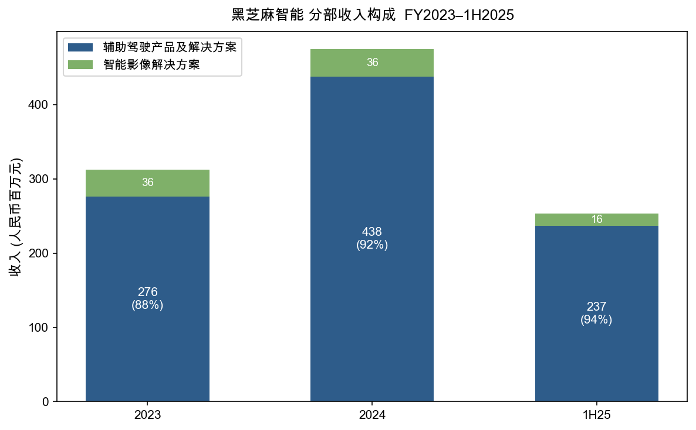
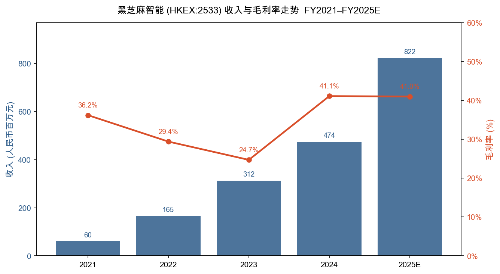
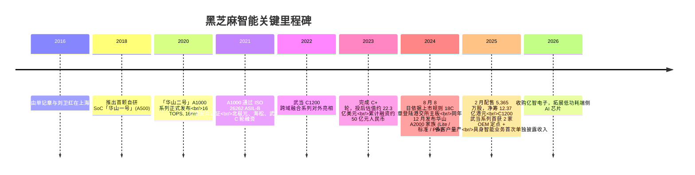
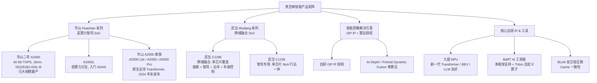
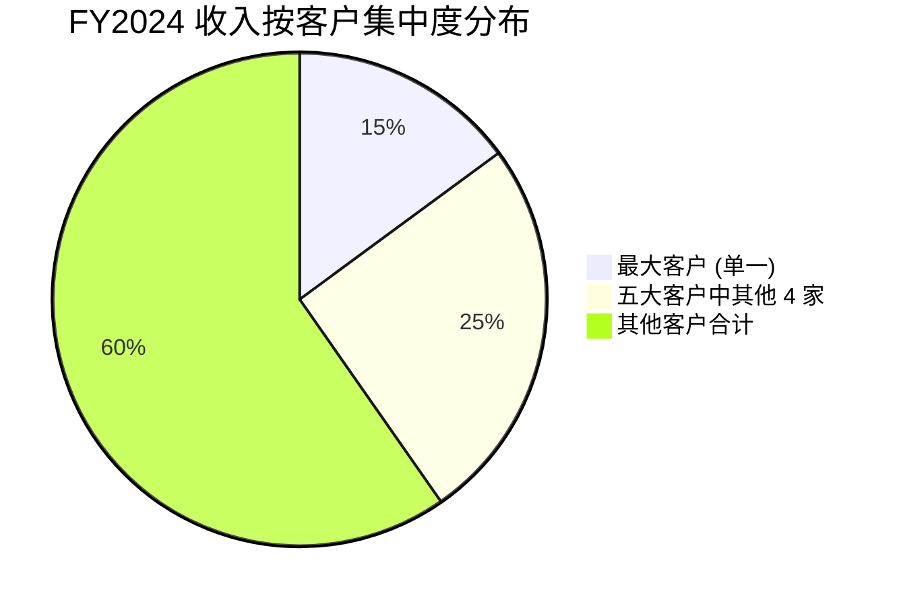
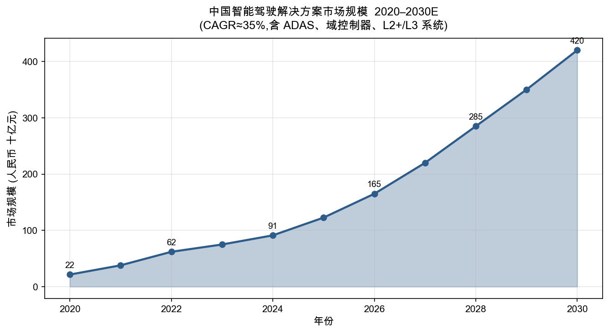
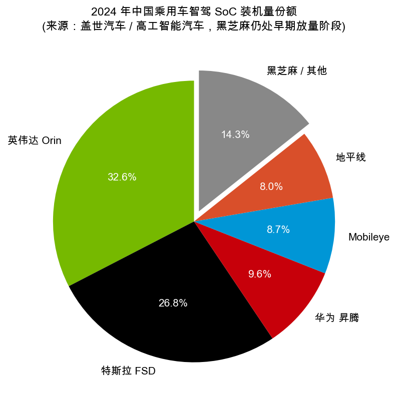
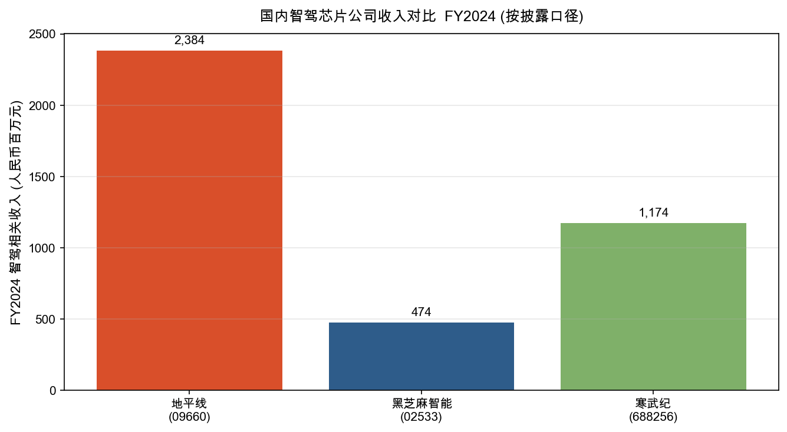
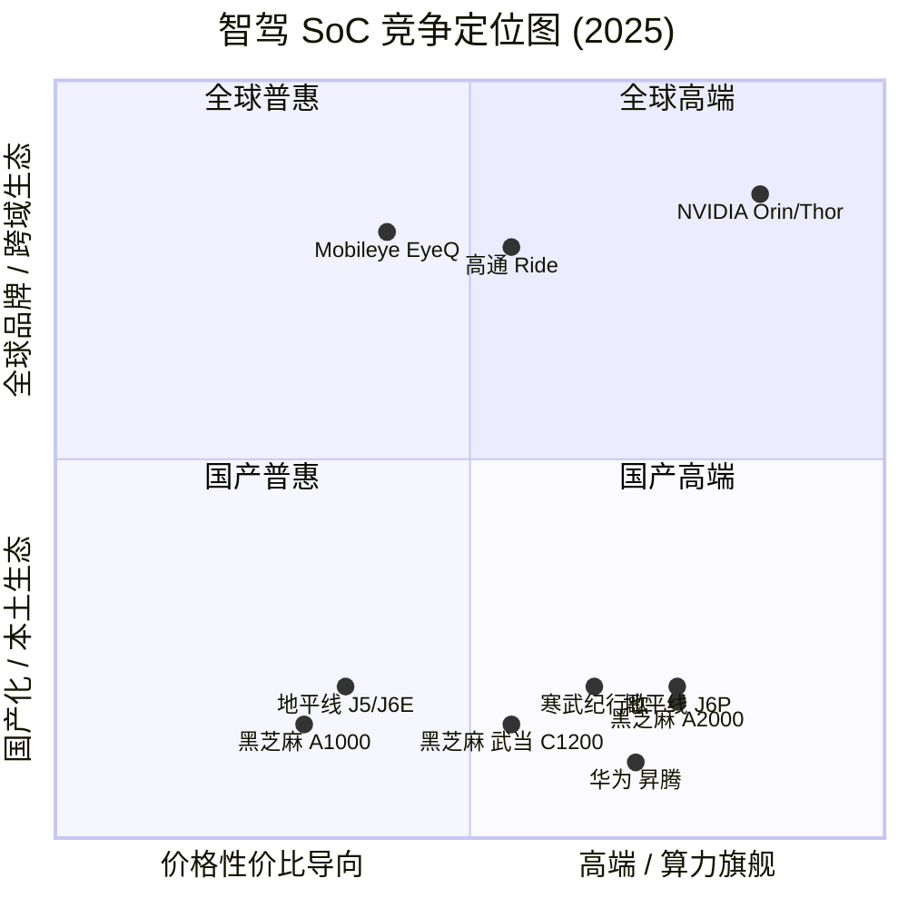
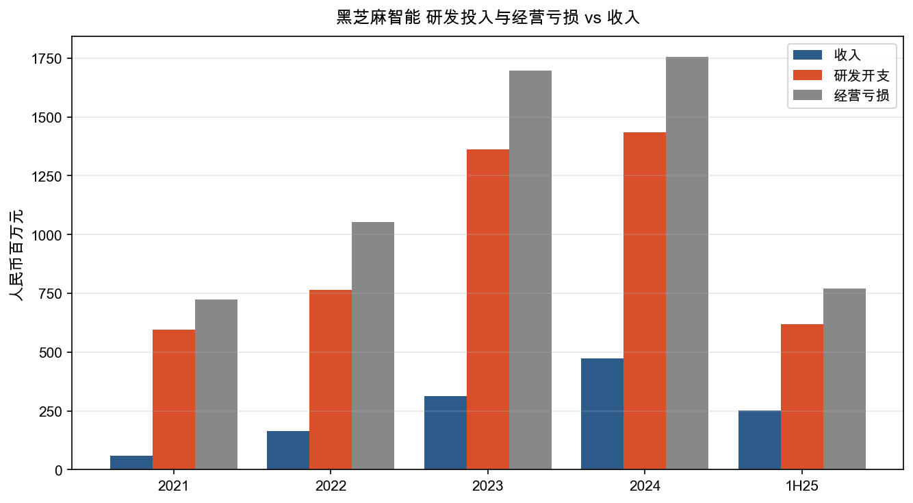

# 黑芝麻智能国际控股有限公司 公司研究报告

**股票代码**: HKEX:02533  **报告日期**: 2026-05-20  **报告语言**: 简体中文

---

> **Update — FY2025 业绩预告 (2026-03-04)**：公司预告 2025 年全年营收逾人民币 8.0 亿元，同比增长逾 68.7%，与全年正式业绩 8.22 亿元 (同比 +73.4%) 基本一致；毛利从 2024 年的 1.95 亿元提升至 3.37 亿元，毛利率维持 41% 左右；具身智能 (embodied AI) 业务首次单独披露并贡献 9,630 万元收入，标志公司业务从单一智驾芯片向 "汽车 + 机器人 + 端侧 AI" 三引擎扩张。
> Source：[黑芝麻智能(02533) 发布 2025 年业绩预告，全年营收超 8 亿，同比增长超 68.7%](https://cn.investing.com/news/stock-market-news/article-3246960)，[2025 年营收创历史新高 三大业务引擎协同驱动 (证券之星)](https://hk.stockstar.com/IG2026033100018744.shtml)。

## 目录

1. 公司概览 (Company Overview)
2. 公司历史 (Company History)
3. 管理团队 (Management Team)
4. 产品与服务 (Products & Services)
5. 客户与上市策略 (Customers & GTM)
6. 行业概览 (Industry Overview)
7. 竞争格局 (Competitive Landscape)
8. 市场机会 (Market Opportunity / TAM)
9. 风险评估 (Risk Assessment)
10. 参考资料 (References)

---

## 1. 公司概览 (Company Overview)

黑芝麻智能国际控股有限公司 (Black Sesame International Holding Limited，下称"黑芝麻智能"、"公司")，是一家专注于车规级智能汽车计算系统级芯片 (SoC) 及其解决方案的中国半导体设计公司，总部位于上海，研发中心覆盖上海、武汉、成都、北京、深圳及美国硅谷。公司于 2024 年 8 月 8 日在港交所主板挂牌交易，股份代号 02533，是依据《香港联合交易所有限公司证券上市规则》(下称"上市规则") **第 18C 章**实现商业化上市的**首家特专科技公司**——这一身份标签在公司董事长致辞中被重点强调 ([2024 年年度报告 第 5 页](https://www1.hkexnews.hk/listedco/listconews/sehk/2025/0425/2025042500234.htm))。

**业务模式 (How they make money)。** 黑芝麻智能将自研车规级 SoC 与配套的算法、工具链、参考方案打包销售给整车厂 (OEM) 与一级零部件供应商 (Tier-1)。收入分为两大类：(i) **辅助驾驶产品及解决方案** (Autonomous Driving Products & Solutions，下称 ADP&S)，包含 "华山 (Huashan)" 与 "武当 (Wudang)" 两大芯片系列、域控制器参考板卡、行泊一体软件栈，以及面向车路云一体化、商用车的整体方案；(ii) **智能影像解决方案** (Intelligent Imaging Solutions)，主要把公司自研的 ISP 核与图像 AI 算法以 IP 授权与软件许可的方式售予手机、ODM 及消费电子客户。两大业务在 FY2024 分别占收入的 92.4% 与 7.6% ([2024 年年度报告 第 13 页](https://www1.hkexnews.hk/listedco/listconews/sehk/2025/0425/2025042500234.htm))。商业模式上，公司奉行 "软硬解耦 + 开放生态"——既可整套售卖芯片加自研行泊一体软件，也允许 OEM 或 Tier-1 用自研或第三方算法跑在公司硅片之上。

Source: 公司 2024 年报与 2025 年中期报告，分部收入披露。

**地理分布。** 收入主要来自中国大陆 OEM 与商用车客户。2025 年上半年管理层明确披露 "海外定点车型及数量创本公司历史新高，为海外布局及销售提供了坚实基础" ([2025 年中期报告 第 5 页](https://www1.hkexnews.hk/listedco/listconews/sehk/2025/0911/2025091100234.htm))，但截至 1H2025，海外业务尚未单独披露收入贡献，仍处于定点导入与首批出货的早期阶段。

Source: [2024 年年度报告 第 4 页 四年财务概要](https://www1.hkexnews.hk/listedco/listconews/sehk/2025/0425/2025042500234.htm)；FY2025 数据来自[2025 年度业绩公告 (证券之星, 2026-03-31)](https://hk.stockstar.com/IG2026033100018744.shtml)。

**规模。** 截至 2024 年 12 月 31 日，公司全职员工 973 人 ([2024 年年度报告 第 16 页](https://www1.hkexnews.hk/listedco/listconews/sehk/2025/0425/2025042500234.htm))。FY2024 收入人民币 4.74 亿元 (同比 +51.8%)，毛利人民币 1.95 亿元 (毛利率 41.1%，较 FY2023 的 24.7% 大幅扩张 16.4 个百分点)，经营亏损 17.54 亿元，扣除可转换优先股公允价值变动后的经调整虧损淨額 13.04 亿元 ([2024 年年度报告 第 4 页 / 第 14–15 页](https://www1.hkexnews.hk/listedco/listconews/sehk/2025/0425/2025042500234.htm))。FY2025 全年营收 8.22 亿元，同比 +73.4%，毛利提升至 3.37 亿元，经营性亏损同比收窄 17.5% ([2025 年营收创历史新高 (证券之星)](https://hk.stockstar.com/IG2026033100018744.shtml))。截至 2024 年末，现金及现金等价物加按公允价值计入损益的金融资产合计人民币 16.23 亿元 ([2024 年年度报告 第 15 页](https://www1.hkexnews.hk/listedco/listconews/sehk/2025/0425/2025042500234.htm))。

**估值快照 (Valuation snapshot)。** 截至 2026 年 5 月，黑芝麻智能股价约 20.4 港元 (盘中波动较大)，总股本约 6.42 亿股 ([翌日披露报表内容摘要 (证券之星)](https://stock.stockstar.com/AN2026012000003750.shtml))，对应市值约 130 亿港元 (≈120 亿元人民币) ([股价、市值实时行情 (Yahoo Finance / moomoo)](https://finance.yahoo.com/quote/2533.HK/))。公司 FY2024 与 1H2025 净利润均为负 (尽管 FY2024 因优先股负债公允价值翻转录得 3.13 亿元的会计利润，但属一次性非现金科目)，故 **TTM P/E 不具参考价值**——这是典型的"现金燃烧型成长公司"，亏损主因是 14 亿元/年量级的研发开支远超 5–8 亿元/年的收入体量 ([2024 年年度报告 第 14 页](https://www1.hkexnews.hk/listedco/listconews/sehk/2025/0425/2025042500234.htm))。**TTM P/S** 按 FY2025 营收 8.22 亿元人民币 (≈ 8.8 亿港元) 与 130 亿港元市值口径计算约为 **14.8×**。对照可比公司：地平线机器人 (HKEX:9660) FY2024 营收 23.84 亿元、市值 880 亿港元前后区间，对应 P/S 约 30×+ ([地平线机器人 2024 年年报披露 (新浪财经)](https://finance.sina.com.cn/stock/relnews/hk/2025-03-23/doc-ineqryai4565255.shtml))；寒武纪 (SSE:688256) 多年 P/S 在 30–80× 区间宽幅震荡。黑芝麻智能的 P/S 处于国产 AI 芯片 / 智驾芯片板块的相对低位，**估值溢价主要由稀缺标的、首家 18C 上市、A1000 已规模量产以及与比亚迪等顶级 OEM 的合作绑定支撑**；负面催化是研发烧钱、毛利率回落 (1H2025 跌至 24.8%)、以及高阶 NoA 战场上来自地平线 J6、英伟达 Thor 的强压。如果 FY2026–FY2027 营收无法继续保持 50%+ 增速以摊薄费用、或者旗舰 A2000 量产不及预期，市场可能给到 P/S 5–8× 的 "高研发亏损硬件公司" 估值带，存在显著的多倍数压缩 (multiple compression) 风险——纳入 §9 财务风险章节。

## 2. 公司历史 (Company History)

公司由清华校友、前豪威科技 (OmniVision Technologies) 软件工程副总裁单记章先生与时任日立安斯泰莫制动 (旧称泛博制动) 亚太区总裁刘卫红先生于 **2016 年 7 月**联合创立 ([2024 年年度报告 第 47 页](https://www1.hkexnews.hk/listedco/listconews/sehk/2025/0425/2025042500234.htm))。两人 1986 年同为黄冈中学校友 ([校友风采 1986 届校友单记章 & 刘卫红](http://www.hbshgzx.com/rshg/xyzc/2021-09-28/5520.html))，单负责芯片、感知与软件，刘负责销售、车规与产业资源。"黑芝麻"的命名取自创始团队早期讨论场景中桌上常摆的一袋黑芝麻，被赋予"小而多、聚而成势"的隐喻 ([对话黑芝麻智能 CEO (虎嗅网)](https://m.huxiu.com/article/1318952.html))。公司的核心使命是 "用芯赋能未来出行"，定位车规级智能驾驶 SoC——这是一条典型的 "重前期投入、长爬坡、大市场" 赛道。

公司在十年间经历了三次明确的战略转折：(i) **2018–2020 年的产品聚焦期**——从早期试图覆盖手机影像 ISP 与车载多个赛道，收敛至 "车规级智驾 SoC + 配套软件" 的单一主线，理由是车规级供应链门槛极高，分散注意力会导致两边都做不深；(ii) **2022 年的双系列分叉**——在原有华山系列 (主攻高算力、高阶 ADAS) 之外，新开"武当"系列定位艙駕融合 / 跨域计算，C1200 单芯片同时跑座舱、智驾、泊车与车身控制，目的是抢占 E/E 架构演进窗口期、为中端市场提供高性价比方案 ([2024 年年度报告 第 5 页](https://www1.hkexnews.hk/listedco/listconews/sehk/2025/0425/2025042500234.htm))；(iii) **2025 年的多元化扩张**——以 A2000 + 武当 C1200 切入机器人 (傅利叶灵巧手已采用 C1200 提供算力)、无人物流小车 (港口 / 园区 L4)、AI 智能眼镜等端侧场景，并于 2025 年末签署收购**亿智电子**的协议，目标是补齐低功耗高性价比的端侧 AI 芯片产品线 ([2025 年营收创历史新高 (证券之星)](https://hk.stockstar.com/IG2026033100018744.shtml))。这一波从 "纯车规智驾" 走向 "通用 AI 推理 + 多场景" 的扩张，本质上是为了对冲单一汽车赛道的客户波动与价格战，但也带来了管理半径与研发资源稀释的隐忧。

**重大融资。** IPO 前公司完成 10 轮融资、累计募资约 6.95 亿美元 (约 50 亿元人民币)，主要轮次包括北极光创投 (Northern Light Venture Capital)、海松资本、武岳峰科创、SummitView Capital、小米、吉利、上海汽车、招商局创投、腾讯、蔚来等 ([115 亿！国产智驾芯片第一股今日敲钟 (量子位)](https://www.qbitai.com/2024/08/175835.html))。2024 年 8 月 IPO 募资约 9.69 亿港元 (净筹)；2025 年 2 月再以每股 23.20 港元配售 5,365 万股、净筹 12.37 亿港元，主要用于 A2000 流片、机器人产品线与海外定点项目支出 ([黑芝麻智能(02533)拟发行 5365 万股配售股份 净筹 12.37 亿港元 (智通财经)](https://cn.investing.com/news/stock-market-news/article-2676012))。

## 3. 管理团队 (Management Team)

### 单记章先生 — 联合创始人、董事长、执行董事兼首席执行官

单先生 57 岁，1991 年与 1995 年分别获清华大学电子工程学士与硕士学位。1997 年 6 月至 2016 年 6 月在全球知名影像半导体公司 **OmniVision Technologies (豪威科技)** 任职 19 年，离职前担任软件工程部副总裁，主导核心研发工作并在车规级高动态范围 (HDR) 图像传感器与汽车软件芯片开发上沉淀深厚经验；其本人为视觉感知领域 100+ 项专利的发明人 ([2024 年年度报告 第 47 页](https://www1.hkexnews.hk/listedco/listconews/sehk/2025/0425/2025042500234.htm))。坊间公开资料显示，单先生在 OmniVision 期间是创始团队成员之一，曾带领产品进入苹果机供应链，并主导开发被应用于 90% 以上欧洲高端车型的车规级 HDR 技术 ([清华校友八年造芯，干出"自动驾驶芯片第一股" (新浪财经)](https://finance.sina.com.cn/stock/relnews/hk/2024-08-08/doc-inchwxxk1952577.shtml))。

2016 年 7 月，他与刘卫红共同创办黑芝麻智能。在公司治理上，单先生**兼任董事长与首席执行官** (CEO)——这一安排公司在年报中明确披露偏离了《企业管治守则》C.2.1 条建议，但理由是 "确保领导一致、提升决策效率"，董事会现由 3 名执董、1 名非执董、3 名独立非执董组成，独立性维持在三分之一以上 ([2024 年年度报告 第 18 页](https://www1.hkexnews.hk/listedco/listconews/sehk/2025/0425/2025042500234.htm))。截至 2024 年末，单先生持有合计约 168,376,415 股 (含自身实益持股、Pan 女士配偶视为权益、及通过投票权委托代行的他人股份)，约占已发行股本 **29.59%** ([2024 年年度报告 第 55–56 页](https://www1.hkexnews.hk/listedco/listconews/sehk/2025/0425/2025042500234.htm))，截至 2025 年 6 月 30 日略稀释至约 26.62% ([2025 年中期报告 第 65 页](https://www1.hkexnews.hk/listedco/listconews/sehk/2025/0911/2025091100234.htm))。单先生持有的购股权累计涉及 45,000,000 股，行使价分别为 0.09 美元、0.19 美元与 0.59 美元，行权期均至授出日起 10 年。这是典型的 "深度绑定型创始人" 结构——技术原生、长期持股、对公司有绝对控制力，是 18C 章规则下市场最看重的素质之一。

### 刘卫红先生 — 联合创始人、执行董事兼总裁

刘先生 56 岁，主要分管销售、市场与商务拓展。学历背景：1990 年上海交通大学应用化学学士、1995 年清华大学化学工程硕士、2002 年加拿大多伦多大学 MBA。汽车行业经验逾 20 年——2002 年 9 月至 2011 年 12 月任**博世汽车部件 (苏州)** 区域总裁；2012 年 7 月至 2016 年 11 月任**泛博制动部件 (苏州)** (现日立安斯泰莫制动系统苏州) 亚太区总裁，期间负责战略、运营、业务发展、重组及并购，此前还有通用汽车 (中国) 的经历 ([2024 年年度报告 第 47 页](https://www1.hkexnews.hk/listedco/listconews/sehk/2025/0425/2025042500234.htm))。刘先生的角色对公司打通车企客户、Tier-1 与 OEM 的"门钥匙"作用至关重要——他与单先生的组合，本质上是 "做芯片的人" + "卖芯片到车的人"，这正是众多中国 AI 芯片公司在 2020–2024 年商业化阶段普遍欠缺的能力组合。

### 曾代兵先生 — 执行董事兼首席系统官

曾先生 50 岁，2018 年 7 月加入黑芝麻智能，2019 年 8 月起担任首席系统官，2023 年 6 月调任执行董事，负责芯片架构研发、芯片设计与软件开发的全流程统筹 ([2024 年年度报告 第 48 页](https://www1.hkexnews.hk/listedco/listconews/sehk/2025/0425/2025042500234.htm))。加入公司前在**中兴微电子 (中兴通讯子公司)** 工作 18 年，先后担任技术总工、副总经理及平台研究院院长，主管关键平台的技术规划、研发与运营。西北工业大学材料科学与工程学士、信号与信息处理硕士。中兴微电子的背景为黑芝麻提供了大规模 SoC 量产与车规可靠性方面的工程经验，这与公司 A1000 已在多家头部车企量产、武当 C1200 即将量产的现实路径直接对应。

### 杨宇欣先生 — 首席市场营销官 (CMO)

杨先生 46 岁，2019 年 12 月加入，负责投资管理、公共关系与业务发展。2002 年清华大学精密仪器学毕业。曾在松下电器、Arm China、新岸线、Linaro 中国区任职，2014 年 1 月至 2019 年 11 月任 A 股上市公司中科创达 (300496.SZ) 副总裁兼董事 ([2024 年年度报告 第 51 页](https://www1.hkexnews.hk/listedco/listconews/sehk/2025/0425/2025042500234.htm))。杨先生在中科创达期间深度参与汽车智能化、Arm 生态布局，其行业人脉与公关能力对公司在媒体、车企峰会与生态合作上的曝光起到重要作用。

### 治理与股权结构 (Governance footer)

董事会由 7 人构成：3 名执行董事 (单记章、刘卫红、曾代兵)、1 名非执行董事 (杨磊博士，前北极光创投合伙人，现任上海粒子未来法定代表人，也是中科创达董事 300496.SZ、安集科技董事 688019.SH)、3 名独立非执董 (李青原教授——武汉大学经管学院教授、长江学者，曾任虹软科技 688088.SH 等多家 A 股独立董事；龙文懋教授——华东政法大学知识产权学院教授；徐明教授——华中科技大学微电子学院主任、海外高层次人才) ([2024 年年度报告 第 48–50 页](https://www1.hkexnews.hk/listedco/listconews/sehk/2025/0425/2025042500234.htm))。公司**未将董事长与 CEO 角色分离**，构成对企业管治守则 C.2.1 条的偏离。

主要股东方面 (截至 2024-12-31)：单先生及关联方约 29.6%；Pan 女士直接持股 1.46%；Northern Light Venture Fund IV (北极光创投旗下基金) 实益持有约 8.93%；其关联法团合计影响力约 9.79%；SummitView Capital (武岳峰) 及其管理实体合计约 6.54%；上海极芯 3.96%；嘉兴信燦 2.58% ([2024 年年度报告 第 55–57 页](https://www1.hkexnews.hk/listedco/listconews/sehk/2025/0425/2025042500234.htm))。其余持股 5% 以下的财务投资人包括小米、吉利、腾讯、上汽、招商局、中银投资等。**首次公开发售前股份计划**预留 156,847,868 股，占截至 2025-06-30 已发行股本约 24.80%——员工股权激励池规模较大，未来潜在稀释压力不可忽视 ([2025 年中期报告 第 70 页](https://www1.hkexnews.hk/listedco/listconews/sehk/2025/0911/2025091100234.htm))。

### 团队过往业绩综合评估 (Track Record)

整体来看，这是一支 "技术深度 + 客户深度 + 量产工程深度" 三角齐备的团队：单记章 (OmniVision 20 年芯片、感知 IP 100+) + 刘卫红 (博世 / 日立 20+ 年汽车 Tier-1 高管) + 曾代兵 (中兴微 18 年 SoC 量产)。短板在于：(i) 公司迄今没有真正穿越完整的 "硅片设计 → 客户定点 → 大规模量产 → 盈亏平衡" 全周期，盈利时点仍是开放问题；(ii) 海外业务团队、机器人业务团队均属新组建，公开履历较薄；(iii) CEO 与董事长合一的治理结构在企业管治守则中已被点名偏离，对独立董事的制约职能依赖度提升。

## 4. 产品与服务 (Products & Services)

公司当前产品矩阵围绕两大芯片家族 "华山 (Huashan)" + "武当 (Wudang)" 展开，下层支撑核心自研 IP (九韶 NPU、ISP、安全岛)、上层覆盖参考算法栈、工具链 BaRT 与跨芯粒互联 BLink。

### 4.1 华山 (Huashan) 系列——高算力 ADAS / AD 主线

**A1000 系列 (旗舰量产产品)。** 采用 16nm 工艺、内置 CPU + DSP + GPU + NPU 异构架构，CPU 算力 50K DMIPS、INT8 算力 58 TOPS、典型功耗 8W，已获 AEC-Q100 与 ISO 26262 ASIL-B 功能安全认证。截至 2024 年末，A1000 已在**吉利** (领克系列、银河系列等)、**东风** (eπ 007 / 008 等)、**比亚迪** (腾势部分车型) 等头部新能源车企规模化量产交付，公司基于 A1000 的高速 NoA (Navigation on Autopilot) 方案已实现全国高速覆盖与多个主要城市快速路覆盖 ([2024 年年度报告 第 5、7 页](https://www1.hkexnews.hk/listedco/listconews/sehk/2025/0425/2025042500234.htm))。在 2024 年传统自主品牌交付的高速 NoA 行泊一体域控采用单一供应商芯片 (不含多供应商组合) 的新车中，A1000 排名第三 ([2024 年年度报告 第 5 页](https://www1.hkexnews.hk/listedco/listconews/sehk/2025/0425/2025042500234.htm))。

- **竞争优势判定**：部分有 (partial)。
- **护城河类型**：(i) 车规级量产经验——A1000 是国内中高算力智驾 SoC 中**少数已穿越 "工程化交付 → 量产爬坡 → 长期 SOP" 全周期的产品**；(ii) ISO 26262 ASIL-B 功能安全认证 (强监管壁垒)；(iii) 与 Tier-1 (亿咖通、安波福、均胜电子) 的深度方案联调形成的切换成本。
- **证据**：2024 年 ADP&S 毛利率扩张至 37.4% (vs 2023 年 21.4%)，主因 SoC-based 解决方案中自研算法占比提升 ([2024 年年度报告 第 13 页](https://www1.hkexnews.hk/listedco/listconews/sehk/2025/0425/2025042500234.htm))。
- **最近的对标竞品**：**地平线征程 5/6 (Horizon J5/J6)**。J5 在 2024 年合计装机量已大幅超过 A1000，市场份额 ~8% (国内乘用车 SoC 装机量口径)，且 J6E/J6M 已在 2025 年随比亚迪 "天神之眼 C" 21 款车型首发，规模化能力领先黑芝麻一档 ([地平线发布 2024 年报 (证券时报)](https://www.stcn.com/article/detail/1602110.html))。**结论：黑芝麻 A1000 相对地平线 J5 落后约半代到一代，但仍是国内中高算力 SoC 第二梯队的领军产品。**

**A2000 家族 (定点元年 / 远期主力)。** 2024 年末发布，原生支持 Transformer 架构、BEV + Transformer 端到端大模型，可适配从城市 NoA 到无人驾驶 Robotaxi 多层级；包含 A2000 Lite、A2000 (标准)、A2000 Pro 三档。董事会致辞将 2025 年定义为 "A2000 系列定点元年"，预计 2026 年开始规模量产 ([2024 年年度报告 第 5 页](https://www1.hkexnews.hk/listedco/listconews/sehk/2025/0425/2025042500234.htm))。

- **竞争优势判定**：尚待验证 (no/pending)。
- **护城河类型**：技术 / IP——九韶 NPU 架构、BaRT 工具链、BLink 双芯粒互联是未来高算力 SoC 的关键技术支柱。
- **证据**：截至 1H2025 仅披露 "正在与头部一级供应商合作开发基于 A2000 芯片的智驾方案" 与 "争取实现获得头部大客户定点"，**尚未公开任何已确认的 A2000 OEM 定点**。
- **对标竞品**：**英伟达 DRIVE Thor (2,000 TOPS)** 与**地平线征程 6P (560 TOPS)**。Thor 的算力天花板远高，市场预期成为 L4 级 Robotaxi 默认平台；J6P 已在 2025 年获得理想 L 系列、奇瑞星途等定点 ([地平线机器人 9660 深度报告 (东方财富)](https://pdf.dfcfw.com/pdf/H3_AP202506041684850618_1.pdf))。**结论：A2000 在算力规格与生态成熟度上尚需追赶，量产时点 (2026) 已比 Thor 晚 ~12 个月。**

### 4.2 武当 (Wudang) 系列——跨域融合 / 艙駕一体

**C1200 系列 (含 C1236 智驾专用、C1296 跨域融合)。** 主打 "单芯片同时跑座舱 + 智驾 + 泊车 + 车身控制" 的舱驾一体方案，面向 E/E 架构由分布式向中央化演进窗口期。C1200 已与中国一汽、东风、安波福、均胜电子、斑马智行等达成深度合作，2024 年末已获 **2 家主流 OEM 量产定点**，预计 2025 年内成为业内首家量产的舱驾一体芯片平台 ([2024 年年度报告 第 5、7 页](https://www1.hkexnews.hk/listedco/listconews/sehk/2025/0425/2025042500234.htm))。1H2025 已推出基于 C1200 的 "安全智能底座" 架构，覆盖入门到旗舰车型 ([2025 年中期报告 第 5 页](https://www1.hkexnews.hk/listedco/listconews/sehk/2025/0911/2025091100234.htm))。

- **竞争优势判定**：部分有 (partial)。
- **护城河类型**：(i) 时间差——首家舱驾一体量产 SoC 抢占先发；(ii) 高通 8295 在座舱市场强势，黑芝麻 C1200 用 "舱驾一体单 SoC、BOM 降本" 的差异化定位避开高通正面竞争 ([2025 年黑芝麻智能分析：国产芯片厂商如何挑战高通在 CDC 市场 (远瞻慧库)](https://www.baogaobox.com/insights/250613000011893.html))。
- **对标竞品**：**高通 SA8775P (舱驾一体方案)** 与**英伟达 DRIVE Atlan / 新一代 Cockpit SoC**。在国内场景下，C1200 的本土支持响应速度与价格优势明显，但海外车厂目前仍以高通方案为主流。
- **结论**：C1200 系列是**黑芝麻最具差异化竞争力的产品线**，但市场对 "艙駕融合是否真正成为主流 E/E 架构" 仍存争论——如果整车厂出于安全与可靠性考虑，未来仍倾向于 "舱驾分离 + 双 SoC" 方案，C1200 的差异化窗口会被压缩。

### 4.3 智能影像解决方案

公司将自研 ISP 核与 AI 算法 (AI Depth、Portrait Dynamic Fusion 等) 以软件 + IP 方式授权给手机、ODM 与近期延伸至 AI 智能眼镜客户。该业务规模较小 (FY2024 收入 3,630 万元，1H2025 增长 25.1% 至 1,610 万元)，但毛利率极高——FY2024 毛利率 **85.4%**，主因无需硬件组件、纯软件 + IP 授权口径 ([2024 年年度报告 第 13 页](https://www1.hkexnews.hk/listedco/listconews/sehk/2025/0425/2025042500234.htm))。

- **竞争优势判定**：是 (yes)。
- **护城河类型**：技术 / IP；与高度集中的视觉 IP 池 (Arm Mali、Imagination、Verisilicon) 错位竞争。
- **结论**：体量小但毛利支撑作用明显，是公司"现金牛雏形"，但行业天花板低，难成主线。

### 4.4 旗舰 vs 长尾 + 近 12 个月动态

公司当前**真正驱动收入的旗舰产品是 A1000 系列**，FY2024 ADP&S 收入 4.38 亿元中估计 A1000 + 解决方案贡献 80%+。武当 C1200 处于商业化爬坡期、A2000 处于定点导入期，2025 年内的量产收入贡献仍有限。智能影像解决方案为长尾业务。

**近 12 个月产品动作**：(i) 2024 年 12 月——华山 A2000 家族发布与九韶 NPU 架构公开；(ii) 2025 年 4 月上海车展——发布行业首创 "安全智能底座" 方案 ([4 月 23 日上海车展安全智能底座 (车家号)](https://chejiahao.m.autohome.com.cn/info/20026100))；(iii) 2025 年——傅利叶人形机器人灵巧手采用 C1200 提供算力，标志公司正式切入具身智能；(iv) 2025 年末签署收购**亿智电子**协议，补齐低功耗端侧 AI 芯片，意在 "汽车 + 机器人 + 端侧 AI" 全场景覆盖。

## 5. 客户与上市策略 (Customers & Go-to-Market)

### 5.1 客户分布与集中度

公司主要客户为国内乘用车 OEM、Tier-1 零部件供应商、商用车与专用车厂商，以及车路云一体化项目地方政府试点。OEM 端的核心客户包括**比亚迪 (BYD)**、**吉利汽车 (Geely)**、**东风汽车**、**中国一汽**等头部新能源与传统车企，Tier-1 端包括**安波福 (Aptiv)**、**均胜电子**、**亿咖通 (吉利旗下)**、**斑马智行**等 ([2024 年年度报告 第 5、7 页](https://www1.hkexnews.hk/listedco/listconews/sehk/2025/0425/2025042500234.htm))。商用车与无人物流小车领域已覆盖工程环卫车、重载卡车、港口园区 L4 物流；车路云一体化项目覆盖成都、襄阳、宁波、天津等城市的试点。

**客户集中度披露 (REQUIRED)**。根据公司 2024 年报《董事会报告》中的主要客户及供应商章节：

- **2024 年五大客户合计占收入比 40.3%**
- **最大单一客户占收入比 14.9%**
- 五大供应商合计采购占比 36.4%；最大供应商占比 10.7%
- 来源：[2024 年年度报告 第 39 页 主要客户及供应商](https://www1.hkexnews.hk/listedco/listconews/sehk/2025/0425/2025042500234.htm)

按本研究框架的阈值判定 (top-1 > 10% 或 top-5 > 30% 即需纳入风险章节)，黑芝麻智能的客户集中度属于**中等偏高**——top-1 14.9% 不算极端，但行业逻辑上单一智驾 SoC 项目一旦定点，往往为 3–5 年长周期合作，因此客户波动的传导周期较长。**top-5 40.3% 远低于 50% 的 "材料风险" 阈值**，反映客户基础已有一定多元化。三年趋势数据缺失 (公司 IPO 前未单独披露 FY2022–2023 集中度同口径数字)，将作为关注点纳入 §9。公司未在年报中点名"最大客户"身份，但结合管理层讨论中频繁提及"吉利"、"比亚迪"、"东风"，市场普遍推测最大客户为**吉利系**(基于亿咖通的项目分销+银河 E8、星耀 8、领克系列等多款量产车型)。

### 5.2 合同结构与商业模式

整车厂智驾 SoC 项目通常为**多年期定点 (Design-in / SOP)** 合作——OEM 在 SOP 前 18–24 个月完成芯片选型并锁定 BOM，量产周期 3–5 年，期间芯片单价逐年小幅下降。这一结构对供应商既是壁垒也是负担：**壁垒**在于一旦定点，OEM 切换成本极高 (软硬件适配、安全验证需要 12+ 个月)；**负担**在于早期前置研发与适配成本巨大、回报集中在量产后期。Tier-1 合作模式则更接近"项目制 + 按 PO"，毛利率较 OEM 直供略低但回款节奏快。

### 5.3 渠道、销售周期与战略客户

公司销售采用 "直销 + Tier-1 协同" 双轨：(i) 与亿咖通绑定吉利系；(ii) 与安波福、均胜电子合作打入更广的传统主机厂；(iii) 与斑马智行打通舱驾跨域。销售周期长，从初次接触到 SOP 通常 18–30 个月。**关键近期动态**：1H2025 公司明确披露"海外定点车型及数量创历史新高"，并预计海外车型 2025 年下半年起开始量产销售 ([2025 年中期报告 第 7 页](https://www1.hkexnews.hk/listedco/listconews/sehk/2025/0911/2025091100234.htm))；同时与傅利叶 (人形机器人) 形成战略合作，标志机器人 / 具身智能成为第二增长曲线。

### 5.4 战略客户案例

- **比亚迪**：A1000 已在腾势部分车型量产；2025 年起公司亦寻求基于下一代芯片方案的量产合作。但比亚迪体系内主要智驾 SoC 由地平线 J5/J6 占据 (天神之眼系列)，黑芝麻在此处更多是**第二供应商定位**。
- **吉利汽车 / 亿咖通**：千里浩瀚智驾系统采用 A1000 芯片，覆盖银河 E8、星耀 8、领克系列等多款车型 ([2024 年年度报告 第 5 页](https://www1.hkexnews.hk/listedco/listconews/sehk/2025/0425/2025042500234.htm))；可视为公司**最重要的 OEM 客户**。
- **东风汽车**：奕派 007 / 008 已采用 A1000；C1200 已与东风深化合作，承担首批艙駕一体量产项目 ([黑芝麻智能与东风深化合作，武当系列芯片 2025 年量产 (新浪财经)](https://finance.sina.com.cn/roll/2025-02-18/doc-inekzkhe5599001.shtml))。
- **中国一汽**：获得新平台定点，覆盖多款燃油车与新能源车，预计 2025 年量产 ([2024 年年度报告 第 8 页](https://www1.hkexnews.hk/listedco/listconews/sehk/2025/0425/2025042500234.htm))。
- **傅利叶智能 (Fourier)**：人形机器人 "灵巧手" 采用 C1200 系列提供算力，是公司具身智能业务的标杆案例 ([2024 年年度报告 第 9 页](https://www1.hkexnews.hk/listedco/listconews/sehk/2025/0425/2025042500234.htm))。

## 6. 行业概览 (Industry Overview)

### 6.1 行业定义

公司所处的**汽车智能化计算芯片**行业，狭义即车规级 SoC——包括智驾 SoC (Driving SoC)、座舱 SoC (Cockpit SoC) 与艙駕融合 SoC，整合 CPU、NPU、ISP、安全岛等多核心；广义涵盖 ADAS 整体解决方案，包括芯片、域控制器、感知 / 规控算法软件、地图 / 高精定位与车联网联动。下游需求来自全球乘用车 OEM (新能源与燃油兼有)、商用车、自动驾驶 Robotaxi 公司、车路协同基础设施。监管层面受多重影响：ISO 26262 功能安全、ISO/SAE 21434 网络安全、UN R155/R156 法规、欧盟 GSR (通用安全条例) 强制 ADAS 装配要求；中国国家层面 "新能源汽车产业发展规划 (2021–2035)"、工信部车路云一体化试点等政策直接驱动需求。

### 6.2 市场规模与结构

Source: 综合 [共研网 2025–2031 年中国 ADAS 行业报告](https://m.gelonghui.com/p/1552767)、[华经情报网 2025 年中国智驾解决方案行业现状](https://www.huaon.com/channel/trend/1111396.html)、[人民网 智能驾驶加速驶来 2025-03-30](http://finance.people.com.cn/n1/2025/0330/c1004-40449801.html)、沙利文行业研究。

按沙利文 / 共研 / 华经口径，中国智能驾驶解决方案市场规模 (含 ADAS、域控制器、L2+/L3 系统) 从 2020 年约 216 亿元人民币增长至 2024 年 912 亿元，CAGR 约 43.4%；2025 年预计突破 1,200 亿元、2030 年有望达 4,200–4,500 亿元规模 (CAGR 仍维持 30%+) ([2025 年中国智能驾驶解决方案行业现状 (华经情报网)](https://www.huaon.com/channel/trend/1111396.html))。**渗透率指标**：2025 年 1–7 月，中国具备组合驾驶辅助系统 (L2 及以上) 的乘用车新车销量达 776 万辆、新车渗透率 **62.6%**，较 2021 年同期增长 40 个百分点 ([中国 ADAS 政策、市场竞争格局及未来发展趋势 (新浪财经)](https://finance.sina.com.cn/stock/relnews/cn/2026-02-28/doc-inhpiryn6136043.shtml))。L3 及以上 ADAS 渗透率预计 2030 年达 35%。

### 6.3 关键驱动因素

(i) **新能源车渗透**——电动化平台对集成式电子电气架构需求强；(ii) **AI 大模型上车**——BEV + Transformer、端到端模型对算力的要求快速抬升；(iii) **国产替代**——华为受制裁后整车厂开始大规模为关键计算芯片备份非美方案，给国产 SoC 拉出窗口；(iv) **政策推动**——智驾平权、车路云一体化、L3 试点推动政策资源向头部国产芯片集中；(v) **OEM 自研收缩**——多数二线 OEM 已确认自研 SoC 投入产出比不划算，转回向第三方采购。

### 6.4 监管与产业结构

车规级芯片产业是典型的"高门槛 + 长周期 + 强马太效应"行业：(i) 上下游集中度均高——上游晶圆代工依赖台积电、中芯国际、Samsung Foundry，先进制程 (7nm 以下) 几乎只能在台积电流片，对中国厂商存在地缘风险；(ii) 客户高度集中于头部 OEM——中国乘用车销量 60%+ 来自前十大集团；(iii) 监管壁垒——AEC-Q100、ISO 26262 ASIL-B/D、ISO 21434 全套认证耗时 18–24 个月。**全球行业结构**目前由英伟达 (DRIVE Orin / Thor)、高通 (Snapdragon Ride 8155/8295/8775)、Mobileye (EyeQ6) 三大美国公司主导，国产追赶军包括地平线、华为昇腾、黑芝麻智能、芯擎科技、寒武纪行歌等。

## 7. 竞争格局 (Competitive Landscape)

### 7.1 主要竞争对手

| 竞争对手 | 代表产品 | 定位 | 2024 国内市场份额 (装机量口径) |
|---|---|---|---|
| **英伟达 NVIDIA** | DRIVE Orin / Thor (2,000 TOPS) | 高阶 AD / Robotaxi 标杆 | Orin 32.6% |
| **特斯拉 Tesla** | FSD HW4 (自研、仅自用) | 自研垂直整合 | 26.8% |
| **华为 Huawei** | 昇腾 610 / MDC 平台 | 智选车 + ICT 生态 | 9.6% |
| **Mobileye** | EyeQ5 / EyeQ6 | 主流 L1–L2+ | 8.7% |
| **地平线 (HKEX:9660)** | 征程 3/5/6 (J6E/J6M/J6P) | 国产 SoC 龙头 | 8.0%+ |
| **高通 Qualcomm** | Snapdragon Ride 8775 (舱驾一体) | 座舱 + 新进智驾 | 座舱 ~70%、智驾起步 |
| **黑芝麻智能 (HKEX:02533)** | 华山 A1000 / 武当 C1200 | 国产中高算力 | <1.6% (与其他厂商合计) |
| **芯擎科技** | "龍鷹" 智驾 SoC | 国产舱驾 | 起步阶段 |
| **寒武纪行歌** | SD5223 / SD5226 | 国产高算力 AD | 量产前期 |
| **辉羲智能、爱芯元智** | 边缘端 ADAS | 长尾 | 长尾 |

来源：[剖析 2024 年中国市场智驾芯片市场 (新浪财经)](https://finance.sina.com.cn/cj/2025-03-26/doc-ineqxptz9292347.shtml)、[OFweek 2024 年中国市场智能驾驶芯片市场分析](https://ee.ofweek.com/2025-03/ART-8420-2800-30659654.html)、[迈向千 T 算力时代，2024 智驾芯片王者之争 (知乎)](https://zhuanlan.zhihu.com/p/689279557)。

Source: 同上，盖世汽车 / 高工智能汽车的国内乘用车前装数据。

Source: 各公司 2024 年报披露——[地平线机器人 2024 年报 (东方财富 PDF)](https://stockn.xueqiu.com/09660/20250421926326.pdf)、寒武纪 2024 年报 (上交所披露)、黑芝麻智能 2024 年报。英伟达 DRIVE 中国业务、华为 MDC 收入未单独披露。

### 7.2 定位框架与差异化

可以将竞争对手按 "算力规格 vs 性价比 / 价格" 维度分布：

### 7.3 公司竞争优势 (Competitive Advantages)

(i) **18C 章上市 + 港股稀缺标的**：黑芝麻智能是首家根据上市规则 18C 章商业化上市的特专科技公司，资本市场关注度高、再融资能力强 ([2024 年年度报告 第 4 页](https://www1.hkexnews.hk/listedco/listconews/sehk/2025/0425/2025042500234.htm))；(ii) **A1000 已穿越量产周期**：在国产高算力 SoC 中，A1000 与地平线 J5 是仅有的两款已在头部新能源车企规模化量产的产品；(iii) **武当 C1200 艙駕一体差异化**：业内首家量产的艙駕一体 SoC 平台，与高通 8295 形成 BOM 降本错位竞争；(iv) **核心 IP 自研**：九韶 NPU + ISP IP 自研，BaRT 工具链 + BLink 双芯粒互联，技术体系完整；(v) **创始团队的产业资源**：单记章 + 刘卫红组合融合了 OmniVision 视觉芯片基因与博世汽车产业资源，访问头部车企的"入门券"齐备。

### 7.4 竞争劣势与脆弱性 (Vulnerabilities)

(i) **规模差距**：地平线 FY2024 营收 23.84 亿元，是黑芝麻的 5 倍；研发投入 ~31 亿元也远超黑芝麻 14.4 亿元，技术迭代速度上存在结构性落后 ([地平线机器人 2024 年报 (证券时报)](https://www.stcn.com/article/detail/1602110.html))。(ii) **市场份额低**：2024 年中国乘用车智驾 SoC 装机量份额仅 1.6% 上下，与英伟达 32.6%、特斯拉 26.8% 差距数量级。(iii) **A2000 进度落后于 Thor + J6P**：2025 年仍处于定点元年，规模量产要等到 2026，期间窗口对手可能进一步拉开。(iv) **客户集中于国内**：海外业务尚未实质开花，地缘风险敞口集中。(v) **持续亏损、依赖再融资**：经营性现金流连续 5 年净流出，2024 年净流出 11.9 亿元，2025 年仍处于现金燃烧期；尽管 1H2025 现金 + 短期金融资产仍达 ~13.4 亿元、加上 2025 年 2 月配售净筹 12.37 亿港元，资金安全垫尚可，但盈亏平衡尚无明确时间表。

## 8. 市场机会 (TAM)

### 8.1 TAM / SAM / SOM 分层

**TAM (Total Addressable Market)**：广义中国智能驾驶解决方案市场规模 2024 年约 **912 亿元**，2030 年有望达 **4,200–4,500 亿元** (CAGR ~30%) ([华经情报网 / 共研网](https://www.huaon.com/channel/trend/1111396.html))。其中智驾 SoC 在 2024 年约 220 亿元规模 (新车装机 1,500 万颗 × 平均 ASP 1,500 元)，2030 年有望 800–1,000 亿元。

**SAM (Serviceable Addressable Market)**：黑芝麻智能可服务的细分市场聚焦在国内乘用车 / 商用车的中高算力智驾 SoC + 艙駕一体 SoC + 部分海外定点 + 商用车 / 车路云 / 机器人。2024 年 SAM 约 100 亿元规模 (中高算力智驾 SoC 装机量 ~600 万颗 × 平均 ASP 1,800 元)；2030 年 SAM 有望 400–500 亿元。

**SOM (Serviceable Obtainable Market)**：基于黑芝麻当前份额 1.6% 推断 2030 年公司若能争取到 6–10% 的国产替代份额，对应公司收入约 **30–50 亿元人民币**——这与公司管理层 "尽快实现经营性盈利" 的中期目标基本对得上 ([2024 年年度报告 第 6 页 业务展望](https://www1.hkexnews.hk/listedco/listconews/sehk/2025/0425/2025042500234.htm))。

### 8.2 增长预测与战略

公司增长来源拆解：

- **A1000 持续放量**：高速 NoA 渗透率提升、与吉利、东风、比亚迪、一汽合作的车型矩阵扩张；
- **C1200 艙駕一体量产**：2025 年 2 家 OEM 量产，2026 年扩展至 5+；
- **A2000 高阶量产**：2026 年起获得头部大客户定点，进入 L3+ / Robotaxi 赛道；
- **机器人 / 具身智能**：傅利叶 + 其他足式机器人客户、无人物流 L4 小车，预计 2026 年贡献亿元级别收入 (FY2025 已贡献 9,630 万元，证明商业化已起步)；
- **端侧 AI / 亿智收购**：低功耗端侧 SoC 切入 AI 眼镜、家居 IoT 等场景；
- **海外扩张**：1H2025 已获得海外车型定点、下半年起量产销售。

按此路径，分析师对公司 FY2026–FY2027 营收预期普遍在 14–20 亿元人民币区间，公司 P/S 估值具备一定向上空间 (从当前 ~15× 向 20–25× 修复)，但需以**实际定点、量产爬坡数据**为前提。

### 8.3 渗透策略

公司管理层在 1H2025 中报中明确指出："积极推进对高性价比、低功耗 AI 芯片企业收购事项，使该公司的产品及解决方案与本公司现有中高算力芯片平台形成深度协同" ([2025 年中期报告 第 7 页](https://www1.hkexnews.hk/listedco/listconews/sehk/2025/0911/2025091100234.htm))——指的就是亿智电子收购。同时坚持"软硬解耦、开放生态"战略，通过 BaRT 工具链支持多种主流框架，鼓励第三方算法公司基于公司 SoC 开发差异化高阶 ADAS 算法。海外方面以欧美车企与 Tier-1 合作为切入点 ([2024 年年度报告 第 9 页](https://www1.hkexnews.hk/listedco/listconews/sehk/2025/0425/2025042500234.htm))。

## 9. 风险评估 (Risk Assessment)

### 公司特定风险 (Company-Specific Risks)

**1. 执行风险 — A2000 量产能否如期落地。** A2000 家族是公司未来三年的最大增长引擎，但截至 1H2025 仅披露 "正在与头部一级供应商合作开发" 与 "争取实现头部大客户定点"，**尚未公开任何已签订的 A2000 OEM 量产定点**。若 2026 年量产爬坡延后或被英伟达 Thor、地平线 J6P 抢占定点窗口，公司高阶 ADAS 业务的高增长叙事将受重创。缓释：A1000 与 C1200 仍能在 2025–2026 年支撑过渡，公司有时间调整 A2000 节奏。

**2. 客户集中度风险。** FY2024 五大客户合计 40.3%、最大客户 14.9%；按行业研究框架属于中等偏高风险。若最大客户 (推测为吉利系，含亿咖通) 因自身销量波动或转换供应商，可对收入造成显著扰动。年报未提供 3 年趋势数据，且最大客户身份未点名披露，透明度有限。多年期 SOP 协议在一定程度上抵消短期波动 (≥3 年绑定)，但合同结构未明确披露 ([2024 年年度报告 第 39 页](https://www1.hkexnews.hk/listedco/listconews/sehk/2025/0425/2025042500234.htm))。

**3. 关键人物依赖。** 单记章先生集董事长、CEO 与最大单一股东 (含关联方约 29.6%) 三重身份于一身，且 CEO/Chairman 未分离 (违反《企业管治守则》C.2.1 条) ([2024 年年度报告 第 18 页](https://www1.hkexnews.hk/listedco/listconews/sehk/2025/0425/2025042500234.htm))。若单先生因健康或其他原因不能继续履职，公司战略与技术路线将面临重大不确定性。缓释：刘卫红 (总裁) 与曾代兵 (CSO) 资历较深，但与单先生的 1986 年校友 + 联合创始人纽带仍为公司文化核心。

**4. 产品技术过时风险。** AI 大模型与端到端范式快速演化，BEV+Transformer 已被部分新方案 (Vision-Language-Action 大模型、World Model) 挑战；公司九韶 NPU 与 BaRT 工具链需持续投入才能跟上算力 + 算法 + 工艺三重升级。若错过任意一个迭代窗口 (例如 3nm 流片节奏被竞品提前 6 个月)，会被快速边缘化。研发投入占收入超过 280% (FY2024) 已是行业最高水平之一，但绝对额仍比地平线低一档。

**5. 供应链风险——晶圆代工依赖。** 公司高算力 SoC 高度依赖 7nm/4nm 先进制程，须在台积电流片；若中美科技摩擦升级至先进制程出口管制，公司流片可能受阻。中芯国际 14nm/N+1 工艺仍有替代空间但性能差距明显。

**6. 收购整合风险。** 2025 年末签署收购亿智电子协议，意在端侧 AI 与具身智能扩张；但收购金额、整合时间表、文化与团队磨合均存不确定性。中小芯片公司之间的收购历史上失败率较高，整合期间往往出现关键工程师流失。

### 行业 / 市场风险 (Industry / Market Risks)

**7. 竞争白热化与价格战。** 国产智驾 SoC 厂商 2024–2026 年集中量产，预计行业进入"血腥竞争"阶段。地平线 J6E/J6M 凭借规模优势压低单价，特斯拉 FSD 自用、英伟达 Orin 在 BOM 上仍有压价空间；公司 ADP&S 毛利率已从 1H2024 的 47.2% 跌至 1H2025 的 20.9%，价格战与 BOM 拆账中 "硬件占比提升" 共同导致 ([2025 年中期报告 第 9 页](https://www1.hkexnews.hk/listedco/listconews/sehk/2025/0911/2025091100234.htm))。若 FY2026 全年毛利率回落至 25% 以下，公司路径将更难走。

**8. 监管 / 地缘政策风险。** 智驾产业在中、美、欧三地受不同监管框架制约：(i) 美国可能加强对中国先进 AI 芯片设计企业的工具链 (EDA)、IP (Arm、Synopsys、Cadence) 与晶圆代工出口管制；(ii) 欧盟 GSR、UN R155 对软件更新与数据安全的合规成本上升；(iii) 中国 L3 上路法规进展决定国内高阶 ADAS 商业模式。

**9. 技术替代风险——端到端大模型挤压硬件差异化。** 若 AI 行业进入 "更通用大模型 + 标准化算力" 形态，定制化车规 SoC 的差异化空间可能缩窄；BEV+Transformer 之后的 VLA / World Model 范式可能更倾向于通用 AI 加速卡 (类似数据中心 GPU 思路)，而非高度定制的车规 SoC。

**10. 市场饱和——L2+ 渗透率天花板。** 中国 L2 渗透率 2025 年已达 62.6%，未来 2–3 年增量空间逐步收窄；行业增长动能将转向 L2++ / L3+ 高阶以及商用车与 Robotaxi 替代赛道，公司必须在 A2000 / 武当下一代产品上抓住高阶节点。

Source: 公司 2024 年报与 2025 年中期报告，研发开支与经营亏损口径一致——研发投入持续高于收入 200%+ 是导致经营亏损的最主要原因。

### 财务风险 (Financial Risks)

**11. 盈利时点不确定 + 持续亏损。** 公司自创立以来年年亏损，FY2024 经调整虧損淨額 13.04 亿元，FY2025 全年经营性亏损同比仅收窄 17.5%。管理层中期目标是 "实现经营性盈利"，但未给具体时间表 ([2024 年年度报告 第 6 页](https://www1.hkexnews.hk/listedco/listconews/sehk/2025/0425/2025042500234.htm))。按当前烧钱速度，加上海外 + 机器人 + 端侧 AI 多线扩张，盈亏平衡可能要推到 FY2028 之后。

**12. 现金流与再融资风险。** 2024 年末现金 + 短期金融资产 16.23 亿元 (RMB)、2025 年 2 月配售再筹 12.37 亿港元，按 1H2025 经营性现金流外流 ~8–10 亿元/半年的节奏，安全垫可支撑 12–18 个月。若 2026 年收入或毛利率不达预期，公司需要再次增发或债务融资，对股价构成稀释压力。资产负债率 2024 年末为 **61.7%** (借款 / 总权益) ([2024 年年度报告 第 17 页](https://www1.hkexnews.hk/listedco/listconews/sehk/2025/0425/2025042500234.htm))。

**13. 估值 / 多倍数压缩风险。** TTM P/S ~15×，处于国产 AI 芯片行业中位 (vs 地平线 30×+、寒武纪 30–80×)。但若 FY2026 营收增长低于 50% 或毛利率持续低于 30%，市场可能按 "高研发亏损硬件公司" 的 P/S 5–8× 重新定价，估值下行空间 40–60%。**关键去溢价触发点**：A2000 量产不及预期、最大客户流失、价格战导致毛利率连续下行、海外定点延后。

### 宏观风险 (Macroeconomic Risks)

**14. 汽车行业周期与新能源车销量波动。** 公司收入与中国新能源车销量高度正相关；若 2026–2027 年新能源车价格战 (尤其比亚迪 / 特斯拉降价) 进一步压制行业 BOM 预算，对车规 SoC 整体 ASP 形成下压。

**15. 利率与汇率风险。** 公司资产负债比率 61.7%、且借款主要按浮动利率计算，未做利率掉期；外币敞口主要为美元现金 (用于晶圆代工付款)，公司未实施对冲 ([2024 年年度报告 第 16 页](https://www1.hkexnews.hk/listedco/listconews/sehk/2025/0425/2025042500234.htm))。若港币 / 美元利率持续高位、人民币贬值，财务成本与外币付款成本均会上行。

**16. 地缘政治风险。** 公司核心竞争力来自先进制程晶圆代工 (台积电) 与海外 EDA / IP，潜在的中美科技摩擦升级、台海局势紧张、Arm / EDA 出口许可证收紧均会对公司形成系统性打击。

---

## 10. 参考资料 (References)

### 公司公告与年报 (Primary Filings)

- [黑芝麻智能 2024 年年度报告 (2025-04-25 披露)](https://www1.hkexnews.hk/listedco/listconews/sehk/2025/0425/2025042500234.htm)
- [黑芝麻智能 2025 年中期报告 (2025-09-11 披露)](https://www1.hkexnews.hk/listedco/listconews/sehk/2025/0911/2025091100234.htm)
- [黑芝麻智能 2024 年中期报告 (2024-09-27 披露)](https://www1.hkexnews.hk/listedco/listconews/sehk/2024/0927/2024092700234.htm)
- 黑芝麻智能上市规则 18C 章招股章程，2024 年 7 月 31 日 (公司 IPO 文件)

### 公司及行业资讯 (Secondary)

- [黑芝麻智能(02533) 发布 2025 年业绩预告 全年营收超 8 亿 同比增长超 68.7% (智通财经, 2026-03-04)](https://cn.investing.com/news/stock-market-news/article-3246960)
- [2025 年营收创历史新高 三大业务引擎协同驱动 (证券之星, 2026-03-31)](https://hk.stockstar.com/IG2026033100018744.shtml)
- [黑芝麻智能(02533) 拟发行 5365 万股配售股份 净筹 12.37 亿港元 (智通财经, 2025-02-19)](https://cn.investing.com/news/stock-market-news/article-2676012)
- [115 亿！国产智驾芯片第一股今日敲钟，小米吉利腾讯都是股东 (量子位, 2024-08-08)](https://www.qbitai.com/2024/08/175835.html)
- [清华校友八年造芯，干出"自动驾驶芯片第一股" (新浪财经, 2024-08-08)](https://finance.sina.com.cn/stock/relnews/hk/2024-08-08/doc-inchwxxk1952577.shtml)
- [对话黑芝麻智能 CEO：芯片公司，错两次可能就死了 (虎嗅网)](https://m.huxiu.com/article/1318952.html)
- [校友风采 1986 届校友单记章 & 刘卫红 (黄冈中学官网)](http://www.hbshgzx.com/rshg/xyzc/2021-09-28/5520.html)
- [黑芝麻智能年营收 4.7 亿：同比增 52% 为吉利东风比亚迪量产交付芯片 (新浪科技, 2025-03-31)](https://finance.sina.com.cn/tech/csj/2025-03-31/doc-inerpiyq8298551.shtml)
- [黑芝麻智能与东风深化合作，武当系列芯片 2025 年量产 (新浪财经, 2025-02-18)](https://finance.sina.com.cn/roll/2025-02-18/doc-inekzkhe5599001.shtml)
- [2025 年上海车展 黑芝麻智能发布"安全智能底座"方案 (车家号, 2025-04-23)](https://chejiahao.m.autohome.com.cn/info/20026100)
- [2025 年黑芝麻智能分析：国产芯片厂商如何挑战高通在 CDC 市场 (远瞻慧库, 2025-06-13)](https://www.baogaobox.com/insights/250613000011893.html)

### 行业与市场研究 (Industry Research)

- [2024 年中国市场智能驾驶芯片市场分析 (OFweek, 2025-03)](https://ee.ofweek.com/2025-03/ART-8420-2800-30659654.html)
- [剖析 2024 年中国市场智驾芯片市场：算力较量下的发展趋势 (新浪财经, 2025-03-26)](https://finance.sina.com.cn/cj/2025-03-26/doc-ineqxptz9292347.shtml)
- [迈向千 T 算力时代，2024 智驾芯片王者之争 (知乎, 2024)](https://zhuanlan.zhihu.com/p/689279557)
- [2025–2031 年中国 ADAS 市场深度调查报告 (共研网, 2025)](https://m.gelonghui.com/p/1552767)
- [2025 年中国智能驾驶解决方案行业现状 (华经情报网, 2025)](https://www.huaon.com/channel/trend/1111396.html)
- [人民网 智能驾驶加速驶来 (2025-03-30)](http://finance.people.com.cn/n1/2025/0330/c1004-40449801.html)
- [中国 ADAS 政策、市场竞争格局及未来发展趋势 (新浪财经, 2026-02-28)](https://finance.sina.com.cn/stock/relnews/cn/2026-02-28/doc-inhpiryn6136043.shtml)

### 可比公司 (Peer Filings)

- [地平线机器人 (HKEX:9660) 2024 年年报披露 (新浪财经, 2025-03-23)](https://finance.sina.com.cn/stock/relnews/hk/2025-03-23/doc-ineqryai4565255.shtml)
- [地平线发布上市后首份年报：2024 年营收大涨 53.6% (证券时报, 2025)](https://www.stcn.com/article/detail/1602110.html)
- [地平线机器人(9660 HK) 深度报告 国产智驾方案龙头 迈向高阶新征程 (东方财富, 2025-06)](https://pdf.dfcfw.com/pdf/H3_AP202506041684850618_1.pdf)
- [证券研究报告 黑芝麻智能(02533.HK) 稀缺的国产智驾芯片领军，量产优势引领快速成长 (国盛证券, 2025-01)](https://pdf.dfcfw.com/pdf/H3_AP202501101641883876_1.pdf)

### 市场数据 (Market Data)

- [黑芝麻智能(02533) 实时股价 / 市值 (Yahoo Finance)](https://finance.yahoo.com/quote/2533.HK/)
- [黑芝麻智能(02533) 实时行情 (moomoo)](https://www.moomoo.com/hans/stock/02533-HK)
- [黑芝麻智能(02533) 实时行情 (新浪港股)](http://stock.finance.sina.com.cn/hkstock/info/02533.html)
- [黑芝麻智能 02533 市销率估值基本面 (理杏仁)](https://www.lixinger.com/equity/company/detail/hk/02533/2533/fundamental/valuation/ps-ttm)
- [黑芝麻智能(02533.HK) 翌日披露报表内容摘要 (证券之星, 2026-01-20)](https://stock.stockstar.com/AN2026012000003750.shtml)

---

*本报告基于公开披露信息整理，所有量化数据均附原始引用。前瞻性陈述具有不确定性，估值多倍数、市场份额预测、TAM 数字均含分析师判断成分，请投资者审慎独立判断。*
