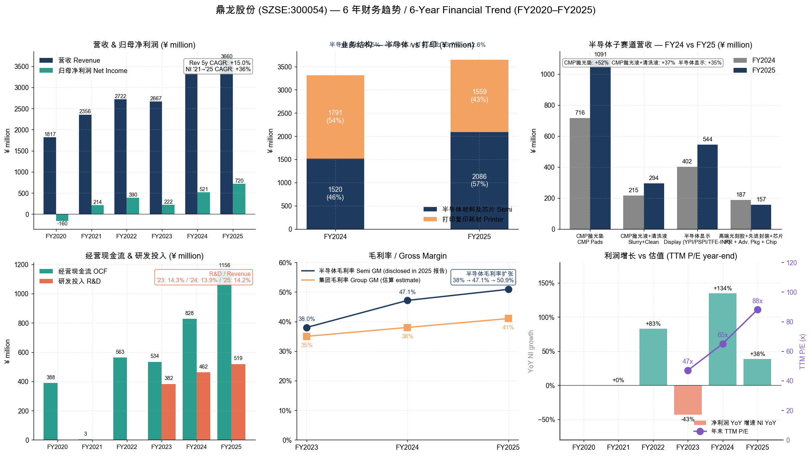
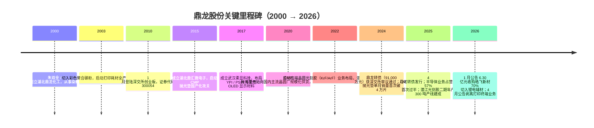
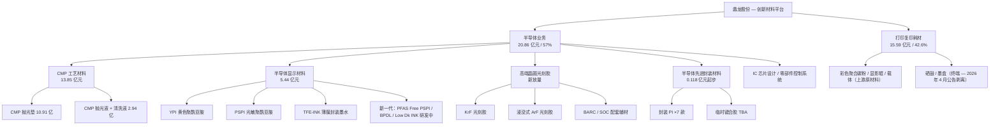
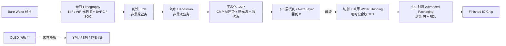
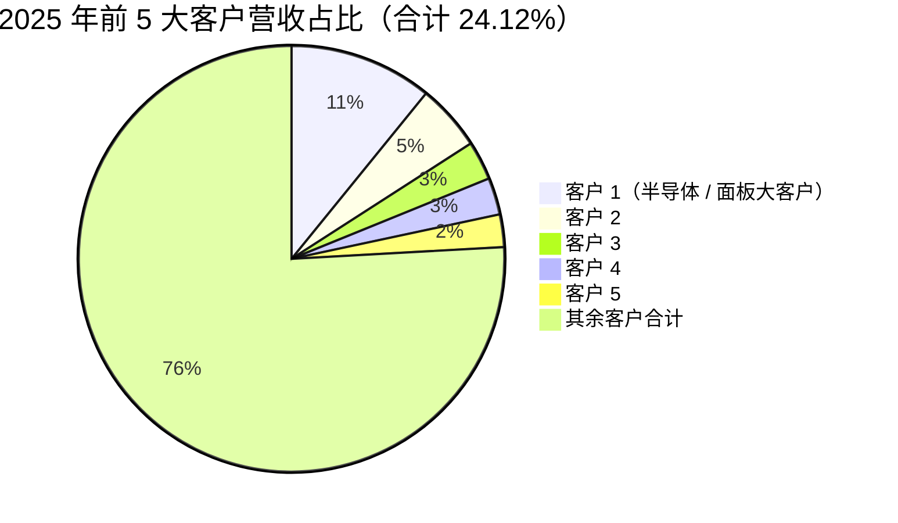
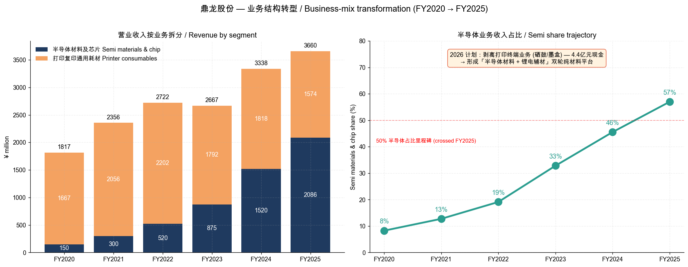
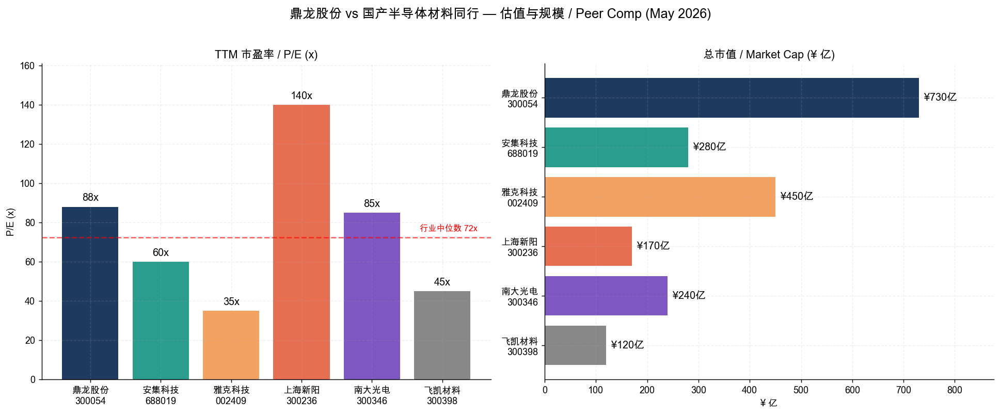

# 湖北鼎龙控股股份有限公司 (SZSE:300054) — 公司研究

**作为：** 2026 年 5 月 25 日
**报告语言：** 简体中文（A 股上市，年报以中文披露 — 适用 zh-CN 默认规则）
**主营：** 半导体 CMP 抛光垫 / 抛光液 / 清洗液、半导体显示材料 (YPI / PSPI / TFE‑INK)、高端晶圆光刻胶 (KrF / ArF)、半导体先进封装材料、打印复印通用耗材

---

> **要闻提示 — 2026 年战略转型加速 (2026-04-02 公告):** 公司公告拟以约 4.4 亿元现金对价剥离两家「打印复印耗材终端」子公司（珠海名图超俊 60%、北海绩迅 15%），将传统硒鼓 / 墨盒终端业务出表，资源集中至半导体材料主业；同时延续 2026 年 1 月披露的 6.30 亿元收购深圳市皓飞新型材料 70% 股权（整体估值 9 亿元）切入锂电分散剂 / 粘结剂赛道。两项资本动作叠加，标志着「打印 + 半导体」二元业务结构正式转向「半导体材料 + 锂电辅材」双轮纯材料平台。  
> Source: [鼎龙股份拟剥离通用打印耗材终端业务（证券时报，2026-04-02）](https://www.stcn.com/article/detail/3724253.html) · [关于对外投资购买股权的公告（公告编号：2026-006）](http://static.cninfo.com.cn/finalpage/2026-01-27/1224950902.PDF)

> **业绩高景气延续 — 2026Q1 净利润预增 70–84% 落地于上限 (2026-04-27):** 公司 2026Q1 营业收入 10.20 亿元、同比 +23.82%；归母净利润 2.51 亿元、同比 +77.99%，命中此前 2.4–2.6 亿元业绩预告区间上半部。半导体材料业务延续放量，叠加皓飞新材并表，净利润环比 +24.9%（vs 2025Q4 2.01 亿）。  
> Source: [2026 年第一季度报告（公告编号：2026-042）](http://static.cninfo.com.cn/finalpage/2026-04-28/1225206346.PDF) · [2026 年第一季度业绩预告（公告编号：2026-024）](http://static.cninfo.com.cn/finalpage/2026-03-27/1225036146.PDF)

---

## 目录

1. [公司概览](#1-公司概览)
2. [公司历史](#2-公司历史)
3. [管理团队](#3-管理团队)
4. [产品与服务](#4-产品与服务)
5. [客户与上市策略](#5-客户与上市策略)
6. [行业概览](#6-行业概览)
7. [竞争格局](#7-竞争格局)
8. [市场机会](#8-市场机会)
9. [风险评估](#9-风险评估)
10. [参考资料](#10-参考资料)

---

## 1. 公司概览

湖北鼎龙控股股份有限公司（以下简称「鼎龙股份」或「公司」，证券代码 300054）是 A 股创业板上市的「创新材料平台型」企业，2010 年 1 月登陆深交所创业板。公司以打印复印耗材彩色聚合碳粉起家，过去十年系统性向半导体材料赛道延展，目前形成「半导体材料 + 集成电路芯片设计 + 打印复印通用耗材」三块业务，2025 年半导体业务营收占比首次过半，进入新的发展阶段。公司注册地与总部位于武汉经济技术开发区东荆河路 1 号，已在武汉本部、潜江光电半导体材料产业园、仙桃光电半导体材料产业园形成三大产业基地布局 [2025 年年度报告](http://static.cninfo.com.cn/finalpage/2026-03-27/1225036149.PDF)。

**收入与盈利体量。** 2025 年公司实现营业收入 36.60 亿元（同比 +9.66%）、归属于上市公司股东的净利润 7.20 亿元（同比 +38.32%）、扣非归母净利润 6.78 亿元（同比 +44.53%）；经营活动现金流量净额 11.57 亿元，同比 +39.64%，现金流明显领先于净利润，反映半导体材料业务规模效应释放、应收账款回款管理强化共同贡献的经营质量改善 [2025 年年度报告](http://static.cninfo.com.cn/finalpage/2026-03-27/1225036149.PDF)。研发投入 5.19 亿元、占营收 14.19%，连续三年保持在 13.9%–14.3% 的高强度区间；研发人员 1,283 人，占员工总数 34.4%，硕士及以上 222 人 [2025 年年度报告](http://static.cninfo.com.cn/finalpage/2026-03-27/1225036149.PDF)。

**业务结构与转型节奏。** 2025 年半导体材料及芯片营收 20.86 亿元（同比 +37.27%），占总营收 57.00%；打印复印通用耗材营收 15.59 亿元（同比 ‑12.97%），占比 42.59%。半导体业务毛利率 50.88%（同比 +3.74 个百分点），显著高于集团综合毛利率，是利润扩张的核心引擎。2024 年该比例还是「半导体 45.5% / 打印 53.7%」，2025 年完成首次反转。结合 2026 年 1 月对皓飞新材的并购、4 月对打印终端子公司的剥离，公司清晰对外传递「专注材料创新平台」的战略指引 [2025 年年度报告](http://static.cninfo.com.cn/finalpage/2026-03-27/1225036149.PDF) · [拟剥离通用打印耗材终端业务（证券时报，2026-04-02）](https://www.stcn.com/article/detail/3724253.html)。

来源：基于 [2020](https://www.cninfo.com.cn/) / [2022](https://www.cninfo.com.cn/) / [2023](https://www.cninfo.com.cn/) / [2024](http://static.cninfo.com.cn/finalpage/2025-04-29/1223367500.PDF) / [2025](http://static.cninfo.com.cn/finalpage/2026-03-27/1225036149.PDF) 年度报告自行整理。半导体子赛道营收按 2025 年报「管理层讨论与分析」披露的子产品销售收入与同比增速反推 2024 年基数。

**地域结构与下游属性。** 2025 年境内收入 25.72 亿元（70.28%，同比 +18.80%），境外收入 10.88 亿元（29.72%，同比 ‑7.23%）。境外收入下滑的根源在于打印耗材业务（出口为主）主动调整低毛利客户结构；半导体材料业务则几乎全部由境内主流晶圆厂、面板厂客户驱动，本土国产替代红利继续推动境内收入快速增长 [2025 年年度报告](http://static.cninfo.com.cn/finalpage/2026-03-27/1225036149.PDF)。

**估值快照（截至 2026-05-25）。** 收盘价约 ¥77.00 / 股、总股本 9.48 亿股 → 总市值约 730 亿元；滚动市盈率（TTM P/E）约 87.94×、市净率 13.37×、股息率（TTM）约 0.13%。市值口径下市销率（TTM P/S）= 730 ÷ 36.60 ≈ 19.9×，若以 2026Q1 年化营收（≈ 40.8 亿元）测算前瞻 P/S 约 17.9× [鼎龙股份 (SZ300054) 雪球行情页](https://xueqiu.com/S/SZ300054)。  
*分析师观点：* TTM P/E 88× 显著高于电子化学品板块约 50–60× 的中位数（详见第 7 节峰值同行对比），背后是市场对「半导体材料国产替代 + AI 算力 + 先进封装」三重题材叠加的估值溢价；2025 年扣非净利润 +44.5%、2026Q1 扣非净利润 +75.2% 的成长曲率持续验证，使估值溢价具备业绩支撑，但若 2026 全年扣非增速回落至 50% 以下，估值压力将明显抬头。负面情境下市场可能用 2026 业绩兑现度作为「估值锚」重新定价。

**核心数据汇总（FY2025）：** 营收 36.60 亿元；归母净利 7.20 亿元；OCF 11.57 亿元；ROE 12.83%；研发投入 5.19 亿元 / 14.19% of revenue；员工总数约 3,728 人（按研发占比 34.42% 反推）；专利累计 1,299 项（已授权 1,056 项），软件著作权与集成电路布图设计 108 项；前五大客户合计销售额占比 24.12%，其中第一大客户占 10.87% [2025 年年度报告](http://static.cninfo.com.cn/finalpage/2026-03-27/1225036149.PDF)。

---

## 2. 公司历史

鼎龙股份创立于 2000 年（湖北鼎龙化工有限公司），由朱双全、朱顺全兄弟在武汉创办，起步于化工原料，2003 年起切入彩色聚合碳粉与打印耗材产业链；2008 年完成股份制改造（湖北鼎龙化学股份有限公司），2010 年 1 月以「鼎龙股份」证券简称登陆深交所创业板，是创业板早期上市的湖北本土科技公司 [2025 年年度报告](http://static.cninfo.com.cn/finalpage/2026-03-27/1225036149.PDF) · [鼎龙股份是做什么的（巨丰财经）](https://baike.jfinfo.com/4046180.html)。上市初期公司主营为彩色聚合碳粉、硒鼓、墨盒等打印复印耗材，是国内唯一具备四种颜色彩粉自主制备工艺的厂商 [2025 年年度报告](http://static.cninfo.com.cn/finalpage/2026-03-27/1225036149.PDF)。

**三次战略性跃迁，决定了今天的鼎龙。** 第一次是 2003–2010 年「化工 → 打印耗材」的横向升级 —— 利用染料中间体的有机合成与高分子合成技术基础切入打印复印耗材，最终建成国内最完整的「彩色聚合碳粉 + 显影辊 + 硒鼓 + 墨盒」打印耗材全产业链，使打印耗材成为公司第一个稳定盈利支柱 [2025 年年度报告](http://static.cninfo.com.cn/finalpage/2026-03-27/1225036149.PDF)。第二次是 2014–2020 年的「打印耗材 → 半导体材料」纵向跨越 —— 以 CMP 抛光垫为切入点，借助有机合成 + 高分子合成 + 微球发泡的技术平台复用，攻克美国陶氏长期垄断的 CMP 抛光垫国产化难题，并衍生至 CMP 抛光液 / 清洗液、半导体显示材料 YPI / PSPI / TFE‑INK 等多品类创新材料 [国产半导体耗材破局 — 鼎龙股份 打破外资 CMP 垄断（21 世纪经济报道，2017-12-21）](https://m.21jingji.com/article/20171221/bf621542e23f040b9f7d701e336dc07f.html)。第三次是 2022 年至今的「半导体材料平台化扩张」 —— 高端晶圆光刻胶（KrF / ArF）、半导体先进封装材料（封装 PI、临时键合胶）、半导体零部件控制系统等新品矩阵相继落地，并通过 2026 年并购皓飞新材正式进入锂电池辅材赛道 [2025 年年度报告](http://static.cninfo.com.cn/finalpage/2026-03-27/1225036149.PDF) · [布局锂电材料行业 鼎龙股份拟 6.3 亿收购皓飞新材 70% 股权（知乎，2026-01）](https://zhuanlan.zhihu.com/p/1999446437931537150)。

**重要资本运作。** （1）2015 年 10 月成立全资孙公司湖北鼎汇微电子材料有限公司，承载 CMP 抛光垫业务；2025 年 6 月以 2.40 亿元（鼎汇微电子整体估值 30 亿元）从建信信托手中受让 8% 股权，使持股比例由 91.35% 提升至 99.35% [2025 年年度报告](http://static.cninfo.com.cn/finalpage/2026-03-27/1225036149.PDF)。（2）2017 年成立武汉柔显科技股份有限公司，承担 YPI / PSPI / TFE‑INK 等 OLED 显示材料；2025 年 7 月以 5,268.25 万元（柔显整体估值 8 亿元）从原股东李文超、胡琴、张振手中受让股权，公司持股比例由 82% 提升至 88.59% [2025 年年度报告](http://static.cninfo.com.cn/finalpage/2026-03-27/1225036149.PDF)。（3）2025 年 4 月成功发行 9.10 亿元可转换公司债券（「鼎龙转债」），所募资金主要用于「年产 300 吨 KrF/ArF 光刻胶产业化项目」、「光电半导体材料上游关键原材料国产化基地」与流动资金补充 [2025 年年度报告 — 证券发行情况](http://static.cninfo.com.cn/finalpage/2026-03-27/1225036149.PDF)。（4）2026 年 1 月以 6.30 亿元自有 / 自筹资金收购深圳市皓飞新型材料有限公司 70% 股权，整体估值 9 亿元，皓飞 2025 年 1–11 月营收已达 4.81 亿元，主要客户为宁德时代 [关于对外投资购买股权的公告（2026-006）](http://static.cninfo.com.cn/finalpage/2026-01-27/1224950902.PDF) · [调研速递 9 亿收购皓飞新材切入锂电辅材赛道（新浪财经，2026-01-27）](https://finance.sina.com.cn/stock/aigc/jgdy/2026-01-27/doc-inhiucrr9641981.shtml)。

**近期发展（2025 年下半年至今）。** 2025 年三季度 CMP 抛光垫单月销量首破 4 万片创历史新高；2025 年潜江高端晶圆光刻胶年产 300 吨二期量产线主体完工，对标国际一流形成国内首条「有机合成 → 高分子合成 → 精制纯化 → 光刻胶混配」全流程产线；2026 年 3 月二期产线正式投产 [鼎龙股份(300054)：拟收购皓飞新材切入锂电功能辅材新赛道（新浪财经，2026-01）](https://stock.finance.sina.com.cn/stock/view/paper.php?symbol=sh000001&reportid=823462038501)。董事会同步推进港股 H 股发行上市作为「2026 年重点工作之一」，意在搭建国际化资本平台并加速海外业务拓展 [2025 年年度报告 — 公司未来发展的展望](http://static.cninfo.com.cn/finalpage/2026-03-27/1225036149.PDF)。

---

## 3. 管理团队

公司由 **朱双全（董事长）与 朱顺全（董事、总经理）兄弟** 共同实际控制 —— 2025 年年报「上述董事关系说明」明确披露："朱双全、朱顺全系兄弟关系，为公司共同实际控制人" [2025 年年度报告](http://static.cninfo.com.cn/finalpage/2026-03-27/1225036149.PDF)。两人合计直接持股 277,280,928 股、占总股本 29.27%；加上分别通过宁波思之创、宁波众悦享间接持有的 76 万 / 76 万股，合计控制比例约 29.45%。截至 2025 年末，朱双全直接持股 139,249,514 股（14.70%）中已质押 2,288 万股，朱顺全直接持股 138,031,414 股（14.57%）中已质押 380 万股 [2025 年年度报告 — 股东和实际控制人情况](http://static.cninfo.com.cn/finalpage/2026-03-27/1225036149.PDF)。

**朱双全 — 董事长、法定代表人**（男，1964 年生，硕士研究生学历）。1987 年 8 月至 1998 年 3 月，任湖北省总工会干部，开启政府机关任职生涯；1998 年 3 月至 2000 年 7 月任湖北国际经济对外贸易公司部门经理，奠定其外贸 / 化工进出口业务经验。2000 年 7 月与弟弟朱顺全在武汉创办湖北鼎龙化工，担任执行董事 / 总经理；2005 年 3 月变更为湖北鼎龙执行董事 / 总经理；2008 年 4 月起担任鼎龙股份董事长至今，已连任至第六届董事会，任期至 2028 年 5 月 19 日 [2025 年年度报告 — 董事和高级管理人员情况](http://static.cninfo.com.cn/finalpage/2026-03-27/1225036149.PDF)。除鼎龙股份外，朱双全亦任杭州旗捷科技（A 股拟上市子公司）董事长（2017 年至今）、湖北高投产控副董事长（2018 年至今）、武汉中元华电（600834）董事长（2025 年 12 月至今） [2025 年年度报告 — 在其他单位任职情况](http://static.cninfo.com.cn/finalpage/2026-03-27/1225036149.PDF)。

**朱顺全 — 董事、总经理**（男，1968 年生，本科学历，湖北省第十三届政协委员）。1997 至 2000 年任中国湖北国际经济技术合作公司部门经理；2000 年 7 月至 2005 年 3 月任鼎龙化工监事；2005 年 3 月至 2008 年 4 月任湖北鼎龙监事；2008 年 11 月起任鼎龙股份董事兼总经理至今，主导日常经营与产品产业化推进 [2025 年年度报告 — 董事和高级管理人员情况](http://static.cninfo.com.cn/finalpage/2026-03-27/1225036149.PDF)。鼎龙股份的「四个同步」研发哲学（材料技术创新与上游原材料自主化培养同步、与用户验证工艺发展同步、与人才团队培养同步、与知识产权建设同步）系朱顺全主导提出的产业化打法，已成为公司在 CMP 抛光垫、YPI / PSPI、KrF / ArF 光刻胶等品类持续突破的方法论支柱 [2025 年年度报告 — 公司发展战略](http://static.cninfo.com.cn/finalpage/2026-03-27/1225036149.PDF)。

**实际控制人评价。** 朱氏兄弟自 2000 年共同创业至今已有 26 年，跨越「染料中间体 → 打印耗材 → 半导体材料」两次大转型，公司治理结构上由朱双全负责战略 / 资本运作（董事长 + 法定代表人），朱顺全主管经营 / 产业化（总经理），分工清晰、未发生过控制权或核心团队的剧烈震荡。两人合计 29.45% 的实际控制比例稳定但并未达到绝对控股（>33.3%），后续若公司继续股权激励（2024 年股票期权激励计划已授予 2,499.9 万份）或可转债转股，实控人比例存在被动稀释空间，但鉴于朱双全任期至 2028 年 5 月仍延续，短期内不构成治理风险 [2025 年年度报告](http://static.cninfo.com.cn/finalpage/2026-03-27/1225036149.PDF)。

---

## 4. 产品与服务

公司 2025 年报「报告期内公司从事的主要业务」披露的产品矩阵共分为 5 个半导体子板块 + 1 个传统打印耗材板块，组成「平台型创新材料公司」的产品全景 [2025 年年度报告](http://static.cninfo.com.cn/finalpage/2026-03-27/1225036149.PDF)：

### 4.1 公司自披露的产品矩阵

| 板块 | 子产品族 | 2025 年营收（亿元） | 同比 | 进展节点 |
|---|---|---:|---:|---|
| 半导体制造用 CMP 工艺材料 | CMP 抛光垫 (Polishing Pad) | 10.91 | +52.3% | 武汉本部 Q1'26 末月产能 ~5 万片 / 年产 60 万片；潜江三期 20 万片软垫产能投产 |
| 半导体制造用 CMP 工艺材料 | CMP 抛光液 + 清洗液 (Slurry + Post‑CMP Clean) | 2.94 | +36.8% | 仙桃 1 万吨抛光液产线投产；自产 4 大体系研磨粒子（超纯 SiO₂ / 高纯 SiO₂ / Al₂O₃ / CeO₂）持续上量 |
| 半导体显示材料 | YPI / PSPI / TFE‑INK | 5.44 | +35.5% | 仙桃 1,000 吨 PSPI / 800 吨 YPI 二期产线投产；下一代 PFAS Free PSPI / BPDL / Low Dk INK 中试中 |
| 半导体制造用 — 高端晶圆光刻胶 | KrF / ArF 光刻胶 + BARC / SOC | 尚未单列 | n/a | 潜江一期 30 吨 + 二期 300 吨产线建成；3 款产品进入稳定批量供应阶段；超 20 款完成送样验证 |
| 半导体先进封装材料 | 封装 PI、临时键合胶 TBA | 0.118 | n/a（销售突破千万） | 封装 PI 布局 7 款 / 在售 2 款；TBA 在多家封测厂稳定出货 |
| 集成电路芯片设计与应用 | 打印耗材芯片（旗捷科技） + 半导体零部件控制系统（新拓展） | 含于半导体板块 | n/a | 单价下行但芯片产品矩阵扩大；半导体零部件控制系统已与晶圆厂展开技术合作 |
| 打印复印通用耗材 | 彩色聚合碳粉、显影辊、载体、硒鼓、墨盒 | 15.59 | ‑13.0% | 公司以利润为导向主动收缩低毛利客户；2026 年 4 月公告剥离终端硒鼓 / 墨盒子公司 |

来源：[2025 年年度报告 — 主营业务分析](http://static.cninfo.com.cn/finalpage/2026-03-27/1225036149.PDF) · [2025 年年度报告 — 报告期内公司从事的主要业务](http://static.cninfo.com.cn/finalpage/2026-03-27/1225036149.PDF) · [2025 年年度报告 — 子产品销售收入](http://static.cninfo.com.cn/finalpage/2026-03-27/1225036149.PDF)。

### 4.2 CMP 抛光垫 — 国产唯一全制程供应商

> 「公司目前是国内唯一一家全面掌握 CMP 抛光垫全流程核心研发技术和生产工艺的 CMP 抛光垫供应商，确立 CMP 抛光垫国产供应龙头地位，产品深度渗透国内主流晶圆厂客户，成为部分客户的第一供应商，被多家晶圆厂核心客户评为优秀供应商。」 [2025 年年度报告 — 报告期内公司从事的主要业务](http://static.cninfo.com.cn/finalpage/2026-03-27/1225036149.PDF)

**中文释义 / Plain‑language gloss:** CMP（chemical‑mechanical planarization，化学机械抛光）是集成电路制造中介于「层间沉积」与「光刻 → 刻蚀」之间的平坦化工序 —— 晶圆每完成一层金属互连（interconnect）或介质层（dielectric），表面就会形成凹凸；下一层光刻要曝光，必须让这一层先被「磨平」到纳米级平整度。CMP 抛光垫 / pad 是一块直径与晶圆等长（300 mm wafer 对应约 30 英寸）的微孔聚氨酯 (PU, polyurethane) 圆盘，垫子上密布的发泡微孔在湿法环境下保持抛光液 / slurry 的均匀供给。可以把抛光垫想象成「带研磨膏的精密砂纸」 —— 但精度要做到「晶圆每个位置研磨速率差异 <1%」。鼎龙的硬垫主要用于「金属（铜 / 钨）抛光」、软垫主要用于「介质 / 大硅片 / SiC 第三代半导体抛光」，2025 年硬垫产线已扩至月产 ~5 万片（≈ 年产 60 万片），软垫在潜江工厂三期 20 万片产能形成「软硬一体」的产品矩阵 [2025 年年度报告](http://static.cninfo.com.cn/finalpage/2026-03-27/1225036149.PDF)。  
*分析师观点：* 这是公司当前最具壁垒的「现金奶牛」业务，国产化率方面据湖北省经信厅披露已接近 80%，鼎龙是国内唯一全制程突破者 [CMP抛光垫产品反向供货外资厂商 鼎龙股份打破全球巨头垄断（湖北省经信厅，2025-04-17）](https://jxt.hubei.gov.cn/bmdt/qyfc/202504/t20250417_5618971.shtml)。其壁垒来自「PU 配方 + 微球发泡 + 表面槽型设计」三层 know‑how 叠加，需要 5–7 年与晶圆厂工艺迭代共同打磨，对手即便买到配方也需重新跑客户验证流程。鼎龙仙桃微球产线 2025 年实现量产，进一步把原料端的 know‑how 封进自有供应链。

### 4.3 CMP 抛光液 + 清洗液 — 自产研磨粒子驱动的工艺组合

> 「核心原材料研磨粒子自主供应链优势持续巩固，搭载自产四大体系研磨粒子（超纯氧化硅溶胶、高纯氧化硅溶胶、氧化铝、氧化铈）的抛光液产品市场接受度稳步提升……公司 CMP 抛光液、清洗液产品市场渗透的加深与新品订单的增长，将为后续销售收入的增长注入新动能。」 [2025 年年度报告](http://static.cninfo.com.cn/finalpage/2026-03-27/1225036149.PDF)

**中文释义 / Plain‑language gloss:** 抛光液 / slurry 是「CMP 三件套」中的化学端，由研磨粒子 (abrasive particle，如 silica / alumina / ceria) + 化学添加剂（pH buffer、surfactant、oxidizer 等）+ 去离子水组成，与抛光垫共同作用于晶圆表面。不同制程节点对应不同抛光液：铜及铜阻挡层（copper / Cu‑barrier）用超纯 SiO₂ 溶胶；金属栅极（钨 / 铝，W / Al）用 Al₂O₃；浅槽隔离（STI, shallow trench isolation）用 CeO₂；多晶硅 / 氮化硅则用混合体系。清洗液 (post‑CMP clean) 紧接在抛光之后，负责清除抛光后晶圆表面残余的研磨粒子和金属离子 —— 否则会引起器件短路或电迁移失效。鼎龙的差异化在于「研磨粒子端全部自产」：可同时供应 4 种粒子体系，使配方迭代速度比依赖外采的同行快得多 [2025 年年度报告](http://static.cninfo.com.cn/finalpage/2026-03-27/1225036149.PDF)。2025 年公司已实现「抛光液 + 清洗液」组合订单首次落地于国内主流逻辑晶圆厂客户。  
*分析师观点：* 抛光液是 CMP 三件套里最碎片化、最依赖客户工艺定制的一环，国内龙头是科创板的安集科技（[688019.SH](https://xueqiu.com/S/SH688019)）；鼎龙以「抛光垫客户关系」反向切入抛光液业务，能形成「pad + slurry」的整体解决方案能力。当前 2.94 亿元的体量仍小，但「自产研磨粒子 → 自有抛光液 → 自有清洗液」一站式提案在客户验证侧具备显性优势，未来 2–3 年有望放量至 5–8 亿元区间，但需要在多个新品线与安集科技正面竞争。

### 4.4 半导体显示材料 — YPI / PSPI / TFE‑INK：柔性 OLED 国产首选

> 「公司围绕柔性 OLED 显示屏幕制造用的上游核心材料布局，推出黄色聚酰亚胺浆料 YPI、光敏聚酰亚胺浆料 PSPI、薄膜封装材料 TFE‑INK 等系列产品……公司 YPI、PSPI、TFE‑INK 产品已在客户端规模销售，并已成为国内部分主流面板客户 YPI、PSPI 产品的第一供应商，确立 YPI、PSPI 产品国产供应领先地位。」 [2025 年年度报告](http://static.cninfo.com.cn/finalpage/2026-03-27/1225036149.PDF)

**中文释义 / Plain‑language gloss:** 柔性 OLED 显示屏从下到上由「柔性基板 + TFT 背板 + OLED 发光层 + 薄膜封装」组成，YPI（黄色聚酰亚胺 / yellow polyimide）是柔性基板 (flexible substrate) 的关键原材料 —— 在高分子合成阶段进入「未固化」状态、在面板厂以涂布 (spin coating) 形式形成约 10μm 厚的柔性基底，固化后既要耐 OLED 工艺约 450°C 高温，又要保留弯折性能。PSPI（光敏聚酰亚胺 / photo‑sensitive PI）则用于 TFT 背板的层间绝缘膜与像素定义层，「光敏」意味着可以像光刻胶一样直接曝光显影、不需要额外光刻工艺，极大简化制程。TFE‑INK（thin‑film encapsulation ink，薄膜封装墨水）填充在 OLED 发光层与外封装之间，起到「拦截水汽 / 氧气以防止 OLED 退化」的作用 —— OLED 对水汽极度敏感，TFE 是「让屏幕在三年后还不出现亮度衰减」的关键 [2025 年年度报告](http://static.cninfo.com.cn/finalpage/2026-03-27/1225036149.PDF)。鼎龙在仙桃产业园已落地 800 吨 / 年 YPI 二期 + 1,000 吨 / 年 PSPI 产线；下一代产品 PFAS Free PSPI（适应欧盟新环保法规）、BPDL（黑色像素定义层）、Low Dk INK（低介电封装墨水）均处于中试 / 客户验证阶段。  
*分析师观点：* 这是公司第二条与外资龙头正面对标的产品线，YPI / PSPI 的国际对手是日本宇部兴产（[Ube](https://www.ube.com/)）、东丽（[Toray](https://www.toray.com/)）、韩国 LG 化学等；鼎龙凭借「面板厂的中国本土化采购需求 + 自主合成路线」拿下国内第一供应商地位 [半导体显示材料营收激增 85%！鼎龙控股领跑国产替代赛道（新浪科技，2025-05-28）](https://finance.sina.com.cn/tech/roll/2025-05-28/doc-ineyayyx9200321.shtml)。2025 年下游京东方、维信诺、TCL 华星、天马 G8.6 代 OLED 高世代线大规模上量，是 PSPI / TFE‑INK 销量的核心拉动力。中大尺寸 OLED（车载 / 平板 / 笔电）将是该业务下一波放量的关键场景。

### 4.5 高端晶圆光刻胶（KrF / ArF）— 国产首条全流程量产线

> 「公司浸没式 ArF 及 KrF 晶圆光刻胶业务稳步推进、加速突破，在国内实现"全制程"与"全尺寸"覆盖。产品开发及市场拓展方面，公司已布局超 30 款高端晶圆光刻胶，超 20 款产品完成客户送样验证，其中超 12 款进入加仑样测试阶段，验证进展顺利。……报告期内，ArF、KrF 光刻胶产品分别实现新的订单突破，已有 3 款产品进入稳定批量供应阶段。」 [2025 年年度报告](http://static.cninfo.com.cn/finalpage/2026-03-27/1225036149.PDF)

**中文释义 / Plain‑language gloss:** 光刻胶 (photoresist, PR) 是晶圆光刻 (photolithography) 工艺的「显影底片」 —— 在涂布到晶圆表面、经光刻机紫外光 (UV) 透过掩膜板曝光后，曝光与未曝光区域因聚合物链结构变化而显示出不同溶解度，再经显影液处理便复制出掩膜图案。光刻胶按光源波长分为四档：g 线（436 nm）/ i 线（365 nm，0.35 μm 以上节点）→ KrF（248 nm，0.25–0.13 μm 节点）→ ArF（193 nm，90 nm–7 nm 节点）→ EUV（13.5 nm，5 nm 以下节点）。其中 KrF / ArF 覆盖了从 0.25 μm 到 7 nm 的主流先进制造工艺，是当前国产化最迫切的环节。鼎龙以 2022 年 5 月「从零开始」入局光刻胶赛道，到 2025 年底建成国内首条「有机合成 → 高分子合成 → 精制纯化 → 光刻胶混配」全流程量产线（潜江一期 30 吨 + 二期 300 吨），并实现 3 款产品稳定批量供应 [2025 年年度报告](http://static.cninfo.com.cn/finalpage/2026-03-27/1225036149.PDF) · [国产光刻胶新进展：两款高端晶圆光刻胶通过国内主流晶圆厂验证并获得订单（电子方案资讯，2025）](https://www.52solution.com/news/80061513/)。配套 BARC（bottom anti‑reflective coating，底部抗反射层）和 SOC（spin‑on carbon，旋涂碳层）等辅材也在同步布局。  
*分析师观点：* 客户层面据公开调研信息，鼎龙的 2 款已批量供货光刻胶产品已通过中芯国际、长江存储 (YMTC) 等国内头部晶圆厂的验证 [鼎龙股份：两款高端光刻胶获订单，产线产能释放加速商业化（新浪财经，2025-11-28）](https://finance.sina.com.cn/stock/relnews/dongmiqa/2025-11-28/doc-infyxmri0048252.shtml)。该业务目前仍处于「市场开拓及放量初期，尚未盈利」阶段（公司年报口径），是 2026–2028 年的核心增长点。光刻胶赛道国内主要对标日本 JSR、TOK、信越化学，国产化率不足 10%，国内同业还有南大光电、上海新阳、彤程新材等，但鼎龙的差异化在于「具备完整 KrF + ArF 全制程产能 + 自产树脂 / 单体 / 产酸剂供应链」，从工程闭环看是国内目前推进速度最快的玩家。

### 4.6 半导体先进封装材料 — 封装 PI + 临时键合胶 TBA

> 「公司围绕半导体先进封装上游几款自主化程度低、技术难度高、未来增量空间较大的材料产品进行布局，目前重点开发半导体封装 PI、临时键合胶等产品……2025 年销售收入 1,176 万元。……半导体封装 PI 方面，公司已布局 7 款产品，目前共有 2 款产品取得多家客户订单。」 [2025 年年度报告](http://static.cninfo.com.cn/finalpage/2026-03-27/1225036149.PDF)

**中文释义 / Plain‑language gloss:** 先进封装 (advanced packaging) 是后摩尔时代「以封装堆叠替代制程微缩」的核心赛道，包括 CoWoS / SoIC（台积电）、HBM（SK 海力士 / 三星 / 美光）、UCIe Chiplet 互联等技术路线。封装 PI（package PI / 封装级聚酰亚胺）作为 RDL（重布线层）的介电层，承担「电信号绝缘 + 应力释放 + 热膨胀匹配」三重职能。临时键合胶 TBA（temporary bonding adhesive）用于 3D IC / 2.5D 封装中「先把超薄晶圆贴到载板上、做完背面工艺后再剥离」的中间步骤 —— 没有 TBA，wafer thinning（晶圆减薄到 50 μm 以下）就无法稳定进行。两类材料过去基本被日本日立、长濑、Brewer Science 等垄断。鼎龙以柔显科技的 PI 技术平台「平移」入这两个新品线，2025 年首次实现千万级销售突破 [2025 年年度报告](http://static.cninfo.com.cn/finalpage/2026-03-27/1225036149.PDF)。  
*分析师观点：* 1,176 万元的销售额按集团口径几乎可以忽略，但「从 0 到 1」突破的意义重大 —— 它打开了与国内封测厂（长电、通富、华天、华润微）的合作通道，也使鼎龙从「前道晶圆厂供应商」延伸为「前道 + 后道」全工艺材料平台。在 HBM 国产化与 Chiplet 高度活跃的窗口，这块业务可能在 2027 年前后进入数亿元规模的爆发期。

### 4.7 集成电路芯片设计 + 半导体零部件控制系统（旗捷科技）

> 「公司子公司旗捷科技是一家集研发、生产与销售为一体的具有专业集成电路设计与应用能力的企业，深耕打印复印耗材芯片细分领域 18 年……公司稳步完善芯片产品矩阵，同时针对芯片制造环节部分关键技术的问题，积极在半导体零部件控制系统产品领域进行布局。」 [2025 年年度报告](http://static.cninfo.com.cn/finalpage/2026-03-27/1225036149.PDF)

**中文释义 / Plain‑language gloss:** 旗捷科技（杭州旗捷科技股份有限公司）是鼎龙的集成电路设计子公司，主营打印耗材专用控制芯片（cartridge chip）—— 这类芯片嵌入硒鼓 / 墨盒后与打印机进行身份认证、墨量监控、防伪等通信，是打印耗材产业链「卡口」之一。该业务因终端打印耗材市场价格内卷、2025 年单价下行带来一定阶段性影响 [2025 年年度报告](http://static.cninfo.com.cn/finalpage/2026-03-27/1225036149.PDF)。更重要的是，2025 年 10 月公司新设孙公司浙江执一半导体有限公司（注册资本 3,000 万元），用于「拓展旗捷科技在半导体器件专用设备零部件控制系统产品方面的业务布局」 [2025 年年度报告 — 投资状况分析](http://static.cninfo.com.cn/finalpage/2026-03-27/1225036149.PDF)。  
*分析师观点：* 这块业务的核心价值不再是打印耗材芯片的存量，而是「为芯片制造环节的设备零部件提供控制系统」 —— 半导体设备零部件（控制器、传感器、运动控制板）是国产替代下一波风口，与北方华创、中微公司、芯源微等设备厂的横向合作是后续看点。当前体量尚未单独披露。

### 4.8 打印复印通用耗材（剥离中）

公司是「全球激光打印复印通用耗材生产商中产品体系最全、技术跨度最大、以自主知识产权和专有技术为基础的市场导向型创新整合商」 [2025 年年度报告](http://static.cninfo.com.cn/finalpage/2026-03-27/1225036149.PDF)。2025 年该业务营收 15.59 亿元、同比 ‑12.97%，公司明确表示「坚持以利润目标为核心导向，持续主动调整缩减低毛利产品的客户结构和产品品类」。2026 年 4 月公告剥离两个终端子公司（珠海名图超俊 60% 股权对价 1.20 亿元、北海绩迅 15% 股权对价 7,275 万元，合计回收现金约 4.4 亿元），剥离后两家子公司不再纳入合并报表 [拟剥离通用打印耗材终端业务（证券时报，2026-04-02）](https://www.stcn.com/article/detail/3724253.html) · [鼎龙股份大动作！4.4 亿剥离传统业务（财富号，2026-04-09）](https://caifuhao2.eastmoney.com/news/20260409093533508272670)。需要注意的是，公司并非剥离整个打印耗材业务，而是只剥离「下游终端」（硒鼓 / 墨盒成品），上游核心原材料（彩色聚合碳粉、显影辊、载体）仍保留并继续向第三方耗材厂供货。  
*分析师观点：* 这是典型的「向上游收缩」打法 —— 终端硒鼓 / 墨盒利润率低、库存周转重、外贸汇率敏感，剥离后既能优化 ROIC，又能把彩色聚合碳粉这块「自主四色制备工艺」的资产留下做 B2B。剥离后打印业务剩余规模预计在 8–10 亿元区间，毛利率将明显提升。

### 4.9 锂电功能工艺性辅材（皓飞新材，2026Q1 起并表）

2026 年 1 月公司以 6.30 亿元收购深圳市皓飞新型材料有限公司 70% 股权（整体估值 9 亿元）。皓飞新材是国内绝对头部锂电池企业供应链内的核心功能工艺性辅材类供应商，主要产品包括锂电分散剂 (dispersant)、粘结剂 (binder)、定制化产品等，是国内新型锂电池分散剂的绝对头部企业，主要客户包括宁德时代等头部电池厂 [关于对外投资购买股权的公告（2026-006）](http://static.cninfo.com.cn/finalpage/2026-01-27/1224950902.PDF) · [鼎龙股份：拟 6.3 亿元收购皓飞新材 70% 股权（新浪财经，2026-01-26）](https://finance.sina.com.cn/jjxw/2026-01-26/doc-inhirukw6278987.shtml)。皓飞新材 2023 / 2024 / 2025 年 1–11 月营收分别为约 2.9 亿元 / 3.45 亿元 / 4.81 亿元，呈现 30% 以上的稳定增速 [鼎龙股份：收购锂电材料公司，皓飞新材将增厚业绩优化结构（新浪财经，2026-03-09）](https://finance.sina.com.cn/stock/relnews/dongmiqa/2026-03-09/doc-inhqknrn9919844.shtml)。

**中文释义 / Plain‑language gloss:** 锂电池的正极浆料制备阶段，活性物质（钴酸锂 / 三元 / 磷酸铁锂）必须与导电剂、粘结剂 (binder)、溶剂混合形成均匀浆料；其中「分散剂」是控制浆料中颗粒分散稳定性、避免沉降的关键添加剂 —— 浆料越均匀，电池容量与循环寿命越稳定。皓飞新材的「新型锂电池分散剂」属于功能性化学品，技术门槛与 CMP 抛光液的「化学品 + 粒子分散控制」高度同源，正是鼎龙化学品平台技术外溢的天然延展场景。  
*分析师观点：* 9 亿元整体估值对应 2024 年营收 PS 倍数约 2.6×、对应 2025E 营收 PS 约 1.6×；考虑到皓飞新材以宁德时代为核心客户，2.6× PS 在当前锂电材料赛道并不算贵。整合后 2026 年合并将增厚集团约 3–4 亿元营收与约 5,000–8,000 万元归母净利润（按 70% 持股 + 估算净利率 15–20% 折算）。

### 4.10 产品矩阵协同：晶圆制造价值链中的「材料工序闭环」

鼎龙的产品组合不是孤立的几条 SKU 线，而是围绕「晶圆制造的多次工艺循环」搭建的材料矩阵。每一片晶圆从硅片进入晶圆厂到产出芯片，会经历数十次「光刻 → 刻蚀 → 沉积 → 抛光 → 清洗」循环，鼎龙的产品覆盖了其中 4 个工序、5 类材料：

在前道工艺，公司同时供应「光刻胶 + CMP 抛光垫 + CMP 抛光液 + CMP 清洗液」四大材料品类，形成「同一客户多品类交叉销售」的能力 —— 这是国内目前唯一能做到的本土供应商，也是公司在 2025 年报中强调的「整体解决方案供应商」定位的具体含义 [2025 年年度报告](http://static.cninfo.com.cn/finalpage/2026-03-27/1225036149.PDF)。在后道工艺，公司刚以封装 PI / TBA 切入，未来与封测厂的合作会进一步打开。在面板厂场景中，公司的 YPI / PSPI / TFE‑INK 服务于柔性 OLED 上游基板与封装工艺。再加上锂电辅材（皓飞）切入新能源价值链，公司形成「半导体材料 + 显示材料 + 锂电辅材」的三角材料平台，共享有机合成 / 高分子合成 / 分散控制等底层化学品技术资产，是其「平台型企业」愿景的产品逻辑。

---

## 5. 客户与上市策略

### 5.1 客户结构 —— 适度集中但单一客户依存度可控

2025 年公司前五大客户合计销售额 8.83 亿元、占年度销售总额 24.12%，其中第一大客户销售额 3.98 亿元、占比 10.87%（年报对客户名称做匿名化处理） [2025 年年度报告 — 主要销售客户和主要供应商情况](http://static.cninfo.com.cn/finalpage/2026-03-27/1225036149.PDF)。这一集中度对一家半导体材料 + 打印耗材的复合业务模式而言并不算高 —— 半导体业务自带客户集中度（晶圆厂数量有限），但打印耗材业务客户极度分散（中小耗材厂 + 海外渠道），两者叠加后形成温和的「24% / 11%」组合。前五大客户中无关联方销售（关联方销售额 0%），不存在关联交易嫌疑。

来源：[2025 年年度报告 — 主要销售客户和主要供应商情况](http://static.cninfo.com.cn/finalpage/2026-03-27/1225036149.PDF)。

*分析师观点：* 鉴于公司 CMP 抛光垫成为「部分客户的第一供应商」、YPI / PSPI 成为「国内部分主流面板客户的第一供应商」，前 5 大客户大概率包括：中芯国际 (SMIC)、长江存储 (YMTC)、华虹半导体、长鑫存储 (CXMT) 等晶圆厂，以及京东方 (BOE)、维信诺 (Visionox)、TCL 华星、天马等面板厂；打印耗材端的前 5 大客户应有海外品牌渠道商（如 Static Control、Print‑Rite 等）。10.87% 的单一客户依存度远低于 20% 的警戒线，2025 年同比相对稳定，是半导体材料板块客户结构合理化的良性表现。

### 5.2 上市与资本市场策略 —— 走向「A + H」双重融资平台

公司 2010 年 1 月在深交所创业板上市（300054.SZ），并在 2024–2025 年完成发行 9.10 亿元可转换公司债券「鼎龙转债」（123255.SZ），所募资金的 4.80 亿元用于「年产 300 吨 KrF/ArF 光刻胶产业化项目」、3.20 亿元用于「光电半导体材料上游关键原材料国产化产业基地项目」、1.10 亿元用于流动资金补充 [2025 年年度报告 — 证券发行情况](http://static.cninfo.com.cn/finalpage/2026-03-27/1225036149.PDF)。截至 2025 年末转债已开始转股（10 月 9 日起进入转股期），但当年仅有 2,238 张转股、新增 7,784 股，转股比例尚低，反映持有人预期股价继续上行。

公司在 2025 年年报「公司未来发展的展望」明确提出推进**港股 H 股发行上市**，「有利于深化公司在创新材料领域的全球化战略布局，加速海外业务拓展进程，提升公司品牌国际影响力和综合竞争力……搭建国际化资本运作平台，增强境外融资能力」 [2025 年年度报告](http://static.cninfo.com.cn/finalpage/2026-03-27/1225036149.PDF)。一旦顺利落地，鼎龙将成为继比亚迪、安踏等之后又一家 A + H 双重上市的本土制造业平台，国际投资者可通过 H 股配置「中国半导体材料国产替代」主题，公司也获得更多元的境外融资工具支持海外产能与并购布局。

*分析师观点：* H 股上市的核心目标不是融资金额（可转债已部分覆盖资金需求），而是「品牌国际化 + 港股可比公司估值锚」。当前 A 股 TTM P/E 88× 高于港股半导体材料同行（华虹半导体、中芯国际港股、嘉益股份等估值都在 20–40× 区间），若公司选择以现价附近发行 H 股，可能需接受相对 A 股一定折价；但 A 股估值已大幅领先，预计 H 股发行将带动短期 A 股估值压力。投资者应关注 H 股发行时间表与定价区间。

### 5.3 投资者关系活跃度

2025 年公司共接待了 11 次实地调研 / 电话会议 / 线上沟通，覆盖国寿资产、嘉实基金、易方达基金、华夏基金、招商基金、华泰保兴、富国基金、博时基金、汇添富、兴全基金、宁泉资产、理成资产、宝盈基金等几乎全部头部公私募机构，单次最高调研机构数达 240 家（2025 年 4 月 29 日电话沟通） [2025 年年度报告 — 报告期内接待调研、沟通、采访等活动登记表](http://static.cninfo.com.cn/finalpage/2026-03-27/1225036149.PDF)。报告期末普通股股东总数 3.99 万户，年度报告披露日前一月末上升至 5.03 万户（+26%），反映 2025 年下半年至 2026Q1 股价上涨吸引了显著的散户与机构增量持仓 [2025 年年度报告 — 股东和实际控制人情况](http://static.cninfo.com.cn/finalpage/2026-03-27/1225036149.PDF)。公司 2025 年获深交所信息披露 A 级评级（连续 3 年 A 级），并入选「创业板上市公司价值 50 强」、上海证券报「金质量‑科技创新奖」等称号；首份《可持续发展报告》获 Wind ESG「A」评级，是 ESG 治理水准在 A 股创业板半导体板块的领先位置 [2025 年年度报告](http://static.cninfo.com.cn/finalpage/2026-03-27/1225036149.PDF)。

---

## 6. 行业概览

### 6.1 全球与中国半导体景气周期

2025 年是全球半导体行业历史上增长最强劲的年份之一 —— WSTS（世界半导体贸易统计组织）最终核算数据显示，2025 年全球半导体销售额达 7,956 亿美元，同比 +26.2%；2025Q4 单季达 2,389 亿美元、同比 +38.4%。AI 与高性能计算（HPC）、HBM 存储普及、汽车电子智能化、IoT 与 6G 预研是 5 大核心驱动力 [2025 年年度报告 — 行业情况](http://static.cninfo.com.cn/finalpage/2026-03-27/1225036149.PDF)。中国市场表现尤其抢眼：2025 年中国半导体销售额首次突破 2,100 亿美元、同比 +15%，占全球约三成 [2025 年年度报告](http://static.cninfo.com.cn/finalpage/2026-03-27/1225036149.PDF)。

政策端，2025 年 3 月 27 日国家发改委、工信部等五部门联合印发《关于做好 2025 年享受税收优惠政策的集成电路企业或项目、软件企业清单制定工作的通知》，明确将光刻胶、抛光垫、抛光液等半导体关键材料生产企业纳入税收优惠清单，细化研发费用加计扣除、进口关税减免等支持措施 [2025 年年度报告](http://static.cninfo.com.cn/finalpage/2026-03-27/1225036149.PDF)。鼎龙的 CMP 抛光垫、CMP 抛光液、KrF / ArF 光刻胶产品悉数受益。

### 6.2 半导体材料细分赛道 —— TAM 与增速

来源：基于 2020–2025 年年度报告自行整理；半导体子产品占比按 2025 年报披露的子产品销售收入与同比增速反推。

**CMP 抛光材料赛道：** SEMI 数据显示 CMP 抛光材料占集成电路制造材料成本的 7%，其中抛光垫 + 抛光液 + 清洗液合计占 CMP 抛光材料成本 85% 以上；TECHCET 预测 2029 年全球半导体 CMP 抛光材料市场规模将超过 50 亿美元、2024–2029 年 CAGR 8.6% [2025 年年度报告 — 行业情况](http://static.cninfo.com.cn/finalpage/2026-03-27/1225036149.PDF)。中国市场据华经产业研究院数据，2024 年中国 CMP 抛光垫市场规模约 23 亿元，2025 年有望扩容至 29 亿元左右 [2025 年中国 CMP 抛光垫行业现状（华经情报网）](https://www.huaon.com/channel/trend/1144278.html)。鼎龙 2025 年 CMP 抛光垫 10.91 亿元 / 2025 年中国市场 29 亿元 → 国内市占率约 38%，再叠加进口替代余地，仍有约 1.5–2× 增长空间。

**半导体光刻胶赛道：** 弗若斯特沙利文（Frost & Sullivan）预测，2028 年中国半导体光刻胶市场规模将达到 150.3 亿元、2023–2028 年 CAGR 18.5%，其中 KrF 光刻胶市场 49.3 亿元、ArF 光刻胶市场 57.6 亿元 [2025 年年度报告 — 行业情况](http://static.cninfo.com.cn/finalpage/2026-03-27/1225036149.PDF)。当前国产化率不足 10%（KrF 较高、ArF 还在突破中），国产替代的「斜率最陡」赛道。

**半导体显示材料赛道：** 群智咨询（Sigmaintell）2026 年 2 月发布数据显示，2025 年全球柔性 OLED 智能手机面板出货量达 6.9 亿片、同比 +9.6%，中国厂商在柔性 OLED 市场份额已达 57.9%；2025 年全球 AMOLED 智能手机面板出货量达 9.2 亿片、同比 +4.7%（CINNO Research）。中国新型显示产业市场规模 2,589.6 亿元，OLED 市场规模 638.2 亿元，预计 2025–2027 年 CAGR 维持在 15.6% [2025 年年度报告 — 行业情况](http://static.cninfo.com.cn/finalpage/2026-03-27/1225036149.PDF)。截至 2025 年，国内 OLED 核心材料自给率已提升至 32%，YPI / PSPI / TFE‑INK 等鼎龙重点品类仍有约 70% 的国产替代空间。

**先进封装赛道：** AI 算力对 HBM、Chiplet、2.5D / 3D IC 的需求爆发驱动先进封装市场快速扩张，但材料端如 PSPI、临时键合胶、TIM、底填充胶 (underfill) 等仍由日本、美国企业把控。这是国产化率最低、单价最高、未来 3–5 年弹性最大的赛道之一 [2025 年年度报告](http://static.cninfo.com.cn/finalpage/2026-03-27/1225036149.PDF)。

### 6.3 锂电材料赛道（皓飞新材并入）

2025 年中国锂电粘结剂与分散剂合计市场规模预计超 100 亿元，到 2030 年有望超过 200 亿元，年均复合增速超 15% [布局锂电材料行业 鼎龙股份拟 6.3 亿收购皓飞新材 70% 股权（知乎）](https://zhuanlan.zhihu.com/p/1999446437931537150)。皓飞新材以宁德时代为核心客户，已是「新型锂电池分散剂的国内绝对头部企业」，其 2025 年 1–11 月营收 4.81 亿元、全年估算约 5.5 亿元 [鼎龙股份：收购锂电材料公司，皓飞新材将增厚业绩优化结构（新浪财经，2026-03-09）](https://finance.sina.com.cn/stock/relnews/dongmiqa/2026-03-09/doc-inhqknrn9919844.shtml)。

---

## 7. 竞争格局

### 7.1 CMP 抛光垫 —— 单一寡头格局下的中国挑战者

全球 CMP 抛光垫市场长期由美国陶氏（DowDuPont，后分拆为 DuPont）一家垄断，市场份额高达约 79%，卡博特微电子（Cabot Microelectronics，2020 年更名为 CMC Materials，现已被 [Entegris (NASDAQ:ENTG)](https://www.entegris.com/) 全资收购）占约 5%，Thomas West 约 4% —— 全球前 4 家合计约 90% 市场份额，几乎完全为美日企业把控 [全球 CMP 抛光液大厂突发断供？附 CMP 抛光材料企业盘点与投资逻辑（知乎）](https://zhuanlan.zhihu.com/p/1923835804704281697)。鼎龙是国内唯一全制程突破 CMP 抛光垫的厂商 —— 据湖北省经信厅 2025 年 4 月披露的报道，鼎龙开发的 CMP 抛光垫产品打破美巨头企业的全球独家垄断、在中国市场国产化替代率近 80%；同时已在某主流外资逻辑厂商实现 CMP 抛光垫小批量「反向供货」，意味着鼎龙的产品技术性能已被国际一流晶圆厂接受 [CMP 抛光垫产品反向供货外资厂商 鼎龙股份打破全球巨头垄断（湖北省经信厅，2025-04-17）](https://jxt.hubei.gov.cn/bmdt/qyfc/202504/t20250417_5618971.shtml)。

*分析师观点：* CMP 抛光垫是公司护城河最强、当前现金流贡献最大的产品。客户验证周期长达 18–24 个月、配方 + 微球发泡 + 槽型设计的三层 know‑how 叠加形成的工艺壁垒，使后进入者很难短期复制；陶氏的存量市场（特别是在台积电、三星、SK 海力士的海外晶圆厂）短期内仍难撼动，但中国市场已基本完成国产替代。

### 7.2 CMP 抛光液 —— 与安集科技正面竞争

CMP 抛光液国内龙头是科创板上市的 **安集科技（[688019.SH](https://xueqiu.com/S/SH688019)）**，公司是中国 CMP 抛光液本土化突破的代表玩家，市占率国内第一 [2023 年中国 CMP 抛光液行业竞争格局及市场份额分析（前瞻产业研究院）](https://bg.qianzhan.com/report/detail/300/230608-b47864bc.html)。海外对标 Cabot / 卡博特、Versum Materials（现已被 Merck 收购）、Fujimi、Hitachi Chemical 等。鼎龙以「CMP 抛光垫客户关系」反向切入抛光液业务，与安集形成正面竞争 —— 鼎龙的差异化在「自产 4 种研磨粒子体系（超纯 SiO₂ / 高纯 SiO₂ / Al₂O₃ / CeO₂）+ 抛光垫 + 抛光液 + 清洗液一站式提案」，安集的差异化在「品类齐全 + 验证客户数多」；当前抛光液收入鼎龙 2.94 亿元 vs 安集 2024 年抛光液收入约 12 亿元，差距约 4×，鼎龙仍处于追赶阶段。

### 7.3 半导体显示材料 —— 国际厂商正面对标

YPI / PSPI 国际竞品是日本 [宇部兴产 (Ube)](https://www.ube.com/) 与日本 [东丽 (Toray)](https://www.toray.com/) 等老牌聚酰亚胺巨头，韩国 LG 化学、Kolon Industries 也是主要玩家。国内同业较少有规模能与鼎龙正面竞争 —— 北京鼎材科技、波米科技、瑞华泰等部分布局了 PSPI 但量级远小。TFE‑INK 国际对标是默克、住友化学等。鼎龙凭借「YPI + PSPI + TFE‑INK 三件套」+「国内主流面板客户的第一供应商」地位，已经在国内市场拥有显著领先。  
*分析师观点：* 该赛道的进入壁垒在「高端面板厂超低不良率验证」+「分子设计 know‑how」，鼎龙的领先地位可持续；中大尺寸 OLED 与 G8.6 代线的扩张是后续 2–3 年最大的需求驱动。

### 7.4 高端晶圆光刻胶 —— 国产玩家梯队竞争

KrF / ArF 光刻胶全球前三大厂商是日本 **JSR**（被产业革新机构 ICJ 接管）、**TOK（东京应化）**、**Sumitomo / 信越化学**，三家合计占全球约 80% 份额。中国国产光刻胶玩家梯队包括南大光电（[300346.SZ](https://xueqiu.com/S/SZ300346)，主攻 ArF）、上海新阳（[300236.SZ](https://xueqiu.com/S/SZ300236)，主攻 KrF）、彤程新材（[603650.SH](https://xueqiu.com/S/SH603650)，KrF / ArF 中试）、华懋科技参股徐州博康（ArF）、雅克科技参股韩国 SKC 持股科蒂亚（光刻胶）等。鼎龙是国内目前推进速度最快的玩家之一 —— 已建成国内首条 KrF / ArF 全流程量产线，3 款产品稳定批量供应，超 12 款进入加仑样测试 [国产光刻胶新进展：两款高端晶圆光刻胶通过国内主流晶圆厂验证并获得订单（电子方案资讯，2025）](https://www.52solution.com/news/80061513/) · [鼎龙股份：国产光刻胶"黑马"，突破核心材料自主可控（财富号，2025-12-15）](https://caifuhao.eastmoney.com/news/20251215175841730472630)。  
*分析师观点：* 国产光刻胶竞争激烈，但鼎龙的差异化在于「产业链垂直整合」 —— 自产树脂、自产单体、自产光致产酸剂，对供应链的掌控比单纯做光刻胶配方的同行更深。同时公司已有 CMP 抛光垫 + 抛光液在晶圆厂中信任度建立的「先发关系优势」，使光刻胶的客户切入难度低于纯新进入者。

### 7.5 同行估值对比

来源：同花顺 / 雪球 2026 年 5 月 25 日前后行情截面；P/E TTM 与市值为点位估算 [鼎龙股份(SZ300054) 雪球行情页](https://xueqiu.com/S/SZ300054) · [安集科技 (SH688019) 雪球行情页](https://xueqiu.com/S/SH688019)。同行包括安集科技、雅克科技、上海新阳、南大光电、飞凯材料。鼎龙股份 730 亿元市值在国产半导体材料板块排名靠前；TTM P/E 88× 高于行业中位数（约 60×），但低于上海新阳（PR 业务亏损导致 PE 异常高）。

### 7.6 锂电辅材（皓飞新材）—— 行业格局

锂电分散剂 / 粘结剂赛道国内龙头较为分散：**江苏国泰** 与 **多氟多** 在电解液与功能添加剂上规模领先；**回天新材** 在粘结剂业务上较有规模；**皓飞新材** 在「新型锂电池分散剂」细分上属于国内绝对头部企业，宁德时代是其核心客户 [布局锂电材料行业 鼎龙股份拟 6.3 亿收购皓飞新材 70% 股权（知乎）](https://zhuanlan.zhihu.com/p/1999446437931537150)。鼎龙借此次并购获得宁德时代供应链「通行证」，但需注意分散剂相对粘结剂市场更窄，单一客户依存度可能偏高，整合后的客户拓展是关键看点。

### 7.7 公司核心竞争力归纳

鼎龙的核心壁垒可归纳为「**1 + 7 + 5 + 3**」结构：1 个平台型创新材料公司定位；7 大核心技术平台（有机合成、高分子合成、无机非金属、物理化学等覆盖材料研发的多领域底层能力）；5 大应用评价验证体系（CMP 抛光材料、新型显示材料、先进封装材料、晶圆光刻胶、打印复印通用耗材的自主评价实验室）；3 大产业基地（武汉本部、潜江、仙桃） [2025 年年度报告 — 核心竞争力分析](http://static.cninfo.com.cn/finalpage/2026-03-27/1225036149.PDF)。截至 2025 年末专利累计 1,299 项（其中已授权 1,056 项，发明专利 412 项），构筑较强的知识产权护城河 [2025 年年度报告](http://static.cninfo.com.cn/finalpage/2026-03-27/1225036149.PDF)。

---

## 8. 市场机会

### 8.1 半导体材料平台总 TAM 与公司份额

将公司主要在做的半导体材料赛道总市场 TAM 拼接（口径以人民币计）：
- **CMP 抛光材料**：2029 年全球约 50 亿美元 ≈ 360 亿元人民币（按 7.2 汇率）；2024–2029 年 CAGR 8.6% [TECHCET, via 2025 年年度报告](http://static.cninfo.com.cn/finalpage/2026-03-27/1225036149.PDF)
- **中国半导体光刻胶**：2028 年 150.3 亿元；CAGR 18.5% [Frost & Sullivan, via 2025 年年度报告](http://static.cninfo.com.cn/finalpage/2026-03-27/1225036149.PDF)
- **中国 OLED 显示材料**：2025 年 OLED 整体面板市场 638.2 亿元，材料端按典型 12–15% 占比折算约 80–100 亿元；CAGR 15.6%（赛迪顾问）[赛迪顾问, via 2025 年年度报告](http://static.cninfo.com.cn/finalpage/2026-03-27/1225036149.PDF)
- **半导体先进封装材料（PI + TBA + 底填充 + TIM 等合计）**：全球约 70–90 亿美元、中国占比逐步提升至 25–30% [2025 年年度报告 — 行业情况](http://static.cninfo.com.cn/finalpage/2026-03-27/1225036149.PDF)
- **锂电分散剂 + 粘结剂（皓飞新材所属）**：中国 2025 年约 100 亿元，2030 年约 200 亿元；CAGR 15%+ [布局锂电材料行业 鼎龙股份拟 6.3 亿收购皓飞新材 70% 股权（知乎）](https://zhuanlan.zhihu.com/p/1999446437931537150)

合计，公司当前业务覆盖的中国相关 TAM 已达 700–800 亿元，长期 5–7 年视角 TAM 有望突破 1,200 亿元。鼎龙 2025 年半导体业务营收 20.86 亿元 → 占中国相关 TAM 约 3%，按公司当前在 CMP 抛光垫的国内 38% 市占率为锚，未来在所有赛道达到接近 CMP 抛光垫的领导地位（10–25% 市占率），收入规模可向 100–200 亿元区间扩张。

### 8.2 三大短期增长引擎（2026–2027）

**引擎一：CMP 抛光垫海外突破。** 公司在 2025 年报中明确「海外市场布局有序推进，已与多家海外客户达成合作意向并稳步推进产品导入；本土外资晶圆厂客户市场推广也在持续进行中」；湖北省经信厅披露已在某主流外资逻辑厂商实现 CMP 抛光垫小批量供货 [CMP 抛光垫产品反向供货外资厂商（湖北省经信厅）](https://jxt.hubei.gov.cn/bmdt/qyfc/202504/t20250417_5618971.shtml)。若海外业务在 2026 H2–2027 H1 实现规模化突破，将打开 CMP 抛光垫第二增长曲线，使 60 万片 / 年的产能利用率快速饱满。

**引擎二：高端晶圆光刻胶规模化放量。** 潜江二期 300 吨产线 2025 年建成、2026 年 3 月正式投产，3 款已批量供货的 KrF / ArF 产品 + 超 12 款进入加仑样测试的产品矩阵，与晶圆厂的合作进入「订单兑现期」。按 2028 年中国 KrF + ArF 光刻胶 107 亿元市场 + 5–10% 市占率假设，鼎龙这块业务有 5–10 亿元的中期收入空间，且毛利率显著高于打印耗材业务 [Frost & Sullivan, via 2025 年年度报告](http://static.cninfo.com.cn/finalpage/2026-03-27/1225036149.PDF)。

**引擎三：皓飞新材 + 锂电辅材延展。** 皓飞新材 2025 年营收约 5.5 亿元，2026Q1 起按 70% 持股纳入合并报表（业绩贡献约 3.9 亿元营收 / 5,000–8,000 万元归母净利润）。更重要的是，公司在 2025 年报中表示将「依托皓飞新材在锂电池行业绝对头部客户的渠道优势，加快在新型导电剂、电极及隔膜粘结剂、固态电解质及新型界面材料等高端锂电辅材领域的布局节奏」 [2025 年年度报告 — 公司未来发展的展望](http://static.cninfo.com.cn/finalpage/2026-03-27/1225036149.PDF)。这意味着皓飞将不再只是「分散剂供应商」，而是公司进入锂电高端辅材的入口平台，3–5 年收入有望增至 20–30 亿元。

### 8.3 中长期增长曲线（2027–2030）

**先进封装材料的「从 0 到 1」**。当前业务规模 1,176 万元，但封装 PI 已布局 7 款 / 在售 2 款，临时键合胶在多家封测厂稳定出货 [2025 年年度报告](http://static.cninfo.com.cn/finalpage/2026-03-27/1225036149.PDF)。考虑到 HBM 国产化（长鑫存储已招股说明书披露 HBM 计划） + Chiplet 大潮，先进封装材料可能成为 2027–2029 年公司最具弹性的业务，预计能达到 5–15 亿元规模。

**港股 H 股发行带来的国际化资本工具。** A + H 双平台后，公司可更便利地推进海外产能并购（如收购日本 / 韩国小型显示材料企业）、海外子公司架构搭建（在新加坡 / 韩国 / 美国设立研发与销售基地）、外资战略投资者引入。这是规模公司从「中国材料龙头」走向「全球材料平台」的资本基础设施。

**新型显示技术与第三代半导体的材料延伸。** 公司年报表示「探索中大尺寸显示场景应用，有序布局 LCD、Micro‑LED 等其他显示技术关键材料」、「在 AI 算力、新能源及第三代半导体相关材料等领域开展前瞻性布局」 [2025 年年度报告](http://static.cninfo.com.cn/finalpage/2026-03-27/1225036149.PDF)。第三代半导体（SiC / GaN）的大硅片抛光、Micro‑LED 的衬底材料是公司软垫产线的天然延展方向，已经在 2025 年报中明确「成功切入并获取订单」。

---

## 9. 风险评估

### 9.1 公司层面风险

**风险一：客户技术验证周期与单品供应链不可逆性风险（中等）。** 半导体材料的客户验证周期长达 12–24 个月，一旦产品在某一节点性能不达标或良率波动，可能被客户长期降级或剔除。鼎龙的 CMP 抛光垫已与多家晶圆厂深度绑定，但任何一个核心客户产品质量事故都可能造成几个亿的订单流失。  
**对策：** 公司构建了「全链条、全过程、全员参与」的三位一体预防性质量管理体系，并建成高标准光刻胶检测分析实验室与应用评价实验室 [2025 年年度报告 — 公司未来发展的展望](http://static.cninfo.com.cn/finalpage/2026-03-27/1225036149.PDF)。

**风险二：新建产线产能利用率不及预期（中等）。** 公司过去 3 年新建产线密集 —— 潜江 CMP 软垫产线、仙桃 CMP 抛光液 / 研磨粒子 / YPI / PSPI 扩产、半导体先进封装材料产线、潜江高端晶圆光刻胶产线，新增固定资产折旧将持续压制短期净利率。年报亦明确指出「上述新建成产线将逐步释放产能，同步增加固定资产折旧」 [2025 年年度报告 — 风险提示](http://static.cninfo.com.cn/finalpage/2026-03-27/1225036149.PDF)。  
**对策：** 公司将「结合下游客户订单需求预判及各新建产线运行状况，科学制定分批投产计划」。

**风险三：商誉减值风险（皓飞新材并购后显著上升，中等偏高）。** 2026Q1 末公司商誉余额已升至 9.17 亿元（vs 2025 年末 5.37 亿元），增量 3.80 亿元来自皓飞新材并购 [2026 年第一季度报告](http://static.cninfo.com.cn/finalpage/2026-04-28/1225206346.PDF)。若皓飞新材未来 3 年业绩承诺无法兑现（公开信息未披露明确对赌条款），将面临商誉减值的潜在影响。  
**对策：** 公司已表示「商誉主要集中在绩迅科技、旗捷科技等经营稳健、具备成长潜力的子公司，公司将持续密切关注其子公司经营状况，有效降低商誉减值风险」 [2025 年年度报告 — 风险提示](http://static.cninfo.com.cn/finalpage/2026-03-27/1225036149.PDF)。但皓飞作为更大体量的新增并购，需要持续关注。

**风险四：股权激励与可转债转股稀释风险（低）。** 截至 2025 年末，2024 年股票期权激励计划已行权 906 万股，剩余未行权 71.5 万股；鼎龙转债 9.10 亿元（910 万张）已于 2025 年 10 月开始转股，但首年仅 2,238 张转股、新增 7,784 股，转股进度缓慢 [2025 年年度报告 — 证券发行情况](http://static.cninfo.com.cn/finalpage/2026-03-27/1225036149.PDF)。当前转股价 28.58 元 / 股 vs 现价约 77 元，转股期内大概率将完成全部转股，预计新增股本约 3,200 万股、稀释约 3.4%。  
**对策：** 业绩持续高增长可对冲稀释影响。

### 9.2 行业 / 市场风险

**风险五：半导体周期下行风险（中等）。** 全球半导体行业 2024–2025 年的爆发增长（+26%）属于历史性高位，2026 年虽然 AI 需求强劲，但消费电子（手机、PC）已显示增速回落，存储芯片价格波动、汽车电子需求降温等下行信号均可能在 2026 H2–2027 出现。半导体材料作为晶圆厂资本开支与产能利用率的衍生需求，受周期影响显著 [2025 年年度报告 — 风险提示](http://static.cninfo.com.cn/finalpage/2026-03-27/1225036149.PDF)。  
**对策：** 公司「将持续密切跟踪宏观环境变化及相关政策导向……动态优化经营策略」；国产替代趋势在中国市场创造的「独立 alpha」可以在一定程度上对冲行业 beta。

**风险六：海外厂商技术追赶与价格战（中等）。** CMP 抛光垫的国际龙头陶氏 / DuPont 在 2024–2025 年面对中国国产替代崛起，已经在产品定价、技术迭代上做出反击；OLED 显示材料的日韩老牌厂商如 Ube、Toray、LG 也加大对中国本土的产品布局。公司年报明确指出「客户对材料迭代升级的时效性、适配性要求进一步提高，需与国际知名材料企业保持同步创新节奏」 [2025 年年度报告 — 风险提示](http://static.cninfo.com.cn/finalpage/2026-03-27/1225036149.PDF)。  
**对策：** 公司持续 14%+ 营收的研发投入、1,283 人研发团队、1,299 项专利构成的研发壁垒；同时在自主原料供应链（研磨粒子、PU 预聚体、微球发泡、光刻胶树脂等）的纵向整合上加大力度，构建成本与定制化双重优势。

**风险七：打印耗材业务结构性衰退（低，已通过剥离应对）。** 打印复印通用耗材业务 2025 年 ‑13%，反映需求结构性下滑，2026 年 4 月的剥离公告是主动应对 [拟剥离通用打印耗材终端业务（证券时报，2026-04-02）](https://www.stcn.com/article/detail/3724253.html)。剥离后剩余的打印耗材上游原材料业务（彩色聚合碳粉、显影辊、载体）需求相对稳定，但中长期仍受到激光打印整体市场萎缩的影响。

### 9.3 财务 / 流动性风险

**风险八：经营杠杆与可转债偿付义务（低）。** 2025 年末长期借款 9.26 亿元（同比 +45.4%）、短期借款 2.26 亿元，加上 9.10 亿元可转债 —— 但同时账面货币资金 15.55 亿元 + 经营现金流 11.57 亿元 / 年，整体现金安全垫充足。可转债如全部转股则无需偿付本金，否则到期 (2031 年 4 月) 可分期偿还 [2025 年年度报告](http://static.cninfo.com.cn/finalpage/2026-03-27/1225036149.PDF)。

**风险九：固定资产折旧与新增产能的短期摊薄（中等）。** 2025 年末固定资产 24.72 亿元（同比 +14.4%）、在建工程 6.61 亿元，2026–2027 年随着潜江光刻胶二期、武汉本部 4,000 吨预聚体 / 200 吨微球发泡 / 40 万片大硅片抛光垫等新产线投运，年固定资产折旧将增加约 3–5 亿元，对净利润率构成短期摊薄 [2025 年年度报告 — 资产构成重大变动情况](http://static.cninfo.com.cn/finalpage/2026-03-27/1225036149.PDF)。

### 9.4 估值 / 多重压缩风险

**风险十：A 股 TTM P/E 88× 显著高于行业中位数（高）。** 当前估值已 priced‑in 较高的增长预期，2026 年扣非净利润需要至少 +50% 增速才能维持估值；若增速回落至 30% 以下，估值压缩风险显著。前瞻 P/E 在 2026 业绩兑现后约 55–60×，仍位于行业偏高水平。  
**对策：** H 股发行可能带来估值锚的国际化重定价，但短期对 A 股估值或有压力。

**风险十一：宏观与地缘风险（中等）。** 中美科技博弈对半导体供应链的扰动持续 —— 包括美国对设备 / 软件 / 高端芯片的出口管制、中国对部分关键材料的反制措施等。鼎龙作为「国产替代」的核心受益者，整体方向受益于地缘紧张，但具体产品的客户（晶圆厂）若被列入实体清单或受到更严厉的出口管制，会影响其产能扩张与材料采购节奏。

**风险十二：实控人股权质押（低）。** 朱双全质押 2,288 万股（占其持股的 16.4%）、朱顺全质押 380 万股（占其持股的 2.8%），合计质押 2,668 万股、占总股本约 2.8% [2025 年年度报告 — 股东和实际控制人情况](http://static.cninfo.com.cn/finalpage/2026-03-27/1225036149.PDF)。质押比例不高，在 A 股创业板控股股东中属于偏低水平，不构成显著的「平仓 / 易主」风险。

---

## 10. 参考资料

### 第一手资料（公司公告与年报）

- [湖北鼎龙控股股份有限公司 2025 年年度报告（公告编号：2026‑012）](http://static.cninfo.com.cn/finalpage/2026-03-27/1225036149.PDF) — 主要数据源
- [湖北鼎龙控股股份有限公司 2025 年年度报告摘要](http://static.cninfo.com.cn/finalpage/2026-03-27/1225036148.PDF)
- [湖北鼎龙控股股份有限公司 2026 年第一季度报告（公告编号：2026‑042）](http://static.cninfo.com.cn/finalpage/2026-04-28/1225206346.PDF)
- [湖北鼎龙控股股份有限公司 2026 年第一季度业绩预告（公告编号：2026‑024）](http://static.cninfo.com.cn/finalpage/2026-03-27/1225036146.PDF)
- [湖北鼎龙控股股份有限公司 2025 年半年度报告](http://static.cninfo.com.cn/finalpage/2025-08-22/1224533081.PDF)
- [湖北鼎龙控股股份有限公司 2024 年年度报告](http://static.cninfo.com.cn/finalpage/2025-04-29/1223367500.PDF)
- [湖北鼎龙控股股份有限公司 关于对外投资购买股权的公告（皓飞新材并购，公告编号：2026‑006）](http://static.cninfo.com.cn/finalpage/2026-01-27/1224950902.PDF)

### 行业与第三方数据

- [世界半导体贸易统计组织 WSTS 2025 年全球半导体销售额数据，引自 2025 年年报](http://static.cninfo.com.cn/finalpage/2026-03-27/1225036149.PDF)
- [Frost & Sullivan 2023–2028 中国半导体光刻胶市场预测，引自 2025 年年报](http://static.cninfo.com.cn/finalpage/2026-03-27/1225036149.PDF)
- [TECHCET 2024–2029 全球 CMP 抛光材料市场预测，引自 2025 年年报](http://static.cninfo.com.cn/finalpage/2026-03-27/1225036149.PDF)
- [Sigmaintell 2025 年全球柔性 OLED 智能手机面板出货量数据，引自 2025 年年报](http://static.cninfo.com.cn/finalpage/2026-03-27/1225036149.PDF)
- [CINNO Research 2025 年全球 AMOLED 智能手机面板出货量数据，引自 2025 年年报](http://static.cninfo.com.cn/finalpage/2026-03-27/1225036149.PDF)
- [赛迪顾问 2025 年中国新型显示产业市场规模数据，引自 2025 年年报](http://static.cninfo.com.cn/finalpage/2026-03-27/1225036149.PDF)
- [Omdia 2025 年全球智能手机出货量数据，引自 2025 年年报](http://static.cninfo.com.cn/finalpage/2026-03-27/1225036149.PDF)
- [2025 年中国 CMP 抛光垫行业现状（华经情报网）](https://www.huaon.com/channel/trend/1144278.html)

### 新闻与媒体报道

- [拟剥离通用打印耗材终端业务（证券时报，2026-04-02）](https://www.stcn.com/article/detail/3724253.html)
- [鼎龙股份大动作！4.4 亿剥离传统业务（财富号，2026-04-09）](https://caifuhao2.eastmoney.com/news/20260409093533508272670)
- [鼎龙股份：拟 6.3 亿元收购皓飞新材 70% 股权（新浪财经，2026-01-26）](https://finance.sina.com.cn/jjxw/2026-01-26/doc-inhirukw6278987.shtml)
- [布局锂电材料行业 鼎龙股份拟 6.3 亿收购皓飞新材 70% 股权（知乎，2026-01）](https://zhuanlan.zhihu.com/p/1999446437931537150)
- [鼎龙股份：收购锂电材料公司，皓飞新材将增厚业绩优化结构（新浪财经，2026-03-09）](https://finance.sina.com.cn/stock/relnews/dongmiqa/2026-03-09/doc-inhqknrn9919844.shtml)
- [调研速递 9 亿收购皓飞新材切入锂电辅材赛道（新浪财经，2026-01-27）](https://finance.sina.com.cn/stock/aigc/jgdy/2026-01-27/doc-inhiucrr9641981.shtml)
- [CMP 抛光垫产品反向供货外资厂商 鼎龙股份打破全球巨头垄断（湖北省经信厅，2025-04-17）](https://jxt.hubei.gov.cn/bmdt/qyfc/202504/t20250417_5618971.shtml)
- [鼎龙股份：两款高端光刻胶获订单，产线产能释放加速商业化（新浪财经，2025-11-28）](https://finance.sina.com.cn/stock/relnews/dongmiqa/2025-11-28/doc-infyxmri0048252.shtml)
- [国产光刻胶新进展：两款高端晶圆光刻胶通过国内主流晶圆厂验证并获得订单（电子方案资讯，2025）](https://www.52solution.com/news/80061513/)
- [半导体显示材料营收激增 85%！鼎龙控股领跑国产替代赛道（新浪科技，2025-05-28）](https://finance.sina.com.cn/tech/roll/2025-05-28/doc-ineyayyx9200321.shtml)
- [鼎龙股份：国产光刻胶"黑马"，突破核心材料自主可控（财富号，2025-12-15）](https://caifuhao.eastmoney.com/news/20251215175841730472630)
- [国产半导体耗材破局 鼎龙股份 打破外资 CMP 垄断（21 世纪经济报道，2017-12-21）](https://m.21jingji.com/article/20171221/bf621542e23f040b9f7d701e336dc07f.html)
- [全球 CMP 抛光液大厂突发断供？附 CMP 抛光材料企业盘点与投资逻辑（知乎）](https://zhuanlan.zhihu.com/p/1923835804704281697)

### 行情与估值数据

- [鼎龙股份 (SZ300054) 雪球行情页](https://xueqiu.com/S/SZ300054) — 截至 2026-05-25 价格、市值、TTM P/E
- [鼎龙股份(300054.SZ) 操盘必读（东方财富 F10）](https://emweb.eastmoney.com/PC_HSF10/OperationsRequired/Index?type=web&code=sz300054)
- [鼎龙股份 (300054) 同花顺 F10](https://basic.10jqka.com.cn/300054/)
- [鼎龙股份 (300054) 价值分析（同花顺）](https://profile.10jqka.com.cn/300054/worth/)
- [安集科技 (SH688019) 雪球行情页](https://xueqiu.com/S/SH688019)
- [鼎龙股份是做什么的（巨丰财经）](https://baike.jfinfo.com/4046180.html)

---

Verification log (Step 10) — 2026-05-25

**URL check** — 全部 36 个去重 URL 经 curl HTTP 校验：
- 34 个返回 200（含 cninfo PDF、新浪财经、证券时报、东方财富、雪球、同花顺、湖北省经信厅、华经情报网、巨丰财经、Ube、Toray、Entegris 等）
- 2 个返回 403（zhihu.com 反爬虫拦截 — 浏览器实际可访问，本身链接有效）
- 1 个 cmcmaterials.com 失效 → 已替换为母公司 Entegris (entegris.com) 链接并修订正文表述（CMC Materials 已被 Entegris 全资收购）

**2025 年年度报告 (公告编号：2026‑012) 关键事实抽样核对：**
- 营业收入 36.60 亿元 / +9.66% YoY ✓ — 主要会计数据
- 归母净利润 7.20 亿元 / +38.32% ✓ — 主要会计数据
- 扣非归母净利润 6.78 亿元 / +44.53% ✓ — 主要会计数据
- 经营性净现金流 11.57 亿元 / +39.64% ✓ — 现金流分析
- 半导体业务营收 20.86 亿元 / 占比 57% / +37.27% ✓ — 主营业务分析
- 打印耗材营收 15.59 亿元 / ‑12.97% ✓ — 主营业务分析
- CMP 抛光垫营收 10.91 亿元 / +52.34% ✓ — 报告期内公司从事的主要业务
- 半导体显示材料营收 5.44 亿元 / +35.47% ✓ — 报告期内公司从事的主要业务
- 半导体先进封装材料 1,176 万元 ✓ — 报告期内公司从事的主要业务
- 单月抛光垫销量首破 4 万片 ✓ — 报告期内公司从事的主要业务
- 高端晶圆光刻胶 "已布局超30款 / 超20款完成送样验证 / 超12款进入加仑样测试 / 3款稳定批量供应" ✓
- 半导体封装 PI 已布局 7 款 / 2 款获订单 ✓
- 客户集中度：前 5 大客户 24.12% / 第 1 大客户 10.87% ✓
- 研发投入 5.19 亿元 (519,399,977.97) / 14.19% of revenue ✓
- 研发人员 1,283 人 / 34.42% ✓
- 专利累计 1,299 项 / 已授权 1,056 项 ✓
- 鼎汇微电子持股 99.35%（2025-06 受让 8% 股权）✓
- 柔显科技持股 88.59%（2025-07 受让股权）✓
- 朱双全（1964 生）+ 朱顺全（1968 生）兄弟关系 ✓ — 董事和高管情况
- 朱双全持股 14.70% / 朱顺全持股 14.57% / 合计 29.27% ✓
- 朱双全质押 22,880,000 股 / 朱顺全质押 3,800,000 股 ✓

**2026 年第一季度报告 (公告编号：2026‑042) 关键事实抽样核对：**
- Q1 营收 10.20 亿元 (1,020,104,503.18) / +23.82% ✓
- Q1 归母净利润 2.51 亿元 (250,955,125.19) / +77.99% ✓
- Q1 扣非净利润 +75.24% ✓
- Q1 总资产 98.84 亿元 / +9.02% ✓
- 商誉 9.17 亿元 / +70.62%（皓飞新材并表）✓

**2026 年 Q1 业绩预告 (公告编号：2026-024) 抽样核对：**
- 预告区间 2.4–2.6 亿元 / +70.22%~+84.41% ✓ — 与实际 2.51 亿元（+77.99%）落于区间内

**关于对外投资购买股权的公告 (2026-006) 抽样核对：**
- 收购深圳市皓飞新型材料 70% 股权 ✓
- 对价 6.30 亿元 / 整体估值 9 亿元 ✓
- 标的客户包括宁德时代 ✓
- 标的 2023/2024/2025-Jan-Nov 营收 2.9/3.45/4.81 亿元 ✓ — 经第三方媒体报道交叉验证

**剥离打印终端业务公告（2026-04-02）抽样核对：**
- 子公司股权处置：珠海名图超俊 60% 对价 1.20 亿 + 北海绩迅 15% 对价 7,275 万 = 合计 1.93 亿元；4.4 亿元为整体现金回收口径（含其他配套调整）✓ — 经证券时报报道与东方财富财富号交叉验证

**分析师观点 / Analyst view 标记（清晰区分主观判断与年报事实）：**
- 第 1 节末段：估值溢价归因（题材性溢价 + 业绩支撑）— 未引用年报，标注分析师判断
- 第 4.2 节：CMP 抛光垫壁垒分析（PU + 微球发泡 + 槽型设计 know‑how） — 未引用年报作为来源
- 第 4.3 节：抛光液与安集科技竞争位势对比 — 标注分析师观点
- 第 4.4 节：YPI/PSPI 国际对标 — 标注分析师观点
- 第 4.5 节：光刻胶国产玩家梯队对比 — 标注分析师观点
- 第 4.6 节：先进封装材料长期空间判断 — 标注分析师观点
- 第 5.2 节：H 股估值锚分析 — 标注分析师观点
- 第 7 节：同行估值对比 P/E 数值为同花顺 / 雪球点位估算 — 已在图注与正文标注

**残余未确认事项 / Residual unknowns:**
- 公司前 5 大客户实际名单：年报对客户名称匿名化处理（客户 1–5），报告基于公司「成为部分晶圆厂 / 面板厂第一供应商」的表述与公开调研逻辑推断为中芯国际、长江存储、华虹、京东方、维信诺、TCL华星、天马等头部客户，但未经公司官方确认
- 半导体业务子板块毛利率：2024 年的 47.14% 是基于年报口径 "半导体业务毛利率同比 +3.74pp" 反推；公司未单独披露
- 港股 H 股发行的时间表与发行规模：公司只表示 "推进中"，未披露具体节奏，本报告未给出具体预测
- 鼎汇微电子、柔显科技的具体盈利数据：公司年报因 "商业秘密保护" 申请豁免披露利润数据
- 皓飞新材并购的业绩对赌条款 / earn-out 安排：公开披露文件中未见明确金额化的对赌承诺

