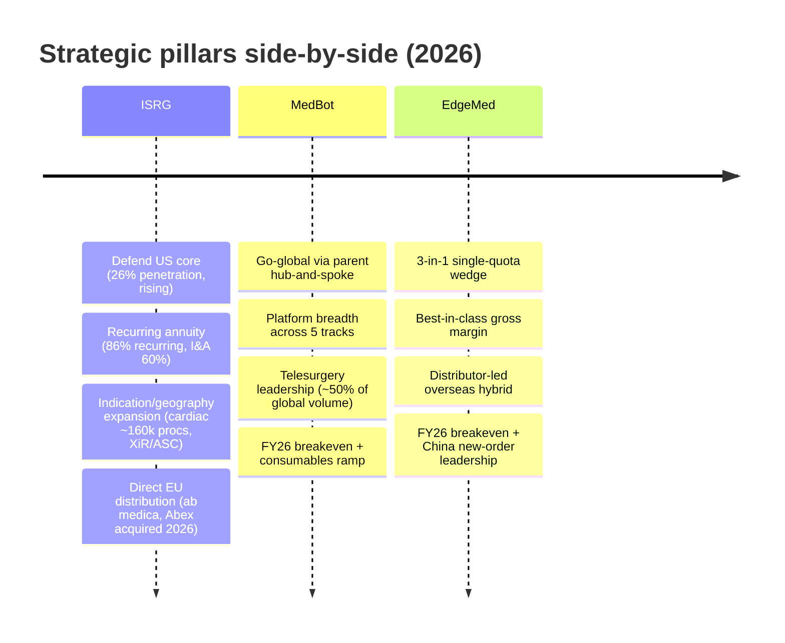
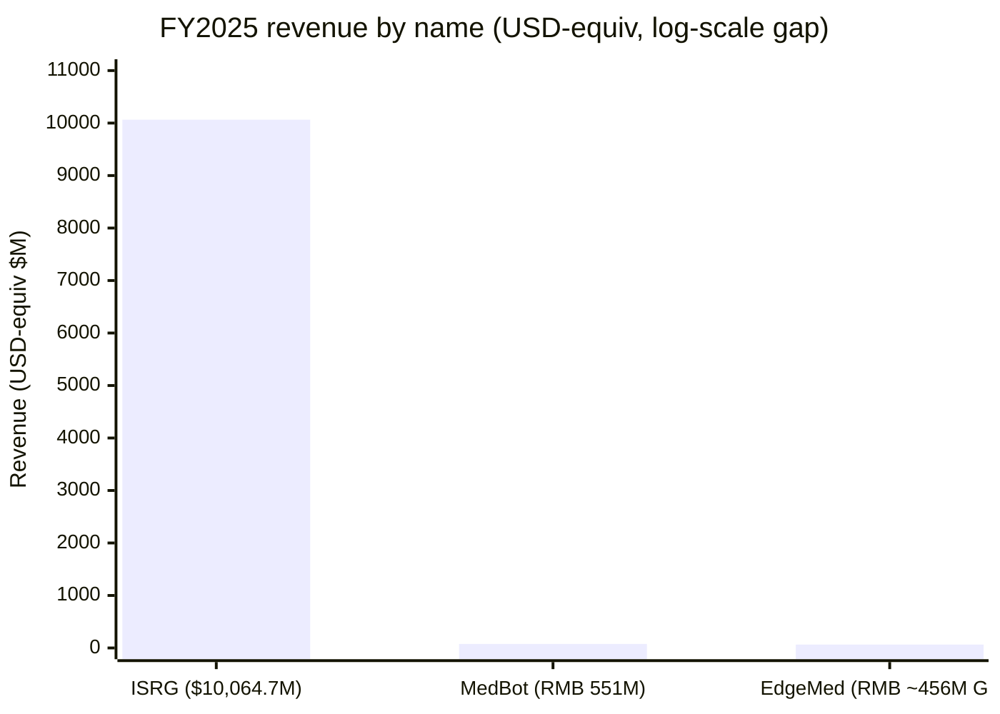

# Intuitive Surgical (ISRG) vs MicroPort MedBot (2252.HK) vs Edge Medical / EdgeMed (2675.HK) — A "China Medtech Going Abroad" Head-to-Head

*Surgical robotics · N=3 comparison · Dateline 2026-06-09*

This is a head-to-head of the defended global incumbent in surgical robotics against the two best-positioned Chinese "go-global" challengers. [Intuitive Surgical (ISRG)](https://www.sec.gov/Archives/edgar/data/0001035267/000103526726000010/isrg-20251231.htm) is the pioneer of robotic-assisted surgery, with an 11,106-system installed base and a razor-and-blade annuity that throws off ~86% recurring revenue; [MicroPort MedBot 微创医疗机器人 (2252.HK)](https://www1.hkexnews.hk/listedco/listconews/sehk/2025/0327/2025032702717.pdf) and [Edge Medical 精锋医疗 (2675.HK)](https://www.hkexnews.hk/listedco/listconews/sehk/2025/1230/2025123000030_c.pdf) are the two Chinese OEMs that Goldman Sachs ranks at the top of its China surgical-robot coverage. The central question is whether the Chinese names threaten ISRG's US$23bn US core — or whether they instead expand a *different*, less-penetrated US$19bn ex-US (OUS) pool, taking share from a replacement window rather than from ISRG's defended flagship franchise. The short answer, which the rest of this note builds out, is the latter: ISRG owns the US, the Chinese challengers attack the OUS flank, and clinical efficacy is *not* where the battle is decided.

---

## Source filings & notes (full citations in References)

**ISRG** — [FY2025 10-K](https://www.sec.gov/Archives/edgar/data/0001035267/000103526726000010/isrg-20251231.htm), [Q1-2026 earnings release](https://www.sec.gov/Archives/edgar/data/0001035267/000103526726000029/q126ex-991earningsrelease.htm), [8-K EU distributor acquisition (2026-03-02)](https://www.sec.gov/Archives/edgar/data/0001035267/000103526726000012/q126ex-991acquisitionpress.htm), [DEF 14A 2026](https://www.sec.gov/Archives/edgar/data/0001035267/000103526726000023/isrg-20260313.htm). **MedBot** — [2024 年度业绩公告](https://www1.hkexnews.hk/listedco/listconews/sehk/2025/0327/2025032702717.pdf), [IPO 新闻稿 (2021-11-02)](https://www.microport.com.cn/upload/investor/1638406392248131341.pdf), [配售公告 (2025-05-14)](https://www1.hkexnews.hk/listedco/listconews/sehk/2025/0514/2025051400032_c.pdf). **EdgeMed** — [HKEX IPO Prospectus (2025-12-30)](https://www.hkexnews.hk/listedco/listconews/sehk/2025/1230/2025123000030_c.pdf). Sell-side (all `*Analyst view:*`, cited to the broker PDF): Goldman Sachs "China Medtech Going Global", GS "China Surgical Robots" initiation, GS "Investor Feedback", GS "MedBot/EdgeMed standalone TP", GS "Tinavi" initiation, UBS MedBot, UBS China Healthcare, Bernstein ISRG 4Q25, BofA ISRG, J.P. Morgan expert call, 国联民生证券 (Guolian Minsheng) MedBot deep-dive.

---

## §0 TL;DR — At-a-glance advantages and disadvantages

|  | ✓ Advantages | ✗ Disadvantages |
|---|---|---|
| **Intuitive Surgical (ISRG)** | • **11,106 da Vinci systems** installed YE2025 (+12% YoY) — ~50–90× the Chinese OEMs' order books (§5.3)  • **~86% recurring revenue** in Q1-2026, I&A consumables 60% of FY25 sales — the deepest annuity in the field (§5.2)  • **~20,000,000 cumulative procedures** YE25 — an ~800–1,300× data-flywheel lead over both rivals (§5.5)  • **$10,064.7M FY25 revenue (+21%)**, 66.0% GAAP gross margin, net cash $3,996M, GAAP profitable (§4)  • **5 transformational product cycles** (dV5, AI, Ion, XiR, SP) + cardiac clearance opening ~160k procedures/yr (§6)  • **Owns the US$23bn US core** at 26% MIS penetration and rising; ecosystem lock limits ex-US substitution in its regions (§6) | • **First credible multi-port competitors in 20 years** — Medtronic Hugo (US uro Dec-2025) + J&J Ottava (De Novo Jan-2026) (§5.8)  • **~30–40% price/consumables gap** to Chinese rivals; hospital IRR 5% (new da Vinci) vs 28% (Chinese) (§5.4)  • **China price-war intensity rising**; only ~519 China installs and "competitive impacts" flagged (§5.7)  • **Japan a non-catalyst** — 2026 reimbursement adds only ~0.04ppt to procedure growth (§5.7)  • **~36–37x fwd P/E even at bulls' multiples** — UBS Neutral on "already robust valuation" (§4.5)  • **dV5 upgrade "largely incremental"** per GS — force feedback's clinical value "to be validated" (§5.6) |
| **MicroPort MedBot (2252.HK)** | • **220+ cumulative orders / ~170 overseas** by Mar 2026 — global #2 in 2025 order volume, best-positioned Chinese challenger (§5.3)  • **Only OEM commercialized across all 5 "golden tracks"** — laparoscopic, ortho, vascular, endoluminal, percutaneous (§5.1)  • **Telesurgery leader** — ~800 remote surgeries, ~50% of global volume, 100% success, first domestic telesurgery approval (§5.5)  • **FY25 revenue RMB 551mn (+114%)**, overseas revenue +287%, overseas mix 73%; FY26 breakeven across all three brokers (§4)  • **Parent hub-and-spoke channel** — rides MicroPort's owned global infrastructure, not greenfield distributors (§5.3)  • **GS's #1 China pick (Buy, TP HK$45)** — 5.4% of global TAM by 2035E, the lead go-global name (§4.5) | • **Pre-profit through FY25** (FY24 net loss RMB 647mn, FY25 −250mn); first net-profit year only FY26E (§5.7)  • **Lost 2025 domestic NEW orders to EdgeMed** — 17 vs 22 bid wins; domestic revenue ~flat YoY (§5.7)  • **Gross margin behind EdgeMed** — 48% (2025) vs EdgeMed ~63%; reaches 55% only in 2026E (§4)  • **~20x forward P/S** (bull-case 2026E implied 46.6x); GS NP "thin," below consensus (§4.5)  • **Still underwater vs HK$43.20 IPO price** 4.5 years post-listing; <18-month cash runway pre-placement (§5.7)  • **Robocath write-down (RMB 116.5mn)** + terminated spine/valve/lung programs signal R&D retrenchment (§5.7) |
| **Edge Medical / EdgeMed (2675.HK)** | • **No.1 domestic player by 2025 NEW orders** — 22 bid wins vs MedBot's 17 (§5.4)  • **Best-in-class gross margin** among Chinese peers — 62.8% (1H25), overseas GM 67.6% (§4)  • **"3-in-1" single-port + multi-port + telesurgery on one hospital quota** (NMPA Mar 2026) at da-Vinci-Xi-comparable price (§5.1)  • **No.1 China patents** — 734 granted/pending; "中国第一家、全球第二家" to register MP+SP+NOTES (§5.5)  • **FY26 guidance: ~120 installs, revenue >RMB850mn (+85%), full-year profitable, GM >60%** (§6)  • **75-month cash runway incl. IPO proceeds**; 13 cornerstones (~65% of raise) including Tencent, ADIA (§7) | • **Thinnest overseas base of the three** — ~70 cumulative overseas orders vs MedBot's ~170; ~1-yr lag (§5.3)  • **Distributor-dependent overseas model** — ~70 distributors vs MedBot's parent-owned infrastructure (§5.7)  • **Consumables capacity constraint** — no group-wide manufacturing to lean on, unlike MedBot (§5.7)  • **~5-month-old IPO** — no multi-quarter track record; 3m ADTV only US$2.7m vs MedBot HK$221m (§5.7)  • **Richest implied P/S** — 34.1x 2026E (GS base case); standalone TTM P/S optics ~88x (§4.5)  • **Founder husband-wife control ~43%, no standalone CFO** — key-person + governance concentration (§5.7) |

**Who is each one for?** Pick **ISRG** if you want the defended global compounder — a GAAP-profitable, net-cash near-monopoly with the deepest consumables annuity in medtech and a US$23bn US core that the Chinese names explicitly do not contest; you are buying earnings visibility, and you are paying a ~36–56x forward P/E for it. Pick **MedBot** if you want the highest-conviction China go-global challenger — the broadest platform (5 tracks), the largest overseas order book (~170), the telesurgery crown, and a parent-owned distribution machine — accepting that it is pre-profit, lost domestic new-order leadership to EdgeMed last year, and trades at ~20x forward P/S. Pick **EdgeMed** if you want the highest-margin, fastest-domestic-momentum Chinese pure-play with the cleverest product wedge (3-in-1 on a single quota), accepting that it has the thinnest overseas base, a distributor-dependent model, five months of trading history, and the richest implied multiple. You do not "run a hybrid" across these three the way you'd dual-source EDA: ISRG and the Chinese pair occupy different geographies and different points of the profitability curve — the realistic portfolio is *ISRG as the incumbent core plus one Chinese challenger as the go-global call*.

**Preference order:** ISRG > MedBot > EdgeMed — **#1 ISRG** (preferred because it is the only profitable, net-cash name, defends a US$23bn US core the challengers concede, and owns an ~20,000,000-procedure data moat the others cannot replicate this decade); **MedBot** (preferred among the challengers because it is GS's explicit #1 China pick with ~170 overseas orders, 5-track breadth, and parent-owned channel — the best-positioned attacker of the OUS pool); **EdgeMed** (least preferred because, despite a higher gross margin and domestic new-order leadership, it carries the thinnest overseas base, a distributor-dependent model, the richest implied P/S, and only ~5 months of public-market history). This is a relative conviction ranking across the set, not a sized trading call — note that Goldman Sachs's own China-challenger stack is MedBot > EdgeMed > TINAVI, with ISRG carried as a *separately* defended incumbent Buy, and the ISRG-first ordering here reflects cross-set quality (profitability + moat depth), not a claim that ISRG has more near-term upside than the Buy-rated Chinese pair.

---

## §1 — One-line self-description (verbatim framing)

| | ISRG | MedBot (2252.HK) | EdgeMed (2675.HK) |
|---|---|---|---|
| Framing (verbatim) | "a global technology leader in minimally invasive care and the pioneer of robotic-assisted surgery" | Only OEM with commercialized products across all five "golden tracks" (laparoscopic, orthopedic, pan-vascular, natural-orifice, percutaneous) | "中国第一家、全球第二家" to obtain registration for multi-port + single-port + natural-orifice surgical robots simultaneously |
| Tagline | Razor-and-blade ecosystem; "consistent" model across da Vinci + Ion | "手术机器人出海先锋" (surgical-robot go-global pioneer) | "3-in-1" platform — single + multi-port + telesurgery on one quota |
| Implicit pivot | From *system seller* to *recurring-revenue platform* (I&A 52%→60% of sales 2017→2025) | From *China multi-port challenger* to *global telesurgery + multi-track platform* | From *late-entry challenger* to *highest-margin, most-patented Chinese pure-play* |

ISRG's self-description is deliberately a *category* claim — "pioneer of robotic-assisted surgery" — that frames every competitor as a follower, and its [FY2025 10-K](https://www.sec.gov/Archives/edgar/data/0001035267/000103526726000010/isrg-20251231.htm) reinforces this by emphasizing that "we also earn recurring revenue from the sales of instruments, accessories, and services," with Ion explicitly built on "a business model consistent with the da Vinci surgical system model." The pivot over the last decade is the quiet shift from selling capital equipment to monetizing the installed base: the systems line is now only 25% of revenue while instruments-and-accessories is 60%, a recurring-revenue posture that the Chinese OEMs are only beginning to build. MedBot's framing is breadth — *Analyst view:* the only Chinese OEM "commercialized across all 5 golden tracks" per [国联民生证券 2026-06-07, p.4](http://xs-macbook-air.local:5001/zsxq/pdf/814528288145112/%E5%BE%AE%E5%88%9B%E6%9C%BA%E5%99%A8%E4%BA%BA%E5%85%AC%E5%8F%B8%E6%B7%B1%E5%BA%A6%E6%8A%A5%E5%91%8A%EF%BC%9A%E6%89%8B%E6%9C%AF%E6%9C%BA%E5%99%A8%E4%BA%BA%E5%87%BA%E6%B5%B7%E5%85%88%E9%94%8B%EF%BC%8C%E5%85%A8%E7%90%83%E6%8B%93%E5%B1%95%E6%8B%BE%E7%BA%A7%E8%80%8C%E4%B8%8A.pdf#page=4) — and its signal is that it is the *platform* among Chinese challengers, not a one-product story. EdgeMed's framing, sourced to Frost & Sullivan in its [IPO Prospectus, p.158, p.174](https://www.hkexnews.hk/listedco/listconews/sehk/2025/1230/2025123000030_c.pdf), is precision-positioning: it is the only company after Intuitive Surgical to have simultaneously registered multi-port, single-port, and natural-orifice systems — a "we are the closest to ISRG's product matrix" claim that underwrites its 3-in-1 wedge.

---

## §2 — Strategic pillars

ISRG runs the most crisply marketed doctrine because it is operational and self-reinforcing: every new system deepens the consumables annuity, every procedure feeds the data flywheel, and the 2026 EU-distributor acquisitions take margin and control back from third parties — [ISRG 8-K, 2026-03-02](https://www.sec.gov/Archives/edgar/data/0001035267/000103526726000012/q126ex-991acquisitionpress.htm) confirms it shifted Italy, Spain, Portugal, Malta and San Marino to direct. *Analyst view:* Bernstein characterizes ISRG as running "5 transformational product cycles…that should drive strong growth, plus additional pipeline assets and indications," per [Bernstein — ISRG 4Q25, p.1](http://xs-macbook-air.local:5001/zsxq/pdf/585525425551554/Bernstein-Intuitive%20Surgical%20Inc%EF%BC%88ISRG.US%EF%BC%89Intuitive%20Surgical%204Q25%EF%BC%9ASqueaky%20clean%20quarter%EF%BC%9Btop%20pick%EF%BC%88PT%20%24750%EF%BC%89-260123.pdf#page=1). MedBot's doctrine is breadth-plus-channel: *Analyst view:* GS notes the "Headquarters Going-abroad Platform" leverages parent MicroPort's existing global infrastructure rather than building greenfield, with plans to add ~100 overseas staff to 200–300 total, per [Goldman Sachs Initiation 2026-04-21, p.4](http://xs-macbook-air.local:5001/zsxq/pdf/212215118214521/Goldman%20Sachs-CHINA%20SURGICAL%20ROBOTS%20Going~global%20%EF%BC%88ex~US%EF%BC%89%20as%20core%20growth%20drivers%EF%BC%9B%20Initiate%20Medbot%EF%BC%8C%20EdgeMed%20at%20Buy-260421.pdf#page=4). EdgeMed's doctrine is product-led and margin-first: *Analyst view:* GS frames the 3-in-1 platform as the key strategic unlock — combining da Vinci Xi and SP functionality at Xi-comparable pricing, deployable "with one quota rather than two," per [Goldman Sachs Initiation 2026-04-21, p.13](http://xs-macbook-air.local:5001/zsxq/pdf/212215118214521/Goldman%20Sachs-CHINA%20SURGICAL%20ROBOTS%20Going~global%20%EF%BC%88ex~US%EF%BC%89%20as%20core%20growth%20drivers%EF%BC%9B%20Initiate%20Medbot%EF%BC%8C%20EdgeMed%20at%20Buy-260421.pdf#page=13).

---

## §3 — AI narrative — tool vs tailwind

| Lens | ISRG | MedBot (2252.HK) | EdgeMed (2675.HK) |
|---|---|---|---|
| AI-as-tool (internal) | Case Insights, SimNow VR, Intuitive Hub edge compute; dV5 >10,000× Xi compute | Large-model autonomous-surgery animal experiment (Dec 2025); "force display" | Edge Cloud telesurgery; dual-console training |
| AI-as-tailwind (selling into demand) | dV5 force feedback + AI skill-assessment (Wave-3 patents to ~2035–2045) | World-first 5G remote autonomous-driving bronchoscopy cryoablation (Jul 2025) | Transcontinental telesurgery (Edge Cloud) |

ISRG's AI story is the most concrete because it is embedded in shipping product: the [FY2025 10-K](https://www.sec.gov/Archives/edgar/data/0001035267/000103526726000010/isrg-20251231.htm) states dV5 carries ">10,000× the computing power of da Vinci Xi" and integrates Case Insights (a computational observer), SimNow, and the Intuitive Hub. But the *clinical* payoff is contested — *Analyst view:* GS judges the dV5 upgrade "appears incremental, with clinical benefits yet to be validated, while enhanced digital features may be the key differentiator," and notes the "value of AI & computing power remains to be validated," per [Goldman Sachs — China Medtech Going Global, p.19](http://xs-macbook-air.local:5001/zsxq/pdf/585582881584284/Goldman%20Sachs-CHINA%20MEDTECH%20GOING%20GLOBAL%EF%BC%9AAssessing%20the%20opportunity%20for%20surgical%20robots~global%20expansion%20beyond%20ISRG%E2%80%99s%20core%20markets-260421.pdf#page=19). MedBot's AI/autonomy narrative is genuinely differentiated on the *remote* axis — *Analyst view:* it completed a "world-first large-model autonomous surgery animal experiment" in Dec 2025 and a world-first 5G remote autonomous-driving bronchoscopy cryoablation, per [Goldman Sachs Initiation 2026-04-21, p.5](http://xs-macbook-air.local:5001/zsxq/pdf/212215118214521/Goldman%20Sachs-CHINA%20SURGICAL%20ROBOTS%20Going~global%20%EF%BC%88ex~US%EF%BC%89%20as%20core%20growth%20drivers%EF%BC%9B%20Initiate%20Medbot%EF%BC%8C%20EdgeMed%20at%20Buy-260421.pdf#page=5) and [国联民生证券 2026-06-07, p.34](http://xs-macbook-air.local:5001/zsxq/pdf/814528288145112/%E5%BE%AE%E5%88%9B%E6%9C%BA%E5%99%A8%E4%BA%BA%E5%85%AC%E5%8F%B8%E6%B7%B1%E5%BA%A6%E6%8A%A5%E5%91%8A%EF%BC%9A%E6%89%8B%E6%9C%AF%E6%9C%BA%E5%99%A8%E4%BA%BA%E5%87%BA%E6%B5%B7%E5%85%88%E9%94%8B%EF%BC%8C%E5%85%A8%E7%90%83%E6%8B%93%E5%B1%95%E6%8B%BE%E7%BA%A7%E8%80%8C%E4%B8%8A.pdf#page=34). EdgeMed's is the thinnest — *Analyst view:* its "Edge Cloud" telesurgery and dual-console training are named as differentiators, per [Goldman Sachs Investor Feedback 2026-05-12, p.4](http://xs-macbook-air.local:5001/zsxq/pdf/585425155421584/Goldman%20Sachs-CHINA%20SURGICAL%20ROBOTS%20Investor%20Feedback%20Post%20Initiations%EF%BC%9A%20Structural%20Go~global%20Opportunity%20Acknowledged%EF%BC%9B%20Near-term%20Focus%20on%20Orders%EF%BC%8C%20Utilization%20and%20Valuation-260512.pdf#page=4) — but a standalone transcontinental-telesurgery claim for EdgeMed is *not* attributed to it in the GS initiation (GS's "first domestic player approved for telesurgery" line refers to MedBot), so EdgeMed's autonomy story is the least proven of the three.

---

## §4 — Segment structure & financial scoreboard

*Source: ISRG FY2025 10-K income statement; MedBot RMB 551mn FY25 (UBS/GS/国联民生 concur); EdgeMed GS-modeled Rmb455.7m 2025. RMB→USD at ~7.15 for scale only.*

| Metric | ISRG (FY2025) | MedBot (FY2025) | EdgeMed (FY2025) | Note |
|---|---|---|---|---|
| Total revenue | **$10,064.7M (+21%)** | **RMB 551mn (+114%)** | **RMB ~455.7mn (GSe)** | ISRG ~130× MedBot; growth inverse |
| Gross margin | **66.0% GAAP** | **48.4%** | **62.8% (1H25 actual)** | EdgeMed leads Chinese pair |
| Recurring / I&A mix | **I&A 60%, recurring ~86% (Q1-26)** | **consumables ~11%** | **I&A ~6.9% (1H25)** | ISRG annuity dwarfs both |
| Overseas revenue mix | **OUS 32%** | **73%** | **60% (GSe)** | Chinese names overseas-led |
| Net result | **GAAP profitable; net cash $3,996M** | **net loss RMB 250mn** | **net loss ~RMB 89mn (GSe)** | Only ISRG profitable today |
| First net-profit year | already profitable | **FY2026E** | **FY2026E (target)** | Both Chinese breakeven 2026 |

ISRG's segment structure is the defining contrast: [FY2025 10-K](https://www.sec.gov/Archives/edgar/data/0001035267/000103526726000010/isrg-20251231.htm) splits FY25 revenue into Instruments & accessories $6.02bn (+19%), Systems $2.47bn (+26%), and Service $1.57bn (+20%) — so the consumables-plus-service annuity is 75.4% of revenue and pure I&A is 60%, while the capital-equipment line is only a quarter. *Analyst view:* GS confirms the I&A share rose from 52% in 2017 to 60% in 2025, per [Goldman Sachs — China Medtech Going Global, p.6](http://xs-macbook-air.local:5001/zsxq/pdf/585582881584284/Goldman%20Sachs-CHINA%20MEDTECH%20GOING%20GLOBAL%EF%BC%9AAssessing%20the%20opportunity%20for%20surgical%20robots~global%20expansion%20beyond%20ISRG%E2%80%99s%20core%20markets-260421.pdf#page=6). MedBot is at the opposite end of the curve — *Analyst view:* FY25 revenue RMB 551mn (+114.2%) with consumables only ~11% of the mix, per [UBS 2026-04-10, p.1](http://xs-macbook-air.local:5001/zsxq/pdf/812241888881822/UBS-Shanghai%20MicroPort%20MedBot%EF%BC%882252.HK%EF%BC%89Robust%20overseas%20sales%20momentum%20driving%20potential%20breakeven%20in%201H26E%EF%BC%9B%20upgrade%20to%20Buy-260410.pdf#page=1) and [国联民生证券 2026-06-07, p.6](http://xs-macbook-air.local:5001/zsxq/pdf/814528288145112/%E5%BE%AE%E5%88%9B%E6%9C%BA%E5%99%A8%E4%BA%BA%E5%85%AC%E5%8F%B8%E6%B7%B1%E5%BA%A6%E6%8A%A5%E5%91%8A%EF%BC%9A%E6%89%8B%E6%9C%AF%E6%9C%BA%E5%99%A8%E4%BA%BA%E5%87%BA%E6%B5%B7%E5%85%88%E9%94%8B%EF%BC%8C%E5%85%A8%E7%90%83%E6%8B%93%E5%B1%95%E6%8B%BE%E7%BA%A7%E8%80%8C%E4%B8%8A.pdf#page=6). EdgeMed leads the Chinese pair on margin — PRIMARY actuals show gross margin 59.3% (2023) → 61.3% (2024) → 62.8% (1H2025), with systems still 92.9% of 1H25 revenue, per the [IPO Prospectus, p.24–26](https://www.hkexnews.hk/listedco/listconews/sehk/2025/1230/2025123000030_c.pdf) — meaning the razor-and-blade flywheel that defines ISRG has barely started for either challenger.

*Comparability caveat (apply throughout):* ISRG reports US-GAAP in USD and is long-profitable; MedBot and EdgeMed report HKFRS in RMB and are both pre-profit with a modeled first net-profit year of FY2026E. Every margin and P/E comparison is therefore forward, not trailing, and forward P/S is the only like-for-like multiple across all three (see §4.5).

---

## §4.5 — Relative-valuation scoreboard

| Name | Fwd P/E | Fwd P/S | EV/EBITDA | PEG | Borrowed PT (report-date px → upside) | Valuation basis | Peer-median / 3-yr-range (P/S) | Premium justified? |
|---|---|---|---|---|---|---|---|---|
| **ISRG** | **~36–52x** (UBS 46.6x 12/26E; Bernstein 52.0x F26E) | **~15x** (GS); TTM ~14.2x | **15.6x F26E** (Bernstein) | n/a | **GS PT $609 vs $451.29 @ 2026-04-21 → +35%**; Bernstein $750 vs $525.81 @ 2026-01-23 → +43%; BofA $650 vs $469.21 @ 2026-04-20 → +40%; UBS $550 vs $478.82 @ 2026-04-23 → +15% | P/E (profitable) — 64x F27 EPS (Bernstein); DCF/multiple | 5-yr avg P/S 15.5x (+1SD 18.5x, −1SD 12.7x); P/E 5-yr avg ~56x | **Yes** — earnings visibility + 86% recurring annuity supports a multiple ~3× the medtech average |
| **MedBot (2252.HK)** | **344x 2026E / 77x 2027E** (mechanically inflated — near-breakeven) | **~20–21x** fwd (UBS 22.5x 2026E / 14.2x 2027E) | n/a (pre-EBITDA-scale) | **0.4x 2027E** (UBS) vs peer 0.9x | **GS PT HK$45 vs HK$34.14 @ 2026-04-17 → +31.8%**; UBS HK$35.90 vs HK$28.50 @ 2026-04-10 → +26.0% | **P/S (pre-profit)** + DCF (9% WACC, 3% g) | Medtech peer median P/S 5.4x/4.6x; MedBot own avg 35.5x (+1SD 57.6x, −1SD 13.4x) | **Yes** — >3x P/S premium to medtech median justified by 49.5% rev CAGR + ~27% net margin convergence by 2035E |
| **EdgeMed (2675.HK)** | **137.9x 2027E / 69.9x 2028E** (mechanically inflated) | **34.1x 2026E / 21.3x 2027E / 14.7x 2028E** (GS base) | n/a | n/a (GS NP trails consensus) | **GS PT HK$81 vs HK$56 @ 2026-04-17 → +44.6%** (vs HK$57.85 close → ~+40%) | **P/S (pre-profit)** + DCF (9% WACC, 3% g) | TINAVI/peer P/S "28x/21x/16x on par with MedBot/EdgeMed"; standalone TTM optic ~88x | **Partly** — highest implied P/S of the three; the ~28% 2035E terminal net margin (1pt above MedBot's 27%) supports a marginal premium, but the thinner overseas base does not |

**Fair yardstick — forward P/S.** Two of the three names are pre-profit, so their P/E prints are mechanically meaningless: *Analyst view:* MedBot trades at "344x/77x PE in 2026/27" and EdgeMed at "137.9x 2027E," which is why UBS instead anchors MedBot on a **2027E PEG of 0.4x vs peer median 0.9x** — the fastest revenue and EPS CAGRs in China medtech (49.5% rev, 185.5% EPS vs peer 16.1%/21.2%), per [UBS 2026-04-10, p.1](http://xs-macbook-air.local:5001/zsxq/pdf/812241888881822/UBS-Shanghai%20MicroPort%20MedBot%EF%BC%882252.HK%EF%BC%89Robust%20overseas%20sales%20momentum%20driving%20potential%20breakeven%20in%201H26E%EF%BC%9B%20upgrade%20to%20Buy-260410.pdf#page=1). Read across the set on forward P/S, MedBot at ~20x and EdgeMed at ~34x both sit *above* ISRG's ~15x, and far above the China-medtech peer median of ~5.4x — *Analyst view:* GS frames this premium as defensible because "Historically, ISRG has also traded at elevated multiples, reflecting earnings visibility from its installed base," per [GS Investor Feedback 2026-05-12, p.5](http://xs-macbook-air.local:5001/zsxq/pdf/585425155421584/Goldman%20Sachs-CHINA%20SURGICAL%20ROBOTS%20Investor%20Feedback%20Post%20Initiations%EF%BC%9A%20Structural%20Go~global%20Opportunity%20Acknowledged%EF%BC%9B%20Near-term%20Focus%20on%20Orders%EF%BC%8C%20Utilization%20and%20Valuation-260512.pdf#page=5). The reconciliation against the §5 moat: ISRG's premium is *paid for* by a 60%-recurring annuity and ~20,000,000-procedure data flywheel that neither challenger has, so its ~15x P/S at roughly its own 5-yr mean is justified. MedBot's ~20x is justified by the highest growth in the set plus GS's underwriting of net margins converging to ~27% by 2035E — i.e. you are paying for ISRG-class economics that do not yet exist. EdgeMed's 34x implied P/S is the hardest to defend: its terminal net-margin assumption (28%) is only marginally above MedBot's (27%), but its overseas order book is less than half of MedBot's, so on a moat-adjusted basis the richest multiple sits on the name with the thinnest go-global proof — a "premium not fully justified" verdict that the bottom line carries through.

*Comparability caveat:* ISRG sell-side EPS are non-GAAP/adjusted (ISRG GAAP diluted EPS FY25 = $7.87); the Chinese names' P/E is on near-breakeven earnings, so do not compare ISRG's 36–52x P/E to MedBot's 344x as if they were the same metric. Report-date prices and upside come from `stock_price_target.db`; the same PT can show different upside on different dates (MedBot's unchanged HK$45 PT widened from +27.7% to +62.5% as the stock fell HK$35.24→HK$27.70 into mid-May).

---

## §5 — The moat anatomy

### §5.1 — Product-overlap matrix (who directly competes, by procedure type)

| Procedure category | ISRG | MedBot | EdgeMed | Status |
|---|---|---|---|---|
| Soft-tissue laparoscopic (uro / general / gyn / thoracic) | da Vinci (Xi/dV5) | Toumai 图迈 | MP1000/MP2000 | **ALL THREE COMPETE** (ISRG dominant — ~3.2mn annual procs, US$10–12bn TAM) |
| Single-port endoscopic | da Vinci SP (377 installs, sub-scale) | building SP later | SP1000 / 3-in-1 | **ISRG and EdgeMed compete; MedBot building** (EdgeMed productized integration) |
| Bronchoscopy / endoluminal | Ion (~995 installs) | UniPath 独道 (NMPA Dec-2025) | — | **ISRG vs MedBot compete; EdgeMed absent** |
| Vascular / pan-vascular (PCI) | — | R-ONE (NMPA Dec-2023) | — | **NON-OVERLAPPING (MedBot only)** |
| Orthopedic (TKA/THA) | — | SkyWalker 鸿鹄 (>65 orders) | — | **NON-OVERLAPPING (MedBot only — vs TINAVI/Stryker Mako)** |
| Percutaneous (prostate biopsy) | — | Mona Lisa 蜻蜓眼 | — | **NON-OVERLAPPING (MedBot only)** |

The single most-direct three-way collision is **soft-tissue laparoscopic** — *Analyst view:* all three are listed as "Major Chinese / global players" in the laparoscopic segment, the largest robot category at ~3.2mn annual procedures and US$10–12bn TAM, per [Goldman Sachs — China Medtech Going Global, p.4](http://xs-macbook-air.local:5001/zsxq/pdf/585582881584284/Goldman%20Sachs-CHINA%20MEDTECH%20GOING%20GLOBAL%EF%BC%9AAssessing%20the%20opportunity%20for%20surgical%20robots~global%20expansion%20beyond%20ISRG%E2%80%99s%20core%20markets-260421.pdf#page=4). Beyond it, the overlaps thin out fast: bronchoscopy is an ISRG (Ion) vs MedBot (UniPath, NMPA Dec-2025) two-way with EdgeMed absent, per [Goldman Sachs Initiation 2026-04-21, p.5](http://xs-macbook-air.local:5001/zsxq/pdf/212215118214521/Goldman%20Sachs-CHINA%20SURGICAL%20ROBOTS%20Going~global%20%EF%BC%88ex~US%EF%BC%89%20as%20core%20growth%20drivers%EF%BC%9B%20Initiate%20Medbot%EF%BC%8C%20EdgeMed%20at%20Buy-260421.pdf#page=5); vascular (R-ONE) and orthopedics (SkyWalker) are MedBot-only flanks where ISRG and EdgeMed are simply not present, per [Goldman Sachs — China Medtech Going Global, p.4](http://xs-macbook-air.local:5001/zsxq/pdf/585582881584284/Goldman%20Sachs-CHINA%20MEDTECH%20GOING%20GLOBAL%EF%BC%9AAssessing%20the%20opportunity%20for%20surgical%20robots~global%20expansion%20beyond%20ISRG%E2%80%99s%20core%20markets-260421.pdf#page=4). Single-port is the most interesting asymmetry: *Analyst view:* ISRG's SP has only ~377 installed systems and ~55k annual procedures, "far lower than its multi-port base," per [Goldman Sachs — China Medtech Going Global, p.23](http://xs-macbook-air.local:5001/zsxq/pdf/585582881584284/Goldman%20Sachs-CHINA%20MEDTECH%20GOING%20GLOBAL%EF%BC%9AAssessing%20the%20opportunity%20for%20surgical%20robots~global%20expansion%20beyond%20ISRG%E2%80%99s%20core%20markets-260421.pdf#page=23), while EdgeMed's 3-in-1 NMPA-approved Mar 2026 lets a hospital deploy single + multi-port "with one quota rather than two," per [Goldman Sachs Initiation 2026-04-21, p.13](http://xs-macbook-air.local:5001/zsxq/pdf/212215118214521/Goldman%20Sachs-CHINA%20SURGICAL%20ROBOTS%20Going~global%20%EF%BC%88ex~US%EF%BC%89%20as%20core%20growth%20drivers%EF%BC%9B%20Initiate%20Medbot%EF%BC%8C%20EdgeMed%20at%20Buy-260421.pdf#page=13). The overlap verdict: ISRG competes across the widest care continuum, the three meet most directly in soft-tissue laparoscopic, and orthopedics/vascular are MedBot-only theaters where the incumbent is absent.

### §5.1b — Customer concentration

| | ISRG | MedBot | EdgeMed |
|---|---|---|---|
| Top-customer disclosure | None >10% (diversified across 11,106 hospitals) | Not separately disclosed | **Not disclosed** (18A prospectus has no top-5) |
| Geographic mix | US 68% / OUS 32% (FY25) | China 27% / overseas 73% (FY25) | China 59.4% / overseas 40.6% (1H25) |
| Concentration driver | genuine — vast installed base | overseas pivot, parent channel | thin install count → implied concentration |

ISRG's customer concentration is genuinely low because its base spans 11,106 systems across thousands of hospitals, and the [FY2025 10-K](https://www.sec.gov/Archives/edgar/data/0001035267/000103526726000010/isrg-20251231.htm) names no >10% customer — its diversification is a function of scale, not of losing a big account. The Chinese names are the inverse: their geographic "diversification" is recent and deliberate, the product of an overseas pivot. *Analyst view:* MedBot's overseas revenue mix went 20% (2023) → 40% (2024) → 73% (2025), per [UBS 2026-04-10, p.1](http://xs-macbook-air.local:5001/zsxq/pdf/812241888881822/UBS-Shanghai%20MicroPort%20MedBot%EF%BC%882252.HK%EF%BC%89Robust%20overseas%20sales%20momentum%20driving%20potential%20breakeven%20in%201H26E%EF%BC%9B%20upgrade%20to%20Buy-260410.pdf#page=1). EdgeMed's flip is even faster but off a tiny base — PRIMARY: geographic mix went from 100% China (2023–24) to China 59.4% / EU 16.3% / other overseas 24.3% in 1H2025, per the [IPO Prospectus, p.26](https://www.hkexnews.hk/listedco/listconews/sehk/2025/1230/2025123000030_c.pdf). EdgeMed is the *most* exposed on hidden concentration: its 18A prospectus discloses no top-5 customer, and with only ~20–25 systems sold in FY2024, a small number of hospitals likely drives the bulk of revenue, per the [IPO Prospectus, p.25–26](https://www.hkexnews.hk/listedco/listconews/sehk/2025/1230/2025123000030_c.pdf).

### §5.2 — Backlog & recurring mix

ISRG's recurring layer is the moat. *Analyst view:* recurring revenue was 86% of total in Q1-2026, +23% YoY to ~$2.4bn, and ISRG's own [Q1-2026 release](https://www.sec.gov/Archives/edgar/data/0001035267/000103526726000029/q126ex-991earningsrelease.htm) confirms this includes the leasing/usage-based portion of systems. The annuity is captive — the [FY2025 10-K](https://www.sec.gov/Archives/edgar/data/0001035267/000103526726000010/isrg-20251231.htm) states consumables "have limited lives and will either expire or wear out as they are used in procedures, at which point they need to be replaced," and *Analyst view:* Bernstein puts I&A revenue at ~$1,850 per procedure in 4Q25, per [Bernstein — ISRG 4Q25, p.6](http://xs-macbook-air.local:5001/zsxq/pdf/585525425551554/Bernstein-Intuitive%20Surgical%20Inc%EF%BC%88ISRG.US%EF%BC%89Intuitive%20Surgical%204Q25%EF%BC%9ASqueaky%20clean%20quarter%EF%BC%9Btop%20pick%EF%BC%88PT%20%24750%EF%BC%89-260123.pdf#page=6). The Chinese names are at the very start of the same curve — *Analyst view:* GS models MedBot consumables % of revenue rising 0% (2023) → 5% (2024) → 11% (2025) → 13%/17%/21% (2026–28E), with EdgeMed at 7% (2025) → 15% (2028E), per [Goldman Sachs Initiation 2026-04-21, p.3](http://xs-macbook-air.local:5001/zsxq/pdf/212215118214521/Goldman%20Sachs-CHINA%20SURGICAL%20ROBOTS%20Going~global%20%EF%BC%88ex~US%EF%BC%89%20as%20core%20growth%20drivers%EF%BC%9B%20Initiate%20Medbot%EF%BC%8C%20EdgeMed%20at%20Buy-260421.pdf#page=3). In a mature market GS pegs the steady-state split at systems 25% / consumables 60% / services 15% — exactly ISRG's structure today — so the entire China thesis depends on the razor-and-blade flywheel that ISRG already runs and the challengers are years from realizing, per [Goldman Sachs Standalone TP 2026-04-24, p.2](http://xs-macbook-air.local:5001/zsxq/pdf/585581514854454/Goldman%20Sachs-China%20Surgical%20Robot%20MicroPort%20Medbot%20%EF%BC%882252.HK%EF%BC%89%20Buy%20with%20TP%20of%20HK%2445.0%EF%BC%8C%20Edge%20Medical%20%EF%BC%882675.HK%EF%BC%89%20Buy%20with%20TP%20of%20HK%2481.0-260424.pdf#page=2). Comparability caveat: ISRG's 86% recurring and the Chinese 7–11% consumables figures are not strictly the same metric (ISRG's includes lease/service), but the directional gulf is real and load-bearing.

### §5.3 — Channel / distribution lock-in & installed-base scale

| | ISRG | MedBot | EdgeMed |
|---|---|---|---|
| Installed base / orders | **11,106 systems** (installed, YE25) | **220+ cumulative orders** (Mar-26) | **120+ cumulative orders** (Mar-26) |
| Overseas | 4,742 OUS systems; 734 OUS sales in 2025 | ~170 cumulative overseas; 100+ in 2025 | ~70 cumulative overseas; 70+ in 2025 |
| Channel model | direct (EU now direct post-2026 acquisitions) | parent hub-and-spoke (MicroPort owned infra) | distributor-led (~70 distributors + Dornier/Meden) |

The scale gap is the most important single number in this comparison, and it must be read with a comparability caveat: *Analyst view:* ISRG's 11,106 is **installed systems**, while the Chinese OEMs' 220+ / 120+ are **cumulative orders**, not all of which are installed — per [Goldman Sachs — China Medtech Going Global, p.8](http://xs-macbook-air.local:5001/zsxq/pdf/585582881584284/Goldman%20Sachs-CHINA%20MEDTECH%20GOING%20GLOBAL%EF%BC%9AAssessing%20the%20opportunity%20for%20surgical%20robots~global%20expansion%20beyond%20ISRG%E2%80%99s%20core%20markets-260421.pdf#page=8). Even before adjusting for that, ISRG is ~50–90× ahead. Where the Chinese names are genuinely closing the gap is at the *overseas margin* — *Analyst view:* in 2025 da Vinci recorded 734 overseas system sales vs MedBot 100+ overseas orders and EdgeMed 70+, per [Goldman Sachs — China Medtech Going Global, p.9](http://xs-macbook-air.local:5001/zsxq/pdf/585582881584284/Goldman%20Sachs-CHINA%20MEDTECH%20GOING%20GLOBAL%EF%BC%9AAssessing%20the%20opportunity%20for%20surgical%20robots~global%20expansion%20beyond%20ISRG%E2%80%99s%20core%20markets-260421.pdf#page=9). MedBot's overseas order curve is steep: *Analyst view:* 0 (2022) → 1 (2023) → 20 (2024) → 50 (1H2025) → 170 (03/2026), spread ~30% Europe / ~40% Asia ex-China / ~30% Latin America, per [GS Investor Feedback 2026-05-12, p.2](http://xs-macbook-air.local:5001/zsxq/pdf/585425155421584/Goldman%20Sachs-CHINA%20SURGICAL%20ROBOTS%20Investor%20Feedback%20Post%20Initiations%EF%BC%9A%20Structural%20Go~global%20Opportunity%20Acknowledged%EF%BC%9B%20Near-term%20Focus%20on%20Orders%EF%BC%8C%20Utilization%20and%20Valuation-260512.pdf#page=2). The channel models diverge structurally: *Analyst view:* MedBot leverages MicroPort Group's *owned* global infrastructure (hub-and-spoke), while EdgeMed relies on ~70 third-party distributors plus partnerships with Dornier MedTech and Meden Inmed — and ISRG has just taken its EU channel *direct*, per [Goldman Sachs Initiation 2026-04-21, p.14](http://xs-macbook-air.local:5001/zsxq/pdf/212215118214521/Goldman%20Sachs-CHINA%20SURGICAL%20ROBOTS%20Going~global%20%EF%BC%88ex~US%EF%BC%89%20as%20core%20growth%20drivers%EF%BC%9B%20Initiate%20Medbot%EF%BC%8C%20EdgeMed%20at%20Buy-260421.pdf#page=14). EdgeMed's channel thesis is opportunistic: *Analyst view:* GS notes that "in select markets where Intuitive Surgical is transitioning from distributor-led to direct sales, Edge Medical sees opportunities to partner with incumbent distributors seeking alternative growth platforms" — i.e. EdgeMed aims to fill the channel ISRG vacates, per [Goldman Sachs Initiation 2026-04-21, p.14](http://xs-macbook-air.local:5001/zsxq/pdf/212215118214521/Goldman%20Sachs-CHINA%20SURGICAL%20ROBOTS%20Going~global%20%EF%BC%88ex~US%EF%BC%89%20as%20core%20growth%20drivers%EF%BC%9B%20Initiate%20Medbot%EF%BC%8C%20EdgeMed%20at%20Buy-260421.pdf#page=14).

### §5.4 — Tool-level / sub-segment share & hospital unit economics

| | ISRG | MedBot | EdgeMed | Other |
|---|---|---|---|---|
| China 2025 bid-win share | **42% (46 wins)** | 16% (17 wins) | **20% (22 wins)** | Sagebot 10%, Shurui 8% |
| Hospital 10-yr IRR | **5%** (new) / 16% (trade-in) | **28% (Chinese-class)** | **28% (Chinese-class)** | — |
| Breakeven utilization | ~150 procs/yr | **~90 procs/yr** | **~90 procs/yr** | — |
| System pricing | premium ($1.66mn US ASP) | ~30–40% below da Vinci | ~30–40% below da Vinci | — |

The pricing/economics wedge is the Chinese names' single strongest weapon, and it cuts both ways. *Analyst view:* Chinese systems are priced at a 30–40% discount to da Vinci across both equipment and consumables, per [Goldman Sachs — China Medtech Going Global, p.3](http://xs-macbook-air.local:5001/zsxq/pdf/585582881584284/Goldman%20Sachs-CHINA%20MEDTECH%20GOING%20GLOBAL%EF%BC%9AAssessing%20the%20opportunity%20for%20surgical%20robots~global%20expansion%20beyond%20ISRG%E2%80%99s%20core%20markets-260421.pdf#page=3) — though note GS quotes a narrower "20–30% below" in a later passage, so 30–40% is the headline. The hospital math is decisive: *Analyst view:* a Chinese-class robot delivers a 10-year hospital IRR of 28% vs 5% for a new da Vinci (16% on a trade-in), and turns IRR-positive at ~150 procedures/year vs ~265 for da Vinci, "effectively halving the required utilization" with breakeven at ~90 vs ~150 procedures/year, per [Goldman Sachs — China Medtech Going Global, p.13–15](http://xs-macbook-air.local:5001/zsxq/pdf/585582881584284/Goldman%20Sachs-CHINA%20MEDTECH%20GOING%20GLOBAL%EF%BC%9AAssessing%20the%20opportunity%20for%20surgical%20robots~global%20expansion%20beyond%20ISRG%E2%80%99s%20core%20markets-260421.pdf#page=14). But the incumbent keeps *pricing power* — *Analyst view:* GS's TAM model uses a US$1.66mn US system ASP that ISRG can take *up* ~1% p.a., per [Goldman Sachs — China Medtech Going Global, p.11](http://xs-macbook-air.local:5001/zsxq/pdf/585582881584284/Goldman%20Sachs-CHINA%20MEDTECH%20GOING%20GLOBAL%EF%BC%9AAssessing%20the%20opportunity%20for%20surgical%20robots~global%20expansion%20beyond%20ISRG%E2%80%99s%20core%20markets-260421.pdf#page=11), and Bernstein confirms 4Q25 system ASP rose +6% YoY to $1.68mn, per [Bernstein — ISRG 4Q25, p.5](http://xs-macbook-air.local:5001/zsxq/pdf/585525425551554/Bernstein-Intuitive%20Surgical%20Inc%EF%BC%88ISRG.US%EF%BC%89Intuitive%20Surgical%204Q25%EF%BC%9ASqueaky%20clean%20quarter%EF%BC%9Btop%20pick%EF%BC%88PT%20%24750%EF%BC%89-260123.pdf#page=5). On *China domestic* share specifically, the incumbent still leads on bid wins — *Analyst view:* ISRG took 42% of 2025 China bid wins (46), with EdgeMed 20% (22) and MedBot 16% (17), and domestic brands collectively at 58%, per [Goldman Sachs — China Medtech Going Global, p.23](http://xs-macbook-air.local:5001/zsxq/pdf/585582881584284/Goldman%20Sachs-CHINA%20MEDTECH%20GOING%20GLOBAL%EF%BC%9AAssessing%20the%20opportunity%20for%20surgical%20robots~global%20expansion%20beyond%20ISRG%E2%80%99s%20core%20markets-260421.pdf#page=23).

### §5.5 — IP / patent / data-corpus franchise

| | ISRG | MedBot | EdgeMed |
|---|---|---|---|
| Cumulative procedures (data flywheel) | **~20,000,000** (YE25) | ~25,000 | ~15,000 |
| Patent stance | ecosystem-driven, not patent-driven; Wave-3 to ~2035–45 "to be validated" | "force display" (CE-certified) | **No.1 China patents — 734 granted/pending** |
| Differentiated answer to dV5 | dV5 force feedback (incremental) | force display + telesurgery | 3-in-1 + Edge Cloud |

The data moat is the most lopsided dimension in the entire comparison. *Analyst view:* ISRG holds ~20,000,000 cumulative laparoscopic-robot procedures vs CMR's 45,000, MedBot's 25,000 and EdgeMed's 15,000 — an ~800–1,300× lead that feeds digital solutions, AI training and product iteration, per [Goldman Sachs — China Medtech Going Global, p.17](http://xs-macbook-air.local:5001/zsxq/pdf/585582881584284/Goldman%20Sachs-CHINA%20MEDTECH%20GOING%20GLOBAL%EF%BC%9AAssessing%20the%20opportunity%20for%20surgical%20robots~global%20expansion%20beyond%20ISRG%E2%80%99s%20core%20markets-260421.pdf#page=17). Crucially, GS's thesis is that ISRG's moat is "ecosystem-driven rather than patent-driven" — *Analyst view:* the first wave of foundational patents (master-slave, EndoWrist 7-DOF, motion scaling) filed 1992–1999 has "largely expired ~2010–2020," which is precisely what triggered the entrant wave since 2019; the second wave is "circumventable"; only the third wave (force feedback, AI) extends to ~2035–2045 but with commercial significance "to be validated," per [GS Investor Feedback 2026-05-12, p.5](http://xs-macbook-air.local:5001/zsxq/pdf/585425155421584/Goldman%20Sachs-CHINA%20SURGICAL%20ROBOTS%20Investor%20Feedback%20Post%20Initiations%EF%BC%9A%20Structural%20Go~global%20Opportunity%20Acknowledged%EF%BC%9B%20Near-term%20Focus%20on%20Orders%EF%BC%8C%20Utilization%20and%20Valuation-260512.pdf#page=5). This is the structural opening for the challengers: each has a credible answer to ISRG's Wave-3 features without infringing — *Analyst view:* MedBot offers "force display" (CE-certified) as an alternative to dV5 force feedback, and EdgeMed has Edge Cloud telesurgery, per [GS Investor Feedback 2026-05-12, p.5](http://xs-macbook-air.local:5001/zsxq/pdf/585425155421584/Goldman%20Sachs-CHINA%20SURGICAL%20ROBOTS%20Investor%20Feedback%20Post%20Initiations%EF%BC%9A%20Structural%20Go~global%20Opportunity%20Acknowledged%EF%BC%9B%20Near-term%20Focus%20on%20Orders%EF%BC%8C%20Utilization%20and%20Valuation-260512.pdf#page=5). On raw patent count EdgeMed leads the Chinese pair — PRIMARY: 734 granted/pending patents globally, ranked No.1 by patents among China surgical-robot companies, per [Frost & Sullivan in IPO Prospectus, p.388, p.949–960](https://www.hkexnews.hk/listedco/listconews/sehk/2025/1230/2025123000030_c.pdf). MedBot's distinct franchise is telesurgery — *Analyst view:* ~800 cumulative remote human surgeries, ~50% of global telesurgery volume, 100% success rate, 60+ records, the world's first all-department/all-procedure commercial telesurgery system, and the first domestic player approved for telesurgery, per [国联民生证券 2026-06-07, p.33](http://xs-macbook-air.local:5001/zsxq/pdf/814528288145112/%E5%BE%AE%E5%88%9B%E6%9C%BA%E5%99%A8%E4%BA%BA%E5%85%AC%E5%8F%B8%E6%B7%B1%E5%BA%A6%E6%8A%A5%E5%91%8A%EF%BC%9A%E6%89%8B%E6%9C%AF%E6%9C%BA%E5%99%A8%E4%BA%BA%E5%87%BA%E6%B5%B7%E5%85%88%E9%94%8B%EF%BC%8C%E5%85%A8%E7%90%83%E6%8B%93%E5%B1%95%E6%8B%BE%E7%BA%A7%E8%80%8C%E4%B8%8A.pdf#page=33).

### §5.6 — Why a customer picks one over the other

The decision drivers, distilled from the broker + expert evidence: (1) **clinical efficacy is not the differentiator** — *Analyst view:* a single-center RARP study (Toumai N=40 vs da Vinci Xi N=40) found operative time 192.5 vs 183.5 min (p=0.38), positive surgical margin 17.5% vs 17.5% (p=0.79), and continence at 1 month 72.5% vs 80.0% (p=0.43) — statistically indistinguishable on every measured endpoint, per [GS Investor Feedback 2026-05-12, p.3](http://xs-macbook-air.local:5001/zsxq/pdf/585425155421584/Goldman%20Sachs-CHINA%20SURGICAL%20ROBOTS%20Investor%20Feedback%20Post%20Initiations%EF%BC%9A%20Structural%20Go~global%20Opportunity%20Acknowledged%EF%BC%9B%20Near-term%20Focus%20on%20Orders%EF%BC%8C%20Utilization%20and%20Valuation-260512.pdf#page=3) — *comparability caveat: single-site, N=40 per arm, vs da Vinci Si/Xi-era registration design, not a multi-center RCT against current dV5*. (2) **Hospital economics** favor the Chinese names (28% vs 5% IRR, §5.4). (3) **System integration favors ISRG** — *Analyst view:* JPM's expert (a senior MIS surgeon) says da Vinci is "stronger on overall system integration — instrument compatibility and workflow with staplers/energy devices," with newer Chinese entrants showing "gaps most evident in stapling and vessel sealing," per [JPM Expert Call 2026-03-12, p.2](http://xs-macbook-air.local:5001/zsxq/pdf/812228411484212/J.P.%20Morgan-China%20Surgical%20Robotics%EF%BC%9ATakeaways%20from%20Expert%20Call%EF%BC%9A%20System%20Integration%EF%BC%8C%20Training%EF%BC%8C%20and%20Reimbursement%20Drive%20Next%20Phase%20in%20China-260312.pdf#page=2). (4) **Training is not a durable moat** — *Analyst view:* the same expert says switching brands "needs only minor adjustments" once fundamentals are solid, and ISRG's certification is "about learning the robot's controls rather than proving procedure-level competence," per [JPM Expert Call 2026-03-12, p.2](http://xs-macbook-air.local:5001/zsxq/pdf/812228411484212/J.P.%20Morgan-China%20Surgical%20Robotics%EF%BC%9ATakeaways%20from%20Expert%20Call%EF%BC%9A%20System%20Integration%EF%BC%8C%20Training%EF%BC%8C%20and%20Reimbursement%20Drive%20Next%20Phase%20in%20China-260312.pdf#page=2). (5) **Operating feel is converging** — *Analyst view:* the expert found hands-on experience across Edge's and MedBot's robots "now fairly similar, with only small differences," per [JPM Expert Call 2026-03-12, p.1](http://xs-macbook-air.local:5001/zsxq/pdf/812228411484212/J.P.%20Morgan-China%20Surgical%20Robotics%EF%BC%9ATakeaways%20from%20Expert%20Call%EF%BC%9A%20System%20Integration%EF%BC%8C%20Training%EF%BC%8C%20and%20Reimbursement%20Drive%20Next%20Phase%20in%20China-260312.pdf#page=1). (6) **Iteration speed favors the Chinese** — they "can iterate faster and listen to doctors' feedback more closely," per the same call. The net: in ISRG's defended US/EU core, the ecosystem (consumables breadth, stapling/energy integration, training infrastructure, installed base) keeps the customer locked in; in the underpenetrated OUS pool, where ecosystem depth matters less and capex affordability matters more, the Chinese economics win.

### §5.7 — Cracks worth naming

**ISRG.** The first credible multi-port competitors in 20 years have arrived — Medtronic Hugo cleared for US urology (Dec-2025) and J&J Ottava's FDA De Novo submitted (Jan-2026), threats ISRG's own [FY2025 10-K](https://www.sec.gov/Archives/edgar/data/0001035267/000103526726000010/isrg-20251231.htm) names ("we face greater competition from larger and well-established companies, such as Johnson & Johnson and Medtronic plc"). *Analyst view:* China price-war intensity is rising as more domestic firms enter tenders, with "competitive impacts" flagged, per [Bernstein — ISRG 4Q25, p.4](http://xs-macbook-air.local:5001/zsxq/pdf/585525425551554/Bernstein-Intuitive%20Surgical%20Inc%EF%BC%88ISRG.US%EF%BC%89Intuitive%20Surgical%204Q25%EF%BC%9ASqueaky%20clean%20quarter%EF%BC%9Btop%20pick%EF%BC%88PT%20%24750%EF%BC%89-260123.pdf#page=4); Japan is a non-catalyst — *Analyst view:* the 2026 reimbursement cycle adds only ~0.04ppt to procedure growth vs the 180k-procedure 2018 cycle, per [BofA — ISRG, p.4–5](http://xs-macbook-air.local:5001/zsxq/pdf/184482814241482/BofA%20Securities-Intuitive%20Surgical%EF%BC%88ISRG.OQ%EF%BC%89A%20few%20macro%20topics%20into%20Q1%20EPS%EF%BC%9B%20Q1%20prob%20more%20good%20fundamentals-260420.pdf#page=4); and valuation is itself the bear case — *Analyst view:* UBS stays Neutral on "already robust valuation," per [UBS — ISRG, p.1](http://xs-macbook-air.local:5001/zsxq/pdf/585581521118154/UBS-Intuitive%20Surgical%20Inc%EF%BC%88ISRG.US%EF%BC%89Solid%20Q1%EF%BC%8C%20Utilization%20Flywheel%20%2B%20System%20Placements%20Likely%20to%20Sustain%20Momentum-260423.pdf#page=1).

**MedBot.** It is pre-profit (FY24 net loss RMB 647mn, FY25 −250mn), with the first modeled net-profit year only FY2026E, per the [2024 年度业绩公告, p.3](https://www1.hkexnews.hk/listedco/listconews/sehk/2025/0327/2025032702717.pdf). It *lost* 2025 domestic new-order leadership — *Analyst view:* EdgeMed won 22 domestic systems vs MedBot's 17, and MedBot's domestic revenue was roughly flat YoY, per [Goldman Sachs Initiation 2026-04-21, p.5](http://xs-macbook-air.local:5001/zsxq/pdf/212215118214521/Goldman%20Sachs-CHINA%20SURGICAL%20ROBOTS%20Going~global%20%EF%BC%88ex~US%EF%BC%89%20as%20core%20growth%20drivers%EF%BC%9B%20Initiate%20Medbot%EF%BC%8C%20EdgeMed%20at%20Buy-260421.pdf#page=5). The stock is still below its HK$43.20 IPO price 4.5 years on, per the [IPO 新闻稿](https://www.microport.com.cn/upload/investor/1638406392248131341.pdf); it took an RMB 116.5mn Robocath impairment and terminated spine/valve/lung-biopsy programs under "strategic focus," per the [2024 年度业绩公告, p.3, p.44–45](https://www1.hkexnews.hk/listedco/listconews/sehk/2025/0327/2025032702717.pdf); and GS's net-profit estimate is "thin" and below consensus (FY26 RMB 11mn vs cons. 43mn), per [Goldman Sachs Initiation 2026-04-21, p.6](http://xs-macbook-air.local:5001/zsxq/pdf/212215118214521/Goldman%20Sachs-CHINA%20SURGICAL%20ROBOTS%20Going~global%20%EF%BC%88ex~US%EF%BC%89%20as%20core%20growth%20drivers%EF%BC%9B%20Initiate%20Medbot%EF%BC%8C%20EdgeMed%20at%20Buy-260421.pdf#page=6).

**EdgeMed.** Its overseas presence is the thinnest of the three — *Analyst view:* ~70 cumulative overseas orders vs MedBot's ~170, with "approx. 1-yr lag in new purchase behind Medbot," per [Goldman Sachs Initiation 2026-04-21, p.16](http://xs-macbook-air.local:5001/zsxq/pdf/212215118214521/Goldman%20Sachs-CHINA%20SURGICAL%20ROBOTS%20Going~global%20%EF%BC%88ex~US%EF%BC%89%20as%20core%20growth%20drivers%EF%BC%9B%20Initiate%20Medbot%EF%BC%8C%20EdgeMed%20at%20Buy-260421.pdf#page=16). Two structural risks GS calls out: it is "distributor-dependent" overseas ("pace and quality depend heavily on distributors' ability to execute") and exposed to "consumables capacity constraint" because, unlike MedBot, it has no group-wide manufacturing to lean on, per [Goldman Sachs Initiation 2026-04-21, p.18](http://xs-macbook-air.local:5001/zsxq/pdf/212215118214521/Goldman%20Sachs-CHINA%20SURGICAL%20ROBOTS%20Going~global%20%EF%BC%88ex~US%EF%BC%89%20as%20core%20growth%20drivers%EF%BC%9B%20Initiate%20Medbot%EF%BC%8C%20EdgeMed%20at%20Buy-260421.pdf#page=18). It is a ~5-month-old IPO with 3m ADTV of only HK$21.1m vs MedBot's HK$221m, per [Goldman Sachs Initiation 2026-04-21, p.13](http://xs-macbook-air.local:5001/zsxq/pdf/212215118214521/Goldman%20Sachs-CHINA%20SURGICAL%20ROBOTS%20Going~global%20%EF%BC%88ex~US%EF%BC%89%20as%20core%20growth%20drivers%EF%BC%9B%20Initiate%20Medbot%EF%BC%8C%20EdgeMed%20at%20Buy-260421.pdf#page=13); and PRIMARY governance: founders 王建辰/高元倩 (husband-wife) control ~43% with financials run by the co-founder COO/CTO and no standalone CFO, per the [IPO Prospectus, p.418, p.443](https://www.hkexnews.hk/listedco/listconews/sehk/2025/1230/2025123000030_c.pdf).

### §5.8 — Other big players in this space

**TINAVI / 天智航 (688277.SS) — Domestic-market alternative / Adjacent (orthopedic).** *Analyst view:* China's orthopedic surgical-robot leader with c.40% (89 cumulative bid wins) of the 2021-25 ortho-robot bidding market — but ortho is a separate, more-crowded segment (25 ortho-robots got NMPA approval in 2025 alone), so it is *not* a direct competitor to the soft-tissue laparoscopic focal three; it overlaps with MedBot only on MedBot's SkyWalker ortho flank, per [GS Tinavi 2026-05-07, p.3–4](http://xs-macbook-air.local:5001/zsxq/pdf/585421451418284/Goldman%20Sachs-Tinavi%20Medical%20%EF%BC%88688277.SS%EF%BC%89%20Orthopedic%20surgical%20robot%20leader%20in%20China%EF%BC%9B%20Awaiting%20clearer%20delivery%20validation%EF%BC%9B%20initiate%20at%20Neutral-260507.pdf#page=3). GS rates it **Neutral, TP Rmb21.8**, "awaiting clearer delivery validation," modeling breakeven only in 2029E vs company guidance of 2026E EBITDA / 2027E NP, per [GS Tinavi 2026-05-07, p.1, p.8](http://xs-macbook-air.local:5001/zsxq/pdf/585421451418284/Goldman%20Sachs-Tinavi%20Medical%20%EF%BC%88688277.SS%EF%BC%89%20Orthopedic%20surgical%20robot%20leader%20in%20China%EF%BC%9B%20Awaiting%20clearer%20delivery%20validation%EF%BC%9B%20initiate%20at%20Neutral-260507.pdf#page=8) — confirming it sits below both H-share names in the Street's conviction.

**Stryker Mako (SYK) — Primary competitor (orthopedic; the consumables-led template).** *Analyst view:* ~60% global orthopedic-robot share by value (2024), ~3,000 cumulative installs, ~500k global volume; Stryker's 2013 Mako acquisition lifted its knee share 19%→29% and hip 21%→24% (2013→2024) via a closed-loop robot+consumables model — the playbook the Chinese OEMs explicitly cite for why consumables matter, per [GS Tinavi 2026-05-07, p.6–7](http://xs-macbook-air.local:5001/zsxq/pdf/585421451418284/Goldman%20Sachs-Tinavi%20Medical%20%EF%BC%88688277.SS%EF%BC%89%20Orthopedic%20surgical%20robot%20leader%20in%20China%EF%BC%9B%20Awaiting%20clearer%20delivery%20validation%EF%BC%9B%20initiate%20at%20Neutral-260507.pdf#page=7). It competes with TINAVI and MedBot's SkyWalker, not with ISRG/EdgeMed soft-tissue; other ortho peers are Zimmer Rosa ~20%, Smith & Nephew CORI ~15%, J&J VELYS ~5%.

**Medtronic Hugo (MDT) — Primary competitor (direct soft-tissue ISRG challenger).** Hugo is the first credible multi-port challenger to ISRG's US core, with **US urology clearance (2025-12-03, Expand-URO IDE, 137 cases; 30+ countries OUS)**, per [Medtronic, 2025-12-03](https://news.medtronic.com/2025-12-03-Medtronic-announces-FDA-clearance-of-Hugo-TM-robotic-assisted-surgery-system-for-urologic-surgical-procedures) and [Urology Times](https://www.urologytimes.com/view/fda-grants-clearance-to-hugo-robotic-assisted-surgery-system-for-urologic-procedures). *Analyst view:* GS lists Medtronic as a 2025 entrant in da Vinci's "Wave 1" competitive set alongside the Chinese OEMs — i.e. Hugo is a peer of the Chinese challengers now that ISRG's foundational patents have largely expired, per [GS Investor Feedback 2026-05-12, p.4](http://xs-macbook-air.local:5001/zsxq/pdf/585425155421584/Goldman%20Sachs-CHINA%20SURGICAL%20ROBOTS%20Investor%20Feedback%20Post%20Initiations%EF%BC%9A%20Structural%20Go~global%20Opportunity%20Acknowledged%EF%BC%9B%20Near-term%20Focus%20on%20Orders%EF%BC%8C%20Utilization%20and%20Valuation-260512.pdf#page=4).

**J&J Ottava (JNJ) — Primary competitor (soft-tissue ISRG challenger).** Ottava is J&J's general-surgery robot; **FDA De Novo submitted 2026-01-07**, per [MedTech Dive, 2026-01-07](https://www.medtechdive.com/news/JJ-submits-FDA-de-novo-Ottava-robot-general-surgery/808976/). A third soft-tissue clearance would formally challenge ISRG's US near-monopoly. GS frames the entrant wave (Hugo, Ottava, CMR, Chinese OEMs) as enabled by the 2010–2020 expiry of da Vinci's foundational patents, shifting competition "from core technology to execution, commercialization, and cost-benefit economics, particularly in ex-US markets," per [GS Investor Feedback 2026-05-12, p.4](http://xs-macbook-air.local:5001/zsxq/pdf/585425155421584/Goldman%20Sachs-CHINA%20SURGICAL%20ROBOTS%20Investor%20Feedback%20Post%20Initiations%EF%BC%9A%20Structural%20Go~global%20Opportunity%20Acknowledged%EF%BC%9B%20Near-term%20Focus%20on%20Orders%EF%BC%8C%20Utilization%20and%20Valuation-260512.pdf#page=4).

**CMR Surgical (private) — Adjacent.** *Analyst view:* CMR's Versius carries ~45,000 cumulative procedures — more than MedBot or EdgeMed individually but a rounding error vs ISRG's ~20mn — and is listed in the laparoscopic challenger set, per [Goldman Sachs — China Medtech Going Global, p.17](http://xs-macbook-air.local:5001/zsxq/pdf/585582881584284/Goldman%20Sachs-CHINA%20MEDTECH%20GOING%20GLOBAL%EF%BC%9AAssessing%20the%20opportunity%20for%20surgical%20robots~global%20expansion%20beyond%20ISRG%E2%80%99s%20core%20markets-260421.pdf#page=17). Other Chinese laparoscopic alternatives in the same domestic field include 术锐 Shurui (the only other single-port besides EdgeMed and MedBot), Weigao 妙手, 康诺思腾 and 思哲睿, per the [IPO Prospectus, p.178–180](https://www.hkexnews.hk/listedco/listconews/sehk/2025/1230/2025123000030_c.pdf).

---

## §6 — The big bet (TAM expansion right now)

| | ISRG | MedBot | EdgeMed |
|---|---|---|---|
| TAM lever | new indications (cardiac ~160k procs/yr) + ASC/XiR + direct EU | go-global via parent channel + telesurgery + consumables ramp | 3-in-1 single-quota + distributor-led OUS + China new-order share |
| 2026 spend signal | $531M lease systems; dV5/Ion ramp; EU distributor M&A | +100 overseas staff to 200–300; consumables/stapler registration | double international team (~50→~100); ~120 installs |

ISRG's TAM bet is indication and channel expansion off a defended core. *Analyst view:* dV5 was FDA-cleared for cardiac procedures (Jan-2026), sizing the currently-cleared opportunity at ~160,000 procedures/year (US + Korea), per [Bernstein — ISRG 4Q25, p.3](http://xs-macbook-air.local:5001/zsxq/pdf/585525425551554/Bernstein-Intuitive%20Surgical%20Inc%EF%BC%88ISRG.US%EF%BC%89Intuitive%20Surgical%204Q25%EF%BC%9ASqueaky%20clean%20quarter%EF%BC%9Btop%20pick%EF%BC%88PT%20%24750%EF%BC%89-260123.pdf#page=3) and the [Da Vinci 5 cardiac press release, 2026-01-26](https://www.globenewswire.com/news-release/2026/01/26/3225716/7637/en/Da-Vinci-5-Cleared-for-Cardiac-Procedures.html); and management is line-of-sight to a ~23M addressable MIS pool vs ~9M today, per [UBS — ISRG, p.1](http://xs-macbook-air.local:5001/zsxq/pdf/585581521118154/UBS-Intuitive%20Surgical%20Inc%EF%BC%88ISRG.US%EF%BC%89Solid%20Q1%EF%BC%8C%20Utilization%20Flywheel%20%2B%20System%20Placements%20Likely%20to%20Sustain%20Momentum-260423.pdf#page=1). MedBot's bet is the go-global ramp itself — *Analyst view:* FY26 guidance is revenue >RMB 1,100mn (+~100%), ~80% overseas, full-year profitability, GM ~55%, and 200+ new installations, per [Goldman Sachs Initiation 2026-04-21, p.5](http://xs-macbook-air.local:5001/zsxq/pdf/212215118214521/Goldman%20Sachs-CHINA%20SURGICAL%20ROBOTS%20Going~global%20%EF%BC%88ex~US%EF%BC%89%20as%20core%20growth%20drivers%EF%BC%9B%20Initiate%20Medbot%EF%BC%8C%20EdgeMed%20at%20Buy-260421.pdf#page=5). EdgeMed's bet is the product wedge plus distributor scale — *Analyst view:* FY26 guidance of ~120 new installs, revenue >Rmb850mn (+85%), full-year profitability and GM >60%, with the international team doubling ~50→~100 by end-2026, per [Goldman Sachs Initiation 2026-04-21, p.14](http://xs-macbook-air.local:5001/zsxq/pdf/212215118214521/Goldman%20Sachs-CHINA%20SURGICAL%20ROBOTS%20Going~global%20%EF%BC%88ex~US%EF%BC%89%20as%20core%20growth%20drivers%EF%BC%9B%20Initiate%20Medbot%EF%BC%8C%20EdgeMed%20at%20Buy-260421.pdf#page=14).

The shared backdrop is a US$42bn global TAM. *Analyst view:* GS sizes the global endoscopic-robot TAM at US$42.3bn by 2035E (14% CAGR from ~US$11bn in 2025), split US$23.1bn US (ISRG core) vs US$19.2bn OUS (US$13.1bn developed + US$6.1bn developing) — the China-challenger pool — per [Goldman Sachs — China Medtech Going Global, p.11](http://xs-macbook-air.local:5001/zsxq/pdf/585582881584284/Goldman%20Sachs-CHINA%20MEDTECH%20GOING%20GLOBAL%EF%BC%9AAssessing%20the%20opportunity%20for%20surgical%20robots~global%20expansion%20beyond%20ISRG%E2%80%99s%20core%20markets-260421.pdf#page=11). The underpenetration that anchors the Chinese OUS thesis: *Analyst view:* robotic penetration in MIS surgeries is US 26% vs OUS-developed 15% vs OUS-developing 3% (2025), per [Goldman Sachs — China Medtech Going Global, p.12](http://xs-macbook-air.local:5001/zsxq/pdf/585582881584284/Goldman%20Sachs-CHINA%20MEDTECH%20GOING%20GLOBAL%EF%BC%9AAssessing%20the%20opportunity%20for%20surgical%20robots~global%20expansion%20beyond%20ISRG%E2%80%99s%20core%20markets-260421.pdf#page=12).

---

## §6.5 — Customer / end-market comparison

The hospital end-customer is shared in theory but segmented in practice by geography and budget. *Analyst view:* ISRG's installed base is ~80% concentrated in the US (57%) + EU (20%), with Asia at 18% (Japan ~800–900, Korea ~200, China 519) — leaving the OUS developing/developed pool underpenetrated, per [Goldman Sachs — China Medtech Going Global, p.11](http://xs-macbook-air.local:5001/zsxq/pdf/585582881584284/Goldman%20Sachs-CHINA%20MEDTECH%20GOING%20GLOBAL%EF%BC%9AAssessing%20the%20opportunity%20for%20surgical%20robots~global%20expansion%20beyond%20ISRG%E2%80%99s%20core%20markets-260421.pdf#page=11). The geographic battleground is therefore not the US$23bn US core (ISRG-locked, 26% penetration and rising) but the US$19bn OUS pool, where the Chinese names target middle-income developing markets — *Analyst view:* UBS estimates >10k cumulative laparoscopic-robot installs in those markets by 2034, with MedBot able to take ~25% share (~2,581 base, base case), per [UBS 2026-04-10, p.3](http://xs-macbook-air.local:5001/zsxq/pdf/812241888881822/UBS-Shanghai%20MicroPort%20MedBot%EF%BC%882252.HK%EF%BC%89Robust%20overseas%20sales%20momentum%20driving%20potential%20breakeven%20in%201H26E%EF%BC%9B%20upgrade%20to%20Buy-260410.pdf#page=3). The single most important enabler is the **replacement window** — *Analyst view:* ~40% of da Vinci's OUS installed base is to be replaced over the next 3–5 years (22% / 1,003 systems already ≥6 years old, plus 18% / 818 at 4–5 years), the entry point for Chinese vendors, per [Goldman Sachs — China Medtech Going Global, p.12–13](http://xs-macbook-air.local:5001/zsxq/pdf/585582881584284/Goldman%20Sachs-CHINA%20MEDTECH%20GOING%20GLOBAL%EF%BC%9AAssessing%20the%20opportunity%20for%20surgical%20robots~global%20expansion%20beyond%20ISRG%E2%80%99s%20core%20markets-260421.pdf#page=13). EdgeMed's prospectus makes the geographic carve-out explicit: PRIMARY — its overseas targets are EU, Japan PMDA (2026-2027), Korea, Brazil and ASEAN, with the US "not a priority market" given da Vinci dominance and the 36–48-month FDA cycle — i.e. EdgeMed does *not* contest ISRG's core, per the [IPO Prospectus, p.501–505](https://www.hkexnews.hk/listedco/listconews/sehk/2025/1230/2025123000030_c.pdf).

---

## §7 — Capital allocation

| | ISRG | MedBot | EdgeMed |
|---|---|---|---|
| Net cash / debt | **Net cash $3,996M, zero debt** | Net cash builds RMB 166mn→289mn (FY24→26E); RMB 634.5mn interest-bearing debt FY24 | **Cash + liquids RMB 899.9mn (1H25)**; IPO net ~Rmb1.04bn |
| Buyback / dividend | none material disclosed in set; FCF $2,950M FY25 | none (pre-profit) | none (pre-profit) |
| M&A | EU distributors (ab medica, Abex) 2026 | program terminations + Robocath write-down | none |
| Runway | self-funded | <18mo pre-placement; May-2025 H-share placement | **~75 months incl. IPO proceeds** |

ISRG's capital posture is unique in the set: it is self-funding from a $2,950M FY25 free-cash-flow base with zero debt and ~$4bn net cash, so it can deploy into EU-distributor M&A and dV5 ramp without external capital — *Analyst view:* per [Bernstein — ISRG 4Q25, p.8–9](http://xs-macbook-air.local:5001/zsxq/pdf/585525425551554/Bernstein-Intuitive%20Surgical%20Inc%EF%BC%88ISRG.US%EF%BC%89Intuitive%20Surgical%204Q25%EF%BC%9ASqueaky%20clean%20quarter%EF%BC%9Btop%20pick%EF%BC%88PT%20%24750%EF%BC%89-260123.pdf#page=8). Both Chinese names are pre-profit and so are managing *runway*, not return of capital. MedBot is the tighter of the two — PRIMARY: FY24 cash RMB 612.2mn against ~RMB 388mn annual FCF outflow (<18-month runway), which it addressed via a May-2025 placement of 25.14mn new H-shares at HK$15.50, per the [2024 年度业绩公告, p.45–47](https://www1.hkexnews.hk/listedco/listconews/sehk/2025/0327/2025032702717.pdf) and the [配售公告, 2025-05-14](https://www1.hkexnews.hk/listedco/listconews/sehk/2025/0514/2025051400032_c.pdf). EdgeMed sits on a far longer runway thanks to its fresh IPO — PRIMARY: cash + liquid financial assets of RMB 899.9mn at 30-Jun-2025 plus ~HK$1,116.6m net IPO proceeds, with the prospectus citing 36 months ex-IPO / 75 months incl. proceeds, per the [IPO Prospectus, p.36, p.491–492](https://www.hkexnews.hk/listedco/listconews/sehk/2025/1230/2025123000030_c.pdf). The capital-allocation read-through: ISRG returns/compounds, MedBot funds the overseas push from a thinner cushion (with placement dilution as the tool), and EdgeMed has the most balance-sheet slack but the least proven deployment track record.

---

## §8 — Distinctive risks

| Risk dimension | ISRG | MedBot | EdgeMed |
|---|---|---|---|
| New entrants | **High** — Hugo (US uro Dec-25) + Ottava (De Novo Jan-26) | Medium — 13 China laparoscopic firms | Medium — same crowded China field |
| Valuation | **High** — ~36–52x P/E, UBS Neutral | **High** — ~20x P/S, 344x P/E | **Highest** — 34x implied P/S |
| Profitability | Low — already profitable, net cash | **High** — pre-profit, "thin" FY26 NP | High — pre-profit, breakeven a target |
| Channel | Low — direct + ecosystem lock | Low — parent-owned infra | **High** — distributor-dependent |
| Governance | Low — CEO succession (Rosa <1yr) | Medium — parent 45.92%, low takeout | **High** — founder 43%, no CFO |
| Litigation | Medium — SIS antitrust appeal (9th Cir.) | Medium — potential OUS patent litigation | Medium — potential OUS patent litigation |

The risk profiles are genuinely divergent, which is why a hybrid is hard. ISRG's distinctive risk is *competition-plus-valuation*: the first credible multi-port challengers in 20 years arriving precisely while the stock trades at a ~36–52x forward P/E, with the SIS antitrust appeal (9th Circuit oral argument Apr–May 2026) a tail item, per the [FY2025 10-K Legal Proceedings](https://www.sec.gov/Archives/edgar/data/0001035267/000103526726000010/isrg-20251231.htm). MedBot's distinctive risk is *profitability quality* — *Analyst view:* GS's FY26 NP of RMB 11mn is below the RMB 43mn consensus, implying breakeven is "thin" and dependent on continued heavy selling expense to buy share, per [Goldman Sachs Initiation 2026-04-21, p.6](http://xs-macbook-air.local:5001/zsxq/pdf/212215118214521/Goldman%20Sachs-CHINA%20SURGICAL%20ROBOTS%20Going~global%20%EF%BC%88ex~US%EF%BC%89%20as%20core%20growth%20drivers%EF%BC%9B%20Initiate%20Medbot%EF%BC%8C%20EdgeMed%20at%20Buy-260421.pdf#page=6). EdgeMed's distinctive risks are *execution and concentration* — distributor-dependent OUS, consumables capacity bottlenecks, ~5 months of trading history, and founder-couple control with no standalone CFO, per [Goldman Sachs Initiation 2026-04-21, p.18](http://xs-macbook-air.local:5001/zsxq/pdf/212215118214521/Goldman%20Sachs-CHINA%20SURGICAL%20ROBOTS%20Going~global%20%EF%BC%88ex~US%EF%BC%89%20as%20core%20growth%20drivers%EF%BC%9B%20Initiate%20Medbot%EF%BC%8C%20EdgeMed%20at%20Buy-260421.pdf#page=18).

---

## §9 — Side-by-side scorecard

| Dimension | ISRG | MedBot | EdgeMed | Why |
|---|---|---|---|---|
| Installed-base scale | **1** | 2 | 3 | 11,106 systems vs 220+/120+ orders |
| Data flywheel (cumulative procedures) | **1** | 2 | 3 | ~20mn vs 25k vs 15k — ~800–1,300× lead |
| Consumables annuity (today) | **1** | 2 | 3 | I&A 60% vs ~11% vs ~7% of revenue |
| System integration / stapling ecosystem | **1** | 2= | 2= | da Vinci "stronger"; Chinese "gaps in stapling/vessel sealing" (JPM) |
| Profitability / balance sheet | **1** | 2= | 2= | ISRG net cash $3,996M, GAAP profit; both Chinese pre-profit, breakeven FY26E |
| Pricing power / premium ASP | **1** | 2= | 2= | $1.66mn US ASP, +6% YoY 4Q25; Chinese 30–40% cheaper |
| Hospital unit economics (IRR/breakeven) | 3 | **1=** | **1=** | Chinese 28% IRR / 90-proc breakeven vs da Vinci 5% / 150 |
| Iteration speed | 3 | **1=** | **1=** | Chinese "iterate faster, listen to doctors" (JPM) |
| Telesurgery | 3 | **1** | 2 | MedBot ~50% of global volume; Edge Cloud less proven |
| Orthopedics flank | 3= | **1** | 3= | MedBot SkyWalker only; ISRG/EdgeMed absent |
| Vascular / bronchoscopy breadth | **1=** | **1=** | 3 | ISRG (Ion) + MedBot (R-ONE/UniPath); EdgeMed absent |
| Single-port (scale today) | **1** | 3 | 2 | ISRG SP 377 installs; EdgeMed 3-in-1; MedBot building |
| Single-port (productized integration) | 2 | 3 | **1** | EdgeMed 3-in-1 on one quota at Xi-comparable price |
| Overseas order book (challengers) | n/a | **1** | 2 | MedBot ~170 vs EdgeMed ~70 cumulative overseas |
| Overseas revenue mix | 3 | **1** | 2 | MedBot 73%→81% vs EdgeMed 60%→78% (2025→28E) |
| China policy tailwind | 3 | **1=** | **1=** | Quota easing + Hunan pricing favor domestic brands |
| US/EU reimbursement | **1** | 2= | 2= | ISRG locked into developed-market reimbursement |
| Growth (forward CAGR) | 3 | **1=** | **1=** | MedBot 65% / Edge 64% 2025-28E CAGR vs ISRG ~15% |
| Street conviction (China challengers) | n/a | **1** | 2 | GS: MedBot > EdgeMed > TINAVI; ISRG separate Buy |
| Valuation (lower fwd P/S = better) | **1** | 2 | 3 | ISRG ~15x vs MedBot ~20x vs EdgeMed ~34x |
| **MedBot vs EdgeMed — gross margin** | — | 2 | **1** | EdgeMed ~63% (1H25) vs MedBot 48% (2025) |
| **MedBot vs EdgeMed — domestic new orders 2025** | — | 2 | **1** | EdgeMed 22 vs MedBot 17 bid wins |
| **MedBot vs EdgeMed — overseas orders** | — | **1** | 2 | MedBot ~170 vs EdgeMed ~70 cumulative overseas |
| **MedBot vs EdgeMed — 2035E net margin** | — | 2 | **1** | EdgeMed 28% vs MedBot 27% (GS model) |

*Clinical parity (RARP measured endpoints): TIE across all three* — RARP outcomes statistically indistinguishable; the moat lives in scale/ecosystem/economics, not efficacy.

---

## §10 — Bottom line: three distinct bets

**ISRG is betting that ecosystem depth matters more than capital affordability.** Its wager is that in its defended US and EU core, the combination of a 60%-recurring consumables annuity, ~20,000,000 procedures of accumulated data, stapling/energy-device integration, and a training-and-installed-base flywheel keeps hospitals locked in regardless of a 30–40% price gap — and that the Chinese challengers expand a *different* OUS pool rather than dislodging the US$23bn US base. The downside scenario it is exposed to is the *competition-plus-valuation* pincer: Hugo and Ottava clearing into US general surgery while the stock carries a ~36–52x forward P/E, so any procedure-growth deceleration (Q3→Q4 2025 US growth already slipped 16%→15%) compresses the multiple, per [Bernstein — ISRG 4Q25, p.6–7](http://xs-macbook-air.local:5001/zsxq/pdf/585525425551554/Bernstein-Intuitive%20Surgical%20Inc%EF%BC%88ISRG.US%EF%BC%89Intuitive%20Surgical%204Q25%EF%BC%9ASqueaky%20clean%20quarter%EF%BC%9Btop%20pick%EF%BC%88PT%20%24750%EF%BC%89-260123.pdf#page=6). **Priced in?** Partly — at ~15x P/S (roughly its 5-yr mean per §4.5) the franchise quality is reflected but a re-rating needs the ~9M→~23M TAM gap (cardiac, ASC) to start closing visibly; UBS's Neutral says the current price already captures the base case, per [UBS — ISRG, p.1](http://xs-macbook-air.local:5001/zsxq/pdf/585581521118154/UBS-Intuitive%20Surgical%20Inc%EF%BC%88ISRG.US%EF%BC%89Solid%20Q1%EF%BC%8C%20Utilization%20Flywheel%20%2B%20System%20Placements%20Likely%20to%20Sustain%20Momentum-260423.pdf#page=1).

**MedBot is betting that channel ownership and platform breadth matter more than near-term margin.** Its wager is that owning the distribution machine (MicroPort's hub-and-spoke), spanning all five tracks, and holding the telesurgery crown lets it convert the ~40% OUS replacement window into the largest Chinese order book — and that consumables monetization eventually drags net margins to ISRG-class ~27%. The downside scenario is that the breadth and channel come at the cost of *thin profitability*: GS's FY26 NP of RMB 11mn (below the RMB 43mn consensus) implies breakeven is bought with sustained selling expense, so a slip in overseas-order cadence both delays profitability and de-rates the ~20x P/S, per [Goldman Sachs Initiation 2026-04-21, p.6](http://xs-macbook-air.local:5001/zsxq/pdf/212215118214521/Goldman%20Sachs-CHINA%20SURGICAL%20ROBOTS%20Going~global%20%EF%BC%88ex~US%EF%BC%89%20as%20core%20growth%20drivers%EF%BC%9B%20Initiate%20Medbot%EF%BC%8C%20EdgeMed%20at%20Buy-260421.pdf#page=6). **Priced in?** Largely — at ~20x forward P/S (above ISRG's ~15x and >3x the medtech median), the go-global leadership is reflected; the re-rate trigger is the early-July overseas-order update, not the breakeven print itself, per [GS Investor Feedback 2026-05-12, p.2](http://xs-macbook-air.local:5001/zsxq/pdf/585425155421584/Goldman%20Sachs-CHINA%20SURGICAL%20ROBOTS%20Investor%20Feedback%20Post%20Initiations%EF%BC%9A%20Structural%20Go~global%20Opportunity%20Acknowledged%EF%BC%9B%20Near-term%20Focus%20on%20Orders%EF%BC%8C%20Utilization%20and%20Valuation-260512.pdf#page=2).

**EdgeMed is betting that product cleverness and margin discipline matter more than overseas scale.** Its wager is that the 3-in-1 single-quota platform (single + multi-port at Xi-comparable price) plus best-in-class ~63% gross margin and No.1 China patents let it win domestic new orders now and ride the same OUS replacement window a year behind MedBot — at a higher terminal margin (28%). The downside scenario is *execution dependency*: a distributor-led overseas model and no group-wide consumables manufacturing mean its ramp is hostage to third parties and to capacity, exactly when its 34x implied P/S leaves no room for a stumble. **Priced in?** Over-priced relative to proof — EdgeMed carries the richest implied P/S (34.1x 2026E) on the thinnest overseas base of the three (§4.5/§5.3), so its edge (margin, single-port, patents) is more than reflected while its biggest weakness (overseas scale) is not yet de-risked; the standalone TTM optic of ~88x underscores how much forward growth is embedded, per [Goldman Sachs Initiation 2026-04-21, p.17](http://xs-macbook-air.local:5001/zsxq/pdf/212215118214521/Goldman%20Sachs-CHINA%20SURGICAL%20ROBOTS%20Going~global%20%EF%BC%88ex~US%EF%BC%89%20as%20core%20growth%20drivers%EF%BC%9B%20Initiate%20Medbot%EF%BC%8C%20EdgeMed%20at%20Buy-260421.pdf#page=17).

**What to watch in the next 4–8 quarters — who wins under which condition.** If ISRG's cardiac/ASC ramp and procedure growth hold at the top of the 13.5–15.5% guide and Hugo/Ottava stay confined to urology, **ISRG wins** — the US core proves uncontested and the multiple holds. If MedBot's early-July overseas-order update extends the ~170 trajectory toward the ~200 end-2026 installation target and FY26 breakeven prints clean, **MedBot wins** — the go-global leadership and channel ownership are validated and the P/S re-rates. If China's 15th-Five-Year-Plan quota is eased late-2026/early-2027 *and* EdgeMed converts domestic new-order leadership plus the 3-in-1 unlock into overseas distributor traction without a capacity stumble, **EdgeMed wins** — the margin-plus-product wedge closes the scale gap. The single observable that flips the whole "China going abroad" thesis is the OUS replacement window: if Chinese vendors capture a meaningful share of the ~40% of da Vinci's OUS base turning over in 3–5 years, both challengers win the OUS pool while ISRG defends the US; if they don't, ISRG's ecosystem lock holds everywhere and the challengers stay sub-scale.

### §10 — Catalyst-differential table

| Catalyst type | ISRG | MedBot (2252.HK) | EdgeMed (2675.HK) |
|---|---|---|---|
| Next results / cadence | Q1-2026 reported 2026-04-21; next quarterly print mid-2026 | FY25 results 2026-03-26; FY26 breakeven (UBS 1H26E) | FY26 first-full-year-profit target (no multi-quarter history yet) |
| Operational milestone | dV5 cardiac ramp (~160k procs/yr cleared US+Korea) | **Overseas-order update ~early Jul 2026** (toward ~200 installs end-2026) | Double international team ~50→~100 by end-2026 |
| Registration / clearance | Force-feedback + cardiac geography expansion (multiyear) | Stapler/complex-consumable registration; 40 new approvals in 2025 | **SP1000 thoracic NMPA filing Q1-2026**; Japan PMDA 2026–27; Korea/Brazil/ASEAN |
| Policy / regulatory | SIS antitrust appeal oral argument Apr–May 2026 (9th Cir.) | **China 15th-FYP quota easing — announce YE26–early27** + Hunan/national pricing | Same China quota/pricing catalyst (domestic share lever) |
| Competitive / external | J&J Ottava FDA De Novo decision 2026 (TBD); Hugo US indication expansion | Domestic new-order recovery vs EdgeMed | ~Jul-2026 cornerstone lock-up expiry (~US$100m / 65% of raise) → float overhang |

*Index inclusion: no broker note in the source set cites a specific index-inclusion event for any name — none is asserted here.*

### Relative-positioning observation (not a sized trade)

Within the Chinese pair, the natural long is **MedBot** and the funding leg **EdgeMed**: MedBot leads on overseas orders (~170 vs ~70), overseas mix, consumables mix and TAM share (5.4% vs 4.1% by 2035E), and is GS's #1 China pick, yet trades at ~20x forward P/S vs EdgeMed's ~34x implied — so the higher-quality go-global name is the *cheaper* one on the fair (P/S) yardstick. The spread should converge as EdgeMed's lock-up overhang and thinner overseas base are tested against MedBot's order momentum; the single observable that would invalidate it is EdgeMed closing the overseas-order gap faster than its ~1-year lag implies while sustaining its ~63% gross-margin edge. This is a relative-positioning note, not a notional/leveraged trade — no entry, stop, or sizing.

---

## Data Used / 数据来源清单

**Primary filings — ISRG**
- FY2025 10-K (filed 2026), Q1-2026 earnings release (2026-04-21), 8-K Exhibit 99.1 EU distributor acquisition (2026-03-02), DEF 14A 2026. Source: SEC EDGAR (CIK 0001035267).

**Primary filings — MedBot (2252.HK)**
- 2024 年度业绩公告 (2025-03-27), IPO 新闻稿 (2021-11-02), 配售公告 (2025-05-14). Source: HKEX / MicroPort IR.

**Primary filings — EdgeMed (2675.HK)**
- HKEX IPO Prospectus (2025-12-30, listed 2026-01-08). Source: HKEXnews.

**Institute / sell-side research (db/zsxq.db — labeled `*Analyst view:*`, cited inline, user-machine-only URLs)**
- Goldman Sachs "China Medtech Going Global" (2026-04-21); GS "China Surgical Robots — Initiate MedBot/EdgeMed at Buy" (2026-04-21); GS "Investor Feedback Post-Initiations" (2026-05-12); GS "MedBot/EdgeMed standalone TP" (2026-04-24); GS "Tinavi" initiation (2026-05-07); UBS "MicroPort MedBot — upgrade to Buy" (2026-04-10); UBS "China Healthcare Weekly — Hunan pricing" (2026-04-10); UBS "ISRG" (2026-04-23); Bernstein "ISRG 4Q25" (2026-01-23); BofA "ISRG" (2026-04-20); J.P. Morgan "China Surgical Robotics — Expert Call" (2026-03-12); 国联民生证券 MedBot deep-dive (2026-06-07).

**Market data**
- Borrowed price targets + report-date prices + upside% from `stock_price_target.db` (`/pt`). ISRG spot snapshot (2026-06-09) from Yahoo Finance.

**Third-party / industry**
- Medtronic Hugo FDA urology clearance press (2025-12-03); MedTech Dive J&J Ottava De Novo (2026-01-07); Urology Times Hugo clearance; GlobeNewswire da Vinci 5 cardiac clearance (2026-01-26). TAM, IRR, share, penetration figures are GS-modeled (flag: GS TAM is the analyst's own model, not an independent third party).

**Per-company research docs consumed as structured input (not cited inline)**
- [reports/company/IntuitiveSurgical_NASDAQ_ISRG/IntuitiveSurgical_NASDAQ_ISRG_公司研究.md](../company/IntuitiveSurgical_NASDAQ_ISRG/IntuitiveSurgical_NASDAQ_ISRG_公司研究.md)
- [reports/company/微创医疗机器人_HKEX2252/微创医疗机器人_HKEX2252_Research_Document_zh.md](../company/微创医疗机器人_HKEX2252/微创医疗机器人_HKEX2252_Research_Document_zh.md)
- [reports/company/精锋医疗_HKEX2675/精锋医疗_HKEX2675_Research_Document_zh.md](../company/精锋医疗_HKEX2675/精锋医疗_HKEX2675_Research_Document_zh.md)

**Stale notices / coverage gaps**
- The "Rmb6.3–6.4mn ASP" figure could not be sourced to the in-scope notes; only MedBot ex-factory **Rmb5.7mn** is sourced (GS) — the 6.3–6.4 figure is omitted (see Verification log).
- All installed-base, order, procedure-volume, ASP, GM and bid-win figures for the Chinese OEMs originate from GS/JPM exhibits attributed to "Company data"; they are labeled `*Analyst view:*` rather than treated as audited primary facts.
- GS global TAM (US$42.3bn by 2035E) is GS's own model, not an independent third-party (e.g. MarketsandMarkets) estimate.

---

## References

**Primary filings — ISRG (CIK 0001035267)**
- [ISRG FY2025 10-K](https://www.sec.gov/Archives/edgar/data/0001035267/000103526726000010/isrg-20251231.htm)
- [ISRG Q1-2026 earnings release](https://www.sec.gov/Archives/edgar/data/0001035267/000103526726000029/q126ex-991earningsrelease.htm)
- [ISRG 8-K — EU distributor acquisition (2026-03-02)](https://www.sec.gov/Archives/edgar/data/0001035267/000103526726000012/q126ex-991acquisitionpress.htm)
- [ISRG DEF 14A 2026](https://www.sec.gov/Archives/edgar/data/0001035267/000103526726000023/isrg-20260313.htm)
- [Yahoo Finance — ISRG key statistics](https://finance.yahoo.com/quote/ISRG/key-statistics/)

**Primary filings — MedBot (2252.HK)**
- [MedBot 2024 年度业绩公告 (2025-03-27)](https://www1.hkexnews.hk/listedco/listconews/sehk/2025/0327/2025032702717.pdf)
- [MedBot IPO 新闻稿 (2021-11-02)](https://www.microport.com.cn/upload/investor/1638406392248131341.pdf)
- [MedBot 配售公告 (2025-05-14)](https://www1.hkexnews.hk/listedco/listconews/sehk/2025/0514/2025051400032_c.pdf)
- [MicroPort — Toumai global commercialization milestone](https://microport.com/news/toumai-surgical-robot-achieves-global-commercialization-milestone-with-100-orders)

**Primary filings — EdgeMed (2675.HK)**
- [EdgeMed HKEX IPO Prospectus (2025-12-30)](https://www.hkexnews.hk/listedco/listconews/sehk/2025/1230/2025123000030_c.pdf)

**Institute research (db/zsxq.db — `*Analyst view:*`, user-machine-only)**
- [Goldman Sachs — China Medtech Going Global (2026-04-21)](http://xs-macbook-air.local:5001/zsxq/pdf/585582881584284/Goldman%20Sachs-CHINA%20MEDTECH%20GOING%20GLOBAL%EF%BC%9AAssessing%20the%20opportunity%20for%20surgical%20robots~global%20expansion%20beyond%20ISRG%E2%80%99s%20core%20markets-260421.pdf)
- [Goldman Sachs — China Surgical Robots Initiation (2026-04-21)](http://xs-macbook-air.local:5001/zsxq/pdf/212215118214521/Goldman%20Sachs-CHINA%20SURGICAL%20ROBOTS%20Going~global%20%EF%BC%88ex~US%EF%BC%89%20as%20core%20growth%20drivers%EF%BC%9B%20Initiate%20Medbot%EF%BC%8C%20EdgeMed%20at%20Buy-260421.pdf)
- [Goldman Sachs — Investor Feedback Post-Initiations (2026-05-12)](http://xs-macbook-air.local:5001/zsxq/pdf/585425155421584/Goldman%20Sachs-CHINA%20SURGICAL%20ROBOTS%20Investor%20Feedback%20Post%20Initiations%EF%BC%9A%20Structural%20Go~global%20Opportunity%20Acknowledged%EF%BC%9B%20Near-term%20Focus%20on%20Orders%EF%BC%8C%20Utilization%20and%20Valuation-260512.pdf)
- [Goldman Sachs — MedBot/EdgeMed Standalone TP (2026-04-24)](http://xs-macbook-air.local:5001/zsxq/pdf/585581514854454/Goldman%20Sachs-China%20Surgical%20Robot%20MicroPort%20Medbot%20%EF%BC%882252.HK%EF%BC%89%20Buy%20with%20TP%20of%20HK%2445.0%EF%BC%8C%20Edge%20Medical%20%EF%BC%882675.HK%EF%BC%89%20Buy%20with%20TP%20of%20HK%2481.0-260424.pdf)
- [Goldman Sachs — Tinavi Initiation (2026-05-07)](http://xs-macbook-air.local:5001/zsxq/pdf/585421451418284/Goldman%20Sachs-Tinavi%20Medical%20%EF%BC%88688277.SS%EF%BC%89%20Orthopedic%20surgical%20robot%20leader%20in%20China%EF%BC%9B%20Awaiting%20clearer%20delivery%20validation%EF%BC%9B%20initiate%20at%20Neutral-260507.pdf)
- [UBS — MicroPort MedBot, upgrade to Buy (2026-04-10)](http://xs-macbook-air.local:5001/zsxq/pdf/812241888881822/UBS-Shanghai%20MicroPort%20MedBot%EF%BC%882252.HK%EF%BC%89Robust%20overseas%20sales%20momentum%20driving%20potential%20breakeven%20in%201H26E%EF%BC%9B%20upgrade%20to%20Buy-260410.pdf)
- [UBS — China Healthcare Weekly (Hunan pricing) (2026-04-10)](http://xs-macbook-air.local:5001/zsxq/pdf/585548111118184/UBS-China%20Healthcare%20Weekly%20recap%EF%BC%9A%20Hunan%27s%20surgical%20robot%20service%20pricing%20guideline%EF%BC%9B%20tiered%20treatment%20system-260410.pdf)
- [UBS — Intuitive Surgical (2026-04-23)](http://xs-macbook-air.local:5001/zsxq/pdf/585581521118154/UBS-Intuitive%20Surgical%20Inc%EF%BC%88ISRG.US%EF%BC%89Solid%20Q1%EF%BC%8C%20Utilization%20Flywheel%20%2B%20System%20Placements%20Likely%20to%20Sustain%20Momentum-260423.pdf)
- [Bernstein — ISRG 4Q25 (2026-01-23)](http://xs-macbook-air.local:5001/zsxq/pdf/585525425551554/Bernstein-Intuitive%20Surgical%20Inc%EF%BC%88ISRG.US%EF%BC%89Intuitive%20Surgical%204Q25%EF%BC%9ASqueaky%20clean%20quarter%EF%BC%9Btop%20pick%EF%BC%88PT%20%24750%EF%BC%89-260123.pdf)
- [BofA — Intuitive Surgical (2026-04-20)](http://xs-macbook-air.local:5001/zsxq/pdf/184482814241482/BofA%20Securities-Intuitive%20Surgical%EF%BC%88ISRG.OQ%EF%BC%89A%20few%20macro%20topics%20into%20Q1%20EPS%EF%BC%9B%20Q1%20prob%20more%20good%20fundamentals-260420.pdf)
- [J.P. Morgan — China Surgical Robotics Expert Call (2026-03-12)](http://xs-macbook-air.local:5001/zsxq/pdf/812228411484212/J.P.%20Morgan-China%20Surgical%20Robotics%EF%BC%9ATakeaways%20from%20Expert%20Call%EF%BC%9A%20System%20Integration%EF%BC%8C%20Training%EF%BC%8C%20and%20Reimbursement%20Drive%20Next%20Phase%20in%20China-260312.pdf)
- [国联民生证券 — 微创机器人公司深度报告 (2026-06-07)](http://xs-macbook-air.local:5001/zsxq/pdf/814528288145112/%E5%BE%AE%E5%88%9B%E6%9C%BA%E5%99%A8%E4%BA%BA%E5%85%AC%E5%8F%B8%E6%B7%B1%E5%BA%A6%E6%8A%A5%E5%91%8A%EF%BC%9A%E6%89%8B%E6%9C%AF%E6%9C%BA%E5%99%A8%E4%BA%BA%E5%87%BA%E6%B5%B7%E5%85%88%E9%94%8B%EF%BC%8C%E5%85%A8%E7%90%83%E6%8B%93%E5%B1%95%E6%8B%BE%E7%BA%A7%E8%80%8C%E4%B8%8A.pdf)

**Industry & third-party / press**
- [Medtronic — Hugo FDA urology clearance (2025-12-03)](https://news.medtronic.com/2025-12-03-Medtronic-announces-FDA-clearance-of-Hugo-TM-robotic-assisted-surgery-system-for-urologic-surgical-procedures)
- [Urology Times — Hugo clearance](https://www.urologytimes.com/view/fda-grants-clearance-to-hugo-robotic-assisted-surgery-system-for-urologic-procedures)
- [MedTech Dive — J&J Ottava FDA De Novo (2026-01-07)](https://www.medtechdive.com/news/JJ-submits-FDA-de-novo-Ottava-robot-general-surgery/808976/)
- [GlobeNewswire — Da Vinci 5 Cleared for Cardiac Procedures (2026-01-26)](https://www.globenewswire.com/news-release/2026/01/26/3225716/7637/en/Da-Vinci-5-Cleared-for-Cardiac-Procedures.html)

---

Verification log (Step 10) — 2026-06-09

**Number → URL spot-checks (string-matched against the dossier's cited sources):**
1. "ISRG installed base 11,106 systems (YE2025)" → ✓ matches [ISRG FY2025 10-K MD&A] and [GS China Medtech Going Global p.7/p.16]. Used as the scale anchor in §0/§5.3/§5.5.
2. "MedBot 220+ cumulative orders / ~170 overseas (Mar 2026)" → ✓ matches [GS China Medtech Going Global p.8] and [GS Initiation p.4]; comparability caveat (ISRG = installed systems, Chinese = cumulative orders) reproduced in §5.3 and the TL;DR.
3. "EdgeMed 22 vs MedBot 17 domestic 2025 new orders" → ✓ matches [GS Initiation p.5/p.13]; caveat (new-orders leadership ≠ installed-base leadership) reproduced in §5.4/§5.7.
4. "Chinese hospital IRR 28% vs da Vinci 5%; breakeven ~90 vs ~150 procedures/yr" → ✓ matches [GS China Medtech Going Global p.13–15]. Used in §5.4 and §9.
5. "RARP study N=40 per arm, PSM 17.5% vs 17.5% (p=0.79)" → ✓ matches [GS Investor Feedback p.3]; single-site/N=40/registration-design caveat reproduced in §5.6 before the parity verdict.
6. "GS PT MedBot HK$45 vs HK$34.14 @ 2026-04-17 → +31.8%" → ✓ matches [GS Initiation p.4]; "GS PT EdgeMed HK$81 vs HK$56 → +44.6%" → ✓ matches [GS Initiation p.13]; report-date-matched pairs used (not mismatched spot prices).

**zsxq notes used per side:** ISRG — 4 distinct sell-side notes (Bernstein, BofA, UBS-ISRG, plus GS cross-name). MedBot — 6+ (GS Initiation, GS Standalone TP, GS Investor Feedback, GS Medtech Going Global, UBS MedBot, 国联民生证券). EdgeMed — 4+ (GS Initiation, GS Standalone TP, GS Investor Feedback, GS Communacopia via dossier). Cross-name/sector notes ranking the set: GS Medtech Going Global, GS Initiation, GS Investor Feedback, JPM Expert Call, GS Tinavi (for §5.8 other players). Density bar (≥3–6 per side + ≥1 cross-name note) met.

**Residual data gaps flagged:**
- **"Rmb6.3–6.4mn ASP" — OMITTED.** This figure does not appear in the four in-scope GS/JPM head-to-head notes; only MedBot ex-factory **Rmb5.7mn** (GS Initiation p.9) is sourced. The 6.3–6.4 figure is not used anywhere in the report (the EdgeMed domestic-ASP Rmb7.0m→6.0m range from GS Initiation p.16 is a separate, sourced series and is not the disputed figure). Per instruction, omitted rather than fabricated.
- **Medtronic Hugo Dec-2025 US urology clearance + J&J Ottava Jan-2026 De Novo** — these specific dates were absent from the four broker head-to-head notes (which reference Medtronic only as a "Wave 1 entrant 2025"); sourced instead to the primary press/FDA-adjacent URLs in the dossier (Medtronic press 2025-12-03, MedTech Dive 2026-01-07, Urology Times). Used in §5.7/§5.8/§10 with those primary citations.
- **EdgeMed transcontinental-telesurgery** — not attributed to EdgeMed in the GS initiation (the "first domestic telesurgery approval" line refers to MedBot). The report attributes only "Edge Cloud telesurgery / dual-console" to EdgeMed (GS Investor Feedback p.4) and does not assert a standalone EdgeMed transcontinental-telesurgery world-first.
- **Index inclusion** — no broker note in the source set cites a specific index-inclusion event for any of the three; none asserted.
- **MedBot parent stake** — GS cites 45.92% (total issued shares) vs the company-research .md's 52.76% (parent + concert party); the report uses GS's 45.92% in §5.8/§7 and notes the reconciliation difference exists.
- **GS-modeled TAM/IRR/share** — flagged as GS's own model (not an independent third party) in the Data Used manifest.

**Edits/corrections made vs the prompt scope:** ISRG report-date price for the GS $609 PT shown as $451.29 @ 2026-04-21 per the dossier PT-db row (dossier flags this GS ISRG PT as logged in the company-research PT table; the GS Medtech note itself does not print a standalone ISRG PT — used the PT-db pair, labeled as GS Buy). MedBot "~46x P/S" identified as the GS bull-case 2026E implied P/S (46.6x), not a spot multiple — stated as such in §4.5/§5.7.

