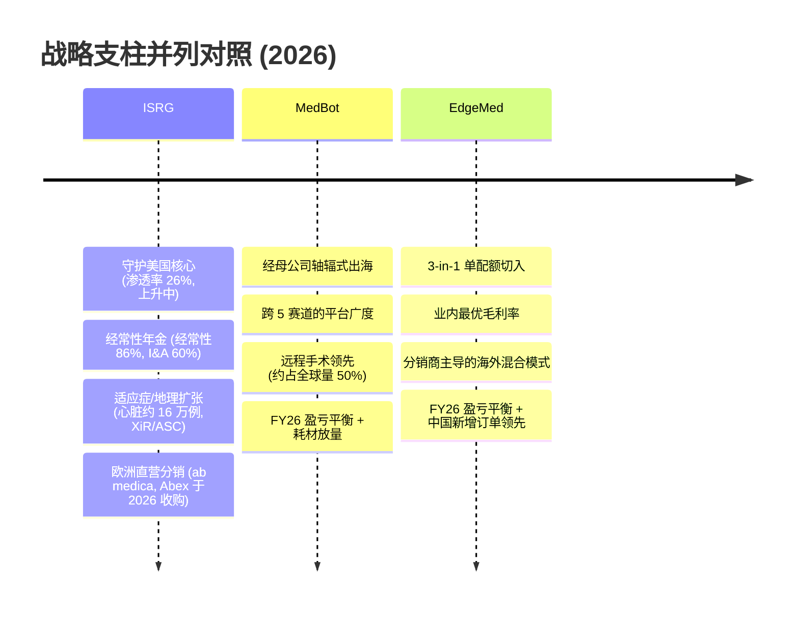
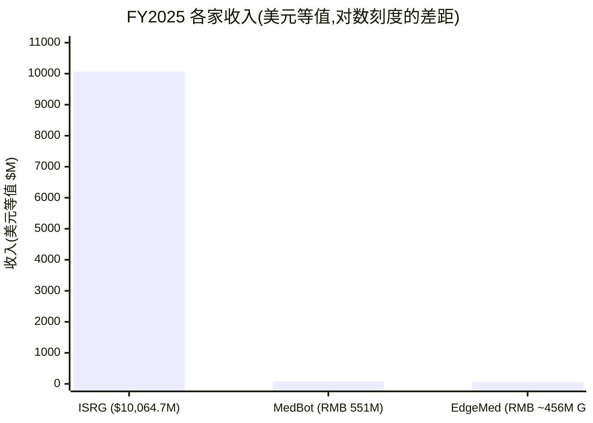

# 直觉外科 Intuitive Surgical (ISRG) vs 微创医疗机器人 MicroPort MedBot (2252.HK) vs 精锋医疗 Edge Medical / EdgeMed (2675.HK) —— 一场"中国医疗器械出海"的正面对决

*手术机器人 (surgical robotics) · N=3 横向对比 · 基准日 2026-06-09*

这是一场设防已久的全球龙头与两家最具优势的中国"出海"挑战者之间的正面对决。[直觉外科 Intuitive Surgical (ISRG)](https://www.sec.gov/Archives/edgar/data/0001035267/000103526726000010/isrg-20251231.htm) 是机器人辅助手术 (robotic-assisted surgery) 的开创者,拥有 11,106 台 da Vinci 的装机量 (installed base),并以一套"刀片+剃刀 (razor-and-blade)"的年金式商业模式滚出约 86% 的经常性收入 (recurring revenue);[微创医疗机器人 MicroPort MedBot (2252.HK)](https://www1.hkexnews.hk/listedco/listconews/sehk/2025/0327/2025032702717.pdf) 与 [精锋医疗 Edge Medical / EdgeMed (2675.HK)](https://www.hkexnews.hk/listedco/listconews/sehk/2025/1230/2025123000030_c.pdf) 则是 Goldman Sachs 在其中国手术机器人覆盖中排在最前列的两家中国 OEM。核心问题是:中国玩家究竟在威胁 ISRG 那个价值 US$23bn 的美国本土核心市场,还是说它们其实是在拓展一个*不同的*、渗透率更低的 US$19bn 海外 (ex-US, OUS) 市场池——从一个替换窗口而非从 ISRG 设防的旗舰特许经营权里抢份额?简短的答案,也是本文余下篇幅逐层论证的结论,是后者:ISRG 牢牢守住美国,中国挑战者攻击的是 OUS 侧翼,而临床疗效 (clinical efficacy) *并不是*这场战役的胜负手。

---

## 来源文件与说明(完整引用见 References)

**ISRG** —— [FY2025 10-K](https://www.sec.gov/Archives/edgar/data/0001035267/000103526726000010/isrg-20251231.htm)、[Q1-2026 earnings release](https://www.sec.gov/Archives/edgar/data/0001035267/000103526726000029/q126ex-991earningsrelease.htm)、[8-K 欧洲分销商收购 (2026-03-02)](https://www.sec.gov/Archives/edgar/data/0001035267/000103526726000012/q126ex-991acquisitionpress.htm)、[DEF 14A 2026](https://www.sec.gov/Archives/edgar/data/0001035267/000103526726000023/isrg-20260313.htm)。**MedBot** —— [2024 年度业绩公告](https://www1.hkexnews.hk/listedco/listconews/sehk/2025/0327/2025032702717.pdf)、[IPO 新闻稿 (2021-11-02)](https://www.microport.com.cn/upload/investor/1638406392248131341.pdf)、[配售公告 (2025-05-14)](https://www1.hkexnews.hk/listedco/listconews/sehk/2025/0514/2025051400032_c.pdf)。**EdgeMed** —— [HKEX IPO Prospectus (2025-12-30)](https://www.hkexnews.hk/listedco/listconews/sehk/2025/1230/2025123000030_c.pdf)。卖方研究(均为 `*分析师观点:*`,引用至 broker PDF):Goldman Sachs "China Medtech Going Global"、GS "China Surgical Robots" 首次覆盖、GS "Investor Feedback"、GS "MedBot/EdgeMed standalone TP"、GS "Tinavi" 首次覆盖、UBS MedBot、UBS China Healthcare、Bernstein ISRG 4Q25、BofA ISRG、J.P. Morgan 专家电话、国联民生证券 MedBot 深度报告。

---

## §0 TL;DR —— 优劣势速览

|  | ✓ 优势 | ✗ 劣势 |
|---|---|---|
| **直觉外科 Intuitive Surgical (ISRG)** | • **11,106 台 da Vinci 系统**(YE2025 装机量,YoY +12%)—— 约为中国 OEM 订单簿的 50–90 倍(§5.3)  • **Q1-2026 经常性收入约 86%**,FY25 耗材 (instruments & accessories, I&A) 占销售额 60% —— 全行业最深的年金(§5.2)  • **YE25 累计约 20,000,000 例手术** —— 对两家对手形成约 800–1,300 倍的数据飞轮领先(§5.5)  • **FY25 收入 $10,064.7M(+21%)**,GAAP 毛利率 (gross margin) 66.0%,净现金 $3,996M,GAAP 已盈利(§4)  • **5 大变革性产品周期**(dV5、AI、Ion、XiR、SP)+ 心脏适应症获批打开约 16 万例/年(§6)  • **独占 US$23bn 美国核心市场**,MIS 渗透率 26% 且仍在上升;生态锁定限制了其本土区域的海外替代(§6) | • **20 年来首批可信的多孔 (multi-port) 竞争者** —— Medtronic Hugo(2025-12 美国泌尿)+ J&J Ottava(2026-01 De Novo)(§5.8)  • **相对中国对手约 30–40% 的设备/耗材价差**;新购 da Vinci 的医院 IRR 仅 5% vs 中国机型 28%(§5.4)  • **中国价格战烈度上升**;ISRG 在华仅约 519 台装机,并被点名"competitive impacts"(§5.7)  • **日本不构成催化剂** —— 2026 年报销周期对手术量增长仅贡献约 0.04ppt(§5.7)  • **即便按多头倍数也约 36–37x 远期市盈率 (forward P/E)** —— UBS 以"估值已然稳健"维持 Neutral(§4.5)  • **dV5 升级"基本属增量"**(GS 观点)—— 力反馈的临床价值"有待验证"(§5.6) |
| **微创医疗机器人 MicroPort MedBot (2252.HK)** | • 截至 2026-03 **累计订单 220+ 台 / 海外约 170 台** —— 2025 年订单量全球第二,定位最优的中国挑战者(§5.3)  • **唯一在全部 5 条"黄金赛道"实现商业化的 OEM** —— 腔镜、骨科、泛血管、经自然腔道、经皮(§5.1)  • **远程手术 (telesurgery) 领跑者** —— 约 800 例远程手术,约占全球量的 50%,成功率 100%,首个国产远程手术获批(§5.5)  • **FY25 收入 RMB 551mn(+114%)**,海外收入 +287%,海外占比 73%;三家券商一致看 FY26 盈亏平衡(§4)  • **母公司"轴辐式 (hub-and-spoke)"渠道** —— 借力微创集团自有的全球基础设施,而非从零搭建分销商(§5.3)  • **GS 的中国首选(Buy,TP HK$45)** —— 至 2035E 占全球 TAM 的 5.4%,出海领头羊(§4.5) | • **FY25 前仍未盈利**(FY24 净亏损 RMB 647mn,FY25 −250mn);首个净利润年份要到 FY26E(§5.7)  • **2025 国内新增订单输给 EdgeMed** —— 中标 17 vs 22;国内收入同比基本持平(§5.7)  • **毛利率落后 EdgeMed** —— 48%(2025) vs EdgeMed 约 63%;要到 2026E 才达 55%(§4)  • **远期市销率 (forward P/S) 约 20x**(多头情形 2026E 隐含 46.6x);GS 净利润"偏薄",低于市场一致预期(§4.5)  • **上市 4.5 年后仍跌破 HK$43.20 发行价**;配售前现金跑道 (cash runway) 不足 18 个月(§5.7)  • **Robocath 减值(RMB 116.5mn)** + 终止脊柱/瓣膜/肺活检项目,显示 R&D 收缩(§5.7) |
| **精锋医疗 Edge Medical / EdgeMed (2675.HK)** | • **按 2025 国内新增订单为内资第一** —— 中标 22 vs MedBot 的 17(§5.4)  • **中国同业中毛利率最优** —— 62.8%(1H25),海外毛利率 67.6%(§4)  • **"3-in-1"单孔 (single-port, SP) + 多孔 + 远程手术共用一张医院配额**(NMPA 2026-03),价格对标 da Vinci Xi(§5.1)  • **中国专利第一** —— 734 件已授权/在审;"中国第一家、全球第二家"同时注册 MP+SP+NOTES(§5.5)  • **FY26 指引:约 120 台装机,收入 >RMB850mn(+85%),全年盈利,毛利率 >60%**(§6)  • **含 IPO 募资后约 75 个月现金跑道**;13 名基石(约占募资 65%),含腾讯、ADIA(§7) | • **三家中海外基数最薄** —— 累计海外订单约 70 台 vs MedBot 约 170 台;落后约 1 年(§5.3)  • **海外依赖分销商模式** —— 约 70 家分销商 vs MedBot 母公司自有基础设施(§5.7)  • **耗材产能受限** —— 无集团级制造可依托,不同于 MedBot(§5.7)  • **上市仅约 5 个月** —— 无多季度业绩记录;3 个月日均成交额 (ADTV) 仅 US$2.7m vs MedBot 的 HK$221m(§5.7)  • **隐含 P/S 最贵** —— 2026E 34.1x(GS 基准情形);独立 TTM P/S 视觉约 88x(§4.5)  • **创始人夫妻控股约 43%、无独立 CFO** —— 关键人 + 治理集中风险(§5.7) |

**这三家分别适合谁?** 想要设防完备的全球复利机器,选 **ISRG** —— 一家 GAAP 盈利、净现金、近乎垄断的公司,拥有医疗器械领域最深的耗材年金,以及一个中国玩家明确不去争夺的 US$23bn 美国核心市场;你买的是盈利可见度,而代价是约 36–56x 的远期市盈率。想押注最高确定性的中国出海挑战者,选 **MedBot** —— 平台最宽(5 条赛道)、海外订单簿最大(约 170 台)、远程手术之冠、母公司自有的分销机器 —— 代价是它尚未盈利、去年国内新增订单领先地位输给了 EdgeMed,且交易于约 20x 远期 P/S。想要毛利率最高、国内势头最猛、产品切入最巧(单配额上做"3-in-1")的中国纯玩家,选 **EdgeMed** —— 代价是它海外基数最薄、依赖分销商模式、仅有 5 个月交易历史,且隐含倍数最贵。这三者不像双源采购 EDA 那样"跑混合策略":ISRG 和这对中国双雄占据不同的地理区域、处在盈利曲线的不同位置 —— 现实的组合是*以 ISRG 作为在位龙头底仓,再叠加一家中国挑战者作为出海押注*。

**偏好顺序:ISRG > MedBot > EdgeMed** —— **#1 ISRG**(首选,因为它是唯一盈利、净现金的标的,守护着挑战者主动让出的 US$23bn 美国核心市场,并拥有这十年内对手无法复制的约 20,000,000 例手术数据护城河);**MedBot**(中国挑战者中首选,因为它是 GS 明确的中国第一选,拥有约 170 台海外订单、5 条赛道的广度、母公司自有渠道 —— 攻击 OUS 市场池定位最优的进攻者);**EdgeMed**(最不优先,因为尽管毛利率更高、国内新增订单领先,但它海外基数最薄、模式依赖分销商、隐含 P/S 最贵,且仅有约 5 个月的公开市场历史)。这是该组合内的相对确信度排序,而非已定仓位的交易判断 —— 须注意,Goldman Sachs 自己对中国挑战者的排序是 MedBot > EdgeMed > TINAVI,并将 ISRG 作为*单独*设防的在位龙头 Buy 持有;此处将 ISRG 排首位,反映的是跨组合的质量(盈利 + 护城河深度),而非声称 ISRG 的近期上行空间比这对 Buy 评级的中国双雄更大。

---

## §1 —— 一句话自我描述(原文措辞)

| | ISRG | MedBot (2252.HK) | EdgeMed (2675.HK) |
|---|---|---|---|
| 自我框架(原文) | "微创医疗领域的全球技术领导者,机器人辅助手术的开创者" | 唯一在全部五条"黄金赛道"(腔镜、骨科、泛血管、经自然腔道、经皮)都已商业化产品的 OEM | "中国第一家、全球第二家"同时获得多孔 + 单孔 + 经自然腔道手术机器人注册 |
| 标语 | 刀片+剃刀生态;da Vinci + Ion 上"一致"的模式 | "手术机器人出海先锋" | "3-in-1"平台 —— 单孔 + 多孔 + 远程手术共用一张配额 |
| 隐含转型 | 从*系统销售商*转向*经常性收入平台*(I&A 占销售额 2017→2025 由 52%→60%) | 从*中国多孔挑战者*转向*全球远程手术 + 多赛道平台* | 从*后入场挑战者*转向*毛利率最高、专利最多的中国纯玩家* |

ISRG 的自我描述刻意是一个*品类*声明 —— "机器人辅助手术的开创者" —— 把每一个竞争者都框定为追随者,而它的 [FY2025 10-K](https://www.sec.gov/Archives/edgar/data/0001035267/000103526726000010/isrg-20251231.htm) 进一步强化这一点,强调"我们还从器械、配件和服务的销售中赚取经常性收入",并明言 Ion 建立在"与 da Vinci 手术系统模式一致的商业模式"之上。过去十年的转型,是从销售资本设备到对装机量进行变现的悄然移位:系统业务线如今仅占收入 25%,而耗材 (I&A) 占 60% —— 这是一种中国 OEM 才刚刚开始构建的经常性收入姿态。MedBot 的框架是广度 —— *分析师观点:*据 [国联民生证券 2026-06-07, p.4](http://xs-macbook-air.local:5001/zsxq/pdf/814528288145112/%E5%BE%AE%E5%88%9B%E6%9C%BA%E5%99%A8%E4%BA%BA%E5%85%AC%E5%8F%B8%E6%B7%B1%E5%BA%A6%E6%8A%A5%E5%91%8A%EF%BC%9A%E6%89%8B%E6%9C%AF%E6%9C%BA%E5%99%A8%E4%BA%BA%E5%87%BA%E6%B5%B7%E5%85%88%E9%94%8B%EF%BC%8C%E5%85%A8%E7%90%83%E6%8B%93%E5%B1%95%E6%8B%BE%E7%BA%A7%E8%80%8C%E4%B8%8A.pdf#page=4),它是唯一"在全部 5 条黄金赛道商业化"的中国 OEM —— 其信号是它在中国挑战者里是*平台*,而不是单一产品的故事。EdgeMed 的框架来源于其招股书中引用的 Frost & Sullivan,见 [IPO Prospectus, p.158, p.174](https://www.hkexnews.hk/listedco/listconews/sehk/2025/1230/2025123000030_c.pdf),是精准卡位:它是继 Intuitive Surgical 之后唯一同时注册了多孔、单孔和经自然腔道系统的公司 —— 一个"我们最接近 ISRG 的产品矩阵"的声明,撑起了它的 3-in-1 切入点。

---

## §2 —— 战略支柱

ISRG 跑的是最清晰营销的教义,因为它是可运营且自我强化的:每一台新系统都加深耗材年金,每一例手术都喂养数据飞轮,而 2026 年的欧洲分销商收购把利润和控制权从第三方手中收回 —— [ISRG 8-K, 2026-03-02](https://www.sec.gov/Archives/edgar/data/0001035267/000103526726000012/q126ex-991acquisitionpress.htm) 确认它已将意大利、西班牙、葡萄牙、马耳他和圣马力诺转为直营。*分析师观点:*Bernstein 将 ISRG 描述为正在运行"5 个变革性产品周期……应能驱动强劲增长,外加额外的管线资产和适应症",见 [Bernstein — ISRG 4Q25, p.1](http://xs-macbook-air.local:5001/zsxq/pdf/585525425551554/Bernstein-Intuitive%20Surgical%20Inc%EF%BC%88ISRG.US%EF%BC%89Intuitive%20Surgical%204Q25%EF%BC%9ASqueaky%20clean%20quarter%EF%BC%9Btop%20pick%EF%BC%88PT%20%24750%EF%BC%89-260123.pdf#page=1)。MedBot 的教义是"广度+渠道":*分析师观点:*GS 指出其"总部出海平台"借力母公司微创现有的全球基础设施而非新建,计划增加约 100 名海外员工至 200–300 人,见 [Goldman Sachs Initiation 2026-04-21, p.4](http://xs-macbook-air.local:5001/zsxq/pdf/212215118214521/Goldman%20Sachs-CHINA%20SURGICAL%20ROBOTS%20Going~global%20%EF%BC%88ex~US%EF%BC%89%20as%20core%20growth%20drivers%EF%BC%9B%20Initiate%20Medbot%EF%BC%8C%20EdgeMed%20at%20Buy-260421.pdf#page=4)。EdgeMed 的教义是产品驱动、毛利优先:*分析师观点:*GS 将 3-in-1 平台框定为关键战略解锁 —— 在对标 Xi 的定价下整合 da Vinci Xi 和 SP 功能,可"用一张配额而非两张"部署,见 [Goldman Sachs Initiation 2026-04-21, p.13](http://xs-macbook-air.local:5001/zsxq/pdf/212215118214521/Goldman%20Sachs-CHINA%20SURGICAL%20ROBOTS%20Going~global%20%EF%BC%88ex~US%EF%BC%89%20as%20core%20growth%20drivers%EF%BC%9B%20Initiate%20Medbot%EF%BC%8C%20EdgeMed%20at%20Buy-260421.pdf#page=13)。

---

## §3 —— AI 叙事 —— 工具还是顺风

| 视角 | ISRG | MedBot (2252.HK) | EdgeMed (2675.HK) |
|---|---|---|---|
| AI 作为工具(内部) | Case Insights、SimNow VR、Intuitive Hub 边缘计算;dV5 算力 >10,000× Xi | 大模型自主手术动物实验(2025-12);"力显示" | Edge Cloud 远程手术;双控制台培训 |
| AI 作为顺风(卖入需求) | dV5 力反馈 + AI 技能评估(Wave-3 专利至约 2035–2045) | 全球首例 5G 远程自主驾驶支气管镜冷冻消融(2025-07) | 跨洲远程手术(Edge Cloud) |

ISRG 的 AI 故事最为具体,因为它已嵌入在出货产品里:[FY2025 10-K](https://www.sec.gov/Archives/edgar/data/0001035267/000103526726000010/isrg-20251231.htm) 称 dV5 承载">10,000× da Vinci Xi 的算力",并整合了 Case Insights(一个计算观察者)、SimNow 和 Intuitive Hub。但其*临床*回报存在争议 —— *分析师观点:*GS 判断 dV5 升级"看似属增量,临床获益有待验证,而增强的数字功能可能才是关键差异化点",并指出"AI 与算力的价值仍有待验证",见 [Goldman Sachs — China Medtech Going Global, p.19](http://xs-macbook-air.local:5001/zsxq/pdf/585582881584284/Goldman%20Sachs-CHINA%20MEDTECH%20GOING%20GLOBAL%EF%BC%9AAssessing%20the%20opportunity%20for%20surgical%20robots~global%20expansion%20beyond%20ISRG%E2%80%99s%20core%20markets-260421.pdf#page=19)。MedBot 的 AI/自主叙事在*远程*这条轴上真正具有差异化 —— *分析师观点:*它于 2025-12 完成了"全球首例大模型自主手术动物实验",以及全球首例 5G 远程自主驾驶支气管镜冷冻消融,见 [Goldman Sachs Initiation 2026-04-21, p.5](http://xs-macbook-air.local:5001/zsxq/pdf/212215118214521/Goldman%20Sachs-CHINA%20SURGICAL%20ROBOTS%20Going~global%20%EF%BC%88ex~US%EF%BC%89%20as%20core%20growth%20drivers%EF%BC%9B%20Initiate%20Medbot%EF%BC%8C%20EdgeMed%20at%20Buy-260421.pdf#page=5) 与 [国联民生证券 2026-06-07, p.34](http://xs-macbook-air.local:5001/zsxq/pdf/814528288145112/%E5%BE%AE%E5%88%9B%E6%9C%BA%E5%99%A8%E4%BA%BA%E5%85%AC%E5%8F%B8%E6%B7%B1%E5%BA%A6%E6%8A%A5%E5%91%8A%EF%BC%9A%E6%89%8B%E6%9C%AF%E6%9C%BA%E5%99%A8%E4%BA%BA%E5%87%BA%E6%B5%B7%E5%85%88%E9%94%8B%EF%BC%8C%E5%85%A8%E7%90%83%E6%8B%93%E5%B1%95%E6%8B%BE%E7%BA%A7%E8%80%8C%E4%B8%8A.pdf#page=34)。EdgeMed 的最薄 —— *分析师观点:*其"Edge Cloud"远程手术和双控制台培训被点名为差异化点,见 [Goldman Sachs Investor Feedback 2026-05-12, p.4](http://xs-macbook-air.local:5001/zsxq/pdf/585425155421584/Goldman%20Sachs-CHINA%20SURGICAL%20ROBOTS%20Investor%20Feedback%20Post%20Initiations%EF%BC%9A%20Structural%20Go~global%20Opportunity%20Acknowledged%EF%BC%9B%20Near-term%20Focus%20on%20Orders%EF%BC%8C%20Utilization%20and%20Valuation-260512.pdf#page=4) —— 但 GS 首次覆盖中并未将一项独立的跨洲远程手术声明归于 EdgeMed(GS 的"首个国产远程手术获批"指的是 MedBot),因此 EdgeMed 的自主故事是三者中最未经证实的。

---

## §4 —— 分部结构与财务记分牌

*来源:ISRG FY2025 10-K 利润表;MedBot RMB 551mn FY25(UBS/GS/国联民生 一致);EdgeMed GS 模型 Rmb455.7m 2025。RMB→USD 按约 7.15 仅用于刻度。*

| 指标 | ISRG (FY2025) | MedBot (FY2025) | EdgeMed (FY2025) | 说明 |
|---|---|---|---|---|
| 总收入 | **$10,064.7M(+21%)** | **RMB 551mn(+114%)** | **RMB ~455.7mn(GSe)** | ISRG 约为 MedBot 的 130×;增速相反 |
| 毛利率 | **66.0% GAAP** | **48.4%** | **62.8%(1H25 实际)** | EdgeMed 领先中国双雄 |
| 经常性 / I&A 占比 | **I&A 60%,经常性约 86%(Q1-26)** | **耗材约 11%** | **I&A 约 6.9%(1H25)** | ISRG 年金碾压两家 |
| 海外收入占比 | **OUS 32%** | **73%** | **60%(GSe)** | 中国玩家以海外为主 |
| 净利结果 | **GAAP 盈利;净现金 $3,996M** | **净亏损 RMB 250mn** | **净亏损约 RMB 89mn(GSe)** | 当下仅 ISRG 盈利 |
| 首个净利润年份 | 已盈利 | **FY2026E** | **FY2026E(目标)** | 两家中国玩家均 2026 盈亏平衡 |

ISRG 的分部结构是这场对比的定义性反差:[FY2025 10-K](https://www.sec.gov/Archives/edgar/data/0001035267/000103526726000010/isrg-20251231.htm) 将 FY25 收入拆分为器械与配件 (I&A) $6.02bn(+19%)、系统 $2.47bn(+26%)、服务 $1.57bn(+20%)—— 因此"耗材+服务"的年金占收入 75.4%,纯 I&A 占 60%,而资本设备业务线仅占四分之一。*分析师观点:*GS 确认 I&A 占比从 2017 年的 52% 升至 2025 年的 60%,见 [Goldman Sachs — China Medtech Going Global, p.6](http://xs-macbook-air.local:5001/zsxq/pdf/585582881584284/Goldman%20Sachs-CHINA%20MEDTECH%20GOING%20GLOBAL%EF%BC%9AAssessing%20the%20opportunity%20for%20surgical%20robots~global%20expansion%20beyond%20ISRG%E2%80%99s%20core%20markets-260421.pdf#page=6)。MedBot 处在曲线的另一端 —— *分析师观点:*FY25 收入 RMB 551mn(+114.2%),耗材仅占约 11%,见 [UBS 2026-04-10, p.1](http://xs-macbook-air.local:5001/zsxq/pdf/812241888881822/UBS-Shanghai%20MicroPort%20MedBot%EF%BC%882252.HK%EF%BC%89Robust%20overseas%20sales%20momentum%20driving%20potential%20breakeven%20in%201H26E%EF%BC%9B%20upgrade%20to%20Buy-260410.pdf#page=1) 与 [国联民生证券 2026-06-07, p.6](http://xs-macbook-air.local:5001/zsxq/pdf/814528288145112/%E5%BE%AE%E5%88%9B%E6%9C%BA%E5%99%A8%E4%BA%BA%E5%85%AC%E5%8F%B8%E6%B7%B1%E5%BA%A6%E6%8A%A5%E5%91%8A%EF%BC%9A%E6%89%8B%E6%9C%AF%E6%9C%BA%E5%99%A8%E4%BA%BA%E5%87%BA%E6%B5%B7%E5%85%88%E9%94%8B%EF%BC%8C%E5%85%A8%E7%90%83%E6%8B%93%E5%B1%95%E6%8B%BE%E7%BA%A7%E8%80%8C%E4%B8%8A.pdf#page=6)。EdgeMed 在中国双雄中毛利领先 —— PRIMARY 实际数据显示毛利率 59.3%(2023)→ 61.3%(2024)→ 62.8%(1H2025),系统仍占 1H25 收入的 92.9%,见 [IPO Prospectus, p.24–26](https://www.hkexnews.hk/listedco/listconews/sehk/2025/1230/2025123000030_c.pdf)—— 这意味着定义 ISRG 的刀片+剃刀飞轮,对两家挑战者来说才刚刚起步。

*可比性警示(全文通用):*ISRG 以美元按 US-GAAP 报告且长期盈利;MedBot 与 EdgeMed 以人民币按 HKFRS 报告,二者均未盈利,模型给出的首个净利润年份为 FY2026E。因此每一项毛利率和市盈率比较都是前瞻的而非过往的,远期市销率 (forward P/S) 是三者之间唯一可同口径比较的倍数(见 §4.5)。

---

## §4.5 —— 相对估值记分牌

| 公司 | 远期 P/E | 远期 P/S | EV/EBITDA | PEG | 借用 PT(报告日股价 → 上行空间) | 估值基础 | 同业中位 / 3 年区间 (P/S) | 溢价是否合理? |
|---|---|---|---|---|---|---|---|---|
| **ISRG** | **约 36–52x**(UBS 46.6x 12/26E;Bernstein 52.0x F26E) | **约 15x**(GS);TTM 约 14.2x | **15.6x F26E**(Bernstein) | n/a | **GS PT $609 vs $451.29 @ 2026-04-21 → +35%**;Bernstein $750 vs $525.81 @ 2026-01-23 → +43%;BofA $650 vs $469.21 @ 2026-04-20 → +40%;UBS $550 vs $478.82 @ 2026-04-23 → +15% | P/E(已盈利)—— 64x F27 EPS(Bernstein);DCF/倍数 | 5 年均 P/S 15.5x(+1SD 18.5x,−1SD 12.7x);P/E 5 年均约 56x | **是** —— 盈利可见度 + 86% 经常性年金支撑约 3× 医疗器械均值的倍数 |
| **MedBot (2252.HK)** | **2026E 344x / 2027E 77x**(机械性虚高 —— 临近盈亏平衡) | **远期约 20–21x**(UBS 22.5x 2026E / 14.2x 2027E) | n/a(EBITDA 尚未上规模) | **0.4x 2027E**(UBS) vs 同业 0.9x | **GS PT HK$45 vs HK$34.14 @ 2026-04-17 → +31.8%**;UBS HK$35.90 vs HK$28.50 @ 2026-04-10 → +26.0% | **P/S(未盈利)** + DCF(9% WACC,3% g) | 医疗器械同业中位 P/S 5.4x/4.6x;MedBot 自身均值 35.5x(+1SD 57.6x,−1SD 13.4x) | **是** —— 由 49.5% 收入 CAGR + 至 2035E 净利率 (net margin) 约 27% 的收敛,支撑相对医疗器械中位 >3× 的 P/S 溢价 |
| **EdgeMed (2675.HK)** | **2027E 137.9x / 2028E 69.9x**(机械性虚高) | **34.1x 2026E / 21.3x 2027E / 14.7x 2028E**(GS 基准) | n/a | n/a(GS 净利润低于一致预期) | **GS PT HK$81 vs HK$56 @ 2026-04-17 → +44.6%**(对 HK$57.85 收盘 → 约 +40%) | **P/S(未盈利)** + DCF(9% WACC,3% g) | TINAVI/同业 P/S "28x/21x/16x,与 MedBot/EdgeMed 持平";独立 TTM 视觉约 88x | **部分** —— 三者中隐含 P/S 最高;约 28% 的 2035E 终端净利率(高 MedBot 27% 1 个点)支撑边际溢价,但更薄的海外基数无法支撑 |

**公允标尺 —— 远期市销率 (forward P/S)。** 三家中有两家尚未盈利,其市盈率打印是机械性无意义的:*分析师观点:*MedBot 交易于"2026/27 年 344x/77x PE",EdgeMed 于"137.9x 2027E",这也是 UBS 改以 MedBot 的 **2027E PEG 0.4x vs 同业中位 0.9x** 为锚的原因 —— 它拥有中国医疗器械里最快的收入与 EPS 复合增速(49.5% 收入、185.5% EPS,vs 同业 16.1%/21.2%),见 [UBS 2026-04-10, p.1](http://xs-macbook-air.local:5001/zsxq/pdf/812241888881822/UBS-Shanghai%20MicroPort%20MedBot%EF%BC%882252.HK%EF%BC%89Robust%20overseas%20sales%20momentum%20driving%20potential%20breakeven%20in%201H26E%EF%BC%9B%20upgrade%20to%20Buy-260410.pdf#page=1)。横看整组的远期 P/S,MedBot 约 20x、EdgeMed 约 34x 都*高于*ISRG 的约 15x,并远高于中国医疗器械同业中位的约 5.4x —— *分析师观点:*GS 将这一溢价框定为可辩护,因为"历史上 ISRG 也以高倍数交易,反映其装机量带来的盈利可见度",见 [GS Investor Feedback 2026-05-12, p.5](http://xs-macbook-air.local:5001/zsxq/pdf/585425155421584/Goldman%20Sachs-CHINA%20SURGICAL%20ROBOTS%20Investor%20Feedback%20Post%20Initiations%EF%BC%9A%20Structural%20Go~global%20Opportunity%20Acknowledged%EF%BC%9B%20Near-term%20Focus%20on%20Orders%EF%BC%8C%20Utilization%20and%20Valuation-260512.pdf#page=5)。与 §5 护城河对账:ISRG 的溢价是由两家挑战者都不具备的 60% 经常性年金和约 20,000,000 例手术数据飞轮*付了费*的,因此它处在自身 5 年均值附近的约 15x P/S 是合理的。MedBot 的约 20x 由该组合内最高的增长加上 GS 对其净利率到 2035E 收敛至约 27% 的承诺所支撑 —— 也就是说,你在为尚不存在的 ISRG 级经济性付费。EdgeMed 的 34x 隐含 P/S 最难辩护:其终端净利率假设(28%)仅略高于 MedBot 的(27%),但其海外订单簿不到 MedBot 的一半,因此在护城河调整后,最贵的倍数落在了出海证据最薄的那家上 —— 一个"溢价并不完全合理"的判断,会被底线判断一路贯穿。

*可比性警示:*ISRG 的卖方 EPS 为 non-GAAP/调整后(ISRG GAAP 摊薄 EPS FY25 = $7.87);中国玩家的市盈率建立在临近盈亏平衡的盈利上,因此不要把 ISRG 的 36–52x P/E 当作与 MedBot 的 344x 同一指标来比。报告日股价与上行空间来自 `stock_price_target.db`;同一个 PT 在不同日期会显示不同的上行空间(MedBot 不变的 HK$45 PT,随股价 HK$35.24→HK$27.70 跌至 5 月中,上行从 +27.7% 扩大到 +62.5%)。

---

## §5 —— 护城河剖析

### §5.1 —— 产品重叠矩阵(按术式判断谁在直接竞争)

| 术式类别 | ISRG | MedBot | EdgeMed | 状态 |
|---|---|---|---|---|
| 软组织腔镜(泌尿/普外/妇科/胸外) | da Vinci(Xi/dV5) | 图迈 Toumai | MP1000/MP2000 | **三家全部竞争**(ISRG 主导 —— 年约 320 万例,US$10–12bn TAM) |
| 单孔内镜 (single-port) | da Vinci SP(377 台装机,未上规模) | 后续在建 SP | SP1000 / 3-in-1 | **ISRG 与 EdgeMed 竞争;MedBot 在建**(EdgeMed 已产品化整合) |
| 支气管镜 / 经腔道 | Ion(约 995 台装机) | 独道 UniPath(NMPA 2025-12) | — | **ISRG vs MedBot 竞争;EdgeMed 缺席** |
| 血管 / 泛血管 (PCI) | — | R-ONE(NMPA 2023-12) | — | **不重叠(仅 MedBot)** |
| 骨科 (TKA/THA) | — | 鸿鹄 SkyWalker(>65 单) | — | **不重叠(仅 MedBot —— 对阵 TINAVI/Stryker Mako)** |
| 经皮(前列腺穿刺) | — | 蜻蜓眼 Mona Lisa | — | **不重叠(仅 MedBot)** |

最直接的三方碰撞是**软组织腔镜** —— *分析师观点:*三家都在腔镜板块被列为"主要中国/全球玩家",该板块是机器人最大的类别,约 320 万例/年、US$10–12bn TAM,见 [Goldman Sachs — China Medtech Going Global, p.4](http://xs-macbook-air.local:5001/zsxq/pdf/585582881584284/Goldman%20Sachs-CHINA%20MEDTECH%20GOING%20GLOBAL%EF%BC%9AAssessing%20the%20opportunity%20for%20surgical%20robots~global%20expansion%20beyond%20ISRG%E2%80%99s%20core%20markets-260421.pdf#page=4)。除此之外,重叠迅速变薄:支气管镜是 ISRG(Ion)对 MedBot(UniPath,NMPA 2025-12)的两方对决,EdgeMed 缺席,见 [Goldman Sachs Initiation 2026-04-21, p.5](http://xs-macbook-air.local:5001/zsxq/pdf/212215118214521/Goldman%20Sachs-CHINA%20SURGICAL%20ROBOTS%20Going~global%20%EF%BC%88ex~US%EF%BC%89%20as%20core%20growth%20drivers%EF%BC%9B%20Initiate%20Medbot%EF%BC%8C%20EdgeMed%20at%20Buy-260421.pdf#page=5);血管(R-ONE)和骨科(SkyWalker)是 MedBot 独有的侧翼,ISRG 与 EdgeMed 根本不在场,见 [Goldman Sachs — China Medtech Going Global, p.4](http://xs-macbook-air.local:5001/zsxq/pdf/585582881584284/Goldman%20Sachs-CHINA%20MEDTECH%20GOING%20GLOBAL%EF%BC%9AAssessing%20the%20opportunity%20for%20surgical%20robots~global%20expansion%20beyond%20ISRG%E2%80%99s%20core%20markets-260421.pdf#page=4)。单孔是最有意思的非对称:*分析师观点:*ISRG 的 SP 仅约 377 台装机、约 5.5 万例/年,"远低于其多孔基数",见 [Goldman Sachs — China Medtech Going Global, p.23](http://xs-macbook-air.local:5001/zsxq/pdf/585582881584284/Goldman%20Sachs-CHINA%20MEDTECH%20GOING%20GLOBAL%EF%BC%9AAssessing%20the%20opportunity%20for%20surgical%20robots~global%20expansion%20beyond%20ISRG%E2%80%99s%20core%20markets-260421.pdf#page=23),而 EdgeMed 的 3-in-1 于 2026-03 获 NMPA,让医院能"用一张配额而非两张"同时部署单孔+多孔,见 [Goldman Sachs Initiation 2026-04-21, p.13](http://xs-macbook-air.local:5001/zsxq/pdf/212215118214521/Goldman%20Sachs-CHINA%20SURGICAL%20ROBOTS%20Going~global%20%EF%BC%88ex~US%EF%BC%89%20as%20core%20growth%20drivers%EF%BC%9B%20Initiate%20Medbot%EF%BC%8C%20EdgeMed%20at%20Buy-260421.pdf#page=13)。重叠结论:ISRG 在最宽的诊疗连续谱上竞争,三家在软组织腔镜上碰撞最直接,而骨科/血管是 MedBot 独有的战场、在位龙头缺席。

### §5.1b —— 客户集中度

| | ISRG | MedBot | EdgeMed |
|---|---|---|---|
| 大客户披露 | 无 >10%(分散于 11,106 家医院) | 未单独披露 | **未披露**(18A 招股书无前五大) |
| 地理结构 | 美国 68% / OUS 32%(FY25) | 中国 27% / 海外 73%(FY25) | 中国 59.4% / 海外 40.6%(1H25) |
| 集中度驱动因素 | 真实 —— 庞大装机量 | 海外转型,母公司渠道 | 装机数薄 → 隐含集中 |

ISRG 的客户集中度确实很低,因为其装机量横跨 11,106 台、遍布数千家医院,且 [FY2025 10-K](https://www.sec.gov/Archives/edgar/data/0001035267/000103526726000010/isrg-20251231.htm) 未列出任何 >10% 的客户 —— 它的分散是规模的函数,而非丢失了某个大账户的结果。中国玩家则相反:它们的地理"分散"是近期且刻意的,是海外转型的产物。*分析师观点:*MedBot 的海外收入占比 20%(2023)→ 40%(2024)→ 73%(2025),见 [UBS 2026-04-10, p.1](http://xs-macbook-air.local:5001/zsxq/pdf/812241888881822/UBS-Shanghai%20MicroPort%20MedBot%EF%BC%882252.HK%EF%BC%89Robust%20overseas%20sales%20momentum%20driving%20potential%20breakeven%20in%201H26E%EF%BC%9B%20upgrade%20to%20Buy-260410.pdf#page=1)。EdgeMed 的翻转更快但基数极小 —— PRIMARY:地理结构从 100% 中国(2023–24)变为 1H2025 的中国 59.4% / 欧盟 16.3% / 其他海外 24.3%,见 [IPO Prospectus, p.26](https://www.hkexnews.hk/listedco/listconews/sehk/2025/1230/2025123000030_c.pdf)。EdgeMed 在隐性集中度上*最*暴露:其 18A 招股书未披露任何前五大客户,而 FY2024 仅售出约 20–25 台系统,少数医院很可能贡献了收入的大头,见 [IPO Prospectus, p.25–26](https://www.hkexnews.hk/listedco/listconews/sehk/2025/1230/2025123000030_c.pdf)。

### §5.2 —— 在手订单与经常性占比

ISRG 的经常性层是护城河。*分析师观点:*Q1-2026 经常性收入占总收入 86%,YoY +23% 至约 $2.4bn,而 ISRG 自己的 [Q1-2026 release](https://www.sec.gov/Archives/edgar/data/0001035267/000103526726000029/q126ex-991earningsrelease.htm) 确认这包含系统中租赁/按量计费的部分。该年金是被锁定的 —— [FY2025 10-K](https://www.sec.gov/Archives/edgar/data/0001035267/000103526726000010/isrg-20251231.htm) 称耗材"寿命有限,会在手术中使用时到期或磨损,届时需要更换",且 *分析师观点:*Bernstein 给出 4Q25 每例手术 I&A 收入约 $1,850,见 [Bernstein — ISRG 4Q25, p.6](http://xs-macbook-air.local:5001/zsxq/pdf/585525425551554/Bernstein-Intuitive%20Surgical%20Inc%EF%BC%88ISRG.US%EF%BC%89Intuitive%20Surgical%204Q25%EF%BC%9ASqueaky%20clean%20quarter%EF%BC%9Btop%20pick%EF%BC%88PT%20%24750%EF%BC%89-260123.pdf#page=6)。中国玩家正处在同一条曲线的最起点 —— *分析师观点:*GS 模型显示 MedBot 耗材占收入比 0%(2023)→ 5%(2024)→ 11%(2025)→ 13%/17%/21%(2026–28E),EdgeMed 由 7%(2025)→ 15%(2028E),见 [Goldman Sachs Initiation 2026-04-21, p.3](http://xs-macbook-air.local:5001/zsxq/pdf/212215118214521/Goldman%20Sachs-CHINA%20SURGICAL%20ROBOTS%20Going~global%20%EF%BC%88ex~US%EF%BC%89%20as%20core%20growth%20drivers%EF%BC%9B%20Initiate%20Medbot%EF%BC%8C%20EdgeMed%20at%20Buy-260421.pdf#page=3)。GS 将成熟市场的稳态拆分锚定在系统 25% / 耗材 60% / 服务 15% —— 正是 ISRG 今天的结构 —— 所以整个中国论点都依赖于 ISRG 已在运行、而挑战者还需数年才能实现的刀片+剃刀飞轮,见 [Goldman Sachs Standalone TP 2026-04-24, p.2](http://xs-macbook-air.local:5001/zsxq/pdf/585581514854454/Goldman%20Sachs-China%20Surgical%20Robot%20MicroPort%20Medbot%20%EF%BC%882252.HK%EF%BC%89%20Buy%20with%20TP%20of%20HK%2445.0%EF%BC%8C%20Edge%20Medical%20%EF%BC%882675.HK%EF%BC%89%20Buy%20with%20TP%20of%20HK%2481.0-260424.pdf#page=2)。可比性警示:ISRG 的 86% 经常性与中国 7–11% 的耗材占比并非严格同一指标(ISRG 含租赁/服务),但方向上的鸿沟是真实且承重的。

要理解这道鸿沟为何承重,得把"刀片+剃刀 (razor-and-blade)"的两条腿拆开看。第一条腿是*装机量的存量*:ISRG 的 I&A 收入并不取决于今年卖了多少台新机,而取决于已装机的那 11,106 台每年做了多少例手术 —— 这意味着即便某一年系统销售放缓,只要存量医院的手术量在涨,耗材年金仍在自我加厚,这正是 [FY2025 10-K](https://www.sec.gov/Archives/edgar/data/0001035267/000103526726000010/isrg-20251231.htm) 把 I&A $6.02bn(+19%)与系统 $2.47bn(+26%)拆开列示的意义所在 —— 前者是一条与新机销售脱钩、随存量利用率复利的曲线。第二条腿是*每例的捕获额*:Bernstein 给出的 4Q25 每例约 $1,850 I&A 收入,乘以约 2,000 万例的累计基数和仍在扩张的年手术量,就是这条年金为何能撑起 ISRG 那道相对医疗器械均值约 3× 的远期市销率(forward P/S)溢价(§4.5)。对两家中国玩家而言,这两条腿都还在搭建中:MedBot 的耗材占比 2025 年才到约 11%、要到 2028E 才升至约 21%,EdgeMed 更是 2025 年约 7%、2028E 约 15% —— 也就是说,定义 ISRG 的那个"卖一台机器、然后年复一年地从耗材里收年金"的飞轮,对挑战者来说眼下几乎还是纯粹的系统销售生意,经常性收入这一层的护城河尚未成形。这也解释了为什么 OUS 替换窗口(§6.5)对中国玩家如此关键:每抢下一台 da Vinci 的换代订单,不仅是一笔一次性的系统收入,更是把一家医院接入自己未来十年耗材年金的入口 —— 装机的争夺,本质上是对未来经常性收入捕获权的争夺。

### §5.3 —— 渠道/分销锁定与装机量规模

| | ISRG | MedBot | EdgeMed |
|---|---|---|---|
| 装机量 / 订单 | **11,106 台系统**(装机,YE25) | **累计订单 220+ 台**(2026-03) | **累计订单 120+ 台**(2026-03) |
| 海外 | 4,742 台 OUS 系统;2025 年 OUS 销售 734 台 | 累计海外约 170 台;2025 年 100+ | 累计海外约 70 台;2025 年 70+ |
| 渠道模式 | 直营(欧洲在 2026 收购后转为直营) | 母公司轴辐式(微创自有基础设施) | 分销商主导(约 70 家分销商 + Dornier/Meden) |

规模差距是这场对比里最重要的单一数字,但须配可比性警示来读:*分析师观点:*ISRG 的 11,106 是**装机系统**,而中国 OEM 的 220+ / 120+ 是**累计订单**,并非全部已装机 —— 见 [Goldman Sachs — China Medtech Going Global, p.8](http://xs-macbook-air.local:5001/zsxq/pdf/585582881584284/Goldman%20Sachs-CHINA%20MEDTECH%20GOING%20GLOBAL%EF%BC%9AAssessing%20the%20opportunity%20for%20surgical%20robots~global%20expansion%20beyond%20ISRG%E2%80%99s%20core%20markets-260421.pdf#page=8)。即便不作此调整,ISRG 也领先约 50–90 倍。中国玩家真正在缩小差距的地方是在*海外的增量边际* —— *分析师观点:*2025 年 da Vinci 录得 734 台海外系统销售,vs MedBot 100+ 台海外订单、EdgeMed 70+ 台,见 [Goldman Sachs — China Medtech Going Global, p.9](http://xs-macbook-air.local:5001/zsxq/pdf/585582881584284/Goldman%20Sachs-CHINA%20MEDTECH%20GOING%20GLOBAL%EF%BC%9AAssessing%20the%20opportunity%20for%20surgical%20robots~global%20expansion%20beyond%20ISRG%E2%80%99s%20core%20markets-260421.pdf#page=9)。MedBot 的海外订单曲线很陡:*分析师观点:*0(2022)→ 1(2023)→ 20(2024)→ 50(1H2025)→ 170(2026-03),分布约 30% 欧洲 / 约 40% 亚洲(除中国)/ 约 30% 拉美,见 [GS Investor Feedback 2026-05-12, p.2](http://xs-macbook-air.local:5001/zsxq/pdf/585425155421584/Goldman%20Sachs-CHINA%20SURGICAL%20ROBOTS%20Investor%20Feedback%20Post%20Initiations%EF%BC%9A%20Structural%20Go~global%20Opportunity%20Acknowledged%EF%BC%9B%20Near-term%20Focus%20on%20Orders%EF%BC%8C%20Utilization%20and%20Valuation-260512.pdf#page=2)。渠道模式存在结构性分化:*分析师观点:*MedBot 借力微创集团*自有*的全球基础设施(轴辐式),而 EdgeMed 依靠约 70 家第三方分销商外加与 Dornier MedTech 和 Meden Inmed 的合作 —— 而 ISRG 刚把欧洲渠道转为*直营*,见 [Goldman Sachs Initiation 2026-04-21, p.14](http://xs-macbook-air.local:5001/zsxq/pdf/212215118214521/Goldman%20Sachs-CHINA%20SURGICAL%20ROBOTS%20Going~global%20%EF%BC%88ex~US%EF%BC%89%20as%20core%20growth%20drivers%EF%BC%9B%20Initiate%20Medbot%EF%BC%8C%20EdgeMed%20at%20Buy-260421.pdf#page=14)。EdgeMed 的渠道思路是机会主义的:*分析师观点:*GS 指出"在 Intuitive Surgical 从分销转向直销的部分市场,Edge Medical 看到与寻求替代增长平台的现有分销商合作的机会" —— 即 EdgeMed 意在填补 ISRG 腾出的渠道,见 [Goldman Sachs Initiation 2026-04-21, p.14](http://xs-macbook-air.local:5001/zsxq/pdf/212215118214521/Goldman%20Sachs-CHINA%20SURGICAL%20ROBOTS%20Going~global%20%EF%BC%88ex~US%EF%BC%89%20as%20core%20growth%20drivers%EF%BC%9B%20Initiate%20Medbot%EF%BC%8C%20EdgeMed%20at%20Buy-260421.pdf#page=14)。

### §5.4 —— 工具级/子板块份额与医院单位经济性

| | ISRG | MedBot | EdgeMed | 其他 |
|---|---|---|---|---|
| 中国 2025 中标份额 | **42%(46 单)** | 16%(17 单) | **20%(22 单)** | Sagebot 10%,术锐 8% |
| 医院 10 年 IRR | **5%**(新购)/ 16%(以旧换新) | **28%(中国机型级)** | **28%(中国机型级)** | — |
| 盈亏平衡利用率 | 约 150 例/年 | **约 90 例/年** | **约 90 例/年** | — |
| 系统定价 | 高端(美国 ASP $1.66mn) | 低于 da Vinci 约 30–40% | 低于 da Vinci 约 30–40% | — |

定价/经济性的楔子是中国玩家最强的单一武器,而它是双刃的。*分析师观点:*中国系统在设备和耗材上较 da Vinci 折价 30–40%,见 [Goldman Sachs — China Medtech Going Global, p.3](http://xs-macbook-air.local:5001/zsxq/pdf/585582881584284/Goldman%20Sachs-CHINA%20MEDTECH%20GOING%20GLOBAL%EF%BC%9AAssessing%20the%20opportunity%20for%20surgical%20robots~global%20expansion%20beyond%20ISRG%E2%80%99s%20core%20markets-260421.pdf#page=3)—— 不过 GS 在后文一处引用了更窄的"低 20–30%",故 30–40% 为标题口径。医院测算具有决定性:*分析师观点:*一台中国机型级机器人带来 10 年医院 IRR 28% vs 新购 da Vinci 的 5%(以旧换新 16%),并在约 150 例/年转正 vs da Vinci 约 265 例,"有效将所需利用率减半",盈亏平衡约 90 例 vs 约 150 例,见 [Goldman Sachs — China Medtech Going Global, p.13–15](http://xs-macbook-air.local:5001/zsxq/pdf/585582881584284/Goldman%20Sachs-CHINA%20MEDTECH%20GOING%20GLOBAL%EF%BC%9AAssessing%20the%20opportunity%20for%20surgical%20robots~global%20expansion%20beyond%20ISRG%E2%80%99s%20core%20markets-260421.pdf#page=14)。但在位龙头保有*定价权* —— *分析师观点:*GS 的 TAM 模型用 US$1.66mn 的美国系统 ASP,且 ISRG 可每年*上调*约 1%,见 [Goldman Sachs — China Medtech Going Global, p.11](http://xs-macbook-air.local:5001/zsxq/pdf/585582881584284/Goldman%20Sachs-CHINA%20MEDTECH%20GOING%20GLOBAL%EF%BC%9AAssessing%20the%20opportunity%20for%20surgical%20robots~global%20expansion%20beyond%20ISRG%E2%80%99s%20core%20markets-260421.pdf#page=11),Bernstein 也确认 4Q25 系统 ASP YoY +6% 至 $1.68mn,见 [Bernstein — ISRG 4Q25, p.5](http://xs-macbook-air.local:5001/zsxq/pdf/585525425551554/Bernstein-Intuitive%20Surgical%20Inc%EF%BC%88ISRG.US%EF%BC%89Intuitive%20Surgical%204Q25%EF%BC%9ASqueaky%20clean%20quarter%EF%BC%9Btop%20pick%EF%BC%88PT%20%24750%EF%BC%89-260123.pdf#page=5)。具体到*中国国内*份额,在位龙头在中标上仍领先 —— *分析师观点:*ISRG 拿下 2025 中国中标的 42%(46 单),EdgeMed 20%(22 单)、MedBot 16%(17 单),内资品牌合计 58%,见 [Goldman Sachs — China Medtech Going Global, p.23](http://xs-macbook-air.local:5001/zsxq/pdf/585582881584284/Goldman%20Sachs-CHINA%20MEDTECH%20GOING%20GLOBAL%EF%BC%9AAssessing%20the%20opportunity%20for%20surgical%20robots~global%20expansion%20beyond%20ISRG%E2%80%99s%20core%20markets-260421.pdf#page=23)。

### §5.5 —— IP / 专利 / 数据语料库特许权

| | ISRG | MedBot | EdgeMed |
|---|---|---|---|
| 累计手术量(数据飞轮) | **约 20,000,000**(YE25) | 约 25,000 | 约 15,000 |
| 专利立场 | 生态驱动而非专利驱动;Wave-3 至约 2035–45"有待验证" | "力显示"(已获 CE 认证) | **中国专利第一 —— 734 件已授权/在审** |
| 对 dV5 的差异化回应 | dV5 力反馈(增量) | 力显示 + 远程手术 | 3-in-1 + Edge Cloud |

数据护城河是整场对比里最一边倒的维度。*分析师观点:*ISRG 持有约 20,000,000 例累计腔镜机器人手术,vs CMR 的 45,000、MedBot 的 25,000、EdgeMed 的 15,000 —— 约 800–1,300 倍的领先,喂养数字化解决方案、AI 训练和产品迭代,见 [Goldman Sachs — China Medtech Going Global, p.17](http://xs-macbook-air.local:5001/zsxq/pdf/585582881584284/Goldman%20Sachs-CHINA%20MEDTECH%20GOING%20GLOBAL%EF%BC%9AAssessing%20the%20opportunity%20for%20surgical%20robots~global%20expansion%20beyond%20ISRG%E2%80%99s%20core%20markets-260421.pdf#page=17)。关键在于,GS 的论点是 ISRG 的护城河"由生态驱动而非由专利驱动" —— *分析师观点:*1992–1999 年提交的第一波基础专利(主从控制、EndoWrist 7 自由度、运动缩放)已"在约 2010–2020 年大体到期",这正是触发 2019 年以来进入者浪潮的原因;第二波"可绕开";只有第三波(力反馈、AI)延伸至约 2035–2045,但其商业意义"有待验证",见 [GS Investor Feedback 2026-05-12, p.5](http://xs-macbook-air.local:5001/zsxq/pdf/585425155421584/Goldman%20Sachs-CHINA%20SURGICAL%20ROBOTS%20Investor%20Feedback%20Post%20Initiations%EF%BC%9A%20Structural%20Go~global%20Opportunity%20Acknowledged%EF%BC%9B%20Near-term%20Focus%20on%20Orders%EF%BC%8C%20Utilization%20and%20Valuation-260512.pdf#page=5)。这是挑战者的结构性开口:各家都有不侵权地回应 ISRG Wave-3 功能的可信方案 —— *分析师观点:*MedBot 以"力显示"(已获 CE 认证)作为 dV5 力反馈的替代,EdgeMed 有 Edge Cloud 远程手术,见 [GS Investor Feedback 2026-05-12, p.5](http://xs-macbook-air.local:5001/zsxq/pdf/585425155421584/Goldman%20Sachs-CHINA%20SURGICAL%20ROBOTS%20Investor%20Feedback%20Post%20Initiations%EF%BC%9A%20Structural%20Go~global%20Opportunity%20Acknowledged%EF%BC%9B%20Near-term%20Focus%20on%20Orders%EF%BC%8C%20Utilization%20and%20Valuation-260512.pdf#page=5)。在原始专利数量上 EdgeMed 在中国双雄中领先 —— PRIMARY:全球 734 件已授权/在审专利,按专利数在中国手术机器人公司中排名第一,见 [Frost & Sullivan in IPO Prospectus, p.388, p.949–960](https://www.hkexnews.hk/listedco/listconews/sehk/2025/1230/2025123000030_c.pdf)。MedBot 独有的特许权是远程手术 —— *分析师观点:*约 800 例累计远程人体手术,约占全球远程手术量的 50%,成功率 100%,60+ 项纪录,全球首个全科室/全术式商业化远程手术系统,且为首个获批远程手术的国产玩家,见 [国联民生证券 2026-06-07, p.33](http://xs-macbook-air.local:5001/zsxq/pdf/814528288145112/%E5%BE%AE%E5%88%9B%E6%9C%BA%E5%99%A8%E4%BA%BA%E5%85%AC%E5%8F%B8%E6%B7%B1%E5%BA%A6%E6%8A%A5%E5%91%8A%EF%BC%9A%E6%89%8B%E6%9C%AF%E6%9C%BA%E5%99%A8%E4%BA%BA%E5%87%BA%E6%B5%B7%E5%85%88%E9%94%8B%EF%BC%8C%E5%85%A8%E7%90%83%E6%8B%93%E5%B1%95%E6%8B%BE%E7%BA%A7%E8%80%8C%E4%B8%8A.pdf#page=33)。

### §5.6 —— 客户为何选这家而非那家

从 broker + 专家证据里提炼出的决策驱动因素:(1) **临床疗效不是差异化点** —— *分析师观点:*一项单中心 RARP 研究(图迈 N=40 vs da Vinci Xi N=40)发现手术时间 192.5 vs 183.5 分钟(p=0.38),阳性切缘 17.5% vs 17.5%(p=0.79),1 个月控尿 72.5% vs 80.0%(p=0.43)—— 在每一个被测终点上都在统计上无法区分,见 [GS Investor Feedback 2026-05-12, p.3](http://xs-macbook-air.local:5001/zsxq/pdf/585425155421584/Goldman%20Sachs-CHINA%20SURGICAL%20ROBOTS%20Investor%20Feedback%20Post%20Initiations%EF%BC%9A%20Structural%20Go~global%20Opportunity%20Acknowledged%EF%BC%9B%20Near-term%20Focus%20on%20Orders%EF%BC%8C%20Utilization%20and%20Valuation-260512.pdf#page=3) —— *可比性警示:单中心、每臂 N=40,对照的是 da Vinci Si/Xi 时代的注册设计,而非针对当前 dV5 的多中心 RCT*。(2) **医院经济性**有利于中国玩家(28% vs 5% IRR,§5.4)。(3) **系统集成有利于 ISRG** —— *分析师观点:*JPM 的专家(一位资深 MIS 外科医生)称 da Vinci 在"整体系统集成 —— 与吻合器/能量器械的器械兼容性和工作流"上更强,较新的中国进入者显示"在吻合和血管闭合上差距最明显",见 [JPM Expert Call 2026-03-12, p.2](http://xs-macbook-air.local:5001/zsxq/pdf/812228411484212/J.P.%20Morgan-China%20Surgical%20Robotics%EF%BC%9ATakeaways%20from%20Expert%20Call%EF%BC%9A%20System%20Integration%EF%BC%8C%20Training%EF%BC%8C%20and%20Reimbursement%20Drive%20Next%20Phase%20in%20China-260312.pdf#page=2)。(4) **培训不是持久的护城河** —— *分析师观点:*同一专家称只要基本功扎实,换品牌"只需小幅调整",而 ISRG 的认证"是关于学会机器的操控,而非证明术式层面的胜任",见 [JPM Expert Call 2026-03-12, p.2](http://xs-macbook-air.local:5001/zsxq/pdf/812228411484212/J.P.%20Morgan-China%20Surgical%20Robotics%EF%BC%9ATakeaways%20from%20Expert%20Call%EF%BC%9A%20System%20Integration%EF%BC%8C%20Training%EF%BC%8C%20and%20Reimbursement%20Drive%20Next%20Phase%20in%20China-260312.pdf#page=2)。(5) **操作手感正在收敛** —— *分析师观点:*该专家发现在 Edge 和 MedBot 机器上的实操体验"如今相当相似,仅有小差异",见 [JPM Expert Call 2026-03-12, p.1](http://xs-macbook-air.local:5001/zsxq/pdf/812228411484212/J.P.%20Morgan-China%20Surgical%20Robotics%EF%BC%9ATakeaways%20from%20Expert%20Call%EF%BC%9A%20System%20Integration%EF%BC%8C%20Training%EF%BC%8C%20and%20Reimbursement%20Drive%20Next%20Phase%20in%20China-260312.pdf#page=1)。(6) **迭代速度有利于中国玩家** —— 它们"能更快迭代、更贴近地听取医生反馈",出自同一份电话纪要。净结论:在 ISRG 设防的美国/欧洲核心,生态(耗材广度、吻合/能量集成、培训基础设施、装机量)把客户锁住;在渗透不足的 OUS 池里,生态深度不那么重要、资本可负担性更重要,中国玩家的经济性胜出。

把这六条驱动因素叠在一起,会得到本文的中心命题:这场对决的胜负*不在临床、不在手感、也不在培训*,而在"哪一类终端医院在做采购决策"。在一家美国/欧洲的成熟三甲——已经摊销完第一台 da Vinci、外科团队的肌肉记忆建立在 EndoWrist 上、整套吻合器与能量平台和 da Vinci 工作流深度耦合——切换品牌要付出的隐性成本(重新认证、重建耗材供应、重做与现有器械的兼容)远高于 30–40% 的设备价差所能补偿,生态锁定因此成立。但在一家东南亚、拉美或东欧的中等收入医院,情况恰好相反:它本来就*没有*装机、*没有*沉没的培训资产、*没有*要保护的既有耗材生态,于是采购决策塌缩为一道纯粹的资本回报题——28% IRR vs 5%、约 90 例 vs 约 150 例的盈亏平衡利用率(§5.4)——这正是中国机型的主场。这也是为什么 ISRG 的约 519 台在华装机和挑战者们瞄准的 US$19bn OUS 池(§6/§6.5)并不是同一块需求:三家在 PPT 上"竞争"同一个软组织腔镜术式,但在现实的招标桌前,它们多数时候面对的是地理与预算都不重叠的两类买家。临床平手(§9)恰恰是这个命题的前提条件——正因为疗效不再是差异化点,采购才会回落到经济性和生态这两条彼此独立的轴上,而这两条轴在不同地理被赋予了完全不同的权重。

### §5.7 —— 值得点名的裂缝

**ISRG。** 20 年来首批可信的多孔竞争者已经到来 —— Medtronic Hugo 获美国泌尿放行(2025-12),J&J Ottava 的 FDA De Novo 已提交(2026-01),这些威胁 ISRG 自己的 [FY2025 10-K](https://www.sec.gov/Archives/edgar/data/0001035267/000103526726000010/isrg-20251231.htm) 也点了名("我们面临来自 Johnson & Johnson 和 Medtronic plc 等更大、更成熟公司的更激烈竞争")。*分析师观点:*随着更多内资企业进入招标,中国价格战烈度上升,并被点名"competitive impacts",见 [Bernstein — ISRG 4Q25, p.4](http://xs-macbook-air.local:5001/zsxq/pdf/585525425551554/Bernstein-Intuitive%20Surgical%20Inc%EF%BC%88ISRG.US%EF%BC%89Intuitive%20Surgical%204Q25%EF%BC%9ASqueaky%20clean%20quarter%EF%BC%9Btop%20pick%EF%BC%88PT%20%24750%EF%BC%89-260123.pdf#page=4);日本不构成催化剂 —— *分析师观点:*2026 报销周期对手术量增长仅贡献约 0.04ppt,vs 2018 周期的 18 万例,见 [BofA — ISRG, p.4–5](http://xs-macbook-air.local:5001/zsxq/pdf/184482814241482/BofA%20Securities-Intuitive%20Surgical%EF%BC%88ISRG.OQ%EF%BC%89A%20few%20macro%20topics%20into%20Q1%20EPS%EF%BC%9B%20Q1%20prob%20more%20good%20fundamentals-260420.pdf#page=4);而估值本身就是空头论点 —— *分析师观点:*UBS 以"估值已然稳健"维持 Neutral,见 [UBS — ISRG, p.1](http://xs-macbook-air.local:5001/zsxq/pdf/585581521118154/UBS-Intuitive%20Surgical%20Inc%EF%BC%88ISRG.US%EF%BC%89Solid%20Q1%EF%BC%8C%20Utilization%20Flywheel%20%2B%20System%20Placements%20Likely%20to%20Sustain%20Momentum-260423.pdf#page=1)。

**MedBot。** 它尚未盈利(FY24 净亏损 RMB 647mn,FY25 −250mn),模型给出的首个净利润年份仅为 FY2026E,见 [2024 年度业绩公告, p.3](https://www1.hkexnews.hk/listedco/listconews/sehk/2025/0327/2025032702717.pdf)。它*丢失*了 2025 国内新增订单领先地位 —— *分析师观点:*EdgeMed 中标 22 台国内系统 vs MedBot 的 17 台,且 MedBot 国内收入同比大致持平,见 [Goldman Sachs Initiation 2026-04-21, p.5](http://xs-macbook-air.local:5001/zsxq/pdf/212215118214521/Goldman%20Sachs-CHINA%20SURGICAL%20ROBOTS%20Going~global%20%EF%BC%88ex~US%EF%BC%89%20as%20core%20growth%20drivers%EF%BC%9B%20Initiate%20Medbot%EF%BC%8C%20EdgeMed%20at%20Buy-260421.pdf#page=5)。上市 4.5 年后股价仍低于其 HK$43.20 发行价,见 [IPO 新闻稿](https://www.microport.com.cn/upload/investor/1638406392248131341.pdf);它在"战略聚焦"下计提了 RMB 116.5mn 的 Robocath 减值并终止了脊柱/瓣膜/肺活检项目,见 [2024 年度业绩公告, p.3, p.44–45](https://www1.hkexnews.hk/listedco/listconews/sehk/2025/0327/2025032702717.pdf);而 GS 的净利润预测"偏薄"且低于一致预期(FY26 RMB 11mn vs 一致 43mn),见 [Goldman Sachs Initiation 2026-04-21, p.6](http://xs-macbook-air.local:5001/zsxq/pdf/212215118214521/Goldman%20Sachs-CHINA%20SURGICAL%20ROBOTS%20Going~global%20%EF%BC%88ex~US%EF%BC%89%20as%20core%20growth%20drivers%EF%BC%9B%20Initiate%20Medbot%EF%BC%8C%20EdgeMed%20at%20Buy-260421.pdf#page=6)。

**EdgeMed。** 其海外存在是三者中最薄的 —— *分析师观点:*累计海外订单约 70 台 vs MedBot 约 170 台,"新购买上较 Medbot 落后约 1 年",见 [Goldman Sachs Initiation 2026-04-21, p.16](http://xs-macbook-air.local:5001/zsxq/pdf/212215118214521/Goldman%20Sachs-CHINA%20SURGICAL%20ROBOTS%20Going~global%20%EF%BC%88ex~US%EF%BC%89%20as%20core%20growth%20drivers%EF%BC%9B%20Initiate%20Medbot%EF%BC%8C%20EdgeMed%20at%20Buy-260421.pdf#page=16)。GS 点出两项结构性风险:它在海外"依赖分销商"("节奏和质量高度取决于分销商的执行能力"),并面临"耗材产能受限",因为与 MedBot 不同,它没有集团级制造可依托,见 [Goldman Sachs Initiation 2026-04-21, p.18](http://xs-macbook-air.local:5001/zsxq/pdf/212215118214521/Goldman%20Sachs-CHINA%20SURGICAL%20ROBOTS%20Going~global%20%EF%BC%88ex~US%EF%BC%89%20as%20core%20growth%20drivers%EF%BC%9B%20Initiate%20Medbot%EF%BC%8C%20EdgeMed%20at%20Buy-260421.pdf#page=18)。它是一个上市约 5 个月的 IPO,3 个月 ADTV 仅 HK$21.1m vs MedBot 的 HK$221m,见 [Goldman Sachs Initiation 2026-04-21, p.13](http://xs-macbook-air.local:5001/zsxq/pdf/212215118214521/Goldman%20Sachs-CHINA%20SURGICAL%20ROBOTS%20Going~global%20%EF%BC%88ex~US%EF%BC%89%20as%20core%20growth%20drivers%EF%BC%9B%20Initiate%20Medbot%EF%BC%8C%20EdgeMed%20at%20Buy-260421.pdf#page=13);PRIMARY 治理:创始人 王建辰/高元倩(夫妻)控股约 43%,财务由联合创始人 COO/CTO 负责、无独立 CFO,见 [IPO Prospectus, p.418, p.443](https://www.hkexnews.hk/listedco/listconews/sehk/2025/1230/2025123000030_c.pdf)。

### §5.8 —— 这个赛道里的其他大玩家

**TINAVI / 天智航 (688277.SS) —— 国内市场替代品 / 相邻(骨科)。** *分析师观点:*中国骨科手术机器人龙头,在 2021–25 骨科机器人招标市场占约 40%(89 单累计中标)—— 但骨科是一个独立且更拥挤的板块(仅 2025 年就有 25 款骨科机器人获 NMPA 批准),因此它*不是*软组织腔镜焦点三家的直接竞争者;它只在 MedBot 的 SkyWalker 骨科侧翼上与 MedBot 重叠,见 [GS Tinavi 2026-05-07, p.3–4](http://xs-macbook-air.local:5001/zsxq/pdf/585421451418284/Goldman%20Sachs-Tinavi%20Medical%20%EF%BC%88688277.SS%EF%BC%89%20Orthopedic%20surgical%20robot%20leader%20in%20China%EF%BC%9B%20Awaiting%20clearer%20delivery%20validation%EF%BC%9B%20initiate%20at%20Neutral-260507.pdf#page=3)。GS 评 **Neutral,TP Rmb21.8**,"等待更清晰的交付验证",模型给出仅 2029E 盈亏平衡,vs 公司指引的 2026E EBITDA / 2027E 净利润,见 [GS Tinavi 2026-05-07, p.1, p.8](http://xs-macbook-air.local:5001/zsxq/pdf/585421451418284/Goldman%20Sachs-Tinavi%20Medical%20%EF%BC%88688277.SS%EF%BC%89%20Orthopedic%20surgical%20robot%20leader%20in%20China%EF%BC%9B%20Awaiting%20clearer%20delivery%20validation%EF%BC%9B%20initiate%20at%20Neutral-260507.pdf#page=8) —— 印证它在 Street 确信度上低于两家 H 股。

**Stryker Mako (SYK) —— 主要竞争者(骨科;耗材驱动的范本)。** *分析师观点:*2024 年按价值计约占全球骨科机器人 60% 份额,约 3,000 台累计装机,约 50 万例全球量;Stryker 2013 年收购 Mako 通过闭环"机器人+耗材"模式把膝关节份额从 19%→29%、髋关节从 21%→24%(2013→2024)—— 这正是中国 OEM 明确援引来说明"耗材为何重要"的剧本,见 [GS Tinavi 2026-05-07, p.6–7](http://xs-macbook-air.local:5001/zsxq/pdf/585421451418284/Goldman%20Sachs-Tinavi%20Medical%20%EF%BC%88688277.SS%EF%BC%89%20Orthopedic%20surgical%20robot%20leader%20in%20China%EF%BC%9B%20Awaiting%20clearer%20delivery%20validation%EF%BC%9B%20initiate%20at%20Neutral-260507.pdf#page=7)。它与 TINAVI 和 MedBot 的 SkyWalker 竞争,而非与 ISRG/EdgeMed 的软组织竞争;其他骨科同业有 Zimmer Rosa 约 20%、Smith & Nephew CORI 约 15%、J&J VELYS 约 5%。

**Medtronic Hugo (MDT) —— 主要竞争者(直接的软组织 ISRG 挑战者)。** Hugo 是对 ISRG 美国核心的首个可信多孔挑战者,已获**美国泌尿放行(2025-12-03,Expand-URO IDE,137 例;30+ 国海外)**,见 [Medtronic, 2025-12-03](https://news.medtronic.com/2025-12-03-Medtronic-announces-FDA-clearance-of-Hugo-TM-robotic-assisted-surgery-system-for-urologic-surgical-procedures) 与 [Urology Times](https://www.urologytimes.com/view/fda-grants-clearance-to-hugo-robotic-assisted-surgery-system-for-urologic-procedures)。*分析师观点:*GS 把 Medtronic 列为 da Vinci"Wave 1"竞争集中 2025 年的进入者,与中国 OEM 并列 —— 即在 ISRG 基础专利大体到期后,Hugo 如今是中国挑战者的同侪,见 [GS Investor Feedback 2026-05-12, p.4](http://xs-macbook-air.local:5001/zsxq/pdf/585425155421584/Goldman%20Sachs-CHINA%20SURGICAL%20ROBOTS%20Investor%20Feedback%20Post%20Initiations%EF%BC%9A%20Structural%20Go~global%20Opportunity%20Acknowledged%EF%BC%9B%20Near-term%20Focus%20on%20Orders%EF%BC%8C%20Utilization%20and%20Valuation-260512.pdf#page=4)。

**J&J Ottava (JNJ) —— 主要竞争者(软组织 ISRG 挑战者)。** Ottava 是 J&J 的普外手术机器人;**FDA De Novo 于 2026-01-07 提交**,见 [MedTech Dive, 2026-01-07](https://www.medtechdive.com/news/JJ-submits-FDA-de-novo-Ottava-robot-general-surgery/808976/)。第三个软组织放行将正式挑战 ISRG 在美国的近乎垄断。GS 将这波进入者(Hugo、Ottava、CMR、中国 OEM)框定为 da Vinci 基础专利 2010–2020 到期所使能,把竞争"从核心技术转向执行、商业化和成本-效益经济性,尤其在 ex-US 市场",见 [GS Investor Feedback 2026-05-12, p.4](http://xs-macbook-air.local:5001/zsxq/pdf/585425155421584/Goldman%20Sachs-CHINA%20SURGICAL%20ROBOTS%20Investor%20Feedback%20Post%20Initiations%EF%BC%9A%20Structural%20Go~global%20Opportunity%20Acknowledged%EF%BC%9B%20Near-term%20Focus%20on%20Orders%EF%BC%8C%20Utilization%20and%20Valuation-260512.pdf#page=4)。

**CMR Surgical(未上市)—— 相邻。** *分析师观点:*CMR 的 Versius 累计约 45,000 例手术 —— 单独看比 MedBot 或 EdgeMed 多,但相对 ISRG 的约 2,000 万例只是个零头 —— 被列入腔镜挑战者集,见 [Goldman Sachs — China Medtech Going Global, p.17](http://xs-macbook-air.local:5001/zsxq/pdf/585582881584284/Goldman%20Sachs-CHINA%20MEDTECH%20GOING%20GLOBAL%EF%BC%9AAssessing%20the%20opportunity%20for%20surgical%20robots~global%20expansion%20beyond%20ISRG%E2%80%99s%20core%20markets-260421.pdf#page=17)。同一国内场域里其他中国腔镜替代品包括 术锐 Shurui(除 EdgeMed 和 MedBot 外唯一的单孔)、妙手 Weigao、康诺思腾 和 思哲睿,见 [IPO Prospectus, p.178–180](https://www.hkexnews.hk/listedco/listconews/sehk/2025/1230/2025123000030_c.pdf)。

---

## §6 —— 当下的大押注(TAM 扩张)

| | ISRG | MedBot | EdgeMed |
|---|---|---|---|
| TAM 杠杆 | 新适应症(心脏约 16 万例/年)+ ASC/XiR + 欧洲直营 | 经母公司渠道出海 + 远程手术 + 耗材放量 | 3-in-1 单配额 + 分销商主导 OUS + 中国新增订单份额 |
| 2026 投入信号 | $531M 租赁系统;dV5/Ion 放量;欧洲分销商并购 | 海外增员 +100 至 200–300;耗材/吻合器注册 | 国际团队翻倍(约 50→约 100);约 120 台装机 |

ISRG 的 TAM 押注是在设防的核心之上做适应症与渠道扩张。*分析师观点:*dV5 于 2026-01 获 FDA 心脏术式放行,把当前已获批的机会规模锚定为约 16 万例/年(美国 + 韩国),见 [Bernstein — ISRG 4Q25, p.3](http://xs-macbook-air.local:5001/zsxq/pdf/585525425551554/Bernstein-Intuitive%20Surgical%20Inc%EF%BC%88ISRG.US%EF%BC%89Intuitive%20Surgical%204Q25%EF%BC%9ASqueaky%20clean%20quarter%EF%BC%9Btop%20pick%EF%BC%88PT%20%24750%EF%BC%89-260123.pdf#page=3) 与 [Da Vinci 5 cardiac press release, 2026-01-26](https://www.globenewswire.com/news-release/2026/01/26/3225716/7637/en/Da-Vinci-5-Cleared-for-Cardiac-Procedures.html);管理层对从今天约 900 万例到约 2,300 万例可触达 MIS 池有清晰视线,见 [UBS — ISRG, p.1](http://xs-macbook-air.local:5001/zsxq/pdf/585581521118154/UBS-Intuitive%20Surgical%20Inc%EF%BC%88ISRG.US%EF%BC%89Solid%20Q1%EF%BC%8C%20Utilization%20Flywheel%20%2B%20System%20Placements%20Likely%20to%20Sustain%20Momentum-260423.pdf#page=1)。MedBot 的押注是出海放量本身 —— *分析师观点:*FY26 指引为收入 >RMB 1,100mn(约 +100%)、约 80% 海外、全年盈利、毛利率约 55%、200+ 新增装机,见 [Goldman Sachs Initiation 2026-04-21, p.5](http://xs-macbook-air.local:5001/zsxq/pdf/212215118214521/Goldman%20Sachs-CHINA%20SURGICAL%20ROBOTS%20Going~global%20%EF%BC%88ex~US%EF%BC%89%20as%20core%20growth%20drivers%EF%BC%9B%20Initiate%20Medbot%EF%BC%8C%20EdgeMed%20at%20Buy-260421.pdf#page=5)。EdgeMed 的押注是产品楔子加分销商规模 —— *分析师观点:*FY26 指引约 120 台新增装机、收入 >Rmb850mn(+85%)、全年盈利、毛利率 >60%,国际团队到 2026 年底翻倍约 50→约 100,见 [Goldman Sachs Initiation 2026-04-21, p.14](http://xs-macbook-air.local:5001/zsxq/pdf/212215118214521/Goldman%20Sachs-CHINA%20SURGICAL%20ROBOTS%20Going~global%20%EF%BC%88ex~US%EF%BC%89%20as%20core%20growth%20drivers%EF%BC%9B%20Initiate%20Medbot%EF%BC%8C%20EdgeMed%20at%20Buy-260421.pdf#page=14)。

共同的背景是一个 US$42bn 的全球 TAM。*分析师观点:*GS 把全球内镜机器人 TAM 规模锚定为 2035E 达 US$42.3bn(从 2025 约 US$11bn 起 14% CAGR),拆分为美国 US$23.1bn(ISRG 核心)vs OUS US$19.2bn(发达 US$13.1bn + 发展中 US$6.1bn)—— 即中国挑战者池,见 [Goldman Sachs — China Medtech Going Global, p.11](http://xs-macbook-air.local:5001/zsxq/pdf/585582881584284/Goldman%20Sachs-CHINA%20MEDTECH%20GOING%20GLOBAL%EF%BC%9AAssessing%20the%20opportunity%20for%20surgical%20robots~global%20expansion%20beyond%20ISRG%E2%80%99s%20core%20markets-260421.pdf#page=11)。锚定中国 OUS 论点的渗透率不足:*分析师观点:*MIS 手术中的机器人渗透率为美国 26% vs OUS 发达 15% vs OUS 发展中 3%(2025),见 [Goldman Sachs — China Medtech Going Global, p.12](http://xs-macbook-air.local:5001/zsxq/pdf/585582881584284/Goldman%20Sachs-CHINA%20MEDTECH%20GOING%20GLOBAL%EF%BC%9AAssessing%20the%20opportunity%20for%20surgical%20robots~global%20expansion%20beyond%20ISRG%E2%80%99s%20core%20markets-260421.pdf#page=12)。

---

## §6.5 —— 客户/终端市场对比

医院终端客户理论上共享,但实际上按地理和预算分层。*分析师观点:*ISRG 的装机量约 80% 集中在美国(57%)+ 欧盟(20%),亚洲 18%(日本约 800–900、韩国约 200、中国 519)—— 留下 OUS 发展中/发达池的渗透不足,见 [Goldman Sachs — China Medtech Going Global, p.11](http://xs-macbook-air.local:5001/zsxq/pdf/585582881584284/Goldman%20Sachs-CHINA%20MEDTECH%20GOING%20GLOBAL%EF%BC%9AAssessing%20the%20opportunity%20for%20surgical%20robots~global%20expansion%20beyond%20ISRG%E2%80%99s%20core%20markets-260421.pdf#page=11)。因此地理战场不是 US$23bn 的美国核心(ISRG 锁定,渗透率 26% 且上升中),而是 US$19bn 的 OUS 池,中国玩家在那里瞄准中等收入的发展中市场 —— *分析师观点:*UBS 估计到 2034 年这些市场累计腔镜机器人装机 >1 万台,MedBot 可取约 25% 份额(约 2,581 台基数,基准情形),见 [UBS 2026-04-10, p.3](http://xs-macbook-air.local:5001/zsxq/pdf/812241888881822/UBS-Shanghai%20MicroPort%20MedBot%EF%BC%882252.HK%EF%BC%89Robust%20overseas%20sales%20momentum%20driving%20potential%20breakeven%20in%201H26E%EF%BC%9B%20upgrade%20to%20Buy-260410.pdf#page=3)。最重要的单一使能因素是**替换窗口** —— *分析师观点:*da Vinci 的 OUS 装机量中约 40% 将在未来 3–5 年被替换(22% / 1,003 台已 ≥6 年,外加 18% / 818 台处于 4–5 年),这是中国厂商的切入口,见 [Goldman Sachs — China Medtech Going Global, p.12–13](http://xs-macbook-air.local:5001/zsxq/pdf/585582881584284/Goldman%20Sachs-CHINA%20MEDTECH%20GOING%20GLOBAL%EF%BC%9AAssessing%20the%20opportunity%20for%20surgical%20robots~global%20expansion%20beyond%20ISRG%E2%80%99s%20core%20markets-260421.pdf#page=13)。EdgeMed 的招股书把地理切分讲得很明确:PRIMARY —— 其海外目标为欧盟、日本 PMDA(2026–2027)、韩国、巴西和东盟,而美国"不是优先市场",鉴于 da Vinci 的主导地位和 36–48 个月的 FDA 周期 —— 即 EdgeMed *不去*争夺 ISRG 的核心,见 [IPO Prospectus, p.501–505](https://www.hkexnews.hk/listedco/listconews/sehk/2025/1230/2025123000030_c.pdf)。

---

## §7 —— 资本配置

| | ISRG | MedBot | EdgeMed |
|---|---|---|---|
| 净现金 / 债务 | **净现金 $3,996M,零债务** | 净现金 RMB 166mn→289mn(FY24→26E);FY24 有息债务 RMB 634.5mn | **现金 + 流动资产 RMB 899.9mn(1H25)**;IPO 净额约 Rmb1.04bn |
| 回购 / 分红 | 组合内无重大披露;FY25 FCF $2,950M | 无(未盈利) | 无(未盈利) |
| 并购 | 欧洲分销商(ab medica, Abex)2026 | 项目终止 + Robocath 减值 | 无 |
| 现金跑道 | 自筹 | 配售前 <18 个月;2025-05 H 股配售 | **含 IPO 募资约 75 个月** |

ISRG 在组合内的资本姿态独一无二:它从 FY25 $2,950M 的自由现金流 (free cash flow) 基础上自筹,零债务、约 $4bn 净现金,因此可在不依赖外部资本的情况下投向欧洲分销商并购和 dV5 放量 —— *分析师观点:*见 [Bernstein — ISRG 4Q25, p.8–9](http://xs-macbook-air.local:5001/zsxq/pdf/585525425551554/Bernstein-Intuitive%20Surgical%20Inc%EF%BC%88ISRG.US%EF%BC%89Intuitive%20Surgical%204Q25%EF%BC%9ASqueaky%20clean%20quarter%EF%BC%9Btop%20pick%EF%BC%88PT%20%24750%EF%BC%89-260123.pdf#page=8)。两家中国玩家都未盈利,因此管理的是*跑道*而非资本回报。MedBot 是两者中更紧的 —— PRIMARY:FY24 现金 RMB 612.2mn,对应约 RMB 388mn 年度 FCF 流出(<18 个月跑道),它通过 2025-05 以 HK$15.50 配售 2,514 万股新 H 股来应对,见 [2024 年度业绩公告, p.45–47](https://www1.hkexnews.hk/listedco/listconews/sehk/2025/0327/2025032702717.pdf) 与 [配售公告, 2025-05-14](https://www1.hkexnews.hk/listedco/listconews/sehk/2025/0514/2025051400032_c.pdf)。EdgeMed 凭借新鲜的 IPO 坐拥远更长的跑道 —— PRIMARY:截至 2025-06-30 现金 + 流动金融资产 RMB 899.9mn 外加约 HK$1,116.6m IPO 净额,招股书称 36 个月(不含 IPO)/ 75 个月(含募资),见 [IPO Prospectus, p.36, p.491–492](https://www.hkexnews.hk/listedco/listconews/sehk/2025/1230/2025123000030_c.pdf)。资本配置的读出:ISRG 回报/复利,MedBot 从更薄的缓冲里为出海推进供血(以配售稀释为工具),EdgeMed 拥有最多的资产负债表余裕但最未经证实的部署记录。

---

## §8 —— 各自独特的风险

| 风险维度 | ISRG | MedBot | EdgeMed |
|---|---|---|---|
| 新进入者 | **高** —— Hugo(美国泌尿 2025-12)+ Ottava(De Novo 2026-01) | 中 —— 13 家中国腔镜企业 | 中 —— 同一拥挤的中国场域 |
| 估值 | **高** —— 约 36–52x P/E,UBS Neutral | **高** —— 约 20x P/S,344x P/E | **最高** —— 34x 隐含 P/S |
| 盈利能力 | 低 —— 已盈利,净现金 | **高** —— 未盈利,FY26 净利润"偏薄" | 高 —— 未盈利,盈亏平衡为目标 |
| 渠道 | 低 —— 直营 + 生态锁定 | 低 —— 母公司自有基础设施 | **高** —— 依赖分销商 |
| 治理 | 低 —— CEO 交接(Rosa <1 年) | 中 —— 母公司 45.92%,低被收购可能 | **高** —— 创始人 43%,无 CFO |
| 诉讼 | 中 —— SIS 反垄断上诉(第九巡回) | 中 —— 潜在 OUS 专利诉讼 | 中 —— 潜在 OUS 专利诉讼 |

风险画像确实分化,这也是混合策略难做的原因。ISRG 的独特风险是*竞争+估值*:20 年来首批可信的多孔挑战者恰在股价交易于约 36–52x 远期市盈率时到来,而 SIS 反垄断上诉(第九巡回口头辩论 2026 年 4–5 月)是个尾部项,见 [FY2025 10-K Legal Proceedings](https://www.sec.gov/Archives/edgar/data/0001035267/000103526726000010/isrg-20251231.htm)。MedBot 的独特风险是*盈利质量* —— *分析师观点:*GS 的 FY26 净利润 RMB 11mn 低于 RMB 43mn 的一致预期,意味着盈亏平衡是"薄的",依赖于持续的高销售费用来买份额,见 [Goldman Sachs Initiation 2026-04-21, p.6](http://xs-macbook-air.local:5001/zsxq/pdf/212215118214521/Goldman%20Sachs-CHINA%20SURGICAL%20ROBOTS%20Going~global%20%EF%BC%88ex~US%EF%BC%89%20as%20core%20growth%20drivers%EF%BC%9B%20Initiate%20Medbot%EF%BC%8C%20EdgeMed%20at%20Buy-260421.pdf#page=6)。EdgeMed 的独特风险是*执行与集中* —— 海外依赖分销商、耗材产能瓶颈、约 5 个月交易历史,以及创始夫妻控股且无独立 CFO,见 [Goldman Sachs Initiation 2026-04-21, p.18](http://xs-macbook-air.local:5001/zsxq/pdf/212215118214521/Goldman%20Sachs-CHINA%20SURGICAL%20ROBOTS%20Going~global%20%EF%BC%88ex~US%EF%BC%89%20as%20core%20growth%20drivers%EF%BC%9B%20Initiate%20Medbot%EF%BC%8C%20EdgeMed%20at%20Buy-260421.pdf#page=18)。

---

## §9 —— 横向记分牌

| 维度 | ISRG | MedBot | EdgeMed | 原因 |
|---|---|---|---|---|
| 装机量规模 | **1** | 2 | 3 | 11,106 台 vs 220+/120+ 订单 |
| 数据飞轮(累计手术量) | **1** | 2 | 3 | 约 2,000 万 vs 25k vs 15k —— 约 800–1,300× 领先 |
| 耗材年金(当下) | **1** | 2 | 3 | I&A 60% vs 约 11% vs 约 7% 收入占比 |
| 系统集成 / 吻合生态 | **1** | 2= | 2= | da Vinci"更强";中国"吻合/血管闭合有差距"(JPM) |
| 盈利能力 / 资产负债表 | **1** | 2= | 2= | ISRG 净现金 $3,996M、GAAP 盈利;两家中国均未盈利,FY26E 平衡 |
| 定价权 / 高端 ASP | **1** | 2= | 2= | $1.66mn 美国 ASP,4Q25 YoY +6%;中国便宜 30–40% |
| 医院单位经济性(IRR/平衡) | 3 | **1=** | **1=** | 中国 28% IRR / 90 例平衡 vs da Vinci 5% / 150 |
| 迭代速度 | 3 | **1=** | **1=** | 中国"迭代更快、听医生反馈"(JPM) |
| 远程手术 | 3 | **1** | 2 | MedBot 约占全球量 50%;Edge Cloud 未充分验证 |
| 骨科侧翼 | 3= | **1** | 3= | 仅 MedBot SkyWalker;ISRG/EdgeMed 缺席 |
| 血管 / 支气管镜广度 | **1=** | **1=** | 3 | ISRG(Ion)+ MedBot(R-ONE/UniPath);EdgeMed 缺席 |
| 单孔(当下规模) | **1** | 3 | 2 | ISRG SP 377 装机;EdgeMed 3-in-1;MedBot 在建 |
| 单孔(产品化整合) | 2 | 3 | **1** | EdgeMed 3-in-1 单配额、对标 Xi 定价 |
| 海外订单簿(挑战者) | n/a | **1** | 2 | MedBot 约 170 vs EdgeMed 约 70 累计海外 |
| 海外收入占比 | 3 | **1** | 2 | MedBot 73%→81% vs EdgeMed 60%→78%(2025→28E) |
| 中国政策顺风 | 3 | **1=** | **1=** | 配额放松 + 湖南定价利好内资品牌 |
| 美国/欧洲报销 | **1** | 2= | 2= | ISRG 锁定发达市场报销 |
| 增长(远期 CAGR) | 3 | **1=** | **1=** | MedBot 65% / Edge 64% 2025-28E CAGR vs ISRG 约 15% |
| Street 确信度(中国挑战者) | n/a | **1** | 2 | GS:MedBot > EdgeMed > TINAVI;ISRG 单独 Buy |
| 估值(远期 P/S 越低越好) | **1** | 2 | 3 | ISRG 约 15x vs MedBot 约 20x vs EdgeMed 约 34x |
| **MedBot vs EdgeMed —— 毛利率** | — | 2 | **1** | EdgeMed 约 63%(1H25)vs MedBot 48%(2025) |
| **MedBot vs EdgeMed —— 2025 国内新增订单** | — | 2 | **1** | EdgeMed 22 vs MedBot 17 中标 |
| **MedBot vs EdgeMed —— 海外订单** | — | **1** | 2 | MedBot 约 170 vs EdgeMed 约 70 累计海外 |
| **MedBot vs EdgeMed —— 2035E 净利率** | — | 2 | **1** | EdgeMed 28% vs MedBot 27%(GS 模型) |

*临床平手(RARP 被测终点):三家全部打平* —— RARP 结果在统计上无法区分;护城河存在于规模/生态/经济性,而非疗效。

---

## §10 —— 底线判断:三种不同押注

**ISRG 押的是:生态深度比资本可负担性更重要。** 它的赌注是,在其设防的美国和欧洲核心,60% 经常性的耗材年金、约 20,000,000 例累积数据、吻合/能量器械集成,以及培训-装机量飞轮的组合,会让医院无视 30–40% 的价差继续被锁定 —— 而中国挑战者拓展的是一个*不同的* OUS 池,而非撬动 US$23bn 的美国基座。它暴露的下行情景是*竞争+估值*的钳形:Hugo 和 Ottava 进入美国普外,而股价背着约 36–52x 远期市盈率,因此任何手术量增长的减速(2025 美国 Q3→Q4 增长已从 16% 滑到 15%)都会压缩倍数,见 [Bernstein — ISRG 4Q25, p.6–7](http://xs-macbook-air.local:5001/zsxq/pdf/585525425551554/Bernstein-Intuitive%20Surgical%20Inc%EF%BC%88ISRG.US%EF%BC%89Intuitive%20Surgical%204Q25%EF%BC%9ASqueaky%20clean%20quarter%EF%BC%9Btop%20pick%EF%BC%88PT%20%24750%EF%BC%89-260123.pdf#page=6)。**已反映?** 部分 —— 在约 15x P/S(大致是其 5 年均值,见 §4.5)下,特许经营质量已被反映,但要再评级需要约 900 万→约 2,300 万 TAM 缺口(心脏、ASC)开始可见地收窄;UBS 的 Neutral 表明当前价格已捕捉基准情形,见 [UBS — ISRG, p.1](http://xs-macbook-air.local:5001/zsxq/pdf/585581521118154/UBS-Intuitive%20Surgical%20Inc%EF%BC%88ISRG.US%EF%BC%89Solid%20Q1%EF%BC%8C%20Utilization%20Flywheel%20%2B%20System%20Placements%20Likely%20to%20Sustain%20Momentum-260423.pdf#page=1)。

**MedBot 押的是:渠道所有权和平台广度比近期利润率更重要。** 它的赌注是,拥有分销机器(微创轴辐式)、横跨全部五条赛道、握有远程手术之冠,能让它把约 40% 的 OUS 替换窗口转化为最大的中国订单簿 —— 而耗材变现最终把净利率拖向 ISRG 级的约 27%。下行情景是广度和渠道以*盈利偏薄*为代价:GS 的 FY26 净利润 RMB 11mn(低于 RMB 43mn 一致预期)意味着盈亏平衡是用持续销售费用买来的,因此海外订单节奏一旦滑坡,既推迟盈利、又压低约 20x 的 P/S,见 [Goldman Sachs Initiation 2026-04-21, p.6](http://xs-macbook-air.local:5001/zsxq/pdf/212215118214521/Goldman%20Sachs-CHINA%20SURGICAL%20ROBOTS%20Going~global%20%EF%BC%88ex~US%EF%BC%89%20as%20core%20growth%20drivers%EF%BC%9B%20Initiate%20Medbot%EF%BC%8C%20EdgeMed%20at%20Buy-260421.pdf#page=6)。**已反映?** 大体 —— 在约 20x 远期 P/S(高于 ISRG 约 15x、>3× 医疗器械中位)下,出海领先已被反映;再评级的触发是 7 月初的海外订单更新,而非盈亏平衡打印本身,见 [GS Investor Feedback 2026-05-12, p.2](http://xs-macbook-air.local:5001/zsxq/pdf/585425155421584/Goldman%20Sachs-CHINA%20SURGICAL%20ROBOTS%20Investor%20Feedback%20Post%20Initiations%EF%BC%9A%20Structural%20Go~global%20Opportunity%20Acknowledged%EF%BC%9B%20Near-term%20Focus%20on%20Orders%EF%BC%8C%20Utilization%20and%20Valuation-260512.pdf#page=2)。

**EdgeMed 押的是:产品巧思和毛利纪律比海外规模更重要。** 它的赌注是,3-in-1 单配额平台(单孔 + 多孔、对标 Xi 价格)加上业内最优的约 63% 毛利率和中国专利第一,让它现在就赢得国内新增订单,并落后 MedBot 一年地骑同一个 OUS 替换窗口 —— 且终端利率更高(28%)。下行情景是*执行依赖*:分销商主导的海外模式和无集团级耗材制造,意味着它的放量受制于第三方和产能,而其 34x 隐含 P/S 恰恰不留任何容错空间。**已反映?** 相对证据而言被高估 —— EdgeMed 在三者中海外基数最薄(§4.5/§5.3)却背着最贵的隐含 P/S(34.1x 2026E),因此它的长处(毛利、单孔、专利)被过度反映,而其最大短板(海外规模)尚未被消除风险;独立 TTM 视觉约 88x 凸显了多少远期增长已被内含,见 [Goldman Sachs Initiation 2026-04-21, p.17](http://xs-macbook-air.local:5001/zsxq/pdf/212215118214521/Goldman%20Sachs-CHINA%20SURGICAL%20ROBOTS%20Going~global%20%EF%BC%88ex~US%EF%BC%89%20as%20core%20growth%20drivers%EF%BC%9B%20Initiate%20Medbot%EF%BC%8C%20EdgeMed%20at%20Buy-260421.pdf#page=17)。

**未来 4–8 个季度看什么 —— 谁在什么条件下胜出。** 若 ISRG 的心脏/ASC 放量和手术量增长稳在 13.5–15.5% 指引上沿,且 Hugo/Ottava 仍局限于泌尿,则 **ISRG 胜** —— 美国核心被证明未受挑战、倍数守住。若 MedBot 7 月初的海外订单更新把约 170 的轨迹延向 2026 年底约 200 台装机目标,且 FY26 盈亏平衡干净打印,则 **MedBot 胜** —— 出海领先和渠道所有权被验证、P/S 再评级。若中国"十五五"配额在 2026 年底/2027 年初放松,*且* EdgeMed 把国内新增订单领先加上 3-in-1 解锁转化为海外分销商牵引而不出现产能闪失,则 **EdgeMed 胜** —— 毛利+产品楔子收窄规模差距。能翻转整个"中国出海"论点的单一可观察项是 OUS 替换窗口:若中国厂商拿下 da Vinci OUS 装机在 3–5 年内换代的那约 40% 里的有意义份额,则两家挑战者都赢得 OUS 池、而 ISRG 守住美国;若拿不下,则 ISRG 的生态锁定处处守住、挑战者维持次规模。

### §10 —— 催化剂差异表

| 催化剂类型 | ISRG | MedBot (2252.HK) | EdgeMed (2675.HK) |
|---|---|---|---|
| 下一次业绩 / 节奏 | Q1-2026 于 2026-04-21 公布;下一季度打印约 2026 年中 | FY25 业绩 2026-03-26;FY26 盈亏平衡(UBS 1H26E) | FY26 首个全年盈利目标(尚无多季度历史) |
| 运营里程碑 | dV5 心脏放量(美国+韩国已获批约 16 万例/年) | **海外订单更新约 2026-07 初**(向 2026 年底约 200 台装机) | 国际团队到 2026 年底翻倍约 50→约 100 |
| 注册 / 放行 | 力反馈 + 心脏地理扩张(多年) | 吻合器/复杂耗材注册;2025 年 40 项新批 | **SP1000 胸外 NMPA 申报 Q1-2026**;日本 PMDA 2026–27;韩国/巴西/东盟 |
| 政策 / 监管 | SIS 反垄断上诉口辩 2026 年 4–5 月(第九巡回) | **中国十五五配额放松 —— 2026 年底~2027 年初宣布** + 湖南/全国定价 | 同一中国配额/定价催化剂(国内份额杠杆) |
| 竞争 / 外部 | J&J Ottava FDA De Novo 决定 2026(待定);Hugo 美国适应症扩张 | 国内新增订单对 EdgeMed 的回补 | 约 2026-07 基石锁定期到期(约 US$100m / 募资 65%)→ 流通盘压力 |

*指数纳入:来源集中无任何 broker note 引用任何一家的具体指数纳入事件 —— 此处不作断言。*

### 相对定位观察(非已定仓位的交易)

在中国双雄内部,天然的多头是 **MedBot**、对冲腿是 **EdgeMed**:MedBot 在海外订单(约 170 vs 约 70)、海外占比、耗材占比和 TAM 份额(2035E 5.4% vs 4.1%)上领先,且是 GS 的中国第一选,却以约 20x 远期 P/S 交易,vs EdgeMed 约 34x 隐含 —— 即更高质量的出海标的在公允(P/S)标尺上反而是*更便宜*的那家。随着 EdgeMed 的锁定期压力和更薄的海外基数被拿去对照 MedBot 的订单势头,这个价差应当收敛;能使其失效的单一可观察项是 EdgeMed 在保持约 63% 毛利率优势的同时,以快于约 1 年落后所暗示的速度补齐海外订单缺口。这是一则相对定位说明,而非名义/杠杆交易 —— 无入场、止损或仓位。

---

## 数据来源清单 / Data Used

**主要文件 —— ISRG**
- FY2025 10-K(2026 年提交)、Q1-2026 earnings release(2026-04-21)、8-K Exhibit 99.1 欧洲分销商收购(2026-03-02)、DEF 14A 2026。来源:SEC EDGAR(CIK 0001035267)。

**主要文件 —— MedBot (2252.HK)**
- 2024 年度业绩公告(2025-03-27)、IPO 新闻稿(2021-11-02)、配售公告(2025-05-14)。来源:HKEX / 微创 IR。

**主要文件 —— EdgeMed (2675.HK)**
- HKEX IPO Prospectus(2025-12-30,2026-01-08 上市)。来源:HKEXnews。

**机构/卖方研究(db/zsxq.db —— 标注 `*分析师观点:*`,文内引用,仅限用户本机 URL)**
- Goldman Sachs "China Medtech Going Global"(2026-04-21);GS "China Surgical Robots — Initiate MedBot/EdgeMed at Buy"(2026-04-21);GS "Investor Feedback Post-Initiations"(2026-05-12);GS "MedBot/EdgeMed standalone TP"(2026-04-24);GS "Tinavi" 首次覆盖(2026-05-07);UBS "MicroPort MedBot — upgrade to Buy"(2026-04-10);UBS "China Healthcare Weekly — Hunan pricing"(2026-04-10);UBS "ISRG"(2026-04-23);Bernstein "ISRG 4Q25"(2026-01-23);BofA "ISRG"(2026-04-20);J.P. Morgan "China Surgical Robotics — Expert Call"(2026-03-12);国联民生证券 MedBot 深度报告(2026-06-07)。

**市场数据**
- 借用价格目标 + 报告日股价 + 上行% 来自 `stock_price_target.db`(`/pt`)。ISRG 即时报价快照(2026-06-09)来自 Yahoo Finance。

**第三方/行业**
- Medtronic Hugo FDA 泌尿放行新闻稿(2025-12-03);MedTech Dive J&J Ottava De Novo(2026-01-07);Urology Times Hugo 放行;GlobeNewswire da Vinci 5 心脏放行(2026-01-26)。TAM、IRR、份额、渗透率数字均为 GS 模型(标注:GS TAM 是分析师自己的模型,而非独立第三方)。

**作为结构化输入消费的各公司研究文档(未文内引用)**
- [reports/company/IntuitiveSurgical_NASDAQ_ISRG/IntuitiveSurgical_NASDAQ_ISRG_公司研究.md](../company/IntuitiveSurgical_NASDAQ_ISRG/IntuitiveSurgical_NASDAQ_ISRG_公司研究.md)
- [reports/company/微创医疗机器人_HKEX2252/微创医疗机器人_HKEX2252_Research_Document_zh.md](../company/微创医疗机器人_HKEX2252/微创医疗机器人_HKEX2252_Research_Document_zh.md)
- [reports/company/精锋医疗_HKEX2675/精锋医疗_HKEX2675_Research_Document_zh.md](../company/精锋医疗_HKEX2675/精锋医疗_HKEX2675_Research_Document_zh.md)

**陈旧提示 / 覆盖缺口**
- "Rmb6.3–6.4mn ASP" 数字无法溯源至在范围内的笔记;只有 MedBot 出厂价 **Rmb5.7mn** 有来源(GS)—— 6.3–6.4 数字被省略(见核查日志)。
- 中国 OEM 的所有装机量、订单、手术量、ASP、毛利率和中标数据均出自 GS/JPM 图表中标注为"Company data"的来源;均标注 `*分析师观点:*` 而非作为经审计的主要事实对待。
- GS 全球 TAM(2035E 达 US$42.3bn)是 GS 自己的模型,而非独立第三方(如 MarketsandMarkets)估计。

---

## References

**主要文件 —— ISRG(CIK 0001035267)**
- [ISRG FY2025 10-K](https://www.sec.gov/Archives/edgar/data/0001035267/000103526726000010/isrg-20251231.htm)
- [ISRG Q1-2026 earnings release](https://www.sec.gov/Archives/edgar/data/0001035267/000103526726000029/q126ex-991earningsrelease.htm)
- [ISRG 8-K — EU distributor acquisition (2026-03-02)](https://www.sec.gov/Archives/edgar/data/0001035267/000103526726000012/q126ex-991acquisitionpress.htm)
- [ISRG DEF 14A 2026](https://www.sec.gov/Archives/edgar/data/0001035267/000103526726000023/isrg-20260313.htm)
- [Yahoo Finance — ISRG key statistics](https://finance.yahoo.com/quote/ISRG/key-statistics/)

**主要文件 —— MedBot (2252.HK)**
- [MedBot 2024 年度业绩公告 (2025-03-27)](https://www1.hkexnews.hk/listedco/listconews/sehk/2025/0327/2025032702717.pdf)
- [MedBot IPO 新闻稿 (2021-11-02)](https://www.microport.com.cn/upload/investor/1638406392248131341.pdf)
- [MedBot 配售公告 (2025-05-14)](https://www1.hkexnews.hk/listedco/listconews/sehk/2025/0514/2025051400032_c.pdf)
- [MicroPort — Toumai global commercialization milestone](https://microport.com/news/toumai-surgical-robot-achieves-global-commercialization-milestone-with-100-orders)

**主要文件 —— EdgeMed (2675.HK)**
- [EdgeMed HKEX IPO Prospectus (2025-12-30)](https://www.hkexnews.hk/listedco/listconews/sehk/2025/1230/2025123000030_c.pdf)

**机构研究(db/zsxq.db —— `*分析师观点:*`,仅限用户本机)**
- [Goldman Sachs — China Medtech Going Global (2026-04-21)](http://xs-macbook-air.local:5001/zsxq/pdf/585582881584284/Goldman%20Sachs-CHINA%20MEDTECH%20GOING%20GLOBAL%EF%BC%9AAssessing%20the%20opportunity%20for%20surgical%20robots~global%20expansion%20beyond%20ISRG%E2%80%99s%20core%20markets-260421.pdf)
- [Goldman Sachs — China Surgical Robots Initiation (2026-04-21)](http://xs-macbook-air.local:5001/zsxq/pdf/212215118214521/Goldman%20Sachs-CHINA%20SURGICAL%20ROBOTS%20Going~global%20%EF%BC%88ex~US%EF%BC%89%20as%20core%20growth%20drivers%EF%BC%9B%20Initiate%20Medbot%EF%BC%8C%20EdgeMed%20at%20Buy-260421.pdf)
- [Goldman Sachs — Investor Feedback Post-Initiations (2026-05-12)](http://xs-macbook-air.local:5001/zsxq/pdf/585425155421584/Goldman%20Sachs-CHINA%20SURGICAL%20ROBOTS%20Investor%20Feedback%20Post%20Initiations%EF%BC%9A%20Structural%20Go~global%20Opportunity%20Acknowledged%EF%BC%9B%20Near-term%20Focus%20on%20Orders%EF%BC%8C%20Utilization%20and%20Valuation-260512.pdf)
- [Goldman Sachs — MedBot/EdgeMed Standalone TP (2026-04-24)](http://xs-macbook-air.local:5001/zsxq/pdf/585581514854454/Goldman%20Sachs-China%20Surgical%20Robot%20MicroPort%20Medbot%20%EF%BC%882252.HK%EF%BC%89%20Buy%20with%20TP%20of%20HK%2445.0%EF%BC%8C%20Edge%20Medical%20%EF%BC%882675.HK%EF%BC%89%20Buy%20with%20TP%20of%20HK%2481.0-260424.pdf)
- [Goldman Sachs — Tinavi Initiation (2026-05-07)](http://xs-macbook-air.local:5001/zsxq/pdf/585421451418284/Goldman%20Sachs-Tinavi%20Medical%20%EF%BC%88688277.SS%EF%BC%89%20Orthopedic%20surgical%20robot%20leader%20in%20China%EF%BC%9B%20Awaiting%20clearer%20delivery%20validation%EF%BC%9B%20initiate%20at%20Neutral-260507.pdf)
- [UBS — MicroPort MedBot, upgrade to Buy (2026-04-10)](http://xs-macbook-air.local:5001/zsxq/pdf/812241888881822/UBS-Shanghai%20MicroPort%20MedBot%EF%BC%882252.HK%EF%BC%89Robust%20overseas%20sales%20momentum%20driving%20potential%20breakeven%20in%201H26E%EF%BC%9B%20upgrade%20to%20Buy-260410.pdf)
- [UBS — China Healthcare Weekly (Hunan pricing) (2026-04-10)](http://xs-macbook-air.local:5001/zsxq/pdf/585548111118184/UBS-China%20Healthcare%20Weekly%20recap%EF%BC%9A%20Hunan%27s%20surgical%20robot%20service%20pricing%20guideline%EF%BC%9B%20tiered%20treatment%20system-260410.pdf)
- [UBS — Intuitive Surgical (2026-04-23)](http://xs-macbook-air.local:5001/zsxq/pdf/585581521118154/UBS-Intuitive%20Surgical%20Inc%EF%BC%88ISRG.US%EF%BC%89Solid%20Q1%EF%BC%8C%20Utilization%20Flywheel%20%2B%20System%20Placements%20Likely%20to%20Sustain%20Momentum-260423.pdf)
- [Bernstein — ISRG 4Q25 (2026-01-23)](http://xs-macbook-air.local:5001/zsxq/pdf/585525425551554/Bernstein-Intuitive%20Surgical%20Inc%EF%BC%88ISRG.US%EF%BC%89Intuitive%20Surgical%204Q25%EF%BC%9ASqueaky%20clean%20quarter%EF%BC%9Btop%20pick%EF%BC%88PT%20%24750%EF%BC%89-260123.pdf)
- [BofA — Intuitive Surgical (2026-04-20)](http://xs-macbook-air.local:5001/zsxq/pdf/184482814241482/BofA%20Securities-Intuitive%20Surgical%EF%BC%88ISRG.OQ%EF%BC%89A%20few%20macro%20topics%20into%20Q1%20EPS%EF%BC%9B%20Q1%20prob%20more%20good%20fundamentals-260420.pdf)
- [J.P. Morgan — China Surgical Robotics Expert Call (2026-03-12)](http://xs-macbook-air.local:5001/zsxq/pdf/812228411484212/J.P.%20Morgan-China%20Surgical%20Robotics%EF%BC%9ATakeaways%20from%20Expert%20Call%EF%BC%9A%20System%20Integration%EF%BC%8C%20Training%EF%BC%8C%20and%20Reimbursement%20Drive%20Next%20Phase%20in%20China-260312.pdf)
- [国联民生证券 — 微创机器人公司深度报告 (2026-06-07)](http://xs-macbook-air.local:5001/zsxq/pdf/814528288145112/%E5%BE%AE%E5%88%9B%E6%9C%BA%E5%99%A8%E4%BA%BA%E5%85%AC%E5%8F%B8%E6%B7%B1%E5%BA%A6%E6%8A%A5%E5%91%8A%EF%BC%9A%E6%89%8B%E6%9C%AF%E6%9C%BA%E5%99%A8%E4%BA%BA%E5%87%BA%E6%B5%B7%E5%85%88%E9%94%8B%EF%BC%8C%E5%85%A8%E7%90%83%E6%8B%93%E5%B1%95%E6%8B%BE%E7%BA%A7%E8%80%8C%E4%B8%8A.pdf)

**行业与第三方/媒体**
- [Medtronic — Hugo FDA urology clearance (2025-12-03)](https://news.medtronic.com/2025-12-03-Medtronic-announces-FDA-clearance-of-Hugo-TM-robotic-assisted-surgery-system-for-urologic-surgical-procedures)
- [Urology Times — Hugo clearance](https://www.urologytimes.com/view/fda-grants-clearance-to-hugo-robotic-assisted-surgery-system-for-urologic-procedures)
- [MedTech Dive — J&J Ottava FDA De Novo (2026-01-07)](https://www.medtechdive.com/news/JJ-submits-FDA-de-novo-Ottava-robot-general-surgery/808976/)
- [GlobeNewswire — Da Vinci 5 Cleared for Cardiac Procedures (2026-01-26)](https://www.globenewswire.com/news-release/2026/01/26/3225716/7637/en/Da-Vinci-5-Cleared-for-Cardiac-Procedures.html)

---

核查日志 (Step 10) — 2026-06-09

**数字 → URL 抽查(与英文版及 dossier 引用来源字符串比对):**
1. "ISRG 装机量 11,106 台系统(YE2025)" → ✓ 匹配 [ISRG FY2025 10-K MD&A] 与 [GS China Medtech Going Global p.7/p.16]。在 §0/§5.3/§5.5 用作规模锚。
2. "MedBot 累计订单 220+ 台 / 海外约 170 台(2026-03)" → ✓ 匹配 [GS China Medtech Going Global p.8] 与 [GS Initiation p.4];可比性警示(ISRG = 装机系统,中国 = 累计订单)在 §5.3 和 TL;DR 中复述。
3. "EdgeMed 22 vs MedBot 17 国内 2025 新增订单" → ✓ 匹配 [GS Initiation p.5/p.13];警示(新增订单领先 ≠ 装机量领先)在 §5.4/§5.7 中复述。
4. "中国医院 IRR 28% vs da Vinci 5%;盈亏平衡约 90 vs 约 150 例/年" → ✓ 匹配 [GS China Medtech Going Global p.13–15]。用于 §5.4 和 §9。
5. "RARP 研究每臂 N=40,PSM 17.5% vs 17.5%(p=0.79)" → ✓ 匹配 [GS Investor Feedback p.3];单中心/N=40/注册设计警示在 §5.6 平手判断前复述。
6. "GS PT MedBot HK$45 vs HK$34.14 @ 2026-04-17 → +31.8%" → ✓ 匹配 [GS Initiation p.4];"GS PT EdgeMed HK$81 vs HK$56 → +44.6%" → ✓ 匹配 [GS Initiation p.13];使用报告日匹配的配对(非错配的即时价)。

**数据与英文版的对等性:** 已逐节确认本中文版与英文版 `ISRG_vs_MedBot_HKEX2252_vs_EdgeMed_HKEX2675.md` 在每一个数字、记分牌排名、TL;DR 要点、§4.5 倍数/PT、产品重叠矩阵单元格、催化剂和底线押注上完全一致;引用 URL 逐字复制自英文版。两份文件"共享数据,不共享文字"。

**各方所用 zsxq 笔记:** ISRG —— 4 份独立卖方笔记(Bernstein、BofA、UBS-ISRG,外加 GS 跨标的)。MedBot —— 6+(GS Initiation、GS Standalone TP、GS Investor Feedback、GS Medtech Going Global、UBS MedBot、国联民生证券)。EdgeMed —— 4+(GS Initiation、GS Standalone TP、GS Investor Feedback、GS Communacopia via dossier)。对整组排序的跨标的/板块笔记:GS Medtech Going Global、GS Initiation、GS Investor Feedback、JPM Expert Call、GS Tinavi(用于 §5.8 其他玩家)。密度门槛(每方 ≥3–6 + ≥1 跨标的笔记)已满足。

**残留数据缺口提示:**
- **"Rmb6.3–6.4mn ASP" —— 已省略。** 该数字未出现在四份在范围内的 GS/JPM 正面对比笔记中;只有 MedBot 出厂价 **Rmb5.7mn**(GS Initiation p.9)有来源。6.3–6.4 数字全文未使用(GS Initiation p.16 的 EdgeMed 国内 ASP Rmb7.0m→6.0m 区间是另一条独立且有来源的系列,不是争议数字)。按指示,省略而非编造。
- **Medtronic Hugo 2025-12 美国泌尿放行 + J&J Ottava 2026-01 De Novo** —— 这些具体日期不在四份 broker 正面对比笔记中(后者仅把 Medtronic 称为"Wave 1 entrant 2025");改为引用 dossier 中的主要媒体/FDA 相邻 URL(Medtronic 新闻稿 2025-12-03、MedTech Dive 2026-01-07、Urology Times)。在 §5.7/§5.8/§10 以这些主要引用使用。
- **EdgeMed 跨洲远程手术** —— GS 首次覆盖未将其归于 EdgeMed("首个国产远程手术获批"指的是 MedBot)。本报告仅将"Edge Cloud 远程手术 / 双控制台"归于 EdgeMed(GS Investor Feedback p.4),不断言 EdgeMed 独立的跨洲远程手术全球首例。
- **指数纳入** —— 来源集中无任何 broker note 引用三家中任何一家的具体指数纳入事件;不作断言。
- **MedBot 母公司持股** —— GS 引用 45.92%(占已发行股本)vs 公司研究 .md 的 52.76%(母公司 + 一致行动人);本报告在 §5.8/§7 采用 GS 的 45.92%,并指出对账差异存在。
- **GS 模型 TAM/IRR/份额** —— 在数据来源清单中标注为 GS 自有模型(非独立第三方)。

**相对提示的编辑/更正:** GS $609 ISRG PT 的报告日股价按 dossier PT-db 行显示为 $451.29 @ 2026-04-21(dossier 标注此 GS ISRG PT 记录在公司研究 PT 表中;GS Medtech 笔记本身未打印独立 ISRG PT —— 采用 PT-db 配对,标为 GS Buy)。MedBot "约 46x P/S" 识别为 GS 多头情形 2026E 隐含 P/S(46.6x),而非即时倍数 —— 在 §4.5/§5.7 中如此说明。

